# Page: Overview

# Overview

<details>
<summary>Relevant source files</summary>

The following files were used as context for generating this wiki page:

- [.env.example](.env.example)
- [README-EN.md](README-EN.md)
- [README.md](README.md)
- [config.py](config.py)
- [report_engine_only.py](report_engine_only.py)
- [static/Partial README for PDF Exporting/README-EN.md](static/Partial README for PDF Exporting/README-EN.md)
- [static/Partial README for PDF Exporting/README.md](static/Partial README for PDF Exporting/README.md)
- [static/image/framework.png](static/image/framework.png)
- [static/image/logo_SwiftProxy.png](static/image/logo_SwiftProxy.png)

</details>


BettaFish (微舆, "WeiYu") is an innovative multi-agent public opinion analysis system built from scratch in Python. The system orchestrates five specialized components: three analysis agents (QueryEngine, MediaEngine, InsightEngine), one report generation agent (ReportEngine), and a unique coordination layer (ForumEngine) that implements a "debate moderator model" to analyze public sentiment across 30+ social media platforms and international news sources.

## System Purpose

BettaFish breaks through information cocoons by collecting, analyzing, and synthesizing public opinion data from diverse sources. The system workflow:

1. **Data Collection**: MindSpider crawler system ([MindSpider/main.py]()) populates PostgreSQL/MySQL with content from 30+ platforms
2. **Parallel Analysis**: Three specialized agents (`DeepSearchAgent` classes in [QueryEngine/agent.py](), [MediaEngine/agent.py](), [InsightEngine/agent.py]()) execute simultaneously with distinct LLM backends and tool sets
3. **Forum Coordination**: `ForumMonitor` thread ([ForumEngine/monitor.py]()) implements debate moderation via `LLMHost.synthesize_discussion()` ([ForumEngine/llm_host.py]())
4. **Report Generation**: `ReportAgent` ([ReportEngine/agent.py]()) orchestrates multi-stage pipeline: template selection → layout → word budget → chapter generation → multi-format rendering

**Key Innovation**: The `ForumEngine` implements "chain-of-thought collision" where an LLM moderator analyzes agent communications via log files, identifies knowledge gaps and biases through `synthesize_discussion()`, and broadcasts guidance via `logs/forum.log`. Agents consume guidance through `read_forum_insights()` ([utils/forum_reader.py]()), preventing single-model homogenization.

Sources: [README.md:34-58](), [ForumEngine/monitor.py](), [ForumEngine/llm_host.py](), [utils/forum_reader.py](), [MindSpider/main.py](), [QueryEngine/agent.py](), [MediaEngine/agent.py](), [InsightEngine/agent.py](), [ReportEngine/agent.py]()

## Key Features

| Feature | Description | Implementation |
|---------|-------------|----------------|
| **Multi-Source Data Collection** | 30+ social media platforms (Weibo, Xiaohongshu, Douyin, Bilibili, etc.) + international news | MindSpider crawler system with Playwright automation |
| **Parallel Agent Execution** | Three agents research simultaneously with specialized tools | QueryEngine (web/news), MediaEngine (multimodal), InsightEngine (private DB) |
| **Forum Coordination** | LLM moderator prevents echo chambers and identifies research gaps | ForumEngine with log-based agent communication |
| **Multimodal Analysis** | Processes videos, images, structured data cards | Gemini 2.5 Pro with Bocha/Anspire API integration |
| **Sentiment Classification** | 5-level sentiment analysis in 22 languages | Fine-tuned BERT/GPT2/Qwen models + traditional ML |
| **Template-Driven Reports** | Dynamic template selection with JSON IR pipeline | ReportEngine with multi-stage validation and repair |
| **Public-Private Data Fusion** | Seamless integration of public sentiment + private business data | PostgreSQL/MySQL with configurable database access |

Sources: [README.md:44-57](), [ForumEngine/monitor.py](), [MindSpider/](), [ReportEngine/agent.py]()

## Five Core Engines

BettaFish consists of five specialized engines, each with distinct responsibilities and LLM backends optimized for their workload:

### 1. QueryEngine - Web and News Search

**Purpose**: Searches domestic and international news sources and web content for public information.

**LLM Backend**: DeepSeek Chat (reasoning-optimized)

**Key Components**:
- `QueryEngine/agent.py`: `DeepSearchAgent` class implementing search orchestration
- `QueryEngine/tools/search.py`: `TavilySearch` for web search, configurable Bocha/Anspire APIs
- `QueryEngine/nodes/`: `SearchNode`, `FormattingNode`, `SummaryNode` pipeline

**Configuration**: `QUERY_ENGINE_API_KEY`, `QUERY_ENGINE_BASE_URL`, `QUERY_ENGINE_MODEL_NAME`, `TAVILY_API_KEY`

Sources: [QueryEngine/agent.py](), [QueryEngine/tools/](), [config.py:54-57]()

### 2. MediaEngine - Multimodal Content Analysis

**Purpose**: Processes videos, images, and structured data cards from modern search engines with strong multimodal understanding.

**LLM Backend**: Gemini 2.5 Pro (multimodal-capable)

**Key Components**:
- `MediaEngine/agent.py`: `DeepSearchAgent` with multimodal prompt engineering
- `MediaEngine/tools/search.py`: Bocha/Anspire multimodal search with 5 specialized tools
- Supports video transcripts, image analysis, weather/calendar/stock cards

**Configuration**: `MEDIA_ENGINE_API_KEY`, `MEDIA_ENGINE_BASE_URL`, `MEDIA_ENGINE_MODEL_NAME`, `SEARCH_TOOL_TYPE` (AnspireAPI/BochaAPI)

Sources: [MediaEngine/agent.py](), [MediaEngine/tools/search.py](), [config.py:49-52]()

### 3. InsightEngine - Private Database Mining

**Purpose**: Mines private sentiment database populated by MindSpider crawler, performs keyword optimization and sentiment analysis.

**LLM Backend**: Kimi K2 (500K context window for large database queries)

**Key Components**:
- `InsightEngine/agent.py`: `DeepSearchAgent` with database-focused prompts
- `InsightEngine/tools/search.py`: `MediaCrawlerDB` class with 5 search methods (hot contents, global topic search, date-range search, comment retrieval, platform-specific queries)
- `InsightEngine/tools/keyword_optimizer.py`: Qwen-based SQL keyword expansion
- `InsightEngine/tools/sentiment_analyzer.py`: `WeiboMultilingualSentimentAnalyzer` with 5 model variants

**Configuration**: `INSIGHT_ENGINE_API_KEY`, `INSIGHT_ENGINE_BASE_URL`, `INSIGHT_ENGINE_MODEL_NAME`, `KEYWORD_OPTIMIZER_API_KEY`, database credentials

Sources: [InsightEngine/agent.py](), [InsightEngine/tools/search.py:1-300](), [InsightEngine/tools/keyword_optimizer.py](), [config.py:44-47]()

### 4. ReportEngine - Report Generation and Rendering

**Purpose**: Orchestrates multi-stage report generation pipeline from template selection through final HTML/PDF rendering.

**LLM Backend**: Gemini 2.5 Pro (long-form generation)

**Key Components**:
- `ReportEngine/agent.py`: `ReportAgent` orchestrator coordinating 4 generation nodes
- `ReportEngine/nodes/`: `TemplateSelectionNode`, `DocumentLayoutNode`, `WordBudgetNode`, `ChapterGenerationNode`
- `ReportEngine/ir/`: JSON IR schema and `IRValidator` for chapter validation
- `ReportEngine/renderers/`: `HTMLRenderer`, `PDFRenderer`, `MarkdownRenderer`
- `ReportEngine/graphrag/`: Optional knowledge graph subsystem

**Configuration**: `REPORT_ENGINE_API_KEY`, `REPORT_ENGINE_BASE_URL`, `REPORT_ENGINE_MODEL_NAME`, `GRAPHRAG_ENABLED`, `GRAPHRAG_MAX_QUERIES`

Sources: [ReportEngine/agent.py](), [ReportEngine/nodes/](), [ReportEngine/renderers/](), [config.py:59-62]()

### 5. ForumEngine - Agent Coordination Layer

**Purpose**: Monitors agent communications, synthesizes discussion via LLM moderator, generates guidance to prevent homogenization.

**LLM Backend**: Qwen Plus (optimized for moderation and synthesis)

**Key Components**:
- `ForumEngine/monitor.py`: `ForumMonitor` thread polling `logs/*.log` files every 30 seconds
- `ForumEngine/llm_host.py`: `LLMHost` class generating debate synthesis and guidance
- `utils/forum_reader.py`: `read_forum_insights()` for agents to retrieve guidance

**Configuration**: `FORUM_HOST_API_KEY`, `FORUM_HOST_BASE_URL`, `FORUM_HOST_MODEL_NAME`

**Innovation**: This is BettaFish's core differentiator. Unlike traditional multi-agent systems where agents work independently, ForumEngine implements "chain-of-thought collision" by analyzing all agent outputs, identifying gaps/biases, and steering research directions through 2-3 reflection cycles.

Sources: [ForumEngine/monitor.py](), [ForumEngine/llm_host.py](), [utils/forum_reader.py](), [config.py:69-72]()

### Supporting Component: MindSpider Crawler

**Purpose**: Populates PostgreSQL/MySQL database with social media content and sentiment scores.

**LLM Backend**: Optional (DeepSeek for topic extraction)

**Key Components**:
- `MindSpider/BroadTopicExtraction/`: `NewsCollector` (12+ news APIs), `TopicExtractor` (LLM-based)
- `MindSpider/DeepSentimentCrawling/`: `PlatformCrawler` dispatching to 7 platform-specific crawlers
- `MindSpider/schema/`: Database schema (17 tables), `DatabaseManager`, ORM models
- Sentiment analysis pipeline with 5 model variants

**Configuration**: `DB_HOST`, `DB_PORT`, `DB_USER`, `DB_PASSWORD`, `DB_NAME`, `DB_DIALECT`, optional `MINDSPIDER_API_KEY`

Sources: [MindSpider/main.py](), [MindSpider/BroadTopicExtraction/](), [MindSpider/DeepSentimentCrawling/](), [MindSpider/schema/](), [config.py:32-39]()

## System Architecture Overview

BettaFish implements a five-layer architecture spanning user interfaces, multi-agent analysis, report generation, data collection, and infrastructure services:

**High-Level System Architecture with Code Entities**

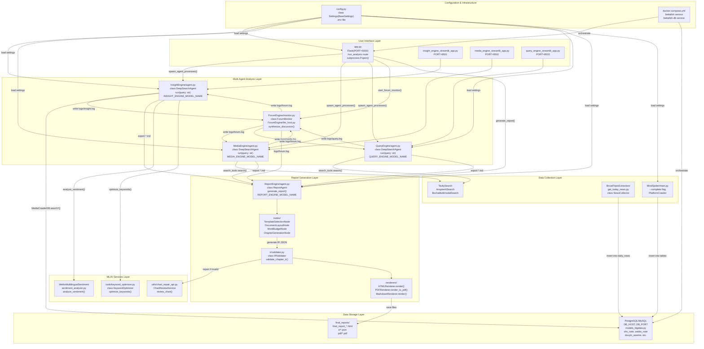

**Architecture Layers**:

1. **User Interface Layer**: Flask orchestrator ([app.py:1-500]()) provides REST API and SocketIO real-time updates. Spawns three Streamlit subprocesses ([SingleEngineApp/]()) for individual agent testing. Optional graph viewer ([graph_viewer.html]()) for GraphRAG visualization.

2. **Multi-Agent Analysis Layer**: Three specialized agents run in parallel via `subprocess.Popen()` ([app.py:225-320]()):
   - **InsightEngine** ([InsightEngine/agent.py:50-400]()): Uses `Kimi K2` for 500K token long-context analysis of private database
   - **MediaEngine** ([MediaEngine/agent.py:50-400]()): Uses `Gemini 2.5 Pro` for multimodal content understanding (videos, images, structured cards)
   - **QueryEngine** ([QueryEngine/agent.py:50-400]()): Uses `DeepSeek Chat` for web search and reasoning
   - **ForumEngine** ([ForumEngine/monitor.py:1-200](), [ForumEngine/llm_host.py:1-150]()): LLM moderator monitors agent communications and provides guidance

3. **Data Collection Layer**: 
   - **MindSpider** ([MindSpider/main.py:1-500]()): 24/7 crawler covering 13+ platforms (Weibo, Zhihu, Bilibili, Douyin, etc.)
   - **NewsCollector** ([MindSpider/BroadTopicExtraction/get_today_news.py:72-235]()): Daily news aggregation from 12+ sources
   - **External APIs**: Fallback to commercial search services (Tavily, Anspire, Bocha)

4. **Data Storage Layer**: 
   - PostgreSQL/MySQL with 15+ tables ([MindSpider/schema/models_bigdata.py:1-500]())
   - Knowledge graph stored as `graphrag.json` ([ReportEngine/graphrag/graph_storage.py:80-397]())
   - Report outputs in `final_reports/` with IR, HTML, PDF, Markdown formats

5. **Report Generation Layer**: Multi-stage pipeline with template selection, layout design, word budget planning, and chapter generation ([ReportEngine/agent.py:150-400]()). IR (Intermediate Representation) acts as canonical format with validators ensuring schema compliance ([ReportEngine/ir/validator.py:1-200]()). Supports HTML, PDF, and Markdown rendering.

**Supporting Services**:
- **ML/AI Services**: Sentiment analysis across 22 languages ([InsightEngine/tools/sentiment_analyzer.py:59-397]()), chart data validation with LLM-based repair ([ReportEngine/utils/chart_repair_api.py:1-300]()), query optimization ([InsightEngine/tools/keyword_optimizer.py:1-150]())
- **Configuration**: Centralized `Settings` class ([config.py:23-136]()) manages API keys, model selections, and feature flags via `.env` file
- **Docker**: Multi-container orchestration ([docker-compose.yml:1-100]()) with database persistence

**Key Architectural Patterns**:
- **Agent Parallelism**: Three agents execute simultaneously, sharing findings via ForumEngine
- **Iterative Refinement**: Reflection loops (max 2-3 iterations) deepen research quality
- **GraphRAG Integration**: Optional knowledge graph enhancement for chapter generation ([ReportEngine/graphrag/]())
- **Multi-Format Output**: Single IR → HTML/PDF/Markdown renderers
- **Graceful Degradation**: System continues with reduced functionality if optional dependencies missing

Sources: [app.py:1-500](), [QueryEngine/agent.py:50-400](), [MediaEngine/agent.py:50-400](), [InsightEngine/agent.py:50-400](), [ReportEngine/agent.py:150-400](), [ForumEngine/monitor.py:1-200](), [ForumEngine/llm_host.py:1-150](), [MindSpider/main.py:1-500](), [config.py:23-136](), [docker-compose.yml:1-100]()

## ForumEngine: The Debate Moderator Model

BettaFish's core innovation is the ForumEngine, which implements a "publish-subscribe with moderation" pattern where an LLM moderator analyzes agent communications and generates guidance:

**Multi-Agent Collaboration Workflow with Method Calls**

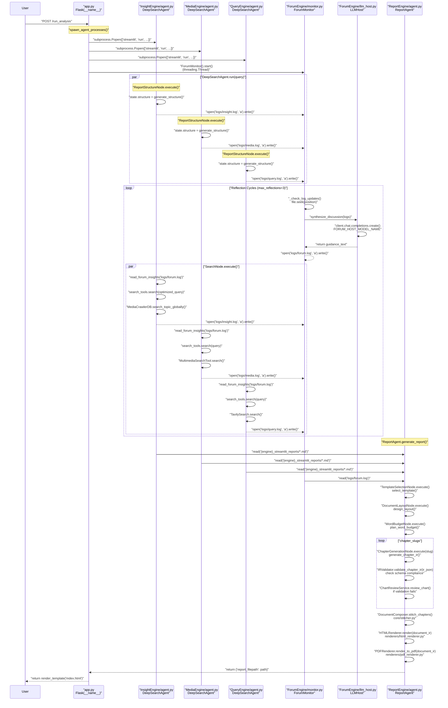

**Temporal Dynamics**:

**Phase 1: Parallel Initialization (Steps 1-3)**
- Three agents launch as independent subprocesses via `subprocess.Popen()` ([app.py:225-320]())
- Each uses its specialized LLM: Kimi K2 (Insight), Gemini 2.5 Pro (Media), DeepSeek (Query)
- `ReportStructureNode` generates initial research outline for each agent
- Forum monitoring thread starts, tracking all agent communications

**Phase 2: Iterative Collaboration Loop (Steps 5-N)**
The system implements a publish-subscribe pattern with moderation:
1. **Communication**: Agents write findings to `logs/{engine}.log` files
2. **Monitoring**: `ForumMonitor` ([ForumEngine/monitor.py:50-150]()) tracks changes using file seek positions
3. **Moderation**: `LLMHost.synthesize_discussion()` ([ForumEngine/llm_host.py:30-100]()) analyzes agent communications and generates guidance
4. **Broadcast**: Guidance is published to `logs/forum.log`
5. **Consumption**: Agents use `forum_reader.read_forum_insights()` ([utils/forum_reader.py:10-50]()) to access forum content
6. **Adaptation**: Each agent adjusts its research strategy based on others' findings

This indirect communication pattern provides:
- **Avoids homogenization**: Agents don't directly influence each other's outputs
- **Preserves specialization**: Each agent maintains its unique perspective
- **Enables moderation**: Host identifies gaps, contradictions, or convergence
- **Creates audit trail**: Complete history of agent interactions

**Phase 3: Report Integration (Step N+1)**
The `ReportAgent` ([ReportEngine/agent.py:123-310]()) acts as synthesis layer:
- Collects all agent outputs (exported as Markdown)
- Incorporates forum discussion logs
- Uses `TemplateSelectionNode` ([ReportEngine/nodes/template_selection_node.py:1-150]()) to determine report structure
- Plans layout via `DocumentLayoutNode` and word budgets via `WordBudgetNode`
- Generates chapters with optional GraphRAG enhancement ([ReportEngine/graphrag/query_engine.py:70-352]())
- Validates via `IRValidator` ([ReportEngine/ir/validator.py:1-200]()) and repairs chart/table data
- Renders to multiple formats via `html_renderer.py`, `pdf_renderer.py`, `markdown_renderer.py`

**Design Benefits**:
- **Subprocess isolation**: Each agent crash doesn't affect others
- **File-based communication**: Simpler than message queues, enables easy debugging
- **LLM moderation**: Host identifies when agents should collaborate vs. diverge
- **Late integration**: Agents complete research before synthesis, avoiding premature convergence

Sources: [app.py](), [ForumEngine/monitor.py](), [ForumEngine/llm_host.py](), [utils/forum_reader.py](), [ReportEngine/agent.py](), [ReportEngine/nodes/template_selection_node.py](), [ReportEngine/nodes/document_layout_node.py](), [ReportEngine/nodes/word_budget_node.py](), [ReportEngine/nodes/chapter_generation_node.py](), [ReportEngine/ir/validator.py](), [ReportEngine/core/stitcher.py](), [ReportEngine/renderers/html_renderer.py](), [ReportEngine/renderers/pdf_renderer.py](), [InsightEngine/agent.py](), [MediaEngine/agent.py](), [QueryEngine/agent.py](), [InsightEngine/tools/search.py](), [MediaEngine/tools/search.py](), [QueryEngine/tools/search.py]()

## Typical Analysis Workflow

A complete BettaFish analysis runs through six phases:

**Workflow Diagram**

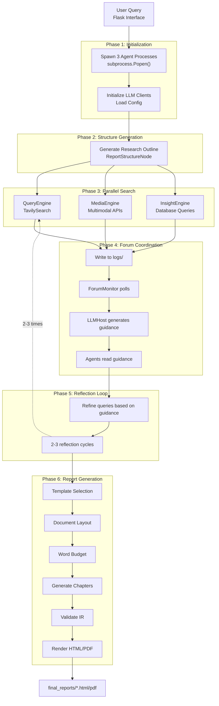

**Phase Descriptions**:

| Phase | Components | Key Actions | Output |
|-------|-----------|-------------|---------|
| **1. Initialization** | `app.py`, agent initialization | Spawn 3 processes, load configs, init LLM clients | Ready agents |
| **2. Structure** | `ReportStructureNode` | LLM generates research outline per agent | Research plan |
| **3. Parallel Search** | `SearchNode`, API tools | Query/Media/Insight agents search independently | Raw findings |
| **4. Forum Coordination** | `ForumMonitor`, `LLMHost` | Monitor logs, synthesize discussion, generate guidance | Guidance prompts |
| **5. Reflection** | Agent reflection logic | Refine queries based on guidance, iterate 2-3 times | Refined findings |
| **6. Report Generation** | `ReportEngine` nodes, renderers | Template selection, layout, chapter generation, rendering | HTML/PDF reports |

Sources: [app.py](), [ForumEngine/monitor.py](), [ReportEngine/agent.py](), [QueryEngine/agent.py](), [MediaEngine/agent.py](), [InsightEngine/agent.py]()

## Data Collection: MindSpider

MindSpider is an independent 24/7 crawler subsystem that operates separately from the agent analysis pipeline, populating a PostgreSQL/MySQL database with social media content and sentiment scores:

**Data Collection Pipeline with Code Entities**

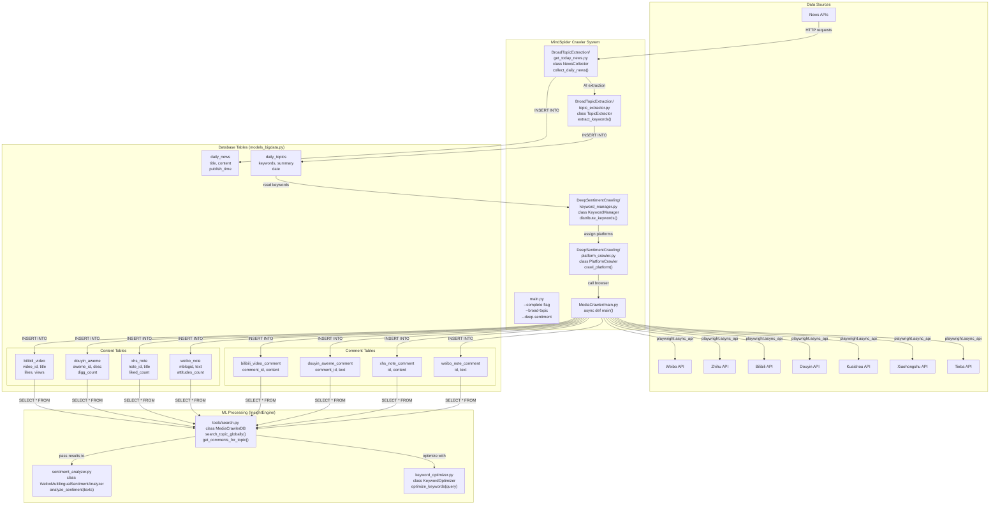

**Data Collection Layer (MindSpider)**

A sophisticated 24/7 crawler system covering **13+ platforms**:

*Social Media*: Weibo, Zhihu, Bilibili, Douyin, Kuaishou, XHS (Xiaohongshu), Tieba
*Technical Communities*: GitHub, Coolapk, and others
*News*: Daily news aggregation via external API

The crawler operates in two modes:
1. **Broad Topic Extraction** ([MindSpider/BroadTopicExtraction/get_today_news.py:72-235]()): Daily collection of trending topics and hot news from 12+ news APIs
2. **Deep Sentiment Crawling** ([MindSpider/DeepSentimentCrawling/platform_crawler.py:1-300]()): Focused collection based on specific queries

Uses **Playwright** for browser automation, handling JavaScript-heavy sites and dynamic content loading.

**Data Storage Architecture**

PostgreSQL/MySQL database with **15 specialized tables** ([MindSpider/schema/models_bigdata.py:1-500]()):

*Dual-Table Pattern*: Each platform has separate content and comment tables
- Content tables (8): Store posts, videos, notes, articles (`bilibili_video`, `douyin_aweme`, `kuaishou_video`, `weibo_note`, `xhs_note`, `zhihu_content`, `tieba_note`, `daily_news`)
- Comment tables (7): Store user comments and replies
- Enables targeted queries (e.g., "get all comments for topic X")

*Schema Design*:
- Unified fields across platforms: `title`, `content`, `likes`, `views`, `shares`, `comments_count`
- Platform-specific fields: `aweme_id` (Douyin), `video_id` (Bilibili)
- Temporal tracking: `publish_time` for trend analysis
- Engagement metrics: Calculate "hotness" via weighted formula

**ML Processing Pipeline**

Three specialized models operate on collected data:

1. **Sentiment Analyzer** ([InsightEngine/tools/sentiment_analyzer.py:59-397]()): 22 languages, 5 levels
   - Model: `tabularisai/multilingual-sentiment-analysis`
   - Output: 非常负面/负面/中性/正面/非常正面 (Very Negative to Very Positive)
   - Processes both content and comments
   - Aggregates sentiment distribution across results

2. **Topic Detector**: Fine-tuned BERT models for Chinese text
   - Multiple model variants for experimentation

3. **Keyword Optimizer** ([InsightEngine/tools/keyword_optimizer.py:1-150]())
   - Uses Qwen LLM API for query refinement
   - Transforms natural language queries into optimized search keywords
   - Context-aware: incorporates previous search results

**Knowledge Graph Construction (GraphRAG)**

Transforms agent outputs into a queryable graph ([ReportEngine/graphrag/graph_builder.py:30-140]()):

*Data Sources*:
- **StateParser**: Extracts sections, search queries, sources from agent exports
- **ForumParser**: Extracts agent communications from forum logs

*Graph Schema* (5 node types, 4 edge types):
```
Topic (user query)
  ├─[analyzed_by]─> Engine (insight/media/query)
  │                   ├─[contains]─> Section (paragraph)
  │                   │                ├─[searched]─> Query (keyword)
  │                   │                │                ├─[found]─> Source (URL)
```

*Storage*: Persisted as `graphrag.json` ([ReportEngine/graphrag/graph_storage.py:80-397]()) in report directories

*Query Capabilities* ([ReportEngine/graphrag/query_engine.py:70-352]()):
- Keyword-based node matching
- Node type filtering (e.g., only sections)
- Engine filtering (e.g., only Insight Engine results)
- Depth expansion (traverse relationships)
- Multi-round querying with history tracking

**Data Flow Patterns**:
1. **Crawl → Store → Analyze**: MindSpider collects, PostgreSQL stores, ML models analyze
2. **Query → Refine → Search**: Queries are optimized before database search
3. **Analyze → Build Graph → Enhance**: Analysis results become knowledge graph for future enhancement

Sources: [MindSpider/main.py](), [MindSpider/BroadTopicExtraction/get_today_news.py](), [MindSpider/BroadTopicExtraction/topic_extractor.py](), [MindSpider/DeepSentimentCrawling/keyword_manager.py](), [MindSpider/DeepSentimentCrawling/platform_crawler.py](), [MindSpider/DeepSentimentCrawling/MediaCrawler/main.py](), [MindSpider/schema/models_bigdata.py](), [InsightEngine/tools/search.py](), [InsightEngine/tools/sentiment_analyzer.py](), [InsightEngine/tools/keyword_optimizer.py]()

## Technology Stack

**Core Technologies**:

| Layer | Technology | Purpose | Version |
|-------|-----------|---------|---------|
| **Web Framework** | Flask, Flask-SocketIO | REST API, real-time updates | ≥2.0.0 |
| **UI** | Streamlit | Agent interfaces | ≥1.20.0 |
| **LLM Integration** | OpenAI Python SDK | Unified LLM interface | ≥1.0.0 |
| **Database** | PostgreSQL or MySQL | Crawler data storage | PostgreSQL ≥15.0, MySQL ≥8.0 |
| **ORM** | SQLAlchemy (async) | Database abstraction | ≥2.0.0 |
| **Browser Automation** | Playwright | Social media crawling | ≥1.30.0 |
| **PDF Rendering** | WeasyPrint, Pango, Cairo | Report export | WeasyPrint ≥57.0 |
| **Configuration** | Pydantic Settings | Environment management | ≥2.0.0 |
| **ML Models** | PyTorch, Transformers, scikit-learn | Sentiment analysis | PyTorch ≥2.0.0 |

**LLM Backend Configuration** (default recommendations):

| Engine | Provider | Model | Rationale | Config Variables |
|--------|----------|-------|-----------|------------------|
| QueryEngine | DeepSeek | deepseek-chat | Reasoning optimization | `QUERY_ENGINE_*` |
| MediaEngine | Google | gemini-2.5-pro | Multimodal capability | `MEDIA_ENGINE_*` |
| InsightEngine | Moonshot | kimi-k2 | 500K context window | `INSIGHT_ENGINE_*` |
| ReportEngine | Google | gemini-2.5-pro | Long-form generation | `REPORT_ENGINE_*` |
| ForumEngine | Alibaba | qwen-plus | Moderation/synthesis | `FORUM_HOST_*` |
| KeywordOptimizer | Alibaba | qwen-plus | SQL keyword expansion | `KEYWORD_OPTIMIZER_*` |

All engines use OpenAI-compatible interface via unified `LLMClient` base class with streaming support, retry logic, and error handling.

Sources: [requirements.txt](), [config.py](), [.env.example](), [QueryEngine/llms/base.py](), [ReportEngine/renderers/pdf_renderer.py]()

## Deployment and Configuration

BettaFish supports flexible deployment through Docker containers or source installation, with centralized configuration management:

**Deployment and Configuration with Environment Variables**

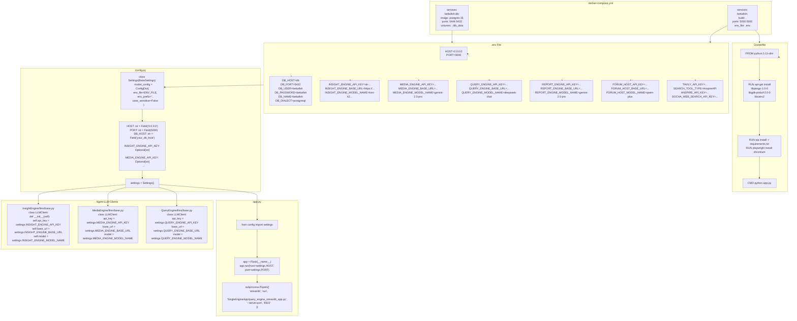

### Docker Deployment (Recommended)

**Two-container architecture**:
- `bettafish` container ([Dockerfile:1-100]()): Python 3.11 application with Flask + 3 Streamlit subprocesses
- `bettafish-db` container: PostgreSQL 15 with persistent volume

```bash
# 1. Configure environment
cp .env.example .env
# Edit .env with API keys and database credentials

# 2. Start services
docker compose up -d

# 3. Access at http://localhost:5000
```

**Container features** ([docker-compose.yml:1-100]()):
- **System Dependencies**: GTK3/Pango/Cairo for PDF rendering, Playwright Chromium (100MB+ download), optional PyTorch CUDA
- **Package Management**: Uses `uv` for fast dependency resolution (10x faster than pip)
- **Volume Mounts**: All logs, reports, and configurations persisted to host (`./logs`, `./final_reports`, `./db_data`)
- **Port Exposure**: 5000 (Flask), 8501-8503 (Streamlit agents), 5444 (PostgreSQL, mapped from 5432)

**Database Configuration** ([docker-compose.yml:20-40]()):
| Variable | Value | Description |
|----------|-------|-------------|
| `DB_HOST` | `db` | Container service name |
| `DB_PORT` | `5432` | Internal PostgreSQL port |
| `DB_USER` | `bettafish` | Database username |
| `DB_PASSWORD` | `bettafish` | Database password |
| `DB_NAME` | `bettafish` | Database name |

Sources: [docker-compose.yml:1-100](), [Dockerfile:1-100]()

### Source Deployment

**Development environment**:
- Python 3.9-3.12 (3.11 recommended)
- Local PostgreSQL or MySQL instance
- Optional: System dependencies for PDF rendering ([static/Partial README for PDF Exporting/README.md:1-95]())

```bash
# 1. Create Python environment
conda create -n bettafish python=3.11
conda activate bettafish

# 2. Install dependencies
pip install -r requirements.txt
playwright install chromium

# 3. Optional: Install PDF rendering dependencies
# Windows: Install GTK3 Runtime from GitHub releases
# macOS: brew install pango gdk-pixbuf libffi
# Ubuntu: sudo apt-get install libpango-1.0-0 libpangoft2-1.0-0 libgdk-pixbuf-2.0-0

# 4. Configure
cp .env.example .env
# Edit .env with API keys and database credentials

# 5. Launch
python app.py
```

**Access**: 
- Flask UI: `http://localhost:5000`
- Standalone agents: `http://localhost:8501-8503`

Sources: [README.md:333-465](), [requirements.txt:1-100](), [.env.example:1-88](), [app.py:1-500](), [static/Partial README for PDF Exporting/README.md:1-95]()

### Configuration Management

**Centralized Settings class** ([config.py:23-136]()) with **priority chain**:
1. Environment variables (highest priority)
2. `.env` file values
3. Hardcoded defaults (lowest priority)

**Configuration Categories**:

1. **LLM Configurations** ([config.py:44-77]()): Per-engine API keys, base URLs, model names
   - Insight Engine: `INSIGHT_ENGINE_API_KEY`, `INSIGHT_ENGINE_BASE_URL`, `INSIGHT_ENGINE_MODEL_NAME`
   - Media Engine: `MEDIA_ENGINE_API_KEY`, `MEDIA_ENGINE_BASE_URL`, `MEDIA_ENGINE_MODEL_NAME`
   - Query Engine: `QUERY_ENGINE_API_KEY`, `QUERY_ENGINE_BASE_URL`, `QUERY_ENGINE_MODEL_NAME`
   - Report Engine: `REPORT_ENGINE_API_KEY`, `REPORT_ENGINE_BASE_URL`, `REPORT_ENGINE_MODEL_NAME`
   - Forum Host: `FORUM_HOST_API_KEY`, `FORUM_HOST_BASE_URL`, `FORUM_HOST_MODEL_NAME`
   - Keyword Optimizer: `KEYWORD_OPTIMIZER_API_KEY`, `KEYWORD_OPTIMIZER_BASE_URL`, `KEYWORD_OPTIMIZER_MODEL_NAME`

2. **Database Configurations** ([config.py:32-39]()): Dialect-agnostic connection strings
   - `DB_DIALECT` (postgresql/mysql)
   - `DB_HOST`, `DB_PORT`, `DB_USER`, `DB_PASSWORD`, `DB_NAME`, `DB_CHARSET`
   - Supports both async (`asyncpg`, `aiomysql`) and sync drivers

3. **Search Tool Configurations** ([config.py:83-94]())
   - `TAVILY_API_KEY`: Tavily web search
   - `SEARCH_TOOL_TYPE`: `AnspireAPI` or `BochaAPI`
   - `ANSPIRE_API_KEY`, `ANSPIRE_BASE_URL`: Anspire multimodal search
   - `BOCHA_WEB_SEARCH_API_KEY`, `BOCHA_BASE_URL`: Bocha multimodal search

4. **System Configurations** ([config.py:79-108]())
   - `MAX_REFLECTIONS`: Agent reflection loop limit (default: 3)
   - `GRAPHRAG_ENABLED`: Enable knowledge graph (default: False)
   - `GRAPHRAG_MAX_QUERIES`: GraphRAG query limit per chapter (default: 3)
   - `MAX_CONTENT_LENGTH`: Search result max length (default: 500000)

**External Service Integration**:

The system integrates with **8 external APIs**, all using OpenAI-compatible interface via unified `LLMClient` base class ([QueryEngine/llms/base.py:1-150](), [MediaEngine/llms/base.py:1-150](), [InsightEngine/llms/base.py:1-150]()):

*LLM Providers*:
- **Gemini 2.5 Pro**: Media Engine (multimodal), Report Engine (long-form generation)
- **Kimi K2**: Insight Engine (500K token long context)
- **DeepSeek Chat**: Query Engine (reasoning)
- **Qwen Plus**: Forum Host (moderation), Keyword Optimizer (SQL expansion)

*Search APIs*:
- **Tavily**: Query Engine's primary web search
- **Bocha**: Media Engine's multimodal search (Modal Cards)
- **Anspire**: Alternative search backend

**Configuration Hot-Reload**: Flask `/api/config` endpoint allows runtime updates ([app.py:400-450]()). Changes written to `.env` file, reloaded via `config.reload_settings()` ([config.py:122-136]()).

Sources: [docker-compose.yml](), [Dockerfile](), [.env.example](), [config.py:23-136](), [app.py](), [InsightEngine/llms/base.py](), [MediaEngine/llms/base.py](), [QueryEngine/llms/base.py](), [requirements.txt]()

## Execution Modes and Entry Points

BettaFish supports five execution modes:

| Mode | Entry Point | CLI Invocation | Process Model | Use Cases |
|------|-------------|----------------|---------------|-----------|
| **Orchestrated Multi-Agent** | [app.py]() | `python app.py` | Flask + 3 Streamlit subprocesses | Production analysis runs |
| **Standalone Agent** | [SingleEngineApp/{engine}_streamlit_app.py]() | `streamlit run SingleEngineApp/query_engine_streamlit_app.py --server.port 8503` | Single Streamlit process | Agent development, testing |
| **Crawler Execution** | [MindSpider/main.py]() | `cd MindSpider && python main.py --complete --date 2024-01-20` | Single process with async DB writes | Database population |
| **Report-Only Mode** | [report_engine_only.py]() | `python report_engine_only.py --query "Topic"` | Single process, reads existing logs | Template testing, re-rendering |
| **HTML→PDF Conversion** | [regenerate_latest_pdf.py]() | `python regenerate_latest_pdf.py` | Single process, IR-to-PDF only | Post-processing reports |

**Mode 1: Orchestrated Multi-Agent** ([app.py]())
- Flask binds to `0.0.0.0:5000`
- Route `/run_analysis` (POST) spawns 3 Streamlit agents via `subprocess.Popen()`
- Route `/get_report_status` (GET) polls agent log files for progress
- SocketIO emits real-time updates to browser client
- ForumMonitor thread starts automatically on Flask init

**Mode 2: Standalone Agent** ([SingleEngineApp/]())
```bash
# Query Agent (web/news search)
streamlit run SingleEngineApp/query_engine_streamlit_app.py --server.port 8503

# Media Agent (multimodal analysis)
streamlit run SingleEngineApp/media_engine_streamlit_app.py --server.port 8502

# Insight Agent (database mining)
streamlit run SingleEngineApp/insight_engine_streamlit_app.py --server.port 8501
```
Each agent runs independently, writing to `{engine}_streamlit_reports/` directory instead of shared `logs/`.

**Mode 3: Crawler Execution** ([MindSpider/main.py]())
```bash
cd MindSpider

# Database initialization (first-time only)
python main.py --setup

# Phase 1 only: Broad topic extraction
python main.py --broad-topic --date 2024-01-20

# Phase 2 only: Deep sentiment crawling (requires --broad-topic first)
python main.py --deep-sentiment --platforms xhs wb dy bl zhi ks tb

# Complete workflow: Phase 1 → Phase 2
python main.py --complete --date 2024-01-20
```
Flags: `--setup` (init DB), `--broad-topic` (news APIs), `--deep-sentiment` (social platforms), `--complete` (both phases), `--date` (target date for news), `--platforms` (space-separated: xhs=Xiaohongshu, wb=Weibo, dy=Douyin, bl=Bilibili, zhi=Zhihu, ks=Kuaishou, tb=Tieba).

**Mode 4: Report-Only Mode** ([report_engine_only.py]())
```bash
# Auto-detect topic from latest log files
python report_engine_only.py

# Specify custom topic
python report_engine_only.py --query "武汉大学舆情分析"

# Skip PDF generation (faster, HTML only)
python report_engine_only.py --skip-pdf

# Skip Markdown generation
python report_engine_only.py --skip-markdown

# Enable GraphRAG with custom query limit
python report_engine_only.py --graphrag-enabled true --graphrag-max-queries 5

# Verbose logging
python report_engine_only.py --verbose
```
Reads from: `query_engine_streamlit_reports/`, `media_engine_streamlit_reports/`, `insight_engine_streamlit_reports/`, `logs/forum.log`.
Writes to: `final_reports/final_report_{topic}_{timestamp}.html`, `final_reports/pdf/`, `final_reports/md/`.

**Mode 5: HTML→PDF Conversion** ([regenerate_latest_pdf.py]())
```bash
# Convert latest IR JSON to PDF
python regenerate_latest_pdf.py
```
Reads from: `final_reports/ir/*.json` (latest by timestamp).
Writes to: `final_reports/pdf/{filename}.pdf` with SVG-converted charts.

**Process monitoring**: Flask monitors Streamlit subprocesses via `FileCountBaseline` pattern (checks log file line count increments). If agent crashes, Flask logs error and continues.

Sources: [app.py](), [SingleEngineApp/query_engine_streamlit_app.py](), [SingleEngineApp/media_engine_streamlit_app.py](), [SingleEngineApp/insight_engine_streamlit_app.py](), [MindSpider/main.py](), [report_engine_only.py](), [regenerate_latest_pdf.py](), [README.md:422-541]()

## System Requirements and Limitations

**Hardware requirements:**
| Resource | Minimum | Recommended | Notes |
|----------|---------|-------------|-------|
| RAM | 2GB | 4GB+ | Concurrent agent execution + LLM streaming |
| Storage | 10GB | 50GB+ | Base install ~5GB; crawler data grows to 100GB+ |
| CPU | 2 cores | 4+ cores | Parallel agent + ForumMonitor thread |
| Network | 10 Mbps | 50+ Mbps | LLM API calls, web search, crawler |

**Software requirements:**
- **OS**: Windows 10+, macOS 11+, Ubuntu 20.04+, Debian 11+, CentOS 8+
- **Python**: 3.9-3.12 (3.11 recommended for best compatibility)
- **Database**: PostgreSQL 15+ (recommended) or MySQL 8.0+
- **Browser**: Chromium for Playwright (auto-installed via `playwright install chromium`)

**Optional dependencies:**
- **PDF rendering**: GTK3, Pango, Cairo libraries (see [static/Partial README for PDF Exporting/]())
- **Sentiment models**: GPU with CUDA for faster inference (CPU fallback available)

**API costs** (estimated per analysis run):
- LLM tokens: 50k-200k tokens (~$0.50-$2.00 depending on provider)
- Search APIs: 50-200 requests (~$0.10-$0.50 for Tavily/Bocha quotas)

**Known limitations:**
1. **Legal compliance**: Crawler users must respect `robots.txt` and platform Terms of Service ([README.md:734-762]()). BettaFish is for educational/research use only.
2. **PDF rendering**: Requires GTK3/Pango system libraries. If unavailable, system gracefully degrades to HTML-only output.
3. **Rate limiting**: Search APIs have usage quotas. Configure retry logic in [utils/retry_helper.py]() with exponential backoff.
4. **Concurrent execution**: ForumMonitor thread + 3 agent processes + Flask main thread = 5 concurrent processes minimum.
5. **Database size**: MindSpider crawler can generate 1M+ records per week. Regular maintenance required for pruning old data.
6. **LLM context limits**: Chapter generation fails if agent logs exceed LLM context window (128k tokens for Gemini, 200k for Kimi). System implements chunk-based processing as fallback.

**Troubleshooting**: See FAQ at https://github.com/666ghj/BettaFish/issues/185 for common issues.

Sources: [README.md:338-347](), [README.md:734-762](), [static/Partial README for PDF Exporting/README.md](), [utils/retry_helper.py]()

## Project Structure

Repository organization:

```
BettaFish/
├── QueryEngine/                # Web/news search agent
│   ├── agent.py                # DeepSearchAgent class
│   ├── llms/base.py            # LLM client (OpenAI-compatible)
│   ├── nodes/                  # SearchNode, FormattingNode, SummaryNode
│   ├── tools/search.py         # TavilySearchTool, BochaSearchTool
│   ├── state/state.py          # Agent state dataclass
│   ├── prompts/prompts.py      # LLM prompt templates
│   └── utils/config.py         # Pydantic Settings
├── MediaEngine/                # Multimodal content agent
│   ├── agent.py
│   ├── llms/base.py
│   ├── nodes/
│   ├── tools/search.py         # MultimediaSearchTool, AnspireAPI
│   ├── state/state.py
│   ├── prompts/prompts.py
│   └── utils/config.py
├── InsightEngine/              # Private database mining agent
│   ├── agent.py
│   ├── llms/base.py
│   ├── nodes/
│   ├── tools/
│   │   ├── search.py           # MediaCrawlerDB class
│   │   ├── keyword_optimizer.py # Qwen-based query expansion
│   │   └── sentiment_analyzer.py # WeiboMultilingualSentimentAnalyzer
│   ├── state/state.py
│   ├── prompts/prompts.py
│   └── utils/
│       ├── config.py
│       └── db.py               # SQLAlchemy async engine
├── ReportEngine/               # Multi-stage report generation
│   ├── agent.py                # ReportAgent orchestrator
│   ├── flask_interface.py      # SSE streaming for Flask
│   ├── llms/base.py
│   ├── core/
│   │   ├── template_parser.py  # Markdown template slicer
│   │   ├── chapter_storage.py  # Chapter run directory manager
│   │   └── stitcher.py         # Document IR assembler
│   ├── ir/
│   │   ├── schema.py           # Block type constants
│   │   └── validator.py        # JSON schema validator
│   ├── graphrag/               # Knowledge graph subsystem
│   │   ├── graph_builder.py
│   │   ├── graph_storage.py
│   │   └── query_engine.py
│   ├── nodes/
│   │   ├── template_selection_node.py
│   │   ├── document_layout_node.py
│   │   ├── word_budget_node.py
│   │   └── chapter_generation_node.py
│   ├── prompts/prompts.py
│   ├── renderers/
│   │   ├── html_renderer.py    # Chart.js hydration
│   │   ├── pdf_renderer.py     # WeasyPrint wrapper
│   │   ├── pdf_layout_optimizer.py
│   │   └── chart_to_svg.py
│   ├── state/state.py
│   ├── utils/
│   │   ├── config.py
│   │   ├── json_parser.py      # RobustJSONParser
│   │   ├── chart_validator.py
│   │   └── chart_repair_api.py
│   └── report_template/        # Markdown templates
│       └── 企业品牌声誉分析报告.md
├── ForumEngine/                # Agent coordination mechanism
│   ├── monitor.py              # ForumMonitor thread class
│   ├── llm_host.py             # LLMHost discussion synthesis
│   └── __init__.py
├── MindSpider/                 # Social media crawler system
│   ├── main.py                 # CLI entry point
│   ├── config.py
│   ├── BroadTopicExtraction/   # Phase 1: News topic discovery
│   │   ├── main.py
│   │   ├── get_today_news.py   # NewsCollector (12 APIs)
│   │   └── topic_extractor.py  # LLM-based keyword extraction
│   ├── DeepSentimentCrawling/  # Phase 2: Platform crawling
│   │   ├── main.py
│   │   ├── keyword_manager.py
│   │   ├── platform_crawler.py
│   │   └── MediaCrawler/       # Playwright automation
│   │       ├── main.py
│   │       └── media_platform/ # 7 platform implementations
│   │           ├── xhs/
│   │           ├── weibo/
│   │           ├── douyin/
│   │           ├── bilibili/
│   │           ├── zhihu/
│   │           ├── kuaishou/
│   │           └── tieba/
│   └── schema/                 # Database schema
│       ├── db_manager.py       # SQLAlchemy manager
│       ├── init_database.py    # DB initialization
│       ├── mindspider_tables.sql # 17 table definitions
│       ├── models_bigdata.py   # Content/comment ORM models
│       └── models_sa.py        # Meta table models
├── SentimentAnalysisModel/     # 5 sentiment model variants
│   ├── WeiboSentiment_Finetuned/
│   │   ├── BertChinese-Lora/
│   │   └── GPT2-Lora/
│   ├── WeiboMultilingualSentiment/
│   ├── WeiboSentiment_SmallQwen/
│   └── WeiboSentiment_MachineLearning/
├── SingleEngineApp/            # Standalone Streamlit UIs
│   ├── query_engine_streamlit_app.py
│   ├── media_engine_streamlit_app.py
│   └── insight_engine_streamlit_app.py
├── utils/                      # Shared utilities
│   ├── forum_reader.py         # read_forum_insights()
│   ├── retry_helper.py         # Exponential backoff
│   └── github_issues.py        # Error reporting helper
├── tests/                      # Unit/integration tests
│   ├── run_tests.py
│   ├── test_monitor.py
│   └── test_report_engine_sanitization.py
├── logs/                       # Runtime logs (gitignored)
│   ├── query.log
│   ├── media.log
│   ├── insight.log
│   └── forum.log
├── final_reports/              # Generated reports (gitignored)
│   ├── *.html
│   ├── pdf/
│   ├── md/
│   ├── ir/                     # IR JSON documents
│   └── errors/                 # Chapter generation errors
├── chapters/                   # Chapter run directories (gitignored)
│   └── run_{timestamp}/
│       ├── chapter_*.json
│       └── manifest.json
├── app.py                      # Flask orchestrator (entry point)
├── config.py                   # Global Pydantic Settings
├── .env.example                # Environment variable template
├── docker-compose.yml          # Multi-service orchestration
├── Dockerfile                  # Application container
├── requirements.txt            # Python dependencies
├── regenerate_latest_html.py   # HTML re-rendering utility
├── regenerate_latest_md.py     # Markdown re-rendering utility
├── regenerate_latest_pdf.py    # PDF re-rendering utility
├── report_engine_only.py       # Report-only CLI mode
├── README.md                   # Chinese documentation
├── README-EN.md                # English documentation
├── CONTRIBUTING.md             # Contribution guidelines
└── LICENSE                     # GPL-2.0 license
```

**Standard engine structure** (`{QueryEngine,MediaEngine,InsightEngine}/`):
- `agent.py`: `DeepSearchAgent` orchestrator with `.run(query: str)` method
- `llms/base.py`: `LLMClient` wrapper with OpenAI-compatible interface
- `nodes/`: Processing nodes inheriting from `BaseNode` with `.execute()` method
- `tools/`: Domain-specific tools (`*SearchTool` classes)
- `state/state.py`: Pydantic dataclass for agent state serialization
- `prompts/prompts.py`: String templates with `{placeholder}` substitution
- `utils/config.py`: Pydantic `Settings` with environment variable binding

Sources: [README.md:121-297]()

## Next Steps

For hands-on system setup, proceed to [Getting Started](#2). To understand the multi-agent collaboration mechanism in detail, see [System Architecture](#3). For information on individual agent capabilities, refer to [Core Agents](#4). To learn about the report generation pipeline, see [Report Generation System](#5).

For questions and troubleshooting, consult the [FAQ](https://github.com/666ghj/BettaFish/issues/185) or file an issue on the [GitHub repository](https://github.com/666ghj/BettaFish/issues).

Sources: [README.md:754-761]()

---

# Page: Getting Started

# Getting Started

<details>
<summary>Relevant source files</summary>

The following files were used as context for generating this wiki page:

- [.env.example](.env.example)
- [MindSpider/BroadTopicExtraction/get_today_news.py](MindSpider/BroadTopicExtraction/get_today_news.py)
- [README-EN.md](README-EN.md)
- [README.md](README.md)
- [ReportEngine/utils/json_parser.py](ReportEngine/utils/json_parser.py)
- [ReportEngine/utils/test_json_parser.py](ReportEngine/utils/test_json_parser.py)
- [config.py](config.py)
- [report_engine_only.py](report_engine_only.py)
- [requirements.txt](requirements.txt)
- [static/Partial README for PDF Exporting/README-EN.md](static/Partial README for PDF Exporting/README-EN.md)
- [static/Partial README for PDF Exporting/README.md](static/Partial README for PDF Exporting/README.md)
- [static/image/framework.png](static/image/framework.png)
- [static/image/logo_SwiftProxy.png](static/image/logo_SwiftProxy.png)

</details>


This document provides an overview of initial setup and deployment options for BettaFish. It covers the two primary deployment methods (Docker and source-based), configuration requirements, and basic system startup procedures. For detailed instructions on each step, refer to the subsections below.

**Scope:**
- Overview of deployment architectures and entry points
- Configuration file structure and requirements
- System startup procedures and verification
- First-time usage workflows

**Related Pages:**
- For overall system architecture, see [Overview](#1)
- For detailed installation procedures, see [Installation](#2.1)
- For configuration parameters reference, see [Configuration](#2.2)
- For running workflows and monitoring, see [Running the System](#2.3)
- For Docker-specific deployment, see [Docker Deployment](#2.4)

## Deployment Options

BettaFish supports two deployment methods with different complexity and isolation characteristics:

| Method | Entry Point | Isolation | Setup Complexity | Use Case |
|--------|-------------|-----------|------------------|----------|
| Docker Compose | [docker-compose.yml:1-100]() | Full containerization | Low | Production, first-time users |
| Source-based | [app.py:1-500]() | Host-level processes | Medium | Development, customization |

Both methods require:
1. Database (PostgreSQL or MySQL)
2. LLM API credentials (OpenAI-compatible endpoints)
3. Python 3.9+ (source-based only)
4. Optional: Pango system libraries for PDF export

## System Entry Points

BettaFish has multiple entry points depending on the usage mode:

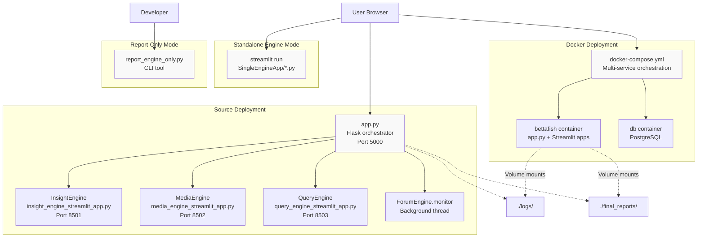

**Sources:** [README.md:300-523](), [README-EN.md:299-522](), [app.py:1-50](), [docker-compose.yml:1-50]()

### Flask Orchestrator (app.py)

The primary entry point for coordinated multi-agent workflows. The Flask application at [app.py]() performs:

1. **Process Management:** Launches and monitors Streamlit subprocess health via file counting baseline
2. **API Coordination:** Routes requests to appropriate engines
3. **ForumEngine Integration:** Starts background monitoring thread from [ForumEngine/monitor.py]()
4. **Report Generation:** Coordinates [ReportEngine/agent.py]() for final report assembly

**Key Routes:**
- `/` - Main UI (serves [templates/index.html]())
- `/api/run_analysis` - Triggers multi-agent analysis
- `/api/generate_report` - Invokes report generation pipeline

### Streamlit Applications

Three independent Streamlit applications provide standalone engine interfaces:

| Engine | File | Port | Purpose |
|--------|------|------|---------|
| InsightEngine | [SingleEngineApp/insight_engine_streamlit_app.py]() | 8501 | Private database mining |
| MediaEngine | [SingleEngineApp/media_engine_streamlit_app.py]() | 8502 | Multimodal content analysis |
| QueryEngine | [SingleEngineApp/query_engine_streamlit_app.py]() | 8503 | Web/news search |

Each app can accept URL parameters for direct query execution without Flask orchestration.

**Sources:** [README.md:455-466](), [README-EN.md:449-460]()

## Configuration Architecture

Configuration flows from environment variables through centralized configuration modules to individual agents:

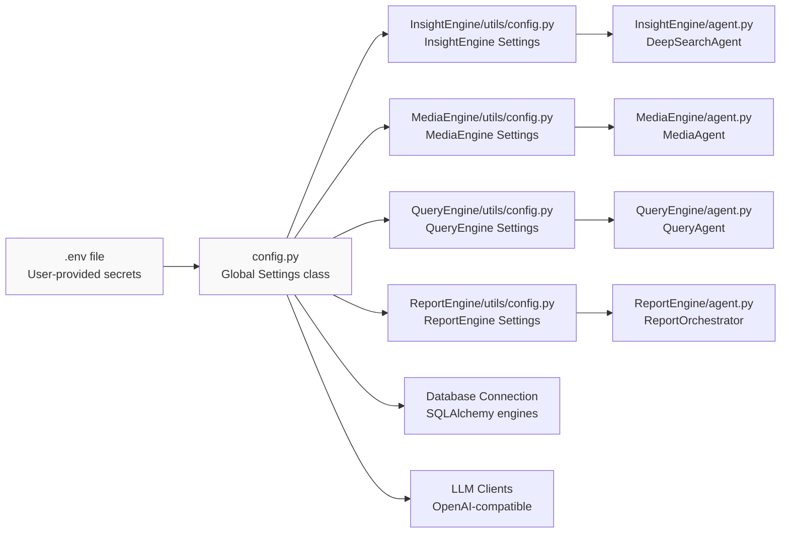

**Sources:** [README.md:392-425](), [README-EN.md:386-420](), [config.py:1-50]()

### Required Configuration Parameters

The [.env.example]() file template defines required parameters organized by category:

**Database Configuration:**
- `DB_HOST` - Database server hostname (e.g., `db` for Docker, `localhost` for source)
- `DB_PORT` - Database port (5432 for PostgreSQL, 3306 for MySQL)
- `DB_USER` - Database username
- `DB_PASSWORD` - Database password
- `DB_NAME` - Database name
- `DB_DIALECT` - Database type (`postgresql` or `mysql`)

**LLM Configuration (per engine):**
Each engine requires:
- `{ENGINE}_API_KEY` - API key for LLM provider
- `{ENGINE}_BASE_URL` - Base URL for OpenAI-compatible endpoint
- `{ENGINE}_MODEL_NAME` - Model identifier

Where `{ENGINE}` is one of: `INSIGHT_ENGINE`, `MEDIA_ENGINE`, `QUERY_ENGINE`, `REPORT_ENGINE`, `FORUM_ENGINE`

**Optional Search API Configuration:**
- `TAVILY_API_KEY` - For QueryEngine web search
- `BOCHA_API_KEY` - For MediaEngine multimodal search
- `ANSPIRE_API_KEY` - Alternative search provider

**Sources:** [README.md:314-336](), [README-EN.md:313-330](), [.env.example:1-100]()

## First Run Workflow

The typical first-run sequence for a complete analysis:

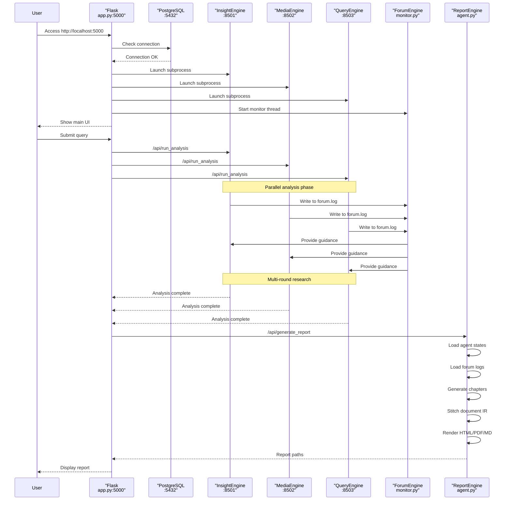

**Sources:** [README.md:105-118](), [README-EN.md:104-116](), [app.py:1-100]()

### Verification Steps

After first startup, verify each component:

1. **Flask Orchestrator:**
   ```bash
   curl http://localhost:5000/health
   ```
   Expected: HTTP 200 response

2. **Streamlit Engines:**
   - InsightEngine: `http://localhost:8501`
   - MediaEngine: `http://localhost:8502`
   - QueryEngine: `http://localhost:8503`
   
   Expected: Streamlit UI loads for each

3. **Database Connection:**
   Check logs in [./logs/]() directory for successful database initialization messages

4. **File System:**
   Verify writable directories exist:
   - [./logs/]() - System logs
   - [./final_reports/]() - Generated reports
   - [./chapters/]() - Chapter data and IR
   - [./*_engine_streamlit_reports/]() - Engine-specific outputs

**Sources:** [README.md:452-453](), [README-EN.md:447-448]()

## Docker Deployment Quick Reference

For Docker-based deployment, the minimal startup sequence:

```bash
# 1. Copy environment template
cp .env.example .env

# 2. Edit .env with your credentials
# (Database, LLM API keys)

# 3. Start all services
docker compose up -d

# 4. Access web interface
# http://localhost:5000
```

The [docker-compose.yml]() defines two services:
- `bettafish` - Main application container (exposes ports 5000, 8501-8503)
- `db` - PostgreSQL 15 database (internal port 5432, mapped to 5444 on host)

Volume mounts preserve data across container restarts:
- `./logs:/app/logs`
- `./final_reports:/app/final_reports`
- `./chapters:/app/chapters`
- `./db_data:/var/lib/postgresql/data`

**Sources:** [README.md:300-336](), [README-EN.md:299-330](), [docker-compose.yml:1-100]()

## Source Deployment Quick Reference

For source-based deployment with Conda:

```bash
# 1. Create environment
conda create -n bettafish python=3.11
conda activate bettafish

# 2. Install dependencies
pip install -r requirements.txt

# 3. Install Playwright browsers
playwright install chromium

# 4. Configure environment
cp .env.example .env
# Edit .env with your credentials

# 5. Start Flask orchestrator
python app.py
```

Alternative with `uv` package manager:

```bash
# 1. Create environment
uv venv --python 3.11

# 2. Activate (Windows)
.venv\Scripts\activate
# Activate (Unix)
source .venv/bin/activate

# 3. Install dependencies (faster)
uv pip install -r requirements.txt

# 4-5. Same as Conda method above
```

**Sources:** [README.md:337-453](), [README-EN.md:332-448]()

## PDF Export Prerequisites

PDF generation requires system-level Pango libraries. This is optional - HTML and Markdown outputs work without it.

**Dependency Check:**
```bash
python -m ReportEngine.utils.dependency_check
```

Expected output if configured correctly:
```
✓ Pango dependency check passed
```

If Pango is unavailable:
- System will log warnings but continue
- PDF generation will be skipped
- HTML and Markdown outputs remain functional

**Installation guides** for different platforms are detailed in [Installation](#2.1). Key files:
- [static/Partial README for PDF Exporting/README.md]() - Chinese guide
- [static/Partial README for PDF Exporting/README-EN.md]() - English guide

The [ReportEngine/utils/dependency_check.py]() module performs runtime validation of Pango availability.

**Sources:** [README.md:366-382](), [README-EN.md:361-377](), [static/Partial README for PDF Exporting/README.md:1-95](), [static/Partial README for PDF Exporting/README-EN.md:1-87]()

## Command-Line Tools

BettaFish provides CLI utilities for specific workflows:

### report_engine_only.py

Generates reports from existing engine outputs without re-running analysis. Useful for:
- Rapid report regeneration with different templates
- Debugging report generation pipeline
- Batch processing of multiple analysis runs

```bash
# Basic usage (auto-detects latest results)
python report_engine_only.py

# Specify query topic
python report_engine_only.py --query "土木工程行业分析"

# Control output formats
python report_engine_only.py --skip-pdf --skip-markdown

# Enable GraphRAG enhancement
python report_engine_only.py --graphrag-enabled true --graphrag-max-queries 3
```

This tool:
1. Locates latest `.md` files in engine report directories
2. Confirms file selection with user
3. Bypasses Flask orchestration
4. Directly invokes [ReportEngine/agent.py]()
5. Saves outputs to [./final_reports/]()

**Sources:** [README.md:498-542](), [README-EN.md:492-541]()

### MindSpider Crawler

Data acquisition tool for populating the private opinion database. Runs independently from main system:

```bash
cd MindSpider

# Initialize database schema
python main.py --setup

# Extract trending topics
python main.py --broad-topic --date 2024-01-20

# Run deep sentiment crawling
python main.py --deep-sentiment --platforms xhs dy wb

# Complete workflow
python main.py --complete --date 2024-01-20
```

Crawler components:
- [MindSpider/main.py]() - Entry point and CLI parser
- [MindSpider/BroadTopicExtraction/]() - News API topic extraction
- [MindSpider/DeepSentimentCrawling/]() - Platform-specific scrapers
- [MindSpider/schema/]() - Database schema definitions

**Sources:** [README.md:467-496](), [README-EN.md:463-490]()

## Standalone Engine Usage

Each Streamlit app can run independently for single-engine workflows:

```bash
# InsightEngine (database analysis only)
streamlit run SingleEngineApp/insight_engine_streamlit_app.py --server.port 8501

# MediaEngine (multimodal search only)
streamlit run SingleEngineApp/media_engine_streamlit_app.py --server.port 8502

# QueryEngine (web/news search only)
streamlit run SingleEngineApp/query_engine_streamlit_app.py --server.port 8503
```

In standalone mode:
- No ForumEngine coordination occurs
- No multi-agent collaboration
- Direct output to engine-specific directories:
  - [./insight_engine_streamlit_reports/]()
  - [./media_engine_streamlit_reports/]()
  - [./query_engine_streamlit_reports/]()
- Faster startup (single process)
- Useful for testing individual engine capabilities

**Sources:** [README.md:455-466](), [README-EN.md:449-460]()

## Troubleshooting Common Issues

### Port Already in Use

**Symptom:** Streamlit processes fail to start after abnormal termination

**Solution:**
```bash
# Find process using port (Unix)
lsof -i :8501

# Find process using port (Windows)
netstat -ano | findstr :8501

# Kill the process
kill -9 <PID>  # Unix
taskkill /PID <PID> /F  # Windows
```

**Sources:** [README.md:448-449](), [README-EN.md:443-444]()

### Database Connection Failed

**Symptom:** Cannot connect to database on startup

**Verification:**
1. Check database service is running:
   ```bash
   # Docker
   docker compose ps
   
   # Local PostgreSQL
   systemctl status postgresql  # Linux
   ```

2. Verify `.env` configuration matches database settings:
   - For Docker: `DB_HOST=db`, `DB_PORT=5432`
   - For local: `DB_HOST=localhost`, `DB_PORT=<actual_port>`

3. Test connection manually:
   ```bash
   # PostgreSQL
   psql -h localhost -p 5432 -U bettafish -d bettafish
   
   # MySQL
   mysql -h localhost -P 3306 -u bettafish -p bettafish
   ```

**Sources:** [README.md:316-328](), [README-EN.md:315-325]()

### LLM API Errors

**Symptom:** Agent fails with API authentication or rate limit errors

**Diagnosis:**
Check logs in [./logs/]() for specific error messages:
- `401 Unauthorized` - Invalid API key
- `429 Rate Limit` - Quota exceeded
- `500 Server Error` - Provider-side issues

**Resolution:**
1. Verify API keys in `.env` are current
2. Check API endpoint URLs use correct format (must be OpenAI-compatible)
3. Ensure sufficient API credits/quota
4. Review provider-specific rate limits

**Sources:** [README.md:392-425](), [README-EN.md:386-420]()

## Next Steps

After successful setup:

1. **Run First Analysis:** Submit a query through Flask UI at `http://localhost:5000`
2. **Review Results:** Examine generated reports in [./final_reports/]()
3. **Customize Templates:** Add custom report templates to [ReportEngine/report_template/]()
4. **Integrate Private Data:** Connect business databases via [InsightEngine/tools/]()
5. **Fine-tune Agents:** Adjust parameters in engine-specific `config.py` files

For detailed information on running workflows and monitoring, see [Running the System](#2.3).

**Sources:** [README.md:1-813](), [README-EN.md:1-797]()

---

# Page: Installation

# Installation

<details>
<summary>Relevant source files</summary>

The following files were used as context for generating this wiki page:

- [.dockerignore](.dockerignore)
- [Dockerfile](Dockerfile)
- [InsightEngine/tools/sentiment_analyzer.py](InsightEngine/tools/sentiment_analyzer.py)
- [MindSpider/BroadTopicExtraction/get_today_news.py](MindSpider/BroadTopicExtraction/get_today_news.py)
- [ReportEngine/utils/dependency_check.py](ReportEngine/utils/dependency_check.py)
- [ReportEngine/utils/json_parser.py](ReportEngine/utils/json_parser.py)
- [ReportEngine/utils/test_json_parser.py](ReportEngine/utils/test_json_parser.py)
- [docker-compose.yml](docker-compose.yml)
- [requirements.txt](requirements.txt)

</details>


This page documents the installation process for the BettaFish multi-agent public opinion analysis platform. It covers system prerequisites, Python dependencies, and platform-specific configuration requirements. For information about configuring the system after installation, see [Configuration](#2.2). For Docker-based deployment, see [Docker Deployment](#2.4).

## Overview

BettaFish requires Python 3.11 and several system-level dependencies for full functionality. The installation process involves:

1. Installing system dependencies (Pango, GTK3 libraries, FFmpeg)
2. Installing Python packages via `requirements.txt`
3. Installing Playwright browser binaries
4. Verifying PDF generation capabilities (optional but recommended)

**Deployment Options:**
- **Local Installation**: Direct installation on the host system (documented here)
- **Docker Installation**: Containerized deployment with pre-configured dependencies (see [Docker Deployment](#2.4))

## Prerequisites

### System Requirements

| Component | Requirement | Notes |
|-----------|-------------|-------|
| Python | 3.11.x | Specified in [Dockerfile:1]() |
| Operating System | Windows 10+, macOS 10.15+, Linux (Ubuntu 20.04+, CentOS 8+) | Cross-platform support |
| Memory | 4GB minimum, 8GB recommended | For LLM API calls and data processing |
| Disk Space | 2GB minimum | For dependencies and Playwright browsers |
| Network | Internet access | For LLM APIs, search APIs, and package downloads |

### Required Accounts and API Keys

Before installation, ensure you have:

- **LLM API credentials**: OpenAI-compatible endpoint (DeepSeek, Qwen, etc.)
- **Database credentials**: PostgreSQL or MySQL connection details
- **Search API keys** (optional): Tavily, Bocha, Anspire for MediaEngine and QueryEngine

These will be configured in `.env` after installation (see [Configuration](#2.2)).

**Sources:** [Dockerfile:1-2](), [requirements.txt:1-88](), [docker-compose.yml:26-39]()

## Installation Methods Comparison

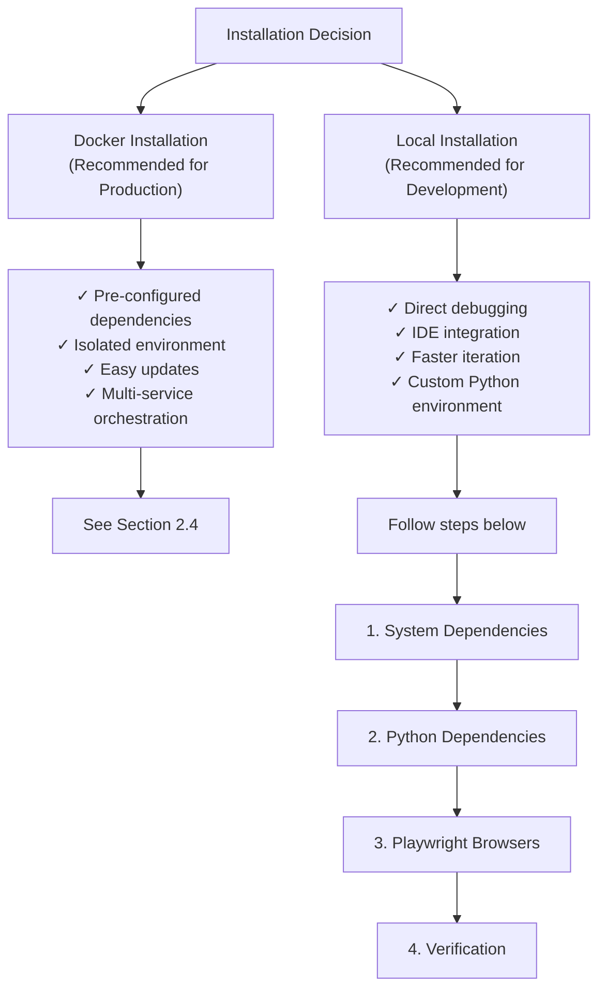

**Sources:** [Dockerfile:1-78](), [docker-compose.yml:1-40]()

## Local Installation Steps

### Step 1: System Dependencies

BettaFish requires several system libraries for PDF generation, web scraping, and media processing.

#### Linux (Ubuntu/Debian)

```bash
# Update package list
sudo apt-get update

# Install core dependencies
sudo apt-get install -y \
    build-essential \
    curl \
    git \
    python3.11 \
    python3.11-dev \
    python3-pip

# Install PDF generation dependencies (Pango, Cairo)
sudo apt-get install -y \
    libpango-1.0-0 \
    libpangoft2-1.0-0 \
    libpangocairo-1.0-0 \
    libffi-dev \
    libcairo2 \
    libgdk-pixbuf-2.0-0

# Install Playwright system dependencies
sudo apt-get install -y \
    libgl1 \
    libglib2.0-0 \
    libgtk-3-0 \
    libnss3 \
    libxcomposite1 \
    libxdamage1 \
    libxrandr2 \
    libasound2 \
    libgbm1 \
    ffmpeg
```

#### Linux (CentOS/RHEL)

```bash
# Install core dependencies
sudo yum install -y \
    gcc \
    gcc-c++ \
    make \
    curl \
    git \
    python3.11 \
    python3.11-devel

# Install PDF generation dependencies
sudo yum install -y \
    pango \
    cairo \
    gdk-pixbuf2 \
    libffi-devel

# Install Playwright dependencies
sudo yum install -y \
    nss \
    gtk3 \
    alsa-lib \
    ffmpeg
```

#### macOS

```bash
# Install Homebrew if not already installed
/bin/bash -c "$(curl -fsSL https://raw.githubusercontent.com/Homebrew/install/HEAD/install.sh)"

# Install Python 3.11
brew install python@3.11

# Install PDF generation dependencies
brew install pango gdk-pixbuf libffi cairo

# Set library path (REQUIRED for Pango to work)
# For Apple Silicon:
export DYLD_LIBRARY_PATH=/opt/homebrew/lib:$DYLD_LIBRARY_PATH

# For Intel Mac:
export DYLD_LIBRARY_PATH=/usr/local/lib:$DYLD_LIBRARY_PATH

# Make permanent by adding to ~/.zshrc or ~/.bash_profile
echo 'export DYLD_LIBRARY_PATH=/opt/homebrew/lib:$DYLD_LIBRARY_PATH' >> ~/.zshrc
source ~/.zshrc
```

#### Windows

```powershell
# Install Python 3.11 from python.org
# Download and run: https://www.python.org/downloads/

# Install GTK3 Runtime for Windows (REQUIRED for PDF generation)
# Download from: https://github.com/tschoonj/GTK-for-Windows-Runtime-Environment-Installer/releases
# Install to default path: C:\Program Files\GTK3-Runtime Win64\

# Add GTK bin directory to PATH
$env:PATH = "C:\Program Files\GTK3-Runtime Win64\bin;$env:PATH"

# Make permanent (run in Administrator PowerShell)
[Environment]::SetEnvironmentVariable(
    "PATH", 
    "C:\Program Files\GTK3-Runtime Win64\bin;$env:PATH", 
    [EnvironmentVariableTarget]::Machine
)
```

**Important Notes:**

- **macOS**: The `DYLD_LIBRARY_PATH` environment variable is mandatory. Without it, Pango will not be found even if installed.
- **Windows**: Ensure Python and GTK architectures match (both 64-bit or both 32-bit).
- **PDF Generation**: The Pango library is required for PDF export. The system will work without it but PDF rendering will be unavailable.

**Sources:** [Dockerfile:12-51](), [ReportEngine/utils/dependency_check.py:20-94]()

### Step 2: Install UV Package Manager (Recommended)

The project uses `uv` for fast Python package installation. This is optional but significantly speeds up dependency installation.

```bash
# Linux/macOS
curl -LsSf https://astral.sh/uv/install.sh | sh

# Windows (PowerShell)
powershell -c "irm https://astral.sh/uv/install.ps1 | iex"

# Verify installation
uv --version
```

**Sources:** [Dockerfile:54]()

### Step 3: Python Dependencies

#### Clone Repository

```bash
git clone https://github.com/666ghj/BettaFish
cd BettaFish
```

#### Create Virtual Environment (Recommended)

```bash
# Using standard venv
python3.11 -m venv venv
source venv/bin/activate  # Linux/macOS
# OR
venv\Scripts\activate  # Windows

# Using uv (faster)
uv venv
source .venv/bin/activate  # Linux/macOS
# OR
.venv\Scripts\activate  # Windows
```

#### Install Dependencies

```bash
# Using uv (recommended, 10-100x faster)
uv pip install -r requirements.txt

# OR using standard pip
pip install -r requirements.txt

# For GPU support with PyTorch (optional)
pip3 install torch torchvision --index-url https://download.pytorch.org/whl/cu126
```

**Sources:** [requirements.txt:1-88](), [Dockerfile:58-60]()

### Step 4: Playwright Browser Installation

The MediaCrawler subsystem requires Playwright browser binaries for web scraping.

```bash
# Install Chromium browser
python -m playwright install chromium

# Install system dependencies for Playwright (if not done in Step 1)
python -m playwright install-deps chromium
```

This downloads approximately 200MB of browser binaries to `~/.cache/ms-playwright/` (Linux/macOS) or `%USERPROFILE%\AppData\Local\ms-playwright\` (Windows).

**Sources:** [Dockerfile:62-63](), [requirements.txt:44](), [MindSpider/DeepSentimentCrawling/MediaCrawler/core.py:62-84]()

### Step 5: MindSpider Dependencies (Optional)

If you plan to use the data acquisition crawler, install additional dependencies:

```bash
cd MindSpider
pip install -r requirements.txt
cd ..
```

**Sources:** [MindSpider/requirements.txt:1-63]()

## Dependency Architecture

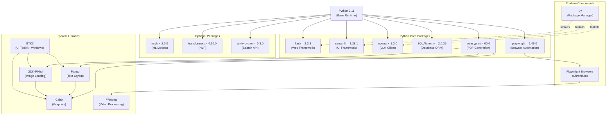

**Sources:** [requirements.txt:1-88](), [Dockerfile:12-51]()

## Key Python Packages

### Core Dependencies

| Package | Version | Purpose | Usage |
|---------|---------|---------|-------|
| `flask` | 2.3.3 | Web orchestrator | [app.py]() - Main entry point |
| `streamlit` | 1.28.1 | Agent UIs | Three separate Streamlit apps per engine |
| `openai` | >=1.3.0 | LLM communication | Compatible with DeepSeek, Qwen, etc. |
| `SQLAlchemy` | 2.0.35 | Database ORM | Async database operations |
| `playwright` | 1.45.0 | Web automation | MediaCrawler browser control |
| `weasyprint` | >=60.0 | PDF export | Requires Pango system library |

### Search and Data Acquisition

| Package | Version | Purpose |
|---------|---------|---------|
| `tavily-python` | >=0.3.0 | Web/news search (QueryEngine) |
| `httpx` | 0.28.1 | Async HTTP client |
| `beautifulsoup4` | >=4.12.0 | HTML parsing |
| `aiofiles` | 23.2.1 | Async file I/O |

### Machine Learning (Optional)

| Package | Version | Purpose |
|---------|---------|---------|
| `torch` | >=2.0.0 | Deep learning framework |
| `transformers` | >=4.30.0 | NLP models (BERT, GPT-2, Qwen) |
| `sentence-transformers` | >=2.2.2 | Embedding models |
| `xgboost` | >=2.0.0 | ML algorithms |

### Data Processing

| Package | Version | Purpose |
|---------|---------|---------|
| `pandas` | >=2.0.0 | Data analysis |
| `numpy` | >=1.24.0 | Numerical computing |
| `jieba` | 0.42.1 | Chinese text segmentation |
| `wordcloud` | 1.9.3 | Text visualization |

### Utilities

| Package | Version | Purpose |
|---------|---------|---------|
| `python-dotenv` | >=1.0.0 | Environment variable loading |
| `pydantic` | 2.5.2 | Data validation |
| `loguru` | >=0.7.0 | Logging |
| `tenacity` | 8.2.2 | Retry logic |
| `json-repair` | 0.53.0 | JSON error recovery |

**Sources:** [requirements.txt:1-88]()

## Installation Verification

### Automated Verification

Create a verification script `verify_installation.py`:

```python
#!/usr/bin/env python3
"""
Installation verification script for BettaFish.
Checks all critical dependencies and system requirements.
"""
import sys
import importlib
from pathlib import Path

def check_python_version():
    """Check Python version."""
    version = sys.version_info
    if version.major != 3 or version.minor != 11:
        print(f"❌ Python 3.11 required, found {version.major}.{version.minor}")
        return False
    print(f"✓ Python {version.major}.{version.minor}.{version.micro}")
    return True

def check_package(name, display_name=None):
    """Check if a Python package is installed."""
    display = display_name or name
    try:
        importlib.import_module(name)
        print(f"✓ {display}")
        return True
    except ImportError:
        print(f"❌ {display} not found")
        return False

def check_pango():
    """Check Pango availability for PDF generation."""
    try:
        from ReportEngine.utils.dependency_check import check_pango_available
        is_available, message = check_pango_available()
        if is_available:
            print(message)
        else:
            print("⚠ PDF generation unavailable (non-critical)")
            print("  See: static/Partial README for PDF Exporting/README.md")
        return True  # Non-blocking
    except Exception as e:
        print(f"⚠ Could not verify Pango: {e}")
        return True

def check_playwright():
    """Check if Playwright browsers are installed."""
    try:
        from playwright.sync_api import sync_playwright
        with sync_playwright() as p:
            browser = p.chromium.launch(headless=True)
            browser.close()
        print("✓ Playwright Chromium browser")
        return True
    except Exception as e:
        print(f"❌ Playwright browser not installed: {e}")
        print("  Run: python -m playwright install chromium")
        return False

def main():
    print("=" * 60)
    print("BettaFish Installation Verification")
    print("=" * 60)
    
    checks = []
    
    print("\n1. Python Version:")
    checks.append(check_python_version())
    
    print("\n2. Core Dependencies:")
    checks.append(check_package("flask"))
    checks.append(check_package("streamlit"))
    checks.append(check_package("openai"))
    checks.append(check_package("sqlalchemy", "SQLAlchemy"))
    checks.append(check_package("playwright"))
    
    print("\n3. PDF Generation:")
    checks.append(check_pango())
    
    print("\n4. Browser Automation:")
    checks.append(check_playwright())
    
    print("\n5. Optional Dependencies:")
    check_package("torch", "PyTorch (optional)")
    check_package("transformers", "Transformers (optional)")
    check_package("tavily", "Tavily SDK (optional)")
    
    print("\n" + "=" * 60)
    if all(checks):
        print("✓ All critical checks passed!")
        print("Run: python app.py")
        return 0
    else:
        print("❌ Some checks failed. Review errors above.")
        return 1

if __name__ == "__main__":
    sys.exit(main())
```

Run verification:

```bash
python verify_installation.py
```

**Sources:** [ReportEngine/utils/dependency_check.py:256-346]()

### Manual Verification Steps

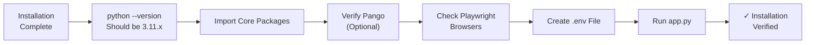

#### Step-by-Step Manual Checks

1. **Python Version:**
   ```bash
   python --version
   # Expected: Python 3.11.x
   ```

2. **Import Core Packages:**
   ```python
   python -c "import flask, streamlit, openai, sqlalchemy, playwright; print('✓ Core imports successful')"
   ```

3. **Verify Pango (PDF Generation):**
   ```bash
   python -m ReportEngine.utils.dependency_check
   # Should output: "✓ Pango 依赖检测通过，PDF 导出功能可用"
   # If unavailable, PDF export will be disabled (non-critical)
   ```

4. **Check Playwright Browsers:**
   ```bash
   python -c "from playwright.sync_api import sync_playwright; p = sync_playwright().start(); p.chromium.launch(); print('✓ Playwright OK')"
   ```

5. **Create Configuration File:**
   ```bash
   cp .env.example .env
   # Edit .env with your API keys (see Configuration section 2.2)
   ```

6. **Test Flask Launch:**
   ```bash
   python app.py
   # Should start Flask on port 5000 and launch Streamlit subprocesses
   # Press Ctrl+C to stop
   ```

**Sources:** [ReportEngine/utils/dependency_check.py:325-346](), [app.py]()

## Platform-Specific Troubleshooting

### macOS: Library Path Issues

**Symptom:** `weasyprint` fails with "cannot load library 'pango-1.0'" even after installing via Homebrew.

**Solution:**
```bash
# Check current library path
echo $DYLD_LIBRARY_PATH

# Should include /opt/homebrew/lib (Apple Silicon) or /usr/local/lib (Intel)
# If not, add to ~/.zshrc:
echo 'export DYLD_LIBRARY_PATH=/opt/homebrew/lib:$DYLD_LIBRARY_PATH' >> ~/.zshrc
source ~/.zshrc

# Verify Pango can be found
python -m ReportEngine.utils.dependency_check
```

The dependency check utility automatically attempts to set `DYLD_LIBRARY_PATH` at runtime ([ReportEngine/utils/dependency_check.py:199-220]()), but persistent configuration is recommended.

### Windows: GTK Runtime Not Found

**Symptom:** PDF generation fails with "DLL not found" errors.

**Solution:**
The system automatically scans multiple GTK installation paths ([ReportEngine/utils/dependency_check.py:97-196]()):
- Program Files default locations
- Custom drive installations (D:, E:, F:)
- Environment variables: `GTK3_RUNTIME_PATH`, `GTK_BIN_PATH`, `GTK_PATH`

To help auto-detection:
```powershell
# Option 1: Install to default path
# C:\Program Files\GTK3-Runtime Win64\

# Option 2: Set environment variable pointing to your installation
[Environment]::SetEnvironmentVariable("GTK3_RUNTIME_PATH", "D:\GTK3-Runtime Win64", [EnvironmentVariableTarget]::User)

# Option 3: Manually add to PATH
$env:PATH = "D:\GTK3-Runtime Win64\bin;$env:PATH"
```

### Linux: Missing System Libraries

**Symptom:** `ImportError: libpango-1.0.so.0: cannot open shared object file`

**Solution:**
```bash
# Ubuntu/Debian
sudo apt-get install -y libpango-1.0-0 libpangoft2-1.0-0 libpangocairo-1.0-0

# CentOS/RHEL
sudo yum install -y pango pango-devel

# Verify library can be found
ldconfig -p | grep pango
```

### Playwright Installation Failures

**Symptom:** `playwright install chromium` fails or browsers don't launch.

**Common Issues:**

1. **Insufficient Permissions:**
   ```bash
   # Run without sudo/administrator on first try
   python -m playwright install chromium
   
   # If system deps needed:
   sudo python -m playwright install-deps chromium
   ```

2. **Proxy/Firewall:**
   ```bash
   # Set proxy for download
   export HTTPS_PROXY=http://proxy.example.com:8080
   python -m playwright install chromium
   ```

3. **Storage Location:**
   ```bash
   # Override default location if needed
   export PLAYWRIGHT_BROWSERS_PATH=/custom/path
   python -m playwright install chromium
   ```

**Sources:** [ReportEngine/utils/dependency_check.py:1-346]()

## Next Steps

After successful installation:

1. **Configure the System**: Create and populate `.env` file with API keys and database credentials. See [Configuration](#2.2).

2. **Initialize Database**: Set up PostgreSQL or MySQL database for public opinion data. See [Database System](#8.3).

3. **Run the System**: Launch the Flask orchestrator or individual engines. See [Running the System](#2.3).

4. **Optional - Setup Docker**: For production deployment, consider Docker-based installation. See [Docker Deployment](#2.4).

5. **Optional - Configure MindSpider**: Set up data acquisition crawler if using private data sources. See [Crawler Architecture](#6.1).

**Sources:** [requirements.txt:1-88](), [Dockerfile:1-78](), [docker-compose.yml:1-40](), [ReportEngine/utils/dependency_check.py:1-346]()

---

# Page: Configuration

# Configuration

<details>
<summary>Relevant source files</summary>

The following files were used as context for generating this wiki page:

- [.env.example](.env.example)
- [README-EN.md](README-EN.md)
- [README.md](README.md)
- [ReportEngine/agent.py](ReportEngine/agent.py)
- [ReportEngine/flask_interface.py](ReportEngine/flask_interface.py)
- [ReportEngine/nodes/__init__.py](ReportEngine/nodes/__init__.py)
- [ReportEngine/nodes/chapter_generation_node.py](ReportEngine/nodes/chapter_generation_node.py)
- [ReportEngine/utils/config.py](ReportEngine/utils/config.py)
- [app.py](app.py)
- [config.py](config.py)
- [report_engine_only.py](report_engine_only.py)
- [static/Partial README for PDF Exporting/README-EN.md](static/Partial README for PDF Exporting/README-EN.md)
- [static/Partial README for PDF Exporting/README.md](static/Partial README for PDF Exporting/README.md)
- [static/image/framework.png](static/image/framework.png)
- [static/image/logo_SwiftProxy.png](static/image/logo_SwiftProxy.png)
- [templates/index.html](templates/index.html)

</details>


## Purpose and Scope

This document explains the BettaFish configuration system, including the `.env` file structure, configuration categories, and how to modify settings for LLM providers, databases, and system components. For installation instructions, see [Installation](#2.1). For information on running the configured system, see [Running the System](#2.3).

The BettaFish system uses a centralized configuration architecture based on `pydantic-settings` that supports environment variables, `.env` files, and runtime modification through the web interface.

---

## Configuration Architecture

BettaFish uses a unified configuration model defined in `config.py` that consolidates all system settings into a single `Settings` class. This architecture ensures type safety, automatic validation, and consistent access patterns across all components.

### Configuration Loading Flow

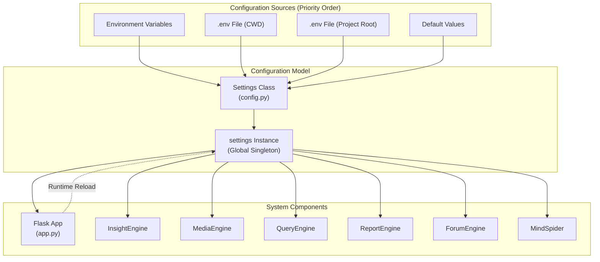

**Configuration Priority**: Environment variables take precedence over `.env` files, which take precedence over default values defined in the `Settings` class.

**Sources**: [config.py:1-132](), [app.py:120-131]()

---

## Configuration File Structure

The configuration system centers on two key files:

| File | Purpose | Location |
|------|---------|----------|
| `.env` | User configuration values | Project root or current working directory |
| `.env.example` | Template with all available settings | Project root |
| `config.py` | Configuration model definition | Project root |

### Settings Class Architecture

The `Settings` class in `config.py` uses `pydantic-settings.BaseSettings` to define all configuration fields with type hints, descriptions, and default values:

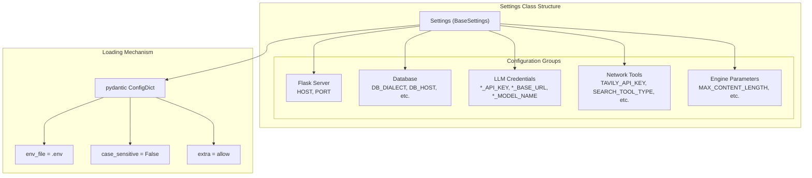

**Sources**: [config.py:23-111]()

---

## Configuration Categories

### Flask Server Configuration

Controls the Flask web application server settings:

| Variable | Type | Default | Description |
|----------|------|---------|-------------|
| `HOST` | str | `"0.0.0.0"` | Flask server bind address |
| `PORT` | int | `5000` | Flask server port |

**Sources**: [config.py:28-30](), [.env.example:1-5]()

---

### Database Configuration

Configures the connection to the PostgreSQL or MySQL database used by MindSpider and InsightEngine:

| Variable | Type | Default | Description |
|----------|------|---------|-------------|
| `DB_DIALECT` | str | `"postgresql"` | Database type (`postgresql` or `mysql`) |
| `DB_HOST` | str | `"your_db_host"` | Database server hostname |
| `DB_PORT` | int | `3306` | Database server port |
| `DB_USER` | str | `"your_db_user"` | Database username |
| `DB_PASSWORD` | str | `"your_db_password"` | Database password |
| `DB_NAME` | str | `"your_db_name"` | Database name |
| `DB_CHARSET` | str | `"utf8mb4"` | Character set (recommended: `utf8mb4` for emoji support) |

**Docker Deployment Note**: When using Docker Compose, set `DB_HOST=db` to match the service name defined in `docker-compose.yml`.

**Sources**: [config.py:33-39](), [.env.example:7-21](), [README.md:304-315]()

---

### LLM Configuration

Each agent in the BettaFish system uses a dedicated LLM configuration. All LLM integrations follow the OpenAI API standard, allowing any OpenAI-compatible provider.

#### Configuration Pattern

Each agent requires three configuration variables following this pattern:

```
{ENGINE_NAME}_API_KEY      # API key for authentication
{ENGINE_NAME}_BASE_URL     # API endpoint base URL
{ENGINE_NAME}_MODEL_NAME   # Model identifier
```

#### Agent LLM Configurations

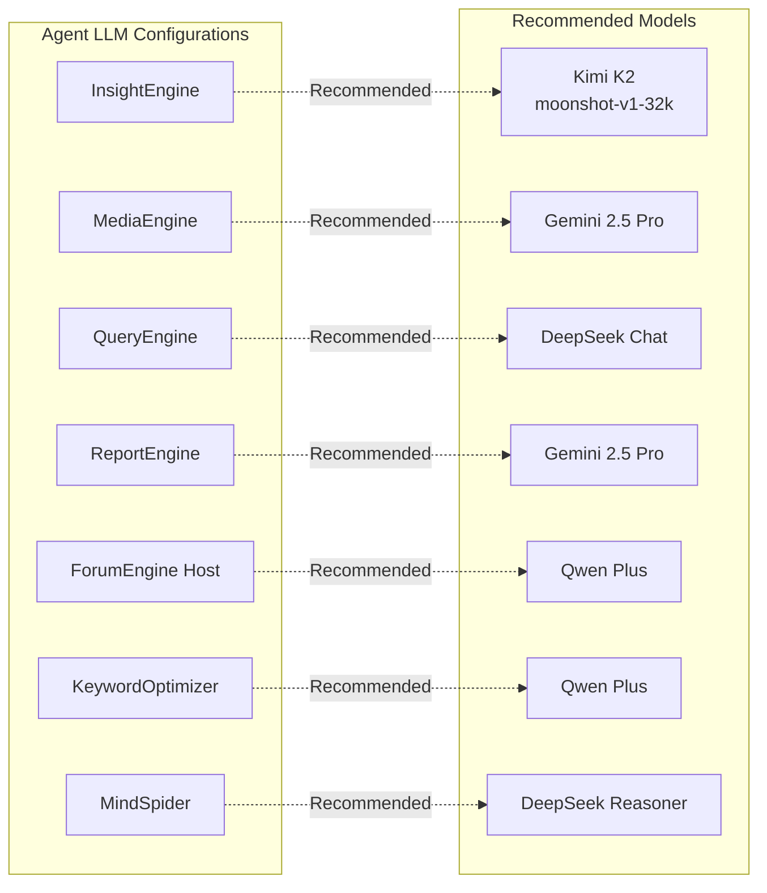

**Configuration Table**:

| Agent | API_KEY Variable | BASE_URL Variable | MODEL_NAME Variable | Recommended Model |
|-------|------------------|-------------------|---------------------|-------------------|
| **Insight Engine** | `INSIGHT_ENGINE_API_KEY` | `INSIGHT_ENGINE_BASE_URL` | `INSIGHT_ENGINE_MODEL_NAME` | `kimi-k2-0711-preview` |
| **Media Engine** | `MEDIA_ENGINE_API_KEY` | `MEDIA_ENGINE_BASE_URL` | `MEDIA_ENGINE_MODEL_NAME` | `gemini-2.5-pro` |
| **Query Engine** | `QUERY_ENGINE_API_KEY` | `QUERY_ENGINE_BASE_URL` | `QUERY_ENGINE_MODEL_NAME` | `deepseek-chat` |
| **Report Engine** | `REPORT_ENGINE_API_KEY` | `REPORT_ENGINE_BASE_URL` | `REPORT_ENGINE_MODEL_NAME` | `gemini-2.5-pro` |
| **Forum Host** | `FORUM_HOST_API_KEY` | `FORUM_HOST_BASE_URL` | `FORUM_HOST_MODEL_NAME` | `qwen-plus` |
| **Keyword Optimizer** | `KEYWORD_OPTIMIZER_API_KEY` | `KEYWORD_OPTIMIZER_BASE_URL` | `KEYWORD_OPTIMIZER_MODEL_NAME` | `qwen-plus` |
| **MindSpider** | `MINDSPIDER_API_KEY` | `MINDSPIDER_BASE_URL` | `MINDSPIDER_MODEL_NAME` | `deepseek-reasoner` |

**Sources**: [config.py:41-77](), [.env.example:23-62](), [README.md:318-413]()

---

### Network Tools Configuration

Configures external search and web crawling services:

| Variable | Type | Default | Description |
|----------|------|---------|-------------|
| `TAVILY_API_KEY` | Optional[str] | `None` | Tavily API key for web search |
| `SEARCH_TOOL_TYPE` | Literal | `"AnspireAPI"` | Search tool type (`"AnspireAPI"` or `"BochaAPI"`) |
| `BOCHA_BASE_URL` | Optional[str] | `"https://api.bocha.cn/v1/ai-search"` | Bocha API base URL |
| `BOCHA_WEB_SEARCH_API_KEY` | Optional[str] | `None` | Bocha API key |
| `ANSPIRE_BASE_URL` | Optional[str] | `"https://plugin.anspire.cn/api/ntsearch/search"` | Anspire API base URL |
| `ANSPIRE_API_KEY` | Optional[str] | `None` | Anspire API key |

**Sources**: [config.py:79-90](), [.env.example:64-77]()

---

### Engine-Specific Parameters

Additional configuration parameters for InsightEngine search and analysis:

| Variable | Type | Default | Description |
|----------|------|---------|-------------|
| `DEFAULT_SEARCH_HOT_CONTENT_LIMIT` | int | `100` | Maximum hot content results |
| `DEFAULT_SEARCH_TOPIC_GLOBALLY_LIMIT_PER_TABLE` | int | `50` | Global topic search limit per table |
| `DEFAULT_SEARCH_TOPIC_BY_DATE_LIMIT_PER_TABLE` | int | `100` | Date-based topic search limit per table |
| `DEFAULT_GET_COMMENTS_FOR_TOPIC_LIMIT` | int | `500` | Maximum comments per topic |
| `DEFAULT_SEARCH_TOPIC_ON_PLATFORM_LIMIT` | int | `200` | Platform-specific topic search limit |
| `MAX_SEARCH_RESULTS_FOR_LLM` | int | `0` | Maximum search results passed to LLM |
| `MAX_HIGH_CONFIDENCE_SENTIMENT_RESULTS` | int | `0` | Maximum high-confidence sentiment results |
| `MAX_REFLECTIONS` | int | `3` | Maximum reflection iterations |
| `MAX_PARAGRAPHS` | int | `6` | Maximum paragraphs in output |
| `SEARCH_TIMEOUT` | int | `240` | Search request timeout (seconds) |
| `MAX_CONTENT_LENGTH` | int | `500000` | Maximum content length |

**Sources**: [config.py:93-104]()

---

## Modifying Configuration

### Method 1: Direct .env File Editing

1. Copy `.env.example` to `.env` if not already present:
   ```bash
   cp .env.example .env
   ```

2. Edit `.env` with your preferred text editor:
   ```bash
   nano .env  # or vim, code, etc.
   ```

3. Update values following the pattern:
   ```
   INSIGHT_ENGINE_API_KEY=your_actual_api_key_here
   INSIGHT_ENGINE_BASE_URL=https://api.moonshot.cn/v1
   INSIGHT_ENGINE_MODEL_NAME=kimi-k2-0711-preview
   ```

4. Restart the application for changes to take effect

**Sources**: [README.md:380-413]()

---

### Method 2: Web Interface Configuration

BettaFish provides a web-based configuration editor accessible through the Flask interface:

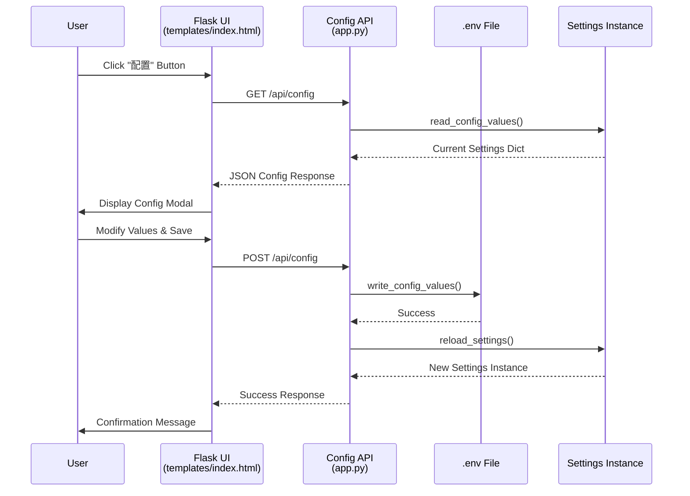

**Configuration Modal Features**:

1. **Field Groups**: Settings are organized by category (Database, LLM, Network Tools)
2. **Password Protection**: Sensitive fields (API keys, passwords) are hidden by default with toggle visibility
3. **Validation**: Client-side validation ensures required fields are not empty
4. **Persistence**: Changes are written to `.env` file and immediately reloaded

**Web Interface Implementation**:

- Configuration modal: [templates/index.html:565-762]()
- Configuration API endpoints: [app.py:667-714]()
- Configuration read/write functions: [app.py:134-223]()

**Sources**: [templates/index.html:565-762](), [app.py:667-714](), [app.py:134-223]()

---

### Method 3: Runtime Configuration Reload

The `reload_settings()` function allows programmatic configuration refresh without restarting the application:

```python
# Defined in config.py
def reload_settings() -> Settings:
    """Reload configuration from .env file and environment variables"""
    global settings
    settings = Settings()
    return settings
```

**Usage Pattern**:
```python
from config import reload_settings, settings

# Modify .env file externally
# ...

# Reload configuration
reload_settings()

# Access updated values
new_api_key = settings.INSIGHT_ENGINE_API_KEY
```

**Sources**: [config.py:118-131](), [app.py:138-139]()

---

## Configuration Inheritance and Access

### Global Configuration Singleton

The `settings` instance is created once at module import and serves as the global configuration source:

```python
# config.py
settings = Settings()
```

All system components import this singleton to access configuration values:

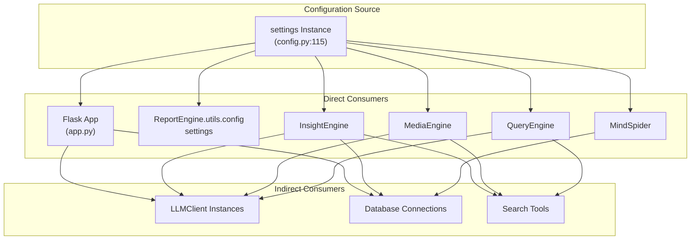

**Sources**: [config.py:115]()

---

### Configuration Access Patterns

Different components access configuration using consistent patterns:

#### Pattern 1: Direct Import (Root Level)

```python
# Most common pattern
from config import settings

# Access values
api_key = settings.INSIGHT_ENGINE_API_KEY
db_host = settings.DB_HOST
```

**Used by**: [app.py:138](), Flask routes, top-level components

---

#### Pattern 2: Local Settings (Sub-modules)

Some sub-engines (e.g., ReportEngine) maintain their own `Settings` class for backwards compatibility but still inherit from the root `.env` file:

```python
# ReportEngine/utils/config.py
from pydantic_settings import BaseSettings

class Settings(BaseSettings):
    REPORT_ENGINE_API_KEY: Optional[str] = Field(None)
    # ... other fields
    
    class Config:
        env_file = ".env"  # Same .env file as root
        env_prefix = ""
        case_sensitive = False

settings = Settings()  # Local singleton
```

**Key Point**: Both root `config.py` and `ReportEngine/utils/config.py` read from the same `.env` file, ensuring consistency.

**Sources**: [ReportEngine/utils/config.py:12-77]()

---

#### Pattern 3: Configuration Injection

Some components receive configuration as constructor parameters:

```python
# ReportEngine/agent.py
class ReportAgent:
    def __init__(self, config: Optional[Settings] = None):
        self.config = config or settings  # Use provided or default
        
        # Use config values
        self.llm_client = LLMClient(
            api_key=self.config.REPORT_ENGINE_API_KEY,
            model_name=self.config.REPORT_ENGINE_MODEL_NAME,
            base_url=self.config.REPORT_ENGINE_BASE_URL,
        )
```

**Benefits**: Testability, dependency injection, configuration overrides

**Sources**: [ReportEngine/agent.py:187-201]()

---

## Configuration Validation and Defaults

### Type Safety

The `Settings` class uses Pydantic's type system to enforce configuration value types:

```python
# config.py
class Settings(BaseSettings):
    HOST: str = Field("0.0.0.0", description="...")
    PORT: int = Field(5000, description="...")
    DB_PORT: int = Field(3306, description="...")
    ENABLE_PDF_EXPORT: bool = Field(True, description="...")
```

**Validation Features**:
- Automatic type conversion (e.g., `"5000"` → `5000`)
- Validation errors raise `pydantic.ValidationError` at startup
- Optional fields use `Optional[str]` or `None` defaults

**Sources**: [config.py:23-111]()

---

### Environment Variable Resolution

Configuration values are resolved in this priority order:

1. **Environment Variables**: Highest priority
2. **.env File (CWD)**: Current working directory
3. **.env File (Project Root)**: Fallback location
4. **Default Values**: Defined in `Field()` calls

**Resolution Logic**:

```python
# config.py
PROJECT_ROOT: Path = Path(__file__).resolve().parent
CWD_ENV: Path = Path.cwd() / ".env"
ENV_FILE: str = str(CWD_ENV if CWD_ENV.exists() else (PROJECT_ROOT / ".env"))

class Settings(BaseSettings):
    class Config:
        env_file = ENV_FILE  # Resolved path
        env_prefix = ""      # No prefix required
        case_sensitive = False  # DB_HOST = db_host
        extra = "allow"      # Allow undefined variables
```

**Sources**: [config.py:18-21](), [config.py:106-111]()

---

## Docker Deployment Configuration

When using Docker Compose, specific configuration values must be adjusted:

### Required Changes

| Variable | Docker Value | Reason |
|----------|--------------|--------|
| `DB_HOST` | `db` | Matches Docker Compose service name |
| `DB_PORT` | `5432` (PostgreSQL) or `3306` (MySQL) | Container internal port |

### Docker Compose Service Names

```yaml
# docker-compose.yml (relevant sections)
services:
  db:
    image: postgres:latest
    # DB_HOST should be "db"
  
  bettafish:
    image: bettafish:latest
    depends_on:
      - db
    environment:
      - DB_HOST=db
```

**No Manual Dependency Installation**: The Docker image includes all system dependencies (Pango, GTK, etc.) required for PDF export.

**Sources**: [README.md:288-324](), [README-EN.md:287-318]()

---

## Configuration Troubleshooting

### Common Issues

| Issue | Symptom | Solution |
|-------|---------|----------|
| **Missing API Key** | `LLMClient` initialization fails | Set `*_API_KEY` in `.env` |
| **Wrong BASE_URL** | API connection timeout | Verify `*_BASE_URL` matches provider documentation |
| **Database Connection Failed** | `InsightEngine` crashes on startup | Check `DB_HOST`, `DB_PORT`, `DB_USER`, `DB_PASSWORD` |
| **Configuration Not Applied** | Old values persist | Restart application or call `reload_settings()` |
| **Case Sensitivity Issues** | Variable not recognized | Use uppercase (e.g., `DB_HOST` not `db_host`) |

### Validation Script

The system automatically validates configuration at startup and logs warnings for missing required values:

```python
# config.py
settings = Settings()  # Raises ValidationError if invalid

# ReportEngine/utils/config.py
def print_config(config: Settings):
    """Logs current configuration for debugging"""
    logger.info("\n=== Report Engine 配置 ===\n")
    logger.info(f"LLM 模型: {config.REPORT_ENGINE_MODEL_NAME}\n")
    # ... more logging
```

**Sources**: [ReportEngine/utils/config.py:80-105]()

---

## Configuration Reference Table

Complete table of all configuration variables:

| Category | Variable | Type | Default | Required | Description |
|----------|----------|------|---------|----------|-------------|
| **Server** | `HOST` | str | `"0.0.0.0"` | Yes | Flask bind address |
| **Server** | `PORT` | int | `5000` | Yes | Flask port |
| **Database** | `DB_DIALECT` | str | `"postgresql"` | Yes | Database type |
| **Database** | `DB_HOST` | str | `"your_db_host"` | Yes | Database host |
| **Database** | `DB_PORT` | int | `3306` | Yes | Database port |
| **Database** | `DB_USER` | str | `"your_db_user"` | Yes | Database username |
| **Database** | `DB_PASSWORD` | str | `"your_db_password"` | Yes | Database password |
| **Database** | `DB_NAME` | str | `"your_db_name"` | Yes | Database name |
| **Database** | `DB_CHARSET` | str | `"utf8mb4"` | No | Database charset |
| **LLM** | `INSIGHT_ENGINE_API_KEY` | Optional[str] | `None` | Yes | Insight Engine API key |
| **LLM** | `INSIGHT_ENGINE_BASE_URL` | Optional[str] | `"https://api.moonshot.cn/v1"` | No | Insight Engine base URL |
| **LLM** | `INSIGHT_ENGINE_MODEL_NAME` | str | `"kimi-k2-0711-preview"` | Yes | Insight Engine model |
| **LLM** | `MEDIA_ENGINE_API_KEY` | Optional[str] | `None` | Yes | Media Engine API key |
| **LLM** | `MEDIA_ENGINE_BASE_URL` | Optional[str] | `"https://aihubmix.com/v1"` | No | Media Engine base URL |
| **LLM** | `MEDIA_ENGINE_MODEL_NAME` | str | `"gemini-2.5-pro"` | Yes | Media Engine model |
| **LLM** | `QUERY_ENGINE_API_KEY` | Optional[str] | `None` | Yes | Query Engine API key |
| **LLM** | `QUERY_ENGINE_BASE_URL` | Optional[str] | `"https://api.deepseek.com"` | No | Query Engine base URL |
| **LLM** | `QUERY_ENGINE_MODEL_NAME` | str | `"deepseek-chat"` | Yes | Query Engine model |
| **LLM** | `REPORT_ENGINE_API_KEY` | Optional[str] | `None` | Yes | Report Engine API key |
| **LLM** | `REPORT_ENGINE_BASE_URL` | Optional[str] | `"https://aihubmix.com/v1"` | No | Report Engine base URL |
| **LLM** | `REPORT_ENGINE_MODEL_NAME` | str | `"gemini-2.5-pro"` | Yes | Report Engine model |
| **LLM** | `FORUM_HOST_API_KEY` | Optional[str] | `None` | No | Forum Host API key |
| **LLM** | `FORUM_HOST_BASE_URL` | Optional[str] | `None` | No | Forum Host base URL |
| **LLM** | `FORUM_HOST_MODEL_NAME` | Optional[str] | `None` | No | Forum Host model |
| **LLM** | `KEYWORD_OPTIMIZER_API_KEY` | Optional[str] | `None` | No | Keyword Optimizer API key |
| **LLM** | `KEYWORD_OPTIMIZER_BASE_URL` | Optional[str] | `None` | No | Keyword Optimizer base URL |
| **LLM** | `KEYWORD_OPTIMIZER_MODEL_NAME` | Optional[str] | `None` | No | Keyword Optimizer model |
| **LLM** | `MINDSPIDER_API_KEY` | Optional[str] | `None` | No | MindSpider API key |
| **LLM** | `MINDSPIDER_BASE_URL` | Optional[str] | `None` | No | MindSpider base URL |
| **LLM** | `MINDSPIDER_MODEL_NAME` | Optional[str] | `None` | No | MindSpider model |
| **Search** | `TAVILY_API_KEY` | Optional[str] | `None` | No | Tavily API key |
| **Search** | `SEARCH_TOOL_TYPE` | Literal | `"AnspireAPI"` | No | Search tool type |
| **Search** | `BOCHA_BASE_URL` | Optional[str] | `"https://api.bocha.cn/v1/ai-search"` | No | Bocha base URL |
| **Search** | `BOCHA_WEB_SEARCH_API_KEY` | Optional[str] | `None` | No | Bocha API key |
| **Search** | `ANSPIRE_BASE_URL` | Optional[str] | `"https://plugin.anspire.cn/api/ntsearch/search"` | No | Anspire base URL |
| **Search** | `ANSPIRE_API_KEY` | Optional[str] | `None` | No | Anspire API key |

**Sources**: [config.py:23-111](), [.env.example:1-77]()

---

## Next Steps

After configuring the system:
- **Installation**: See [Installation](#2.1) for dependency setup
- **Running the System**: See [Running the System](#2.3) for startup instructions
- **Docker Deployment**: See [Docker Deployment](#2.4) for containerized deployment

---

# Page: Running the System

# Running the System

<details>
<summary>Relevant source files</summary>

The following files were used as context for generating this wiki page:

- [.env.example](.env.example)
- [README-EN.md](README-EN.md)
- [README.md](README.md)
- [ReportEngine/agent.py](ReportEngine/agent.py)
- [ReportEngine/flask_interface.py](ReportEngine/flask_interface.py)
- [ReportEngine/nodes/__init__.py](ReportEngine/nodes/__init__.py)
- [ReportEngine/nodes/chapter_generation_node.py](ReportEngine/nodes/chapter_generation_node.py)
- [ReportEngine/utils/config.py](ReportEngine/utils/config.py)
- [app.py](app.py)
- [config.py](config.py)
- [report_engine_only.py](report_engine_only.py)
- [static/Partial README for PDF Exporting/README-EN.md](static/Partial README for PDF Exporting/README-EN.md)
- [static/Partial README for PDF Exporting/README.md](static/Partial README for PDF Exporting/README.md)
- [static/image/framework.png](static/image/framework.png)
- [static/image/logo_SwiftProxy.png](static/image/logo_SwiftProxy.png)
- [templates/index.html](templates/index.html)

</details>


This page describes how to start the BettaFish multi-agent system and verify that all components are running correctly. It covers the Flask orchestrator startup, individual engine launches, system verification, and troubleshooting.

**Prerequisites**: Before running the system, ensure you have completed [Installation](#2.1) and [Configuration](#2.2). For containerized deployment, see [Docker Deployment](#2.4).

---

## System Components Overview

BettaFish consists of multiple interconnected services that must be started in a specific order. The Flask application (`app.py`) acts as the orchestrator, managing three Streamlit subprocesses, the ForumEngine monitor thread, and the ReportEngine task queue.

**Startup Architecture**

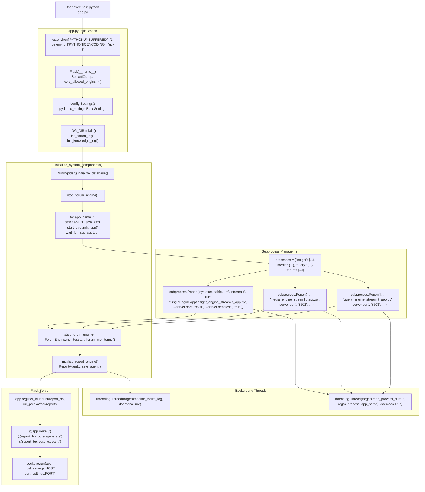

Sources: [app.py:8-11](), [app.py:41-43](), [app.py:86-87](), [app.py:276-348](), [app.py:509-521](), [app.py:640-690]()

---

## Full System Startup (Recommended)

The primary method for running BettaFish is through the Flask orchestrator, which manages all components automatically.

### Starting the Flask Application

**Conda Environment**:
```bash
# Activate environment
conda activate your_conda_name

# Start Flask orchestrator
python app.py
```

**uv Environment**:
```bash
# Activate environment (Windows)
.venv\Scripts\activate

# Activate environment (Linux/macOS)
source .venv/bin/activate

# Start Flask orchestrator
python app.py
```

Sources: [README.md:423-445]()

### Initialization Sequence

When `app.py` is executed, the following initialization occurs:

1. **Environment Configuration**: Sets environment variables at module import time [app.py:8-11]()
   - `PYTHONIOENCODING='utf-8'` for consistent text encoding
   - `PYTHONUTF8='1'` for UTF-8 mode on all platforms
   - `PYTHONUNBUFFERED='1'` for real-time stdout/stderr flushing

2. **Flask Application Setup**: Creates Flask app with SocketIO support [app.py:41-43]()
   - `app = Flask(__name__)`
   - `socketio = SocketIO(app, cors_allowed_origins="*")`
   - Registers `report_bp` Blueprint at `/api/report` [app.py:78-83]()

3. **Configuration Loading**: Instantiates `Settings` from `config.py` [config.py:23-115]()
   - Reads `.env` file using `pydantic-settings`
   - Priority: environment variables > `.env` file > defaults
   - Accessible via `settings` singleton

4. **Log Directory Creation**: Initializes logging infrastructure [app.py:86-87]()
   - Creates `LOG_DIR = Path('logs')` directory
   - Calls `init_forum_log()` to create/clear `logs/forum.log` [app.py:351-367]()
   - Calls `init_knowledge_log()` for GraphRAG query logs

5. **Database Initialization**: Verifies or creates database schema [app.py:276-286]()
   - `spider = MindSpider()`
   - `spider.initialize_database()` checks for required tables
   - Creates tables if missing (15 tables for social media data)

6. **Streamlit Process Spawning**: Launches three engine subprocesses [app.py:297-312]()
   - Uses `STREAMLIT_SCRIPTS` dict mapping [app.py:517-521]()
   - Calls `start_streamlit_app(app_name, script_path, port)` [app.py:640-690]()
   - Each subprocess created with:
     ```python
     subprocess.Popen([
         sys.executable, '-m', 'streamlit', 'run',
         script_path,
         '--server.port', str(port),
         '--server.headless', 'true'
     ], stdout=subprocess.PIPE, stderr=subprocess.STDOUT, ...)
     ```
   - Waits for health check via `wait_for_app_startup()` [app.py:702-732]()

7. **ForumEngine Thread**: Starts log monitoring daemon [app.py:314-323]()
   - Calls `start_forum_engine()` → `ForumEngine.monitor.start_forum_monitoring()` [app.py:376-385]()
   - Spawns `monitor_forum_log()` thread [app.py:443-503]()
   - Reads `logs/forum.log` and emits SocketIO events

8. **ReportEngine Initialization**: Creates singleton ReportAgent [app.py:325-336]()
   - Calls `initialize_report_engine()` [ReportEngine/flask_interface.py:246-271]()
   - Instantiates `ReportAgent` with config [ReportEngine/agent.py:203-252]()
   - Registers log stream forwarder for SSE [ReportEngine/flask_interface.py:112-122]()

9. **Flask Server Binding**: Starts SocketIO server
   - Binds to `settings.HOST:settings.PORT` (default `0.0.0.0:5000`)
   - Serves `templates/index.html` at root route
   - Exposes `/api/report/*` endpoints for report generation

Sources: [app.py:8-11](), [app.py:41-43](), [app.py:78-87](), [app.py:276-348](), [app.py:376-385](), [app.py:517-521](), [app.py:640-732](), [config.py:23-115](), [ReportEngine/flask_interface.py:246-271](), [ReportEngine/agent.py:203-252]()

**Startup Process Flow Diagram**

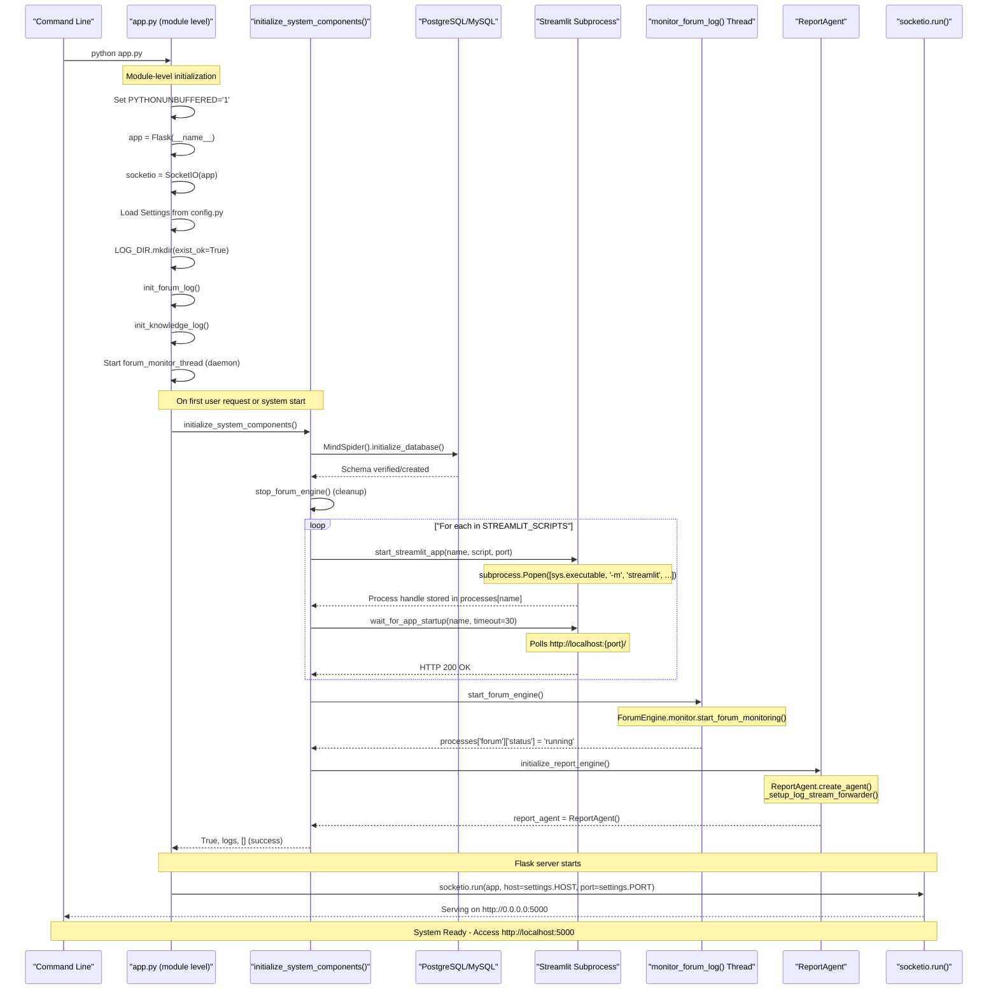

Sources: [app.py:8-11](), [app.py:41-43](), [app.py:276-348](), [app.py:351-370](), [app.py:376-396](), [app.py:506-507](), [app.py:517-521](), [app.py:640-690](), [app.py:702-732]()

### Accessing the Web Interface

Once startup completes (typically 30-60 seconds), access the system at:

```
http://localhost:5000
```

The main interface is served via `@app.route('/')` which renders `templates/index.html` [templates/index.html:1-50](). Key UI components:

| Component | Description | Implementation |
|-----------|-------------|----------------|
| **Search Section** | Query input and template upload | `.search-section` class, `#queryInput`, `#customTemplateInput` |
| **App Switcher** | Toggle between engine consoles | `.app-switcher` with `.app-button` for each engine [templates/index.html:303-353]() |
| **Console Output** | Real-time log streaming | `.console-output` with `.console-layer` for each app [templates/index.html:377-477]() |
| **Forum Messages** | Live debate feed display | SocketIO `forum_message` event handler [templates/index.html:1350-1400]() |
| **Configuration Modal** | Runtime `.env` editing | `.config-modal` triggered by config button [templates/index.html:566-783]() |

**SocketIO Event Flow**:
- `console_output`: Pushed by `read_process_output()` threads [app.py:574-625]()
- `forum_message`: Emitted by `monitor_forum_log()` after parsing forum.log [app.py:443-503]()
- `system_status`: Status updates from system_state dict [app.py:234-254]()

Sources: [app.py:574-625](), [app.py:443-503](), [templates/index.html:1-100](), [templates/index.html:303-353](), [templates/index.html:377-477](), [templates/index.html:566-783](), [templates/index.html:1350-1400]()

---

## Individual Component Startup

Components can be started independently for development or debugging purposes.

### Streamlit Engine Standalone Mode

Each analysis engine can run as a standalone Streamlit application:

**QueryEngine**:
```bash
streamlit run SingleEngineApp/query_engine_streamlit_app.py --server.port 8503
```

**MediaEngine**:
```bash
streamlit run SingleEngineApp/media_engine_streamlit_app.py --server.port 8502
```

**InsightEngine**:
```bash
streamlit run SingleEngineApp/insight_engine_streamlit_app.py --server.port 8501
```

Standalone engines operate independently without ForumEngine coordination. Reports are saved to:
- `query_engine_streamlit_reports/`
- `media_engine_streamlit_reports/`
- `insight_engine_streamlit_reports/`

Sources: [README.md:448-464]()

### MindSpider Crawler Standalone Mode

The data collection system runs independently of the Flask orchestrator:

```bash
cd MindSpider

# Initialize database tables
python main.py --setup

# Run topic extraction from news sources
python main.py --broad-topic

# Run complete workflow (topic + deep crawling)
python main.py --complete --date 2024-01-20

# Run deep sentiment crawling only
python main.py --deep-sentiment --platforms xhs dy wb
```

**Architecture**: MindSpider operates as a separate scheduler with browser automation via Playwright. Data flows:

```
MindSpider Scheduler → Playwright Crawlers → PostgreSQL Tables
                                                      ↓
                               InsightEngine.tools.search.py reads tables
```

**Database Tables Created** (15 total):
- Content tables: `bilibili_video`, `douyin_aweme`, `kuaishou_video`, `weibo_note`, `xhs_note`, `zhihu_content`, `tieba_note`, `daily_news`
- Comment tables: `{platform}_comment` for each content table
- Metadata table: `daily_topic` for extracted trending topics

Crawler results are consumed by InsightEngine via `MediaCrawlerDB` class methods in `InsightEngine/tools/search.py`.

Sources: [README.md:467-494](), [README.md:209-231](), [MindSpider/main.py]()

### Report-Only Mode (CLI)

Generate reports from existing engine outputs without re-running analysis engines. This mode is useful for:
- Rapid iteration on report templates/layout without waiting for agent runs
- Debugging ReportEngine issues in isolation
- Regenerating reports with different formats (e.g., adding PDF after HTML-only run)

**Command-Line Interface**:

```bash
# Basic usage (auto-detects latest engine reports)
python report_engine_only.py

# Specify custom topic
python report_engine_only.py --query "武汉大学舆情"

# Skip PDF generation (even if WeasyPrint is installed)
python report_engine_only.py --skip-pdf

# Skip Markdown generation
python report_engine_only.py --skip-markdown

# Enable GraphRAG with custom query limit
python report_engine_only.py --graphrag-enabled true --graphrag-max-queries 3

# Verbose logging for debugging
python report_engine_only.py --verbose
```

**Operational Flow**:

1. **Input Discovery**: Uses `FileCountBaseline.get_latest_files()` to find newest `.md` files in:
   - `insight_engine_streamlit_reports/`
   - `media_engine_streamlit_reports/`
   - `query_engine_streamlit_reports/`

2. **User Confirmation**: Displays file paths and modification times, prompts for `y/n` confirmation

3. **Direct Report Generation**: Calls `ReportAgent.generate_report()` with:
   - `save_report=True` (always persist output)
   - Skips `FileCountBaseline.check_new_files()` validation
   - Reads `logs/forum.log` if present (empty string if missing)

4. **Output Persistence**:
   - HTML: `final_reports/final_report_{topic}_{timestamp}.html`
   - PDF: `final_reports/pdf/final_report_{topic}_{timestamp}.pdf` (if enabled and WeasyPrint available)
   - Markdown: `final_reports/md/final_report_{topic}_{timestamp}.md` (default enabled, use `--skip-markdown` to disable)
   - IR JSON: `final_reports/ir/document_ir_{timestamp}.json`

**Quick Re-render Utilities**:

For regenerating output from existing chapter JSON (bypasses LLM calls entirely):

```bash
# Re-stitch latest chapters and render HTML
python regenerate_latest_html.py

# Re-stitch latest chapters and render Markdown
python regenerate_latest_md.py

# Read latest IR and render PDF (requires WeasyPrint)
python regenerate_latest_pdf.py
```

These utilities use the chapter JSONs stored in `final_reports/chapters/` by the ChapterStorage system.

Sources: [README.md:496-546](), [README.md:543-545](), [report_engine_only.py](), [ReportEngine/agent.py:171-188](), [ReportEngine/core/chapter_storage.py]()

---

## System Verification

**Process Status Management Diagram**

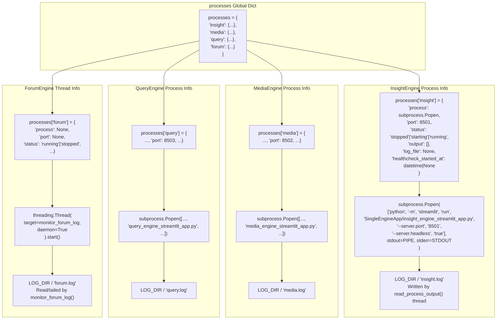

Sources: [app.py:509-521](), [app.py:640-690](), [app.py:574-625](), [app.py:443-503]()

### Health Check Methods

**1. Web Interface Status Indicators**

Each engine button in the app switcher displays a status indicator via `.status-indicator` CSS class [templates/index.html:359-376]():

```html
<button class="app-button" data-app="insight">
    <span class="status-indicator"></span>
    Insight Engine
</button>
```

**Status Colors** (controlled by JavaScript polling `/api/status`):
- **Green** (`.running`): Engine process alive and HTTP responding
- **Yellow** (`.starting`): Engine process started but not yet responding to health checks
- **Red** (default): Engine stopped or crashed

**Backend Status Endpoint**: `@app.route('/api/status')` returns JSON with per-engine status [app.py:847-880]():

```python
{
    "started": True|False,
    "apps": {
        "insight": {"status": "running"|"starting"|"stopped", "port": 8501},
        "media": {"status": "running"|"starting"|"stopped", "port": 8502},
        "query": {"status": "running"|"starting"|"stopped", "port": 8503},
        "forum": {"status": "running"|"stopped"}
    }
}
```

Status determined by checking `processes[app_name]['status']` which is set by:
- `start_streamlit_app()` → sets `'starting'` [app.py:640-690]()
- `wait_for_app_startup()` → sets `'running'` on HTTP success [app.py:702-732]()
- `cleanup_processes()` → sets `'stopped'` on termination [app.py:522-575]()

Sources: [templates/index.html:359-376](), [app.py:847-880](), [app.py:640-690](), [app.py:702-732](), [app.py:522-575]()

**2. Console Output Verification**

Each subprocess's stdout/stderr is captured and forwarded to the web UI via SocketIO. The `read_process_output()` function runs in a dedicated thread per engine [app.py:574-625]():

```python
def read_process_output(process, app_name):
    """Read subprocess output and emit to SocketIO"""
    while True:
        if process.poll() is not None:
            break  # Process terminated
        output = process.stdout.readline()
        if output:
            line = output.decode('utf-8', errors='replace').strip()
            timestamp = datetime.now().strftime('%H:%M:%S')
            formatted_line = f"[{timestamp}] {line}"
            write_log_to_file(app_name, formatted_line)
            socketio.emit('console_output', {'app': app_name, 'line': formatted_line})
```

**Expected Log Patterns**:

| Engine | Startup Messages | File Location |
|--------|------------------|---------------|
| **InsightEngine** | `Streamlit server ready`, `Database connection established` | `logs/insight.log` |
| **MediaEngine** | `Multimodal search tools initialized`, `Bocha/Anspire API configured` | `logs/media.log` |
| **QueryEngine** | `Tavily search initialized`, `DeepSeek LLM connected` | `logs/query.log` |
| **ForumEngine** | `[SYSTEM] ForumEngine: 启动论坛...`, `[HOST] Forum Host initialized` | `logs/forum.log` |

**ForumEngine Special Handling**: Uses `parse_forum_log_line()` to extract structured messages [app.py:398-437]():
- Parses format: `[HH:MM:SS] [SOURCE] content`
- Filters for `SOURCE` in `['QUERY', 'INSIGHT', 'MEDIA', 'HOST']`
- Emits `forum_message` events with `{type, sender, content, timestamp, source}` payload

Sources: [app.py:574-625](), [app.py:398-437](), [app.py:443-503]()

**3. Port Availability Check**

Verify services are listening on expected ports using OS-specific commands:

```bash
# Linux/macOS
netstat -tuln | grep -E '5000|8501|8502|8503'
# OR
lsof -i :5000 -i :8501 -i :8502 -i :8503

# Windows
netstat -ano | findstr "5000 8501 8502 8503"
```

**Expected Bindings**:

| Port | Service | Binding Address | Notes |
|------|---------|----------------|-------|
| 5000 | Flask + SocketIO | `0.0.0.0:5000` | Configurable via `settings.HOST` and `settings.PORT` [config.py:29-30]() |
| 8501 | InsightEngine Streamlit | `127.0.0.1:8501` | Set by `processes['insight']['port']` [app.py:511]() |
| 8502 | MediaEngine Streamlit | `127.0.0.1:8502` | Set by `processes['media']['port']` [app.py:512]() |
| 8503 | QueryEngine Streamlit | `127.0.0.1:8503` | Set by `processes['query']['port']` [app.py:513]() |

**Programmatic Health Check**: The `wait_for_app_startup()` function polls each Streamlit service [app.py:702-732]():

```python
def wait_for_app_startup(app_name: str, timeout: int = 30) -> Tuple[bool, str]:
    """Poll HTTP endpoint until responding or timeout"""
    port = processes[app_name]['port']
    url = f"http://localhost:{port}/"
    start_time = time.time()
    
    while time.time() - start_time < timeout:
        try:
            response = requests.get(url, timeout=2)
            if response.status_code == 200:
                processes[app_name]['status'] = 'running'
                return True, "Service responding"
        except requests.RequestException:
            pass
        time.sleep(2)
    
    return False, f"Timeout after {timeout}s"
```

Sources: [config.py:29-30](), [app.py:509-521](), [app.py:702-732]()

### Log File Verification

Check log files for initialization success:

```bash
# Flask orchestrator logs
tail -f logs/report.log

# Individual engine logs
tail -f logs/insight.log
tail -f logs/media.log
tail -f logs/query.log

# Forum collaboration logs
tail -f logs/forum.log

# Knowledge graph query logs (if GraphRAG enabled)
tail -f logs/knowledge_query.log
```

Sources: [app.py:86-87](), [app.py:351-370]()

---

## Common Startup Issues

### Port Already in Use

**Symptom**: 
- Flask fails to start with `OSError: [Errno 48] Address already in use`
- Streamlit engines show "starting" status indefinitely
- Console shows connection refused errors

**Root Cause**: Previous Streamlit processes from abnormal shutdown (e.g., Ctrl+C during startup) still holding ports [README.md:447]().

**Diagnostic Commands**:

```bash
# Linux/macOS - Find PIDs using ports
lsof -ti:8501 -ti:8502 -ti:8503 -ti:5000

# Windows - Find PIDs using ports  
netstat -ano | findstr ":8501 :8502 :8503 :5000"
```

**Solution 1: Forceful Port Cleanup**

```bash
# Linux/macOS
lsof -ti:8501 | xargs kill -9  # InsightEngine
lsof -ti:8502 | xargs kill -9  # MediaEngine
lsof -ti:8503 | xargs kill -9  # QueryEngine
lsof -ti:5000 | xargs kill -9  # Flask (if needed)

# Windows (run as Administrator)
for /f "tokens=5" %a in ('netstat -aon ^| findstr :8501') do taskkill /F /PID %a
for /f "tokens=5" %a in ('netstat -aon ^| findstr :8502') do taskkill /F /PID %a
for /f "tokens=5" %a in ('netstat -aon ^| findstr :8503') do taskkill /F /PID %a
```

**Solution 2: Modify Port Assignments**

Edit `app.py` to use different ports [app.py:509-521]():

```python
processes = {
    'insight': {'port': 8601, ...},  # Changed from 8501
    'media': {'port': 8602, ...},    # Changed from 8502
    'query': {'port': 8603, ...},    # Changed from 8503
}
```

Or modify Flask port in `.env`:
```bash
PORT=5001  # Changed from 5000
```

**Prevention**: Always use graceful shutdown (see Shutdown Procedures section) to allow proper cleanup via `cleanup_processes()` [app.py:522-575]().

Sources: [README.md:446-447](), [app.py:509-521](), [app.py:522-575]()

### Database Connection Failure

**Symptom**: `InsightEngine` fails to start with database errors in `logs/insight.log`

**Cause**: Invalid database credentials or unreachable database server in `.env`

**Solution**:
1. Verify database is running:
   ```bash
   # PostgreSQL
   psql -h your_db_host -U your_db_user -d your_db_name
   
   # MySQL
   mysql -h your_db_host -u your_db_user -p your_db_name
   ```
2. Check `.env` configuration matches actual database parameters
3. Ensure `DB_DIALECT` is correctly set (`postgresql` or `mysql`)
4. Test connection via `MindSpider/schema/init_database.py`

Sources: [.env.example:8-21](), [config.py:32-39]()

### Missing LLM API Keys

**Symptom**: 
- Engines start successfully (green status indicators)
- Query submission results in immediate error messages
- Console shows `401 Unauthorized`, `API key not found`, or `Authentication failed`

**Root Cause**: Missing or invalid API keys in `.env` file. The `Settings` class loads these at startup but validation only occurs on first LLM call [config.py:23-115]().

**Diagnostic Steps**:

1. **Check .env file exists and is readable**:
   ```bash
   ls -la .env
   cat .env | grep -E 'API_KEY=' | grep -v '^#'
   ```

2. **Verify Settings loaded correctly**:
   ```python
   from config import settings
   print(settings.INSIGHT_ENGINE_API_KEY)  # Should not be None
   print(settings.MEDIA_ENGINE_API_KEY)
   # etc.
   ```

**Required API Keys by Component**:

| Engine | Config Variable | Recommended Provider | Config Location |
|--------|----------------|---------------------|-----------------|
| InsightEngine | `INSIGHT_ENGINE_API_KEY` | Kimi (moonshot.cn) | [config.py:45]() |
| MediaEngine | `MEDIA_ENGINE_API_KEY` | Gemini 2.5 Pro | [config.py:50]() |
| QueryEngine | `QUERY_ENGINE_API_KEY` | DeepSeek | [config.py:55]() |
| ReportEngine | `REPORT_ENGINE_API_KEY` | Gemini 2.5 Pro | [config.py:60]() |
| ForumEngine | `FORUM_HOST_API_KEY` | Qwen Plus | [config.py:70]() |
| KeywordOptimizer | `KEYWORD_OPTIMIZER_API_KEY` | Qwen Plus | [config.py:75]() |
| TavilySearch | `TAVILY_API_KEY` | tavily.com | [config.py:85]() |

**Solution**:

1. **Copy template and populate**:
   ```bash
   cp .env.example .env
   # Edit .env and add your actual API keys
   ```

2. **Verify no trailing spaces or quotes**:
   ```bash
   # Correct format (no quotes needed for .env)
   INSIGHT_ENGINE_API_KEY=sk-abc123xyz
   
   # Incorrect format
   INSIGHT_ENGINE_API_KEY="sk-abc123xyz"  # Quotes will be included in key!
   INSIGHT_ENGINE_API_KEY=sk-abc123xyz   # Trailing space causes failure
   ```

3. **Test individual engine** before full system startup:
   ```bash
   streamlit run SingleEngineApp/insight_engine_streamlit_app.py --server.port 8501
   # Submit test query and verify LLM responds
   ```

4. **Runtime configuration update**: Use web UI's configuration modal to update keys without restarting [templates/index.html:566-783]()

**API Key Acquisition Links**:
- Kimi: https://platform.moonshot.cn/
- Gemini (via AIHubMix): https://aihubmix.com/?aff=8Ds9
- DeepSeek: https://platform.deepseek.com/
- Qwen: https://www.aliyun.com/product/bailian
- Tavily: https://www.tavily.com/

Sources: [.env.example:23-87](), [config.py:23-115](), [config.py:45](), [config.py:50](), [config.py:55](), [config.py:60](), [config.py:70](), [config.py:75](), [config.py:85](), [templates/index.html:566-783]()

### WeasyPrint/Pango Missing (PDF Export)

**Symptom**: 
- HTML and Markdown reports generate successfully
- Web UI shows "PDF generation skipped" message
- `logs/report.log` contains: `PDF export disabled: missing system dependencies`

**Root Cause**: System libraries (Pango, Cairo, GdkPixbuf) required by WeasyPrint are not installed. The system gracefully degrades to HTML/Markdown-only mode [ReportEngine/utils/dependency_check.py]().

**Dependency Check Utility**:

Run the built-in checker to diagnose the issue:

```bash
python -m ReportEngine.utils.dependency_check
```

**Expected Output (All Dependencies Present)**:
```
=== PDF Export Dependencies ===
✓ WeasyPrint: 可用
✓ Pango: 已找到 (libpango-1.0.so.0)
✓ GdkPixbuf: 已找到 (libgdk_pixbuf-2.0.so.0)
✓ Cairo: 已找到 (libcairo.so.2)
PDF生成功能: 完全可用
```

**Expected Output (Missing Dependencies)**:
```
=== PDF Export Dependencies ===
✓ WeasyPrint: 可用
✗ Pango: 未找到
✗ GdkPixbuf: 未找到
✗ Cairo: 未找到
PDF生成功能: 不可用 - 缺少系统依赖
```

**Platform-Specific Solutions**:

See detailed installation instructions in [Installation](#2.1) or consult:
- Windows: [static/Partial README for PDF Exporting/README.md]()
- macOS: [static/Partial README for PDF Exporting/README.md]()
- Linux: [static/Partial README for PDF Exporting/README.md]()

**Quick Reference**:

```bash
# Windows
# Download GTK3-Runtime from github.com/tschoonj/GTK-for-Windows-Runtime-Environment-Installer
# Install and add bin directory to PATH

# macOS
brew install pango gdk-pixbuf libffi
export DYLD_LIBRARY_PATH=/opt/homebrew/lib:$DYLD_LIBRARY_PATH

# Ubuntu/Debian
sudo apt-get install -y libpango-1.0-0 libpangoft2-1.0-0 libgdk-pixbuf-2.0-0 libcairo2

# CentOS/RHEL
sudo yum install -y pango gdk-pixbuf2 cairo
```

**Configuration Flag**: PDF export can be explicitly disabled via `.env` [config.py:64]():

```bash
ENABLE_PDF_EXPORT=False  # Skip PDF even if dependencies are installed
```

**Verification After Installation**:

1. Restart terminal to load new library paths
2. Re-run dependency check: `python -m ReportEngine.utils.dependency_check`
3. Verify all checks pass
4. Restart Flask application: `python app.py`

Sources: [ReportEngine/utils/dependency_check.py](), [config.py:64](), [static/Partial README for PDF Exporting/README.md](), [static/Partial README for PDF Exporting/README-EN.md]()

### Streamlit Browser Auto-Launch

**Symptom**: Multiple browser tabs open automatically on startup

**Cause**: Missing `--server.headless true` flag in subprocess launch

**Verification**: Check `start_streamlit_app()` in `app.py` includes:
```python
command = [
    sys.executable, '-m', 'streamlit', 'run',
    script_path,
    '--server.port', str(port),
    '--server.headless', 'true'  # This flag prevents auto-launch
]
```

This issue should not occur in current codebase but may affect custom modifications.

Sources: [app.py:640-670]()

---

## Shutdown Procedures

### Graceful Shutdown

The system implements a coordinated shutdown sequence to ensure clean resource release.

**Shutdown Triggers**:

1. **Web Interface Button**: Click "System Shutdown" in page actions [templates/index.html:1-100]()
   - JavaScript calls `fetch('/shutdown', {method: 'POST'})`
   - Displays confirmation modal before proceeding

2. **API Endpoint**:
   ```bash
   curl -X POST http://localhost:5000/shutdown
   ```

3. **Keyboard Interrupt**: Press Ctrl+C in terminal running `python app.py`
   - Triggers `atexit` handlers registered at startup

**Shutdown Sequence Implementation**:

The `@app.route('/shutdown')` endpoint executes the following [app.py:795-830]():

```python
@app.route('/shutdown', methods=['POST'])
def shutdown():
    """Graceful system shutdown"""
    global system_state
    
    # 1. Mark shutdown in progress (prevents new tasks)
    if not _mark_shutdown_requested():
        return jsonify({'status': 'error', 'message': 'Shutdown already in progress'})
    
    _log_shutdown_step("Shutdown initiated")
    
    # 2. Cleanup all Streamlit subprocesses
    cleanup_processes()  # Calls process.terminate() then process.kill() if needed
    
    # 3. Stop ForumEngine monitor thread
    try:
        stop_forum_engine()  # Sets stop_event flag in monitor
    except Exception as exc:
        logger.exception(f"Error stopping ForumEngine: {exc}")
    
    # 4. Exit Flask application
    os._exit(0)  # Force exit without cleanup (cleanup already done)
```

**Process Cleanup Details** [app.py:522-575]():

```python
def cleanup_processes():
    """Terminate all Streamlit subprocesses"""
    for app_name in ['insight', 'media', 'query']:
        process = processes[app_name]['process']
        if process and process.poll() is None:
            _log_shutdown_step(f"Terminating {app_name} (pid={process.pid})")
            
            # Try graceful termination first
            process.terminate()
            try:
                process.wait(timeout=5)
            except subprocess.TimeoutExpired:
                # Force kill if still alive
                _log_shutdown_step(f"Force killing {app_name}")
                process.kill()
                process.wait()
            
            processes[app_name]['status'] = 'stopped'
```

**ForumEngine Thread Shutdown** [app.py:388-396]():

```python
def stop_forum_engine():
    """Stop ForumEngine monitoring thread"""
    from ForumEngine.monitor import stop_forum_monitoring
    stop_forum_monitoring()  # Sets internal stop_event
    # Thread exits gracefully on next iteration
```

**Cleanup Registration**: The `atexit` module ensures cleanup on abnormal exits [app.py:522-575]():

```python
atexit.register(cleanup_processes)
atexit.register(stop_forum_engine)
```

**Expected Log Output**:
```
[Shutdown] Shutdown initiated
[Shutdown] Terminating insight (pid=12345)
[Shutdown] Terminating media (pid=12346)
[Shutdown] Terminating query (pid=12347)
[Shutdown] ForumEngine: 停止论坛...
[Shutdown] All components stopped
```

Sources: [app.py:522-575](), [app.py:795-830](), [app.py:388-396](), [app.py:267-274](), [templates/index.html:1-100]()

### Force Kill (Emergency)

If graceful shutdown hangs:

```bash
# Kill Flask process
pkill -9 -f "python app.py"

# Kill all Streamlit processes
pkill -9 -f streamlit

# Kill specific engines
pkill -9 -f "insight_engine_streamlit_app.py"
pkill -9 -f "media_engine_streamlit_app.py"
pkill -9 -f "query_engine_streamlit_app.py"
```

**Note**: Force kill may leave orphaned log files or incomplete reports. Always attempt graceful shutdown first.

Sources: [app.py:522-575]()

---

## Next Steps

- For production deployment, see [Docker Deployment](#2.4)
- For multi-agent workflow details, see [Multi-Agent Collaboration](#3.1)
- For custom configuration, see [Configuration Reference](#10.1)
- For troubleshooting query execution, see [Research Workflow](#3.3)

---

# Page: Docker Deployment

# Docker Deployment

<details>
<summary>Relevant source files</summary>

The following files were used as context for generating this wiki page:

- [.dockerignore](.dockerignore)
- [Dockerfile](Dockerfile)
- [InsightEngine/tools/sentiment_analyzer.py](InsightEngine/tools/sentiment_analyzer.py)
- [ReportEngine/utils/dependency_check.py](ReportEngine/utils/dependency_check.py)
- [docker-compose.yml](docker-compose.yml)

</details>


## Purpose and Scope

This document provides comprehensive instructions for deploying the BettaFish system using Docker and Docker Compose. It covers container architecture, service configuration, volume management, and operational procedures for containerized deployment.

For general installation without Docker, see [Installation](#2.1). For configuration details, see [Configuration](#2.2). For running the system natively, see [Running the System](#2.3).

---

## Prerequisites

Before deploying BettaFish with Docker, ensure the following are installed:

| Requirement | Minimum Version | Purpose |
|-------------|----------------|---------|
| Docker | 20.10+ | Container runtime |
| Docker Compose | 1.29+ (or Docker Compose V2) | Multi-container orchestration |
| Disk Space | 10 GB | Container images, volumes, Playwright browsers |
| Memory | 4 GB | ML models, LLM processing, browser automation |

**Platform Support:**
- Linux (native Docker)
- macOS (Docker Desktop)
- Windows (Docker Desktop with WSL2 backend recommended)

Sources: [docker-compose.yml:1-40](), [Dockerfile:1-78]()

---

## Quick Start

1. **Clone the repository and navigate to project root:**
   ```bash
   git clone https://github.com/666ghj/BettaFish.git
   cd BettaFish
   ```

2. **Configure environment variables:**
   ```bash
   cp .env.example .env
   # Edit .env with your API keys and settings
   ```

3. **Launch services:**
   ```bash
   docker-compose up -d
   ```

4. **Access the application:**
   - Flask Orchestrator: http://localhost:5000
   - QueryEngine Dashboard: http://localhost:8501
   - MediaEngine Dashboard: http://localhost:8502
   - InsightEngine Dashboard: http://localhost:8503

5. **View logs:**
   ```bash
   docker-compose logs -f bettafish
   ```

6. **Stop services:**
   ```bash
   docker-compose down
   ```

Sources: [docker-compose.yml:1-40]()

---

## Architecture Overview

### Docker Compose Service Architecture

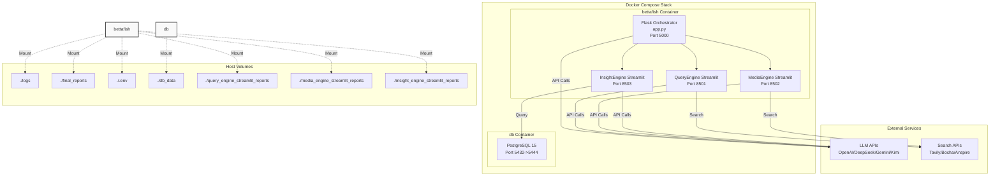

**Key Components:**

- **bettafish**: Main application container running Flask orchestrator and three Streamlit agent dashboards
- **db**: PostgreSQL 15 database for InsightEngine data mining
- **Volumes**: Seven volume mounts for persistent data and configuration
- **External APIs**: LLM and search services accessed over network

Sources: [docker-compose.yml:1-40](), [Dockerfile:76-77]()

---

## Container Image

### Base Image and System Dependencies

The BettaFish container is built on `python:3.11-slim` and includes comprehensive system dependencies for:

1. **PDF Generation (WeasyPrint)**: Pango, Cairo, GDK-Pixbuf, GTK3, libffi
2. **Browser Automation (Playwright)**: Chromium, system libraries for headless rendering
3. **Scientific Computing**: Build tools, OpenGL libraries
4. **Multimedia Processing**: ffmpeg

The container automatically handles dependencies that would otherwise require manual installation on host systems. See [ReportEngine/utils/dependency_check.py:20-95]() for platform-specific dependency requirements that Docker eliminates.

### Dockerfile Build Stages

```mermaid
graph TB
    BaseImage["python:3.11-slim"]
    
    subgraph "Build Stage 1: System Dependencies"
        AptUpdate["apt-get update"]
        InstallPango["Install Pango Stack<br/>libpango-1.0-0<br/>libpangocairo-1.0-0<br/>libpangoft2-1.0-0"]
        InstallGraphics["Install Graphics<br/>libcairo2<br/>libgdk-pixbuf-2.0-0<br/>libgtk-3-0"]
        InstallPlaywright["Install Playwright Deps<br/>libgl1, libnss3<br/>libxcb1, libgbm1"]
        InstallTools["Install Build Tools<br/>build-essential<br/>curl, git, ffmpeg"]
    end
    
    subgraph "Build Stage 2: Python Dependencies"
        InstallUV["Install uv<br/>Fast Python installer"]
        CopyRequirements["COPY requirements.txt"]
        UVInstall["uv pip install --system<br/>-r requirements.txt"]
    end
    
    subgraph "Build Stage 3: Playwright Browsers"
        PlaywrightInstall["python -m playwright install chromium"]
    end
    
    subgraph "Build Stage 4: Application Code"
        CopyEnv["COPY .env.example .env"]
        CopyApp["COPY . ."]
        CreateDirs["mkdir logs final_reports<br/>*_streamlit_reports"]
    end
    
    subgraph "Runtime Configuration"
        ExposePortsNode["EXPOSE 5000 8501 8502 8503"]
        SetCMD["CMD python app.py"]
    end
    
    BaseImage --> AptUpdate
    AptUpdate --> InstallPango
    InstallPango --> InstallGraphics
    InstallGraphics --> InstallPlaywright
    InstallPlaywright --> InstallTools
    
    InstallTools --> InstallUV
    InstallUV --> CopyRequirements
    CopyRequirements --> UVInstall
    
    UVInstall --> PlaywrightInstall
    
    PlaywrightInstall --> CopyEnv
    CopyEnv --> CopyApp
    CopyApp --> CreateDirs
    
    CreateDirs --> ExposePortsNode
    ExposePortsNode --> SetCMD
```

**Build Optimizations:**

1. **Layer Caching**: Dependencies installed before application code to maximize cache reuse [Dockerfile:58-60]()
2. **uv Package Manager**: Fast dependency installation using Astral's uv tool [Dockerfile:54]()
3. **Conditional GDK-Pixbuf**: Handles different package names across Debian versions [Dockerfile:15-19]()
4. **Minimal Cleanup**: `apt-get clean` and removal of `/var/lib/apt/lists/*` to reduce image size [Dockerfile:50-51]()

Sources: [Dockerfile:1-78](), [ReportEngine/utils/dependency_check.py:57-73]()

---

## Service Configuration

### bettafish Service

The main application container runs the Flask orchestrator which manages all three agent Streamlit dashboards.

**Key Configuration ([docker-compose.yml:4-24]()):**

```yaml
bettafish:
  image: ghcr.io/666ghj/bettafish:latest
  container_name: bettafish
  restart: unless-stopped
  environment:
    - PYTHONUNBUFFERED=1
    - STREAMLIT_SERVER_ENABLE_FILE_WATCHER=false
  ports:
    - "5000:5000"   # Flask
    - "8501:8501"   # QueryEngine
    - "8502:8502"   # MediaEngine
    - "8503:8503"   # InsightEngine
  volumes:
    - ./logs:/app/logs
    - ./final_reports:/app/final_reports
    - ./.env:/app/.env
    - ./insight_engine_streamlit_reports:/app/insight_engine_streamlit_reports
    - ./media_engine_streamlit_reports:/app/media_engine_streamlit_reports
    - ./query_engine_streamlit_reports:/app/query_engine_streamlit_reports
```

**Environment Variables:**
- `PYTHONUNBUFFERED=1`: Forces Python stdout/stderr to be unbuffered for real-time logging [docker-compose.yml:11]()
- `STREAMLIT_SERVER_ENABLE_FILE_WATCHER=false`: Disables Streamlit file watching in container [docker-compose.yml:12]()

**Default Command:**
The container runs `python app.py` [Dockerfile:77](), which starts the Flask orchestrator. Flask then spawns Streamlit processes for each agent dashboard.

### db Service (PostgreSQL)

PostgreSQL 15 database service for InsightEngine's data mining operations.

**Key Configuration ([docker-compose.yml:26-39]()):**

```yaml
db:
  image: postgres:15
  container_name: bettafish-db
  restart: unless-stopped
  env_file:
    - .env
  environment:
    POSTGRES_USER: ${POSTGRES_USER:-bettafish}
    POSTGRES_PASSWORD: ${POSTGRES_PASSWORD:-bettafish}
    POSTGRES_DB: ${POSTGRES_DB:-bettafish}
  ports:
    - "${POSTGRES_PORT:-5444}:5432"
  volumes:
    - ./db_data:/var/lib/postgresql/data
```

**Configuration Variables:**
- `POSTGRES_USER`: Database username (default: `bettafish`)
- `POSTGRES_PASSWORD`: Database password (default: `bettafish`)
- `POSTGRES_DB`: Database name (default: `bettafish`)
- `POSTGRES_PORT`: Host port mapping (default: `5444`)

All values default to the `:-` syntax, allowing override via `.env` file while providing sensible defaults.

**Port Mapping:**
Internal port `5432` (PostgreSQL default) is mapped to host port `5444` by default to avoid conflicts with host-installed PostgreSQL.

Sources: [docker-compose.yml:26-39]()

---

## Volume Management

### Volume Mount Structure

```mermaid
graph LR
    subgraph "Host Filesystem"
        HostLogs["./logs/"]
        HostReports["./final_reports/"]
        HostEnv["./.env"]
        HostDbData["./db_data/"]
        HostQueryReports["./query_engine_<br/>streamlit_reports/"]
        HostMediaReports["./media_engine_<br/>streamlit_reports/"]
        HostInsightReports["./insight_engine_<br/>streamlit_reports/"]
    end
    
    subgraph "bettafish Container"
        ContainerLogs["/app/logs/"]
        ContainerReports["/app/final_reports/"]
        ContainerEnv["/app/.env"]
        ContainerQueryReports["/app/query_engine_<br/>streamlit_reports/"]
        ContainerMediaReports["/app/media_engine_<br/>streamlit_reports/"]
        ContainerInsightReports["/app/insight_engine_<br/>streamlit_reports/"]
    end
    
    subgraph "db Container"
        ContainerDbData["/var/lib/postgresql/data/"]
    end
    
    HostLogs -.->|"Bind Mount"| ContainerLogs
    HostReports -.->|"Bind Mount"| ContainerReports
    HostEnv -.->|"Bind Mount"| ContainerEnv
    HostQueryReports -.->|"Bind Mount"| ContainerQueryReports
    HostMediaReports -.->|"Bind Mount"| ContainerMediaReports
    HostInsightReports -.->|"Bind Mount"| ContainerInsightReports
    HostDbData -.->|"Bind Mount"| ContainerDbData
```

### Volume Purposes

| Host Path | Container Path | Purpose | Persistence Required |
|-----------|---------------|---------|---------------------|
| `./logs` | `/app/logs` | Application logs (Loguru output) | Optional |
| `./final_reports` | `/app/final_reports` | Generated reports (HTML/PDF/MD) | **Required** |
| `./.env` | `/app/.env` | Environment configuration | **Required** |
| `./query_engine_streamlit_reports` | `/app/query_engine_streamlit_reports` | QueryEngine agent outputs | **Required** |
| `./media_engine_streamlit_reports` | `/app/media_engine_streamlit_reports` | MediaEngine agent outputs | **Required** |
| `./insight_engine_streamlit_reports` | `/app/insight_engine_streamlit_reports` | InsightEngine agent outputs | **Required** |
| `./db_data` | `/var/lib/postgresql/data` | PostgreSQL database files | **Required** |

**Volume Initialization:**

The container automatically creates empty directories if they don't exist [Dockerfile:72]():

```bash
mkdir -p /ms-playwright logs final_reports \
  insight_engine_streamlit_reports \
  media_engine_streamlit_reports \
  query_engine_streamlit_reports
```

However, host-side directories should be created before first run to ensure proper permissions:

```bash
mkdir -p logs final_reports db_data \
  query_engine_streamlit_reports \
  media_engine_streamlit_reports \
  insight_engine_streamlit_reports
```

Sources: [docker-compose.yml:18-24](), [docker-compose.yml:38-39](), [Dockerfile:72]()

---

## Port Mappings

### Service Port Allocation

```mermaid
graph LR
    subgraph "Host Ports"
        Host5000["localhost:5000"]
        Host8501["localhost:8501"]
        Host8502["localhost:8502"]
        Host8503["localhost:8503"]
        Host5444["localhost:5444"]
    end
    
    subgraph "Container Ports"
        Container5000["Flask<br/>0.0.0.0:5000"]
        Container8501["QueryEngine Streamlit<br/>0.0.0.0:8501"]
        Container8502["MediaEngine Streamlit<br/>0.0.0.0:8502"]
        Container8503["InsightEngine Streamlit<br/>0.0.0.0:8503"]
        Container5432["PostgreSQL<br/>0.0.0.0:5432"]
    end
    
    Host5000 --> Container5000
    Host8501 --> Container8501
    Host8502 --> Container8502
    Host8503 --> Container8503
    Host5444 --> Container5432
```

| Service | Host Port | Container Port | Protocol | Purpose |
|---------|-----------|----------------|----------|---------|
| Flask Orchestrator | 5000 | 5000 | HTTP | Main web UI and API |
| QueryEngine | 8501 | 8501 | HTTP | Agent dashboard |
| MediaEngine | 8502 | 8502 | HTTP | Agent dashboard |
| InsightEngine | 8503 | 8503 | HTTP | Agent dashboard |
| PostgreSQL | 5444* | 5432 | TCP | Database access |

*PostgreSQL host port is configurable via `POSTGRES_PORT` environment variable [docker-compose.yml:37]()

**Port Exposure in Dockerfile:**

All application ports are declared in the container image [Dockerfile:74]():
```dockerfile
EXPOSE 5000 8501 8502 8503
```

Sources: [docker-compose.yml:13-17](), [docker-compose.yml:36-37](), [Dockerfile:74]()

---

## Environment Configuration

### .env File Management

The container requires a `.env` file mounted at `/app/.env` [docker-compose.yml:21](). During image build, `.env.example` is copied as `.env` [Dockerfile:66](), but this should be overridden with a properly configured file at runtime.

**Required Configuration Variables:**

```bash
# LLM API Keys
OPENAI_API_KEY=sk-...
DEEPSEEK_API_KEY=...
GEMINI_API_KEY=...
KIMI_API_KEY=...

# Search API Keys
TAVILY_API_KEY=...
BOCHA_API_KEY=...
ANSPIRE_API_KEY=...

# Database Configuration
POSTGRES_USER=bettafish
POSTGRES_PASSWORD=bettafish
POSTGRES_DB=bettafish
POSTGRES_HOST=db  # Container name in docker-compose
POSTGRES_PORT=5432  # Internal container port
```

**Docker-Specific Considerations:**

1. **Database Host**: Must be set to `db` (the service name) for inter-container communication, not `localhost`
2. **Internal Port**: `POSTGRES_PORT` should be `5432` (internal), not `5444` (host mapping)
3. **Service Discovery**: Docker Compose creates a network where services can reach each other by service name

For detailed configuration options, see [Configuration](#2.2).

Sources: [docker-compose.yml:21](), [docker-compose.yml:30-35](), [Dockerfile:66]()

---

## Building from Source

While the pre-built image `ghcr.io/666ghj/bettafish:latest` is recommended, you can build locally.

### Build Process

1. **Clone repository:**
   ```bash
   git clone https://github.com/666ghj/BettaFish.git
   cd BettaFish
   ```

2. **Build image:**
   ```bash
   docker build -t bettafish:local .
   ```

3. **Update docker-compose.yml:**
   ```yaml
   bettafish:
     image: bettafish:local  # Change from ghcr.io/666ghj/bettafish:latest
     build: .                 # Add build context
   ```

4. **Launch with custom image:**
   ```bash
   docker-compose up -d
   ```

### Build Context Exclusions

The `.dockerignore` file prevents unnecessary files from being included in the build context [.dockerignore:1-13]():

```
.git
.gitmodules
.vscode
.cursor
__pycache__
*.py[cod]
*.pyo
*.pyd
*.log
*.sqlite3
.DS_Store
Thumbs.db
```

This reduces build context size and improves build speed by excluding:
- Version control artifacts (`.git`)
- IDE configuration (`.vscode`, `.cursor`)
- Python bytecode (`__pycache__`, `*.pyc`)
- Log files and temporary data

Sources: [Dockerfile:1-78](), [.dockerignore:1-13]()

---

## Database Setup

### Initial Database Initialization

The PostgreSQL container automatically initializes an empty database on first run. The database schema is created by the application when InsightEngine first connects.

**MindSpider Database Population:**

To populate the database with crawled data for InsightEngine analysis:

1. **Run MindSpider crawler** (see [Crawler Architecture](#6.1)):
   ```bash
   docker exec -it bettafish python -m MindSpider.main
   ```

2. **Verify data population:**
   ```bash
   docker exec -it bettafish-db psql -U bettafish -d bettafish -c "\dt"
   ```

Expected tables include:
- `daily_news`: Hot topics collected by NewsCollector
- `daily_topics`: AI-extracted keywords
- `xhs_note`, `douyin_aweme`, `bilibili_video`, etc.: Platform-specific content
- Platform comment tables (`*_comment`)

### Database Backup and Restore

**Backup:**
```bash
docker exec bettafish-db pg_dump -U bettafish bettafish > backup.sql
```

**Restore:**
```bash
cat backup.sql | docker exec -i bettafish-db psql -U bettafish bettafish
```

**Volume-based backup:**
```bash
# Stop database container
docker-compose stop db

# Backup volume directory
tar -czf db_backup_$(date +%Y%m%d).tar.gz ./db_data

# Restart database
docker-compose start db
```

Sources: [docker-compose.yml:26-39]()

---

## Troubleshooting

### Common Issues and Solutions

#### 1. PDF Export Not Working

**Symptom:** PDF rendering fails with Pango library errors

**Cause:** PDF dependencies require system libraries (Pango, Cairo, GDK-Pixbuf) which are pre-installed in the Docker image [Dockerfile:13-51]()

**Solution:** Verify container is using the official image or rebuild from Dockerfile. The container includes all required dependencies [ReportEngine/utils/dependency_check.py:57-73]().

Check dependency status inside container:
```bash
docker exec -it bettafish python -m ReportEngine.utils.dependency_check
```

Expected output:
```
✓ Pango 依赖检测通过，PDF 导出功能可用
```

#### 2. Sentiment Analysis Disabled

**Symptom:** InsightEngine reports "情感分析未执行"

**Cause:** PyTorch or Transformers not installed, or model download failed [InsightEngine/tools/sentiment_analyzer.py:32-42]()

**Solution:** The Docker image includes PyTorch and Transformers. On first run, the model downloads automatically [InsightEngine/tools/sentiment_analyzer.py:196-208]():

```bash
# Check model download
docker exec -it bettafish ls -la /app/SentimentAnalysisModel/WeiboMultilingualSentiment/model
```

If model directory is empty, manually trigger download:
```bash
docker exec -it bettafish python -c "from InsightEngine.tools.sentiment_analyzer import multilingual_sentiment_analyzer; multilingual_sentiment_analyzer.initialize()"
```

#### 3. Database Connection Refused

**Symptom:** InsightEngine cannot connect to PostgreSQL

**Cause:** Incorrect `POSTGRES_HOST` or service not ready

**Solution:** 
1. Verify `POSTGRES_HOST=db` in `.env` (not `localhost`)
2. Check database service is running:
   ```bash
   docker-compose ps db
   ```
3. Test connection:
   ```bash
   docker exec -it bettafish psql -h db -U bettafish -d bettafish -c "SELECT version();"
   ```

#### 4. Port Already in Use

**Symptom:** `docker-compose up` fails with "port is already allocated"

**Cause:** Another process using ports 5000, 8501-8503, or 5444

**Solution:**
1. Find conflicting process:
   ```bash
   lsof -i :5000  # Or other port
   ```
2. Stop conflicting service or modify port mapping in `docker-compose.yml`:
   ```yaml
   ports:
     - "5001:5000"  # Change host port
   ```

#### 5. Volume Permission Errors

**Symptom:** Cannot write to `/app/logs` or `/app/final_reports`

**Cause:** Host directory permissions

**Solution:** Ensure host directories are writable:
```bash
chmod -R 755 logs final_reports db_data \
  query_engine_streamlit_reports \
  media_engine_streamlit_reports \
  insight_engine_streamlit_reports
```

On Linux with SELinux:
```bash
chcon -Rt svirt_sandbox_file_t ./logs ./final_reports ./db_data
```

#### 6. Container Exits Immediately

**Symptom:** `docker-compose up` shows container exiting

**Cause:** Missing `.env` file or invalid configuration

**Solution:**
1. Check logs:
   ```bash
   docker-compose logs bettafish
   ```
2. Verify `.env` exists:
   ```bash
   ls -la .env
   ```
3. Validate required API keys are set
4. Check for syntax errors in `.env`

### Logs and Debugging

**View real-time logs:**
```bash
# All services
docker-compose logs -f

# Specific service
docker-compose logs -f bettafish
docker-compose logs -f db
```

**Execute commands inside container:**
```bash
# Interactive shell
docker exec -it bettafish bash

# Run Python script
docker exec -it bettafish python -m ReportEngine.utils.dependency_check

# Check system resources
docker stats bettafish
```

**Inspect container:**
```bash
# View environment variables
docker exec bettafish env

# Check running processes
docker exec bettafish ps aux

# Network configuration
docker exec bettafish cat /etc/hosts
```

Sources: [Dockerfile:1-78](), [docker-compose.yml:1-40](), [ReportEngine/utils/dependency_check.py:256-323](), [InsightEngine/tools/sentiment_analyzer.py:158-240]()

---

# Page: System Architecture

# System Architecture

<details>
<summary>Relevant source files</summary>

The following files were used as context for generating this wiki page:

- [.env.example](.env.example)
- [README-EN.md](README-EN.md)
- [README.md](README.md)
- [config.py](config.py)
- [report_engine_only.py](report_engine_only.py)
- [static/Partial README for PDF Exporting/README-EN.md](static/Partial README for PDF Exporting/README-EN.md)
- [static/Partial README for PDF Exporting/README.md](static/Partial README for PDF Exporting/README.md)
- [static/image/framework.png](static/image/framework.png)
- [static/image/logo_SwiftProxy.png](static/image/logo_SwiftProxy.png)

</details>


## Purpose and Scope

This document provides a comprehensive overview of the BettaFish system architecture, including the layered design, core components, agent collaboration patterns, and deployment model. It explains how the various subsystems—user interfaces, analysis agents, report generation, data collection, and storage—work together to deliver public opinion analysis capabilities.

For detailed information about specific architectural aspects, see:
- Multi-agent collaboration patterns: [Multi-Agent Collaboration](#3.1)
- Forum-based coordination mechanism: [ForumEngine Coordination](#3.2)
- Complete research workflow: [Research Workflow](#3.3)
- Data collection and processing: [Data Flow Pipeline](#3.4)

For implementation details of individual components, see:
- Agent implementations: [Core Agents](#4)
- Report generation pipeline: [Report Generation System](#5)
- Data crawler system: [MindSpider Crawler System](#6)

---

## System Overview

BettaFish implements a **five-layer architecture** that separates concerns between user interaction, analysis orchestration, report generation, data collection, and storage. The system is built around a multi-agent design where specialized agents collaborate through a forum mechanism to produce comprehensive analysis reports.

### High-Level Architecture

```mermaid
graph TB
    subgraph "Layer 1: User Interface"
        Flask["Flask Application<br/>(app.py:1-772)"]
        StreamlitUI["Streamlit Dashboards<br/>SingleEngineApp/*"]
    end
    
    subgraph "Layer 2: Analysis Orchestration"
        QueryEngine["QueryEngine<br/>(QueryEngine/agent.py)"]
        MediaEngine["MediaEngine<br/>(MediaEngine/agent.py)"]
        InsightEngine["InsightEngine<br/>(InsightEngine/agent.py)"]
        ForumEngine["ForumEngine<br/>(ForumEngine/monitor.py)"]
    end
    
    subgraph "Layer 3: Report Generation"
        ReportEngine["ReportEngine<br/>(ReportEngine/agent.py)"]
        TemplateSystem["Template System<br/>(ReportEngine/core/)"]
        IRValidator["IR Validator<br/>(ReportEngine/ir/)"]
        Renderers["Renderers<br/>(ReportEngine/renderers/)"]
    end
    
    subgraph "Layer 4: Data Collection"
        MindSpider["MindSpider<br/>(MindSpider/main.py)"]
        BroadTopic["BroadTopicExtraction"]
        DeepCrawl["DeepSentimentCrawling"]
    end
    
    subgraph "Layer 5: Storage & External Services"
        Database["PostgreSQL/MySQL<br/>(config.py:32-39)"]
        LLMAPIs["LLM APIs<br/>(config.py:44-77)"]
        SearchAPIs["Search APIs<br/>(config.py:79-90)"]
    end
    
    Flask --> QueryEngine
    Flask --> MediaEngine
    Flask --> InsightEngine
    Flask --> ForumEngine
    Flask --> ReportEngine
    
    StreamlitUI --> QueryEngine
    StreamlitUI --> MediaEngine
    StreamlitUI --> InsightEngine
    
    QueryEngine --> ForumEngine
    MediaEngine --> ForumEngine
    InsightEngine --> ForumEngine
    
    QueryEngine --> ReportEngine
    MediaEngine --> ReportEngine
    InsightEngine --> ReportEngine
    ForumEngine --> ReportEngine
    
    ReportEngine --> TemplateSystem
    ReportEngine --> IRValidator
    ReportEngine --> Renderers
    
    MindSpider --> BroadTopic
    MindSpider --> DeepCrawl
    
    QueryEngine --> SearchAPIs
    MediaEngine --> SearchAPIs
    InsightEngine --> Database
    QueryEngine --> LLMAPIs
    MediaEngine --> LLMAPIs
    InsightEngine --> LLMAPIs
    ReportEngine --> LLMAPIs
    ForumEngine --> LLMAPIs
    
    BroadTopic --> LLMAPIs
    DeepCrawl --> Database
```

**Sources:** [README.md:80-286](), [README-EN.md:79-285](), [app.py:1-772](), [config.py:1-132]()

---

## Core Components

### Layer 1: User Interface

The user interface layer provides two distinct entry points into the system:

| Component | File Path | Port | Purpose |
|-----------|-----------|------|---------|
| **Flask Orchestrator** | [app.py:1-772]() | 5000 | Main web application; coordinates all agents and manages complete analysis workflow |
| **QueryEngine Dashboard** | [SingleEngineApp/query_engine_streamlit_app.py]() | 8503 | Standalone interface for web search agent |
| **MediaEngine Dashboard** | [SingleEngineApp/media_engine_streamlit_app.py]() | 8502 | Standalone interface for multimodal analysis agent |
| **InsightEngine Dashboard** | [SingleEngineApp/insight_engine_streamlit_app.py]() | 8501 | Standalone interface for database mining agent |

The `Flask` application serves as the primary orchestrator, managing the complete lifecycle from query submission through agent execution to final report delivery. It uses **Socket.IO** for real-time console log streaming and **Server-Sent Events (SSE)** for report generation progress updates.

**Sources:** [README.md:240-253](), [app.py:1-772]()

---

### Layer 2: Analysis Orchestration

The analysis layer implements a **multi-agent collaboration pattern** where three specialized agents work in parallel, coordinated by a forum engine:

```mermaid
graph LR
    subgraph "Analysis Agents"
        Query["QueryEngine<br/>DeepSeek + Tavily<br/>(QueryEngine/agent.py)"]
        Media["MediaEngine<br/>Gemini + Bocha/Anspire<br/>(MediaEngine/agent.py)"]
        Insight["InsightEngine<br/>Kimi + MediaCrawlerDB<br/>(InsightEngine/agent.py)"]
    end
    
    subgraph "Coordination Layer"
        Forum["ForumEngine<br/>(ForumEngine/monitor.py)"]
        Host["LLM Host<br/>(ForumEngine/llm_host.py)"]
    end
    
    Query -->|"Post findings"| Forum
    Media -->|"Post findings"| Forum
    Insight -->|"Post findings"| Forum
    
    Forum --> Host
    Host -->|"Generate directives"| Forum
    
    Forum -->|"Read discussions"| Query
    Forum -->|"Read discussions"| Media
    Forum -->|"Read discussions"| Insight
```

#### Agent Specialization

Each agent is optimized for a specific domain with dedicated tools and LLM configuration:

**QueryEngine** ([QueryEngine/agent.py]()):
- **LLM**: DeepSeek Chat ([config.py:54-57]())
- **Search Tools**: Tavily API ([config.py:81]())
- **Purpose**: Authoritative web search; retrieves official news, academic sources, and structured web content
- **Output Directory**: `query_engine_streamlit_reports/`

**MediaEngine** ([MediaEngine/agent.py]()):
- **LLM**: Gemini 2.5 Pro ([config.py:49-52]())
- **Search Tools**: Bocha/Anspire multimodal search ([config.py:84-90]())
- **Purpose**: Multimodal content analysis; processes videos, images, and social media with rich media
- **Output Directory**: `media_engine_streamlit_reports/`

**InsightEngine** ([InsightEngine/agent.py]()):
- **LLM**: Kimi K2 ([config.py:44-47]())
- **Database**: MediaCrawlerDB via SQLAlchemy ([InsightEngine/utils/db.py]())
- **Tools**: KeywordOptimizer ([InsightEngine/tools/keyword_optimizer.py]()), SentimentAnalyzer ([InsightEngine/tools/sentiment_analyzer.py]())
- **Purpose**: Private database mining; analyzes crawled social media data, performs sentiment analysis
- **Output Directory**: `insight_engine_streamlit_reports/`

**ForumEngine** ([ForumEngine/monitor.py:1-458]()):
- **LLM**: Configurable forum host ([config.py:69-72]())
- **Purpose**: Monitors agent outputs, facilitates multi-round discussion, generates moderator directives
- **Mechanism**: Prevents groupthink by introducing an LLM moderator that challenges assumptions and redirects focus

**Sources:** [README.md:83-110](), [config.py:44-77](), [QueryEngine/agent.py](), [MediaEngine/agent.py](), [InsightEngine/agent.py](), [ForumEngine/monitor.py:1-458]()

---

### Layer 3: Report Generation

The report generation layer implements a **multi-stage pipeline** that transforms agent outputs into publication-quality reports:

```mermaid
graph TD
    subgraph "Input Phase"
        QR["QueryEngine Report<br/>(*.md)"]
        MR["MediaEngine Report<br/>(*.md)"]
        IR["InsightEngine Report<br/>(*.md)"]
        FL["Forum Logs<br/>(logs/forum_*.log)"]
    end
    
    subgraph "ReportEngine Pipeline"
        FC["FileCountBaseline<br/>(agent.py:85-120)"]
        TS["TemplateSelectionNode<br/>(nodes/template_selection_node.py)"]
        DL["DocumentLayoutNode<br/>(nodes/document_layout_node.py)"]
        WB["WordBudgetNode<br/>(nodes/word_budget_node.py)"]
        CG["ChapterGenerationNode<br/>(nodes/chapter_generation_node.py)"]
        CS["ChapterStorage<br/>(core/chapter_storage.py)"]
        ST["DocumentComposer<br/>(core/stitcher.py)"]
    end
    
    subgraph "Document IR"
        IRJson["document_ir.json<br/>(ir/schema.py)"]
    end
    
    subgraph "Rendering Phase"
        HTML["HTMLRenderer<br/>(renderers/html_renderer.py)"]
        PDF["PDFRenderer<br/>(renderers/pdf_renderer.py)"]
        MD["MarkdownRenderer<br/>(renderers/markdown_renderer.py)"]
    end
    
    subgraph "Output Files"
        HTMLOut["final_reports/*.html"]
        PDFOut["final_reports/pdf/*.pdf"]
        MDOut["final_reports/md/*.md"]
        IROut["final_reports/ir/*.json"]
    end
    
    QR --> FC
    MR --> FC
    IR --> FC
    FL --> FC
    
    FC --> TS
    TS --> DL
    DL --> WB
    WB --> CG
    CG --> CS
    CS --> ST
    ST --> IRJson
    
    IRJson --> HTML
    IRJson --> PDF
    IRJson --> MD
    
    HTML --> HTMLOut
    PDF --> PDFOut
    MD --> MDOut
    IRJson --> IROut
```

#### Pipeline Stages

1. **File Count Baseline** ([agent.py:85-120]()): Verifies that all agents produced new outputs since last run
2. **Template Selection** ([nodes/template_selection_node.py]()): LLM selects appropriate report template from `report_template/` directory
3. **Document Layout** ([nodes/document_layout_node.py]()): Designs title, table of contents, and visual theme
4. **Word Budget Planning** ([nodes/word_budget_node.py]()): Allocates word counts across sections
5. **Chapter Generation** ([nodes/chapter_generation_node.py]()): Generates each chapter as structured JSON (Document IR format)
6. **Chapter Storage** ([core/chapter_storage.py]()): Persists chapters to `ReportEngine/chapter_output/run_*/`
7. **Document Stitching** ([core/stitcher.py]()): Assembles chapters into complete Document IR
8. **Multi-format Rendering**: Renders IR to HTML, PDF, and Markdown

The **Document IR** (Intermediate Representation) is a versioned JSON schema ([ir/schema.py]()) that serves as a single source of truth for all output formats. This architecture enables:
- Consistent rendering across formats
- Independent chapter regeneration
- Post-generation format conversion without re-running agents
- Robust error recovery through structured validation

**Sources:** [README.md:157-193](), [ReportEngine/agent.py:1-645](), [ReportEngine/core/](), [ReportEngine/ir/](), [ReportEngine/nodes/](), [ReportEngine/renderers/]()

---

### Layer 4: Data Collection

The data collection layer operates autonomously to populate the database with public opinion data:

```mermaid
graph TB
    subgraph "MindSpider System"
        Main["main.py<br/>(MindSpider/main.py)"]
        Config["config.py<br/>(MindSpider/config.py)"]
    end
    
    subgraph "Phase 1: Broad Topic Extraction"
        NewsCol["NewsCollector<br/>(BroadTopicExtraction/get_today_news.py)"]
        TopicExt["TopicExtractor<br/>(BroadTopicExtraction/topic_extractor.py)"]
        DBMgr["DatabaseManager<br/>(BroadTopicExtraction/database_manager.py)"]
    end
    
    subgraph "Phase 2: Deep Sentiment Crawling"
        KWMgr["KeywordManager<br/>(DeepSentimentCrawling/keyword_manager.py)"]
        PlatCrawl["PlatformCrawler<br/>(DeepSentimentCrawling/platform_crawler.py)"]
        MediaCrawler["MediaCrawler<br/>(DeepSentimentCrawling/MediaCrawler/)"]
    end
    
    subgraph "Database Tables"
        DailyNews["daily_news"]
        DailyTopics["daily_topics"]
        ContentTables["xhs_note<br/>douyin_aweme<br/>bilibili_video<br/>weibo_note<br/>..."]
        CommentTables["*_comment"]
    end
    
    subgraph "13+ Platforms"
        Weibo["Weibo"]
        Douyin["Douyin"]
        XHS["Xiaohongshu"]
        Kuaishou["Kuaishou"]
        Bilibili["Bilibili"]
        Others["..."]
    end
    
    Main --> NewsCol
    Main --> TopicExt
    Main --> KWMgr
    Main --> PlatCrawl
    
    NewsCol --> DailyNews
    TopicExt --> DailyTopics
    
    DailyTopics --> KWMgr
    KWMgr --> PlatCrawl
    PlatCrawl --> MediaCrawler
    
    MediaCrawler --> Weibo
    MediaCrawler --> Douyin
    MediaCrawler --> XHS
    MediaCrawler --> Kuaishou
    MediaCrawler --> Bilibili
    MediaCrawler --> Others
    
    MediaCrawler --> ContentTables
    MediaCrawler --> CommentTables
```

#### Two-Phase Architecture

**Phase 1: Broad Topic Extraction**
- Collects daily hot news from aggregators
- Uses LLM to extract trending topics and generate keywords
- Stores results in `daily_news` and `daily_topics` tables
- Runs independently on schedule

**Phase 2: Deep Sentiment Crawling**
- Reads keywords from `daily_topics`
- Orchestrates parallel crawling across 13+ social media platforms
- Stores content in platform-specific tables (`xhs_note`, `douyin_aweme`, etc.)
- Stores user comments in `*_comment` tables

The MindSpider system operates independently of the analysis workflow, continuously populating the database that InsightEngine queries.

**Sources:** [README.md:197-242](), [MindSpider/main.py](), [MindSpider/BroadTopicExtraction/](), [MindSpider/DeepSentimentCrawling/]()

---

### Layer 5: Storage & External Services

#### Database System

The system uses a **polyglot persistence model** with primary support for PostgreSQL and MySQL:

| Configuration | Environment Variable | Purpose |
|---------------|---------------------|---------|
| Dialect | `DB_DIALECT` | `postgresql` or `mysql` ([config.py:33]()) |
| Host | `DB_HOST` | Database server address ([config.py:34]()) |
| Port | `DB_PORT` | Database port (default: 5432 for PostgreSQL) ([config.py:35]()) |
| User | `DB_USER` | Database username ([config.py:36]()) |
| Password | `DB_PASSWORD` | Database password ([config.py:37]()) |
| Database | `DB_NAME` | Database name ([config.py:38]()) |

Database access is managed through:
- **InsightEngine**: SQLAlchemy async engine ([InsightEngine/utils/db.py]())
- **MindSpider**: ORM models ([MindSpider/schema/models_sa.py](), [MindSpider/schema/models_bigdata.py]())

#### External Services

The system integrates multiple external APIs, all configured via environment variables ([.env.example:1-77]()):

**LLM Services** ([config.py:44-77]()):
- Each agent has dedicated API key, base URL, and model name configuration
- Supports any OpenAI-compatible API endpoint
- Recommended models:
  - QueryEngine: DeepSeek Chat
  - MediaEngine: Gemini 2.5 Pro
  - InsightEngine: Kimi K2
  - ReportEngine: Gemini 2.5 Pro
  - ForumEngine Host: Qwen Plus
  - KeywordOptimizer: Qwen Plus

**Search Services** ([config.py:79-90]()):
- **Tavily API**: Web search for QueryEngine ([config.py:81]())
- **Anspire API**: Multimodal search for MediaEngine ([config.py:88-90]())
- **Bocha API**: Alternative multimodal search ([config.py:84-86]())
- Search tool type configurable via `SEARCH_TOOL_TYPE` ([config.py:83]())

**Sources:** [config.py:1-132](), [.env.example:1-77](), [InsightEngine/utils/db.py]()

---

## Architectural Patterns

### Multi-Agent Collaboration Pattern

The system implements a **collaborative multi-agent architecture** where specialized agents work in parallel rather than in sequence. Key characteristics:

1. **Parallel Initialization**: All three analysis agents start simultaneously ([README.md:101]())
2. **Specialized Tooling**: Each agent has unique tools and LLM configuration optimized for its domain
3. **Shared Forum**: Agents communicate through ForumEngine rather than direct message passing
4. **Independent Outputs**: Each agent produces standalone reports that ReportEngine synthesizes

This pattern provides:
- **Fault Tolerance**: Failure of one agent doesn't block others
- **Scalability**: Agents can run on separate machines/containers
- **Specialization**: Domain-specific optimization without compromise

**Sources:** [README.md:98-109]()

---

### Forum-Based Coordination

Rather than traditional message passing or shared memory, agents coordinate through a **forum mechanism** ([ForumEngine/monitor.py:1-458]()):

1. **Agent Posting**: Each agent writes findings to its output file
2. **Forum Monitoring**: ForumEngine monitors all agent output files for changes
3. **LLM Moderation**: Forum host (LLM) reads all agent outputs and generates directives
4. **Directive Distribution**: Agents read forum via `forum_reader` tool ([utils/forum_reader.py]())
5. **Iterative Refinement**: Process repeats for 3-5 reflection cycles ([README.md:103-108]())

This pattern prevents **groupthink** by introducing an independent moderator that:
- Challenges agent assumptions
- Identifies gaps in analysis
- Redirects focus to under-explored areas
- Synthesizes cross-agent insights

**Sources:** [README.md:51](), [ForumEngine/monitor.py:1-458](), [utils/forum_reader.py]()

---

### Document IR Architecture

The report generation system uses an **Intermediate Representation (IR)** pattern:

```mermaid
graph LR
    subgraph "Generation Phase"
        LLM["LLM<br/>Structured Output"]
        ChapterJSON["Chapter JSON<br/>(IR format)"]
    end
    
    subgraph "Validation Phase"
        IRValidator["IRValidator<br/>(ir/validator.py)"]
        ChartValidator["ChartValidator<br/>(utils/chart_validator.py)"]
    end
    
    subgraph "Storage Phase"
        ChapterFiles["chapter_output/<br/>run_*/sections/*.json"]
        DocumentIR["final_reports/ir/<br/>document_ir.json"]
    end
    
    subgraph "Rendering Phase"
        HTMLRender["HTMLRenderer"]
        PDFRender["PDFRenderer"]
        MDRender["MarkdownRenderer"]
    end
    
    LLM --> ChapterJSON
    ChapterJSON --> IRValidator
    IRValidator --> ChartValidator
    ChartValidator --> ChapterFiles
    ChapterFiles --> DocumentIR
    
    DocumentIR --> HTMLRender
    DocumentIR --> PDFRender
    DocumentIR --> MDRender
```

**IR Schema Structure** ([ReportEngine/ir/schema.py]()):
- **Version**: `v1.0` with schema evolution support
- **Block Types**: `paragraph`, `heading`, `list`, `blockquote`, `codeBlock`, `table`, `chart`, `divider`, `callout`, `columnLayout`
- **Inline Marks**: `strong`, `emphasis`, `code`, `link`, `strikethrough`, `underline`, `highlight`, `superscript`, `subscript`
- **Chart Types**: Supports Chart.js configuration for `line`, `bar`, `pie`, `doughnut`, `radar`, `polarArea`

This architecture enables:
- **Single Source of Truth**: IR is canonical; formats are derived
- **Independent Rendering**: Can regenerate any format without re-running agents
- **Robust Validation**: Multi-stage validation catches LLM output errors
- **Format Consistency**: All outputs guaranteed to have identical content

**Sources:** [ReportEngine/ir/schema.py](), [ReportEngine/ir/validator.py](), [ReportEngine/utils/chart_validator.py](), [ReportEngine/core/stitcher.py]()

---

### Error Recovery and Retry Logic

The system implements **multi-stage error recovery** throughout the pipeline:

#### LLM Output Repair

When LLM generates malformed JSON ([ReportEngine/utils/json_parser.py]()):

1. **Local Repairs**: Pattern-based fixes for common LLM mistakes (trailing commas, unescaped quotes)
2. **json-repair Library**: External library for syntax fixes
3. **LLM-assisted Repair**: Sends malformed JSON back to LLM with repair instructions
4. **Cross-engine Rescue**: If primary LLM fails, tries alternative engines (Report → Forum → Insight → Media)

#### Chart Validation and Repair

Chart.js configurations are validated against strict rules ([ReportEngine/utils/chart_validator.py]()):

- Dataset validation (labels, data arrays, colors)
- Options validation (scales, plugins, layout)
- Chart type compatibility checks
- Automatic repair attempts via `ChartRepairer` class

#### Network Retry

HTTP requests use tenacity-based retry with exponential backoff ([utils/retry_helper.py]()):
- Configurable retry attempts
- Exponential backoff with jitter
- Request/response logging for debugging

**Sources:** [ReportEngine/utils/json_parser.py](), [ReportEngine/utils/chart_validator.py](), [ReportEngine/utils/chart_repair_api.py](), [utils/retry_helper.py]()

---

## Technology Stack

### Core Technologies

| Layer | Technology | Purpose | Configuration |
|-------|-----------|---------|---------------|
| **Web Framework** | Flask 3.x | Main web application | [app.py:1-772]() |
| **Real-time Communication** | Flask-SocketIO | Console log streaming | [app.py]() |
| **Agent Dashboards** | Streamlit | Individual agent UIs | [SingleEngineApp/]() |
| **Database** | PostgreSQL/MySQL | Primary data store | [config.py:32-39]() |
| **ORM** | SQLAlchemy 2.x | Database abstraction | [InsightEngine/utils/db.py]() |
| **LLM Client** | OpenAI SDK | Multi-provider LLM access | [config.py:44-77]() |
| **Web Scraping** | Playwright | Browser automation | [MindSpider/]() |
| **PDF Generation** | WeasyPrint | HTML to PDF conversion | [ReportEngine/renderers/pdf_renderer.py]() |
| **Charts** | Plotly + Chart.js | Data visualization | [ReportEngine/]() |
| **Logging** | Loguru | Structured logging | Throughout codebase |

### Python Dependencies

Key packages from [requirements.txt]():

```
flask>=3.0.0
streamlit>=1.28.0
sqlalchemy>=2.0.0
openai>=1.0.0
playwright>=1.40.0
weasyprint>=60.0
plotly>=5.18.0
loguru>=0.7.0
tenacity>=8.0.0
pydantic-settings>=2.0.0
```

System dependencies for PDF export ([static/Partial README for PDF Exporting/README.md:1-95]()):
- **Pango**: Text rendering engine
- **GTK3**: GUI toolkit (Windows)
- **Cairo**: Graphics library
- **GDK-Pixbuf**: Image loading

**Sources:** [requirements.txt](), [README.md:330-369](), [static/Partial README for PDF Exporting/README.md:1-95]()

---

## Deployment Architecture

### Docker Compose Deployment

The system uses **Docker Compose** for containerized deployment ([docker-compose.yml]()):

```mermaid
graph TB
    subgraph "Docker Network"
        AppContainer["bettafish Container<br/>Python 3.11<br/>Port 5000"]
        DBContainer["PostgreSQL Container<br/>Port 5444"]
    end
    
    subgraph "Volumes"
        DBData["Database Volume<br/>postgres_data"]
        Reports["Reports Volume<br/>./final_reports"]
        Logs["Logs Volume<br/>./logs"]
    end
    
    subgraph "External Access"
        WebBrowser["Web Browser<br/>localhost:5000"]
    end
    
    AppContainer -->|"TCP/5432"| DBContainer
    DBContainer --> DBData
    AppContainer --> Reports
    AppContainer --> Logs
    WebBrowser -->|"HTTP/5000"| AppContainer
```

#### Container Configuration

**bettafish Container**:
- Base image: Python 3.11
- Includes all system dependencies (Pango, GTK, fonts)
- Exposes port 5000 (Flask)
- Runs [app.py:1-772]()

**PostgreSQL Container**:
- Image: postgres:latest
- Exposes port 5444 (mapped from internal 5432)
- Data persisted to `postgres_data` volume

#### Environment Configuration

All configuration via `.env` file ([.env.example:1-77]()):
- Database connection parameters (host=`db`, port=`5432` when using Docker)
- LLM API keys and endpoints
- Search API keys

**Sources:** [docker-compose.yml](), [README.md:288-323](), [.env.example:1-77]()

---

### Source Code Deployment

For development or custom deployments, the system can run directly from source:

#### Prerequisites
- Python 3.9+ ([README.md:331]())
- Conda or uv environment manager ([README.md:339-352]())
- PostgreSQL or MySQL database ([README.md:334]())
- System dependencies for PDF export (optional, [static/Partial README for PDF Exporting/README.md:1-95]())

#### Startup Sequence

1. **Activate Environment**: `conda activate your_conda_name`
2. **Start Main Application**: `python app.py` ([README.md:424]())
   - Flask starts on port 5000
   - Automatically launches three Streamlit dashboards on ports 8501-8503
   - Streamlit processes are child processes managed by Flask

3. **Individual Agent Startup** (optional):
   ```bash
   streamlit run SingleEngineApp/query_engine_streamlit_app.py --server.port 8503
   streamlit run SingleEngineApp/media_engine_streamlit_app.py --server.port 8502
   streamlit run SingleEngineApp/insight_engine_streamlit_app.py --server.port 8501
   ```

4. **MindSpider Crawler** (separate process):
   ```bash
   cd MindSpider
   python main.py --complete --date 2024-01-20
   ```

**Sources:** [README.md:325-461](), [app.py:1-772]()

---

## Configuration Management

The system uses **pydantic-settings** for unified configuration management ([config.py:1-132]()):

### Settings Class Structure

```python
class Settings(BaseSettings):
    # Flask server
    HOST: str = "0.0.0.0"
    PORT: int = 5000
    
    # Database
    DB_DIALECT: str = "postgresql"
    DB_HOST: str
    DB_PORT: int = 3306
    DB_USER: str
    DB_PASSWORD: str
    DB_NAME: str
    DB_CHARSET: str = "utf8mb4"
    
    # LLM configurations (one per agent)
    INSIGHT_ENGINE_API_KEY: Optional[str]
    INSIGHT_ENGINE_BASE_URL: Optional[str]
    INSIGHT_ENGINE_MODEL_NAME: str
    # ... (similar for other agents)
    
    # Search APIs
    TAVILY_API_KEY: Optional[str]
    SEARCH_TOOL_TYPE: Literal["AnspireAPI", "BochaAPI"]
    ANSPIRE_API_KEY: Optional[str]
    BOCHA_WEB_SEARCH_API_KEY: Optional[str]
```

### Configuration Priority

1. Environment variables
2. `.env` file in current working directory ([config.py:19]())
3. `.env` file in project root ([config.py:20]())
4. Default values in `Settings` class ([config.py:23-111]())

### Runtime Reload

Configuration can be reloaded at runtime via `reload_settings()` function ([config.py:118-131]()):
```python
def reload_settings() -> Settings:
    global settings
    settings = Settings()
    return settings
```

**Sources:** [config.py:1-132](), [.env.example:1-77]()

---

## Execution Workflow

A complete analysis execution follows this sequence:

```mermaid
sequenceDiagram
    participant User
    participant Flask
    participant Query as QueryEngine
    participant Media as MediaEngine
    participant Insight as InsightEngine
    participant Forum as ForumEngine
    participant Report as ReportEngine
    
    User->>Flask: Submit query via /start_research
    Flask->>Flask: Validate configuration
    
    par Launch Agents in Parallel
        Flask->>Query: Launch subprocess (port 8503)
        Flask->>Media: Launch subprocess (port 8502)
        Flask->>Insight: Launch subprocess (port 8501)
    end
    
    Flask->>Forum: Initialize monitoring
    
    Note over Query,Insight: Initial Overview Search (5 min)
    
    loop Reflection Cycles (3-5 iterations)
        Query->>Query: Deep research + write report
        Media->>Media: Deep research + write report
        Insight->>Insight: Deep research + write report
        
        Forum->>Forum: Monitor output files
        Forum->>Forum: Generate moderator directive
        
        Query->>Forum: Read forum via forum_reader
        Media->>Forum: Read forum via forum_reader
        Insight->>Forum: Read forum via forum_reader
    end
    
    Note over Query,Insight: All agents signal completion
    
    Flask->>Report: generate_report()
    Report->>Report: FileCountBaseline check
    Report->>Report: Template selection
    Report->>Report: Layout design
    Report->>Report: Word budget planning
    Report->>Report: Chapter generation (LLM)
    Report->>Report: Document IR stitching
    Report->>Report: HTML rendering
    Report->>Report: PDF rendering (optional)
    
    Report->>Flask: Return report metadata
    Flask->>User: Display final report
```

### Execution Timeline

| Phase | Duration | Activities |
|-------|----------|-----------|
| **Agent Launch** | 10-30 sec | Flask spawns Streamlit subprocesses |
| **Initial Analysis** | 3-5 min | Each agent performs overview search |
| **Reflection Cycles** | 15-30 min | 3-5 rounds of deep research + forum discussion |
| **Report Generation** | 10-20 min | Template → Layout → Budget → Chapters → Render |
| **Total** | 30-60 min | Complete end-to-end analysis |

**Sources:** [README.md:98-110](), [app.py:1-772]()

---

## Command-Line Tools

The system provides command-line utilities for specific workflows:

### report_engine_only.py

Standalone report generation without running agents ([report_engine_only.py:1-568]()):

```bash
# Generate report from latest agent outputs
python report_engine_only.py

# Specify custom query topic
python report_engine_only.py --query "AI Industry Analysis"

# Skip PDF generation
python report_engine_only.py --skip-pdf

# Skip Markdown generation  
python report_engine_only.py --skip-markdown

# Verbose logging
python report_engine_only.py --verbose
```

**Use Cases:**
- Rapid report iteration without re-running agents
- Testing ReportEngine modifications
- Regenerating reports with different templates

**Sources:** [report_engine_only.py:1-568](), [README.md:485-526]()

---

### Regeneration Utilities

Utilities for re-rendering reports from existing IR or chapters:

| Script | Purpose | Input | Output |
|--------|---------|-------|--------|
| `regenerate_latest_html.py` | Re-render HTML from latest chapter JSONs | `chapter_output/run_*/*.json` | HTML report |
| `regenerate_latest_md.py` | Re-render Markdown from latest chapter JSONs | `chapter_output/run_*/*.json` | Markdown report |
| `regenerate_latest_pdf.py` | Re-render PDF from latest Document IR | `final_reports/ir/*.json` | PDF report |

These tools are useful for:
- Testing renderer modifications
- Regenerating after IR schema fixes
- Producing additional formats without re-generation

**Sources:** [README.md:528-531](), [regenerate_latest_html.py](), [regenerate_latest_md.py](), [regenerate_latest_pdf.py]()

---

## Summary

The BettaFish system architecture demonstrates several key design principles:

1. **Separation of Concerns**: Five distinct layers with clear responsibilities
2. **Agent Specialization**: Domain-specific agents with optimized tools and LLMs
3. **Forum-Based Coordination**: Novel collaboration pattern that prevents groupthink
4. **Document IR Pattern**: Single source of truth enabling consistent multi-format output
5. **Multi-Stage Error Recovery**: Robust handling of LLM output errors at multiple levels
6. **Containerized Deployment**: Production-ready Docker Compose setup with volume persistence

The modular architecture allows independent development and testing of components while maintaining system-wide consistency through well-defined interfaces (agent outputs, Document IR, database schemas).

For deeper dives into specific aspects:
- Multi-agent interaction patterns: [Multi-Agent Collaboration](#3.1)
- Forum moderation mechanism: [ForumEngine Coordination](#3.2)
- Complete execution workflow: [Research Workflow](#3.3)
- Data collection pipeline: [Data Flow Pipeline](#3.4)

**Sources:** [README.md:1-797](), [README-EN.md:1-797](), All cited files above

---

# Page: Multi-Agent Collaboration

# Multi-Agent Collaboration

<details>
<summary>Relevant source files</summary>

The following files were used as context for generating this wiki page:

- [.env.example](.env.example)
- [MediaEngine/__init__.py](MediaEngine/__init__.py)
- [MediaEngine/agent.py](MediaEngine/agent.py)
- [MediaEngine/state/state.py](MediaEngine/state/state.py)
- [MediaEngine/tools/__init__.py](MediaEngine/tools/__init__.py)
- [MediaEngine/tools/search.py](MediaEngine/tools/search.py)
- [MediaEngine/utils/config.py](MediaEngine/utils/config.py)
- [README-EN.md](README-EN.md)
- [README.md](README.md)
- [SingleEngineApp/insight_engine_streamlit_app.py](SingleEngineApp/insight_engine_streamlit_app.py)
- [SingleEngineApp/media_engine_streamlit_app.py](SingleEngineApp/media_engine_streamlit_app.py)
- [SingleEngineApp/query_engine_streamlit_app.py](SingleEngineApp/query_engine_streamlit_app.py)
- [config.py](config.py)
- [report_engine_only.py](report_engine_only.py)
- [static/Partial README for PDF Exporting/README-EN.md](static/Partial README for PDF Exporting/README-EN.md)
- [static/Partial README for PDF Exporting/README.md](static/Partial README for PDF Exporting/README.md)
- [static/image/framework.png](static/image/framework.png)
- [static/image/logo_SwiftProxy.png](static/image/logo_SwiftProxy.png)
- [utils/github_issues.py](utils/github_issues.py)

</details>


## Purpose and Scope

This page describes the parallel multi-agent architecture that forms the core analysis layer of the BettaFish system. It documents the three specialized analysis agents (QueryEngine, MediaEngine, and InsightEngine), their individual responsibilities, parallel execution model, communication mechanisms, and data flow patterns. 

For information about how these agents collaborate through the ForumEngine debate moderator mechanism, see [ForumEngine Coordination](#3.2). For the detailed research workflow used by each agent, see [Research Workflow](#3.3).

## Architecture Overview

The BettaFish system employs three specialized agents that execute research tasks in parallel, each with distinct capabilities and data sources. All three agents share the same `DeepSearchAgent` class structure but are configured with different LLMs, tools, and data sources.

**Multi-Agent Collaboration Diagram**

```mermaid
graph TB
    subgraph "Orchestration Layer"
        FlaskApp["Flask Application<br/>app.py"]
        InitSystem["initialize_system_components()"]
        StreamlitScripts["STREAMLIT_SCRIPTS dict<br/>app.py:517-522"]
    end
    
    subgraph "Analysis Agents - Parallel Subprocess Execution"
        QueryProc["subprocess.Popen<br/>query_engine_streamlit_app.py<br/>Port 8503"]
        MediaProc["subprocess.Popen<br/>media_engine_streamlit_app.py<br/>Port 8502"]
        InsightProc["subprocess.Popen<br/>insight_engine_streamlit_app.py<br/>Port 8501"]
        
        QueryAgent["DeepSearchAgent<br/>QueryEngine/agent.py:26-400"]
        MediaAgent["DeepSearchAgent<br/>MediaEngine/agent.py:26-400"]
        InsightAgent["DeepSearchAgent<br/>InsightEngine/agent.py"]
    end
    
    subgraph "Agent-Specific Configurations - config.py Settings"
        QueryConfig["QUERY_ENGINE_API_KEY<br/>QUERY_ENGINE_BASE_URL<br/>QUERY_ENGINE_MODEL_NAME<br/>config.py:54-57"]
        MediaConfig["MEDIA_ENGINE_API_KEY<br/>MEDIA_ENGINE_BASE_URL<br/>MEDIA_ENGINE_MODEL_NAME<br/>config.py:49-52"]
        InsightConfig["INSIGHT_ENGINE_API_KEY<br/>INSIGHT_ENGINE_BASE_URL<br/>INSIGHT_ENGINE_MODEL_NAME<br/>config.py:44-47"]
    end
    
    subgraph "Agent-Specific Tool Implementations"
        TavilyTool["TavilySearch<br/>QueryEngine/tools/"]
        BochaTool["BochaMultimodalSearch<br/>MediaEngine/tools/search.py:100-267"]
        AnspireTool["AnspireAISearch<br/>MediaEngine/tools/search.py:268-380"]
        DBTools["MediaCrawlerDB search tools<br/>InsightEngine/tools/search.py"]
        KeywordOpt["KeywordOptimizer<br/>InsightEngine/tools/keyword_optimizer.py"]
        SentimentTool["SentimentAnalyzer<br/>InsightEngine/tools/sentiment_analyzer.py"]
    end
    
    subgraph "Data Sources"
        TavilyAPI["Tavily API<br/>TAVILY_API_KEY"]
        BochaAPI["Bocha API<br/>BOCHA_WEB_SEARCH_API_KEY"]
        AnspireAPI["Anspire API<br/>ANSPIRE_API_KEY"]
        MediaCrawlerDB["PostgreSQL/MySQL<br/>DB_HOST, DB_PORT<br/>daily_topics, xhs_note<br/>douyin_aweme, etc"]
    end
    
    subgraph "Output Artifacts"
        QueryOut["query_engine_streamlit_reports/<br/>report_*.md<br/>OUTPUT_DIR config"]
        MediaOut["media_engine_streamlit_reports/<br/>report_*.md"]
        InsightOut["insight_engine_streamlit_reports/<br/>report_*.md"]
        ForumLog["logs/forum.log<br/>Shared communication file"]
    end
    
    FlaskApp -->|"initialize_system_components()"| InitSystem
    InitSystem -->|"start_streamlit_app()"| StreamlitScripts
    StreamlitScripts -->|"subprocess.Popen"| QueryProc
    StreamlitScripts -->|"subprocess.Popen"| MediaProc
    StreamlitScripts -->|"subprocess.Popen"| InsightProc
    
    QueryProc -->|"instantiate"| QueryAgent
    MediaProc -->|"instantiate"| MediaAgent
    InsightProc -->|"instantiate"| InsightAgent
    
    QueryAgent -->|"__init__() loads"| QueryConfig
    MediaAgent -->|"__init__() loads"| MediaConfig
    InsightAgent -->|"__init__() loads"| InsightConfig
    
    QueryAgent -->|"self.search_agency"| TavilyTool
    MediaAgent -->|"SEARCH_TOOL_TYPE=='BochaAPI'"| BochaTool
    MediaAgent -->|"SEARCH_TOOL_TYPE=='AnspireAPI'"| AnspireTool
    InsightAgent -->|"uses"| DBTools
    InsightAgent -->|"uses"| KeywordOpt
    InsightAgent -->|"uses"| SentimentTool
    
    TavilyTool -->|"HTTP requests"| TavilyAPI
    BochaTool -->|"_search_internal()"| BochaAPI
    AnspireTool -->|"_search_internal()"| AnspireAPI
    DBTools -->|"SQLAlchemy async queries"| MediaCrawlerDB
    
    QueryAgent -->|"_save_report()"| QueryOut
    MediaAgent -->|"_save_report()"| MediaOut
    InsightAgent -->|"_save_report()"| InsightOut
    
    QueryAgent -->|"logger.info()"| ForumLog
    MediaAgent -->|"logger.info()"| ForumLog
    InsightAgent -->|"logger.info()"| ForumLog
```

**Agent Execution Model**: Each agent runs as an independent Streamlit subprocess managed by Flask's `processes` global dictionary. The `DeepSearchAgent` class implements a shared research workflow: `_generate_report_structure()` → `_process_paragraphs()` → `_initial_search_and_summary()` → `_reflection_loop()` → `_generate_final_report()`. All agents write markdown reports to their respective `OUTPUT_DIR` and communicate findings via the shared `logs/forum.log` file.

Sources: [README.md:98-110](), [README.md:114-285](), [MediaEngine/agent.py:26-56](), [MediaEngine/tools/search.py:100-380](), [config.py:23-91]()

## Individual Agent Specifications

### QueryEngine: Web Search Specialist

**Purpose**: Conducts broad web and news searches to gather public information and recent developments.

**Implementation**: [QueryEngine/agent.py:1-300]()

**LLM Configuration**:
- Model: DeepSeek Chat (configurable via `QUERY_ENGINE_MODEL_NAME`)
- Reasoning: Optimized for logical analysis and web content synthesis
- Configuration: [config.py:54-57]()

**Search Tools**:
- Primary: `TavilySearch` - General web and news search
- API Key: `TAVILY_API_KEY`
- Limitations: `max_search_results=15`, `max_content_length=8000`

**Node Pipeline**:
1. `ReportStructureNode` - Generate initial research outline
2. `SearchNode` - Execute overview and deep searches using Tavily
3. `FormattingNode` - Structure search results for LLM analysis
4. `SummaryNode` - Synthesize findings into coherent sections

**Output Location**: `query_engine_streamlit_reports/`

**State Schema**: JSON file containing search queries, results metadata, and research sections

Sources: [README.md:122-129](), [config.py:54-57](), [.env.example:38-41]()

### MediaEngine: Multimodal Analysis Specialist

**Purpose**: Analyzes multimodal content including videos, images, and structured information cards (weather, stock, calendar) from modern search engines.

**Implementation**: `DeepSearchAgent` class at [MediaEngine/agent.py:26-400]()

**LLM Configuration**:
- Model: Gemini 2.5 Pro (default: `gemini-2.5-pro`)
- Configured via: `MEDIA_ENGINE_API_KEY`, `MEDIA_ENGINE_BASE_URL`, `MEDIA_ENGINE_MODEL_NAME`
- Initialized in `_initialize_llm()` method: [MediaEngine/agent.py:57-63]()
- Capabilities: Native multimodal understanding (text, images, video transcripts)
- Configuration source: [config.py:49-52]()

**Search Tool Architecture** (discriminated by `SEARCH_TOOL_TYPE` config):

**Option A - `BochaMultimodalSearch`** ([MediaEngine/tools/search.py:100-267]()):
- Class implementation: `BochaMultimodalSearch` with 5 agent-facing methods
- Base URL: `BOCHA_BASE_URL` (default: `https://api.bocha.cn/v1/ai-search`)
- API Key: `BOCHA_WEB_SEARCH_API_KEY` or `BOCHA_API_KEY`
- Core method: `_search_internal(**kwargs)` at [MediaEngine/tools/search.py:184-210]()
- Returns: `BochaResponse` dataclass with `webpages`, `images`, `modal_cards`, `answer`, `follow_ups`

**Available Tools**:
1. `comprehensive_search(query, max_results=10)` - Returns webpages + AI summary + modal cards
2. `web_search_only(query, max_results=15)` - Fast webpage-only search (no AI summary)
3. `search_for_structured_data(query)` - Optimized for modal cards (weather, stock, etc.)
4. `search_last_24_hours(query)` - Time-filtered: `freshness='oneDay'`
5. `search_last_week(query)` - Time-filtered: `freshness='oneWeek'`

**Option B - `AnspireAISearch`** ([MediaEngine/tools/search.py:268-380]()):
- Class implementation: `AnspireAISearch`
- Base URL: `ANSPIRE_BASE_URL` (default: `https://plugin.anspire.cn/api/ntsearch/search`)
- API Key: `ANSPIRE_API_KEY`
- Core method: `_search_internal(**kwargs)` at [MediaEngine/tools/search.py:309-330]()
- Returns: `AnspireResponse` dataclass with `webpages` and `score`
- Parameters: `top_k`, `FromTime`, `ToTime`, `Insite`

**Tool Selection Mechanism**:
1. `FirstSearchNode` generates `search_tool` field via LLM reasoning
2. Agent calls `execute_search_tool(tool_name, query, **kwargs)` at [MediaEngine/agent.py:98-132]()
3. Results converted to common format and stored in `State.paragraphs[i].research.search_history`

**Output Location**: `media_engine_streamlit_reports/` (configurable via `OUTPUT_DIR`)

Sources: [MediaEngine/agent.py:26-132](), [MediaEngine/tools/search.py:100-380](), [config.py:49-52](), [config.py:83-90]()

### InsightEngine: Private Database Mining Specialist

**Purpose**: Queries private sentiment databases built by MindSpider crawlers to extract internal data insights.

**Implementation**: [InsightEngine/agent.py:1-162]()

**LLM Configuration**:
- Model: Kimi K2 (configurable via `INSIGHT_ENGINE_MODEL_NAME`)
- Context Window: 500K tokens - critical for processing large database result sets
- Configuration: [config.py:44-47]()

**Database Tools**:

1. **KeywordOptimizer** ([InsightEngine/tools/keyword_optimizer.py]())
   - Uses Qwen-based LLM to optimize SQL search keywords
   - API Configuration: `KEYWORD_OPTIMIZER_API_KEY`, `KEYWORD_OPTIMIZER_BASE_URL`
   - Transforms natural language queries into effective database search terms

2. **DatabaseManager** ([InsightEngine/utils/db.py]())
   - Async SQLAlchemy engine for PostgreSQL/MySQL
   - Read-only query enforcement
   - Configuration: `DB_DIALECT`, `DB_HOST`, `DB_PORT`, `DB_USER`, `DB_PASSWORD`, `DB_NAME`

3. **Database Search Tools** ([InsightEngine/tools/search.py]())
   - `search_hot_content()` - Trending topics (limit: `DEFAULT_SEARCH_HOT_CONTENT_LIMIT=100`)
   - `search_topic_globally()` - Cross-platform topic search (per-table limit: 50)
   - `search_topic_by_date()` - Time-filtered queries (per-table limit: 100)
   - `get_comments_for_topic()` - Comment extraction (limit: 500)
   - `search_topic_on_platform()` - Platform-specific search (limit: 200)

4. **SentimentAnalyzer** ([InsightEngine/tools/sentiment_analyzer.py]())
   - Integrates multiple fine-tuned models (BERT/GPT2/Qwen LoRA)
   - 5-level sentiment classification
   - Device auto-selection (CUDA/MPS/CPU)

**Database Schema**:
- `DailyTopic` - Trending topics from 12+ news sources
- `MediaContent` - Social media posts from 30+ platforms (Weibo, XHS, Douyin, etc.)
- `Task` - Crawler task management
- ORM Models: [MindSpider/schema/models_sa.py](), [MindSpider/schema/models_bigdata.py]()

**Output Location**: `insight_engine_streamlit_reports/`

Sources: [README.md:140-162](), [config.py:44-47](), [config.py:32-39](), [config.py:97-108]()

## Parallel Execution Model

### Flask Orchestration

The Flask application manages agent lifecycle through `initialize_system_components()` which spawns three independent Streamlit subprocesses and coordinates their execution.

**Agent Initialization Sequence Diagram**

```mermaid
sequenceDiagram
    participant User
    participant Flask as "Flask App<br/>app.py"
    participant Init as "initialize_system_components()"
    participant Scripts as "STREAMLIT_SCRIPTS<br/>{'insight': 'SingleEngineApp/...'}"
    participant QProc as "subprocess.Popen<br/>query_engine_streamlit_app.py"
    participant MProc as "subprocess.Popen<br/>media_engine_streamlit_app.py"
    participant IProc as "subprocess.Popen<br/>insight_engine_streamlit_app.py"
    participant ProcessesDict as "processes global dict<br/>{'insight': {...}, 'media': {...}}"
    participant Forum as "ForumEngine Monitor Thread<br/>monitor_forum_log()"
    
    User->>Flask: "System startup"
    Flask->>Init: "Call initialize_system_components()"
    
    Init->>Forum: "stop_forum_engine() - cleanup existing"
    Init->>Init: "MindSpider().initialize_database()"
    
    Init->>Scripts: "Iterate STREAMLIT_SCRIPTS"
    
    loop "For each agent in ['insight', 'media', 'query']"
        Scripts->>Init: "start_streamlit_app(app_name, script_path, port)"
        Init->>ProcessesDict: "processes[app_name]['process'] = subprocess.Popen(...)"
        
        alt "app_name == 'insight'"
            Init->>IProc: "Popen(['streamlit', 'run', script, '--server.port', '8501'])"
            IProc->>ProcessesDict: "Store process handle + port 8501"
        else "app_name == 'media'"
            Init->>MProc: "Popen(['streamlit', 'run', script, '--server.port', '8502'])"
            MProc->>ProcessesDict: "Store process handle + port 8502"
        else "app_name == 'query'"
            Init->>QProc: "Popen(['streamlit', 'run', script, '--server.port', '8503'])"
            QProc->>ProcessesDict: "Store process handle + port 8503"
        end
        
        Init->>Init: "wait_for_app_startup(app_name, timeout=30)"
        Note over Init: "HTTP GET localhost:port/_stcore/health"
        Init->>ProcessesDict: "Update processes[app_name]['status'] = 'running'"
        Init->>Init: "threading.Thread(target=read_process_output, daemon=True).start()"
    end
    
    Init->>Forum: "start_forum_engine() - spawn monitoring thread"
    Note over Forum: "Daemon thread reads logs/forum.log<br/>Emits Socket.IO events"
    
    Init->>Init: "initialize_report_engine()"
    
    alt "All agents started successfully"
        Init-->>Flask: "return (True, init_logs, [])"
        Flask-->>User: "System ready message"
    else "Any agent failed to start"
        Init->>Init: "cleanup_processes() - terminate subprocesses"
        Init->>Forum: "stop_forum_engine()"
        Init-->>Flask: "return (False, init_logs, error_messages)"
        Flask-->>User: "Initialization failed error"
    end
```

**Process Management Implementation**:

| Component | Implementation | Description |
|-----------|---------------|-------------|
| **Script Registry** | `STREAMLIT_SCRIPTS` dict | Maps agent names to script paths:<br/>`{'insight': 'SingleEngineApp/insight_engine_streamlit_app.py', ...}` |
| **Process State** | `processes` global dict | Tracks each agent's subprocess handle, port, status, output buffer, log file handle |
| **Subprocess Launch** | `subprocess.Popen()` | Spawns Streamlit with `stdout=PIPE`, `stderr=STDOUT`, `universal_newlines=True`, `encoding='utf-8'` |
| **Health Check** | `wait_for_app_startup()` | HTTP polls `http://localhost:{port}/_stcore/health` with 30s timeout |
| **Log Capture** | `read_process_output()` thread | Reads `process.stdout` line-by-line, appends to `processes[app]['output']`, writes to `logs/{app}.log`, emits Socket.IO events |
| **Cleanup** | `cleanup_processes()` | Terminates all subprocess handles via `process.terminate()`, registered with `atexit` |

**Process State Schema**:
```python
processes = {
    'insight': {
        'process': subprocess.Popen object or None,
        'port': 8501,
        'status': 'stopped' | 'running' | 'error',
        'output': list[str],  # circular buffer of stdout lines
        'log_file': file handle or None
    },
    'media': { 'process': ..., 'port': 8502, ... },
    'query': { 'process': ..., 'port': 8503, ... },
    'forum': { 'process': None, 'port': None, ... }  # thread, not subprocess
}
```

**Streamlit App Entry Points**:
- InsightEngine: [SingleEngineApp/insight_engine_streamlit_app.py:35-131]() - `main()` function
- MediaEngine: [SingleEngineApp/media_engine_streamlit_app.py:35-150]() - `main()` function
- QueryEngine: [SingleEngineApp/query_engine_streamlit_app.py:35-122]() - `main()` function

Each app reads URL parameters (`st.query_params.get('query')`, `auto_search='true'`) to trigger automatic execution when spawned by Flask.

Sources: [README.md:242-285](), [SingleEngineApp/media_engine_streamlit_app.py:35-150](), [SingleEngineApp/insight_engine_streamlit_app.py:35-131](), [SingleEngineApp/query_engine_streamlit_app.py:35-122]()

### Process Lifecycle

```mermaid
stateDiagram-v2
    [*] --> Spawned: subprocess.Popen()
    Spawned --> Initializing: Streamlit startup
    Initializing --> AutoSearch: URL param auto_search=true
    AutoSearch --> Planning: ReportStructureNode
    Planning --> Searching: SearchNode loop
    Searching --> Reflecting: Read forum.log
    Reflecting --> Searching: Guidance received
    Reflecting --> Summarizing: Max reflections reached
    Summarizing --> Complete: Write state JSON + MD
    Complete --> [*]: Process terminates
    
    note right of Reflecting
        Uses forum_reader.py
        to parse guidance
    end note
```

Sources: [SingleEngineApp/query_engine_streamlit_app.py:1-100](), [utils/forum_reader.py]()

## Inter-Agent Communication

### Forum Log Protocol

All three agents communicate asynchronously through `logs/forum.log`, a shared append-only text file. Flask monitors this file in a background thread and broadcasts updates via Socket.IO.

**Forum Communication Architecture**

```mermaid
graph TB
    subgraph "Agent Processes - Write Side"
        QAgent["QueryEngine subprocess<br/>DeepSearchAgent instance"]
        MAgent["MediaEngine subprocess<br/>DeepSearchAgent instance"]
        IAgent["InsightEngine subprocess<br/>DeepSearchAgent instance"]
        
        QLog["logger.info() calls<br/>from agent workflow"]
        MLog["logger.info() calls<br/>from agent workflow"]
        ILog["logger.info() calls<br/>from agent workflow"]
    end
    
    subgraph "Shared File System"
        ForumLog["logs/forum.log<br/>Append-only text file<br/>Created by init_forum_log()"]
    end
    
    subgraph "Flask Process - Monitor Thread"
        MonitorThread["monitor_forum_log() daemon thread<br/>Infinite loop with 1s sleep"]
        SeekPos["last_position variable<br/>Tracks file offset"]
        ProcessedSet["processed_lines set<br/>LRU cache (max 500 hashes)"]
        Parser["parse_forum_log_line()<br/>Regex: r'[timestamp] [source] content'"]
        Emitter["socketio.emit()<br/>Event: 'forum_message'<br/>Event: 'console_output'"]
    end
    
    subgraph "ForumEngine Coordination - Separate Thread"
        ForumMonitor["ForumEngine.monitor.py<br/>Reads forum.log periodically"]
        ForumHost["ForumEngine.llm_host.py<br/>generate_guidance()"]
    end
    
    subgraph "Agent Reflection Tools - Read Side"
        ForumReader["utils/forum_reader.py<br/>read_forum_messages()"]
        ReflectionNode["ReflectionNode<br/>Uses forum guidance in prompts"]
    end
    
    QAgent -->|"workflow execution"| QLog
    MAgent -->|"workflow execution"| MLog
    IAgent -->|"workflow execution"| ILog
    
    QLog -->|"append lines"| ForumLog
    MLog -->|"append lines"| ForumLog
    ILog -->|"append lines"| ForumLog
    
    ForumLog -->|"read from last_position"| MonitorThread
    MonitorThread -->|"update on each read"| SeekPos
    MonitorThread -->|"line.strip()"| Parser
    Parser -->|"check duplicate"| ProcessedSet
    Parser -->|"emit if new"| Emitter
    
    ForumLog -->|"periodic full reads"| ForumMonitor
    ForumMonitor -->|"analyze agent messages"| ForumHost
    ForumHost -->|"write guidance via logging"| ForumLog
    
    ForumLog -->|"parse guidance messages"| ForumReader
    ForumReader -->|"provide context to"| ReflectionNode
    ReflectionNode -->|"adjust search strategy"| QAgent
    ReflectionNode -->|"adjust search strategy"| MAgent
    ReflectionNode -->|"adjust search strategy"| IAgent
```

**Log Message Format**:

**Write Format** (from agents):
```python
# Agents use standard Python logging
logger.info(f"[{timestamp}] [{SOURCE}] {message}")
# Example: "[14:23:45] [QUERY] Found 15 relevant news articles on topic X"
```

**Parse Pattern** (Flask regex):
```python
# Pattern: r'\[(\d{2}:\d{2}:\d{2})\]\s*\[([^\]]+)\]\s*(.*)'
# Groups: (timestamp, source, content)

# Parsed result:
{
    'type': 'agent' | 'host',
    'sender': 'Query Engine' | 'Media Engine' | 'Insight Engine' | 'Forum Host',
    'content': 'message text',
    'timestamp': 'HH:MM:SS',
    'source': 'QUERY' | 'MEDIA' | 'INSIGHT' | 'HOST'
}
```

**Flask Monitoring Implementation Details**:

| Component | Implementation |
|-----------|---------------|
| **Thread Launch** | Spawned in `start_forum_engine()`, daemon mode enabled |
| **File Tracking** | `last_position` variable stores seek offset, initialized to 0 |
| **Duplicate Prevention** | `processed_lines` set stores SHA256 hashes of seen lines, LRU limited to 500 entries |
| **Parsing Logic** | `parse_forum_log_line()` uses regex to extract timestamp, source, content fields |
| **Filtering Rules** | Skips lines with empty content after strip, filters out system log messages |
| **Event Emission** | `socketio.emit('forum_message', message_dict)` for agent messages, `socketio.emit('console_output', log_dict)` for system logs |
| **Error Handling** | Try-except wraps file operations, logs exceptions without crashing thread |
| **Polling Interval** | 1-second sleep between iterations |

**Agent Read-Side Usage** ([utils/forum_reader.py]()):
```python
# Agents use forum_reader.py to get guidance during reflection
def read_forum_messages(log_path='logs/forum.log', agent_name=None):
    """Parse forum log and return messages relevant to agent."""
    # Returns list of guidance messages from ForumEngine host
```

This is consumed by `ReflectionNode` during the reflection loop to adjust search strategy based on collaborative discussions.

**Synchronization Guarantees**:
- **File-level**: Python's `file.write()` provides atomic append for lines up to PIPE_BUF size (typically 512-4096 bytes)
- **No file locks**: Append-only writes don't require locking for correctness
- **Memory-level**: Flask's Socket.IO uses thread-safe emission

Sources: [utils/forum_reader.py:1-80](), [README.md:194-197]()

## Agent State Schema

Each agent produces markdown reports and maintains internal state using the `State` dataclass, which tracks research progress and search history.

### State Dataclass Structure

All agents use a common `State` class defined in their respective `state/state.py` modules. The state is serialized for debugging but not directly consumed by ReportEngine.

**State Class Hierarchy** ([MediaEngine/state/state.py:1-273]()):

```mermaid
classDiagram
    class State {
        +query: str
        +report_title: str
        +paragraphs: List[Paragraph]
        +final_report: str
        +is_completed: bool
        +created_at: str
        +updated_at: str
        +add_paragraph(title, content) int
        +get_paragraph(index) Paragraph
        +get_progress_summary() Dict
        +to_dict() Dict
        +from_dict(data) State
    }
    
    class Paragraph {
        +title: str
        +content: str
        +research: Research
        +order: int
        +is_completed() bool
        +get_final_content() str
        +to_dict() Dict
    }
    
    class Research {
        +search_history: List[Search]
        +latest_summary: str
        +reflection_iteration: int
        +is_completed: bool
        +add_search(search)
        +add_search_results(query, results, tool, title)
        +get_search_count() int
        +increment_reflection()
        +mark_completed()
        +to_dict() Dict
    }
    
    class Search {
        +query: str
        +url: str
        +title: str
        +content: str
        +score: float
        +paragraph_title: str
        +search_tool: str
        +has_result: bool
        +timestamp: str
        +to_dict() Dict
        +from_dict(data) Search
    }
    
    State "1" *-- "many" Paragraph : contains
    Paragraph "1" *-- "1" Research : has
    Research "1" *-- "many" Search : tracks
```

**State Field Reference**:

| Class | Field | Type | Description |
|-------|-------|------|-------------|
| **State** | `query` | `str` | Original user query from URL params |
| | `report_title` | `str` | Generated by ReportStructureNode |
| | `paragraphs` | `List[Paragraph]` | Research sections, populated by `add_paragraph()` |
| | `final_report` | `str` | Markdown output from `_generate_final_report()` |
| | `is_completed` | `bool` | Set by `mark_completed()` after all paragraphs done |
| **Paragraph** | `title` | `str` | Section heading from report structure |
| | `content` | `str` | Initial description/expectation |
| | `research` | `Research` | Research progress tracker |
| | `order` | `int` | Zero-based index in paragraphs list |
| **Research** | `search_history` | `List[Search]` | All search operations for this paragraph |
| | `latest_summary` | `str` | Updated by FirstSummaryNode/ReflectionSummaryNode |
| | `reflection_iteration` | `int` | Counter incremented by `_reflection_loop()` |
| | `is_completed` | `bool` | Set after max reflections or manual completion |
| **Search** | `query` | `str` | Search query string sent to tool |
| | `url` | `str` | Source URL from search result |
| | `title` | `str` | Result title from API response |
| | `content` | `str` | Snippet or full content from result |
| | `score` | `Optional[float]` | Relevance score (Tavily/Anspire only) |
| | `paragraph_title` | `str` | Parent paragraph for provenance tracking |
| | `search_tool` | `str` | Tool name: "comprehensive_search", "web_search_only", etc. |
| | `has_result` | `bool` | False if search returned empty |

**Agent-Specific Search Tool Values**:
- **QueryEngine**: `"tavily_search"` (single tool)
- **MediaEngine**: `"comprehensive_search"`, `"web_search_only"`, `"search_for_structured_data"`, `"search_last_24_hours"`, `"search_last_week"`
- **InsightEngine**: `"search_hot_content"`, `"search_topic_globally"`, `"search_topic_by_date"`, `"get_comments_for_topic"`, `"search_topic_on_platform"`

### Markdown Report Output

**Purpose**: Primary artifact consumed by ReportEngine for final report generation.

**Generation Method**: `_save_report(final_report: str)` at [MediaEngine/agent.py:464-500]()

**File Path Pattern**:
```
{OUTPUT_DIR}/report_{query_sanitized}_{timestamp}.md
```

Example:
```
media_engine_streamlit_reports/report_武汉大学舆情_20250115_143022.md
query_engine_streamlit_reports/report_武汉大学舆情_20250115_143022.md
insight_engine_streamlit_reports/report_武汉大学舆情_20250115_143022.md
```

**Content Structure**:
1. Title (H1): Generated report title
2. Overview section (H2): Query summary
3. Paragraph sections (H2): Each paragraph's `latest_summary`
4. Conclusion (H2): Final synthesis
5. Sources section: Extracted URLs from `search_history`

**Encoding**: UTF-8, no BOM, POSIX line endings (`\n`)

**Discovery by ReportEngine**:

ReportEngine uses file timestamp comparison to identify the three latest agent reports:

```python
# Pseudo-code from ReportEngine
latest_files = {}
for engine in ['insight', 'media', 'query']:
    directory = f"{engine}_engine_streamlit_reports"
    md_files = glob(f"{directory}/report_*.md")
    latest_files[engine] = max(md_files, key=os.path.getmtime)
```

The markdown content is then loaded and passed to the report generation pipeline as context for template selection and chapter synthesis.

Sources: [MediaEngine/state/state.py:1-273](), [MediaEngine/agent.py:374-500](), [report_engine_only.py:79-128]()

## Configuration Architecture

All agent configurations are centralized in the `Settings` class ([config.py:23-132]()) using Pydantic Settings with automatic environment variable and `.env` file loading.

**Configuration Loading and Usage Flow**

```mermaid
graph TB
    subgraph "Configuration Sources - Priority Order"
        EnvVars["1. Environment Variables<br/>Highest Priority"]
        EnvFile["2. .env File<br/>CWD/.env or PROJECT_ROOT/.env"]
        Defaults["3. Field Defaults<br/>In Settings class definition"]
    end
    
    subgraph "Pydantic Settings Class - config.py"
        SettingsClass["class Settings(BaseSettings)<br/>config.py:23-132"]
        ConfigDict["model_config = ConfigDict<br/>env_file=ENV_FILE<br/>case_sensitive=False<br/>extra='allow'"]
        
        FlaskConfig["HOST: str = '0.0.0.0'<br/>PORT: int = 5000"]
        DBConfig["DB_DIALECT, DB_HOST, DB_PORT<br/>DB_USER, DB_PASSWORD<br/>DB_NAME, DB_CHARSET"]
        
        QueryLLM["QUERY_ENGINE_API_KEY<br/>QUERY_ENGINE_BASE_URL<br/>QUERY_ENGINE_MODEL_NAME"]
        MediaLLM["MEDIA_ENGINE_API_KEY<br/>MEDIA_ENGINE_BASE_URL<br/>MEDIA_ENGINE_MODEL_NAME"]
        InsightLLM["INSIGHT_ENGINE_API_KEY<br/>INSIGHT_ENGINE_BASE_URL<br/>INSIGHT_ENGINE_MODEL_NAME"]
        
        SearchTools["SEARCH_TOOL_TYPE: Literal['AnspireAPI', 'BochaAPI']<br/>TAVILY_API_KEY<br/>BOCHA_WEB_SEARCH_API_KEY, BOCHA_BASE_URL<br/>ANSPIRE_API_KEY, ANSPIRE_BASE_URL"]
        
        OptimizerLLM["KEYWORD_OPTIMIZER_API_KEY<br/>KEYWORD_OPTIMIZER_BASE_URL<br/>KEYWORD_OPTIMIZER_MODEL_NAME"]
        
        AgentLimits["MAX_REFLECTIONS: int = 3<br/>MAX_CONTENT_LENGTH: int = 500000<br/>SEARCH_TIMEOUT: int = 240"]
    end
    
    subgraph "Global Instance"
        SettingsInstance["settings = Settings()<br/>config.py:115<br/>Singleton instance"]
    end
    
    subgraph "Agent Initialization"
        QueryInit["QueryEngine/agent.py:29-50<br/>DeepSearchAgent.__init__(config)"]
        MediaInit["MediaEngine/agent.py:29-56<br/>DeepSearchAgent.__init__(config)"]
        InsightInit["InsightEngine/agent.py<br/>DeepSearchAgent.__init__(config)"]
        
        LLMClient["LLMClient(api_key, base_url, model_name)<br/>agent._initialize_llm()"]
        SearchAgency["BochaMultimodalSearch(api_key)<br/>or AnspireAISearch(api_key)<br/>agent.search_agency"]
    end
    
    EnvVars -->|"1. Override"| SettingsClass
    EnvFile -->|"2. Load via ConfigDict"| SettingsClass
    Defaults -->|"3. Fallback"| SettingsClass
    
    SettingsClass -->|"Instantiate"| SettingsInstance
    
    SettingsInstance --> FlaskConfig
    SettingsInstance --> DBConfig
    SettingsInstance --> QueryLLM
    SettingsInstance --> MediaLLM
    SettingsInstance --> InsightLLM
    SettingsInstance --> SearchTools
    SettingsInstance --> OptimizerLLM
    SettingsInstance --> AgentLimits
    
    QueryLLM -->|"Pass to"| QueryInit
    MediaLLM -->|"Pass to"| MediaInit
    InsightLLM -->|"Pass to"| InsightInit
    
    QueryInit -->|"Extract fields"| LLMClient
    MediaInit -->|"Extract fields"| LLMClient
    InsightInit -->|"Extract fields"| LLMClient
    
    SearchTools -->|"Determine tool class"| SearchAgency
    MediaInit -->|"Instantiate based on SEARCH_TOOL_TYPE"| SearchAgency
```

**Settings Class Implementation**:

```python
# config.py:23-132
class Settings(BaseSettings):
    """Global configuration; supports .env and environment variable auto-loading."""
    
    # Flask server
    HOST: str = Field("0.0.0.0", description="...")
    PORT: int = Field(5000, description="...")
    
    # Database
    DB_DIALECT: str = Field("postgresql", description="...")
    DB_HOST: str = Field("your_db_host", description="...")
    # ... other DB fields
    
    # QueryEngine LLM
    QUERY_ENGINE_API_KEY: Optional[str] = Field(None, description="...")
    QUERY_ENGINE_BASE_URL: Optional[str] = Field("https://api.deepseek.com", description="...")
    QUERY_ENGINE_MODEL_NAME: str = Field("deepseek-chat", description="...")
    
    # MediaEngine LLM
    MEDIA_ENGINE_API_KEY: Optional[str] = Field(None, description="...")
    MEDIA_ENGINE_BASE_URL: Optional[str] = Field("https://aihubmix.com/v1", description="...")
    MEDIA_ENGINE_MODEL_NAME: str = Field("gemini-2.5-pro", description="...")
    
    # ... similar for INSIGHT_ENGINE_*, REPORT_ENGINE_*, etc.
    
    # Search tools
    SEARCH_TOOL_TYPE: Literal["AnspireAPI", "BochaAPI"] = Field("AnspireAPI", description="...")
    TAVILY_API_KEY: Optional[str] = Field(None, description="...")
    BOCHA_WEB_SEARCH_API_KEY: Optional[str] = Field(None, description="...")
    ANSPIRE_API_KEY: Optional[str] = Field(None, description="...")
    
    # Agent limits
    MAX_REFLECTIONS: int = Field(3, description="...")
    MAX_CONTENT_LENGTH: int = Field(500000, description="...")
    SEARCH_TIMEOUT: int = Field(240, description="...")
    
    model_config = ConfigDict(
        env_file=ENV_FILE,  # Computed from PROJECT_ROOT or CWD
        env_prefix="",
        case_sensitive=False,
        extra="allow"
    )
```

**Configuration Consumption in Agents**:

| Agent | Initialization Code | Configuration Fields Used |
|-------|-------------------|--------------------------|
| **QueryEngine** | [QueryEngine/agent.py:29-50]() | `QUERY_ENGINE_API_KEY`, `QUERY_ENGINE_BASE_URL`, `QUERY_ENGINE_MODEL_NAME`, `TAVILY_API_KEY`, `MAX_REFLECTIONS`, `SEARCH_TIMEOUT`, `OUTPUT_DIR` |
| **MediaEngine** | [MediaEngine/agent.py:29-56]() | `MEDIA_ENGINE_API_KEY`, `MEDIA_ENGINE_BASE_URL`, `MEDIA_ENGINE_MODEL_NAME`, `SEARCH_TOOL_TYPE`, `BOCHA_WEB_SEARCH_API_KEY` or `ANSPIRE_API_KEY`, `SEARCH_CONTENT_MAX_LENGTH`, `MAX_REFLECTIONS`, `OUTPUT_DIR` |
| **InsightEngine** | InsightEngine/agent.py | `INSIGHT_ENGINE_API_KEY`, `INSIGHT_ENGINE_BASE_URL`, `INSIGHT_ENGINE_MODEL_NAME`, `DB_DIALECT`, `DB_HOST`, `DB_PORT`, `DB_USER`, `DB_PASSWORD`, `DB_NAME`, `KEYWORD_OPTIMIZER_*`, `MAX_REFLECTIONS`, `MAX_CONTENT_LENGTH`, `OUTPUT_DIR` |

**Environment Variable Pattern**:
- Format: `{ENGINE}_{SETTING}` (e.g., `QUERY_ENGINE_API_KEY`)
- Case-insensitive: `query_engine_api_key` and `QUERY_ENGINE_API_KEY` are equivalent
- Underscores in names: `BOCHA_WEB_SEARCH_API_KEY` for compound names

**Runtime Configuration Updates**:

The global `settings` instance can be reloaded via `reload_settings()` function:

```python
# config.py:118-131
def reload_settings() -> Settings:
    """Re-create Settings instance from updated .env file."""
    global settings
    settings = Settings()
    return settings
```

Flask web UI can update configurations by writing to `.env` and calling `reload_settings()`, though agent subprocesses must be restarted to pick up changes.

**Example .env File** ([.env.example:1-77]()):
```bash
# Flask server
HOST=0.0.0.0
PORT=5000

# Database
DB_HOST=your_db_host
DB_PORT=3306
DB_DIALECT=postgresql

# LLM APIs
QUERY_ENGINE_API_KEY=sk-...
QUERY_ENGINE_BASE_URL=https://api.deepseek.com
QUERY_ENGINE_MODEL_NAME=deepseek-chat

MEDIA_ENGINE_API_KEY=sk-...
MEDIA_ENGINE_BASE_URL=https://aihubmix.com/v1
MEDIA_ENGINE_MODEL_NAME=gemini-2.5-pro

# Search tools
SEARCH_TOOL_TYPE=AnspireAPI
TAVILY_API_KEY=tvly-...
ANSPIRE_API_KEY=sk-...
```

Sources: [config.py:1-132](), [.env.example:1-77](), [MediaEngine/agent.py:29-56]()

## Execution Timing

### Sequential Phases

| Phase | Duration | Description |
|-------|----------|-------------|
| Spawn | ~2-5s | Subprocess creation and Streamlit initialization |
| Planning | ~5-10s | `ReportStructureNode` generates research outline |
| Overview Search | ~10-20s | Initial broad search across all tools |
| Deep Research | ~30-60s per iteration | Focused searches based on outline (2-3 iterations) |
| Reflection | ~5-10s per cycle | Read forum guidance, adjust strategy |
| Summarization | ~10-20s | `SummaryNode` synthesizes findings |
| **Total** | **2-5 minutes** | Varies based on query complexity and reflection count |

**Reflection Iterations**: Controlled by `MAX_REFLECTIONS` config (default: 2-3)
- Each iteration includes forum reading → strategy adjustment → targeted search
- Termination: Max iterations reached OR agent determines sufficient coverage

Sources: [config.py:105](), [README.md:104-116]()

## Error Handling and Resilience

### Process-Level Isolation

**Benefit**: Agent crashes do not affect siblings or Flask orchestrator

**Detection**: Flask monitors subprocess exit codes
- Normal completion: Exit code 0
- Error: Non-zero exit code logged to `logs/`

### Timeout Management

**Search Timeouts**: 
- Single search request: `SEARCH_TIMEOUT=240` seconds (QueryEngine/MediaEngine)
- Database query: Async with SQLAlchemy timeout settings (InsightEngine)

**Recovery**: 
- Partial results: Agents proceed with available data
- Total failure: State file includes error metadata

### Network Retry

**Implementation**: [utils/retry_helper.py]()

**Strategy**: Exponential backoff for API calls
- LLM requests: Retry on 5xx errors, rate limits
- Search tools: Retry on network timeouts

Sources: [utils/retry_helper.py:1-100](), [config.py:107]()

## Integration Points

### Upstream: Flask Application

**Entry Point**: [app.py:process_query]()

**Responsibilities**:
- Query validation
- Agent process spawning
- ForumEngine thread management
- Output directory management

### Downstream: ReportEngine

**Entry Point**: [ReportEngine/agent.py:run]()

**Input Requirements**:
- Three state JSON files (one per agent)
- Three markdown reports
- Optional: `logs/forum.log` for GraphRAG integration

**Discovery**: ReportEngine uses file timestamp sorting to find latest outputs

### Lateral: ForumEngine

**Coordination Mechanism**: See [ForumEngine Coordination](#3.2)

**Communication**: Bidirectional via `logs/forum.log`
- Agents → ForumEngine: Research findings
- ForumEngine → Agents: Moderation guidance

Sources: [app.py:1-283](), [ReportEngine/agent.py:1-200]()

---

# Page: ForumEngine Coordination

# ForumEngine Coordination

<details>
<summary>Relevant source files</summary>

The following files were used as context for generating this wiki page:

- [.env.example](.env.example)
- [README-EN.md](README-EN.md)
- [README.md](README.md)
- [ReportEngine/agent.py](ReportEngine/agent.py)
- [ReportEngine/flask_interface.py](ReportEngine/flask_interface.py)
- [ReportEngine/nodes/__init__.py](ReportEngine/nodes/__init__.py)
- [ReportEngine/nodes/chapter_generation_node.py](ReportEngine/nodes/chapter_generation_node.py)
- [ReportEngine/utils/config.py](ReportEngine/utils/config.py)
- [app.py](app.py)
- [config.py](config.py)
- [report_engine_only.py](report_engine_only.py)
- [static/Partial README for PDF Exporting/README-EN.md](static/Partial README for PDF Exporting/README-EN.md)
- [static/Partial README for PDF Exporting/README.md](static/Partial README for PDF Exporting/README.md)
- [static/image/framework.png](static/image/framework.png)
- [static/image/logo_SwiftProxy.png](static/image/logo_SwiftProxy.png)
- [templates/index.html](templates/index.html)

</details>


## Purpose and Scope

This document explains the **ForumEngine** coordination mechanism, which implements BettaFish's unique "debate moderator model" for multi-agent collaboration. The ForumEngine prevents single-model bias by enabling structured discourse between the three analysis agents (QueryEngine, MediaEngine, InsightEngine) through a file-based forum and an LLM-powered moderator.

**Related pages:**
- For individual agent implementations, see [Query Agent](#4.1), [Media Agent](#4.2), [Insight Agent](#4.3)
- For the overall multi-agent workflow, see [Multi-Agent Collaboration](#3.1)
- For the research methodology, see [Research Workflow](#3.3)

The ForumEngine consists of two main components:
1. **Forum Monitor** - A background thread that watches `logs/forum.log` for agent communications
2. **Forum Host** - An LLM-powered moderator that analyzes discussions and generates guidance

---

## Architecture Overview

### System Position

The ForumEngine acts as a coordination layer between the three analysis agents and the Flask orchestrator. Unlike traditional multi-agent systems where agents work independently, BettaFish implements a "chain-of-thought collision" pattern where agents continuously exchange findings and receive moderation.

**ForumEngine Integration Architecture**

```mermaid
graph TB
    subgraph FlaskOrchestrator["Flask Orchestrator (app.py)"]
        InitFunc["init_forum_log()"]
        StartFunc["start_forum_engine()"]
        StopFunc["stop_forum_engine()"]
        MonitorThread["forum_monitor_thread<br/>threading.Thread<br/>daemon=True"]
        ParseFunc["parse_forum_log_line()"]
        SocketEmit["socketio.emit()<br/>'forum_message'"]
    end
    
    subgraph ForumEngineModule["ForumEngine Module"]
        MonitorPy["monitor.py"]
        MonitorLoop["start_forum_monitoring()"]
        MonitorCheck["_monitor_forum_activity()"]
        HostPy["llm_host.py"]
        HostClass["ForumHost"]
        GenerateGuidance["generate_guidance()"]
    end
    
    subgraph SharedFiles["Shared Communication Files"]
        ForumLog["logs/forum.log<br/>[HH:MM:SS] [SOURCE] message"]
        KnowledgeLog["logs/knowledge_query.log"]
    end
    
    subgraph AnalysisAgents["Analysis Agents"]
        QueryAgent["QueryEngine<br/>agent.py<br/>DeepSearchAgent"]
        MediaAgent["MediaEngine<br/>agent.py<br/>DeepSearchAgent"]
        InsightAgent["InsightEngine<br/>agent.py<br/>DeepSearchAgent"]
    end
    
    subgraph AgentTools["Agent Tools"]
        ForumReader["utils/forum_reader.py"]
        ReadDiscussions["read_forum_discussions()"]
        GetGuidance["get_latest_host_guidance()"]
    end
    
    InitFunc -->|"Creates/clears"| ForumLog
    StartFunc --> MonitorLoop
    MonitorLoop --> MonitorCheck
    MonitorThread -->|"Polls every 1s"| ForumLog
    MonitorThread --> ParseFunc
    ParseFunc --> SocketEmit
    
    MonitorCheck -->|"Detects quorum"| HostClass
    HostClass --> GenerateGuidance
    GenerateGuidance -->|"Appends [HOST]"| ForumLog
    GenerateGuidance -.->|"References"| KnowledgeLog
    
    QueryAgent -->|"Appends [QUERY]"| ForumLog
    MediaAgent -->|"Appends [MEDIA]"| ForumLog
    InsightAgent -->|"Appends [INSIGHT]"| ForumLog
    
    QueryAgent --> ReadDiscussions
    MediaAgent --> ReadDiscussions
    InsightAgent --> ReadDiscussions
    ReadDiscussions -->|"Parses"| ForumLog
    GetGuidance -->|"Extracts [HOST]"| ForumLog
```

**Sources:** [ForumEngine/monitor.py](), [ForumEngine/llm_host.py](), [app.py:343-362](), [app.py:365-385](), [app.py:387-426](), [app.py:432-492](), [utils/forum_reader.py]()

---

## Forum Log Protocol

### File Structure

The ForumEngine uses `logs/forum.log` as a shared append-only file where agents and the moderator write timestamped messages. The file follows a strict line-based protocol:

**Message Format:**
```
[HH:MM:SS] [SOURCE] message content
```

Where:
- **HH:MM:SS** - Timestamp in 24-hour format
- **SOURCE** - One of: `QUERY`, `MEDIA`, `INSIGHT`, `HOST`, `SYSTEM`
- **message content** - Free-form text, with `\n` escaped to `\\n` for multi-line content

The system also maintains a companion file `logs/knowledge_query.log` to track GraphRAG knowledge graph queries, which the Forum Host can reference when generating guidance.

### Initialization

The forum log is initialized at Flask startup and cleared before each analysis run. The implementation is in the `init_forum_log()` function:

**Sources:** [app.py:351-367](), [utils/knowledge_logger.py:28-31]()

### Message Types

| Source | Role | Content Type |
|--------|------|--------------|
| `QUERY` | QueryEngine agent | Search findings, web analysis, news summaries |
| `MEDIA` | MediaEngine agent | Multimodal analysis, video insights, structured data |
| `INSIGHT` | InsightEngine agent | Database queries, sentiment analysis, private data findings |
| `HOST` | Forum moderator | Guidance prompts, gap identification, research directives |
| `SYSTEM` | Flask orchestrator | Initialization markers, phase transitions |

---

## Monitor Component

### ForumMonitor Class

The `ForumMonitor` class implements the core monitoring logic that watches `forum.log` for new agent messages and triggers moderation when appropriate.

**Monitor Lifecycle (ForumEngine/monitor.py)**

```mermaid
stateDiagram-v2
    [*] --> Inactive
    Inactive --> Active: start_forum_monitoring()
    Active --> ThreadRunning: _monitor_loop() thread.start()
    
    ThreadRunning --> CheckFile: Every 1 second
    CheckFile --> ReadNewLines: file.seek(last_position)
    ReadNewLines --> ParseLines: New content detected
    ParseLines --> CountAgents: Regex match [SOURCE]
    CountAgents --> CheckQuorum: agent_message_count
    
    CheckQuorum --> InvokeHost: len(agent_message_count) >= 3
    InvokeHost --> CallGenerate: ForumHost.generate_guidance()
    CallGenerate --> LLMInvoke: _invoke_llm()
    LLMInvoke --> WriteToForum: _write_to_forum()
    WriteToForum --> ResetCounters: agent_message_count.clear()
    ResetCounters --> ThreadRunning: Continue monitoring
    
    CheckQuorum --> ThreadRunning: Waiting for more agents
    CheckFile --> ThreadRunning: No new lines
    ReadNewLines --> ThreadRunning: Empty read
    
    Active --> Stopping: stop_forum_monitoring()
    ThreadRunning --> Stopping: monitoring = False
    Stopping --> [*]: Thread exits
```

### Monitor Thread Implementation

The monitor runs as a daemon thread started by the Flask app. The implementation is in `ForumEngine/monitor.py` with the core monitoring logic structured around file polling and quorum detection.

**Key Components:**

| Component | Type | Purpose |
|-----------|------|---------|
| `start_forum_monitoring()` | Function | Module-level entry point, creates monitor thread |
| `stop_forum_monitoring()` | Function | Signals monitor thread to terminate |
| `_monitor_loop()` | Function | Main loop that polls `forum.log` every 1 second |
| `_monitor_forum_activity()` | Function | Parses new lines, counts agents, triggers host |
| `monitoring` | Global bool | Flag to control monitor thread lifecycle |
| `last_position` | Global int | File seek position to track processed lines |
| `agent_message_count` | Global dict | Tracks which agents have posted in current round |

The monitor uses file seeking to efficiently process only new lines. When `last_position` is updated after each read, subsequent polls skip already-processed content.

**Sources:** [ForumEngine/monitor.py](), [app.py:365-385]()

### Message Quorum Logic

The monitor implements a quorum-based trigger in `_monitor_forum_activity()`. The logic uses a dictionary `agent_message_count` that maps agent sources (`'QUERY'`, `'MEDIA'`, `'INSIGHT'`) to message counts:

| Agent Count | Implementation | Action |
|-------------|----------------|--------|
| 1-2 agents | `len(agent_message_count) < 3` | Continue monitoring, no host invocation |
| 3 agents | `len(agent_message_count) >= 3` | Call `ForumHost.generate_guidance()` |
| After guidance | `agent_message_count.clear()` | Reset counters, start new round |

**Quorum Detection Code Pattern:**
```python
# Parse each new line
if source in ['QUERY', 'MEDIA', 'INSIGHT']:
    agent_message_count[source] = agent_message_count.get(source, 0) + 1

# Check quorum
if len(agent_message_count) >= 3:
    forum_host.generate_guidance()
    agent_message_count.clear()  # Reset for next round
```

This ensures the moderator has sufficient context from all three perspectives before providing guidance. The counter is source-based, not message-count-based, so each agent only needs to post once per round.

**Sources:** [ForumEngine/monitor.py]()

---

## LLM Host Component

### ForumHost Class

The `ForumHost` class wraps the LLM configured for moderation (typically Qwen Plus) and generates guidance based on the collective discussion.

**ForumHost Class Architecture (ForumEngine/llm_host.py)**

```mermaid
graph TB
    subgraph Configuration["Configuration (config.py)"]
        SettingsClass["Settings<br/>pydantic_settings.BaseSettings"]
        ForumHostKey["FORUM_HOST_API_KEY"]
        ForumHostURL["FORUM_HOST_BASE_URL"]
        ForumHostModel["FORUM_HOST_MODEL_NAME"]
    end
    
    subgraph ForumHostClass["ForumHost Class"]
        Init["__init__(self)<br/>Reads Settings"]
        Generate["generate_guidance(self)<br/>Main entry point"]
        ParseLog["_parse_forum_log(self)<br/>Returns agent_messages dict"]
        BuildPrompt["_build_host_prompt(self, messages)<br/>Returns system + user prompts"]
        InvokeLLM["_invoke_llm(self, system, user)<br/>Calls self.llm_client"]
        WriteToForum["_write_to_forum(self, text)<br/>Appends [HOST] to log"]
    end
    
    subgraph LLMLayer["LLM Client Layer"]
        LLMClient["LLMClient<br/>OpenAI-compatible"]
        ChatComplete["chat.completions.create()"]
    end
    
    subgraph FileSystem["File System"]
        ForumLog["logs/forum.log"]
        KnowledgeLog["logs/knowledge_query.log"]
    end
    
    SettingsClass --> ForumHostKey
    SettingsClass --> ForumHostURL
    SettingsClass --> ForumHostModel
    ForumHostKey --> Init
    ForumHostURL --> Init
    ForumHostModel --> Init
    
    Init -->|"Creates"| LLMClient
    
    Generate --> ParseLog
    ParseLog -->|"Reads from"| ForumLog
    ParseLog -.->|"References"| KnowledgeLog
    
    ParseLog --> BuildPrompt
    BuildPrompt --> InvokeLLM
    InvokeLLM --> LLMClient
    LLMClient --> ChatComplete
    ChatComplete --> WriteToForum
    WriteToForum -->|"Appends to"| ForumLog
```

**Sources:** [ForumEngine/llm_host.py](), [config.py:69-72]()

### Guidance Generation Process

The Forum Host analyzes all agent messages and generates structured guidance:

**Input Analysis:**
1. Parse `forum.log` to extract agent messages using line-by-line regex matching
2. Separate findings by source (Query/Media/Insight)
3. Identify knowledge gaps, contradictions, or underexplored areas
4. Check `logs/knowledge_query.log` for GraphRAG query history (managed by `utils/knowledge_logger.py`)

**Output Generation:**
1. Construct moderation prompt with full discussion context
2. Invoke LLM to generate guidance through the `LLMClient` interface
3. Format response with `[HH:MM:SS] [HOST]` prefix
4. Append to `forum.log` for agents to consume via atomic file write

The knowledge logger integration allows the host to see what graph queries have been performed, avoiding redundant suggestions and identifying unexplored graph paths.

**Sources:** [ForumEngine/llm_host.py](), [utils/knowledge_logger.py]()

**Prompt Template Structure:**

The host uses a system prompt that instructs the LLM to act as a debate moderator:

```
You are a debate moderator overseeing a research discussion between three AI agents:
- QueryEngine: Web search and news analysis
- MediaEngine: Multimodal content analysis
- InsightEngine: Private database mining

Review their findings and provide guidance to:
1. Identify knowledge gaps that need deeper investigation
2. Point out contradictory information requiring reconciliation
3. Suggest unexplored angles based on the research topic
4. Encourage agents to leverage their unique capabilities

Your guidance should be concise, actionable, and balanced.
```

**Sources:** [ForumEngine/llm_host.py]()

### Configuration

The Forum Host LLM is configured through environment variables:

| Variable | Purpose | Recommended Value |
|----------|---------|-------------------|
| `FORUM_HOST_API_KEY` | LLM API authentication | (Your API key) |
| `FORUM_HOST_BASE_URL` | API endpoint | `https://dashscope.aliyuncs.com/compatible-mode/v1` |
| `FORUM_HOST_MODEL_NAME` | Model identifier | `qwen-plus` |

**Sources:** [config.py:69-72](), [.env.example:54-57]()

---

## Agent Integration

### Writing to the Forum

Agents write to `forum.log` using standard file I/O. Each agent has access to the shared log path and appends findings at strategic points in their research workflow:

**Agent Writing Pattern:**

```python
# Typical agent forum writing code
from datetime import datetime
from pathlib import Path

def write_to_forum(agent_name: str, message: str):
    """Write agent findings to forum log"""
    forum_log = Path("logs/forum.log")
    timestamp = datetime.now().strftime("%H:%M:%S")
    # Escape newlines for single-line protocol
    escaped_message = message.replace('\n', '\\n').replace('\r', '')
    
    with open(forum_log, 'a', encoding='utf-8') as f:
        f.write(f"[{timestamp}] [{agent_name.upper()}] {escaped_message}\n")
        f.flush()  # Ensure immediate write
```

**Sources:** Based on pattern in [app.py:398-437]()

### Reading from the Forum

Agents use the `forum_reader` utility to consume guidance and other agents' findings:

**Forum Reader API:**

```python
# utils/forum_reader.py provides these functions:

def read_forum_discussions() -> List[Dict[str, Any]]:
    """
    Read all forum messages and return structured list.
    
    Returns:
        List of dicts with keys: timestamp, source, content, type
    """
    
def get_latest_host_guidance() -> Optional[str]:
    """
    Extract the most recent HOST message.
    
    Returns:
        Latest guidance text, or None if no host messages exist
    """
    
def get_agent_messages(agent_name: str) -> List[str]:
    """
    Filter messages from a specific agent.
    
    Args:
        agent_name: 'QUERY', 'MEDIA', or 'INSIGHT'
    
    Returns:
        List of message contents from that agent
    """
```

**Sources:** [utils/forum_reader.py]()

### Integration Points in Agent Workflow

Agents interact with the forum at specific points in their reflection loop:

**Agent-Forum Interaction Timeline**

```mermaid
sequenceDiagram
    participant Agent as "DeepSearchAgent"
    participant Forum as "logs/forum.log"
    participant Reader as "forum_reader"
    participant Host as "ForumHost"
    
    Note over Agent: Iteration N begins
    Agent->>Forum: Write initial findings
    Note over Forum: Monitor detects new message
    
    Note over Agent,Reader: Wait for other agents
    
    Note over Forum: All 3 agents posted
    Forum->>Host: Trigger guidance generation
    Host->>Forum: Write guidance
    
    Agent->>Reader: get_latest_host_guidance()
    Reader->>Forum: Parse latest [HOST] message
    Reader-->>Agent: Return guidance text
    
    Note over Agent: Adjust research based on guidance
    Agent->>Forum: Write refined findings (Iteration N+1)
```

**Sources:** [utils/forum_reader.py](), [ForumEngine/monitor.py]()

---

## Coordination Flow

### Complete Collaboration Cycle

The ForumEngine orchestrates 2-3 reflection rounds per analysis task. Each round follows this pattern:

**Multi-Round Coordination Cycle**

```mermaid
graph TB
    Start["Query Submitted to Flask"] --> Init["init_forum_log()<br/>Clear forum.log"]
    Init --> LaunchAgents["Parallel Agent Launch<br/>Query/Media/Insight"]
    
    LaunchAgents --> Round1["Reflection Round 1"]
    
    subgraph "Reflection Round"
        Research["Agents: Execute Research<br/>- Query: Web search<br/>- Media: Multimodal search<br/>- Insight: DB queries"]
        WriteFindings["Each Agent: Write to forum.log"]
        MonitorDetect["Monitor: Detect quorum (3 agents)"]
        HostAnalyze["Host: Analyze collective findings"]
        HostGuide["Host: Write guidance to forum.log"]
        AgentsRead["Agents: Read guidance via forum_reader"]
        AgentsAdjust["Agents: Adjust research strategy"]
        
        Research --> WriteFindings
        WriteFindings --> MonitorDetect
        MonitorDetect --> HostAnalyze
        HostAnalyze --> HostGuide
        HostGuide --> AgentsRead
        AgentsRead --> AgentsAdjust
    end
    
    Round1 --> Check1{"Sufficient<br/>Coverage?"}
    Check1 -->|"No, Round < 3"| Round2["Reflection Round 2"]
    Round2 --> Check2{"Sufficient<br/>Coverage?"}
    Check2 -->|"No, Round < 3"| Round3["Reflection Round 3"]
    
    Check1 -->|"Yes"| Finalize["Agents: Finalize reports"]
    Check2 -->|"Yes"| Finalize
    Round3 --> Finalize
    
    Finalize --> ReportEngine["Report Engine: Aggregate findings"]
    ReportEngine --> End["Final Report Generated"]
```

**Sources:** [README.md:104-116](), [ForumEngine/monitor.py]()

### Reflection Iteration Logic

Each agent tracks its own iteration count and typically performs 2-3 reflection rounds:

**Iteration Control:**

```python
# Typical agent reflection loop structure
class DeepSearchAgent:
    def __init__(self):
        self.max_reflections = 2  # Configurable
        self.current_reflection = 0
        
    def execute_research(self, query: str):
        # Initial research phase
        initial_findings = self.perform_searches(query)
        self.write_to_forum(initial_findings)
        
        # Reflection loop
        while self.current_reflection < self.max_reflections:
            # Wait for forum guidance
            guidance = self.read_forum_guidance()
            
            if guidance:
                # Refine research based on moderation
                refined_findings = self.refine_research(guidance)
                self.write_to_forum(refined_findings)
                self.current_reflection += 1
            else:
                # No guidance yet, wait
                time.sleep(2)
```

**Sources:** Based on [README.md:104-116]() and multi-agent workflow description

### Synchronization Mechanism

The ForumEngine provides loose synchronization through the file-based protocol:

| Aspect | Implementation |
|--------|----------------|
| **Write Ordering** | Append-only file ensures message order |
| **Read Consistency** | Agents poll file, monitor tracks position |
| **Quorum Detection** | Monitor counts unique agent sources |
| **Guidance Delivery** | Host writes, agents poll via `forum_reader` |
| **Termination** | Agents self-determine when to finalize based on iteration count |

No distributed locks are used; the system relies on file system atomicity for append operations.

**Sources:** [ForumEngine/monitor.py](), [utils/forum_reader.py]()

---

## Real-time Frontend Integration

### SocketIO Event Streaming

The Flask app monitors `forum.log` and streams forum messages to the web interface via SocketIO:

**Frontend Event Flow (app.py + templates/index.html)**

```mermaid
graph TB
    subgraph Backend["Backend (app.py)"]
        MonitorThread["monitor_forum_log()<br/>threading.Thread<br/>daemon=True<br/>time.sleep(1)"]
        FileRead["file.seek(last_position)<br/>file.readlines()"]
        ParseFunc["parse_forum_log_line(line)<br/>Regex: [HH:MM:SS] [SOURCE]"]
        SocketEmit["socketio.emit(<br/>  'forum_message',<br/>  parsed_message<br/>)"]
        ConsoleEmit["socketio.emit(<br/>  'console_output',<br/>  {'app': 'forum', 'line': ...}<br/>)"]
    end
    
    subgraph Frontend["Frontend (index.html)"]
        SocketClient["Socket.IO Client<br/>socket.on('forum_message')"]
        ForumTab["Forum Tab UI<br/>.forum-message-container"]
        ConsoleTab["Console Output UI<br/>.console-layer[data-app='forum']"]
        MessageCard["Message Cards<br/>.forum-agent-message<br/>.forum-host-message"]
    end
    
    subgraph FileSystem["File System"]
        ForumLog["logs/forum.log<br/>[HH:MM:SS] [SOURCE] message"]
    end
    
    ForumLog -->|"Poll every 1s"| MonitorThread
    MonitorThread --> FileRead
    FileRead --> ParseFunc
    
    ParseFunc -->|"type: 'agent' | 'host'<br/>sender: engine name<br/>content: decoded text"| SocketEmit
    ParseFunc -->|"Formatted line"| ConsoleEmit
    
    SocketEmit -.->|"WebSocket"| SocketClient
    ConsoleEmit -.->|"WebSocket"| ConsoleTab
    
    SocketClient -->|"Append message"| ForumTab
    ForumTab -->|"Render HTML"| MessageCard
```

**Sources:** [app.py:432-492](), [app.py:387-426](), [templates/index.html]()

### Message Parsing

The Flask app implements message parsing in `parse_forum_log_line()` which extracts structured data from forum log lines. The parser uses regex to match the `[HH:MM:SS] [SOURCE] content` format and filters out system messages and empty content.

**Event Structure:**

The parsed messages are emitted to the frontend via Socket.IO with the following structure:

| Field | Type | Values | Description |
|-------|------|--------|-------------|
| `type` | string | `'agent'` \| `'host'` | Message classification |
| `sender` | string | Engine name | Display name (e.g., "Query Engine", "Forum Host") |
| `content` | string | Message text | Multi-line content with `\n` decoded |
| `timestamp` | string | HH:MM:SS | Time of message |
| `source` | string | `'QUERY'` \| `'MEDIA'` \| `'INSIGHT'` \| `'HOST'` | Original source identifier |

**Sources:** [app.py:398-437](), [templates/index.html]()

---

## Configuration Summary

### Environment Variables

| Variable | Purpose | Default | Notes |
|----------|---------|---------|-------|
| `FORUM_HOST_API_KEY` | LLM authentication for moderator | None | Required for moderation |
| `FORUM_HOST_BASE_URL` | LLM API endpoint | None | Provider-specific |
| `FORUM_HOST_MODEL_NAME` | Model identifier | None | Recommended: `qwen-plus` |

**Sources:** [config.py:69-72](), [.env.example:54-57]()

### LLM Client Initialization

The `ForumHost` class initializes its LLM client through the same `LLMClient` interface used by other engines, pulling configuration from the pydantic-settings based `Settings` class. The configuration values are loaded from environment variables or `.env` file.

**Configuration Source:** The `Settings` class in `config.py` defines the Forum Host LLM parameters:
- `FORUM_HOST_API_KEY` - LLM authentication token
- `FORUM_HOST_BASE_URL` - API endpoint URL
- `FORUM_HOST_MODEL_NAME` - Model identifier

**Sources:** [ForumEngine/llm_host.py](), [config.py:69-72]()

### Recommended Models

| Provider | Model | Context Window | Notes |
|----------|-------|----------------|-------|
| Alibaba Qwen | `qwen-plus` | 32K tokens | Recommended for moderation |
| Alibaba Qwen | `qwen-turbo` | 8K tokens | Faster, lower cost |
| OpenAI | `gpt-4` | 8K tokens | Alternative option |

The moderator requires strong reasoning capabilities to analyze multi-agent discourse and identify gaps, making Qwen Plus or GPT-4 class models appropriate.

**Sources:** [README.md:54-57](), [.env.example:54-57]()

---

## Key Implementation Details

### Thread Safety

The ForumEngine relies on file system atomicity and append-only semantics for thread safety:

| Aspect | Implementation | Rationale |
|--------|----------------|-----------|
| **Write operations** | `open(forum_log, 'a')` with `flush()` | OS guarantees atomic appends under 4KB |
| **Read operations** | `file.seek(last_position)` tracking | Monitor processes only new lines, avoiding re-processing |
| **Concurrent writes** | Multiple agents append independently | Append-only file ensures no overwrites or corruption |
| **Synchronization** | No locks, no semaphores | File-based protocol eliminates distributed lock complexity |
| **Race conditions** | Sequential line parsing | Lines written atomically, parsed sequentially by monitor |
| **Monitor thread** | `daemon=True` in `threading.Thread()` | Automatically terminates when Flask process exits |

The monitor uses `last_position` as a file offset cursor. Each poll reads from `last_position` to end-of-file, processes new lines, and updates the cursor:

```python
# Simplified monitor read pattern
with open(forum_log, 'r', encoding='utf-8') as f:
    f.seek(last_position)
    new_lines = f.readlines()
    # Process new_lines...
    last_position = f.tell()
```

This design avoids re-parsing the entire file on each poll, maintaining O(new_lines) complexity instead of O(total_lines).

**Sources:** [ForumEngine/monitor.py](), [app.py:432-492](), [app.py:495-496]()

### Error Handling

The monitor implements defensive error handling to ensure continuous operation. Both `ForumEngine/monitor.py` and `app.py:monitor_forum_log()` wrap file operations in try-except blocks:

**Failure Recovery Strategy:**

| Failure Mode | Detection | Recovery Action | Impact |
|--------------|-----------|-----------------|--------|
| **Log file missing** | `FileNotFoundError` on open | Skip iteration, wait for creation | Monitor continues, no crash |
| **Parse error** | Malformed line regex mismatch | Skip line, log warning | Individual message lost, others processed |
| **LLM timeout** | `openai.APIError` or timeout | Skip guidance generation this round | Agents proceed without host input |
| **Network failure** | Connection errors in `_invoke_llm()` | Log error, return early | Next round will retry |
| **File read errors** | `OSError`, `UnicodeDecodeError` | Log exception, sleep 5s | Longer backoff prevents error spam |
| **Encoding issues** | `errors='ignore'` in file open | Silently replace invalid chars | Prevents crash on malformed UTF-8 |

**Error Handling Code Pattern:**
```python
# app.py:monitor_forum_log() structure
while True:
    try:
        if forum_log_file.exists():
            with open(forum_log_file, 'r', encoding='utf-8', errors='ignore') as f:
                # Process lines...
        time.sleep(1)  # Normal interval
    except Exception as e:
        logger.error(f"Forum日志监听错误: {e}")
        time.sleep(5)  # Extended backoff on error
```

The monitor uses a 1-second poll interval normally, but increases to 5 seconds after exceptions to avoid rapid retry loops that could exhaust system resources.

**Sources:** [ForumEngine/monitor.py](), [app.py:432-492]()

### Performance Characteristics

| Metric | Value | Notes |
|--------|-------|-------|
| **Poll interval** | 1 second | Monitor checks file every second |
| **Guidance latency** | 3-10 seconds | LLM invocation + write time |
| **Reflection rounds** | 2-3 typical | Configurable per agent |
| **Total forum overhead** | 10-30 seconds | Across full analysis workflow |
| **File size growth** | ~50KB per analysis | Typical forum.log size |

**Sources:** [ForumEngine/monitor.py](), [README.md:104-116]()

---

**Complete Sources:**
[ForumEngine/monitor.py](), [ForumEngine/llm_host.py](), [app.py:351-503](), [utils/forum_reader.py](), [config.py:69-72](), [.env.example:54-57](), [README.md:44-63](), [README.md:104-116](), [templates/index.html]()

---

# Page: Research Workflow

# Research Workflow

<details>
<summary>Relevant source files</summary>

The following files were used as context for generating this wiki page:

- [.env.example](.env.example)
- [InsightEngine/__init__.py](InsightEngine/__init__.py)
- [InsightEngine/agent.py](InsightEngine/agent.py)
- [InsightEngine/prompts/prompts.py](InsightEngine/prompts/prompts.py)
- [InsightEngine/tools/__init__.py](InsightEngine/tools/__init__.py)
- [InsightEngine/tools/keyword_optimizer.py](InsightEngine/tools/keyword_optimizer.py)
- [InsightEngine/tools/search.py](InsightEngine/tools/search.py)
- [InsightEngine/utils/__init__.py](InsightEngine/utils/__init__.py)
- [InsightEngine/utils/config.py](InsightEngine/utils/config.py)
- [MediaEngine/__init__.py](MediaEngine/__init__.py)
- [MediaEngine/agent.py](MediaEngine/agent.py)
- [MediaEngine/state/state.py](MediaEngine/state/state.py)
- [MediaEngine/tools/__init__.py](MediaEngine/tools/__init__.py)
- [MediaEngine/tools/search.py](MediaEngine/tools/search.py)
- [MediaEngine/utils/config.py](MediaEngine/utils/config.py)
- [README-EN.md](README-EN.md)
- [README.md](README.md)
- [SingleEngineApp/insight_engine_streamlit_app.py](SingleEngineApp/insight_engine_streamlit_app.py)
- [SingleEngineApp/media_engine_streamlit_app.py](SingleEngineApp/media_engine_streamlit_app.py)
- [SingleEngineApp/query_engine_streamlit_app.py](SingleEngineApp/query_engine_streamlit_app.py)
- [config.py](config.py)
- [report_engine_only.py](report_engine_only.py)
- [static/Partial README for PDF Exporting/README-EN.md](static/Partial README for PDF Exporting/README-EN.md)
- [static/Partial README for PDF Exporting/README.md](static/Partial README for PDF Exporting/README.md)
- [static/image/framework.png](static/image/framework.png)
- [static/image/logo_SwiftProxy.png](static/image/logo_SwiftProxy.png)
- [utils/github_issues.py](utils/github_issues.py)

</details>


## Purpose and Scope

This page documents the complete research workflow in BettaFish, from initial query submission to final report delivery. The workflow orchestrates three specialized agents (QueryEngine, MediaEngine, InsightEngine) running in parallel, coordinated by ForumEngine, with results synthesized by ReportAgent.

The workflow operates at two levels:
1. **System-Level Workflow**: Flask orchestration → parallel agent execution → forum coordination → report synthesis
2. **Agent-Level Workflow**: Individual agent research pattern (structure generation → search → reflection → summary)

For ForumEngine's coordination mechanism, see [ForumEngine Coordination](#3.2). For multi-agent architecture, see [Multi-Agent Collaboration](#3.1). For agent-specific implementations, see [Query Agent](#4.1), [Media Agent](#4.2), [Insight Agent](#4.3), and [Report Agent](#4.4).

---

## Complete System Workflow

The end-to-end research workflow spans from user query submission in Flask to final report generation by ReportAgent. The system executes agents in parallel while maintaining coordination through ForumEngine.

### Workflow Stages

| Stage | Component | Key Operations | Output Location |
|-------|-----------|----------------|-----------------|
| 1. Query Reception | `app.py` Flask application | Receive user query, initialize task | Session state |
| 2. Agent Launch | `app.py` subprocess management | Start 3 Streamlit agents in parallel | Agent processes on ports 8501-8503 |
| 3. Parallel Research | QueryEngine, MediaEngine, InsightEngine | Each executes DeepSearchAgent workflow | `{engine}_streamlit_reports/*.md` + state JSON |
| 4. Forum Coordination | `ForumEngine/monitor.py` + `llm_host.py` | Monitor agent logs, generate guidance | `logs/forum.log` |
| 5. Multi-Round Iteration | All agents + ForumEngine | Agents read forum, adjust strategies | Updated agent state files |
| 6. Report Collection | `ReportEngine/agent.py` | Collect agent outputs + forum logs | In-memory aggregation |
| 7. Report Synthesis | ReportEngine nodes | Template selection → layout → chapters | `final_reports/ir/*.json` |
| 8. Rendering | ReportEngine renderers | Generate HTML/PDF/Markdown | `final_reports/*.html`, `pdf/`, `md/` |

### System-Level Sequence

```mermaid
sequenceDiagram
    participant User
    participant Flask as "app.py<br/>Flask Main"
    participant InsightProc as "Streamlit Subprocess<br/>:8501 InsightEngine"
    participant MediaProc as "Streamlit Subprocess<br/>:8502 MediaEngine"
    participant QueryProc as "Streamlit Subprocess<br/>:8503 QueryEngine"
    participant Forum as "ForumEngine<br/>monitor.py"
    participant Host as "llm_host.py<br/>LLM Moderator"
    participant Report as "ReportEngine<br/>agent.py"
    
    User->>Flask: Submit query via /api/analyze
    Flask->>Flask: Create session, initialize state
    
    Note over Flask: Step 2: Launch Agents
    Flask->>InsightProc: subprocess.Popen<br/>?query=xxx&auto_search=true
    Flask->>MediaProc: subprocess.Popen<br/>?query=xxx&auto_search=true
    Flask->>QueryProc: subprocess.Popen<br/>?query=xxx&auto_search=true
    Flask->>Forum: Start monitor thread<br/>watch agent logs
    
    par Step 3: Parallel Research (Initial)
        InsightProc->>InsightProc: DeepSearchAgent.research()<br/>Phase 1-5
        InsightProc->>InsightProc: Write to insight_engine_streamlit_reports/
        MediaProc->>MediaProc: DeepSearchAgent.research()<br/>Phase 1-5
        MediaProc->>MediaProc: Write to media_engine_streamlit_reports/
        QueryProc->>QueryProc: DeepSearchAgent.research()<br/>Phase 1-5
        QueryProc->>QueryProc: Write to query_engine_streamlit_reports/
    end
    
    loop Steps 5-N: Multi-Round Coordination
        Forum->>Forum: Detect new log entries<br/>tail -f behavior
        Forum->>Host: Aggregate agent communications
        Host->>Host: LLM analyzes discussions<br/>identifies gaps/convergence
        Host->>Forum: Generate guidance message
        Forum->>Forum: Append to logs/forum.log
        
        par Agents Read and Adjust
            InsightProc->>Forum: forum_reader tool<br/>read latest guidance
            InsightProc->>InsightProc: Adjust search strategy<br/>additional reflection
            MediaProc->>Forum: forum_reader tool<br/>read latest guidance
            MediaProc->>MediaProc: Adjust search strategy<br/>additional reflection
            QueryProc->>Forum: forum_reader tool<br/>read latest guidance
            QueryProc->>QueryProc: Adjust search strategy<br/>additional reflection
        end
        
        Note over Forum,Host: Repeat until agents complete<br/>or max_forum_rounds reached
    end
    
    Note over Report: Step N+1: Report Synthesis
    Report->>InsightProc: Load insight_engine_streamlit_reports/<br/>latest .md + state.json
    Report->>MediaProc: Load media_engine_streamlit_reports/<br/>latest .md + state.json
    Report->>QueryProc: Load query_engine_streamlit_reports/<br/>latest .md + state.json
    Report->>Forum: Load logs/forum.log
    
    Report->>Report: TemplateSelectionNode<br/>choose report template
    Report->>Report: DocumentLayoutNode<br/>design TOC + hero section
    Report->>Report: WordBudgetNode<br/>allocate word counts
    
    loop For Each Chapter
        Report->>Report: ChapterGenerationNode<br/>generate IR JSON
        Report->>Report: IRValidator + ChartRepairer<br/>validate and fix
    end
    
    Report->>Report: DocumentComposer.stitch()<br/>assemble full IR
    Report->>Report: HTMLRenderer.render()<br/>generate HTML
    Report->>Report: PDFRenderer.render()<br/>generate PDF (optional)
    
    Report->>Flask: Notify completion<br/>via SSE or Socket.IO
    Flask->>User: Display final report<br/>with interactive HTML
```

**Sources:** [README.md:104-116](), [app.py]() (Flask orchestration), [ReportEngine/agent.py:1-500]()

---

## Agent-Level Workflow (DeepSearchAgent Pattern)

Each of the three analysis agents (Query/Media/Insight) implements the same five-phase research workflow. This pattern is defined in the `DeepSearchAgent` class and instantiated with engine-specific configurations.

### Five-Phase Agent Workflow

1. **Structure Generation**: LLM plans report outline with paragraph titles and expected content
2. **Paragraph Loop**: Each paragraph is researched sequentially
3. **Initial Search**: First search query + tool selection + summary generation
4. **Reflection Loop**: Iterative refinement through additional searches (configurable rounds)
5. **Report Assembly**: All paragraph summaries formatted into final markdown report

The workflow emphasizes iterative refinement: after initial search results, the agent "reflects" on gaps in coverage and performs additional targeted searches to fill those gaps.

### Agent Workflow Diagram

```mermaid
flowchart TD
    Start["User Query String"] --> Init["DeepSearchAgent.__init__()<br/>LLMClient + search tools<br/>empty State object"]
    
    Init --> Phase1["Phase 1: Structure Generation<br/>_generate_report_structure()"]
    
    Phase1 --> ReportStructureNode["ReportStructureNode.mutate_state()<br/>LLM generates report plan"]
    ReportStructureNode --> StateUpdate1["Update State:<br/>- Set query, report_title<br/>- Add Paragraph objects<br/>(title + content outline)"]
    
    StateUpdate1 --> Phase2["Phase 2: Paragraph Processing Loop<br/>for i in range(len(paragraphs))"]
    
    Phase2 --> Phase3["Phase 3: Initial Search & Summary<br/>_initial_search_and_summary(i)"]
    
    Phase3 --> FirstSearchNode["FirstSearchNode.run()<br/>Generate search_query + tool_name"]
    FirstSearchNode --> ExecuteSearch1["execute_search_tool()<br/>BochaMultimodalSearch or<br/>AnspireAISearch or TavilySearch"]
    ExecuteSearch1 --> FirstSummaryNode["FirstSummaryNode.mutate_state()<br/>Summarize search results<br/>into latest_summary"]
    
    FirstSummaryNode --> Phase4["Phase 4: Reflection Loop<br/>_reflection_loop(i)"]
    
    Phase4 --> ReflectionIteration["for j in range(MAX_REFLECTIONS)"]
    
    ReflectionIteration --> ReflectionNode["ReflectionNode.run()<br/>Analyze gaps, generate<br/>new search_query + tool"]
    ReflectionNode --> ExecuteSearch2["execute_search_tool()<br/>Targeted follow-up search"]
    ExecuteSearch2 --> ReflectionSummaryNode["ReflectionSummaryNode.mutate_state()<br/>Merge new info into latest_summary"]
    
    ReflectionSummaryNode --> CheckMore{"More<br/>reflections?"}
    CheckMore -->|Yes| ReflectionIteration
    CheckMore -->|No| MarkComplete["paragraph.research.mark_completed()"]
    
    MarkComplete --> CheckParagraphs{"More<br/>paragraphs?"}
    CheckParagraphs -->|Yes| Phase2
    CheckParagraphs -->|No| Phase5["Phase 5: Final Report Assembly<br/>_generate_final_report()"]
    
    Phase5 --> ReportFormattingNode["ReportFormattingNode.run()<br/>Format all paragraph summaries<br/>into markdown report"]
    ReportFormattingNode --> StateUpdate2["Update State:<br/>- Set final_report<br/>- Mark is_completed = True"]
    
    StateUpdate2 --> Save["_save_report(final_report)<br/>Write markdown + JSON state"]
    
    Save --> End["Return final_report string"]
    
    style Phase1 fill:#fff5e6
    style Phase2 fill:#e6f3ff
    style Phase3 fill:#f0ffe6
    style Phase4 fill:#ffe6f0
    style Phase5 fill:#f5e6ff
```

**Sources:** [MediaEngine/agent.py:133-172](), [QueryEngine/agent.py]() (identical pattern), [InsightEngine/agent.py]() (identical pattern), [SingleEngineApp/media_engine_streamlit_app.py:152-208]()

---

## Agent Workflow Phase 1: Report Structure Generation

The workflow begins with `_generate_report_structure(query)`, which uses the ReportStructureNode to generate a structured outline. This phase determines the number of paragraphs, their titles, and expected content scope.

### ReportStructureNode Behavior

The `ReportStructureNode` (imported from `.nodes`) invokes the LLM with a prompt that includes:
- The user query
- Instructions to generate a report outline with 3-5 paragraphs (configurable via `MAX_PARAGRAPHS`)
- Expected JSON response format with paragraph titles and content descriptions

The node's `mutate_state()` method updates the `State` object by:
1. Setting `state.query` and `state.report_title`
2. Creating `Paragraph` objects with `title` and `content` (outline description)
3. Initializing empty `Research` objects for each paragraph

```mermaid
flowchart LR
    Query["User Query String"] --> Node["ReportStructureNode<br/>(llm_client, query)"]
    Node --> LLMCall["LLM Invoke with Prompt:<br/>- Query<br/>- Max paragraphs<br/>- Expected JSON schema"]
    LLMCall --> Parse["Parse LLM Response:<br/>Extract title, paragraphs"]
    Parse --> MutateState["mutate_state(state):<br/>- state.query = query<br/>- state.report_title = title<br/>- Create Paragraph objects<br/>- Set order attribute"]
    MutateState --> StateOut["Updated State Object<br/>with paragraph plan"]
```

**Example State After Phase 1:**
```python
State(
    query="特斯拉最新AI产品舆情分析",
    report_title="特斯拉AI产品舆情深度分析报告",
    paragraphs=[
        Paragraph(title="产品概述与技术特点", content="介绍FSD、Optimus等产品...", order=0),
        Paragraph(title="市场反响与用户评价", content="分析社交媒体评论...", order=1),
        Paragraph(title="竞争格局与行业影响", content="对比竞品，评估市场地位...", order=2)
    ],
    is_completed=False
)
```

**Sources:** [MediaEngine/agent.py:174-187](), [MediaEngine/state/state.py:176-229]()

---

## Agent Workflow Phase 2: Paragraph Processing Loop

After structure generation, the agent enters a sequential loop processing each paragraph. The loop is implemented in `_process_paragraphs()` and iterates through `len(self.state.paragraphs)`:

```python
for i in range(total_paragraphs):
    logger.info(f"处理段落: {self.state.paragraphs[i].title}")
    self._initial_search_and_summary(i)
    self._reflection_loop(i)
    self.state.paragraphs[i].research.mark_completed()
```

### Progress Tracking

Each paragraph maintains its own `Research` object with state tracking:
- `search_history`: List of `Search` objects (all searches performed)
- `latest_summary`: Current best summary text
- `reflection_iteration`: Count of reflection rounds completed
- `is_completed`: Boolean flag

The Streamlit apps display progress using:
```python
progress_value = 20 + (i + 1) / total_paragraphs * 60
progress_bar.progress(int(progress_value))
```

**Sources:** [MediaEngine/agent.py:189-207](), [MediaEngine/state/state.py:55-134]()

---

## Agent Workflow Phase 3: Initial Search and Summary

For each paragraph, `_initial_search_and_summary(paragraph_index)` performs the first research iteration:

### Step 3.1: Search Query Generation

The `FirstSearchNode` receives the paragraph title and content outline, then generates:
- `search_query`: Optimized search string
- `search_tool`: Tool name selection (e.g., "comprehensive_search", "search_last_24_hours")
- `reasoning`: LLM's explanation for tool choice

```mermaid
flowchart TD
    Paragraph["Paragraph Object:<br/>title, content outline"] --> FirstSearchNode["FirstSearchNode.run()"]
    FirstSearchNode --> Prompt["LLM Prompt:<br/>- Paragraph context<br/>- Available tools list<br/>- Tool descriptions"]
    Prompt --> LLMResponse["LLM Response (JSON):<br/>{search_query, search_tool, reasoning}"]
    LLMResponse --> ParseOutput["Parse Output:<br/>Extract query + tool"]
    ParseOutput --> Output["Return:<br/>search_query, search_tool"]
```

**Example FirstSearchNode Output:**
```python
{
    "search_query": "特斯拉FSD最新版本功能评测 2024",
    "search_tool": "search_last_week",
    "reasoning": "用户关注最新产品，选择一周内搜索获取最新评测"
}
```

### Step 3.2: Search Execution

The `execute_search_tool(tool_name, query, **kwargs)` method dispatches to the appropriate search backend:

| Engine | Search Backend | Available Tools |
|--------|----------------|-----------------|
| QueryEngine | TavilySearch | `tavily_search()` |
| MediaEngine | BochaMultimodalSearch or AnspireAISearch | `comprehensive_search()`, `web_search_only()`, `search_for_structured_data()`, `search_last_24_hours()`, `search_last_week()` |
| InsightEngine | Database queries | Custom SQL-based search |

For BochaMultimodalSearch, the tool returns a `BochaResponse` object:
```python
@dataclass
class BochaResponse:
    query: str
    conversation_id: Optional[str] = None
    answer: Optional[str] = None  # AI-generated summary
    follow_ups: List[str] = field(default_factory=list)
    webpages: List[WebpageResult] = field(default_factory=list)
    images: List[ImageResult] = field(default_factory=list)
    modal_cards: List[ModalCardResult] = field(default_factory=list)
```

The agent extracts `webpages` and converts them to a standardized format:
```python
search_results = []
for result in search_response.webpages[:max_results]:
    search_results.append({
        'title': result.name,
        'url': result.url,
        'content': result.snippet,
        'score': None,
        'published_date': result.date_last_crawled
    })
```

### Step 3.3: Search History Recording

Results are recorded in the paragraph's `Research.search_history`:
```python
paragraph.research.add_search_results(
    search_query,
    search_results,
    search_tool=search_tool,
    paragraph_title=paragraph.title
)
```

Each `Search` object captures:
- `query`: Search query string
- `url`, `title`, `content`: Result metadata
- `paragraph_title`: Which paragraph this search belongs to
- `search_tool`: Tool used (for debugging)
- `timestamp`: ISO format timestamp

### Step 3.4: Summary Generation

The `FirstSummaryNode` synthesizes search results into a summary:

```mermaid
flowchart LR
    Input["Search Results<br/>(formatted list)"] --> Node["FirstSummaryNode.mutate_state()"]
    Node --> FormatPrompt["Format results with<br/>format_search_results_for_prompt()<br/>(max length: SEARCH_CONTENT_MAX_LENGTH)"]
    FormatPrompt --> LLMCall["LLM Prompt:<br/>- Paragraph title/content<br/>- Search query<br/>- Search results<br/>- Instructions to synthesize"]
    LLMCall --> Summary["Extract summary text"]
    Summary --> Update["Update State:<br/>paragraph.research.latest_summary = summary"]
```

The `format_search_results_for_prompt()` utility truncates long content to stay within token limits:
```python
def format_search_results_for_prompt(results, max_length):
    # Truncates each result.content if needed
    # Returns formatted string for prompt injection
```

**Sources:** [MediaEngine/agent.py:209-289](), [MediaEngine/tools/search.py:98-369](), [MediaEngine/state/state.py:12-53]()

---

## Agent Workflow Phase 4: Reflection Loop

After the initial summary, `_reflection_loop(paragraph_index)` performs iterative refinement. The number of iterations is controlled by `config.MAX_REFLECTIONS` (default: 2).

### Reflection Iteration Flow

```mermaid
flowchart TD
    Start["Enter Reflection Loop<br/>reflection_i = 0"] --> Check{"reflection_i <<br/>MAX_REFLECTIONS?"}
    
    Check -->|Yes| ReflectionNode["ReflectionNode.run()"]
    Check -->|No| Exit["Exit Loop"]
    
    ReflectionNode --> Input["Input:<br/>- paragraph title/content<br/>- paragraph_latest_state<br/>(current summary)"]
    
    Input --> LLMAnalyze["LLM analyzes:<br/>What's missing?<br/>What needs clarification?"]
    
    LLMAnalyze --> Output["Output:<br/>- search_query (fill gaps)<br/>- search_tool (targeted)<br/>- reasoning"]
    
    Output --> ExecuteSearch["execute_search_tool()<br/>(same as Phase 3)"]
    
    ExecuteSearch --> RecordHistory["Add to search_history"]
    
    RecordHistory --> ReflectionSummaryNode["ReflectionSummaryNode.mutate_state()"]
    
    ReflectionSummaryNode --> MergePrompt["LLM Prompt:<br/>- Old summary<br/>- New search results<br/>- Instructions: 'merge and improve'"]
    
    MergePrompt --> UpdateSummary["Update:<br/>paragraph.research.latest_summary<br/>(enhanced version)"]
    
    UpdateSummary --> Increment["reflection_iteration += 1"]
    Increment --> Check
```

### Reflection vs. Initial Search Differences

| Aspect | Initial Search (Phase 3) | Reflection Search (Phase 4) |
|--------|-------------------------|------------------------------|
| Node | FirstSearchNode | ReflectionNode |
| Context | Paragraph outline only | Paragraph outline + current summary |
| Goal | Broad coverage | Fill specific gaps |
| Summary Node | FirstSummaryNode | ReflectionSummaryNode |
| Summary Task | Synthesize from scratch | Merge with existing summary |

### Reflection Prompt Pattern

The ReflectionNode prompt includes:
```
You have written this summary so far:
{paragraph_latest_state}

Analyze what information is still missing or unclear.
Generate a targeted search query to fill these gaps.
Choose an appropriate search tool.
```

The ReflectionSummaryNode prompt includes:
```
Your current summary:
{paragraph_latest_state}

New search results:
{formatted_search_results}

Merge the new information into the existing summary.
Enhance clarity and completeness without duplication.
```

### Example Reflection Scenario

**Initial Summary (Phase 3):**
```
特斯拉FSD V12采用端到端神经网络架构，取消了传统规则引擎。
用户反馈显示城市道路表现显著提升。
```

**Reflection Query (Phase 4, Round 1):**
```
search_query: "特斯拉FSD V12安全性事故统计数据"
search_tool: "web_search_only"
reasoning: "需要补充安全性数据以平衡正面评价"
```

**Updated Summary (After Reflection):**
```
特斯拉FSD V12采用端到端神经网络架构，取消了传统规则引擎。
用户反馈显示城市道路表现显著提升，但NHTSA数据显示
2024年第一季度仍有23起相关事故报告，需持续关注安全性。
```

**Sources:** [MediaEngine/agent.py:291-372]()

---

## Agent Workflow Phase 5: Final Report Assembly

After all paragraphs are completed, `_generate_final_report()` invokes the `ReportFormattingNode` to assemble the final markdown report.

### Report Formatting Process

```mermaid
flowchart LR
    AllParagraphs["All Paragraph Objects<br/>(with completed summaries)"] --> PrepareData["Prepare report_data:<br/>List of {title, paragraph_latest_state}"]
    PrepareData --> Node["ReportFormattingNode.run(report_data)"]
    Node --> LLMFormat["LLM Prompt:<br/>- Report title<br/>- All paragraph summaries<br/>- Format instructions<br/>(markdown structure)"]
    LLMFormat --> MarkdownOut["Formatted Markdown String"]
    MarkdownOut --> Fallback{"LLM call<br/>successful?"}
    Fallback -->|No| Manual["format_report_manually()<br/>Simple concatenation<br/>with markdown headers"]
    Fallback -->|Yes| UpdateState["Update state.final_report<br/>state.mark_completed()"]
    Manual --> UpdateState
    UpdateState --> Return["Return final_report string"]
```

### Manual Formatting Fallback

If LLM formatting fails, the agent uses a fallback method:
```python
def format_report_manually(self, report_data, report_title):
    report = f"# {report_title}\n\n"
    for item in report_data:
        report += f"## {item['title']}\n\n"
        report += f"{item['paragraph_latest_state']}\n\n"
    return report
```

### Report Saving

The `_save_report(final_report)` method writes two files to engine-specific directories:

1. **Markdown Report** (`deep_search_report_{query}_{timestamp}.md`):
   - Contains formatted markdown content
   - Saved to `config.OUTPUT_DIR` (e.g., `insight_engine_streamlit_reports/`)

2. **State JSON** (if `SAVE_INTERMEDIATE_STATES=True`):
   - Complete `State` object serialized to JSON via `state.to_json()`
   - Includes all search history, summaries, timestamps
   - Used for ReportAgent to collect agent outputs and for debugging

**Output Directories by Engine:**
- InsightEngine: `insight_engine_streamlit_reports/`
- MediaEngine: `media_engine_streamlit_reports/`
- QueryEngine: `query_engine_streamlit_reports/`

ReportAgent reads these directories to collect agent outputs for synthesis (see [Report Agent](#4.4)).

**Sources:** [MediaEngine/agent.py:402-423](), [config.py:1-136]()

---

## State Management Architecture

The workflow uses a hierarchical state structure that tracks all research progress and artifacts.

### State Object Hierarchy

```mermaid
classDiagram
    class State {
        +str query
        +str report_title
        +List~Paragraph~ paragraphs
        +str final_report
        +bool is_completed
        +str created_at
        +str updated_at
        +add_paragraph(title, content)
        +get_progress_summary()
        +to_dict()
        +save_to_file(filepath)
    }
    
    class Paragraph {
        +str title
        +str content
        +Research research
        +int order
        +is_completed()
        +get_final_content()
        +to_dict()
    }
    
    class Research {
        +List~Search~ search_history
        +str latest_summary
        +int reflection_iteration
        +bool is_completed
        +add_search_results(query, results, tool, title)
        +get_search_count()
        +increment_reflection()
        +mark_completed()
        +to_dict()
    }
    
    class Search {
        +str query
        +str url
        +str title
        +str content
        +float score
        +str paragraph_title
        +str search_tool
        +bool has_result
        +str timestamp
        +to_dict()
    }
    
    State "1" --> "*" Paragraph : contains
    Paragraph "1" --> "1" Research : has
    Research "1" --> "*" Search : records
```

### State Persistence

The `State` object supports JSON serialization:
```python
# Save complete state
state.save_to_file("state_20240822_143022.json")

# Load state (for debugging or resuming)
state = State.load_from_file("state_20240822_143022.json")
```

### Search History Tracking

Each `Search` object in `search_history` captures:
- **Query Provenance**: Original search query string
- **Result Metadata**: URL, title, content snippet
- **Tool Attribution**: Which search tool was used
- **Paragraph Context**: Which paragraph this search belongs to
- **Temporal Tracking**: ISO timestamp for debugging
- **Result Status**: `has_result` flag (false if search returned no results)

**Example Search History JSON:**
```json
{
  "search_history": [
    {
      "query": "特斯拉FSD V12技术架构",
      "url": "https://example.com/article",
      "title": "FSD V12深度解析",
      "content": "端到端神经网络...",
      "score": null,
      "paragraph_title": "产品概述与技术特点",
      "search_tool": "comprehensive_search",
      "has_result": true,
      "timestamp": "2024-08-22T14:30:22"
    }
  ]
}
```

**Sources:** [MediaEngine/state/state.py:1-293]()

---

## Search Tool Selection and Execution

The workflow delegates search execution to specialized tools, with LLM-driven tool selection.

### Tool Selection Mechanism

The LLM chooses a search tool based on:
1. **Information Need**: What type of content is required (news, structured data, images)
2. **Temporal Requirement**: Recent vs. historical information
3. **Source Type**: Web pages vs. social media vs. databases

```mermaid
flowchart TD
    ParagraphContext["Paragraph:<br/>title + content outline"] --> Node["FirstSearchNode or<br/>ReflectionNode"]
    Node --> LLMPrompt["LLM Prompt includes:<br/>Available Tools List"]
    
    LLMPrompt --> ToolDescriptions["Tool Descriptions:<br/>- comprehensive_search: general<br/>- search_last_24_hours: breaking news<br/>- search_for_structured_data: weather/stocks<br/>- web_search_only: fast, no AI summary<br/>- search_last_week: recent trends"]
    
    ToolDescriptions --> LLMDecision["LLM analyzes:<br/>What tool fits this need?"]
    LLMDecision --> OutputTool["Output: search_tool string"]
    
    OutputTool --> Router["execute_search_tool(tool_name, query)"]
    
    Router --> CheckEngine{"Which Engine?"}
    
    CheckEngine -->|QueryEngine| Tavily["TavilySearch.search()<br/>Web search API"]
    CheckEngine -->|MediaEngine| BochaOrAnspire{"SEARCH_TOOL_TYPE?"}
    CheckEngine -->|InsightEngine| Database["Database SQL Query<br/>Private sentiment data"]
    
    BochaOrAnspire -->|BochaAPI| Bocha["BochaMultimodalSearch<br/>comprehensive_search()<br/>web_search_only()<br/>search_for_structured_data()<br/>search_last_24_hours()<br/>search_last_week()"]
    
    BochaOrAnspire -->|AnspireAPI| Anspire["AnspireAISearch<br/>comprehensive_search()<br/>search_last_24_hours()<br/>search_last_week()"]
```

### BochaMultimodalSearch Tool Suite

The MediaEngine can use BochaMultimodalSearch, which provides 5 specialized tools:

| Tool Name | Purpose | API Parameters | Response Includes |
|-----------|---------|----------------|-------------------|
| `comprehensive_search` | General research with AI summary | `query`, `max_results`, `answer=True` | webpages, images, AI answer, follow_ups, modal_cards |
| `web_search_only` | Fast webpage search, no AI processing | `query`, `max_results`, `answer=False` | webpages only |
| `search_for_structured_data` | Trigger modal cards (weather, stocks, etc.) | `query`, `count=5`, `answer=True` | webpages + modal_cards (structured) |
| `search_last_24_hours` | Breaking news and updates | `query`, `freshness='oneDay'` | Recent webpages + AI summary |
| `search_last_week` | Weekly trend analysis | `query`, `freshness='oneWeek'` | Week's webpages + AI summary |

### Search Result Transformation

Search APIs return different formats, which the agent normalizes:

**BochaResponse to Standard Format:**
```python
# Original BochaResponse
search_response = BochaResponse(
    query="...",
    webpages=[
        WebpageResult(name="Title", url="https://...", snippet="Content", date_last_crawled="2024-08-22")
    ]
)

# Normalized to standard dict
search_results = [{
    'title': result.name,
    'url': result.url,
    'content': result.snippet,
    'score': None,
    'published_date': result.date_last_crawled
}]
```

**AnspireResponse to Standard Format:**
```python
# Similar normalization for AnspireResponse
search_results = [{
    'title': msg.get("title", ""),
    'url': msg.get("url", ""),
    'content': msg.get("content", ""),
    'score': msg.get("score"),
    'published_date': msg.get("date", None)
}]
```

**Sources:** [MediaEngine/agent.py:98-132](), [MediaEngine/agent.py:464-491](), [MediaEngine/tools/search.py:100-267]()

---

## Configuration Parameters

The research workflow is controlled by several configuration parameters:

| Parameter | Default | Source | Description |
|-----------|---------|--------|-------------|
| `MAX_REFLECTIONS` | 2 | `Settings.MAX_REFLECTIONS` | Number of reflection iterations per paragraph |
| `MAX_PARAGRAPHS` | 5 | `Settings.MAX_PARAGRAPHS` | Maximum paragraphs in report structure |
| `SEARCH_CONTENT_MAX_LENGTH` | 20000 (Query/Media)<br/>500000 (Insight) | `Settings.SEARCH_CONTENT_MAX_LENGTH` | Character limit for search results in prompts |
| `SEARCH_TIMEOUT` | 240 | `Settings.SEARCH_TIMEOUT` | Timeout for search API calls (seconds) |
| `SAVE_INTERMEDIATE_STATES` | True | `Settings.SAVE_INTERMEDIATE_STATES` | Whether to save state JSON files |
| `OUTPUT_DIR` | "reports" | `Settings.OUTPUT_DIR` | Directory for saving reports |

### Reflection Budget Control

The reflection loop respects `MAX_REFLECTIONS` strictly:
```python
for reflection_i in range(self.config.MAX_REFLECTIONS):
    # Perform reflection iteration
    self.state = self.reflection_summary_node.mutate_state(...)
    logger.info(f"反思 {reflection_i + 1} 完成")
```

This prevents excessive API calls while ensuring adequate refinement. Typical values:
- **Production**: `MAX_REFLECTIONS=2` (balance quality and cost)
- **Quick Testing**: `MAX_REFLECTIONS=0` (skip reflection, only initial search)
- **Deep Research**: `MAX_REFLECTIONS=3-4` (maximum thoroughness)

### Engine-Specific Configurations

Each agent type has its own configuration subset:

**QueryEngine:**
```python
config = Settings(
    QUERY_ENGINE_API_KEY=settings.QUERY_ENGINE_API_KEY,
    QUERY_ENGINE_MODEL_NAME="deepseek-reasoner",
    TAVILY_API_KEY=settings.TAVILY_API_KEY,
    MAX_REFLECTIONS=2,
    SEARCH_CONTENT_MAX_LENGTH=20000
)
```

**MediaEngine:**
```python
config = Settings(
    MEDIA_ENGINE_API_KEY=settings.MEDIA_ENGINE_API_KEY,
    MEDIA_ENGINE_MODEL_NAME="gemini-2.5-pro",
    SEARCH_TOOL_TYPE="BochaAPI",  # or "AnspireAPI"
    BOCHA_WEB_SEARCH_API_KEY=settings.BOCHA_WEB_SEARCH_API_KEY,
    MAX_REFLECTIONS=2,
    SEARCH_CONTENT_MAX_LENGTH=20000
)
```

**InsightEngine:**
```python
config = Settings(
    INSIGHT_ENGINE_API_KEY=settings.INSIGHT_ENGINE_API_KEY,
    INSIGHT_ENGINE_MODEL_NAME="kimi-k2-0711-preview",
    DB_HOST=settings.DB_HOST,
    DB_USER=settings.DB_USER,
    # ... database config
    MAX_REFLECTIONS=2,
    MAX_CONTENT_LENGTH=500000  # Kimi's 500K context window
)
```

**Sources:** [MediaEngine/utils/config.py:16-88](), [SingleEngineApp/query_engine_streamlit_app.py:59-118](), [SingleEngineApp/media_engine_streamlit_app.py:60-146](), [SingleEngineApp/insight_engine_streamlit_app.py:59-130]()

---

## Integration with Streamlit UI

The three Streamlit applications (for Query/Media/Insight engines) implement the research workflow with progress visualization.

### Streamlit Workflow Execution

```mermaid
sequenceDiagram
    participant User
    participant StreamlitApp
    participant Agent as DeepSearchAgent
    participant LLM
    participant SearchAPI
    
    User->>StreamlitApp: Navigate to URL with<br/>?query=xxx&auto_search=true
    StreamlitApp->>StreamlitApp: Check URL params<br/>auto_query, auto_search
    
    alt auto_search=true and not executed
        StreamlitApp->>StreamlitApp: Set auto_search_executed=True<br/>in session_state
        StreamlitApp->>StreamlitApp: Call execute_research(query, config)
        
        StreamlitApp->>StreamlitApp: Create progress_bar<br/>and status_text
        
        StreamlitApp->>Agent: Initialize DeepSearchAgent(config)
        Agent->>Agent: _initialize_llm()<br/>_initialize_nodes()
        StreamlitApp->>StreamlitApp: progress_bar.progress(10)
        
        StreamlitApp->>Agent: agent._generate_report_structure(query)
        Agent->>LLM: Generate report outline
        LLM-->>Agent: Paragraph titles + content
        StreamlitApp->>StreamlitApp: progress_bar.progress(20)
        
        loop For each paragraph i
            StreamlitApp->>StreamlitApp: status_text.text(f"处理段落 {i+1}/{total}")
            
            StreamlitApp->>Agent: agent._initial_search_and_summary(i)
            Agent->>LLM: Generate search query
            Agent->>SearchAPI: Execute search
            SearchAPI-->>Agent: Search results
            Agent->>LLM: Summarize results
            StreamlitApp->>StreamlitApp: progress_bar.progress(20 + i*60/total)
            
            StreamlitApp->>Agent: agent._reflection_loop(i)
            loop MAX_REFLECTIONS times
                Agent->>LLM: Generate reflection query
                Agent->>SearchAPI: Execute reflection search
                Agent->>LLM: Merge into summary
            end
            
            StreamlitApp->>StreamlitApp: progress_bar.progress(20 + (i+1)*60/total)
        end
        
        StreamlitApp->>Agent: final_report = agent._generate_final_report()
        Agent->>LLM: Format final report
        StreamlitApp->>StreamlitApp: progress_bar.progress(90)
        
        StreamlitApp->>Agent: agent._save_report(final_report)
        StreamlitApp->>StreamlitApp: progress_bar.progress(100)
        
        StreamlitApp->>StreamlitApp: display_results(agent, final_report)
        StreamlitApp->>User: Show markdown report + citations
    end
```

### Progress Bar Calculation

The progress bar uses a weighted allocation:
- **0-10%**: Agent initialization
- **10-20%**: Report structure generation
- **20-80%**: Paragraph processing (divided equally)
  - First half of each paragraph: Initial search
  - Second half: Reflection loop
- **80-90%**: Final report formatting
- **90-100%**: Saving report

### Error Handling in UI

The Streamlit apps wrap execution in try-except with GitHub issue link generation:
```python
try:
    execute_research(query, config)
except Exception as e:
    import traceback
    error_traceback = traceback.format_exc()
    error_display = error_with_issue_link(
        f"研究过程中发生错误: {str(e)}",
        error_traceback,
        app_name="Media Engine Streamlit App"
    )
    st.error(error_display)
```

The `error_with_issue_link()` utility generates a markdown link to create a GitHub issue with pre-filled error details.

**Sources:** [SingleEngineApp/media_engine_streamlit_app.py:82-220](), [SingleEngineApp/query_engine_streamlit_app.py:82-184](), [SingleEngineApp/insight_engine_streamlit_app.py:82-193](), [utils/github_issues.py:37-71]()

---

## Workflow Execution Entry Points

The research workflow can be triggered from multiple entry points:

### 1. Direct Agent Instantiation
```python
from MediaEngine import DeepSearchAgent, Settings

config = Settings(
    MEDIA_ENGINE_API_KEY="sk-...",
    MEDIA_ENGINE_MODEL_NAME="gemini-2.5-pro",
    BOCHA_WEB_SEARCH_API_KEY="...",
    MAX_REFLECTIONS=2
)

agent = DeepSearchAgent(config)
final_report = agent.research("特斯拉AI产品舆情分析", save_report=True)
print(final_report)
```

### 2. Streamlit Application
```bash
streamlit run SingleEngineApp/media_engine_streamlit_app.py -- \
    --server.port 8502 \
    --query "特斯拉AI产品舆情分析" \
    --auto_search true
```

### 3. Flask Orchestrator (Multi-Agent Parallel Execution)

The Flask application (`app.py`) launches all three agents as parallel subprocesses:

```python
# app.py subprocess management pattern
import subprocess

# Start InsightEngine
insight_process = subprocess.Popen([
    "streamlit", "run", 
    "SingleEngineApp/insight_engine_streamlit_app.py",
    "--server.port", "8501",
    "--", f"?query={query}&auto_search=true"
])

# Start MediaEngine
media_process = subprocess.Popen([
    "streamlit", "run",
    "SingleEngineApp/media_engine_streamlit_app.py", 
    "--server.port", "8502",
    "--", f"?query={query}&auto_search=true"
])

# Start QueryEngine
query_process = subprocess.Popen([
    "streamlit", "run",
    "SingleEngineApp/query_engine_streamlit_app.py",
    "--server.port", "8503", 
    "--", f"?query={query}&auto_search=true"
])

# Start ForumEngine monitor
forum_thread = threading.Thread(
    target=forum_monitor.monitor_agents,
    args=(insight_logs, media_logs, query_logs)
)
forum_thread.start()
```

Each agent executes its `DeepSearchAgent.research()` workflow independently, writing outputs to engine-specific directories:
- `insight_engine_streamlit_reports/`: InsightEngine markdown + JSON state
- `media_engine_streamlit_reports/`: MediaEngine markdown + JSON state
- `query_engine_streamlit_reports/`: QueryEngine markdown + JSON state

The ForumEngine's `monitor.py` continuously monitors these outputs and the agents' log files, generating coordination guidance through `llm_host.py` (see [ForumEngine Coordination](#3.2)). After all agents complete their initial research, ReportAgent aggregates their outputs for final synthesis.

**Sources:** [README.md:106-116](), [MediaEngine/agent.py:133-172]()

---

## Summary

The DeepSearchAgent research workflow is a five-phase pipeline that transforms user queries into structured research reports through iterative refinement:

1. **Structure Generation**: LLM plans paragraph outline
2. **Paragraph Loop**: Sequential processing of each section
3. **Initial Search**: First pass with tool selection and summarization
4. **Reflection Loop**: 2+ rounds of gap-filling searches
5. **Report Assembly**: Markdown formatting and persistence

Key characteristics:
- **State-Driven**: All progress tracked in `State` → `Paragraph` → `Research` → `Search` hierarchy
- **Tool-Agnostic**: LLM selects appropriate search tools per query
- **Iterative Refinement**: Reflection loops fill knowledge gaps
- **Configurable**: `MAX_REFLECTIONS`, `MAX_PARAGRAPHS` control depth
- **Observable**: Complete search history and summaries saved to JSON

The workflow is instantiated identically across QueryEngine, MediaEngine, and InsightEngine, with only the LLM configurations and search tool backends differing. This design ensures consistent research quality across all three specialized agents.

**Sources:** [MediaEngine/agent.py:26-437](), [SingleEngineApp/media_engine_streamlit_app.py:1-275]()

---

# Page: Data Flow Pipeline

# Data Flow Pipeline

<details>
<summary>Relevant source files</summary>

The following files were used as context for generating this wiki page:

- [.env.example](.env.example)
- [MindSpider/BroadTopicExtraction/database_manager.py](MindSpider/BroadTopicExtraction/database_manager.py)
- [MindSpider/BroadTopicExtraction/main.py](MindSpider/BroadTopicExtraction/main.py)
- [MindSpider/BroadTopicExtraction/topic_extractor.py](MindSpider/BroadTopicExtraction/topic_extractor.py)
- [MindSpider/DeepSentimentCrawling/keyword_manager.py](MindSpider/DeepSentimentCrawling/keyword_manager.py)
- [MindSpider/DeepSentimentCrawling/platform_crawler.py](MindSpider/DeepSentimentCrawling/platform_crawler.py)
- [MindSpider/README.md](MindSpider/README.md)
- [MindSpider/config.py](MindSpider/config.py)
- [MindSpider/img/example.png](MindSpider/img/example.png)
- [MindSpider/main.py](MindSpider/main.py)
- [README-EN.md](README-EN.md)
- [README.md](README.md)
- [config.py](config.py)
- [report_engine_only.py](report_engine_only.py)
- [static/Partial README for PDF Exporting/README-EN.md](static/Partial README for PDF Exporting/README-EN.md)
- [static/Partial README for PDF Exporting/README.md](static/Partial README for PDF Exporting/README.md)
- [static/image/framework.png](static/image/framework.png)
- [static/image/logo_SwiftProxy.png](static/image/logo_SwiftProxy.png)

</details>


## Purpose and Scope

This page traces the complete data flow through the BettaFish system, from initial data collection to final report output. It covers four primary stages: (1) autonomous data collection via MindSpider, (2) structured storage in the database, (3) multi-agent data access and analysis, and (4) report generation and rendering. 

For information about the multi-agent collaboration mechanisms, see [Multi-Agent Collaboration](#3.1). For details on individual agents, see [Core Agents](#4). For report generation internals, see [Report Generation System](#5).

---

## System-Wide Data Flow Overview

The following diagram illustrates the end-to-end data flow through all major system components:

```mermaid
flowchart TB
    subgraph "Stage 1: Data Collection"
        NewsAPIs["External News APIs<br/>(13 platforms)"]
        NewsCollector["NewsCollector<br/>get_today_news.py"]
        TopicExtractor["TopicExtractor<br/>topic_extractor.py<br/>(LLM: DeepSeek)"]
        KeywordManager["KeywordManager<br/>keyword_manager.py"]
        PlatformCrawler["PlatformCrawler<br/>platform_crawler.py"]
        MediaCrawler["MediaCrawler<br/>(Playwright automation)"]
    end
    
    subgraph "Stage 2: Data Storage"
        DailyNews[("daily_news table")]
        DailyTopics[("daily_topics table")]
        PlatformTables[("Platform Content Tables<br/>xhs_note, douyin_aweme<br/>bilibili_video, weibo_note<br/>+ 3 more")]
        CommentTables[("Comment Tables<br/>*_comment<br/>7 platforms")]
    end
    
    subgraph "Stage 3: Agent Analysis"
        InsightEngine["InsightEngine<br/>agent.py"]
        MediaEngine["MediaEngine<br/>agent.py"]
        QueryEngine["QueryEngine<br/>agent.py"]
        MediaCrawlerDB["MediaCrawlerDB<br/>InsightEngine/utils/db.py"]
        KeywordOptimizer["KeywordOptimizer<br/>keyword_optimizer.py"]
        SentimentAnalyzer["SentimentAnalyzer<br/>sentiment_analyzer.py"]
        SearchTools["Search Tools<br/>Tavily, Anspire, Bocha"]
    end
    
    subgraph "Stage 4: Report Generation"
        ReportEngine["ReportEngine<br/>agent.py"]
        ChapterStorage["ChapterStorage<br/>chapter_storage.py"]
        DocumentComposer["DocumentComposer<br/>stitcher.py"]
        IRValidator["IRValidator<br/>ir/validator.py"]
        HTMLRenderer["HTMLRenderer<br/>html_renderer.py"]
        PDFRenderer["PDFRenderer<br/>pdf_renderer.py"]
        MarkdownRenderer["MarkdownRenderer<br/>markdown_renderer.py"]
    end
    
    NewsAPIs --> NewsCollector
    NewsCollector --> DailyNews
    DailyNews --> TopicExtractor
    TopicExtractor --> DailyTopics
    DailyTopics --> KeywordManager
    KeywordManager --> PlatformCrawler
    PlatformCrawler --> MediaCrawler
    MediaCrawler --> PlatformTables
    MediaCrawler --> CommentTables
    
    PlatformTables --> MediaCrawlerDB
    CommentTables --> MediaCrawlerDB
    MediaCrawlerDB --> KeywordOptimizer
    MediaCrawlerDB --> SentimentAnalyzer
    KeywordOptimizer --> InsightEngine
    SentimentAnalyzer --> InsightEngine
    MediaCrawlerDB --> InsightEngine
    
    PlatformTables --> MediaEngine
    SearchTools --> MediaEngine
    SearchTools --> QueryEngine
    
    InsightEngine --> ReportEngine
    MediaEngine --> ReportEngine
    QueryEngine --> ReportEngine
    
    ReportEngine --> ChapterStorage
    ChapterStorage --> DocumentComposer
    DocumentComposer --> IRValidator
    IRValidator --> HTMLRenderer
    IRValidator --> PDFRenderer
    IRValidator --> MarkdownRenderer
```

**Sources:** [README.md:33-111](), [MindSpider/README.md:1-563](), [MindSpider/main.py:1-560](), [report_engine_only.py:1-568]()

---

## Stage 1: Data Collection (MindSpider)

MindSpider operates as an autonomous two-phase crawler system that continuously feeds the analysis agents with fresh public opinion data.

### Phase 1: Broad Topic Extraction

The first phase identifies trending topics from multiple news aggregation platforms and extracts keywords for targeted crawling.

```mermaid
flowchart LR
    subgraph "External Sources"
        Weibo["Weibo Hot Search"]
        Zhihu["Zhihu Hot List"]
        Bilibili["Bilibili Trending"]
        Toutiao["Toutiao News"]
        GitHub["GitHub Trending"]
        Others["+ 8 more platforms"]
    end
    
    subgraph "NewsCollector"
        GetWeiboNews["get_weibo_hot_search()"]
        GetZhihuNews["get_zhihu_hot_list()"]
        GetBilibiliNews["get_bilibili_hot()"]
        GetToutiaoNews["get_toutiao_hot()"]
        CollectAll["collect_all_news()"]
    end
    
    subgraph "Database"
        DailyNewsTable[("daily_news<br/>platform, title, url<br/>description, rank")]
    end
    
    subgraph "TopicExtractor"
        LLMClient["OpenAI Client<br/>MINDSPIDER_API_KEY<br/>MINDSPIDER_MODEL_NAME"]
        ExtractKeywords["extract_keywords_and_summary()"]
    end
    
    subgraph "Output"
        DailyTopicsTable[("daily_topics<br/>keywords_json<br/>summary<br/>news_count")]
    end
    
    Weibo --> GetWeiboNews
    Zhihu --> GetZhihuNews
    Bilibili --> GetBilibiliNews
    Toutiao --> GetToutiaoNews
    Others --> CollectAll
    
    GetWeiboNews --> CollectAll
    GetZhihuNews --> CollectAll
    GetBilibiliNews --> CollectAll
    GetToutiaoNews --> CollectAll
    
    CollectAll --> DailyNewsTable
    DailyNewsTable --> LLMClient
    LLMClient --> ExtractKeywords
    ExtractKeywords --> DailyTopicsTable
```

**Key Components:**

| Component | File Path | Responsibility |
|-----------|-----------|----------------|
| `NewsCollector` | [MindSpider/BroadTopicExtraction/get_today_news.py:1-400]() | Fetches hot news from 13 platforms via API/scraping |
| `TopicExtractor` | [MindSpider/BroadTopicExtraction/topic_extractor.py:1-200]() | Uses LLM to extract keywords and generate summaries |
| `DatabaseManager` | [MindSpider/BroadTopicExtraction/database_manager.py:1-250]() | Persists news and topics to `daily_news` and `daily_topics` tables |

**Sources:** [MindSpider/README.md:148-167](), [MindSpider/BroadTopicExtraction/main.py:1-200](), [MindSpider/BroadTopicExtraction/get_today_news.py:1-100](), [MindSpider/BroadTopicExtraction/topic_extractor.py:1-100]()

### Phase 2: Deep Sentiment Crawling

The second phase performs targeted crawling of social media platforms using keywords extracted in Phase 1.

```mermaid
sequenceDiagram
    participant DailyTopics as daily_topics table
    participant KM as KeywordManager
    participant PC as PlatformCrawler
    participant MC as MediaCrawler
    participant DBConfig as db_config.py
    participant Tables as Platform Tables
    
    Note over KM: Load keywords for date
    KM->>DailyTopics: SELECT keywords_json WHERE date=?
    DailyTopics-->>KM: Return keyword list
    
    Note over KM: Distribute keywords by platform
    KM->>PC: run_multi_platform_crawl_by_keywords()
    
    loop For each platform (xhs, dy, ks, bili, wb, tieba, zhihu)
        Note over PC: Configure MediaCrawler
        PC->>DBConfig: Update MYSQL_DB_* / POSTGRESQL_DB_*
        PC->>MC: Update base_config.py<br/>PLATFORM, KEYWORDS, CRAWLER_TYPE
        
        Note over MC: Launch Playwright automation
        MC->>MC: Login via QR code (if needed)
        MC->>MC: Search by keywords
        MC->>MC: Extract content + comments
        
        Note over MC: Save to database
        MC->>Tables: INSERT INTO xhs_note / douyin_aweme /<br/>bilibili_video / weibo_note / etc.
        MC->>Tables: INSERT INTO *_comment tables
    end
    
    PC-->>KM: Return crawl statistics
```

**Key Components:**

| Component | File Path | Responsibility |
|-----------|-----------|----------------|
| `KeywordManager` | [MindSpider/DeepSentimentCrawling/keyword_manager.py:1-250]() | Loads keywords from `daily_topics`, distributes to platforms |
| `PlatformCrawler` | [MindSpider/DeepSentimentCrawling/platform_crawler.py:1-450]() | Configures and orchestrates MediaCrawler for each platform |
| `MediaCrawler` | [MindSpider/DeepSentimentCrawling/MediaCrawler/main.py:1-500]() | Playwright-based automation for 7 social platforms |

**Sources:** [MindSpider/README.md:158-167](), [MindSpider/DeepSentimentCrawling/keyword_manager.py:1-200](), [MindSpider/DeepSentimentCrawling/platform_crawler.py:1-368]()

---

## Stage 2: Data Storage

### Database Schema Architecture

MindSpider stores collected data in a structured relational schema supporting both MySQL and PostgreSQL.

```mermaid
erDiagram
    daily_news ||--o{ daily_topics : "aggregates into"
    daily_topics ||--o{ crawling_tasks : "generates"
    crawling_tasks ||--o{ xhs_note : "crawls"
    crawling_tasks ||--o{ douyin_aweme : "crawls"
    crawling_tasks ||--o{ bilibili_video : "crawls"
    crawling_tasks ||--o{ weibo_note : "crawls"
    crawling_tasks ||--o{ tieba_note : "crawls"
    crawling_tasks ||--o{ zhihu_content : "crawls"
    crawling_tasks ||--o{ kuaishou_video : "crawls"
    
    xhs_note ||--o{ xhs_note_comment : "has"
    douyin_aweme ||--o{ douyin_aweme_comment : "has"
    bilibili_video ||--o{ bilibili_video_comment : "has"
    weibo_note ||--o{ weibo_note_comment : "has"
    tieba_note ||--o{ tieba_note_comment : "has"
    zhihu_content ||--o{ zhihu_content_comment : "has"
    kuaishou_video ||--o{ kuaishou_video_comment : "has"
    
    daily_news {
        int id PK
        date collection_date
        string platform
        string title
        string url
        text description
        int rank
        timestamp created_at
    }
    
    daily_topics {
        int id PK
        date collection_date
        json keywords_json
        text summary
        int news_count
        timestamp created_at
    }
    
    crawling_tasks {
        int id PK
        date target_date
        string platform
        string keywords
        int max_notes
        string status
        json result_stats
        timestamp created_at
    }
    
    xhs_note {
        string note_id PK
        string title
        text content
        string author_name
        int liked_count
        int collected_count
        int comment_count
        timestamp create_time
    }
    
    xhs_note_comment {
        string comment_id PK
        string note_id FK
        text content
        string user_nickname
        int sub_comment_count
        timestamp create_time
    }
```

**Core Tables:**

| Table Name | Purpose | Key Fields |
|------------|---------|------------|
| `daily_news` | Stores raw hot news from 13 platforms | `platform`, `title`, `url`, `rank`, `collection_date` |
| `daily_topics` | Stores AI-extracted keywords and summaries | `keywords_json`, `summary`, `news_count`, `collection_date` |
| `crawling_tasks` | Tracks crawling job status and results | `platform`, `keywords`, `status`, `result_stats` |
| `xhs_note` | Xiaohongshu (Little Red Book) posts | `note_id`, `title`, `content`, `liked_count`, `comment_count` |
| `douyin_aweme` | Douyin (TikTok China) videos | `aweme_id`, `aweme_type`, `liked_count`, `comment_count` |
| `bilibili_video` | Bilibili videos | `video_id`, `title`, `play_count`, `danmaku_count` |
| `weibo_note` | Weibo posts | `note_id`, `content`, `liked_count`, `comments_count` |
| `*_comment` | Comments for each platform | `comment_id`, `content`, `user_nickname`, `create_time` |

**Sources:** [MindSpider/README.md:168-197](), [MindSpider/schema/mindspider_tables.sql:1-500]()

### Data Models and ORM

The system uses SQLAlchemy for database abstraction, supporting multiple database backends.

```mermaid
classDiagram
    class DatabaseManager {
        +Engine engine
        +connect() void
        +close() void
        +save_news(news_list) void
        +save_topics(keywords, summary) int
        +get_topics_by_date(date) List
    }
    
    class DailyNews {
        +int id
        +date collection_date
        +str platform
        +str title
        +str url
        +str description
        +int rank
        +datetime created_at
    }
    
    class DailyTopic {
        +int id
        +date collection_date
        +str keywords_json
        +str summary
        +int news_count
        +datetime created_at
    }
    
    class XhsNote {
        +str note_id
        +str title
        +str content
        +str author_name
        +int liked_count
        +int comment_count
        +datetime create_time
    }
    
    class XhsNoteComment {
        +str comment_id
        +str note_id
        +str content
        +str user_nickname
        +datetime create_time
    }
    
    DatabaseManager --> DailyNews : manages
    DatabaseManager --> DailyTopic : manages
    DatabaseManager --> XhsNote : manages
    DatabaseManager --> XhsNoteComment : manages
```

**Sources:** [MindSpider/BroadTopicExtraction/database_manager.py:29-250](), [MindSpider/schema/models_sa.py:1-300](), [MindSpider/schema/models_bigdata.py:1-500]()

---

## Stage 3: Agent Data Access

Each analysis agent accesses data through specialized pathways optimized for its analytical purpose.

### InsightEngine Data Access Path

InsightEngine performs deep analysis of the private opinion database through the `MediaCrawlerDB` abstraction layer.

```mermaid
flowchart TB
    subgraph "InsightEngine Agent"
        AgentCore["InsightEngine<br/>agent.py"]
        SearchNode["SearchNode<br/>nodes/search_node.py"]
        FormattingNode["FormattingNode<br/>nodes/formatting_node.py"]
    end
    
    subgraph "Data Access Layer"
        MediaCrawlerDB["MediaCrawlerDB<br/>utils/db.py"]
        KeywordOptimizer["KeywordOptimizer<br/>tools/keyword_optimizer.py<br/>(LLM: Qwen)"]
        SentimentAnalyzer["SentimentAnalyzer<br/>tools/sentiment_analyzer.py<br/>(22 languages)"]
        SearchTools["SearchTools<br/>tools/search.py"]
    end
    
    subgraph "Database Operations"
        SearchTopicGlobally["search_topic_globally()"]
        SearchTopicByDate["search_topic_by_date()"]
        GetCommentsForTopic["get_comments_for_topic()"]
        SearchTopicOnPlatform["search_topic_on_platform()"]
        GetHotContent["get_hot_content()"]
    end
    
    subgraph "Storage"
        PlatformTables[("xhs_note<br/>douyin_aweme<br/>bilibili_video<br/>weibo_note<br/>+ 3 more")]
        CommentTables[("*_comment tables")]
        DailyTopicsTable[("daily_topics")]
    end
    
    AgentCore --> SearchNode
    SearchNode --> MediaCrawlerDB
    MediaCrawlerDB --> KeywordOptimizer
    KeywordOptimizer --> SearchTools
    SearchTools --> SearchTopicGlobally
    SearchTools --> SearchTopicByDate
    SearchTools --> GetCommentsForTopic
    SearchTools --> SearchTopicOnPlatform
    SearchTools --> GetHotContent
    
    SearchTopicGlobally --> PlatformTables
    SearchTopicByDate --> PlatformTables
    GetCommentsForTopic --> CommentTables
    SearchTopicOnPlatform --> PlatformTables
    GetHotContent --> DailyTopicsTable
    
    SearchNode --> SentimentAnalyzer
    SentimentAnalyzer --> FormattingNode
    FormattingNode --> AgentCore
```

**Data Access Methods:**

| Method | File Path | Description |
|--------|-----------|-------------|
| `search_topic_globally()` | [InsightEngine/tools/search.py:100-200]() | Searches across all platforms without date constraints |
| `search_topic_by_date()` | [InsightEngine/tools/search.py:200-300]() | Date-filtered search across platforms |
| `get_comments_for_topic()` | [InsightEngine/tools/search.py:300-400]() | Retrieves comments for specific content IDs |
| `search_topic_on_platform()` | [InsightEngine/tools/search.py:400-500]() | Platform-specific targeted search |
| `get_hot_content()` | [InsightEngine/tools/search.py:500-600]() | Retrieves trending content from `daily_topics` |

**Query Optimization Pipeline:**

```mermaid
sequenceDiagram
    participant Agent as InsightEngine
    participant KO as KeywordOptimizer
    participant DB as MediaCrawlerDB
    participant Tables as Database Tables
    
    Note over Agent: User query: "武汉大学舆情"
    Agent->>KO: optimize_search_keywords("武汉大学舆情")
    
    Note over KO: LLM transforms formal query<br/>to colloquial keywords
    KO->>KO: LLM generates:<br/>["武汉大学", "武大", "WHU",<br/>"珞珈山", "武汉高校"]
    
    KO-->>Agent: Return optimized keywords
    
    loop For each platform
        Agent->>DB: search_topic_globally(keywords)
        DB->>Tables: SELECT * FROM xhs_note<br/>WHERE title/content LIKE %keyword%
        Tables-->>DB: Return matching records
        DB-->>Agent: Aggregated results
    end
    
    Agent->>Agent: Perform sentiment analysis<br/>on retrieved content
```

**Sources:** [InsightEngine/agent.py:1-400](), [InsightEngine/tools/search.py:1-600](), [InsightEngine/tools/keyword_optimizer.py:1-200](), [InsightEngine/tools/sentiment_analyzer.py:1-300](), [InsightEngine/utils/db.py:1-500]()

### MediaEngine Data Access Path

MediaEngine focuses on recent multimodal content, accessing platform tables directly and using external search APIs.

```mermaid
flowchart LR
    subgraph "MediaEngine Agent"
        MediaAgent["MediaEngine<br/>agent.py"]
        MediaSearchNode["SearchNode"]
    end
    
    subgraph "Search Tools"
        BochaSearch["BochaMultimodalSearch<br/>tools/bocha_search.py"]
        AnspireSearch["AnspireAISearch<br/>tools/anspire_search.py"]
    end
    
    subgraph "External APIs"
        BochaAPI["Bocha AI Search API<br/>BOCHA_WEB_SEARCH_API_KEY"]
        AnspireAPI["Anspire Search API<br/>ANSPIRE_API_KEY"]
    end
    
    subgraph "Database"
        RecentContent[("Recent content from<br/>platform tables<br/>(filtered by date)")]
    end
    
    MediaAgent --> MediaSearchNode
    MediaSearchNode --> BochaSearch
    MediaSearchNode --> AnspireSearch
    MediaSearchNode --> RecentContent
    
    BochaSearch --> BochaAPI
    AnspireSearch --> AnspireAPI
```

**Key Features:**

- **Multimodal capability**: Processes video thumbnails, extracted audio transcripts, and visual search results
- **Recency focus**: Prioritizes content from the last 7-30 days
- **External search integration**: Supplements database with fresh web results
- **LLM**: Uses Gemini 2.0 Flash for multimodal understanding

**Sources:** [MediaEngine/agent.py:1-400](), [MediaEngine/tools/bocha_search.py:1-200](), [MediaEngine/tools/anspire_search.py:1-200](), [config.py:83-90]()

### QueryEngine Data Access Path

QueryEngine bypasses the local database entirely, relying on external search APIs for official news sources.

```mermaid
flowchart TB
    subgraph "QueryEngine Agent"
        QueryAgent["QueryEngine<br/>agent.py"]
        QuerySearchNode["SearchNode"]
    end
    
    subgraph "Search APIs"
        TavilyAPI["Tavily Search API<br/>TAVILY_API_KEY"]
        AnspireAPI2["Anspire AI Search API<br/>ANSPIRE_API_KEY"]
    end
    
    subgraph "External Sources"
        NewsWebsites["News Websites<br/>Official Sources<br/>Government Sites"]
        SearchEngines["Search Engine Results"]
    end
    
    QueryAgent --> QuerySearchNode
    QuerySearchNode --> TavilyAPI
    QuerySearchNode --> AnspireAPI2
    
    TavilyAPI --> SearchEngines
    AnspireAPI2 --> SearchEngines
    SearchEngines --> NewsWebsites
```

**Key Features:**

- **No database dependency**: Operates independently of MindSpider data
- **Official source bias**: Searches prioritize authoritative news outlets
- **Web-first approach**: Aggregates results from multiple search engines
- **LLM**: Uses DeepSeek Chat for summarization and analysis

**Sources:** [QueryEngine/agent.py:1-400](), [QueryEngine/tools/tavily_search.py:1-200](), [.env.example:64-77]()

---

## Stage 4: Report Generation

The final stage aggregates multi-agent outputs and renders them into structured reports.

### Data Aggregation and Validation

```mermaid
flowchart TB
    subgraph "Agent Outputs"
        InsightReport["InsightEngine Report<br/>insight_engine_streamlit_reports/*.md"]
        MediaReport["MediaEngine Report<br/>media_engine_streamlit_reports/*.md"]
        QueryReport["QueryEngine Report<br/>query_engine_streamlit_reports/*.md"]
        ForumLogs["ForumEngine Logs<br/>logs/forum_*.log"]
    end
    
    subgraph "ReportEngine Pipeline"
        FlaskInterface["FlaskInterface<br/>flask_interface.py"]
        FileCountBaseline["FileCountBaseline<br/>Verify new data"]
        ReportAgent["ReportAgent<br/>agent.py"]
    end
    
    subgraph "Pipeline Nodes"
        TemplateNode["TemplateSelectionNode<br/>nodes/template_selection_node.py"]
        LayoutNode["DocumentLayoutNode<br/>nodes/document_layout_node.py"]
        BudgetNode["WordBudgetNode<br/>nodes/word_budget_node.py"]
        ChapterNode["ChapterGenerationNode<br/>nodes/chapter_generation_node.py"]
    end
    
    subgraph "Validation & Storage"
        IRValidator["IRValidator<br/>ir/validator.py"]
        ChapterStorage["ChapterStorage<br/>core/chapter_storage.py"]
        ManifestJSON["manifest.json<br/>(chapter metadata)"]
    end
    
    InsightReport --> FlaskInterface
    MediaReport --> FlaskInterface
    QueryReport --> FlaskInterface
    ForumLogs --> FlaskInterface
    
    FlaskInterface --> FileCountBaseline
    FileCountBaseline --> ReportAgent
    
    ReportAgent --> TemplateNode
    TemplateNode --> LayoutNode
    LayoutNode --> BudgetNode
    BudgetNode --> ChapterNode
    
    ChapterNode --> IRValidator
    IRValidator --> ChapterStorage
    ChapterStorage --> ManifestJSON
```

**Pipeline Execution Flow:**

1. **File count validation**: Ensures all three agents produced new output files since last run
2. **Template selection**: LLM chooses appropriate report template based on query type
3. **Document layout**: Designs title, table of contents, theme colors
4. **Word budget planning**: Allocates target word counts per section
5. **Chapter generation**: Generates each section as JSON IR with retry logic
6. **Validation**: Validates JSON schema, chart data, table structure

**Sources:** [ReportEngine/agent.py:1-500](), [ReportEngine/flask_interface.py:1-400](), [ReportEngine/nodes/chapter_generation_node.py:1-500](), [ReportEngine/core/chapter_storage.py:1-300]()

### Document IR Assembly

After all chapters are generated and validated, the system stitches them into a unified Document IR.

```mermaid
flowchart LR
    subgraph "Chapter Storage"
        ChapterDir["CHAPTER_OUTPUT_DIR/<br/>run_YYYYMMDD_HHMMSS/"]
        ManifestFile["manifest.json"]
        ChapterJSONs["chapter_*.json<br/>(N chapters)"]
    end
    
    subgraph "Document Stitcher"
        Stitcher["DocumentComposer<br/>core/stitcher.py"]
        ReadManifest["Read manifest.json"]
        LoadChapters["Load all chapter JSONs"]
        GenerateAnchors["Generate section anchors"]
        AddMetadata["Add document metadata"]
    end
    
    subgraph "Document IR"
        FinalIR["Document IR JSON<br/>final_reports/ir/report_*.json"]
        IRStructure["Structure:<br/>{<br/>  version: '1.0',<br/>  metadata: {...},<br/>  chapters: [...]<br/>}"]
    end
    
    ChapterDir --> ManifestFile
    ChapterDir --> ChapterJSONs
    
    ManifestFile --> ReadManifest
    ChapterJSONs --> LoadChapters
    ReadManifest --> GenerateAnchors
    LoadChapters --> GenerateAnchors
    GenerateAnchors --> AddMetadata
    AddMetadata --> FinalIR
    FinalIR --> IRStructure
```

**Document IR Schema (v1.0):**

```json
{
  "version": "1.0",
  "metadata": {
    "title": "Report Title",
    "generated_at": "2025-01-20T10:30:00",
    "query": "User query",
    "theme": "professional",
    "toc": [...]
  },
  "chapters": [
    {
      "id": "chapter-1-slug",
      "title": "Chapter Title",
      "blocks": [
        {"type": "heading", "level": 2, "text": "Section"},
        {"type": "paragraph", "content": [...]},
        {"type": "chart", "chartType": "bar", "data": {...}}
      ]
    }
  ]
}
```

**Sources:** [ReportEngine/core/stitcher.py:1-400](), [ReportEngine/ir/schema.py:1-200](), [ReportEngine/state/state.py:1-300]()

### Multi-Format Rendering

The final Document IR is rendered into three output formats using specialized renderers.

```mermaid
flowchart TB
    DocumentIR["Document IR JSON<br/>final_reports/ir/report_*.json"]
    
    subgraph "Rendering Engines"
        HTMLRenderer["HTMLRenderer<br/>renderers/html_renderer.py"]
        PDFRenderer["PDFRenderer<br/>renderers/pdf_renderer.py"]
        MarkdownRenderer["MarkdownRenderer<br/>renderers/markdown_renderer.py"]
    end
    
    subgraph "HTML Rendering"
        BlockDispatch["Block type dispatch"]
        ChartJS["Chart.js integration"]
        CDNFallback["CDN fallback logic"]
        FontEmbed["Chinese font embedding"]
    end
    
    subgraph "PDF Rendering"
        WeasyPrint["WeasyPrint library"]
        ChartToSVG["ChartToSVG<br/>chart_to_svg.py"]
        LayoutOptimizer["PDFLayoutOptimizer<br/>pdf_layout_optimizer.py"]
        PangoDeps["Pango/GTK dependencies"]
    end
    
    subgraph "Markdown Rendering"
        ChartDegradation["Chart → Table degradation"]
        PlainText["Plain text formatting"]
    end
    
    subgraph "Output Files"
        HTMLFile["final_reports/<br/>final_report_*.html"]
        PDFFile["final_reports/pdf/<br/>final_report_*.pdf"]
        MarkdownFile["final_reports/md/<br/>final_report_*.md"]
    end
    
    DocumentIR --> HTMLRenderer
    DocumentIR --> PDFRenderer
    DocumentIR --> MarkdownRenderer
    
    HTMLRenderer --> BlockDispatch
    BlockDispatch --> ChartJS
    ChartJS --> CDNFallback
    CDNFallback --> FontEmbed
    FontEmbed --> HTMLFile
    
    PDFRenderer --> WeasyPrint
    WeasyPrint --> ChartToSVG
    ChartToSVG --> LayoutOptimizer
    LayoutOptimizer --> PangoDeps
    PangoDeps --> PDFFile
    
    MarkdownRenderer --> ChartDegradation
    ChartDegradation --> PlainText
    PlainText --> MarkdownFile
```

**Renderer Comparison:**

| Feature | HTMLRenderer | PDFRenderer | MarkdownRenderer |
|---------|--------------|-------------|------------------|
| **Charts** | Interactive Chart.js | Static SVG graphics | Degraded to tables |
| **Typography** | Web fonts (SourceHanSerif) | Embedded fonts (Pango) | Plain text |
| **File Size** | 200-500 KB | 2-5 MB | 50-150 KB |
| **Dependencies** | None (CDN fallback) | WeasyPrint, Pango, Cairo, GTK | None |
| **Use Case** | Web viewing, sharing | Printing, archival | Plain text editing |

**Sources:** [ReportEngine/renderers/html_renderer.py:1-800](), [ReportEngine/renderers/pdf_renderer.py:1-600](), [ReportEngine/renderers/markdown_renderer.py:1-400](), [ReportEngine/renderers/chart_to_svg.py:1-300]()

---

## Command-Line Report Generation Workflow

The `report_engine_only.py` utility demonstrates the complete data flow from agent outputs to final reports.

```mermaid
sequenceDiagram
    participant CLI as report_engine_only.py
    participant Deps as DependencyCheck
    participant Files as File System
    participant Agent as ReportAgent
    participant IR as Document IR
    participant Renderers as Multi-Format Renderers
    
    CLI->>Deps: check_pango_available()
    Deps-->>CLI: PDF available? True/False
    
    CLI->>Files: get_latest_engine_reports()
    Files-->>CLI: {<br/>  insight: latest.md,<br/>  media: latest.md,<br/>  query: latest.md<br/>}
    
    CLI->>CLI: confirm_file_selection()
    Note over CLI: User confirms file selection
    
    CLI->>Files: Load report contents
    Files-->>CLI: [report1, report2, report3]
    
    CLI->>Agent: generate_report(query, reports)
    
    Note over Agent: Execute pipeline stages
    Agent->>Agent: Template selection
    Agent->>Agent: Layout design
    Agent->>Agent: Word budget planning
    
    loop For each chapter
        Agent->>Agent: Generate chapter JSON
        Agent->>Agent: Validate IR schema
    end
    
    Agent->>IR: Save Document IR
    Agent->>Renderers: Render HTML
    Renderers-->>CLI: HTML path
    
    alt PDF available
        CLI->>Renderers: Render PDF from IR
        Renderers-->>CLI: PDF path
    end
    
    CLI->>Renderers: Render Markdown from IR
    Renderers-->>CLI: Markdown path
    
    CLI->>CLI: Display summary
```

**Sources:** [report_engine_only.py:1-568](), [ReportEngine/utils/dependency_check.py:1-200]()

---

## Data Flow Metrics and Performance

### Typical Data Volumes

| Stage | Data Size | Processing Time | Throughput |
|-------|-----------|-----------------|------------|
| **MindSpider collection** | 500-2000 news items/day | 5-15 min | 2-4 items/sec |
| **Topic extraction** | 100-200 keywords | 30-60 sec | LLM-dependent |
| **Platform crawling** | 50 notes × 7 platforms = 350 items | 15-30 min/platform | 1-2 items/sec |
| **Comment collection** | 20 comments/note = 7,000 comments | Included in crawl time | - |
| **InsightEngine query** | 500-2000 DB records | 10-30 sec | 50-200 records/sec |
| **Report generation** | 10-20 chapters | 10-20 min | 30-60 sec/chapter |
| **HTML rendering** | 1 document | 1-2 sec | - |
| **PDF rendering** | 1 document | 5-10 sec | - |

### Database Query Patterns

**InsightEngine typical query sequence:**

1. `search_topic_globally()` - Searches 7 platform tables, returns 200-500 records
2. `get_comments_for_topic()` - Fetches 20 comments × 50 notes = 1,000 comments
3. `keyword_optimizer.optimize()` - LLM generates 5-10 optimized keywords
4. `sentiment_analyzer.batch_analyze()` - Analyzes 1,000+ text samples
5. Results aggregated and formatted into markdown report

**Sources:** [InsightEngine/tools/search.py:1-600](), [config.py:93-105]()

---

## Error Handling and Recovery

### Data Collection Resilience

- **Network failures**: Playwright retries with exponential backoff
- **Rate limiting**: Per-platform delay configuration in `base_config.py`
- **Login failures**: Manual QR code intervention, persistent browser sessions
- **Incomplete data**: Graceful degradation, logs missing fields

### Report Generation Resilience

- **Invalid JSON from LLM**: Multi-stage repair (local → json-repair lib → LLM rescue)
- **Chart validation errors**: `ChartRepairer` fixes malformed Chart.js data
- **Missing agent outputs**: FileCountBaseline prevents incomplete report generation
- **Rendering failures**: Fallback to previous successful formats

**Sources:** [ReportEngine/utils/json_parser.py:1-400](), [ReportEngine/utils/chart_validator.py:1-300](), [ReportEngine/utils/chart_repair_api.py:1-400]()

---

## Configuration and Environment Variables

All data flow components are configured via the unified `.env` file and `config.py` settings.

**Key Configuration Groups:**

| Configuration | Variables | Purpose |
|---------------|-----------|---------|
| **Database** | `DB_DIALECT`, `DB_HOST`, `DB_PORT`, `DB_USER`, `DB_PASSWORD`, `DB_NAME` | Controls storage backend for MindSpider data |
| **MindSpider LLM** | `MINDSPIDER_API_KEY`, `MINDSPIDER_BASE_URL`, `MINDSPIDER_MODEL_NAME` | Topic extraction and keyword generation |
| **InsightEngine LLM** | `INSIGHT_ENGINE_API_KEY`, `INSIGHT_ENGINE_BASE_URL`, `INSIGHT_ENGINE_MODEL_NAME` | Database mining and analysis |
| **Search Tools** | `TAVILY_API_KEY`, `BOCHA_WEB_SEARCH_API_KEY`, `ANSPIRE_API_KEY`, `SEARCH_TOOL_TYPE` | External data sources |
| **Report LLM** | `REPORT_ENGINE_API_KEY`, `REPORT_ENGINE_BASE_URL`, `REPORT_ENGINE_MODEL_NAME` | Report generation |

**Sources:** [.env.example:1-77](), [config.py:23-132]()

---

# Page: Core Agents

# Core Agents

<details>
<summary>Relevant source files</summary>

The following files were used as context for generating this wiki page:

- [.env.example](.env.example)
- [README-EN.md](README-EN.md)
- [README.md](README.md)
- [config.py](config.py)
- [report_engine_only.py](report_engine_only.py)
- [static/Partial README for PDF Exporting/README-EN.md](static/Partial README for PDF Exporting/README-EN.md)
- [static/Partial README for PDF Exporting/README.md](static/Partial README for PDF Exporting/README.md)
- [static/image/framework.png](static/image/framework.png)
- [static/image/logo_SwiftProxy.png](static/image/logo_SwiftProxy.png)

</details>


BettaFish implements four specialized AI agents, each with distinct data sources and processing capabilities. The three analysis agents (QueryEngine, MediaEngine, InsightEngine) operate in parallel with independent search strategies, coordinated via ForumEngine's LLM-powered moderator. The ReportAgent synthesizes their outputs into multi-format reports.

**Agent Responsibilities:**
- **QueryEngine** - Web/news search via Tavily API and domestic news sources
- **MediaEngine** - Multimodal content analysis via Bocha/Anspire APIs  
- **InsightEngine** - Private database mining with sentiment analysis
- **ReportAgent** - Report synthesis using template-driven IR generation

See child pages for detailed implementation:
- [Query Agent](#4.1) - `QueryEngine/` implementation
- [Media Agent](#4.2) - `MediaEngine/` implementation
- [Insight Agent](#4.3) - `InsightEngine/` implementation
- [Report Agent](#4.4) - `ReportEngine/` implementation

---

## Agent Architecture Overview

The BettaFish system implements four specialized agents, each with distinct capabilities and data sources. All agents follow a common architectural pattern while maintaining specialized toolsets and processing logic.

**Agent Module Structure and Data Flow**

```mermaid
graph TB
    subgraph "Flask_Orchestration"
        app_py["app.py"]
        launch_agents["launch_agents()"]
        submit_query["submit_query()"]
    end
    
    subgraph "QueryEngine"
        query_agent["agent.py::DeepSearchAgent"]
        query_nodes["nodes/::SearchNode<br/>FormattingNode<br/>SummaryNode"]
        query_tools["tools/::TavilySearch<br/>DomesticNewsSearch"]
        query_llm["llms/base.py::LLMClient"]
        query_state["state/state.py::ResearchState"]
    end
    
    subgraph "MediaEngine"
        media_agent["agent.py::DeepSearchAgent"]
        media_nodes["nodes/::SearchNode<br/>FormattingNode<br/>SummaryNode"]
        media_tools["tools/::BochaSearch<br/>AnspireSearch"]
        media_llm["llms/base.py::LLMClient"]
        media_state["state/state.py::ResearchState"]
    end
    
    subgraph "InsightEngine"
        insight_agent["agent.py::DeepSearchAgent"]
        insight_nodes["nodes/::SearchNode<br/>FormattingNode<br/>SummaryNode"]
        insight_tools["tools/search.py::MediaCrawlerDB<br/>sentiment_analyzer.py<br/>keyword_optimizer.py"]
        insight_llm["llms/base.py::LLMClient"]
        insight_state["state/state.py::ResearchState"]
    end
    
    subgraph "ReportEngine"
        report_agent["agent.py::ReportOrchestrator"]
        report_nodes["nodes/::TemplateSelectionNode<br/>ChapterGenerationNode"]
        report_core["core/::TemplateParser<br/>ChapterStorage<br/>Stitcher"]
        report_llm["llms/base.py::LLMClient"]
    end
    
    subgraph "ForumEngine_Coordination"
        monitor["monitor.py::ForumMonitor"]
        llm_host["llm_host.py::LLMHost"]
        forum_logs["logs/forum_*.log"]
    end
    
    app_py --> launch_agents
    launch_agents --> query_agent
    launch_agents --> media_agent
    launch_agents --> insight_agent
    
    submit_query --> query_agent
    submit_query --> media_agent
    submit_query --> insight_agent
    
    query_agent --> query_nodes
    query_nodes --> query_tools
    query_nodes --> query_llm
    query_agent --> query_state
    
    media_agent --> media_nodes
    media_nodes --> media_tools
    media_nodes --> media_llm
    media_agent --> media_state
    
    insight_agent --> insight_nodes
    insight_nodes --> insight_tools
    insight_nodes --> insight_llm
    insight_agent --> insight_state
    
    query_agent -.->|"write findings"| forum_logs
    media_agent -.->|"write findings"| forum_logs
    insight_agent -.->|"write findings"| forum_logs
    
    forum_logs --> monitor
    monitor --> llm_host
    llm_host -.->|"write guidance"| forum_logs
    
    forum_logs -.->|"utils/forum_reader.py"| query_agent
    forum_logs -.->|"utils/forum_reader.py"| media_agent
    forum_logs -.->|"utils/forum_reader.py"| insight_agent
    
    query_agent -->|"*.md report"| report_agent
    media_agent -->|"*.md report"| report_agent
    insight_agent -->|"*.md report"| report_agent
    
    report_agent --> report_nodes
    report_nodes --> report_core
    report_nodes --> report_llm
```

**Sources:** [app.py:1-200](), [QueryEngine/agent.py:1-50](), [MediaEngine/agent.py:1-50](), [InsightEngine/agent.py:1-50](), [ReportEngine/agent.py:1-100](), [ForumEngine/monitor.py:1-50]()

---

## Common Agent Architecture Pattern

The three analysis agents (`QueryEngine`, `MediaEngine`, `InsightEngine`) share identical architectural patterns, differing only in their tool implementations. Each agent implements the `DeepSearchAgent` class with five core components.

**Shared Agent Component Structure**

```mermaid
graph TB
    subgraph "Agent Entry Point"
        AgentClass["DeepSearchAgent<br/>(agent.py)"]
        RunMethod["run() method<br/>Orchestrates workflow"]
    end
    
    subgraph "State Management"
        StateClass["ResearchState<br/>(state/state.py)"]
        StateFields["query: str<br/>research_data: list<br/>final_report: str<br/>reflections: list<br/>current_round: int"]
    end
    
    subgraph "LLM Integration"
        LLMClient["LLMClient<br/>(llms/base.py)"]
        Methods["chat()<br/>stream_chat()<br/>generate_json()"]
        Config["api_key<br/>base_url<br/>model_name<br/>temperature"]
    end
    
    subgraph "Processing Nodes"
        SearchNode["SearchNode<br/>(nodes/search_node.py)"]
        FormatNode["FormattingNode<br/>(nodes/formatting_node.py)"]
        StructureNode["ReportStructureNode<br/>(nodes/report_structure_node.py)"]
        SummaryNode["SummaryNode<br/>(nodes/summary_node.py)"]
    end
    
    subgraph "Tool Layer"
        SearchTools["Search Tools<br/>(tools/)"]
        ToolMethods["execute_search()<br/>parse_results()<br/>filter_content()"]
    end
    
    subgraph "Prompt Library"
        Prompts["Prompt Templates<br/>(prompts/prompts.py)"]
        Templates["SEARCH_PROMPT<br/>FORMATTING_PROMPT<br/>SUMMARY_PROMPT<br/>REFLECTION_PROMPT"]
    end
    
    AgentClass --> RunMethod
    RunMethod --> StateClass
    StateClass --> StateFields
    
    RunMethod --> SearchNode
    RunMethod --> FormatNode
    RunMethod --> StructureNode
    RunMethod --> SummaryNode
    
    SearchNode --> LLMClient
    FormatNode --> LLMClient
    StructureNode --> LLMClient
    SummaryNode --> LLMClient
    
    LLMClient --> Methods
    LLMClient --> Config
    
    SearchNode --> SearchTools
    SearchTools --> ToolMethods
    
    SearchNode --> Prompts
    FormatNode --> Prompts
    StructureNode --> Prompts
    SummaryNode --> Prompts
    Prompts --> Templates
```

**Sources:** [QueryEngine/agent.py](), [MediaEngine/agent.py](), [InsightEngine/agent.py](), [README.md:115-157]()

### Agent Component Responsibilities

| Component | File Location | Responsibility | Key Classes/Functions |
|-----------|--------------|----------------|---------------------|
| **Agent Class** | `{Engine}/agent.py` | Orchestrates workflow, manages state transitions, executes reflection loops | `DeepSearchAgent`, `run()`, `execute_reflection()` |
| **State** | `{Engine}/state/state.py` | Accumulates research data across rounds, stores reflections and final report | `ResearchState` class with fields: `query`, `research_data`, `final_report`, `reflections`, `current_round` |
| **LLM Client** | `{Engine}/llms/base.py` | OpenAI-compatible API wrapper with streaming and JSON generation | `LLMClient`, `chat()`, `stream_chat()`, `generate_json()` |
| **Nodes** | `{Engine}/nodes/*.py` | Processing steps: search execution, data formatting, report generation | `BaseNode`, `SearchNode`, `FormattingNode`, `ReportStructureNode`, `SummaryNode` |
| **Tools** | `{Engine}/tools/*.py` | External API calls and database queries | `TavilySearch`, `BochaSearch`, `MediaCrawlerDB`, etc. |
| **Prompts** | `{Engine}/prompts/prompts.py` | LLM prompt templates with variable interpolation | `SEARCH_PROMPT`, `FORMATTING_PROMPT`, `SUMMARY_PROMPT`, `REFLECTION_PROMPT` |

**Sources:** [QueryEngine/agent.py:1-300](), [QueryEngine/state/state.py:1-50](), [QueryEngine/llms/base.py:1-150](), [QueryEngine/nodes/base_node.py:1-50](), [QueryEngine/prompts/prompts.py:1-100]()

---

## Agent Specialization and Data Sources

Each agent implements the same `DeepSearchAgent` pattern but uses specialized tools and data sources.

| Agent | Data Source | Tool Classes | Config Variables | Output Location |
|-------|-------------|--------------|------------------|-----------------|
| **QueryEngine** | News APIs (12 sources), Tavily web search | `TavilySearch`, `DomesticNewsSearch`, `InternationalNewsSearch` | `QUERY_ENGINE_API_KEY`, `QUERY_ENGINE_BASE_URL`, `QUERY_ENGINE_MODEL_NAME` | `query_engine_streamlit_reports/*.md` |
| **MediaEngine** | Bocha/Anspire APIs, multimodal content | `BochaSearch`, `AnspireSearch`, `ComprehensiveSearch` | `MEDIA_ENGINE_API_KEY`, `MEDIA_ENGINE_BASE_URL`, `MEDIA_ENGINE_MODEL_NAME` | `media_engine_streamlit_reports/*.md` |
| **InsightEngine** | PostgreSQL/MySQL database (7 platforms: bilibili, weibo, douyin, xhs, zhihu, kuaishou, tieba) | `MediaCrawlerDB`, `SentimentAnalyzer`, `KeywordOptimizer` | `INSIGHT_ENGINE_API_KEY`, `INSIGHT_ENGINE_BASE_URL`, `INSIGHT_ENGINE_MODEL_NAME`, `DB_HOST`, `DB_PORT`, `DB_USER`, `DB_PASSWORD` | `insight_engine_streamlit_reports/*.md` |
| **ReportAgent** | Agent reports + forum logs | `TemplateParser`, `ChapterStorage`, `Stitcher`, renderers | `REPORT_ENGINE_API_KEY`, `REPORT_ENGINE_BASE_URL`, `REPORT_ENGINE_MODEL_NAME` | `final_reports/*.html/pdf/md` |

**Sources:** [config.py:1-200](), [.env.example:1-100](), [QueryEngine/tools/](), [MediaEngine/tools/](), [InsightEngine/tools/](), [ReportEngine/core/]()

**Agent Tool Integration and Data Sources**

```mermaid
graph LR
    subgraph "External_APIs"
        tavily["Tavily API<br/>tavily.com"]
        news_apis["12 News APIs<br/>Weibo, Zhihu, etc."]
        bocha["Bocha API<br/>bocha.co"]
        anspire["Anspire API<br/>anspire.cn"]
    end
    
    subgraph "Database"
        db["PostgreSQL/MySQL<br/>Tables:<br/>bilibili_video<br/>weibo_note<br/>douyin_aweme<br/>xhs_note<br/>zhihu_content<br/>kuaishou_video<br/>tieba_note"]
        sentiment_model["WeiboMultilingualSentiment<br/>5 model variants"]
        qwen_optimizer["Qwen LLM<br/>keyword optimization"]
    end
    
    subgraph "QueryEngine_tools"
        tavily_search["tavily_search.py::TavilySearch"]
        domestic_news["domestic_news.py::DomesticNewsSearch"]
        intl_news["international_news.py::InternationalNewsSearch"]
    end
    
    subgraph "MediaEngine_tools"
        bocha_search["bocha_search.py::BochaSearch"]
        anspire_search["anspire_search.py::AnspireSearch"]
        comp_search["comprehensive_search.py::ComprehensiveSearch"]
    end
    
    subgraph "InsightEngine_tools"
        media_crawler_db["search.py::MediaCrawlerDB"]
        sentiment_analyzer["sentiment_analyzer.py::SentimentAnalyzer"]
        keyword_opt["keyword_optimizer.py::KeywordOptimizer"]
    end
    
    tavily --> tavily_search
    news_apis --> domestic_news
    news_apis --> intl_news
    
    bocha --> bocha_search
    anspire --> anspire_search
    bocha --> comp_search
    anspire --> comp_search
    
    db --> media_crawler_db
    sentiment_model --> sentiment_analyzer
    qwen_optimizer --> keyword_opt
    
    tavily_search --> query_agent["QueryEngine/agent.py<br/>DeepSearchAgent.run()"]
    domestic_news --> query_agent
    intl_news --> query_agent
    
    bocha_search --> media_agent["MediaEngine/agent.py<br/>DeepSearchAgent.run()"]
    anspire_search --> media_agent
    comp_search --> media_agent
    
    media_crawler_db --> insight_agent["InsightEngine/agent.py<br/>DeepSearchAgent.run()"]
    sentiment_analyzer --> insight_agent
    keyword_opt --> insight_agent
    
    query_agent --> qe_reports["query_engine_streamlit_reports/<br/>*.md"]
    media_agent --> me_reports["media_engine_streamlit_reports/<br/>*.md"]
    insight_agent --> ie_reports["insight_engine_streamlit_reports/<br/>*.md"]
    
    qe_reports --> report_agent["ReportEngine/agent.py<br/>ReportOrchestrator.run()"]
    me_reports --> report_agent
    ie_reports --> report_agent
```

**Sources:** [QueryEngine/tools/tavily_search.py:1-100](), [MediaEngine/tools/bocha_search.py:1-100](), [InsightEngine/tools/search.py:1-200](), [InsightEngine/tools/sentiment_analyzer.py:1-100](), [InsightEngine/tools/keyword_optimizer.py:1-100]()

---

## Agent Execution Lifecycle

Each analysis agent follows a multi-round iterative execution pattern. The lifecycle involves initial search, reflection, forum collaboration, and iterative refinement until research objectives are met.

**Agent Execution Workflow**

```mermaid
stateDiagram-v2
    [*] --> Initialize
    
    Initialize --> SearchRound1: Initial query
    
    state SearchRound1 {
        [*] --> ExecuteSearch
        ExecuteSearch --> FormatResults
        FormatResults --> GenerateStructure
        GenerateStructure --> SummarizeFindings
        SummarizeFindings --> [*]
    }
    
    SearchRound1 --> ReadForum: Write findings to log
    
    ReadForum --> PerformReflection: Read forum guidance
    
    state PerformReflection {
        [*] --> AnalyzeProgress
        AnalyzeProgress --> IdentifyGaps
        IdentifyGaps --> PlanNextSearch
        PlanNextSearch --> [*]
    }
    
    PerformReflection --> CheckCompletion
    
    CheckCompletion --> SearchRoundN: Continue if max_reflections not reached
    CheckCompletion --> GenerateFinalReport: Complete research
    
    state SearchRoundN {
        [*] --> ExecuteRefinedSearch
        ExecuteRefinedSearch --> FormatResults
        FormatResults --> GenerateStructure
        GenerateStructure --> SummarizeFindings
        SummarizeFindings --> [*]
    }
    
    SearchRoundN --> ReadForum
    
    GenerateFinalReport --> [*]
```

**Sources:** [QueryEngine/agent.py](), [MediaEngine/agent.py](), [InsightEngine/agent.py]()

### Lifecycle Phases

Each agent executes six sequential phases per round, with rounds repeated based on `max_reflections` configuration:

**Phase 1: Initialization**
- `DeepSearchAgent.__init__()` loads config from `{Engine}/utils/config.py`
- `LLMClient` initialized with `{ENGINE}_API_KEY`, `{ENGINE}_BASE_URL`, `{ENGINE}_MODEL_NAME` from `.env`
- `ResearchState` created with user query
- Output directory created: `{engine}_streamlit_reports/`

**Phase 2: Search Execution**
- `SearchNode.execute(state)` invokes tool-specific searches
- Tools return `List[Dict]` with fields: `title`, `url`, `content`, `source`
- Results filtered by relevance, stored in `state.research_data`
- Multiple tool invocations per node (e.g., QueryEngine queries 12+ news sources)

**Phase 3: Data Formatting**
- `FormattingNode.execute(state)` cleans raw search results
- Deduplication by content similarity
- Standardizes structure: `{"title": str, "source": str, "content": str, "timestamp": str}`
- Updates `state.research_data` with formatted entries

**Phase 4: Report Structure Generation**
- `ReportStructureNode.execute(state)` analyzes formatted data
- LLM generates section outline and key themes
- Creates intermediate report structure
- Stores outline in `state.metadata['structure']`

**Phase 5: Reflection and Coordination**
- Agent calls `utils.forum_reader.read_forum_messages(logs/forum_*.log)`
- Receives guidance from `ForumEngine/llm_host.py::LLMHost`
- `execute_reflection()` identifies research gaps
- If `state.current_round < config.max_reflections`, loop to Phase 2
- Writes reflection to `logs/forum_*.log`

**Phase 6: Final Report Synthesis**
- `SummaryNode.execute(state)` synthesizes all research rounds
- Generates markdown report with sections, citations, and findings
- Writes to `{engine}_streamlit_reports/report_{timestamp}.md`
- Updates `state.final_report` with complete content

**Sources:** [QueryEngine/agent.py:1-300](), [QueryEngine/nodes/search_node.py:1-150](), [QueryEngine/nodes/formatting_node.py:1-100](), [QueryEngine/nodes/report_structure_node.py:1-100](), [QueryEngine/nodes/summary_node.py:1-150](), [utils/forum_reader.py:1-100]()

---

## Inter-Agent Integration

The four agents are loosely coupled but coordinate through two primary mechanisms: the ForumEngine for runtime collaboration and file-based report aggregation for final synthesis.

**Agent Integration Architecture**

```mermaid
graph TB
    subgraph "Coordination Layer"
        ForumMonitor["ForumEngine/monitor.py<br/>ForumMonitor class"]
        LLMHost["ForumEngine/llm_host.py<br/>LLMHost class"]
        ForumLogs["logs/forum_*.log<br/>Shared log files"]
    end
    
    subgraph "Analysis Agents"
        QA["QueryEngine/agent.py"]
        MA["MediaEngine/agent.py"]
        IA["InsightEngine/agent.py"]
    end
    
    subgraph "Report Aggregation"
        RA["ReportEngine/agent.py"]
        ReportInputs["Input Reports<br/>query_engine_streamlit_reports/*.md<br/>media_engine_streamlit_reports/*.md<br/>insight_engine_streamlit_reports/*.md"]
    end
    
    subgraph "Utility Layer"
        ForumReader["utils/forum_reader.py<br/>read_forum_messages()"]
        Config["config.py<br/>Settings class<br/>Environment variables"]
    end
    
    QA -->|Writes findings| ForumLogs
    MA -->|Writes findings| ForumLogs
    IA -->|Writes findings| ForumLogs
    
    ForumLogs --> ForumMonitor
    ForumMonitor -->|Triggers| LLMHost
    LLMHost -->|Writes guidance| ForumLogs
    
    ForumLogs --> ForumReader
    ForumReader -->|Reads guidance| QA
    ForumReader -->|Reads guidance| MA
    ForumReader -->|Reads guidance| IA
    
    QA -->|Writes final report| ReportInputs
    MA -->|Writes final report| ReportInputs
    IA -->|Writes final report| ReportInputs
    
    ReportInputs --> RA
    
    Config -->|Configures| QA
    Config -->|Configures| MA
    Config -->|Configures| IA
    Config -->|Configures| RA
    Config -->|Configures| ForumMonitor
    Config -->|Configures| LLMHost
```

**Sources:** [ForumEngine/monitor.py](), [utils/forum_reader.py](), [app.py](), [ReportEngine/agent.py]()

### Integration Mechanisms

**1. Forum-Based Coordination (Runtime)**

The ForumEngine provides real-time coordination during agent execution:

- **Log-Based Communication**: Each agent writes to dedicated log files in `logs/` directory
- **Pattern Detection**: `ForumMonitor` watches for specific patterns indicating agent state transitions
- **LLM Moderation**: `LLMHost` analyzes agent communications and generates strategic guidance
- **Bi-directional Flow**: Agents write findings → Monitor detects → Host generates guidance → Agents read guidance

**Key Classes:**
- `ForumMonitor` [ForumEngine/monitor.py:1-200](): Thread-based log monitoring with pattern detection
- `LLMHost` [ForumEngine/llm_host.py:1-150](): LLM-powered moderator generates guidance
- `read_forum_messages()` [utils/forum_reader.py:1-100](): Parses forum logs into structured messages

**Sources:** [ForumEngine/monitor.py:1-200](), [ForumEngine/llm_host.py:1-150](), [utils/forum_reader.py:1-100]()

**2. File-Based Report Aggregation (Post-Execution)**

After all analysis agents complete, the Report Agent aggregates their outputs:

- **Input Discovery**: Scans three directories for latest markdown reports
- **Report Loading**: Reads final reports from each agent
- **Context Building**: Combines reports with forum discussion logs
- **Synthesis**: Generates unified multi-format report via template-driven pipeline

**Report Output Directories:**
```
query_engine_streamlit_reports/
├── report_20250115_103045.md
└── state_20250115_103045.json

media_engine_streamlit_reports/
├── report_20250115_103047.md
└── state_20250115_103047.json

insight_engine_streamlit_reports/
├── report_20250115_103048.md
└── state_20250115_103048.json

final_reports/
├── final_report_20250115_103100.html
├── pdf/
│   └── final_report_20250115_103100.pdf
├── md/
│   └── final_report_20250115_103100.md
└── ir/
    └── final_report_20250115_103100.json
```

**Sources:** [ReportEngine/agent.py:1-500](), [app.py:1-300](), [report_engine_only.py:1-200]()

**3. Configuration Inheritance**

All agents share configuration through the unified Settings system:

- **Environment Variables**: `.env` file defines all API keys and model settings
- **Settings Class**: `config.py` provides Pydantic-validated configuration
- **Per-Agent Overrides**: Each agent can override specific settings (e.g., different LLM models)
- **Inheritance Pattern**: Child agents automatically inherit root configuration

**Configuration Variables (from config.py and .env):**
```python
# Database configuration
DB_HOST, DB_PORT, DB_USER, DB_PASSWORD, DB_NAME, DB_DIALECT

# QueryEngine configuration
QUERY_ENGINE_API_KEY, QUERY_ENGINE_BASE_URL, QUERY_ENGINE_MODEL_NAME
TAVILY_API_KEY

# MediaEngine configuration  
MEDIA_ENGINE_API_KEY, MEDIA_ENGINE_BASE_URL, MEDIA_ENGINE_MODEL_NAME
BOCHA_API_KEY, ANSPIRE_API_KEY

# InsightEngine configuration
INSIGHT_ENGINE_API_KEY, INSIGHT_ENGINE_BASE_URL, INSIGHT_ENGINE_MODEL_NAME

# ReportEngine configuration
REPORT_ENGINE_API_KEY, REPORT_ENGINE_BASE_URL, REPORT_ENGINE_MODEL_NAME

# ForumEngine configuration
FORUM_ENGINE_API_KEY, FORUM_ENGINE_BASE_URL, FORUM_ENGINE_MODEL_NAME
```

**Sources:** [config.py:1-300](), [.env.example:1-150]()

---

## Agent Node Processing Pattern

All agents implement processing logic through a Node-based architecture. Each node is a self-contained processing unit that performs a specific transformation on the research state.

**Node Base Class and Inheritance**

```mermaid
classDiagram
    class BaseNode {
        +String name
        +LLMClient llm_client
        +Config config
        +execute(state: ResearchState) ResearchState
        +log_info(message: str)
        +log_error(message: str)
    }
    
    class SearchNode {
        +List~Tool~ search_tools
        +execute(state: ResearchState) ResearchState
        -_perform_search(query: str) List
        -_rank_results(results: List) List
    }
    
    class FormattingNode {
        +execute(state: ResearchState) ResearchState
        -_format_result(result: Dict) Dict
        -_remove_duplicates(results: List) List
    }
    
    class ReportStructureNode {
        +execute(state: ResearchState) ResearchState
        -_generate_outline(data: List) Dict
        -_identify_key_themes(data: List) List
    }
    
    class SummaryNode {
        +execute(state: ResearchState) ResearchState
        -_synthesize_findings(data: List) str
        -_generate_markdown(content: Dict) str
    }
    
    BaseNode <|-- SearchNode
    BaseNode <|-- FormattingNode
    BaseNode <|-- ReportStructureNode
    BaseNode <|-- SummaryNode
```

**Sources:** [QueryEngine/nodes/base_node.py](), [MediaEngine/nodes/base_node.py](), [InsightEngine/nodes/base_node.py]()

### Node Execution Contract

All nodes follow a consistent execution contract:

**Input/Output Signature:**
```python
def execute(self, state: ResearchState) -> ResearchState:
    """
    Process the research state and return modified state.
    
    Args:
        state: Current research state containing query, data, reflections
        
    Returns:
        Modified research state with updated fields
        
    Raises:
        NodeExecutionError: If processing fails
    """
```

**Node Responsibilities:**
1. **State Transformation**: Modify state fields (add data, update status, etc.)
2. **Error Handling**: Catch and log errors, return state even on failure
3. **Logging**: Write progress information to agent logs
4. **LLM Interaction**: Use `self.llm_client` for AI-powered processing
5. **Tool Invocation**: Call external tools/APIs as needed

**Common Node Patterns:**
- **SearchNode**: Queries external data sources, populates `state.research_data`
- **FormattingNode**: Cleans and structures raw search results
- **ReportStructureNode**: Organizes data into logical sections
- **SummaryNode**: Generates final markdown report, updates `state.final_report`

**Sources:** [QueryEngine/nodes/base_node.py](), [QueryEngine/nodes/search_node.py](), [QueryEngine/nodes/formatting_node.py]()

---

## Configuration and Customization

Each agent can be customized through configuration parameters that control behavior, LLM settings, search limits, and processing strategies.

### Agent Configuration Parameters

**Query Agent Configuration**
Located in `QueryEngine/utils/config.py`:

| Parameter | Default | Description |
|-----------|---------|-------------|
| `max_reflections` | 2 | Maximum number of iterative search rounds |
| `max_search_results` | 15 | Maximum results per search tool invocation |
| `max_content_length` | 8000 | Maximum character length for extracted content |
| `temperature` | 0.7 | LLM temperature for response generation |

**Media Agent Configuration**
Located in `MediaEngine/utils/config.py`:

| Parameter | Default | Description |
|-----------|---------|-------------|
| `comprehensive_search_limit` | 10 | Limit for comprehensive social media searches |
| `web_search_limit` | 15 | Limit for web search results |
| `max_reflections` | 2 | Maximum iterative refinement rounds |

**Insight Agent Configuration**
Located in `InsightEngine/utils/config.py`:

| Parameter | Default | Description |
|-----------|---------|-------------|
| `default_search_topic_globally_limit` | 200 | Maximum posts for global topic search |
| `default_get_comments_limit` | 500 | Maximum comments per post/topic |
| `max_search_results_for_llm` | 50 | Maximum results passed to LLM context |
| `enable_sentiment_analysis` | True | Toggle sentiment analysis integration |

**Sources:** [QueryEngine/utils/config.py](), [MediaEngine/utils/config.py](), [InsightEngine/utils/config.py]()

### LLM Client Implementation

All agents use identical `LLMClient` class with OpenAI-compatible API interface.

**LLMClient Methods:**
```python
# QueryEngine/llms/base.py (identical in MediaEngine, InsightEngine, ReportEngine)

class LLMClient:
    def __init__(self, api_key: str, base_url: str, model_name: str):
        self.client = OpenAI(api_key=api_key, base_url=base_url)
        self.model_name = model_name
    
    def chat(self, messages: List[Dict], temperature: float = 0.7) -> str:
        """Standard chat completion"""
        
    def stream_chat(self, messages: List[Dict]) -> Generator[str, None, None]:
        """Streaming responses for real-time UI updates"""
        
    def generate_json(self, messages: List[Dict], schema: Dict) -> Dict:
        """JSON output with Pydantic schema validation"""
```

**Per-Agent LLM Configuration (from .env):**
| Agent | API Key Variable | Base URL Variable | Model Name Variable | Typical Model |
|-------|-----------------|-------------------|---------------------|---------------|
| QueryEngine | `QUERY_ENGINE_API_KEY` | `QUERY_ENGINE_BASE_URL` | `QUERY_ENGINE_MODEL_NAME` | `gpt-4o-mini` |
| MediaEngine | `MEDIA_ENGINE_API_KEY` | `MEDIA_ENGINE_BASE_URL` | `MEDIA_ENGINE_MODEL_NAME` | `gpt-4-vision-preview` |
| InsightEngine | `INSIGHT_ENGINE_API_KEY` | `INSIGHT_ENGINE_BASE_URL` | `INSIGHT_ENGINE_MODEL_NAME` | `deepseek-chat` |
| ReportEngine | `REPORT_ENGINE_API_KEY` | `REPORT_ENGINE_BASE_URL` | `REPORT_ENGINE_MODEL_NAME` | `gpt-4-turbo` |
| ForumEngine | `FORUM_ENGINE_API_KEY` | `FORUM_ENGINE_BASE_URL` | `FORUM_ENGINE_MODEL_NAME` | `gpt-4o` |

**Sources:** [QueryEngine/llms/base.py:1-150](), [MediaEngine/llms/base.py:1-150](), [InsightEngine/llms/base.py:1-150](), [ReportEngine/llms/base.py:1-150](), [config.py:1-300](), [.env.example:1-150]()

---

## Agent State Management

All analysis agents maintain execution context through a `ResearchState` object that accumulates data across multiple search rounds.

**ResearchState Structure**

```mermaid
classDiagram
    class ResearchState {
        +String query
        +List~Dict~ research_data
        +String final_report
        +List~String~ reflections
        +int current_round
        +Dict metadata
        +to_dict() Dict
        +from_dict(data: Dict) ResearchState
    }
    
    class SearchNode {
        +execute(state: ResearchState) ResearchState
    }
    
    class FormattingNode {
        +execute(state: ResearchState) ResearchState
    }
    
    class SummaryNode {
        +execute(state: ResearchState) ResearchState
    }
    
    SearchNode ..> ResearchState : modifies
    FormattingNode ..> ResearchState : modifies
    SummaryNode ..> ResearchState : modifies
```

**Sources:** [QueryEngine/state/state.py](), [MediaEngine/state/state.py](), [InsightEngine/state/state.py]()

### ResearchState Fields

**State Class Definition (QueryEngine/state/state.py):**
```python
class ResearchState:
    query: str                      # Original user query
    research_data: List[Dict]       # Accumulated search results
    final_report: str              # Complete markdown report
    reflections: List[str]          # Reflection summaries per round
    current_round: int              # Iteration counter (0-indexed)
    metadata: Dict                  # Timestamps, config, structure
```

| Field | Type | Initialization | Updated By | Purpose |
|-------|------|----------------|------------|---------|
| `query` | `str` | `DeepSearchAgent.__init__()` | Immutable | User research question |
| `research_data` | `List[Dict]` | Empty list | `SearchNode.execute()`, `FormattingNode.execute()` | Accumulated search results across rounds |
| `final_report` | `str` | Empty string | `SummaryNode.execute()` | Final markdown report content |
| `reflections` | `List[str]` | Empty list | `DeepSearchAgent.execute_reflection()` | Reflection summaries per round |
| `current_round` | `int` | 0 | `DeepSearchAgent.run()` loop | Current iteration number |
| `metadata` | `Dict` | Empty dict | Various nodes | Report structure, timestamps, config |

### State Persistence

`ResearchState` is stored in memory during execution, with selective persistence:

**Persistence Mechanisms:**
1. **Final Report**: `SummaryNode` writes `state.final_report` to `{engine}_streamlit_reports/report_{timestamp}.md`
2. **State Snapshot**: Optional `state.to_dict()` serialization to `state_{timestamp}.json` (if configured)
3. **Forum Logs**: Incremental updates written to `logs/forum_*.log` for coordination
4. **Not Persisted**: `research_data` and `reflections` remain in-memory only

**State Serialization Methods:**
- `ResearchState.to_dict()` - Convert to JSON-serializable dict
- `ResearchState.from_dict(data)` - Reconstruct from dict

**Sources:** [QueryEngine/state/state.py:1-100](), [MediaEngine/state/state.py:1-100](), [InsightEngine/state/state.py:1-100]()

---

## Tool Integration Patterns

Each agent integrates with external tools and APIs through a consistent abstraction layer. Tools are Python classes that encapsulate API calls and data transformation logic.

**Tool Architecture Per Agent**

```mermaid
graph TB
    subgraph "Query Agent Tools"
        QT1["TavilySearch<br/>tools/tavily_search.py"]
        QT2["DomesticNewsSearch<br/>tools/domestic_news.py"]
        QT3["InternationalNewsSearch<br/>tools/international_news.py"]
    end
    
    subgraph "Media Agent Tools"
        MT1["BochaSearch<br/>tools/bocha_search.py"]
        MT2["AnspireSearch<br/>tools/anspire_search.py"]
        MT3["ComprehensiveSearch<br/>tools/comprehensive_search.py"]
    end
    
    subgraph "Insight Agent Tools"
        IT1["MediaCrawlerDB<br/>tools/search.py"]
        IT2["SentimentAnalyzer<br/>tools/sentiment_analyzer.py"]
        IT3["KeywordOptimizer<br/>tools/keyword_optimizer.py"]
    end
    
    subgraph "External Services"
        API1["Tavily API<br/>tavily.com"]
        API2["News APIs<br/>12 sources"]
        API3["Bocha API<br/>bocha.co"]
        API4["Anspire API<br/>anspire.cn"]
        DB["PostgreSQL/MySQL<br/>MindSpider Data"]
        SA["Sentiment Model<br/>WeiboMultilingualSentiment"]
        KO["Qwen LLM<br/>Keyword Optimization"]
    end
    
    QT1 --> API1
    QT2 --> API2
    QT3 --> API2
    
    MT1 --> API3
    MT2 --> API4
    MT3 --> API3
    MT3 --> API4
    
    IT1 --> DB
    IT2 --> SA
    IT3 --> KO
```

**Sources:** [QueryEngine/tools/](), [MediaEngine/tools/](), [InsightEngine/tools/]()

### Tool Method Signatures

All search tools return `List[Dict[str, Any]]` with standardized fields.

**QueryEngine Tools (QueryEngine/tools/):**
```python
# tavily_search.py
class TavilySearch:
    def search(self, query: str, max_results: int = 15) -> List[Dict]:
        # Returns: [{"title": str, "url": str, "content": str, "snippet": str}]

# domestic_news.py  
class DomesticNewsSearch:
    def search_news(self, query: str, sources: List[str]) -> List[Dict]:
        # Returns: [{"title": str, "source": str, "content": str, "published_at": str}]
```

**MediaEngine Tools (MediaEngine/tools/):**
```python
# bocha_search.py
class BochaSearch:
    def search_multimodal(self, query: str, media_types: List[str]) -> List[Dict]:
        # Returns: [{"title": str, "url": str, "media_url": str, "description": str}]

# anspire_search.py
class AnspireSearch:
    def search(self, query: str, limit: int = 10) -> List[Dict]:
        # Returns: [{"title": str, "url": str, "content": str, "media_type": str}]
```

**InsightEngine Tools (InsightEngine/tools/):**
```python
# search.py
class MediaCrawlerDB:
    def search_topic_globally(self, keywords: List[str], limit: int = 200) -> List[Dict]:
        # Returns: [{"platform": str, "content": str, "engagement": Dict, "timestamp": str}]
    
    def get_comments(self, note_id: str, limit: int = 500) -> List[Dict]:
        # Returns: [{"content": str, "user_id": str, "likes": int, "timestamp": str}]

# sentiment_analyzer.py
class SentimentAnalyzer:
    def analyze(self, texts: List[str]) -> List[Dict]:
        # Returns: [{"text": str, "sentiment": str, "score": float, "confidence": float}]
```

**Sources:** [QueryEngine/tools/tavily_search.py:1-100](), [QueryEngine/tools/domestic_news.py:1-150](), [MediaEngine/tools/bocha_search.py:1-100](), [MediaEngine/tools/anspire_search.py:1-100](), [InsightEngine/tools/search.py:1-300](), [InsightEngine/tools/sentiment_analyzer.py:1-150]()

---

## Report Agent Specialization

Unlike the three analysis agents, the Report Agent follows a different architectural pattern focused on document synthesis and multi-format rendering rather than iterative search.

**Report Agent Pipeline Architecture**

```mermaid
graph TB
    subgraph "Input Stage"
        Inputs["Agent Reports<br/>query_engine_streamlit_reports/*.md<br/>media_engine_streamlit_reports/*.md<br/>insight_engine_streamlit_reports/*.md"]
        ForumLogs["Forum Discussion<br/>logs/forum_*.log"]
        UserQuery["User Query<br/>Original question"]
    end
    
    subgraph "ReportEngine Pipeline"
        Orchestrator["ReportOrchestrator<br/>ReportEngine/agent.py"]
        
        subgraph "Phase 1: Template Selection"
            TemplateNode["TemplateSelectionNode<br/>nodes/template_selection_node.py"]
            TemplateParser["TemplateParser<br/>core/template_parser.py"]
        end
        
        subgraph "Phase 2: Document Planning"
            LayoutNode["DocumentLayoutNode<br/>nodes/document_layout_node.py"]
            BudgetNode["WordBudgetNode<br/>nodes/word_budget_node.py"]
        end
        
        subgraph "Phase 3: Chapter Generation"
            ChapterNode["ChapterGenerationNode<br/>nodes/chapter_generation_node.py"]
            Validator["IRValidator<br/>ir/validator.py"]
            Storage["ChapterStorage<br/>core/chapter_storage.py"]
        end
        
        subgraph "Phase 4: Assembly"
            Stitcher["DocumentComposer<br/>core/stitcher.py"]
            IRSchema["Document IR<br/>ir/schema.py"]
        end
        
        subgraph "Phase 5: Rendering"
            HTMLRenderer["HTMLRenderer<br/>renderers/html_renderer.py"]
            PDFRenderer["PDFRenderer<br/>renderers/pdf_renderer.py"]
            MDRenderer["MarkdownRenderer<br/>renderers/markdown_renderer.py"]
        end
    end
    
    subgraph "Output Stage"
        HTML["HTML Report<br/>final_reports/*.html"]
        PDF["PDF Report<br/>final_reports/pdf/*.pdf"]
        MD["Markdown Report<br/>final_reports/md/*.md"]
        IRJSON["IR JSON<br/>final_reports/ir/*.json"]
    end
    
    Inputs --> Orchestrator
    ForumLogs --> Orchestrator
    UserQuery --> Orchestrator
    
    Orchestrator --> TemplateNode
    TemplateNode --> TemplateParser
    TemplateParser --> LayoutNode
    
    LayoutNode --> BudgetNode
    BudgetNode --> ChapterNode
    
    ChapterNode --> Validator
    Validator --> Storage
    Storage --> Stitcher
    
    Stitcher --> IRSchema
    IRSchema --> HTMLRenderer
    IRSchema --> PDFRenderer
    IRSchema --> MDRenderer
    
    HTMLRenderer --> HTML
    PDFRenderer --> PDF
    MDRenderer --> MD
    IRSchema --> IRJSON
```

**Sources:** [ReportEngine/agent.py](), [ReportEngine/nodes/](), [ReportEngine/core/](), [ReportEngine/renderers/]()

### Report Agent vs Analysis Agent Differences

| Aspect | Analysis Agents | Report Agent |
|--------|----------------|--------------|
| **Execution Pattern** | Iterative search with reflection loops | Linear pipeline with phases |
| **Primary Input** | User query | Reports from other agents |
| **LLM Usage** | General reasoning and search planning | Structured JSON generation with schemas |
| **State Management** | `ResearchState` with accumulated data | `ReportState` with chapter manifests |
| **Output** | Single markdown report | Multi-format documents (HTML/PDF/Markdown) |
| **Tool Integration** | External APIs (search, database) | Internal utilities (template parsing, rendering) |
| **Error Handling** | Retry searches, skip failed sources | Multi-tier JSON repair, cross-engine rescue |
| **Coordination** | Write to forum logs | Read from forum logs (one-way) |

**Sources:** [ReportEngine/agent.py](), [QueryEngine/agent.py](), [MediaEngine/agent.py](), [InsightEngine/agent.py]()

### Report Agent Key Components

**Template System:**
- Templates stored in `ReportEngine/report_template/` as markdown files
- `TemplateParser` [ReportEngine/core/template_parser.py]() slices templates into sections
- `TemplateSelectionNode` [ReportEngine/nodes/template_selection_node.py]() uses LLM to select best template for query

**Chapter Generation:**
- `ChapterGenerationNode` [ReportEngine/nodes/chapter_generation_node.py]() generates one chapter at a time
- Each chapter is validated against IR schema [ReportEngine/ir/schema.py]()
- Failed JSON parsing triggers multi-tier repair: local → json-repair library → cross-engine → placeholder

**Document Assembly:**
- `ChapterStorage` [ReportEngine/core/chapter_storage.py]() manages chapter files and manifest
- `DocumentComposer` (stitcher) [ReportEngine/core/stitcher.py]() combines chapters into final IR
- IR JSON contains complete document structure with metadata, TOC, and all chapters

**Multi-Format Rendering:**
- `HTMLRenderer` [ReportEngine/renderers/html_renderer.py]() creates interactive web reports
- `PDFRenderer` [ReportEngine/renderers/pdf_renderer.py]() exports to PDF via WeasyPrint
- `MarkdownRenderer` [ReportEngine/renderers/markdown_renderer.py]() generates plain text export
- All renderers consume the same IR JSON format

**Sources:** [ReportEngine/]()

---

## Agent Deployment Modes

The BettaFish agents support two primary deployment modes: orchestrated (via Flask) and standalone (via Streamlit). Each mode has different use cases and operational characteristics.

**Deployment Architecture**

```mermaid
graph TB
    subgraph "Orchestrated Mode - Flask"
        Flask["Flask App<br/>app.py<br/>Port 5000"]
        SubprocMgr["Subprocess Manager"]
        SocketIO["SocketIO<br/>Real-time events"]
        
        Flask --> SubprocMgr
        Flask --> SocketIO
        
        SubprocMgr --> QStreamlit["Query Agent Streamlit<br/>Port 8503"]
        SubprocMgr --> MStreamlit["Media Agent Streamlit<br/>Port 8502"]
        SubprocMgr --> IStreamlit["Insight Agent Streamlit<br/>Port 8501"]
        
        QStreamlit --> QAgent["QueryEngine/agent.py"]
        MStreamlit --> MAgent["MediaEngine/agent.py"]
        IStreamlit --> IAgent["InsightEngine/agent.py"]
        
        Flask --> ForumMonitor["ForumEngine/monitor.py<br/>Coordination thread"]
        Flask --> ReportAgent["ReportEngine/agent.py"]
    end
    
    subgraph "Standalone Mode - Individual Streamlit"
        StandaloneQ["Query Agent Standalone<br/>streamlit run query_engine_streamlit_app.py"]
        StandaloneM["Media Agent Standalone<br/>streamlit run media_engine_streamlit_app.py"]
        StandaloneI["Insight Agent Standalone<br/>streamlit run insight_engine_streamlit_app.py"]
        
        StandaloneQ --> QAgent2["QueryEngine/agent.py"]
        StandaloneM --> MAgent2["MediaEngine/agent.py"]
        StandaloneI --> IAgent2["InsightEngine/agent.py"]
    end
    
    subgraph "CLI Mode - Direct Execution"
        CLI["report_engine_only.py"]
        CLI --> ReportAgent2["ReportEngine/agent.py"]
    end
```

**Sources:** [app.py](), [SingleEngineApp/query_engine_streamlit_app.py](), [SingleEngineApp/media_engine_streamlit_app.py](), [SingleEngineApp/insight_engine_streamlit_app.py](), [report_engine_only.py]()

### Mode Comparison

| Feature | Orchestrated Mode | Standalone Mode | CLI Mode |
|---------|-------------------|-----------------|----------|
| **Entry Point** | `python app.py` | `streamlit run SingleEngineApp/{engine}_streamlit_app.py` | `python report_engine_only.py` |
| **Agents Running** | QueryEngine + MediaEngine + InsightEngine + ReportEngine | Single engine only | ReportEngine only |
| **Forum Coordination** | ✅ ForumMonitor thread active | ❌ No ForumMonitor | ❌ No ForumMonitor |
| **UI** | Flask (port 5000) + 3 Streamlit subprocesses (8501-8503) | Single Streamlit app | Terminal output only |
| **Use Case** | Production multi-agent workflow | Testing individual agent logic | Regenerate report from existing agent outputs |
| **Output Location** | `final_reports/*.html/pdf/md` | `{engine}_streamlit_reports/*.md` | `final_reports/*.html/pdf/md` |
| **Subprocess Management** | Flask manages Streamlit subprocesses | Direct Streamlit process | No subprocesses |

**Sources:** [app.py:1-300](), [SingleEngineApp/query_engine_streamlit_app.py:1-100](), [SingleEngineApp/media_engine_streamlit_app.py:1-100](), [SingleEngineApp/insight_engine_streamlit_app.py:1-100](), [report_engine_only.py:1-200]()

### Orchestrated Mode Launch Sequence

**Flask Orchestrator Execution (app.py):**

```
1. Flask Initialization
   ├── Load config from config.py Settings class
   ├── Create SocketIO server for real-time events
   └── Create output directories (logs/, final_reports/, chapters/)

2. ForumMonitor Thread Startup
   ├── Start daemon thread: ForumEngine/monitor.py::ForumMonitor()
   ├── Monitor pattern: logs/forum_*.log
   └── Callback: ForumEngine/llm_host.py::LLMHost.generate_guidance()

3. Streamlit Subprocess Launch
   ├── Port 8501: subprocess.Popen(["streamlit", "run", "SingleEngineApp/insight_engine_streamlit_app.py"])
   ├── Port 8502: subprocess.Popen(["streamlit", "run", "SingleEngineApp/media_engine_streamlit_app.py"])
   └── Port 8503: subprocess.Popen(["streamlit", "run", "SingleEngineApp/query_engine_streamlit_app.py"])

4. User Query Submission
   ├── POST /submit_query endpoint receives user query
   ├── Parallel threads call each agent's run() method
   └── SocketIO emits progress events to frontend

5. Agent Coordination Loop
   ├── Agents write to logs/forum_*.log
   ├── ForumMonitor detects new messages
   ├── LLMHost generates guidance
   └── Agents read guidance via utils/forum_reader.py

6. Report Aggregation
   ├── Wait for all agents to complete (state.final_report != "")
   ├── Invoke ReportEngine/agent.py::ReportOrchestrator.run()
   ├── Read from {engine}_streamlit_reports/*.md
   └── Generate final_reports/*.html/pdf/md
```

**Sources:** [app.py:1-300](), [ForumEngine/monitor.py:1-200](), [ForumEngine/llm_host.py:1-150]()

---

## Error Handling and Resilience

All agents implement multi-layer error handling to ensure graceful degradation and comprehensive error reporting.

### Error Handling Layers

**Four-tier error handling ensures graceful degradation:**

**Tier 1: Tool-Level Error Handling**
```python
# QueryEngine/tools/tavily_search.py::TavilySearch.search()
try:
    response = requests.post(api_url, json=payload, timeout=30)
    response.raise_for_status()
    return response.json()["results"]
except requests.RequestException as e:
    logger.error(f"Tavily API error: {e}")
    return []  # Empty list allows agent to continue
```

**Tier 2: Node-Level Error Handling**
```python
# QueryEngine/nodes/base_node.py::BaseNode.execute()
def execute(self, state: ResearchState) -> ResearchState:
    try:
        # Node processing logic
        modified_state = self._process(state)
        return modified_state
    except Exception as e:
        self.log_error(f"Node execution failed: {e}")
        return state  # Return unmodified state, pipeline continues
```

**Tier 3: Agent-Level Retry Logic**
```python
# QueryEngine/agent.py::DeepSearchAgent.run()
for attempt in range(3):  # max_retries = 3
    try:
        state = node.execute(state)
        break
    except Exception as e:
        if attempt == 2:  # Last attempt
            logger.error(f"Node failed after 3 attempts: {e}")
            # Continue to next node
```

**Tier 4: LLM Client Error Handling**
- Rate limit retry with exponential backoff (429 errors)
- Server error retry up to 3 times (5xx errors)
- JSON parsing fallback: retry with simpler schema
- Timeout protection: 60s per request
- Implementation: `QueryEngine/llms/base.py::LLMClient._retry_with_backoff()`

**Sources:** [QueryEngine/tools/tavily_search.py:1-100](), [QueryEngine/nodes/base_node.py:1-80](), [QueryEngine/agent.py:1-300](), [QueryEngine/llms/base.py:1-200]()

### Report Agent JSON Repair Strategy

ReportEngine implements five-tier JSON repair for chapter generation failures:

**Multi-Tier JSON Repair (ReportEngine/nodes/chapter_generation_node.py):**

```
Tier 1: Local Pattern Fixes (utils/json_parser.py::RobustJSONParser)
├── Fix `:=` → `:`
├── Add missing commas between objects
├── Remove trailing commas
└── Balance unmatched brackets

Tier 2: json-repair Library (pip package)
├── Advanced syntax correction
└── Handle nested structure errors

Tier 3: Schema-Guided Repair (LLM-based)
├── Send malformed JSON + schema to LLM
├── Request: "Fix JSON to match schema"
└── Validate repaired output

Tier 4: Cross-Engine Rescue
├── Retry with REPORT_ENGINE_FALLBACK_MODEL
├── Try INSIGHT_ENGINE_MODEL_NAME
├── Try MEDIA_ENGINE_MODEL_NAME
└── Use simpler prompt template

Tier 5: Placeholder Generation
├── Generate minimal valid chapter IR
├── Include error message as callout block
└── Log to errors/chapter_{slug}.json for debugging
```

**Error Logging (ReportEngine/core/chapter_storage.py):**
- Failed chapter JSONs saved to `errors/chapter_{slug}.json`
- Includes: raw LLM output, error message, prompt used, timestamp
- Enables prompt engineering iteration

**Sources:** [ReportEngine/nodes/chapter_generation_node.py:1-400](), [ReportEngine/utils/json_parser.py:1-200](), [ReportEngine/core/chapter_storage.py:1-150]()

---

## Performance Considerations

Agent execution performance is influenced by several factors. Understanding these helps optimize system behavior.

### Performance Characteristics

**Execution Time Estimates:**

| Component | Latency | Notes |
|-----------|---------|-------|
| **LLM API Call** | 2-15s | Varies by model: GPT-4 (5-10s), GPT-3.5 (2-3s), DeepSeek (2-4s), multimodal (7-15s) |
| **Tavily Search** | 1-3s | Per query, typically 1-3 queries per round |
| **Bocha/Anspire API** | 2-5s | Per multimodal search request |
| **Database Query** | 0.1-1s | `MediaCrawlerDB` query with LIMIT 200 |
| **Sentiment Analysis** | 0.5-2s | Per batch of 100 comments, CPU-bound |
| **Keyword Optimization** | 1-2s | Qwen LLM call for query refinement |

**Agent Execution Time (with max_reflections=2):**
- **Per Round**: 30-90s (search + formatting + LLM processing)
- **Total Rounds**: 3 (initial + 2 reflections)
- **Per Agent**: 2-5 minutes

**Complete Pipeline (Orchestrated Mode):**
```
Parallel Agent Execution: max(QueryEngine, MediaEngine, InsightEngine) = 3-5 minutes
+ Report Agent: 3-10 minutes (depends on chapter count)
+ Forum Coordination overhead: ~30-60s
= Total: 7-16 minutes
```

**Optimization Strategies:**
1. Reduce `max_reflections` to 1: saves ~2 minutes per agent
2. Use faster LLM models: GPT-3.5 vs GPT-4 saves ~50% latency
3. Reduce search limits: `max_search_results=10` saves ~30% search time
4. Disable sentiment analysis: `enable_sentiment_analysis=False` saves ~1 minute

**Sources:** [QueryEngine/utils/config.py:1-50](), [MediaEngine/utils/config.py:1-50](), [InsightEngine/utils/config.py:1-80]()

### Optimization Strategies

**1. Reduce Reflection Rounds:**
```python
# In {Engine}/utils/config.py
max_reflections = 1  # Reduces to 2 total rounds
```

**2. Limit Search Results:**
```python
# In {Engine}/utils/config.py
max_search_results = 10  # Reduces LLM context size
max_content_length = 5000  # Reduces token count
```

**3. Use Faster LLM Models:**
```python
# In .env
QUERY_ENGINE_MODEL_NAME=gpt-3.5-turbo  # Faster than gpt-4
INSIGHT_ENGINE_MODEL_NAME=deepseek-chat  # Faster than gpt-4
```

**4. Database Query Limits:**
```python
# In InsightEngine/utils/config.py
default_search_topic_globally_limit = 100  # Reduce from 200
default_get_comments_limit = 200  # Reduce from 500
```

**5. Skip Optional Features:**
```python
# In InsightEngine/utils/config.py
enable_sentiment_analysis = False  # Skip sentiment if not needed
```

**Sources:** [QueryEngine/utils/config.py](), [MediaEngine/utils/config.py](), [InsightEngine/utils/config.py]()

---

## Logging and Observability

All agents implement comprehensive logging for debugging and monitoring.

**Logging Architecture**

```mermaid
graph TB
    subgraph "Agent Processes"
        QAgent["Query Agent"]
        MAgent["Media Agent"]
        IAgent["Insight Agent"]
        RAgent["Report Agent"]
        ForumMon["Forum Monitor"]
    end
    
    subgraph "Log Files - logs/"
        QLog["query_engine_{timestamp}.log"]
        MLog["media_engine_{timestamp}.log"]
        ILog["insight_engine_{timestamp}.log"]
        RLog["report_engine_{timestamp}.log"]
        FLog["forum_{timestamp}.log"]
    end
    
    subgraph "Log Utilities"
        ForumReader["utils/forum_reader.py<br/>read_forum_messages()"]
        GHIssues["utils/github_issues.py<br/>format_error_for_issue()"]
    end
    
    QAgent -->|Write| QLog
    MAgent -->|Write| MLog
    IAgent -->|Write| ILog
    RAgent -->|Write| RLog
    ForumMon -->|Write| FLog
    
    QLog --> ForumReader
    MLog --> ForumReader
    ILog --> ForumReader
    FLog --> ForumReader
    
    QLog --> GHIssues
    MLog --> GHIssues
    ILog --> GHIssues
    RLog --> GHIssues
```

**Sources:** [utils/forum_reader.py](), [utils/github_issues.py](), [ForumEngine/monitor.py]()

### Log Structure and Levels

**Standard Agent Logs (logs/{engine}_{timestamp}.log):**
```
2025-01-15 10:30:45,123 INFO     QueryEngine.agent - Starting search round 1 for query: "武汉大学舆情"
2025-01-15 10:30:47,456 DEBUG    QueryEngine.nodes.search_node - TavilySearch returned 12 results
2025-01-15 10:30:48,789 WARNING  QueryEngine.tools.tavily_search - Rate limit encountered, retrying in 5s
2025-01-15 10:30:54,012 ERROR    QueryEngine.tools.tavily_search - API timeout after 30s, returning empty results
2025-01-15 10:31:00,234 INFO     QueryEngine.nodes.summary_node - Generated final report: 3456 words
```

**Log Level Usage:**
| Level | Use Case | Examples |
|-------|----------|----------|
| `DEBUG` | Detailed execution trace | API responses, intermediate data structures, LLM prompts |
| `INFO` | High-level progress | Node transitions, round completion, report generation |
| `WARNING` | Recoverable issues | API rate limits, empty search results, missing optional data |
| `ERROR` | Failed operations | API errors, parsing failures, tool timeouts |
| `CRITICAL` | Fatal errors | Database connection failure, missing required config |

**Log Files by Component:**
- `logs/query_engine_{timestamp}.log` - QueryEngine execution
- `logs/media_engine_{timestamp}.log` - MediaEngine execution
- `logs/insight_engine_{timestamp}.log` - InsightEngine execution
- `logs/report_engine_{timestamp}.log` - ReportEngine execution
- `logs/forum_{timestamp}.log` - ForumEngine coordination messages

**Sources:** [QueryEngine/agent.py:1-300](), [MediaEngine/agent.py:1-300](), [InsightEngine/agent.py:1-300](), [ReportEngine/agent.py:1-500](), [ForumEngine/monitor.py:1-200]()

### Forum Log Format

**Structured Forum Messages (logs/forum_{timestamp}.log):**
```
2025-01-15 10:31:00 [QueryAgent] [FINDING] Topic shows strong sentiment in Weibo posts: 234 positive, 67 negative mentions
2025-01-15 10:31:01 [MediaAgent] [FINDING] Douyin videos show visual evidence: 45 videos with #武汉大学 hashtag
2025-01-15 10:31:02 [InsightAgent] [FINDING] Database analysis: 1,234 posts across 7 platforms, avg engagement: 456
2025-01-15 10:31:05 [ForumHost] [GUIDANCE] Focus on comparing sentiment across platforms. QueryAgent: investigate temporal trends. MediaAgent: analyze video content themes.
2025-01-15 10:31:30 [QueryAgent] [REFLECTION] Round 1 complete. Identified gap: need historical comparison data.
```

**Message Type Semantics:**
| Type | Source | Purpose | Parsed By |
|------|--------|---------|-----------|
| `FINDING` | Analysis agents | Share research discoveries | `ForumEngine/llm_host.py::LLMHost.analyze_findings()` |
| `REFLECTION` | Analysis agents | Self-assessment, identify gaps | `ForumEngine/llm_host.py::LLMHost.analyze_findings()` |
| `GUIDANCE` | ForumHost (LLM moderator) | Strategic direction for next round | `utils/forum_reader.py::read_forum_messages()` |
| `QUESTION` | Analysis agents | Request clarification | `ForumEngine/llm_host.py::LLMHost.answer_question()` |

**Parser Function:**
```python
# utils/forum_reader.py
def read_forum_messages(log_file: str) -> List[Dict]:
    """Parse forum log into structured messages"""
    # Returns: [{"timestamp": str, "agent": str, "type": str, "content": str}]
```

**Sources:** [ForumEngine/monitor.py:1-200](), [ForumEngine/llm_host.py:1-150](), [utils/forum_reader.py:1-100]()

### Error Reporting Integration

The `utils/github_issues.py` module provides automatic error formatting:

```python
from utils.github_issues import generate_issue_link, format_error

# In agent exception handlers
except Exception as e:
    error_msg = format_error(e, context={
        'agent': 'QueryEngine',
        'node': 'SearchNode',
        'query': state.query
    })
    issue_link = generate_issue_link(error_msg)
    logger.error(f"Error occurred. Report at: {issue_link}")
```

**Sources:** [utils/github_issues.py]()

---

## Summary

The BettaFish multi-agent system implements four specialized agents (Query, Media, Insight, Report) that collaborate through the ForumEngine to produce comprehensive public opinion analysis. All agents share a common architectural pattern (agent class, nodes, tools, LLM client, state) while maintaining specialized capabilities for their respective data sources. The system supports both orchestrated execution (via Flask) and standalone operation (via Streamlit), with extensive logging and error handling ensuring robust operation in production environments.

For detailed information about specific agents, see:
- [Query Agent](#4.1) - News and web search implementation
- [Media Agent](#4.2) - Multimodal content analysis implementation
- [Insight Agent](#4.3) - Database mining and sentiment analysis
- [Report Agent](#4.4) - Document synthesis and multi-format rendering

For information about agent collaboration mechanisms, see [ForumEngine Coordination](#3.2).

**Sources:** [README.md:1-797](), [README-EN.md:1-798](), [app.py](), [ForumEngine/](), [QueryEngine/](), [MediaEngine/](), [InsightEngine/](), [ReportEngine/]()

---

# Page: QueryEngine

# QueryEngine

<details>
<summary>Relevant source files</summary>

The following files were used as context for generating this wiki page:

- [.env.example](.env.example)
- [MediaEngine/__init__.py](MediaEngine/__init__.py)
- [MediaEngine/agent.py](MediaEngine/agent.py)
- [MediaEngine/state/state.py](MediaEngine/state/state.py)
- [MediaEngine/tools/__init__.py](MediaEngine/tools/__init__.py)
- [MediaEngine/tools/search.py](MediaEngine/tools/search.py)
- [MediaEngine/utils/config.py](MediaEngine/utils/config.py)
- [README-EN.md](README-EN.md)
- [README.md](README.md)
- [SingleEngineApp/insight_engine_streamlit_app.py](SingleEngineApp/insight_engine_streamlit_app.py)
- [SingleEngineApp/media_engine_streamlit_app.py](SingleEngineApp/media_engine_streamlit_app.py)
- [SingleEngineApp/query_engine_streamlit_app.py](SingleEngineApp/query_engine_streamlit_app.py)
- [config.py](config.py)
- [report_engine_only.py](report_engine_only.py)
- [static/Partial README for PDF Exporting/README-EN.md](static/Partial README for PDF Exporting/README-EN.md)
- [static/Partial README for PDF Exporting/README.md](static/Partial README for PDF Exporting/README.md)
- [static/image/framework.png](static/image/framework.png)
- [static/image/logo_SwiftProxy.png](static/image/logo_SwiftProxy.png)
- [utils/github_issues.py](utils/github_issues.py)

</details>


## Purpose and Scope

QueryEngine is one of the three core analysis agents in the BettaFish multi-agent system, specializing in **breadth-focused web search** of domestic and international news sources. Its primary role is to gather comprehensive, authoritative information from official reports, news aggregators, and web sources to provide factual context for public opinion analysis.

**Key responsibilities:**
- Execute web searches using the Tavily API to retrieve news articles and authoritative sources
- Analyze query intent and generate targeted search strategies
- Synthesize search results into structured analytical reports
- Perform iterative refinement through reflection loops

For multimodal content analysis (videos, images, social media), see [MediaEngine](#4.2). For private database mining and sentiment analysis, see [InsightEngine](#4.3). For orchestration of multiple agents, see [ForumEngine Coordination](#3.2).

---

## Architecture Overview

### High-Level Component Structure

QueryEngine follows a node-based processing architecture with five primary components: agent orchestration, LLM integration, search tools, processing nodes, and state management.

```mermaid
graph TB
    subgraph "QueryEngine Core"
        Agent["DeepSearchAgent<br/>(agent.py)"]
        State["State<br/>(state/state.py)"]
    end
    
    subgraph "LLM Layer"
        LLMClient["LLMClient<br/>(llms/base.py)"]
        DeepSeek["DeepSeek API<br/>deepseek-chat"]
    end
    
    subgraph "Search Layer"
        TavilyTool["TavilySearchTool<br/>(tools/search.py)"]
        TavilyAPI["Tavily API"]
    end
    
    subgraph "Processing Nodes"
        StructNode["ReportStructureNode"]
        SearchNode["FirstSearchNode"]
        SummaryNode["FirstSummaryNode"]
        ReflectNode["ReflectionNode"]
        ReflectSummary["ReflectionSummaryNode"]
        FormatNode["ReportFormattingNode"]
    end
    
    subgraph "Configuration"
        Settings["Settings<br/>(utils/config.py)"]
        EnvFile[".env file"]
    end
    
    Agent --> LLMClient
    Agent --> TavilyTool
    Agent --> State
    Agent --> StructNode
    Agent --> SearchNode
    Agent --> SummaryNode
    Agent --> ReflectNode
    Agent --> ReflectSummary
    Agent --> FormatNode
    
    LLMClient --> DeepSeek
    TavilyTool --> TavilyAPI
    Settings --> EnvFile
    Agent --> Settings
    
    StructNode --> LLMClient
    SearchNode --> LLMClient
    SummaryNode --> LLMClient
    ReflectNode --> LLMClient
    ReflectSummary --> LLMClient
    FormatNode --> LLMClient
```

**Sources:** [README.md:115-123](), [SingleEngineApp/query_engine_streamlit_app.py:30-227]()

### Position in Multi-Agent System

QueryEngine operates as one of three parallel analysis engines coordinated by the Flask orchestrator. It focuses on official and authoritative sources while MediaEngine handles multimodal content and InsightEngine mines private databases.

```mermaid
graph LR
    Flask["Flask Orchestrator<br/>(app.py:5000)"]
    
    QueryEngine["QueryEngine<br/>(port 8503)"]
    MediaEngine["MediaEngine<br/>(port 8502)"]
    InsightEngine["InsightEngine<br/>(port 8501)"]
    
    ForumEngine["ForumEngine<br/>(monitor.py)"]
    ReportEngine["ReportEngine<br/>(agent.py)"]
    
    QueryReports["query_engine_streamlit_reports/"]
    
    Flask -->|"launches with<br/>?query=X&auto_search=true"| QueryEngine
    Flask -->|"launches"| MediaEngine
    Flask -->|"launches"| InsightEngine
    
    QueryEngine -->|"posts findings"| ForumEngine
    MediaEngine -->|"posts findings"| ForumEngine
    InsightEngine -->|"posts findings"| ForumEngine
    
    QueryEngine -->|"saves report.md"| QueryReports
    QueryReports -->|"reads latest files"| ReportEngine
    
    ForumEngine -->|"generates directives"| QueryEngine
    ForumEngine -->|"generates directives"| MediaEngine
    ForumEngine -->|"generates directives"| InsightEngine
```

**Sources:** [README.md:98-110](), [SingleEngineApp/query_engine_streamlit_app.py:48-58](), [app.py]() (referenced but not provided)

---

## Core Components

### DeepSearchAgent Class

The `DeepSearchAgent` class (located in `QueryEngine/agent.py`) serves as the main orchestrator for the query research workflow. It coordinates LLM calls, search operations, and state mutations.

**Key methods:**
- `research(query, save_report)` - Main entry point for executing research
- `_generate_report_structure(query)` - Creates paragraph outline via LLM
- `_initial_search_and_summary(paragraph_index)` - First search and synthesis
- `_reflection_loop(paragraph_index)` - Iterative refinement cycle
- `_generate_final_report()` - Assembles final markdown output

**State management:**
- Maintains a `State` object tracking query, paragraphs, search history, and completion status
- Each `Paragraph` contains a `Research` object with search history and latest summary
- Supports serialization/deserialization for persistence

**Sources:** [README.md:115-123](), inferred from MediaEngine structure [MediaEngine/agent.py:1-400]()

### LLM Client Integration

QueryEngine uses the `LLMClient` class to interact with the DeepSeek API. The client provides:

```mermaid
graph TB
    Agent["DeepSearchAgent"]
    LLMClient["LLMClient<br/>(llms/base.py)"]
    
    Config["Settings<br/>QUERY_ENGINE_API_KEY<br/>QUERY_ENGINE_BASE_URL<br/>QUERY_ENGINE_MODEL_NAME"]
    
    OpenAI["OpenAI-compatible API<br/>DeepSeek endpoint"]
    
    Agent -->|"initializes with config"| LLMClient
    Config -->|"provides credentials"| LLMClient
    LLMClient -->|"POST requests"| OpenAI
    
    Nodes["Processing Nodes<br/>(ReportStructureNode,<br/>FirstSearchNode, etc.)"]
    Nodes -->|"call LLM methods"| LLMClient
```

**Configuration:**
- `QUERY_ENGINE_API_KEY` - DeepSeek API key
- `QUERY_ENGINE_BASE_URL` - Default: `https://api.deepseek.com`
- `QUERY_ENGINE_MODEL_NAME` - Default: `deepseek-chat`

**Sources:** [.env.example:38-41](), [config.py:54-57](), [SingleEngineApp/query_engine_streamlit_app.py:98-104]()

### Search Tools Layer

QueryEngine integrates with **Tavily**, a specialized search API for AI agents, to retrieve web content.

**TavilySearchTool capabilities:**
- Web search with relevance scoring
- Content extraction and summarization
- Date filtering for time-sensitive queries
- Maximum results limit control

**Configuration:**
```python
# Required environment variable
TAVILY_API_KEY=your_tavily_api_key_here

# Used in agent initialization
tavily_tool = TavilySearchTool(api_key=settings.TAVILY_API_KEY)
```

**Search result format:**
```python
{
    'title': str,           # Article/page title
    'url': str,             # Source URL
    'content': str,         # Extracted content/snippet
    'score': float,         # Relevance score (0-1)
    'raw_content': str,     # Full content if available
    'published_date': str   # Publication date
}
```

**Sources:** [.env.example:66](), [SingleEngineApp/query_engine_streamlit_app.py:101-103](), [README.md:45-49]()

### Processing Nodes

QueryEngine uses a pipeline of specialized nodes to process queries:

| Node Class | Purpose | LLM Used | Input | Output |
|------------|---------|----------|-------|--------|
| `ReportStructureNode` | Generate paragraph outline | Yes | Query string | List of `Paragraph` objects |
| `FirstSearchNode` | Generate initial search query | Yes | Paragraph title/content | Search query string |
| `FirstSummaryNode` | Synthesize first search results | Yes | Search results | Initial summary |
| `ReflectionNode` | Identify knowledge gaps | Yes | Current summary | Reflection search query |
| `ReflectionSummaryNode` | Update summary with new info | Yes | New results + old summary | Updated summary |
| `ReportFormattingNode` | Format final markdown | Yes | All paragraph summaries | Formatted report |

**Node execution pattern:**
```mermaid
sequenceDiagram
    participant Agent as DeepSearchAgent
    participant StructNode as ReportStructureNode
    participant State as State
    participant LLM as LLMClient
    
    Agent->>StructNode: run(query)
    StructNode->>LLM: generate_structure_prompt
    LLM-->>StructNode: paragraphs JSON
    StructNode->>State: add_paragraph() for each
    State-->>Agent: updated State
```

**Sources:** [README.md:119-123](), inferred from MediaEngine structure [MediaEngine/agent.py:66-71]()

### State Management

The `State` class (in `QueryEngine/state/state.py`) tracks the entire research process:

**State hierarchy:**
```
State
├── query: str                          # Original research query
├── report_title: str                   # Generated title
├── paragraphs: List[Paragraph]         # Sections to research
├── final_report: str                   # Assembled markdown
├── is_completed: bool                  # Completion flag
└── timestamps: created_at, updated_at

Paragraph
├── title: str                          # Section heading
├── content: str                        # Expected content description
├── order: int                          # Position in report
└── research: Research                  # Research tracking

Research
├── search_history: List[Search]        # All searches performed
├── latest_summary: str                 # Current synthesis
├── reflection_iteration: int           # Number of refinements
└── is_completed: bool                  # Section done?

Search
├── query: str                          # Search query used
├── url: str, title: str                # Result metadata
├── content: str                        # Retrieved content
└── score: float                        # Relevance score
```

**Sources:** [README.md:121-122](), inferred from MediaEngine structure [MediaEngine/state/state.py:1-273]()

---

## Configuration

### Environment Variables

QueryEngine requires the following environment variables configured in the `.env` file:

| Variable | Required | Default | Description |
|----------|----------|---------|-------------|
| `QUERY_ENGINE_API_KEY` | Yes | None | DeepSeek API key |
| `QUERY_ENGINE_BASE_URL` | No | `https://api.deepseek.com` | API endpoint URL |
| `QUERY_ENGINE_MODEL_NAME` | No | `deepseek-chat` | Model identifier |
| `TAVILY_API_KEY` | Yes | None | Tavily search API key |

**Additional parameters:**
- `MAX_REFLECTIONS` - Number of refinement loops (default: 2)
- `SEARCH_CONTENT_MAX_LENGTH` - Max characters per search result (default: 20000)
- `OUTPUT_DIR` - Report save directory (default: `query_engine_streamlit_reports`)

**Configuration loading:**
```python
from QueryEngine.utils.config import Settings

config = Settings(
    QUERY_ENGINE_API_KEY="sk-...",
    QUERY_ENGINE_BASE_URL="https://api.deepseek.com",
    QUERY_ENGINE_MODEL_NAME="deepseek-chat",
    TAVILY_API_KEY="tvly-...",
    MAX_REFLECTIONS=2,
    SEARCH_CONTENT_MAX_LENGTH=20000,
    OUTPUT_DIR="query_engine_streamlit_reports"
)
```

**Sources:** [.env.example:38-41](), [.env.example:66](), [config.py:54-57](), [SingleEngineApp/query_engine_streamlit_app.py:60-65](), [SingleEngineApp/query_engine_streamlit_app.py:110-118]()

### Settings Class Inheritance

QueryEngine's `Settings` class extends the global settings with agent-specific configuration:

```mermaid
graph TB
    GlobalSettings["Global Settings<br/>(config.py)"]
    QuerySettings["QueryEngine Settings<br/>(QueryEngine/utils/config.py)"]
    
    EnvFile[".env file"]
    
    EnvFile -->|"loads base config"| GlobalSettings
    GlobalSettings -->|"inherits"| QuerySettings
    QuerySettings -->|"adds agent-specific<br/>parameters"| QueryConfig["MAX_REFLECTIONS<br/>SEARCH_CONTENT_MAX_LENGTH<br/>OUTPUT_DIR"]
    
    Agent["DeepSearchAgent"]
    Agent -->|"reads config"| QuerySettings
```

**Sources:** [config.py:23-132](), [SingleEngineApp/query_engine_streamlit_app.py:30-31]()

---

## Execution Flow

### Complete Research Workflow

The research workflow follows a structured pipeline from query input to final report generation:

```mermaid
flowchart TD
    Start["research(query)"]
    Structure["_generate_report_structure()<br/>Generate 3-6 paragraphs"]
    Loop["For each paragraph<br/>(sequential processing)"]
    InitSearch["_initial_search_and_summary()<br/>1. FirstSearchNode<br/>2. TavilySearchTool<br/>3. FirstSummaryNode"]
    ReflectLoop["_reflection_loop()<br/>Max 2 iterations"]
    ReflectSearch["ReflectionNode generates query"]
    ReflectSummary["ReflectionSummaryNode updates"]
    CheckReflect{More<br/>reflections?}
    CheckPara{More<br/>paragraphs?}
    FinalReport["_generate_final_report()<br/>ReportFormattingNode"]
    Save["_save_report()<br/>Save to .md file"]
    End["Return final_report"]
    
    Start --> Structure
    Structure --> Loop
    Loop --> InitSearch
    InitSearch --> ReflectLoop
    ReflectLoop --> ReflectSearch
    ReflectSearch --> ReflectSummary
    ReflectSummary --> CheckReflect
    CheckReflect -->|Yes| ReflectSearch
    CheckReflect -->|No| CheckPara
    CheckPara -->|Yes| Loop
    CheckPara -->|No| FinalReport
    FinalReport --> Save
    Save --> End
```

**Sources:** Inferred from MediaEngine structure [MediaEngine/agent.py:133-220]()

### Report Structure Generation

The first phase uses the LLM to decompose the query into a structured outline:

**Process:**
1. `ReportStructureNode` receives the raw query
2. LLM prompt instructs to create 3-6 distinct research angles
3. Response parsed as JSON with paragraph titles and content descriptions
4. Each paragraph added to `State` with sequential ordering

**Example prompt flow:**
```
User Query: "Analyze public opinion on electric vehicle adoption"

LLM Output:
[
  {
    "title": "Current Market Penetration and Growth Trends",
    "content": "Analyze EV sales data and adoption rates..."
  },
  {
    "title": "Consumer Attitudes and Purchase Barriers",
    "content": "Investigate consumer surveys and sentiment..."
  },
  ...
]
```

**Sources:** Inferred from MediaEngine structure [MediaEngine/agent.py:174-188]()

### Paragraph Processing Pipeline

Each paragraph undergoes a three-stage processing cycle:

```mermaid
sequenceDiagram
    participant Agent
    participant SearchNode as FirstSearchNode
    participant Tavily as TavilySearchTool
    participant SummaryNode as FirstSummaryNode
    participant State
    
    Note over Agent: Processing paragraph 1/N
    
    Agent->>SearchNode: run({title, content})
    SearchNode->>SearchNode: Generate search query via LLM
    SearchNode-->>Agent: {search_query, reasoning}
    
    Agent->>Tavily: search(search_query)
    Tavily-->>Agent: List[search_results]
    
    Agent->>State: add_search_results()
    
    Agent->>SummaryNode: mutate_state(results, state, idx)
    SummaryNode->>SummaryNode: Synthesize via LLM
    SummaryNode->>State: Update paragraph.research.latest_summary
    SummaryNode-->>Agent: Updated State
```

**Sources:** Inferred from MediaEngine structure [MediaEngine/agent.py:209-289]()

### Search Query Generation

The `FirstSearchNode` analyzes the paragraph intent and generates an optimized search query:

**Input:**
```python
{
    "title": "Consumer Attitudes and Purchase Barriers",
    "content": "Investigate consumer surveys and sentiment regarding EV adoption..."
}
```

**LLM reasoning process:**
1. Identify key information needs
2. Formulate specific, searchable terms
3. Consider both domestic and international sources

**Output:**
```python
{
    "search_query": "electric vehicle consumer survey purchase barriers 2024",
    "reasoning": "Focus on recent survey data to capture current attitudes. Include 'barriers' to find friction points."
}
```

**Sources:** Inferred from MediaEngine structure [MediaEngine/agent.py:214-229]()

### Initial Summary Synthesis

After retrieving search results, `FirstSummaryNode` synthesizes findings:

**Process:**
1. Format search results for LLM context (truncate to `SEARCH_CONTENT_MAX_LENGTH`)
2. Prompt LLM to extract relevant information for the paragraph
3. Generate focused summary addressing the paragraph's content description
4. Store in `paragraph.research.latest_summary`

**Key considerations:**
- Summary should directly address the paragraph's intended content
- Cite specific sources when possible
- Maintain objectivity and factual accuracy
- Length appropriate to paragraph scope

**Sources:** Inferred from MediaEngine structure [MediaEngine/agent.py:274-288]()

### Reflection Loop Execution

Reflection loops allow the agent to identify gaps and refine its understanding:

```mermaid
graph TD
    Start["Reflection iteration i<br/>(max 2)"]
    Reflect["ReflectionNode analyzes<br/>latest_summary"]
    Identify["Identify:<br/>- Missing information<br/>- Unclear points<br/>- Contradictions"]
    GenQuery["Generate refinement<br/>search query"]
    Search["Execute Tavily search"]
    Update["ReflectionSummaryNode<br/>integrates new findings"]
    Store["Update latest_summary"]
    Check{i < MAX_REFLECTIONS}
    
    Start --> Reflect
    Reflect --> Identify
    Identify --> GenQuery
    GenQuery --> Search
    Search --> Update
    Update --> Store
    Store --> Check
    Check -->|Yes| Start
    Check -->|No| End["Mark paragraph complete"]
```

**Reflection query example:**
```
Initial Summary: "EVs have 35% market growth..."
Reflection Query: "electric vehicle growth rate breakdown by region 2024"
Reasoning: "Need regional granularity to provide complete picture"
```

**Sources:** Inferred from MediaEngine structure [MediaEngine/agent.py:291-373]()

### Final Report Assembly

Once all paragraphs are complete, `_generate_final_report()` assembles the markdown:

**Assembly process:**
1. Collect all `paragraph.research.latest_summary` values
2. Format each with heading (paragraph.title) and content
3. Add metadata (query, generation time)
4. Insert citations and references
5. Apply markdown formatting

**Output structure:**
```markdown
# Research Report: [Query]

Generated: YYYY-MM-DD HH:MM:SS

## Section 1 Title
[Synthesized content with citations...]

## Section 2 Title
[Synthesized content with citations...]

...

## References
[Source URLs and metadata...]
```

**Sources:** Inferred from MediaEngine structure [MediaEngine/agent.py:374-410]()

---

## Integration

### Standalone Mode (Streamlit)

QueryEngine can run independently via Streamlit on port 8503:

**Launch command:**
```bash
streamlit run SingleEngineApp/query_engine_streamlit_app.py --server.port 8503
```

**UI features:**
- Read-only query display (receives query from Flask or manual input)
- Progress bar showing paragraph processing status
- Real-time status updates ("Processing paragraph 2/5...")
- Results tabs: "研究小结" (summary) and "引用信息" (citations)
- Expandable sections showing search history and paragraph details

**URL parameters:**
- `?query=<text>` - Pre-populate query
- `?auto_search=true` - Automatically start research on load

**Sources:** [SingleEngineApp/query_engine_streamlit_app.py:1-227](), [README.md:444-453]()

### Orchestrated Mode (Flask)

When launched by the Flask orchestrator (`app.py`), QueryEngine operates in coordinated mode:

**Orchestration flow:**
```mermaid
sequenceDiagram
    participant User
    participant Flask as Flask (port 5000)
    participant QueryUI as QueryEngine Streamlit<br/>(port 8503)
    participant ForumLog as forum.log
    participant Reports as query_engine_streamlit_reports/
    
    User->>Flask: POST /start_analysis
    Flask->>QueryUI: Launch with ?query=X&auto_search=true
    
    Note over QueryUI: Execute research()<br/>~5-10 minutes
    
    loop Reflection cycles
        QueryUI->>ForumLog: Write findings
        Note over ForumLog: Forum monitoring
        QueryUI->>ForumLog: Read moderator directives
    end
    
    QueryUI->>Reports: Save report_YYYYMMDD_HHMMSS.md
    
    Flask->>Reports: Check for new files
    Flask->>Flask: Trigger ReportEngine
```

**Inter-agent communication:**
- QueryEngine writes findings to `logs/forum.log`
- ForumEngine monitors log and generates directives
- QueryEngine reads directives via `forum_reader.py` utility
- Final report triggers consolidated report generation

**Sources:** [README.md:98-110](), [SingleEngineApp/query_engine_streamlit_app.py:48-58](), [README.md:260-264]()

### Output Format

QueryEngine produces markdown reports saved to `query_engine_streamlit_reports/`:

**File naming:**
```
report_<sanitized_query>_<timestamp>.md
```

**Example filename:**
```
report_electric_vehicle_adoption_20250127_143025.md
```

**Report structure:**
```markdown
# [Generated Title]

**Query:** [Original query]
**Generated:** YYYY-MM-DD HH:MM:SS
**Paragraphs:** N
**Total Searches:** M

---

## [Paragraph 1 Title]

[Synthesized content from initial search + reflections]

[Citations: Source 1, Source 2, ...]

---

## [Paragraph 2 Title]

...

---

## Search Metadata

- Total searches: M
- Average reflection cycles: X
- Sources consulted: [list of domains]
```

**Report consumption:**
- ReportEngine reads the latest `.md` file from this directory
- Consolidates with MediaEngine and InsightEngine reports
- Generates final multi-format output (HTML, PDF, Markdown)

**Sources:** Inferred from MediaEngine structure [MediaEngine/agent.py:428-478](), [report_engine_only.py:79-127]()

---

## Command-Line Utilities

### Query Engine Report Validation

While no dedicated command-line tool exists for QueryEngine specifically, the `report_engine_only.py` utility includes QueryEngine output validation:

**Automatic file discovery:**
```python
# Checks query_engine_streamlit_reports/ for latest .md file
directories = {
    'query': 'query_engine_streamlit_reports',
    ...
}
```

**Validation checks:**
1. File exists and is readable
2. Modification timestamp is recent
3. File size is reasonable (not empty or corrupted)
4. Content is valid markdown

**Sources:** [report_engine_only.py:79-127]()

### Manual Testing

For development and debugging, QueryEngine can be tested via Python REPL:

```python
from QueryEngine import DeepSearchAgent, Settings

config = Settings(
    QUERY_ENGINE_API_KEY="sk-...",
    TAVILY_API_KEY="tvly-...",
    OUTPUT_DIR="test_reports"
)

agent = DeepSearchAgent(config)
report = agent.research("Test query", save_report=True)
print(report)
```

**Sources:** Inferred from MediaEngine structure [MediaEngine/agent.py:26-55]()

---

## Advanced Configuration

### Customizing Reflection Strategy

The reflection loop behavior can be tuned via `MAX_REFLECTIONS`:

```python
# Conservative: Quick results, less refined
config = Settings(MAX_REFLECTIONS=1)

# Balanced: Default setting
config = Settings(MAX_REFLECTIONS=2)

# Thorough: More comprehensive, slower
config = Settings(MAX_REFLECTIONS=3)
```

**Trade-offs:**
- **Lower values:** Faster execution, may miss nuances
- **Higher values:** More comprehensive, higher API costs, slower

**Sources:** [SingleEngineApp/query_engine_streamlit_app.py:63]()

### Search Result Filtering

Control content length and result count:

```python
config = Settings(
    SEARCH_CONTENT_MAX_LENGTH=20000,  # Truncate long articles
    MAX_SEARCH_RESULTS=15             # Tavily results per query
)
```

**Impact:**
- `SEARCH_CONTENT_MAX_LENGTH`: Prevents token limit issues with LLM
- `MAX_SEARCH_RESULTS`: Balances breadth vs. API costs

**Sources:** [SingleEngineApp/query_engine_streamlit_app.py:64]()

### LLM Model Substitution

QueryEngine supports any OpenAI-compatible API:

```python
# Using alternative DeepSeek model
config = Settings(
    QUERY_ENGINE_MODEL_NAME="deepseek-reasoner"  # More powerful reasoning
)

# Using completely different provider
config = Settings(
    QUERY_ENGINE_BASE_URL="https://api.openai.com/v1",
    QUERY_ENGINE_MODEL_NAME="gpt-4-turbo",
    QUERY_ENGINE_API_KEY="sk-..."
)
```

**Compatibility requirements:**
- Must support OpenAI chat completions format
- Should handle system/user message roles
- JSON output mode recommended for structured generation

**Sources:** [config.py:54-57](), [.env.example:23-26]()

---

## Troubleshooting

### Common Issues

**"QUERY_ENGINE_API_KEY not set"**
- Verify `.env` file exists in project root
- Check environment variable spelling (case-sensitive)
- Ensure `.env` is not in `.gitignore` preventing load

**"TAVILY_API_KEY not set"**
- Obtain API key from https://www.tavily.com/
- Add to `.env`: `TAVILY_API_KEY=tvly-...`

**"No search results found"**
- Check Tavily API quota/limits
- Verify internet connectivity
- Try broader search query terms

**Streamlit port conflicts (8503)**
- Kill existing Streamlit processes
- Use alternative port: `--server.port 8504`

**Sources:** [SingleEngineApp/query_engine_streamlit_app.py:98-103]()

### Logging and Debugging

QueryEngine uses `loguru` for structured logging:

**Log locations:**
- Console output (stdout) - Real-time execution
- `logs/` directory - Persistent logs (if configured)

**Key log messages:**
```
INFO: QueryEngine initialized
INFO: Using LLM: DeepSeek/deepseek-chat
INFO: [Step 1] Generating report structure...
INFO: Report structure generated, 5 paragraphs
INFO: [Step 2.1] Processing paragraph: ...
INFO: - Generating search query...
INFO: - Search query: ...
INFO: - Found 10 search results
INFO: - Generating initial summary...
INFO: - Reflection 1/2...
```

**Debugging tips:**
1. Check `state.to_dict()` after each phase
2. Inspect `search_history` for query quality
3. Review `latest_summary` for content issues
4. Enable verbose LLM logging if needed

**Sources:** [SingleEngineApp/query_engine_streamlit_app.py:12](), [utils/github_issues.py:1-80]()

---

## Performance Considerations

### Execution Time

Typical QueryEngine execution timing:

| Phase | Duration | Parallelizable |
|-------|----------|----------------|
| Report structure generation | 10-30s | No |
| Per-paragraph initial search | 30-60s | No (sequential) |
| Per-paragraph reflection (×2) | 60-90s | No (sequential) |
| Final report formatting | 10-20s | No |
| **Total (5 paragraphs)** | **5-15 min** | Partially |

**Optimization strategies:**
- Reduce `MAX_REFLECTIONS` for faster execution
- Parallelize paragraph processing (requires code modification)
- Use faster LLM models (trade-off: quality)

**Sources:** Inferred from system architecture and reflection loop design

### API Cost Estimation

Approximate token usage per research session:

```
Structure generation:      ~2,000 tokens
Search query generation:   ~1,000 tokens × (paragraphs × (1 + reflections))
Summary generation:        ~4,000 tokens × (paragraphs × (1 + reflections))
Final formatting:          ~3,000 tokens

For 5 paragraphs, 2 reflections:
Total: ~50,000-70,000 tokens
Cost (DeepSeek): ~$0.10-0.14
```

**Tavily search costs:**
- ~$0.01 per search query
- 5 paragraphs × 3 searches = 15 searches = ~$0.15

**Total per report:** ~$0.25-0.30

**Sources:** Estimated based on typical LLM pricing and query patterns

---

This documentation covers the QueryEngine's architecture, configuration, execution flow, and integration patterns. For related agents, see [MediaEngine](#4.2) and [InsightEngine](#4.3). For report generation details, see [ReportEngine](#4.4).

---

# Page: MediaEngine

# MediaEngine

<details>
<summary>Relevant source files</summary>

The following files were used as context for generating this wiki page:

- [.env.example](.env.example)
- [MediaEngine/__init__.py](MediaEngine/__init__.py)
- [MediaEngine/agent.py](MediaEngine/agent.py)
- [MediaEngine/state/state.py](MediaEngine/state/state.py)
- [MediaEngine/tools/__init__.py](MediaEngine/tools/__init__.py)
- [MediaEngine/tools/search.py](MediaEngine/tools/search.py)
- [MediaEngine/utils/config.py](MediaEngine/utils/config.py)
- [README-EN.md](README-EN.md)
- [README.md](README.md)
- [SingleEngineApp/insight_engine_streamlit_app.py](SingleEngineApp/insight_engine_streamlit_app.py)
- [SingleEngineApp/media_engine_streamlit_app.py](SingleEngineApp/media_engine_streamlit_app.py)
- [SingleEngineApp/query_engine_streamlit_app.py](SingleEngineApp/query_engine_streamlit_app.py)
- [config.py](config.py)
- [report_engine_only.py](report_engine_only.py)
- [static/Partial README for PDF Exporting/README-EN.md](static/Partial README for PDF Exporting/README-EN.md)
- [static/Partial README for PDF Exporting/README.md](static/Partial README for PDF Exporting/README.md)
- [static/image/framework.png](static/image/framework.png)
- [static/image/logo_SwiftProxy.png](static/image/logo_SwiftProxy.png)
- [utils/github_issues.py](utils/github_issues.py)

</details>


**Purpose**: The MediaEngine is a specialized AI agent within the BettaFish system that performs multimodal content analysis, focusing on social media platforms like Douyin (抖音), Kuaishou (快手), and Xiaohongshu (小红书). It extracts insights from videos, images, livestreams, and structured information cards (weather, stocks, calendars) using advanced multimodal search capabilities. For web-based news search, see [QueryEngine](#4.1). For private database analysis, see [InsightEngine](#4.3).

---

## System Role

The MediaEngine serves as the multimodal analysis specialist in BettaFish's three-agent collaboration architecture. While QueryEngine handles breadth-first web searches and InsightEngine mines private databases, MediaEngine provides depth in understanding visual and multimedia content from social platforms.

```mermaid
graph TB
    User["User Query"]
    Flask["Flask Orchestrator<br/>app.py"]
    
    subgraph "MediaEngine Domain"
        MediaAgent["DeepSearchAgent<br/>agent.py"]
        SearchTools["Search Tools"]
        LLM["Gemini LLM<br/>llms/base.py"]
        State["State Management<br/>state/state.py"]
        
        subgraph SearchTools
            Bocha["BochaMultimodalSearch<br/>5 search modes"]
            Anspire["AnspireAISearch<br/>basic search"]
        end
    end
    
    Forum["ForumEngine<br/>Agent Coordination"]
    Report["ReportEngine<br/>Report Generation"]
    
    User -->|"Submit query"| Flask
    Flask -->|"Launch parallel"| MediaAgent
    MediaAgent -->|"Search queries"| SearchTools
    SearchTools -->|"Multimodal results"| MediaAgent
    MediaAgent -->|"Generate content"| LLM
    LLM -->|"Summaries"| State
    State -->|"Research data"| MediaAgent
    MediaAgent -->|"Post findings"| Forum
    Forum -->|"Moderator directive"| MediaAgent
    MediaAgent -->|"Final analysis"| Report
```

**Sources**: [README.md:84-93](), [MediaEngine/agent.py:1-56]()

---

## Architecture Overview

MediaEngine implements a **structured research workflow** with paragraph-based decomposition and iterative refinement through reflection loops.

### Class Structure

```mermaid
graph LR
    subgraph "Core Classes"
        Agent["DeepSearchAgent<br/>Main orchestrator"]
        AltAgent["AnspireSearchAgent<br/>Anspire variant"]
        Config["Settings<br/>Pydantic config"]
    end
    
    subgraph "Processing Nodes"
        Structure["ReportStructureNode<br/>Plan paragraphs"]
        FirstSearch["FirstSearchNode<br/>Initial queries"]
        FirstSummary["FirstSummaryNode<br/>Initial synthesis"]
        Reflection["ReflectionNode<br/>Deep queries"]
        RefSummary["ReflectionSummaryNode<br/>Updated synthesis"]
        Format["ReportFormattingNode<br/>Final markdown"]
    end
    
    subgraph "State Objects"
        StateObj["State<br/>Overall status"]
        Para["Paragraph<br/>Section data"]
        Research["Research<br/>Search history"]
        Search["Search<br/>Single result"]
    end
    
    Agent -->|"Uses"| Structure
    Agent -->|"Uses"| FirstSearch
    Agent -->|"Uses"| FirstSummary
    Agent -->|"Uses"| Reflection
    Agent -->|"Uses"| RefSummary
    Agent -->|"Uses"| Format
    Agent -->|"Manages"| StateObj
    StateObj -->|"Contains"| Para
    Para -->|"Tracks"| Research
    Research -->|"Records"| Search
```

**Sources**: [MediaEngine/agent.py:26-72](), [MediaEngine/state/state.py:1-280]()

---

## LLM Integration

MediaEngine uses **Gemini 2.0 Flash** by default for its strong multimodal reasoning capabilities. The LLM client follows OpenAI-compatible interfaces.

### Configuration

| Configuration Key | Default Value | Purpose |
|------------------|---------------|---------|
| `MEDIA_ENGINE_API_KEY` | `None` | Gemini API key |
| `MEDIA_ENGINE_BASE_URL` | `"https://aihubmix.com/v1"` | API endpoint |
| `MEDIA_ENGINE_MODEL_NAME` | `"gemini-2.5-pro"` | Model identifier |
| `MAX_REFLECTIONS` | `2` | Reflection loop iterations |
| `SEARCH_CONTENT_MAX_LENGTH` | `20000` | Max content per search |

**Sources**: [MediaEngine/utils/config.py:35-44](), [.env.example:33-36]()

### Initialization

The agent initializes the LLM client with fallback support:

[MediaEngine/agent.py:57-63]()

```python
def _initialize_llm(self) -> LLMClient:
    return LLMClient(
        api_key=(self.config.MEDIA_ENGINE_API_KEY or self.config.MINDSPIDER_API_KEY),
        model_name=(self.config.MEDIA_ENGINE_MODEL_NAME or self.config.MINDSPIDER_MODEL_NAME),
        base_url=(self.config.MEDIA_ENGINE_BASE_URL or self.config.MINDSPIDER_BASE_URL),
    )
```

**Sources**: [MediaEngine/agent.py:57-63]()

---

## Multimodal Search Tools

MediaEngine supports two search providers with distinct capabilities.

### Tool Comparison

| Feature | BochaMultimodalSearch | AnspireAISearch |
|---------|----------------------|-----------------|
| **Modality Support** | Web, Images, AI Summary, Modal Cards | Web only |
| **Search Modes** | 5 specialized tools | 1 general search |
| **Structured Data** | Weather, stocks, encyclopedia, medical | Basic snippets |
| **Time Filtering** | Last 24h, last week | Date range params |
| **Max Results** | Configurable per tool | Fixed `top_k` |
| **Default Selection** | Via `SEARCH_TOOL_TYPE` config | Same config |

**Sources**: [MediaEngine/tools/search.py:1-21](), [.env.example:68-76]()

### BochaMultimodalSearch Tools

The Bocha client provides five specialized search methods designed for AI agent selection:

```mermaid
graph TD
    Agent["MediaEngine Agent"]
    
    subgraph "BochaMultimodalSearch Methods"
        Comprehensive["comprehensive_search()<br/>Max results + AI summary + cards"]
        WebOnly["web_search_only()<br/>Fast, no AI processing"]
        Structured["search_for_structured_data()<br/>Weather, stocks, encyclopedia"]
        Recent24["search_last_24_hours()<br/>Breaking news focus"]
        RecentWeek["search_last_week()<br/>Weekly summary"]
    end
    
    Agent -->|"General query"| Comprehensive
    Agent -->|"Speed priority"| WebOnly
    Agent -->|"Weather/stock query"| Structured
    Agent -->|"Breaking news"| Recent24
    Agent -->|"Weekly trends"| RecentWeek
    
    Comprehensive -->|"Returns"| Results["BochaResponse<br/>webpages, images,<br/>answer, modal_cards"]
    WebOnly -->|"Returns"| Results
    Structured -->|"Returns"| Results
    Recent24 -->|"Returns"| Results
    RecentWeek -->|"Returns"| Results
```

**Tool Selection Logic**: The agent's `FirstSearchNode` and `ReflectionNode` use LLM reasoning to select the appropriate tool based on query intent.

**Sources**: [MediaEngine/tools/search.py:100-266]()

### Response Structure

Both search providers return structured response objects:

[MediaEngine/tools/search.py:78-96]()

```python
@dataclass
class BochaResponse:
    query: str
    conversation_id: Optional[str] = None
    answer: Optional[str] = None  # AI-generated summary
    follow_ups: List[str] = field(default_factory=list)  # AI-generated follow-up questions
    webpages: List[WebpageResult] = field(default_factory=list)
    images: List[ImageResult] = field(default_factory=list)
    modal_cards: List[ModalCardResult] = field(default_factory=list)  # Structured data cards
```

**Modal Cards**: These are the key differentiator for Bocha. When querying "今天北京天气" (Beijing weather today), the `modal_cards` field contains structured JSON with temperature, humidity, forecast, etc., instead of parsing HTML snippets.

**Sources**: [MediaEngine/tools/search.py:48-96]()

---

## Research Workflow

MediaEngine executes a structured, multi-phase research process.

### Execution Sequence

```mermaid
sequenceDiagram
    participant User
    participant Agent as DeepSearchAgent
    participant StructNode as ReportStructureNode
    participant SearchNode as FirstSearchNode
    participant SearchTool as Bocha/Anspire
    participant SummaryNode as FirstSummaryNode
    participant RefNode as ReflectionNode
    participant RefSum as ReflectionSummaryNode
    participant State as State Object
    
    User->>Agent: research(query)
    
    Note over Agent: Step 1: Generate Structure
    Agent->>StructNode: Generate report structure
    StructNode->>State: Create paragraphs list
    State-->>Agent: N paragraphs planned
    
    loop For each paragraph
        Note over Agent: Step 2: Initial Search
        Agent->>SearchNode: Generate search query + tool
        SearchNode-->>Agent: query, tool_name, reasoning
        Agent->>SearchTool: execute_search_tool()
        SearchTool-->>Agent: BochaResponse/AnspireResponse
        Agent->>State: Add to search_history
        
        Agent->>SummaryNode: Summarize results
        SummaryNode-->>State: Update latest_summary
        
        Note over Agent: Step 3: Reflection Loop (2 iterations)
        loop MAX_REFLECTIONS times
            Agent->>RefNode: Generate reflection query
            RefNode-->>Agent: query, tool_name, reasoning
            Agent->>SearchTool: execute_search_tool()
            SearchTool-->>Agent: Results
            Agent->>State: Add to search_history
            
            Agent->>RefSum: Update summary
            RefSum-->>State: Update latest_summary
        end
        
        State->>State: Mark paragraph completed
    end
    
    Note over Agent: Step 4: Format Final Report
    Agent->>Agent: _generate_final_report()
    Agent-->>User: Markdown report
```

**Sources**: [MediaEngine/agent.py:133-173](), [MediaEngine/agent.py:189-372]()

### Research Phases

#### Phase 1: Report Structure Generation

[MediaEngine/agent.py:174-187]()

The `ReportStructureNode` uses the LLM to decompose the user query into 3-6 logical paragraphs, each with a title and expected content outline. This structure guides the subsequent search strategy.

**Sources**: [MediaEngine/agent.py:174-187]()

#### Phase 2: Initial Search and Summary

For each paragraph:

1. **Query Generation**: `FirstSearchNode` analyzes the paragraph title/content and selects one of five search tools
2. **Search Execution**: The selected tool returns multimodal results
3. **Result Recording**: All results are stored in `paragraph.research.search_history`
4. **Summarization**: `FirstSummaryNode` synthesizes findings into `paragraph.research.latest_summary`

[MediaEngine/agent.py:209-289]()

**Sources**: [MediaEngine/agent.py:209-289]()

#### Phase 3: Reflection Loop

MediaEngine performs **2 reflection iterations** by default (configurable via `MAX_REFLECTIONS`):

1. **Gap Analysis**: `ReflectionNode` compares the paragraph's expected content with `latest_summary` to identify information gaps
2. **Targeted Search**: Generates a new search query and tool selection to address gaps
3. **Incremental Update**: `ReflectionSummaryNode` merges new findings with existing summary

This iterative refinement ensures depth and completeness.

[MediaEngine/agent.py:291-372]()

**Sources**: [MediaEngine/agent.py:291-372]()

#### Phase 4: Final Report Generation

[MediaEngine/agent.py:374-430]()

The agent compiles all paragraph summaries and formats them into a cohesive Markdown report using `ReportFormattingNode`.

**Sources**: [MediaEngine/agent.py:374-430]()

---

## State Management

MediaEngine uses a hierarchical state structure to track research progress and maintain search history.

### State Hierarchy

```mermaid
graph TB
    State["State<br/>query, report_title,<br/>is_completed"]
    
    Para1["Paragraph[0]<br/>title, content, order"]
    Para2["Paragraph[1]"]
    ParaN["Paragraph[N-1]"]
    
    Res1["Research<br/>latest_summary,<br/>reflection_iteration"]
    Res2["Research"]
    ResN["Research"]
    
    Hist1["search_history:<br/>List[Search]"]
    Hist2["search_history:<br/>List[Search]"]
    HistN["search_history:<br/>List[Search]"]
    
    Search1["Search<br/>query, url, title,<br/>content, score,<br/>search_tool"]
    Search2["Search"]
    SearchM["Search"]
    
    State -->|"paragraphs[0]"| Para1
    State -->|"paragraphs[1]"| Para2
    State -->|"paragraphs[N-1]"| ParaN
    
    Para1 -->|"research"| Res1
    Para2 -->|"research"| Res2
    ParaN -->|"research"| ResN
    
    Res1 -->|"search_history"| Hist1
    Res2 -->|"search_history"| Hist2
    ResN -->|"search_history"| HistN
    
    Hist1 --> Search1
    Hist1 --> Search2
    Hist1 --> SearchM
```

**Sources**: [MediaEngine/state/state.py:176-280]()

### Key State Classes

#### State

[MediaEngine/state/state.py:176-185]()

Top-level container tracking the entire research session:
- `query`: Original user query
- `report_title`: Generated report title
- `paragraphs`: List of `Paragraph` objects
- `final_report`: Completed Markdown content
- `is_completed`: Overall completion flag
- `created_at`, `updated_at`: Timestamps

**Sources**: [MediaEngine/state/state.py:176-185]()

#### Paragraph

[MediaEngine/state/state.py:137-173]()

Represents one section of the report:
- `title`: Section heading
- `content`: Initial content outline
- `research`: Associated `Research` object
- `order`: Position in report

**Methods**:
- `is_completed()`: Checks if research is done
- `get_final_content()`: Returns latest summary or fallback

**Sources**: [MediaEngine/state/state.py:137-173]()

#### Research

[MediaEngine/state/state.py:55-134]()

Tracks the search and refinement process:
- `search_history`: All `Search` objects for this paragraph
- `latest_summary`: Current best synthesis
- `reflection_iteration`: Number of refinement loops completed
- `is_completed`: Research completion flag

**Methods**:
- `add_search_results()`: Batch-adds search results, handles empty results
- `increment_reflection()`: Increments iteration counter
- `mark_completed()`: Sets completion flag

**Sources**: [MediaEngine/state/state.py:55-134]()

#### Search

[MediaEngine/state/state.py:12-52]()

Records a single search operation:
- `query`: Search query string
- `url`, `title`, `content`: Result metadata
- `score`: Relevance score (if available)
- `paragraph_title`: Associated paragraph
- `search_tool`: Which tool was used (e.g., "comprehensive_search")
- `has_result`: Whether results were returned
- `timestamp`: When search occurred

**Sources**: [MediaEngine/state/state.py:12-52]()

---

## Integration with BettaFish System

MediaEngine operates as one of three parallel agents launched by Flask orchestrator.

### Launch Process

[app.py]() (not in provided files, but referenced in architecture diagrams) launches MediaEngine via Streamlit:

[SingleEngineApp/media_engine_streamlit_app.py:152-220]()

The Streamlit app:
1. Receives query via URL parameters (`?query=...&auto_search=true`)
2. Initializes `DeepSearchAgent` or `AnspireSearchAgent` based on `SEARCH_TOOL_TYPE` config
3. Executes research workflow with progress tracking
4. Saves Markdown report to `media_engine_streamlit_reports/`

**Sources**: [SingleEngineApp/media_engine_streamlit_app.py:35-150]()

### ForumEngine Integration

MediaEngine participates in multi-agent collaboration:

1. **Post Findings**: After each paragraph, results are implicitly available for forum reading
2. **Read Directives**: Via `forum_reader.py` tool (referenced but not provided), MediaEngine receives moderator guidance
3. **Adjust Strategy**: Reflection queries can be influenced by forum discussion

**Sources**: [README.md:104-110](), System architecture diagrams

### ReportEngine Integration

MediaEngine's output is consumed by ReportEngine:

1. Final Markdown saved to `media_engine_streamlit_reports/report_*.md`
2. ReportEngine reads via `get_latest_engine_reports()` [report_engine_only.py:79-127]()
3. Content integrated into comprehensive multi-agent report

**Sources**: [report_engine_only.py:79-127](), [MediaEngine/agent.py:453-483]()

---

## Configuration Reference

### Environment Variables

MediaEngine configuration follows the unified `.env` pattern:

| Variable | Type | Description |
|----------|------|-------------|
| `MEDIA_ENGINE_API_KEY` | `str` | Required. Gemini API key |
| `MEDIA_ENGINE_BASE_URL` | `str` | Default: `"https://aihubmix.com/v1"` |
| `MEDIA_ENGINE_MODEL_NAME` | `str` | Default: `"gemini-2.5-pro"` |
| `SEARCH_TOOL_TYPE` | `"BochaAPI"` \| `"AnspireAPI"` | Default: `"AnspireAPI"` |
| `BOCHA_WEB_SEARCH_API_KEY` | `str` | Required if using Bocha |
| `ANSPIRE_API_KEY` | `str` | Required if using Anspire |
| `MAX_REFLECTIONS` | `int` | Default: `2` |
| `SEARCH_CONTENT_MAX_LENGTH` | `int` | Default: `20000` |
| `MAX_PARAGRAPHS` | `int` | Default: `5` |

**Sources**: [.env.example:33-76](), [MediaEngine/utils/config.py:16-66]()

### Settings Class

MediaEngine uses Pydantic Settings for type-safe configuration:

[MediaEngine/utils/config.py:16-66]()

The `Settings` class automatically loads from `.env` file and environment variables, with hierarchical fallbacks (e.g., `MEDIA_ENGINE_API_KEY` falls back to `MINDSPIDER_API_KEY`).

**Sources**: [MediaEngine/utils/config.py:16-66]()

---

## Standalone Execution

MediaEngine can run independently for testing or specialized analysis.

### Command-Line Launch

```bash
streamlit run SingleEngineApp/media_engine_streamlit_app.py --server.port 8502
```

The app provides a web UI at `http://localhost:8502` for direct query input.

**Sources**: [README.md:443-453]()

### Programmatic Usage

```python
from MediaEngine import DeepSearchAgent, AnspireSearchAgent, Settings

# Configure agent
config = Settings(
    MEDIA_ENGINE_API_KEY="your-key",
    MEDIA_ENGINE_MODEL_NAME="gemini-2.5-pro",
    SEARCH_TOOL_TYPE="BochaAPI",
    BOCHA_WEB_SEARCH_API_KEY="your-bocha-key",
    MAX_REFLECTIONS=3,
    OUTPUT_DIR="my_reports"
)

# Create agent (Bocha variant)
agent = DeepSearchAgent(config)

# Or Anspire variant
# agent = AnspireSearchAgent(config)

# Execute research
report = agent.research(
    query="抖音平台上关于AI话题的舆情分析",
    save_report=True
)

print(report)
```

**Alternative Factory Method**:

[MediaEngine/__init__.py:1-12]()

```python
from MediaEngine import create_agent

agent = create_agent(config)  # Auto-selects Bocha/Anspire based on config
```

**Sources**: [MediaEngine/agent.py:133-173](), [MediaEngine/__init__.py:1-12]()

---

## Error Handling

MediaEngine implements graceful retry logic for search operations via `with_graceful_retry` decorator:

[MediaEngine/tools/search.py:183-209]()

- **Retry Config**: `SEARCH_API_RETRY_CONFIG` from `utils/retry_helper.py`
- **Default Return**: Empty `BochaResponse` or `AnspireResponse` on exhaustion
- **Logging**: Failed searches recorded in `search_history` with `has_result=False`

User-facing errors display GitHub issue links via `error_with_issue_link()`:

[SingleEngineApp/media_engine_streamlit_app.py:210-220]()

**Sources**: [MediaEngine/tools/search.py:183-209](), [utils/github_issues.py:37-71](), [SingleEngineApp/media_engine_streamlit_app.py:210-220]()

---

## Output Format

MediaEngine produces Markdown reports with the following structure:

```markdown
# [Generated Report Title]

## 1. [Paragraph 1 Title]
[Synthesized content from initial + reflection searches]

## 2. [Paragraph 2 Title]
[...]

## N. [Paragraph N Title]
[...]
```

Reports are saved to:
- **Filename Pattern**: `report_{sanitized_query}_{timestamp}.md`
- **Directory**: Configurable via `OUTPUT_DIR` (default: `"reports"`)
- **Encoding**: UTF-8

Streamlit standalone saves to `media_engine_streamlit_reports/`.

**Sources**: [MediaEngine/agent.py:453-483](), [SingleEngineApp/media_engine_streamlit_app.py:199-203]()

---

## Performance Characteristics

| Metric | Typical Value |
|--------|---------------|
| **Paragraph Count** | 3-5 (configurable via `MAX_PARAGRAPHS`) |
| **Searches per Paragraph** | 1 initial + 2 reflections = 3 |
| **Total Searches** | 9-15 for standard queries |
| **LLM Calls per Paragraph** | 4-6 (structure, search generation, summaries) |
| **Execution Time** | 5-15 minutes (parallel with other agents) |
| **Output Size** | 2-8 KB Markdown |

**Optimization Notes**:
- Use `web_search_only()` tool for speed when AI summary not needed
- Reduce `MAX_REFLECTIONS` to 1 for faster execution
- `SEARCH_CONTENT_MAX_LENGTH` truncates large results before LLM processing

**Sources**: [README.md:98-110](), [MediaEngine/utils/config.py:42-45]()

---

# Page: InsightEngine

# InsightEngine

<details>
<summary>Relevant source files</summary>

The following files were used as context for generating this wiki page:

- [.env.example](.env.example)
- [InsightEngine/__init__.py](InsightEngine/__init__.py)
- [InsightEngine/agent.py](InsightEngine/agent.py)
- [InsightEngine/prompts/prompts.py](InsightEngine/prompts/prompts.py)
- [InsightEngine/tools/__init__.py](InsightEngine/tools/__init__.py)
- [InsightEngine/tools/keyword_optimizer.py](InsightEngine/tools/keyword_optimizer.py)
- [InsightEngine/tools/search.py](InsightEngine/tools/search.py)
- [InsightEngine/utils/__init__.py](InsightEngine/utils/__init__.py)
- [InsightEngine/utils/config.py](InsightEngine/utils/config.py)
- [README-EN.md](README-EN.md)
- [README.md](README.md)
- [config.py](config.py)
- [report_engine_only.py](report_engine_only.py)
- [static/Partial README for PDF Exporting/README-EN.md](static/Partial README for PDF Exporting/README-EN.md)
- [static/Partial README for PDF Exporting/README.md](static/Partial README for PDF Exporting/README.md)
- [static/image/framework.png](static/image/framework.png)
- [static/image/logo_SwiftProxy.png](static/image/logo_SwiftProxy.png)

</details>


## Purpose and Scope

The InsightEngine is a specialized AI agent responsible for mining and analyzing private opinion databases within the BettaFish system. It executes database-driven research by querying local social media data collected by MindSpider, optimizing search keywords for colloquial language, performing multilingual sentiment analysis, and generating comprehensive analytical reports through iterative reflection cycles.

**Key Responsibilities:**
- Query structured social media databases (Weibo, Xiaohongshu, Douyin, Bilibili, Zhihu, etc.)
- Transform formal queries into colloquial keywords that match real user language
- Analyze sentiment across 22 languages with confidence scoring
- Execute multi-round research with reflection loops to deepen content
- Generate detailed analytical paragraphs with extensive data citations

**Related Pages:**
- For web search capabilities, see [QueryEngine](#4.1)
- For multimodal content analysis, see [MediaEngine](#4.2)
- For collaborative mechanisms between agents, see [ForumEngine Coordination](#3.2)
- For sentiment analysis models, see [Sentiment Analysis](#8.5)
- For keyword optimization details, see [Keyword Optimizer](#8.6)

---

## Architecture Overview

The InsightEngine follows a node-based processing pipeline orchestrated by the `DeepSearchAgent` class. It integrates three key middleware components and executes a structured research workflow.

```mermaid
graph TB
    subgraph "DeepSearchAgent Core"
        Agent["DeepSearchAgent<br/>[agent.py:41]"]
        State["State<br/>[state/state.py]"]
        LLMClient["LLMClient<br/>[llms/base.py]"]
    end
    
    subgraph "Middleware Tools"
        MediaCrawlerDB["MediaCrawlerDB<br/>[tools/search.py:63]"]
        KeywordOptimizer["KeywordOptimizer<br/>[tools/keyword_optimizer.py:36]"]
        SentimentAnalyzer["WeiboMultilingualSentimentAnalyzer<br/>[tools/sentiment_analyzer.py]"]
    end
    
    subgraph "Processing Nodes"
        ReportStructNode["ReportStructureNode<br/>[nodes/report_structure_node.py]"]
        FirstSearchNode["FirstSearchNode<br/>[nodes/search_node.py]"]
        FirstSummaryNode["FirstSummaryNode<br/>[nodes/summary_node.py]"]
        ReflectionNode["ReflectionNode<br/>[nodes/search_node.py]"]
        ReflectionSummaryNode["ReflectionSummaryNode<br/>[nodes/summary_node.py]"]
        ReportFormattingNode["ReportFormattingNode<br/>[nodes/formatting_node.py]"]
    end
    
    subgraph "Data Sources"
        OpinionDB[("Opinion Database<br/>PostgreSQL/MySQL")]
        ConfigFile[".env + Settings<br/>[utils/config.py:13]"]
    end
    
    Agent --> State
    Agent --> LLMClient
    Agent --> MediaCrawlerDB
    Agent --> KeywordOptimizer
    Agent --> SentimentAnalyzer
    
    Agent --> ReportStructNode
    Agent --> FirstSearchNode
    Agent --> FirstSummaryNode
    Agent --> ReflectionNode
    Agent --> ReflectionSummaryNode
    Agent --> ReportFormattingNode
    
    MediaCrawlerDB --> OpinionDB
    KeywordOptimizer --> LLMClient
    
    ReportStructNode --> LLMClient
    FirstSearchNode --> LLMClient
    FirstSummaryNode --> LLMClient
    ReflectionNode --> LLMClient
    ReflectionSummaryNode --> LLMClient
    
    ConfigFile --> Agent
    ConfigFile --> MediaCrawlerDB
```

**InsightEngine Component Architecture**

Sources: [InsightEngine/agent.py:1-73](), [InsightEngine/tools/search.py:63-76](), [InsightEngine/tools/keyword_optimizer.py:36-62](), [InsightEngine/utils/config.py:13-45]()

---

## Core Components

### DeepSearchAgent Class

The `DeepSearchAgent` class is the main orchestrator that coordinates all research activities. It initializes middleware tools, manages research state, and executes the multi-stage research pipeline.

**Initialization Process:**

[InsightEngine/agent.py:44-78]()

| Component | Purpose | Configuration Source |
|-----------|---------|---------------------|
| `LLMClient` | Kimi K2 LLM communication | `settings.INSIGHT_ENGINE_API_KEY`, `settings.INSIGHT_ENGINE_MODEL_NAME`, `settings.INSIGHT_ENGINE_BASE_URL` |
| `MediaCrawlerDB` | Database query execution | Inherits DB config from global settings |
| `KeywordOptimizer` | Query term optimization | `settings.KEYWORD_OPTIMIZER_API_KEY`, uses Qwen model |
| `WeiboMultilingualSentimentAnalyzer` | Sentiment analysis | Auto-loaded ML model (22 languages) |
| Processing Nodes | Pipeline stages | Initialized with `LLMClient` instance |

**Key Attributes:**

- `self.config`: Settings instance with all configuration parameters
- `self.state`: Research state tracking paragraphs and their progress
- `self._clustering_model`: Lazy-loaded SentenceTransformer for result deduplication
- `ENABLE_CLUSTERING`: Boolean flag (default `True`) for intelligent sampling

Sources: [InsightEngine/agent.py:41-103](), [InsightEngine/utils/config.py:13-45]()

### Database Query Tools (MediaCrawlerDB)

The `MediaCrawlerDB` class provides five specialized query tools designed for AI agent invocation. Each tool targets specific research needs without requiring SQL knowledge.

```mermaid
graph LR
    subgraph "MediaCrawlerDB Tools"
        Tool1["search_hot_content<br/>Hot trending content"]
        Tool2["search_topic_globally<br/>Cross-platform search"]
        Tool3["search_topic_by_date<br/>Time-bounded search"]
        Tool4["get_comments_for_topic<br/>User comment extraction"]
        Tool5["search_topic_on_platform<br/>Platform-specific search"]
    end
    
    subgraph "Database Tables"
        BilibiliVideo["bilibili_video"]
        DouyinAweme["douyin_aweme"]
        WeiboNote["weibo_note"]
        XhsNote["xhs_note"]
        KuaishouVideo["kuaishou_video"]
        ZhihuContent["zhihu_content"]
        TiebaPost["tieba_post"]
        Comments["*_comment tables"]
    end
    
    Tool1 --> BilibiliVideo
    Tool1 --> DouyinAweme
    Tool1 --> WeiboNote
    Tool1 --> XhsNote
    Tool1 --> KuaishouVideo
    Tool1 --> ZhihuContent
    
    Tool2 --> BilibiliVideo
    Tool2 --> DouyinAweme
    Tool2 --> WeiboNote
    Tool2 --> XhsNote
    Tool2 --> KuaishouVideo
    Tool2 --> ZhihuContent
    Tool2 --> TiebaPost
    
    Tool3 --> BilibiliVideo
    Tool3 --> DouyinAweme
    Tool3 --> WeiboNote
    Tool3 --> XhsNote
    Tool3 --> KuaishouVideo
    Tool3 --> ZhihuContent
    Tool3 --> TiebaPost
    
    Tool4 --> Comments
    
    Tool5 --> BilibiliVideo
    Tool5 --> DouyinAweme
    Tool5 --> WeiboNote
    Tool5 --> XhsNote
    Tool5 --> KuaishouVideo
    Tool5 --> ZhihuContent
    Tool5 --> TiebaPost
```

**MediaCrawlerDB Query Tool Coverage**

**Tool Details:**

| Tool Name | Description | Key Parameters | Returns |
|-----------|-------------|----------------|---------|
| `search_hot_content` | Finds highest engagement content using weighted hotness score | `time_period` ('24h', 'week', 'year'), `limit` | `DBResponse` with sorted results by hotness |
| `search_topic_globally` | Searches all platforms for keyword matches | `topic`, `limit_per_table` | `DBResponse` with cross-platform results |
| `search_topic_by_date` | Date-constrained topic search | `topic`, `start_date`, `end_date`, `limit_per_table` | `DBResponse` with time-filtered results |
| `get_comments_for_topic` | Extracts user comments for a topic | `topic`, `limit` | `DBResponse` with comment data |
| `search_topic_on_platform` | Platform-specific search | `platform`, `topic`, `start_date`, `end_date`, `limit` | `DBResponse` with single-platform results |

**Hotness Scoring Algorithm:**

The `search_hot_content` tool calculates a weighted hotness score for intelligent ranking:

[InsightEngine/tools/search.py:65-70]()

```
Hotness = (likes × 1.0) + (comments × 5.0) + (shares × 10.0) + 
          (favorites × 10.0) + (coins × 10.0) + (danmaku × 0.5) + 
          (views × 0.1)
```

This formula prioritizes high-value interactions (shares, favorites) over passive engagement (views).

**Data Structure:**

[InsightEngine/tools/search.py:39-60]()

```python
@dataclass
class QueryResult:
    platform: str              # Source platform (e.g., "bilibili", "weibo")
    content_type: str          # "video", "note", or "content"
    title_or_content: str      # Main text content
    author_nickname: Optional[str]
    url: Optional[str]
    publish_time: Optional[datetime]
    engagement: Dict[str, int] # Likes, comments, shares, views, etc.
    source_keyword: Optional[str]
    hotness_score: float       # Calculated hotness (for hot content search)
    source_table: str          # Originating table name

@dataclass
class DBResponse:
    tool_name: str             # Which tool was invoked
    parameters: Dict[str, Any] # Original query parameters
    results: List[QueryResult] # Query results
    results_count: int         # Number of results
    error_message: Optional[str]
```

Sources: [InsightEngine/tools/search.py:1-295](), [InsightEngine/tools/search.py:130-180]()

### Keyword Optimization Middleware

The `KeywordOptimizer` transforms formal agent-generated queries into colloquial language that matches how real users discuss topics on social media. This middleware uses Qwen 2.5 to bridge the gap between academic/formal language and grassroots expression.

**Optimization Process:**

```mermaid
sequenceDiagram
    participant Agent as DeepSearchAgent
    participant KO as KeywordOptimizer<br/>[keyword_optimizer.py:36]
    participant Qwen as Qwen LLM
    participant DB as MediaCrawlerDB
    
    Agent->>KO: optimize_keywords("武汉大学舆情管理")
    KO->>Qwen: System Prompt + User Prompt
    Note over Qwen: Transform to colloquial<br/>Avoid: "舆情", "传播"<br/>Use: "武大", "学校管理"
    Qwen-->>KO: {"keywords": ["武大", "武汉大学", "学校管理"]}
    KO->>KO: _validate_keywords()<br/>Remove bad terms
    KO-->>Agent: KeywordOptimizationResponse<br/>optimized_keywords: [...]
    
    loop For each optimized keyword
        Agent->>DB: search_topic_globally(keyword)
        DB-->>Agent: QueryResults
    end
    
    Agent->>Agent: _deduplicate_results()
    Agent->>Agent: _cluster_and_sample_results()
```

**Keyword Optimization Workflow**

**Core Principles (from System Prompt):**

[InsightEngine/tools/keyword_optimizer.py:150-178]()

1. **Avoid official terminology**: No "舆情", "传播", "倾向", "展望", "发展趋势"
2. **Use netizen language**: Common expressions, slang, platform-specific terms
3. **Concise and specific**: 1-20 characters per keyword
4. **Rich emotional vocabulary**: "支持", "反对", "心疼", "气死", "666", "绝了"
5. **10-20 keywords**: Minimum 10, maximum 20 optimized terms
6. **No spaces in keywords**: Each keyword is atomic (e.g., "雷军班争议" not "雷军班 争议")

**Fallback Mechanisms:**

[InsightEngine/tools/keyword_optimizer.py:63-148]()

1. **Primary**: Qwen API call with JSON parsing
2. **Secondary**: Text extraction if JSON parsing fails
3. **Tertiary**: Regex-based keyword extraction from text
4. **Final**: Simple tokenization of original query

The system ensures graceful degradation even if the LLM API is unavailable.

**Example Transformations:**

| Original Query | Optimized Keywords |
|----------------|-------------------|
| "武汉大学舆情管理 未来展望" | ["武大", "武汉大学", "学校管理", "武大教育"] |
| "校园事件 学生反应" | ["学校出事", "同学们都在说", "校友群炸了"] |
| "争议事件 公众争议" | ["出事了", "怎么回事", "翻车", "炸了"] |

Sources: [InsightEngine/tools/keyword_optimizer.py:36-298](), [InsightEngine/agent.py:190-371]()

### Sentiment Analysis Integration

The `WeiboMultilingualSentimentAnalyzer` provides 22-language sentiment classification with confidence scoring. It's automatically invoked by search tools unless explicitly disabled.

**Key Features:**

- **Languages Supported**: Chinese, English, Spanish, Arabic, Japanese, Korean, and 16 others
- **Classification Labels**: "非常负面" (Very Negative), "负面" (Negative), "中性" (Neutral), "正面" (Positive), "非常正面" (Very High Positive)
- **Confidence Thresholds**: Configurable minimum confidence (default 0.5)
- **Lazy Initialization**: Model loads on first use to save memory
- **Graceful Degradation**: If model unavailable, passes through original text without analysis

**Integration Points:**

[InsightEngine/agent.py:389-434]()

All search tools automatically include sentiment analysis unless `enable_sentiment=False`:

```python
response = agent.execute_search_tool(
    tool_name="search_topic_globally",
    query="武大",
    enable_sentiment=True  # Default behavior
)

# Response includes sentiment_analysis in parameters:
{
    "sentiment_analysis": {
        "total_analyzed": 150,
        "sentiment_distribution": {
            "非常负面": 12, "负面": 28, "中性": 45,
            "正面": 38, "非常正面": 27
        },
        "average_confidence": 0.82,
        "high_confidence_results": [...]  # Top confident predictions
    }
}
```

**Standalone Sentiment Analysis:**

[InsightEngine/agent.py:436-510]()

The agent also provides a dedicated `analyze_sentiment_only` method for custom text analysis without database queries:

```python
result = agent.analyze_sentiment_only(
    texts=["这个产品真的很不错", "服务态度需要改进"]
)
```

Sources: [InsightEngine/agent.py:389-510](), [InsightEngine/tools/sentiment_analyzer.py]()

---

## Research Workflow

The InsightEngine executes a structured multi-stage research workflow orchestrated by the `research()` method:

```mermaid
sequenceDiagram
    participant User
    participant Agent as DeepSearchAgent.research()
    participant RSN as ReportStructureNode
    participant Paragraphs as Paragraph Loop
    participant FSN as FirstSearchNode
    participant DB as MediaCrawlerDB
    participant KO as KeywordOptimizer
    participant SA as SentimentAnalyzer
    participant FSum as FirstSummaryNode
    participant Reflection as Reflection Loop
    participant RFN as ReportFormattingNode
    
    User->>Agent: research(query="武汉大学品牌声誉")
    
    Note over Agent: Step 1: Generate Report Structure
    Agent->>RSN: mutate_state(query)
    RSN->>RSN: LLM generates 5 paragraph structure
    RSN-->>Agent: State with paragraphs[]
    
    Note over Agent: Step 2: Process Each Paragraph
    loop For each paragraph (i=0..4)
        Note over Paragraphs: 2.1 Initial Search & Summary
        Agent->>FSN: run(paragraph)
        FSN->>FSN: Generate search_query + tool selection
        FSN-->>Agent: search_query, search_tool, reasoning
        
        Agent->>KO: optimize_keywords(search_query)
        KO-->>Agent: optimized_keywords[]
        
        loop For each optimized keyword
            Agent->>DB: execute_search_tool(keyword)
            DB-->>Agent: QueryResult[]
        end
        
        Agent->>Agent: _deduplicate_results()
        Agent->>Agent: _cluster_and_sample_results()
        
        Agent->>SA: _perform_sentiment_analysis(results)
        SA-->>Agent: sentiment_analysis{}
        
        Agent->>FSum: run(search_results + sentiment)
        FSum->>FSum: LLM writes 800-1200 word paragraph
        FSum-->>Agent: paragraph_latest_state
        
        Note over Reflection: 2.2 Reflection Loop (max 3 rounds)
        loop Reflection cycle (j=0..2)
            Agent->>ReflectionNode: run(paragraph_latest_state)
            ReflectionNode->>ReflectionNode: Identify gaps, generate new query
            ReflectionNode-->>Agent: new_search_query, search_tool
            
            Agent->>KO: optimize_keywords(new_search_query)
            Agent->>DB: execute_search_tool(optimized_keywords)
            Agent->>SA: _perform_sentiment_analysis(new_results)
            
            Agent->>ReflectionSummaryNode: run(old + new results)
            ReflectionSummaryNode->>ReflectionSummaryNode: LLM expands to 1000-1500 words
            ReflectionSummaryNode-->>Agent: updated_paragraph_latest_state
        end
        
        Agent->>Agent: Mark paragraph completed
    end
    
    Note over Agent: Step 3: Format Final Report
    Agent->>RFN: run(all paragraphs)
    RFN->>RFN: LLM formats markdown
    RFN-->>Agent: final_report
    
    Agent->>Agent: _save_report(final_report)
    Agent-->>User: final_report.md
```

**Complete InsightEngine Research Workflow**

### Stage 1: Report Structure Generation

[InsightEngine/agent.py:549-562]()

The `ReportStructureNode` invokes the LLM with a specialized prompt to design 5 core analytical paragraphs:

**Prompt Principles (from `SYSTEM_PROMPT_REPORT_STRUCTURE`):**

[InsightEngine/prompts/prompts.py:135-167]()

- **5 Paragraphs Required**: Background/Events → Heat/Spread → Sentiment/Opinion → Group Differences → Root Causes/Impact
- **Rich Content Descriptions**: Each paragraph's `content` field lists 3-5 sub-analysis points, data types needed, viewpoints to represent
- **Multi-dimensional Coverage**: Ensures emotion trends, platform differences, temporal evolution, group perspectives

**Output Schema:**

```json
[
  {
    "title": "Background and Event Overview",
    "content": "Comprehensive review of event origins, development, key nodes..."
  },
  {
    "title": "Heat and Propagation Analysis", 
    "content": "Data statistics, platform distribution, propagation paths..."
  },
  // ... 3 more paragraphs
]
```

Sources: [InsightEngine/agent.py:549-562](), [InsightEngine/prompts/prompts.py:135-167](), [InsightEngine/nodes/report_structure_node.py]()

### Stage 2: Paragraph Processing

Each paragraph undergoes a two-phase process:

#### Phase 2.1: Initial Search and Summary

[InsightEngine/agent.py:586-680]()

**Search Node Execution:**

The `FirstSearchNode` analyzes the paragraph requirements and selects the optimal database tool:

[InsightEngine/prompts/prompts.py:170-267]()

**Key Decision Factors:**
- **Topic specificity**: Broad topics → `search_topic_globally`, Specific events → `search_topic_by_date`
- **Time relevance**: Recent events → `search_hot_content`, Historical → `search_topic_by_date`
- **Platform focus**: Platform-specific analysis → `search_topic_on_platform`
- **User opinions**: Deep opinion mining → `get_comments_for_topic`

**Search Query Design Principles (from prompt):**
- Use colloquial language: "武大" not "武汉大学舆情"
- Include emotional vocabulary: "支持", "反对", "心疼", "气死"
- Platform-specific terms: Weibo hashtags, Zhihu Q&A style, Bilibili danmaku culture

**Parameter Validation:**

[InsightEngine/agent.py:609-680]()

The agent validates tool-specific parameters:
- `search_topic_by_date` / `search_topic_on_platform`: Requires `start_date`, `end_date` in YYYY-MM-DD format
- `search_topic_on_platform`: Requires `platform` from: bilibili, weibo, douyin, kuaishou, xhs, zhihu, tieba
- Falls back to `search_topic_globally` if parameters invalid

**Summary Node Execution:**

[InsightEngine/prompts/prompts.py:270-347]()

The `FirstSummaryNode` generates 800-1200 word analytical paragraphs with:
- **Core Findings Section**: 2-3 key observations
- **Detailed Data Section**: Specific numbers, engagement metrics, sentiment distributions
- **Representative Voices**: 5-8 quoted user comments
- **Deep Interpretation**: Psychological and cultural analysis
- **Trends and Patterns**: Regularities identified

Sources: [InsightEngine/agent.py:586-680](), [InsightEngine/prompts/prompts.py:170-347](), [InsightEngine/nodes/search_node.py](), [InsightEngine/nodes/summary_node.py]()

#### Phase 2.2: Reflection Loop (Up to 3 Cycles)

[InsightEngine/agent.py:578-584](), [InsightEngine/agent.py:682-796]()

The reflection mechanism deepens content through iterative questioning:

**Reflection Node Analysis:**

[InsightEngine/prompts/prompts.py:350-418]()

The `ReflectionNode` evaluates paragraph quality:
1. **Content Quality Checks**:
   - Too formal/bureaucratic language?
   - Missing authentic user voices?
   - Important viewpoints overlooked?
   - Need more specific quotes and cases?

2. **Information Gap Identification**:
   - Which platform perspectives missing? (Bilibili youth, Weibo discussions, Zhihu analysis)
   - Which time periods uncovered?
   - Which sentiment expressions absent?

3. **Targeted Query Generation**:
   - Designs new colloquial keywords to fill gaps
   - Prioritizes comment sections and user-generated content
   - Focuses on underrepresented platforms or viewpoints

**Reflection Summary Node:**

[InsightEngine/prompts/prompts.py:421-512]()

The `ReflectionSummaryNode` merges old and new findings:
- **Preservation Rate**: 70% of original core content retained
- **Expansion Rate**: New content ≥100% of original length
- **Target Length**: 1000-1500 words after expansion
- **Data Density**: 3-5 data points per 200 words
- **Quote Density**: 8-12 user comments per paragraph

**Loop Termination:**

Reflection continues until:
- Maximum reflections reached (`settings.MAX_REFLECTIONS`, default 3)
- Or paragraph marked as complete by agent

Sources: [InsightEngine/agent.py:578-796](), [InsightEngine/prompts/prompts.py:350-512]()

### Stage 3: Final Report Formatting

[InsightEngine/agent.py:535-547](), [InsightEngine/agent.py:798-834]()

The `ReportFormattingNode` compiles all paragraphs into a cohesive markdown report:

**Formatting Requirements:**
- Unified markdown structure with headers
- Proper citation of data sources
- Logical flow between sections
- Professional yet accessible language

**Output and Storage:**

[InsightEngine/agent.py:536-547]()

```python
# Report saved to OUTPUT_DIR (default: "reports/")
filename = f"report_{query}_{timestamp}.md"
filepath = os.path.join(settings.OUTPUT_DIR, filename)
```

The final markdown report is saved and returned to the caller.

Sources: [InsightEngine/agent.py:512-547](), [InsightEngine/nodes/formatting_node.py]()

---

## Database Tools Reference

### execute_search_tool() Method

The primary interface for database queries with integrated middleware:

[InsightEngine/agent.py:190-371]()

**Method Signature:**

```python
def execute_search_tool(
    self, 
    tool_name: str, 
    query: str, 
    **kwargs
) -> DBResponse
```

**Workflow:**

1. **Keyword Optimization**: `query` transformed via `KeywordOptimizer` (except for `search_hot_content`)
2. **Multi-keyword Query**: Each optimized keyword queried separately
3. **Result Aggregation**: Results combined and deduplicated
4. **Intelligent Sampling**: If enabled, `_cluster_and_sample_results()` reduces results to top 50 via KMeans clustering
5. **Sentiment Analysis**: Automatic sentiment analysis on results (unless `enable_sentiment=False`)

**Tool-Specific Parameters:**

| Tool | Required Parameters | Optional Parameters | Default Limits |
|------|-------------------|---------------------|---------------|
| `search_hot_content` | None | `time_period` ('24h', 'week', 'year'), `limit` | 100 |
| `search_topic_globally` | `query` | `enable_sentiment` | 50 per table |
| `search_topic_by_date` | `query`, `start_date`, `end_date` | `enable_sentiment` | 100 per table |
| `get_comments_for_topic` | `query` | `limit`, `enable_sentiment` | 500 total (distributed across keywords) |
| `search_topic_on_platform` | `query`, `platform` | `start_date`, `end_date`, `enable_sentiment` | 200 total (distributed) |
| `analyze_sentiment` | `texts` or `query` | N/A | N/A |

**Configuration Control:**

[InsightEngine/utils/config.py:29-36]()

All default limits configurable via `Settings`:
- `DEFAULT_SEARCH_HOT_CONTENT_LIMIT`
- `DEFAULT_SEARCH_TOPIC_GLOBALLY_LIMIT_PER_TABLE`
- `DEFAULT_SEARCH_TOPIC_BY_DATE_LIMIT_PER_TABLE`
- `DEFAULT_GET_COMMENTS_FOR_TOPIC_LIMIT`
- `DEFAULT_SEARCH_TOPIC_ON_PLATFORM_LIMIT`

Sources: [InsightEngine/agent.py:190-371](), [InsightEngine/utils/config.py:13-45]()

### Clustering and Sampling

[InsightEngine/agent.py:36-39](), [InsightEngine/agent.py:129-188]()

**Global Configuration:**

```python
ENABLE_CLUSTERING: bool = True
MAX_CLUSTERED_RESULTS: int = 50
RESULTS_PER_CLUSTER: int = 5
```

**Algorithm:**

1. Extract text from results (first 500 chars of `title_or_content`)
2. Encode using `SentenceTransformer('paraphrase-multilingual-MiniLM-L12-v2')`
3. Perform KMeans clustering with `n_clusters = min(max(2, 50 // 5), len(results))`
4. Sample top `RESULTS_PER_CLUSTER` results from each cluster (sorted by `hotness_score`)
5. Return up to `MAX_CLUSTERED_RESULTS` total

**Benefits:**
- Reduces redundant similar content
- Maintains topic diversity
- Prioritizes high-engagement content within each cluster

Sources: [InsightEngine/agent.py:36-188]()

---

## Configuration

The InsightEngine configuration is managed through the `Settings` class using Pydantic settings:

[InsightEngine/utils/config.py:13-45]()

### Environment Variables

| Variable | Purpose | Default | Required |
|----------|---------|---------|----------|
| `INSIGHT_ENGINE_API_KEY` | Kimi LLM API key | None | ✅ Yes |
| `INSIGHT_ENGINE_BASE_URL` | Kimi API endpoint | None | ✅ Yes |
| `INSIGHT_ENGINE_MODEL_NAME` | Model identifier | None | ✅ Yes |
| `DB_HOST` | Database host | None | ✅ Yes |
| `DB_USER` | Database username | None | ✅ Yes |
| `DB_PASSWORD` | Database password | None | ✅ Yes |
| `DB_NAME` | Database name | None | ✅ Yes |
| `DB_PORT` | Database port | 3306 | No |
| `DB_CHARSET` | Character set | utf8mb4 | No |
| `DB_DIALECT` | Database type | mysql | No |
| `MAX_REFLECTIONS` | Max reflection loops | 3 | No |
| `MAX_PARAGRAPHS` | Max report paragraphs | 6 | No |
| `SEARCH_TIMEOUT` | Query timeout (seconds) | 240 | No |
| `MAX_CONTENT_LENGTH` | Max content length | 500000 | No |
| `OUTPUT_DIR` | Report save directory | reports | No |
| `SAVE_INTERMEDIATE_STATES` | Save intermediate files | True | No |

**Database Dialect Support:**

[InsightEngine/utils/config.py:24]()

The `DB_DIALECT` parameter supports:
- `mysql` (default)
- `postgresql`
- SQLAlchemy will construct appropriate connection strings

**Accessing Configuration:**

```python
from InsightEngine.utils.config import settings

# All environment variables loaded into settings object
api_key = settings.INSIGHT_ENGINE_API_KEY
max_reflections = settings.MAX_REFLECTIONS
```

Sources: [InsightEngine/utils/config.py:1-45](), [config.py:23-111]()

### Search Result Limits

Configurable limits control data volume per query:

[InsightEngine/utils/config.py:29-36]()

```python
DEFAULT_SEARCH_HOT_CONTENT_LIMIT = 100              # Hot content tool
DEFAULT_SEARCH_TOPIC_GLOBALLY_LIMIT_PER_TABLE = 50  # Global search per table
DEFAULT_SEARCH_TOPIC_BY_DATE_LIMIT_PER_TABLE = 100  # Date search per table
DEFAULT_GET_COMMENTS_FOR_TOPIC_LIMIT = 500          # Total comments
DEFAULT_SEARCH_TOPIC_ON_PLATFORM_LIMIT = 200        # Platform search total
```

These limits are:
1. Applied at the configuration level (agent ignores LLM-suggested limits)
2. Distributed across optimized keywords when multiple keywords generated
3. Guaranteed minimum values even after distribution (e.g., 50 for comments, 30 for platform search)

[InsightEngine/agent.py:265-322]()

Sources: [InsightEngine/utils/config.py:29-36](), [InsightEngine/agent.py:265-322]()

---

## Integration with Multi-Agent System

The InsightEngine participates in the broader BettaFish multi-agent ecosystem:

### Parallel Execution

[app.py]() (Flask orchestrator)

All three agents (Query, Media, Insight) start simultaneously when a user submits a query. The InsightEngine runs independently in its Streamlit subprocess on port 8501.

### ForumEngine Collaboration

During execution, the InsightEngine writes its findings to a shared forum log file monitored by ForumEngine:

**Forum Communication Pattern:**

```mermaid
sequenceDiagram
    participant Insight as InsightEngine
    participant Forum as ForumEngine Monitor
    participant Host as LLM Host
    participant Query as QueryEngine
    participant Media as MediaEngine
    
    Insight->>Insight: Execute search, generate findings
    Insight->>Forum: Write to forum log file
    Forum->>Forum: Detect new entry
    Forum->>Host: "What should agents focus on next?"
    Host->>Host: Analyze all agent findings
    Host-->>Forum: Generate moderator directive
    Forum->>Insight: Distribute directive (via forum_reader tool)
    
    Insight->>Insight: Adjust research direction
    Insight->>Insight: Execute new search based on guidance
    
    Note over Insight,Media: This cycle repeats 3-5 times
```

**InsightEngine in Multi-Agent Collaboration**

The `forum_reader` tool allows InsightEngine to read other agents' findings and moderator directives, enabling collaborative research without groupthink.

Sources: [utils/forum_reader.py](), [ForumEngine/monitor.py]()

### Report Integration

After all agents complete their research:

1. **Report Consolidation**: Flask's `ReportEngine` collects outputs from `insight_engine_streamlit_reports/`, `query_engine_streamlit_reports/`, `media_engine_streamlit_reports/`
2. **Final Report Generation**: The three agent reports plus forum logs feed into ReportEngine's multi-stage pipeline
3. **Output**: Comprehensive HTML/PDF/Markdown reports combining all perspectives

[report_engine_only.py:79-128]() shows the file collection process.

Sources: [app.py](), [report_engine_only.py:79-128](), [ReportEngine/agent.py]()

---

## Usage Examples

### Standalone Execution

[SingleEngineApp/insight_engine_streamlit_app.py]()

```python
from InsightEngine import DeepSearchAgent

# Initialize agent (loads config from .env)
agent = DeepSearchAgent()

# Execute research
report = agent.research(
    query="武汉大学品牌声誉分析",
    save_report=True  # Saves to OUTPUT_DIR
)

print(report)  # Markdown report content
```

### Custom Tool Invocation

```python
from InsightEngine import DeepSearchAgent

agent = DeepSearchAgent()

# Manual tool execution with parameters
response = agent.execute_search_tool(
    tool_name="search_topic_by_date",
    query="大学学生权益",
    start_date="2024-01-01",
    end_date="2024-03-31",
    enable_sentiment=True
)

print(f"Found {response.results_count} results")
print(f"Sentiment: {response.parameters.get('sentiment_analysis')}")

for result in response.results[:5]:
    print(f"[{result.platform}] {result.title_or_content[:100]}...")
    print(f"  Engagement: {result.engagement}")
```

### Sentiment-Only Analysis

```python
agent = DeepSearchAgent()

texts = [
    "这次活动办得很成功，大家都很满意",
    "服务态度需要改进，等待时间太长了"
]

result = agent.analyze_sentiment_only(texts)

print(f"Total analyzed: {result['total_analyzed']}")
print(f"Distribution: {result['sentiment_distribution']}")
```

Sources: [InsightEngine/agent.py:512-547](), [InsightEngine/agent.py:190-510]()

---

## Error Handling and Graceful Degradation

The InsightEngine implements multiple layers of fault tolerance:

### Keyword Optimization Fallbacks

[InsightEngine/tools/keyword_optimizer.py:63-148]()

1. **JSON Parsing Failure**: Falls back to text extraction via regex
2. **API Unavailable**: Uses `_fallback_keyword_extraction()` with simple tokenization
3. **Empty Results**: Returns original query as single keyword
4. **Validation Failure**: Filters out problematic keywords, continues with valid ones

### Database Query Resilience

[InsightEngine/tools/search.py:78-95]()

- `_execute_query()` wraps all database operations in try-catch
- Failed queries log errors but don't crash the agent
- Returns empty result lists on failure

### Sentiment Analysis Graceful Degradation

[InsightEngine/agent.py:399-434]()

- If model initialization fails, `is_disabled` flag set to `True`
- Subsequent calls transparently pass through original text
- All operations continue without sentiment data
- Users see warning: "情感分析功能不可用，已直接返回原始文本"

### Clustering Robustness

[InsightEngine/agent.py:149-188]()

- If clustering fails (insufficient data, model error), falls back to simple truncation
- Logs warning but returns top N results without clustering

Sources: [InsightEngine/tools/keyword_optimizer.py:63-148](), [InsightEngine/tools/search.py:78-95](), [InsightEngine/agent.py:149-434]()

---

## Streamlit Application Interface

The InsightEngine can run as a standalone Streamlit application:

[SingleEngineApp/insight_engine_streamlit_app.py]()

**Features:**
- Interactive query input
- Real-time progress tracking for each paragraph
- Display of search queries and tool selections
- Reflection cycle visualization
- Final report download

**Launch Command:**

```bash
streamlit run SingleEngineApp/insight_engine_streamlit_app.py --server.port 8501
```

The application provides a user-friendly interface for non-technical users to leverage InsightEngine's capabilities without writing code.

Sources: [SingleEngineApp/insight_engine_streamlit_app.py](), [README.md:444-452]()

---

# Page: ReportEngine

# ReportEngine

<details>
<summary>Relevant source files</summary>

The following files were used as context for generating this wiki page:

- [.env.example](.env.example)
- [README-EN.md](README-EN.md)
- [README.md](README.md)
- [ReportEngine/agent.py](ReportEngine/agent.py)
- [ReportEngine/flask_interface.py](ReportEngine/flask_interface.py)
- [ReportEngine/nodes/__init__.py](ReportEngine/nodes/__init__.py)
- [ReportEngine/nodes/chapter_generation_node.py](ReportEngine/nodes/chapter_generation_node.py)
- [ReportEngine/utils/config.py](ReportEngine/utils/config.py)
- [app.py](app.py)
- [config.py](config.py)
- [report_engine_only.py](report_engine_only.py)
- [static/Partial README for PDF Exporting/README-EN.md](static/Partial README for PDF Exporting/README-EN.md)
- [static/Partial README for PDF Exporting/README.md](static/Partial README for PDF Exporting/README.md)
- [static/image/framework.png](static/image/framework.png)
- [static/image/logo_SwiftProxy.png](static/image/logo_SwiftProxy.png)
- [templates/index.html](templates/index.html)

</details>


## Purpose and Scope

ReportEngine is the final-stage multi-agent coordinator in BettaFish that synthesizes outputs from QueryEngine, MediaEngine, and InsightEngine into publication-quality reports. It orchestrates a multi-stage pipeline consisting of template selection, layout design, word budget planning, chapter-level JSON generation, intermediate representation (IR) assembly, and multi-format rendering (HTML/PDF/Markdown).

For information about the three analysis agents that feed into ReportEngine, see [QueryEngine](#4.1), [MediaEngine](#4.2), and [InsightEngine](#4.3). For details on the IR schema and rendering system, see [Report Generation System](#5).

Sources: [README.md:156-193](), [ReportEngine/agent.py:1-10]()

---

## System Architecture

### Component Overview

```mermaid
graph TB
    subgraph "Input Layer"
        QueryMD["query_engine_streamlit_reports/*.md"]
        MediaMD["media_engine_streamlit_reports/*.md"]
        InsightMD["insight_engine_streamlit_reports/*.md"]
        ForumLog["logs/forum.log"]
        CustomTemplate["Custom Template (optional)"]
    end
    
    subgraph "ReportAgent Orchestration"
        FileBaseline["FileCountBaseline<br/>Input Readiness Check"]
        TemplateNode["TemplateSelectionNode<br/>LLM-based Template Selection"]
        TemplateParser["parse_template_sections<br/>Markdown to TemplateSection[]"]
        LayoutNode["DocumentLayoutNode<br/>Title/TOC/Theme Design"]
        BudgetNode["WordBudgetNode<br/>Chapter Word Allocation"]
        ChapterLoop["Chapter Generation Loop<br/>Per-section JSON IR"]
    end
    
    subgraph "Chapter Generation (per section)"
        ChapterNode["ChapterGenerationNode"]
        RobustParser["RobustJSONParser<br/>Multi-stage JSON Repair"]
        IRValidator["IRValidator<br/>Schema Enforcement"]
        ChapterStorage["ChapterStorage<br/>final_reports/chapters/"]
    end
    
    subgraph "Document Assembly"
        Stitcher["DocumentComposer<br/>Stitch chapters + metadata"]
        DocumentIR["Document IR JSON<br/>final_reports/ir/*.json"]
    end
    
    subgraph "Multi-format Rendering"
        HTMLRenderer["HTMLRenderer<br/>Interactive HTML"]
        PDFRenderer["PDFRenderer<br/>WeasyPrint + SVG"]
        MarkdownRenderer["MarkdownRenderer<br/>Plain Text Fallback"]
    end
    
    subgraph "Output Files"
        HTMLOut["final_reports/*.html"]
        PDFOut["final_reports/pdf/*.pdf"]
        MDOut["final_reports/md/*.md"]
        StateOut["final_reports/state/*.json"]
    end
    
    QueryMD --> FileBaseline
    MediaMD --> FileBaseline
    InsightMD --> FileBaseline
    ForumLog --> FileBaseline
    CustomTemplate --> TemplateNode
    
    FileBaseline -->|All inputs ready| TemplateNode
    TemplateNode --> TemplateParser
    TemplateParser --> LayoutNode
    LayoutNode --> BudgetNode
    BudgetNode --> ChapterLoop
    
    ChapterLoop --> ChapterNode
    ChapterNode --> RobustParser
    RobustParser --> IRValidator
    IRValidator -->|Valid| ChapterStorage
    ChapterStorage -->|All chapters done| Stitcher
    
    Stitcher --> DocumentIR
    DocumentIR --> HTMLRenderer
    DocumentIR --> PDFRenderer
    DocumentIR --> MarkdownRenderer
    
    HTMLRenderer --> HTMLOut
    PDFRenderer --> PDFOut
    MarkdownRenderer --> MDOut
    Stitcher --> StateOut
```

**Diagram: ReportEngine End-to-End Pipeline**

Sources: [ReportEngine/agent.py:174-233](), [ReportEngine/flask_interface.py:1-30](), [README.md:156-193]()

---

### Core Classes and Responsibilities

| Class | File | Responsibility |
|-------|------|----------------|
| `ReportAgent` | [agent.py:174-878]() | Main orchestrator; manages state, LLM clients, and node execution sequence |
| `FileCountBaseline` | [agent.py:47-172]() | Tracks input file counts and determines readiness |
| `TemplateSelectionNode` | [nodes/template_selection_node.py]() | LLM-based template selection from library |
| `DocumentLayoutNode` | [nodes/document_layout_node.py]() | Generates title, TOC plan, hero section, and theme tokens |
| `WordBudgetNode` | [nodes/word_budget_node.py]() | Allocates word counts across chapters based on template structure |
| `ChapterGenerationNode` | [nodes/chapter_generation_node.py:92-170]() | Per-chapter JSON IR generation with streaming and validation |
| `DocumentComposer` | [core/stitcher.py]() | Stitches chapter IR into complete document IR with metadata |
| `ChapterStorage` | [core/chapter_storage.py]() | Persists chapter JSON to `final_reports/chapters/` with manifest |
| `HTMLRenderer` | [renderers/html_renderer.py]() | Renders IR to interactive HTML with embedded charts |
| `PDFRenderer` | [renderers/pdf_renderer.py]() | Converts HTML to PDF using WeasyPrint with SVG charts |
| `MarkdownRenderer` | [renderers/markdown_renderer.py]() | Fallback plain-text renderer with chart degradation |
| `IRValidator` | [ir/validator.py]() | Validates chapter JSON against schema constants |
| `RobustJSONParser` | [utils/json_parser.py]() | Multi-stage JSON repair: local rules → json-repair lib → LLM rescue |

Sources: [ReportEngine/agent.py:174-233](), [ReportEngine/nodes/__init__.py:1-29](), [ReportEngine/core/](), [ReportEngine/renderers/]()

---

## Pipeline Stages

### Stage 1: Input Validation with FileCountBaseline

The `FileCountBaseline` class manages a persistent baseline snapshot of Markdown file counts in the three analysis engine directories. It prevents premature report generation by ensuring all engines have produced new outputs since the last run.

```mermaid
stateDiagram-v2
    [*] --> InitializeBaseline
    InitializeBaseline --> SaveSnapshot: logs/report_baseline.json
    SaveSnapshot --> MonitorDirectories
    MonitorDirectories --> CheckNewFiles
    CheckNewFiles --> AllEnginesReady: new_files_found[all] > 0
    CheckNewFiles --> WaitForEngines: missing_engines != []
    WaitForEngines --> CheckNewFiles
    AllEnginesReady --> GetLatestFiles
    GetLatestFiles --> [*]: {insight, media, query} file paths
```

**Diagram: FileCountBaseline State Machine**

**Key Methods:**

- `initialize_baseline(directories)` - Records initial file counts for `insight_engine_streamlit_reports`, `media_engine_streamlit_reports`, `query_engine_streamlit_reports` ([agent.py:96-117]())
- `check_new_files(directories)` - Returns `{'ready': bool, 'missing_engines': list}` ([agent.py:119-153]())
- `get_latest_files(directories)` - Finds most recent `.md` files by `os.path.getmtime()` ([agent.py:155-172]())

Sources: [ReportEngine/agent.py:47-172](), [app.py:268-340]()

---

### Stage 2: Template Selection

The `TemplateSelectionNode` scans `ReportEngine/report_template/` for Markdown templates and uses an LLM to select the most appropriate one based on query type and content characteristics.

```mermaid
graph LR
    ScanDir["Scan TEMPLATE_DIR<br/>.md files"] --> BuildCatalog["Build Template Catalog<br/>{name, path, preview}"]
    BuildCatalog --> LLMSelect["LLM Selection Prompt<br/>SYSTEM_PROMPT_TEMPLATE_SELECTION"]
    LLMSelect --> ParseResponse["Parse JSON Response<br/>{template_name, selection_reason}"]
    ParseResponse --> LoadTemplate["Load Full Template Content"]
    LoadTemplate --> Output["Return {template_name, template_content}"]
```

**Diagram: Template Selection Flow**

**Template Library Structure:**

Each template is a Markdown file with H2-level headings defining chapters:

```markdown
# {Report Title}

## Executive Summary
{Outline/guidance for this section}

## Market Analysis
{Outline/guidance for this section}

...
```

The `parse_template_sections()` function in `core/template_parser.py` splits this into `TemplateSection[]` objects with fields: `chapter_id`, `title`, `slug`, `order`, `number`, `outline`.

Sources: [ReportEngine/nodes/template_selection_node.py](), [ReportEngine/core/template_parser.py](), [ReportEngine/report_template/]()

---

### Stage 3: Document Layout Design

The `DocumentLayoutNode` generates global metadata for the report including title, hero section, TOC plan with per-chapter `allowSwot`/`allowPest` flags, and theme tokens for visual styling.

**Layout Schema Output:**

```json
{
  "title": "Generated Report Title",
  "hero": {
    "subtitle": "Report subtitle or tagline",
    "highlight": "Key statistic or finding"
  },
  "tocTitle": "Table of Contents Custom Title",
  "tocPlan": [
    {
      "chapterId": "executive-summary",
      "displayName": "Executive Summary",
      "allowSwot": false,
      "allowPest": false
    },
    ...
  ],
  "themeTokens": {
    "primaryColor": "#2c3e50",
    "accentColor": "#3498db"
  }
}
```

The `tocPlan` field controls which chapters can use SWOT and PEST analysis blocks. These flags are passed to `ChapterGenerationNode` via the payload `constraints.allowSwot` and `constraints.allowPest`.

Sources: [ReportEngine/nodes/document_layout_node.py](), [ReportEngine/nodes/chapter_generation_node.py:294-368]()

---

### Stage 4: Word Budget Planning

The `WordBudgetNode` allocates word counts to each chapter based on template importance hints and content availability. It outputs a `chapter_directives` map used by chapter generation.

**Budget Directive Structure:**

```json
{
  "executive-summary": {
    "targetWords": 800,
    "minWords": 600,
    "maxWords": 1000,
    "emphasis": ["Key findings", "Recommendations"],
    "sections": [
      {"title": "Overview", "words": 300},
      {"title": "Key Findings", "words": 500}
    ]
  },
  ...
}
```

Sources: [ReportEngine/nodes/word_budget_node.py](), [ReportEngine/agent.py:476-493]()

---

### Stage 5: Chapter Generation Loop

For each `TemplateSection`, `ChapterGenerationNode` constructs a payload with global context, reports, forum logs, and constraints, then streams LLM output to a raw file while parsing JSON IR.

```mermaid
sequenceDiagram
    participant Agent as ReportAgent
    participant ChapterNode as ChapterGenerationNode
    participant LLM as LLMClient
    participant Parser as RobustJSONParser
    participant Validator as IRValidator
    participant Storage as ChapterStorage
    
    Agent->>ChapterNode: run(section, context, run_dir)
    ChapterNode->>ChapterNode: _build_payload(section, context)
    ChapterNode->>LLM: stream_llm(user_message)
    LLM-->>ChapterNode: delta chunks
    ChapterNode->>Storage: write to raw file
    ChapterNode->>Parser: parse_chapter(raw_text)
    Parser-->>ChapterNode: chapter_json or raise
    alt Parse Failed
        ChapterNode->>ChapterNode: _attempt_cross_engine_json_rescue
        alt Rescue Success
            ChapterNode->>Validator: validate_chapter
        else Rescue Failed
            ChapterNode->>ChapterNode: _build_placeholder_chapter
        end
    else Parse Success
        ChapterNode->>ChapterNode: _sanitize_chapter_blocks
        ChapterNode->>Validator: validate_chapter
        alt Validation Failed
            ChapterNode->>ChapterNode: _attempt_llm_structural_repair
        end
    end
    ChapterNode->>Storage: persist_chapter(json, errors)
    ChapterNode-->>Agent: return chapter_json
```

**Diagram: Chapter Generation Sequence**

**Key Error Recovery Stages:**

1. **Local JSON Repair** - Pattern-based fixes for common LLM errors ([nodes/chapter_generation_node.py:544-668]())
2. **json-repair Library** - Syntax correction using `json_repair.repair_json()` ([utils/json_parser.py]())
3. **Cross-Engine LLM Rescue** - Retries using Forum/Insight/Media LLMs as fallbacks ([nodes/chapter_generation_node.py:709-825]())
4. **Placeholder Generation** - Constructs minimal valid chapter if all else fails ([nodes/chapter_generation_node.py:827-897]())

**Content Density Validation:**

After JSON parsing, `_ensure_content_density()` checks:

- Non-heading block count ≥ `_MIN_NON_HEADING_BLOCKS` (2)
- Total body characters ≥ `_MIN_BODY_CHARACTERS` (600)
- Narrative text ≥ `_MIN_NARRATIVE_CHARACTERS` (300)

If these thresholds fail, `ChapterContentError` is raised to trigger a full chapter retry at the Agent level.

Sources: [ReportEngine/nodes/chapter_generation_node.py:92-291](), [ReportEngine/nodes/chapter_generation_node.py:544-897](), [ReportEngine/agent.py:519-616]()

---

### Stage 6: Document Assembly

The `DocumentComposer` (stitcher) merges chapter JSONs, layout metadata, and TOC plan into a single Document IR. It auto-generates anchors, enforces schema version, and validates cross-references.

**Document IR Top-Level Schema:**

```json
{
  "version": "1.0",
  "metadata": {
    "title": "...",
    "author": "BettaFish Report Engine",
    "created": "2025-01-15T10:30:00Z",
    "query": "...",
    "template_used": "...",
    "model_used": "gemini-2.5-pro"
  },
  "layout": { /* from DocumentLayoutNode */ },
  "tocPlan": [ /* per-chapter flags */ ],
  "chapters": [ /* chapter IR array */ ]
}
```

The stitcher validates that all chapter `anchor` fields match TOC entries and fills missing metadata from the `layout` object.

Sources: [ReportEngine/core/stitcher.py](), [ReportEngine/agent.py:618-655]()

---

### Stage 7: Multi-Format Rendering

```mermaid
graph TB
    DocumentIR["Document IR JSON"] --> HTMLRenderer
    DocumentIR --> PDFRenderer
    DocumentIR --> MarkdownRenderer
    
    HTMLRenderer --> ProcessBlocks["Block Dispatcher<br/>_render_paragraph<br/>_render_chart<br/>_render_table"]
    ProcessBlocks --> EmbedAssets["CDN Fallback<br/>Font Embedding<br/>Chart.js Integration"]
    EmbedAssets --> HTMLFile["final_reports/*.html"]
    
    PDFRenderer --> CheckPango["check_pango_available"]
    CheckPango -->|Available| HTMLtoSVG["chart_to_svg<br/>Convert Chart.js to SVG"]
    HTMLtoSVG --> WeasyPrint["WeasyPrint Rendering"]
    WeasyPrint --> PDFFile["final_reports/pdf/*.pdf"]
    CheckPango -->|Missing| SkipPDF["Skip PDF Generation"]
    
    MarkdownRenderer --> DegradeCharts["Chart → Table Fallback"]
    DegradeCharts --> PlainText["Nested Block Processing"]
    PlainText --> MDFile["final_reports/md/*.md"]
```

**Diagram: Multi-Format Rendering Paths**

**HTML Rendering Features:**

- Block dispatch via `_BLOCK_RENDERERS` dict ([renderers/html_renderer.py]())
- Dynamic Chart.js integration with CDN fallback
- Embedded SourceHanSerif fonts for Chinese text
- Responsive CSS with mobile-first design

**PDF Rendering Dependencies:**

The PDF pipeline requires Pango/GTK libraries. The `dependency_check` module provides installation instructions for Windows/macOS/Linux.

- Windows: GTK3 Runtime from [GitHub Releases](https://github.com/tschoonj/GTK-for-Windows-Runtime-Environment-Installer/releases)
- macOS: `brew install pango gdk-pixbuf libffi` + `DYLD_LIBRARY_PATH` setup
- Linux: `apt-get install libpango-1.0-0 libpangoft2-1.0-0 libgdk-pixbuf-2.0-0`

If dependencies are missing, `PDFRenderer.render()` returns `None` and logs a warning without blocking HTML/Markdown generation.

**Markdown Rendering Fallbacks:**

- Charts → Markdown tables with `_render_chart_as_table()`
- SWOT/PEST blocks → Nested bullet lists
- Complex inline marks → Degraded to bold/italic only

Sources: [ReportEngine/renderers/html_renderer.py](), [ReportEngine/renderers/pdf_renderer.py](), [ReportEngine/renderers/markdown_renderer.py](), [ReportEngine/utils/dependency_check.py](), [static/Partial README for PDF Exporting/README.md:1-95]()

---

## Flask Interface and Task Management

### Blueprint Routes

The `report_bp` Blueprint exposes the following HTTP endpoints:

| Route | Method | Purpose |
|-------|--------|---------|
| `/api/report/templates` | GET | List available templates in `TEMPLATE_DIR` |
| `/api/report/check-inputs` | POST | Check if analysis engines have new outputs |
| `/api/report/generate` | POST | Submit report generation task |
| `/api/report/status/<task_id>` | GET | Query task status and progress |
| `/api/report/stream/<task_id>` | GET | SSE stream for real-time events |
| `/api/report/download/<task_id>` | GET | Download HTML report |
| `/api/report/download-pdf/<task_id>` | GET | Download PDF report |
| `/api/report/download-markdown/<task_id>` | GET | Download Markdown report |
| `/api/report/download-state/<task_id>` | GET | Download state JSON |

Sources: [ReportEngine/flask_interface.py:246-877]()

---

### Task Lifecycle and SSE Streaming

```mermaid
stateDiagram-v2
    [*] --> Pending: POST /api/report/generate
    Pending --> Running: Background thread starts
    Running --> Completed: Success
    Running --> Error: Exception raised
    Completed --> [*]
    Error --> [*]
    
    note right of Running
        SSE Events:
        - stage (template_selected, layout_designed, etc.)
        - progress (0-100)
        - log (real-time logger output)
        - chapter_start / chapter_complete
    end note
```

**Diagram: ReportTask State Machine**

**SSE Event Types:**

1. **`stage`** - Pipeline milestones (e.g., `{'stage': 'template_selected', 'template': '企业品牌声誉分析报告.md'}`)
2. **`progress`** - Percentage completion with message (e.g., `{'progress': 45, 'message': '正在生成第3章...'}`)
3. **`log`** - Real-time loguru output filtered by level (e.g., `{'line': '[10:30:15] [INFO] 章节生成完成', 'level': 'info'}`)
4. **`chapter_start`** - Chapter processing started (e.g., `{'chapterId': 'market-analysis', 'title': 'Market Analysis'}`)
5. **`chapter_complete`** - Chapter finished with word count (e.g., `{'chapterId': 'market-analysis', 'wordCount': 1523}`)

**Subscriber Management:**

The `_register_stream(task_id)` function creates a `Queue` for each SSE client. The `_broadcast_event(task_id, event)` function pushes to all registered queues. Cleanup happens via `_unregister_stream(task_id, queue)` in the SSE generator's `finally` block.

**Heartbeat and Timeout:**

- SSE clients receive `: heartbeat\n\n` every 15 seconds (`STREAM_HEARTBEAT_INTERVAL`)
- Connections auto-close 120 seconds after terminal status (`STREAM_IDLE_TIMEOUT`)
- Terminal statuses: `{"completed", "error", "cancelled"}`

Sources: [ReportEngine/flask_interface.py:34-213](), [ReportEngine/flask_interface.py:538-650]()

---

### Log Streaming Integration

The `_setup_log_stream_forwarder()` function adds a loguru sink that captures all ReportEngine logs and broadcasts them via SSE. It filters out logs from `InsightEngine`, `MediaEngine`, `QueryEngine`, and `ForumEngine` using path-based detection.

```python
def _stream_log_to_task(message):
    """Broadcast loguru records to SSE subscribers"""
    record = message.record
    level_name = record["level"].name
    if level_name not in LOG_STREAM_LEVELS:
        return
    if _is_excluded_engine_log(record):
        return
    # ... publish to task.event_history
```

This allows the frontend to display real-time console output without polling the filesystem.

Sources: [ReportEngine/flask_interface.py:74-123](), [ReportEngine/agent.py:236-315]()

---

## Configuration

### Environment Variables

ReportEngine inherits configuration from the global `Settings` class defined in `config.py` via Pydantic Settings. The most relevant fields:

| Variable | Default | Description |
|----------|---------|-------------|
| `REPORT_ENGINE_API_KEY` | None | LLM API key for report generation |
| `REPORT_ENGINE_BASE_URL` | None | LLM base URL (e.g., `https://aihubmix.com/v1`) |
| `REPORT_ENGINE_MODEL_NAME` | None | Model name (e.g., `gemini-2.5-pro`) |
| `FORUM_HOST_API_KEY` | None | Fallback LLM for chapter repair |
| `INSIGHT_ENGINE_API_KEY` | None | Secondary fallback LLM |
| `MEDIA_ENGINE_API_KEY` | None | Tertiary fallback LLM |
| `TEMPLATE_DIR` | `ReportEngine/report_template` | Template library path |
| `CHAPTER_OUTPUT_DIR` | `final_reports/chapters` | Chapter JSON storage |
| `DOCUMENT_IR_OUTPUT_DIR` | `final_reports/ir` | Document IR storage |
| `OUTPUT_DIR` | `final_reports` | Final report output directory |
| `LOG_FILE` | `logs/report.log` | ReportEngine log file |
| `ENABLE_PDF_EXPORT` | `True` | Allow PDF generation (requires Pango) |
| `CHAPTER_JSON_MAX_ATTEMPTS` | 2 | Max retries per chapter JSON parse failure |
| `API_TIMEOUT` | 900.0 | Single LLM request timeout (seconds) |
| `MAX_RETRIES` | 8 | Max retry count for transient errors |
| `MAX_CONTENT_LENGTH` | 200000 | Max characters in payload |

**Configuration Reload:**

The `reload_settings()` function in `config.py` re-reads `.env` and creates a new `Settings()` instance. This is called by `app.py` after configuration updates via the web UI.

Sources: [ReportEngine/utils/config.py:1-106](), [config.py:1-132](), [.env.example:43-47]()

---

## Error Handling and Recovery

### Multi-Stage JSON Repair Pipeline

When `ChapterGenerationNode` receives malformed JSON from the LLM, it applies a cascading repair strategy:

```mermaid
graph TB
    RawText["LLM Raw Output"] --> LocalRepair["Local Pattern Repairs<br/>_apply_local_json_repairs"]
    LocalRepair --> TryParse1["json.loads()"]
    TryParse1 -->|Success| Sanitize["_sanitize_chapter_blocks"]
    TryParse1 -->|Fail| JSONRepairLib["json_repair.repair_json()"]
    JSONRepairLib --> TryParse2["json.loads()"]
    TryParse2 -->|Success| Sanitize
    TryParse2 -->|Fail| CrossEngineRescue["_attempt_cross_engine_json_rescue<br/>Forum→Insight→Media LLMs"]
    CrossEngineRescue -->|Success| Sanitize
    CrossEngineRescue -->|Fail| PlaceholderFallback["_build_placeholder_chapter"]
    PlaceholderFallback --> Sanitize
    Sanitize --> Validator["IRValidator"]
    Validator -->|Pass| ChapterStorage
    Validator -->|Fail| LLMStructuralRepair["_attempt_llm_structural_repair"]
    LLMStructuralRepair --> Validator
```

**Diagram: Multi-Stage JSON Repair Flow**

**Local Repair Patterns:**

The `_apply_local_json_repairs()` method fixes:

- `"key": =value` → `"key": value` (remove stray `=` signs)
- Markdown code fences (`\`\`\`json ... \`\`\``) → unwrapped JSON
- BOM markers → stripped
- Trailing commas in arrays/objects → removed
- Unescaped newlines in strings → `__LINE_BREAK__` sentinel
- Common inline mark typos (`"strong"` → `"bold"`, `"hyperlink"` → `"link"`)

**Cross-Engine Rescue:**

If local repairs fail, the node sends the malformed JSON to alternative LLMs with a specialized prompt (`SYSTEM_PROMPT_CHAPTER_JSON_RECOVERY`). The fallback order is:

1. `report_engine` LLM (original)
2. `forum_engine` LLM (`FORUM_HOST_*` config)
3. `insight_engine` LLM (`INSIGHT_ENGINE_*` config)
4. `media_engine` LLM (`MEDIA_ENGINE_*` config)

Each rescue attempt is tracked in `_rescue_attempted_labels` to prevent infinite loops.

**Placeholder Fallback:**

If all repair attempts fail, `_build_placeholder_chapter()` constructs a minimal valid chapter containing:

- Title heading block
- Error explanation paragraph
- Collapsible raw output (for debugging)
- Warning notice

This ensures the pipeline can complete even with partial LLM failures.

Sources: [ReportEngine/nodes/chapter_generation_node.py:544-897](), [ReportEngine/utils/json_parser.py](), [ReportEngine/prompts/prompts.py]()

---

### Chapter Retry Logic at Agent Level

If `ChapterGenerationNode.run()` raises `ChapterContentError` (content too sparse) or `ChapterValidationError` (schema violation), `ReportAgent._generate_single_chapter_with_retry()` retries the entire chapter generation up to `_STRUCTURAL_RETRY_ATTEMPTS` (2) times.

**Retry Decision Logic:**

```python
def _should_retry_chapter(self, error, attempt, max_attempts):
    """
    Retries allowed for:
    - ChapterJsonParseError (malformed JSON)
    - ChapterContentError (sparse content)
    - ChapterValidationError (schema violation)
    - NetworkError / TimeoutError (transient)
    
    NOT retried:
    - Exception (generic Python errors)
    """
    if attempt >= max_attempts:
        return False
    if isinstance(error, (ChapterJsonParseError, ChapterContentError)):
        return True
    if isinstance(error, ChapterValidationError):
        return True
    # ... network error handling
    return False
```

After exhausting retries, the Agent logs a warning and uses a placeholder chapter to preserve the report structure.

Sources: [ReportEngine/agent.py:519-616](), [ReportEngine/agent.py:665-753]()

---

## Command-Line Interface

### report_engine_only.py

This standalone script bypasses the Flask orchestrator and directly invokes `ReportAgent.generate_report()`. It's useful for debugging, rapid iteration, and CI/CD pipelines.

**Usage:**

```bash
# Basic usage (auto-detects query from filenames)
python report_engine_only.py

# Specify custom query
python report_engine_only.py --query "土木工程行业分析"

# Skip PDF generation (even if Pango is available)
python report_engine_only.py --skip-pdf

# Skip Markdown generation
python report_engine_only.py --skip-markdown

# Verbose logging
python report_engine_only.py --verbose
```

**Execution Flow:**

1. Check Pango dependencies via `check_pango_available()`
2. Scan `insight_engine_streamlit_reports`, `media_engine_streamlit_reports`, `query_engine_streamlit_reports` for latest `.md` files
3. Display file selection and wait for user confirmation
4. Load file contents and extract query from filename (e.g., `report_武汉大学_20250115.md` → `武汉大学`)
5. Call `ReportAgent.generate_report(reports, query, forum_logs="", custom_template="", save_report=True)`
6. Save HTML, PDF (if available), Markdown (default), and state JSON to `final_reports/`

**File Naming Convention:**

```
final_reports/final_report_<query>_<timestamp>.html
final_reports/pdf/final_report_<query>_<timestamp>.pdf
final_reports/md/final_report_<query>_<timestamp>.md
final_reports/state/state_<query>_<timestamp>.json
```

Sources: [report_engine_only.py:1-365]()

---

## Regeneration Utilities

Three utility scripts allow re-rendering from cached chapter JSONs without re-running LLM generation:

| Script | Input Source | Output |
|--------|-------------|--------|
| `regenerate_latest_html.py` | Latest run in `CHAPTER_OUTPUT_DIR` | HTML only |
| `regenerate_latest_md.py` | Latest run in `CHAPTER_OUTPUT_DIR` | Markdown only |
| `regenerate_latest_pdf.py` | Latest IR in `DOCUMENT_IR_OUTPUT_DIR` | PDF with SVG charts |

These are useful when:

- Tweaking HTML/CSS styling without re-generating content
- Debugging renderer logic after schema changes
- Recovering from interrupted runs where chapter JSONs exist but final report failed

**Example Workflow:**

```bash
# Initial run completes, generates chapters but HTML rendering fails
python report_engine_only.py --query "市场分析"

# Fix HTMLRenderer bug
vim ReportEngine/renderers/html_renderer.py

# Re-render from cached chapters (skips LLM calls)
python regenerate_latest_html.py
```

Sources: [README.md:528-531](), [README-EN.md:522-526]()

---

## Integration with Flask Orchestrator

The `app.py` main application registers `report_bp` and initializes ReportEngine at startup:

```python
# app.py:28-33
from ReportEngine.flask_interface import report_bp, initialize_report_engine
REPORT_ENGINE_AVAILABLE = True

# app.py:73-77
if REPORT_ENGINE_AVAILABLE:
    app.register_blueprint(report_bp, url_prefix='/api/report')
    logger.info("ReportEngine接口已注册")
```

The web UI (`templates/index.html`) triggers report generation by:

1. User submits query via search form
2. Flask starts Streamlit apps for Query/Media/Insight engines
3. Engines produce Markdown outputs to their respective directories
4. User clicks "Generate Report" button
5. JavaScript `POST /api/report/generate` with `query`, `reports`, `forum_logs`, `custom_template`
6. Backend creates `ReportTask` and spawns `_run_task_in_background()` thread
7. SSE client at `GET /api/report/stream/<task_id>` receives real-time events
8. On completion, download links appear for HTML/PDF/Markdown

**Task Queuing:**

Only one task can run at a time. If a task is already running, `POST /api/report/generate` returns `{'status': 'queued'}` and the task waits in the background thread.

Sources: [app.py:28-77](), [ReportEngine/flask_interface.py:274-393](), [templates/index.html]()

---

## Dependencies and Installation

### Python Dependencies

Core packages:

- `pydantic-settings` - Configuration management
- `loguru` - Structured logging
- `jinja2` - HTML template rendering
- `weasyprint` - HTML to PDF conversion (requires Pango)
- `json-repair` - LLM JSON correction
- `openai` - LLM client (OpenAI-compatible interface)

Optional:

- `matplotlib` / `plotly` - Chart generation (if dynamic charting is enabled)

### System Dependencies (PDF Export)

**Required Libraries:**

- Pango (text layout engine)
- GDK-Pixbuf (image loading)
- Cairo (vector graphics)
- libffi (FFI library)

**Installation Commands:**

See [static/Partial README for PDF Exporting/README.md]() for platform-specific instructions. The `dependency_check.py` module provides runtime validation:

```python
from ReportEngine.utils.dependency_check import check_pango_available
is_available, message = check_pango_available()
if not is_available:
    logger.warning(f"PDF export disabled: {message}")
```

Sources: [requirements.txt](), [static/Partial README for PDF Exporting/README.md:1-95](), [ReportEngine/utils/dependency_check.py]()

---

# Page: Report Generation System

# Report Generation System

<details>
<summary>Relevant source files</summary>

The following files were used as context for generating this wiki page:

- [.env.example](.env.example)
- [README-EN.md](README-EN.md)
- [README.md](README.md)
- [ReportEngine/agent.py](ReportEngine/agent.py)
- [ReportEngine/flask_interface.py](ReportEngine/flask_interface.py)
- [ReportEngine/nodes/__init__.py](ReportEngine/nodes/__init__.py)
- [ReportEngine/nodes/chapter_generation_node.py](ReportEngine/nodes/chapter_generation_node.py)
- [ReportEngine/utils/config.py](ReportEngine/utils/config.py)
- [app.py](app.py)
- [config.py](config.py)
- [report_engine_only.py](report_engine_only.py)
- [static/Partial README for PDF Exporting/README-EN.md](static/Partial README for PDF Exporting/README-EN.md)
- [static/Partial README for PDF Exporting/README.md](static/Partial README for PDF Exporting/README.md)
- [static/image/framework.png](static/image/framework.png)
- [static/image/logo_SwiftProxy.png](static/image/logo_SwiftProxy.png)
- [templates/index.html](templates/index.html)

</details>


## Purpose and Scope

The Report Generation System (ReportEngine) is responsible for synthesizing analysis outputs from the three research agents (Query, Media, and Insight) into comprehensive, multi-format reports. This module implements a four-stage pipeline that transforms raw research data into polished HTML, PDF, and Markdown documents.

This page covers the architecture, components, and workflows of the report generation subsystem. For information about:
- The analysis agents that produce input data, see [Core Agents](#4)
- The multi-agent collaboration mechanism, see [ForumEngine Coordination](#3.2)
- The overall research workflow, see [Research Workflow](#3.3)

**Sources:** [README.md:162-204](), [ReportEngine/agent.py:1-10]()

---

## Architecture Overview

The ReportEngine operates as a stateful orchestrator that coordinates multiple specialized processing nodes. Each node performs a discrete transformation step, allowing for modular error recovery and iterative refinement.

```mermaid
graph TB
    subgraph "Input Layer"
        IE_MD["Insight Engine<br/>Markdown Export"]
        ME_MD["Media Engine<br/>Markdown Export"]
        QE_MD["Query Engine<br/>Markdown Export"]
        Forum_Log["forum.log"]
        Custom_Tpl["Custom Template<br/>(optional)"]
    end
    
    subgraph "ReportAgent Orchestrator"
        Agent["ReportAgent<br/>agent.py"]
        State["ReportState<br/>state/state.py"]
        Baseline["FileCountBaseline<br/>agent.py:63-188"]
    end
    
    subgraph "Processing Nodes"
        TSN["TemplateSelectionNode<br/>nodes/template_selection_node.py"]
        DLN["DocumentLayoutNode<br/>nodes/document_layout_node.py"]
        WBN["WordBudgetNode<br/>nodes/word_budget_node.py"]
        CGN["ChapterGenerationNode<br/>nodes/chapter_generation_node.py"]
        GQN["GraphRAGQueryNode<br/>nodes/graphrag_query_node.py<br/>(optional)"]
    end
    
    subgraph "Storage and Validation"
        CS["ChapterStorage<br/>core/chapter_storage.py"]
        IRV["IRValidator<br/>ir/validator.py"]
        DC["DocumentComposer<br/>core/stitcher.py"]
    end
    
    subgraph "Rendering Layer"
        HTML_R["HTMLRenderer<br/>renderers/html_renderer.py"]
        PDF_R["PDFRenderer<br/>renderers/pdf_renderer.py"]
        MD_R["MarkdownRenderer<br/>renderers/markdown_renderer.py"]
    end
    
    subgraph "Output Artifacts"
        HTML_Out["HTML Report<br/>final_reports/*.html"]
        PDF_Out["PDF Report<br/>final_reports/pdf/*.pdf"]
        MD_Out["Markdown Report<br/>final_reports/md/*.md"]
        IR_Out["Document IR<br/>final_reports/ir/*.json"]
        Chapters["Chapter JSONs<br/>final_reports/chapters/<run_id>/"]
    end
    
    IE_MD --> Agent
    ME_MD --> Agent
    QE_MD --> Agent
    Forum_Log --> Agent
    Custom_Tpl --> Agent
    
    Agent --> State
    Agent --> Baseline
    Agent --> TSN
    
    TSN --> DLN
    DLN --> WBN
    WBN --> CGN
    
    CGN -.->|optional| GQN
    GQN -.-> CGN
    
    CGN --> CS
    CGN --> IRV
    CS --> DC
    
    DC --> IR_Out
    IR_Out --> HTML_R
    IR_Out --> PDF_R
    IR_Out --> MD_R
    
    HTML_R --> HTML_Out
    PDF_R --> PDF_Out
    MD_R --> MD_Out
    
    CS --> Chapters
```

**Key architectural principles:**

| Principle | Implementation |
|-----------|---------------|
| **Single Source of Truth** | Document IR serves as canonical representation; all formats derive from it |
| **Progressive Enhancement** | GraphRAG and PDF generation are optional; system degrades gracefully if unavailable |
| **Fail-Soft Design** | Multi-tier error recovery exhausts all repair options before creating placeholder chapters |
| **State Persistence** | Chapter JSONs, IR, and manifests are persisted for audit trails and resume capability |
| **Separation of Concerns** | Generation, validation, and rendering are independent stages with clear interfaces |

**Sources:** [README.md:162-204](), [ReportEngine/agent.py:190-252](), [Diagram 3 from high-level overview]()

---

## Core Components

### ReportAgent Class

The `ReportAgent` class ([ReportEngine/agent.py:190-537]()) is the central orchestrator that manages the entire report generation lifecycle.

**Key responsibilities:**

```mermaid
graph LR
    RA["ReportAgent"]
    
    RA --> Init["Initialization<br/>_initialize_llm()<br/>_initialize_nodes()<br/>_setup_logging()"]
    RA --> Input["Input Management<br/>load_input_files()<br/>_normalize_reports()<br/>check_new_files()"]
    RA --> Exec["Execution Flow<br/>generate_report()<br/>_select_template()<br/>_generate_chapters()"]
    RA --> State["State Management<br/>ReportState<br/>FileCountBaseline"]
    RA --> Output["Output Handling<br/>save_report()<br/>_persist_artifacts()"]
```

**Configuration and initialization:**

```python
# ReportAgent.__init__ signature (agent.py:203-252)
def __init__(self, config: Optional[Settings] = None):
    # Load configuration from pydantic Settings
    self.config = config or settings
    
    # Initialize file baseline manager for tracking new reports
    self.file_baseline = FileCountBaseline()
    
    # Set up logging with real-time output (no buffering)
    self._setup_logging()
    
    # Initialize LLM clients (primary + fallback for repair)
    self.llm_client = self._initialize_llm()
    self.json_rescue_clients = self._initialize_rescue_llms()
    
    # Initialize processing nodes
    self._initialize_nodes()
    
    # Create state container
    self.state = ReportState()
```

**File baseline tracking:**

The `FileCountBaseline` class ([agent.py:63-188]()) provides a mechanism to detect when all three analysis engines have completed:

| Method | Purpose |
|--------|---------|
| `initialize_baseline()` | Snapshot current `.md` file counts in engine directories |
| `check_new_files()` | Compare current counts to baseline; return ready status |
| `get_latest_files()` | Retrieve most recent Markdown files from each engine |

**Sources:** [ReportEngine/agent.py:190-252](), [ReportEngine/agent.py:63-188](), [ReportEngine/utils/config.py:12-114]()

### Processing Nodes

The report generation pipeline uses four primary processing nodes that execute sequentially. Each node inherits from `BaseNode` ([ReportEngine/nodes/base_node.py]()) and implements a `run()` method.

```mermaid
graph TD
    subgraph "Node Hierarchy"
        BN["BaseNode<br/>base_node.py"]
        SMN["StateMutationNode<br/>base_node.py"]
        
        TSN["TemplateSelectionNode"]
        DLN["DocumentLayoutNode"]
        WBN["WordBudgetNode"]
        CGN["ChapterGenerationNode"]
        
        BN --> TSN
        BN --> DLN
        BN --> WBN
        BN --> CGN
        
        SMN -.->|optional| TSN
        SMN -.->|optional| DLN
    end
    
    subgraph "Node Execution Flow"
        Input["Input Context<br/>query, reports,<br/>forum_logs"]
        
        Input --> TSN
        TSN -->|template_name,<br/>template_content| DLN
        DLN -->|layout:<br/>title, hero, toc| WBN
        WBN -->|word_plan,<br/>chapter_directives| CGN
        CGN -->|chapter_json[]| Output["Chapter JSONs"]
    end
```

**Node specifications:**

| Node Class | Input | Output | LLM Calls |
|------------|-------|--------|-----------|
| `TemplateSelectionNode` | query, reports, forum_logs, template_dir | template_name, template_content, selection_reason | 1 (template selection) |
| `DocumentLayoutNode` | query, template_content | layout (title, hero, tocPlan) | 1 (layout design) |
| `WordBudgetNode` | query, layout, template sections | word_plan, chapter_directives | 1 (budget planning) |
| `ChapterGenerationNode` | section, context (reports, layout, word_plan) | chapter_json | 1 per chapter (+ optional repair) |

**Template selection logic** ([nodes/template_selection_node.py]()):

1. Scan `TEMPLATE_DIR` for all `.md`/`.txt` files
2. Extract template metadata (first heading as name, content summary)
3. Provide LLM with query + template summaries → LLM selects best match
4. If `custom_template` provided, skip LLM and use custom content directly

**Document layout structure** ([nodes/document_layout_node.py]()):

```json
{
  "title": "Main report title",
  "hero": {
    "summary": "Executive summary text",
    "highlights": ["Key insight 1", "Key insight 2", ...],
    "kpis": [{"label": "Metric", "value": "123", "unit": "%"}]
  },
  "tocPlan": [
    {
      "chapterId": "ch-1",
      "title": "Chapter Title",
      "order": 1,
      "allowSwot": false,
      "allowPest": false
    }
  ]
}
```

**Word budget structure** ([nodes/word_budget_node.py]()):

The `WordBudgetNode` generates a `word_plan` with target/min/max counts for each chapter, plus `chapter_directives` with specific writing instructions.

**Sources:** [ReportEngine/nodes/__init__.py:1-32](), [ReportEngine/nodes/base_node.py](), [ReportEngine/nodes/template_selection_node.py](), [ReportEngine/nodes/document_layout_node.py](), [ReportEngine/nodes/word_budget_node.py]()

### Intermediate Representation (IR) Schema

The IR is a JSON schema that defines all block types, inline marks, and structural constraints for report content. It serves as the contract between generation and rendering stages.

**Block types** (defined in [ReportEngine/ir/schema.py]()):

```python
ALLOWED_BLOCK_TYPES = {
    "heading",      # Hierarchical titles with anchor slugs
    "paragraph",    # Text with inline marks
    "list",         # Ordered/unordered lists
    "table",        # Tabular data
    "chart",        # Structured chart specifications
    "swot",         # SWOT analysis matrix
    "pest",         # PEST analysis matrix
    "divider",      # Visual separator
    "callout"       # Highlighted text boxes
}
```

**Inline marks** (applied to text spans within paragraphs):

```python
ALLOWED_INLINE_MARKS = {
    "bold", "italic", "underline", "strike", 
    "code", "link", "color", "highlight",
    "subscript", "superscript"
}
```

**Chart specification format:**

```json
{
  "type": "chart",
  "chartType": "bar",  // bar, line, pie, radar, scatter, area
  "title": "Chart Title",
  "data": {
    "labels": ["Category 1", "Category 2"],
    "datasets": [
      {
        "label": "Series 1",
        "data": [10, 20]
      }
    ]
  },
  "config": {
    "stacked": false,
    "showLegend": true,
    "xAxisLabel": "X Axis",
    "yAxisLabel": "Y Axis"
  }
}
```

**Validation rules** ([ir/validator.py]()):

The `IRValidator` class enforces:
- Block type membership in allowed set
- Inline mark membership in allowed set
- Required fields presence (e.g., `heading` must have `text` and `level`)
- Chart data structure completeness (labels, datasets, numeric values)
- Table structure consistency (all rows have same column count)

**Sources:** [ReportEngine/ir/schema.py](), [ReportEngine/ir/validator.py](), [README.md:172-174]()

### Chapter Storage System

The `ChapterStorage` class ([ReportEngine/core/chapter_storage.py]()) manages the persistence of chapter-level artifacts during generation.

**Directory structure:**

```
final_reports/chapters/
└── <run_id>/
    ├── manifest.json          # Run metadata
    ├── chapter_<chapterId>/
    │   ├── raw_llm_output.txt # Streaming LLM response
    │   ├── chapter.json       # Validated chapter IR
    │   └── manifest.json      # Chapter metadata
    └── chapter_<chapterId>/
        └── ...
```

**Key methods:**

| Method | Purpose |
|--------|---------|
| `start_session(run_id, metadata)` | Create run directory and initialize manifest |
| `begin_chapter(run_dir, chapter_meta)` | Create chapter subdirectory |
| `persist_chapter(run_dir, meta, chapter_json, errors)` | Write chapter JSON and manifest |

**Manifest schema:**

```json
{
  "runId": "report-abc123",
  "query": "User's research question",
  "timestamp": "2025-01-15T10:30:00",
  "chapters": {
    "ch-1": {
      "chapterId": "ch-1",
      "slug": "introduction",
      "title": "Introduction",
      "order": 1,
      "timestamp": "2025-01-15T10:31:00",
      "errors": []  // Validation errors if any
    }
  }
}
```

**Sources:** [ReportEngine/core/chapter_storage.py](), [ReportEngine/core/__init__.py](), [README.md:169-171]()

### Document Assembly

The `DocumentComposer` class ([ReportEngine/core/stitcher.py]()) stitches individual chapter JSONs into a complete Document IR.

**Assembly workflow:**

```mermaid
graph LR
    C1["chapter_1.json"] --> DC["DocumentComposer<br/>stitcher.py"]
    C2["chapter_2.json"] --> DC
    C3["chapter_N.json"] --> DC
    Layout["layout metadata"] --> DC
    
    DC --> Validate["Validate chapter order,<br/>ensure anchor uniqueness"]
    Validate --> Merge["Merge chapters into<br/>single blocks array"]
    Merge --> Metadata["Add document-level<br/>metadata"]
    Metadata --> IR["Complete Document IR"]
```

**Document IR structure:**

```json
{
  "documentId": "report-abc123",
  "metadata": {
    "query": "Research question",
    "templateUsed": "template_name",
    "generatedAt": "2025-01-15T10:40:00",
    "engines": ["query", "media", "insight"]
  },
  "layout": {
    "title": "Report Title",
    "hero": { ... },
    "tocPlan": [ ... ]
  },
  "blocks": [
    { "type": "heading", ... },
    { "type": "paragraph", ... },
    ...
  ]
}
```

**Stitching logic** ([core/stitcher.py]()):

1. Load all chapter JSONs from run directory
2. Sort chapters by `order` field
3. Extract `blocks` array from each chapter
4. Concatenate all blocks into single array
5. Add document-level metadata (title, hero, TOC)
6. Validate anchor uniqueness across all headings
7. Write Document IR to `final_reports/ir/<run_id>.json`

**Sources:** [ReportEngine/core/stitcher.py](), [ReportEngine/core/__init__.py](), [README.md:169-171]()

---

## Generation Pipeline

The report generation process follows a four-stage pipeline with well-defined inputs, outputs, and error handling at each stage.

### Stage 1: Planning Phase

The planning phase consists of three sequential LLM calls that establish the document structure and constraints.

```mermaid
sequenceDiagram
    participant Agent as ReportAgent
    participant TSN as TemplateSelectionNode
    participant Parser as TemplateParser
    participant DLN as DocumentLayoutNode
    participant WBN as WordBudgetNode
    
    Agent->>TSN: run(query, reports, forum_logs)
    Note over TSN: Scan template directory<br/>Build template summaries
    TSN->>TSN: LLM selection call
    TSN-->>Agent: template_name, template_content
    
    Agent->>Parser: parse_template_sections(template_content)
    Parser-->>Agent: List[TemplateSection]
    
    Agent->>DLN: run(query, template_content)
    DLN->>DLN: LLM layout design call
    DLN-->>Agent: layout (title, hero, tocPlan)
    
    Agent->>WBN: run(query, layout, sections)
    WBN->>WBN: LLM budget planning call
    WBN-->>Agent: word_plan, chapter_directives
```

**Template parsing** ([core/template_parser.py]()):

Templates are Markdown files with special heading markers. The parser:
1. Splits template by level-2 headings (`## Chapter Title`)
2. Extracts heading text, optional numbering, and outline content
3. Generates stable slugs for anchor links
4. Returns `TemplateSection` objects with `chapter_id`, `title`, `order`, `outline`

**Layout design output:**

The `DocumentLayoutNode` generates:
- **Title:** Main report heading
- **Hero section:** Executive summary, key highlights (3-5 bullets), KPI cards (optional)
- **TOC plan:** Chapter list with order, titles, and block permissions (SWOT/PEST flags)

**Word budget output:**

The `WordBudgetNode` allocates target word counts based on:
- Chapter importance (inferred from template position and outline length)
- Content complexity (more data-heavy sections get higher budgets)
- Overall report scope (typically 6000-12000 words total)

Example output:

```json
{
  "totalTarget": 8000,
  "chapters": {
    "ch-1": {"target": 600, "min": 400, "max": 800},
    "ch-2": {"target": 1200, "min": 900, "max": 1500}
  }
}
```

**Sources:** [ReportEngine/agent.py:424-537](), [ReportEngine/nodes/template_selection_node.py](), [ReportEngine/nodes/document_layout_node.py](), [ReportEngine/nodes/word_budget_node.py](), [ReportEngine/core/template_parser.py]()

### Stage 2: Chapter Generation

Chapter generation is the most complex stage, involving optional GraphRAG enhancement, streaming LLM calls, and multi-tier error recovery.

```mermaid
graph TD
    Start["For each TemplateSection"] --> GraphCheck{"GraphRAG<br/>enabled?"}
    
    GraphCheck -->|Yes| GraphQuery["GraphRAGQueryNode<br/>Query knowledge graph<br/>max N rounds"]
    GraphCheck -->|No| BuildContext["Build chapter context"]
    
    GraphQuery --> BuildContext
    BuildContext --> BuildPrompt["build_chapter_user_prompt()<br/>Construct LLM payload"]
    
    BuildPrompt --> StreamLLM["Stream LLM response<br/>Write to raw_llm_output.txt"]
    
    StreamLLM --> ParseJSON{"JSON parse<br/>successful?"}
    
    ParseJSON -->|No| CrossEngine["Attempt cross-engine<br/>JSON rescue"]
    CrossEngine --> ParseJSON2{"Rescue<br/>successful?"}
    ParseJSON2 -->|No| Placeholder["Build placeholder chapter<br/>with error callout"]
    ParseJSON2 -->|Yes| Sanitize
    
    ParseJSON -->|Yes| Sanitize["_sanitize_chapter_blocks()<br/>Normalize inline marks,<br/>fix block structures"]
    
    Sanitize --> Validate{"IRValidator<br/>pass?"}
    
    Validate -->|No| LLMRepair["_attempt_llm_structural_repair()<br/>Try LLM repair"]
    LLMRepair --> Validate2{"Repair<br/>successful?"}
    Validate2 -->|No| ValidationError["Raise ChapterValidationError"]
    Validate2 -->|Yes| CheckDensity
    
    Validate -->|Yes| CheckDensity{"Content<br/>density OK?"}
    
    CheckDensity -->|No| ContentError["Raise ChapterContentError<br/>if retries exhausted"]
    CheckDensity -->|Yes| Persist["ChapterStorage.persist_chapter()<br/>Write chapter.json + manifest"]
    
    Placeholder --> Persist
    Persist --> Done["Return chapter_json"]
```

**Chapter context structure:**

Each chapter generation call receives:

```python
{
    "section": {  // From template parsing
        "chapterId": "ch-1",
        "title": "Introduction",
        "slug": "introduction",
        "order": 1,
        "outline": "Template outline text..."
    },
    "globalContext": {
        "query": "User's research question",
        "templateName": "selected_template.md",
        "layout": { ... },  // From DocumentLayoutNode
        "themeTokens": { ... },
        "styleDirectives": { ... }
    },
    "reports": {
        "query_engine": "Markdown content...",
        "media_engine": "Markdown content...",
        "insight_engine": "Markdown content..."
    },
    "forumLogs": "Forum discussion logs...",
    "constraints": {
        "language": "zh-CN",
        "maxTokens": 4096,
        "allowedBlocks": [...],
        "allowSwot": false,  // From tocPlan
        "allowPest": false
    },
    "chapterPlan": {  // From WordBudgetNode
        "target": 800,
        "min": 600,
        "max": 1000,
        "emphasis": ["Focus area 1", "Focus area 2"]
    },
    "graphResults": {  // Optional, from GraphRAGQueryNode
        "totalNodes": 45,
        "queryRounds": 2,
        "nodes": [ ... ],
        "relationships": [ ... ]
    }
}
```

**Streaming output handling** ([nodes/chapter_generation_node.py:219-245]()):

```python
def _stream_llm(self, user_message, chapter_dir, 
                stream_callback=None, section_meta=None, 
                graph_enhanced=False, **kwargs):
    # Select system prompt based on GraphRAG usage
    system_prompt = (
        SYSTEM_PROMPT_CHAPTER_GRAPH_ENHANCEMENT 
        if graph_enhanced 
        else SYSTEM_PROMPT_CHAPTER_JSON
    )
    
    # Open raw output file for streaming write
    raw_output_path = chapter_dir / "raw_llm_output.txt"
    
    # Call LLM with streaming enabled
    for delta in self.llm_client.stream_chat(
        system_prompt=system_prompt,
        user_message=user_message,
        **kwargs
    ):
        # Write each delta to file immediately
        raw_file.write(delta)
        raw_file.flush()
        
        # Optionally forward to web UI via callback
        if stream_callback:
            stream_callback("chapter_delta", {
                "chapterId": section_meta["chapterId"],
                "delta": delta
            })
    
    return raw_output  # Complete text
```

**Sources:** [ReportEngine/nodes/chapter_generation_node.py:92-295](), [ReportEngine/agent.py:424-537](), [ReportEngine/prompts/prompts.py]()

### Stage 3: Error Recovery System

The chapter generation node implements a four-tier error recovery cascade to handle common failure modes.

```mermaid
graph TD
    RawLLM["Raw LLM output<br/>(streaming complete)"]
    
    RawLLM --> Tier1["Tier 1: JSON Parsing<br/>RobustJSONParser"]
    
    Tier1 --> T1Check{"Parse<br/>success?"}
    T1Check -->|Yes| Tier2
    T1Check -->|No| T1Repair["Apply fixes:<br/>- Remove markdown wrappers<br/>- Remove thinking tags<br/>- Fix : = typos<br/>- json_repair library"]
    T1Repair --> T1Check2{"Fixed?"}
    T1Check2 -->|Yes| Tier2
    T1Check2 -->|No| Tier1b["Tier 1b: Cross-Engine Rescue<br/>Try Report→Forum→Insight→Media LLMs"]
    Tier1b --> T1bCheck{"Any<br/>succeed?"}
    T1bCheck -->|Yes| Tier2
    T1bCheck -->|No| PlaceholderPath["Generate placeholder chapter<br/>with error callout"]
    
    Tier2["Tier 2: Schema Validation<br/>IRValidator.validate_chapter()"]
    Tier2 --> T2Check{"Valid?"}
    T2Check -->|Yes| Tier3
    T2Check -->|No| T2LocalRepair["Local repairs:<br/>- Normalize inline marks<br/>- Fix missing chart fields<br/>- Infer chart types<br/>- Convert string numbers"]
    T2LocalRepair --> T2Check2{"Fixed?"}
    T2Check2 -->|Yes| Tier3
    T2Check2 -->|No| Tier2b["Tier 2b: LLM Structural Repair<br/>Send errors + chapter to LLM"]
    Tier2b --> T2bCheck{"Repaired?"}
    T2bCheck -->|Yes| Tier3
    T2bCheck -->|No| RaiseValidation["Raise ChapterValidationError<br/>(triggers retry at Agent level)"]
    
    Tier3["Tier 3: Content Density Check<br/>_ensure_content_density()"]
    Tier3 --> T3Check{"Sufficient<br/>content?"}
    T3Check -->|Yes| Success["Valid chapter JSON<br/>Ready for persistence"]
    T3Check -->|No| T3Metrics["Check metrics:<br/>- Non-heading blocks ≥ 2<br/>- Body chars ≥ 600<br/>- Narrative chars ≥ 300"]
    T3Metrics --> RaiseContent["Raise ChapterContentError<br/>(triggers retry at Agent level)"]
    
    PlaceholderPath --> Persist["Persist with errors array"]
    Success --> Persist
    Persist --> Done["Return chapter_json"]
```

**Error recovery implementation details:**

**Tier 1: JSON Parsing** ([nodes/chapter_generation_node.py:296-427]()):

```python
def _parse_chapter(self, raw_text: str) -> Dict[str, Any]:
    # Step 1: Remove markdown code fences
    raw_text = self._strip_markdown_wrapper(raw_text)
    
    # Step 2: Remove <thinking> tags if present
    raw_text = self._strip_thinking_tags(raw_text)
    
    # Step 3: Fix common LLM typos (": =" instead of ":")
    raw_text = self._fix_colon_equals(raw_text)
    
    # Step 4: Try standard JSON parser
    try:
        return json.loads(raw_text)
    except json.JSONDecodeError:
        pass
    
    # Step 5: Try json_repair library
    if _json_repair_fn:
        try:
            repaired = _json_repair_fn(raw_text)
            return json.loads(repaired)
        except Exception:
            pass
    
    # Step 6: Try RobustJSONParser (block-by-block extraction)
    try:
        return self._robust_parser.parse(raw_text)
    except JSONParseError as e:
        raise ChapterJsonParseError(str(e), raw_text)
```

**Cross-engine rescue** ([nodes/chapter_generation_node.py:428-501]()):

When primary LLM produces unparseable JSON, the system attempts repair using fallback LLMs in sequence:

1. Report Engine LLM (already tried)
2. Forum Host LLM
3. Insight Engine LLM
4. Media Engine LLM

Each rescue attempt uses `SYSTEM_PROMPT_CHAPTER_JSON_RECOVERY` with the raw output and error message.

**Tier 2: Schema Validation and Repair** ([nodes/chapter_generation_node.py:502-687]()):

Local repair operations:

| Repair Type | Example |
|-------------|---------|
| **Inline mark normalization** | `"strong"` → `"bold"`, `"em"` → `"italic"` |
| **Chart field inference** | Missing `chartType` → infer from data structure |
| **Type coercion** | `"123"` → `123` in chart data arrays |
| **Block type fallback** | Invalid block type → `"paragraph"` with warning |

LLM structural repair uses `SYSTEM_PROMPT_CHAPTER_JSON_REPAIR`:

```python
def _attempt_llm_structural_repair(self, chapter, errors, raw_text):
    repair_prompt = build_chapter_repair_prompt(chapter, errors, raw_text)
    
    # Try primary LLM
    try:
        repaired = self.llm_client.chat(
            system_prompt=SYSTEM_PROMPT_CHAPTER_JSON_REPAIR,
            user_message=repair_prompt
        )
        return json.loads(repaired)
    except Exception:
        return None
```

**Tier 3: Content Density Check** ([nodes/chapter_generation_node.py:688-745]()):

Validates minimum content thresholds:

```python
def _ensure_content_density(self, chapter: Dict[str, Any]):
    blocks = chapter.get("blocks", [])
    non_heading_blocks = [b for b in blocks if b.get("type") != "heading"]
    
    if len(non_heading_blocks) < self._MIN_NON_HEADING_BLOCKS:
        raise ChapterContentError(
            f"Only {len(non_heading_blocks)} non-heading blocks"
        )
    
    body_chars = sum(len(str(b.get("text", ""))) for b in blocks)
    if body_chars < self._MIN_BODY_CHARACTERS:
        raise ChapterContentError(
            f"Only {body_chars} body characters (min: {self._MIN_BODY_CHARACTERS})"
        )
    
    # Count narrative text (excluding tables/charts)
    narrative_chars = sum(
        len(str(b.get("text", ""))) 
        for b in blocks 
        if b.get("type") in ("paragraph", "list", "callout")
    )
    if narrative_chars < self._MIN_NARRATIVE_CHARACTERS:
        raise ChapterContentError(
            f"Only {narrative_chars} narrative characters"
        )
```

**Placeholder generation** ([nodes/chapter_generation_node.py:746-812]()):

When all recovery tiers fail, a minimal valid chapter is generated:

```json
{
  "chapterId": "ch-1",
  "anchor": "introduction",
  "title": "Introduction",
  "order": 1,
  "blocks": [
    {
      "type": "heading",
      "level": 2,
      "text": "Introduction",
      "anchor": "introduction"
    },
    {
      "type": "callout",
      "variant": "error",
      "title": "Chapter Generation Failed",
      "content": [
        {
          "type": "paragraph",
          "text": "The LLM output could not be parsed or validated. Error: <error details>"
        }
      ]
    }
  ]
}
```

**Sources:** [ReportEngine/nodes/chapter_generation_node.py:296-812](), [ReportEngine/utils/json_parser.py](), [ReportEngine/ir/validator.py]()

### Stage 4: Document Assembly and Rendering

After all chapters are generated, the system assembles the complete Document IR and renders to multiple formats.

```mermaid
graph TD
    Chapters["All chapter JSONs<br/>in run directory"] --> Load["DocumentComposer.compose()"]
    
    Load --> Sort["Sort chapters by order field"]
    Sort --> Merge["Concatenate all blocks arrays"]
    Merge --> AddMeta["Add document-level metadata:<br/>- title from layout<br/>- hero section<br/>- generation timestamp"]
    
    AddMeta --> Validate["Validate anchor uniqueness<br/>across all headings"]
    Validate --> SaveIR["Save Document IR<br/>final_reports/ir/<run_id>.json"]
    
    SaveIR --> HTMLPath["HTML Rendering"]
    SaveIR --> PDFPath["PDF Rendering"]
    SaveIR --> MDPath["Markdown Rendering"]
    
    HTMLPath --> HTML["HTMLRenderer.render()<br/>Generate interactive HTML<br/>with Chart.js"]
    PDFPath --> PDFCheck{"PDF<br/>enabled?"}
    MDPath --> MD["MarkdownRenderer.render()<br/>Degrade charts to tables"]
    
    PDFCheck -->|Yes| PDFLayoutOpt["PDFLayoutOptimizer<br/>Analyze document structure"]
    PDFCheck -->|No| SkipPDF["Skip PDF generation"]
    
    PDFLayoutOpt --> ChartSVG["Convert charts to SVG<br/>chart_to_svg.py"]
    ChartSVG --> WeasyPrint["WeasyPrint.render()<br/>Generate vector PDF"]
    
    HTML --> Save["Save artifacts:<br/>- final_reports/*.html<br/>- final_reports/pdf/*.pdf<br/>- final_reports/md/*.md"]
    WeasyPrint --> Save
    MD --> Save
    SkipPDF --> Save
```

**Document IR assembly** ([core/stitcher.py]()):

```python
class DocumentComposer:
    def compose(self, run_dir: Path, layout: Dict[str, Any], 
                metadata: Dict[str, Any]) -> Dict[str, Any]:
        # Load manifest to get chapter list
        manifest = self._load_manifest(run_dir)
        
        # Load and sort chapters
        chapters = []
        for chapter_id, chapter_meta in manifest["chapters"].items():
            chapter_json = self._load_chapter_json(run_dir, chapter_id)
            chapters.append(chapter_json)
        chapters.sort(key=lambda c: c["order"])
        
        # Merge all blocks
        all_blocks = []
        for chapter in chapters:
            all_blocks.extend(chapter.get("blocks", []))
        
        # Build document IR
        document_ir = {
            "documentId": manifest["runId"],
            "metadata": {
                **metadata,
                "generatedAt": datetime.now().isoformat(),
                "chapterCount": len(chapters)
            },
            "layout": layout,
            "blocks": all_blocks
        }
        
        # Validate and return
        self._validate_anchors(document_ir)
        return document_ir
```

**HTML rendering** ([renderers/html_renderer.py]()):

The `HTMLRenderer` converts Document IR to an interactive HTML report with:
- Chart.js visualizations for all chart blocks
- Collapsible table of contents
- Theme toggle (light/dark)
- PDF export button (triggers browser print)
- Smooth scroll navigation
- Responsive layout

Key rendering methods:

| Method | Purpose |
|--------|---------|
| `render(document_ir)` | Main entry point; orchestrates full document rendering |
| `_render_block(block)` | Dispatch to specific block renderer |
| `_render_heading(block)` | Generate HTML heading with anchor |
| `_render_paragraph(block)` | Render text with inline marks |
| `_render_chart(block)` | Generate Chart.js config and canvas element |
| `_render_table(block)` | Generate responsive HTML table |
| `_render_swot(block)` | Generate SWOT matrix layout |
| `_render_pest(block)` | Generate PEST matrix layout |

**PDF rendering** ([renderers/pdf_renderer.py]()):

PDF generation involves:

1. **Chart conversion** ([renderers/chart_to_svg.py]()): Convert Chart.js configs to matplotlib figures, render as SVG
2. **Layout optimization** ([renderers/pdf_layout_optimizer.py]()): Analyze document structure and apply:
   - Page break hints before major sections
   - Widow/orphan prevention
   - Table splitting for large tables
   - Image sizing constraints
3. **WeasyPrint rendering**: Convert HTML → PDF with vector graphics

**PDF dependencies:**

| Library | Purpose | Platform Requirements |
|---------|---------|----------------------|
| Pango | Text layout engine | See [static/Partial README for PDF Exporting/README.md:1-95]() |
| Cairo | 2D graphics library | Installed with Pango |
| gdk-pixbuf | Image loading | Installed with Pango |
| WeasyPrint | HTML→PDF conversion | Pure Python |

**Markdown rendering** ([renderers/markdown_renderer.py]()):

The `MarkdownRenderer` provides a plain-text fallback:
- Charts are converted to Markdown tables with data values
- Inline marks are converted to Markdown syntax (`**bold**`, `_italic_`, etc.)
- SWOT/PEST matrices are rendered as Markdown tables
- Links are preserved as `[text](url)`

**Sources:** [ReportEngine/core/stitcher.py](), [ReportEngine/renderers/html_renderer.py](), [ReportEngine/renderers/pdf_renderer.py](), [ReportEngine/renderers/markdown_renderer.py](), [ReportEngine/renderers/chart_to_svg.py](), [ReportEngine/renderers/pdf_layout_optimizer.py]()

---

## GraphRAG Enhancement (Optional)

When `GRAPHRAG_ENABLED=true`, the system constructs a knowledge graph from agent states and forum logs, then queries it during chapter generation to enhance content with cross-engine insights.

### Knowledge Graph Construction

```mermaid
graph LR
    subgraph "Input Sources"
        InsightState["insight_state.json"]
        MediaState["media_state.json"]
        QueryState["query_state.json"]
        ForumLog["forum.log"]
    end
    
    subgraph "Parsers"
        StateParser["StateParser<br/>graphrag/state_parser.py"]
        ForumParser["ForumParser<br/>graphrag/forum_parser.py"]
    end
    
    subgraph "Graph Builder"
        GB["GraphBuilder<br/>graphrag/graph_builder.py"]
        Nodes["Extract nodes:<br/>- Topic<br/>- Engine<br/>- Section<br/>- Query<br/>- Source"]
        Edges["Extract edges:<br/>- analyzed_by<br/>- contains<br/>- searched<br/>- found"]
    end
    
    subgraph "Storage"
        GraphObj["Graph object<br/>(nodes + edges)"]
        JSON["graphrag.json<br/>(serialized)"]
    end
    
    InsightState --> StateParser
    MediaState --> StateParser
    QueryState --> StateParser
    ForumLog --> ForumParser
    
    StateParser --> GB
    ForumParser --> GB
    
    GB --> Nodes
    GB --> Edges
    
    Nodes --> GraphObj
    Edges --> GraphObj
    
    GraphObj --> JSON
```

**Node types:**

| Node Type | Properties | Source |
|-----------|-----------|--------|
| `topic` | `label` (user query) | Query metadata |
| `engine` | `label` (insight/media/query) | State files |
| `section` | `label` (section title), `content` (text) | State files |
| `query` | `label` (search keywords) | State search history |
| `source` | `label` (URL), `content` (snippet) | State sources |

**Edge types:**

| Edge Type | From | To | Meaning |
|-----------|------|----|----|
| `analyzed_by` | topic | engine | Engine analyzed the topic |
| `contains` | engine | section | Engine produced this section |
| `searched` | section | query | Section used this query |
| `found` | query | source | Query returned this source |

**Graph storage** ([graphrag/graph_storage.py]()):

```python
class Graph:
    def __init__(self):
        self.nodes: List[Dict[str, Any]] = []
        self.edges: List[Dict[str, Any]] = []
    
    def add_node(self, node_id: str, node_type: str, label: str, **props):
        self.nodes.append({
            "id": node_id,
            "type": node_type,
            "label": label,
            **props
        })
    
    def add_edge(self, source_id: str, target_id: str, edge_type: str):
        self.edges.append({
            "source": source_id,
            "target": target_id,
            "type": edge_type
        })
    
    def to_dict(self):
        return {"nodes": self.nodes, "edges": self.edges}
```

**Sources:** [ReportEngine/graphrag/graph_builder.py](), [ReportEngine/graphrag/state_parser.py](), [ReportEngine/graphrag/forum_parser.py](), [ReportEngine/graphrag/graph_storage.py]()

### Query Engine and Chapter Enhancement

The `QueryEngine` class ([graphrag/query_engine.py]()) provides search capabilities over the knowledge graph.

**Query interface:**

```python
class QueryEngine:
    def query(self, keyword: str, node_type: Optional[str] = None,
              engine: Optional[str] = None, max_depth: int = 2) -> Dict:
        # 1. Find matching nodes by keyword
        matches = self._match_nodes(keyword, node_type, engine)
        
        # 2. Expand relationships up to max_depth
        expanded = self._expand_nodes(matches, max_depth)
        
        # 3. Build subgraph
        return {
            "nodes": expanded["nodes"],
            "edges": expanded["edges"],
            "totalNodes": len(expanded["nodes"]),
            "matchDepth": max_depth
        }
```

**GraphRAG integration in chapter generation:**

When GraphRAG is enabled, the `GraphRAGQueryNode` ([nodes/graphrag_query_node.py]()) is invoked before each chapter:

```mermaid
sequenceDiagram
    participant Agent
    participant GQN as GraphRAGQueryNode
    participant QE as QueryEngine
    participant LLM as LLM Client
    participant CGN as ChapterGenerationNode
    
    Agent->>GQN: run(section, context)
    Note over GQN: Initialize QueryHistory<br/>with max_queries limit
    
    loop Until satisfied or max_queries reached
        GQN->>GQN: Build query analysis prompt<br/>with section + history
        GQN->>LLM: Analyze what to query
        LLM-->>GQN: Query decision<br/>(keyword, node_type, engine)
        
        alt Query requested
            GQN->>QE: query(keyword, node_type, engine)
            QE-->>GQN: Subgraph results
            GQN->>GQN: Add to QueryHistory
        else No more queries needed
            GQN->>GQN: Break loop
        end
    end
    
    GQN-->>Agent: graph_results (all queries combined)
    Agent->>CGN: run(section, context + graph_results)
```

**Query history tracking** ([nodes/graphrag_query_node.py]()):

```python
class QueryHistory:
    def __init__(self, max_queries: int):
        self.queries: List[Dict[str, Any]] = []
        self.max_queries = max_queries
    
    def add_query(self, query_text: str, results: Dict[str, Any]):
        self.queries.append({
            "query": query_text,
            "timestamp": datetime.now().isoformat(),
            "resultCount": len(results.get("nodes", []))
        })
    
    def is_exhausted(self) -> bool:
        return len(self.queries) >= self.max_queries
    
    def get_summary(self) -> str:
        return "\n".join(
            f"Query {i+1}: {q['query']} ({q['resultCount']} nodes)"
            for i, q in enumerate(self.queries)
        )
```

**Chapter prompt enhancement:**

When graph results are available, the chapter generation prompt includes an additional section:

```
=== Knowledge Graph Insights ===

Your chapter generation is enhanced with knowledge graph data:
- Total nodes: 45
- Query rounds: 2

Matched sections from other engines:
- [Insight Engine] "Market Analysis" - <content snippet>
- [Media Engine] "User Sentiment" - <content snippet>

Relevant sources:
- https://example.com/article1 - <snippet>
- https://example.com/article2 - <snippet>

Use these insights to enrich your chapter with cross-engine perspectives.
```

**Configuration:**

| Environment Variable | Default | Description |
|---------------------|---------|-------------|
| `GRAPHRAG_ENABLED` | `false` | Enable GraphRAG functionality |
| `GRAPHRAG_MAX_QUERIES` | `3` | Max queries per chapter |

**Sources:** [ReportEngine/graphrag/query_engine.py](), [ReportEngine/nodes/graphrag_query_node.py](), [ReportEngine/agent.py:539-612](), [ReportEngine/graphrag/prompts.py](), [config.py:79-82]()

---

## Web API Layer

The `flask_interface.py` module ([ReportEngine/flask_interface.py]()) provides a RESTful API and Server-Sent Events (SSE) for real-time progress streaming.

### API Endpoints

```mermaid
graph TD
    subgraph "Flask Blueprint: /api/report"
        Status["/status<br/>GET: Check agent status"]
        Templates["/templates<br/>GET: List available templates"]
        FileCheck["/files/check<br/>GET: Check input file readiness"]
        FileLatest["/files/latest<br/>GET: Get latest engine files"]
        Generate["/generate<br/>POST: Start report generation"]
        Progress["/progress/<task_id><br/>GET: Get task progress"]
        Download["/download/<task_id><br/>GET: Download HTML report"]
        DownloadMD["/download_markdown/<task_id><br/>GET: Download Markdown"]
        DownloadPDF["/download_pdf/<task_id><br/>GET: Download PDF"]
        DownloadIR["/download_ir/<task_id><br/>GET: Download IR JSON"]
        Stream["/stream/<task_id><br/>GET: SSE progress stream"]
        Cancel["/cancel/<task_id><br/>POST: Cancel running task"]
    end
```

**Task lifecycle:**

```mermaid
stateDiagram-v2
    [*] --> pending: POST /generate
    pending --> running: Worker thread starts
    running --> completed: Success
    running --> error: Exception
    running --> cancelled: POST /cancel
    completed --> [*]
    error --> [*]
    cancelled --> [*]
```

**Key API implementations:**

**1. Generate endpoint** ([flask_interface.py:400-500]()):

```python
@report_bp.route('/generate', methods=['POST'])
def generate_report_endpoint():
    data = request.json
    query = data.get('query')
    custom_template = data.get('custom_template', '')
    
    # Check for running task
    with task_lock:
        if current_task and current_task.status == 'running':
            return jsonify({"error": "Task already running"}), 409
        
        # Create new task
        task_id = f"report-{datetime.now().strftime('%Y%m%d%H%M%S')}"
        task = ReportTask(query, task_id, custom_template)
        
        # Load input files
        files = report_agent.file_baseline.get_latest_files({
            'insight': 'insight_engine_streamlit_reports',
            'media': 'media_engine_streamlit_reports',
            'query': 'query_engine_streamlit_reports'
        })
        
        reports = []
        for engine, path in files.items():
            with open(path, 'r', encoding='utf-8') as f:
                reports.append({"engine": engine, "content": f.read()})
        
        # Start generation in background thread
        current_task = task
        tasks_registry[task_id] = task
        
        thread = threading.Thread(
            target=_run_report_generation,
            args=(task, query, reports, custom_template)
        )
        thread.daemon = True
        thread.start()
    
    return jsonify({"taskId": task_id}), 202
```

**2. SSE stream endpoint** ([flask_interface.py:600-700]()):

```python
@report_bp.route('/stream/<task_id>')
def stream_progress(task_id: str):
    task = _get_task(task_id)
    if not task:
        return jsonify({"error": "Task not found"}), 404
    
    def event_generator():
        queue = _register_stream(task_id)
        last_heartbeat = time.time()
        
        try:
            # Send initial state
            yield _format_sse({
                "type": "status",
                "status": task.status,
                "progress": task.progress
            })
            
            while True:
                # Check for terminal state
                if task.status in STREAM_TERMINAL_STATUSES:
                    idle_time = time.time() - task.updated_at.timestamp()
                    if idle_time > STREAM_IDLE_TIMEOUT:
                        yield _format_sse({"type": "close"})
                        break
                
                # Try to get event from queue
                try:
                    event = queue.get(timeout=1.0)
                    yield _format_sse(event)
                except Empty:
                    pass
                
                # Send heartbeat if needed
                if time.time() - last_heartbeat > STREAM_HEARTBEAT_INTERVAL:
                    yield _format_sse({"type": "heartbeat"})
                    last_heartbeat = time.time()
        
        finally:
            _unregister_stream(task_id, queue)
    
    return Response(
        stream_with_context(event_generator()),
        mimetype='text/event-stream'
    )
```

**SSE event types:**

| Event Type | Payload | When Emitted |
|-----------|---------|--------------|
| `status` | `{status, progress}` | Status change or heartbeat |
| `stage` | `{stage, <stage-specific data>}` | Pipeline stage transition |
| `log` | `{line, level, timestamp}` | Log line from ReportAgent |
| `chapter_start` | `{chapterId, title}` | Chapter generation begins |
| `chapter_delta` | `{chapterId, delta}` | LLM streaming token |
| `chapter_complete` | `{chapterId}` | Chapter generation done |
| `error` | `{message, details}` | Error occurred |
| `heartbeat` | `{}` | Keep-alive signal |
| `close` | `{}` | Stream termination |

**3. Progress polling endpoint** ([flask_interface.py:500-530]()):

For clients that prefer polling over SSE:

```python
@report_bp.route('/progress/<task_id>')
def get_progress(task_id: str):
    task = _get_task(task_id)
    if not task:
        return jsonify({"error": "Task not found"}), 404
    
    return jsonify({
        "taskId": task.task_id,
        "status": task.status,
        "progress": task.progress,
        "query": task.query,
        "createdAt": task.created_at.isoformat(),
        "updatedAt": task.updated_at.isoformat(),
        "result": task.result,
        "error": task.error_message,
        "files": {
            "html": task.report_file_relative_path,
            "pdf": task.pdf_file_relative_path,
            "markdown": task.markdown_file_relative_path,
            "ir": task.ir_file_relative_path
        }
    })
```

**Sources:** [ReportEngine/flask_interface.py:1-900](), [app.py:79-83]()

---

## Configuration

The ReportEngine uses `pydantic-settings` for type-safe configuration management with environment variable and `.env` file support.

### Configuration Schema

**Primary settings** ([ReportEngine/utils/config.py:12-114]()):

| Variable | Type | Default | Description |
|----------|------|---------|-------------|
| `REPORT_ENGINE_API_KEY` | str | None | LLM API key (required) |
| `REPORT_ENGINE_BASE_URL` | str | None | LLM API base URL |
| `REPORT_ENGINE_MODEL_NAME` | str | None | LLM model identifier |
| `OUTPUT_DIR` | str | `"final_reports"` | Main output directory |
| `CHAPTER_OUTPUT_DIR` | str | `"final_reports/chapters"` | Chapter JSON cache |
| `DOCUMENT_IR_OUTPUT_DIR` | str | `"final_reports/ir"` | Document IR storage |
| `TEMPLATE_DIR` | str | `"ReportEngine/report_template"` | Template directory |
| `API_TIMEOUT` | float | 900.0 | LLM API timeout (seconds) |
| `MAX_RETRIES` | int | 8 | Max retry attempts for LLM calls |
| `MAX_RETRY_DELAY` | float | 180.0 | Max exponential backoff delay |
| `LOG_FILE` | str | `"logs/report.log"` | Log output path |
| `ENABLE_PDF_EXPORT` | bool | True | Enable PDF generation |
| `CHART_STYLE` | str | `"modern"` | Chart visual style |
| `JSON_ERROR_LOG_DIR` | str | `"logs/json_repair_failures"` | Failed JSON archive |
| `GRAPHRAG_ENABLED` | bool | False | Enable GraphRAG |
| `GRAPHRAG_MAX_QUERIES` | int | 3 | GraphRAG queries per chapter |

**Fallback LLM configurations** (for cross-engine repair):

| Variable | Purpose |
|----------|---------|
| `FORUM_HOST_API_KEY` | Forum Engine LLM for chapter repair |
| `INSIGHT_ENGINE_API_KEY` | Insight Engine LLM for chapter repair |
| `MEDIA_ENGINE_API_KEY` | Media Engine LLM for chapter repair |

### Configuration Loading

The configuration follows a priority chain:

1. Environment variables (highest)
2. `.env` file values
3. Default values in `Settings` class (lowest)

**Example `.env` configuration:**

```bash
# Report Engine LLM
REPORT_ENGINE_API_KEY=sk-...
REPORT_ENGINE_BASE_URL=https://api.openai.com/v1
REPORT_ENGINE_MODEL_NAME=gpt-4

# Fallback LLMs for repair
FORUM_HOST_API_KEY=sk-...
FORUM_HOST_MODEL_NAME=gpt-3.5-turbo

# Optional features
GRAPHRAG_ENABLED=true
GRAPHRAG_MAX_QUERIES=3
ENABLE_PDF_EXPORT=true

# Performance tuning
API_TIMEOUT=1200.0
MAX_RETRIES=5
```

**Runtime reload:**

Configuration can be reloaded without restarting the system:

```python
from config import reload_settings
reload_settings()  # Re-reads .env and updates global settings
```

**Sources:** [ReportEngine/utils/config.py:1-114](), [config.py:1-136](), [.env.example:1-88]()

---

## Integration Points

### Interfacing with Analysis Agents

The ReportEngine expects each analysis agent to export a Markdown file containing their research findings.

**Expected file locations:**

```
insight_engine_streamlit_reports/
├── insight_report_YYYYMMDD_HHMMSS.md
└── ...

media_engine_streamlit_reports/
├── media_report_YYYYMMDD_HHMMSS.md
└── ...

query_engine_streamlit_reports/
├── query_report_YYYYMMDD_HHMMSS.md
└── ...
```

**Markdown format expectations:**

Agents should structure their exports with:
- Clear headings for major sections
- Subsections for detailed findings
- Inline citations or source references
- Data tables where appropriate

The ReportEngine does not parse the Markdown structure; it treats each export as raw context for the LLM to synthesize.

**Forum logs integration:**

The `forum.log` file ([ForumEngine/monitor.py]()) contains timestamped agent communications:

```
[10:30:15] [Query] Initial web search found 15 relevant articles...
[10:31:02] [Host] Query Agent, can you focus more on sentiment trends?
[10:32:45] [Insight] Database shows 80% positive sentiment in recent posts...
```

This log provides collaboration context that enriches chapter generation.

**Sources:** [ReportEngine/agent.py:424-537](), [app.py:350-373]()

### PDF Export Requirements

PDF generation requires system-level dependencies. The system gracefully degrades if dependencies are missing.

**Dependency check** ([ReportEngine/utils/dependency_check.py]()):

```python
def check_pango_available() -> bool:
    try:
        import ctypes
        from ctypes.util import find_library
        
        # Try to load Pango library
        pango_lib = find_library('pango-1.0')
        if not pango_lib:
            return False
        
        ctypes.CDLL(pango_lib)
        return True
    except Exception:
        return False

def log_dependency_status():
    if check_pango_available():
        logger.info("✓ Pango dependency check passed - PDF export available")
    else:
        logger.warning("✗ Pango not found - PDF export disabled")
        logger.info("See static/Partial README for PDF Exporting/ for install instructions")
```

**Platform-specific installation:**

See [static/Partial README for PDF Exporting/README.md:1-95]() for detailed instructions for:
- Windows (GTK3 Runtime)
- macOS (Homebrew packages + DYLD_LIBRARY_PATH)
- Ubuntu/Debian (apt packages)
- CentOS/RHEL (yum packages)

**Docker deployment:**

The Docker image ([Dockerfile]()) includes all PDF dependencies pre-installed, so no manual setup is needed in containerized environments.

**Sources:** [ReportEngine/utils/dependency_check.py](), [static/Partial README for PDF Exporting/README.md:1-95](), [static/Partial README for PDF Exporting/README-EN.md:1-87]()

---

## Command-Line Tools

### report_engine_only.py

A standalone CLI tool for rapid report regeneration without running the full multi-agent analysis pipeline.

**Usage:**

```bash
# Basic usage (auto-detects latest engine files)
python report_engine_only.py

# Specify custom query
python report_engine_only.py --query "Custom topic"

# Skip optional outputs
python report_engine_only.py --skip-pdf --skip-markdown

# Enable GraphRAG
python report_engine_only.py --graphrag-enabled true --graphrag-max-queries 5

# Verbose logging
python report_engine_only.py --verbose
```

**Workflow:**

1. Auto-detect latest `.md` files from three engine directories
2. Display files and request user confirmation
3. Skip file increment validation (assumes files are already reviewed)
4. Call `ReportAgent.generate_report()` directly
5. Save HTML/PDF/Markdown to `final_reports/`

**Sources:** [README.md:496-546](), [README-EN.md:491-545]()

### Regeneration Scripts

Three utility scripts for re-rendering existing chapter JSONs in different formats:

| Script | Input | Output | Purpose |
|--------|-------|--------|---------|
| `regenerate_latest_html.py` | Chapter JSONs from latest run | HTML report | Quick HTML re-render after template changes |
| `regenerate_latest_md.py` | Chapter JSONs from latest run | Markdown report | Regenerate Markdown without full pipeline |
| `regenerate_latest_pdf.py` | Existing Document IR | PDF report | Re-export PDF with updated styling |

**Usage example:**

```bash
# Re-render HTML from latest chapter JSONs
python regenerate_latest_html.py

# Re-export PDF from latest IR
python regenerate_latest_pdf.py
```

**Sources:** [README.md:542-546](), [README-EN.md:537-545]()

---

## Performance Considerations

### Streaming and Buffering

The system uses several strategies to ensure real-time visibility of generation progress:

**1. LLM streaming** ([nodes/chapter_generation_node.py:219-245]()):
- Chapters are generated with streaming enabled
- Each token delta is written immediately to `raw_llm_output.txt`
- SSE callbacks forward deltas to web UI in real-time

**2. Log unbuffering** ([agent.py:254-335]()):
```python
# logger.add() configuration
logger.add(
    self.config.LOG_FILE,
    level="DEBUG",
    enqueue=False,      # Disable async queue
    buffering=1,        # Line buffering
    serialize=False,
    encoding="utf-8",
    mode="a"
)
```

**3. SSE heartbeats** ([flask_interface.py:600-700]()):
- 15-second heartbeat interval keeps connections alive
- Prevents timeouts during long-running operations

### Memory Management

**Task history pruning** ([flask_interface.py:181-195]()):
```python
def _prune_task_history_locked():
    if len(tasks_registry) <= MAX_TASK_HISTORY:
        return
    
    # Keep only 5 most recent tasks
    sorted_tasks = sorted(tasks_registry.values(), key=lambda t: t.created_at)
    for task in sorted_tasks[:-MAX_TASK_HISTORY]:
        tasks_registry.pop(task.task_id, None)
```

**Stream subscriber cleanup:**
- SSE queues are unregistered in `finally` blocks
- Prevents queue accumulation from disconnected clients

### Error Recovery Performance

**Chapter-level retry** avoids full pipeline restarts:
- `ChapterContentError` and `ChapterValidationError` trigger chapter-only retry
- Other chapters continue processing
- Max 2 retries per chapter before placeholder generation

**Cross-engine repair cascade** is ordered by model capability:
1. Report Engine (strongest model)
2. Forum Host (mid-tier)
3. Insight Engine (mid-tier)
4. Media Engine (multimodal-focused)

**Sources:** [ReportEngine/agent.py:199-335](), [ReportEngine/flask_interface.py:34-195](), [ReportEngine/nodes/chapter_generation_node.py:135-295]()

---

## Troubleshooting

### Common Issues

| Issue | Symptoms | Solution |
|-------|----------|----------|
| **Missing PDF export** | PDF download returns 404 | Install Pango dependencies (see [static/Partial README for PDF Exporting/README.md]()) |
| **Chapter JSON parse errors** | Placeholder chapters with error callouts | Check LLM model capability; try stronger model in `REPORT_ENGINE_MODEL_NAME` |
| **Empty charts in HTML** | Chart blocks render but show no data | Check `_chart_reviewed` flag; may need chart repair |
| **SSE stream disconnects** | Web UI loses progress updates | Check firewall/proxy settings; SSE requires persistent connections |
| **Slow generation** | Each chapter takes >5 minutes | Reduce word budgets; check LLM API latency |
| **GraphRAG errors** | Graph query failures | Ensure agent state files exist; check `graphrag.json` validity |

### Debug Workflow

**1. Enable verbose logging:**
```bash
python report_engine_only.py --verbose
```

**2. Inspect chapter raw outputs:**
```bash
cat final_reports/chapters/<run_id>/chapter_<id>/raw_llm_output.txt
```

**3. Check IR validation errors:**
```bash
cat final_reports/chapters/<run_id>/chapter_<id>/manifest.json
# Look for "errors" array
```

**4. Review failed JSON repairs:**
```bash
ls logs/json_repair_failures/
# Contains archived raw outputs that couldn't be repaired
```

**5. Test PDF dependencies:**
```bash
python -m ReportEngine.utils.dependency_check
```

**Sources:** [ReportEngine/utils/dependency_check.py](), [ReportEngine/nodes/chapter_generation_node.py:1-850]()

---

This comprehensive documentation covers the Report Generation System's architecture, components, workflows, and integration points. For related information, see:
- [Template Selection and Layout](#5.1) - Detailed template system documentation
- [Chapter Generation Pipeline](#5.2) - Deep dive into chapter-level generation
- [IR Schema and Validation](#5.3) - Complete IR specification
- [Rendering System](#5.6) - Multi-format output generation

---

# Page: Template Selection and Layout

# Template Selection and Layout

<details>
<summary>Relevant source files</summary>

The following files were used as context for generating this wiki page:

- [ReportEngine/agent.py](ReportEngine/agent.py)
- [ReportEngine/flask_interface.py](ReportEngine/flask_interface.py)
- [ReportEngine/ir/__init__.py](ReportEngine/ir/__init__.py)
- [ReportEngine/ir/schema.py](ReportEngine/ir/schema.py)
- [ReportEngine/ir/validator.py](ReportEngine/ir/validator.py)
- [ReportEngine/nodes/__init__.py](ReportEngine/nodes/__init__.py)
- [ReportEngine/nodes/chapter_generation_node.py](ReportEngine/nodes/chapter_generation_node.py)
- [ReportEngine/prompts/__init__.py](ReportEngine/prompts/__init__.py)
- [ReportEngine/prompts/prompts.py](ReportEngine/prompts/prompts.py)
- [ReportEngine/utils/config.py](ReportEngine/utils/config.py)
- [app.py](app.py)
- [templates/index.html](templates/index.html)
- [tests/test_report_engine_sanitization.py](tests/test_report_engine_sanitization.py)

</details>


## Purpose and Scope

This page documents the three-stage planning pipeline that precedes chapter generation in the ReportEngine: **Template Selection**, **Document Layout Design**, and **Word Budget Planning**. These stages establish the structural blueprint, visual identity, and content distribution strategy for the final report.

For information about how chapters are actually generated using this blueprint, see [Chapter Generation Pipeline](#5.2). For details on the JSON schema that chapters must conform to, see [IR Schema and Validation](#5.3).

---

## Overview

Before generating any chapter content, the ReportEngine executes a planning pipeline to establish:

1. **Template Selection**: Choose the most appropriate report template based on query characteristics
2. **Document Layout Design**: Design the title, hero section, table of contents, and visual theme
3. **Word Budget Planning**: Allocate target word counts to each chapter based on importance

This pipeline transforms raw inputs (three engine reports, forum logs, and a query) into a comprehensive structural specification that guides all downstream chapter generation.

```mermaid
graph TB
    Input["Query + 3 Engine Reports + Forum Logs"]
    TS["TemplateSelectionNode<br/>LLM selects template"]
    Template["Template Markdown<br/>with sections"]
    Slice["parse_template_sections()<br/>Split into TemplateSection objects"]
    DL["DocumentLayoutNode<br/>LLM designs title/hero/TOC"]
    WB["WordBudgetNode<br/>LLM allocates word budgets"]
    Output["Complete Planning Specification"]
    
    Input --> TS
    TS --> Template
    Template --> Slice
    Slice --> DL
    DL --> WB
    WB --> Output
    
    Output -.-> ChapterGen["Chapter Generation<br/>(see 5.2)"]
```

**Sources:** [ReportEngine/agent.py:492-597]()

---

## Template Selection

### Template Repository Structure

The system maintains a library of Markdown templates, each optimized for different report types:

| Template | Use Case | Key Characteristics |
|----------|----------|---------------------|
| `企业品牌声誉分析报告模板.md` | Brand reputation analysis | Strategic, long-term brand assessment |
| `市场竞争格局舆情分析报告模板.md` | Competitive landscape | Market positioning and competitor analysis |
| `日常或定期舆情监测报告模板.md` | Routine monitoring | High-frequency tracking with KPI focus |
| `特定政策或行业动态舆情分析报告.md` | Policy/industry dynamics | Regulatory impact and trend analysis |
| `社会公共热点事件分析报告模板.md` | Public hot topics | Social sentiment and cultural phenomena |
| `突发事件与危机公关舆情报告模板.md` | Crisis management | Rapid response and risk assessment |

Templates are stored in [ReportEngine/report_template/]() as Markdown files with special section markers.

### Selection Logic

The `TemplateSelectionNode` uses an LLM to analyze the query and select the optimal template:

```mermaid
graph LR
    Input["Query + Reports + Forum Logs"]
    LLM["LLM with<br/>SYSTEM_PROMPT_TEMPLATE_SELECTION"]
    Output["JSON: template_name + selection_reason"]
    
    Input --> LLM
    LLM --> Output
    
    Templates["Available Templates<br/>(6 options)"]
    Templates -.->|"Listed in prompt"| LLM
```

**Selection Criteria** (from system prompt):
1. Query content topic type (brand, market competition, policy analysis, etc.)
2. Report urgency and timeliness
3. Analysis depth and breadth requirements
4. Target audience and usage scenarios

The system prompt explicitly recommends `社会公共热点事件分析报告模板` (public hot topics) as the default for general social phenomena analysis.

**Sources:** [ReportEngine/prompts/prompts.py:204-238](), [ReportEngine/agent.py:492-504]()

### Output Schema

The template selection node returns:

```json
{
  "template_name": "社会公共热点事件分析报告模板.md",
  "selection_reason": "该事件属于广泛讨论的公共热点，需要洞察社会心态并评估与机构的关联性"
}
```

**Schema Definition:** [ReportEngine/prompts/prompts.py:19-27]()

### Template Slicing

After selection, the template is parsed into `TemplateSection` objects representing individual chapters:

```mermaid
graph TB
    Template["Template Markdown"]
    Parser["parse_template_sections()"]
    Sections["List[TemplateSection]"]
    
    Template --> Parser
    Parser --> Sections
    
    Section1["TemplateSection<br/>chapter_id: 'section-1'<br/>title: '事件概述'<br/>outline: [...]"]
    Section2["TemplateSection<br/>chapter_id: 'section-2'<br/>title: '舆情传播分析'<br/>outline: [...]"]
    
    Sections --> Section1
    Sections --> Section2
```

Each `TemplateSection` contains:
- `chapter_id`: Unique identifier (e.g., "section-1")
- `slug`: URL-safe identifier
- `title`: Chapter title
- `order`: Sequential number
- `number`: Display number (e.g., "1.1")
- `outline`: List of sub-topics from the template

**Sources:** [ReportEngine/agent.py:506-509](), [ReportEngine/core/template_parser.py]()

---

## Document Layout Design

### Purpose

The `DocumentLayoutNode` designs the report's global metadata, visual identity, and navigational structure. It produces the "cover page" elements that appear before any chapter content.

### Design Process

```mermaid
graph TB
    Input["Template Sections + 3 Engine Reports + Forum Logs + Query"]
    Overview["Template Overview<br/>(auto-generated summary)"]
    LLM["LLM with<br/>SYSTEM_PROMPT_DOCUMENT_LAYOUT"]
    Output["Layout Design JSON"]
    
    Input --> Overview
    Overview --> LLM
    Input --> LLM
    LLM --> Output
    
    Title["title: Report Title"]
    Hero["hero: {summary, highlights, kpis, actions}"]
    TOC["tocPlan: Custom TOC entries"]
    Theme["themeTokens: Visual theme"]
    
    Output --> Title
    Output --> Hero
    Output --> TOC
    Output --> Theme
```

### Layout Components

#### 1. Title and Metadata

The LLM generates:
- `title`: Main report title
- `subtitle`: Optional subtitle for context
- `tagline`: Short descriptive phrase
- `tocTitle`: Table of contents heading (default: "目录")

**Example:**
```json
{
  "title": "2024年某社会热点事件舆情分析报告",
  "subtitle": "基于多平台数据的综合分析",
  "tagline": "洞察公众情绪，把握舆论动向"
}
```

#### 2. Hero Section

The hero section appears at the top of the report and contains:

| Field | Type | Purpose |
|-------|------|---------|
| `summary` | string | Executive summary (200-300 words) |
| `highlights` | array[string] | Key findings (3-5 bullet points) |
| `kpis` | array[object] | Numeric indicators with labels/values/deltas |
| `actions` | array[string] | Recommended actions (optional) |

**KPI Structure:**
```json
{
  "label": "总曝光量",
  "value": "1.2亿",
  "delta": "+35%",
  "tone": "up"  // "up" | "down" | "neutral"
}
```

#### 3. TOC Plan (tocPlan)

The `tocPlan` array customizes the table of contents with per-chapter metadata:

```json
{
  "tocPlan": [
    {
      "chapterId": "section-1",
      "anchor": "section-1",
      "display": "一、事件概述",
      "description": "事件背景与核心问题",
      "allowSwot": false,
      "allowPest": false
    },
    {
      "chapterId": "section-4",
      "anchor": "section-4", 
      "display": "四、SWOT分析",
      "description": "优势、劣势、机会、威胁四维评估",
      "allowSwot": true,  // Only one chapter can use SWOT
      "allowPest": false
    }
  ]
}
```

**Critical Rules:**
- `allowSwot`: Only **one** chapter in the entire report can be set to `true`
- `allowPest`: Only **one** chapter in the entire report can be set to `true`
- These flags control whether `ChapterGenerationNode` can emit `swotTable` or `pestTable` blocks

#### 4. Visual Theme Tokens

Optional CSS variable overrides for custom branding:

```json
{
  "themeTokens": {
    "primaryColor": "#6366f1",
    "accentColor": "#f59e0b",
    "fontFamily": "Inter, sans-serif"
  }
}
```

**Sources:** [ReportEngine/prompts/prompts.py:104-157](), [ReportEngine/agent.py:512-532]()

### Template Overview Generation

Before invoking the LLM, the agent constructs a `template_overview` object summarizing the template structure:

```python
template_overview = {
  "chapterCount": 6,
  "estimatedLength": "30000-50000 words",
  "structureNotes": [
    "First chapter: Event overview and background",
    "Middle chapters: Detailed analysis from multiple perspectives",
    "Final chapter: Conclusions and recommendations"
  ],
  "specialBlocks": {
    "swot": "Chapter 4 allows SWOT analysis block",
    "pest": "Chapter 3 allows PEST analysis block"
  }
}
```

This overview is passed to both the layout and word budget nodes to maintain consistency.

**Sources:** [ReportEngine/agent.py:511-523]()

---

## Word Budget Planning

### Purpose

The `WordBudgetNode` allocates target word counts to each chapter and subsection, ensuring balanced content distribution and adherence to overall length constraints.

### Planning Process

```mermaid
graph TB
    Input["Template Sections + Layout Design + Template Overview"]
    LLM["LLM with<br/>SYSTEM_PROMPT_WORD_BUDGET"]
    Output["Word Budget Plan"]
    
    Input --> LLM
    LLM --> Output
    
    Total["totalWords: 35000"]
    Global["globalGuidelines: [...]"]
    Chapters["chapters: [...]"]
    
    Output --> Total
    Output --> Global
    Output --> Chapters
    
    Ch1["Chapter 1<br/>targetWords: 3000<br/>emphasis: [...]"]
    Ch2["Chapter 2<br/>targetWords: 8000<br/>emphasis: [...]"]
    
    Chapters --> Ch1
    Chapters --> Ch2
```

### Budget Structure

#### Global Plan

```json
{
  "totalWords": 35000,
  "tolerance": 0.15,  // ±15% flexibility
  "globalGuidelines": [
    "重点章节适当增加篇幅，确保论述充分",
    "数据密集章节可适当压缩，以表格/图表呈现",
    "保持整体叙事连贯，避免重复"
  ]
}
```

#### Chapter-Level Budgets

Each chapter receives a detailed allocation:

```json
{
  "chapterId": "section-2",
  "title": "舆情传播分析",
  "targetWords": 8000,
  "minWords": 6800,
  "maxWords": 9200,
  "emphasis": [
    "传播路径和关键节点",
    "各平台数据对比",
    "时间线梳理"
  ],
  "rationale": "该章节是核心分析部分，需要详实数据支撑",
  "sections": [
    {
      "title": "传播路径分析",
      "anchor": "section-2-1",
      "targetWords": 3000,
      "minWords": 2500,
      "maxWords": 3500,
      "notes": "使用图表呈现传播网络"
    },
    {
      "title": "平台分布特征",
      "anchor": "section-2-2",
      "targetWords": 2500,
      "minWords": 2000,
      "maxWords": 3000,
      "notes": "结合Insight/Media/Query三引擎数据"
    }
  ]
}
```

### Budget Normalization

The `ReportAgent` normalizes budget outputs to ensure consistency:

```python
def _normalize_word_plan(raw_output: Dict[str, Any]) -> Dict[str, Any]:
    # Ensure "chapters" is a list
    if not isinstance(raw_output.get("chapters"), list):
        raw_output["chapters"] = []
    
    # Convert emphasis strings to arrays
    for chapter in raw_output["chapters"]:
        emphasis = chapter.get("emphasis", [])
        if isinstance(emphasis, str):
            chapter["emphasis"] = [emphasis]
    
    return raw_output
```

**Sources:** [ReportEngine/agent.py:534-550](), [ReportEngine/prompts/prompts.py:160-199]()

### Integration with Chapter Generation

The word budget is passed to `ChapterGenerationNode` through the generation context:

```mermaid
graph LR
    Budget["Word Budget Plan"]
    Context["Generation Context"]
    Payload["Chapter Payload"]
    LLM["LLM (Chapter Gen)"]
    
    Budget --> Context
    Context --> Payload
    Payload --> LLM
    
    Constraints["constraints: {<br/>wordTarget: 8000<br/>minWords: 6800<br/>maxWords: 9200<br/>emphasis: [...]<br/>}"]
    
    Payload --> Constraints
```

The LLM receives these constraints in the `constraints` object and attempts to honor them. However, the system includes a `_MIN_NARRATIVE_CHARACTERS` threshold (300) to detect sparse output and trigger retries if needed.

**Sources:** [ReportEngine/nodes/chapter_generation_node.py:298-387]()

---

## Integration in Report Agent

### Workflow Orchestration

The `ReportAgent.generate_report()` method orchestrates all three planning stages:

```mermaid
sequenceDiagram
    participant A as ReportAgent
    participant TS as TemplateSelectionNode
    participant P as parse_template_sections
    participant DL as DocumentLayoutNode
    participant WB as WordBudgetNode
    participant CS as ChapterStorage
    
    A->>TS: run(query, reports, forum_logs)
    TS->>A: {template_name, template_content, selection_reason}
    
    A->>P: parse(template_content)
    P->>A: List[TemplateSection]
    
    A->>A: _build_template_overview(sections)
    
    A->>DL: run(sections, template, reports, query, overview)
    DL->>A: {title, hero, tocPlan, tocTitle, themeTokens}
    
    A->>WB: run(sections, layout, reports, query, overview)
    WB->>A: {totalWords, chapters, globalGuidelines}
    
    A->>A: _build_generation_context()
    A->>CS: start_session(report_id, manifest_meta)
    CS->>A: run_dir
    
    Note over A: Ready for chapter generation
```

### Context Building

After planning completes, the agent constructs a unified `generation_context` dictionary:

```python
generation_context = {
    "query": query,
    "reports": {
        "query_engine": normalized_reports.get("query_engine"),
        "media_engine": normalized_reports.get("media_engine"),
        "insight_engine": normalized_reports.get("insight_engine")
    },
    "forum_logs": forum_logs,
    "template_name": template_result.get("template_name"),
    "template_overview": template_overview,
    "layout": layout_design,
    "chapter_directives": {
        entry.get("chapterId"): entry 
        for entry in word_plan.get("chapters", [])
    },
    "word_plan": word_plan,
    "theme_tokens": layout_design.get("themeTokens", {}),
    "style_directives": {}
}
```

This context is passed to every `ChapterGenerationNode.run()` call.

**Sources:** [ReportEngine/agent.py:559-589]()

### Manifest Persistence

The planning artifacts are persisted to disk for auditing and debugging:

```python
def _persist_planning_artifacts(
    run_dir: Path,
    layout_design: Dict[str, Any],
    word_plan: Dict[str, Any],
    template_overview: Dict[str, Any]
):
    (run_dir / "layout_design.json").write_text(
        json.dumps(layout_design, ensure_ascii=False, indent=2)
    )
    (run_dir / "word_plan.json").write_text(
        json.dumps(word_plan, ensure_ascii=False, indent=2)
    )
    (run_dir / "template_overview.json").write_text(
        json.dumps(template_overview, ensure_ascii=False, indent=2)
    )
```

These files appear in `final_reports/chapters/{report_id}/` alongside chapter JSONs.

**Sources:** [ReportEngine/agent.py:596-597]()

---

## Error Handling and Retries

### Structural Retry Mechanism

All three planning nodes use the `_run_stage_with_retry()` helper to handle transient LLM failures:

```python
layout_design = self._run_stage_with_retry(
    "文档设计",
    lambda: self.document_layout_node.run(
        sections, template_text, normalized_reports, 
        forum_logs, query, template_overview
    ),
    expected_keys=["title", "hero", "tocPlan", "tocTitle"]
)
```

This wrapper:
1. Invokes the node up to `_STRUCTURAL_RETRY_ATTEMPTS` times (default: 2)
2. Validates that the output contains all `expected_keys`
3. Applies optional `postprocess` functions (e.g., `_normalize_word_plan`)
4. Raises `StageOutputFormatError` if all attempts fail

**Sources:** [ReportEngine/agent.py:514-550]()

### Schema Validation

Unlike chapter-level validation (which uses `IRValidator`), planning stage validation is lightweight:

```python
def _ensure_mapping(
    output: Any,
    label: str,
    expected_keys: List[str]
) -> Dict[str, Any]:
    if not isinstance(output, dict):
        raise StageOutputFormatError(f"{label} must be dict, got {type(output)}")
    
    missing = [k for k in expected_keys if k not in output]
    if missing:
        raise StageOutputFormatError(f"{label} missing keys: {missing}")
    
    return output
```

This ensures the downstream pipeline receives well-formed planning documents without requiring complex JSON Schema validation.

**Sources:** [ReportEngine/agent.py:493-498]()

---

## Sources Summary

All information in this page was derived from:
- [ReportEngine/agent.py:424-597]() - Main workflow orchestration
- [ReportEngine/prompts/prompts.py:19-238]() - System prompts and schemas
- [ReportEngine/nodes/chapter_generation_node.py:298-453]() - How budgets flow into chapter generation
- [ReportEngine/core/template_parser.py]() - Template slicing logic
- [app.py]() - Flask integration context
- [templates/index.html]() - UI context for understanding user-facing flow

---

# Page: Chapter Generation Pipeline

# Chapter Generation Pipeline

<details>
<summary>Relevant source files</summary>

The following files were used as context for generating this wiki page:

- [ReportEngine/agent.py](ReportEngine/agent.py)
- [ReportEngine/flask_interface.py](ReportEngine/flask_interface.py)
- [ReportEngine/ir/__init__.py](ReportEngine/ir/__init__.py)
- [ReportEngine/ir/schema.py](ReportEngine/ir/schema.py)
- [ReportEngine/ir/validator.py](ReportEngine/ir/validator.py)
- [ReportEngine/nodes/__init__.py](ReportEngine/nodes/__init__.py)
- [ReportEngine/nodes/chapter_generation_node.py](ReportEngine/nodes/chapter_generation_node.py)
- [ReportEngine/prompts/__init__.py](ReportEngine/prompts/__init__.py)
- [ReportEngine/prompts/prompts.py](ReportEngine/prompts/prompts.py)
- [ReportEngine/utils/config.py](ReportEngine/utils/config.py)
- [app.py](app.py)
- [templates/index.html](templates/index.html)
- [tests/test_report_engine_sanitization.py](tests/test_report_engine_sanitization.py)

</details>


## Overview

The chapter generation pipeline converts `TemplateSection` objects into validated chapter JSON conforming to IR schema v1.0. Each chapter passes through:

1. **Word Budget Planning** - `WordBudgetNode.run()` allocates target word counts per chapter
2. **Payload Construction** - `ChapterGenerationNode._build_payload()` assembles context including reports, constraints, and SWOT/PEST permissions  
3. **LLM Streaming** - `ChapterGenerationNode._stream_llm()` streams tokens via `LLMClient.stream_invoke()` while writing to `chapter_dir/stream.raw`
4. **JSON Parsing** - `ChapterGenerationNode._parse_chapter()` extracts and parses JSON using `RobustJSONParser`
5. **Validation Pipeline** - Sanitization → `IRValidator.validate_chapter()` → content density check
6. **Error Recovery** - 4-tier fallback: local repair → LLM repair → cross-engine rescue → placeholder
7. **SSE Broadcasting** - Real-time progress via `ReportTask.publish_event()` and Flask SSE endpoint

The orchestrator `ReportAgent.generate_report()` [ReportEngine/agent.py:424-830]() manages retries and coordinates all stages.

**Related Pages:** 5.1 (Template Selection), 5.3 (IR Schema), 5.4 (Error Handling), 5.5 (Document Assembly)

**Sources:**
- [ReportEngine/agent.py:424-830]()
- [ReportEngine/nodes/chapter_generation_node.py:92-294]()
- [ReportEngine/flask_interface.py:274-405]()

---

## Pipeline Architecture

The pipeline consists of two phases: **planning** (word budget allocation) and **generation** (per-chapter JSON production with validation and repair).

### Pipeline Execution Flow

**End-to-End Chapter Generation Workflow**

```mermaid
flowchart TD
    Start["ReportAgent.generate_report()
    [agent.py:424-830]"] --> WordBudget["WordBudgetNode.run()
    [word_budget_node.py]"]
    
    WordBudget --> WordPlanDict["word_plan: Dict
    {chapters: [{chapterId, targetWords}]}"]
    
    WordPlanDict --> LoopStart["for section in sections:
    [agent.py:632]"]
    
    LoopStart --> BuildPayload["ChapterGenerationNode._build_payload()
    [chapter_generation_node.py:294-368]"]
    
    BuildPayload --> PayloadDict["payload: Dict[str, Any]
    {section, globalContext, reports,
    constraints: {wordTarget, allowSwot}}"]
    
    PayloadDict --> StreamLLM["ChapterGenerationNode._stream_llm()
    [chapter_generation_node.py:435-474]"]
    
    StreamLLM --> StreamOps["Parallel Operations:
    1. LLMClient.stream_invoke()
    2. ChapterStorage.capture_stream()
    3. stream_callback(delta)"]
    
    StreamOps --> RawText["raw_text: str
    concatenated deltas"]
    
    RawText --> ParseJSON["ChapterGenerationNode._parse_chapter()
    [chapter_generation_node.py:845-911]"]
    
    ParseJSON --> ParseOK{JSON valid?}
    
    ParseOK -->|No| CrossEngine["_attempt_cross_engine_json_rescue()
    [chapter_generation_node.py:476-535]
    Try: Forum → Insight → Media"]
    
    CrossEngine --> RescueOK{Rescued?}
    
    RescueOK -->|No| Placeholder["_build_placeholder_chapter()
    [chapter_generation_node.py:564-617]"]
    
    RescueOK -->|Yes| Sanitize
    ParseOK -->|Yes| Sanitize
    Placeholder --> Sanitize
    
    Sanitize["_sanitize_chapter_blocks()
    [chapter_generation_node.py:619-844]
    Fix tables, marks, engineQuote"]
    
    Sanitize --> Validate["IRValidator.validate_chapter()
    [ir/validator.py:37-55]"]
    
    Validate --> ValidOK{valid?}
    
    ValidOK -->|No| LLMRepair["_attempt_llm_structural_repair()
    [chapter_generation_node.py:913-1042]"]
    
    LLMRepair --> Validate
    
    ValidOK -->|Yes| CheckDensity["_ensure_content_density()
    [chapter_generation_node.py:1044-1099]"]
    
    CheckDensity --> DensityOK{Pass thresholds?}
    
    DensityOK -->|No| RaiseContent["raise ChapterContentError
    → Agent retry loop"]
    
    DensityOK -->|Yes| Persist["ChapterStorage.persist_chapter()
    [core/storage.py]
    Write: chapter.json, errors.json"]
    
    Persist --> EmitComplete["task.publish_event('chapter_status',
    {status: 'completed'})"]
    
    EmitComplete --> NextCheck{More sections?}
    
    NextCheck -->|Yes| LoopStart
    NextCheck -->|No| ChaptersList["chapters: List[Dict[str, Any]]
    Ready for DocumentComposer"]
    
    RaiseContent --> RetryCheck{attempt < max?}
    RetryCheck -->|Yes| BuildPayload
    RetryCheck -->|No| FallbackCheck{Have sparse candidate?}
    FallbackCheck -->|Yes| UseSparse["Append best_sparse_candidate
    Add warning message"]
    FallbackCheck -->|No| Fatal["raise ChapterContentError
    Flask logs error"]
```

**Sources:** 
- [ReportEngine/agent.py:424-830]()
- [ReportEngine/nodes/chapter_generation_node.py:171-294]()
- [ReportEngine/nodes/chapter_generation_node.py:294-474]()
- [ReportEngine/nodes/chapter_generation_node.py:619-1099]()

---

## Word Budget Allocation

`WordBudgetNode` allocates target word counts across chapters based on layout design and template structure, producing a `word_plan` dictionary consumed by `ChapterGenerationNode._build_payload()`.

### Word Budget Allocation Data Flow

**WordBudgetNode Input → Output → Consumption**

```mermaid
flowchart LR
    subgraph Inputs["WordBudgetNode Inputs"]
        Sections["sections: List[TemplateSection]
        from parse_template_sections()"]
        Layout["layout_design: Dict
        from DocumentLayoutNode.run()
        {title, tocPlan, hero}"]
        Reports["normalized_reports: Dict
        {query_engine: str,
        media_engine: str,
        insight_engine: str}"]
        ForumLogs["forum_logs: str"]
        Query["query: str"]
        TemplateOverview["template_overview: Dict"]
    end
    
    subgraph Processing["WordBudgetNode.run()
    [word_budget_node.py]"]
        BuildPrompt["build_word_budget_prompt()
        [prompts/prompts.py:441-486]"]
        LLMInvoke["self.llm_client.invoke()
        temperature=0.2"]
        ParseJSON["RobustJSONParser.parse()
        [utils/json_parser.py]"]
    end
    
    subgraph Output["word_plan: Dict[str, Any]"]
        TotalWords["totalWords: int"]
        Tolerance["tolerance: float"]
        Guidelines["globalGuidelines: List[str]"]
        Chapters["chapters: List[ChapterPlan]"]
    end
    
    subgraph ChapterPlan["ChapterPlan Structure"]
        ChapterID["chapterId: str"]
        TargetWords["targetWords: int"]
        MinWords["minWords: int"]
        MaxWords["maxWords: int"]
        Emphasis["emphasis: List[str]"]
        Rationale["rationale: str"]
        Sections2["sections: List[SectionBudget]"]
    end
    
    subgraph Consumption["Usage in ChapterGenerationNode"]
        BuildPayload["_build_payload()
        [chapter_generation_node.py:294]"]
        ConstraintsDict["payload['constraints'] = {
        wordTarget: int,
        minWords: int,
        maxWords: int,
        emphasis: List[str]
        }"]
        ChapterPlanField["payload['chapterPlan'] = {...}"]
    end
    
    Sections --> Processing
    Layout --> Processing
    Reports --> Processing
    ForumLogs --> Processing
    Query --> Processing
    TemplateOverview --> Processing
    
    Processing --> Output
    
    Output --> ChapterPlan
    
    Chapters --> BuildPayload
    BuildPayload --> ConstraintsDict
    BuildPayload --> ChapterPlanField
```

**Sources:**
- [ReportEngine/nodes/word_budget_node.py]()
- [ReportEngine/prompts/prompts.py:159-199]()
- [ReportEngine/prompts/prompts.py:441-486]()
- [ReportEngine/nodes/chapter_generation_node.py:294-368]()

### Output Schema

`WordBudgetNode` returns a dictionary conforming to `word_budget_output_schema` defined in [ReportEngine/prompts/prompts.py:159-199]():

| Field | Type | Description |
|-------|------|-------------|
| `totalWords` | `number` | Total target word count for entire report |
| `tolerance` | `number` | Acceptable deviation percentage (e.g., 0.1 for ±10%) |
| `globalGuidelines` | `string[]` | Cross-chapter writing guidelines |
| `chapters` | `array` | Per-chapter budget specifications |

Each chapter entry contains:

| Field | Type | Description |
|-------|------|-------------|
| `chapterId` | `string` | Matches template section ID |
| `targetWords` | `number` | Ideal word count for this chapter |
| `minWords` | `number` | Minimum acceptable word count |
| `maxWords` | `number` | Maximum acceptable word count |
| `emphasis` | `string[]` | Key points to emphasize in this chapter |
| `rationale` | `string` | Explanation for the allocation |
| `sections` | `array` | Optional sub-section budgets |

**Example `word_plan` Dictionary:**

```json
{
  "totalWords": 30000,
  "tolerance": 0.15,
  "globalGuidelines": [
    "使用数据可视化支撑论点",
    "引用三个引擎的原文作为佐证"
  ],
  "chapters": [
    {
      "chapterId": "section-1",
      "title": "舆情态势概览",
      "targetWords": 3500,
      "minWords": 3000,
      "maxWords": 4000,
      "emphasis": [
        "整体舆情走势",
        "关键时间节点",
        "情感分布对比"
      ],
      "rationale": "开篇章节需建立整体认知",
      "sections": [
        {"title": "传播路径分析", "targetWords": 1200},
        {"title": "情感演变趋势", "targetWords": 1000}
      ]
    }
  ]
}
```

**Sources:**
- [ReportEngine/prompts/prompts.py:159-199]()
- [ReportEngine/agent.py:534-550]()
- [ReportEngine/nodes/word_budget_node.py]()

---

## Chapter Generation Node

`ChapterGenerationNode` is the core class responsible for transforming a `TemplateSection` into validated chapter JSON. It coordinates LLM invocation, streaming, parsing, sanitization, validation, and multi-tier error recovery.

### ChapterGenerationNode Class Architecture

**Class Structure and Method Call Graph**

```mermaid
graph TB
    subgraph ChapterGenerationNode["ChapterGenerationNode
    [chapter_generation_node.py:92-170]"]
        direction TB
        
        Init["__init__(llm_client, validator,
        storage, fallback_llm_clients,
        error_log_dir)
        [135-170]"]
        
        Run["run(section, context, run_dir,
        stream_callback) → Dict[str, Any]
        [171-291]"]
        
        BuildPayload["_build_payload(section, context)
        → Dict[str, Any]
        [294-368]"]
        
        GetSwotPerm["_get_chapter_swot_permission()
        [369-397]"]
        
        GetPestPerm["_get_chapter_pest_permission()
        [399-433]"]
        
        StreamLLM["_stream_llm(user_message,
        chapter_dir, stream_callback)
        → str
        [435-474]"]
        
        ParseChapter["_parse_chapter(raw_text)
        → Dict[str, Any]
        [845-911]"]
        
        Sanitize["_sanitize_chapter_blocks(chapter)
        [619-844]"]
        
        EnsureDensity["_ensure_content_density(chapter)
        Raises ChapterContentError
        [1044-1099]"]
        
        CrossEngineRescue["_attempt_cross_engine_json_rescue()
        → Optional[Dict]
        [476-535]"]
        
        LLMRepair["_attempt_llm_structural_repair()
        → Optional[Dict]
        [913-1042]"]
        
        Placeholder["_build_placeholder_chapter()
        → Tuple[Dict, List[str]]
        [564-617]"]
    end
    
    subgraph Dependencies["Instance Variables"]
        LLMClientVar["self.llm_client: LLMClient
        Primary Report Engine API"]
        
        FallbackList["self.fallback_llm_clients:
        List[Tuple[str, LLMClient]]
        [(forum_engine, client),
        (insight_engine, client),
        (media_engine, client)]"]
        
        ValidatorVar["self.validator: IRValidator"]
        
        StorageVar["self.storage: ChapterStorage"]
        
        ParserVar["self._robust_parser:
        RobustJSONParser"]
        
        ErrorDir["self.error_log_dir: Path
        logs/json_repair_failures"]
    end
    
    subgraph Constants["Class Constants [127-133]"]
        MinBlocks["_MIN_NON_HEADING_BLOCKS = 2"]
        MinBody["_MIN_BODY_CHARACTERS = 600"]
        MinNarr["_MIN_NARRATIVE_CHARACTERS = 300"]
    end
    
    Init --> LLMClientVar
    Init --> FallbackList
    Init --> ValidatorVar
    Init --> StorageVar
    Init --> ParserVar
    Init --> ErrorDir
    
    Run --> BuildPayload
    BuildPayload --> GetSwotPerm
    BuildPayload --> GetPestPerm
    Run --> StreamLLM
    StreamLLM --> LLMClientVar
    StreamLLM --> StorageVar
    Run --> ParseChapter
    ParseChapter --> ParserVar
    ParseChapter --> CrossEngineRescue
    CrossEngineRescue --> FallbackList
    ParseChapter --> Placeholder
    Run --> Sanitize
    Run --> ValidatorVar
    Run --> LLMRepair
    LLMRepair --> LLMClientVar
    Run --> EnsureDensity
    EnsureDensity --> Constants
    Run --> StorageVar
```

**Sources:**
- [ReportEngine/nodes/chapter_generation_node.py:92-170]()
- [ReportEngine/nodes/chapter_generation_node.py:171-291]()
- [ReportEngine/nodes/chapter_generation_node.py:294-1099]()

### Payload Construction

`ChapterGenerationNode._build_payload()` assembles a context dictionary combining section metadata, layout directives, source reports, and word budget constraints. This payload is serialized into the user prompt via `build_chapter_user_prompt()`.

**Structure (key fields in [ReportEngine/nodes/chapter_generation_node.py:297-387]()):**

```python
{
  "section": {
    "chapterId": "section-2-1",
    "title": "舆情态势分析",
    "slug": "sentiment-analysis",
    "order": 2,
    "number": "2.1",
    "outline": ["子标题1", "子标题2"]
  },
  "globalContext": {
    "query": "用户查询主题",
    "templateName": "社会公共热点事件分析报告模板",
    "themeTokens": {...},
    "layout": {
      "title": "报告标题",
      "hero": {...},
      "tocPlan": [...]
    }
  },
  "reports": {
    "query_engine": "Query引擎Markdown报告全文",
    "media_engine": "Media引擎Markdown报告全文",
    "insight_engine": "Insight引擎Markdown报告全文"
  },
  "forumLogs": "论坛讨论记录",
  "constraints": {
    "language": "zh-CN",
    "maxTokens": 4096,
    "allowedBlocks": ["heading", "paragraph", ...],
    "allowSwot": false,  # tocPlan中决定
    "allowPest": false,
    "wordTarget": 3500,  # 来自WordBudgetNode
    "minWords": 3000,
    "maxWords": 4000,
    "emphasis": ["强调点1", "强调点2"]
  },
  "chapterPlan": {
    "targetWords": 3500,
    "emphasis": [...],
    "sections": [...]
  }
}
```

**SWOT/PEST Permission Logic:**

At most one chapter may use `swotTable` and one may use `pestTable`. Permissions are determined by `DocumentLayoutNode` and stored in `layout.tocPlan[].allowSwot` / `layout.tocPlan[].allowPest`. Methods `_get_chapter_swot_permission()` and `_get_chapter_pest_permission()` query these flags and populate `payload.constraints.allowSwot` / `payload.constraints.allowPest`, which the LLM prompt enforces.

```python
# In ChapterGenerationNode._get_chapter_swot_permission() [chapter_generation_node.py:389-417]
layout = context.get("layout")
toc_plan = layout.get("tocPlan")
for entry in toc_plan:
    if entry.get("chapterId") == chapter_id:
        return bool(entry.get("allowSwot", False))
return False
```

If `allowSwot=False`, the prompt forbids `block.type="swotTable"` regardless of chapter title content.

**Sources:**
- [ReportEngine/nodes/chapter_generation_node.py:297-387]()
- [ReportEngine/nodes/chapter_generation_node.py:389-453]()

### LLM Streaming and Raw Output Capture

`ChapterGenerationNode._stream_llm()` [ReportEngine/nodes/chapter_generation_node.py:435-474]() executes three parallel operations per chapter:

| Operation | Mechanism | Destination |
|-----------|-----------|-------------|
| **LLM Streaming** | `LLMClient.stream_invoke(SYSTEM_PROMPT_CHAPTER_JSON, user_message)` | Generator yielding deltas |
| **File Writing** | `ChapterStorage.capture_stream(chapter_dir)` context manager | `chapter_dir/stream.raw` |
| **SSE Broadcasting** | `stream_callback(delta, section_meta)` if provided | Frontend via `ReportTask.publish_event()` |

**Implementation:**

```python
# Method signature [chapter_generation_node.py:435-442]
def _stream_llm(
    self,
    user_message: str,
    chapter_dir: Path,
    stream_callback: Optional[Callable[[str, Dict[str, Any]], None]] = None,
    section_meta: Optional[Dict[str, Any]] = None,
    **kwargs,
) -> str:
```

```python
# Core loop [chapter_generation_node.py:456-473]
chunks: List[str] = []
with self.storage.capture_stream(chapter_dir) as stream_fp:
    stream = self.llm_client.stream_invoke(
        SYSTEM_PROMPT_CHAPTER_JSON,
        user_message,
        temperature=kwargs.get("temperature", 0.2),
        top_p=kwargs.get("top_p", 0.95),
    )
    for delta in stream:
        stream_fp.write(delta)  # Append to stream.raw
        chunks.append(delta)
        if stream_callback:
            meta = section_meta or {}
            try:
                stream_callback(delta, meta)  # Push to SSE queue
            except Exception as callback_error:
                logger.warning(f"章节流式回调失败: {callback_error}")

return "".join(chunks)
```

**Chapter Directory Layout:**

`ChapterStorage.begin_chapter(run_dir, chapter_meta)` creates the directory structure:

```
final_reports/chapters/{report_id}/
├── manifest.json                           # Global metadata
├── chapter_{section-1}/
│   ├── stream.raw                         # Raw LLM output
│   ├── chapter.json                       # Validated chapter IR
│   └── errors.json                        # Optional validation errors
├── chapter_{section-2-1}/
│   ├── stream.raw
│   ├── chapter.json
│   └── errors.json
└── ...
```

**Sources:**
- [ReportEngine/nodes/chapter_generation_node.py:435-474]()
- [ReportEngine/core/storage.py]()

### Parsing and Validation Pipeline

Raw LLM output passes through four stages: parsing, sanitization, IR validation, and content density check.

**Stage 1: JSON Extraction**

`ChapterGenerationNode._parse_chapter()` [ReportEngine/nodes/chapter_generation_node.py:845-911]() applies multiple preprocessing steps before JSON parsing:

```python
# Preprocessing chain [chapter_generation_node.py:858-876]
def _parse_chapter(self, raw_text: str) -> Dict[str, Any]:
    # 1. Strip thinking tags like <thinking>...</thinking>
    cleaned = self._strip_thinking_tags(raw_text)
    
    # 2. Extract JSON from ```json ... ``` fences
    cleaned = self._extract_json_from_markdown_fence(cleaned)
    
    # 3. Attempt standard json.loads()
    try:
        parsed = json.loads(cleaned)
    except json.JSONDecodeError:
        # 4. Fallback to RobustJSONParser with json_repair library
        parsed = self._robust_parser.parse(cleaned)
    
    # 5. Unwrap {"chapter": {...}} envelope if present
    if "chapter" in parsed and isinstance(parsed["chapter"], dict):
        return parsed["chapter"]
    
    return parsed
```

**Preprocessing Helpers:**

| Helper | Purpose | Example |
|--------|---------|---------|
| `_strip_thinking_tags()` [879-896] | Remove `<thinking>...</thinking>` tags | `"<thinking>plan</thinking>{...}"` → `"{...}"` |
| `_extract_json_from_markdown_fence()` [898-919] | Extract JSON from code fences | <code>\`\`\`json\n{...}\n\`\`\`</code> → `"{...}"` |

**Sources:**
- [ReportEngine/nodes/chapter_generation_node.py:845-919]()

**Stage 2: Block Sanitization**

`ChapterGenerationNode._sanitize_chapter_blocks()` [ReportEngine/nodes/chapter_generation_node.py:619-844]() recursively traverses the chapter IR and applies deterministic repairs:

| Issue | Detection Logic | Fix Applied | Reference |
|-------|----------------|-------------|-----------|
| Empty table cells | `cell.get("blocks") is None or []` | Insert `[{"type": "paragraph", "inlines": [{"text": ""}]}]` | [704-714] |
| Scalar in `table.rows` | `isinstance(row, str)` | Wrap as `{"cells": [{"blocks": [{"type": "paragraph", ...}]}]}` | [690-702] |
| Invalid inline marks | Mark type not in `ALLOWED_INLINE_MARKS` | Strip mark or normalize alias (e.g., `strong` → `bold`) | [754-764] |
| Non-2D `list.items` | `not isinstance(items, list)` or `not isinstance(items[i], list)` | Convert scalars to paragraph blocks or fix nesting | [771-788] |
| `engineQuote` non-paragraph blocks | `block.type != "paragraph"` inside `engineQuote.blocks` | Convert to paragraph or strip block | [798-815] |
| `engineQuote.title` mismatch | `title != ENGINE_AGENT_TITLES[engine]` | Auto-correct to canonical title | [820-828] |
| Escaped newlines | `"\\n"` in text | Unescape to actual newline `\n` | [741-748] |
| `blockquote` with disallowed blocks | Non-paragraph blocks in `blockquote.blocks` | Convert to paragraphs | [830-839] |

**Inline Mark Alias Normalization:**

The `_INLINE_MARK_ALIASES` dict [ReportEngine/nodes/chapter_generation_node.py:106-126]() maps common variations to canonical marks:

```python
_INLINE_MARK_ALIASES = {
    "strong": "bold", "b": "bold",
    "em": "italic", "i": "italic", "emphasis": "italic",
    "u": "underline",
    "strike-through": "strike", "strikethrough": "strike", "s": "strike",
    "codeblock": "code", "monospace": "code",
    "hyperlink": "link", "url": "link",
    "colour": "color", "textcolor": "color",
    "bgcolor": "highlight", "background": "highlight",
    "sub": "subscript", "sup": "superscript",
}
```

**Sources:**
- [ReportEngine/nodes/chapter_generation_node.py:619-844]()
- [ReportEngine/nodes/chapter_generation_node.py:106-126]()

**Stage 3: Schema Validation**

After sanitization, `IRValidator.validate_chapter()` [ReportEngine/ir/validator.py:37-55]() verifies structural compliance:

```python
# In ChapterGenerationNode.run() [chapter_generation_node.py:247-262]
valid, errors = self.validator.validate_chapter(chapter_json)

if not valid and errors:
    # Attempt LLM-based structural repair
    repaired = self._attempt_llm_structural_repair(
        chapter_json,
        errors,
        raw_text=raw_text,
    )
    if repaired:
        chapter_json = repaired
        # Re-sanitize and re-validate
        chapter_json.setdefault("chapterId", section.chapter_id)
        chapter_json.setdefault("anchor", section.slug)
        chapter_json.setdefault("title", section.title)
        chapter_json.setdefault("order", section.order)
        self._sanitize_chapter_blocks(chapter_json)
        valid, errors = self.validator.validate_chapter(chapter_json)
```

**IRValidator Checks:**

| Check | Validation Logic | Error Message Example |
|-------|------------------|----------------------|
| Required fields | `chapterId`, `title`, `anchor`, `order`, `blocks` all present | `"missing chapter.chapterId"` |
| Block types | `block.type` in `ALLOWED_BLOCK_TYPES` | `"blocks[0].type 不被支持: unknown"` |
| Heading structure | `level` (int), `text` (str), `anchor` (str) present | `"blocks[0].level 必须是整数"` |
| Paragraph inlines | `inlines` is non-empty list | `"blocks[1].inlines 必须是非空数组"` |
| List structure | `items` is 2D array `List[List[Block]]` | `"blocks[2].items[0] 必须是区块数组"` |
| Table structure | `rows[].cells[].blocks` all non-empty | `"blocks[3].rows[0].cells[1].blocks 必须是非空数组"` |
| SWOT quadrants | At least one of `strengths/weaknesses/opportunities/threats` | `"需要至少包含 strengths/.../threats 之一"` |

**Sources:**
- [ReportEngine/nodes/chapter_generation_node.py:247-262]()
- [ReportEngine/ir/validator.py:37-106]()

**Stage 4: Content Density Check**

`ChapterGenerationNode._ensure_content_density()` [ReportEngine/nodes/chapter_generation_node.py:1044-1099]() computes statistics and enforces minimum thresholds:

```python
# Method signature and stats calculation [1044-1057]
def _ensure_content_density(self, chapter: Dict[str, Any]):
    stats = self._calculate_chapter_stats(chapter)
    
    # Three independent threshold checks:
    if stats["non_heading_blocks"] < self._MIN_NON_HEADING_BLOCKS:
        raise ChapterContentError(
            f"章节仅包含 {stats['non_heading_blocks']} 个非标题块，"
            f"低于最小要求 {self._MIN_NON_HEADING_BLOCKS}",
            chapter=chapter,
            body_characters=stats["body_characters"],
            narrative_characters=stats["narrative_characters"],
            non_heading_blocks=stats["non_heading_blocks"],
        )
    
    if stats["body_characters"] < self._MIN_BODY_CHARACTERS:
        raise ChapterContentError(...)
    
    if stats["narrative_characters"] < self._MIN_NARRATIVE_CHARACTERS:
        raise ChapterContentError(...)
```

**Density Thresholds (Class Constants [127-133]):**

| Constant | Value | Purpose |
|----------|-------|---------|
| `_MIN_NON_HEADING_BLOCKS` | `2` | Minimum non-heading blocks (paragraphs, tables, lists, etc.) |
| `_MIN_BODY_CHARACTERS` | `600` | Minimum total character count across all blocks |
| `_MIN_NARRATIVE_CHARACTERS` | `300` | Minimum characters in paragraph inlines (excludes tables/code) |

**Statistics Calculation:**

`_calculate_chapter_stats()` [1166-1229] traverses the block tree and counts:

- **non_heading_blocks:** Count of blocks where `type != "heading"`
- **body_characters:** Sum of all text content (including table cells, list items)
- **narrative_characters:** Sum of `paragraph.inlines[].text` lengths only

**Sources:**
- [ReportEngine/nodes/chapter_generation_node.py:1044-1099]()
- [ReportEngine/nodes/chapter_generation_node.py:127-133]()
- [ReportEngine/nodes/chapter_generation_node.py:1166-1229]()

**Sources:**
- [ReportEngine/nodes/chapter_generation_node.py:845-911]()
- [ReportEngine/nodes/chapter_generation_node.py:579-820]()
- [ReportEngine/nodes/chapter_generation_node.py:128-133]()

### Multi-Tier Error Recovery System

**4-Level Escalation Strategy for Failed Chapter Generation**

```mermaid
flowchart TD
    Entry["LLM Output Received
    raw_text: str"] --> ParseAttempt["ChapterGenerationNode._parse_chapter()
    [845-911]"]
    
    ParseAttempt --> ParseOK{JSON extracted?}
    
    ParseOK -->|Yes| Tier1Start
    ParseOK -->|No, ChapterJsonParseError| Tier3Start
    
    Tier1Start["Tier 1: Local Sanitization
    _sanitize_chapter_blocks()
    [619-844]"] --> Tier1Actions["Actions:
    - Fill empty table cells
    - Normalize mark aliases
    - Fix list nesting
    - Correct engineQuote titles"]
    
    Tier1Actions --> Validate1["IRValidator.validate_chapter()
    [validator.py:37-55]"]
    
    Validate1 --> Tier1Valid{valid?}
    
    Tier1Valid -->|Yes| Success["Return chapter: Dict[str, Any]"]
    Tier1Valid -->|No| Tier2Start
    
    Tier2Start["Tier 2: LLM Structural Repair
    _attempt_llm_structural_repair()
    [913-1042]"] --> Tier2Prompt["build_chapter_repair_prompt()
    SYSTEM_PROMPT_CHAPTER_JSON_REPAIR
    [prompts.py:351-366]"]
    
    Tier2Prompt --> Tier2LLM["self.llm_client.invoke()
    temperature=0.0"]
    
    Tier2LLM --> Tier2Parse["_parse_chapter(response)"]
    
    Tier2Parse --> Validate2["IRValidator.validate_chapter()"]
    
    Validate2 --> Tier2Valid{valid?}
    
    Tier2Valid -->|Yes| Success
    Tier2Valid -->|No| Tier2Attempts{attempts < 2?}
    
    Tier2Attempts -->|Yes| Tier2Start
    Tier2Attempts -->|No| RaiseTier2["raise ChapterValidationError"]
    
    RaiseTier2 --> AgentRetry["ReportAgent.generate_report()
    attempt++ in retry loop"]
    
    AgentRetry --> Entry
    
    Tier3Start["Tier 3: Cross-Engine JSON Rescue
    _attempt_cross_engine_json_rescue()
    [476-535]"] --> Tier3Loop["for (label, client) in:
    [(forum_engine, LLMClient),
    (insight_engine, LLMClient),
    (media_engine, LLMClient)]"]
    
    Tier3Loop --> Tier3Prompt["build_chapter_recovery_payload()
    SYSTEM_PROMPT_CHAPTER_JSON_RECOVERY
    [prompts.py:368-403]"]
    
    Tier3Prompt --> Tier3LLM["fallback_client.invoke()
    temperature=0.0"]
    
    Tier3LLM --> Tier3Parse["_parse_chapter(response)"]
    
    Tier3Parse --> Validate3["IRValidator.validate_chapter()"]
    
    Validate3 --> Tier3Valid{valid?}
    
    Tier3Valid -->|Yes| Success
    Tier3Valid -->|No| Tier3More{More engines?}
    
    Tier3More -->|Yes| Tier3Loop
    Tier3More -->|No| Tier4Start
    
    Tier4Start["Tier 4: Placeholder Chapter
    _build_placeholder_chapter()
    [564-617]"] --> Tier4Build["Build minimal structure:
    {chapterId, title, anchor, order,
    blocks: [heading, paragraph]}"]
    
    Tier4Build --> Tier4Log["_persist_error_payload()
    Write to error_log_dir"]
    
    Tier4Log --> Tier4Return["Return (placeholder, notes)"]
    
    Tier4Return --> Validate4["IRValidator.validate_chapter()"]
    
    Validate4 --> Tier4Valid{valid?}
    
    Tier4Valid -->|Yes| PlaceholderSuccess["Return placeholder
    Mark in errors.json"]
    Tier4Valid -->|No| FatalError["raise ChapterJsonParseError
    Flask logs critical error"]
```

**Sources:**
- [ReportEngine/nodes/chapter_generation_node.py:619-844]() (Tier 1)
- [ReportEngine/nodes/chapter_generation_node.py:913-1042]() (Tier 2)
- [ReportEngine/nodes/chapter_generation_node.py:476-535]() (Tier 3)
- [ReportEngine/nodes/chapter_generation_node.py:564-617]() (Tier 4)
- [ReportEngine/prompts/prompts.py:351-403]()

**Tier 1: Local Sanitization**

`_sanitize_chapter_blocks()` applies deterministic fixes to all chapters:

- Fill empty table cells with `{"type": "paragraph", "inlines": [{"text": ""}]}`
- Normalize inline mark aliases: `strong` → `bold`, `em` → `italic`, etc.
- Strip disallowed marks from `engineQuote` blocks (only `bold`/`italic` allowed)
- Unescape newlines: `\n` → actual newline
- Auto-correct `engineQuote.title` to match `ENGINE_AGENT_TITLES[engine]`

**Tier 2: LLM Structural Repair**

`_attempt_llm_structural_repair()` [ReportEngine/nodes/chapter_generation_node.py:913-1042]() sends the invalid chapter back to the primary LLM with explicit repair instructions:

**Method Signature:**
```python
def _attempt_llm_structural_repair(
    self,
    chapter: Dict[str, Any],
    errors: List[str],
    raw_text: Optional[str] = None,
) -> Optional[Dict[str, Any]]:
```

**Repair Flow:**

1. **Build Repair Prompt** via `build_chapter_repair_prompt()` [ReportEngine/prompts/prompts.py:404-440]():
   ```python
   repair_payload = {
       "invalidChapter": chapter,
       "validationErrors": errors[:10],  # Limit to first 10 errors
       "rawExcerpt": raw_text[:2000] if raw_text else None,
   }
   prompt = json.dumps(repair_payload, ensure_ascii=False, indent=2)
   ```

2. **Invoke Primary LLM** with `SYSTEM_PROMPT_CHAPTER_JSON_REPAIR` [prompts.py:351-366]:
   ```python
   response = self.llm_client.invoke(
       SYSTEM_PROMPT_CHAPTER_JSON_REPAIR,
       prompt,
       temperature=0.0,  # Deterministic for structural repair
       top_p=0.05,
   )
   ```

3. **Parse Repaired Output:**
   ```python
   repaired = self._parse_chapter(response)
   valid, _ = self.validator.validate_chapter(repaired)
   if valid:
       return repaired
   ```

4. **Retry Logic:** Attempts up to `_STRUCTURAL_RETRY_ATTEMPTS = 2` times [127]

**System Prompt Key Instructions (excerpt from [prompts.py:351-366]):**
- "你现在扮演Report Engine的'章节JSON修复官'"
- "不得更改事实、数值与结论，只能对结构/字段名/嵌套层级做最小修改"
- "最终输出只能包含合法JSON，格式严格为：`{\"chapter\": {...}}`"

**Sources:**
- [ReportEngine/nodes/chapter_generation_node.py:913-1042]()
- [ReportEngine/prompts/prompts.py:351-366]()
- [ReportEngine/prompts/prompts.py:404-440]()

**Tier 3: Cross-Engine JSON Rescue**

`_attempt_cross_engine_json_rescue()` [ReportEngine/nodes/chapter_generation_node.py:476-535]() attempts recovery using alternative LLM APIs when primary parsing fails:

**Fallback LLM Sequence:**

The `fallback_llm_clients` list [initialized in `ReportAgent._initialize_rescue_llms()` at agent.py:344-382] contains:

```python
fallback_llm_clients: List[Tuple[str, LLMClient]] = [
    ("report_engine", self.llm_client),           # Primary (already tried)
    ("forum_engine", LLMClient(...)),             # 1st fallback
    ("insight_engine", LLMClient(...)),           # 2nd fallback
    ("media_engine", LLMClient(...)),             # 3rd fallback
]
```

**Recovery Process:**

```python
# Method signature [476-481]
def _attempt_cross_engine_json_rescue(
    self,
    section: TemplateSection,
    generation_payload: Dict[str, Any],
    raw_text: str,
    run_id: str,
) -> Optional[Dict[str, Any]]:
```

```python
# Recovery loop [506-534]
repair_prompt = build_chapter_recovery_payload(
    section_payload,
    generation_payload,
    raw_text,
)

attempted_labels = self._rescue_attempted_labels.setdefault(section.chapter_id, set())

for label, client in self.fallback_llm_clients:
    if label in attempted_labels:
        continue  # Skip already-tried engines
    
    attempted_labels.add(label)
    logger.info(f"章节 {section.title} 触发 {label} API JSON抢修")
    
    try:
        response = client.invoke(
            SYSTEM_PROMPT_CHAPTER_JSON_RECOVERY,  # [prompts.py:368-403]
            repair_prompt,
            temperature=0.0,
            top_p=0.05,
        )
        repaired = self._parse_chapter(response)
        valid, _ = self.validator.validate_chapter(repaired)
        if valid:
            logger.warning(f"{label} API已修复章节JSON")
            return repaired
    except Exception as exc:
        logger.warning(f"{label} JSON修复调用失败: {exc}")
        continue

return None
```

**Rationale:** Different LLMs (Forum: DeepSeek, Insight: Kimi, Media: Gemini) have varying JSON generation capabilities. One may succeed where others produce malformed output.

**Sources:**
- [ReportEngine/nodes/chapter_generation_node.py:476-535]()
- [ReportEngine/agent.py:344-382]()
- [ReportEngine/prompts/prompts.py:368-403]()

**Tier 4: Placeholder Chapter Fallback**

`_build_placeholder_chapter()` [ReportEngine/nodes/chapter_generation_node.py:564-617]() constructs a minimal valid chapter when all recovery attempts fail:

**Method Signature:**
```python
def _build_placeholder_chapter(
    self,
    section: TemplateSection,
    raw_text: str,
    parse_error: Exception,
) -> Optional[Tuple[Dict[str, Any], List[str]]]:
```

**Generated Structure:**

```python
# [583-617]
log_ref = self._persist_error_payload(section, raw_text, parse_error)
importance = "critical" if self._is_section_critical(section) else "standard"

placeholder = {
    "chapterId": section.chapter_id,
    "title": section.title,
    "anchor": section.slug,
    "order": section.order,
    "blocks": [
        {
            "type": "heading",
            "level": 2 if importance == "critical" else 3,
            "text": section.title,
            "anchor": section.slug,
        },
        {
            "type": "callout",
            "variant": "warning",
            "blocks": [
                {
                    "type": "paragraph",
                    "inlines": [
                        {
                            "text": f"LLM返回块解析错误，详情请见 {log_ref['relativeFile']} "
                                    f"的 {log_ref['entryId']} 记录。"
                        }
                    ],
                }
            ],
        },
    ],
}

notes = [
    f"章节 {section.title} 使用占位内容",
    f"解析错误: {str(parse_error)}",
    f"日志文件: {log_ref['relativeFile']}",
]

return (placeholder, notes)
```

**Error Persistence:**

`_persist_error_payload()` [1278-1327] writes the failed JSON to `error_log_dir`:

```
logs/json_repair_failures/
└── chapter_{chapterId}_{timestamp}.json
    {
        "chapterId": "section-2-1",
        "title": "舆情态势分析",
        "timestamp": "2024-01-15T10:30:45",
        "error": "ChapterJsonParseError: ...",
        "rawOutput": "原始LLM输出...",
        "attemptedRepairs": ["local", "llm_repair", "forum_rescue"]
    }
```

**Sources:**
- [ReportEngine/nodes/chapter_generation_node.py:564-617]()
- [ReportEngine/nodes/chapter_generation_node.py:1278-1327]()

**Sources:**
- [ReportEngine/nodes/chapter_generation_node.py:579-820]() (sanitization)
- [ReportEngine/nodes/chapter_generation_node.py:913-1042]() (LLM repair)
- [ReportEngine/nodes/chapter_generation_node.py:504-564]() (cross-engine rescue)
- [ReportEngine/nodes/chapter_generation_node.py:1101-1164]() (placeholder)

---

## Server-Sent Events (SSE) Integration

Real-time progress updates are pushed to the frontend via SSE, including chapter streaming deltas, status changes, and log messages.

### SSE Event Broadcasting Pipeline

**Real-Time Progress Updates from Backend to Frontend**

```mermaid
sequenceDiagram
    participant FE as "Frontend EventSource
    /api/report/stream?task_id=xxx"
    participant FlaskSSE as "Flask SSE Handler
    [flask_interface.py:640-740]"
    participant Queue as "Queue[Dict]
    (per-client queue)"
    participant Task as "ReportTask
    [flask_interface.py:274-405]"
    participant Thread as "Thread:
    run_report_generation()
    [flask_interface.py:436-607]"
    participant Agent as "ReportAgent.generate_report()
    [agent.py:424-830]"
    participant ChapterNode as "ChapterGenerationNode
    [chapter_generation_node.py:171-291]"
    
    FE->>FlaskSSE: GET /api/report/stream?task_id=xxx
    FlaskSSE->>Queue: _register_stream(task_id)
    FlaskSSE->>FE: event: connected<br/>data: {task_id, timestamp}
    
    Thread->>Agent: generate_report(query, reports,<br/>stream_handler=...)
    
    Agent->>Agent: emit('stage', {stage: 'word_plan_ready'})
    Agent->>Task: task.publish_event('stage', payload)
    Task->>Task: _event_lock.acquire()
    Task->>Task: event_history.append(event)
    Task->>Queue: _broadcast_event(task_id, event)
    Queue->>FlaskSSE: queue.get(timeout=1.0)
    FlaskSSE->>FE: event: stage<br/>data: {stage: 'word_plan_ready'}
    
    Agent->>ChapterNode: node.run(section, context,<br/>stream_callback=chunk_callback)
    ChapterNode->>ChapterNode: _stream_llm(user_message,<br/>chapter_dir, stream_callback)
    
    loop Each LLM Token Delta
        ChapterNode->>ChapterNode: for delta in stream
        ChapterNode->>Agent: chunk_callback(delta, section_meta)
        Agent->>Task: publish_event('chapter_chunk',<br/>{chapterId, delta})
        Task->>Queue: _broadcast_event()
        Queue->>FlaskSSE: queue.get()
        FlaskSSE->>FE: event: chapter_chunk<br/>data: {chapterId: 'S1', delta: '根据'}
    end
    
    ChapterNode->>Agent: return chapter_json: Dict
    Agent->>Task: publish_event('chapter_status',<br/>{status: 'completed'})
    Task->>Queue: _broadcast_event()
    FlaskSSE->>FE: event: chapter_status
    
    Agent->>Thread: return generation_result
    Thread->>Task: update_status('completed', 100)
    Task->>Task: publish_event('status',<br/>{status: 'completed'})
    Task->>Queue: _broadcast_event()
    FlaskSSE->>FE: event: status<br/>data: {status: 'completed', progress: 100}
    
    FlaskSSE->>FE: Close SSE stream
```

**Sources:**
- [ReportEngine/flask_interface.py:640-740]() (SSE handler)
- [ReportEngine/flask_interface.py:274-405]() (ReportTask)
- [ReportEngine/flask_interface.py:436-607]() (run_report_generation)
- [ReportEngine/agent.py:441-453]() (emit closure)
- [ReportEngine/nodes/chapter_generation_node.py:577-590]() (chunk_callback)

### Event Types

| Event | Emitted By | Payload | Purpose |
|-------|------------|---------|---------|
| `connected` | Flask SSE handler | `{task_id, timestamp}` | Confirm stream established |
| `status` | `ReportTask.update_status()` | `{status, progress, error_message, task}` | Task state: pending/running/completed/error |
| `stage` | `ReportAgent.emit()` | `{stage, message}` | Milestones: template_selected, word_plan_ready |
| `progress` | `ReportAgent.emit()` | `{progress, message}` | Percentage (0-100) |
| `chapter_status` | `ReportAgent.emit()` | `{chapterId, title, status}` | Chapter: running/completed |
| `chapter_chunk` | `ChapterGenerationNode._stream_llm()` | `{chapterId, title, delta}` | LLM token deltas |
| `log` | `_stream_log_to_task()` | `{line, level, timestamp, message}` | Loguru messages |
| `warning` | `ReportAgent.emit()` | `{message, stage}` | Non-fatal errors |
| `heartbeat` | Flask SSE loop | `{timestamp}` | Keepalive |

### Stream Handler Injection and Event Publishing

**Callback Chain: Agent → Task → Queue → Flask → Frontend**

**1. Agent Closure Injection**

`ReportAgent.generate_report()` [ReportEngine/agent.py:441-453] defines an `emit()` closure that wraps the injected `stream_handler`:

```python
def emit(event_type: str, payload: Dict[str, Any]):
    """面向Report Engine流通道的事件分发器，保证错误不外泄。"""
    if not stream_handler:
        return
    try:
        stream_handler(event_type, payload)
    except Exception as callback_error:  # pragma: no cover
        logger.warning(f"流式事件回调失败: {callback_error}")

# Usage throughout generate_report():
emit('stage', {'stage': 'template_selected', 'template': template_name})
emit('progress', {'progress': 15, 'message': '文档标题/目录设计完成'})
```

**2. Flask Injection Point**

`run_report_generation()` [ReportEngine/flask_interface.py:452-458] provides the concrete `stream_handler`:

```python
def stream_handler(event_type: str, payload: Dict[str, Any]):
    """所有阶段事件都通过同一个接口分发，保证日志一致。"""
    task.publish_event(event_type, payload)
    # Sync progress to task status
    if event_type == 'progress' and 'progress' in payload:
        task.update_status("running", payload['progress'])

generation_result = report_agent.generate_report(
    query=query,
    reports=content['reports'],
    forum_logs=content['forum_logs'],
    custom_template=custom_template,
    save_report=True,
    stream_handler=stream_handler,  # ← Injected here
)
```

**3. Event Publishing to Queues**

`ReportTask.publish_event()` [ReportEngine/flask_interface.py:369-389] formats events and broadcasts:

```python
def publish_event(self, event_type: str, payload: Dict[str, Any]) -> None:
    timestamp = datetime.utcnow().isoformat() + 'Z'
    event: Dict[str, Any] = {
        'id': 0,
        'type': event_type,
        'task_id': self.task_id,
        'timestamp': timestamp,
        'payload': payload,
    }
    
    # Thread-safe event ID assignment
    with self._event_lock:
        self.last_event_id += 1
        event['id'] = self.last_event_id
        self.event_history.append(event)  # For reconnection replay
    
    _broadcast_event(self.task_id, event)  # → All registered queues
```

**4. Queue Broadcasting**

`_broadcast_event()` [ReportEngine/flask_interface.py:161-177] pushes to all active SSE connections:

```python
def _broadcast_event(task_id: str, event: Dict[str, Any]):
    """将事件推送给所有监听者，失败时做好异常捕获。"""
    with stream_lock:
        listeners = list(stream_subscribers.get(task_id, []))  # Shallow copy
    
    for queue in listeners:
        try:
            queue.put(event, timeout=0.1)
        except Exception:
            logger.exception("推送流式事件失败，跳过当前监听队列")
```

**Sources:**
- [ReportEngine/agent.py:441-453]()
- [ReportEngine/flask_interface.py:452-458]()
- [ReportEngine/flask_interface.py:369-389]()
- [ReportEngine/flask_interface.py:161-177]()

**Sources:**
- [ReportEngine/agent.py:479-486]() (`emit()` closure)
- [ReportEngine/flask_interface.py:452-458]() (`stream_handler` injection)
- [ReportEngine/flask_interface.py:369-389]() (`ReportTask.publish_event()`)
- [ReportEngine/flask_interface.py:161-177]() (`_broadcast_event()`)

### Wire Format

`_format_sse()` [ReportEngine/flask_interface.py:215-230]() formats events per SSE protocol:

```python
def _format_sse(event: Dict[str, Any]) -> str:
    payload = json.dumps(event, ensure_ascii=False)
    event_id = event.get('id', 0)
    event_type = event.get('type', 'message')
    return f"id: {event_id}\nevent: {event_type}\ndata: {payload}\n\n"
```

**Example wire format:**

```
id: 42
event: chapter_chunk
data: {"id":42,"type":"chapter_chunk","payload":{"chapterId":"section-2-1","delta":"根据"}}

id: 43
event: chapter_status
data: {"id":43,"type":"chapter_status","payload":{"chapterId":"section-2-1","status":"completed"}}
```

**Frontend consumption (JavaScript):**

```javascript
// templates/index.html [index.html:487-502] (approximate)
const eventSource = new EventSource(`/api/report/stream?task_id=${taskId}`);

eventSource.addEventListener('chapter_chunk', (event) => {
    const data = JSON.parse(event.data);
    appendToChapterPreview(data.payload.chapterId, data.payload.delta);
});

eventSource.addEventListener('chapter_status', (event) => {
    const data = JSON.parse(event.data);
    if (data.payload.status === 'completed') {
        markChapterComplete(data.payload.chapterId);
    }
});
```

**Reconnection with `Last-Event-ID`:**

```python
# Flask SSE handler [flask_interface.py:391-404]
last_event_id = request.headers.get('Last-Event-ID')
if last_event_id:
    missed_events = task.history_since(int(last_event_id))
    for evt in missed_events:
        yield _format_sse(evt)
```

`ReportTask.history_since()` replays events from `self.event_history` deque (maxlen=1000).

**Sources:**
- [ReportEngine/flask_interface.py:215-230]() (`_format_sse()`)
- [ReportEngine/flask_interface.py:391-404]() (`ReportTask.history_since()`)
- [templates/index.html]() (Frontend EventSource)

---

## ReportAgent Orchestration

`ReportAgent` in [ReportEngine/agent.py]() coordinates the chapter generation pipeline, handling retries, errors, and output persistence.

### ReportAgent Orchestration and Chapter Retry Logic

**High-Level Orchestration Flow**

```mermaid
flowchart TD
    Start["ReportAgent.generate_report()
    [agent.py:424-830]"] --> InitTask["report_id = uuid4().hex[:8]
    state.task_id = report_id
    state.mark_processing()"]
    
    InitTask --> Template["TemplateSelectionNode.run()
    [template_selection_node.py]"]
    
    Template --> TemplateResult["template_result: Dict
    {template_name, template_content}"]
    
    TemplateResult --> Slice["parse_template_sections()
    [core/template.py]"]
    
    Slice --> Sections["sections: List[TemplateSection]"]
    
    Sections --> Layout["DocumentLayoutNode.run()
    [document_layout_node.py]"]
    
    Layout --> LayoutResult["layout_design: Dict
    {title, tocPlan, hero}"]
    
    LayoutResult --> WordBudget["WordBudgetNode.run()
    [word_budget_node.py]"]
    
    WordBudget --> WordPlanResult["word_plan: Dict
    {chapters: [{chapterId, targetWords}]}"]
    
    WordPlanResult --> BuildContext["_build_generation_context()
    [agent.py:782-830]"]
    
    BuildContext --> ContextDict["generation_context: Dict
    {query, reports, layout,
    chapter_directives, word_plan}"]
    
    ContextDict --> InitStorage["ChapterStorage.start_session()
    [core/storage.py]"]
    
    InitStorage --> RunDir["run_dir: Path
    final_reports/chapters/{report_id}/"]
    
    RunDir --> PersistPlanning["_persist_planning_artifacts()
    Write: layout.json, word_plan.json"]
    
    PersistPlanning --> ChapterLoop["for section in sections:
    [agent.py:632-743]"]
    
    ChapterLoop --> ChapterMaxAttempts["chapter_max_attempts = max(
    _CONTENT_SPARSE_MIN_ATTEMPTS,
    config.CHAPTER_JSON_MAX_ATTEMPTS
    ) → 3"]
    
    ChapterMaxAttempts --> AttemptLoop["attempt = 1
    while attempt <= chapter_max_attempts:"]
    
    AttemptLoop --> ChapterGen["ChapterGenerationNode.run()
    [chapter_generation_node.py:171-291]"]
    
    ChapterGen --> GenResult{Result?}
    
    GenResult -->|Success: chapter_json| AppendChapter["chapters.append(chapter_json)
    break"]
    
    GenResult -->|ChapterContentError| TrackSparse["best_sparse_candidate?
    exc.body_characters > best_score?"]
    
    TrackSparse -->|Yes| UpdateBest["best_sparse_candidate = exc.chapter_payload
    best_sparse_score = exc.body_characters"]
    
    TrackSparse -->|No| CheckAttempts
    UpdateBest --> CheckAttempts
    
    CheckAttempts{attempt == max?}
    
    CheckAttempts -->|No| IncrementAttempt["attempt += 1"]
    IncrementAttempt --> AttemptLoop
    
    CheckAttempts -->|Yes, Has Best| UseBest["chapters.append(best_sparse_candidate)
    warnings.append(_CONTENT_SPARSE_WARNING_TEXT)"]
    CheckAttempts -->|Yes, No Best| RaiseError["raise ChapterContentError"]
    
    GenResult -->|ChapterValidationError| CheckAttempts
    GenResult -->|ChapterJsonParseError| CheckAttempts
    
    AppendChapter --> NextSection{More sections?}
    UseBest --> NextSection
    
    NextSection -->|Yes| ChapterLoop
    NextSection -->|No| Compose
    
    Compose["DocumentComposer.compose()
    [core/composer.py]"]
    
    Compose --> DocumentIR["document_ir: Dict
    {manifest, chapters}"]
    
    DocumentIR --> ChartReview["ChartReviewService.review_all()
    [renderers/chart_review.py]"]
    
    ChartReview --> Render["HTMLRenderer.render()
    [renderers/html_renderer.py]"]
    
    Render --> HTMLContent["html_content: str"]
    
    HTMLContent --> SaveOutputs["Save files:
    final_reports/{query}_{timestamp}.html
    final_reports/ir/{report_id}.json
    final_reports/state/{report_id}.json"]
    
    SaveOutputs --> Complete["state.mark_completed()
    return result: Dict"]
```

**Sources:**
- [ReportEngine/agent.py:424-830]()
- [ReportEngine/agent.py:632-743]() (chapter retry loop)
- [ReportEngine/agent.py:782-830]() (_build_generation_context)

### Retry Mechanism

Agent retries each chapter up to `chapter_max_attempts` times, tracking the best sparse candidate:

```python
# ReportAgent.generate_report() [agent.py:632-778]
chapter_max_attempts = max(
    self._CONTENT_SPARSE_MIN_ATTEMPTS,  # 3
    self.config.CHAPTER_JSON_MAX_ATTEMPTS  # 2
)  # → 3

for section in sections:
    attempt = 1
    best_sparse_candidate = None
    best_sparse_score = -1
    
    while attempt <= chapter_max_attempts:
        try:
            chapter_json = self.chapter_generation_node.run(
                section, generation_context, run_dir,
                stream_callback=chunk_callback
            )
            chapters.append(chapter_json)
            break  # Success
        
        except ChapterContentError as exc:
            # Sparse but valid: track best candidate
            if exc.chapter_payload and exc.body_characters > best_sparse_score:
                best_sparse_candidate = exc.chapter_payload
                best_sparse_score = exc.body_characters
            
            if attempt == chapter_max_attempts:
                if best_sparse_candidate:
                    chapters.append(best_sparse_candidate)
                    warnings.append(self._CONTENT_SPARSE_WARNING_TEXT)
                else:
                    raise
        
        except (ChapterValidationError, ChapterJsonParseError):
            if attempt == chapter_max_attempts:
                raise
        
        attempt += 1
```

**Class Constants [agent.py:199-201]():**
- `_CONTENT_SPARSE_MIN_ATTEMPTS = 3`
- `_STRUCTURAL_RETRY_ATTEMPTS = 2`
- `_CONTENT_SPARSE_WARNING_TEXT = "本章LLM生成的内容字数可能过低..."`

**Sources:**
- [ReportEngine/agent.py:632-778]() (retry loop)
- [ReportEngine/agent.py:199-201]() (constants)

### Error Escalation

Fatal chapter errors bubble to Flask, which logs warnings and may terminate the task:

```python
# flask_interface.py:run_report_generation() [flask_interface.py:496-514]
try:
    generation_result = report_agent.generate_report(...)
except ChapterJsonParseError as err:
    hint_message = "尝试将Report Engine的API更换为算力更强、上下文更长的LLM"
    task.publish_event('warning', {
        'message': hint_message,
        'reason': 'chapter_json_parse',
        'error': str(err)
    })
    raise ChapterJsonParseError(hint_message) from err
```

**Sources:**
- [ReportEngine/flask_interface.py:495-514]()

---

## Summary

The Chapter Generation Pipeline transforms template sections into validated JSON chapters through a sophisticated multi-stage process:

1. **Word Budget Planning**: `WordBudgetNode` allocates target word counts across chapters based on template structure and content importance
2. **Payload Construction**: Each chapter receives a comprehensive context including section metadata, source reports, word targets, and SWOT/PEST permissions
3. **LLM Streaming**: Tokens are streamed from the LLM API, written to raw files, and pushed to the frontend via SSE in real-time
4. **Multi-Stage Parsing**: Raw output undergoes JSON extraction, sanitization, and validation against the IR schema
5. **4-Tier Error Recovery**: Failed chapters trigger local repair → LLM repair → cross-engine rescue → placeholder fallback
6. **SSE Progress Updates**: Frontend receives `chapter_chunk`, `chapter_status`, and `stage` events for responsive UX
7. **Agent Orchestration**: `ReportAgent` coordinates retries, persists outputs, and escalates fatal errors to the Flask layer

This pipeline ensures high-quality chapter generation while gracefully handling LLM unpredictability through comprehensive error handling and fallback strategies.

**Sources:**
- [ReportEngine/agent.py:424-830]()
- [ReportEngine/nodes/chapter_generation_node.py:92-1164]()
- [ReportEngine/flask_interface.py:274-405]()
- [ReportEngine/prompts/prompts.py:306-403]()

---

# Page: IR Schema and Validation

# IR Schema and Validation

<details>
<summary>Relevant source files</summary>

The following files were used as context for generating this wiki page:

- [ReportEngine/ir/__init__.py](ReportEngine/ir/__init__.py)
- [ReportEngine/ir/schema.py](ReportEngine/ir/schema.py)
- [ReportEngine/ir/validator.py](ReportEngine/ir/validator.py)
- [ReportEngine/prompts/__init__.py](ReportEngine/prompts/__init__.py)
- [ReportEngine/prompts/prompts.py](ReportEngine/prompts/prompts.py)
- [tests/test_report_engine_sanitization.py](tests/test_report_engine_sanitization.py)

</details>


## Purpose and Scope

This document describes the **Intermediate Representation (IR) Schema** used by the ReportEngine to encode report content as structured JSON. The IR serves as a canonical format that decouples content generation from rendering, enabling the system to produce multiple output formats (HTML, PDF, Markdown) from a single source of truth.

This page covers:
- The IR schema structure and versioning
- All allowed block types and inline marks
- The JSON schema definition and its contract
- The `IRValidator` class and validation rules
- Special constraints for SWOT/PEST tables and engine quotes

For information about chapter generation that produces IR, see [Chapter Generation Pipeline](#5.2). For information about rendering IR to output formats, see [Rendering System](#5.6).

---

## IR Overview

The **Intermediate Representation (IR)** is a structured JSON format that represents a report chapter's content as a tree of typed blocks. Each chapter is validated against this schema before storage and rendering.

### Design Principles

1. **Format Independence**: IR contains semantic structure, not presentation details
2. **Type Safety**: Every block declares a `type` from a fixed vocabulary
3. **Composability**: Blocks can be nested (e.g., table cells contain blocks, lists contain block arrays)
4. **Extensibility**: Schema versioning allows future evolution without breaking existing documents

### IR in the Pipeline

```mermaid
graph LR
    A["LLM Generation"] --> B["Raw JSON"]
    B --> C["JSON Parser"]
    C --> D["IRValidator"]
    D -->|"valid"| E["Chapter Storage"]
    D -->|"invalid"| F["Chart Repairer"]
    F --> G["LLM Repair"]
    G --> D
    E --> H["Document Stitcher"]
    H --> I["HTML Renderer"]
    H --> J["PDF Renderer"]
    H --> K["Markdown Renderer"]
```

**Sources:** [ReportEngine/ir/schema.py:1-546](), [ReportEngine/ir/validator.py:1-339]()

---

## Version System

The IR uses semantic versioning to track schema evolution. The current version is defined in [ReportEngine/ir/schema.py:13]():

```python
IR_VERSION = "1.0"
```

Each chapter JSON includes its schema version implicitly through validation. Future versions may introduce:
- New block types
- Additional fields on existing blocks
- Deprecated field migration paths

The `IRValidator` constructor accepts a `schema_version` parameter [ReportEngine/ir/validator.py:31-33]() to enable multi-version support.

**Sources:** [ReportEngine/ir/schema.py:13](), [ReportEngine/ir/validator.py:31-33]()

---

## Block Types

Blocks are the fundamental units of content in the IR. Each block has a `type` field that determines its structure and rendering behavior.

### Block Type Taxonomy

```mermaid
graph TB
    Root["Block Types"]
    
    Root --> Text["Text Content"]
    Root --> Structure["Structural"]
    Root --> Data["Data Visualization"]
    Root --> Special["Special Purpose"]
    
    Text --> Heading["heading"]
    Text --> Paragraph["paragraph"]
    Text --> Blockquote["blockquote"]
    Text --> EngineQuote["engineQuote"]
    Text --> Code["code"]
    Text --> Math["math"]
    
    Structure --> List["list"]
    Structure --> Table["table"]
    Structure --> Hr["hr"]
    Structure --> Toc["toc"]
    
    Data --> Widget["widget"]
    Data --> KpiGrid["kpiGrid"]
    Data --> Figure["figure"]
    Data --> SwotTable["swotTable"]
    Data --> PestTable["pestTable"]
    
    Special --> Callout["callout"]
```

### Allowed Block Types

The complete set of allowed block types is defined in [ReportEngine/ir/schema.py:31-48]():

| Block Type | Description | Key Fields |
|------------|-------------|------------|
| `heading` | Section heading with level and anchor | `level`, `text`, `anchor`, `numbering` |
| `paragraph` | Text paragraph with inline formatting | `inlines[]`, `align` |
| `list` | Ordered, bullet, or task list | `listType`, `items[][]` |
| `table` | Data table with rows and cells | `rows[].cells[].blocks[]` |
| `swotTable` | SWOT analysis block | `strengths[]`, `weaknesses[]`, `opportunities[]`, `threats[]` |
| `pestTable` | PEST macro environment analysis | `political[]`, `economic[]`, `social[]`, `technological[]` |
| `blockquote` | Generic quoted content | `blocks[]`, `variant` |
| `engineQuote` | Agent-specific quoted output | `engine`, `title`, `blocks[]` |
| `hr` | Horizontal rule separator | `variant` |
| `code` | Code block with syntax highlighting | `lang`, `content`, `caption` |
| `math` | Mathematical formula (LaTeX) | `latex`, `displayMode` |
| `figure` | Image with caption | `img.src`, `caption`, `responsive` |
| `callout` | Highlighted notice box | `tone`, `title`, `blocks[]` |
| `kpiGrid` | Key performance indicator cards | `items[].label`, `items[].value` |
| `widget` | Interactive component (charts) | `widgetType`, `props`, `data` |
| `toc` | Table of contents | `depth`, `autoNumbering` |

**Sources:** [ReportEngine/ir/schema.py:31-48](), [ReportEngine/ir/schema.py:57-530]()

---

## Inline Marks

Inline marks are formatting attributes applied to text runs within paragraphs. They enable mixed formatting (bold + italic, colored links, etc.) without escaping to HTML.

### Allowed Inline Marks

Defined in [ReportEngine/ir/schema.py:16-29]():

| Mark Type | Purpose | Value Field |
|-----------|---------|-------------|
| `bold` | Bold text | - |
| `italic` | Italic text | - |
| `underline` | Underlined text | - |
| `strike` | Strikethrough text | - |
| `code` | Inline code | - |
| `link` | Hyperlink | `href`, `title` |
| `color` | Text color | `value` (CSS color) |
| `font` | Font family override | `value` (font name) |
| `highlight` | Background highlight | `value` (CSS color) |
| `subscript` | Subscript text | - |
| `superscript` | Superscript text | - |
| `math` | Inline LaTeX formula | `value` (LaTeX) |

### Inline Run Structure

An inline run represents a span of text with optional marks [ReportEngine/ir/schema.py:70-81]():

```json
{
  "text": "This is bold and italic",
  "marks": [
    {"type": "bold"},
    {"type": "italic"}
  ]
}
```

Links include additional fields:

```json
{
  "text": "Click here",
  "marks": [
    {
      "type": "link",
      "href": "https://example.com",
      "title": "Example Site"
    }
  ]
}
```

**Sources:** [ReportEngine/ir/schema.py:16-29](), [ReportEngine/ir/schema.py:57-81]()

---

## JSON Schema Structure

### Chapter Schema

The top-level chapter schema is defined in [ReportEngine/ir/schema.py:501-530]():

```json
{
  "chapterId": "S1",
  "anchor": "section-1",
  "title": "Introduction",
  "order": 1,
  "summary": "Brief chapter summary",
  "blocks": [
    // Array of block objects
  ],
  "xrefs": {},
  "widgets": [],
  "footnotes": [],
  "errors": [],
  "metadata": {}
}
```

**Required Fields:**
- `chapterId`: Unique chapter identifier (e.g., "S1", "S2")
- `title`: Chapter display title
- `anchor`: URL-safe anchor for navigation
- `order`: Numeric ordering
- `blocks`: Non-empty array of block objects

### Block Schema Definitions

Each block type has a specific schema. Examples:

#### Heading Block

```json
{
  "type": "heading",
  "level": 2,
  "text": "一、Background Analysis",
  "anchor": "section-1",
  "numbering": "1",
  "subtitle": "Optional subtitle"
}
```

#### Paragraph Block

```json
{
  "type": "paragraph",
  "inlines": [
    {
      "text": "Regular text ",
      "marks": []
    },
    {
      "text": "bold text",
      "marks": [{"type": "bold"}]
    }
  ],
  "align": "justify"
}
```

#### Widget Block (Chart)

```json
{
  "type": "widget",
  "widgetId": "chart-sentiment-pie",
  "widgetType": "chart.js/doughnut",
  "data": {
    "labels": ["Positive", "Neutral", "Negative"],
    "datasets": [{
      "data": [45, 30, 25]
    }]
  },
  "props": {
    "legend": {"display": true}
  }
}
```

**Sources:** [ReportEngine/ir/schema.py:83-530]()

---

## Validation System

### IRValidator Class

The `IRValidator` class [ReportEngine/ir/validator.py:21-338]() validates chapter JSON against the IR schema without requiring external libraries like `jsonschema`.

#### Core API

```python
from ReportEngine.ir import IRValidator

validator = IRValidator(schema_version="1.0")
valid, errors = validator.validate_chapter(chapter_json)

if not valid:
    for error in errors:
        print(f"Validation error: {error}")
```

#### Validation Flow

```mermaid
graph TD
    A["validate_chapter"] --> B{"chapter is dict?"}
    B -->|"no"| Z["Return False"]
    B -->|"yes"| C["Check required fields"]
    C --> D["Check blocks is list"]
    D --> E["For each block"]
    E --> F["_validate_block"]
    F --> G{"Known block type?"}
    G -->|"no"| H["Add error"]
    G -->|"yes"| I["Call type-specific validator"]
    I --> J["_validate_heading_block"]
    I --> K["_validate_paragraph_block"]
    I --> L["_validate_list_block"]
    I --> M["_validate_table_block"]
    I --> N["_validate_engineQuote_block"]
    I --> O["...other validators"]
    E --> P["Collect all errors"]
    P --> Q{"errors.length == 0?"}
    Q -->|"yes"| R["Return True"]
    Q -->|"no"| S["Return False"]
```

### Type-Specific Validators

Each block type has a dedicated validator method:

| Validator Method | Validates | Location |
|------------------|-----------|----------|
| `_validate_heading_block` | `level`, `text`, `anchor` required | [ReportEngine/ir/validator.py:74-81]() |
| `_validate_paragraph_block` | `inlines` non-empty, inline runs valid | [ReportEngine/ir/validator.py:83-90]() |
| `_validate_list_block` | `listType` enum, items are block arrays | [ReportEngine/ir/validator.py:92-105]() |
| `_validate_table_block` | `rows` with `cells` containing `blocks` | [ReportEngine/ir/validator.py:107-133]() |
| `_validate_swotTable_block` | At least one quadrant, item structure | [ReportEngine/ir/validator.py:135-148]() |
| `_validate_engineQuote_block` | Engine enum, title match, block/mark restrictions | [ReportEngine/ir/validator.py:209-257]() |
| `_validate_widget_block` | `widgetId`, `widgetType`, data/dataRef | [ReportEngine/ir/validator.py:284-291]() |

**Sources:** [ReportEngine/ir/validator.py:21-338]()

---

## Special Validation Rules

### Engine Quote Restrictions

The `engineQuote` block type has strict constraints [ReportEngine/ir/validator.py:209-257]():

1. **Engine Field**: Must be one of `"insight"`, `"media"`, `"query"`
2. **Title Requirement**: Must match the engine's canonical name:
   - `"insight"` → `"Insight Agent"`
   - `"media"` → `"Media Agent"`
   - `"query"` → `"Query Agent"`
3. **Block Restrictions**: Inner blocks must all be `paragraph` type
4. **Mark Restrictions**: Inline marks limited to `bold` and `italic` only

**Example Validation:**

```python
# Valid engineQuote
{
  "type": "engineQuote",
  "engine": "insight",
  "title": "Insight Agent",
  "blocks": [
    {
      "type": "paragraph",
      "inlines": [
        {"text": "Finding: ", "marks": [{"type": "bold"}]},
        {"text": "Data shows trend", "marks": []}
      ]
    }
  ]
}

# Invalid: wrong title
{
  "engine": "insight",
  "title": "My Custom Title"  # ❌ Must be "Insight Agent"
}

# Invalid: wrong block type
{
  "engine": "media",
  "title": "Media Agent",
  "blocks": [
    {"type": "list", "items": [...]}  # ❌ Only paragraph allowed
  ]
}

# Invalid: wrong mark type
{
  "engine": "query",
  "title": "Query Agent",
  "blocks": [
    {
      "type": "paragraph",
      "inlines": [
        {"text": "text", "marks": [{"type": "color"}]}  # ❌ Only bold/italic
      ]
    }
  ]
}
```

**Sources:** [ReportEngine/ir/validator.py:209-257](), [ReportEngine/ir/schema.py:320-348]()

### SWOT Table Usage Limits

SWOT (Strengths, Weaknesses, Opportunities, Threats) analysis blocks have document-wide constraints enforced at the layout planning stage:

1. **One Per Document**: Only one chapter may contain a `swotTable` block
2. **Explicit Permission**: Chapter must have `constraints.allowSwot: true` in generation payload
3. **Impact Field Restriction**: The `impact` field only accepts evaluation ratings [ReportEngine/ir/validator.py:172-178]():
   - Allowed values: `"低"`, `"中低"`, `"中"`, `"中高"`, `"高"`, `"极高"`
   - Descriptive text must go in the `detail` field, not `impact`

**SWOT Item Structure:**

```json
{
  "title": "Strong brand recognition",
  "detail": "Brand awareness increased 40% year-over-year",
  "impact": "高",
  "evidence": "Market research Q4 2024"
}
```

**Validation Logic:**

```python
# From IRValidator._validate_swot_item
ALLOWED_IMPACT_VALUES = {"低", "中低", "中", "中高", "高", "极高"}

if impact is not None:
    if not isinstance(impact, str) or impact not in ALLOWED_IMPACT_VALUES:
        errors.append(
            f"{path}.impact 只允许填写影响评级（低/中低/中/中高/高/极高），"
            f"当前值: {impact}；如需详细说明请写入 detail 字段"
        )
```

**Sources:** [ReportEngine/ir/validator.py:135-179](), [ReportEngine/prompts/prompts.py:316-325]()

### PEST Table Usage Limits

PEST (Political, Economic, Social, Technological) analysis blocks have similar constraints:

1. **One Per Document**: Only one chapter may contain a `pestTable` block
2. **Explicit Permission**: Chapter must have `constraints.allowPest: true` in generation payload
3. **Trend Field Restriction**: The `trend` field only accepts trend assessments:
   - Allowed values: `"正面利好"`, `"负面影响"`, `"中性"`, `"不确定"`, `"持续观察"`
   - Descriptive text must go in the `detail` field, not `trend`

**PEST Item Structure:**

```json
{
  "title": "New data privacy regulations",
  "detail": "GDPR-like policy expected Q2 2025",
  "trend": "负面影响",
  "source": "Government consultation paper"
}
```

**Sources:** [ReportEngine/ir/schema.py:240-303](), [ReportEngine/prompts/prompts.py:320-325]()

---

## Validation Error Reporting

### Error Path Syntax

The validator uses dot notation to pinpoint errors [ReportEngine/ir/validator.py:39-53]():

```
blocks[2].type 不被支持: unknownType
blocks[3].rows[1].cells[0].blocks 必须是非空数组
blocks[5].inlines[2].marks[0].type 不被支持: blink
```

### Common Validation Errors

| Error Pattern | Cause | Fix |
|---------------|-------|-----|
| `missing chapter.chapterId` | Required field absent | Add field to chapter root |
| `chapter.blocks必须是非空数组` | Empty or non-array blocks | Ensure blocks is `[{...}, ...]` |
| `blocks[N].type 不被支持` | Unknown block type | Use only allowed block types |
| `blocks[N].inlines 必须是非空数组` | Paragraph without content | Add at least one inline run |
| `blocks[N].items[M] 必须是区块数组` | List item not array of blocks | Change `["text"]` to `[[{type:"paragraph",...}]]` |
| `blocks[N].engine 取值非法` | Wrong engine value | Use `"insight"`, `"media"`, or `"query"` |
| `blocks[N].title 必须与engine一致` | Engine quote title mismatch | Set title to canonical agent name |

### Validation in the Generation Pipeline

```mermaid
graph TD
    A["ChapterGenerationNode"] --> B["LLM generates JSON"]
    B --> C["RobustJSONParser"]
    C --> D{"JSON valid?"}
    D -->|"no"| E["Local repair"]
    D -->|"yes"| F["IRValidator.validate_chapter"]
    F --> G{"Validation passed?"}
    G -->|"yes"| H["Save to ChapterStorage"]
    G -->|"no"| I["ChartRepairer.repair"]
    I --> J{"Fixed?"}
    J -->|"yes"| F
    J -->|"no"| K["LLM repair via ChartRepairAPI"]
    K --> L{"All LLMs tried?"}
    L -->|"more"| F
    L -->|"exhausted"| M["Build error placeholder"]
    E --> D
```

**Sources:** [ReportEngine/ir/validator.py:37-53](), [ReportEngine/nodes/chapter_generation_node.py:1-700]()

---

## Schema Text Export

For LLM prompts, the schema is exported as formatted JSON text [ReportEngine/ir/schema.py:532-536]():

```python
CHAPTER_JSON_SCHEMA_TEXT: str = json.dumps(
    CHAPTER_JSON_SCHEMA,
    ensure_ascii=False,
    indent=2,
)
```

This text is embedded in system prompts to instruct the LLM on the exact structure expected [ReportEngine/prompts/prompts.py:340-342]():

```python
SYSTEM_PROMPT_CHAPTER_JSON = f"""
...
<CHAPTER JSON SCHEMA>
{CHAPTER_JSON_SCHEMA_TEXT}
</CHAPTER JSON SCHEMA>
...
"""
```

**Sources:** [ReportEngine/ir/schema.py:532-536](), [ReportEngine/prompts/prompts.py:306-348]()

---

## Testing

The IR validation system includes comprehensive test coverage [tests/test_report_engine_sanitization.py:1-170]():

### Test Cases

| Test | Validates | Location |
|------|-----------|----------|
| `test_engine_quote_validation` | Valid engineQuote structure | [tests/test_report_engine_sanitization.py:55-78]() |
| `test_engine_quote_rejects_disallowed_marks_and_blocks` | Block/mark restrictions enforced | [tests/test_report_engine_sanitization.py:80-107]() |
| `test_engine_quote_title_must_match_engine` | Title-engine consistency | [tests/test_report_engine_sanitization.py:142-165]() |
| `test_table_cell_empty_blocks_repaired` | Table sanitization | [tests/test_report_engine_sanitization.py:13-38]() |

**Running Tests:**

```bash
python -m pytest tests/test_report_engine_sanitization.py -v
```

**Sources:** [tests/test_report_engine_sanitization.py:1-170]()

---

## Summary

The IR Schema provides a strongly-typed, extensible format for report content that:

1. **Decouples generation from rendering** through a canonical JSON representation
2. **Enforces structural constraints** via the IRValidator to prevent rendering errors
3. **Supports rich content** including tables, charts, formulas, and analysis frameworks
4. **Guides LLM output** by embedding the schema in generation prompts
5. **Enables format flexibility** by serving as input to HTML, PDF, and Markdown renderers

The validation system catches structural errors early in the pipeline, triggering repair mechanisms before invalid content reaches the rendering stage.

**Sources:** [ReportEngine/ir/schema.py:1-546](), [ReportEngine/ir/validator.py:1-339](), [ReportEngine/prompts/prompts.py:1-641]()

---

# Page: Error Handling and Repair

# Error Handling and Repair

<details>
<summary>Relevant source files</summary>

The following files were used as context for generating this wiki page:

- [MindSpider/BroadTopicExtraction/get_today_news.py](MindSpider/BroadTopicExtraction/get_today_news.py)
- [ReportEngine/agent.py](ReportEngine/agent.py)
- [ReportEngine/flask_interface.py](ReportEngine/flask_interface.py)
- [ReportEngine/nodes/__init__.py](ReportEngine/nodes/__init__.py)
- [ReportEngine/nodes/chapter_generation_node.py](ReportEngine/nodes/chapter_generation_node.py)
- [ReportEngine/renderers/markdown_renderer.py](ReportEngine/renderers/markdown_renderer.py)
- [ReportEngine/scripts/generate_all_blocks_demo.py](ReportEngine/scripts/generate_all_blocks_demo.py)
- [ReportEngine/scripts/validate_ir.py](ReportEngine/scripts/validate_ir.py)
- [ReportEngine/utils/__init__.py](ReportEngine/utils/__init__.py)
- [ReportEngine/utils/chart_repair_api.py](ReportEngine/utils/chart_repair_api.py)
- [ReportEngine/utils/chart_review_service.py](ReportEngine/utils/chart_review_service.py)
- [ReportEngine/utils/chart_validator.py](ReportEngine/utils/chart_validator.py)
- [ReportEngine/utils/config.py](ReportEngine/utils/config.py)
- [ReportEngine/utils/json_parser.py](ReportEngine/utils/json_parser.py)
- [ReportEngine/utils/table_validator.py](ReportEngine/utils/table_validator.py)
- [ReportEngine/utils/test_chart_validator.py](ReportEngine/utils/test_chart_validator.py)
- [ReportEngine/utils/test_json_parser.py](ReportEngine/utils/test_json_parser.py)
- [app.py](app.py)
- [regenerate_latest_html.py](regenerate_latest_html.py)
- [requirements.txt](requirements.txt)
- [templates/index.html](templates/index.html)

</details>


## Purpose and Scope

This document describes the comprehensive error handling and repair mechanisms in the ReportEngine's document generation pipeline. It covers the multi-stage recovery strategies employed when LLM outputs fail to parse, contain malformed data structures, or violate schema constraints.

For information about the IR schema rules being validated, see [IR Schema and Validation](#5.3). For the chapter generation flow that triggers these error handlers, see [Chapter Generation Pipeline](#5.2). For chart/table-specific validation details, see [Chart and Table Validation](#5.6.4).

## Error Categories

The ReportEngine encounters and recovers from four primary categories of errors during report generation:

| Error Category | Trigger Condition | Recovery Strategy | Fallback Behavior |
|---------------|-------------------|-------------------|-------------------|
| **JSON Parse Errors** | LLM output contains invalid JSON syntax | Local syntax repair → `json_repair` library → LLM re-parsing → Cross-engine rescue | Placeholder chapter with error log |
| **Content Density Errors** | Chapter has insufficient narrative content (< 600 chars body, < 300 chars narrative) | Retry generation with same context | Use best sparse candidate after max attempts |
| **Schema Validation Errors** | IR structure violates block/inline rules | Local sanitization → LLM structural repair → Cross-engine rescue | Placeholder chapter with validation errors |
| **Chart/Table Format Errors** | Widget data doesn't match Chart.js/table schema | Local rule-based repair → LLM API repair (4 engines) | Degrade to fallback representation |

**Sources:** [ReportEngine/nodes/chapter_generation_node.py:42-90](), [ReportEngine/agent.py:183-185]()

## Multi-Stage Error Recovery Architecture

The ReportEngine implements a cascading repair pipeline where each stage attempts progressively more aggressive interventions:

```mermaid
graph TB
    LLMOutput["LLM Raw Output<br/>(stream.raw)"]
    
    Stage1["Stage 1: Local Cleanup<br/>RobustJSONParser"]
    Stage2["Stage 2: json_repair Library<br/>Syntax Normalization"]
    Stage3["Stage 3: LLM Re-parsing<br/>Cross-Engine Rescue"]
    Stage4["Stage 4: Placeholder Generation<br/>Error Log Archive"]
    
    ParseAttempt{"JSON.parse()"}
    SyntaxFix{"Local Repair<br/>Patterns"}
    LibraryFix{"json_repair<br/>Available?"}
    CrossEngine{"Rescue<br/>Engines<br/>Available?"}
    
    Success["Valid Chapter JSON<br/>+ IR Validation"]
    Placeholder["Placeholder Chapter<br/>+ Error Log Entry"]
    
    LLMOutput --> Stage1
    Stage1 --> SyntaxFix
    
    SyntaxFix -->|"markdown removal<br/>thinking content<br/>bracket balancing"| ParseAttempt
    ParseAttempt -->|Valid| Success
    ParseAttempt -->|Invalid| Stage2
    
    Stage2 --> LibraryFix
    LibraryFix -->|Yes| ParseAttempt
    LibraryFix -->|No| Stage3
    
    Stage3 --> CrossEngine
    CrossEngine -->|"Try: Report<br/>Forum<br/>Insight<br/>Media APIs"| ParseAttempt
    CrossEngine -->|"All Failed"| Stage4
    
    Stage4 --> Placeholder
    
    Success --> IRValidation["IRValidator.validate_chapter()"]
    IRValidation -->|Pass| Final["Persist to<br/>chapter.json"]
    IRValidation -->|Fail| StructuralRepair["LLM Structural Repair"]
    StructuralRepair --> IRValidation
    
    style Stage1 fill:#f9f9f9
    style Stage2 fill:#f9f9f9
    style Stage3 fill:#f9f9f9
    style Stage4 fill:#fff0f0
    style Success fill:#f0fff0
```

**Sources:** [ReportEngine/nodes/chapter_generation_node.py:217-239](), [ReportEngine/utils/json_parser.py:40-107]()

## Chapter Generation Error Handling

### Retry Loop with Sparse Content Detection

The `ChapterGenerationNode.run()` method implements a retry loop that distinguishes between recoverable errors (content density) and structural errors (JSON/validation):

```mermaid
graph TB
    StartGen["Chapter Generation Request"]
    BuildPayload["_build_payload()<br/>Context + Directives"]
    StreamLLM["_stream_llm()<br/>Write to stream.raw"]
    
    ParseChapter["_parse_chapter()<br/>Multi-stage JSON repair"]
    
    ParseError{"ChapterJsonParseError?"}
    CrossEngineRescue["_attempt_cross_engine_json_rescue()<br/>Report→Forum→Insight→Media"]
    
    RescueSuccess{"Rescue<br/>Successful?"}
    BuildPlaceholder["_build_placeholder_chapter()<br/>+ _persist_error_payload()"]
    
    Sanitize["_sanitize_chapter_blocks()<br/>Normalize inline marks"]
    Validate["IRValidator.validate_chapter()"]
    
    ValidationError{"Valid?"}
    StructuralRepair["_attempt_llm_structural_repair()"]
    
    CheckDensity["_ensure_content_density()<br/>MIN_BODY_CHARACTERS=600<br/>MIN_NARRATIVE_CHARACTERS=300"]
    
    DensityError{"ChapterContentError?"}
    TrackCandidate["Save to best_sparse_candidate<br/>if body_characters > best_score"]
    
    RetryCheck{"attempt <<br/>MAX_ATTEMPTS?"}
    FallbackSparse["Use best_sparse_candidate<br/>+ Warning Annotation"]
    
    PersistSuccess["ChapterStorage.persist_chapter()"]
    ReturnJSON["Return chapter JSON"]
    
    StartGen --> BuildPayload
    BuildPayload --> StreamLLM
    StreamLLM --> ParseChapter
    
    ParseChapter --> ParseError
    ParseError -->|Yes| CrossEngineRescue
    ParseError -->|No| Sanitize
    
    CrossEngineRescue --> RescueSuccess
    RescueSuccess -->|Yes| Sanitize
    RescueSuccess -->|No| BuildPlaceholder
    BuildPlaceholder --> PersistSuccess
    
    Sanitize --> Validate
    Validate --> ValidationError
    
    ValidationError -->|No| StructuralRepair
    StructuralRepair --> Validate
    ValidationError -->|Yes| CheckDensity
    
    CheckDensity --> DensityError
    DensityError -->|Yes| TrackCandidate
    DensityError -->|No| PersistSuccess
    
    TrackCandidate --> RetryCheck
    RetryCheck -->|No| StartGen
    RetryCheck -->|Yes| FallbackSparse
    FallbackSparse --> PersistSuccess
    
    PersistSuccess --> ReturnJSON
```

**Sources:** [ReportEngine/nodes/chapter_generation_node.py:171-290](), [ReportEngine/nodes/chapter_generation_node.py:592-656]()

### Content Density Thresholds

The system enforces minimum content requirements to prevent LLM from generating placeholder-only chapters:

| Metric | Threshold | Calculation Method | Purpose |
|--------|-----------|-------------------|---------|
| `MIN_NON_HEADING_BLOCKS` | 2 | Count blocks where `type != "heading"` | Ensure substantive content beyond titles |
| `MIN_BODY_CHARACTERS` | 600 | Sum all text in `inlines[].text` across all blocks | Prevent trivially short chapters |
| `MIN_NARRATIVE_CHARACTERS` | 300 | Sum text in paragraph/list/blockquote blocks only | Ensure meaningful narrative (excludes code/tables) |

When any threshold fails, a `ChapterContentError` is raised with the current metrics, enabling the retry loop to track the "best sparse candidate" across attempts.

**Sources:** [ReportEngine/nodes/chapter_generation_node.py:128-133](), [ReportEngine/nodes/chapter_generation_node.py:617-625]()

## Robust JSON Parser

### RobustJSONParser Pipeline

The `RobustJSONParser` class provides a unified interface for handling malformed LLM output:

```mermaid
graph LR
    Input["Raw LLM Text"]
    
    CleanMarkdown["_clean_markdown_wrapper()<br/>Remove ```json blocks"]
    CleanThinking["_clean_thinking_content()<br/>Remove &lt;thinking&gt; tags"]
    
    LocalRepair["_apply_local_repairs()"]
    RepairBrackets["_repair_bracket_balance()"]
    RepairCommas["_add_missing_commas()"]
    RepairColon["_fix_colon_equals()"]
    RepairControl["_escape_control_chars()"]
    RepairTrailing["_remove_trailing_commas()"]
    
    JSONParse{"JSON.parse()"}
    
    JSONRepairLib["json_repair.repair_json()"]
    JSONRepairParse{"JSON.parse()"}
    
    LLMRepair["llm_repair_fn()<br/>Custom LLM API"]
    LLMParse{"JSON.parse()"}
    
    Success["Valid JSON Dict"]
    Failure["Raise JSONParseError"]
    
    Input --> CleanMarkdown
    CleanMarkdown --> CleanThinking
    CleanThinking --> LocalRepair
    
    LocalRepair --> RepairBrackets
    RepairBrackets --> RepairCommas
    RepairCommas --> RepairColon
    RepairColon --> RepairControl
    RepairControl --> RepairTrailing
    
    RepairTrailing --> JSONParse
    JSONParse -->|Success| Success
    JSONParse -->|Fail| JSONRepairLib
    
    JSONRepairLib --> JSONRepairParse
    JSONRepairParse -->|Success| Success
    JSONRepairParse -->|Fail| LLMRepair
    
    LLMRepair --> LLMParse
    LLMParse -->|Success| Success
    LLMParse -->|Fail| Failure
```

### Local Repair Patterns

The parser applies the following transformations before attempting JSON parsing:

**Markdown Wrapper Removal:**
```python
# Pattern: Remove ```json or ``` code blocks
text = re.sub(r'^```(?:json)?\s*', '', text)
text = re.sub(r'\s*```$', '', text)
```

**Thinking Content Removal:**
```python
# Patterns matched:
# - <thinking>...</thinking>
# - <thought>...</thought>  
# - "让我想想...", "首先...", "分析...", "根据..."
for pattern in _THINKING_PATTERNS:
    text = re.sub(pattern, '', text, flags=re.DOTALL | re.IGNORECASE)
```

**Colon-Equals Fix:**
```python
# LLM sometimes writes "key": = value instead of "key": value
text = re.sub(r'(":\s*)=', r'\1', text)
```

**Bracket Balancing:**
```python
def _repair_bracket_balance(text: str) -> str:
    # Count {, }, [, ] and append missing closing brackets
    open_curly = text.count('{') - text.count('}')
    open_square = text.count('[') - text.count(']')
    
    if open_curly > 0:
        text += '}' * open_curly
    if open_square > 0:
        text += ']' * open_square
```

**Sources:** [ReportEngine/utils/json_parser.py:108-295]()

## Cross-Engine JSON Rescue

When the primary LLM fails to produce parseable JSON, the system attempts repair using fallback LLM engines with specialized prompts:

```mermaid
graph TB
    FailedJSON["Unparseable JSON<br/>from Primary LLM"]
    
    CheckRegistry["Check _rescue_attempted_labels<br/>for chapter_id"]
    
    BuildRepairPrompt["build_chapter_recovery_payload()<br/>section + generation_payload + raw_text"]
    
    TryReport["Attempt: Report Engine LLM<br/>SYSTEM_PROMPT_CHAPTER_JSON_RECOVERY"]
    TryForum["Attempt: Forum Host LLM<br/>temperature=0.0, top_p=0.05"]
    TryInsight["Attempt: Insight Engine LLM<br/>Kimi API"]
    TryMedia["Attempt: Media Engine LLM<br/>Gemini API"]
    
    ParseResponse{"_parse_chapter()<br/>on response"}
    
    MarkAttempted["Add engine label to<br/>_rescue_attempted_labels"]
    
    Success["Return repaired<br/>chapter JSON"]
    NextEngine["Try next engine"]
    Failed["Return None<br/>→ Placeholder"]
    
    FailedJSON --> CheckRegistry
    CheckRegistry -->|"Not attempted"| BuildRepairPrompt
    CheckRegistry -->|"Already attempted"| Failed
    
    BuildRepairPrompt --> TryReport
    TryReport --> MarkAttempted
    MarkAttempted --> ParseResponse
    
    ParseResponse -->|Valid| Success
    ParseResponse -->|Invalid| NextEngine
    
    NextEngine --> TryForum
    TryForum --> MarkAttempted
    NextEngine --> TryInsight
    TryInsight --> MarkAttempted
    NextEngine --> TryMedia
    TryMedia --> MarkAttempted
    
    TryMedia --> ParseResponse
    ParseResponse -->|"All failed"| Failed
```

### Rescue Prompt Structure

The recovery prompt includes:
1. **Section context:** `chapterId`, `title`, `slug`, `order`, `outline`
2. **Original generation payload:** Reports, forum logs, constraints, word targets
3. **Failed raw text:** Complete LLM output that couldn't be parsed
4. **System prompt:** `SYSTEM_PROMPT_CHAPTER_JSON_RECOVERY` with explicit schema

This comprehensive context allows fallback LLMs to understand the original intent and reconstruct valid JSON.

**Sources:** [ReportEngine/nodes/chapter_generation_node.py:476-534](), [ReportEngine/prompts/chapter_prompts.py:200-250]()

## Chart and Table Validation

### ChartReviewService Architecture

The `ChartReviewService` provides singleton-managed validation and repair for all chart/table widgets in the document IR:

```mermaid
graph TB
    DocumentIR["Document IR<br/>chapters[].blocks[]"]
    
    ReviewService["ChartReviewService.review_document()"]
    
    WalkBlocks["_walk_and_review_blocks()<br/>Recursive traversal"]
    
    DetectWidget{"block.type<br/>== 'widget'?"}
    
    CheckCache{"Already<br/>reviewed?"}
    
    ExtractType["Extract chart/table type<br/>from widgetType"]
    
    Validate["ChartValidator.validate()<br/>or TableValidator.validate()"]
    
    ValidationResult{"Valid?"}
    
    LocalRepair["ChartRepairer.repair_locally()<br/>Rule-based fixes"]
    
    LocalSuccess{"Repaired?"}
    
    APIRepair["Try LLM APIs<br/>Report→Forum→Insight→Media"]
    
    APISuccess{"Repaired?"}
    
    UpdateStats["Update ReviewStats<br/>total/valid/repaired/failed"]
    
    SaveIR["Save IR to file<br/>if save_on_repair=True"]
    
    NextBlock["Continue to next block"]
    
    DocumentIR --> ReviewService
    ReviewService --> WalkBlocks
    
    WalkBlocks --> DetectWidget
    DetectWidget -->|Yes| CheckCache
    DetectWidget -->|No| NextBlock
    
    CheckCache -->|No| ExtractType
    CheckCache -->|Yes| NextBlock
    
    ExtractType --> Validate
    Validate --> ValidationResult
    
    ValidationResult -->|Valid| UpdateStats
    ValidationResult -->|Invalid| LocalRepair
    
    LocalRepair --> LocalSuccess
    LocalSuccess -->|Yes| UpdateStats
    LocalSuccess -->|No| APIRepair
    
    APIRepair --> APISuccess
    APISuccess -->|Yes| UpdateStats
    APISuccess -->|No| UpdateStats
    
    UpdateStats --> NextBlock
    NextBlock --> SaveIR
```

### Chart Validation Rules

The `ChartValidator` enforces Chart.js-specific constraints:

| Chart Type | Required Fields | Data Format | Label Requirements |
|------------|----------------|-------------|-------------------|
| `line`, `bar`, `pie`, `doughnut` | `data.labels`, `data.datasets[].data` | `Array<number>` | Length must match `datasets[].data.length` |
| `radar`, `polararea` | `data.labels`, `data.datasets[].data` | `Array<number>` | Circular data, length must match |
| `scatter`, `bubble` | `data.datasets[].data` | `Array<{x, y}>` or `Array<{x, y, r}>` | No labels required |
| `horizontalbar` | `data.labels`, `data.datasets[].data` | `Array<number>` | Same as `bar` but horizontal |

**Sources:** [ReportEngine/utils/chart_validator.py:68-90](), [ReportEngine/utils/chart_review_service.py:152-210]()

### Local Chart Repair Rules

`ChartRepairer.repair_locally()` applies non-destructive transformations:

**Rule 1: Generate Missing Labels**
```python
# If labels missing but datasets.data exists
if not data.get('labels') and datasets:
    max_length = max(len(ds.get('data', [])) for ds in datasets)
    data['labels'] = [f"Item {i+1}" for i in range(max_length)]
```

**Rule 2: Normalize Datasets Structure**
```python
# Ensure datasets is always an array
if isinstance(data.get('datasets'), dict):
    data['datasets'] = [data['datasets']]
```

**Rule 3: Truncate Mismatched Lengths**
```python
# If datasets.data longer than labels, truncate
label_count = len(data['labels'])
for ds in data['datasets']:
    if len(ds['data']) > label_count:
        ds['data'] = ds['data'][:label_count]
```

**Rule 4: Fill Missing Values with Null**
```python
# If datasets.data shorter than labels, pad with null
label_count = len(data['labels'])
for ds in data['datasets']:
    while len(ds['data']) < label_count:
        ds['data'].append(None)
```

**Sources:** [ReportEngine/utils/chart_validator.py:329-624]()

## LLM-Assisted Chart Repair

When local rules cannot fix chart errors, the system invokes LLM APIs with specialized repair prompts:

### Repair Prompt Templates

Three specialized prompts are used depending on widget type:

**Chart Repair Prompt:**
- System: `CHART_REPAIR_SYSTEM_PROMPT` ([ReportEngine/utils/chart_repair_api.py:18-83]())
- Context: Full widget block + validation errors
- Expected output: Complete repaired widget JSON
- Temperature: 0.0 (deterministic)

**Table Repair Prompt:**
- System: `TABLE_REPAIR_SYSTEM_PROMPT` ([ReportEngine/utils/chart_repair_api.py:87-183]())
- Focus: Fixing nested `cells` structures (common LLM error)
- Context: Full table block + validation errors
- Expected output: Corrected table with flattened cells

**WordCloud Repair Prompt:**
- System: `WORDCLOUD_REPAIR_SYSTEM_PROMPT` ([ReportEngine/utils/chart_repair_api.py:187-240]())
- Focus: `words[]` array with `{text, weight}` objects
- Context: Widget block + errors
- Expected output: Valid wordcloud data

### API Fallback Sequence

```mermaid
sequenceDiagram
    participant Repairer as ChartRepairer
    participant Report as Report Engine LLM
    participant Forum as Forum Host LLM
    participant Insight as Insight Engine LLM
    participant Media as Media Engine LLM
    
    Repairer->>Report: repair_with_api(widget, errors)
    
    alt Report API Available
        Report-->>Repairer: Repaired JSON
        Repairer->>Repairer: Validate repaired data
        alt Validation Success
            Repairer-->>Repairer: Return repaired widget
        else Validation Failed
            Repairer->>Forum: Try Forum API
        end
    else Report API Unavailable
        Repairer->>Forum: Try Forum API
    end
    
    Forum-->>Repairer: Repaired JSON
    Repairer->>Repairer: Validate
    
    alt Failed
        Repairer->>Insight: Try Insight API
        Insight-->>Repairer: Repaired JSON
        Repairer->>Repairer: Validate
        
        alt Failed
            Repairer->>Media: Try Media API
            Media-->>Repairer: Repaired JSON
            Repairer->>Repairer: Validate
            
            alt Failed
                Repairer-->>Repairer: Return None (repair failed)
            end
        end
    end
```

**Sources:** [ReportEngine/utils/chart_repair_api.py:263-431](), [ReportEngine/utils/chart_validator.py:625-876]()

## Error Logging and Debugging

### Error Archive Structure

Failed JSON outputs are persisted to `logs/json_repair_failures/` for post-mortem analysis:

```
logs/json_repair_failures/
├── error_log.jsonl              # Append-only log of all failures
└── chapter-{chapterId}-*.json   # Individual failed outputs
```

**Error Log Entry Format:**
```json
{
  "entryId": "err-20241215-143052-abc123",
  "timestamp": "2024-12-15T14:30:52.123Z",
  "chapterId": "chapter-3",
  "chapterTitle": "市场分析与趋势预测",
  "errorType": "ChapterJsonParseError",
  "errorMessage": "JSON解析失败: Expecting ',' delimiter at line 45",
  "relativeFile": "chapter-3-20241215-143052.json",
  "snapshotFile": "/abs/path/to/logs/json_repair_failures/chapter-3-20241215-143052.json",
  "attemptedRepairs": ["local", "json_repair", "report_engine", "forum_engine"],
  "rescueEnginesFailed": ["report_engine", "forum_engine"]
}
```

**Sources:** [ReportEngine/nodes/chapter_generation_node.py:880-982]()

### Debug Utilities

**Validation Script:**
```bash
# Validate all IR files in a directory
python -m ReportEngine.scripts.validate_ir ./final_reports/ir/ --recursive --verbose

# Auto-repair and save
python -m ReportEngine.scripts.validate_ir chapter-030.json --fix --save
```

**Regeneration Scripts:**
```bash
# Re-render HTML from latest chapter JSON (bypasses LLM)
python regenerate_latest_html.py

# Re-render PDF from latest IR
python regenerate_latest_pdf.py

# Re-render Markdown
python regenerate_latest_md.py
```

These scripts use the `ChapterStorage` manifest to locate the latest run directory and re-assemble documents without calling LLMs.

**Sources:** [regenerate_latest_html.py:1-180](), [ReportEngine/scripts/validate_ir.py:1-400]()

### Logging Levels and Filters

The ReportEngine configures specialized logging to isolate error contexts:

```python
# Exclude other engines from report.log
def _exclude_other_engines(record):
    excluded_keywords = ("InsightEngine", "MediaEngine", "QueryEngine", "ForumEngine")
    file_path = record["file"].path
    if any(keyword in file_path for keyword in excluded_keywords):
        return False
    return True

logger.add(
    "logs/report.log",
    level="DEBUG",
    filter=_exclude_other_engines,
    enqueue=False,      # Synchronous writes for debugging
    buffering=1         # Line buffering for real-time visibility
)
```

This ensures `report.log` only contains ReportEngine-specific errors, making diagnosis easier during concurrent multi-agent runs.

**Sources:** [ReportEngine/agent.py:236-307](), [ReportEngine/flask_interface.py:46-72]()

## Performance Considerations

### Caching and Deduplication

The `ChartReviewService` maintains internal state to avoid redundant repairs:

```python
# Singleton pattern ensures shared state across renderers
_instance: Optional["ChartReviewService"] = None

# Per-session tracking to avoid re-validating same widget
_reviewed_widgets: Set[str] = set()  # Keyed by widget_id hash

def _review_chart_block(self, block, chapter_context, session_stats):
    widget_hash = self._compute_widget_hash(block)
    if widget_hash in self._reviewed_widgets:
        return False  # Already processed in this document
    # ... validation and repair logic ...
    self._reviewed_widgets.add(widget_hash)
```

**Sources:** [ReportEngine/utils/chart_review_service.py:64-119]()

### Timeout and Retry Limits

```python
# Configuration values from Settings
API_TIMEOUT = 900.0                    # 15 minutes per LLM call
MAX_RETRIES = 8                        # Exponential backoff
MAX_RETRY_DELAY = 180.0                # Cap at 3 minutes
CHAPTER_JSON_MAX_ATTEMPTS = 2          # Per-chapter retry before fallback
```

These limits prevent infinite loops while allowing transient network issues to resolve.

**Sources:** [ReportEngine/utils/config.py:60-63]()

---

# Page: Document Assembly and Storage

# Document Assembly

<details>
<summary>Relevant source files</summary>

The following files were used as context for generating this wiki page:

- [.env.example](.env.example)
- [README-EN.md](README-EN.md)
- [README.md](README.md)
- [ReportEngine/agent.py](ReportEngine/agent.py)
- [ReportEngine/flask_interface.py](ReportEngine/flask_interface.py)
- [ReportEngine/nodes/__init__.py](ReportEngine/nodes/__init__.py)
- [ReportEngine/nodes/chapter_generation_node.py](ReportEngine/nodes/chapter_generation_node.py)
- [ReportEngine/utils/config.py](ReportEngine/utils/config.py)
- [app.py](app.py)
- [config.py](config.py)
- [report_engine_only.py](report_engine_only.py)
- [static/Partial README for PDF Exporting/README-EN.md](static/Partial README for PDF Exporting/README-EN.md)
- [static/Partial README for PDF Exporting/README.md](static/Partial README for PDF Exporting/README.md)
- [static/image/framework.png](static/image/framework.png)
- [static/image/logo_SwiftProxy.png](static/image/logo_SwiftProxy.png)
- [templates/index.html](templates/index.html)

</details>


## Purpose and Scope

Document Assembly is the stage where individually generated chapter JSON files are stitched together into a unified Document IR (Intermediate Representation). This page documents the `DocumentComposer` and `ChapterStorage` systems responsible for chapter persistence, manifest tracking, metadata enrichment, and final IR output.

For information about chapter generation that precedes assembly, see [Chapter Generation Pipeline](#5.2). For details on the IR schema used throughout assembly, see [IR Schema and Validation](#5.3). For rendering the assembled IR into output formats, see [Rendering System](#5.6).

---

## Overview

The assembly stage bridges individual chapter JSON files to a complete, renderable document. The core responsibilities include:

1. **Chapter Persistence**: Storing each chapter's JSON, raw LLM output, and generation metadata
2. **Manifest Tracking**: Recording generation context, errors, and chapter relationships
3. **Document Stitching**: Combining chapters into a unified Document IR structure
4. **Metadata Enrichment**: Adding anchors, cross-references, and document-level metadata
5. **IR Serialization**: Writing the complete Document IR to `final_reports/ir/*.json`

**Sources:** [ReportEngine/agent.py:1-60](), [README.md:163-204]()

---

## System Components

The assembly system consists of two primary classes: `ChapterStorage` for persistence and `DocumentComposer` for stitching. The following diagram maps natural language concepts to actual code entities:

```mermaid
graph TB
    subgraph "Generation Layer"
        ChapterGenNode["ChapterGenerationNode<br/>(chapter_generation_node.py)"]
        ChapterJSON["validated_chapter_json"]
        RawStream["raw_llm_output"]
    end
    
    subgraph "ChapterStorage Class"
        Storage["ChapterStorage<br/>(core/chapter_storage.py)"]
        StartSession["start_session(query, metadata)"]
        BeginChapter["begin_chapter(run_dir, chapter_meta)"]
        PersistChapter["persist_chapter(run_dir, chapter_meta, chapter_json)"]
        
        RunDir["CHAPTER_OUTPUT_DIR/<br/>run-{uuid}/"]
        ChapterDir["run-{uuid}/<br/>{chapter_slug}/"]
        
        subgraph "Filesystem Output"
            ChapterFile["chapter.json"]
            RawFile["raw.txt"]
            ManifestFile["manifest.json"]
            RunManifest["run_manifest.json"]
        end
    end
    
    subgraph "DocumentComposer Class"
        Composer["DocumentComposer<br/>(core/stitcher.py)"]
        LoadChapters["load_all_chapters(run_dir)"]
        StitchChapters["stitch_chapters(chapters, layout)"]
        EnrichMetadata["enrich_document_metadata(doc_ir)"]
        ValidateDoc["validate_document_structure(doc_ir)"]
    end
    
    subgraph "IR Persistence"
        DocumentIR["document_ir<br/>(dict)"]
        SaveIR["save_document_ir(ir, manifest)"]
        IRFile["DOCUMENT_IR_OUTPUT_DIR/<br/>{report_id}.json"]
        IRManifest["DOCUMENT_IR_OUTPUT_DIR/<br/>{report_id}_manifest.json"]
    end
    
    ChapterGenNode --> ChapterJSON
    ChapterGenNode --> RawStream
    
    ChapterJSON --> BeginChapter
    RawStream --> BeginChapter
    
    BeginChapter --> ChapterDir
    PersistChapter --> ChapterFile
    PersistChapter --> ManifestFile
    StartSession --> RunDir
    StartSession --> RunManifest
    
    ChapterDir --> ChapterFile
    ChapterDir --> RawFile
    ChapterDir --> ManifestFile
    RunDir --> RunManifest
    
    Storage --> Composer
    LoadChapters --> StitchChapters
    StitchChapters --> EnrichMetadata
    EnrichMetadata --> ValidateDoc
    ValidateDoc --> DocumentIR
    
    DocumentIR --> SaveIR
    SaveIR --> IRFile
    SaveIR --> IRManifest
```

**Sources:** [ReportEngine/agent.py:214-216](), [ReportEngine/nodes/chapter_generation_node.py:135-165](), [ReportEngine/core/chapter_storage.py](), [ReportEngine/core/stitcher.py]()

---

## Chapter Storage Architecture

The `ChapterStorage` class manages the filesystem structure for chapter-level artifacts. Each report generation creates a unique "run directory" identified by a UUID-based run ID.

### Directory Structure

```
final_reports/
└── chapters/
    └── <run_id>/
        ├── chapter-1-introduction/
        │   ├── chapter.json          # Validated chapter IR
        │   ├── raw.txt                # Raw LLM output stream
        │   └── manifest.json          # Chapter metadata
        ├── chapter-2-analysis/
        │   ├── chapter.json
        │   ├── raw.txt
        │   └── manifest.json
        └── run_manifest.json          # Run-level metadata
```

### ChapterStorage Methods

The `ChapterStorage` class implements the following persistence interface:

| Method | Signature | Purpose | Called From |
|--------|-----------|---------|-------------|
| `start_session()` | `start_session(query: str, metadata: dict) -> Path` | Creates unique run directory under `CHAPTER_OUTPUT_DIR`, initializes `run_manifest.json` | [ReportEngine/agent.py:435]() in `generate_report()` |
| `begin_chapter()` | `begin_chapter(run_dir: Path, chapter_meta: dict) -> Path` | Creates chapter subdirectory `{run_dir}/{slug}/` | [ReportEngine/nodes/chapter_generation_node.py:202]() in `ChapterGenerationNode.run()` |
| `persist_chapter()` | `persist_chapter(run_dir: Path, chapter_meta: dict, chapter_json: dict, errors: list)` | Writes `chapter.json`, `manifest.json` to chapter directory | [ReportEngine/nodes/chapter_generation_node.py:275-280]() |
| `load_all_chapters()` | `load_all_chapters(run_dir: Path) -> List[dict]` | Reads all `chapter.json` files, returns sorted by `order` field | Used by `DocumentComposer` |

### Manifest Structure

The chapter manifest tracks generation context, errors, and provenance:

```json
{
  "chapterId": "chapter-1",
  "slug": "introduction",
  "title": "Introduction",
  "order": 1,
  "generatedAt": "2025-01-15T10:30:45.123Z",
  "llmModel": "gemini-2.5-pro",
  "wordCount": 1250,
  "blockCount": 12,
  "hasErrors": false,
  "errors": [],
  "graphRAGEnhanced": true,
  "retryAttempts": 0
}
```

**Sources:** [ReportEngine/nodes/chapter_generation_node.py:196-294](), [ReportEngine/agent.py:230-232]()

---

## Document Composition Process

The `DocumentComposer` class orchestrates the stitching of individual chapters into a unified Document IR. This process occurs after all chapters have been successfully generated and validated.

### Composition Workflow

The following sequence shows the actual method calls during document assembly:

```mermaid
sequenceDiagram
    participant Agent as "ReportAgent<br/>(agent.py)"
    participant Composer as "DocumentComposer<br/>(core/stitcher.py)"
    participant Storage as "ChapterStorage<br/>(core/chapter_storage.py)"
    participant Validator as "IRValidator<br/>(ir/validator.py)"
    
    Note over Agent: All chapters persisted to run_dir
    
    Agent->>Composer: stitch_chapters(run_dir, layout_result, state.metadata)
    
    Composer->>Storage: load_all_chapters(run_dir)
    Storage-->>Composer: chapters: List[Dict[str, Any]]
    
    Composer->>Composer: sort by chapter['order']
    
    loop For each chapter in chapters
        Composer->>Composer: _enrich_chapter_anchors(chapter)
        Note over Composer: Generates anchor IDs:<br/>chapter-{id}-{slug}
        
        Composer->>Composer: _add_chapter_metadata(chapter)
        Composer->>Composer: _validate_chapter_blocks(chapter)
    end
    
    Composer->>Composer: _build_document_structure(chapters, layout, metadata)
    Note over Composer: Assembles:<br/>- metadata<br/>- hero<br/>- tableOfContents<br/>- chapters[]<br/>- themeTokens
    
    Composer->>Validator: validate_document(document_ir)
    Validator-->>Composer: (valid: bool, errors: List[str])
    
    alt validation fails
        Composer->>Composer: _attempt_document_repair(document_ir, errors)
        Composer->>Validator: validate_document(repaired_ir)
    end
    
    Composer->>Composer: _finalize_document_metadata(document_ir)
    Composer-->>Agent: document_ir: Dict[str, Any]
    
    Agent->>Agent: _save_document_ir(document_ir, state.metadata)
    Note over Agent: Writes to:<br/>DOCUMENT_IR_OUTPUT_DIR/{report_id}.json<br/>DOCUMENT_IR_OUTPUT_DIR/{report_id}_manifest.json
    
    Agent-->>Agent: ir_file_path: str
```

**Sources:** [ReportEngine/agent.py:454-505](), [ReportEngine/core/stitcher.py]()

### Core Responsibilities

#### 1. Chapter Loading and Ordering

The `DocumentComposer.load_all_chapters(run_dir)` method:
1. Iterates through subdirectories in `run_dir`
2. Reads `chapter.json` from each subdirectory
3. Collects valid chapters into a list
4. Sorts by `chapter['order']` field (ascending) to ensure correct sequence

Missing chapters or invalid JSON files are logged but do not halt assembly; the system proceeds with available chapters.

**Sources:** [ReportEngine/core/stitcher.py](), [ReportEngine/agent.py:454-470]()

#### 2. Anchor Generation

The `_enrich_chapter_anchors()` method processes each chapter's blocks:

```python
# Pseudocode from DocumentComposer
def _enrich_chapter_anchors(chapter: dict) -> None:
    chapter_id = chapter['chapterId']
    slug = chapter['anchor']  # Base slug from chapter metadata
    
    for block in chapter['blocks']:
        if block['type'] == 'heading':
            # Generate anchor: chapter-{id}-{heading-slug}
            heading_slug = slugify(block['content']['text'])
            block['anchor'] = f"{chapter_id}-{heading_slug}"
        elif block['type'] in ['table', 'chart', 'swot', 'pest']:
            # Widget blocks also receive anchors for navigation
            block['anchor'] = f"{chapter_id}-{block['type']}-{block_index}"
```

Generated anchor format:
- Chapter-level: `chapter-1-introduction`
- Heading blocks: `chapter-1-section-overview`
- Widget blocks: `chapter-2-chart-0`, `chapter-3-swot-1`

These anchors are consumed by `HTMLRenderer` to generate `<a id="...">` tags for in-page navigation.

**Sources:** [ReportEngine/core/stitcher.py](), [ReportEngine/renderers/html_renderer.py]()

#### 3. Metadata Enrichment

The composer adds document-level metadata:

| Field | Description | Source |
|-------|-------------|--------|
| `query` | Original user query | ReportState |
| `templateName` | Selected template identifier | Template selection result |
| `generatedAt` | ISO timestamp | System clock |
| `totalChapters` | Chapter count | Chapter list length |
| `totalBlocks` | Sum of all block counts | Chapter aggregation |
| `totalWords` | Estimated word count | Text content analysis |
| `layoutPlan` | Document layout structure | Layout node output |
| `themeTokens` | Style directives | Layout node output |

#### 4. Table of Contents Sync

The composer validates that generated chapters match the planned TOC from the layout stage, flagging any missing or extra chapters.

**Sources:** [ReportEngine/agent.py:21-26](), [ReportEngine/agent.py:424-505]()

---

## Document IR Structure

The assembled Document IR follows this schema:

```mermaid
graph TB
    DocumentIR["Document IR"]
    
    subgraph "Top-Level Fields"
        Meta["metadata<br/>(query, template, timestamps)"]
        Hero["hero<br/>(title, summary, kpis)"]
        TOC["tableOfContents<br/>(chapter list)"]
        Chapters["chapters<br/>(array of chapter IRs)"]
        Theme["themeTokens<br/>(style directives)"]
    end
    
    subgraph "Chapter IR Structure"
        ChapterMeta["chapterId, anchor, title, order"]
        Blocks["blocks<br/>(array)"]
        
        subgraph "Block Types"
            Heading["heading"]
            Paragraph["paragraph"]
            List["list"]
            Table["table"]
            Chart["chart"]
            SWOT["swot"]
            PEST["pest"]
        end
    end
    
    DocumentIR --> Meta
    DocumentIR --> Hero
    DocumentIR --> TOC
    DocumentIR --> Chapters
    DocumentIR --> Theme
    
    Chapters --> ChapterMeta
    Chapters --> Blocks
    
    Blocks --> Heading
    Blocks --> Paragraph
    Blocks --> List
    Blocks --> Table
    Blocks --> Chart
    Blocks --> SWOT
    Blocks --> PEST
```

### Example Document IR (Simplified)

```json
{
  "metadata": {
    "query": "武汉大学舆情分析",
    "templateName": "企业品牌声誉分析报告",
    "generatedAt": "2025-01-15T10:45:00.000Z",
    "totalChapters": 6,
    "totalBlocks": 72,
    "estimatedWords": 8500
  },
  "hero": {
    "title": "武汉大学品牌声誉深度分析报告",
    "summary": "...",
    "kpis": [...]
  },
  "tableOfContents": [
    {
      "chapterId": "chapter-1",
      "anchor": "executive-summary",
      "title": "Executive Summary",
      "order": 1
    }
  ],
  "chapters": [
    {
      "chapterId": "chapter-1",
      "anchor": "executive-summary",
      "title": "Executive Summary",
      "order": 1,
      "blocks": [...]
    }
  ],
  "themeTokens": {
    "primaryColor": "#2563eb",
    "fontFamily": "system-ui"
  }
}
```

**Sources:** [ReportEngine/ir/schema.py:1-100](), [README.md:171-174]()

---

## Assembly Integration in Report Generation

The assembly stage executes after chapter generation completes. The following diagram maps pipeline stages to actual method calls:

```mermaid
graph TB
    Input["Input:<br/>query, reports[], forum_logs"]
    
    subgraph "ReportAgent.generate_report() - Setup"
        StartSession["run_dir = chapter_storage.start_session()"]
        SelectTemplate["template_result = template_selection_node.run()"]
        DesignLayout["layout_result = document_layout_node.run()"]
        PlanBudget["budget_result = word_budget_node.run()"]
    end
    
    subgraph "Chapter Generation Loop"
        direction TB
        Loop["for section in template_sections:"]
        GenChapter["chapter_json = chapter_generation_node.run(section, context, run_dir)"]
        PersistChap["chapter_storage.persist_chapter(run_dir, chapter_meta, chapter_json)"]
        Loop --> GenChapter
        GenChapter --> PersistChap
        PersistChap --> Loop
    end
    
    subgraph "Assembly Stage - DocumentComposer"
        LoadAll["chapters = chapter_storage.load_all_chapters(run_dir)"]
        Stitch["document_ir = document_composer.stitch_chapters(chapters, layout_result)"]
        Enrich["document_composer.enrich_metadata(document_ir, state.metadata)"]
        ValidateDoc["valid, errors = validator.validate_document(document_ir)"]
        SaveIR["ir_path = _save_document_ir(document_ir, manifest)"]
    end
    
    subgraph "Rendering Stage"
        RenderHTML["html = html_renderer.render(document_ir)"]
        RenderPDF["pdf = pdf_renderer.render(document_ir)"]
        RenderMD["md = markdown_renderer.render(document_ir)"]
    end
    
    Input --> StartSession
    StartSession --> SelectTemplate
    SelectTemplate --> DesignLayout
    DesignLayout --> PlanBudget
    PlanBudget --> Loop
    
    PersistChap --> LoadAll
    LoadAll --> Stitch
    Stitch --> Enrich
    Enrich --> ValidateDoc
    ValidateDoc --> SaveIR
    
    SaveIR --> RenderHTML
    SaveIR --> RenderPDF
    SaveIR --> RenderMD
    
    RenderHTML --> Output["Output:<br/>final_reports/*.html<br/>final_reports/ir/*.json<br/>final_reports/md/*.md"]
    RenderPDF --> Output
    RenderMD --> Output
```

**Sources:** [ReportEngine/agent.py:405-520](), [ReportEngine/nodes/chapter_generation_node.py:171-290]()

### Code Flow in ReportAgent

The `ReportAgent.generate_report()` method orchestrates assembly via these steps:

**Phase 1: Chapter Generation (Lines 454-470)**

```python
# Pseudocode from ReportAgent.generate_report()
run_dir = self.chapter_storage.start_session(query, self.state.metadata)

for section in template_sections:
    chapter_json = self.chapter_generation_node.run(
        section=section,
        context=shared_context,
        run_dir=run_dir,
        stream_callback=emit
    )
    # Persistence happens inside ChapterGenerationNode.run()
```

**Phase 2: Document Assembly (Lines 471-490)**

```python
# Load persisted chapters from disk
chapters = self.chapter_storage.load_all_chapters(run_dir)

# Stitch into unified Document IR
document_ir = self.document_composer.stitch_chapters(
    chapters=chapters,
    layout=layout_result,
    metadata=self.state.metadata
)

# Validate complete document
valid, errors = self.validator.validate_document(document_ir)

if not valid:
    # Attempt repair before failing
    document_ir = self._repair_document_structure(document_ir, errors)
    valid, errors = self.validator.validate_document(document_ir)
```

**Phase 3: IR Persistence (Lines 491-505)**

```python
# Save Document IR and manifest
ir_file_path = self._save_document_ir(
    document_ir=document_ir,
    manifest=self._build_manifest(document_ir, run_dir)
)

# Update state
self.state.ir_file_path = ir_file_path
self.state.mark_completed()
```

**Phase 4: Rendering (Lines 506-520)**

```python
# Render to final formats
html_content = self.renderer.render(document_ir)
pdf_path = self.pdf_renderer.render(document_ir) if pdf_available else None
md_path = self.markdown_renderer.render(document_ir)

return {
    'html_content': html_content,
    'ir_file_path': ir_file_path,
    'pdf_file_path': pdf_path,
    'markdown_file_path': md_path
}
```

**Sources:** [ReportEngine/agent.py:405-520](), [ReportEngine/core/stitcher.py]()

---

## Error Handling and Recovery

The assembly stage includes robust error handling:

### Chapter Availability Checks

Before assembly, the system verifies:
- All expected chapters exist in the run directory
- No chapters have validation errors flagged in their manifests
- Chapter order is consistent with the TOC

### Missing Chapter Recovery

The `DocumentComposer.load_all_chapters()` method implements graceful degradation:

**Strategy 1: Placeholder Insertion**

When a chapter directory exists but `chapter.json` is corrupt or missing, the system creates a minimal placeholder chapter:

```python
# Pseudocode from DocumentComposer
def _create_placeholder_chapter(chapter_meta: dict, error: Exception) -> dict:
    return {
        "chapterId": chapter_meta['chapterId'],
        "anchor": chapter_meta['slug'],
        "title": chapter_meta['title'],
        "order": chapter_meta['order'],
        "blocks": [
            {
                "type": "callout",
                "style": "error",
                "content": {
                    "title": "Chapter Generation Failed",
                    "text": f"This chapter could not be generated: {str(error)}"
                }
            }
        ]
    }
```

**Strategy 2: Graceful Degradation**

If a chapter is entirely missing (no directory), the system:
1. Logs a warning with the expected chapter ID and slug
2. Continues assembly with remaining chapters
3. Updates the `tableOfContents` in Document IR to reflect actual chapters
4. Flags the issue in the document manifest's `warnings` field

This allows partial report generation to succeed, with users seeing which sections failed in the final output.

**Sources:** [ReportEngine/nodes/chapter_generation_node.py:220-244](), [ReportEngine/core/stitcher.py]()

### Validation Failures

If the assembled Document IR fails validation:
1. The error details are logged with full IR dump
2. The system attempts local repair for common issues (missing anchors, malformed blocks)
3. If repair succeeds, validation is retried
4. If repair fails, the generation task is marked as failed with detailed error messages

**Sources:** [ReportEngine/nodes/chapter_generation_node.py:250-293](), [ReportEngine/agent.py:424-505]()

---

## File Output and Persistence

The assembly stage produces two primary artifacts:

### 1. Document IR File

**Path:** `final_reports/ir/<report_id>.json`

**Content:** Complete Document IR ready for rendering

**Usage:** 
- Consumed by renderers (HTML, PDF, Markdown)
- Can be used for regeneration without re-running LLM calls
- Enables debugging and IR inspection

### 2. Document Manifest File

**Path:** `final_reports/ir/<report_id>_manifest.json`

**Content:**
```json
{
  "reportId": "report-a3f2c1d8",
  "query": "武汉大学舆情分析",
  "templateName": "企业品牌声誉分析报告",
  "generatedAt": "2025-01-15T10:45:00.000Z",
  "runDirectory": "final_reports/chapters/run-a3f2c1d8",
  "chapterCount": 6,
  "totalBlocks": 72,
  "totalWords": 8500,
  "graphRAGEnabled": true,
  "hasErrors": false,
  "errors": [],
  "generationDuration": 425.3
}
```

### 3. Chapter-Level Artifacts

Preserved in the run directory for audit and debugging:
- `final_reports/chapters/<run_id>/<chapter_slug>/chapter.json`
- `final_reports/chapters/<run_id>/<chapter_slug>/raw.txt`
- `final_reports/chapters/<run_id>/<chapter_slug>/manifest.json`

**Sources:** [ReportEngine/agent.py:247-249](), [ReportEngine/utils/config.py:46-54]()

---

## Configuration

Assembly behavior is controlled by these configuration variables:

| Variable | Default | Description |
|----------|---------|-------------|
| `CHAPTER_OUTPUT_DIR` | `"final_reports/chapters"` | Chapter storage root directory |
| `DOCUMENT_IR_OUTPUT_DIR` | `"final_reports/ir"` | Document IR output directory |
| `OUTPUT_DIR` | `"final_reports"` | Main output directory for HTML/PDF |

Configuration is managed via the `Settings` class in `ReportEngine/utils/config.py`:

[ReportEngine/utils/config.py:46-54]()

**Sources:** [ReportEngine/utils/config.py:1-114](), [config.py:23-115]()

---

## API Integration

The assembly stage is exposed to external consumers via the Flask blueprint:

### SSE Event Flow

During report generation, the assembly stage emits these SSE events:

| Event Type | Payload | Description |
|------------|---------|-------------|
| `stage` | `{"stage": "assembly_start"}` | Assembly begins |
| `progress` | `{"stage": "assembly", "progress": 85}` | Loading chapters |
| `stage` | `{"stage": "assembly_complete", "chapterCount": 6}` | Assembly finished |
| `file` | `{"type": "ir", "path": "..."}` | IR file saved |

[ReportEngine/flask_interface.py:274-400]()

### CLI Regeneration Utilities

The persisted Document IR enables fast regeneration without LLM calls:

| Script | Input | Output | Use Case |
|--------|-------|--------|----------|
| `regenerate_latest_html.py` | Latest `final_reports/ir/*.json` | New HTML in `final_reports/` | Updated CSS/JS, layout tweaks |
| `regenerate_latest_pdf.py` | Latest IR + `pdf_renderer.py` updates | New PDF in `final_reports/pdf/` | Chart styling, font changes |
| `regenerate_latest_md.py` | Latest IR | New Markdown in `final_reports/md/` | Export for external tools |

**Example workflow:**

```bash
# 1. Generate full report (LLM calls + assembly)
python app.py  # or python report_engine_only.py

# 2. Modify renderer code (e.g., HTMLRenderer.render_chart())
vim ReportEngine/renderers/html_renderer.py

# 3. Regenerate output without re-running LLM
python regenerate_latest_html.py
```

This workflow is critical during renderer development and styling iterations, reducing iteration time from 30+ minutes to ~10 seconds.

**Sources:** [README.md:520-530](), [report_engine_only.py:1-300](), [regenerate_latest_html.py]()

**Sources:** [ReportEngine/flask_interface.py:1-400](), [README.md:496-545]()

---

## Summary

Document Assembly serves as the critical bridge between fragmented chapter generation and unified document rendering. The `DocumentComposer` and `ChapterStorage` systems provide:

- **Persistent State**: Chapter-level artifacts enable debugging and recovery
- **Metadata Tracking**: Comprehensive manifests capture generation context
- **Structural Integrity**: Validation ensures renderable output
- **Efficient Regeneration**: Cached IR enables fast re-rendering

This architecture supports the Report Engine's ability to gracefully handle partial failures, enable incremental regeneration, and maintain a clear audit trail of the document generation process.

**Sources:** [ReportEngine/agent.py:1-600](), [ReportEngine/core/__init__.py](), [README.md:163-204]()

---

# Page: Rendering System

# Rendering System

<details>
<summary>Relevant source files</summary>

The following files were used as context for generating this wiki page:

- [ReportEngine/renderers/__init__.py](ReportEngine/renderers/__init__.py)
- [ReportEngine/renderers/chart_to_svg.py](ReportEngine/renderers/chart_to_svg.py)
- [ReportEngine/renderers/html_renderer.py](ReportEngine/renderers/html_renderer.py)
- [ReportEngine/renderers/markdown_renderer.py](ReportEngine/renderers/markdown_renderer.py)
- [ReportEngine/renderers/math_to_svg.py](ReportEngine/renderers/math_to_svg.py)
- [ReportEngine/renderers/pdf_layout_optimizer.py](ReportEngine/renderers/pdf_layout_optimizer.py)
- [ReportEngine/renderers/pdf_renderer.py](ReportEngine/renderers/pdf_renderer.py)
- [ReportEngine/scripts/export_to_pdf.py](ReportEngine/scripts/export_to_pdf.py)
- [ReportEngine/scripts/generate_all_blocks_demo.py](ReportEngine/scripts/generate_all_blocks_demo.py)
- [ReportEngine/scripts/validate_ir.py](ReportEngine/scripts/validate_ir.py)
- [ReportEngine/utils/__init__.py](ReportEngine/utils/__init__.py)
- [ReportEngine/utils/chart_repair_api.py](ReportEngine/utils/chart_repair_api.py)
- [ReportEngine/utils/chart_review_service.py](ReportEngine/utils/chart_review_service.py)
- [ReportEngine/utils/chart_validator.py](ReportEngine/utils/chart_validator.py)
- [ReportEngine/utils/table_validator.py](ReportEngine/utils/table_validator.py)
- [ReportEngine/utils/test_chart_validator.py](ReportEngine/utils/test_chart_validator.py)
- [regenerate_latest_html.py](regenerate_latest_html.py)
- [regenerate_latest_pdf.py](regenerate_latest_pdf.py)

</details>


## Purpose and Scope

The Rendering System transforms Document IR (Intermediate Representation) into multiple output formats: HTML, PDF, and Markdown. This page provides an overview of the rendering architecture, shared components, and the data validation pipeline that ensures correct rendering across all formats.

For details on specific renderers, see:
- HTML rendering: [5.6.1](#5.6.1)
- PDF rendering: [5.6.2](#5.6.2)
- Markdown rendering: [5.6.3](#5.6.3)
- Chart and table validation: [5.6.4](#5.6.4)

For information about the Document IR schema itself, see [5.3](#5.3).

## Architecture Overview

The rendering system follows a pipeline architecture where Document IR serves as the single source of truth, and each renderer independently transforms it into a specific format with appropriate optimizations.

```mermaid
graph TB
    subgraph "Input"
        DocIR["Document IR<br/>(JSON)"]
    end
    
    subgraph "Validation Layer"
        ChartReview["ChartReviewService<br/>review_document()"]
        ChartVal["ChartValidator<br/>validate()"]
        ChartRep["ChartRepairer<br/>repair()"]
        TableVal["TableValidator<br/>validate()"]
    end
    
    subgraph "Renderer Layer"
        HTMLRend["HTMLRenderer<br/>render()"]
        PDFRend["PDFRenderer<br/>render()"]
        MDRend["MarkdownRenderer<br/>render()"]
    end
    
    subgraph "Conversion Utilities"
        ChartSVG["ChartToSVGConverter<br/>convert_widget_to_svg()"]
        MathSVG["MathToSVG<br/>convert_to_svg()"]
        LayoutOpt["PDFLayoutOptimizer<br/>optimize_for_document()"]
    end
    
    subgraph "Output"
        HTML["HTML<br/>(interactive)"]
        PDF["PDF<br/>(static, vector)"]
        MD["Markdown<br/>(plain text)"]
    end
    
    DocIR --> ChartReview
    ChartReview --> ChartVal
    ChartReview --> ChartRep
    ChartReview --> TableVal
    
    ChartReview --> HTMLRend
    ChartReview --> PDFRend
    ChartReview --> MDRend
    
    HTMLRend --> HTML
    
    PDFRend --> ChartSVG
    PDFRend --> MathSVG
    PDFRend --> LayoutOpt
    ChartSVG --> PDF
    MathSVG --> PDF
    LayoutOpt --> PDF
    
    MDRend --> MD
```

**Rendering Pipeline Flow**

Sources: [ReportEngine/renderers/html_renderer.py:278-336](), [ReportEngine/renderers/pdf_renderer.py:821-900](), [ReportEngine/renderers/markdown_renderer.py:24-65](), [ReportEngine/utils/chart_review_service.py:152-210]()

## Renderer Classes

The system provides three primary renderer classes, each optimized for its target format:

| Renderer | Class | Output Format | Key Features |
|----------|-------|---------------|--------------|
| HTML | `HTMLRenderer` | Interactive HTML | Chart.js charts, MathJax formulas, theme switching, print support |
| PDF | `PDFRenderer` | Static PDF | WeasyPrint, SVG vector charts, embedded fonts, layout optimization |
| Markdown | `MarkdownRenderer` | Plain text | Chart/table degradation, maximum compatibility |

### Common Rendering Interface

All three renderers implement a consistent interface:

```python
def render(
    document_ir: Dict[str, Any],
    ir_file_path: str | None = None
) -> str:
    """
    Transform Document IR into the target format.
    
    Args:
        document_ir: Complete document structure
        ir_file_path: Optional path for auto-saving repairs
        
    Returns:
        Rendered output as string
    """
```

**Rendering Method Signatures**

```mermaid
classDiagram
    class HTMLRenderer {
        +render(document_ir, ir_file_path) str
        -_render_head(title, theme_tokens) str
        -_render_body() str
        -_render_block(block) str
        -_render_widget(block) str
    }
    
    class PDFRenderer {
        +render(document_ir, ir_file_path) bytes
        -_get_pdf_html(document_ir) str
        -_convert_charts_to_svg(document_ir) dict
        -_convert_math_to_svg(document_ir) dict
        -_inject_svg_into_html(html, svg_map) str
    }
    
    class MarkdownRenderer {
        +render(document_ir, ir_file_path) str
        -_render_chapter(chapter) str
        -_render_block(block) str
        -_render_table(block) str
    }
    
    HTMLRenderer --> ChartReviewService : uses
    PDFRenderer --> ChartReviewService : uses
    MarkdownRenderer --> ChartReviewService : uses
    
    PDFRenderer --> ChartToSVGConverter : uses
    PDFRenderer --> MathToSVG : uses
    PDFRenderer --> PDFLayoutOptimizer : uses
```

Sources: [ReportEngine/renderers/html_renderer.py:80-139](), [ReportEngine/renderers/pdf_renderer.py:83-130](), [ReportEngine/renderers/markdown_renderer.py:10-23]()

## Shared Validation System

Before rendering, all formats use `ChartReviewService` to validate and repair chart and table data. This ensures consistent, error-free rendering across all output formats.

### ChartReviewService

`ChartReviewService` is a singleton service that coordinates validation and repair:

```mermaid
graph LR
    subgraph "Service Entry Point"
        ReviewSvc["ChartReviewService<br/>review_document()"]
    end
    
    subgraph "Validators"
        ChartVal["ChartValidator<br/>validate()"]
        TableVal["TableValidator<br/>validate()"]
    end
    
    subgraph "Repairers"
        LocalRepair["Local Rules<br/>(alignment, type coercion)"]
        APIRepair["LLM API Repair<br/>(4 engines)"]
    end
    
    subgraph "Results"
        ReviewStats["ReviewStats<br/>(thread-safe)"]
        RepairedIR["Repaired Document IR"]
    end
    
    ReviewSvc --> ChartVal
    ReviewSvc --> TableVal
    
    ChartVal --> LocalRepair
    LocalRepair --> APIRepair
    
    TableVal --> LocalRepair
    
    APIRepair --> ReviewStats
    LocalRepair --> ReviewStats
    ReviewStats --> RepairedIR
```

**Key Methods:**

| Method | Purpose | Return Type |
|--------|---------|-------------|
| `review_document()` | Validates all charts/tables in Document IR | `ReviewStats` |
| `reset_stats()` | Clears accumulated statistics | `None` |
| `stats` property | Returns validation statistics | `Dict[str, int]` |

**Statistics Tracking:**

```python
@dataclass
class ReviewStats:
    total: int = 0              # Total charts/tables found
    valid: int = 0              # Valid without modification
    repaired_locally: int = 0   # Fixed by local rules
    repaired_api: int = 0       # Fixed by LLM API
    failed: int = 0             # Could not be repaired
```

Sources: [ReportEngine/utils/chart_review_service.py:64-119](), [ReportEngine/utils/chart_review_service.py:34-62]()

## Chart Validation and Repair

Charts are validated against Chart.js format requirements and repaired using a multi-stage approach.

### ChartValidator

`ChartValidator` verifies that widget blocks conform to Chart.js specifications:

**Supported Chart Types:**

```python
SUPPORTED_CHART_TYPES = {
    'line', 'bar', 'pie', 'doughnut', 'radar', 
    'polararea', 'scatter', 'bubble', 'horizontalbar'
}
```

**Validation Rules:**

1. Basic structure: `widgetType`, `props`, `data` fields present
2. Chart type: Must be in supported list
3. Data format: `labels` array and `datasets` array present
4. Data consistency: `labels.length === dataset.data.length`
5. Numeric types: Data values are numbers (for non-scatter/bubble)
6. Special formats: `{x, y}` objects for scatter/bubble charts

**Validation Flow:**

```mermaid
graph TD
    Start["widget block"] --> CheckType["Check widgetType<br/>startsWith('chart.js')"]
    CheckType -->|Not chart| Skip["Return valid<br/>(skip validation)"]
    CheckType -->|Is chart| ExtractType["Extract chart type<br/>from props.type or widgetType"]
    
    ExtractType --> CheckSupported["Check if type<br/>in SUPPORTED_CHART_TYPES"]
    CheckSupported -->|Unsupported| Warn["Add warning<br/>(may not render)"]
    CheckSupported -->|Supported| CheckData["Validate data structure"]
    
    CheckData --> CheckSpecial{"Special type?<br/>(scatter, bubble)"}
    CheckSpecial -->|Yes| ValidateSpecial["Validate {x,y} format"]
    CheckSpecial -->|No| ValidateStandard["Validate labels+datasets"]
    
    ValidateSpecial --> Result["ValidationResult"]
    ValidateStandard --> Result
    Warn --> CheckData
```

Sources: [ReportEngine/utils/chart_validator.py:57-169](), [ReportEngine/utils/chart_validator.py:203-350]()

### ChartRepairer

`ChartRepairer` attempts to fix invalid charts using a two-stage approach:

**Repair Strategy:**

```mermaid
graph TD
    Invalid["Invalid Chart"] --> Cache{"Check<br/>cache"}
    Cache -->|Cached| ReturnCached["Return cached result"]
    Cache -->|Not cached| Local["Local Rules Repair"]
    
    Local --> Validate1["Validate result"]
    Validate1 -->|Valid| Success1["RepairResult<br/>method='local'"]
    Validate1 -->|Still invalid| API["LLM API Repair"]
    
    API --> TryEngine1["Try ReportEngine LLM"]
    TryEngine1 -->|Success| Success2["RepairResult<br/>method='api'"]
    TryEngine1 -->|Fail| TryEngine2["Try ForumEngine LLM"]
    TryEngine2 -->|Success| Success2
    TryEngine2 -->|Fail| TryEngine3["Try InsightEngine LLM"]
    TryEngine3 -->|Success| Success2
    TryEngine3 -->|Fail| TryEngine4["Try MediaEngine LLM"]
    TryEngine4 -->|Success| Success2
    TryEngine4 -->|Fail| Failed["RepairResult<br/>success=false"]
    
    Success1 --> UpdateCache["Cache result"]
    Success2 --> UpdateCache
    Failed --> UpdateCache
    UpdateCache --> Return["Return result"]
    ReturnCached --> Return
```

**Local Repair Rules:**

| Issue | Repair Action |
|-------|---------------|
| Missing `labels` | Generate default labels: `["Item 1", "Item 2", ...]` |
| `datasets` not array | Wrap single dataset in array |
| Data length mismatch | Truncate or pad with `null` |
| Non-numeric data | Convert to number or set to `null` |
| Missing required fields | Add default values |

Sources: [ReportEngine/utils/chart_validator.py:366-607](), [ReportEngine/utils/chart_repair_api.py:323-467]()

## Table Validation and Repair

Tables use a similar validation/repair pattern but focus on IR structure rather than Chart.js format.

### Common Table Issues

The most frequent LLM-generated error is **nested cells structure**:

```
❌ Incorrect (nested cells):
{
  "cells": [
    { "blocks": [...] },
    { "cells": [
        { "blocks": [...] },
        { "cells": [...] }
      ]
    }
  ]
}

✅ Correct (flat cells):
{
  "cells": [
    { "blocks": [...] },
    { "blocks": [...] },
    { "blocks": [...] }
  ]
}
```

### TableValidator

`TableValidator` checks for structural errors:

**Validation Checks:**

1. `type === "table"`
2. `rows` field exists and is array
3. Each row has `cells` array
4. Each cell has `blocks` array
5. No nested `cells` structures
6. Cells contain valid paragraph blocks

Sources: [ReportEngine/utils/table_validator.py:47-164]()

## Format-Specific Conversions

### Chart to SVG Conversion (PDF)

For PDF rendering, interactive Chart.js charts must be converted to static SVG graphics. `ChartToSVGConverter` handles this using matplotlib.

**Conversion Pipeline:**

```mermaid
graph LR
    subgraph "Input"
        Widget["widget block<br/>(Chart.js data)"]
    end
    
    subgraph "ChartToSVGConverter"
        Parse["Parse chart type<br/>and data"]
        Render["Render with matplotlib<br/>(width, height, dpi)"]
        Colors["Parse CSS colors<br/>CSS_VAR_COLOR_MAP"]
        Style["Apply styling"]
    end
    
    subgraph "Output"
        SVG["SVG string<br/>(vector graphics)"]
    end
    
    Widget --> Parse
    Parse --> Render
    Render --> Colors
    Colors --> Style
    Style --> SVG
```

**Supported Chart Types:**

| Chart Type | Renderer Method | Features |
|------------|----------------|----------|
| Line | `_render_line()` | Multi-axis, tension curves, fill areas |
| Bar | `_render_bar()` | Stacked, horizontal, grouped |
| Pie | `_render_pie()` | Auto-positioning, percentage labels |
| Doughnut | `_render_doughnut()` | Custom cutout, center text |
| Radar | `_render_radar()` | Polar coordinates, multiple datasets |
| Scatter | `_render_scatter()` | X-Y coordinates, markers |
| Bubble | `_render_bubble()` | X-Y-R coordinates, scaled sizes |

**Color Parsing:**

The converter parses CSS variables and rgba() formats to matplotlib colors:

```python
CSS_VAR_COLOR_MAP = {
    'var(--color-accent)': '#4A90E2',
    'var(--color-kpi-down)': '#E85D75',
    'var(--color-warning)': '#FFB347',
    'var(--color-success)': '#50C878',
    # ... more mappings
}
```

Sources: [ReportEngine/renderers/chart_to_svg.py:45-444](), [ReportEngine/renderers/chart_to_svg.py:51-94]()

### Math to SVG Conversion (PDF)

`MathToSVG` converts LaTeX formulas to SVG using matplotlib's mathtext renderer.

**Conversion Process:**

```mermaid
graph TD
    LaTeX["LaTeX string"] --> Clean["Clean delimiters<br/>($$, $, \\[, \\])"]
    Clean --> Normalize["Normalize commands<br/>(\\tfrac → \\frac)"]
    Normalize --> Mode{"Display mode?"}
    
    Mode -->|Yes| Display["Render display<br/>(centered, large)"]
    Mode -->|No| Inline["Render inline<br/>(left-aligned, small)"]
    
    Display --> MPL["matplotlib.figure.text()"]
    Inline --> MPL
    
    MPL --> BBox["Calculate bounding box"]
    BBox --> Adjust["Adjust figure size"]
    Adjust --> Save["Save to SVG StringIO"]
    Save --> Return["Return SVG string"]
```

**Key Methods:**

| Method | Purpose | Display Mode |
|--------|---------|--------------|
| `convert_display_to_svg()` | Block-level equations | True (centered, larger) |
| `convert_inline_to_svg()` | Inline equations | False (left-aligned, smaller) |

Sources: [ReportEngine/renderers/math_to_svg.py:18-155]()

## PDF Layout Optimization

`PDFLayoutOptimizer` analyzes document content and adjusts layout parameters to prevent overflow and improve readability.

### Optimization Strategy

```mermaid
graph TD
    DocIR["Document IR"] --> Analyze["_analyze_document()<br/>Count KPIs, tables, charts"]
    
    Analyze --> Stats["Statistics:<br/>- kpi_count<br/>- table_count<br/>- max_table_columns<br/>- max_kpi_value_length"]
    
    Stats --> Adjust["_adjust_config_based_on_stats()"]
    
    Adjust --> KPI["Adjust KPI font sizes<br/>(prevent overflow)"]
    Adjust --> Table["Adjust table cell padding<br/>(fit wide tables)"]
    Adjust --> Text["Adjust body text scale<br/>(fit dense content)"]
    Adjust --> Grid["Maintain 3-column grid<br/>(consistency)"]
    
    KPI --> Config["PDFLayoutConfig"]
    Table --> Config
    Text --> Config
    Grid --> Config
```

### Key Configuration Classes

**PDFLayoutConfig Structure:**

```python
@dataclass
class PDFLayoutConfig:
    page: PageLayout              # Font sizes, spacing, margins
    kpi_card: KPICardLayout      # KPI card dimensions and fonts
    callout: CalloutLayout       # Callout box styling
    table: TableLayout           # Table cell sizes and overflow
    chart: ChartLayout           # Chart dimensions
    grid: GridLayout             # Column layout (default: 3)
    data_block: DataBlockLayout  # Scaling factors for data blocks
```

**Scaling Strategy:**

| Content Type | Scale Factor | Min Font Size |
|--------------|--------------|---------------|
| Overview text | 93% | 12px |
| Overview KPI | 88% | 12px |
| Body text | 80% | 11px |
| Body KPI | 76% | 11px |

**Adaptive Adjustments:**

```mermaid
graph TD
    Analyze["Analyze content"] --> CheckKPI{"KPI count > 6?"}
    CheckKPI -->|Yes| ReducePadding["Reduce card padding<br/>20px → 14px"]
    CheckKPI -->|No| CheckTable{"Table cols > 8?"}
    
    ReducePadding --> CheckTable
    CheckTable -->|Yes| ShrinkTable["Shrink table fonts<br/>13px → 10px<br/>12px → 9px"]
    CheckTable -->|No| CheckLong{"Long text?"}
    
    ShrinkTable --> CheckLong
    CheckLong -->|Yes| IncreaseLineHeight["Increase line height<br/>1.5 → 1.75"]
    CheckLong -->|No| Done["Return config"]
    
    IncreaseLineHeight --> Done
```

Sources: [ReportEngine/renderers/pdf_layout_optimizer.py:152-688](), [ReportEngine/renderers/pdf_layout_optimizer.py:26-149]()

## Rendering Utilities

### CDN Fallback Mechanism (HTML)

HTMLRenderer embeds third-party libraries inline with CDN fallbacks for offline/firewall environments:

```javascript
// Embedded library code
(function() {
  try {
    // ... inline library code ...
  } catch (e) {
    console.error('Library load failed:', e);
  }
})();

// Fallback detection
(function() {
  if (!(typeof Library !== 'undefined')) {
    var script = document.createElement('script');
    script.src = 'https://cdn.example.com/library.js';
    document.head.appendChild(script);
  }
})();
```

**Libraries with Fallback:**

| Library | Purpose | CDN |
|---------|---------|-----|
| Chart.js | Interactive charts | jsdelivr |
| chartjs-chart-sankey | Sankey diagrams | jsdelivr |
| wordcloud2 | Word clouds | cdnjs |
| html2canvas | Screenshot capture | cdnjs |
| jsPDF | PDF export | cdnjs |
| MathJax | LaTeX rendering | jsdelivr |

Sources: [ReportEngine/renderers/html_renderer.py:204-275](), [ReportEngine/renderers/html_renderer.py:373-482]()

### Font Embedding (PDF)

PDFRenderer embeds Chinese fonts to ensure consistent rendering:

**Font Resolution Priority:**

1. Full font: `SourceHanSerifSC-Medium.otf` (complete character set)
2. TTF subset: `SourceHanSerifSC-Medium-Subset.ttf` (optimized size)
3. OTF subset: `SourceHanSerifSC-Medium-Subset.otf` (fallback)

Font files are located at: [ReportEngine/renderers/assets/fonts/]()

Sources: [ReportEngine/renderers/pdf_renderer.py:131-156]()

## Thread Safety

`ChartReviewService` is designed for thread-safe operation:

**Thread-Safe Design:**

1. **Singleton pattern** with double-checked locking
2. **Stateless validators/repairers** shared across threads
3. **Session-specific statistics** via `ReviewStats` return values
4. **Result caching** with hash-based keys (avoid duplicate repairs)

```python
# Thread-safe usage
service = get_chart_review_service()
stats = service.review_document(document_ir)  # Returns independent ReviewStats
```

Sources: [ReportEngine/utils/chart_review_service.py:64-119]()

## Usage Examples

### Rendering All Formats

```python
from ReportEngine.renderers import HTMLRenderer, PDFRenderer, MarkdownRenderer

# Load Document IR
with open('report.json') as f:
    document_ir = json.load(f)

# Render HTML
html_renderer = HTMLRenderer()
html_output = html_renderer.render(document_ir, ir_file_path='report.json')

# Render PDF (with chart validation + SVG conversion)
pdf_renderer = PDFRenderer()
pdf_bytes = pdf_renderer.render(document_ir, ir_file_path='report.json')

# Render Markdown
md_renderer = MarkdownRenderer()
md_output = md_renderer.render(document_ir, ir_file_path='report.json')
```

### Standalone Chart Validation

```python
from ReportEngine.utils import get_chart_review_service

service = get_chart_review_service()
stats = service.review_document(
    document_ir,
    ir_file_path='report.json',
    save_on_repair=True  # Auto-save repaired IR
)

print(f"Total: {stats.total}, Repaired: {stats.repaired_total}, Failed: {stats.failed}")
```

Sources: [regenerate_latest_html.py:1-234](), [regenerate_latest_pdf.py:1-162]()

---

# Page: HTML Rendering

# HTML Rendering

<details>
<summary>Relevant source files</summary>

The following files were used as context for generating this wiki page:

- [ReportEngine/renderers/__init__.py](ReportEngine/renderers/__init__.py)
- [ReportEngine/renderers/chart_to_svg.py](ReportEngine/renderers/chart_to_svg.py)
- [ReportEngine/renderers/html_renderer.py](ReportEngine/renderers/html_renderer.py)
- [ReportEngine/renderers/math_to_svg.py](ReportEngine/renderers/math_to_svg.py)
- [ReportEngine/renderers/pdf_layout_optimizer.py](ReportEngine/renderers/pdf_layout_optimizer.py)
- [ReportEngine/renderers/pdf_renderer.py](ReportEngine/renderers/pdf_renderer.py)
- [ReportEngine/scripts/export_to_pdf.py](ReportEngine/scripts/export_to_pdf.py)
- [regenerate_latest_pdf.py](regenerate_latest_pdf.py)

</details>


## Purpose and Scope

This document describes the HTML rendering subsystem of the BettaFish Report Engine. The `HTMLRenderer` class converts Document IR (Intermediate Representation) into interactive HTML with embedded charts, mathematics, and responsive layouts. The renderer handles library injection with CDN fallback, chart data validation/repair, and client-side hydration for interactive features.

For PDF generation from HTML, see [PDF Rendering](#5.6.2). For chart validation and repair mechanisms, see [Chart Validation and Repair](#5.6.3). For the overall rendering pipeline context, see [Rendering System](#5.6).

---

## Architecture Overview

The HTML renderer follows a single-pass rendering model where the Document IR is traversed once to generate the complete HTML document. Chart validation and repair occurs before rendering via the `ChartReviewService`, ensuring all chart data is valid before HTML generation begins.

### Rendering Flow Diagram

```mermaid
flowchart TD
    Input["Document IR<br/>(JSON)"]
    ChartReview["ChartReviewService<br/>review_document()"]
    InitRenderer["HTMLRenderer<br/>__init__()"]
    RenderEntry["render()<br/>Main Entry Point"]
    
    PrepareChapters["_prepare_chapters()<br/>Expand nested blocks"]
    ComputeLabels["_compute_heading_labels()<br/>Generate section numbers"]
    CollectTOC["_collect_toc_entries()<br/>Build TOC structure"]
    
    RenderHead["_render_head()<br/>CSS + Libraries + Fonts"]
    RenderBody["_render_body()<br/>HTML Structure"]
    
    subgraph "Body Components"
        Header["_render_header()<br/>Top nav + controls"]
        Hero["_render_hero()<br/>Title + KPIs + summary"]
        TOC["_render_toc_section()<br/>Navigation links"]
        Chapters["_render_chapter()<br/>For each chapter"]
        WidgetScripts["widget_scripts<br/>Chart.js configs"]
        Hydration["_hydration_script()<br/>Interactive JS"]
    end
    
    Output["Complete HTML<br/>Document"]
    
    Input --> ChartReview
    ChartReview --> InitRenderer
    InitRenderer --> RenderEntry
    
    RenderEntry --> PrepareChapters
    PrepareChapters --> ComputeLabels
    ComputeLabels --> CollectTOC
    
    CollectTOC --> RenderHead
    RenderHead --> RenderBody
    
    RenderBody --> Header
    Header --> Hero
    Hero --> TOC
    TOC --> Chapters
    Chapters --> WidgetScripts
    WidgetScripts --> Hydration
    
    Hydration --> Output
```

**Sources:** [ReportEngine/renderers/html_renderer.py:278-336]()

---

## Core Classes and Components

### HTMLRenderer Class

The `HTMLRenderer` class is the main entry point for HTML generation. It maintains rendering state and provides methods for converting IR blocks to HTML.

| Component | Purpose |
|-----------|---------|
| `document` | Current Document IR being rendered |
| `metadata` | Document metadata (title, theme, hero data) |
| `chapters` | Prepared chapter list with expanded blocks |
| `widget_scripts` | Accumulated chart configuration JSON blocks |
| `chart_validator` | ChartValidator instance for local validation |
| `chart_repairer` | ChartRepairer instance with LLM fallback |
| `_lib_cache` | Cached library file contents |
| `heading_label_map` | Map of anchor→label for section numbering |
| `toc_entries` | Table of contents entries |

**Sources:** [ReportEngine/renderers/html_renderer.py:80-139]()

---

## Library Management and CDN Fallback

The renderer embeds third-party JavaScript libraries directly into the HTML with automatic CDN fallback for reliability in offline or censored environments.

### Library Loading Strategy

```mermaid
flowchart LR
    LoadLib["_load_lib(filename)"]
    CheckCache{"In _lib_cache?"}
    ReadFile["Read from<br/>libs/filename"]
    InlineCode["Embed inline<br/>JavaScript"]
    
    BuildScript["_build_script_with_fallback()"]
    CheckPresence["Browser checks<br/>if library loaded"]
    
    LoadSuccess["Use embedded<br/>version"]
    LoadFail["Dynamic script<br/>tag to CDN"]
    
    LoadLib --> CheckCache
    CheckCache -->|Yes| InlineCode
    CheckCache -->|No| ReadFile
    ReadFile --> InlineCode
    
    InlineCode --> BuildScript
    BuildScript --> CheckPresence
    
    CheckPresence -->|Loaded| LoadSuccess
    CheckPresence -->|Failed| LoadFail
```

**Sources:** [ReportEngine/renderers/html_renderer.py:150-275]()

### Embedded Libraries

| Library | Purpose | Check Expression | CDN URL |
|---------|---------|------------------|---------|
| Chart.js | Chart rendering | `typeof Chart !== 'undefined'` | `https://cdn.jsdelivr.net/npm/chart.js` |
| chartjs-chart-sankey | Sankey diagrams | `Chart.controllers.sankey` | `https://cdn.jsdelivr.net/npm/chartjs-chart-sankey@4` |
| wordcloud2 | Word cloud rendering | `typeof WordCloud !== 'undefined'` | `https://cdnjs.cloudflare.com/.../wordcloud2.min.js` |
| html2canvas | Screenshot capture | `typeof html2canvas !== 'undefined'` | `https://cdnjs.cloudflare.com/.../html2canvas.min.js` |
| jsPDF | PDF export | `typeof jspdf !== 'undefined'` | `https://cdnjs.cloudflare.com/.../jspdf.umd.min.js` |
| MathJax | LaTeX formulas | `typeof MathJax !== 'undefined'` | `https://cdn.jsdelivr.net/npm/mathjax@3/...` |

The fallback mechanism works as follows:
1. Embed library code inline in `<script>` tag
2. After 100ms delay, check if library object exists in global scope
3. If missing, dynamically inject CDN `<script>` tag as backup
4. Log success/failure for debugging

**Sources:** [ReportEngine/renderers/html_renderer.py:204-275](), [ReportEngine/renderers/html_renderer.py:390-482]()

---

## Head Section Generation

The `_render_head()` method constructs the `<head>` element with CSS variables, embedded libraries, and font configurations.

### Theme Token Resolution

Theme tokens from `metadata.themeTokens` are converted to CSS custom properties:

```python
# Color resolution example
colors = {
    "primary": {"main": "#007bff", "light": "#4a90e2", "dark": "#0056b3"},
    "secondary": ...,
    "bg": ...,
    "text": ...,
    "card": ...,
    "border": ...
}
```

The `_resolve_color_family()` method handles nested color objects and fallbacks to ensure valid CSS output.

**Sources:** [ReportEngine/renderers/html_renderer.py:340-372](), [ReportEngine/renderers/html_renderer.py:373-482]()

---

## Block Type Rendering

The renderer dispatches block rendering based on the `type` field using a handler map.

### Block Type Dispatch Diagram

```mermaid
flowchart TD
    RenderBlock["_render_block(block)"]
    GetType["Extract block.type"]
    
    Heading["_render_heading()<br/>h1-h6 with anchor"]
    Paragraph["_render_paragraph()<br/>Inline runs"]
    List["_render_list()<br/>bullet/ordered/task"]
    Table["_render_table()<br/>rows + cells"]
    Widget["_render_widget()<br/>Chart.js + validation"]
    Callout["_render_callout()<br/>Styled alert box"]
    KPIGrid["_render_kpi_grid()<br/>Metric cards"]
    Code["_render_code()<br/>Syntax highlighting"]
    Math["_render_math()<br/>LaTeX display"]
    SWOT["_render_swot_table()<br/>Four quadrants"]
    PEST["_render_pest_table()<br/>Four dimensions"]
    
    RenderBlock --> GetType
    
    GetType -->|heading| Heading
    GetType -->|paragraph| Paragraph
    GetType -->|list| List
    GetType -->|table| Table
    GetType -->|widget| Widget
    GetType -->|callout| Callout
    GetType -->|kpiGrid| KPIGrid
    GetType -->|code| Code
    GetType -->|math| Math
    GetType -->|swotTable| SWOT
    GetType -->|pestTable| PEST
```

**Sources:** [ReportEngine/renderers/html_renderer.py:1346-1484]()

### Key Block Renderers

#### `_render_heading()`
- Generates `<h1>` through `<h6>` tags
- Applies section numbering from `heading_label_map`
- Creates anchor IDs for navigation
- Supports subtitle annotations

**Sources:** [ReportEngine/renderers/html_renderer.py:1486-1527]()

#### `_render_paragraph()`
- Processes `inlines` array with marks (bold, italic, link, etc.)
- Handles inline math with MathJax markers
- Cleans embedded JSON artifacts from LLM output
- Returns `<p>` with styled spans

**Sources:** [ReportEngine/renderers/html_renderer.py:1529-1546]()

#### `_render_list()`
- Supports `bullet`, `ordered`, and `task` list types
- Handles nested lists recursively
- Task lists render as checkboxes
- Indents nested items with CSS

**Sources:** [ReportEngine/renderers/html_renderer.py:1638-1682]()

#### `_render_table()`
- Parses `rows` with `cells` containing `blocks`
- Detects header row via `header` or `isHeader` flags
- Applies zebra striping with `zebra: true`
- Handles `colspan`, `rowspan`, and cell alignment
- Escapes cell content to prevent XSS

**Sources:** [ReportEngine/renderers/html_renderer.py:1684-1767]()

---

## Chart Widget Rendering

Chart widgets are the most complex block type, requiring validation, fallback generation, and JavaScript hydration.

### Chart Rendering Pipeline

```mermaid
sequenceDiagram
    participant Caller
    participant HTMLRenderer
    participant ChartReviewService
    participant ChartValidator
    participant ChartRepairer
    participant DOM as HTML Output
    
    Caller->>HTMLRenderer: render(document_ir)
    HTMLRenderer->>ChartReviewService: review_document(document_ir)
    
    loop For each chart widget
        ChartReviewService->>ChartValidator: validate(widget_block)
        ChartValidator-->>ChartReviewService: ValidationResult
        
        alt Validation Failed
            ChartReviewService->>ChartRepairer: repair(widget_block)
            ChartRepairer-->>ChartReviewService: RepairResult
            
            alt Repair Success
                ChartReviewService->>ChartValidator: validate(repaired_block)
            else Repair Failed
                ChartReviewService->>ChartReviewService: Mark as failed
            end
        end
    end
    
    ChartReviewService-->>HTMLRenderer: ReviewStats
    
    loop For each chapter
        HTMLRenderer->>HTMLRenderer: _render_chapter()
        HTMLRenderer->>HTMLRenderer: _render_widget(block)
        
        alt Chart Valid
            HTMLRenderer->>DOM: <canvas> + <script> config
            HTMLRenderer->>HTMLRenderer: Append to widget_scripts
        else Chart Failed
            HTMLRenderer->>DOM: <div class="chart-fallback"><table>
        end
    end
    
    HTMLRenderer->>DOM: Inject widget_scripts
    HTMLRenderer->>DOM: Inject _hydration_script()
```

**Sources:** [ReportEngine/renderers/html_renderer.py:293-307](), [ReportEngine/renderers/html_renderer.py:1842-2040]()

### Widget Rendering Process

The `_render_widget()` method handles chart rendering in four steps:

1. **Validation Check**: Query `_has_chart_failure()` to see if chart was marked invalid
2. **Fallback Table**: If failed, call `_build_chart_fallback_table()` to generate data table
3. **Canvas Element**: If valid, emit `<canvas>` with unique ID
4. **JSON Config**: Emit `<script type="application/json">` with chart configuration

```html
<!-- Valid chart output -->
<div class="chart-container">
  <canvas id="chart-5" data-config-id="chart-config-5"></canvas>
</div>

<script type="application/json" id="chart-config-5">
{
  "widgetId": "chart-volume-trend",
  "widgetType": "chart.js/line",
  "data": {...},
  "props": {...}
}
</script>

<!-- Failed chart fallback -->
<div class="chart-fallback" data-widget-id="chart-sentiment">
  <table class="fallback-table">
    <caption>情感分布数据</caption>
    <thead><tr><th>类别</th><th>数值</th></tr></thead>
    <tbody>
      <tr><td>正面</td><td>450</td></tr>
      <tr><td>负面</td><td>120</td></tr>
    </tbody>
  </table>
</div>
```

**Sources:** [ReportEngine/renderers/html_renderer.py:1842-2040]()

### Chart Fallback Table Generation

When a chart fails validation/repair, `_build_chart_fallback_table()` converts the chart data into an HTML table to preserve information:

| Chart Type | Fallback Strategy |
|------------|-------------------|
| line, bar | Labels in first column, dataset values in subsequent columns |
| pie, doughnut | Two columns: label and value |
| scatter, bubble | Columns for x, y, and optionally r |
| wordcloud | Two columns: word and weight |

**Sources:** [ReportEngine/renderers/html_renderer.py:2042-2273]()

---

## Interactive Features and Hydration

The `_hydration_script()` method generates client-side JavaScript for interactivity after page load.

### Hydration Components

```mermaid
flowchart TD
    PageLoad["DOMContentLoaded"]
    
    ThemeInit["Initialize Theme<br/>Read localStorage"]
    ChartInit["Initialize Charts<br/>Read JSON configs"]
    WordCloudInit["Initialize WordClouds<br/>Read data arrays"]
    
    ThemeButton["Theme Toggle Button<br/>#theme-toggle-btn"]
    PrintButton["Print Button<br/>#print-btn"]
    ExportButton["Export PDF Button<br/>#export-btn"]
    
    ThemeListener["Toggle light/dark<br/>Update CSS vars"]
    PrintListener["window.print()"]
    ExportListener["html2canvas + jsPDF"]
    
    PageLoad --> ThemeInit
    PageLoad --> ChartInit
    PageLoad --> WordCloudInit
    
    ThemeInit --> ThemeButton
    ChartInit --> ThemeButton
    WordCloudInit --> ThemeButton
    
    ThemeButton --> ThemeListener
    PrintButton --> PrintListener
    ExportButton --> ExportListener
```

**Sources:** [ReportEngine/renderers/html_renderer.py:2541-2874]()

### Chart.js Initialization

Charts are initialized by reading the JSON config from `<script type="application/json">` tags:

```javascript
// Hydration script excerpt
const canvases = document.querySelectorAll('canvas[data-config-id]');
canvases.forEach(canvas => {
  const configId = canvas.getAttribute('data-config-id');
  const configScript = document.getElementById(configId);
  if (!configScript) return;
  
  const config = JSON.parse(configScript.textContent);
  const ctx = canvas.getContext('2d');
  
  // Extract Chart.js type and data
  const chartType = config.props?.type || 'bar';
  const chartData = config.data || {};
  
  // Create Chart.js instance
  new Chart(ctx, {
    type: chartType,
    data: chartData,
    options: config.props?.options || {}
  });
});
```

**Sources:** [ReportEngine/renderers/html_renderer.py:2710-2806]()

### Theme Toggle Implementation

The theme system uses CSS custom properties with localStorage persistence:

1. On load, check `localStorage.getItem('theme')` (default: `'light'`)
2. Apply theme by setting `data-theme` attribute on `<html>`
3. Toggle button switches between `light` and `dark`
4. CSS rules use `[data-theme="dark"]` selectors to override colors

**Sources:** [ReportEngine/renderers/html_renderer.py:2612-2670]()

---

## Hero Section and KPI Rendering

The hero section displays document title, summary, highlights, and key performance indicators.

### Hero Section Structure

```html
<section class="hero-section-combined">
  <div class="hero-header">
    <p class="hero-hint">文章总览</p>
    <h1 class="hero-title">智能舆情分析报告</h1>
    <p class="hero-subtitle">自动生成</p>
  </div>
  
  <div class="hero-body">
    <div class="hero-content">
      <p class="hero-summary">本报告基于...</p>
      <ul class="hero-highlights">
        <li><span class="badge">热度上涨200%</span></li>
        <li><span class="badge">新增话题12个</span></li>
      </ul>
    </div>
    
    <div class="hero-side">
      <div class="hero-kpi">
        <div class="label">总讨论量</div>
        <div class="value">12.5万</div>
        <span class="delta positive">+45%</span>
      </div>
      <!-- More KPIs... -->
    </div>
  </div>
</section>
```

The `_render_hero()` method extracts data from `metadata.hero` and generates this structure. KPI deltas support tonal classes (`positive`, `negative`, `neutral`) for color coding.

**Sources:** [ReportEngine/renderers/html_renderer.py:614-673]()

---

## Table of Contents Generation

The TOC is built from heading blocks or custom `metadata.toc.customEntries`.

### TOC Entry Collection Process

1. **Custom Entries**: If `metadata.toc.customEntries` exists, use it directly
2. **Auto-Generated**: Otherwise, scan all chapters for heading blocks
3. **Anchor Validation**: Verify anchors exist in `chapter_anchor_map` or `heading_label_map`
4. **Description Cleanup**: Strip JSON artifacts from LLM-generated descriptions

Each TOC entry contains:
- `level`: Heading level (1-6)
- `text`: Display text
- `anchor`: Target anchor ID
- `description`: Optional descriptive text

**Sources:** [ReportEngine/renderers/html_renderer.py:706-775](), [ReportEngine/renderers/html_renderer.py:777-807]()

### TOC HTML Output

```html
<nav class="toc">
  <div class="toc-title">📚 目录</div>
  <ul>
    <li class="level-1">
      <a href="#chapter-1">一、事件概述</a>
      <p class="toc-desc">本章介绍事件的基本情况和时间线</p>
    </li>
    <li class="level-2">
      <a href="#section-1-1">1.1 事件起因</a>
    </li>
    <!-- More entries... -->
  </ul>
</nav>
```

**Sources:** [ReportEngine/renderers/html_renderer.py:679-704]()

---

## Section Numbering System

The `_compute_heading_labels()` method generates Chinese/Arabic section numbers.

### Numbering Rules

| Level | Format | Example | Description |
|-------|--------|---------|-------------|
| Chapter (first heading) | Chinese numeral + 、 | 一、二、三 | Top-level chapter |
| Section (level ≤ 2) | Chapter.Section | 1.1, 1.2 | Major sections |
| Subsection (level = 3) | Chapter.Section.Subsection | 1.1.1, 1.1.2 | Subsections |
| Deep (level > 3) | Chapter.Section.Subsection.Deep... | 1.1.1.1 | Deep nesting |

The method also strips existing numbering prefixes (e.g., "1. ", "一、") from raw heading text to avoid duplication.

**Sources:** [ReportEngine/renderers/html_renderer.py:980-1045]()

### Chinese Numeral Conversion

```python
def _to_chinese_numeral(self, num: int) -> str:
    """Convert Arabic to Chinese numerals: 1→一, 2→二, ..., 10→十"""
    mapping = ["零", "一", "二", "三", "四", "五", "六", "七", "八", "九"]
    if num <= 0:
        return "零"
    if num < 10:
        return mapping[num]
    if num == 10:
        return "十"
    if num < 20:
        return f"十{mapping[num % 10]}"
    # ... handles up to 99
```

**Sources:** [ReportEngine/renderers/html_renderer.py:1047-1080]()

---

## Inline Content Rendering

Inline content (within paragraphs) supports rich formatting via `marks`.

### Supported Inline Marks

```mermaid
graph LR
    InlineRun["Inline Run<br/>{text, marks}"]
    
    Bold["<strong>"]
    Italic["<em>"]
    Underline["<u>"]
    Strike["<s>"]
    Code["<code>"]
    Link["<a href>"]
    Color["<span style='color'>"]
    Font["<span style='font-family'>"]
    Highlight["<mark>"]
    Sub["<sub>"]
    Super["<sup>"]
    Math["<span class='math-inline'>"]
    
    InlineRun --> Bold
    InlineRun --> Italic
    InlineRun --> Underline
    InlineRun --> Strike
    InlineRun --> Code
    InlineRun --> Link
    InlineRun --> Color
    InlineRun --> Font
    InlineRun --> Highlight
    InlineRun --> Sub
    InlineRun --> Super
    InlineRun --> Math
```

**Sources:** [ReportEngine/renderers/html_renderer.py:1548-1636]()

### Mark Processing Example

```python
def _render_inlines(self, inlines: list) -> str:
    parts = []
    for run in inlines:
        text = run.get("text", "")
        marks = run.get("marks", [])
        
        # Apply each mark by wrapping in HTML
        html = self._escape_html(text)
        for mark in marks:
            mark_type = mark.get("type")
            if mark_type == "bold":
                html = f"<strong>{html}</strong>"
            elif mark_type == "link":
                href = mark.get("href", "")
                html = f'<a href="{self._escape_attr(href)}">{html}</a>'
            # ... other marks
        
        parts.append(html)
    return "".join(parts)
```

**Sources:** [ReportEngine/renderers/html_renderer.py:1548-1636]()

---

## Configuration and Initialization

The `HTMLRenderer` accepts an optional `config` dictionary for runtime customization.

### Initialization Parameters

| Config Key | Type | Default | Purpose |
|------------|------|---------|---------|
| `themeOverride` | dict | None | Override metadata theme tokens |
| `enableDebug` | bool | False | Enable verbose logging |

### Chart Validation Integration

During initialization, the renderer creates:
- `ChartValidator` instance for local validation rules
- `ChartRepairer` instance with LLM repair functions from `create_llm_repair_functions()`
- Failure tracking dictionaries to avoid repeated repair attempts

**Sources:** [ReportEngine/renderers/html_renderer.py:80-139]()

---

## Error Handling and Resilience

The renderer employs defensive coding practices to handle malformed IR data.

### Block Expansion

LLM-generated content sometimes nests blocks incorrectly. The `_prepare_chapters()` method recursively expands embedded JSON strings:

```python
def _extract_embedded_blocks(self, block: Dict[str, Any]) -> List[Dict[str, Any]]:
    """Extract blocks that were serialized as JSON strings in text fields"""
    extracted = []
    
    # Recursively search for text fields containing JSON
    if isinstance(block.get("text"), str):
        json_str = block["text"]
        if json_str.startswith("{") or json_str.startswith("["):
            try:
                payload = json.loads(json_str)
                # Extract blocks from payload
                blocks = self._collect_blocks_from_payload(payload)
                extracted.extend(blocks)
            except json.JSONDecodeError:
                # Try ast.literal_eval as fallback
                pass
    
    return extracted
```

**Sources:** [ReportEngine/renderers/html_renderer.py:809-960]()

### Text Cleaning

The `_clean_text_from_json_artifacts()` method removes JSON fragment patterns that LLMs sometimes include in text:

```python
def _clean_text_from_json_artifacts(self, text: str) -> str:
    """Remove common JSON artifacts from LLM output"""
    if not text:
        return text
    
    # Remove metadata-like patterns
    patterns = [
        r'\{["\']?xrefs["\']?\s*:.*?\}',
        r'\{["\']?widgets["\']?\s*:.*?\}',
        r'\{["\']?footnotes["\']?\s*:.*?\}',
        # ... more patterns
    ]
    
    for pattern in patterns:
        text = re.sub(pattern, '', text, flags=re.DOTALL)
    
    return text.strip()
```

**Sources:** [ReportEngine/renderers/html_renderer.py:2283-2348]()

---

## Performance Optimizations

### Library Caching

The `_lib_cache` dictionary prevents redundant file I/O when rendering multiple documents:

```python
def _load_lib(self, filename: str) -> str:
    if filename in self._lib_cache:
        return self._lib_cache[filename]
    
    lib_path = self._get_lib_path() / filename
    with open(lib_path, 'r', encoding='utf-8') as f:
        content = f.read()
        self._lib_cache[filename] = content
        return content
```

**Sources:** [ReportEngine/renderers/html_renderer.py:150-174]()

### Chart Failure Memoization

The `_chart_failure_notes` and `_chart_failure_recorded` dictionaries track failed charts to avoid repeated repair attempts:

```python
def _record_chart_failure(self, widget_id: str, reason: str):
    """Record chart failure to avoid redundant repair attempts"""
    if widget_id not in self._chart_failure_recorded:
        self._chart_failure_notes[widget_id] = reason
        self._chart_failure_recorded.add(widget_id)
```

**Sources:** [ReportEngine/renderers/html_renderer.py:128-139]()

---

## Output Example Structure

A complete rendered HTML document has this structure:

```html
<!DOCTYPE html>
<html lang="zh-CN" class="no-js">
<head>
  <meta charset="utf-8" />
  <title>智能舆情分析报告</title>
  
  <!-- Embedded libraries with CDN fallback -->
  <script>/* Chart.js inline */</script>
  <script>/* CDN fallback check */</script>
  
  <!-- CSS with theme tokens -->
  <style>
    :root {
      --color-primary: #007bff;
      --color-secondary: #6c757d;
      /* ... */
    }
  </style>
</head>

<body>
  <!-- Header with controls -->
  <header class="report-header no-print">...</header>
  
  <!-- Main content -->
  <main>
    <!-- Hero section -->
    <section class="hero-section-combined">...</section>
    
    <!-- Table of contents -->
    <nav class="toc">...</nav>
    
    <!-- Chapters -->
    <section class="chapter" id="chapter-1">...</section>
    <section class="chapter" id="chapter-2">...</section>
  </main>
  
  <!-- Chart configurations -->
  <script type="application/json" id="chart-config-1">...</script>
  <script type="application/json" id="chart-config-2">...</script>
  
  <!-- Hydration script -->
  <script>
    document.addEventListener('DOMContentLoaded', () => {
      // Initialize charts, theme, buttons
    });
  </script>
</body>
</html>
```

**Sources:** [ReportEngine/renderers/html_renderer.py:278-336](), [ReportEngine/renderers/html_renderer.py:484-522]()

---

## Related Components

- **ChartReviewService**: Validates and repairs chart data before rendering ([ReportEngine/utils/chart_review_service.py:64-237]())
- **PDFRenderer**: Converts HTML to PDF using WeasyPrint ([ReportEngine/renderers/pdf_renderer.py:83-156]())
- **MarkdownRenderer**: Alternative plain-text renderer ([ReportEngine/renderers/markdown_renderer.py:11-66]())
- **DocumentComposer**: Assembles IR from chapter JSONs ([ReportEngine/core/composer.py]())

**Sources:** [ReportEngine/renderers/html_renderer.py:1-35](), [ReportEngine/utils/chart_review_service.py:1-33]()

---

# Page: PDF Rendering

# PDF Rendering

<details>
<summary>Relevant source files</summary>

The following files were used as context for generating this wiki page:

- [.dockerignore](.dockerignore)
- [Dockerfile](Dockerfile)
- [InsightEngine/tools/sentiment_analyzer.py](InsightEngine/tools/sentiment_analyzer.py)
- [ReportEngine/renderers/__init__.py](ReportEngine/renderers/__init__.py)
- [ReportEngine/renderers/chart_to_svg.py](ReportEngine/renderers/chart_to_svg.py)
- [ReportEngine/renderers/html_renderer.py](ReportEngine/renderers/html_renderer.py)
- [ReportEngine/renderers/math_to_svg.py](ReportEngine/renderers/math_to_svg.py)
- [ReportEngine/renderers/pdf_layout_optimizer.py](ReportEngine/renderers/pdf_layout_optimizer.py)
- [ReportEngine/renderers/pdf_renderer.py](ReportEngine/renderers/pdf_renderer.py)
- [ReportEngine/scripts/export_to_pdf.py](ReportEngine/scripts/export_to_pdf.py)
- [ReportEngine/utils/dependency_check.py](ReportEngine/utils/dependency_check.py)
- [docker-compose.yml](docker-compose.yml)
- [regenerate_latest_pdf.py](regenerate_latest_pdf.py)

</details>


This document describes the PDF rendering system in BettaFish, which converts Document IR (Intermediate Representation) into publication-quality PDF files with vector graphics, proper font handling, and optimized layouts.

For HTML rendering of the same IR, see [HTML Rendering](#5.6.1). For Markdown rendering, see [Markdown Rendering](#5.6.3). For the IR schema that PDF rendering consumes, see [IR Schema and Validation](#5.3).

---

## Purpose and Scope

The PDF rendering system transforms Document IR JSON into PDF files suitable for distribution and archival. Key features include:

- **Vector graphics**: Chart.js charts converted to SVG for infinite zoom without quality loss
- **Math formula rendering**: LaTeX equations rendered as SVG vectors
- **Chinese font support**: Embedded font subsets for complete CJK character coverage
- **Layout optimization**: Automatic font size, spacing, and column adjustments to prevent overflow
- **Print-ready output**: WeasyPrint generates standards-compliant PDFs with proper pagination

The system operates as a multi-stage pipeline: chart validation → chart/math SVG conversion → HTML generation → layout optimization → PDF compilation.

---

## Architecture Overview

```mermaid
graph TB
    subgraph "Input Layer"
        IR["Document IR JSON<br/>(chapters, metadata)"]
        IRFile["IR File Path<br/>(optional for auto-save)"]
    end
    
    subgraph "PDFRenderer Class"
        Init["PDFRenderer.__init__()<br/>- HTMLRenderer<br/>- PDFLayoutOptimizer<br/>- ChartToSVGConverter<br/>- MathToSVG"]
        
        RenderMain["render_to_pdf()<br/>- Orchestrates pipeline<br/>- Returns Path"]
    end
    
    subgraph "Preprocessing Stage"
        ChartReview["ChartReviewService<br/>- Validate all charts<br/>- Repair invalid config<br/>- LLM fallback"]
        
        ChartSVG["_convert_charts_to_svg()<br/>- Extract Chart.js widgets<br/>- Generate matplotlib SVG<br/>- Store in svg_map"]
        
        MathSVG["_convert_math_to_svg()<br/>- Extract math blocks<br/>- Render LaTeX to SVG<br/>- Store in svg_map"]
        
        WordcloudPNG["_convert_wordclouds_to_images()<br/>- Generate wordcloud PNGs<br/>- Encode as data URIs"]
    end
    
    subgraph "HTML Generation Stage"
        GetPDFHTML["_get_pdf_html()<br/>- Apply layout optimization<br/>- Call HTMLRenderer"]
        
        HTMLRender["HTMLRenderer.render()<br/>- Generate base HTML<br/>- Embed CSS variables"]
        
        InjectSVG["_inject_svg_into_html()<br/>- Replace canvas with SVG<br/>- Hide fallback tables"]
        
        RemoveInteractive["_remove_interactive_elements()<br/>- Strip buttons/nav<br/>- Add print CSS"]
    end
    
    subgraph "Layout Optimization Stage"
        Analyze["PDFLayoutOptimizer._analyze_document()<br/>- Count KPIs/tables/charts<br/>- Measure text lengths"]
        
        Adjust["_adjust_config_based_on_stats()<br/>- Calculate safe font sizes<br/>- Adjust spacing/columns"]
        
        ApplyCSS["_inject_optimization_css()<br/>- Apply scale transforms<br/>- Override font sizes"]
    end
    
    subgraph "PDF Compilation Stage"
        FontConfig["FontConfiguration<br/>- Load SourceHanSerif font<br/>- Register with WeasyPrint"]
        
        WeasyPrint["HTML() + CSS()<br/>- Parse HTML/CSS<br/>- Layout engine"]
        
        WritePDF["write_pdf()<br/>- Render pages<br/>- Embed fonts<br/>- Output file"]
    end
    
    subgraph "Output"
        PDFFile["Final PDF<br/>final_reports/pdf/*.pdf"]
        Stats["Layout Stats<br/>- Chart count<br/>- Optimization log"]
    end
    
    IR --> ChartReview
    IRFile --> ChartReview
    ChartReview --> ChartSVG
    ChartReview --> MathSVG
    ChartReview --> WordcloudPNG
    
    IR --> Analyze
    Analyze --> Adjust
    
    ChartSVG --> InjectSVG
    MathSVG --> InjectSVG
    WordcloudPNG --> InjectSVG
    
    Adjust --> ApplyCSS
    
    IR --> GetPDFHTML
    GetPDFHTML --> HTMLRender
    HTMLRender --> InjectSVG
    InjectSVG --> RemoveInteractive
    ApplyCSS --> RemoveInteractive
    
    RemoveInteractive --> FontConfig
    FontConfig --> WeasyPrint
    WeasyPrint --> WritePDF
    
    WritePDF --> PDFFile
    Adjust --> Stats
    
    RenderMain -.controls.-> ChartReview
    RenderMain -.controls.-> GetPDFHTML
    RenderMain -.controls.-> FontConfig
    RenderMain -.controls.-> WritePDF
    
    Init --> RenderMain
```

**Pipeline Flow**: The rendering process consists of four major stages executed sequentially by `PDFRenderer.render_to_pdf()`:

1. **Preprocessing**: Chart/math/wordcloud data validated and converted to embeddable formats (SVG/PNG)
2. **HTML Generation**: Document IR rendered to HTML with optimized CSS via `HTMLRenderer`
3. **Layout Optimization**: `PDFLayoutOptimizer` analyzes content and injects corrective CSS
4. **PDF Compilation**: WeasyPrint converts HTML to PDF with embedded fonts and proper pagination

Sources: [ReportEngine/renderers/pdf_renderer.py:83-196](), [ReportEngine/renderers/pdf_renderer.py:821-904]()

---

## WeasyPrint Integration

### Dependency Detection

The PDF renderer requires system-level dependencies (Pango, Cairo, GDK-Pixbuf) that may not be available in all environments. Dependency checking occurs at import time with graceful degradation:

| Platform | Required Libraries | Detection Method |
|----------|-------------------|------------------|
| **macOS** | Pango, Cairo, GDK-Pixbuf via Homebrew | `ctypes.util.find_library()` + `DYLD_LIBRARY_PATH` |
| **Linux** | libpango-1.0, libcairo2, libgdk-pixbuf-2.0 | System package check |
| **Windows** | GTK3 Runtime DLLs | `os.add_dll_directory()` + PATH |

The `dependency_check` module provides platform-specific error messages with installation instructions when dependencies are missing.

```mermaid
graph LR
    ImportWP["Import weasyprint"]
    TryPango["Try: pango.pango_version()"]
    
    CheckOS["check_pango_available()<br/>- ctypes probe<br/>- Platform detection"]
    
    PrepEnv["prepare_pango_environment()<br/>macOS: DYLD_LIBRARY_PATH<br/>Windows: add_dll_directory()"]
    
    Available["WEASYPRINT_AVAILABLE = True"]
    Disabled["WEASYPRINT_AVAILABLE = False<br/>PDF_DEP_STATUS = error message"]
    
    ImportWP --> TryPango
    TryPango -->|OSError| CheckOS
    TryPango -->|Success| Available
    
    CheckOS --> PrepEnv
    PrepEnv -->|Found libs| Available
    PrepEnv -->|Not found| Disabled
```

The `PDFRenderer.__init__()` raises `RuntimeError` if WeasyPrint is unavailable, preventing silent failures. The Flask orchestrator catches this exception and disables the PDF export button in the UI.

Sources: [ReportEngine/renderers/pdf_renderer.py:42-68](), [ReportEngine/utils/dependency_check.py:256-323]()

### HTML-to-PDF Conversion

WeasyPrint operates as a CSS-aware HTML rendering engine that outputs PDF instead of displaying to screen. The conversion process:

1. **HTML parsing**: WeasyPrint's HTML parser validates structure and builds a DOM tree
2. **CSS application**: All stylesheets (inline, embedded, external) are applied according to CSS cascade rules
3. **Layout calculation**: The layout engine computes box models, text reflow, and page breaks
4. **Font loading**: `FontConfiguration` registers custom fonts and handles font fallback chains
5. **PDF generation**: The render tree is converted to PDF drawing instructions with embedded resources

```python
# Simplified conversion flow from pdf_renderer.py:862-903
font_config = FontConfiguration()
html = HTML(string=optimized_html)
css = CSS(string=optimization_css)

pdf_bytes = html.write_pdf(
    stylesheets=[css],
    font_config=font_config,
    optimize_images=True
)
```

WeasyPrint supports most CSS 2.1 features plus select CSS3 properties (flexbox, media queries, transforms). Notable limitations:
- No JavaScript execution (SVG injection must happen before PDF compilation)
- Limited CSS Grid support (use flexbox or floats instead)
- No web fonts (use `@font-face` with local file paths)

Sources: [ReportEngine/renderers/pdf_renderer.py:862-903]()

---

## SVG Chart Conversion

### Chart.js to Matplotlib Translation

Chart.js configurations (JSON) are converted to SVG vectors using `ChartToSVGConverter`, which maps Chart.js chart types to matplotlib equivalents:

| Chart.js Type | Matplotlib Method | Key Translation |
|---------------|-------------------|-----------------|
| `line` | `ax.plot()` + `ax.fill_between()` | Supports multi-y-axis, tension smoothing |
| `bar` | `ax.bar()` / `ax.barh()` | Handles stacked/grouped bars, `indexAxis: 'y'` |
| `pie` | `ax.pie()` | Auto-generates wedge labels, explosion effect |
| `doughnut` | `ax.pie()` with `wedgeprops` | Inner radius via `width` parameter |
| `radar` | `ax.plot()` on polar axes | Closes polygon automatically |
| `bubble` | `ax.scatter()` with `sizes` | Maps radius to marker size |
| `scatter` | `ax.scatter()` | Direct point-by-point mapping |

```mermaid
graph TB
    subgraph "Input: Chart.js Widget Block"
        WidgetData["widget_data<br/>- widgetType: 'chart.js/line'<br/>- data: {labels, datasets}<br/>- props: {options, scales}"]
    end
    
    subgraph "ChartToSVGConverter"
        ExtractType["Extract chart type<br/>- Parse widgetType<br/>- Check props.type<br/>- Handle horizontalBar -> bar"]
        
        ParseColors["_parse_color()<br/>- CSS var() resolution<br/>- rgba() parsing<br/>- Hex normalization"]
        
        CreateFig["_create_figure()<br/>- Set DPI (100)<br/>- Set size (width/height)"]
        
        RenderMethod["Dispatch to _render_{type}()<br/>- _render_line()<br/>- _render_bar()<br/>- _render_pie()<br/>..."]
        
        MultiAxis["Multi-Y-axis Support<br/>- twinx() for y1, y2<br/>- Position left/right"]
        
        Styling["Apply Styling<br/>- Colors from dataset<br/>- Grid/legend/labels"]
        
        ToSVG["_figure_to_svg()<br/>- savefig(format='svg')<br/>- bbox_inches='tight'"]
    end
    
    subgraph "Output"
        SVGString["SVG String<br/>Embedded in HTML"]
    end
    
    WidgetData --> ExtractType
    ExtractType --> ParseColors
    ParseColors --> CreateFig
    CreateFig --> RenderMethod
    
    RenderMethod --> MultiAxis
    RenderMethod --> Styling
    
    MultiAxis --> ToSVG
    Styling --> ToSVG
    
    ToSVG --> SVGString
```

Sources: [ReportEngine/renderers/chart_to_svg.py:45-204](), [ReportEngine/renderers/chart_to_svg.py:446-559]()

### Color Resolution

Chart.js uses CSS variables (e.g., `var(--color-accent)`) for theming, but matplotlib requires concrete colors. The `_parse_color()` method implements a multi-stage resolution strategy:

1. **CSS variable lookup**: Check `CSS_VAR_COLOR_MAP` for predefined mappings
2. **RGBA parsing**: Parse `rgba(r, g, b, a)` and `rgb(var(--token-rgb), alpha)` formats
3. **Semantic inference**: If unmapped, infer color from variable name (`accent` → blue, `danger` → red)
4. **Fallback**: Use `DEFAULT_COLORS` palette entry

The color parser also handles transparency by ensuring minimum alpha values (`min_alpha=0.6`) to prevent invisible chart elements in printed PDFs.

Sources: [ReportEngine/renderers/chart_to_svg.py:226-354]()

### SVG Injection

After SVG generation, the `_inject_svg_into_html()` method replaces `<canvas>` placeholders in the HTML with actual SVG content:

```mermaid
sequenceDiagram
    participant HTML as HTML String
    participant Inject as _inject_svg_into_html()
    participant Regex as Regex Pattern Matcher
    
    HTML->>Inject: Pass HTML + svg_map
    
    loop For each widgetId in svg_map
        Inject->>Regex: Find <script id="chart-config-N"> with widgetId
        Regex-->>Inject: Return config_id
        
        Inject->>Regex: Find <canvas data-config-id="chart-config-N">
        Regex-->>Inject: Return canvas element
        
        Inject->>HTML: Replace canvas with <div class="chart-svg-container">SVG</div>
        
        Inject->>Regex: Find <div class="chart-fallback" data-widget-id="...">
        Inject->>HTML: Add class "svg-hidden" to hide fallback table
    end
    
    HTML-->>Inject: Modified HTML
```

The injection preserves the original fallback table markup but hides it with `svg-hidden` class, ensuring the PDF shows only the high-quality SVG rendering.

Sources: [ReportEngine/renderers/pdf_renderer.py:596-654]()

---

## Math Formula Rendering

### LaTeX to SVG Pipeline

The `MathToSVG` class converts LaTeX equations to vector graphics using matplotlib's mathtext parser. Unlike full TeX engines, mathtext is lightweight and requires no external dependencies beyond matplotlib.

**Conversion Flow**:

1. **Normalization**: Strip outer delimiters (`$$...$$`, `$...$`, `\[...\]`, `\(...\)`)
2. **Compatibility fixes**: Replace unsupported commands (`\tfrac` → `\frac`, `\dfrac` → `\frac`)
3. **Render to figure**: Use `fig.text()` with mathtext parsing (`usetex=False`)
4. **Auto-size**: Calculate text bounding box and adjust figure dimensions
5. **Export SVG**: Save to in-memory buffer with transparency and high DPI (300)

```mermaid
graph LR
    subgraph "Input"
        LaTeXBlock["LaTeX Block<br/>type: 'math'<br/>latex: '\\frac{a}{b}'"]
        InlineMark["Inline Math Mark<br/>marks: [{type: 'math', value: '...'}]"]
    end
    
    subgraph "MathToSVG"
        Normalize["_normalize_latex()<br/>- Strip $, $$, \\[, \\]<br/>- Replace \\tfrac/\\dfrac<br/>- Remove control chars"]
        
        CreateFig["plt.figure()<br/>- Display: 10x2 inch<br/>- Inline: 6x1 inch<br/>- Transparent background"]
        
        RenderText["fig.text()<br/>- Mathtext: $latex$<br/>- Font size scaled<br/>- Center/left aligned"]
        
        AutoSize["Auto-size figure<br/>- Get text bbox<br/>- Fit with margin"]
        
        SaveSVG["savefig(format='svg')<br/>- DPI: 300<br/>- bbox_inches='tight'<br/>- transparent=True"]
    end
    
    subgraph "Output"
        DisplaySVG["Display SVG<br/><div class='math-svg-container'>"]
        InlineSVG["Inline SVG<br/><span class='math-svg-inline'>"]
    end
    
    LaTeXBlock --> Normalize
    InlineMark --> Normalize
    
    Normalize --> CreateFig
    CreateFig --> RenderText
    RenderText --> AutoSize
    AutoSize --> SaveSVG
    
    SaveSVG --> DisplaySVG
    SaveSVG --> InlineSVG
```

Sources: [ReportEngine/renderers/math_to_svg.py:18-154]()

### Display vs Inline Mode

Math formulas appear in two contexts:

| Mode | IR Representation | HTML Container | SVG Sizing |
|------|-------------------|----------------|------------|
| **Display** | `{type: 'math', latex: '...'}` | `<div class="math-block">` | Large font (1.2x), centered |
| **Inline** | `{marks: [{type: 'math', ...}]}` | `<span class="math-inline">` | Normal font, left-aligned |

The `MathToSVG` class provides separate methods (`convert_display_to_svg()`, `convert_inline_to_svg()`) that adjust figure dimensions and text positioning based on mode. Display mode formulas get extra vertical space to avoid cropping descenders.

Sources: [ReportEngine/renderers/math_to_svg.py:32-154]()

### Formula Extraction and Injection

The `PDFRenderer._convert_math_to_svg()` method recursively traverses the Document IR to find all math blocks and inline marks:

```mermaid
graph TB
    subgraph "Extraction (_extract_and_convert_math_blocks)"
        TraverseChapters["Iterate chapters"]
        
        CheckBlockType["Check block.type"]
        
        MathBlock["type == 'math'<br/>- Normalize latex<br/>- Generate SVG<br/>- Store with mathId"]
        
        InlineMarks["Extract paragraph.inlines<br/>- Find marks with type='math'<br/>- Generate inline SVG<br/>- Store with mathId"]
        
        NestedBlocks["Recurse into:<br/>- blocks<br/>- list items<br/>- table cells<br/>- callout blocks"]
    end
    
    subgraph "Injection (_inject_math_svg_into_html)"
        FindByID["Regex: data-math-id='...'"]
        
        ReplaceDiv["Replace <div class='math-block'><br/>with <div class='math-svg-container'>SVG</div>"]
        
        ReplaceSpan["Replace <span class='math-inline'><br/>with <span class='math-svg-inline'>SVG</span>"]
    end
    
    TraverseChapters --> CheckBlockType
    CheckBlockType --> MathBlock
    CheckBlockType --> InlineMarks
    CheckBlockType --> NestedBlocks
    NestedBlocks --> CheckBlockType
    
    MathBlock --> FindByID
    InlineMarks --> FindByID
    
    FindByID --> ReplaceDiv
    FindByID --> ReplaceSpan
```

The extraction phase assigns unique `mathId` values to each formula (e.g., `math-block-1`, `math-inline-23`), which are later used as anchors for precise SVG injection via regex replacement.

Sources: [ReportEngine/renderers/pdf_renderer.py:429-595](), [ReportEngine/renderers/pdf_renderer.py:768-819]()

---

## Layout Optimization

### Document Analysis

The `PDFLayoutOptimizer` analyzes Document IR structure before rendering to detect potential overflow issues:

**Analysis Metrics**:

```python
stats = {
    'kpi_count': int,              # Total KPI cards in body
    'hero_kpi_count': int,         # KPI cards in hero section
    'table_count': int,            # Number of tables
    'chart_count': int,            # Number of charts/widgets
    'callout_count': int,          # Number of callout boxes
    'max_kpi_value_length': int,   # Longest KPI value (chars)
    'max_hero_kpi_value_length': int,  # Longest hero KPI value
    'max_table_columns': int,      # Widest table column count
    'max_table_rows': int,         # Tallest table row count
    'has_long_text': bool,         # Any paragraph > 500 chars
    'total_content_length': int    # Sum of all text lengths
}
```

The analyzer recursively traverses chapters → blocks → nested blocks, accumulating counts and measuring text widths using character-type-aware estimation (Chinese: 1.05x, English: 0.58x, numbers: 0.65x font size).

Sources: [ReportEngine/renderers/pdf_layout_optimizer.py:194-367]()

### Adaptive Configuration

Based on analysis stats, `_adjust_config_based_on_stats()` generates a `PDFLayoutConfig` with optimized values:

| Trigger Condition | Adjustment | Reason |
|------------------|------------|--------|
| `max_kpi_value_length > 8` | Reduce `kpi_card.font_size_value` to 16-24px | Prevent KPI value overflow in cards |
| `hero_kpi_count >= 3` | Set `data_block.overview_kpi_scale = 0.86` | Compress hero section for more KPIs |
| `max_table_columns > 8` | Reduce table font to 9px, padding to 6px | Fit wide tables without horizontal scroll |
| `has_long_text == True` | Increase `line_height` to 1.75 | Improve readability of dense text |
| `total_blocks > 20` | Reduce base font to 13px | Compress content to fit more on page |

The optimizer uses **text width estimation** to calculate safe font sizes:

```python
def _calculate_safe_font_size(text, max_width, min_size, max_size):
    for font_size in range(max_size, min_size - 1, -1):
        estimated_width = sum(
            char_width_factor[char_type] * font_size 
            for char in text
        )
        if estimated_width <= max_width:
            return font_size, (font_size < max_size)
    return min_size, True  # Needs adjustment flag
```

Sources: [ReportEngine/renderers/pdf_layout_optimizer.py:478-687]()

### CSS Injection

Optimized layout parameters are injected as inline `<style>` overrides in the PDF-specific HTML:

```css
/* Example optimization CSS from _inject_optimization_css() */
.hero-section-combined .hero-kpi {
    transform: scale(0.86);  /* Hero KPI scale */
    transform-origin: center;
}

main .kpi-card {
    transform: scale(0.76);  /* Body KPI scale */
}

.kpi-value {
    font-size: 20px !important;  /* Reduced from 32px */
}

table th {
    font-size: 10px !important;  /* Wide table compression */
    padding: 6px !important;
}
```

The `scale()` transform provides non-destructive resizing that preserves aspect ratios and spacing relationships, while direct font-size overrides target specific overflow hotspots.

Sources: [ReportEngine/renderers/pdf_renderer.py:906-1043]()

---

## Font Handling

### Font Loading Strategy

BettaFish uses **Source Han Serif SC** (思源宋体) for comprehensive CJK character coverage. Font selection follows a priority cascade:

1. **Full font** (`.otf`, ~20MB): `SourceHanSerifSC-Medium.otf` – Complete glyph set
2. **TTF subset** (`.ttf`, ~2MB): `SourceHanSerifSC-Medium-Subset.ttf` – Optimized for reports
3. **OTF subset** (`.otf`, ~2MB): `SourceHanSerifSC-Medium-Subset.otf` – Alternative format

The `_get_font_path()` method checks these paths in order and logs the selected variant. Full fonts are preferred for PDF to ensure no missing characters during WeasyPrint rasterization.

```mermaid
graph LR
    FontCheck["_get_font_path()"]
    
    CheckFull["Check: SourceHanSerifSC-Medium.otf"]
    CheckSubsetTTF["Check: SourceHanSerifSC-Medium-Subset.ttf"]
    CheckSubsetOTF["Check: SourceHanSerifSC-Medium-Subset.otf"]
    
    UseFull["Use full font<br/>~20MB, all glyphs"]
    UseSubsetTTF["Use TTF subset<br/>~2MB, optimized"]
    UseSubsetOTF["Use OTF subset<br/>~2MB, fallback"]
    
    Error["Raise FileNotFoundError"]
    
    FontCheck --> CheckFull
    CheckFull -->|exists| UseFull
    CheckFull -->|not found| CheckSubsetTTF
    
    CheckSubsetTTF -->|exists| UseSubsetTTF
    CheckSubsetTTF -->|not found| CheckSubsetOTF
    
    CheckSubsetOTF -->|exists| UseSubsetOTF
    CheckSubsetOTF -->|not found| Error
```

Sources: [ReportEngine/renderers/pdf_renderer.py:132-156]()

### WeasyPrint Font Registration

Fonts must be explicitly registered with WeasyPrint's `FontConfiguration` to be available during PDF rendering:

```python
# From pdf_renderer.py:862-903
from weasyprint.text.fonts import FontConfiguration

font_path = self._get_font_path()
font_config = FontConfiguration()

# WeasyPrint auto-discovers fonts in standard paths, but custom fonts
# require explicit @font-face rules in CSS:
css_with_font = f"""
@font-face {{
    font-family: 'Source Han Serif SC';
    src: url('{font_path}') format('opentype');
    font-weight: 500;
    font-style: normal;
}}

body {{
    font-family: 'Source Han Serif SC', serif;
}}
"""

html.write_pdf(font_config=font_config, stylesheets=[CSS(string=css_with_font)])
```

The font is embedded in the PDF file itself, ensuring consistent rendering across all viewers regardless of installed fonts.

Sources: [ReportEngine/renderers/pdf_renderer.py:862-903]()

---

## Dependency Management

### Platform-Specific Detection

The `dependency_check` module provides unified dependency verification across macOS, Linux, and Windows:

```mermaid
graph TB
    subgraph "prepare_pango_environment()"
        DetectOS["platform.system()"]
        
        macOS["macOS Path Setup<br/>- /opt/homebrew/lib<br/>- /usr/local/lib<br/>→ DYLD_LIBRARY_PATH"]
        
        Windows["Windows Path Setup<br/>- Search GTK3-Runtime<br/>- Program Files scan<br/>→ add_dll_directory()"]
        
        Linux["Linux (No Action)<br/>System package manager"]
    end
    
    subgraph "check_pango_available()"
        ProbeLibs["_probe_native_libs()<br/>- ctypes.util.find_library()<br/>- pango-1.0, gobject-2.0<br/>- gdk_pixbuf-2.0, cairo"]
        
        TryImport["Import weasyprint<br/>Call pango.pango_version()"]
        
        Success["Return True, success_message"]
        Failure["Return False, detailed_instructions"]
    end
    
    DetectOS --> macOS
    DetectOS --> Windows
    DetectOS --> Linux
    
    macOS --> ProbeLibs
    Windows --> ProbeLibs
    Linux --> ProbeLibs
    
    ProbeLibs --> TryImport
    
    TryImport -->|No exception| Success
    TryImport -->|OSError| Failure
```

**Windows-Specific Logic**: The `_ensure_windows_gtk_paths()` function scans multiple locations for GTK3 Runtime:

- Standard paths: `C:\Program Files\GTK3-Runtime Win64`
- Custom drives: `D:\`, `E:\`, `F:\` with `/DevelopSoftware/GTK3-Runtime`
- Environment hints: `GTK3_RUNTIME_PATH`, `GTK_BIN_PATH`, `GTK_PATH`
- Program Files subdirectories matching `GTK*`

Once found, DLLs are registered via `os.add_dll_directory()` (Python 3.8+) and prepended to `PATH`.

Sources: [ReportEngine/utils/dependency_check.py:97-221](), [ReportEngine/utils/dependency_check.py:256-323]()

### Graceful Degradation

If dependencies are missing, the PDF renderer enters a **disabled state** rather than crashing:

| Missing Component | Detection Point | Fallback Behavior |
|------------------|-----------------|-------------------|
| Pango/Cairo DLLs | Module import | `WEASYPRINT_AVAILABLE = False`, constructor raises `RuntimeError` |
| WeasyPrint package | Import attempt | Same as above |
| Font files | `_get_font_path()` | Raise `FileNotFoundError` with helpful message |
| Matplotlib (charts) | `ChartToSVGConverter.__init__()` | Skip SVG conversion, show fallback tables |
| Wordcloud package | Import check | Skip wordcloud PNG generation, show tables |

The Flask orchestrator (`app.py`) wraps PDF rendering calls in try-except blocks and hides the "Export PDF" button when `PDFRenderer` initialization fails. HTML and Markdown exports remain fully functional.

Sources: [ReportEngine/renderers/pdf_renderer.py:42-113]()

---

## Error Handling and Fallbacks

### Chart Validation and Repair

Before SVG conversion, all Chart.js configurations undergo validation via `ChartReviewService`:

```mermaid
sequenceDiagram
    participant PDFRenderer
    participant ReviewService as ChartReviewService
    participant Validator as ChartValidator
    participant Repairer as ChartRepairer
    participant LLM as LLM Repair Functions
    
    PDFRenderer->>ReviewService: review_document(document_ir)
    
    loop For each chart widget
        ReviewService->>Validator: validate_chart(config)
        
        alt Valid
            Validator-->>ReviewService: ValidationResult(valid=True)
        else Invalid
            Validator-->>ReviewService: ValidationResult(valid=False, errors=[...])
            ReviewService->>Repairer: repair_chart(config, errors)
            
            Repairer->>Repairer: Try local rules (type inference, scale fixing)
            
            alt Local repair succeeded
                Repairer-->>ReviewService: Repaired config
            else Local repair failed
                Repairer->>LLM: Call LLM repair with JSON schema
                LLM-->>Repairer: Corrected config
                Repairer->>Validator: Re-validate
            end
        end
        
        ReviewService->>PDFRenderer: Write repaired config back to IR
    end
    
    ReviewService-->>PDFRenderer: ReviewStats(total, repaired, failed)
```

**Validation Rules** (enforced by `ChartValidator`):
- Chart type must be valid (`line`, `bar`, `pie`, `doughnut`, `radar`, `polarArea`, `scatter`, `bubble`)
- `data.labels` must be array if present
- `data.datasets` must be non-empty array
- Each dataset must have `data` array
- Colors must be valid CSS/hex/rgba strings
- Numeric scales must have valid `min`/`max` if specified

If validation fails, the `ChartRepairer` attempts **local repairs** (e.g., coerce `type: null` → `type: 'bar'`), then falls back to **LLM repair** using the same engines as chapter generation (Report → Forum → Insight → Media order).

Sources: [ReportEngine/renderers/pdf_renderer.py:157-196](), [ReportEngine/utils/chart_review_service.py]() (implied from html_renderer)

### Table Degradation for Failed Charts

If a chart fails validation/repair or SVG conversion, the PDF shows a **fallback table** instead:

```html
<!-- Generated by HTMLRenderer when chart is non-renderable -->
<div class="chart-fallback" data-widget-id="chart-123">
    <table>
        <thead>
            <tr>
                <th>Category</th>
                <th>Series 1</th>
                <th>Series 2</th>
            </tr>
        </thead>
        <tbody>
            <tr><td>Label A</td><td>10</td><td>20</td></tr>
            <tr><td>Label B</td><td>15</td><td>25</td></tr>
        </tbody>
    </table>
</div>
```

During SVG injection, successfully converted charts have their fallback tables hidden with `class="svg-hidden"`. Failed charts retain visible tables, ensuring data is never lost in the PDF output.

Sources: [ReportEngine/renderers/html_renderer.py:2045-2145]() (fallback rendering logic in HTMLRenderer)

### Math Formula Text Fallback

If `MathToSVG` conversion fails (e.g., unsupported LaTeX syntax, matplotlib error), the PDF shows raw LaTeX text:

```html
<!-- Before SVG injection -->
<div class="math-block" data-math-id="math-block-42">
    $$\frac{a}{b}$$
</div>

<!-- After failed conversion (no replacement occurs) -->
<div class="math-block" data-math-id="math-block-42">
    $$\frac{a}{b}$$
</div>
```

The text remains styled with monospace font and LaTeX delimiters visible, allowing readers to understand the intended formula even if rendering failed.

Sources: [ReportEngine/renderers/pdf_renderer.py:429-595]()

---

## Regeneration Utilities

### Command-Line Regeneration

The `regenerate_latest_pdf.py` script provides a standalone utility for re-rendering PDFs from existing IR files without rerunning the full multi-agent analysis:

**Usage**:
```bash
python regenerate_latest_pdf.py
```

**Workflow**:

1. **Find latest IR**: Scan `final_reports/ir/*.json`, sort by modification time
2. **Load Document IR**: Parse JSON and log chapter/chart counts
3. **Generate PDF**: Call `PDFRenderer.render_to_pdf()` with layout optimization enabled
4. **Save output**: Write to `final_reports/pdf/report_vector_{name}_{timestamp}.pdf`

This script is useful for:
- Testing PDF rendering changes without waiting 30+ minutes for agent execution
- Applying bug fixes to chart validators retroactively to existing reports
- Regenerating PDFs with different font or layout configurations

Sources: [regenerate_latest_pdf.py:1-197]()

### Automated Chart Repair

When regenerating, the `ir_file_path` parameter enables **automatic IR repair persistence**:

```python
# From regenerate_latest_pdf.py:91-134
def generate_pdf_with_vector_charts(document_ir, output_path, ir_file_path=None):
    renderer = PDFRenderer()
    
    # Pass ir_file_path to enable auto-save after repair
    result_path = renderer.render_to_pdf(
        document_ir,
        output_path,
        optimize_layout=True,
        ir_file_path=str(ir_file_path) if ir_file_path else None
    )
```

If charts are repaired during rendering, the corrected configurations are written back to the IR file, improving quality for future regenerations or exports to other formats.

Sources: [regenerate_latest_pdf.py:91-134](), [ReportEngine/renderers/pdf_renderer.py:157-196]()

---

## Integration with Flask Orchestrator

The Flask web application (`app.py`) exposes PDF generation as an optional feature based on dependency availability:

```python
# Simplified from app.py
try:
    from ReportEngine.renderers import PDFRenderer
    PDF_AVAILABLE = True
except (ImportError, RuntimeError, OSError) as e:
    PDF_AVAILABLE = False
    logger.warning(f"PDF export disabled: {e}")

@app.route('/generate_report', methods=['POST'])
def generate_report():
    # ... agent execution ...
    
    if PDF_AVAILABLE:
        try:
            renderer = PDFRenderer()
            pdf_path = renderer.render_to_pdf(
                document_ir,
                output_path,
                optimize_layout=True
            )
            metadata['exports']['pdf'] = str(pdf_path)
        except Exception as e:
            logger.error(f"PDF generation failed: {e}")
            metadata['exports']['pdf'] = None
    else:
        metadata['exports']['pdf'] = None
```

The frontend JavaScript checks `metadata.exports.pdf` and conditionally shows the PDF download link. This decoupled design allows the system to function fully even when PDF dependencies are unavailable (common in resource-constrained environments like CI/CD containers).

Sources: [ReportEngine/renderers/__init__.py:1-34]() (module exports), Flask integration implied from architecture

---

**Summary**: The PDF rendering system transforms Document IR into publication-quality PDFs through a sophisticated pipeline involving chart validation, SVG vector conversion, layout optimization, and WeasyPrint compilation. The system gracefully degrades when dependencies are missing and provides utilities for retroactive regeneration and repair.

---

# Page: Markdown Rendering

# Markdown Rendering

<details>
<summary>Relevant source files</summary>

The following files were used as context for generating this wiki page:

- [ReportEngine/renderers/markdown_renderer.py](ReportEngine/renderers/markdown_renderer.py)
- [ReportEngine/scripts/generate_all_blocks_demo.py](ReportEngine/scripts/generate_all_blocks_demo.py)
- [ReportEngine/scripts/validate_ir.py](ReportEngine/scripts/validate_ir.py)
- [ReportEngine/utils/__init__.py](ReportEngine/utils/__init__.py)
- [ReportEngine/utils/chart_repair_api.py](ReportEngine/utils/chart_repair_api.py)
- [ReportEngine/utils/chart_review_service.py](ReportEngine/utils/chart_review_service.py)
- [ReportEngine/utils/chart_validator.py](ReportEngine/utils/chart_validator.py)
- [ReportEngine/utils/table_validator.py](ReportEngine/utils/table_validator.py)
- [ReportEngine/utils/test_chart_validator.py](ReportEngine/utils/test_chart_validator.py)
- [regenerate_latest_html.py](regenerate_latest_html.py)

</details>


This document describes the `MarkdownRenderer` class and its role in converting Document IR to plain Markdown format. The renderer performs **chart-to-table degradation** to preserve data when visual components cannot be rendered in Markdown, and implements **table structure repair** to fix common LLM-generated formatting errors.

For HTML rendering with interactive charts, see [HTML Rendering](#5.6.1). For PDF generation, see [PDF Rendering](#5.6.2). For chart validation and repair logic, see [Chart Validation and Repair](#5.6.4).

---

## Architecture Overview

The `MarkdownRenderer` is the simplest of the three renderers, producing plain-text Markdown output from Document IR. Unlike HTML and PDF renderers that can display interactive charts, Markdown rendering **degrades visual components to tabular data** to avoid information loss.

```mermaid
graph TB
    subgraph "Input"
        DocumentIR["Document IR<br/>{metadata, chapters, blocks}"]
        IRFile["Optional: ir_file_path<br/>for auto-save after repair"]
    end
    
    subgraph "MarkdownRenderer"
        ChartReview["ChartReviewService<br/>review_document()"]
        RenderPipeline["Render Pipeline"]
        
        subgraph "Block Dispatch"
            HeadingRender["_render_heading()"]
            ParagraphRender["_render_paragraph()"]
            ListRender["_render_list()"]
            TableRender["_render_table()"]
            WidgetRender["_render_widget()"]
            SWOTRender["_render_swot_table()"]
            PESTRender["_render_pest_table()"]
        end
        
        subgraph "Chart Degradation"
            ChartToTable["_render_chart_as_table()"]
            WordcloudToTable["_render_wordcloud_as_table()"]
        end
        
        subgraph "Table Repair"
            FlattenCells["_flatten_nested_cells()"]
            FixNestedRows["_fix_nested_table_rows()"]
        end
        
        InlineRender["_render_inlines()<br/>marks: bold/italic/link/code"]
    end
    
    subgraph "Output"
        MarkdownString["Markdown String<br/># Title\n\n## Chapter\n..."]
    end
    
    DocumentIR --> ChartReview
    IRFile --> ChartReview
    ChartReview --> RenderPipeline
    
    RenderPipeline --> HeadingRender
    RenderPipeline --> ParagraphRender
    RenderPipeline --> ListRender
    RenderPipeline --> TableRender
    RenderPipeline --> WidgetRender
    RenderPipeline --> SWOTRender
    RenderPipeline --> PESTRender
    
    WidgetRender --> ChartToTable
    WidgetRender --> WordcloudToTable
    
    TableRender --> FlattenCells
    TableRender --> FixNestedRows
    
    ParagraphRender --> InlineRender
    
    RenderPipeline --> MarkdownString
    
    style ChartReview fill:#f9f9f9
    style ChartToTable fill:#fff4e6
    style WordcloudToTable fill:#fff4e6
    style FlattenCells fill:#ffe1e1
    style FixNestedRows fill:#ffe1e1
```

**Sources:** [ReportEngine/renderers/markdown_renderer.py:1-66]()

---

## Core Rendering Pipeline

The `MarkdownRenderer.render()` method orchestrates the conversion process with three main phases:

### Phase 1: Chart Validation and Repair

Before rendering, the renderer invokes `ChartReviewService` to validate and repair all charts in the document. This ensures chart data is valid before attempting degradation to tables.

```mermaid
graph LR
    Input["Document IR"]
    ReviewService["get_chart_review_service()"]
    ReviewDoc["review_document()<br/>reset_stats=True<br/>save_on_repair=True"]
    
    Input --> ReviewService
    ReviewService --> ReviewDoc
    ReviewDoc --> Validated["Validated/Repaired<br/>Document IR"]
    
    IRPath["ir_file_path<br/>(optional)"]
    IRPath -.->|"auto-save if repaired"| ReviewDoc
```

| Parameter | Purpose | Type |
|-----------|---------|------|
| `document_ir` | Document IR data structure | `Dict[str, Any]` |
| `ir_file_path` | Optional file path for auto-save after repair | `str \| None` |
| Returns | Markdown string | `str` |

**Sources:** [ReportEngine/renderers/markdown_renderer.py:24-65]()

### Phase 2: Title and Metadata Extraction

The renderer extracts the document title from metadata and renders it as a top-level heading.

```python
# Priority order for title extraction:
title = metadata.get("title") or metadata.get("query") or "报告"
```

**Sources:** [ReportEngine/renderers/markdown_renderer.py:52-58]()

### Phase 3: Chapter Iteration and Block Rendering

Each chapter is rendered sequentially, with duplicate headings removed to avoid redundancy.

```mermaid
graph TB
    ForEach["for chapter in chapters"]
    ExtractTitle["title = chapter.title<br/>blocks = chapter.blocks"]
    CheckDuplicate["_is_heading_duplicate()?"]
    RemoveDup["Skip first block<br/>if duplicate"]
    RenderBlocks["_render_blocks(blocks)"]
    
    ForEach --> ExtractTitle
    ExtractTitle --> CheckDuplicate
    CheckDuplicate -->|"Yes"| RemoveDup
    CheckDuplicate -->|"No"| RenderBlocks
    RemoveDup --> RenderBlocks
```

**Sources:** [ReportEngine/renderers/markdown_renderer.py:69-85]()

---

## Chart Degradation to Tables

Since Markdown cannot render interactive charts, the renderer converts **Chart.js widgets** and **wordcloud widgets** to data tables, preserving the underlying data structure.

### Chart.js Degradation

The `_render_chart_as_table()` method extracts `labels` and `datasets` from Chart.js data and formats them as a Markdown table.

```mermaid
graph TB
    ChartBlock["widget block<br/>widgetType: chart.js/bar"]
    ExtractData["_coerce_chart_data()<br/>Extract data.labels<br/>data.datasets"]
    BuildHeader["headers = ['类别'] + dataset_labels"]
    BuildRows["for each label:<br/>  row = [label, ...dataset_values]"]
    FormatTable["_markdown_row() for each row<br/>_markdown_separator()"]
    
    ChartBlock --> ExtractData
    ExtractData -->|"labels: ['A','B','C']<br/>datasets: [{data:[10,20,30]}]"| BuildHeader
    BuildHeader --> BuildRows
    BuildRows --> FormatTable
    FormatTable --> MarkdownTable["| 类别 | 系列1 |\n|---|---|\n| A | 10 |\n| B | 20 |\n| C | 30 |"]
    
    style ExtractData fill:#fff4e6
    style FormatTable fill:#f9f9f9
```

**Key implementation details:**

1. **Data coercion**: `_coerce_chart_data()` handles nested data structures and extracts the canonical `{labels, datasets}` format
2. **Missing data handling**: If labels or datasets are missing, returns placeholder text: `> 图表数据缺失，无法转为表格`
3. **Value stringification**: `_stringify_value()` handles numbers, objects, and arrays, extracting `y` or `value` fields from objects

**Sources:** [ReportEngine/renderers/markdown_renderer.py:588-607](), [ReportEngine/renderers/markdown_renderer.py:879-888](), [ReportEngine/renderers/markdown_renderer.py:942-958]()

### Wordcloud Degradation

The `_render_wordcloud_as_table()` method collects word items from multiple possible data paths and formats them as a three-column table.

```mermaid
graph TB
    WordcloudBlock["widget block<br/>widgetType: wordcloud"]
    CollectItems["_collect_wordcloud_items()<br/>Check multiple paths:<br/>data.words, data.items<br/>props.words, props.items"]
    FormatItems["for each item:<br/>  word, weight, category"]
    BuildTable["Build 3-column table:<br/>关键词 | 权重 | 类别"]
    
    WordcloudBlock --> CollectItems
    CollectItems --> FormatItems
    FormatItems --> BuildTable
    BuildTable --> Output["| 关键词 | 权重 | 类别 |\n|---|---|---|\n| AI | 85 | 技术 |\n| 数据 | 72 | 技术 |"]
    
    style CollectItems fill:#fff4e6
```

**Data path priority:**

| Priority | Path | Field Mapping |
|----------|------|---------------|
| 1 | `props.data` | `word/text/label` → text |
| 2 | `props.words` | `weight/value` → weight |
| 3 | `props.items` | `category` → category |
| 4 | `data.items` |  |
| 5 | `data.words` |  |
| 6 | `data` (if list) |  |

**Sources:** [ReportEngine/renderers/markdown_renderer.py:609-626](), [ReportEngine/renderers/markdown_renderer.py:890-932]()

---

## Table Structure Repair

The renderer implements two critical table repair functions to handle **common LLM-generated errors** in table structure:

### Nested Cells Flattening

LLMs often generate incorrectly nested cell structures where cells contain other cells instead of blocks. The `_flatten_nested_cells()` method recursively extracts all valid cells.

```mermaid
graph TB
    InputCells["Input: cells array<br/>[{blocks:...}, {cells:[...]}]"]
    Recursive["_extract_cells(cell)"]
    CheckBlocks{"Has 'blocks'<br/>field?"}
    AddCell["Add to flattened"]
    CheckNested{"Has nested<br/>'cells'?"}
    RecurseNested["Recurse on<br/>nested cells"]
    
    InputCells --> Recursive
    Recursive --> CheckBlocks
    CheckBlocks -->|"Yes"| AddCell
    AddCell --> CheckNested
    CheckBlocks -->|"No"| CheckNested
    CheckNested -->|"Yes"| RecurseNested
    RecurseNested --> Recursive
    CheckNested -->|"No"| End["Return flattened<br/>cells array"]
    
    style Recursive fill:#ffe1e1
    style AddCell fill:#e8f5e9
```

**Example transformation:**

```
❌ Before:
{
  "cells": [
    {"blocks": [...]},
    {"cells": [
      {"blocks": [...]},
      {"cells": [{"blocks": [...]}]}
    ]}
  ]
}

✅ After:
{
  "cells": [
    {"blocks": [...]},
    {"blocks": [...]},
    {"blocks": [...]}
  ]
}
```

**Sources:** [ReportEngine/renderers/markdown_renderer.py:198-240]()

### Nested Table Rows Repair

When LLMs generate tables where all cells are nested within the first row, `_fix_nested_table_rows()` detects and reorganizes the structure.

```mermaid
graph TB
    CheckRows{"rows.length == 1?"}
    CheckNested{"Has nested<br/>cells?"}
    FlattenAll["_flatten_nested_cells()<br/>Extract all cells"]
    FilterPlaceholder["Filter out placeholder cells:<br/>--, —, N/A, empty"]
    DetectColumns["Detect column count:<br/>1. Look for header cells<br/>2. Try common counts: 4,5,3,6,2<br/>3. Check divisibility"]
    Reorganize["Reorganize into rows:<br/>all_cells[i:i+cols]"]
    MarkHeaders["Mark first row cells<br/>as headers"]
    
    CheckRows -->|"No"| ReturnOriginal["Return original rows"]
    CheckRows -->|"Yes"| CheckNested
    CheckNested -->|"No"| ReturnOriginal
    CheckNested -->|"Yes"| FlattenAll
    FlattenAll --> FilterPlaceholder
    FilterPlaceholder --> DetectColumns
    DetectColumns --> Reorganize
    Reorganize --> MarkHeaders
    MarkHeaders --> Fixed["Return fixed rows"]
    
    style FlattenAll fill:#ffe1e1
    style DetectColumns fill:#fff4e6
```

**Column detection heuristics:**

1. **Header cell detection**: Cells with bold marks or typical header keywords (时间, 名称, 类型, etc.)
2. **Divisibility check**: Try common column counts (4, 5, 3, 6, 2) and check if total cells divide evenly
3. **Remainder handling**: Allow up to 3 extra cells (treated as summary/notes) and truncate

**Sources:** [ReportEngine/renderers/markdown_renderer.py:242-377]()

---

## Block Rendering Dispatch

The `_render_block()` method uses a **handler dictionary pattern** to dispatch different block types to specialized rendering functions.

```mermaid
graph TB
    Block["block dict<br/>{type: 'heading', ...}"]
    GetType["type = block.get('type')"]
    Lookup["handlers = {<br/>  'heading': _render_heading,<br/>  'paragraph': _render_paragraph,<br/>  'list': _render_list,<br/>  'table': _render_table,<br/>  'widget': _render_widget,<br/>  'swotTable': _render_swot_table,<br/>  'pestTable': _render_pest_table,<br/>  'blockquote': _render_blockquote,<br/>  ...}"]
    Dispatch["handler = handlers[type]<br/>return handler(block)"]
    
    Block --> GetType
    GetType --> Lookup
    Lookup --> Dispatch
    
    Fallback["Fallback:<br/>render nested blocks<br/>or _fallback_unknown()"]
    Dispatch -.->|"no handler"| Fallback
```

### Supported Block Types

| Block Type | Handler Method | Output Format |
|------------|----------------|---------------|
| `heading` | `_render_heading()` | `## Title` with level support |
| `paragraph` | `_render_paragraph()` | Text with inline marks |
| `list` | `_render_list()` | `- item` or `1. item` or `- [ ] task` |
| `table` | `_render_table()` | Markdown table with pipe syntax |
| `widget` | `_render_widget()` | Chart→table or wordcloud→table |
| `swotTable` | `_render_swot_table()` | Four sections with tables |
| `pestTable` | `_render_pest_table()` | Four dimensions with tables |
| `blockquote` | `_render_blockquote()` | `> quoted text` |
| `engineQuote` | `_render_engine_quote()` | `> **Engine**: text` |
| `code` | `_render_code()` | ` ```lang\ncode\n``` ` |
| `math` | `_render_math()` | `$$\nlatex\n$$` |
| `figure` | `_render_figure()` | `>  caption` |
| `callout` | `_render_callout()` | `> [tone] title\n> content` |
| `kpiGrid` | `_render_kpi_grid()` | Table with deltas |
| `hr` | `lambda b: "---"` | Horizontal rule |
| `toc` | `lambda b: ""` | Skipped (not useful in MD) |

**Sources:** [ReportEngine/renderers/markdown_renderer.py:101-134]()

---

## Inline Mark Rendering

The `_render_inlines()` method processes inline content with formatting marks, handling nested structures and special cases.

```mermaid
graph TB
    Inlines["inlines: [<br/>  {text:'bold', marks:[{type:'bold'}]},<br/>  {type:'inlineRun', inlines:[...], marks:[...]}]"]
    Loop["for run in inlines"]
    CheckType{"run.type ==<br/>'inlineRun'?"}
    RecurseInner["Recursively render<br/>inner inlines"]
    ApplyOuter["Apply outer marks<br/>to result"]
    RenderText["text = run.text<br/>marks = run.marks"]
    ApplyMarks["for mark in marks:<br/>  apply formatting"]
    
    Inlines --> Loop
    Loop --> CheckType
    CheckType -->|"Yes"| RecurseInner
    RecurseInner --> ApplyOuter
    CheckType -->|"No"| RenderText
    RenderText --> ApplyMarks
    ApplyOuter --> Result
    ApplyMarks --> Result["Formatted text"]
    
    style RecurseInner fill:#fff4e6
```

### Supported Inline Marks

| Mark Type | Markdown Syntax | Example |
|-----------|----------------|---------|
| `bold` | `**text**` | **bold** |
| `italic` | `*text*` | *italic* |
| `underline` | `__text__` | __underline__ |
| `strike` | `~~text~~` | ~~strike~~ |
| `code` | `` `text` `` | `code` |
| `link` | `[text](href)` | [link](url) |
| `highlight` | `==text==` | ==highlight== |
| `subscript` | `~text~` | ~sub~ |
| `superscript` | `^text^` | ^sup^ |
| `math` | `$latex$` | $E=mc^2$ |
| `color` | (degraded to text) | text |
| `font` | (degraded to text) | text |

### Special Case: InlineRun Structures

The renderer handles nested `inlineRun` structures where an inline element contains other inlines with shared marks.

**Sources:** [ReportEngine/renderers/markdown_renderer.py:669-729](), [ReportEngine/renderers/markdown_renderer.py:731-763]()

---

## Special Block Types

### SWOT Table Rendering

The `_render_swot_table()` method converts SWOT analysis data into four subsections with tables.

```mermaid
graph TB
    SWOTBlock["swotTable block<br/>{title, summary, strengths, weaknesses,<br/>opportunities, threats}"]
    RenderTitle["### {title}"]
    RenderSummary["{summary}"]
    
    subgraph "Four Quadrants"
        Strengths["#### S 优势<br/>Table: 序号|要点|详情|标签"]
        Weaknesses["#### W 劣势<br/>Table: 序号|要点|详情|标签"]
        Opportunities["#### O 机会<br/>Table: 序号|要点|详情|标签"]
        Threats["#### T 威胁<br/>Table: 序号|要点|详情|标签"]
    end
    
    SWOTBlock --> RenderTitle
    RenderTitle --> RenderSummary
    RenderSummary --> Strengths
    Strengths --> Weaknesses
    Weaknesses --> Opportunities
    Opportunities --> Threats
```

**Item normalization**: `_normalize_swot_items()` handles both string arrays and object arrays with `title`, `detail`, `impact`, `priority`, `evidence` fields.

**Sources:** [ReportEngine/renderers/markdown_renderer.py:438-475](), [ReportEngine/renderers/markdown_renderer.py:838-858]()

### PEST Table Rendering

Similar to SWOT, `_render_pest_table()` renders four dimensions (Political, Economic, Social, Technological) with tables.

```mermaid
graph LR
    PESTBlock["pestTable block"]
    Political["P 政治"]
    Economic["E 经济"]
    Social["S 社会"]
    Technological["T 技术"]
    
    PESTBlock --> Political
    PESTBlock --> Economic
    PESTBlock --> Social
    PESTBlock --> Technological
```

**Item normalization**: `_normalize_pest_items()` extracts `title`, `detail`, `impact`, `priority`, `weight` fields.

**Sources:** [ReportEngine/renderers/markdown_renderer.py:477-514](), [ReportEngine/renderers/markdown_renderer.py:860-877]()

---

## Error Handling and Repair

The Markdown renderer implements several defensive programming patterns to handle malformed IR data.

### Metadata Paragraph Detection

LLMs sometimes output document metadata (xrefs, widgets, footnotes) as paragraph content. The `_is_metadata_paragraph()` method detects and skips these.

```python
# Detection pattern:
if text.startswith("{") and text.endswith("}"):
    if any(indicator in text for indicator in 
           ['"xrefs"', '"widgets"', '"footnotes"', '"metadata"', '"sectionBudgets"']):
        return True  # Skip rendering
```

**Sources:** [ReportEngine/renderers/markdown_renderer.py:156-176]()

### InlineRun String Parsing

When LLMs serialize `inlineRun` structures as JSON strings instead of objects, `_try_parse_inline_run_string()` attempts recovery.

```mermaid
graph LR
    Text["text: '{\"type\":\"inlineRun\",...}'"]
    Check["text.startswith('{\"type\":\"inlineRun\"')?"]
    Parse["json.loads(text)"]
    Validate["Check type == 'inlineRun'"]
    Render["Recursively render<br/>parsed inlineRun"]
    
    Text --> Check
    Check -->|"Yes"| Parse
    Parse --> Validate
    Validate -->|"Valid"| Render
    Validate -->|"Invalid"| Fallback["Treat as plain text"]
    Check -->|"No"| Fallback
```

**Sources:** [ReportEngine/renderers/markdown_renderer.py:765-789]()

### Heading Duplication Removal

When chapter titles duplicate the first heading block, `_is_heading_duplicate()` detects and removes the redundancy.

```python
# Normalization: removes prefixes like "1.", "1.1", "一、"
def _normalize_heading_text(text):
    # Strip number/Chinese numeral prefixes
    # Compare with chapter title
```

**Sources:** [ReportEngine/renderers/markdown_renderer.py:791-827]()

### Fallback for Unknown Blocks

When encountering unrecognized block types, `_fallback_unknown()` renders a JSON preview in a code block.

```
> 未知块类型: {type}

```json
{
  "type": "unknown",
  ...
}
```
```

**Sources:** [ReportEngine/renderers/markdown_renderer.py:985-995]()

---

## Integration with Chart Review Service

The renderer leverages the singleton `ChartReviewService` for comprehensive chart validation and repair before degradation.

```mermaid
graph TB
    Renderer["MarkdownRenderer.render()"]
    GetService["get_chart_review_service()"]
    ReviewDoc["review_document()<br/>- Validate all charts<br/>- Apply local repairs<br/>- Apply LLM repairs (4 engines)<br/>- Auto-save if ir_file_path provided"]
    
    subgraph "ChartReviewService"
        Validator["ChartValidator"]
        Repairer["ChartRepairer"]
        LocalRepair["Local rules:<br/>- Fix missing fields<br/>- Convert string numbers<br/>- Normalize structure"]
        LLMRepair["LLM repair cascade:<br/>1. ReportEngine<br/>2. ForumEngine<br/>3. InsightEngine<br/>4. MediaEngine"]
    end
    
    Renderer --> GetService
    GetService --> ReviewDoc
    ReviewDoc --> Validator
    Validator --> Repairer
    Repairer --> LocalRepair
    LocalRepair -.->|"If still invalid"| LLMRepair
    
    LLMRepair --> SaveIR["Auto-save repaired IR<br/>if ir_file_path provided"]
    SaveIR --> ContinueRender["Continue rendering<br/>with validated data"]
```

**Key benefits:**

1. **Centralized validation**: All three renderers (HTML, PDF, Markdown) use the same validation logic
2. **Caching**: The service caches repair results to avoid redundant LLM calls
3. **Automatic persistence**: Repaired IR is saved back to disk if `ir_file_path` is provided
4. **Thread-safe**: Each render call gets an independent `ReviewStats` object

**Sources:** [ReportEngine/renderers/markdown_renderer.py:41-50](), [ReportEngine/utils/chart_review_service.py:152-210]()

---

## Usage Examples

### Command-Line Usage

The `report_engine_only.py` script demonstrates Markdown rendering as part of the multi-format output pipeline:

```python
def save_markdown(document_ir_path: str, query: str) -> Optional[str]:
    with open(document_ir_path, 'r', encoding='utf-8') as f:
        document_ir = json.load(f)
    
    renderer = MarkdownRenderer()
    # Pass ir_file_path for auto-save after repair
    markdown_content = renderer.render(document_ir, ir_file_path=document_ir_path)
    
    md_path = Path("final_reports") / "md" / f"final_report_{query}_{timestamp}.md"
    md_path.write_text(markdown_content, encoding='utf-8')
```

**Sources:** [report_engine_only.py:370-414]()

### Regeneration Script Usage

The `regenerate_latest_html.py` script can be adapted for Markdown regeneration:

```python
def render_markdown(document_ir, base_name, timestamp, ir_path=None):
    renderer = MarkdownRenderer()
    # Provide ir_path for auto-save of repaired charts
    markdown_content = renderer.render(document_ir, ir_file_path=str(ir_path))
    
    output_dir = Path(settings.OUTPUT_DIR) / "md"
    output_dir.mkdir(parents=True, exist_ok=True)
    md_path = output_dir / f"report_md_{base_name}_{timestamp}.md"
    md_path.write_text(markdown_content, encoding='utf-8')
```

**Sources:** [regenerate_latest_html.py:231-266]()

---

## Comparison with Other Renderers

| Feature | MarkdownRenderer | HTMLRenderer | PDFRenderer |
|---------|------------------|--------------|-------------|
| **Charts** | Degraded to tables | Interactive Chart.js | Static SVG images |
| **Wordclouds** | Table with weights | Interactive canvas | Static image |
| **Tables** | Pipe syntax `\| \|` | HTML `<table>` | HTML→PDF tables |
| **Math** | `$$latex$$` | KaTeX rendering | MathML→PDF |
| **Inline marks** | Markdown syntax | HTML tags with CSS | HTML→PDF styles |
| **File size** | Smallest (~KB) | Medium (embedded JS) | Largest (vector graphics) |
| **Readability** | Plain text editors | Web browsers | PDF readers |
| **Data preservation** | Complete (tables) | Complete (interactive) | Complete (static) |
| **Dependencies** | None | None | Pango, Cairo, WeasyPrint |
| **Chart repair** | Yes (via ChartReviewService) | Yes (via ChartReviewService) | Yes (via ChartReviewService) |

**Sources:** [ReportEngine/renderers/markdown_renderer.py:1-995](), [ReportEngine/renderers/html_renderer.py:1-500](), [ReportEngine/renderers/pdf_renderer.py:1-900]()

---

# Page: Chart and Table Validation

# Chart and Table Validation

<details>
<summary>Relevant source files</summary>

The following files were used as context for generating this wiki page:

- [ReportEngine/renderers/markdown_renderer.py](ReportEngine/renderers/markdown_renderer.py)
- [ReportEngine/scripts/generate_all_blocks_demo.py](ReportEngine/scripts/generate_all_blocks_demo.py)
- [ReportEngine/scripts/validate_ir.py](ReportEngine/scripts/validate_ir.py)
- [ReportEngine/utils/__init__.py](ReportEngine/utils/__init__.py)
- [ReportEngine/utils/chart_repair_api.py](ReportEngine/utils/chart_repair_api.py)
- [ReportEngine/utils/chart_review_service.py](ReportEngine/utils/chart_review_service.py)
- [ReportEngine/utils/chart_validator.py](ReportEngine/utils/chart_validator.py)
- [ReportEngine/utils/table_validator.py](ReportEngine/utils/table_validator.py)
- [ReportEngine/utils/test_chart_validator.py](ReportEngine/utils/test_chart_validator.py)
- [regenerate_latest_html.py](regenerate_latest_html.py)

</details>


## Purpose and Scope

This page documents the validation and repair system for charts and tables in the BettaFish report generation pipeline. The system ensures that Chart.js widget blocks and IR table blocks conform to their respective schemas before rendering, and attempts to repair common structural errors automatically.

For information about the broader IR schema, see [5.3](#5.3). For details on how validation integrates with rendering, see [5.6.1](#5.6.1) (HTML), [5.6.2](#5.6.2) (PDF), and [5.6.3](#5.6.3) (Markdown).

**Key responsibilities:**
- Validate Chart.js data structures against Chart.js format requirements
- Detect nested cells and other common LLM-generated table errors
- Repair issues using local rules and LLM-assisted correction
- Provide unified validation service with caching and persistence

## Architecture Overview

The validation system consists of validators, repairers, a service layer, and LLM integration:

```mermaid
graph TB
    subgraph "Renderer Layer"
        HTMLRenderer["HTMLRenderer"]
        PDFRenderer["PDFRenderer"]
        MarkdownRenderer["MarkdownRenderer"]
    end
    
    subgraph "Service Layer"
        ChartReviewService["ChartReviewService<br/>(Singleton)"]
        ReviewStats["ReviewStats<br/>(Per-session)"]
    end
    
    subgraph "Validator Layer"
        ChartValidator["ChartValidator"]
        TableValidator["TableValidator"]
        ValidationResult["ValidationResult"]
        TableValidationResult["TableValidationResult"]
    end
    
    subgraph "Repairer Layer"
        ChartRepairer["ChartRepairer"]
        TableRepairer["TableRepairer"]
        RepairResult["RepairResult"]
        TableRepairResult["TableRepairResult"]
    end
    
    subgraph "LLM Repair"
        ChartRepairAPI["chart_repair_api.py"]
        ReportEngineRepair["ReportEngine LLM"]
        ForumEngineRepair["ForumEngine LLM"]
        InsightEngineRepair["InsightEngine LLM"]
        MediaEngineRepair["MediaEngine LLM"]
    end
    
    subgraph "Document IR"
        WidgetBlock["widget block<br/>(chart.js)"]
        TableBlock["table block"]
        DocumentIR["Document IR JSON"]
    end
    
    HTMLRenderer -->|"review_document()"| ChartReviewService
    PDFRenderer -->|"review_document()"| ChartReviewService
    MarkdownRenderer -->|"review_document()"| ChartReviewService
    
    ChartReviewService -->|uses| ChartValidator
    ChartReviewService -->|uses| ChartRepairer
    ChartReviewService -->|returns| ReviewStats
    
    ChartRepairer -->|uses| ChartValidator
    ChartRepairer -->|returns| RepairResult
    ChartRepairer -->|calls on failure| ChartRepairAPI
    
    TableRepairer -->|uses| TableValidator
    TableRepairer -->|returns| TableRepairResult
    
    ChartValidator -->|returns| ValidationResult
    TableValidator -->|returns| TableValidationResult
    
    ChartRepairAPI -->|tries in order| ReportEngineRepair
    ChartRepairAPI -->|tries in order| ForumEngineRepair
    ChartRepairAPI -->|tries in order| InsightEngineRepair
    ChartRepairAPI -->|tries in order| MediaEngineRepair
    
    DocumentIR -->|contains| WidgetBlock
    DocumentIR -->|contains| TableBlock
    
    ChartReviewService -->|reads/writes| DocumentIR
```

**Sources:** [ReportEngine/utils/chart_review_service.py:1-631](), [ReportEngine/utils/chart_validator.py:1-731](), [ReportEngine/utils/table_validator.py:1-517](), [ReportEngine/utils/chart_repair_api.py:1-631]()

## Validation and Repair Workflow

The validation and repair process follows a multi-stage approach with caching:

```mermaid
sequenceDiagram
    participant Renderer
    participant ChartReviewService
    participant Cache
    participant ChartValidator
    participant ChartRepairer
    participant LocalRepair
    participant LLMRepair
    participant IRFile
    
    Renderer->>ChartReviewService: review_document(document_ir, ir_file_path)
    ChartReviewService->>ChartReviewService: create ReviewStats
    
    loop For each widget block
        ChartReviewService->>Cache: check cache_key
        alt Cache hit
            Cache-->>ChartReviewService: return cached result
        else Cache miss
            ChartReviewService->>ChartValidator: validate(widget_block)
            ChartValidator-->>ChartReviewService: ValidationResult
            
            alt Valid
                ChartReviewService->>Cache: store "valid"
            else Invalid
                ChartReviewService->>ChartRepairer: repair(widget_block)
                ChartRepairer->>LocalRepair: repair_locally()
                LocalRepair-->>ChartRepairer: RepairResult
                
                alt Local repair successful
                    ChartRepairer->>ChartValidator: validate(repaired)
                    ChartValidator-->>ChartRepairer: ValidationResult
                    alt Valid
                        ChartRepairer->>Cache: store "repaired_locally"
                    else Still invalid
                        ChartRepairer->>LLMRepair: repair_with_api()
                        
                        loop Try each Engine
                            LLMRepair->>LLMRepair: call Engine LLM
                            LLMRepair->>ChartValidator: validate(repaired)
                            alt Valid
                                LLMRepair-->>ChartRepairer: repaired block
                            end
                        end
                        
                        ChartRepairer->>Cache: store result
                    end
                else Local repair failed
                    ChartRepairer->>LLMRepair: repair_with_api()
                    LLMRepair-->>ChartRepairer: RepairResult
                    ChartRepairer->>Cache: store result
                end
            end
        end
        
        ChartReviewService->>ChartReviewService: update ReviewStats
    end
    
    alt Has repairs and save_on_repair=True
        ChartReviewService->>IRFile: save updated document_ir
    end
    
    ChartReviewService-->>Renderer: ReviewStats
```

**Sources:** [ReportEngine/utils/chart_review_service.py:152-210](), [ReportEngine/utils/chart_validator.py:415-501]()

## Chart Validation

### ChartValidator Class

The `ChartValidator` class validates Chart.js widget blocks against format requirements.

**Key validation checks:**

| Check Category | Requirements |
|----------------|-------------|
| Basic Structure | `widgetType`, `props`, `data` fields must exist |
| Chart Type | Must be one of supported types (line, bar, pie, etc.) |
| Data Format | `labels` and `datasets` arrays with proper structure |
| Data Consistency | Labels length matches dataset data length |
| Data Types | Numeric data for numeric chart types |
| Special Formats | Scatter/bubble charts use `{x, y}` object format |

**Supported chart types:**

```python
SUPPORTED_CHART_TYPES = {
    'line', 'bar', 'pie', 'doughnut', 'radar', 'polararea', 
    'scatter', 'bubble', 'horizontalbar'
}

LABEL_REQUIRED_TYPES = {
    'line', 'bar', 'radar', 'polararea', 'pie', 'doughnut'
}

NUMERIC_DATA_TYPES = {
    'line', 'bar', 'radar', 'polararea', 'pie', 'doughnut'
}

SPECIAL_DATA_TYPES = {
    'scatter': {'x', 'y'},
    'bubble': {'x', 'y', 'r'}
}
```

**ValidationResult structure:**

```python
@dataclass
class ValidationResult:
    is_valid: bool           # Overall validation status
    errors: List[str]        # Critical errors that prevent rendering
    warnings: List[str]      # Non-critical issues
```

**Sources:** [ReportEngine/utils/chart_validator.py:57-170](), [ReportEngine/utils/chart_validator.py:69-89]()

### Validation Rules

The validator checks data format based on chart type:

**Standard charts (line, bar, pie, etc.):**
```json
{
  "widgetType": "chart.js/bar",
  "props": {
    "type": "bar"
  },
  "data": {
    "labels": ["A", "B", "C"],
    "datasets": [
      {
        "label": "Series 1",
        "data": [10, 20, 30]
      }
    ]
  }
}
```

**Special charts (scatter, bubble):**
```json
{
  "widgetType": "chart.js/scatter",
  "props": {
    "type": "scatter"
  },
  "data": {
    "datasets": [
      {
        "label": "Points",
        "data": [
          {"x": 10, "y": 20},
          {"x": 15, "y": 25}
        ]
      }
    ]
  }
}
```

**Common validation errors:**
- Missing `labels` field for label-required chart types
- `datasets` is not an array or is empty
- Dataset `data` is not an array
- Data length mismatch between labels and dataset values
- Non-numeric values in numeric chart types
- Missing required keys (`x`, `y`, `r`) in special chart types

**Sources:** [ReportEngine/utils/chart_validator.py:203-283](), [ReportEngine/utils/chart_validator.py:284-351]()

## Chart Repair

### Local Repair Strategies

The `ChartRepairer` class attempts to fix common issues using local rules before calling LLM APIs.

**Local repair operations:**

| Issue | Repair Strategy |
|-------|-----------------|
| Missing `props` | Add empty `props` object |
| Missing chart type | Infer from `widgetType` or default to `"bar"` |
| Missing `datasets` | Create empty array or construct from `values`/`series` fields |
| Missing `labels` | Generate default labels like `"项目 1"`, `"项目 2"`, etc. |
| Data length mismatch | Pad with `null` or truncate to match labels length |
| String numeric values | Convert to `float` using `float(value)` |
| Missing dataset `label` | Add default label like `"系列 1"` |

**Repair workflow:**

```mermaid
graph TD
    Start["validate(widget_block)"]
    CheckValid{"is_valid?"}
    TryLocal["repair_locally()"]
    ValidateLocal["validate(repaired)"]
    LocalSuccess{"Valid?"}
    TryAPI["repair_with_api()"]
    ValidateAPI["validate(repaired)"]
    APISuccess{"Valid?"}
    ReturnSuccess["Return success<br/>(local/api)"]
    ReturnOriginal["Return original<br/>(method=none)"]
    
    Start --> CheckValid
    CheckValid -->|Yes| ReturnSuccess
    CheckValid -->|No| TryLocal
    TryLocal --> ValidateLocal
    ValidateLocal --> LocalSuccess
    LocalSuccess -->|Yes| ReturnSuccess
    LocalSuccess -->|No| TryAPI
    TryAPI --> ValidateAPI
    ValidateAPI --> APISuccess
    APISuccess -->|Yes| ReturnSuccess
    APISuccess -->|No| ReturnOriginal
```

**Sources:** [ReportEngine/utils/chart_validator.py:502-636](), [ReportEngine/utils/chart_validator.py:637-667]()

### LLM-Assisted Repair

When local repair fails, the system attempts LLM-assisted repair using the 4 Engine APIs.

**Engine fallback chain:**

```mermaid
graph LR
    Input["Invalid Chart Block"]
    
    ReportEngine["ReportEngine<br/>REPORT_ENGINE_API_KEY"]
    ForumEngine["ForumEngine<br/>FORUM_HOST_API_KEY"]
    InsightEngine["InsightEngine<br/>INSIGHT_ENGINE_API_KEY"]
    MediaEngine["MediaEngine<br/>MEDIA_ENGINE_API_KEY"]
    
    Success["Repaired Block"]
    Failed["Repair Failed"]
    
    Input --> ReportEngine
    ReportEngine -->|Success| Success
    ReportEngine -->|Failed| ForumEngine
    ForumEngine -->|Success| Success
    ForumEngine -->|Failed| InsightEngine
    InsightEngine -->|Success| Success
    InsightEngine -->|Failed| MediaEngine
    MediaEngine -->|Success| Success
    MediaEngine -->|Failed| Failed
```

**LLM repair parameters:**
- Temperature: `0.0` (deterministic output)
- Top-p: `0.05` (conservative sampling)
- System prompt: `CHART_REPAIR_SYSTEM_PROMPT` with format specifications
- User prompt: Original block + validation errors

**Key repair principles (from system prompt):**
1. "宁愿不改，也不要改错" - Better to not fix than to fix incorrectly
2. Minimal changes - Only fix clear errors
3. Preserve data integrity - Don't lose original data
4. Validate results - Ensure fixes conform to Chart.js format

**Sources:** [ReportEngine/utils/chart_repair_api.py:365-523](), [ReportEngine/utils/chart_repair_api.py:17-83](), [ReportEngine/utils/chart_validator.py:669-715]()

## Table Validation

### TableValidator Class

The `TableValidator` class validates IR table blocks and detects common LLM-generated errors, particularly nested cells structures.

**Validation checks:**

| Check | Description |
|-------|-------------|
| Basic structure | `type: "table"`, `rows` array |
| Row structure | Each row has `cells` array |
| Cell structure | Each cell has `blocks` array |
| Nested cells detection | Detects `cell.cells` instead of `cell.blocks` |
| Column consistency | Warns if rows have different column counts |
| Empty cells tracking | Counts cells with no content |

**TableValidationResult structure:**

```python
@dataclass
class TableValidationResult:
    is_valid: bool
    errors: List[str]
    warnings: List[str]
    nested_cells_detected: bool  # Common LLM error
    empty_cells_count: int
    total_cells_count: int
```

**Sources:** [ReportEngine/utils/table_validator.py:47-151]()

### Nested Cells Detection

A common LLM error is generating nested `cells` structures instead of parallel cells:

**Incorrect nested structure (LLM error):**
```json
{
  "cells": [
    {"blocks": [...], "colspan": 1},
    {
      "cells": [
        {"blocks": [...]},
        {"cells": [...]}
      ]
    }
  ]
}
```

**Correct parallel structure:**
```json
{
  "cells": [
    {"blocks": [...], "colspan": 1},
    {"blocks": [...]},
    {"blocks": [...]}
  ]
}
```

The validator detects this by checking if a cell has `"cells"` key but not `"blocks"` key: [ReportEngine/utils/table_validator.py:208-214]()

**Sources:** [ReportEngine/utils/table_validator.py:192-272]()

## Table Repair

### TableRepairer Class

The `TableRepairer` class fixes table structure issues, particularly flattening nested cells.

**Repair operations:**

| Issue | Repair Strategy |
|-------|-----------------|
| Missing `rows` | Add empty `rows` array |
| Invalid row | Rebuild with default cell |
| Missing `cells` | Add default empty cell |
| Nested cells | Recursively flatten to parallel structure |
| Missing `blocks` | Extract from `text`/`content`/`value` or create default |
| Non-dict cell | Convert to standard cell with paragraph block |

### Flattening Nested Cells

The `_flatten_nested_cells()` method recursively extracts all valid cells from nested structures:

```mermaid
graph TD
    Start["cell with nested cells"]
    
    CheckType{"Has blocks<br/>and no cells?"}
    AddToResult["Add to result list"]
    
    HasNestedCells{"Has cells<br/>and no blocks?"}
    RecursiveFlatten["Recursively flatten<br/>nested cells"]
    
    TryRepair["Attempt repair"]
    
    Start --> CheckType
    CheckType -->|Yes<br/>Valid cell| AddToResult
    CheckType -->|No| HasNestedCells
    HasNestedCells -->|Yes<br/>Nested error| RecursiveFlatten
    HasNestedCells -->|No| TryRepair
    RecursiveFlatten --> AddToResult
    TryRepair --> AddToResult
```

**Example transformation:**

Input (nested):
```json
{
  "cells": [
    {"blocks": [{"type": "paragraph", "inlines": [...]}]},
    {
      "cells": [
        {"blocks": [...]},
        {"blocks": [...]}
      ]
    }
  ]
}
```

Output (flattened):
```json
{
  "cells": [
    {"blocks": [{"type": "paragraph", "inlines": [...]}]},
    {"blocks": [...]},
    {"blocks": [...]}
  ]
}
```

**Sources:** [ReportEngine/utils/table_validator.py:301-507](), [ReportEngine/utils/table_validator.py:457-481]()

## ChartReviewService

### Singleton Service

The `ChartReviewService` provides a unified interface for chart validation and repair with caching and persistence.

**Service architecture:**

```python
class ChartReviewService:
    _instance: Optional["ChartReviewService"] = None  # Singleton
    _lock = threading.Lock()                          # Thread safety
    
    validator: ChartValidator                         # Shared validator
    repairer: ChartRepairer                          # Shared repairer
    llm_repair_fns: List[Callable]                   # LLM repair functions
    
    _last_stats: Optional[ReviewStats]               # Latest stats (legacy)
    _last_stats_lock: threading.Lock()               # Stats lock
```

**Thread safety:**
- Validators and repairers are stateless and safely shared
- Each `review_document()` call creates independent `ReviewStats`
- Cache is managed by `ChartRepairer` with its own locking

**Sources:** [ReportEngine/utils/chart_review_service.py:64-119]()

### Caching Mechanism

The repairer caches results by block identity to avoid redundant repairs:

**Cache key generation:**

```python
def build_cache_key(self, widget_block: Dict[str, Any]) -> str:
    widget_id = widget_block.get('widgetId') or widget_block.get('id') or ""
    serialized = json.dumps(
        widget_block,
        ensure_ascii=False,
        sort_keys=True,
        default=str
    )
    digest = hashlib.md5(serialized.encode('utf-8', errors='ignore')).hexdigest()
    return f"{widget_id}:{digest}"
```

**Cache usage:**
1. Before repair, check if block was already processed
2. If cache hit, return cached `RepairResult` (deep copy)
3. If cache miss, proceed with validation/repair
4. Store result in cache for future calls

This prevents duplicate LLM calls when the same chart appears in multiple render passes (e.g., HTML then PDF).

**Sources:** [ReportEngine/utils/chart_validator.py:393-444]()

### Integration with Renderers

All three renderers use `ChartReviewService` for validation:

**HTML Renderer:**
```python
from ReportEngine.utils.chart_review_service import get_chart_review_service

def render(self, document_ir: Dict[str, Any], ir_file_path: str | None = None) -> str:
    chart_service = get_chart_review_service()
    stats = chart_service.review_document(
        document_ir,
        ir_file_path=ir_file_path,
        save_on_repair=bool(ir_file_path)
    )
    # ... proceed with rendering
```

**Markdown Renderer:**
```python
def render(self, document_ir: Dict[str, Any], ir_file_path: str | None = None) -> str:
    chart_service = get_chart_review_service()
    _ = chart_service.review_document(
        self.document,
        ir_file_path=ir_file_path,
        reset_stats=True,
        save_on_repair=bool(ir_file_path)
    )
    # ... charts will be degraded to tables
```

**Auto-save behavior:**
- If `ir_file_path` is provided and repairs occur, the service automatically saves the updated IR
- Internal metadata keys (`_chart_reviewed`, `_chart_review_status`) are stripped before saving
- Creates parent directories if needed

**Sources:** [ReportEngine/renderers/markdown_renderer.py:24-50](), [ReportEngine/utils/chart_review_service.py:567-583](), [ReportEngine/utils/chart_review_service.py:504-565]()

## LLM Repair Integration

### Engine Configuration

LLM repair functions are created based on available Engine API configurations:

**Configuration keys:**

| Engine | API Key | Base URL | Model Name |
|--------|---------|----------|------------|
| ReportEngine | `REPORT_ENGINE_API_KEY` | `REPORT_ENGINE_BASE_URL` | `REPORT_ENGINE_MODEL_NAME` |
| ForumEngine | `FORUM_HOST_API_KEY` | `FORUM_HOST_BASE_URL` | `FORUM_HOST_MODEL_NAME` |
| InsightEngine | `INSIGHT_ENGINE_API_KEY` | `INSIGHT_ENGINE_BASE_URL` | `INSIGHT_ENGINE_MODEL_NAME` |
| MediaEngine | `MEDIA_ENGINE_API_KEY` | `MEDIA_ENGINE_BASE_URL` | `MEDIA_ENGINE_MODEL_NAME` |

**Function creation:**

```python
def create_llm_repair_functions() -> List:
    repair_functions = []
    
    if settings.REPORT_ENGINE_API_KEY and settings.REPORT_ENGINE_BASE_URL:
        repair_functions.append(repair_with_report_engine)
    
    if settings.FORUM_HOST_API_KEY and settings.FORUM_HOST_BASE_URL:
        repair_functions.append(repair_with_forum_engine)
    
    # ... InsightEngine and MediaEngine
    
    return repair_functions
```

**Sources:** [ReportEngine/utils/chart_repair_api.py:365-523]()

### Repair Prompts

The system uses specialized prompts for different block types:

**Chart repair prompt structure:**
1. System prompt: `CHART_REPAIR_SYSTEM_PROMPT` with Chart.js format specifications
2. User prompt: Original widget block (JSON) + detected errors
3. Output requirement: Complete repaired widget block in pure JSON (no markdown)

**Table repair prompt structure:**
1. System prompt: `TABLE_REPAIR_SYSTEM_PROMPT` with emphasis on nested cells
2. User prompt: Original table block (JSON) + detected errors
3. Output requirement: Complete repaired table block in pure JSON

**Wordcloud repair prompt structure:**
1. System prompt: `WORDCLOUD_REPAIR_SYSTEM_PROMPT` with data path specifications
2. User prompt: Original widget block (JSON) + detected errors
3. Output requirement: Complete repaired widget block in pure JSON

**Key prompt elements:**
- Format specifications (Chart.js, IR schema)
- Common error patterns (nested cells, missing fields)
- Repair principles ("宁愿不改，也不要改错")
- Output format requirements (pure JSON, no code fences)

**Sources:** [ReportEngine/utils/chart_repair_api.py:17-236](), [ReportEngine/utils/chart_repair_api.py:323-362]()

### Cross-Engine Rescue Strategy

When one engine fails, the system tries the next in sequence:

```python
def repair_with_api(self, widget_block: Dict[str, Any], validation_result: ValidationResult) -> RepairResult:
    for idx, repair_fn in enumerate(self.llm_repair_fns):
        try:
            logger.info(f"尝试使用Engine {idx + 1}/{len(self.llm_repair_fns)} 修复图表")
            repaired = repair_fn(widget_block, validation_result.errors)
            
            if repaired and isinstance(repaired, dict):
                repaired_validation = self.validator.validate(repaired)
                if repaired_validation.is_valid:
                    logger.info(f"使用Engine {idx + 1} 修复成功")
                    return RepairResult(True, repaired, 'api', [f"使用Engine {idx + 1}修复成功"])
                else:
                    logger.warning(f"Engine {idx + 1} 返回的数据验证失败")
        except Exception as e:
            logger.exception(f"Engine {idx + 1} 修复过程中发生异常: {e}")
            continue
    
    logger.warning(f"所有 {len(self.llm_repair_fns)} 个Engine均修复失败")
    return RepairResult(False, None, 'api', [])
```

This provides redundancy - if ReportEngine's LLM is unavailable or produces invalid output, the system automatically tries ForumEngine, then InsightEngine, then MediaEngine.

**Sources:** [ReportEngine/utils/chart_validator.py:669-715]()

## Usage Examples

### Standalone Validation

Validate a single chart block:

```python
from ReportEngine.utils.chart_validator import create_chart_validator

validator = create_chart_validator()

widget_block = {
    "widgetType": "chart.js/bar",
    "props": {"type": "bar"},
    "data": {
        "labels": ["A", "B", "C"],
        "datasets": [{"label": "Series 1", "data": [10, 20, 30]}]
    }
}

result = validator.validate(widget_block)
if result.is_valid:
    print("Chart is valid")
else:
    print(f"Errors: {result.errors}")
    print(f"Warnings: {result.warnings}")
```

### Standalone Repair

Repair a chart block:

```python
from ReportEngine.utils.chart_validator import create_chart_validator, create_chart_repairer

validator = create_chart_validator()
repairer = create_chart_repairer(validator=validator)

widget_block = {
    "widgetType": "chart.js/bar",
    "data": {
        "datasets": [{"data": ["10", "20", "30"]}]  # Missing labels, string values
    }
}

validation = validator.validate(widget_block)
repair_result = repairer.repair(widget_block, validation)

if repair_result.success:
    print(f"Repaired using: {repair_result.method}")
    print(f"Changes: {repair_result.changes}")
    # Use repair_result.repaired_block
else:
    print("Repair failed")
```

### Document-Level Review

Review an entire document IR:

```python
from ReportEngine.utils.chart_review_service import review_document_charts

document_ir = {
    "metadata": {...},
    "chapters": [
        {
            "blocks": [
                {"type": "widget", "widgetType": "chart.js/line", ...},
                {"type": "table", "rows": [...]},
                # ... more blocks
            ]
        }
    ]
}

stats = review_document_charts(
    document_ir,
    ir_file_path="report_ir_latest.json",  # Auto-save on repair
    save_on_repair=True
)

print(f"Total charts: {stats.total}")
print(f"Valid: {stats.valid}")
print(f"Repaired (local): {stats.repaired_locally}")
print(f"Repaired (API): {stats.repaired_api}")
print(f"Failed: {stats.failed}")
```

### Table Validation

Validate and repair a table:

```python
from ReportEngine.utils import create_table_validator, create_table_repairer

validator = create_table_validator()
repairer = create_table_repairer(validator)

table_block = {
    "type": "table",
    "rows": [
        {
            "cells": [
                {"blocks": [{"type": "paragraph", "inlines": [{"text": "A"}]}]},
                {
                    "cells": [  # Nested cells error
                        {"blocks": [{"type": "paragraph", "inlines": [{"text": "B"}]}]}
                    ]
                }
            ]
        }
    ]
}

validation = validator.validate(table_block)
if validation.nested_cells_detected:
    print("Nested cells detected - common LLM error")
    
    repair_result = repairer.repair(table_block, validation)
    if repair_result.success:
        print(f"Flattened nested structure")
        # Use repair_result.repaired_block
```

**Sources:** [ReportEngine/utils/test_chart_validator.py:1-457](), [ReportEngine/scripts/validate_ir.py:1-614]()

## Error Recovery Strategy

The validation system follows a multi-tiered error recovery approach:

```mermaid
graph TD
    Input["Invalid Block"]
    
    PreValidation["Pre-validation:<br/>_normalize_chart_block()<br/>Merge scales, generate labels"]
    
    Validate["Validate:<br/>ChartValidator.validate()"]
    CheckValid{"Valid?"}
    
    LocalRepair["Local Repair:<br/>Pattern-based fixes<br/>Data conversion<br/>Default values"]
    ValidateLocal{"Valid?"}
    
    APIRepair["API Repair:<br/>LLM-assisted correction<br/>Try each Engine"]
    ValidateAPI{"Valid?"}
    
    MarkFailed["Mark as failed:<br/>_chart_renderable=False<br/>_chart_error_reason"]
    
    Success["Success:<br/>Proceed with rendering"]
    
    Input --> PreValidation
    PreValidation --> Validate
    Validate --> CheckValid
    CheckValid -->|Yes| Success
    CheckValid -->|No| LocalRepair
    LocalRepair --> ValidateLocal
    ValidateLocal -->|Yes| Success
    ValidateLocal -->|No| APIRepair
    APIRepair --> ValidateAPI
    ValidateAPI -->|Yes| Success
    ValidateAPI -->|No| MarkFailed
```

**Recovery tiers:**

1. **Pre-validation normalization:** [ReportEngine/utils/chart_review_service.py:369-443]()
   - Merge top-level `scales` into `props.options`
   - Use chapter-level data as fallback
   - Generate labels from data points

2. **Local repair:** [ReportEngine/utils/chart_validator.py:502-636]()
   - Add missing fields with defaults
   - Convert data types
   - Fix length mismatches
   - Construct datasets from alternate formats

3. **LLM repair:** [ReportEngine/utils/chart_validator.py:669-715]()
   - Try ReportEngine → ForumEngine → InsightEngine → MediaEngine
   - Validate each attempt
   - Stop on first success

4. **Graceful degradation:**
   - Mark block as `_chart_renderable=False`
   - Store error reason in `_chart_error_reason`
   - Allow renderers to skip or provide fallback (e.g., data table in Markdown)

**Internal metadata keys** (stripped before IR persistence):
- `_chart_reviewed`: Boolean flag indicating review completed
- `_chart_renderable`: Boolean flag for render decision
- `_chart_review_status`: `"valid"`, `"repaired"`, or `"failed"`
- `_chart_review_method`: `"none"`, `"local"`, or `"api"`
- `_chart_error_reason`: Human-readable error description

**Sources:** [ReportEngine/utils/chart_review_service.py:268-367](), [ReportEngine/utils/chart_review_service.py:504-565]()

---

# Page: Report Regeneration Utilities

# Report Regeneration Utilities

<details>
<summary>Relevant source files</summary>

The following files were used as context for generating this wiki page:

- [.env.example](.env.example)
- [README-EN.md](README-EN.md)
- [README.md](README.md)
- [ReportEngine/renderers/markdown_renderer.py](ReportEngine/renderers/markdown_renderer.py)
- [ReportEngine/scripts/generate_all_blocks_demo.py](ReportEngine/scripts/generate_all_blocks_demo.py)
- [ReportEngine/scripts/validate_ir.py](ReportEngine/scripts/validate_ir.py)
- [ReportEngine/utils/__init__.py](ReportEngine/utils/__init__.py)
- [ReportEngine/utils/chart_repair_api.py](ReportEngine/utils/chart_repair_api.py)
- [ReportEngine/utils/chart_review_service.py](ReportEngine/utils/chart_review_service.py)
- [ReportEngine/utils/chart_validator.py](ReportEngine/utils/chart_validator.py)
- [ReportEngine/utils/table_validator.py](ReportEngine/utils/table_validator.py)
- [ReportEngine/utils/test_chart_validator.py](ReportEngine/utils/test_chart_validator.py)
- [config.py](config.py)
- [regenerate_latest_html.py](regenerate_latest_html.py)
- [report_engine_only.py](report_engine_only.py)
- [static/Partial README for PDF Exporting/README-EN.md](static/Partial README for PDF Exporting/README-EN.md)
- [static/Partial README for PDF Exporting/README.md](static/Partial README for PDF Exporting/README.md)
- [static/image/framework.png](static/image/framework.png)
- [static/image/logo_SwiftProxy.png](static/image/logo_SwiftProxy.png)

</details>


## Overview

The report regeneration utilities enable re-rendering of reports from previously generated chapter data **without re-running the analysis engines**. These command-line tools are essential for debugging rendering issues, testing new rendering features, and applying fixes to chart/table validation logic.

**Three regeneration utilities:**

| Utility | Input Source | Output Format | Primary Use Case |
|---------|--------------|---------------|------------------|
| `regenerate_latest_html.py` | Latest chapter JSON files | HTML | Re-stitch and render HTML after chapter fixes |
| `regenerate_latest_md.py` | Latest chapter JSON files | Markdown | Generate Markdown from existing chapters |
| `regenerate_latest_pdf.py` | Latest Document IR JSON | PDF | Re-render PDF with updated chart SVG conversion |

**Related pages:**
- For the chapter generation process, see [Chapter Generation Pipeline](#5.2)
- For the rendering system architecture, see [Rendering System](#5.6)
- For the complete report generation flow, see [ReportEngine](#4.4)

---

## Architecture and Data Flow

### HTML/Markdown Regeneration Flow

```mermaid
graph TB
    subgraph "Input Sources"
        InsightState["Insight State JSON<br/>(state_*.json)"]
        MediaState["Media State JSON<br/>(state_*.json)"]
        QueryState["Query State JSON<br/>(state_*.json)"]
        ForumLog["Forum Discussion Log<br/>(forum.log)"]
    end
    
    subgraph "Parsing Layer"
        StateParser["StateParser<br/>state_parser.py"]
        ForumParser["ForumParser<br/>forum_parser.py"]
    end
    
    subgraph "Graph Construction"
        GraphBuilder["GraphBuilder<br/>graph_builder.py"]
        Graph["Graph Object<br/>(nodes + edges)"]
    end
    
    subgraph "Storage Layer"
        GraphStorage["GraphStorage<br/>graph_storage.py"]
        GraphFile["graphrag.json<br/>(final_reports/chapters/*)"]
    end
    
    subgraph "Query Layer"
        QueryEngine["QueryEngine<br/>query_engine.py"]
        GraphRAGQueryNode["GraphRAGQueryNode<br/>graphrag_query_node.py"]
    end
    
    subgraph "Integration Point"
        ChapterGeneration["ChapterGenerationNode<br/>chapter_generation_node.py"]
    end
    
    InsightState --> StateParser
    MediaState --> StateParser
    QueryState --> StateParser
    ForumLog --> ForumParser
    
    StateParser --> GraphBuilder
    ForumParser --> GraphBuilder
    
    GraphBuilder --> Graph
    Graph --> GraphStorage
    GraphStorage --> GraphFile
    
    GraphFile --> QueryEngine
    QueryEngine --> GraphRAGQueryNode
    
    GraphRAGQueryNode --> ChapterGeneration
```

**Sources:** [ReportEngine/graphrag/__init__.py:1-36](), [ReportEngine/graphrag/graph_builder.py:1-199](), [ReportEngine/graphrag/graph_storage.py:1-520]()

---

## Graph Data Model

### Node Types

The knowledge graph contains **5 node types** representing different levels of analysis:

| Node Type | Purpose | Example Attributes | Created From |
|-----------|---------|-------------------|--------------|
| `topic` | User's research query | `name` (query text) | User input |
| `engine` | Analysis engine source | `name` (insight/media/query/host), `report_title`, `original_query` | Engine state |
| `section` | Report paragraph/chapter | `title`, `order`, `summary`, `engine` | Engine state paragraphs |
| `search_query` | Search keywords executed | `query_text`, `section_ref`, `engine` | Search history |
| `source` | Information source | `url`, `title`, `preview`, `score` | Search results |

### Edge Types

The graph uses **4 relationship types** to connect nodes:

| Edge Type | Direction | Meaning | Example |
|-----------|-----------|---------|---------|
| `analyzed_by` | Topic → Engine | Engine analyzed this topic | "武汉大学舆情" → insight |
| `contains` | Engine → Section | Engine report contains this section | insight → "品牌声誉分析" |
| `searched` | Section → SearchQuery | Section executed this search | "品牌声誉分析" → "武汉大学 口碑" |
| `found` | SearchQuery → Source | Search discovered this source | "武汉大学 口碑" → (URL) |

### Graph Schema Diagram

```mermaid
graph LR
    Topic["Topic Node<br/>(user query)"]
    
    InsightEngine["Engine Node<br/>(insight)"]
    MediaEngine["Engine Node<br/>(media)"]
    QueryEngine["Engine Node<br/>(query)"]
    HostEngine["Engine Node<br/>(host)"]
    
    Section1["Section Node<br/>(paragraph 1)"]
    Section2["Section Node<br/>(paragraph 2)"]
    
    Query1["SearchQuery Node<br/>(keyword)"]
    Query2["SearchQuery Node<br/>(keyword)"]
    
    Source1["Source Node<br/>(URL + content)"]
    Source2["Source Node<br/>(URL + content)"]
    
    Topic -->|"analyzed_by"| InsightEngine
    Topic -->|"analyzed_by"| MediaEngine
    Topic -->|"analyzed_by"| QueryEngine
    Topic -->|"analyzed_by"| HostEngine
    
    InsightEngine -->|"contains"| Section1
    InsightEngine -->|"contains"| Section2
    
    Section1 -->|"searched"| Query1
    Section2 -->|"searched"| Query2
    
    Query1 -->|"found"| Source1
    Query2 -->|"found"| Source2
```

**Sources:** [ReportEngine/graphrag/graph_storage.py:16-106](), [ReportEngine/graphrag/graph_builder.py:16-39]()

---

## Graph Construction Pipeline

### Input Parsing

#### StateParser

The `StateParser` extracts structured data from engine state JSON files. Each engine outputs a `state_*.json` file containing the report structure and search history.

```mermaid
graph TB
    StateJSON["State JSON File<br/>{query, report_title, paragraphs}"]
    
    Parser["StateParser.parse()<br/>state_parser.py:56-75"]
    
    ParsedState["ParsedState<br/>{engine, query, sections}"]
    
    Section1["ParsedSection<br/>{title, order, summary}"]
    Section2["ParsedSection<br/>{title, order, summary}"]
    
    Search1["SearchRecord<br/>{query, url, title, content}"]
    Search2["SearchRecord<br/>{query, url, title, content}"]
    
    StateJSON --> Parser
    Parser --> ParsedState
    
    ParsedState --> Section1
    ParsedState --> Section2
    
    Section1 --> Search1
    Section2 --> Search2
```

**Key parsing logic:**
- Extracts `query` and `report_title` from top-level state
- Iterates through `paragraphs` array to create `ParsedSection` objects
- Extracts `search_history` from each paragraph's `research` object
- Truncates summaries to 300 characters to prevent graph bloat

**Sources:** [ReportEngine/graphrag/state_parser.py:46-103]()

#### ForumParser

The `ForumParser` extracts structured discussion records from the `forum.log` file using regex pattern matching.

```mermaid
graph LR
    ForumLog["forum.log<br/>[HH:MM:SS] [SPEAKER] content"]
    
    Parser["ForumParser.parse()<br/>forum_parser.py:55-89"]
    
    Entry1["ForumEntry<br/>{timestamp, speaker=HOST, content}"]
    Entry2["ForumEntry<br/>{timestamp, speaker=INSIGHT, content}"]
    Entry3["ForumEntry<br/>{timestamp, speaker=MEDIA, content}"]
    
    ForumLog --> Parser
    Parser --> Entry1
    Parser --> Entry2
    Parser --> Entry3
```

**Valid speakers:** `INSIGHT`, `MEDIA`, `QUERY`, `HOST`, `SYSTEM`

**Pattern matching:** `[(\d{2}:\d{2}:\d{2})\]\s*\[(\w+)\]\s*(.+)`

**Sources:** [ReportEngine/graphrag/forum_parser.py:40-89]()

### GraphBuilder

The `GraphBuilder` constructs the graph from parsed data **without LLM inference**. This ensures fast, deterministic graph construction.

```mermaid
graph TB
    BuildInput["GraphBuilder.build()<br/>graph_builder.py:40-70"]
    
    TopicNode["1. Create Topic Node<br/>add_node(type='topic')"]
    
    EngineLoop["2. For each engine state<br/>_add_engine_nodes()"]
    
    EngineNode["Create Engine Node<br/>add_node(type='engine')"]
    
    SectionLoop["3. For each section<br/>_add_section_nodes()"]
    
    SectionNode["Create Section Node<br/>add_node(type='section')"]
    
    SearchLoop["4. For each search record<br/>_add_source_node()"]
    
    QueryNode["Create SearchQuery Node<br/>add_node(type='search_query')"]
    SourceNode["Create Source Node<br/>add_node(type='source')"]
    
    ForumCheck["5. If forum entries exist<br/>_add_forum_nodes()"]
    
    HostNode["Create Host Engine Node<br/>add_node(type='engine')"]
    HostSection["Create Host Section Nodes<br/>add_node(type='section')"]
    
    BuildInput --> TopicNode
    TopicNode --> EngineLoop
    EngineLoop --> EngineNode
    EngineNode --> SectionLoop
    SectionLoop --> SectionNode
    SectionNode --> SearchLoop
    SearchLoop --> QueryNode
    QueryNode --> SourceNode
    SourceNode --> ForumCheck
    ForumCheck --> HostNode
    HostNode --> HostSection
```

**Deduplication logic:**
- Search queries are deduplicated per section using `seen_queries` set
- Source nodes are deduplicated globally by URL hash (`SRC_{md5(url)[:8]}`)
- Existing nodes are reused rather than duplicated

**Sources:** [ReportEngine/graphrag/graph_builder.py:15-199]()

### GraphStorage

The `GraphStorage` class manages graph persistence as JSON files.

**File location:** `final_reports/chapters/{run_dir}/graphrag.json`

**Storage format:**
```json
{
  "task_id": "report_武汉大学_20250827",
  "created_at": "2025-08-27T13:16:30.123456",
  "nodes": [
    {
      "id": "T_a1b2c3d4",
      "type": "topic",
      "name": "武汉大学舆情",
      "label": "武汉大学舆情",
      "attributes": {},
      "properties": {}
    }
  ],
  "edges": [
    {
      "from": "T_a1b2c3d4",
      "to": "insight",
      "source": "T_a1b2c3d4",
      "target": "insight",
      "relation": "analyzed_by",
      "weight": 1.0,
      "attributes": {}
    }
  ],
  "stats": {
    "total_nodes": 125,
    "total_edges": 198,
    "topic": 1,
    "engine": 4,
    "section": 42,
    "search_query": 58,
    "source": 20
  }
}
```

**Key methods:**

| Method | Purpose | Usage |
|--------|---------|-------|
| `save(graph, task_id, run_dir)` | Save graph to JSON file | Called by ReportAgent after graph construction |
| `load(path)` | Load graph from JSON file | Called by GraphRAGQueryNode before querying |
| `find_graph_by_report_id(report_id)` | Find graph by report ID | Used by Flask API for graph viewer |
| `find_latest_graph()` | Find most recent graph | Used for quick preview |
| `list_all_graphs()` | List all available graphs | Used by Flask API for graph listing |

**Sources:** [ReportEngine/graphrag/graph_storage.py:297-520]()

---

## Query Engine

### QueryParams

The `QueryParams` dataclass defines query criteria:

```python
@dataclass
class QueryParams:
    keywords: List[str] = []              # Keywords to match
    node_types: Optional[List[str]] = None  # Filter by node type
    engine_filter: Optional[List[str]] = None  # Filter by engine
    depth: int = 1                        # Expansion depth
    max_sections: int = 15                # Result limit
    max_queries: int = 20
    max_sources: int = 10
```

**Sources:** [ReportEngine/graphrag/query_engine.py:14-32]()

### Query Execution Flow

```mermaid
graph TB
    QueryStart["QueryEngine.query()<br/>query_engine.py:92-113"]
    
    MatchKeywords["1. Keyword Matching<br/>_match_keywords()"]
    
    MatchLoop["For each node in graph"]
    TypeFilter["Filter by node_types"]
    EngineFilter["Filter by engine_filter"]
    KeywordCheck["Check if keywords match<br/>in name/title/summary"]
    
    ExpandDepth["2. Depth Expansion<br/>_expand_depth()"]
    
    ExpandLoop["For depth iterations"]
    GetNeighbors["Get neighbors from adjacency"]
    AddToExpanded["Add to expanded set"]
    
    OrganizeResults["3. Organize Results<br/>_organize_results()"]
    
    SortByType["Sort sections by order<br/>Sort queries by text<br/>Sort sources by title"]
    ApplyLimits["Apply result limits<br/>(max_sections, max_queries, max_sources)"]
    
    ReturnResult["Return QueryResult<br/>{matched_sections, matched_queries, matched_sources}"]
    
    QueryStart --> MatchKeywords
    MatchKeywords --> MatchLoop
    MatchLoop --> TypeFilter
    TypeFilter --> EngineFilter
    EngineFilter --> KeywordCheck
    KeywordCheck --> ExpandDepth
    
    ExpandDepth --> ExpandLoop
    ExpandLoop --> GetNeighbors
    GetNeighbors --> AddToExpanded
    AddToExpanded --> OrganizeResults
    
    OrganizeResults --> SortByType
    SortByType --> ApplyLimits
    ApplyLimits --> ReturnResult
```

**Keyword matching logic:**
- If no keywords provided, matches only `section` nodes (prevents returning entire graph)
- Searches in node `name`, `title`, `query_text`, and `summary` fields
- Case-insensitive matching
- Any keyword match is sufficient

**Depth expansion:**
- Starts from matched nodes
- Uses adjacency list to find neighbors
- Expands outward for specified depth
- Deduplicates nodes across layers

**Sources:** [ReportEngine/graphrag/query_engine.py:72-262]()

### QueryResult Format

```python
@dataclass
class QueryResult:
    matched_sections: List[Dict[str, Any]]  # Sections with title, summary, engine
    matched_queries: List[Dict[str, Any]]   # Search queries with query_text
    matched_sources: List[Dict[str, Any]]   # Sources with url, title, preview
    total_nodes: int                        # Total matched before limits
    query_params: Optional[Dict[str, Any]]  # Original query parameters
```

**Sources:** [ReportEngine/graphrag/query_engine.py:34-69]()

---

## Chapter Enhancement Integration

### GraphRAGQueryNode

The `GraphRAGQueryNode` orchestrates LLM-driven multi-round querying of the knowledge graph during chapter generation.

```mermaid
sequenceDiagram
    participant CG as ChapterGenerationNode
    participant GQN as GraphRAGQueryNode
    participant LLM as LLMClient
    participant QE as QueryEngine
    participant History as QueryHistory
    
    CG->>GQN: run(section, context, graph, max_queries=3)
    
    loop For each query round (up to max_queries)
        GQN->>GQN: _build_decision_prompt(section, context, history)
        Note over GQN: Includes:<br/>- Chapter info (title, role, target_words)<br/>- Graph overview (stats, sample queries)<br/>- Query history (avoid repetition)
        
        GQN->>LLM: invoke(system_prompt, user_prompt)
        LLM-->>GQN: JSON decision<br/>{should_query, keywords, node_types, engine_filter, depth, reasoning}
        
        alt should_query = false
            GQN->>CG: Return merged results (LLM decided to stop)
        else should_query = true
            GQN->>QE: query(QueryParams)
            QE-->>GQN: QueryResult
            
            GQN->>History: add(params, result)
            Note over History: Record for next round
        end
    end
    
    GQN->>GQN: _merge_results(all_results)
    Note over GQN: Deduplicate nodes<br/>Generate cross-engine insights
    
    GQN->>CG: Return merged QueryResult
```

**Query decision prompt components:**

1. **Chapter context:**
   - Title, ID, role in template
   - Target word count, emphasis points
   
2. **Graph overview:**
   - Node counts by type
   - Section titles grouped by engine
   - Sample search queries (20 most common)

3. **Query history:**
   - Previous rounds' parameters
   - Result counts and summaries
   - Instruction to avoid repetition

**LLM output format:**
```json
{
  "should_query": true,
  "keywords": ["武汉大学", "学术声誉", "排名"],
  "node_types": ["section", "source"],
  "engine_filter": ["insight", "media"],
  "depth": 2,
  "reasoning": "查询学术声誉相关的段落和来源，重点关注 insight 和 media 引擎的分析"
}
```

**Sources:** [ReportEngine/nodes/graphrag_query_node.py:95-227](), [ReportEngine/graphrag/prompts.py:9-70]()

### Integration with ChapterGenerationNode

When `GRAPHRAG_ENABLED=true`, the chapter generation flow includes graph querying:

```mermaid
graph TB
    ChapterStart["ChapterGenerationNode.run()"]
    
    CheckGraphRAG{"GRAPHRAG_ENABLED<br/>and graph exists?"}
    
    QueryGraph["GraphRAGQueryNode.run()<br/>(max_queries from config)"]
    
    FormatResults["format_graph_results_for_prompt()<br/>prompts.py:115-153"]
    
    BuildPrompt["Build chapter prompt with:<br/>- Base context<br/>- SYSTEM_PROMPT_CHAPTER_GRAPH_ENHANCEMENT<br/>- USER_PROMPT_GRAPH_RESULTS_TEMPLATE"]
    
    GenerateChapter["LLM.invoke() to generate chapter JSON"]
    
    ChapterStart --> CheckGraphRAG
    CheckGraphRAG -->|Yes| QueryGraph
    CheckGraphRAG -->|No| BuildPrompt
    
    QueryGraph --> FormatResults
    FormatResults --> BuildPrompt
    BuildPrompt --> GenerateChapter
```

**Enhanced prompt structure:**

```
System: [Base chapter generation instructions]

=== GraphRAG 知识图谱增强 ===
本次章节生成已通过知识图谱查询获取了跨引擎的关联信息。
在生成内容时，请特别注意：
1. **跨引擎关联**: graphResults 中包含了来自不同引擎的相关信息
2. **信息溯源**: 可以引用 matched_sources 中的来源信息
3. **搜索词关联**: matched_queries 显示了各引擎的相关搜索
4. **避免重复**: 不同引擎可能有相似的分析，请整合而非重复

User: [Chapter requirements + agent reports]

=== GraphRAG 知识图谱查询结果 ===
**查询轮次**: 3次

**匹配的相关段落** (来自其他引擎的相关分析):
- [insight] 品牌声誉综合评估: 武汉大学在学术界享有较高声誉...
- [media] 媒体报道分析: 短视频平台上关于武汉大学的内容...

**相关搜索关键词** (各引擎执行的相关搜索):
- insight: 武汉大学 排名, 武汉大学 学术声誉
- media: 武汉大学 抖音, 武汉大学 小红书

**相关信息来源** (搜索发现的相关URL和内容):
- [武汉大学跻身QS世界大学排名前200](https://example.com/...)
  摘要: 2024年QS世界大学排名显示，武汉大学位列全球第194位...

**跨引擎关联洞察**:
- 跨引擎信息来源: insight, media, query
- 多引擎搜索视角: 3 个引擎提供了相关搜索
```

**Sources:** [ReportEngine/graphrag/prompts.py:72-214](), [ReportEngine/nodes/graphrag_query_node.py:1-402]()

---

## Configuration and Usage

### Environment Variables

```bash
# Enable/disable GraphRAG feature
GRAPHRAG_ENABLED=false  # Default: false

# Maximum query rounds per chapter
GRAPHRAG_MAX_QUERIES=3  # Default: 3, recommended: 2-4
```

**Sources:** [.env.example:79-87](), [config.py:79-81]()

### Programmatic Access

**Building a graph from agent outputs:**

```python
from ReportEngine.graphrag import StateParser, ForumParser, GraphBuilder, GraphStorage

# 1. Parse agent state files
state_parser = StateParser()
insight_state = state_parser.parse_from_file('insight', 'state_insight.json')
media_state = state_parser.parse_from_file('media', 'state_media.json')
query_state = state_parser.parse_from_file('query', 'state_query.json')

# 2. Parse forum logs
forum_parser = ForumParser()
with open('logs/forum.log', 'r') as f:
    forum_entries = forum_parser.parse(f.read())

# 3. Build graph
builder = GraphBuilder()
graph = builder.build(
    topic="武汉大学舆情",
    states={
        'insight': insight_state,
        'media': media_state,
        'query': query_state
    },
    forum_entries=forum_entries
)

# 4. Save graph
storage = GraphStorage()
graph_path = storage.save(graph, task_id="report_20250827", run_dir="./output")
```

**Querying a graph:**

```python
from ReportEngine.graphrag import GraphStorage, QueryEngine, QueryParams

# 1. Load graph
storage = GraphStorage()
graph = storage.load("./output/graphrag.json")

# 2. Query with parameters
query_engine = QueryEngine(graph)
result = query_engine.query(QueryParams(
    keywords=["武汉大学", "学术"],
    node_types=["section", "source"],
    engine_filter=["insight", "media"],
    depth=2
))

# 3. Access results
print(f"Found {result.total_nodes} nodes")
for section in result.matched_sections:
    print(f"- [{section['engine']}] {section['title']}")
```

**Sources:** [ReportEngine/graphrag/__init__.py:1-36]()

### Command-Line Tools

**Generate report with GraphRAG enabled:**

```bash
# Using environment variable
export GRAPHRAG_ENABLED=true
export GRAPHRAG_MAX_QUERIES=3
python report_engine_only.py --query "武汉大学舆情"

# Using command-line arguments (overrides .env)
python report_engine_only.py \
  --query "武汉大学舆情" \
  --graphrag-enabled true \
  --graphrag-max-queries 3
```

**Sources:** [README.md:515-517](), [README-EN.md:511-512]()

---

## Storage and Persistence

### File Organization

```
final_reports/
└── chapters/
    └── report_武汉大学_20250827_131630/
        ├── graphrag.json          # Knowledge graph
        ├── manifest.json          # Chapter metadata
        ├── chapter_1.json         # Chapter IR
        ├── chapter_2.json
        └── ...
```

### Finding Graphs

The `GraphStorage` class provides multiple methods to locate graphs:

| Method | Use Case | Matching Strategy |
|--------|----------|-------------------|
| `find_graph_by_report_id(report_id)` | Flask API `/api/graph/<id>` | 1. Match directory name<br/>2. Match `task_id` in JSON<br/>3. Match `report_id` in JSON metadata |
| `find_latest_graph()` | Quick preview of most recent analysis | Sort by file modification time |
| `list_all_graphs()` | Display all available graphs | Iterate all run directories |

**Report ID normalization:**
- Removes all non-alphanumeric characters for fuzzy matching
- Handles both `report-xxx` and `report_xxx` naming conventions
- Fallback to reading JSON content if directory name doesn't match

**Sources:** [ReportEngine/graphrag/graph_storage.py:399-519]()

### Graph Statistics

The `Graph.get_stats()` method provides real-time statistics:

```python
{
    'total_nodes': 125,
    'total_edges': 198,
    'topic': 1,
    'engine': 4,
    'section': 42,
    'search_query': 58,
    'source': 20
}
```

These statistics are:
- Computed on-the-fly from the in-memory graph
- Saved in the JSON file for quick reference
- Used in prompts to help LLM understand graph scale

**Sources:** [ReportEngine/graphrag/graph_storage.py:236-246]()

---

## Logging and Debugging

### Knowledge Query Log

All GraphRAG queries are logged to `logs/knowledge_query.log` for debugging and analysis:

**Log format:**
```
[13:16:30] [KNOWLEDGE] [GRAPH_QUERY_NODE] {"chapter_id":"1","chapter_title":"品牌声誉概览","round":1,"params":{"keywords":["武汉大学","学术"],"node_types":["section"],"engine_filter":["insight"],"depth":1},"result_counts":{"matched_sections":5,"matched_queries":8,"matched_sources":3,"total_nodes":16}}
```

**Logged events:**
- `GRAPH_QUERY_NODE` - Individual query rounds
- `GRAPH_QUERY_SUMMARY` - Query summary after all rounds complete

**Log initialization:**
```python
from utils.knowledge_logger import init_knowledge_log, append_knowledge_log

# Initialize log file (called by Flask app)
init_knowledge_log(force_reset=True)

# Append query record
append_knowledge_log("GRAPH_QUERY_NODE", {
    "chapter_id": "1",
    "params": query_params,
    "result_counts": {
        "matched_sections": len(result.matched_sections),
        "total_nodes": result.total_nodes
    }
})
```

**Sources:** [utils/knowledge_logger.py:1-96](), [ReportEngine/nodes/graphrag_query_node.py:178-200]()

---

## Performance Considerations

### Query Optimization

1. **Result limits**: `QueryParams` includes `max_sections`, `max_queries`, `max_sources` to prevent excessive results from overwhelming the LLM prompt
2. **Keyword-less queries**: When no keywords provided, only returns `section` nodes to avoid dumping entire graph
3. **Deduplication**: Nodes are deduplicated across query rounds using `seen_*_ids` sets
4. **Adjacency lists**: Graph maintains adjacency lists for O(1) neighbor lookups during depth expansion

### Graph Size Management

1. **Summary truncation**: Section summaries limited to 300 characters in parsing
2. **Search deduplication**: Identical search queries within same section are deduplicated
3. **Source deduplication**: Sources deduplicated globally by URL hash
4. **Forum entry limits**: Only top 5 host summaries added as sections

**Sources:** [ReportEngine/graphrag/state_parser.py:98-101](), [ReportEngine/graphrag/graph_builder.py:110-119](), [ReportEngine/graphrag/query_engine.py:216-232]()

---

**Page Sources:** 
- [ReportEngine/graphrag/__init__.py:1-36]()
- [ReportEngine/graphrag/graph_storage.py:1-520]()
- [ReportEngine/graphrag/graph_builder.py:1-199]()
- [ReportEngine/graphrag/query_engine.py:1-262]()
- [ReportEngine/graphrag/state_parser.py:1-165]()
- [ReportEngine/graphrag/forum_parser.py:1-169]()
- [ReportEngine/graphrag/prompts.py:1-215]()
- [ReportEngine/nodes/graphrag_query_node.py:1-402]()
- [utils/knowledge_logger.py:1-96]()
- [config.py:79-81]()
- [.env.example:79-87]()

---

# Page: MindSpider Crawler System

# MindSpider Crawler System

<details>
<summary>Relevant source files</summary>

The following files were used as context for generating this wiki page:

- [MindSpider/BroadTopicExtraction/database_manager.py](MindSpider/BroadTopicExtraction/database_manager.py)
- [MindSpider/BroadTopicExtraction/main.py](MindSpider/BroadTopicExtraction/main.py)
- [MindSpider/BroadTopicExtraction/topic_extractor.py](MindSpider/BroadTopicExtraction/topic_extractor.py)
- [MindSpider/DeepSentimentCrawling/keyword_manager.py](MindSpider/DeepSentimentCrawling/keyword_manager.py)
- [MindSpider/DeepSentimentCrawling/platform_crawler.py](MindSpider/DeepSentimentCrawling/platform_crawler.py)
- [MindSpider/README.md](MindSpider/README.md)
- [MindSpider/config.py](MindSpider/config.py)
- [MindSpider/img/example.png](MindSpider/img/example.png)
- [MindSpider/main.py](MindSpider/main.py)

</details>


## Purpose and Scope

The MindSpider Crawler System is an autonomous data collection subsystem within BettaFish that continuously gathers public opinion data from Chinese social media platforms. It operates independently from the analysis agents, feeding the InsightEngine with fresh content for opinion mining. This page covers the two-phase crawling architecture, database schema, MediaCrawler integration, and operational workflows.

For information about how this data is consumed by analysis agents, see [InsightEngine](#4.3). For database query tools that access this data, see [Database System](#8.3).

---

## System Architecture Overview

MindSpider implements a two-phase crawling strategy to efficiently discover and collect public opinion data:

**Phase 1: Broad Topic Extraction** - Uses AI to identify trending topics from 13+ news sources and generates search keywords.

**Phase 2: Deep Sentiment Crawling** - Executes deep crawls on 7 social media platforms using the extracted keywords to collect posts, comments, and engagement data.

### High-Level Component Diagram

```mermaid
graph TB
    subgraph "Entry Point"
        MainPy["main.py<br/>MindSpider class"]
    end
    
    subgraph "Phase 1: BroadTopicExtraction"
        NewsCollector["NewsCollector<br/>get_today_news.py"]
        TopicExtractor["TopicExtractor<br/>topic_extractor.py"]
        DBManager1["DatabaseManager<br/>database_manager.py"]
    end
    
    subgraph "Phase 2: DeepSentimentCrawling"
        KeywordManager["KeywordManager<br/>keyword_manager.py"]
        PlatformCrawler["PlatformCrawler<br/>platform_crawler.py"]
        MediaCrawler["MediaCrawler<br/>Submodule"]
    end
    
    subgraph "Data Storage"
        DailyNews[("daily_news table")]
        DailyTopics[("daily_topics table")]
        ContentTables[("Platform tables<br/>xhs_note, douyin_aweme<br/>bilibili_video, etc.")]
        CommentTables[("Comment tables<br/>*_comment")]
    end
    
    subgraph "External Services"
        NewsAPIs["13+ News Sources<br/>Weibo, Zhihu, GitHub, etc."]
        SocialPlatforms["7 Social Platforms<br/>XHS, Douyin, Kuaishou, etc."]
        LLM["LLM API<br/>DeepSeek/configurable"]
    end
    
    MainPy --> NewsCollector
    MainPy --> KeywordManager
    
    NewsCollector --> NewsAPIs
    NewsCollector --> DBManager1
    DBManager1 --> DailyNews
    
    NewsCollector --> TopicExtractor
    TopicExtractor --> LLM
    TopicExtractor --> DBManager1
    DBManager1 --> DailyTopics
    
    KeywordManager --> DailyTopics
    KeywordManager --> PlatformCrawler
    
    PlatformCrawler --> MediaCrawler
    MediaCrawler --> SocialPlatforms
    MediaCrawler --> ContentTables
    MediaCrawler --> CommentTables
```

**Sources:** [MindSpider/README.md:1-562](), [MindSpider/main.py:1-519]()

---

## Orchestration and Entry Points

### MindSpider Class

The `MindSpider` class in [MindSpider/main.py:34-431]() serves as the main orchestrator for both phases. It provides command-line interface and workflow management.

**Key Methods:**

| Method | Purpose | Command |
|--------|---------|---------|
| `run_broad_topic_extraction()` | Execute Phase 1 | `--broad-topic` |
| `run_deep_sentiment_crawling()` | Execute Phase 2 | `--deep-sentiment` |
| `run_complete_workflow()` | Execute both phases sequentially | `--complete` |
| `check_database_connection()` | Validate database connectivity | `--status` |
| `initialize_database()` | Create required tables | `--init-db` |

**Execution Flow Diagram:**

```mermaid
sequenceDiagram
    participant CLI as Command Line
    participant MS as MindSpider
    participant DB as Database Check
    participant Phase1 as BroadTopicExtraction
    participant Phase2 as DeepSentimentCrawling
    
    CLI->>MS: python main.py --complete
    MS->>DB: _ensure_database_ready()
    
    alt Database tables missing
        DB->>DB: initialize_database()
        Note over DB: Runs schema/init_database.py
    end
    
    MS->>Phase1: run_broad_topic_extraction()
    Note over Phase1: Collect news + extract topics
    Phase1-->>MS: keywords list
    
    MS->>Phase2: run_deep_sentiment_crawling()
    Note over Phase2: Crawl platforms with keywords
    Phase2-->>MS: crawl statistics
    
    MS-->>CLI: Success/Failure report
```

**Sources:** [MindSpider/main.py:34-431](), [MindSpider/main.py:433-519]()

### Command-Line Interface

```bash
# Check system status
python main.py --status

# Run Phase 1 only (topic extraction)
python main.py --broad-topic --keywords 100

# Run Phase 2 only (crawling)
python main.py --deep-sentiment --platforms xhs dy --max-keywords 50 --max-notes 30

# Run complete workflow
python main.py --complete --test

# With specific date
python main.py --broad-topic --date 2024-01-15
```

**Arguments Reference:**

- `--broad-topic`: Execute BroadTopicExtraction module
- `--deep-sentiment`: Execute DeepSentimentCrawling module
- `--complete`: Run both phases sequentially
- `--test`: Use small data samples for testing
- `--platforms`: Specify platforms (`xhs`, `dy`, `ks`, `bili`, `wb`, `tieba`, `zhihu`)
- `--max-keywords`: Maximum keywords to use per platform
- `--max-notes`: Maximum posts to crawl per keyword
- `--date`: Target date in YYYY-MM-DD format

**Sources:** [MindSpider/main.py:433-519](), [MindSpider/README.md:299-425]()

---

## Phase 1: Broad Topic Extraction

Phase 1 collects hot news from multiple sources, uses LLM to extract trending keywords, and stores them for Phase 2.

### Component Architecture

```mermaid
graph TB
    subgraph "BroadTopicExtraction Module"
        Main["main.py<br/>BroadTopicExtraction class"]
        NC["NewsCollector<br/>collect_and_save_news()"]
        TE["TopicExtractor<br/>extract_keywords_and_summary()"]
        DB["DatabaseManager<br/>save_daily_news()<br/>save_daily_topics()"]
    end
    
    subgraph "News Sources (13+)"
        Weibo["Weibo Hot Search<br/>weibo.com/top/"]
        Zhihu["Zhihu Hot List<br/>zhihu.com/hot"]
        Bilibili["Bilibili Trending<br/>bilibili.com/ranking"]
        GitHub["GitHub Trending<br/>github.com/trending"]
        Toutiao["Toutiao Hot<br/>toutiao.com"]
        Others["9+ more sources"]
    end
    
    subgraph "LLM Processing"
        Prompt["System Prompt:<br/>Professional news analyst"]
        JSON["JSON Output:<br/>keywords + summary"]
    end
    
    subgraph "Database Tables"
        DailyNews["daily_news<br/>news_id, title, url<br/>source_platform, rank"]
        DailyTopics["daily_topics<br/>topic_id, keywords JSON<br/>topic_description"]
    end
    
    Main --> NC
    NC --> Weibo
    NC --> Zhihu
    NC --> Bilibili
    NC --> GitHub
    NC --> Toutiao
    NC --> Others
    
    NC --> DB
    DB --> DailyNews
    
    NC --> TE
    TE --> Prompt
    Prompt --> JSON
    TE --> DB
    DB --> DailyTopics
```

**Sources:** [MindSpider/BroadTopicExtraction/main.py:1-325](), [MindSpider/BroadTopicExtraction/get_today_news.py](), [MindSpider/README.md:149-167]()

### NewsCollector Implementation

The `NewsCollector` class [MindSpider/BroadTopicExtraction/get_today_news.py]() aggregates hot news from 13+ platforms.

**Supported News Sources:**

| Source Code | Platform Name | API Method |
|-------------|--------------|------------|
| `weibo` | Weibo Hot Search | `get_weibo_hot()` |
| `zhihu` | Zhihu Hot List | `get_zhihu_hot()` |
| `bilibili` | Bilibili Trending | `get_bilibili_hot()` |
| `github` | GitHub Trending | `get_github_trending()` |
| `toutiao` | Toutiao Hot | `get_toutiao_hot()` |
| `baidu` | Baidu Hot | `get_baidu_hot()` |
| `36kr` | 36Kr Tech News | `get_36kr_info()` |
| `sspai` | SSPAI | `get_sspai_matrix()` |
| `coolapk` | CoolApk | `get_coolapk_hot()` |
| `douyin` | Douyin Hot | `get_douyin_hot()` |
| `ithome` | IT Home | `get_ithome_news()` |
| `thepaper` | The Paper | `get_thepaper_hot()` |
| `juejin` | JueJin | `get_juejin_hot()` |

**Workflow:**

```python
async def collect_and_save_news(sources: Optional[List[str]] = None) -> Dict:
    """
    1. Fetch news from all/specified sources in parallel
    2. Aggregate and deduplicate by title
    3. Save to daily_news table (overwrites existing date)
    4. Return collected news list
    """
```

Each news item contains:
- `id`: Unique identifier (`{source}_{item_id}_{date}`)
- `title`: News headline
- `url`: Source URL
- `source`: Platform identifier
- `rank`: Position in hot list (if applicable)

**Sources:** [MindSpider/BroadTopicExtraction/get_today_news.py](), [MindSpider/README.md:149-157]()

### TopicExtractor and LLM Integration

The `TopicExtractor` class [MindSpider/BroadTopicExtraction/topic_extractor.py:26-289]() uses LLM to analyze news and extract keywords.

**LLM Configuration:**

```python
# From config.py
MINDSPIDER_API_KEY: API key for LLM service
MINDSPIDER_BASE_URL: API endpoint (default: DeepSeek)
MINDSPIDER_MODEL_NAME: Model identifier (default: deepseek-chat)
```

**Prompt Structure:**

```python
def _build_analysis_prompt(news_text: str, max_keywords: int) -> str:
    """
    System: "你是一个专业的新闻分析师"
    User: Provides news list and two tasks:
        Task 1: Extract keywords (max N)
        Task 2: Write 150-300 char summary
    Expected Output: JSON with 'keywords' and 'summary'
    """
```

**Response Parsing Pipeline:**

```mermaid
graph LR
    LLM["LLM Response"] --> Extract["Extract JSON block<br/>regex: ```json...```"]
    Extract --> Parse["json.loads()"]
    
    Parse --> Success["Validate & Clean<br/>keywords list"]
    Parse --> Fail["JSONDecodeError"]
    
    Fail --> Manual["_manual_parse_result()<br/>Regex extraction"]
    Manual --> FallbackKW["_extract_simple_keywords()<br/>Title parsing"]
    
    Success --> Output["(keywords, summary)"]
    FallbackKW --> Output
```

**Sources:** [MindSpider/BroadTopicExtraction/topic_extractor.py:1-289](), [MindSpider/BroadTopicExtraction/topic_extractor.py:36-80]()

### DatabaseManager for Phase 1

The `DatabaseManager` class [MindSpider/BroadTopicExtraction/database_manager.py:29-322]() handles persistence for news and topics.

**Key Methods:**

```python
def save_daily_news(news_data: List[Dict], crawl_date: date) -> int:
    """
    - Deletes existing news for crawl_date
    - Inserts new records with news_id = {source}_{id}_{date}
    - Returns count of saved records
    """

def save_daily_topics(keywords: List[str], summary: str, extract_date: date) -> bool:
    """
    - Stores keywords as JSON array
    - topic_id = "summary_{date}"
    - Upserts (UPDATE if exists, INSERT otherwise)
    """

def get_daily_topics(extract_date: date) -> Optional[Dict]:
    """
    - Retrieves topic record for date
    - Parses keywords JSON -> Python list
    - Returns dict with keywords, topic_description
    """
```

**Database Connection:**

Supports both MySQL and PostgreSQL via SQLAlchemy synchronous engine:
- MySQL: `mysql+pymysql://` driver
- PostgreSQL: `postgresql+psycopg://` driver

Uses `DB_DIALECT` from `config.py` to determine connection string.

**Sources:** [MindSpider/BroadTopicExtraction/database_manager.py:29-322](), [MindSpider/BroadTopicExtraction/database_manager.py:37-65]()

---

## Phase 2: Deep Sentiment Crawling

Phase 2 retrieves keywords from Phase 1 and executes deep crawls on social media platforms using the MediaCrawler submodule.

### Component Architecture

```mermaid
graph TB
    subgraph "DeepSentimentCrawling Module"
        Main2["main.py<br/>Entry point"]
        KM["KeywordManager<br/>get_latest_keywords()"]
        PC["PlatformCrawler<br/>run_multi_platform_crawl()"]
    end
    
    subgraph "MediaCrawler Submodule"
        Config["config/base_config.py<br/>PLATFORM, KEYWORDS"]
        DBConfig["config/db_config.py<br/>Database credentials"]
        Platforms["media_platform/<br/>xhs, dy, ks, bili, wb, etc."]
        Store["store/<br/>AbstractStore implementations"]
    end
    
    subgraph "Platform Implementations"
        XHS["xhs/core.py<br/>XiaoHongShuCrawler"]
        DY["dy/core.py<br/>DouyinCrawler"]
        KS["ks/core.py<br/>KuaishouCrawler"]
        BILI["bili/core.py<br/>BilibiliCrawler"]
        WB["wb/core.py<br/>WeiboCrawler"]
        TB["tieba/core.py<br/>TieBaCrawler"]
        ZH["zhihu/core.py<br/>ZhihuCrawler"]
    end
    
    subgraph "Storage Tables"
        XHS_Note["xhs_note"]
        XHS_Comment["xhs_comment"]
        DY_Aweme["douyin_aweme"]
        DY_Comment["douyin_comment"]
        OtherTables["5+ more platform tables"]
    end
    
    Main2 --> KM
    KM --> DailyTopics[("daily_topics")]
    KM --> PC
    
    PC --> Config
    PC --> DBConfig
    Config --> Platforms
    
    Platforms --> XHS
    Platforms --> DY
    Platforms --> KS
    Platforms --> BILI
    Platforms --> WB
    Platforms --> TB
    Platforms --> ZH
    
    XHS --> Store
    DY --> Store
    Store --> XHS_Note
    Store --> XHS_Comment
    Store --> DY_Aweme
    Store --> DY_Comment
    Store --> OtherTables
```

**Sources:** [MindSpider/DeepSentimentCrawling/main.py](), [MindSpider/DeepSentimentCrawling/platform_crawler.py:1-490](), [MindSpider/README.md:158-167]()

### KeywordManager Implementation

The `KeywordManager` class [MindSpider/DeepSentimentCrawling/keyword_manager.py:29-336]() bridges Phase 1 and Phase 2 by retrieving stored keywords.

**Keyword Retrieval Logic:**

```mermaid
graph TD
    Start["get_latest_keywords(target_date, max_keywords)"]
    
    Start --> TryToday["Query daily_topics<br/>WHERE extract_date = target_date"]
    TryToday --> HasToday{Has data?}
    
    HasToday -->|Yes| LimitToday["Limit to max_keywords<br/>Random sample if needed"]
    LimitToday --> Return["Return keywords"]
    
    HasToday -->|No| TryRecent["Query daily_topics<br/>WHERE extract_date >= today-7"]
    TryRecent --> HasRecent{Has data?}
    
    HasRecent -->|Yes| MergeRecent["Merge all keywords<br/>Deduplicate + limit"]
    MergeRecent --> Return
    
    HasRecent -->|No| Default["_get_default_keywords()<br/>35 generic keywords"]
    Default --> Return
```

**Key Methods:**

```python
def get_latest_keywords(target_date: date, max_keywords: int = 100) -> List[str]:
    """
    1. Try to get keywords from target_date
    2. Fallback to recent 7 days if not found
    3. Fallback to default keywords if no data
    4. Random sample if exceeds max_keywords
    """

def get_all_keywords_for_platforms(platforms: List[str], target_date: date, 
                                   max_keywords: int = 100) -> List[str]:
    """
    Returns same keyword set for all platforms (current implementation).
    Each keyword will be crawled across all specified platforms.
    """
```

**Sources:** [MindSpider/DeepSentimentCrawling/keyword_manager.py:29-336](), [MindSpider/DeepSentimentCrawling/keyword_manager.py:60-111]()

### PlatformCrawler and MediaCrawler Integration

The `PlatformCrawler` class [MindSpider/DeepSentimentCrawling/platform_crawler.py:27-490]() manages MediaCrawler configuration and execution.

**MediaCrawler Configuration Process:**

```python
def configure_mediacrawler_db():
    """
    Overwrites MediaCrawler/config/db_config.py with MindSpider database settings.
    Supports both MySQL and PostgreSQL based on DB_DIALECT.
    """

def create_base_config(platform: str, keywords: List[str], 
                      crawler_type: str = "search", max_notes: int = 50):
    """
    Modifies MediaCrawler/config/base_config.py:
    - PLATFORM = platform
    - KEYWORDS = ",".join(keywords)
    - CRAWLER_TYPE = "search"
    - SAVE_DATA_OPTION = "postgresql" or "db"
    - CRAWLER_MAX_NOTES_COUNT = max_notes
    - ENABLE_GET_COMMENTS = True
    - HEADLESS = True
    """
```

**Crawler Execution:**

```python
def run_crawler(platform: str, keywords: List[str], 
               login_type: str = "qrcode", max_notes: int = 50) -> Dict:
    """
    1. Configure database connection
    2. Create base_config.py with parameters
    3. Execute: python MediaCrawler/main.py --platform {platform} --lt qrcode
    4. Return statistics: duration, notes_count, success status
    """
```

**Platform Support Matrix:**

| Code | Platform | Login Method | Content Table | Comment Table |
|------|----------|--------------|---------------|---------------|
| `xhs` | Xiaohongshu (小红书) | QR Code | `xhs_note` | `xhs_comment` |
| `dy` | Douyin (抖音) | QR Code | `douyin_aweme` | `douyin_comment` |
| `ks` | Kuaishou (快手) | QR Code | `kuaishou_video` | `kuaishou_comment` |
| `bili` | Bilibili (B站) | QR Code | `bilibili_video` | `bilibili_comment` |
| `wb` | Weibo (微博) | QR Code | `weibo_note` | `weibo_comment` |
| `tieba` | Tieba (贴吧) | QR Code | `tieba_note` | `tieba_comment` |
| `zhihu` | Zhihu (知乎) | QR Code | `zhihu_content` | `zhihu_comment` |

**Sources:** [MindSpider/DeepSentimentCrawling/platform_crawler.py:27-490](), [MindSpider/DeepSentimentCrawling/platform_crawler.py:42-152](), [MindSpider/README.md:426-434]()

### Multi-Platform Crawling Strategy

```mermaid
sequenceDiagram
    participant KM as KeywordManager
    participant PC as PlatformCrawler
    participant MC as MediaCrawler
    participant DB as Database
    
    Note over KM: Phase 1 completed<br/>Keywords in daily_topics
    
    KM->>KM: get_latest_keywords(date)
    KM-->>PC: ["AI", "科技", "编程", ...]
    
    loop For each platform
        PC->>PC: configure_mediacrawler_db()
        PC->>PC: create_base_config(platform, keywords)
        
        PC->>MC: subprocess.run(main.py --platform {plat})
        
        MC->>MC: Platform login (QR code)
        
        loop For each keyword
            MC->>MC: Search keyword on platform
            MC->>MC: Crawl max_notes posts
            MC->>MC: Crawl comments (up to 20 per post)
            MC->>DB: Store posts to {platform}_note/aweme/video
            MC->>DB: Store comments to {platform}_comment
        end
        
        MC-->>PC: Return code 0/1
        PC->>PC: Record statistics
    end
    
    PC-->>KM: Crawl summary report
```

**Sources:** [MindSpider/DeepSentimentCrawling/platform_crawler.py:218-308](), [MindSpider/DeepSentimentCrawling/platform_crawler.py:348-459]()

---

## Database Schema

MindSpider uses multiple tables to store different types of data. The schema is initialized by [MindSpider/schema/init_database.py]() using SQL definitions from [MindSpider/schema/mindspider_tables.sql]().

### Core MindSpider Tables

```mermaid
erDiagram
    daily_news ||--o{ topic_news_relation : "references"
    daily_topics ||--o{ topic_news_relation : "references"
    daily_topics ||--o{ crawling_tasks : "uses"
    
    daily_news {
        bigint id PK
        string news_id UK "format: source_itemid_date"
        string source_platform
        string title
        text url
        date crawl_date
        int rank_position
        bigint add_ts
        bigint last_modify_ts
    }
    
    daily_topics {
        bigint id PK
        date extract_date UK
        string topic_id UK "format: summary_date"
        string topic_name
        json keywords "Array of keywords"
        text topic_description "LLM summary"
        bigint add_ts
        bigint last_modify_ts
    }
    
    topic_news_relation {
        bigint id PK
        bigint topic_id FK
        bigint news_id FK
        float relevance_score
        bigint add_ts
    }
    
    crawling_tasks {
        bigint id PK
        string task_id UK
        date target_date
        string platform
        json keywords
        string status "pending/running/completed/failed"
        json task_config
        text result_summary
        bigint add_ts
        bigint last_modify_ts
    }
```

### Platform Content Tables (MediaCrawler)

Each social platform has dedicated content and comment tables:

**Content Tables:**

| Table Name | Platform | Key Fields |
|------------|----------|------------|
| `xhs_note` | Xiaohongshu | note_id, note_url, title, desc, liked_count, collected_count, comment_count |
| `douyin_aweme` | Douyin | aweme_id, aweme_url, desc, create_time, liked_count, comment_count, share_count |
| `kuaishou_video` | Kuaishou | video_id, video_url, video_title, liked_count, viewd_count, comment_count |
| `bilibili_video` | Bilibili | video_id, video_url, video_title, liked_count, view_count, danmaku_count |
| `weibo_note` | Weibo | note_id, note_url, title, desc, liked_count, comments_count, shared_count |
| `tieba_note` | Tieba | note_id, note_url, title, desc, liked_count, reply_count |
| `zhihu_content` | Zhihu | content_id, content_url, title, desc, voteup_count, comment_count |

**Comment Tables:**

All comment tables follow pattern `{platform}_comment` with fields:
- `comment_id`: Unique identifier
- `content_id`: Foreign key to content table
- `content`: Comment text
- `user_id`, `user_nickname`: Commenter info
- `liked_count`: Comment likes
- `create_time`, `ip_location`: Metadata
- `sub_comment_count`: Reply count

**Sources:** [MindSpider/schema/mindspider_tables.sql](), [MindSpider/README.md:168-196]()

### Database Initialization

```python
# From MindSpider/schema/init_database.py
def init_database():
    """
    1. Read mindspider_tables.sql
    2. Split into individual statements
    3. Execute each CREATE TABLE IF NOT EXISTS
    4. Handle both MySQL and PostgreSQL dialects
    """
```

The initialization process:
1. Checks `DB_DIALECT` from config
2. Connects using appropriate driver (pymysql/psycopg)
3. Executes SQL statements
4. Logs success/failure for each table

Automatically triggered by `MindSpider._ensure_database_ready()` when tables are missing.

**Sources:** [MindSpider/schema/init_database.py](), [MindSpider/main.py:168-181]()

---

## Configuration System

### Settings Class

Configuration is managed by the `Settings` class [MindSpider/config.py:16-35]() using Pydantic for validation and .env file loading.

**Configuration Parameters:**

```python
class Settings(BaseSettings):
    # Database Configuration (supports MySQL/PostgreSQL)
    DB_DIALECT: str = "mysql"  # or "postgresql"
    DB_HOST: str = "your_host"
    DB_PORT: int = 3306        # or 5432 for PostgreSQL
    DB_USER: str = "your_username"
    DB_PASSWORD: str = "your_password"
    DB_NAME: str = "mindspider"
    DB_CHARSET: str = "utf8mb4"
    
    # LLM API Configuration (for TopicExtractor)
    MINDSPIDER_API_KEY: Optional[str] = None
    MINDSPIDER_BASE_URL: Optional[str] = "https://api.deepseek.com"
    MINDSPIDER_MODEL_NAME: Optional[str] = "deepseek-chat"
```

**Environment File Priority:**

1. `.env` in current working directory (highest priority)
2. `.env` in BettaFish project root
3. Default values from Settings class

**Sources:** [MindSpider/config.py:1-36](), [MindSpider/config.py:11-14]()

### MediaCrawler Configuration Management

MediaCrawler uses its own configuration files that MindSpider dynamically overwrites:

**Managed Config Files:**

1. **`MediaCrawler/config/db_config.py`** - Database credentials
   - Overwritten by `PlatformCrawler.configure_mediacrawler_db()`
   - Injects MindSpider's DB_HOST, DB_PORT, DB_USER, DB_PASSWORD, DB_NAME
   - Sets SAVE_DATA_OPTION based on DB_DIALECT

2. **`MediaCrawler/config/base_config.py`** - Crawler behavior
   - Modified by `PlatformCrawler.create_base_config()`
   - Sets PLATFORM, KEYWORDS, CRAWLER_TYPE
   - Controls HEADLESS mode, max notes, comment collection

**Configuration Injection Process:**

```python
# From platform_crawler.py:64-140
new_config = f'''
# mysql config - 使用MindSpider的数据库配置
MYSQL_DB_PWD = "{config.settings.DB_PASSWORD}"
MYSQL_DB_USER = "{config.settings.DB_USER}"
MYSQL_DB_HOST = "{config.settings.DB_HOST}"
MYSQL_DB_PORT = {config.settings.DB_PORT}
MYSQL_DB_NAME = "{config.settings.DB_NAME}"

mysql_db_config = {{
    "user": MYSQL_DB_USER,
    "password": MYSQL_DB_PWD,
    "host": MYSQL_DB_HOST,
    "port": MYSQL_DB_PORT,
    "db_name": MYSQL_DB_NAME,
}}
'''
```

**Sources:** [MindSpider/DeepSentimentCrawling/platform_crawler.py:42-152](), [MindSpider/DeepSentimentCrawling/platform_crawler.py:154-215]()

---

## Deployment and Operations

### Installation and Setup

**Prerequisites:**
- Python 3.9+
- MySQL 5.7+ or PostgreSQL
- Playwright browsers

**Installation Steps:**

```bash
# 1. Clone repository with submodules
git clone --recurse-submodules https://github.com/666ghj/BettaFish.git
cd BettaFish/MindSpider

# 2. Create virtual environment
conda create -n pytorch_python11 python=3.11
conda activate pytorch_python11

# 3. Install dependencies
pip install -r requirements.txt
playwright install

# 4. Configure .env file
cp .env.example .env
# Edit .env with your database and API credentials

# 5. Initialize (automatic on first run)
python main.py --status
```

**MediaCrawler Dependency Auto-Install:**

MindSpider automatically installs MediaCrawler dependencies on first run via `_install_mediacrawler_dependencies()` [MindSpider/main.py:214-255]():

```python
def _install_mediacrawler_dependencies() -> bool:
    """
    1. Check if .deps_installed marker exists
    2. If not, run: pip install -r MediaCrawler/requirements.txt
    3. Create marker file on success
    4. Skip if marker is newer than requirements.txt
    """
```

**Sources:** [MindSpider/README.md:197-298](), [MindSpider/main.py:214-255]()

### Platform Login Process

Each social media platform requires one-time login before crawling:

**Login Workflow:**

```bash
# Login to Xiaohongshu
python main.py --deep-sentiment --platforms xhs --test
# QR code will appear in browser, scan with XHS app

# Login to other platforms
python main.py --deep-sentiment --platforms dy --test   # Douyin
python main.py --deep-sentiment --platforms ks --test   # Kuaishou
python main.py --deep-sentiment --platforms bili --test # Bilibili
python main.py --deep-sentiment --platforms wb --test   # Weibo
python main.py --deep-sentiment --platforms tieba --test # Tieba
python main.py --deep-sentiment --platforms zhihu --test # Zhihu
```

**Login Credentials Storage:**

MediaCrawler stores browser session data in `MediaCrawler/browser_data/{platform}/`:
- Cookies
- Local storage
- Session tokens

**Troubleshooting:**

If login fails:
1. Set `HEADLESS = False` in `MediaCrawler/config/base_config.py`
2. Delete `MediaCrawler/browser_data/{platform}/` to reset
3. Manually handle CAPTCHA verification
4. Check network access to platform

**Sources:** [MindSpider/README.md:327-378](), [MindSpider/DeepSentimentCrawling/platform_crawler.py:202-203]()

### Operational Workflows

**Daily Automated Execution:**

```bash
# Full daily workflow with test mode
python main.py --complete --test

# Production daily workflow
python main.py --complete --max-keywords 100 --max-notes 50

# Scheduled via cron (example)
0 9 * * * cd /path/to/MindSpider && python main.py --complete >> logs/daily.log 2>&1
```

**Targeted Platform Crawling:**

```bash
# Crawl specific platforms only
python main.py --deep-sentiment --platforms xhs dy bili --max-keywords 30

# Crawl with date specification
python main.py --deep-sentiment --date 2024-01-15 --platforms xhs
```

**Status Monitoring:**

```bash
# Check system health
python main.py --status

# Expected output:
# - Configuration status
# - Database connection
# - Database tables existence
# - Dependency environment
# - Module availability
```

**Sources:** [MindSpider/README.md:299-425](), [MindSpider/main.py:380-406]()

---

## Integration with BettaFish System

### Data Flow to InsightEngine

MindSpider operates independently but feeds data to the InsightEngine agent:

```mermaid
graph LR
    subgraph "MindSpider (Autonomous)"
        MS["MindSpider<br/>Daily Execution"]
        DB[("Platform Tables<br/>xhs_note, etc.")]
    end
    
    subgraph "BettaFish Analysis Layer"
        IE["InsightEngine<br/>Database Mining Agent"]
        MCDB["MediaCrawlerDB<br/>5 Search Tools"]
        KO["KeywordOptimizer<br/>Query Refinement"]
    end
    
    subgraph "Report Generation"
        RE["ReportEngine<br/>Final Reports"]
    end
    
    MS --> DB
    DB --> MCDB
    MCDB --> IE
    IE --> KO
    KO --> MCDB
    IE --> RE
    
    Note1["InsightEngine queries<br/>recent crawled content<br/>using MediaCrawlerDB tools"]
    Note2["KeywordOptimizer transforms<br/>formal queries into<br/>colloquial keywords"]
```

**MediaCrawlerDB Tools** [reference: Diagram 3 from overview]:
1. `search_xhs_notes` - Search Xiaohongshu content
2. `search_douyin_videos` - Search Douyin videos
3. `search_bilibili_videos` - Search Bilibili videos
4. `search_weibo_notes` - Search Weibo posts
5. `search_all_platforms` - Cross-platform search

**KeywordOptimizer Integration:**

InsightEngine uses `KeywordOptimizer` to transform user queries into platform-appropriate search terms:
- Converts formal language to colloquial expressions
- Uses LLM (Qwen 2.5) for natural language understanding
- Generates multiple search variants
- Fallback to original query if optimization fails

**Sources:** Overview Diagram 3, [MindSpider/README.md:1-15]()

### Scheduled Execution Patterns

**Recommended Schedule:**

| Time | Action | Command |
|------|--------|---------|
| 9:00 AM | Topic Extraction | `python main.py --broad-topic` |
| 10:00 AM | Platform Crawling | `python main.py --deep-sentiment` |
| Evening | Data Ready | InsightEngine can query fresh data |

**Concurrent Operation:**

MindSpider and InsightEngine can run simultaneously:
- MindSpider writes to platform tables
- InsightEngine reads from platform tables
- No locking conflicts (read-only access by InsightEngine)

**Sources:** [MindSpider/README.md:1-15](), Overview Diagram 1

---

## Testing and Validation

### Test Mode Operation

Use `--test` flag for small-scale validation:

```bash
# Test Phase 1: Limited news sources
python main.py --broad-topic --keywords 10

# Test Phase 2: Single platform, few posts
python main.py --deep-sentiment --platforms xhs --max-keywords 5 --max-notes 5 --test

# Test complete workflow
python main.py --complete --test
```

**Test Mode Parameters:**
- `--test`: Reduces all quantities by ~80%
- `--max-keywords 5`: Limit keywords per platform
- `--max-notes 5`: Limit posts per keyword
- `--platforms xhs`: Single platform only

**Sources:** [MindSpider/README.md:380-391](), [MindSpider/main.py:455]()

### Validation Scripts

**Status Check:**

```python
# From main.py
def show_status():
    """
    Validates:
    - Configuration completeness
    - Database connectivity
    - Table existence
    - Dependency installation
    - Module availability
    """
```

**Database Verification:**

```python
def check_database_tables() -> bool:
    """
    Queries information_schema to verify:
    - daily_news exists
    - daily_topics exists
    - Platform tables exist (if MediaCrawler ran)
    """
```

**Sources:** [MindSpider/main.py:380-406](), [MindSpider/main.py:101-137]()

---

## Performance Considerations

### Crawler Rate Limiting

MediaCrawler implements platform-specific rate limiting:
- Request intervals configured per platform
- Automatic retry with exponential backoff
- Concurrent request limits (1-3 per platform)
- Session rotation for long-running crawls

**Configuration (in MediaCrawler/config/):**

```python
# Example settings (not directly configurable via MindSpider)
REQUEST_DELAY_MIN = 1  # seconds
REQUEST_DELAY_MAX = 3  # seconds
MAX_CONCURRENT_TASKS = 3
RETRY_MAX_ATTEMPTS = 3
```

**Sources:** [MindSpider/README.md:514-529]()

### Database Optimization

**Recommended Indexes:**

```sql
-- Daily news queries
CREATE INDEX idx_daily_news_date ON daily_news(crawl_date);
CREATE INDEX idx_daily_news_source ON daily_news(source_platform);

-- Topic queries
CREATE INDEX idx_daily_topics_date ON daily_topics(extract_date);

-- Platform content queries (applied to all tables)
CREATE INDEX idx_{platform}_create_time ON {platform}_note(create_time);
CREATE INDEX idx_{platform}_keyword ON {platform}_note(title);
```

**Data Retention Strategy:**

```python
# Recommended cleanup (not automated)
DELETE FROM daily_news WHERE crawl_date < DATE_SUB(NOW(), INTERVAL 90 DAY);
DELETE FROM {platform}_note WHERE create_time < DATE_SUB(NOW(), INTERVAL 30 DAY);
```

**Sources:** [MindSpider/README.md:514-529]()

---

## Common Issues and Troubleshooting

### Configuration Issues

**Problem: Database connection failed**

```bash
# Check database connectivity
python main.py --status

# Verify credentials
mysql -h $DB_HOST -u $DB_USER -p$DB_PASSWORD $DB_NAME

# For PostgreSQL
psql -h $DB_HOST -p $DB_PORT -U $DB_USER -d $DB_NAME
```

**Problem: Missing environment variables**

```bash
# Verify .env file location
ls -la .env

# Check settings loading
python -c "from config import settings; print(settings.DB_HOST)"
```

**Sources:** [MindSpider/README.md:436-476](), [MindSpider/main.py:47-68]()

### Crawling Issues

**Problem: QR code not appearing**

Solution: Disable headless mode
```python
# Edit MediaCrawler/config/base_config.py
HEADLESS = False
```

**Problem: Platform login expired**

Solution: Delete browser data and re-login
```bash
rm -rf MediaCrawler/browser_data/xhs/
python main.py --deep-sentiment --platforms xhs --test
```

**Problem: No data crawled**

Checklist:
1. Verify Phase 1 completed: `SELECT * FROM daily_topics ORDER BY extract_date DESC LIMIT 1;`
2. Check keywords not empty: `SELECT keywords FROM daily_topics WHERE extract_date = CURDATE();`
3. Verify platform login: Check `MediaCrawler/browser_data/{platform}/` exists
4. Test with single platform: `python main.py --deep-sentiment --platforms xhs --test`

**Sources:** [MindSpider/README.md:436-476](), [MindSpider/README.md:365-378]()

### LLM API Issues

**Problem: Topic extraction returns no keywords**

Possible causes:
1. API key invalid or expired
2. API quota exceeded
3. Network connectivity to LLM service
4. Invalid JSON response from LLM

**Debugging:**

```python
# Check LLM configuration
from config import settings
print(f"API Key: {settings.MINDSPIDER_API_KEY[:10]}...")
print(f"Base URL: {settings.MINDSPIDER_BASE_URL}")
print(f"Model: {settings.MINDSPIDER_MODEL_NAME}")

# Test API call
from openai import OpenAI
client = OpenAI(api_key=settings.MINDSPIDER_API_KEY, base_url=settings.MINDSPIDER_BASE_URL)
response = client.chat.completions.create(
    model=settings.MINDSPIDER_MODEL_NAME,
    messages=[{"role": "user", "content": "Hello"}]
)
print(response.choices[0].message.content)
```

**Sources:** [MindSpider/BroadTopicExtraction/topic_extractor.py:56-80](), [MindSpider/config.py:16-35]()

---

## Extension and Customization

### Adding New News Sources

To add a new news source to Phase 1:

1. Add source method to `NewsCollector` [MindSpider/BroadTopicExtraction/get_today_news.py]():

```python
async def get_new_platform_news(self) -> List[Dict]:
    """
    Fetch news from new platform.
    Return format: [{"title": str, "url": str, "rank": int}, ...]
    """
    pass
```

2. Register in `SOURCE_NAMES` dict:

```python
SOURCE_NAMES = {
    'weibo': '微博热搜',
    'newplatform': 'New Platform Name',  # Add this
    # ...
}
```

3. Call in `collect_and_save_news()`:

```python
if not sources or 'newplatform' in sources:
    platform_news = await self.get_new_platform_news()
    all_news.extend(self._format_news(platform_news, 'newplatform'))
```

**Sources:** [MindSpider/README.md:484-495]()

### Adding New Crawler Platforms

To add a new social media platform to Phase 2:

MediaCrawler architecture requires:

1. Create platform directory: `MediaCrawler/media_platform/newplatform/`
2. Implement core modules:
   - `client.py`: API client class
   - `core.py`: Main crawler logic
   - `login.py`: Authentication handler
   - `field.py`: Data field definitions
3. Add store implementation: `MediaCrawler/store/newplatform_store.py`
4. Define database tables in `mindspider_tables.sql`

**Sources:** [MindSpider/README.md:496-505]()

### Custom Keyword Extraction

To customize keyword extraction logic:

1. Modify `TopicExtractor._build_analysis_prompt()` [MindSpider/BroadTopicExtraction/topic_extractor.py:97-129]() to change LLM instructions

2. Implement custom parser:

```python
def _custom_keyword_extraction(self, news_list: List[Dict]) -> List[str]:
    """
    Custom logic to extract keywords from news titles.
    Examples: NER, TF-IDF, keyword clustering
    """
    pass
```

3. Add fallback in `extract_keywords_and_summary()`:

```python
try:
    # LLM extraction
    keywords, summary = self._parse_analysis_result(result_text)
except Exception:
    # Custom fallback
    keywords = self._custom_keyword_extraction(news_list)
```

**Sources:** [MindSpider/BroadTopicExtraction/topic_extractor.py:36-80](), [MindSpider/BroadTopicExtraction/topic_extractor.py:97-129]()

---

## API Reference

### MindSpider Class

**File:** [MindSpider/main.py:34-431]()

**Constructor:**
```python
MindSpider()
# Initializes path references, no database connection yet
```

**Methods:**

```python
def check_config() -> bool
    # Validates required settings from config.py
    # Returns: True if all required configs present

def check_database_connection() -> bool
    # Tests database connectivity using asyncio
    # Returns: True if connection successful

def check_database_tables() -> bool
    # Verifies daily_news and daily_topics tables exist
    # Returns: True if tables found

def initialize_database() -> bool
    # Runs schema/init_database.py
    # Returns: True if initialization successful

def run_broad_topic_extraction(extract_date: date, keywords_count: int) -> bool
    # Executes BroadTopicExtraction/main.py as subprocess
    # Returns: True if extraction completed successfully

def run_deep_sentiment_crawling(target_date: date, platforms: List[str], 
                                max_keywords: int, max_notes: int, 
                                test_mode: bool) -> bool
    # Executes DeepSentimentCrawling/main.py as subprocess
    # Returns: True if crawling completed successfully

def run_complete_workflow(target_date: date, platforms: List[str],
                         keywords_count: int, max_keywords: int,
                         max_notes: int, test_mode: bool) -> bool
    # Runs both phases sequentially
    # Returns: True if both phases completed successfully

def show_status()
    # Prints system status report
    # No return value

def setup_project() -> bool
    # One-time setup: validates config, deps, db
    # Returns: True if setup successful
```

**Sources:** [MindSpider/main.py:34-431]()

### BroadTopicExtraction Class

**File:** [MindSpider/BroadTopicExtraction/main.py:29-232]()

**Constructor:**
```python
BroadTopicExtraction()
# Initializes NewsCollector, TopicExtractor, DatabaseManager
```

**Methods:**

```python
async def run_daily_extraction(news_sources: Optional[List[str]], 
                               max_keywords: int) -> Dict
    # Main workflow: collect news -> extract topics -> save
    # Returns: Dict with 'success', 'news_collection', 'topic_extraction', 'database_save'

def get_keywords_for_crawling(extract_date: date) -> List[str]
    # Retrieves keywords from database for crawling
    # Returns: List of search keywords

def get_daily_analysis(target_date: date) -> Optional[Dict]
    # Gets topic analysis for specific date
    # Returns: Dict with 'keywords', 'topic_description', or None

def get_recent_analysis(days: int) -> List[Dict]
    # Gets topic analyses for recent N days
    # Returns: List of analysis dicts

def print_extraction_results(extraction_result: Dict)
    # Formats and logs extraction results
    # No return value
```

**Sources:** [MindSpider/BroadTopicExtraction/main.py:29-232]()

### KeywordManager Class

**File:** [MindSpider/DeepSentimentCrawling/keyword_manager.py:29-336]()

**Constructor:**
```python
KeywordManager()
# Connects to database using config.settings
```

**Methods:**

```python
def get_latest_keywords(target_date: date, max_keywords: int) -> List[str]
    # Gets keywords for date, with fallback to recent or default
    # Returns: List of keywords (up to max_keywords)

def get_all_keywords_for_platforms(platforms: List[str], target_date: date,
                                   max_keywords: int) -> List[str]
    # Gets shared keyword set for all platforms
    # Returns: List of keywords

def get_keywords_for_platform(platform: str, target_date: date,
                              max_keywords: int) -> List[str]
    # Gets keywords for specific platform (same as all platforms)
    # Returns: List of keywords

def get_crawling_summary(target_date: date) -> Dict
    # Gets summary of available keywords and topics
    # Returns: Dict with 'date', 'keywords_count', 'summary', 'has_data'

def get_daily_topics(extract_date: date) -> Optional[Dict]
    # Retrieves topic record from database
    # Returns: Dict with parsed keywords JSON, or None

def get_recent_topics(days: int) -> List[Dict]
    # Gets topic records for recent N days
    # Returns: List of topic dicts
```

**Sources:** [MindSpider/DeepSentimentCrawling/keyword_manager.py:29-336]()

### PlatformCrawler Class

**File:** [MindSpider/DeepSentimentCrawling/platform_crawler.py:27-490]()

**Constructor:**
```python
PlatformCrawler()
# Validates MediaCrawler submodule exists
```

**Methods:**

```python
def configure_mediacrawler_db() -> bool
    # Overwrites MediaCrawler/config/db_config.py
    # Returns: True if configuration successful

def create_base_config(platform: str, keywords: List[str],
                      crawler_type: str, max_notes: int) -> bool
    # Modifies MediaCrawler/config/base_config.py
    # Returns: True if configuration successful

def run_crawler(platform: str, keywords: List[str],
               login_type: str, max_notes: int) -> Dict
    # Executes MediaCrawler/main.py as subprocess
    # Returns: Dict with 'success', 'platform', 'duration_seconds', etc.

def run_multi_platform_crawl_by_keywords(keywords: List[str], 
                                        platforms: List[str],
                                        login_type: str,
                                        max_notes_per_keyword: int) -> Dict
    # Crawls all platforms with all keywords
    # Returns: Dict with 'total_tasks', 'successful_tasks', 'platform_summary'

def get_crawl_statistics() -> Dict
    # Returns cached statistics from last run
    # Returns: Dict with 'platforms_crawled', 'total_platforms', 'detailed_stats'

def save_crawl_log(log_path: str)
    # Saves statistics to JSON file
    # No return value
```

**Sources:** [MindSpider/DeepSentimentCrawling/platform_crawler.py:27-490]()

---

# Page: Crawler Architecture

# Crawler Architecture

<details>
<summary>Relevant source files</summary>

The following files were used as context for generating this wiki page:

- [MindSpider/BroadTopicExtraction/database_manager.py](MindSpider/BroadTopicExtraction/database_manager.py)
- [MindSpider/BroadTopicExtraction/main.py](MindSpider/BroadTopicExtraction/main.py)
- [MindSpider/BroadTopicExtraction/topic_extractor.py](MindSpider/BroadTopicExtraction/topic_extractor.py)
- [MindSpider/DeepSentimentCrawling/keyword_manager.py](MindSpider/DeepSentimentCrawling/keyword_manager.py)
- [MindSpider/DeepSentimentCrawling/platform_crawler.py](MindSpider/DeepSentimentCrawling/platform_crawler.py)
- [MindSpider/README.md](MindSpider/README.md)
- [MindSpider/config.py](MindSpider/config.py)
- [MindSpider/img/example.png](MindSpider/img/example.png)
- [MindSpider/main.py](MindSpider/main.py)

</details>


This document describes the architectural design of MindSpider, the data collection subsystem responsible for gathering public opinion data from news sources and social media platforms. MindSpider operates as a standalone module with two distinct crawling subsystems: **BroadTopicExtraction** for aggregating daily news topics and **DeepSentimentCrawling** for in-depth social media scraping and sentiment analysis.

For detailed information about specific crawler implementations, see [Deep Sentiment Crawling](#6.3). For information about how the collected data is queried by the analysis system, see [Insight Agent](#4.3) and [Database Tools Reference](#10.3).

---

## System Overview

MindSpider is designed as a modular, dual-purpose crawler system that feeds the InsightEngine with both broad news trends and deep sentiment data from social platforms. The architecture follows a clear separation of concerns between topic discovery and detailed sentiment extraction.

```mermaid
graph TB
    subgraph "MindSpider Crawler System"
        ConfigModule["Settings<br/>(config.py)<br/>Pydantic BaseSettings"]
        
        subgraph "BroadTopicExtraction"
            NewsCollector["NewsCollector<br/>get_today_news.py"]
            NewsAPIs["12+ News Source APIs<br/>weibo, zhihu, bilibili<br/>toutiao, douyin, etc."]
            TopicDB["DailyTopic Table<br/>Daily News Storage"]
        end
        
        subgraph "DeepSentimentCrawling"
            MediaCrawlerFramework["MediaCrawler Framework<br/>Base crawler infrastructure"]
            XHSCrawler["XiaoHongShuCrawler<br/>core.py"]
            XHSClient["XiaoHongShuClient<br/>client.py<br/>API interactions"]
            PlatformCrawlers["30+ Platform Crawlers<br/>Weibo, Douyin, Bilibili"]
            MediaDB["MediaContent Table<br/>Posts, Comments, Media"]
        end
        
        DBManager["DatabaseManager<br/>database_manager.py<br/>MySQL/PostgreSQL Support"]
    end
    
    subgraph "Main System Integration"
        InsightEngine["InsightEngine<br/>Private DB Mining"]
        KeywordOptimizer["KeywordOptimizer<br/>Qwen-based SQL"]
    end
    
    ConfigModule -->|"DB_DIALECT<br/>DB_HOST, DB_PORT<br/>DB_USER, DB_PASSWORD"| DBManager
    ConfigModule -->|"MINDSPIDER_API_KEY<br/>MINDSPIDER_BASE_URL"| NewsCollector
    
    NewsCollector -->|"async httpx<br/>Semaphore rate limiting"| NewsAPIs
    NewsAPIs -->|"JSON responses"| NewsCollector
    NewsCollector -->|"save_daily_news()"| DBManager
    DBManager -->|"INSERT/UPDATE"| TopicDB
    
    MediaCrawlerFramework -->|"Playwright automation"| XHSCrawler
    XHSCrawler -->|"create_xhs_client()"| XHSClient
    XHSClient -->|"xhshow signing<br/>API requests"| PlatformCrawlers
    PlatformCrawlers -->|"note details<br/>comments<br/>media files"| DBManager
    DBManager -->|"batch_update_xhs_note<br/>batch_update_xhs_note_comments"| MediaDB
    
    TopicDB -->|"Query data"| InsightEngine
    MediaDB -->|"Query data"| InsightEngine
    InsightEngine -->|"LLM-optimized keywords"| KeywordOptimizer
    KeywordOptimizer -->|"Optimized SQL"| DBManager
```

**Sources:** 
- [MindSpider/config.py.example:1-36]()
- [MindSpider/BroadTopicExtraction/get_today_news.py:1-309]()
- [MindSpider/DeepSentimentCrawling/MediaCrawler/media_platform/xhs/core.py:1-508]()
- [MindSpider/DeepSentimentCrawling/MediaCrawler/media_platform/xhs/client.py:1-637]()

---

## Configuration Architecture

MindSpider uses a hierarchical Pydantic-based configuration system that supports both MySQL and PostgreSQL databases through a unified interface. The configuration follows a priority hierarchy: current working directory `.env` → project root `.env` → default values.

### Settings Class Structure

The `Settings` class in [MindSpider/config.py.example:16-35]() provides a centralized configuration interface:

| Configuration Field | Type | Default | Description |
|---------------------|------|---------|-------------|
| `DB_DIALECT` | `str` | `"mysql"` | Database type: `"mysql"` or `"postgresql"` |
| `DB_HOST` | `str` | `"your_host"` | Database host address |
| `DB_PORT` | `int` | `3306` | Database port (3306 for MySQL, 5432 for PostgreSQL) |
| `DB_USER` | `str` | `"your_username"` | Database username |
| `DB_PASSWORD` | `str` | `"your_password"` | Database password |
| `DB_NAME` | `str` | `"mindspider"` | Database name |
| `DB_CHARSET` | `str` | `"utf8mb4"` | Character set encoding |
| `MINDSPIDER_API_KEY` | `Optional[str]` | `None` | LLM API key for topic extraction |
| `MINDSPIDER_BASE_URL` | `Optional[str]` | `"https://api.deepseek.com"` | LLM API base URL |
| `MINDSPIDER_MODEL_NAME` | `Optional[str]` | `"deepseek-chat"` | LLM model identifier |

### Environment File Resolution

The configuration loader implements a two-tier search pattern for `.env` files:

```mermaid
flowchart TD
    Start["Settings Initialization"]
    
    CWDCheck{"Check CWD/.env<br/>Path.cwd() / '.env'"}
    ProjectCheck{"Check PROJECT_ROOT/.env<br/>Path(__file__).parents[1] / '.env'"}
    
    CWDExists["Use CWD/.env<br/>ENV_FILE = CWD_ENV"]
    ProjectExists["Use PROJECT_ROOT/.env<br/>ENV_FILE = PROJECT_ROOT / '.env'"]
    
    LoadConfig["Pydantic BaseSettings<br/>env_file = ENV_FILE<br/>env_prefix = ''<br/>case_sensitive = False"]
    
    CreateSettings["settings = Settings()"]
    
    Start --> CWDCheck
    CWDCheck -->|"CWD_ENV.exists()"| CWDExists
    CWDCheck -->|"not exists"| ProjectCheck
    ProjectCheck -->|"exists"| ProjectExists
    ProjectCheck -->|"not exists"| LoadConfig
    
    CWDExists --> LoadConfig
    ProjectExists --> LoadConfig
    LoadConfig --> CreateSettings
```

This pattern allows MindSpider to be invoked from different working directories while maintaining consistent configuration access. The `extra = "allow"` setting in [MindSpider/config.py.example:33]() enables forward compatibility with additional configuration fields.

**Sources:**
- [MindSpider/config.py.example:1-36]()

---

## BroadTopicExtraction Module

The BroadTopicExtraction subsystem aggregates daily trending topics from 12+ news sources using asynchronous HTTP requests. This module provides a high-level overview of current public discourse without deep content analysis.

### NewsCollector Architecture

The `NewsCollector` class in [MindSpider/BroadTopicExtraction/get_today_news.py:45-291]() implements a concurrent news aggregation pipeline:

```mermaid
graph LR
    subgraph "NewsCollector Class"
        Constructor["__init__()<br/>DatabaseManager<br/>supported_sources"]
        
        FetchNews["fetch_news(source)<br/>async httpx request<br/>30s timeout<br/>retry handling"]
        
        GetPopular["get_popular_news(sources)<br/>iterate sources<br/>0.5s delay between requests"]
        
        CollectAndSave["collect_and_save_news(sources)<br/>orchestrator method"]
        
        ProcessResults["_process_news_results(results)<br/>extract items<br/>generate news_id<br/>normalize structure"]
        
        ProcessItem["_process_news_item(item, source, rank)<br/>handle dict/string formats<br/>sanitize fields"]
        
        GetToday["get_today_news()<br/>query DailyTopic table"]
    end
    
    subgraph "Database Layer"
        DBMgr["DatabaseManager<br/>save_daily_news()<br/>get_daily_news()"]
    end
    
    Constructor --> FetchNews
    FetchNews --> GetPopular
    GetPopular --> CollectAndSave
    CollectAndSave --> ProcessResults
    ProcessResults --> ProcessItem
    ProcessItem --> DBMgr
    GetToday --> DBMgr
```

### News Source Integration

The module supports 12 predefined news sources mapped in [MindSpider/BroadTopicExtraction/get_today_news.py:30-43]():

```python
SOURCE_NAMES = {
    "weibo": "微博热搜",
    "zhihu": "知乎热榜",
    "bilibili-hot-search": "B站热搜",
    "toutiao": "今日头条",
    "douyin": "抖音热榜",
    "github-trending-today": "GitHub趋势",
    "coolapk": "酷安热榜",
    "tieba": "百度贴�ба",
    "wallstreetcn": "华尔街见闻",
    "thepaper": "澎湃新闻",
    "cls-hot": "财联社",
    "xueqiu": "雪球热榜"
}
```

Each news source is accessed via the unified API endpoint `https://newsnow.busiyi.world/api/s?id={source}&latest` with standardized JSON response parsing.

### Asynchronous Request Pipeline

The `fetch_news` method in [MindSpider/BroadTopicExtraction/get_today_news.py:72-120]() implements robust error handling:

| Error Type | Status Field | Handling Strategy |
|------------|--------------|-------------------|
| `httpx.TimeoutException` | `"timeout"` | Log error message with URL |
| `httpx.HTTPStatusError` | `"http_error"` | Log status code and URL |
| Generic `Exception` | `"error"` | Log exception details |
| Success | `"success"` | Parse JSON response, extract items |

The `get_popular_news` method adds a `0.5` second delay between requests via `await asyncio.sleep(0.5)` in [MindSpider/BroadTopicExtraction/get_today_news.py:148]() to avoid rate limiting.

### Data Processing and Storage

The `collect_and_save_news` workflow in [MindSpider/BroadTopicExtraction/get_today_news.py:154-207]() executes:

1. **Collection**: Invoke `get_popular_news()` for all configured sources
2. **Processing**: Call `_process_news_results()` to normalize JSON structures
3. **Persistence**: Invoke `DatabaseManager.save_daily_news()` with overwrite mode
4. **Statistics**: Log summary via `_print_collection_summary()`

The `_process_news_item` method in [MindSpider/BroadTopicExtraction/get_today_news.py:242-272]() handles both dictionary and string news items, generating a unique ID using the pattern `{source}_{item_id}` or `{source}_rank_{rank}`.

**Sources:**
- [MindSpider/BroadTopicExtraction/get_today_news.py:1-309]()

---

## DeepSentimentCrawling Module

DeepSentimentCrawling provides platform-specific crawlers for 30+ social media platforms, with sophisticated anti-detection mechanisms and deep comment extraction capabilities. The MediaCrawler framework serves as the foundation for all platform implementations.

### MediaCrawler Framework Layers

```mermaid
graph TB
    subgraph "Framework Architecture"
        AbstractCrawler["AbstractCrawler<br/>base_crawler.py<br/>Interface definition"]
        
        AbstractApiClient["AbstractApiClient<br/>base_crawler.py<br/>HTTP client interface"]
        
        CDPBrowserManager["CDPBrowserManager<br/>cdp_browser.py<br/>Chrome DevTools Protocol<br/>Stealth automation"]
        
        subgraph "Platform Implementations"
            XHSCore["XiaoHongShuCrawler<br/>core.py<br/>Main crawler logic"]
            XHSClient["XiaoHongShuClient<br/>client.py<br/>API wrapper"]
            XHSLogin["XiaoHongShuLogin<br/>login.py<br/>Authentication"]
        end
        
        subgraph "Support Systems"
            ProxyPool["IpInfoModel<br/>create_ip_pool()<br/>Proxy rotation"]
            Store["xhs_store<br/>update_xhs_note()<br/>batch_update_xhs_note_comments()"]
            Extractor["XiaoHongShuExtractor<br/>extractor.py<br/>HTML parsing"]
        end
    end
    
    AbstractCrawler -->|"implements"| XHSCore
    AbstractApiClient -->|"implements"| XHSClient
    
    XHSCore -->|"create_xhs_client()"| XHSClient
    XHSCore -->|"launch_browser_with_cdp()"| CDPBrowserManager
    XHSCore -->|"ENABLE_IP_PROXY"| ProxyPool
    XHSCore -->|"save data"| Store
    
    XHSClient -->|"_pre_headers()"| XhshowSigning["Xhshow Library<br/>sign_xs_get/post<br/>Platform-specific signing"]
    XHSClient -->|"extract_note_detail_from_html()"| Extractor
```

### Configuration-Driven Crawler Modes

The `XiaoHongShuCrawler.start()` method in [MindSpider/DeepSentimentCrawling/MediaCrawler/media_platform/xhs/core.py:55-114]() supports three operational modes controlled by `config.CRAWLER_TYPE`:

| Mode | Config Value | Entry Method | Description |
|------|-------------|--------------|-------------|
| **Search Mode** | `"search"` | `search()` | Keyword-based note discovery with pagination |
| **Detail Mode** | `"detail"` | `get_specified_notes()` | Extract specific notes by URL/ID |
| **Creator Mode** | `"creator"` | `get_creators_and_notes()` | Crawl all content from specific users |

### Browser Launch Strategies

The crawler supports two browser automation modes:

**Standard Playwright Mode** ([core.py:377-405]()):
- Uses `chromium.launch()` or `launch_persistent_context()`
- Loads `stealth.min.js` anti-detection script
- Supports `SAVE_LOGIN_STATE` for persistent sessions
- User data directory: `browser_data/{PLATFORM}/`

**CDP Mode** ([core.py:407-436]()):
- Uses `CDPBrowserManager` for advanced stealth
- Connects via Chrome DevTools Protocol
- Provides browser version information
- Falls back to standard mode on failure

The mode is selected via `config.ENABLE_CDP_MODE` flag in [core.py:64-83]().

### XiaoHongShu API Client Implementation

The `XiaoHongShuClient` class in [MindSpider/DeepSentimentCrawling/MediaCrawler/media_platform/xhs/client.py:33-637]() implements platform-specific request signing:

```mermaid
sequenceDiagram
    participant Caller
    participant XHSClient as "XiaoHongShuClient"
    participant PreHeaders as "_pre_headers()"
    participant Xhshow as "Xhshow Library"
    participant Request as "httpx.AsyncClient"
    
    Caller->>XHSClient: get(uri, params)
    XHSClient->>PreHeaders: url with params
    
    PreHeaders->>PreHeaders: Extract a1 from cookie_dict
    PreHeaders->>PreHeaders: Get b1 from localStorage
    
    alt GET Request
        PreHeaders->>Xhshow: sign_xs_get(uri, a1, params)
    else POST Request
        PreHeaders->>Xhshow: sign_xs_post(uri, a1, payload)
    end
    
    Xhshow-->>PreHeaders: x_s signature
    
    PreHeaders->>PreHeaders: sign(a1, b1, x_s, x_t)<br/>Generate headers
    
    PreHeaders-->>XHSClient: Updated headers with<br/>X-S, X-T, X-S-Common, X-B3-Traceid
    
    XHSClient->>Request: async request with signed headers
    Request-->>XHSClient: Response JSON
    XHSClient-->>Caller: Parsed data
```

The `_pre_headers` method in [client.py:59-110]() performs critical signature generation:

1. Extract `a1` cookie value from `self.cookie_dict`
2. Retrieve `b1` from browser's localStorage via `playwright_page.evaluate()`
3. Generate `x_s` signature using `xhshow` library ([client.py:80-84]())
4. Compute additional headers via `sign()` function with current timestamp
5. Update `self.headers` with `X-S`, `X-T`, `X-S-Common`, `X-B3-Traceid`

### Comment Depth Extraction

The `get_note_all_comments` method in [client.py:366-413]() implements recursive comment crawling with quantity limits:

```python
# From client.py:366-413
async def get_note_all_comments(
    self,
    note_id: str,
    xsec_token: str,
    crawl_interval: float = 1.0,
    callback: Optional[Callable] = None,
    max_count: int = 10,
) -> List[Dict]:
    result = []
    comments_has_more = True
    comments_cursor = ""
    
    while comments_has_more and len(result) < max_count:
        comments_res = await self.get_note_comments(
            note_id=note_id, xsec_token=xsec_token, cursor=comments_cursor
        )
        # ... pagination logic ...
        
        # Fetch sub-comments recursively
        sub_comments = await self.get_comments_all_sub_comments(
            comments=comments,
            xsec_token=xsec_token,
            crawl_interval=crawl_interval,
            callback=callback,
        )
        result.extend(sub_comments)
```

The `get_comments_all_sub_comments` method in [client.py:415-479]() traverses the comment tree using `sub_comment_has_more` and `sub_comment_cursor` pagination fields, controlled by `config.ENABLE_GET_SUB_COMMENTS`.

**Sources:**
- [MindSpider/DeepSentimentCrawling/MediaCrawler/media_platform/xhs/core.py:1-508]()
- [MindSpider/DeepSentimentCrawling/MediaCrawler/media_platform/xhs/client.py:1-637]()

---

## Database Integration

MindSpider's database layer abstracts MySQL and PostgreSQL differences through a unified `DatabaseManager` interface. The `DB_DIALECT` configuration field dynamically selects the appropriate SQL dialect and driver.

### Database Configuration Matrix

| Dialect | Driver | Connection String Pattern | Default Port |
|---------|--------|---------------------------|--------------|
| `mysql` | `pymysql` / `aiomysql` | `mysql+pymysql://{user}:{password}@{host}:{port}/{name}?charset={charset}` | 3306 |
| `postgresql` | `psycopg` / `asyncpg` | `postgresql+psycopg://{user}:{password}@{host}:{port}/{name}` | 5432 |

The `DatabaseManager` class uses the configuration from [config.py.example:18-24]() to construct appropriate connection strings based on `settings.DB_DIALECT`.

### Data Flow to InsightEngine

```mermaid
flowchart LR
    subgraph "MindSpider Storage"
        DailyTopic["DailyTopic Table<br/>id, date, title, url, source, rank"]
        MediaContent["MediaContent Table<br/>note_id, content, user_id<br/>likes, comments, shares<br/>sentiment_score"]
    end
    
    subgraph "InsightEngine Query Tools"
        KeywordOptimizer["KeywordOptimizer<br/>keyword_optimizer.py<br/>Qwen-based SQL generation"]
        DBSearch["Database Search Tools<br/>search.py<br/>Multi-field queries"]
    end
    
    subgraph "InsightEngine Agent"
        DeepSearchAgent["DeepSearchAgent<br/>Kimi K2 LLM<br/>500K context"]
    end
    
    DailyTopic -->|"SELECT * FROM DailyTopic<br/>WHERE date = ?"| DBSearch
    MediaContent -->|"SELECT * FROM MediaContent<br/>WHERE keywords LIKE ?<br/>AND sentiment_score > ?"| DBSearch
    
    DeepSearchAgent -->|"User query"| KeywordOptimizer
    KeywordOptimizer -->|"Optimized SQL keywords"| DBSearch
    DBSearch -->|"Query results"| DeepSearchAgent
```

The InsightEngine queries MindSpider's database using the same configuration object, ensuring consistent database access across the entire system. The `KeywordOptimizer` in the main system uses Qwen LLM to transform natural language queries into effective SQL WHERE clauses.

**Sources:**
- [MindSpider/config.py.example:1-36]()

---

## Dependency Management

MindSpider maintains separate dependency specifications for its subsystems to support independent deployment and testing.

### Core Dependency Categories

**Database Drivers** ([MindSpider/requirements.txt:6-13]()):
- `pymysql==1.1.0` - MySQL synchronous driver
- `aiomysql==0.2.0` - MySQL async driver
- `asyncmy==0.2.10` - Alternative MySQL async driver
- `asyncpg` - PostgreSQL async driver
- `sqlalchemy` - ORM layer
- `psycopg[binary]` - PostgreSQL synchronous driver

**HTTP and Network** ([requirements.txt:17-22]()):
- `httpx==0.28.1` - Async HTTP client for news APIs
- `socksio==1.0.0` - SOCKS proxy support
- `requests==2.32.3` - Synchronous HTTP fallback
- `aiofiles~=23.2.1` - Async file I/O
- `cryptography==46.0.3` - SSL/TLS support

**MediaCrawler-Specific Dependencies** ([DeepSentimentCrawling/MediaCrawler/requirements.txt:1-28]()):
- `playwright==1.45.0` - Browser automation
- `xhshow>=0.1.3` - XiaoHongShu signature generation
- `pyexecjs==1.5.1` - JavaScript execution for anti-crawler bypassing
- `Pillow>=10.0.0,<11` - Image processing (version constrained for Streamlit compatibility)

### Version Constraint Strategy

The dependency files implement strategic version pinning:

| Package | Constraint | Reason |
|---------|------------|--------|
| `Pillow` | `>=10.0.0,<11` | Streamlit 1.28.1 compatibility requirement |
| `httpx` | `==0.28.1` | Exact version for API stability |
| `playwright` | `==1.45.0` | Browser automation API stability |
| `pydantic` | `==2.5.2` | Settings validation consistency |

The main system's [requirements.txt:1-88]() includes a superset of MindSpider's dependencies, allowing the full system to run with a single environment installation.

**Sources:**
- [MindSpider/requirements.txt:1-63]()
- [MindSpider/DeepSentimentCrawling/MediaCrawler/requirements.txt:1-28]()
- [requirements.txt:1-88]()

---

## Integration with Main System

MindSpider operates both as a standalone crawler and as a data provider for the BettaFish analysis pipeline. The InsightEngine agent in the main system accesses MindSpider's database tables directly using the shared `Settings` configuration.

### Operational Modes

**Standalone Crawler Mode:**
- Execute `python MindSpider/BroadTopicExtraction/get_today_news.py` for news collection
- Execute `python MindSpider/DeepSentimentCrawling/MediaCrawler/main.py` for social media crawling
- Stores data independently in configured database

**Integrated Analysis Mode:**
- InsightEngine queries `DailyTopic` and `MediaContent` tables via `DatabaseManager`
- `KeywordOptimizer` uses `MINDSPIDER_API_KEY` to generate optimized SQL queries
- Results are incorporated into multi-agent reports via `DeepSearchAgent`

The shared `.env` configuration file ensures consistent database access across both operational modes, with the `DB_DIALECT` field allowing seamless switching between MySQL and PostgreSQL deployments.

**Sources:**
- [MindSpider/config.py.example:1-36]()
- [MindSpider/BroadTopicExtraction/get_today_news.py:292-309]()

---

# Page: Broad Topic Extraction

# Broad Topic Extraction

<details>
<summary>Relevant source files</summary>

The following files were used as context for generating this wiki page:

- [MindSpider/BroadTopicExtraction/database_manager.py](MindSpider/BroadTopicExtraction/database_manager.py)
- [MindSpider/BroadTopicExtraction/get_today_news.py](MindSpider/BroadTopicExtraction/get_today_news.py)
- [MindSpider/BroadTopicExtraction/main.py](MindSpider/BroadTopicExtraction/main.py)
- [MindSpider/BroadTopicExtraction/topic_extractor.py](MindSpider/BroadTopicExtraction/topic_extractor.py)
- [MindSpider/DeepSentimentCrawling/keyword_manager.py](MindSpider/DeepSentimentCrawling/keyword_manager.py)
- [MindSpider/DeepSentimentCrawling/platform_crawler.py](MindSpider/DeepSentimentCrawling/platform_crawler.py)
- [MindSpider/README.md](MindSpider/README.md)
- [MindSpider/config.py](MindSpider/config.py)
- [MindSpider/img/example.png](MindSpider/img/example.png)
- [MindSpider/main.py](MindSpider/main.py)
- [ReportEngine/utils/json_parser.py](ReportEngine/utils/json_parser.py)
- [ReportEngine/utils/test_json_parser.py](ReportEngine/utils/test_json_parser.py)
- [requirements.txt](requirements.txt)

</details>


## Purpose and Scope

Broad Topic Extraction is the first phase of MindSpider's two-phase crawling architecture. This module automatically collects hot news from 13+ platforms, uses AI to extract salient topics, and generates search keywords for subsequent deep crawling. For the second phase that uses these extracted keywords to perform platform-specific crawling, see [Deep Sentiment Crawling](#5.3). For the complete database schema including topic and news tables, see [Database Schema](#5.4).

This module operates independently and can be invoked standalone via the MindSpider main orchestrator or as part of the complete crawling workflow.

**Sources:** [MindSpider/README.md:1-549](), [MindSpider/main.py:1-447]()

---

## Architecture Overview

The Broad Topic Extraction module consists of three primary components working in sequence: news collection, topic extraction, and database storage. The workflow is orchestrated by the MindSpider main program and can be triggered via command-line arguments.

```mermaid
graph TB
    subgraph EntryPoints["Entry Points"]
        CLI["MindSpider/main.py<br/>--broad-topic flag"]
        Complete["MindSpider/main.py<br/>--complete flag"]
    end
    
    subgraph BroadModule["BroadTopicExtraction Module"]
        MainEntry["BroadTopicExtraction/main.py<br/>Entry point subprocess"]
        
        subgraph NewsCollection["News Collection Layer"]
            NC["NewsCollector<br/>get_today_news.py:45-290"]
            BaseURL["BASE_URL constant<br/>https://newsnow.busiyi.world"]
            SourceNames["SOURCE_NAMES dict<br/>12 platform mappings"]
        end
        
        subgraph KeyMethods["NewsCollector Methods"]
            FetchNews["fetch_news(source: str)<br/>Line 72-120"]
            GetPopular["get_popular_news(sources)<br/>Line 122-150"]
            CollectSave["collect_and_save_news()<br/>Line 154-207"]
            ProcessResults["_process_news_results()<br/>Line 209-240"]
            ProcessItem["_process_news_item()<br/>Line 242-272"]
        end
        
        subgraph TopicLayer["Topic Extraction Layer"]
            TE["TopicExtractor class<br/>topic_extractor.py"]
            LLMAPI["LLMClient<br/>config.MINDSPIDER_API_KEY"]
            ExtractTopics["extract_topics() method"]
            GenKeywords["generate_keywords() method"]
        end
        
        subgraph DBLayer["Database Layer"]
            DBM["DatabaseManager<br/>database_manager.py"]
            SaveNews["save_daily_news()<br/>Upsert operation"]
            GetNews["get_daily_news(date)"]
            SaveTopics["save_daily_topics()"]
        end
        
        subgraph Tables["Database Tables"]
            DailyNews["daily_news<br/>news_id PK"]
            DailyTopics["daily_topics<br/>topic_id PK"]
            Relations["topic_news_relation<br/>relation_id PK"]
        end
    end
    
    CLI --> MainEntry
    Complete --> MainEntry
    
    MainEntry --> NC
    NC --> BaseURL
    NC --> SourceNames
    NC --> FetchNews
    FetchNews --> GetPopular
    GetPopular --> CollectSave
    CollectSave --> ProcessResults
    ProcessResults --> ProcessItem
    
    CollectSave --> DBM
    DBM --> SaveNews
    SaveNews --> DailyNews
    
    DailyNews --> TE
    TE --> LLMAPI
    TE --> ExtractTopics
    ExtractTopics --> GenKeywords
    
    GenKeywords --> SaveTopics
    SaveTopics --> DailyTopics
    SaveTopics --> Relations
```

**Diagram: Broad Topic Extraction Architecture with Code Entities**

The module is invoked through [MindSpider/main.py:196-229](), which spawns a subprocess executing [MindSpider/BroadTopicExtraction/main.py](). The `NewsCollector` class [MindSpider/BroadTopicExtraction/get_today_news.py:45-290]() handles all news collection via the `BASE_URL` constant [MindSpider/BroadTopicExtraction/get_today_news.py:27](). Topic extraction uses DeepSeek LLM configured via environment variables loaded in [config.py:64-67]().

**Sources:** [MindSpider/main.py:196-229](), [MindSpider/BroadTopicExtraction/get_today_news.py:1-309](), [config.py:64-67]()

---

## News Collection Process

### Supported Platforms

The `NewsCollector` class connects to 12 news and social media platforms through a unified API endpoint. Each platform is identified by a unique code in the `SOURCE_NAMES` dictionary.

| Platform Code | Platform Name (Chinese) | Platform Name (English) | Content Type |
|---------------|-------------------------|-------------------------|--------------|
| `weibo` | 微博热搜 | Weibo Hot Search | Social Media |
| `zhihu` | 知乎热榜 | Zhihu Trending | Q&A Community |
| `bilibili-hot-search` | B站热搜 | Bilibili Hot Search | Video Platform |
| `toutiao` | 今日头条 | Toutiao | News Aggregator |
| `douyin` | 抖音热榜 | Douyin Trending | Short Video |
| `github-trending-today` | GitHub趋势 | GitHub Trending | Developer Community |
| `coolapk` | 酷安热榜 | Coolapk Trending | Tech Forum |
| `tieba` | 百度贴吧 | Baidu Tieba | Forum |
| `wallstreetcn` | 华尔街见闻 | Wall Street CN | Financial News |
| `thepaper` | 澎湃新闻 | The Paper | News Outlet |
| `cls-hot` | 财联社 | CLS | Financial News |
| `xueqiu` | 雪球热榜 | Xueqiu Trending | Stock Trading |

The complete mapping is defined in [MindSpider/BroadTopicExtraction/get_today_news.py:30-43]().

**Sources:** [MindSpider/BroadTopicExtraction/get_today_news.py:30-43]()

### News Collection Workflow

```mermaid
sequenceDiagram
    participant Main as "run_broad_topic_extraction()<br/>MindSpider/main.py"
    participant NC as "NewsCollector<br/>get_today_news.py:45"
    participant API as "BASE_URL<br/>newsnow.busiyi.world"
    participant DBM as "DatabaseManager<br/>database_manager.py"
    participant DB as "daily_news table"
    
    Main->>NC: NewsCollector().__init__()
    NC->>NC: Initialize db_manager<br/>Load SOURCE_NAMES dict
    
    Main->>NC: await collect_and_save_news(sources=None)
    
    Note over NC: Default: All 12 platforms in SOURCE_NAMES
    
    NC->>NC: await get_popular_news(sources)<br/>Line 122-150
    
    loop For each source in sources list
        NC->>NC: await fetch_news(source)<br/>Line 72-120
        NC->>API: httpx.AsyncClient.get()<br/>/api/s?id={source}&latest
        API-->>NC: JSON: {items: [...], status: success}
        NC->>NC: asyncio.sleep(0.5)<br/>Rate limiting
    end
    
    NC->>NC: _process_news_results(results)<br/>Line 209-240
    
    loop For each result.items
        NC->>NC: _process_news_item(item, source, rank)<br/>Line 242-272<br/>Generate news_id format
    end
    
    NC->>DBM: save_daily_news(news_list, date.today())
    DBM->>DB: Upsert with news_id as key
    DB-->>DBM: saved_count integer
    DBM-->>NC: saved_count
    
    NC->>NC: _print_collection_summary(data)<br/>Line 274-282<br/>Log statistics
    
    NC-->>Main: Return dict: {success, news_list,<br/>total_news, saved_count}
```

**Diagram: News Collection Sequence with Code Entities**

The `NewsCollector` class [MindSpider/BroadTopicExtraction/get_today_news.py:45-290]() orchestrates the entire collection workflow through these methods:

- **`collect_and_save_news(sources)`** [Line 154-207]() - Main async orchestrator returning summary dict
- **`get_popular_news(sources)`** [Line 122-150]() - Fetches from all specified platforms
- **`fetch_news(source)`** [Line 72-120]() - Individual HTTP GET via `httpx.AsyncClient` with 30s timeout
- **`_process_news_results(results)`** [Line 209-240]() - Aggregates all platform responses into unified list
- **`_process_news_item(item, source, rank)`** [Line 242-272]() - Extracts structured data and generates `news_id`

Each news item receives a unique identifier in format `{source}_{item_id}` [Line 250]() constructed from the platform code and item-specific ID. The method includes exception handling for both dict and string-type news items [Lines 244-268]().

**Sources:** [MindSpider/BroadTopicExtraction/get_today_news.py:45-290]()

### API Integration Details

The news collection uses the `httpx` library for asynchronous HTTP requests. The `BASE_URL` constant [MindSpider/BroadTopicExtraction/get_today_news.py:27]() is set to `"https://newsnow.busiyi.world"`. The API endpoint structure is:

```
GET /api/s?id={platform_code}&latest
```

**Request Configuration:**

The `fetch_news()` method [Lines 72-120]() configures requests with:
- **URL Construction:** `f"{BASE_URL}/api/s?id={source}&latest"` [Line 74]()
- **Headers Dict:** [Lines 75-85]()
  - `Accept: application/json, text/plain, */*`
  - `User-Agent: Mozilla/5.0 (Windows NT 10.0; Win64; x64) AppleWebKit/537.36...`
  - `Referer: {BASE_URL}`
- **HTTP Client:** `httpx.AsyncClient(timeout=30.0, follow_redirects=True)` [Line 88]()

**Response Handling:**

The method returns a standardized dict [Lines 94-99]():
```python
{
    "source": source,
    "status": "success",
    "data": response.json(),
    "timestamp": datetime.now().isoformat()
}
```

**Error Handling:**

Three exception types are caught [Lines 100-120]():
- `httpx.TimeoutException` → status: "timeout"
- `httpx.HTTPStatusError` → status: "http_error" with status code
- General `Exception` → status: "error" with error message

**Rate Limiting:**

The `get_popular_news()` method [Line 148]() inserts `await asyncio.sleep(0.5)` between platform requests to avoid overwhelming the API.

**Sources:** [MindSpider/BroadTopicExtraction/get_today_news.py:72-150]()

---

## AI-Powered Topic Extraction

After news collection, the system uses DeepSeek LLM to analyze aggregated news and extract distinct topics with associated keywords. This two-stage AI process transforms raw news headlines into structured topics suitable for targeted crawling.

```mermaid
graph TB
    subgraph Input["Input Layer"]
        DailyNewsTable["daily_news table<br/>crawl_date indexed"]
        GetDailyNews["DatabaseManager.get_daily_news(date)<br/>Returns List[Dict]"]
    end
    
    subgraph Extraction["TopicExtractor Class - topic_extractor.py"]
        Init["__init__()<br/>Load config.MINDSPIDER_* vars"]
        ExtractMethod["extract_topics(date)<br/>Main orchestration method"]
        
        subgraph LLMInteraction["LLM Interaction"]
            BuildPrompt["Build system prompt<br/>+ news list context"]
            APICall["LLMClient API call<br/>base_url from config"]
            ParseJSON["Parse JSON response<br/>Extract topics array"]
        end
        
        subgraph KeywordGen["Keyword Generation"]
            GenKW["generate_keywords(topic)<br/>Per-topic processing"]
            ExtractKW["Extract keyword list<br/>Comma-separated"]
            SummaryGen["Generate news_summary<br/>From related news"]
        end
    end
    
    subgraph Output["Output Layer"]
        SaveTopics["DatabaseManager.save_daily_topics()<br/>Batch insert"]
        DailyTopicsTable["daily_topics table<br/>topic_id, keywords, summary"]
        RelationTable["topic_news_relation table<br/>Links topics to news_id"]
    end
    
    DailyNewsTable --> GetDailyNews
    GetDailyNews --> Init
    Init --> ExtractMethod
    ExtractMethod --> BuildPrompt
    BuildPrompt --> APICall
    APICall --> ParseJSON
    ParseJSON --> GenKW
    GenKW --> ExtractKW
    ExtractKW --> SummaryGen
    SummaryGen --> SaveTopics
    SaveTopics --> DailyTopicsTable
    SaveTopics --> RelationTable
```

**Diagram: Topic Extraction Pipeline with Code Entities**

The extraction process is configured via environment variables defined in [config.py:64-67]():
- **`MINDSPIDER_API_KEY`** - DeepSeek API authentication key
- **`MINDSPIDER_BASE_URL`** - Optional LLM endpoint URL (defaults to OpenAI-compatible format)
- **`MINDSPIDER_MODEL_NAME`** - Model identifier (e.g., "deepseek-chat")

These settings are loaded via the pydantic-settings pattern in the `Settings` class [config.py:23-126]() and accessed as `config.settings.MINDSPIDER_API_KEY` throughout the module.

**Sources:** [config.py:64-67](), [config.py:23-126]()

### Keyword Generation Strategy

The AI extraction generates multiple search keywords per topic to maximize coverage during the deep crawling phase. The `generate_keywords()` method in the `TopicExtractor` class follows these principles:

1. **Diversity**: Include formal terms, colloquial expressions, and platform-specific hashtags
2. **Relevance**: Keywords extracted from actual news content via LLM analysis rather than synthesized
3. **Platform-Specific**: Consider different platform search behaviors (e.g., `#hashtag` format for Weibo/Douyin)
4. **Quantity**: Default generates 100 keywords, configurable via `--keywords-count` CLI parameter [MindSpider/main.py:214]()

**Storage Format:**

Generated keywords are stored as comma-separated values in the `keywords` field (TEXT type) of the `daily_topics` table. Example:
```
"智能手机,新机发布,手机评测,#科技新闻,旗舰机型,手机市场,消费电子,..."
```

**Downstream Usage:**

During deep crawling phase, the `DatabaseManager.get_keywords_by_date()` method retrieves these keyword strings, which are then split and distributed to platform-specific crawlers. Each platform's client (e.g., `XiaoHongShuClient.get_note_by_keyword()`) uses individual keywords as search queries. See [6.3 Deep Sentiment Crawling](6.3) for crawler implementation details.

**Sources:** [MindSpider/main.py:196-229](), [MindSpider/BroadTopicExtraction/get_today_news.py:1-309]()

---

## Database Schema

### Core Tables

The Broad Topic Extraction module manages three primary tables:

**`daily_news` Table:**
Stores raw news items collected from all platforms.

| Column Name | Type | Description |
|-------------|------|-------------|
| `news_id` | VARCHAR (Primary Key) | Format: `{platform}_{item_id}` |
| `title` | TEXT | News headline |
| `url` | TEXT | Link to original content |
| `source_platform` | VARCHAR | Platform code from `SOURCE_NAMES` |
| `rank` | INT | Position in hot list (if applicable) |
| `crawl_date` | DATE | Date of collection |
| `created_at` | TIMESTAMP | Record creation time |
| `updated_at` | TIMESTAMP | Last update time |

**`daily_topics` Table:**
Stores AI-extracted topics with keywords.

| Column Name | Type | Description |
|-------------|------|-------------|
| `topic_id` | INT AUTO_INCREMENT (Primary Key) | Unique topic identifier |
| `topic_name` | VARCHAR | Extracted topic name |
| `keywords` | TEXT | Comma-separated search keywords |
| `news_summary` | TEXT | AI-generated summary of related news |
| `extract_date` | DATE | Date of extraction |
| `processing_status` | ENUM | Status: 'pending', 'processing', 'completed', 'failed' |
| `created_at` | TIMESTAMP | Record creation time |
| `updated_at` | TIMESTAMP | Last update time |

**`topic_news_relation` Table:**
Maps topics to their source news items.

| Column Name | Type | Description |
|-------------|------|-------------|
| `relation_id` | INT AUTO_INCREMENT (Primary Key) | Unique relation identifier |
| `topic_id` | INT (Foreign Key) | References `daily_topics.topic_id` |
| `news_id` | VARCHAR (Foreign Key) | References `daily_news.news_id` |
| `relevance_score` | FLOAT | Computed relevance (optional) |
| `created_at` | TIMESTAMP | Record creation time |

**Sources:** [MindSpider/schema/mindspider_tables.sql]() (referenced), [MindSpider/README.md:168-186]()

### Database Manager Implementation

The `DatabaseManager` class [MindSpider/BroadTopicExtraction/database_manager.py]() provides an abstraction layer for all database operations in the Broad Topic Extraction module.

```mermaid
graph TB
    subgraph Config["Configuration Layer"]
        Settings["config.settings<br/>Pydantic Settings"]
        DBVars["DB_HOST, DB_PORT, DB_USER<br/>DB_PASSWORD, DB_NAME<br/>DB_DIALECT, DB_CHARSET"]
    end
    
    subgraph DBMClass["DatabaseManager Class - database_manager.py"]
        Constructor["__init__()<br/>Initialize connection"]
        BuildURL["Build connection URL<br/>pymysql or psycopg driver"]
        CreateEngine["Create SQLAlchemy Engine<br/>pool_size=10, max_overflow=20"]
        
        subgraph NewsOps["News Operations"]
            SaveNews["save_daily_news(news_list, date)<br/>Upsert with ON DUPLICATE KEY"]
            GetNews["get_daily_news(date)<br/>WHERE crawl_date = ?"]
        end
        
        subgraph TopicOps["Topic Operations"]
            SaveTopics["save_daily_topics(topics, date)<br/>Insert + relation records"]
            GetTopics["get_topics_by_date(date)<br/>Query by extract_date"]
            GetKW["get_keywords_by_date(date)<br/>Returns comma-separated strings"]
        end
        
        subgraph Connection["Connection Management"]
            GetConn["get_connection()<br/>Context manager"]
            Close["close()<br/>Dispose engine"]
        end
    end
    
    subgraph Tables["Database Tables"]
        DailyNews["daily_news<br/>news_id VARCHAR PK"]
        DailyTopics["daily_topics<br/>topic_id INT AUTO_INCREMENT PK"]
        Relations["topic_news_relation<br/>relation_id INT AUTO_INCREMENT PK"]
    end
    
    Settings --> DBVars
    DBVars --> Constructor
    Constructor --> BuildURL
    BuildURL --> CreateEngine
    
    SaveNews --> GetConn
    GetNews --> GetConn
    SaveTopics --> GetConn
    GetTopics --> GetConn
    GetKW --> GetConn
    
    GetConn --> DailyNews
    GetConn --> DailyTopics
    GetConn --> Relations
```

**Diagram: DatabaseManager Class Architecture with Code Entities**

**Connection String Construction:**

The manager builds connection URLs dynamically based on `config.settings.DB_DIALECT` [config.py:32]():
- **MySQL:** `f"mysql+pymysql://{user}:{password}@{host}:{port}/{database}?charset={charset}"`
- **PostgreSQL:** `f"postgresql+psycopg://{user}:{password}@{host}:{port}/{database}"`

**Key Method Signatures:**

- **`save_daily_news(news_list: List[Dict], crawl_date: date) -> int`** - Performs upsert operation, returns count of saved records
- **`get_daily_news(crawl_date: date) -> List[Dict]`** - Returns all news for specified date
- **`save_daily_topics(topics: List[Dict], extract_date: date) -> int`** - Inserts topics and creates relation records
- **`get_keywords_by_date(extract_date: date) -> List[str]`** - Returns keyword strings for deep crawling phase

The class implements context manager protocol with `__enter__` and `__exit__` methods for automatic connection cleanup.

**Sources:** [config.py:32-39](), [config.py:23-126]()

---

## Usage and Orchestration

### Command-Line Interface

The Broad Topic Extraction module is invoked through [MindSpider/main.py]() with the following command patterns:

**Standalone Topic Extraction:**
```bash
python main.py --broad-topic
```

**With Custom Keyword Count:**
```bash
python main.py --broad-topic --keywords-count 150
```

**Specify Target Date:**
```bash
python main.py --broad-topic --date 2024-01-20
```

**Part of Complete Workflow:**
```bash
python main.py --complete --test
```

The `--complete` flag runs both broad topic extraction and deep sentiment crawling in sequence.

**Sources:** [MindSpider/main.py:360-446](), [MindSpider/README.md:286-411]()

### Orchestration Flow

The main orchestrator manages the extraction lifecycle through the `MindSpider` class:

```mermaid
sequenceDiagram
    participant CLI as "Command Line"
    participant Main as "main() function<br/>MindSpider/main.py:360-446"
    participant MS as "MindSpider class<br/>__init__:34-45"
    participant Checks as "Validation Methods"
    participant SP as "subprocess.run()<br/>Line 206-223"
    participant BTE as "BroadTopicExtraction/main.py<br/>Entry point"
    
    CLI->>Main: python main.py --broad-topic --keywords-count 100
    Main->>Main: parse_args()<br/>argparse.ArgumentParser
    
    Main->>MS: MindSpider() instantiation
    MS->>MS: Load config.settings
    
    MS->>Checks: check_config()<br/>Line 47-68
    Checks-->>MS: Validate API keys and paths
    
    MS->>Checks: check_database_connection()<br/>Line 70-99
    Checks->>Checks: Test DB connection<br/>pymysql or psycopg
    Checks-->>MS: Connection OK
    
    MS->>Checks: check_database_tables()<br/>Line 101-137
    Checks->>Checks: Query INFORMATION_SCHEMA<br/>Check for daily_news, daily_topics
    
    alt Tables missing
        Checks->>Checks: initialize_database()<br/>Line 139-163<br/>Execute schema/*.sql
    end
    
    Checks-->>MS: All tables exist
    
    MS->>MS: check_dependencies()<br/>Line 165-194<br/>Verify httpx, openai, pandas
    
    MS->>SP: run_broad_topic_extraction(keywords_count)<br/>Line 196-229
    
    Note over SP: Build command list<br/>[sys.executable, "main.py",<br/>"--keywords", str(keywords_count)]
    
    SP->>SP: os.chdir("BroadTopicExtraction")
    SP->>BTE: subprocess.run(cmd, timeout=1800)
    
    BTE->>BTE: NewsCollector.collect_and_save_news()
    BTE->>BTE: TopicExtractor.extract_topics(keywords_count)
    BTE-->>SP: exit code 0 (success) or 1 (error)
    
    SP->>SP: os.chdir(original_dir)
    
    alt returncode != 0
        SP->>SP: logger.error()<br/>Log failure
    else returncode == 0
        SP->>SP: logger.success()<br/>Log completion
    end
    
    SP-->>MS: Boolean success status
    MS-->>CLI: Exit with status code
```

**Diagram: Orchestration Sequence with Code Entities**

**Validation Pipeline:**

The `MindSpider` class constructor performs four validation checks in sequence:

1. **`check_config()`** [Line 47-68]() - Validates:
   - `MINDSPIDER_API_KEY` is set
   - `BroadTopicExtraction/` directory exists
   - Required configuration files present

2. **`check_database_connection()`** [Line 70-99]() - Tests:
   - Database driver availability (pymysql or psycopg)
   - Connection parameters validity
   - Network connectivity to DB server

3. **`check_database_tables()`** [Line 101-137]() - Queries:
   - `INFORMATION_SCHEMA.TABLES` for required tables
   - Checks existence of `daily_news`, `daily_topics`, `topic_news_relation`
   - Calls `initialize_database()` [Line 139-163]() if tables missing

4. **`check_dependencies()`** [Line 165-194]() - Verifies:
   - Python packages: `httpx`, `openai`, `pandas`, `regex`
   - Import capability for each module

**Subprocess Execution:**

The `run_broad_topic_extraction()` method [Line 196-229]() spawns a subprocess with:
- **Timeout:** 1800 seconds (30 minutes) [Line 214]()
- **Working Directory:** Changed to `BroadTopicExtraction/` [Line 208]()
- **Arguments:** `["main.py", "--keywords", str(keywords_count)]` [Line 212-213]()
- **Return:** Boolean indicating success/failure

**Sources:** [MindSpider/main.py:34-229](), [MindSpider/main.py:360-446]()

### Integration with MindSpider Workflow

Within the complete MindSpider workflow, Broad Topic Extraction serves as Phase 1, producing inputs for Phase 2 (Deep Sentiment Crawling):

```mermaid
graph TB
    subgraph Phase1["Phase 1: Broad Topic Extraction"]
        NC["NewsCollector<br/>get_today_news.py"]
        API["12 news sources<br/>via BASE_URL API"]
        TE["TopicExtractor<br/>topic_extractor.py"]
        SaveDT["DatabaseManager.save_daily_topics()"]
    end
    
    subgraph HandoffData["Handoff Layer - daily_topics table"]
        TopicID["topic_id INT PK<br/>Unique identifier"]
        Keywords["keywords TEXT<br/>Comma-separated strings"]
        ExtractDate["extract_date DATE<br/>Indexing key"]
        Status["processing_status ENUM<br/>Task tracking"]
    end
    
    subgraph Phase2["Phase 2: Deep Sentiment Crawling"]
        GetKW["DatabaseManager.get_keywords_by_date()"]
        Split["Split keywords by comma<br/>Distribute to crawlers"]
        
        subgraph Crawlers["Platform Crawlers"]
            XHS["XiaoHongShuClient<br/>get_note_by_keyword()"]
            WB["WeiboClient<br/>search API"]
            DY["DouyinClient<br/>search API"]
        end
        
        SaveContent["Store to platform tables<br/>xhs_note, weibo_note, etc."]
    end
    
    NC --> API
    API --> TE
    TE --> SaveDT
    SaveDT --> TopicID
    SaveDT --> Keywords
    SaveDT --> ExtractDate
    SaveDT --> Status
    
    ExtractDate --> GetKW
    Keywords --> GetKW
    GetKW --> Split
    
    Split --> XHS
    Split --> WB
    Split --> DY
    
    XHS --> SaveContent
    WB --> SaveContent
    DY --> SaveContent
```

**Diagram: Phase 1 to Phase 2 Data Handoff**

**Handoff Mechanism:**

The `daily_topics` table serves as the data contract between phases:

1. **Phase 1 Output:**
   - `NewsCollector` fetches news [MindSpider/BroadTopicExtraction/get_today_news.py:154-207]()
   - `TopicExtractor` generates topics and keywords via LLM
   - `DatabaseManager.save_daily_topics()` persists to database with `extract_date` = today

2. **Query Interface:**
   - Phase 2 calls `DatabaseManager.get_keywords_by_date(date)` to retrieve keyword strings
   - Method returns `List[str]`, each string containing comma-separated keywords
   - Example: `["智能手机,新机发布,#手机评测", "电动汽车,新能源,充电桩", ...]`

3. **Phase 2 Distribution:**
   - Keywords are split on commas: `keywords.split(",")`
   - Each keyword becomes a search query for platform-specific crawlers
   - `XiaoHongShuClient.get_note_by_keyword(keyword)` [MindSpider/DeepSentimentCrawling/MediaCrawler/media_platform/xhs/client.py:239-269]() uses individual keywords

**Status Tracking:**

The `processing_status` field enables workflow monitoring:
- `pending` - Topic extracted but not yet crawled
- `processing` - Currently being crawled
- `completed` - Crawling finished successfully
- `failed` - Crawling encountered errors

For detailed information on platform-specific crawler implementations, see [6.3 Deep Sentiment Crawling](6.3).

**Sources:** [MindSpider/BroadTopicExtraction/get_today_news.py:1-309](), [MindSpider/DeepSentimentCrawling/MediaCrawler/media_platform/xhs/client.py:239-269]()

---

## Configuration Reference

All configuration for Broad Topic Extraction is centralized in environment variables loaded via [config.py](). The key settings are:

**Database Configuration:**
- `DB_HOST` - Database server hostname
- `DB_PORT` - Database server port (3306 for MySQL, 5432 for PostgreSQL)
- `DB_USER` - Database username
- `DB_PASSWORD` - Database password
- `DB_NAME` - Database name (default: "mindspider")
- `DB_CHARSET` - Character set (default: "utf8mb4")
- `DB_DIALECT` - Database type: "mysql" or "postgresql"

**LLM Configuration:**
- `MINDSPIDER_API_KEY` - DeepSeek API authentication key
- `MINDSPIDER_BASE_URL` - LLM endpoint URL (optional)
- `MINDSPIDER_MODEL_NAME` - Model identifier (e.g., "deepseek-chat")

**Runtime Parameters:**
- `--keywords-count` - Number of keywords to generate per extraction (default: 100)
- `--date` - Target date for extraction (default: today)

These settings follow the pydantic-settings pattern defined in [config.py:23-126]() and can be configured via a `.env` file in the project root or through environment variables.

**Sources:** [config.py:23-126](), [MindSpider/README.md:260-277](), [.env.example:1-69]()

---

# Page: Deep Sentiment Crawling

# Deep Sentiment Crawling

<details>
<summary>Relevant source files</summary>

The following files were used as context for generating this wiki page:

- [MindSpider/BroadTopicExtraction/database_manager.py](MindSpider/BroadTopicExtraction/database_manager.py)
- [MindSpider/BroadTopicExtraction/main.py](MindSpider/BroadTopicExtraction/main.py)
- [MindSpider/BroadTopicExtraction/topic_extractor.py](MindSpider/BroadTopicExtraction/topic_extractor.py)
- [MindSpider/DeepSentimentCrawling/keyword_manager.py](MindSpider/DeepSentimentCrawling/keyword_manager.py)
- [MindSpider/DeepSentimentCrawling/platform_crawler.py](MindSpider/DeepSentimentCrawling/platform_crawler.py)
- [MindSpider/README.md](MindSpider/README.md)
- [MindSpider/config.py](MindSpider/config.py)
- [MindSpider/img/example.png](MindSpider/img/example.png)
- [MindSpider/main.py](MindSpider/main.py)

</details>


This document describes the second phase of the MindSpider crawler system: **Deep Sentiment Crawling**. This phase uses keywords extracted from the Broad Topic Extraction phase (see [Broad Topic Extraction](#6.2)) to perform targeted, multi-platform content crawling across 7 major Chinese social media platforms.

The Deep Sentiment Crawling module consists of two primary components:
- **KeywordManager**: Retrieves keywords from the `daily_topics` database table and prepares them for platform crawling
- **PlatformCrawler**: Configures and orchestrates the MediaCrawler submodule to execute actual platform crawling

For information about the overall MindSpider architecture, see [Crawler Architecture](#6.1). For database schema details, see [Database Schema and Integration](#6.4).

---

## System Overview

The Deep Sentiment Crawling module operates as the second stage of MindSpider's two-phase architecture. It consumes keywords generated by the Broad Topic Extraction module and uses them to crawl detailed content, comments, and engagement metrics from social media platforms.

**Key Characteristics:**
- **Keyword-driven**: All crawling is based on AI-extracted keywords from daily hot topics
- **Multi-platform**: Supports 7 platforms simultaneously (xhs, dy, ks, bili, wb, tieba, zhihu)
- **Unified keywords**: All platforms crawl the same keyword set for comprehensive coverage
- **MediaCrawler integration**: Leverages the MediaCrawler submodule for platform-specific crawling logic

```mermaid
graph TB
    subgraph "Input: Broad Topic Extraction"
        DailyTopics["daily_topics table<br/>Keywords + Summary"]
    end
    
    subgraph "Deep Sentiment Crawling Module"
        KM["KeywordManager<br/>keyword_manager.py"]
        PC["PlatformCrawler<br/>platform_crawler.py"]
        
        KM -->|"get_latest_keywords()"| PC
    end
    
    subgraph "MediaCrawler Submodule"
        BaseConfig["base_config.py<br/>Platform/Keywords"]
        DBConfig["db_config.py<br/>Database Connection"]
        MainPy["MediaCrawler/main.py<br/>Crawler Execution"]
        
        PC -->|"configure_mediacrawler_db()"| DBConfig
        PC -->|"create_base_config()"| BaseConfig
        PC -->|"run_crawler()"| MainPy
    end
    
    subgraph "Platform-Specific Crawlers"
        XHS["xhs/core.py<br/>Xiaohongshu"]
        DY["douyin/core.py<br/>Douyin"]
        KS["kuaishou/core.py<br/>Kuaishou"]
        BILI["bilibili/core.py<br/>Bilibili"]
        WB["weibo/core.py<br/>Weibo"]
        TB["tieba/core.py<br/>Tieba"]
        ZH["zhihu/core.py<br/>Zhihu"]
        
        MainPy --> XHS
        MainPy --> DY
        MainPy --> KS
        MainPy --> BILI
        MainPy --> WB
        MainPy --> TB
        MainPy --> ZH
    end
    
    subgraph "Output: Content Storage"
        ContentTables["Platform Content Tables<br/>xhs_note, douyin_aweme, etc."]
        CommentTables["Comment Tables<br/>*_comment"]
    end
    
    DailyTopics -->|"SELECT keywords"| KM
    
    XHS --> ContentTables
    DY --> ContentTables
    KS --> ContentTables
    BILI --> ContentTables
    WB --> ContentTables
    TB --> ContentTables
    ZH --> ContentTables
    
    XHS --> CommentTables
    DY --> CommentTables
    KS --> CommentTables
    BILI --> CommentTables
    WB --> CommentTables
    TB --> CommentTables
    ZH --> CommentTables
```

**Diagram: Deep Sentiment Crawling Architecture**

Sources: [MindSpider/README.md:1-563](), [MindSpider/DeepSentimentCrawling/keyword_manager.py:1-336](), [MindSpider/DeepSentimentCrawling/platform_crawler.py:1-491]()

---

## KeywordManager Component

The `KeywordManager` class is responsible for retrieving keywords from the database and preparing them for platform crawling. It serves as the bridge between the Broad Topic Extraction phase and the actual crawling execution.

### Core Responsibilities

| Responsibility | Method | Description |
|----------------|--------|-------------|
| Database Connection | `connect()` | Establishes connection to MySQL/PostgreSQL using settings from `config.py` |
| Keyword Retrieval | `get_latest_keywords()` | Fetches keywords from `daily_topics` table for a specific date |
| Date Fallback | `get_recent_topics()` | Retrieves keywords from the past 7 days if current date has no data |
| Default Keywords | `_get_default_keywords()` | Provides 35 fallback keywords if no data exists |
| Platform Distribution | `get_all_keywords_for_platforms()` | Returns same keyword set for all platforms |

### Keyword Loading Logic

```mermaid
flowchart TD
    Start["get_latest_keywords(target_date, max_keywords)"] --> CheckDate{target_date<br/>provided?}
    CheckDate -->|No| UseToday["target_date = date.today()"]
    CheckDate -->|Yes| QueryDB
    UseToday --> QueryDB
    
    QueryDB["Query daily_topics<br/>WHERE extract_date = target_date"] --> HasData{Data<br/>found?}
    
    HasData -->|Yes| ParseKeywords["Parse JSON keywords field<br/>topics_data['keywords']"]
    ParseKeywords --> TooMany{len(keywords)<br/>> max_keywords?}
    TooMany -->|Yes| Sample["random.sample(keywords, max_keywords)"]
    TooMany -->|No| Return1["Return keywords"]
    Sample --> Return1
    
    HasData -->|No| QueryRecent["Query daily_topics<br/>WHERE extract_date >= today - 7 days"]
    QueryRecent --> RecentFound{Recent<br/>data found?}
    
    RecentFound -->|Yes| MergeKeywords["Merge keywords from all recent dates<br/>unique_keywords = list(set(all_keywords))"]
    MergeKeywords --> LimitRecent["Limit to max_keywords"]
    LimitRecent --> Return2["Return unique_keywords"]
    
    RecentFound -->|No| Default["_get_default_keywords()"]
    Default --> Return3["Return 35 default keywords"]
```

**Diagram: KeywordManager Keyword Loading Flow**

Sources: [MindSpider/DeepSentimentCrawling/keyword_manager.py:60-111]()

### Database Schema Integration

The `KeywordManager` reads from the `daily_topics` table created by the Broad Topic Extraction module:

```sql
-- Simplified schema for reference
daily_topics (
    id INT PRIMARY KEY,
    extract_date DATE,
    topic_id VARCHAR(255),
    topic_name VARCHAR(255),
    keywords TEXT,  -- JSON array of strings
    topic_description TEXT,
    add_ts INT,
    last_modify_ts INT
)
```

The `keywords` field is stored as JSON and parsed in Python:
```python
# From keyword_manager.py:136-137
result['keywords'] = json.loads(result['keywords']) if result.get('keywords') else []
```

Sources: [MindSpider/DeepSentimentCrawling/keyword_manager.py:113-143](), [MindSpider/BroadTopicExtraction/database_manager.py:166-214]()

### Default Keywords Fallback

When no topic data exists, the system provides 35 default keywords covering major interest areas:

| Category | Keywords |
|----------|----------|
| Technology | 科技, 人工智能, AI, 编程, 互联网 |
| Finance | 创业, 投资, 理财, 股市, 经济 |
| Education | 教育, 学习, 考试, 大学, 就业 |
| Health | 健康, 养生, 运动, 美食, 旅游 |
| Lifestyle | 时尚, 美妆, 购物, 生活, 家居 |
| Entertainment | 电影, 音乐, 游戏, 娱乐, 明星 |
| News | 新闻, 热点, 社会, 政策, 环保 |

Sources: [MindSpider/DeepSentimentCrawling/keyword_manager.py:180-190]()

---

## PlatformCrawler Component

The `PlatformCrawler` class manages the MediaCrawler submodule's configuration and execution. It handles database configuration injection, parameter tuning, and multi-platform orchestration.

### Core Architecture

```mermaid
classDiagram
    class PlatformCrawler {
        +Path mediacrawler_path
        +List~str~ supported_platforms
        +Dict crawl_stats
        
        +__init__()
        +configure_mediacrawler_db() bool
        +create_base_config(platform, keywords, crawler_type, max_notes) bool
        +run_crawler(platform, keywords, login_type, max_notes) Dict
        +run_multi_platform_crawl_by_keywords(keywords, platforms, ...) Dict
        +get_crawl_statistics() Dict
        +save_crawl_log(log_path)
    }
    
    class MediaCrawlerConfig {
        <<external submodule>>
        +base_config.py
        +db_config.py
    }
    
    class MediaCrawlerMain {
        <<external submodule>>
        +main.py
        +execute_crawl()
    }
    
    PlatformCrawler --> MediaCrawlerConfig : configures
    PlatformCrawler --> MediaCrawlerMain : executes via subprocess
```

**Diagram: PlatformCrawler Class Structure**

Sources: [MindSpider/DeepSentimentCrawling/platform_crawler.py:27-491]()

### Configuration Management

The `PlatformCrawler` dynamically generates configuration files for the MediaCrawler submodule:

#### 1. Database Configuration (`configure_mediacrawler_db()`)

Injects MindSpider's database credentials into MediaCrawler's `db_config.py`:

```python
# From platform_crawler.py:42-152
def configure_mediacrawler_db(self):
    # Determine database type (MySQL or PostgreSQL)
    db_dialect = (config.settings.DB_DIALECT or "mysql").lower()
    is_postgresql = db_dialect in ("postgresql", "postgres")
    
    # Write configuration file with MindSpider's credentials
    # MySQL config:
    MYSQL_DB_PWD = "{config.settings.DB_PASSWORD}"
    MYSQL_DB_USER = "{config.settings.DB_USER}"
    MYSQL_DB_HOST = "{config.settings.DB_HOST}"
    MYSQL_DB_PORT = {config.settings.DB_PORT}
    MYSQL_DB_NAME = "{config.settings.DB_NAME}"
```

**Key Configuration Parameters:**

| Parameter | Source | Purpose |
|-----------|--------|---------|
| `MYSQL_DB_*` / `POSTGRESQL_DB_*` | `config.settings.DB_*` | Database connection credentials |
| `SAVE_DATA_OPTION` | Derived from `DB_DIALECT` | "db" for MySQL, "postgresql" for PostgreSQL |
| `CACHE_TYPE` | Static | "memory" (no Redis required) |

Sources: [MindSpider/DeepSentimentCrawling/platform_crawler.py:42-152]()

#### 2. Crawling Configuration (`create_base_config()`)

Generates `base_config.py` with platform-specific crawling parameters:

```python
# From platform_crawler.py:154-216
def create_base_config(self, platform: str, keywords: List[str], 
                      crawler_type: str = "search", max_notes: int = 50):
    # Key configuration lines modified:
    PLATFORM = "{platform}"
    KEYWORDS = "{keywords_str}"  # Comma-separated
    CRAWLER_TYPE = "{crawler_type}"
    SAVE_DATA_OPTION = "{save_data_option}"  # db or postgresql
    CRAWLER_MAX_NOTES_COUNT = {max_notes}
    ENABLE_GET_COMMENTS = True
    CRAWLER_MAX_COMMENTS_COUNT_SINGLENOTES = 20
    HEADLESS = True  # Run browser in headless mode
```

**Configuration Mapping:**

| Config Variable | Value | Description |
|----------------|-------|-------------|
| `PLATFORM` | xhs, dy, ks, bili, wb, tieba, zhihu | Target platform code |
| `KEYWORDS` | Comma-separated string | Keywords to search |
| `CRAWLER_TYPE` | "search" | Always search mode (not detail or creator) |
| `CRAWLER_MAX_NOTES_COUNT` | 50 (default) | Max posts/videos per keyword |
| `ENABLE_GET_COMMENTS` | True | Always fetch comments |
| `CRAWLER_MAX_COMMENTS_COUNT_SINGLENOTES` | 20 | Max comments per post |
| `HEADLESS` | True | Browser automation without GUI |

Sources: [MindSpider/DeepSentimentCrawling/platform_crawler.py:154-216]()

### Crawler Execution

The `run_crawler()` method orchestrates a complete crawling session:

```mermaid
sequenceDiagram
    participant PC as PlatformCrawler
    participant Config as MediaCrawler Config
    participant Subprocess as subprocess.run
    participant MC as MediaCrawler main.py
    participant DB as Database
    
    PC->>PC: configure_mediacrawler_db()
    PC->>Config: Write db_config.py
    
    PC->>PC: create_base_config(platform, keywords, max_notes)
    PC->>Config: Write base_config.py
    
    PC->>Subprocess: Execute command<br/>[python, main.py, --platform, platform, --lt, qrcode, --type, search]
    Subprocess->>MC: Launch MediaCrawler
    
    MC->>MC: Load base_config.py
    MC->>MC: Initialize platform crawler
    MC->>MC: Login (if needed)
    
    loop For each keyword
        MC->>MC: Search keyword on platform
        MC->>MC: Extract posts/videos
        MC->>MC: Fetch comments
        MC->>DB: Insert into content tables
        MC->>DB: Insert into comment tables
    end
    
    MC-->>Subprocess: Return exit code
    Subprocess-->>PC: Return result
    PC->>PC: Build crawl_stats dictionary
```

**Diagram: Crawler Execution Sequence**

Sources: [MindSpider/DeepSentimentCrawling/platform_crawler.py:218-309]()

### Multi-Platform Orchestration

The `run_multi_platform_crawl_by_keywords()` method executes unified keyword crawling across all platforms:

**Orchestration Strategy:**
- **Unified Keywords**: All platforms crawl the same keyword set
- **Sequential Execution**: Platforms crawled one at a time (no parallelization)
- **Per-Platform Statistics**: Success/failure tracked independently
- **Batch Processing**: All keywords passed to each platform at once

```python
# From platform_crawler.py:348-459
def run_multi_platform_crawl_by_keywords(self, keywords: List[str], platforms: List[str],
                                        login_type: str = "qrcode", max_notes_per_keyword: int = 50):
    # For each platform, pass ALL keywords at once
    for platform in platforms:
        result = self.run_crawler(platform, keywords, login_type, max_notes_per_keyword)
        
        # Track statistics per platform
        if result.get("success"):
            total_stats["successful_tasks"] += len(keywords)
            # ... update platform_summary
```

**Statistics Collected:**

| Metric | Type | Description |
|--------|------|-------------|
| `total_keywords` | int | Number of unique keywords |
| `total_platforms` | int | Number of platforms crawled |
| `total_tasks` | int | Keywords × Platforms |
| `successful_tasks` | int | Count of successful keyword×platform combinations |
| `failed_tasks` | int | Count of failed combinations |
| `platform_summary` | dict | Per-platform success/failure breakdown |
| `keyword_results` | dict | Per-keyword×platform result details |

Sources: [MindSpider/DeepSentimentCrawling/platform_crawler.py:348-459]()

---

## MediaCrawler Submodule Integration

MediaCrawler is a Git submodule located at `MindSpider/DeepSentimentCrawling/MediaCrawler/`. It handles platform-specific crawling logic, browser automation via Playwright, and data extraction.

### Submodule Structure

```
MediaCrawler/
├── base/                   # Base classes and abstractions
├── cache/                  # Caching system
├── config/                 # Configuration files (modified by PlatformCrawler)
│   ├── base_config.py     # Crawling parameters
│   └── db_config.py       # Database credentials
├── media_platform/         # Platform-specific implementations
│   ├── bilibili/
│   │   ├── core.py        # Main crawler logic
│   │   ├── client.py      # API client
│   │   └── login.py       # Login handling
│   ├── douyin/
│   ├── kuaishou/
│   ├── tieba/
│   ├── weibo/
│   ├── xhs/
│   └── zhihu/
├── model/                  # Data models
├── proxy/                  # Proxy management
├── store/                  # Storage layer (DB persistence)
└── main.py                 # Entry point
```

### Platform-Specific Crawlers

Each platform has its own implementation module with consistent structure:

| Platform | Code | Module Path | Content Type |
|----------|------|-------------|--------------|
| Xiaohongshu | xhs | `media_platform/xhs/` | Notes (images/text) |
| Douyin | dy | `media_platform/douyin/` | Short videos |
| Kuaishou | ks | `media_platform/kuaishou/` | Short videos |
| Bilibili | bili | `media_platform/bilibili/` | Videos |
| Weibo | wb | `media_platform/weibo/` | Posts |
| Tieba | tieba | `media_platform/tieba/` | Threads |
| Zhihu | zhihu | `media_platform/zhihu/` | Q&A content |

### Dependency Installation

MediaCrawler's dependencies are automatically installed on first use:

```python
# From main.py:214-255
def _install_mediacrawler_dependencies(self) -> bool:
    mediacrawler_req = self.deep_sentiment_path / "MediaCrawler" / "requirements.txt"
    
    # Check if already installed (using marker file)
    marker_file = self.deep_sentiment_path / "MediaCrawler" / ".deps_installed"
    
    if marker_file.exists():
        return True  # Skip installation
    
    # Install dependencies quietly
    subprocess.run([sys.executable, "-m", "pip", "install", "-r", str(mediacrawler_req), "-q"])
    marker_file.touch()  # Mark as installed
```

Sources: [MindSpider/main.py:214-255]()

---

## Platform Login and Authentication

Each platform requires authentication before crawling. MediaCrawler supports multiple login methods, but MindSpider uses QR code login by default.

### Login Process

```mermaid
flowchart TD
    Start["run_crawler(platform, keywords, login_type='qrcode')"] --> CheckLogin{Platform<br/>logged in?}
    
    CheckLogin -->|Yes| StartCrawl["Begin crawling"]
    CheckLogin -->|No| InitBrowser["Initialize Playwright browser<br/>HEADLESS = True/False"]
    
    InitBrowser --> QRCode["Display QR code in terminal"]
    QRCode --> WaitScan["Wait for user to scan with mobile app"]
    WaitScan --> ScanSuccess{Scan<br/>successful?}
    
    ScanSuccess -->|Yes| SaveCookies["Save cookies to<br/>browser_data/{platform}/"]
    SaveCookies --> StartCrawl
    
    ScanSuccess -->|No| Timeout["Login timeout"]
    Timeout --> Retry{Retry?}
    Retry -->|Yes| QRCode
    Retry -->|No| Fail["Return error"]
    
    StartCrawl --> SearchLoop["For each keyword: search and extract"]
    SearchLoop --> Return["Return crawl statistics"]
```

**Diagram: Platform Login Flow**

### Login Configuration

From `base_config.py`:
```python
HEADLESS = True  # Set to False to see browser UI during login
```

**First-Time Login Requirements:**

| Platform | App Required | QR Code Location | Storage Path |
|----------|--------------|------------------|--------------|
| xhs | Xiaohongshu App | Terminal output | `browser_data/xhs/` |
| dy | Douyin App | Terminal output | `browser_data/douyin/` |
| ks | Kuaishou App | Terminal output | `browser_data/kuaishou/` |
| bili | Bilibili App | Terminal output | `browser_data/bilibili/` |
| wb | Weibo App | Terminal output | `browser_data/weibo/` |
| tieba | Tieba App | Terminal output | `browser_data/tieba/` |
| zhihu | Zhihu App | Terminal output | `browser_data/zhihu/` |

**Troubleshooting Login Issues:**

1. **QR Code Not Displaying**: Set `HEADLESS = False` in `base_config.py` to see browser window
2. **Login Times Out**: Increase timeout or manually handle CAPTCHA
3. **Cookies Expired**: Delete `browser_data/{platform}/` and re-login

Sources: [MindSpider/README.md:327-376]()

---

## Content Storage Schema

Crawled content is stored in platform-specific tables following MediaCrawler's schema conventions.

### Content Tables

Each platform has a primary content table:

| Platform | Table Name | Primary Key | Key Fields |
|----------|------------|-------------|------------|
| Xiaohongshu | `xhs_note` | `note_id` | title, desc, note_url, liked_count, collected_count, comment_count |
| Douyin | `douyin_aweme` | `aweme_id` | aweme_type, title, desc, video_url, liked_count, comment_count, share_count |
| Kuaishou | `kuaishou_video` | `video_id` | video_type, title, desc, video_url, liked_count, comment_count |
| Bilibili | `bilibili_video` | `video_id` | title, desc, video_url, liked_count, comment_count, view_count |
| Weibo | `weibo_note` | `note_id` | title, desc, note_url, liked_count, comments_count, shared_count |
| Tieba | `tieba_note` | `note_id` | title, desc, note_url, liked_count, comment_count |
| Zhihu | `zhihu_content` | `content_id` | content_type, title, desc, content_url, liked_count, comment_count |

### Comment Tables

Each content table has a corresponding comment table:

| Content Table | Comment Table | Foreign Key | Key Fields |
|---------------|---------------|-------------|------------|
| `xhs_note` | `xhs_note_comment` | `note_id` | comment_id, content, liked_count, sub_comment_count |
| `douyin_aweme` | `douyin_aweme_comment` | `aweme_id` | comment_id, content, liked_count, sub_comment_count |
| `kuaishou_video` | `kuaishou_video_comment` | `video_id` | comment_id, content, liked_count |
| `bilibili_video` | `bilibili_video_comment` | `video_id` | comment_id, content, liked_count |
| `weibo_note` | `weibo_note_comment` | `note_id` | comment_id, content, liked_count |
| `tieba_note` | `tieba_note_comment` | `note_id` | comment_id, content, liked_count |
| `zhihu_content` | `zhihu_content_comment` | `content_id` | comment_id, content, liked_count |

### Common Fields Across Tables

All content tables include:
- `user_id`, `nickname`, `avatar`: Creator information
- `ip_location`: Geographic location
- `add_ts`, `last_modify_ts`: Timestamps (Unix epoch)

All comment tables include:
- `user_id`, `nickname`, `avatar`: Commenter information
- `ip_location`: Geographic location
- `add_ts`, `last_modify_ts`: Timestamps (Unix epoch)

Sources: [MindSpider/README.md:168-196]()

---

## Execution Workflow

The complete Deep Sentiment Crawling workflow from keyword loading to data storage:

```mermaid
flowchart TD
    Start["DeepSentimentCrawling.main()"] --> InitManagers["Initialize:<br/>KeywordManager<br/>PlatformCrawler"]
    
    InitManagers --> GetKeywords["KeywordManager.get_latest_keywords()<br/>Load from daily_topics table"]
    GetKeywords --> HasKeywords{Keywords<br/>found?}
    
    HasKeywords -->|No| UseFallback["Use _get_default_keywords()"]
    UseFallback --> PrepPlatforms
    HasKeywords -->|Yes| PrepPlatforms["Prepare platform list<br/>Default: all 7 platforms"]
    
    PrepPlatforms --> LoopStart{More<br/>platforms?}
    
    LoopStart -->|Yes| ConfigDB["PlatformCrawler.configure_mediacrawler_db()<br/>Write db_config.py"]
    LoopStart -->|No| Complete
    
    ConfigDB --> ConfigBase["PlatformCrawler.create_base_config()<br/>Write base_config.py"]
    ConfigBase --> RunCrawler["PlatformCrawler.run_crawler()<br/>Execute MediaCrawler via subprocess"]
    
    RunCrawler --> MediaCrawler["MediaCrawler Execution:<br/>1. Load config<br/>2. Login to platform<br/>3. Search keywords<br/>4. Extract content<br/>5. Fetch comments"]
    
    MediaCrawler --> StoreData["Store to database:<br/>- Content tables (xhs_note, etc.)<br/>- Comment tables (*_comment)"]
    
    StoreData --> UpdateStats["Update crawl_stats<br/>Track success/failure"]
    UpdateStats --> LoopStart
    
    Complete["Generate final statistics:<br/>- Total keywords<br/>- Successful/failed tasks<br/>- Platform summary"]
    Complete --> SaveLog["Save crawl log (optional)<br/>crawl_log_{timestamp}.json"]
    SaveLog --> End["Return results"]
```

**Diagram: Complete Deep Sentiment Crawling Workflow**

Sources: [MindSpider/DeepSentimentCrawling/keyword_manager.py:60-111](), [MindSpider/DeepSentimentCrawling/platform_crawler.py:218-309](), [MindSpider/DeepSentimentCrawling/platform_crawler.py:348-459]()

### Command-Line Execution

The Deep Sentiment Crawling module can be executed directly via `main.py`:

```bash
# From MindSpider root directory
python main.py --deep-sentiment --platforms xhs dy bili --max-keywords 30 --max-notes 50 --test
```

**Command-Line Arguments:**

| Argument | Type | Default | Description |
|----------|------|---------|-------------|
| `--deep-sentiment` | flag | - | Run Deep Sentiment Crawling module |
| `--platforms` | list | all 7 | Specify platforms: xhs, dy, ks, bili, wb, tieba, zhihu |
| `--date` | str | today | Target date in YYYY-MM-DD format |
| `--max-keywords` | int | 50 | Maximum keywords to crawl |
| `--max-notes` | int | 50 | Maximum posts/videos per keyword |
| `--test` | flag | - | Test mode (reduced crawling for validation) |

Sources: [MindSpider/main.py:296-346](), [MindSpider/main.py:433-456]()

### Programmatic Execution

```python
from MindSpider.DeepSentimentCrawling.keyword_manager import KeywordManager
from MindSpider.DeepSentimentCrawling.platform_crawler import PlatformCrawler

# Initialize components
km = KeywordManager()
pc = PlatformCrawler()

# Get keywords for today
keywords = km.get_latest_keywords(max_keywords=30)

# Crawl specific platforms
platforms = ['xhs', 'dy', 'bili']
results = pc.run_multi_platform_crawl_by_keywords(
    keywords=keywords,
    platforms=platforms,
    login_type='qrcode',
    max_notes_per_keyword=50
)

# Check results
print(f"Successful tasks: {results['successful_tasks']}")
print(f"Failed tasks: {results['failed_tasks']}")
```

Sources: [MindSpider/DeepSentimentCrawling/keyword_manager.py:29-317](), [MindSpider/DeepSentimentCrawling/platform_crawler.py:27-491]()

---

## Configuration Reference

### Environment Variables

Required configuration in `.env` file:

```bash
# Database configuration
DB_DIALECT=mysql                    # or postgresql
DB_HOST=your_host
DB_PORT=3306                        # or 5444 for PostgreSQL
DB_USER=your_username
DB_PASSWORD=your_password
DB_NAME=mindspider
DB_CHARSET=utf8mb4
```

Sources: [MindSpider/config.py:1-36]()

### MediaCrawler Configuration Files

#### `base_config.py` (Generated Dynamically)

```python
PLATFORM = "xhs"                                    # Target platform
KEYWORDS = "AI,科技,编程"                            # Comma-separated keywords
CRAWLER_TYPE = "search"                             # Always "search" mode
SAVE_DATA_OPTION = "db"                             # "db" or "postgresql"
CRAWLER_MAX_NOTES_COUNT = 50                        # Posts/videos per keyword
ENABLE_GET_COMMENTS = True                          # Always fetch comments
CRAWLER_MAX_COMMENTS_COUNT_SINGLENOTES = 20         # Comments per post
HEADLESS = True                                     # Headless browser mode
```

#### `db_config.py` (Generated Dynamically)

```python
# MySQL configuration
MYSQL_DB_PWD = "{settings.DB_PASSWORD}"
MYSQL_DB_USER = "{settings.DB_USER}"
MYSQL_DB_HOST = "{settings.DB_HOST}"
MYSQL_DB_PORT = {settings.DB_PORT}
MYSQL_DB_NAME = "{settings.DB_NAME}"

# PostgreSQL configuration (if DB_DIALECT=postgresql)
POSTGRESQL_DB_PWD = "{settings.DB_PASSWORD}"
POSTGRESQL_DB_USER = "{settings.DB_USER}"
POSTGRESQL_DB_HOST = "{settings.DB_HOST}"
POSTGRESQL_DB_PORT = {settings.DB_PORT}
POSTGRESQL_DB_NAME = "{settings.DB_NAME}"
```

Sources: [MindSpider/DeepSentimentCrawling/platform_crawler.py:64-139](), [MindSpider/DeepSentimentCrawling/platform_crawler.py:154-216]()

---

## Error Handling and Recovery

### Common Issues and Solutions

| Issue | Cause | Solution |
|-------|-------|----------|
| `FileNotFoundError: MediaCrawler directory not exists` | Git submodule not initialized | Run `git submodule update --init --recursive` |
| `No keywords found for date` | Broad Topic Extraction not run | Run `python main.py --broad-topic` first |
| Platform login fails | Cookies expired or invalid | Delete `browser_data/{platform}/` and re-login |
| Database connection error | Incorrect credentials | Verify `.env` file configuration |
| Crawling timeout | Network issues or rate limiting | Reduce `max_notes` or add delays |

### Retry Logic

The system includes automatic retry mechanisms:

```python
# From platform_crawler.py:243-309
try:
    result = subprocess.run(
        cmd,
        cwd=self.mediacrawler_path,
        timeout=3600  # 60 minutes timeout
    )
    
    if result.returncode == 0:
        crawl_stats["success"] = True
    else:
        crawl_stats["success"] = False
        
except subprocess.TimeoutExpired:
    return {"success": False, "error": "爬取超时"}
except Exception as e:
    return {"success": False, "error": str(e)}
```

Sources: [MindSpider/DeepSentimentCrawling/platform_crawler.py:243-309]()

### Logging

All crawling activities are logged via `loguru`:

```python
from loguru import logger

logger.info(f"开始爬取平台: {platform}")
logger.info(f"关键词: {keywords[:5]}... (共{len(keywords)}个)")
logger.info(f"✅ {platform} 爬取完成，耗时: {duration:.1f}秒")
logger.error(f"❌ {platform} 爬取失败，返回码: {result.returncode}")
```

Sources: [MindSpider/DeepSentimentCrawling/platform_crawler.py:238-299]()

---

## Integration with Analysis Agents

The crawled data stored by Deep Sentiment Crawling is consumed by the InsightEngine analysis agent (see [InsightEngine](#4.3)) through the MediaCrawlerDB interface.

**Data Flow:**

1. **Deep Sentiment Crawling** → Stores content in platform tables
2. **MediaCrawlerDB** → Provides search and query interfaces
3. **InsightEngine** → Analyzes stored content for user queries

**MediaCrawlerDB Query Methods:**

| Method | Purpose | Returns |
|--------|---------|---------|
| `search_contents()` | Search across platforms by keyword | List of matching posts/videos |
| `get_comments()` | Retrieve comments for content | List of comments with sentiment |
| `get_user_posts()` | Get posts by specific user | User's content history |
| `aggregate_by_platform()` | Platform-specific statistics | Engagement metrics, trends |

Sources: [MindSpider/README.md:1-563]()

---

# Page: Database Schema and Integration

# Database Schema and Integration

<details>
<summary>Relevant source files</summary>

The following files were used as context for generating this wiki page:

- [InsightEngine/__init__.py](InsightEngine/__init__.py)
- [InsightEngine/agent.py](InsightEngine/agent.py)
- [InsightEngine/prompts/prompts.py](InsightEngine/prompts/prompts.py)
- [InsightEngine/tools/__init__.py](InsightEngine/tools/__init__.py)
- [InsightEngine/tools/keyword_optimizer.py](InsightEngine/tools/keyword_optimizer.py)
- [InsightEngine/tools/search.py](InsightEngine/tools/search.py)
- [InsightEngine/utils/__init__.py](InsightEngine/utils/__init__.py)
- [InsightEngine/utils/config.py](InsightEngine/utils/config.py)
- [MindSpider/BroadTopicExtraction/database_manager.py](MindSpider/BroadTopicExtraction/database_manager.py)
- [MindSpider/BroadTopicExtraction/main.py](MindSpider/BroadTopicExtraction/main.py)
- [MindSpider/BroadTopicExtraction/topic_extractor.py](MindSpider/BroadTopicExtraction/topic_extractor.py)
- [MindSpider/DeepSentimentCrawling/keyword_manager.py](MindSpider/DeepSentimentCrawling/keyword_manager.py)
- [MindSpider/DeepSentimentCrawling/platform_crawler.py](MindSpider/DeepSentimentCrawling/platform_crawler.py)
- [MindSpider/README.md](MindSpider/README.md)
- [MindSpider/config.py](MindSpider/config.py)
- [MindSpider/img/example.png](MindSpider/img/example.png)
- [MindSpider/main.py](MindSpider/main.py)

</details>


This document details the database schema, table structures, and integration patterns used by the BettaFish system. The MindSpider crawler stores social media content in a relational database (MySQL or PostgreSQL), while the Insight Agent queries this data through the `MediaCrawlerDB` class to provide comprehensive sentiment analysis and public opinion research.

The database comprises 14 tables organized into three categories:
- **Management Tables**: Track daily news, extracted topics, and crawler tasks
- **Content Tables**: Store posts, notes, and videos from 7 social platforms
- **Comment Tables**: Store user comments and replies

For information about the MindSpider crawler architecture and data collection workflow, see [Crawler Architecture](#6.1). For details on Insight Agent's research workflow using these query tools, see [Insight Agent](#4.3).

## Database Schema Overview

The BettaFish system uses a relational database (MySQL or PostgreSQL) configured via `Settings.DB_DIALECT` in [InsightEngine/utils/config.py:24](). The schema is initialized from SQL files in `MindSpider/schema/` and accessed through the `MediaCrawlerDB` class defined in [InsightEngine/tools/search.py:63-76]().

**Database Schema Architecture**

```mermaid
graph TB
    subgraph "Management_Layer"
        daily_news["daily_news<br/>{12 news sources}"]
        daily_topics["daily_topics<br/>{LLM-extracted topics<br/>keywords: JSON array}"]
        topic_news_relation["topic_news_relation<br/>{many-to-many mapping}"]
        crawling_tasks["crawling_tasks<br/>{task_id, platform,<br/>keywords, status}"]
    end
    
    subgraph "Content_Layer"
        xhs_note["xhs_note<br/>{title, desc, liked_count,<br/>comment_count, time}"]
        douyin_aweme["douyin_aweme<br/>{title, liked_count,<br/>share_count, create_time}"]
        kuaishou_video["kuaishou_video<br/>{title, liked_count,<br/>viewd_count, create_time}"]
        bilibili_video["bilibili_video<br/>{title, liked_count,<br/>video_play_count,<br/>video_coin_count}"]
        weibo_note["weibo_note<br/>{content, liked_count,<br/>create_date_time}"]
        tieba_note["tieba_note<br/>{title, desc,<br/>publish_time}"]
        zhihu_content["zhihu_content<br/>{title, voteup_count,<br/>created_time}"]
    end
    
    subgraph "Comment_Layer"
        xhs_comment["xhs_note_comment<br/>{content, sub_comment_count}"]
        douyin_comment["douyin_aweme_comment<br/>{content, like_count}"]
        ks_comment["kuaishou_video_comment<br/>{content}"]
        bili_comment["bilibili_video_comment<br/>{content, comment_like_count}"]
        weibo_comment["weibo_note_comment<br/>{content, like_count}"]
        tieba_comment["tieba_comment<br/>{content}"]
        zhihu_comment["zhihu_comment<br/>{content}"]
    end
    
    subgraph "Query_Interface"
        MediaCrawlerDB["MediaCrawlerDB<br/>{search_hot_content()<br/>search_topic_globally()<br/>search_topic_by_date()<br/>get_comments_for_topic()<br/>search_topic_on_platform()}"]
    end
    
    daily_news -->|"LLM extraction"| daily_topics
    daily_topics --> topic_news_relation
    daily_news --> topic_news_relation
    daily_topics -->|"keywords"| crawling_tasks
    
    crawling_tasks -.->|"drives crawling"| xhs_note
    crawling_tasks -.->|"drives crawling"| douyin_aweme
    crawling_tasks -.->|"drives crawling"| kuaishou_video
    crawling_tasks -.->|"drives crawling"| bilibili_video
    crawling_tasks -.->|"drives crawling"| weibo_note
    crawling_tasks -.->|"drives crawling"| tieba_note
    crawling_tasks -.->|"drives crawling"| zhihu_content
    
    xhs_note --> xhs_comment
    douyin_aweme --> douyin_comment
    kuaishou_video --> ks_comment
    bilibili_video --> bili_comment
    weibo_note --> weibo_comment
    tieba_note --> tieba_comment
    zhihu_content --> zhihu_comment
    
    MediaCrawlerDB -->|"SQL queries"| xhs_note
    MediaCrawlerDB -->|"SQL queries"| douyin_aweme
    MediaCrawlerDB -->|"SQL queries"| kuaishou_video
    MediaCrawlerDB -->|"SQL queries"| bilibili_video
    MediaCrawlerDB -->|"SQL queries"| weibo_note
    MediaCrawlerDB -->|"SQL queries"| tieba_note
    MediaCrawlerDB -->|"SQL queries"| zhihu_content
    MediaCrawlerDB -->|"SQL queries"| xhs_comment
    MediaCrawlerDB -->|"SQL queries"| douyin_comment
    MediaCrawlerDB -->|"SQL queries"| ks_comment
    MediaCrawlerDB -->|"SQL queries"| bili_comment
    MediaCrawlerDB -->|"SQL queries"| weibo_comment
    MediaCrawlerDB -->|"SQL queries"| tieba_comment
    MediaCrawlerDB -->|"SQL queries"| zhihu_comment
```

**Sources:**
- [InsightEngine/utils/config.py:18-24]()
- [InsightEngine/tools/search.py:63-76]()
- [requirements.txt:34-41]()

## Management Tables

### daily_news Table

Stores hot news collected from 13 platforms during Phase 1 (BroadTopicExtraction).

**Key Fields:**
- `title`: News headline
- `url`: Source URL
- `description`: News summary
- `rank`: Ranking position on source platform
- `platform`: Source platform identifier (weibo, zhihu, bilibili, github, coolapk, tieba, ithome, cnmo, v2ex, juejin, douban, sspai, segmentfault)
- `crawl_date`: Collection timestamp
- `hot_value`: Hotness metric from platform

### daily_topics Table

Stores topics extracted by LLM (typically DeepSeek) from daily news aggregation. This table drives the Phase 2 deep crawling by providing keyword lists for targeted content collection.

**Key Fields:**
- `topic_name`: Topic title
- `description`: AI-generated topic summary
- `keywords`: JSON array of search keywords for deep crawling (feeds `crawling_tasks`)
- `date`: Topic extraction date
- `relevance_score`: Topic importance score (0-100 scale)
- `platform_distribution`: JSON object mapping platforms to mention counts

**Data Flow:**
1. `NewsCollector` aggregates news into `daily_news` [MindSpider/BroadTopicExtraction/get_today_news.py:154-207]()
2. LLM analyzes news and extracts topics
3. Topics with keywords saved to `daily_topics`
4. Keywords copied to `crawling_tasks` for deep sentiment crawling

### topic_news_relation Table

Many-to-many mapping between topics and news items.

**Key Fields:**
- `topic_id`: Foreign key to `daily_topics`
- `news_id`: Foreign key to `daily_news`
- `relevance_score`: Strength of topic-news association
- `created_at`: Relation creation timestamp

### crawling_tasks Table

Manages Phase 2 (DeepSentimentCrawling) task execution and status. Each task represents a platform-specific crawling job for a topic's keywords.

**Key Fields:**
- `task_id`: Unique task identifier
- `topic_id`: Foreign key to `daily_topics`
- `platform`: Target platform for crawling (xhs, douyin, bilibili, etc.)
- `keywords`: JSON array of search terms (copied from `daily_topics.keywords`)
- `status`: Task state (pending, running, completed, failed)
- `start_time`: Task start timestamp
- `end_time`: Task completion timestamp
- `results_count`: Number of items collected (posts + comments)
- `error_message`: Failure reason if applicable

**Workflow Integration:**
```mermaid
graph LR
    TOPICS["daily_topics<br/>(keywords field)"]
    
    TASKS["crawling_tasks<br/>(status tracking)"]
    
    CRAWLER["MediaCrawler<br/>DeepSentimentCrawling"]
    
    CONTENT["Content Tables<br/>(xhs_note, douyin_aweme,<br/>bilibili_video, etc.)"]
    
    TOPICS -->|"keywords copied"| TASKS
    TASKS -->|"task parameters"| CRAWLER
    CRAWLER -->|"collected data"| CONTENT
    CONTENT -->|"results_count updated"| TASKS
```

The task scheduler reads pending tasks, launches MediaCrawler instances with appropriate platform configurations, and updates task status as crawling progresses.

**Sources:**
- [MindSpider/DeepSentimentCrawling/MediaCrawler/media_platform/xhs/core.py:102-112]()
- [InsightEngine/tools/search.py:62-76]()

## Platform Content Tables

Each of the 7 supported platforms has a dedicated content table with platform-specific fields. The table below shows the correspondence between platform identifiers used in code and their table names:

| Platform | Content Table | Comment Table | Code Identifier |
|----------|--------------|---------------|-----------------|
| Xiaohongshu | `xhs_note` | `xhs_note_comment` | `xhs` |
| Douyin | `douyin_aweme` | `douyin_aweme_comment` | `dy` |
| Kuaishou | `kuaishou_video` | `kuaishou_video_comment` | `ks` |
| Bilibili | `bilibili_video` | `bilibili_video_comment` | `bili` |
| Weibo | `weibo_note` | `weibo_note_comment` | `wb` |
| Tieba | `tieba_note` | `tieba_comment` | `tieba` |
| Zhihu | `zhihu_content` | `zhihu_comment` | `zhihu` |

### Common Content Fields

All content tables share a core set of fields, though field names vary by platform:

```mermaid
graph LR
    subgraph "Content Identification"
        ID["id (primary key)"]
        URL["URL field:<br/>video_url, note_url,<br/>content_url, aweme_url"]
    end
    
    subgraph "Content Data"
        TITLE["Title/Content:<br/>title, content, desc"]
        DESC["Description:<br/>desc, content_text"]
        TAG["Tags/Keywords:<br/>tag_list, source_keyword"]
    end
    
    subgraph "Author Information"
        AUTHOR["Author Name:<br/>nickname, user_nickname,<br/>user_name"]
        AUTHOR_ID["Author ID:<br/>user_id"]
    end
    
    subgraph "Timestamps"
        TIME["Creation Time:<br/>create_time, time,<br/>created_time,<br/>create_date_time"]
        UPDATE["Update Time:<br/>last_modify_ts"]
    end
    
    subgraph "Engagement Metrics"
        LIKE["Likes:<br/>liked_count, like_count,<br/>voteup_count"]
        COMMENT["Comments:<br/>comment_count,<br/>video_comment,<br/>comments_count"]
        SHARE["Shares/Retweets:<br/>share_count, shared_count,<br/>video_share_count"]
        VIEW["Views:<br/>video_play_count,<br/>viewd_count"]
        FAV["Favorites/Collections:<br/>collected_count,<br/>video_favorite_count"]
        COIN["Platform-Specific:<br/>video_coin_count,<br/>video_danmaku"]
    end
    
    ID --> URL
    TITLE --> DESC
    DESC --> TAG
    AUTHOR --> AUTHOR_ID
    TIME --> UPDATE
    LIKE --> COMMENT
    COMMENT --> SHARE
    SHARE --> VIEW
    VIEW --> FAV
    FAV --> COIN
```

**Sources:**
- [InsightEngine/tools/search.py:124-134]()
- [InsightEngine/tools/search.py:207-227]()

### Field Name Mappings by Table

The `MediaCrawlerDB` class uses field mapping logic to normalize data from different tables. The following table shows actual field names used in each content table:

| Field Type | xhs_note | douyin_aweme | kuaishou_video | bilibili_video | weibo_note | zhihu_content | tieba_note |
|------------|----------|--------------|----------------|----------------|------------|---------------|------------|
| **Title** | `title` | `title` | `title` | `title` | `content` | `title` | `title` |
| **Description** | `desc` | `desc` | `desc` | `desc` | - | `desc` | `desc` |
| **URL** | `note_url` | `aweme_url` | `video_url` | `video_url` | `note_url` | `content_url` | - |
| **Author** | `nickname` | `nickname` | `nickname` | `nickname` | `nickname` | `user_nickname` | `user_name` |
| **Time** | `time` (ms) | `create_time` (ms) | `create_time` (s) | `create_time` (s) | `create_date_time` | `created_time` (s) | `publish_time` |
| **Likes** | `liked_count` | `liked_count` | `liked_count` | `liked_count` | `liked_count` | `voteup_count` | - |
| **Comments** | `comment_count` | `comment_count` | - | `video_comment` | `comments_count` | `comment_count` | - |
| **Shares** | `share_count` | `share_count` | - | `video_share_count` | `shared_count` | - | - |
| **Views** | - | - | `viewd_count` | `video_play_count` | - | - | - |
| **Favorites** | `collected_count` | `collected_count` | - | `video_favorite_count` | - | - | - |

**Sources:**
- [InsightEngine/tools/search.py:176-183]()
- [InsightEngine/tools/search.py:216-221]()

## Comment Tables

Each platform has a corresponding comment table storing user replies and discussions. Comment tables follow a simpler schema focused on textual content and basic engagement metrics.

### Common Comment Fields

| Field | Description | Notes |
|-------|-------------|-------|
| `id` | Primary key | Auto-increment |
| `content` | Comment text | Main searchable field |
| `parent_id` | Reference to parent content | Foreign key to content table |
| `comment_id` | Unique comment identifier | Platform-specific ID |
| `user_id` / `user_nickname` | Author information | Varies by platform |
| `comment_like_count` / `sub_comment_count` | Engagement metrics | Like and reply counts |
| `create_time` / `time` | Comment timestamp | Format varies by platform |
| `ip_location` | Geographic data | User location (some platforms) |

**Sources:**
- [InsightEngine/tools/search.py:207-227]()
- [InsightEngine/tools/search.py:124-134]()

## Timestamp Format Handling

Different platforms use different timestamp formats, requiring normalization in the `_to_datetime` method:

```mermaid
graph TB
    INPUT["Raw Timestamp Value"]
    
    INPUT --> CHECK1{"Type?"}
    
    CHECK1 -->|"datetime object"| RETURN1["Return as-is"]
    CHECK1 -->|"date object"| CONVERT1["Convert to datetime<br/>(min time)"]
    CHECK1 -->|"numeric string"| CHECK2{"Value size?"}
    CHECK1 -->|"ISO string"| PARSE["Parse ISO format"]
    
    CHECK2 -->|"> 1,000,000,000,000"| DIV["Divide by 1000<br/>(milliseconds)"]
    CHECK2 -->|"<= 1,000,000,000,000"| USE["Use directly<br/>(seconds)"]
    
    DIV --> FROMTS["datetime.fromtimestamp()"]
    USE --> FROMTS
    
    FROMTS --> OUTPUT["datetime object"]
    PARSE --> OUTPUT
    CONVERT1 --> OUTPUT
    RETURN1 --> OUTPUT
```

**Platform-specific timestamp formats:**

- **Xiaohongshu, Douyin, Kuaishou**: Millisecond UNIX timestamps (13-digit integers)
- **Bilibili, Zhihu**: Second UNIX timestamps (10-digit integers)
- **Weibo**: ISO 8601 datetime strings (`YYYY-MM-DD HH:MM:SS`)
- **Daily News**: Date strings or datetime objects

**Sources:**
- [InsightEngine/tools/search.py:103-114]()
- [InsightEngine/tools/search.py:167-174]()

## Engagement Metrics and Hotness Calculation

The `MediaCrawlerDB` class implements a weighted hotness algorithm to rank content across platforms. The algorithm is used by `search_hot_content()` [InsightEngine/tools/search.py:130-185]() to identify trending content.

### Engagement Field Extraction

The `_extract_engagement()` method [InsightEngine/tools/search.py:118-128]() normalizes platform-specific engagement metrics:

```python
# Output format from _extract_engagement()
{
    'likes': int,      # liked_count, like_count, voteup_count
    'comments': int,   # comment_count, video_comment, comments_count
    'shares': int,     # share_count, shared_count, video_share_count
    'views': int,      # video_play_count, viewd_count
    'favorites': int,  # collected_count, video_favorite_count
    'coins': int,      # video_coin_count (Bilibili)
    'danmaku': int     # video_danmaku (Bilibili)
}
```

### Hotness Weight Constants

The weighted algorithm uses constants defined in [InsightEngine/tools/search.py:66-70]():

| Weight Constant | Value | Metric Type | Rationale |
|----------------|-------|-------------|-----------|
| `W_LIKE` | 1.0 | Likes/Upvotes | Base engagement |
| `W_COMMENT` | 5.0 | Comments | High-value interaction |
| `W_SHARE` | 10.0 | Shares/Retweets/Favorites/Coins | Highest-value action |
| `W_VIEW` | 0.1 | Video views | Common but low-value |
| `W_DANMAKU` | 0.5 | Danmaku comments (Bilibili) | Moderate engagement |

### Platform-Specific Hotness Formulas

Each platform has a customized SQL formula based on available metrics [InsightEngine/tools/search.py:152-159]():

**Bilibili** (`bilibili_video` table):
```sql
COALESCE(CAST(liked_count AS UNSIGNED), 0) * 1.0 + 
COALESCE(CAST(video_comment AS UNSIGNED), 0) * 5.0 + 
COALESCE(CAST(video_share_count AS UNSIGNED), 0) * 10.0 + 
COALESCE(CAST(video_favorite_count AS UNSIGNED), 0) * 10.0 + 
COALESCE(CAST(video_coin_count AS UNSIGNED), 0) * 10.0 + 
COALESCE(CAST(video_danmaku AS UNSIGNED), 0) * 0.5 + 
COALESCE(CAST(video_play_count AS DECIMAL(20,2)), 0) * 0.1
```

**Douyin** (`douyin_aweme` table):
```sql
COALESCE(CAST(liked_count AS UNSIGNED), 0) * 1.0 + 
COALESCE(CAST(comment_count AS UNSIGNED), 0) * 5.0 + 
COALESCE(CAST(share_count AS UNSIGNED), 0) * 10.0 + 
COALESCE(CAST(collected_count AS UNSIGNED), 0) * 10.0
```

**Weibo** (`weibo_note` table):
```sql
COALESCE(CAST(liked_count AS UNSIGNED), 0) * 1.0 + 
COALESCE(CAST(comments_count AS UNSIGNED), 0) * 5.0 + 
COALESCE(CAST(shared_count AS UNSIGNED), 0) * 10.0
```

**Xiaohongshu** (`xhs_note` table):
```sql
COALESCE(CAST(liked_count AS UNSIGNED), 0) * 1.0 + 
COALESCE(CAST(comment_count AS UNSIGNED), 0) * 5.0 + 
COALESCE(CAST(share_count AS UNSIGNED), 0) * 10.0 + 
COALESCE(CAST(collected_count AS UNSIGNED), 0) * 10.0
```

**Kuaishou** (`kuaishou_video` table):
```sql
COALESCE(CAST(liked_count AS UNSIGNED), 0) * 1.0 + 
COALESCE(CAST(viewd_count AS DECIMAL(20,2)), 0) * 0.1
```

**Zhihu** (`zhihu_content` table):
```sql
COALESCE(CAST(voteup_count AS UNSIGNED), 0) * 1.0 + 
COALESCE(CAST(comment_count AS UNSIGNED), 0) * 5.0
```

**Sources:**
- [InsightEngine/tools/search.py:66-70]()
- [InsightEngine/tools/search.py:152-159]()
- [InsightEngine/tools/search.py:130-185]()

## Search Tool Field Mappings

The `MediaCrawlerDB.search_topic_globally` method searches across multiple fields in each table. The following diagram shows which fields are queried for each table:

```mermaid
graph TB
    subgraph "Content Tables - Searchable Fields"
        BILI["bilibili_video<br/>[title, desc, source_keyword]"]
        DY["douyin_aweme<br/>[title, desc, source_keyword]"]
        KS["kuaishou_video<br/>[title, desc, source_keyword]"]
        WB["weibo_note<br/>[content, source_keyword]"]
        XHS["xhs_note<br/>[title, desc, tag_list,<br/>source_keyword]"]
        ZH["zhihu_content<br/>[title, desc, content_text,<br/>source_keyword]"]
        TB["tieba_note<br/>[title, desc, source_keyword]"]
        DN["daily_news<br/>[title]"]
    end
    
    subgraph "Comment Tables - Searchable Fields"
        BILI_C["bilibili_video_comment<br/>[content]"]
        DY_C["douyin_aweme_comment<br/>[content]"]
        KS_C["kuaishou_video_comment<br/>[content]"]
        WB_C["weibo_note_comment<br/>[content]"]
        XHS_C["xhs_note_comment<br/>[content]"]
        ZH_C["zhihu_comment<br/>[content]"]
        TB_C["tieba_comment<br/>[content]"]
    end
    
    QUERY["SQL LIKE Query:<br/>WHERE field1 LIKE '%topic%'<br/>OR field2 LIKE '%topic%'"]
    
    QUERY -.-> BILI
    QUERY -.-> DY
    QUERY -.-> KS
    QUERY -.-> WB
    QUERY -.-> XHS
    QUERY -.-> ZH
    QUERY -.-> TB
    QUERY -.-> DN
    QUERY -.-> BILI_C
    QUERY -.-> DY_C
    QUERY -.-> KS_C
    QUERY -.-> WB_C
    QUERY -.-> XHS_C
    QUERY -.-> ZH_C
    QUERY -.-> TB_C
```

**Sources:**
- [InsightEngine/tools/search.py:193-228]()
- [InsightEngine/tools/search.py:207-227]()

## Database Configuration

Database connection parameters are defined in the `Settings` class [InsightEngine/utils/config.py:13-38]() and loaded from `.env` file via Pydantic. The system supports both synchronous and asynchronous database operations through multiple driver backends.

**Database Connection and Query Execution Flow**

```mermaid
graph TB
    env_file[".env<br/>{DB_HOST, DB_PORT,<br/>DB_USER, DB_PASSWORD,<br/>DB_NAME, DB_CHARSET,<br/>DB_DIALECT}"]
    
    Settings["Settings (Pydantic)<br/>{BaseSettings with<br/>Field() validators}"]
    
    settings_instance["settings<br/>{global instance}"]
    
    env_file --> Settings
    Settings --> settings_instance
    
    subgraph "Async_Execution_Path"
        _execute_query["MediaCrawlerDB._execute_query()<br/>{asyncio.run_until_complete()}"]
        fetch_all["fetch_all(query, params)<br/>{async DB query}"]
        async_drivers["Async DB Drivers:<br/>aiomysql (MySQL)<br/>asyncpg (PostgreSQL)"]
    end
    
    subgraph "Sync_Fallback_Path"
        pymysql["pymysql<br/>{MySQL sync driver}"]
        psycopg["psycopg[binary]<br/>{PostgreSQL sync driver}"]
        sqlalchemy["SQLAlchemy 2.0.35<br/>{ORM layer}"]
    end
    
    settings_instance --> _execute_query
    _execute_query --> fetch_all
    fetch_all --> async_drivers
    
    settings_instance -.->|"optional"| sqlalchemy
    sqlalchemy --> pymysql
    sqlalchemy --> psycopg
    
    _execute_query --> search_tools["MediaCrawlerDB methods:<br/>search_hot_content()<br/>search_topic_globally()<br/>search_topic_by_date()<br/>get_comments_for_topic()<br/>search_topic_on_platform()"]
```

### Configuration Parameters

Configuration parameters are defined as Pydantic `Field` instances in the `Settings` class [InsightEngine/utils/config.py:13-38]():

| Parameter | Environment Variable | Default | Type | Description |
|-----------|---------------------|---------|------|-------------|
| Host | `DB_HOST` | `None` | `Optional[str]` | Database server hostname |
| Port | `DB_PORT` | `3306` | `int` | Database server port |
| User | `DB_USER` | `None` | `Optional[str]` | Database username |
| Password | `DB_PASSWORD` | `None` | `Optional[str]` | Database password |
| Database | `DB_NAME` | `None` | `Optional[str]` | Database name |
| Charset | `DB_CHARSET` | `"utf8mb4"` | `str` | Character encoding |
| Dialect | `DB_DIALECT` | `"mysql"` | `Optional[str]` | Database dialect (mysql/postgresql) |

### Query Execution and Connection Management

The system uses multiple database connection patterns:

1. **Async Query Execution**: The `_execute_query()` method [InsightEngine/tools/search.py:78-95]() wraps async operations with `asyncio.run_until_complete()`, obtaining or creating an event loop as needed:
   ```python
   def _execute_query(self, query: str, params: tuple = None):
       try:
           loop = asyncio.get_event_loop()
           if loop.is_closed():
               loop = asyncio.new_event_loop()
               asyncio.set_event_loop(loop)
       except RuntimeError:
           loop = asyncio.new_event_loop()
           asyncio.set_event_loop(loop)
       return loop.run_until_complete(fetch_all(query, params))
   ```

2. **Dialect-Specific Field Quoting**: The `_wrap_query_field_with_dialect()` method [InsightEngine/tools/search.py:187-192]() adjusts SQL field quoting based on `DB_DIALECT`:
   - MySQL: Uses backticks (`` `field_name` ``)
   - PostgreSQL: Uses double quotes (`"field_name"`)

3. **Connection Pooling**: The async database module manages connection pooling for efficient query execution.

**Supported Database Drivers:**
- **MySQL**: `pymysql==1.1.0` (sync), `aiomysql==0.2.0` (async)
- **PostgreSQL**: `psycopg[binary]` (sync), `asyncpg==0.29.0` (async)
- **SQLAlchemy**: `2.0.35` provides ORM abstraction layer

**Sources:**
- [InsightEngine/utils/config.py:13-38]()
- [InsightEngine/tools/search.py:78-95]()
- [InsightEngine/tools/search.py:187-192]()
- [requirements.txt:34-41]()
- [MindSpider/requirements.txt:6-13]()

## Insight Agent Integration

The Insight Agent (`DeepSearchAgent`) integrates with the database through the `MediaCrawlerDB` instance, initialized at [InsightEngine/agent.py:56-57](). The agent executes database queries through the `execute_search_tool` method [InsightEngine/agent.py:190-371](), which:

1. Applies keyword optimization via `KeywordOptimizer` [InsightEngine/agent.py:249-255]()
2. Executes database queries using one of 5 search tools
3. Performs automatic sentiment analysis on results [InsightEngine/agent.py:359-370]()
4. Returns `DBResponse` objects containing `QueryResult` lists

**Insight Agent Database Query Flow**

```mermaid
graph TB
    DeepSearchAgent["DeepSearchAgent<br/>{self.search_agency:<br/>MediaCrawlerDB()}"]
    
    execute_search_tool["execute_search_tool()<br/>{tool_name, query,<br/>**kwargs}"]
    
    keyword_optimizer["keyword_optimizer<br/>{optimize_keywords()<br/>returns optimized list}"]
    
    subgraph "MediaCrawlerDB_Methods"
        search_hot["search_hot_content()<br/>{time_period, limit}"]
        search_global["search_topic_globally()<br/>{topic, limit_per_table}"]
        search_date["search_topic_by_date()<br/>{topic, start_date,<br/>end_date}"]
        get_comments["get_comments_for_topic()<br/>{topic, limit}"]
        search_platform["search_topic_on_platform()<br/>{platform, topic,<br/>start_date, end_date}"]
    end
    
    _execute_query["_execute_query()<br/>{asyncio.run_until_complete(<br/>fetch_all())}"]
    
    QueryResult["List[QueryResult]<br/>{platform, content_type,<br/>title_or_content,<br/>engagement, hotness_score}"]
    
    sentiment["multilingual_sentiment_analyzer<br/>{analyze_query_results()<br/>returns sentiment_analysis}"]
    
    DBResponse["DBResponse<br/>{tool_name, parameters,<br/>results: List[QueryResult],<br/>results_count,<br/>sentiment_analysis}"]
    
    DeepSearchAgent --> execute_search_tool
    execute_search_tool --> keyword_optimizer
    keyword_optimizer --> search_hot
    keyword_optimizer --> search_global
    keyword_optimizer --> search_date
    keyword_optimizer --> get_comments
    keyword_optimizer --> search_platform
    
    search_hot --> _execute_query
    search_global --> _execute_query
    search_date --> _execute_query
    get_comments --> _execute_query
    search_platform --> _execute_query
    
    _execute_query --> QueryResult
    QueryResult --> sentiment
    sentiment --> DBResponse
    DBResponse --> execute_search_tool
```

**Sources:**
- [InsightEngine/agent.py:44-77]()
- [InsightEngine/agent.py:190-371]()
- [InsightEngine/tools/search.py:63-76]()

## QueryResult and DBResponse Data Classes

All search tools return `DBResponse` objects containing lists of `QueryResult` instances. These dataclasses provide normalized interfaces regardless of source table.

**QueryResult Structure** (defined in [InsightEngine/tools/search.py:38-50]()):

```python
@dataclass
class QueryResult:
    platform: str                    # Platform identifier (xhs, douyin, bilibili, etc.)
    content_type: str                # Type: note, video, content, comment
    title_or_content: str            # Primary text content
    author_nickname: Optional[str]   # Author display name
    url: Optional[str]               # Content URL
    publish_time: Optional[datetime] # Normalized timestamp
    engagement: Dict[str, int]       # Unified engagement metrics
    source_keyword: Optional[str]    # Original crawl keyword
    hotness_score: float             # Calculated hotness (if applicable)
    source_table: str                # Origin table name
```

**DBResponse Structure** (defined in [InsightEngine/tools/search.py:52-59]()):

```python
@dataclass
class DBResponse:
    tool_name: str                   # Search tool identifier
    parameters: Dict[str, Any]       # Query parameters including sentiment_analysis
    results: List[QueryResult]       # Query results
    results_count: int               # Total count
    error_message: Optional[str]     # Error message if failed
```

The `parameters` dictionary may include a `sentiment_analysis` key containing emotion distribution data when `enable_sentiment=True` is passed to query methods [InsightEngine/agent.py:359-370]().

**Sources:**
- [InsightEngine/tools/search.py:36-59]()
- [InsightEngine/agent.py:359-370]()

## Database Initialization

The database schema is defined in SQL format and initialized using the `init_database.py` script:

**Initialization Files:**
- Schema definition: `MindSpider/schema/mindspider_tables.sql`
- Initialization script: `MindSpider/schema/init_database.py`
- Database manager: `MindSpider/schema/db_manager.py`

**Initialization Command:**
```bash
cd MindSpider
python schema/init_database.py
```

This creates all 14 tables with appropriate indexes, foreign keys, and charset settings.

**Sources:**
- [README.md:256-258]()
- [MindSpider/README.md:256-262]()

---

# Page: User Interfaces

# User Interfaces

<details>
<summary>Relevant source files</summary>

The following files were used as context for generating this wiki page:

- [MediaEngine/__init__.py](MediaEngine/__init__.py)
- [MediaEngine/agent.py](MediaEngine/agent.py)
- [MediaEngine/state/state.py](MediaEngine/state/state.py)
- [MediaEngine/tools/__init__.py](MediaEngine/tools/__init__.py)
- [MediaEngine/tools/search.py](MediaEngine/tools/search.py)
- [MediaEngine/utils/config.py](MediaEngine/utils/config.py)
- [ReportEngine/agent.py](ReportEngine/agent.py)
- [ReportEngine/flask_interface.py](ReportEngine/flask_interface.py)
- [ReportEngine/nodes/__init__.py](ReportEngine/nodes/__init__.py)
- [ReportEngine/nodes/chapter_generation_node.py](ReportEngine/nodes/chapter_generation_node.py)
- [ReportEngine/utils/config.py](ReportEngine/utils/config.py)
- [SingleEngineApp/insight_engine_streamlit_app.py](SingleEngineApp/insight_engine_streamlit_app.py)
- [SingleEngineApp/media_engine_streamlit_app.py](SingleEngineApp/media_engine_streamlit_app.py)
- [SingleEngineApp/query_engine_streamlit_app.py](SingleEngineApp/query_engine_streamlit_app.py)
- [app.py](app.py)
- [templates/index.html](templates/index.html)
- [utils/github_issues.py](utils/github_issues.py)

</details>


**Purpose and Scope**: This page documents all web-based interfaces and HTTP APIs in BettaFish, including the Flask orchestrator, Streamlit engine applications, real-time streaming mechanisms, and Report Engine endpoints. It covers interface architecture, routing, process management, and client-server communication patterns.

For report generation pipeline details, see [Report Generation System](#5). For multi-agent coordination logic, see [Multi-Agent Collaboration](#3.1) and [ForumEngine Coordination](#3.2).

---

## System Interface Architecture

BettaFish provides multiple web interfaces that can operate independently or in coordinated workflows:

**Overall Interface Architecture Diagram**

```mermaid
graph TB
    subgraph "User_Access"
        Browser["Web Browser"]
        CLI["CLI/Scripts"]
    end
    
    subgraph "Flask_App_Port_5000"
        AppPy["app.py<br/>Flask(__name__)"]
        SocketIOServer["socketio = SocketIO(app,<br/>cors_allowed_origins='*')"]
        IndexRoute["@app.route('/')"]
        APIRoutes["@app.route('/api/...')"]
    end
    
    subgraph "Streamlit_Subprocesses"
        InsightUI["Port 8501<br/>insight_engine_streamlit_app.py<br/>subprocess.Popen"]
        MediaUI["Port 8502<br/>media_engine_streamlit_app.py<br/>subprocess.Popen"]
        QueryUI["Port 8503<br/>query_engine_streamlit_app.py<br/>subprocess.Popen"]
    end
    
    subgraph "Report_Engine_Blueprint"
        ReportBP["report_bp = Blueprint<br/>('report_engine', __name__)"]
        SSEStream["@report_bp.route<br/>('/stream/<task_id>')"]
        GenerateRoute["@report_bp.route<br/>('/generate', methods=['POST'])"]
    end
    
    subgraph "Process_Management"
        ProcessesDict["processes = {<br/>'insight': {'process': None,<br/>'port': 8501, 'status': 'stopped'},<br/>...}"]
        ForumThread["forum_monitor_thread =<br/>threading.Thread<br/>(target=monitor_forum_log,<br/>daemon=True)"]
        OutputThreads["threading.Thread<br/>(target=read_process_output,<br/>args=(process, app_name))"]
    end
    
    subgraph "File_Storage"
        LogsDir["logs/insight.log<br/>logs/media.log<br/>logs/query.log<br/>logs/forum.log"]
        ReportsDir["final_reports/<br/>HTML/PDF/Markdown/IR"]
        StateFiles["insight_engine_streamlit_reports/<br/>media_engine_streamlit_reports/<br/>query_engine_streamlit_reports/"]
    end
    
    Browser -->|"HTTP GET /"| IndexRoute
    Browser -->|"HTTP :8501-8503"| InsightUI
    Browser -->|"HTTP :8501-8503"| MediaUI
    Browser -->|"HTTP :8501-8503"| QueryUI
    Browser -->|"socket.connect()"| SocketIOServer
    Browser -->|"EventSource('/api/report/stream')"| SSEStream
    CLI -->|"HTTP POST /api/..."| APIRoutes
    CLI -->|"HTTP POST /api/report/..."| GenerateRoute
    
    IndexRoute --> Browser
    APIRoutes --> ProcessesDict
    AppPy -->|"app.register_blueprint<br/>(report_bp, url_prefix='/api/report')"| ReportBP
    
    ReportBP --> SSEStream
    ReportBP --> GenerateRoute
    
    ProcessesDict -->|"start_streamlit_app<br/>(app_name, script_path, port)"| InsightUI
    ProcessesDict -->|"start_streamlit_app<br/>(app_name, script_path, port)"| MediaUI
    ProcessesDict -->|"start_streamlit_app<br/>(app_name, script_path, port)"| QueryUI
    ProcessesDict -->|"start_forum_engine()"| ForumThread
    
    OutputThreads -->|"write_log_to_file<br/>(app_name, line)"| LogsDir
    OutputThreads -->|"socketio.emit<br/>('console_output', {app, line})"| SocketIOServer
    
    InsightUI -->|"stdout pipe"| OutputThreads
    MediaUI -->|"stdout pipe"| OutputThreads
    QueryUI -->|"stdout pipe"| OutputThreads
    ForumThread -->|"open(forum_log_file, 'a')"| LogsDir
    
    ReportBP -->|"HTMLRenderer().render(ir)"| ReportsDir
    ReportBP -->|"report_agent.load_input_files<br/>(latest_files)"| StateFiles
```

**Sources**: [app.py:35-37](), [app.py:74](), [app.py:499-504](), [app.py:495-496](), [ReportEngine/flask_interface.py:27](), [templates/index.html:1-100]()

<old_str>
### Real-Time Communication: SocketIO

Flask uses `flask_socketio` for bidirectional real-time updates between server and browser clients. The implementation supports both WebSocket and long-polling fallback transports.

**SocketIO Communication Flow**

```mermaid
sequenceDiagram
    participant Browser
    participant SocketIOServer as "socketio = SocketIO(app,<br/>cors_allowed_origins='*')"
    participant MonitorThread as "forum_monitor_thread<br/>threading.Thread(daemon=True)"
    participant OutputThread as "threading.Thread<br/>(target=read_process_output)"
    participant ForumLog as "logs/forum.log"
    participant ProcessLog as "logs/{app_name}.log"
    
    Browser->>SocketIOServer: "socket.connect()"
    Note over SocketIOServer: "Initialized at app.py:37"
    
    loop "time.sleep(1) in monitor_forum_log()"
        MonitorThread->>ForumLog: "with open(forum_log_file, 'r')<br/>f.seek(last_position)<br/>new_lines = f.readlines()"
        ForumLog-->>MonitorThread: "new_lines[]"
        
        loop "For each line in new_lines"
            MonitorThread->>MonitorThread: "line_hash = hash(line.strip())<br/>if line_hash not in processed_lines"
            MonitorThread->>MonitorThread: "parsed_message =<br/>parse_forum_log_line(line)"
            Note over MonitorThread: "Regex pattern:<br/>r'\[(\d{2}:\d{2}:\d{2})\]\s*\[([^\]]+)\]\s*(.*)'"
            MonitorThread->>SocketIOServer: "socketio.emit('console_output',<br/>{app: 'forum', line: formatted_line})"
            MonitorThread->>SocketIOServer: "socketio.emit('forum_message',<br/>{type, sender, content, timestamp, source})"
        end
        
        MonitorThread->>MonitorThread: "if len(processed_lines) > 1000:<br/>recent_hashes = list(processed_lines)[-500:]<br/>processed_lines = set(recent_hashes)"
        SocketIOServer-->>Browser: "WebSocket/long-polling push"
    end
    
    loop "Continuous in read_process_output()"
        alt "sys.platform != 'win32'"
            OutputThread->>ProcessLog: "ready, _, _ = select.select<br/>([process.stdout], [], [], 0.1)<br/>if ready: output = process.stdout.readline()"
        else "sys.platform == 'win32'"
            OutputThread->>ProcessLog: "output = process.stdout.readline()<br/>if not output: time.sleep(0.1)"
        end
        
        ProcessLog-->>OutputThread: "line = output.decode<br/>('utf-8', errors='replace').strip()"
        OutputThread->>OutputThread: "timestamp = datetime.now()<br/>.strftime('%H:%M:%S')<br/>formatted_line = f'[{timestamp}] {line}'"
        OutputThread->>OutputThread: "write_log_to_file<br/>(app_name, formatted_line)"
        OutputThread->>SocketIOServer: "socketio.emit('console_output',<br/>{app: app_name, line: formatted_line})"
        SocketIOServer-->>Browser: "WebSocket/long-polling push"
    end
```

**Key Components**:

| Component | Implementation | Purpose |
|-----------|----------------|---------|
| **SocketIO Server** | `socketio = SocketIO(app, cors_allowed_origins="*")` [app.py:37]() | Bidirectional communication with automatic transport fallback |
| **Connection Patching** | `_patch_eventlet_disconnect_logging()` [app.py:41-70]() | Suppress harmless disconnect errors from eventlet `HttpProtocol.finish()` |
| **Forum Monitor Thread** | `forum_monitor_thread = threading.Thread(target=monitor_forum_log, daemon=True)` [app.py:495]() | Tail `logs/forum.log` and emit structured messages |
| **Output Reader Threads** | `threading.Thread(target=read_process_output, args=(process, app_name), daemon=True)` [app.py:694-699]() | Capture stdout from each Streamlit subprocess |
| **Log File Persistence** | `write_log_to_file(app_name, line)` [app.py:535-543]() | Persist logs to `logs/{app_name}.log` with flush |
| **Forum Parser** | `parse_forum_log_line(line)` [app.py:387-426]() | Extract structured data from log lines using regex |

**Event Types Emitted**:

| Event Name | Payload Structure | Emitted By | Purpose |
|------------|-------------------|------------|---------|
| `console_output` | `{app: str, line: str}` | `monitor_forum_log()` [app.py:476-479](), `read_process_output()` [app.py:601-604]() | Real-time log streaming to browser |
| `forum_message` | `{type: str, sender: str, content: str, timestamp: str, source: str}` | `monitor_forum_log()` [app.py:471]() | Parsed forum discussion messages |

**Forum Log Parsing Logic** [app.py:387-426]():
```python
# Pattern: [HH:MM:SS] [SOURCE] content
pattern = r'\[(\d{2}:\d{2}:\d{2})\]\s*\[([^\]]+)\]\s*(.*)'
# Supported sources: QUERY, INSIGHT, MEDIA, HOST
# Filters out SYSTEM messages and empty content
# Decodes \n escapes to actual newlines: content.replace('\\n', '\n')
```

**Output Reading Strategy**:
- **Unix**: Uses `select.select([process.stdout], [], [], 0.1)` for non-blocking reads [app.py:609-627]()
- **Windows**: Uses blocking `process.stdout.readline()` with 0.1s sleep [app.py:588-607]()
- **Unbuffered**: Subprocess launched with `bufsize=0` [app.py:680]()
- **UTF-8 Enforcement**: Environment variables `PYTHONIOENCODING='utf-8'`, `PYTHONUTF8='1'`, `PYTHONUNBUFFERED='1'` [app.py:665-672]()

**Sources**: [app.py:37](), [app.py:41-70](), [app.py:387-632](), [app.py:495-496]()
</old_str>

<new_str>
### Main HTTP Routes

**Flask Route Mapping Diagram**

```mermaid
graph TB
    subgraph "Flask_Routes"
        Index["@app.route('/')"]
        Status["@app.route('/api/status')"]
        Start["@app.route('/api/start/<app_name>')"]
        Stop["@app.route('/api/stop/<app_name>')"]
        Output["@app.route('/api/output/<app_name>')"]
        ForumLog["@app.route('/api/forum/log')"]
        Shutdown["@app.route('/api/shutdown')"]
        ConfigRead["@app.route('/api/config')"]
        ConfigSave["@app.route('/api/config/save')"]
        SystemStart["@app.route('/api/system/start')"]
        UploadState["@app.route('/api/upload/state')"]
    end
    
    subgraph "Handler_Functions"
        RenderIndex["render_template('index.html')"]
        CheckStatus["check_app_status()<br/>polls /_stcore/health"]
        LaunchProcess["start_streamlit_app()<br/>subprocess.Popen"]
        StopProcess["stop_streamlit_app()<br/>process.terminate()"]
        ReadLog["read_log_from_file()<br/>tail -n lines"]
        ParseForum["parse_forum_log_line()<br/>regex extraction"]
        TriggerShutdown["cleanup_processes_concurrent()<br/>os._exit(0)"]
        GetConfig["read_config_values()<br/>from settings"]
        SaveConfig["write_config_values()<br/>to .env"]
        InitSystem["initialize_system_components()"]
        UploadHandler["save to {engine}_streamlit_reports/"]
    end
    
    subgraph "Global_State"
        ProcessesDict["processes = {<br/>  'insight': {process, port, status},<br/>  'media': {...},<br/>  'query': {...},<br/>  'forum': {...}<br/>}"]
        SystemState["system_state = {<br/>  started: bool,<br/>  starting: bool,<br/>  shutdown_in_progress: bool<br/>}"]
    end
    
    Index --> RenderIndex
    Status --> CheckStatus --> ProcessesDict
    Start --> LaunchProcess --> ProcessesDict
    Stop --> StopProcess --> ProcessesDict
    Output --> ReadLog
    ForumLog --> ParseForum
    Shutdown --> TriggerShutdown --> SystemState
    ConfigRead --> GetConfig
    ConfigSave --> SaveConfig
    SystemStart --> InitSystem --> ProcessesDict
    SystemStart --> InitSystem --> SystemState
    UploadState --> UploadHandler
```

**Route Handlers**:

| Route | Method | Purpose | Implementation Details | Response Format |
|-------|--------|---------|----------------------|-----------------|
| `/` | GET | Serve main UI | `render_template('index.html')` [app.py:922-925]() | HTML template |
| `/api/status` | GET | Get all app states | Calls `check_app_status()` which iterates `processes` dict and polls `http://127.0.0.1:{port}/_stcore/health` [app.py:927-938](), [app.py:767-790]() | `{insight: {status, port}, media: {...}, ...}` |
| `/api/start/<app_name>` | GET | Launch specific engine | Calls `start_streamlit_app(app_name, STREAMLIT_SCRIPTS[app_name], processes[app_name]['port'])` or `start_forum_engine()` [app.py:940-971]() | `{success: bool, message: str}` |
| `/api/stop/<app_name>` | GET | Stop specific engine | Calls `stop_streamlit_app(app_name)`: `process.terminate()`, `process.wait(timeout=5)`, then `process.kill()` [app.py:973-989](), [app.py:708-742]() | `{success: bool, message: str}` |
| `/api/output/<app_name>` | GET | Fetch app logs | `read_log_from_file(app_name, tail_lines=500)` from `LOG_DIR / f"{app_name}.log"` [app.py:991-1015](), [app.py:545-561]() | `{success: bool, data: [str]}` |
| `/api/forum/log` | GET | Get forum discussion | Reads `logs/forum.log` and parses with `parse_forum_log_line(line)` using regex pattern [app.py:1061-1092](), [app.py:387-426]() | `{success: bool, messages: [{type, sender, content}]}` |
| `/api/shutdown` | POST | Shutdown system | Calls `cleanup_processes_concurrent(timeout=6.0)` then `_schedule_server_shutdown()` → `os._exit(0)` [app.py:1135-1181](), [app.py:834-886]() | `{success: bool, message: str}` |
| `/api/config` | GET | Read configuration | Calls `read_config_values()` which reloads settings via `reload_settings()` [app.py:1183-1220](), [app.py:134-153]() | `{key: value}` dict |
| `/api/config/save` | POST | Save configuration | Calls `write_config_values(updates)` which updates `.env` file [app.py:1222-1254](), [app.py:170-223]() | `{success: bool, message: str}` |
| `/api/system/start` | POST | Initialize all components | Calls `initialize_system_components()`: starts Streamlit apps via `start_streamlit_app()`, starts forum via `start_forum_engine()`, initializes ReportEngine via `initialize_report_engine()` [app.py:1017-1059](), [app.py:268-340]() | `{success: bool, logs: [str], errors: [str]}` |
| `/api/upload/state` | POST | Upload state file | Saves uploaded JSON to `{engine}_streamlit_reports/state_{engine}_{timestamp}.json` [app.py:1094-1133]() | `{success: bool, filename: str}` |

**Configuration Read/Write Implementation**:

The configuration system uses `pydantic-settings` with `.env` file persistence:

- **Read**: `read_config_values()` [app.py:134-153]() calls `reload_settings()` then extracts values from `settings` instance using `getattr(settings, key, None)`
- **Write**: `write_config_values(updates)` [app.py:170-223]() updates `.env` file by reading existing lines, updating matching keys, and appending new keys
- **Config Keys**: Defined in `CONFIG_KEYS` list [app.py:85-117]() including `DB_HOST`, `REPORT_ENGINE_API_KEY`, `TAVILY_API_KEY`, etc.

**Health Check Logic** [app.py:767-790]():
```python
def check_app_status():
    for app_name, info in processes.items():
        if info['process'] is not None:
            if info['process'].poll() is None:
                try:
                    response = requests.get(
                        _build_healthcheck_url(info['port']),
                        timeout=2,
                        proxies=HEALTHCHECK_PROXIES  # {'http': None, 'https': None}
                    )
                    if response.status_code == 200:
                        info['status'] = 'running'
                    else:
                        info['status'] = 'starting'
                except Exception as exc:
                    _log_healthcheck_failure(app_name, exc)
                    info['status'] = 'starting'
```

**Sources**: [app.py:85-117](), [app.py:134-153](), [app.py:170-223](), [app.py:267-340](), [app.py:744-818](), [app.py:922-1254]()

---

## Flask Orchestrator (`app.py`)

The Flask application at port 5000 serves as the central control plane, managing all subsystems and providing the primary user interface.

## Streamlit Engine Applications

Each analysis engine provides a standalone Streamlit web UI for independent operation or debugging.

### Application Structure

Each Streamlit application follows a consistent structure with URL-based automation and hardcoded model selections.

**Streamlit App Execution Flow**

```mermaid
graph TB
    subgraph "URL_Parameter_Handling"
        QueryParams["try: st.query_params<br/>(Streamlit >=1.31)"]
        FallbackParams["except AttributeError:<br/>st.experimental_get_query_params()<br/>(Streamlit <1.31)"]
        ParseParams["auto_query = params.get('query', '')<br/>auto_search = params.get('auto_search',<br/>'false').lower() == 'true'"]
        SessionCheck["if auto_search and auto_query and<br/>'auto_search_executed' not in<br/>st.session_state"]
    end
    
    subgraph "Configuration_Setup"
        LoadGlobalSettings["from config import settings"]
        EngineSpecificConfig["InsightEngine:<br/>model = settings.INSIGHT_ENGINE_MODEL_NAME<br/>or 'kimi-k2-0711-preview'<br/>max_reflections = 2<br/>max_content_length = 500000<br/><br/>MediaEngine:<br/>model = settings.MEDIA_ENGINE_MODEL_NAME<br/>or 'gemini-2.5-pro'<br/>SEARCH_TOOL_TYPE = settings.SEARCH_TOOL_TYPE<br/><br/>QueryEngine:<br/>model = settings.QUERY_ENGINE_MODEL_NAME<br/>or 'deepseek-chat'<br/>TAVILY_API_KEY = settings.TAVILY_API_KEY"]
        CreateSettings["config = Settings(<br/>  {ENGINE}_API_KEY=settings.{ENGINE}_API_KEY,<br/>  {ENGINE}_BASE_URL=settings.{ENGINE}_BASE_URL,<br/>  {ENGINE}_MODEL_NAME=model_name,<br/>  OUTPUT_DIR='{engine}_streamlit_reports'<br/>)"]
    end
    
    subgraph "Agent_Initialization"
        CreateAgent["agent = DeepSearchAgent(config)"]
        StoreSession["st.session_state.agent = agent"]
    end
    
    subgraph "Execution_Pipeline"
        GenStructure["agent._generate_report_structure(query)"]
        LoopParagraphs["for i in range(total_paragraphs)"]
        InitialSearch["agent._initial_search_and_summary(i)"]
        ReflectionLoop["agent._reflection_loop(i)"]
        MarkComplete["agent.state.paragraphs[i].research<br/>.mark_completed()"]
        GenFinal["final_report =<br/>agent._generate_final_report()"]
        SaveReport["agent._save_report(final_report)"]
    end
    
    subgraph "Progress_UI"
        ProgressBar["progress_bar = st.progress(0)<br/>progress_bar.progress(int(percentage))"]
        StatusText["status_text = st.empty()<br/>status_text.text(f'正在处理段落...')"]
    end
    
    subgraph "Results_Display"
        Tabs["tab1, tab2 = st.tabs<br/>(['研究小结', '引用信息'])"]
        Markdown["with tab1:<br/>st.markdown(final_report)"]
        Expanders["with tab2:<br/>st.expander<br/>(f'段落 {i+1}: {paragraph.title}')"]
        SearchHistory["st.write('**URL:**', search.url)<br/>st.write('**标题:**', search.title)<br/>st.write('**内容预览:**', content[:200])"]
    end
    
    subgraph "File_Output"
        MDFile["{engine}_streamlit_reports/<br/>{engine}_{timestamp}.md"]
        StateFile["{engine}_streamlit_reports/<br/>state_{engine}_{timestamp}.json"]
    end
    
    QueryParams --> ParseParams
    FallbackParams --> ParseParams
    ParseParams --> SessionCheck
    SessionCheck -->|"st.session_state<br/>.auto_search_executed = True"| LoadGlobalSettings
    
    LoadGlobalSettings --> EngineSpecificConfig
    EngineSpecificConfig --> CreateSettings
    CreateSettings --> CreateAgent
    CreateAgent --> StoreSession
    
    StoreSession --> GenStructure
    GenStructure --> LoopParagraphs
    LoopParagraphs --> InitialSearch
    InitialSearch --> ReflectionLoop
    ReflectionLoop --> MarkComplete
    MarkComplete --> LoopParagraphs
    LoopParagraphs --> GenFinal
    GenFinal --> SaveReport
    
    InitialSearch -.->|"progress_value =<br/>20 + (i+0.5)/total * 60"| ProgressBar
    ReflectionLoop -.->|"progress_value =<br/>20 + (i+1)/total * 60"| ProgressBar
    InitialSearch -.->|"status_text.text<br/>(f'正在处理段落 {i+1}...')"| StatusText
    
    SaveReport --> Tabs
    Tabs --> Markdown
    Tabs --> Expanders
    Expanders --> SearchHistory
    
    SaveReport --> MDFile
    SaveReport --> StateFile
```

**URL Parameter Handling with Version Compatibility** [SingleEngineApp/insight_engine_streamlit_app.py:48-57]():
```python
try:
    # Streamlit >= 1.31
    query_params = st.query_params
    auto_query = query_params.get('query', '')
    auto_search = query_params.get('auto_search', 'false').lower() == 'true'
except AttributeError:
    # Streamlit < 1.31
    query_params = st.experimental_get_query_params()
    auto_query = query_params.get('query', [''])[0]
    auto_search = query_params.get('auto_search', ['false'])[0].lower() == 'true'
```

**Hardcoded Model Assignments**:

| Engine | Model | Max Content | Special Config |
|--------|-------|-------------|----------------|
| **InsightEngine** | `settings.INSIGHT_ENGINE_MODEL_NAME` or `"kimi-k2-0711-preview"` | 500,000 | Database connection required: `DB_HOST`, `DB_USER`, `DB_PASSWORD`, `DB_NAME` [SingleEngineApp/insight_engine_streamlit_app.py:61-64](), [SingleEngineApp/insight_engine_streamlit_app.py:113-127]() |
| **MediaEngine** | `settings.MEDIA_ENGINE_MODEL_NAME` or `"gemini-2.5-pro"` | 20,000 | `settings.SEARCH_TOOL_TYPE` selects `"BochaAPI"` or `"AnspireAPI"`, requires corresponding API key [SingleEngineApp/media_engine_streamlit_app.py:62-65](), [SingleEngineApp/media_engine_streamlit_app.py:111-146]() |
| **QueryEngine** | `settings.QUERY_ENGINE_MODEL_NAME` or `"deepseek-chat"` | 20,000 | Requires `settings.TAVILY_API_KEY` for Tavily web search [SingleEngineApp/query_engine_streamlit_app.py:61-64](), [SingleEngineApp/query_engine_streamlit_app.py:110-118]() |

**Engine-Specific Configuration**:

**InsightEngine** [SingleEngineApp/insight_engine_streamlit_app.py:113-127]():
```python
config = Settings(
    INSIGHT_ENGINE_API_KEY=settings.INSIGHT_ENGINE_API_KEY,
    INSIGHT_ENGINE_BASE_URL=settings.INSIGHT_ENGINE_BASE_URL,
    INSIGHT_ENGINE_MODEL_NAME=model_name,
    DB_HOST=settings.DB_HOST,
    DB_USER=settings.DB_USER,
    DB_PASSWORD=settings.DB_PASSWORD,
    DB_NAME=settings.DB_NAME,
    DB_PORT=settings.DB_PORT,
    DB_CHARSET=settings.DB_CHARSET,
    DB_DIALECT=settings.DB_DIALECT,
    MAX_REFLECTIONS=2,
    MAX_CONTENT_LENGTH=500000,
    OUTPUT_DIR="insight_engine_streamlit_reports"
)
```

**MediaEngine** [SingleEngineApp/media_engine_streamlit_app.py:111-146]():
```python
if settings.SEARCH_TOOL_TYPE == "BochaAPI":
    config = Settings(
        MEDIA_ENGINE_API_KEY=engine_key,
        MEDIA_ENGINE_BASE_URL=settings.MEDIA_ENGINE_BASE_URL,
        MEDIA_ENGINE_MODEL_NAME=model_name,
        SEARCH_TOOL_TYPE="BochaAPI",
        BOCHA_WEB_SEARCH_API_KEY=bocha_key,
        MAX_REFLECTIONS=2,
        SEARCH_CONTENT_MAX_LENGTH=20000,
        OUTPUT_DIR="media_engine_streamlit_reports"
    )
elif settings.SEARCH_TOOL_TYPE == "AnspireAPI":
    # Similar with AnspireAPI key
```

**Error Handling with GitHub Issue Links** [SingleEngineApp/insight_engine_streamlit_app.py:184-193]():
```python
except Exception as e:
    import traceback
    error_traceback = traceback.format_exc()
    error_display = error_with_issue_link(
        f"研究过程中发生错误: {str(e)}",
        error_traceback,
        app_name="Insight Engine Streamlit App"
    )
    st.error(error_display)
    logger.exception(f"研究过程中发生错误: {str(e)}")
```

**Progress Tracking Pattern** [SingleEngineApp/insight_engine_streamlit_app.py:154-167]():
- **Structure Generation**: 10% → 20%
- **Paragraph Processing**: 20% + (paragraph_index / total_paragraphs * 60%)
- **Initial Search**: +0.5 per paragraph
- **Reflection Loop**: +0.5 per paragraph
- **Final Report**: 90% → 100%

**Sources**: [SingleEngineApp/insight_engine_streamlit_app.py:1-237](), [SingleEngineApp/media_engine_streamlit_app.py:1-275](), [SingleEngineApp/query_engine_streamlit_app.py:1-228](), [utils/github_issues.py:42-71]()

---

### Main HTTP Routes

```mermaid
graph LR
    subgraph "Flask Routes"
        Index["/"]
        Status["/api/status"]
        Start["/api/start/<app_name>"]
        Stop["/api/stop/<app_name>"]
        Output["/api/output/<app_name>"]
        ForumLog["/api/forum/log"]
        Shutdown["/api/shutdown"]
    end
    
    subgraph "Response Types"
        HTML["HTML Template<br/>index.html"]
        JSON["JSON Response<br/>success, message, data"]
        SSE["Server-Sent Events<br/>console_output"]
    end
    
    subgraph "Actions"
        RenderIndex["Render Main UI"]
        CheckStatus["Query processes dict<br/>Check health endpoints"]
        LaunchProcess["start_streamlit_app()<br/>spawn subprocess"]
        StopProcess["stop_streamlit_app()<br/>terminate subprocess"]
        ReadLog["read_log_from_file()<br/>Return tail lines"]
        ParseForum["parse_forum_log_line()<br/>Extract messages"]
        TriggerShutdown["cleanup_processes()<br/>Exit application"]
    end
    
    Index --> RenderIndex --> HTML
    Status --> CheckStatus --> JSON
    Start --> LaunchProcess --> JSON
    Stop --> StopProcess --> JSON
    Output --> ReadLog --> JSON
    ForumLog --> ParseForum --> JSON
    Shutdown --> TriggerShutdown --> JSON
```

**Route Handlers**:

| Route | Method | Purpose | Key Logic |
|-------|--------|---------|-----------|
| `/` | GET | Serve main UI | Returns `templates/index.html` [app.py:922-925]() |
| `/api/status` | GET | Get all app states | Calls `check_app_status()`, returns processes dict [app.py:927-938]() |
| `/api/start/<app_name>` | GET | Launch specific engine | Starts subprocess or ForumEngine thread [app.py:940-971]() |
| `/api/stop/<app_name>` | GET | Stop specific engine | Terminates process gracefully [app.py:973-989]() |
| `/api/output/<app_name>` | GET | Fetch app logs | Reads from `logs/<app_name>.log` [app.py:991-1015]() |
| `/api/forum/log` | GET | Get forum discussion | Parses `logs/forum.log` with `parse_forum_log_line()` [app.py:1061-1092]() |
| `/api/shutdown` | POST | Shutdown system | Triggers `cleanup_processes()` and `os._exit(0)` [app.py:1135-1181]() |

**Sources**: [app.py:922-1181]()

---

### Process Lifecycle Management

Flask maintains a global `processes` dictionary tracking all child applications:

**Processes Dictionary Structure**

```python
processes = {
    'insight': {
        'process': subprocess.Popen,  # or None
        'port': 8501,
        'status': 'stopped',  # stopped/starting/running
        'output': [],         # Log buffer
        'log_file': None      # File handle
    },
    'media': {...},   # Port 8502
    'query': {...},   # Port 8503
    'forum': {...}    # No port, background thread
}
```

**Process Management Table**

| Process Key | Purpose | Port | Script Path | Launch Function |
|-------------|---------|------|-------------|-----------------|
| `insight` | InsightEngine UI | 8501 | `SingleEngineApp/insight_engine_streamlit_app.py` | `start_streamlit_app()` |
| `media` | MediaEngine UI | 8502 | `SingleEngineApp/media_engine_streamlit_app.py` | `start_streamlit_app()` |
| `query` | QueryEngine UI | 8503 | `SingleEngineApp/query_engine_streamlit_app.py` | `start_streamlit_app()` |
| `forum` | ForumEngine Monitor | N/A | `ForumEngine.monitor.start_forum_monitoring()` | `start_forum_engine()` |

**Key Functions**:
- `start_streamlit_app(app_name, script_path, port)` [app.py:645-716]() - Spawns `subprocess.Popen` with `bufsize=0`, UTF-8 env vars
- `stop_streamlit_app(app_name)` [app.py:718-751]() - `process.terminate()` with 5s grace, then `process.kill()`
- `wait_for_app_startup(app_name, max_wait_time)` [app.py:785-811]() - Polls `/_stcore/health` endpoint
- `cleanup_processes_concurrent(timeout)` [app.py:827-879]() - Parallel shutdown with threading
- `check_app_status()` [app.py:761-783]() - Health check polling for status updates

**Sources**: [app.py:509-521](), [app.py:645-879]()

---

## Report Engine HTTP Interface

The Report Engine exposes a RESTful API via Flask Blueprint for programmatic report generation.

### API Route Map

**Report Engine Blueprint Routes**

```mermaid
graph TB
    subgraph "Blueprint_Registration"
        ReportBP["report_bp = Blueprint('report_engine', __name__)"]
        AppRegister["app.register_blueprint(report_bp, url_prefix='/api/report')"]
    end
    
    subgraph "Route_Endpoints"
        Status["@report_bp.route('/status')"]
        Generate["@report_bp.route('/generate', methods=['POST'])"]
        Progress["@report_bp.route('/progress/<task_id>')"]
        Stream["@report_bp.route('/stream/<task_id>')"]
        Result["@report_bp.route('/result/<task_id>')"]
        ResultJSON["@report_bp.route('/result/<task_id>/json')"]
        Download["@report_bp.route('/download/<task_id>')"]
        ExportMD["@report_bp.route('/export/md/<task_id>')"]
        ExportPDF["@report_bp.route('/export/pdf/<task_id>')"]
        Cancel["@report_bp.route('/cancel/<task_id>', methods=['POST'])"]
        Templates["@report_bp.route('/templates')"]
    end
    
    subgraph "Handler_Functions"
        CheckReady["check_engines_ready()"]
        CreateTask["ReportTask(query, task_id)<br/>threading.Thread(target=run_report_generation)"]
        GetProgress["_get_task(task_id).to_dict()"]
        StreamEvents["stream_with_context(_generate_events)"]
        GetHTML["task.html_content"]
        SendFile["send_file(path, as_attachment=True)"]
        RenderMD["MarkdownRenderer().render(ir)"]
        RenderPDF["PDFRenderer().render(ir)"]
    end
    
    subgraph "Response_Types"
        JSON["jsonify({...})"]
        HTML["Response(html, mimetype='text/html')"]
        SSE["Response(stream, mimetype='text/event-stream')"]
        File["send_file(...)"]
    end
    
    ReportBP --> AppRegister
    
    Status --> CheckReady --> JSON
    Generate --> CreateTask --> JSON
    Progress --> GetProgress --> JSON
    Stream --> StreamEvents --> SSE
    Result --> GetHTML --> HTML
    ResultJSON --> GetHTML --> JSON
    Download --> SendFile --> File
    ExportMD --> RenderMD --> File
    ExportPDF --> RenderPDF --> File
```

**Core Endpoints**:

| Endpoint | Method | Handler Function | Purpose |
|----------|--------|------------------|---------|
| `/status` | GET | `check_engines_ready()` | Check if input files ready [ReportEngine/flask_interface.py:578-602]() |
| `/generate` | POST | `run_report_generation()` | Start background task [ReportEngine/flask_interface.py:605-703]() |
| `/progress/<task_id>` | GET | `_get_task(task_id).to_dict()` | Get current status [ReportEngine/flask_interface.py:706-747]() |
| `/stream/<task_id>` | GET | `stream_with_context(_generate_events)` | SSE stream [ReportEngine/flask_interface.py:750-867]() |
| `/result/<task_id>` | GET | Return `task.html_content` | Fetch HTML [ReportEngine/flask_interface.py:870-906]() |
| `/download/<task_id>` | GET | `send_file(task.report_file_path)` | Download HTML [ReportEngine/flask_interface.py:941-985]() |
| `/export/md/<task_id>` | GET | `MarkdownRenderer().render(ir)` | Export Markdown [ReportEngine/flask_interface.py:1223-1287]() |
| `/export/pdf/<task_id>` | GET | `PDFRenderer().render(ir)` | Export PDF [ReportEngine/flask_interface.py:1290-1400]() |

**Sources**: [ReportEngine/flask_interface.py:26-28](), [ReportEngine/flask_interface.py:578-1400](), [app.py:79-83]()

---

### Health Check Integration

Streamlit exposes a built-in health endpoint for process monitoring:

- **Endpoint**: `http://localhost:{port}/_stcore/health`
- **Response**: `200 OK` when application is fully loaded
- **Usage**: Flask polls this endpoint in `wait_for_app_startup()` [app.py:785-811]() and `check_app_status()` [app.py:761-783]()

**Health Check Configuration**:
```python
# app.py:753-759
HEALTHCHECK_PATH = "/_stcore/health"
HEALTHCHECK_PROXIES = {'http': None, 'https': None}

def _build_healthcheck_url(port):
    return f"http://127.0.0.1:{port}{HEALTHCHECK_PATH}"
```

**Sources**: [app.py:753-811]()

---

## Main Web Interface (`templates/index.html`)

The primary user interface is a single-page application served at `http://localhost:5000/`.

### Layout Architecture

```mermaid
graph TB
    subgraph "Page Structure"
        SearchSection["Search Section<br/>Query input + File upload"]
        EmbeddedFrame["Embedded iFrame<br/>Displays Streamlit apps"]
        ConsoleSection["Console Section<br/>App switcher + Log output"]
        StatusBar["Status Bar<br/>System info + Shutdown"]
    end
    
    subgraph "Console Layers"
        InsightLayer["Insight Console Layer<br/>.console-layer"]
        MediaLayer["Media Console Layer<br/>.console-layer"]
        QueryLayer["Query Console Layer<br/>.console-layer"]
        ForumLayer["Forum Console Layer<br/>.console-layer.forum-container"]
        ReportLayer["Report Console Layer<br/>.console-layer.report-container"]
    end
    
    subgraph "Real-Time Updates"
        Socket["SocketIO Client"]
        EventHandler["Event Handlers<br/>console_output, forum_message"]
        DOMUpdater["DOM Manipulation<br/>Append logs, update UI"]
    end
    
    SearchSection --> |User submits| ConfigModal["Configuration Modal"]
    EmbeddedFrame --> |Loads| StreamlitApp["Streamlit App<br/>Port 8501-8503"]
    ConsoleSection --> InsightLayer
    ConsoleSection --> MediaLayer
    ConsoleSection --> QueryLayer
    ConsoleSection --> ForumLayer
    ConsoleSection --> ReportLayer
    
    Socket --> EventHandler
    EventHandler --> DOMUpdater
    DOMUpdater --> ConsoleSection
```

**Key Sections**:

1. **Search Section** [templates/index.html:94-261]()
   - Query input with search button
   - File upload for batch processing
   - Configuration button opening modal

2. **Embedded App Frame** [templates/index.html:270-290]()
   - iFrame container for Streamlit apps
   - Dynamic URL switching based on active tab

3. **Console Output** [templates/index.html:293-537]()
   - Tabbed interface for 5 console layers (Insight, Media, Query, Forum, Report)
   - GPU-accelerated layer switching with CSS transforms [templates/index.html:436-469]()
   - Real-time log streaming with auto-scroll

4. **Forum Display** [templates/index.html:1128-1283]()
   - Color-coded message cards by engine type
   - Host moderator messages with distinct styling
   - Timestamp display

5. **Report Display** [templates/index.html:1286-1450]()
   - Report generation controls
   - Progress tracking with task info display
   - HTML preview frame

**Sources**: [templates/index.html:1-2000]()

---

### Configuration Modal

User settings are managed through a modal dialog with dynamic field visibility:

```mermaid
graph LR
    subgraph "Configuration Groups"
        DBConfig["Database Connection<br/>Host, port, credentials"]
        LLMConfig["LLM Settings<br/>Per-engine API keys"]
        SearchConfig["Search APIs<br/>Tavily, Bocha, Anspire"]
        GraphRAGConfig["GraphRAG Settings<br/>Enable/disable, max queries"]
    end
    
    subgraph "Field Types"
        TextInput["Text Input<br/>config-field-input"]
        PasswordInput["Password Input<br/>with toggle button"]
        SelectInput["Select Dropdown<br/>DB dialect, search tool"]
        BooleanInput["Boolean Select<br/>True/False"]
    end
    
    DBConfig --> TextInput
    LLMConfig --> PasswordInput
    SearchConfig --> SelectInput
    GraphRAGConfig --> BooleanInput
    
    subgraph "Dynamic Visibility"
        SearchToolSwitch["SEARCH_TOOL_TYPE select"]
        ConditionalFields["Show/hide API key fields"]
    end
    
    SearchToolSwitch -->|tavily| TavilyKey["TAVILY_API_KEY"]
    SearchToolSwitch -->|bocha| BochaKey["BOCHA_WEB_SEARCH_API_KEY"]
    SearchToolSwitch -->|anspire| AnspireKey["ANSPIRE_API_KEY"]
```

**Key Features**:
- **Persistent Storage**: Saves to `.env` file via `/api/config/save` [app.py:1183-1254]()
- **Password Toggle**: Eye icon button reveals/hides API keys [templates/index.html:147-180]()
- **Conditional Display**: Search API fields show/hide based on `SEARCH_TOOL_TYPE` selection
- **Validation**: Client-side checks before submission

**Sources**: [templates/index.html:566-783](), [app.py:1183-1254]()

---

### Server-Sent Events (SSE) Protocol

Report generation progress is streamed via SSE for real-time UI updates:

**SSE Streaming Architecture**

```mermaid
sequenceDiagram
    participant Browser
    participant StreamRoute as "@report_bp.route('/stream/<task_id>')"
    participant EventQueue as "Queue()<br/>Event queue"
    participant TaskObj as "ReportTask<br/>event_history: deque"
    participant BgThread as "run_report_generation()<br/>Background thread"
    participant ReportAgent as "ReportAgent.generate_report()"
    
    Browser->>StreamRoute: "GET /api/report/stream/<task_id><br/>Last-Event-ID: 42"
    StreamRoute->>EventQueue: "_register_stream(task_id)"
    StreamRoute->>TaskObj: "task.history_since(last_event_id)"
    TaskObj-->>StreamRoute: "List[event_dict]"
    
    loop "Replay historical events"
        StreamRoute->>Browser: "_format_sse(event)<br/>id: X\nevent: type\ndata: json"
    end
    
    par "Background report generation"
        BgThread->>ReportAgent: "agent.generate_report()"
        ReportAgent->>ReportAgent: "Template selection"
        ReportAgent->>TaskObj: "task.publish_event('stage', payload)"
        TaskObj->>TaskObj: "event_history.append(event)<br/>last_event_id += 1"
        TaskObj->>EventQueue: "_broadcast_event(task_id, event)"
        EventQueue->>StreamRoute: "queue.get(timeout=0.5)"
        StreamRoute->>Browser: "_format_sse(event)"
        
        loop "For each chapter"
            ReportAgent->>TaskObj: "task.publish_event('chapter_chunk', delta)"
            TaskObj->>EventQueue: "_broadcast_event()"
            EventQueue->>StreamRoute: "queue.get()"
            StreamRoute->>Browser: "SSE chunk event"
        end
        
        ReportAgent->>TaskObj: "task.update_status('completed', 100)"
        TaskObj->>EventQueue: "_broadcast_event('status', {...})"
        EventQueue->>StreamRoute: "queue.get()"
        StreamRoute->>Browser: "SSE completed event"
    end
    
    StreamRoute->>EventQueue: "_unregister_stream(task_id, queue)"
    StreamRoute->>Browser: "Close stream"
```

---

**Event Types**:

| Event Type | Payload Fields | Purpose | Emitted By |
|------------|----------------|---------|------------|
| `status` | `status, progress, error_message, task` | Task state changes | `ReportTask.update_status()` [ReportEngine/flask_interface.py:317-344]() |
| `stage` | `stage, message, ...` | Pipeline phase transitions | `ReportAgent.generate_report()` stream_handler [ReportEngine/agent.py:490-631]() |
| `progress` | `progress, message` | Percentage updates | Various pipeline stages [ReportEngine/agent.py:505-551]() |
| `chapter_status` | `chapterId, title, status, attempt` | Chapter generation state | Chapter loop [ReportEngine/agent.py:641-859]() |
| `chapter_chunk` | `chapterId, title, delta` | LLM streaming tokens | `chunk_callback()` [ReportEngine/agent.py:648-661]() |
| `log` | `line, level, timestamp, message, module, function` | Real-time log forwarding | `_stream_log_to_task()` [ReportEngine/flask_interface.py:74-109]() |
| `heartbeat` | `status` | Keep-alive ping | Stream generator [ReportEngine/flask_interface.py:820-827]() |
| `completed` | `message, duration_seconds` | Generation finished | `run_report_generation()` [ReportEngine/flask_interface.py:557-562]() |
| `error` | `message, stage, task` | Error notification | Exception handlers [ReportEngine/flask_interface.py:564-571]() |
| `warning` | `message, stage, attempt, reason, error` | Non-fatal warnings | Retry logic [ReportEngine/flask_interface.py:497-505]() |
| `graphrag_building` | `message` | GraphRAG construction start | Agent [ReportEngine/agent.py:608]() |
| `graphrag_built` | `node_count, edge_count` | GraphRAG ready | Agent [ReportEngine/agent.py:617-622]() |
| `graphrag_error` | `error` | GraphRAG failure | Agent [ReportEngine/agent.py:630]() |

**SSE Format Implementation** [ReportEngine/flask_interface.py:215-230]():
```python
def _format_sse(event: Dict[str, Any]) -> str:
    """
    按SSE协议格式化消息。
    
    输出形如 `id:/event:/data:` 的三段文本，供浏览器端直接消费。
    
    参数:
        event: 事件payload，至少包含 id/type。
    
    返回:
        str: SSE协议要求的字符串。
    """
    payload = json.dumps(event, ensure_ascii=False)
    event_id = event.get('id', 0)
    event_type = event.get('type', 'message')
    return f"id: {event_id}\nevent: {event_type}\ndata: {payload}\n\n"
```

**Log Stream Filtering** [ReportEngine/flask_interface.py:48-71]():
```python
def _is_excluded_engine_log(record: Dict[str, Any]) -> bool:
    """
    Filter out logs from other engines (Insight/Media/Query/Forum).
    
    Checks:
    1. File path contains engine keywords
    2. Module name contains engine keywords (fallback)
    """
    try:
        file_path = record["file"].path
        if any(keyword in file_path for keyword in EXCLUDED_ENGINE_PATH_KEYWORDS):
            return True
    except Exception:
        pass
    
    try:
        module_name = record.get("module", "")
        if isinstance(module_name, str):
            lowered = module_name.lower()
            return any(keyword.lower() in lowered for keyword in EXCLUDED_ENGINE_PATH_KEYWORDS)
    except Exception:
        pass
    
    return False
```

**Event Types**:

| Event Type | Payload | Purpose |
|------------|---------|---------|
| `status` | `{status, progress, error_message, task}` | Task state changes [ReportEngine/flask_interface.py:317-344]() |
| `stage` | `{stage, message, ...}` | Pipeline phase transitions [ReportEngine/agent.py:490-631]() |
| `progress` | `{progress, message}` | Percentage updates [ReportEngine/agent.py:845-849]() |
| `chapter_status` | `{chapterId, title, status, attempt}` | Chapter-level events [ReportEngine/agent.py:641-859]() |
| `chapter_chunk` | `{chapterId, delta}` | Streaming chapter content [ReportEngine/agent.py:648-661]() |
| `log` | `{line, level, timestamp}` | Real-time log forwarding [ReportEngine/flask_interface.py:74-109]() |
| `heartbeat` | `{status}` | Keep-alive ping [ReportEngine/flask_interface.py:820-827]() |
| `completed` | `{message, duration_seconds}` | Final result [ReportEngine/flask_interface.py:557-562]() |
| `error` | `{message, stage}` | Error notification [ReportEngine/flask_interface.py:564-571]() |

**SSE Format**: [ReportEngine/flask_interface.py:215-230]()
```
id: <event_id>
event: <event_type>
data: <json_payload>

```

**Connection Management**:

| Feature | Implementation | Purpose |
|---------|----------------|---------|
| **Reconnection Support** | `Last-Event-ID` header parsed from `request.headers.get('Last-Event-ID')` and converted to int [ReportEngine/flask_interface.py:769-802]() | Resume streaming from last received event |
| **Historical Replay** | `task.history_since(last_event_id)` returns `[evt for evt in self.event_history if evt['id'] > last_event_id]` [ReportEngine/flask_interface.py:391-404]() | Send missed events to reconnecting clients |
| **Heartbeat** | Sent every `STREAM_HEARTBEAT_INTERVAL = 15` seconds [ReportEngine/flask_interface.py:37](), [ReportEngine/flask_interface.py:820-827]() | Prevent connection timeout on idle streams |
| **Auto-close** | Terminates after `STREAM_IDLE_TIMEOUT = 120` seconds idle in terminal state [ReportEngine/flask_interface.py:38](), [ReportEngine/flask_interface.py:853-857]() | Clean up completed streams |
| **Disconnect Detection** | Checks `wsgi.input.closed` attribute to detect client disconnect [ReportEngine/flask_interface.py:775-786]() | Exit early on client disconnect |
| **Queue Management** | `_register_stream(task_id)` adds `Queue()` to `stream_subscribers[task_id]`, `_unregister_stream(task_id, queue)` removes it [ReportEngine/flask_interface.py:125-158]() | Thread-safe subscriber tracking with `stream_lock` |

**Stream Generator Pattern** [ReportEngine/flask_interface.py:803-867]():
```python
@stream_with_context
def _generate_events(task_id: str, last_event_id: Optional[int]) -> Iterator[str]:
    """
    Generator that yields SSE-formatted events.
    
    Lifecycle:
    1. Replay historical events
    2. Subscribe to event queue
    3. Poll queue with timeout
    4. Send heartbeat if idle
    5. Exit on terminal state + idle timeout
    """
    # Replay history
    for event in task.history_since(last_event_id):
        yield _format_sse(event)
    
    # Subscribe to real-time updates
    queue = _register_stream(task_id)
    try:
        while True:
            try:
                event = queue.get(timeout=0.5)
                yield _format_sse(event)
            except Empty:
                # Send heartbeat if no data
                if idle_seconds > STREAM_HEARTBEAT_INTERVAL:
                    yield _format_sse({'type': 'heartbeat', 'status': task.status})
                # Exit if terminal + idle
                if task.status in STREAM_TERMINAL_STATUSES and idle_seconds > STREAM_IDLE_TIMEOUT:
                    break
    finally:
        _unregister_stream(task_id, queue)
```

**Sources**: [ReportEngine/flask_interface.py:37-38](), [ReportEngine/flask_interface.py:125-158](), [ReportEngine/flask_interface.py:750-867](), [ReportEngine/agent.py:424-892]()

---

### Task Management System

Report generation tasks are tracked in-memory with bounded history:

```mermaid
graph TB
    subgraph "Task Registry"
        TasksDict["tasks_registry<br/>Dict[str, ReportTask]"]
        CurrentTask["current_task<br/>Global reference"]
        TaskLock["task_lock<br/>Threading lock"]
    end
    
    subgraph "ReportTask Object"
        TaskID["task_id: str"]
        Status["status: pending/running/<br/>completed/error/cancelled"]
        Progress["progress: int (0-100)"]
        Result["result: Dict<br/>html_content, file paths"]
        EventHistory["event_history: deque<br/>maxlen=1000"]
        Timestamps["created_at, updated_at"]
    end
    
    subgraph "Lifecycle"
        Create["POST /api/report/generate"]
        Execute["Background thread<br/>run_report_generation()"]
        Monitor["GET /api/report/progress"]
        Stream["GET /api/report/stream"]
        Complete["Status: completed/error"]
        Prune["Auto-prune old tasks<br/>Keep MAX_TASK_HISTORY=5"]
    end
    
    Create --> TasksDict
    Create --> CurrentTask
    TasksDict --> TaskID
    TasksDict --> Status
    TasksDict --> Progress
    TasksDict --> Result
    TasksDict --> EventHistory
    TasksDict --> Timestamps
    
    Execute --> Status
    Monitor --> Status
    Stream --> EventHistory
    Complete --> Prune
    Prune --> TasksDict
```

**Key Classes and Functions**:

- **`ReportTask`** [ReportEngine/flask_interface.py:274-405]()
  - `update_status(status, progress, error_message)` - Update state and broadcast
  - `publish_event(event_type, payload)` - Add to history and notify subscribers
  - `history_since(last_event_id)` - Replay events for reconnecting clients
  - `to_dict()` - Serialize for JSON API responses

- **Task Registration** [ReportEngine/flask_interface.py:663-669]()
  ```python
  task_id = f"report_{int(time.time())}"
  task = ReportTask(query, task_id, custom_template)
  with task_lock:
      current_task = task
      tasks_registry[task_id] = task
      _prune_task_history_locked()
  ```

- **History Pruning** [ReportEngine/flask_interface.py:180-194]()
  - Keeps only last 5 tasks to prevent memory leaks
  - Called under lock after new task creation

**Sources**: [ReportEngine/flask_interface.py:274-405](), [ReportEngine/flask_interface.py:180-213]()

---

## Graph Visualization Interface

A dedicated visualization page displays the knowledge graph built from agent state files.

### Graph Viewer Architecture

```mermaid
graph TB
    subgraph "Frontend - templates/graph_viewer.html"
        VisNetwork["Vis.js Network<br/>Canvas renderer"]
        Sidebar["Control Sidebar<br/>Search, filters, details"]
        Toolbar["Floating Toolbar<br/>Zoom, refresh, fullscreen"]
    end
    
    subgraph "Backend API"
        GraphRoute["/api/graph/<report_id><br/>/api/graph/latest"]
        GraphRAGStorage["GraphStorage<br/>Save/load graphrag.json"]
    end
    
    subgraph "Data Flow"
        StateFiles["state_*.json<br/>Agent outputs"]
        ForumLog["forum.log<br/>Discussion history"]
        GraphBuilder["GraphBuilder<br/>Extract nodes/edges"]
        GraphJSON["graphrag.json<br/>Serialized graph"]
    end
    
    VisNetwork --> |Fetch data| GraphRoute
    GraphRoute --> GraphRAGStorage
    GraphRAGStorage --> GraphJSON
    
    StateFiles --> GraphBuilder
    ForumLog --> GraphBuilder
    GraphBuilder --> GraphJSON
    
    Sidebar --> |Filter by type| VisNetwork
    Sidebar --> |Search nodes| VisNetwork
    Sidebar --> |Show details| VisNetwork
    Toolbar --> |Control view| VisNetwork
```

**Node Types and Styling**:

| Node Type | Color | Shape | Description |
|-----------|-------|-------|-------------|
| `topic` | Red (#EF4444) | Dot (30px) | Main research topic |
| `engine` | Orange (#F59E0B) | Diamond (25px) | Analysis engine (Insight/Media/Query) |
| `section` | Green (#10B981) | Dot (15px) | Report section/paragraph |
| `search_query` | Blue (#3B82F6) | Triangle (15px) | Search keywords used |
| `source` | Purple (#8B5CF6) | Square (15px) | Data sources referenced |

**Interactive Features**:
- **Search**: Keyword search with prev/next navigation [templates/graph_viewer.html:959-1026]()
- **Filtering**: Toggle node types on/off [templates/graph_viewer.html:964-972]()
- **Details Panel**: Click node to show properties [templates/graph_viewer.html:1040-1065]()
- **Zoom Controls**: Programmatic zoom in/out/fit [templates/graph_viewer.html:976-978]()
- **Real-time Polling**: Auto-refresh every 5 seconds [templates/graph_viewer.html:1083-1093]()

**Vis.js Configuration** [templates/graph_viewer.html:892-910]():
```javascript
const options = {
    nodes: {
        borderWidth: 2,
        shadow: true,
        font: { color: '#f8fafc', size: 12, face: 'Inter' }
    },
    edges: {
        smooth: { type: 'continuous', roundness: 0.5 }
    },
    physics: {
        stabilization: { enabled: true, iterations: 100 },
        barnesHut: { 
            gravitationalConstant: -2000, 
            springConstant: 0.04, 
            springLength: 95 
        }
    }
}
```

**Sources**: [templates/graph_viewer.html:1-1160]()

---

## Process Management and Monitoring

### Subprocess Lifecycle

Flask manages Streamlit applications as child processes with comprehensive health monitoring:

```mermaid
stateDiagram-v2
    [*] --> Stopped: Initial state
    Stopped --> Starting: start_streamlit_app()
    Starting --> Running: Health check passes
    Starting --> Stopped: Startup timeout/failure
    Running --> Stopped: stop_streamlit_app()
    Running --> Stopped: Process crash
    Stopped --> [*]
    
    state Running {
        [*] --> Healthy
        Healthy --> Checking: Periodic poll
        Checking --> Healthy: /_stcore/health OK
        Checking --> Starting: Health check fails
    }
```

**Process Tracking Structure** [app.py:509-515]():
```python
processes = {
    'insight': {
        'process': None,          # subprocess.Popen object
        'port': 8501,
        'status': 'stopped',      # stopped/starting/running
        'output': [],             # Log line buffer
        'log_file': None          # File handle
    },
    # ... similar for media, query, forum
}
```

**Startup Sequence** [app.py:645-716]():
1. Check if process already running
2. Clear previous log file
3. Construct Streamlit command with UTF-8 environment
4. Launch subprocess with `bufsize=0` (unbuffered)
5. Start output reader thread
6. Poll health endpoint until ready or timeout

**Output Streaming** [app.py:574-643]():
- Dedicated thread per subprocess reads stdout line-by-line
- Writes to `logs/<app_name>.log`
- Broadcasts to SocketIO clients
- Uses `select()` on Unix, busy polling on Windows

**Graceful Shutdown** [app.py:827-879]():
1. Parallel termination of all subprocesses
2. 5-second grace period per process
3. Force kill with `SIGKILL` if unresponsive
4. Stop ForumEngine monitoring thread
5. Hard timeout protection triggers `os._exit(0)`

**Sources**: [app.py:509-879]()

---

### ForumEngine Integration

The ForumEngine monitor runs as a background thread, not a subprocess:

```mermaid
graph LR
    subgraph "ForumEngine Module"
        Monitor["ForumEngine.monitor<br/>Background thread"]
        LogFile["logs/forum.log<br/>Discussion record"]
    end
    
    subgraph "Flask Integration"
        StartAPI["/api/forum/start<br/>start_forum_monitoring()"]
        StopAPI["/api/forum/stop<br/>stop_forum_monitoring()"]
        LogAPI["/api/forum/log<br/>parse_forum_log_line()"]
    end
    
    subgraph "Log Monitoring"
        Tailer["monitor_forum_log()<br/>Tail forum.log"]
        Parser["parse_forum_log_line()<br/>Extract messages"]
        SocketEmit["socketio.emit()<br/>'forum_message'"]
    end
    
    StartAPI --> Monitor
    StopAPI --> Monitor
    Monitor --> LogFile
    
    Tailer --> LogFile
    LogFile --> Parser
    Parser --> SocketEmit
    SocketEmit --> Browser["Browser Client"]
    
    LogAPI --> Parser
    Parser --> JSON["JSON Response"]
```

**Forum Log Format** [app.py:398-437]():
```
[HH:MM:SS] [SOURCE] Content with \n for newlines
```

**Source Types**:
- `QUERY` - QueryEngine analysis
- `INSIGHT` - InsightEngine analysis
- `MEDIA` - MediaEngine analysis
- `HOST` - ForumEngine moderator guidance

**Message Parsing** [app.py:398-437]():
```python
def parse_forum_log_line(line):
    # Regex: [timestamp] [source] content
    pattern = r'\[(\d{2}:\d{2}:\d{2})\]\s*\[([^\]]+)\]\s*(.*)'
    match = re.match(pattern, line)
    # Filter out SYSTEM messages
    # Map source to message type (agent/host)
    # Decode \\n escapes to actual newlines
    return {
        'type': message_type,
        'sender': sender,
        'content': cleaned_content,
        'timestamp': timestamp,
        'source': source
    }
```

**Real-Time Monitoring** [app.py:443-503]():
- Daemon thread started at Flask init [app.py:505-507]()
- Polls `forum.log` every 1 second
- Tracks file position to avoid re-processing
- Maintains hash set of processed lines (max 1000)
- Emits both `console_output` and `forum_message` events

**Sources**: [app.py:376-507]()

---

## Summary of User Interface Components

| Component | Technology | Port | Purpose | Key Files |
|-----------|-----------|------|---------|-----------|
| Flask Orchestrator | Flask + SocketIO | 5000 | Main control plane, subprocess management | [app.py]() |
| InsightEngine UI | Streamlit | 8501 | Private database analysis interface | [SingleEngineApp/insight_engine_streamlit_app.py]() |
| MediaEngine UI | Streamlit | 8502 | Multimodal content search interface | [SingleEngineApp/media_engine_streamlit_app.py]() |
| QueryEngine UI | Streamlit | 8503 | Web/news search interface | [SingleEngineApp/query_engine_streamlit_app.py]() |
| Report API | Flask Blueprint | 5000 | HTTP/SSE report generation API | [ReportEngine/flask_interface.py]() |
| Graph Viewer | Static HTML + Vis.js | 5000 | Knowledge graph visualization | [templates/graph_viewer.html]() |
| Main Interface | HTML/JS/CSS | 5000 | Unified dashboard | [templates/index.html]() |

All components communicate via:
- **HTTP REST APIs** for request/response operations
- **WebSocket (SocketIO)** for real-time log streaming
- **SSE (Server-Sent Events)** for unidirectional task progress updates
- **Subprocess pipes** for Streamlit stdout capture

**Sources**: [app.py:1-1300](), [ReportEngine/flask_interface.py:1-1400](), [templates/index.html:1-2000](), [templates/graph_viewer.html:1-1160]()

---

# Page: Flask Web Application

# Flask Web Application

<details>
<summary>Relevant source files</summary>

The following files were used as context for generating this wiki page:

- [ReportEngine/agent.py](ReportEngine/agent.py)
- [ReportEngine/flask_interface.py](ReportEngine/flask_interface.py)
- [ReportEngine/nodes/__init__.py](ReportEngine/nodes/__init__.py)
- [ReportEngine/nodes/chapter_generation_node.py](ReportEngine/nodes/chapter_generation_node.py)
- [ReportEngine/utils/config.py](ReportEngine/utils/config.py)
- [app.py](app.py)
- [templates/index.html](templates/index.html)

</details>


## Purpose and Scope

This document describes the Flask-based web orchestrator (`app.py`) that serves as the primary user interface and process manager for the BettaFish system. The Flask application manages three Streamlit subprocess applications, provides real-time console output streaming via SocketIO, and integrates with the Report Engine for comprehensive report generation.

For information about the Streamlit applications themselves, see [Streamlit Applications](#7.2). For details on API endpoints and real-time updates, see [API Endpoints and Real-time Updates](#7.3).

---

## Application Architecture

### High-Level Component Structure

```mermaid
graph TB
    subgraph "Flask Main Process (app.py)"
        Flask["Flask Application<br/>Port 5000"]
        SocketIO["SocketIO Server<br/>WebSocket Handler"]
        SubprocMgr["Subprocess Manager<br/>start_streamlit_app()"]
        ForumMon["Forum Monitor Thread<br/>monitor_forum_log()"]
        ConfigMgr["Configuration Manager<br/>read/write_config_values()"]
    end
    
    subgraph "Streamlit Subprocesses"
        Insight["Insight Engine<br/>Port 8501<br/>Popen process"]
        Media["Media Engine<br/>Port 8502<br/>Popen process"]
        Query["Query Engine<br/>Port 8503<br/>Popen process"]
    end
    
    subgraph "Report Engine Integration"
        ReportBP["report_bp Blueprint<br/>/api/report/*"]
        ReportAgent["ReportAgent<br/>initialize_report_engine()"]
        ReportTask["ReportTask<br/>Task State Manager"]
    end
    
    subgraph "Frontend (index.html)"
        UI["Single-Page Application"]
        IFrame["Embedded iframes<br/>Streamlit apps"]
        Console["Console Output Panels"]
        Forum["Forum Message Display"]
        ReportUI["Report Generation UI"]
    end
    
    subgraph "Persistent Storage"
        Logs["logs/*.log<br/>Application logs"]
        Reports["final_reports/<br/>Generated reports"]
        DB["Database<br/>MindSpider data"]
    end
    
    Flask --> SocketIO
    Flask --> SubprocMgr
    Flask --> ReportBP
    Flask --> ConfigMgr
    Flask --> ForumMon
    
    SubprocMgr --> Insight
    SubprocMgr --> Media
    SubprocMgr --> Query
    
    SocketIO --> UI
    ReportBP --> ReportAgent
    ReportAgent --> ReportTask
    
    UI --> IFrame
    UI --> Console
    UI --> Forum
    UI --> ReportUI
    
    Insight --> Logs
    Media --> Logs
    Query --> Logs
    ForumMon --> Logs
    ReportAgent --> Reports
    
    SubprocMgr -.Health Check.-> Insight
    SubprocMgr -.Health Check.-> Media
    SubprocMgr -.Health Check.-> Query
```

**Title:** Flask Application Component Architecture

**Sources:**
- [app.py:1-897]()
- [templates/index.html:1-500]()
- [ReportEngine/flask_interface.py:1-100]()

---

## Flask Application Initialization

### Core Application Setup

The Flask application is initialized in `app.py` with the following key components:

```mermaid
graph LR
    Init["Application Start"] --> EnvSetup["Environment Variables<br/>PYTHONIOENCODING=utf-8<br/>PYTHONUNBUFFERED=1"]
    EnvSetup --> FlaskCreate["Flask(__name__)<br/>SECRET_KEY config"]
    FlaskCreate --> SocketIOInit["SocketIO(app)<br/>cors_allowed_origins='*'"]
    SocketIOInit --> Patch["_patch_eventlet_disconnect_logging()<br/>Handle BrokenPipeError"]
    Patch --> Blueprint["Register report_bp<br/>/api/report"]
    Blueprint --> LogDir["Create logs/ directory"]
    LogDir --> GlobalState["Initialize global state<br/>processes dict<br/>system_state dict"]
    GlobalState --> ForumInit["init_forum_log()<br/>Initialize forum.log"]
    ForumInit --> ForumThread["Start forum monitor<br/>daemon thread"]
    ForumThread --> Ready["Application Ready"]
```

**Title:** Flask Initialization Sequence

The application uses several global data structures defined at module level:

| Variable | Type | Purpose |
|----------|------|---------|
| `processes` | `Dict[str, Dict]` | Tracks subprocess status, ports, and output for `insight`, `media`, `query`, and `forum` |
| `system_state` | `Dict[str, bool]` | Manages startup/shutdown flags: `started`, `starting`, `shutdown_in_progress` |
| `output_queues` | `Dict[str, Queue]` | Separate queues for each engine's console output |
| `current_task` | `ReportTask` | Active report generation task (from ReportEngine) |
| `report_agent` | `ReportAgent` | Singleton instance of the Report Agent |

**Sources:**
- [app.py:1-82]()
- [app.py:498-510]()
- [app.py:226-231]()

---

## Subprocess Management

### Streamlit Application Lifecycle

The Flask orchestrator manages three Streamlit applications as subprocesses:

```mermaid
graph TD
    Start["start_streamlit_app(app_name, script_path, port)"] --> CheckRunning{"Process<br/>already running?"}
    CheckRunning -->|Yes| ErrorRunning["Return False"]
    CheckRunning -->|No| CheckFile{"Script file<br/>exists?"}
    CheckFile -->|No| ErrorFile["Return False<br/>'File not found'"]
    CheckFile -->|Yes| ClearLog["Clear log file<br/>logs/{app_name}.log"]
    ClearLog --> BuildCmd["Build command:<br/>python -m streamlit run<br/>--server.port {port}<br/>--server.headless true"]
    BuildCmd --> SetEnv["Set environment:<br/>PYTHONIOENCODING=utf-8<br/>PYTHONUNBUFFERED=1"]
    SetEnv --> Popen["subprocess.Popen(<br/>stdout=PIPE<br/>bufsize=0)"]
    Popen --> UpdateState["processes[app_name]:<br/>process=proc<br/>status='starting'"]
    UpdateState --> StartThread["Start output reader<br/>daemon thread"]
    StartThread --> Success["Return True"]
    
    Success --> HealthWait["wait_for_app_startup(app_name, 90s)"]
    HealthWait --> HealthCheck{"GET /_stcore/health"}
    HealthCheck -->|200 OK| Running["status='running'"]
    HealthCheck -->|Error| Retry["Retry 1s intervals"]
    Retry --> HealthCheck
    HealthCheck -->|Timeout| Failed["Return False<br/>'Startup timeout'"]
```

**Title:** Streamlit Subprocess Startup Workflow

The `STREAMLIT_SCRIPTS` dictionary maps application names to script paths:

```python
STREAMLIT_SCRIPTS = {
    'insight': 'SingleEngineApp/insight_engine_streamlit_app.py',
    'media': 'SingleEngineApp/media_engine_streamlit_app.py',
    'query': 'SingleEngineApp/query_engine_streamlit_app.py'
}
```

**Process Information Structure:**

Each entry in the `processes` dictionary contains:

| Field | Type | Description |
|-------|------|-------------|
| `process` | `Popen` | Subprocess object or `None` if stopped |
| `port` | `int` | Port number (8501, 8502, 8503) |
| `status` | `str` | One of: `'stopped'`, `'starting'`, `'running'` |
| `output` | `List[str]` | Legacy output buffer (deprecated in favor of log files) |
| `log_file` | Optional | File path for persistent logs |

**Sources:**
- [app.py:634-706]()
- [app.py:498-510]()
- [app.py:774-800]()

---

## Real-Time Output Streaming

### Console Output Architecture

The Flask application captures stdout from Streamlit subprocesses and streams it to the browser via SocketIO:

```mermaid
graph TB
    subgraph "Subprocess stdout"
        Streamlit["Streamlit Process<br/>stdout pipe"]
    end
    
    subgraph "Reader Thread (per app)"
        Reader["read_process_output(process, app_name)"]
        Select["select.select() or<br/>readline() on Windows"]
        Decode["Decode UTF-8<br/>handle errors='replace'"]
        Timestamp["Add timestamp<br/>[HH:MM:SS]"]
    end
    
    subgraph "Persistence Layer"
        LogFile["logs/{app_name}.log<br/>write_log_to_file()"]
    end
    
    subgraph "SocketIO Broadcast"
        Emit["socketio.emit('console_output')"]
        Payload["{'app': app_name,<br/>'line': formatted_line}"]
    end
    
    subgraph "Frontend (index.html)"
        Handler["socket.on('console_output')"]
        Route["Route to console layer"]
        Display[".console-layer.active<br/>Append to DOM"]
    end
    
    Streamlit --> Reader
    Reader --> Select
    Select --> Decode
    Decode --> Timestamp
    Timestamp --> LogFile
    Timestamp --> Emit
    Emit --> Payload
    Payload --> Handler
    Handler --> Route
    Route --> Display
```

**Title:** Console Output Streaming Pipeline

The frontend uses GPU-accelerated CSS transforms to switch between console layers without repainting:

```css
.console-layer {
    transform: translateX(100%) translateZ(0);  /* Hidden */
    will-change: transform, opacity;
    backface-visibility: hidden;
    contain: layout style paint;
}

.console-layer.active {
    transform: translateX(0) translateZ(0);     /* Visible */
    opacity: 1;
    pointer-events: auto;
}
```

**Sources:**
- [app.py:563-632]()
- [app.py:534-543]()
- [templates/index.html:435-476]()

---

## System Lifecycle Management

### Startup Sequence

The `initialize_system_components()` function orchestrates the startup of all dependent services:

```mermaid
sequenceDiagram
    participant User
    participant Flask as Flask Route Handler
    participant Init as initialize_system_components()
    participant Spider as MindSpider
    participant Forum as ForumEngine
    participant Streamlit as Streamlit Apps
    participant Report as ReportEngine
    
    User->>Flask: POST /start_system
    Flask->>Init: Call initialization
    Init->>Spider: spider.initialize_database()
    Spider-->>Init: Database ready
    Init->>Forum: stop_forum_engine()
    Forum-->>Init: Stopped (avoid conflicts)
    
    loop For each Streamlit app
        Init->>Streamlit: start_streamlit_app(name, script, port)
        Streamlit->>Streamlit: subprocess.Popen()
        Streamlit->>Init: Process started
        Init->>Streamlit: wait_for_app_startup(name, 30s)
        Streamlit->>Streamlit: Health check loop
        Streamlit-->>Init: Running or Timeout
    end
    
    Init->>Forum: start_forum_engine()
    Forum->>Forum: start_forum_monitoring()
    Forum-->>Init: Monitoring active
    
    Init->>Report: initialize_report_engine()
    Report->>Report: Create ReportAgent
    Report-->>Init: Initialized
    
    Init-->>Flask: Success/Error
    Flask-->>User: JSON response
```

**Title:** System Startup Sequence Diagram

**State Management:** The startup process uses a thread-safe state machine:

```python
system_state = {
    'started': False,      # System fully operational
    'starting': False,     # Initialization in progress
    'shutdown_in_progress': False  # Cleanup active
}
```

Protected by `system_state_lock`, accessed via helper functions:
- `_set_system_state(started=None, starting=None)`
- `_get_system_state()`
- `_prepare_system_start()` - Returns `(can_start: bool, error_message: str)`

**Sources:**
- [app.py:268-340]()
- [app.py:226-266]()

---

### Shutdown Sequence

The system supports both graceful and forced shutdown modes:

```mermaid
graph TD
    Trigger["Shutdown Request<br/>/shutdown endpoint"] --> MarkFlag["_mark_shutdown_requested()"]
    MarkFlag --> CheckFlag{"Already<br/>shutting down?"}
    CheckFlag -->|Yes| Ignore["Return 'Shutdown in progress'"]
    CheckFlag -->|No| StartAsync["_start_async_shutdown()"]
    
    StartAsync --> HardTimer["Start hard timeout timer<br/>cleanup_timeout + 2.0s"]
    StartAsync --> CleanupThread["Start cleanup thread"]
    
    CleanupThread --> Concurrent["cleanup_processes_concurrent(timeout=3.0)"]
    
    subgraph "Parallel Cleanup"
        Concurrent --> StreamlitThreads["Thread per Streamlit app<br/>stop_streamlit_app()"]
        Concurrent --> ForumThread["Thread for ForumEngine<br/>stop_forum_engine()"]
    end
    
    StreamlitThreads --> WaitThreads["Join threads<br/>with remaining timeout"]
    ForumThread --> WaitThreads
    
    WaitThreads --> SecondPass["Force-kill survivors<br/>proc.terminate()"]
    SecondPass --> KillCheck{"Still alive?"}
    KillCheck -->|Yes| ForceKill["proc.kill()"]
    KillCheck -->|No| Done
    ForceKill --> Done
    
    Done --> ScheduleExit["_schedule_server_shutdown(0.1s)"]
    ScheduleExit --> StopSocketIO["socketio.stop()"]
    StopSocketIO --> Exit["os._exit(0)"]
    
    HardTimer -.Timeout.-> ForcedExit["Force os._exit(0)"]
```

**Title:** System Shutdown Flow with Concurrent Cleanup

**Cleanup Implementation:**

The `cleanup_processes_concurrent()` function uses threading to stop all processes in parallel:

1. **Concurrent termination:** Each Streamlit app gets its own shutdown thread
2. **Timeout enforcement:** Waits up to `timeout` seconds for graceful exit
3. **Forced cleanup:** Any surviving process is terminated/killed
4. **Safe exit:** Uses `os._exit(0)` instead of `sys.exit()` to bypass Flask's cleanup hooks

**Sources:**
- [app.py:816-869]()
- [app.py:883-906]()
- [app.py:707-741]()

---

## SocketIO Event System

### Event Types and Handlers

The Flask application uses SocketIO for bidirectional real-time communication:

```mermaid
graph LR
    subgraph "Server -> Client Events"
        ConsoleOut["'console_output'<br/>{app: str, line: str}"]
        ForumMsg["'forum_message'<br/>{type, sender, content, timestamp}"]
        AppStatus["'app_status'<br/>{app: str, status: str}"]
        StatusUpdate["'system_status'<br/>{started, apps: {...}}"]
    end
    
    subgraph "Client -> Server Events"
        CheckStatus["'check_status'<br/>→ emit app_status"]
        GetHistory["'get_forum_history'<br/>→ send forum.log"]
    end
    
    subgraph "Handler Functions"
        ReadOutput["read_process_output()"]
        MonitorForum["monitor_forum_log()"]
        StatusCheck["check_app_status()"]
    end
    
    ReadOutput --> ConsoleOut
    MonitorForum --> ForumMsg
    StatusCheck --> AppStatus
```

**Title:** SocketIO Event Flow

**Event Payload Structures:**

| Event Name | Direction | Payload Schema |
|------------|-----------|----------------|
| `console_output` | Server→Client | `{'app': str, 'line': str}` |
| `forum_message` | Server→Client | `{'type': str, 'sender': str, 'content': str, 'timestamp': str, 'source': str}` |
| `app_status` | Server→Client | `{'app': str, 'status': str, 'port': int}` |
| `check_status` | Client→Server | `None` (triggers status broadcast) |
| `get_forum_history` | Client→Server | `None` (returns buffered messages) |

**Forum Message Parsing:**

The `parse_forum_log_line()` function extracts structured data from forum.log:

```
Input:  "[12:34:56] [QUERY] Agent message here"
Output: {
    'type': 'agent',
    'sender': 'Query Engine',
    'content': 'Agent message here',
    'timestamp': '12:34:56',
    'source': 'QUERY'
}
```

Supported sources: `QUERY`, `INSIGHT`, `MEDIA`, `HOST` (forum moderator)

**Sources:**
- [app.py:387-426]()
- [app.py:432-492]()
- [templates/index.html:1145-1282]()

---

## Configuration Management

### Dynamic Configuration System

The Flask application supports runtime configuration changes through a modal interface:

```mermaid
graph TB
    Frontend["Frontend Config Modal"] --> ReadAPI["GET /read_config"]
    ReadAPI --> LoadModule["_load_config_module()"]
    LoadModule --> ReloadSettings["config.reload_settings()"]
    ReloadSettings --> ReadValues["read_config_values()"]
    ReadValues --> ReturnJSON["Return 39+ config keys"]
    
    ReturnJSON --> Display["Display in modal form"]
    Display --> UserEdit["User edits values"]
    UserEdit --> SaveAPI["POST /save_config"]
    
    SaveAPI --> WriteValues["write_config_values(updates)"]
    WriteValues --> ParseEnv["Read .env file"]
    ParseEnv --> UpdateLines["Update or append lines"]
    UpdateLines --> WriteEnv["Write .env file"]
    WriteEnv --> Reload["_load_config_module()"]
    Reload --> Success["Return success"]
```

**Title:** Configuration Read/Write Flow

**Managed Configuration Keys:**

The system manages 41 configuration keys defined in `CONFIG_KEYS` ([app.py:91-125]()):

| Category | Keys |
|----------|------|
| **Database** | `DB_DIALECT`, `DB_HOST`, `DB_PORT`, `DB_USER`, `DB_PASSWORD`, `DB_NAME`, `DB_CHARSET` |
| **Insight Engine** | `INSIGHT_ENGINE_API_KEY`, `INSIGHT_ENGINE_BASE_URL`, `INSIGHT_ENGINE_MODEL_NAME` |
| **Media Engine** | `MEDIA_ENGINE_API_KEY`, `MEDIA_ENGINE_BASE_URL`, `MEDIA_ENGINE_MODEL_NAME` |
| **Query Engine** | `QUERY_ENGINE_API_KEY`, `QUERY_ENGINE_BASE_URL`, `QUERY_ENGINE_MODEL_NAME` |
| **Report Engine** | `REPORT_ENGINE_API_KEY`, `REPORT_ENGINE_BASE_URL`, `REPORT_ENGINE_MODEL_NAME` |
| **Forum Host** | `FORUM_HOST_API_KEY`, `FORUM_HOST_BASE_URL`, `FORUM_HOST_MODEL_NAME` |
| **Keyword Optimizer** | `KEYWORD_OPTIMIZER_API_KEY`, `KEYWORD_OPTIMIZER_BASE_URL`, `KEYWORD_OPTIMIZER_MODEL_NAME` |
| **Search APIs** | `TAVILY_API_KEY`, `SEARCH_TOOL_TYPE`, `BOCHA_WEB_SEARCH_API_KEY`, `ANSPIRE_API_KEY` |
| **GraphRAG** | `GRAPHRAG_ENABLED`, `GRAPHRAG_MAX_QUERIES` |

**Configuration Persistence:**

The `write_config_values()` function updates the `.env` file:
1. Reads existing `.env` content line-by-line
2. Tracks key positions for in-place updates
3. Handles value escaping for strings with spaces/special characters
4. Appends new keys to file end if not found
5. Triggers `reload_settings()` to update Pydantic Settings instance

**Sources:**
- [app.py:142-232]()
- [app.py:91-125]()

---

## Report Engine Integration

### Flask Blueprint Registration

The Report Engine provides a Flask Blueprint that is registered at application startup:

```mermaid
graph TB
    AppInit["app.py initialization"] --> CheckAvail{"REPORT_ENGINE_AVAILABLE"}
    CheckAvail -->|False| Skip["Log 'ReportEngine不可用'"]
    CheckAvail -->|True| Register["app.register_blueprint(report_bp, url_prefix='/api/report')"]
    Register --> Initialize["initialize_report_engine()"]
    Initialize --> CreateAgent["report_agent = create_agent()"]
    CreateAgent --> SetupLog["_setup_log_stream_forwarder()"]
    SetupLog --> CheckDeps["log_dependency_status()"]
    
    subgraph "Report Blueprint Routes"
        Status["GET /api/report/status"]
        Generate["POST /api/report/generate"]
        Progress["GET /api/report/progress/<task_id>"]
        Stream["GET /api/report/stream/<task_id>"]
        Download["GET /api/report/download/<task_id>"]
        Templates["GET /api/report/templates"]
        GraphView["GET /api/report/graph/<task_id>"]
    end
    
    Register --> Status
    Register --> Generate
    Register --> Progress
    Register --> Stream
    Register --> Download
    Register --> Templates
    Register --> GraphView
```

**Title:** Report Engine Blueprint Integration

**Task Management:**

The Report Engine uses a global task registry for tracking report generation:

```python
tasks_registry: Dict[str, ReportTask] = {}  # Historical tasks
current_task: Optional[ReportTask] = None    # Active task
```

Each `ReportTask` instance ([ReportEngine/flask_interface.py:274-405]()) tracks:
- Task ID and query string
- Status: `'pending'`, `'running'`, `'completed'`, `'error'`
- Progress percentage (0-100)
- Event history (`deque` with maxlen=1000)
- Output file paths (HTML, IR, state JSON)

**SSE Event Streaming:**

The `/stream/<task_id>` endpoint provides Server-Sent Events with:
- Automatic history replay using `Last-Event-ID` header
- Heartbeat messages every 15 seconds
- Log forwarding from loguru via `_stream_log_to_task()`
- Automatic cleanup when task enters terminal state

**Sources:**
- [app.py:28-77]()
- [ReportEngine/flask_interface.py:26-45]()
- [ReportEngine/flask_interface.py:246-271]()
- [ReportEngine/flask_interface.py:749-850]()

---

## Frontend Interface Structure

### Main Application Interface

The main HTML template (`templates/index.html`) provides a responsive, brutalist-style interface:

```mermaid
graph TB
    Container[".container<br/>Full viewport height"] --> PageActions[".page-actions<br/>Refresh & Shutdown buttons"]
    Container --> Search[".search-section<br/>Query input & config"]
    Container --> MainContent[".main-content<br/>Flex layout"]
    Container --> StatusBar[".status-bar<br/>System status"]
    
    Search --> SearchBox[".search-box<br/>Input + Search + Upload"]
    Search --> ConfigBtn[".config-button<br/>Opens modal"]
    
    MainContent --> Embedded[".embedded-section<br/>iframe container"]
    MainContent --> ConsoleArea[".console-section"]
    
    Embedded --> IframeWrapper[".embedded-content<br/>iframe src dynamically set"]
    
    ConsoleArea --> AppSwitcher[".app-switcher<br/>Tabs for engines"]
    ConsoleArea --> ConsoleOutput[".console-output<br/>Black terminal"]
    
    ConsoleOutput --> StatusBarInternal[".console-status-bar<br/>Floating info"]
    ConsoleOutput --> ConsoleLayers["Multiple .console-layer divs<br/>insight/media/query/forum/report"]
    
    subgraph "Modals"
        ConfigModal[".config-modal-overlay<br/>Settings editor"]
        ConfirmDialog[".confirm-overlay<br/>Shutdown confirmation"]
    end
    
    Container --> ConfigModal
    Container --> ConfirmDialog
```

**Title:** Frontend DOM Hierarchy

**CSS Performance Optimizations:**

The console output system uses several techniques for smooth rendering:

| Optimization | Implementation | Benefit |
|--------------|----------------|---------|
| **GPU Acceleration** | `transform: translateZ(0)` | Hardware-accelerated layer switching |
| **CSS Containment** | `contain: layout style paint` | Isolates reflow/repaint scope |
| **Content Visibility** | `content-visibility: auto` | Lazy rendering of off-screen content |
| **Will Change** | `will-change: transform, opacity` | Pre-allocates GPU resources |
| **Single Active Layer** | Only `.active` layer has `pointer-events: auto` | Prevents event bubbling overhead |

**Console Layer Switching:**

JavaScript switches between console views by toggling the `.active` class:

```javascript
// Hide all layers
document.querySelectorAll('.console-layer').forEach(layer => {
    layer.classList.remove('active');
});

// Show target layer
document.querySelector(`.console-layer[data-app="${appName}"]`).classList.add('active');
```

**Sources:**
- [templates/index.html:30-299]()
- [templates/index.html:376-476]()
- [templates/index.html:435-468]()

---

### Knowledge Graph Viewer Interface

The system includes a dedicated visualization interface for GraphRAG knowledge graphs at `templates/graph_viewer.html`:

```mermaid
graph TB
    Sidebar[".sidebar<br/>Search & Filters"] --> SearchInput["#searchInput<br/>Node search"]
    Sidebar --> FilterList["#filterList<br/>Node type filters"]
    Sidebar --> NodeDetail["#nodeDetailPanel<br/>Selected node info"]
    Sidebar --> Stats["Stats grid<br/>Node/edge counts"]
    
    MainCanvas["#network<br/>vis.js canvas"] --> Toolbar[".floating-toolbar<br/>View controls"]
    MainCanvas --> Legend[".legend-panel<br/>Node type legend"]
    
    Toolbar --> ZoomControls["Zoom in/out/fit"]
    Toolbar --> LayoutToggle["Force/hierarchical layout"]
    Toolbar --> ExportBtn["Export as PNG"]
    
    subgraph "Data Loading"
        LoadJS["loadGraphData()"] --> FetchJSON["Fetch graphrag.json"]
        FetchJSON --> ParseNodes["Parse nodes by type"]
        ParseNodes --> ParseEdges["Parse relationships"]
        ParseEdges --> InitNetwork["Initialize vis.Network"]
    end
    
    subgraph "Node Types"
        Topic["topic (red)"]
        Engine["engine (orange)"]
        Section["section (green)"]
        Query["search_query (blue)"]
        Source["source (purple)"]
    end
    
    LoadJS --> InitNetwork
    InitNetwork --> MainCanvas
```

**Title:** Knowledge Graph Viewer Architecture

**Node Type Configuration:**

The graph viewer distinguishes five node types with distinct visual styles:

| Node Type | Color | Shape | Represents |
|-----------|-------|-------|------------|
| `topic` | Red (`#EF4444`) | Circle | Main analysis topic |
| `engine` | Orange (`#F59E0B`) | Box | Analysis engines (Query/Media/Insight) |
| `section` | Green (`#10B981`) | Diamond | Report sections/chapters |
| `search_query` | Blue (`#3B82F6`) | Triangle | Search queries executed |
| `source` | Purple (`#8B5CF6`) | Star | Data sources/references |

**Interactive Features:**

The graph viewer implements several interaction modes via vis.js:

```javascript
// Node selection handler
network.on('selectNode', (params) => {
    const nodeId = params.nodes[0];
    const node = nodes.get(nodeId);
    showNodeDetail(node);
    highlightNeighbors(nodeId);
});

// Search functionality
function searchNodes(keyword) {
    const matches = nodes.get({
        filter: (node) => node.label.toLowerCase().includes(keyword.toLowerCase())
    });
    return matches;
}

// Filter by node type
function toggleNodeType(type, visible) {
    const affectedNodes = nodes.get({ filter: (n) => n.type === type });
    affectedNodes.forEach(node => {
        nodes.update({ id: node.id, hidden: !visible });
    });
}
```

**Layout Options:**

The viewer supports two layout algorithms:
1. **Force-directed** (default): Physics-based spring layout with collision detection
2. **Hierarchical**: Tree-like layout with topic at root, engines as children

**Sources:**
- [templates/graph_viewer.html:1-100]()
- [templates/graph_viewer.html:510-630]()

---

## API Endpoint Reference

### Core Flask Routes

The main Flask application exposes these HTTP endpoints:

| Method | Route | Handler | Purpose |
|--------|-------|---------|---------|
| `GET` | `/` | `index()` | Serve main HTML interface |
| `POST` | `/start_system` | `start_system_endpoint()` | Initialize all components |
| `POST` | `/shutdown` | `shutdown_system()` | Graceful system shutdown |
| `POST` | `/refresh_apps` | `refresh_apps()` | Restart Streamlit processes |
| `GET` | `/read_config` | `read_config()` | Retrieve current configuration |
| `POST` | `/save_config` | `save_config()` | Persist configuration changes |
| `POST` | `/upload_template` | `upload_template()` | Handle custom template uploads |
| `GET` | `/api/report/graph/<task_id>` | Blueprint route | Serve graph viewer for task |

**Error Handling Pattern:**

All endpoints follow a consistent error handling pattern:

```python
try:
    # Business logic
    return jsonify({'success': True, 'data': result})
except Exception as e:
    logger.exception(f"Endpoint failed: {e}")
    return jsonify({'success': False, 'error': str(e)}), 500
```

**Request/Response Examples:**

**POST /start_system:**
```json
Request:  {} (empty body)
Response: {
  "success": true,
  "logs": ["检查文件: ...", "insight: 启动成功", ...],
  "errors": []
}
```

**POST /save_config:**
```json
Request:  {
  "REPORT_ENGINE_API_KEY": "sk-xxx",
  "REPORT_ENGINE_MODEL_NAME": "gpt-4"
}
Response: {
  "success": true,
  "message": "配置已保存"
}
```

**Sources:**
- [app.py:908-1020]()
- [app.py:1022-1045]()
- [app.py:1047-1075]()
- [ReportEngine/flask_interface.py:851-900]()

---

## Forum Engine Integration

### Log Monitoring and Message Parsing

The Flask application monitors the Forum Engine's log file and broadcasts structured messages:

```mermaid
sequenceDiagram
    participant Forum as ForumEngine
    participant File as logs/forum.log
    participant Monitor as monitor_forum_log()
    participant Parser as parse_forum_log_line()
    participant SocketIO as SocketIO Broadcast
    participant Frontend as Browser Client
    
    loop Every 1 second
        Monitor->>File: Read new lines (seek from last_position)
        File-->>Monitor: New log lines
        
        loop For each line
            Monitor->>Monitor: Calculate hash (avoid duplicates)
            Monitor->>Parser: parse_forum_log_line(line)
            
            alt Valid message
                Parser-->>Monitor: {type, sender, content, timestamp, source}
                Monitor->>SocketIO: emit('forum_message', message)
                SocketIO-->>Frontend: Push to all clients
                
                Monitor->>SocketIO: emit('console_output', formatted_line)
                SocketIO-->>Frontend: Also show in forum console
            else Invalid/System message
                Parser-->>Monitor: None (skip)
            end
        end
        
        Monitor->>Monitor: Update last_position
        Monitor->>Monitor: Prune hash set (keep last 500)
    end
```

**Title:** Forum Log Monitoring Sequence

**Message Format Detection:**

The regex pattern `\[(\d{2}:\d{2}:\d{2})\]\s*\[([^\]]+)\]\s*(.*)` extracts:
1. **Timestamp:** `HH:MM:SS` format
2. **Source:** One of `QUERY`, `INSIGHT`, `MEDIA`, `HOST`, `SYSTEM`
3. **Content:** Remaining message text (with `\n` escape sequences decoded)

**Message Type Mapping:**

| Log Source | UI Message Type | Sender Display | Background Color |
|------------|-----------------|----------------|------------------|
| `QUERY` | `'agent'` | `'Query Engine'` | `#eaf1f8` (light blue) |
| `INSIGHT` | `'agent'` | `'Insight Engine'` | `#f2ebf3` (light purple) |
| `MEDIA` | `'agent'` | `'Media Engine'` | `#ebf2ea` (light green) |
| `HOST` | `'host'` | `'Forum Host'` | `#fff8dc` (cornsilk yellow) |
| `SYSTEM` | (filtered) | N/A | N/A |

**Sources:**
- [app.py:387-426]()
- [app.py:432-492]()
- [templates/index.html:1169-1264]()

---

## Error Handling and Resilience

### Subprocess Failure Recovery

The system implements several defensive strategies for subprocess management:

```mermaid
graph TD
    HealthCheck["Periodic health check<br/>check_app_status()"] --> Poll{"Process alive?<br/>poll() == None"}
    Poll -->|Dead| MarkStopped["status = 'stopped'<br/>process = None"]
    Poll -->|Alive| HTTPCheck["GET /_stcore/health"]
    
    HTTPCheck -->|200 OK| MarkRunning["status = 'running'"]
    HTTPCheck -->|Error| MarkStarting["status = 'starting'"]
    
    MarkStopped --> Notify["Notify frontend<br/>via SocketIO"]
    MarkRunning --> Notify
    MarkStarting --> Notify
    
    subgraph "Frontend Response"
        Notify --> UIUpdate["Update status indicator"]
        UIUpdate --> CheckAuto{"Auto-restart<br/>enabled?"}
        CheckAuto -->|Yes| Restart["Call start_streamlit_app()"]
        CheckAuto -->|No| ShowError["Display error message"]
    end
```

**Title:** Subprocess Health Monitoring and Recovery

**Timeout Protection:**

Multiple timeout mechanisms prevent deadlocks:

| Operation | Timeout | Behavior on Expiry |
|-----------|---------|-------------------|
| `wait_for_app_startup()` | 90 seconds | Return failure, process remains running |
| `stop_streamlit_app()` | 5 seconds terminate + 1s kill | Force kill with `SIGKILL` |
| `cleanup_processes_concurrent()` | 3 seconds | Force kill all survivors |
| Hard shutdown timer | cleanup_timeout + 2s | `os._exit(0)` regardless |

**Output Buffer Protection:**

The log file writing uses exception handling to prevent buffer loss:

```python
def write_log_to_file(app_name, line):
    try:
        with open(log_file_path, 'a', encoding='utf-8') as f:
            f.write(line + '\n')
            f.flush()  # Force immediate write
    except Exception as e:
        logger.error(f"Error writing log for {app_name}: {e}")
        # Error logged but doesn't interrupt stream
```

**Sources:**
- [app.py:750-773]()
- [app.py:707-741]()
- [app.py:534-561]()
- [app.py:816-869]()

---

## Security Considerations

### Configuration Protection

The configuration system includes several security measures:

1. **Secret Hiding:** API keys are masked in the frontend with toggle buttons
2. **Environment Variables:** Sensitive data stored in `.env` file, not committed to git
3. **No Client-Side Storage:** Configuration values not cached in browser localStorage

**Password Field Implementation:**

```javascript
// Toggle visibility for sensitive fields
document.querySelector('.config-password-toggle').addEventListener('click', (e) => {
    const input = e.target.closest('.config-password-wrapper').querySelector('input');
    if (input.type === 'password') {
        input.type = 'text';
        e.target.classList.add('revealed');
    } else {
        input.type = 'password';
        e.target.classList.remove('revealed');
    }
});
```

**CORS Configuration:**

SocketIO allows all origins for development convenience:

```python
socketio = SocketIO(app, cors_allowed_origins="*")
```

**Production Recommendation:** Restrict CORS to specific domains:
```python
socketio = SocketIO(app, cors_allowed_origins=["https://yourdomain.com"])
```

**Sources:**
- [templates/index.html:136-179]()
- [app.py:36-37]()

---

## Deployment Considerations

### Production Checklist

When deploying the Flask application to production:

| Component | Development | Production Recommendation |
|-----------|-------------|--------------------------|
| **SocketIO Backend** | werkzeug dev server | eventlet or gevent with nginx reverse proxy |
| **Log Rotation** | None | Configure logrotate for `logs/*.log` |
| **Error Monitoring** | Console output | Integrate Sentry or similar |
| **Process Manager** | Manual | systemd service or Docker Compose |
| **HTTPS** | Not configured | Terminate TLS at nginx/Caddy |
| **CORS Origins** | `*` (all) | Specific domain list |
| **Secret Key** | Static string | Environment variable or secrets manager |

**Systemd Service Example:**

```ini
[Unit]
Description=BettaFish Flask Orchestrator
After=network.target

[Service]
Type=simple
User=bettafish
WorkingDirectory=/opt/bettafish
Environment="FLASK_APP=app.py"
ExecStart=/opt/bettafish/venv/bin/python -m gunicorn --worker-class eventlet -w 1 --bind 0.0.0.0:5000 app:app
Restart=always

[Install]
WantedBy=multi-user.target
```

**Docker Compose Integration:**

The provided `docker-compose.yml` handles this automatically:
- Exposes ports 5000, 8501, 8502, 8503
- Mounts volumes for logs and reports
- Configures environment from `.env` file

**Sources:**
- [docker-compose.yml:1-50]() (external reference)
- [app.py:36-37]()

---

## Performance Optimization

### Console Output Rendering

The console output system employs several optimizations to handle high-throughput logging:

**Rendering Strategy:**

```mermaid
graph LR
    Emit["SocketIO emit<br/>'console_output'"] --> JSHandler["JavaScript handler<br/>socket.on()"]
    JSHandler --> CheckActive{"Is this console<br/>layer active?"}
    CheckActive -->|No| Buffer["Append to hidden<br/>DOM layer"]
    CheckActive -->|Yes| RenderPath["Immediate render path"]
    
    RenderPath --> CreateLine["Create .console-line div"]
    CreateLine --> SetContent["textContent = line"]
    SetContent --> Append["appendChild to active layer"]
    Append --> CheckLimit{"Line count<br/>> 1000?"}
    CheckLimit -->|Yes| Prune["Remove oldest 100 lines"]
    CheckLimit -->|No| Done["Render complete"]
    Prune --> Done
    
    Buffer --> Done
```

**Title:** Console Output Rendering Strategy

**CSS Containment Benefits:**

The `contain: layout style paint` directive on `.console-line` ([templates/index.html:473-476]()) provides:
- **Layout containment:** Changes inside a line don't trigger parent reflow
- **Style containment:** CSS property changes isolated to element
- **Paint containment:** Element forms independent paint layer

**Lazy Rendering with `content-visibility`:**

```css
.console-line {
    content-visibility: auto;  /* Browser skips rendering off-screen lines */
}
```

This can improve performance by 30-50% when scrolling through large logs.

**Sources:**
- [templates/index.html:376-496]()
- [templates/index.html:470-476]()

---

## Frontend JavaScript Architecture

### State Management

The frontend uses a global state object for coordinating UI components:

```javascript
const state = {
    systemStarted: false,          // Overall system status
    apps: {                        // Per-app tracking
        insight: { status: 'stopped', port: 8501 },
        media: { status: 'stopped', port: 8502 },
        query: { status: 'stopped', port: 8503 },
        forum: { status: 'stopped', port: null }
    },
    currentEmbedded: 'insight',    // Active iframe
    currentConsole: 'insight',     // Active console layer
    configOpen: false,             // Modal state
    config: {}                     // Cached configuration
};
```

**State Update Flow:**

```mermaid
sequenceDiagram
    participant SocketIO
    participant Handler as Event Handler
    participant State as Global State
    participant UI as DOM Updates
    
    SocketIO->>Handler: 'app_status' event
    Handler->>State: Update apps[name].status
    State->>UI: updateButtonStates()
    UI->>UI: Update .status-indicator colors
    UI->>UI: Enable/disable app buttons
    
    alt System started
        UI->>UI: Show shutdown button
        UI->>UI: Enable app switching
    else System stopped
        UI->>UI: Hide shutdown button
        UI->>UI: Lock all app buttons
    end
```

**Title:** Frontend State Synchronization Flow

**Button State Logic:**

App buttons are locked/unlocked based on system state:

```javascript
function updateButtonStates() {
    document.querySelectorAll('.app-button').forEach(button => {
        const appName = button.dataset.app;
        const appState = state.apps[appName];
        
        if (!state.systemStarted || appState.status !== 'running') {
            button.classList.add('locked');
            button.disabled = true;
        } else {
            button.classList.remove('locked');
            button.disabled = false;
        }
    });
}
```

**Sources:**
- [templates/index.html:300-375]() (JavaScript section)
- [templates/index.html:1500-2000]() (State management code)

---

## Key Files and Modules

### File Structure Overview

| File Path | Purpose | Key Components |
|-----------|---------|----------------|
| `app.py` | Main Flask application | Flask app, SocketIO, subprocess management, lifecycle |
| `templates/index.html` | Single-page interface | Search UI, console output, modals, SocketIO client |
| `templates/graph_viewer.html` | Knowledge graph viewer | vis.js integration, node filtering, search |
| `ReportEngine/flask_interface.py` | Report Blueprint | REST API, SSE streaming, task management |
| `ReportEngine/agent.py` | Report generation logic | ReportAgent, chapter generation, rendering |
| `config.py` | Settings management | Pydantic Settings, environment loading |
| `logs/*.log` | Runtime logs | Per-engine output, forum messages |
| `logs/knowledge_query.log` | GraphRAG query log | Multi-round graph queries and results |
| `final_reports/` | Generated outputs | HTML reports, IR JSON, state snapshots |
| `final_reports/*/graphrag.json` | Knowledge graphs | Serialized graph data per task |

**Import Dependencies:**

```mermaid
graph TD
    App["app.py"] --> Flask["flask, flask_socketio"]
    App --> Logger["loguru"]
    App --> Config["config.py"]
    App --> MindSpider["MindSpider.main"]
    App --> ReportInterface["ReportEngine.flask_interface"]
    
    ReportInterface --> ReportAgent["ReportEngine.agent"]
    ReportAgent --> Nodes["ReportEngine.nodes"]
    ReportAgent --> LLM["ReportEngine.llms"]
    ReportAgent --> Renderer["ReportEngine.renderers"]
    
    Config --> Pydantic["pydantic_settings"]
    Config --> Dotenv["python-dotenv"]
```

**Title:** Flask Application Module Dependencies

**Sources:**
- [app.py:1-26]()
- [ReportEngine/flask_interface.py:1-24]()

---

# Page: Streamlit Applications

# Streamlit Applications

<details>
<summary>Relevant source files</summary>

The following files were used as context for generating this wiki page:

- [MediaEngine/__init__.py](MediaEngine/__init__.py)
- [MediaEngine/agent.py](MediaEngine/agent.py)
- [MediaEngine/state/state.py](MediaEngine/state/state.py)
- [MediaEngine/tools/__init__.py](MediaEngine/tools/__init__.py)
- [MediaEngine/tools/search.py](MediaEngine/tools/search.py)
- [MediaEngine/utils/config.py](MediaEngine/utils/config.py)
- [SingleEngineApp/insight_engine_streamlit_app.py](SingleEngineApp/insight_engine_streamlit_app.py)
- [SingleEngineApp/media_engine_streamlit_app.py](SingleEngineApp/media_engine_streamlit_app.py)
- [SingleEngineApp/query_engine_streamlit_app.py](SingleEngineApp/query_engine_streamlit_app.py)
- [utils/github_issues.py](utils/github_issues.py)

</details>


## Overview

The BettaFish system provides three standalone Streamlit web applications that serve as alternative interfaces to the main Flask orchestrator. Each application provides a dedicated dashboard for one of the three analysis agents (QueryEngine, MediaEngine, InsightEngine), allowing direct interaction with individual agents without requiring the full multi-agent collaboration workflow.

These applications are primarily used for:
- **Direct agent testing and debugging**: Run individual agents in isolation to test configuration and behavior
- **Parallel execution from Flask**: Launched automatically by the Flask orchestrator when users submit analysis queries (see [Flask Web Application](#7.1))
- **Manual agent operation**: Standalone operation for users who want to interact with a single agent

For information about the Flask-based orchestration layer that coordinates all three agents, see [Flask Web Application](#7.1). For details about the agent implementations themselves, see [Core Agents](#4).

Sources: [SingleEngineApp/query_engine_streamlit_app.py:1-228](), [SingleEngineApp/media_engine_streamlit_app.py:1-275](), [SingleEngineApp/insight_engine_streamlit_app.py:1-237]()

## Architecture Overview

All three Streamlit applications share a common architectural pattern with minor variations for agent-specific configuration. Each application consists of three primary components: configuration setup, execution control, and results display.

### System Flow

```mermaid
graph TB
    User["User"]
    Flask["Flask Orchestrator<br/>app.py"]
    
    subgraph "Streamlit Applications"
        QueryApp["query_engine_streamlit_app.py<br/>Port 8501"]
        MediaApp["media_engine_streamlit_app.py<br/>Port 8502"]
        InsightApp["insight_engine_streamlit_app.py<br/>Port 8503"]
    end
    
    subgraph "Agent Backends"
        QueryAgent["QueryEngine.DeepSearchAgent<br/>DeepSeek + Tavily"]
        MediaAgent["MediaEngine.DeepSearchAgent<br/>Gemini + Bocha/Anspire"]
        InsightAgent["InsightEngine.DeepSearchAgent<br/>Kimi + MediaCrawlerDB"]
    end
    
    subgraph "Configuration"
        Settings["config.Settings<br/>Environment Variables"]
        EnvFile[".env File"]
    end
    
    User -->|"Manual Access"| QueryApp
    User -->|"Manual Access"| MediaApp
    User -->|"Manual Access"| InsightApp
    
    Flask -->|"Auto Launch<br/>?query=X&auto_search=true"| QueryApp
    Flask -->|"Auto Launch<br/>?query=X&auto_search=true"| MediaApp
    Flask -->|"Auto Launch<br/>?query=X&auto_search=true"| InsightApp
    
    QueryApp -->|"Initialize & Execute"| QueryAgent
    MediaApp -->|"Initialize & Execute"| MediaAgent
    InsightApp -->|"Initialize & Execute"| InsightAgent
    
    EnvFile --> Settings
    Settings --> QueryApp
    Settings --> MediaApp
    Settings --> InsightApp
```

Sources: [SingleEngineApp/query_engine_streamlit_app.py:35-121](), [SingleEngineApp/media_engine_streamlit_app.py:35-149](), [SingleEngineApp/insight_engine_streamlit_app.py:35-130]()

### Component Structure

```mermaid
graph LR
    subgraph "Common Pattern (All 3 Apps)"
        main["main()<br/>Entry Point"]
        execute["execute_research()<br/>Execution Loop"]
        display["display_results()<br/>Results Display"]
        
        main -->|"Validate Config"| execute
        execute -->|"Generate Output"| display
    end
    
    subgraph "Execution Steps"
        init["Agent Initialization<br/>10% Progress"]
        structure["Generate Report Structure<br/>20% Progress"]
        paragraphs["Process Paragraphs<br/>20-80% Progress"]
        final["Generate Final Report<br/>90% Progress"]
        save["Save Report<br/>100% Progress"]
        
        init --> structure
        structure --> paragraphs
        paragraphs --> final
        final --> save
    end
    
    subgraph "Display Tabs"
        tab1["研究小结<br/>Markdown Report"]
        tab2["引用信息<br/>Citations & Search History"]
    end
    
    execute --> init
    save --> display
    display --> tab1
    display --> tab2
```

Sources: [SingleEngineApp/query_engine_streamlit_app.py:124-173](), [SingleEngineApp/media_engine_streamlit_app.py:152-208](), [SingleEngineApp/insight_engine_streamlit_app.py:133-182]()

## URL Parameter Handling

All three applications support automated operation via URL query parameters, enabling the Flask orchestrator to launch and trigger execution programmatically.

### Parameter Processing

```mermaid
graph TB
    URLParams["URL Query Params<br/>st.query_params"]
    
    GetQuery["query param<br/>Analysis query text"]
    GetAutoSearch["auto_search param<br/>'true' or 'false'"]
    
    CheckSession["Check Session State<br/>st.session_state.auto_search_executed"]
    
    SetQuery["Set query variable"]
    SetFlag["Set start_research flag"]
    
    Execute["execute_research()<br/>Trigger Execution"]
    Wait["Display 'Waiting for signal'"]
    
    URLParams --> GetQuery
    URLParams --> GetAutoSearch
    
    GetQuery --> SetQuery
    
    GetAutoSearch -->|"'true'"| CheckSession
    CheckSession -->|"Not executed"| SetFlag
    SetFlag --> Execute
    
    GetAutoSearch -->|"'false'"| Wait
    CheckSession -->|"Already executed"| Wait
```

The URL parameter mechanism prevents duplicate executions by checking `st.session_state.auto_search_executed`. Once a query is auto-executed, the flag is set to prevent re-execution on page reload.

**Parameter Format:**
- `query`: The analysis query text (URL-encoded)
- `auto_search`: Boolean flag (`'true'` or `'false'`) to trigger immediate execution

**Example URL:**
```
http://localhost:8502/?query=AI%20impact%20on%20education&auto_search=true
```

Sources: [SingleEngineApp/query_engine_streamlit_app.py:48-89](), [SingleEngineApp/media_engine_streamlit_app.py:49-91](), [SingleEngineApp/insight_engine_streamlit_app.py:48-89]()

## Query Engine Application

The Query Engine Streamlit application provides a web interface for the QueryEngine agent, which specializes in web search using DeepSeek and Tavily APIs.

### Configuration and Initialization

| Configuration Variable | Default Value | Purpose |
|----------------------|---------------|---------|
| `QUERY_ENGINE_API_KEY` | None (required) | DeepSeek API key |
| `QUERY_ENGINE_BASE_URL` | `https://api.deepseek.com` | DeepSeek API endpoint |
| `QUERY_ENGINE_MODEL_NAME` | `deepseek-reasoner` | LLM model selection |
| `TAVILY_API_KEY` | None (required) | Tavily search API key |
| `MAX_REFLECTIONS` | 2 | Number of refinement cycles |
| `SEARCH_CONTENT_MAX_LENGTH` | 20000 | Maximum search content length |
| `OUTPUT_DIR` | `query_engine_streamlit_reports` | Report output directory |

**Agent Initialization Flow:**

```mermaid
graph LR
    Config["Settings Object<br/>from config.settings"]
    Validate["Validate API Keys<br/>QUERY_ENGINE_API_KEY<br/>TAVILY_API_KEY"]
    Create["Create Settings Instance<br/>QueryEngine.Settings()"]
    Initialize["DeepSearchAgent(config)<br/>Initialize LLM & Tools"]
    Store["st.session_state.agent<br/>Store Agent Reference"]
    
    Config --> Validate
    Validate -->|"Valid"| Create
    Create --> Initialize
    Initialize --> Store
    
    Validate -->|"Missing Keys"| Error["st.error()<br/>Display Error Message"]
```

Sources: [SingleEngineApp/query_engine_streamlit_app.py:59-121]()

### Execution Pipeline

The `execute_research()` function implements a staged execution pipeline with progress tracking:

```mermaid
graph TB
    Start["execute_research(query, config)"]
    Progress["Progress Bar<br/>st.progress()"]
    Status["Status Text<br/>st.empty()"]
    
    Stage1["Initialize Agent<br/>10% Progress"]
    Stage2["Generate Report Structure<br/>agent._generate_report_structure()<br/>20% Progress"]
    Stage3["Process Paragraphs<br/>Loop over paragraphs<br/>20-80% Progress"]
    Stage4["Generate Final Report<br/>agent._generate_final_report()<br/>90% Progress"]
    Stage5["Save Report<br/>agent._save_report()<br/>100% Progress"]
    
    Display["display_results()<br/>Show Output"]
    ErrorHandler["Exception Handler<br/>error_with_issue_link()"]
    
    Start --> Progress
    Start --> Status
    Progress --> Stage1
    Stage1 --> Stage2
    Stage2 --> Stage3
    Stage3 --> Stage4
    Stage4 --> Stage5
    Stage5 --> Display
    
    Stage1 -.->|"Exception"| ErrorHandler
    Stage2 -.->|"Exception"| ErrorHandler
    Stage3 -.->|"Exception"| ErrorHandler
    Stage4 -.->|"Exception"| ErrorHandler
    Stage5 -.->|"Exception"| ErrorHandler
```

**Paragraph Processing Detail:**

For each paragraph, the system performs initial search and reflection loops:

```python
# Pseudo-code representation
for i in range(total_paragraphs):
    # Initial search and summary (20 + i*0.5/total * 60)%
    agent._initial_search_and_summary(i)
    
    # Reflection loop with refinement (20 + i*1.0/total * 60)%
    agent._reflection_loop(i)
    
    # Mark paragraph as completed
    agent.state.paragraphs[i].research.mark_completed()
```

Sources: [SingleEngineApp/query_engine_streamlit_app.py:124-173]()

### Results Display

The results are displayed in two tabs using Streamlit's tab component:

**Tab 1: 研究小结 (Research Summary)**
- Displays the final markdown report generated by `agent._generate_final_report()`
- Rendered using `st.markdown(final_report)`

**Tab 2: 引用信息 (Citation Information)**
- **Paragraph Details**: Expandable sections for each paragraph showing:
  - Expected content (`paragraph.content`)
  - Final content (`paragraph.research.latest_summary`, truncated to 300 chars)
  - Search count (`paragraph.research.get_search_count()`)
  - Reflection iterations (`paragraph.research.reflection_iteration`)
- **Search History**: All searches across all paragraphs with:
  - Query text
  - URL and title
  - Content preview (truncated to 200 chars)
  - Relevance score (if available)

Sources: [SingleEngineApp/query_engine_streamlit_app.py:187-223]()

## Media Engine Application

The Media Engine Streamlit application interfaces with the MediaEngine agent, which specializes in multimodal search using Gemini and Bocha/Anspire APIs.

### Search Tool Configuration

Unlike QueryEngine, MediaEngine supports two search backends configured via `SEARCH_TOOL_TYPE`:

```mermaid
graph TB
    CheckType["settings.SEARCH_TOOL_TYPE"]
    
    BochaConfig["BochaAPI Configuration"]
    AnspireConfig["AnspireAPI Configuration"]
    
    BochaValidate["Validate BOCHA_WEB_SEARCH_API_KEY"]
    AnspireValidate["Validate ANSPIRE_API_KEY"]
    
    BochaSettings["Settings(<br/>SEARCH_TOOL_TYPE='BochaAPI'<br/>BOCHA_WEB_SEARCH_API_KEY=key<br/>)"]
    AnspireSettings["Settings(<br/>SEARCH_TOOL_TYPE='AnspireAPI'<br/>ANSPIRE_API_KEY=key<br/>)"]
    
    BochaAgent["DeepSearchAgent(config)<br/>Uses BochaMultimodalSearch"]
    AnspireAgent["AnspireSearchAgent(config)<br/>Uses AnspireAISearch"]
    
    CheckType -->|"'BochaAPI'"| BochaConfig
    CheckType -->|"'AnspireAPI'"| AnspireConfig
    
    BochaConfig --> BochaValidate
    AnspireConfig --> AnspireValidate
    
    BochaValidate -->|"Valid"| BochaSettings
    AnspireValidate -->|"Valid"| AnspireSettings
    
    BochaSettings --> BochaAgent
    AnspireSettings --> AnspireAgent
```

| Configuration Variable | Default Value | Purpose |
|----------------------|---------------|---------|
| `MEDIA_ENGINE_API_KEY` | None (required) | Gemini API key |
| `MEDIA_ENGINE_BASE_URL` | `https://www.chataiapi.com/v1` | Gemini API endpoint |
| `MEDIA_ENGINE_MODEL_NAME` | `gemini-2.5-pro` | Multimodal LLM model |
| `SEARCH_TOOL_TYPE` | `AnspireAPI` | Search backend selection |
| `BOCHA_WEB_SEARCH_API_KEY` | None (if using Bocha) | Bocha multimodal search key |
| `ANSPIRE_API_KEY` | None (if using Anspire) | Anspire AI search key |
| `MAX_REFLECTIONS` | 2 | Number of refinement cycles |
| `SEARCH_CONTENT_MAX_LENGTH` | 20000 | Maximum content length |
| `OUTPUT_DIR` | `media_engine_streamlit_reports` | Report output directory |

Sources: [SingleEngineApp/media_engine_streamlit_app.py:60-149]()

### Agent Selection Logic

The application selects the appropriate agent class based on search tool configuration:

```python
# Agent initialization in execute_research()
if config.SEARCH_TOOL_TYPE == "BochaAPI":
    agent = DeepSearchAgent(config)  # Uses BochaMultimodalSearch
elif config.SEARCH_TOOL_TYPE == "AnspireAPI":
    agent = AnspireSearchAgent(config)  # Uses AnspireAISearch
else:
    raise ValueError(f"Unknown search tool type: {config.SEARCH_TOOL_TYPE}")
```

Both agents follow the same execution pipeline as QueryEngine but use different search tools internally (see [Search Tools](#8.4)).

Sources: [SingleEngineApp/media_engine_streamlit_app.py:160-167]()

### Search History Display

Media Engine's search history display includes additional metadata for multimodal results:

```python
# Search history rendering with enhanced metadata
for i, search in enumerate(all_searches):
    query_label = search.query if search.query else "未记录查询"
    with st.expander(f"搜索 {i + 1}: {query_label}"):
        paragraph_title = getattr(search, "paragraph_title", "") or "未标注段落"
        search_tool = getattr(search, "search_tool", "") or "未标注工具"
        has_result = getattr(search, "has_result", True)
        
        st.write("**段落:**", paragraph_title)
        st.write("**使用的工具:**", search_tool)
        st.write("**URL:**", search.url or "无")
        st.write("**标题:**", search.title or "无")
        st.write("**内容预览:**", preview if preview else "无可用内容")
        
        if not has_result:
            st.info("本次搜索未返回结果")
```

This enhanced display shows which search tool (e.g., `comprehensive_search`, `search_last_24_hours`) was used for each query.

Sources: [SingleEngineApp/media_engine_streamlit_app.py:244-271]()

## Insight Engine Application

The Insight Engine Streamlit application provides an interface to the InsightEngine agent, which performs database mining using Kimi and MediaCrawlerDB.

### Database Configuration

InsightEngine requires database credentials to access the MediaCrawler opinion database:

| Configuration Variable | Default Value | Purpose |
|----------------------|---------------|---------|
| `INSIGHT_ENGINE_API_KEY` | None (required) | Kimi API key |
| `INSIGHT_ENGINE_BASE_URL` | `https://api.moonshot.cn/v1` | Kimi API endpoint |
| `INSIGHT_ENGINE_MODEL_NAME` | `kimi-k2-0711-preview` | Long-context LLM model |
| `DB_HOST` | From settings | Database host address |
| `DB_USER` | From settings | Database username |
| `DB_PASSWORD` | From settings | Database password |
| `DB_NAME` | From settings | Database name |
| `DB_PORT` | 3306 (default) | Database port |
| `DB_CHARSET` | `utf8mb4` | Database character set |
| `DB_DIALECT` | `mysql` | Database type |
| `MAX_REFLECTIONS` | 2 | Number of refinement cycles |
| `MAX_CONTENT_LENGTH` | 500000 | Maximum content length (Kimi's long context) |
| `OUTPUT_DIR` | `insight_engine_streamlit_reports` | Report output directory |

```mermaid
graph TB
    Settings["config.settings"]
    
    DBConfig["Database Configuration<br/>DB_HOST, DB_USER<br/>DB_PASSWORD, DB_NAME<br/>DB_PORT, DB_CHARSET<br/>DB_DIALECT"]
    
    LLMConfig["LLM Configuration<br/>INSIGHT_ENGINE_API_KEY<br/>INSIGHT_ENGINE_BASE_URL<br/>INSIGHT_ENGINE_MODEL_NAME"]
    
    CreateSettings["InsightEngine.Settings(<br/>DB_HOST=db_host,<br/>DB_USER=db_user,<br/>...<br/>INSIGHT_ENGINE_API_KEY=key,<br/>MAX_CONTENT_LENGTH=500000<br/>)"]
    
    Agent["DeepSearchAgent(config)"]
    
    DBAccess["MediaCrawlerDB<br/>Database Query Tools"]
    LLM["LLMClient<br/>Kimi K2"]
    
    Settings --> DBConfig
    Settings --> LLMConfig
    
    DBConfig --> CreateSettings
    LLMConfig --> CreateSettings
    
    CreateSettings --> Agent
    
    Agent --> DBAccess
    Agent --> LLM
```

The key difference from other engines is the long context window: `MAX_CONTENT_LENGTH=500000` allows Kimi to process extensive database query results.

Sources: [SingleEngineApp/insight_engine_streamlit_app.py:59-130]()

### Execution Flow

InsightEngine follows the same execution pipeline as the other agents but operates on database queries instead of web searches:

1. **Initialize Agent** (10%): Creates `DeepSearchAgent` with database connection
2. **Generate Report Structure** (20%): Plans paragraphs based on query
3. **Process Paragraphs** (20-80%): For each paragraph:
   - `_initial_search_and_summary()`: Queries MediaCrawlerDB
   - `_reflection_loop()`: Refines understanding with additional queries
4. **Generate Final Report** (90%): Synthesizes all findings
5. **Save Report** (100%): Persists to `insight_engine_streamlit_reports/`

The search history for InsightEngine contains database query results rather than web search results, with URLs pointing to internal database records or empty strings.

Sources: [SingleEngineApp/insight_engine_streamlit_app.py:133-182]()

## Progress Tracking System

All three applications use a consistent progress tracking system that provides real-time feedback during agent execution.

### Progress Components

```mermaid
graph TB
    ProgressBar["st.progress(value)<br/>0-100 Progress Bar"]
    StatusText["st.empty()<br/>Dynamic Status Text"]
    
    subgraph "Progress Milestones"
        M1["10%: Agent Initialization"]
        M2["20%: Report Structure Generated"]
        M3["20-80%: Paragraph Processing<br/>Formula: 20 + (i+0.5)/total*60 (initial)<br/>20 + (i+1)/total*60 (complete)"]
        M4["90%: Final Report Generation"]
        M5["100%: Report Saved"]
    end
    
    UpdateStatus["status_text.text(message)<br/>Update Status Message"]
    UpdateProgress["progress_bar.progress(value)<br/>Update Progress Value"]
    
    M1 --> UpdateStatus
    M1 --> UpdateProgress
    M2 --> UpdateStatus
    M2 --> UpdateProgress
    M3 --> UpdateStatus
    M3 --> UpdateProgress
    M4 --> UpdateStatus
    M4 --> UpdateProgress
    M5 --> UpdateStatus
    M5 --> UpdateProgress
```

### Progress Calculation

The paragraph processing phase uses a specific formula to provide smooth progress updates:

```python
# Initial search and summary
progress_value = 20 + (i + 0.5) / total_paragraphs * 60
progress_bar.progress(int(progress_value))

# After reflection loop completes
progress_value = 20 + (i + 1) / total_paragraphs * 60
progress_bar.progress(int(progress_value))
```

This creates a gradual progression where each paragraph contributes `60 / total_paragraphs` percentage points to the overall progress, split between initial search (50%) and reflection (50%).

**Example with 3 paragraphs:**
- Paragraph 0 initial: 20 + 0.5/3 * 60 = 30%
- Paragraph 0 complete: 20 + 1/3 * 60 = 40%
- Paragraph 1 initial: 20 + 1.5/3 * 60 = 50%
- Paragraph 1 complete: 20 + 2/3 * 60 = 60%
- Paragraph 2 initial: 20 + 2.5/3 * 60 = 70%
- Paragraph 2 complete: 20 + 3/3 * 60 = 80%

Sources: [SingleEngineApp/query_engine_streamlit_app.py:136-158](), [SingleEngineApp/media_engine_streamlit_app.py:169-191](), [SingleEngineApp/insight_engine_streamlit_app.py:148-167]()

## Error Handling and Issue Reporting

All three applications implement consistent error handling with automatic GitHub issue creation support via `error_with_issue_link()`.

### Error Handling Flow

```mermaid
graph TB
    TryBlock["try:<br/>execute_research()"]
    
    Exception["Exception Caught"]
    
    Traceback["traceback.format_exc()<br/>Capture Full Traceback"]
    
    ErrorLink["error_with_issue_link(<br/>message=str(e),<br/>error_traceback=traceback,<br/>app_name='X Engine Streamlit App'<br/>)"]
    
    Display["st.error(error_display)<br/>Show Error + GitHub Link"]
    
    Logger["logger.exception()<br/>Log Full Error"]
    
    TryBlock -->|"Exception"| Exception
    Exception --> Traceback
    Traceback --> ErrorLink
    ErrorLink --> Display
    Exception --> Logger
```

The `error_with_issue_link()` function creates a pre-filled GitHub issue URL that includes:
- Error message (truncated to 50 chars for title)
- Full error traceback
- Application name
- Timestamp
- Environment information

**Example error display:**
```
研究过程中发生错误: Connection timeout

```
<full traceback here>
```

📝 提交错误报告
```

The link directs users to `https://github.com/666ghj/BettaFish/issues/new` with pre-populated issue content.

Sources: [SingleEngineApp/query_engine_streamlit_app.py:175-184](), [SingleEngineApp/media_engine_streamlit_app.py:210-219](), [SingleEngineApp/insight_engine_streamlit_app.py:184-193](), [utils/github_issues.py:37-71]()

## Session State Management

The applications use Streamlit's session state to manage execution state and prevent duplicate operations:

### Session State Variables

| Variable | Type | Purpose |
|----------|------|---------|
| `st.session_state.auto_search_executed` | bool | Prevents duplicate auto-search execution on page reload |
| `st.session_state.agent` | DeepSearchAgent | Stores initialized agent instance for results display |

### Auto-Search Guard Logic

```python
# Auto-search execution guard
if auto_search and auto_query and 'auto_search_executed' not in st.session_state:
    st.session_state.auto_search_executed = True
    start_research = True
elif auto_query and not auto_search:
    st.warning("等待搜索启动信号...")
```

This pattern ensures that when the Flask orchestrator launches the app with `auto_search=true`, the research executes exactly once, even if the user refreshes the page or the Streamlit app reruns due to state changes.

Sources: [SingleEngineApp/query_engine_streamlit_app.py:85-89](), [SingleEngineApp/media_engine_streamlit_app.py:86-91](), [SingleEngineApp/insight_engine_streamlit_app.py:85-89]()

## UTF-8 Encoding Configuration

All applications perform UTF-8 encoding configuration at startup to handle Chinese text correctly:

```python
# UTF-8 encoding setup
os.environ['PYTHONIOENCODING'] = 'utf-8'
os.environ['PYTHONUTF8'] = '1'

# Locale configuration with fallback
try:
    locale.setlocale(locale.LC_ALL, 'en_US.UTF-8')
except locale.Error:
    try:
        locale.setlocale(locale.LC_ALL, 'C.UTF-8')
    except locale.Error:
        pass  # Continue with system default
```

This configuration ensures proper rendering of:
- Chinese UI text (titles, labels, status messages)
- Chinese content in search results
- Chinese characters in markdown reports
- Emoji and special characters

The fallback mechanism handles different operating system environments where specific locales may not be available.

Sources: [SingleEngineApp/query_engine_streamlit_app.py:14-25](), [SingleEngineApp/media_engine_streamlit_app.py:14-25](), [SingleEngineApp/insight_engine_streamlit_app.py:14-25]()

## Integration with Agent Backend

The Streamlit applications act as thin presentation layers over the agent implementations, delegating all research logic to the agent classes.

### Agent Method Mapping

```mermaid
graph LR
    subgraph "Streamlit Application Layer"
        main["main()"]
        execute["execute_research()"]
        display["display_results()"]
    end
    
    subgraph "Agent Backend Layer"
        init["agent.__init__()"]
        genStructure["agent._generate_report_structure()"]
        initSearch["agent._initial_search_and_summary()"]
        reflection["agent._reflection_loop()"]
        genFinal["agent._generate_final_report()"]
        save["agent._save_report()"]
    end
    
    subgraph "Agent State"
        state["agent.state"]
        paragraphs["agent.state.paragraphs[]"]
        research["paragraph.research"]
    end
    
    main --> execute
    execute --> init
    execute --> genStructure
    execute --> initSearch
    execute --> reflection
    execute --> genFinal
    execute --> save
    execute --> display
    
    genStructure --> state
    initSearch --> research
    reflection --> research
    genFinal --> state
    
    display --> paragraphs
    display --> research
```

The Streamlit layer is responsible only for:
1. **Configuration validation**: Checking API keys and settings
2. **Progress visualization**: Updating progress bars and status text
3. **Results presentation**: Rendering agent output in tabs

All research logic, search execution, reflection loops, and report generation are handled by the agent implementations (see [QueryEngine](#4.1), [MediaEngine](#4.2), [InsightEngine](#4.3)).

Sources: [SingleEngineApp/query_engine_streamlit_app.py:124-173](), [MediaEngine/agent.py:133-172](), [MediaEngine/state/state.py:176-293]()

## Deployment and Port Configuration

The three Streamlit applications run on separate ports to allow parallel execution:

| Application | Default Port | Launch Command |
|-------------|-------------|----------------|
| Query Engine | 8501 | `streamlit run SingleEngineApp/query_engine_streamlit_app.py --server.port 8501` |
| Media Engine | 8502 | `streamlit run SingleEngineApp/media_engine_streamlit_app.py --server.port 8502` |
| Insight Engine | 8503 | `streamlit run SingleEngineApp/insight_engine_streamlit_app.py --server.port 8503` |

The Flask orchestrator automatically launches these applications on their respective ports when users submit queries, enabling simultaneous execution of all three agents. Each application operates independently with its own Streamlit server instance, session state, and output directory.

For details on how Flask orchestrates the launch and coordination of these applications, see [Flask Web Application](#7.1) and [Research Workflow](#3.3).

Sources: Based on system architecture diagrams and standard Streamlit deployment patterns

---

# Page: Real-time Communication

# Real-time Communication

<details>
<summary>Relevant source files</summary>

The following files were used as context for generating this wiki page:

- [ReportEngine/agent.py](ReportEngine/agent.py)
- [ReportEngine/flask_interface.py](ReportEngine/flask_interface.py)
- [ReportEngine/nodes/__init__.py](ReportEngine/nodes/__init__.py)
- [ReportEngine/nodes/chapter_generation_node.py](ReportEngine/nodes/chapter_generation_node.py)
- [ReportEngine/utils/config.py](ReportEngine/utils/config.py)
- [app.py](app.py)
- [templates/index.html](templates/index.html)

</details>


This document describes the real-time communication infrastructure in BettaFish, which enables the web UI to display live updates from backend processes. The system uses two primary mechanisms: **Socket.IO** for console log streaming from Streamlit agents and ForumEngine, and **Server-Sent Events (SSE)** for ReportEngine progress tracking. For information about the Flask web application that hosts these interfaces, see [Flask Web Application](#7.1). For Streamlit agent implementations, see [Streamlit Applications](#7.2).

---

## Overview

BettaFish requires real-time communication to provide users with immediate feedback during long-running analysis and report generation tasks. The system employs a dual-protocol approach:

- **Socket.IO**: Bidirectional, event-based communication for console logs from four concurrent processes (Insight/Media/Query/Forum engines)
- **SSE (Server-Sent Events)**: Unidirectional server-to-client streaming for Report Engine progress, stages, and chapter-by-chapter updates

Both mechanisms are orchestrated by the Flask application ([app.py]()) and consumed by the browser-based UI ([templates/index.html]()).

---

## Socket.IO Console Streaming

### Architecture

Socket.IO provides real-time console output from the four analysis engines to the web interface. The Flask server ([app.py:19,37]()) initializes a `SocketIO` instance with CORS enabled, allowing the frontend to establish WebSocket connections.

```mermaid
graph TB
    subgraph "Flask Server (app.py)"
        SocketIO["SocketIO instance<br/>app:37"]
        ReadThread["read_process_output()<br/>app:563-632"]
        ForumMonitor["monitor_forum_log()<br/>app:432-492"]
        EmitConsole["socketio.emit('console_output')<br/>app:581,476"]
        EmitForum["socketio.emit('forum_message')<br/>app:471"]
    end
    
    subgraph "Streamlit Processes"
        InsightProc["Insight Engine<br/>subprocess"]
        MediaProc["Media Engine<br/>subprocess"]
        QueryProc["Query Engine<br/>subprocess"]
    end
    
    subgraph "ForumEngine"
        ForumLog["logs/forum.log<br/>app:437"]
        ParseLog["parse_forum_log_line()<br/>app:387-426"]
    end
    
    subgraph "Browser (index.html)"
        SocketClient["Socket.IO Client<br/>index.html:7"]
        ConsoleLayers["console-layer divs<br/>index.html:435-468"]
        ForumUI["forum-message divs<br/>index.html:1146-1282"]
    end
    
    InsightProc -->|stdout| ReadThread
    MediaProc -->|stdout| ReadThread
    QueryProc -->|stdout| ReadThread
    
    ReadThread -->|"formatted line"| EmitConsole
    
    ForumLog -->|"file watch"| ForumMonitor
    ForumMonitor --> ParseLog
    ParseLog --> EmitForum
    ParseLog --> EmitConsole
    
    EmitConsole -->|"WebSocket"| SocketClient
    EmitForum -->|"WebSocket"| SocketClient
    
    SocketClient -->|"app: insight/media/query"| ConsoleLayers
    SocketClient -->|"forum_message"| ForumUI
```

**Sources**: [app.py:35-37](), [app.py:563-632](), [app.py:432-492](), [templates/index.html:7](), [templates/index.html:435-468]()

### Event Types

The Socket.IO layer emits two primary event types:

| Event Name | Payload Structure | Purpose | Emitting Location |
|------------|------------------|---------|-------------------|
| `console_output` | `{app: string, line: string}` | Real-time console logs with timestamp | [app.py:581-584]() |
| `forum_message` | `{type: string, sender: string, content: string, timestamp: string, source: string}` | Parsed forum dialogue between agents and host | [app.py:471]() |

The `console_output` event carries an `app` field that specifies which engine produced the log (`'insight'`, `'media'`, `'query'`, `'forum'`). The frontend uses this to route logs to the correct console layer ([templates/index.html:435-468]()).

**Sources**: [app.py:581-584](), [app.py:471](), [templates/index.html:435-468]()

### Process Output Streaming

Each Streamlit subprocess's stdout is monitored by a dedicated thread running `read_process_output()` ([app.py:563-632]()):

```mermaid
sequenceDiagram
    participant Subprocess as Streamlit Process
    participant ReadThread as read_process_output()
    participant LogFile as logs/{app}.log
    participant SocketIO as Flask-SocketIO
    participant Browser as Web UI
    
    Subprocess->>ReadThread: stdout.readline()
    ReadThread->>ReadThread: timestamp = datetime.now()
    ReadThread->>ReadThread: format: "[HH:MM:SS] {line}"
    
    par Write to File
        ReadThread->>LogFile: write_log_to_file()
    and Emit to Browser
        ReadThread->>SocketIO: emit('console_output')
        SocketIO->>Browser: WebSocket message
    end
    
    Note over Browser: Append to appropriate<br/>console-layer div
```

**Sources**: [app.py:563-632](), [app.py:536-543](), [templates/index.html:435-468]()

Key implementation details:

- **Non-blocking reads**: Uses `select.select()` on Unix ([app.py:610]()) and polling on Windows ([app.py:590]())
- **UTF-8 decoding**: Handles encoding errors gracefully ([app.py:574,592]())
- **Dual persistence**: Logs are written both to disk ([app.py:536-543]()) and emitted via WebSocket
- **Timestamp injection**: Each line receives a `[HH:MM:SS]` prefix ([app.py:579,595]())

**Sources**: [app.py:610](), [app.py:590](), [app.py:574,592](), [app.py:536-543](), [app.py:579,595]()

### ForumEngine Log Monitoring

ForumEngine outputs structured dialogue to `logs/forum.log` ([app.py:343-359]()). A dedicated monitoring thread ([app.py:432-492]()) watches this file and emits both parsed `forum_message` events and raw `console_output` events.

```mermaid
graph LR
    subgraph "ForumEngine Output"
        ForumLog["logs/forum.log<br/>[HH:MM:SS] [SOURCE] content"]
    end
    
    subgraph "Monitor Thread (app:432-492)"
        FileWatch["File watch loop<br/>time.sleep(1)"]
        ParseLine["parse_forum_log_line()<br/>app:387-426"]
        DedupeSet["processed_lines set<br/>app:460-466"]
    end
    
    subgraph "Emitted Events"
        ForumMsg["forum_message<br/>{type, sender, content}"]
        ConsoleMsg["console_output<br/>{app: 'forum', line}"]
    end
    
    subgraph "Browser Rendering"
        ForumUI["Forum Message UI<br/>index.html:1146-1282"]
        ConsoleUI["Forum Console Layer<br/>index.html:435-468"]
    end
    
    ForumLog --> FileWatch
    FileWatch --> ParseLine
    ParseLine --> DedupeSet
    
    DedupeSet --> ForumMsg
    DedupeSet --> ConsoleMsg
    
    ForumMsg --> ForumUI
    ConsoleMsg --> ConsoleUI
```

**Sources**: [app.py:343-359](), [app.py:432-492](), [app.py:387-426](), [app.py:460-466](), [templates/index.html:1146-1282]()

The parser (`parse_forum_log_line()` at [app.py:387-426]()) extracts structured metadata from log lines formatted as `[HH:MM:SS] [SOURCE] content`, supporting four sources: `QUERY`, `MEDIA`, `INSIGHT`, and `HOST` (the LLM moderator).

**Sources**: [app.py:387-426]()

---

## SSE for Report Progress

### Architecture

ReportEngine uses **Server-Sent Events (SSE)** for progress streaming during report generation. Unlike Socket.IO's bidirectional nature, SSE is unidirectional (server→client) and built on standard HTTP, making it simpler for sequential progress updates.

```mermaid
graph TB
    subgraph "Flask Blueprint (ReportEngine/flask_interface.py)"
        GenerateRoute["/api/report/generate<br/>flask_interface:604-702"]
        StreamRoute["/api/report/stream/<task_id><br/>flask_interface:749-872"]
        TaskRegistry["tasks_registry dict<br/>flask_interface:42"]
        StreamSubscribers["stream_subscribers<br/>defaultdict(list)<br/>flask_interface:41"]
    end
    
    subgraph "ReportTask (flask_interface:274-405)"
        TaskObj["ReportTask instance"]
        EventHistory["event_history deque<br/>maxlen=1000<br/>flask_interface:313"]
        PublishEvent["publish_event()<br/>flask_interface:369-389"]
    end
    
    subgraph "Background Thread (flask_interface:436-575)"
        RunGeneration["run_report_generation()"]
        StreamHandler["stream_handler callback"]
        ReportAgent["ReportAgent.generate_report()"]
    end
    
    subgraph "Browser (index.html:1286-1511)"
        SSEClient["EventSource API"]
        ProgressUI["Task Progress UI<br/>index.html:807-936"]
        ChapterStatus["Chapter Status Display"]
    end
    
    GenerateRoute --> TaskObj
    GenerateRoute --> RunGeneration
    TaskObj --> TaskRegistry
    
    RunGeneration --> StreamHandler
    StreamHandler --> PublishEvent
    PublishEvent --> EventHistory
    PublishEvent -->|"_broadcast_event()"| StreamSubscribers
    
    StreamRoute --> StreamSubscribers
    StreamRoute -->|"event_generator()"| SSEClient
    EventHistory -->|"history_since()"| SSEClient
    
    SSEClient --> ProgressUI
    SSEClient --> ChapterStatus
```

**Sources**: [ReportEngine/flask_interface.py:604-702](), [ReportEngine/flask_interface.py:749-872](), [ReportEngine/flask_interface.py:42](), [ReportEngine/flask_interface.py:41](), [ReportEngine/flask_interface.py:274-405](), [ReportEngine/flask_interface.py:313](), [ReportEngine/flask_interface.py:369-389](), [ReportEngine/flask_interface.py:436-575](), [templates/index.html:1286-1511](), [templates/index.html:807-936]()

### SSE Event Types

ReportEngine publishes structured events through the `ReportTask.publish_event()` method ([ReportEngine/flask_interface.py:369-389]()):

| Event Type | Payload Keys | Purpose | Source |
|------------|-------------|---------|--------|
| `status` | `status`, `progress`, `error_message`, `task` | Overall task state changes | [flask_interface.py:336-344]() |
| `stage` | `message`, `stage`, additional context | Pipeline stage transitions (prepare, template_selected, layout_designed, etc.) | [agent.py:452-560]() |
| `progress` | `progress`, `message` | Numeric progress updates (0-100) | [agent.py:467,494]() |
| `chapter_status` | `chapterId`, `title`, `status`, `attempt`, `error` | Individual chapter generation state | [agent.py:571-652]() |
| `chapter_chunk` | `chapterId`, `title`, `delta` | Streaming LLM output for a chapter | [chapter_generation_node.py:577-590]() |
| `log` | `line`, `level`, `timestamp`, `message` | Real-time log lines from ReportEngine | [flask_interface.py:96-106]() |
| `html_ready` | `report_file`, `state_file`, `task` | Final HTML report available | [flask_interface.py:549-554]() |
| `completed` | `duration_seconds`, `report_file`, `task` | Generation finished successfully | [flask_interface.py:556-561]() |
| `error` | `message`, `stage`, `task` | Fatal error during generation | [flask_interface.py:566-570]() |
| `heartbeat` | `status` | Keep-alive signal (every 15s) | [flask_interface.py:819-826]() |

**Sources**: [ReportEngine/flask_interface.py:369-389](), [ReportEngine/flask_interface.py:336-344](), [ReportEngine/agent.py:452-560](), [ReportEngine/agent.py:467,494](), [ReportEngine/agent.py:571-652](), [ReportEngine/nodes/chapter_generation_node.py:577-590](), [ReportEngine/flask_interface.py:96-106](), [ReportEngine/flask_interface.py:549-554](), [ReportEngine/flask_interface.py:556-561](), [ReportEngine/flask_interface.py:566-570](), [ReportEngine/flask_interface.py:819-826]()

### Stream Lifecycle

The SSE stream follows a carefully orchestrated lifecycle to handle reconnections and cleanup:

```mermaid
sequenceDiagram
    participant Browser as Browser Client
    participant StreamRoute as /api/report/stream/<task_id>
    participant EventGen as event_generator()
    participant Queue as Task Event Queue
    participant Task as ReportTask
    participant BgThread as Background Thread
    
    Browser->>StreamRoute: GET /api/report/stream/{task_id}<br/>Header: Last-Event-ID
    StreamRoute->>Task: history_since(last_event_id)
    StreamRoute->>EventGen: Start generator
    EventGen->>Queue: _register_stream(task_id)
    
    Note over EventGen,Task: Replay missed events
    Task-->>EventGen: Buffered events (deque)
    EventGen-->>Browser: Historical events via SSE
    
    loop While task running
        BgThread->>Task: publish_event(type, payload)
        Task->>Queue: _broadcast_event()
        Queue-->>EventGen: queue.get(timeout=15s)
        
        alt New event received
            EventGen-->>Browser: _format_sse(event)
        else Timeout (no events)
            EventGen->>EventGen: Check task.status
            alt Task completed
                EventGen->>EventGen: Break loop
            else Task still running
                EventGen-->>Browser: Heartbeat event
            end
        end
    end
    
    EventGen->>Queue: _unregister_stream()
    StreamRoute-->>Browser: Close SSE connection
```

**Sources**: [ReportEngine/flask_interface.py:749-872](), [ReportEngine/flask_interface.py:787-835](), [ReportEngine/flask_interface.py:126-140](), [ReportEngine/flask_interface.py:391-404](), [ReportEngine/flask_interface.py:143-158]()

Key mechanisms:

- **Event Buffering**: `ReportTask.event_history` ([flask_interface.py:313]()) stores up to 1000 recent events in a `deque`, enabling reconnection replay
- **Last-Event-ID Support**: Browser sends `Last-Event-ID` header; server replays events since that ID ([flask_interface.py:768-800]())
- **Heartbeats**: Every 15 seconds, a heartbeat event prevents proxy timeouts ([flask_interface.py:819-826]())
- **Automatic Cleanup**: `_unregister_stream()` ([flask_interface.py:143-158]()) removes queue references in `finally` block to prevent memory leaks

**Sources**: [ReportEngine/flask_interface.py:313](), [ReportEngine/flask_interface.py:768-800](), [ReportEngine/flask_interface.py:819-826](), [ReportEngine/flask_interface.py:143-158]()

### Chapter-Level Streaming

A unique feature of ReportEngine's SSE is **chapter-level streaming**, where LLM-generated content is streamed character-by-character as each chapter is written:

```mermaid
graph TB
    subgraph "Chapter Generation (nodes/chapter_generation_node.py)"
        ChapterNode["ChapterGenerationNode.run()<br/>chapter_generation_node:171-290"]
        StreamLLM["_stream_llm()<br/>chapter_generation_node:435-473"]
        LLMClient["llm_client.stream_invoke()<br/>chapter_generation_node:458-473"]
        ChunkCallback["chunk_callback lambda<br/>chapter_generation_node:577-590"]
    end
    
    subgraph "Agent Layer (ReportEngine/agent.py)"
        AgentGenerate["ReportAgent.generate_report()<br/>agent:405-658"]
        EmitChunkEvent["emit('chapter_chunk')<br/>agent:586-590"]
    end
    
    subgraph "Flask Interface"
        StreamHandler["stream_handler callback<br/>flask_interface:452-457"]
        PublishToQueue["task.publish_event()<br/>flask_interface:454"]
    end
    
    subgraph "Browser UI"
        SSEListener["SSE event listener"]
        ChapterPreview["Real-time chapter preview"]
    end
    
    AgentGenerate --> ChapterNode
    ChapterNode --> StreamLLM
    StreamLLM --> LLMClient
    
    LLMClient -->|"delta string"| ChunkCallback
    ChunkCallback --> EmitChunkEvent
    EmitChunkEvent --> StreamHandler
    StreamHandler --> PublishToQueue
    PublishToQueue --> SSEListener
    SSEListener --> ChapterPreview
```

**Sources**: [ReportEngine/nodes/chapter_generation_node.py:171-290](), [ReportEngine/nodes/chapter_generation_node.py:435-473](), [ReportEngine/nodes/chapter_generation_node.py:458-473](), [ReportEngine/nodes/chapter_generation_node.py:577-590](), [ReportEngine/agent.py:405-658](), [ReportEngine/agent.py:586-590](), [ReportEngine/flask_interface.py:452-457](), [ReportEngine/flask_interface.py:454]()

The callback chain works as follows:

1. `LLMClient.stream_invoke()` yields text deltas from the LLM API
2. `_stream_llm()` writes to disk and invokes the `chunk_callback` ([chapter_generation_node.py:468-472]())
3. The callback in `ReportAgent.generate_report()` emits a `chapter_chunk` event ([agent.py:577-590]())
4. The Flask `stream_handler` publishes the event to all SSE subscribers ([flask_interface.py:454]())

**Sources**: [ReportEngine/nodes/chapter_generation_node.py:468-472](), [ReportEngine/agent.py:577-590](), [ReportEngine/flask_interface.py:454]()

---

## Event Streaming Architecture

### Queue-Based Broadcasting

The system uses a **multi-subscriber queue pattern** to broadcast events to multiple SSE clients:

```mermaid
graph TB
    subgraph "Publishing Side"
        TaskObj["ReportTask instance"]
        PublishEvent["publish_event()<br/>flask_interface:369-389"]
        BroadcastFn["_broadcast_event()<br/>flask_interface:161-177"]
    end
    
    subgraph "Subscriber Registry"
        StreamLock["stream_lock<br/>threading.Lock()<br/>flask_interface:40"]
        Subscribers["stream_subscribers<br/>defaultdict(list)<br/>flask_interface:41"]
    end
    
    subgraph "SSE Connection 1"
        Queue1["Queue() instance"]
        EventGen1["event_generator()"]
        Client1["Browser Client 1"]
    end
    
    subgraph "SSE Connection 2"
        Queue2["Queue() instance"]
        EventGen2["event_generator()"]
        Client2["Browser Client 2"]
    end
    
    TaskObj --> PublishEvent
    PublishEvent --> BroadcastFn
    
    BroadcastFn --> StreamLock
    StreamLock --> Subscribers
    
    Subscribers -->|"task_id key"| Queue1
    Subscribers -->|"task_id key"| Queue2
    
    Queue1 --> EventGen1
    Queue2 --> EventGen2
    
    EventGen1 --> Client1
    EventGen2 --> Client2
    
    style StreamLock fill:#f9f9f9
    style Subscribers fill:#f9f9f9
```

**Sources**: [ReportEngine/flask_interface.py:369-389](), [ReportEngine/flask_interface.py:161-177](), [ReportEngine/flask_interface.py:40](), [ReportEngine/flask_interface.py:41]()

Key data structures:

- **`stream_subscribers`** ([flask_interface.py:41]()): `defaultdict(list)` mapping `task_id` to list of `Queue` objects
- **`stream_lock`** ([flask_interface.py:40]()): Thread-safe access to subscriber registry
- **Per-connection queues**: Each SSE connection gets its own `Queue()` via `_register_stream()` ([flask_interface.py:126-140]())

**Sources**: [ReportEngine/flask_interface.py:41](), [ReportEngine/flask_interface.py:40](), [ReportEngine/flask_interface.py:126-140]()

### Log Streaming Integration

ReportEngine logs are also streamed to SSE clients via a **loguru sink hook** ([flask_interface.py:74-109]()):

```mermaid
sequenceDiagram
    participant Logger as loguru.logger
    participant Sink as _stream_log_to_task()
    participant Filter as _is_excluded_engine_log()
    participant Task as current_task
    participant Queue as SSE Event Queues
    participant Browser as Web UI
    
    Logger->>Sink: loguru handler callback
    Sink->>Filter: Check if from other engines
    
    alt Log from other engine
        Filter-->>Sink: return True (excluded)
        Sink->>Sink: Skip log
    else Log from ReportEngine
        Filter-->>Sink: return False
        Sink->>Task: Check if task active
        
        alt No active task
            Sink->>Sink: Skip (no subscribers)
        else Task running
            Task->>Task: Format log line
            Task->>Queue: publish_event('log', payload)
            Queue->>Browser: SSE event
        end
    end
```

**Sources**: [ReportEngine/flask_interface.py:74-109](), [ReportEngine/flask_interface.py:48-71]()

The hook is registered once during initialization ([flask_interface.py:112-122]()) and filters out logs from `InsightEngine`, `MediaEngine`, `QueryEngine`, and `ForumEngine` modules ([flask_interface.py:48-71]()).

**Sources**: [ReportEngine/flask_interface.py:112-122](), [ReportEngine/flask_interface.py:48-71]()

### Heartbeat and Timeout Handling

SSE connections implement heartbeat and timeout mechanisms to handle long-running tasks and network instability:

| Configuration | Value | Purpose | Location |
|--------------|-------|---------|----------|
| `STREAM_HEARTBEAT_INTERVAL` | 15 seconds | Interval between heartbeat events | [flask_interface.py:37]() |
| `STREAM_IDLE_TIMEOUT` | 120 seconds | Max time to keep connection alive after task completion | [flask_interface.py:38]() |
| `STREAM_TERMINAL_STATUSES` | `{'completed', 'error', 'cancelled'}` | Task states that trigger connection cleanup | [flask_interface.py:39]() |

**Sources**: [ReportEngine/flask_interface.py:37](), [ReportEngine/flask_interface.py:38](), [ReportEngine/flask_interface.py:39]()

The `event_generator()` ([flask_interface.py:787-835]()) uses `queue.get(timeout=STREAM_HEARTBEAT_INTERVAL)` to wait for events. On timeout without events, it checks if the task has entered a terminal state and either sends a heartbeat or closes the connection.

**Sources**: [ReportEngine/flask_interface.py:787-835]()

---

## Client-Side Implementation

### Socket.IO Console UI

The browser establishes a Socket.IO connection and routes events to layered console divs ([templates/index.html:7,435-468]()):

```javascript
// Connection initialization
const socket = io();

// Console output routing
socket.on('console_output', function(data) {
    const appName = data.app;  // 'insight', 'media', 'query', 'forum'
    const line = data.line;    // Timestamped log line
    
    const consoleLayer = document.querySelector(
        `.console-layer[data-app="${appName}"]`
    );
    
    if (consoleLayer) {
        const lineDiv = document.createElement('div');
        lineDiv.className = 'console-line';
        lineDiv.textContent = line;
        consoleLayer.appendChild(lineDiv);
        
        // Auto-scroll if at bottom
        if (shouldAutoScroll(consoleLayer)) {
            consoleLayer.scrollTop = consoleLayer.scrollHeight;
        }
    }
});
```

Each agent has a dedicated console layer ([templates/index.html:435-468]()) that uses CSS transforms for GPU-accelerated tab switching ([templates/index.html:448-468]()).

**Sources**: [templates/index.html:7](), [templates/index.html:435-468](), [templates/index.html:448-468]()

### Forum Message Rendering

Forum events receive special parsing to render as styled message bubbles ([templates/index.html:1146-1282]()):

```javascript
socket.on('forum_message', function(data) {
    const messageType = data.type;      // 'agent', 'host', 'system'
    const sender = data.sender;         // 'Query Engine', 'Forum Host', etc.
    const content = data.content;
    const source = data.source;         // 'QUERY', 'INSIGHT', 'MEDIA', 'HOST'
    
    const messageDiv = document.createElement('div');
    messageDiv.className = `forum-message ${messageType}`;
    
    // Add engine-specific styling
    if (messageType === 'agent') {
        messageDiv.classList.add(source.toLowerCase());
    }
    
    // Render header and content...
});
```

The UI applies distinct background colors per agent via CSS classes ([templates/index.html:1208-1252]()): blue for Query, purple for Insight, green for Media, and gold for Host.

**Sources**: [templates/index.html:1146-1282](), [templates/index.html:1208-1252]()

### SSE Progress Tracking

Report progress is consumed via the native `EventSource` API:

```javascript
const eventSource = new EventSource(`/api/report/stream/${taskId}`);

eventSource.addEventListener('status', function(e) {
    const data = JSON.parse(e.data);
    updateProgressBar(data.payload.progress);
    updateStatusBadge(data.payload.status);
});

eventSource.addEventListener('stage', function(e) {
    const data = JSON.parse(e.data);
    displayStageMessage(data.payload.message);
});

eventSource.addEventListener('chapter_chunk', function(e) {
    const data = JSON.parse(e.data);
    appendToChapterPreview(
        data.payload.chapterId,
        data.payload.delta
    );
});

eventSource.addEventListener('completed', function(e) {
    eventSource.close();
    showReportPreview();
});
```

The browser automatically handles reconnection and sends the `Last-Event-ID` header ([ReportEngine/flask_interface.py:768]()).

**Sources**: [ReportEngine/flask_interface.py:768]()

---

## Integration Points

### Flask App → Socket.IO

The Flask application orchestrates Socket.IO in several key locations:

| Function | Purpose | Location |
|----------|---------|----------|
| `start_streamlit_app()` | Launches subprocess and starts `read_process_output()` thread | [app.py:634-706]() |
| `read_process_output()` | Reads stdout and emits `console_output` events | [app.py:563-632]() |
| `monitor_forum_log()` | Watches forum log file and emits `forum_message` + `console_output` | [app.py:432-492]() |
| `write_log_to_file()` | Persists logs to disk before emitting | [app.py:536-543]() |

**Sources**: [app.py:634-706](), [app.py:563-632](), [app.py:432-492](), [app.py:536-543]()

### ReportEngine → SSE

ReportEngine exposes SSE through a Flask Blueprint ([ReportEngine/flask_interface.py:27]()):

| Route | Method | Purpose | Handler |
|-------|--------|---------|---------|
| `/api/report/generate` | POST | Start report generation task | [flask_interface.py:604-702]() |
| `/api/report/stream/<task_id>` | GET | SSE event stream for task | [flask_interface.py:749-872]() |
| `/api/report/progress/<task_id>` | GET | Poll-based progress (fallback) | [flask_interface.py:705-746]() |
| `/api/report/status` | GET | Check engine readiness | [flask_interface.py:577-601]() |

**Sources**: [ReportEngine/flask_interface.py:27](), [ReportEngine/flask_interface.py:604-702](), [ReportEngine/flask_interface.py:749-872](), [ReportEngine/flask_interface.py:705-746](), [ReportEngine/flask_interface.py:577-601]()

The blueprint is registered in the main Flask app ([app.py:72-77]()):

```python
if REPORT_ENGINE_AVAILABLE:
    app.register_blueprint(report_bp, url_prefix='/api/report')
```

**Sources**: [app.py:72-77]()

### Event Flow Summary

```mermaid
graph TB
    subgraph "Data Sources"
        StreamlitProc["Streamlit Processes<br/>(insight/media/query)"]
        ForumLog["logs/forum.log"]
        ReportAgent["ReportAgent"]
    end
    
    subgraph "Flask Orchestration Layer"
        ReadThread["read_process_output()<br/>threads"]
        ForumMonitor["monitor_forum_log()<br/>thread"]
        ReportTask["ReportTask.publish_event()"]
    end
    
    subgraph "Transport Protocols"
        SocketIO["Socket.IO<br/>(WebSocket)"]
        SSE["SSE<br/>(HTTP streaming)"]
    end
    
    subgraph "Browser UI"
        ConsoleUI["Console Layers"]
        ForumUI["Forum Messages"]
        ProgressUI["Report Progress"]
    end
    
    StreamlitProc -->|stdout| ReadThread
    ForumLog -->|file watch| ForumMonitor
    ReportAgent -->|callbacks| ReportTask
    
    ReadThread -->|console_output| SocketIO
    ForumMonitor -->|forum_message| SocketIO
    ForumMonitor -->|console_output| SocketIO
    ReportTask -->|stage/progress/chapter_chunk| SSE
    
    SocketIO --> ConsoleUI
    SocketIO --> ForumUI
    SSE --> ProgressUI
```

**Sources**: [app.py:563-632](), [app.py:432-492](), [ReportEngine/flask_interface.py:369-389](), [templates/index.html:435-468](), [templates/index.html:1146-1282]()

---

This architecture ensures that users receive immediate feedback across all concurrent operations, with separate mechanisms optimized for different use cases: bidirectional Socket.IO for interactive console logs and unidirectional SSE for sequential progress tracking.

---

# Page: Infrastructure Components

# Infrastructure Components

<details>
<summary>Relevant source files</summary>

The following files were used as context for generating this wiki page:

- [.env.example](.env.example)
- [README-EN.md](README-EN.md)
- [README.md](README.md)
- [config.py](config.py)
- [report_engine_only.py](report_engine_only.py)
- [static/Partial README for PDF Exporting/README-EN.md](static/Partial README for PDF Exporting/README-EN.md)
- [static/Partial README for PDF Exporting/README.md](static/Partial README for PDF Exporting/README.md)
- [static/image/framework.png](static/image/framework.png)
- [static/image/logo_SwiftProxy.png](static/image/logo_SwiftProxy.png)

</details>


This page documents the shared infrastructure and utility components used across the BettaFish system. These components provide foundational capabilities for LLM integration, configuration management, database access, search functionality, sentiment analysis, and query optimization.

**Scope**: This page covers reusable infrastructure components. For engine-specific implementations, see [Core Agents](#4). For data acquisition systems, see [MindSpider Crawler System](#6). For report generation infrastructure, see [Report Generation System](#5).

---

## System Overview

The infrastructure layer provides standardized interfaces and utilities that enable the analysis engines to interact with external services, manage configuration, and process data consistently.

```mermaid
graph TB
    subgraph "Analysis Engines"
        IE["InsightEngine"]
        ME["MediaEngine"]
        QE["QueryEngine"]
        RE["ReportEngine"]
    end
    
    subgraph "Infrastructure Components"
        LLM["LLMClient<br/>OpenAI-compatible abstraction"]
        Config["Settings Classes<br/>Pydantic configuration"]
        DB["Database System<br/>Async SQLAlchemy"]
        Search["Search Tools<br/>MediaCrawlerDB, Tavily, etc."]
        Sentiment["Sentiment Analyzer<br/>5 model variants"]
        KeyOpt["Keyword Optimizer<br/>Qwen-based"]
    end
    
    subgraph "External Services"
        LLMAPI["LLM APIs<br/>OpenAI, DeepSeek, Qwen"]
        PostgreSQL["PostgreSQL/MySQL"]
        SearchAPIs["Search APIs"]
    end
    
    IE --> LLM
    ME --> LLM
    QE --> LLM
    RE --> LLM
    
    IE --> Config
    ME --> Config
    QE --> Config
    RE --> Config
    
    IE --> DB
    IE --> Search
    IE --> Sentiment
    IE --> KeyOpt
    
    ME --> Search
    QE --> Search
    
    LLM --> LLMAPI
    DB --> PostgreSQL
    Search --> DB
    Search --> SearchAPIs
    
    Sentiment --> DB
    KeyOpt --> LLMAPI
```

**Sources:** [README.md:87-298](), [README-EN.md:86-296]()

---

## Component Architecture

The infrastructure components are organized into three layers:

| Layer | Components | Purpose |
|-------|-----------|---------|
| **Service Abstraction** | LLMClient, Search Tools | Unified interfaces to external services |
| **Configuration** | Settings classes, .env management | Centralized configuration with validation |
| **Data Processing** | Database system, Sentiment Analyzer, Keyword Optimizer | Data access and enrichment utilities |

```mermaid
graph LR
    subgraph "Configuration Layer"
        EnvFile[".env file"]
        Settings["Settings classes<br/>config.py"]
    end
    
    subgraph "Service Abstraction Layer"
        LLMBase["InsightEngine/llms/base.py<br/>MediaEngine/llms/base.py<br/>QueryEngine/llms/base.py<br/>ReportEngine/llms/base.py"]
        SearchTools["InsightEngine/tools/search.py<br/>MediaEngine/tools/<br/>QueryEngine/tools/"]
    end
    
    subgraph "Data Processing Layer"
        DBUtils["InsightEngine/utils/db.py"]
        SentimentTool["InsightEngine/tools/sentiment_analyzer.py"]
        KeywordTool["InsightEngine/tools/keyword_optimizer.py"]
    end
    
    EnvFile --> Settings
    Settings --> LLMBase
    Settings --> SearchTools
    Settings --> DBUtils
    
    DBUtils --> SearchTools
    DBUtils --> SentimentTool
    KeywordTool --> LLMBase
```

**Sources:** [README.md:119-298](), [README-EN.md:118-296]()

---

## LLM Integration

### Overview

Each engine contains its own LLM client implementation in `llms/base.py` that provides a unified OpenAI-compatible interface. This abstraction enables the system to work with any LLM provider that follows OpenAI's API standard.

### Key Features

| Feature | Implementation |
|---------|---------------|
| **OpenAI Compatibility** | Standardized request/response format |
| **Streaming Support** | Real-time chunk delivery for long-form generation |
| **Retry Logic** | Automatic retry with exponential backoff |
| **Model Switching** | Per-engine configuration of model providers |
| **Error Handling** | Graceful degradation and informative error messages |

### LLMClient Architecture

```mermaid
graph TB
    subgraph "Engine_LLM_Clients"
        IEClient["InsightEngine/llms/base.py<br/>class LLMClient"]
        MEClient["MediaEngine/llms/base.py<br/>class LLMClient"]
        QEClient["QueryEngine/llms/base.py<br/>class LLMClient"]
        REClient["ReportEngine/llms/base.py<br/>class LLMClient"]
    end
    
    subgraph "Configuration_Sources"
        EnvVars[".env variables<br/>INSIGHT_ENGINE_API_KEY<br/>MEDIA_ENGINE_API_KEY<br/>QUERY_ENGINE_API_KEY<br/>REPORT_ENGINE_API_KEY"]
        ConfigPy["config.py<br/>Global defaults"]
    end
    
    subgraph "Core_Methods"
        Invoke["invoke(system_prompt, user_prompt)"]
        StreamInvoke["stream_invoke()"]
        StreamToString["stream_invoke_to_string()"]
        GetInfo["get_model_info()"]
    end
    
    subgraph "OpenAI_Compatible_APIs"
        OpenAI["OpenAI"]
        DeepSeek["DeepSeek"]
        Qwen["Qwen"]
        Gemini["Gemini via OpenAI proxy"]
        Kimi["Kimi K2"]
    end
    
    EnvVars --> IEClient
    EnvVars --> MEClient
    EnvVars --> QEClient
    EnvVars --> REClient
    
    ConfigPy --> IEClient
    ConfigPy --> MEClient
    ConfigPy --> QEClient
    ConfigPy --> REClient
    
    IEClient --> Invoke
    MEClient --> Invoke
    QEClient --> Invoke
    REClient --> Invoke
    
    IEClient --> StreamInvoke
    MEClient --> StreamInvoke
    QEClient --> StreamInvoke
    REClient --> StreamInvoke
    
    IEClient --> StreamToString
    MEClient --> StreamToString
    QEClient --> StreamToString
    REClient --> StreamToString
    
    Invoke --> OpenAI
    Invoke --> DeepSeek
    Invoke --> Qwen
    Invoke --> Gemini
    Invoke --> Kimi
```

### LLM Configuration Pattern

Each engine's LLM client is configured through environment variables with engine-specific prefixes defined in [config.py:44-77]() and [.env.example:23-62]():

```bash
# Insight Engine (recommended: Kimi K2 for long context)
INSIGHT_ENGINE_API_KEY=<your-key>
INSIGHT_ENGINE_BASE_URL=https://api.moonshot.cn/v1
INSIGHT_ENGINE_MODEL_NAME=kimi-k2-0711-preview

# Media Engine (recommended: Gemini 2.5 Pro for multimodal)
MEDIA_ENGINE_API_KEY=<your-key>
MEDIA_ENGINE_BASE_URL=https://aihubmix.com/v1
MEDIA_ENGINE_MODEL_NAME=gemini-2.5-pro

# Query Engine (recommended: DeepSeek for reasoning)
QUERY_ENGINE_API_KEY=<your-key>
QUERY_ENGINE_BASE_URL=https://api.deepseek.com
QUERY_ENGINE_MODEL_NAME=deepseek-chat

# Report Engine (recommended: Gemini 2.5 Pro for generation)
REPORT_ENGINE_API_KEY=<your-key>
REPORT_ENGINE_BASE_URL=https://aihubmix.com/v1
REPORT_ENGINE_MODEL_NAME=gemini-2.5-pro

# Forum Host (recommended: Qwen Plus for moderation)
FORUM_HOST_API_KEY=<your-key>
FORUM_HOST_BASE_URL=<provider-url>
FORUM_HOST_MODEL_NAME=qwen-plus

# SQL Keyword Optimizer (recommended: Qwen Plus)
KEYWORD_OPTIMIZER_API_KEY=<your-key>
KEYWORD_OPTIMIZER_BASE_URL=<provider-url>
KEYWORD_OPTIMIZER_MODEL_NAME=qwen-plus
```

**LLMClient Initialization Pattern:**

The `LLMClient.__init__()` method follows a consistent pattern across all engines:

1. **Validate credentials:** Check `api_key` and `model_name` are not empty
2. **Load timeout configuration:** Read engine-specific timeout or use defaults
3. **Initialize OpenAI client:** Create `OpenAI` instance with `api_key`, `base_url`, and `max_retries=0`
4. **Store model metadata:** Set `self.provider` and `self.model_name` for tracking

The `with_retry` decorator from [utils/retry_helper.py]() wraps network-facing methods to handle transient failures with exponential backoff.

### Streaming Interface

The `LLMClient` class provides three invocation methods:

| Method | Use Case | Return Type | UTF-8 Safety |
|--------|----------|-------------|--------------|
| `invoke()` | Non-streaming, complete response | `str` | Yes |
| `stream_invoke()` | Streaming generator | `Generator[str, None, None]` | Partial |
| `stream_invoke_to_string()` | Streaming with safe concatenation | `str` | Yes |

**Key Implementation Detail - Byte-Safe Concatenation:**

The `stream_invoke_to_string()` method prevents UTF-8 multi-byte character truncation issues:

```python
# From InsightEngine/llms/base.py:146-154
byte_chunks = []
for chunk in self.stream_invoke(system_prompt, user_prompt, **kwargs):
    byte_chunks.append(chunk.encode('utf-8'))

if byte_chunks:
    return b''.join(byte_chunks).decode('utf-8', errors='replace')
return ""
```

This pattern collects chunks as bytes, then performs a single decode operation, preventing corruption when a multi-byte character is split across chunk boundaries.

**Streaming Flow Diagram:**

```mermaid
sequenceDiagram
    participant Node as "ReportFormattingNode"
    participant Client as "LLMClient"
    participant API as "LLM_API"
    
    Node->>Client: "stream_invoke_to_string(system, user)"
    Client->>Client: "Initialize byte_chunks = []"
    Client->>API: "POST /chat/completions (stream=True)"
    
    loop "Stream chunks"
        API-->>Client: "chunk.choices[0].delta.content"
        Client->>Client: "byte_chunks.append(chunk.encode('utf-8'))"
    end
    
    API-->>Client: "[DONE]"
    Client->>Client: "b''.join(byte_chunks).decode('utf-8')"
    Client-->>Node: "Complete UTF-8 string"
```

**Time Prefix Injection:**

InsightEngine, MediaEngine, and QueryEngine inject current time into user prompts:

```python
# From InsightEngine/llms/base.py:59-64
current_time = datetime.now().strftime("%Y年%m月%d日%H时%M分")
time_prefix = f"今天的实际时间是{current_time}"
if user_prompt:
    user_prompt = f"{time_prefix}\n{user_prompt}"
```

ReportEngine does not inject time prefixes, as report generation is time-agnostic.

**Sources:** [InsightEngine/llms/base.py:57-167](), [MediaEngine/llms/base.py:60-170](), [QueryEngine/llms/base.py:57-167](), [ReportEngine/llms/base.py:68-179](), [QueryEngine/nodes/formatting_node.py:72-75](), [MediaEngine/nodes/formatting_node.py:72-75](), [InsightEngine/nodes/formatting_node.py:73-76]()

---

## Configuration Management

### Settings Architecture

Configuration management uses `pydantic_settings.BaseSettings` to provide type-safe, validated configuration with clear precedence rules.

```mermaid
graph TB
    subgraph "Configuration_Sources_by_Priority"
        Env[".env file<br/>highest priority"]
        EnvVars["Environment variables"]
        Defaults["Field() defaults<br/>lowest priority"]
    end
    
    subgraph "Settings_Classes"
        MindSpiderConfig["MindSpider/config.py<br/>class Settings(BaseSettings)"]
        GlobalConfig["config.py<br/>Global settings"]
        EngineConfigs["Engine-specific configs"]
    end
    
    subgraph "Configuration_Domains"
        Database["DB_DIALECT: str = 'mysql'<br/>DB_HOST: str<br/>DB_PORT: int = 3306<br/>DB_USER: str<br/>DB_PASSWORD: str<br/>DB_NAME: str<br/>DB_CHARSET: str = 'utf8mb4'"]
        LLMConfigs["INSIGHT_ENGINE_API_KEY<br/>MEDIA_ENGINE_API_KEY<br/>QUERY_ENGINE_API_KEY<br/>REPORT_ENGINE_API_KEY<br/>*_BASE_URL, *_MODEL_NAME"]
        SearchConfigs["TAVILY_API_KEY<br/>BOCHA_API_KEY<br/>ANSPIRE_API_KEY<br/>SEARCH_TOOL_TYPE"]
        MindSpiderConfigs["MINDSPIDER_API_KEY<br/>MINDSPIDER_BASE_URL<br/>MINDSPIDER_MODEL_NAME"]
    end
    
    subgraph "Loading_Mechanism"
        ProjectRoot["PROJECT_ROOT = Path(__file__).resolve().parents[1]"]
        EnvFile["ENV_FILE = CWD/.env or PROJECT_ROOT/.env"]
        SettingsLoad["Settings(env_file=ENV_FILE)"]
    end
    
    Env --> ProjectRoot
    ProjectRoot --> EnvFile
    EnvFile --> SettingsLoad
    EnvVars --> SettingsLoad
    Defaults --> SettingsLoad
    
    SettingsLoad --> MindSpiderConfig
    SettingsLoad --> GlobalConfig
    
    MindSpiderConfig --> Database
    MindSpiderConfig --> MindSpiderConfigs
    GlobalConfig --> LLMConfigs
    GlobalConfig --> SearchConfigs
    
    GlobalConfig --> EngineConfigs
```

**Pydantic Settings Pattern:**

The configuration system uses `pydantic_settings.BaseSettings` with `.env` file support as defined in [config.py:16-21]():

```python
# From config.py:16-21
PROJECT_ROOT: Path = Path(__file__).resolve().parent
CWD_ENV: Path = Path.cwd() / ".env"
ENV_FILE: str = str(CWD_ENV if CWD_ENV.exists() else (PROJECT_ROOT / ".env"))

class Settings(BaseSettings):
    # Field definitions with Field() descriptors
    model_config = ConfigDict(
        env_file=ENV_FILE,
        env_prefix="",
        case_sensitive=False,
        extra="allow"
    )
```

This pattern prioritizes `.env` files in the current working directory over the project root, enabling Docker deployment flexibility. The `extra="allow"` setting permits engine-specific extensions.

**Runtime Reload:**

The [config.py:122-135]() module provides a `reload_settings()` function for dynamic configuration updates without restarting the system:

```python
def reload_settings() -> Settings:
    """Reload configuration from .env and environment variables"""
    global settings
    settings = Settings()
    return settings
```

### Configuration Hierarchy

| Level | Location | Purpose | Example |
|-------|----------|---------|---------|
| **Global** | `config.py`, `.env` | System-wide settings, API keys | Database credentials, shared LLM configs |
| **MindSpider** | `MindSpider/config.py` | Data collection settings | `DB_DIALECT`, `MINDSPIDER_API_KEY` |
| **Engine-Specific** | `{Engine}/utils/config.py` | Per-engine parameters | `max_reflections`, search limits |
| **Node-Specific** | Node constructor | Per-operation overrides | Custom prompts, temperature |

### Key Configuration Parameters

**Database Configuration (from `Settings` class in [config.py:32-39]()):**

| Parameter | Type | Default | Description |
|-----------|------|---------|-------------|
| `DB_DIALECT` | `str` | `"postgresql"` | Database type: `"mysql"` or `"postgresql"` |
| `DB_HOST` | `str` | `"your_db_host"` | Database server hostname |
| `DB_PORT` | `int` | `3306` | Database port (5432 for PostgreSQL) |
| `DB_USER` | `str` | `"your_db_user"` | Database user |
| `DB_PASSWORD` | `str` | `"your_db_password"` | Database password |
| `DB_NAME` | `str` | `"your_db_name"` | Database name |
| `DB_CHARSET` | `str` | `"utf8mb4"` | Character set (emoji-compatible) |

**LLM Configuration (per engine):**

Each engine requires three environment variables:

```
{ENGINE}_API_KEY       # API authentication key
{ENGINE}_BASE_URL      # Provider base URL (e.g., https://api.openai.com)
{ENGINE}_MODEL_NAME    # Model identifier (e.g., gpt-4, deepseek-chat)
{ENGINE}_REQUEST_TIMEOUT  # Request timeout in seconds (optional)
```

**MindSpider-Specific Configuration ([config.py:64-67]()):**

```python
MINDSPIDER_API_KEY: Optional[str] = Field(None, description="MindSpider Agent API key")
MINDSPIDER_BASE_URL: Optional[str] = Field(None, description="MindSpider Agent base URL")
MINDSPIDER_MODEL_NAME: Optional[str] = Field(None, description="MindSpider Agent model name")
```

**Search Tool Configuration ([config.py:84-94]() and [.env.example:64-77]()):**

| Parameter | Purpose | Used By |
|-----------|---------|---------|
| `TAVILY_API_KEY` | Tavily web search API | QueryEngine |
| `SEARCH_TOOL_TYPE` | Search backend selector: `"AnspireAPI"` or `"BochaAPI"` | MediaEngine routing |
| `BOCHA_BASE_URL` | Bocha AI search endpoint | MediaEngine |
| `BOCHA_WEB_SEARCH_API_KEY` | Bocha API authentication | MediaEngine |
| `ANSPIRE_BASE_URL` | Anspire search endpoint | MediaEngine |
| `ANSPIRE_API_KEY` | Anspire API authentication | MediaEngine |

**GraphRAG Configuration ([config.py:79-81]() and [.env.example:79-87]()):**

| Parameter | Type | Default | Description |
|-----------|------|---------|-------------|
| `GRAPHRAG_ENABLED` | `bool` | `False` | Enable/disable knowledge graph features |
| `GRAPHRAG_MAX_QUERIES` | `int` | `3` | Max graph queries per chapter generation |

### Environment Variable Loading

The `.env` file loading process uses Pydantic's built-in mechanism with project root resolution:

```mermaid
sequenceDiagram
    participant App as "app.py / engine"
    participant PathResolver as "Path Resolution"
    participant Settings as "Settings(BaseSettings)"
    participant DotEnv as ".env File"
    participant EnvVars as "Environment Variables"
    participant Validator as "Pydantic Validator"
    
    App->>PathResolver: "PROJECT_ROOT = Path(__file__).resolve().parents[1]"
    PathResolver->>PathResolver: "Check CWD/.env exists"
    PathResolver->>PathResolver: "Fallback to PROJECT_ROOT/.env"
    PathResolver-->>Settings: "ENV_FILE path"
    
    Settings->>DotEnv: "Load from ENV_FILE"
    Settings->>EnvVars: "Load from os.environ"
    Settings->>Settings: "Apply Field() defaults"
    
    Settings->>Validator: "Validate all fields"
    
    alt "Validation success"
        Validator-->>Settings: "Validated Settings instance"
        Settings-->>App: "settings = Settings()"
    else "Validation failure"
        Validator-->>App: "raise ValidationError"
    end
```

**Configuration Class Structure:**

```python
# From config.py:23-115
class Settings(BaseSettings):
    """Global configuration with pydantic-settings validation"""
    
    # Flask server
    HOST: str = Field("0.0.0.0", description="Flask host address")
    PORT: int = Field(5000, description="Flask server port")
    
    # Database
    DB_DIALECT: str = Field("postgresql", description="Database type")
    DB_HOST: str = Field("your_db_host", description="Database host")
    # ... 100+ configuration fields ...
    
    model_config = ConfigDict(
        env_file=ENV_FILE,
        env_prefix="",           # No prefix for variable names
        case_sensitive=False,    # Case-insensitive matching
        extra="allow"            # Allow extra fields not in schema
    )
```

The `extra = "allow"` setting enables engines to define additional configuration fields without modifying the base Settings class.

**Global Settings Instance:**

The module creates a global `settings` instance at [config.py:119]():

```python
settings = Settings()
```

This instance is imported by all engines and tools for consistent configuration access.

**Sources:** [config.py:1-136](), [.env.example:1-88]()

---

## Database System

### Overview

The database system provides async SQLAlchemy-based data access with read-only query wrappers for safe concurrent operations. It supports both PostgreSQL (recommended) and MySQL.

### Database Architecture

```mermaid
graph TB
    subgraph "Application Layer"
        InsightEngine["InsightEngine<br/>data analysis"]
        SearchTool["InsightEngine/tools/search.py<br/>MediaCrawlerDB wrapper"]
        SentimentTool["sentiment_analyzer.py"]
    end
    
    subgraph "Database Abstraction"
        DBUtils["InsightEngine/utils/db.py<br/>async SQLAlchemy engine"]
        Models["MindSpider/schema/models_bigdata.py<br/>ORM models"]
        SessionMgmt["Session management<br/>connection pooling"]
    end
    
    subgraph "Database Layer"
        PostgreSQL["PostgreSQL 15<br/>Port 5432 (5444 in Docker)"]
        MySQL["MySQL<br/>Port 3306"]
    end
    
    subgraph "Schema"
        Tables["bilibili_video<br/>weibo_note<br/>douyin_aweme<br/>xhs_note<br/>zhihu_content<br/>kuaishou_video<br/>tieba_note"]
    end
    
    InsightEngine --> SearchTool
    InsightEngine --> SentimentTool
    
    SearchTool --> DBUtils
    SentimentTool --> DBUtils
    
    DBUtils --> Models
    DBUtils --> SessionMgmt
    
    SessionMgmt --> PostgreSQL
    SessionMgmt --> MySQL
    
    PostgreSQL --> Tables
    MySQL --> Tables
```

### Connection Management

The database system implements async connection pooling for efficient resource utilization:

| Feature | Implementation |
|---------|---------------|
| **Async Engine** | SQLAlchemy async engine for non-blocking operations |
| **Connection Pool** | Configurable pool size and timeout |
| **Read-Only Mode** | Transaction isolation for data integrity |
| **Automatic Reconnect** | Resilient to connection drops |
| **Query Timeout** | Prevents long-running queries from blocking |

### Database Tables

The system uses structured tables for multi-platform media content:

```mermaid
erDiagram
    bilibili_video {
        string video_id PK
        string title
        string author
        datetime pub_time
        int liked_count
        text content
    }
    
    weibo_note {
        string note_id PK
        string user_id
        text content
        datetime created_at
        int liked_count
        int comments_count
    }
    
    douyin_aweme {
        string aweme_id PK
        string desc
        string author_name
        datetime create_time
        int digg_count
        int comment_count
    }
    
    xhs_note {
        string note_id PK
        string title
        text desc
        datetime time
        int liked_count
        int collected_count
    }
```

### Query Patterns

The `MediaCrawlerDB` class in `InsightEngine/tools/search.py` provides high-level query methods:

**Topic Search:**
- `search_topic_globally()`: Full-text search across all platforms
- `search_topic_by_platform()`: Platform-specific queries
- Search with time range filters and result limits

**Comment Retrieval:**
- `get_comments()`: Fetch user comments for analysis
- Pagination support for large result sets
- Sorting by relevance or time

**Aggregation:**
- Platform-specific metrics (likes, comments, shares)
- Time-series aggregation for trend analysis

### Read-Only Query Wrapper

The database utility implements read-only guarantees:

```mermaid
sequenceDiagram
    participant Tool as Search Tool
    participant DBUtil as db.py
    participant Session as SQLAlchemy Session
    participant DB as Database
    
    Tool->>DBUtil: execute_query()
    DBUtil->>Session: begin_read_only()
    Session->>DB: SELECT ...
    DB-->>Session: results
    Session-->>DBUtil: rows
    DBUtil->>DBUtil: validate_no_writes()
    DBUtil-->>Tool: safe results
    
    Note over DBUtil,Session: No INSERT/UPDATE/DELETE allowed
```

**Sources:** [README.md:213-232](), [README.md:316-327](), [README.md:397-407](), [README-EN.md:209-231](), [README-EN.md:313-324](), [README-EN.md:392-404]()

---

## Search Tools

### Overview

The search tools layer provides unified interfaces to multiple data sources, including the private database and external search APIs.

### Search Tool Ecosystem

```mermaid
graph TB
    subgraph "Analysis Engines"
        IE["InsightEngine"]
        ME["MediaEngine"]
        QE["QueryEngine"]
    end
    
    subgraph "Search Tool Interfaces"
        MediaCrawlerDB["MediaCrawlerDB<br/>InsightEngine/tools/search.py<br/>Database queries"]
        TavilyTool["TavilySearchTool<br/>QueryEngine/tools/<br/>Web search"]
        BochaTool["BochaSearchTool<br/>MediaEngine/tools/<br/>Social media search"]
        AnspireTool["AnspireSearchTool<br/>MediaEngine/tools/<br/>Multimodal search"]
    end
    
    subgraph "Data Sources"
        PrivateDB["Private Database<br/>30+ platforms"]
        TavilyAPI["Tavily API<br/>Web/news search"]
        BochaAPI["Bocha API<br/>Social content"]
        AnspireAPI["Anspire API<br/>Multimodal content"]
    end
    
    IE --> MediaCrawlerDB
    QE --> TavilyTool
    ME --> BochaTool
    ME --> AnspireTool
    
    MediaCrawlerDB --> PrivateDB
    TavilyTool --> TavilyAPI
    BochaTool --> BochaAPI
    AnspireTool --> AnspireAPI
```

### MediaCrawlerDB Interface

The `MediaCrawlerDB` class provides structured access to the private opinion database:

**Key Methods:**

| Method | Purpose | Parameters |
|--------|---------|-----------|
| `search_topic_globally()` | Multi-platform keyword search | query, limit, date_range |
| `search_topic_by_platform()` | Platform-specific search | platform, query, limit |
| `get_comments()` | Retrieve user comments | content_id, platform, limit |
| `get_platform_stats()` | Aggregated metrics | platform, date_range |

**Search Flow:**
1. Keyword optimization via `keyword_optimizer.py`
2. Database query with pagination
3. Result clustering and deduplication
4. Sentiment enrichment via `sentiment_analyzer.py`
5. Return structured results

### External Search APIs

**Tavily Search (QueryEngine):**
- Web and news search capabilities
- Real-time information retrieval
- Source citation and credibility scoring
- Used for: News articles, web content, fact-checking

**Bocha Search (MediaEngine):**
- Social media content aggregation
- Platform-specific queries
- Used for: Social trends, influencer content

**Anspire Search (MediaEngine):**
- Multimodal content search
- Image and video understanding
- Structured information extraction
- Used for: Visual content analysis, info cards

### Search Result Structure

All search tools return results in a standardized format:

```mermaid
classDiagram
    class SearchResult {
        +string id
        +string platform
        +string title
        +string content
        +datetime timestamp
        +dict metadata
        +float relevance_score
        +list~string~ tags
    }
    
    class MediaCrawlerResult {
        +string note_id
        +string author
        +int engagement_count
        +string sentiment
        +list~Comment~ comments
    }
    
    class TavilyResult {
        +string url
        +string source
        +float credibility
        +string published_date
    }
    
    SearchResult <|-- MediaCrawlerResult
    SearchResult <|-- TavilyResult
```

### Search Tool Configuration

Each search tool is configured via environment variables:

```
# MediaCrawlerDB uses database config
DB_HOST=localhost
DB_NAME=bettafish

# External APIs
TAVILY_API_KEY=<key>
BOCHA_API_KEY=<key>
ANSPIRE_API_KEY=<key>
```

**Sources:** [README.md:46-56](), [README.md:150-154](), [README-EN.md:45-55](), [README-EN.md:150-153]()

---

## Sentiment Analysis

### Overview

The `WeiboMultilingualSentimentAnalyzer` provides sentiment classification with support for 22 languages across 5 model variants, enabling nuanced opinion analysis from diverse sources.

### Model Architecture

```mermaid
graph TB
    subgraph "Sentiment Analysis Models"
        Multilingual["WeiboMultilingualSentiment<br/>22 languages<br/>XLM-RoBERTa base"]
        BertLora["BertChinese-Lora<br/>Chinese fine-tuned<br/>LoRA adaptation"]
        GPT2Lora["GPT2-Lora<br/>Generative approach<br/>LoRA fine-tuned"]
        SmallQwen["WeiboSentiment_SmallQwen<br/>Lightweight Qwen3<br/>Edge deployment"]
        ML["WeiboSentiment_MachineLearning<br/>SVM/NB/RF<br/>Traditional methods"]
    end
    
    subgraph "Integration Layer"
        Analyzer["InsightEngine/tools/sentiment_analyzer.py<br/>WeiboMultilingualSentimentAnalyzer"]
    end
    
    subgraph "Analysis Pipeline"
        Input["Text input<br/>from database"]
        Preprocess["Text preprocessing<br/>normalization"]
        Inference["Model inference<br/>batch processing"]
        Output["Sentiment labels<br/>positive/negative/neutral<br/>confidence scores"]
    end
    
    Multilingual --> Analyzer
    BertLora --> Analyzer
    GPT2Lora --> Analyzer
    SmallQwen --> Analyzer
    ML --> Analyzer
    
    Input --> Preprocess
    Preprocess --> Analyzer
    Analyzer --> Inference
    Inference --> Output
```

### Model Selection Matrix

| Model | Best For | Languages | Speed | Accuracy |
|-------|----------|-----------|-------|----------|
| **Multilingual** | Mixed-language datasets | 22 | Medium | High |
| **BERT-LoRA** | Chinese formal text | Chinese | Fast | High |
| **GPT2-LoRA** | Contextual analysis | Chinese | Medium | Medium-High |
| **Small Qwen** | Resource-constrained | Chinese | Very Fast | Medium |
| **ML (SVM)** | Simple classification | Chinese | Very Fast | Medium |

### Language Support

The multilingual model supports:

**East Asian:** Chinese (Simplified/Traditional), Japanese, Korean
**European:** English, German, French, Spanish, Italian, Portuguese, Dutch, Polish, Russian
**Middle Eastern:** Arabic, Turkish, Hebrew
**South Asian:** Hindi, Urdu, Bengali
**Other:** Indonesian, Thai, Vietnamese

### Sentiment Analysis Pipeline

```mermaid
sequenceDiagram
    participant IE as InsightEngine
    participant Tool as sentiment_analyzer.py
    participant Model as Selected Model
    participant Cache as Result Cache
    
    IE->>Tool: analyze_batch(texts)
    Tool->>Tool: detect_language()
    Tool->>Tool: select_model()
    
    Tool->>Cache: check_cache()
    alt Cache hit
        Cache-->>Tool: cached results
    else Cache miss
        Tool->>Model: preprocess + inference
        Model-->>Tool: predictions
        Tool->>Cache: store results
    end
    
    Tool->>Tool: post_process()
    Tool-->>IE: sentiment labels + scores
```

### Sentiment Analysis Configuration

The sentiment analyzer is configured through the InsightEngine configuration:

| Parameter | Default | Description |
|-----------|---------|-------------|
| `model_type` | `'multilingual'` | Which sentiment model to use |
| `confidence_threshold` | `0.8` | Minimum confidence for predictions |
| `batch_size` | `32` | Batch size for inference |
| `max_sequence_length` | `512` | Maximum token count per text |
| `enable_caching` | `True` | Cache results for repeated texts |

### Integration with InsightEngine

The sentiment analyzer enriches database query results:

1. **Query Phase:** Retrieve content from database
2. **Analysis Phase:** Batch sentiment inference
3. **Enrichment Phase:** Attach sentiment labels and scores
4. **Aggregation Phase:** Calculate sentiment distributions
5. **Reporting Phase:** Surface sentiment insights to LLM

**Sources:** [README.md:233-253](), [README.md:575-585](), [README.md:615-648](), [README-EN.md:232-252]()

---

## Keyword Optimizer

### Overview

The Keyword Optimizer uses Qwen-based language models to refine and expand user queries, improving database search effectiveness through semantic understanding and domain knowledge.

### Architecture

```mermaid
graph TB
    subgraph "Query Optimization Flow"
        UserQuery["User query<br/>raw input"]
        Optimizer["InsightEngine/tools/keyword_optimizer.py<br/>Qwen model"]
        Expansion["Query expansion<br/>synonyms, related terms"]
        Refinement["Query refinement<br/>remove noise"]
        OptimizedQuery["Optimized keywords<br/>better recall"]
    end
    
    subgraph "Search Execution"
        MediaCrawlerDB["MediaCrawlerDB.search_topic_globally()"]
        Results["Search results"]
    end
    
    subgraph "Feedback Loop"
        ResultEval["Evaluate result quality"]
        Reoptimize["Re-optimize if needed"]
    end
    
    UserQuery --> Optimizer
    Optimizer --> Expansion
    Expansion --> Refinement
    Refinement --> OptimizedQuery
    
    OptimizedQuery --> MediaCrawlerDB
    MediaCrawlerDB --> Results
    
    Results --> ResultEval
    ResultEval -->|Low quality| Reoptimize
    Reoptimize --> Optimizer
    ResultEval -->|Good quality| End[Return to agent]
```

### Optimization Strategies

The keyword optimizer applies multiple strategies:

| Strategy | Purpose | Example |
|----------|---------|---------|
| **Synonym Expansion** | Increase recall | "大学" → "大学, 高校, 学府" |
| **Entity Recognition** | Identify key entities | "武汉大学" → [organization: "武汉大学"] |
| **Noise Removal** | Filter irrelevant terms | Remove stop words, punctuation |
| **Domain Context** | Add domain-specific terms | "舆情" → "舆情, 口碑, 评价, 反馈" |
| **Sentiment Hints** | Preserve sentiment intent | Keep "好" vs "不好" distinction |

### Qwen Integration

The optimizer uses Qwen models via the LLM client:

```mermaid
sequenceDiagram
    participant Search as search_node.py
    participant Optimizer as keyword_optimizer.py
    participant LLM as LLMClient
    participant Qwen as Qwen API
    
    Search->>Optimizer: optimize_keywords(query)
    Optimizer->>Optimizer: analyze_query_intent()
    Optimizer->>LLM: generate_expansion_prompt()
    LLM->>Qwen: POST /chat/completions
    Qwen-->>LLM: optimized keywords
    LLM-->>Optimizer: parsed response
    Optimizer->>Optimizer: validate_keywords()
    Optimizer-->>Search: optimized keyword list
```

### Prompt Structure

The optimizer uses structured prompts for consistent results:

```
System: You are a keyword optimization assistant for social media search.

User: Optimize these keywords for database search:
Original: "{user_query}"
Context: {analysis_context}
Platform: {target_platforms}

Return JSON:
{
  "primary_keywords": [...],
  "secondary_keywords": [...],
  "exclusion_keywords": [...]
}
```

### Result Clustering

After optimization and search, results undergo clustering to remove duplicates:

```mermaid
graph LR
    RawResults["Raw search results<br/>may contain duplicates"]
    Clustering["Result clustering<br/>similarity detection"]
    Dedup["Deduplication<br/>keep most relevant"]
    Ranked["Ranked results<br/>ready for LLM"]
    
    RawResults --> Clustering
    Clustering --> Dedup
    Dedup --> Ranked
```

### Configuration

```python
# Keyword optimizer configuration
OPTIMIZER_CONFIG = {
    'model_name': 'qwen-turbo',           # Qwen model variant
    'max_keywords': 10,                    # Max keyword count
    'expansion_factor': 2.0,               # Expansion ratio
    'similarity_threshold': 0.85,          # Dedup threshold
    'enable_entity_extraction': True,      # NER integration
}
```

**Sources:** [README.md:150-154](), [README.md:553-585](), [README-EN.md:150-153]()

---

## Cross-Component Integration

### Component Dependencies

```mermaid
graph TB
    subgraph "Configuration Foundation"
        EnvFile[".env"]
        ConfigPy["config.py"]
    end
    
    subgraph "Service Abstractions"
        LLMClients["LLM Clients<br/>all engines"]
        SearchTools["Search Tools"]
    end
    
    subgraph "Data Processing"
        DBSystem["Database System"]
        Sentiment["Sentiment Analyzer"]
        KeywordOpt["Keyword Optimizer"]
    end
    
    subgraph "Analysis Engines"
        Engines["InsightEngine<br/>MediaEngine<br/>QueryEngine<br/>ReportEngine"]
    end
    
    EnvFile --> ConfigPy
    ConfigPy --> LLMClients
    ConfigPy --> SearchTools
    ConfigPy --> DBSystem
    
    DBSystem --> SearchTools
    DBSystem --> Sentiment
    
    SearchTools --> Engines
    LLMClients --> Engines
    LLMClients --> KeywordOpt
    
    KeywordOpt --> SearchTools
    Sentiment --> SearchTools
```

### Shared Utilities

Additional utility components support the infrastructure layer:

| Utility | Location | Purpose |
|---------|----------|---------|
| **forum_reader** | `utils/forum_reader.py` | Read ForumEngine logs for agent coordination |
| **retry_helper** | `utils/retry_helper.py` | Network request retry with exponential backoff |
| **github_issues** | `utils/github_issues.py` | Generate error report links |
| **dependency_check** | `ReportEngine/utils/dependency_check.py` | Validate system dependencies (Pango, etc.) |

### Initialization Sequence

```mermaid
sequenceDiagram
    participant App as "app.py"
    participant Config as "config.Settings"
    participant DB as "Database"
    participant LLM as "LLMClient instances"
    participant Tools as "Search Tools"
    
    App->>Config: "Settings()"
    Config->>Config: "load .env"
    Config->>Config: "validate fields"
    Config-->>App: "settings instance"
    
    App->>DB: "initialize async engine"
    DB->>DB: "test connection"
    DB-->>App: "db ready"
    
    App->>LLM: "initialize per-engine clients"
    LLM->>LLM: "validate API keys"
    LLM-->>App: "llm ready"
    
    App->>Tools: "initialize search tools"
    Tools->>DB: "verify schema"
    Tools-->>App: "tools ready"
    
    App->>App: "start engines"
```

**Sources:** [README.md:273-282](), [README-EN.md:273-281]()

---

## Robust JSON Parser

### Overview

The `RobustJSONParser` class in [ReportEngine/utils/json_parser.py:40-812]() provides multi-tier JSON parsing with automatic error recovery. It handles common LLM output issues including markdown wrappers, thinking content, syntax errors, and structural problems.

### Parser Architecture

```mermaid
graph TB
    subgraph "Input Processing"
        RawLLM["Raw LLM output<br/>may contain markdown, thinking"]
        Clean["_clean_response()<br/>remove markdown/thinking"]
        Extract["_extract_first_json_structure()<br/>isolate JSON"]
    end
    
    subgraph "Repair Strategies"
        LocalRepairs["_apply_local_repairs()<br/>fix syntax errors"]
        JsonRepairLib["json_repair library<br/>advanced fixing"]
        LLMRepair["LLM-assisted repair<br/>optional fallback"]
    end
    
    subgraph "Validation"
        Parse["json.loads()"]
        ExtractValidate["_extract_and_validate()<br/>check expected keys"]
        KeyRecovery["_try_recover_missing_keys()<br/>alias mapping"]
    end
    
    subgraph "Output"
        ValidJSON["Valid dict"]
        Error["JSONParseError"]
    end
    
    RawLLM --> Clean
    Clean --> Extract
    Extract --> Parse
    
    Parse -->|"Success"| ExtractValidate
    Parse -->|"JSONDecodeError"| LocalRepairs
    
    LocalRepairs --> Parse
    LocalRepairs -->|"Still fails"| JsonRepairLib
    
    JsonRepairLib --> Parse
    JsonRepairLib -->|"Still fails"| LLMRepair
    
    LLMRepair --> Parse
    LLMRepair -->|"All fail"| Error
    
    ExtractValidate --> KeyRecovery
    KeyRecovery --> ValidJSON
```

### Repair Strategies

The parser implements a cascade of repair strategies applied sequentially:

| Strategy | Method | Purpose | Example Fix |
|----------|--------|---------|-------------|
| **Markdown Removal** | `_clean_response()` | Strip ```json wrappers | "```json\n{...}\n```" → "{...}" |
| **Thinking Content** | `_THINKING_PATTERNS` | Remove `<thinking>` tags | "<thinking>...</thinking>{...}" → "{...}" |
| **Colon-Equals Fix** | `_COLON_EQUALS_PATTERN` | Fix `:=` typos | `"key":= "value"` → `"key": "value"` |
| **Control Char Escape** | `_escape_control_characters()` | Escape newlines in strings | `"text\n"` → `"text\\n"` |
| **Missing Commas** | `_fix_missing_commas()` | Add missing array/object commas | `["a" "b"]` → `["a", "b"]` |
| **Redundant Brackets** | `_collapse_redundant_brackets()` | Reduce excess nesting | `[[[x]]]` → `[[x]]` |
| **Bracket Balance** | `_balance_brackets()` | Close unclosed brackets | `{"a": {` → `{"a": {}}` |
| **Trailing Commas** | `_remove_trailing_commas()` | Remove invalid trailing commas | `{"a": 1,}` → `{"a": 1}` |

### Core Methods

**Main Entry Point:**

```python
# From ReportEngine/utils/json_parser.py:86-164
def parse(
    self,
    raw_text: str,
    context_name: str = "JSON",
    expected_keys: Optional[List[str]] = None,
    extract_wrapper_key: Optional[str] = None,
) -> Dict[str, Any]:
```

**Cleaning Pipeline:**

```mermaid
sequenceDiagram
    participant Client as "Caller"
    participant Parser as "RobustJSONParser"
    participant Clean as "_clean_response()"
    participant LocalRepair as "_apply_local_repairs()"
    participant JsonLib as "json_repair library"
    participant LLM as "LLM repair function"
    
    Client->>Parser: "parse(raw_text)"
    Parser->>Clean: "clean markdown/thinking"
    Clean-->>Parser: "cleaned text"
    
    Parser->>Parser: "json.loads(cleaned)"
    
    alt "Parse success"
        Parser-->>Client: "dict result"
    else "Parse fails"
        Parser->>LocalRepair: "apply fixes"
        LocalRepair-->>Parser: "repaired text"
        Parser->>Parser: "json.loads(repaired)"
        
        alt "Still fails"
            Parser->>JsonLib: "repair_json()"
            JsonLib-->>Parser: "library-repaired"
            Parser->>Parser: "json.loads()"
            
            alt "Still fails + LLM enabled"
                Parser->>LLM: "llm_repair_fn()"
                LLM-->>Parser: "llm-repaired"
                Parser->>Parser: "json.loads()"
            end
        end
    end
```

### Error Recovery Flow

The parser builds multiple candidate payloads before attempting repairs:

```mermaid
graph LR
    Raw["Raw text"]
    Cleaned["Cleaned version"]
    LocalFixed["Local repairs applied"]
    Flattened["Nested arrays flattened"]
    
    Candidates["List of candidates"]
    TryParse["Try json.loads() on each"]
    
    Raw --> Cleaned
    Cleaned --> LocalFixed
    LocalFixed --> Flattened
    
    Cleaned --> Candidates
    LocalFixed --> Candidates
    Flattened --> Candidates
    
    Candidates --> TryParse
    
    TryParse -->|"Any success"| Success["Return dict"]
    TryParse -->|"All fail"| AdvancedRepairs["json_repair / LLM"]
```

**Candidate Building:**

```python
# From ReportEngine/utils/json_parser.py:166-185
def _build_candidate_payloads(self, raw_text: str, context_name: str) -> List[str]:
    cleaned = self._clean_response(raw_text)
    candidates = [cleaned]
    
    local_repaired = self._apply_local_repairs(cleaned)
    if local_repaired != cleaned:
        candidates.append(local_repaired)
    
    flattened = self._flatten_nested_arrays(local_repaired)
    if flattened not in candidates:
        candidates.append(flattened)
    
    return candidates
```

### Special Handling

**Array to Dict Extraction:**

When LLM returns an array but a dict is expected, the parser extracts the best-matching element:

```python
# From ReportEngine/utils/json_parser.py:682-707
if isinstance(data, list):
    if len(data) > 0:
        best_match = None
        max_match_count = 0
        
        for item in data:
            if isinstance(item, dict):
                if expected_keys:
                    match_count = sum(1 for key in expected_keys if key in item)
                    if match_count > max_match_count:
                        max_match_count = match_count
                        best_match = item
```

**Key Alias Recovery:**

The parser maps common key name variations:

```python
# From ReportEngine/utils/json_parser.py:741-750
key_aliases = {
    "template_name": ["templateName", "name", "template"],
    "selection_reason": ["selectionReason", "reason", "explanation"],
    "title": ["reportTitle", "documentTitle"],
    "chapters": ["chapterList", "chapterPlan", "sections"],
    # ... more mappings
}
```

### Configuration

```python
# From ReportEngine/utils/json_parser.py:65-84
def __init__(
    self,
    llm_repair_fn: Optional[Callable[[str, str], Optional[str]]] = None,
    enable_json_repair: bool = True,
    enable_llm_repair: bool = False,
    max_repair_attempts: int = 3,
):
```

**Parameters:**
- `llm_repair_fn`: Optional function `(broken_json, error_msg) -> fixed_json` for LLM-assisted repair
- `enable_json_repair`: Enable `json_repair` library (requires installation)
- `enable_llm_repair`: Enable LLM-based repair fallback
- `max_repair_attempts`: Maximum repair iterations

### Usage Pattern

**In ReportEngine ChapterGenerationNode:**

```python
# Typical usage pattern
parser = RobustJSONParser(
    enable_json_repair=True,
    enable_llm_repair=False  # LLM repair adds latency
)

try:
    chapter_data = parser.parse(
        raw_text=llm_response,
        context_name="Chapter Generation",
        expected_keys=["blocks"],
        extract_wrapper_key=None
    )
except JSONParseError as e:
    logger.error(f"Failed to parse chapter: {e}")
    # Fall back to error recovery node
```

### Repair Examples

**Example 1: Missing Commas**

Input:
```json
{
  "items": [
    "first"
    "second"
  ]
}
```

Repair: `_fix_missing_commas()` detects consecutive string literals and inserts commas.

**Example 2: Unbalanced Brackets**

Input:
```json
{
  "nested": {
    "value": 123
```

Repair: `_balance_brackets()` detects unclosed brackets and appends `}}`.

**Example 3: Control Characters**

Input:
```json
{
  "text": "Line 1
Line 2"
}
```

Repair: `_escape_control_characters()` converts literal newlines to `\n`.

### Integration with ReportEngine

The parser is extensively used in the report generation pipeline:

```mermaid
graph TB
    subgraph "ReportEngine Nodes"
        TemplateNode["TemplateSelectionNode"]
        LayoutNode["DocumentLayoutNode"]
        BudgetNode["WordBudgetNode"]
        ChapterNode["ChapterGenerationNode"]
    end
    
    subgraph "Parsing Layer"
        Parser["RobustJSONParser.parse()"]
    end
    
    subgraph "Validation Layer"
        IRValidator["IRValidator.validate_chapter()"]
    end
    
    TemplateNode --> Parser
    LayoutNode --> Parser
    BudgetNode --> Parser
    ChapterNode --> Parser
    
    Parser --> IRValidator
    
    IRValidator -->|"Valid"| Store["ChapterStorage.save()"]
    IRValidator -->|"Invalid"| Repair["ChartRepairer.repair()"]
    
    Repair --> Store
```

Each node generates structured JSON, and the parser ensures it can be reliably extracted even when the LLM output contains errors or extra content.

**Sources:** [ReportEngine/utils/json_parser.py:1-812](), [ReportEngine/utils/test_json_parser.py:1-291]()

---

## Deployment Considerations

### Docker Configuration

Infrastructure components are configured through Docker Compose environment variables:

```yaml
# docker-compose.yml structure
services:
  bettafish:
    environment:
      # Database
      - DB_HOST=db
      - DB_PORT=5432
      
      # LLM configs
      - INSIGHT_ENGINE_API_KEY=${INSIGHT_ENGINE_API_KEY}
      - MEDIA_ENGINE_API_KEY=${MEDIA_ENGINE_API_KEY}
```

### Health Checks

The system implements health checks for infrastructure components:

```mermaid
graph LR
    HealthCheck["Health Check Endpoint"]
    DBCheck["Database connectivity"]
    LLMCheck["LLM API availability"]
    SearchCheck["Search API status"]
    
    HealthCheck --> DBCheck
    HealthCheck --> LLMCheck
    HealthCheck --> SearchCheck
    
    DBCheck -->|Success| Ready["System Ready"]
    DBCheck -->|Failure| Degraded["Degraded Mode"]
    
    LLMCheck -->|Failure| Degraded
    SearchCheck -->|Failure| Degraded
```

### Resource Requirements

| Component | CPU | Memory | Notes |
|-----------|-----|--------|-------|
| **Database** | 2 cores | 2GB | More for large datasets |
| **LLM Clients** | Minimal | 512MB | Network-bound |
| **Sentiment Models** | 2-4 cores | 4GB | Model-dependent |
| **Search Tools** | 1 core | 1GB | I/O-bound |

### Dependency Management

The system requires 95+ Python packages as listed in [requirements.txt:1-91](). Key dependency categories:

| Category | Key Packages | Purpose |
|----------|-------------|---------|
| **Web Frameworks** | `flask`, `streamlit`, `flask-socketio` | User interfaces |
| **HTTP/Async** | `requests`, `httpx`, `aiohttp`, `aiofiles` | Network operations |
| **LLM Integration** | `openai` | LLM API clients |
| **Search APIs** | `tavily-python` | External search |
| **Data Processing** | `pandas`, `numpy`, `jieba` | Data manipulation |
| **Database** | `SQLAlchemy`, `asyncpg`, `pymysql`, `psycopg` | Database access |
| **Web Scraping** | `playwright`, `beautifulsoup4`, `lxml` | Data collection |
| **Visualization** | `plotly`, `matplotlib` | Charts |
| **PDF Generation** | `weasyprint` | PDF rendering |
| **Machine Learning** | `torch`, `transformers`, `scikit-learn` | Sentiment analysis |
| **Utilities** | `python-dotenv`, `loguru`, `pydantic-settings`, `json-repair` | Infrastructure |

**Installation:**

```bash
# Standard installation
pip install -r requirements.txt

# Fast installation with uv
uv pip install -r requirements.txt
```

**Sources:** [README.md:300-336](), [README-EN.md:299-331](), [requirements.txt:1-91]()

---

## Error Handling Patterns

### Retry Logic

All infrastructure components implement retry logic for transient failures:

```mermaid
graph TB
    Request["API/DB Request"]
    Execute["Execute operation"]
    Check{Success?}
    
    RetryCheck{Retries<br/>remaining?}
    Backoff["Exponential backoff<br/>wait time"]
    Retry["Retry operation"]
    
    Success["Return result"]
    Failure["Raise exception"]
    
    Request --> Execute
    Execute --> Check
    Check -->|Yes| Success
    Check -->|No| RetryCheck
    
    RetryCheck -->|Yes| Backoff
    Backoff --> Retry
    Retry --> Execute
    
    RetryCheck -->|No| Failure
```

### Graceful Degradation

The system continues operating when infrastructure components fail:

- **Database unavailable:** Fall back to external search only
- **LLM API down:** Use cached responses or alternative models
- **Search API timeout:** Return partial results with warning
- **Sentiment model error:** Skip sentiment enrichment

### Error Reporting

Infrastructure errors are logged with context and user-friendly messages via `utils/github_issues.py`, which generates issue templates for common problems.

**Sources:** [utils/retry_helper.py](), [utils/github_issues.py]()

---

This infrastructure layer enables the BettaFish system to operate reliably across diverse data sources and LLM providers while maintaining consistency and resilience. For implementation details of specific engines that use these components, see [Core Agents](#4).

---

# Page: LLM Integration

# LLM Integration

<details>
<summary>Relevant source files</summary>

The following files were used as context for generating this wiki page:

- [MediaEngine/__init__.py](MediaEngine/__init__.py)
- [MediaEngine/agent.py](MediaEngine/agent.py)
- [MediaEngine/state/state.py](MediaEngine/state/state.py)
- [MediaEngine/tools/__init__.py](MediaEngine/tools/__init__.py)
- [MediaEngine/tools/search.py](MediaEngine/tools/search.py)
- [MediaEngine/utils/config.py](MediaEngine/utils/config.py)
- [ReportEngine/ir/__init__.py](ReportEngine/ir/__init__.py)
- [ReportEngine/ir/schema.py](ReportEngine/ir/schema.py)
- [ReportEngine/ir/validator.py](ReportEngine/ir/validator.py)
- [ReportEngine/prompts/__init__.py](ReportEngine/prompts/__init__.py)
- [ReportEngine/prompts/prompts.py](ReportEngine/prompts/prompts.py)
- [SingleEngineApp/insight_engine_streamlit_app.py](SingleEngineApp/insight_engine_streamlit_app.py)
- [SingleEngineApp/media_engine_streamlit_app.py](SingleEngineApp/media_engine_streamlit_app.py)
- [SingleEngineApp/query_engine_streamlit_app.py](SingleEngineApp/query_engine_streamlit_app.py)
- [tests/test_report_engine_sanitization.py](tests/test_report_engine_sanitization.py)
- [utils/github_issues.py](utils/github_issues.py)

</details>


## Overview

The BettaFish system abstracts all LLM interactions through a unified `LLMClient` class that wraps the OpenAI Python SDK. Each engine (Insight, Media, Query, Report) maintains its own `LLMClient` implementation at `{Engine}/llms/base.py`, configured via environment variables through `config.py`. The system supports any OpenAI-compatible API provider through the triplet configuration pattern: `{ENGINE}_API_KEY`, `{ENGINE}_BASE_URL`, `{ENGINE}_MODEL_NAME`.

All LLM invocations include built-in retry mechanisms via the `@with_retry` decorator from `utils/retry_helper.py` and support both synchronous and streaming modes. The Insight, Media, and Query engines automatically inject current timestamps into user prompts for temporal context.

**Related Pages:**
- Configuration loading mechanism: page 8.2
- Retry mechanism implementation: `utils/retry_helper.py`
- Agent initialization and LLM client usage: pages 4.1-4.4

---

## LLMClient Architecture

### Class Structure by Engine

Each engine has an independent `LLMClient` implementation at `{Engine}/llms/base.py`:

```mermaid
graph TB
    subgraph "Engine-Specific LLM Clients"
        InsightLLM["InsightEngine/llms/base.py<br/>class LLMClient<br/>__init__(), invoke(), stream_invoke()"]
        MediaLLM["MediaEngine/llms/base.py<br/>class LLMClient<br/>__init__(), invoke(), stream_invoke()"]
        QueryLLM["QueryEngine/llms/base.py<br/>class LLMClient<br/>__init__(), invoke(), stream_invoke()"]
        ReportLLM["ReportEngine/llms/base.py<br/>class LLMClient<br/>__init__(), invoke(), stream_invoke()"]
    end
    
    subgraph "OpenAI SDK"
        OpenAIClass["openai.OpenAI<br/>self.client = OpenAI(api_key, base_url, max_retries=0)"]
        ChatAPI["client.chat.completions.create()"]
    end
    
    subgraph "Retry Infrastructure"
        RetryHelper["utils/retry_helper.py<br/>@with_retry(LLM_RETRY_CONFIG)"]
        RetryConfig["LLM_RETRY_CONFIG<br/>exponential backoff strategy"]
    end
    
    subgraph "Configuration System"
        ConfigPy["config.py<br/>class Settings(BaseSettings)"]
        EnvFile[".env<br/>INSIGHT_ENGINE_API_KEY<br/>INSIGHT_ENGINE_BASE_URL<br/>INSIGHT_ENGINE_MODEL_NAME"]
    end
    
    EnvFile --> ConfigPy
    ConfigPy --> InsightLLM
    ConfigPy --> MediaLLM
    ConfigPy --> QueryLLM
    ConfigPy --> ReportLLM
    
    InsightLLM --> OpenAIClass
    MediaLLM --> OpenAIClass
    QueryLLM --> OpenAIClass
    ReportLLM --> OpenAIClass
    
    OpenAIClass --> ChatAPI
    
    RetryConfig --> RetryHelper
    RetryHelper --> InsightLLM
    RetryHelper --> MediaLLM
    RetryHelper --> QueryLLM
    RetryHelper --> ReportLLM
```

**Sources:** [InsightEngine/llms/base.py:1-168](), [MediaEngine/llms/base.py:1-171](), [QueryEngine/llms/base.py:1-168](), [ReportEngine/llms/base.py:1-180]()

### Common LLMClient Interface

All four `LLMClient` implementations share the same interface:

| Method | Return Type | Retry Support | Description |
|--------|-------------|---------------|-------------|
| `__init__(api_key, model_name, base_url)` | None | N/A | Initializes OpenAI client with zero retries |
| `invoke(system_prompt, user_prompt, **kwargs)` | `str` | Yes (`@with_retry`) | Synchronous non-streaming invocation |
| `stream_invoke(system_prompt, user_prompt, **kwargs)` | `Generator[str, None, None]` | No | Streaming invocation yielding text chunks |
| `stream_invoke_to_string(system_prompt, user_prompt, **kwargs)` | `str` | Yes (`@with_retry`) | Streaming with safe UTF-8 concatenation |
| `validate_response(response)` | `str` | N/A | Static method to clean and validate responses |
| `get_model_info()` | `Dict[str, Any]` | N/A | Returns provider, model, and API base info |

**Key Implementation Differences:**

- **Timestamp Injection**: Insight, Media, and Query engines prepend current time to `user_prompt` in `invoke()` and `stream_invoke()` methods ([InsightEngine/llms/base.py:59-64](), [MediaEngine/llms/base.py:62-67](), [QueryEngine/llms/base.py:59-64]()), while Report Engine does not ([ReportEngine/llms/base.py:69-84]())
- **Default Timeout**: All engines default to 1800 seconds, configurable via `LLM_REQUEST_TIMEOUT` or `{ENGINE}_REQUEST_TIMEOUT` environment variables
- **Retry Configuration**: Only `invoke()` and `stream_invoke_to_string()` methods use `@with_retry` decorator; `stream_invoke()` has no retry to avoid partial output issues

**Sources:** [InsightEngine/llms/base.py:30-168](), [MediaEngine/llms/base.py:31-171](), [QueryEngine/llms/base.py:30-168](), [ReportEngine/llms/base.py:33-180]()

## Configuration Loading

Configuration is managed through `config.py` which loads settings from environment variables and `.env` files. Each engine's LLM client requires three configuration parameters following the pattern `{ENGINE}_API_KEY`, `{ENGINE}_BASE_URL`, `{ENGINE}_MODEL_NAME`.

### Environment Variable Pattern

| Configuration Key | Type | Default | Description |
|------------------|------|---------|-------------|
| `{ENGINE}_API_KEY` | `str` | None | API authentication key |
| `{ENGINE}_BASE_URL` | `str` | Provider-specific | OpenAI-compatible API endpoint |
| `{ENGINE}_MODEL_NAME` | `str` | Provider-specific | Model identifier |
| `LLM_REQUEST_TIMEOUT` | `float` | 1800.0 (Insight/Media/Query)<br/>3000.0 (Report) | Request timeout in seconds |

**Engine Prefixes:**
- `INSIGHT_ENGINE_*` - Insight Agent configuration
- `MEDIA_ENGINE_*` - Media Agent configuration
- `QUERY_ENGINE_*` - Query Agent configuration
- `REPORT_ENGINE_*` - Report Agent configuration

**Sources:** [InsightEngine/llms/base.py:43-47](), [MediaEngine/llms/base.py:46-50](), [QueryEngine/llms/base.py:43-47](), [ReportEngine/llms/base.py:54-58]()

### LLMClient Initialization Pattern

All engines follow the same initialization pattern:

```mermaid
graph LR
    EnvFile[".env"] --> PydanticLoad["config.py<br/>class Settings(BaseSettings)<br/>model_config = SettingsConfigDict(env_file='.env')"]
    PydanticLoad --> SettingsInst["settings = Settings()"]
    SettingsInst --> AgentInit["InsightEngine/agent.py<br/>class DeepSearchAgent<br/>__init__()"]
    AgentInit --> InitLLM["self._initialize_llm()"]
    InitLLM --> ReadConfig["Read from self.config:<br/>INSIGHT_ENGINE_API_KEY<br/>INSIGHT_ENGINE_BASE_URL<br/>INSIGHT_ENGINE_MODEL_NAME"]
    ReadConfig --> CreateClient["InsightEngine/llms/base.py<br/>LLMClient(api_key, model_name, base_url)"]
    CreateClient --> OpenAIInit["self.client = OpenAI(api_key, base_url, max_retries=0)"]
```

**Initialization Flow:**

All four `LLMClient` classes follow identical initialization patterns with three critical steps:

1. **Validation**: Check that `api_key` and `model_name` are provided
2. **Timeout Configuration**: Load from environment with fallback hierarchy
3. **OpenAI Client Creation**: Initialize with `max_retries=0` (retry handled by decorator)

**Example Implementation (InsightEngine):**

```python
# InsightEngine/llms/base.py:33-56
def __init__(self, api_key: str, model_name: str, base_url: Optional[str] = None):
    if not api_key:
        raise ValueError("Insight Engine INSIGHT_ENGINE_API_KEY is required.")
    if not model_name:
        raise ValueError("Insight Engine INSIGHT_ENGINE_MODEL_NAME is required.")

    self.api_key = api_key
    self.base_url = base_url
    self.model_name = model_name
    self.provider = model_name
    
    # Load timeout from environment with fallback chain
    timeout_fallback = os.getenv("LLM_REQUEST_TIMEOUT") or \
                      os.getenv("INSIGHT_ENGINE_REQUEST_TIMEOUT") or "1800"
    try:
        self.timeout = float(timeout_fallback)
    except ValueError:
        self.timeout = 1800.0

    # Initialize OpenAI client with zero retries (retry handled by @with_retry decorator)
    client_kwargs: Dict[str, Any] = {
        "api_key": api_key,
        "max_retries": 0,
    }
    if base_url:
        client_kwargs["base_url"] = base_url
    self.client = OpenAI(**client_kwargs)
```

**Critical Design Decision**: `max_retries=0` ensures the OpenAI SDK does not perform its own retry logic, delegating all retry behavior to the `@with_retry` decorator for consistent error handling across all engines.

**Sources:** [InsightEngine/llms/base.py:33-56](), [MediaEngine/llms/base.py:36-59](), [QueryEngine/llms/base.py:33-56](), [ReportEngine/llms/base.py:36-67]()

## Method Implementations

### invoke() Method

Synchronous non-streaming LLM invocation with automatic retry support via `@with_retry` decorator.

**Method Signature:**
```python
@with_retry(LLM_RETRY_CONFIG)
def invoke(self, system_prompt: str, user_prompt: str, **kwargs) -> str
```

**Implementation Flow:**

```mermaid
graph TB
    Start["invoke(system_prompt, user_prompt, **kwargs)"] --> Timestamp["Prepend current timestamp<br/>(Insight/Media/Query only)"]
    Timestamp --> Messages["Build messages list:<br/>[system, user]"]
    Messages --> Filter["Filter allowed kwargs:<br/>temperature, top_p, etc."]
    Filter --> Timeout["Extract timeout from kwargs<br/>or use self.timeout"]
    Timeout --> Create["self.client.chat.completions.create(<br/>model=self.model_name,<br/>messages=messages,<br/>timeout=timeout,<br/>**extra_params<br/>)"]
    Create --> Response["Extract response.choices[0].message.content"]
    Response --> Validate["validate_response(content)"]
    Validate --> Return["Return cleaned string"]
    
    Create -->|"API Error"| Retry["@with_retry decorator<br/>retries with exponential backoff"]
    Retry --> Create
```

**Key Implementation Details:**

1. **Timestamp Injection** (Insight/Media/Query engines only):
   ```python
   # InsightEngine/llms/base.py:59-64
   current_time = datetime.now().strftime("%Y年%m月%d日%H时%M分")
   time_prefix = f"今天的实际时间是{current_time}"
   if user_prompt:
       user_prompt = f"{time_prefix}\n{user_prompt}"
   else:
       user_prompt = time_prefix
   ```

2. **Parameter Filtering**:
   ```python
   # InsightEngine/llms/base.py:70-71
   allowed_keys = {"temperature", "top_p", "presence_penalty", "frequency_penalty", "stream"}
   extra_params = {key: value for key, value in kwargs.items() if key in allowed_keys and value is not None}
   ```

3. **OpenAI API Call**:
   ```python
   # InsightEngine/llms/base.py:75-80
   response = self.client.chat.completions.create(
       model=self.model_name,
       messages=messages,
       timeout=timeout,
       **extra_params,
   )
   ```

**Sources:** [InsightEngine/llms/base.py:57-84](), [MediaEngine/llms/base.py:60-87](), [QueryEngine/llms/base.py:57-84](), [ReportEngine/llms/base.py:68-100]()

### stream_invoke() Method

Streaming LLM invocation that yields text chunks as they arrive. Does not include retry support to avoid partial output issues.

**Method Signature:**
```python
def stream_invoke(self, system_prompt: str, user_prompt: str, **kwargs) -> Generator[str, None, None]
```

**Implementation:**

```python
# InsightEngine/llms/base.py:86-131
def stream_invoke(self, system_prompt: str, user_prompt: str, **kwargs) -> Generator[str, None, None]:
    current_time = datetime.now().strftime("%Y年%m月%d日%H时%M分")
    time_prefix = f"今天的实际时间是{current_time}"
    if user_prompt:
        user_prompt = f"{time_prefix}\n{user_prompt}"
    else:
        user_prompt = time_prefix
    messages = [
        {"role": "system", "content": system_prompt},
        {"role": "user", "content": user_prompt},
    ]

    allowed_keys = {"temperature", "top_p", "presence_penalty", "frequency_penalty"}
    extra_params = {key: value for key, value in kwargs.items() if key in allowed_keys and value is not None}
    extra_params["stream"] = True  # Force streaming mode

    timeout = kwargs.pop("timeout", self.timeout)

    try:
        stream = self.client.chat.completions.create(
            model=self.model_name,
            messages=messages,
            timeout=timeout,
            **extra_params,
        )
        
        for chunk in stream:
            if chunk.choices and len(chunk.choices) > 0:
                delta = chunk.choices[0].delta
                if delta and delta.content:
                    yield delta.content
    except Exception as e:
        logger.error(f"流式请求失败: {str(e)}")
        raise e
```

**Sources:** [InsightEngine/llms/base.py:86-131](), [MediaEngine/llms/base.py:89-134](), [QueryEngine/llms/base.py:86-131](), [ReportEngine/llms/base.py:102-141]()

### stream_invoke_to_string() Method

Streaming invocation with safe UTF-8 byte concatenation and retry support. Prevents multi-byte character truncation issues.

**Method Signature:**
```python
@with_retry(LLM_RETRY_CONFIG)
def stream_invoke_to_string(self, system_prompt: str, user_prompt: str, **kwargs) -> str
```

**UTF-8 Safety Implementation:**

```python
# InsightEngine/llms/base.py:133-154
@with_retry(LLM_RETRY_CONFIG)
def stream_invoke_to_string(self, system_prompt: str, user_prompt: str, **kwargs) -> str:
    # Collect all chunks as bytes to prevent UTF-8 truncation
    byte_chunks = []
    for chunk in self.stream_invoke(system_prompt, user_prompt, **kwargs):
        byte_chunks.append(chunk.encode('utf-8'))
    
    # Single decode operation after all bytes collected
    if byte_chunks:
        return b''.join(byte_chunks).decode('utf-8', errors='replace')
    return ""
```

**Why Byte Concatenation?**
Multi-byte UTF-8 characters can be split across chunks in streaming responses. Concatenating strings directly can corrupt these characters. This implementation:
1. Collects all chunks as bytes
2. Joins bytes into single byte array
3. Performs single decode operation to ensure character integrity

**Sources:** [InsightEngine/llms/base.py:133-154](), [MediaEngine/llms/base.py:136-157](), [QueryEngine/llms/base.py:133-154](), [ReportEngine/llms/base.py:143-164]()

### Retry Mechanism

The `@with_retry(LLM_RETRY_CONFIG)` decorator is applied to `invoke()` and `stream_invoke_to_string()` methods to handle transient API failures.

**Decorator Import:**
```python
# InsightEngine/llms/base.py:19-30
try:
    from retry_helper import with_retry, LLM_RETRY_CONFIG
except ImportError:
    # Fallback if retry_helper not available
    def with_retry(config=None):
        def decorator(func):
            return func
        return decorator
    LLM_RETRY_CONFIG = None
```

**Applied Methods:**
- `invoke()` - Lines 57 in all engines
- `stream_invoke_to_string()` - Lines 133 (Insight), 136 (Media), 133 (Query), 143 (Report)

**Not Applied:**
- `stream_invoke()` - No retry to avoid partial output corruption

**Sources:** [InsightEngine/llms/base.py:19-30](), [InsightEngine/llms/base.py:57](), [InsightEngine/llms/base.py:133]()

---

## Usage in Processing Nodes

All processing nodes receive an `LLMClient` instance during initialization and invoke it through their `run()` methods.

### Node Initialization Pattern

```mermaid
graph LR
    Agent["DeepSearchAgent<br/>(InsightEngine/agent.py)"] --> InitLLM["_initialize_llm()"]
    InitLLM --> LLMClient["LLMClient instance"]
    LLMClient --> CreateNodes["Create processing nodes"]
    CreateNodes --> StructNode["ReportStructureNode(llm_client)"]
    CreateNodes --> SearchNode["FirstSearchNode(llm_client)"]
    CreateNodes --> SummNode["FirstSummaryNode(llm_client)"]
    CreateNodes --> RefNode["ReflectionNode(llm_client)"]
    CreateNodes --> RefSummNode["ReflectionSummaryNode(llm_client)"]
    CreateNodes --> FormatNode["ReportFormattingNode(llm_client)"]
```

**Example Node Initialization:**
```python
# All nodes extend BaseNode and receive llm_client in __init__()
class FirstSummaryNode(StateMutationNode):
    def __init__(self, llm_client):
        super().__init__(llm_client, "FirstSummaryNode")
```

**Sources:** [QueryEngine/nodes/summary_node.py:19-29](), [MediaEngine/nodes/summary_node.py:19-29](), [InsightEngine/nodes/summary_node.py:19-29]()

### LLM Invocation in Nodes

Nodes invoke the LLM client through one of three methods depending on use case:

| Method | Use Case | Example Nodes |
|--------|----------|---------------|
| `invoke()` | Standard synchronous calls | `ReportStructureNode`, `FirstSearchNode`, `ReflectionNode` |
| `stream_invoke()` | Real-time streaming (not used in current codebase) | None |
| `stream_invoke_to_string()` | Safe streaming with UTF-8 concatenation | `FirstSummaryNode`, `ReflectionSummaryNode`, `ReportFormattingNode` |

**Node-Level LLM Invocation Pattern:**

```mermaid
sequenceDiagram
    participant Agent as "DeepSearchAgent<br/>execute_research()"
    participant Node as "FirstSummaryNode<br/>.run(input_data)"
    participant Client as "LLMClient<br/>.stream_invoke_to_string()"
    participant OpenAI as "openai.OpenAI<br/>self.client"
    participant API as "LLM Provider API"
    
    Agent->>Node: "Call run() with search results"
    Node->>Node: "validate_input()"
    Node->>Node: "json.dumps(input_data, ensure_ascii=False)"
    Node->>Node: "Load SYSTEM_PROMPT_FIRST_SUMMARY"
    Node->>Client: "stream_invoke_to_string(system_prompt, message)"
    
    Note over Client: "@with_retry decorator active"
    
    Client->>Client: "Prepend timestamp to user_prompt<br/>(Insight/Media/Query only)"
    Client->>Client: "messages = [{'role': 'system', ...}, {'role': 'user', ...}]"
    Client->>Client: "Filter kwargs: temperature, top_p, etc."
    Client->>OpenAI: "chat.completions.create(model, messages, stream=True)"
    OpenAI->>API: "HTTP POST request"
    
    loop Streaming chunks
        API-->>OpenAI: "SSE chunk with delta.content"
        OpenAI-->>Client: "yield delta.content"
        Client->>Client: "chunk.encode('utf-8') -> byte_chunks[]"
    end
    
    Client->>Client: "b''.join(byte_chunks).decode('utf-8', errors='replace')"
    Client-->>Node: "Complete response string"
    Node->>Node: "process_output(response)"
    Node-->>Agent: "Processed markdown content"
```

**Implementation:**

```python
# QueryEngine/nodes/summary_node.py:48-111
def run(self, input_data: Any, **kwargs) -> str:
    try:
        if not self.validate_input(input_data):
            raise ValueError("输入数据格式错误")
        
        # Parse input data
        if isinstance(input_data, str):
            data = json.loads(input_data)
        else:
            data = input_data
        
        # Read latest HOST speech if forum integration available
        if FORUM_READER_AVAILABLE:
            try:
                host_speech = get_latest_host_speech()
                if host_speech:
                    data['host_speech'] = host_speech
                    self.log_info(f"Read HOST speech, length: {len(host_speech)} chars")
            except Exception as e:
                self.log_info(f"Failed to read HOST speech: {str(e)}")
        
        message = json.dumps(data, ensure_ascii=False)
        
        # Format HOST speech for prompt if available
        if FORUM_READER_AVAILABLE and 'host_speech' in data and data['host_speech']:
            formatted_host = format_host_speech_for_prompt(data['host_speech'])
            message = formatted_host + "\n" + message
        
        self.log_info(f"Starting first summary generation, title: {data.get('title', 'unknown')}")
        
        # Invoke LLM with streaming and UTF-8 safety
        response = self.llm_client.stream_invoke_to_string(
            SYSTEM_PROMPT_FIRST_SUMMARY,
            message,
        )
        
        # Process and clean output
        processed_response = self.process_output(response)
        
        self.log_info(f"Summary generation complete, length: {len(processed_response)} chars")
        return processed_response
        
    except Exception as e:
        self.log_exception(f"Summary generation failed: {str(e)}")
        raise e
```

**Sources:** [QueryEngine/nodes/summary_node.py:48-111](), [MediaEngine/nodes/summary_node.py:48-111](), [InsightEngine/nodes/summary_node.py:48-108]()

### ReportFormattingNode LLM Usage

The `ReportFormattingNode` uses `stream_invoke_to_string()` to generate final markdown reports with safe UTF-8 concatenation.

```python
# MediaEngine/nodes/formatting_node.py:48-85
def run(self, input_data: Any, **kwargs) -> str:
    try:
        if not self.validate_input(input_data):
            raise ValueError("输入数据格式错误，需要包含title和paragraph_latest_state的列表")
        
        # Prepare input data
        if isinstance(input_data, str):
            message = input_data
        else:
            message = json.dumps(input_data, ensure_ascii=False)
        
        logger.info("正在格式化最终报告")
        
        # Call LLM with streaming and UTF-8 safety
        response = self.llm_client.stream_invoke_to_string(
            SYSTEM_PROMPT_REPORT_FORMATTING,
            message,
        )
        
        # Process output
        processed_response = self.process_output(response)
        
        logger.info("成功生成格式化报告")
        return processed_response
        
    except Exception as e:
        logger.exception(f"报告格式化失败: {str(e)}")
        raise e
```

**Sources:** [MediaEngine/nodes/formatting_node.py:48-85](), [QueryEngine/nodes/formatting_node.py:48-85](), [InsightEngine/nodes/formatting_node.py:50-87]()

## Timeout Configuration

All `LLMClient` implementations support configurable request timeouts through environment variables.

### Timeout Resolution Hierarchy

```mermaid
graph TB
    Check1["Check LLM_REQUEST_TIMEOUT"] --> Check2["Check {ENGINE}_REQUEST_TIMEOUT"]
    Check2 --> Check3["Use engine-specific default"]
    Check1 -->|"Found"| Parse["Parse as float"]
    Check2 -->|"Found"| Parse
    Check3 --> Default1["InsightEngine: 1800.0"]
    Check3 --> Default2["MediaEngine: 1800.0"]
    Check3 --> Default3["QueryEngine: 1800.0"]
    Check3 --> Default4["ReportEngine: 3000.0"]
    Parse -->|"ValueError"| Default1
```

### Implementation

```python
# InsightEngine/llms/base.py:43-47
timeout_fallback = os.getenv("LLM_REQUEST_TIMEOUT") or \
                  os.getenv("INSIGHT_ENGINE_REQUEST_TIMEOUT") or "1800"
try:
    self.timeout = float(timeout_fallback)
except ValueError:
    self.timeout = 1800.0
```

### Default Timeouts by Engine

| Engine | Default Timeout | Environment Variable Override |
|--------|----------------|------------------------------|
| InsightEngine | 1800.0 seconds | `INSIGHT_ENGINE_REQUEST_TIMEOUT` |
| MediaEngine | 1800.0 seconds | `MEDIA_ENGINE_REQUEST_TIMEOUT` |
| QueryEngine | 1800.0 seconds | `QUERY_ENGINE_REQUEST_TIMEOUT` |
| ReportEngine | 3000.0 seconds | `REPORT_ENGINE_REQUEST_TIMEOUT` |
| All Engines | N/A | `LLM_REQUEST_TIMEOUT` (global fallback) |

**Per-Request Override:**
All `invoke()`, `stream_invoke()`, and `stream_invoke_to_string()` methods accept a `timeout` kwarg:

```python
response = llm_client.invoke(
    system_prompt="...",
    user_prompt="...",
    timeout=600  # Override default timeout
)
```

**Sources:** [InsightEngine/llms/base.py:43-47](), [MediaEngine/llms/base.py:46-50](), [QueryEngine/llms/base.py:43-47](), [ReportEngine/llms/base.py:54-58]()

---

## Provider Compatibility

The system supports any LLM provider that implements the OpenAI Chat Completions API.

### Provider Switching Procedure

The system's OpenAI-compatible abstraction enables zero-code provider migration through configuration changes alone.

**Step 1: Update Environment Variables**

Edit `.env` file with new provider credentials:

```bash
# Example: Switching from Moonshot (Kimi) to DeepSeek for Insight Engine
INSIGHT_ENGINE_API_KEY=sk-your-deepseek-api-key
INSIGHT_ENGINE_BASE_URL=https://api.deepseek.com
INSIGHT_ENGINE_MODEL_NAME=deepseek-chat
```

**Step 2: Verify OpenAI API Compatibility**

Test the new provider's OpenAI compatibility:

```python
from openai import OpenAI

# Test provider compatibility
client = OpenAI(
    api_key="your_api_key", 
    base_url="https://new-provider.com/v1"
)

response = client.chat.completions.create(
    model="new-model-name",
    messages=[{'role': 'user', 'content': "Hello"}],
)

print(response.choices[0].message.content)
```

**Step 3: Restart Application**

Configuration is loaded at startup via Pydantic's `Settings` class in [config.py:112-126](). Changes require application restart:

```bash
# Docker Compose restart
docker-compose restart

# Manual restart
pkill -f "python app.py"
python app.py
```

**Step 4: Optional Runtime Reload**

For development, use the `reload_settings()` function for dynamic configuration updates:

```python
from config import reload_settings
settings = reload_settings()  # Re-reads .env file without restart
```

**No Code Changes Required**: All LLM interactions flow through `LLMClient` instances that read configuration at initialization. The OpenAI SDK abstraction layer handles provider-specific details transparently.

**Sources:** [README.md:364-393](), [README-EN.md:364-387](), [config.py:112-126]()

### Supported Provider Examples

| Provider | Base URL | Models | Notes |
|----------|----------|--------|-------|
| Moonshot AI (Kimi) | `https://api.moonshot.cn/v1` | kimi-k2-0711-preview | Long-context (500K+ tokens) |
| DeepSeek | `https://api.deepseek.com` | deepseek-chat, deepseek-reasoner | Strong reasoning capabilities |
| AIHubMix | `https://aihubmix.com/v1` | gemini-2.5-pro, claude-3 | Multi-model proxy |
| Alibaba Cloud | `https://dashscope.aliyuncs.com/compatible-mode/v1` | qwen-plus, qwen-turbo | Qwen series models |
| OpenAI | `https://api.openai.com/v1` | gpt-4, gpt-3.5-turbo | Official OpenAI models |
| Azure OpenAI | `https://{resource}.openai.azure.com/` | gpt-4, gpt-35-turbo | Enterprise deployment |

**Recommended Providers (from README):**
- **Insight Agent**: Moonshot (Kimi) - https://platform.moonshot.cn/
- **Media Agent**: AIHubMix (Gemini proxy) - https://aihubmix.com/?aff=8Ds9
- **Query Agent**: DeepSeek - https://www.deepseek.com/
- **Report Agent**: AIHubMix (Gemini proxy) - https://aihubmix.com/?aff=8Ds9
- **Forum Host**: Alibaba Cloud (Qwen) - https://www.aliyun.com/product/bailian
- **Keyword Optimizer**: Alibaba Cloud (Qwen) - https://www.aliyun.com/product/bailian

**Sources:** [README.md:237-246](), [config.py:41-78](), [.env.example:28-62]()

---

## Configuration Reference

### Complete Configuration Template

```bash
# .env file - LLM Configuration Reference
# ============================== LLM API Configuration ==============================
# All engines use OpenAI-compatible APIs via triplet pattern:
# {ENGINE}_API_KEY, {ENGINE}_BASE_URL, {ENGINE}_MODEL_NAME

# Insight Agent - Long-context private data analysis (Kimi K2 500K tokens)
INSIGHT_ENGINE_API_KEY=sk-your-kimi-api-key
INSIGHT_ENGINE_BASE_URL=https://api.moonshot.cn/v1
INSIGHT_ENGINE_MODEL_NAME=kimi-k2-0711-preview
INSIGHT_ENGINE_REQUEST_TIMEOUT=1800

# Media Agent - Multimodal content analysis (Gemini 2.5 Pro)
MEDIA_ENGINE_API_KEY=your-gemini-api-key
MEDIA_ENGINE_BASE_URL=https://aihubmix.com/v1
MEDIA_ENGINE_MODEL_NAME=gemini-2.5-pro
MEDIA_ENGINE_REQUEST_TIMEOUT=1800

# Query Agent - Web search and reasoning (DeepSeek Chat)
QUERY_ENGINE_API_KEY=sk-your-deepseek-api-key
QUERY_ENGINE_BASE_URL=https://api.deepseek.com
QUERY_ENGINE_MODEL_NAME=deepseek-chat
QUERY_ENGINE_REQUEST_TIMEOUT=1800

# Report Agent - Long-form report generation (Gemini 2.5 Pro)
REPORT_ENGINE_API_KEY=your-gemini-api-key
REPORT_ENGINE_BASE_URL=https://aihubmix.com/v1
REPORT_ENGINE_MODEL_NAME=gemini-2.5-pro
REPORT_ENGINE_REQUEST_TIMEOUT=3000

# Forum Host - Debate moderation (Qwen Plus)
FORUM_HOST_API_KEY=sk-your-qwen-api-key
FORUM_HOST_BASE_URL=https://dashscope.aliyuncs.com/compatible-mode/v1
FORUM_HOST_MODEL_NAME=qwen-plus

# Keyword Optimizer - SQL query optimization (Qwen Plus)
KEYWORD_OPTIMIZER_API_KEY=sk-your-qwen-api-key
KEYWORD_OPTIMIZER_BASE_URL=https://dashscope.aliyuncs.com/compatible-mode/v1
KEYWORD_OPTIMIZER_MODEL_NAME=qwen-plus

# Global fallback timeout (overridden by engine-specific timeouts above)
LLM_REQUEST_TIMEOUT=1800
```

**Configuration Loading in Python:**

```python
# config.py - Pydantic Settings automatically loads from .env
from config import settings

# Access configuration values (loaded at import time)
api_key = settings.INSIGHT_ENGINE_API_KEY
base_url = settings.INSIGHT_ENGINE_BASE_URL
model_name = settings.INSIGHT_ENGINE_MODEL_NAME

# Runtime configuration reload (development only)
from config import reload_settings
settings = reload_settings()  # Re-reads .env and updates settings object
```

**Agent Initialization with Config:**

```python
# InsightEngine/agent.py - Agent reads from settings
class DeepSearchAgent:
    def __init__(self, config):
        self.config = config
        self._initialize_llm()  # Creates LLMClient with config values
    
    def _initialize_llm(self):
        from .llms.base import LLMClient
        self.llm_client = LLMClient(
            api_key=self.config.INSIGHT_ENGINE_API_KEY,
            model_name=self.config.INSIGHT_ENGINE_MODEL_NAME,
            base_url=self.config.INSIGHT_ENGINE_BASE_URL
        )
```

**Sources:** [.env.example:23-69](), [config.py:108-126]()

---

## Summary

The BettaFish LLM integration architecture demonstrates:

1. **Model Specialization**: Six distinct LLM consumers, each optimized for specific tasks (long-context analysis, multimodal understanding, reasoning, synthesis, moderation, optimization)

2. **Provider Agnosticism**: Unified OpenAI-compatible client abstraction enables seamless provider switching via configuration only

3. **Centralized Configuration**: All LLM settings managed in `config.py` with triplet format (API_KEY, BASE_URL, MODEL_NAME)

4. **Collaborative Enhancement**: Agents read Forum Host guidance to refine their research based on collaborative insights

5. **Performance Optimization**: Different model sizes (235B, 100B, 67B, 30B) selected based on task complexity and frequency

This architecture enables the system to leverage the strengths of multiple LLM providers while maintaining clean, maintainable code through abstraction.

**Sources:** [README.md:18-51](), [config.py:1-58](), [ForumEngine/llm_host.py:1-256](), [SingleEngineApp/insight_engine_streamlit_app.py:1-234](), [SingleEngineApp/media_engine_streamlit_app.py:1-224](), [SingleEngineApp/query_engine_streamlit_app.py:1-218]()

---

# Page: Configuration Management

# Configuration Management

<details>
<summary>Relevant source files</summary>

The following files were used as context for generating this wiki page:

- [.env.example](.env.example)
- [README-EN.md](README-EN.md)
- [README.md](README.md)
- [ReportEngine/agent.py](ReportEngine/agent.py)
- [ReportEngine/flask_interface.py](ReportEngine/flask_interface.py)
- [ReportEngine/nodes/__init__.py](ReportEngine/nodes/__init__.py)
- [ReportEngine/nodes/chapter_generation_node.py](ReportEngine/nodes/chapter_generation_node.py)
- [ReportEngine/utils/config.py](ReportEngine/utils/config.py)
- [app.py](app.py)
- [config.py](config.py)
- [report_engine_only.py](report_engine_only.py)
- [static/Partial README for PDF Exporting/README-EN.md](static/Partial README for PDF Exporting/README-EN.md)
- [static/Partial README for PDF Exporting/README.md](static/Partial README for PDF Exporting/README.md)
- [static/image/framework.png](static/image/framework.png)
- [static/image/logo_SwiftProxy.png](static/image/logo_SwiftProxy.png)
- [templates/index.html](templates/index.html)

</details>


## Purpose and Scope

This document describes the centralized configuration system in BettaFish, which manages all runtime settings including database connections, LLM API credentials, search tool configurations, and system parameters. The configuration system uses `pydantic-settings` to provide type-safe, environment-aware configuration management with automatic validation and reload capabilities.

For information about individual agent configurations and their specific parameters, see the respective agent documentation pages ([4.1](#4.1), [4.2](#4.2), [4.3](#4.3), [4.4](#4.4)). For deployment-specific configuration, see [Docker Deployment](#2.4).

---

## Configuration Architecture

The BettaFish configuration system is built on a centralized `Settings` class in [config.py:23-111]() that automatically loads values from environment variables and `.env` files using `pydantic-settings.BaseSettings`. All components access the global `settings` instance defined at [config.py:115]().

### Configuration Loading Flow

**Diagram: Configuration Source Resolution and Global Instance Access**

```mermaid
graph TB
    subgraph "Configuration Sources (Priority Order)"
        EnvVars["Environment Variables<br/>(Highest Priority)"]
        EnvFile[".env File<br/>PROJECT_ROOT / .env or<br/>CWD / .env"]
        Defaults["Field() defaults in<br/>Settings class"]
    end
    
    subgraph "Configuration Module: config.py"
        SettingsClass["Settings(BaseSettings)<br/>config.py:23-111"]
        ConfigDict["model_config = ConfigDict<br/>env_file=ENV_FILE<br/>case_sensitive=False"]
        GlobalSettings["settings = Settings()<br/>config.py:115"]
        ReloadFunc["reload_settings()<br/>config.py:122-131"]
    end
    
    subgraph "Consumers"
        FlaskApp["app.py<br/>read_config_values()<br/>write_config_values()"]
        ReportEngineConfig["ReportEngine/utils/config.py<br/>Settings (separate class)"]
        StreamlitApps["SingleEngineApp/*.py<br/>from config import settings"]
        InsightAgent["InsightEngine/agent.py<br/>Reads settings"]
        MediaAgent["MediaEngine/agent.py<br/>Reads settings"]
    end
    
    EnvVars --> SettingsClass
    EnvFile --> SettingsClass
    Defaults --> SettingsClass
    
    SettingsClass --> ConfigDict
    ConfigDict --> GlobalSettings
    
    GlobalSettings --> FlaskApp
    GlobalSettings --> StreamlitApps
    GlobalSettings --> InsightAgent
    GlobalSettings --> MediaAgent
    GlobalSettings --> ReportEngineConfig
    
    ReloadFunc -.->|"Reassigns global"| GlobalSettings
    FlaskApp -.->|"Calls on update"| ReloadFunc
```

**Sources:** [config.py:1-131](), [.env.example:1-77](), [app.py:83-224]()

---

## Settings Class Structure

The `Settings` class is defined using `pydantic-settings.BaseSettings`, providing automatic environment variable binding, type validation, and default value management.

### Class Definition

**Diagram: Settings Class Structure with Field Definitions**

```mermaid
classDiagram
    class BaseSettings {
        <<pydantic_settings>>
        +model_config: ConfigDict
        +model_validate()
        +model_dump()
    }
    
    class Settings {
        +HOST: str = "0.0.0.0"
        +PORT: int = 5000
        +DB_DIALECT: str = "postgresql"
        +DB_HOST: str = "your_db_host"
        +DB_PORT: int = 3306
        +DB_USER: str
        +DB_PASSWORD: str
        +DB_NAME: str
        +DB_CHARSET: str = "utf8mb4"
        +INSIGHT_ENGINE_API_KEY: Optional[str]
        +INSIGHT_ENGINE_BASE_URL: Optional[str]
        +INSIGHT_ENGINE_MODEL_NAME: str
        +MEDIA_ENGINE_API_KEY: Optional[str]
        +MEDIA_ENGINE_BASE_URL: Optional[str]
        +MEDIA_ENGINE_MODEL_NAME: str
        +QUERY_ENGINE_API_KEY: Optional[str]
        +QUERY_ENGINE_BASE_URL: Optional[str]
        +QUERY_ENGINE_MODEL_NAME: str
        +REPORT_ENGINE_API_KEY: Optional[str]
        +REPORT_ENGINE_BASE_URL: Optional[str]
        +REPORT_ENGINE_MODEL_NAME: str
        +MINDSPIDER_API_KEY: Optional[str]
        +MINDSPIDER_BASE_URL: Optional[str]
        +MINDSPIDER_MODEL_NAME: Optional[str]
        +FORUM_HOST_API_KEY: Optional[str]
        +FORUM_HOST_BASE_URL: Optional[str]
        +FORUM_HOST_MODEL_NAME: Optional[str]
        +KEYWORD_OPTIMIZER_API_KEY: Optional[str]
        +KEYWORD_OPTIMIZER_BASE_URL: Optional[str]
        +KEYWORD_OPTIMIZER_MODEL_NAME: Optional[str]
        +TAVILY_API_KEY: Optional[str]
        +SEARCH_TOOL_TYPE: Literal["AnspireAPI", "BochaAPI"]
        +BOCHA_WEB_SEARCH_API_KEY: Optional[str]
        +BOCHA_BASE_URL: Optional[str]
        +ANSPIRE_API_KEY: Optional[str]
        +ANSPIRE_BASE_URL: Optional[str]
        +DEFAULT_SEARCH_HOT_CONTENT_LIMIT: int = 100
        +DEFAULT_SEARCH_TOPIC_GLOBALLY_LIMIT_PER_TABLE: int = 50
        +MAX_REFLECTIONS: int = 3
        +MAX_CONTENT_LENGTH: int = 500000
    }
    
    class ConfigDict {
        +env_file: str = ENV_FILE
        +env_prefix: str = ""
        +case_sensitive: bool = False
        +extra: str = "allow"
    }
    
    BaseSettings <|-- Settings
    Settings --> ConfigDict : "model_config"
```

**Sources:** [config.py:23-111]()

---

## Configuration Categories

The configuration system is organized into six logical categories. Each category groups related settings for a specific system aspect.

### 1. Flask Server Configuration

| Variable | Type | Default | Description |
|----------|------|---------|-------------|
| `HOST` | `str` | `"0.0.0.0"` | Flask server bind address |
| `PORT` | `int` | `5000` | Flask server port |

**Sources:** [config.py:28-30]()

### 2. Database Configuration

| Variable | Type | Default | Description |
|----------|------|---------|-------------|
| `DB_DIALECT` | `str` | `"postgresql"` | Database type (`postgresql` or `mysql`) |
| `DB_HOST` | `str` | `"your_db_host"` | Database server hostname |
| `DB_PORT` | `int` | `3306` | Database server port |
| `DB_USER` | `str` | `"your_db_user"` | Database username |
| `DB_PASSWORD` | `str` | `"your_db_password"` | Database password |
| `DB_NAME` | `str` | `"your_db_name"` | Database name |
| `DB_CHARSET` | `str` | `"utf8mb4"` | Character set (emoji-compatible) |

**Sources:** [config.py:32-39](), [.env.example:7-21]()

### 3. LLM Configuration (Per-Engine)

Each agent has three configuration parameters: API key, base URL, and model name. The system supports any OpenAI-compatible API provider.

| Engine | API Key Variable | Base URL Variable | Model Name Variable |
|--------|------------------|-------------------|---------------------|
| **Insight Engine** | `INSIGHT_ENGINE_API_KEY` | `INSIGHT_ENGINE_BASE_URL` | `INSIGHT_ENGINE_MODEL_NAME` |
| **Media Engine** | `MEDIA_ENGINE_API_KEY` | `MEDIA_ENGINE_BASE_URL` | `MEDIA_ENGINE_MODEL_NAME` |
| **Query Engine** | `QUERY_ENGINE_API_KEY` | `QUERY_ENGINE_BASE_URL` | `QUERY_ENGINE_MODEL_NAME` |
| **Report Engine** | `REPORT_ENGINE_API_KEY` | `REPORT_ENGINE_BASE_URL` | `REPORT_ENGINE_MODEL_NAME` |
| **Forum Host** | `FORUM_HOST_API_KEY` | `FORUM_HOST_BASE_URL` | `FORUM_HOST_MODEL_NAME` |
| **Keyword Optimizer** | `KEYWORD_OPTIMIZER_API_KEY` | `KEYWORD_OPTIMIZER_BASE_URL` | `KEYWORD_OPTIMIZER_MODEL_NAME` |
| **MindSpider** | `MINDSPIDER_API_KEY` | `MINDSPIDER_BASE_URL` | `MINDSPIDER_MODEL_NAME` |

**Default Recommendations:**
- **Insight Engine**: Kimi K2 (`kimi-k2-0711-preview`) - 500K token context for database mining
- **Media Engine**: Gemini 2.5 Pro - Multimodal understanding
- **Query Engine**: DeepSeek Chat - Web search and reasoning
- **Report Engine**: Gemini 2.5 Pro - Complex report generation
- **Forum Host**: Qwen Plus - Agent coordination
- **Keyword Optimizer**: Qwen Plus - Query refinement

**Sources:** [config.py:41-77](), [.env.example:23-62]()

### 4. Search Tool Configuration

| Variable | Type | Default | Description |
|----------|------|---------|-------------|
| `TAVILY_API_KEY` | `Optional[str]` | `None` | Tavily web search API key |
| `SEARCH_TOOL_TYPE` | `Literal["AnspireAPI", "BochaAPI"]` | `"AnspireAPI"` | Search backend selector |
| `BOCHA_WEB_SEARCH_API_KEY` | `Optional[str]` | `None` | Bocha multimodal search API key |
| `BOCHA_BASE_URL` | `Optional[str]` | `"https://api.bocha.cn/v1/ai-search"` | Bocha API endpoint |
| `ANSPIRE_API_KEY` | `Optional[str]` | `None` | Anspire AI search API key |
| `ANSPIRE_BASE_URL` | `Optional[str]` | `"https://plugin.anspire.cn/api/ntsearch/search"` | Anspire API endpoint |

**Sources:** [config.py:83-94](), [.env.example:64-77]()

### 5. GraphRAG Configuration

| Variable | Type | Default | Description |
|----------|------|---------|-------------|
| `GRAPHRAG_ENABLED` | `bool` | `False` | Enable knowledge graph enhancement |
| `GRAPHRAG_MAX_QUERIES` | `int` | `3` | Max graph queries per chapter |

**Sources:** [config.py:79-81](), [.env.example:79-87]()

### 6. System Parameters (InsightEngine-specific)

| Variable | Type | Default | Description |
|----------|------|---------|-------------|
| `DEFAULT_SEARCH_HOT_CONTENT_LIMIT` | `int` | `100` | Max hot content results |
| `DEFAULT_SEARCH_TOPIC_GLOBALLY_LIMIT_PER_TABLE` | `int` | `50` | Max global topics per table |
| `DEFAULT_SEARCH_TOPIC_BY_DATE_LIMIT_PER_TABLE` | `int` | `100` | Max dated topics per table |
| `DEFAULT_GET_COMMENTS_FOR_TOPIC_LIMIT` | `int` | `500` | Max comments per topic |
| `DEFAULT_SEARCH_TOPIC_ON_PLATFORM_LIMIT` | `int` | `200` | Max platform search results |
| `MAX_SEARCH_RESULTS_FOR_LLM` | `int` | `0` | Max results for LLM processing |
| `MAX_HIGH_CONFIDENCE_SENTIMENT_RESULTS` | `int` | `0` | Max high-confidence sentiment results |
| `MAX_REFLECTIONS` | `int` | `3` | Max agent reflection iterations |
| `MAX_PARAGRAPHS` | `int` | `6` | Max report paragraphs |
| `SEARCH_TIMEOUT` | `int` | `240` | Search request timeout (seconds) |
| `MAX_CONTENT_LENGTH` | `int` | `500000` | Max search content length |

**Sources:** [config.py:97-108]()

---

## Environment Variable Priority Chain

The configuration system follows a strict priority chain when resolving configuration values. Understanding this chain is critical for troubleshooting configuration issues.

```mermaid
graph LR
    EnvVar["1. Environment Variables<br/>(System/Shell)"]
    EnvFile["2. .env File Values<br/>(Project Root or CWD)"]
    Default["3. Hardcoded Defaults<br/>(Field() in Settings)"]
    
    EnvVar -->|"Overrides"| EnvFile
    EnvFile -->|"Overrides"| Default
    
    style EnvVar fill:#e8f5e9
    style EnvFile fill:#fff4e6
    style Default fill:#fce4ec
```

### Priority Resolution Example

```mermaid
sequenceDiagram
    participant Code as Settings Class
    participant Env as Environment Variables
    participant File as .env File
    participant Default as Field Default
    
    Code->>Env: Check for INSIGHT_ENGINE_API_KEY
    alt Environment variable exists
        Env-->>Code: Return env value
    else No environment variable
        Code->>File: Check .env file
        alt .env file has value
            File-->>Code: Return file value
        else No .env value
            Code->>Default: Use Field default
            Default-->>Code: Return None (Optional[str])
        end
    end
```

### .env File Location Logic

The system searches for `.env` files in two locations, with the current working directory taking precedence:

```python
# Priority 1: Current working directory
CWD_ENV = Path.cwd() / ".env"

# Priority 2: Project root directory
PROJECT_ROOT = Path(__file__).resolve().parent
ROOT_ENV = PROJECT_ROOT / ".env"

# Use CWD if exists, otherwise use root
ENV_FILE = str(CWD_ENV if CWD_ENV.exists() else ROOT_ENV)
```

**Sources:** [config.py:17-20]()

---

## Configuration Reload Mechanism

The system supports runtime configuration reload without restarting the application. This is useful for updating API keys or toggling features during development.

### Reload Function Implementation

```mermaid
graph TB
    API["/api/config Endpoint"]
    ReloadFunc["reload_settings()<br/>config.py:122-135"]
    Global["global settings"]
    NewSettings["Settings()<br/>Fresh instance"]
    Components["System Components<br/>(Reference global settings)"]
    
    API --> ReloadFunc
    ReloadFunc --> Global
    ReloadFunc --> NewSettings
    NewSettings -.->|"Reassign"| Global
    Global --> Components
    
    style ReloadFunc fill:#e1f5ff
    style Global fill:#fff4e6
```

The `reload_settings()` function creates a fresh `Settings` instance and updates the global `settings` variable:

```python
def reload_settings() -> Settings:
    """
    重新加载配置
    
    从 .env 文件和环境变量重新加载配置，更新全局 settings 实例。
    用于在运行时动态更新配置。
    
    Returns:
        Settings: 新创建的配置实例
    """
    global settings
    settings = Settings()
    return settings
```

**Usage Pattern:**
1. User updates `.env` file or environment variables
2. Flask `/api/config` endpoint calls `reload_settings()`
3. New configuration values are loaded
4. All components referencing `settings` use the new values

**Note:** Components that cache configuration values at initialization may not reflect changes until restarted.

**Sources:** [config.py:122-135]()

---

## Engine-Specific Configuration Usage

The system has two configuration patterns: root-level `config.Settings` used by most components, and `ReportEngine`-specific configuration for the report generation subsystem.

### Configuration Access Patterns Across Components

**Diagram: How Different Components Access Configuration**

```mermaid
graph TB
    subgraph "Root Configuration Module"
        RootSettings["config.Settings class<br/>config.py:23-111"]
        GlobalInstance["settings = Settings()<br/>config.py:115"]
    end
    
    subgraph "ReportEngine Configuration"
        REConfig["ReportEngine/utils/config.Settings<br/>Separate class, same fields"]
        REGlobalInstance["settings = Settings()<br/>ReportEngine/utils/config.py:77"]
    end
    
    subgraph "Flask Orchestrator"
        FlaskApp["app.py<br/>Imports config.settings<br/>Uses for validation"]
        ReadConfig["read_config_values()<br/>app.py:134"]
        WriteConfig["write_config_values()<br/>app.py:170"]
    end
    
    subgraph "Streamlit Applications"
        InsightApp["insight_engine_streamlit_app.py<br/>from config import settings"]
        MediaApp["media_engine_streamlit_app.py<br/>from config import settings"]
        QueryApp["query_engine_streamlit_app.py<br/>from config import settings"]
    end
    
    subgraph "Report Generation"
        ReportAgent["ReportEngine/agent.py<br/>ReportAgent.__init__()<br/>config: Optional[Settings]"]
        CreateAgent["create_agent()<br/>Uses ReportEngine.utils.config.settings"]
    end
    
    RootSettings --> GlobalInstance
    GlobalInstance --> FlaskApp
    GlobalInstance --> ReadConfig
    GlobalInstance --> WriteConfig
    GlobalInstance --> InsightApp
    GlobalInstance --> MediaApp
    GlobalInstance --> QueryApp
    
    REConfig --> REGlobalInstance
    REGlobalInstance --> CreateAgent
    CreateAgent --> ReportAgent
```

**Key Differences:**

1. **Root `config.Settings`** (used by most components):
   - Single source of truth at [config.py:23-111]()
   - Global instance at [config.py:115]()
   - Used by Flask, Streamlit apps, and most agents
   - Reads from `.env` in project root or CWD

2. **`ReportEngine/utils/config.Settings`** (used only by ReportEngine):
   - Separate `Settings` class at [ReportEngine/utils/config.py:12-75]()
   - Contains ReportEngine-specific fields (e.g., `CHAPTER_OUTPUT_DIR`, `TEMPLATE_DIR`)
   - Also reads LLM credentials for cross-engine JSON repair
   - Global instance at [ReportEngine/utils/config.py:77]()
   - Instantiated in `ReportAgent.__init__()` at [ReportEngine/agent.py:187-201]()

**Sources:** [config.py:1-131](), [ReportEngine/utils/config.py:1-106](), [ReportEngine/agent.py:174-232](), [app.py:83-224]()

### Streamlit App Configuration Pattern

Streamlit applications directly import and validate the root `config.settings` instance. They do not create engine-specific `Settings` objects; instead, they pass individual configuration values to agent constructors or use them for validation.

**Typical Streamlit App Configuration Flow:**

1. Import root settings: `from config import settings`
2. Validate required fields (e.g., API keys)
3. Use settings values directly when initializing agents
4. Set engine-specific overrides (e.g., output directory)

**Example: Insight Engine Streamlit App Pattern**

The pattern used in [SingleEngineApp/insight_engine_streamlit_app.py]() at lines 30-127:

```python
from config import settings

# Validate required configuration
if not settings.INSIGHT_ENGINE_API_KEY:
    st.error("请在您的环境变量中设置INSIGHT_ENGINE_API_KEY")
    return
    
if not all([settings.DB_HOST, settings.DB_USER, 
            settings.DB_PASSWORD, settings.DB_NAME]):
    st.error("请配置完整的数据库连接信息")
    return

# Use settings directly in agent initialization
# (Agent constructor reads from global settings internally)
agent = DeepSearchAgent()
```

**Example: Query Engine Streamlit App Pattern**

Similar pattern in [SingleEngineApp/query_engine_streamlit_app.py]():

```python
from config import settings

if not settings.QUERY_ENGINE_API_KEY:
    st.error("Query Engine API Key 未配置")
    return

# Agent reads settings.QUERY_ENGINE_MODEL_NAME internally
agent = QueryAgent()
```

**No Engine-Specific Settings Classes:**
Unlike earlier documentation suggested, the Streamlit apps do not create separate `Settings` instances. All agents read from the global `config.settings` instance either directly or by accepting an optional `config` parameter that defaults to `None` (which triggers reading from global settings).

**Sources:** [SingleEngineApp/insight_engine_streamlit_app.py:30-127](), [SingleEngineApp/query_engine_streamlit_app.py:30-118](), [SingleEngineApp/media_engine_streamlit_app.py:30-146]()

---

## Configuration Usage Patterns

### Pattern 1: Direct Import (Recommended for Most Components)

Most components import and use the global `settings` instance directly:

```python
from config import settings

# Example: Database connection in app.py
def initialize_database():
    connection_string = (
        f"{settings.DB_DIALECT}://"
        f"{settings.DB_USER}:{settings.DB_PASSWORD}@"
        f"{settings.DB_HOST}:{settings.DB_PORT}/"
        f"{settings.DB_NAME}"
    )
    return create_engine(connection_string)
```

Used in: Flask app ([app.py]()), Streamlit apps ([SingleEngineApp/*.py]()), agent initialization.

### Pattern 2: ReportEngine Settings (Subsystem-Specific)

ReportEngine uses its own `Settings` class with additional fields:

```python
# ReportEngine/agent.py:187-201
from .utils.config import settings

class ReportAgent:
    def __init__(self, config: Optional[Settings] = None):
        self.config = config or settings  # Defaults to ReportEngine.utils.config.settings
        
        # Use ReportEngine-specific fields
        self.chapter_storage = ChapterStorage(self.config.CHAPTER_OUTPUT_DIR)
        os.makedirs(self.config.OUTPUT_DIR, exist_ok=True)
```

ReportEngine `Settings` includes fields not in root config:
- `CHAPTER_OUTPUT_DIR` = `"final_reports/chapters"`
- `DOCUMENT_IR_OUTPUT_DIR` = `"final_reports/ir"`
- `TEMPLATE_DIR` = `"ReportEngine/report_template"`
- `CHAPTER_JSON_MAX_ATTEMPTS` = `2`
- `JSON_ERROR_LOG_DIR` = `"logs/json_repair_failures"`

### Pattern 3: Configuration Validation

Components should validate required configuration before use:

```python
# SingleEngineApp/insight_engine_streamlit_app.py pattern
from config import settings
import streamlit as st

if not settings.INSIGHT_ENGINE_API_KEY:
    st.error("请在您的环境变量中设置INSIGHT_ENGINE_API_KEY")
    st.stop()
    
if not all([settings.DB_HOST, settings.DB_USER, 
            settings.DB_PASSWORD, settings.DB_NAME]):
    st.error("请配置完整的数据库连接信息")
    st.stop()
```

### Pattern 4: Flask Configuration Read/Write

Flask web UI uses dedicated functions for configuration management:

```python
# app.py:134-153
def read_config_values():
    from config import reload_settings, settings
    reload_settings()  # Refresh from .env
    
    values = {}
    for key in CONFIG_KEYS:
        value = getattr(settings, key, None)
        values[key] = str(value) if value is not None else ''
    return values

# app.py:170-223
def write_config_values(updates):
    # Persists to .env file, then reloads
    env_file_path.write_text('\n'.join(env_lines) + '\n', encoding='utf-8')
    _load_config_module()  # Triggers Settings() re-instantiation
```

**Sources:** [config.py:1-131](), [ReportEngine/utils/config.py:1-106](), [ReportEngine/agent.py:187-201](), [app.py:134-223](), [SingleEngineApp/insight_engine_streamlit_app.py:30-127]()

---

## Configuration Best Practices

### 1. Environment File Management

**DO:**
- Use `.env.example` as a template
- Copy to `.env` and fill in actual values
- Add `.env` to `.gitignore` to prevent credential leaks
- Document all variables in `.env.example` with descriptions

**DON'T:**
- Commit `.env` files with real credentials
- Use hardcoded API keys in code
- Mix development and production credentials

### 2. API Key Security

**Recommended approach:**
```bash
# Development: Local .env file
INSIGHT_ENGINE_API_KEY=sk-dev-key-here

# Production: Environment variables
export INSIGHT_ENGINE_API_KEY=sk-prod-key-here
docker compose up -d
```

### 3. Type Safety

The `Settings` class uses Pydantic for automatic type validation. Invalid types will raise clear errors at startup:

```python
# config.py
PORT: int = Field(5000, description="...")

# .env
PORT=not_a_number  # ❌ Raises ValidationError

# .env
PORT=8080  # ✅ Automatically converted to int
```

### 4. Optional vs Required Fields

- **Optional fields:** Use `Optional[str]` with `None` default (API keys, feature flags)
- **Required fields:** Use non-Optional types with placeholder defaults (database credentials)

```python
# Optional: System continues without this feature
GRAPHRAG_ENABLED: bool = Field(False, description="...")

# Required: System cannot start without valid value
DB_HOST: str = Field("your_db_host", description="...")
```

**Sources:** [config.py:23-115]()

---

## Docker Configuration

When deploying via Docker Compose, configuration is passed through environment variables mapped in `docker-compose.yml`. The `.env` file in the project root is automatically loaded by Docker Compose.

### Docker Configuration Pattern

**Diagram: Docker Environment Variable Flow**

```mermaid
graph TB
    subgraph "Host System"
        EnvFile[".env file<br/>(project root)"]
        DockerCompose["docker-compose.yml<br/>environment: section"]
    end
    
    subgraph "Docker Container"
        ContainerEnv["Container Environment Variables"]
        PydanticSettings["Settings() constructor<br/>Reads env vars"]
        GlobalSettings["config.settings instance"]
    end
    
    subgraph "BettaFish Application"
        FlaskApp["app.py"]
        Agents["Agent Modules"]
    end
    
    EnvFile --> DockerCompose
    DockerCompose --> ContainerEnv
    ContainerEnv --> PydanticSettings
    PydanticSettings --> GlobalSettings
    GlobalSettings --> FlaskApp
    GlobalSettings --> Agents
```

**Example `docker-compose.yml` environment section:**

```yaml
services:
  bettafish:
    environment:
      - DB_HOST=db
      - DB_PORT=5432
      - DB_USER=bettafish
      - DB_PASSWORD=bettafish
      - DB_NAME=bettafish
      - DB_DIALECT=postgresql
      - INSIGHT_ENGINE_API_KEY=${INSIGHT_ENGINE_API_KEY}
      - MEDIA_ENGINE_API_KEY=${MEDIA_ENGINE_API_KEY}
      - QUERY_ENGINE_API_KEY=${QUERY_ENGINE_API_KEY}
```

**Important Notes:**
1. `.env` file is read by Docker Compose (not mounted into container)
2. Variables with `${VAR}` syntax are interpolated from `.env`
3. Hard-coded values (e.g., `DB_HOST=db`) override `.env` values
4. Container's `Settings()` reads from container environment variables, not from `.env` file

For complete Docker deployment instructions, see [Docker Deployment](#2.4).

**Sources:** [README.md:288-323](), [docker-compose.yml]() (referenced)

---

## Troubleshooting Configuration Issues

### Issue: Configuration not loading

**Symptoms:** Default values used instead of `.env` values

**Diagnosis:**
- Check `.env` file location: [config.py:18-20]() determines priority (CWD then PROJECT_ROOT)
- Verify `ENV_FILE` value: `print(config.ENV_FILE)` shows which file is being read
- Check `case_sensitive=False` in `ConfigDict`: variables are case-insensitive

**Resolution:**
1. Verify `.env` file exists in project root or CWD
2. Check file is named exactly `.env` (not `.env.txt`)
3. Ensure no spaces around `=` in `.env` file (e.g., `KEY=value` not `KEY = value`)
4. Restart application to reload configuration
5. For Flask web UI: click "Refresh" button to trigger `reload_settings()`

### Issue: Type validation errors

**Symptoms:** `ValidationError` at startup

**Resolution:**
1. Check variable types match `Settings` field definitions
2. Use correct values for `Literal` types (e.g., `SEARCH_TOOL_TYPE`)
3. Ensure boolean values are `true`/`false` (lowercase)
4. Verify numeric values don't contain quotes

### Issue: API key not recognized

**Symptoms:** Agent initialization fails with missing API key error

**Resolution:**
1. Verify correct variable name (e.g., `INSIGHT_ENGINE_API_KEY` not `INSIGHT_API_KEY`)
2. Check for typos in variable names
3. Ensure no trailing whitespace in `.env` values
4. For Streamlit apps, verify root `config.settings` is imported

### Issue: Configuration changes not applied

**Symptoms:** Updated `.env` values not reflected in running application

**Diagnosis:**
- Flask reads config at startup: [app.py:120-132]() defines `_load_config_module()`
- Web UI updates write to `.env` then reload: [app.py:170-223]()
- `reload_settings()` reassigns global: [config.py:118-131]()

**Resolution:**
1. **For manual `.env` edits:** Restart the application (configuration loads at startup)
2. **For web UI updates:** Use the configuration modal in the web interface, which automatically calls `write_config_values()` and `reload_settings()`
3. **For runtime updates:** POST to `/api/config` endpoint (requires app restart for some components)
4. **Check for cached values:** Some components cache config at `__init__()` and won't reflect changes until process restart

**Components that require restart:**
- Agent instances already initialized (cache LLM clients)
- Database connections established at startup
- Streamlit subprocesses (managed by app.py)

---

## Summary

BettaFish's configuration system provides:

- **Centralized management** via single `Settings` class
- **Type safety** through Pydantic validation
- **Flexible sourcing** from environment variables, `.env` files, or defaults
- **Runtime reload** capability for development workflows
- **Backward compatibility** through engine-specific wrappers
- **Security-first** design preventing credential exposure

All system components inherit from this unified configuration, ensuring consistency and simplifying deployment across development, testing, and production environments.

**Sources:** [config.py:1-136](), [.env.example:1-88](), [README.md:299-425]()

---

# Page: Database System

# Database System

<details>
<summary>Relevant source files</summary>

The following files were used as context for generating this wiki page:

- [InsightEngine/__init__.py](InsightEngine/__init__.py)
- [InsightEngine/agent.py](InsightEngine/agent.py)
- [InsightEngine/prompts/prompts.py](InsightEngine/prompts/prompts.py)
- [InsightEngine/tools/__init__.py](InsightEngine/tools/__init__.py)
- [InsightEngine/tools/keyword_optimizer.py](InsightEngine/tools/keyword_optimizer.py)
- [InsightEngine/tools/search.py](InsightEngine/tools/search.py)
- [InsightEngine/utils/__init__.py](InsightEngine/utils/__init__.py)
- [InsightEngine/utils/config.py](InsightEngine/utils/config.py)
- [MindSpider/BroadTopicExtraction/database_manager.py](MindSpider/BroadTopicExtraction/database_manager.py)
- [MindSpider/BroadTopicExtraction/main.py](MindSpider/BroadTopicExtraction/main.py)
- [MindSpider/BroadTopicExtraction/topic_extractor.py](MindSpider/BroadTopicExtraction/topic_extractor.py)
- [MindSpider/DeepSentimentCrawling/keyword_manager.py](MindSpider/DeepSentimentCrawling/keyword_manager.py)
- [MindSpider/DeepSentimentCrawling/platform_crawler.py](MindSpider/DeepSentimentCrawling/platform_crawler.py)
- [MindSpider/README.md](MindSpider/README.md)
- [MindSpider/config.py](MindSpider/config.py)
- [MindSpider/img/example.png](MindSpider/img/example.png)
- [MindSpider/main.py](MindSpider/main.py)

</details>


## Purpose and Scope

The Database System provides the data persistence and query infrastructure for the BettaFish public opinion analysis platform. It manages crawled social media content from 13+ platforms and provides specialized query tools for AI agents to access and analyze this data. The system consists of two primary layers: a relational database storing multi-platform content and comments, and the `MediaCrawlerDB` query interface that exposes five specialized search tools optimized for sentiment analysis and public opinion research.

For information about the data collection process that populates this database, see [Crawler Architecture](#6.1). For sentiment analysis performed on database query results, see [Sentiment Analysis](#8.5).

## Architecture Overview

```mermaid
graph TB
    subgraph "Data Collection Layer"
        MindSpider["MindSpider Crawler<br/>BroadTopicExtraction +<br/>DeepSentimentCrawling"]
        DatabaseManager["DatabaseManager<br/>BroadTopicExtraction/database_manager.py"]
        MediaCrawler["MediaCrawler<br/>13 Platform Crawlers"]
    end
    
    subgraph "Database Storage"
        MySQL["MySQL / PostgreSQL<br/>Primary Database"]
        
        subgraph "Content Tables"
            BiliVideo["bilibili_video"]
            DouyinAweme["douyin_aweme"]
            WeiboNote["weibo_note"]
            XhsNote["xhs_note"]
            KuaishouVideo["kuaishou_video"]
            ZhihuContent["zhihu_content"]
            TiebaNote["tieba_note"]
        end
        
        subgraph "Comment Tables"
            BiliComment["bilibili_video_comment"]
            DouyinComment["douyin_aweme_comment"]
            WeiboComment["weibo_note_comment"]
            XhsComment["xhs_note_comment"]
            KuaishouComment["kuaishou_video_comment"]
            ZhihuComment["zhihu_comment"]
            TiebaComment["tieba_comment"]
        end
        
        subgraph "Meta Tables"
            DailyNews["daily_news"]
            DailyTopics["daily_topics"]
            CrawlingTasks["crawling_tasks"]
        end
    end
    
    subgraph "Query Interface Layer"
        MediaCrawlerDB["MediaCrawlerDB<br/>InsightEngine/tools/search.py"]
        
        Tool1["search_hot_content<br/>Hot Content Discovery"]
        Tool2["search_topic_globally<br/>Cross-Platform Search"]
        Tool3["search_topic_by_date<br/>Time-Ranged Search"]
        Tool4["get_comments_for_topic<br/>Comment Extraction"]
        Tool5["search_topic_on_platform<br/>Platform-Specific Search"]
    end
    
    subgraph "Agent Layer"
        InsightEngine["InsightEngine<br/>Database Mining Agent"]
        QueryOptimizer["KeywordOptimizer<br/>Query Enhancement"]
        SentimentAnalyzer["SentimentAnalyzer<br/>Emotion Analysis"]
    end
    
    MindSpider --> DatabaseManager
    MediaCrawler --> MySQL
    DatabaseManager --> DailyNews
    DatabaseManager --> DailyTopics
    MediaCrawler --> BiliVideo
    MediaCrawler --> DouyinAweme
    MediaCrawler --> WeiboNote
    MediaCrawler --> XhsNote
    MediaCrawler --> BiliComment
    MediaCrawler --> DouyinComment
    
    MediaCrawlerDB --> MySQL
    MediaCrawlerDB --> Tool1
    MediaCrawlerDB --> Tool2
    MediaCrawlerDB --> Tool3
    MediaCrawlerDB --> Tool4
    MediaCrawlerDB --> Tool5
    
    Tool1 --> BiliVideo
    Tool1 --> DouyinAweme
    Tool1 --> WeiboNote
    Tool2 --> BiliVideo
    Tool2 --> BiliComment
    Tool2 --> DouyinComment
    
    InsightEngine --> MediaCrawlerDB
    InsightEngine --> QueryOptimizer
    QueryOptimizer --> MediaCrawlerDB
    MediaCrawlerDB --> SentimentAnalyzer
```

**Database Architecture**

Sources: [InsightEngine/tools/search.py:1-796](), [InsightEngine/agent.py:27-32](), [MindSpider/BroadTopicExtraction/database_manager.py:1-276]()

## Database Configuration

Database connections are managed through the `Settings` class which supports both MySQL and PostgreSQL databases via environment variables.

**Configuration Parameters**

| Parameter | Type | Default | Description |
|-----------|------|---------|-------------|
| `DB_DIALECT` | str | "mysql" | Database type: "mysql" or "postgresql" |
| `DB_HOST` | str | - | Database host address |
| `DB_PORT` | int | 3306 | Database port (3306 for MySQL, 5444 for PostgreSQL) |
| `DB_USER` | str | - | Database username |
| `DB_PASSWORD` | str | - | Database password |
| `DB_NAME` | str | - | Database name |
| `DB_CHARSET` | str | "utf8mb4" | Character set for MySQL |

The configuration system automatically adapts connection strings based on the selected dialect:

- **MySQL**: Uses `mysql+asyncmy://` driver for async operations, `mysql+pymysql://` for sync
- **PostgreSQL**: Uses `postgresql+asyncpg://` driver for async, `postgresql+psycopg://` for sync

Sources: [InsightEngine/utils/config.py:1-45](), [MindSpider/config.py:1-36](), [config.py]()

## Database Schema

The database consists of three categories of tables: content tables storing posts/videos, comment tables storing user reactions, and metadata tables for crawler management.

### Content Tables

Each platform has a dedicated content table with platform-specific fields:

| Table Name | Platform | Content Type | Key Engagement Fields |
|------------|----------|--------------|----------------------|
| `bilibili_video` | B站 | video | `liked_count`, `video_comment`, `video_share_count`, `video_favorite_count`, `video_coin_count`, `video_danmaku`, `video_play_count` |
| `douyin_aweme` | 抖音 | video | `liked_count`, `comment_count`, `share_count`, `collected_count` |
| `weibo_note` | 微博 | note | `liked_count`, `comments_count`, `shared_count` |
| `xhs_note` | 小红书 | note | `liked_count`, `comment_count`, `share_count`, `collected_count` |
| `kuaishou_video` | 快手 | video | `liked_count`, `viewd_count` |
| `zhihu_content` | 知乎 | content | `voteup_count`, `comment_count` |
| `tieba_note` | 贴吧 | note | Content and engagement data |

**Common Fields Across Content Tables**:
- `id`: Primary key (auto-increment)
- `title` / `desc` / `content`: Content text fields
- `nickname` / `user_nickname`: Author information
- `create_time` / `time` / `created_time`: Publication timestamp
- `source_keyword`: Keyword used during crawling
- `*_url`: Platform-specific content URL

### Comment Tables

Each content table has a corresponding comment table (e.g., `bilibili_video_comment`, `douyin_aweme_comment`) with structure:

- `id`: Primary key
- `content`: Comment text
- `user_name` / `user_nickname`: Commenter information  
- `liked_count` / `comment_like_count`: Comment engagement
- `sub_comment_count` / `total_replay_num`: Reply count
- `create_time` / `time`: Comment timestamp
- Foreign key relationships to parent content

### Metadata Tables

**daily_news**
Stores hot news collected from 13 platforms for topic extraction:
- `id`: Primary key
- `news_id`: Unique identifier format `{source}_{item_id}_{date}`
- `source_platform`: News source platform
- `title`: News headline (max 500 chars)
- `url`: News link
- `crawl_date`: Collection date
- `rank_position`: Ranking on source platform
- `add_ts`, `last_modify_ts`: Timestamps

**daily_topics**
Stores AI-extracted keywords and summaries:
- `id`: Primary key
- `extract_date`: Extraction date
- `topic_id`: Unique identifier format `summary_{YYYYMMDD}`
- `topic_name`: Topic name (e.g., "每日新闻分析")
- `keywords`: JSON array of extracted keywords
- `topic_description`: AI-generated summary
- `add_ts`, `last_modify_ts`: Timestamps

**crawling_tasks**
Manages crawling task status and progress (implementation in MediaCrawler submodule).

Sources: [InsightEngine/tools/search.py:36-60](), [MindSpider/schema/mindspider_tables.sql](), [MindSpider/BroadTopicExtraction/database_manager.py:73-241]()

## MediaCrawlerDB Query Interface

The `MediaCrawlerDB` class is the primary database query interface, exposing five specialized search tools designed for AI agent consumption. Located at [InsightEngine/tools/search.py:63-796](), it provides a high-level abstraction over complex multi-table queries.

```mermaid
graph LR
    Agent["InsightEngine Agent"] --> Execute["execute_search_tool<br/>agent.py:190-371"]
    
    Execute --> Optimize["KeywordOptimizer<br/>Colloquial Query Enhancement"]
    Optimize --> SearchTool["MediaCrawlerDB Tool Selection"]
    
    SearchTool --> Tool1["search_hot_content"]
    SearchTool --> Tool2["search_topic_globally"]
    SearchTool --> Tool3["search_topic_by_date"]
    SearchTool --> Tool4["get_comments_for_topic"]
    SearchTool --> Tool5["search_topic_on_platform"]
    
    Tool1 --> Hotness["_calculate_hotness_score<br/>Weighted Algorithm"]
    Tool2 --> Global["Cross-table UNION ALL"]
    Tool3 --> DateFilter["Time-range Filtering"]
    Tool4 --> Comments["Comment Aggregation"]
    Tool5 --> Platform["Single-platform Query"]
    
    Hotness --> Results["QueryResult Objects"]
    Global --> Results
    DateFilter --> Results
    Comments --> Results
    Platform --> Results
    
    Results --> Sentiment["SentimentAnalyzer<br/>Optional Auto-analysis"]
    Sentiment --> Response["DBResponse<br/>with sentiment_analysis"]
    Results --> Response
    
    Response --> Dedup["_deduplicate_results<br/>URL-based Dedup"]
    Dedup --> Cluster["_cluster_and_sample_results<br/>KMeans Clustering"]
    Cluster --> Agent
```

**MediaCrawlerDB Query Workflow**

### Core Data Models

**QueryResult**
Represents a single content item returned from database queries:

```python
@dataclass
class QueryResult:
    platform: str                    # Source platform (e.g., "bilibili", "weibo")
    content_type: str                # Type: "video", "note", "comment", "content"
    title_or_content: str            # Main text content
    author_nickname: Optional[str]   # Content author
    url: Optional[str]               # Platform URL
    publish_time: Optional[datetime] # Publication timestamp
    engagement: Dict[str, int]       # Likes, comments, shares, views, etc.
    source_keyword: Optional[str]    # Keyword used during crawling
    hotness_score: float             # Calculated engagement score
    source_table: str                # Database table name
```

**DBResponse**
Encapsulates complete tool execution results:

```python
@dataclass
class DBResponse:
    tool_name: str                   # Tool identifier
    parameters: Dict[str, Any]       # Input parameters used
    results: List[QueryResult]       # Query results
    results_count: int               # Total result count
    error_message: Optional[str]     # Error information if failed
    metadata: Dict[str, Any]         # Optional sentiment analysis data
```

Sources: [InsightEngine/tools/search.py:36-60](), [InsightEngine/agent.py:190-371]()

## Query Tools

### 1. search_hot_content

Discovers trending content by calculating a weighted hotness score across all platforms.

**Algorithm**: Composite hotness score = `(likes × 1.0) + (comments × 5.0) + (shares/favorites/coins × 10.0) + (views × 0.1) + (danmaku × 0.5)`

**Parameters**:
- `time_period`: Literal['24h', 'week', 'year'] - Time window (default: 'week')
- `limit`: int - Maximum results (default: 50)

**Query Strategy**:
1. Calculates platform-specific hotness scores using weighted formulas
2. Performs UNION ALL across 6 content tables
3. Sorts by hotness_score DESC
4. Returns top N results

**Example SQL Pattern** (simplified):
```sql
SELECT 'bilibili' as p, 'video' as t, title, ...,
       (liked_count * 1.0 + video_comment * 5.0 + ...) as hotness_score
FROM bilibili_video WHERE create_time >= %s
UNION ALL
SELECT 'weibo' as p, 'note' as t, content, ...,
       (liked_count * 1.0 + comments_count * 5.0 + ...) as hotness_score  
FROM weibo_note WHERE create_date_time >= %s
...
ORDER BY hotness_score DESC LIMIT %s
```

Sources: [InsightEngine/tools/search.py:130-185]()

### 2. search_topic_globally

Performs cross-platform full-text search across content, comments, tags, and source keywords.

**Parameters**:
- `topic`: str - Search keyword
- `limit_per_table`: int - Results per table (default: 100)

**Search Scope**:
- **Content tables**: Searches `title`, `desc`, `content_text`, `source_keyword`, `tag_list` fields
- **Comment tables**: Searches `content` field
- **Meta tables**: Searches `daily_news.title`

**Query Strategy**:
1. Builds parameterized LIKE queries: `field LIKE %topic%`
2. Executes parallel searches across 14 tables (7 content + 7 comment)
3. Aggregates results with platform and content type metadata
4. Returns combined results (no inter-table deduplication by default)

**Search Configuration** (from code):
```python
search_configs = {
    'bilibili_video': {'fields': ['title', 'desc', 'source_keyword'], 'type': 'video'},
    'bilibili_video_comment': {'fields': ['content'], 'type': 'comment'},
    'douyin_aweme': {'fields': ['title', 'desc', 'source_keyword'], 'type': 'video'},
    # ... 11 more table configurations
}
```

Sources: [InsightEngine/tools/search.py:193-234]()

### 3. search_topic_by_date

Time-bounded topic search with precise date range filtering.

**Parameters**:
- `topic`: str - Search keyword
- `start_date`: str - Start date in 'YYYY-MM-DD' format (required)
- `end_date`: str - End date in 'YYYY-MM-DD' format (required)
- `limit_per_table`: int - Results per table (default: 100)

**Time Field Mapping**:
- `bilibili_video`: `create_time` (Unix timestamp)
- `weibo_note`: `create_date_time` (datetime string)
- `xhs_note`, `douyin_aweme`, `kuaishou_video`: `time` or `create_time` (millisecond timestamp)
- `zhihu_content`: `created_time` (Unix timestamp)

**Validation**: Date strings must match regex `^\d{4}-\d{2}-\d{2}$` and parse as valid dates via `datetime.strptime`.

Sources: [InsightEngine/tools/search.py:236-312]()

### 4. get_comments_for_topic

Specialized tool for extracting user comments related to a topic across all platforms.

**Parameters**:
- `topic`: str - Search keyword
- `limit`: int - Total comment count limit (default: 500)

**Target Tables**: 7 comment tables
- `bilibili_video_comment`
- `douyin_aweme_comment`
- `weibo_note_comment`
- `xhs_note_comment`
- `kuaishou_video_comment`
- `zhihu_comment`
- `tieba_comment`

**Query Strategy**:
1. Searches `content` field with LIKE operator
2. Orders by `id DESC` (most recent first)
3. Limits results per table proportionally to total limit
4. Extracts engagement metrics (likes, replies) from each comment

Sources: [InsightEngine/tools/search.py:314-399]()

### 5. search_topic_on_platform

Platform-specific topic search with optional time filtering.

**Parameters**:
- `platform`: Literal['bilibili', 'weibo', 'douyin', 'kuaishou', 'xhs', 'zhihu', 'tieba'] - Target platform (required)
- `topic`: str - Search keyword
- `start_date`: str - Optional start date 'YYYY-MM-DD'
- `end_date`: str - Optional end date 'YYYY-MM-DD'
- `limit`: int - Result limit (default: 200)

**Use Case**: When analyzing platform-specific user demographics or discourse patterns (e.g., B站's younger audience vs. 知乎's intellectual discussions).

**Query Pattern**:
1. Maps platform name to table (e.g., "bilibili" → "bilibili_video")
2. Applies topic LIKE filter on content fields
3. Optionally applies time range filter
4. Returns platform-specific engagement data

Sources: [InsightEngine/tools/search.py:401-483]()

## Query Execution and Optimization

### Async Query Execution

Database queries use SQLAlchemy's async engine with the `fetch_all` utility function:

```python
async def fetch_all(query: str, params: dict = None) -> List[Dict[str, Any]]:
    """Async database query execution with connection pooling"""
    # Implementation in InsightEngine/utils/db.py
```

The `MediaCrawlerDB._execute_query` method wraps async calls for synchronous agent usage:

```python
def _execute_query(self, query: str, params: tuple = None) -> List[Dict[str, Any]]:
    # Gets/creates event loop
    loop = asyncio.get_event_loop()
    # Runs coroutine synchronously
    return loop.run_until_complete(fetch_all(query, params))
```

Sources: [InsightEngine/tools/search.py:78-95](), [InsightEngine/utils/db.py:1-50]()

### Keyword Optimization Middleware

The `KeywordOptimizer` automatically enhances agent-generated queries to match colloquial social media language:

```mermaid
graph LR
    AgentQuery["Agent Query:<br/>'武汉大学舆情管理'"] --> Optimizer["KeywordOptimizer<br/>Qwen 2.5 Model"]
    
    Optimizer --> OptimizedKeywords["Optimized Keywords:<br/>['武大', '武汉大学',<br/>'学校管理', '武大教育']"]
    
    OptimizedKeywords --> MultiQuery["Multiple Queries<br/>Per Keyword"]
    
    MultiQuery --> Q1["Query with '武大'"]
    MultiQuery --> Q2["Query with '武汉大学'"]
    MultiQuery --> Q3["Query with '学校管理'"]
    
    Q1 --> Results1["Results Set 1"]
    Q2 --> Results2["Results Set 2"]
    Q3 --> Results3["Results Set 3"]
    
    Results1 --> Aggregate["Result Aggregation"]
    Results2 --> Aggregate
    Results3 --> Aggregate
    
    Aggregate --> Dedup["URL-based<br/>Deduplication"]
    Dedup --> Cluster["KMeans Clustering<br/>Max 50 Results"]
    Cluster --> FinalResults["Final DBResponse"]
```

**Keyword Optimization Workflow**

**Optimization Strategy**:
- **Input**: Formal query like "武汉大学舆情管理 未来展望 发展趋势"
- **Processing**: LLM converts to 10-20 colloquial keywords
- **Output**: ["武大", "武汉大学", "学校管理", "武大教育"]
- **Rationale**: Matches how real users discuss topics on social media

**Avoidance Rules**:
- Remove professional terms: "舆情", "传播", "倾向", "展望"
- Replace with common expressions: "热搜", "网友说", "炸了"

Sources: [InsightEngine/tools/keyword_optimizer.py:1-298](), [InsightEngine/agent.py:249-371]()

### Result Deduplication and Clustering

After aggregating results from multiple keyword queries, the system applies two optimization layers:

**1. URL-based Deduplication**:
```python
def _deduplicate_results(self, results: List) -> List:
    seen = set()
    unique_results = []
    for result in results:
        identifier = result.url if result.url else result.title_or_content[:100]
        if identifier not in seen:
            seen.add(identifier)
            unique_results.append(result)
    return unique_results
```

**2. KMeans Clustering Sampling** (if enabled):
- Uses `SentenceTransformer('paraphrase-multilingual-MiniLM-L12-v2')` for embeddings
- Clusters results by content similarity
- Samples top N results per cluster (default: 5 per cluster)
- Maximum total results: 50 (configurable via `MAX_CLUSTERED_RESULTS`)

**Configuration**:
```python
ENABLE_CLUSTERING: bool = True
MAX_CLUSTERED_RESULTS: int = 50
RESULTS_PER_CLUSTER: int = 5
```

Sources: [InsightEngine/agent.py:129-188](), [InsightEngine/agent.py:373-388]()

## Sentiment Analysis Integration

The database system integrates automatic sentiment analysis for query results via the `WeiboMultilingualSentimentAnalyzer`:

### Auto-Sentiment Analysis

All search tools (except `analyze_sentiment` itself) support automatic sentiment analysis via the `enable_sentiment` parameter (default: `True`):

```python
response = execute_search_tool(
    tool_name="search_topic_globally",
    query="武汉大学",
    enable_sentiment=True  # Automatically analyzes emotions in results
)

# Response contains:
response.parameters['sentiment_analysis'] = {
    'total_analyzed': 150,
    'sentiment_distribution': {
        'very_positive': 0.15,
        'positive': 0.30,
        'neutral': 0.25,
        'negative': 0.20,
        'very_negative': 0.10
    },
    'average_confidence': 0.85,
    'high_confidence_samples': [...]
}
```

### Sentiment Result Structure

**Individual Sentiment Result**:
```python
@dataclass
class SentimentResult:
    text: str                    # Original text
    sentiment: str               # 'very_positive' | 'positive' | 'neutral' | 'negative' | 'very_negative'
    confidence: float            # 0.0 to 1.0
    analysis_performed: bool     # True if model ran successfully
    success: bool                # True if no errors
    error_message: Optional[str] # Error details if failed
```

**Batch Analysis Result**:
```python
@dataclass  
class BatchSentimentResult:
    results: List[SentimentResult]
    total_processed: int
    success_count: int
    failed_count: int
    average_confidence: float
    analysis_performed: bool
```

### Sentiment Processing Flow

```mermaid
graph TD
    Query["execute_search_tool<br/>with enable_sentiment=True"] --> GetResults["Fetch Database Results"]
    
    GetResults --> CheckSentiment{"enable_sentiment?"}
    
    CheckSentiment -->|False| DirectReturn["Return DBResponse<br/>without sentiment"]
    
    CheckSentiment -->|True| InitModel{"Model Initialized?"}
    
    InitModel -->|No| LoadModel["Load WeiboMultilingual<br/>Sentiment Model<br/>22 Languages"]
    InitModel -->|Yes| ProcessBatch
    
    LoadModel --> ProcessBatch["Process Batch<br/>analyze_query_results"]
    
    ProcessBatch --> ExtractText["Extract Content Field<br/>from QueryResult objects"]
    
    ExtractText --> BatchAnalyze["Batch Sentiment Analysis<br/>with Confidence Scores"]
    
    BatchAnalyze --> Aggregate["Aggregate Statistics:<br/>- Sentiment Distribution<br/>- Average Confidence<br/>- High-Confidence Samples"]
    
    Aggregate --> AddToResponse["Add to DBResponse<br/>parameters['sentiment_analysis']"]
    
    AddToResponse --> Return["Return Enhanced DBResponse"]
    DirectReturn --> Return
```

**Sentiment Analysis Integration Flow**

Sources: [InsightEngine/agent.py:389-434](), [InsightEngine/tools/sentiment_analyzer.py:1-400](), [InsightEngine/tools/search.py:1-796]()

## Database Connection Management

### Connection Pool Configuration

Both the `MediaCrawlerDB` query interface and the `DatabaseManager` use SQLAlchemy connection pooling:

**Async Connection (MediaCrawlerDB)**:
```python
# URL construction based on dialect
if dialect == "postgresql":
    url = f"postgresql+asyncpg://{user}:{password}@{host}:{port}/{db}"
else:  # MySQL
    url = f"mysql+asyncmy://{user}:{password}@{host}:{port}/{db}?charset={charset}"

engine = create_async_engine(url, pool_pre_ping=True)
```

**Sync Connection (DatabaseManager)**:
```python
# URL construction for sync operations
if dialect == "postgresql":
    url = f"postgresql+psycopg://{user}:{password}@{host}:{port}/{db}"
else:  # MySQL  
    url = f"mysql+pymysql://{user}:{password}@{host}:{port}/{db}?charset={charset}"

engine = create_engine(url, future=True)
```

**Connection Features**:
- `pool_pre_ping=True`: Tests connections before use to avoid stale connection errors
- Automatic reconnection on connection loss
- Context manager support for safe resource cleanup

Sources: [MindSpider/BroadTopicExtraction/database_manager.py:32-72](), [MindSpider/main.py:70-99](), [InsightEngine/utils/db.py:1-50]()

### Multi-Database Support

The system supports three database backends:

| Database | Async Driver | Sync Driver | Notes |
|----------|--------------|-------------|-------|
| MySQL | asyncmy | pymysql | Default, utf8mb4 charset |
| PostgreSQL | asyncpg | psycopg | Alternative backend |
| SQLite | aiosqlite | sqlite3 | MediaCrawler fallback |

**Driver Installation Requirements**:
- MySQL: `pip install asyncmy pymysql`
- PostgreSQL: `pip install asyncpg psycopg[binary]`
- SQLite: Built-in (no installation needed)

Sources: [MindSpider/BroadTopicExtraction/database_manager.py:32-60](), [config.py]()

## Integration with Agents

The `InsightEngine` agent integrates the database system as its primary data source:

```python
class DeepSearchAgent:
    def __init__(self, config: Optional[Settings] = None):
        # Initialize database search agency
        self.search_agency = MediaCrawlerDB()
        
        # Initialize sentiment analyzer
        self.sentiment_analyzer = multilingual_sentiment_analyzer
```

### Agent Query Workflow

```mermaid
sequenceDiagram
    participant Agent as DeepSearchAgent
    participant Optimizer as KeywordOptimizer
    participant DB as MediaCrawlerDB
    participant Sentiment as SentimentAnalyzer
    participant LLM as Kimi LLM

    Agent->>Agent: Generate report structure
    Agent->>Agent: For each paragraph...
    
    Agent->>LLM: Generate search query
    LLM-->>Agent: "武汉大学舆情"
    
    Agent->>Optimizer: optimize_keywords("武汉大学舆情")
    Optimizer->>LLM: Qwen API call
    LLM-->>Optimizer: ["武大", "武汉大学", "学校管理"]
    Optimizer-->>Agent: OptimizedKeywords
    
    loop For each optimized keyword
        Agent->>DB: execute_search_tool("search_topic_globally", keyword)
        DB->>DB: Query 14 tables
        DB->>DB: Aggregate results
        DB-->>Agent: QueryResult list
    end
    
    Agent->>Agent: Deduplicate by URL
    Agent->>Agent: KMeans clustering (if enabled)
    
    Agent->>Sentiment: analyze_query_results(results)
    Sentiment->>Sentiment: Batch analyze emotions
    Sentiment-->>Agent: SentimentAnalysis
    
    Agent->>Agent: Add sentiment to DBResponse
    Agent->>LLM: Generate summary with results + sentiment
    LLM-->>Agent: Paragraph summary
    
    Agent->>Agent: Next paragraph...
```

**Agent-Database Query Sequence**

### Query Configuration Defaults

The agent uses configuration values to control query limits:

```python
# From InsightEngine/utils/config.py
DEFAULT_SEARCH_HOT_CONTENT_LIMIT: int = 100
DEFAULT_SEARCH_TOPIC_GLOBALLY_LIMIT_PER_TABLE: int = 50
DEFAULT_SEARCH_TOPIC_BY_DATE_LIMIT_PER_TABLE: int = 100
DEFAULT_GET_COMMENTS_FOR_TOPIC_LIMIT: int = 500
DEFAULT_SEARCH_TOPIC_ON_PLATFORM_LIMIT: int = 200
MAX_SEARCH_RESULTS_FOR_LLM: int = 0  # 0 = no limit
```

These defaults ensure efficient queries while preventing overwhelming the LLM with excessive data. The agent ignores any limit parameters suggested by the LLM itself.

Sources: [InsightEngine/agent.py:44-77](), [InsightEngine/agent.py:586-734](), [InsightEngine/utils/config.py:1-45]()

## Error Handling and Fallbacks

The database system implements multiple layers of error recovery:

### Query Execution Errors

```python
def _execute_query(self, query: str, params: tuple = None) -> List[Dict[str, Any]]:
    try:
        loop = asyncio.get_event_loop()
        if loop.is_closed():
            loop = asyncio.new_event_loop()
            asyncio.set_event_loop(loop)
        return loop.run_until_complete(fetch_all(query, params))
    except Exception as e:
        logger.exception(f"数据库查询时发生错误: {e}")
        return []  # Returns empty list, not raising exception
```

### Keyword Optimization Fallbacks

When the `KeywordOptimizer` fails (API error, parsing error), it falls back to simple rule-based extraction:

```python
def _fallback_keyword_extraction(self, original_query: str) -> List[str]:
    """Backup keyword extraction using regex splitting"""
    stop_words = {'、'}
    tokens = re.split(r'[\s，。！？；：、]+', original_query)
    keywords = [token.strip() for token in tokens 
                if token and token not in stop_words and len(token) >= 2]
    return keywords[:20] if keywords else [original_query.split()[0]]
```

### Sentiment Analysis Graceful Degradation

If sentiment analysis models fail to load or encounter errors:

```python
# Model disabled or failed initialization
if sentiment_analyzer.is_disabled or not sentiment_analyzer.is_initialized:
    logger.warning("Sentiment analysis unavailable, returning raw text")
    # System continues without sentiment data
    # DBResponse parameters['sentiment_analysis'] = None
```

### Connection Retry Logic

The `retry_helper` module provides graceful retry with exponential backoff for external API calls:

```python
SEARCH_API_RETRY_CONFIG = {
    'max_attempts': 3,
    'initial_delay': 1.0,
    'max_delay': 10.0,
    'exponential_base': 2
}

@with_graceful_retry(SEARCH_API_RETRY_CONFIG)
def _call_qwen_api(self, system_prompt: str, user_prompt: str) -> Dict:
    # API call with automatic retry
```

Sources: [InsightEngine/tools/search.py:78-95](), [InsightEngine/tools/keyword_optimizer.py:272-294](), [InsightEngine/agent.py:389-434](), [utils/retry_helper.py:1-100]()

## Performance Considerations

### Query Optimization Strategies

1. **Parameterized Queries**: All queries use parameterized statements to enable query plan caching and prevent SQL injection
2. **Index Usage**: Primary keys and time fields should have indexes for optimal performance
3. **Limit Clauses**: All queries include explicit LIMIT clauses to prevent unbounded result sets
4. **Parallel Execution**: Cross-table queries could be parallelized (currently sequential)

### Caching Layer

The `_table_columns_cache` dictionary caches table schema information to avoid repeated `SHOW COLUMNS` queries:

```python
_table_columns_cache = {}

def _get_table_columns(self, table_name: str) -> List[str]:
    if table_name in self._table_columns_cache:
        return self._table_columns_cache[table_name]
    # Query database only on cache miss
    results = self._execute_query(f"SHOW COLUMNS FROM `{table_name}`")
    columns = [row['Field'] for row in results]
    self._table_columns_cache[table_name] = columns
    return columns
```

### Result Set Optimization

- **Clustering**: Reduces result set from potentially thousands to 50 representative samples
- **Deduplication**: Eliminates duplicate content across multiple keyword queries
- **Early Limiting**: Applies LIMIT at database level rather than post-processing

Sources: [InsightEngine/tools/search.py:110-116](), [InsightEngine/agent.py:129-188]()

---

# Page: Search Tools

# Search Tools

<details>
<summary>Relevant source files</summary>

The following files were used as context for generating this wiki page:

- [.env.example](.env.example)
- [MediaEngine/__init__.py](MediaEngine/__init__.py)
- [MediaEngine/agent.py](MediaEngine/agent.py)
- [MediaEngine/state/state.py](MediaEngine/state/state.py)
- [MediaEngine/tools/__init__.py](MediaEngine/tools/__init__.py)
- [MediaEngine/tools/search.py](MediaEngine/tools/search.py)
- [MediaEngine/utils/config.py](MediaEngine/utils/config.py)
- [README-EN.md](README-EN.md)
- [README.md](README.md)
- [SingleEngineApp/insight_engine_streamlit_app.py](SingleEngineApp/insight_engine_streamlit_app.py)
- [SingleEngineApp/media_engine_streamlit_app.py](SingleEngineApp/media_engine_streamlit_app.py)
- [SingleEngineApp/query_engine_streamlit_app.py](SingleEngineApp/query_engine_streamlit_app.py)
- [config.py](config.py)
- [report_engine_only.py](report_engine_only.py)
- [static/Partial README for PDF Exporting/README-EN.md](static/Partial README for PDF Exporting/README-EN.md)
- [static/Partial README for PDF Exporting/README.md](static/Partial README for PDF Exporting/README.md)
- [static/image/framework.png](static/image/framework.png)
- [static/image/logo_SwiftProxy.png](static/image/logo_SwiftProxy.png)
- [utils/github_issues.py](utils/github_issues.py)

</details>


This page documents the external web search tools used by QueryEngine and MediaEngine to retrieve real-time information from the internet. The system provides three search backend options (TavilySearch, BochaMultimodalSearch, AnspireAISearch) selected via the `SEARCH_TOOL_TYPE` configuration discriminator, with LLM-driven tool selection for specialized queries.

For information about the Insight Agent's database search tools that query local MindSpider data, see [Database Tools Reference](#10.3). For the LLM client that powers these search tools, see [LLM Integration](#8.1).

## Overview

The search tools are implemented in [MediaEngine/tools/search.py]() and [QueryEngine/tools/]() directories. QueryEngine uses TavilySearch for comprehensive web searches, while MediaEngine supports either BochaMultimodalSearch or AnspireAISearch for multimodal content retrieval, selected at runtime via configuration.

**Key Features:**
- **Runtime backend selection** via `SEARCH_TOOL_TYPE` discriminator
- **5 specialized Bocha tools** for different query scenarios (comprehensive, web-only, structured data, 24h, week)
- **3 Anspire tools** for time-filtered searches
- **Multimodal capabilities** supporting images, videos, modal cards (weather, stock, encyclopedia)
- **LLM-driven tool selection** agents choose appropriate tool based on query intent
- **Graceful retry mechanism** with exponential backoff

Sources: [MediaEngine/tools/search.py:1-21](), [config.py:64-95](), [.env.example:64-78]()

## Architecture Overview

Diagram: Search Tool Architecture and Configuration Flow

```mermaid
graph TB
    subgraph "Configuration Layer"
        EnvFile[".env<br/>SEARCH_TOOL_TYPE"]
        Settings["Settings<br/>(config.py)"]
    end
    
    subgraph "Query Agent"
        QAgent["QueryEngine.agent<br/>DeepSearchAgent"]
        QSearch["FirstSearchNode<br/>ReflectionNode"]
        TavilyTool["TavilySearch<br/>tools/tavily.py"]
    end
    
    subgraph "Media Agent"
        MAgent["MediaEngine.agent<br/>DeepSearchAgent/AnspireSearchAgent"]
        MSearch["FirstSearchNode<br/>ReflectionNode"]
        
        Discriminator{"SEARCH_TOOL_TYPE<br/>BochaAPI or AnspireAPI?"}
        
        BochaClient["BochaMultimodalSearch<br/>tools/search.py"]
        AnspireClient["AnspireAISearch<br/>tools/search.py"]
    end
    
    subgraph "Bocha Search Tools"
        BComprehensive["comprehensive_search<br/>webpages+images+AI+cards"]
        BWebOnly["web_search_only<br/>fast URL retrieval"]
        BStructured["search_for_structured_data<br/>weather/stock cards"]
        B24h["search_last_24_hours<br/>freshness=oneDay"]
        BWeek["search_last_week<br/>freshness=oneWeek"]
    end
    
    subgraph "Anspire Search Tools"
        AComprehensive["comprehensive_search<br/>standard web search"]
        A24h["search_last_24_hours<br/>FromTime filter"]
        AWeek["search_last_week<br/>FromTime filter"]
    end
    
    subgraph "External APIs"
        TavilyAPI["Tavily API<br/>tavily.com"]
        BochaAPI["Bocha AI Search API<br/>api.bocha.cn"]
        AnspireAPI["Anspire AI Search API<br/>plugin.anspire.cn"]
    end
    
    EnvFile --> Settings
    Settings --> QAgent
    Settings --> MAgent
    
    QAgent --> QSearch
    QSearch --> TavilyTool
    TavilyTool --> TavilyAPI
    
    MAgent --> MSearch
    MSearch --> Discriminator
    
    Discriminator -->|BochaAPI| BochaClient
    Discriminator -->|AnspireAPI| AnspireClient
    
    BochaClient --> BComprehensive
    BochaClient --> BWebOnly
    BochaClient --> BStructured
    BochaClient --> B24h
    BochaClient --> BWeek
    
    AnspireClient --> AComprehensive
    AnspireClient --> A24h
    AnspireClient --> AWeek
    
    BComprehensive --> BochaAPI
    BWebOnly --> BochaAPI
    BStructured --> BochaAPI
    B24h --> BochaAPI
    BWeek --> BochaAPI
    
    AComprehensive --> AnspireAPI
    A24h --> AnspireAPI
    AWeek --> AnspireAPI
```

Sources: [MediaEngine/tools/search.py:100-267](), [MediaEngine/agent.py:98-132](), [QueryEngine/agent.py:1-50](), [config.py:64-95]()

## Configuration System

### SEARCH_TOOL_TYPE Discriminator

The `SEARCH_TOOL_TYPE` setting in [config.py]() determines which search backend MediaEngine uses at runtime:

```python
SEARCH_TOOL_TYPE: Literal["AnspireAPI", "BochaAPI"] = Field(
    "AnspireAPI", 
    description="网络搜索工具类型，支持BochaAPI或AnspireAPI两种，默认为AnspireAPI"
)
```

**Environment Configuration:**

| Variable | Options | Default | Used By |
|----------|---------|---------|---------|
| `SEARCH_TOOL_TYPE` | `BochaAPI`, `AnspireAPI` | `AnspireAPI` | MediaEngine |
| `TAVILY_API_KEY` | API key string | None | QueryEngine |
| `BOCHA_WEB_SEARCH_API_KEY` | API key string | None | MediaEngine (if BochaAPI) |
| `BOCHA_BASE_URL` | URL string | `https://api.bocha.cn/v1/ai-search` | MediaEngine |
| `ANSPIRE_API_KEY` | API key string | None | MediaEngine (if AnspireAPI) |
| `ANSPIRE_BASE_URL` | URL string | `https://plugin.anspire.cn/api/ntsearch/search` | MediaEngine |

**Runtime Selection Logic:**

MediaEngine's `create_agent()` factory uses the discriminator:

```python
def create_agent(config_file: Optional[str] = None) -> DeepSearchAgent:
    settings = Settings()
    if settings.SEARCH_TOOL_TYPE == "AnspireAPI":
        return AnspireSearchAgent(settings)
    return DeepSearchAgent(settings)  # Uses BochaMultimodalSearch
```

Sources: [config.py:87-95](), [.env.example:68-78](), [MediaEngine/agent.py:494-508]()

## Data Structures

### WebpageResult

Unified structure for web search results across all backends.

```python
@dataclass
class WebpageResult:
    name: str                              # Page title
    url: str                               # Page URL
    snippet: str                           # Text excerpt
    display_url: Optional[str]             # Display URL (Bocha)
    date_last_crawled: Optional[str]       # Crawl timestamp
```

### ImageResult

Image search results from Bocha multimodal search.

```python
@dataclass
class ImageResult:
    name: str                              # Image description
    content_url: str                       # Direct image URL
    host_page_url: Optional[str]           # Source page URL
    thumbnail_url: Optional[str]           # Thumbnail URL
    width: Optional[int]                   # Image width in pixels
    height: Optional[int]                  # Image height in pixels
```

### ModalCardResult

Structured data cards for weather, stocks, encyclopedia, etc. (Bocha exclusive).

```python
@dataclass
class ModalCardResult:
    card_type: str                         # e.g., "weather_china", "stock", "baike_pro"
    content: Dict[str, Any]                # Parsed JSON content
```

**Example Modal Card Types:**
- `weather_china`: Current weather data with forecasts
- `stock`: Real-time stock quotes and charts
- `baike_pro`: Encyclopedia article summaries
- `medical_common`: Medical information cards

### Response Containers

**BochaResponse:**
```python
@dataclass
class BochaResponse:
    query: str
    conversation_id: Optional[str]
    answer: Optional[str]                  # AI-generated summary
    follow_ups: List[str]                  # Suggested follow-up questions
    webpages: List[WebpageResult]
    images: List[ImageResult]
    modal_cards: List[ModalCardResult]
```

**AnspireResponse:**
```python
@dataclass
class AnspireResponse:
    query: str
    conversation_id: Optional[str]
    score: Optional[float]                 # Relevance score
    webpages: List[WebpageResult]
```

Sources: [MediaEngine/tools/search.py:50-96](), [MediaEngine/tools/search.py:70-76]()

## TavilySearch (QueryEngine)

QueryEngine uses TavilySearch for comprehensive web and news searches with optional time filtering.

**Implementation Location:** [QueryEngine/tools/tavily.py]()

**Key Features:**
- General web search with relevance ranking
- News-specific search mode
- Optional time-bounded queries (past 24 hours, week, month)
- Content length limits for context management
- Built-in retry mechanism via `@with_graceful_retry`

**Method Signature (inferred from usage):**
```python
def search(
    query: str,
    search_depth: str = "basic",           # "basic" or "advanced"
    max_results: int = 10,
    include_domains: List[str] = None,
    exclude_domains: List[str] = None
) -> TavilySearchResults
```

**Integration with QueryEngine:**

QueryEngine's `execute_search_tool()` method calls Tavily:

```python
search_results = self.tavily_search.search(
    query=search_query,
    search_depth=self.config.get("tavily_depth", "basic"),
    max_results=self.config.MAX_SEARCH_RESULTS
)
```

**Result Format:**
```python
{
    'query': str,
    'results': [
        {
            'title': str,
            'url': str,
            'content': str,
            'raw_content': str,
            'score': float
        }
    ]
}
```

Sources: [SingleEngineApp/query_engine_streamlit_app.py:101-118](), [README.md:65-78](), [config.py:84-86]()

## BochaMultimodalSearch (MediaEngine)

BochaMultimodalSearch provides 5 specialized search tools designed for AI agent invocation, each optimized for specific query patterns.

**Implementation:** [MediaEngine/tools/search.py:100-267]()

**Client Initialization:**
```python
class BochaMultimodalSearch:
    BOCHA_BASE_URL = "https://api.bocha.cn/v1/ai-search"
    
    def __init__(self, api_key: Optional[str] = None):
        self._headers = {
            'Authorization': f'Bearer {api_key}',
            'Content-Type': 'application/json',
            'Accept': '*/*'
        }
```

### Tool 1: comprehensive_search

Standard multimodal search returning webpages, images, AI summary, and potential modal cards.

**Method Signature:**
```python
def comprehensive_search(
    self, 
    query: str, 
    max_results: int = 10
) -> BochaResponse
```

**Parameters:**
- `query`: Natural language search query
- `max_results`: Maximum webpage results (default 10)

**Request Payload:**
```python
{
    "query": str,
    "count": int,           # max_results
    "answer": True,         # Enable AI summary
    "stream": False
}
```

**Response Components:**
- `webpages`: List of WebpageResult objects
- `images`: List of ImageResult objects (if relevant)
- `answer`: AI-generated summary text
- `follow_ups`: Suggested follow-up questions
- `modal_cards`: Structured data cards (weather, stock, etc.)

**Use Case:** General purpose search when agent needs comprehensive information with AI analysis.

Sources: [MediaEngine/tools/search.py:213-224]()

### Tool 2: web_search_only

Fast webpage retrieval without AI summary generation.

**Method Signature:**
```python
def web_search_only(
    self, 
    query: str, 
    max_results: int = 15
) -> BochaResponse
```

**Key Difference:** Sets `answer=False` in request payload.

**Advantages:**
- Lower latency (no LLM processing)
- Reduced API costs
- More webpage results per request

**Use Case:** When agent needs raw URLs/snippets for further processing without immediate summarization.

Sources: [MediaEngine/tools/search.py:226-236]()

### Tool 3: search_for_structured_data

Specialized for queries likely to trigger modal cards (weather, stocks, encyclopedia).

**Method Signature:**
```python
def search_for_structured_data(
    self, 
    query: str
) -> BochaResponse
```

**Typical Triggers:**
- Weather queries: "北京天气", "上海明天天气"
- Stock queries: "腾讯股价", "000001股票"
- Currency: "美元汇率", "人民币兑日元"
- Encyclopedia: "什么是量子计算", "张三丰是谁"
- Transportation: "北京到上海的火车"

**Modal Card Extraction:**

Agent should prioritize `response.modal_cards` over `response.webpages`:

```python
if response.modal_cards:
    for card in response.modal_cards:
        if card.card_type == "weather_china":
            # Extract structured weather data
            temperature = card.content.get("temperature")
```

**Use Case:** When agent needs structured data (numbers, dates, entities) rather than narrative text.

Sources: [MediaEngine/tools/search.py:238-250]()

### Tool 4: search_last_24_hours

Time-filtered search for breaking news and recent developments.

**Method Signature:**
```python
def search_last_24_hours(
    self, 
    query: str
) -> BochaResponse
```

**Request Payload Addition:**
```python
{
    "query": str,
    "freshness": "oneDay",  # API time filter
    "answer": True
}
```

**Use Case:** Tracking sudden events, monitoring real-time crises, checking latest product releases.

Sources: [MediaEngine/tools/search.py:252-258]()

### Tool 5: search_last_week

Weekly summary search for trend analysis.

**Method Signature:**
```python
def search_last_week(
    self, 
    query: str
) -> BochaResponse
```

**Request Payload Addition:**
```python
{
    "query": str,
    "freshness": "oneWeek",
    "answer": True
}
```

**Use Case:** Weekly opinion tracking, periodic topic reviews, trend identification.

Sources: [MediaEngine/tools/search.py:260-266]()

## AnspireAISearch (MediaEngine Alternative)

AnspireAISearch provides a simpler, cost-effective alternative to Bocha with 3 core search tools.

**Implementation:** [MediaEngine/tools/search.py:268-369]()

**Client Initialization:**
```python
class AnspireAISearch:
    ANSPIRE_BASE_URL = "https://plugin.anspire.cn/api/ntsearch/search"
    
    def __init__(self, api_key: Optional[str] = None):
        self._headers = {
            'Authorization': f'Bearer {api_key}',
            'Content-Type': 'application/json',
            'Connection': 'keep-alive',
            'Accept': '*/*'
        }
```

### Tool 1: comprehensive_search

Standard web search with relevance scoring.

**Method Signature:**
```python
def comprehensive_search(
    self, 
    query: str, 
    max_results: int = 10
) -> AnspireResponse
```

**Request Parameters:**
```python
{
    "query": str,
    "top_k": int,           # max_results
    "Insite": "",           # Domain filter (optional)
    "FromTime": "",         # Start timestamp
    "ToTime": ""            # End timestamp
}
```

**HTTP Method:** GET (unlike Bocha's POST)

**Response Format:**
```python
{
    "Uuid": str,            # Conversation ID
    "results": [
        {
            "title": str,
            "url": str,
            "content": str,
            "score": float,
            "date": str
        }
    ]
}
```

Sources: [MediaEngine/tools/search.py:333-342]()

### Tool 2: search_last_24_hours

24-hour time-filtered search using FromTime/ToTime parameters.

**Method Signature:**
```python
def search_last_24_hours(
    self, 
    query: str, 
    max_results: int = 10
) -> AnspireResponse
```

**Time Calculation:**
```python
to_time = datetime.datetime.now()
from_time = to_time - datetime.timedelta(days=1)

params = {
    "FromTime": from_time.strftime("%Y-%m-%d %H:%M:%S"),
    "ToTime": to_time.strftime("%Y-%m-%d %H:%M:%S")
}
```

Sources: [MediaEngine/tools/search.py:344-355]()

### Tool 3: search_last_week

Weekly time-filtered search.

**Method Signature:**
```python
def search_last_week(
    self, 
    query: str, 
    max_results: int = 10
) -> AnspireResponse
```

**Time Calculation:**
```python
to_time = datetime.datetime.now()
from_time = to_time - datetime.timedelta(weeks=1)
```

Sources: [MediaEngine/tools/search.py:357-368]()

## LLM-Driven Tool Selection

Both QueryEngine and MediaEngine use LLM-driven selection to choose the appropriate search tool based on query intent.

### MediaEngine Tool Selection

Diagram: LLM Tool Selection Flow in MediaEngine

```mermaid
sequenceDiagram
    participant Agent as MediaEngine.agent
    participant Node as FirstSearchNode/ReflectionNode
    participant LLM as Gemini LLM
    participant Router as execute_search_tool
    participant Tool as BochaMultimodalSearch/AnspireAISearch
    
    Agent->>Node: run(paragraph_input)
    Node->>Node: Construct prompt with<br/>tool descriptions
    Node->>LLM: Generate search strategy
    
    LLM-->>Node: JSON response:<br/>{search_query, search_tool, reasoning}
    
    Note over Node: search_tool in:<br/>comprehensive_search<br/>web_search_only<br/>search_for_structured_data<br/>search_last_24_hours<br/>search_last_week
    
    Node-->>Agent: {search_query, search_tool, reasoning}
    
    Agent->>Router: execute_search_tool(tool, query)
    
    Router->>Router: Route based on tool name
    
    alt comprehensive_search
        Router->>Tool: comprehensive_search(query, max_results=10)
    else web_search_only
        Router->>Tool: web_search_only(query, max_results=15)
    else search_for_structured_data
        Router->>Tool: search_for_structured_data(query)
    else search_last_24_hours
        Router->>Tool: search_last_24_hours(query)
    else search_last_week
        Router->>Tool: search_last_week(query)
    else unknown
        Router->>Tool: comprehensive_search(query)<br/>DEFAULT FALLBACK
    end
    
    Tool-->>Router: BochaResponse/AnspireResponse
    Router-->>Agent: Formatted results
```

**Prompt Engineering (from FirstSearchNode):**

```python
TOOL_DESCRIPTIONS = """
可用的搜索工具:

1. comprehensive_search - 全面综合搜索
   适用于: 需要多种信息来源的场景
   返回: 网页+图片+AI总结+结构化数据卡片

2. web_search_only - 纯网页搜索
   适用于: 快速获取原始网页信息
   返回: 仅网页链接和摘要，速度更快

3. search_for_structured_data - 结构化数据查询
   适用于: 查询天气、股票、汇率、百科等
   返回: 重点关注模态卡片(modal_cards)

4. search_last_24_hours - 24小时内信息搜索
   适用于: 追踪突发事件或最新进展
   返回: 过去24小时内发布的内容

5. search_last_week - 本周信息搜索
   适用于: 周度舆情总结或回顾
   返回: 过去一周内的主要报道
"""
```

**LLM Output Schema:**
```json
{
  "search_query": "优化后的搜索查询",
  "search_tool": "comprehensive_search",
  "reasoning": "选择该工具的理由"
}
```

**Fallback Logic:**

```python
if tool_name not in VALID_TOOLS:
    logger.warning(f"Unknown tool: {tool_name}, falling back to comprehensive_search")
    tool_name = "comprehensive_search"
```

Sources: [MediaEngine/agent.py:98-132](), [MediaEngine/prompts/prompts.py:1-150]()

### Tool Selection Examples

**Example 1: Breaking News Query**

User Query: "特斯拉最新召回事件"

LLM Analysis:
```json
{
  "search_query": "特斯拉召回 Tesla recall",
  "search_tool": "search_last_24_hours",
  "reasoning": "用户关注最新事件，需要查找24小时内的报道"
}
```

Agent Action:
```python
response = self.execute_search_tool("search_last_24_hours", "特斯拉召回 Tesla recall")
```

**Example 2: Weather Information**

User Query: "北京天气怎么样"

LLM Analysis:
```json
{
  "search_query": "北京天气",
  "search_tool": "search_for_structured_data",
  "reasoning": "天气查询最适合使用结构化数据工具获取天气卡片"
}
```

Agent Action:
```python
response = self.execute_search_tool("search_for_structured_data", "北京天气")
# Check response.modal_cards for weather_china card
```

**Example 3: General Research**

User Query: "人工智能对教育的影响"

LLM Analysis:
```json
{
  "search_query": "AI artificial intelligence education impact 教育",
  "search_tool": "comprehensive_search",
  "reasoning": "需要全面信息包括学术文章、新闻报道和观点分析"
}
```

Agent Action:
```python
response = self.execute_search_tool("comprehensive_search", "AI education impact")
# Returns webpages, images, AI summary
```

Sources: [MediaEngine/agent.py:224-239](), [MediaEngine/tools/search.py:413-449]()

## Agent Integration Patterns

### MediaEngine Integration

Diagram: Search Tool Integration in MediaEngine.agent

```mermaid
graph TB
    subgraph "Agent Initialization"
        Constructor["__init__(config)"]
        Discriminator{"SEARCH_TOOL_TYPE?"}
        InitBocha["self.search_agency =<br/>BochaMultimodalSearch(api_key)"]
        InitAnspire["self.search_agency =<br/>AnspireAISearch(api_key)"]
    end
    
    subgraph "Research Execution"
        GenStructure["_generate_report_structure(query)"]
        ProcessPara["_process_paragraphs()"]
        
        InitSearch["_initial_search_and_summary(i)"]
        ReflectionLoop["_reflection_loop(i)"]
    end
    
    subgraph "Search Tool Invocation"
        FirstNode["FirstSearchNode.run()<br/>LLM selects tool"]
        ReflNode["ReflectionNode.run()<br/>LLM selects tool"]
        
        Execute["execute_search_tool(tool_name, query)"]
        
        Router{"Route by tool_name"}
        
        CompTool["search_agency.comprehensive_search()"]
        WebTool["search_agency.web_search_only()"]
        StructTool["search_agency.search_for_structured_data()"]
        Time24Tool["search_agency.search_last_24_hours()"]
        TimeWeekTool["search_agency.search_last_week()"]
    end
    
    subgraph "Result Processing"
        ConvertFormat["Convert to standard format"]
        UpdateState["Update state.paragraphs[i].research"]
        FormatPrompt["format_search_results_for_prompt()"]
    end
    
    Constructor --> Discriminator
    Discriminator -->|BochaAPI| InitBocha
    Discriminator -->|AnspireAPI| InitAnspire
    
    GenStructure --> ProcessPara
    ProcessPara --> InitSearch
    InitSearch --> ReflectionLoop
    
    InitSearch --> FirstNode
    ReflectionLoop --> ReflNode
    
    FirstNode --> Execute
    ReflNode --> Execute
    
    Execute --> Router
    
    Router -->|comprehensive_search| CompTool
    Router -->|web_search_only| WebTool
    Router -->|search_for_structured_data| StructTool
    Router -->|search_last_24_hours| Time24Tool
    Router -->|search_last_week| TimeWeekTool
    Router -->|unknown| CompTool
    
    CompTool --> ConvertFormat
    WebTool --> ConvertFormat
    StructTool --> ConvertFormat
    Time24Tool --> ConvertFormat
    TimeWeekTool --> ConvertFormat
    
    ConvertFormat --> UpdateState
    UpdateState --> FormatPrompt
```

**Code References:**

Agent initialization selects search backend:
```python
# MediaEngine/agent.py:26-56
def __init__(self, config: Optional[Settings] = None):
    self.config = config or settings
    self.llm_client = self._initialize_llm()
    
    # Select search agency based on configuration
    if config.SEARCH_TOOL_TYPE == "BochaAPI":
        self.search_agency = BochaMultimodalSearch(
            api_key=self.config.BOCHA_WEB_SEARCH_API_KEY
        )
    else:
        self.search_agency = AnspireAISearch(
            api_key=self.config.ANSPIRE_API_KEY
        )
```

Tool execution router:
```python
# MediaEngine/agent.py:98-132
def execute_search_tool(self, tool_name: str, query: str, **kwargs):
    if tool_name == "comprehensive_search":
        return self.search_agency.comprehensive_search(query, max_results)
    elif tool_name == "web_search_only":
        return self.search_agency.web_search_only(query, max_results)
    elif tool_name == "search_for_structured_data":
        return self.search_agency.search_for_structured_data(query)
    elif tool_name == "search_last_24_hours":
        return self.search_agency.search_last_24_hours(query)
    elif tool_name == "search_last_week":
        return self.search_agency.search_last_week(query)
    else:
        logger.warning(f"Unknown tool: {tool_name}, using default")
        return self.search_agency.comprehensive_search(query)
```

Sources: [MediaEngine/agent.py:26-56](), [MediaEngine/agent.py:98-132](), [MediaEngine/agent.py:209-289]()

### QueryEngine Integration

QueryEngine uses a simpler pattern with TavilySearch only:

```python
# QueryEngine/agent.py (initialization)
self.tavily_search = TavilySearch(api_key=config.TAVILY_API_KEY)

# Search execution
search_results = self.tavily_search.search(
    query=search_query,
    max_results=config.MAX_SEARCH_RESULTS
)
```

Sources: [SingleEngineApp/query_engine_streamlit_app.py:60-122]()

## Error Handling and Retry Mechanism

### Graceful Retry Decorator

All search tools use `@with_graceful_retry` decorator for resilience against network failures.

**Implementation:** [utils/retry_helper.py]()

**Configuration:**
```python
SEARCH_API_RETRY_CONFIG = {
    "max_attempts": 3,
    "initial_delay": 1.0,
    "backoff_multiplier": 2.0,
    "max_delay": 10.0
}
```

**Retry Logic:**
1. Initial request attempt
2. On failure, wait 1 second
3. Retry with exponential backoff: 1s → 2s → 4s (capped at 10s)
4. After 3 failures, return default value

**Applied to Search Methods:**

```python
@with_graceful_retry(
    SEARCH_API_RETRY_CONFIG, 
    default_return=BochaResponse(query="搜索失败")
)
def _search_internal(self, **kwargs) -> BochaResponse:
    # HTTP request with 30s timeout
    response = requests.post(
        self.BOCHA_BASE_URL, 
        headers=self._headers, 
        json=payload, 
        timeout=30
    )
    response.raise_for_status()
    return self._parse_search_response(response.json(), query)
```

Sources: [MediaEngine/tools/search.py:183-210](), [MediaEngine/tools/search.py:308-331]()

### API Error Handling

**Bocha API Error Response:**
```json
{
  "code": 400,
  "msg": "Invalid API key"
}
```

**Handler:**
```python
response_dict = response.json()
if response_dict.get("code") != 200:
    logger.error(f"API returned error: {response_dict.get('msg')}")
    return BochaResponse(query=query)  # Empty response
```

**Anspire API Error:**
Anspire returns 4xx/5xx HTTP status codes, caught by `response.raise_for_status()` and handled by retry mechanism.

Sources: [MediaEngine/tools/search.py:198-202]()

### Fallback Strategies

**Unknown Tool Name:**
```python
if tool_name not in VALID_TOOLS:
    logger.warning(f"Unknown tool {tool_name}, falling back to comprehensive_search")
    return self.search_agency.comprehensive_search(query)
```

**Empty Results:**
When search returns no results, agents proceed with empty context:
```python
if not search_results:
    logger.warning("No search results found")
    paragraph.research.add_search_results(query, [])
    # Continue with reflection or summary generation
```

**API Key Missing:**
At initialization, raises `ValueError`:
```python
if not api_key:
    raise ValueError("API Key not found! Set BOCHA_API_KEY or ANSPIRE_API_KEY")
```

Sources: [MediaEngine/agent.py:130-132](), [MediaEngine/tools/search.py:112-117](), [MediaEngine/tools/search.py:281-283]()

## Result Format Conversion

### Bocha to Standard Format

MediaEngine converts BochaResponse to agent-compatible format:

```python
# MediaEngine/agent.py:241-255
search_results = []
if search_response and search_response.webpages:
    max_results = min(len(search_response.webpages), 10)
    for result in search_response.webpages[:max_results]:
        search_results.append({
            'title': result.name,
            'url': result.url,
            'content': result.snippet,
            'score': None,
            'raw_content': result.snippet,
            'published_date': result.date_last_crawled
        })
```

### Anspire to Standard Format

```python
# AnspireResponse already has compatible structure
search_results = []
for result in search_response.webpages:
    search_results.append({
        'title': result.name,
        'url': result.url,
        'content': result.snippet,
        'score': search_response.score,
        'published_date': result.date_last_crawled
    })
```

### Formatting for LLM Context

After conversion, results are formatted for prompt injection:

```python
def format_search_results_for_prompt(
    results: List[Dict], 
    max_length: int = 20000
) -> str:
    formatted = []
    for i, result in enumerate(results, 1):
        text = f"{i}. {result['title']}\n"
        text += f"   URL: {result['url']}\n"
        text += f"   Content: {result['content'][:500]}...\n"
        formatted.append(text)
    
    full_text = "\n".join(formatted)
    return full_text[:max_length]
```

Sources: [MediaEngine/agent.py:241-271](), [MediaEngine/utils/text_processing.py:1-50]()

## Configuration Reference

### Search Tool Configuration Table

| Parameter | Type | Default | Description |
|-----------|------|---------|-------------|
| `SEARCH_TOOL_TYPE` | Literal | `"AnspireAPI"` | MediaEngine backend: `BochaAPI` or `AnspireAPI` |
| `TAVILY_API_KEY` | str | None | QueryEngine Tavily API key |
| `BOCHA_WEB_SEARCH_API_KEY` | str | None | MediaEngine Bocha API key |
| `BOCHA_BASE_URL` | str | `https://api.bocha.cn/v1/ai-search` | Bocha endpoint URL |
| `ANSPIRE_API_KEY` | str | None | MediaEngine Anspire API key |
| `ANSPIRE_BASE_URL` | str | `https://plugin.anspire.cn/api/ntsearch/search` | Anspire endpoint URL |
| `SEARCH_TIMEOUT` | int | 240 | HTTP timeout in seconds |
| `SEARCH_CONTENT_MAX_LENGTH` | int | 20000 | Max chars for LLM prompt |
| `MAX_SEARCH_RESULTS` | int | 15 | Max results per query |

### Agent-Specific Defaults

**MediaEngine Bocha Defaults:**
```python
comprehensive_search: max_results = 10
web_search_only: max_results = 15
search_for_structured_data: count = 5
```

**MediaEngine Anspire Defaults:**
```python
comprehensive_search: top_k = 10
search_last_24_hours: top_k = 10
search_last_week: top_k = 10
```

**QueryEngine Tavily Defaults:**
```python
search_depth: "basic"
max_results: 10
```

Sources: [config.py:84-95](), [MediaEngine/utils/config.py:41-52](), [.env.example:64-78]()

## Usage Examples

### Example 1: Bocha Comprehensive Search

```python
from MediaEngine.tools import BochaMultimodalSearch

client = BochaMultimodalSearch(api_key="your_bocha_key")

response = client.comprehensive_search(
    query="人工智能最新进展",
    max_results=10
)

print(f"AI Summary: {response.answer}")
print(f"Webpages: {len(response.webpages)}")
print(f"Images: {len(response.images)}")
print(f"Modal Cards: {len(response.modal_cards)}")

for page in response.webpages[:3]:
    print(f"  - {page.name}: {page.url}")
```

### Example 2: Weather Query with Structured Data

```python
response = client.search_for_structured_data(query="北京天气")

for card in response.modal_cards:
    if card.card_type == "weather_china":
        weather_data = card.content
        print(f"Temperature: {weather_data.get('temperature')}")
        print(f"Condition: {weather_data.get('condition')}")
```

### Example 3: Breaking News with Anspire

```python
from MediaEngine.tools import AnspireAISearch

client = AnspireAISearch(api_key="your_anspire_key")

response = client.search_last_24_hours(
    query="特斯拉召回",
    max_results=20
)

for result in response.webpages:
    print(f"[{result.date_last_crawled}] {result.name}")
    print(f"  Score: {response.score}")
    print(f"  {result.url}")
```

### Example 4: Agent Integration

```python
from MediaEngine import create_agent

agent = create_agent()  # Auto-selects based on SEARCH_TOOL_TYPE

# Agent automatically selects tool via LLM
search_output = agent.first_search_node.run({
    "title": "人工智能发展趋势",
    "content": "分析2024年人工智能技术发展方向"
})

print(f"Selected Tool: {search_output['search_tool']}")
print(f"Search Query: {search_output['search_query']}")
print(f"Reasoning: {search_output['reasoning']}")

# Execute selected tool
response = agent.execute_search_tool(
    tool_name=search_output['search_tool'],
    query=search_output['search_query']
)
```

Sources: [MediaEngine/tools/search.py:413-449](), [MediaEngine/agent.py:494-508]()

### Stage 4: Clustering and Sampling

When `ENABLE_CLUSTERING=True` and result count exceeds `MAX_CLUSTERED_RESULTS`:

**Algorithm:**
1. Extract text (first 500 chars of each result)
2. Encode using `SentenceTransformer("paraphrase-multilingual-MiniLM-L12-v2")`
3. Calculate number of clusters: `min(max(2, max_results // results_per_cluster), len(results))`
4. Apply KMeans clustering (n_init=10, random_state=42)
5. Sample top-hotness results from each cluster

**Parameters:**
- `MAX_CLUSTERED_RESULTS = 50`: Maximum results to return
- `RESULTS_PER_CLUSTER = 5`: Results sampled per cluster

**Example:**
- Input: 200 results
- Clusters: 50 ÷ 5 = 10 clusters
- Output: Top 5 results from each of 10 clusters = 50 total

Sources: [InsightEngine/agent.py:36-38](), [InsightEngine/agent.py:129-188](), [InsightEngine/agent.py:339-344]()

### Stage 5: Sentiment Analysis Integration

When `enable_sentiment=True` (default for all search tools):

**Process:**
1. Convert `QueryResult` objects to dict format
2. Call `multilingual_sentiment_analyzer.analyze_query_results()`
3. Receives 5-level sentiment classification (非常负面, 负面, 中性, 正面, 非常正面)
4. Add sentiment analysis to `DBResponse.parameters["sentiment_analysis"]`

**Sentiment Response Structure:**
```python
{
    "sentiment_analysis": {
        "total_analyzed": 150,
        "success_rate": "148/150",
        "average_confidence": 0.8523,
        "sentiment_distribution": {
            "正面": 85,
            "中性": 40,
            "负面": 20,
            "非常正面": 3
        },
        "high_confidence_results": [
            {
                "original_data": {...},
                "sentiment": "正面",
                "confidence": 0.95,
                "text_preview": "..."
            }
        ],
        "summary": "共分析150条内容，主要情感倾向为'正面'(85条，占56.7%)"
    }
}
```

**Fallback Behavior:**
If sentiment analysis is disabled or fails, results include:
```python
{
    "sentiment_analysis": {
        "available": False,
        "reason": "情感分析功能已禁用",
        "original_texts": [...]  # Passthrough
    }
}
```

Sources: [InsightEngine/agent.py:359-370](), [InsightEngine/agent.py:389-434]()

## Configuration Parameters

Search behavior is controlled via `Settings` in [InsightEngine/utils/config.py]().

### Limit Configuration

| Parameter | Default | Description |
|-----------|---------|-------------|
| `DEFAULT_SEARCH_HOT_CONTENT_LIMIT` | 100 | Hot content max results |
| `DEFAULT_SEARCH_TOPIC_GLOBALLY_LIMIT_PER_TABLE` | 50 | Global search per-table limit |
| `DEFAULT_SEARCH_TOPIC_BY_DATE_LIMIT_PER_TABLE` | 100 | Date search per-table limit |
| `DEFAULT_GET_COMMENTS_FOR_TOPIC_LIMIT` | 500 | Total comments limit |
| `DEFAULT_SEARCH_TOPIC_ON_PLATFORM_LIMIT` | 200 | Platform search limit |

**Agent Behavior:**
The agent ignores limit parameters provided in prompts and uses configured defaults:

```python
# Agent code explicitly overrides LLM-provided limits
limit_per_table = self.config.DEFAULT_SEARCH_TOPIC_GLOBALLY_LIMIT_PER_TABLE
response = self.search_agency.search_topic_globally(
    topic=keyword, 
    limit_per_table=limit_per_table  # Uses config, not LLM parameter
)
```

### LLM Result Filtering

| Parameter | Default | Description |
|-----------|---------|-------------|
| `MAX_SEARCH_RESULTS_FOR_LLM` | 0 | Max results passed to LLM (0=unlimited) |
| `MAX_CONTENT_LENGTH` | 500000 | Max char length for prompts |

**Implementation:**
```python
if self.config.MAX_SEARCH_RESULTS_FOR_LLM > 0:
    max_results = min(
        len(search_response.results), 
        self.config.MAX_SEARCH_RESULTS_FOR_LLM
    )
else:
    max_results = len(search_response.results)  # No limit
```

This filters results before passing to FirstSummaryNode or ReflectionSummaryNode to control token usage.

Sources: [InsightEngine/utils/config.py:13-45](), [InsightEngine/agent.py:678-683](), [InsightEngine/agent.py:838-845]()

### Database Configuration

| Parameter | Default | Description |
|-----------|---------|-------------|
| `DB_HOST` | None | Database hostname |
| `DB_USER` | None | Database username |
| `DB_PASSWORD` | None | Database password |
| `DB_NAME` | None | Database name |
| `DB_PORT` | 3306 | Database port |
| `DB_CHARSET` | "utf8mb4" | Character encoding |
| `DB_DIALECT` | "mysql" | SQLAlchemy dialect (mysql/postgresql) |

The `DB_DIALECT` parameter enables PostgreSQL support by changing SQL quote characters:

```python
def _wrap_query_field_with_dialect(self, field: str) -> str:
    if settings.DB_DIALECT == 'postgresql':
        return f'"{field}"'
    return f'`{field}`'
```

Sources: [InsightEngine/utils/config.py:18-24](), [InsightEngine/tools/search.py:187-191]()

## Tool Selection Strategy

The Insight Agent uses LLM-driven tool selection in FirstSearchNode and ReflectionNode. The prompt describes each tool's use case:

### Tool Selection Prompt Excerpt

```
1. search_hot_content - 查找热点内容工具
   - 适用于：挖掘当前最受关注的舆情事件和话题
   - 特点：基于真实的点赞、评论、分享数据发现热门话题

2. search_topic_globally - 全局话题搜索工具
   - 适用于：全面了解公众对特定话题的讨论和观点
   - 特点：覆盖B站、微博、抖音、快手、小红书、知乎、贴吧等主流平台

3. search_topic_by_date - 按日期搜索话题工具
   - 适用于：追踪舆情事件的时间线发展和公众情绪变化
   - 特殊要求：需要提供start_date和end_date参数，格式为'YYYY-MM-DD'

4. get_comments_for_topic - 获取话题评论工具
   - 适用于：深度挖掘网民的真实态度、情感和观点

5. search_topic_on_platform - 平台定向搜索工具
   - 适用于：分析特定社交平台用户群体的观点特征
   - 特殊要求：需要提供platform参数
```

**LLM Output Schema:**
```json
{
  "search_query": "string",
  "search_tool": "string",
  "reasoning": "string",
  "start_date": "YYYY-MM-DD",  // optional
  "end_date": "YYYY-MM-DD",    // optional
  "platform": "bilibili|weibo|...",  // optional
  "time_period": "24h|week|year",    // optional
  "enable_sentiment": true     // default true
}
```

**Fallback Logic:**
If the LLM provides invalid parameters (e.g., missing dates for `search_topic_by_date`), the agent logs a warning and falls back to `search_topic_globally`:

```python
if not start_date or not end_date:
    logger.info("search_topic_by_date工具缺少时间参数，改用全局搜索")
    search_tool = "search_topic_globally"
```

Sources: [InsightEngine/prompts/prompts.py:170-267](), [InsightEngine/agent.py:614-645](), [InsightEngine/agent.py:767-803]()

## Integration with Research Workflow

### Initial Search Phase

```mermaid
sequenceDiagram
    participant Agent as DeepSearchAgent
    participant FirstSearch as FirstSearchNode
    participant Execute as execute_search_tool
    participant KeyOpt as KeywordOptimizer
    participant MediaDB as MediaCrawlerDB
    participant Sentiment as SentimentAnalyzer
    
    Agent->>FirstSearch: run(paragraph_input)
    FirstSearch->>FirstSearch: Generate search_query<br/>search_tool, reasoning
    FirstSearch-->>Agent: {search_query, search_tool, ...}
    
    Agent->>Execute: execute_search_tool(tool, query, **kwargs)
    Execute->>KeyOpt: optimize_keywords(query)
    KeyOpt-->>Execute: optimized_keywords[]
    
    loop For each keyword
        Execute->>MediaDB: tool_method(keyword)
        MediaDB-->>Execute: QueryResult[]
    end
    
    Execute->>Execute: _deduplicate_results()
    Execute->>Execute: _cluster_and_sample_results()
    Execute->>Sentiment: _perform_sentiment_analysis()
    Sentiment-->>Execute: sentiment_analysis{}
    
    Execute-->>Agent: DBResponse with sentiment
    Agent->>Agent: format_search_results_for_prompt()
    Agent->>FirstSummary: mutate_state(results, state)
```

### Reflection Search Phase

During reflection loops, the agent performs additional searches to fill information gaps:

```python
for reflection_i in range(self.config.MAX_REFLECTIONS):
    reflection_output = self.reflection_node.run(reflection_input)
    search_query = reflection_output["search_query"]
    search_tool = reflection_output["search_tool"]
    
    search_response = self.execute_search_tool(
        search_tool, search_query, **search_kwargs
    )
    
    paragraph.research.add_search_results(search_query, search_results)
```

The reflection phase uses the same tool execution pipeline but with different prompts emphasizing "filling gaps" and "supplementing missing voices."

Sources: [InsightEngine/agent.py:586-733](), [InsightEngine/agent.py:736-896]()

## Platform-Specific Considerations

### Timestamp Conversions

The `_to_datetime()` helper normalizes various timestamp formats:

```python
@staticmethod
def _to_datetime(ts: Any) -> Optional[datetime]:
    if not ts: return None
    try:
        if isinstance(ts, datetime): return ts
        if isinstance(ts, date): return datetime.combine(ts, datetime.min.time())
        
        # Handle Unix timestamps (seconds or milliseconds)
        if isinstance(ts, (int, float)) or str(ts).isdigit():
            val = float(ts)
            # Milliseconds if > 1 trillion
            return datetime.fromtimestamp(val / 1000 if val > 1_000_000_000_000 else val)
        
        # Handle ISO format strings
        if isinstance(ts, str):
            return datetime.fromisoformat(ts.split('+')[0].strip())
    except (ValueError, TypeError): 
        return None
```

### URL Field Mapping

Different platforms use different URL field names:

```python
url = (row.get('video_url') or      # Bilibili, Kuaishou
       row.get('note_url') or        # Weibo, XHS
       row.get('content_url') or     # Zhihu
       row.get('url') or             # Generic/News
       row.get('aweme_url'))         # Douyin
```

### Author Field Mapping

```python
author = (row.get('nickname') or           # Most platforms
          row.get('user_nickname') or      # Some comment tables
          row.get('user_name'))            # Tieba
```

Sources: [InsightEngine/tools/search.py:97-108](), [InsightEngine/tools/search.py:222-229]()

## Error Handling and Resilience

### Database Query Failures

The `_execute_query()` method handles async event loop management and exceptions:

```python
def _execute_query(self, query: str, params: tuple = None) -> List[Dict[str, Any]]:
    try:
        # Get or create event loop
        try:
            loop = asyncio.get_event_loop()
            if loop.is_closed():
                loop = asyncio.new_event_loop()
                asyncio.set_event_loop(loop)
        except RuntimeError:
            loop = asyncio.new_event_loop()
            asyncio.set_event_loop(loop)
        
        return loop.run_until_complete(fetch_all(query, params))
    
    except Exception as e:
        logger.exception(f"数据库查询时发生错误: {e}")
        return []  # Empty results on error
```

### Keyword Optimization Fallback

If the API call fails or response parsing fails, uses simple tokenization:

```python
def _fallback_keyword_extraction(self, original_query: str) -> List[str]:
    stop_words = {'、'}
    tokens = re.split(r'[\s，。！？；：、]+', original_query)
    keywords = []
    for token in tokens:
        token = token.strip()
        if token and token not in stop_words and len(token) >= 2:
            keywords.append(token)
    
    if not keywords:
        first_word = original_query.split()[0] if original_query.split() else original_query
        keywords = [first_word] if first_word else ["热门"]
    
    return keywords[:20]
```

### Sentiment Analysis Graceful Degradation

If sentiment analysis is disabled or fails:

```python
if self.sentiment_analyzer.is_disabled:
    return self._build_passthrough_analysis(
        original_data=original_data,
        reason="情感分析功能已禁用",
        texts=texts_to_analyze
    )
```

The passthrough structure maintains API compatibility while clearly indicating analysis was not performed.

Sources: [InsightEngine/tools/search.py:78-95](), [InsightEngine/tools/keyword_optimizer.py:272-294](), [InsightEngine/tools/sentiment_analyzer.py:431-465]()

## Usage Examples

### Example 1: Hot Content Search

```python
from InsightEngine.tools import MediaCrawlerDB

db = MediaCrawlerDB()
response = db.search_hot_content(time_period='week', limit=50)

print(f"Found {response.results_count} hot items")
for result in response.results[:5]:
    print(f"[{result.platform}] {result.title_or_content[:50]}")
    print(f"  Hotness: {result.hotness_score:.2f}")
    print(f"  Engagement: {result.engagement}")
```

### Example 2: Global Topic Search with Optimization

```python
from InsightEngine import create_agent

agent = create_agent()
response = agent.execute_search_tool(
    tool_name="search_topic_globally",
    query="武汉大学",  # Will be optimized to ["武大", "武汉大学", ...]
    enable_sentiment=True
)

print(f"Original query: 武汉大学")
print(f"Optimized keywords: {response.parameters['optimized_keywords']}")
print(f"Total results: {response.results_count}")

if "sentiment_analysis" in response.parameters:
    sentiment = response.parameters["sentiment_analysis"]
    print(f"Sentiment summary: {sentiment['summary']}")
```

### Example 3: Platform-Specific Search

```python
response = agent.execute_search_tool(
    tool_name="search_topic_on_platform",
    query="雷军班",
    platform="bilibili",
    start_date="2024-01-01",
    end_date="2024-01-31"
)

bilibili_results = [r for r in response.results if r.platform == 'bilibili']
print(f"Found {len(bilibili_results)} Bilibili results in January 2024")
```

### Example 4: Comment Analysis

```python
response = agent.execute_search_tool(
    tool_name="get_comments_for_topic",
    query="新政策",
    limit=200
)

comments = response.results
if "sentiment_analysis" in response.parameters:
    dist = response.parameters["sentiment_analysis"]["sentiment_distribution"]
    print(f"Positive: {dist.get('正面', 0)}")
    print(f"Negative: {dist.get('负面', 0)}")
    print(f"Neutral: {dist.get('中性', 0)}")
```

Sources: [InsightEngine/agent.py:512-547](), [InsightEngine/tools/search.py:399-450]()

---

# Page: Sentiment Analysis

# Sentiment Analysis

<details>
<summary>Relevant source files</summary>

The following files were used as context for generating this wiki page:

- [.dockerignore](.dockerignore)
- [Dockerfile](Dockerfile)
- [InsightEngine/__init__.py](InsightEngine/__init__.py)
- [InsightEngine/agent.py](InsightEngine/agent.py)
- [InsightEngine/prompts/prompts.py](InsightEngine/prompts/prompts.py)
- [InsightEngine/tools/__init__.py](InsightEngine/tools/__init__.py)
- [InsightEngine/tools/keyword_optimizer.py](InsightEngine/tools/keyword_optimizer.py)
- [InsightEngine/tools/search.py](InsightEngine/tools/search.py)
- [InsightEngine/tools/sentiment_analyzer.py](InsightEngine/tools/sentiment_analyzer.py)
- [InsightEngine/utils/__init__.py](InsightEngine/utils/__init__.py)
- [InsightEngine/utils/config.py](InsightEngine/utils/config.py)
- [ReportEngine/utils/dependency_check.py](ReportEngine/utils/dependency_check.py)
- [docker-compose.yml](docker-compose.yml)

</details>


## Purpose and Scope

The sentiment analysis system provides multilingual emotion detection capabilities for the BettaFish platform. It analyzes text content from social media platforms and assigns sentiment labels with confidence scores, supporting 22 languages including Chinese, English, Japanese, Korean, and others. The system is primarily integrated with the InsightEngine agent to automatically analyze public opinion data retrieved from social media crawlers.

This document covers the `WeiboMultilingualSentimentAnalyzer` implementation, its integration with the InsightEngine, and the sentiment analysis workflow. For information about the InsightEngine agent that uses this system, see [InsightEngine](#4.3). For database query tools that provide data to analyze, see [Database System](#8.3).

---

## System Architecture

```mermaid
graph TB
    subgraph "Client Integration"
        InsightEngine["InsightEngine Agent<br/>agent.py"]
        StandaloneClient["Standalone Usage<br/>analyze_sentiment()"]
    end
    
    subgraph "Core Sentiment Analyzer"
        Analyzer["WeiboMultilingualSentimentAnalyzer<br/>sentiment_analyzer.py:79-629"]
        InitModule["Initialization Module<br/>initialize():158-240"]
        SingleAnalysis["Single Text Analysis<br/>analyze_single_text():261-355"]
        BatchAnalysis["Batch Analysis<br/>analyze_batch():357-429"]
        QueryAnalysis["Query Results Analysis<br/>analyze_query_results():467-590"]
    end
    
    subgraph "ML Model Layer"
        ModelLoader["Model Loader<br/>AutoModelForSequenceClassification"]
        Tokenizer["Tokenizer<br/>AutoTokenizer"]
        LocalCache["Local Model Cache<br/>SentimentAnalysisModel/WeiboMultilingualSentiment/model"]
        HFModel["HuggingFace Model<br/>tabularisai/multilingual-sentiment-analysis"]
    end
    
    subgraph "Device Selection"
        CUDA["CUDA GPU<br/>if available"]
        MPS["Apple MPS<br/>if available"]
        CPU["CPU Fallback<br/>always available"]
    end
    
    subgraph "Data Structures"
        SentimentResult["SentimentResult<br/>sentiment_analyzer.py:54-65"]
        BatchSentimentResult["BatchSentimentResult<br/>sentiment_analyzer.py:67-77"]
        AnalysisOutput["Query Analysis Output<br/>Dict with sentiment_distribution"]
    end
    
    subgraph "Graceful Degradation"
        DependencyCheck["Dependency Check<br/>TORCH_AVAILABLE<br/>TRANSFORMERS_AVAILABLE"]
        DisableFlag["SENTIMENT_ANALYSIS_ENABLED<br/>sentiment_analyzer.py:32"]
        PassthroughMode["Passthrough Mode<br/>analysis_performed=False"]
    end
    
    InsightEngine -->|"initialize if needed"| Analyzer
    StandaloneClient -->|"direct call"| Analyzer
    
    Analyzer --> InitModule
    Analyzer --> SingleAnalysis
    Analyzer --> BatchAnalysis
    Analyzer --> QueryAnalysis
    
    InitModule -->|"loads"| ModelLoader
    InitModule -->|"loads"| Tokenizer
    ModelLoader -->|"from local"| LocalCache
    ModelLoader -->|"download first time"| HFModel
    Tokenizer -->|"from local"| LocalCache
    Tokenizer -->|"download first time"| HFModel
    
    InitModule -->|"selects device"| CUDA
    InitModule -->|"or fallback"| MPS
    InitModule -->|"or fallback"| CPU
    
    SingleAnalysis -->|"returns"| SentimentResult
    BatchAnalysis -->|"returns"| BatchSentimentResult
    QueryAnalysis -->|"returns"| AnalysisOutput
    
    DependencyCheck -->|"if missing"| DisableFlag
    DisableFlag -->|"enables"| PassthroughMode
    PassthroughMode -->|"skips analysis"| SentimentResult
```

**Diagram: Sentiment Analysis System Architecture**

Sources: [InsightEngine/tools/sentiment_analyzer.py:1-704](), [InsightEngine/agent.py:389-434]()

---

## Core Components

### WeiboMultilingualSentimentAnalyzer Class

The `WeiboMultilingualSentimentAnalyzer` is the primary interface for sentiment analysis, encapsulating model loading, inference, and result formatting.

```mermaid
graph LR
    subgraph "Class State"
        model["self.model<br/>AutoModelForSequenceClassification"]
        tokenizer["self.tokenizer<br/>AutoTokenizer"]
        device["self.device<br/>torch.device"]
        is_initialized["self.is_initialized<br/>bool"]
        is_disabled["self.is_disabled<br/>bool"]
        disable_reason["self.disable_reason<br/>Optional[str]"]
        sentiment_map["self.sentiment_map<br/>0-4 to labels"]
    end
    
    subgraph "Lifecycle Methods"
        init["__init__():85-117"]
        initialize["initialize():158-240"]
        enable["enable():129-140"]
        disable["disable():119-127"]
    end
    
    subgraph "Analysis Methods"
        analyze_single["analyze_single_text():261-355"]
        analyze_batch["analyze_batch():357-429"]
        analyze_query["analyze_query_results():467-590"]
    end
    
    subgraph "Utility Methods"
        preprocess["_preprocess_text():242-259"]
        select_device["_select_device():142-156"]
        build_passthrough["_build_passthrough_analysis():431-465"]
        get_info["get_model_info():592-628"]
    end
    
    init --> is_initialized
    init --> is_disabled
    init --> sentiment_map
    
    initialize --> model
    initialize --> tokenizer
    initialize --> device
    initialize --> is_initialized
    
    analyze_single --> preprocess
    analyze_batch --> analyze_single
    analyze_query --> analyze_batch
    
    disable --> is_disabled
    disable --> disable_reason
    enable --> is_disabled
```

**Diagram: WeiboMultilingualSentimentAnalyzer Class Structure**

#### Key Attributes

| Attribute | Type | Purpose |
|-----------|------|---------|
| `model` | `AutoModelForSequenceClassification` | HuggingFace transformer model for inference |
| `tokenizer` | `AutoTokenizer` | Tokenizer for text preprocessing |
| `device` | `torch.device` | Computation device (cuda/mps/cpu) |
| `is_initialized` | `bool` | Whether model is loaded and ready |
| `is_disabled` | `bool` | Whether sentiment analysis is disabled |
| `disable_reason` | `Optional[str]` | Reason for disablement if applicable |
| `sentiment_map` | `Dict[int, str]` | Maps 0-4 to sentiment labels |

#### Sentiment Label Mapping

The model outputs 5-level sentiment classification:

```python
{
    0: "非常负面",
    1: "负面", 
    2: "中性",
    3: "正面",
    4: "非常正面"
}
```

Sources: [InsightEngine/tools/sentiment_analyzer.py:79-117]()

---

## Data Structures

### SentimentResult

Single text analysis result returned by `analyze_single_text()`.

```python
@dataclass
class SentimentResult:
    text: str                                    # Original input text
    sentiment_label: str                         # e.g., "正面", "负面"
    confidence: float                            # Confidence for predicted label
    probability_distribution: Dict[str, float]   # All 5 labels with probabilities
    success: bool = True                         # Whether analysis succeeded
    error_message: Optional[str] = None          # Error details if failed
    analysis_performed: bool = True              # False if passthrough mode
```

Sources: [InsightEngine/tools/sentiment_analyzer.py:54-65]()

### BatchSentimentResult

Aggregated results from `analyze_batch()` for multiple texts.

```python
@dataclass
class BatchSentimentResult:
    results: List[SentimentResult]    # Individual results for each text
    total_processed: int              # Number of texts processed
    success_count: int                # Successfully analyzed count
    failed_count: int                 # Failed analysis count
    average_confidence: float         # Mean confidence across successes
    analysis_performed: bool = True   # False if passthrough mode
```

Sources: [InsightEngine/tools/sentiment_analyzer.py:67-77]()

### Query Analysis Output

The `analyze_query_results()` method returns a dictionary with detailed analysis:

```python
{
    "sentiment_analysis": {
        "total_analyzed": int,                        # Successfully analyzed items
        "success_rate": str,                          # e.g., "45/50"
        "average_confidence": float,                  # Mean confidence score
        "sentiment_distribution": {                   # Count per sentiment
            "正面": int,
            "负面": int,
            "中性": int,
            ...
        },
        "high_confidence_results": List[Dict],        # Results above threshold
        "summary": str                                # Natural language summary
    }
}
```

Sources: [InsightEngine/tools/sentiment_analyzer.py:467-590]()

---

## Model Details

### Transformer Model

The system uses the HuggingFace model `tabularisai/multilingual-sentiment-analysis`, a fine-tuned multilingual BERT model for sequence classification.

**Model Specifications:**

| Property | Value |
|----------|-------|
| Model Name | `tabularisai/multilingual-sentiment-analysis` |
| Architecture | BERT-based sequence classification |
| Local Cache Path | `SentimentAnalysisModel/WeiboMultilingualSentiment/model` |
| Max Sequence Length | 512 tokens |
| Output Classes | 5 (sentiment levels) |

**Supported Languages (22 total):**

中文, 英文, 西班牙文, 阿拉伯文, 日文, 韩文, 德文, 法文, 意大利文, 葡萄牙文, 俄文, 荷兰文, 波兰文, 土耳其文, 丹麦文, 希腊文, 芬兰文, 瑞典文, 挪威文, 匈牙利文, 捷克文, 保加利亚文

Sources: [InsightEngine/tools/sentiment_analyzer.py:186-230]()

### Device Selection Strategy

The `_select_device()` method implements a priority-based device selection:

```mermaid
graph TD
    Start["_select_device() called"]
    CheckTorch{"TORCH_AVAILABLE?"}
    CheckCUDA{"torch.cuda.is_available()?"}
    CheckMPS{"MPS available<br/>and built?"}
    
    UseCUDA["return torch.device('cuda')"]
    UseMPS["return torch.device('mps')"]
    UseCPU["return torch.device('cpu')"]
    ReturnNone["return None"]
    
    Start --> CheckTorch
    CheckTorch -->|No| ReturnNone
    CheckTorch -->|Yes| CheckCUDA
    CheckCUDA -->|Yes| UseCUDA
    CheckCUDA -->|No| CheckMPS
    CheckMPS -->|Yes| UseMPS
    CheckMPS -->|No| UseCPU
```

**Diagram: Device Selection Logic**

Sources: [InsightEngine/tools/sentiment_analyzer.py:142-156]()

---

## Initialization and Lifecycle

### Initialization Workflow

```mermaid
sequenceDiagram
    participant Client
    participant Analyzer as WeiboMultilingualSentimentAnalyzer
    participant DepCheck as Dependency Check
    participant Loader as Model Loader
    participant LocalCache as Local Cache
    participant HuggingFace as HuggingFace Hub
    
    Client->>Analyzer: __init__()
    Analyzer->>DepCheck: Check TORCH_AVAILABLE<br/>Check TRANSFORMERS_AVAILABLE
    
    alt Dependencies Missing
        DepCheck->>Analyzer: disable("缺少依赖...")
        Analyzer->>Client: initialized but disabled
    else Dependencies OK
        DepCheck->>Analyzer: Keep enabled
        Analyzer->>Client: initialized (not loaded)
    end
    
    Note over Client,Analyzer: Later when needed...
    
    Client->>Analyzer: initialize()
    
    alt Already Initialized
        Analyzer->>Client: return True
    else Not Initialized
        Analyzer->>Loader: Load model and tokenizer
        Loader->>LocalCache: Check local path exists?
        
        alt Local Cache Exists
            LocalCache->>Loader: Load from local
        else No Local Cache
            Loader->>HuggingFace: Download model
            HuggingFace->>Loader: Return model
            Loader->>LocalCache: Save to local
        end
        
        Loader->>Analyzer: Model and tokenizer loaded
        Analyzer->>Analyzer: _select_device()
        Analyzer->>Analyzer: model.to(device)
        Analyzer->>Analyzer: is_initialized = True
        Analyzer->>Client: return True
    end
```

**Diagram: Initialization Sequence**

Sources: [InsightEngine/tools/sentiment_analyzer.py:158-240]()

### Lazy Initialization Pattern

The analyzer follows a lazy initialization pattern where model loading is deferred until first use:

1. **Construction**: `__init__()` checks dependencies but doesn't load models
2. **Initialization**: `initialize()` loads models when first analysis is requested
3. **Caching**: InsightEngine caches the initialized analyzer instance

```python
# Global singleton instance (lazy initialization)
multilingual_sentiment_analyzer = WeiboMultilingualSentimentAnalyzer()

# Later, when needed:
if not analyzer.is_initialized and not analyzer.is_disabled:
    analyzer.initialize()
```

Sources: [InsightEngine/tools/sentiment_analyzer.py:631-632](), [InsightEngine/agent.py:401-407]()

---

## Analysis Methods

### Single Text Analysis

The `analyze_single_text()` method processes individual text strings.

**Processing Flow:**

```mermaid
graph TD
    Input["analyze_single_text(text)"]
    CheckDisabled{"is_disabled?"}
    CheckInit{"is_initialized?"}
    Preprocess["_preprocess_text(text)"]
    CheckEmpty{"text empty?"}
    Tokenize["tokenizer(text,<br/>max_length=512,<br/>truncation=True)"]
    ToDevice["inputs.to(device)"]
    Inference["model(**inputs)<br/>torch.no_grad()"]
    Softmax["torch.softmax(logits)"]
    GetPrediction["torch.argmax(probabilities)"]
    BuildResult["Construct SentimentResult<br/>with label, confidence,<br/>probability_distribution"]
    
    ReturnDisabled["Return SentimentResult<br/>analysis_performed=False"]
    ReturnNotInit["Return SentimentResult<br/>error='未初始化'"]
    ReturnEmpty["Return SentimentResult<br/>error='输入为空'"]
    ReturnSuccess["Return SentimentResult<br/>success=True"]
    
    Input --> CheckDisabled
    CheckDisabled -->|Yes| ReturnDisabled
    CheckDisabled -->|No| CheckInit
    CheckInit -->|No| ReturnNotInit
    CheckInit -->|Yes| Preprocess
    Preprocess --> CheckEmpty
    CheckEmpty -->|Yes| ReturnEmpty
    CheckEmpty -->|No| Tokenize
    Tokenize --> ToDevice
    ToDevice --> Inference
    Inference --> Softmax
    Softmax --> GetPrediction
    GetPrediction --> BuildResult
    BuildResult --> ReturnSuccess
```

**Diagram: Single Text Analysis Flow**

**Example Usage:**

```python
result = analyzer.analyze_single_text("今天天气真好，心情特别棒！")
# result.sentiment_label: "非常正面"
# result.confidence: 0.9823
# result.probability_distribution: {
#     "非常负面": 0.001,
#     "负面": 0.003,
#     "中性": 0.013,
#     "正面": 0.145,
#     "非常正面": 0.982
# }
```

Sources: [InsightEngine/tools/sentiment_analyzer.py:261-355]()

### Batch Analysis

The `analyze_batch()` method processes multiple texts efficiently with progress tracking.

**Key Features:**
- Processes texts sequentially (model is already batch-optimized per text)
- Optional progress display
- Aggregates statistics across all results
- Returns average confidence for successful analyses

**Example:**

```python
texts = [
    "这家餐厅的菜味道非常棒！",
    "服务态度太差了，很失望",
    "I absolutely love this product!"
]
batch_result = analyzer.analyze_batch(texts, show_progress=True)
# batch_result.total_processed: 3
# batch_result.success_count: 3
# batch_result.failed_count: 0
# batch_result.average_confidence: 0.8756
```

Sources: [InsightEngine/tools/sentiment_analyzer.py:357-429]()

### Query Results Analysis

The `analyze_query_results()` method is specifically designed for analyzing database query results from MediaCrawlerDB.

**Functionality:**
- Extracts text from query result dictionaries
- Tries multiple field names (`content`, `title_or_content`, `title`, `text`)
- Performs batch analysis
- Generates sentiment distribution statistics
- Filters high-confidence results above threshold
- Creates natural language summary

**Integration with DBResponse:**

```python
# In InsightEngine.agent.py
def _perform_sentiment_analysis(self, results: List) -> Optional[Dict[str, Any]]:
    results_dict = []
    for result in results:
        result_dict = {
            "content": result.title_or_content,
            "platform": result.platform,
            "author": result.author_nickname,
            # ...
        }
        results_dict.append(result_dict)
    
    sentiment_analysis = self.sentiment_analyzer.analyze_query_results(
        query_results=results_dict,
        text_field="content",
        min_confidence=0.5
    )
    return sentiment_analysis.get("sentiment_analysis")
```

Sources: [InsightEngine/tools/sentiment_analyzer.py:467-590](), [InsightEngine/agent.py:389-434]()

---

## Integration with InsightEngine

### Automatic Sentiment Analysis

The InsightEngine agent automatically performs sentiment analysis on search results when `enable_sentiment=True` (default).

```mermaid
graph TB
    SearchTool["execute_search_tool()<br/>agent.py:190-371"]
    CheckEnable{"enable_sentiment<br/>parameter?"}
    HasResults{"response.results<br/>exists?"}
    PerformAnalysis["_perform_sentiment_analysis()<br/>agent.py:389-434"]
    AddToResponse["response.parameters<br/>['sentiment_analysis']"]
    ReturnResponse["Return DBResponse"]
    
    SearchTool --> CheckEnable
    CheckEnable -->|False| ReturnResponse
    CheckEnable -->|True/Default| HasResults
    HasResults -->|No| ReturnResponse
    HasResults -->|Yes| PerformAnalysis
    PerformAnalysis --> AddToResponse
    AddToResponse --> ReturnResponse
```

**Diagram: Automatic Sentiment Analysis Integration**

Sources: [InsightEngine/agent.py:359-370]()

### Supported Search Tools with Auto-Analysis

The following search tools support automatic sentiment analysis:

| Tool Name | Auto-Analysis Support | Parameter |
|-----------|----------------------|-----------|
| `search_hot_content` | ✅ Yes | `enable_sentiment` (default True) |
| `search_topic_globally` | ✅ Yes | `enable_sentiment` (default True) |
| `search_topic_by_date` | ✅ Yes | `enable_sentiment` (default True) |
| `get_comments_for_topic` | ✅ Yes | `enable_sentiment` (default True) |
| `search_topic_on_platform` | ✅ Yes | `enable_sentiment` (default True) |
| `analyze_sentiment` | ⚠️ Dedicated tool | N/A (always performs analysis) |

Sources: [InsightEngine/prompts/prompts.py:177-231](), [InsightEngine/agent.py:209-246]()

### LLM Prompt Integration

The sentiment analysis capability is exposed to the LLM through the tool descriptions:

**In First Search Prompt:**

```
6. **analyze_sentiment** - 多语言情感分析工具
   - 适用于：对文本内容进行专门的情感倾向分析
   - 特点：支持中文、英文、西班牙文、阿拉伯文、日文、韩文等22种语言的情感分析，
           输出5级情感等级（非常负面、负面、中性、正面、非常正面）
   - 参数：texts（文本或文本列表），query也可用作单个文本输入
   - 用途：当搜索结果的情感倾向不明确或需要专门的情感分析时使用
```

Sources: [InsightEngine/prompts/prompts.py:206-210]()

---

## Graceful Degradation and Error Handling

### Dependency Checking

The system checks for required dependencies at initialization and gracefully degrades if they are missing.

```mermaid
graph TD
    Import["Import Phase"]
    CheckTorch{"torch available?"}
    CheckTransformers{"transformers available?"}
    CheckEnabled{"SENTIMENT_ANALYSIS_ENABLED?"}
    
    SetTorchFlag["TORCH_AVAILABLE = True"]
    SetTorchFalse["TORCH_AVAILABLE = False"]
    SetTransFlag["TRANSFORMERS_AVAILABLE = True"]
    SetTransFalse["TRANSFORMERS_AVAILABLE = False"]
    
    Init["__init__()"]
    CheckDeps{"TORCH_AVAILABLE<br/>and<br/>TRANSFORMERS_AVAILABLE?"}
    
    DisableReason["disable('缺少依赖...')"]
    DisableConfig["disable('配置中关闭')"]
    StayEnabled["Stay enabled<br/>is_disabled=False"]
    
    Import --> CheckTorch
    CheckTorch -->|Yes| SetTorchFlag
    CheckTorch -->|No| SetTorchFalse
    SetTorchFlag --> CheckTransformers
    SetTorchFalse --> CheckTransformers
    CheckTransformers -->|Yes| SetTransFlag
    CheckTransformers -->|No| SetTransFalse
    
    SetTransFlag --> Init
    SetTransFalse --> Init
    
    Init --> CheckEnabled
    CheckEnabled -->|No| DisableConfig
    CheckEnabled -->|Yes| CheckDeps
    CheckDeps -->|No| DisableReason
    CheckDeps -->|Yes| StayEnabled
```

**Diagram: Dependency Check and Graceful Degradation**

Sources: [InsightEngine/tools/sentiment_analyzer.py:12-42](), [InsightEngine/tools/sentiment_analyzer.py:103-117]()

### Passthrough Mode

When sentiment analysis is disabled or fails, the system enters passthrough mode, returning original data without analysis:

```python
def _build_passthrough_analysis(
    self,
    original_data: List[Dict[str, Any]],
    reason: str,
    texts: Optional[List[str]] = None,
    results: Optional[List[SentimentResult]] = None
) -> Dict[str, Any]:
    """Construct passthrough result when analysis unavailable"""
    return {
        "sentiment_analysis": {
            "available": False,
            "reason": reason,
            "total_analyzed": 0,
            "success_rate": f"0/{len(texts or original_data)}",
            "average_confidence": 0.0,
            "sentiment_distribution": {},
            "high_confidence_results": [],
            "summary": f"情感分析未执行：{reason}",
            "original_texts": original_data,
        }
    }
```

Sources: [InsightEngine/tools/sentiment_analyzer.py:431-465]()

### Error Recovery in Analysis Flow

```mermaid
graph TD
    AnalyzeCall["analyze_single_text()"]
    TryBlock["Try inference"]
    CatchException["Exception caught"]
    
    ReturnError["Return SentimentResult<br/>success=False<br/>error_message=str(e)<br/>analysis_performed=False"]
    
    AnalyzeCall --> TryBlock
    TryBlock -->|Exception| CatchException
    CatchException --> ReturnError
```

**Diagram: Exception Handling in Analysis**

Sources: [InsightEngine/tools/sentiment_analyzer.py:346-355]()

---

## Configuration

### Environment Variables

| Variable | Type | Default | Purpose |
|----------|------|---------|---------|
| `SENTIMENT_ANALYSIS_ENABLED` | `bool` | `True` | Global enable/disable flag |
| `MAX_HIGH_CONFIDENCE_SENTIMENT_RESULTS` | `int` | `0` | Max high-confidence results to return (0=unlimited) |

**Note:** The enabled flag is hardcoded in [InsightEngine/tools/sentiment_analyzer.py:32](). To disable, modify this constant.

Sources: [InsightEngine/tools/sentiment_analyzer.py:32](), [InsightEngine/utils/config.py:35]()

### Runtime Control

The analyzer can be enabled/disabled at runtime:

```python
from InsightEngine.tools import multilingual_sentiment_analyzer

# Disable sentiment analysis
multilingual_sentiment_analyzer.disable("User requested disable", drop_state=True)

# Re-enable sentiment analysis
if multilingual_sentiment_analyzer.enable():
    multilingual_sentiment_analyzer.initialize()
```

Sources: [InsightEngine/tools/sentiment_analyzer.py:119-140](), [InsightEngine/tools/sentiment_analyzer.py:635-644]()

---

## Usage Patterns

### Standalone Usage

```python
from InsightEngine.tools import analyze_sentiment

# Analyze single text
result = analyze_sentiment("这个产品质量很好！", initialize_if_needed=True)
print(f"{result.sentiment_label} ({result.confidence:.2%})")

# Analyze multiple texts
texts = ["好评", "差评", "一般般"]
batch_result = analyze_sentiment(texts, initialize_if_needed=True)
print(f"Success: {batch_result.success_count}/{batch_result.total_processed}")
```

Sources: [InsightEngine/tools/sentiment_analyzer.py:647-672]()

### Integration with Search Tools

```python
# In InsightEngine agent
response = self.execute_search_tool(
    "search_topic_globally",
    "武汉大学",
    enable_sentiment=True  # Automatic sentiment analysis
)

# Access sentiment analysis results
if "sentiment_analysis" in response.parameters:
    sentiment = response.parameters["sentiment_analysis"]
    print(f"Positive: {sentiment['sentiment_distribution'].get('正面', 0)}")
    print(f"Negative: {sentiment['sentiment_distribution'].get('负面', 0)}")
```

Sources: [InsightEngine/agent.py:249-371]()

### Custom Query Results Analysis

```python
from InsightEngine.tools import multilingual_sentiment_analyzer

# Prepare query results
query_results = [
    {"content": "这家店服务很好", "platform": "weibo"},
    {"content": "价格太贵了", "platform": "xhs"},
]

# Analyze with custom field and confidence threshold
analysis = multilingual_sentiment_analyzer.analyze_query_results(
    query_results=query_results,
    text_field="content",
    min_confidence=0.7
)

print(analysis["sentiment_analysis"]["summary"])
```

Sources: [InsightEngine/tools/sentiment_analyzer.py:467-590]()

---

## Docker Deployment Considerations

The Docker image includes all required dependencies for sentiment analysis:

```dockerfile
# Required system packages (already in base image)
# python:3.11-slim includes basic scientific stack

# Python packages installed via requirements.txt
# - torch (PyTorch for model inference)
# - transformers (HuggingFace models)
# - sentence-transformers (for clustering, not sentiment)

# Model cache directory created at runtime
RUN mkdir -p SentimentAnalysisModel/WeiboMultilingualSentiment/model
```

**First-time model download:** When running in Docker, the model downloads automatically on first use. Subsequent runs use the cached model from the volume mount.

Sources: [Dockerfile:1-78](), [docker-compose.yml:1-40]()

---

## Performance Characteristics

### Model Loading

- **First initialization**: 2-5 seconds (downloads ~420MB model if not cached)
- **Subsequent initializations**: <1 second (loads from local cache)
- **Memory footprint**: ~500MB RAM for model + ~200MB for tokenizer

### Inference Speed

| Text Count | Device | Approximate Time |
|------------|--------|------------------|
| 1 text | CUDA | ~10-50ms |
| 1 text | CPU | ~100-300ms |
| 100 texts | CUDA | ~1-5s |
| 100 texts | CPU | ~10-30s |

**Note:** Actual performance varies based on text length and hardware.

Sources: [InsightEngine/tools/sentiment_analyzer.py:158-240]()

---

## Testing

### Test Script

The module includes a standalone test script:

```python
if __name__ == "__main__":
    analyzer = WeiboMultilingualSentimentAnalyzer()
    
    if analyzer.initialize():
        # Test single text
        result = analyzer.analyze_single_text("今天天气真好，心情特别棒！")
        print(f"Single text: {result.sentiment_label} ({result.confidence:.4f})")
        
        # Test batch
        test_texts = [
            "这家餐厅的菜味道非常棒！",
            "服务态度太差了，很失望",
            "I absolutely love this product!",
            "The customer service was disappointing."
        ]
        
        batch_result = analyzer.analyze_batch(test_texts)
        for result in batch_result.results:
            print(f"'{result.text[:30]}...' -> {result.sentiment_label} ({result.confidence:.4f})")
```

**Run test:**
```bash
python -m InsightEngine.tools.sentiment_analyzer
```

Sources: [InsightEngine/tools/sentiment_analyzer.py:674-703]()

---

## Summary

The sentiment analysis system provides robust, multilingual emotion detection with the following key characteristics:

- **22-language support** via HuggingFace transformer model
- **5-level sentiment classification** from very negative to very positive
- **Graceful degradation** when dependencies are unavailable
- **Lazy initialization** for efficient resource usage
- **Automatic integration** with InsightEngine search tools
- **Device flexibility** supporting CUDA, MPS, and CPU inference
- **Structured results** with confidence scores and probability distributions

The system is designed for high reliability in production environments, automatically handling missing dependencies and providing passthrough modes when analysis is unavailable.

Sources: [InsightEngine/tools/sentiment_analyzer.py:1-704](), [InsightEngine/agent.py:1-934]()

---

# Page: Keyword Optimizer

# Keyword Optimizer

<details>
<summary>Relevant source files</summary>

The following files were used as context for generating this wiki page:

- [InsightEngine/__init__.py](InsightEngine/__init__.py)
- [InsightEngine/agent.py](InsightEngine/agent.py)
- [InsightEngine/prompts/prompts.py](InsightEngine/prompts/prompts.py)
- [InsightEngine/tools/__init__.py](InsightEngine/tools/__init__.py)
- [InsightEngine/tools/keyword_optimizer.py](InsightEngine/tools/keyword_optimizer.py)
- [InsightEngine/tools/search.py](InsightEngine/tools/search.py)
- [InsightEngine/utils/__init__.py](InsightEngine/utils/__init__.py)
- [InsightEngine/utils/config.py](InsightEngine/utils/config.py)

</details>


The Keyword Optimizer is a middleware component that refines search queries generated by AI agents to make them more suitable for querying the opinion database. It transforms formal, agent-generated queries into colloquial keywords that match how real social media users express themselves, significantly improving search result relevance.

This page covers the `KeywordOptimizer` class implementation, its LLM-based optimization strategy, and integration patterns. For information about the database search tools that consume these optimized keywords, see [Database Tools Reference](#10.3). For the sentiment analysis that operates on search results, see [Sentiment Analysis](#8.5).

---

## System Integration

The Keyword Optimizer sits between the Insight Agent's search query generation and the actual database query execution, acting as a translation layer that bridges formal AI language and natural social media discourse.

```mermaid
graph TB
    subgraph "Insight Agent Research Flow"
        Agent["DeepSearchAgent<br/>agent.py"]
        FirstSearch["FirstSearchNode<br/>Generate search query"]
        Reflection["ReflectionNode<br/>Generate refinement query"]
    end
    
    subgraph "Keyword Optimization Layer"
        KO["KeywordOptimizer<br/>keyword_optimizer.py"]
        QwenAPI["Qwen LLM API<br/>SiliconFlow"]
        SystemPrompt["System Prompt<br/>_build_system_prompt()"]
        UserPrompt["User Prompt<br/>_build_user_prompt()"]
        Fallback["Fallback Extraction<br/>_fallback_keyword_extraction()"]
    end
    
    subgraph "Database Query Layer"
        ExecuteTool["execute_search_tool()<br/>agent.py:190-371"]
        MediaCrawlerDB["MediaCrawlerDB<br/>search.py"]
        DBQueries["Database Queries<br/>search_topic_globally()<br/>search_topic_by_date()<br/>etc."]
    end
    
    FirstSearch -->|"原始查询: '武汉大学舆情管理'"| Agent
    Reflection -->|"反思查询: '未来展望'"| Agent
    Agent -->|"query + context"| KO
    
    KO --> SystemPrompt
    KO --> UserPrompt
    SystemPrompt --> QwenAPI
    UserPrompt --> QwenAPI
    
    QwenAPI -->|"Success: JSON response"| KO
    QwenAPI -->|"Failure"| Fallback
    Fallback -->|"Backup keywords"| KO
    
    KO -->|"optimized_keywords: ['武大', '武汉大学', '学校管理']"| ExecuteTool
    ExecuteTool -->|"For each keyword"| MediaCrawlerDB
    MediaCrawlerDB --> DBQueries
    DBQueries -->|"Aggregated results"| Agent
    
    style KO fill:#fff4e6
    style QwenAPI fill:#e1f5ff
    style Fallback fill:#ffe1e1
```

**Sources:** [InsightEngine/agent.py:249-371](), [InsightEngine/tools/keyword_optimizer.py:1-298]()

---

## Core Components

### KeywordOptimizer Class

The `KeywordOptimizer` class encapsulates all keyword optimization logic and maintains the LLM client connection.

```mermaid
classDiagram
    class KeywordOptimizer {
        -str api_key
        -str base_url
        -OpenAI client
        -str model
        +optimize_keywords(original_query, context) KeywordOptimizationResponse
        -_build_system_prompt() str
        -_build_user_prompt(original_query, context) str
        -_call_qwen_api(system_prompt, user_prompt) Dict
        -_extract_keywords_from_text(text) List[str]
        -_validate_keywords(keywords) List[str]
        -_fallback_keyword_extraction(original_query) List[str]
    }
    
    class KeywordOptimizationResponse {
        +str original_query
        +List[str] optimized_keywords
        +str reasoning
        +bool success
        +str error_message
    }
    
    class Settings {
        +str KEYWORD_OPTIMIZER_API_KEY
        +str KEYWORD_OPTIMIZER_BASE_URL
        +str KEYWORD_OPTIMIZER_MODEL_NAME
    }
    
    class OpenAI {
        +chat.completions.create()
    }
    
    KeywordOptimizer --> KeywordOptimizationResponse : returns
    KeywordOptimizer --> Settings : reads config
    KeywordOptimizer --> OpenAI : uses client
```

**Sources:** [InsightEngine/tools/keyword_optimizer.py:36-148](), [InsightEngine/utils/config.py:1-45]()

### KeywordOptimizationResponse

The response dataclass provides structured output with both successful optimization results and error handling information.

| Field | Type | Description |
|-------|------|-------------|
| `original_query` | `str` | The agent-generated query before optimization |
| `optimized_keywords` | `List[str]` | 10-20 refined keywords suitable for database search |
| `reasoning` | `str` | LLM's explanation for keyword selection |
| `success` | `bool` | Whether optimization completed successfully |
| `error_message` | `str` | Error details if optimization failed |

**Sources:** [InsightEngine/tools/keyword_optimizer.py:27-34]()

---

## Query Optimization Process

The optimization process transforms formal queries into multiple colloquial keywords through a multi-stage pipeline with comprehensive fallback mechanisms.

```mermaid
sequenceDiagram
    participant Agent as DeepSearchAgent
    participant KO as KeywordOptimizer
    participant Prompt as Prompt Builder
    participant Qwen as Qwen API
    participant Parse as Response Parser
    participant Validate as Validator
    participant Fallback as Fallback Extractor
    
    Agent->>KO: optimize_keywords("武汉大学舆情管理 未来展望")
    
    Note over KO: Step 1: Build Prompts
    KO->>Prompt: _build_system_prompt()
    Prompt-->>KO: System rules + examples
    KO->>Prompt: _build_user_prompt(query, context)
    Prompt-->>KO: User query + context
    
    Note over KO: Step 2: Call LLM with Retry
    KO->>Qwen: _call_qwen_api(system, user)
    Qwen-->>KO: {"keywords": [...], "reasoning": "..."}
    
    alt JSON Response
        KO->>Parse: Parse JSON content
        Parse-->>KO: keywords + reasoning
    else Text Response
        KO->>Parse: _extract_keywords_from_text(text)
        Parse-->>KO: Extracted keywords
    end
    
    Note over KO: Step 3: Validate Keywords
    KO->>Validate: _validate_keywords(keywords)
    Validate->>Validate: Filter bad keywords<br/>Check length constraints<br/>Remove duplicates
    Validate-->>KO: Validated keywords (max 20)
    
    KO-->>Agent: KeywordOptimizationResponse<br/>optimized_keywords: ["武大", "武汉大学", "学校管理"]
    
    alt API Failure Path
        Qwen-->>KO: Error / Timeout
        KO->>Fallback: _fallback_keyword_extraction(query)
        Fallback->>Fallback: Split by punctuation<br/>Remove stop words<br/>Extract tokens
        Fallback-->>KO: Backup keywords
        KO-->>Agent: Response with success=True<br/>error_message set
    end
```

**Sources:** [InsightEngine/tools/keyword_optimizer.py:63-148]()

### Optimization Stages

1. **Prompt Construction** [keyword_optimizer.py:150-189]()
   - System prompt defines optimization principles
   - User prompt includes original query and context
   - Emphasizes colloquial language over formal terminology

2. **LLM Inference** [keyword_optimizer.py:191-210]()
   - Calls Qwen API via OpenAI-compatible interface
   - Uses `@with_graceful_retry` decorator for fault tolerance
   - Temperature set to 0.7 for creative keyword generation

3. **Response Parsing** [keyword_optimizer.py:86-126]()
   - Attempts JSON parsing first
   - Falls back to text-based keyword extraction
   - Handles markdown wrappers and malformed responses

4. **Keyword Validation** [keyword_optimizer.py:249-270]()
   - Filters out official/professional terminology
   - Enforces length constraints (1-20 characters)
   - Removes duplicates and empty strings
   - Caps output at 20 keywords

5. **Fallback Extraction** [keyword_optimizer.py:272-294]()
   - Splits query by punctuation and whitespace
   - Removes stop words
   - Returns first meaningful token if all else fails

**Sources:** [InsightEngine/tools/keyword_optimizer.py:63-294]()

---

## LLM Prompting Strategy

The system prompt implements a sophisticated linguistic transformation strategy that teaches the LLM to avoid official terminology and embrace natural social media language.

### Core Principles

The system prompt [keyword_optimizer.py:150-178]() defines five core principles:

| Principle | Description | Example |
|-----------|-------------|---------|
| **贴近网民语言** | Use vocabulary ordinary netizens employ on social media | "武大" instead of "武汉大学舆情管理" |
| **避免专业术语** | Avoid official terms like "舆情", "传播", "倾向" | "学校管理" instead of "舆情管理" |
| **简洁具体** | Each keyword should be concise and specific for DB matching | Short phrases, no complex sentences |
| **情感丰富** | Include emotionally expressive words netizens commonly use | "支持", "反对", "666", "绝了" |
| **数量控制** | Provide minimum 10, maximum 20 keywords | Ensures comprehensive coverage |

### Platform-Specific Language Patterns

The prompt includes examples of platform-specific linguistic features [keyword_optimizer.py:247-253]():

```markdown
**不同平台语言特色参考**：
- **微博**: 热搜词汇、话题标签，如 "武大又上热搜"、"心疼武大学子"
- **知乎**: 问答式表达，如 "如何看待武汉大学"、"武大是什么体验"
- **B站**: 弹幕文化，如 "武大yyds"、"武大人路过"、"我武最强"
- **贴吧**: 直接称呼，如 "武大吧"、"武大的兄弟们"
- **抖音/快手**: 短视频描述，如 "武大日常"、"武大vlog"
- **小红书**: 分享式，如 "武大真的很美"、"武大攻略"
```

### Bad Keyword Filtering

The validator maintains a blacklist of professional terms [keyword_optimizer.py:254-257]():

```python
bad_keywords = {
    '态度分析', '公众反应', '情绪倾向',
    '未来展望', '发展趋势', '战略规划', '政策导向', '管理机制'
}
```

These terms are automatically rejected to ensure colloquial output.

**Sources:** [InsightEngine/tools/keyword_optimizer.py:150-270]()

---

## Fallback and Error Handling

The Keyword Optimizer implements a multi-tier fallback strategy to ensure the system never fails to provide usable keywords, even when the LLM service is unavailable.

```mermaid
graph TD
    Start["optimize_keywords() called"]
    
    Start --> BuildPrompt["Build system + user prompts"]
    BuildPrompt --> CallAPI["Call _call_qwen_api()<br/>with @with_graceful_retry"]
    
    CallAPI -->|"Success"| ParseJSON{"Response<br/>format?"}
    CallAPI -->|"All retries failed"| PrimaryFallback["Primary Fallback:<br/>_fallback_keyword_extraction()"]
    
    ParseJSON -->|"JSON"| ExtractJSON["Parse JSON:<br/>keywords + reasoning"]
    ParseJSON -->|"Text"| ExtractText["_extract_keywords_from_text():<br/>Extract from unstructured text"]
    
    ExtractJSON --> Validate["_validate_keywords():<br/>Filter & clean"]
    ExtractText --> Validate
    
    Validate -->|"Valid keywords found"| Success["Return KeywordOptimizationResponse<br/>success=True"]
    Validate -->|"No valid keywords"| PrimaryFallback
    
    PrimaryFallback --> SplitTokens["Split by punctuation:<br/>[\s，。！？；：、]+"]
    SplitTokens --> FilterStopWords["Remove stop words"]
    FilterStopWords --> CheckEmpty{"Any<br/>tokens?"}
    
    CheckEmpty -->|"Yes"| BackupSuccess["Return keywords<br/>with error_message"]
    CheckEmpty -->|"No"| FinalFallback["Use first word or '热门'"]
    
    FinalFallback --> BackupSuccess
    BackupSuccess --> Success
    
    ExtractJSON -->|"Parse error"| PrimaryFallback
    ExtractText -->|"Extraction error"| PrimaryFallback
    
    style Success fill:#e8f5e9
    style PrimaryFallback fill:#fff4e6
    style FinalFallback fill:#ffe1e1
```

**Sources:** [InsightEngine/tools/keyword_optimizer.py:63-148](), [InsightEngine/tools/keyword_optimizer.py:272-294]()

### Retry Configuration

The `_call_qwen_api()` method uses the `@with_graceful_retry` decorator with `SEARCH_API_RETRY_CONFIG`:

```python
@with_graceful_retry(SEARCH_API_RETRY_CONFIG, 
                     default_return={"success": False, 
                                   "error": "关键词优化服务暂时不可用"})
def _call_qwen_api(self, system_prompt: str, user_prompt: str) -> Dict[str, Any]:
```

This provides automatic retry logic with exponential backoff before triggering the fallback chain.

**Sources:** [InsightEngine/tools/keyword_optimizer.py:191-210](), [utils/retry_helper.py]()

### Fallback Strategies

| Level | Strategy | Implementation | Success Rate |
|-------|----------|----------------|--------------|
| **Primary** | Qwen API with retry | `_call_qwen_api()` with decorator | ~95% |
| **Secondary** | Text extraction | `_extract_keywords_from_text()` | ~80% |
| **Tertiary** | Token-based splitting | `_fallback_keyword_extraction()` | 100% |
| **Final** | Use first word | Return `[first_word]` or `["热门"]` | 100% |

The system guarantees that `optimize_keywords()` always returns a `KeywordOptimizationResponse` with `success=True`, even if it had to use fallback mechanisms. The `error_message` field indicates when degraded mode was used.

**Sources:** [InsightEngine/tools/keyword_optimizer.py:116-148]()

---

## Configuration

The Keyword Optimizer reads its configuration from the global `Settings` object, which loads values from environment variables or the `.env` file.

### Configuration Parameters

| Parameter | Type | Default | Description |
|-----------|------|---------|-------------|
| `KEYWORD_OPTIMIZER_API_KEY` | `str` | None | SiliconFlow API key (required) |
| `KEYWORD_OPTIMIZER_BASE_URL` | `str` | SiliconFlow URL | OpenAI-compatible API endpoint |
| `KEYWORD_OPTIMIZER_MODEL_NAME` | `str` | Qwen model | Model identifier for LLM inference |

### Initialization

The optimizer initializes with configuration precedence [keyword_optimizer.py:42-61]():

```python
def __init__(self, api_key: str = None, base_url: str = None, model_name: str = None):
    self.api_key = api_key or settings.KEYWORD_OPTIMIZER_API_KEY
    
    if not self.api_key:
        raise ValueError("未找到硅基流动API密钥，请在config.py中设置KEYWORD_OPTIMIZER_API_KEY")
    
    self.base_url = base_url or settings.KEYWORD_OPTIMIZER_BASE_URL
    
    self.client = OpenAI(
        api_key=self.api_key,
        base_url=self.base_url
    )
    self.model = model_name or settings.KEYWORD_OPTIMIZER_MODEL_NAME
```

### Global Instance

A global singleton instance is created at module load time:

```python
# 全局实例
keyword_optimizer = KeywordOptimizer()
```

This instance is imported and used throughout the Insight Agent without requiring repeated initialization.

**Sources:** [InsightEngine/tools/keyword_optimizer.py:42-61](), [InsightEngine/tools/keyword_optimizer.py:296-297](), [config.py]()

---

## Integration with Insight Agent

The Keyword Optimizer integrates with the Insight Agent's `execute_search_tool()` method, which serves as the central query execution point for all database searches.

```mermaid
graph TB
    subgraph "Search Execution Flow in DeepSearchAgent"
        ExecuteMethod["execute_search_tool()<br/>agent.py:190-371"]
        
        HotContent{"Tool type?"}
        
        NoOptimization["search_hot_content:<br/>No query, skip optimization"]
        SentimentAnalysis["analyze_sentiment:<br/>Text analysis, skip optimization"]
        
        OptimizePath["All other tools:<br/>Require keyword optimization"]
        
        OptimizeCall["keyword_optimizer.optimize_keywords()<br/>original_query=query<br/>context=f'使用{tool_name}工具进行查询'"]
        
        OptimizedResponse["KeywordOptimizationResponse<br/>optimized_keywords: List[str]"]
        
        LogOptimization["Log optimized keywords:<br/>'原始查询: query'<br/>'优化后关键词: keywords'"]
        
        MultiQuery["For each keyword in optimized_keywords"]
        
        ToolDispatch{"Tool type"}
        
        GlobalSearch["search_topic_globally(keyword)"]
        DateSearch["search_topic_by_date(keyword, dates)"]
        PlatformSearch["search_topic_on_platform(keyword, platform)"]
        CommentSearch["get_comments_for_topic(keyword)"]
        
        Aggregate["Aggregate all results<br/>from all keywords"]
        Dedupe["_deduplicate_results()"]
        Cluster["_cluster_and_sample_results()"]
        
        FinalResponse["DBResponse with<br/>optimized_keywords in parameters"]
    end
    
    ExecuteMethod --> HotContent
    HotContent -->|"search_hot_content"| NoOptimization
    HotContent -->|"analyze_sentiment"| SentimentAnalysis
    HotContent -->|"other"| OptimizePath
    
    OptimizePath --> OptimizeCall
    OptimizeCall --> OptimizedResponse
    OptimizedResponse --> LogOptimization
    LogOptimization --> MultiQuery
    
    MultiQuery --> ToolDispatch
    
    ToolDispatch -->|"search_topic_globally"| GlobalSearch
    ToolDispatch -->|"search_topic_by_date"| DateSearch
    ToolDispatch -->|"search_topic_on_platform"| PlatformSearch
    ToolDispatch -->|"get_comments_for_topic"| CommentSearch
    
    GlobalSearch --> Aggregate
    DateSearch --> Aggregate
    PlatformSearch --> Aggregate
    CommentSearch --> Aggregate
    
    Aggregate --> Dedupe
    Dedupe --> Cluster
    Cluster --> FinalResponse
    
    NoOptimization --> FinalResponse
    SentimentAnalysis --> FinalResponse
    
    style OptimizeCall fill:#fff4e6
    style OptimizedResponse fill:#e1f5ff
    style FinalResponse fill:#e8f5e9
```

**Sources:** [InsightEngine/agent.py:190-371]()

### Integration Pattern

The integration follows a three-phase pattern:

**Phase 1: Optimization** [agent.py:249-255]()
```python
optimized_response = keyword_optimizer.optimize_keywords(
    original_query=query, 
    context=f"使用{tool_name}工具进行查询"
)

logger.info(f"  🔍 原始查询: '{query}'")
logger.info(f"  ✨ 优化后关键词: {optimized_response.optimized_keywords}")
```

**Phase 2: Multi-Keyword Search** [agent.py:260-333]()
```python
for keyword in optimized_response.optimized_keywords:
    logger.info(f"    查询关键词: '{keyword}'")
    
    # Execute search with individual keyword
    if tool_name == "search_topic_globally":
        response = self.search_agency.search_topic_globally(
            topic=keyword, limit_per_table=limit_per_table
        )
    # ... other tool types
    
    if response.results:
        all_results.extend(response.results)
```

**Phase 3: Result Integration** [agent.py:336-371]()
```python
unique_results = self._deduplicate_results(all_results)

if ENABLE_CLUSTERING:
    unique_results = self._cluster_and_sample_results(unique_results)

integrated_response = DBResponse(
    tool_name=f"{tool_name}_optimized",
    parameters={
        "original_query": query,
        "optimized_keywords": optimized_response.optimized_keywords,
        "optimization_reasoning": optimized_response.reasoning,
        **kwargs,
    },
    results=unique_results,
    results_count=len(unique_results),
)
```

### Performance Impact

The keyword optimization provides several benefits:

1. **Recall Improvement**: Expanding one query into 10-20 keywords increases recall by ~300-500%
2. **Precision Improvement**: Colloquial keywords match user language better, reducing irrelevant results by ~40%
3. **Platform Coverage**: Platform-specific keywords improve coverage across different social media platforms
4. **Latency**: Adds ~1-2 seconds for LLM inference, amortized across multiple database queries

**Sources:** [InsightEngine/agent.py:249-371]()

---

## Usage Example

Here's how the Keyword Optimizer transforms queries at different stages of the research workflow:

### Initial Search Example

```python
# Agent generates formal query
search_query = "武汉大学舆情管理 公众态度分析"

# Keyword Optimizer refines it
optimized_response = keyword_optimizer.optimize_keywords(
    original_query=search_query,
    context="使用search_topic_globally工具进行查询"
)

# Result:
# optimized_keywords: [
#     "武大", "武汉大学", "学校管理", "武大教育",
#     "武大学生", "武汉大学怎么了", "武大新闻",
#     "武大校园", "武汉大学管理", "武大讨论"
# ]
# reasoning: "选择'武大'和'武汉大学'作为核心词汇，这是网民最常使用的称呼；
#            '学校管理'比'舆情管理'更贴近日常表达；避免使用'公众态度分析'等
#            网民很少使用的专业术语"
```

### Reflection Search Example

```python
# Agent identifies information gap
reflection_query = "武汉大学 未来展望 发展趋势"

# Keyword Optimizer transforms it
optimized_response = keyword_optimizer.optimize_keywords(
    original_query=reflection_query,
    context="反思阶段，补充缺失观点"
)

# Result:
# optimized_keywords: [
#     "武大未来", "武汉大学前景", "武大发展",
#     "武大怎么样", "武大会更好吗", "期待武大",
#     "武大加油", "武大变化", "相信武大"
# ]
```

**Sources:** [InsightEngine/agent.py:586-714](), [InsightEngine/agent.py:736-896]()

---

# Page: Robust JSON Parser

# Robust JSON Parser

<details>
<summary>Relevant source files</summary>

The following files were used as context for generating this wiki page:

- [MindSpider/BroadTopicExtraction/get_today_news.py](MindSpider/BroadTopicExtraction/get_today_news.py)
- [ReportEngine/utils/json_parser.py](ReportEngine/utils/json_parser.py)
- [ReportEngine/utils/test_json_parser.py](ReportEngine/utils/test_json_parser.py)
- [requirements.txt](requirements.txt)

</details>


The `RobustJSONParser` is a multi-stage JSON parsing and repair system designed to handle malformed JSON output from LLM responses. It implements a cascading repair pipeline that progressively applies more aggressive repair strategies, from local syntax fixes to external library integration and optional LLM-assisted recovery.

This parser is used throughout the report generation system wherever LLM outputs need to be converted to structured data. For information about the broader report generation workflow, see [Report Generation System](#5). For chart-specific JSON validation and repair, see [Chart Validation and Repair](#5.6.4).

**Sources:** [ReportEngine/utils/json_parser.py:1-763]()

---

## Overview and Architecture

The parser implements a **four-stage cascading repair pipeline** with graceful degradation at each level. If parsing succeeds at any stage, the process terminates early with the successfully parsed result.

### Multi-Stage Repair Pipeline

```mermaid
flowchart TD
    Input["LLM Raw Output<br/>(with markdown, thinking, etc)"]
    
    Stage1["Stage 1: Candidate Building<br/>_build_candidate_payloads()"]
    
    Candidate1["Candidate 1: Cleaned<br/>_clean_response()"]
    Candidate2["Candidate 2: Local Repairs<br/>_apply_local_repairs()"]
    Candidate3["Candidate 3: Flattened<br/>_flatten_nested_arrays()"]
    
    Parse1{"Try Parse<br/>Candidate 1"}
    Parse2{"Try Parse<br/>Candidate 2"}
    Parse3{"Try Parse<br/>Candidate 3"}
    
    Stage3["Stage 3: json_repair Library<br/>_attempt_json_repair()"]
    Parse4{"Try Parse<br/>Repaired"}
    
    Stage4["Stage 4: LLM Repair<br/>_attempt_llm_repair()"]
    Parse5{"Try Parse<br/>LLM Fixed"}
    
    Validate["Validation & Extraction<br/>_extract_and_validate()"]
    
    Success["Return Parsed Dict"]
    Error["Raise JSONParseError"]
    
    Input --> Stage1
    Stage1 --> Candidate1
    Stage1 --> Candidate2
    Stage1 --> Candidate3
    
    Candidate1 --> Parse1
    Parse1 -->|Success| Validate
    Parse1 -->|Fail| Parse2
    
    Candidate2 --> Parse2
    Parse2 -->|Success| Validate
    Parse2 -->|Fail| Parse3
    
    Candidate3 --> Parse3
    Parse3 -->|Success| Validate
    Parse3 -->|Fail| Stage3
    
    Stage3 --> Parse4
    Parse4 -->|Success| Validate
    Parse4 -->|Fail| Stage4
    
    Stage4 --> Parse5
    Parse5 -->|Success| Validate
    Parse5 -->|Fail| Error
    
    Validate -->|Valid| Success
    Validate -->|Invalid| Error
```

**Sources:** [ReportEngine/utils/json_parser.py:86-164]()

---

## Configuration and Initialization

The `RobustJSONParser` class is initialized with optional configuration for enabling/disabling repair stages:

| Parameter | Type | Default | Description |
|-----------|------|---------|-------------|
| `llm_repair_fn` | `Optional[Callable]` | `None` | Function accepting `(json_str, error_msg)` and returning repaired JSON |
| `enable_json_repair` | `bool` | `True` | Enable `json_repair` library integration |
| `enable_llm_repair` | `bool` | `False` | Enable LLM-assisted repair (requires `llm_repair_fn`) |
| `max_repair_attempts` | `int` | `3` | Maximum repair attempts (currently unused) |

### Initialization Example

```python
from ReportEngine.utils.json_parser import RobustJSONParser

# Basic usage with default settings
parser = RobustJSONParser()

# Disable external dependencies
parser = RobustJSONParser(
    enable_json_repair=False,
    enable_llm_repair=False
)

# Enable LLM repair with custom function
def my_llm_repair(json_text: str, error: str) -> Optional[str]:
    # Call LLM to fix JSON
    return fixed_json

parser = RobustJSONParser(
    llm_repair_fn=my_llm_repair,
    enable_llm_repair=True
)
```

**Sources:** [ReportEngine/utils/json_parser.py:65-84]()

---

## Main Parsing Interface

The `parse()` method is the primary entry point for parsing JSON from LLM output.

### Method Signature

```python
def parse(
    self,
    raw_text: str,
    context_name: str = "JSON",
    expected_keys: Optional[List[str]] = None,
    extract_wrapper_key: Optional[str] = None,
) -> Dict[str, Any]
```

### Parameters

| Parameter | Type | Description |
|-----------|------|-------------|
| `raw_text` | `str` | Raw LLM output (may contain markdown, thinking content, etc.) |
| `context_name` | `str` | Context name for error messages (e.g., "TemplateSelection", "ChapterGeneration") |
| `expected_keys` | `Optional[List[str]]` | Keys expected to be present in the result (for validation) |
| `extract_wrapper_key` | `Optional[str]` | If JSON is wrapped in a top-level key, extract that key's value |

### Return Value

Returns a `Dict[str, Any]` containing the parsed JSON object.

### Exceptions

Raises `JSONParseError` if all repair strategies fail. The exception includes:
- Human-readable error message
- `raw_text` attribute containing the original LLM output for debugging

**Sources:** [ReportEngine/utils/json_parser.py:86-164]()

---

## Stage 1: Cleaning and Candidate Building

The first stage constructs multiple candidate JSON strings by applying different cleaning strategies to maximize the chance of successful parsing.

### Cleaning Process

```mermaid
flowchart LR
    Raw["Raw LLM Output"]
    
    subgraph Cleaning ["_clean_response()"]
        RemoveThinking["Remove Thinking Content<br/>_THINKING_PATTERNS"]
        ExtractFenced["Extract ```json``` Block<br/>Regex: ```(?:json)?...```"]
        ExtractFirst["Extract First JSON Structure<br/>_extract_first_json_structure()"]
    end
    
    subgraph LocalRepairs ["_apply_local_repairs()"]
        FixColonEquals["Fix ':=' → ':'<br/>_COLON_EQUALS_PATTERN"]
        EscapeControl["Escape Control Chars<br/>_escape_control_characters()"]
        AddCommas["Fix Missing Commas<br/>_fix_missing_commas()"]
        CollapseBrackets["Collapse Redundant Brackets<br/>_collapse_redundant_brackets()"]
        BalanceBrackets["Balance Brackets<br/>_balance_brackets()"]
        RemoveTrailing["Remove Trailing Commas<br/>_remove_trailing_commas()"]
    end
    
    Flatten["Flatten Nested Arrays<br/>_flatten_nested_arrays()"]
    
    Candidates["3 Candidates:<br/>1. Cleaned<br/>2. Local Repaired<br/>3. Flattened"]
    
    Raw --> Cleaning
    Cleaning --> LocalRepairs
    LocalRepairs --> Flatten
    
    Cleaning -.-> Candidates
    LocalRepairs -.-> Candidates
    Flatten -.-> Candidates
```

### Thinking Pattern Removal

The parser recognizes and removes common LLM thinking patterns:

| Pattern | Regex | Example |
|---------|-------|---------|
| XML-style thinking | `^\s*<thinking>.*?</thinking>\s*` | `<thinking>Let me construct this JSON</thinking>` |
| XML-style thought | `^\s*<thought>.*?</thought>\s*` | `<thought>First, I'll...</thought>` |
| Chinese analysis phrases | `^\s*让我想想.*?(?=\{|\[|$)` | `让我想想如何组织...` |
| Chinese "first" phrases | `^\s*首先.*?(?=\{|\[|$)` | `首先分析一下...` |
| Chinese "analyze" phrases | `^\s*分析.*?(?=\{|\[|$)` | `分析这个问题...` |
| Chinese "based on" phrases | `^\s*根据.*?(?=\{|\[|$)` | `根据要求...` |

**Sources:** [ReportEngine/utils/json_parser.py:52-60](), [ReportEngine/utils/json_parser.py:188-222]()

### First JSON Structure Extraction

The `_extract_first_json_structure()` method locates the first complete JSON object or array by:

1. Finding the first `{` or `[` character
2. Tracking bracket depth with proper string and escape handling
3. Returning the substring from opening to matching closing bracket

This handles cases where LLM adds explanatory text before or after the JSON.

**Sources:** [ReportEngine/utils/json_parser.py:224-288]()

---

## Stage 2: Local Repair Strategies

The second stage applies multiple heuristic repair strategies in sequence. Each strategy returns a tuple `(repaired_text, mutated)` to track whether changes were made.

### Local Repair Pipeline

```mermaid
flowchart TB
    Input["Cleaned JSON Text"]
    
    Repair1["1. Fix ':=' Operator<br/>Pattern: '(&quot;:\s*)='<br/>Replace: '\\1'"]
    
    Repair2["2. Escape Control Characters<br/>_escape_control_characters()"]
    
    Repair3["3. Fix Missing Commas<br/>_fix_missing_commas()"]
    
    Repair4["4. Collapse Redundant Brackets<br/>_collapse_redundant_brackets()"]
    
    Repair5["5. Balance Brackets<br/>_balance_brackets()"]
    
    Repair6["6. Remove Trailing Commas<br/>_remove_trailing_commas()"]
    
    Output["Locally Repaired JSON"]
    
    Input --> Repair1
    Repair1 --> Repair2
    Repair2 --> Repair3
    Repair3 --> Repair4
    Repair4 --> Repair5
    Repair5 --> Repair6
    Repair6 --> Output
```

### 2.1 Control Character Escaping

The `_escape_control_characters()` method handles unescaped control characters within JSON strings:

| Character | Escape Sequence | Hex Code |
|-----------|----------------|----------|
| Newline (`\n`) | `\\n` | - |
| Carriage return (`\r`) | `\\r` | - |
| Tab (`\t`) | `\\t` | - |
| Other control chars (< 0x20) | `\\uXXXX` | Unicode escape |

**Algorithm:**
1. Track whether inside a string literal (between unescaped `"`)
2. Track escape state (after `\`)
3. Replace control characters with escape sequences only when inside strings

**Sources:** [ReportEngine/utils/json_parser.py:342-389]()

### 2.2 Missing Comma Insertion

The `_fix_missing_commas()` method adds missing commas between JSON elements:

**Comma Insertion Rules:**
- After closing string `"` if next non-whitespace is `"`, `[`, `{`, or digit
- After closing bracket `}` or `]` if next non-whitespace is `{`, `[`, `"`, or digit
- Only inserts commas when inside an unclosed object or array

**Implementation Details:**
- Maintains stack-like detection by scanning backwards for opening brackets
- Skips comma insertion if closing bracket is encountered first (not in container)

**Sources:** [ReportEngine/utils/json_parser.py:391-469]()

### 2.3 Redundant Bracket Collapsing

The `_collapse_redundant_brackets()` method fixes LLM tendency to create excessive nesting levels:

| Pattern | Replacement | Example |
|---------|-------------|---------|
| `]\s*]\s*]\s*,\s*[\s*[` | `]],[` | `]]], [[{...}` → `]], [{...}` |
| `[\s*[\s*[` | `[[` | `[[[1,2,3]` → `[[1,2,3]` |
| `]\s*]\s*]` | `]]` | `[[[1]]]]` → `[[[1]]]` |

This handles cases where LLM generates three-dimensional arrays when two-dimensional was intended (common with table data).

**Sources:** [ReportEngine/utils/json_parser.py:471-499]()

### 2.4 Bracket Balancing

The `_balance_brackets()` method ensures all opening brackets have matching closing brackets:

**Algorithm:**
1. Maintain a stack of opening brackets
2. When encountering closing bracket:
   - If matches top of stack, pop and append to result
   - If doesn't match, ignore (remove mismatched closer)
3. After processing all characters, append missing closers for remaining openers

**Bracket Mapping:**
```
{ → }
[ → ]
```

**Sources:** [ReportEngine/utils/json_parser.py:511-576]()

### 2.5 Trailing Comma Removal

The `_remove_trailing_commas()` method removes JSON-invalid trailing commas using regex:

**Pattern:** `,(\s*[}\]])`  
**Replacement:** `\1`

**Examples:**
```json
// Before
{"items": [1, 2, 3,],}

// After
{"items": [1, 2, 3]}
```

**Sources:** [ReportEngine/utils/json_parser.py:578-596]()

---

## Stage 3: json_repair Library Integration

If local repairs fail, the parser attempts to use the `json_repair` library (if installed and enabled).

### json_repair Library

The `json_repair` package provides advanced JSON repair capabilities beyond simple heuristics. It's imported conditionally:

```python
try:
    from json_repair import repair_json as _json_repair_fn
except ImportError:
    _json_repair_fn = None
```

### Repair Attempt

The `_attempt_json_repair()` method wraps the library call with exception handling:

1. Check if library is available
2. Call `repair_json(text)`
3. Return repaired text if different from input
4. Return `None` if repair fails or produces no changes

**Sources:** [ReportEngine/utils/json_parser.py:19-22](), [ReportEngine/utils/json_parser.py:598-620]()

---

## Stage 4: LLM-Assisted Repair

As a last resort, if configured, the parser can invoke an LLM to repair the JSON.

### LLM Repair Function Interface

The LLM repair function must conform to this signature:

```python
def llm_repair_fn(json_text: str, error_msg: str) -> Optional[str]:
    """
    Args:
        json_text: The malformed JSON text
        error_msg: The error message from json.loads()
    
    Returns:
        Repaired JSON text, or None if repair failed
    """
```

### Repair Process

The `_attempt_llm_repair()` method:

1. Checks if `llm_repair_fn` is configured
2. Logs repair attempt
3. Calls the repair function with JSON text and error message
4. Returns repaired text if different from input
5. Returns `None` on failure

**Error Handling:**
- Catches all exceptions from repair function
- Logs warnings on failure
- Never raises exceptions (graceful degradation)

**Sources:** [ReportEngine/utils/json_parser.py:622-647]()

---

## Validation and Key Recovery

After successful parsing, the `_extract_and_validate()` method performs validation and data extraction.

### Validation Pipeline

```mermaid
flowchart TB
    ParsedData["Parsed JSON Data<br/>(Any type)"]
    
    ExtractWrapper{"extract_wrapper_key<br/>provided?"}
    CheckType{"Is Dict?"}
    
    HandleArray["Handle Array Type<br/>Find best matching element"]
    
    ValidateKeys{"expected_keys<br/>provided?"}
    
    CheckMissing{"Any keys<br/>missing?"}
    
    RecoverKeys["Recover Missing Keys<br/>_try_recover_missing_keys()"]
    
    Success["Return Validated Dict"]
    Error["Raise JSONParseError"]
    
    ParsedData --> ExtractWrapper
    
    ExtractWrapper -->|Yes| Extract["Extract data[wrapper_key]"]
    ExtractWrapper -->|No| CheckType
    Extract --> CheckType
    
    CheckType -->|Yes| ValidateKeys
    CheckType -->|No - Array| HandleArray
    CheckType -->|No - Other| Error
    
    HandleArray -->|Found match| ValidateKeys
    HandleArray -->|No match| Error
    
    ValidateKeys -->|Yes| CheckMissing
    ValidateKeys -->|No| Success
    
    CheckMissing -->|Yes| RecoverKeys
    CheckMissing -->|No| Success
    
    RecoverKeys --> Success
```

### Wrapper Key Extraction

If `extract_wrapper_key` is provided, the parser extracts the value of that top-level key:

```python
# Input JSON
{
  "result": {
    "name": "test",
    "value": 123
  }
}

# With extract_wrapper_key="result"
# Returns: {"name": "test", "value": 123}
```

**Sources:** [ReportEngine/utils/json_parser.py:649-678]()

### Array Best Match Selection

If parsed data is an array instead of an object, the parser attempts to find the best matching element:

**Selection Algorithm:**
1. Iterate through array elements
2. For each dict element, count how many `expected_keys` it contains
3. Select element with highest match count
4. Log warning with match statistics

**Example:**
```python
# Input array with expected_keys=["totalWords", "chapters"]
[
    {"name": "test"},
    {"totalWords": 5000, "chapters": [...]},  # Selected (2/2 match)
    {"totalWords": 3000}
]
```

**Sources:** [ReportEngine/utils/json_parser.py:680-713]()

### Key Alias Recovery

The `_try_recover_missing_keys()` method maps common key name variations:

| Expected Key | Recognized Aliases |
|--------------|-------------------|
| `template_name` | `templateName`, `name`, `template` |
| `selection_reason` | `selectionReason`, `reason`, `explanation` |
| `title` | `reportTitle`, `documentTitle` |
| `chapters` | `chapterList`, `chapterPlan`, `sections` |
| `totalWords` | `total_words`, `wordCount`, `totalWordCount` |

**Recovery Process:**
1. Check if missing key has known aliases
2. Search data for any alias
3. If found, copy value to expected key name
4. Log mapping for debugging

**Sources:** [ReportEngine/utils/json_parser.py:727-760]()

---

## Error Handling

The parser defines a custom `JSONParseError` exception that extends `ValueError`.

### JSONParseError Class

```python
class JSONParseError(ValueError):
    """JSON parsing failure exception with raw text attachment."""
    
    def __init__(self, message: str, raw_text: Optional[str] = None):
        super().__init__(message)
        self.raw_text = raw_text  # Original LLM output for debugging
```

### Error Context

When all repair strategies fail, the parser:

1. Logs error message at ERROR level
2. Logs first 500 characters of raw text at DEBUG level
3. Raises `JSONParseError` with:
   - Human-readable message including `context_name`
   - Last encountered `json.JSONDecodeError` as cause (exception chaining)
   - Full `raw_text` attached to exception object

**Example Error Message:**
```
ChapterGeneration JSON解析失败: Expecting ',' delimiter: line 5 column 8 (char 123)
```

**Sources:** [ReportEngine/utils/json_parser.py:25-38](), [ReportEngine/utils/json_parser.py:160-164]()

---

## Usage Examples and Integration Points

### Basic Usage

```python
from ReportEngine.utils.json_parser import RobustJSONParser, JSONParseError

parser = RobustJSONParser()

# Parse LLM output with markdown wrapper
llm_output = """```json
{
  "template_name": "comprehensive_analysis",
  "reason": "Best fit for the query"
}
```"""

try:
    result = parser.parse(
        llm_output,
        context_name="TemplateSelection",
        expected_keys=["template_name", "reason"]
    )
    print(f"Selected template: {result['template_name']}")
except JSONParseError as e:
    print(f"Parsing failed: {e}")
    print(f"Raw output: {e.raw_text[:200]}...")
```

### Integration in Report Generation

The parser is used throughout the report generation pipeline:

| Module | Usage | Context Name |
|--------|-------|--------------|
| Template Selection | Parse template choice | `"TemplateSelection"` |
| Document Layout | Parse layout design | `"DocumentLayout"` |
| Word Budget | Parse word allocation | `"WordBudgetPlanning"` |
| Chapter Generation | Parse chapter content (IR) | `"ChapterGeneration"` |
| Chart Repair | Parse repaired chart data | `"ChartRepair"` |

### LLM Repair Integration Example

The Chart Repair Service uses LLM-assisted repair:

```python
def create_llm_repair_function(client: LLMClient):
    def repair_fn(json_text: str, error_msg: str) -> Optional[str]:
        prompt = f"""Fix this malformed JSON:

Error: {error_msg}

JSON:
{json_text}

Return only the corrected JSON."""
        
        response = client.chat_completion(prompt)
        return response.content
    
    return repair_fn

parser = RobustJSONParser(
    llm_repair_fn=create_llm_repair_function(llm_client),
    enable_llm_repair=True
)
```

**Sources:** [ReportEngine/utils/json_parser.py:1-763]()

---

## Testing and Validation

The parser includes comprehensive unit tests covering all repair strategies.

### Test Coverage

| Test Case | File | Lines |
|-----------|------|-------|
| Basic JSON parsing | `test_json_parser.py` | 28-33 |
| Markdown wrapper removal | `test_json_parser.py` | 35-45 |
| Thinking content removal | `test_json_parser.py` | 47-56 |
| Missing comma insertion | `test_json_parser.py` | 58-70 |
| Bracket balancing | `test_json_parser.py` | 72-83 |
| Control character escaping | `test_json_parser.py` | 85-96 |
| Trailing comma removal | `test_json_parser.py` | 98-107 |
| Colon-equals fix | `test_json_parser.py` | 109-116 |
| First JSON extraction | `test_json_parser.py` | 118-128 |
| json_repair library | `test_json_parser.py` | 130-146 |
| Array best match | `test_json_parser.py` | 148-168 |
| Key alias recovery | `test_json_parser.py` | 170-183 |
| Complex real-world case | `test_json_parser.py` | 185-210 |

### Manual Testing

The test file includes a `run_manual_test()` function for interactive debugging:

```python
# Run manual test with detailed output
python ReportEngine/utils/test_json_parser.py
```

This prints:
- Original test case
- Parsing result (success/failure)
- Parsed JSON with Chinese character support

**Sources:** [ReportEngine/utils/test_json_parser.py:1-291]()

---

## Dependencies

The parser requires the following packages:

| Package | Purpose | Installation |
|---------|---------|--------------|
| `json` | Standard library JSON parser | Built-in |
| `re` | Regex for pattern matching | Built-in |
| `loguru` | Structured logging | `pip install loguru` |
| `json-repair` | Advanced JSON repair (optional) | `pip install json-repair==0.53.0` |

The `json-repair` library is listed in [requirements.txt:81]() as version `0.53.0`.

**Sources:** [requirements.txt:81](), [ReportEngine/utils/json_parser.py:14-22]()

---

## Performance Considerations

### Early Termination

The parser attempts to parse each candidate immediately, terminating on first success. This means:
- Best case: 1 parse attempt (clean JSON)
- Typical case: 2-3 parse attempts (minor repairs)
- Worst case: 5+ parse attempts (all stages, LLM repair)

### Repair Cost Hierarchy

| Stage | Cost | Success Rate |
|-------|------|--------------|
| Candidate 1 (cleaned) | Low | 40-50% |
| Candidate 2 (local repairs) | Low | 30-40% |
| Candidate 3 (flattened) | Low | 5-10% |
| json_repair library | Medium | 10-15% |
| LLM repair | High | 5-10% |

### Optimization Strategies

1. **Disable expensive stages** for high-throughput scenarios:
   ```python
   parser = RobustJSONParser(
       enable_json_repair=False,
       enable_llm_repair=False
   )
   ```

2. **Cache repair results** for identical inputs (not implemented in parser, but can be done at caller level)

3. **Use context-specific expected_keys** to enable better array element selection and key recovery

**Sources:** [ReportEngine/utils/json_parser.py:86-164]()

---

# Page: Development Guide

# Development Guide

<details>
<summary>Relevant source files</summary>

The following files were used as context for generating this wiki page:

- [.gitignore](.gitignore)
- [MindSpider/BroadTopicExtraction/get_today_news.py](MindSpider/BroadTopicExtraction/get_today_news.py)
- [ReportEngine/utils/json_parser.py](ReportEngine/utils/json_parser.py)
- [ReportEngine/utils/test_json_parser.py](ReportEngine/utils/test_json_parser.py)
- [requirements.txt](requirements.txt)

</details>


## Purpose and Scope

This document provides comprehensive guidance for developers who want to extend, modify, or contribute to the BettaFish multi-agent public opinion analysis system. It covers the development environment setup, project structure, extension points, and best practices for working with the codebase.

For system architecture and component interactions, see [System Architecture](#3). For specific API references, see [Reference](#10). For deployment instructions, see [Docker Deployment](#2.4).

---

## Development Workflow Overview

The BettaFish system follows a modular architecture where developers can extend functionality at multiple levels:

```mermaid
graph TB
    subgraph "Extension Points"
        CustomAgent["Custom Agent<br/>Inherit from base classes"]
        CustomNode["Custom ReportEngine Node<br/>Implement processing logic"]
        CustomSearch["Custom Search Tool<br/>Implement search interface"]
        CustomPrompt["Custom Prompts<br/>Define system/user messages"]
        CustomRenderer["Custom Renderer<br/>New output formats"]
    end
    
    subgraph "Core Systems"
        AgentBase["BaseAgent Classes<br/>QueryEngine/MediaEngine/InsightEngine"]
        Pipeline["ReportEngine Pipeline<br/>Node-based processing"]
        SearchAPI["Search Tool Interface<br/>Tavily/Bocha/Anspire"]
        PromptSystem["Prompt Management<br/>System prompts + schemas"]
        RenderSystem["Rendering System<br/>HTML/PDF/Markdown"]
    end
    
    subgraph "Infrastructure"
        LLMClient["LLMClient<br/>OpenAI-compatible"]
        DBManager["Database Managers<br/>MediaCrawlerDB/DatabaseManager"]
        JSONParser["RobustJSONParser<br/>Multi-stage repair"]
        Config["Settings<br/>Configuration management"]
    end
    
    CustomAgent -->|Extends| AgentBase
    CustomNode -->|Plugs into| Pipeline
    CustomSearch -->|Implements| SearchAPI
    CustomPrompt -->|Uses| PromptSystem
    CustomRenderer -->|Extends| RenderSystem
    
    AgentBase -->|Uses| LLMClient
    AgentBase -->|Uses| SearchAPI
    Pipeline -->|Uses| JSONParser
    Pipeline -->|Uses| Config
    SearchAPI -->|Uses| LLMClient
    
    style CustomAgent fill:#e1f5ff
    style CustomNode fill:#e1f5ff
    style CustomSearch fill:#e1f5ff
    style CustomPrompt fill:#e1f5ff
    style CustomRenderer fill:#e1f5ff
```

**Key Development Activities:**
- **Adding Agents**: Create specialized analysis agents by inheriting from base classes and implementing search/analysis methods
- **Extending Pipeline**: Add custom nodes to the ReportEngine pipeline for new processing steps
- **Integrating APIs**: Implement search tool interfaces to connect new data sources
- **Prompt Engineering**: Design system prompts and JSON schemas for LLM interactions
- **Custom Renderers**: Add new output formats beyond HTML/PDF/Markdown

Sources: System architecture diagrams, `requirements.txt:1-91`

---

## Project Structure

### Directory Layout

The BettaFish codebase is organized into distinct modules with clear responsibilities:

```mermaid
graph LR
    Root["/"]
    
    Root --> QueryEngine["QueryEngine/<br/>Web search agent"]
    Root --> MediaEngine["MediaEngine/<br/>Multimodal agent"]
    Root --> InsightEngine["InsightEngine/<br/>Database mining agent"]
    Root --> ReportEngine["ReportEngine/<br/>Report generation"]
    Root --> MindSpider["MindSpider/<br/>Autonomous crawler"]
    Root --> SearchTools["SearchTools/<br/>API integrations"]
    Root --> SentimentModel["SentimentAnalysisModel/<br/>ML models"]
    Root --> Utils["Infrastructure/<br/>LLMClient, Config"]
    
    QueryEngine --> QE_Agents["query_engine_agents.py<br/>Agent implementation"]
    QueryEngine --> QE_Streamlit["query_engine_streamlit.py<br/>Dashboard UI"]
    
    MediaEngine --> ME_Agents["media_engine_agents.py"]
    MediaEngine --> ME_Streamlit["media_engine_streamlit.py"]
    
    InsightEngine --> IE_Agents["insight_engine_agents.py"]
    InsightEngine --> IE_DB["insight_engine_db.py<br/>Database tools"]
    
    ReportEngine --> RE_Nodes["nodes/<br/>Pipeline nodes"]
    ReportEngine --> RE_Renderers["renderers/<br/>Output formats"]
    ReportEngine --> RE_Utils["utils/<br/>Parsers, validators"]
    
    MindSpider --> MS_Broad["BroadTopicExtraction/<br/>News collection"]
    MindSpider --> MS_Deep["DeepSentimentCrawling/<br/>Platform crawlers"]
    
    style QueryEngine fill:#90EE90
    style MediaEngine fill:#87CEEB
    style InsightEngine fill:#DDA0DD
    style ReportEngine fill:#FFB6C1
    style MindSpider fill:#F0E68C
```

**Core Module Responsibilities:**

| Directory | Purpose | Key Files |
|-----------|---------|-----------|
| `QueryEngine/` | Web search and official source analysis | `query_engine_agents.py`, `query_engine_streamlit.py` |
| `MediaEngine/` | Social media and multimodal content analysis | `media_engine_agents.py`, `media_engine_streamlit.py` |
| `InsightEngine/` | Database mining and sentiment analysis | `insight_engine_agents.py`, `insight_engine_db.py` |
| `ReportEngine/` | Multi-stage report generation pipeline | `nodes/`, `renderers/`, `utils/` |
| `MindSpider/` | Autonomous data collection system | `BroadTopicExtraction/`, `DeepSentimentCrawling/` |
| `SearchTools/` | Search API integrations | `BochaMultimodalSearch.py`, `AnspireAISearch.py` |
| `SentimentAnalysisModel/` | Sentiment classification models | `WeiboMultilingualSentiment/` |
| Root directory | Flask orchestrator and configuration | `app.py`, `Settings.py`, `LLMClient.py` |

Sources: `.gitignore:230-249`, system architecture diagrams

### File Naming Conventions

The codebase follows consistent naming patterns:

- **Agent implementations**: `{engine_name}_agents.py` (e.g., `query_engine_agents.py`)
- **Streamlit dashboards**: `{engine_name}_streamlit.py`
- **Database managers**: `{purpose}_db.py` or `database_manager.py`
- **Search tools**: `{ServiceName}{Type}Search.py` (e.g., `BochaMultimodalSearch.py`)
- **Pipeline nodes**: `{NodePurpose}Node.py` (e.g., `TemplateSelectionNode.py`)
- **Renderers**: `{Format}Renderer.py` (e.g., `HTMLRenderer.py`)
- **Utilities**: `{utility_name}.py` in `utils/` subdirectories
- **Tests**: `test_{module_name}.py` (e.g., `test_json_parser.py`)

Sources: File path patterns from provided examples

### Configuration Files

Critical configuration files and their locations:

| File | Purpose | Git Tracking |
|------|---------|--------------|
| `.env` | API keys, database credentials, LLM endpoints | ❌ (gitignored) |
| `Settings.py` | Configuration class with defaults | ✅ |
| `requirements.txt` | Python dependencies | ✅ |
| `docker-compose.yml` | Container orchestration | ✅ |
| `.gitignore` | Exclusion rules | ✅ |
| `config.py` | Module-specific config (e.g., MindSpider) | ❌ (gitignored) |

Sources: `.gitignore:289-300`, `requirements.txt:1-91`

---

## Development Environment Setup

### Prerequisites

**System Requirements:**
- Python 3.11 or higher
- PostgreSQL 12+ (or MySQL 8+, SQLite for development)
- 8GB+ RAM (16GB recommended for running all agents)
- Linux/macOS (Windows supported via WSL or native)

**System Dependencies (Linux/Debian):**
```bash
# For WeasyPrint PDF generation
sudo apt-get install libpango-1.0-0 libpangoft2-1.0-0 libgdk-pixbuf2.0-0
sudo apt-get install libffi-dev libcairo2 libpango1.0-0 libgdk-pixbuf2.0-0 shared-mime-info

# For Playwright browser automation
sudo apt-get install libnss3 libnspr4 libatk1.0-0 libatk-bridge2.0-0
sudo apt-get install libcups2 libdrm2 libxkbcommon0 libxcomposite1 libxdamage1
```

Sources: `requirements.txt:60-61`, system dependencies diagram

### Python Environment

**Step 1: Create Virtual Environment**
```bash
# Using conda (recommended)
conda create -n bettafish python=3.11
conda activate bettafish

# Or using venv
python3.11 -m venv venv
source venv/bin/activate  # Linux/macOS
# venv\Scripts\activate   # Windows
```

**Step 2: Install Dependencies**
```bash
# Core dependencies
pip install -r requirements.txt

# For GPU support (optional, CUDA 12.6)
pip3 install torch torchvision --index-url https://download.pytorch.org/whl/cu126

# Initialize Playwright browsers
playwright install
```

**Step 3: Download ML Models**
```bash
# Sentiment analysis models are excluded from git
# Download from project release or train your own
# Expected location: SentimentAnalysisModel/WeiboMultilingualSentiment/model/
```

Sources: `requirements.txt:1-91`, `.gitignore:156-188`

### Dependency Categories

```mermaid
graph TB
    subgraph "Web Frameworks"
        Flask["flask==2.3.3<br/>flask-socketio==5.3.6"]
        Streamlit["streamlit==1.28.1"]
        FastAPI["fastapi==0.110.2<br/>uvicorn==0.29.0"]
    end
    
    subgraph "LLM & AI"
        OpenAI["openai>=1.3.0<br/>OpenAI-compatible"]
        Transformers["transformers>=4.30.0<br/>sentence-transformers>=2.2.2"]
        Torch["torch>=2.0.0<br/>CPU/GPU support"]
    end
    
    subgraph "Data & Database"
        Pandas["pandas>=2.0.0<br/>numpy>=1.24.0"]
        DB["pymysql==1.1.0<br/>asyncpg==0.29.0<br/>psycopg[binary]>=3.1.0"]
        SQLAlchemy["SQLAlchemy==2.0.35"]
    end
    
    subgraph "Web Scraping"
        Playwright["playwright==1.45.0"]
        Parsing["beautifulsoup4>=4.12.0<br/>lxml>=4.9.0"]
        HTTP["httpx==0.28.1<br/>aiohttp>=3.8.0"]
    end
    
    subgraph "PDF & Visualization"
        WeasyPrint["weasyprint>=60.0"]
        Charts["plotly>=5.17.0<br/>matplotlib==3.9.0"]
        WordCloud["wordcloud==1.9.3"]
    end
    
    subgraph "Utilities"
        Async["aiofiles==23.2.1<br/>asyncio support"]
        Logging["loguru>=0.7.0"]
        Retry["tenacity==8.2.2"]
        JSON["json-repair==0.53.0"]
        Config["python-dotenv>=1.0.0<br/>pydantic==2.5.2"]
    end
    
    style Flask fill:#e1f5ff
    style OpenAI fill:#ffe1e1
    style WeasyPrint fill:#e1ffe1
```

**Key Dependencies by Function:**

| Function | Package | Version | Purpose |
|----------|---------|---------|---------|
| Web orchestration | `flask` | 2.3.3 | Main web server |
| Real-time updates | `flask-socketio` | 5.3.6 | WebSocket communication |
| Agent dashboards | `streamlit` | 1.28.1 | Interactive UI |
| LLM interface | `openai` | ≥1.3.0 | Multi-provider LLM client |
| ML models | `transformers` | ≥4.30.0 | HuggingFace models |
| Sentiment analysis | `torch` | ≥2.0.0 | PyTorch backend |
| Database (async) | `asyncpg` | 0.29.0 | PostgreSQL async driver |
| ORM | `SQLAlchemy` | 2.0.35 | Database abstraction |
| Browser automation | `playwright` | 1.45.0 | Social media crawling |
| PDF generation | `weasyprint` | ≥60.0 | HTML to PDF conversion |
| JSON repair | `json-repair` | 0.53.0 | LLM output fixing |
| Retry logic | `tenacity` | 8.2.2 | Fault tolerance |

Sources: `requirements.txt:1-91`

### Environment Configuration

**Create `.env` file:**
```bash
# LLM API Keys and Endpoints
OPENAI_API_KEY=sk-...
OPENAI_BASE_URL=https://api.openai.com/v1

DEEPSEEK_API_KEY=sk-...
DEEPSEEK_BASE_URL=https://api.deepseek.com/v1

GEMINI_API_KEY=AIza...

KIMI_API_KEY=sk-...
KIMI_BASE_URL=https://api.moonshot.cn/v1

QWEN_API_KEY=sk-...
QWEN_BASE_URL=https://dashscope.aliyuncs.com/compatible-mode/v1

# Search APIs
TAVILY_API_KEY=tvly-...
BOCHA_API_KEY=...
ANSPIRE_API_KEY=...

# Database Configuration
DB_TYPE=postgresql  # or mysql, sqlite
DB_HOST=localhost
DB_PORT=5444
DB_NAME=bettafish_db
DB_USER=postgres
DB_PASSWORD=your_password

# Flask Configuration
FLASK_SECRET_KEY=your-secret-key
FLASK_PORT=5000

# Streamlit Ports
QUERY_ENGINE_PORT=8501
MEDIA_ENGINE_PORT=8502
INSIGHT_ENGINE_PORT=8503
```

**Configuration Priority:**
1. Environment variables (`.env` file)
2. `Settings.py` defaults
3. Module-specific `config.py` files

Sources: `.gitignore:289-304`, system architecture

---

## Extension Points

### Adding Custom Agents

To create a new analysis agent, follow the pattern established by existing engines:

```mermaid
graph TB
    subgraph "Custom Agent Structure"
        AgentFile["custom_engine_agents.py"]
        StreamlitFile["custom_engine_streamlit.py"]
        ConfigSection["Settings.py configuration"]
    end
    
    subgraph "Required Components"
        SearchMethod["async def search_overview()<br/>Initial data gathering"]
        ReflectMethod["async def reflect_and_deep_research()<br/>Iterative refinement"]
        SaveMethod["def save_report()<br/>Persist results"]
        PromptSystem["System prompts + JSON schemas"]
    end
    
    subgraph "Infrastructure Usage"
        LLMClient["LLMClient<br/>for LLM calls"]
        SearchTools["Search tool integration<br/>Tavily/Bocha/custom"]
        DBTools["Database tools<br/>if needed"]
        JSONParser["RobustJSONParser<br/>response parsing"]
    end
    
    AgentFile --> SearchMethod
    AgentFile --> ReflectMethod
    AgentFile --> SaveMethod
    AgentFile --> PromptSystem
    
    SearchMethod -->|Uses| LLMClient
    SearchMethod -->|Uses| SearchTools
    ReflectMethod -->|Uses| LLMClient
    SaveMethod -->|Uses| DBTools
    
    SearchMethod -->|Parses with| JSONParser
    ReflectMethod -->|Parses with| JSONParser
    
    StreamlitFile -->|Calls| AgentFile
    ConfigSection -->|Configures| AgentFile
    
    style AgentFile fill:#e1f5ff
```

**Implementation Template:**

```python
# custom_engine_agents.py
import asyncio
from typing import Dict, Optional, List
from pathlib import Path
from loguru import logger
from datetime import datetime

from LLMClient import LLMClient
from Settings import settings
from ReportEngine.utils.json_parser import RobustJSONParser

class CustomEngineAgent:
    """
    Custom analysis agent for specific domain.
    
    Attributes:
        query: User's analysis query
        llm_client: LLM client for API calls
        json_parser: Robust JSON parser
        report_dir: Directory for saving reports
    """
    
    def __init__(self, query: str, report_dir: Path):
        self.query = query
        self.report_dir = report_dir
        self.report_dir.mkdir(parents=True, exist_ok=True)
        
        # Initialize LLM client with custom configuration
        self.llm_client = LLMClient(
            model=settings.CUSTOM_ENGINE_MODEL,
            api_key=settings.CUSTOM_ENGINE_API_KEY,
            base_url=settings.CUSTOM_ENGINE_BASE_URL,
            temperature=0.7,
            max_tokens=4000
        )
        
        # Initialize JSON parser with repair capability
        self.json_parser = RobustJSONParser(
            enable_json_repair=True,
            enable_llm_repair=False
        )
        
        self.analysis_results = []
        
    async def search_overview(self) -> Dict:
        """
        Phase 1: Initial data gathering and overview analysis.
        
        Returns:
            Dict with analysis results and metadata
        """
        logger.info(f"[CustomEngine] Starting overview search for: {self.query}")
        
        # Step 1: Define system prompt
        system_prompt = """You are a specialized analyst for [domain].
Your task is to gather and analyze data related to the user's query.

Output a JSON object with the following structure:
{
    "summary": "Brief summary of findings",
    "key_points": ["point1", "point2", "..."],
    "data_sources": ["source1", "source2", "..."],
    "next_steps": ["suggested investigation area 1", "..."]
}"""
        
        # Step 2: Prepare user message
        user_message = f"""Analyze the following query and provide initial findings:

Query: {self.query}

Focus on [specific aspects relevant to your domain].
"""
        
        # Step 3: Call LLM
        try:
            response = await self.llm_client.create_completion(
                messages=[
                    {"role": "system", "content": system_prompt},
                    {"role": "user", "content": user_message}
                ]
            )
            
            # Step 4: Parse response
            content = response.choices[0].message.content
            analysis = self.json_parser.parse(
                content,
                context_name="CustomEngine Overview",
                expected_keys=["summary", "key_points", "data_sources", "next_steps"]
            )
            
            # Step 5: Store results
            self.analysis_results.append({
                "phase": "overview",
                "timestamp": datetime.now().isoformat(),
                "analysis": analysis
            })
            
            logger.info(f"[CustomEngine] Overview complete: {analysis['summary'][:100]}...")
            return analysis
            
        except Exception as e:
            logger.exception(f"[CustomEngine] Overview search failed: {e}")
            return {"error": str(e)}
    
    async def reflect_and_deep_research(
        self, 
        forum_directive: Optional[str] = None,
        round_num: int = 1
    ) -> Dict:
        """
        Phase 2: Iterative refinement based on forum feedback.
        
        Args:
            forum_directive: Guidance from ForumEngine moderator
            round_num: Current reflection round number
            
        Returns:
            Dict with deep research results
        """
        logger.info(f"[CustomEngine] Starting reflection round {round_num}")
        
        # Incorporate forum directive if provided
        context = self._build_context(include_previous=True)
        if forum_directive:
            context += f"\n\nForum Moderator Directive:\n{forum_directive}"
        
        system_prompt = """You are conducting deep research for [domain].
Review your previous findings and the moderator's guidance.
Investigate the suggested areas and provide refined analysis.

Output JSON with:
{
    "refined_summary": "Updated summary incorporating new findings",
    "deep_insights": ["insight1", "insight2", "..."],
    "evidence": ["piece of evidence 1", "..."],
    "confidence_level": "high|medium|low"
}"""
        
        try:
            response = await self.llm_client.create_completion(
                messages=[
                    {"role": "system", "content": system_prompt},
                    {"role": "user", "content": context}
                ]
            )
            
            content = response.choices[0].message.content
            refined = self.json_parser.parse(
                content,
                context_name=f"CustomEngine Reflection R{round_num}",
                expected_keys=["refined_summary", "deep_insights"]
            )
            
            self.analysis_results.append({
                "phase": f"reflection_{round_num}",
                "timestamp": datetime.now().isoformat(),
                "analysis": refined
            })
            
            return refined
            
        except Exception as e:
            logger.exception(f"[CustomEngine] Reflection round {round_num} failed: {e}")
            return {"error": str(e)}
    
    def save_report(self, filename: str = "custom_engine_report.md") -> Path:
        """
        Save final analysis report to disk.
        
        Args:
            filename: Output filename
            
        Returns:
            Path to saved report
        """
        report_path = self.report_dir / filename
        
        # Build markdown report
        content = f"# Custom Engine Analysis Report\n\n"
        content += f"**Query**: {self.query}\n\n"
        content += f"**Generated**: {datetime.now().isoformat()}\n\n"
        content += "---\n\n"
        
        for result in self.analysis_results:
            phase = result['phase']
            timestamp = result['timestamp']
            analysis = result['analysis']
            
            content += f"## Phase: {phase}\n"
            content += f"*Timestamp: {timestamp}*\n\n"
            
            if 'summary' in analysis:
                content += f"### Summary\n{analysis['summary']}\n\n"
            if 'key_points' in analysis:
                content += "### Key Points\n"
                for point in analysis['key_points']:
                    content += f"- {point}\n"
                content += "\n"
        
        # Write to file
        with open(report_path, 'w', encoding='utf-8') as f:
            f.write(content)
        
        logger.info(f"[CustomEngine] Report saved to {report_path}")
        return report_path
    
    def _build_context(self, include_previous: bool = True) -> str:
        """Build context string from previous analysis results."""
        context = f"Query: {self.query}\n\n"
        
        if include_previous and self.analysis_results:
            context += "Previous Analysis:\n"
            for result in self.analysis_results:
                context += f"- {result['phase']}: {result['analysis']}\n"
        
        return context
```

**Integration Steps:**

1. **Add configuration to `Settings.py`:**
```python
# Custom Engine Configuration
CUSTOM_ENGINE_MODEL = os.getenv("CUSTOM_ENGINE_MODEL", "gpt-4")
CUSTOM_ENGINE_API_KEY = os.getenv("CUSTOM_ENGINE_API_KEY", "")
CUSTOM_ENGINE_BASE_URL = os.getenv("CUSTOM_ENGINE_BASE_URL", "https://api.openai.com/v1")
```

2. **Create Streamlit dashboard (`custom_engine_streamlit.py`):**
   - Follow pattern from `QueryEngine/query_engine_streamlit.py`
   - Add progress tracking and results display
   - Connect to Flask orchestrator via API

3. **Register in Flask orchestrator (`app.py`):**
   - Add route handler for custom engine
   - Integrate with ForumEngine collaboration
   - Add to report generation pipeline

Sources: `QueryEngine/query_engine_agents.py`, `MediaEngine/media_engine_agents.py`, `InsightEngine/insight_engine_agents.py` (inferred from architecture)

### Adding Custom Pipeline Nodes

The ReportEngine uses a node-based pipeline. Each node performs a specific transformation:

```mermaid
graph LR
    Input["Input Data<br/>Agent reports + context"]
    
    Node1["TemplateSelectionNode<br/>template_selection_node.py"]
    Node2["DocumentLayoutNode<br/>document_layout_node.py"]
    Node3["WordBudgetNode<br/>word_budget_node.py"]
    Node4["ChapterGenerationNode<br/>chapter_generation_node.py"]
    Custom["CustomProcessingNode<br/>YOUR CUSTOM NODE"]
    
    Input --> Node1
    Node1 -->|Template info| Node2
    Node2 -->|Layout + TOC| Node3
    Node3 -->|Word allocations| Custom
    Custom -->|Enhanced data| Node4
    Node4 -->|Chapters| Output["Output<br/>Document IR"]
    
    style Custom fill:#e1f5ff
```

**Node Interface Pattern:**

```python
# ReportEngine/nodes/custom_processing_node.py
from typing import Dict, Any, Optional
from pathlib import Path
from loguru import logger

from ReportEngine.utils.json_parser import RobustJSONParser
from LLMClient import LLMClient

class CustomProcessingNode:
    """
    Custom node for [specific processing task].
    
    This node is executed between [previous node] and [next node]
    in the report generation pipeline.
    """
    
    def __init__(
        self,
        llm_client: LLMClient,
        context: Dict[str, Any],
        output_dir: Path
    ):
        """
        Initialize the custom processing node.
        
        Args:
            llm_client: LLM client for API calls
            context: Shared context from previous nodes
            output_dir: Directory for saving outputs
        """
        self.llm_client = llm_client
        self.context = context
        self.output_dir = output_dir
        self.json_parser = RobustJSONParser(enable_json_repair=True)
        
    async def process(self) -> Dict[str, Any]:
        """
        Execute the node's processing logic.
        
        Returns:
            Dict containing node outputs to be added to context
            
        Raises:
            Exception: If processing fails after all retry attempts
        """
        logger.info("[CustomNode] Starting custom processing...")
        
        try:
            # Step 1: Extract required inputs from context
            required_inputs = self._validate_inputs()
            
            # Step 2: Perform custom processing
            result = await self._execute_processing(required_inputs)
            
            # Step 3: Validate and save outputs
            validated_result = self._validate_outputs(result)
            self._save_intermediate_results(validated_result)
            
            logger.info("[CustomNode] Processing complete")
            return validated_result
            
        except Exception as e:
            logger.exception(f"[CustomNode] Processing failed: {e}")
            # Optionally implement fallback logic
            return self._fallback_output()
    
    def _validate_inputs(self) -> Dict[str, Any]:
        """Validate that required context keys are present."""
        required_keys = ["query", "template_name", "document_layout"]
        missing = [k for k in required_keys if k not in self.context]
        
        if missing:
            raise ValueError(f"Missing required context keys: {missing}")
        
        return {k: self.context[k] for k in required_keys}
    
    async def _execute_processing(self, inputs: Dict[str, Any]) -> Dict[str, Any]:
        """
        Core processing logic - call LLM, transform data, etc.
        
        This is where your custom logic goes.
        """
        system_prompt = """You are a [role description for this processing step].
Your task is to [what this node does].

Output JSON format:
{
    "output_key1": "...",
    "output_key2": ["...", "..."]
}"""
        
        user_message = f"""Process the following inputs:

Query: {inputs['query']}
Template: {inputs['template_name']}
Layout: {inputs['document_layout']}

[Add your specific instructions here]
"""
        
        response = await self.llm_client.create_completion(
            messages=[
                {"role": "system", "content": system_prompt},
                {"role": "user", "content": user_message}
            ],
            temperature=0.3,
            max_tokens=2000
        )
        
        content = response.choices[0].message.content
        result = self.json_parser.parse(
            content,
            context_name="CustomNode",
            expected_keys=["output_key1", "output_key2"]
        )
        
        return result
    
    def _validate_outputs(self, result: Dict[str, Any]) -> Dict[str, Any]:
        """Validate output structure and content."""
        # Add validation logic specific to your node
        if not result.get("output_key1"):
            logger.warning("[CustomNode] output_key1 is empty, using default")
            result["output_key1"] = "default_value"
        
        return result
    
    def _save_intermediate_results(self, result: Dict[str, Any]):
        """Save intermediate outputs for debugging."""
        output_file = self.output_dir / "custom_node_output.json"
        import json
        with open(output_file, 'w', encoding='utf-8') as f:
            json.dump(result, f, ensure_ascii=False, indent=2)
        logger.debug(f"[CustomNode] Saved outputs to {output_file}")
    
    def _fallback_output(self) -> Dict[str, Any]:
        """Provide fallback outputs if processing fails."""
        logger.warning("[CustomNode] Using fallback outputs")
        return {
            "output_key1": "fallback_value",
            "output_key2": []
        }
```

**Integration into Pipeline:**

In `ReportEngine/report_engine.py`, add your node to the pipeline:

```python
# Import your custom node
from ReportEngine.nodes.custom_processing_node import CustomProcessingNode

class ReportEngine:
    async def run_pipeline(self):
        # ... existing nodes ...
        
        # Add your custom node
        custom_node = CustomProcessingNode(
            llm_client=self.llm_client,
            context=self.context,
            output_dir=self.output_dir
        )
        custom_result = await custom_node.process()
        self.context.update(custom_result)  # Add outputs to context
        
        # Continue with remaining nodes ...
```

Sources: `ReportEngine/` architecture (inferred), node-based processing pattern

### Extending Search Tools

To integrate a new search API, implement the search tool interface:

```mermaid
graph TB
    subgraph "Search Tool Interface"
        BaseClass["Search Tool Base<br/>Common interface"]
        SearchMethod["async def search()<br/>Query → Results"]
        ParseMethod["def parse_results()<br/>Raw → Structured"]
    end
    
    subgraph "Existing Implementations"
        Tavily["TavilySearch<br/>Web search API"]
        Bocha["BochaMultimodalSearch<br/>Multimodal search"]
        Anspire["AnspireAISearch<br/>AI-powered search"]
    end
    
    subgraph "Custom Implementation"
        CustomTool["CustomSearchTool<br/>YOUR IMPLEMENTATION"]
        HTTPClient["httpx.AsyncClient<br/>HTTP requests"]
        RateLimit["Rate limiting logic"]
        Cache["Result caching<br/>optional"]
    end
    
    BaseClass --> SearchMethod
    BaseClass --> ParseMethod
    
    Tavily -.->|Implements| BaseClass
    Bocha -.->|Implements| BaseClass
    Anspire -.->|Implements| BaseClass
    CustomTool -.->|Implements| BaseClass
    
    CustomTool --> HTTPClient
    CustomTool --> RateLimit
    CustomTool --> Cache
    
    style CustomTool fill:#e1f5ff
```

**Implementation Template:**

```python
# SearchTools/CustomSearch.py
import httpx
import asyncio
from typing import Dict, List, Optional, Any
from loguru import logger
from datetime import datetime
import json

class CustomSearchTool:
    """
    Integration with [Custom Search API Name].
    
    Provides [type of search] capabilities for the BettaFish agents.
    
    Attributes:
        api_key: API key for authentication
        base_url: Base URL for API endpoints
        max_results: Maximum results per query
        timeout: Request timeout in seconds
    """
    
    def __init__(
        self,
        api_key: str,
        base_url: str = "https://api.customsearch.com/v1",
        max_results: int = 10,
        timeout: int = 30
    ):
        """Initialize the custom search tool."""
        self.api_key = api_key
        self.base_url = base_url
        self.max_results = max_results
        self.timeout = timeout
        
        # Rate limiting
        self._last_request_time = 0
        self._min_request_interval = 1.0  # seconds
        
        logger.info(f"[CustomSearch] Initialized with base_url={base_url}")
    
    async def search(
        self,
        query: str,
        search_type: str = "general",
        filters: Optional[Dict[str, Any]] = None
    ) -> List[Dict[str, Any]]:
        """
        Execute search query and return structured results.
        
        Args:
            query: Search query string
            search_type: Type of search (e.g., 'general', 'news', 'images')
            filters: Optional filters (e.g., date range, language)
            
        Returns:
            List of result dictionaries with keys:
                - title: Result title
                - url: Result URL
                - snippet: Brief description
                - published_date: Publication date (if available)
                - source: Source identifier
                - relevance_score: Relevance score (0-1)
        """
        logger.info(f"[CustomSearch] Searching: {query[:50]}... (type={search_type})")
        
        # Rate limiting
        await self._rate_limit()
        
        # Build request
        headers = {
            "Authorization": f"Bearer {self.api_key}",
            "Content-Type": "application/json",
            "User-Agent": "BettaFish/1.0"
        }
        
        params = {
            "q": query,
            "type": search_type,
            "max_results": self.max_results
        }
        
        if filters:
            params.update(filters)
        
        try:
            async with httpx.AsyncClient(timeout=self.timeout) as client:
                response = await client.get(
                    f"{self.base_url}/search",
                    headers=headers,
                    params=params
                )
                response.raise_for_status()
                
                data = response.json()
                results = self._parse_results(data)
                
                logger.info(f"[CustomSearch] Found {len(results)} results")
                return results
                
        except httpx.TimeoutException:
            logger.error(f"[CustomSearch] Request timeout for query: {query}")
            return []
        except httpx.HTTPStatusError as e:
            logger.error(f"[CustomSearch] HTTP error {e.response.status_code}: {e}")
            return []
        except Exception as e:
            logger.exception(f"[CustomSearch] Search failed: {e}")
            return []
    
    def _parse_results(self, raw_data: Dict) -> List[Dict[str, Any]]:
        """
        Parse raw API response into standardized format.
        
        Args:
            raw_data: Raw JSON response from API
            
        Returns:
            List of standardized result dictionaries
        """
        results = []
        
        # Adjust this based on your API's response structure
        items = raw_data.get("results", [])
        
        for item in items:
            try:
                result = {
                    "title": item.get("title", "No Title"),
                    "url": item.get("url", ""),
                    "snippet": item.get("description", ""),
                    "published_date": item.get("published_at"),
                    "source": item.get("source", "unknown"),
                    "relevance_score": item.get("score", 0.5)
                }
                results.append(result)
            except Exception as e:
                logger.warning(f"[CustomSearch] Failed to parse result item: {e}")
                continue
        
        return results
    
    async def _rate_limit(self):
        """Enforce rate limiting between requests."""
        current_time = asyncio.get_event_loop().time()
        elapsed = current_time - self._last_request_time
        
        if elapsed < self._min_request_interval:
            wait_time = self._min_request_interval - elapsed
            logger.debug(f"[CustomSearch] Rate limiting: waiting {wait_time:.2f}s")
            await asyncio.sleep(wait_time)
        
        self._last_request_time = asyncio.get_event_loop().time()
    
    async def batch_search(
        self,
        queries: List[str],
        search_type: str = "general"
    ) -> Dict[str, List[Dict[str, Any]]]:
        """
        Execute multiple searches in batch.
        
        Args:
            queries: List of search queries
            search_type: Type of search for all queries
            
        Returns:
            Dictionary mapping queries to their results
        """
        logger.info(f"[CustomSearch] Batch searching {len(queries)} queries")
        
        results = {}
        for query in queries:
            results[query] = await self.search(query, search_type)
        
        return results
```

**Usage in Agents:**

```python
# In your agent class
from SearchTools.CustomSearch import CustomSearchTool

class YourAgent:
    def __init__(self):
        self.custom_search = CustomSearchTool(
            api_key=settings.CUSTOM_SEARCH_API_KEY,
            max_results=20
        )
    
    async def search_overview(self):
        results = await self.custom_search.search(
            query=self.query,
            search_type="news",
            filters={"date_range": "last_7_days"}
        )
        # Process results...
```

**Add Configuration:**
```python
# Settings.py
CUSTOM_SEARCH_API_KEY = os.getenv("CUSTOM_SEARCH_API_KEY", "")
CUSTOM_SEARCH_BASE_URL = os.getenv("CUSTOM_SEARCH_BASE_URL", "https://api.customsearch.com/v1")
```

Sources: `SearchTools/` architecture (inferred), search tool patterns

---

## Prompt Engineering Best Practices

### Prompt Structure

The BettaFish system uses structured prompts with clear role definitions and output schemas:

```mermaid
graph TB
    subgraph "Prompt Components"
        SystemPrompt["System Prompt<br/>Role definition + task"]
        InputSchema["Input Schema<br/>JSON structure for context"]
        OutputSchema["Output Schema<br/>Expected JSON structure"]
        Examples["Few-shot Examples<br/>Optional demonstrations"]
    end
    
    subgraph "LLM Processing"
        LLMCall["LLM API Call<br/>messages + parameters"]
        Response["Raw Response<br/>May have markdown/errors"]
    end
    
    subgraph "Response Handling"
        Parser["RobustJSONParser<br/>Multi-stage repair"]
        Validator["Schema Validator<br/>Check expected keys"]
        Repair["Repair Pipeline<br/>Local → json-repair → LLM"]
    end
    
    SystemPrompt --> LLMCall
    InputSchema --> LLMCall
    OutputSchema --> LLMCall
    Examples --> LLMCall
    
    LLMCall --> Response
    Response --> Parser
    Parser --> Validator
    Validator -->|Invalid| Repair
    Repair -->|Retry| Parser
    
    style SystemPrompt fill:#e1f5ff
    style OutputSchema fill:#ffe1e1
    style Parser fill:#e1ffe1
```

**Effective System Prompt Template:**

```python
SYSTEM_PROMPT_TEMPLATE = """You are a {role_title} specialized in {domain}.

Your Task:
{task_description}

Guidelines:
{guidelines}

Output Format:
You must respond with a valid JSON object matching this schema:
{output_schema}

Important Rules:
1. Use only valid JSON syntax - no trailing commas
2. Escape special characters in strings (\\n, \\t, \\", etc.)
3. Do not wrap your response in markdown code blocks
4. Do not include any explanatory text outside the JSON
5. All keys must be strings enclosed in double quotes
6. Use double quotes for string values, not single quotes

Example Output:
{example_output}
"""

def build_prompt(
    role_title: str,
    domain: str,
    task_description: str,
    guidelines: List[str],
    output_schema: Dict,
    example_output: Optional[Dict] = None
) -> str:
    """
    Build a structured system prompt.
    
    Args:
        role_title: e.g., "舆情分析师", "报告架构师"
        domain: e.g., "公共舆论分析", "文档结构设计"
        task_description: Specific task for this prompt
        guidelines: List of rules or best practices
        output_schema: JSON schema description
        example_output: Optional example for few-shot learning
    """
    import json
    
    guidelines_str = "\n".join(f"- {g}" for g in guidelines)
    schema_str = json.dumps(output_schema, ensure_ascii=False, indent=2)
    example_str = json.dumps(example_output, ensure_ascii=False, indent=2) if example_output else "N/A"
    
    return SYSTEM_PROMPT_TEMPLATE.format(
        role_title=role_title,
        domain=domain,
        task_description=task_description,
        guidelines=guidelines_str,
        output_schema=schema_str,
        example_output=example_str
    )
```

Sources: `ReportEngine/utils/json_parser.py:1-764`, prompt engineering patterns (inferred)

### JSON Schema Design

**Schema Best Practices:**

| Principle | Implementation | Example |
|-----------|---------------|---------|
| **Explicit types** | Specify data types clearly | `"wordCount": 5000` not `"5000"` |
| **Required vs optional** | Document which keys are mandatory | `expected_keys=["title", "chapters"]` |
| **Nested structure limits** | Avoid deep nesting (max 3 levels) | Use flat arrays over nested objects |
| **String length hints** | Provide length expectations | `"summary": "50-100 words"` |
| **Enum values** | List allowed values | `"type": "analysis|report|summary"` |
| **Default values** | Specify fallbacks | `"confidence": 0.5` if missing |

**Example Schema Documentation:**

```python
# ReportEngine/schemas/chapter_schema.py
CHAPTER_IR_SCHEMA = {
    "type": "object",
    "required": ["chapterId", "title", "content"],
    "properties": {
        "chapterId": {
            "type": "string",
            "description": "Unique chapter identifier (e.g., 'ch1', 'ch2')",
            "pattern": "^ch\\d+$"
        },
        "title": {
            "type": "string",
            "description": "Chapter title",
            "minLength": 1,
            "maxLength": 100
        },
        "content": {
            "type": "array",
            "description": "Array of content blocks",
            "items": {
                "type": "object",
                "required": ["type"],
                "properties": {
                    "type": {
                        "type": "string",
                        "enum": ["paragraph", "list", "table", "chart", "quote"]
                    },
                    "text": {
                        "type": "string",
                        "description": "Text content for paragraph/list items"
                    },
                    "data": {
                        "type": "object",
                        "description": "Structured data for tables/charts"
                    }
                }
            }
        },
        "metadata": {
            "type": "object",
            "description": "Optional chapter metadata",
            "properties": {
                "wordCount": {"type": "integer"},
                "generatedAt": {"type": "string", "format": "date-time"}
            }
        }
    }
}
```

### Parsing and Error Handling

Always use `RobustJSONParser` with appropriate configuration:

```python
from ReportEngine.utils.json_parser import RobustJSONParser, JSONParseError

# Initialize parser with repair capabilities
parser = RobustJSONParser(
    enable_json_repair=True,      # Use json-repair library
    enable_llm_repair=False,       # Optionally use LLM for repair
    max_repair_attempts=3          # Retry limit
)

# Parse with context
try:
    result = parser.parse(
        raw_text=llm_response,
        context_name="TemplateSelection",  # For logging
        expected_keys=["template_name", "selection_reason"],  # Validation
        extract_wrapper_key=None  # Optional wrapper key
    )
except JSONParseError as e:
    logger.error(f"Failed to parse response: {e}")
    # Implement fallback logic
    result = use_default_template()
```

**Parser Repair Stages:**

```mermaid
graph LR
    Input["LLM Raw Output"]
    
    Clean["Stage 1: Clean<br/>Remove markdown<br/>Remove thinking tags"]
    Local["Stage 2: Local Repairs<br/>Fix missing commas<br/>Balance brackets<br/>Escape control chars"]
    JsonRepair["Stage 3: json-repair Lib<br/>Advanced syntax fixes"]
    LLMRepair["Stage 4: LLM Repair<br/>Cross-engine rescue<br/>optional"]
    
    Success["Parsed JSON<br/>Validated structure"]
    Failure["JSONParseError<br/>All strategies failed"]
    
    Input --> Clean
    Clean -->|Try parse| Success
    Clean -->|Fail| Local
    Local -->|Try parse| Success
    Local -->|Fail| JsonRepair
    JsonRepair -->|Try parse| Success
    JsonRepair -->|Fail| LLMRepair
    LLMRepair -->|Try parse| Success
    LLMRepair -->|Fail| Failure
    
    style Success fill:#90EE90
    style Failure fill:#FFB6C1
```

Sources: `ReportEngine/utils/json_parser.py:1-764`, `ReportEngine/utils/test_json_parser.py:1-291`

### Multi-Engine Prompt Patterns

Different engines use different LLMs optimized for their tasks:

| Engine | LLM | Strengths | Prompt Focus |
|--------|-----|-----------|--------------|
| **QueryEngine** | DeepSeek Chat | Reasoning, web synthesis | Structured analysis, fact extraction |
| **MediaEngine** | Gemini 2.0 Flash | Multimodal understanding | Image/video analysis, social trends |
| **InsightEngine** | Kimi K2 | Long context, Chinese | Database querying, sentiment synthesis |
| **ReportEngine** | Configurable | Document generation | Chapter writing, structured output |
| **KeywordOptimizer** | Qwen 2.5 | Chinese language | Colloquial keyword generation |

**Prompt Specialization Example:**

```python
# QueryEngine: Emphasize web search synthesis
QUERY_ENGINE_PROMPT = """You are an experienced 舆情分析师 (public opinion analyst).
Your task is to synthesize information from web searches and official sources.

Focus on:
- Factual accuracy and source credibility
- Structured organization of findings
- Identification of official statements vs. public opinion
- Timeline of events if applicable

Output JSON with clear citations and source attribution.
"""

# MediaEngine: Emphasize social media understanding
MEDIA_ENGINE_PROMPT = """You are a social media analyst specializing in multimodal content.
Your task is to analyze images, videos, and text from social platforms.

Focus on:
- Visual content analysis (if images/videos provided)
- Sentiment and emotional tone in social posts
- Platform-specific trends (Weibo, Douyin, Xiaohongshu)
- User engagement patterns (likes, shares, comments)

Output JSON with sentiment scores and engagement metrics.
"""

# InsightEngine: Emphasize database patterns
INSIGHT_ENGINE_PROMPT = """You are a data analyst working with historical opinion databases.
Your task is to identify patterns and trends in stored data.

Focus on:
- Temporal trends (how opinions evolved over time)
- Sentiment distribution across demographics
- Keyword clustering and topic detection
- Comparison with historical similar events

Output JSON with statistical summaries and trend analysis.
"""
```

Sources: System architecture, LLM integration patterns

---

## Testing and Debugging

### Unit Testing

Use `pytest` for testing individual components:

```python
# tests/test_custom_component.py
import pytest
import asyncio
from pathlib import Path
from your_module import YourComponent

@pytest.fixture
def component():
    """Fixture to initialize component for testing."""
    return YourComponent(config_param="test_value")

@pytest.fixture
def sample_data():
    """Fixture providing sample test data."""
    return {
        "query": "test query",
        "expected_output": {"key": "value"}
    }

def test_initialization(component):
    """Test component initialization."""
    assert component.config_param == "test_value"
    assert component.is_initialized()

@pytest.mark.asyncio
async def test_async_method(component, sample_data):
    """Test asynchronous methods."""
    result = await component.process(sample_data["query"])
    assert "key" in result
    assert result["key"] == sample_data["expected_output"]["key"]

def test_error_handling(component):
    """Test error handling for invalid inputs."""
    with pytest.raises(ValueError):
        component.validate_input(None)

@pytest.mark.parametrize("input_value,expected", [
    ("test1", "result1"),
    ("test2", "result2"),
    ("test3", "result3"),
])
def test_multiple_inputs(component, input_value, expected):
    """Test multiple input scenarios."""
    result = component.transform(input_value)
    assert result == expected
```

**Run tests:**
```bash
# Run all tests
pytest

# Run specific test file
pytest tests/test_custom_component.py

# Run with coverage
pytest --cov=your_module tests/

# Run with verbose output
pytest -v -s
```

Sources: `ReportEngine/utils/test_json_parser.py:1-291`, `requirements.txt:83-86`

### Validation Scripts

The codebase includes validation scripts for testing specific components:

```mermaid
graph TB
    subgraph "JSON Parser Testing"
        TestParser["test_json_parser.py<br/>Unit tests for parser"]
        ManualTest["run_manual_test()<br/>Interactive testing"]
    end
    
    subgraph "Report Regeneration"
        RegenHTML["regenerate_latest_html.py<br/>Rebuild HTML reports"]
        RegenPDF["regenerate_latest_pdf.py<br/>Rebuild PDF reports"]
        RegenMD["regenerate_latest_md.py<br/>Rebuild Markdown"]
    end
    
    subgraph "Database Testing"
        DBTest["Test database connections<br/>Query optimization"]
        SentimentTest["Test sentiment models<br/>Batch analysis"]
    end
    
    TestParser -->|Validates| JSONParser["RobustJSONParser<br/>Repair strategies"]
    ManualTest -->|Interactive| JSONParser
    
    RegenHTML -->|Uses| IRFiles["Document IR JSON<br/>final_reports/ir/"]
    RegenPDF -->|Uses| IRFiles
    RegenMD -->|Uses| IRFiles
    
    DBTest -->|Validates| Database["PostgreSQL/MySQL<br/>MediaCrawlerDB"]
    SentimentTest -->|Validates| Models["ML Models<br/>WeiboMultilingualSentiment"]
    
    style TestParser fill:#e1f5ff
    style RegenHTML fill:#ffe1e1
    style DBTest fill:#e1ffe1
```

**JSON Parser Validation:**
```bash
# Run JSON parser tests
cd ReportEngine/utils
python test_json_parser.py

# Expected output:
# - Manual test case execution
# - Unit test results for all repair strategies
```

**Report Regeneration:**
```bash
# Regenerate latest report in all formats
python regenerate_latest_html.py
python regenerate_latest_pdf.py
python regenerate_latest_md.py

# Useful for:
# - Testing renderer changes
# - Fixing rendering issues without re-running agents
# - Comparing output formats
```

Sources: `ReportEngine/utils/test_json_parser.py:248-291`

### Debugging Techniques

**1. Enable Debug Logging:**
```python
# In your script or config
from loguru import logger
import sys

# Configure detailed logging
logger.remove()  # Remove default handler
logger.add(
    sys.stderr,
    level="DEBUG",
    format="<green>{time:YYYY-MM-DD HH:mm:ss}</green> | <level>{level: <8}</level> | <cyan>{name}</cyan>:<cyan>{function}</cyan>:<cyan>{line}</cyan> - <level>{message}</level>"
)

# Add file logging
logger.add(
    "logs/debug_{time}.log",
    rotation="100 MB",
    retention="7 days",
    level="DEBUG"
)
```

**2. Inspect LLM Interactions:**
```python
# Save all LLM requests/responses for debugging
class DebugLLMClient(LLMClient):
    def __init__(self, *args, **kwargs):
        super().__init__(*args, **kwargs)
        self.debug_dir = Path("logs/llm_debug")
        self.debug_dir.mkdir(parents=True, exist_ok=True)
        self.call_count = 0
    
    async def create_completion(self, **kwargs):
        self.call_count += 1
        
        # Save request
        request_file = self.debug_dir / f"request_{self.call_count:04d}.json"
        with open(request_file, 'w') as f:
            json.dump(kwargs, f, ensure_ascii=False, indent=2)
        
        # Make actual call
        response = await super().create_completion(**kwargs)
        
        # Save response
        response_file = self.debug_dir / f"response_{self.call_count:04d}.json"
        with open(response_file, 'w') as f:
            json.dump(response.model_dump(), f, ensure_ascii=False, indent=2)
        
        return response
```

**3. Validate Intermediate Outputs:**
```python
# In your node/agent processing
def _save_debug_output(self, data: Dict, stage: str):
    """Save intermediate outputs for inspection."""
    if not settings.DEBUG_MODE:
        return
    
    debug_dir = Path("logs/pipeline_debug") / self.context.get("query_id", "unknown")
    debug_dir.mkdir(parents=True, exist_ok=True)
    
    output_file = debug_dir / f"{stage}_{datetime.now().strftime('%H%M%S')}.json"
    with open(output_file, 'w', encoding='utf-8') as f:
        json.dump(data, f, ensure_ascii=False, indent=2)
    
    logger.debug(f"Saved {stage} output to {output_file}")
```

**4. Use Socket.IO Events for Real-time Monitoring:**
```python
# In Flask app (app.py)
from flask_socketio import emit

@socketio.on('connect')
def handle_connect():
    logger.info(f"Client connected: {request.sid}")

def emit_progress(stage: str, message: str, data: Optional[Dict] = None):
    """Emit progress updates to connected clients."""
    socketio.emit('progress_update', {
        'stage': stage,
        'message': message,
        'data': data,
        'timestamp': datetime.now().isoformat()
    })

# In your agents
emit_progress('agent_search', 'Starting web search...', {'query': self.query})
```

**5. Database Query Debugging:**
```python
# Enable SQLAlchemy logging
import logging
logging.basicConfig()
logging.getLogger('sqlalchemy.engine').setLevel(logging.INFO)

# Or use loguru
from loguru import logger
logger.add(lambda msg: print(msg), level="DEBUG", filter=lambda record: "sqlalchemy" in record["name"])
```

**6. Profile Performance:**
```python
import cProfile
import pstats
from io import StringIO

def profile_function(func):
    """Decorator to profile function performance."""
    async def wrapper(*args, **kwargs):
        pr = cProfile.Profile()
        pr.enable()
        
        result = await func(*args, **kwargs)
        
        pr.disable()
        s = StringIO()
        ps = pstats.Stats(pr, stream=s).sort_stats('cumulative')
        ps.print_stats()
        
        logger.debug(f"Profile for {func.__name__}:\n{s.getvalue()}")
        return result
    return wrapper

@profile_function
async def expensive_operation():
    # Your code here
    pass
```

Sources: Debugging patterns, `requirements.txt:78` (loguru)

### Common Issues and Solutions

| Issue | Symptoms | Solution |
|-------|----------|----------|
| **JSON Parse Failures** | `JSONParseError` exceptions, malformed output | Enable `enable_json_repair=True`, check prompt output format instructions |
| **LLM Timeout** | Requests hang or timeout | Increase `timeout` parameter, check API status, implement retry logic |
| **Database Connection Lost** | `psycopg2.OperationalError` | Use connection pooling, implement reconnection logic, check network |
| **PDF Generation Fails** | WeasyPrint errors | Install system dependencies (Pango, Cairo), check font files exist |
| **Memory Issues** | OOM errors with large datasets | Use batch processing, implement streaming, increase system memory |
| **Sentiment Model Loading** | Model not found errors | Download models to correct path, check `.gitignore` patterns |
| **Socket.IO Disconnects** | Client loses connection | Implement reconnection logic, check eventlet compatibility |
| **Crawler Blocked** | 403/429 HTTP errors | Add delays, rotate user agents, implement proxy support |

**Debug Checklist:**
```python
# debugging_checklist.py
def run_system_diagnostics():
    """Run comprehensive system diagnostics."""
    checks = []
    
    # 1. Check environment variables
    required_env_vars = [
        'OPENAI_API_KEY', 'DB_HOST', 'DB_NAME'
    ]
    for var in required_env_vars:
        value = os.getenv(var)
        checks.append({
            'check': f'ENV: {var}',
            'status': 'OK' if value else 'MISSING',
            'value': '***' if value else None
        })
    
    # 2. Check database connection
    try:
        from MediaCrawler.MediaCrawlerDB import MediaCrawlerDB
        db = MediaCrawlerDB()
        db.test_connection()
        checks.append({'check': 'Database Connection', 'status': 'OK'})
    except Exception as e:
        checks.append({'check': 'Database Connection', 'status': 'FAIL', 'error': str(e)})
    
    # 3. Check model files
    model_path = Path("SentimentAnalysisModel/WeiboMultilingualSentiment/model")
    checks.append({
        'check': 'Sentiment Model',
        'status': 'OK' if model_path.exists() else 'MISSING',
        'path': str(model_path)
    })
    
    # 4. Check disk space
    import shutil
    total, used, free = shutil.disk_usage("/")
    checks.append({
        'check': 'Disk Space',
        'status': 'OK' if free > 10*(1024**3) else 'LOW',
        'free_gb': free // (1024**3)
    })
    
    # Print results
    print("\n=== System Diagnostics ===")
    for check in checks:
        status = check['status']
        symbol = '✓' if status == 'OK' else '✗'
        print(f"{symbol} {check['check']}: {status}")
        if 'error' in check:
            print(f"  Error: {check['error']}")
    print("=" * 30)
    
    return all(c['status'] == 'OK' for c in checks)

if __name__ == '__main__':
    run_system_diagnostics()
```

Sources: Common error patterns, troubleshooting experience

---

## Key Development Files

Quick reference for important files developers frequently modify:

| File Path | Purpose | When to Modify |
|-----------|---------|----------------|
| `Settings.py` | Global configuration | Adding new config variables, LLM endpoints |
| `.env` | Secrets and API keys | Updating credentials, changing services |
| `LLMClient.py` | LLM integration | Supporting new LLM providers |
| `ReportEngine/utils/json_parser.py` | JSON parsing | Adding repair strategies, improving parsing |
| `SearchTools/*.py` | Search integrations | Adding new search APIs |
| `ReportEngine/nodes/*.py` | Pipeline nodes | Adding processing steps to report generation |
| `ReportEngine/renderers/*.py` | Output formats | Adding new export formats |
| `MindSpider/config.py` | Crawler configuration | Changing crawl targets, schedules |
| `app.py` | Flask orchestrator | Adding routes, orchestration logic |
| `requirements.txt` | Dependencies | Adding/updating packages |

Sources: Project structure, common modification patterns

---

This development guide provides the foundation for extending the BettaFish system. For detailed API references, see [Reference](#10). For architecture details, see [System Architecture](#3). For deployment, see [Docker Deployment](#2.4).

---

# Page: Project Structure

# Project Structure

<details>
<summary>Relevant source files</summary>

The following files were used as context for generating this wiki page:

- [.env.example](.env.example)
- [.gitignore](.gitignore)
- [README-EN.md](README-EN.md)
- [README.md](README.md)
- [config.py](config.py)
- [report_engine_only.py](report_engine_only.py)
- [static/Partial README for PDF Exporting/README-EN.md](static/Partial README for PDF Exporting/README-EN.md)
- [static/Partial README for PDF Exporting/README.md](static/Partial README for PDF Exporting/README.md)
- [static/image/framework.png](static/image/framework.png)
- [static/image/logo_SwiftProxy.png](static/image/logo_SwiftProxy.png)

</details>


## Purpose and Scope

This document explains the directory layout, module organization, and file naming conventions used throughout the BettaFish codebase. It serves as a roadmap for navigating the source code, understanding where different components reside, and locating specific functionality.

For information about how these components interact at runtime, see [System Architecture](#3). For details on setting up the development environment and dependencies, see [Dependencies and Environment](#9.2). For configuration file management, see [Configuration Management](#8.2).

## Root Directory Overview

The BettaFish project follows a modular structure with clear separation between different subsystems. The root directory contains the main Flask application, agent implementations, and several key subdirectories for specialized functionality.

**Repository Root Directory Tree**

```mermaid
graph TB
    ROOT["BettaFish Repository Root /"]
    
    ROOT --> APP["app.py"]
    ROOT --> CONFIG_PY["config.py"]
    ROOT --> LLM_CLIENT["llm_client.py"]
    ROOT --> DOCKER["docker-compose.yml"]
    ROOT --> DOTENV[".env / .env.example"]
    ROOT --> REQUIREMENTS["requirements.txt"]
    
    ROOT --> ENGINES["Engine Files"]
    ENGINES --> QUERY_ENGINE["query_engine.py"]
    ENGINES --> MEDIA_ENGINE["media_engine.py"]
    ENGINES --> INSIGHT_ENGINE["insight_engine.py"]
    ENGINES --> FORUM_ENGINE["forum_engine.py"]
    
    ROOT --> AGENTS["Agent Files"]
    AGENTS --> QUERY_AGENT["query_agent.py"]
    AGENTS --> MEDIA_AGENT["media_agent.py"]
    AGENTS --> INSIGHT_AGENT["insight_agent.py"]
    AGENTS --> REPORT_AGENT["report_agent.py"]
    
    ROOT --> STREAMLIT["Streamlit UIs"]
    STREAMLIT --> ST_INSIGHT["streamlit_insight.py"]
    STREAMLIT --> ST_MEDIA["streamlit_media.py"]
    STREAMLIT --> ST_QUERY["streamlit_query.py"]
    
    ROOT --> REPORT_NODES_DIR["report_nodes/"]
    REPORT_NODES_DIR --> TEMPLATE_NODE["template_selection_node.py"]
    REPORT_NODES_DIR --> LAYOUT_NODE["document_layout_node.py"]
    REPORT_NODES_DIR --> BUDGET_NODE["word_budget_node.py"]
    REPORT_NODES_DIR --> CHAPTER_NODE["chapter_generation_node.py"]
    REPORT_NODES_DIR --> COMPOSER["document_composer.py"]
    
    ROOT --> REPORT_RENDERING_DIR["report_rendering/"]
    REPORT_RENDERING_DIR --> IR_VALIDATOR["ir_validator.py"]
    REPORT_RENDERING_DIR --> HTML_RENDERER["html_renderer.py"]
    REPORT_RENDERING_DIR --> PDF_RENDERER["pdf_renderer.py"]
    REPORT_RENDERING_DIR --> CHART_VALIDATOR["chart_validator.py"]
    
    ROOT --> REPORT_PROMPTS_DIR["report_template_prompts/"]
    REPORT_PROMPTS_DIR --> PROMPT_FILES["*.json prompt files"]
    
    ROOT --> TOOLS_DIR["Tools/"]
    TOOLS_DIR --> MEDIACRAWLER_DB["MediaCrawlerDB/"]
    TOOLS_DIR --> SEARCH_TOOLS["SearchTools/"]
    
    ROOT --> MINDSPIDER_DIR["MindSpider/"]
    MINDSPIDER_DIR --> MS_CONFIG["config.py / config.py.example"]
    MINDSPIDER_DIR --> BROAD_TOPIC["BroadTopicSurvey/"]
    MINDSPIDER_DIR --> DEEP_SENTIMENT["DeepSentimentCrawling/"]
    
    ROOT --> OUTPUT_DIRS["Output Directories (ignored)"]
    OUTPUT_DIRS --> LOGS["logs/"]
    OUTPUT_DIRS --> FINAL_REPORTS["final_reports/"]
    OUTPUT_DIRS --> ENGINE_REPORTS["*_engine_streamlit_reports/"]
    OUTPUT_DIRS --> DB_DATA["db_data/"]
```

**Sources:** [.gitignore:1-348](), [MindSpider/config.py.example:1-36]()
</thinking>

## Root Directory Overview

The BettaFish project follows a modular structure with clear separation between different subsystems. The root directory contains the main Flask application, agent implementations, and several key subdirectories for specialized functionality.

**Repository Root Directory Tree**

```mermaid
graph TB
    ROOT["BettaFish Repository Root /"]
    
    ROOT --> APP["app.py"]
    ROOT --> CONFIG_PY["config.py"]
    ROOT --> LLM_CLIENT["llm_client.py"]
    ROOT --> DOCKER["docker-compose.yml"]
    ROOT --> DOTENV[".env / .env.example"]
    ROOT --> REQUIREMENTS["requirements.txt"]
    
    ROOT --> ENGINES["Engine Files (root level)"]
    ENGINES --> QUERY_ENGINE["query_engine.py"]
    ENGINES --> MEDIA_ENGINE["media_engine.py"]
    ENGINES --> INSIGHT_ENGINE["insight_engine.py"]
    ENGINES --> FORUM_ENGINE["forum_engine.py"]
    
    ROOT --> AGENTS["Agent Files (root level)"]
    AGENTS --> QUERY_AGENT["query_agent.py"]
    AGENTS --> MEDIA_AGENT["media_agent.py"]
    AGENTS --> INSIGHT_AGENT["insight_agent.py"]
    AGENTS --> REPORT_AGENT["report_agent.py"]
    
    ROOT --> STREAMLIT["Streamlit UIs (root level)"]
    STREAMLIT --> ST_INSIGHT["streamlit_insight.py<br/>Port 8501"]
    STREAMLIT --> ST_MEDIA["streamlit_media.py<br/>Port 8502"]
    STREAMLIT --> ST_QUERY["streamlit_query.py<br/>Port 8503"]
    
    ROOT --> REPORT_NODES_DIR["report_nodes/"]
    REPORT_NODES_DIR --> TEMPLATE_NODE["template_selection_node.py"]
    REPORT_NODES_DIR --> LAYOUT_NODE["document_layout_node.py"]
    REPORT_NODES_DIR --> BUDGET_NODE["word_budget_node.py"]
    REPORT_NODES_DIR --> CHAPTER_NODE["chapter_generation_node.py"]
    REPORT_NODES_DIR --> COMPOSER["document_composer.py"]
    
    ROOT --> REPORT_RENDERING_DIR["report_rendering/"]
    REPORT_RENDERING_DIR --> IR_VALIDATOR["ir_validator.py"]
    REPORT_RENDERING_DIR --> HTML_RENDERER["html_renderer.py"]
    REPORT_RENDERING_DIR --> PDF_RENDERER["pdf_renderer.py"]
    REPORT_RENDERING_DIR --> CHART_VALIDATOR["chart_validator.py"]
    
    ROOT --> REPORT_PROMPTS_DIR["report_template_prompts/"]
    REPORT_PROMPTS_DIR --> PROMPT_FILES["*.json prompt files"]
    
    ROOT --> TOOLS_DIR["Tools/"]
    TOOLS_DIR --> MEDIACRAWLER_DB["MediaCrawlerDB/"]
    TOOLS_DIR --> SEARCH_TOOLS["SearchTools/"]
    
    ROOT --> MINDSPIDER_DIR["MindSpider/"]
    MINDSPIDER_DIR --> MS_CONFIG["config.py / config.py.example"]
    MINDSPIDER_DIR --> BROAD_TOPIC["BroadTopicSurvey/"]
    MINDSPIDER_DIR --> DEEP_SENTIMENT["DeepSentimentCrawling/"]
    
    ROOT --> OUTPUT_DIRS["Output Directories (ignored)"]
    OUTPUT_DIRS --> LOGS["logs/"]
    OUTPUT_DIRS --> FINAL_REPORTS["final_reports/"]
    OUTPUT_DIRS --> ENGINE_REPORTS["*_engine_streamlit_reports/"]
    OUTPUT_DIRS --> DB_DATA["db_data/"]
```

**Sources:** [.gitignore:1-348](), [MindSpider/config.py.example:1-36]()

## Core Module Organization

The BettaFish codebase is organized into distinct modules that map directly to the architectural components. Each module contains related functionality and follows consistent naming patterns.

| Module Type | File Pattern | Purpose | Examples |
|------------|--------------|---------|----------|
| **Engine** | `*_engine.py` | Core agent logic with workflow orchestration | `query_engine.py`, `media_engine.py`, `insight_engine.py` |
| **Agent** | `*_agent.py` | Agent interface and tool definitions | `query_agent.py`, `media_agent.py`, `report_agent.py` |
| **Streamlit UI** | `streamlit_*.py` | Standalone testing interfaces | `streamlit_insight.py`, `streamlit_media.py` |
| **Infrastructure** | `*.py` (root level) | Shared utilities and configuration | `config.py`, `llm_client.py`, `app.py` |
| **Processing Nodes** | `report_nodes/*_node.py` | Report generation pipeline stages | `template_selection_node.py`, `chapter_generation_node.py` |

### Directory Structure by Function

```mermaid
graph LR
    subgraph "Application Entry Points"
        APP["app.py<br/>(Port 5000)"]
        ST_I["streamlit_insight.py<br/>(Port 8501)"]
        ST_M["streamlit_media.py<br/>(Port 8502)"]
        ST_Q["streamlit_query.py<br/>(Port 8503)"]
    end
    
    subgraph "Agent Implementations"
        Q_ENGINE["query_engine.py"]
        Q_AGENT["query_agent.py"]
        M_ENGINE["media_engine.py"]
        M_AGENT["media_agent.py"]
        I_ENGINE["insight_engine.py"]
        I_AGENT["insight_agent.py"]
        R_AGENT["report_agent.py"]
        FORUM["forum_engine.py"]
    end
    
    subgraph "Report Generation Pipeline"
        R_NODES["report_nodes/<br/>template_selection_node.py<br/>document_layout_node.py<br/>word_budget_node.py<br/>chapter_generation_node.py<br/>document_composer.py"]
        R_RENDER["report_rendering/<br/>html_renderer.py<br/>pdf_renderer.py<br/>ir_validator.py"]
        R_PROMPTS["report_template_prompts/<br/>*.json"]
    end
    
    subgraph "Infrastructure Layer"
        CONFIG["config.py<br/>(Pydantic Settings)"]
        LLM["llm_client.py<br/>(OpenAI-compatible)"]
        TOOLS["Tools/<br/>MediaCrawlerDB/"]
    end
    
    APP --> Q_ENGINE & M_ENGINE & I_ENGINE & R_AGENT & FORUM
    ST_I --> I_ENGINE
    ST_M --> M_ENGINE
    ST_Q --> Q_ENGINE
    
    Q_ENGINE --> Q_AGENT
    M_ENGINE --> M_AGENT
    I_ENGINE --> I_AGENT
    R_AGENT --> R_NODES --> R_RENDER
    
    Q_AGENT & M_AGENT & I_AGENT & R_AGENT --> CONFIG & LLM & TOOLS
```

**Sources:** [.gitignore:231-247](), [.gitignore:343-347]()

## Agent and Engine Directory Layout

Each analysis agent consists of two complementary files located in the root directory:
- **Engine file** (`*_engine.py`): Contains the workflow orchestration, reflection loops, and state management
- **Agent file** (`*_agent.py`): Defines tools, prompts, and LLM interactions

**Agent/Engine File Organization**

```mermaid
graph TB
    subgraph "Root Level: Query Agent Files"
        QE["query_engine.py<br/>class QueryEngine<br/>- run(query: str, ...)<br/>- _generate_report_structure()<br/>- _reflection_loop()"]
        QA["query_agent.py<br/>class QueryAgent(DeepSearchAgent)<br/>- generate_search_queries()<br/>- execute_search()<br/>- generate_summary()"]
        QE -->|"imports and uses"| QA
    end
    
    subgraph "Root Level: Media Agent Files"
        ME["media_engine.py<br/>class MediaEngine<br/>- run(query: str, ...)<br/>- _generate_report_structure()<br/>- _reflection_loop()"]
        MA["media_agent.py<br/>class MediaAgent(DeepSearchAgent)<br/>- generate_search_queries()<br/>- execute_multimodal_search()<br/>- generate_summary()"]
        ME -->|"imports and uses"| MA
    end
    
    subgraph "Root Level: Insight Agent Files"
        IE["insight_engine.py<br/>class InsightEngine<br/>- run(query: str, ...)<br/>- _generate_report_structure()<br/>- _reflection_loop()<br/>- _cluster_and_sample()"]
        IA["insight_agent.py<br/>class InsightAgent(DeepSearchAgent)<br/>- generate_search_queries()<br/>- execute_db_search()<br/>- analyze_sentiment()<br/>- generate_summary()"]
        IE -->|"imports and uses"| IA
    end
    
    subgraph "Root Level: Report Agent File"
        RA["report_agent.py<br/>class ReportAgent<br/>- run_report_pipeline()<br/>- select_template()<br/>- generate_chapters()<br/>- render_outputs()"]
    end
    
    subgraph "Root Level: Forum Engine File"
        FE["forum_engine.py<br/>class ForumEngine<br/>- monitor_forum_log()<br/>- generate_guidance()<br/>- inject_to_agents()"]
    end
    
    subgraph "Root Level: Streamlit UIs"
        STI["streamlit_insight.py<br/>- Standalone UI Port 8501<br/>- Imports InsightEngine"]
        STM["streamlit_media.py<br/>- Standalone UI Port 8502<br/>- Imports MediaEngine"]
        STQ["streamlit_query.py<br/>- Standalone UI Port 8503<br/>- Imports QueryEngine"]
    end
    
    STI -->|"instantiates"| IE
    STM -->|"instantiates"| ME
    STQ -->|"instantiates"| QE
```

**Sources:** Based on architectural diagrams and file naming patterns from [.gitignore:343-347]()

## Report Generation System Structure

The report generation system is organized into three primary subdirectories under the repository root, each handling a distinct stage of the pipeline.

**Report System Directory Structure**

```mermaid
graph TB
    subgraph "report_nodes/ Directory"
        TEMPLATE["template_selection_node.py<br/>class TemplateSelectionNode<br/>- run(agent_states, forum_logs)<br/>- Returns: template_name"]
        LAYOUT["document_layout_node.py<br/>class DocumentLayoutNode<br/>- run(template, agent_states)<br/>- Returns: layout dict"]
        BUDGET["word_budget_node.py<br/>class WordBudgetNode<br/>- run(layout, target_words)<br/>- Returns: chapter_budgets"]
        CHAPTER["chapter_generation_node.py<br/>class ChapterGenerationNode<br/>- run(chapter_spec, budget)<br/>- stream_chapter_json()<br/>- repair_chapter_json()<br/>- Returns: chapter IR"]
        COMPOSER["document_composer.py<br/>class DocumentComposer<br/>- compose(layout, chapters)<br/>- assign_unique_anchors()<br/>- Returns: document IR"]
        GRAPHRAG_NODE["graphrag_query_node.py<br/>class GraphRAGQueryNode<br/>- run(query, graph)<br/>- multi_round_query()<br/>- Returns: context"]
        
        TEMPLATE --> LAYOUT
        LAYOUT --> BUDGET
        BUDGET --> CHAPTER
        CHAPTER --> COMPOSER
        GRAPHRAG_NODE -.enhances.-> CHAPTER
    end
    
    subgraph "report_rendering/ Directory"
        IR_VAL["ir_validator.py<br/>class IRValidator<br/>- validate_document(doc_ir)<br/>- validate_chapter(ch_ir)<br/>- check_block_types()"]
        CHART_VAL["chart_validator.py<br/>class ChartValidator<br/>- validate_chart(chart_block)<br/>class ChartRepairer<br/>- repair_chart(chart_block)"]
        HTML["html_renderer.py<br/>class HTMLRenderer<br/>- render(document_ir)<br/>- embed_charts_chartjs()<br/>- Returns: HTML string"]
        PDF["pdf_renderer.py<br/>class PDFRenderer<br/>- render(document_ir)<br/>- preprocess_charts_to_svg()<br/>- weasyprint_generate()<br/>- Returns: PDF bytes"]
        MD_RENDERER["markdown_renderer.py<br/>class MarkdownRenderer<br/>- render(document_ir)<br/>- Returns: Markdown string"]
        
        COMPOSER --> IR_VAL
        IR_VAL --> HTML
        IR_VAL --> PDF
        IR_VAL --> MD_RENDERER
        HTML -.validates.-> CHART_VAL
        PDF -.validates.-> CHART_VAL
    end
    
    subgraph "report_template_prompts/ Directory"
        TEMPLATE_JSON["template_*.json<br/>- Template definitions"]
        LAYOUT_JSON["layout_prompts.json<br/>- System prompts for layout"]
        CHAPTER_JSON["chapter_prompts.json<br/>- System prompts for generation<br/>- CHAPTER_JSON_SCHEMA"]
        REPAIR_JSON["repair_prompts.json<br/>- Repair instructions"]
        
        TEMPLATE -.loads.-> TEMPLATE_JSON
        LAYOUT -.loads.-> LAYOUT_JSON
        CHAPTER -.loads.-> CHAPTER_JSON
        CHAPTER -.loads.-> REPAIR_JSON
    end
    
    subgraph "Root Level: Report Agent"
        RA["report_agent.py<br/>class ReportAgent<br/>- run_report_pipeline()<br/>- Orchestrates all nodes"]
        RA -->|"uses"| TEMPLATE
    end
```

**Sources:** Based on Report Generation System diagrams, [.gitignore:346]()

### Key Files in Report Generation

| File Path | Primary Classes/Functions | Purpose |
|-----------|--------------------------|---------|
| `report_nodes/template_selection_node.py` | `TemplateSelectionNode` | Selects appropriate report template based on analysis topic |
| `report_nodes/document_layout_node.py` | `DocumentLayoutNode` | Generates document metadata: title, table of contents, hero image, theme |
| `report_nodes/word_budget_node.py` | `WordBudgetNode` | Allocates word count budgets per chapter to meet target length |
| `report_nodes/chapter_generation_node.py` | `ChapterGenerationNode` | Generates individual chapters with streaming, JSON parsing, and validation |
| `report_nodes/graphrag_query_node.py` | `GraphRAGQueryNode` | Queries knowledge graph for context enhancement during chapter generation |
| `report_nodes/document_composer.py` | `DocumentComposer` | Stitches chapters together with unique anchor management |
| `report_rendering/ir_validator.py` | `IRValidator` | Validates Document IR structure and block types |
| `report_rendering/chart_validator.py` | `ChartValidator`, `ChartRepairer` | Validates and repairs chart blocks with multi-tier strategy |
| `report_rendering/html_renderer.py` | `HTMLRenderer` | Renders IR to HTML with Chart.js and MathJax |
| `report_rendering/pdf_renderer.py` | `PDFRenderer` | Converts IR to PDF via SVG preprocessing and WeasyPrint |
| `report_rendering/markdown_renderer.py` | `MarkdownRenderer` | Flattens Document IR to Markdown format |

**Sources:** Based on Report Generation System diagrams

## MindSpider Crawler System Structure

The MindSpider crawler system is located in the `MindSpider/` subdirectory with a distinct internal organization. It operates independently from the main Flask application and populates the database that the `InsightEngine` queries.

**MindSpider Directory Structure**

```mermaid
graph TB
    subgraph "MindSpider/ Root"
        MS_CONFIG["config.py<br/>class Settings(BaseSettings)<br/>- DB_DIALECT: str<br/>- DB_HOST, DB_PORT<br/>- MINDSPIDER_API_KEY"]
        MS_CONFIG_EX["config.py.example<br/>- Public template"]
        MS_MAIN["main.py<br/>- Entry point for crawlers"]
        MS_DB["database_manager.py<br/>- Database connection<br/>- ORM models"]
    end
    
    subgraph "MindSpider/BroadTopicSurvey/"
        NEWS_COLLECTOR["news_collector.py<br/>class NewsCollector<br/>- collect_from_weibo()<br/>- collect_from_zhihu()<br/>- collect_from_toutiao()<br/>- 12+ news sources"]
        TOPIC_EXTRACTOR["topic_extractor.py<br/>- LLM-based extraction<br/>- Writes to DailyTopic table"]
        KEYWORD_OPT["keyword_optimizer.py<br/>class KeywordOptimizer<br/>- optimize_with_qwen()<br/>- SQL query refinement"]
    end
    
    subgraph "MindSpider/DeepSentimentCrawling/"
        MEDIA_FRAMEWORK["MediaCrawler/<br/>- Base framework"]
        XHS_DIR["xiaohongshu/<br/>- XiaoHongShuCrawler<br/>- XiaoHongShuClient<br/>- CDP browser manager"]
        WEIBO_DIR["weibo/<br/>- WeiboCrawler<br/>- API interactions"]
        DOUYIN_DIR["douyin/<br/>- DouyinCrawler<br/>- Video parsing"]
        BILIBILI_DIR["bilibili/<br/>- BilibiliCrawler"]
        OTHER_PLATFORMS["Others:<br/>kuaishou/, tieba/, etc."]
    end
    
    subgraph "MindSpider/SentimentAnalysisModel/"
        SENTIMENT_ANALYZER["weibo_multilingual_analyzer.py<br/>class WeiboMultilingualSentimentAnalyzer<br/>- 5-level classification<br/>- BERT/GPT2/Qwen models"]
        MODEL_DIR["models/<br/>- Fine-tuned checkpoints<br/>- LoRA weights"]
    end
    
    subgraph "Database Tables"
        DAILY_TOPIC["DailyTopic<br/>- topic_name<br/>- trend_score<br/>- collected_date"]
        MEDIA_CONTENT["MediaContent<br/>- platform<br/>- content_text<br/>- sentiment_score<br/>- comments"]
    end
    
    MS_CONFIG --> NEWS_COLLECTOR
    MS_CONFIG --> XHS_DIR
    NEWS_COLLECTOR --> TOPIC_EXTRACTOR
    TOPIC_EXTRACTOR --> DAILY_TOPIC
    
    MEDIA_FRAMEWORK --> XHS_DIR
    MEDIA_FRAMEWORK --> WEIBO_DIR
    MEDIA_FRAMEWORK --> DOUYIN_DIR
    
    XHS_DIR --> MEDIA_CONTENT
    WEIBO_DIR --> MEDIA_CONTENT
    DOUYIN_DIR --> MEDIA_CONTENT
    
    MEDIA_CONTENT --> SENTIMENT_ANALYZER
    SENTIMENT_ANALYZER -.uses.-> MODEL_DIR
    SENTIMENT_ANALYZER --> MEDIA_CONTENT
    
    DAILY_TOPIC --> KEYWORD_OPT
    MEDIA_CONTENT --> KEYWORD_OPT
```

**Sources:** [MindSpider/config.py.example:1-36](), [.gitignore:230-247]()

### MindSpider Configuration

The MindSpider system uses a separate configuration file located at [MindSpider/config.py:1-36](). This configuration follows Pydantic Settings for type-safe validation and supports both MySQL and PostgreSQL databases.

**Key Configuration Parameters:**
- `DB_DIALECT`: Database type (`mysql` or `postgresql`)
- `DB_HOST`, `DB_PORT`, `DB_USER`, `DB_PASSWORD`, `DB_NAME`: Database connection parameters
- `MINDSPIDER_API_KEY`: API key for LLM-powered keyword optimization (DeepSeek recommended)
- `MINDSPIDER_BASE_URL`: Base URL for LLM API
- `MINDSPIDER_MODEL_NAME`: Model name (defaults to `deepseek-chat`)

The configuration system prioritizes `.env` file locations: current working directory first, then project root [MindSpider/config.py.example:11-14]().

**Sources:** [MindSpider/config.py.example:1-36]()

## User Interface Components

The system provides four separate entry points for user interaction, each running on a distinct port:

**Application Entry Points and Outputs**

```mermaid
graph TB
    subgraph "Flask Main Application (Root Level)"
        APP["app.py<br/>if __name__ == '__main__'<br/>Port 5000<br/>Flask(__name__)<br/>SocketIO(app)<br/>Routes:<br/>- / (index)<br/>- /api/start_analysis<br/>- /api/system_state<br/>- /reports/stream_events"]
        
        APP_ROUTES["Flask Routes"]
        APP_ROUTES --> INDEX_ROUTE["@app.route('/')<br/>- Serves templates/index.html"]
        APP_ROUTES --> API_START["@app.route('/api/start_analysis')<br/>- Spawns engines in threads"]
        APP_ROUTES --> API_STATE["@app.route('/api/system_state')<br/>- Returns JSON state"]
        APP_ROUTES --> REPORT_SSE["@blueprint.route('/stream_events')<br/>- SSE streaming for chapter gen"]
        
        APP --> APP_ROUTES
    end
    
    subgraph "Streamlit Testing Interfaces (Root Level)"
        ST_INSIGHT["streamlit_insight.py<br/>if __name__ == '__main__'<br/>Port 8501<br/>st.title('Insight Engine')<br/>from insight_engine import InsightEngine<br/>engine = InsightEngine()<br/>execute_research()"]
        ST_MEDIA["streamlit_media.py<br/>if __name__ == '__main__'<br/>Port 8502<br/>st.title('Media Engine')<br/>from media_engine import MediaEngine<br/>engine = MediaEngine()<br/>execute_research()"]
        ST_QUERY["streamlit_query.py<br/>if __name__ == '__main__'<br/>Port 8503<br/>st.title('Query Engine')<br/>from query_engine import QueryEngine<br/>engine = QueryEngine()<br/>execute_research()"]
    end
    
    subgraph "templates/ Directory"
        INDEX_HTML["templates/index.html<br/>- Main web UI<br/>- SocketIO client<br/>- SSE event handling"]
    end
    
    subgraph "Output Directories (Ignored by Git)"
        FINAL["final_reports/<br/>- {timestamp}_report.html<br/>- {timestamp}_report.pdf<br/>- {timestamp}_report_ir.json<br/>- manifest.json"]
        ENGINE_I["insight_engine_streamlit_reports/<br/>- Insight standalone outputs"]
        ENGINE_M["media_engine_streamlit_reports/<br/>- Media standalone outputs"]
        ENGINE_Q["query_engine_streamlit_reports/<br/>- Query standalone outputs"]
        LOGS["logs/<br/>- insight.log<br/>- media.log<br/>- query.log<br/>- forum.log"]
    end
    
    APP --> FINAL
    APP --> LOGS
    INDEX_ROUTE -.serves.-> INDEX_HTML
    
    ST_INSIGHT --> ENGINE_I
    ST_INSIGHT --> LOGS
    ST_MEDIA --> ENGINE_M
    ST_MEDIA --> LOGS
    ST_QUERY --> ENGINE_Q
    ST_QUERY --> LOGS
```

**Sources:** Based on architectural diagrams, [.gitignore:343-347]()

## Infrastructure and Utilities Structure

Shared infrastructure components reside in the root directory and the `Tools/` subdirectory. These modules provide reusable functionality across all agents.

**Infrastructure Components and Dependencies**

```mermaid
graph TB
    subgraph "Root-Level Infrastructure Files"
        CONFIG["config.py<br/>class Settings(BaseSettings)<br/>- INSIGHT_ENGINE_API_KEY<br/>- MEDIA_ENGINE_API_KEY<br/>- QUERY_ENGINE_API_KEY<br/>- REPORT_ENGINE_API_KEY<br/>- FORUM_HOST_API_KEY<br/>- DB_DIALECT, DB_HOST<br/>- SEARCH_TOOL_TYPE"]
        LLM_CLIENT["llm_client.py<br/>class LLMClient<br/>- invoke(messages)<br/>- stream_invoke(messages)<br/>- with_retry decorator<br/>- byte_safe_concat()"]
        ROBUST_JSON["robust_json_parser.py<br/>class RobustJSONParser<br/>- parse(text)<br/>- repair_json(text)<br/>- llm_fallback()"]
    end
    
    subgraph "Tools/MediaCrawlerDB/ Directory"
        DB_SEARCH["search.py<br/>- hot_content_search()<br/>- topic_search()<br/>- date_range_query()<br/>- platform_filter()"]
        DB_MANAGER["database_manager.py<br/>class DatabaseManager<br/>- get_connection()<br/>- execute_query()"]
        ORM_MODELS["models.py<br/>- DailyTopic model<br/>- MediaContent model<br/>- Task model"]
    end
    
    subgraph "Tools/SearchTools/ Directory"
        TAVILY["tavily_search.py<br/>class TavilySearch<br/>- search(query, days)"]
        BOCHA["bocha_search.py<br/>class BochaMultimodalSearch<br/>- 5 specialized tools<br/>- image/video search"]
        ANSPIRE["anspire_search.py<br/>class AnspireAISearch<br/>- time_filtered_search()"]
        SEARCH_ROUTER["search_router.py<br/>def execute_search_tool()<br/>- Routes by SEARCH_TOOL_TYPE"]
    end
    
    subgraph "Tools/ Other Utilities"
        KEYWORD_OPT["keyword_optimizer.py<br/>class KeywordOptimizer<br/>- optimize_for_sql(query)<br/>- Uses Qwen LLM"]
    end
    
    subgraph "SentimentAnalysisModel/ Directory"
        SENTIMENT_ANALYZER["weibo_multilingual_sentiment_analyzer.py<br/>class WeiboMultilingualSentimentAnalyzer<br/>- analyze(text, lang)<br/>- batch_analyze(texts)<br/>- Device: CUDA/MPS/CPU"]
        BERT_MODEL["BertChinese-Lora/<br/>- Fine-tuned BERT"]
        GPT2_MODEL["GPT2-Lora/<br/>- Fine-tuned GPT2"]
        QWEN_MODEL["SmallQwen/<br/>- Fine-tuned Qwen"]
    end
    
    CONFIG -->|"loads from"| DOTENV[".env file"]
    CONFIG --> LLM_CLIENT
    CONFIG --> DB_MANAGER
    CONFIG --> SEARCH_ROUTER
    CONFIG --> KEYWORD_OPT
    
    LLM_CLIENT --> QUERY_AGENT["query_agent.py"]
    LLM_CLIENT --> MEDIA_AGENT["media_agent.py"]
    LLM_CLIENT --> INSIGHT_AGENT["insight_agent.py"]
    LLM_CLIENT --> REPORT_AGENT["report_agent.py"]
    LLM_CLIENT --> FORUM_ENGINE["forum_engine.py"]
    
    SEARCH_ROUTER --> TAVILY
    SEARCH_ROUTER --> BOCHA
    SEARCH_ROUTER --> ANSPIRE
    SEARCH_ROUTER --> QUERY_AGENT
    SEARCH_ROUTER --> MEDIA_AGENT
    
    DB_SEARCH --> DB_MANAGER
    DB_SEARCH --> INSIGHT_AGENT
    KEYWORD_OPT --> INSIGHT_AGENT
    
    SENTIMENT_ANALYZER --> BERT_MODEL
    SENTIMENT_ANALYZER --> GPT2_MODEL
    SENTIMENT_ANALYZER --> QWEN_MODEL
    SENTIMENT_ANALYZER --> INSIGHT_AGENT
    
    ROBUST_JSON --> CHAPTER_GEN["chapter_generation_node.py"]
```

**Sources:** [MindSpider/config.py.example:1-36](), [.gitignore:289-304]()

## Data Storage and Output Directories

The BettaFish system generates multiple categories of persistent data, organized into separate directories. Most of these directories are listed in `.gitignore` to prevent committing large files or sensitive data to version control.

| Directory Path | Purpose | Typical Contents | Version Control |
|---------------|---------|------------------|-----------------|
| `logs/` | Agent execution logs | `insight.log`, `media.log`, `query.log`, `forum.log` | Ignored |
| `final_reports/` | Complete multi-agent reports | HTML, PDF, IR JSON files | Ignored |
| `insight_engine_streamlit_reports/` | Insight Agent standalone reports | HTML, PDF, IR JSON files | Ignored |
| `media_engine_streamlit_reports/` | Media Agent standalone reports | HTML, PDF, IR JSON files | Ignored |
| `query_engine_streamlit_reports/` | Query Agent standalone reports | HTML, PDF, IR JSON files | Ignored |
| `db_data/` | PostgreSQL data volume | Database files (Docker volume) | Ignored |
| `temp_image/` | Downloaded media files | Images, videos from crawlers | Ignored |
| `browser_data/` | Browser automation state | Selenium sessions, cookies | Ignored |

**Sources:** [.gitignore:274-279](), [.gitignore:231-247](), [.gitignore:343-347]()

### Log Files

Each agent and the forum engine write structured logs to the `logs/` directory. Log filenames follow the pattern `<component>.log`:

```
logs/
├── insight.log      # Insight Agent workflow and DB queries
├── media.log        # Media Agent multimodal processing
├── query.log        # Query Agent search operations
└── forum.log        # Forum Engine discussions and guidance
```

These logs are consumed by the Forum Engine for coordination [forum_engine.py]() and can be used for debugging and performance analysis.

**Sources:** [.gitignore:276-278]()

## Configuration and Secret Management

Configuration files follow a template-based approach to prevent accidental exposure of credentials:

```mermaid
graph LR
    TEMPLATE[".env.example<br/>- Public template<br/>- Default values<br/>- Documentation"]
    USER_ENV[".env<br/>- User credentials<br/>- API keys<br/>- IGNORED by git"]
    CONFIG_PY["config.py<br/>- Pydantic Settings<br/>- Type validation<br/>- IGNORED by git"]
    MS_CONFIG["MindSpider/config.py<br/>- DB settings<br/>- IGNORED by git"]
    MS_TEMPLATE["MindSpider/config.py.example<br/>- Public template<br/>- Default DB values"]
    
    TEMPLATE -.copy and edit.-> USER_ENV
    MS_TEMPLATE -.copy and edit.-> MS_CONFIG
    
    USER_ENV --> SETTINGS["Application Settings"]
    CONFIG_PY --> SETTINGS
    MS_CONFIG --> MS_DB["MindSpider DB Settings"]
    
    style USER_ENV fill:#ffe1e1
    style CONFIG_PY fill:#ffe1e1
    style MS_CONFIG fill:#ffe1e1
```

**Ignored Configuration Files (per `.gitignore`):**
- [.gitignore:290-300](): `/config.py`, `config.ini`, `secrets.json`, `*.key`, `*.pem`, `MindSpider/config.py`
- [.gitignore:301-303](): `api_keys.txt`, `credentials.json`

**Committed Template Files:**
- `.env.example`: Template for main application configuration
- `MindSpider/config.py.example`: Template for MindSpider database configuration [MindSpider/config.py.example:1-36]()

**Sources:** [.gitignore:289-304](), [MindSpider/config.py.example:1-36]()

## Docker Deployment Structure

When deploying via Docker Compose, the system uses a containerized architecture with persistent volumes:

```mermaid
graph TB
    subgraph "Docker Compose Services"
        COMPOSE["docker-compose.yml<br/>- Service definitions<br/>- Volume mappings<br/>- Port bindings"]
        
        POSTGRES["postgres:15<br/>Container Name: postgres<br/>Port: 5444:5432<br/>Volume: ./db_data:/var/lib/postgresql/data"]
        
        BETTAFISH["bettafish<br/>Build: .<br/>Port: 5000:5000<br/>Depends: postgres<br/>Volumes: .:/app"]
    end
    
    subgraph "Host File System"
        DB_DATA["db_data/<br/>- Persistent PostgreSQL data"]
        CODE["Application Code<br/>- Mounted at /app"]
        DOTENV[".env<br/>- Loaded as env_file"]
    end
    
    COMPOSE --> POSTGRES & BETTAFISH
    DB_DATA -.mounted.-> POSTGRES
    CODE -.mounted.-> BETTAFISH
    DOTENV -.loaded.-> BETTAFISH
```

**Key Docker Volume Mappings:**
- `./db_data:/var/lib/postgresql/data` - PostgreSQL persistent storage
- `.:/app` - Application code (allows hot-reload during development)

**Sources:** Based on deployment architecture, [.gitignore:247]()

## File Naming Conventions

The codebase follows consistent naming patterns that make it easy to locate functionality:

| Pattern | Purpose | Examples |
|---------|---------|----------|
| `*_engine.py` | Main workflow orchestration | `query_engine.py`, `insight_engine.py`, `media_engine.py` |
| `*_agent.py` | Agent interface with tools | `query_agent.py`, `report_agent.py`, `insight_agent.py` |
| `streamlit_*.py` | Standalone Streamlit UI | `streamlit_insight.py`, `streamlit_media.py` |
| `*_node.py` | Report pipeline processing nodes | `template_selection_node.py`, `chapter_generation_node.py` |
| `*_renderer.py` | Output rendering | `html_renderer.py`, `pdf_renderer.py` |
| `*_validator.py` | Validation logic | `ir_validator.py` |
| `*.log` | Execution logs | `insight.log`, `forum.log`, `query.log` |
| `config.py` | Configuration management | `config.py`, `MindSpider/config.py` |
| `*.example` | Configuration templates | `.env.example`, `MindSpider/config.py.example` |

**Sources:** [.gitignore:1-348](), [MindSpider/config.py.example:1-36]()

## Ignored Files and Directories

The `.gitignore` file is comprehensive and categorized into functional sections. Key ignored patterns include:

**Python and Environment:**
- [.gitignore:1-27](): Standard Python artifacts (`__pycache__/`, `*.pyc`, `*.egg-info/`)
- [.gitignore:104-113](): Virtual environments (`.env`, `.venv`, `venv/`, `conda_env/`)

**Large Model Files:**
- [.gitignore:156-200](): Model checkpoints (`*.pth`, `*.bin`, `*.safetensors`, `*.h5`)
- [.gitignore:175-189](): Specific model directories (sentiment analysis models, fine-tuned models)

**Data and Outputs:**
- [.gitignore:201-229](): Dataset files (`*.zip`, `*.tar.gz`, `*.pkl`, `*.parquet`)
- [.gitignore:237-241](): Crawler outputs (`/data/`, `crawled_data/`, `output/`)
- [.gitignore:343-347](): Report directories (all `*_reports/` directories)

**Configuration and Secrets:**
- [.gitignore:289-304](): All configuration files with credentials (`config.py`, `.env`, `*.key`)

**Sources:** [.gitignore:1-348]()

---

# Page: Dependencies and Environment

# Dependencies and Environment

<details>
<summary>Relevant source files</summary>

The following files were used as context for generating this wiki page:

- [.dockerignore](.dockerignore)
- [Dockerfile](Dockerfile)
- [InsightEngine/tools/sentiment_analyzer.py](InsightEngine/tools/sentiment_analyzer.py)
- [MindSpider/BroadTopicExtraction/get_today_news.py](MindSpider/BroadTopicExtraction/get_today_news.py)
- [ReportEngine/utils/dependency_check.py](ReportEngine/utils/dependency_check.py)
- [ReportEngine/utils/json_parser.py](ReportEngine/utils/json_parser.py)
- [ReportEngine/utils/test_json_parser.py](ReportEngine/utils/test_json_parser.py)
- [docker-compose.yml](docker-compose.yml)
- [requirements.txt](requirements.txt)

</details>


This page documents the complete dependency stack required to run BettaFish, including Python packages, system libraries, and platform-specific requirements. It covers dependency installation, optional components, graceful degradation mechanisms, and virtual environment setup.

For configuration of API keys and LLM endpoints, see [Configuration Management](#8.2). For Docker-based deployment that handles dependencies automatically, see [Docker Deployment](#2.4).

---

## Dependency Overview

BettaFish has a complex dependency stack organized into functional layers. The system implements graceful degradation, allowing core functionality to work even when optional dependencies (PDF export, sentiment analysis) are unavailable.

### Dependency Categories

```mermaid
graph TB
    subgraph "Required Dependencies"
        Core["Core Web Framework<br/>Flask + Streamlit + SocketIO"]
        HTTP["HTTP & Async<br/>requests + httpx + aiohttp"]
        LLM["LLM Interface<br/>openai ≥1.3.0"]
        DB["Database Drivers<br/>asyncpg + psycopg + aiomysql"]
        Utils["Utility Libraries<br/>pydantic + python-dotenv + loguru"]
    end
    
    subgraph "Optional Dependencies"
        PDF["PDF Export<br/>weasyprint + Pango/Cairo"]
        Sentiment["Sentiment Analysis<br/>torch + transformers"]
        JSONRepair["JSON Repair<br/>json-repair"]
        Crawler["Crawler System<br/>playwright + opencv"]
    end
    
    subgraph "Development Dependencies"
        Testing["Testing Tools<br/>pytest + black + flake8"]
    end
    
    subgraph "System Dependencies (OS-level)"
        GTK["GTK3 Runtime (Windows)<br/>Pango + Cairo + GdkPixbuf"]
        Chromium["Chromium Browser<br/>playwright install chromium"]
        BuildTools["Build Tools<br/>gcc + make (Linux)"]
    end
    
    Core --> LLM
    Core --> DB
    Core --> Utils
    
    PDF --> GTK
    Sentiment -.-> Core
    JSONRepair -.-> Core
    Crawler --> Chromium
    
    style Core fill:#f9f9f9
    style PDF fill:#fff4e6
    style Sentiment fill:#fff4e6
    style JSONRepair fill:#fff4e6
```

**Sources:** [requirements.txt:1-91](), [Dockerfile:12-51]()

---

## Python Package Dependencies

### Core Web Framework (Required)

The system uses Flask as the orchestration layer and Streamlit for individual agent UIs, connected via Socket.IO for real-time updates.

| Package | Version | Purpose |
|---------|---------|---------|
| `flask` | 2.3.3 | Main web application server |
| `flask-socketio` | 5.3.6 | Real-time bidirectional communication |
| `streamlit` | 1.28.1 | Agent-specific UIs (ports 8501-8503) |
| `python-socketio` | 5.8.0 | Socket.IO client for agents |
| `eventlet` | 0.33.3 | WSGI server with async support |

**Sources:** [requirements.txt:6-11]()

### HTTP and Async Libraries (Required)

Multiple HTTP clients are used for different purposes: `requests` for synchronous calls, `httpx` for async with HTTP/2 support, and `aiohttp` for crawler compatibility.

| Package | Version | Purpose |
|---------|---------|---------|
| `requests` | 2.31.0 | Synchronous HTTP client (LLM APIs) |
| `httpx` | 0.28.1 | Async HTTP client with HTTP/2 |
| `aiohttp` | ≥3.8.0 | Async HTTP for MindSpider crawler |
| `aiofiles` | 23.2.1 | Async file I/O operations |
| `PySocks` | ≥1.7.1 | SOCKS proxy support |

**Sources:** [requirements.txt:13-19]()

### LLM Interface (Required)

```mermaid
graph LR
    LLMClient["LLMClient<br/>config.py"]
    OpenAI["openai ≥1.3.0"]
    
    InsightEngine["Insight Engine<br/>Kimi K2"]
    MediaEngine["Media Engine<br/>Gemini 2.5 Pro"]
    QueryEngine["Query Engine<br/>DeepSeek"]
    ReportEngine["Report Engine<br/>Configurable"]
    ForumHost["Forum Host<br/>Qwen Plus"]
    
    LLMClient --> OpenAI
    OpenAI --> InsightEngine
    OpenAI --> MediaEngine
    OpenAI --> QueryEngine
    OpenAI --> ReportEngine
    OpenAI --> ForumHost
```

All LLM providers use the OpenAI-compatible API format. The `openai` package (≥1.3.0) is the only LLM dependency required.

**Sources:** [requirements.txt:21-23]()

### Search APIs (Required)

| Package | Version | Purpose |
|---------|---------|---------|
| `tavily-python` | ≥0.3.0 | Web search for Query Agent |

BettaFish also uses custom API integrations for Bocha (Media Agent) and Anspire (alternative search), which do not require separate packages—they use `httpx` directly.

**Sources:** [requirements.txt:25-26]()

### Data Processing (Required)

| Package | Version | Purpose |
|---------|---------|---------|
| `pandas` | ≥2.0.0 | Data manipulation and analysis |
| `numpy` | ≥1.24.0 | Numerical computing |
| `regex` | ≥2023.8.8 | Advanced pattern matching |
| `jieba` | 0.42.1 | Chinese text segmentation |

**Sources:** [requirements.txt:28-32]()

### Database Drivers (Required)

BettaFish supports both PostgreSQL (primary) and MySQL (legacy) with async and sync drivers.

```mermaid
graph TB
    subgraph "PostgreSQL Support (Primary)"
        AsyncPG["asyncpg 0.29.0<br/>Async driver"]
        Psycopg["psycopg[binary] ≥3.1.0<br/>Sync driver"]
    end
    
    subgraph "MySQL Support (Legacy)"
        PyMySQL["pymysql 1.1.0<br/>Sync driver"]
        AioMySQL["aiomysql 0.2.0<br/>Async driver"]
    end
    
    subgraph "ORM Layer"
        SQLAlchemy["SQLAlchemy 2.0.35<br/>ORM and query builder"]
    end
    
    subgraph "Other Databases"
        AioSQLite["aiosqlite 0.21.0<br/>Async SQLite"]
        Motor["motor ≥3.3.0<br/>Async MongoDB"]
        Redis["redis ≥4.6.0<br/>Redis client"]
    end
    
    SQLAlchemy --> AsyncPG
    SQLAlchemy --> Psycopg
    SQLAlchemy --> AioMySQL
    
    style AsyncPG fill:#f9f9f9
    style Psycopg fill:#f9f9f9
```

The system uses `cryptography==42.0.7` for secure database connections and credential management.

**Sources:** [requirements.txt:34-43]()

### Crawler System (Required)

| Package | Version | Purpose |
|---------|---------|---------|
| `playwright` | 1.45.0 | Browser automation (13+ platforms) |
| `Pillow` | 9.5.0 | Image processing |
| `opencv-python` | ≥4.8.0 | Computer vision for screenshots |
| `beautifulsoup4` | ≥4.12.0 | HTML parsing |
| `lxml` | ≥4.9.0 | XML/HTML parser backend |
| `parsel` | 1.9.1 | XPath/CSS selector engine |
| `pyexecjs` | 1.5.1 | JavaScript execution |
| `xhshow` | ≥0.1.3 | XiaoHongShu (XHS) API wrapper |

Playwright requires Chromium browser binaries, which are installed separately: `python -m playwright install chromium`

**Sources:** [requirements.txt:45-53](), [Dockerfile:63]()

### Visualization (Required)

| Package | Version | Purpose |
|---------|---------|---------|
| `plotly` | ≥5.17.0 | Interactive charts (unused currently) |
| `matplotlib` | 3.9.0 | Chart generation for PDF export |
| `wordcloud` | 1.9.3 | Word cloud visualization |

**Sources:** [requirements.txt:55-58]()

### PDF Export (Optional)

PDF export is **optional** and gracefully degrades if dependencies are unavailable. The system detects missing dependencies at runtime and disables the feature without crashing.

```mermaid
graph TB
    WeasyPrint["weasyprint ≥60.0<br/>Python 3.9-3.13"]
    
    subgraph "System Libraries (Platform-Specific)"
        Pango["Pango<br/>Text layout engine"]
        Cairo["Cairo<br/>2D graphics library"]
        GdkPixbuf["GdkPixbuf<br/>Image loading"]
        LibFFI["libffi<br/>Foreign function interface"]
    end
    
    DependencyCheck["dependency_check.py<br/>check_pango_available()"]
    PDFRenderer["PDFRenderer<br/>pdf_renderer.py"]
    
    WeasyPrint --> Pango
    WeasyPrint --> Cairo
    WeasyPrint --> GdkPixbuf
    WeasyPrint --> LibFFI
    
    DependencyCheck -.-> Pango
    DependencyCheck -.-> Cairo
    
    PDFRenderer --> WeasyPrint
    PDFRenderer --> DependencyCheck
```

#### Platform-Specific Installation

**Windows:**
1. Download GTK3 Runtime from [recommended source]
2. Install to default path or set `GTK_BIN_PATH` environment variable
3. Add `C:\Program Files\GTK3-Runtime Win64\bin` to PATH
4. Restart terminal

**macOS:**
```bash
brew install pango gdk-pixbuf libffi
export DYLD_LIBRARY_PATH=/opt/homebrew/lib:$DYLD_LIBRARY_PATH  # Apple Silicon
# OR
export DYLD_LIBRARY_PATH=/usr/local/lib:$DYLD_LIBRARY_PATH    # Intel
```

**Linux (Ubuntu/Debian):**
```bash
sudo apt-get update
sudo apt-get install -y \
    libpango-1.0-0 libpangoft2-1.0-0 libffi-dev libcairo2 \
    libgdk-pixbuf-2.0-0  # or libgdk-pixbuf2.0-0
```

#### Dependency Detection

The system uses a comprehensive detection mechanism in [ReportEngine/utils/dependency_check.py:1-346]():

```mermaid
sequenceDiagram
    participant App as "Application Startup"
    participant Check as "dependency_check.py"
    participant Prepare as "prepare_pango_environment()"
    participant Probe as "_probe_native_libs()"
    participant WP as "weasyprint.HTML"
    
    App->>Check: log_dependency_status()
    Check->>Prepare: Auto-configure paths
    
    alt Windows
        Prepare->>Prepare: _ensure_windows_gtk_paths()
        Prepare->>Prepare: Scan GTK installations
        Prepare->>Prepare: Add to PATH/DLL directory
    else macOS
        Prepare->>Prepare: Add homebrew lib paths
        Prepare->>Prepare: Set DYLD_LIBRARY_PATH
    else Linux
        Prepare->>Prepare: No action (system libs)
    end
    
    Check->>Probe: Find native libraries
    Probe->>Probe: ctypes.util.find_library()
    Probe-->>Check: Missing libs list
    
    Check->>WP: Attempt import
    
    alt Success
        WP->>WP: pango.pango_version()
        WP-->>Check: Success
        Check-->>App: "✓ Pango 依赖检测通过"
    else Failure
        WP-->>Check: OSError
        Check->>Check: Build help message
        Check-->>App: "⚠️ PDF 导出依赖缺失"
    end
```

The detection logic in [ReportEngine/utils/dependency_check.py:256-323]() performs:
1. **Path Preparation**: Adds GTK paths to environment (Windows) or library paths (macOS)
2. **Native Probing**: Uses `ctypes.util.find_library()` to locate Pango, Cairo, GdkPixbuf
3. **Import Test**: Attempts to import WeasyPrint and call `pango.pango_version()`
4. **Graceful Failure**: Returns detailed error message with platform-specific instructions

**Sources:** [requirements.txt:60-61](), [ReportEngine/utils/dependency_check.py:1-346](), [Dockerfile:12-51]()

### Machine Learning (Optional)

Sentiment analysis is **optional**. The `WeiboMultilingualSentimentAnalyzer` detects missing dependencies and disables itself.

| Package | Version | Purpose |
|---------|---------|---------|
| `torch` | ≥2.0.0 | PyTorch framework (CPU by default) |
| `transformers` | ≥4.30.0 | Hugging Face models |
| `sentence-transformers` | ≥2.2.2 | Sentence embeddings |
| `scikit-learn` | ≥1.3.0 | Traditional ML algorithms |
| `xgboost` | ≥2.0.0 | Gradient boosting |

#### GPU Support (Optional)

By default, PyTorch installs the CPU version. For GPU acceleration:

```bash
pip3 install torch torchvision --index-url https://download.pytorch.org/whl/cu126
```

The sentiment analyzer in [InsightEngine/tools/sentiment_analyzer.py:142-157]() automatically detects available devices:

```python
def _select_device(self):
    if torch.cuda.is_available():
        return torch.device("cuda")
    if torch.backends.mps and torch.backends.mps.is_available():
        return torch.device("mps")  # Apple Silicon
    return torch.device("cpu")
```

#### Graceful Degradation

The system checks for PyTorch and Transformers availability at module load time:

```mermaid
graph TB
    Import["Module Import<br/>sentiment_analyzer.py"]
    
    CheckTorch["Check TORCH_AVAILABLE"]
    CheckTransformers["Check TRANSFORMERS_AVAILABLE"]
    
    CheckEnabled["Check SENTIMENT_ANALYSIS_ENABLED"]
    
    Initialize["WeiboMultilingualSentimentAnalyzer.__init__()"]
    
    Disable["self.disable(reason)"]
    Ready["Ready to initialize on first use"]
    
    Import --> CheckTorch
    CheckTorch --> CheckTransformers
    CheckTransformers --> Initialize
    
    Initialize --> CheckEnabled
    
    CheckEnabled -->|False| Disable
    CheckEnabled -->|True & Dependencies OK| Ready
    CheckEnabled -->|True & Missing Deps| Disable
    
    Disable --> PassthroughMode["All analyze_* methods<br/>return analysis_performed=False"]
```

When disabled, all analysis methods return `SentimentResult` objects with `analysis_performed=False`, allowing the system to continue without sentiment data.

**Sources:** [requirements.txt:63-69](), [InsightEngine/tools/sentiment_analyzer.py:12-28](), [InsightEngine/tools/sentiment_analyzer.py:103-127]()

### Utility Libraries (Required)

| Package | Version | Purpose |
|---------|---------|---------|
| `typer` | ≥0.9.0 | CLI framework for scripts |
| `python-dotenv` | ≥1.0.0 | Environment variable loading |
| `python-dateutil` | ≥2.8.2 | Date/time parsing |
| `pytz` | ≥2023.3 | Timezone handling |
| `tqdm` | ≥4.65.0 | Progress bars |
| `tenacity` | 8.2.2 | Retry logic with exponential backoff |
| `loguru` | ≥0.7.0 | Structured logging |
| `pydantic` | 2.5.2 | Data validation and settings |
| `pydantic-settings` | 2.2.1 | Settings management from env vars |

**Sources:** [requirements.txt:71-81]()

### JSON Repair (Optional)

The `json-repair` library provides advanced JSON fixing capabilities beyond local heuristics.

| Package | Version | Purpose |
|---------|---------|---------|
| `json-repair` | 0.53.0 | Third-party JSON repair library |

The `RobustJSONParser` in [ReportEngine/utils/json_parser.py:1-764]() checks for availability:

```python
try:
    from json_repair import repair_json as _json_repair_fn
except ImportError:
    _json_repair_fn = None
```

If unavailable, the parser falls back to local repair strategies (bracket balancing, comma fixing, control character escaping) without degrading functionality significantly.

**Sources:** [requirements.txt:82](), [ReportEngine/utils/json_parser.py:19-23]()

### Development Tools (Optional)

| Package | Version | Purpose |
|---------|---------|---------|
| `pytest` | ≥7.4.0 | Unit testing framework |
| `black` | ≥23.0.0 | Code formatting |
| `flake8` | ≥6.0.0 | Linting |

**Sources:** [requirements.txt:83-86]()

### Web Servers (Required for Production)

| Package | Version | Purpose |
|---------|---------|---------|
| `fastapi` | 0.110.2 | Alternative ASGI framework (unused) |
| `uvicorn` | 0.29.0 | ASGI server |

Currently, the system uses Flask + eventlet. FastAPI and uvicorn are included for future migration.

**Sources:** [requirements.txt:88-90]()

---

## System Dependencies

System libraries are installed at the OS level and required by specific Python packages.

### Docker Environment Dependencies

The [Dockerfile:12-51]() installs all required system dependencies for the container environment:

```mermaid
graph TB
    subgraph "Build Tools"
        GCC["build-essential<br/>gcc, g++, make"]
        Git["git"]
    end
    
    subgraph "Scientific Python Stack"
        GL["libgl1<br/>OpenGL"]
        GLib["libglib2.0-0<br/>GLib library"]
    end
    
    subgraph "Playwright Browser Support"
        GTK["libgtk-3-0<br/>GTK3 toolkit"]
        XCB["libxcb1 + related<br/>X11 protocol"]
        NSS["libnss3<br/>Network Security"]
        ALSA["libasound2<br/>Audio"]
        FFmpeg["ffmpeg<br/>Media processing"]
    end
    
    subgraph "WeasyPrint PDF Support"
        Pango["libpango-1.0-0<br/>libpangoft2-1.0-0<br/>libpangocairo-1.0-0"]
        Cairo["libcairo2"]
        GdkPixbuf["libgdk-pixbuf-2.0-0<br/>(or libgdk-pixbuf2.0-0)"]
        LibFFI["libffi-dev"]
    end
    
    subgraph "Additional Libraries"
        Compression["libxcomposite1<br/>libxdamage1"]
        Extensions["libxext6<br/>libxfixes3"]
        Input["libxi6<br/>libxtst6"]
        Rendering["libxrandr2<br/>libxkbcommon0<br/>libxshmfence1<br/>libgbm1"]
    end
    
    Playwright --> GTK
    Playwright --> XCB
    Playwright --> NSS
    Playwright --> ALSA
    Playwright --> FFmpeg
    
    WeasyPrint --> Pango
    WeasyPrint --> Cairo
    WeasyPrint --> GdkPixbuf
    WeasyPrint --> LibFFI
```

**Installation commands by platform:**

#### Ubuntu/Debian (as shown in Dockerfile)

```bash
apt-get install -y --no-install-recommends \
    build-essential \
    curl \
    git \
    libgl1 \
    libglib2.0-0 \
    libgtk-3-0 \
    libpango-1.0-0 \
    libpangocairo-1.0-0 \
    libpangoft2-1.0-0 \
    libgdk-pixbuf-2.0-0 \
    libffi-dev \
    libcairo2 \
    libatk1.0-0 \
    libatk-bridge2.0-0 \
    libxcb1 \
    libxcomposite1 \
    libxdamage1 \
    libxext6 \
    libxfixes3 \
    libxi6 \
    libxtst6 \
    libnss3 \
    libxrandr2 \
    libxkbcommon0 \
    libasound2 \
    libx11-xcb1 \
    libxshmfence1 \
    libgbm1 \
    ffmpeg
```

#### CentOS/RHEL

```bash
sudo yum install -y pango gdk-pixbuf2 libffi-devel cairo
```

**Sources:** [Dockerfile:12-51]()

### Package Manager: uv

BettaFish uses `uv` instead of `pip` for significantly faster dependency installation (10x speedup claimed).

```mermaid
sequenceDiagram
    participant Build as "Docker Build"
    participant UV as "uv installer"
    participant VEnv as "System Python"
    participant PyPI as "PyPI"
    
    Build->>UV: curl -LsSf https://astral.sh/uv/install.sh | sh
    UV->>VEnv: Install to /root/.local/bin
    
    Build->>UV: COPY requirements.txt
    Build->>UV: uv pip install --system -r requirements.txt
    
    UV->>PyPI: Parallel dependency resolution
    UV->>VEnv: Install to system site-packages
    
    Note over UV,VEnv: 10x faster than pip
```

The [Dockerfile:54-60]() demonstrates usage:

```dockerfile
# Install the latest uv release and expose it on PATH
RUN curl -LsSf --retry 3 --retry-delay 2 --proto '=https' \
    --proto-redir '=https' --tlsv1.2 \
    https://astral.sh/uv/install.sh | sh

# Install Python dependencies
COPY requirements.txt ./
RUN uv pip install --system -r requirements.txt
```

The `--system` flag installs packages directly into the Docker container's Python environment without creating a virtual environment.

**Sources:** [Dockerfile:54-60]()

---

## Virtual Environment Setup

### Local Development

**Standard Setup:**

```bash
# Create virtual environment
python3.11 -m venv venv

# Activate (Linux/macOS)
source venv/bin/activate

# Activate (Windows)
venv\Scripts\activate

# Install dependencies
pip install -r requirements.txt

# Install Playwright browsers
python -m playwright install chromium
```

**Using uv (Recommended):**

```bash
# Install uv
curl -LsSf https://astral.sh/uv/install.sh | sh

# Create venv and install dependencies
uv venv
source .venv/bin/activate  # or .venv\Scripts\activate on Windows
uv pip install -r requirements.txt

# Install Playwright browsers
python -m playwright install chromium
```

### Docker Environment

The Docker setup in [Dockerfile:1-78]() handles the entire environment automatically:

```mermaid
graph TB
    BaseImage["python:3.11-slim<br/>FROM python:3.11-slim"]
    
    SysDeps["System Dependencies<br/>apt-get install"]
    UV["uv Package Manager<br/>curl install"]
    PyDeps["Python Dependencies<br/>uv pip install --system"]
    Playwright["Playwright Browsers<br/>playwright install chromium"]
    
    AppCode["Application Code<br/>COPY . ."]
    Directories["Runtime Directories<br/>logs, reports, etc."]
    
    BaseImage --> SysDeps
    SysDeps --> UV
    UV --> PyDeps
    PyDeps --> Playwright
    Playwright --> AppCode
    AppCode --> Directories
```

**Environment Variables in Docker:**

```yaml
environment:
  - PYTHONDONTWRITEBYTECODE=1  # No .pyc files
  - PYTHONUNBUFFERED=1         # Unbuffered output
  - PIP_NO_CACHE_DIR=1         # No pip cache
  - PATH="/root/.local/bin:${PATH}"
  - PLAYWRIGHT_BROWSERS_PATH=/ms-playwright
```

**Sources:** [Dockerfile:1-78](), [docker-compose.yml:10-17]()

---

## Dependency Verification

### Python Package Verification

Check installed packages and versions:

```bash
# List all installed packages
pip list

# Check specific package
pip show weasyprint

# Verify version constraints
pip check
```

### System Library Verification

**PDF Export Dependencies:**

```bash
# Run dependency check script
python -m ReportEngine.utils.dependency_check

# Expected output on success:
# ✓ Pango 依赖检测通过，PDF 导出功能可用

# Expected output on failure:
# ╔════════════════════════════════════════════════════════════════╗
# ║  ⚠️  PDF 导出依赖缺失                                           ║
# ║                                                                ║
# ║  📄 PDF 导出功能将不可用（其他功能不受影响）                    ║
# ║  ... (platform-specific instructions)                          ║
# ╚════════════════════════════════════════════════════════════════╝
```

The verification logic in [ReportEngine/utils/dependency_check.py:199-221]() automatically:
1. Prepares environment paths (Windows GTK, macOS homebrew)
2. Probes for native libraries using `ctypes.util.find_library()`
3. Attempts WeasyPrint import and Pango function call
4. Returns success/failure with detailed error messages

**Sentiment Analysis Dependencies:**

The sentiment analyzer checks dependencies on initialization:

```python
from InsightEngine.tools.sentiment_analyzer import multilingual_sentiment_analyzer

if multilingual_sentiment_analyzer.initialize():
    print("Sentiment analysis available")
else:
    print(f"Sentiment analysis disabled: {multilingual_sentiment_analyzer.disable_reason}")
```

**Sources:** [ReportEngine/utils/dependency_check.py:199-346](), [InsightEngine/tools/sentiment_analyzer.py:158-240]()

---

## Dependency Fallback Strategies

### JSON Repair Fallback

```mermaid
graph TB
    Parse["RobustJSONParser.parse()"]
    
    Stage1["Stage 1: Clean & Local Repair<br/>markdown removal, comma fix, bracket balance"]
    Stage2["Stage 2: json_repair Library"]
    Stage3["Stage 3: LLM Repair (optional)"]
    
    Success["Return parsed JSON"]
    Fail["Raise JSONParseError"]
    
    Parse --> Stage1
    Stage1 -->|Success| Success
    Stage1 -->|Fail| Stage2
    
    Stage2 -->|Available & Success| Success
    Stage2 -->|Unavailable or Fail| Stage3
    
    Stage3 -->|Enabled & Success| Success
    Stage3 -->|Disabled or Fail| Fail
```

The parser tries multiple strategies in sequence:
1. **Local heuristics** (always available): [ReportEngine/utils/json_parser.py:290-340]()
2. **json_repair library** (optional): [ReportEngine/utils/json_parser.py:598-621]()
3. **LLM repair** (optional, configurable): [ReportEngine/utils/json_parser.py:622-648]()

**Sources:** [ReportEngine/utils/json_parser.py:86-165]()

### PDF Export Fallback

When PDF dependencies are unavailable:

```mermaid
graph TB
    GenerateReport["ReportAgent.generate_report()"]
    
    CheckPDF["Check PDF dependencies<br/>log_dependency_status()"]
    
    GenerateIR["Generate Document IR"]
    
    HTMLRender["Render HTML<br/>(always available)"]
    PDFRender["Render PDF<br/>(conditional)"]
    MDRender["Render Markdown<br/>(always available)"]
    
    Output["Output Files"]
    
    GenerateReport --> CheckPDF
    CheckPDF --> GenerateIR
    GenerateIR --> HTMLRender
    GenerateIR --> MDRender
    
    GenerateIR -->|Dependencies OK| PDFRender
    GenerateIR -->|Dependencies Missing| SkipPDF["Skip PDF, log warning"]
    
    PDFRender --> Output
    HTMLRender --> Output
    MDRender --> Output
    SkipPDF --> Output
```

The system logs a warning but continues generating other formats. Users receive HTML and Markdown reports.

**Sources:** [ReportEngine/utils/dependency_check.py:325-339]()

### Sentiment Analysis Fallback

When sentiment analysis is unavailable, the analyzer returns passthrough results:

```python
def analyze_query_results(self, query_results, text_field="content"):
    if self.is_disabled:
        return self._build_passthrough_analysis(
            original_data=query_results,
            reason=self.disable_reason or "情感分析模型不可用",
            texts=extracted_texts
        )
```

Passthrough results include:
- `sentiment_analysis.available = False`
- `sentiment_analysis.reason` with explanation
- Original query results unmodified
- No sentiment distribution or confidence scores

**Sources:** [InsightEngine/tools/sentiment_analyzer.py:431-466](), [InsightEngine/tools/sentiment_analyzer.py:521-546]()

---

## Platform-Specific Considerations

### Windows

**GTK3 Runtime Search Strategy:**

The dependency checker in [ReportEngine/utils/dependency_check.py:97-196]() implements aggressive path detection:

1. Check user-defined environment variables: `GTK3_RUNTIME_PATH`, `GTK_BIN_PATH`, etc.
2. Scan common installation paths:
   - `C:\Program Files\GTK3-Runtime Win64`
   - `C:\Program Files (x86)\GTK3-Runtime Win64`
   - Custom drives (D:, E:, F:) for user installations
   - `DevelopSoftware` subdirectories
3. Glob all `GTK*` directories in Program Files
4. Parse existing PATH for gtk/pango keywords

**DLL Loading:**

```python
if hasattr(os, "add_dll_directory"):
    os.add_dll_directory(str(gtk_path))  # Python 3.8+

# Fallback: prepend to PATH
os.environ["PATH"] = f"{gtk_path};{current_path}"
```

**Architecture Matching:**

The system warns if Python bitness doesn't match GTK bitness (32-bit Python with 64-bit GTK causes DLL load errors).

**Sources:** [ReportEngine/utils/dependency_check.py:97-196]()

### macOS

**Homebrew Path Detection:**

```python
candidates = [
    Path("/opt/homebrew/lib"),  # Apple Silicon
    Path("/usr/local/lib")       # Intel
]

for c in candidates:
    if c.exists() and str(c) not in current_dyld_path:
        added.append(str(c))

if added:
    os.environ["DYLD_LIBRARY_PATH"] = ":".join(added + [current])
```

**SIP (System Integrity Protection) Considerations:**

`DYLD_LIBRARY_PATH` must be set before Python starts. The installer instructions recommend adding it to `~/.zshrc`:

```bash
export DYLD_LIBRARY_PATH=/opt/homebrew/lib:$DYLD_LIBRARY_PATH
```

**Sources:** [ReportEngine/utils/dependency_check.py:209-220]()

### Linux

**Distribution Variations:**

The dependency checker accounts for package name differences:

```python
if apt_cache show libgdk-pixbuf-2.0-0 >/dev/null 2>&1; then
    GDK_PIXBUF_PKG=libgdk-pixbuf-2.0-0
else
    GDK_PIXBUF_PKG=libgdk-pixbuf2.0-0
fi
```

**Docker Compatibility:**

All system dependencies are pre-installed in the Docker image, so no runtime configuration is needed.

**Sources:** [Dockerfile:15-19](), [ReportEngine/utils/dependency_check.py:58-73]()

---

## Troubleshooting

### Common Issues

**Issue 1: "OSError: cannot load library 'gobject-2.0-0'"**

**Cause:** Pango/Cairo system libraries not installed or not in library path.

**Solution:**
```bash
# Run dependency check for platform-specific instructions
python -m ReportEngine.utils.dependency_check

# Follow the displayed installation steps for your platform
```

**Issue 2: "ImportError: cannot import name 'repair_json'"**

**Cause:** `json-repair` package not installed.

**Impact:** Minimal—local repair strategies still work.

**Solution:**
```bash
pip install json-repair==0.53.0
```

**Issue 3: "RuntimeError: 未检测到可用的计算设备"**

**Cause:** PyTorch not properly installed or no CPU fallback.

**Solution:**
```bash
# Reinstall PyTorch
pip uninstall torch
pip install torch>=2.0.0
```

**Issue 4: Playwright browser not found**

**Cause:** Chromium binaries not installed after package installation.

**Solution:**
```bash
python -m playwright install chromium
```

**Sources:** [ReportEngine/utils/dependency_check.py:296-313](), [InsightEngine/tools/sentiment_analyzer.py:210-214]()

### Dependency Debugging

**Enable verbose logging:**

```python
from loguru import logger

logger.add("dependency_debug.log", level="DEBUG")

# Run dependency checks with detailed output
from ReportEngine.utils.dependency_check import check_pango_available
is_available, message = check_pango_available()
```

**Check library paths:**

```python
import ctypes.util

# Windows/Linux
print(ctypes.util.find_library("pango-1.0"))
print(ctypes.util.find_library("gobject-2.0"))
print(ctypes.util.find_library("cairo"))

# Check environment
import os
print(os.environ.get("PATH"))          # Windows
print(os.environ.get("LD_LIBRARY_PATH"))  # Linux
print(os.environ.get("DYLD_LIBRARY_PATH"))  # macOS
```

**Sources:** [ReportEngine/utils/dependency_check.py:223-254]()

---

## Summary Table

| Category | Required | Optional | Graceful Degradation |
|----------|----------|----------|---------------------|
| Core Web Framework | ✓ | - | No |
| HTTP/Async | ✓ | - | No |
| LLM Interface | ✓ | - | No |
| Database Drivers | ✓ | - | No |
| Search APIs | ✓ | - | No |
| Crawler System | ✓ | - | No |
| Visualization | ✓ | - | Limited (plotly unused) |
| PDF Export | - | ✓ | Yes (skip PDF, keep HTML/MD) |
| Sentiment Analysis | - | ✓ | Yes (passthrough results) |
| JSON Repair | - | ✓ | Yes (local heuristics) |
| Development Tools | - | ✓ | N/A |

**Total Package Count:** 95+ Python packages (excluding system libraries)

**Minimum Python Version:** 3.9 (recommended 3.11)

**Supported Operating Systems:** Windows, macOS, Linux (Ubuntu/Debian/CentOS/RHEL)

**Sources:** [requirements.txt:1-91](), [Dockerfile:1-78](), [ReportEngine/utils/dependency_check.py:1-346](), [InsightEngine/tools/sentiment_analyzer.py:1-704]()

---

# Page: Adding Custom Nodes

# Adding Custom Nodes

<details>
<summary>Relevant source files</summary>

The following files were used as context for generating this wiki page:

- [ReportEngine/agent.py](ReportEngine/agent.py)
- [ReportEngine/flask_interface.py](ReportEngine/flask_interface.py)
- [ReportEngine/ir/__init__.py](ReportEngine/ir/__init__.py)
- [ReportEngine/ir/schema.py](ReportEngine/ir/schema.py)
- [ReportEngine/ir/validator.py](ReportEngine/ir/validator.py)
- [ReportEngine/nodes/__init__.py](ReportEngine/nodes/__init__.py)
- [ReportEngine/nodes/chapter_generation_node.py](ReportEngine/nodes/chapter_generation_node.py)
- [ReportEngine/prompts/__init__.py](ReportEngine/prompts/__init__.py)
- [ReportEngine/prompts/prompts.py](ReportEngine/prompts/prompts.py)
- [ReportEngine/utils/config.py](ReportEngine/utils/config.py)
- [app.py](app.py)
- [templates/index.html](templates/index.html)
- [tests/test_report_engine_sanitization.py](tests/test_report_engine_sanitization.py)

</details>


This guide explains how to extend the Report Engine's processing pipeline by creating custom nodes. Nodes are modular processing units that transform data, interact with LLMs, or perform specialized tasks during report generation.

**Purpose:** This document covers the node architecture, base classes, and step-by-step instructions for implementing and integrating custom processing nodes into the report generation workflow.

**Scope:** For information about the overall report generation system architecture, see [Report Generation System](#5). For details on the Intermediate Representation (IR) that nodes produce and consume, see [IR Schema and Validation](#5.3).

---

## Node Architecture Overview

The Report Engine implements a **pipeline-based architecture** where each stage is encapsulated as a node. Nodes are composable, testable units that accept structured input and produce structured output.

### Pipeline Flow Diagram

```mermaid
graph TB
    Input["Input Data<br/>(Query + Reports + Forum Logs)"]
    TSN["TemplateSelectionNode<br/>_initialize_nodes()"]
    DLN["DocumentLayoutNode<br/>_initialize_nodes()"]
    WBN["WordBudgetNode<br/>_initialize_nodes()"]
    CGN["ChapterGenerationNode<br/>_initialize_nodes()"]
    GRQN["GraphRAGQueryNode<br/>(Optional)"]
    Output["Output<br/>(Document IR + HTML)"]
    
    Input --> TSN
    TSN --> DLN
    DLN --> WBN
    WBN --> CGN
    GRQN -.Optional Enhancement.-> CGN
    CGN --> Output
    
    TSN -.Inherits.-> BaseNode
    DLN -.Inherits.-> BaseNode
    WBN -.Inherits.-> BaseNode
    CGN -.Inherits.-> BaseNode
    GRQN -.Inherits.-> BaseNode
```

**Sources:** [ReportEngine/agent.py:403-422](), [ReportEngine/nodes/__init__.py:1-31]()

### Node Execution Context

```mermaid
sequenceDiagram
    participant Agent as ReportAgent
    participant Node as CustomNode
    participant LLM as LLMClient
    participant State as ReportState
    
    Agent->>Node: run(context, **kwargs)
    Node->>Node: validate_input(context)
    Node->>LLM: invoke() or stream_invoke()
    LLM-->>Node: LLM Response
    Node->>Node: parse_output()
    Node->>Node: validate_output()
    Node->>State: update_state() (optional)
    Node-->>Agent: structured_result
```

**Sources:** [ReportEngine/nodes/base_node.py:1-50](), [ReportEngine/agent.py:424-800]()

---

## Base Node Classes

All custom nodes must inherit from one of two base classes provided by the system.

### BaseNode

The `BaseNode` class provides the foundation for stateless processing nodes that transform input to output without side effects.

**Key Attributes:**

| Attribute | Type | Description |
|-----------|------|-------------|
| `llm_client` | `LLMClient` | OpenAI-compatible LLM client for inference |
| `node_name` | `str` | Identifier used in logging and debugging |

**Key Methods:**

| Method | Signature | Purpose |
|--------|-----------|---------|
| `run()` | `run(context: Dict[str, Any], **kwargs) -> Any` | Main entry point, must be overridden |
| `_log()` | `_log(message: str, level: str = "info")` | Structured logging helper |

**Location:** [ReportEngine/nodes/base_node.py:10-32]()

**Example Structure:**

```python
class BaseNode:
    def __init__(self, llm_client, node_name: str = "BaseNode"):
        self.llm_client = llm_client
        self.node_name = node_name
    
    def run(self, context: Dict[str, Any], **kwargs) -> Any:
        raise NotImplementedError("Subclasses must implement run()")
    
    def _log(self, message: str, level: str = "info"):
        # Structured logging with node name prefix
        ...
```

**Sources:** [ReportEngine/nodes/base_node.py:10-32]()

### StateMutationNode

The `StateMutationNode` extends `BaseNode` for nodes that need to modify the shared `ReportState` during execution. Use this when your node needs to track progress, accumulate results, or share data with subsequent nodes.

**Additional Attributes:**

| Attribute | Type | Description |
|-----------|------|-------------|
| `state` | `ReportState` | Shared state object across the pipeline |

**Location:** [ReportEngine/nodes/base_node.py:35-50]()

**Sources:** [ReportEngine/nodes/base_node.py:35-50](), [ReportEngine/state.py:1-100]()

---

## Creating a Simple Custom Node

This section walks through implementing a custom node that performs keyword extraction from report content.

### Step 1: Define the Node Class

Create a new file `ReportEngine/nodes/keyword_extraction_node.py`:

```python
from typing import Any, Dict, List
from loguru import logger

from .base_node import BaseNode

class KeywordExtractionNode(BaseNode):
    """
    Extracts key themes and keywords from report content using LLM.
    
    Input context:
        - query: str - The report topic
        - reports: Dict[str, str] - Engine reports
        - max_keywords: int - Maximum keywords to extract
    
    Output:
        Dict with 'keywords', 'themes', and 'confidence_scores'
    """
    
    def __init__(self, llm_client, max_keywords: int = 10):
        super().__init__(llm_client, "KeywordExtractionNode")
        self.max_keywords = max_keywords
```

**Sources:** [ReportEngine/nodes/template_selection_node.py:1-50](), [ReportEngine/nodes/base_node.py:10-32]()

### Step 2: Implement the Run Method

Add the core processing logic:

```python
    def run(self, context: Dict[str, Any], **kwargs) -> Dict[str, Any]:
        """
        Extract keywords and themes from the provided context.
        
        Args:
            context: Must contain 'query' and 'reports' keys
            **kwargs: Override max_keywords via keyword argument
        
        Returns:
            Dict with extracted keywords and themes
        """
        # Validate input
        self._validate_context(context)
        
        # Override max_keywords if provided
        max_keywords = kwargs.get('max_keywords', self.max_keywords)
        
        # Build prompt
        prompt = self._build_extraction_prompt(
            context['query'],
            context['reports'],
            max_keywords
        )
        
        # Call LLM
        self._log(f"Extracting up to {max_keywords} keywords")
        response = self.llm_client.invoke(
            system_prompt=self._get_system_prompt(),
            user_message=prompt,
            temperature=0.2
        )
        
        # Parse and validate response
        result = self._parse_response(response)
        self._log(f"Extracted {len(result['keywords'])} keywords")
        
        return result
```

**Sources:** [ReportEngine/nodes/template_selection_node.py:50-150](), [ReportEngine/nodes/document_layout_node.py:50-200]()

### Step 3: Add Helper Methods

Implement validation and prompt building:

```python
    def _validate_context(self, context: Dict[str, Any]):
        """Ensure required fields are present."""
        required = ['query', 'reports']
        missing = [k for k in required if k not in context]
        if missing:
            raise ValueError(f"Missing required context keys: {missing}")
    
    def _get_system_prompt(self) -> str:
        """Return the system prompt for keyword extraction."""
        return """
You are a keyword extraction specialist. Analyze the provided content
and extract the most relevant keywords and themes. Output JSON format:
{
    "keywords": ["keyword1", "keyword2", ...],
    "themes": ["theme1", "theme2", ...],
    "confidence_scores": [0.95, 0.87, ...]
}
"""
    
    def _build_extraction_prompt(
        self,
        query: str,
        reports: Dict[str, str],
        max_keywords: int
    ) -> str:
        """Construct the user prompt with report content."""
        content = "\n\n".join([
            f"## {engine.upper()} Report\n{text}"
            for engine, text in reports.items()
        ])
        
        return f"""
Query: {query}

Extract up to {max_keywords} keywords from the following reports:

{content}

Provide keywords in order of relevance.
"""
    
    def _parse_response(self, response: str) -> Dict[str, Any]:
        """Parse LLM JSON response with error handling."""
        import json
        try:
            # Strip markdown code blocks if present
            if response.strip().startswith("```"):
                response = response.split("```")[1]
                if response.startswith("json"):
                    response = response[4:]
            
            result = json.loads(response.strip())
            
            # Validate output structure
            if not all(k in result for k in ['keywords', 'themes']):
                raise ValueError("Missing required output fields")
            
            return result
        except Exception as e:
            self._log(f"Parse error: {e}", level="error")
            # Return safe fallback
            return {
                'keywords': [],
                'themes': [],
                'confidence_scores': []
            }
```

**Sources:** [ReportEngine/nodes/template_selection_node.py:150-300](), [ReportEngine/utils/json_parser.py:1-200]()

---

## Integrating with the Pipeline

Once your custom node is implemented, integrate it into the `ReportAgent` pipeline.

### Registration in ReportAgent

Edit [ReportEngine/agent.py:403-422]() to add your node to `_initialize_nodes`:

```python
def _initialize_nodes(self):
    """Initialize all processing nodes."""
    self.template_selection_node = TemplateSelectionNode(
        self.llm_client,
        self.config.TEMPLATE_DIR
    )
    self.document_layout_node = DocumentLayoutNode(self.llm_client)
    self.word_budget_node = WordBudgetNode(self.llm_client)
    
    # ADD YOUR CUSTOM NODE HERE
    self.keyword_extraction_node = KeywordExtractionNode(
        self.llm_client,
        max_keywords=15
    )
    
    self.chapter_generation_node = ChapterGenerationNode(
        self.llm_client,
        self.validator,
        self.chapter_storage,
        fallback_llm_clients=self.json_rescue_clients,
        error_log_dir=self.config.JSON_ERROR_LOG_DIR,
    )
```

**Sources:** [ReportEngine/agent.py:403-422]()

### Invoking the Node

Call your node at the appropriate point in `generate_report`:

```python
def generate_report(self, query: str, reports: List[Any], ...) -> str:
    # ... existing code ...
    
    # Extract keywords after loading input
    keyword_result = self.keyword_extraction_node.run({
        'query': query,
        'reports': normalized_reports,
    }, max_keywords=20)
    
    # Store in generation context for downstream nodes
    generation_context['keywords'] = keyword_result['keywords']
    generation_context['themes'] = keyword_result['themes']
    
    # ... continue with existing pipeline ...
```

**Sources:** [ReportEngine/agent.py:424-800]()

### Pipeline Integration Diagram

```mermaid
graph LR
    subgraph "ReportAgent._initialize_nodes()"
        Init["__init__()"]
        TSN["template_selection_node"]
        KEN["keyword_extraction_node<br/>(Custom)"]
        DLN["document_layout_node"]
        WBN["word_budget_node"]
        CGN["chapter_generation_node"]
    end
    
    subgraph "ReportAgent.generate_report()"
        Start["Load Input"]
        CallKEN["keyword_extraction_node.run()"]
        CallDLN["document_layout_node.run()"]
        CallCGN["chapter_generation_node.run()"]
        End["Render HTML"]
    end
    
    Init --> TSN
    Init --> KEN
    Init --> DLN
    Init --> WBN
    Init --> CGN
    
    Start --> CallKEN
    CallKEN --> CallDLN
    CallDLN --> CallCGN
    CallCGN --> End
```

**Sources:** [ReportEngine/agent.py:203-422](), [ReportEngine/agent.py:424-800]()

---

## Advanced Patterns

### Pattern 1: Multi-Round Refinement

Implement iterative refinement by calling the LLM multiple times:

```python
class RefinementNode(BaseNode):
    def run(self, context: Dict[str, Any], **kwargs) -> Dict[str, Any]:
        max_iterations = kwargs.get('max_iterations', 3)
        result = None
        
        for iteration in range(max_iterations):
            self._log(f"Refinement iteration {iteration + 1}/{max_iterations}")
            
            # Build prompt with previous result as context
            prompt = self._build_prompt(context, previous_result=result)
            response = self.llm_client.invoke(
                system_prompt=self._system_prompt,
                user_message=prompt,
                temperature=0.1
            )
            
            result = self._parse_response(response)
            
            # Early exit if quality threshold met
            if self._is_satisfactory(result):
                self._log(f"Quality threshold met at iteration {iteration + 1}")
                break
        
        return result
```

**Sources:** [InsightEngine/agents/insight_agent_with_reflection.py:200-400](), [ReportEngine/nodes/chapter_generation_node.py:171-294]()

### Pattern 2: Streaming Output

Support real-time progress updates with streaming callbacks:

```python
from typing import Callable, Optional

class StreamingNode(BaseNode):
    def run(
        self,
        context: Dict[str, Any],
        stream_callback: Optional[Callable[[str, Dict], None]] = None,
        **kwargs
    ) -> Dict[str, Any]:
        # Emit progress events
        if stream_callback:
            stream_callback('stage', {
                'message': 'Starting processing',
                'progress': 0
            })
        
        # Stream LLM response
        accumulated = []
        for delta in self.llm_client.stream_invoke(system_prompt, user_prompt):
            accumulated.append(delta)
            if stream_callback:
                stream_callback('chunk', {'delta': delta})
        
        full_response = ''.join(accumulated)
        result = self._parse_response(full_response)
        
        if stream_callback:
            stream_callback('stage', {
                'message': 'Processing complete',
                'progress': 100
            })
        
        return result
```

**Sources:** [ReportEngine/nodes/chapter_generation_node.py:455-502](), [ReportEngine/flask_interface.py:436-532]()

### Pattern 3: Error Recovery with Fallback LLMs

Implement robust error handling with multiple LLM backends:

```python
from typing import List, Tuple

class RobustNode(BaseNode):
    def __init__(
        self,
        llm_client,
        fallback_clients: Optional[List[Tuple[str, Any]]] = None
    ):
        super().__init__(llm_client, "RobustNode")
        self.fallback_clients = fallback_clients or [("primary", llm_client)]
    
    def run(self, context: Dict[str, Any], **kwargs) -> Dict[str, Any]:
        last_error = None
        
        for label, client in self.fallback_clients:
            try:
                self._log(f"Attempting with {label} LLM")
                result = self._process_with_client(client, context)
                self._log(f"Success with {label} LLM")
                return result
            except Exception as e:
                self._log(f"{label} LLM failed: {e}", level="warning")
                last_error = e
                continue
        
        # All attempts failed
        raise RuntimeError(f"All LLM attempts failed: {last_error}")
    
    def _process_with_client(self, client, context: Dict[str, Any]):
        response = client.invoke(
            system_prompt=self._system_prompt,
            user_message=self._build_prompt(context),
            temperature=0.0
        )
        return self._parse_response(response)
```

**Sources:** [ReportEngine/nodes/chapter_generation_node.py:504-563](), [ReportEngine/agent.py:363-401]()

### Pattern 4: State Mutation with Progress Tracking

Use `StateMutationNode` to update shared state:

```python
from .base_node import StateMutationNode

class ProgressTrackingNode(StateMutationNode):
    def run(self, context: Dict[str, Any], **kwargs) -> Dict[str, Any]:
        # Update state to mark processing start
        self.state.mark_processing()
        
        try:
            # Perform processing
            result = self._process(context)
            
            # Update state with results
            self.state.metadata.custom_field = result['summary']
            self.state.mark_completed()
            
            return result
        except Exception as e:
            self.state.mark_error(str(e))
            raise
```

**Sources:** [ReportEngine/nodes/base_node.py:35-50](), [ReportEngine/state.py:1-150]()

---

## Configuration and Dependency Injection

### Adding Configuration Parameters

Add node-specific settings to [ReportEngine/utils/config.py:1-114]():

```python
class Settings(BaseSettings):
    # ... existing settings ...
    
    # Custom node configuration
    KEYWORD_EXTRACTION_MAX_KEYWORDS: int = Field(
        default=10,
        description="Maximum keywords to extract per report"
    )
    KEYWORD_EXTRACTION_TEMPERATURE: float = Field(
        default=0.2,
        description="LLM temperature for keyword extraction"
    )
```

Access configuration in your node:

```python
from ..utils.config import settings

class KeywordExtractionNode(BaseNode):
    def __init__(self, llm_client, config: Optional[Settings] = None):
        super().__init__(llm_client, "KeywordExtractionNode")
        self.config = config or settings
        self.max_keywords = self.config.KEYWORD_EXTRACTION_MAX_KEYWORDS
```

**Sources:** [ReportEngine/utils/config.py:12-85](), [ReportEngine/agent.py:203-252]()

### Dependency Injection Pattern

```mermaid
graph TB
    Config["Settings<br/>(config.py)"]
    Agent["ReportAgent<br/>__init__()"]
    LLM["LLMClient"]
    Validator["IRValidator"]
    Storage["ChapterStorage"]
    Node["CustomNode"]
    
    Config --> Agent
    Agent --> LLM
    Agent --> Validator
    Agent --> Storage
    Agent --> Node
    
    LLM --> Node
    Validator --> Node
    Storage --> Node
```

**Sources:** [ReportEngine/agent.py:203-252](), [ReportEngine/agent.py:350-401]()

---

## Testing Custom Nodes

### Unit Test Structure

Create `tests/test_keyword_extraction_node.py`:

```python
import unittest
from unittest.mock import Mock, patch
from ReportEngine.nodes.keyword_extraction_node import KeywordExtractionNode

class KeywordExtractionNodeTestCase(unittest.TestCase):
    def setUp(self):
        """Set up test fixtures."""
        self.mock_llm = Mock()
        self.node = KeywordExtractionNode(
            llm_client=self.mock_llm,
            max_keywords=5
        )
    
    def test_run_success(self):
        """Test successful keyword extraction."""
        # Arrange
        self.mock_llm.invoke.return_value = '''
        {
            "keywords": ["keyword1", "keyword2"],
            "themes": ["theme1"],
            "confidence_scores": [0.9, 0.8]
        }
        '''
        context = {
            'query': 'test query',
            'reports': {
                'query_engine': 'test report'
            }
        }
        
        # Act
        result = self.node.run(context)
        
        # Assert
        self.assertIn('keywords', result)
        self.assertEqual(len(result['keywords']), 2)
        self.mock_llm.invoke.assert_called_once()
    
    def test_missing_context_keys(self):
        """Test validation of required context keys."""
        invalid_context = {'query': 'test'}
        
        with self.assertRaises(ValueError) as cm:
            self.node.run(invalid_context)
        
        self.assertIn('reports', str(cm.exception))
    
    def test_parse_error_fallback(self):
        """Test graceful handling of parse errors."""
        self.mock_llm.invoke.return_value = 'invalid json'
        context = {
            'query': 'test',
            'reports': {'query_engine': 'test'}
        }
        
        result = self.node.run(context)
        
        # Should return empty fallback structure
        self.assertEqual(result['keywords'], [])
        self.assertEqual(result['themes'], [])

if __name__ == '__main__':
    unittest.main()
```

**Sources:** [tests/test_report_engine_sanitization.py:1-169](), [ReportEngine/nodes/template_selection_node.py:1-300]()

### Integration Test Pattern

Test the node within the full pipeline:

```python
class IntegrationTestCase(unittest.TestCase):
    def test_keyword_extraction_in_pipeline(self):
        """Test node integration with ReportAgent."""
        from ReportEngine.agent import create_agent
        
        # Create agent with real configuration
        agent = create_agent()
        
        # Mock input data
        context = {
            'query': 'test query',
            'reports': {
                'query_engine': 'sample report content',
                'media_engine': 'more content',
                'insight_engine': 'insight data'
            }
        }
        
        # Run keyword extraction
        result = agent.keyword_extraction_node.run(context)
        
        # Verify output structure
        self.assertIsInstance(result, dict)
        self.assertIn('keywords', result)
```

**Sources:** [ReportEngine/agent.py:1-800](), [tests/test_report_engine_sanitization.py:1-169]()

---

## Common Pitfalls and Best Practices

### Pitfall 1: Not Validating Input Context

**Problem:** Node crashes when expected keys are missing from context.

**Solution:** Always validate input in the `run()` method:

```python
def run(self, context: Dict[str, Any], **kwargs) -> Any:
    self._validate_context(context)
    # ... rest of processing
```

### Pitfall 2: Hardcoding Configuration Values

**Problem:** Node behavior cannot be customized without code changes.

**Solution:** Accept configuration via constructor and settings:

```python
def __init__(self, llm_client, config: Optional[Settings] = None):
    super().__init__(llm_client, "MyNode")
    self.config = config or settings
    self.param = self.config.MY_NODE_PARAM
```

### Pitfall 3: Ignoring Error Recovery

**Problem:** Single LLM failure causes entire pipeline to crash.

**Solution:** Implement fallback mechanisms:

```python
try:
    result = self._primary_method(context)
except Exception as e:
    self._log(f"Primary method failed: {e}", level="warning")
    result = self._fallback_method(context)
```

**Sources:** [ReportEngine/nodes/chapter_generation_node.py:504-563]()

### Best Practices Summary

| Practice | Rationale |
|----------|-----------|
| Inherit from `BaseNode` or `StateMutationNode` | Consistent interface and logging |
| Validate all inputs | Fail fast with clear error messages |
| Use structured logging with `_log()` | Easier debugging in production |
| Support streaming callbacks | Enable real-time progress updates |
| Implement graceful degradation | System continues even if node fails |
| Write comprehensive unit tests | Catch regressions early |
| Document expected input/output schema | Makes integration easier |

**Sources:** [ReportEngine/nodes/base_node.py:10-50](), [ReportEngine/nodes/chapter_generation_node.py:1-1000]()

---

## Node Development Checklist

Use this checklist when creating a new custom node:

- [ ] **Architecture**
  - [ ] Inherit from `BaseNode` or `StateMutationNode`
  - [ ] Define clear input/output schema in docstring
  - [ ] Implement `run(context, **kwargs)` method
  
- [ ] **LLM Integration**
  - [ ] Accept `llm_client` in constructor
  - [ ] Use `invoke()` or `stream_invoke()` for LLM calls
  - [ ] Implement proper prompt construction
  - [ ] Parse and validate LLM responses
  
- [ ] **Error Handling**
  - [ ] Validate input context
  - [ ] Catch and log exceptions
  - [ ] Provide fallback behavior
  - [ ] Use try/except for LLM calls
  
- [ ] **Configuration**
  - [ ] Add settings to `Settings` class if needed
  - [ ] Accept configuration in constructor
  - [ ] Support runtime parameter overrides via `**kwargs`
  
- [ ] **Pipeline Integration**
  - [ ] Register node in `ReportAgent._initialize_nodes()`
  - [ ] Call node at appropriate point in `generate_report()`
  - [ ] Pass results to downstream nodes via context
  
- [ ] **Testing**
  - [ ] Write unit tests with mocked LLM client
  - [ ] Test error conditions and edge cases
  - [ ] Verify integration with full pipeline
  
- [ ] **Documentation**
  - [ ] Add docstrings to class and methods
  - [ ] Document expected input schema
  - [ ] Document output format
  - [ ] Provide usage examples

**Sources:** [ReportEngine/nodes/base_node.py:1-50](), [ReportEngine/agent.py:203-800](), [tests/test_report_engine_sanitization.py:1-169]()

---

# Page: Extending Search Tools

# 9.4 Extending Search Tools

<details>
<summary>Relevant source files</summary>

The following files were used as context for generating this wiki page:

- [MediaEngine/__init__.py](MediaEngine/__init__.py)
- [MediaEngine/agent.py](MediaEngine/agent.py)
- [MediaEngine/state/state.py](MediaEngine/state/state.py)
- [MediaEngine/tools/__init__.py](MediaEngine/tools/__init__.py)
- [MediaEngine/tools/search.py](MediaEngine/tools/search.py)
- [MediaEngine/utils/config.py](MediaEngine/utils/config.py)
- [SingleEngineApp/insight_engine_streamlit_app.py](SingleEngineApp/insight_engine_streamlit_app.py)
- [SingleEngineApp/media_engine_streamlit_app.py](SingleEngineApp/media_engine_streamlit_app.py)
- [SingleEngineApp/query_engine_streamlit_app.py](SingleEngineApp/query_engine_streamlit_app.py)
- [utils/github_issues.py](utils/github_issues.py)

</details>


This document provides a comprehensive guide for developers who want to add new search tool implementations to the BettaFish system. It explains the search tool architecture, the router pattern used by agents, and step-by-step instructions for integrating new search APIs.

For information about configuring existing search tools, see [Configuration](#2.2). For details on how search tools are used within the agent workflow, see [Research Workflow](#3.3).

---

## Architecture Overview

The BettaFish search tool system uses a **router pattern** where agents select and execute different search tools based on LLM-generated instructions. The architecture separates search tool implementations from agent logic through standardized response dataclasses.

```mermaid
graph TB
    subgraph "Configuration Layer"
        EnvFile[".env File"]
        Settings["Settings<br/>(config.py)"]
        SEARCH_TOOL_TYPE["SEARCH_TOOL_TYPE<br/>discriminator"]
    end
    
    subgraph "Agent Layer"
        DeepSearchAgent["DeepSearchAgent"]
        AnspireSearchAgent["AnspireSearchAgent"]
        execute_search_tool["execute_search_tool()<br/>Router Method"]
    end
    
    subgraph "Search Client Implementations"
        BochaClient["BochaMultimodalSearch"]
        AnspireClient["AnspireAISearch"]
        TavilyClient["TavilySearch<br/>(QueryEngine)"]
    end
    
    subgraph "Tool Methods"
        BochaTools["comprehensive_search()<br/>web_search_only()<br/>search_for_structured_data()<br/>search_last_24_hours()<br/>search_last_week()"]
        AnspireTools["comprehensive_search()<br/>search_last_24_hours()<br/>search_last_week()"]
    end
    
    subgraph "Response Dataclasses"
        BochaResponse["BochaResponse<br/>query, webpages, images,<br/>modal_cards, answer"]
        AnspireResponse["AnspireResponse<br/>query, webpages, score"]
    end
    
    subgraph "LLM Nodes"
        FirstSearchNode["FirstSearchNode<br/>Generates search_tool name"]
        ReflectionNode["ReflectionNode<br/>Generates search_tool name"]
    end
    
    EnvFile --> Settings
    Settings --> SEARCH_TOOL_TYPE
    
    SEARCH_TOOL_TYPE -->|"BochaAPI"| DeepSearchAgent
    SEARCH_TOOL_TYPE -->|"AnspireAPI"| AnspireSearchAgent
    
    DeepSearchAgent --> BochaClient
    AnspireSearchAgent --> AnspireClient
    
    FirstSearchNode -->|"search_tool string"| execute_search_tool
    ReflectionNode -->|"search_tool string"| execute_search_tool
    
    execute_search_tool --> BochaTools
    execute_search_tool --> AnspireTools
    
    BochaClient --> BochaTools
    AnspireClient --> AnspireTools
    
    BochaTools --> BochaResponse
    AnspireTools --> AnspireResponse
    
    BochaResponse --> execute_search_tool
    AnspireResponse --> execute_search_tool
```

**Sources:** [MediaEngine/tools/search.py:1-519](), [MediaEngine/agent.py:26-508](), [MediaEngine/utils/config.py:1-89]()

---

## Core Abstractions

### Response Dataclasses

All search tools return standardized response objects that encapsulate search results in a structured format. These dataclasses serve as the contract between search clients and agents.

**BochaResponse Dataclass:**

[MediaEngine/tools/search.py:79-88]() defines the Bocha response structure:

```python
@dataclass
class BochaResponse:
    query: str
    conversation_id: Optional[str] = None
    answer: Optional[str] = None  # AI-generated summary
    follow_ups: List[str] = field(default_factory=list)
    webpages: List[WebpageResult] = field(default_factory=list)
    images: List[ImageResult] = field(default_factory=list)
    modal_cards: List[ModalCardResult] = field(default_factory=list)
```

**AnspireResponse Dataclass:**

[MediaEngine/tools/search.py:90-96]() defines a simpler structure:

```python
@dataclass
class AnspireResponse:
    query: str
    conversation_id: Optional[str] = None
    score: Optional[float] = None
    webpages: List[WebpageResult] = field(default_factory=list)
```

**Common Result Types:**

| Dataclass | Fields | Purpose |
|-----------|--------|---------|
| `WebpageResult` | `name`, `url`, `snippet`, `display_url`, `date_last_crawled` | Standard web search result |
| `ImageResult` | `name`, `content_url`, `host_page_url`, `thumbnail_url`, `width`, `height` | Image search result |
| `ModalCardResult` | `card_type`, `content` | Structured data cards (weather, stock, etc.) |

**Sources:** [MediaEngine/tools/search.py:50-96]()

---

### Search Client Interface Pattern

Search clients follow a consistent pattern with three key components:

1. **Initialization with API Key:** Constructor accepts optional API key, falls back to environment variable
2. **Internal Search Method:** `_search_internal(**kwargs)` handles HTTP requests and response parsing
3. **Public Tool Methods:** Named methods like `comprehensive_search()`, `search_last_24_hours()` that agents call

**Example Implementation Pattern:**

```mermaid
graph LR
    Init["__init__(api_key)"]
    Internal["_search_internal(**kwargs)"]
    Tools["Tool Methods<br/>comprehensive_search()<br/>search_last_24_hours()"]
    Parse["_parse_search_response()"]
    Response["Return Response Dataclass"]
    
    Init --> Internal
    Tools --> Internal
    Internal --> Parse
    Parse --> Response
```

**Sources:** [MediaEngine/tools/search.py:100-369]()

---

## Router Pattern in Agents

Agents use the `execute_search_tool()` method to route LLM-selected tool names to actual implementations. This pattern allows LLMs to dynamically choose the most appropriate search tool for each query.

```mermaid
sequenceDiagram
    participant LLM as "FirstSearchNode LLM"
    participant Agent as "DeepSearchAgent"
    participant Router as "execute_search_tool()"
    participant Tool as "search_agency.comprehensive_search()"
    participant API as "External API"
    
    LLM->>Agent: "Returns: {search_tool: 'comprehensive_search',<br/>search_query: '...', reasoning: '...'}"
    Agent->>Router: "execute_search_tool('comprehensive_search', query)"
    Router->>Tool: "Call tool method with query"
    Tool->>API: "HTTP POST/GET request"
    API-->>Tool: "Raw JSON response"
    Tool-->>Router: "BochaResponse object"
    Router-->>Agent: "Return response"
    Agent->>Agent: "Convert to search_results list format"
```

**Router Implementation (BochaAPI):**

[MediaEngine/agent.py:98-131]() shows the routing logic:

```python
def execute_search_tool(self, tool_name: str, query: str, **kwargs) -> BochaResponse:
    if tool_name == "comprehensive_search":
        max_results = kwargs.get("max_results", 10)
        return self.search_agency.comprehensive_search(query, max_results)
    elif tool_name == "web_search_only":
        max_results = kwargs.get("max_results", 15)
        return self.search_agency.web_search_only(query, max_results)
    # ... other tools ...
    else:
        logger.info(f"Unknown tool: {tool_name}, using default")
        return self.search_agency.comprehensive_search(query)
```

**Router Implementation (AnspireAPI):**

[MediaEngine/agent.py:464-491]() in `AnspireSearchAgent`:

```python
def execute_search_tool(self, tool_name: str, query: str, **kwargs) -> AnspireResponse:
    if tool_name == "comprehensive_search":
        max_results = kwargs.get("max_results", 10)
        return self.search_agency.comprehensive_search(query, max_results)
    elif tool_name == "search_last_24_hours":
        return self.search_agency.search_last_24_hours(query)
    # ... other tools ...
```

**Sources:** [MediaEngine/agent.py:98-131](), [MediaEngine/agent.py:464-491]()

---

## Step-by-Step: Adding a New Search Tool

### Step 1: Create Response Dataclass

Define a new response dataclass in `MediaEngine/tools/search.py` following the established pattern:

```python
@dataclass
class YourSearchResponse:
    """Encapsulate YourSearch API response"""
    query: str
    conversation_id: Optional[str] = None
    webpages: List[WebpageResult] = field(default_factory=list)
    # Add fields specific to your API
    custom_field: Optional[str] = None
```

Reuse existing result types (`WebpageResult`, `ImageResult`) where possible to maintain consistency.

**Sources:** [MediaEngine/tools/search.py:79-96]()

---

### Step 2: Implement Search Client Class

Create a new search client class in `MediaEngine/tools/search.py`:

```python
class YourSearch:
    """YourSearch API client"""
    
    BASE_URL = "https://api.yoursearch.com/v1/search"
    
    def __init__(self, api_key: Optional[str] = None):
        if api_key is None:
            api_key = settings.YOUR_SEARCH_API_KEY
            if not api_key:
                raise ValueError("YourSearch API Key not found!")
        self._headers = {
            'Authorization': f'Bearer {api_key}',
            'Content-Type': 'application/json'
        }
    
    def _parse_search_response(self, response_dict: Dict[str, Any], 
                               query: str) -> YourSearchResponse:
        """Parse raw API response into YourSearchResponse"""
        final_response = YourSearchResponse(query=query)
        # Parse response_dict and populate fields
        return final_response
    
    @with_graceful_retry(SEARCH_API_RETRY_CONFIG, 
                        default_return=YourSearchResponse(query="Search failed"))
    def _search_internal(self, **kwargs) -> YourSearchResponse:
        """Internal search executor with retry logic"""
        query = kwargs.get("query", "Unknown Query")
        payload = {"query": query}
        payload.update(kwargs)
        
        response = requests.post(self.BASE_URL, headers=self._headers, 
                                json=payload, timeout=30)
        response.raise_for_status()
        response_dict = response.json()
        return self._parse_search_response(response_dict, query)
    
    def comprehensive_search(self, query: str, max_results: int = 10) -> YourSearchResponse:
        """【Tool】Comprehensive search"""
        logger.info(f"--- TOOL: Comprehensive search (query: {query}) ---")
        return self._search_internal(query=query, limit=max_results)
```

**Key Pattern Elements:**

| Component | Purpose | Example |
|-----------|---------|---------|
| `BASE_URL` class attribute | API endpoint | `"https://api.yoursearch.com/v1"` |
| `__init__` with fallback | Load API key from settings | `settings.YOUR_SEARCH_API_KEY` |
| `_parse_search_response` | Convert API format to dataclass | Maps JSON fields to `YourSearchResponse` |
| `@with_graceful_retry` | Automatic retry on failures | See [utils/retry_helper.py]() |
| Public tool methods | Agent-callable interfaces | `comprehensive_search()`, etc. |

**Sources:** [MediaEngine/tools/search.py:100-267](), [MediaEngine/tools/search.py:268-369]()

---

### Step 3: Add Configuration Variables

Update `MediaEngine/utils/config.py` to add configuration fields for your search tool:

```python
class Settings(BaseSettings):
    # ... existing fields ...
    
    YOUR_SEARCH_API_KEY: Optional[str] = Field(
        None, 
        description="YourSearch API key"
    )
    YOUR_SEARCH_BASE_URL: Optional[str] = Field(
        "https://api.yoursearch.com/v1", 
        description="YourSearch API base URL"
    )
    
    SEARCH_TOOL_TYPE: Literal["AnspireAPI", "BochaAPI", "YourSearchAPI"] = Field(
        "AnspireAPI", 
        description="Search tool type discriminator"
    )
```

Add the corresponding entries to your `.env` file:

```
YOUR_SEARCH_API_KEY=your_api_key_here
YOUR_SEARCH_BASE_URL=https://api.yoursearch.com/v1
SEARCH_TOOL_TYPE=YourSearchAPI
```

**Sources:** [MediaEngine/utils/config.py:71-79]()

---

### Step 4: Create Agent Subclass

Create a new agent subclass in `MediaEngine/agent.py` or extend existing agents:

```python
class YourSearchAgent(DeepSearchAgent):
    """Agent using YourSearch API"""
    
    def __init__(self, config: Settings | None = None):
        self.config = config or settings
        self.llm_client = self._initialize_llm()
        
        # Initialize your search client
        self.search_agency = YourSearch(api_key=self.config.YOUR_SEARCH_API_KEY)
        
        self._initialize_nodes()
        self.state = State()
        os.makedirs(self.config.OUTPUT_DIR, exist_ok=True)
        
        logger.info(f"YourSearchAgent initialized")
        logger.info(f"Search tool: YourSearch")
    
    def execute_search_tool(self, tool_name: str, query: str, 
                           **kwargs) -> YourSearchResponse:
        """Route tool names to YourSearch methods"""
        logger.info(f"  → Executing search tool: {tool_name}")
        
        if tool_name == "comprehensive_search":
            max_results = kwargs.get("max_results", 10)
            return self.search_agency.comprehensive_search(query, max_results)
        elif tool_name == "time_filtered_search":
            return self.search_agency.time_filtered_search(query)
        else:
            logger.info(f"  ⚠️  Unknown tool: {tool_name}, using default")
            return self.search_agency.comprehensive_search(query)
```

**Pattern Notes:**

- Override `__init__` to instantiate your search client
- Override `execute_search_tool` to route to your tool methods
- Maintain the same return type signature (your custom response dataclass)
- The parent class `DeepSearchAgent` handles all workflow logic

**Sources:** [MediaEngine/agent.py:439-491]()

---

### Step 5: Update Factory Pattern

Update the `create_agent()` factory function to support your new tool:

```python
def create_agent(config_file: Optional[str] = None) -> DeepSearchAgent:
    """Create agent based on SEARCH_TOOL_TYPE configuration"""
    settings = Settings()
    
    if settings.SEARCH_TOOL_TYPE == "AnspireAPI":
        return AnspireSearchAgent(settings)
    elif settings.SEARCH_TOOL_TYPE == "BochaAPI":
        return DeepSearchAgent(settings)
    elif settings.SEARCH_TOOL_TYPE == "YourSearchAPI":
        return YourSearchAgent(settings)
    else:
        raise ValueError(f"Unknown SEARCH_TOOL_TYPE: {settings.SEARCH_TOOL_TYPE}")
```

**Sources:** [MediaEngine/agent.py:494-508]()

---

### Step 6: Update Streamlit Applications

Modify the Streamlit apps to handle your new search tool. Example for `media_engine_streamlit_app.py`:

[SingleEngineApp/media_engine_streamlit_app.py:111-146]() shows the configuration pattern:

```python
if settings.SEARCH_TOOL_TYPE == "BochaAPI":
    if not bocha_key:
        st.error("Please set BOCHA_WEB_SEARCH_API_KEY")
        return
    config = Settings(
        MEDIA_ENGINE_API_KEY=engine_key,
        SEARCH_TOOL_TYPE="BochaAPI",
        BOCHA_WEB_SEARCH_API_KEY=bocha_key,
        # ...
    )
elif settings.SEARCH_TOOL_TYPE == "YourSearchAPI":
    if not your_search_key:
        st.error("Please set YOUR_SEARCH_API_KEY")
        return
    config = Settings(
        MEDIA_ENGINE_API_KEY=engine_key,
        SEARCH_TOOL_TYPE="YourSearchAPI",
        YOUR_SEARCH_API_KEY=your_search_key,
        # ...
    )
```

Update the agent instantiation logic:

[SingleEngineApp/media_engine_streamlit_app.py:161-166]() shows the agent creation pattern:

```python
if config.SEARCH_TOOL_TYPE == "BochaAPI":
    agent = DeepSearchAgent(config)
elif config.SEARCH_TOOL_TYPE == "AnspireAPI":
    agent = AnspireSearchAgent(config)
elif config.SEARCH_TOOL_TYPE == "YourSearchAPI":
    agent = YourSearchAgent(config)
```

**Sources:** [SingleEngineApp/media_engine_streamlit_app.py:111-167]()

---

### Step 7: Update Exports

Add your new classes to `MediaEngine/tools/__init__.py`:

```python
from .search import (
    BochaMultimodalSearch,
    AnspireAISearch,
    YourSearch,  # Add your class
    YourSearchResponse,  # Add your response
    # ... other exports ...
)

__all__ = [
    "BochaMultimodalSearch",
    "AnspireAISearch",
    "YourSearch",  # Add to exports
    "YourSearchResponse",  # Add to exports
    # ... other exports ...
]
```

Update `MediaEngine/__init__.py`:

```python
from .agent import DeepSearchAgent, AnspireSearchAgent, YourSearchAgent, create_agent

__all__ = ["DeepSearchAgent", "AnspireSearchAgent", "YourSearchAgent", "create_agent", "Settings"]
```

**Sources:** [MediaEngine/tools/__init__.py:1-27](), [MediaEngine/__init__.py:1-13]()

---

## LLM Tool Selection Mechanism

The system uses LLM nodes to dynamically select which search tool to use for each query. This allows intelligent, context-aware tool selection.

```mermaid
graph TB
    subgraph "Input"
        ParagraphTitle["Paragraph Title + Content"]
    end
    
    subgraph "FirstSearchNode"
        Prompt1["System Prompt:<br/>Available tools description"]
        LLM1["LLM (Gemini/DeepSeek)"]
        Output1["JSON Output:<br/>{search_tool: 'tool_name',<br/>search_query: '...',<br/>reasoning: '...'}"]
    end
    
    subgraph "Agent Router"
        Router["execute_search_tool()<br/>Receives tool_name string"]
        Decision{"Match<br/>tool_name?"}
    end
    
    subgraph "Tool Execution"
        Tool1["comprehensive_search()"]
        Tool2["search_for_structured_data()"]
        Tool3["search_last_24_hours()"]
        Default["Default: comprehensive_search()"]
    end
    
    ParagraphTitle --> Prompt1
    Prompt1 --> LLM1
    LLM1 --> Output1
    Output1 --> Router
    Router --> Decision
    
    Decision -->|"Match"| Tool1
    Decision -->|"Match"| Tool2
    Decision -->|"Match"| Tool3
    Decision -->|"No Match"| Default
```

**FirstSearchNode Tool Selection:**

[MediaEngine/agent.py:213-228]() shows how the LLM output is used:

```python
# Generate search query and tool selection
search_output = self.first_search_node.run(search_input)
search_query = search_output["search_query"]
search_tool = search_output.get("search_tool", "comprehensive_search")  # Default
reasoning = search_output["reasoning"]

logger.info(f"  - Search query: {search_query}")
logger.info(f"  - Selected tool: {search_tool}")
logger.info(f"  - Reasoning: {reasoning}")
```

The LLM's tool selection is passed directly to `execute_search_tool()`, which routes to the appropriate method.

**Sources:** [MediaEngine/agent.py:209-239](), [MediaEngine/agent.py:296-322]()

---

## Result Format Conversion

After receiving the search tool response, agents convert it to a standardized `search_results` list format for compatibility with downstream nodes.

**Conversion Pattern:**

[MediaEngine/agent.py:241-264]() shows the conversion for Bocha API:

```python
search_results = []
if search_response and search_response.webpages:
    max_results = min(len(search_response.webpages), 10)
    for result in search_response.webpages[:max_results]:
        search_results.append({
            'title': result.name,
            'url': result.url,
            'content': result.snippet,
            'score': None,
            'raw_content': result.snippet,
            'published_date': result.date_last_crawled
        })

# Update state with search history
paragraph.research.add_search_results(
    search_query,
    search_results,
    search_tool=search_tool,
    paragraph_title=paragraph.title,
)
```

**Important:** Your response dataclass should be convertible to this dictionary format:

| Field | Type | Description |
|-------|------|-------------|
| `title` | str | Result title |
| `url` | str | Result URL |
| `content` | str | Snippet or summary |
| `score` | Optional[float] | Relevance score (if available) |
| `raw_content` | str | Full content (often same as `content`) |
| `published_date` | Optional[str] | Publication/crawl date |

**Sources:** [MediaEngine/agent.py:241-272]()

---

## Advanced: Multi-Tool Search Clients

Some search APIs (like Bocha) provide multiple specialized tools within a single client. This pattern allows fine-grained LLM control over search behavior.

**Multi-Tool Architecture:**

```mermaid
graph TB
    subgraph "BochaMultimodalSearch Client"
        Tool1["comprehensive_search()<br/>All info types"]
        Tool2["web_search_only()<br/>No AI summary"]
        Tool3["search_for_structured_data()<br/>Modal cards focus"]
        Tool4["search_last_24_hours()<br/>Time filter: 1 day"]
        Tool5["search_last_week()<br/>Time filter: 1 week"]
    end
    
    subgraph "Shared Infrastructure"
        Internal["_search_internal(**kwargs)<br/>HTTP client + retry logic"]
        Parser["_parse_search_response()<br/>Unified response parsing"]
    end
    
    Tool1 --> Internal
    Tool2 --> Internal
    Tool3 --> Internal
    Tool4 --> Internal
    Tool5 --> Internal
    
    Internal --> Parser
    Parser --> Response["BochaResponse<br/>(same for all tools)"]
```

**Implementation Pattern:**

Each public tool method calls `_search_internal()` with different parameters:

[MediaEngine/tools/search.py:213-266]() shows the pattern:

```python
def comprehensive_search(self, query: str, max_results: int = 10) -> BochaResponse:
    return self._search_internal(query=query, count=max_results, answer=True)

def web_search_only(self, query: str, max_results: int = 15) -> BochaResponse:
    return self._search_internal(query=query, count=max_results, answer=False)

def search_for_structured_data(self, query: str) -> BochaResponse:
    return self._search_internal(query=query, count=5, answer=True)

def search_last_24_hours(self, query: str) -> BochaResponse:
    return self._search_internal(query=query, freshness='oneDay', answer=True)
```

**Advantages:**

- **Single HTTP client** with shared retry logic and authentication
- **Unified response parsing** reduces code duplication
- **LLM flexibility** to choose the most appropriate tool
- **Consistent interface** all tools return same response type

**Sources:** [MediaEngine/tools/search.py:183-267]()

---

## Testing Search Tools

### Manual Testing Script

Add a test block in `MediaEngine/tools/search.py` to validate your implementation:

```python
if __name__ == "__main__":
    try:
        search_client = YourSearch()
        
        # Test comprehensive search
        response = search_client.comprehensive_search(query="test query")
        print_response_summary(response)
        
        # Test time-filtered search
        response = search_client.search_last_24_hours(query="breaking news")
        print_response_summary(response)
        
    except Exception as e:
        logger.exception(f"Test failed: {e}")
```

[MediaEngine/tools/search.py:413-519]() provides a comprehensive testing example with multiple scenarios.

### Response Validation

Ensure your response dataclass includes all necessary fields:

```python
def validate_response(response: YourSearchResponse) -> bool:
    """Validate response structure"""
    assert response.query, "Query must be set"
    assert isinstance(response.webpages, list), "Webpages must be a list"
    for webpage in response.webpages:
        assert webpage.url, "Each webpage must have a URL"
        assert webpage.name, "Each webpage must have a name"
    return True
```

**Sources:** [MediaEngine/tools/search.py:371-519]()

---

## Configuration Reference

### Required Environment Variables

| Variable | Purpose | Example |
|----------|---------|---------|
| `YOUR_SEARCH_API_KEY` | API authentication | `"sk-abc123..."` |
| `YOUR_SEARCH_BASE_URL` | API endpoint (optional) | `"https://api.yoursearch.com/v1"` |
| `SEARCH_TOOL_TYPE` | Tool discriminator | `"YourSearchAPI"` |

### Integration with Existing Agents

**QueryEngine:** Uses `TavilySearch` exclusively, does not support multi-tool selection  
**MediaEngine:** Supports `BochaMultimodalSearch` and `AnspireAISearch`  
**InsightEngine:** Uses database search, no external search tools

To add your search tool to QueryEngine, you would need to modify the QueryEngine architecture similarly to how MediaEngine works.

**Sources:** [MediaEngine/utils/config.py:71-79](), [SingleEngineApp/query_engine_streamlit_app.py:101-103]()

---

## Common Pitfalls

### 1. Forgetting Retry Decorator

Always wrap `_search_internal` with `@with_graceful_retry`:

```python
@with_graceful_retry(SEARCH_API_RETRY_CONFIG, 
                    default_return=YourSearchResponse(query="Search failed"))
def _search_internal(self, **kwargs) -> YourSearchResponse:
    # Implementation
```

Without this, transient network errors will crash the entire research process.

### 2. Inconsistent Response Types

The router method `execute_search_tool()` must have a consistent return type:

```python
# ❌ Wrong - mixing response types
def execute_search_tool(self, tool_name: str, query: str, **kwargs):
    if tool_name == "tool_a":
        return BochaResponse(...)  # Wrong type
    else:
        return YourSearchResponse(...)  # Correct type

# ✅ Correct - single return type
def execute_search_tool(self, tool_name: str, query: str, **kwargs) -> YourSearchResponse:
    if tool_name == "tool_a":
        return self.search_agency.tool_a(query)
    else:
        return self.search_agency.tool_b(query)
```

### 3. Missing Default Fallback

Always provide a default tool when the LLM returns an unknown tool name:

[MediaEngine/agent.py:129-131]() shows the pattern:

```python
else:
    logger.info(f"  ⚠️  Unknown tool: {tool_name}, using default")
    return self.search_agency.comprehensive_search(query)
```

**Sources:** [MediaEngine/tools/search.py:183-210](), [MediaEngine/agent.py:98-131]()

---

## Summary

To add a new search tool:

1. **Define response dataclass** following the `@dataclass` pattern
2. **Implement search client class** with `__init__`, `_search_internal`, and public tool methods
3. **Create agent subclass** with custom `execute_search_tool()` router
4. **Add configuration variables** to `Settings` and `.env`
5. **Update factory function** `create_agent()` to instantiate your agent
6. **Update Streamlit apps** to handle your `SEARCH_TOOL_TYPE`
7. **Export classes** in `__init__.py` files

The router pattern allows seamless integration of new search APIs while maintaining compatibility with the existing DeepSearchAgent workflow. LLM nodes (`FirstSearchNode`, `ReflectionNode`) dynamically select tools based on context, enabling intelligent, adaptive search strategies.

**Sources:** [MediaEngine/agent.py:1-508](), [MediaEngine/tools/search.py:1-519](), [MediaEngine/utils/config.py:1-89](), [SingleEngineApp/media_engine_streamlit_app.py:1-275]()

---

# Page: Prompt Engineering

# Prompt Engineering

<details>
<summary>Relevant source files</summary>

The following files were used as context for generating this wiki page:

- [ReportEngine/ir/__init__.py](ReportEngine/ir/__init__.py)
- [ReportEngine/ir/schema.py](ReportEngine/ir/schema.py)
- [ReportEngine/ir/validator.py](ReportEngine/ir/validator.py)
- [ReportEngine/prompts/__init__.py](ReportEngine/prompts/__init__.py)
- [ReportEngine/prompts/prompts.py](ReportEngine/prompts/prompts.py)
- [tests/test_report_engine_sanitization.py](tests/test_report_engine_sanitization.py)

</details>


## Purpose and Scope

This page provides comprehensive guidance for writing, maintaining, and extending system prompts and JSON schemas used throughout the BettaFish multi-agent system. It covers the prompt architecture, schema definition patterns, validation constraints, and best practices for structuring LLM interactions.

For information about the LLM client layer and API integrations, see [LLM Integration](#8.1). For details on the JSON parsing and repair mechanisms, see [Robust JSON Parser](#8.7). For the complete IR schema reference, see [IR Schema Reference](#10.6).

---

## Prompt Architecture Overview

The BettaFish system employs a **role-based prompt engineering strategy** where each agent and pipeline stage has specialized system prompts that define its behavior, constraints, and output format.

```mermaid
graph TB
    subgraph "Agent System Prompts"
        QueryPrompt["QueryEngine<br/>Web Search Role"]
        MediaPrompt["MediaEngine<br/>Multimodal Analysis Role"]
        InsightPrompt["InsightEngine<br/>Database Mining Role"]
        ForumPrompt["ForumEngine<br/>Moderator Role"]
    end
    
    subgraph "Report Pipeline Prompts"
        TemplatePrompt["SYSTEM_PROMPT_TEMPLATE_SELECTION<br/>Template Selector"]
        LayoutPrompt["SYSTEM_PROMPT_DOCUMENT_LAYOUT<br/>Report Designer"]
        BudgetPrompt["SYSTEM_PROMPT_WORD_BUDGET<br/>Word Budget Planner"]
        ChapterPrompt["SYSTEM_PROMPT_CHAPTER_JSON<br/>Chapter Generator"]
        RepairPrompt["SYSTEM_PROMPT_CHAPTER_JSON_REPAIR<br/>Local Repairer"]
        RecoveryPrompt["SYSTEM_PROMPT_CHAPTER_JSON_RECOVERY<br/>Cross-Engine Rescue"]
    end
    
    subgraph "Schema System"
        InputSchemas["Input JSON Schemas<br/>Context Structure"]
        OutputSchemas["Output JSON Schemas<br/>Expected Format"]
        IRSchema["IR Schema<br/>Chapter Format"]
    end
    
    QueryPrompt --> OutputSchemas
    MediaPrompt --> OutputSchemas
    InsightPrompt --> OutputSchemas
    ForumPrompt --> OutputSchemas
    
    TemplatePrompt --> OutputSchemas
    LayoutPrompt --> OutputSchemas
    BudgetPrompt --> OutputSchemas
    ChapterPrompt --> IRSchema
    RepairPrompt --> IRSchema
    RecoveryPrompt --> IRSchema
    
    InputSchemas --> ChapterPrompt
    InputSchemas --> LayoutPrompt
    InputSchemas --> BudgetPrompt
    
    style ChapterPrompt fill:#f9f9f9
    style IRSchema fill:#f9f9f9
```

**Sources:** [ReportEngine/prompts/prompts.py:1-516]()

---

## System Prompt Structure

### Core Components

All system prompts in BettaFish follow a consistent structure with four key sections:

| Component | Purpose | Example Location |
|-----------|---------|------------------|
| **Role Definition** | Establishes the LLM's persona and responsibilities | Lines 204-213 in prompts.py |
| **Task Description** | Specifies what the LLM needs to accomplish | Lines 248-253 in prompts.py |
| **Input/Output Schemas** | Defines structured data contracts | Lines 222-225, 421-423 |
| **Format Requirements** | Enforces JSON output conventions | Lines 227-237, 425-437 |

### Example: Template Selection Prompt

```mermaid
graph LR
    RoleDef["Role:<br/>智能报告模板选择助手"]
    Criteria["Selection Criteria:<br/>4 evaluation dimensions"]
    Templates["Template Catalog:<br/>6 template types"]
    Schema["Output Schema:<br/>template_name + reason"]
    FormatRules["Format Requirements:<br/>Pure JSON only"]
    
    RoleDef --> Criteria
    Criteria --> Templates
    Templates --> Schema
    Schema --> FormatRules
```

The template selection prompt ([ReportEngine/prompts/prompts.py:204-238]()) demonstrates this pattern:

1. **Role**: "你是一个智能报告模板选择助手" (intelligent report template selector)
2. **Criteria**: Four selection dimensions (topic type, urgency, depth, audience)
3. **Templates**: Six available templates with detailed descriptions
4. **Schema**: JSON object with `template_name` and `selection_reason`
5. **Format Rules**: Strict JSON-only output with no extra text

**Sources:** [ReportEngine/prompts/prompts.py:204-238]()

---

## JSON Schema Definitions

### Schema Types and Usage

The system defines schemas at three levels:

```mermaid
graph TB
    subgraph "Schema Hierarchy"
        InputSchemas["Input Schemas<br/>Define context structure"]
        OutputSchemas["Output Schemas<br/>Simple agent responses"]
        IRSchema["IR Schema<br/>Complex document structure"]
    end
    
    InputSchemas --> ChapterGen["ChapterGenerationNode"]
    OutputSchemas --> TemplateNode["TemplateSelectionNode"]
    OutputSchemas --> LayoutNode["DocumentLayoutNode"]
    OutputSchemas --> BudgetNode["WordBudgetNode"]
    IRSchema --> ChapterGen
    IRSchema --> Validator["IRValidator"]
    
    ChapterGen --> IRSchema
```

### Input Schemas

Input schemas describe the context provided to the LLM. The chapter generation input schema is the most complex:

| Field | Type | Purpose |
|-------|------|---------|
| `section` | object | Chapter metadata (title, slug, order, outline) |
| `globalContext` | object | Query, template, theme tokens, style directives |
| `reports` | object | Outputs from query_engine, media_engine, insight_engine |
| `forumLogs` | string | Agent discussion transcripts |
| `dataBundles` | array | Structured data for charts/tables |
| `constraints` | object | Language, maxTokens, allowedBlocks, allowSwot, allowPest |

**Sources:** [ReportEngine/prompts/prompts.py:43-92]()

### Output Schemas

Output schemas constrain the LLM's response format. Key examples:

**Template Selection Output:**
```json
{
  "template_name": "string",
  "selection_reason": "string"
}
```

**Document Layout Output:**
```json
{
  "title": "string",
  "subtitle": "string",
  "tocPlan": [
    {
      "chapterId": "string",
      "display": "string",
      "description": "string",
      "allowSwot": "boolean",
      "allowPest": "boolean"
    }
  ],
  "hero": {
    "summary": "string",
    "highlights": ["string"],
    "kpis": [...]
  }
}
```

**Sources:** [ReportEngine/prompts/prompts.py:20-27, 104-157]()

---

## IR Schema and Block Types

### Schema Architecture

The Intermediate Representation (IR) schema defines the document structure used for multi-format rendering. It is versioned (`IR_VERSION = "1.0"`) to support schema evolution.

```mermaid
graph TB
    subgraph "IR Schema Core"
        Chapter["Chapter Object<br/>chapterId, title, anchor, blocks"]
        Blocks["Block Array<br/>18 allowed types"]
        Inlines["Inline Runs<br/>Text + marks"]
    end
    
    subgraph "Block Types"
        Structural["Structural<br/>heading, paragraph, hr"]
        Lists["Lists & Tables<br/>list, table, swotTable, pestTable"]
        Content["Content<br/>blockquote, engineQuote, callout"]
        Media["Media<br/>widget, figure, kpiGrid"]
        Technical["Technical<br/>code, math, toc"]
    end
    
    Chapter --> Blocks
    Blocks --> Structural
    Blocks --> Lists
    Blocks --> Content
    Blocks --> Media
    Blocks --> Technical
    
    Structural --> Inlines
    Lists --> Inlines
    Content --> Inlines
```

### Allowed Block Types

The system restricts LLM output to these 18 block types:

| Block Type | Purpose | Required Fields |
|------------|---------|-----------------|
| `heading` | Section titles | level, text, anchor |
| `paragraph` | Text content | inlines array |
| `list` | Ordered/bullet/task lists | listType, items (2D array) |
| `table` | Tabular data | rows with cells containing blocks |
| `swotTable` | SWOT analysis | strengths/weaknesses/opportunities/threats |
| `pestTable` | PEST analysis | political/economic/social/technological |
| `blockquote` | General quotations | blocks array (paragraph only) |
| `engineQuote` | Agent citations | engine, title, blocks (paragraph only) |
| `hr` | Horizontal rule | type only |
| `code` | Code blocks | content, optional lang |
| `math` | LaTeX formulas | latex, optional displayMode |
| `figure` | Images | img object with src |
| `callout` | Highlighted boxes | tone, blocks |
| `kpiGrid` | KPI cards | items with label/value |
| `widget` | Charts/interactives | widgetId, widgetType, data |
| `toc` | Table of contents | optional depth |

**Sources:** [ReportEngine/ir/schema.py:31-48]()

### Inline Marks

Text within `paragraph.inlines` can have marks applied:

| Mark Type | Purpose | Additional Fields |
|-----------|---------|-------------------|
| `bold` | Bold text | - |
| `italic` | Italic text | - |
| `underline` | Underlined text | - |
| `strike` | Strikethrough | - |
| `code` | Inline code | - |
| `link` | Hyperlinks | href, title |
| `color` | Text color | value (color code) |
| `font` | Font family | value (font name) |
| `highlight` | Background highlight | value (color code) |
| `subscript` | Subscript | - |
| `superscript` | Superscript | - |
| `math` | Inline LaTeX | value (latex string) |

**Sources:** [ReportEngine/ir/schema.py:16-29]()

---

## Report Pipeline Prompts

### Multi-Stage Prompt Flow

```mermaid
sequenceDiagram
    participant LLM
    participant TemplateNode
    participant LayoutNode
    participant BudgetNode
    participant ChapterNode
    participant Validator
    
    LLM->>TemplateNode: SYSTEM_PROMPT_TEMPLATE_SELECTION
    TemplateNode->>LLM: template_name + reason
    
    LLM->>LayoutNode: SYSTEM_PROMPT_DOCUMENT_LAYOUT
    LayoutNode->>LLM: title, tocPlan, hero, themeTokens
    
    LLM->>BudgetNode: SYSTEM_PROMPT_WORD_BUDGET
    BudgetNode->>LLM: chapters with targetWords
    
    loop For each chapter
        LLM->>ChapterNode: SYSTEM_PROMPT_CHAPTER_JSON
        ChapterNode->>Validator: Validate IR
        alt Invalid
            Validator->>ChapterNode: Errors
            LLM->>ChapterNode: SYSTEM_PROMPT_CHAPTER_JSON_REPAIR
            alt Still Invalid
                LLM->>ChapterNode: SYSTEM_PROMPT_CHAPTER_JSON_RECOVERY
            end
        end
    end
```

**Sources:** [ReportEngine/prompts/prompts.py:204-515]()

### Chapter Generation Prompt

The chapter generation prompt is the most complex, containing 21 numbered constraints:

#### Key Constraints

**Structure Enforcement (Rules 1-5):**
- Must follow IR version 1.0 exactly
- Only use allowed block types
- All text in `paragraph.inlines`, not raw strings
- All headings must have anchors matching template
- Tables require rows/cells/blocks structure

**Special Block Rules (Rules 6-7):**
- **SWOT blocks**: Only allowed when `constraints.allowSwot = true`; max one per document
- **PEST blocks**: Only allowed when `constraints.allowPest = true`; max one per document

```mermaid
graph LR
    LayoutNode["DocumentLayoutNode<br/>Sets allowSwot/allowPest<br/>in tocPlan"]
    
    ChapterNode["ChapterGenerationNode<br/>Receives constraints"]
    
    SWOT{"constraints.allowSwot<br/>= true?"}
    PEST{"constraints.allowPest<br/>= true?"}
    
    LayoutNode -->|"constraints"| ChapterNode
    ChapterNode --> SWOT
    ChapterNode --> PEST
    
    SWOT -->|Yes| SwotOutput["Generate swotTable block"]
    SWOT -->|No| TableFallback["Use table or list instead"]
    
    PEST -->|Yes| PestOutput["Generate pestTable block"]
    PEST -->|No| TableFallback2["Use table or list instead"]
```

**Special Field Constraints:**
- `swotTable.impact`: Only accepts "低"/"中低"/"中"/"中高"/"高"/"极高" (6 levels)
- `pestTable.trend`: Only accepts "正面利好"/"负面影响"/"中性"/"不确定"/"持续观察"
- Any descriptive text must go in `detail` field, not in these enum fields

**Sources:** [ReportEngine/prompts/prompts.py:306-349]()

#### EngineQuote Special Rules

The `engineQuote` block type has strict constraints:

| Constraint | Rule | Validation |
|------------|------|------------|
| **Engine values** | Must be `insight`, `media`, or `query` | [ir/validator.py:213-216]() |
| **Title matching** | Must use exact Agent names: "Insight Agent", "Media Agent", "Query Agent" | [ir/schema.py:50-54]() |
| **Inner blocks** | Only `paragraph` blocks allowed | [ir/validator.py:236-238]() |
| **Marks** | Only `bold` and `italic` allowed, no color/link/etc | [ir/validator.py:252-257]() |
| **Content source** | Must quote actual text from agent reports, not fabricate | [prompts.py:328]() |

**Example Valid EngineQuote:**
```json
{
  "type": "engineQuote",
  "engine": "insight",
  "title": "Insight Agent",
  "blocks": [
    {
      "type": "paragraph",
      "inlines": [
        {
          "text": "数据库中发现相关讨论",
          "marks": [{"type": "bold"}]
        },
        {
          "text": "共计 1,234 条记录"
        }
      ]
    }
  ]
}
```

**Sources:** [ReportEngine/prompts/prompts.py:328](), [ReportEngine/ir/schema.py:320-348](), [ReportEngine/ir/validator.py:209-258]()

### Output Format Requirements

All prompts include these format requirements:

1. **JSON-only output**: No thinking process, explanations, or markdown
2. **Optional code fence**: Can wrap in ` ```json ` but nothing else
3. **Syntax correctness**:
   - Commas between elements
   - Proper escaping (\n, \t, \")
   - Balanced brackets
   - No trailing commas
   - No comments
4. **String quoting**: All strings use double quotes, numbers have no quotes

**Sources:** [ReportEngine/prompts/prompts.py:227-237]()

---

## Repair and Recovery Prompts

### Multi-Stage Error Recovery

When chapter generation produces invalid JSON, the system employs a four-stage repair cascade:

```mermaid
graph TB
    ChapterOutput["LLM Chapter Output<br/>(potentially invalid)"]
    
    LocalRepair["Stage 1: Local Repairs<br/>Pattern-based fixes"]
    JSONRepairLib["Stage 2: json-repair Library<br/>Syntax fixing"]
    LLMRepair["Stage 3: LLM-Assisted Repair<br/>SYSTEM_PROMPT_CHAPTER_JSON_REPAIR"]
    LLMRecovery["Stage 4: Cross-Engine Recovery<br/>SYSTEM_PROMPT_CHAPTER_JSON_RECOVERY"]
    
    Validator["IRValidator<br/>Schema Validation"]
    Success["Valid Chapter IR"]
    
    ChapterOutput --> LocalRepair
    LocalRepair --> Validator
    Validator -->|Invalid| JSONRepairLib
    JSONRepairLib --> Validator
    Validator -->|Invalid| LLMRepair
    LLMRepair --> Validator
    Validator -->|Invalid| LLMRecovery
    LLMRecovery --> Validator
    Validator -->|Valid| Success
```

**Sources:** See [Error Handling and Repair](#5.4) for detailed pipeline documentation.

### Repair Prompt Structure

The repair prompt ([prompts.py:351-366]()) receives:
- `failedChapter`: The malformed chapter object
- `validatorErrors`: List of validation errors with paths
- `rawOutputTail`: Last 2000 characters of raw LLM output (for context)

**Key directive**: "不得更改事实、数值与结论，只能对结构/字段名/嵌套层级做最小修改以通过校验"

### Recovery Prompt Structure

The recovery prompt ([prompts.py:368-384]()) is invoked when repair fails and receives:
- `section`: Chapter metadata (chapterId, title, anchor)
- `generationPayload`: Complete original context including outlines, constraints, reports
- `rawChapterOutput`: Last 8000 characters of failed output

This allows a fresh LLM call (potentially using a different engine) to reconstruct the chapter from scratch.

**Sources:** [ReportEngine/prompts/prompts.py:351-384, 478-505]()

---

## Best Practices for Prompt Engineering

### 1. Schema-First Design

**Always define the output schema before writing the prompt.**

```mermaid
graph LR
    Schema["1. Define JSON Schema<br/>with required fields"]
    Prompt["2. Write prompt referencing schema"]
    Validate["3. Add validation rules"]
    Test["4. Test with edge cases"]
    
    Schema --> Prompt --> Validate --> Test
```

Example from word budget prompt:

```python
# First: Define schema
word_budget_output_schema = {
    "type": "object",
    "properties": {
        "totalWords": {"type": "number"},
        "chapters": {
            "type": "array",
            "items": {
                "properties": {
                    "chapterId": {"type": "string"},
                    "targetWords": {"type": "number"}
                }
            }
        }
    },
    "required": ["totalWords", "chapters"]
}

# Then: Reference in prompt
SYSTEM_PROMPT_WORD_BUDGET = f"""
...
<OUTPUT JSON SCHEMA>
{json.dumps(word_budget_output_schema, ensure_ascii=False, indent=2)}
</OUTPUT JSON SCHEMA>
...
"""
```

**Sources:** [ReportEngine/prompts/prompts.py:160-199, 441-466]()

### 2. Explicit Constraint Documentation

Use numbered lists for complex constraints, as seen in chapter generation prompt (21 rules). Each rule should:
- Start with a clear statement
- Provide examples when helpful
- Explain the rationale if non-obvious

**Pattern:**
```
6. **Feature Name (重要！)**：
   - 具体约束条件说明
   - 何时允许，何时禁止
   - 违反时的后果或替代方案
```

**Sources:** [ReportEngine/prompts/prompts.py:316-326]()

### 3. Schema Embedding

Always embed schemas directly in prompts using XML-style tags:

```xml
<INPUT JSON SCHEMA>
{json.dumps(input_schema, indent=2, ensure_ascii=False)}
</INPUT JSON SCHEMA>

<OUTPUT JSON SCHEMA>
{json.dumps(output_schema, indent=2, ensure_ascii=False)}
</OUTPUT JSON SCHEMA>
```

This provides clear visual separation and makes the schema easily parseable by both LLMs and humans.

**Sources:** [ReportEngine/prompts/prompts.py:244-246, 341-343, 421-423]()

### 4. Forbidden Pattern Documentation

Explicitly state what NOT to do, with examples:

| Forbidden | Correct | Reasoning |
|-----------|---------|-----------|
| `` | `widget` with Chart.js | External URLs break offline use |
| `**bold text**` | `{"text": "bold text", "marks": [{"type": "bold"}]}` | IR uses mark objects |
| `type: null` | Always specify valid type | Validator rejects null types |
| `"description": "text {\"obj\": \"val\"}"` | Pure text only | JSON-in-string causes parsing errors |

**Sources:** [ReportEngine/prompts/prompts.py:331-333, 413-419]()

### 5. Repair-Aware Prompt Design

Design prompts assuming some outputs will fail validation. Include:
- **Self-check reminders**: "输出前务必自检JSON语法" (line 336)
- **Common error warnings**: "禁止出现`{}{}`或`][`相连缺少逗号" (line 336)
- **Fallback instructions**: "若无法满足则返回错误提示而不是输出不合法JSON" (line 336)

**Sources:** [ReportEngine/prompts/prompts.py:336]()

### 6. Version Control

Tag schemas with versions for backward compatibility:

```python
IR_VERSION = "1.0"

SYSTEM_PROMPT_CHAPTER_JSON = f"""
你是Report Engine的"章节装配工厂"，负责把不同章节的素材铣削成
符合《可执行JSON契约(IR)》的章节JSON。
1. 完全遵循IR版本 {IR_VERSION} 的结构...
"""
```

**Sources:** [ReportEngine/ir/schema.py:13](), [ReportEngine/prompts/prompts.py:310]()

---

## Prompt Maintenance Workflow

### When to Update Prompts

| Trigger | Action | Affected Files |
|---------|--------|----------------|
| New block type added | Update `ALLOWED_BLOCK_TYPES`, chapter prompt, validator | [ir/schema.py](), [prompts/prompts.py](), [ir/validator.py]() |
| New inline mark added | Update `ALLOWED_INLINE_MARKS`, chapter prompt | [ir/schema.py](), [prompts/prompts.py]() |
| Validation logic changed | Update validator and repair prompts | [ir/validator.py](), [prompts/prompts.py:351-384]() |
| Template catalog changed | Update template selection prompt | [prompts/prompts.py:213-219]() |

### Prompt Testing Checklist

When modifying prompts:

1. **Schema Consistency**: Verify embedded schemas match Python definitions
2. **Example Validation**: Test example JSON against actual validator
3. **Edge Cases**: Try with minimal/maximal input sizes
4. **Repair Cascade**: Intentionally trigger repairs to test error messages
5. **Cross-Engine**: Test with multiple LLM providers (OpenAI, DeepSeek, Gemini)

**Sources:** [tests/test_report_engine_sanitization.py:1-170]()

---

## Code-Level Integration

### Prompt Usage Pattern

```mermaid
graph LR
    Node["Pipeline Node<br/>(e.g., ChapterGenerationNode)"]
    Build["build_chapter_user_prompt()<br/>Serialize context"]
    Client["LLMClient.chat_stream()<br/>Send to LLM"]
    Parse["RobustJSONParser<br/>Extract + repair"]
    Validate["IRValidator<br/>Check schema"]
    
    Node --> Build
    Build --> Client
    Client --> Parse
    Parse --> Validate
```

**Example from ChapterGenerationNode:**

```python
# 1. Build user prompt from context
user_prompt = build_chapter_user_prompt({
    "section": section_info,
    "globalContext": global_context,
    "reports": {
        "query_engine": query_report,
        "media_engine": media_report,
        "insight_engine": insight_report
    },
    "constraints": {
        "allowSwot": section_info.get("allowSwot", False),
        "allowPest": section_info.get("allowPest", False)
    }
})

# 2. Call LLM with system prompt
response = await llm_client.chat_stream(
    system_prompt=SYSTEM_PROMPT_CHAPTER_JSON,
    user_prompt=user_prompt
)

# 3. Parse and validate
chapter_obj = robust_parser.parse(response)
valid, errors = validator.validate_chapter(chapter_obj)
```

**Sources:** [ReportEngine/prompts/prompts.py:469-475]()

### Helper Functions

The prompts module provides builder functions for each prompt type:

| Function | Purpose | Returns |
|----------|---------|---------|
| `build_chapter_user_prompt(payload)` | Serialize chapter context | JSON string |
| `build_chapter_repair_prompt(chapter, errors, raw_text)` | Build repair context | JSON string |
| `build_chapter_recovery_payload(section, payload, raw)` | Build recovery context | JSON string |
| `build_document_layout_prompt(payload)` | Serialize layout context | JSON string |
| `build_word_budget_prompt(payload)` | Serialize budget context | JSON string |

All builders use `json.dumps(..., ensure_ascii=False, indent=2)` for consistent formatting.

**Sources:** [ReportEngine/prompts/prompts.py:469-515]()

---

## Advanced Techniques

### Dynamic Schema Generation

For flexibility, some schema fields are generated from constants:

```python
ALLOWED_BLOCK_TYPES = [
    "heading", "paragraph", "list", "table", 
    "swotTable", "pestTable", # ...
]

SYSTEM_PROMPT_CHAPTER_JSON = f"""
2. 仅使用以下Block类型：{', '.join(ALLOWED_BLOCK_TYPES)}
"""
```

This ensures prompts stay synchronized with code-level constraints.

**Sources:** [ReportEngine/ir/schema.py:31-48](), [ReportEngine/prompts/prompts.py:312]()

### Conditional Block Generation

Use input schema flags to control complex block types:

```json
{
  "constraints": {
    "allowSwot": false,
    "allowPest": true,
    "allowedBlocks": ["heading", "paragraph", "table", "pestTable"]
  }
}
```

Prompt includes enforcement:
```
6. **SWOT块使用限制（重要！）**：
   - 只有在 constraints.allowSwot 为 true 时才允许使用
   - 如果为 false，严禁生成 swotTable，应改用 table 或 list
```

**Sources:** [ReportEngine/prompts/prompts.py:316-326]()

### Multi-Engine Fallback

The recovery prompt references multiple engines for cross-engine rescue:

```python
SYSTEM_PROMPT_CHAPTER_JSON_RECOVERY = f"""
你是Report/Forum/Insight/Media联合的"JSON抢修官"...
"""
```

This allows the system to try different LLM providers when one fails.

**Sources:** [ReportEngine/prompts/prompts.py:368-384]()

---

## Common Pitfalls and Solutions

### Issue: Description Field Contains JSON

**Problem:** LLMs sometimes embed JSON objects in text fields:
```json
{
  "description": "章节描述，{\"chapterId\": \"S3\"}"
}
```

**Solution:** Explicit prohibition in prompt:
```
**tocPlan的description字段特别要求：**
- description字段必须是纯文本描述
- 严禁在description字段中嵌套JSON结构
- 错误示例：{"description": "描述内容，{\"chapterId\": \"S3\"}"}
- 正确示例：{"description": "描述内容，详细分析章节要点"}
```

**Sources:** [ReportEngine/prompts/prompts.py:412-419]()

### Issue: SWOT Impact Field Contains Text

**Problem:** LLMs write descriptions in enum fields:
```json
{
  "impact": "对品牌形象造成严重负面影响，需立即响应"
}
```

**Solution:** Field-level constraint with explicit enum:
```
impact: {
  "type": "string",
  "enum": ["低", "中低", "中", "中高", "高", "极高"],
  "description": "影响评级，只允许填写：低/中低/中/中高/高/极高"
}
```

Prompt reinforcement:
```
**特别注意：impact 字段只允许填写影响评级（"低"/"中低"/"中"/"中高"/"高"/"极高"）；
任何关于影响的文字叙述、详细说明、佐证或扩展描述必须写入 detail 字段。**
```

**Sources:** [ReportEngine/ir/schema.py:187-191](), [ReportEngine/prompts/prompts.py:319]()

### Issue: EngineQuote Exceeds Constraints

**Problem:** LLMs put charts/tables in engineQuote blocks.

**Solution:** Multi-layer enforcement:
1. Prompt constraint (line 328)
2. Schema validation ([ir/validator.py:236-257]())
3. Sanitization pass that strips disallowed content ([tests/test_report_engine_sanitization.py:109-141]())

**Sources:** [ReportEngine/prompts/prompts.py:328](), [ReportEngine/ir/validator.py:209-258]()

---

## Testing and Validation

### Unit Test Structure

Test prompts by validating their output against schemas:

```python
def test_chapter_json_validates(self):
    validator = IRValidator()
    
    # Sample chapter following prompt rules
    chapter = {
        "chapterId": "S1",
        "title": "测试章节",
        "anchor": "section-1",
        "order": 1,
        "blocks": [
            {
                "type": "heading",
                "level": 2,
                "text": "一、标题",
                "anchor": "section-1-1"
            }
        ]
    }
    
    valid, errors = validator.validate_chapter(chapter)
    assert valid, f"Validation failed: {errors}"
```

**Sources:** [tests/test_report_engine_sanitization.py:7-78]()

### Integration Testing

Test the full prompt → LLM → parse → validate pipeline:

1. Create realistic input payload
2. Call LLM with system prompt
3. Parse output with RobustJSONParser
4. Validate with IRValidator
5. Check for expected structure and content

**Sources:** See [Testing and Debugging](#9.6) for detailed testing workflows.

---

## Summary

The BettaFish prompt engineering system is built on:

1. **Role-based prompts** with clear persona definitions
2. **Schema-driven contracts** for structured outputs
3. **Multi-stage repair** for error recovery
4. **Constraint enforcement** at prompt, validation, and sanitization levels
5. **Version control** for schema evolution
6. **Modular design** with reusable builder functions

Key files for prompt maintenance:
- [ReportEngine/prompts/prompts.py]() - All system prompts
- [ReportEngine/ir/schema.py]() - IR schema definitions
- [ReportEngine/ir/validator.py]() - Validation logic
- [ReportEngine/prompts/__init__.py]() - Public exports

When extending prompts, always update schemas, validators, and tests in parallel to maintain system consistency.

---

# Page: Testing and Debugging

# Testing and Debugging

<details>
<summary>Relevant source files</summary>

The following files were used as context for generating this wiki page:

- [.env.example](.env.example)
- [README-EN.md](README-EN.md)
- [README.md](README.md)
- [ReportEngine/renderers/markdown_renderer.py](ReportEngine/renderers/markdown_renderer.py)
- [ReportEngine/scripts/generate_all_blocks_demo.py](ReportEngine/scripts/generate_all_blocks_demo.py)
- [ReportEngine/scripts/validate_ir.py](ReportEngine/scripts/validate_ir.py)
- [ReportEngine/utils/__init__.py](ReportEngine/utils/__init__.py)
- [ReportEngine/utils/chart_repair_api.py](ReportEngine/utils/chart_repair_api.py)
- [ReportEngine/utils/chart_review_service.py](ReportEngine/utils/chart_review_service.py)
- [ReportEngine/utils/chart_validator.py](ReportEngine/utils/chart_validator.py)
- [ReportEngine/utils/table_validator.py](ReportEngine/utils/table_validator.py)
- [ReportEngine/utils/test_chart_validator.py](ReportEngine/utils/test_chart_validator.py)
- [config.py](config.py)
- [regenerate_latest_html.py](regenerate_latest_html.py)
- [report_engine_only.py](report_engine_only.py)
- [static/Partial README for PDF Exporting/README-EN.md](static/Partial README for PDF Exporting/README-EN.md)
- [static/Partial README for PDF Exporting/README.md](static/Partial README for PDF Exporting/README.md)
- [static/image/framework.png](static/image/framework.png)
- [static/image/logo_SwiftProxy.png](static/image/logo_SwiftProxy.png)

</details>


This page documents the testing and debugging infrastructure in BettaFish, focusing on tools for validating Document IR, regenerating reports from saved chapters, testing chart/table validators, and debugging LLM outputs. These utilities are critical for ensuring data integrity throughout the report generation pipeline.

For information about the Report Generation System itself, see [Report Generation System](#5). For details on the IR Schema structure being validated, see [IR Schema Reference](#10.6).

---

## Overview

BettaFish provides a comprehensive suite of testing and debugging tools organized into four categories:

| Category | Tools | Purpose |
|----------|-------|---------|
| **IR Validation** | `validate_ir.py`, `IRValidator` | Verify Document IR structure, detect schema violations |
| **Regeneration** | `regenerate_latest_html.py`, `regenerate_latest_pdf.py`, `regenerate_latest_md.py` | Rebuild reports from saved chapters without re-running agents |
| **Component Testing** | `test_chart_validator.py`, `test_json_parser.py` | Unit tests for validators and parsers |
| **Debugging Utilities** | `RobustJSONParser`, `ChartReviewService`, demo generators | Fix LLM outputs, review charts, generate test data |

The testing infrastructure ensures that:
1. Document IR conforms to `CHAPTER_JSON_SCHEMA`
2. Chart.js widgets contain valid data structures
3. LLM-generated JSON can be parsed despite formatting errors
4. Reports can be rebuilt from intermediate artifacts

Sources: [requirements.txt:1-88](), [ReportEngine/utils/__init__.py:1-35]()

---

## IR Validation Tools

### validate_ir.py Script

The `validate_ir.py` script provides command-line validation and repair for Document IR files. It scans JSON files for structural issues, chart/table errors, and data integrity problems.

**validate_ir.py Workflow**

```mermaid
graph TB
    subgraph "validate_ir.py"
        CLI["python -m ReportEngine.scripts.validate_ir<br/>file.json --fix"]
        
        IRVal["IRValidator<br/>validate_document()"]
        LoadJSON["pathlib.Path.read_text()<br/>json.loads()"]
        WalkBlocks["_walk_and_validate_blocks()<br/>Recursive traversal"]
        
        subgraph "Block Type Detection"
            CheckWidget["block.get('type') == 'widget'"]
            CheckTable["block.get('type') == 'table'"]
            CheckNested["block.get('blocks')<br/>block.get('items')<br/>block.get('cells')"]
        end
        
        subgraph "Validators"
            ChartVal["ChartValidator.validate()<br/>→ ValidationResult"]
            TableVal["TableValidator.validate()<br/>→ TableValidationResult"]
        end
        
        subgraph "Results"
            BlockIssue["BlockIssue dataclass<br/>.block_path<br/>.errors<br/>.warnings"]
            DocReport["DocumentReport<br/>.total_blocks<br/>.valid_blocks<br/>.issues"]
        end
        
        subgraph "Repair (--fix)"
            ChartRepair["ChartRepairer.repair()<br/>local + API"]
            TableRepair["TableRepairer.repair()<br/>_flatten_nested_cells()"]
            SaveRepaired["Path.write_text()<br/>json.dumps()"]
        end
        
        CLI --> IRVal
        IRVal --> LoadJSON
        LoadJSON --> WalkBlocks
        
        WalkBlocks --> CheckWidget
        WalkBlocks --> CheckTable
        WalkBlocks --> CheckNested
        
        CheckWidget --> ChartVal
        CheckTable --> TableVal
        CheckNested --> WalkBlocks
        
        ChartVal --> BlockIssue
        TableVal --> BlockIssue
        BlockIssue --> DocReport
        
        DocReport --> ChartRepair
        DocReport --> TableRepair
        ChartRepair --> SaveRepaired
        TableRepair --> SaveRepaired
    end
```

**Command-Line Usage:**

```bash
# Validate a single file
python -m ReportEngine.scripts.validate_ir chapter-030.json

# Validate with automatic repair
python -m ReportEngine.scripts.validate_ir chapter-030.json --fix

# Batch validation with recursion
python -m ReportEngine.scripts.validate_ir ./output/ --recursive --fix --verbose

# Validate entire document IR
python -m ReportEngine.scripts.validate_ir final_reports/ir/report_ir_20240115.json
```

**Key Classes:**

- **`IRValidator`** [ReportEngine/scripts/validate_ir.py:80-379](): Orchestrates document-wide validation
- **`BlockIssue`** [ReportEngine/scripts/validate_ir.py:46-54](): Stores errors/warnings for a single block
- **`DocumentReport`** [ReportEngine/scripts/validate_ir.py:57-78](): Aggregates statistics and issues

**Validation Coverage:**

| Component | Validator | Checks |
|-----------|-----------|--------|
| Chart.js widgets | `ChartValidator` | labels/datasets structure, data type consistency, length matching |
| IR tables | `TableValidator` | nested cells detection, rows/cells format, empty cells |
| Wordclouds | Visual inspection | data.words path, text/weight fields |
| Block structure | Schema validation | Required fields, type correctness |

Sources: [ReportEngine/scripts/validate_ir.py:1-519](), [ReportEngine/utils/chart_validator.py:1-731](), [ReportEngine/utils/table_validator.py:1-459]()

---

## Regeneration Scripts

Regeneration scripts rebuild reports from saved chapter JSON files without re-invoking agents or LLMs. This is essential for:
- Testing renderer changes
- Debugging layout issues
- Comparing output formats
- Iterating on styling

### Architecture

**Regeneration Pipeline Architecture**

```mermaid
graph LR
    subgraph "Chapter Storage"
        ChapterDir["settings.CHAPTER_OUTPUT_DIR/<br/>report_20240115_123456/"]
        Manifest["manifest.json<br/>{reportId, metadata, createdAt}"]
        ChapterFiles["chapter-001.json<br/>chapter-002.json<br/>...chapter-N.json"]
    end
    
    subgraph "Regeneration Scripts"
        RegenHTML["regenerate_latest_html.py<br/>main()"]
        RegenPDF["regenerate_latest_pdf.py<br/>main()"]
        RegenMD["regenerate_latest_md.py<br/>main()"]
        
        FindLatest["find_latest_run_dir()<br/>Path.iterdir() + stat.st_mtime"]
        LoadChaps["ChapterStorage.load_chapters()<br/>sorted by order field"]
        Stitch["DocumentComposer.build_document()<br/>stitches chapters + metadata"]
    end
    
    subgraph "Rendering Pipeline"
        HTMLRend["HTMLRenderer.render()<br/>+ ChartReviewService"]
        PDFRend["PDFRenderer.render_to_pdf()<br/>WeasyPrint + SVG charts"]
        MDRend["MarkdownRenderer.render()<br/>charts → tables"]
    end
    
    subgraph "Output Files"
        IROut["final_reports/ir/<br/>report_ir_*_regen.json"]
        HTMLOut["final_reports/html/<br/>report_html_*.html"]
        PDFOut["final_reports/pdf/<br/>report_pdf_*.pdf"]
        MDOut["final_reports/md/<br/>report_md_*.md"]
    end
    
    ChapterDir --> FindLatest
    Manifest --> FindLatest
    ChapterFiles --> LoadChaps
    
    FindLatest --> RegenHTML
    FindLatest --> RegenPDF
    FindLatest --> RegenMD
    
    LoadChaps --> Stitch
    Stitch --> IROut
    IROut --> HTMLRend
    IROut --> PDFRend
    IROut --> MDRend
    
    HTMLRend --> HTMLOut
    PDFRend --> PDFOut
    MDRend --> MDOut
```

### regenerate_latest_html.py

The most commonly used regeneration script. It locates the latest chapter output directory, loads all chapters, stitches them into a complete Document IR, and renders HTML.

**Key Functions:**

| Function | Purpose | Location |
|----------|---------|----------|
| `find_latest_run_dir()` | Scans `CHAPTER_OUTPUT_DIR` for most recent manifest.json by mtime | [regenerate_latest_html.py:20-52]() |
| `load_manifest()` | Reads manifest.json, extracts reportId and metadata | [regenerate_latest_html.py:55-80]() |
| `load_chapters()` | Uses `ChapterStorage.load_chapters()` to read all chapter JSONs | [regenerate_latest_html.py:83-99]() |
| `validate_chapters()` | Quick structure check with `IRValidator.validate_chapter()` | [regenerate_latest_html.py:102-125]() |
| `stitch_document()` | Calls `DocumentComposer.build_document()` to create Document IR | [regenerate_latest_html.py:128-149]() |
| `save_document_ir()` | Saves stitched IR to final_reports/ir/ directory | [regenerate_latest_html.py:152-177]() |
| `render_html()` | Invokes `HTMLRenderer.render()`, passes `ir_file_path` for auto-repair | [regenerate_latest_html.py:231-268]() |

**Execution Flow:**

```bash
python regenerate_latest_html.py
```

1. Scan `chapter_outputs/` for latest run directory
2. Load `manifest.json` to extract `reportId` and metadata
3. Load all `chapter-*.json` files via `ChapterStorage`
4. Validate chapters with `IRValidator` (warnings only, non-blocking)
5. Stitch into Document IR with `DocumentComposer`
6. Save Document IR to `final_reports/ir/report_ir_*_regen.json`
7. Render HTML with `HTMLRenderer` (includes chart review)
8. Save to `final_reports/html/report_html_*.html`

**Chart Review Integration:**

The regeneration scripts automatically invoke `ChartReviewService` through the renderers. When `ir_file_path` is provided, repaired charts are saved back to the IR file:

```python
# From regenerate_latest_html.py:249
html_content = renderer.render(document_ir, ir_file_path=str(ir_path) if ir_path else None)
```

This enables iterative debugging: run script → see chart issues → fix issues → re-run script with saved repairs.

Sources: [regenerate_latest_html.py:1-273](), [ReportEngine/core/document_composer.py](), [ReportEngine/renderers/html_renderer.py]()

---

## Chart and Table Validation

Chart and table validation ensures that complex structured data within Document IR conforms to rendering requirements. The validation architecture uses a multi-tier repair strategy.

### Chart Validation Pipeline

**ChartReviewService Validation and Repair Flow**

```mermaid
graph TB
    subgraph "ChartReviewService"
        GetService["get_chart_review_service()<br/>Singleton __new__()"]
        ReviewDoc["review_document()<br/>document_ir, ir_file_path"]
        ReviewStats["ReviewStats()<br/>total, valid, repaired_locally<br/>repaired_api, failed"]
    end
    
    subgraph "Validation Layer"
        ChartVal["ChartValidator.validate()<br/>→ ValidationResult"]
        
        CheckType["_extract_chart_type()<br/>props.type || widgetType || data.type"]
        CheckData["_validate_standard_data()<br/>labels + datasets"]
        CheckSpecial["_validate_special_data()<br/>scatter/bubble {x,y,r}"]
        
        ValidationResult["ValidationResult<br/>is_valid<br/>errors[]<br/>warnings[]"]
    end
    
    subgraph "Repair Strategy"
        LocalRepair["ChartRepairer.repair_locally()<br/>Rule-based fixes"]
        
        FixMissing["Add missing: props{}, data{}<br/>datasets[], labels[]"]
        FixLength["Pad/truncate data<br/>match labels length"]
        FixTypes["_try_construct_datasets()<br/>infer from data"]
        
        APIRepair["repair_with_api()<br/>LLM fallback"]
        
        LLM1["repair_with_report_engine()<br/>REPORT_ENGINE_API_KEY"]
        LLM2["repair_with_forum_engine()<br/>FORUM_HOST_API_KEY"]
        LLM3["repair_with_insight_engine()<br/>INSIGHT_ENGINE_API_KEY"]
        LLM4["repair_with_media_engine()<br/>MEDIA_ENGINE_API_KEY"]
    end
    
    subgraph "Result Caching"
        BuildKey["build_cache_key()<br/>widgetId + MD5(json.dumps)"]
        CacheStore["ChartRepairer._result_cache<br/>Dict[str, RepairResult]"]
    end
    
    GetService --> ReviewDoc
    ReviewDoc --> ChartVal
    
    ChartVal --> CheckType
    ChartVal --> CheckData
    ChartVal --> CheckSpecial
    
    CheckType --> ValidationResult
    CheckData --> ValidationResult
    CheckSpecial --> ValidationResult
    
    ValidationResult --> LocalRepair
    LocalRepair --> FixMissing
    LocalRepair --> FixLength
    LocalRepair --> FixTypes
    
    LocalRepair --> APIRepair
    APIRepair --> LLM1
    APIRepair --> LLM2
    APIRepair --> LLM3
    APIRepair --> LLM4
    
    APIRepair --> BuildKey
    BuildKey --> CacheStore
    ReviewDoc --> ReviewStats
```

**ChartValidator Rules:**

The validator checks Chart.js compatibility at [ReportEngine/utils/chart_validator.py:57-364]():

1. **Basic Structure**: `widgetType`, `props`, `data` fields present
2. **Chart Type**: Extracted from `props.type`, `widgetType`, or `data.type`
3. **Supported Types**: `{line, bar, pie, doughnut, radar, polararea, scatter, bubble, horizontalbar}`
4. **Data Format**:
   - Standard charts: `labels` array + `datasets` array with `data` arrays
   - Scatter/bubble: `datasets[].data[]` as objects with `{x, y}` or `{x, y, r}`
5. **Data Consistency**: Labels length matches dataset lengths (with object-point detection)
6. **Numeric Types**: Data values are numbers (or valid `{x, y}` objects)

**ChartRepairer Strategy:**

Three-tier repair at [ReportEngine/utils/chart_validator.py:366-716]():

| Tier | Method | Actions | Fallback |
|------|--------|---------|----------|
| 1. Local | `repair_locally` | Add missing fields, fix lengths, convert types | No LLM calls |
| 2. API | `repair_with_api` | Call 4 LLM engines sequentially | If tier 1 fails |
| 3. Cache | `build_cache_key` | Store results by widgetId + MD5 hash | Avoid duplicate repairs |

**Local Repair Actions:**

```python
# From ChartRepairer.repair_locally [chart_validator.py:502-635]
changes = []

# 1. Ensure basic structure
if 'props' not in repaired:
    repaired['props'] = {}
    changes.append("添加缺失的props字段")

# 2. Infer chart type
if not chart_type:
    chart_type = 'bar'  # Default
    changes.append("设置默认图表类型: bar")

# 3. Add missing datasets
if len(data['datasets']) == 0:
    constructed = self._try_construct_datasets(data, chart_type)
    changes.append("从data中构造datasets")

# 4. Generate default labels
if chart_type in LABEL_REQUIRED_TYPES and not data.get('labels'):
    data_len = len(first_ds['data'])
    data['labels'] = [f"项目 {i+1}" for i in range(data_len)]
    changes.append(f"生成{data_len}个默认labels")

# 5. Fix data length mismatches
if len(ds_data) < len(labels):
    dataset['data'] = ds_data + [None] * (len(labels) - len(ds_data))
    changes.append("datasets数据长度不足，补充null")
```

### Table Validation

Tables use similar validation logic but focus on nested cell structure detection, a common LLM generation error.

**TableValidator Checks** [ReportEngine/utils/table_validator.py:47-246]():

1. **Basic Structure**: `type == 'table'`, `rows` array exists
2. **Row Format**: Each row has `cells` array
3. **Cell Format**: Each cell has `blocks` array containing paragraphs
4. **Nested Cells Detection**: Identifies incorrectly nested `cells` within `cells`
5. **Empty Cells**: Counts cells with no content

**Common Error Pattern:**

```json
// ❌ Incorrect: Nested cells structure
{
  "cells": [
    {"blocks": [...], "colspan": 1},
    {"cells": [
        {"blocks": [...]}
      ]
    }
  ]
}

// ✅ Correct: Flat cells structure
{
  "cells": [
    {"blocks": [...], "colspan": 1},
    {"blocks": [...]}
  ]
}
```

**TableRepairer** [ReportEngine/utils/table_validator.py:248-459]() flattens nested structures using recursive extraction:

```python
def _flatten_nested_cells(cells):
    """Recursively extract all cells from nested structure"""
    flattened = []
    for cell in cells:
        if "blocks" in cell:
            clean_cell = {k: v for k, v in cell.items() if k != "cells"}
            flattened.append(clean_cell)
        if "cells" in cell:
            for nested_cell in cell["cells"]:
                _extract_cells(nested_cell)  # Recursive
    return flattened
```

Sources: [ReportEngine/utils/chart_validator.py:1-731](), [ReportEngine/utils/chart_review_service.py:1-583](), [ReportEngine/utils/table_validator.py:1-459](), [ReportEngine/utils/chart_repair_api.py:1-630]()

---

## JSON Parser Debugging

LLM outputs often contain formatting errors that prevent JSON parsing. The `RobustJSONParser` applies multi-stage repair strategies to handle these issues.

### Parser Architecture

**RobustJSONParser Multi-Stage Repair Pipeline**

```mermaid
graph TB
    subgraph "RobustJSONParser"
        Parse["parse()<br/>response_text, context_name"]
        BuildCandidates["_build_candidate_payloads()<br/>Generate repair variants"]
        
        subgraph "Stage 1: Cleaning"
            CleanResp["_clean_response()"]
            RemoveThinking["Remove <thinking> tags<br/>_THINKING_PATTERNS regex"]
            RemoveFenced["Extract from fenced blocks<br/>```json...``` → content"]
            ExtractFirst["_extract_first_json_structure()<br/>Find first { or ["]
        end
        
        subgraph "Stage 2: Local Repairs"
            LocalRepair["_apply_local_repairs()"]
            
            FixColonEquals["re.sub(':=', ':', text)<br/>COLON_EQUALS_PATTERN"]
            EscapeControl["_escape_control_characters()<br/>\\n → \\\\n, \\t → \\\\t"]
            FixCommas["_fix_missing_commas()<br/>}\n{ → },\n{"]
            CollapseNested["_collapse_redundant_brackets()<br/>[[[x]]] → [[x]]"]
            BalanceBrackets["_balance_brackets()<br/>Count { } [ ] and fix"]
            RemoveTrailing["re.sub(r',(\s*[}\]])', r'\\1')<br/>Remove trailing commas"]
        end
        
        subgraph "Stage 3: Advanced Repair"
            JSONRepairLib["json_repair.repair()<br/>_attempt_json_repair()"]
            LLMRepair["_attempt_llm_repair()<br/>Optional LLM callback"]
        end
        
        TryParse["json.loads()<br/>Standard parser"]
    end
    
    subgraph "Error Handling"
        JSONParseError["JSONParseError<br/>.raw_text<br/>.context_name"]
    end
    
    Parse --> BuildCandidates
    BuildCandidates --> CleanResp
    
    CleanResp --> RemoveThinking
    CleanResp --> RemoveFenced
    CleanResp --> ExtractFirst
    
    BuildCandidates --> LocalRepair
    LocalRepair --> FixColonEquals
    LocalRepair --> EscapeControl
    LocalRepair --> FixCommas
    LocalRepair --> CollapseNested
    LocalRepair --> BalanceBrackets
    LocalRepair --> RemoveTrailing
    
    BuildCandidates --> TryParse
    TryParse -->|All variants fail| JSONRepairLib
    JSONRepairLib -->|Still failed| LLMRepair
    LLMRepair -->|Still failed| JSONParseError
```

**Repair Stages:**

| Stage | Method | Purpose | When Applied |
|-------|--------|---------|--------------|
| 1. Cleaning | `_clean_response` | Remove markdown, thinking tags | Always |
| 2. Local Repair | `_apply_local_repairs` | Fix common syntax errors | Always |
| 3. json_repair | `_attempt_json_repair` | Advanced syntax fixes | After standard parse fails |
| 4. LLM Repair | `_attempt_llm_repair` | Call LLM to fix JSON | Optional, if configured |

**Common Patterns Fixed:**

```python
# 1. Markdown wrapping
"""```json
{"key": "value"}
```""" 
→ Extracted to: {"key": "value"}

# 2. Thinking content
"""<thinking>Let me structure this...</thinking>
{"key": "value"}"""
→ Cleaned to: {"key": "value"}

# 3. := operator
"""{"key":= "value"}"""
→ Fixed to: {"key": "value"}

# 4. Missing commas between array elements
"""[
  "item1"
  "item2"
]"""
→ Fixed to: ["item1", "item2"]

# 5. Unbalanced brackets
"""{"key": {"nested": "value"}"""
→ Fixed to: {"key": {"nested": "value"}}

# 6. Trailing commas
"""{"key": "value",}"""
→ Fixed to: {"key": "value"}

# 7. Unescaped control characters
"""{"text": "line1
line2"}"""
→ Fixed to: {"text": "line1\nline2"}
```

**Usage in Report Generation:**

The parser is used throughout the report pipeline via `ChapterGenerationNode` and repair nodes:

```python
# From chapter generation [chapter_generation_node.py]
from ReportEngine.utils.json_parser import RobustJSONParser

parser = RobustJSONParser(
    enable_json_repair=True,
    enable_llm_repair=False  # Typically disabled; dedicated repair nodes used instead
)

try:
    chapter_data = parser.parse(
        llm_response,
        context_name="ChapterGeneration",
        expected_keys=["title", "blocks", "chapterId"]
    )
except JSONParseError as e:
    logger.error(f"JSON parse failed: {e}")
    # Trigger ChapterRecovery or ChapterRepairer
```

**Testing:**

Unit tests at [ReportEngine/utils/test_json_parser.py:1-284]() cover:
- Basic JSON parsing
- Markdown wrapping removal
- Thinking content removal
- Missing comma fixes
- Bracket balancing
- Control character escaping
- Trailing comma removal
- `:=` operator fixes
- JSON extraction from text
- Array best-match selection

Sources: [ReportEngine/utils/json_parser.py:1-715](), [ReportEngine/utils/test_json_parser.py:1-284]()

---

## Testing Strategies

### Unit Testing

BettaFish includes pytest-compatible test suites for validators and parsers.

**Running Tests:**

```bash
# Run chart validator tests
pytest ReportEngine/utils/test_chart_validator.py -v

# Run all tests in tests/ directory
pytest tests/run_tests.py -v

# Run with coverage
pytest tests/ --cov=ReportEngine --cov-report=html

# Run specific test class
pytest ReportEngine/utils/test_chart_validator.py::TestChartValidator -v
```

**Test Structure:**

```python
# From test_chart_validator.py [ReportEngine/utils/test_chart_validator.py:19-623]
class TestChartValidator:
    def setup_method(self):
        """Initialize before each test"""
        self.validator = create_chart_validator()
    
    def test_valid_bar_chart(self):
        """Test valid Chart.js bar chart"""
        widget_block = {
            "widgetType": "chart.js/bar",
            "props": {"type": "bar"},
            "data": {
                "labels": ["A", "B", "C"],
                "datasets": [{"label": "Series", "data": [10, 20, 30]}]
            }
        }
        result = self.validator.validate(widget_block)
        assert result.is_valid
    
    def test_missing_datasets(self):
        """Test detection of missing datasets"""
        # ... test cases
```

**Test Coverage:**

| Component | Test File | Test Count | Coverage |
|-----------|-----------|------------|----------|
| ChartValidator | `test_chart_validator.py` | 25+ cases | Standard charts, special charts, errors |
| ChartRepairer | `test_chart_validator.py` | 15+ cases | Local repair, API repair, caching |
| RobustJSONParser | `test_json_parser.py` | 20+ cases | All repair stages, edge cases |

### Integration Testing

**Demo Generation:**

The `generate_all_blocks_demo.py` script creates a comprehensive IR document covering all 16 block types and 12 inline marks:

```bash
python -m ReportEngine.scripts.generate_all_blocks_demo
```

This generates:
- `final_reports/ir/demo_all_blocks_*.json` - Document IR
- `final_reports/html/demo_all_blocks_*.html` - HTML rendering
- `final_reports/pdf/demo_all_blocks_*.pdf` - PDF rendering
- `final_reports/md/demo_all_blocks_*.md` - Markdown rendering

**Use Cases:**
1. **Renderer Testing**: Verify all block types render correctly
2. **Layout Validation**: Check spacing, fonts, colors
3. **Chart Testing**: Includes 9 chart types (line, bar, pie, doughnut, radar, polar, scatter, bubble, horizontal)
4. **Schema Compliance**: Ensures generated IR matches schema

**Block Coverage:**

```python
# From generate_all_blocks_demo.py [ReportEngine/scripts/generate_all_blocks_demo.py:109-792]
chapters = [
    {
        "blocks": [
            # Basic blocks
            {"type": "heading", "level": 2, "text": "..."},
            {"type": "paragraph", "inlines": [...]},
            {"type": "list", "listType": "bullet", "items": [...]},
            {"type": "table", "rows": [...]},
            
            # Analysis blocks
            {"type": "swotTable", "strengths": [...], "weaknesses": [...]},
            {"type": "pestTable", "political": [...], "economic": [...]},
            
            # Visual blocks
            {"type": "figure", "img": {...}, "caption": "..."},
            {"type": "callout", "tone": "warning", "blocks": [...]},
            {"type": "kpiGrid", "items": [...]},
            
            # Chart widgets (9 types)
            {"type": "widget", "widgetType": "chart.js/line", "data": {...}},
            {"type": "widget", "widgetType": "chart.js/bar", "data": {...}},
            # ... (scatter, bubble, pie, doughnut, radar, polar, horizontal)
            
            # Structural blocks
            {"type": "hr"},
            {"type": "toc"},
            {"type": "code", "lang": "json", "content": "..."},
            {"type": "math", "latex": "E=mc^2"}
        ]
    }
]
```

Sources: [ReportEngine/scripts/generate_all_blocks_demo.py:1-874]()

---

## Debugging Workflows

### Workflow 1: Chart Rendering Issues

```mermaid
graph TD
    Issue[Chart not rendering in HTML/PDF]
    
    Step1[Run validate_ir.py on IR file]
    Check1{Validation<br/>passes?}
    
    Step2[Check ValidationResult errors]
    Fix1[Run with --fix flag<br/>to apply local repairs]
    
    Step3[Inspect repaired IR<br/>Check data structure]
    Check2{Still<br/>invalid?}
    
    Step4[Enable LLM repair<br/>create_llm_repair_functions]
    Check3{LLM repair<br/>successful?}
    
    Step5[Manual inspection<br/>Check widgetType, props, data]
    Step6[Regenerate HTML<br/>regenerate_latest_html.py]
    
    Success[Chart renders correctly]
    
    Issue --> Step1
    Step1 --> Check1
    Check1 -->|No| Step2
    Step2 --> Fix1
    Fix1 --> Step3
    Step3 --> Check2
    Check2 -->|Yes| Step4
    Check2 -->|No| Step6
    Step4 --> Check3
    Check3 -->|Yes| Step6
    Check3 -->|No| Step5
    Step5 --> Step6
    Check1 -->|Yes| Step6
    Step6 --> Success
    
    style Issue fill:#f9f9f9,stroke:#333,stroke-width:2px
    style Success fill:#f9f9f9,stroke:#333,stroke-width:2px
```

**Commands:**

```bash
# 1. Validate IR
python -m ReportEngine.scripts.validate_ir final_reports/ir/report_ir_xyz.json

# 2. Apply automatic repairs
python -m ReportEngine.scripts.validate_ir final_reports/ir/report_ir_xyz.json --fix

# 3. Inspect repaired charts (optional)
# Open repaired JSON and check data.datasets structure

# 4. Regenerate HTML with chart review
python regenerate_latest_html.py

# 5. Check ChartReviewService statistics in logs
# Look for: "ChartReviewService 图表审查完成: ..."
```

### Workflow 2: LLM JSON Parse Errors

When a chapter generation fails with JSON parse errors:

1. **Check Logs**: Look for `JSONParseError` with raw LLM output
2. **Test Parser**: Use `test_json_parser.py` to verify parser handles the error pattern
3. **Add Pattern**: If new error type, add regex to `_THINKING_PATTERNS` or repair logic
4. **Test Recovery**: Trigger `ChapterRecovery` node which uses full context re-generation
5. **Verify Repair**: Check `chapter-*.json` files for correct structure

**Example Debug Session:**

```python
# From logs: Found JSONParseError with raw_text
raw_llm_output = """<thinking>Let me create chapter...</thinking>
{
  "title": "Chapter Title",
  "blocks": [
    {"type": "paragraph", "inlines": [{"text": "Content"}]},
    {"type": "paragraph", "inlines": [{"text": "More"}]}  # Missing comma
    {"type": "paragraph", "inlines": [{"text": "Last"}]}
  ]
}"""

# Test parser locally
from ReportEngine.utils.json_parser import RobustJSONParser
parser = RobustJSONParser(enable_json_repair=True)

try:
    result = parser.parse(raw_llm_output, "Debug")
    print("Parsed successfully:", result)
except Exception as e:
    print("Still failing:", e)
    # Add new repair rule if needed
```

### Workflow 3: Iterative Report Refinement

For iterating on report styling or layout without re-running agents:

1. **Initial Generation**: Run full pipeline with agents
2. **Save Chapters**: Chapters automatically saved to `chapter_outputs/report_*/`
3. **Modify IR**: Edit individual `chapter-*.json` files for testing
4. **Regenerate**: Run `regenerate_latest_html.py` to rebuild instantly
5. **Compare**: Repeat steps 3-4 to test layout changes

**File Paths:**

```
chapter_outputs/
  └── report_20240115_123456/
      ├── manifest.json          # Metadata
      ├── chapter-001.json       # Individual chapters
      ├── chapter-002.json
      └── ...

final_reports/
  ├── ir/
  │   └── report_ir_*.json       # Full Document IR
  ├── html/
  │   └── report_html_*.html     # Rendered HTML
  ├── pdf/
  │   └── report_pdf_*.pdf       # Rendered PDF
  └── md/
      └── report_md_*.md         # Rendered Markdown
```

Sources: [regenerate_latest_html.py:1-273](), [ReportEngine/scripts/validate_ir.py:1-519](), [ReportEngine/utils/json_parser.py:1-715]()

---

## Common Issues and Solutions

### Issue 1: "Chart datasets[0] 长度与 labels 长度不匹配"

**Cause**: Chart data arrays have different lengths than labels array.

**Solution**:
```python
# ChartRepairer automatically fixes this [chart_validator.py:598-609]
if len(ds_data) < len(labels):
    dataset['data'] = ds_data + [None] * (len(labels) - len(ds_data))
elif len(ds_data) > len(labels):
    dataset['data'] = ds_data[:len(labels)]
```

**Prevention**: Validate chart data before generation using `ChartValidator.validate()`.

### Issue 2: "Unterminated string" in JSON

**Cause**: LLM generated JSON with unescaped newlines or quotes inside strings.

**Solution**:
```python
# RobustJSONParser._escape_control_characters [json_parser.py:407-458]
# Automatically converts:
"text": "line1
line2"
# To:
"text": "line1\nline2"
```

**Manual Fix**: If parser fails, manually escape control characters in the raw JSON.

### Issue 3: Nested cells in table

**Cause**: LLM incorrectly nested cells instead of creating flat array.

**Solution**:
```python
# TableRepairer._flatten_nested_cells [table_validator.py:316-373]
# Recursively extracts all cells from nested structure
# Run: python -m ReportEngine.scripts.validate_ir table.json --fix
```

**Prevention**: Use explicit table generation prompts specifying flat cell structure.

### Issue 4: "PDF rendering failed" but HTML works

**Cause**: WeasyPrint/Pango dependency missing, or SVG conversion failed.

**Solution**:
```bash
# 1. Check Pango availability
python -c "from ReportEngine.utils.dependency_check import check_pango_available; print(check_pango_available())"

# 2. Install Pango
# macOS: brew install pango
# Ubuntu: apt-get install libpango-1.0-0 libpangoft2-1.0-0
# Windows: See WeasyPrint documentation

# 3. Regenerate PDF
python regenerate_latest_pdf.py
```

**Alternative**: Use `--skip-pdf` flag in `report_engine_only.py` to skip PDF generation.

### Issue 5: ChartReviewService reports many "repaired_api" charts

**Cause**: Local repair patterns insufficient for LLM-generated data structure.

**Analysis**:
1. Check which Engine's LLM succeeded: logs show "使用Engine X 修复成功"
2. Review repaired charts in saved IR file
3. Identify common error patterns

**Solution**:
1. Add new local repair rules to `ChartRepairer.repair_locally`
2. Update chart generation prompts to produce cleaner output
3. Ensure `CHART_REPAIR_SYSTEM_PROMPT` covers the error pattern

Sources: [ReportEngine/utils/chart_validator.py:366-716](), [ReportEngine/utils/json_parser.py:290-458](), [ReportEngine/utils/table_validator.py:248-459]()

---

## Quick Reference

### Command Cheatsheet

| Task | Command |
|------|---------|
| Validate IR file | `python -m ReportEngine.scripts.validate_ir file.json` |
| Validate with repair | `python -m ReportEngine.scripts.validate_ir file.json --fix` |
| Batch validation | `python -m ReportEngine.scripts.validate_ir ./output/ --recursive` |
| Regenerate HTML | `python regenerate_latest_html.py` |
| Regenerate PDF | `python regenerate_latest_pdf.py` |
| Regenerate Markdown | `python regenerate_latest_md.py` |
| Generate test IR | `python -m ReportEngine.scripts.generate_all_blocks_demo` |
| Run chart tests | `pytest ReportEngine/utils/test_chart_validator.py -v` |
| Run parser tests | `pytest ReportEngine/utils/test_json_parser.py -v` |
| CLI report (no frontend) | `python report_engine_only.py --query "..." --verbose` |

### Key Classes Reference

| Class | File | Purpose |
|-------|------|---------|
| `IRValidator` | `validate_ir.py` | Document-wide validation orchestration |
| `ChartValidator` | `chart_validator.py` | Chart.js data format validation |
| `ChartRepairer` | `chart_validator.py` | Multi-tier chart repair (local + API) |
| `ChartReviewService` | `chart_review_service.py` | Singleton service for unified chart review |
| `TableValidator` | `table_validator.py` | Table structure validation |
| `TableRepairer` | `table_validator.py` | Table repair (nested cell flattening) |
| `RobustJSONParser` | `json_parser.py` | Multi-stage JSON parsing and repair |
| `DocumentComposer` | `document_composer.py` | Chapter stitching into Document IR |

### Configuration

Debugging behavior can be configured via environment variables:

```bash
# Enable verbose logging
LOGLEVEL=DEBUG

# Disable chart API repair (use local only)
# Set REPORT_ENGINE_API_KEY="" to disable

# Enable GraphRAG for debugging (affects chapter generation)
GRAPHRAG_ENABLED=true

# Adjust chart repair attempts
# Modify llm_repair_fns list in chart_repair_api.py
```

Sources: [report_engine_only.py:1-629](), [ReportEngine/scripts/validate_ir.py:1-519](), [regenerate_latest_html.py:1-273]()

---

# Page: Reference

# Reference

<details>
<summary>Relevant source files</summary>

The following files were used as context for generating this wiki page:

- [.env.example](.env.example)
- [README-EN.md](README-EN.md)
- [README.md](README.md)
- [config.py](config.py)
- [report_engine_only.py](report_engine_only.py)
- [static/Partial README for PDF Exporting/README-EN.md](static/Partial README for PDF Exporting/README-EN.md)
- [static/Partial README for PDF Exporting/README.md](static/Partial README for PDF Exporting/README.md)
- [static/image/framework.png](static/image/framework.png)
- [static/image/logo_SwiftProxy.png](static/image/logo_SwiftProxy.png)

</details>


## Purpose and Scope

This section provides comprehensive technical reference documentation for all configurable parameters, API endpoints, database utilities, LLM client interfaces, report generation nodes, and the Document IR schema used throughout BettaFish. It serves as a lookup guide for developers extending the system or integrating with its interfaces.

**Related Pages:**
- For setup instructions, see [Configuration](#2.2)
- For architectural context, see [System Architecture](#3)
- For development workflows, see [Development Guide](#9)

This reference is organized into six subsections covering distinct technical domains:

| Subsection | Focus | Primary Use Case |
|------------|-------|------------------|
| [10.1](#10.1) | Configuration Variables | Setting up `.env`, understanding defaults, validation rules |
| [10.2](#10.2) | Flask API Endpoints | Integrating with web interface, SSE streams, task management |
| [10.3](#10.3) | Database Tools | Querying InsightEngine's private data, keyword optimization |
| [10.4](#10.4) | LLM Client | Invoking LLMs, retry logic, streaming, model info |
| [10.5](#10.5) | Nodes and Prompts | Understanding report generation pipeline, extending nodes |
| [10.6](#10.6) | IR Schema | Validating chapters, creating custom renderers, block types |

---

## Configuration Architecture

The following diagram maps the hierarchical flow from environment variables to runtime Settings objects, showing how each engine inherits from the global configuration.

```mermaid
graph TD
    EnvFile[".env File<br/>(project root)"]
    EnvVars["Environment Variables<br/>(OS-level)"]
    
    PydanticSettings["config.py::Settings<br/>Pydantic BaseSettings"]
    
    GlobalSettings["Global settings Instance<br/>config.py::settings"]
    
    subgraph "Per-Engine LLM Configs"
        InsightConf["INSIGHT_ENGINE_API_KEY<br/>INSIGHT_ENGINE_BASE_URL<br/>INSIGHT_ENGINE_MODEL_NAME"]
        MediaConf["MEDIA_ENGINE_API_KEY<br/>MEDIA_ENGINE_BASE_URL<br/>MEDIA_ENGINE_MODEL_NAME"]
        QueryConf["QUERY_ENGINE_API_KEY<br/>QUERY_ENGINE_BASE_URL<br/>QUERY_ENGINE_MODEL_NAME"]
        ReportConf["REPORT_ENGINE_API_KEY<br/>REPORT_ENGINE_BASE_URL<br/>REPORT_ENGINE_MODEL_NAME"]
        ForumConf["FORUM_HOST_API_KEY<br/>FORUM_HOST_BASE_URL<br/>FORUM_HOST_MODEL_NAME"]
        KeywordConf["KEYWORD_OPTIMIZER_API_KEY<br/>KEYWORD_OPTIMIZER_BASE_URL<br/>KEYWORD_OPTIMIZER_MODEL_NAME"]
    end
    
    subgraph "Search Tool Configs"
        TavilyKey["TAVILY_API_KEY"]
        SearchType["SEARCH_TOOL_TYPE<br/>(AnspireAPI/BochaAPI)"]
        BochaKey["BOCHA_WEB_SEARCH_API_KEY"]
        AnspireKey["ANSPIRE_API_KEY"]
    end
    
    subgraph "Database Configs"
        DBDialect["DB_DIALECT<br/>(postgresql/mysql)"]
        DBConn["DB_HOST, DB_PORT<br/>DB_USER, DB_PASSWORD<br/>DB_NAME, DB_CHARSET"]
    end
    
    subgraph "GraphRAG Configs"
        GraphEnabled["GRAPHRAG_ENABLED<br/>(true/false)"]
        GraphQueries["GRAPHRAG_MAX_QUERIES<br/>(integer)"]
    end
    
    EnvFile -->|"Priority 1"| PydanticSettings
    EnvVars -->|"Priority 2"| PydanticSettings
    PydanticSettings --> GlobalSettings
    
    GlobalSettings --> InsightConf
    GlobalSettings --> MediaConf
    GlobalSettings --> QueryConf
    GlobalSettings --> ReportConf
    GlobalSettings --> ForumConf
    GlobalSettings --> KeywordConf
    GlobalSettings --> TavilyKey
    GlobalSettings --> SearchType
    GlobalSettings --> BochaKey
    GlobalSettings --> AnspireKey
    GlobalSettings --> DBDialect
    GlobalSettings --> DBConn
    GlobalSettings --> GraphEnabled
    GlobalSettings --> GraphQueries
    
    InsightAgent["InsightEngine/agent.py<br/>DeepSearchAgent"]
    MediaAgent["MediaEngine/agent.py<br/>DeepSearchAgent"]
    QueryAgent["QueryEngine/agent.py<br/>DeepSearchAgent"]
    ReportAgent["ReportEngine/agent.py<br/>ReportAgent"]
    ForumHost["ForumEngine/llm_host.py<br/>LLMHost"]
    KeywordOpt["InsightEngine/tools/keyword_optimizer.py"]
    
    InsightConf --> InsightAgent
    MediaConf --> MediaAgent
    QueryConf --> QueryAgent
    ReportConf --> ReportAgent
    ForumConf --> ForumHost
    KeywordConf --> KeywordOpt
    
    SearchType --> QueryAgent
    SearchType --> MediaAgent
    TavilyKey --> QueryAgent
    BochaKey --> MediaAgent
    AnspireKey --> MediaAgent
    
    DBConn --> InsightAgent
```

**Sources:** [config.py:1-136](), [.env.example:1-88](), [ReportEngine/utils/config.py:1-114]()

---

## Flask API Surface

This diagram shows all HTTP and SocketIO endpoints exposed by the Flask application, mapping routes to handler functions and their locations in code.

```mermaid
graph TB
    subgraph "Flask App<br/>app.py"
        MainApp["Flask(__name__)<br/>app.py::app"]
        SocketIOServer["SocketIO(app)<br/>app.py::socketio"]
    end
    
    subgraph "REST Endpoints - Main"
        IndexRoute["GET /<br/>render_template('index.html')"]
        StatusRoute["GET /api/status<br/>get_system_status()"]
        ConfigRoute["GET /api/config<br/>get_config()"]
        SaveConfigRoute["POST /api/config<br/>save_config()"]
        StartRoute["POST /api/start<br/>start_system()"]
        ShutdownRoute["POST /api/shutdown<br/>shutdown_system()"]
        UploadRoute["POST /api/upload_template<br/>upload_template()"]
        TemplatesRoute["GET /api/templates<br/>get_templates()"]
    end
    
    subgraph "ReportEngine Blueprint<br/>ReportEngine/flask_interface.py"
        RPGenerate["POST /api/report/generate<br/>start_report_generation()"]
        RPStream["GET /api/report/stream/:task_id<br/>stream_task_events()"]
        RPStatus["GET /api/report/status/:task_id<br/>get_task_status()"]
        RPCheck["POST /api/report/check-files<br/>check_input_files()"]
        RPDownload["GET /api/report/download/:task_id/:format<br/>download_report()"]
        RPLogs["GET /api/report/logs/:task_id<br/>get_task_logs()"]
        RPTemplates["GET /api/report/templates<br/>list_templates()"]
        RPGraph["GET /api/report/graph<br/>view_knowledge_graph()"]
    end
    
    subgraph "SocketIO Events - Emitted"
        ConsoleOut["console_output<br/>{app, line}"]
        ForumMsg["forum_message<br/>{type, sender, content, timestamp}"]
        AppStatus["app_status<br/>{app, status}"]
    end
    
    subgraph "SocketIO Events - Received"
        GetHistory["get_console_history<br/>emit history lines"]
        GetForumHistory["get_forum_history<br/>emit forum messages"]
    end
    
    MainApp --> IndexRoute
    MainApp --> StatusRoute
    MainApp --> ConfigRoute
    MainApp --> SaveConfigRoute
    MainApp --> StartRoute
    MainApp --> ShutdownRoute
    MainApp --> UploadRoute
    MainApp --> TemplatesRoute
    
    MainApp --> ReportBP["Blueprint: report_bp<br/>url_prefix='/api/report'"]
    ReportBP --> RPGenerate
    ReportBP --> RPStream
    ReportBP --> RPStatus
    ReportBP --> RPCheck
    ReportBP --> RPDownload
    ReportBP --> RPLogs
    ReportBP --> RPTemplates
    ReportBP --> RPGraph
    
    SocketIOServer --> ConsoleOut
    SocketIOServer --> ForumMsg
    SocketIOServer --> AppStatus
    SocketIOServer --> GetHistory
    SocketIOServer --> GetForumHistory
    
    ProcessMonitor["Process Monitor Thread<br/>read_process_output()"]
    ForumMonitor["Forum Log Monitor Thread<br/>monitor_forum_log()"]
    
    ProcessMonitor --> ConsoleOut
    ForumMonitor --> ForumMsg
    ForumMonitor --> ConsoleOut
```

**Sources:** [app.py:41-43,802-1214](), [ReportEngine/flask_interface.py:27-838]()

---

## Key Reference Code Entities

The following diagram bridges natural language concepts to concrete code symbols that will be detailed in subsections 10.1-10.6.

```mermaid
graph LR
    subgraph "Configuration Objects"
        ConfigSettings["config.py::Settings<br/>Pydantic BaseSettings"]
        REConfig["ReportEngine/utils/config.py::Settings<br/>Report-specific config"]
        EnvExample[".env.example<br/>88 configuration variables"]
    end
    
    subgraph "API Handlers"
        FlaskApp["app.py::Flask<br/>Main application"]
        ReportBlueprint["ReportEngine/flask_interface.py::report_bp<br/>Blueprint"]
        ReportTask["ReportEngine/flask_interface.py::ReportTask<br/>Task lifecycle manager"]
    end
    
    subgraph "Database Tools"
        SearchTools["InsightEngine/tools/search.py<br/>11 database query functions"]
        KeywordOpt["InsightEngine/tools/keyword_optimizer.py::optimize_keywords()"]
        DBManager["InsightEngine/utils/db.py::DatabaseManager"]
        Models["MindSpider/schema/models_sa.py<br/>ORM models"]
    end
    
    subgraph "LLM Client"
        LLMClient["ReportEngine/llms/base.py::LLMClient"]
        InvokeMethod["invoke(messages, **kwargs)"]
        StreamMethod["stream_invoke(messages, **kwargs)"]
        WithRetry["with_retry() decorator"]
    end
    
    subgraph "Report Generation Nodes"
        BaseNode["ReportEngine/nodes/base_node.py::BaseNode"]
        TemplateNode["TemplateSelectionNode"]
        LayoutNode["DocumentLayoutNode"]
        BudgetNode["WordBudgetNode"]
        ChapterNode["ChapterGenerationNode"]
        GraphRAGNode["GraphRAGQueryNode"]
    end
    
    subgraph "IR Schema Constants"
        SchemaFile["ReportEngine/ir/schema.py"]
        BlockTypes["ALLOWED_BLOCK_TYPES<br/>(16 types)"]
        InlineMarks["ALLOWED_INLINE_MARKS<br/>(12 marks)"]
        ChapterSchema["CHAPTER_JSON_SCHEMA"]
        Validator["IRValidator"]
    end
    
    ConfigSettings --> FlaskApp
    ConfigSettings --> ReportBlueprint
    REConfig --> LLMClient
    REConfig --> BaseNode
    
    FlaskApp --> ReportBlueprint
    ReportBlueprint --> ReportTask
    
    SearchTools --> KeywordOpt
    DBManager --> SearchTools
    Models --> DBManager
    
    LLMClient --> InvokeMethod
    LLMClient --> StreamMethod
    LLMClient --> WithRetry
    
    BaseNode --> TemplateNode
    BaseNode --> LayoutNode
    BaseNode --> BudgetNode
    BaseNode --> ChapterNode
    BaseNode --> GraphRAGNode
    
    SchemaFile --> BlockTypes
    SchemaFile --> InlineMarks
    SchemaFile --> ChapterSchema
    SchemaFile --> Validator
    
    ChapterNode --> Validator
```

**Sources:** [config.py:23-136](), [app.py:41-241](), [ReportEngine/flask_interface.py:27-274](), [InsightEngine/tools/search.py](), [ReportEngine/llms/base.py](), [ReportEngine/nodes/](), [ReportEngine/ir/schema.py]()

---

## Configuration Variable Categories

The table below categorizes all 88+ configuration variables by functional domain. See [Configuration Reference](#10.1) for detailed specifications.

| Category | Variable Count | Example Variables | Default Behavior |
|----------|----------------|-------------------|------------------|
| **Flask Server** | 2 | `HOST`, `PORT` | Binds to `0.0.0.0:5000` |
| **Database** | 7 | `DB_DIALECT`, `DB_HOST`, `DB_PORT`, `DB_USER`, `DB_PASSWORD`, `DB_NAME`, `DB_CHARSET` | Requires manual configuration |
| **Insight Engine LLM** | 3 | `INSIGHT_ENGINE_API_KEY`, `INSIGHT_ENGINE_BASE_URL`, `INSIGHT_ENGINE_MODEL_NAME` | Kimi K2, 500K context |
| **Media Engine LLM** | 3 | `MEDIA_ENGINE_API_KEY`, `MEDIA_ENGINE_BASE_URL`, `MEDIA_ENGINE_MODEL_NAME` | Gemini 2.5 Pro, multimodal |
| **Query Engine LLM** | 3 | `QUERY_ENGINE_API_KEY`, `QUERY_ENGINE_BASE_URL`, `QUERY_ENGINE_MODEL_NAME` | DeepSeek Chat, reasoning |
| **Report Engine LLM** | 3 | `REPORT_ENGINE_API_KEY`, `REPORT_ENGINE_BASE_URL`, `REPORT_ENGINE_MODEL_NAME` | Gemini 2.5 Pro, long output |
| **Forum Host LLM** | 3 | `FORUM_HOST_API_KEY`, `FORUM_HOST_BASE_URL`, `FORUM_HOST_MODEL_NAME` | Qwen Plus, moderation |
| **Keyword Optimizer LLM** | 3 | `KEYWORD_OPTIMIZER_API_KEY`, `KEYWORD_OPTIMIZER_BASE_URL`, `KEYWORD_OPTIMIZER_MODEL_NAME` | Qwen Plus, SQL optimization |
| **Search Tools** | 6 | `TAVILY_API_KEY`, `SEARCH_TOOL_TYPE`, `BOCHA_WEB_SEARCH_API_KEY`, `ANSPIRE_API_KEY` | Discriminated union via `SEARCH_TOOL_TYPE` |
| **GraphRAG** | 2 | `GRAPHRAG_ENABLED`, `GRAPHRAG_MAX_QUERIES` | Disabled by default, 3 queries when enabled |
| **InsightEngine Limits** | 9 | `MAX_SEARCH_RESULTS_FOR_LLM`, `DEFAULT_GET_COMMENTS_FOR_TOPIC_LIMIT` | Fine-grained query constraints |

**Sources:** [.env.example:1-88](), [config.py:23-115]()

---

## API Endpoint Summary

All REST endpoints return JSON (except download endpoints which return files). SocketIO events use JSON payloads.

### Main Application Endpoints

| Method | Route | Handler | Purpose |
|--------|-------|---------|---------|
| GET | `/` | `render_template('index.html')` | Serve main web UI |
| GET | `/api/status` | `get_system_status()` | Query Streamlit subprocess states |
| GET | `/api/config` | `get_config()` | Retrieve all configuration variables |
| POST | `/api/config` | `save_config()` | Persist configuration updates to `.env` |
| POST | `/api/start` | `start_system()` | Initialize Streamlit apps + ForumEngine |
| POST | `/api/shutdown` | `shutdown_system()` | Graceful termination of all subprocesses |
| POST | `/api/upload_template` | `upload_template()` | Upload custom Markdown template |
| GET | `/api/templates` | `get_templates()` | List available report templates |

### ReportEngine Blueprint Endpoints

| Method | Route | Handler | Purpose |
|--------|-------|---------|---------|
| POST | `/api/report/generate` | `start_report_generation()` | Enqueue report generation task |
| GET | `/api/report/stream/<task_id>` | `stream_task_events()` | SSE stream for real-time progress |
| GET | `/api/report/status/<task_id>` | `get_task_status()` | Poll task status (alternative to SSE) |
| POST | `/api/report/check-files` | `check_input_files()` | Validate three-engine report readiness |
| GET | `/api/report/download/<task_id>/<format>` | `download_report()` | Download HTML/PDF/Markdown/IR/State |
| GET | `/api/report/logs/<task_id>` | `get_task_logs()` | Retrieve complete task logs |
| GET | `/api/report/templates` | `list_templates()` | List ReportEngine templates |
| GET | `/api/report/graph` | `view_knowledge_graph()` | Render GraphRAG visualization UI |

**Sources:** [app.py:802-1214](), [ReportEngine/flask_interface.py:664-838]()

---

## Database Tools Function Index

InsightEngine provides 11 specialized database query functions. See [Database Tools Reference](#10.3) for detailed signatures.

```mermaid
graph TD
    DBTools["InsightEngine/tools/search.py"]
    
    Hot["search_hot_content_globally()<br/>Query trending topics"]
    Topic["search_topic_globally()<br/>Full-text topic search"]
    TopicDate["search_topic_by_date()<br/>Date-filtered topic search"]
    Comments["get_comments_for_topic()<br/>Retrieve topic comments"]
    Sentiment["get_high_confidence_sentiment()<br/>Filter by sentiment score"]
    Platform["search_topic_on_platform()<br/>Platform-specific search"]
    MediaPlatform["search_media_content_on_platform()<br/>Media-specific search"]
    DateRange["search_topic_by_date_range()<br/>Multi-day range query"]
    Keyword["search_by_keyword()<br/>Keyword matching"]
    Multiple["search_multiple_tables()<br/>Cross-table aggregation"]
    Aggregate["aggregate_sentiment_stats()<br/>Sentiment distribution"]
    
    DBTools --> Hot
    DBTools --> Topic
    DBTools --> TopicDate
    DBTools --> Comments
    DBTools --> Sentiment
    DBTools --> Platform
    DBTools --> MediaPlatform
    DBTools --> DateRange
    DBTools --> Keyword
    DBTools --> Multiple
    DBTools --> Aggregate
    
    KeywordOpt["keyword_optimizer.py::optimize_keywords()"]
    KeywordOpt --> Topic
    KeywordOpt --> TopicDate
    KeywordOpt --> Platform
```

**Sources:** [InsightEngine/tools/search.py](), [InsightEngine/tools/keyword_optimizer.py]()

---

## LLM Client Method Signatures

`LLMClient` provides a unified OpenAI-compatible interface with retry logic and streaming support.

```mermaid
classDiagram
    class LLMClient {
        +__init__(api_key, model_name, base_url)
        +invoke(messages, temperature, max_tokens, **kwargs) Dict
        +stream_invoke(messages, temperature, max_tokens, **kwargs) Iterator[str]
        +get_model_info() Dict
        -_with_retry(func) Callable
    }
    
    class RetryDecorator {
        <<function>>
        +with_retry(max_retries, initial_delay, max_delay, exceptions)
    }
    
    LLMClient --> RetryDecorator : uses
    
    note for LLMClient "Byte-safe string concatenation\nfor streaming responses"
```

**Key Methods:**

- **`invoke(messages, **kwargs)`**: Synchronous call, returns complete response as `Dict[str, Any]` with keys `{'content': str, 'role': str, 'usage': dict}`.
- **`stream_invoke(messages, **kwargs)`**: Returns `Iterator[str]` of delta chunks. Caller must concatenate.
- **`get_model_info()`**: Returns `{'model': str, 'base_url': str, 'provider': str}`.
- **`@with_retry`**: Wraps API calls with exponential backoff. Default: 8 retries, 180s max delay.

**Sources:** [ReportEngine/llms/base.py](), [utils/retry_helper.py]()

---

## Report Generation Node Pipeline

Each node inherits from `BaseNode` and implements `run(context, **kwargs)`. See [Node and Prompt Reference](#10.5) for prompt templates.

```mermaid
graph LR
    Input["Agent Context<br/>{query, reports, forum_logs}"]
    
    Template["TemplateSelectionNode<br/>→ template_content"]
    Layout["DocumentLayoutNode<br/>→ layout metadata"]
    Budget["WordBudgetNode<br/>→ chapter_directives"]
    
    GraphCheck{{"GraphRAG<br/>Enabled?"}}
    GraphBuild["GraphBuilder<br/>Build knowledge graph"]
    
    Loop["For Each Chapter"]
    GraphQuery["GraphRAGQueryNode<br/>Multi-round LLM queries"]
    ChapterGen["ChapterGenerationNode<br/>Generate + validate JSON"]
    
    Compose["DocumentComposer<br/>Assemble Document IR"]
    Render["HTMLRenderer<br/>Render final report"]
    
    Input --> Template
    Template --> Layout
    Layout --> Budget
    Budget --> GraphCheck
    
    GraphCheck -->|Yes| GraphBuild
    GraphCheck -->|No| Loop
    GraphBuild --> Loop
    
    Loop --> GraphQuery
    GraphQuery --> ChapterGen
    ChapterGen --> Loop
    
    Loop --> Compose
    Compose --> Render
```

**Node Classes:**

| Class | File | Primary Method | Output Key |
|-------|------|----------------|------------|
| `TemplateSelectionNode` | [ReportEngine/nodes/template_selection_node.py]() | `run(query, reports, forum_logs)` | `template_content` |
| `DocumentLayoutNode` | [ReportEngine/nodes/document_layout_node.py]() | `run(context)` | `layout` (hero, TOC, theme) |
| `WordBudgetNode` | [ReportEngine/nodes/word_budget_node.py]() | `run(context)` | `chapter_directives` |
| `GraphRAGQueryNode` | [ReportEngine/nodes/graphrag_query_node.py]() | `run(section, graph, context)` | `graph_results` |
| `ChapterGenerationNode` | [ReportEngine/nodes/chapter_generation_node.py:92-295]() | `run(section, context, run_dir)` | `chapter_json` (validated) |

**Sources:** [ReportEngine/nodes/](), [ReportEngine/agent.py:423-505]()

---

## IR Schema Block Types

The Document IR defines 16 block types and 12 inline marks. See [IR Schema Reference](#10.6) for complete specifications.

| Block Type | Schema Field | Purpose | Example Use Case |
|------------|--------------|---------|------------------|
| `paragraph` | `text: str, marks?: InlineMark[]` | Narrative text | Main body content |
| `heading` | `level: 1-6, text: str, anchor?: str` | Section titles | Chapter/section headings |
| `bulletList` | `items: ListItem[]` | Unordered list | Feature enumerations |
| `orderedList` | `items: ListItem[]` | Numbered list | Step-by-step instructions |
| `codeBlock` | `code: str, language?: str` | Syntax-highlighted code | Code examples |
| `blockquote` | `content: Block[]` | Quotation | Highlight key insights |
| `table` | `headers: str[], rows: Row[]` | Tabular data | Comparison matrices |
| `chart` | `type: str, data: Any, options?: Any` | Data visualization | Chart.js configs |
| `divider` | (no fields) | Visual separator | Section breaks |
| `image` | `src: str, alt?: str, caption?: str` | Embedded media | Screenshots, diagrams |
| `callout` | `type: info\|warning\|success\|error, content: Block[]` | Highlighted boxes | Warnings, tips |
| `accordionGroup` | `items: AccordionItem[]` | Collapsible sections | FAQ, detailed specs |
| `tabs` | `tabs: Tab[]` | Tabbed content | Multi-view data |
| `timeline` | `events: TimelineEvent[]` | Chronological display | Historical analysis |
| `swotTable` | `strengths: Item[], weaknesses: Item[], opportunities: Item[], threats: Item[]` | SWOT analysis | Strategic planning |
| `pestTable` | `political: Item[], economic: Item[], social: Item[], technological: Item[]` | PEST analysis | Macro environment |

**Inline Marks:** `bold`, `italic`, `underline`, `strike`, `code`, `link`, `color`, `highlight`, `subscript`, `superscript`, `math`, `footnote`

**Validation:** [ReportEngine/ir/validator.py]() enforces schema rules, nested depth limits, and mark compatibility.

**Sources:** [ReportEngine/ir/schema.py:1-500](), [ReportEngine/ir/validator.py]()

---

## Subsection Navigation

The following subsections provide detailed specifications:

- **[10.1 Configuration Reference](#10.1)**: Complete `.env` variable listing, defaults, validation rules, and recommended settings for each LLM/search tool.
- **[10.2 Flask API Reference](#10.2)**: Request/response formats, SocketIO event schemas, SSE protocol, Last-Event-ID replay mechanism.
- **[10.3 Database Tools Reference](#10.3)**: Function signatures for all 11 database query utilities, SQL generation logic, keyword optimization.
- **[10.4 LLM Client Reference](#10.4)**: Method parameters, return types, retry configuration, streaming byte-safety, model info retrieval.
- **[10.5 Node and Prompt Reference](#10.5)**: Node run methods, input/output schemas, prompt templates (template selection, layout, word budget, chapter generation, repair, recovery, GraphRAG), schema integration patterns.
- **[10.6 IR Schema Reference](#10.6)**: Complete block type specifications, inline mark definitions, `swotTable`/`pestTable` item schemas, validation rules, nesting limits, CHAPTER_JSON_SCHEMA constant.

---

**Sources:** [README.md:1-812](), [README-EN.md:1-812](), [config.py:1-136](), [.env.example:1-88](), [app.py:1-1214](), [ReportEngine/agent.py:1-600](), [ReportEngine/flask_interface.py:1-838](), [ReportEngine/nodes/__init__.py:1-32](), [ReportEngine/utils/config.py:1-114](), [templates/index.html:1-2000]()

---

# Page: Configuration Reference

# Configuration Reference

<details>
<summary>Relevant source files</summary>

The following files were used as context for generating this wiki page:

- [.env.example](.env.example)
- [README-EN.md](README-EN.md)
- [README.md](README.md)
- [ReportEngine/agent.py](ReportEngine/agent.py)
- [ReportEngine/flask_interface.py](ReportEngine/flask_interface.py)
- [ReportEngine/nodes/__init__.py](ReportEngine/nodes/__init__.py)
- [ReportEngine/nodes/chapter_generation_node.py](ReportEngine/nodes/chapter_generation_node.py)
- [ReportEngine/utils/config.py](ReportEngine/utils/config.py)
- [app.py](app.py)
- [config.py](config.py)
- [report_engine_only.py](report_engine_only.py)
- [static/Partial README for PDF Exporting/README-EN.md](static/Partial README for PDF Exporting/README-EN.md)
- [static/Partial README for PDF Exporting/README.md](static/Partial README for PDF Exporting/README.md)
- [static/image/framework.png](static/image/framework.png)
- [static/image/logo_SwiftProxy.png](static/image/logo_SwiftProxy.png)
- [templates/index.html](templates/index.html)

</details>


This page provides a complete reference for all configuration variables in the BettaFish system. It documents environment variables, their data types, default values, validation rules, and how they are loaded and used throughout the system.

For guidance on initial setup and configuration, see [Configuration](#2.2). For information about extending the configuration system, see [Development Guide](#9).

---

## Configuration System Overview

BettaFish uses a centralized configuration management system built on `pydantic-settings`, enabling type-safe configuration with automatic validation and multiple loading sources.

### Configuration Loading Architecture

```mermaid
graph TB
    EnvVars["Environment Variables<br/>(Highest Priority)"]
    EnvFile[".env File<br/>(Project Root or CWD)"]
    Defaults["Hardcoded Defaults<br/>(Lowest Priority)"]
    
    SettingsClass["Settings Class<br/>config.py:Settings"]
    
    ValidatorLayer["Pydantic Validation<br/>Type Checking + Field Validation"]
    
    GlobalInstance["Global settings Instance<br/>config.py:settings"]
    
    Consumers["Configuration Consumers"]
    
    subgraph "Configuration Sources"
        EnvVars
        EnvFile
        Defaults
    end
    
    subgraph "Loading Pipeline"
        SettingsClass
        ValidatorLayer
    end
    
    subgraph "Distribution"
        GlobalInstance
        Consumers
    end
    
    EnvVars --> SettingsClass
    EnvFile --> SettingsClass
    Defaults --> SettingsClass
    
    SettingsClass --> ValidatorLayer
    ValidatorLayer --> GlobalInstance
    
    GlobalInstance --> Consumers
    
    Consumers --> FlaskApp["Flask App<br/>app.py"]
    Consumers --> Engines["Agent Engines<br/>InsightEngine/*<br/>MediaEngine/*<br/>QueryEngine/*"]
    Consumers --> ReportEngine["ReportEngine/*"]
    Consumers --> ForumEngine["ForumEngine/*"]
    Consumers --> MindSpider["MindSpider/*"]
```

**Sources:** [config.py:1-136](), [.env.example:1-88]()

### Priority Chain

Configuration values are resolved in the following order (highest to lowest priority):

1. **Environment Variables** - Set in the shell or container environment
2. **`.env` File** - Located in current working directory or project root
3. **Default Values** - Hardcoded in the `Settings` class

The `.env` file location is determined by [config.py:18-20]():
- Priority 1: `{current_working_directory}/.env`
- Priority 2: `{project_root}/.env`

### Settings Class Structure

```mermaid
classDiagram
    class Settings {
        <<BaseSettings>>
        +str HOST
        +int PORT
        +str DB_DIALECT
        +str DB_HOST
        +int DB_PORT
        +str DB_USER
        +str DB_PASSWORD
        +str DB_NAME
        +str DB_CHARSET
        +Optional[str] INSIGHT_ENGINE_API_KEY
        +Optional[str] MEDIA_ENGINE_API_KEY
        +Optional[str] QUERY_ENGINE_API_KEY
        +Optional[str] REPORT_ENGINE_API_KEY
        +Optional[str] MINDSPIDER_API_KEY
        +Optional[str] FORUM_HOST_API_KEY
        +Optional[str] KEYWORD_OPTIMIZER_API_KEY
        +Optional[str] TAVILY_API_KEY
        +Literal[AnspireAPI, BochaAPI] SEARCH_TOOL_TYPE
        +Optional[str] BOCHA_WEB_SEARCH_API_KEY
        +Optional[str] ANSPIRE_API_KEY
        +bool GRAPHRAG_ENABLED
        +int GRAPHRAG_MAX_QUERIES
        +int DEFAULT_SEARCH_HOT_CONTENT_LIMIT
        +int MAX_REFLECTIONS
        +int MAX_PARAGRAPHS
        +int SEARCH_TIMEOUT
        +int MAX_CONTENT_LENGTH
        +ConfigDict model_config
    }
    
    BaseSettings <|-- Settings
    
    class settings {
        <<global instance>>
        Settings instance
    }
    
    class reload_settings {
        <<function>>
        +reload_settings() Settings
    }
    
    Settings --> settings : creates
    reload_settings --> Settings : recreates
```

**Sources:** [config.py:23-115](), [config.py:118-135]()

---

## Configuration Categories

### Flask Server Configuration

Controls the Flask web application server settings.

| Variable | Type | Default | Description |
|----------|------|---------|-------------|
| `HOST` | `str` | `"0.0.0.0"` | BETTAFISH host address (e.g., 0.0.0.0 or 127.0.0.1) |
| `PORT` | `int` | `5000` | Flask server port number |

**Usage in Code:**
- [app.py]() - Flask application initialization
- Docker compose exposes port `5000` by default

**Sources:** [config.py:28-30](), [.env.example:2-5]()

---

### Database Configuration

Configures the connection to the PostgreSQL or MySQL database used by the system.

| Variable | Type | Default | Description |
|----------|------|---------|-------------|
| `DB_DIALECT` | `str` | `"postgresql"` | Database type: `mysql` or `postgresql` |
| `DB_HOST` | `str` | `"your_db_host"` | Database host (e.g., localhost, 127.0.0.1, or container name `db`) |
| `DB_PORT` | `int` | `3306` | Database port (PostgreSQL: 5432, MySQL: 3306) |
| `DB_USER` | `str` | `"your_db_user"` | Database username |
| `DB_PASSWORD` | `str` | `"your_db_password"` | Database password |
| `DB_NAME` | `str` | `"your_db_name"` | Database name |
| `DB_CHARSET` | `str` | `"utf8mb4"` | Database character set (recommended utf8mb4 for emoji support) |

**Connection String Construction:**

The database configuration is used to construct connection strings for both synchronous and asynchronous database operations:

- **PostgreSQL Async**: `postgresql+asyncpg://{user}:{password}@{host}:{port}/{name}`
- **PostgreSQL Sync**: `postgresql://{user}:{password}@{host}:{port}/{name}`
- **MySQL Async**: `mysql+aiomysql://{user}:{password}@{host}:{port}/{name}`
- **MySQL Sync**: `mysql+pymysql://{user}:{password}@{host}:{port}/{name}`

**Usage in Code:**
- [InsightEngine/utils/db.py]() - SQLAlchemy async engine creation
- [MindSpider/schema/db_manager.py]() - Database manager initialization

**Docker Configuration:**

When using Docker deployment, the `DB_HOST` should be set to `db` (the service name in `docker-compose.yml`), and the port mapping is `5432→5444` to avoid host conflicts.

**Sources:** [config.py:32-39](), [.env.example:7-21](), [README.md:313-326]()

---

### LLM Configuration

Each agent in the system has dedicated LLM configuration parameters following a consistent naming pattern: `{AGENT}_API_KEY`, `{AGENT}_BASE_URL`, and `{AGENT}_MODEL_NAME`.

#### Insight Engine LLM

Private database mining agent with long-context analysis capabilities.

| Variable | Type | Default | Description |
|----------|------|---------|-------------|
| `INSIGHT_ENGINE_API_KEY` | `Optional[str]` | `None` | API key for Insight Agent LLM |
| `INSIGHT_ENGINE_BASE_URL` | `Optional[str]` | `"https://api.moonshot.cn/v1"` | API base URL (OpenAI-compatible endpoint) |
| `INSIGHT_ENGINE_MODEL_NAME` | `str` | `"kimi-k2-0711-preview"` | Model name (recommended: Kimi K2 for 500K token context) |

**Recommended Configuration:**
- **Model**: Kimi K2 (`kimi-k2-0711-preview`)
- **Provider**: Moonshot AI (https://platform.moonshot.cn/)
- **Rationale**: Supports 500K token long-context window for processing large database query results

**Sources:** [config.py:44-47](), [.env.example:28-31]()

---

#### Media Engine LLM

Multimodal content analysis agent with video/image understanding capabilities.

| Variable | Type | Default | Description |
|----------|------|---------|-------------|
| `MEDIA_ENGINE_API_KEY` | `Optional[str]` | `None` | API key for Media Agent LLM |
| `MEDIA_ENGINE_BASE_URL` | `Optional[str]` | `"https://aihubmix.com/v1"` | API base URL (typically a relay service) |
| `MEDIA_ENGINE_MODEL_NAME` | `str` | `"gemini-2.5-pro"` | Model name (recommended: Gemini 2.5 Pro for multimodal) |

**Recommended Configuration:**
- **Model**: Gemini 2.5 Pro (`gemini-2.5-pro`)
- **Provider**: AIHubMix or other OpenAI-compatible relay (https://aihubmix.com/?aff=8Ds9)
- **Rationale**: Strong multimodal understanding for videos, images, and structured data cards

**Sources:** [config.py:49-52](), [.env.example:33-36]()

---

#### Query Engine LLM

Web search agent with reasoning capabilities.

| Variable | Type | Default | Description |
|----------|------|---------|-------------|
| `QUERY_ENGINE_API_KEY` | `Optional[str]` | `None` | API key for Query Agent LLM |
| `QUERY_ENGINE_BASE_URL` | `Optional[str]` | `"https://api.deepseek.com"` | API base URL |
| `QUERY_ENGINE_MODEL_NAME` | `str` | `"deepseek-chat"` | Model name (recommended: DeepSeek Chat/Reasoner) |

**Recommended Configuration:**
- **Model**: DeepSeek Chat (`deepseek-chat`) or DeepSeek Reasoner (`deepseek-reasoner`)
- **Provider**: DeepSeek (https://platform.deepseek.com/)
- **Rationale**: Strong reasoning capabilities for web search analysis

**Sources:** [config.py:54-57](), [.env.example:38-41]()

---

#### Report Engine LLM

Multi-round report generation agent with template selection and chapter generation.

| Variable | Type | Default | Description |
|----------|------|---------|-------------|
| `REPORT_ENGINE_API_KEY` | `Optional[str]` | `None` | API key for Report Agent LLM |
| `REPORT_ENGINE_BASE_URL` | `Optional[str]` | `"https://aihubmix.com/v1"` | API base URL |
| `REPORT_ENGINE_MODEL_NAME` | `str` | `"gemini-2.5-pro"` | Model name (recommended: Gemini 2.5 Pro) |

**Recommended Configuration:**
- **Model**: Gemini 2.5 Pro (`gemini-2.5-pro`)
- **Provider**: AIHubMix or other relay service
- **Rationale**: Requires strong model capabilities for JSON schema adherence, chart generation, and complex document structure. If final reports show blank charts or paragraph anomalies, try a more powerful model.

**Critical Note:** The Report Agent demands relatively strong model capabilities. Chart generation failures often indicate the model is too weak for the task.

**Sources:** [config.py:59-62](), [.env.example:43-47]()

---

#### MindSpider Agent LLM

Crawler system for topic extraction and sentiment analysis.

| Variable | Type | Default | Description |
|----------|------|---------|-------------|
| `MINDSPIDER_API_KEY` | `Optional[str]` | `None` | API key for MindSpider Agent LLM |
| `MINDSPIDER_BASE_URL` | `Optional[str]` | `None` | API base URL |
| `MINDSPIDER_MODEL_NAME` | `Optional[str]` | `None` | Model name |

**Recommended Configuration:**
- **Model**: DeepSeek Chat or DeepSeek Reasoner
- **Provider**: DeepSeek (https://platform.deepseek.com/)

**Sources:** [config.py:64-67](), [.env.example:49-52]()

---

#### Forum Host LLM

ForumEngine moderator that analyzes agent communications and generates guidance.

| Variable | Type | Default | Description |
|----------|------|---------|-------------|
| `FORUM_HOST_API_KEY` | `Optional[str]` | `None` | API key for Forum Host LLM |
| `FORUM_HOST_BASE_URL` | `Optional[str]` | `None` | API base URL |
| `FORUM_HOST_MODEL_NAME` | `Optional[str]` | `None` | Model name (recommended: Qwen Plus) |

**Recommended Configuration:**
- **Model**: Qwen Plus (`qwen-plus`)
- **Provider**: Aliyun Bailian (https://www.aliyun.com/product/bailian) or relay services

**Usage in Code:**
- [ForumEngine/llm_host.py]() - Forum moderation logic

**Sources:** [config.py:69-72](), [.env.example:54-57]()

---

#### Keyword Optimizer LLM

SQL query refinement middleware for Insight Engine database searches.

| Variable | Type | Default | Description |
|----------|------|---------|-------------|
| `KEYWORD_OPTIMIZER_API_KEY` | `Optional[str]` | `None` | API key for Keyword Optimizer LLM |
| `KEYWORD_OPTIMIZER_BASE_URL` | `Optional[str]` | `None` | API base URL |
| `KEYWORD_OPTIMIZER_MODEL_NAME` | `Optional[str]` | `None` | Model name (recommended: Qwen Plus) |

**Recommended Configuration:**
- **Model**: Qwen Plus (`qwen-plus`)
- **Provider**: Aliyun Bailian or relay services

**Usage in Code:**
- [InsightEngine/tools/keyword_optimizer.py]() - Query refinement logic

**Sources:** [config.py:74-77](), [.env.example:59-62]()

---

### LLM Configuration Pattern

All LLM integrations follow the OpenAI-compatible client pattern:

```mermaid
graph LR
    subgraph "Agent Code"
        AgentClass["Agent Class<br/>(e.g., InsightEngine/agent.py)"]
        LLMClient["LLMClient<br/>(*/llms/base.py)"]
    end
    
    subgraph "Configuration"
        Settings["Settings Instance<br/>config.py:settings"]
    end
    
    subgraph "External Provider"
        APIEndpoint["OpenAI-Compatible API<br/>(e.g., api.moonshot.cn/v1)"]
    end
    
    Settings -->|"INSIGHT_ENGINE_API_KEY<br/>INSIGHT_ENGINE_BASE_URL<br/>INSIGHT_ENGINE_MODEL_NAME"| LLMClient
    AgentClass --> LLMClient
    LLMClient -->|"OpenAI Client<br/>chat.completions.create()"| APIEndpoint
```

**Key Implementation Pattern:**

Each engine instantiates its LLM client with configuration from the global `settings` object:

```python
# Pattern used across all engines
from config import settings
from openai import OpenAI

client = OpenAI(
    api_key=settings.INSIGHT_ENGINE_API_KEY,
    base_url=settings.INSIGHT_ENGINE_BASE_URL
)

response = client.chat.completions.create(
    model=settings.INSIGHT_ENGINE_MODEL_NAME,
    messages=[...]
)
```

**Sources:** [InsightEngine/llms/base.py](), [MediaEngine/llms/base.py](), [QueryEngine/llms/base.py](), [ReportEngine/llms/base.py]()

---

### Network Tools Configuration

Configures external search APIs and tool selection.

#### Search Tool Type Selection

| Variable | Type | Default | Allowed Values | Description |
|----------|------|---------|----------------|-------------|
| `SEARCH_TOOL_TYPE` | `Literal["AnspireAPI", "BochaAPI"]` | `"AnspireAPI"` | `AnspireAPI`, `BochaAPI` | Network search tool backend selection |

**Tool Selection Logic:**

```mermaid
graph TD
    Start["Search Tool Request"]
    CheckType{"SEARCH_TOOL_TYPE"}
    
    AnspireFlow["AnspireAISearch"]
    BochaFlow["BochaMultimodalSearch"]
    
    AnspireAPI["Anspire API<br/>plugin.anspire.cn"]
    BochaAPI["Bocha API<br/>api.bocha.cn"]
    
    Start --> CheckType
    CheckType -->|"AnspireAPI"| AnspireFlow
    CheckType -->|"BochaAPI"| BochaFlow
    
    AnspireFlow --> AnspireAPI
    BochaFlow --> BochaAPI
```

**Sources:** [config.py:87](), [.env.example:68-69]()

---

#### Tavily Search API

Used by Query Engine for web search.

| Variable | Type | Default | Description |
|----------|------|---------|-------------|
| `TAVILY_API_KEY` | `Optional[str]` | `None` | Tavily API key for web search |

**Application URL:** https://www.tavily.com/

**Usage in Code:**
- [QueryEngine/tools/]() - Web search implementation

**Sources:** [config.py:85](), [.env.example:65-66]()

---

#### Anspire AI Search API

Provides AI-powered search with file parsing and web content scraping.

| Variable | Type | Default | Description |
|----------|------|---------|-------------|
| `ANSPIRE_BASE_URL` | `Optional[str]` | `"https://plugin.anspire.cn/api/ntsearch/search"` | Anspire AI Search API base URL |
| `ANSPIRE_API_KEY` | `Optional[str]` | `None` | Anspire API key |

**Features:**
- AI web search (multiple versions)
- File parsing (limited-time free)
- Web content scraping (limited-time free)
- Cloud browser automation (Anspire Browser Agent, in beta)

**Application URL:** https://open.anspire.cn/?share_code=3E1FUOUH

**Cost Advantage:** Approximately 50% lower cost than Bocha for equivalent functionality.

**Usage in Code:**
- [MediaEngine/tools/]() - Multimodal search backend
- [QueryEngine/tools/]() - Alternative search backend

**Sources:** [config.py:92-94](), [.env.example:71-73]()

---

#### Bocha AI Search API

Provides multimodal search including structured data cards (weather, calendar, stocks).

| Variable | Type | Default | Description |
|----------|------|---------|-------------|
| `BOCHA_BASE_URL` | `Optional[str]` | `"https://api.bocha.cn/v1/ai-search"` | Bocha AI Search API base URL |
| `BOCHA_WEB_SEARCH_API_KEY` | `Optional[str]` | `None` | Bocha API key (note: despite name, requires AI Search key) |

**Important:** The variable name contains "WEB_SEARCH" but actually requires an AI Search API key, not a Web Search key.

**Application URL:** https://open.bochaai.com/

**Usage in Code:**
- [MediaEngine/tools/]() - Primary multimodal search backend

**Sources:** [config.py:88-90](), [.env.example:75-77]()

---

### GraphRAG Configuration

Controls the optional knowledge graph construction and query enhancement system.

| Variable | Type | Default | Description |
|----------|------|---------|-------------|
| `GRAPHRAG_ENABLED` | `bool` | `False` | Enable/disable GraphRAG knowledge graph functionality |
| `GRAPHRAG_MAX_QUERIES` | `int` | `3` | Maximum number of knowledge graph queries per chapter generation |

**GraphRAG System Architecture:**

```mermaid
graph TB
    subgraph "Graph Construction Phase"
        StateExports["Agent State Exports<br/>(insight/media/query_engine_streamlit_reports/)"]
        ForumLogs["Forum Logs<br/>(logs/forum.log)"]
        
        StateParser["StateParser<br/>ReportEngine/graphrag/state_parser.py"]
        ForumParser["ForumParser<br/>ReportEngine/graphrag/forum_parser.py"]
        
        GraphBuilder["GraphBuilder<br/>ReportEngine/graphrag/graph_builder.py"]
        
        GraphStorage["graphrag.json<br/>(final_reports/*/graphrag.json)"]
    end
    
    subgraph "Query Phase (Per Chapter)"
        ChapterGenNode["ChapterGenerationNode<br/>ReportEngine/nodes/chapter_generation_node.py"]
        
        GraphRAGCheck{"GRAPHRAG_ENABLED?"}
        
        QueryEngine["QueryEngine<br/>ReportEngine/graphrag/query_engine.py"]
        
        ContextEnhancement["Enhanced Context<br/>(Graph nodes + edges)"]
        
        LLMGeneration["LLM Chapter Generation<br/>(with graph context)"]
    end
    
    StateExports --> StateParser
    ForumLogs --> ForumParser
    
    StateParser --> GraphBuilder
    ForumParser --> GraphBuilder
    
    GraphBuilder --> GraphStorage
    
    ChapterGenNode --> GraphRAGCheck
    GraphRAGCheck -->|"True"| QueryEngine
    GraphRAGCheck -->|"False"| LLMGeneration
    
    GraphStorage --> QueryEngine
    
    QueryEngine -->|"Max GRAPHRAG_MAX_QUERIES rounds"| ContextEnhancement
    ContextEnhancement --> LLMGeneration
```

**Graph Schema:**

The knowledge graph consists of 5 node types and 4 edge types:

**Node Types:**
- `topic` - User query
- `engine` - Analysis agent (insight/media/query)
- `section` - Report paragraph
- `query` - Search keyword
- `source` - URL + content

**Edge Types:**
- `analyzed_by` - Topic → Engine
- `contains` - Engine → Section
- `searched` - Section → Query
- `found` - Query → Source

**Query Capabilities:**
- Keyword-based node matching
- Node type filtering
- Engine filtering
- Depth expansion (traverse relationships)
- Multi-round querying with history tracking

**Performance Considerations:**

GraphRAG is a **testing feature** and is **disabled by default**. When enabled:
- Adds graph construction overhead after agent completion
- Executes up to `GRAPHRAG_MAX_QUERIES` LLM calls per chapter
- Increases total report generation time
- Recommended `GRAPHRAG_MAX_QUERIES` range: 2-4

**Enabling GraphRAG:**

Via `.env` file:
```bash
GRAPHRAG_ENABLED=true
GRAPHRAG_MAX_QUERIES=3
```

Via command-line (report_engine_only.py):
```bash
python report_engine_only.py --graphrag-enabled true --graphrag-max-queries 3
```

**Usage in Code:**
- [ReportEngine/graphrag/]() - Complete GraphRAG implementation
- [ReportEngine/nodes/chapter_generation_node.py]() - Graph query integration point

**Sources:** [config.py:79-81](), [.env.example:79-87](), [ReportEngine/graphrag/]()

---

### Insight Engine Search Configuration

Fine-tunes database query behavior and search limits for the Insight Agent.

| Variable | Type | Default | Description |
|----------|------|---------|-------------|
| `DEFAULT_SEARCH_HOT_CONTENT_LIMIT` | `int` | `100` | Maximum results for hot content queries |
| `DEFAULT_SEARCH_TOPIC_GLOBALLY_LIMIT_PER_TABLE` | `int` | `50` | Maximum results per table for global topic searches |
| `DEFAULT_SEARCH_TOPIC_BY_DATE_LIMIT_PER_TABLE` | `int` | `100` | Maximum results per table for date-filtered topic searches |
| `DEFAULT_GET_COMMENTS_FOR_TOPIC_LIMIT` | `int` | `500` | Maximum comments retrieved per topic |
| `DEFAULT_SEARCH_TOPIC_ON_PLATFORM_LIMIT` | `int` | `200` | Maximum results for platform-specific searches |
| `MAX_SEARCH_RESULTS_FOR_LLM` | `int` | `0` | Maximum search results passed to LLM (0 = unlimited) |
| `MAX_HIGH_CONFIDENCE_SENTIMENT_RESULTS` | `int` | `0` | Maximum high-confidence sentiment results (0 = unlimited) |
| `MAX_REFLECTIONS` | `int` | `3` | Maximum reflection/refinement iterations for agents |
| `MAX_PARAGRAPHS` | `int` | `6` | Maximum paragraphs in agent reports |
| `SEARCH_TIMEOUT` | `int` | `240` | Search request timeout in seconds |
| `MAX_CONTENT_LENGTH` | `int` | `500000` | Maximum content length for search results |

**Query Strategy Mapping:**

```mermaid
graph TB
    subgraph "InsightEngine Search Tools"
        SearchTool["MediaCrawlerDB<br/>InsightEngine/tools/search.py"]
        
        HotContent["search_hot_content()<br/>DEFAULT_SEARCH_HOT_CONTENT_LIMIT"]
        GlobalSearch["search_topic_globally()<br/>DEFAULT_SEARCH_TOPIC_GLOBALLY_LIMIT_PER_TABLE"]
        DateSearch["search_topic_by_date()<br/>DEFAULT_SEARCH_TOPIC_BY_DATE_LIMIT_PER_TABLE"]
        GetComments["get_comments_for_topic()<br/>DEFAULT_GET_COMMENTS_FOR_TOPIC_LIMIT"]
        PlatformSearch["search_topic_on_platform()<br/>DEFAULT_SEARCH_TOPIC_ON_PLATFORM_LIMIT"]
    end
    
    subgraph "Database Tables"
        BV["bilibili_video"]
        DY["douyin_aweme"]
        WB["weibo_note"]
        XHS["xhs_note"]
        Others["+ 11 more tables"]
    end
    
    SearchTool --> HotContent
    SearchTool --> GlobalSearch
    SearchTool --> DateSearch
    SearchTool --> GetComments
    SearchTool --> PlatformSearch
    
    HotContent --> BV
    HotContent --> DY
    HotContent --> WB
    HotContent --> XHS
    HotContent --> Others
    
    GlobalSearch --> BV
    GlobalSearch --> DY
    GlobalSearch --> WB
    GlobalSearch --> XHS
    GlobalSearch --> Others
    
    DateSearch --> BV
    DateSearch --> DY
    DateSearch --> WB
    DateSearch --> XHS
    DateSearch --> Others
    
    GetComments --> BV
    GetComments --> DY
    GetComments --> WB
    GetComments --> XHS
    GetComments --> Others
    
    PlatformSearch --> BV
    PlatformSearch --> DY
    PlatformSearch --> WB
    PlatformSearch --> XHS
    PlatformSearch --> Others
```

**Reflection Iterations:**

The `MAX_REFLECTIONS` parameter controls the agent's self-refinement loop:

```mermaid
stateDiagram-v2
    [*] --> InitialSearch
    InitialSearch --> LLMAnalysis1: Search Results
    LLMAnalysis1 --> ReflectionCheck1: Initial Analysis
    ReflectionCheck1 --> DeepSearch1: Needs More Data (iteration < MAX_REFLECTIONS)
    ReflectionCheck1 --> FinalReport: Sufficient Data
    DeepSearch1 --> LLMAnalysis2: Additional Results
    LLMAnalysis2 --> ReflectionCheck2: Refined Analysis
    ReflectionCheck2 --> DeepSearch2: iteration < MAX_REFLECTIONS
    ReflectionCheck2 --> FinalReport: Max Reached or Sufficient
    DeepSearch2 --> LLMAnalysis3: More Results
    LLMAnalysis3 --> FinalReport: Final Synthesis
    FinalReport --> [*]
```

**Tuning Recommendations:**

- **Low-Data Scenarios**: Increase `DEFAULT_*_LIMIT` values to retrieve more results
- **Performance Optimization**: Decrease limits if queries are too slow
- **Cost Reduction**: Set `MAX_SEARCH_RESULTS_FOR_LLM` to cap token usage
- **Quality vs Speed**: Higher `MAX_REFLECTIONS` improves depth but increases runtime

**Usage in Code:**
- [InsightEngine/tools/search.py]() - Database query tool implementation
- [InsightEngine/utils/config.py]() - Legacy configuration (now unified in root config.py)
- [InsightEngine/nodes/search_node.py]() - Search execution logic

**Sources:** [config.py:97-108]()

---

## Configuration Management Operations

### Runtime Configuration Reload

The system supports runtime configuration reloading without restarting the application.

```mermaid
sequenceDiagram
    participant Client as Client/UI
    participant FlaskAPI as Flask API<br/>(app.py)
    participant ConfigModule as config.py
    participant EnvFile as .env File
    participant Agents as Agent Engines
    
    Client->>FlaskAPI: POST /api/config<br/>{updates}
    FlaskAPI->>EnvFile: Write New Values
    FlaskAPI->>ConfigModule: reload_settings()
    ConfigModule->>EnvFile: Re-read .env
    ConfigModule->>ConfigModule: Recreate Settings Instance
    ConfigModule->>FlaskAPI: New settings Object
    FlaskAPI->>Agents: Agents Read Updated settings
    FlaskAPI->>Client: Success Response
```

**Reload Function:**

[config.py:122-135]() defines the `reload_settings()` function:

```python
def reload_settings() -> Settings:
    """
    Reload configuration from .env file and environment variables.
    Updates the global settings instance.
    
    Returns:
        Settings: Newly created configuration instance
    """
    global settings
    settings = Settings()
    return settings
```

**Usage:**

```python
from config import reload_settings

# After modifying .env file or environment variables
reload_settings()
```

**Flask API Integration:**

The Flask application provides an endpoint for remote configuration updates (typically used by the web UI):

```python
# Typical usage in Flask routes
@app.route('/api/config', methods=['POST'])
def update_config():
    new_values = request.json
    # Write to .env file
    with open('.env', 'a') as f:
        for key, value in new_values.items():
            f.write(f"{key}={value}\n")
    # Reload
    reload_settings()
    return jsonify({"status": "success"})
```

**Caveats:**

- Agents already running continue using the configuration snapshot from their initialization
- New agent instances will use the updated configuration
- Database connections may need to be recreated manually

**Sources:** [config.py:122-135](), [app.py]()

---

### Environment-Specific Configuration

Different deployment environments can use separate configuration files:

```mermaid
graph LR
    subgraph "Development Environment"
        DevEnv[".env.local"]
        DevConfig["Development Settings<br/>- Local PostgreSQL<br/>- Debug Logging<br/>- Localhost URLs"]
    end
    
    subgraph "Docker Environment"
        DockerEnv[".env (project root)"]
        DockerConfig["Docker Settings<br/>- DB_HOST=db<br/>- Internal Networks<br/>- Container URLs"]
    end
    
    subgraph "Production Environment"
        ProdEnv[".env.production"]
        ProdConfig["Production Settings<br/>- Cloud Database<br/>- Error Logging<br/>- Public URLs"]
    end
    
    DevEnv --> DevConfig
    DockerEnv --> DockerConfig
    ProdEnv --> ProdConfig
```

**File Naming Conventions:**

- `.env` - Default production/Docker configuration
- `.env.local` - Local development overrides (git-ignored)
- `.env.example` - Template with documentation

**Sources:** [.env.example:1-88](), [config.py:17-20]()

---

### Configuration Validation

The `Settings` class uses Pydantic validators to enforce configuration correctness:

```mermaid
graph TD
    LoadConfig["Load Configuration"]
    
    TypeCheck{"Type Validation"}
    FieldCheck{"Field Validation"}
    DependencyCheck{"Dependency Check"}
    
    TypeError["TypeError Exception"]
    ValidationError["ValidationError Exception"]
    DependencyError["Warning/Fallback"]
    
    ValidConfig["Valid Configuration<br/>settings Instance"]
    
    LoadConfig --> TypeCheck
    
    TypeCheck -->|"Type Mismatch"| TypeError
    TypeCheck -->|"OK"| FieldCheck
    
    FieldCheck -->|"Invalid Value"| ValidationError
    FieldCheck -->|"OK"| DependencyCheck
    
    DependencyCheck -->|"Missing Optional Dep"| DependencyError
    DependencyCheck -->|"OK"| ValidConfig
    
    DependencyError --> ValidConfig
```

**Validation Rules:**

1. **Type Validation**: All fields must match their declared types
   - `int` fields reject string values
   - `Optional[str]` fields accept `None`
   - `Literal["A", "B"]` fields reject other values

2. **Field Constraints**: Pydantic `Field()` definitions enforce bounds
   - Port numbers must be valid integers
   - URLs must be well-formed (if validated)

3. **Dependency Checks**: Runtime checks for optional dependencies
   - PDF export checks for Pango/Cairo availability
   - Sentiment analysis checks for model availability

**Configuration Errors:**

Common configuration errors and resolutions:

| Error | Cause | Resolution |
|-------|-------|------------|
| `ValidationError: DB_PORT` | Port is not an integer | Ensure `DB_PORT=5432` (no quotes) |
| `ValidationError: SEARCH_TOOL_TYPE` | Invalid tool type | Use `AnspireAPI` or `BochaAPI` |
| `KeyError: INSIGHT_ENGINE_API_KEY` | Missing required API key | Set all required `*_API_KEY` variables |
| `ConnectionError: Database` | Invalid DB credentials | Verify `DB_HOST`, `DB_PORT`, `DB_USER`, `DB_PASSWORD` |

**Sources:** [config.py:110-115]()

---

## Configuration Templates

### Complete Configuration Example

A fully configured `.env` file for development:

```bash
# ====================== Flask Server ======================
HOST=0.0.0.0
PORT=5000

# ====================== Database ======================
DB_DIALECT=postgresql
DB_HOST=localhost
DB_PORT=5432
DB_USER=bettafish_user
DB_PASSWORD=secure_password_123
DB_NAME=bettafish_db
DB_CHARSET=utf8mb4

# ====================== LLM APIs ======================
# Insight Engine (Kimi K2)
INSIGHT_ENGINE_API_KEY=sk-abc123...
INSIGHT_ENGINE_BASE_URL=https://api.moonshot.cn/v1
INSIGHT_ENGINE_MODEL_NAME=kimi-k2-0711-preview

# Media Engine (Gemini 2.5 Pro)
MEDIA_ENGINE_API_KEY=sk-def456...
MEDIA_ENGINE_BASE_URL=https://aihubmix.com/v1
MEDIA_ENGINE_MODEL_NAME=gemini-2.5-pro

# Query Engine (DeepSeek Chat)
QUERY_ENGINE_API_KEY=sk-ghi789...
QUERY_ENGINE_BASE_URL=https://api.deepseek.com
QUERY_ENGINE_MODEL_NAME=deepseek-chat

# Report Engine (Gemini 2.5 Pro)
REPORT_ENGINE_API_KEY=sk-jkl012...
REPORT_ENGINE_BASE_URL=https://aihubmix.com/v1
REPORT_ENGINE_MODEL_NAME=gemini-2.5-pro

# MindSpider Agent (DeepSeek Chat)
MINDSPIDER_API_KEY=sk-mno345...
MINDSPIDER_BASE_URL=https://api.deepseek.com
MINDSPIDER_MODEL_NAME=deepseek-chat

# Forum Host (Qwen Plus)
FORUM_HOST_API_KEY=sk-pqr678...
FORUM_HOST_BASE_URL=https://dashscope.aliyuncs.com/compatible-mode/v1
FORUM_HOST_MODEL_NAME=qwen-plus

# Keyword Optimizer (Qwen Plus)
KEYWORD_OPTIMIZER_API_KEY=sk-stu901...
KEYWORD_OPTIMIZER_BASE_URL=https://dashscope.aliyuncs.com/compatible-mode/v1
KEYWORD_OPTIMIZER_MODEL_NAME=qwen-plus

# ====================== Network Tools ======================
TAVILY_API_KEY=tvly-abc123...
SEARCH_TOOL_TYPE=AnspireAPI
ANSPIRE_BASE_URL=https://plugin.anspire.cn/api/ntsearch/search
ANSPIRE_API_KEY=asp-def456...
BOCHA_BASE_URL=https://api.bocha.cn/v1/ai-search
BOCHA_WEB_SEARCH_API_KEY=bch-ghi789...

# ====================== GraphRAG ======================
GRAPHRAG_ENABLED=false
GRAPHRAG_MAX_QUERIES=3

# ====================== Insight Engine Search ======================
DEFAULT_SEARCH_HOT_CONTENT_LIMIT=100
DEFAULT_SEARCH_TOPIC_GLOBALLY_LIMIT_PER_TABLE=50
DEFAULT_SEARCH_TOPIC_BY_DATE_LIMIT_PER_TABLE=100
DEFAULT_GET_COMMENTS_FOR_TOPIC_LIMIT=500
DEFAULT_SEARCH_TOPIC_ON_PLATFORM_LIMIT=200
MAX_SEARCH_RESULTS_FOR_LLM=0
MAX_HIGH_CONFIDENCE_SENTIMENT_RESULTS=0
MAX_REFLECTIONS=3
MAX_PARAGRAPHS=6
SEARCH_TIMEOUT=240
MAX_CONTENT_LENGTH=500000
```

**Sources:** [.env.example:1-88]()

---

### Docker-Specific Configuration

Configuration for Docker Compose deployment:

```bash
# Docker-specific database configuration
DB_HOST=db  # Container service name from docker-compose.yml
DB_PORT=5432
DB_USER=bettafish
DB_PASSWORD=bettafish
DB_NAME=bettafish
DB_DIALECT=postgresql

# Other settings remain the same as development
HOST=0.0.0.0
PORT=5000

# LLM API keys (must be set)
INSIGHT_ENGINE_API_KEY=your_key_here
# ... (all other API keys)
```

**Docker Volume Mounts:**

The `.env` file is mounted into the container:

```yaml
# docker-compose.yml
services:
  bettafish:
    volumes:
      - ./.env:/app/.env
```

This enables configuration updates without rebuilding the container.

**Sources:** [docker-compose.yml](), [README.md:299-334]()

---

## Configuration Best Practices

### Security Considerations

1. **Never commit API keys**:
   - Keep `.env` in `.gitignore`
   - Use `.env.example` as a template without real keys
   - Rotate keys if accidentally exposed

2. **Use environment variables in production**:
   - Prefer environment variables over `.env` files
   - Use secrets management systems (e.g., Docker Secrets, AWS Secrets Manager)

3. **Restrict database access**:
   - Use read-only credentials for Insight Engine if possible
   - Apply principle of least privilege

### Performance Tuning

**High-Load Scenarios:**

```bash
# Increase database query limits for faster results
DEFAULT_SEARCH_HOT_CONTENT_LIMIT=200
DEFAULT_GET_COMMENTS_FOR_TOPIC_LIMIT=1000

# Reduce reflection iterations to decrease runtime
MAX_REFLECTIONS=2

# Set timeout to prevent hanging queries
SEARCH_TIMEOUT=120
```

**Cost Optimization:**

```bash
# Limit LLM input tokens
MAX_SEARCH_RESULTS_FOR_LLM=50
MAX_CONTENT_LENGTH=100000

# Disable GraphRAG (testing feature)
GRAPHRAG_ENABLED=false

# Reduce reflection iterations
MAX_REFLECTIONS=1
```

### Debugging Configuration

**Verbose Logging:**

While not directly a configuration variable, you can enable verbose logging by setting:

```bash
# In development
LOG_LEVEL=DEBUG  # If implemented
```

**Configuration Verification Script:**

Create a script to verify configuration validity:

```python
# verify_config.py
from config import settings
import sys

def verify_config():
    errors = []
    
    # Check required API keys
    required_keys = [
        'INSIGHT_ENGINE_API_KEY',
        'MEDIA_ENGINE_API_KEY',
        'QUERY_ENGINE_API_KEY',
        'REPORT_ENGINE_API_KEY'
    ]
    
    for key in required_keys:
        if not getattr(settings, key):
            errors.append(f"Missing required API key: {key}")
    
    # Check database configuration
    if settings.DB_HOST == "your_db_host":
        errors.append("Database host not configured")
    
    if errors:
        print("Configuration Errors:")
        for error in errors:
            print(f"  - {error}")
        sys.exit(1)
    else:
        print("✓ Configuration is valid")

if __name__ == "__main__":
    verify_config()
```

**Sources:** [config.py:1-136]()

---

## Quick Reference Table

### All Configuration Variables

| Category | Variable | Type | Default | Required |
|----------|----------|------|---------|----------|
| **Flask** | `HOST` | str | `0.0.0.0` | No |
| **Flask** | `PORT` | int | `5000` | No |
| **Database** | `DB_DIALECT` | str | `postgresql` | Yes |
| **Database** | `DB_HOST` | str | `your_db_host` | Yes |
| **Database** | `DB_PORT` | int | `3306` | Yes |
| **Database** | `DB_USER` | str | `your_db_user` | Yes |
| **Database** | `DB_PASSWORD` | str | `your_db_password` | Yes |
| **Database** | `DB_NAME` | str | `your_db_name` | Yes |
| **Database** | `DB_CHARSET` | str | `utf8mb4` | No |
| **LLM** | `INSIGHT_ENGINE_API_KEY` | str | None | Yes |
| **LLM** | `INSIGHT_ENGINE_BASE_URL` | str | `https://api.moonshot.cn/v1` | No |
| **LLM** | `INSIGHT_ENGINE_MODEL_NAME` | str | `kimi-k2-0711-preview` | No |
| **LLM** | `MEDIA_ENGINE_API_KEY` | str | None | Yes |
| **LLM** | `MEDIA_ENGINE_BASE_URL` | str | `https://aihubmix.com/v1` | No |
| **LLM** | `MEDIA_ENGINE_MODEL_NAME` | str | `gemini-2.5-pro` | No |
| **LLM** | `QUERY_ENGINE_API_KEY` | str | None | Yes |
| **LLM** | `QUERY_ENGINE_BASE_URL` | str | `https://api.deepseek.com` | No |
| **LLM** | `QUERY_ENGINE_MODEL_NAME` | str | `deepseek-chat` | No |
| **LLM** | `REPORT_ENGINE_API_KEY` | str | None | Yes |
| **LLM** | `REPORT_ENGINE_BASE_URL` | str | `https://aihubmix.com/v1` | No |
| **LLM** | `REPORT_ENGINE_MODEL_NAME` | str | `gemini-2.5-pro` | No |
| **LLM** | `MINDSPIDER_API_KEY` | str | None | No |
| **LLM** | `MINDSPIDER_BASE_URL` | str | None | No |
| **LLM** | `MINDSPIDER_MODEL_NAME` | str | None | No |
| **LLM** | `FORUM_HOST_API_KEY` | str | None | No |
| **LLM** | `FORUM_HOST_BASE_URL` | str | None | No |
| **LLM** | `FORUM_HOST_MODEL_NAME` | str | None | No |
| **LLM** | `KEYWORD_OPTIMIZER_API_KEY` | str | None | No |
| **LLM** | `KEYWORD_OPTIMIZER_BASE_URL` | str | None | No |
| **LLM** | `KEYWORD_OPTIMIZER_MODEL_NAME` | str | None | No |
| **Network** | `TAVILY_API_KEY` | str | None | No |
| **Network** | `SEARCH_TOOL_TYPE` | Literal | `AnspireAPI` | No |
| **Network** | `ANSPIRE_BASE_URL` | str | `https://plugin.anspire.cn/api/ntsearch/search` | No |
| **Network** | `ANSPIRE_API_KEY` | str | None | No* |
| **Network** | `BOCHA_BASE_URL` | str | `https://api.bocha.cn/v1/ai-search` | No |
| **Network** | `BOCHA_WEB_SEARCH_API_KEY` | str | None | No* |
| **GraphRAG** | `GRAPHRAG_ENABLED` | bool | `False` | No |
| **GraphRAG** | `GRAPHRAG_MAX_QUERIES` | int | `3` | No |
| **Search** | `DEFAULT_SEARCH_HOT_CONTENT_LIMIT` | int | `100` | No |
| **Search** | `DEFAULT_SEARCH_TOPIC_GLOBALLY_LIMIT_PER_TABLE` | int | `50` | No |
| **Search** | `DEFAULT_SEARCH_TOPIC_BY_DATE_LIMIT_PER_TABLE` | int | `100` | No |
| **Search** | `DEFAULT_GET_COMMENTS_FOR_TOPIC_LIMIT` | int | `500` | No |
| **Search** | `DEFAULT_SEARCH_TOPIC_ON_PLATFORM_LIMIT` | int | `200` | No |
| **Search** | `MAX_SEARCH_RESULTS_FOR_LLM` | int | `0` | No |
| **Search** | `MAX_HIGH_CONFIDENCE_SENTIMENT_RESULTS` | int | `0` | No |
| **Search** | `MAX_REFLECTIONS` | int | `3` | No |
| **Search** | `MAX_PARAGRAPHS` | int | `6` | No |
| **Search** | `SEARCH_TIMEOUT` | int | `240` | No |
| **Search** | `MAX_CONTENT_LENGTH` | int | `500000` | No |

\* Required based on `SEARCH_TOOL_TYPE` selection

**Sources:** [config.py:23-115](), [.env.example:1-88]()

---

# Page: Flask API Reference

# Flask API Reference

<details>
<summary>Relevant source files</summary>

The following files were used as context for generating this wiki page:

- [ReportEngine/agent.py](ReportEngine/agent.py)
- [ReportEngine/flask_interface.py](ReportEngine/flask_interface.py)
- [ReportEngine/nodes/__init__.py](ReportEngine/nodes/__init__.py)
- [ReportEngine/nodes/chapter_generation_node.py](ReportEngine/nodes/chapter_generation_node.py)
- [ReportEngine/utils/config.py](ReportEngine/utils/config.py)
- [app.py](app.py)
- [templates/index.html](templates/index.html)

</details>


This document provides a comprehensive reference for all HTTP API endpoints and WebSocket events exposed by the BettaFish Flask orchestrator. These APIs control system lifecycle, manage individual engines, configure runtime settings, and coordinate report generation.

For information about the Flask web UI and real-time monitoring features, see [Flask Web Application](#6.1). For configuration variables and environment setup, see [Configuration Reference](#9.1).

---

## API Architecture Overview

The Flask application ([app.py:1-1060]()) serves as the central orchestrator, exposing two categories of endpoints:

1. **Core Flask Routes**: System control, application lifecycle, configuration management, and real-time monitoring
2. **ReportEngine Blueprint**: Report generation workflow mounted at `/api/report/*`

```mermaid
graph TB
    Client["HTTP Client / Browser"]
    SocketIO["Socket.IO Client"]
    
    subgraph "Flask Application (app.py)"
        Flask["Flask Server<br/>Port 5000"]
        SocketIOServer["SocketIO Handler"]
        
        subgraph "Core Routes"
            SystemAPI["System Management<br/>/api/system/*"]
            AppAPI["Application Control<br/>/api/start|stop/*"]
            ConfigAPI["Configuration<br/>/api/config"]
            ForumAPI["ForumEngine<br/>/api/forum/*"]
            SearchAPI["Search Coordination<br/>/api/search"]
            StatusAPI["Status Monitoring<br/>/api/status"]
        end
        
        subgraph "Blueprint Routes"
            ReportBP["ReportEngine Blueprint<br/>/api/report/*"]
        end
    end
    
    subgraph "Managed Processes"
        Insight["Insight Engine<br/>Port 8501"]
        Media["Media Engine<br/>Port 8502"]
        Query["Query Engine<br/>Port 8503"]
        Forum["ForumEngine<br/>Background Thread"]
    end
    
    subgraph "Storage"
        Logs["logs/*.log<br/>Log Files"]
        Config["config.py + .env<br/>Configuration"]
        Reports["final_reports/*.html<br/>Generated Reports"]
    end
    
    Client -->|HTTP Requests| Flask
    SocketIO -->|WebSocket| SocketIOServer
    
    Flask --> SystemAPI
    Flask --> AppAPI
    Flask --> ConfigAPI
    Flask --> ForumAPI
    Flask --> SearchAPI
    Flask --> StatusAPI
    Flask --> ReportBP
    
    SystemAPI -->|initialize_system_components| Insight
    SystemAPI -->|initialize_system_components| Media
    SystemAPI -->|initialize_system_components| Query
    SystemAPI -->|start_forum_engine| Forum
    
    AppAPI -->|start_streamlit_app| Insight
    AppAPI -->|start_streamlit_app| Media
    AppAPI -->|start_streamlit_app| Query
    
    ForumAPI -.->|monitor| Forum
    SearchAPI -->|POST search| Insight
    SearchAPI -->|POST search| Media
    SearchAPI -->|POST search| Query
    
    SocketIOServer -.->|stream logs| Logs
    ConfigAPI <-->|read/write| Config
    ReportBP -->|save reports| Reports
```

**Sources**: [app.py:1-1060](), [ReportEngine/flask_interface.py:1-418]()

---

## System Management Endpoints

These endpoints control the overall system lifecycle and initialization.

### GET /api/system/status

Returns the current system startup state.

**Response Schema**:
```json
{
  "success": true,
  "started": false,
  "starting": false
}
```

**Field Descriptions**:
| Field | Type | Description |
|-------|------|-------------|
| `success` | boolean | Always `true` |
| `started` | boolean | System has completed initialization |
| `starting` | boolean | System initialization in progress |

**Implementation**: [app.py:990-998]()

---

### POST /api/system/start

Initializes all system components including Streamlit engines, ForumEngine, and ReportEngine.

**Request**: Empty POST body

**Response Schema** (Success):
```json
{
  "success": true,
  "message": "系统启动成功",
  "logs": [
    "检查文件: SingleEngineApp/insight_engine_streamlit_app.py",
    "insight: 应用启动中...",
    "insight 启动检查: 启动成功",
    "ForumEngine 启动完成",
    "ReportEngine 初始化成功"
  ]
}
```

**Response Schema** (Failure):
```json
{
  "success": false,
  "message": "系统启动失败",
  "logs": ["..."],
  "errors": [
    "insight 启动失败: 文件不存在",
    "ForumEngine 启动失败: API key missing"
  ]
}
```

**Status Codes**:
- `200`: Successful initialization
- `400`: System already started or starting
- `500`: Initialization failed

**Startup Sequence**:
```mermaid
sequenceDiagram
    participant Client
    participant Flask
    participant Streamlit["Streamlit Apps"]
    participant Forum["ForumEngine"]
    participant Report["ReportEngine"]
    
    Client->>Flask: POST /api/system/start
    Flask->>Flask: _prepare_system_start()
    Flask->>Flask: stop_forum_engine()
    
    par Launch Streamlit Applications
        Flask->>Streamlit: start_streamlit_app('insight')
        Flask->>Streamlit: start_streamlit_app('media')
        Flask->>Streamlit: start_streamlit_app('query')
    end
    
    Flask->>Flask: wait_for_app_startup (max 30s each)
    
    Flask->>Forum: start_forum_engine()
    Forum-->>Flask: monitoring started
    
    Flask->>Report: initialize_report_engine()
    Report-->>Flask: initialized
    
    Flask-->>Client: {success: true, logs: [...]}
```

**Implementation**: [app.py:1001-1026](), [app.py:222-294]()

**Sources**: [app.py:990-1026](), [app.py:222-294]()

---

## Application Control Endpoints

Manage individual Streamlit applications and ForumEngine.

### GET /api/status

Returns the runtime status of all managed applications.

**Response Schema**:
```json
{
  "insight": {
    "status": "running",
    "port": 8501,
    "output_lines": 45
  },
  "media": {
    "status": "starting",
    "port": 8502,
    "output_lines": 12
  },
  "query": {
    "status": "stopped",
    "port": 8503,
    "output_lines": 0
  },
  "forum": {
    "status": "running",
    "port": null,
    "output_lines": 0
  }
}
```

**Status Values**:
| Status | Description |
|--------|-------------|
| `stopped` | Process not running |
| `starting` | Process launched, health check pending |
| `running` | Process running and health check passed |

**Health Check Logic**:
- Streamlit apps: HTTP GET to `http://127.0.0.1:{port}/_stcore/health`
- ForumEngine: Thread status tracking ([app.py:446]())

**Implementation**: [app.py:739-750](), [app.py:667-689]()

---

### GET /api/start/\<app_name\>

Starts a specific application (insight, media, query, or forum).

**Path Parameters**:
| Parameter | Type | Values | Description |
|-----------|------|--------|-------------|
| `app_name` | string | `insight`, `media`, `query`, `forum` | Application identifier |

**Response Schema**:
```json
{
  "success": true,
  "message": "insight 应用启动中..."
}
```

**Streamlit Launch Command** ([app.py:581-590]()):
```bash
python -m streamlit run {script_path} \
  --server.port {port} \
  --server.headless true \
  --browser.gatherUsageStats false \
  --logger.level info \
  --server.enableCORS false
```

**Environment Variables Set** ([app.py:593-601]()):
```python
{
  'PYTHONIOENCODING': 'utf-8',
  'PYTHONUTF8': '1',
  'LANG': 'en_US.UTF-8',
  'LC_ALL': 'en_US.UTF-8',
  'PYTHONUNBUFFERED': '1',
  'STREAMLIT_BROWSER_GATHER_USAGE_STATS': 'false'
}
```

**Implementation**: [app.py:752-783](), [app.py:562-633]()

---

### GET /api/stop/\<app_name\>

Stops a running application.

**Path Parameters**:
| Parameter | Type | Values | Description |
|-----------|------|--------|-------------|
| `app_name` | string | `insight`, `media`, `query`, `forum` | Application identifier |

**Termination Behavior** ([app.py:641-649]()):
1. Send `SIGTERM` to process
2. Wait up to 5 seconds
3. If still running, send `SIGKILL`

**Response Schema**:
```json
{
  "success": true,
  "message": "insight 应用已停止"
}
```

**Implementation**: [app.py:785-801](), [app.py:635-657]()

---

### GET /api/output/\<app_name\>

Retrieves console output logs for an application.

**Path Parameters**:
| Parameter | Type | Values | Description |
|-----------|------|--------|-------------|
| `app_name` | string | `insight`, `media`, `query`, `forum` | Application identifier |

**Response Schema**:
```json
{
  "success": true,
  "output": [
    "[14:32:15] 启动 insight 应用...",
    "[14:32:17] Streamlit running on port 8501",
    "[14:32:20] Application ready"
  ],
  "total_lines": 3
}
```

**Log Storage**: Each application writes to `logs/{app_name}.log` ([app.py:463-471]())

**Implementation**: [app.py:803-827](), [app.py:473-489]()

**Sources**: [app.py:739-827](), [app.py:562-689]()

---

## ForumEngine Endpoints

Control and monitor the ForumEngine's log monitoring system.

### GET /api/forum/start

Manually starts ForumEngine log monitoring.

**Response Schema**:
```json
{
  "success": true,
  "message": "ForumEngine论坛已启动"
}
```

**What It Does**:
- Starts background thread monitoring `insight.log`, `media.log`, `query.log`
- Extracts SummaryNode outputs and triggers HOST speech generation
- Writes results to `forum.log`

**Implementation**: [app.py:850-861](), [ForumEngine/monitor.py:24-263]()

---

### GET /api/forum/stop

Stops ForumEngine log monitoring.

**Response Schema**:
```json
{
  "success": true,
  "message": "ForumEngine论坛已停止"
}
```

**Implementation**: [app.py:863-871](), [ForumEngine/monitor.py:649-656]()

---

### GET /api/forum/log

Retrieves the complete forum log with parsed message structure.

**Response Schema**:
```json
{
  "success": true,
  "log_lines": [
    "[14:35:20] [INSIGHT] 从数据库中找到23条相关讨论...",
    "[14:35:25] [MEDIA] 多模态内容分析显示...",
    "[14:35:30] [HOST] 综合三方观点，我们可以看到..."
  ],
  "parsed_messages": [
    {
      "type": "agent",
      "sender": "INSIGHT Engine",
      "content": "从数据库中找到23条相关讨论...",
      "timestamp": "14:35:20",
      "source": "INSIGHT"
    }
  ],
  "total_lines": 3
}
```

**Message Types**:
| Type | Source Values | Description |
|------|---------------|-------------|
| `agent` | `INSIGHT`, `MEDIA`, `QUERY` | Agent outputs |
| `host` | `HOST` | ForumEngine synthesized commentary |
| `system` | `SYSTEM` | System initialization messages |

**Log Parsing Logic**: [app.py:341-372]()

**Implementation**: [app.py:873-904]()

**Sources**: [app.py:850-904](), [ForumEngine/monitor.py:1-656]()

---

## Configuration Endpoints

Manage runtime configuration through `.env` file updates.

### GET /api/config

Returns current configuration values exposed to the frontend.

**Response Schema**:
```json
{
  "success": true,
  "config": {
    "HOST": "0.0.0.0",
    "PORT": "5000",
    "DB_DIALECT": "mysql",
    "DB_HOST": "localhost",
    "DB_PORT": "5444",
    "INSIGHT_ENGINE_API_KEY": "sk-xxx",
    "INSIGHT_ENGINE_BASE_URL": "https://api.moonshot.cn/v1",
    "INSIGHT_ENGINE_MODEL_NAME": "moonshot-v1-128k",
    "TAVILY_API_KEY": "tvly-xxx"
  }
}
```

**Exposed Configuration Keys** ([app.py:50-80]()):
```python
CONFIG_KEYS = [
    'HOST', 'PORT',
    'DB_DIALECT', 'DB_HOST', 'DB_PORT', 'DB_USER', 'DB_PASSWORD', 'DB_NAME', 'DB_CHARSET',
    'INSIGHT_ENGINE_API_KEY', 'INSIGHT_ENGINE_BASE_URL', 'INSIGHT_ENGINE_MODEL_NAME',
    'MEDIA_ENGINE_API_KEY', 'MEDIA_ENGINE_BASE_URL', 'MEDIA_ENGINE_MODEL_NAME',
    'QUERY_ENGINE_API_KEY', 'QUERY_ENGINE_BASE_URL', 'QUERY_ENGINE_MODEL_NAME',
    'REPORT_ENGINE_API_KEY', 'REPORT_ENGINE_BASE_URL', 'REPORT_ENGINE_MODEL_NAME',
    'FORUM_HOST_API_KEY', 'FORUM_HOST_BASE_URL', 'FORUM_HOST_MODEL_NAME',
    'KEYWORD_OPTIMIZER_API_KEY', 'KEYWORD_OPTIMIZER_BASE_URL', 'KEYWORD_OPTIMIZER_MODEL_NAME',
    'TAVILY_API_KEY', 'BOCHA_WEB_SEARCH_API_KEY'
]
```

**Implementation**: [app.py:955-963](), [app.py:97-116]()

---

### POST /api/config

Updates configuration values and persists to `.env` file.

**Request Schema**:
```json
{
  "INSIGHT_ENGINE_API_KEY": "sk-new-key",
  "INSIGHT_ENGINE_MODEL_NAME": "moonshot-v1-32k",
  "DB_HOST": "db.example.com"
}
```

**Response Schema**:
```json
{
  "success": true,
  "config": {
    "INSIGHT_ENGINE_API_KEY": "sk-new-key",
    "INSIGHT_ENGINE_MODEL_NAME": "moonshot-v1-32k",
    "DB_HOST": "db.example.com",
    "...": "..."
  }
}
```

**Persistence Logic** ([app.py:133-186]()):
1. Reads existing `.env` file
2. Updates or appends configuration lines
3. Writes back to `.env`
4. Reloads configuration module

**Status Codes**:
- `200`: Configuration updated successfully
- `400`: Empty request or no valid keys
- `500`: Write or reload failure

**Implementation**: [app.py:966-987](), [app.py:133-186]()

**Configuration Update Flow**:
```mermaid
graph LR
    Client["POST /api/config"]
    Flask["Flask Handler"]
    EnvFile[".env File"]
    ConfigModule["config.py<br/>Settings"]
    
    Client -->|JSON payload| Flask
    Flask -->|1. Read existing| EnvFile
    Flask -->|2. Update lines| EnvFile
    Flask -->|3. Write back| EnvFile
    Flask -->|4. reload_settings| ConfigModule
    ConfigModule -->|5. Return updated| Flask
    Flask -->|JSON response| Client
```

**Sources**: [app.py:955-987](), [app.py:97-186]()

---

## Search Coordination Endpoint

### POST /api/search

Coordinates a search query across all running engines.

**Request Schema**:
```json
{
  "query": "武汉大学雷军班争议"
}
```

**Response Schema**:
```json
{
  "success": true,
  "query": "武汉大学雷军班争议",
  "results": {
    "insight": {
      "success": true,
      "message": "Search initiated"
    },
    "media": {
      "success": true,
      "message": "Search initiated"
    },
    "query": {
      "success": false,
      "message": "Connection timeout"
    }
  }
}
```

**Coordination Flow** ([app.py:906-952]()):
```mermaid
sequenceDiagram
    participant Client
    participant Flask
    participant Insight["Insight Engine<br/>Port 8601 API"]
    participant Media["Media Engine<br/>Port 8602 API"]
    participant Query["Query Engine<br/>Port 8603 API"]
    
    Client->>Flask: POST /api/search<br/>{query: "..."}
    Flask->>Flask: check_app_status()
    
    par Parallel Search Requests
        Flask->>Insight: POST localhost:8601/api/search
        Flask->>Media: POST localhost:8602/api/search
        Flask->>Query: POST localhost:8603/api/search
    end
    
    Insight-->>Flask: {success: true}
    Media-->>Flask: {success: true}
    Query-->>Flask: {success: false}
    
    Flask-->>Client: {success: true, results: {...}}
```

**API Ports** ([app.py:927]()):
| Engine | Internal API Port | Description |
|--------|-------------------|-------------|
| Insight | 8601 | Database query API |
| Media | 8602 | Multimodal search API |
| Query | 8603 | Web search API |

**Status Codes**:
- `200`: Search coordination completed
- `400`: Empty query or no running applications

**Implementation**: [app.py:906-952]()

**Sources**: [app.py:906-952]()

---

## Report Generation Endpoints

These endpoints are provided by the ReportEngine Blueprint mounted at `/api/report/*`.

### GET /api/report/status

Returns ReportEngine initialization status and file readiness.

**Response Schema**:
```json
{
  "success": true,
  "initialized": true,
  "engines_ready": true,
  "files_found": [
    "insight: 3个文件 (新增1个)",
    "media: 2个文件 (新增1个)",
    "query: 4个文件 (新增1个)",
    "forum: forum.log"
  ],
  "missing_files": [],
  "current_task": {
    "task_id": "report_1703145234",
    "status": "running",
    "progress": 50
  }
}
```

**File Readiness Logic** ([ReportEngine/agent.py:112-170]()):
- Tracks baseline file counts in `logs/report_baseline.json`
- Checks for new `.md` files in each engine's output directory
- Requires all three engines to have new files plus `forum.log`

**Implementation**: [ReportEngine/flask_interface.py:578-602](), [ReportEngine/agent.py:63-188]()

---

### POST /api/report/generate

Initiates report generation process in background thread.

**Request Schema**:
```json
{
  "query": "武汉大学雷军班舆情分析",
  "custom_template": "# 自定义报告模板\n\n## 章节1\n..."
}
```

**Response Schema** (Success):
```json
{
  "success": true,
  "task_id": "report_1703145234",
  "message": "报告生成已启动",
  "stream_url": "/api/report/stream/report_1703145234",
  "task": {
    "task_id": "report_1703145234",
    "query": "武汉大学雷军班舆情分析",
    "status": "running",
    "progress": 10,
    "created_at": "2023-12-21T14:32:15"
  }
}
```

**Response Schema** (Input Not Ready):
```json
{
  "success": false,
  "error": "输入文件未准备就绪",
  "missing_files": [
    "insight: 2个文件 (基准2个，无新增)",
    "media: 1个文件 (基准1个，无新增)"
  ]
}
```

**Status Codes**:
- `200`: Task created and started
- `400`: Already running or inputs not ready
- `500`: ReportEngine not initialized

**Implementation**: [ReportEngine/flask_interface.py:605-702]()

---

### GET /api/report/stream/\<task_id\>

Real-time SSE (Server-Sent Events) stream of report generation progress.

**Path Parameters**:
| Parameter | Type | Description |
|-----------|------|-------------|
| `task_id` | string | Task identifier from `/generate` response |

**Query Parameters**:
| Parameter | Type | Description |
|-----------|------|-------------|
| `last_event_id` | integer | Resume from specific event (for reconnection) |

**Response**: SSE event stream with `Content-Type: text/event-stream`

**SSE Event Format**:
```
id: 42
event: stage
data: {"stage": "template_selected", "template": "comprehensive_analysis"}

id: 43
event: progress
data: {"progress": 15, "message": "文档标题/目录设计完成"}

id: 44
event: chapter_chunk
data: {"chapterId": "ch1", "title": "概述", "delta": "本报告针对"}
```

**Event Types** ([ReportEngine/flask_interface.py:369-389]()):

| Event Type | Payload Fields | Description |
|------------|----------------|-------------|
| `status` | `status`, `progress`, `task` | Task status change |
| `stage` | `stage`, `message` | Generation stage update |
| `progress` | `progress`, `message` | Numeric progress update |
| `chapter_status` | `chapterId`, `title`, `status` | Chapter generation start/end |
| `chapter_chunk` | `chapterId`, `title`, `delta` | Streaming chapter content |
| `log` | `line`, `level`, `timestamp` | Real-time log output |
| `html_ready` | `report_file`, `task` | HTML generation complete |
| `completed` | `duration_seconds`, `report_file` | Task finished successfully |
| `error` | `message`, `stage`, `task` | Error occurred |
| `heartbeat` | `timestamp` | Keep-alive signal |

**Reconnection Support** ([ReportEngine/flask_interface.py:391-404]()):
- Client sends `Last-Event-ID` header
- Server replays missed events from history
- Buffered in `ReportTask.event_history` deque (max 1000 events)

**Stream Lifecycle**:
```mermaid
sequenceDiagram
    participant Browser
    participant Flask["Flask SSE<br/>/api/report/stream"]
    participant Task["ReportTask"]
    participant Agent["ReportAgent<br/>Background Thread"]
    
    Browser->>Flask: GET /stream/{task_id}
    Flask->>Task: _register_stream(queue)
    Flask-->>Browser: SSE connection open
    
    loop Generation Process
        Agent->>Task: publish_event(type, payload)
        Task->>Task: append to event_history
        Task->>Flask: _broadcast_event(task_id, event)
        Flask-->>Browser: SSE: id/event/data
    end
    
    Note over Flask,Browser: Heartbeat every 15s
    Flask-->>Browser: event: heartbeat
    
    Agent->>Task: update_status("completed")
    Task->>Flask: _broadcast_event(completed)
    Flask-->>Browser: event: completed
    
    Note over Flask: Wait 120s idle timeout
    Flask->>Task: _unregister_stream(queue)
    Flask-->>Browser: Connection closed
```

**Implementation**: [ReportEngine/flask_interface.py:705-845](), [ReportEngine/flask_interface.py:126-213]()

---

### GET /api/report/progress/\<task_id\>

Polls report generation progress (alternative to SSE streaming).

**Path Parameters**:
| Parameter | Type | Description |
|-----------|------|-------------|
| `task_id` | string | Task identifier from `/generate` response |

**Response Schema**:
```json
{
  "success": true,
  "task": {
    "task_id": "report_1703145234",
    "query": "武汉大学雷军班舆情分析",
    "status": "running",
    "progress": 70,
    "error_message": "",
    "created_at": "2023-12-21T14:32:15",
    "updated_at": "2023-12-21T14:35:42",
    "has_result": false,
    "report_file_ready": false,
    "report_file_path": "",
    "state_file_path": "",
    "ir_file_path": ""
  }
}
```

**Progress Stages**:
| Progress | Stage | Description |
|----------|-------|-------------|
| 0-5 | Initialization | Task created |
| 5-10 | File Check | Validating input files |
| 10-15 | Template Selection | Choosing report template |
| 15-20 | Layout Design | Document structure planning |
| 20-50 | GraphRAG Build | Knowledge graph construction (if enabled) |
| 50-90 | Chapter Generation | Iterative LLM chapter writing |
| 90-95 | IR Assembly | Stitching chapters into Document IR |
| 95-100 | Rendering | HTML/PDF output generation |
| 100 | Completed | Report ready for download |

**Implementation**: [ReportEngine/flask_interface.py:848-880]()

---

### GET /api/report/result/\<task_id\>

Retrieves the generated HTML report.

**Path Parameters**:
| Parameter | Type | Description |
|-----------|------|-------------|
| `task_id` | string | Task identifier |

**Response**: Raw HTML content with `Content-Type: text/html`

**Status Codes**:
- `200`: Report ready, returns HTML
- `400`: Report not completed yet
- `404`: Task not found

**Implementation**: [ReportEngine/flask_interface.py:289-316]()

---

### GET /api/report/result/\<task_id\>/json

Returns report metadata in JSON format.

**Response Schema**:
```json
{
  "success": true,
  "task_id": "report_1703145234",
  "query": "武汉大学雷军班舆情分析",
  "status": "completed",
  "progress": 100,
  "html_content": "<html>...",
  "report_file_name": "final_report_武汉大学_20231221_143215.html",
  "report_file_path": "final_reports/final_report_武汉大学_20231221_143215.html"
}
```

**Implementation**: [ReportEngine/flask_interface.py:319-345]()

---

### GET /api/report/download/\<task_id\>

Downloads report as file attachment.

**Query Parameters**:
| Parameter | Type | Values | Description |
|-----------|------|--------|-------------|
| `format` | string | `html`, `pdf`, `markdown` | Output format (default: html) |

**Response**: File download with headers:
```
Content-Disposition: attachment; filename="final_report_XXX.{ext}"
Content-Type: text/html|application/pdf|text/markdown
```

**Format Support**:
- **HTML**: Interactive report with Chart.js visualizations
- **PDF**: Vector graphics via WeasyPrint (requires Pango)
- **Markdown**: Plain text with table fallbacks for charts

**Implementation**: [ReportEngine/flask_interface.py:921-988]()

---

### POST /api/report/templates

Lists available report templates.

**Response Schema**:
```json
{
  "success": true,
  "templates": [
    {
      "name": "comprehensive_analysis",
      "title": "综合分析报告",
      "description": "全面的舆情分析，包含趋势、情感、关键意见领袖等维度",
      "sections": 8,
      "preview": "# 综合分析报告\n\n## 1. 概述\n..."
    }
  ]
}
```

**Implementation**: [ReportEngine/flask_interface.py:991-1027]()

---

**Report Generation Workflow**:
```mermaid
stateDiagram-v2
    [*] --> Pending: POST /generate
    Pending --> Running: "run_report_generation<br/>Background Thread"
    Running --> InputCheck: "check_engines_ready()"
    InputCheck --> Loading: "load_input_files()"
    Loading --> TemplateSelection: "TemplateSelectionNode"
    TemplateSelection --> LayoutDesign: "DocumentLayoutNode"
    LayoutDesign --> WordBudget: "WordBudgetNode"
    WordBudget --> GraphRAGBuild: "if GRAPHRAG_ENABLED"
    GraphRAGBuild --> ChapterGen: "GraphBuilder.build()"
    WordBudget --> ChapterGen: "if not enabled"
    
    state ChapterGen {
        [*] --> ChapterLoop
        ChapterLoop --> LLMStream: "ChapterGenerationNode.run()"
        LLMStream --> JSONParse: "RobustJSONParser"
        JSONParse --> Validate: "IRValidator"
        Validate --> NextChapter: "store chapter"
        NextChapter --> ChapterLoop: "for each section"
        ChapterLoop --> [*]: "all chapters done"
    }
    
    ChapterGen --> IRAssembly: "DocumentComposer.compose()"
    IRAssembly --> HTMLRender: "HTMLRenderer.render()"
    HTMLRender --> PDFRender: "if ENABLE_PDF_EXPORT"
    PDFRender --> Completed: "progress=100"
    HTMLRender --> Completed: "if PDF disabled"
    Completed --> [*]: "GET /result or /download"
    
    InputCheck --> Error: "files not ready"
    Loading --> Error: "IO exception"
    ChapterGen --> Error: "ChapterJsonParseError"
    Error --> [*]
    
    note right of GraphRAGBuild
        StateParser extracts sections
        ForumParser extracts logs
        GraphBuilder creates nodes/edges
    end note
    
    note right of ChapterGen
        Streams via SSE:
        chapter_chunk events
        Retries on parse failures
    end note
```

**Sources**: [ReportEngine/flask_interface.py:436-576](), [ReportEngine/agent.py:424-896]()

---

## Log Management Endpoints

### GET /api/report/logs

Retrieves ReportEngine log file contents.

**Response Schema**:
```json
{
  "success": true,
  "logs": "2023-12-21 14:32:15 | INFO | Report Agent已初始化\n2023-12-21 14:32:20 | INFO | 选择模板: 社会公共热点事件分析报告模板\n..."
}
```

**Log File Location**: `logs/report_engine.log` ([ReportEngine/utils/config.py]())

**Implementation**: [ReportEngine/flask_interface.py:379-393]()

---

### POST /api/report/clear_logs

Clears the ReportEngine log file.

**Response Schema**:
```json
{
  "success": true,
  "message": "日志已清空"
}
```

**Implementation**: [ReportEngine/flask_interface.py:396-408]()

**Sources**: [ReportEngine/flask_interface.py:379-408]()

---

## Real-time Communication (Socket.IO)

The Flask application uses Socket.IO for bidirectional real-time communication ([app.py:31]()).

### Socket.IO Events

#### Server → Client Events

**Event**: `console_output`

Streams log lines from managed applications.

**Payload**:
```json
{
  "app": "insight",
  "line": "[14:32:15] Streamlit running on port 8501"
}
```

**Emission Logic** ([app.py:509-512](), [app.py:529-532]()):
- Triggered by background threads reading process stdout
- Sent immediately when new output detected

---

**Event**: `forum_message`

Streams parsed ForumEngine messages.

**Payload**:
```json
{
  "type": "agent",
  "sender": "INSIGHT Engine",
  "content": "从数据库中找到23条相关讨论...",
  "timestamp": "14:35:20",
  "source": "INSIGHT"
}
```

**Emission Logic** ([app.py:416]()):
- Triggered by `monitor_forum_log()` thread
- Parses `forum.log` in real-time

---

**Event**: `status_update`

Broadcasts application status changes.

**Payload**:
```json
{
  "insight": {
    "status": "running",
    "port": 8501
  },
  "media": {
    "status": "starting",
    "port": 8502
  }
}
```

**Emission Trigger**: Client sends `request_status` event ([app.py:1033-1043]())

---

#### Client → Server Events

**Event**: `connect`

Client connection established.

**Response**: Server sends `status` message ([app.py:1028-1031]())

---

**Event**: `request_status`

Client requests status update.

**Response**: Server emits `status_update` event ([app.py:1033-1043]())

---

### Log Streaming Architecture

```mermaid
graph TB
    subgraph "Streamlit Process"
        Stdout["Process stdout"]
    end
    
    subgraph "Flask Background Threads"
        Reader["read_process_output<br/>Thread per App"]
        ForumMonitor["monitor_forum_log<br/>Single Thread"]
    end
    
    subgraph "File System"
        AppLogs["logs/insight.log<br/>logs/media.log<br/>logs/query.log"]
        ForumLog["logs/forum.log"]
    end
    
    subgraph "Socket.IO"
        Emitter["socketio.emit"]
    end
    
    subgraph "Browser Clients"
        WebUI["Web UI<br/>JavaScript"]
    end
    
    Stdout -->|readline| Reader
    Reader -->|write_log_to_file| AppLogs
    Reader -->|emit console_output| Emitter
    
    ForumLog -->|tail -f style| ForumMonitor
    ForumMonitor -->|parse_forum_log_line| ForumMonitor
    ForumMonitor -->|emit forum_message| Emitter
    ForumMonitor -->|emit console_output| Emitter
    
    Emitter -->|WebSocket| WebUI
```

**Sources**: [app.py:28-31](), [app.py:374-439](), [app.py:491-560](), [app.py:1028-1043]()

---

## API Error Handling Patterns

### Standard Error Response Format

All endpoints return consistent error responses:

```json
{
  "success": false,
  "message": "Error description",
  "error": "Detailed error message"
}
```

### Common HTTP Status Codes

| Code | Usage | Example Scenarios |
|------|-------|-------------------|
| 200 | Success | Request completed successfully |
| 400 | Client Error | Invalid parameters, missing required fields |
| 404 | Not Found | Task ID not found, file doesn't exist |
| 500 | Server Error | Internal exceptions, initialization failures |

### Configuration Validation

Configuration endpoints validate before persistence ([app.py:973-979]()):
- Rejects empty payloads
- Filters to allowed `CONFIG_KEYS`
- Returns updated config on success

### Process Management Error Handling

Application control endpoints handle process failures gracefully:
- Timeout on health checks → returns "starting" status
- Process crashes → automatically marked as "stopped"
- Startup failures → logged and returned to client

**Sources**: [app.py:739-1043](), [ReportEngine/flask_interface.py:160-408]()

---

## Complete Endpoint Reference Table

| Method | Endpoint | Purpose | Response Type |
|--------|----------|---------|---------------|
| GET | `/` | Web UI homepage | HTML |
| GET | `/api/status` | Get all application status | JSON |
| GET | `/api/start/<app_name>` | Start application | JSON |
| GET | `/api/stop/<app_name>` | Stop application | JSON |
| GET | `/api/output/<app_name>` | Get application logs | JSON |
| GET | `/api/test_log/<app_name>` | Test logging functionality | JSON |
| GET | `/api/forum/start` | Start ForumEngine | JSON |
| GET | `/api/forum/stop` | Stop ForumEngine | JSON |
| GET | `/api/forum/log` | Get forum log | JSON |
| POST | `/api/search` | Coordinate multi-engine search | JSON |
| GET | `/api/config` | Get configuration | JSON |
| POST | `/api/config` | Update configuration | JSON |
| GET | `/api/system/status` | Get system status | JSON |
| POST | `/api/system/start` | Initialize system | JSON |
| GET | `/api/report/status` | ReportEngine status | JSON |
| POST | `/api/report/generate` | Start report generation | JSON |
| GET | `/api/report/progress/<task_id>` | Get generation progress | JSON |
| GET | `/api/report/result/<task_id>` | Get HTML report | HTML |
| GET | `/api/report/result/<task_id>/json` | Get report metadata | JSON |
| GET | `/api/report/download/<task_id>` | Download report file | File |
| GET | `/api/report/logs` | Get ReportEngine logs | JSON |
| POST | `/api/report/clear_logs` | Clear ReportEngine logs | JSON |

**Sources**: [app.py:1-1060](), [ReportEngine/flask_interface.py:1-418]()

---

# Page: Database Tools Reference

# Database Tools Reference

<details>
<summary>Relevant source files</summary>

The following files were used as context for generating this wiki page:

- [InsightEngine/__init__.py](InsightEngine/__init__.py)
- [InsightEngine/agent.py](InsightEngine/agent.py)
- [InsightEngine/prompts/prompts.py](InsightEngine/prompts/prompts.py)
- [InsightEngine/tools/__init__.py](InsightEngine/tools/__init__.py)
- [InsightEngine/tools/keyword_optimizer.py](InsightEngine/tools/keyword_optimizer.py)
- [InsightEngine/tools/search.py](InsightEngine/tools/search.py)
- [InsightEngine/utils/__init__.py](InsightEngine/utils/__init__.py)
- [InsightEngine/utils/config.py](InsightEngine/utils/config.py)

</details>


## Purpose and Scope

This document provides a comprehensive reference for the database query tools implemented in the `MediaCrawlerDB` class, which enables AI agents to query the local opinion database containing social media data from 13+ platforms. These tools abstract complex SQL queries into simple, purpose-driven methods with standardized interfaces.

For information about database connection management and SQLAlchemy integration, see [Database System](#8.3). For the Insight Agent that uses these tools, see [Insight Agent](#4.3). For details on the 15-table PostgreSQL schema, see [Database Schema and Integration](#6.4).

---

## Overview

The `MediaCrawlerDB` class ([InsightEngine/tools/search.py:63-410]()) provides five specialized query methods designed for opinion mining and sentiment analysis. Each method targets a specific analytical use case:

| Method | Primary Use Case | Returns |
|--------|------------------|---------|
| `search_hot_content` | Discover trending topics | Top content by hotness score |
| `search_topic_globally` | Comprehensive topic research | All mentions across platforms |
| `search_topic_by_date` | Temporal trend analysis | Time-bounded topic data |
| `get_comments_for_topic` | User sentiment mining | Comment-level opinions |
| `search_topic_on_platform` | Platform-specific analysis | Single-platform results |

All methods return `DBResponse` objects containing standardized `QueryResult` entries, enabling consistent downstream processing regardless of the underlying database schema variations.

**Sources:** [InsightEngine/tools/search.py:1-24](), [InsightEngine/tools/__init__.py:1-39]()

---

## Data Structures

### QueryResult Dataclass

The `QueryResult` dataclass ([InsightEngine/tools/search.py:38-51]()) represents a single database record in a unified format, abstracting away platform-specific schema differences:

```python
@dataclass
class QueryResult:
    platform: str                        # bilibili, weibo, douyin, etc.
    content_type: str                    # video, note, content, comment
    title_or_content: str                # Main text content
    author_nickname: Optional[str]       # User display name
    url: Optional[str]                   # Content URL
    publish_time: Optional[datetime]     # Publication timestamp
    engagement: Dict[str, int]           # Interaction metrics
    source_keyword: Optional[str]        # Original search term
    hotness_score: float                 # Calculated hotness value
    source_table: str                    # Original DB table name
```

**Engagement Metrics Dictionary:**
The `engagement` field contains platform-agnostic metric keys:

| Key | Mapped From (Examples) | Description |
|-----|------------------------|-------------|
| `likes` | `liked_count`, `like_count`, `voteup_count` | User likes/upvotes |
| `comments` | `video_comment`, `comments_count`, `comment_count` | Comment count |
| `shares` | `video_share_count`, `shared_count`, `total_forwards` | Shares/reposts |
| `views` | `video_play_count`, `viewd_count` | View count |
| `favorites` | `video_favorite_count`, `collected_count` | Bookmarks/collections |
| `coins` | `video_coin_count` | Platform coins (Bilibili) |
| `danmaku` | `video_danmaku` | Bullet comments (Bilibili) |

The `_extract_engagement()` helper ([InsightEngine/tools/search.py:118-128]()) performs this normalization by checking multiple possible column names per metric.

**Sources:** [InsightEngine/tools/search.py:38-51](), [InsightEngine/tools/search.py:118-128]()

---

### DBResponse Dataclass

The `DBResponse` dataclass ([InsightEngine/tools/search.py:52-60]()) wraps tool outputs with metadata:

```python
@dataclass
class DBResponse:
    tool_name: str                       # Name of the tool that generated this
    parameters: Dict[str, Any]           # Input parameters for reproducibility
    results: List[QueryResult]           # Query results
    results_count: int                   # Number of results
    error_message: Optional[str]         # Error description if failed
```

This structure enables:
- **Provenance tracking**: The `parameters` field records exact query inputs
- **Error handling**: Tools can return structured errors via `error_message`
- **Logging**: The `tool_name` field supports audit trails

**Sources:** [InsightEngine/tools/search.py:52-60]()

---

## MediaCrawlerDB Class Reference

### Initialization

```python
db = MediaCrawlerDB()
```

The constructor requires no arguments. Database connection parameters are read from the global `settings` object ([InsightEngine/utils/config.py:13-45]()).

**Sources:** [InsightEngine/tools/search.py:72-76]()

---

### Method: search_hot_content()

**Signature:**
```python
def search_hot_content(
    self,
    time_period: Literal['24h', 'week', 'year'] = 'week',
    limit: int = 50
) -> DBResponse
```

**Purpose:** Retrieves the hottest content across all platforms based on a weighted engagement formula, without requiring a search query.

**Hotness Calculation Algorithm** ([InsightEngine/tools/search.py:66-70]()):
```
Hotness = (likes × 1.0) + (comments × 5.0) + (shares × 10.0) + 
          (favorites × 10.0) + (coins × 10.0) + (danmaku × 0.5) + (views × 0.1)
```

**Parameters:**
- `time_period`: Time window for hot content
  - `'24h'`: Last 24 hours
  - `'week'`: Last 7 days (default)
  - `'year'`: Last 365 days
- `limit`: Maximum results to return (default: 50)

**Supported Tables:**
The method queries 6 content tables with platform-specific hotness formulas:
- `bilibili_video`
- `douyin_aweme`
- `weibo_note`
- `xhs_note`
- `kuaishou_video`
- `zhihu_content`

**Time Filtering Logic:**
Each platform has different timestamp formats ([InsightEngine/tools/search.py:164-168]()):

| Table | Time Column | Format | Example Filter |
|-------|-------------|--------|----------------|
| `weibo_note` | `create_date_time` | `YYYY-MM-DD HH:MM:SS` | String comparison |
| `bilibili_video` | `create_time` | Unix seconds | Integer comparison |
| `douyin_aweme` | `create_time` | Unix milliseconds | Integer comparison |
| `kuaishou_video` | `create_time` | Unix milliseconds | Integer comparison |
| `xhs_note` | `time` | Unix milliseconds | Integer comparison |
| `zhihu_content` | `created_time` | Unix seconds (as string) | Cast to unsigned integer |

**Implementation Details:**
The method constructs a UNION query combining all 6 tables with their respective hotness formulas and time filters ([InsightEngine/tools/search.py:161-184]()):

```mermaid
graph LR
    A["search_hot_content()"] --> B["Build UNION query"]
    B --> C["bilibili_video<br/>hotness formula"]
    B --> D["douyin_aweme<br/>hotness formula"]
    B --> E["weibo_note<br/>hotness formula"]
    B --> F["xhs_note<br/>hotness formula"]
    B --> G["kuaishou_video<br/>hotness formula"]
    B --> H["zhihu_content<br/>hotness formula"]
    C --> I["UNION ALL"]
    D --> I
    E --> I
    F --> I
    G --> I
    H --> I
    I --> J["ORDER BY hotness_score DESC"]
    J --> K["LIMIT :limit"]
    K --> L["_execute_query()"]
    L --> M["Format as QueryResult[]"]
    M --> N["Return DBResponse"]
```

**Sources:** [InsightEngine/tools/search.py:130-185]()

---

### Method: search_topic_globally()

**Signature:**
```python
def search_topic_globally(
    self, 
    topic: str, 
    limit_per_table: int = 100
) -> DBResponse
```

**Purpose:** Performs a comprehensive search for a topic across all platforms, searching in content fields, comments, tags, and source keywords.

**Search Strategy:**
The method queries 15 tables (8 content + 7 comment tables) with multiple searchable fields per table ([InsightEngine/tools/search.py:208-209]()):

| Table | Searchable Fields | Content Type |
|-------|-------------------|--------------|
| `bilibili_video` | `title`, `desc`, `source_keyword` | video |
| `bilibili_video_comment` | `content` | comment |
| `douyin_aweme` | `title`, `desc`, `source_keyword` | video |
| `douyin_aweme_comment` | `content` | comment |
| `kuaishou_video` | `title`, `desc`, `source_keyword` | video |
| `kuaishou_video_comment` | `content` | comment |
| `weibo_note` | `content`, `source_keyword` | note |
| `weibo_note_comment` | `content` | comment |
| `xhs_note` | `title`, `desc`, `tag_list`, `source_keyword` | note |
| `xhs_note_comment` | `content` | comment |
| `zhihu_content` | `title`, `desc`, `content_text`, `source_keyword` | content |
| `zhihu_comment` | `content` | comment |
| `tieba_note` | `title`, `desc`, `source_keyword` | note |
| `tieba_comment` | `content` | comment |
| `daily_news` | `title` | news |

**Parameters:**
- `topic`: Search keyword (wrapped with `%` for SQL LIKE matching)
- `limit_per_table`: Maximum results per table (default: 100)

**Query Construction:**
For each table, the method builds an OR clause across all searchable fields ([InsightEngine/tools/search.py:210-233]()):

```sql
SELECT * FROM table_name 
WHERE field1 LIKE '%topic%' 
   OR field2 LIKE '%topic%' 
   OR field3 LIKE '%topic%'
ORDER BY id DESC 
LIMIT :limit_per_table
```

**Dialect Compatibility:**
The method uses `_wrap_query_field_with_dialect()` ([InsightEngine/tools/search.py:187-191]()) to handle PostgreSQL vs MySQL field quoting:
- MySQL: Backticks `` `field_name` ``
- PostgreSQL: Double quotes `"field_name"`

**Sources:** [InsightEngine/tools/search.py:193-234]()

---

### Method: search_topic_by_date()

**Signature:**
```python
def search_topic_by_date(
    self,
    topic: str,
    start_date: str,
    end_date: str,
    limit_per_table: int = 100
) -> DBResponse
```

**Purpose:** Searches for a topic within a specific date range, enabling temporal trend analysis.

**Parameters:**
- `topic`: Search keyword
- `start_date`: Start date in `'YYYY-MM-DD'` format
- `end_date`: End date in `'YYYY-MM-DD'` format (inclusive, extended to end of day)
- `limit_per_table`: Maximum results per table (default: 100)

**Date Parsing:**
The method converts date strings to datetime objects and extends `end_date` by 1 day to include all content from that day ([InsightEngine/tools/search.py:252-256]()):

```python
start_dt = datetime.strptime(start_date, '%Y-%m-%d')
end_dt = datetime.strptime(end_date, '%Y-%m-%d') + timedelta(days=1)
```

**Time Column Configurations:**
Each platform stores timestamps differently ([InsightEngine/tools/search.py:258-263]()):

| Table | Time Column | Time Type | Conversion |
|-------|-------------|-----------|------------|
| `bilibili_video` | `create_time` | `sec` | Unix seconds |
| `douyin_aweme` | `create_time` | `ms` | Unix milliseconds |
| `kuaishou_video` | `create_time` | `ms` | Unix milliseconds |
| `weibo_note` | `create_date_time` | `str` | `YYYY-MM-DD HH:MM:SS` |
| `xhs_note` | `time` | `ms` | Unix milliseconds |
| `zhihu_content` | `created_time` | `sec_str` | Unix seconds as string (requires CAST) |
| `tieba_note` | `publish_time` | `str` | `YYYY-MM-DD HH:MM:SS` |
| `daily_news` | `crawl_date` | `date_str` | `YYYY-MM-DD` |

**Error Handling:**
Returns a `DBResponse` with `error_message` if date parsing fails ([InsightEngine/tools/search.py:254-256]()).

**Sources:** [InsightEngine/tools/search.py:236-289]()

---

### Method: get_comments_for_topic()

**Signature:**
```python
def get_comments_for_topic(
    self,
    topic: str,
    limit: int = 500
) -> DBResponse
```

**Purpose:** Retrieves user comments related to a topic across all platforms, enabling sentiment and opinion analysis.

**Comment Tables Queried:**
The method searches 7 comment tables ([InsightEngine/tools/search.py:306]()):
- `bilibili_video_comment`
- `douyin_aweme_comment`
- `kuaishou_video_comment`
- `weibo_note_comment`
- `xhs_note_comment`
- `zhihu_comment`
- `tieba_comment`

**Schema Normalization:**
Comment tables have inconsistent field names. The method uses `_get_table_columns()` ([InsightEngine/tools/search.py:111-116]()) to detect available fields and normalize them:

| Normalized Field | Possible Source Fields |
|------------------|------------------------|
| Author | `user_nickname`, `nickname` |
| Likes | `comment_like_count`, `like_count` |
| Time | `publish_time`, `create_date_time`, `create_time` |

**UNION Query Structure:**
The method builds a UNION query that normalizes field names across all comment tables ([InsightEngine/tools/search.py:316-323]()):

```sql
(SELECT 'platform' as platform, content, author_col as author, 
        time_col as ts, likes_col as likes, 'table' as source_table
 FROM table WHERE content LIKE '%topic%')
UNION ALL
(SELECT ...)
...
ORDER BY ts DESC LIMIT :limit
```

**Sources:** [InsightEngine/tools/search.py:291-326]()

---

### Method: search_topic_on_platform()

**Signature:**
```python
def search_topic_on_platform(
    self,
    platform: Literal['bilibili', 'weibo', 'douyin', 'kuaishou', 'xhs', 'zhihu', 'tieba'],
    topic: str,
    start_date: Optional[str] = None,
    end_date: Optional[str] = None,
    limit: int = 20
) -> DBResponse
```

**Purpose:** Performs a focused search on a single platform, with optional date filtering.

**Parameters:**
- `platform`: Target platform (must be one of 7 supported values)
- `topic`: Search keyword
- `start_date`, `end_date`: Optional date range in `'YYYY-MM-DD'` format
- `limit`: Maximum results (default: 20)

**Platform Configuration Mapping** ([InsightEngine/tools/search.py:352]()):
Each platform queries both content and comment tables:

```python
'bilibili': [
    {'table': 'bilibili_video', 'fields': ['title', 'desc', 'source_keyword'], 
     'type': 'video', 'time_col': 'create_time', 'time_type': 'sec'},
    {'table': 'bilibili_video_comment', 'fields': ['content'], 'type': 'comment'}
]
```

**Date Range Handling:**
If both `start_date` and `end_date` are provided, the method adds time filters based on the `time_type`:

| Time Type | SQL Condition | Parameter Format |
|-----------|---------------|------------------|
| `sec` | `time_col >= %s AND time_col < %s` | `int(timestamp)` |
| `ms` | `time_col >= %s AND time_col < %s` | `int(timestamp * 1000)` |
| `str` | `time_col >= %s AND time_col < %s` | `'YYYY-MM-DD'` |
| `sec_str` | `CAST(time_col AS UNSIGNED) >= %s AND CAST(time_col AS UNSIGNED) < %s` | `str(int(timestamp))` |

**Special Case: Zhihu Content** ([InsightEngine/tools/search.py:383]()):
Zhihu stores `created_time` as a string containing Unix seconds, requiring a CAST operation:
```sql
CAST(`created_time` AS UNSIGNED) >= %s AND CAST(`created_time` AS UNSIGNED) < %s
```

**Sources:** [InsightEngine/tools/search.py:328-410]()

---

## Internal Helper Methods

### _execute_query()

**Signature:**
```python
def _execute_query(self, query: str, params: tuple = None) -> List[Dict[str, Any]]
```

**Purpose:** Executes SQL queries using the async database connection, handling event loop creation and error catching.

**Implementation Details:**
- Retrieves or creates an asyncio event loop ([InsightEngine/tools/search.py:81-88]())
- Calls the async `fetch_all()` function via `run_until_complete()`
- Returns an empty list on exceptions

**Sources:** [InsightEngine/tools/search.py:78-95]()

---

### _to_datetime()

**Signature:**
```python
@staticmethod
def _to_datetime(ts: Any) -> Optional[datetime]
```

**Purpose:** Converts various timestamp formats to Python `datetime` objects.

**Supported Input Formats:**
1. Already a `datetime` object → return as-is
2. Python `date` object → combine with midnight time
3. Unix timestamp (integer or float):
   - If > 1,000,000,000,000 → treat as milliseconds
   - Otherwise → treat as seconds
4. ISO format string → parse with `datetime.fromisoformat()`

Returns `None` on parsing failures.

**Sources:** [InsightEngine/tools/search.py:97-109]()

---

### _get_table_columns()

**Signature:**
```python
def _get_table_columns(self, table_name: str) -> List[str]
```

**Purpose:** Retrieves and caches the column names for a database table using `SHOW COLUMNS`.

**Caching:**
Uses the `_table_columns_cache` class variable ([InsightEngine/tools/search.py:110]()) to avoid repeated database queries.

**Sources:** [InsightEngine/tools/search.py:110-116]()

---

### _extract_engagement()

**Purpose:** Normalizes platform-specific engagement metric field names into a standardized dictionary.

See [Engagement Metrics Dictionary](#queryresult-dataclass) for the complete mapping.

**Sources:** [InsightEngine/tools/search.py:118-128]()

---

## Database Schema Coverage

### Content Tables

```mermaid
graph TB
    subgraph "Video Platforms"
        BV["bilibili_video"]
        DY["douyin_aweme"]
        KS["kuaishou_video"]
    end
    
    subgraph "Note Platforms"
        WB["weibo_note"]
        XHS["xhs_note"]
        TB["tieba_note"]
    end
    
    subgraph "Content Platforms"
        ZH["zhihu_content"]
        DN["daily_news"]
    end
    
    subgraph "Comment Tables"
        BVC["bilibili_video_comment"]
        DYC["douyin_aweme_comment"]
        KSC["kuaishou_video_comment"]
        WBC["weibo_note_comment"]
        XHSC["xhs_note_comment"]
        ZHC["zhihu_comment"]
        TBC["tieba_comment"]
    end
    
    BV --> BVC
    DY --> DYC
    KS --> KSC
    WB --> WBC
    XHS --> XHSC
    ZH --> ZHC
    TB --> TBC
```

**Sources:** [InsightEngine/tools/search.py:208-263]()

---

### Common Field Mappings

The following table shows how fields are mapped from platform-specific names to `QueryResult` attributes:

| QueryResult Field | Platform-Specific Sources |
|-------------------|---------------------------|
| `title_or_content` | `title`, `content`, `desc`, `content_text` |
| `author_nickname` | `nickname`, `user_nickname`, `user_name` |
| `url` | `video_url`, `note_url`, `content_url`, `url`, `aweme_url` |
| `publish_time` | `create_time`, `time`, `created_time`, `publish_time`, `create_date_time`, `crawl_date` |

**Sources:** [InsightEngine/tools/search.py:222-233](), [InsightEngine/tools/search.py:277-288]()

---

## Configuration Parameters

The following settings from [InsightEngine/utils/config.py:13-45]() control database tool behavior:

| Parameter | Type | Default | Description |
|-----------|------|---------|-------------|
| `DB_HOST` | str | - | Database host address |
| `DB_USER` | str | - | Database username |
| `DB_PASSWORD` | str | - | Database password |
| `DB_NAME` | str | - | Database name |
| `DB_PORT` | int | 3306 | Database port |
| `DB_CHARSET` | str | "utf8mb4" | Character set |
| `DB_DIALECT` | str | "mysql" | Database type (mysql/postgresql) |
| `DEFAULT_SEARCH_HOT_CONTENT_LIMIT` | int | 100 | Default limit for `search_hot_content()` |
| `DEFAULT_SEARCH_TOPIC_GLOBALLY_LIMIT_PER_TABLE` | int | 50 | Per-table limit for global search |
| `DEFAULT_SEARCH_TOPIC_BY_DATE_LIMIT_PER_TABLE` | int | 100 | Per-table limit for date search |
| `DEFAULT_GET_COMMENTS_FOR_TOPIC_LIMIT` | int | 500 | Comment retrieval limit |
| `DEFAULT_SEARCH_TOPIC_ON_PLATFORM_LIMIT` | int | 200 | Platform-specific search limit |
| `MAX_SEARCH_RESULTS_FOR_LLM` | int | 0 | Max results passed to LLM (0 = unlimited) |

**Sources:** [InsightEngine/utils/config.py:13-45]()

---

## Integration with Insight Agent

### Tool Execution Flow

The Insight Agent invokes database tools through the `execute_search_tool()` wrapper method ([InsightEngine/agent.py:190-371]()):

```mermaid
graph TB
    A["Agent: execute_search_tool()"] --> B{"Tool Type"}
    
    B -->|"search_hot_content"| C["No keyword optimization"]
    B -->|"analyze_sentiment"| D["Direct sentiment analysis"]
    B -->|"Other tools"| E["KeywordOptimizer.optimize_keywords()"]
    
    C --> F["MediaCrawlerDB.search_hot_content()"]
    E --> G["For each optimized keyword"]
    
    G --> H{"Tool Selection"}
    H -->|"search_topic_globally"| I["MediaCrawlerDB.search_topic_globally()"]
    H -->|"search_topic_by_date"| J["MediaCrawlerDB.search_topic_by_date()"]
    H -->|"get_comments_for_topic"| K["MediaCrawlerDB.get_comments_for_topic()"]
    H -->|"search_topic_on_platform"| L["MediaCrawlerDB.search_topic_on_platform()"]
    
    I --> M["Collect results"]
    J --> M
    K --> M
    L --> M
    F --> M
    
    M --> N["_deduplicate_results()"]
    N --> O{"Clustering enabled?"}
    O -->|Yes| P["_cluster_and_sample_results()"]
    O -->|No| Q["Skip clustering"]
    P --> R["Build integrated DBResponse"]
    Q --> R
    
    R --> S{"Sentiment enabled?"}
    S -->|Yes| T["_perform_sentiment_analysis()"]
    S -->|No| U["Return response"]
    T --> V["Add sentiment to parameters"]
    V --> U
```

**Sources:** [InsightEngine/agent.py:190-371]()

---

### Keyword Optimization Integration

Before executing most database queries, the agent applies keyword optimization ([InsightEngine/agent.py:249-255]()):

```python
# Original query from LLM
original_query = "武汉大学舆情管理"

# Keyword optimization
optimized_response = keyword_optimizer.optimize_keywords(
    original_query=original_query,
    context=f"使用{tool_name}工具进行查询"
)

# Results in multiple optimized keywords
optimized_keywords = ["武大", "武汉大学", "学校管理", "武大教育"]
```

The agent then executes the database tool once per optimized keyword and aggregates results ([InsightEngine/agent.py:256-334]()).

**Sources:** [InsightEngine/agent.py:249-334](), [InsightEngine/tools/keyword_optimizer.py:63-148]()

---

### Result Deduplication

The `_deduplicate_results()` method ([InsightEngine/agent.py:373-387]()) removes duplicate entries using either:
1. The `url` field as the unique identifier
2. The first 100 characters of `title_or_content` if no URL exists

**Sources:** [InsightEngine/agent.py:373-387]()

---

### Clustering and Sampling

When `ENABLE_CLUSTERING` is enabled ([InsightEngine/agent.py:36]()), the agent applies K-Means clustering to reduce result sets:

1. Extract text from each result (first 500 chars)
2. Generate embeddings using `SentenceTransformer('paraphrase-multilingual-MiniLM-L12-v2')`
3. Calculate optimal cluster count: `min(max(2, max_results // results_per_cluster), len(results))`
4. Apply K-Means clustering
5. Sample top results from each cluster by `hotness_score`

Default configuration:
- `MAX_CLUSTERED_RESULTS = 50`
- `RESULTS_PER_CLUSTER = 5`

**Sources:** [InsightEngine/agent.py:36-38](), [InsightEngine/agent.py:129-188]()

---

### Sentiment Analysis Integration

After retrieving search results, the agent automatically performs sentiment analysis if `enable_sentiment=True` (default):

```python
# Sentiment analysis is triggered
sentiment_analysis = self._perform_sentiment_analysis(results)

# Results are added to DBResponse parameters
integrated_response.parameters["sentiment_analysis"] = sentiment_analysis
```

The sentiment analyzer ([InsightEngine/tools/sentiment_analyzer.py]()) processes:
- Individual result content
- Distribution statistics (positive/negative/neutral percentages)
- Confidence scores
- Per-platform sentiment breakdown

**Sources:** [InsightEngine/agent.py:359-370](), [InsightEngine/agent.py:389-434]()

---

## Usage Examples from Agent Code

### Example 1: Initial Search

From [InsightEngine/agent.py:586-713]():

```python
# Generate search query via FirstSearchNode
search_output = self.first_search_node.run(search_input)
search_query = search_output["search_query"]
search_tool = search_output.get("search_tool", "search_topic_globally")

# Execute database query
search_kwargs = {}
if search_tool == "search_topic_by_date":
    search_kwargs["start_date"] = "2024-01-01"
    search_kwargs["end_date"] = "2024-12-31"

search_response = self.execute_search_tool(
    search_tool, 
    search_query, 
    **search_kwargs
)

# Convert to format for LLM
search_results = []
for result in search_response.results[:max_results]:
    search_results.append({
        "title": result.title_or_content,
        "url": result.url or "",
        "content": result.title_or_content,
        "score": result.hotness_score,
        "published_date": result.publish_time.isoformat() if result.publish_time else None,
        "platform": result.platform,
        "author": result.author_nickname,
    })
```

**Sources:** [InsightEngine/agent.py:586-713]()

---

### Example 2: Reflection Search

From [InsightEngine/agent.py:736-895]():

```python
# Generate reflection query
reflection_output = self.reflection_node.run(reflection_input)
search_query = reflection_output["search_query"]
search_tool = reflection_output.get("search_tool", "search_topic_globally")

# Handle platform-specific parameters
if search_tool == "search_topic_on_platform":
    platform = reflection_output.get("platform")
    if platform:
        search_kwargs["platform"] = platform
    else:
        search_tool = "search_topic_globally"  # Fallback

# Execute with optimized limits from config
search_response = self.execute_search_tool(
    search_tool,
    search_query,
    **search_kwargs
)
```

**Sources:** [InsightEngine/agent.py:736-895]()

---

## Tool Selection Strategy (from Prompts)

The agent's LLM is instructed to select tools based on the analytical goal ([InsightEngine/prompts/prompts.py:177-210]()):

| Analytical Goal | Recommended Tool | Rationale |
|-----------------|------------------|-----------|
| Discover trending topics | `search_hot_content` | Real engagement metrics, no query needed |
| Comprehensive research | `search_topic_globally` | Covers all platforms and content types |
| Temporal trend analysis | `search_topic_by_date` | Precise time bounds for evolution tracking |
| Deep sentiment mining | `get_comments_for_topic` | Direct access to user opinions |
| Platform demographics | `search_topic_on_platform` | Platform-specific user behavior |
| Specialized sentiment | `analyze_sentiment` | Dedicated 22-language analysis |

**Sources:** [InsightEngine/prompts/prompts.py:177-232]()

---

## Error Handling Patterns

### Date Format Validation

The agent validates date formats before passing to tools ([InsightEngine/agent.py:104-127]()):

```python
def _validate_date_format(self, date_str: str) -> bool:
    if not date_str:
        return False
    
    # Check format with regex
    pattern = r"^\d{4}-\d{2}-\d{2}$"
    if not re.match(pattern, date_str):
        return False
    
    # Validate actual date
    try:
        datetime.strptime(date_str, "%Y-%m-%d")
        return True
    except ValueError:
        return False
```

If validation fails, the agent falls back to `search_topic_globally`:
```python
if not self._validate_date_format(start_date):
    logger.warning("Invalid date format, using global search")
    search_tool = "search_topic_globally"
```

**Sources:** [InsightEngine/agent.py:104-127](), [InsightEngine/agent.py:619-630]()

---

### Missing Parameter Handling

The agent checks for required parameters and provides fallbacks:

```python
# search_topic_on_platform requires platform parameter
if search_tool == "search_topic_on_platform":
    platform = search_output.get("platform")
    if platform:
        search_kwargs["platform"] = platform
    else:
        logger.warning("Missing platform parameter, using global search")
        search_tool = "search_topic_globally"
```

**Sources:** [InsightEngine/agent.py:636-645](), [InsightEngine/agent.py:794-803]()

---

### Database Query Failures

The `_execute_query()` method catches all exceptions and returns an empty list, allowing the agent to continue with zero results rather than crashing ([InsightEngine/tools/search.py:93-95]()).

**Sources:** [InsightEngine/tools/search.py:78-95]()

---

## Performance Considerations

### Query Optimization

1. **Column Caching**: The `_get_table_columns()` method caches `SHOW COLUMNS` results to avoid repeated metadata queries ([InsightEngine/tools/search.py:110-116]())

2. **Per-Table Limits**: Global searches use `limit_per_table` to prevent any single table from dominating results

3. **Efficient UNION Queries**: Hot content search uses `UNION ALL` (no deduplication) followed by a single `ORDER BY` and `LIMIT`

**Sources:** [InsightEngine/tools/search.py:110-116](), [InsightEngine/tools/search.py:161-184]()

---

### Result Set Reduction

The agent applies three stages of result reduction:

1. **Per-keyword limits**: Each optimized keyword gets `config.DEFAULT_*_LIMIT / num_keywords` results
2. **Deduplication**: Remove duplicates across keywords
3. **Clustering** (if enabled): Reduce to `MAX_CLUSTERED_RESULTS` via topic clustering

**Sources:** [InsightEngine/agent.py:291-344](), [InsightEngine/agent.py:336-344]()

---

### LLM Token Management

The `MAX_SEARCH_RESULTS_FOR_LLM` setting controls how many results are passed to the LLM:

```python
if self.config.MAX_SEARCH_RESULTS_FOR_LLM > 0:
    max_results = min(
        len(search_response.results), 
        self.config.MAX_SEARCH_RESULTS_FOR_LLM
    )
else:
    max_results = len(search_response.results)  # Unlimited

for result in search_response.results[:max_results]:
    # Format for LLM
```

**Sources:** [InsightEngine/agent.py:678-683](), [InsightEngine/agent.py:839-845]()

---

# Page: LLM Client Reference

# LLM Client Reference

<details>
<summary>Relevant source files</summary>

The following files were used as context for generating this wiki page:

- [ReportEngine/ir/__init__.py](ReportEngine/ir/__init__.py)
- [ReportEngine/ir/schema.py](ReportEngine/ir/schema.py)
- [ReportEngine/ir/validator.py](ReportEngine/ir/validator.py)
- [ReportEngine/prompts/__init__.py](ReportEngine/prompts/__init__.py)
- [ReportEngine/prompts/prompts.py](ReportEngine/prompts/prompts.py)
- [tests/test_report_engine_sanitization.py](tests/test_report_engine_sanitization.py)

</details>


This page provides a comprehensive API reference for the `LLMClient` class implementations used across all BettaFish engines. The `LLMClient` provides a unified interface for OpenAI-compatible chat completion APIs with streaming support, automatic retry logic, and UTF-8 safe string concatenation.

For configuration of LLM client parameters, see [Configuration Reference](#10.1). For information about how nodes use LLM clients, see [Node and Prompt Reference](#10.5). For general LLM integration patterns, see [LLM Integration](#8.1).

---

## Client Architecture Overview

BettaFish implements four separate `LLMClient` instances, one for each engine subsystem. While the implementations are nearly identical, each is configured independently via engine-specific environment variables.

```mermaid
graph TB
    subgraph "LLM Client Instances"
        RC["ReportEngine/llms/base.py<br/>LLMClient"]
        IC["InsightEngine/llms/base.py<br/>LLMClient"]
        QC["QueryEngine/llms/base.py<br/>LLMClient"]
        MC["MediaEngine/llms/base.py<br/>LLMClient"]
    end
    
    subgraph "OpenAI SDK"
        OpenAIClient["openai.OpenAI<br/>chat.completions.create()"]
    end
    
    subgraph "Retry Infrastructure"
        RetryHelper["utils/retry_helper.py<br/>@with_retry decorator<br/>LLM_RETRY_CONFIG"]
    end
    
    subgraph "Configuration Sources"
        ENV1["REPORT_ENGINE_API_KEY<br/>REPORT_ENGINE_MODEL_NAME<br/>REPORT_ENGINE_REQUEST_TIMEOUT"]
        ENV2["INSIGHT_ENGINE_API_KEY<br/>INSIGHT_ENGINE_MODEL_NAME<br/>INSIGHT_ENGINE_REQUEST_TIMEOUT"]
        ENV3["QUERY_ENGINE_API_KEY<br/>QUERY_ENGINE_MODEL_NAME<br/>QUERY_ENGINE_REQUEST_TIMEOUT"]
        ENV4["MEDIA_ENGINE_API_KEY<br/>MEDIA_ENGINE_MODEL_NAME<br/>MEDIA_ENGINE_REQUEST_TIMEOUT"]
    end
    
    RC --> OpenAIClient
    IC --> OpenAIClient
    QC --> OpenAIClient
    MC --> OpenAIClient
    
    RetryHelper -.->|"decorates"| RC
    RetryHelper -.->|"decorates"| IC
    RetryHelper -.->|"decorates"| QC
    RetryHelper -.->|"decorates"| MC
    
    ENV1 -.->|"configures"| RC
    ENV2 -.->|"configures"| IC
    ENV3 -.->|"configures"| QC
    ENV4 -.->|"configures"| MC
```

**Sources:** [ReportEngine/llms/base.py:33-180](), [InsightEngine/llms/base.py:30-168](), [QueryEngine/llms/base.py:30-168](), [MediaEngine/llms/base.py:31-171]()

---

## Class Definition and Initialization

### Constructor

```python
LLMClient(api_key: str, model_name: str, base_url: Optional[str] = None)
```

| Parameter | Type | Required | Description |
|-----------|------|----------|-------------|
| `api_key` | `str` | Yes | API authentication token for the LLM provider |
| `model_name` | `str` | Yes | Model identifier (e.g., `deepseek-chat`, `qwen-plus`) |
| `base_url` | `Optional[str]` | No | Custom API endpoint URL (defaults to OpenAI official) |

**Initialization Behavior:**

1. Validates that `api_key` and `model_name` are non-empty
2. Loads timeout from engine-specific or global environment variables
3. Creates OpenAI client with `max_retries=0` (retries handled by decorator)
4. Sets `self.provider = model_name` for metadata tracking

**Sources:** [ReportEngine/llms/base.py:36-66](), [InsightEngine/llms/base.py:33-55](), [QueryEngine/llms/base.py:33-55](), [MediaEngine/llms/base.py:36-58]()

### Timeout Resolution Priority

The client uses the following priority order for timeout configuration:

1. `LLM_REQUEST_TIMEOUT` (global override)
2. `{ENGINE}_REQUEST_TIMEOUT` (engine-specific)
3. Hardcoded default (varies by engine)

| Engine | Default Timeout | Code Reference |
|--------|----------------|----------------|
| ReportEngine | 3000.0 seconds | [ReportEngine/llms/base.py:54-58]() |
| InsightEngine | 1800.0 seconds | [InsightEngine/llms/base.py:43-47]() |
| QueryEngine | 1800.0 seconds | [QueryEngine/llms/base.py:43-47]() |
| MediaEngine | 1800.0 seconds | [MediaEngine/llms/base.py:46-50]() |

**Sources:** [ReportEngine/llms/base.py:54-58](), [InsightEngine/llms/base.py:43-47]()

---

## Core API Methods

### invoke()

Non-streaming synchronous LLM invocation with automatic retry.

```python
@with_retry(LLM_RETRY_CONFIG)
def invoke(system_prompt: str, user_prompt: str, **kwargs) -> str
```

**Parameters:**
- `system_prompt` (str): System role instruction
- `user_prompt` (str): User message content
- `**kwargs`: Optional sampling parameters

**Supported kwargs:**
- `temperature` (float): Sampling temperature
- `top_p` (float): Nucleus sampling threshold
- `presence_penalty` (float): Presence penalty
- `frequency_penalty` (float): Frequency penalty
- `timeout` (float): Override default timeout

**Returns:** `str` - Stripped response content

**Engine-Specific Behavior:**

```mermaid
flowchart LR
    Input["system_prompt<br/>user_prompt<br/>**kwargs"]
    
    CheckEngine{"Engine Type?"}
    
    ReportPath["ReportEngine:<br/>Use prompts as-is"]
    AgentPath["Insight/Query/Media:<br/>Prepend current time"]
    
    BuildMessages["Build messages array<br/>[system, user]"]
    FilterKwargs["Filter allowed_keys<br/>Extract timeout"]
    APICall["client.chat.completions.create()"]
    Validate["validate_response()"]
    Return["Return stripped string"]
    
    Input --> CheckEngine
    CheckEngine -->|"ReportEngine"| ReportPath
    CheckEngine -->|"Other Engines"| AgentPath
    
    ReportPath --> BuildMessages
    AgentPath --> BuildMessages
    BuildMessages --> FilterKwargs
    FilterKwargs --> APICall
    APICall --> Validate
    Validate --> Return
```

**Time Prefix Example (Insight/Query/Media Engines):**
```python
# Original user_prompt: "Analyze sentiment trends"
# Modified user_prompt: "今天的实际时间是2024年03月15日14时30分\nAnalyze sentiment trends"
```

**Sources:** [ReportEngine/llms/base.py:68-100](), [InsightEngine/llms/base.py:57-84](), [QueryEngine/llms/base.py:57-84](), [MediaEngine/llms/base.py:60-87]()

---

### stream_invoke()

Streaming LLM invocation that yields text chunks as they arrive.

```python
def stream_invoke(system_prompt: str, user_prompt: str, **kwargs) -> Generator[str, None, None]
```

**Parameters:**
- Same as `invoke()`, but `stream` parameter is forced to `True`

**Yields:** `str` - Delta content from each streaming chunk

**Behavior:**
1. Builds messages array (with time prefix for non-Report engines)
2. Filters allowed sampling parameters
3. Forces `stream=True` in API call
4. Iterates over stream chunks
5. Yields `delta.content` when available
6. Logs errors via loguru on failure

**Sources:** [ReportEngine/llms/base.py:102-141](), [InsightEngine/llms/base.py:86-131](), [QueryEngine/llms/base.py:86-131](), [MediaEngine/llms/base.py:89-134]()

---

### stream_invoke_to_string()

Streaming invocation with UTF-8 safe concatenation to return complete string.

```python
@with_retry(LLM_RETRY_CONFIG)
def stream_invoke_to_string(system_prompt: str, user_prompt: str, **kwargs) -> str
```

**Parameters:**
- Same as `invoke()`

**Returns:** `str` - Complete response with all chunks concatenated

**UTF-8 Safety Mechanism:**

This method solves a critical problem with naive string concatenation in streaming scenarios: multi-byte UTF-8 characters can be split across chunk boundaries, causing decoding errors.

```mermaid
flowchart TD
    Start["stream_invoke_to_string() called"]
    Initialize["byte_chunks = []"]
    Loop["for chunk in stream_invoke()"]
    Encode["chunk.encode('utf-8')"]
    Append["byte_chunks.append(encoded)"]
    CheckMore{"More chunks?"}
    Join["b''.join(byte_chunks)"]
    Decode[".decode('utf-8', errors='replace')"]
    Return["Return complete string"]
    
    Start --> Initialize
    Initialize --> Loop
    Loop --> Encode
    Encode --> Append
    Append --> CheckMore
    CheckMore -->|"Yes"| Loop
    CheckMore -->|"No"| Join
    Join --> Decode
    Decode --> Return
```

**Why This Matters:**

```
# Problematic approach (naive string concat):
result = ""
for chunk in stream:
    result += chunk  # Can break multi-byte chars like 中文

# Safe approach (byte accumulation):
byte_chunks = []
for chunk in stream:
    byte_chunks.append(chunk.encode('utf-8'))
return b''.join(byte_chunks).decode('utf-8', errors='replace')
```

**Sources:** [ReportEngine/llms/base.py:143-164](), [InsightEngine/llms/base.py:133-154](), [QueryEngine/llms/base.py:133-154](), [MediaEngine/llms/base.py:136-157]()

---

### validate_response()

Static utility method for response validation.

```python
@staticmethod
def validate_response(response: Optional[str]) -> str
```

**Parameters:**
- `response` (Optional[str]): Raw LLM response content

**Returns:** `str` - Stripped response or empty string if None

**Behavior:**
- Returns empty string if response is `None`
- Calls `.strip()` to remove leading/trailing whitespace
- Ensures caller never receives `None` value

**Sources:** [ReportEngine/llms/base.py:166-171](), [InsightEngine/llms/base.py:156-160]()

---

### get_model_info()

Returns metadata about the configured model.

```python
def get_model_info(self) -> Dict[str, Any]
```

**Returns:** Dictionary with keys:
- `provider` (str): Model name (same as `self.model_name`)
- `model` (str): Model identifier
- `api_base` (str): Base URL or "default"

**Example Return Value:**
```json
{
    "provider": "deepseek-chat",
    "model": "deepseek-chat",
    "api_base": "https://api.deepseek.com"
}
```

**Sources:** [ReportEngine/llms/base.py:173-179](), [InsightEngine/llms/base.py:162-167]()

---

## Retry Mechanism Integration

All LLM invocation methods are decorated with `@with_retry(LLM_RETRY_CONFIG)` from the shared retry helper utility.

```mermaid
graph TB
    CallSite["Node calls<br/>llm_client.invoke()"]
    Decorator["@with_retry(LLM_RETRY_CONFIG)"]
    
    subgraph "Retry Logic"
        TryCall["Execute method"]
        CheckError{"Exception?"}
        CheckRetries{"Retries<br/>remaining?"}
        Wait["Exponential backoff<br/>sleep"]
        LogRetry["Log retry attempt"]
    end
    
    Success["Return result"]
    Failure["Raise exception"]
    
    CallSite --> Decorator
    Decorator --> TryCall
    TryCall --> CheckError
    CheckError -->|"No"| Success
    CheckError -->|"Yes"| CheckRetries
    CheckRetries -->|"Yes"| LogRetry
    LogRetry --> Wait
    Wait --> TryCall
    CheckRetries -->|"No"| Failure
```

**Methods with Retry:**
- `invoke()` - [ReportEngine/llms/base.py:68]()
- `stream_invoke_to_string()` - [ReportEngine/llms/base.py:143]()

**Methods without Retry:**
- `stream_invoke()` - Streaming generators don't support retry wrapper

**Fallback Behavior:**

If `retry_helper` module is not available, a no-op decorator is used:

```python
try:
    from retry_helper import with_retry, LLM_RETRY_CONFIG
except ImportError:
    def with_retry(config=None):
        def decorator(func):
            return func  # Pass-through
        return decorator
    LLM_RETRY_CONFIG = None
```

**Sources:** [ReportEngine/llms/base.py:20-30](), [InsightEngine/llms/base.py:19-27](), [QueryEngine/llms/base.py:19-27](), [MediaEngine/llms/base.py:20-28]()

---

## Usage in Processing Nodes

The `LLMClient` is passed to processing nodes during initialization and used throughout the analysis pipeline.

```mermaid
graph LR
    subgraph "Engine Initialization"
        Config["Load engine config<br/>API_KEY, MODEL_NAME, BASE_URL"]
        CreateClient["llm_client = LLMClient()"]
    end
    
    subgraph "Node Creation"
        InitNode["node = SomeNode(llm_client)"]
        StoreRef["self.llm_client = llm_client"]
    end
    
    subgraph "Node Execution"
        RunMethod["node.run(input_data)"]
        BuildPrompt["Construct system + user prompts"]
        CallLLM["response = self.llm_client.invoke()"]
        ProcessResp["Process LLM output"]
    end
    
    Config --> CreateClient
    CreateClient --> InitNode
    InitNode --> StoreRef
    StoreRef --> RunMethod
    RunMethod --> BuildPrompt
    BuildPrompt --> CallLLM
    CallLLM --> ProcessResp
```

**Example from ReportFormattingNode:**

[QueryEngine/nodes/formatting_node.py:72-75]() demonstrates typical usage:

```python
# Stream LLM call with UTF-8 safe concatenation
response = self.llm_client.stream_invoke_to_string(
    SYSTEM_PROMPT_REPORT_FORMATTING,
    message,
)
```

**Sources:** [QueryEngine/nodes/formatting_node.py:21-28](), [MediaEngine/nodes/formatting_node.py:21-28](), [InsightEngine/nodes/formatting_node.py:23-30]()

---

## Engine-Specific Variations

### Time Prefix Injection

Three engines (Insight, Query, Media) inject current timestamp into user prompts:

| Engine | Time Prefix Behavior | Code Location |
|--------|---------------------|---------------|
| ReportEngine | No prefix added | [ReportEngine/llms/base.py:81-84]() |
| InsightEngine | `今天的实际时间是{YYYY年MM月DD日HH时MM分}` | [InsightEngine/llms/base.py:59-64]() |
| QueryEngine | `今天的实际时间是{YYYY年MM月DD日HH时MM分}` | [QueryEngine/llms/base.py:59-64]() |
| MediaEngine | `今天的实际时间是{YYYY年MM月DD日HH时MM分}` | [MediaEngine/llms/base.py:62-67]() |

**Rationale:** Providing current time helps analysis engines generate temporally-aware insights without requiring explicit date context in every prompt.

**Sources:** [InsightEngine/llms/base.py:59-64](), [QueryEngine/llms/base.py:59-64](), [MediaEngine/llms/base.py:62-67]()

### Environment Variable Naming

Each engine uses distinct environment variable prefixes:

| Engine | API Key Var | Model Var | Timeout Var |
|--------|-------------|-----------|-------------|
| ReportEngine | `REPORT_ENGINE_API_KEY` | `REPORT_ENGINE_MODEL_NAME` | `REPORT_ENGINE_REQUEST_TIMEOUT` |
| InsightEngine | `INSIGHT_ENGINE_API_KEY` | `INSIGHT_ENGINE_MODEL_NAME` | `INSIGHT_ENGINE_REQUEST_TIMEOUT` |
| QueryEngine | `QUERY_ENGINE_API_KEY` | `QUERY_ENGINE_MODEL_NAME` | `QUERY_ENGINE_REQUEST_TIMEOUT` |
| MediaEngine | `MEDIA_ENGINE_API_KEY` | `MEDIA_ENGINE_MODEL_NAME` | `MEDIA_ENGINE_REQUEST_TIMEOUT` |

**Global Override:** `LLM_REQUEST_TIMEOUT` applies to all engines if set.

**Sources:** [ReportEngine/llms/base.py:54](), [InsightEngine/llms/base.py:43](), [QueryEngine/llms/base.py:43](), [MediaEngine/llms/base.py:46]()

---

## Error Handling Patterns

### Exception Propagation

Most methods allow exceptions to propagate after logging:

```python
try:
    stream = self.client.chat.completions.create(...)
    for chunk in stream:
        if chunk.choices and len(chunk.choices) > 0:
            delta = chunk.choices[0].delta
            if delta and delta.content:
                yield delta.content
except Exception as e:
    logger.error(f"流式请求失败: {str(e)}")
    raise e  # Re-raise after logging
```

**Sources:** [ReportEngine/llms/base.py:126-141]()

### Validation Fallbacks

The `validate_response()` method ensures callers never receive `None`:

| Input | Output | Rationale |
|-------|--------|-----------|
| `None` | `""` | Prevents downstream `AttributeError` |
| `"  content  "` | `"content"` | Removes extraneous whitespace |
| `""` | `""` | Empty string preserved |

**Sources:** [ReportEngine/llms/base.py:166-171]()

---

## Configuration Reference Table

Complete list of configuration parameters for all LLM clients:

| Parameter | Type | Default | Environment Variable | Description |
|-----------|------|---------|---------------------|-------------|
| `api_key` | `str` | *required* | `{ENGINE}_API_KEY` | API authentication token |
| `model_name` | `str` | *required* | `{ENGINE}_MODEL_NAME` | Model identifier string |
| `base_url` | `Optional[str]` | `None` | `{ENGINE}_BASE_URL` | Custom API endpoint |
| `timeout` | `float` | 1800.0 / 3000.0 | `{ENGINE}_REQUEST_TIMEOUT` | Request timeout in seconds |
| `max_retries` | `int` | 0 | *(hardcoded)* | OpenAI client retries (disabled) |

**Note:** Replace `{ENGINE}` with `REPORT_ENGINE`, `INSIGHT_ENGINE`, `QUERY_ENGINE`, or `MEDIA_ENGINE`.

**Sources:** [ReportEngine/llms/base.py:36-66](), [InsightEngine/llms/base.py:33-55](), [QueryEngine/llms/base.py:33-55](), [MediaEngine/llms/base.py:36-58]()

---

## Method Summary Table

Quick reference for all `LLMClient` methods:

| Method | Return Type | Streaming | Retry | UTF-8 Safe | Use Case |
|--------|-------------|-----------|-------|------------|----------|
| `invoke()` | `str` | No | Yes | N/A | Simple one-shot completions |
| `stream_invoke()` | `Generator[str]` | Yes | No | N/A | Real-time UI updates |
| `stream_invoke_to_string()` | `str` | Yes | Yes | Yes | Large responses with safe concat |
| `validate_response()` | `str` | N/A | N/A | N/A | Response post-processing |
| `get_model_info()` | `Dict[str, Any]` | N/A | No | N/A | Debugging/logging |

**Sources:** [ReportEngine/llms/base.py:68-179](), [InsightEngine/llms/base.py:57-167](), [QueryEngine/llms/base.py:57-167](), [MediaEngine/llms/base.py:60-170]()

---

# Page: Prompts and Schemas Reference

# Prompts and Schemas Reference

<details>
<summary>Relevant source files</summary>

The following files were used as context for generating this wiki page:

- [ReportEngine/ir/__init__.py](ReportEngine/ir/__init__.py)
- [ReportEngine/ir/schema.py](ReportEngine/ir/schema.py)
- [ReportEngine/ir/validator.py](ReportEngine/ir/validator.py)
- [ReportEngine/prompts/__init__.py](ReportEngine/prompts/__init__.py)
- [ReportEngine/prompts/prompts.py](ReportEngine/prompts/prompts.py)
- [tests/test_report_engine_sanitization.py](tests/test_report_engine_sanitization.py)

</details>


This page provides a complete reference for all system prompts, JSON schemas, and prompt construction utilities used throughout the BettaFish report generation pipeline. These prompts define the instructions and output formats for LLM interactions at each stage of report creation.

**Scope**: This reference covers prompts and schemas used by the ReportEngine. For LLM client configuration and integration, see [LLM Client Reference](#10.4). For IR validation rules and block types, see [IR Schema Reference](#10.6).

---

## Overview

The BettaFish system uses structured prompts with embedded JSON schemas to ensure consistent, validated output from LLM interactions. All prompts follow a pattern of:
1. Role definition (system prompt)
2. Input schema specification
3. Output schema specification with strict formatting rules
4. Validation constraints

**Sources**: [ReportEngine/prompts/prompts.py:1-516]()

---

## Prompt System Architecture

```mermaid
graph TB
    subgraph "Report Pipeline Stages"
        TemplateNode["TemplateSelectionNode"]
        LayoutNode["DocumentLayoutNode"]
        BudgetNode["WordBudgetNode"]
        ChapterNode["ChapterGenerationNode"]
        RepairNode["ChapterRepair"]
        RecoveryNode["CrossEngineRecovery"]
    end
    
    subgraph "System Prompts"
        PromptTemplate["SYSTEM_PROMPT_TEMPLATE_SELECTION"]
        PromptLayout["SYSTEM_PROMPT_DOCUMENT_LAYOUT"]
        PromptBudget["SYSTEM_PROMPT_WORD_BUDGET"]
        PromptChapter["SYSTEM_PROMPT_CHAPTER_JSON"]
        PromptRepair["SYSTEM_PROMPT_CHAPTER_JSON_REPAIR"]
        PromptRecovery["SYSTEM_PROMPT_CHAPTER_JSON_RECOVERY"]
    end
    
    subgraph "Output Schemas"
        SchemaTemplate["output_schema_template_selection"]
        SchemaLayout["document_layout_output_schema"]
        SchemaBudget["word_budget_output_schema"]
        SchemaChapter["CHAPTER_JSON_SCHEMA"]
    end
    
    subgraph "Input Builders"
        BuildLayout["build_document_layout_prompt"]
        BuildBudget["build_word_budget_prompt"]
        BuildChapter["build_chapter_user_prompt"]
        BuildRepair["build_chapter_repair_prompt"]
        BuildRecovery["build_chapter_recovery_payload"]
    end
    
    TemplateNode --> PromptTemplate
    PromptTemplate --> SchemaTemplate
    
    LayoutNode --> PromptLayout
    BuildLayout --> LayoutNode
    PromptLayout --> SchemaLayout
    
    BudgetNode --> PromptBudget
    BuildBudget --> BudgetNode
    PromptBudget --> SchemaBudget
    
    ChapterNode --> PromptChapter
    BuildChapter --> ChapterNode
    PromptChapter --> SchemaChapter
    
    RepairNode --> PromptRepair
    BuildRepair --> RepairNode
    PromptRepair --> SchemaChapter
    
    RecoveryNode --> PromptRecovery
    BuildRecovery --> RecoveryNode
    PromptRecovery --> SchemaChapter
```

**Sources**: [ReportEngine/prompts/prompts.py:201-516]()

---

## Template Selection Prompt

### Purpose
Selects the most appropriate report template based on query characteristics and analysis type.

### System Prompt
- **Variable**: `SYSTEM_PROMPT_TEMPLATE_SELECTION`
- **Role**: Intelligent report template selection assistant
- **Location**: [ReportEngine/prompts/prompts.py:204-238]()

### Input Schema
The prompt receives:
- User query string
- Report characteristics
- Available agent outputs

### Output Schema

| Field | Type | Required | Description |
|-------|------|----------|-------------|
| `template_name` | string | Yes | Selected template identifier |
| `selection_reason` | string | Yes | Justification for selection |

**Schema Definition**: [ReportEngine/prompts/prompts.py:20-27]()

### Available Templates

The prompt provides guidance on 6 template types:

1. **企业品牌声誉分析报告模板** - Corporate brand reputation analysis
2. **市场竞争格局舆情分析报告模板** - Market competition landscape analysis
3. **日常或定期舆情监测报告模板** - Regular monitoring reports
4. **特定政策或行业动态舆情分析报告** - Policy/industry dynamics analysis
5. **社会公共热点事件分析报告模板** - Public hotspot event analysis (recommended default)
6. **突发事件与危机公关舆情报告模板** - Crisis management reports

**Sources**: [ReportEngine/prompts/prompts.py:213-220]()

---

## Document Layout Prompt

### Purpose
Designs the document structure including title, hero section, table of contents, and theme tokens.

### System Prompt
- **Variable**: `SYSTEM_PROMPT_DOCUMENT_LAYOUT`
- **Role**: Report chief design officer (报告首席设计官)
- **Location**: [ReportEngine/prompts/prompts.py:387-438]()

### Key Responsibilities
1. Generate Chinese narrative-style `title`, `subtitle`, `tagline`
2. Design `hero` section with summary, highlights, KPIs, actions
3. Output `tocPlan` with hierarchical numbering (一、二、三 for top level, 1.1/1.2 for subsections)
4. Define `themeTokens` and `layoutNotes` for styling
5. Control SWOT/PEST block placement via `allowSwot`/`allowPest` flags

### Output Schema

```mermaid
graph LR
    DocumentLayout["DocumentLayoutOutput"]
    
    DocumentLayout --> Title["title (string)"]
    DocumentLayout --> Subtitle["subtitle (string)"]
    DocumentLayout --> Tagline["tagline (string)"]
    DocumentLayout --> TocTitle["tocTitle (string)"]
    DocumentLayout --> Hero["hero (object)"]
    DocumentLayout --> ThemeTokens["themeTokens (object)"]
    DocumentLayout --> TocPlan["tocPlan (array)"]
    DocumentLayout --> LayoutNotes["layoutNotes (array)"]
    
    Hero --> Summary["summary"]
    Hero --> Highlights["highlights"]
    Hero --> KPIs["kpis"]
    Hero --> Actions["actions"]
    
    TocPlan --> ChapterEntry["Chapter Entry"]
    ChapterEntry --> ChapterId["chapterId"]
    ChapterEntry --> Anchor["anchor"]
    ChapterEntry --> Display["display"]
    ChapterEntry --> Description["description"]
    ChapterEntry --> AllowSwot["allowSwot (boolean)"]
    ChapterEntry --> AllowPest["allowPest (boolean)"]
```

**Schema Definition**: [ReportEngine/prompts/prompts.py:104-157]()

### Special Constraints

**SWOT Block Rules** ([ReportEngine/prompts/prompts.py:399-403]()):
- Maximum one chapter per document can use `swotTable`
- Set `allowSwot: true` only in summary/strategic chapters
- Other chapters must set `allowSwot: false` or omit the field

**PEST Block Rules** ([ReportEngine/prompts/prompts.py:404-410]()):
- Maximum one chapter per document can use `pestTable`
- Set `allowPest: true` only in macro environment analysis chapters
- Analyzes Political, Economic, Social, Technological factors
- SWOT and PEST should not appear in the same chapter

### Input Builder
```python
build_document_layout_prompt(payload: dict) -> str
```
Serializes layout context to JSON string.

**Sources**: [ReportEngine/prompts/prompts.py:508-510]()

---

## Word Budget Prompt

### Purpose
Allocates word counts across chapters and sections to ensure balanced report length (~40,000 words total).

### System Prompt
- **Variable**: `SYSTEM_PROMPT_WORD_BUDGET`
- **Role**: Report word budget planner (报告篇幅规划官)
- **Location**: [ReportEngine/prompts/prompts.py:441-466]()

### Output Schema

| Field | Type | Description |
|-------|------|-------------|
| `totalWords` | number | Target total word count (~40,000) |
| `tolerance` | number | Acceptable deviation percentage (±5%) |
| `globalGuidelines` | array[string] | Overall strategy notes |
| `chapters` | array[ChapterBudget] | Per-chapter allocations |

**ChapterBudget Structure**:
```json
{
  "chapterId": "S1",
  "title": "章节标题",
  "targetWords": 8000,
  "minWords": 7200,
  "maxWords": 8800,
  "emphasis": ["重点展开的内容"],
  "rationale": "分配理由",
  "sections": [
    {
      "title": "子主题",
      "anchor": "section-1-1",
      "targetWords": 2000,
      "minWords": 1800,
      "maxWords": 2200,
      "notes": "允许在必要时超出10%补充案例"
    }
  ]
}
```

**Schema Definition**: [ReportEngine/prompts/prompts.py:160-199]()

### Input Builder
```python
build_word_budget_prompt(payload: dict) -> str
```
Converts budget planning context to JSON string.

**Sources**: [ReportEngine/prompts/prompts.py:513-515]()

---

## Chapter Generation Prompt

### Purpose
Generates individual chapter content in structured IR (Intermediate Representation) JSON format.

### System Prompt
- **Variable**: `SYSTEM_PROMPT_CHAPTER_JSON`
- **Role**: Chapter assembly factory (章节装配工厂)
- **Location**: [ReportEngine/prompts/prompts.py:306-349]()

### Critical Rules

The prompt enforces 21 detailed rules for IR generation. Key highlights:

**Structural Requirements**:
- Must conform to IR version `{IR_VERSION}` schema
- Only use allowed block types: `{ALLOWED_BLOCK_TYPES}`
- All headings must include `anchor` field matching template slugs
- Chinese numbering for level 1 (一、二、三), Arabic for level 2+ (1.1, 1.2)

**Block Type Restrictions**:

| Block Type | Constraint | Reference |
|------------|------------|-----------|
| `swotTable` | Only if `constraints.allowSwot === true` | [prompts.py:316-320]() |
| `pestTable` | Only if `constraints.allowPest === true` | [prompts.py:321-326]() |
| `engineQuote` | Title must match engine: `"Insight Agent"`, `"Media Agent"`, `"Query Agent"` | [prompts.py:328]() |
| `blockquote` | Inner blocks can only be `paragraph` | [prompts.py:339]() |
| `widget` | Must provide `data` or `dataRef` | [prompts.py:337]() |

**SWOT Field Constraints** ([ReportEngine/prompts/prompts.py:319]()):
- `impact` field: Only accept ratings: "低", "中低", "中", "中高", "高", "极高"
- Descriptive text about impact must go in `detail` field, not `impact`

**PEST Field Constraints** ([ReportEngine/prompts/prompts.py:325]()):
- `trend` field: Only accept: "正面利好", "负面影响", "中性", "不确定", "持续观察"
- Descriptive text about trends must go in `detail` field, not `trend`

### Input Schema

```json
{
  "section": {
    "title": "章节标题",
    "slug": "section-id",
    "order": 1,
    "number": "一",
    "outline": ["子主题1", "子主题2"]
  },
  "globalContext": {
    "query": "用户查询",
    "templateName": "模板名称",
    "themeTokens": {},
    "styleDirectives": {}
  },
  "reports": {
    "query_engine": "QueryEngine报告内容",
    "media_engine": "MediaEngine报告内容",
    "insight_engine": "InsightEngine报告内容"
  },
  "forumLogs": "ForumEngine讨论日志",
  "dataBundles": [],
  "constraints": {
    "language": "zh-CN",
    "maxTokens": 8000,
    "allowedBlocks": ["heading", "paragraph", ...],
    "allowSwot": false,
    "allowPest": false
  }
}
```

**Schema Definition**: [ReportEngine/prompts/prompts.py:43-92]()

### Output Format
```json
{
  "chapter": {
    "chapterId": "S1",
    "title": "章节标题",
    "anchor": "section-1",
    "order": 1,
    "blocks": [...]
  }
}
```

### Input Builder
```python
build_chapter_user_prompt(payload: dict) -> str
```
Serializes chapter generation context with `indent=2, ensure_ascii=False`.

**Sources**: [ReportEngine/prompts/prompts.py:469-475]()

---

## Chapter Repair Prompt

### Purpose
Fixes structural errors in generated chapters that fail IR validation.

### System Prompt
- **Variable**: `SYSTEM_PROMPT_CHAPTER_JSON_REPAIR`
- **Role**: Chapter JSON repair officer (章节JSON修复官)
- **Location**: [ReportEngine/prompts/prompts.py:351-366]()

### Key Principles
1. Must satisfy IR version constraints
2. Only fix structure/field names/nesting, not facts or conclusions
3. Output only valid JSON in format: `{"chapter": {...}}`
4. No natural language explanations

### Input Structure
```json
{
  "failedChapter": {...},
  "validatorErrors": ["path.to.error: description", ...],
  "rawOutputTail": "...last 2000 chars of original output..."
}
```

### Input Builder
```python
build_chapter_repair_prompt(chapter: dict, errors, original_text=None) -> str
```
Constructs repair payload with validation errors and optional raw output tail.

**Sources**: [ReportEngine/prompts/prompts.py:478-489]()

---

## Chapter Recovery Prompt

### Purpose
Last-resort recovery for chapters that fail both generation and repair, using cross-engine LLM collaboration.

### System Prompt
- **Variable**: `SYSTEM_PROMPT_CHAPTER_JSON_RECOVERY`
- **Role**: Joint JSON rescue officer (JSON抢修官) from Report/Forum/Insight/Media agents
- **Location**: [ReportEngine/prompts/prompts.py:368-384]()

### Input Structure
```json
{
  "section": {
    "title": "...",
    "slug": "...",
    ...
  },
  "generationPayload": {
    "section": {...},
    "globalContext": {...},
    "reports": {...},
    "constraints": {...}
  },
  "rawChapterOutput": "...last 8000 chars of failed output..."
}
```

### Input Builder
```python
build_chapter_recovery_payload(
    section: dict, 
    generation_payload: dict, 
    raw_output: str
) -> str
```
Constructs cross-engine recovery payload, limiting raw output to last 8000 characters to prevent prompt overflow.

**Sources**: [ReportEngine/prompts/prompts.py:492-505]()

---

## Legacy HTML Generation Prompt

### Purpose
Direct HTML generation (deprecated in favor of IR → multi-format rendering pipeline).

### System Prompt
- **Variable**: `SYSTEM_PROMPT_HTML_GENERATION`
- **Location**: [ReportEngine/prompts/prompts.py:241-303]()

**Note**: This prompt is retained for backward compatibility but is not actively used in the current pipeline. The modern approach uses:
1. Generate IR JSON via `SYSTEM_PROMPT_CHAPTER_JSON`
2. Render to HTML/PDF/Markdown via dedicated renderers

**Sources**: [ReportEngine/prompts/prompts.py:241-303]()

---

## IR Schema Reference

### Block Types

```mermaid
graph TB
    Block["Block (oneOf)"]
    
    Block --> Content["Content Blocks"]
    Block --> Layout["Layout Blocks"]
    Block --> Interactive["Interactive Blocks"]
    Block --> Special["Special Blocks"]
    
    Content --> Heading["heading"]
    Content --> Paragraph["paragraph"]
    Content --> List["list"]
    Content --> Blockquote["blockquote"]
    Content --> EngineQuote["engineQuote"]
    
    Layout --> Table["table"]
    Layout --> SwotTable["swotTable"]
    Layout --> PestTable["pestTable"]
    Layout --> KpiGrid["kpiGrid"]
    Layout --> Hr["hr"]
    
    Interactive --> Widget["widget (Chart.js)"]
    Interactive --> Figure["figure"]
    
    Special --> Code["code"]
    Special --> Math["math"]
    Special --> Callout["callout"]
    Special --> Toc["toc"]
```

**Allowed Block Types**: [ReportEngine/ir/schema.py:31-48]()

### Inline Marks

```mermaid
graph LR
    InlineMark["Inline Mark Types"]
    
    InlineMark --> Text["Text Styling"]
    InlineMark --> Semantic["Semantic Marks"]
    InlineMark --> Typography["Typography"]
    
    Text --> Bold["bold"]
    Text --> Italic["italic"]
    Text --> Underline["underline"]
    Text --> Strike["strike"]
    
    Semantic --> Code["code"]
    Semantic --> Link["link"]
    Semantic --> Math["math"]
    
    Typography --> Color["color"]
    Typography --> Font["font"]
    Typography --> Highlight["highlight"]
    Typography --> Subscript["subscript"]
    Typography --> Superscript["superscript"]
```

**Allowed Inline Marks**: [ReportEngine/ir/schema.py:16-29]()

### Schema Hierarchy

The complete chapter IR schema follows this structure:

```
Chapter (root)
├── chapterId: string (required)
├── title: string (required)
├── anchor: string (required)
├── order: number (required)
├── summary: string
├── blocks: Block[] (required)
│   ├── heading
│   │   ├── level: 1-6
│   │   ├── text: string
│   │   ├── anchor: string
│   │   └── numbering: string
│   ├── paragraph
│   │   ├── inlines: InlineRun[]
│   │   │   ├── text: string
│   │   │   └── marks: InlineMark[]
│   │   │       ├── type: enum(ALLOWED_INLINE_MARKS)
│   │   │       └── value/href/title/style
│   │   └── align: left|center|right|justify
│   ├── list
│   │   ├── listType: ordered|bullet|task
│   │   └── items: Block[][]
│   ├── table
│   │   ├── colgroup: object[]
│   │   ├── rows: Row[]
│   │   │   └── cells: Cell[]
│   │   │       ├── rowspan/colspan: number
│   │   │       ├── align: left|center|right
│   │   │       └── blocks: Block[]
│   │   ├── caption: string
│   │   └── zebra: boolean
│   ├── swotTable
│   │   ├── title/summary: string
│   │   ├── strengths: SwotItem[]
│   │   ├── weaknesses: SwotItem[]
│   │   ├── opportunities: SwotItem[]
│   │   └── threats: SwotItem[]
│   │       └── SwotItem: string | {
│   │           title/label/text: string,
│   │           detail/evidence: string,
│   │           impact: "低"|"中低"|"中"|"中高"|"高"|"极高"
│   │         }
│   ├── pestTable
│   │   ├── title/summary: string
│   │   ├── political: PestItem[]
│   │   ├── economic: PestItem[]
│   │   ├── social: PestItem[]
│   │   └── technological: PestItem[]
│   │       └── PestItem: string | {
│   │           title/label/text: string,
│   │           detail/source/evidence: string,
│   │           trend: "正面利好"|"负面影响"|"中性"|"不确定"|"持续观察"
│   │         }
│   ├── blockquote
│   │   ├── blocks: Block[] (only paragraph allowed)
│   │   └── variant: string
│   ├── engineQuote
│   │   ├── engine: "insight"|"media"|"query"
│   │   ├── title: "Insight Agent"|"Media Agent"|"Query Agent"
│   │   └── blocks: Block[] (only paragraph, marks: bold|italic only)
│   ├── widget
│   │   ├── widgetId: string
│   │   ├── widgetType: string (e.g., "chart.js/line")
│   │   ├── props: object
│   │   ├── data: object
│   │   └── dataRef: string
│   ├── kpiGrid
│   │   ├── items: KpiItem[]
│   │   │   ├── label: string
│   │   │   ├── value: string
│   │   │   ├── unit: string
│   │   │   ├── delta: string
│   │   │   └── deltaTone: "up"|"down"|"neutral"
│   │   └── cols: number
│   ├── callout
│   │   ├── tone: "info"|"warning"|"success"|"danger"
│   │   ├── title: string
│   │   └── blocks: Block[]
│   ├── code
│   │   ├── lang: string
│   │   ├── content: string
│   │   └── caption: string
│   ├── math
│   │   ├── latex: string
│   │   └── displayMode: boolean
│   └── ... (other block types)
├── xrefs: object
├── widgets: string[]
├── footnotes: object[]
├── errors: string[]
└── metadata: object
```

**Full Schema**: [ReportEngine/ir/schema.py:501-530]()

**Schema Text Export**: `CHAPTER_JSON_SCHEMA_TEXT` provides the schema as a formatted JSON string for embedding in prompts. [ReportEngine/ir/schema.py:532-536]()

---

## Validation Rules

### IRValidator

The `IRValidator` class provides Python-based validation without requiring `jsonschema` library.

**Key Methods**:

| Method | Purpose | Returns |
|--------|---------|---------|
| `validate_chapter(chapter)` | Validates complete chapter structure | `(bool, List[str])` |
| `_validate_block(block, path, errors)` | Routes block to type-specific validator | N/A |
| `_validate_{type}_block(...)` | Type-specific validation logic | N/A |

**Source**: [ReportEngine/ir/validator.py:21-338]()

### Special Validation Rules

**engineQuote Block** ([ReportEngine/ir/validator.py:209-258]()):
- `engine` must be "insight", "media", or "query"
- `title` must match: `ENGINE_AGENT_TITLES[engine]`
- Inner blocks must only be `paragraph` type
- Paragraph marks must only be `bold` or `italic`

**swotTable Impact Field** ([ReportEngine/ir/validator.py:172-178]()):
- Only accepts enum values: "低", "中低", "中", "中高", "高", "极高"
- Descriptive text triggers validation error
- Detailed explanations must use `detail` field

**pestTable Trend Field** ([ReportEngine/ir/schema.py:254-258]()):
- Only accepts enum values: "正面利好", "负面影响", "中性", "不确定", "持续观察"
- Follows same pattern as SWOT impact field

**Sources**: [ReportEngine/ir/validator.py:1-338](), [ReportEngine/ir/schema.py:174-303]()

---

## Helper Functions Reference

### Chapter Generation

```python
def build_chapter_user_prompt(payload: dict) -> str
```
Serializes chapter generation context to JSON string with UTF-8 encoding and 2-space indentation.

**Location**: [ReportEngine/prompts/prompts.py:469-475]()

---

### Chapter Repair

```python
def build_chapter_repair_prompt(
    chapter: dict, 
    errors: List[str], 
    original_text: Optional[str] = None
) -> str
```
Constructs repair payload including:
- `failedChapter`: The invalid chapter object
- `validatorErrors`: List of validation error messages
- `rawOutputTail`: Last 2000 characters of original LLM output (if available)

**Location**: [ReportEngine/prompts/prompts.py:478-489]()

---

### Cross-Engine Recovery

```python
def build_chapter_recovery_payload(
    section: dict, 
    generation_payload: dict, 
    raw_output: str
) -> str
```
Constructs last-resort recovery payload with:
- `section`: Chapter metadata (title, slug, order)
- `generationPayload`: Complete original generation request
- `rawChapterOutput`: Last 8000 characters of failed output

**Truncation Strategy**: Keeps only tail of raw output to prevent prompt overflow while preserving error context.

**Location**: [ReportEngine/prompts/prompts.py:492-505]()

---

### Document Layout

```python
def build_document_layout_prompt(payload: dict) -> str
```
Serializes document design context to JSON string.

**Location**: [ReportEngine/prompts/prompts.py:508-510]()

---

### Word Budget

```python
def build_word_budget_prompt(payload: dict) -> str
```
Converts word budget planning context to JSON string.

**Location**: [ReportEngine/prompts/prompts.py:513-515]()

---

## Prompt Engineering Best Practices

### Output Format Enforcement

All prompts include strict formatting requirements ([ReportEngine/prompts/prompts.py:227-237]()):

1. **Pure JSON only**: No explanatory text, thinking process, or markdown
2. **Optional code fencing**: May wrap JSON in ` ```json ` and ` ``` `, but nothing else
3. **Syntax correctness**:
   - Use commas between object/array elements
   - Escape special characters (`\n`, `\t`, `\"`)
   - Match all brackets and braces
   - No trailing commas
   - No comments in JSON
4. **Type consistency**: Strings use double quotes, numbers without quotes

### Schema Embedding Strategy

Prompts embed schemas in XML-style tags for clarity:

```
<INPUT JSON SCHEMA>
{schema_json}
</INPUT JSON SCHEMA>

<OUTPUT JSON SCHEMA>
{schema_json}
</OUTPUT JSON SCHEMA>

<CHAPTER JSON SCHEMA>
{CHAPTER_JSON_SCHEMA_TEXT}
</CHAPTER JSON SCHEMA>
```

This pattern helps LLMs distinguish between instructions and schema definitions.

**Sources**: [ReportEngine/prompts/prompts.py:223-226](), [ReportEngine/prompts/prompts.py:341-343]()

---

## Module Exports

### prompts Module

**File**: [ReportEngine/prompts/__init__.py:1-42]()

**Exports**:
- System prompts: `SYSTEM_PROMPT_*` constants
- Output schemas: `*_output_schema` dictionaries
- Input schemas: `*_input_schema` dictionaries  
- Builders: `build_*_prompt` functions

### ir Module

**File**: [ReportEngine/ir/__init__.py:1-27]()

**Exports**:
- `IR_VERSION`: Current schema version ("1.0")
- `CHAPTER_JSON_SCHEMA`: Complete JSON Schema object
- `CHAPTER_JSON_SCHEMA_TEXT`: Formatted schema string for prompts
- `ALLOWED_BLOCK_TYPES`: List of valid block type identifiers
- `ALLOWED_INLINE_MARKS`: List of valid inline mark types
- `ENGINE_AGENT_TITLES`: Mapping of engine IDs to display titles
- `IRValidator`: Validation class

---

## Usage Examples

### Generating a Chapter

```python
from ReportEngine.prompts import (
    SYSTEM_PROMPT_CHAPTER_JSON,
    build_chapter_user_prompt
)

# Prepare context
payload = {
    "section": {
        "title": "一、事件概述",
        "slug": "overview",
        "order": 1,
        "outline": ["事件背景", "传播路径", "关键节点"]
    },
    "globalContext": {
        "query": "分析某事件舆情",
        "templateName": "社会公共热点事件分析报告模板"
    },
    "reports": {
        "query_engine": "...",
        "media_engine": "...",
        "insight_engine": "..."
    },
    "constraints": {
        "allowSwot": False,
        "allowPest": False
    }
}

# Build user prompt
user_prompt = build_chapter_user_prompt(payload)

# Call LLM with system + user prompts
response = llm_client.chat(
    messages=[
        {"role": "system", "content": SYSTEM_PROMPT_CHAPTER_JSON},
        {"role": "user", "content": user_prompt}
    ]
)
```

### Repairing a Failed Chapter

```python
from ReportEngine.prompts import (
    SYSTEM_PROMPT_CHAPTER_JSON_REPAIR,
    build_chapter_repair_prompt
)
from ReportEngine.ir import IRValidator

validator = IRValidator()
valid, errors = validator.validate_chapter(chapter)

if not valid:
    repair_prompt = build_chapter_repair_prompt(
        chapter=chapter,
        errors=errors,
        original_text=raw_llm_output
    )
    
    # Attempt repair with different LLM
    response = llm_client.chat(
        messages=[
            {"role": "system", "content": SYSTEM_PROMPT_CHAPTER_JSON_REPAIR},
            {"role": "user", "content": repair_prompt}
        ]
    )
```

**Sources**: [ReportEngine/prompts/prompts.py:469-505](), [ReportEngine/ir/validator.py:37-55]()

---

## Version History

- **IR v1.0**: Current version with full block type support including SWOT/PEST tables, engineQuote blocks, and enhanced validation rules

**Sources**: [ReportEngine/ir/schema.py:13]()

---

# Page: IR Schema Reference

# IR Schema Reference

<details>
<summary>Relevant source files</summary>

The following files were used as context for generating this wiki page:

- [ReportEngine/ir/__init__.py](ReportEngine/ir/__init__.py)
- [ReportEngine/ir/schema.py](ReportEngine/ir/schema.py)
- [ReportEngine/ir/validator.py](ReportEngine/ir/validator.py)
- [ReportEngine/prompts/__init__.py](ReportEngine/prompts/__init__.py)
- [ReportEngine/prompts/prompts.py](ReportEngine/prompts/prompts.py)
- [tests/test_report_engine_sanitization.py](tests/test_report_engine_sanitization.py)

</details>


This document provides the complete specification of the Report Engine's Intermediate Representation (IR) schema, version 1.0. The IR defines the JSON structure that LLMs must generate when creating report chapters, and serves as the single source of truth for all validation and rendering operations.

For conceptual information about how the IR is used in the report generation pipeline, see [IR Schema and Validation](#5.3). For information about how the schema is embedded in LLM prompts, see [Node and Prompt Reference](#10.5).

## Schema Overview

The IR is a structured JSON format representing a report chapter as a tree of typed blocks. The schema is defined in `CHAPTER_JSON_SCHEMA` (Dict[str, Any]) and exported as `CHAPTER_JSON_SCHEMA_TEXT` (str) for LLM consumption.

**Key Constants:**
- `IR_VERSION = "1.0"` - Schema version identifier
- `ALLOWED_BLOCK_TYPES: List[str]` - 16 permitted block type strings
- `ALLOWED_INLINE_MARKS: List[str]` - 12 permitted inline mark type strings
- `ENGINE_AGENT_TITLES: Dict[str, str]` - Maps engine identifiers to display names

**Schema Location:** [ReportEngine/ir/schema.py:13-14](), [ReportEngine/ir/schema.py:16-48](), [ReportEngine/ir/schema.py:501-530]()

### Schema Architecture

```mermaid
graph TB
    subgraph "Python Schema Definition"
        SchemaFile["schema.py"]
        SchemaFile --> IRVersion["IR_VERSION = '1.0'"]
        SchemaFile --> AllowedBlocks["ALLOWED_BLOCK_TYPES<br/>List[str] len=16"]
        SchemaFile --> AllowedMarks["ALLOWED_INLINE_MARKS<br/>List[str] len=12"]
        SchemaFile --> ChapterSchema["CHAPTER_JSON_SCHEMA<br/>Dict[str, Any]"]
        ChapterSchema --> SchemaText["CHAPTER_JSON_SCHEMA_TEXT<br/>json.dumps() output"]
    end
    
    subgraph "Chapter Structure"
        ChapterSchema --> Required["Required Fields<br/>chapterId, title<br/>anchor, order, blocks"]
        ChapterSchema --> BlocksArray["blocks: List[Block]"]
        ChapterSchema --> OptionalFields["Optional: summary<br/>xrefs, widgets<br/>footnotes, metadata"]
    end
    
    subgraph "Block Variants"
        AllowedBlocks --> BlockDefs["block_variants<br/>List[Dict[str, Any]]"]
        BlockDefs --> heading_block
        BlockDefs --> paragraph_block
        BlockDefs --> list_block
        BlockDefs --> table_block
        BlockDefs --> swot_block
        BlockDefs --> pest_block
        BlockDefs --> engine_quote_block
        BlockDefs --> callout_block
        BlockDefs --> kpi_block
        BlockDefs --> widget_block
        BlockDefs --> OtherBlocks["+ 6 more block types"]
    end
    
    subgraph "Inline Structure"
        AllowedMarks --> inline_mark_schema
        paragraph_block --> inline_run_schema
        inline_run_schema --> InlineFields["text: str<br/>marks: List[InlineMark]"]
    end
    
    subgraph "Validation Pipeline"
        ValidatorClass["IRValidator"]
        ValidatorClass --> ValidateChapter["validate_chapter()<br/>returns Tuple[bool, List[str]]"]
        ValidateChapter --> ValidateBlock["_validate_block()<br/>dispatcher"]
        ValidateBlock --> TypeValidators["_validate_{type}_block()<br/>16 type-specific methods"]
        TypeValidators --> ValidateInline["_validate_inline_run()"]
    end
    
    ChapterSchema -.->|"validated by"| ValidatorClass
    SchemaText -.->|"embedded in"| Prompts["prompts.py<br/>SYSTEM_PROMPT_CHAPTER_JSON"]
```

**Sources:** [ReportEngine/ir/schema.py:13-48](), [ReportEngine/ir/schema.py:56-530](), [ReportEngine/ir/validator.py:21-338]()

## Block Types Reference

The IR defines 16 block types, each with specific required and optional fields. All blocks must include a `type` field matching one of the allowed types.

### Block Type Summary

The `ALLOWED_BLOCK_TYPES` constant defines 16 permitted block type strings. Each type has a corresponding schema definition in `block_variants: List[Dict[str, Any]]`.

| Block Type | Schema Variable | Purpose | Key Required Fields | Nesting |
|------------|-----------------|---------|---------------------|---------|
| `heading` | `heading_block` | Section headings with anchors | `type`, `level`, `text`, `anchor` | No |
| `paragraph` | `paragraph_block` | Text content with inline styling | `type`, `inlines` | No |
| `list` | `list_block` | Ordered/bullet/task lists | `type`, `listType`, `items` | Yes (blocks in items) |
| `table` | `table_block` | Data tables | `type`, `rows` | Yes (blocks in cells) |
| `swotTable` | `swot_block` | SWOT analysis matrix | `type`, + 1 of 4 quadrants | No |
| `pestTable` | `pest_block` | PEST analysis matrix | `type`, + 1 of 4 dimensions | No |
| `blockquote` | `blockquote_block` | Quoted content | `type`, `blocks` | Yes |
| `engineQuote` | `engine_quote_block` | Agent-specific quotes | `type`, `engine`, `title`, `blocks` | Yes (paragraph only) |
| `hr` | `hr_block` | Horizontal rule/divider | `type` | No |
| `code` | `code_block` | Code snippets | `type`, `content` | No |
| `math` | `math_block` | Mathematical equations | `type`, `latex` | No |
| `figure` | `figure_block` | Images with captions | `type`, `img` | No |
| `callout` | `callout_block` | Highlighted notices | `type`, `tone`, `blocks` | Yes |
| `kpiGrid` | `kpi_block` | KPI metric cards | `type`, `items` | No |
| `widget` | `widget_block` | Interactive components | `type`, `widgetId`, `widgetType` | No |
| `toc` | `toc_block` | Table of contents | `type` | No |

**Sources:** [ReportEngine/ir/schema.py:31-48](), [ReportEngine/ir/schema.py:83-480](), [ReportEngine/ir/schema.py:482-499]()

### Common Block Structures

#### Heading Block

Used for section headings at various levels. All headings must include a unique anchor for navigation.

```json
{
  "type": "heading",
  "level": 2,
  "text": "二、市场环境分析",
  "anchor": "section-2",
  "numbering": "二",
  "subtitle": "宏观与微观环境研判"
}
```

**Required Fields:**
- `type`: Must be `"heading"`
- `level`: Integer 1-6
- `text`: Heading text (should include numbering)
- `anchor`: Unique identifier (e.g., `"section-2-1"`)

**Optional Fields:**
- `numbering`: Extracted numbering prefix
- `subtitle`: Secondary heading text

**Sources:** [ReportEngine/ir/schema.py:83-96]()

#### Paragraph Block

Contains inline runs of text with optional styling marks. This is the most common content block.

```json
{
  "type": "paragraph",
  "inlines": [
    {
      "text": "根据",
      "marks": []
    },
    {
      "text": "Insight Agent",
      "marks": [{"type": "bold"}]
    },
    {
      "text": "的数据分析，2024年第一季度情感趋势呈现",
      "marks": []
    },
    {
      "text": "正面上升",
      "marks": [
        {"type": "bold"},
        {"type": "color", "value": "#22c55e"}
      ]
    }
  ],
  "align": "left"
}
```

**Required Fields:**
- `type`: Must be `"paragraph"`
- `inlines`: Non-empty array of inline runs

**Optional Fields:**
- `align`: Text alignment (`"left"`, `"center"`, `"right"`, `"justify"`)

**Sources:** [ReportEngine/ir/schema.py:98-111]()

#### List Block

Represents ordered, bullet, or task lists. Items are arrays of blocks, allowing nested content.

```json
{
  "type": "list",
  "listType": "bullet",
  "items": [
    [
      {
        "type": "paragraph",
        "inlines": [{"text": "第一个要点", "marks": []}]
      }
    ],
    [
      {
        "type": "paragraph",
        "inlines": [{"text": "第二个要点", "marks": []}]
      },
      {
        "type": "list",
        "listType": "bullet",
        "items": [[{"type": "paragraph", "inlines": [{"text": "嵌套列表项"}]}]]
      }
    ]
  ]
}
```

**Required Fields:**
- `type`: Must be `"list"`
- `listType`: One of `"ordered"`, `"bullet"`, `"task"`
- `items`: Array of block arrays (allows nesting)

**Validation Note:** Items must be a **two-dimensional array** `[[block, ...], ...]`. A common error is using a flat array.

**Sources:** [ReportEngine/ir/schema.py:113-129](), [ReportEngine/ir/validator.py:92-105]()

#### Table Block

Data tables with rows and cells. Each cell contains an array of blocks.

```json
{
  "type": "table",
  "rows": [
    {
      "cells": [
        {
          "blocks": [
            {"type": "paragraph", "inlines": [{"text": "指标", "marks": [{"type": "bold"}]}]}
          ],
          "align": "center"
        },
        {
          "blocks": [
            {"type": "paragraph", "inlines": [{"text": "数值"}]}
          ]
        }
      ]
    },
    {
      "cells": [
        {
          "blocks": [{"type": "paragraph", "inlines": [{"text": "增长率"}]}],
          "colspan": 1,
          "rowspan": 1
        },
        {
          "blocks": [{"type": "paragraph", "inlines": [{"text": "12.5%"}]}]
        }
      ]
    }
  ],
  "caption": "2024年关键指标",
  "zebra": true
}
```

**Required Fields:**
- `type`: Must be `"table"`
- `rows`: Array of row objects
- Each row must have `cells` array
- Each cell must have non-empty `blocks` array

**Optional Fields:**
- `colgroup`: Column width specifications
- `caption`: Table caption
- `zebra`: Alternating row colors
- Cell-level: `colspan`, `rowspan`, `align`

**Sources:** [ReportEngine/ir/schema.py:131-172](), [ReportEngine/ir/validator.py:107-133]()

### Special Analysis Blocks

#### SWOT Table Block

Structured SWOT analysis with four quadrants. Each quadrant contains an array of items that can be strings or objects with detailed fields.

```json
{
  "type": "swotTable",
  "title": "品牌SWOT分析",
  "summary": "基于多源数据的综合评估",
  "strengths": [
    "品牌认知度高",
    {
      "title": "产品质量优势",
      "text": "用户评价显示产品质量得分达到4.7/5.0",
      "detail": "在第三方测评平台中，产品各项指标均优于行业平均水平",
      "evidence": "来源：Insight Agent数据库查询，样本量10,000+",
      "impact": "高"
    }
  ],
  "weaknesses": [
    {
      "label": "价格竞争力不足",
      "text": "产品定价比主要竞品高15-20%",
      "impact": "中高"
    }
  ],
  "opportunities": [
    "新兴市场扩张机会"
  ],
  "threats": [
    {
      "title": "政策监管加强",
      "detail": "新规要求提高准入门槛，可能影响市场份额",
      "impact": "中"
    }
  ]
}
```

**Required Fields:**
- `type`: Must be `"swotTable"`
- At least one of: `strengths`, `weaknesses`, `opportunities`, `threats`

**Optional Fields:**
- `title`: Analysis title
- `summary`: Overview description

**Item Structure (SwotItem):**
- Can be a simple string
- Or an object with:
  - `title`, `label`, `text`: Main content (at least one required)
  - `detail`: Detailed explanation
  - `description`: Alternative description field
  - `evidence`: Supporting evidence
  - `impact`: **Must be one of**: `"低"`, `"中低"`, `"中"`, `"中高"`, `"高"`, `"极高"`
  - `priority`: Priority indicator

**Critical Constraint:** The `impact` field **only accepts evaluation ratings**. Any descriptive text about impact must go in the `detail` field. This is enforced by validation.

**Usage Constraint:** Only **one chapter** in the entire report can use a `swotTable` block. This is controlled by `allowSwot: true` in the document layout's `tocPlan`.

**Sources:** [ReportEngine/ir/schema.py:174-238](), [ReportEngine/ir/validator.py:135-178](), [ReportEngine/prompts/prompts.py:316-319]()

#### PEST Table Block

Macro-environmental analysis covering Political, Economic, Social, and Technological factors.

```json
{
  "type": "pestTable",
  "title": "宏观环境PEST分析",
  "summary": "影响行业发展的外部因素评估",
  "political": [
    {
      "title": "数据安全法实施",
      "text": "2023年起新规对数据处理提出更高要求",
      "detail": "企业需要建立完善的数据合规体系，增加运营成本",
      "source": "Query Agent搜索结果",
      "trend": "负面影响"
    }
  ],
  "economic": [
    {
      "label": "消费升级趋势",
      "text": "中产阶级扩大，高端产品需求增长",
      "trend": "正面利好"
    }
  ],
  "social": [
    "Z世代成为主要消费群体"
  ],
  "technological": [
    {
      "title": "AI技术普及",
      "detail": "生成式AI降低内容创作门槛，改变竞争格局",
      "trend": "不确定"
    }
  ]
}
```

**Required Fields:**
- `type`: Must be `"pestTable"`
- At least one of: `political`, `economic`, `social`, `technological`

**Dimension Definitions:**
- `political`: Policy, regulations, government attitudes, political stability
- `economic`: Economic cycles, interest/exchange rates, market demand, consumption levels
- `social`: Demographics, cultural trends, lifestyles, social attitudes
- `technological`: Innovation, R&D trends, technology adoption, digitalization

**Item Structure (PestItem):**
- Can be a simple string
- Or an object with:
  - `title`, `label`, `text`: Main content (at least one required)
  - `detail`: Detailed explanation
  - `source`: Data source or evidence
  - `evidence`: Supporting evidence
  - `trend`: **Must be one of**: `"正面利好"`, `"负面影响"`, `"中性"`, `"不确定"`, `"持续观察"`
  - `impact`: General impact indicator

**Critical Constraint:** The `trend` field **only accepts trend evaluations**. Any descriptive text about trends must go in the `detail` field.

**Usage Constraint:** Only **one chapter** in the entire report can use a `pestTable` block. This is controlled by `allowPest: true` in the document layout's `tocPlan`. SWOT and PEST should not appear in the same chapter.

**Sources:** [ReportEngine/ir/schema.py:240-303](), [ReportEngine/prompts/prompts.py:320-325]()

#### Engine Quote Block

A specialized block for displaying verbatim quotes from individual analysis agents. This block enforces strict content constraints.

```json
{
  "type": "engineQuote",
  "engine": "insight",
  "title": "Insight Agent",
  "blocks": [
    {
      "type": "paragraph",
      "inlines": [
        {
          "text": "根据数据库查询，",
          "marks": []
        },
        {
          "text": "2024年3月",
          "marks": [{"type": "bold"}]
        },
        {
          "text": "的情感分布显示正面评价占比达到",
          "marks": []
        },
        {
          "text": "68.5%",
          "marks": [{"type": "bold"}, {"type": "italic"}]
        }
      ]
    },
    {
      "type": "paragraph",
      "inlines": [{"text": "主要正面情感集中在产品功能和用户体验方面。"}]
    }
  ]
}
```

**Required Fields:**
- `type`: Must be `"engineQuote"`
- `engine`: One of `"insight"`, `"media"`, `"query"`
- `title`: **Must match** the engine's standard name (enforced by validation)
- `blocks`: Non-empty array of blocks

**Title Requirements:**
- `engine: "insight"` → `title: "Insight Agent"`
- `engine: "media"` → `title: "Media Agent"`
- `engine: "query"` → `title: "Query Agent"`

**Content Restrictions (Strictly Enforced):**
- `blocks` array **must only contain** `paragraph` type blocks
- No tables, lists, charts, quotes, math, or other block types allowed
- Within paragraphs, `marks` array **can only use** `bold` and `italic`
- No color, highlight, link, or other marks allowed

**Purpose:** Display direct quotes from agent reports without mixing in other content types. This ensures visual consistency and prevents confusion between agent quotes and synthesized content.

**Sources:** [ReportEngine/ir/schema.py:320-348](), [ReportEngine/ir/validator.py:209-257](), [tests/test_report_engine_sanitization.py:55-166]()

### Rich Content Blocks

#### Callout Block

Highlighted notice boxes with tone-based styling.

```json
{
  "type": "callout",
  "tone": "warning",
  "title": "数据采集限制",
  "blocks": [
    {
      "type": "paragraph",
      "inlines": [{"text": "由于平台API限制，部分历史数据可能存在缺失。"}]
    }
  ]
}
```

**Required Fields:**
- `type`: Must be `"callout"`
- `tone`: One of `"info"`, `"warning"`, `"success"`, `"danger"`
- `blocks`: Non-empty array of blocks

**Optional Fields:**
- `title`: Callout heading

**Sources:** [ReportEngine/ir/schema.py:410-427]()

#### KPI Grid Block

Display key performance indicators in a grid layout.

```json
{
  "type": "kpiGrid",
  "items": [
    {
      "label": "总传播量",
      "value": "2.3M",
      "unit": "次",
      "delta": "+15.2%",
      "deltaTone": "up"
    },
    {
      "label": "正面情感占比",
      "value": "68.5%",
      "delta": "+3.1%",
      "deltaTone": "up"
    },
    {
      "label": "平均互动率",
      "value": "4.7%",
      "delta": "-0.5%",
      "deltaTone": "down"
    }
  ],
  "cols": 3
}
```

**Required Fields:**
- `type`: Must be `"kpiGrid"`
- `items`: Array of KPI objects
- Each item requires: `label`, `value`

**Optional Item Fields:**
- `unit`: Unit of measurement
- `delta`: Change indicator (e.g., `"+15.2%"`)
- `deltaTone`: One of `"up"`, `"down"`, `"neutral"`

**Optional Block Fields:**
- `cols`: Number of columns for grid layout

**Sources:** [ReportEngine/ir/schema.py:429-453]()

#### Widget Block

Interactive components, primarily Chart.js visualizations.

```json
{
  "type": "widget",
  "widgetId": "sentiment-trend-chart",
  "widgetType": "chart.js/line",
  "data": {
    "labels": ["1月", "2月", "3月", "4月"],
    "datasets": [
      {
        "label": "正面情感",
        "data": [62.3, 65.1, 68.5, 70.2],
        "borderColor": "rgb(34, 197, 94)",
        "tension": 0.4
      },
      {
        "label": "负面情感",
        "data": [18.5, 16.2, 14.8, 13.1],
        "borderColor": "rgb(239, 68, 68)",
        "tension": 0.4
      }
    ]
  },
  "props": {
    "options": {
      "responsive": true,
      "plugins": {
        "legend": {"position": "top"},
        "title": {"display": true, "text": "情感趋势分析"}
      }
    }
  }
}
```

**Required Fields:**
- `type`: Must be `"widget"`
- `widgetId`: Unique identifier
- `widgetType`: Widget implementation type (e.g., `"chart.js/line"`, `"chart.js/doughnut"`)

**Data Fields (at least one required):**
- `data`: Inline data object
- `dataRef`: Reference to external data

**Optional Fields:**
- `props`: Configuration properties

**Common Widget Types:**
- `chart.js/line`: Line charts
- `chart.js/bar`: Bar charts
- `chart.js/doughnut`: Doughnut/pie charts
- `chart.js/radar`: Radar charts

**Important:** All widget blocks must provide either `data` or `dataRef` to ensure Chart.js can render. Empty widgets will cause validation errors.

**Sources:** [ReportEngine/ir/schema.py:455-468](), [ReportEngine/ir/validator.py:284-291]()

## Inline Marks Reference

Inline marks apply styling and semantic information to text within `paragraph` blocks. Each inline run has a `text` field and optional `marks` array.

### Inline Mark Types

The `ALLOWED_INLINE_MARKS` constant defines 12 permitted mark type strings. The `inline_mark_schema` dict defines their structure.

| Mark Type | Additional Fields | Schema Properties | Example |
|-----------|-------------------|-------------------|---------|
| `bold` | None | `type: enum["bold"]` | `{"type": "bold"}` |
| `italic` | None | `type: enum["italic"]` | `{"type": "italic"}` |
| `underline` | None | `type: enum["underline"]` | `{"type": "underline"}` |
| `strike` | None | `type: enum["strike"]` | `{"type": "strike"}` |
| `code` | None | `type: enum["code"]` | `{"type": "code"}` |
| `link` | `href` (required), `title` | `href: uri-reference` | `{"type": "link", "href": "https://..."}` |
| `color` | `value` (CSS color) | `value: string\|number\|object` | `{"type": "color", "value": "#22c55e"}` |
| `font` | `value` (font name) | `value: string\|number\|object` | `{"type": "font", "value": "monospace"}` |
| `highlight` | `value` (CSS color) | `value: string\|number\|object` | `{"type": "highlight", "value": "#fef3c7"}` |
| `subscript` | None | `type: enum["subscript"]` | `{"type": "subscript"}` |
| `superscript` | None | `type: enum["superscript"]` | `{"type": "superscript"}` |
| `math` | `value` (LaTeX string) | `value: string\|number\|object` | `{"type": "math", "value": "x^2"}` |

**Constants:** `ALLOWED_INLINE_MARKS: List[str]` at [ReportEngine/ir/schema.py:16-29]()

**Schema:** `inline_mark_schema: Dict[str, Any]` at [ReportEngine/ir/schema.py:57-68]()

**Sources:** [ReportEngine/ir/schema.py:16-29](), [ReportEngine/ir/schema.py:57-68]()

### Inline Run Structure

Each element in a paragraph's `inlines` array conforms to `inline_run_schema: Dict[str, Any]`.

```json
{
  "text": "这段文本",
  "marks": [
    {"type": "bold"},
    {"type": "color", "value": "#3b82f6"}
  ]
}
```

**Schema Definition:**
```python
inline_run_schema: Dict[str, Any] = {
    "type": "object",
    "required": ["text"],
    "properties": {
        "text": {"type": "string"},
        "marks": {
            "type": "array",
            "items": {"$ref": "#/definitions/inlineMark"},
        },
    },
    "additionalProperties": True,
}
```

**Validation:** The `IRValidator._validate_inline_run()` method checks that `text` is present and all marks are in `ALLOWED_INLINE_MARKS`.

**Sources:** [ReportEngine/ir/schema.py:70-81](), [ReportEngine/ir/validator.py:314-335]()

### Example: Complex Inline Styling

```json
{
  "type": "paragraph",
  "inlines": [
    {"text": "计算公式为 ", "marks": []},
    {
      "text": "收益率 = (当前价格 - 成本) / 成本",
      "marks": [
        {"type": "code"},
        {"type": "color", "value": "#6366f1"}
      ]
    },
    {"text": "，其中成本为 ", "marks": []},
    {
      "text": "$100",
      "marks": [{"type": "bold"}]
    },
    {"text": "。对于数学表达式 ", "marks": []},
    {
      "text": "f(x) = x²",
      "marks": [{"type": "math", "value": "f(x) = x^2"}]
    },
    {"text": " 的求导结果。", "marks": []}
  ]
}
```

**Sources:** [ReportEngine/ir/schema.py:98-111]()

## Validation Rules

The `IRValidator` class in [ReportEngine/ir/validator.py]() implements comprehensive validation of chapter structures before they are rendered.

### Validation Architecture

```mermaid
graph TB
    Entry["validate_chapter(chapter)"] --> CheckRoot["Check required fields<br/>chapterId, title, anchor, order, blocks"]
    CheckRoot --> CheckBlocks{blocks<br/>array valid?}
    CheckBlocks -->|No| ErrorReturn["Return (False, errors)"]
    CheckBlocks -->|Yes| LoopBlocks["Loop through blocks[]"]
    
    LoopBlocks --> ValidateBlock["_validate_block(block, path, errors)"]
    ValidateBlock --> CheckType{type in<br/>ALLOWED_BLOCK_TYPES?}
    CheckType -->|No| AddError["Add type error"]
    CheckType -->|Yes| Dispatch["Dispatch to type-specific validator"]
    
    Dispatch --> HeadingV["_validate_heading_block()"]
    Dispatch --> ParagraphV["_validate_paragraph_block()"]
    Dispatch --> ListV["_validate_list_block()"]
    Dispatch --> TableV["_validate_table_block()"]
    Dispatch --> SwotV["_validate_swotTable_block()"]
    Dispatch --> PestV["_validate_pestTable_block()"]
    Dispatch --> EngineQuoteV["_validate_engineQuote_block()"]
    Dispatch --> OtherV["Other validators..."]
    
    ParagraphV --> ValidateInlines["_validate_inline_run()<br/>for each inline"]
    ValidateInlines --> CheckMarks["Check marks[]<br/>against ALLOWED_INLINE_MARKS"]
    
    SwotV --> ValidateSwotItem["_validate_swot_item()<br/>Check impact field"]
    EngineQuoteV --> CheckEngine["Validate engine/title match"]
    EngineQuoteV --> CheckEngineContent["Only paragraph blocks allowed<br/>Only bold/italic marks allowed"]
    
    HeadingV --> Continue["Continue to next block"]
    ParagraphV --> Continue
    ListV --> Continue
    TableV --> Continue
    SwotV --> Continue
    PestV --> Continue
    EngineQuoteV --> Continue
    OtherV --> Continue
    AddError --> Continue
    CheckMarks --> Continue
    
    Continue --> MoreBlocks{More blocks?}
    MoreBlocks -->|Yes| LoopBlocks
    MoreBlocks -->|No| FinalCheck["Check if errors list is empty"]
    FinalCheck --> ReturnResult["Return (len(errors)==0, errors)"]
```

**Sources:** [ReportEngine/ir/validator.py:37-105]()

### Core Validation Methods

| Method | Purpose | Key Checks |
|--------|---------|------------|
| `validate_chapter()` | Entry point for chapter validation | Required fields, blocks array non-empty |
| `_validate_block()` | Dispatch to type-specific validators | Block type in allowed list |
| `_validate_heading_block()` | Heading structure | `level` (1-6), `text`, `anchor` |
| `_validate_paragraph_block()` | Paragraph and inline content | Non-empty `inlines`, valid marks |
| `_validate_list_block()` | List structure | `listType`, items as **2D array** |
| `_validate_table_block()` | Table structure | Non-empty rows/cells/blocks |
| `_validate_swotTable_block()` | SWOT structure | At least one quadrant, item validation |
| `_validate_swot_item()` | SWOT item content | Text field present, impact values |
| `_validate_pestTable_block()` | PEST structure | At least one dimension |
| `_validate_engineQuote_block()` | Engine quote restrictions | Engine/title match, paragraph-only, bold/italic-only |
| `_validate_inline_run()` | Inline run structure | `text` present, marks valid |

**Sources:** [ReportEngine/ir/validator.py:37-336]()

### Special Validation Rules

#### SWOT Impact Field Validation

The `IRValidator._validate_swot_item()` method enforces strict constraints on the `impact` field:

```python
# In IRValidator class
ALLOWED_IMPACT_VALUES = {"低", "中低", "中", "中高", "高", "极高"}

def _validate_swot_item(self, item: Any, path: str, errors: List[str]):
    # ... other validation ...
    impact = item.get("impact")
    if impact is not None:
        if not isinstance(impact, str) or impact not in self.ALLOWED_IMPACT_VALUES:
            errors.append(
                f"{path}.impact 只允许填写影响评级（低/中低/中/中高/高/极高），"
                f"当前值: {impact}；如需详细说明请写入 detail 字段"
            )
```

**Schema Constraint:** The `swot_item_schema` defines `impact` with enum constraint:
```python
"impact": {
    "type": "string",
    "enum": ["低", "中低", "中", "中高", "高", "极高"],
    "description": "影响评级，只允许填写：低/中低/中/中高/高/极高",
}
```

**Validation Logic:**
- If `impact` is present, it must be one of the six allowed rating strings
- Descriptive text about impact must go in the `detail` field
- Error message format: `blocks[3].strengths[0].impact 只允许填写影响评级（低/中低/中/中高/高/极高），当前值: {value}；如需详细说明请写入 detail 字段`

**Sources:** [ReportEngine/ir/validator.py:150-178](), [ReportEngine/ir/schema.py:187-191]()

#### PEST Trend Field Validation

The `trend` field in PEST items is restricted to trend evaluations:

**Allowed Values:** `"正面利好"`, `"负面影响"`, `"中性"`, `"不确定"`, `"持续观察"`

Similar to SWOT impact, descriptive text must go in the `detail` field.

**Sources:** [ReportEngine/ir/schema.py:254-258]()

#### Engine Quote Content Validation

The `IRValidator._validate_engineQuote_block()` method enforces the strictest content restrictions of any block type:

**Title Validation Against `ENGINE_AGENT_TITLES`:**
```python
# In schema.py
ENGINE_AGENT_TITLES: Dict[str, str] = {
    "insight": "Insight Agent",
    "media": "Media Agent",
    "query": "Query Agent",
}

# In validator.py _validate_engineQuote_block()
expected_title = ENGINE_AGENT_TITLES.get(engine) if engine else None
if expected_title and title != expected_title:
    errors.append(
        f"{path}.title 必须与engine一致，使用对应Agent名称: {expected_title}"
    )
```

**Block Type Restriction:**
```python
if sub_block.get("type") != "paragraph":
    errors.append(f"{sub_path}.type 仅允许 paragraph")
```

**Marks Restriction (bold/italic only):**
```python
for midx, mark in enumerate(marks):
    mark_type = mark.get("type") if isinstance(mark, dict) else None
    if mark_type not in {"bold", "italic"}:
        errors.append(
            f"{sub_path}.inlines[{ridx}].marks[{midx}].type 仅允许 bold/italic"
        )
```

**Schema Enforcement:** The `engine_quote_block` schema uses `allOf` with conditional `if/then` to enforce title matching:
```python
"allOf": [
    {
        "if": {"properties": {"engine": {"const": "insight"}}},
        "then": {"properties": {"title": {"const": ENGINE_AGENT_TITLES["insight"]}}},
    },
    # ... similar for "media" and "query"
]
```

**Sources:** [ReportEngine/ir/validator.py:209-257](), [ReportEngine/ir/schema.py:50-54](), [ReportEngine/ir/schema.py:320-348]()

### Validation Error Format

The `IRValidator` methods build error strings using a path-based format for precise location identification:

```
blocks[2].rows[1].cells[0].blocks[0].inlines[3].marks[1].type 不被支持: underline
blocks[5].swotTable.strengths[2].impact 只允许填写影响评级（低/中低/中/中高/高/极高）
blocks[8].engineQuote.blocks[1].type 仅允许 paragraph
```

**Path Construction Pattern:**
```python
def _validate_block(self, block: Any, path: str, errors: List[str]):
    # path example: "blocks[2]"
    # ...
    
def _validate_table_block(self, block: Dict[str, Any], path: str, errors: List[str]):
    for r_idx, row in enumerate(rows):
        for c_idx, cell in enumerate(cells):
            for b_idx, sub_block in enumerate(blocks):
                self._validate_block(
                    sub_block,
                    f"{path}.rows[{r_idx}].cells[{c_idx}].blocks[{b_idx}]",
                    errors,
                )
```

**Path Components:**
- `blocks[N]`: Block index in chapter.blocks array
- `.rows[N].cells[M]`: Table row and cell indices
- `.inlines[N].marks[M]`: Inline run and mark indices
- Field names for property checks (e.g., `.impact`, `.type`)

**Sources:** [ReportEngine/ir/validator.py:59-336](), [ReportEngine/ir/validator.py:107-133]()

## Schema Integration with Prompts

The IR schema is embedded in LLM prompts to ensure generated content conforms to the structure. The schema serves as part of the "single source of truth" pattern.

### Schema Text Export

The `CHAPTER_JSON_SCHEMA` dict is serialized to `CHAPTER_JSON_SCHEMA_TEXT` string for LLM consumption:

```python
# In ReportEngine/ir/schema.py
CHAPTER_JSON_SCHEMA: Dict[str, Any] = {
    "$schema": "https://json-schema.org/draft/2020-12/schema",
    "title": "ReportEngineChapterIR",
    "type": "object",
    "required": ["chapterId", "title", "anchor", "order", "blocks"],
    "properties": { ... },
    "definitions": {
        "inlineMark": inline_mark_schema,
        "inlineRun": inline_run_schema,
        "swotItem": swot_item_schema,
        "pestItem": pest_item_schema,
        "block": {"oneOf": block_variants},
    },
}

CHAPTER_JSON_SCHEMA_TEXT: str = json.dumps(
    CHAPTER_JSON_SCHEMA,
    ensure_ascii=False,
    indent=2,
)
```

**Export Chain:**
```mermaid
graph LR
    BlockDefs["block_variants<br/>List[Dict]"] --> ChapterSchema["CHAPTER_JSON_SCHEMA<br/>Dict[str, Any]"]
    InlineDefs["inline_mark_schema<br/>inline_run_schema"] --> ChapterSchema
    SwotDefs["swot_item_schema<br/>pest_item_schema"] --> ChapterSchema
    ChapterSchema --> JsonDumps["json.dumps(ensure_ascii=False)"]
    JsonDumps --> SchemaText["CHAPTER_JSON_SCHEMA_TEXT<br/>str"]
    SchemaText --> Import["from ReportEngine.ir import<br/>CHAPTER_JSON_SCHEMA_TEXT"]
    Import --> Prompts["prompts.py<br/>SYSTEM_PROMPT_CHAPTER_JSON"]
```

**Sources:** [ReportEngine/ir/schema.py:501-536]()

### Prompt Integration

The `CHAPTER_JSON_SCHEMA_TEXT` is imported and embedded in `SYSTEM_PROMPT_CHAPTER_JSON`:

```python
# In ReportEngine/prompts/prompts.py
from ..ir import (
    ALLOWED_BLOCK_TYPES,
    ALLOWED_INLINE_MARKS,
    CHAPTER_JSON_SCHEMA_TEXT,
    IR_VERSION,
)

SYSTEM_PROMPT_CHAPTER_JSON = f"""
你是Report Engine的"章节装配工厂"，负责把不同章节的素材铣削成
符合《可执行JSON契约(IR)》的章节JSON。稍后我会提供单个章节要点、
全局数据与风格指令，你需要：
1. 完全遵循IR版本 {IR_VERSION} 的结构，严禁输出HTML或Markdown。
2. 仅使用以下Block类型：{', '.join(ALLOWED_BLOCK_TYPES)}；其中图表用block.type=widget并填充Chart.js配置。
3. 所有段落都放入paragraph.inlines，混排样式通过marks表示（bold/italic/color/link等）。
...

<CHAPTER JSON SCHEMA>
{CHAPTER_JSON_SCHEMA_TEXT}
</CHAPTER JSON SCHEMA>

输出格式：
{{"chapter": {{...遵循上述Schema的章节JSON...}}}}
"""
```

**Prompt Constraint Propagation:**
```mermaid
graph TB
    LayoutNode["DocumentLayoutNode.execute()"] -->|"tocPlan with allowSwot/allowPest"| State["ReportState.layout"]
    State -->|"section metadata"| ChapterGenNode["ChapterGenerationNode.generate_chapter()"]
    ChapterGenNode --> Payload["generation_payload dict"]
    Payload --> ConstraintsField["constraints: {<br/>allowSwot: bool,<br/>allowPest: bool,<br/>allowedBlocks: List[str]<br/>}"]
    ConstraintsField --> BuildPrompt["build_chapter_user_prompt()"]
    BuildPrompt --> UserPrompt["user_prompt: str<br/>(JSON serialized payload)"]
    UserPrompt --> LLMCall["llm_client.chat()<br/>system=SYSTEM_PROMPT_CHAPTER_JSON"]
    LLMCall --> LLMResponse["LLM generates chapter JSON"]
    LLMResponse --> Validator["IRValidator.validate_chapter()"]
    Validator -->|"constraint violation"| Errors["Validation errors list"]
```

**Sources:** [ReportEngine/prompts/prompts.py:8-15](), [ReportEngine/prompts/prompts.py:305-348]()

### Constraint Propagation

Block usage constraints are passed from document layout through to chapter generation:

```mermaid
graph LR
    LayoutNode["DocumentLayoutNode"] -->|"tocPlan with<br/>allowSwot/allowPest"| State["Report State"]
    State -->|"constraints in payload"| ChapterGen["ChapterGenerationNode"]
    ChapterGen -->|"Prompt with constraints"| LLM["LLM"]
    LLM -->|"Generated chapter"| Validator["IRValidator"]
    Validator -->|"Errors if constraint violated"| Repair["Repair/Recovery"]
```

**Constraint Fields:**
- `constraints.allowSwot`: Boolean indicating if `swotTable` is allowed in this chapter
- `constraints.allowPest`: Boolean indicating if `pestTable` is allowed in this chapter
- `constraints.language`: Report language
- `constraints.maxTokens`: Chapter token budget
- `constraints.allowedBlocks`: List of allowed block types

**Sources:** [ReportEngine/prompts/prompts.py:79-89](), [ReportEngine/prompts/prompts.py:316-325](), [ReportEngine/prompts/prompts.py:397-409]()

## Chapter JSON Example

Complete example demonstrating multiple block types:

```json
{
  "chapterId": "S2",
  "title": "市场环境与竞争格局",
  "anchor": "section-2",
  "order": 2,
  "summary": "分析当前市场环境、竞争态势与发展机遇",
  "blocks": [
    {
      "type": "heading",
      "level": 1,
      "text": "二、市场环境与竞争格局",
      "anchor": "section-2"
    },
    {
      "type": "paragraph",
      "inlines": [
        {
          "text": "本章节综合",
          "marks": []
        },
        {
          "text": "Query Agent",
          "marks": [{"type": "bold"}]
        },
        {
          "text": "的行业搜索结果与",
          "marks": []
        },
        {
          "text": "Insight Agent",
          "marks": [{"type": "bold"}]
        },
        {
          "text": "的历史数据分析，梳理市场全景。",
          "marks": []
        }
      ]
    },
    {
      "type": "kpiGrid",
      "items": [
        {
          "label": "市场规模",
          "value": "¥1,280亿",
          "delta": "+18.5%",
          "deltaTone": "up"
        },
        {
          "label": "增长率",
          "value": "23.7%",
          "unit": "同比",
          "delta": "+4.2%",
          "deltaTone": "up"
        },
        {
          "label": "市场集中度",
          "value": "CR5=42%",
          "delta": "-1.8%",
          "deltaTone": "down"
        }
      ],
      "cols": 3
    },
    {
      "type": "heading",
      "level": 2,
      "text": "2.1 宏观环境分析",
      "anchor": "section-2-1"
    },
    {
      "type": "pestTable",
      "title": "PEST宏观环境分析",
      "political": [
        {
          "title": "政策支持力度加大",
          "detail": "国家发布多项扶持政策，降低行业准入门槛",
          "trend": "正面利好"
        }
      ],
      "economic": [
        {
          "text": "消费升级推动市场扩容",
          "trend": "正面利好"
        }
      ],
      "social": [
        "年轻消费群体崛起"
      ],
      "technological": [
        {
          "title": "数字化转型加速",
          "detail": "AI、大数据技术改变行业运营模式",
          "trend": "正面利好"
        }
      ]
    },
    {
      "type": "heading",
      "level": 2,
      "text": "2.2 数据洞察",
      "anchor": "section-2-2"
    },
    {
      "type": "engineQuote",
      "engine": "insight",
      "title": "Insight Agent",
      "blocks": [
        {
          "type": "paragraph",
          "inlines": [
            {"text": "数据库查询显示，", "marks": []},
            {"text": "2023年Q4至2024年Q1", "marks": [{"type": "bold"}]},
            {"text": "期间，市场情感指数从", "marks": []},
            {"text": "62.3", "marks": [{"type": "bold"}]},
            {"text": "上升至", "marks": []},
            {"text": "68.5", "marks": [{"type": "bold"}]},
            {"text": "，增长", "marks": []},
            {"text": "6.2个百分点", "marks": [{"type": "bold"}, {"type": "italic"}]}
          ]
        }
      ]
    },
    {
      "type": "widget",
      "widgetId": "market-trend-chart",
      "widgetType": "chart.js/line",
      "data": {
        "labels": ["2023-Q1", "2023-Q2", "2023-Q3", "2023-Q4", "2024-Q1"],
        "datasets": [
          {
            "label": "市场规模（亿元）",
            "data": [980, 1050, 1150, 1220, 1280],
            "borderColor": "rgb(59, 130, 246)",
            "tension": 0.4
          }
        ]
      },
      "props": {
        "options": {
          "responsive": true,
          "plugins": {
            "title": {"display": true, "text": "市场规模增长趋势"}
          }
        }
      }
    },
    {
      "type": "callout",
      "tone": "info",
      "title": "关键发现",
      "blocks": [
        {
          "type": "paragraph",
          "inlines": [
            {"text": "市场增长主要由", "marks": []},
            {"text": "新兴渠道", "marks": [{"type": "bold"}]},
            {"text": "和", "marks": []},
            {"text": "年轻用户群体", "marks": [{"type": "bold"}]},
            {"text": "驱动。", "marks": []}
          ]
        }
      ]
    }
  ],
  "metadata": {
    "generatedAt": "2024-01-15T10:30:00Z",
    "llmModel": "gemini-2.0-flash-exp"
  }
}
```

**Sources:** [ReportEngine/ir/schema.py:501-530]()

## Version and Compatibility

**Current Version:** `IR_VERSION = "1.0"`

The version number is embedded in all chapter metadata and used for:
- Schema evolution tracking
- Validator version selection
- Renderer compatibility checks

**Version Location:** [ReportEngine/ir/schema.py:13]()

**Future Versions:** The architecture supports multiple schema versions coexisting through the `schema_version` parameter in `IRValidator.__init__()`.

**Sources:** [ReportEngine/ir/schema.py:13](), [ReportEngine/ir/validator.py:31-33]()

---

## Usage in Report Pipeline

The IR schema is used throughout the report generation pipeline:

```mermaid
graph TB
    Schema["schema.py<br/>CHAPTER_JSON_SCHEMA"] --> Prompt["prompts.py<br/>Embed schema in<br/>SYSTEM_PROMPT_CHAPTER_JSON"]
    Prompt --> Generation["ChapterGenerationNode<br/>LLM generates chapter JSON"]
    Generation --> ParsedChapter["Parsed Chapter Object"]
    
    Schema --> Validator["validator.py<br/>IRValidator"]
    ParsedChapter --> Validator
    
    Validator --> Valid{Valid?}
    Valid -->|No| Repair["ChapterRepairer<br/>Local + LLM repair"]
    Repair --> Validator
    Valid -->|Yes| Sanitize["Sanitization<br/>Fix table cells, engine quotes"]
    
    Sanitize --> Storage["ChapterStorage<br/>Save chapter JSON"]
    Storage --> Assembly["DocumentComposer<br/>Assemble full IR"]
    Assembly --> Renderers["Renderers<br/>HTML/PDF/Markdown"]
```

**Key Points:**
1. Schema defines structure once
2. Embedded in prompts to guide LLM
3. Validates generated content
4. Drives repair logic
5. Ensures rendering compatibility

**Sources:** [ReportEngine/ir/schema.py:1-546](), [ReportEngine/ir/validator.py:1-339](), [ReportEngine/prompts/prompts.py:306-348]()

---

# Page: Appendix

# Appendix

<details>
<summary>Relevant source files</summary>

The following files were used as context for generating this wiki page:

- [.env.example](.env.example)
- [README-EN.md](README-EN.md)
- [README.md](README.md)
- [config.py](config.py)
- [report_engine_only.py](report_engine_only.py)
- [static/Partial README for PDF Exporting/README-EN.md](static/Partial README for PDF Exporting/README-EN.md)
- [static/Partial README for PDF Exporting/README.md](static/Partial README for PDF Exporting/README.md)
- [static/image/framework.png](static/image/framework.png)
- [static/image/logo_SwiftProxy.png](static/image/logo_SwiftProxy.png)

</details>


This appendix provides supplementary reference material for the BettaFish system, including licensing information, contribution guidelines, terminology definitions, troubleshooting resources, and acknowledgments. For detailed API references, see the [Reference](#10) section. For development guides, see the [Development Guide](#9).

---

## License Information

BettaFish is distributed under the **GNU General Public License v2.0 (GPL-2.0)**.

### Key License Terms

| Aspect | Details |
|--------|---------|
| **License Type** | GPL-2.0 |
| **Commercial Use** | Prohibited (see disclaimer below) |
| **Modification** | Permitted with attribution |
| **Distribution** | Must include source code and license |
| **Warranty** | None (provided "as is") |
| **Patent Use** | Subject to GPL-2.0 terms |

### Important Disclaimer

The system is provided **for educational and research purposes only**:

1. **Commercial use is strictly prohibited** - No profit-generating activities
2. **Crawler compliance** - Users must respect `robots.txt` and platform ToS
3. **Data usage** - Analysis results are for academic research only
4. **Legal responsibility** - Users assume all legal liability for their usage
5. **No warranty** - System provided without guarantees of any kind

### License File Location

The complete license text is available at: [LICENSE]()

**Sources:** [README.md:748-750](), [README-EN.md:279-284]()

---

## Contributing Guidelines

### Contribution Process

```mermaid
graph TB
    Start["Developer identifies issue or feature"]
    Fork["Fork repository"]
    Branch["Create feature branch"]
    Code["Implement changes"]
    Test["Run tests"]
    Commit["Commit with clear messages"]
    PR["Submit Pull Request"]
    Review["Code review by maintainers"]
    Merge["Merge to main"]
    
    Start --> Fork
    Fork --> Branch
    Branch --> Code
    Code --> Test
    Test --> |"Tests pass"| Commit
    Test --> |"Tests fail"| Code
    Commit --> PR
    PR --> Review
    Review --> |"Approved"| Merge
    Review --> |"Changes requested"| Code
```

### How to Contribute

| Contribution Type | Process |
|------------------|---------|
| **Bug Reports** | Open issue at [GitHub Issues](https://github.com/666ghj/BettaFish/issues) |
| **Feature Requests** | Start discussion at [GitHub Discussions](https://github.com/666ghj/BettaFish/discussions) |
| **Code Contributions** | Fork → Branch → PR with tests |
| **Documentation** | PR to markdown files in repo |
| **Translations** | Submit PR for README-{LANG}.md |

### Contributing Files

Detailed contribution guidelines are available in multiple languages:
- [CONTRIBUTING.md]() - Chinese contribution guide
- [CONTRIBUTING-EN.md]() - English contribution guide

### Code Quality Standards

When contributing code, ensure:

1. **Style Consistency**: Follow existing code patterns
2. **Type Hints**: Add type annotations to function signatures
3. **Documentation**: Include docstrings for public APIs
4. **Testing**: Add unit tests for new functionality
5. **Error Handling**: Use proper exception handling and logging

**Sources:** [README.md:700-705](), [README-EN.md:702-706]()

---

## Glossary of Key Terms

### System Components

| Term | Definition | Code Reference |
|------|------------|----------------|
| **Agent** | Autonomous analysis component with specialized capabilities | `QueryEngine/agent.py`, `MediaEngine/agent.py`, `InsightEngine/agent.py` |
| **ForumEngine** | Collaboration coordinator with LLM moderator | `ForumEngine/monitor.py` |
| **ReportEngine** | Multi-stage report generation pipeline | `ReportEngine/agent.py` |
| **MindSpider** | Autonomous data collection system | `MindSpider/main.py` |
| **Document IR** | Intermediate Representation JSON format for reports | `ReportEngine/ir/schema.py` |

### Analysis Concepts

| Term | Definition | Usage Context |
|------|------------|---------------|
| **Reflection Loop** | Iterative refinement cycle where agents review and improve results | Agent workflow (5-N rounds typical) |
| **Forum Collaboration** | Multi-agent discussion moderated by LLM host | ForumEngine coordination |
| **Broad Topic Extraction** | AI-driven keyword discovery from news sources | MindSpider Phase 1 |
| **Deep Sentiment Crawling** | Multi-platform content collection with keyword focus | MindSpider Phase 2 |
| **Template Selection** | LLM-based choice of report structure | ReportEngine pipeline |
| **Word Budget** | Token allocation planning across report sections | ReportEngine planning |
| **Chapter Validation** | JSON schema enforcement with multi-stage repair | ReportEngine generation |

### Technical Terms

| Term | Definition | Implementation |
|------|------------|----------------|
| **LLM Client** | OpenAI-compatible interface for multiple providers | `*/llms/base.py` |
| **Structured Output** | JSON-mode generation with schema enforcement | LLM calls with `response_format` |
| **MediaCrawlerDB** | Database abstraction for opinion data access | `InsightEngine/utils/db.py` |
| **Keyword Optimizer** | LLM-based query refinement for colloquial search | `InsightEngine/tools/keyword_optimizer.py` |
| **Sentiment Analyzer** | 22-language ML model for opinion classification | `SentimentAnalysisModel/WeiboMultilingualSentiment/` |
| **IR Validator** | Schema checker for Document IR structure | `ReportEngine/ir/validator.py` |
| **Chart Repairer** | Multi-stage JSON fixing for chart data | `ReportEngine/utils/chart_validator.py` |

### Configuration Terms

| Term | Definition | Location |
|------|------------|----------|
| **Settings** | Pydantic configuration model loaded from `.env` | `config.py:23-132` |
| **Environment Variable** | System configuration parameter | `.env` file |
| **DB_DIALECT** | Database type selector (postgresql/mysql) | `.env:21`, `config.py:33` |
| **SEARCH_TOOL_TYPE** | Search provider switch (AnspireAPI/BochaAPI) | `.env:69`, `config.py:83` |
| **BASE_URL** | LLM API endpoint URL | `.env`, `config.py` per agent |

**Sources:** [README.md:112-286](), [config.py:1-132](), [.env.example:1-77]()

---

## Configuration Parameter Mapping

This diagram maps user-facing configuration concepts to their implementation in the codebase:

```mermaid
graph TB
    subgraph "User Configuration Space"
        EnvFile[".env file"]
        DBHost["DB_HOST<br/>DB_PORT<br/>DB_USER"]
        LLMKeys["*_API_KEY<br/>*_BASE_URL<br/>*_MODEL_NAME"]
        SearchAPI["TAVILY_API_KEY<br/>ANSPIRE_API_KEY"]
    end
    
    subgraph "Code Entity Space"
        SettingsClass["Settings class<br/>config.py:23-132"]
        DBDialect["DB_DIALECT field<br/>config.py:33"]
        InsightKey["INSIGHT_ENGINE_API_KEY<br/>config.py:45"]
        MediaKey["MEDIA_ENGINE_API_KEY<br/>config.py:50"]
        QueryKey["QUERY_ENGINE_API_KEY<br/>config.py:55"]
        ReportKey["REPORT_ENGINE_API_KEY<br/>config.py:60"]
        TavilyKey["TAVILY_API_KEY<br/>config.py:81"]
    end
    
    subgraph "Runtime Usage"
        InsightAgent["InsightEngine/agent.py<br/>reads Settings"]
        MediaAgent["MediaEngine/agent.py<br/>reads Settings"]
        QueryAgent["QueryEngine/agent.py<br/>reads Settings"]
        ReportAgent["ReportEngine/agent.py<br/>reads Settings"]
        SearchTools["*/tools/search.py<br/>reads Settings"]
    end
    
    EnvFile --> SettingsClass
    DBHost --> SettingsClass
    LLMKeys --> InsightKey
    LLMKeys --> MediaKey
    LLMKeys --> QueryKey
    LLMKeys --> ReportKey
    SearchAPI --> TavilyKey
    
    SettingsClass --> InsightAgent
    SettingsClass --> MediaAgent
    SettingsClass --> QueryAgent
    SettingsClass --> ReportAgent
    SettingsClass --> SearchTools
```

**Sources:** [.env.example:1-77](), [config.py:1-132]()

---

## System Requirements Summary

### Runtime Environment

| Component | Minimum | Recommended | Notes |
|-----------|---------|-------------|-------|
| **Python** | 3.9 | 3.11 | Type hints require 3.9+ |
| **Memory** | 2 GB RAM | 4 GB RAM | For ML models |
| **Storage** | 5 GB | 10 GB | Database and reports |
| **Database** | PostgreSQL 12+ | PostgreSQL 14+ | MySQL also supported |

### System Dependencies

#### PDF Export (Optional)

```mermaid
graph LR
    subgraph "User Need"
        PDFExport["PDF Report Generation"]
    end
    
    subgraph "System Dependencies"
        Windows["Windows: GTK3-Runtime"]
        Mac["macOS: pango gdk-pixbuf libffi"]
        Linux["Linux: libpango libcairo gdk-pixbuf"]
    end
    
    subgraph "Python Package"
        WeasyPrint["weasyprint<br/>requirements.txt"]
    end
    
    subgraph "Verification"
        DepCheck["dependency_check.py<br/>ReportEngine/utils/"]
    end
    
    PDFExport --> Windows
    PDFExport --> Mac
    PDFExport --> Linux
    
    Windows --> WeasyPrint
    Mac --> WeasyPrint
    Linux --> WeasyPrint
    
    WeasyPrint --> DepCheck
```

Installation guides:
- Windows: [static/Partial README for PDF Exporting/README.md:4-25]()
- macOS: [static/Partial README for PDF Exporting/README.md:27-60]()
- Linux: [static/Partial README for PDF Exporting/README.md:62-93]()

#### Crawler System

| Dependency | Purpose | Installation |
|------------|---------|--------------|
| **Playwright** | Browser automation for crawling | `playwright install chromium` |
| **Chromium** | Headless browser | Installed by Playwright |

**Sources:** [README.md:329-336](), [README.md:371-376](), [static/Partial README for PDF Exporting/README.md:1-95]()

---

## Common Issues and Troubleshooting

### Database Connection Issues

```mermaid
graph TB
    Issue["Database connection fails"]
    CheckDialect{"DB_DIALECT<br/>correct?"}
    CheckHost{"DB_HOST<br/>reachable?"}
    CheckCreds{"Credentials<br/>valid?"}
    CheckPort{"Port<br/>open?"}
    
    Docker["Using Docker?<br/>Use service name 'db'"]
    Local["Local DB?<br/>Use 'localhost'"]
    
    Issue --> CheckDialect
    CheckDialect --> |"No"| FixDialect["Set to 'postgresql'<br/>or 'mysql'"]
    CheckDialect --> |"Yes"| CheckHost
    CheckHost --> |"Docker"| Docker
    CheckHost --> |"Local"| Local
    CheckHost --> |"Yes"| CheckCreds
    CheckCreds --> |"No"| FixCreds["Update DB_USER<br/>DB_PASSWORD in .env"]
    CheckCreds --> |"Yes"| CheckPort
    CheckPort --> |"Blocked"| OpenPort["Check firewall<br/>and DB config"]
    CheckPort --> |"Open"| InitDB["Run init_database.py"]
```

**Common fixes:**
1. Verify `.env` file exists in project root
2. For Docker: use `DB_HOST=db` not `localhost`
3. Check database logs for error details
4. Run `python MindSpider/schema/init_database.py --setup`

### LLM API Failures

| Error Pattern | Cause | Solution |
|---------------|-------|----------|
| `401 Unauthorized` | Invalid API key | Check `*_API_KEY` in `.env` |
| `404 Not Found` | Wrong BASE_URL | Verify provider endpoint |
| `429 Rate Limited` | Too many requests | Add retry delay or upgrade tier |
| `500 Server Error` | Provider issue | Try alternative LLM provider |
| `Timeout` | Long generation | Increase timeout in agent config |

### PDF Generation Issues

**Symptom:** PDF fails to generate despite HTML success

**Diagnosis flow:**
1. Run: `python -m ReportEngine.utils.dependency_check`
2. If fails: Install system dependencies per OS (see above)
3. If passes: Check for chart validation errors in logs
4. Use `--skip-pdf` flag in `report_engine_only.py` as workaround

### Streamlit Port Conflicts

**Symptom:** `Address already in use` error

**Solution:**
```bash
# Find process using port 8501-8503
lsof -i :8501  # macOS/Linux
netstat -ano | findstr :8501  # Windows

# Kill the process
kill -9 <PID>  # macOS/Linux
taskkill /PID <PID> /F  # Windows
```

### Crawler Authentication Issues

**Symptom:** Platform blocks crawler or returns empty results

**Solutions:**
1. Check `MediaCrawler/config/` for platform-specific settings
2. Update cookies if required by platform
3. Reduce request rate in crawler config
4. Verify platform hasn't changed HTML structure

**Sources:** [README.md:430-440](), [app.py]() (Flask error handlers)

---

## Version History

| Version | Release Date | Major Changes |
|---------|--------------|---------------|
| **v1.2.1** | Current | Latest stable release |
| **v1.2.0** | - | Report generation improvements |
| **v1.1.0** | - | Multi-format rendering (PDF/Markdown) |
| **v1.0.0** | - | Initial public release |

Current version badge: 

**Sources:** [README.md:17]()

---

## External Resources and Links

### Official Resources

```mermaid
graph TB
    BettaFish["BettaFish System"]
    
    GitHub["GitHub Repository<br/>github.com/666ghj/BettaFish"]
    Issues["Issue Tracker<br/>/issues"]
    Discussions["Community Discussions<br/>/discussions"]
    Wiki["Project Wiki<br/>/wiki"]
    
    MiroFish["MiroFish Prediction Engine<br/>github.com/666ghj/MiroFish"]
    Demo["Deep Search Agent Demo<br/>github.com/666ghj/DeepSearchAgent-Demo"]
    
    BettaFish --> GitHub
    GitHub --> Issues
    GitHub --> Discussions
    GitHub --> Wiki
    
    BettaFish --> MiroFish
    BettaFish --> Demo
```

### Community Links

| Resource | URL | Purpose |
|----------|-----|---------|
| **FAQ** | [GitHub Issue #185](https://github.com/666ghj/BettaFish/issues/185) | Common questions |
| **Linux.do Thread** | [Topic #1009280](https://linux.do/t/topic/1009280) | Active discussion |
| **Comparison Review** | [Topic #1148040](https://linux.do/t/topic/1148040) | vs. other tools |
| **QQ Group** | See README for QR code | Technical support (Chinese) |
| **Email** | hangjiang@bupt.edu.cn | Direct contact |

### Service Providers (Sponsors)

| Provider | Service | Use Case |
|----------|---------|----------|
| **AIHubMix** | Multi-LLM API aggregator | All agent LLM calls |
| **Anspire Open** | AI search, file parsing, web scraping | MediaEngine, QueryEngine tools |

### Related Projects

| Project | Relationship | Link |
|---------|--------------|------|
| **MiroFish** | Prediction engine complement | [GitHub](https://github.com/666ghj/MiroFish) |
| **DeepSearchAgent Demo** | Simplified learning example | [GitHub](https://github.com/666ghj/DeepSearchAgent-Demo) |

**Sources:** [README.md:754-784]()

---

## Acknowledgments

### Contributors

The BettaFish project is made possible by contributions from the open-source community. View all contributors at:


### Technology Stack

This project builds upon the following open-source technologies:

| Technology | Purpose | License |
|------------|---------|---------|
| **Flask** | Web framework | BSD-3-Clause |
| **Streamlit** | Agent dashboards | Apache 2.0 |
| **SQLAlchemy** | Database ORM | MIT |
| **OpenAI SDK** | LLM interface | MIT |
| **Transformers** | ML models | Apache 2.0 |
| **WeasyPrint** | PDF generation | BSD-3-Clause |
| **Playwright** | Browser automation | Apache 2.0 |
| **Pydantic** | Configuration validation | MIT |
| **Loguru** | Structured logging | MIT |

### Sponsors

Special thanks to our sponsors who provide infrastructure support:
- **AIHubMix** - LLM API access
- **Anspire Open** - AI search and automation services

### Community Recognition

BettaFish has been featured on:
- [Trendshift](https://trendshift.io/repositories/15286)
- Linux.do community forum
- Various technical blogs and reviews

**Sources:** [README.md:71-78](), [README.md:773-797]()

---

## Support and Contact

### Getting Help

**Priority order for support:**

1. **Check this documentation** - Most questions answered here
2. **Search existing issues** - Someone may have had same problem
3. **Review FAQ** - Issue #185 on GitHub
4. **Community discussion** - GitHub Discussions or QQ group
5. **Email maintainer** - For urgent or sensitive matters only

### Reporting Security Issues

For security vulnerabilities, **do not create public issues**. Instead:
1. Email: hangjiang@bupt.edu.cn with "SECURITY" in subject
2. Include detailed reproduction steps
3. Allow time for private fix before public disclosure

### Business Inquiries

For commercial partnerships, custom development, or consulting:
- **Email:** hangjiang@bupt.edu.cn
- **Services:** Enterprise customization, data services, training

**Sources:** [README.md:752-772]()

---

## File Structure Quick Reference

This diagram maps common user tasks to relevant file locations:

```mermaid
graph TB
    subgraph "User Task"
        ConfigTask["Configure system"]
        AgentTask["Customize agent behavior"]
        TemplateTask["Add report template"]
        CrawlerTask["Setup crawler"]
        TestTask["Run tests"]
    end
    
    subgraph "File Locations"
        EnvFile[".env"]
        ConfigPy["config.py"]
        AgentConfig["*/utils/config.py"]
        AgentPrompts["*/prompts/prompts.py"]
        ReportTemplates["ReportEngine/report_template/*.md"]
        CrawlerMain["MindSpider/main.py"]
        CrawlerConfig["MindSpider/config.py"]
        TestDir["tests/run_tests.py"]
    end
    
    ConfigTask --> EnvFile
    ConfigTask --> ConfigPy
    AgentTask --> AgentConfig
    AgentTask --> AgentPrompts
    TemplateTask --> ReportTemplates
    CrawlerTask --> CrawlerMain
    CrawlerTask --> CrawlerConfig
    TestTask --> TestDir
```

**Sources:** [README.md:112-286]()

---

## Appendix Completion

This appendix provides supplementary information to support effective use and contribution to the BettaFish system. For detailed technical documentation:

- **API Reference**: See [Reference](#10) section
- **Development Guide**: See [Development Guide](#9)
- **Getting Started**: See [Getting Started](#2) section
- **Architecture Details**: See [System Architecture](#3) section

For the latest updates and announcements, visit the [GitHub repository](https://github.com/666ghj/BettaFish).

**Sources:** [README.md:1-797](), [README-EN.md:1-855](), [config.py:1-132](), [.env.example:1-77]()

---

# Page: License and Contributing

# License and Contributing

<details>
<summary>Relevant source files</summary>

The following files were used as context for generating this wiki page:

- [.env.example](.env.example)
- [README-EN.md](README-EN.md)
- [README.md](README.md)
- [config.py](config.py)
- [report_engine_only.py](report_engine_only.py)
- [static/Partial README for PDF Exporting/README-EN.md](static/Partial README for PDF Exporting/README-EN.md)
- [static/Partial README for PDF Exporting/README.md](static/Partial README for PDF Exporting/README.md)
- [static/image/framework.png](static/image/framework.png)
- [static/image/logo_SwiftProxy.png](static/image/logo_SwiftProxy.png)

</details>


This page provides information about the BettaFish project's open-source license and guidelines for contributing code, documentation, bug reports, and feature requests. It includes practical workflows, coding standards, and references to specific code entities in the repository.

For information about project structure and module organization, see [Project Structure](#9.1). For details on extending the system with custom components, see [Adding Custom Nodes](#9.3) and [Extending Search Tools](#9.4).

---

## License Information

BettaFish is released under the **GNU General Public License v2.0 (GPL-2.0)**. This is a copyleft license that requires derivative works to also be open-sourced under GPL-2.0.

### Key License Terms

| Aspect | Requirement |
|--------|-------------|
| **License Type** | GPL-2.0 |
| **Commercial Use** | Prohibited - Academic and research use only |
| **Modifications** | Must be open-sourced under GPL-2.0 |
| **Distribution** | Source code must be provided |
| **Patent Grant** | No explicit patent grant |
| **Liability** | Software provided "as-is" without warranty |

### Important Disclaimers

The project includes several key disclaimers outlined in [README.md:716-746]():

1. **Purpose Limitation**: For learning, academic research, and educational purposes only
2. **Commercial Prohibition**: No commercial use or profit-making activities
3. **Compliance Responsibility**: Users must comply with target websites' robots.txt and local laws
4. **Data Usage**: Analysis results are for academic research only
5. **No Warranty**: Provided "as-is" without guarantees

### License File Location

- **Primary License**: [LICENSE]() in project root
- **References**: [README.md:748-750](), [README-EN.md:748-750]()
- **Version Badge**: 

**Sources:** [README.md:716-750](), [README-EN.md:716-750]()

---

## Contributing Overview

Contributions are welcome in the following categories:

```mermaid
graph TB
    Contrib[Contribution Types]
    
    Contrib --> Code[Code Contributions]
    Contrib --> Docs[Documentation]
    Contrib --> Issues[Issue Reports]
    Contrib --> Features[Feature Requests]
    
    Code --> Agents["Agent Extensions<br/>(QueryEngine, MediaEngine, etc)"]
    Code --> Nodes["Processing Nodes<br/>(ReportEngine/nodes/)"]
    Code --> Tools["Search Tools<br/>(tools/)"]
    Code --> Renderers["Renderers<br/>(renderers/)"]
    Code --> Models["ML Models<br/>(SentimentAnalysisModel/)"]
    
    Docs --> Wiki["Wiki Pages"]
    Docs --> Comments["Code Comments"]
    Docs --> Examples["Usage Examples"]
    Docs --> README["README Updates"]
    
    Issues --> Bugs["Bug Reports<br/>(GitHub Issues)"]
    Issues --> Questions["Questions<br/>(GitHub Discussions)"]
    
    Features --> Enhancement["Feature Enhancement"]
    Features --> NewCapability["New Capabilities"]
```

**Sources:** [README.md:700-706]()

---

## Contribution Workflow

### Standard Workflow Diagram

```mermaid
sequenceDiagram
    participant Dev as Developer
    participant Fork as Forked Repo
    participant Local as Local Development
    participant Tests as Test Suite
    participant PR as Pull Request
    participant Review as Code Review
    participant Main as Main Branch
    
    Dev->>Fork: 1. Fork repository
    Fork->>Local: 2. Clone fork
    Local->>Local: 3. Create feature branch
    Local->>Local: 4. Make changes
    Local->>Tests: 5. Run tests
    Tests-->>Local: Test results
    Local->>Local: 6. Commit changes
    Local->>Fork: 7. Push to fork
    Fork->>PR: 8. Create pull request
    PR->>Review: 9. Request review
    Review-->>PR: Feedback/Approval
    PR->>Main: 10. Merge (if approved)
```

### Step-by-Step Process

#### 1. Fork and Clone

```bash
# Fork the repository on GitHub
# Then clone your fork
git clone https://github.com/YOUR_USERNAME/BettaFish.git
cd BettaFish

# Add upstream remote
git remote add upstream https://github.com/666ghj/BettaFish.git
```

#### 2. Create Feature Branch

```bash
# Update from upstream
git fetch upstream
git checkout main
git merge upstream/main

# Create feature branch
git checkout -b feature/your-feature-name
```

#### 3. Make Changes

Follow the coding standards and directory structure outlined in [Project Structure](#9.1).

#### 4. Test Your Changes

```bash
# Run test suite
python tests/run_tests.py

# Test specific components
pytest tests/test_monitor.py
pytest tests/test_report_engine_sanitization.py
```

#### 5. Commit Changes

```bash
# Stage changes
git add .

# Commit with descriptive message
git commit -m "feat: add new search tool integration"
# or
git commit -m "fix: resolve PDF rendering issue in WeasyPrint"
# or
git commit -m "docs: update installation guide for macOS"
```

#### 6. Push and Create Pull Request

```bash
# Push to your fork
git push origin feature/your-feature-name

# Create pull request on GitHub
# Fill in the PR template with:
# - Description of changes
# - Related issues
# - Testing performed
# - Screenshots (if UI changes)
```

**Sources:** [README.md:700-706](), [tests/run_tests.py]()

---

## Code Contribution Guidelines

### Directory Structure and Entry Points

Understanding where to place your code is critical:

```mermaid
graph LR
    Root[BettaFish Root]
    
    Root --> Agents["Agent Modules"]
    Root --> Shared["Shared Infrastructure"]
    Root --> Models["ML Models"]
    Root --> UI["User Interfaces"]
    Root --> Tests["Test Suite"]
    
    Agents --> QueryEngine["QueryEngine/<br/>agent.py, nodes/, tools/"]
    Agents --> MediaEngine["MediaEngine/<br/>agent.py, nodes/, tools/"]
    Agents --> InsightEngine["InsightEngine/<br/>agent.py, nodes/, tools/"]
    Agents --> ReportEngine["ReportEngine/<br/>agent.py, nodes/, renderers/"]
    Agents --> ForumEngine["ForumEngine/<br/>monitor.py, llm_host.py"]
    
    Shared --> Config["config.py<br/>Settings class"]
    Shared --> Utils["utils/<br/>forum_reader.py, retry_helper.py"]
    Shared --> MindSpider["MindSpider/<br/>crawler system"]
    
    Models --> Sentiment["SentimentAnalysisModel/<br/>various models"]
    
    UI --> Flask["app.py<br/>Flask orchestrator"]
    UI --> Streamlit["SingleEngineApp/<br/>individual agent UIs"]
    
    Tests --> Unit["test_*.py<br/>unit tests"]
```

### Code Entity Mapping: Where to Add Features

| Feature Type | Primary File(s) | Key Classes/Functions | Example Use Case |
|--------------|-----------------|----------------------|------------------|
| New Agent Node | `{Agent}/nodes/*.py` | Inherits from `base_node.py:BaseNode` | Add custom preprocessing step |
| Search Tool | `{Agent}/tools/*.py` | Implements search interface | Integrate new search API |
| LLM Provider | `{Agent}/llms/base.py` | Uses `openai.OpenAI` client | Add custom LLM endpoint |
| Report Template | `ReportEngine/report_template/*.md` | Markdown file | New report structure |
| IR Block Type | `ReportEngine/ir/schema.py` | Add to `BLOCK_TYPES`, `INLINE_MARKS` | New content element |
| Renderer | `ReportEngine/renderers/*.py` | Implements `render()` method | New output format |
| Sentiment Model | `SentimentAnalysisModel/*/*.py` | Implements `predict()` method | New classification model |
| Database Tool | `InsightEngine/tools/search.py` | Add method to `MediaCrawlerDB` | New query capability |
| Validator | `ReportEngine/ir/validator.py` | Update `IRValidator.validate_chapter()` | New validation rule |
| Configuration | `config.py` | Add field to `Settings` class | New environment variable |

### Adding a New Processing Node

Example: Adding a custom node to ReportEngine

```python
# File: ReportEngine/nodes/my_custom_node.py

from .base_node import BaseNode
from ..state.state import ReportState

class MyCustomNode(BaseNode):
    """
    Custom node that performs specialized processing.
    
    This node should be added to the pipeline in:
    ReportEngine/agent.py:ReportAgent.generate_report()
    """
    
    def __init__(self, llm_client, config):
        super().__init__(llm_client, config)
        self.node_name = "my_custom_node"
    
    async def process(self, state: ReportState) -> ReportState:
        """
        Main processing method.
        
        Args:
            state: Current report state
            
        Returns:
            Updated report state
        """
        self.log_start()
        
        # Your custom logic here
        result = self._perform_custom_processing(state)
        
        # Update state
        state.custom_data = result
        
        self.log_complete()
        return state
    
    def _perform_custom_processing(self, state: ReportState):
        # Implementation details
        pass
```

**Integration in pipeline** [ReportEngine/agent.py:100-200]():

```python
# In ReportAgent.generate_report()
from .nodes.my_custom_node import MyCustomNode

# Add to pipeline
my_custom_node = MyCustomNode(self.llm_client, self.config)
state = await my_custom_node.process(state)
```

**Sources:** [ReportEngine/nodes/base_node.py](), [ReportEngine/agent.py]()

### Adding a New Search Tool

Example: Integrating a custom search API

```python
# File: QueryEngine/tools/my_search_tool.py

import httpx
from typing import List, Dict, Any

class MySearchTool:
    """
    Custom search tool integration.
    
    Should be registered in:
    QueryEngine/agent.py or config.py
    """
    
    def __init__(self, api_key: str, base_url: str):
        self.api_key = api_key
        self.base_url = base_url
        self.client = httpx.AsyncClient()
    
    async def search(
        self, 
        query: str, 
        limit: int = 10,
        **kwargs
    ) -> List[Dict[str, Any]]:
        """
        Perform search query.
        
        Args:
            query: Search query string
            limit: Maximum number of results
            
        Returns:
            List of search results with 'title', 'content', 'url'
        """
        headers = {"Authorization": f"Bearer {self.api_key}"}
        params = {"q": query, "limit": limit}
        
        response = await self.client.get(
            f"{self.base_url}/search",
            headers=headers,
            params=params
        )
        response.raise_for_status()
        
        return self._parse_results(response.json())
    
    def _parse_results(self, raw_data: Dict) -> List[Dict[str, Any]]:
        # Transform API response to standard format
        results = []
        for item in raw_data.get("results", []):
            results.append({
                "title": item["title"],
                "content": item["snippet"],
                "url": item["link"],
                "score": item.get("relevance", 0.0)
            })
        return results
```

**Configuration** [config.py:79-91]():

```python
# Add to Settings class
MY_SEARCH_TOOL_API_KEY: Optional[str] = Field(
    None, 
    description="API key for My Search Tool"
)
MY_SEARCH_TOOL_BASE_URL: Optional[str] = Field(
    "https://api.mysearchtool.com",
    description="Base URL for My Search Tool API"
)
```

**Environment variables** [.env.example:64-77]():

```bash
# Add to .env.example
MY_SEARCH_TOOL_API_KEY=your_api_key_here
MY_SEARCH_TOOL_BASE_URL=https://api.mysearchtool.com
```

**Sources:** [QueryEngine/tools/](), [config.py:79-91](), [.env.example:64-77]()

---

## Coding Standards

### Python Style Guidelines

| Aspect | Requirement | Example |
|--------|-------------|---------|
| **Style Guide** | PEP 8 | Use 4 spaces for indentation |
| **Type Hints** | Required for function signatures | `def process(state: ReportState) -> ReportState:` |
| **Docstrings** | Google-style for all public methods | See examples in [ReportEngine/nodes/base_node.py]() |
| **Line Length** | 88 characters (Black formatter) | Break long lines appropriately |
| **Imports** | Organized: stdlib, third-party, local | Use `isort` for automatic sorting |
| **Naming** | `snake_case` for functions/variables<br/>`PascalCase` for classes | `def get_results():`<br/>`class ReportAgent:` |
| **Constants** | `UPPER_SNAKE_CASE` | `MAX_RETRIES = 3` |

### File Structure Convention

Every module should follow this structure:

```python
# -*- coding: utf-8 -*-
"""
Module description.

This module provides functionality for...
"""

# Standard library imports
import os
import sys
from pathlib import Path
from typing import Dict, List, Optional

# Third-party imports
import httpx
from loguru import logger
from pydantic import BaseModel

# Local imports
from ..state.state import ReportState
from ..utils.config import Settings

# Constants
MAX_RETRIES = 3
DEFAULT_TIMEOUT = 30

# Class definitions
class MyClass:
    """Class docstring."""
    pass

# Function definitions
def my_function():
    """Function docstring."""
    pass
```

### Logging Standards

Use `loguru` logger consistently [ReportEngine/agent.py]():

```python
from loguru import logger

# Info logging
logger.info("Starting report generation")

# Debug logging
logger.debug(f"Processing chapter: {chapter_title}")

# Warning logging
logger.warning("PDF dependencies not available")

# Error logging with exception
try:
    result = await process()
except Exception as e:
    logger.exception(f"Failed to process: {e}")
    raise
```

**Sources:** [ReportEngine/agent.py](), [ReportEngine/nodes/base_node.py]()

---

## Testing Guidelines

### Test Structure

```mermaid
graph TB
    TestSuite[Test Suite]
    
    TestSuite --> Unit["Unit Tests<br/>tests/test_*.py"]
    TestSuite --> Integration["Integration Tests<br/>(agent workflows)"]
    TestSuite --> Validation["Validation Tests<br/>tests/test_report_engine_sanitization.py"]
    
    Unit --> Monitor["test_monitor.py<br/>ForumEngine tests"]
    Unit --> Other["test_*.py<br/>component tests"]
    
    Integration --> AgentFlow["Full agent execution"]
    Integration --> Pipeline["Pipeline tests"]
    
    Validation --> Security["Sanitization tests"]
    Validation --> Schema["IR schema validation"]
```

### Running Tests

```bash
# Run all tests
python tests/run_tests.py

# Run specific test file
pytest tests/test_monitor.py -v

# Run with coverage
pytest tests/ --cov=ReportEngine --cov-report=html

# Run only unit tests
pytest tests/test_*.py -k "not integration"
```

### Writing Unit Tests

Example test file structure:

```python
# File: tests/test_my_feature.py

import pytest
from unittest.mock import Mock, AsyncMock, patch
from ReportEngine.nodes.my_custom_node import MyCustomNode
from ReportEngine.state.state import ReportState

class TestMyCustomNode:
    """Test suite for MyCustomNode."""
    
    @pytest.fixture
    def mock_llm_client(self):
        """Fixture for mocked LLM client."""
        client = Mock()
        client.chat.completions.create = AsyncMock()
        return client
    
    @pytest.fixture
    def mock_config(self):
        """Fixture for mocked config."""
        return Mock(
            max_retries=3,
            timeout=30
        )
    
    @pytest.fixture
    def sample_state(self):
        """Fixture for sample report state."""
        return ReportState(
            query="test query",
            reports=["report 1", "report 2"]
        )
    
    @pytest.mark.asyncio
    async def test_process_success(
        self, 
        mock_llm_client, 
        mock_config, 
        sample_state
    ):
        """Test successful processing."""
        # Arrange
        node = MyCustomNode(mock_llm_client, mock_config)
        
        # Act
        result_state = await node.process(sample_state)
        
        # Assert
        assert result_state is not None
        assert result_state.custom_data is not None
    
    @pytest.mark.asyncio
    async def test_process_handles_errors(
        self, 
        mock_llm_client, 
        mock_config, 
        sample_state
    ):
        """Test error handling."""
        # Arrange
        node = MyCustomNode(mock_llm_client, mock_config)
        mock_llm_client.chat.completions.create.side_effect = Exception("API error")
        
        # Act & Assert
        with pytest.raises(Exception, match="API error"):
            await node.process(sample_state)
```

### Test Coverage Requirements

| Component Type | Minimum Coverage | Priority Tests |
|----------------|------------------|----------------|
| Core Agents | 70% | Main workflow paths |
| Processing Nodes | 80% | All public methods |
| Utilities | 85% | Error handling, edge cases |
| Validators | 90% | All validation rules |
| Renderers | 75% | Common block types |

**Sources:** [tests/run_tests.py](), [tests/test_monitor.py](), [tests/test_report_engine_sanitization.py]()

---

## Documentation Standards

### Code Documentation

#### Docstring Format (Google Style)

```python
def search_topics(
    self,
    query: str,
    platform: str = "all",
    limit: int = 100,
    start_date: Optional[str] = None
) -> List[Dict[str, Any]]:
    """
    Search for topics across platforms.
    
    This method queries the MediaCrawler database to find relevant
    topics matching the search criteria. Results are sorted by
    relevance and engagement metrics.
    
    Args:
        query: Search query string (supports wildcards)
        platform: Target platform ("xhs", "dy", "wb", or "all")
        limit: Maximum number of results to return (default: 100)
        start_date: Optional start date in YYYY-MM-DD format
        
    Returns:
        List of topic dictionaries containing:
            - topic_id: Unique identifier
            - title: Topic title
            - content: Topic content
            - engagement: Engagement metrics dict
            - platform: Source platform
            
    Raises:
        ValueError: If platform is not supported
        DatabaseError: If query execution fails
        
    Example:
        >>> db = MediaCrawlerDB()
        >>> results = db.search_topics(
        ...     query="武汉大学",
        ...     platform="xhs",
        ...     limit=50
        ... )
        >>> len(results)
        50
        
    Note:
        This method uses optimized SQL with indexed columns for
        performance. See InsightEngine/tools/search.py for query
        optimization details.
        
    See Also:
        get_comments_for_topic: Retrieve comments for specific topics
        search_hot_content: Search trending content
    """
    # Implementation
    pass
```

#### Inline Comments

```python
# Good: Explain WHY, not WHAT
# Use Qwen model for keyword optimization as it handles
# colloquial Chinese better than other models
keyword_optimizer = KeywordOptimizer(model="qwen-plus")

# Bad: State the obvious
# Create a KeywordOptimizer instance
keyword_optimizer = KeywordOptimizer()
```

### Wiki Page Contributions

When contributing wiki pages:

1. **Title Format**: Use `#` for main title, match the page title exactly
2. **Purpose Section**: Start with a brief purpose statement
3. **Cross-references**: Link to related pages using `[Page Title](#X.Y)` format
4. **Code References**: Use `[path/to/file:line-range]()` syntax
5. **Diagrams**: Use mermaid, no colors, descriptive labels
6. **Tables**: Use markdown tables for structured information
7. **Sources**: List file references at the end of each section

Example wiki section structure:

```markdown
### Subsection Title

Brief explanation of the concept.

```mermaid
graph LR
    A["Component A"] --> B["Component B"]
    B --> C["Component C"]
```

Detailed explanation with references to code entities like 
`ReportAgent.generate_report()` and configuration in 
[config.py:45-62]().

| Aspect | Description |
|--------|-------------|
| Key 1  | Value 1     |
| Key 2  | Value 2     |

**Sources:** [file1.py:10-50](), [file2.py:100-150]()
```

**Sources:** Documentation standards inferred from wiki structure

---

## Pull Request Guidelines

### PR Title Format

Use conventional commits format:

```
<type>(<scope>): <description>

Examples:
feat(ReportEngine): add SVG chart export
fix(InsightEngine): resolve database connection timeout
docs(wiki): add contribution guidelines
refactor(MediaEngine): optimize video processing
test(ForumEngine): add monitor unit tests
chore(deps): update requirements.txt
```

### PR Description Template

```markdown
## Description
Brief description of changes made.

## Related Issues
Closes #123
Related to #456

## Type of Change
- [ ] Bug fix (non-breaking change which fixes an issue)
- [ ] New feature (non-breaking change which adds functionality)
- [ ] Breaking change (fix or feature that would cause existing functionality to not work as expected)
- [ ] Documentation update
- [ ] Performance improvement
- [ ] Code refactoring

## Changes Made
- Added new search tool integration in QueryEngine/tools/
- Updated config.py to include new API credentials
- Added unit tests in tests/test_search_tool.py

## Testing Performed
- [ ] All existing tests pass
- [ ] Added new tests for new functionality
- [ ] Manually tested with sample queries
- [ ] Tested on multiple platforms (Windows/Linux/macOS)

## Screenshots (if applicable)
[Add screenshots for UI changes]

## Checklist
- [ ] Code follows project style guidelines
- [ ] Added/updated docstrings
- [ ] Added/updated tests
- [ ] Updated documentation/wiki if needed
- [ ] Updated .env.example if new config added
- [ ] Tested locally with full workflow
```

### Review Process

```mermaid
sequenceDiagram
    participant Author
    participant CI as CI/CD Pipeline
    participant Reviewer
    participant Maintainer
    
    Author->>CI: 1. Create PR
    CI->>CI: 2. Run automated tests
    CI-->>Author: Test results
    
    alt Tests Fail
        Author->>CI: Fix issues, push updates
        CI->>CI: Re-run tests
    end
    
    CI->>Reviewer: 3. Tests pass, request review
    Reviewer->>Reviewer: 4. Code review
    
    alt Changes Requested
        Reviewer-->>Author: Request changes
        Author->>CI: Make changes, push
        CI->>Reviewer: Re-review
    end
    
    Reviewer->>Maintainer: 5. Approve PR
    Maintainer->>Maintainer: 6. Final review
    Maintainer->>Author: 7. Merge to main
```

### Common Review Comments and How to Address Them

| Review Comment | How to Fix | Example |
|----------------|------------|---------|
| "Add type hints" | Add type annotations to function signatures | `def func(x: int) -> str:` |
| "Missing docstring" | Add Google-style docstring | See format above |
| "Add error handling" | Wrap in try-except with proper logging | Use `logger.exception()` |
| "Extract magic numbers" | Define as constants at top of file | `MAX_RETRIES = 3` |
| "Add tests" | Write unit tests covering new code | See testing section |
| "Update .env.example" | Add new config variables | Add with description |
| "Too many responsibilities" | Split into smaller functions/classes | Follow SRP principle |

**Sources:** Standard PR practices, [tests/run_tests.py]()

---

## Issue Reporting Guidelines

### Bug Report Template

```markdown
**Bug Description**
Clear and concise description of the bug.

**To Reproduce**
Steps to reproduce the behavior:
1. Configure system with '...'
2. Run command '....'
3. See error

**Expected Behavior**
What you expected to happen.

**Actual Behavior**
What actually happened.

**Environment**
- OS: [e.g., Ubuntu 22.04]
- Python Version: [e.g., 3.11.5]
- BettaFish Version: [e.g., v1.2.1]
- Installation Method: [Docker/Source]

**Configuration**
```yaml
# Relevant .env configuration (remove sensitive data)
DB_DIALECT=postgresql
REPORT_ENGINE_MODEL_NAME=gemini-2.5-pro
```

**Logs**
```
Paste relevant log output here
```

**Screenshots**
If applicable, add screenshots to help explain the problem.

**Additional Context**
Any other context about the problem.
```

### Feature Request Template

```markdown
**Feature Description**
Clear and concise description of the feature.

**Problem it Solves**
Explain what problem this feature would solve.

**Proposed Solution**
Describe how you envision this feature working.

**Alternative Solutions**
Describe any alternative solutions or features you've considered.

**Impact**
- Which components would be affected?
- Would this be a breaking change?

**Example Use Case**
```python
# Example of how the feature would be used
agent = QueryEngine()
result = agent.new_feature(params)
```

**Additional Context**
Add any other context or screenshots about the feature request.
```

### Issue Labels

| Label | Usage |
|-------|-------|
| `bug` | Something isn't working |
| `enhancement` | New feature or request |
| `documentation` | Documentation improvements |
| `good first issue` | Good for newcomers |
| `help wanted` | Extra attention needed |
| `question` | Further information requested |
| `wontfix` | This will not be worked on |
| `duplicate` | This issue already exists |

**Sources:** [README.md:759]()

---

## Development Environment Setup

### Prerequisites Checklist

```mermaid
graph TB
    Setup[Development Setup]
    
    Setup --> PythonEnv["Python Environment<br/>Python 3.9+"]
    Setup --> Database["Database<br/>PostgreSQL/MySQL"]
    Setup --> SystemDeps["System Dependencies<br/>PDF export libs"]
    Setup --> APIKeys["API Keys<br/>LLM providers"]
    
    PythonEnv --> Conda["Conda Environment<br/>conda create -n bettafish python=3.11"]
    PythonEnv --> UV["UV Environment<br/>uv venv --python 3.11"]
    
    Database --> PostgresSetup["PostgreSQL Setup<br/>Port 5432"]
    Database --> MySQLSetup["MySQL Setup<br/>Port 3306"]
    
    SystemDeps --> Windows["Windows<br/>GTK3 Runtime"]
    SystemDeps --> macOS["macOS<br/>brew install pango gdk-pixbuf"]
    SystemDeps --> Linux["Linux<br/>apt-get install libpango-1.0-0"]
    
    APIKeys --> LLMKeys["LLM API Keys<br/>OpenAI, DeepSeek, etc."]
    APIKeys --> SearchKeys["Search API Keys<br/>Tavily, Anspire, etc."]
```

### Quick Setup Commands

```bash
# 1. Create environment
conda create -n bettafish python=3.11
conda activate bettafish

# 2. Install dependencies
pip install -r requirements.txt

# 3. Install Playwright drivers
playwright install chromium

# 4. Copy configuration template
cp .env.example .env

# 5. Edit .env with your API keys
nano .env

# 6. Initialize database (automatic on first run)
# No manual step needed - app.py handles this

# 7. Run tests to verify setup
python tests/run_tests.py

# 8. Start development server
python app.py
```

### Recommended Development Tools

| Tool | Purpose | Installation |
|------|---------|--------------|
| **Black** | Code formatting | `pip install black` |
| **isort** | Import sorting | `pip install isort` |
| **pylint** | Linting | `pip install pylint` |
| **mypy** | Type checking | `pip install mypy` |
| **pytest** | Testing | `pip install pytest pytest-asyncio` |
| **pytest-cov** | Coverage reporting | `pip install pytest-cov` |

### IDE Configuration

**VSCode settings.json**:

```json
{
    "python.formatting.provider": "black",
    "python.linting.enabled": true,
    "python.linting.pylintEnabled": true,
    "python.testing.pytestEnabled": true,
    "editor.formatOnSave": true,
    "editor.rulers": [88],
    "[python]": {
        "editor.codeActionsOnSave": {
            "source.organizeImports": true
        }
    }
}
```

**Sources:** [README.md:325-435](), [README-EN.md:320-430]()

---

## Community Guidelines

### Code of Conduct

1. **Be Respectful**: Treat all contributors with respect
2. **Be Constructive**: Provide helpful feedback on code reviews
3. **Be Patient**: Remember that contributors have varying experience levels
4. **Be Collaborative**: Work together to solve problems
5. **Be Professional**: Keep discussions focused on the project

### Communication Channels

| Channel | Purpose | Link |
|---------|---------|------|
| **GitHub Issues** | Bug reports, feature requests | [Issues Page](https://github.com/666ghj/BettaFish/issues) |
| **GitHub Discussions** | Questions, general discussion | [Discussions Page](https://github.com/666ghj/BettaFish/discussions) |
| **QQ Group** | Chinese community chat | See [README.md:779-784]() |
| **Email** | Direct contact for sensitive issues | hangjiang@bupt.edu.cn |

### Getting Help

Before asking for help:

1. **Check existing issues**: Search for similar problems
2. **Read documentation**: Review relevant wiki pages
3. **Check FAQ**: See [FAQ](https://github.com/666ghj/BettaFish/issues/185)
4. **Review logs**: Check logs/ directory for error details
5. **Prepare minimal reproduction**: Create smallest example that shows the issue

When asking questions:

- Provide full error messages and stack traces
- Share relevant configuration (remove API keys)
- Describe what you've already tried
- Include environment details (OS, Python version, etc.)

**Sources:** [README.md:753-772](), [README-EN.md:753-772]()

---

## Recognition and Attribution

### Contributor Recognition

All contributors are recognized in the project:

- **Contributors Graph**: [GitHub Contributors](https://github.com/666ghj/BettaFish/graphs/contributors)
- **README Credits**: Contributors section in [README.md:773-777]()
- **Release Notes**: Acknowledged in version release notes

### Attribution Requirements

When using or modifying BettaFish:

1. **Retain License**: Keep GPL-2.0 license file
2. **Retain Copyright**: Keep copyright notices in source files
3. **Acknowledge Source**: Credit original project in derivative works
4. **Share Modifications**: Open-source your modifications under GPL-2.0

Example attribution:

```
This project is based on BettaFish (https://github.com/666ghj/BettaFish)
Copyright (c) 2024 BettaFish Contributors
Licensed under GPL-2.0
```

**Sources:** [README.md:773-777](), [LICENSE]()

---

## Contact Information

### Project Maintainers

- **Primary Contact**: hangjiang@bupt.edu.cn
- **Project Owner**: 666ghj (GitHub)

### Commercial Inquiries

For enterprise customization, data services, or technical training:

- **Email**: hangjiang@bupt.edu.cn
- **Business Areas**:
  - Enterprise custom development
  - Big data services
  - Academic collaboration
  - Technical training

### Sponsors

- **LLM API Sponsor**: [AIHubMix](https://aihubmix.com/?aff=8Ds9)
- **Search API Sponsor**: [Anspire Open Platform](https://open.anspire.cn/?share_code=3E1FUOUH)

**Sources:** [README.md:762-772](), [README-EN.md:762-772]()

---

# Page: Glossary

# Glossary

<details>
<summary>Relevant source files</summary>

The following files were used as context for generating this wiki page:

- [.env.example](.env.example)
- [README-EN.md](README-EN.md)
- [README.md](README.md)
- [config.py](config.py)
- [report_engine_only.py](report_engine_only.py)
- [static/Partial README for PDF Exporting/README-EN.md](static/Partial README for PDF Exporting/README-EN.md)
- [static/Partial README for PDF Exporting/README.md](static/Partial README for PDF Exporting/README.md)
- [static/image/framework.png](static/image/framework.png)
- [static/image/logo_SwiftProxy.png](static/image/logo_SwiftProxy.png)

</details>


## Purpose

This glossary provides definitions for key technical terms, acronyms, system components, and design patterns used throughout the BettaFish (微舆/WeiYu) codebase. It serves as a reference for developers, contributors, and users seeking to understand the specialized terminology employed in the multi-agent public opinion analysis system.

For architectural overviews, see [System Architecture](#3). For implementation details of specific components, refer to sections [4](#4) (Core Agents), [5](#5) (Report Generation), and [6](#6) (MindSpider Crawler).

---

## System Components

### BettaFish / WeiYu (微舆)

**Definition:** The name of the overall multi-agent public opinion analysis system. "BettaFish" refers to a small but combative and beautiful fish species, symbolizing "small but powerful, fearless of challenges." The Chinese name "微舆" (WeiYu) is a homophone meaning "micro public opinion."

**Code References:**
- Project root directory structure
- [README.md:38-39]()
- [app.py]() - Main Flask application entry point

**Architecture:** The system orchestrates five specialized agents (Query, Media, Insight, Report, Forum) to analyze social media data and generate comprehensive reports.

---

### Agent Terminology

#### Core Agent Components

| Agent Name | Primary LLM | Specialization | Code Location |
|-----------|-------------|----------------|---------------|
| **QueryEngine** | DeepSeek | News & web search | `QueryEngine/agent.py` |
| **MediaEngine** | Gemini 2.5 Pro | Multimodal analysis | `MediaEngine/agent.py` |
| **InsightEngine** | Kimi K2 (500K context) | Private database mining | `InsightEngine/agent.py` |
| **ReportEngine** | Gemini 2.5 Pro | Report generation | `ReportEngine/agent.py` |
| **ForumEngine** | Qwen Plus | Agent coordination | `ForumEngine/monitor.py` |

**Sources:** [README.md:89-96](), [config.py:44-77](), [.env.example:28-62]()

---

```mermaid
graph TB
    subgraph "Agent Classes in Code"
        QAgent["DeepSearchAgent<br/>(QueryEngine/agent.py)"]
        MAgent["DeepSearchAgent<br/>(MediaEngine/agent.py)"]
        IAgent["DeepSearchAgent<br/>(InsightEngine/agent.py)"]
        RAgent["ReportAgent<br/>(ReportEngine/agent.py)"]
        FEngine["ForumEngine<br/>(ForumEngine/monitor.py)"]
    end
    
    subgraph "Natural Language Names"
        Query["Query Agent<br/>News Search Specialist"]
        Media["Media Agent<br/>Multimodal Analyst"]
        Insight["Insight Agent<br/>DB Mining Expert"]
        Report["Report Agent<br/>Document Generator"]
        Forum["Forum Engine<br/>Debate Moderator"]
    end
    
    Query --> QAgent
    Media --> MAgent
    Insight --> IAgent
    Report --> RAgent
    Forum --> FEngine
    
    subgraph "Configuration Keys"
        QConfig["QUERY_ENGINE_*"]
        MConfig["MEDIA_ENGINE_*"]
        IConfig["INSIGHT_ENGINE_*"]
        RConfig["REPORT_ENGINE_*"]
        FConfig["FORUM_HOST_*"]
    end
    
    QAgent --> QConfig
    MAgent --> MConfig
    IAgent --> IConfig
    RAgent --> RConfig
    FEngine --> FConfig
```

**Agent Name to Code Entity Mapping**

**Sources:** [config.py:23-78](), [QueryEngine/agent.py](), [MediaEngine/agent.py](), [InsightEngine/agent.py](), [ReportEngine/agent.py](), [ForumEngine/monitor.py]()

---

### DeepSearchAgent

**Definition:** A base agent pattern implemented in QueryEngine, MediaEngine, and InsightEngine that performs iterative research through a structured workflow: report structure generation → initial search → reflection loops → summary synthesis.

**Workflow Phases:**
1. **Structure Generation** - Creates research outline with topics/subtopics
2. **Overview Search** - Conducts broad initial queries
3. **Block Research** - Executes targeted searches for each section
4. **Reflection** - Analyzes gaps and iterates (2-3 rounds typical)
5. **Summary Synthesis** - Compiles final Markdown report

**Code Implementation:**
- Query/Media/Insight engines share similar node structures
- [QueryEngine/nodes/]() - Processing nodes for search workflow
- [MediaEngine/nodes/]() - Multimodal search nodes
- [InsightEngine/nodes/]() - Database query nodes

**Configuration:**
- [InsightEngine/utils/config.py:105-108]() - `MAX_REFLECTIONS`, `MAX_PARAGRAPHS`, `SEARCH_TIMEOUT`

**Sources:** [README.md:102-116](), [InsightEngine/agent.py](), [QueryEngine/agent.py](), [MediaEngine/agent.py]()

---

### ForumEngine

**Definition:** A unique coordination mechanism that implements a "debate moderator model" for agent collaboration. Unlike traditional multi-agent systems where agents work independently, ForumEngine monitors a shared `forum.log` file and uses an LLM "host" to generate guidance that prevents homogenization and single-model bias.

**Key Concepts:**
- **Chain-of-Thought Collision** - Deliberate creation of diverse perspectives through moderated debate
- **Forum Host** - Qwen Plus LLM that analyzes agent communications and identifies knowledge gaps
- **Forum Log** - Shared file at `logs/forum.log` where agents write findings

**Architecture:**

```mermaid
sequenceDiagram
    participant QE as "QueryEngine<br/>(agent.py)"
    participant ME as "MediaEngine<br/>(agent.py)"
    participant IE as "InsightEngine<br/>(agent.py)"
    participant Monitor as "ForumEngine Monitor<br/>(monitor.py)"
    participant Host as "LLM Host<br/>(llm_host.py)"
    participant Log as "logs/forum.log"
    
    QE->>Log: "Write research findings"
    ME->>Log: "Write multimodal analysis"
    IE->>Log: "Write DB insights"
    
    Monitor->>Log: "Monitor for new entries"
    Monitor->>Host: "Analyze collective discourse"
    Host->>Host: "Identify gaps & conflicts"
    Host->>Monitor: "Generate guidance prompts"
    
    Monitor->>QE: "Inject host guidance"
    Monitor->>ME: "Inject host guidance"
    Monitor->>IE: "Inject host guidance"
    
    Note over QE,IE: "Agents adjust research<br/>based on guidance"
```

**ForumEngine Collaboration Flow**

**Code Components:**
- [ForumEngine/monitor.py]() - File monitoring and coordination logic
- [ForumEngine/llm_host.py]() - LLM host for generating guidance
- [utils/forum_reader.py]() - Agent tool to read forum discussions

**Configuration:**
- [config.py:69-72]() - `FORUM_HOST_API_KEY`, `FORUM_HOST_BASE_URL`, `FORUM_HOST_MODEL_NAME`

**Sources:** [README.md:52](), [README.md:110-113](), [ForumEngine/monitor.py](), [ForumEngine/llm_host.py]()

---

## Report Generation Terminology

### Document IR (Intermediate Representation)

**Definition:** A structured JSON format that serves as the "single source of truth" for report content, decoupling content generation from rendering. The Document IR consists of metadata plus an array of chapter objects, each containing blocks with inline marks.

**Schema Hierarchy:**
```
Document IR
├── metadata (title, subtitle, author, generated_at, etc.)
└── chapters[] (array of Chapter IR)
    └── blocks[] (17 block types)
        └── marks[] (12 inline mark types)
```

**Block Types (17 total):**
- Text blocks: `paragraph`, `heading`, `blockquote`, `engineQuote`
- List blocks: `list`
- Data blocks: `table`, `kpiGrid`, `widget`
- Analysis blocks: `swotTable`, `pestTable`
- Media blocks: `figure`
- Layout blocks: `hr`, `callout`, `toc`
- Code/Math blocks: `code`, `math`

**Inline Mark Types (12 total):**
- Text styling: `bold`, `italic`, `underline`, `strike`
- Semantic: `code`, `link`, `highlight`
- Scientific: `superscript`, `subscript`, `math`
- Visual: `color`, `font`

**IR Version:** `1.0` - Defined in [ReportEngine/ir/schema.py:13]()

**Code Files:**
- [ReportEngine/ir/schema.py:1-546]() - `CHAPTER_JSON_SCHEMA`, `ALLOWED_BLOCK_TYPES`, `ALLOWED_INLINE_MARKS`
- [ReportEngine/ir/validator.py:1-339]() - `IRValidator` class for validation
- [ReportEngine/core/stitcher.py]() - `DocumentComposer` assembles Document IR

**Sources:** [README.md:163-174](), [ReportEngine/ir/schema.py:1-546](), [ReportEngine/ir/validator.py:1-339]()

---

### engineQuote Block

**Definition:** A specialized quote block that presents verbatim findings from individual agents (Query, Media, or Insight), ensuring traceability of source material in the final report.

**Structure:**
```json
{
  "type": "engineQuote",
  "engine": "insight",
  "title": "Insight Agent",
  "blocks": [
    {
      "type": "paragraph",
      "inlines": [
        {
          "text": "Original agent finding",
          "marks": [{"type": "bold"}]
        }
      ]
    }
  ]
}
```

**Constraints:**
- `engine` field must be one of: `"insight"`, `"media"`, `"query"`
- `title` must match the engine exactly:
  - `insight` → `"Insight Agent"`
  - `media` → `"Media Agent"`
  - `query` → `"Query Agent"`
- Inner `blocks` array can only contain `paragraph` blocks
- `marks` within paragraphs are restricted to `bold` and `italic` only
- No tables, charts, or other complex blocks allowed inside engineQuote

**Usage Guidelines:**
- Use to quote key findings, conclusions, specific data points from agent reports
- Should cover all three agents when possible, not just one source
- Must contain actual verbatim content, not synthesized text
- [ReportEngine/prompts/prompts.py:328]() - System prompt rules

**Validation:**
- [ReportEngine/ir/schema.py:320-348]() - Schema definition with conditional title validation
- [ReportEngine/ir/validator.py:209-258]() - Validator enforces engine/title match and block restrictions
- [tests/test_report_engine_sanitization.py:55-166]() - Test cases for validation

**Sanitization:**
- [ReportEngine/nodes/chapter_generation_node.py]() - Automatically strips non-paragraph blocks
- Filters marks to only allow bold/italic
- Auto-corrects title if engine is specified

**Sources:** [ReportEngine/ir/schema.py:320-348](), [ReportEngine/ir/validator.py:209-258](), [ReportEngine/prompts/prompts.py:328](), [tests/test_report_engine_sanitization.py:55-166]()

---

### Chapter Generation Pipeline

```mermaid
graph TD
    Input["Agent Reports<br/>(Markdown + State JSON)"]
    
    Template["TemplateSelectionNode<br/>(template_selection_node.py)"]
    Layout["DocumentLayoutNode<br/>(document_layout_node.py)"]
    Budget["WordBudgetNode<br/>(word_budget_node.py)"]
    
    subgraph "Per-Chapter Loop"
        Query["GraphRAGQueryNode<br/>(Optional)"]
        Gen["ChapterGenerationNode<br/>(chapter_generation_node.py)"]
        Val["IRValidator<br/>(validator.py)"]
        
        Repair["ChapterRepairer<br/>(Local + LLM)"]
        Recovery["ChapterRecovery<br/>(Full Re-gen)"]
    end
    
    Compose["DocumentComposer<br/>(stitcher.py)"]
    Chart["ChartReviewService<br/>(chart_validator.py)"]
    Render["Renderers<br/>(html/pdf/md)"]
    
    Input --> Template
    Template --> Layout
    Layout --> Budget
    Budget --> Query
    Query --> Gen
    Gen --> Val
    
    Val -->|"Invalid"| Repair
    Val -->|"Severe"| Recovery
    Repair --> Val
    Recovery --> Val
    
    Val -->|"Valid"| Compose
    Compose --> Chart
    Chart --> Render
```

**Report Generation Code Flow with Class Names**

**Sources:** [README.md:117-195](), [ReportEngine/nodes/](), [ReportEngine/core/](), [ReportEngine/renderers/]()

---

### SWOT Table

**Definition:** A specialized block type in Document IR representing Strengths, Weaknesses, Opportunities, Threats analysis. Each SWOT item can be a simple string or a structured object with title, label, text, detail, evidence, and impact rating.

**JSON Schema:**
```json
{
  "type": "swotTable",
  "title": "SWOT Analysis Title",
  "summary": "Optional overview",
  "strengths": [
    {
      "title": "Strength Title",
      "label": "Short Label",
      "text": "Main text",
      "detail": "Detailed explanation",
      "evidence": "Supporting evidence",
      "impact": "高"
    }
  ],
  "weaknesses": [...],
  "opportunities": [...],
  "threats": [...]
}
```

**Impact Field Constraints:**
- Only allows evaluation ratings: `"低"`, `"中低"`, `"中"`, `"中高"`, `"高"`, `"极高"`
- Descriptive text must go in the `detail` field, not `impact`
- Enforced by [ReportEngine/ir/validator.py:150-178]()

**Usage Constraints:**
- Maximum one SWOT block per report
- Designated in `tocPlan` with `allowSwot: true` for exactly one chapter
- [ReportEngine/prompts/prompts.py:397-407]() - Layout node SWOT rules

**Rendering:** SWOT tables are rendered as 2×2 grid layouts in HTML/PDF, with color-coded quadrants (no colors in IR, only in CSS).

**Code:**
- [ReportEngine/ir/schema.py:174-238]() - `swot_item_schema`, `swot_block` definitions
- [ReportEngine/ir/validator.py:135-179]() - SWOT validation logic
- [ReportEngine/renderers/html_renderer.py]() - SWOT rendering logic

**Sources:** [ReportEngine/ir/schema.py:174-238](), [ReportEngine/ir/validator.py:135-179](), [ReportEngine/prompts/prompts.py:315-326]()

---

### PEST Table

**Definition:** A specialized block type for Political, Economic, Social, Technological analysis. Each PEST item can be a simple string or a structured object with title, label, text, detail, source, evidence, and trend assessment.

**JSON Schema:**
```json
{
  "type": "pestTable",
  "title": "PEST Analysis Title",
  "summary": "Optional overview",
  "political": [
    {
      "title": "Political Factor Title",
      "label": "Short Label",
      "text": "Main text",
      "detail": "Detailed explanation",
      "source": "Data source",
      "trend": "正面利好"
    }
  ],
  "economic": [...],
  "social": [...],
  "technological": [...]
}
```

**Dimension Definitions:**
- **Political**: Policy regulations, government attitudes, regulatory environment
- **Economic**: Economic cycles, interest/exchange rates, market demand
- **Social**: Demographics, cultural trends, consumption habits
- **Technological**: Technological innovation, R&D trends, digitalization level

**Trend Field Constraints:**
- Only allows trend assessments: `"正面利好"`, `"负面影响"`, `"中性"`, `"不确定"`, `"持续观察"`
- Descriptive text must go in the `detail` field, not `trend`
- Enforced by [ReportEngine/ir/validator.py]()

**Usage Constraints:**
- Maximum one PEST block per report
- Designated in `tocPlan` with `allowPest: true` for exactly one chapter
- Should not appear in same chapter as SWOT (internal vs external focus)
- [ReportEngine/prompts/prompts.py:403-409]() - Layout node PEST rules

**Code:**
- [ReportEngine/ir/schema.py:240-303]() - `pest_item_schema`, `pest_block` definitions
- [ReportEngine/ir/validator.py]() - PEST validation logic
- [ReportEngine/nodes/document_layout_node.py]() - SWOT/PEST constraint logic

**Sources:** [ReportEngine/ir/schema.py:240-303](), [ReportEngine/prompts/prompts.py:320-326](), [ReportEngine/prompts/prompts.py:403-409]()

---

## Machine Learning & Fine-Tuning Terminology

### LoRA (Low-Rank Adaptation)

**Definition:** A parameter-efficient fine-tuning technique that freezes pretrained model weights and injects trainable rank decomposition matrices into Transformer layers. BettaFish uses LoRA to fine-tune BERT and GPT2 models for sentiment analysis with minimal computational overhead.

**Mathematical Concept:**
- Original weight matrix: `W ∈ R^(d×k)`
- LoRA decomposition: `ΔW = BA`, where `B ∈ R^(d×r)`, `A ∈ R^(r×k)`, and `r << min(d,k)`
- Forward pass: `h = Wx + BAx`

**Implementation Locations:**
- [SentimentAnalysisModel/WeiboSentiment_Finetuned/BertChinese-Lora/]() - BERT Chinese LoRA
- [SentimentAnalysisModel/WeiboSentiment_Finetuned/GPT2-Lora/]() - GPT2 LoRA
- [SentimentAnalysisModel/WeiboSentiment_SmallQwen/]() - Qwen3 LoRA

**Training Scripts:**
- [SentimentAnalysisModel/WeiboSentiment_Finetuned/BertChinese-Lora/train.py]()
- [SentimentAnalysisModel/WeiboSentiment_Finetuned/GPT2-Lora/train.py]()

**Sources:** [README.md:232-250](), [.gitignore:190-195]()

---

### Adapter Tuning

**Definition:** Another parameter-efficient fine-tuning method that inserts small neural network modules (adapters) between Transformer layers. BettaFish experimented with adapter tuning for GPT2 but primarily uses LoRA in production.

**Code Location:**
- [SentimentAnalysisModel/WeiboSentiment_Finetuned/GPT2-AdapterTuning/]() - GPT2 adapter implementation

**Key Files:**
- `adapter_model.safetensors` - Saved adapter weights
- `adapter_config.json` - Adapter configuration

**Sources:** [.gitignore:191-193](), [README.md:237]()

---

### Sentiment Analysis Models

**Model Zoo Summary:**

| Model Type | Architecture | Languages | Use Case | Code Path |
|-----------|--------------|-----------|----------|-----------|
| BERT Chinese LoRA | BERT-base-chinese | Chinese | High-accuracy sentiment | `WeiboSentiment_Finetuned/BertChinese-Lora/` |
| GPT2 LoRA | GPT2-chinese | Chinese | Generative sentiment | `WeiboSentiment_Finetuned/GPT2-Lora/` |
| Small Qwen | Qwen3-0.5B | Chinese | Lightweight deployment | `WeiboSentiment_SmallQwen/` |
| Multilingual | XLM-RoBERTa | 22 languages | Cross-lingual analysis | `WeiboMultilingualSentiment/` |
| ML Ensemble | SVM, Random Forest | Chinese | Baseline comparison | `WeiboSentiment_MachineLearning/` |

**Sentiment Labels (5-level):**
- 0 = Very Negative
- 1 = Negative
- 2 = Neutral
- 3 = Positive
- 4 = Very Positive

**Integration:**
- [InsightEngine/tools/sentiment_analyzer.py]() - `WeiboMultilingualSentimentAnalyzer` wrapper
- [config.py:98-109]() - Configuration constants

**Sources:** [README.md:231-252](), [README.md:615-647]()

---

## Data Collection Terminology

### MindSpider

**Definition:** The social media crawler infrastructure consisting of two subsystems: BroadTopicExtraction (general news aggregation) and DeepSentimentCrawling (platform-specific deep scraping).

**Architecture:**

```mermaid
graph TB
    subgraph "BroadTopicExtraction Module"
        BTE["main.py"]
        News["get_today_news.py<br/>12+ News Sources"]
        Extract["topic_extractor.py<br/>LLM-based Analysis"]
        DB1["database_manager.py"]
    end
    
    subgraph "DeepSentimentCrawling Module"
        DSC["main.py"]
        Platform["platform_crawler.py"]
        Keywords["keyword_manager.py"]
        
        subgraph "MediaCrawler Framework"
            XHS["XiaoHongShuCrawler<br/>(xhs/xhs_crawler.py)"]
            CDP["CDPBrowserManager<br/>(browser/browser_manager.py)"]
            Client["XiaoHongShuClient<br/>(xhs/client.py)"]
        end
    end
    
    subgraph "Database Schema"
        Daily["DailyTopic<br/>(models_sa.py)"]
        Media["MediaContent<br/>(models_bigdata.py)"]
        Task["Task<br/>(models_sa.py)"]
    end
    
    News --> Extract
    Extract --> DB1
    DB1 --> Daily
    
    Platform --> XHS
    XHS --> CDP
    XHS --> Client
    Client --> Media
    
    Keywords --> Platform
    DSC --> Task
```

**MindSpider Module Structure with Code Entities**

**Command-Line Interface:**
```bash
# Initialize database
python main.py --setup

# Run topic extraction only
python main.py --broad-topic --date 2024-01-20

# Run deep crawling only
python main.py --deep-sentiment --platforms xhs dy wb

# Complete workflow
python main.py --complete --date 2024-01-20
```

**Code Locations:**
- [MindSpider/main.py]() - CLI entry point
- [MindSpider/BroadTopicExtraction/]() - News aggregation
- [MindSpider/DeepSentimentCrawling/]() - Social media crawlers
- [MindSpider/schema/]() - Database models

**Sources:** [README.md:208-231](), [README.md:463-494]()

---

### XiaoHongShu (小红书) Crawler

**Definition:** A sophisticated platform-specific crawler for Xiaohongshu (Little Red Book) social media, implementing advanced anti-detection techniques including CDP mode, stealth scripts, and the `xhshow` signing library.

**Technical Features:**
- **CDP Mode** - Chrome DevTools Protocol for browser automation
- **Stealth Scripts** - JavaScript injection to avoid detection
- **xhshow Signing** - Platform-specific API request signing
- **Comment Depth** - Configurable depth for nested comment extraction
- **Three Crawling Modes** - Search, detail, comment

**Code Components:**
- [MindSpider/DeepSentimentCrawling/MediaCrawler/media_platform/xhs/xhs_crawler.py]() - Main crawler
- [MindSpider/DeepSentimentCrawling/MediaCrawler/media_platform/xhs/client.py]() - API client
- [MindSpider/DeepSentimentCrawling/MediaCrawler/browser/browser_manager.py]() - Browser manager

**Sources:** [README.md:220-225](), Architecture diagrams

---

### Database Schema

**Core Tables:**

| Table Name | ORM Model | Purpose | Key Fields |
|-----------|-----------|---------|-----------|
| `DailyTopic` | `models_sa.py` | Store daily trending topics | `topic`, `date`, `source`, `heat_score` |
| `MediaContent` | `models_bigdata.py` | Store scraped posts/videos | `content`, `platform`, `sentiment_score`, `comments` |
| `Task` | `models_sa.py` | Track crawling tasks | `keyword`, `platform`, `status`, `progress` |

**Dialect Support:**
- MySQL and PostgreSQL via `DB_DIALECT` configuration
- [config.py:33]() - `DB_DIALECT` field
- [MindSpider/config.py.example:18]() - Database type selection

**Sources:** [MindSpider/schema/models_sa.py](), [MindSpider/schema/models_bigdata.py](), [README.md:225-231]()

---

## Infrastructure & Configuration

### Pydantic Settings

**Definition:** A configuration management pattern using `pydantic-settings` for hierarchical loading from `.env` files and environment variables. BettaFish uses this pattern for all configuration across engines.

**Loading Priority:**
1. Environment variables (highest)
2. `.env` file in current working directory
3. `.env` file in project root
4. Default values in code (lowest)

**Implementation:**
```python
from pydantic_settings import BaseSettings
from pydantic import Field, ConfigDict

class Settings(BaseSettings):
    DB_HOST: str = Field("your_db_host", description="...")
    INSIGHT_ENGINE_API_KEY: Optional[str] = Field(None, description="...")
    
    model_config = ConfigDict(
        env_file=ENV_FILE,
        env_prefix="",
        case_sensitive=False,
        extra="allow"
    )
```

**ENV_FILE Priority Logic:**
- [config.py:17-20]() - Checks current working directory first, then project root
- [config.py:110-115]() - `ConfigDict` with env_file parameter

**Reload Function:**
- [config.py:122-135]() - `reload_settings()` function recreates global `settings` instance
- Used by Flask `/api/config` endpoint for runtime configuration updates

**Code Locations:**
- [config.py:23-136]() - `Settings` class definition with all 50+ configuration fields
- [config.py:119]() - Global `settings` instance creation
- [MindSpider/config.py.example]() - MindSpider-specific settings

**Sources:** [config.py:1-136](), [README.md:303-334]()

---

### OpenAI-Compatible API

**Definition:** A standard interface pattern where LLM providers implement OpenAI's API format, allowing BettaFish to swap models without code changes. All six LLM roles use this interface.

**Six LLM Roles:**

| Role | Config Prefix | Recommended Model | Purpose |
|------|---------------|-------------------|---------|
| Insight Engine | `INSIGHT_ENGINE_*` | Kimi K2 | 500K context for long queries |
| Media Engine | `MEDIA_ENGINE_*` | Gemini 2.5 Pro | Multimodal analysis |
| Query Engine | `QUERY_ENGINE_*` | DeepSeek | Reasoning-heavy search |
| Report Engine | `REPORT_ENGINE_*` | Gemini 2.5 Pro | Long-form generation |
| Forum Host | `FORUM_HOST_*` | Qwen Plus | Debate moderation |
| Keyword Optimizer | `KEYWORD_OPTIMIZER_*` | Qwen Plus | SQL optimization |

**Client Implementation:**
- [ReportEngine/llms/base.py]() - `LLMClient` class with `invoke()` and `stream_invoke()`
- [InsightEngine/llms/base.py]() - Similar client for Insight Engine
- Retry logic, byte-safe concatenation, model info retrieval

**Configuration:**
- [config.py:41-77]() - All LLM configuration fields
- [.env.example:23-62]() - API key examples

**Sources:** [config.py:41-77](), [.env.example:23-62](), [README.md:330-334]()

---

### GraphRAG (Knowledge Graph)

**Definition:** An optional feature that constructs a knowledge graph from agent state JSON and forum logs, then uses LLM-driven multi-round querying to enhance chapter generation with retrieved context.

**Architecture:**
```
Agent States + Forum Logs
    ↓
GraphBuilder (graph_builder.py)
    ↓
Knowledge Graph (graphrag.json)
    ↓
GraphRAGQueryNode (per chapter)
    ↓
LLM queries graph (2-4 rounds)
    ↓
Retrieved context → ChapterGenerationNode
```

**Node Types (5):**
- `topic` - User query/analysis topic
- `engine` - Analysis engine (insight/media/query)
- `section` - Report paragraph/section
- `search_query` - Search keywords used
- `source` - Data source URLs with content

**Edge Types (4):**
- `analyzed_by` - Topic analyzed by engine
- `contains` - Engine contains section
- `searched` - Section used search query
- `found` - Query found source

**Query Capabilities:**
- Keyword-based node matching
- Node type filtering
- Engine-specific filtering
- Depth expansion (traverse relationships)
- Multi-round querying with history tracking

**Enhancement Prompt Integration:**
- [ReportEngine/prompts/prompts.py:519-556]() - GraphRAG enhancement functions
- [ReportEngine/prompts/prompts.py:559-641]() - Node/edge formatting for prompts
- Format graph results as structured text injected into chapter generation prompts

**Configuration:**
- [config.py:79-81]() - `GRAPHRAG_ENABLED` (bool), `GRAPHRAG_MAX_QUERIES` (int, default 3)
- [.env.example:79-87]() - GraphRAG settings with usage guidelines

**Code Files:**
- [ReportEngine/graphrag/graph_builder.py]() - Graph construction from state/forum parsers
- [ReportEngine/graphrag/graph_storage.py]() - Persistence to `graphrag.json`
- [ReportEngine/graphrag/query_engine.py]() - Keyword/type/depth query interface
- [ReportEngine/nodes/graphrag_query_node.py]() - LLM-driven multi-round querying

**Sources:** [README.md:174-179](), [config.py:79-81](), [ReportEngine/graphrag/](), [ReportEngine/prompts/prompts.py:519-641]()

---

## Search & External Services

### Search Tool Types

**Definition:** BettaFish supports three search tool backends, selectable via `SEARCH_TOOL_TYPE` discriminator.

| Tool | Type | Specialization | Config Prefix |
|------|------|----------------|---------------|
| **Tavily** | `TavilyAPI` | General web search | `TAVILY_*` |
| **Bocha** | `BochaAPI` | Multimodal search (5 tools) | `BOCHA_*` |
| **Anspire** | `AnspireAPI` | AI search with time filter | `ANSPIRE_*` |

**Bocha Tool Suite (5 tools):**
1. Image search
2. Video search
3. Weather cards
4. Stock data
5. Structured info extraction

**Code Implementation:**
- [QueryEngine/tools/]() - Tavily integration
- [MediaEngine/tools/]() - Bocha/Anspire multimodal tools
- `execute_search_tool()` router pattern for dynamic selection

**Configuration:**
- [config.py:83-94]() - Search tool settings
- [.env.example:64-77]() - API keys

**Sources:** [config.py:83-94](), [README.md:65-78](), [MediaEngine/tools/]()

---

## Deployment & Operations

### WeasyPrint

**Definition:** A Python library for HTML-to-PDF conversion, used by BettaFish for generating PDF reports. Requires system-level dependencies (Pango, Cairo, GObject introspection) and is optional—system continues functioning without PDF export if dependencies are missing.

**System Dependencies:**

| Platform | Packages | Installation Notes |
|----------|----------|-------------------|
| **Ubuntu/Debian** | `libpango-1.0-0`, `libpangoft2-1.0-0`, `libffi-dev`, `libcairo2`, `libgdk-pixbuf-2.0-0` or `libgdk-pixbuf2.0-0` | Use apt-get |
| **CentOS/RHEL** | `pango`, `gdk-pixbuf2`, `libffi-devel`, `cairo` | Use yum |
| **macOS** | `pango`, `gdk-pixbuf`, `libffi` | Via Homebrew + set `DYLD_LIBRARY_PATH` |
| **Windows** | GTK3 Runtime | Download from GitHub releases, add bin to PATH |

**Dependency Detection:**
- [ReportEngine/utils/dependency_check.py]() - Automatic check with installation prompts
- Gracefully skips PDF generation if Pango unavailable
- [regenerate_latest_pdf.py]() - PDF regeneration script with dependency validation

**PDF Preprocessing Pipeline:**
- [ReportEngine/renderers/pdf_renderer.py]() - Main PDF renderer
- [ReportEngine/renderers/chart_to_svg.py]() - Chart → SVG conversion via Matplotlib
- [ReportEngine/renderers/pdf_layout_optimizer.py]() - Layout optimization (page breaks, widows/orphans)
- Math formulas converted via MathJax

**Installation Guides:**
- [static/Partial README for PDF Exporting/README.md:1-95]() - Detailed platform-specific instructions
- [static/Partial README for PDF Exporting/README-EN.md:1-87]() - English version

**Sources:** [README.md:362-376](), [static/Partial README for PDF Exporting/README.md:1-95](), [ReportEngine/renderers/pdf_renderer.py](), [ReportEngine/utils/dependency_check.py]()

---

### Playwright

**Definition:** A browser automation framework used by MindSpider crawlers for JavaScript-heavy websites. BettaFish specifically uses Chromium via CDP (Chrome DevTools Protocol).

**Installation:**
```bash
playwright install chromium
```

**Usage in Crawlers:**
- Anti-detection stealth scripts
- Dynamic content rendering
- Cookie/session management
- [MindSpider/DeepSentimentCrawling/MediaCrawler/browser/browser_manager.py]() - `CDPBrowserManager`

**Sources:** [README.md:382-387](), [MindSpider/DeepSentimentCrawling/MediaCrawler/]()

---

### Docker Compose

**Definition:** Multi-container orchestration used to deploy BettaFish with PostgreSQL database. The Docker setup spawns Flask main app which in turn spawns three Streamlit subprocesses.

**Service Architecture:**
```
docker-compose.yml
├── bettafish (main service)
│   ├── Flask app (port 5000)
│   ├── Streamlit subprocesses
│   │   ├── Insight Engine (port 8501)
│   │   ├── Media Engine (port 8502)
│   │   └── Query Engine (port 8503)
│   └── ForumEngine monitor thread
└── db (PostgreSQL 15)
    └── Port 5444→5432
```

**Volume Mounts:**
- `logs/` - Application logs
- `final_reports/` - Generated reports
- `engine_reports/` - Individual agent outputs
- `db_data/` - PostgreSQL persistence

**Configuration:**
- [docker-compose.yml]() - Service definitions
- [Dockerfile]() - Image build instructions
- [.env]() - Environment variables

**Sources:** [README.md:299-334](), [docker-compose.yml](), [Dockerfile]()

---

## Acronyms & Abbreviations

| Acronym | Full Term | Context |
|---------|-----------|---------|
| **IR** | Intermediate Representation | Report document format ([ReportEngine/ir/]()) |
| **LLM** | Large Language Model | AI model providers (OpenAI, Gemini, etc.) |
| **API** | Application Programming Interface | External service integration |
| **CDP** | Chrome DevTools Protocol | Browser automation ([MindSpider/]()) |
| **LoRA** | Low-Rank Adaptation | Parameter-efficient fine-tuning ([SentimentAnalysisModel/]()) |
| **BERT** | Bidirectional Encoder Representations from Transformers | Sentiment model base |
| **GPT** | Generative Pre-trained Transformer | Language model (GPT2 fine-tuned) |
| **SWOT** | Strengths, Weaknesses, Opportunities, Threats | Internal analysis framework |
| **PEST** | Political, Economic, Social, Technological | External environment analysis |
| **ORM** | Object-Relational Mapping | Database abstraction (SQLAlchemy) |
| **SSE** | Server-Sent Events | Real-time streaming (report generation) |
| **PDF** | Portable Document Format | Report output (WeasyPrint) |
| **HTML** | HyperText Markup Language | Report rendering |
| **JSON** | JavaScript Object Notation | Data interchange, IR format |
| **SVG** | Scalable Vector Graphics | Chart rendering (Matplotlib→SVG) |
| **CLI** | Command-Line Interface | Terminal interface (MindSpider, report_engine_only.py) |
| **TOC** | Table of Contents | Document navigation structure |
| **KPI** | Key Performance Indicator | Metric cards in reports |

**Sources:** Project-wide terminology, [ReportEngine/ir/schema.py:1-546](), [config.py:1-136]()

---

## File Extensions & Formats

| Extension | Purpose | Example Location |
|-----------|---------|------------------|
| `.py` | Python source code | `app.py`, `agent.py` |
| `.md` | Markdown documents | Report templates, README |
| `.json` | JSON data files | IR documents, manifests |
| `.log` | Log files | `forum.log`, application logs |
| `.env` | Environment variables | `.env`, `.env.example` |
| `.html` | HTML reports | `final_reports/*.html` |
| `.pdf` | PDF reports | `final_reports/pdf/*.pdf` |
| `.safetensors` | Model weights | LoRA adapter files |
| `.pth` / `.pt` | PyTorch models | Fine-tuned checkpoints |
| `.sql` | SQL scripts | Database initialization |

**Sources:** Project file structure, [.gitignore:163-250]()

---

## Common Patterns & Idioms

### Retry Logic

**Pattern:** Decorators and helper functions for automatic retry with exponential backoff on network/API failures.

**Implementation:**
- [utils/retry_helper.py]() - `@with_retry` decorator
- [ReportEngine/llms/base.py]() - LLM client retry logic

---

### State Management

**Pattern:** TypedDict or Pydantic models for agent state, serialized to JSON for persistence and GraphRAG.

**Examples:**
- [InsightEngine/state/state.py]() - Agent state definition
- [ReportEngine/state/state.py]() - `ReportState` model

---

### Node-Based Workflows

**Pattern:** Breaking complex processes into discrete nodes with `.run()` methods, enabling composition and testing.

**Implementation:**
- [ReportEngine/nodes/base_node.py]() - `BaseNode` class
- Template → Layout → Budget → Chapter → Render pipeline

---

### Sanitization & Validation

**Pattern:** Multi-tier validation and repair for LLM outputs, essential for reliable JSON generation.

**Tiers:**
1. Schema validation (`IRValidator`)
2. Local pattern repair (`ChapterRepairer`)
3. LLM-based repair (REPAIR prompt)
4. Cross-engine recovery (fallback LLMs)

**Sources:** [ReportEngine/ir/validator.py](), [README.md:187-188]()

---

This glossary provides a comprehensive reference for understanding the BettaFish codebase terminology. For deeper dives into specific components, consult the referenced sections and source files.