# Page: MiroFish Overview

# MiroFish Overview

<details>
<summary>Relevant source files</summary>

The following files were used as context for generating this wiki page:

- [.dockerignore](.dockerignore)
- [.github/workflows/docker-image.yml](.github/workflows/docker-image.yml)
- [Dockerfile](Dockerfile)
- [README-EN.md](README-EN.md)
- [README.md](README.md)
- [backend/pyproject.toml](backend/pyproject.toml)
- [docker-compose.yml](docker-compose.yml)
- [package-lock.json](package-lock.json)
- [package.json](package.json)
- [static/image/shanda_logo.png](static/image/shanda_logo.png)

</details>


**MiroFish** is a next-generation swarm intelligence engine designed to create high-fidelity digital simulations of real-world scenarios. By ingesting "seed" materials—such as news articles, policy drafts, or financial reports—MiroFish automatically constructs a parallel world populated by thousands of autonomous agents. These agents possess independent personalities, long-term memories, and behavioral logic, allowing them to interact and evolve socially to predict future outcomes. [README.md:27-32](), [README-EN.md:27-32]()

The system serves as a "digital sandbox" where users can observe emergent behaviors from a "God's-eye view" and inject variables to test policy risks, public relations strategies, or creative narratives. [README-EN.md:38-41]()

## 🔄 The Five-Stage Simulation Lifecycle

MiroFish operates through a structured workflow that transitions from raw data to deep analytical insights:

1.  **Graph Building**: Extraction of entities and relationships from source documents to build a Knowledge Graph (GraphRAG) and inject collective memory. [README-EN.md:88]()
2.  **Environment Setup**: Generation of agent personas and platform configurations (Twitter/Reddit) based on the extracted ontology. [README-EN.md:89]()
3.  **Simulation Execution**: Parallel execution of multi-agent interactions across simulated social platforms, with dynamic temporal memory updates. [README-EN.md:90]()
4.  **Report Generation**: The `ReportAgent` uses a specialized toolset to analyze simulation logs and generate comprehensive predictive reports. [README-EN.md:91]()
5.  **Deep Interaction**: A post-simulation phase where users can chat directly with any agent or the `ReportAgent` to explore specific nuances. [README-EN.md:92]()

Sources: [README.md:86-93](), [README-EN.md:87-92]()

---

## 🛠 Tech Stack

MiroFish utilizes a decoupled architecture combining modern web technologies with advanced AI orchestration:

| Component | Technology |
| :--- | :--- |
| **Frontend** | Vue.js 3, Vite, D3.js (Visualization), Tailwind CSS |
| **Backend** | Python 3.11+, Flask (REST API), UV (Package Management) |
| **Simulation Engine** | [OASIS](https://github.com/camel-ai/oasis) (by CAMEL-AI) |
| **Memory Layer** | Zep Cloud (GraphRAG & Episode Storage) |
| **LLM Orchestration** | OpenAI-compatible SDK (supports GPT-4o, Qwen-plus, etc.) |

Sources: [package.json:1-21](), [backend/pyproject.toml:11-35](), [Dockerfile:1-11]()

---

## 🏗 System Integration

The system is split into a **Node.js-based frontend** (port 3000) and a **Python/Flask backend** (port 5001). The frontend provides a step-by-step wizard to guide the user through the simulation lifecycle, while the backend manages long-running tasks like document processing, LLM-based persona generation, and simulation execution. [package.json:9-11](), [docker-compose.yml:9-11]()

### High-Level Component Interaction

This diagram illustrates how the primary code entities bridge the gap between user intent and the underlying simulation engine.

**Diagram: System Entity Mapping**
```mermaid
graph TD
    subgraph "Frontend_Vue_App"
        [UI_Components] --> ["API_Modules (frontend/src/api/)"]
        ["Store_State"] -.-> [UI_Components]
    end

    subgraph "Backend_Flask_Server"
        ["API_Modules (frontend/src/api/)"] -- "REST_Requests" --> ["Blueprints (backend/app/api/)"]
        ["Blueprints (backend/app/api/)"] --> ["SimulationManager (backend/app/services/simulation_manager.py)"]
        ["Blueprints (backend/app/api/)"] --> ["GraphBuilderService (backend/app/services/graph_builder_service.py)"]
        
        ["SimulationManager (backend/app/services/simulation_manager.py)"] --> ["SimulationRunner (backend/app/services/simulation_runner.py)"]
        ["SimulationRunner (backend/app/services/simulation_runner.py)"] -- "Subprocess_Spawn" --> ["OASIS_Scripts (run_parallel_simulation.py)"]
    end

    subgraph "External_Cloud_Services"
        ["GraphBuilderService (backend/app/services/graph_builder_service.py)"] -- "GraphRAG_Storage" --> ["Zep_Cloud_API"]
        ["SimulationRunner (backend/app/services/simulation_runner.py)"] -- "LLM_Inference" --> ["LLM_Provider_Endpoint"]
    end
```
Sources: [package.json:9-11](), [Dockerfile:26-29](), [README-EN.md:118-128]()

### Simulation Workflow Logic

The following diagram maps the logical stages of the simulation to the specific backend services and configuration entities defined in the code.

**Diagram: Workflow to Code Mapping**
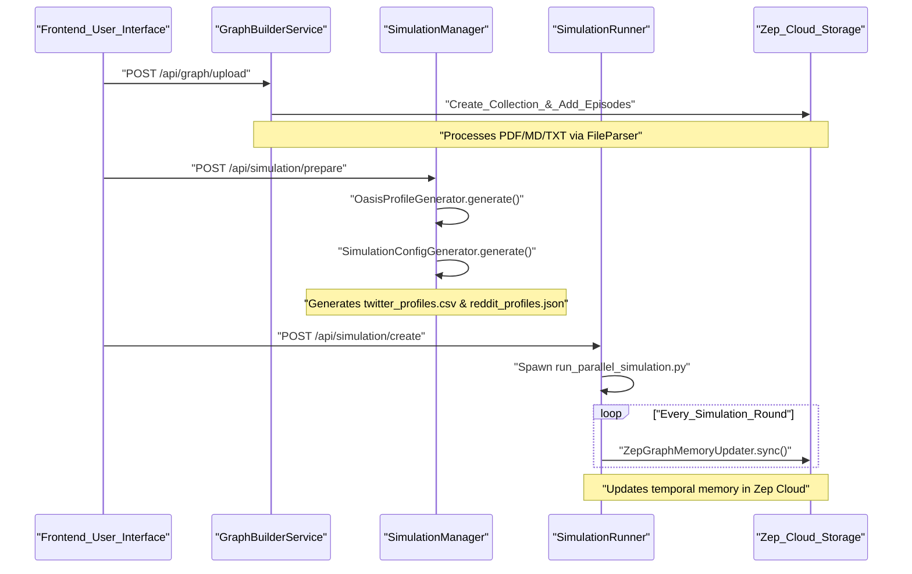
Sources: [README-EN.md:87-92](), [backend/pyproject.toml:20-24](), [docker-compose.yml:13-14]()

---

## 📖 Major Child Sections

For detailed technical documentation, please refer to the following sub-pages:

*   **[Getting Started & Configuration](#1.1)**: Step-by-step setup guide covering environment variables like `LLM_API_KEY` and `ZEP_API_KEY`, dependency installation via `npm` and `uv`, and deployment options including Docker. [README-EN.md:94-178]()
*   **[System Architecture](#1.2)**: Deep dive into the backend architecture, the three primary API blueprints (`graph`, `simulation`, `report`), and the integration of the OASIS engine and Zep Cloud. [README-EN.md:191-193]()

---

# Page: Getting Started & Configuration

# Getting Started & Configuration

<details>
<summary>Relevant source files</summary>

The following files were used as context for generating this wiki page:

- [.dockerignore](.dockerignore)
- [.env.example](.env.example)
- [.github/workflows/docker-image.yml](.github/workflows/docker-image.yml)
- [.gitignore](.gitignore)
- [Dockerfile](Dockerfile)
- [backend/pyproject.toml](backend/pyproject.toml)
- [docker-compose.yml](docker-compose.yml)
- [package-lock.json](package-lock.json)
- [package.json](package.json)

</details>


This page provides a comprehensive technical guide for setting up the MiroFish development environment and deploying the application using Docker. MiroFish is a decoupled full-stack application consisting of a Vue.js frontend and a Python Flask backend, integrated via a unified task management system.

## Environment Requirements

Before installation, ensure your system meets the following version requirements:

| Component | Requirement | Role |
| :--- | :--- | :--- |
| **Node.js** | `>= 18.0.0` | Powers the frontend build system and `concurrently` runner [package.json:15-18](). |
| **Python** | `>= 3.11` | Required for the Flask backend and OASIS simulation engine [backend/pyproject.toml:5-5](). |
| **uv** | Latest | Fast Python package installer and resolver used in the backend [package.json:10-10](). |
| **npm** | Latest | Package manager for the root and frontend directories [package.json:6-6](). |

---

## Installation Steps

The project uses a root-level `package.json` to orchestrate dependencies across both the frontend and backend.

### 1. Clone the Repository
```bash
git clone https://github.com/666ghj/MiroFish.git
cd MiroFish
```

### 2. Install Dependencies
MiroFish provides helper scripts to automate the installation of Node modules and Python virtual environments.

*   **Complete Setup:** Runs `npm install` in the root and frontend, and `uv sync` in the backend [package.json:6-8]().
    ```bash
    npm run setup:all
    ```
*   **Manual Backend Setup:** Uses `uv` to create a synchronized environment based on `pyproject.toml` [backend/pyproject.toml:1-35]().
    ```bash
    cd backend && uv sync
    ```
*   **Manual Frontend Setup:**
    ```bash
    cd frontend && npm install
    ```

### Dependency Data Flow
The following diagram illustrates how dependencies are managed across the system boundaries.

**Dependency Management Architecture**
```mermaid
graph TD
    subgraph ["Root_Directory"]
        ["package.json"] -- "npm_run_setup" --> ["node_modules_Root"]
        ["package.json"] -- "npm_run_setup:backend" --> ["Backend_Environment"]
    end

    subgraph ["Frontend_Workspace"]
        ["frontend/package.json"] -- "npm_install" --> ["frontend/node_modules"]
    end

    subgraph ["Backend_Workspace"]
        ["backend/pyproject.toml"] -- "uv_sync" --> ["venv_Python_3.11"]
        ["venv_Python_3.11"] --> ["flask_3.0.0"]
        ["venv_Python_3.11"] --> ["camel-oasis_0.2.5"]
        ["venv_Python_3.11"] --> ["zep-cloud_3.13.0"]
    end

    ["node_modules_Root"] -- "provides" --> ["concurrently"]
    ["concurrently"] -- "executes" --> ["npm_run_dev"]
```
Sources: [package.json:1-21](), [backend/pyproject.toml:1-35](), [Dockerfile:13-21]()

---

## Configuration (.env)

MiroFish requires external API keys for LLM reasoning and the Zep Cloud memory layer. Create a `.env` file in the root directory by copying `.env.example` [.env.example:1-16]().

### Required Variables
| Variable | Description | Source/Recommendation |
| :--- | :--- | :--- |
| `LLM_API_KEY` | Primary API key for LLM operations. | Alibaba Bailian (qwen-plus) [.env.example:2-4](). |
| `LLM_BASE_URL` | OpenAI-compatible endpoint URL. | `https://dashscope.aliyuncs.com/compatible-mode/v1` [.env.example:5-5](). |
| `LLM_MODEL_NAME` | The specific model ID to use. | `qwen-plus` [.env.example:6-6](). |
| `ZEP_API_KEY` | Key for Zep Cloud Knowledge Graph. | [getzep.com](https://app.getzep.com/) [.env.example:10-10](). |

### Optional Acceleration
To speed up parallel operations (like persona generation), you can define a "Boost" LLM configuration [.env.example:12-16](). If these keys are not present, the system defaults to the primary `LLM_API_KEY`.

Sources: [.env.example:1-16]()

---

## Running the Application

### Development Mode
The `npm run dev` command uses `concurrently` to start both the Flask backend and the Vite-powered frontend simultaneously [package.json:9-9]().

```bash
npm run dev
```

*   **Frontend:** [http://localhost:3000](http://localhost:3000) [Dockerfile:26-26]()
*   **Backend API:** [http://localhost:5001](http://localhost:5001) [Dockerfile:26-26]()

### Execution Flow
The following diagram maps the startup command to the specific code entities responsible for the runtime.

**Runtime Execution Map**
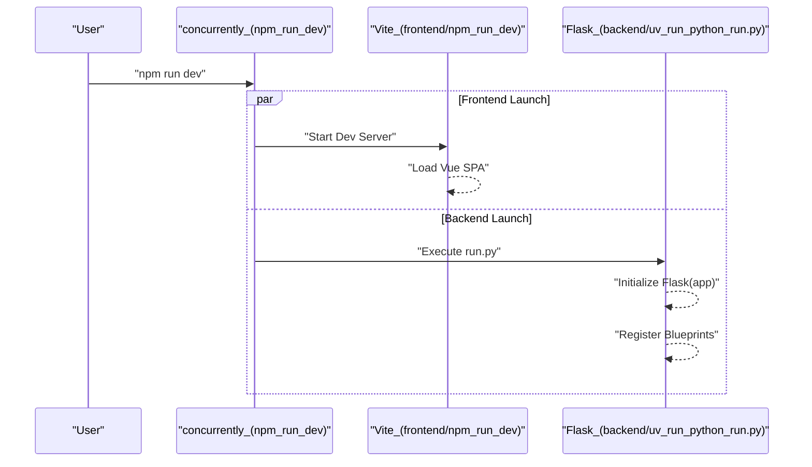
Sources: [package.json:9-11](), [Dockerfile:28-29]()

---

## Docker Deployment

MiroFish provides a `Dockerfile` and `docker-compose.yml` for containerized deployment.

### Dockerfile Specification
The `Dockerfile` uses a multi-stage-like approach within a Python 3.11 base:
1.  **Node.js Installation:** Installs Node.js >= 18 for frontend building [Dockerfile:3-6]().
2.  **uv Integration:** Copies the `uv` binary from the official Astral image for fast Python dependency resolution [Dockerfile:9-9]().
3.  **Dependency Caching:** Copies `package.json` and `pyproject.toml` files first to leverage Docker layer caching [Dockerfile:14-16]().
4.  **Sync:** Runs `npm ci` and `uv sync --frozen` to ensure reproducible builds [Dockerfile:19-21]().

### Docker Compose
To deploy the entire stack with a single command:

```bash
docker-compose up -d
```

**Configuration in `docker-compose.yml`:**
*   **Image:** `ghcr.io/666ghj/mirofish:latest` [docker-compose.yml:3-3]().
*   **Environment:** Loads the `.env` file from the host [docker-compose.yml:7-8]().
*   **Persistence:** Mounts `./backend/uploads` to `/app/backend/uploads` to persist uploaded documents and simulation logs [docker-compose.yml:13-14]().
*   **Ports:** Maps `3000` (Web UI) and `5001` (API) [docker-compose.yml:10-11]().

Sources: [Dockerfile:1-29](), [docker-compose.yml:1-14](), [.dockerignore:1-24]()

---

# Page: System Architecture

# System Architecture

<details>
<summary>Relevant source files</summary>

The following files were used as context for generating this wiki page:

- [README-EN.md](README-EN.md)
- [README.md](README.md)
- [backend/app/__init__.py](backend/app/__init__.py)
- [backend/app/api/__init__.py](backend/app/api/__init__.py)
- [backend/app/config.py](backend/app/config.py)
- [backend/app/models/task.py](backend/app/models/task.py)
- [backend/app/services/ontology_generator.py](backend/app/services/ontology_generator.py)
- [backend/app/utils/logger.py](backend/app/utils/logger.py)
- [backend/run.py](backend/run.py)
- [static/image/shanda_logo.png](static/image/shanda_logo.png)

</details>


The MiroFish system is built on a decoupled architecture that separates the user interface, simulation management, and knowledge processing layers. It utilizes a Node.js/Vue.js frontend for workflow orchestration and a Python/Flask backend for heavy-duty LLM processing and simulation execution. The system integrates with **Zep Cloud** for persistent GraphRAG memory and the **OASIS** engine for multi-agent social media simulation.

## High-Level Component Overview

The architecture is divided into three primary tiers:
1.  **Frontend (Port 3000)**: A Vue.js Single Page Application (SPA) that manages the five-stage simulation lifecycle.
2.  **Backend (Port 5001)**: A Flask REST API that handles document processing, graph construction, and simulation control.
3.  **External Services**: Zep Cloud (Graph Database & Memory) and OpenAI-compatible LLM providers.

### System Deployment Diagram

"System Deployment and Communication"
```mermaid
graph TD
    subgraph "Client Side (Port 3000)"
        "Vue_SPA[Vue.js SPA]"
        "Vue_Router[Vue Router]"
        "API_Client[Frontend API Layer]"
    end

    subgraph "Server Side (Port 5001)"
        "Flask_App[Flask Backend]"
        "Blueprint_Graph[/api/graph]"
        "Blueprint_Sim[/api/simulation]"
        "Blueprint_Report[/api/report]"
        "Task_Mgr[TaskManager]"
        "Sim_Runner[SimulationRunner]"
    end

    subgraph "External Infrastructure"
        "Zep_Cloud[Zep Cloud Graph Memory]"
        "LLM_API[LLM Provider / OpenAI]"
    end

    "Vue_SPA" --> "Vue_Router"
    "Vue_SPA" --> "API_Client"
    "API_Client" -- "HTTP/JSON" --> "Flask_App"
    
    "Flask_App" --> "Blueprint_Graph"
    "Flask_App" --> "Blueprint_Sim"
    "Flask_App" --> "Blueprint_Report"
    
    "Blueprint_Graph" --> "Task_Mgr"
    "Blueprint_Sim" --> "Sim_Runner"
    
    "Flask_App" -- "gRPC/REST" --> "Zep_Cloud"
    "Flask_App" -- "HTTPS" --> "LLM_API"
```
Sources: [backend/run.py:40-45](), [backend/app/__init__.py:65-69](), [README.md:150-156]()

---

## Backend Domain Architecture

The backend is organized into three distinct API blueprints, each responsible for a specific domain of the MiroFish lifecycle.

### 1. Graph Domain (`/api/graph`)
Responsible for converting raw documents into a structured Knowledge Graph.
*   **Key Services**: `OntologyGenerator` [backend/app/services/ontology_generator.py:158-162](), `GraphBuilderService`.
*   **Data Flow**: Document Text -> `OntologyGenerator` (LLM) -> Schema -> `GraphBuilderService` -> Zep Cloud.
*   **Asynchronous Handling**: Uses `TaskManager` [backend/app/models/task.py:54-58]() to track long-running graph ingestion tasks.

### 2. Simulation Domain (`/api/simulation`)
Manages the preparation and execution of multi-agent social media simulations.
*   **Key Services**: `SimulationManager`, `OasisProfileGenerator`, `SimulationRunner` [backend/app/services/simulation_runner.py:46-47]().
*   **OASIS Integration**: Generates platform-specific profiles (Twitter CSV, Reddit JSON) and launches parallel simulation scripts via `SimulationRunner`.
*   **Persistence**: Simulation state is stored in `OASIS_SIMULATION_DATA_DIR` [backend/app/config.py:49-49]().

### 3. Report Domain (`/api/report`)
Analyzes simulation results and provides an interactive interface for querying agents.
*   **Key Services**: `ReportAgent`, `ZepToolsService`.
*   **Mechanism**: Uses a ReACT reasoning loop to query Zep Cloud memory and generate insights [backend/app/config.py:61-64]().

"Backend Service Logic Map"
```mermaid
graph LR
    subgraph "API Blueprints"
        "graph_bp[graph_bp]"
        "simulation_bp[simulation_bp]"
        "report_bp[report_bp]"
    end

    subgraph "Core Services"
        "OntoGen[OntologyGenerator]"
        "GraphBuild[GraphBuilderService]"
        "SimMgr[SimulationManager]"
        "SimRun[SimulationRunner]"
        "ZepMem[ZepGraphMemoryUpdater]"
    end

    "graph_bp" --> "OntoGen"
    "graph_bp" --> "GraphBuild"
    "simulation_bp" --> "SimMgr"
    "simulation_bp" --> "SimRun"
    "SimRun" --> "ZepMem"
    "report_bp" --> "ZepMem"
```
Sources: [backend/app/__init__.py:65-69](), [backend/app/api/__init__.py:7-9]()

---

## Memory Layer: Zep Cloud Integration

Zep Cloud serves as the central nervous system for MiroFish, providing persistent graph storage and retrieval.

*   **Entity Extraction**: The `ZepEntityReader` pulls nodes and edges from Zep to inform agent persona generation.
*   **Action Sync**: As agents perform actions (e.g., `CREATE_POST`, `LIKE_POST`), the `ZepGraphMemoryUpdater` converts these activities into episodes and syncs them back to Zep in batches.
*   **Configuration**: API keys and connection settings are managed via the `Config` class [backend/app/config.py:35-36]().

---

## Process Lifecycle & Data Flow

The system follows a strict linear progression reflected in both the frontend routes and backend task management.

| Stage | Frontend View | Backend Blueprint | Key Code Entity |
| :--- | :--- | :--- | :--- |
| **Initialization** | `Home.vue` | N/A | `ProjectManager` |
| **Graph Build** | `MainView.vue` | `/api/graph` | `OntologyGenerator`, `GraphBuilderService` |
| **Env Setup** | `SimulationView.vue` | `/api/simulation` | `OasisProfileGenerator`, `SimulationConfigGenerator` |
| **Execution** | `SimulationRunView.vue` | `/api/simulation` | `SimulationRunner`, `ParallelIPCHandler` |
| **Analysis** | `ReportView.vue` | `/api/report` | `ReportAgent`, `ZepToolsService` |

### Detailed Execution Flow (Step 3: Simulation)
When a simulation starts, the `SimulationRunner` initiates a parallel process. Communication between the main Flask app and the simulation sub-processes is handled via an IPC (Inter-Process Communication) layer.

"Simulation IPC and Data Flow"
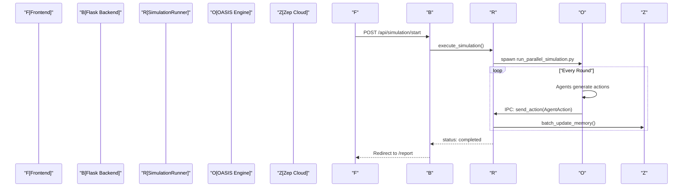
Sources: [backend/app/__init__.py:46-47](), [README-EN.md:87-92]()

---

## Technical Infrastructure

### Configuration Management
The system uses a unified `.env` file located at the project root [backend/app/config.py:11-14](). The `Config` class [backend/app/config.py:20-65]() loads these variables, including:
*   **LLM Settings**: `LLM_API_KEY`, `LLM_BASE_URL`, `LLM_MODEL_NAME` [backend/app/config.py:31-33]().
*   **File Constraints**: `MAX_CONTENT_LENGTH` (50MB) [backend/app/config.py:39-39]().
*   **OASIS Actions**: Predefined lists for Twitter (`CREATE_POST`, `REPOST`, etc.) and Reddit (`SEARCH_POSTS`, `TREND`, etc.) [backend/app/config.py:52-59]().

### Logging and Error Handling
The backend implements a `RotatingFileHandler` via `setup_logger` [backend/app/utils/logger.py:30-40](). It provides:
1.  **Console Logging**: Clean, high-level info for the developer [backend/app/utils/logger.py:77-82]().
2.  **File Logging**: Detailed debug logs with timestamps and line numbers, stored in `/logs` [backend/app/utils/logger.py:66-75]().
3.  **UTF-8 Support**: Explicit reconfiguration for Windows consoles to prevent encoding issues [backend/app/utils/logger.py:13-23]().

Sources: [backend/run.py:28-34](), [backend/app/config.py:67-74](), [backend/app/utils/logger.py:1-108]()

---

# Page: Frontend Application

# Frontend Application

<details>
<summary>Relevant source files</summary>

The following files were used as context for generating this wiki page:

- [frontend/index.html](frontend/index.html)
- [frontend/package-lock.json](frontend/package-lock.json)
- [frontend/package.json](frontend/package.json)
- [frontend/src/App.vue](frontend/src/App.vue)
- [frontend/src/api/report.js](frontend/src/api/report.js)
- [frontend/src/api/simulation.js](frontend/src/api/simulation.js)
- [frontend/src/assets/logo/MiroFish_logo_left.jpeg](frontend/src/assets/logo/MiroFish_logo_left.jpeg)
- [frontend/src/main.js](frontend/src/main.js)
- [frontend/src/router/index.js](frontend/src/router/index.js)
- [frontend/src/store/pendingUpload.js](frontend/src/store/pendingUpload.js)
- [frontend/src/views/Home.vue](frontend/src/views/Home.vue)
- [frontend/vite.config.js](frontend/vite.config.js)

</details>


The MiroFish frontend is a Single Page Application (SPA) built with **Vue.js 3** and **Vite**. It serves as the primary interface for managing the end-to-end simulation lifecycle, from document ingestion to interactive report analysis. The application follows a structured five-step workflow, guiding users through graph construction, environment setup, execution, and final interaction.

## Core Technology Stack

The frontend is decoupled from the backend and communicates via a RESTful API layer.

| Category | Technology | Purpose |
| :--- | :--- | :--- |
| **Framework** | `Vue.js 3` | Component-based UI architecture [[frontend/package.json:14-14]]() |
| **Routing** | `Vue Router 4` | SPA navigation and view management [[frontend/src/router/index.js:1-7]]() |
| **Build Tool** | `Vite` | Development server and bundling [[frontend/package.json:19-19]]() |
| **HTTP Client** | `Axios` | Backend API communication with retry logic [[frontend/package.json:12-12]]() |
| **Visualization** | `D3.js` | Knowledge graph rendering and animation [[frontend/package.json:13-13]]() |

Sources: [[frontend/package.json:1-22]](), [[frontend/src/router/index.js:1-53]]()

## Routing & View Hierarchy

The application uses `vue-router` to manage the transition between simulation stages. Each route corresponds to a major phase of the MiroFish workflow.

### Navigation Map
The following diagram maps the logical application flow to the specific Vue components and route definitions.

**Application Flow to Code Entity Mapping**
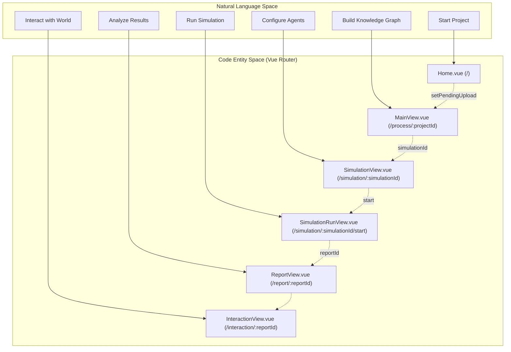
Sources: [[frontend/src/router/index.js:9-45]](), [[frontend/src/store/pendingUpload.js:13-17]]()

## Five-Step Workflow UI

The UI is organized around a linear progression model described in the `workflow-list` [[frontend/src/views/Home.vue:81-117]](), ensuring that complex backend operations are presented clearly.

### 1. Project Initialization
The landing page handles the ingestion of "Reality Seeds" (PDF, MD, TXT files) [[frontend/src/views/Home.vue:128-128]]() and the initial simulation requirement. It uses a temporary store, `pendingUpload`, to stage data before a project ID is generated.
*   **For details, see [Home & Project Initialization](#2.1)**
*   **Key Files:** `Home.vue`, `pendingUpload.js`

### 2. Graph Construction
This phase visualizes the transformation of unstructured text into a structured knowledge graph (Step 1: Graph Build). It features a split-view layout with a real-time D3.js graph panel.
*   **For details, see [Graph Construction UI (Step 1)](#2.2)**
*   **Key Files:** `MainView.vue`, `Step1GraphBuild.vue`

### 3. Environment Setup
Users configure simulation parameters and monitor the generation of agent personas (Step 2: Env Setup). The UI manages a multi-phase state machine for profile and config generation.
*   **For details, see [Environment Setup UI (Step 2)](#2.3)**
*   **Key Files:** `SimulationView.vue`, `Step2EnvSetup.vue`

### 4. Simulation Execution
A dual-timeline interface displays live actions from Twitter and Reddit agents (Step 3: Simulation). The UI performs high-frequency polling to render agent activities [[frontend/src/api/simulation.js:107-109]]().
*   **For details, see [Simulation Execution UI (Step 3)](#2.4)**
*   **Key Files:** `SimulationRunView.vue`, `Step3Simulation.vue`

### 5. Report & Interaction
The final stages provide an interactive workbench. Users can read generated analysis (Step 4: Report) and conduct direct interviews with agents or the Report Agent (Step 5: Interaction).
*   **For details, see [Report & Interaction UI (Steps 4 & 5)](#2.5)**
*   **Key Files:** `ReportView.vue`, `InteractionView.vue`, `Step4Report.vue`, `Step5Interaction.vue`

Sources: [[frontend/src/views/Home.vue:77-118]](), [[frontend/src/router/index.js:9-45]]()

## Shared Infrastructure

### API Client Layer
All backend communication is centralized in the `src/api/` directory, mirroring the backend's blueprint structure:
*   **Simulation API:** Handles environment preparation, profile generation, and execution control [[frontend/src/api/simulation.js:7-186]]().
*   **Report API:** Manages report generation status, log streaming, and agent chat [[frontend/src/api/report.js:7-51]]().
*   **Retry Logic:** Uses `requestWithRetry` to handle transient network issues during heavy LLM tasks [[frontend/src/api/index.js:1-10]]().
*   **For details, see [Frontend API Client Layer](#2.6)**

### State Management
While simple state is handled via Vue's `reactive` and `ref` in components, cross-page data (like files pending upload) is managed in dedicated store modules like `pendingUpload.js` [[frontend/src/store/pendingUpload.js:7-11]]().

Sources: [[frontend/src/api/simulation.js:1-188]](), [[frontend/src/api/report.js:1-52]](), [[frontend/src/store/pendingUpload.js:1-34]]()

---

# Page: Home & Project Initialization

# Home & Project Initialization

<details>
<summary>Relevant source files</summary>

The following files were used as context for generating this wiki page:

- [frontend/index.html](frontend/index.html)
- [frontend/package-lock.json](frontend/package-lock.json)
- [frontend/package.json](frontend/package.json)
- [frontend/src/App.vue](frontend/src/App.vue)
- [frontend/src/assets/logo/MiroFish_logo_left.jpeg](frontend/src/assets/logo/MiroFish_logo_left.jpeg)
- [frontend/src/store/pendingUpload.js](frontend/src/store/pendingUpload.js)
- [frontend/src/views/Home.vue](frontend/src/views/Home.vue)
- [frontend/src/views/Process.vue](frontend/src/views/Process.vue)

</details>


The **Home & Project Initialization** phase serves as the entry point for the MiroFish simulation lifecycle. It facilitates the ingestion of "reality seeds" (unstructured documents) and the definition of simulation requirements. This stage focuses on data staging and navigation preparation rather than immediate processing, ensuring a smooth transition to the heavy computational tasks of graph construction.

## Home.vue Landing Page

The landing page provides a dual-purpose interface: a marketing "Hero" section [frontend/src/views/Home.vue:15-49]() and a functional "Interaction Console" [frontend/src/views/Home.vue:122-195](). The console is where users initialize new simulation projects by providing the necessary context and data.

### Data Ingestion (Reality Seeds)
The system supports multiple file formats for ground-truth data, referred to in the UI as "Reality Seeds" [frontend/src/views/Home.vue:127-128]().
*   **Supported Formats**: PDF, Markdown (MD), and Plain Text (TXT) [frontend/src/views/Home.vue:143]().
*   **Interaction**: Users can drag-and-drop files into the `upload-zone` or use a standard file browser via `triggerFileInput` [frontend/src/views/Home.vue:131-144]().
*   **State Management**: Selected files are stored in a local `files` array within the component before being committed to the global store [frontend/src/views/Home.vue:155-162]().

### Simulation Requirements
Users define the objective of the simulation through a natural language prompt in the `code-input` textarea [frontend/src/views/Home.vue:176-182](). This requirement serves as the guiding context for the `ReportAgent` and the `SimulationConfigGenerator` in later stages.

**Project Initialization Data Flow**
The following diagram illustrates how user input is captured and transitioned from the Home view to the staging area.

| Diagram: Home Initialization Flow |
| :--- |
| ```mermaid
graph TD
    subgraph "Home.vue (View Layer)"
        A["handleFileSelect()"] -->|File Objects| B["files Array"]
        C["v-model"] -->|String| D["formData.simulationRequirement"]
        E["startSimulation()"] -->|Triggers| F["setPendingUpload()"]
    end

    subgraph "pendingUpload.js (Store Layer)"
        F --> G["state.files"]
        F --> H["state.simulationRequirement"]
        F --> I["state.isPending = true"]
    end

    subgraph "Navigation"
        I --> J["router.push('/process')"]
    end
``` |
Sources: [frontend/src/views/Home.vue:144-191](), [frontend/src/store/pendingUpload.js:7-17]()

## Staging & Store Management

MiroFish uses a specialized store, `pendingUpload.js`, to stage data during the transition from the Home view to the Process view. This prevents data loss during route changes and allows the Process view to handle the actual multi-part API requests (file uploads followed by project creation).

### pendingUpload Store
The store is implemented using Vue 3's `reactive` state [frontend/src/store/pendingUpload.js:7-11]().

| Function | Role | File Reference |
| :--- | :--- | :--- |
| `setPendingUpload` | Stashes files and text requirements into the reactive state. | [frontend/src/store/pendingUpload.js:13-17]() |
| `getPendingUpload` | Retrieves the current staged data for the Process view. | [frontend/src/store/pendingUpload.js:19-25]() |
| `clearPendingUpload` | Resets the state after successful project initialization. | [frontend/src/store/pendingUpload.js:27-31]() |

Sources: [frontend/src/store/pendingUpload.js:1-34]()

## Project Initialization Logic

When the "Start Engine" button (`startSimulation`) is clicked in `Home.vue`, the system performs validation before navigating [frontend/src/views/Home.vue:189-193]().

1.  **Validation**: The `canSubmit` computed property ensures that at least one file is selected and a simulation requirement is provided [frontend/src/views/Home.vue:192]().
2.  **Staging**: The `setPendingUpload` function is called to move data from the component's local state to the `pendingUpload` store [frontend/src/store/pendingUpload.js:13-17]().
3.  **Navigation**: The application uses `vue-router` to navigate to the `/process` route [frontend/src/App.vue:1-3](), where the `Process.vue` component will take over to initiate the backend API calls [frontend/src/views/Process.vue:1-22]().

**Code Entity Association: Home to Store**
This diagram bridges the UI event handlers to the underlying state management entities.

| Diagram: Code Entity Association |
| :--- |
| ```mermaid
graph LR
    subgraph "frontend/src/views/Home.vue"
        UI_BTN["startSimulation()"]
        UI_FILES["files: File[]"]
        UI_REQ["formData.simulationRequirement"]
    end

    subgraph "frontend/src/store/pendingUpload.js"
        STORE_STATE["state: reactive"]
        SET_FUNC["setPendingUpload(files, req)"]
    end

    UI_BTN --> SET_FUNC
    UI_FILES -.->|passed to| SET_FUNC
    UI_REQ -.->|passed to| SET_FUNC
    SET_FUNC -->|updates| STORE_STATE
``` |
Sources: [frontend/src/views/Home.vue:189-191](), [frontend/src/store/pendingUpload.js:5-17](), [frontend/src/views/Process.vue:1-22]()

---

# Page: Graph Construction UI (Step 1)

# Graph Construction UI (Step 1)

<details>
<summary>Relevant source files</summary>

The following files were used as context for generating this wiki page:

- [frontend/src/components/GraphPanel.vue](frontend/src/components/GraphPanel.vue)
- [frontend/src/components/Step1GraphBuild.vue](frontend/src/components/Step1GraphBuild.vue)
- [frontend/src/views/MainView.vue](frontend/src/views/MainView.vue)

</details>


This page details the implementation of the first stage of the MiroFish simulation lifecycle: Knowledge Graph construction. This phase involves transforming raw uploaded documents into a structured GraphRAG (Retrieval-Augmented Generation) memory layer using LLM-driven ontology generation and entity extraction.

## Overview of Step 1 Workflow

The Graph Construction UI is primarily managed by `MainView.vue`, which acts as the layout orchestrator, and `Step1GraphBuild.vue`, which provides the step-by-step controls. The process is divided into two major phases: **Ontology Generation** and **Graph Building**.

### Component Hierarchy
- **MainView.vue**: The parent container managing the split-view layout and global polling state [frontend/src/views/MainView.vue:36-73]().
- **GraphPanel.vue**: A D3.js-based visualization component that renders the knowledge graph in real-time [frontend/src/components/GraphPanel.vue:1-20]().
- **Step1GraphBuild.vue**: The functional workbench for Step 1, displaying ontology tags, build progress, and navigation to Step 2 [frontend/src/components/Step1GraphBuild.vue:1-168]().

### Data Flow: Natural Language to Graph Entities
The following diagram illustrates how natural language requirements and documents are processed into code entities and visualized in the UI.

**Data Transformation Diagram**
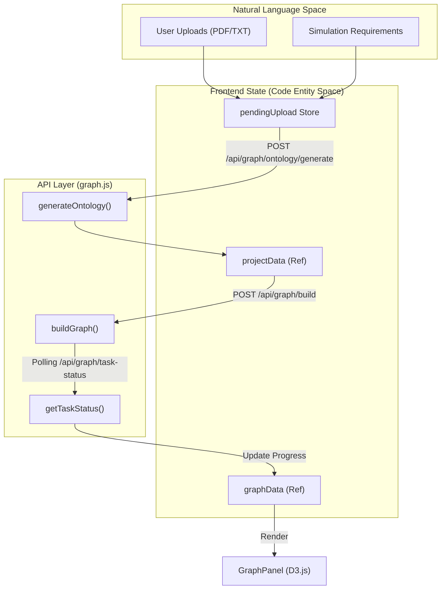
**Sources:** [frontend/src/views/MainView.vue:180-230](), [frontend/src/api/graph.js:1-30](), [frontend/src/store/pendingUpload.js:1-20]()

---

## Split-View Layout Implementation

`MainView.vue` implements a dynamic layout system using three modes: `graph`, `split`, and `workbench` [frontend/src/views/MainView.vue:90-94]().

- **Split Mode**: The default view where `GraphPanel` (Left) and `Step1GraphBuild` (Right) share the screen 50/50 [frontend/src/views/MainView.vue:116-122]().
- **Graph Mode**: Maximizes the `GraphPanel` to 100% width [frontend/src/views/MainView.vue:114]().
- **Workbench Mode**: Maximizes the functional step component to 100% width [frontend/src/views/MainView.vue:120]().

The transition is handled via CSS transforms and opacity for smooth UI scaling [frontend/src/views/MainView.vue:113-123]().

---

## Phase 1: Ontology Generation

When a project is initialized with `projectId === 'new'`, the system retrieves files from the `pendingUpload` store and calls the `generateOntology` API [frontend/src/views/MainView.vue:189-210]().

1.  **UI State**: `currentPhase` is set to `0` [frontend/src/views/MainView.vue:199]().
2.  **Display**: `Step1GraphBuild.vue` renders the "Ontology Generation" card as active [frontend/src/components/Step1GraphBuild.vue:5-15]().
3.  **Result**: Once the LLM returns the ontology, it is stored in `projectData.ontology`. The UI displays generated `entity_types` and `edge_types` as clickable tags [frontend/src/components/Step1GraphBuild.vue:77-104]().
4.  **Interaction**: Users can click tags to view descriptions and attributes in a detail overlay [frontend/src/components/Step1GraphBuild.vue:31-74]().

**Sources:** [frontend/src/views/MainView.vue:199-216](), [frontend/src/components/Step1GraphBuild.vue:77-104]()

---

## Phase 2: Graph Building & Dual Polling

After ontology generation, the system automatically triggers `handleBuildGraph()` [frontend/src/views/MainView.vue:223-238](). This initiates a long-running backend task. To keep the UI responsive, `MainView.vue` implements a **Dual Polling Mechanism**.

### Polling Logic
1.  **Task Status Polling (`pollTimer`)**: Calls `getTaskStatus(projectId)` every 2 seconds to update the percentage progress and phase transitions [frontend/src/views/MainView.vue:246-267]().
2.  **Graph Data Polling (`graphPollTimer`)**: Calls `getGraphData(projectId)` every 5 seconds to fetch the latest nodes and edges extracted by the backend [frontend/src/views/MainView.vue:273-288]().

**Polling Sequence Diagram**
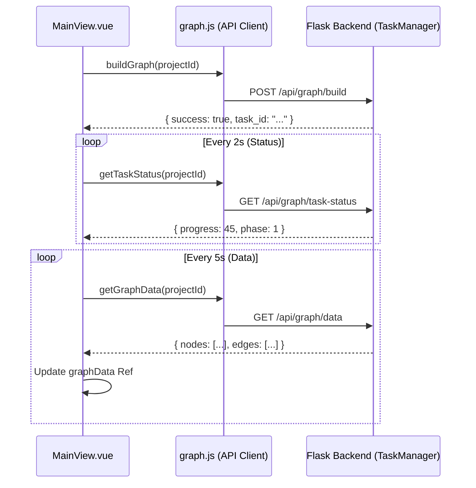
**Sources:** [frontend/src/views/MainView.vue:240-288](), [frontend/src/api/graph.js:20-35]()

---

## GraphPanel Visualization (D3.js)

The `GraphPanel.vue` component is responsible for rendering the Knowledge Graph using an SVG-based D3 force-directed layout.

### Key Features
- **Real-time Updates**: The graph re-renders whenever the `graphData` prop changes [frontend/src/components/GraphPanel.vue:41-43]().
- **Entity Distinction**: Nodes are colored based on their `entityType` [frontend/src/components/GraphPanel.vue:55-57]().
- **Self-Loop Grouping**: Multiple relationships from a node to itself are grouped into a single visual element to reduce clutter [frontend/src/components/GraphPanel.vue:107-112]().
- **Detail Panel**: Clicking a node or edge populates `selectedItem`, showing UUIDs, attributes, summaries, and associated "Episodes" (source text chunks) [frontend/src/components/GraphPanel.vue:62-101]().

### Visual Indicators
- **Building Hint**: A pulse animation appears while `currentPhase === 1`, indicating that the GraphRAG is actively ingesting data [frontend/src/components/GraphPanel.vue:23-31]().
- **Finished Hint**: A suggestion to manually refresh appears after building to ensure the final community summaries are loaded [frontend/src/components/GraphPanel.vue:34-49]().

**Sources:** [frontend/src/components/GraphPanel.vue:23-145](), [frontend/src/views/MainView.vue:40-47]()

---

## Transition to Step 2

Once the backend reports `currentPhase === 2` (Complete), the "Next Step" button in `Step1GraphBuild.vue` is enabled [frontend/src/components/Step1GraphBuild.vue:161-167](). Clicking this calls `handleNextStep` in the parent, incrementing `currentStep` and mounting the `Step2EnvSetup.vue` component [frontend/src/views/MainView.vue:159-169]().

**Sources:** [frontend/src/views/MainView.vue:159-169](), [frontend/src/components/Step1GraphBuild.vue:161-168]()

---

# Page: Environment Setup UI (Step 2)

# Environment Setup UI (Step 2)

<details>
<summary>Relevant source files</summary>

The following files were used as context for generating this wiki page:

- [frontend/src/components/Step2EnvSetup.vue](frontend/src/components/Step2EnvSetup.vue)
- [frontend/src/views/SimulationView.vue](frontend/src/views/SimulationView.vue)

</details>


The **Environment Setup UI** represents the second stage of the MiroFish simulation lifecycle. It transitions the project from a static Knowledge Graph into a dynamic simulation environment by generating AI agent personas, configuring platform-specific parameters (Twitter/Reddit), and initializing the simulation engine. This stage is primarily handled by `SimulationView.vue` as the layout container and `Step2EnvSetup.vue` as the functional state machine.

### Core Responsibilities
*   **Persona Generation**: Transforming entities from the Zep Knowledge Graph into detailed agent profiles with biographies and interests [frontend/src/components/Step2EnvSetup.vue:59-62]().
*   **Platform Configuration**: Defining simulation parameters such as time dilation, peak activity hours, and platform-specific rules [frontend/src/components/Step2EnvSetup.vue:131-134]().
*   **Asynchronous Polling**: Managing long-running backend tasks (LLM generation) via status polling [frontend/src/components/Step2EnvSetup.vue:534-580]().
*   **Safety Lifecycle**: Ensuring active simulation processes are terminated if a user regresses to this setup step [frontend/src/views/SimulationView.vue:179-220]().

---

### Component Architecture & Data Flow

`SimulationView.vue` acts as the parent orchestrator, managing the split-pane layout between the D3.js `GraphPanel` and the setup workflow.

#### Layout Management
The view supports three modes defined in `SimulationView.vue`:
1.  **`graph`**: Maximizes the Knowledge Graph visualization [frontend/src/views/SimulationView.vue:95-95]().
2.  **`workbench`**: Maximizes the `Step2EnvSetup` control panel [frontend/src/views/SimulationView.vue:101-101]().
3.  **`split`**: Default 50/50 view for simultaneous monitoring [frontend/src/views/SimulationView.vue:97-97]().

#### Data Synchronization
| Entity | Source | Usage |
| :--- | :--- | :--- |
| `projectData` | `getProject` | Provides `project_id` and `graph_id` for context [frontend/src/views/SimulationView.vue:248-250](). |
| `graphData` | `getGraphData` | Populates the `GraphPanel` visualization [frontend/src/views/SimulationView.vue:274-275](). |
| `systemLogs` | Local State | Captures real-time feedback from the setup process [frontend/src/views/SimulationView.vue:118-124](). |

**Sources:** [frontend/src/views/SimulationView.vue:82-105](), [frontend/src/views/SimulationView.vue:238-278]()

---

### The Five-Phase State Machine

`Step2EnvSetup.vue` implements a linear state machine represented by the `phase` ref [frontend/src/components/Step2EnvSetup.vue:338-338](). Each phase corresponds to a specific backend operation.

#### Phase Transition Logic
| Phase | Title | API Endpoint | Description |
| :--- | :--- | :--- | :--- |
| **0** | Instance Init | `/api/simulation/create` | Initializes the simulation record in the database [frontend/src/components/Step2EnvSetup.vue:18-21](). |
| **1** | Agent Persona | `/api/simulation/prepare` | Generates profiles (Twitter/Reddit) from graph entities [frontend/src/components/Step2EnvSetup.vue:59-62](). |
| **2** | Config Gen | `/api/simulation/prepare` | LLM determines time flow, frequency, and platform rules [frontend/src/components/Step2EnvSetup.vue:131-134](). |
| **3** | Env Ready | `getEnvStatus` | Validates that the backend environment is ready for execution [frontend/src/components/Step2EnvSetup.vue:219-222](). |
| **4** | Final Review | N/A | User reviews configuration before launching Step 3 [frontend/src/components/Step2EnvSetup.vue:261-264](). |

#### State Machine Visualization
The following diagram bridges the UI phases to the underlying API calls and state variables.

**UI State to API Mapping**
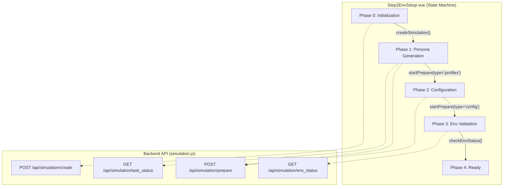
**Sources:** [frontend/src/components/Step2EnvSetup.vue:421-510](), [frontend/src/components/Step2EnvSetup.vue:534-580]()

---

### Polling Mechanisms

Because LLM generation is time-intensive, the UI utilizes three distinct polling loops to maintain responsiveness.

1.  **`pollTimer`**: Monitors the global task status for the current `taskId`. It updates `prepareProgress` and triggers the next phase upon completion [frontend/src/components/Step2EnvSetup.vue:545-560]().
2.  **`profilesTimer`**: Specifically fetches the list of generated agent profiles at regular intervals, allowing the UI to populate the "Agent List" incrementally as they are created [frontend/src/components/Step2EnvSetup.vue:512-525]().
3.  **`configTimer`**: Periodically checks for the existence of `simulation_config.json` to populate the platform parameter cards [frontend/src/components/Step2EnvSetup.vue:527-532]().

**Polling Logic Flow**
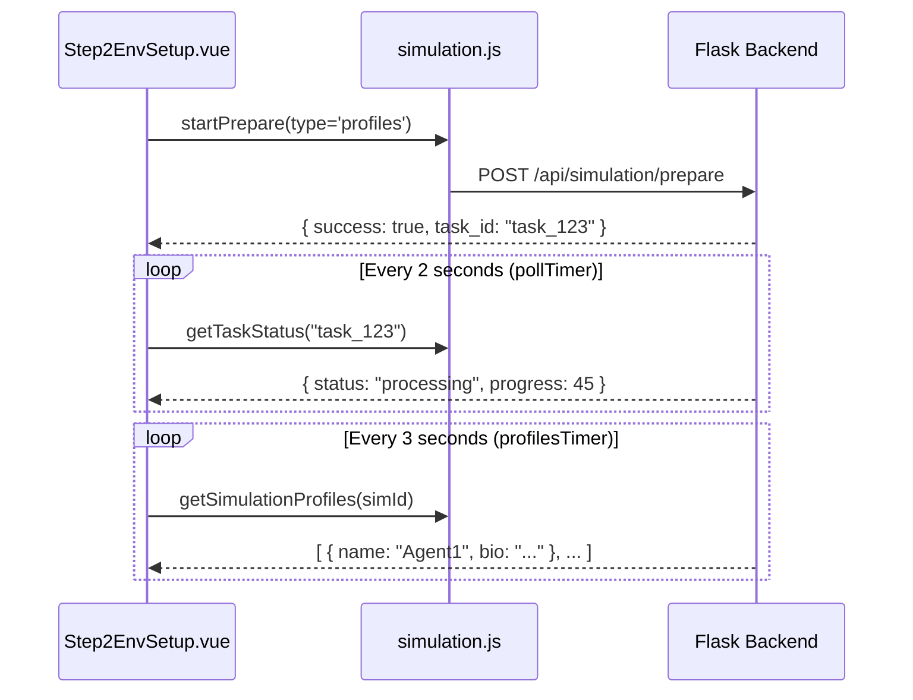
**Sources:** [frontend/src/components/Step2EnvSetup.vue:534-580](), [frontend/src/components/Step2EnvSetup.vue:512-532]()

---

### Safety Cleanup Lifecycle

A critical feature of `SimulationView.vue` is the prevention of orphaned processes. If a user returns to Step 2 from a running simulation (Step 3), the frontend automatically detects and terminates the active environment.

#### Termination Logic
Upon mounting, `SimulationView.vue` calls `checkAndStopRunningSimulation()`:
1.  **Check Alive**: Calls `getEnvStatus` to see if the simulation engine is active [frontend/src/views/SimulationView.vue:184-184]().
2.  **Graceful Shutdown**: Attempts `closeSimulationEnv` with a 10-second timeout [frontend/src/views/SimulationView.vue:191-194]().
3.  **Force Stop**: If graceful shutdown fails, it calls `stopSimulation` to kill backend processes [frontend/src/views/SimulationView.vue:225-236]().

**Sources:** [frontend/src/views/SimulationView.vue:179-220](), [frontend/src/api/simulation.js:46-60]()

---

### Key Component Properties

#### Step2EnvSetup.vue Props
| Prop | Type | Description |
| :--- | :--- | :--- |
| `simulationId` | String | The unique ID of the current simulation instance [frontend/src/components/Step2EnvSetup.vue:326-326](). |
| `projectData` | Object | Metadata including `project_id` and simulation requirements [frontend/src/components/Step2EnvSetup.vue:327-327](). |
| `graphData` | Object | The current Knowledge Graph state used for entity reference [frontend/src/components/Step2EnvSetup.vue:328-328](). |

#### Configuration Display
The UI renders a detailed summary of the `simulationConfig` once generated, including:
*   **Time Config**: `total_simulation_hours`, `minutes_per_round`, and `peak_hours` [frontend/src/components/Step2EnvSetup.vue:143-162]().
*   **Platform Params**: Twitter-specific (e.g., `reply_probability`) and Reddit-specific (e.g., `subreddits`) settings [frontend/src/components/Step2EnvSetup.vue:170-195]().

**Sources:** [frontend/src/components/Step2EnvSetup.vue:137-210](), [frontend/src/components/Step2EnvSetup.vue:325-335]()

---

# Page: Simulation Execution UI (Step 3)

# Simulation Execution UI (Step 3)

<details>
<summary>Relevant source files</summary>

The following files were used as context for generating this wiki page:

- [frontend/src/components/Step3Simulation.vue](frontend/src/components/Step3Simulation.vue)
- [frontend/src/views/ReportView.vue](frontend/src/views/ReportView.vue)
- [frontend/src/views/SimulationRunView.vue](frontend/src/views/SimulationRunView.vue)

</details>


The Simulation Execution UI is the central interface for monitoring the live OASIS simulation. It provides a real-time, dual-platform action feed, tracks round-based progression, and visualizes the evolving knowledge graph as agents interact. This stage transitions the system from environment setup to data generation and eventually to automated report synthesis.

## View Structure and Layout

The execution phase is managed by `SimulationRunView.vue`, which implements a split-pane layout to provide both high-level graph visualization and granular action monitoring.

*   **Graph Panel (Left):** Displays the `GraphPanel.vue` component, which renders the current state of the knowledge graph [frontend/src/views/SimulationRunView.vue:38-48](). It supports dynamic refreshing as new entities and relations are discovered during the simulation [frontend/src/views/SimulationRunView.vue:242-261]().
*   **Simulation Panel (Right):** Hosts `Step3Simulation.vue`, the primary driver for execution logic, polling, and the action timeline [frontend/src/views/SimulationRunView.vue:50-64]().
*   **View Modes:** Users can switch between `graph` (full graph), `split` (50/50), and `workbench` (full simulation feed) views [frontend/src/views/SimulationRunView.vue:10-21]().

### UI Entity Mapping

The following diagram maps UI concepts to their implementation components and data sources.

**Simulation UI to Code Entity Mapping**

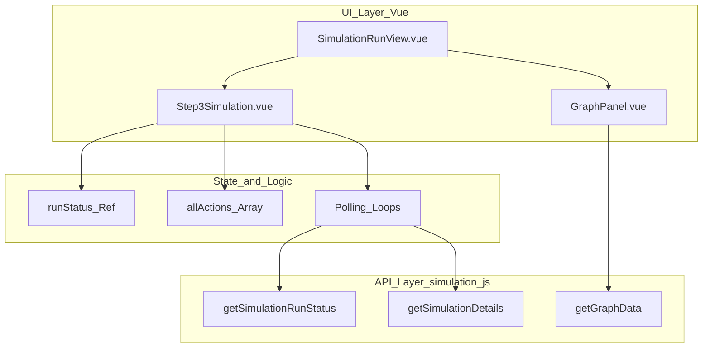
Sources: [frontend/src/views/SimulationRunView.vue:69-75](), [frontend/src/components/Step3Simulation.vue:1-106]()

## Execution Lifecycle & Polling

The simulation execution is driven by two primary polling loops initiated in the `onMounted` hook of `Step3Simulation.vue` [frontend/src/components/Step3Simulation.vue:1233-1245]().

1.  **Status Polling (`pollStatus`):** Calls `getSimulationRunStatus` every 3 seconds to update the high-level progress, including current rounds for Twitter (Info Plaza) and Reddit (Topic Community), and whether the simulation processes are still alive [frontend/src/components/Step3Simulation.vue:1134-1180]().
2.  **Detail Polling (`pollDetails`):** Calls `getSimulationDetails` every 4 seconds to fetch the actual action logs (posts, comments, likes) generated by the agents [frontend/src/components/Step3Simulation.vue:1182-1231]().

### Action De-duplication and Sorting
As the frontend polls the backend for details, it must merge new actions into the existing local state without creating duplicates. The component uses a unique ID strategy:
*   It checks for `action.id` or `action._uniqueId` [frontend/src/components/Step3Simulation.vue:1208-1215]().
*   If no ID exists, it generates one using a combination of `timestamp`, `agent_id`, and `action_type` [frontend/src/components/Step3Simulation.vue:1210-1212]().
*   The `chronologicalActions` computed property sorts all merged actions by timestamp to ensure a coherent timeline [frontend/src/components/Step3Simulation.vue:1089-1092]().

**Data Flow: Polling to UI**

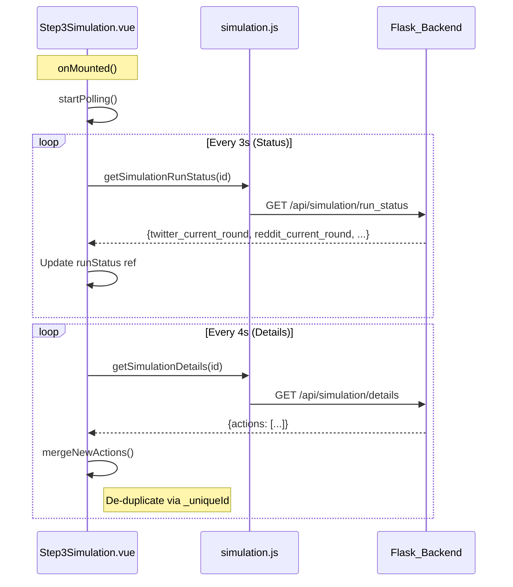
Sources: [frontend/src/components/Step3Simulation.vue:1134-1231](), [frontend/src/api/simulation.js:1-50]()

## The Dual-Timeline Feed

The UI renders actions in a platform-specific manner within a unified vertical timeline.

| Platform | Display Name | Available Actions Tracked |
| :--- | :--- | :--- |
| **Twitter** | Info Plaza | POST, LIKE, REPOST, QUOTE, FOLLOW, IDLE |
| **Reddit** | Topic Community | POST, COMMENT, LIKE, DISLIKE, SEARCH, TREND, FOLLOW, MUTE, REFRESH, IDLE |

Actions are rendered using a `TransitionGroup` for smooth entry [frontend/src/components/Step3Simulation.vue:130-136](). Each card displays the agent's name, platform icon, action type, and the content of the message [frontend/src/components/Step3Simulation.vue:141-175]().

### Auto-Scrolling Logic
To ensure the most recent events are visible, the component implements an auto-scroll mechanism. If the user is already at the bottom of the container, the view automatically scrolls to accommodate new actions [frontend/src/components/Step3Simulation.vue:1254-1265]().

## Transition to Report Generation

Once the simulation completes (or the user decides to stop early), the interface facilitates the transition to **Step 4: Report Generation**.

1.  **Completion Detection:** The UI monitors `runStatus.twitter_completed` and `runStatus.reddit_completed` [frontend/src/components/Step3Simulation.vue:7-17]().
2.  **Manual Trigger:** The user clicks "开始生成结果报告" (Start Generating Result Report) [frontend/src/components/Step3Simulation.vue:94-102]().
3.  **Process:**
    *   The component calls `handleNextStep` [frontend/src/components/Step3Simulation.vue:1274-1310]().
    *   It invokes the `createReport` API [frontend/src/api/report.js:1-15]().
    *   Upon success, it routes the user to `ReportView.vue` with the new `reportId` [frontend/src/components/Step3Simulation.vue:1303-1306]().

### Safety and Cleanup
If a user attempts to navigate back to Step 2, `SimulationRunView.vue` performs a cleanup routine:
*   It calls `stopGraphRefresh()` to halt polling [frontend/src/views/SimulationRunView.vue:152]().
*   It attempts to gracefully close the simulation environment via `closeSimulationEnv` [frontend/src/views/SimulationRunView.vue:161-165]().
*   If graceful closure fails, it triggers a forced stop via `stopSimulation` [frontend/src/views/SimulationRunView.vue:169-173]().

Sources: [frontend/src/views/SimulationRunView.vue:147-193](), [frontend/src/components/Step3Simulation.vue:1274-1310]()

---

# Page: Report & Interaction UI (Steps 4 & 5)

# Report & Interaction UI (Steps 4 & 5)

<details>
<summary>Relevant source files</summary>

The following files were used as context for generating this wiki page:

- [frontend/src/components/Step4Report.vue](frontend/src/components/Step4Report.vue)
- [frontend/src/components/Step5Interaction.vue](frontend/src/components/Step5Interaction.vue)
- [frontend/src/views/InteractionView.vue](frontend/src/views/InteractionView.vue)

</details>


This page details the implementation of the final stages of the MiroFish simulation lifecycle: **Report Generation** (Step 4) and **Deep Interaction** (Step 5). These stages transition the user from passive observation of a simulation to active analysis and direct engagement with the simulated world and its agents.

## Overview

The reporting and interaction phase is handled by three primary components:
1.  **Step4Report.vue**: Manages the real-time generation of the structured prediction report. It visualizes the Report Agent's reasoning process through a workflow timeline and tool-output displays.
2.  **Step5Interaction.vue**: Provides a "Workbench" for interacting with the simulation results. It includes three modes: Report Agent Chat, Individual Agent Chat, and Global Surveys.
3.  **InteractionView.vue**: The top-level container that manages the layout switching between the Knowledge Graph, the Workbench, and a split-view.

---

## Step 4: Report Generation Implementation

Step 4 focuses on the `ReportAgent`'s execution. The UI polls for incremental logs and structured tool outputs to show the user exactly how the final report is being constructed.

### Real-time Polling & Data Flow
The frontend uses `setInterval` to fetch incremental updates from the backend.

| Function | Purpose | API Endpoint |
| :--- | :--- | :--- |
| `pollStatus` | Checks the overall generation state and report outline. | `/api/report/generate/status` |
| `pollAgentLogs` | Fetches incremental agent reasoning logs (ReACT steps). | `/api/report/:id/agent-log` |
| `pollConsoleLogs`| Fetches raw system/console logs for debugging. | `/api/report/:id/console-log` |

**Sources:** [frontend/src/components/Step4Report.vue:274-320](), [frontend/src/api/report.js:15-35]()

### Workflow Timeline Visualization
The `Step4Report.vue` component transforms raw agent logs into a visual timeline. It filters logs based on the `action` field (e.g., `call_tool`, `tool_output`, `thought`) to render different UI elements [frontend/src/components/Step4Report.vue:142-180]().

- **Structured Tool Rendering**: When the agent uses a tool, the UI renders specialized display components based on the `tool_name` [frontend/src/components/Step4Report.vue:185-210]():
    - `InsightDisplay`: Renders entity-specific insights generated via `InsightForge`.
    - `PanoramaDisplay`: Visualizes broad search results across the graph from `PanoramaSearch`.
    - `InterviewDisplay`: Shows the transcript of the Report Agent interviewing a simulation agent via `InterviewSubAgent`.

### Report Section Streaming
The report is generated section-by-section. The `generatedSections` object stores the content of each section as it is completed, which is then rendered using `renderMarkdown` [frontend/src/components/Step4Report.vue:51-62]().

**Sources:** [frontend/src/components/Step4Report.vue:20-65](), [frontend/src/components/Step4Report.vue:350-375]()

---

## Step 5: Interaction Workbench

The Interaction Workbench (`Step5Interaction.vue`) allows users to query the simulated environment using three distinct interaction models.

### Interaction Modes
1.  **Report Agent Chat**: Users can ask follow-up questions about the generated report. The `ReportAgent` uses its existing tools (GraphRAG, Zep memory) to answer [frontend/src/components/Step5Interaction.vue:93-102]().
2.  **Individual Agent Chat**: Users select a specific agent profile from the `profiles` list and initiate a direct 1-on-1 conversation [frontend/src/components/Step5Interaction.vue:103-133]().
3.  **Survey Mode**: Users can broadcast a survey question to the entire world to gather statistical or qualitative feedback [frontend/src/components/Step5Interaction.vue:135-145]().

### Component Architecture (Step 5)

Title: Step 5 Interaction Logic and View Management
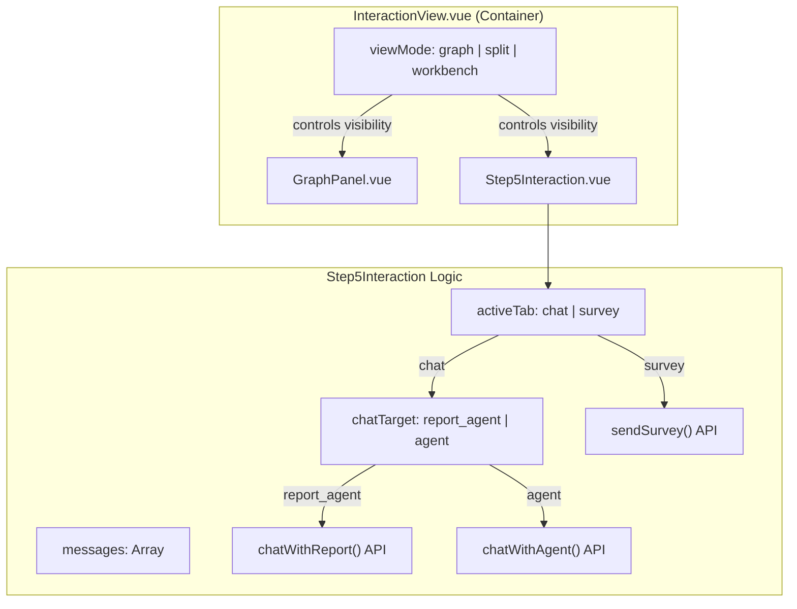
**Sources:** [frontend/src/views/InteractionView.vue:82-105](), [frontend/src/components/Step5Interaction.vue:478-550]()

---

## Technical Detail: Data Synchronization

The transition between Steps 4 and 5 relies on the `reportId` and `simulationId`. `InteractionView.vue` acts as the data coordinator, fetching the necessary project and graph metadata based on the `reportId` provided in the URL route.

### Initialization Sequence
1.  `InteractionView` is mounted and watches the `reportId` from `route.params` [frontend/src/views/InteractionView.vue:203-208]().
2.  `loadReportData()` calls `getReport(currentReportId)` to retrieve the associated `simulation_id` [frontend/src/views/InteractionView.vue:141-150]().
3.  The `simulation_id` is then used to fetch the `project_id` and the final `graph_id` via `getSimulation` and `getProject` [frontend/src/views/InteractionView.vue:152-167]().
4.  The knowledge graph is loaded into `GraphPanel` via `loadGraph(graphId)` [frontend/src/views/InteractionView.vue:180-194]().

### Code Entity Mapping

Title: Mapping UI Interaction to Backend API Entities
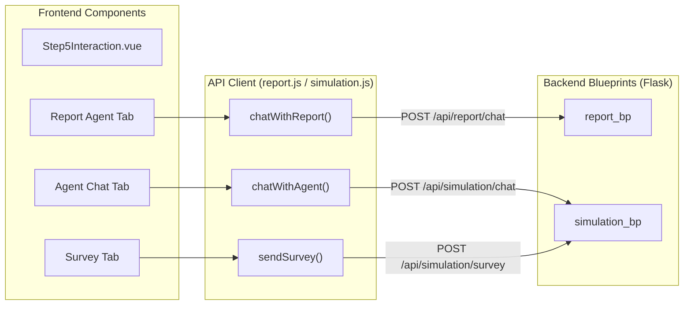
**Sources:** [frontend/src/api/report.js:49-51](), [frontend/src/api/simulation.js:35-45](), [frontend/src/components/Step5Interaction.vue:834-860](), [frontend/src/views/InteractionView.vue:64-71]()

---

## UI Layout Management

`InteractionView.vue` provides a `viewMode` state that dynamically adjusts the CSS widths and visibility of the graph and interaction panels using computed styles `leftPanelStyle` and `rightPanelStyle` [frontend/src/views/InteractionView.vue:94-104]().

| View Mode | Graph Width | Workbench Width | Description |
| :--- | :--- | :--- | :--- |
| `graph` | 100% | 0% | Full-screen D3.js graph visualization. |
| `split` | 50% | 50% | Side-by-side view for context-aware chatting. |
| `workbench` | 0% | 100% | Focused interaction environment (Default for Step 5). |

**Sources:** [frontend/src/views/InteractionView.vue:82-105](), [frontend/src/views/InteractionView.vue:11-20]()

### Interaction Logs
The system maintains a `systemLogs` array in `InteractionView.vue` which is updated via events (`@add-log`) from the child interaction component [frontend/src/views/InteractionView.vue:56](). This ensures that all technical events (API calls, data loading) are captured in a central console [frontend/src/views/InteractionView.vue:119-125]().

**Sources:** [frontend/src/views/InteractionView.vue:119-125](), [frontend/src/components/Step5Interaction.vue:56]()

---

# Page: Frontend API Client Layer

# Frontend API Client Layer

<details>
<summary>Relevant source files</summary>

The following files were used as context for generating this wiki page:

- [frontend/.gitignore](frontend/.gitignore)
- [frontend/src/api/graph.js](frontend/src/api/graph.js)
- [frontend/src/api/index.js](frontend/src/api/index.js)
- [frontend/src/api/report.js](frontend/src/api/report.js)
- [frontend/src/api/simulation.js](frontend/src/api/simulation.js)
- [frontend/src/assets/logo/MiroFish_logo_compressed.jpeg](frontend/src/assets/logo/MiroFish_logo_compressed.jpeg)
- [frontend/src/router/index.js](frontend/src/router/index.js)

</details>


The Frontend API Client Layer serves as the communication bridge between the Vue.js single-page application and the Flask backend services. It abstracts HTTP request logic, handles cross-cutting concerns like exponential backoff retries, and provides type-safe wrappers for the three primary backend domains: Knowledge Graph, Simulation Management, and Report Generation.

## Base Configuration and Interceptors

The core of the client layer is an Axios instance configured in `frontend/src/api/index.js`. This module defines the base URL (defaulting to `http://localhost:5001`), a 5-minute timeout to accommodate long-running LLM tasks, and standardized interceptors for error handling [frontend/src/api/index.js:4-10]().

### Request Reliability
To handle transient network issues or backend cold starts, the layer implements `requestWithRetry`. This utility uses an exponential backoff strategy (`delay * Math.pow(2, i)`) to retry failed requests up to a specified maximum [frontend/src/api/index.js:54-65]().

### Data Flow Architecture
The following diagram illustrates how the API client layer mediates between UI components and the backend blueprints.

**Diagram: Frontend-Backend Communication Flow**
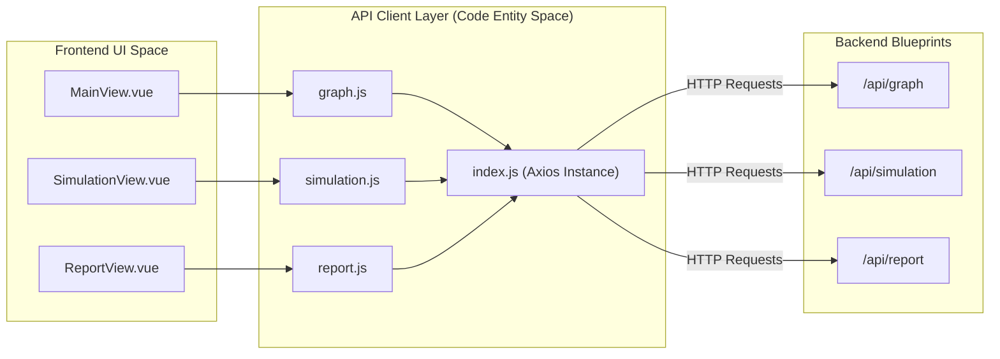
**Sources:** [frontend/src/api/index.js:4-67](), [frontend/src/api/graph.js:1-71](), [frontend/src/api/simulation.js:1-187](), [frontend/src/api/report.js:1-52]()

---

## Graph API Module (`graph.js`)

The `graph.js` module handles the initial stages of the MiroFish lifecycle: document ingestion and knowledge graph construction.

| Function | Endpoint | Purpose |
| :--- | :--- | :--- |
| `generateOntology` | `/api/graph/ontology/generate` | Uploads files and simulation requirements to generate a graph schema [frontend/src/api/graph.js:8-19](). |
| `buildGraph` | `/api/graph/build` | Triggers the Zep ingestion process for the provided project [frontend/src/api/graph.js:26-34](). |
| `getTaskStatus` | `/api/graph/task/:taskId` | Polls the status of asynchronous graph building tasks [frontend/src/api/graph.js:41-46](). |
| `getGraphData` | `/api/graph/data/:graphId` | Retrieves the nodes and edges for D3.js visualization [frontend/src/api/graph.js:53-58](). |

**Sources:** [frontend/src/api/graph.js:1-71]()

---

## Simulation API Module (`simulation.js`)

This module manages the lifecycle of the OASIS simulation, including environment setup, agent profile generation, and execution control.

### Environment Preparation
Simulation preparation involves extracting entities and generating platform-specific profiles.
*   **`prepareSimulation`**: Initiates the asynchronous task to generate agent personas [frontend/src/api/simulation.js:15-17]().
*   **`getSimulationProfilesRealtime`**: Allows the UI to poll for partially generated profiles during the "Environment Setup" phase [frontend/src/api/simulation.js:49-51]().
*   **`getSimulationConfigRealtime`**: Fetches the simulation configuration (time, events, platforms) as it is being built [frontend/src/api/simulation.js:66-68]().

### Execution and Monitoring
*   **`startSimulation`**: Launches the parallel simulation scripts on the backend [frontend/src/api/simulation.js:83-85]().
*   **`getRunStatusDetail`**: Fetches the current round, status, and the most recent agent actions for the live feed [frontend/src/api/simulation.js:107-109]().
*   **`getSimulationTimeline`**: Retrieves a round-by-round summary of events [frontend/src/api/simulation.js:130-136]().
*   **`closeSimulationEnv`**: Gracefully shuts down the simulation processes [frontend/src/api/simulation.js:159-161]().

**Diagram: Simulation State Management Entities**
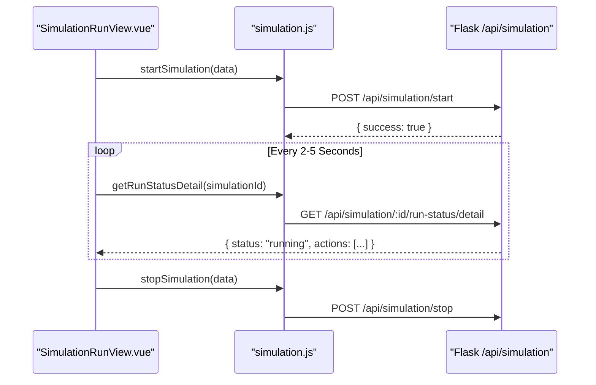
**Sources:** [frontend/src/api/simulation.js:83-109](), [frontend/src/api/simulation.js:91-93](), [frontend/src/api/simulation.js:159-161]()

---

## Report API Module (`report.js`)

The `report.js` module facilitates the analysis phase, where the `ReportAgent` synthesizes simulation data into structured insights.

*   **`generateReport`**: Triggers the ReACT-based reasoning loop to create the final report [frontend/src/api/report.js:7-9]().
*   **`getReportStatus`**: Polls the current state of report generation [frontend/src/api/report.js:15-17]().
*   **`getAgentLog`**: Provides incremental polling of the `ReportAgent` internal thought process and tool usage logs [frontend/src/api/report.js:24-26]().
*   **`chatWithReport`**: Supports the "Interaction Workbench" by sending user queries to the Report Agent for retrieval-augmented conversation [frontend/src/api/report.js:49-51]().

**Sources:** [frontend/src/api/report.js:1-52]()

---

## Global Data Models

Requests and responses follow a consistent shape defined by the `service` interceptor [frontend/src/api/index.js:24-35]().

### Standard Response Shape
```json
{
  "success": true,
  "data": { ... },
  "message": "Operation successful",
  "error": null
}
```

### Simulation History
The `getSimulationHistory` function in `simulation.js` is used to populate the landing page with previous simulation records, including their associated project details [frontend/src/api/simulation.js:184-186](). These historical records allow users to jump directly to existing reports or simulations via the router [frontend/src/router/index.js:9-45]().

**Sources:** [frontend/src/api/index.js:24-35](), [frontend/src/api/simulation.js:184-186](), [frontend/src/router/index.js:9-45]()

---

# Page: Backend Services

# Backend Services

<details>
<summary>Relevant source files</summary>

The following files were used as context for generating this wiki page:

- [backend/app/__init__.py](backend/app/__init__.py)
- [backend/app/api/__init__.py](backend/app/api/__init__.py)
- [backend/app/config.py](backend/app/config.py)
- [backend/app/models/task.py](backend/app/models/task.py)
- [backend/app/services/ontology_generator.py](backend/app/services/ontology_generator.py)
- [backend/app/utils/logger.py](backend/app/utils/logger.py)
- [backend/run.py](backend/run.py)

</details>


The MiroFish backend is a Python Flask application that serves as the orchestration layer between the Vue.js frontend, the Zep Cloud GraphRAG memory, and the OASIS social simulation engine. It manages the complete lifecycle of a simulation—from document parsing and knowledge graph construction to parallel agent execution and automated report generation.

## System Architecture

The backend is structured into three primary API domains (Blueprints) supported by a service-oriented architecture. It uses a task-based approach for long-running processes (like graph building and simulation) to ensure the UI remains responsive.

### Backend Component Map
The following diagram maps high-level functional areas to specific code entities and files.

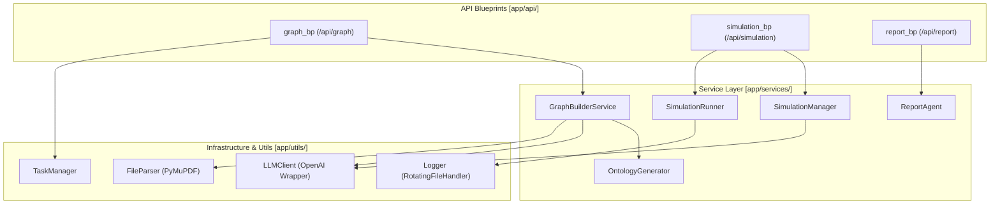
**Sources:** [backend/app/__init__.py:65-70](), [backend/app/api/__init__.py:7-13](), [backend/app/models/task.py:54-71](), [backend/app/services/ontology_generator.py:158-165]()

## Core Subsystems

### 1. Knowledge Graph Construction (GraphRAG)
This subsystem handles the ingestion of raw documents (PDF, MD, TXT) and transforms them into a structured Knowledge Graph in Zep Cloud. It uses an `OntologyGenerator` to dynamically define entity types (e.g., `Professor`, `Company`) based on the simulation requirements, strictly enforcing a 10-entity schema including `Person` and `Organization` fallbacks.
*   **Key Components:** `FileParser`, `TextProcessor`, `OntologyGenerator`, `GraphBuilderService`.
*   **For details, see [Knowledge Graph Construction (GraphRAG)](#3.1)**.

**Sources:** [backend/app/services/ontology_generator.py:77-85](), [backend/app/services/ontology_generator.py:167-183](), [backend/app/config.py:38-41]()

### 2. Simulation Preparation & Management
Before a simulation starts, the system must extract relevant entities from the Knowledge Graph and generate detailed personas. The `OasisProfileGenerator` creates platform-specific profiles (Twitter/Reddit) using LLM-driven character synthesis, adhering to predefined action sets for each platform.
*   **Key Components:** `SimulationManager`, `OasisProfileGenerator`, `SimulationConfigGenerator`.
*   **For details, see [Simulation Preparation & Management](#3.2)**.

**Sources:** [backend/app/config.py:51-59](), [backend/app/config.py:48-49]()

### 3. Simulation Execution Engine
The execution engine manages the lifecycle of parallel simulation processes. It uses a `SimulationRunner` to trigger platform-specific scripts. The backend ensures a clean lifecycle by registering cleanup functions to terminate orphan simulation processes upon server shutdown.
*   **Key Components:** `SimulationRunner`, `run_parallel_simulation.py`, `ParallelIPCHandler`.
*   **For details, see [Simulation Execution Engine](#3.3)**.

**Sources:** [backend/app/services/simulation_runner.py:46-47](), [backend/app/__init__.py:45-47]()

### 4. Zep Memory Integration
Zep Cloud acts as the long-term memory and GraphRAG provider. The integration supports hybrid search and retrieval, while utility modules handle cursor-based pagination for large graph datasets.
*   **Key Components:** `ZepGraphMemoryUpdater`, `ZepToolsService`, `zep_paging`.
*   **For details, see [Zep Memory Integration](#3.4)**.

**Sources:** [backend/app/config.py:35-36](), [backend/app/config.py:72-73]()

### 5. Report Agent & Analysis
Post-simulation, a ReACT-based `ReportAgent` analyzes the results. It uses specialized tools to query the Zep Knowledge Graph and generate a structured analytical report, with configurable reflection rounds and temperature.
*   **Key Components:** `ReportAgent`, `ReportManager`, `ZepToolsService`.
*   **For details, see [Report Agent & Analysis](#3.5)**.

**Sources:** [backend/app/config.py:61-64]()

## Infrastructure & Configuration

### Application Entry Point
The backend is initialized via `create_app()` in `backend/app/__init__.py`. It configures CORS, registers the three main blueprints, and sets up request/response logging middleware.
*   **Entry Script:** `backend/run.py` [backend/run.py:25-45]()
*   **Environment:** Configuration is managed via `backend/app/config.py`, which loads variables from a root `.env` file and validates critical keys like `LLM_API_KEY` and `ZEP_API_KEY`. [backend/app/config.py:9-14](), [backend/app/config.py:67-74]()

### Utility Modules
| Module | Responsibility | Key Code Entities |
| :--- | :--- | :--- |
| **Task Management** | Thread-safe tracking of long-running background tasks. | `TaskManager`, `Task`, `TaskStatus` |
| **Logging** | Provides rotating file logs and UTF-8 console output for Windows compatibility. | `setup_logger`, `RotatingFileHandler`, `_ensure_utf8_stdout` |
| **LLM Client** | Unified wrapper for OpenAI-compatible API calls with JSON mode support. | `LLMClient` |

**Sources:** [backend/app/models/task.py:14-35](), [backend/app/utils/logger.py:13-24](), [backend/app/utils/logger.py:66-75](), [backend/run.py:8-16]()

### Dependency Overview
The backend relies on several critical external frameworks:
*   **Flask**: Web framework for the API.
*   **Zep-Cloud**: GraphRAG and memory management.
*   **Camel-Oasis**: Social media simulation framework.
*   **PyMuPDF (fitz)**: High-performance PDF text extraction.

**Sources:** [backend/app/__init__.py:12-13](), [backend/app/config.py:35-36](), [backend/app/config.py:47-49]()

---
**For details on specific subsystems, follow the links in the sections above.**

---

# Page: Knowledge Graph Construction (GraphRAG)

# Knowledge Graph Construction (GraphRAG)

<details>
<summary>Relevant source files</summary>

The following files were used as context for generating this wiki page:

- [backend/app/api/graph.py](backend/app/api/graph.py)
- [backend/app/models/__init__.py](backend/app/models/__init__.py)
- [backend/app/models/project.py](backend/app/models/project.py)
- [backend/app/services/graph_builder.py](backend/app/services/graph_builder.py)
- [backend/app/services/ontology_generator.py](backend/app/services/ontology_generator.py)
- [backend/app/services/text_processor.py](backend/app/services/text_processor.py)
- [backend/app/services/zep_entity_reader.py](backend/app/services/zep_entity_reader.py)
- [backend/app/utils/file_parser.py](backend/app/utils/file_parser.py)
- [backend/app/utils/logger.py](backend/app/utils/logger.py)
- [backend/app/utils/zep_paging.py](backend/app/utils/zep_paging.py)
- [backend/requirements.txt](backend/requirements.txt)
- [backend/run.py](backend/run.py)
- [backend/uv.lock](backend/uv.lock)

</details>


The Knowledge Graph Construction phase is the foundational step of the MiroFish simulation pipeline. It transforms unstructured documents (PDF, Markdown, TXT) into a structured, queryable knowledge graph hosted on Zep Cloud. This process involves two primary stages: **Ontology Generation**, where an LLM defines the schema based on simulation requirements, and **Graph Building**, where text is chunked, entities/relationships are extracted, and data is ingested into the graph database.

## 1. System Architecture & Data Flow

The graph construction logic is encapsulated within the `graph_bp` Flask blueprint [backend/app/api/graph.py:11-11](). It coordinates between the `ProjectManager` for persistence and specialized service classes for LLM and Zep interactions.

### 1.1 Implementation Overview
The workflow follows a sequential state machine managed by `ProjectStatus` [backend/app/models/project.py:17-23]():
1.  **File Upload & Text Extraction**: Files are processed by `FileParser` [backend/app/utils/file_parser.py:67-76]().
2.  **Ontology Generation**: `OntologyGenerator` uses an LLM to create a schema based on simulation requirements [backend/app/services/ontology_generator.py:167-183]().
3.  **Asynchronous Graph Build**: `GraphBuilderService` handles chunking and Zep ingestion in a background thread [backend/app/services/graph_builder.py:53-94]().
4.  **Graph Retrieval**: `ZepEntityReader` fetches the resulting nodes and edges for frontend visualization and downstream simulation setup [backend/app/services/zep_entity_reader.py:71-79]().

### 1.2 Data Flow Diagram (NL to Code Entity)
The following diagram illustrates how natural language documents are transformed into code-managed entities and eventually Zep Graph objects.

**Graph Construction Pipeline**
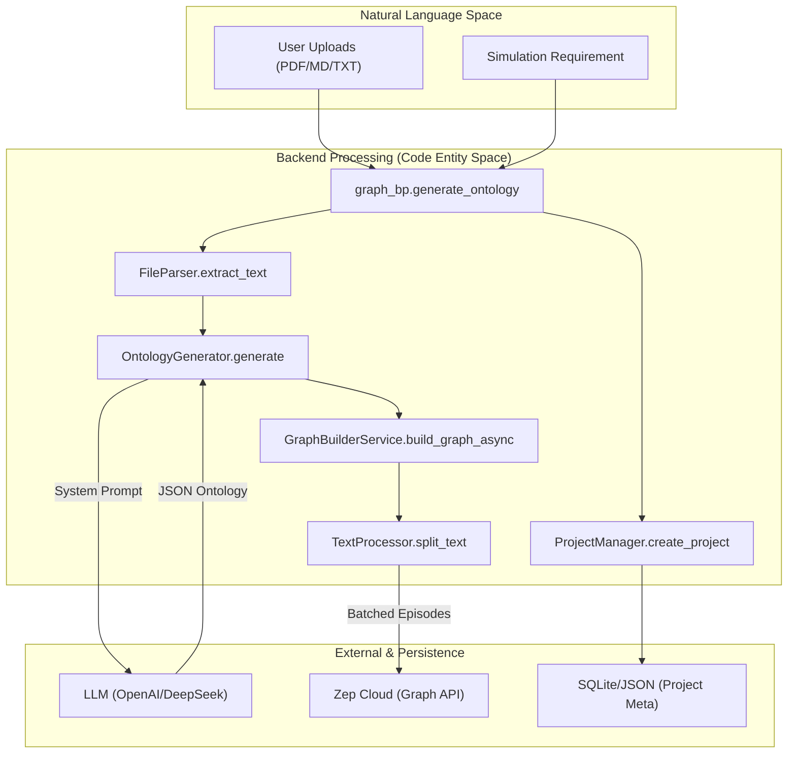
**Sources:** [backend/app/api/graph.py:121-235](), [backend/app/services/ontology_generator.py:167-172](), [backend/app/services/graph_builder.py:53-61](), [backend/app/utils/file_parser.py:67-76](), [backend/app/models/project.py:133-165]()

---

## 2. Document Processing & Ontology Generation

### 2.1 File Parsing
The `FileParser` class supports `.pdf`, `.md`, and `.txt` formats [backend/app/utils/file_parser.py:64-64](). It utilizes `PyMuPDF` (fitz) for PDF extraction [backend/app/utils/file_parser.py:100-100](). For text-based files, it implements a multi-stage encoding fallback strategy (UTF-8 -> `charset_normalizer` -> `chardet` -> Replace) to prevent decoding crashes [backend/app/utils/file_parser.py:11-58]().

### 2.2 LLM-Driven Ontology
The `OntologyGenerator` constructs a specialized system prompt `ONTOLOGY_SYSTEM_PROMPT` that enforces strict rules for social simulation [backend/app/services/ontology_generator.py:12-38]():
*   **Entity Constraints**: Entities must be "vocal" actors (individuals, organizations, media) capable of social interaction [backend/app/services/ontology_generator.py:23-32]().
*   **Schema Structure**: Exactly 10 entity types, including two mandatory "fallback" types: `Person` and `Organization` [backend/app/services/ontology_generator.py:77-85]().
*   **Reserved Keywords**: The generator ensures attributes do not conflict with Zep reserved names like `uuid`, `created_at`, or `summary` [backend/app/services/ontology_generator.py:111-111]().

**Sources:** [backend/app/utils/file_parser.py:11-58](), [backend/app/services/ontology_generator.py:158-162](), [backend/app/services/ontology_generator.py:247-253]()

---

## 3. Asynchronous Graph Construction

Graph building is a long-running process handled by `GraphBuilderService._build_graph_worker` in a background thread [backend/app/services/graph_builder.py:96-106]().

### 3.1 Text Chunking
The `TextProcessor` (invoked via `split_text`) divides the extracted text into segments. It attempts to split at natural sentence boundaries (e.g., `。`, `.\n`, `\n\n`) to preserve semantic integrity [backend/app/utils/file_parser.py:172-179](). The default `chunk_size` is 500 characters with a 50-character overlap [backend/app/services/graph_builder.py:58-59]().

### 3.2 Zep Ingestion Workflow
1.  **Graph Creation**: A unique `graph_id` is generated with the prefix `mirofish_` [backend/app/services/graph_builder.py:189-189]().
2.  **Ontology Mapping**: The LLM-generated JSON is converted into Zep `EntityModel` and `EdgeModel` objects using dynamic Pydantic class creation [backend/app/services/graph_builder.py:219-235]().
3.  **Batch Processing**: Text chunks are sent to Zep as `EpisodeData` in batches (default size 3) to optimize network throughput [backend/app/services/graph_builder.py:58-60]().
4.  **Polling for Completion**: The service waits for Zep to process episodes by checking their status before marking the task as complete [backend/app/services/graph_builder.py:157-164]().

**Sources:** [backend/app/services/graph_builder.py:39-43](), [backend/app/services/graph_builder.py:115-148](), [backend/app/utils/file_parser.py:147-162]()

---

## 4. Graph Retrieval & Pagination

Retrieving large graphs from Zep requires handling cursor-based pagination. This logic is centralized in `zep_paging.py`.

### 4.1 Paging Logic
Zep's API uses a `uuid_cursor` for fetching nodes and edges [backend/app/utils/zep_paging.py:3-4](). The `fetch_all_nodes` and `fetch_all_edges` functions abstract this by:
1.  Requesting a page of size `limit` (default 100) [backend/app/utils/zep_paging.py:73-73]().
2.  Extracting the UUID of the last item in the batch to use as the next cursor [backend/app/utils/zep_paging.py:97-97]().
3.  Implementing exponential backoff retries via `_fetch_page_with_retry` to handle transient `InternalServerError` or network timeouts [backend/app/utils/zep_paging.py:26-40]().

### 4.2 Entity Filtering
The `ZepEntityReader` filters raw graph data to provide the frontend with a clean visualization. It specifically isolates nodes that have labels beyond the default `Entity` or `Node` tags, ensuring only entities defined in the ontology are emphasized [backend/app/services/zep_entity_reader.py:215-227]().

**Zep Retrieval Interaction**
```mermaid
sequenceDiagram
    participant ZER as ZepEntityReader
    participant ZP as zep_paging
    participant ZC as Zep Cloud API

    ZER->>ZP: fetch_all_nodes(graph_id)
    loop until no more batches
        ZP->>ZC: GET /graphs/{id}/nodes?limit=100&cursor={uuid}
        ZC-->>ZP: Batch of Node Objects
        Note over ZP: Update cursor from batch[-1].uuid
    end
    ZP-->>ZER: Complete Node List
    ZER->>ZER: filter_defined_entities()
    Note right of ZER: Remove generic "Entity" labels
```
**Sources:** [backend/app/utils/zep_paging.py:59-66](), [backend/app/utils/zep_paging.py:105-111](), [backend/app/services/zep_entity_reader.py:71-79](), [backend/app/services/zep_entity_reader.py:127-139]()

---

## 5. Key Classes & Functions

| Class/Function | File | Responsibility |
| :--- | :--- | :--- |
| `OntologyGenerator` | `ontology_generator.py` | Uses LLM to transform requirements into a 10-type social actor schema [backend/app/services/ontology_generator.py:158-162](). |
| `GraphBuilderService` | `graph_builder.py` | Orchestrates the async creation of Zep graphs and batch ingestion of text [backend/app/services/graph_builder.py:39-43](). |
| `FileParser` | `file_parser.py` | Extracts raw text from multiple document formats with encoding detection [backend/app/utils/file_parser.py:61-62](). |
| `ZepEntityReader` | `zep_entity_reader.py` | High-level wrapper for reading and filtering graph data for simulation use [backend/app/services/zep_entity_reader.py:71-79](). |
| `fetch_all_nodes` | `zep_paging.py` | Low-level utility for exhaustive node retrieval with cursor management [backend/app/utils/zep_paging.py:59-60](). |
| `ProjectManager` | `project.py` | Persists project metadata, ontology, and task IDs to local JSON/storage [backend/app/models/project.py:101-102](). |

**Sources:** [backend/app/services/ontology_generator.py:158-162](), [backend/app/services/graph_builder.py:39-43](), [backend/app/utils/file_parser.py:61-62](), [backend/app/services/zep_entity_reader.py:71-79](), [backend/app/utils/zep_paging.py:59-60](), [backend/app/models/project.py:101-102]()

---

# Page: Simulation Preparation & Management

# Simulation Preparation & Management

<details>
<summary>Relevant source files</summary>

The following files were used as context for generating this wiki page:

- [backend/app/api/simulation.py](backend/app/api/simulation.py)
- [backend/app/services/oasis_profile_generator.py](backend/app/services/oasis_profile_generator.py)
- [backend/app/services/simulation_config_generator.py](backend/app/services/simulation_config_generator.py)
- [backend/app/services/simulation_manager.py](backend/app/services/simulation_manager.py)
- [frontend/src/components/HistoryDatabase.vue](frontend/src/components/HistoryDatabase.vue)

</details>


The **Simulation Preparation & Management** layer is responsible for transforming static Knowledge Graph data into a dynamic social simulation environment. This process involves extracting entities from Zep Cloud, generating detailed psychological personas via LLMs, and synthesizing complex simulation parameters (timing, events, and platform-specific logic) to drive the OASIS simulation engine.

## 1. Preparation Workflow Overview

The preparation phase is triggered via the `/api/simulation/prepare/<simulation_id>` endpoint [backend/app/api/simulation.py:302-303](). It follows a structured pipeline managed by the `SimulationManager` [backend/app/services/simulation_manager.py:114-123]().

### Data Flow: From Graph to Simulation
The diagram below illustrates how natural language requirements and graph entities are converted into structured simulation configurations.

**Graph-to-Persona Transformation Map**
```mermaid
graph TD
    subgraph "Natural Language Space (Input)"
        A["Document Text"] -- "Ontology Extraction" --> B["Zep Knowledge Graph"]
        C["Simulation Requirement"] -- "Analysis" --> D["LLM Strategy"]
    end

    subgraph "Code Entity Space (Backend Services)"
        B -- "fetch" --> E["ZepEntityReader"]
        E -- "EntityNode list" --> F["OasisProfileGenerator"]
        F -- "Parallel LLM Calls" --> G["OasisAgentProfile"]
        D -- "Parameter Synthesis" --> H["SimulationConfigGenerator"]
        H -- "SimulationParameters" --> I["simulation_config.json"]
    end

    subgraph "Simulation Space (Output)"
        G -- "Export CSV" --> J["twitter_profiles.csv"]
        G -- "Export JSON" --> K["reddit_profiles.json"]
        I -- "CLI Args" --> L["OASIS Engine"]
    end

    style E stroke-dasharray: 5 5
    style F stroke-dasharray: 5 5
    style H stroke-dasharray: 5 5
```
**Sources:** [backend/app/services/simulation_manager.py:114-123](), [backend/app/services/oasis_profile_generator.py:142-152](), [backend/app/services/simulation_config_generator.py:199-210]()

---

## 2. Core Components

### 2.1 SimulationManager
The `SimulationManager` acts as the central orchestrator for the preparation lifecycle. It maintains the `SimulationState` [backend/app/services/simulation_manager.py:43-76](), which tracks the transition from `CREATED` to `READY` status [backend/app/services/simulation_manager.py:24-34]().

*   **Key Function:** `prepare_simulation_data` [backend/app/services/simulation_manager.py:255-256]().
    1.  **Entity Extraction:** Uses `ZepEntityReader` to fetch nodes from Zep Cloud [backend/app/services/simulation_manager.py:274-282]().
    2.  **Profile Generation:** Invokes `OasisProfileGenerator` to create personas [backend/app/services/simulation_manager.py:290-295]().
    3.  **Config Generation:** Invokes `SimulationConfigGenerator` to determine simulation logic [backend/app/services/simulation_manager.py:300-305]().
    4.  **Persistence:** Saves state to `state.json` [backend/app/services/simulation_manager.py:144-154]() and config to `simulation_config.json` [backend/app/services/simulation_manager.py:315-316]() in the simulation's upload directory.

**Sources:** [backend/app/services/simulation_manager.py:24-34](), [backend/app/services/simulation_manager.py:114-154](), [backend/app/services/simulation_manager.py:255-325]()

### 2.2 OasisProfileGenerator
This service converts `EntityNode` objects into `OasisAgentProfile` data structures [backend/app/services/oasis_profile_generator.py:28-58](). It distinguishes between **Individual** (e.g., student, professor) [backend/app/services/oasis_profile_generator.py:169-172]() and **Group** (e.g., university, NGO) entities [backend/app/services/oasis_profile_generator.py:174-178]().

*   **Parallel Generation:** To handle large numbers of agents, it uses LLM prompts to generate detailed MBTI, age, gender, and social media bios for each entity [backend/app/services/oasis_profile_generator.py:46-53]().
*   **Platform Formatting:** 
    *   `to_twitter_format()`: Outputs fields like `friend_count` and `statuses_count` [backend/app/services/oasis_profile_generator.py:88-116]().
    *   `to_reddit_format()`: Outputs fields like `karma` [backend/app/services/oasis_profile_generator.py:60-86]().

**Sources:** [backend/app/services/oasis_profile_generator.py:142-152](), [backend/app/services/oasis_profile_generator.py:211-227](), [backend/app/services/oasis_profile_generator.py:168-178]()

### 2.3 SimulationConfigGenerator
The `SimulationConfigGenerator` uses a multi-step LLM strategy to avoid context window limits and ensure high-fidelity simulation parameters [backend/app/services/simulation_config_generator.py:5-11]().

*   **Time Configuration:** Implements `CHINA_TIMEZONE_CONFIG` to simulate realistic activity cycles (e.g., peak hours between 19:00-22:00) [backend/app/services/simulation_config_generator.py:27-47]().
*   **Agent Activity:** Assigns `activity_level`, `sentiment_bias`, and `influence_weight` to each agent [backend/app/services/simulation_config_generator.py:50-80]().
*   **Event Injection:** Generates `initial_posts` and `scheduled_events` based on the user's simulation requirements [backend/app/services/simulation_config_generator.py:112-126]().

**Sources:** [backend/app/services/simulation_config_generator.py:146-192](), [backend/app/services/simulation_config_generator.py:206-210](), [backend/app/services/simulation_config_generator.py:27-47]()

---

## 3. API Endpoints & Implementation

The simulation preparation logic is exposed via the `simulation_bp` blueprint [backend/app/api/simulation.py:10]().

| Endpoint | Method | Service Call | Description |
| :--- | :--- | :--- | :--- |
| `/create` | POST | `SimulationManager.create_simulation` | Initializes a new simulation entry and directory [backend/app/api/simulation.py:164-228](). |
| `/prepare/<sim_id>` | POST | `SimulationManager.prepare_simulation_data` | Starts the async task for entity extraction and persona generation [backend/app/api/simulation.py:302-348](). |
| `/status/<sim_id>` | GET | `SimulationManager._load_simulation_state` | Returns the current preparation progress and generated counts [backend/app/api/simulation.py:351-378](). |
| `/entities/<graph_id>` | GET | `ZepEntityReader.filter_defined_entities` | Retrieves filtered entities from Zep for UI preview [backend/app/api/simulation.py:47-89](). |

**Sources:** [backend/app/api/simulation.py:12-15](), [backend/app/api/simulation.py:164-378](), [backend/app/services/zep_entity_reader.py:17-23]()

---

## 4. Execution Lifecycle

The following diagram bridges the backend service classes with the physical file outputs required by the OASIS engine.

**Service-to-File Entity Mapping**
```mermaid
graph LR
    subgraph "Logic Layer (Python Services)"
        SM["SimulationManager"]
        OPG["OasisProfileGenerator"]
        SCG["SimulationConfigGenerator"]
    end

    subgraph "Storage Layer (Uploads/Simulations/ID/)"
        ST["state.json"]
        TC["twitter_profiles.csv"]
        RJ["reddit_profiles.json"]
        SC["simulation_config.json"]
    end

    SM -- "manages" --> ST
    OPG -- "generates" --> TC
    OPG -- "generates" --> RJ
    SCG -- "generates" --> SC

    subgraph "Engine Layer (Scripts)"
        Runner["SimulationRunner"]
        Script["run_parallel_simulation.py"]
    end

    SC -- "read by" --> Script
    TC -- "read by" --> Script
    RJ -- "read by" --> Script
    Script -- "monitored by" --> Runner
```
**Sources:** [backend/app/services/simulation_manager.py:125-129](), [backend/app/services/simulation_manager.py:144-154](), [backend/app/services/simulation_config_generator.py:175-192]()

### Preparation Phases
1.  **Entity Fetching:** `ZepEntityReader` uses `get_entities_by_type` to pull nodes from the Zep Graph [backend/app/api/simulation.py:125-159]().
2.  **Persona Synthesis:** `OasisProfileGenerator` runs batches of LLM calls to create detailed bios. If an entity is "University of X", the LLM generates a "University Spokesperson" persona [backend/app/services/oasis_profile_generator.py:174-178]().
3.  **Configuration Synthesis:** `SimulationConfigGenerator` determines the `total_simulation_hours` and `minutes_per_round` to optimize the simulation speed [backend/app/services/simulation_config_generator.py:83-110]().

**Sources:** [backend/app/services/simulation_manager.py:255-325](), [backend/app/services/simulation_config_generator.py:242-252](), [backend/app/services/oasis_profile_generator.py:211-227]()

---

# Page: Simulation Execution Engine

# Simulation Execution Engine

<details>
<summary>Relevant source files</summary>

The following files were used as context for generating this wiki page:

- [backend/app/services/simulation_ipc.py](backend/app/services/simulation_ipc.py)
- [backend/app/services/simulation_runner.py](backend/app/services/simulation_runner.py)
- [backend/app/services/zep_graph_memory_updater.py](backend/app/services/zep_graph_memory_updater.py)
- [backend/scripts/action_logger.py](backend/scripts/action_logger.py)
- [backend/scripts/run_parallel_simulation.py](backend/scripts/run_parallel_simulation.py)
- [backend/scripts/run_reddit_simulation.py](backend/scripts/run_reddit_simulation.py)
- [backend/scripts/run_twitter_simulation.py](backend/scripts/run_twitter_simulation.py)

</details>


The Simulation Execution Engine is the core component responsible for orchestrating the lifecycle of OASIS-based social simulations. It manages parallel processes for different social platforms (Twitter and Reddit), handles real-time inter-process communication (IPC) for agent interaction, and ensures that agent activities are logged and synchronized with the Zep Cloud knowledge graph.

## 1. System Architecture & Component Mapping

The engine operates as a bridge between the Flask backend services and the standalone OASIS simulation scripts. It uses a decoupled architecture where the simulation logic runs in independent subprocesses while the backend monitors status and injects commands.

### Code Entity Mapping
The following diagram maps high-level engine responsibilities to specific classes and scripts within the codebase.

**Execution Engine Entity Map**
```mermaid
graph TD
    subgraph "FlaskBackend(ServiceLayer)"
        SR["SimulationRunner[simulation_runner.py]"]
        IPC_C["SimulationIPCClient[simulation_ipc.py]"]
        ZGM["ZepGraphMemoryManager[zep_graph_memory_updater.py]"]
    end

    subgraph "ExternalProcesses(Scripts)"
        PS["run_parallel_simulation.py"]
        TS["run_twitter_simulation.py"]
        RS["run_reddit_simulation.py"]
        AL["PlatformActionLogger[action_logger.py]"]
    end

    SR -- "spawns" --> PS
    SR -- "monitors_logs" --> AL
    PS -- "uses" --> AL
    IPC_C -- "writes_JSON_commands" --> IPC_DIR["/ipc_commands/"]
    PS -- "reads_via_ParallelIPCHandler" --> IPC_DIR
    AL -- "writes" --> JSONL["actions.jsonl"]
    SR -- "reads" --> JSONL
    SR -- "dispatches_actions" --> ZGM
```
Sources: [backend/app/services/simulation_runner.py:195-204](), [backend/scripts/run_parallel_simulation.py:1-26](), [backend/app/services/simulation_ipc.py:95-100]()

## 2. Process Lifecycle Management

The `SimulationRunner` class manages the execution state of simulations. It is responsible for starting the simulation scripts as subprocesses and maintaining a `SimulationRunState` object for real-time tracking.

### Key Lifecycle Methods
- **`start_simulation`**: Prepares the environment, initializes the action queue, and spawns the `run_parallel_simulation.py` script using `subprocess.Popen` [backend/app/services/simulation_runner.py:316-410]().
- **`stop_simulation`**: Sends a `CLOSE_ENV` command via IPC and terminates the subprocess if it doesn't exit gracefully [backend/app/services/simulation_runner.py:530-564]().
- **`_monitor_process`**: A background thread that reads the subprocess standard output and updates the internal state [backend/app/services/simulation_runner.py:657-690]().

### Simulation Run States
The engine tracks simulation progress through the `RunnerStatus` enum: `IDLE`, `STARTING`, `RUNNING`, `PAUSED`, `STOPPING`, `STOPPED`, `COMPLETED`, `FAILED` [backend/app/services/simulation_runner.py:35-43]().

Sources: [backend/app/services/simulation_runner.py:35-43](), [backend/app/services/simulation_runner.py:316-410](), [backend/app/services/simulation_runner.py:530-564]()

## 3. Parallel Simulation Execution

MiroFish supports concurrent simulation on multiple platforms. The `run_parallel_simulation.py` script acts as a master orchestrator for the OASIS environment.

### Execution Flow
1. **Environment Setup**: Configures UTF-8 encoding for Windows compatibility by monkey-patching `builtins.open` and setting `PYTHONUTF8` environment variables [backend/scripts/run_parallel_simulation.py:35-65](). It also disables redundant OASIS logging [backend/scripts/run_parallel_simulation.py:120-139]().
2. **Parallel Tasks**: Uses `asyncio.gather` to run Twitter and Reddit simulation loops concurrently [backend/scripts/run_parallel_simulation.py:463-485]().
3. **Action Logging**: Every agent action (e.g., `CREATE_POST`, `LIKE_POST`) is recorded into platform-specific `actions.jsonl` files via the `PlatformActionLogger` [backend/scripts/action_logger.py:43-63]().
4. **Wait Mode**: After the defined simulation rounds finish, the script enters a "Wait Mode" instead of exiting, allowing the user to perform "Interviews" with agents [backend/scripts/run_parallel_simulation.py:518-535]().

Sources: [backend/scripts/run_parallel_simulation.py:35-65](), [backend/scripts/run_parallel_simulation.py:463-485](), [backend/scripts/action_logger.py:22-37]()

## 4. Inter-Process Communication (IPC) Layer

Because the simulation runs in a separate process, the Flask backend communicates with it using a file-based IPC mechanism defined in `simulation_ipc.py`.

### IPC Mechanism
- **Command Dispatch**: `SimulationIPCClient` writes a JSON file containing a unique `command_id` and `command_type` (e.g., `INTERVIEW`, `BATCH_INTERVIEW`, `CLOSE_ENV`) to the `ipc_commands/` directory [backend/app/services/simulation_ipc.py:139-151]().
- **Command Handling**: The `ParallelIPCHandler` inside the simulation script polls this directory. When a command is detected, it executes the action within the OASIS environment using `ManualAction` [backend/scripts/run_parallel_simulation.py:217-245](), [backend/scripts/run_twitter_simulation.py:226-231]().
- **Response Retrieval**: Once completed, the simulation script writes a response to `ipc_responses/`. The backend polls this file to return the result to the frontend [backend/app/services/simulation_ipc.py:154-172]().

**IPC Sequence Diagram**
```mermaid
sequenceDiagram
    participant B as FlaskBackend[SimulationIPCClient]
    participant FS as FileSystem[/ipc_commands/]
    participant S as SimulationScript[ParallelIPCHandler]

    B->>FS: Write command_uuid.json (type: interview)
    loop Polling
        S->>FS: Check for new .json files
    end
    FS-->>S: Read command_uuid.json
    S->>S: agent.step(ManualAction)
    S->>FS: Write response_uuid.json (result: text)
    loop Polling
        B->>FS: Check for response_uuid.json
    end
    FS-->>B: Read result
    B-->>B: Return to API
```
Sources: [backend/app/services/simulation_ipc.py:95-123](), [backend/scripts/run_parallel_simulation.py:217-245](), [backend/app/services/simulation_ipc.py:25-30]()

## 5. Action Logging and Graph Synchronization

As agents perform actions, the engine ensures these activities are persisted and reflected in the Knowledge Graph.

### Action Logging
The `PlatformActionLogger` generates structured JSONL entries for every event:
- **`log_simulation_start`**: Metadata about the run including `total_rounds` and `agents_count` [backend/scripts/action_logger.py:92-103]().
- **`log_round_start/end`**: Boundaries for simulation time steps [backend/scripts/action_logger.py:68-90]().
- **`log_action`**: Specific details including `agent_id`, `action_type`, and `action_args` (e.g., post content, author name) [backend/scripts/action_logger.py:43-63]().

### Zep Memory Synchronization
The `ZepGraphMemoryManager` monitors the action logs. It converts structured actions into natural language "episodes" using `AgentActivity.to_episode_text()` and pushes them to Zep Cloud [backend/app/services/zep_graph_memory_updater.py:24-61]().
- **Transformation Logic**: Actions like `CREATE_COMMENT` or `REPOST` are mapped to descriptive strings. For instance, a `LIKE_POST` action is transformed into: `"{agent_name}: 点赞了{post_author}的帖子：「{post_content}」"` [backend/app/services/zep_graph_memory_updater.py:69-81](), [backend/app/services/zep_graph_memory_updater.py:136-150]().

Sources: [backend/scripts/action_logger.py:43-63](), [backend/app/services/zep_graph_memory_updater.py:34-61](), [backend/app/services/zep_graph_memory_updater.py:136-150]()

## 6. Cleanup and Recovery

The engine implements robust cleanup to prevent orphaned simulation processes.
- **`atexit` Registration**: `SimulationRunner` registers a cleanup function to kill all active subprocesses when the Flask server shuts down [backend/app/services/simulation_runner.py:276-302]().
- **Signal Handling**: Simulation scripts handle `SIGINT` and `SIGTERM` to ensure platform environments are closed properly before exiting [backend/scripts/run_parallel_simulation.py:537-561]().
- **Status Persistence**: The simulation state is saved to `run_state.json` in the project's upload directory, allowing the backend to recover the status of a simulation even after a restart [backend/app/services/simulation_runner.py:230-245]().

Sources: [backend/app/services/simulation_runner.py:276-302](), [backend/scripts/run_parallel_simulation.py:537-561](), [backend/app/services/simulation_runner.py:207-210]()

---

# Page: Zep Memory Integration

# Zep Memory Integration

<details>
<summary>Relevant source files</summary>

The following files were used as context for generating this wiki page:

- [backend/app/services/graph_builder.py](backend/app/services/graph_builder.py)
- [backend/app/services/zep_entity_reader.py](backend/app/services/zep_entity_reader.py)
- [backend/app/services/zep_graph_memory_updater.py](backend/app/services/zep_graph_memory_updater.py)
- [backend/app/utils/retry.py](backend/app/utils/retry.py)
- [backend/app/utils/zep_paging.py](backend/app/utils/zep_paging.py)
- [backend/scripts/run_parallel_simulation.py](backend/scripts/run_parallel_simulation.py)

</details>


The Zep Memory Integration layer provides the persistent long-term memory for MiroFish. It facilitates the synchronization of agent actions from the simulation environment into the Zep Cloud Knowledge Graph and provides high-level retrieval tools for the `ReportAgent`. This integration ensures that every interaction in the simulated Twitter and Reddit environments contributes to a structured, queryable graph of facts, entities, and relationships.

## ZepGraphMemoryUpdater

The `ZepGraphMemoryUpdater` is responsible for monitoring agent activities and converting them into natural language "episodes" that Zep can ingest to update its knowledge graph.

### Activity Conversion Logic
When an agent performs an action (e.g., `CREATE_POST`, `LIKE_POST`), the `AgentActivity` dataclass [backend/app/services/zep_graph_memory_updater.py:24-32]() converts the raw action arguments into a descriptive text string via `to_episode_text()` [backend/app/services/zep_graph_memory_updater.py:34-61](). This conversion uses specific templates for different action types to ensure Zep's NLP engine can extract relevant entities:

| Action Type | Description Logic | Source |
| :--- | :--- | :--- |
| `CREATE_POST` | Captures post content: "发布了一条帖子：「{content}」" | [backend/app/services/zep_graph_memory_updater.py:63-67]() |
| `LIKE_POST` | Captures author and content: "点赞了{author}的帖子：「{content}」" | [backend/app/services/zep_graph_memory_updater.py:69-80]() |
| `REPOST` | Captures original author/content: "转发了{author}的帖子：「{content}」" | [backend/app/services/zep_graph_memory_updater.py:95-106]() |
| `FOLLOW` | Captures target: "关注了用户「{target_user_name}」" | [backend/app/services/zep_graph_memory_updater.py:128-134]() |
| `CREATE_COMMENT` | Captures context: "在{author}的帖子「{post}」下评论道：「{content}」" | [backend/app/services/zep_graph_memory_updater.py:136-150]() |

### Batch Processing and Syncing
To optimize API usage and handle high-frequency simulation events, the updater employs a background thread and a `Queue` [backend/app/services/zep_graph_memory_updater.py:13](). 

1.  **Queueing**: The `add_activity` method pushes new `AgentActivity` objects into the internal queue [backend/app/services/zep_graph_memory_updater.py:270-285]().
2.  **Worker Loop**: The `_update_worker` runs continuously, gathering activities until a `batch_size` (default 5) is reached or a timeout occurs [backend/app/services/zep_graph_memory_updater.py:313-345]().
3.  **Zep Ingestion**: The batch is converted to `EpisodeData` and sent to `client.graph.add_episodes` [backend/app/services/zep_graph_memory_updater.py:355-359]().

**Sources:** `backend/app/services/zep_graph_memory_updater.py`

## Cursor-Based Pagination Utilities

Because Zep Cloud limits the number of nodes or edges returned in a single request, the `zep_paging` utility implements robust cursor-based navigation to ensure MiroFish can visualize or process the entire graph.

### Implementation Details
The utility handles `InternalServerError` and network timeouts using an exponential backoff strategy [backend/app/utils/zep_paging.py:26-56]().

*   **`fetch_all_nodes`**: Iteratively calls `client.graph.node.get_by_graph_id` [backend/app/utils/zep_paging.py:79](). It extracts the `uuid_` from the last item in a batch to use as the `uuid_cursor` for the next request [backend/app/utils/zep_paging.py:97](). It respects a `max_items` limit (default 2000) [backend/app/utils/zep_paging.py:21]().
*   **`fetch_all_edges`**: Similar logic using `client.graph.edge.get_by_graph_id` [backend/app/utils/zep_paging.py:125]().

### Data Flow: Pagination Logic
The following diagram illustrates how the `ZepEntityReader` uses `zep_paging` to aggregate a complete graph state for the simulation preparation phase.

Title: Zep Pagination and Entity Retrieval
```mermaid
sequenceDiagram
    participant ZER as ["ZepEntityReader"]
    participant ZP as ["zep_paging.py"]
    participant ZC as "Zep Cloud API"

    ZER->>ZP: fetch_all_nodes(graph_id)
    loop until batch < page_size
        ZP->>ZC: GET /graph/{id}/nodes?limit=100&uuid_cursor=null
        ZC-->>ZP: Batch 1 (100 nodes)
        ZP->>ZP: Extract last node UUID as cursor
        ZP->>ZC: GET /graph/{id}/nodes?limit=100&uuid_cursor=UUID_100
        ZC-->>ZP: Batch 2 (50 nodes)
    end
    ZP-->>ZER: Complete Node List (150 items)
    
    ZER->>ZER: filter_defined_entities()
    Note over ZER: Filters nodes where Labels != ["Entity", "Node"]
```
**Sources:** `backend/app/utils/zep_paging.py`, `backend/app/services/zep_entity_reader.py`

## ZepToolsService and Hybrid Search

The `ZepToolsService` provides the `ReportAgent` with specialized tools for querying simulation results. It abstracts complex graph traversals into three primary search patterns.

### 1. InsightForge (Deep Semantic Search)
`InsightForge` is the most sophisticated tool. It uses an LLM to decompose a complex query into sub-queries, then performs multi-dimensional retrieval.
*   **Sub-query Generation**: Generates 3-5 specific questions based on the main query and simulation requirements.
*   **Semantic Retrieval**: Calls `client.graph.search` for each sub-query to find relevant facts.

### 2. PanoramaSearch (Broad Graph Search)
`PanoramaSearch` is designed to capture the "full picture," including historical facts. It retrieves the evolution of entities over the course of the simulation.

### 3. QuickSearch (Simple Retrieval)
A direct wrapper around `client.graph.search` for basic fact retrieval with a specified limit.

### Data Structure Mapping
The service maps Zep Cloud entities to local Python Dataclasses for consistent processing:

| Code Entity | Maps to Zep Concept | Key Attributes |
| :--- | :--- | :--- |
| `EntityNode` | Graph Node | `uuid`, `labels`, `summary`, `attributes` [backend/app/services/zep_entity_reader.py:23-29]() |
| `GraphInfo` | Graph Metadata | `graph_id`, `node_count`, `edge_count` [backend/app/services/graph_builder.py:23-28]() |

**Sources:** `backend/app/services/zep_entity_reader.py`, `backend/app/services/graph_builder.py`

## System Integration: Simulation to Memory

This diagram bridges the **Simulation Execution** (Natural Language Space) to the **Zep Memory Persistence** (Code Entity Space).

Title: Simulation Action to Zep Knowledge Graph Flow
```mermaid
graph TD
    subgraph "Simulation Execution Space"
        A["run_parallel_simulation.py"] -->|Logs Action| B["actions.jsonl"]
    end

    subgraph "Backend Memory Layer"
        B -->|Polls| C["ZepGraphMemoryUpdater"]
        C -->|action_type: CREATE_POST| D["AgentActivity.to_episode_text()"]
        D -->|Episode Text| E["Queue"]
        E -->|Batch Sync| F["client.graph.add_episodes"]
    end

    subgraph "Zep Cloud Entity Space"
        F --> G["Zep Graph Store"]
        G --> H["Entities (Nodes)"]
        G --> I["Facts (Edges)"]
    end

    subgraph "Report Generation Space"
        J["ReportAgent"] -->|Uses| K["ZepToolsService"]
        K -->|Hybrid Search| G
    end
```

**Sources:** `backend/scripts/run_parallel_simulation.py`, `backend/app/services/zep_graph_memory_updater.py`, `backend/app/utils/zep_paging.py`

---

# Page: Report Agent & Analysis

# Report Agent & Analysis

<details>
<summary>Relevant source files</summary>

The following files were used as context for generating this wiki page:

- [backend/app/api/report.py](backend/app/api/report.py)
- [backend/app/services/report_agent.py](backend/app/services/report_agent.py)
- [backend/app/services/zep_tools.py](backend/app/services/zep_tools.py)

</details>


The **Report Agent** is the final stage of the MiroFish pipeline, responsible for synthesizing the raw social media simulation data and the initial knowledge graph into a structured, multi-chapter analysis report. It utilizes a **ReACT (Reasoning and Acting)** loop to autonomously query the Zep Graph memory, perform deep insights analysis, and generate content that addresses the specific simulation requirements.

### 1. Report Agent Architecture

The `ReportAgent` class [backend/app/services/report_agent.py:134-138]() coordinates the generation process by first planning a table of contents and then iteratively generating each section using specialized tools. It maintains a detailed execution log via `ReportLogger` [backend/app/services/report_agent.py:35-41]() to provide real-time transparency into the agent's "thoughts" and tool usage.

#### Data Flow: Generation to Persistence
The following diagram illustrates how the `ReportAgent` interacts with the Zep memory and the persistence layer.

**Report Generation Flow**
```mermaid
graph TD
    subgraph "Code Entity Space"
        A["ReportAgent (report_agent.py)"]
        B["ZepToolsService (zep_tools.py)"]
        C["ReportManager (report_agent.py)"]
        D["ReportLogger (report_agent.py)"]
        E["LLMClient (llm_client.py)"]
    end

    subgraph "Data & External"
        Z["Zep Cloud Graph"]
        F["agent_log.jsonl"]
        G["report.json"]
    end

    A -->|"1. Plan Outline"| E
    A -->|"2. Loop Sections"| B
    B -->|"3. Search/Retrieve"| Z
    A -->|"4. Reasoning (ReACT)"| E
    A -->|"5. Log Actions"| D
    D -->|"Write"| F
    A -->|"6. Finalize"| C
    C -->|"Save"| G
```
**Sources:** [backend/app/services/report_agent.py:134-155](), [backend/app/services/report_agent.py:35-110](), [backend/app/services/zep_tools.py:2-9]()

---

### 2. ZepToolsService: The Analysis Toolkit

The `ZepToolsService` [backend/app/services/zep_tools.py:2-9]() provides the `ReportAgent` with high-level tools to query the Zep Knowledge Graph. These tools are designed to bridge the gap between natural language questions and graph-based retrieval.

| Tool Name | Class/Method | Purpose |
| :--- | :--- | :--- |
| **InsightForge** | `insight_forge` | Performs deep multi-dimensional retrieval. Generates sub-queries to find semantic facts, entity insights, and relationship chains [backend/app/services/zep_tools.py:138-168](). |
| **PanoramaSearch** | `panorama_search` | Provides a "broad view" of the graph, including expired or historical facts to analyze evolution over time [backend/app/services/zep_tools.py:214-235](). |
| **QuickSearch** | `quick_search` | A lightweight semantic search for fast fact retrieval [backend/app/services/zep_tools.py:7-8](). |
| **InterviewSubAgent** | `interview_agent` | Simulates a Q&A session with specific agents from the simulation to extract their "personal" perspectives [backend/app/services/zep_tools.py:461-510](). |

**Tool Integration Logic**
```mermaid
graph LR
    subgraph "ReportAgent Loop"
        RA["ReportAgent.generate_section"]
    end

    subgraph "ZepToolsService"
        IF["InsightForge"]
        PS["PanoramaSearch"]
        QS["QuickSearch"]
        ISA["InterviewSubAgent"]
    end

    RA --> IF
    RA --> PS
    RA --> QS
    RA --> ISA

    IF -->|"Multi-query"| Zep["Zep Cloud SDK"]
    PS -->|"Historical Query"| Zep
    ISA -->|"Agent Context"| Zep
```
**Sources:** [backend/app/services/zep_tools.py:138-212](), [backend/app/services/zep_tools.py:214-235](), [backend/app/services/zep_tools.py:461-510]()

---

### 3. The ReACT Reasoning Loop

For every section in the report, the `ReportAgent` enters a ReACT loop [backend/app/services/report_agent.py:3-10](). This allows the agent to think about what information is missing, call a tool to find it, observe the result, and then decide whether to finish the section or perform further research.

1.  **Thought**: The LLM determines the next step based on the section title and simulation requirements [backend/app/services/report_agent.py:152-164]().
2.  **Action**: The agent selects a tool (e.g., `insight_forge`) and provides parameters [backend/app/services/report_agent.py:166-186]().
3.  **Observation**: The tool's output is fed back into the LLM context [backend/app/services/report_agent.py:188-209]().
4.  **Final Answer**: Once sufficient information is gathered, the agent synthesizes the final Markdown content for that section [backend/app/services/report_agent.py:236-245]().

**Sources:** [backend/app/services/report_agent.py:3-10](), [backend/app/services/report_agent.py:152-245]()

---

### 4. Persistence & Management

The `ReportManager` [backend/app/services/report_agent.py:13-14]() handles the lifecycle of the generated reports, including saving them to the filesystem and retrieving them by simulation ID.

*   **Storage Path**: Reports are stored in `Config.UPLOAD_FOLDER/reports/{report_id}/` [backend/app/services/report_agent.py:51-53]().
*   **Report Metadata**: A `report.json` file contains the structured chapters, simulation ID, and generation status [backend/app/services/report_agent.py:84-97]().
*   **Logging**: `agent_log.jsonl` stores every iteration of the ReACT loop, allowing the frontend to display the "Agent Log" timeline [backend/app/services/report_agent.py:35-43]().

**Sources:** [backend/app/services/report_agent.py:35-53](), [backend/app/api/report.py:154-155]()

---

### 5. API Endpoints (`/api/report`)

The Report API blueprint [backend/app/api/report.py:11]() provides the interface for the frontend to trigger generation and interact with the results.

#### Generation & Status
*   **POST `/generate`**: Initiates an asynchronous task via `TaskManager`. It creates a `ReportAgent` instance and starts the generation thread [backend/app/api/report.py:24-176]().
*   **POST `/generate/status`**: Polls the `TaskManager` for the current progress percentage and the latest log message [backend/app/api/report.py:198-220]().

#### Content Retrieval
*   **GET `/get/{simulation_id}`**: Retrieves the full report structure and content [backend/app/api/report.py:245-255]().
*   **GET `/logs/{report_id}`**: Streams the `agent_log.jsonl` file to the frontend for real-time visualization of the agent's progress [backend/app/api/report.py:320-335]().

#### Interaction
*   **POST `/chat`**: Allows users to "talk" to the Report Agent. The agent uses the same `ZepToolsService` to answer questions about the simulation results dynamically [backend/app/api/report.py:380-410]().

**Sources:** [backend/app/api/report.py:24-195](), [backend/app/api/report.py:198-220](), [backend/app/api/report.py:380-410]()

---

# Page: Backend Utilities & Infrastructure

# Backend Utilities & Infrastructure

<details>
<summary>Relevant source files</summary>

The following files were used as context for generating this wiki page:

- [backend/app/api/__init__.py](backend/app/api/__init__.py)
- [backend/app/config.py](backend/app/config.py)
- [backend/app/models/task.py](backend/app/models/task.py)
- [backend/app/services/ontology_generator.py](backend/app/services/ontology_generator.py)
- [backend/app/utils/__init__.py](backend/app/utils/__init__.py)
- [backend/app/utils/file_parser.py](backend/app/utils/file_parser.py)
- [backend/app/utils/llm_client.py](backend/app/utils/llm_client.py)
- [backend/app/utils/logger.py](backend/app/utils/logger.py)
- [backend/app/utils/retry.py](backend/app/utils/retry.py)
- [backend/requirements.txt](backend/requirements.txt)
- [backend/run.py](backend/run.py)
- [backend/uv.lock](backend/uv.lock)

</details>


The MiroFish backend infrastructure provides foundational services for Large Language Model (LLM) interaction, asynchronous task tracking, robust file parsing, and system-wide logging. These utilities ensure that high-level simulation logic remains decoupled from specific API implementations and environment configurations.

## LLM Client Wrapper

The `LLMClient` class acts as a unified interface for interacting with OpenAI-compatible APIs. It handles authentication, model selection, and specific post-processing requirements for model outputs.

### Key Features
*   **Unified Interface**: Wraps the `openai` Python library to provide standard `chat` and `chat_json` methods [backend/app/utils/llm_client.py:14-33]().
*   **Response Cleaning**: Automatically removes `<think>` tags (used by models like MiniMax M2.5 or DeepSeek) from the response content [backend/app/utils/llm_client.py:65-67]().
*   **JSON Enforcement**: The `chat_json` method utilizes `response_format={"type": "json_object"}` and includes regex-based cleaning to strip Markdown code blocks before parsing [backend/app/utils/llm_client.py:70-102]().
*   **Config Integration**: Automatically loads `LLM_API_KEY`, `LLM_BASE_URL`, and `LLM_MODEL_NAME` from the central `Config` class [backend/app/utils/llm_client.py:23-25]().

### LLM Data Transformation Flow

The following diagram illustrates how the `LLMClient` bridges the gap between the application's request for structured data and the raw string output of an external API.

**Diagram: LLM Data Transformation**
```mermaid
graph TD
    subgraph "Code Entity Space"
        A["OntologyGenerator"] -- "calls chat_json()" --> B["LLMClient.chat_json"]
        B -- "calls chat()" --> C["LLMClient.chat"]
    end

    subgraph "Natural Language Space (External API)"
        C -- "HTTP POST (OpenAI Format)" --> D["LLM API Provider"]
        D -- "Raw Response with <think> or ```json" --> C
    end

    subgraph "Data Processing"
        C -- "re.sub('<think>...')" --> E["Cleaned Text"]
        E -- "re.sub('```json...')" --> F["Raw JSON String"]
        F -- "json.loads()" --> G["Python Dictionary"]
    end

    G --> A
```
Sources: [backend/app/utils/llm_client.py:14-102](), [backend/app/services/ontology_generator.py:164-201]()

## Task & Status Management

MiroFish tracks long-running backend processes (such as knowledge graph construction) using a centralized task management system.

### TaskManager
The `TaskManager` is a thread-safe singleton used to track the lifecycle and progress of asynchronous operations [backend/app/models/task.py:54-71]().
*   **Task Data**: Managed via the `Task` dataclass, which includes `task_id`, `status`, `progress` (0-100), and `progress_detail` [backend/app/models/task.py:22-35]().
*   **Status Lifecycle**: Tasks transition through `PENDING`, `PROCESSING`, `COMPLETED`, and `FAILED` states [backend/app/models/task.py:14-19]().
*   **Cleanup**: Includes a `cleanup_old_tasks` method to remove completed or failed tasks older than a specified threshold (default 24 hours) [backend/app/models/task.py:172-184]().

**Diagram: Task Management Data Flow**
```mermaid
graph LR
    subgraph "Backend Process"
        P["GraphBuilderService"] -- "create_task()" --> TM["TaskManager"]
        P -- "update_task(progress=X)" --> TM
        P -- "complete_task(result=Y)" --> TM
    end

    subgraph "API Layer"
        R["graph_bp.get_task_status"] -- "get_task(id)" --> TM
    end

    subgraph "Storage"
        TM -- "writes to" --> TS["_tasks: Dict[str, Task]"]
    end
```
Sources: [backend/app/models/task.py:54-184](), [backend/app/api/__init__.py:7-11]()

## File Parsing & Text Processing

The `FileParser` utility provides a robust mechanism for extracting text from various document formats uploaded by users.

### Key Capabilities
*   **Multi-Format Support**: Supports `.pdf`, `.md`, `.markdown`, and `.txt` files [backend/app/utils/file_parser.py:64-66]().
*   **PyMuPDF Integration**: Uses `fitz` (PyMuPDF) for high-quality text extraction from PDF documents [backend/app/utils/file_parser.py:97-111]().
*   **Encoding Detection**: Implements a multi-level fallback strategy for text files:
    1.  Standard UTF-8 attempt [backend/app/utils/file_parser.py:29-33]().
    2.  `charset_normalizer` detection [backend/app/utils/file_parser.py:35-43]().
    3.  `chardet` detection [backend/app/utils/file_parser.py:45-52]().
    4.  UTF-8 with `errors='replace'` as a final safety measure [backend/app/utils/file_parser.py:54-58]().
*   **Text Chunking**: The `split_text_into_chunks` function divides long texts into manageable pieces for LLM processing, attempting to split at sentence boundaries (`。`, `！`, `\n\n`, etc.) to preserve semantic context [backend/app/utils/file_parser.py:147-188]().

Sources: [backend/app/utils/file_parser.py:11-188]()

## Infrastructure Utilities

### Centralized Logging
Configured in `backend/app/utils/logger.py`, the logging system ensures visibility into backend operations while preventing disk overflow.
*   **Rotating Logs**: Uses `RotatingFileHandler` to cap log files at 10MB, maintaining up to 5 backups [backend/app/utils/logger.py:68-73]().
*   **Windows UTF-8 Support**: Explicitly reconfigures `sys.stdout` and `sys.stderr` to use UTF-8 on Windows platforms to prevent crashes when logging non-ASCII characters [backend/app/utils/logger.py:13-24]().
*   **Dual Handlers**: A `detailed_formatter` is used for file logs (DEBUG level), while a `simple_formatter` is used for console output (INFO level) [backend/app/utils/logger.py:55-82]().

### Retry Mechanism
The `retry_with_backoff` utility handles transient failures in external API calls (e.g., LLM rate limits or Zep Cloud timeouts).
*   **Exponential Backoff**: Implements a delay that increases by a `backoff_factor` after each failed attempt [backend/app/utils/retry.py:15-19]().
*   **Jitter**: Adds random noise to retry timing to prevent synchronized "thundering herd" requests to external services [backend/app/utils/retry.py:60-62]().
*   **Async Support**: Provides `retry_with_backoff_async` for use with `asyncio` based operations [backend/app/utils/retry.py:80-129]().
*   **Batch Retries**: The `RetryableAPIClient` includes a `call_batch_with_retry` method to process lists of items with individual item retry logic [backend/app/utils/retry.py:195-234]().

### Global Configuration
The `Config` class in `backend/app/config.py` centralizes all environment variables and system constants.
*   **Validation**: Includes a `validate()` method to ensure critical keys like `LLM_API_KEY` and `ZEP_API_KEY` are present at startup [backend/app/config.py:67-74]().
*   **Path Management**: Dynamically resolves paths for `UPLOAD_FOLDER` and `OASIS_SIMULATION_DATA_DIR` relative to the backend root [backend/app/config.py:40-49]().

Sources: [backend/app/utils/logger.py:1-108](), [backend/app/utils/retry.py:1-234](), [backend/app/config.py:20-74](), [backend/run.py:25-34]()

---

# Page: Simulation State Files

# Simulation State Files

<details>
<summary>Relevant source files</summary>

The following files were used as context for generating this wiki page:

- [backend/app/services/simulation_runner.py](backend/app/services/simulation_runner.py)

</details>


This page details the JSON state files used throughout the MiroFish simulation lifecycle. These files serve as the primary persistence and inter-process communication (IPC) mechanism between the Flask backend, the OASIS simulation engine, and the Vue.js frontend.

## Overview of State Persistence

The simulation lifecycle is managed through three primary JSON files located within the simulation's specific directory in `uploads/simulations/{simulation_id}/`. These files track the transition from environment preparation to real-time execution and final reporting.

| File | Purpose | Primary Owner |
| :--- | :--- | :--- |
| `state.json` | Tracks preparation readiness (personas, profiles, configs). | `SimulationManager` |
| `simulation_config.json` | Full environment parameters and agent definitions. | `SimulationConfigGenerator` |
| `run_state.json` | Real-time runner progress, platform status, and action logs. | `SimulationRunner` |

---

## 1. Preparation State (`state.json`)

The `state.json` file tracks the "Step 2: Environment Setup" phase. It monitors the completion of sub-tasks required before a simulation can be launched.

### Data Structure
The state is managed by the `SimulationState` dataclass [backend/app/services/simulation_manager.py:34-60]().

```json
{
  "simulation_id": "sim_12345",
  "status": "preparing",
  "entities_extracted": true,
  "personas_generated": true,
  "twitter_profiles_generated": true,
  "reddit_profiles_generated": true,
  "config_generated": true,
  "updated_at": "2023-10-27T10:00:00.000Z",
  "error": null
}
```

### Lifecycle and Transitions
1.  **Initialization**: Created when a user enters the Environment Setup view via `SimulationManager.get_or_create_state` [backend/app/services/simulation_manager.py:108-129]().
2.  **Entity Extraction**: Marked `entities_extracted: true` after `ZepEntityReader` processes the graph [backend/app/services/simulation_manager.py:176-179]().
3.  **Profile Generation**: Updated as `OasisProfileGenerator` completes Twitter CSVs and Reddit JSONs [backend/app/services/simulation_manager.py:234-237]().
4.  **Ready**: Once `config_generated` is true, the frontend enables the "Start Simulation" button [frontend/src/views/SimulationView.vue:350-365]().

**Sources:**
- [backend/app/services/simulation_manager.py:34-60]() (SimulationState definition)
- [backend/app/services/simulation_manager.py:108-129]() (State initialization)
- [frontend/src/views/SimulationView.vue:350-365]() (Frontend state polling)

---

## 2. Environment Configuration (`simulation_config.json`)

This file contains the exhaustive parameters for the OASIS engine. It is generated by the `SimulationConfigGenerator` [backend/app/services/simulation_config_generator.py:16-18]().

### Key Components
-   **Time Config**: Defines `start_time`, `max_rounds`, and `hours_per_round` [backend/app/services/simulation_config_generator.py:38-45]().
-   **Event Config**: Background context and "Breaking News" triggers used to influence agent behavior.
-   **Platform Config**: Specific settings for Twitter and Reddit (e.g., bot counts, interaction probabilities).

### Mapping Natural Language to Config Entities
The following diagram illustrates how user requirements are transformed into the structured `simulation_config.json`.

**Title: Configuration Synthesis Flow**
```mermaid
graph TD
    subgraph "Natural Language Space"
        A["User Requirements"] -- "LLM Extraction" --> B["Simulation Goal"]
        A -- "LLM Extraction" --> C["Timeframe"]
    end

    subgraph "Code Entity Space (SimulationConfigGenerator)"
        B --> D["event_config['background']"]
        C --> E["time_config['max_rounds']"]
        F["Zep Entities"] -- "OasisProfileGenerator" --> G["agent_profiles"]
    end

    subgraph "Persistence"
        D --> H["simulation_config.json"]
        E --> H
        G --> H
    end
```

**Sources:**
- [backend/app/services/simulation_config_generator.py:16-80]() (Config generation logic)
- [backend/app/services/oasis_profile_generator.py:25-50]() (Profile generation logic)

---

## 3. Runtime State (`run_state.json`)

The `run_state.json` file is the heartbeat of the active simulation. It is updated frequently by the `SimulationRunner` as it parses the `actions.jsonl` stream from the OASIS sub-processes.

### Data Structure
The state is encapsulated in the `SimulationRunState` class [backend/app/services/simulation_runner.py:101-144]().

| Field | Type | Description |
| :--- | :--- | :--- |
| `runner_status` | `Enum` | `running`, `paused`, `completed`, or `failed`. |
| `twitter_running` | `bool` | Independent status of the Twitter sub-process. |
| `reddit_running` | `bool` | Independent status of the Reddit sub-process. |
| `recent_actions` | `List` | A rolling buffer of the last 50 `AgentAction` objects. |
| `progress_percent`| `float`| Calculated as `current_round / total_rounds`. |

### Data Flow: Engine to Frontend
The `SimulationRunner` monitors the simulation via an IPC (Inter-Process Communication) client.

**Title: Runtime State Update Loop**
```mermaid
sequenceDiagram
    participant P as OASIS Processes
    participant R as SimulationRunner
    participant F as run_state.json
    participant API as Simulation Blueprint
    participant UI as Vue.js Frontend

    P->>R: Emit Action (via actions.jsonl)
    R->>R: Update SimulationRunState
    R->>F: Atomic Write to Disk
    UI->>API: GET /api/simulation/run-status
    API->>F: Read File
    API-->>UI: JSON Response
    UI->>UI: Update Action Feed Component
```

### Key Functions
-   `SimulationRunner.get_run_state(sim_id)`: Loads the state from disk or memory [backend/app/services/simulation_runner.py:230-250]().
-   `SimulationRunState.add_action(action)`: Appends a new action and updates the `updated_at` timestamp [backend/app/services/simulation_runner.py:146-158]().
-   `SimulationRunState.to_dict()`: Serializes the state for the frontend API [backend/app/services/simulation_runner.py:159-185]().

**Sources:**
- [backend/app/services/simulation_runner.py:101-144]() (SimulationRunState definition)
- [backend/app/services/simulation_runner.py:146-158]() (Action update logic)
- [backend/app/api/simulation.py:240-265]() (Run status endpoint)

---

## 4. File System Organization

All state files are stored in a hierarchical structure to support multi-project isolation.

```text
uploads/simulations/
└── {simulation_id}/
    ├── state.json              # Preparation progress
    ├── simulation_config.json  # Environment parameters
    ├── run_state.json          # Real-time execution status
    ├── actions.jsonl           # Raw action stream (input for run_state)
    ├── twitter/
    │   ├── twitter_profiles.csv
    │   └── oasis_twitter.db    # SQLite database for OASIS
    └── reddit/
        ├── reddit_profiles.json
        └── oasis_reddit.db     # SQLite database for OASIS
```

**Sources:**
- [backend/app/services/simulation_runner.py:207-210]() (Directory constants)
- [backend/app/services/simulation_manager.py:65-70]() (Base directory logic)

---

# Page: Agent Profiles & Action Logs

# Agent Profiles & Action Logs

<details>
<summary>Relevant source files</summary>

The following files were used as context for generating this wiki page:

- [backend/scripts/action_logger.py](backend/scripts/action_logger.py)

</details>


This page documents the data formats and persistence layers used to represent agent identities and their behavioral history within the MiroFish simulation environment. It covers the transformation of LLM-generated personas into platform-specific profile formats, the real-time event stream logging, and the underlying SQLite schema used by the OASIS engine for state persistence.

## Agent Profile Formats

Agent profiles are generated by the `OasisProfileGenerator` and stored within the simulation project directory. Depending on the target platform (Twitter or Reddit), the engine requires specific schemas to initialize the agent's initial state, such as bio, follower counts, and historical metadata.

### Twitter Profiles (`twitter_profiles.csv`)
Twitter agents are defined in a CSV format compatible with the OASIS Twitter module. Each row represents a unique agent and their social graph context.

| Column | Description |
| :--- | :--- |
| `id` | Unique integer identifier for the agent. |
| `name` | Display name of the agent. |
| `screen_name` | The `@handle` used for mentions. |
| `description` | The agent's bio, derived from the generated persona. |
| `followers_count` | Initial number of followers. |
| `friends_count` | Initial number of accounts the agent follows. |
| `statuses_count` | Historical post count. |
| `created_at` | Account creation timestamp (ISO 8601). |

### Reddit Profiles (`reddit_profiles.json`)
Reddit agents utilize a JSON array of objects, reflecting the platform's nested structure (e.g., subreddit subscriptions).

```json
[
  {
    "id": 1,
    "name": "User_Name",
    "description": "Agent persona and interests...",
    "karma": 150,
    "created_utc": 1672531200,
    "subscribed_subreddits": ["technology", "science"]
  }
]
```

**Sources:**
- `backend/scripts/action_logger.py` [1-13]() (Directory structure context)
- `backend/services/simulation_manager.py` (Logic for generating these files)

---

## Action Event Stream (`actions.jsonl`)

The simulation records every agent decision and platform event into an append-only `actions.jsonl` file. This file serves as the primary data source for the frontend's "Simulation Execution UI" and the Zep Memory synchronization process.

### Data Flow: Action Logging
The following diagram illustrates how the `SimulationLogManager` captures events from the parallel execution scripts and persists them to the filesystem.

**Action Logging Architecture**
```mermaid
graph TD
    subgraph "Simulation Execution Space"
        A["run_twitter_simulation.py"] -- "calls" --> B["PlatformActionLogger"]
        C["run_reddit_simulation.py"] -- "calls" --> B
    end

    subgraph "Logging Logic (action_logger.py)"
        B -- "log_action()" --> D["JSON Serialization"]
        B -- "log_round_start()" --> D
        B -- "log_round_end()" --> D
    end

    subgraph "Persistence Space"
        D -- "Append" --> E["actions.jsonl"]
        F["SimulationLogManager"] -- "write" --> G["simulation.log"]
    end

    style E stroke-dasharray: 5 5
    style G stroke-dasharray: 5 5
```
**Sources:**
- `backend/scripts/action_logger.py:22-37` (PlatformActionLogger definition)
- `backend/scripts/action_logger.py:119-139` (SimulationLogManager definition)

### Event Schema
Each line in `actions.jsonl` is a standalone JSON object. There are two primary categories of entries: **Action Entries** and **Lifecycle Entries**.

#### 1. Action Entry
Recorded when an agent performs a specific task (e.g., posting, replying).
| Field | Type | Description |
| :--- | :--- | :--- |
| `round` | int | The simulation hour/round number. |
| `timestamp` | string | ISO 8601 wall-clock time of the event. |
| `agent_id` | int | ID of the acting agent. |
| `agent_name` | string | Name of the acting agent. |
| `action_type` | string | The action performed (e.g., `post`, `reply`, `quote`). |
| `action_args` | dict | Parameters (e.g., `{"text": "Hello world", "reply_to": 123}`). |
| `success` | bool | Whether the action was accepted by the platform engine. |

#### 2. Lifecycle Entry
Recorded by the `SimulationRunner` to mark phase transitions.
| `event_type` | Description | Additional Fields |
| :--- | :--- | :--- |
| `simulation_start` | Simulation initialized. | `platform`, `total_rounds`, `agents_count` |
| `round_start` | A new round has begun. | `simulated_hour` |
| `round_end` | All agents finished the round. | `actions_count` |
| `simulation_end` | Simulation completed. | `total_actions` |

**Sources:**
- `backend/scripts/action_logger.py:43-66` (log_action implementation)
- `backend/scripts/action_logger.py:68-116` (Lifecycle logging methods)

---

## OASIS SQLite Database Schema

While `actions.jsonl` provides a human-readable stream, the OASIS engine maintains a relational SQLite database (typically `twitter.db` or `reddit.db`) to manage stateful interactions, such as thread hierarchies and user relationships.

### Core Tables
The engine relies on four primary tables to maintain the simulated world state.

**Entity Relationship Mapping**
```mermaid
erDiagram
    "user_table" {
        int id PK
        string screen_name
        string description
    }
    "post_table" {
        int id PK
        int author_id FK
        string content
        datetime created_at
    }
    "comment_table" {
        int id PK
        int post_id FK
        int parent_id FK
        int author_id FK
        string content
    }
    "trace_table" {
        int id PK
        int agent_id FK
        string action_type
        string observation
    }

    "user_table" ||--o{ "post_table" : "writes"
    "post_table" ||--o{ "comment_table" : "contains"
    "comment_table" ||--o{ "comment_table" : "replies_to"
    "user_table" ||--o{ "trace_table" : "logs_history"
```

### Implementation Details
- **`post` / `comment` Tables**: Store the actual text generated by LLMs. The `comment` table uses a `parent_id` to support recursive threading in Reddit or reply chains in Twitter.
- **`user` Table**: Mirror of the agent profiles, updated dynamically if the simulation allows for profile changes.
- **`trace` Table**: Internal OASIS log that stores the "Thought" process of the agent (the reasoning before the action), which is distinct from the public `action_args` found in `actions.jsonl`.

**Sources:**
- `backend/scripts/action_logger.py:1-13` (Context on simulation directory structure)
- `backend/services/simulation_runner.py` (Usage of database files during execution)

---

## Data Flow: From Execution to Persistence

The following diagram bridges the gap between the Python execution logic and the physical files on disk.

**Code Entity to File System Mapping**
```mermaid
graph LR
    subgraph "Code Entities (Python)"
        SR["SimulationRunner"]
        PAL["PlatformActionLogger"]
        SLM["SimulationLogManager"]
    end

    subgraph "Data Persistence (Filesystem)"
        DB[("SQLite DB (twitter.db)")]
        AJL["actions.jsonl"]
        SLOG["simulation.log"]
        RS["run_state.json"]
    end

    SR -- "updates" --> DB
    SR -- "uses" --> SLM
    SLM -- "manages" --> PAL
    PAL -- "appends to" --> AJL
    SLM -- "writes to" --> SLOG
    SR -- "periodically updates" --> RS
```

**Sources:**
- `backend/scripts/action_logger.py:125-139` (SimulationLogManager initialization)
- `backend/scripts/action_logger.py:25-37` (PlatformActionLogger path construction)
- `backend/scripts/action_logger.py:142-156` (Main logger file handler setup)

---

# Page: Glossary

# Glossary

<details>
<summary>Relevant source files</summary>

The following files were used as context for generating this wiki page:

- [README-EN.md](README-EN.md)
- [README.md](README.md)
- [backend/app/api/report.py](backend/app/api/report.py)
- [backend/app/api/simulation.py](backend/app/api/simulation.py)
- [backend/app/services/report_agent.py](backend/app/services/report_agent.py)
- [backend/app/services/simulation_runner.py](backend/app/services/simulation_runner.py)
- [backend/app/services/zep_graph_memory_updater.py](backend/app/services/zep_graph_memory_updater.py)
- [backend/app/services/zep_tools.py](backend/app/services/zep_tools.py)
- [backend/scripts/run_parallel_simulation.py](backend/scripts/run_parallel_simulation.py)
- [frontend/src/components/HistoryDatabase.vue](frontend/src/components/HistoryDatabase.vue)
- [frontend/src/components/Step2EnvSetup.vue](frontend/src/components/Step2EnvSetup.vue)
- [frontend/src/views/SimulationView.vue](frontend/src/views/SimulationView.vue)
- [static/image/shanda_logo.png](static/image/shanda_logo.png)

</details>


This page provides definitions for the technical terms, domain concepts, and internal jargon used throughout the MiroFish codebase.

## Core Simulation Concepts

### The Five-Stage Lifecycle
The MiroFish workflow is divided into five distinct stages, transitioning from raw data to interactive simulation.
1.  **Graph Building**: Extracting "seeds" from documents and constructing a Knowledge Graph (GraphRAG) [README.md:88-88]().
2.  **Environment Setup**: Generating agent personas and configuring simulation parameters [README.md:89-89]().
3.  **Simulation Execution**: Parallel multi-agent interaction on digital twins of Twitter and Reddit [README.md:90-90]().
4.  **Report Generation**: The `ReportAgent` analyzes the simulation outcomes [README.md:91-91]().
5.  **Deep Interaction**: Direct chat with agents or the `ReportAgent` [README.md:92-92]().

### Seed Information
Raw input materials (PDF, TXT, MD) provided by the user that serve as the ground truth for the simulation. These are parsed and converted into a Knowledge Graph [README.md:29-31]().
*   **Code Pointer**: `FileParser` and `TextProcessor` in the backend service layer.

### Agent Persona (Profile)
A digital identity generated by the `OasisProfileGenerator`. It includes a `username`, `profession`, `bio`, and `interested_topics` [frontend/src/components/Step2EnvSetup.vue:92-109](). These personas are mapped to OASIS-compatible formats (CSV for Twitter, JSON for Reddit) [backend/app/api/simulation.py:13-14]().

---

## Technical Domain Terms

### GraphRAG (Graph Retrieval-Augmented Generation)
The architecture used to store and retrieve seed information. Unlike standard RAG which uses flat vector chunks, GraphRAG preserves relationships between entities (Nodes) and facts (Edges) [README.md:88-88]().
*   **Implementation**: Utilizes **Zep Cloud** as the graph store [README.md:125-128]().
*   **Key Service**: `ZepEntityReader` [backend/app/api/simulation.py:12-12]().

### ReACT (Reasoning and Acting)
The cognitive pattern used by the `ReportAgent`. The agent follows a loop of **Thought -> Action (Tool Call) -> Observation (Tool Result) -> Final Answer** [backend/app/services/report_agent.py:7-9]().
*   **Logic**: `ReportLogger.log_react_thought` [backend/app/services/report_agent.py:152-165]() and `log_tool_call` [backend/app/services/report_agent.py:166-186]().

### IPC (Inter-Process Communication)
The mechanism used by the Flask backend to control the standalone OASIS simulation scripts.
*   **Command Flow**: The backend writes JSON commands to `ipc_commands/` and reads responses from `ipc_responses/` [backend/scripts/run_parallel_simulation.py:205-209]().
*   **Handler**: `ParallelIPCHandler` [backend/scripts/run_parallel_simulation.py:217-245]().

---

## System Architecture Mapping

The following diagram bridges the natural language concepts to the specific classes and files in the codebase.

### Simulation Preparation & Execution Flow
This diagram tracks how a project moves from configuration to a running parallel process.

```mermaid
graph TD
    subgraph "Natural Language Space"
        [User_Input_Seeds] --> [Persona_Generation]
        [Persona_Generation] --> [Parallel_Simulation]
    end

    subgraph "Code Entity Space"
        [User_Input_Seeds] -->|"POST /api/graph/build"| D["GraphBuilderService"]
        D -->|"Zep Cloud"| E[("Zep_Knowledge_Graph")]
        
        E -->|"POST /api/simulation/prepare"| F["OasisProfileGenerator"]
        F -->|"generate_profiles"| G["twitter_profiles.csv / reddit_profiles.json"]
        
        G -->|"POST /api/simulation/run"| H["SimulationRunner"]
        H -->|"subprocess.Popen"| I["run_parallel_simulation.py"]
        
        I -->|"IPC Command"| J["ParallelIPCHandler"]
        J -->|"Action Log"| K["actions.jsonl"]
    end

    Sources: [backend/app/api/simulation.py:164-236](), [backend/app/services/simulation_runner.py:195-204](), [backend/scripts/run_parallel_simulation.py:1-26]()
```

---

## Report Agent & Tools

The `ReportAgent` uses a specialized set of tools to query the Knowledge Graph after a simulation completes.

| Term | Definition | Code Pointer |
| :--- | :--- | :--- |
| **InsightForge** | A deep retrieval tool that generates sub-queries to find multi-dimensional semantic facts. | [backend/app/services/zep_tools.py:138-141]() |
| **PanoramaSearch** | A broad search tool used to get a "full picture," including expired or historical facts. | [backend/app/services/zep_tools.py:214-229]() |
| **QuickSearch** | A simple, fast semantic search for specific keywords. | [backend/app/services/zep_tools.py:8-9]() |
| **InterviewSubAgent** | A tool that allows the Report Agent to "talk" to a specific agent persona to get their perspective. | [backend/app/api/simulation.py:22-43]() |

### Report Generation Data Flow
The `ReportAgent` uses a ReACT loop to fill out a pre-planned outline.

```mermaid
graph LR
    subgraph "ReportAgent_Loop"
        Start["Planning_Outline"] --> Thought["LLM_Thought"]
        Thought --> Tool["ZepToolsService_InsightForge"]
        Tool --> Obs["Observation_Facts_Edges"]
        Obs --> Thought
        Thought --> Final["Final_Section_Content"]
    end

    subgraph "Persistence"
        Final --> Log["agent_log.jsonl"]
        Final --> MD["report.md"]
    end

    Sources: [backend/app/services/report_agent.py:35-110](), [backend/app/services/zep_tools.py:5-9]()
```

---

## Jargon & Abbreviations

*   **Zep**: The long-term memory and GraphRAG provider (Zep Cloud) [README.md:125-128]().
*   **OASIS**: The underlying swarm intelligence engine that MiroFish extends for social simulation [README.md:193-193]().
*   **Episode**: A discrete unit of information (e.g., an agent's tweet) sent to Zep to update the graph [backend/app/services/zep_graph_memory_updater.py:34-40]().
*   **JSONL**: JSON Lines format used for `actions.jsonl` and `agent_log.jsonl` to allow streaming and crash-resilient logging [backend/app/services/report_agent.py:39-41]().
*   **Dual-Platform**: Refers to the simultaneous simulation of Twitter and Reddit environments [backend/scripts/run_parallel_simulation.py:6-10]().
*   **Simulation IPC**: The custom communication layer using file-based signaling for `run_parallel_simulation.py` control [backend/app/services/simulation_runner.py:24-24]().

---
**Sources:**
* `README.md:27-195`
* `backend/app/api/simulation.py:1-238`
* `backend/app/services/report_agent.py:1-243`
* `backend/app/services/simulation_runner.py:1-231`
* `backend/app/services/zep_graph_memory_updater.py:1-62`
* `backend/app/services/zep_tools.py:1-229`
* `backend/scripts/run_parallel_simulation.py:1-245`
* `frontend/src/components/Step2EnvSetup.vue:1-163`
* `frontend/src/views/SimulationView.vue:1-171`