# Page: Overview

# Overview

<details>
<summary>Relevant source files</summary>

The following files were used as context for generating this wiki page:

- [.github/workflows/gotest.yml](.github/workflows/gotest.yml)
- [README.md](README.md)
- [README_en_US.md](README_en_US.md)
- [go.mod](go.mod)
- [go.sum](go.sum)
- [lute.go](lute.go)
- [parse/parse.go](parse/parse.go)
- [render/html_renderer.go](render/html_renderer.go)
- [render/renderer.go](render/renderer.go)
- [test/chroma_test.go](test/chroma_test.go)
- [test/code_syntax_highlight_go_test.go](test/code_syntax_highlight_go_test.go)
- [test/parallel_test.go](test/parallel_test.go)

</details>


Lute is a structured Markdown engine that implements the GitHub Flavored Markdown (GFM) and CommonMark specifications while providing enhanced support for Chinese text. Unlike most Markdown engines, Lute takes a compiler-like approach by parsing Markdown into an Abstract Syntax Tree (AST) before rendering it to various output formats, enabling powerful transformations and consistent output.

This document provides an overview of the Lute Markdown engine architecture, core components, and how they interact. For information about specific rendering formats, see [Rendering System](#3), and for editor integrations, see [DOM Conversion System](#4).

## System Architecture Overview

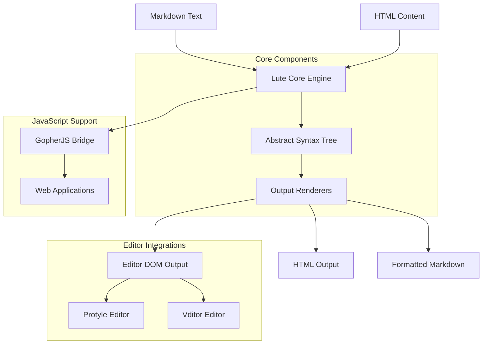

Sources: [lute.go:11-45](lute.go:11-45), [README.md:31-61](README.md:31-61)

## Key Components and Processes

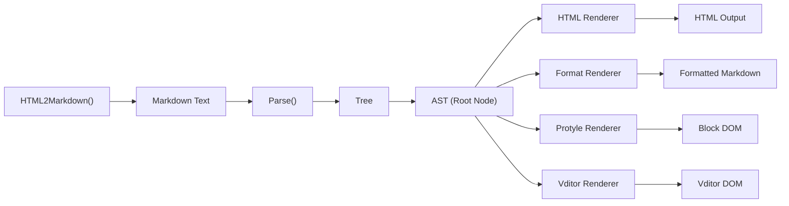

The Lute engine's workflow consists of parsing Markdown into an AST, then rendering that AST into various output formats using different renderers.

Sources: [lute.go:81-97](lute.go:81-97), [parse/parse.go:20-31](parse/parse.go:20-31)

## Core Options and Configuration

Lute is highly configurable with many options to customize both parsing and rendering behavior:

| Option Category | Description | Examples |
|-----------------|-------------|----------|
| GFM Support | Options to enable/disable GFM features | GFMTable, GFMTaskListItem, GFMStrikethrough |
| Text Processing | Options for text handling | AutoSpace, FixTermTypo, SoftBreak2HardBreak |
| Syntax Extensions | Additional Markdown syntax features | Footnotes, ToC, HeadingID, Emoji |
| Editor Support | Options for editor integration | VditorWYSIWYG, ProtyleWYSIWYG |
| Rendering | Output rendering options | CodeSyntaxHighlight, Sanitize, LinkBase |

Sources: [lute.go:46-79](lute.go:46-79), [parse/parse.go:329-447](parse/parse.go:329-447), [render/renderer.go:42-157](render/renderer.go:42-157)

## Usage Examples

Lute can be used in Go applications by importing the package and creating a new engine instance:

```go
luteEngine := lute.New() // Creates a new engine with default options
html := luteEngine.MarkdownStr("document-name", "**Lute** - A structured markdown engine.")
// Result: "<p><strong>Lute</strong> - A structured markdown engine.</p>"
```

For JavaScript environments, Lute is compiled to JavaScript using GopherJS, allowing it to be used in web applications or Node.js:

```javascript
const luteEngine = Lute.New();
const html = luteEngine.MarkdownStr("document-name", "**Lute** - A structured markdown engine.");
```

Sources: [README.md:286-305](README.md:286-305), [lute.go:81-97](lute.go:81-97)

## Special Features and Capabilities

Lute includes several specialized features:

1. **Code Syntax Highlighting**: Uses Chroma for code block highlighting with customizable styles
2. **Chinese Text Optimization**: Automatically inserts spaces between Chinese and Western text
3. **Terminology Correction**: Fixes common technical term capitalization (e.g., "JavaScript" not "javascript")
4. **Markdown Formatting**: Standardizes Markdown formatting with consistent spacing and style
5. **Editor Integrations**: Specialized renderers for WYSIWYG editing in Vditor and Protyle
6. **Emoji Support**: Converts emoji shortcodes to Unicode characters

Sources: [README.md:62-83](README.md:62-83), [test/chroma_test.go:1-42](test/chroma_test.go:1-42)

## Architecture and Design Principles

Lute is designed with several key principles:

1. **Structured Parsing**: Uses a compiler-like approach rather than regex-based parsing
2. **Standards Compliance**: Fully implements GFM/CommonMark specifications
3. **Performance**: Optimized for speed with zero regex usage in core parsing algorithms
4. **Extensibility**: Modular design with customizable renderers
5. **Cross-Platform**: Supports both Go and JavaScript environments

The engine implements a clean separation between parsing (AST construction) and rendering (AST traversal), allowing for flexible transformation of content between different formats.

Sources: [README.md:31-61](README.md:31-61), [lute.go:30-45](lute.go:30-45), [parse/parse.go:11-19](parse/parse.go:11-19)

---

# Page: Features and Capabilities

# Features and Capabilities

<details>
<summary>Relevant source files</summary>

The following files were used as context for generating this wiki page:

- [.github/workflows/gotest.yml](.github/workflows/gotest.yml)
- [README.md](README.md)
- [README_en_US.md](README_en_US.md)
- [parse/emoji.go](parse/emoji.go)
- [render/sanitizer.go](render/sanitizer.go)
- [render/space.go](render/space.go)
- [render/term_typographer.go](render/term_typographer.go)
- [test/emoji_test.go](test/emoji_test.go)
- [test/parallel_test.go](test/parallel_test.go)
- [test/sanitizer_test.go](test/sanitizer_test.go)
- [test/space_test.go](test/space_test.go)
- [test/spin_sv_test.go](test/spin_sv_test.go)
- [test/spin_wysiwyg_test.go](test/spin_wysiwyg_test.go)
- [test/term_typo_test.go](test/term_typo_test.go)

</details>


This page describes the core features and capabilities of Lute, a structured Markdown engine written in Go. Lute fully implements GFM/CommonMark specifications while providing enhanced support for Chinese language contexts, security features, and specialized DOM conversions for WYSIWYG editors.

## Core Features

### GFM/CommonMark Compliance

Lute fully implements the latest GitHub Flavored Markdown (GFM) and CommonMark specifications, ensuring consistent rendering across platforms and avoiding the ambiguity issues found in other Markdown parsers.

Key supported syntax elements include:
- Headings (ATX and Setext)
- Lists (ordered and unordered, including task lists)
- Block quotes
- Code blocks (indented and fenced)
- Tables
- Links and images
- Emphasis and strong emphasis
- Strikethrough
- Task lists
- Automatic links
- Hard line breaks

Sources: [README.md:31-33](), [README_en_US.md:27-29]()

### Structured Parsing Approach

Unlike many Markdown parsers that rely on regular expressions, Lute takes a structured approach by constructing an Abstract Syntax Tree (AST) from the input text. This offers several advantages:
- More robust handling of complex Markdown constructs
- Better performance for large documents
- Cleaner implementation and better maintainability
- Support for custom extensions

**Lute Parsing and Rendering Architecture**
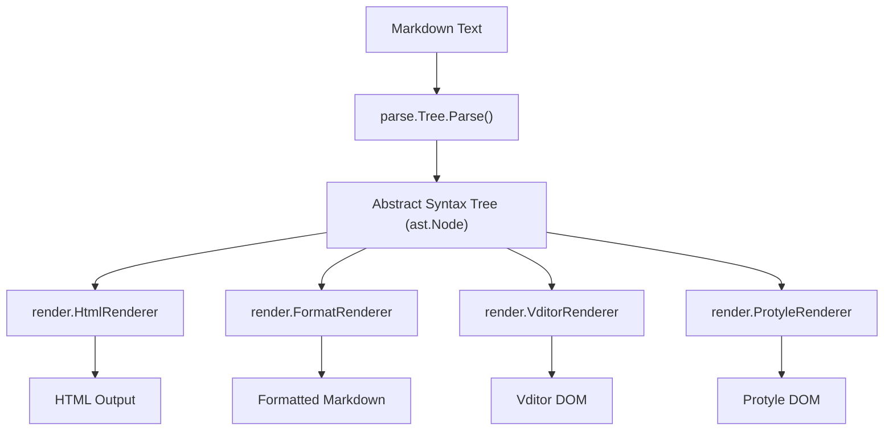

Sources: [README.md:47-48]()

### Performance Characteristics

Lute is designed to be highly performant, capable of processing large Markdown documents efficiently:
- Zero regular expressions in the core parsing algorithm
- Efficient tree traversal algorithms
- Optimized text handling routines

Lute has been battle-tested in production environments, handling millions of parsing and rendering requests daily on the [LianDi](https://ld246.com) platform.

Sources: [README.md:65](), [README.md:265-267](), [README_en_US.md:59](), [README_en_US.md:259-261]()

## Text Processing Features

### Chinese Language Optimization

Lute provides specialized support for Chinese language text, improving readability and presentation of mixed Chinese and Western language content.

**Chinese Language Optimization Pipeline**
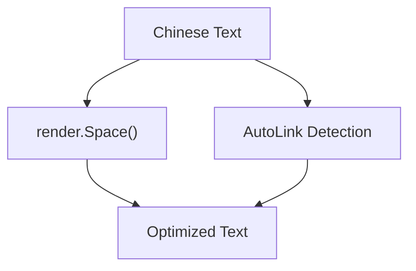

Sources: [README.md:84-87](), [README_en_US.md:78-81]()

#### Automatic Spacing

One of the most notable features for Chinese language support is automatic insertion of spaces between Chinese and Western language text, improving readability.

Example:
```
Before: Lute是一款结构化的Markdown引擎，完整实现了最新的GFM规范，对中文语境支持更好。
After: Lute 是一款结构化的 Markdown 引擎，完整实现了最新的 GFM 规范，对中文语境支持更好。
```

The auto-spacing function handles various scenarios:
- Between Chinese and English words
- Between Chinese and numbers
- Between Chinese and special symbols
- Special cases for certain suffixes (e.g., "ing" suffix)

Sources: [test/space_test.go:19-84](), [render/space.go:1-91]()

#### Enhanced Auto-Link Recognition

Lute improves automatic link detection in Chinese text contexts, correctly identifying URLs even when they appear within Chinese characters without surrounding spaces.

Sources: [README.md:86](), [README_en_US.md:80]()

### Terminology Correction

Lute includes a terminology correction feature (`FixTermTypo`) that automatically fixes common misspellings of technical terms, improving the professionalism of the output. This ensures consistent capitalization and spelling of brand names, programming languages, and technical acronyms.

**Sample Term Corrections**
| Original | Corrected |
|----------|-----------|
| github | GitHub |
| javascript | JavaScript |
| ios | iOS |
| mysql | MySQL |
| postgresql | PostgreSQL |
| java | Java |
| android | Android |
| git | Git |

The terminology dictionary is extensible through the `PutTerms()` method, allowing users to add their own terms and corrections.

Sources: [test/term_typo_test.go:1-60](), [render/term_typographer.go:87-205]()

### Emoji Processing

Lute supports emoji processing, converting shortcodes to Unicode emoji characters or emoji images:

- Converting `:heart:` to ❤️
- Supporting custom emoji definitions
- Image-based emoji support with configurable paths

The emoji system supports both standard Unicode emoji and custom image-based emoji, with configuration options for emoji image paths.

Sources: [test/emoji_test.go:1-77](), [parse/emoji.go:1-138]()

## Rendering Capabilities

### HTML Rendering

The primary output format for Lute is HTML. The HTML renderer provides:
- Clean, semantic HTML output
- Configurable HTML rendering options
- Support for HTML attributes in Markdown (e.g., `{#id .class}` syntax)

**HTML Rendering Workflow**
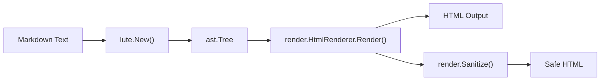

Sources: [README.md:273-279](), [README_en_US.md:272-278]()

### Code Syntax Highlighting

Lute includes built-in code block syntax highlighting through integration with the Chroma library:
- Support for numerous programming languages
- Multiple highlighting themes (default: github.css)
- Options for line numbers
- Choice between inline styles or external CSS

Configuration is available through methods like `SetCodeSyntaxHighlightXXX()`.

Sources: [README.md:313-316](), [README_en_US.md:307-310]()

### Security Features

While Lute doesn't implement the GFM Disallowed Raw HTML extension by default (due to its limitations), it provides sanitization tools to filter potentially unsafe HTML:

- HTML event attribute filtering (onclick, onload, etc.)
- Iframe source validation
- Potentially unsafe tag filtering
- JavaScript URL blocking

The `Sanitize` feature can be enabled by setting `RenderOptions.Sanitize = true`.

Sources: [README.md:273-276](), [README_en_US.md:268-271](), [render/sanitizer.go:11-330](), [test/sanitizer_test.go:1-89]()

## Format Conversions

### Markdown Formatting

Lute can format "untidy" Markdown text to conform to a consistent style, which is useful for collaborative editing environments:
- Consistent heading styles (ATX preferred over Setext)
- Proper list formatting and numbering
- Table alignment and standardization
- Appropriate spacing between block elements
- Consistent indentation

Example:
```markdown
Before formatting:
# ATX 标题也有可能需要格式化的 ##
一个简短的段落。

Setext 说实话我不喜欢 Setext 标题
----

After formatting:
# ATX 标题也有可能需要格式化的

一个简短的段落。

## Setext 说实话我不喜欢 Setext 标题
```

Sources: [README.md:89-240](), [README_en_US.md:83-234]()

### HTML to Markdown

Lute supports converting HTML back to Markdown, enabling round-trip processing and import of content from HTML sources.

Sources: [README.md:71](), [README_en_US.md:65]()

## Integration Options

Lute offers three main integration methods:

1. **Go Library**:
```go
luteEngine := lute.New() // Default enables GFM and Chinese optimizations
html := luteEngine.MarkdownStr("demo", "**Lute** - A structured markdown engine.")
```

2. **JavaScript/Node.js** (via GopherJS compilation):
```javascript
const html = lute.MarkdownStr("demo", "**Lute** - A structured markdown engine.");
```

3. **HTTP Service** through [lute-http](https://github.com/88250/lute-http)

Sources: [README.md:279-327](), [README_en_US.md:273-321]()

## Editor Integration Systems

Lute includes specialized DOM conversion systems designed for integration with WYSIWYG editors:

**DOM Conversion System Architecture**
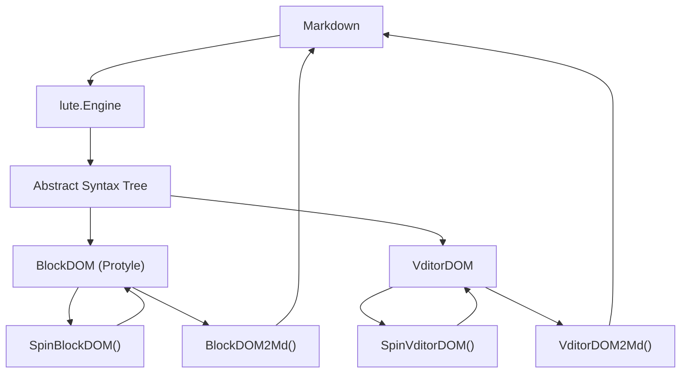

Sources: [test/spin_wysiwyg_test.go:1-132](), [test/spin_sv_test.go:1-101]()

### Block DOM (Protyle)

The Block DOM system supports the Protyle editor (used in [SiYuan Note](https://github.com/siyuan-note/siyuan)), providing conversions between Markdown and a specialized DOM format optimized for block-level editing.

### Vditor DOM

The Vditor DOM system supports the [Vditor editor](https://github.com/Vanessa219/vditor), with different modes:
- WYSIWYG (What You See Is What You Get)
- IR (Instant Rendering)
- SV (Split View)

These conversion systems enable rich editing experiences while maintaining the integrity of the underlying Markdown structure.

Sources: [README.md:75-82](), [README_en_US.md:69-76]()

## Real-World Applications

Lute powers several production applications:
- [LianDi](https://ld246.com) - A community platform
- [SiYuan Note](https://github.com/siyuan-note/siyuan) - A knowledge management system
- [Vditor Editor](https://github.com/Vanessa219/vditor) - A Markdown editor
- [Sym](https://github.com/88250/symphony) - A community system
- [Solo](https://github.com/88250/solo) - A blogging system
- [Pipe](https://github.com/88250/pipe) - A publishing platform

Sources: [README.md:75-82](), [README_en_US.md:69-76]()

## Further Documentation

For more in-depth information on Lute's architecture and implementation details, see:
- [CommonMark Specification Interpretation](https://ld246.com/article/1566893557720)
- [Lute Implementation Notes](https://ld246.com/article/1567062979327)
- [Markdown Parsing Principles and AST Description](https://ld246.com/article/1587637426085)

For information about Lute's core architecture, see [Core Architecture](#2).
For details on the AST structure, see [Abstract Syntax Tree](#2.1).
For details on the parsing system, see [Parsing System](#2.2).

Sources: [README.md:329-334](), [README_en_US.md:323-327]()

---

# Page: Core Architecture

# Core Architecture

<details>
<summary>Relevant source files</summary>

The following files were used as context for generating this wiki page:

- [ast/node.go](ast/node.go)
- [ast/nodetype_string.go](ast/nodetype_string.go)
- [benchmark/benchmark_test.go](benchmark/benchmark_test.go)
- [lute.go](lute.go)
- [parse/blocks.go](parse/blocks.go)
- [parse/parse.go](parse/parse.go)
- [pprof/main.go](pprof/main.go)
- [render/format_renderer.go](render/format_renderer.go)
- [render/html_renderer.go](render/html_renderer.go)
- [render/renderer.go](render/renderer.go)
- [test/commonmark_spec_test.go](test/commonmark_spec_test.go)
- [test/parse_test.go](test/parse_test.go)

</details>


The Lute Markdown engine is built around a structured parsing and rendering pipeline that transforms Markdown text into various output formats. This document describes the fundamental architecture of Lute, including its core components, data flow, and extensibility mechanisms. For specific rendering implementations, see [Rendering System](#3).

## Overview

Lute implements a multi-stage processing pipeline where Markdown text is first parsed into an Abstract Syntax Tree (AST), which can then be transformed into various output formats through different renderers.

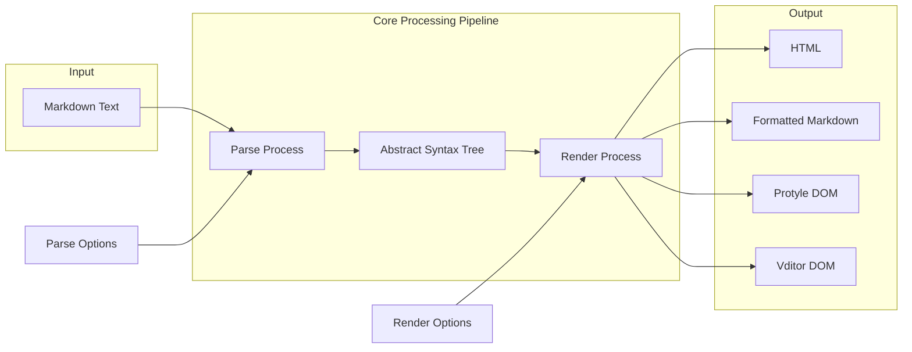

Sources: [lute.go:1-145](), [parse/parse.go:1-50](), [render/renderer.go:1-190]()

## Core Components

The architecture consists of these key components:

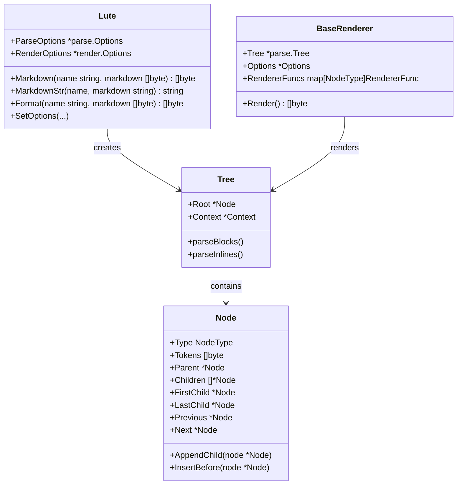

Sources: [lute.go:30-45](), [parse/parse.go:312-327](), [ast/node.go:29-143](), [render/renderer.go:159-171]()

### 1. The Lute Engine

The `Lute` struct serves as the main entry point for the library:

```go
type Lute struct {
    ParseOptions  *parse.Options  // Parsing options
    RenderOptions *render.Options // Rendering options
    // User-defined renderer functions
    HTML2MdRendererFuncs          map[ast.NodeType]render.ExtRendererFunc
    Md2HTMLRendererFuncs          map[ast.NodeType]render.ExtRendererFunc
    // ... other renderer functions
}
```

It provides methods for various operations:
- `Markdown()` - Converts Markdown to HTML
- `MarkdownStr()` - String-based version of Markdown()
- `Format()` - Formats Markdown text
- `TextBundle()` - Processes Markdown for TextBundle format
- Various setter methods to configure behavior

Sources: [lute.go:30-45](), [lute.go:81-97](), [lute.go:332-606]()

### 2. Tree and Parsing Context

The `Tree` struct represents the parsed Markdown document:

```go
type Tree struct {
    Root          *ast.Node      // Root node
    Context       *Context       // Block-level parsing context
    lexer         *lex.Lexer     // Lexer for tokenization
    inlineContext *InlineContext // Inline-level parsing context
    // Metadata fields
    Name, ID, Box, Path string   
}
```

The `Context` struct maintains state during the parsing process:

```go
type Context struct {
    Tree        *Tree    // Associated tree
    ParseOption *Options // Parse options
    Tip         *ast.Node // Current insertion point
    // Various parsing state variables
}
```

Sources: [parse/parse.go:312-327](), [parse/parse.go:140-154]()

### 3. Abstract Syntax Tree (AST)

The AST is composed of `Node` objects representing different Markdown elements:

```go
type Node struct {
    // Base structure
    Type       NodeType // Node type
    Parent     *Node    // Parent node
    FirstChild *Node    // First child node
    LastChild  *Node    // Last child node
    Previous   *Node    // Previous sibling
    Next       *Node    // Next sibling
    Tokens     []byte   // Raw text tokens
    
    // Node-specific fields for different types
    // ...many type-specific fields for various node types
}
```

The `NodeType` enum defines over 150 different types of nodes that can appear in a Markdown document, from basic elements like paragraphs and headings to specialized elements like math blocks and custom block references.

Sources: [ast/node.go:29-143](), [ast/node.go:909-1148]()

### 4. Renderers

The rendering system is based on the `Renderer` interface:

```go
type Renderer interface {
    Render() (output []byte)
}
```

The `BaseRenderer` provides common functionality:

```go
type BaseRenderer struct {
    Options             *Options
    RendererFuncs       map[ast.NodeType]RendererFunc
    DefaultRendererFunc RendererFunc
    ExtRendererFuncs    map[ast.NodeType]ExtRendererFunc
    Writer              *bytes.Buffer
    Tree                *parse.Tree
    // Other rendering state
}
```

Specific renderers like `HtmlRenderer` and `FormatRenderer` extend the base renderer to provide different output formats.

Sources: [render/renderer.go:35-40](), [render/renderer.go:159-171](), [render/html_renderer.go:28-35](), [render/format_renderer.go:28-34]()

## The Parsing Pipeline

The parsing process transforms Markdown text into an AST through several phases:

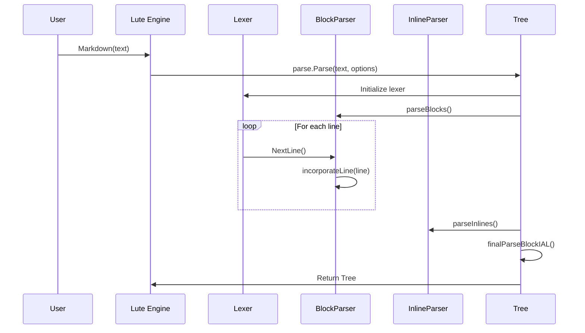

Sources: [parse/parse.go:20-31](), [parse/blocks.go:22-47](), [parse/blocks.go:82-258]()

### Block Parsing Phase

1. The markdown text is read line by line
2. Each line is processed to identify block-level elements:
   - Paragraphs
   - Headings
   - Lists
   - Block quotes
   - Code blocks
   - etc.
3. The block parser creates corresponding nodes in the AST
4. Nested blocks are properly handled through a context-aware parser

The block parsing process maintains a "tip" pointer that tracks the current insertion point in the tree, allowing for proper nesting of blocks.

Sources: [parse/blocks.go:22-47](), [parse/blocks.go:82-258]()

### Inline Parsing Phase

After block parsing completes, the inline parser processes the content within blocks to identify:
- Emphasis (bold/italic)
- Links
- Images
- Code spans
- etc.

This phase enriches the block-level structure with inline formatting elements.

## The Rendering Pipeline

Once an AST is built, it can be rendered into different output formats:

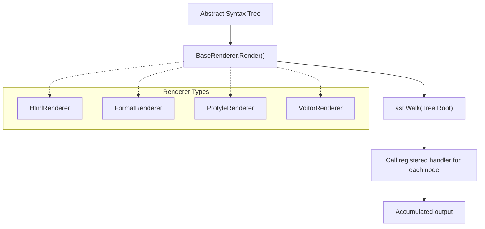

Sources: [render/renderer.go:182-207](), [render/html_renderer.go:172-176](), [render/format_renderer.go:175-176]()

The rendering process:

1. A renderer is created for the desired output format
2. The renderer registers handler functions for each node type
3. The `Render()` method walks the AST
4. For each node, it calls the appropriate handler function
5. The handler functions output the correct syntax for the target format
6. The output is accumulated and returned

## Configuration and Extensibility

Lute is highly configurable through various options:

### Parse Options

Control how Markdown is parsed, including:
- GFM extensions (tables, task lists, strikethrough, autolinks)
- Footnotes
- Math formulas
- Headings with IDs
- Block references
- And many more

Sources: [parse/parse.go:330-417](), [parse/parse.go:421-447]()

### Render Options

Control how the AST is rendered, including:
- Soft breaks to hard breaks conversion
- Code syntax highlighting
- Auto spacing for CJK text
- Table of contents generation
- And many more

Sources: [render/renderer.go:42-124](), [render/renderer.go:126-157]()

### Custom Renderers

Users can extend Lute with custom rendering logic:
- Define custom handler functions for specific node types
- Register them with the Lute engine
- These functions will be called during rendering for those node types

Sources: [lute.go:607-652]()

## JavaScript Support

Lute is designed to work in both Go and JavaScript environments:
- The Go code can be compiled to JavaScript using GopherJS
- The JavaScript API mirrors the Go API
- This allows Lute to be used in web applications directly

Sources: [lute.go:607-652]()

---

The core architecture of Lute provides a solid foundation for Markdown processing with a clear separation of concerns between parsing and rendering. This design allows for flexibility in both input handling and output generation, making Lute suitable for a wide range of applications.

---

# Page: Abstract Syntax Tree

# Abstract Syntax Tree

<details>
<summary>Relevant source files</summary>

The following files were used as context for generating this wiki page:

- [ast/node.go](ast/node.go)
- [ast/nodetype_string.go](ast/nodetype_string.go)
- [parse/blocks.go](parse/blocks.go)
- [parse/code_block.go](parse/code_block.go)
- [parse/delimiter.go](parse/delimiter.go)
- [parse/html_block.go](parse/html_block.go)
- [parse/inline.go](parse/inline.go)
- [parse/inline_attribute_list.go](parse/inline_attribute_list.go)
- [parse/list.go](parse/list.go)
- [parse/math_block.go](parse/math_block.go)
- [parse/paragraph.go](parse/paragraph.go)
- [parse/text.go](parse/text.go)
- [parse/yaml_front_matter.go](parse/yaml_front_matter.go)
- [render/format_renderer.go](render/format_renderer.go)
- [test/kramdown_block_ial_test.go](test/kramdown_block_ial_test.go)
- [test/kramdown_span_ial_test.go](test/kramdown_span_ial_test.go)
- [test/mark_test.go](test/mark_test.go)
- [test/supsub_test.go](test/supsub_test.go)

</details>


This page documents the Abstract Syntax Tree (AST) system in Lute, which is the core data structure that represents parsed Markdown content as a tree of nodes. The AST serves as the intermediate representation between raw Markdown text and rendered output formats (HTML, formatted Markdown, editor DOM, etc.).

For information about the parsing process that builds the AST, see [Parsing System](#2.2). For details on how the AST is converted to output formats, see [Rendering System](#3).

## Core Structure

The AST in Lute is a tree structure where each node represents a Markdown element. The core structure is defined by the `Node` struct, which contains all the necessary information to represent both block-level and inline elements.

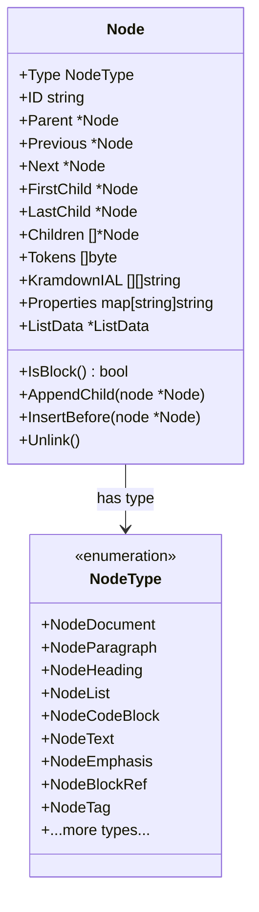

Sources: [ast/node.go:28-143]()

Each `Node` in the AST has these important features:

1. **Type Information**: Every node has a `Type` that determines what Markdown element it represents (paragraph, heading, list, etc.)
2. **Tree Structure**: Nodes maintain bi-directional linkages to their parent, previous sibling, next sibling, first child, and last child nodes
3. **Content**: The `Tokens` field holds the raw bytes of content for the node
4. **Attributes**: Nodes can have attributes via the `KramdownIAL` field (Kramdown Inline Attribute Lists)
5. **Specialized Fields**: Additional fields for specific node types (like `ListData` for list nodes)

The struct design allows for efficient node manipulation and tree traversal without using interfaces, favoring performance over extensibility.

## Node Types

Lute defines over 100 different node types to represent all elements in Markdown syntax, including:

### Block-Level Node Types

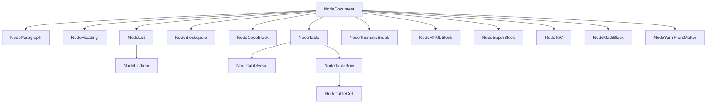

Sources: [ast/node.go:925-972](), [ast/nodetype_string.go:12-148]()

### Inline Node Types

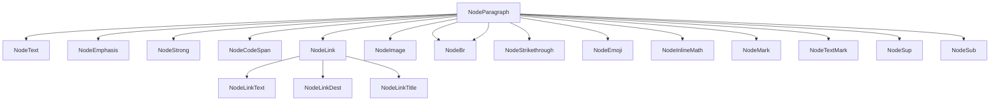

Sources: [ast/node.go:972-1123](), [ast/nodetype_string.go:12-148]()

Each node type serves a specific purpose in representing Markdown elements. The complete list of node types is defined in the `NodeType` enum in `ast/node.go`.

## Tree Structure and Relationships

Nodes in the AST maintain bi-directional relationships with parent, siblings, and children:

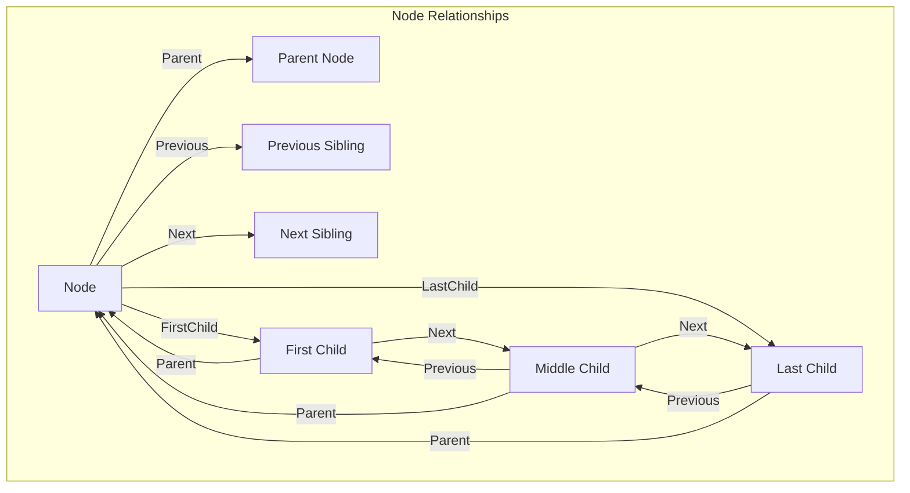

Sources: [ast/node.go:33-48]()

This structure allows for efficient tree traversal and manipulation. The `Node` struct provides methods for navigating and manipulating these relationships:

- `AppendChild`: Add a child at the end of the children list
- `PrependChild`: Add a child at the beginning of the children list
- `InsertBefore`/`InsertAfter`: Insert a sibling node
- `Unlink`: Remove a node from its current position in the tree

Sources: [ast/node.go:710-793]()

## Node Manipulation

Lute provides several methods for manipulating the AST:

### Adding and Removing Nodes

```go
// Append a child node at the end of children list
node.AppendChild(childNode)

// Add a child node at the beginning of children list
node.PrependChild(childNode)

// Insert a node before the current node
node.InsertBefore(siblingNode)

// Insert a node after the current node
node.InsertAfter(siblingNode)

// Remove a node from the tree
node.Unlink()
```

Sources: [ast/node.go:710-793]()

### Node Content Operations

```go
// Get the text content of a node and its text children
textContent := node.Text()

// Get the content of a node including all child nodes
content := node.Content()

// Add tokens to the end of a node's content
node.AppendTokens(tokens)

// Add tokens to the beginning of a node's content
node.PrependTokens(tokens)
```

Sources: [ast/node.go:496-575](), [ast/node.go:727-735]()

## Tree Traversal

Lute implements a depth-first traversal mechanism for processing AST nodes:

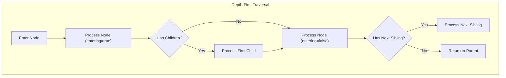

Sources: [ast/walk.go]()

The traversal is implemented through the `Walk` function, which takes a node and a callback function:

```go
// WalkStatus controls traversal behavior
type WalkStatus int

const (
    WalkStop     WalkStatus = iota // Stop traversal
    WalkSkipChildren               // Skip current node's children
    WalkContinue                   // Continue traversal
)

// NodeWalkFunc is called during traversal
type NodeWalkFunc func(n *Node, entering bool) WalkStatus

// Walk traverses a node tree
func Walk(n *Node, fn NodeWalkFunc)
```

This traversal mechanism is used throughout Lute, particularly in renderers that convert the AST to various output formats.

## Special Node Features

### Inline Attribute Lists (IAL)

Lute supports Kramdown-style Inline Attribute Lists (IAL) that allow attaching attributes to nodes:

```
A paragraph with attributes.
{: id="para1" class="important" custom-attr="value"}
```

These attributes are stored in the `KramdownIAL` field as a slice of key-value pairs and can be accessed or modified through methods:

```go
// Get an attribute value
attrVal := node.IALAttr("id")

// Set an attribute
node.SetIALAttr("class", "important")

// Remove an attribute
node.RemoveIALAttr("custom-attr")
```

Sources: [ast/node.go:405-433](), [parse/inline_attribute_list.go:22-278]()

### Node Identification

Each node can have a unique ID that is generated using the `NewNodeID()` function:

```go
func NewNodeID() string {
    if Testing {
        return "20060102150405-1a2b3c4" // Testing ID
    }
    now := time.Now()
    return now.Format("20060102150405") + "-" + randStr(7)
}
```

The ID format is timestamp-based (YYYYMMDDHHMMSS) followed by a random string, which ensures uniqueness.

Sources: [ast/node.go:162-169]()

## Real-World AST Example

This diagram shows a sample AST for a simple Markdown document:

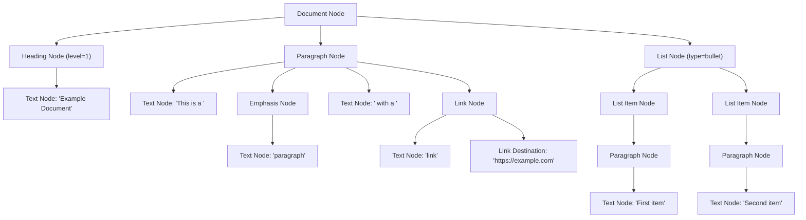

Sources: [ast/node.go:825-845](), [parse/blocks.go:22-47](), [parse/inline.go:24-91]()

## AST in the Parsing Flow

The AST is constructed during the parsing process:

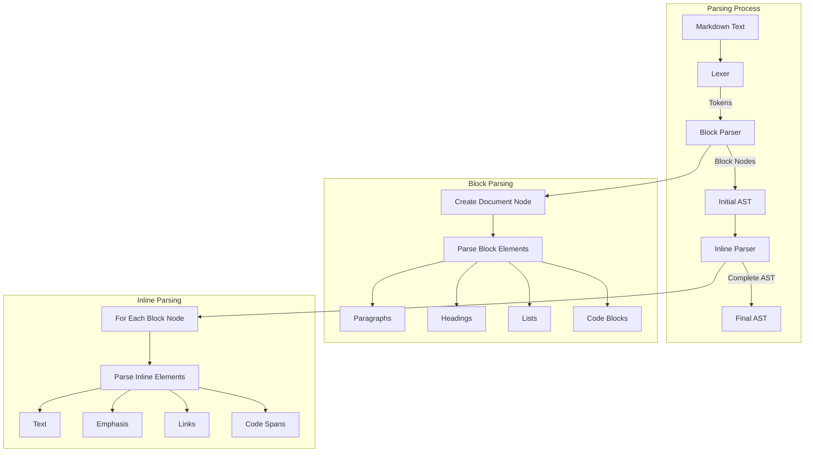

Sources: [parse/blocks.go:22-47](), [parse/inline.go:24-91]()

1. **Block Parsing**: First, the markdown text is parsed into block-level nodes (paragraphs, headings, lists, etc.) based on line-level analysis
2. **Inline Parsing**: Then, the content within each block node is parsed to identify inline elements (emphasis, links, code spans, etc.)
3. **Post-Processing**: Finally, the tree undergoes post-processing operations like merging adjacent text nodes

## Conclusion

The Abstract Syntax Tree is the backbone of Lute's markdown processing system. It provides a flexible and efficient representation of markdown documents that can be:

1. Built incrementally during parsing
2. Manipulated programmatically for document transformation
3. Traversed for rendering to various output formats
4. Extended with additional attributes and metadata

Understanding the AST structure is essential for working with Lute's codebase, as it serves as the central data model connecting the parsing and rendering systems.

Sources: [ast/node.go:28-143](), [parse/blocks.go:22-47](), [parse/inline.go:24-91]()

---

# Page: Parsing System

# Parsing System

<details>
<summary>Relevant source files</summary>

The following files were used as context for generating this wiki page:

- [parse/auto_link.go](parse/auto_link.go)
- [parse/code_block.go](parse/code_block.go)
- [parse/delimiter.go](parse/delimiter.go)
- [parse/html_block.go](parse/html_block.go)
- [parse/inline.go](parse/inline.go)
- [parse/inline_attribute_list.go](parse/inline_attribute_list.go)
- [parse/list.go](parse/list.go)
- [parse/math_block.go](parse/math_block.go)
- [parse/paragraph.go](parse/paragraph.go)
- [parse/text.go](parse/text.go)
- [parse/yaml_front_matter.go](parse/yaml_front_matter.go)
- [test/autolink_test.go](test/autolink_test.go)
- [test/kramdown_block_ial_test.go](test/kramdown_block_ial_test.go)
- [test/kramdown_span_ial_test.go](test/kramdown_span_ial_test.go)
- [test/link_dest_test.go](test/link_dest_test.go)
- [test/mark_test.go](test/mark_test.go)
- [test/supsub_test.go](test/supsub_test.go)

</details>


The Parsing System in Lute is responsible for transforming Markdown text into an Abstract Syntax Tree (AST), which forms the foundation for all subsequent processing. This page documents the core parsing components, their interactions, and the flow of text through the system. For information about the AST structure itself, see [Abstract Syntax Tree](#2.1).

## Overview

Lute's parsing system follows a two-phase approach common in Markdown parsers:

1. **Block Parsing** - First identifies block-level structures like paragraphs, lists, and code blocks
2. **Inline Parsing** - Then processes inline elements within those blocks, such as emphasis, links, and code spans

The parser is designed to be extensible, supporting not only standard Markdown but also GitHub Flavored Markdown (GFM), math expressions, and various Kramdown extensions.

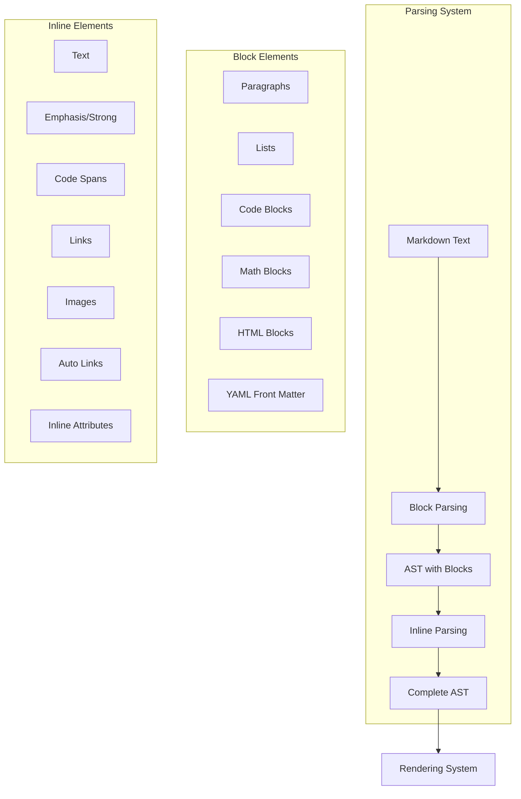

Sources: [parse/inline.go], [parse/text.go], [parse/list.go], [parse/paragraph.go], [parse/code_block.go], [parse/html_block.go]

## Block Parsing

Block parsing is the first phase of Markdown parsing, which identifies top-level structural elements in the document.

### Block Parsing Process

The block parsing process in Lute follows this general flow:

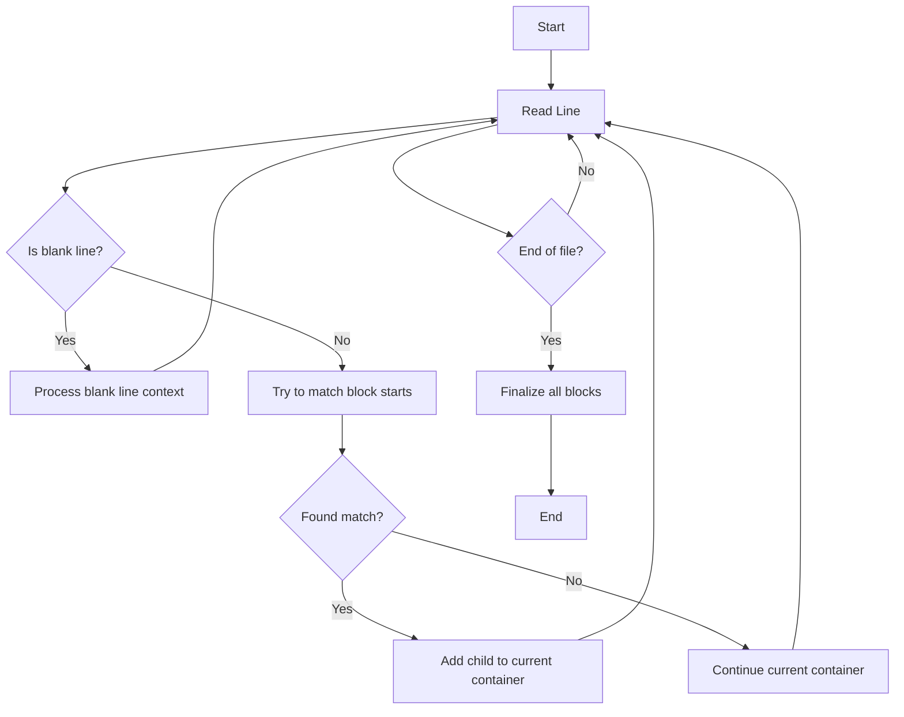

Sources: [parse/list.go], [parse/paragraph.go], [parse/code_block.go], [parse/html_block.go], [parse/math_block.go]

### Block Element Handlers

Each block type has three primary handler functions:

1. **Start** - Detects the beginning of a block type (e.g., `ListStart`, `FenceCodeBlockStart`)
2. **Continue** - Determines if a line continues a block (e.g., `ListItemContinue`, `CodeBlockContinue`)
3. **Finalize** - Processes a block when it's complete (e.g., `listFinalize`, `codeBlockFinalize`)

The table below outlines the main block types and their corresponding handler functions:

| Block Type | Start Function | Continue Function | Finalize Function |
|------------|---------------|-------------------|------------------|
| List | `ListStart` | `ListItemContinue` | `listFinalize` |
| Paragraph | N/A (default) | `ParagraphContinue` | `paragraphFinalize` |
| Code Block | `FenceCodeBlockStart`, `IndentCodeBlockStart` | `CodeBlockContinue` | `codeBlockFinalize` |
| HTML Block | `HtmlBlockStart` | `HtmlBlockContinue` | `htmlBlockFinalize` |
| Math Block | `MathBlockStart` | `MathBlockContinue` | `mathBlockFinalize` |
| YAML Front Matter | `YamlFrontMatterStart` | `YamlFrontMatterContinue` | `yamlFrontMatterFinalize` |

Sources: [parse/list.go:24-60], [parse/paragraph.go:21-26], [parse/code_block.go:23-58], [parse/html_block.go:20-94], [parse/math_block.go:22-37]

### Example: List Parsing

As an example, let's look at how Lute parses lists:

1. `ListStart` checks if a line starts with a list marker (`*`, `-`, `+`, or a number followed by `.` or `)`)
2. If it's a list start, it creates a `NodeList` and adds a `NodeListItem` as a child
3. `ListItemContinue` checks if subsequent lines continue the list item (based on indentation)
4. `listFinalize` processes the list when it's complete, determining if it's tight or loose

Sources: [parse/list.go:24-60], [parse/list.go:62-75], [parse/list.go:77-146]

## Inline Parsing

After block parsing is complete, Lute processes inline elements within each block.

### Inline Parsing Process

The inline parsing happens in the function `parseInline` in [parse/inline.go:24-91], which iterates through tokens and dispatches to appropriate handlers based on the current token:

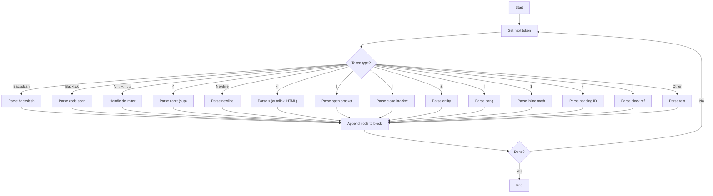

Sources: [parse/inline.go:24-91]

### Delimiter Processing

One of the most complex parts of inline parsing is handling delimiters for emphasis, strong emphasis, and other similar constructs. This is done using a delimiter stack and the following functions:

- `handleDelim` - Adds a delimiter to the stack [parse/delimiter.go:42-66]
- `scanDelims` - Scans and counts consecutive delimiter characters [parse/delimiter.go:306-433]
- `processEmphasis` - Processes the delimiter stack to create emphasis nodes [parse/delimiter.go:68-304]

The algorithm follows these steps:

1. Scan for sequences of delimiter characters like `*`, `_`, `~`
2. Determine if they can be openers, closers, or both (based on surrounding characters)
3. Process the stack to match openers and closers
4. Create corresponding AST nodes (emphasis, strong, strikethrough, etc.)

Sources: [parse/delimiter.go:42-66], [parse/delimiter.go:68-304], [parse/delimiter.go:306-433]

### Link and Image Parsing

Links and images in Markdown have complex syntax rules and are parsed in multiple stages:

1. The opening `[` is processed by `parseOpenBracket` [parse/inline.go:382-389]
2. The closing `]` is processed by `parseCloseBracket` [parse/inline.go:150-380]
3. For an image, the preceding `!` is handled separately

During this process, the parser checks for:
- Inline links: `[text](url "title")`
- Reference links: `[text][label]` or `[text][]`
- Images: ``

Sources: [parse/inline.go:150-380], [parse/inline.go:382-389]

### Autolink Detection

Lute has sophisticated autolink detection capabilities, supporting:

1. Standard autolinks: `<https://example.com>`
2. GFM autolinks: bare URLs like `https://example.com`
3. Email autolinks: `<user@example.com>`

The GFM autolink detection is particularly complex as it needs to properly identify domain names and handle various edge cases with punctuation.

Sources: [parse/auto_link.go:25-52], [parse/auto_link.go:158-441]

## Attribute Extensions

Lute supports Kramdown-style inline attribute lists (IAL) for both blocks and inline elements.

### Block IAL

Block IALs follow the syntax `{: attr="value"}` and are placed after a block:

```markdown
# Heading
{: id="my-heading" class="special"}
```

These are processed by `IALStart` and related functions in [parse/inline_attribute_list.go].

Sources: [parse/inline_attribute_list.go:24-84]

### Inline IAL

Inline IALs follow a similar syntax but are placed after inline elements:

```markdown
*emphasized*{: style="color: red"}
```

These are processed during the inline parsing phase by `parseKramdownSpanIAL`.

Sources: [parse/inline_attribute_list.go:177-207], [parse/inline_attribute_list.go:225-252]

## Integration with Tree Structure

The parsing system builds an AST node by node as it processes the input. The Tree structure maintains state about the current parsing context, including:

- The current tip (the node currently being processed)
- The document root
- Parsing options
- Current line information
- Delimiter stack

The key types are:

- `Tree` - The main parser structure
- `Context` - Contains parsing state
- `InlineContext` - Contains state for inline parsing
- `delimiter` - Represents a delimiter on the stack

Sources: [parse/inline.go], [parse/delimiter.go:22-37]

## Extension Mechanisms

Lute's parsing system is highly extensible, with options to enable or disable various features:

- GitHub Flavored Markdown (GFM) extensions like tables, strikethrough, and autolinks
- Math expressions (inline and block)
- Superscript and subscript
- Kramdown-style attribute lists
- Custom syntax highlighting
- Block references

These extensions can be enabled or disabled through the `ParseOption` structure.

## Conclusion

The Parsing System in Lute is a sophisticated component that transforms Markdown text into a structured AST. It handles a wide range of Markdown syntax features and extensions while maintaining a clean architecture that separates block and inline parsing concerns. The system is designed to be extensible, allowing for the addition of new syntax features while maintaining compatibility with existing Markdown documents.

---

# Page: Rendering System

# Rendering System

<details>
<summary>Relevant source files</summary>

The following files were used as context for generating this wiki page:

- [lex/token.go](lex/token.go)
- [parse/transform.go](parse/transform.go)
- [render/protyle_export_docx_renderer.go](render/protyle_export_docx_renderer.go)
- [render/protyle_export_md_renderer.go](render/protyle_export_md_renderer.go)
- [render/protyle_export_renderer.go](render/protyle_export_renderer.go)
- [render/protyle_preview_renderer.go](render/protyle_preview_renderer.go)
- [render/vditor_ir_renderer.go](render/vditor_ir_renderer.go)
- [render/vditor_sv_renderer.go](render/vditor_sv_renderer.go)
- [render/vditor_wysiwyg_renderer.go](render/vditor_wysiwyg_renderer.go)
- [test/format_test.go](test/format_test.go)
- [test/p2p_test.go](test/p2p_test.go)
- [test/protyle_export_md_test.go](test/protyle_export_md_test.go)

</details>


## Purpose and Overview

The Rendering System in Lute is responsible for transforming the parsed Markdown Abstract Syntax Tree (AST) into various output formats. It serves as the final stage in the Markdown processing pipeline, converting structured AST nodes into formats like HTML, normalized Markdown, and specialized DOM representations for editors like Protyle and Vditor.

For information about how Markdown is parsed into the AST before rendering, see the [Parsing System](#2.2).

## Architecture

The rendering system follows a class hierarchy pattern centered around a base renderer that specialized renderers extend to support different output formats.

### Renderer Hierarchy

```mermaid
classDiagram
    class BaseRenderer {
        +Tree *parse.Tree
        +Options *Options
        +RendererFuncs map[NodeType]RendererFunc
        +Render() []byte
    }
    
    BaseRenderer <|-- HTMLRenderer
    BaseRenderer <|-- FormatRenderer
    BaseRenderer <|-- ProtylePreviewRenderer
    BaseRenderer <|-- VditorRenderer
    BaseRenderer <|-- ProtyleExportMdRenderer
    BaseRenderer <|-- VditorSVRenderer
    BaseRenderer <|-- VditorIRRenderer
    BaseRenderer <|-- ProtyleExportDocxRenderer
    
    class HTMLRenderer {
        +renderDocument()
        +renderHeading()
        +renderList()
        +renderCodeBlock()
    }
    
    class FormatRenderer {
        +renderDocument()
        +renderHeading()
        +renderList()
        +renderCodeBlock()
    }
    
    class ProtylePreviewRenderer {
        +renderDocument()
        +renderHeading()
        +renderList()
        +renderCodeBlock()
    }
```

Sources:
- [render/protyle_preview_renderer.go:28-33](render/protyle_preview_renderer.go:28-33)
- [render/vditor_sv_renderer.go:26-33](render/vditor_sv_renderer.go:26-33)
- [render/vditor_wysiwyg_renderer.go:29-37](render/vditor_wysiwyg_renderer.go:29-37)
- [render/vditor_ir_renderer.go:27-34](render/vditor_ir_renderer.go:27-34)

### BaseRenderer

The `BaseRenderer` provides the foundation for all specialized renderers:

```go
type BaseRenderer struct {
    Tree          *parse.Tree
    Options       *Options
    RendererFuncs map[ast.NodeType]RendererFunc
    Writer        *bytes.Buffer
}
```

Key components:
- `Tree`: The parsed Markdown AST to be rendered
- `Options`: Configuration settings controlling rendering behavior
- `RendererFuncs`: A map of functions keyed by AST node types
- `Writer`: Buffer to accumulate the rendered output

The `BaseRenderer` provides common utility methods for:
- Managing HTML tags and attributes
- Escaping text for output formats
- Handling whitespace and newlines
- Automatic spacing between Chinese and Latin characters

Sources:
- [render/protyle_preview_renderer.go:32-167](render/protyle_preview_renderer.go:32-167)

### Specialized Renderers

Lute implements multiple renderer types for different output formats:

| Renderer | Purpose | Primary Output |
|----------|---------|----------------|
| HTMLRenderer | Generates standard HTML | HTML |
| FormatRenderer | Normalizes and formats Markdown | Markdown |
| ProtylePreviewRenderer | Renders HTML for the Protyle editor's preview mode | HTML |
| VditorRenderer | Renders for Vditor's WYSIWYG mode | DOM |
| VditorSVRenderer | Renders for Vditor's Split-View mode | DOM with special markers |
| VditorIRRenderer | Renders for Vditor's Instant-Rendering mode | DOM with IR attributes |
| ProtyleExportMdRenderer | Exports Markdown for Protyle | Markdown |
| ProtyleExportDocxRenderer | Generates HTML for DOCX conversion | DOCX-compatible HTML |

Each specialized renderer extends the base renderer by:
1. Creating a constructor that registers node-specific render functions
2. Implementing render functions for each supported AST node type
3. Overriding methods where specialized behavior is needed

Sources:
- [render/protyle_preview_renderer.go:32-167](render/protyle_preview_renderer.go:32-167)
- [render/protyle_export_md_renderer.go:33-169](render/protyle_export_md_renderer.go:33-169)
- [render/vditor_sv_renderer.go:71-167](render/vditor_sv_renderer.go:71-167)

## Rendering Process

The rendering process transforms the AST into the target output format:

```mermaid
flowchart TD
    MD["Markdown Text"] --> Parser["Parser System"]
    Parser --> AST["Abstract Syntax Tree"]
    AST --> Renderer["Renderer Selection"]
    
    Renderer --> HTML["HTML Renderer"]
    Renderer --> Format["Format Renderer"]
    Renderer --> Vditor["Vditor Renderers"]
    Renderer --> Protyle["Protyle Renderers"]
    
    HTML --> HTMLOutput["HTML Output"]
    Format --> MDOutput["Formatted Markdown"]
    Vditor --> VditorDOM["Vditor DOM Output"]
    Protyle --> ProtyleOutput["Protyle Output Formats"]
```

The rendering process follows these steps:

1. Initialize a renderer instance with the AST and rendering options
2. Call the `Render()` method, which:
   - Traverses the AST using a depth-first walk
   - For each node, calls the appropriate render function based on node type
   - Accumulates output in the writer buffer
3. Return the final rendered output

Sources:
- [test/format_test.go:104-113](test/format_test.go:104-113)
- [test/protyle_export_md_test.go:65-74](test/protyle_export_md_test.go:65-74)

### Node Rendering Functions

Each renderer implements functions to handle specific node types. These functions follow a pattern:

```go
func (r *SomeRenderer) renderNodeType(node *ast.Node, entering bool) ast.WalkStatus {
    if entering {
        // Actions when first encountering the node (opening tags, attributes)
    } else {
        // Actions when leaving the node (closing tags)
    }
    return ast.WalkContinue // Controls AST traversal
}
```

The `entering` parameter indicates whether the function is being called:
- On first encountering a node (entering = true)
- After processing all children (entering = false)

This dual-pass approach enables proper handling of nested nodes and balanced tags.

Return values control traversal:
- `ast.WalkContinue`: Continue normal traversal
- `ast.WalkSkipChildren`: Skip child nodes
- `ast.WalkStop`: Stop traversal completely

Sources:
- [render/protyle_preview_renderer.go:169-181](render/protyle_preview_renderer.go:169-181)
- [render/vditor_wysiwyg_renderer.go:135-156](render/vditor_wysiwyg_renderer.go:135-156)

### NodeType to Renderer Function Mapping

During initialization, each renderer registers functions for all node types it supports:

```go
ret.RendererFuncs[ast.NodeDocument] = ret.renderDocument
ret.RendererFuncs[ast.NodeParagraph] = ret.renderParagraph
ret.RendererFuncs[ast.NodeHeading] = ret.renderHeading
// And so on for dozens of node types
```

This function mapping is what allows the renderer to dispatch to the correct handler based on node type during traversal.

Sources:
- [render/protyle_preview_renderer.go:34-165](render/protyle_preview_renderer.go:34-165)
- [render/vditor_sv_renderer.go:73-167](render/vditor_sv_renderer.go:73-167)

## Output Format Specialization

Different renderers handle the same node types differently based on their target output format:

```mermaid
flowchart TD
    subgraph "AST"
        HeadingNode["Heading Node\nLevel: 1\nText: Sample"]
    end
    
    HeadingNode --> HTMLRender["HTML Renderer"]
    HeadingNode --> MdRender["Markdown Renderer"]
    HeadingNode --> VditorRender["Vditor Renderer"]
    
    HTMLRender --> HTMLOutput["<h1 id='sample'>Sample</h1>"]
    MdRender --> MdOutput["# Sample"]
    VditorRender --> VditorOutput["<div data-type='heading' class='h1'>Sample</div>"]
```

Sources:
- [render/protyle_preview_renderer.go:66](render/protyle_preview_renderer.go:66)
- [render/protyle_export_md_renderer.go:66-67](render/protyle_export_md_renderer.go:66-67)
- [render/vditor_wysiwyg_renderer.go:70-71](render/vditor_wysiwyg_renderer.go:70-71)

### HTML Rendering

HTML renderers like `ProtylePreviewRenderer` produce standard HTML markup:
- Generate proper HTML tags with attributes
- Escape content to prevent XSS issues
- Handle HTML entities appropriately
- Support HTML5 semantic elements

Example from `ProtylePreviewRenderer.renderHeading()`:
```go
r.Tag("h"+headingLevel, [][]string{{"id", headingID}}, false)
// Content rendering
r.Tag("/h"+headingLevel, nil, false)
```

### Markdown Rendering

Markdown renderers like `FormatRenderer` and `ProtyleExportMdRenderer` focus on:
- Normalizing Markdown syntax
- Consistent indentation and whitespace
- Proper formatting of lists, tables, and other structures
- Optional auto-spacing between Chinese and Western text

Example from `FormatRenderer`:
```go
// For a heading level 1
r.WriteString("# ")
// Content rendering
r.WriteByte('\n')
```

### Editor DOM Rendering

DOM renderers for editors like Vditor require specialized output:
- Custom attributes for editor functionality
- Data attributes for node identification
- Complex DOM structures for interactive editing
- Support for content editing and selection

Example from `VditorRenderer`:
```go
r.Tag("div", [][]string{
    {"data-type", "heading"},
    {"data-block", "0"},
    {"class", "h" + headingLevel},
}, false)
```

Sources:
- [render/protyle_preview_renderer.go:66-873](render/protyle_preview_renderer.go:66-873)
- [test/format_test.go:23-101](test/format_test.go:23-101)
- [render/vditor_sv_renderer.go:169-607](render/vditor_sv_renderer.go:169-607)

## Special Content Handling

### Code Block Rendering

Code blocks receive specialized handling:

- Syntax highlighting based on language identifier
- Line numbering options
- Special rendering for fenced vs. indented blocks
- Escaping of code content

Example from `ProtylePreviewRenderer.renderCodeBlock()`:
```go
r.Tag("pre", attrs, false)
r.WriteString("<code class=\"hljs\">")
// Code content
r.Tag("/code", nil, false)
r.Tag("/pre", nil, false)
```

Sources:
- [render/protyle_preview_renderer.go:689-742](render/protyle_preview_renderer.go:689-742)
- [render/vditor_sv_renderer.go:484-503](render/vditor_sv_renderer.go:484-503)

### Math Expression Rendering

Math expressions (inline and block) are handled specially:

- LaTeX syntax preservation
- Specific delimiters ($ and $$)
- Preview rendering support
- Content escaping for tables

Sources:
- [render/protyle_preview_renderer.go:777-834](render/protyle_preview_renderer.go:777-834)
- [render/protyle_export_md_renderer.go:370-378](render/protyle_export_md_renderer.go:370-378)
- [render/vditor_wysiwyg_renderer.go:410-439](render/vditor_wysiwyg_renderer.go:410-439)

### Table Rendering

Tables are rendered with:

- Cell alignment support
- Header/body separation
- Special handling for pipe characters
- Proper escaping for cell content

Sources:
- [render/protyle_preview_renderer.go:835-897](render/protyle_preview_renderer.go:835-897)
- [render/vditor_sv_renderer.go:605-668](render/vditor_sv_renderer.go:605-668)

### TextMark Handling

The `TextMark` node type provides a way to represent complex inline formatting:

- Multiple formatting attributes in one node (e.g., bold+italic)
- Links with additional attributes
- Block references and annotations
- Inline memos and math

The `renderTextMark` function in various renderers handles this complex case:

```go
// From ProtyleExportMdRenderer
func (r *ProtyleExportMdRenderer) renderTextMark(node *ast.Node, entering bool) ast.WalkStatus {
    if entering {
        // Handle opening markers for various formatting types
        marker := r.renderMdMarker(node, entering)
        r.WriteString(marker)
    } else {
        // Handle closing markers
        marker := r.renderMdMarker(node, entering)
        r.WriteString(marker)
    }
    return ast.WalkContinue
}
```

Sources:
- [render/protyle_export_md_renderer.go:198-267](render/protyle_export_md_renderer.go:198-267)
- [render/protyle_preview_renderer.go:197-250](render/protyle_preview_renderer.go:197-250)

## Configuration Options

Renderers can be configured through the `Options` struct:

| Option | Purpose |
|--------|---------|
| `AutoSpace` | Add spaces between Chinese and Western characters |
| `CodeSyntaxHighlight` | Enable syntax highlighting for code blocks |
| `KramdownBlockIAL` | Control rendering of block-level attributes |
| `KramdownSpanIAL` | Control rendering of span-level attributes |
| `SoftBreak2HardBreak` | Convert soft line breaks to hard breaks |
| `FixTermTypo` | Fix common typographical errors in terminal environments |
| `Sanitize` | Apply HTML sanitization to prevent XSS issues |
| `LinkBase` | Base URL to prepend to relative links |
| `VditorMathBlockPreview` | Control math block preview in Vditor |

These options allow for customization of the rendering behavior to suit different needs.

Sources:
- [test/format_test.go:106-107](test/format_test.go:106-107)
- [test/protyle_export_md_test.go:46-63](test/protyle_export_md_test.go:46-63)

## Rendering Pipeline

The complete rendering pipeline can be visualized as:

```mermaid
flowchart LR
    subgraph "Input"
        MD["Markdown Text"]
    end
    
    subgraph "Parsing"
        Parser["Parser"]
        AST["Abstract Syntax Tree"]
    end
    
    subgraph "Rendering"
        Renderer["BaseRenderer + Specialized"]
        NodeRender["Node-specific Render Functions"]
        Output["Output Buffer"]
    end
    
    subgraph "Result"
        HTML["HTML"]
        Markdown["Markdown"]
        DOM["Editor DOM"]
    end
    
    MD --> Parser
    Parser --> AST
    AST --> Renderer
    Renderer --> NodeRender
    NodeRender --> Output
    Output --> HTML
    Output --> Markdown
    Output --> DOM
```

Sources:
- [test/format_test.go:104-113](test/format_test.go:104-113)
- [test/protyle_export_md_test.go:65-74](test/protyle_export_md_test.go:65-74)

## Summary

The Rendering System in Lute provides a flexible framework for transforming Markdown AST into various output formats. The architecture is designed for extensibility, with a common base renderer that specialized renderers extend. This approach allows Lute to support multiple output formats from a single internal representation, making it suitable for diverse applications from standard HTML generation to specialized editor integration.

To learn more about the HTML-specific rendering capabilities, see [HTML Rendering](#3.1).

---

# Page: HTML Rendering

# HTML Rendering

<details>
<summary>Relevant source files</summary>

The following files were used as context for generating this wiki page:

- [go.mod](go.mod)
- [go.sum](go.sum)
- [parse/emoji.go](parse/emoji.go)
- [render/sanitizer.go](render/sanitizer.go)
- [test/chroma_test.go](test/chroma_test.go)
- [test/code_syntax_highlight_go_test.go](test/code_syntax_highlight_go_test.go)
- [test/emoji_test.go](test/emoji_test.go)
- [test/format_test.go](test/format_test.go)
- [test/sanitizer_test.go](test/sanitizer_test.go)
- [test/spin_sv_test.go](test/spin_sv_test.go)
- [test/spin_wysiwyg_test.go](test/spin_wysiwyg_test.go)

</details>


## Purpose and Scope

This document details how the Lute Markdown engine renders Markdown content to HTML, including syntax highlighting, emoji processing, and HTML sanitization. The HTML renderer is one of several output formats supported by Lute. For information about other rendering formats, see [Rendering System](#3) and [Format Rendering](#3.2).

## Rendering Process Overview

The HTML rendering process transforms an Abstract Syntax Tree (AST) representation of parsed Markdown into valid HTML output. This transformation includes syntax highlighting for code blocks, emoji rendering, and security sanitization.

```mermaid
flowchart TD
    AST["Abstract Syntax Tree"] --> HtmlRenderer["HTML Renderer"]
    HtmlRenderer --> SyntaxHighlighter["Syntax Highlighter (Chroma)"]
    HtmlRenderer --> EmojiProcessor["Emoji Processor"]
    HtmlRenderer --> Sanitizer["HTML Sanitizer"]
    SyntaxHighlighter --> HtmlOutput["HTML Output"]
    EmojiProcessor --> HtmlOutput
    Sanitizer --> HtmlOutput
    
    style AST stroke-width:2px
    style HtmlRenderer stroke-width:2px
    style HtmlOutput stroke-width:2px
```

Sources: [render/sanitizer.go:1-331](), [parse/emoji.go:1-139](), [test/chroma_test.go:1-129]()

## HTML Rendering Components

The HTML renderer in Lute consists of several key components that work together to transform Markdown AST nodes into HTML:

```mermaid
classDiagram
    class BaseRenderer {
        +Tree *parse.Tree
        +Options *Options
        +RendererFuncs map[NodeType]RendererFunc
        +Render() []byte
    }
    
    class HtmlRenderer {
        +renderDocument()
        +renderHeading()
        +renderCodeBlock()
        +renderLink()
        +renderEmoji()
        +renderText()
    }
    
    BaseRenderer <|-- HtmlRenderer : extends
    
    class SyntaxHighlighter {
        +Highlight(code, language, theme string)
    }
    
    class Sanitizer {
        +Sanitize(string) string
        +sanitizeAttrs([]*html.Attribute)
        +allowAttr(string) bool
    }
    
    HtmlRenderer --> SyntaxHighlighter : uses
    HtmlRenderer --> Sanitizer : uses when enabled
```

Sources: [render/sanitizer.go:40-148](), [test/format_test.go:1-193]()

## Syntax Highlighting

Lute uses the Chroma library to provide syntax highlighting for code blocks. When a code block is encountered, the HTML renderer processes it through Chroma to generate HTML with appropriate CSS classes.

```mermaid
sequenceDiagram
    participant AST as "AST NodeCodeBlock"
    participant HR as "HTML Renderer"
    participant Chroma as "Chroma Library"
    participant Output as "HTML Output"
    
    AST->>HR: Code content & language
    HR->>Chroma: Highlight(code, language, "github")
    Chroma-->>HR: HTML with syntax classes
    HR->>Output: <pre><code class="language-x highlight-chroma">...</code></pre>
```

Example output for a Go code block:

```html
<pre><code class="language-go highlight-chroma">
<span class="highlight-line"><span class="highlight-cl"><span class="highlight-kn">package</span> <span class="highlight-nx">main</span></span></span>
<span class="highlight-line"><span class="highlight-cl"><span class="highlight-kn">import</span> <span class="highlight-s">&#34;fmt&#34;</span></span></span>
<span class="highlight-line"><span class="highlight-cl"><span class="highlight-kd">func</span> <span class="highlight-nf">main</span><span class="highlight-p">()</span> <span class="highlight-p">{</span></span></span>
<span class="highlight-line"><span class="highlight-cl">    <span class="highlight-nx">fmt</span><span class="highlight-p">.</span><span class="highlight-nf">Println</span><span class="highlight-p">(</span><span class="highlight-s">&#34;Hello, World!&#34;</span><span class="highlight-p">)</span></span></span>
<span class="highlight-line"><span class="highlight-cl"><span class="highlight-p">}</span></span></span>
</code></pre>
```

Sources: [test/code_syntax_highlight_go_test.go:1-42](), [go.mod:6-6]()

## HTML Sanitization

The sanitizer component prevents potentially malicious HTML from being rendered in the output. It filters out unsafe HTML tags and attributes to protect against XSS (Cross-Site Scripting) attacks.

### Sanitization Process

```mermaid
flowchart TD
    Input["HTML Input"] --> Tokenizer["HTML Tokenizer"]
    Tokenizer --> TokenProcessor["Token Processor"]
    TokenProcessor --> ElementFilter["Filter Unsafe Elements"]
    ElementFilter --> AttributeFilter["Filter Unsafe Attributes"]
    AttributeFilter --> Output["Sanitized HTML"]
    
    subgraph "Filtering Rules"
        SkipElements["Skip Element Content\n(script, style, etc.)"]
        EventAttributes["Remove Event Attributes\n(onclick, onload, etc.)"]
        UnsafeSources["Sanitize src/href URLs"]
    end
    
    ElementFilter --> SkipElements
    AttributeFilter --> EventAttributes
    AttributeFilter --> UnsafeSources
```

### Elements with Content Skipped

The sanitizer skips content of the following elements:

| Element    | Reason                                |
|------------|---------------------------------------|
| frame      | Can contain untrusted external content |
| frameset   | Can contain untrusted external content |
| noembed    | Can contain arbitrary content         |
| noframes   | Can contain arbitrary content         |
| noscript   | Can contain arbitrary content         |
| nostyle    | Can contain arbitrary content         |
| object     | Can contain untrusted external content |
| script     | Can execute arbitrary code            |
| style      | Can contain CSS injection attacks     |
| title      | Not relevant for rendered content     |

### Filtered Attributes

The sanitizer filters out all event handler attributes (like `onclick`, `onload`, etc.) and certain other unsafe attributes:

1. All attributes beginning with "on" (event handlers)
2. HTML meta refresh attributes
3. The `formaction` attribute on input elements

Sources: [render/sanitizer.go:40-331](), [test/sanitizer_test.go:1-90]()

## Emoji Processing

Lute supports emoji rendering through two methods:

1. Unicode emojis (rendered directly as Unicode characters)
2. Image-based emojis (rendered as `` tags)

The emoji processor traverses AST text nodes and converts emoji aliases (`:emoji:`) into their respective representations.

```mermaid
flowchart TD
    TextNode["Text Node with :emoji:"] --> EmojiProcessor["Emoji Processor"]
    EmojiProcessor --> Decision{"Is image emoji?"}
    Decision -->|Yes| ImageTag["Create  HTML"]
    Decision -->|No| Unicode["Insert Unicode Character"]
    ImageTag --> Result["Final HTML Output"]
    Unicode --> Result
```

Example emoji transformations:

| Emoji Alias | Rendered Output                                                           |
|-------------|---------------------------------------------------------------------------|
| `:smile:`   | 😄                                                                        |
| `:heart:`   | ❤️                                                                        |
| `:b3log:`   | `` |

Sources: [parse/emoji.go:1-139](), [test/emoji_test.go:1-78]()

## HTML Renderer Options

The HTML renderer can be configured with various options to control the output format. These options are set through the `RenderOptions` structure:

| Option         | Description                                        | Default |
|----------------|----------------------------------------------------|---------|
| Sanitize       | Enable HTML sanitization                           | false   |
| AutoSpace      | Add spaces between Chinese and Western characters  | false   |
| CodeSyntaxHighlight | Enable syntax highlighting for code blocks    | true    |
| FixTermTypo    | Fix common terminology typos                       | false   |
| EmojisEnable   | Enable emoji rendering                             | true    |
| HeadingAnchor  | Add anchors to headings                            | true    |
| ToC            | Generate table of contents                         | false   |
| Footnotes      | Enable footnote rendering                          | true    |

Sources: [test/format_test.go:104-108](), [test/sanitizer_test.go:41-44]()

## Integration with Other Components

The HTML renderer is part of a larger rendering system in Lute. It integrates with other components as shown in the diagram below:

```mermaid
flowchart TB
    subgraph "Parsing System"
        Markdown["Markdown Text"] --> ParseEngine["Parse Engine"]
        ParseEngine --> AST["AST"]
    end
    
    subgraph "Rendering System"
        AST --> HtmlRenderer["HTML Renderer"]
        HtmlRenderer --> HTMLOutput["HTML Output"]
        AST --> FormatRenderer["Format Renderer"]
        AST --> VditorRenderer["Vditor Renderer"]
        AST --> ProtyleRenderer["Protyle Renderer"]
    end
    
    subgraph "Features applied during HTML rendering"
        SyntaxHighlight["Syntax Highlighting"]
        AutoLink["Auto Link Detection"]
        Emoji["Emoji Processing"]
        Sanitization["HTML Sanitization"]
        HeadingIDs["Heading IDs & Anchors"]
    end
    
    HtmlRenderer --> SyntaxHighlight
    HtmlRenderer --> AutoLink
    HtmlRenderer --> Emoji
    HtmlRenderer --> Sanitization
    HtmlRenderer --> HeadingIDs
```

Sources: [test/format_test.go:1-193](), [test/spin_wysiwyg_test.go:1-140]()

## Usage Example

The HTML renderer is typically used through the Lute engine's API:

```go
luteEngine := lute.New()
luteEngine.RenderOptions.Sanitize = true         // Enable HTML sanitization
luteEngine.RenderOptions.CodeSyntaxHighlight = true // Enable syntax highlighting
html := luteEngine.MarkdownStr("", markdownText) // Convert Markdown to HTML
```

When working with the HTML renderer directly, you would typically:

1. Parse Markdown to create an AST
2. Create an HTML renderer with the desired options
3. Render the AST to HTML

The HTML renderer is implemented as an extension of the BaseRenderer, with specialized methods for rendering each type of AST node to HTML.

Sources: [test/sanitizer_test.go:41-51](), [test/emoji_test.go:49-58]()

---

# Page: Format Rendering

# Format Rendering

<details>
<summary>Relevant source files</summary>

The following files were used as context for generating this wiki page:

- [ast/node.go](ast/node.go)
- [ast/nodetype_string.go](ast/nodetype_string.go)
- [parse/blocks.go](parse/blocks.go)
- [render/format_renderer.go](render/format_renderer.go)
- [render/space.go](render/space.go)
- [render/term_typographer.go](render/term_typographer.go)
- [test/format_test.go](test/format_test.go)
- [test/space_test.go](test/space_test.go)
- [test/term_typo_test.go](test/term_typo_test.go)

</details>


Format Rendering in Lute is a specialized component that normalizes and standardizes Markdown text while preserving the original Markdown syntax. Unlike HTML rendering (see [HTML Rendering](#3.1)), which transforms Markdown to HTML, the Format Renderer processes Markdown and outputs improved, consistently formatted Markdown with standardized spacing, indentation, and typographical corrections.

## Architecture

The Format Renderer is implemented as an extension of the BaseRenderer class with specialized handling for each AST node type encountered during tree traversal.

```mermaid
classDiagram
    class BaseRenderer {
        +Tree *parse.Tree
        +Options *Options
        +RendererFuncs map[NodeType]RendererFunc
        +Render() []byte
    }
    
    class FormatRenderer {
        +NodeWriterStack []*bytes.Buffer
        +renderDocument(node *ast.Node, entering bool) ast.WalkStatus
        +renderParagraph(node *ast.Node, entering bool) ast.WalkStatus 
        +renderHeading(node *ast.Node, entering bool) ast.WalkStatus
        +renderList(node *ast.Node, entering bool) ast.WalkStatus
        +renderCodeBlock(node *ast.Node, entering bool) ast.WalkStatus
        +Space(tokens []byte) []byte
        +FixTermTypo(tokens []byte) []byte
    }
    
    BaseRenderer <|-- FormatRenderer : extends
```

Sources: [render/format_renderer.go:28-174]()

The `FormatRenderer` type extends the `BaseRenderer` and adds specific implementation for rendering different Markdown elements. It maintains a rendering function map that associates node types with their appropriate rendering functions.

### Rendering Process Flow

```mermaid
flowchart TD
    A["Markdown Input"] --> B["parse.Parse()"]
    B --> C["Abstract Syntax Tree"]
    C --> D["render.NewFormatRenderer()"]
    D --> E["FormatRenderer Instance"]
    E --> F["Tree Traversal"]
    F --> G{"Node Type?"}
    G --> H["Call Appropriate renderX() Function"]
    H --> I["Write to Buffer"]
    I --> J{"All Nodes Processed?"}
    J -->|"No"| F
    J -->|"Yes"| K["Apply Optional Formatting"]
    K --> L["Auto Spacing"]
    K --> M["Term Typographical Fixes"]
    L --> N["Formatted Markdown Output"]
    M --> N
```

Sources: [render/format_renderer.go:34-174](), [test/format_test.go:104-113]()

## Core Formatting Features

### Markdown Syntax Normalization

The FormatRenderer standardizes Markdown syntax elements according to common practices:

| Element | Normalization | Example |
|---------|--------------|---------|
| Lists | Standard spacing after markers | `* item` (not `*item`) |
| Headings | Space after # | `# Heading` (not `#Heading`) |
| Blockquotes | Space after > | `> Quote` (not `>Quote`) |
| Code blocks | Consistent fence markers | Same length opening/closing fences |
| Paragraphs | Single blank line separation | No excessive blank lines |
| Setext headings | Standardized underline length | Underline matches text length |

Sources: [render/format_renderer.go:68-71](), [test/format_test.go:40-48]()

### Auto Spacing

The Auto Spacing feature intelligently adds spaces between different types of text to improve readability, particularly for mixed Chinese and Western text.

```mermaid
flowchart LR
    A["Original Text"] --> B["Space0() Function"]
    B --> C{"Boundary Detection"}
    C -->|"Chinese & Western"| D["Add Space"]
    C -->|"Text & Number"| D
    C -->|"Special Cases"| E["Apply Special Rules"]
    C -->|"No Boundary"| F["Keep Original"]
    D --> G["Formatted Text"]
    E --> G
    F --> G
```

Sources: [render/space.go:20-91](), [test/space_test.go:19-98]()

Auto spacing intelligently handles:

- Boundaries between Chinese characters and Western text
- Spaces between text and numbers
- Special cases like "ing" suffixes (e.g., "coding" isn't split to "cod ing")
- Proper handling of punctuation marks
- Careful spacing around special formatting elements

Example transformations:
- `中文English` → `中文 English`
- `数字123文本` → `数字 123 文本`
- `打码ing` → `打码ing` (special case preserved)

Sources: [test/space_test.go:19-98]()

### Term Typographical Correction

The Format Renderer can fix common typographical errors in technical terms, particularly capitalization issues for brand names, programming languages, and technical acronyms.

```mermaid
flowchart LR
    A["Input Markdown"] --> B["fixTermTypo0() Function"]
    B --> C["Tokenize Text"]
    C --> D["Identify Term Boundaries"]
    D --> E{"Term in Dictionary?"}
    E -->|"Yes"| F["Replace with Correct Form"]
    E -->|"No"| G["Keep Original"]
    F --> H["Corrected Markdown"]
    G --> H
```

Sources: [render/term_typographer.go:21-77](), [test/term_typo_test.go:19-60]()

The term correction system includes a built-in dictionary of over 100 technical terms, including:
- Programming languages: `java` → `Java`, `javascript` → `JavaScript`
- Platforms and services: `github` → `GitHub`, `ios` → `iOS`
- Databases: `mysql` → `MySQL`, `postgresql` → `PostgreSQL`
- Acronyms: `api` → `API`, `html` → `HTML`

This dictionary can be extended by users through the `PutTerms()` method.

Sources: [render/term_typographer.go:87-205](), [test/term_typo_test.go:35]()

## Implementation Details

### Node Handler Registration

The Format Renderer registers specialized handler functions for each node type during initialization. These handlers determine how each Markdown element is formatted.

```go
func NewFormatRenderer(tree *parse.Tree, options *Options) *FormatRenderer {
    ret := &FormatRenderer{BaseRenderer: NewBaseRenderer(tree, options)}
    ret.RendererFuncs[ast.NodeDocument] = ret.renderDocument
    ret.RendererFuncs[ast.NodeParagraph] = ret.renderParagraph
    ret.RendererFuncs[ast.NodeHeading] = ret.renderHeading
    // ... many more node handlers registered
    return ret
}
```

Sources: [render/format_renderer.go:34-174]()

The renderer implements handling for all standard Markdown syntax, plus extended elements like mathematical notation, Kramdown-style attributes, and custom block types.

### Configuration Options

The Format Renderer's behavior can be controlled through several configuration options:

| Option | Description | Default |
|--------|-------------|---------|
| `AutoSpace` | Add space between Chinese and Western text | `false` |
| `FixTermTypo` | Fix typographical errors in terms | `false` |
| `KramdownBlockIAL` | Preserve Kramdown block attributes | `true` |
| `KramdownSpanIAL` | Preserve Kramdown span attributes | `true` |
| `SuperBlock` | Preserve super block syntax | `true` |
| `UnorderedListMarker` | Marker to use for unordered lists | `*` |

Sources: [test/format_test.go:104-113](), [test/format_test.go:120-129]()

### Special Formatting Cases

The Format Renderer includes specialized handling for complex Markdown elements:

#### Table Formatting

Tables are reformatted with consistent alignment and spacing:

```
| foo    |
| ------ |
| `\|bar` |
```

Sources: [render/format_renderer.go:100-101](), [test/format_test.go:28]()

#### Link Handling

Links are preserved with proper escaping of special characters:

```
[foo](bar "\"baz\"") → [foo](bar "&quot;baz&quot;")
```

Sources: [render/format_renderer.go:79-92](), [test/format_test.go:32-33]()

#### Block References

The renderer carefully preserves block reference syntax used in knowledge management systems:

```
((block-id "reference text"))
```

Sources: [render/format_renderer.go:120-128](), [render/format_renderer.go:692-728]()

## Usage Examples

### Basic Formatting

```go
luteEngine := lute.New()
formatted := luteEngine.FormatStr("example", "# Heading\n\nParagraph with  multiple  spaces.")
// Result: "# Heading\n\nParagraph with multiple spaces.\n"
```

### With Auto-Spacing

```go
luteEngine := lute.New()
luteEngine.SetAutoSpace(true)
formatted := luteEngine.FormatStr("example", "中文English混合文本")
// Result: "中文 English 混合文本\n"
```

Sources: [test/space_test.go:86-98]()

### With Term Typographical Fixes

```go
luteEngine := lute.New()
luteEngine.SetFixTermTypo(true)
formatted := luteEngine.FormatStr("example", "github和javascript")
// Result: "GitHub 和 JavaScript\n"
```

Sources: [test/term_typo_test.go:31-42]()

### Custom Unordered List Marker

```go
luteEngine := lute.New()
luteEngine.SetUnorderedListMarker("-")
formatted := luteEngine.FormatStr("example", "* foo")
// Result: "- foo\n"
```

Sources: [test/format_test.go:115-129]()

## Performance Considerations

The Format Renderer is designed to handle large Markdown documents efficiently. Since it operates on the already-parsed AST, it's relatively fast compared to the parsing phase. The optional features like auto-spacing and term correction are implemented with performance in mind, avoiding excessive string operations.

For particularly large documents, the most computationally intensive operations are:
1. Auto-spacing when enabled (requires character-by-character analysis)
2. Term correction when enabled (requires dictionary lookups)

## Conclusion

The Format Renderer in Lute provides a powerful mechanism for standardizing and improving Markdown content while preserving its original syntax. It implements intelligent formatting rules, spacing conventions, and typographical corrections that enhance readability and consistency. The system is highly customizable, allowing users to enable specific formatting features and extend the built-in term dictionary as needed.

---

# Page: DOM Conversion System

# DOM Conversion System

<details>
<summary>Relevant source files</summary>

The following files were used as context for generating this wiki page:

- [h2m.go](h2m.go)
- [parse/inline_html.go](parse/inline_html.go)
- [protyle.go](protyle.go)
- [render/protyle_renderer.go](render/protyle_renderer.go)
- [test/h2m_test.go](test/h2m_test.go)
- [test/h2v_test.go](test/h2v_test.go)
- [test/m2p_test.go](test/m2p_test.go)
- [test/m2v_test.go](test/m2v_test.go)
- [test/spin_block_test.go](test/spin_block_test.go)
- [test/v2m_test.go](test/v2m_test.go)
- [util/html.go](util/html.go)
- [vditor_ir.go](vditor_ir.go)
- [vditor_wysiwyg.go](vditor_wysiwyg.go)

</details>


The DOM Conversion System is a core component of the Lute Markdown engine that enables bidirectional conversions between different document representation formats. It serves as a critical bridge between editing environments, storage formats, and rendering outputs by providing reliable transformation pathways between HTML, Markdown, and specialized DOM formats used by the Protyle and Vditor editors.

For information about the Abstract Syntax Tree (AST) that powers these conversions, see [Abstract Syntax Tree](#2.1).

## Overview

The DOM Conversion System provides several transformation pathways that enable seamless conversion between various formats:

```mermaid
flowchart LR
    subgraph "Input Formats"
        MD["Markdown Text"]
        HTML["HTML Content"]
        BlockDOM["Block DOM (Protyle)"]
        VditorDOM["Vditor DOM"]
    end
    
    subgraph "DOM Conversion System"
        H2M["HTML2Markdown"]
        M2H["Markdown2HTML"]
        M2BD["Markdown2BlockDOM"]
        BD2M["BlockDOM2Markdown"]
        M2VD["Markdown2VditorDOM"]
        VD2M["VditorDOM2Markdown"]
        SpinB["SpinBlockDOM"]
        SpinV["SpinVditorDOM"]
    end
    
    subgraph "Output Formats"
        MDOut["Markdown Text"]
        HTMLOut["HTML Content"]
        BlockDOMOut["Block DOM (Protyle)"]
        VditorDOMOut["Vditor DOM"]
    end
    
    MD --> M2H --> HTMLOut
    MD --> M2BD --> BlockDOMOut
    MD --> M2VD --> VditorDOMOut
    
    HTML --> H2M --> MDOut
    BlockDOM --> BD2M --> MDOut
    VditorDOM --> VD2M --> MDOut
    
    BlockDOM --> SpinB --> BlockDOMOut
    VditorDOM --> SpinV --> VditorDOMOut
```

Sources: [protyle.go:29-58](), [h2m.go:30-45](), [vditor_wysiwyg.go:34-87]()

The primary function of this system is to support WYSIWYG (What You See Is What You Get) editing experiences while maintaining compatibility with Markdown as the storage format. This enables users to interact with visually rich editors while preserving the simplicity and portability of Markdown.

## Key Conversion Pathways

### HTML-Markdown Conversion

This bidirectional conversion path allows HTML content to be converted to Markdown and vice versa. It's particularly useful for importing content from external sources or exporting rendered documents.

```mermaid
flowchart LR
    HTML["HTML Content"] --> H2T["HTML2Tree"] --> AST["Abstract Syntax Tree"]
    AST --> FR["FormatRenderer"] --> MD["Markdown Text"]
    
    subgraph "HTML2Markdown Process"
        H2T
        AST
        FR
    end
```

Sources: [h2m.go:30-45](), [h2m.go:47-85]()

The HTML to Markdown conversion process works by:

1. Parsing the HTML string into a DOM tree
2. Converting the DOM tree to an Abstract Syntax Tree (AST)
3. Rendering the AST to Markdown format

Key functions involved:

| Function | Purpose |
|----------|---------|
| `HTML2Markdown` | Entry point for HTML to Markdown conversion |
| `HTML2Tree` | Converts HTML string to AST |
| `HTMLNode2Tree` | Converts HTML node to AST |
| `genASTByDOM` | Recursively builds AST from DOM nodes |

Sources: [h2m.go:30-45](), [h2m.go:47-85](), [h2m.go:87-2200]()

### Block DOM Conversion System

The Block DOM format is used by the Protyle editor, a WYSIWYG Markdown editor component. The conversion system enables bidirectional transformation between Markdown and the specialized Block DOM format.

```mermaid
flowchart TD
    MD["Markdown Text"] --> PARSE["Parse"] --> AST["Abstract Syntax Tree"]
    AST --> PR["ProtyleRenderer"] --> BDomOut["Block DOM"]
    
    BDom["Block DOM"] --> BD2T["BlockDOM2Tree"] --> ASTOut["Abstract Syntax Tree"]
    ASTOut --> FR["FormatRenderer"] --> MDOut["Markdown Text"]
    
    BDom --> SPIN["SpinBlockDOM"] --> BDomSpin["Block DOM (Updated)"]
    
    subgraph "Markdown to Block DOM"
        PARSE
        AST
        PR
    end
    
    subgraph "Block DOM to Markdown"
        BD2T
        ASTOut
        FR
    end
    
    subgraph "Block DOM Refresh"
        SPIN
    end
```

Sources: [protyle.go:29-58](), [protyle.go:135-181](), [protyle.go:183-218](), [protyle.go:266-343]()

Key functions of the Block DOM conversion system:

| Function | Purpose |
|----------|---------|
| `Md2BlockDOM` | Converts Markdown to Block DOM |
| `Md2BlockDOMTree` | Converts Markdown to Block DOM and returns the AST |
| `BlockDOM2Md` | Converts Block DOM to Markdown |
| `BlockDOM2Tree` | Converts Block DOM to AST |
| `SpinBlockDOM` | Processes Block DOM through a Markdown round-trip to normalize it |
| `Tree2BlockDOM` | Renders AST to Block DOM |

Sources: [protyle.go:29-58](), [protyle.go:135-181](), [protyle.go:183-218](), [protyle.go:240-249](), [protyle.go:266-343]()

The `SpinBlockDOM` function is particularly important as it allows for a "round-trip" conversion that normalizes the Block DOM representation:

1. Block DOM → Markdown
2. Markdown → AST
3. AST → Block DOM

This process ensures consistent rendering and resolves potential inconsistencies that might occur during editing.

Sources: [protyle.go:29-58](), [test/spin_block_test.go:20-293]()

### Vditor DOM Conversion System

Similar to the Block DOM system, the Vditor DOM conversion system provides bidirectional transformation between Markdown and the Vditor DOM format used by the Vditor editor.

```mermaid
flowchart TD
    MD["Markdown Text"] --> PARSE["Parse"] --> AST["Abstract Syntax Tree"]
    AST --> VR["VditorRenderer"] --> VDomOut["Vditor DOM"]
    
    VDom["Vditor DOM"] --> VD2M["vditorDOM2Md"] --> MDOut["Markdown Text"]
    
    VDom --> SPINV["SpinVditorDOM"] --> VDomSpin["Vditor DOM (Updated)"]
    
    HTML["HTML Content"] --> H2M["HTML2Markdown"] --> MDi["Markdown"]
    MDi --> MDV["Md2VditorDOM"] --> VDomH["Vditor DOM"]
    
    subgraph "Markdown to Vditor DOM"
        PARSE
        AST
        VR
    end
    
    subgraph "Vditor DOM to Markdown"
        VD2M
    end
    
    subgraph "Vditor DOM Refresh"
        SPINV
    end
    
    subgraph "HTML to Vditor DOM"
        H2M
        MDi
        MDV
    end
```

Sources: [vditor_wysiwyg.go:34-87](), [vditor_wysiwyg.go:117-172]()

Key functions of the Vditor DOM conversion system:

| Function | Purpose |
|----------|---------|
| `Md2VditorDOM` | Converts Markdown to Vditor DOM |
| `VditorDOM2Md` | Converts Vditor DOM to Markdown |
| `SpinVditorDOM` | Processes Vditor DOM through a Markdown round-trip |
| `HTML2VditorDOM` | Converts HTML to Vditor DOM (useful for pasting) |
| `VditorDOM2HTML` | Converts Vditor DOM to HTML |

Sources: [vditor_wysiwyg.go:34-87](), [vditor_wysiwyg.go:117-172]()

Similar to the Block DOM system, the Vditor DOM system also uses a "spin" function for normalization:

```mermaid
sequenceDiagram
    participant VD as Vditor DOM
    participant MD as Markdown
    participant VDR as Vditor DOM Renderer
    
    VD->>MD: VditorDOM2Md
    Note over MD: Intermediate Markdown
    MD->>VDR: Parse to AST
    VDR->>VD: Render back to Vditor DOM
    
    Note over VD,VD: Normalized Vditor DOM
```

Sources: [vditor_wysiwyg.go:34-42]()

## Comparison of DOM Formats

Different DOM formats are optimized for different editor experiences:

| DOM Format | Purpose | Key Characteristics |
|------------|---------|---------------------|
| Block DOM (Protyle) | Block-level WYSIWYG editing | Focuses on block-level elements with metadata attributes like `data-node-id` and `data-type` |
| Vditor DOM | Full WYSIWYG editing | Includes specialized rendering logic for both block and inline elements |
| Standard HTML | Display and compatibility | Standard web rendering without editor-specific attributes |

Sources: [test/m2p_test.go:20-76](), [test/m2v_test.go:21-154]()

## Common Processing Patterns

The DOM conversion systems share common processing patterns that are crucial to their operation:

### 1. DOM to AST Conversion

When converting from DOM to Markdown, the system:

1. Parses the DOM string into a DOM tree
2. Walks the DOM tree and generates AST nodes
3. Renders the AST to Markdown using a format renderer

```mermaid
flowchart LR
    DOM["DOM String"] --> PARSE["Parse DOM"] --> TREE["DOM Tree"]
    TREE --> ADJUST["Adjust DOM Structure"] --> TREE2
    TREE2["Adjusted DOM Tree"] --> GENAST["Generate AST"] --> AST["AST"]
    AST --> RENDER["Format Renderer"] --> MD["Markdown"]
```

Sources: [h2m.go:87-2200](), [vditor_wysiwyg.go:117-172](), [protyle.go:266-343]()

### 2. AST to DOM Conversion

When converting from Markdown to DOM, the system:

1. Parses the Markdown into an AST
2. Renders the AST using a specialized renderer for the target DOM format

```mermaid
flowchart LR
    MD["Markdown"] --> PARSE["Parse Markdown"] --> AST["AST"]
    AST --> RENDERER["Specialized Renderer"] --> DOM["DOM Format"]
```

Sources: [protyle.go:135-181](), [vditor_wysiwyg.go:70-79]()

### 3. DOM Structure Adjustment

Before conversion, the DOM structure often needs to be adjusted to handle editor-specific elements:

```mermaid
flowchart TD
    DOM["DOM Tree"] --> REMOVE["Remove Empty Nodes"]
    REMOVE --> MERGE["Merge List Structures"]
    MERGE --> ADJUST["Adjust Block Elements"]
    ADJUST --> PROCESS["Process Special Tags"]
    PROCESS --> ADJUSTED["Adjusted DOM Tree"]
```

Sources: [vditor_wysiwyg.go:186-240](), [h2m.go:59-85]()

## Implementation Details

### HTML to Markdown Conversion

The HTML to Markdown conversion system handles a wide variety of HTML elements and converts them to appropriate Markdown syntax:

1. Block elements (paragraphs, headings, lists, etc.)
2. Inline elements (emphasis, strong, code, etc.)
3. Special elements (tables, code blocks, math blocks, etc.)

Key challenges addressed by this system include:

- Maintaining the semantic structure of documents
- Handling nested elements correctly
- Converting HTML attributes to Markdown syntax
- Escaping special characters to ensure valid Markdown output

Sources: [h2m.go:87-2200]()

### Block DOM Processing

The Block DOM format is designed for the Protyle editor and includes special attributes:

- `data-node-id`: Unique identifier for each block
- `data-type`: Type of block (e.g., paragraph, heading, list)
- `data-node-index`: Index within the document
- `updated`: Timestamp for when the block was last updated

During conversion, these attributes are preserved in the AST through Kramdown Inline Attribute Lists (IAL).

Sources: [protyle.go:266-343](), [test/m2p_test.go:20-76]()

### Vditor DOM Processing

The Vditor DOM format supports multiple editing modes:

1. WYSIWYG: What You See Is What You Get
2. IR: Instant Rendering
3. SV: Split View

Each mode has its own DOM structure and conversion requirements.

Sources: [vditor_wysiwyg.go:117-172](), [test/m2v_test.go:21-154]()

## Conclusion

The DOM Conversion System in Lute is a sophisticated component that enables seamless transitions between different document representation formats. By providing reliable bidirectional transformations, it supports rich editing experiences while maintaining the simplicity and portability of Markdown as the underlying format.

The system's architecture follows a consistent pattern of:

1. Parsing input format to an intermediate representation (AST or DOM)
2. Applying transformations to handle special cases and edge conditions
3. Rendering to the target format with appropriate syntax

This approach ensures consistency across different formats and enables the development of advanced editing features while preserving document integrity.

Sources: [h2m.go](), [protyle.go](), [vditor_wysiwyg.go](), [render/protyle_renderer.go]()

---

# Page: Block DOM and Protyle

# Block DOM and Protyle

<details>
<summary>Relevant source files</summary>

The following files were used as context for generating this wiki page:

- [lex/token.go](lex/token.go)
- [parse/inline_html.go](parse/inline_html.go)
- [parse/transform.go](parse/transform.go)
- [protyle.go](protyle.go)
- [render/protyle_export_docx_renderer.go](render/protyle_export_docx_renderer.go)
- [render/protyle_export_md_renderer.go](render/protyle_export_md_renderer.go)
- [render/protyle_export_renderer.go](render/protyle_export_renderer.go)
- [render/protyle_preview_renderer.go](render/protyle_preview_renderer.go)
- [render/protyle_renderer.go](render/protyle_renderer.go)
- [test/block_type_conversion_test.go](test/block_type_conversion_test.go)
- [test/m2p_test.go](test/m2p_test.go)
- [test/p2p_test.go](test/p2p_test.go)
- [test/protyle_export_md_test.go](test/protyle_export_md_test.go)
- [test/spin_block_test.go](test/spin_block_test.go)

</details>


## Overview

This page explains the Block DOM format and Protyle rendering system in the Lute Markdown engine. Block DOM is a specialized HTML-based representation used for WYSIWYG editing of Markdown content. Protyle is the renderer component that generates and processes this representation.

For information about standard Markdown parsing and rendering, see [Core Architecture](#2). For information about the Vditor DOM system, which is a related but separate DOM conversion system, see [Vditor DOM System](#4.2).

Sources: [protyle.go:29-58](). [render/protyle_renderer.go:28-33]()

## Block DOM Format

Block DOM is a structured HTML representation of Markdown content designed specifically for WYSIWYG editing. It represents each Markdown block element (paragraphs, headings, lists, etc.) as a div with specific data attributes.

### Key Characteristics

1. **Data Attributes**: Elements use data attributes to store type information and metadata:
   - `data-type`: Identifies the node type (e.g., "NodeParagraph", "NodeHeading")
   - `data-node-id`: Unique identifier for the block
   - `data-node-index`: Position index in the document
   - `data-subtype`: Additional type information for certain nodes

2. **Nested Structure**: Content is contained in editable inner divs inside block divs
   
3. **Special Markers**: Special characters like zero-width spaces (`\u200b`) to aid editing

4. **Metadata Div**: Each block includes a `.protyle-attr` div for storing attributes

### Example Block DOM Structure

```html
<div data-node-id="20060102150405-1a2b3c4" data-node-index="1" data-type="NodeParagraph" class="p">
    <div contenteditable="true" spellcheck="false">
        This is a paragraph with <span data-type="strong">bold text</span>.
    </div>
    <div class="protyle-attr" contenteditable="false">\u200b</div>
</div>
```

### Basic Block Types

| Block Type | data-type Value | Description |
|------------|----------------|-------------|
| Paragraph | NodeParagraph | Basic text paragraph |
| Heading | NodeHeading | Heading with level in data-subtype |
| List | NodeList | Container for list items |
| List Item | NodeListItem | Individual list item |
| Code Block | NodeCodeBlock | Code block with language in data-subtype |
| Blockquote | NodeBlockquote | Quote block |
| Table | NodeTable | Table with special structure |
| Math Block | NodeMathBlock | Mathematical expressions |

Sources: [render/protyle_renderer.go:36-171](). [test/m2p_test.go:20-27]()

## Block DOM Conversion System

```mermaid
flowchart TD
    mdSource["Markdown Text"] --> md2BlockDOM["Md2BlockDOM()"]
    md2BlockDOM --> blockDOM["Block DOM"]
    blockDOM --> spinBlockDOM["SpinBlockDOM()"]
    spinBlockDOM --> blockDOM
    blockDOM --> blockDOM2Md["BlockDOM2Md()"]
    blockDOM2Md --> mdSource
    
    htmlSource["HTML Content"] --> html2BlockDOM["HTML2BlockDOM()"]
    html2BlockDOM --> blockDOM
    blockDOM --> blockDOM2HTML["BlockDOM2HTML()"]
    blockDOM2HTML --> htmlSource
    
    subgraph "Key Conversion Functions"
        md2BlockDOM
        blockDOM2Md
        html2BlockDOM
        blockDOM2HTML
        spinBlockDOM["SpinBlockDOM()\n(Normalize/Process Block DOM)"]
    end
```

The Block DOM system provides several methods for converting between different formats:

### Markdown to Block DOM

The `Md2BlockDOM` function parses Markdown into an AST and then renders it as Block DOM using `ProtyleRenderer`. This process includes:

1. Parsing Markdown into an AST
2. Converting TextMarks to Inlines
3. Flattening nested inline elements
4. Handling empty paragraphs (if needed)
5. Rendering the AST as Block DOM

```go
// Converts Markdown to Block DOM
vHTML := lute.Md2BlockDOM(markdown, reserveEmptyParagraph)
```

Sources: [protyle.go:135-139](). [protyle.go:140-169]()

### Block DOM to Markdown

The `BlockDOM2Md` function processes Block DOM HTML and converts it back to Markdown:

1. Parsing Block DOM HTML into a DOM tree
2. Adjusting the DOM structure for proper conversion
3. Converting the DOM tree to an AST
4. Rendering the AST as Markdown

```go
// Converts Block DOM back to Markdown
markdown := lute.BlockDOM2Md(htmlStr)
```

Sources: [protyle.go:183-187](). [protyle.go:686-703]()

### SpinBlockDOM

One of the most important functions in the system is `SpinBlockDOM`, which:

1. Converts Block DOM to Markdown
2. Parses the Markdown back into an AST
3. Performs transformations to normalize the AST
4. Renders the AST back to Block DOM

This "spin" process ensures that the Block DOM structure remains consistent and valid during editing operations.

```go
// Normalizes and processes Block DOM
ovHTML := lute.SpinBlockDOM(ivHTML)
```

Sources: [protyle.go:29-58](). [test/spin_block_test.go:20-47]()

## Protyle Renderer

```mermaid
classDiagram
    class BaseRenderer {
        +Tree *parse.Tree
        +Options *Options
        +Writer *bytes.Buffer
        +RendererFuncs map[NodeType]RendererFunc
        +Render() []byte
    }
    
    class ProtyleRenderer {
        +NodeIndex int
        +renderDocument(node, entering)
        +renderParagraph(node, entering)
        +renderHeading(node, entering)
        +renderList(node, entering)
        +renderCodeBlock(node, entering)
        +renderTable(node, entering)
        +renderTextMark(node, entering)
    }
    
    BaseRenderer <|-- ProtyleRenderer : extends
    
    class Node {
        +Type NodeType
        +Tokens []byte
        +Children []*Node
        +KramdownIAL [][]string
    }
    
    class Tree {
        +Root *Node
        +Context *Context
    }
    
    ProtyleRenderer --> Tree : renders
    Tree --> Node : contains
```

The `ProtyleRenderer` is responsible for transforming AST nodes into Block DOM HTML. It extends the `BaseRenderer` and implements specialized rendering functions for each node type.

### Key Components

1. **Node Rendering Functions**: Each AST node type has a corresponding render function that generates HTML for that node type.

2. **Attribute Management**: Functions for handling node attributes, including:
   - `blockNodeAttrs`: Adds common attributes to block nodes
   - `spanNodeAttrs`: Adds attributes to inline/span nodes
   - `renderIAL`: Renders inline attribute lists

3. **Special Handling**: 
   - Zero-width spaces for editing convenience
   - Carets for cursor positions
   - Contenteditable attributes for editing

### Text Mark Rendering

Text marks are a special type of node in the system that represent inline formatting and are rendered as spans with data attributes:

```html
<span data-type="strong">bold text</span>
<span data-type="em">emphasized text</span>
<span data-type="code">inline code</span>
```

The renderer handles various text mark types including:
- `strong`, `em`, `code`, `tag`
- `a` (links), `block-ref` (block references)
- `mark`, `u` (underline), `s` (strikethrough)
- `kbd`, `sub`, `sup`
- `inline-math`

Sources: [render/protyle_renderer.go:28-171](). [render/protyle_renderer.go:207-273]()

## Block DOM Transformation Process

```mermaid
flowchart LR
    subgraph "Editing Process"
        direction TB
        inputDOM["Input Block DOM"] --> spin["SpinBlockDOM()"]
        spin --> outputDOM["Normalized Block DOM"]
    end
    
    subgraph "SpinBlockDOM Implementation"
        direction TB
        dom1["Block DOM"] --> convert1["blockDOM2Md()"]
        convert1 --> md["Markdown"]
        md --> parse["Parse()"]
        parse --> tree["AST Tree"]
        tree --> process["Process/Transform Tree"]
        process --> render["Tree2BlockDOM()"]
        render --> dom2["Block DOM"]
    end
    
    inputDOM -.-> dom1
    dom2 -.-> outputDOM
```

The transformation of Block DOM involves several key steps:

### 1. DOM to Tree Conversion

The `BlockDOM2Tree` function converts Block DOM HTML to an AST:

1. Preprocessing HTML (handling whitespace, carets, etc.)
2. Parsing HTML into a DOM tree
3. Adjusting DOM structure 
4. Building the Markdown AST from the DOM

Key aspects of this process:
- Handling of special elements like code blocks, lists, tables
- Processing inline HTML and spans
- Managing block identifiers and attributes

### 2. Tree Transformations

Several transformations are applied to the AST:

- **NestedInlines2FlattedSpansHybrid**: Converts nested inline elements (e.g., bold inside a link) to flattened spans
- Processing inline elements like links, images, math
- Handling block references and custom blocks

### 3. Tree to Block DOM Conversion

The `Tree2BlockDOM` function renders the AST back to Block DOM:

- Uses the `ProtyleRenderer` to render each node
- Applies proper attributes to blocks
- Handles special cases for contenteditable elements
- Inserts editor-specific markers

Sources: [protyle.go:240-249](). [protyle.go:266-343](). [parse/transform.go:21-54]()

## HTML Processing in Block DOM

The Block DOM system includes functionality to convert between HTML and Block DOM:

### HTML to Block DOM

The `HTML2BlockDOM` function converts HTML to Block DOM:

1. First converts HTML to Markdown using `HTML2Markdown`
2. Then converts the resulting Markdown to Block DOM

```go
vHTML := lute.HTML2BlockDOM(sHTML)
```

### Block DOM to HTML

The `BlockDOM2HTML` function converts Block DOM to standard HTML:

1. First converts Block DOM to Markdown
2. Then converts the Markdown to HTML

```go
sHTML := lute.BlockDOM2HTML(vHTML)
```

This provides a bridge between standard HTML content and the specialized Block DOM format used by the editor.

Sources: [protyle.go:60-76](). [protyle.go:78-82]()

## Special Block Handling

The Block DOM system includes specialized functions for manipulating block elements:

### Block Type Conversion

Functions for converting between block types:

- `Blocks2Ps`: Converts blocks to paragraphs
- `Blocks2Hs`: Converts blocks to headings
- Lists conversion: `OL2TL`, `UL2TL`, `TL2OL`, `TL2UL`, `OL2UL`, `UL2OL`

### Block Cancellation

Functions for "canceling" complex block structures:

- `CancelSuperBlock`: Extracts content from a super block
- `CancelList`: Extracts content from a list
- `CancelBlockquote`: Extracts content from a blockquote

These functions allow for structural transformations of Block DOM content without losing the underlying text content.

Sources: [protyle.go:434-453](). [protyle.go:508-564](). [test/block_type_conversion_test.go:20-45]()

## Inline Block DOM

The system supports converting between Block DOM and "Inline Block DOM" - a format used for simplified representation of inline content:

```go
vIHTML := lute.BlockDOM2InlineBlockDOM(vHTML)
```

This process:
1. Converts Block DOM to Markdown
2. Extracts inline elements from the AST
3. Creates a new AST with only these inlines
4. Renders the inline-only AST as a specialized format

This is useful for representing small fragments of content in UI components.

Sources: [protyle.go:84-133](). [test/p2p_test.go:20-27]()

## Practical Applications

The Block DOM system is particularly useful for:

1. **WYSIWYG Markdown Editing**: Providing a visual editing experience while maintaining markdown structure
2. **Content Transformation**: Converting between different formats while preserving structure
3. **Fragment Editing**: Allowing for editing of document fragments with proper context
4. **Incremental Rendering**: Efficiently updating only changed portions of a document

The combination of Block DOM and Protyle provides a robust framework for building Markdown-based editing applications with strong WYSIWYG capabilities.

---

# Page: Vditor DOM System

# Vditor DOM System

<details>
<summary>Relevant source files</summary>

The following files were used as context for generating this wiki page:

- [h2m.go](h2m.go)
- [render/vditor_ir_renderer.go](render/vditor_ir_renderer.go)
- [render/vditor_sv_renderer.go](render/vditor_sv_renderer.go)
- [render/vditor_wysiwyg_renderer.go](render/vditor_wysiwyg_renderer.go)
- [test/h2m_test.go](test/h2m_test.go)
- [test/h2v_test.go](test/h2v_test.go)
- [test/m2v_test.go](test/m2v_test.go)
- [test/v2m_test.go](test/v2m_test.go)
- [util/html.go](util/html.go)
- [vditor_ir.go](vditor_ir.go)
- [vditor_wysiwyg.go](vditor_wysiwyg.go)

</details>


## Purpose and Scope

The Vditor DOM System is a specialized component within the Lute Markdown engine that facilitates the conversion, rendering, and manipulation of document object models (DOMs) for the Vditor editor. It provides the foundation for Vditor's three editing modes: WYSIWYG (What You See Is What You Get), IR (Instant Rendering), and SV (Split View). This system enables seamless transformations between Markdown, HTML, and various Vditor-specific DOM representations, making it possible for users to switch between different editing modes while preserving document structure and formatting.

For information about Block DOM and Protyle editor integration, see [Block DOM and Protyle](#4.1). For HTML to Markdown conversion details, see [HTML to Markdown Conversion](#4.3).

## Vditor DOM Formats

The Vditor DOM System supports three distinct DOM formats, each tailored to a specific editing mode:

### WYSIWYG Mode DOM

The WYSIWYG (What You See Is What You Get) mode presents a rich-text editing experience where content appears as it would in the final output. The DOM structure for this mode uses special attributes to maintain Markdown information while displaying rendered content:

- Elements contain `data-block` attributes to indicate block-level elements
- Special markers and spans are used to represent Markdown syntax elements
- Content is presented in a visually rendered form

### IR Mode DOM

The IR (Instant Rendering) mode provides a hybrid experience that shows both Markdown syntax and rendered content simultaneously. The DOM structure for this mode:

- Uses `class="vditor-ir__node"` to identify nodes
- Preserves markdown markers with `class="vditor-ir__marker"`
- Includes both source code and preview sections for block-level elements

### SV Mode DOM

The SV (Split View) mode displays Markdown syntax with rich highlighting while separating the editor and preview areas. The DOM structure for this mode:

- Uses `class="vditor-sv__marker"` for syntax highlighting
- Implements specialized line-handling with `data-type="newline"`
- Maintains strict Markdown syntax representation with enhanced visual cues

```mermaid
graph LR
    subgraph "Vditor DOM Formats"
        WYSIWYG["WYSIWYG DOM\n(Rich Editing)"]
        IR["IR DOM\n(Instant Rendering)"]
        SV["SV DOM\n(Split View)"]
    end
    
    style WYSIWYG fill:#f5f5f5,stroke:#333
    style IR fill:#f5f5f5,stroke:#333
    style SV fill:#f5f5f5,stroke:#333
```

Sources: [render/vditor_wysiwyg_renderer.go], [render/vditor_ir_renderer.go], [render/vditor_sv_renderer.go]

## Conversion System

The Vditor DOM System provides a comprehensive set of conversion functions that allow for transformations between different document formats. This enables smooth transitions between editing modes and interoperability with external content.

```mermaid
flowchart TD
    subgraph "Vditor DOM Conversion System"
        HTML["HTML"]
        MD["Markdown"]
        VDOM["Vditor DOM\n(WYSIWYG/IR/SV)"]
        
        HTML -- "HTML2VditorDOM()" --> VDOM
        VDOM -- "VditorDOM2HTML()" --> HTML
        MD -- "Md2VditorDOM()" --> VDOM
        VDOM -- "VditorDOM2Md()" --> MD
        VDOM -- "SpinVditorDOM()" --> VDOM
    end
    
    style HTML fill:#f5f5f5,stroke:#333
    style MD fill:#f5f5f5,stroke:#333
    style VDOM fill:#f5f5f5,stroke:#333
```

Sources: [vditor_wysiwyg.go]

### Key Conversion Functions

#### HTML2VditorDOM

Converts HTML to Vditor DOM, primarily used for pasting external HTML content into the Vditor editor in WYSIWYG mode. This function:

1. Converts the HTML to Markdown using `HTML2Markdown`
2. Parses the Markdown into an AST (Abstract Syntax Tree)
3. Renders the AST to Vditor DOM using the appropriate renderer

```
HTML → Markdown → AST → Vditor DOM
```

Sources: [vditor_wysiwyg.go:44-60]

#### Md2VditorDOM

Converts Markdown to Vditor DOM, used when switching from source/markdown mode to WYSIWYG mode. This function:

1. Parses the Markdown into an AST
2. Applies Vditor-specific rendering rules
3. Generates the Vditor DOM structure

Sources: [vditor_wysiwyg.go:69-79]

#### VditorDOM2Md

Converts Vditor DOM back to Markdown, used when switching from WYSIWYG mode to source/markdown mode. This function:

1. Processes the Vditor DOM structure
2. Removes editor-specific elements and artifacts
3. Generates clean Markdown output

This is a critical function that:
- Removes zero-width spaces and other editor artifacts
- Adjusts DOM structure to prepare for markdown conversion
- Converts the adjusted DOM to a Markdown AST
- Renders the AST as formatted Markdown

Sources: [vditor_wysiwyg.go:82-86, 117-172]

#### SpinVditorDOM

Performs a round-trip conversion (DOM → Markdown → DOM) that "spins" the Vditor DOM to ensure consistency during editing. This is crucial for:

- Normalizing the DOM structure after user edits
- Ensuring proper nesting of elements
- Maintaining valid Markdown structure

Sources: [vditor_wysiwyg.go:33-42]

## Renderers

The Vditor DOM System includes specialized renderers for each editing mode. These renderers extend a common `BaseRenderer` but implement mode-specific rendering logic.

```mermaid
classDiagram
    class BaseRenderer {
        +Tree *parse.Tree
        +Options *Options
        +RendererFuncs map[NodeType]RendererFunc
        +Render() []byte
    }
    
    class VditorRenderer {
        +renderDocument()
        +renderParagraph()
        +renderCodeBlock()
        +renderList()
        +commentStackDepth int
    }
    
    class VditorIRRenderer {
        +renderDocument()
        +renderParagraph()
        +renderCodeBlock()
        +renderList()
    }
    
    class VditorSVRenderer {
        +renderDocument()
        +renderParagraph()
        +renderCodeBlock()
        +renderList()
        +nodeWriterStack []*bytes.Buffer
        +LastOut []byte
    }
    
    BaseRenderer <|-- VditorRenderer : extends
    BaseRenderer <|-- VditorIRRenderer : extends
    BaseRenderer <|-- VditorSVRenderer : extends
    
    note for VditorRenderer "WYSIWYG DOM Renderer"
    note for VditorIRRenderer "Instant Rendering DOM Renderer"
    note for VditorSVRenderer "Split View DOM Renderer"
```

Sources: [render/vditor_wysiwyg_renderer.go], [render/vditor_ir_renderer.go], [render/vditor_sv_renderer.go]

### VditorRenderer (WYSIWYG)

The WYSIWYG DOM renderer generates a rich-text editable DOM that maintains Markdown structure through attributes:

- Blocks are marked with `data-block="0"`
- Special handling for code blocks, math, and tables
- Preservation of Markdown syntax in attributes rather than text content

Key methods:
- `renderDocument()`: Handles the root document structure
- `renderParagraph()`: Creates editable paragraph elements
- `renderCodeBlock()`: Creates specially formatted code blocks
- `renderList()`: Manages list structure with proper nesting

Sources: [render/vditor_wysiwyg_renderer.go:29-133]

### VditorIRRenderer (Instant Rendering)

The IR DOM renderer creates a hybrid view showing both syntax and rendered content:

- Syntax markers are visible with special styling
- Code and preview elements are present simultaneously
- Special handling for inline elements to maintain editability

Key methods follow the same pattern as the WYSIWYG renderer but with IR-specific implementation details.

Sources: [render/vditor_ir_renderer.go:27-130]

### VditorSVRenderer (Split View)

The SV DOM renderer focuses on syntax highlighting and structured presentation:

- Special newline handling with `NewlineSV`
- Maintains a node writer stack for complex elements
- Detailed syntax highlighting for Markdown elements

This renderer has unique implementation details for tracking output and managing nested rendering.

Sources: [render/vditor_sv_renderer.go:26-168]

## DOM Structure and Manipulation

The Vditor DOM System includes utilities for manipulating and adjusting DOM structures to ensure proper rendering and conversion.

```mermaid
graph TD
    subgraph "DOM Manipulation Process"
        Input["Input DOM"]
        Adjust["DOM Structure\nAdjustment"]
        Convert["Conversion to\nMarkdown AST"]
        Output["Output\n(Markdown or DOM)"]
        
        Input --> RemoveEmpty["removeEmptyNodes()"]
        RemoveEmpty --> RemoveHighlight["removeHighlightJSSpans()"]
        RemoveHighlight --> MergeLists["mergeVditorDOMList0()"]
        MergeLists --> AdjustTight["adjustVditorDOMListTight0()"]
        AdjustTight --> AdjustList["adjustVditorDOMListList()"]
        AdjustList --> AdjustItems["adjustVditorDOMListItemInP()"]
        AdjustItems --> Adjust
        Adjust --> Convert
        Convert --> Output
    end
    
    style Input fill:#f5f5f5,stroke:#333
    style Adjust fill:#f5f5f5,stroke:#333
    style Convert fill:#f5f5f5,stroke:#333
    style Output fill:#f5f5f5,stroke:#333
```

Sources: [vditor_wysiwyg.go:186-241]

### DOM Structure Adjustments

The system implements several functions to adjust DOM structure:

1. `adjustVditorDOM`: Main function that orchestrates DOM adjustments
   - Removes empty nodes
   - Removes highlight.js spans
   - Merges adjacent lists
   - Adjusts list tightness
   - Processes nested lists
   - Handles special elements (code, math, tables)

2. `removeEmptyNodes`: Removes unnecessary whitespace and empty elements
3. `mergeVditorDOMList0`: Combines adjacent lists of the same type
4. `adjustVditorDOMListTight0`: Determines and sets list tightness
5. `adjustVditorDOMListList`: Fixes nested list structure (ul.ul → ul.li.ul)
6. `adjustVditorDOMListItemInP`: Wraps non-container block nodes in list items with paragraphs

Sources: [vditor_wysiwyg.go:186-516]

### Special Element Handling

The system includes specialized handling for various element types:

1. `adjustMath`: Processes mathematical notation and formulas
2. `adjustTableCode`: Handles code blocks within tables
3. `adjustNoscriptImg`: Processes image tags within noscript elements
4. `adjustCustomTag`: Converts custom tags to standard elements
5. `adjustBlockInTable`: Handles block elements within tables

These adjustments ensure proper rendering and conversion between formats.

Sources: [vditor_wysiwyg.go:243-385]

## Conversion Workflow Examples

The Vditor DOM System supports several common workflows for content conversion:

### HTML Pasting to WYSIWYG Editor

```mermaid
sequenceDiagram
    participant External as "External HTML"
    participant Lute as "Lute Engine"
    participant Editor as "Vditor Editor"
    
    External->>Lute: HTML content
    Lute->>Lute: HTML2Markdown()
    Lute->>Lute: Parse AST
    Lute->>Lute: VditorRenderer
    Lute->>Editor: Vditor DOM
    Editor->>Editor: Insert at cursor
```

Sources: [vditor_wysiwyg.go:44-60]

### Mode Switching (Markdown ↔ WYSIWYG)

```mermaid
sequenceDiagram
    participant MD as "Markdown Mode"
    participant Lute as "Lute Engine"
    participant WYSIWYG as "WYSIWYG Mode"
    
    MD->>Lute: Markdown text
    Lute->>Lute: Parse AST
    Lute->>Lute: VditorRenderer
    Lute->>WYSIWYG: Vditor DOM
    
    WYSIWYG->>Lute: Vditor DOM
    Lute->>Lute: vditorDOM2Md()
    Lute->>Lute: Remove artifacts
    Lute->>Lute: Generate AST
    Lute->>Lute: Format renderer
    Lute->>MD: Markdown text
```

Sources: [vditor_wysiwyg.go:69-86]

### DOM Self-Spinning During Editing

```mermaid
sequenceDiagram
    participant Editor as "Vditor Editor"
    participant Lute as "Lute Engine"
    
    Editor->>Lute: Current Vditor DOM
    Lute->>Lute: vditorDOM2Md()
    Lute->>Lute: Parse Markdown to AST
    Lute->>Lute: VditorRenderer
    Lute->>Editor: "Spun" Vditor DOM
    Editor->>Editor: Update with normalized DOM
```

Sources: [vditor_wysiwyg.go:33-42]

## Data Attributes and Markers

The Vditor DOM System uses various data attributes and markers to maintain Markdown structure within HTML:

| Attribute/Class | Mode | Purpose |
|-----------------|------|---------|
| `data-block="0"` | WYSIWYG | Identifies block-level elements |
| `data-type="..."` | ALL | Specifies element type (code-block, math-block, etc.) |
| `data-marker="..."` | WYSIWYG | Stores the original marker (*, -, 1., etc.) |
| `class="vditor-wysiwyg__block"` | WYSIWYG | Identifies special block elements |
| `class="vditor-ir__node"` | IR | Identifies IR mode nodes |
| `class="vditor-ir__marker"` | IR | Identifies Markdown syntax markers in IR mode |
| `class="vditor-sv__marker"` | SV | Identifies syntax elements in SV mode |
| `data-render="2"` | ALL | Indicates rendered preview content |

Sources: [render/vditor_wysiwyg_renderer.go], [render/vditor_ir_renderer.go], [render/vditor_sv_renderer.go]

## Integration with HTML and Markdown Processing

The Vditor DOM System integrates closely with Lute's HTML and Markdown processing components:

```mermaid
graph TD
    subgraph "Lute Engine"
        HTML["HTML Parser"]
        MD["Markdown Parser"]
        AST["AST"]
        Renderers["Renderers"]
        
        subgraph "Vditor DOM System"
            VditorConv["Vditor DOM\nConversion"]
            VditorRend["Vditor DOM\nRenderers"]
            DOMAdj["DOM Structure\nAdjustment"]
        end
        
        HTML <--> VditorConv
        MD <--> VditorConv
        VditorConv <--> AST
        AST <--> VditorRend
        VditorRend --> DOMAdj
    end
    
    User["Editor User"] <--> VditorRend
    
    style HTML fill:#f5f5f5,stroke:#333
    style MD fill:#f5f5f5,stroke:#333
    style AST fill:#f5f5f5,stroke:#333
    style Renderers fill:#f5f5f5,stroke:#333
    style VditorConv fill:#f5f5f5,stroke:#333
    style VditorRend fill:#f5f5f5,stroke:#333
    style DOMAdj fill:#f5f5f5,stroke:#333
    style User fill:#f5f5f5,stroke:#333
```

Sources: [vditor_wysiwyg.go], [h2m.go]

The system leverages:

1. HTML parsing functions from the `html` package
2. Markdown parsing from the `parse` package
3. AST manipulation utilities
4. Rendering framework from the `render` package
5. DOM utilities from the `util` package

This integration allows for seamless conversion between different content formats while maintaining document structure and formatting.

Sources: [vditor_wysiwyg.go:174-184], [h2m.go:30-85]

## Summary

The Vditor DOM System provides a comprehensive framework for handling different editor modes in the Vditor editor:

1. It supports three distinct DOM formats (WYSIWYG, IR, and SV)
2. It offers conversion functions between HTML, Markdown, and Vditor DOM
3. It includes specialized renderers for each mode
4. It implements DOM adjustment utilities to ensure proper structure
5. It maintains Markdown semantics through data attributes and markers

This system is fundamental to Vditor's flexibility as a Markdown editor, allowing users to switch between different editing modes while preserving document structure and formatting.

---

# Page: HTML to Markdown Conversion

# HTML to Markdown Conversion

<details>
<summary>Relevant source files</summary>

The following files were used as context for generating this wiki page:

- [h2m.go](h2m.go)
- [parse/table.go](parse/table.go)
- [test/code_syntax_highlight_test.go](test/code_syntax_highlight_test.go)
- [test/debug_test.go](test/debug_test.go)
- [test/echarts_json_renderer_test.go](test/echarts_json_renderer_test.go)
- [test/gfm_spec_test.go](test/gfm_spec_test.go)
- [test/h2m_test.go](test/h2m_test.go)
- [test/h2v_test.go](test/h2v_test.go)
- [util/html.go](util/html.go)
- [vditor_wysiwyg.go](vditor_wysiwyg.go)

</details>


This document details the HTML to Markdown conversion system in Lute, explaining how HTML content is parsed, transformed, and rendered as Markdown text. This functionality is essential for clipboard operations, web content clipping, and editor integrations.

For related conversion processes, see [Block DOM and Protyle](#4.1) or [Vditor DOM System](#4.2), which focus on specialized DOM formats rather than the general HTML to Markdown conversion covered here.

## 1. Conversion Architecture

The HTML to Markdown conversion process involves several steps:

```mermaid
flowchart TD
    subgraph "HTML to Markdown Process"
        HTMLInput["HTML Input"] --> HTMLParsing["HTML Parsing"]
        HTMLParsing --> DOMTree["DOM Tree"]
        DOMTree --> DOMAdjustment["DOM Structure Adjustment"]
        DOMAdjustment --> ASTGeneration["AST Generation"]
        ASTGeneration --> ASTNode["Markdown AST"]
        ASTNode --> MarkdownRendering["Markdown Rendering"]
        MarkdownRendering --> MarkdownOutput["Markdown Output"]
    end

    style HTMLInput fill:#f5f5f5,stroke:#333
    style MarkdownOutput fill:#f5f5f5,stroke:#333
```

The main API entry point for conversion is the `HTML2Markdown` function in the Lute engine.

Sources: [h2m.go:30-45]()

## 2. Core Components

The HTML to Markdown conversion system is built on three primary components:

1. **HTML Parser**: Converts raw HTML into a DOM tree
2. **DOM-to-AST Transformer**: Transforms the DOM tree into a Markdown AST
3. **Format Renderer**: Renders the AST as formatted Markdown text

```mermaid
classDiagram
    class Lute {
        +HTML2Markdown(htmlStr string) (markdown string, err error)
        +HTML2Tree(dom string) (ret *parse.Tree)
        +HTMLNode2Tree(n *html.Node) (ret *parse.Tree)
    }
    
    class DOMProcessor {
        +parseHTML(htmlStr string) *html.Node
        +adjustVditorDOM(root *html.Node)
        +genASTByDOM(n *html.Node, tree *parse.Tree)
    }
    
    class FormatRenderer {
        +Render() []byte
        +renderNode(node *ast.Node, entering bool)
    }
    
    Lute --> DOMProcessor : uses
    Lute --> FormatRenderer : uses
```

Sources: [h2m.go:30-85](), [vditor_wysiwyg.go:107-115]()

## 3. HTML Parsing Process

The HTML parsing process begins with converting a string of HTML into a DOM tree structure:

```mermaid
flowchart TB
    subgraph "HTML Parsing"
        htmlStr["HTML String"] --> parseHTML["Parse HTML"]
        parseHTML --> htmlRoot["HTML Root Node"]
        htmlRoot --> adjustDOM["Adjust DOM Structure"]
        adjustDOM --> processedDOM["Processed DOM"]
    end
    
    subgraph "AST Generation"
        processedDOM --> genAST["Generate AST"]
        genAST --> markdownAST["Markdown AST"]
    end
```

The `parseHTML` function uses Go's HTML parser to create a DOM tree, then `adjustVditorDOM` optimizes the structure for Markdown conversion.

Sources: [h2m.go:47-51](), [vditor_wysiwyg.go:174-184]()

## 4. Element Handling Strategy

HTML elements are processed differently based on their type. Here's how various HTML elements are handled during conversion:

| HTML Element Category | Examples | Handling Strategy |
|----------------------|----------|------------------|
| Block Elements | `<p>`, `<div>`, `<h1>-<h6>` | Converted to corresponding Markdown blocks |
| Inline Elements | `<strong>`, `<em>`, `<code>` | Converted to Markdown formatting markers |
| List Elements | `<ul>`, `<ol>`, `<li>` | Converted to Markdown lists with proper nesting |
| Table Elements | `<table>`, `<tr>`, `<td>` | Converted to Markdown table syntax |
| Media Elements | ``, `<video>` | Converted to Markdown image/link syntax |
| Special Elements | `<pre>`, `<blockquote>` | Handled with specialized parsing rules |

Sources: [h2m.go:87-1084]()

## 5. DOM to AST Transformation

The DOM to AST transformation is the core of the conversion process. The engine traverses the DOM tree and builds a corresponding Markdown AST:

```mermaid
flowchart TD
    subgraph "DOM to AST Transformation"
        domNode["DOM Node"] --> nodeType{"Node Type?"}
        
        nodeType -->|"Text"| textNode["Create Text Node"]
        nodeType -->|"Block Element"| blockElem["Create Block Node"]
        nodeType -->|"Inline Element"| inlineElem["Create Inline Node"]
        nodeType -->|"List Element"| listElem["Create List Node"]
        nodeType -->|"Table Element"| tableElem["Create Table Node"]
        
        textNode --> processChildren["Process Children"]
        blockElem --> processChildren
        inlineElem --> processChildren
        listElem --> processChildren
        tableElem --> processChildren
        
        processChildren --> appendToAST["Append to AST"]
    end
```

The `genASTByDOM` function in `h2m.go` implements this transformation, handling each HTML element type specifically.

Sources: [h2m.go:87-1084]()

### 5.1 Block Element Handling

Block-level HTML elements are converted to corresponding Markdown block structures. The main block elements handled include:

- Paragraphs (`<p>`)
- Headings (`<h1>` through `<h6>`)
- Blockquotes (`<blockquote>`)
- Lists (`<ul>`, `<ol>`, `<li>`)
- Code blocks (`<pre>`)
- Tables (`<table>`)

For example, heading elements are processed as follows:

```
<h1>Title</h1> → # Title
<h2>Subtitle</h2> → ## Subtitle
```

Sources: [h2m.go:240-365]()

### 5.2 Inline Element Handling

Inline HTML elements are converted to Markdown inline formatting. Key inline elements include:

- Emphasis (`<em>`, `<i>`)
- Strong emphasis (`<strong>`, `<b>`)
- Code spans (`<code>`)
- Links (`<a>`)
- Images (``)

For example, emphasis and strong elements are processed as follows:

```
<em>emphasized text</em> → *emphasized text*
<strong>strong text</strong> → **strong text**
```

Sources: [h2m.go:681-830]()

### 5.3 Table Handling

Table conversion is particularly complex, requiring careful handling of rows, columns, alignment, and nested content:

```
<table>
  <tr><th>Header 1</th><th>Header 2</th></tr>
  <tr><td>Cell 1</td><td>Cell 2</td></tr>
</table>

↓↓↓

| Header 1 | Header 2 |
| -------- | -------- |
| Cell 1   | Cell 2   |
```

The engine handles various table structures including complex nested content within cells.

Sources: [h2m.go:832-1084](), [parse/table.go:20-368]()

## 6. Special Case Handling

The HTML to Markdown converter includes several special case handlers for complex elements:

### 6.1 Math Expressions

Mathematical expressions in HTML (often in LaTeX format embedded in HTML) are properly extracted and converted to Markdown math notation:

```
<span class="math">E = mc^2</span> → $$E = mc^2$$
```

Sources: [h2m.go:185-188](), [h2m.go:294-306](), [vditor_wysiwyg.go:314-380]()

### 6.2 Code Blocks with Syntax Highlighting

Code blocks with syntax highlighting classes are converted to fenced code blocks with language identifiers:

```
<pre><code class="language-go">func main() {...}</code></pre>

↓↓↓

```go
func main() {...}
```
```

Sources: [h2m.go:402-675](), [test/code_syntax_highlight_test.go:21-187]()

### 6.3 Complex Lists

Nested lists and task lists receive special handling to preserve their structure:

```
<ul>
  <li><input type="checkbox" checked> Task 1</li>
  <li>
    <ul>
      <li>Nested item</li>
    </ul>
  </li>
</ul>

↓↓↓

- [x] Task 1
- 
  - Nested item
```

Sources: [h2m.go:355-401](), [h2m.go:462-521]()

## 7. Edge Cases and Limitations

The HTML to Markdown conversion process handles many edge cases, but has certain limitations:

1. **Deeply nested or malformed HTML**: May result in imperfect Markdown conversion
2. **Complex table structures**: Tables with merged cells or complex internal structures may not convert perfectly
3. **Script and style content**: Typically ignored or handled as code blocks
4. **Custom HTML attributes**: Most are lost during conversion except those essential for Markdown elements

The Lute engine includes numerous special cases to handle common edge cases:

```mermaid
flowchart LR
    subgraph "Edge Case Handling"
        direction LR
        common["Common HTML"] --> standardProcess["Standard Processing"]
        
        complex["Complex HTML"] --> detection["Edge Case Detection"]
        detection --> specialCase{"Special Case?"}
        specialCase -->|"Yes"| specialHandler["Special Handler"]
        specialCase -->|"No"| fallback["Fallback Processing"]
        
        specialHandler --> markdownOutput["Markdown Output"]
        fallback --> markdownOutput
        standardProcess --> markdownOutput
    end
```

Sources: [h2m.go:226-239](), [h2m.go:832-1084](), [test/h2m_test.go:19-46]()

## 8. Test Cases and Examples

The HTML to Markdown conversion system is thoroughly tested with a wide range of test cases. Here are some example conversions:

| HTML | Markdown |
|------|----------|
| `<p>foo <strong>bar</strong> baz</p>` | `foo **bar** baz` |
| `<h1>Title</h1><p>Text</p>` | `# Title\n\nText` |
| `<pre><code>console.log("hello");</code></pre>` | ````console.log("hello");``` |
| `<table><tr><th>A</th></tr><tr><td>1</td></tr></table>` | `\| A \|\n\| - \|\n\| 1 \|` |
| `<ol><li>First</li><li>Second</li></ol>` | `1. First\n2. Second` |
| `<p>Visit <a href="https://example.com">link</a></p>` | `Visit [link](https://example.com)` |
| `` | `` |

Sources: [test/h2m_test.go:19-46]()

## 9. Integration with Other Components

The HTML to Markdown conversion system integrates with other components of the Lute engine:

```mermaid
flowchart TD
    subgraph "HTML Conversion Pipeline"
        direction TB
        HTML2Markdown["HTML2Markdown(htmlStr)"] --> |"HTML String"| parseHTML["parseHTML(html)"]
        parseHTML --> |"DOM Tree"| HTMLNode2Tree["HTMLNode2Tree(node)"]
        HTMLNode2Tree --> |"AST Tree"| FormatRenderer["FormatRenderer.Render()"]
        FormatRenderer --> |"Markdown String"| Result["Markdown Result"]
    end

    subgraph "External Systems"
        direction TB
        HTML2VditorDOM["HTML2VditorDOM()"] --> HTML2Markdown
        SpinVditorDOM["SpinVditorDOM()"] --> HTML2Markdown
        HTML2Md["HTML2Md()"] --> HTML2Markdown
    end
```

The HTML to Markdown conversion is used by:
- Web clipboard operations through `HTML2VditorDOM`
- Round-trip conversions through `SpinVditorDOM`
- Direct HTML to Markdown conversion through `HTML2Md`

Sources: [h2m.go:30-45](), [vditor_wysiwyg.go:33-115]()

## 10. Performance Considerations

When working with large HTML documents, performance considerations include:

1. **Memory usage**: The entire DOM tree and AST are held in memory during conversion
2. **Processing time**: Complex documents with many nested elements require more processing
3. **Edge cases**: Special handling for edge cases can slow down processing

To optimize performance, the engine:
- Uses efficient string and byte operations
- Implements early termination for invalid structures
- Avoids unnecessary DOM traversals

Sources: [h2m.go:30-45](), [h2m.go:226-239]()

## Summary

The HTML to Markdown conversion system in Lute provides a robust way to transform HTML content into Markdown format. By parsing HTML into a DOM tree, transforming it into a Markdown AST, and rendering the final Markdown, it enables seamless conversion between formats.

The system handles a wide range of HTML elements, from basic text formatting to complex structures like tables and nested lists. Special cases like mathematical expressions and syntax-highlighted code blocks receive dedicated processing to ensure accurate conversion.

This component is essential for clipboard operations, content import, and editor integration features throughout the Lute ecosystem.

---

# Page: JavaScript Support

# JavaScript Support

<details>
<summary>Relevant source files</summary>

The following files were used as context for generating this wiki page:

- [html/escape_encode.go](html/escape_encode.go)
- [javascript/lute.html](javascript/lute.html)
- [javascript/lute.min.js](javascript/lute.min.js)
- [javascript/lute.min.js.map](javascript/lute.min.js.map)
- [javascript/main.go](javascript/main.go)
- [test/echarts_json_renderer_test.go](test/echarts_json_renderer_test.go)
- [test/html_esc_test.go](test/html_esc_test.go)
- [test/link_dest_encode_test.go](test/link_dest_encode_test.go)
- [test/p2h_test.go](test/p2h_test.go)

</details>


This page documents how the Lute Markdown engine supports JavaScript environments through GopherJS compilation, enabling the use of Lute's powerful parsing and rendering capabilities directly in web browsers and JavaScript applications. For information about Lute's core architecture and parsing system, see [Core Architecture](#2).

## Overview of JavaScript Implementation

Lute achieves JavaScript compatibility by compiling its Go codebase to JavaScript using GopherJS. The compiled code exposes a global `Lute` object with methods and properties that mirror the functionality available in the Go version.

```mermaid
graph TD
    subgraph "Compilation Process"
        GoCode["Go Source Code"] --> GopherJS["GopherJS Compiler"]
        GopherJS --> JSBundle["JavaScript Bundle (lute.min.js)"]
    end
    
    subgraph "JavaScript Runtime"
        JSBundle --> GlobalLuteObj["Global Lute Object"]
        GlobalLuteObj -->|"Lute.New()"|LuteInstance["Lute Instance"]
        LuteInstance --> Renderers["Rendering Methods"]
        LuteInstance --> Parsers["Parsing Methods"] 
        LuteInstance --> Config["Configuration Methods"]
    end
    
    subgraph "Web Application"
        WebApp["Web Application Code"]
        Renderers --> WebApp
        Parsers --> WebApp
        Config --> WebApp
    end
```

The JavaScript support is implemented through the `javascript/main.go` file, which defines how the Go code is exposed to JavaScript environments.

Sources: [javascript/main.go:22-37](), [javascript/lute.min.js:1-9]()

## JavaScript API

### Global Lute Object

The global `Lute` object exposes several methods and constants:

```mermaid
classDiagram
    class LuteGlobal {
        +"Version": string
        +"New(options)": LuteInstance
        +"WalkStop": number
        +"WalkSkipChildren": number
        +"WalkContinue": number
        +"GetHeadingID(heading)": string
        +"NewNodeID()": string
        +"Caret": string
        +"EscapeHTMLStr(str)": string
        +"UnEscapeHTMLStr(str)": string
        +"EChartsMindmapStr(md)": string
        +"Sanitize(html)": string
        +"BlockDOM2Content(dom)": string
    }
    
    class LuteInstance {
        +"MarkdownStr(name, md)": string
        +"HTML2Md(html)": string
        +"RenderJSON(md)": string
        +"SetJSRenderers(options)": void
        +"SetToC(enable)": void
        +"SetHeadingID(enable)": void
        +"SetSanitize(enable)": void
        +"SetProtyleWYSIWYG(enable)": void
        // Many more configuration methods
    }
    
    LuteGlobal ..> LuteInstance : creates
```

The global `Lute` object provides the following APIs:

| Method/Property | Description |
|-----------------|-------------|
| `Version` | The version string of Lute |
| `New(options?)` | Creates a new Lute engine instance |
| `WalkStop`, `WalkSkipChildren`, `WalkContinue` | Constants for AST traversal control |
| `GetHeadingID(heading)` | Generates an ID for a heading |
| `NewNodeID()` | Generates a new unique node ID |
| `Caret` | The caret marker used in editor mode |
| `EscapeHTMLStr(str)` | Escapes HTML special characters |
| `UnEscapeHTMLStr(str)` | Unescapes HTML special characters |
| `EChartsMindmapStr(md)` | Converts Markdown to ECharts mindmap JSON |
| `Sanitize(html)` | Sanitizes HTML content |
| `BlockDOM2Content(dom)` | Converts BlockDOM to content |

Sources: [javascript/main.go:22-37]()

### Lute Instance

A Lute instance, created with `Lute.New()`, provides methods for converting between formats and configuring the engine:

```javascript
const lute = Lute.New();
```

This instance provides numerous methods for configuration and conversion:

| Category | Methods |
|----------|---------|
| **Conversion** | `MarkdownStr()`, `HTML2Md()`, `RenderJSON()` |
| **Configuration** | `SetToC()`, `SetHeadingID()`, `SetSanitize()`, `SetProtyleWYSIWYG()`, etc. |
| **Custom Rendering** | `SetJSRenderers()` |

Sources: [javascript/lute.html:10-11](), [test/p2h_test.go:27-48]()

## Basic Usage Examples

### Converting Markdown to HTML

```javascript
const lute = Lute.New();
const markdown = "**Lute** - A structured markdown engine.";
const html = lute.MarkdownStr("", markdown);
// Result: "<p><strong>Lute</strong> - A structured markdown engine.</p>"
```

### Converting HTML to Markdown

```javascript
const html = "<p><strong>Lute</strong> - A structured markdown engine.</p>";
const markdown = lute.HTML2Md(html);
// Result: "**Lute** - A structured markdown engine."
```

### Rendering Markdown as JSON

```javascript
const json = lute.RenderJSON("# Heading\nParagraph");
// Returns a JSON representation of the Markdown structure
```

### Rendering to ECharts Mindmap Format

```javascript
const echartsJson = Lute.EChartsMindmapStr("# Root\n## Child 1\n## Child 2");
// Returns JSON formatted for ECharts mindmap visualization
```

Sources: [javascript/lute.html:35-42](), [test/echarts_json_renderer_test.go:31-40]()

## Custom Renderers

One of the powerful features of Lute's JavaScript support is the ability to define custom renderers for specific node types:

```javascript
// Define custom renderers
const html2MdRenderer = {
  renderLinkDest: function (node, entering) {
    if (entering) {
      // Custom handling for link destination nodes
      return [node.TokensStr(), Lute.WalkContinue];
    } else {
      return ["", Lute.WalkContinue];
    }
  },
  renderBang: function (node, entering) {
    if (entering) {
      return ["!", Lute.WalkContinue];
    } else {
      return ["", Lute.WalkContinue];
    }
  },
};

// Set custom renderers
lute.SetJSRenderers({
  "renderers": {
    "HTML2Md": html2MdRenderer,
  }
});
```

Each renderer function:
- Receives the current node and a boolean indicating whether we're entering or leaving the node
- Returns an array containing the rendered text and a walking instruction
- Can use `Lute.WalkContinue`, `Lute.WalkSkipChildren`, or `Lute.WalkStop` to control traversal

Sources: [javascript/lute.html:12-33]()

## HTML Utility Functions

Lute provides utility functions for working with HTML content:

### HTML Escaping/Unescaping

```javascript
// Escape HTML special characters
const escaped = Lute.EscapeHTMLStr("<p>Hello & world</p>");
// Result: "&lt;p&gt;Hello &amp; world&lt;/p&gt;"

// Unescape HTML special characters
const unescaped = Lute.UnEscapeHTMLStr("&lt;p&gt;Hello &amp; world&lt;/p&gt;");
// Result: "<p>Hello & world</p>"
```

Sources: [html/escape_encode.go:44-50](), [test/html_esc_test.go:19-41]()

## BlockDOM Conversion

The `BlockDOM2Content` function converts DOM structures (used in WYSIWYG editors) to content:

```javascript
const blockDOM = "<div data-type=\"NodeParagraph\" class=\"p\"><div contenteditable=\"true\">content</div></div>";
const content = Lute.BlockDOM2Content(blockDOM);
```

This function creates a new Lute engine with specific configuration settings for DOM processing, making it particularly useful for editor integrations.

Sources: [javascript/main.go:46-72](), [test/p2h_test.go:20-24]()

## Complete Integration Example

Here's a complete example showing how to integrate Lute in a web page:

```html
<!DOCTYPE html>
<html>
<head>
    <meta charset="utf-8">
    <title>Lute Demo</title>
</head>
<body>
    <textarea id="input" rows="10" cols="50">**Lute** - A structured markdown engine.</textarea>
    <div id="output"></div>
    
    <script src="lute.min.js"></script>
    <script>
      const lute = Lute.New();
      
      // Configure Lute options if needed
      lute.SetSanitize(true);
      
      function updateOutput() {
        const markdown = document.getElementById('input').value;
        const html = lute.MarkdownStr("", markdown);
        document.getElementById('output').innerHTML = html;
      }
      
      // Initial render
      updateOutput();
      
      // Update on input
      document.getElementById('input').addEventListener('input', updateOutput);
    </script>
</body>
</html>
```

Sources: [javascript/lute.html:1-52]()

## GopherJS Runtime Details

Lute's JavaScript support is implemented through GopherJS, which translates Go code to JavaScript. The entry point is `javascript/main.go`, which defines the JavaScript API using GopherJS's `js` package.

```mermaid
graph TD
    subgraph "Go Code Structure"
        MainGo["javascript/main.go"] --> GlobalObj["Define Global Object"]
        MainGo --> NewFunc["Define New() Function"] 
        MainGo --> UtilFuncs["Define Utility Functions"]
    end
    
    subgraph "GopherJS Compilation"
        GoFiles["Go Files"] --> GopherJSCmd["GopherJS Command"]
        GopherJSCmd --> MinifiedJS["lute.min.js"]
        GopherJSCmd --> SourceMap["lute.min.js.map"]
    end
    
    subgraph "JavaScript Usage"
        MinifiedJS --> WebBrowser["Web Browser"]
        WebBrowser --> GlobalLute["Global Lute Object"]
        GlobalLute --> InstanceCreation["Create Lute Instances"]
    end
```

The main function in `javascript/main.go` exposes the `Lute` object to the JavaScript global scope:

```go
func main() {
    js.Global.Set("Lute", map[string]interface{}{
        "Version":           lute.Version,
        "New":               New,
        "WalkStop":          ast.WalkStop,
        "WalkSkipChildren":  ast.WalkSkipChildren,
        "WalkContinue":      ast.WalkContinue,
        "GetHeadingID":      render.HeadingID,
        "Caret":             editor.Caret,
        "NewNodeID":         ast.NewNodeID,
        "EscapeHTMLStr":     html.EscapeHTMLStr,
        "UnEscapeHTMLStr":   html.UnescapeHTMLStr,
        "EChartsMindmapStr": render.EChartsMindmapStr,
        "Sanitize":          render.Sanitize,
        "BlockDOM2Content":  BlockDOM2Content,
    })
}
```

The `New` function creates a Lute instance and wraps it for JavaScript use:

```go
func New(options map[string]map[string]*js.Object) *js.Object {
    engine := lute.New()
    engine.SetJSRenderers(options)
    return js.MakeWrapper(engine)
}
```

The GopherJS bridge converts Go types to JavaScript types transparently, allowing seamless interoperability between the two environments.

Sources: [javascript/main.go:22-44]()

## Performance Considerations

When using Lute in JavaScript environments, consider these performance factors:

1. The JavaScript bundle is relatively large (~3MB minified) due to the nature of GopherJS compilation
2. Initial loading may take longer compared to smaller JavaScript libraries
3. For extremely large documents, parsing and rendering performance may be slower than native Go

For most web applications, the performance is more than adequate, but for high-volume processing, using the native Go version might be preferable.

Sources: [javascript/lute.min.js:1]()

---

# Page: GopherJS Runtime

# GopherJS Runtime

<details>
<summary>Relevant source files</summary>

The following files were used as context for generating this wiki page:

- [html/escape_encode.go](html/escape_encode.go)
- [javascript/lute.html](javascript/lute.html)
- [javascript/lute.min.js](javascript/lute.min.js)
- [javascript/lute.min.js.map](javascript/lute.min.js.map)
- [javascript/main.go](javascript/main.go)
- [test/html_esc_test.go](test/html_esc_test.go)
- [test/link_dest_encode_test.go](test/link_dest_encode_test.go)
- [test/p2h_test.go](test/p2h_test.go)

</details>


The GopherJS Runtime is the foundation that enables the Lute Markdown engine to run in web browsers and other JavaScript environments. This document explains how the Go code of Lute is compiled to JavaScript and details the runtime components that support Go features in a browser environment.

For information about using the JavaScript API provided by this runtime, see [JavaScript API](#5.2).

## Compilation Process

The compilation of Lute to JavaScript involves a multi-step process:

1. The GopherJS compiler processes Go code, starting from `javascript/main.go`
2. Go code is transformed into an abstract syntax tree
3. JavaScript code is generated from this AST
4. The GopherJS runtime code is bundled with the generated JavaScript
5. The result is minified and output as `lute.min.js`

The entry point `javascript/main.go` defines what parts of the Lute API are exposed to JavaScript:

```go
func main() {
    js.Global.Set("Lute", map[string]interface{}{
        "Version":           lute.Version,
        "New":               New,
        "WalkStop":          ast.WalkStop,
        "WalkSkipChildren":  ast.WalkSkipChildren,
        "WalkContinue":      ast.WalkContinue,
        "GetHeadingID":      render.HeadingID,
        "Caret":             editor.Caret,
        "NewNodeID":         ast.NewNodeID,
        "EscapeHTMLStr":     html.EscapeHTMLStr,
        "UnEscapeHTMLStr":   html.UnescapeHTMLStr,
        "EChartsMindmapStr": render.EChartsMindmapStr,
        "Sanitize":          render.Sanitize,
        "BlockDOM2Content":  BlockDOM2Content,
    })
}
```

This creates a global `Lute` object with properties and methods that become the JavaScript API.

Sources: [javascript/main.go:11-38](javascript/main.go:11-38)

## GopherJS Compilation Pipeline

```mermaid
graph TD
    A["Lute Go Source\n(github.com/88250/lute)"] --> B["javascript/main.go\n(Entry Point)"]
    B --> C["GopherJS Compiler"]
    C --> D["AST Transformation"]
    D --> E["JavaScript Generation"]
    E --> F["Runtime Inclusion"]
    F --> G["Minification"]
    G --> H["lute.min.js"]
```

Sources: [javascript/main.go:11-38](), [javascript/lute.min.js:1-10]()

## Runtime Components

The GopherJS runtime in `lute.min.js` consists of several key components that work together to simulate Go's features in JavaScript:

### Runtime Initialization

The beginning of `lute.min.js` contains code that initializes the runtime environment:

```javascript
var $goVersion = "go1.19.13";
var z=Object.defineProperty;
var f=(r,e)=>z(r,"name",{value:e,configurable:!0});
Error.stackTraceLimit=1/0;
// ... more initialization code
```

This sets up the global environment, configures error handling, and initializes required variables.

Sources: [javascript/lute.min.js:4-5]()

### Type System

The type system implementation includes functions for creating and managing Go types in JavaScript:

```javascript
$newType = f((r,e,n,t,i,u,l)=>{ /* ... */ });
```

This creates JavaScript constructor functions that represent Go types, with methods for handling type operations like conversions and assertions.

Sources: [javascript/lute.min.js:307-434]()

### Concurrency Model

Go's concurrency model (goroutines and channels) is simulated in JavaScript's single-threaded environment:

```javascript
$go = f((r,e)=>{ /* goroutine implementation */ });
$send = f((r,e)=>{ /* channel send implementation */ });
$recv = f(r=>{ /* channel receive implementation */ });
```

These functions enable the concurrent features of Go to work in JavaScript.

Sources: [javascript/lute.min.js:519-563]()

### JavaScript Interoperability

The `github.com/gopherjs/gopherjs/js` package provides the bridge between Go and JavaScript:

```javascript
$packages["github.com/gopherjs/gopherjs/js"]=(function(){
    var $pkg={},$init,A,B,J,M,O,P,Q,T,E,G,L;
    A=$pkg.Object=$newType(0,$kindStruct,"js.Object",true,"github.com/gopherjs/gopherjs/js",true,function(object_){
        // js.Object implementation
    });
    // ...
})();
```

This package implements the `js.Object` type, which wraps JavaScript objects for use in Go code.

Sources: [javascript/lute.min.js:9-38]()

## Runtime Architecture

```mermaid
graph TD
    A["lute.min.js"] --> B["GopherJS Runtime"]
    A --> C["Compiled Lute Engine"]
    
    subgraph "GopherJS Runtime Components"
        B --> D["Runtime Initialization"]
        B --> E["Type System"]
        B --> F["Concurrency Model"]
        B --> G["Standard Library"]
        B --> H["JS Interop (js package)"]
    end
    
    subgraph "Compiled Lute Components"
        C --> I["Parser"]
        C --> J["AST Processor"]
        C --> K["Renderers"]
        C --> L["HTML Functions"]
    end
    
    M["Web Application"] --> N["Lute JavaScript API"]
    N --> O["Markdown Processing"]
    
    A --> N
```

Sources: [javascript/lute.min.js:1-10](), [javascript/main.go:11-38]()

## Integration with Lute

The GopherJS runtime integrates with Lute through several mechanisms:

### API Exposure

The main entry point exposes the Lute API to JavaScript through the global `Lute` object:

```go
js.Global.Set("Lute", map[string]interface{}{ /* ... */ })
```

This makes Lute's functionality available to JavaScript code.

Sources: [javascript/main.go:22-37]()

### JavaScript Renderers

The Lute engine supports custom renderers defined in JavaScript through the `SetJSRenderers` method:

```go
func New(options map[string]map[string]*js.Object) *js.Object {
    engine := lute.New()
    engine.SetJSRenderers(options)
    return js.MakeWrapper(engine)
}
```

This allows web applications to customize how Markdown elements are rendered.

Sources: [javascript/main.go:40-44](), [javascript/lute.html:11-33]()

### Type Conversion System

The runtime includes a sophisticated type conversion system that translates between Go and JavaScript types:

```mermaid
graph TD
    A["Go Types"] --> B["GopherJS Type System"]
    B --> C["JavaScript Types"]
    
    subgraph "Go to JavaScript Conversion"
        D["Go String"] --> E["JavaScript String"]
        F["Go Struct"] --> G["JavaScript Object"]
        H["Go Interface"] --> I["JavaScript Object with Methods"]
        J["Go Function"] --> K["JavaScript Function"]
    end
    
    subgraph "JavaScript to Go Conversion"
        L["JavaScript String"] --> M["Go String"]
        N["JavaScript Object"] --> O["Go Struct/Interface"]
        P["JavaScript Function"] --> Q["Go Function"]
    end
    
    R["$externalize()"] --> S["Go to JS"]
    T["$internalize()"] --> U["JS to Go"]
```

Sources: [javascript/lute.min.js:635-704]()

## Runtime Behavior

### Initialization Process

When `lute.min.js` is loaded in a browser:

1. The GopherJS runtime initializes the environment
2. Go types and packages are registered
3. The `main()` function in `javascript/main.go` executes
4. The global `Lute` object becomes available to JavaScript code

Sources: [javascript/lute.min.js:1-8](), [javascript/lute.html:8-10]()

### Memory Management

Memory management in the GopherJS runtime differs from native Go:

- Go objects are represented as JavaScript objects
- JavaScript's garbage collector is used instead of Go's
- Additional wrapper objects maintain type information

Sources: [javascript/lute.min.js:307-434]()

### Error Handling

Error handling in the GopherJS runtime:

- Go panics are converted to JavaScript exceptions
- Stack traces include both Go and JavaScript frames
- The `recover()` function behaves similar to try/catch in JavaScript

Sources: [javascript/lute.min.js:486-503]()

## JavaScript API Exposure

```mermaid
graph TD
    A["javascript/main.go"] --> B["js.Global.Set('Lute', ...)"]
    B --> C["Global Lute Object"]
    
    C --> D["Lute.New()"]
    C --> E["Lute.Version"]
    C --> F["Lute.WalkStop"]
    C --> G["Lute.EscapeHTMLStr()"]
    C --> H["...Other API Methods"]
    
    D --> I["Lute Instance"]
    I --> J["MarkdownStr()"]
    I --> K["HTML2Md()"]
    I --> L["SetJSRenderers()"]
    
    M["Web Application"] --> N["<script src='lute.min.js'>"]
    N --> C
```

Sources: [javascript/main.go:22-37](), [javascript/lute.html:8-50]()

## Performance Characteristics

The GopherJS runtime has specific performance implications:

### File Size and Loading

- The compiled `lute.min.js` file is large (several MB uncompressed) due to the inclusion of the runtime
- Initial loading and parsing time can impact web application startup

Sources: [javascript/lute.min.js:1]()

### Runtime Performance

- Execution speed is generally good for most operations but includes overhead compared to native JavaScript
- Type checking and method dispatching add some computational cost
- Memory usage is higher than equivalent hand-written JavaScript due to wrapper objects and metadata

### Optimization Techniques

Several techniques optimize the GopherJS runtime:

- Dead code elimination reduces file size
- Inline caching for method calls
- Specialized handlers for common Go patterns
- Object reuse to reduce garbage collection impact

## HTML Escaping Functions

The runtime exposes HTML escaping functions that are particularly important for safely handling user content:

```go
"EscapeHTMLStr":     html.EscapeHTMLStr,
"UnEscapeHTMLStr":   html.UnescapeHTMLStr,
```

These functions match the Go versions and provide consistent behavior across environments.

Sources: [javascript/main.go:32-33](), [html/escape_encode.go:44-50]()

## Conclusion

The GopherJS Runtime enables the Lute Markdown engine to run in web browsers by implementing Go's features in JavaScript. This allows Lute to provide the same functionality and API in both server-side and client-side environments, making it a versatile tool for Markdown processing in web applications.

For more information on using the JavaScript API provided by this runtime, see [JavaScript API](#5.2).

---

# Page: JavaScript API

# JavaScript API

<details>
<summary>Relevant source files</summary>

The following files were used as context for generating this wiki page:

- [html/escape_encode.go](html/escape_encode.go)
- [javascript/lute.html](javascript/lute.html)
- [javascript/lute.min.js](javascript/lute.min.js)
- [javascript/lute.min.js.map](javascript/lute.min.js.map)
- [javascript/main.go](javascript/main.go)
- [test/html_esc_test.go](test/html_esc_test.go)
- [test/link_dest_encode_test.go](test/link_dest_encode_test.go)
- [test/p2h_test.go](test/p2h_test.go)

</details>


The JavaScript API for Lute provides access to the core Markdown rendering engine functionality in web browser environments. This API is generated through GopherJS, which compiles the Go implementation of Lute to JavaScript. For information about the GopherJS runtime environment, see [GopherJS Runtime](#5.1).

## JavaScript API Overview

```mermaid
graph TD
    GoLuteEngine["Go Lute Engine"] -->|"GopherJS"| JSLuteAPI["JavaScript Lute API (Lute)"]
    JSLuteAPI --> WebApps["Web Applications"]
    
    JSLuteAPI -->|"Lute.New()"| LuteEngine["Lute Engine Instance"]
    
    subgraph "Global Lute Object"
        UtilityFunctions["Utility Functions"]
        ASTWalking["AST Walking Constants"]
    end
    
    subgraph "Lute Engine Methods"
        ConfigMethods["Configuration Methods"]
        ConversionMethods["Conversion Methods"]
        Renderers["Custom Renderers"]
    end
    
    LuteEngine --> ConfigMethods
    LuteEngine --> ConversionMethods
    LuteEngine -->|"SetJSRenderers()"| Renderers
```

Sources: [javascript/main.go:22-37]()

## Installation and Usage

To use the Lute JavaScript API in a web application, include the `lute.min.js` script in your HTML:

```html
<script src="lute.min.js"></script>
```

Then create a new Lute engine instance:

```javascript
const lute = Lute.New();
```

Sources: [javascript/lute.html:8-10]()

## The Lute Global Object

The global `Lute` object is exposed with the following properties and methods:

| Property/Method | Type | Description |
|-----------------|------|-------------|
| `Version` | String | The version number of Lute |
| `New` | Function | Creates a new Lute engine instance |
| `WalkStop` | Constant | AST walking constant to stop traversal |
| `WalkSkipChildren` | Constant | AST walking constant to skip children |
| `WalkContinue` | Constant | AST walking constant to continue traversal |
| `GetHeadingID` | Function | Gets the ID of a heading |
| `Caret` | Constant | Editor caret marker constant |
| `NewNodeID` | Function | Generates a new node ID |
| `EscapeHTMLStr` | Function | Escapes HTML special characters in a string |
| `UnEscapeHTMLStr` | Function | Unescapes HTML special characters in a string |
| `EChartsMindmapStr` | Function | Generates ECharts mindmap string |
| `Sanitize` | Function | Sanitizes HTML |
| `BlockDOM2Content` | Function | Converts block DOM to content |

Sources: [javascript/main.go:22-37](), [html/escape_encode.go:48-50]()

## Lute Engine Instance

The Lute engine instance created with `Lute.New()` provides methods for configuring the engine and converting between different formats.

### Configuration Methods

The engine can be configured using various setter methods:

```javascript
lute.SetToC(true);                  // Enable table of contents
lute.SetSanitize(true);             // Enable HTML sanitization
lute.SetProtyleWYSIWYG(true);       // Enable Protyle WYSIWYG mode
lute.SetBlockRef(true);             // Enable block references
lute.SetFileAnnotationRef(true);    // Enable file annotation references
lute.SetKramdownIAL(true);          // Enable Kramdown Inline Attribute Lists
```

Sources: [javascript/main.go:46-68]()

## Data Conversion Flow

The Lute engine provides several methods for converting between different formats:

```mermaid
graph LR
    MarkdownText["Markdown Text"] --> MarkdownStr["lute.MarkdownStr()"]
    MarkdownStr --> HTML["HTML"]
    HTML --> HTML2Md["lute.HTML2Md()"]
    HTML2Md --> MarkdownText
    
    subgraph "JSON Conversion"
        MarkdownText --> RenderJSON["lute.RenderJSON()"]
        RenderJSON --> JSONRepresentation["JSON Representation"]
    end
    
    subgraph "Block DOM Conversion"
        BlockDOM["Block DOM"] --> BlockDOM2HTML["lute.BlockDOM2HTML()"]
        BlockDOM2HTML --> HTML
        
        BlockDOM --> BlockDOM2Content["Lute.BlockDOM2Content()"]
        BlockDOM2Content --> Content["Content"]
    end
```

Sources: [javascript/lute.html:35-42](), [javascript/main.go:46-72]()

### Conversion Methods

| Method | Description |
|--------|-------------|
| `lute.MarkdownStr(name, markdown)` | Converts Markdown to HTML |
| `lute.HTML2Md(html)` | Converts HTML to Markdown |
| `lute.RenderJSON(markdown)` | Renders Markdown as JSON |
| `lute.BlockDOM2HTML(dom)` | Converts block DOM to HTML |
| `Lute.BlockDOM2Content(dom)` | Converts block DOM to content |

Sources: [javascript/lute.html:35-42](), [javascript/main.go:46-72]()

## Custom Renderers

One of the most powerful features of the Lute JavaScript API is the ability to create custom renderers to control how Markdown is transformed. Custom renderers use the AST walking constants (`WalkStop`, `WalkSkipChildren`, `WalkContinue`) to control traversal during rendering.

```javascript
const html2MdRenderer = {
  renderLinkDest: function (node, entering) {
    if (entering) {
      console.log('Rewriting LinkDest node', node.__internal_object__.typ, node.TokensStr(), entering);
      return [node.TokensStr(), Lute.WalkContinue]
    } else {
      return ["", Lute.WalkContinue]
    }
  },
  renderBang: function (node, entering) {
    if (entering) {
      console.log('Rewriting Bang node', node.TokensStr(), entering);
      return ["!", Lute.WalkContinue]
    } else {
      return ["", Lute.WalkContinue]
    }
  },
};

lute.SetJSRenderers({
  "renderers": {
    "HTML2Md": html2MdRenderer,
  }
});
```

Each renderer function:
1. Takes a `node` object and an `entering` boolean flag
2. Returns an array with a string and a walk action
3. Can access node properties like `TokensStr()` and internal object properties

Sources: [javascript/lute.html:11-33]()

## Class Structure

```mermaid
classDiagram
    class Lute {
        +Version: string
        +New(): LuteEngine
        +WalkStop: number
        +WalkSkipChildren: number
        +WalkContinue: number
        +GetHeadingID(str: string): string
        +Caret: string
        +NewNodeID(): string
        +EscapeHTMLStr(str: string): string
        +UnEscapeHTMLStr(str: string): string
        +EChartsMindmapStr(): string
        +Sanitize(html: string): string
        +BlockDOM2Content(dom: string): string
    }
    
    class LuteEngine {
        +MarkdownStr(name: string, markdown: string): string
        +HTML2Md(html: string): string
        +RenderJSON(markdown: string): string
        +BlockDOM2HTML(dom: string): string
        +SetJSRenderers(options: object): void
        +SetToC(enable: boolean): void
        +SetSanitize(enable: boolean): void
        +SetProtyleWYSIWYG(enable: boolean): void
        +SetBlockRef(enable: boolean): void
        +SetFileAnnotationRef(enable: boolean): void
    }
    
    class CustomRenderer {
        +renderNodeType(node: Node, entering: boolean): [string, number]
    }
    
    class Node {
        +__internal_object__: object
        +TokensStr(): string
        +typ: number
    }
    
    Lute -- LuteEngine : "creates"
    LuteEngine -- CustomRenderer : "sets via SetJSRenderers"
    CustomRenderer -- Node : "processes"
```

Sources: [javascript/main.go:22-37](), [javascript/lute.html:11-33]()

## Utility Functions

The global `Lute` object provides several utility functions:

### HTML Escaping

```javascript
// Escape HTML special characters
const escaped = Lute.EscapeHTMLStr("<p>Hello & World</p>");
console.log(escaped); // "&lt;p&gt;Hello &amp; World&lt;/p&gt;"

// Unescape HTML special characters
const unescaped = Lute.UnEscapeHTMLStr("&lt;p&gt;Hello &amp; World&lt;/p&gt;");
console.log(unescaped); // "<p>Hello & World</p>"
```

Sources: [html/escape_encode.go:48-50](), [test/html_esc_test.go:27-33]()

### Node ID Generation

```javascript
// Generate a new node ID
const nodeId = Lute.NewNodeID();
console.log(nodeId); // "20230708221830-dbk6i2j" (timestamp-based ID)
```

### Heading ID Generation

```javascript
// Get the ID of a heading
const headingId = Lute.GetHeadingID("## My Heading");
console.log(headingId); // "my-heading"
```

## Complete Example

```javascript
// Create a new Lute engine
const lute = Lute.New();

// Configure the engine
lute.SetToC(true);
lute.SetSanitize(true);
lute.SetProtyleWYSIWYG(true);
lute.SetBlockRef(true);

// Define a custom renderer
const html2MdRenderer = {
  renderLinkDest: function(node, entering) {
    if (entering) {
      return [node.TokensStr(), Lute.WalkContinue];
    } else {
      return ["", Lute.WalkContinue];
    }
  }
};

// Set the custom renderer
lute.SetJSRenderers({
  "renderers": {
    "HTML2Md": html2MdRenderer
  }
});

// Convert Markdown to HTML
const html = lute.MarkdownStr("", "# Hello, Lute!\n\n**Bold** and *italic* text.");
console.log(html);

// Convert HTML to Markdown
const markdown = lute.HTML2Md(html);
console.log(markdown);

// Render Markdown as JSON
const json = lute.RenderJSON("# Hello, Lute!");
console.log(json);

// Convert block DOM to HTML
const blockDOM = "<div data-node-id=\"20230708221830-dbk6i2j\" data-type=\"NodeList\" class=\"list\">" +
                 "<div data-marker=\"*\" data-node-id=\"20230708221825-6cebbvv\" class=\"li\">" +
                 "<div data-node-id=\"20230708221825-zfrqic3\" class=\"p\">List item</div></div></div>";
const blockHTML = lute.BlockDOM2HTML(blockDOM);
console.log(blockHTML);
```

Sources: [javascript/lute.html:10-50](), [test/p2h_test.go:20-27]()

---

# Page: Special Features

# Special Features

<details>
<summary>Relevant source files</summary>

The following files were used as context for generating this wiki page:

- [parse/auto_link.go](parse/auto_link.go)
- [parse/emoji.go](parse/emoji.go)
- [render/sanitizer.go](render/sanitizer.go)
- [render/space.go](render/space.go)
- [render/term_typographer.go](render/term_typographer.go)
- [test/autolink_test.go](test/autolink_test.go)
- [test/emoji_test.go](test/emoji_test.go)
- [test/link_dest_test.go](test/link_dest_test.go)
- [test/sanitizer_test.go](test/sanitizer_test.go)
- [test/space_test.go](test/space_test.go)
- [test/spin_sv_test.go](test/spin_sv_test.go)
- [test/spin_wysiwyg_test.go](test/spin_wysiwyg_test.go)
- [test/term_typo_test.go](test/term_typo_test.go)

</details>


This document outlines the specialized features that extend Lute Markdown engine's functionality beyond standard Markdown processing. These features enhance content readability, security, and provide specialized text transformations that are particularly useful for Chinese text, technical documentation, and web content.

For information about the core architecture and AST structure, see [Core Architecture](#2). For information about rendering systems, see [Rendering System](#3).

## Auto Spacing

Lute provides automatic spacing between Chinese and Western text, making mixed language content more readable without manual formatting.

```mermaid
flowchart LR
    input["Input Text"] --> detector["Boundary Detector"]
    detector --> needsSpace{"Needs Space?"}
    needsSpace -- "Yes" --> addSpace["Add Space"]
    needsSpace -- "No" --> skipSpace["Skip"]
    addSpace --> output["Output Text"]
    skipSpace --> output
```

The auto spacing feature analyzes text boundaries, specifically between:
- Chinese characters (Han script, Hiragana, Katakana, Hangul) and Latin text
- Numbers and Chinese characters
- Special symbols like `%` and surrounding text

Special cases:
- Words ending with "ing" after Chinese characters (e.g., "打码ing") are treated as a unit without adding space
- Punctuation marks are not separated by spaces

Example transformations:

| Input | Output with Auto Spacing |
|-------|--------------------------|
| `Lute是一款结构化的Markdown引擎` | `Lute 是一款结构化的 Markdown 引擎` |
| `今日气温25℃晴` | `今日气温 25℃ 晴` |
| `打码ing开源` | `打码ing 开源` |
| `爱心:heart:一个` | `爱心❤️一个` |

Sources: [render/space.go:20-91](), [test/space_test.go:19-98]()

## Technical Term Correction

Lute can automatically fix the capitalization and formatting of technical terms like programming languages, products, and brand names.

```mermaid
flowchart LR
    input["Markdown Text"] --> tokenizer["Tokenizer"]
    tokenizer --> termProcessor["Term Processor"]
    termProcessor --> termDict["Term Dictionary"]
    termProcessor --> output["Corrected Text"]
```

This feature uses a dictionary of common technical terms with their correct capitalization. When enabled, it scans the text for these terms and automatically corrects them to their canonical form.

Key capabilities:
- Built-in dictionary of 200+ technical terms (like GitHub, JavaScript, MySQL)
- User-extensible dictionary (via `PutTerms()` method)
- Context-aware correction (avoids "correcting" terms in URLs, code blocks, etc.)

Example transformations:

| Original Term | Corrected Term |
|---------------|----------------|
| github | GitHub |
| javascript | JavaScript |
| mysql | MySQL |
| ios | iOS |
| php | PHP |

Sources: [render/term_typographer.go:21-205](), [test/term_typo_test.go:19-60]()

## Emoji Processing

Lute supports Emoji shortcodes, converting them to either Unicode emoji characters or image-based representations.

```mermaid
flowchart LR
    input["Markdown with :emoji:"] --> parser["Emoji Parser"]
    parser --> emojiType{"Emoji Type"}
    emojiType -- "Unicode" --> unicodeEmoji["Unicode Character"]
    emojiType -- "Image" --> imageEmoji["Image Tag"]
    unicodeEmoji --> output["Rendered Output"]
    imageEmoji --> output
```

The emoji processing feature detects emoji shortcodes (text between colons like `:smile:`) and converts them to:
- Unicode emoji characters (e.g., `:heart:` → ❤️)
- Image-based emoji (e.g., `:b3log:` → ` linkDetector["Auto Link Detector"]
    linkDetector --> urlProcessor["URL Processor"]
    linkDetector --> emailProcessor["Email Processor"]
    linkDetector --> ghProcessor["GitHub Reference Processor"]
    urlProcessor --> output["Enhanced Markdown with Links"]
    emailProcessor --> output
    ghProcessor --> output
```

### URL Auto-linking

The engine can recognize URLs in plain text and automatically convert them to proper Markdown links.

Key features:
- Support for common protocols (http, https, ftp)
- Support for custom protocols
- Domain validation with extensive TLD (Top-Level Domain) database
- Smart handling of URL boundaries and punctuation
- Built-in support for internationalized domains

Example:
```
Plain: Visit github.com/88250/lute for more details.
Autolinked: Visit [https://github.com/88250/lute](https://github.com/88250/lute) for more details.
```

### GitHub Reference Enhancement

Lute offers special enhancements for GitHub links:

- GitHub Issues links are displayed with helpful text: `https://github.com/88250/lute/issues/101` becomes `Issue #101 · 88250/lute`
- Pull Request links are similarly enhanced: `https://github.com/88250/lute/pull/207` becomes `Pull Request #207 · 88250/lute`

### Email Auto-linking

Similar to URL auto-linking, the engine can detect email addresses in text and convert them to `mailto:` links.

Sources: [parse/auto_link.go:25-648](), [test/autolink_test.go:19-64](), [test/link_dest_test.go:19-114]()

## HTML Sanitization

Lute includes a robust HTML sanitization system to protect against XSS (Cross-Site Scripting) attacks when rendering Markdown that contains HTML.

```mermaid
flowchart LR
    htmlContent["HTML Content"] --> tokenizer["HTML Tokenizer"]
    tokenizer --> elementFilter["Element Filter"]
    tokenizer --> attrFilter["Attribute Filter"]
    elementFilter --> sanitizedOutput["Sanitized HTML"]
    attrFilter --> sanitizedOutput
```

The sanitization system:
- Removes unsafe HTML tags (script, iframe with unsafe src, etc.)
- Removes dangerous attributes (onclick, onerror, etc.)
- Sanitizes URL schemes in href/src attributes
- Blocks data URIs that could contain executable content
- Handles nested content appropriately

This system protects against common attack vectors such as:
- JavaScript execution via event handlers
- JavaScript URLs
- SVG-based XSS attacks
- iframe with data URI containing scripts

Example:
```
Unsafe: 
Sanitized: 
```

The sanitizer preserves safe HTML while removing potentially harmful elements and attributes.

Sources: [render/sanitizer.go:24-330](), [test/sanitizer_test.go:20-89]()

## Chinese Text Optimization

Lute provides several features specifically designed to enhance Chinese text processing and reading experience.

```mermaid
flowchart LR
    cnText["Chinese Text"] --> autoSpace["Auto Spacing"]
    cnText --> pinyinSpace["Pinyin Spacing"]
    cnText --> specialPunct["Special Punctuation"]
    autoSpace --> optimizedText["Optimized Text"]
    pinyinSpace --> optimizedText
    specialPunct --> optimizedText
```

Chinese text optimizations include:
- Automatic spacing between Chinese and Western text
- Special handling for Chinese pinyin (e.g., "中yā文" → "中 yā 文")
- Smart handling of special punctuation in mixed Chinese-Western text
- Proper spacing around percentages, numbers, and special characters in Chinese contexts

These features make mixed Chinese-Western text more readable and professionally formatted.

Sources: [test/space_test.go:31-83]()

## Link Validation and Processing

Lute provides specialized link processing capabilities beyond standard Markdown:

```mermaid
flowchart LR
    linkText["Link Text"] --> parser["Link Parser"]
    parser --> validator["Link Validator"]
    validator --> TLDCheck["TLD Checker"]
    validator --> protocolCheck["Protocol Checker"]
    validator --> sanitizer["Link Sanitizer"]
    TLDCheck --> output["Processed Link"]
    protocolCheck --> output
    sanitizer --> output
```

Key features:
- Validation of domains against an extensive TLD database (over 1,500 valid TLDs)
- Support for custom protocols (e.g., `siyuan://blocks/...`)
- URL encoding of link destinations with non-ASCII characters
- Link sanitization to prevent XSS attacks
- Enhanced display text for certain links (e.g., GitHub issues)

Sources: [parse/auto_link.go:443-498](), [test/link_dest_test.go:19-114]()

## Summary of Special Features

The table below summarizes the special features available in Lute:

| Feature | Description | Configuration Method |
|---------|-------------|---------------------|
| Auto Spacing | Insert spaces between Chinese and Western text | `SetAutoSpace(true)` |
| Term Correction | Fix capitalization of technical terms | `SetFixTermTypo(true)` |
| Emoji Processing | Convert emoji shortcodes to Unicode or images | Enabled by default |
| Auto Link Detection | Convert plain URLs to clickable links | Enabled by default |
| HTML Sanitization | Remove unsafe HTML content | `RenderOptions.Sanitize = true` |
| Link Validation | Validate and enhance links | Built-in functionality |

These special features make Lute particularly well-suited for:
- Technical documentation with many code terms and references
- Multilingual content (especially Chinese-English mixed text)
- Content with security requirements
- GitHub-related documentation
- WYSIWYG Markdown editing

Sources: All files reviewed

---

# Page: Visualization Output

# Visualization Output

<details>
<summary>Relevant source files</summary>

The following files were used as context for generating this wiki page:

- [parse/table.go](parse/table.go)
- [test/code_syntax_highlight_test.go](test/code_syntax_highlight_test.go)
- [test/debug_test.go](test/debug_test.go)
- [test/echarts_json_renderer_test.go](test/echarts_json_renderer_test.go)
- [test/gfm_spec_test.go](test/gfm_spec_test.go)

</details>


This document details Lute's capability to generate visualization-ready output formats, primarily focusing on the ECharts JSON renderer. This feature allows for structural visualization of Markdown documents by converting the Abstract Syntax Tree (AST) into formats suitable for rendering in visualization libraries.

For information about HTML rendering, see [HTML Rendering](#3.1). For DOM conversion systems used for editor integrations, see [DOM Conversion System](#4).

## ECharts JSON Output Overview

The ECharts JSON renderer transforms a Markdown document's structure into a hierarchical JSON format compatible with the ECharts visualization library. Unlike standard HTML output which presents content for reading, the visualization output focuses on representing the document's structural elements and their relationships.

```mermaid
flowchart LR
    A["Markdown Text"] --> B["Lute Parser"]
    B --> C["AST"]
    C --> D["ECharts JSON Renderer"]
    D --> E["JSON Output"]
    E --> F["Visualization Library\n(ECharts)"]
    F --> G["Visual Document Structure"]
    
    style A fill:white,stroke:black
    style B fill:white,stroke:black
    style C fill:white,stroke:black
    style D fill:white,stroke:black
    style E fill:white,stroke:black
    style F fill:white,stroke:black
    style G fill:white,stroke:black
```

Sources: [test/echarts_json_renderer_test.go:12-41]()

## Output Format Structure

The ECharts JSON output creates a tree-like structure where each node represents a Markdown element. This format directly maps the AST to a JSON representation that visualization libraries can consume.

### Node Structure

Each node in the output has a standard format:

```
{
  "name": "NodeType\\nAdditionalInfo",
  "children": [
    // Child nodes
  ]
}
```

- The `name` field contains the node type (e.g., "Document", "Paragraph", "Heading") followed by additional information after a newline character
- The `children` array contains child nodes in the document hierarchy

```mermaid
classDiagram
    class "EChartsJSONNode" {
        +name: string
        +children: EChartsJSONNode[]
    }
    
    "EChartsJSONNode" --> "EChartsJSONNode" : contains

    class "Document" {
        name = "Document"
    }
    
    class "Paragraph" {
        name = "Paragraph\np"
    }
    
    class "Heading" {
        name = "Heading\nh1"
    }
    
    class "Text" {
        name = "Text\ncontent"
    }
    
    "EChartsJSONNode" <|-- "Document"
    "EChartsJSONNode" <|-- "Paragraph" 
    "EChartsJSONNode" <|-- "Heading"
    "EChartsJSONNode" <|-- "Text"
```

Sources: [test/echarts_json_renderer_test.go:19-28]()

## Supported Elements

The visualization output supports representing a wide range of Markdown elements:

| Markdown Element | JSON Node Representation |
|------------------|--------------------------|
| Document         | `{"name": "Document", "children": [...]}` |
| Heading          | `{"name": "Heading\\nh1", "children": [...]}` |
| Paragraph        | `{"name": "Paragraph\\np", "children": [...]}` |
| Text             | `{"name": "Text\\ncontent"}` |
| Emphasis         | `{"name": "Emphasis\\nem", "children": [...]}` |
| Strong           | `{"name": "Strong\\nstrong", "children": [...]}` |
| Strikethrough    | `{"name": "Strikethrough\\ndel"}` |
| Table            | `{"name": "Table\\ntable", "children": [...]}` |
| Table Head       | `{"name": "Table Head\\nthead"}` |
| Table Row        | `{"name": "Table Row\\ntr"}` |
| Block IAL        | `{"name": "Block IAL\\n{: id}"}` |
| Emoji Unicode    | `{"name": "Emoji Unicode\\n"}` |
| HTML Entity      | `{"name": "HTML Entity\\nspan"}` |

Sources: [test/echarts_json_renderer_test.go:19-28]()

## Usage Example

The ECharts JSON output can be generated using the `RenderEChartsJSON` method provided by the Lute engine:

```go
luteEngine := lute.New()
// Configure options if needed
luteEngine.ParseOptions.KramdownBlockIAL = true

// Generate ECharts JSON
jsonStr := luteEngine.RenderEChartsJSON(markdownText)
```

The resulting JSON string can then be passed to ECharts or another visualization library to create a visual representation of the document structure.

Sources: [test/echarts_json_renderer_test.go:31-41]()

## Visualization Process

The process of transforming Markdown into a visualization involves several steps:

```mermaid
flowchart TD
    A["Markdown Input"] --> B["RenderEChartsJSON()"]
    
    subgraph "Lute Engine"
        B --> C["Parse into AST"]
        C --> D["Tree Traversal"]
        D --> E["JSON Node Creation"]
        E --> F["Hierarchical JSON Construction"]
    end
    
    F --> G["ECharts JSON Output"]
    G --> H["Visualization Library"]
    H --> I["Visual Representation"]
    
    style A fill:white,stroke:black
    style B fill:white,stroke:black
    style C fill:white,stroke:black
    style D fill:white,stroke:black
    style E fill:white,stroke:black
    style F fill:white,stroke:black
    style G fill:white,stroke:black
    style H fill:white,stroke:black
    style I fill:white,stroke:black
```

Sources: [test/echarts_json_renderer_test.go:31-41]()

## Example Visualizations

### Simple Document Structure

For a simple Markdown document:

```markdown
# foo
*bar*
```

The ECharts JSON output would be:

```json
[{
  "name": "Document",
  "children": [
    {
      "name": "Heading\\nh1",
      "children": [
        {
          "name": "Text\\nfoo"
        }
      ]
    },
    {
      "name": "Paragraph\\np",
      "children": [
        {
          "name": "Emphasis\\nem",
          "children": [
            {
              "name": "Text\\nbar"
            }
          ]
        }
      ]
    }
  ]
}]
```

This creates a visualization that shows:
- A document containing a heading and a paragraph
- The heading containing the text "foo"
- The paragraph containing emphasized text "bar"

Sources: [test/echarts_json_renderer_test.go:27]()

### Table Structure

Tables are represented with their hierarchical structure preserved:

```markdown
| foo |
| - |
|   |
```

Generates:

```json
[{
  "name": "Document",
  "children": [
    {
      "name": "Table\\ntable",
      "children": [
        {
          "name": "Table Head\\nthead"
        },
        {
          "name": "Table Row\\ntr"
        }
      ]
    }
  ]
}]
```

This visualization clearly shows the hierarchical structure of a table with its thead and rows.

Sources: [test/echarts_json_renderer_test.go:21]()

## Applications

The visualization output is particularly useful for:

1. **Document analysis**: Understanding the structural complexity of documents
2. **Educational purposes**: Teaching Markdown structure and parsing
3. **Development tools**: Creating visual debugging tools for Markdown processors
4. **Documentation**: Providing visual representations of document structures
5. **Architecture visualization**: Displaying the hierarchical nature of documents

By converting Markdown to a standardized visualization format, Lute enables applications to present structural information in an intuitive, graphical manner.

Sources: [test/echarts_json_renderer_test.go:12-41]()

## Implementation Notes

The ECharts JSON renderer processes the AST in a top-down manner, starting from the document root and recursively processing each node. The renderer handles each node type differently, extracting relevant information and maintaining the hierarchical structure of the original document.

```mermaid
flowchart TD
    A["Document AST Node"] --> B["Process Node Type"]
    B --> C["Create JSON Node Object"]
    C --> D{"Has Children?"}
    D -->|Yes| E["Process Child Nodes"]
    E --> F["Add Children to JSON Node"]
    F --> D
    D -->|No| G["Return Completed JSON"]
    
    style A fill:white,stroke:black
    style B fill:white,stroke:black
    style C fill:white,stroke:black
    style D fill:white,stroke:black
    style E fill:white,stroke:black
    style F fill:white,stroke:black
    style G fill:white,stroke:black
```

For each type of Markdown element, the renderer creates a specific name string that combines the element type with additional information. This approach maintains consistency in the output format while preserving all necessary information for visualization.

Sources: [test/echarts_json_renderer_test.go:19-28]()

---

# Page: Integration and Usage

# Integration and Usage

<details>
<summary>Relevant source files</summary>

The following files were used as context for generating this wiki page:

- [.github/workflows/gotest.yml](.github/workflows/gotest.yml)
- [README.md](README.md)
- [README_en_US.md](README_en_US.md)
- [javascript/lute.min.js](javascript/lute.min.js)
- [javascript/lute.min.js.map](javascript/lute.min.js.map)
- [parse/inline_html.go](parse/inline_html.go)
- [protyle.go](protyle.go)
- [render/protyle_renderer.go](render/protyle_renderer.go)
- [test/m2p_test.go](test/m2p_test.go)
- [test/parallel_test.go](test/parallel_test.go)
- [test/spin_block_test.go](test/spin_block_test.go)

</details>


This page provides comprehensive guidance on integrating the Lute Markdown engine into your applications and effectively utilizing its capabilities. Whether you're developing in Go or JavaScript, this document covers the installation process, basic usage patterns, and advanced integration scenarios.

For information about the core architecture and detailed rendering system, see [Core Architecture](#2) and [Rendering System](#3).

## Installation and Setup

### Go Integration

To use Lute in a Go application, first import the library:

```shell
go get -u github.com/88250/lute
```

Sources: [README.md:290-292]()

### JavaScript Integration

For web applications, include the lute.min.js file from the JavaScript directory:

```html
<script src="path/to/lute.min.js"></script>
```

Alternatively, for Node.js applications:

```javascript
const Lute = require('path/to/lute.min.js');
```

Sources: [README.md:284-285](), [javascript/lute.min.js:1-7]()

## Basic Usage

### Go Example

Here's a minimal example of using Lute in Go:

```go
package main

import (
    "fmt"
    "github.com/88250/lute"
)

func main() {
    luteEngine := lute.New() // Default with GFM support and Chinese optimization
    html := luteEngine.MarkdownStr("demo", "**Lute** - A structured markdown engine.")
    fmt.Println(html)
    // Output: <p><strong>Lute</strong> - A structured Markdown engine.</p>
}
```

Sources: [README.md:294-311]()

### JavaScript Example

Using Lute in JavaScript:

```javascript
// Create a new Lute instance
const lute = Lute.New();

// Convert Markdown to HTML
const html = lute.MarkdownStr("", "**Lute** - A structured markdown engine.");
console.log(html);
// Output: <p><strong>Lute</strong> - A structured Markdown engine.</p>
```

Sources: [README.md:319-323]()

## Integration Patterns

Lute can be integrated into your applications in several ways, as illustrated in the following diagram:

```mermaid
flowchart TD
    subgraph "Go Applications"
        G_APP["Go Application"]
        G_HTTP["HTTP Service"]
    end
    
    subgraph "JavaScript Applications"
        JS_APP["Web Application"]
        NODE["Node.js Application"]
    end
    
    LUTE["Lute Engine Core"]
    
    G_APP -- "Direct Import" --> LUTE
    G_HTTP -- "HTTP API" --> LUTE
    JS_APP -- "lute.min.js" --> LUTE
    NODE -- "lute.min.js" --> LUTE
    
    subgraph "Integration Methods"
        DIRECT["1. Direct Library Import (Go)"]
        HTTP["2. HTTP Service"]
        JS["3. JavaScript Library"]
    end
```

Sources: [README.md:278-285](), [protyle.go:10-27]()

## Core API Overview

Lute provides a rich set of conversion functions for different formats. The following diagram illustrates the primary conversion paths:

```mermaid
flowchart LR
    MD["Markdown Text"] 
    HTML["HTML"]
    BDOM["Block DOM"]
    TREE["AST Tree"]
    
    MD -- "parse.Parse()" --> TREE
    HTML -- "HTML2BlockDOM()" --> BDOM
    HTML -- "HTML2Markdown()" --> MD
    
    TREE -- "Tree2BlockDOM()" --> BDOM
    TREE -- "Renderer.Render()" --> HTML
    
    BDOM -- "BlockDOM2Tree()" --> TREE
    BDOM -- "BlockDOM2Md()" --> MD
    BDOM -- "BlockDOM2HTML()" --> HTML
    
    subgraph "Key Conversion Functions"
        MD2BDOM["Md2BlockDOM()"]
        SPIN["SpinBlockDOM()"]
        B2M["BlockDOM2Md()"]
    end
    
    MD -- "Md2BlockDOM()" --> BDOM
    BDOM -- "SpinBlockDOM()" --> BDOM
    BDOM -- "BlockDOM2Md()" --> MD
```

Sources: [protyle.go:29-59](), [protyle.go:135-149](), [protyle.go:183-188](), [protyle.go:240-249]()

## Key Integration Functions

The following table summarizes the key functions for integration:

| Function | Description | Purpose |
|----------|-------------|---------|
| `lute.New()` | Create a new Lute engine instance | Initialize engine with default options |
| `MarkdownStr()` | Convert Markdown to HTML | Basic Markdown rendering |
| `Md2BlockDOM()` | Convert Markdown to Block DOM | For WYSIWYG editors |
| `SpinBlockDOM()` | Process user edits in Block DOM | Maintain structure during editing |
| `BlockDOM2Md()` | Convert Block DOM back to Markdown | Save edited content as Markdown |
| `HTML2BlockDOM()` | Convert HTML to Block DOM | Import HTML into editor |
| `BlockDOM2HTML()` | Convert Block DOM to HTML | Export from editor to HTML |

Sources: [protyle.go:29-58](), [protyle.go:60-76](), [protyle.go:78-82](), [protyle.go:84-133](), [protyle.go:171-181](), [protyle.go:183-218](), [protyle.go:220-238]()

## Special Integration Scenarios

### Editor Integration

Lute is particularly suited for integration with WYSIWYG Markdown editors through its Block DOM system. The core workflow for editor integration is illustrated below:

```mermaid
sequenceDiagram
    participant Editor as "Editor UI"
    participant Lute as "Lute Engine"
    participant Storage as "Data Storage"
    
    Note over Editor,Storage: Initial Load
    Storage ->> Lute: Markdown Content
    Lute ->> Editor: Md2BlockDOM()
    Editor ->> Editor: Render Block DOM
    
    Note over Editor,Storage: User Edits
    Editor ->> Editor: User modifies content
    Editor ->> Lute: Modified Block DOM
    Lute ->> Lute: SpinBlockDOM()
    Lute ->> Editor: Updated Block DOM
    
    Note over Editor,Storage: Save Content
    Editor ->> Lute: Final Block DOM
    Lute ->> Storage: BlockDOM2Md()
```

This pattern is used by editors like Vditor and SiYuan note, which leverage Lute's ability to maintain structural integrity during interactive editing.

Sources: [protyle.go:29-58](), [test/spin_block_test.go:20-28]()

### Converting Between Formats

Lute offers various conversion functions that can be used in different integration scenarios:

1. **Markdown to HTML**: Basic conversion for rendering Markdown content
2. **HTML to Markdown**: Convert HTML content back to Markdown
3. **BlockDOM conversions**: For WYSIWYG editor integration
4. **Block operations**: Functions for manipulating blocks (tables, lists, blockquotes)

Here's a more detailed look at the Block DOM conversion system:

```mermaid
flowchart TD
    subgraph "Block DOM System"
        direction LR
        BDOM["Block DOM"]
        SPIN["SpinBlockDOM()"]
        B2M["BlockDOM2Md()"]
        M2B["Md2BlockDOM()"]
        
        BDOM --> SPIN
        SPIN --> BDOM
        BDOM --> B2M
        B2M --> MD["Markdown"]
        MD --> M2B
        M2B --> BDOM
    end
    
    subgraph "Text Operations"
        B2T["BlockDOM2Text()"]
        B2L["BlockDOM2TextLen()"]
        B2C["BlockDOM2Content()"]
        B2E["BlockDOM2EscapeMarkerContent()"]
    end
    
    BDOM --> B2T
    BDOM --> B2L
    BDOM --> B2C
    BDOM --> B2E
    
    subgraph "HTML Operations"
        B2H["BlockDOM2HTML()"]
        H2B["HTML2BlockDOM()"]
        B2I["BlockDOM2InlineBlockDOM()"]
    end
    
    BDOM --> B2H
    H2B --> BDOM
    BDOM --> B2I
```

Sources: [protyle.go:29-58](), [protyle.go:60-82](), [protyle.go:135-238]()

## Advanced Usage

### Custom Rendering

Lute provides ways to customize the rendering process:

```go
// Create a new Lute engine
luteEngine := lute.New()

// Add custom renderer functions
luteEngine.Md2BlockDOMRendererFuncs[ast.NodeType] = func(node *ast.Node, entering bool) (string, bool) {
    // Custom rendering logic
    return "", true
}

// Render with custom functions
html := luteEngine.MarkdownStr("demo", markdownText)
```

Sources: [protyle.go:241-264](), [render/protyle_renderer.go:34-171]()

### Handling Special Blocks

Lute provides specialized functions for manipulating complex block structures:

```go
// Cancel a super block
newHTML := luteEngine.CancelSuperBlock(blockDomHTML)

// Cancel a list
newHTML := luteEngine.CancelList(blockDomHTML)

// Cancel a blockquote
newHTML := luteEngine.CancelBlockquote(blockDomHTML)

// Convert blocks to paragraphs
newHTML := luteEngine.Blocks2Ps(blockDomHTML)
```

Sources: [protyle.go:434-453](), [protyle.go:455-482](), [protyle.go:484-506](), [protyle.go:508-627]()

## Block DOM Structure

The Block DOM representation is central to Lute's editor integration capabilities. It provides a structured way to represent Markdown content that can be manipulated by WYSIWYG editors. 

A typical Block DOM element looks like this:

```html
<div data-node-id="20060102150405-1a2b3c4" data-node-index="1" data-type="NodeParagraph" class="p" updated="20060102150405">
    <div contenteditable="true" spellcheck="false">Paragraph content here</div>
    <div class="protyle-attr" contenteditable="false">​</div>
</div>
```

Each element includes:
- Node ID and type attributes
- Contenteditable containers for user interaction
- Special handling for different Markdown elements

Sources: [test/m2p_test.go:20-27](), [render/protyle_renderer.go:34-171]()

## Common Integration Patterns

### 1. Basic Markdown Rendering

For simple Markdown rendering in a Go application:

```go
luteEngine := lute.New()
html := luteEngine.MarkdownStr("document-id", markdownText)
// Use the HTML in your application
```

### 2. WYSIWYG Editor Integration

For implementing a Markdown WYSIWYG editor:

```go
// Initial load
blockDOM := luteEngine.Md2BlockDOM(markdownText, true)
// Send blockDOM to front-end editor

// After user edits
updatedBlockDOM := luteEngine.SpinBlockDOM(editedBlockDOM)
// Display updated DOM in editor

// When saving content
markdown := luteEngine.BlockDOM2Md(finalBlockDOM)
// Store the Markdown
```

### 3. HTML to Markdown Conversion

For converting HTML content to Markdown:

```go
luteEngine := lute.New()
markdown, err := luteEngine.HTML2Markdown(htmlContent)
if err == nil {
    // Use the converted Markdown
}
```

Sources: [README.md:294-311](), [protyle.go:29-58](), [protyle.go:135-149](), [protyle.go:183-188]()

## Performance Considerations

Lute is designed for efficiency, but there are a few considerations for optimal performance:

1. **Engine Reuse**: Create the Lute engine once and reuse it for multiple conversions
2. **Document Size**: For very large documents, consider processing them in smaller chunks
3. **JavaScript Size**: The JavaScript version is approximately 3.5MB (500KB when gzipped)

Sources: [README.md:325-328](), [test/parallel_test.go:11-50]()

## Integration with B3log Ecosystem

Lute is already integrated with several B3log ecosystem applications:

- **SiYuan Note**: Uses Lute for its WYSIWYG Markdown editing
- **Vditor**: A web-based Markdown editor built on Lute
- **Sym, Solo, Pipe**: Community and blogging platforms using Lute for rendering

```mermaid
flowchart TD
    LUTE["Lute Markdown Engine"]
    
    subgraph "Editor Applications"
        VDITOR["Vditor Markdown Editor"]
        SIYUAN["SiYuan Note"]
    end
    
    subgraph "Content Platforms"
        SYM["Sym Community System"]
        SOLO["Solo Blog System"]
        PIPE["Pipe Blog System"]
        LIANDI["LianDi Platform"]
    end
    
    LUTE --> VDITOR
    LUTE --> SIYUAN
    LUTE --> SYM
    LUTE --> SOLO
    LUTE --> PIPE
    LUTE --> LIANDI
```

Sources: [README.md:75-82]()

## Conclusion

Lute offers flexible integration options for both Go and JavaScript applications, with particular strengths in WYSIWYG Markdown editing. The Block DOM system provides a powerful foundation for building rich editing experiences while maintaining the structural integrity of Markdown content.

For more information on specific components, refer to the [Core Architecture](#2) and [Rendering System](#3) pages.
