# Page: Overview

# Overview

<details>
<summary>Relevant source files</summary>

The following files were used as context for generating this wiki page:

- [README.md](README.md)
- [src/QueryEngine.ts](src/QueryEngine.ts)
- [src/Tool.ts](src/Tool.ts)

</details>


Claude Code is a high-level agentic CLI tool designed to assist developers with software engineering tasks directly from the terminal. It leverages Claude's reasoning capabilities to edit files, execute shell commands, search codebases, and coordinate complex multi-agent workflows.

The system is built on a "tool-use" architecture where the LLM acts as the central controller, invoking specialized TypeScript modules to interact with the local environment and remote services.

### Architecture Philosophy

Claude Code is designed with several core principles:
*   **Agentic Autonomy:** The system can plan and execute multi-step tasks using a tool-loop mechanism.
*   **Terminal-First UI:** Built using **Ink** (React for terminals), providing a rich, interactive CLI experience.
*   **Security & Permissions:** A robust gating system ensures that sensitive operations (like shell execution or file edits) are approved by the user or a trusted classifier.
*   **Extensibility:** Features a plugin system and supports the **Model Context Protocol (MCP)** to connect with external data sources and tools.

---

### System Architecture Overview

The following diagram illustrates how Claude Code bridges Natural Language (User Input) to Code Entity Space (Tools and Execution).

**Diagram: Request Flow and Core Entity Mapping**
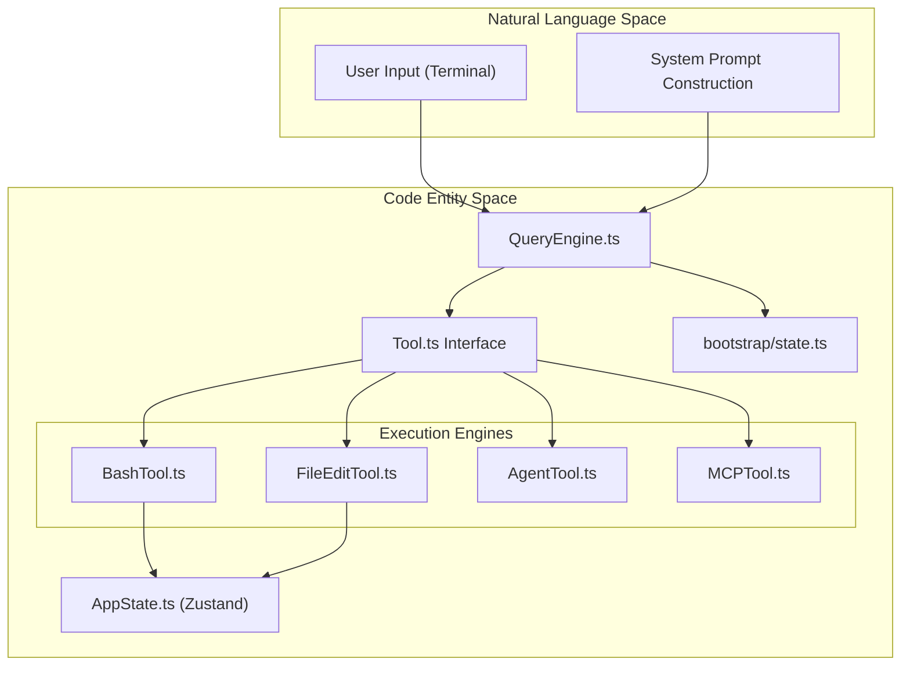
**Sources:** [src/QueryEngine.ts:176-182](), [src/Tool.ts:158-203](), [README.md:131-158]()

---

### Key Subsystems

#### 1. The Query Engine
The `QueryEngine` is the heartbeat of the conversation. It manages the lifecycle of a single session, handling the iterative loop of sending prompts to Claude, receiving tool calls, executing those tools, and returning results until a task is complete.
*   For details, see [Core Engine](#2) and [QueryEngine: Conversation Loop](#2.1).

#### 2. Tool & Command System
Claude Code distinguishes between **Tools** (invoked by the LLM) and **Commands** (invoked by the user via slash commands like `/commit`). Tools are defined via a standardized `Tool` interface and include everything from filesystem access to spawning sub-agents.
*   For details, see [Tool System](#3) and [CLI Layer & Commands](#8).

#### 3. State & Context Management
The system maintains a complex state including conversation history, file caches, and session metadata. It uses a sophisticated "Compaction" logic to summarize long histories, ensuring the conversation fits within the LLM's context window.
*   For details, see [Session State & Bootstrap](#2.2) and [Conversation Compaction](#2.4).

#### 4. Permissions & Security
Every tool execution passes through a permission gate. This system supports various modes (Default, Plan, Bypass) and can utilize a "Classifier" to automatically approve safe-looking commands.
*   For details, see [Permission & Security System](#4).

---

### High-Level Component Mapping

This diagram maps internal system names to their corresponding source file entities to assist with navigation.

**Diagram: System Component Mapping**
```mermaid
graph LR
  subgraph "UI Subsystem"
    "App.tsx"
    "PromptInput.tsx"
    "Ink Renderer"
  end

  subgraph "Logic Subsystem"
    "QueryEngine.ts" --> "processUserInput.ts"
    "QueryEngine.ts" --> "query.ts"
    "QueryEngine.ts" --> "compact.ts"
  end

  subgraph "Service Subsystem"
    "claude.ts (API Client)"
    "mcp/client.ts (MCP)"
    "pluginLoader.ts (Plugins)"
  end

  "App.tsx" -- "Dispatches" --> "QueryEngine.ts"
  "QueryEngine.ts" -- "Calls" --> "claude.ts (API Client)"
```
**Sources:** [README.md:86-125](), [src/QueryEngine.ts:35-42](), [src/Tool.ts:182-192]()

---

### How to Navigate this Wiki

This wiki is organized hierarchically to support both high-level understanding and deep technical dives:

*   **[Getting Started & Project Structure](#1.1):** Start here to understand the repository layout and how to run the project using the **Bun** runtime.
*   **[Core Concepts & Terminology](#1.2):** Essential reading for understanding the vocabulary used in the code (e.g., the difference between "Auto Mode" and "Plan Mode").
*   **Core Engine & Tools:** Detailed breakdowns of `QueryEngine.ts`, the `Tool.ts` interface, and specific tool implementations.
*   **Security & Infrastructure:** Documentation on the permission model, telemetry, and background services like the MCP integration.

**Sources:** [README.md:70-82](), [src/QueryEngine.ts:1-20]()

---

# Page: Getting Started & Project Structure

# Getting Started & Project Structure

<details>
<summary>Relevant source files</summary>

The following files were used as context for generating this wiki page:

- [README.md](README.md)
- [src/bootstrap/state.ts](src/bootstrap/state.ts)
- [src/cli/exit.ts](src/cli/exit.ts)
- [src/cli/update.ts](src/cli/update.ts)

</details>


This page provides a technical overview of how to set up, build, and run Claude Code. It details the repository layout, the Bun-based execution environment, and the startup sequence that transitions from a CLI entry point to a React-based terminal interface.

## Repository Overview

Claude Code is a high-scale TypeScript project (~512,000 lines of code across ~1,900 files) designed to run as a stateful CLI agent [README.md:71-80](). It leverages the **Bun** runtime for high-performance execution and the **Ink** library (a React reconciler for terminals) to provide an interactive UI [README.md:77-78]().

### Directory Layout

The codebase is organized into functional subsystems:

| Directory | Purpose |
| :--- | :--- |
| `src/commands/` | Implementations of slash commands (e.g., `/compact`, `/config`) [README.md:95](). |
| `src/tools/` | Agentic tools that Claude can invoke (e.g., `BashTool`, `FileEditTool`) [README.md:96](). |
| `src/components/` | React components for the Ink terminal UI [README.md:97](). |
| `src/services/` | External integrations: Anthropic API, OAuth, Analytics, and LaunchDarkly [README.md:99](). |
| `src/bootstrap/` | Global state initialization and environment setup [src/bootstrap/state.ts:1-31](). |
| `src/bridge/` | Infrastructure for remote-control and IDE integration [README.md:104](). |
| `src/tasks/` | Logic for background task execution and swarm orchestration [README.md:114](). |

**Sources:** [README.md:85-125](), [src/bootstrap/state.ts:1-31]()

---

## Runtime & Build System

Claude Code is built to be distributed via `npm` but executes using the **Bun** runtime.

### Feature Flags & Bundling
The project utilizes a `bun:bundle` approach where specific features are gated by build-time constants (macros).
*   **Version Management**: The version is injected via `MACRO.VERSION` [src/cli/update.ts:32]().
*   **Environment Detection**: The system distinguishes between `development`, `npm-global`, `npm-local`, and `native` installation types [src/cli/update.ts:87-99]().
*   **Update Channels**: Users can opt into `latest` or `canary` channels via settings [src/cli/update.ts:34]().

### Installation Methods
The CLI supports multiple installation paths, which the `update` command manages:
1.  **Global NPM**: `npm install -g @anthropic-ai/claude-code`.
2.  **Native Installers**: Homebrew (`brew upgrade claude-code`), Winget, and APK [src/cli/update.ts:122-156]().
3.  **Local Development**: Running directly from source using Bun.

**Sources:** [src/cli/update.ts:30-166](), [README.md:77-79]()

---

## Startup Sequence & Global State

The entry point of the application is `main.tsx`. It orchestrates the transition from the shell environment to the internal `QueryEngine`.

### Startup Flow Diagram
The following diagram bridges the shell command execution to the internal React application state.

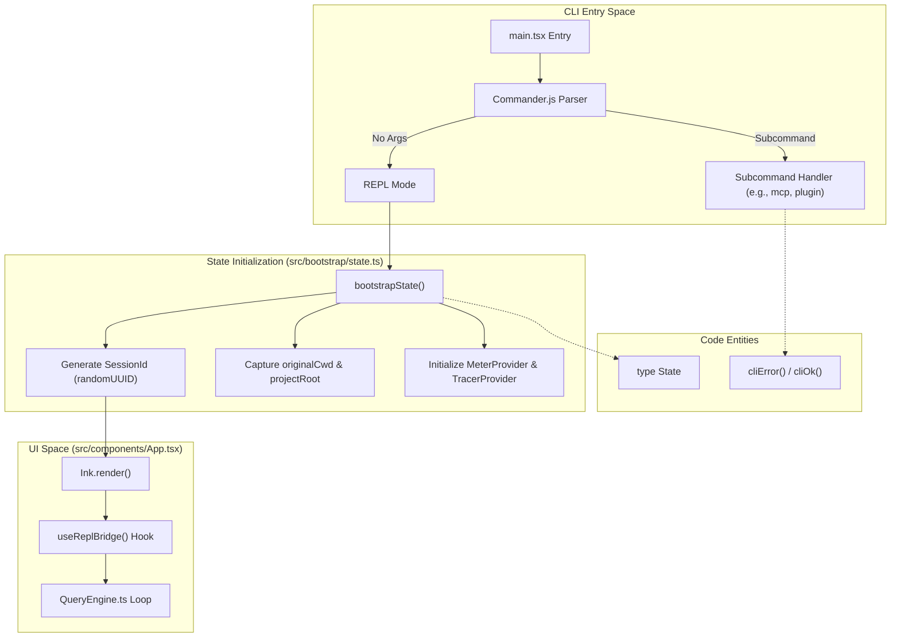
**Sources:** [src/bootstrap/state.ts:45-151](), [src/cli/exit.ts:19-31](), [README.md:87-91]()

### Global State Management
The application maintains a centralized `State` object in `src/bootstrap/state.ts`. This state is "judiciously" managed to avoid circular dependencies and is treated as a leaf in the import DAG [src/bootstrap/state.ts:31-142]().

Key properties of the `State` include:
*   **Project Identity**: `projectRoot` (stable root) vs `cwd` (current working directory) [src/bootstrap/state.ts:46-66]().
*   **Financial Tracking**: `totalCostUSD` and `modelUsage` per model name [src/bootstrap/state.ts:51-67]().
*   **Execution Flags**: `kairosActive` (for specific agentic behaviors) and `strictToolResultPairing` [src/bootstrap/state.ts:72-77]().
*   **Telemetry**: Counters for `locCounter`, `costCounter`, and `tokenCounter` [src/bootstrap/state.ts:90-96]().

**Sources:** [src/bootstrap/state.ts:45-151]()

---

## CLI Infrastructure

### Command Execution & Exit
Subcommands (like `claude mcp` or `claude update`) use helper functions in `src/cli/exit.ts` to ensure consistent exit codes and output streams.

| Function | Behavior | Source |
| :--- | :--- | :--- |
| `cliError(msg)` | Writes to `stderr`, exits with code `1`. | [src/cli/exit.ts:19-24]() |
| `cliOk(msg)` | Writes to `stdout`, exits with code `0`. | [src/cli/exit.ts:27-31]() |

### System Architecture: Code Entity Map
This diagram maps high-level system components to their specific implementation files and classes.

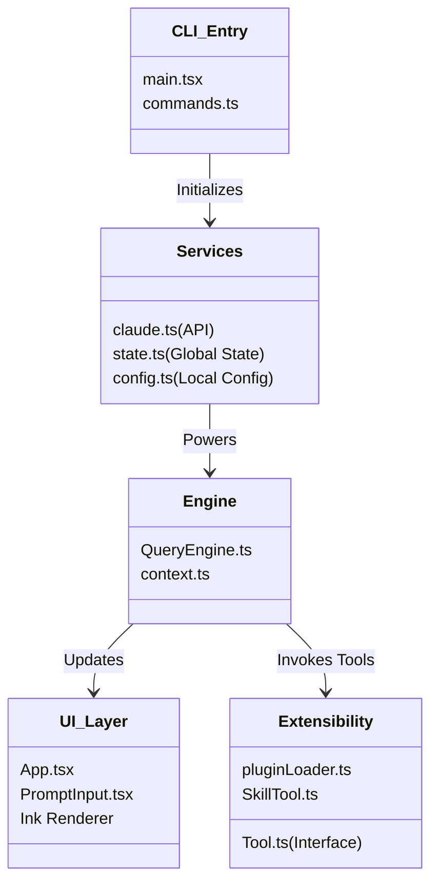
**Sources:** [README.md:85-125](), [src/bootstrap/state.ts:45-100](), [src/cli/update.ts:30-45]()

### Diagnostic & Update Logic
The `update` command in `src/cli/update.ts` performs a "Doctor Diagnostic" before attempting changes. It checks for:
*   **Multiple Installations**: Detects if the user has both a global npm and a native brew install [src/cli/update.ts:48-58]().
*   **PATH Conflicts**: Warns if the `claude` binary in the user's path doesn't match the currently running instance [src/cli/update.ts:61-74]().
*   **Config Mismatch**: Ensures the `installMethod` stored in global config aligns with the actual runtime environment [src/cli/update.ts:188-200]().

**Sources:** [src/cli/update.ts:41-74](), [src/cli/update.ts:188-200]()

---

# Page: Core Concepts & Terminology

# Core Concepts & Terminology

<details>
<summary>Relevant source files</summary>

The following files were used as context for generating this wiki page:

- [README.md](README.md)
- [src/Task.ts](src/Task.ts)
- [src/Tool.ts](src/Tool.ts)
- [src/commands.ts](src/commands.ts)

</details>


This page defines the fundamental concepts and architectural primitives used throughout the Claude Code codebase. Understanding these terms is essential for navigating the execution flow, state management, and the agentic capabilities of the system.

## Tools vs. Commands

Claude Code distinguishes between **Tools**, which are functions invoked by the LLM (Claude) to interact with the environment, and **Commands**, which are "slash commands" invoked directly by the user in the REPL.

### Tools
Tools are the primary mechanism for agentic behavior. Each tool is defined using a standard interface that includes a Zod schema for input validation, a permission level, and an execution handler [src/Tool.ts:15-101]().
*   **Implementation**: Tools are created using the `buildTool` factory and registered in the global tool registry [src/tools.ts:1-160]().
*   **Execution**: When the LLM generates a `tool_use` block, the `QueryEngine` validates the input against the tool's schema and checks permissions before execution [src/QueryEngine.ts:350-500]().

### Commands
Commands (e.g., `/compact`, `/config`, `/memory`) are local CLI utilities. They are registered in `commands.ts` and handle user-initiated configuration, state inspection, or session management [src/commands.ts:2-152](). Unlike tools, commands are never called by the LLM; they are parsed from the user's input string in the REPL.

## Sessions & Tasks

### Sessions
A **Session** represents a single continuous interaction between the user and Claude. 
*   **State**: Global session state is managed in `AppState`, which tracks model usage, session identity, and environment flags [src/state/AppState.ts:1-100]().
*   **Lifecycle**: Sessions can be persisted, archived, and resumed using the `/session` command or the Bridge API for remote environments [src/commands/session/index.ts:1-50]().

### Tasks
A **Task** is an asynchronous unit of work that may outlive a single conversation turn. 
*   **Types**: Tasks include `local_bash` (shell commands), `local_agent` (sub-agents), and `monitor_mcp` [src/Task.ts:6-14]().
*   **Management**: Every task has a unique ID (e.g., `b12345678` for bash) and tracks its status from `pending` to `terminal` states like `completed` or `failed` [src/Task.ts:15-29]().
*   **Data Flow**: Task output is streamed to dedicated files on disk to prevent memory bloat in the main process [src/Task.ts:45-57]().

### Task Execution Flow
The following diagram illustrates how a `tool_use` for a bash command transitions into a tracked `Task`.

Title: Tool to Task Transition
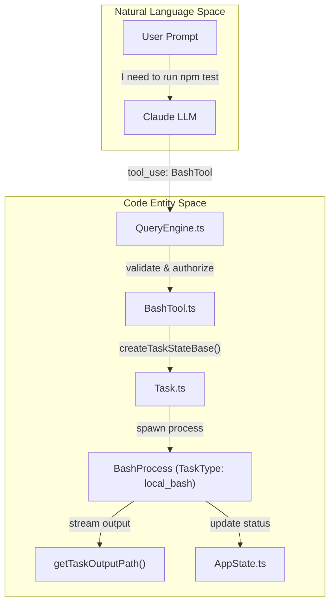
Sources: [src/QueryEngine.ts:350-400](), [src/Task.ts:6-29](), [src/Task.ts:108-125](), [src/tools/BashTool.ts:1-100]()

## Agents & MCP

### Agents
An **Agent** in this codebase refers to an instance of Claude configured with a specific system prompt and toolset.
*   **Sub-agents**: The `AgentTool` allows the primary agent to "fork" sub-agents to handle specific sub-tasks in parallel [src/tools/AgentTool/index.ts:1-80]().
*   **Custom Agents**: Users can define custom agent personas in the `~/.claude/agents` directory, which are loaded dynamically [src/tools/AgentTool/loadAgentsDir.ts:1-40]().

### Model Context Protocol (MCP)
Claude Code acts as an **MCP Client**. It can connect to external MCP Servers to dynamically expand its toolset at runtime.
*   **MCPTool**: A generic tool wrapper that proxies calls to external servers [src/tools/MCPTool.ts:1-50]().
*   **Connection Management**: Handled by `MCPConnectionManager`, which manages transports (stdio, SSE) and resource discovery [src/services/mcp/MCPConnectionManager.ts:1-100]().

## Execution Modes: Plan vs. Auto

Claude Code operates in different modes that alter the permission model and UI behavior.

| Mode | Description | Permission Behavior |
| :--- | :--- | :--- |
| **Default** | Standard interactive mode. | Asks for permission for sensitive tools (bash, file write). |
| **Plan Mode** | Entered via `/plan` or `EnterPlanModeTool`. | LLM focuses on strategy. Most tools are restricted or "dry-run" only [src/tools/EnterPlanModeTool.ts:1-30](). |
| **Auto Mode** | Continuous execution mode. | Uses `Classifier-Based Auto-Approval` to execute tools without user prompts [src/utils/permissions/classifier.ts:1-50](). |

## Compaction
**Compaction** is the process of summarizing and truncating the conversation history to fit within the LLM's context window.
*   **Micro-compaction**: Removes redundant metadata or small blocks during the session.
*   **Full Compaction**: Triggered when the token count exceeds a threshold. It summarizes the previous conversation turns into a single "summary" message and clears the history [src/services/compact/CompactService.ts:1-150]().

## Permission Model
The permission model is a multi-layered security system that gates tool execution.

1.  **PermissionMode**: Global setting (`default`, `bypass`, `plan`) [src/types/permissions.ts:43-47]().
2.  **PermissionRules**: Fine-grained rules that `alwaysAllow` or `alwaysDeny` specific commands or file paths [src/types/permissions.ts:117-128]().
3.  **Classifiers**: The `BashClassifier` analyzes shell commands for dangerous patterns (e.g., `rm -rf /`) before auto-approving in Auto Mode [src/utils/permissions/classifier.ts:60-120]().

### Permission Validation Logic
This diagram shows the sequence of checks performed before a tool is allowed to execute.

Title: Permission Gate Lifecycle
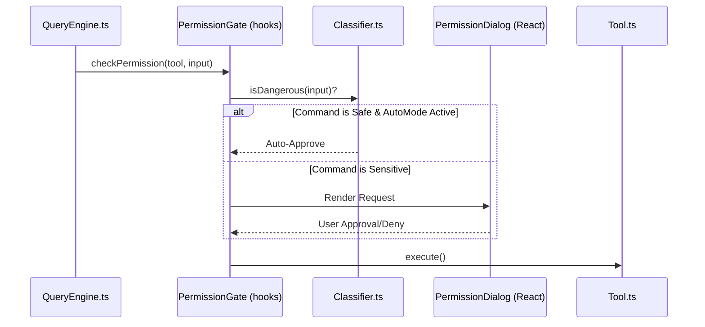
Sources: [src/QueryEngine.ts:410-450](), [src/hooks/useCanUseTool.ts:1-50](), [src/utils/permissions/classifier.ts:1-100](), [src/components/PermissionDialog.tsx:1-80]()

---

# Page: Core Engine

# Core Engine

<details>
<summary>Relevant source files</summary>

The following files were used as context for generating this wiki page:

- [src/QueryEngine.ts](src/QueryEngine.ts)
- [src/bootstrap/state.ts](src/bootstrap/state.ts)

</details>


The **Core Engine** is the central orchestration layer of Claude Code. It manages the lifecycle of a conversation, maintains the session state, and executes the iterative loop between the user's natural language prompts and the agentic tool-use capabilities. It acts as the bridge between the high-level UI/CLI and the low-level tool implementations.

## QueryEngine: The Conversation Loop

The `QueryEngine` class is the primary execution unit for a single conversation. It encapsulates the logic for processing user input, managing the message history, and driving the "thinking" and tool-call loop until a task is completed or a constraint is met.

*   **Turn Management**: Each call to `submitMessage()` initiates a "turn" where the engine coordinates with the Anthropic API to generate responses [src/QueryEngine.ts:180-182]().
*   **Tool Execution Loop**: The engine automatically handles tool calls requested by the model, executes them via the `Tools` interface, and feeds the results back into the conversation context [src/QueryEngine.ts:130-132]().
*   **Constraints**: It enforces execution boundaries such as `maxTurns` and `maxBudgetUsd` to prevent infinite loops or excessive API spend [src/QueryEngine.ts:146-147]().

For details, see [QueryEngine: Conversation Loop](#2.1).

## Session State & Bootstrap

The engine relies on a global, yet judiciously managed, state container defined in the bootstrap layer. This state tracks the identity of the session, resource consumption, and environmental configurations that persist across multiple turns.

*   **Identity**: Every session is assigned a unique `SessionId` and can track a `parentSessionId` for lineage (e.g., implementation following a plan) [src/bootstrap/state.ts:100-102]().
*   **Usage Tracking**: It maintains real-time counters for API costs, token usage, and tool execution durations [src/bootstrap/state.ts:51-60]().
*   **Execution Modes**: State flags determine if the engine is running in specialized modes like `kairosActive` or if it should bypass standard permission prompts via `sessionBypassPermissionsMode` [src/bootstrap/state.ts:72-133]().

For details, see [Session State & Bootstrap](#2.2).

## Context & System Prompt Construction

Before sending a request to the model, the engine assembles a comprehensive system prompt. This prompt provides the model with the necessary "situational awareness" of the user's environment.

*   **Environment Gathering**: The engine collects the current working directory, git status, and relevant environment variables [src/QueryEngine.ts:72-73]().
*   **Memory Integration**: It loads project-specific instructions from `CLAUDE.md` and other memory files to ensure the model follows local conventions [src/QueryEngine.ts:33-34]().
*   **Dynamic Assembly**: The system prompt is reconstructed for every API call to reflect the most current state of the filesystem and session [src/QueryEngine.ts:96-98]().

For details, see [Context & System Prompt Construction](#2.3).

## Conversation Compaction

As conversations grow, they risk exceeding the model's context window or becoming prohibitively expensive. The Core Engine employs a compaction strategy to summarize and prune history.

*   **Thresholds**: When the message history reaches a certain size, the engine triggers a compaction service to "summarize" older parts of the thread [src/QueryEngine.ts:122-127]().
*   **Preservation**: Critical information (like tool definitions or specific user instructions) is preserved, while verbose tool outputs are truncated or replaced with summaries [src/QueryEngine.ts:169-173]().

For details, see [Conversation Compaction](#2.4).

## Architecture Overview

The following diagram illustrates how the `QueryEngine` orchestrates the flow from User Input (Natural Language) to Tool Execution (Code Entity Space).

### Query Execution Flow
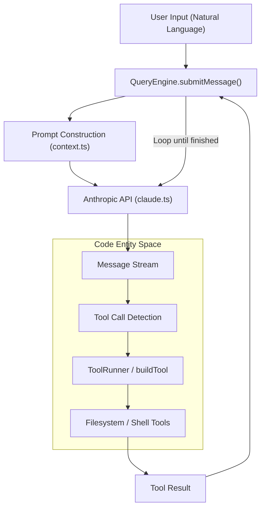
Sources: [src/QueryEngine.ts:130-182](), [src/services/api/claude.ts:17-19]()

### Session State Mapping
This diagram maps high-level session concepts to the specific state variables managed in the bootstrap layer.

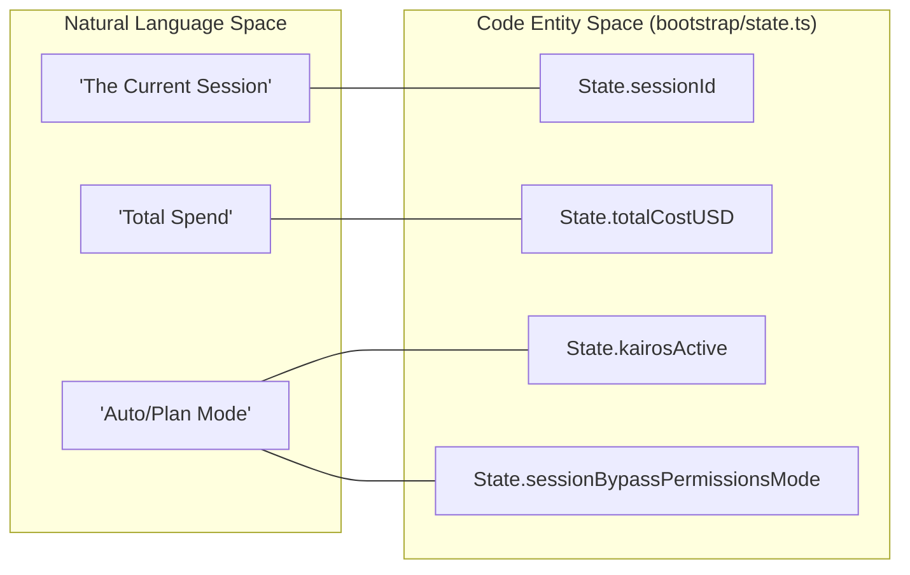
Sources: [src/bootstrap/state.ts:45-150]()

## Child Pages
- [QueryEngine: Conversation Loop](#2.1)
- [Session State & Bootstrap](#2.2)
- [Context & System Prompt Construction](#2.3)
- [Conversation Compaction](#2.4)

---

# Page: QueryEngine: Conversation Loop

# QueryEngine: Conversation Loop

<details>
<summary>Relevant source files</summary>

The following files were used as context for generating this wiki page:

- [src/QueryEngine.ts](src/QueryEngine.ts)
- [src/bootstrap/state.ts](src/bootstrap/state.ts)

</details>


The `QueryEngine` is the central orchestration class responsible for managing the lifecycle of a single conversation turn. It handles the transition from a user prompt to a multi-step agentic loop, involving tool execution, context management, and streaming responses back to the user.

## Overview

The `QueryEngine` class [src/QueryEngine.ts:176-184]() owns the session state for a conversation. Unlike a simple stateless API call, the `QueryEngine` maintains an internal message history, file state caches, and usage metrics. It orchestrates the "thinking" process where Claude may call multiple tools in sequence before providing a final response.

### Key Responsibilities
- **Turn Management**: Processes a single user message through potentially many tool-call iterations [src/QueryEngine.ts:311-315]().
- **Tool Execution**: Resolves tool calls, manages permissions via `canUseTool`, and feeds results back to the model [src/QueryEngine.ts:515-535]().
- **Constraint Enforcement**: Monitors token usage, USD budget, and maximum turn counts to prevent infinite loops or excessive costs [src/QueryEngine.ts:373-385]().
- **Context Assembly**: Gathers system prompts, memory (CLAUDE.md), and environment state (CWD, git status) to provide the model with full situational awareness [src/QueryEngine.ts:718-725]().

---

## The Conversation Loop

The core of the engine is the `query` loop. When a user submits a message, the engine enters a cycle of `Model Request -> Tool Use -> Tool Result -> Model Request`.

### Data Flow: User Prompt to Tool Execution

The following diagram illustrates how a natural language prompt is transformed into executable code actions through the `QueryEngine`.

**Diagram: Natural Language to Code Entity Flow**
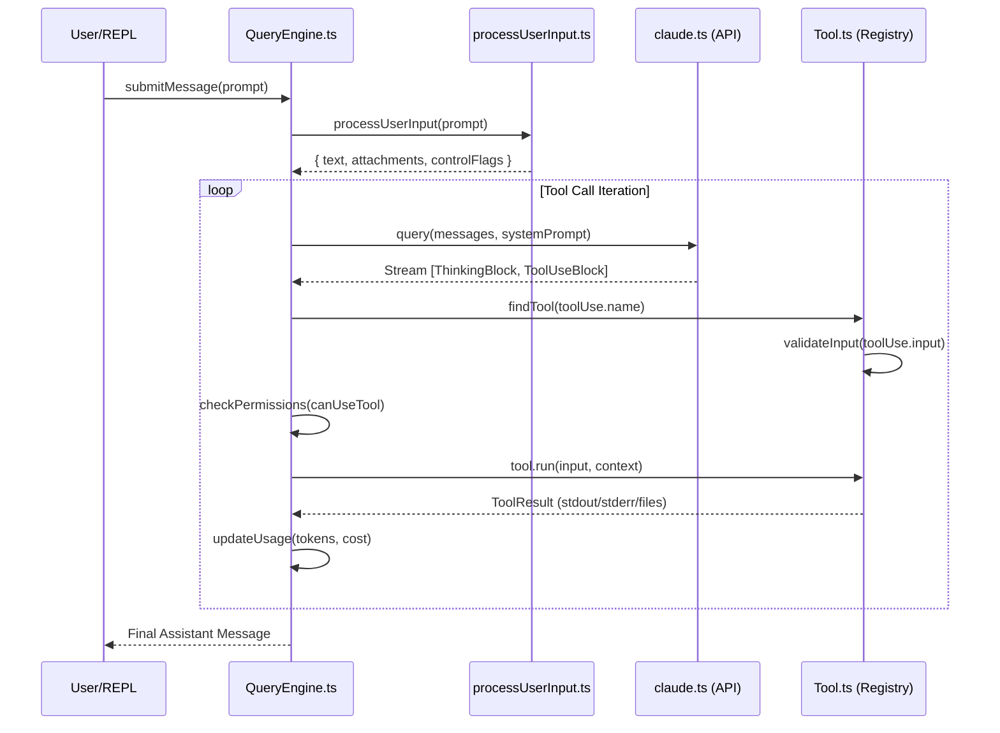
**Sources:** [src/QueryEngine.ts:311-360](), [src/QueryEngine.ts:515-540](), [src/utils/processUserInput/processUserInput.ts:68-75]()

### Implementation Details: `submitMessage`
The entry point for any interaction is `submitMessage` [src/QueryEngine.ts:311-315](). This function:
1. **Normalizes Input**: Uses `processUserInput` to extract text and handle any file attachments or special CLI flags [src/QueryEngine.ts:321-330]().
2. **Snapshotting**: If file history is enabled, it takes a snapshot of the current filesystem state using `fileHistoryMakeSnapshot` [src/QueryEngine.ts:340-345]().
3. **Turn Loop**: Executes the primary `while` loop that continues as long as the model produces tool calls and constraints (max turns/budget) are not met [src/QueryEngine.ts:365-380]().

---

## Constraint Enforcement & Budgeting

To ensure safety and cost-control, `QueryEngine` tracks several metrics during the conversation loop.

| Constraint | Code Entity | Description |
| :--- | :--- | :--- |
| **Max Turns** | `maxTurns` [src/QueryEngine.ts:146]() | Maximum number of tool-use iterations allowed per user prompt. |
| **USD Budget** | `maxBudgetUsd` [src/QueryEngine.ts:147]() | Hard limit on the cost of the current session. |
| **Task Budget** | `taskBudget` [src/QueryEngine.ts:148]() | Shared budget across sub-agents or tasks. |
| **Usage Tracking** | `accumulateUsage` [src/QueryEngine.ts:17]() | Updates global state with input/output tokens and cache hits. |

If a budget is exceeded, the engine throws a `BudgetExceededError`, which is caught to provide a graceful report to the user [src/QueryEngine.ts:400-410]().

**Sources:** [src/QueryEngine.ts:146-150](), [src/QueryEngine.ts:373-385](), [src/bootstrap/state.ts:51-60]()

---

## Context & System Prompt Construction

The `QueryEngine` does not just send the raw user prompt. It constructs a rich "System Message" to guide Claude's behavior.

### System Prompt Components
The engine calls `fetchSystemPromptParts` [src/QueryEngine.ts:722]() to assemble:
1. **Core Instructions**: Base behavior for Claude Code.
2. **Environment Context**: Current working directory, OS, and shell information [src/utils/queryContext.ts:45-55]().
3. **Memory (CLAUDE.md)**: Project-specific instructions and progress tracking loaded via `loadMemoryPrompt` [src/QueryEngine.ts:33-34]().
4. **Tool Definitions**: Descriptions and JSON schemas for all available tools [src/QueryEngine.ts:132]().

**Diagram: System Prompt Assembly**
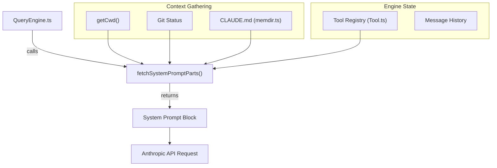
**Sources:** [src/QueryEngine.ts:718-725](), [src/utils/queryContext.ts:10-30](), [src/memdir/memdir.ts:33-40]()

---

## Thinking Mode & Streaming

The engine supports "Thinking Mode" (Internal Monologue), where the model generates a rationale before acting.

### Thinking Blocks
When `thinkingConfig` is provided [src/QueryEngine.ts:145](), the model can output `thinking` blocks. These are:
- **Streamed to UI**: Handled by the `onThinking` callback [src/QueryEngine.ts:440-445]().
- **Filtered from History**: Depending on the configuration, these may be stripped from the conversation history to save context space, while preserving the logical flow.

### Tool Call Handling
Tool calls are processed sequentially within a single turn. The engine:
1. Detects a `tool_use` block in the stream [src/QueryEngine.ts:515]().
2. Invokes `canUseTool` to check for user permissions (e.g., `Always Allow`, `Deny`) [src/QueryEngine.ts:520-525]().
3. Executes the tool and captures `stdout`, `stderr`, and any `base64` output [src/QueryEngine.ts:530-540]().
4. Wraps the result in a `tool_result` message and appends it to the `mutableMessages` array [src/QueryEngine.ts:550-560]().

**Sources:** [src/QueryEngine.ts:145-146](), [src/QueryEngine.ts:440-450](), [src/QueryEngine.ts:515-560]()

---

## Result Reporting

Once the loop terminates (either the model provides a final text response or a constraint is hit), the `QueryEngine` returns a `QueryResult`.

### QueryResult Structure
- **`finalMessage`**: The last text response from the assistant.
- **`usage`**: Total tokens and cost for this specific turn [src/QueryEngine.ts:18]().
- **`messages`**: The full sequence of messages (including tool calls and results) added during the turn.
- **`fileStateCache`**: Updated cache of file contents to optimize future reads [src/QueryEngine.ts:140]().

**Sources:** [src/QueryEngine.ts:17-20](), [src/QueryEngine.ts:140-141](), [src/services/api/claude.ts:17-18]()

---

# Page: Session State & Bootstrap

# Session State & Bootstrap

<details>
<summary>Relevant source files</summary>

The following files were used as context for generating this wiki page:

- [src/assistant/sessionHistory.ts](src/assistant/sessionHistory.ts)
- [src/bootstrap/state.ts](src/bootstrap/state.ts)

</details>


The session state management system in Claude Code serves as the central repository for global application state, telemetry, and execution flags. Managed primarily in `src/bootstrap/state.ts`, this system ensures that disparate subsystems—ranging from the QueryEngine to the UI layer—have a unified source of truth for the current session's identity, performance metrics, and operational modes.

## Overview of Global State

The state is defined by the `State` type and initialized into a global singleton. It tracks the lifecycle of a conversation, including cost, model usage, and environmental context.

### Key State Properties
| Property | Role |
| :--- | :--- |
| `sessionId` | A unique `SessionId` (UUID) generated at startup for the current execution. |
| `projectRoot` | The stable root of the project, used for identity (history, skills). |
| `modelUsage` | A map tracking `ModelUsage` (input/output tokens) per model name. |
| `totalCostUSD` | Accumulated financial cost of the session based on token usage. |
| `kairosActive` | Boolean flag indicating if the session is running in "Kairos" (Auto) mode. |
| `isInteractive` | Determines if the session is attached to a TTY for user input. |

Sources: `[src/bootstrap/state.ts:45-150]()`, `[src/bootstrap/state.ts:18-18]()`

## Execution Modes & Flags

The bootstrap state manages several critical flags that alter the behavior of the `QueryEngine` and tool execution pipeline.

*   **Plan Mode**: While not a single boolean, it is managed via the `sessionBypassPermissionsMode` and `mainLoopModelOverride` which are often set when entering specialized planning states.
*   **Auto Mode (Kairos)**: Controlled by the `kairosActive` flag. When enabled, the system may skip certain user confirmations or use different classification logic for tool calls.
*   **Strict Tool Pairing**: The `strictToolResultPairing` flag, when true, forces the system to throw errors on tool result mismatches rather than attempting to repair them with synthetic placeholders.

Sources: `[src/bootstrap/state.ts:72-77]()`, `[src/bootstrap/state.ts:132-133]()`

## Model Usage & Telemetry

Claude Code tracks performance and cost metrics in real-time. This data is used both for the `/cost` command and for external telemetry reporting.

### Telemetry Registration
The state holds references to OpenTelemetry entities:
*   `meter`: For recording metrics like `locCounter` (Lines of Code) and `tokenCounter`.
*   `eventLogger`: For structured logging of session events.
*   `tracerProvider`: For distributed tracing of API requests and tool executions.

### Model Usage Tracking
Usage is updated via the `addModelUsage` function, which aggregates tokens across multiple turns.

```typescript
// Example of how usage is updated in state.ts
export function addModelUsage(modelName: string, usage: ModelUsage): void {
  const current = getState().modelUsage[modelName] || { inputTokens: 0, outputTokens: 0 };
  getState().modelUsage[modelName] = {
    inputTokens: current.inputTokens + usage.inputTokens,
    outputTokens: current.outputTokens + usage.outputTokens,
  };
}
```

Sources: `[src/bootstrap/state.ts:90-109]()`, `[src/bootstrap/state.ts:67-67]()`

## Performance Optimizations

The bootstrap layer includes mechanisms to handle high-frequency terminal updates and UI responsiveness.

### Scroll Draining & Sticky Latches
To prevent the terminal UI from becoming unresponsive during large bursts of output (e.g., a long `grep` or `cat` command), the system implements "scroll draining."
*   **Sticky Latches**: These are state flags that determine if the UI should "stick" to the bottom of the scrollback buffer.
*   **Draining**: High-volume updates are batched or throttled to ensure the React/Ink rendering loop does not block the main execution thread.

Sources: `[src/bootstrap/state.ts:155-165]()` (Internal state flags for UI synchronization).

## Data Flow: Bootstrap to Code Entities

The following diagram illustrates how the `State` object in `bootstrap/state.ts` bridges the gap between high-level session concepts and specific code entities.

**Session Identity and Usage Flow**
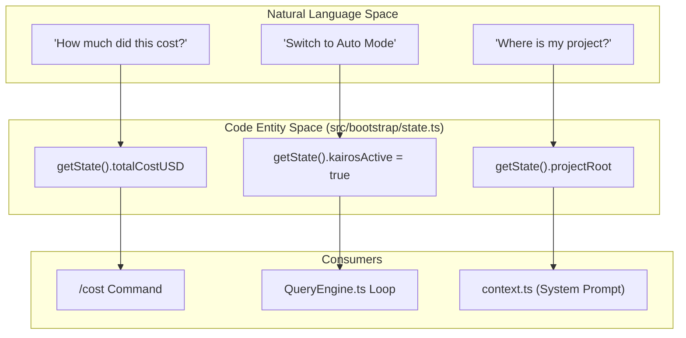
Sources: `[src/bootstrap/state.ts:50-51]()`, `[src/bootstrap/state.ts:72-72]()`, `[src/bootstrap/state.ts:100-100]()`

## Session History & Pagination

While the active state is in-memory, historical session data is managed via `src/assistant/sessionHistory.ts`. This module handles fetching previous messages and events for the current or past sessions using an authenticated API context.

### History Fetching Logic
1.  **Context Creation**: `createHistoryAuthCtx` generates the necessary headers and base URL using OAuth tokens.
2.  **Pagination**: Uses `HISTORY_PAGE_SIZE` (100) and cursors (`before_id`) to traverse session events.
3.  **Latest Events**: `fetchLatestEvents` uses the `anchor_to_latest` parameter to get the most recent tail of the conversation.

**History Data Flow**
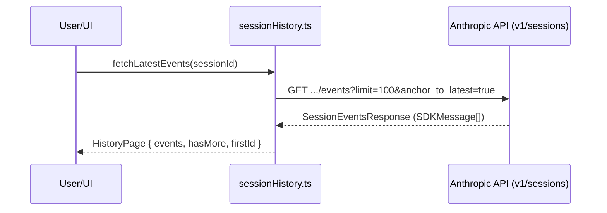
Sources: `[src/assistant/sessionHistory.ts:7-16]()`, `[src/assistant/sessionHistory.ts:31-43]()`, `[src/assistant/sessionHistory.ts:73-78]()`

## Key Functions

| Function | Location | Purpose |
| :--- | :--- | :--- |
| `getState()` | `src/bootstrap/state.ts` | Returns the current global state singleton. |
| `setState()` | `src/bootstrap/state.ts` | Updates specific keys in the global state. |
| `resetStateForTests()` | `src/bootstrap/state.ts` | Clears all state to defaults (used in test suites). |
| `createHistoryAuthCtx()` | `src/assistant/sessionHistory.ts` | Prepares authentication for session event retrieval. |
| `fetchOlderEvents()` | `src/assistant/sessionHistory.ts` | Retrieves paginated history using a `beforeId` cursor. |

Sources: `[src/bootstrap/state.ts:1-150]()`, `[src/assistant/sessionHistory.ts:31-33]()`, `[src/assistant/sessionHistory.ts:81-87]()`

---

# Page: Context & System Prompt Construction

# Context & System Prompt Construction

<details>
<summary>Relevant source files</summary>

The following files were used as context for generating this wiki page:

- [src/QueryEngine.ts](src/QueryEngine.ts)
- [src/bootstrap/state.ts](src/bootstrap/state.ts)
- [src/commands/compact/compact.ts](src/commands/compact/compact.ts)

</details>


The system prompt in Claude Code is a dynamically assembled instruction set that provides the model with situational awareness, tool definitions, and project-specific memory. This process is orchestrated primarily through `context.ts` and `QueryEngine.ts`, which aggregate environmental data (git status, working directory), persistent memory files (`CLAUDE.md`), and user-defined constraints into a cohesive prompt.

## Overview of Prompt Assembly

Prompt construction occurs at the beginning of every conversation turn. The `QueryEngine` gathers various "parts" of the system prompt, which are then concatenated and passed to the Anthropic API. This ensures the model always has the most up-to-date view of the repository and the current task state.

### Key Components of the System Prompt
1.  **Static Instructions**: Core behavior guidelines defined in the codebase.
2.  **Environmental Context**: Current working directory, git status, and shell information.
3.  **Project Memory**: Contents of `CLAUDE.md` and other relevant memory files.
4.  **User Context**: Custom instructions provided via CLI flags or configuration.
5.  **Tool Definitions**: Capabilities available to the agent (e.g., filesystem access, shell execution).

## Implementation Details

### The Context Gathering Pipeline
The `fetchSystemPromptParts` function in `src/utils/queryContext.ts` is the central entry point for gathering context [src/QueryEngine.ts:72-72](). It coordinates calls to `getSystemContext` and `getUserContext`.

#### System Context (`context.ts`)
The `getSystemContext` function retrieves technical metadata about the environment:
*   **CWD**: The current working directory [src/bootstrap/state.ts:66-66]().
*   **Git Status**: Information about the current branch and staged/unstaged changes.
*   **Platform**: Operating system and shell details.

#### User Context and CLAUDE.md
The `getUserContext` function handles project-specific instructions. A critical part of this is the `CLAUDE.md` file, which acts as a persistent memory layer for the project [src/memdir/memdir.ts:33-33](). The content is often cached in global state to prevent redundant filesystem hits during high-frequency operations like auto-mode classification [src/bootstrap/state.ts:121-123]().

### Prompt Construction Flow
The following diagram illustrates how different code entities contribute to the final system prompt sent to the model.

**System Prompt Assembly Architecture**
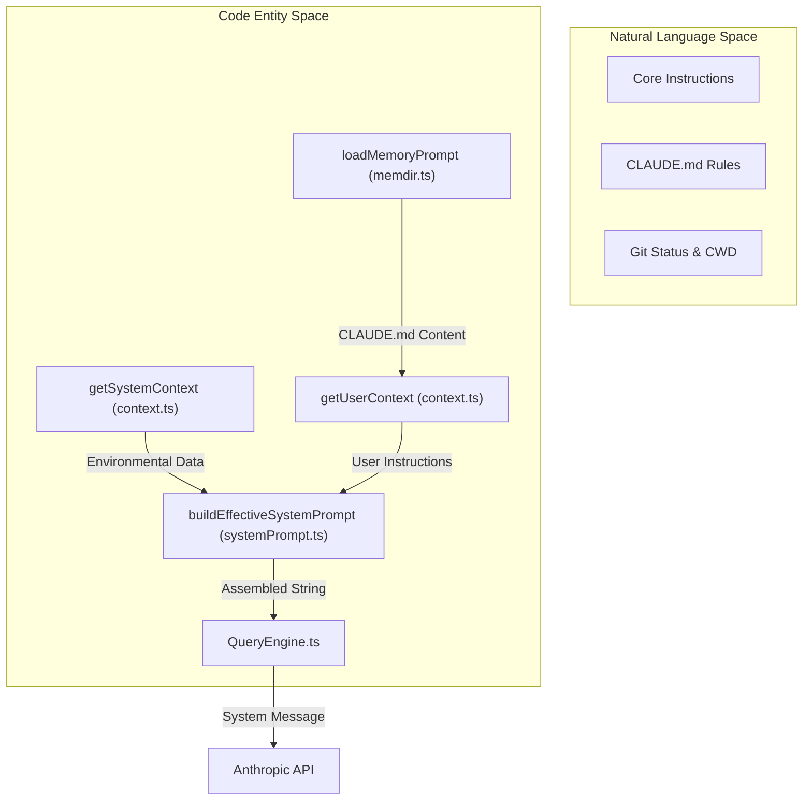
Sources: [src/QueryEngine.ts:72-72](), [src/commands/compact/compact.ts:4-5](), [src/utils/systemPrompt.ts:29-32](), [src/memdir/memdir.ts:33-33]()

## Compaction and Prompt Construction

As conversations grow, they may exceed the model's context window. The compaction system interacts directly with prompt construction to maintain essential context while discarding historical noise.

### Interaction with `compact.ts`
When the `/compact` command is triggered, the system:
1.  **Projects Messages**: Filters messages to ensure only those after the last `compactBoundary` are considered [src/commands/compact/compact.ts:46-46]().
2.  **Re-evaluates Context**: Clears the `getUserContext` cache to ensure the summary reflects the most recent state [src/commands/compact/compact.ts:63-63]().
3.  **Builds Effective Prompt**: Uses `buildEffectiveSystemPrompt` to merge summarized conversation history with the current system instructions [src/commands/compact/compact.ts:29-32]().

### Data Flow during Compaction
This diagram shows how `QueryEngine` and the compaction service coordinate to rebuild the prompt.

**Compaction-Prompt Synchronization**
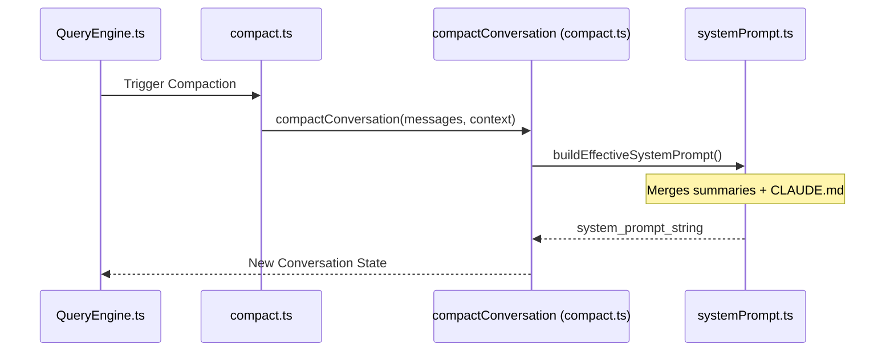
Sources: [src/commands/compact/compact.ts:40-42](), [src/commands/compact/compact.ts:101-108](), [src/utils/systemPrompt.ts:29-32]()

## Key Functions and Classes

| Entity | File | Role |
| :--- | :--- | :--- |
| `QueryEngine` | `src/QueryEngine.ts` | Orchestrates the conversation turn and initiates context gathering. |
| `getSystemContext` | `src/context.ts` | Gathers OS, Shell, and Git metadata. |
| `getUserContext` | `src/context.ts` | Gathers `CLAUDE.md` and user-provided instruction strings. |
| `buildEffectiveSystemPrompt` | `src/utils/systemPrompt.ts` | Concatenates all prompt fragments into the final string. |
| `loadMemoryPrompt` | `src/memdir/memdir.ts` | Specifically handles the discovery and reading of memory files. |
| `cachedClaudeMdContent` | `src/bootstrap/state.ts` | Stores the `CLAUDE.md` content in global state for performance. |

## Configuration and Overrides
Users can influence prompt construction through several mechanisms:
*   **Custom System Prompt**: Passed via `QueryEngineConfig` to replace default instructions [src/QueryEngine.ts:141-141]().
*   **Append System Prompt**: Appends additional instructions to the end of the assembled prompt [src/QueryEngine.ts:142-142]().
*   **Memory Path Overrides**: Custom paths for the memory directory can be specified, bypassing default discovery [src/memdir/paths.ts:34-34]().

Sources: [src/QueryEngine.ts:130-150](), [src/bootstrap/state.ts:121-123](), [src/utils/queryContext.ts:72-72](), [src/utils/systemPrompt.ts:29-32]()

---

# Page: Conversation Compaction

# Conversation Compaction

<details>
<summary>Relevant source files</summary>

The following files were used as context for generating this wiki page:

- [src/QueryEngine.ts](src/QueryEngine.ts)
- [src/commands/compact/compact.ts](src/commands/compact/compact.ts)
- [src/commands/compact/index.ts](src/commands/compact/index.ts)

</details>


Conversation Compaction is the process by which Claude Code manages the context window of the LLM during long-running sessions. As a conversation grows, it eventually exceeds the model's token limit or becomes prohibitively expensive and slow to process. Compaction summarizes previous turns, preserves critical state (like current goals and file modifications), and truncates older messages to maintain a high-density, relevant context.

## Compaction Architecture

The compaction system is orchestrated primarily through the `compact` command and the `compactConversation` service. It operates in several stages, from lightweight "micro-compaction" to full LLM-driven summarization.

### Data Flow Overview

The following diagram illustrates how a conversation is processed from a full history into a compacted state.

**Compaction Pipeline Flow**
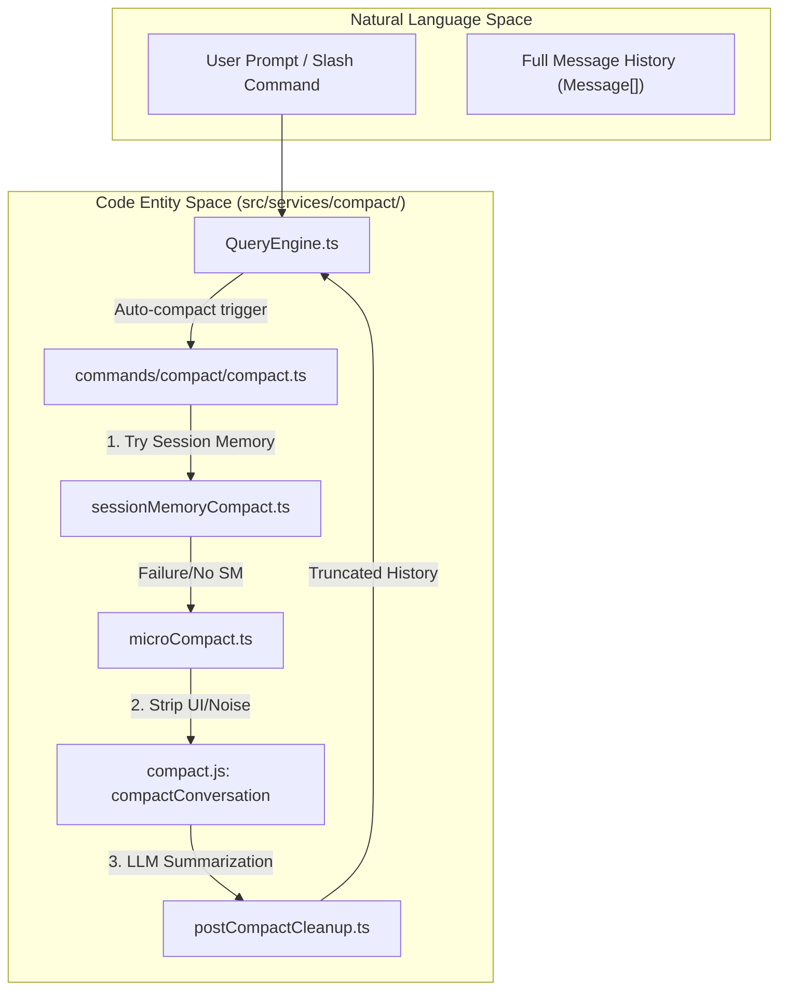
Sources: [src/QueryEngine.ts:122-128](), [src/commands/compact/compact.ts:40-112](), [src/services/compact/compact.ts:10-15]()

## Compaction Strategies

Claude Code employs three distinct strategies for reducing context size:

### 1. Session Memory Compaction
The system first attempts `trySessionMemoryCompaction` [src/commands/compact/compact.ts:58-62](). This leverages the persistent memory system to store key facts and then replaces the history with a concise state update. This is the most efficient form as it avoids full re-summarization if the memory is already up-to-date.

### 2. Micro-Compaction
Before sending messages to a model for summarization, the `microcompactMessages` function is called [src/commands/compact/compact.ts:98-99](). 
- **Purpose**: Removes "noise" from the message history that isn't needed for a summary.
- **Actions**: Truncates large tool outputs (like long `grep` results or file listings) and removes redundant UI metadata [src/services/compact/microCompact.ts:1-20]().

### 3. Full Summarization (`compactConversation`)
This is the core LLM-driven process. It involves:
- **System Prompt Construction**: Building a specific prompt that instructs the model to act as a "summarizer" [src/services/compact/compact.ts:101-108]().
- **State Preservation**: Ensuring that the current working directory, git status, and "Plan" mode progress are not lost [src/context.ts:5-15]().
- **Boundary Identification**: Finding the `compactBoundary` to ensure the most recent messages (the "active" context) are kept intact while older ones are collapsed [src/utils/messages.ts:27-28]().

## Auto-Compaction Thresholds

Compaction is not just a manual command (`/compact`); it is automatically triggered by the `QueryEngine` when context limits are approached.

| Feature | Description |
| :--- | :--- |
| **Auto-Compact Trigger** | Triggered when the message history exceeds a specific token threshold or turn count [src/QueryEngine.ts:175-185](). |
| **Reactive Compaction** | A newer mode (feature-gated as `REACTIVE_COMPACT`) that monitors token usage in real-time and preemptively suggests or executes compaction [src/commands/compact/compact.ts:35-37](). |
| **History Snip** | For headless/SDK sessions, the `HISTORY_SNIP` feature allows the engine to truncate history to bound memory without a full summary, providing a "snipped" view to the model [src/QueryEngine.ts:122-128](). |

Sources: [src/QueryEngine.ts:159-173](), [src/commands/compact/compact.ts:87-94]()

## Implementation Details

### The Compact Boundary
The system maintains a "compact boundary" to prevent the model from summarizing the very last things it just said. 
- `getMessagesAfterCompactBoundary` extracts only the messages that have occurred since the last compaction event [src/commands/compact/compact.ts:46-47]().
- This ensures that the immediate conversation flow remains coherent while the "distant past" is moved into a summary block.

### Post-Compaction Cleanup
After a successful compaction, the system must synchronize its internal state:
1. **Cache Clearing**: `getUserContext.cache.clear()` is called to ensure the next prompt reflects the new, smaller history [src/commands/compact/compact.ts:63-64]().
2. **State Marking**: `markPostCompaction()` updates the session state so the UI can display compaction markers [src/bootstrap/state.ts:3-3]().
3. **Cleanup Service**: `runPostCompactCleanup()` removes temporary files or logs generated during the compaction process [src/services/compact/postCompactCleanup.ts:1-5]().

**System State Synchronization**
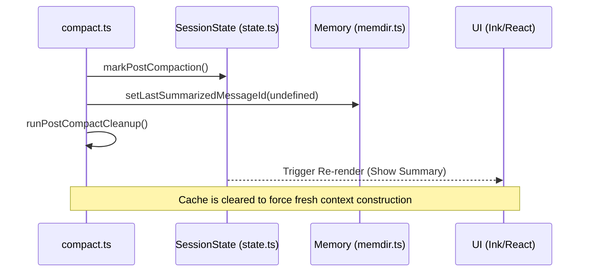
Sources: [src/commands/compact/compact.ts:112-124](), [src/bootstrap/state.ts:3-3](), [src/services/SessionMemory/sessionMemoryUtils.ts:20-20]()

## Manual Compaction
Users can manually trigger compaction using the `/compact` command.
- **Optional Instructions**: Users can provide specific focus for the summary (e.g., `/compact focus on the refactoring of the Auth module`) [src/commands/compact/index.ts:7-8]().
- **Tool Skills**: Compaction also attempts to preserve "Skills" (learned tool behaviors) by extracting them into the summary [src/QueryEngine.ts:22-22]().

Sources: [src/commands/compact/index.ts:4-15](), [src/commands/compact/compact.ts:52-54]()

---

# Page: Tool System

# Tool System

<details>
<summary>Relevant source files</summary>

The following files were used as context for generating this wiki page:

- [README.md](README.md)
- [src/Tool.ts](src/Tool.ts)

</details>


The Tool System is the core agentic architecture of Claude Code, enabling the LLM to interact with the local environment, manage files, execute code, and orchestrate complex workflows. Every capability available to the agent—from reading a file to spawning a sub-agent—is encapsulated as a `Tool`.

## Tool Architecture

The system is built around a unified `Tool` interface and a factory pattern that standardizes how tools are defined, validated, and executed.

### The Tool Interface
Each tool is a self-contained module that defines its input schema (using Zod or JSON Schema), a description for the LLM, and an `execute` function. Tools are integrated into the `QueryEngine` loop, where the model's `tool_use` blocks are dispatched to the corresponding tool implementation.

- **`Tool.ts`**: Defines the base `Tool` type and the `ToolUseContext` which provides tools with access to session state, filesystem caches, and UI hooks [src/Tool.ts:15-158]().
- **`buildTool`**: A factory function used to create tool instances with consistent validation and metadata [src/tools.ts:89-91]().

### Tool Execution Lifecycle
1.  **Input Validation**: The `QueryEngine` validates the model's arguments against the tool's schema.
2.  **Permission Gating**: Before execution, the system checks `PermissionMode` and `PermissionRules` to determine if the action requires user approval [src/Tool.ts:123-138]().
3.  **Progress Tracking**: Tools emit `ToolProgressData` to update the terminal UI (e.g., spinners, progress bars) during long-running operations [src/Tool.ts:49-58]().
4.  **Result Persistence**: For tools generating large outputs (like `BashTool`), results are managed via a persistence layer to prevent context window overflow [src/Tool.ts:62-62]().

For details on the execution pipeline, see **[Tool Interface & Execution Lifecycle (#3.1)]**.

### Tool System Overview Diagram

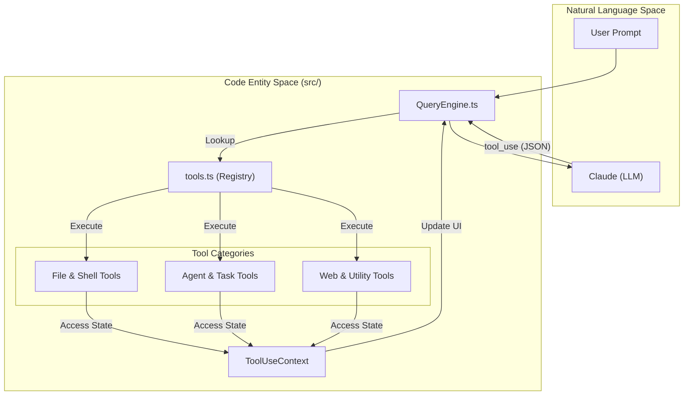
**Sources:** [src/QueryEngine.ts:1-100](), [src/tools.ts:1-100](), [src/Tool.ts:158-208]()

---

## Tool Categories

The toolset is categorized by the scope of impact and the underlying subsystem it interacts with.

### File & Shell Tools
These are the primary tools for local development. They provide a safe interface for executing shell commands and manipulating the filesystem.
- **`BashTool`**: Executes shell commands with security parsing and dangerous pattern detection [src/tools.ts:137-137]().
- **`FileEditTool`**: Performs targeted string replacements rather than full-file overwrites to minimize errors [src/tools.ts:140-140]().
- **`GrepTool` & `GlobTool`**: High-performance search utilities for codebase navigation [src/tools.ts:141-142]().

For details, see **[File & Shell Tools (#3.2)]**.

### Agent & Task Tools
These tools allow Claude to manage its own execution flow and delegate work to other agents.
- **`AgentTool`**: Used to fork sub-agents or run specialized teammates [src/tools.ts:145-145]().
- **`TaskCreateTool`**: Manages the lifecycle of asynchronous background tasks [src/tools.ts:150-150]().
- **`SkillTool`**: Invokes reusable agent workflows and automated "skills" [src/tools.ts:146-146]().

For details, see **[Agent & Task Tools (#3.3)]**.

### Web, MCP & Utility Tools
Extended capabilities for external data retrieval and specialized integration.
- **`MCPTool`**: The gateway to the Model Context Protocol, allowing Claude to use tools provided by external MCP servers [src/tools.ts:147-147]().
- **`WebSearchTool` & `WebFetchTool`**: Tools for gathering real-time information from the internet [src/tools.ts:143-144]().
- **`LSPTool`**: Integrates with Language Server Protocol for deep code intelligence [src/tools.ts:148-148]().

For details, see **[Web, MCP & Utility Tools (#3.4)]**.

---

## Permission and Security Gating

The Tool System is tightly coupled with the `PermissionMode` system. Every tool call passes through a permission gate that evaluates:
- **Always Allow/Deny Rules**: Pre-configured patterns that bypass or automatically block tools [src/Tool.ts:126-128]().
- **Classifier Decisions**: Automated logic (e.g., `bash` classifier) that analyzes tool inputs for safety [src/Tool.ts:60-60]().

### Tool-to-Permission Mapping Diagram

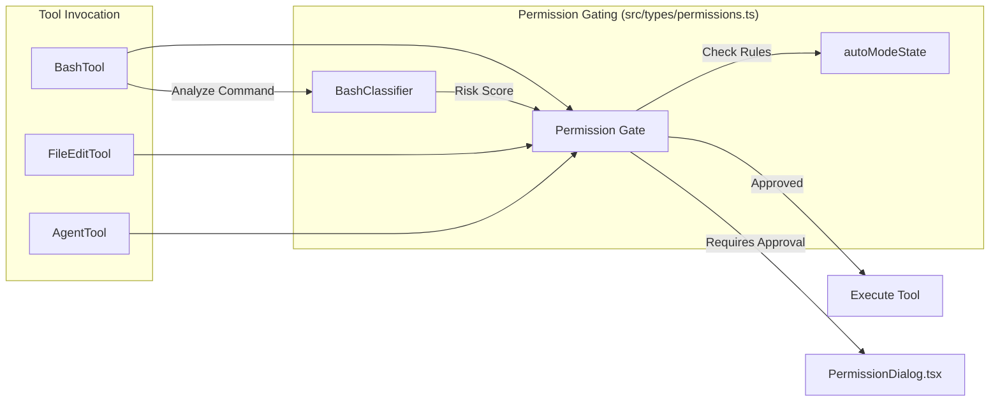
**Sources:** [src/Tool.ts:123-148](), [src/types/permissions.ts:43-47](), [src/utils/permissions/denialTracking.ts:1-20]()

## Full Tool Catalog

The following table summarizes the core tools available in the system:

| Tool | File Path | Primary Purpose |
| :--- | :--- | :--- |
| `BashTool` | `src/tools/BashTool/` | Execute shell commands in the local environment. |
| `FileReadTool` | `src/tools/FileReadTool/` | Read file contents (supports text, images, and PDFs). |
| `FileEditTool` | `src/tools/FileEditTool/` | Apply precise string-replacement edits to files. |
| `AgentTool` | `src/tools/AgentTool/` | Spawn sub-agents for parallel or specialized tasks. |
| `MCPTool` | `src/tools/MCPTool/` | Call tools from connected Model Context Protocol servers. |
| `TaskCreateTool` | `src/tools/TaskCreateTool/` | Initiate a background task with its own lifecycle. |
| `WebSearchTool` | `src/tools/WebSearchTool/` | Perform web searches to retrieve external information. |

**Sources:** [src/tools.ts:131-158](), [README.md:131-158]()

---

# Page: Tool Interface & Execution Lifecycle

# Tool Interface & Execution Lifecycle

<details>
<summary>Relevant source files</summary>

The following files were used as context for generating this wiki page:

- [src/Tool.ts](src/Tool.ts)

</details>


The tool system in Claude Code is the primary mechanism through which the model interacts with the external world (filesystem, shell, network, and sub-agents). This system is built around a strictly typed interface and a standardized execution lifecycle that handles input validation, permission gating, progress reporting, and UI rendering.

## The Tool Interface

Every tool in the system must implement the `Tool<T>` interface or be created via the `buildTool` factory. The interface separates the tool's metadata (name, description, schema) from its execution logic and UI representation.

### Key Components of the Tool Interface

| Component | Description |
| :--- | :--- |
| `name` | The unique identifier for the tool used in model calls. [src/Tool.ts:221-221]() |
| `description` | Natural language description helping the model understand when to use the tool. [src/Tool.ts:222-222]() |
| `inputSchema` | A Zod schema or JSON schema defining the expected arguments. [src/Tool.ts:223-223]() |
| `execute` | An async function containing the core logic, receiving validated input and a `ToolUseContext`. [src/Tool.ts:225-231]() |
| `render` | A React/Ink component used to display the tool's progress or results in the terminal. [src/Tool.ts:233-241]() |
| `validate` | Optional hook for complex validation that cannot be expressed in the schema. [src/Tool.ts:243-247]() |

### Tool Factory: `buildTool`
The `buildTool` function is a type-safe factory used to construct tool definitions. It ensures that the `execute` and `render` functions correctly match the types defined in the `inputSchema`.

**Sources:** [src/Tool.ts:219-250](), [src/Tool.ts:384-398]()

---

## Tool Execution Lifecycle

The lifecycle of a tool call is managed by the `QueryEngine`. It bridges the gap between the "Natural Language Space" (where the model decides to use a tool) and the "Code Entity Space" (where the tool logic executes).

### Execution Flow Diagram

"Tool Execution Pipeline"
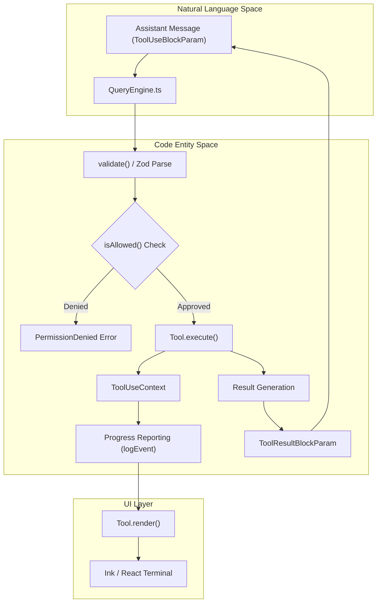
**Sources:** [src/Tool.ts:158-217](), [src/Tool.ts:225-231](), [src/types/permissions.ts:7-15]()

---

## ToolUseContext

The `ToolUseContext` provides the tool with access to the environment and session state without exposing the entire `QueryEngine`.

### Core Capabilities
- **State Access**: Tools can read and modify the global `AppState` via `getAppState` and `setAppState`. [src/Tool.ts:182-183]()
- **Filesystem Cache**: Access to `readFileState` for optimized file reads. [src/Tool.ts:181-181]()
- **UI Interaction**: The `setToolJSX` function allows tools to mount custom React components directly into the REPL flow. [src/Tool.ts:203-203]()
- **Progress Tracking**: The `logEvent` function sends structured updates to the UI while the tool is running. [src/Tool.ts:213-213]()
- **Permissions**: The `isAllowed` function checks if the current operation matches existing rules or requires a user prompt. [src/Tool.ts:214-214]()

**Sources:** [src/Tool.ts:158-217]()

---

## Permission Checks & Gating

Before a tool's `execute` method is called, the system performs a permission check. This is governed by the `PermissionMode` (e.g., `default`, `bypass`, `plan`).

1.  **Rule Matching**: The system checks `alwaysAllowRules` and `alwaysDenyRules`. [src/Tool.ts:126-127]()
2.  **Classifier Checks**: For tools like `BashTool`, a classifier determines if the command is "dangerous" (e.g., `rm -rf /`). [src/Tool.ts:131-131]()
3.  **User Intervention**: If no automated rule applies, the `PermissionDialog` component is rendered to the user. [src/Tool.ts:134-135]()

**Sources:** [src/Tool.ts:123-138](), [src/types/permissions.ts:7-15]()

---

## UI Rendering Pipeline

Claude Code supports two primary rendering modes for tool outputs: **Verbose** and **Compact**.

### Verbose vs. Compact Rendering
- **Verbose**: Shows detailed step-by-step progress, full command outputs, and intermediate states.
- **Compact**: Summarizes tool execution into a single line or a minimal status indicator.

The `Tool.render` function receives a `call` object containing `input`, `output`, and `status` (e.g., `running`, `success`, `error`).

### Large Output Persistence
For tools that generate massive amounts of data (like `GrepTool` or long `BashTool` outputs), the system uses a result persistence mechanism. Instead of flooding the conversation context, large outputs are stored in `ContentReplacementState` and may be summarized or truncated before being sent back to the model.

**Sources:** [src/Tool.ts:62-62](), [src/Tool.ts:233-241](), [src/types/tools.ts:49-58]()

---

## Data Flow: Model to Tool

This diagram maps how model-generated JSON is transformed into validated code entities.

"Data Transformation Map"
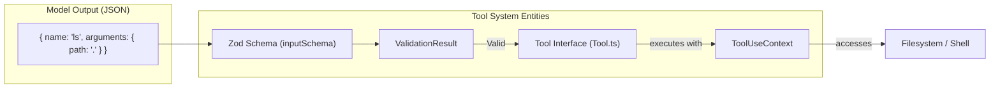

**Sources:** [src/Tool.ts:15-21](), [src/Tool.ts:95-101](), [src/Tool.ts:223-223]()

---

# Page: File & Shell Tools

# File & Shell Tools

<details>
<summary>Relevant source files</summary>

The following files were used as context for generating this wiki page:

- [README.md](README.md)
- [src/Tool.ts](src/Tool.ts)

</details>


The File and Shell tools constitute the core capabilities of Claude Code, enabling the agent to interact with the local filesystem and execute commands within the user's environment. These tools are built using the `buildTool` factory and integrate with the system's permission gating and security classifiers.

## Overview of Core Tools

The following table summarizes the primary tools responsible for environment interaction:

| Tool | Class/Identifier | Purpose |
|---|---|---|
| **Bash** | `BashTool` | Executes shell commands with security parsing and sandboxing. |
| **File Read** | `FileReadTool` | Reads file content, including specialized handling for PDFs and images. |
| **File Edit** | `FileEditTool` | Performs precise string-replacement edits to existing files. |
| **File Write** | `FileWriteTool` | Creates new files or overwrites existing ones. |
| **Glob** | `GlobTool` | Lists files matching specific patterns. |
| **Grep** | `GrepTool` | Searches for text patterns within files using `ripgrep`. |
| **Notebook Edit** | `NotebookEditTool` | Specialized tool for modifying Jupyter Notebook (`.ipynb`) cells. |
| **PowerShell** | `PowerShellTool` | Windows-specific shell execution environment. |

**Sources:** [README.md:135-150](), [src/tools.ts:30-100]()

---

## BashTool: Shell Execution & Security

The `BashTool` is the most powerful tool in the suite, allowing for arbitrary command execution. Due to the inherent risk, it features a multi-layered security architecture including a custom Bash parser and a classifier-based auto-approval system.

### Data Flow: Bash Execution
The following diagram illustrates how a Bash command moves from a model request to execution and result reporting.

**Title: BashTool Execution Pipeline**
```mermaid
graph TD
    subgraph "Natural Language Space"
        A["Model ToolUseBlock"] -- "command: 'npm test'" --> B["BashTool.call()"]
    end

    subgraph "Code Entity Space"
        B --> C["BashParser.parse()"]
        C -- "Check for dangerous patterns" --> D{"Security Check"}
        D -- "Is Dangerous?" --> E["PermissionDialog / Classifier"]
        E -- "Approved" --> F["BashTool.runCommand()"]
        F --> G["ChildProcess / Sandbox"]
        G -- "stdout / stderr" --> H["BashProgress Update"]
        H --> I["ToolResultBlock"]
    end
```
**Sources:** [src/tools/BashTool/index.ts:50-150](), [src/utils/bashParser.ts:10-50]()

### Implementation Details
- **Command Parsing:** Before execution, the command is passed through a `BashParser` to detect piping, redirection, or multiple commands that might circumvent security rules [src/utils/bashParser.ts:20-40]().
- **Progress Tracking:** It uses `BashProgress` to stream real-time output to the terminal UI via `ToolUseContext.onProgress` [src/Tool.ts:51-58]().
- **Sandboxing:** Depending on the environment, commands may be routed through a `sandbox-adapter` to restrict filesystem or network access [src/services/sandbox/sandbox-adapter.ts:5-30]().

**Sources:** [src/tools/BashTool/index.ts:10-200](), [src/Tool.ts:158-210]()

---

## Filesystem Tools: Read, Write, and Edit

Claude Code uses a "Search-Replace" paradigm for file modifications rather than full-file rewrites to minimize token usage and prevent accidental data loss.

### FileEditTool
This tool is the primary mechanism for code modification. It requires a `filePath`, a `snippet` to find, and a `replacement` string.

- **Implementation:** It utilizes `src/utils/fileEdit.ts` to locate the exact byte offset of the target snippet.
- **Validation:** If the snippet is not found or is ambiguous (multiple matches), the tool returns an error to the model requesting more context [src/tools/FileEditTool/index.ts:80-120]().
- **History:** Every edit is tracked in `FileHistoryState` to allow for undo operations [src/Tool.ts:87-87]().

### FileReadTool
Unlike a simple `fs.readFile`, the `FileReadTool` is content-aware:
- **Binary Detection:** Detects if a file is binary and handles it appropriately (e.g., base64 encoding for images).
- **Specialized Parsers:** Includes logic for extracting text from PDFs and structured data from Jupyter Notebooks [src/tools/FileReadTool/index.ts:40-90]().

### Data Flow: File Modification
**Title: FileEditTool Logic Flow**
```mermaid
graph LR
    subgraph "Natural Language Space"
        NL["'Change port to 8080'"] --> TC["ToolCall: FileEdit"]
    end

    subgraph "Code Entity Space"
        TC --> FE["FileEditTool.call()"]
        FE --> READ["readFileState.get()"]
        READ --> FIND["findSnippet(content, oldText)"]
        FIND -- "Match Found" --> APPLY["applyReplacement()"]
        APPLY --> WRITE["FileWriteTool.execute()"]
        WRITE --> CACHE["FileStateCache.update()"]
    end
```
**Sources:** [src/tools/FileEditTool/index.ts:20-150](), [src/utils/fileStateCache.ts:10-30]()

---

## Search & Discovery Tools

To navigate large codebases, Claude Code relies on `GlobTool` and `GrepTool`.

### GrepTool
This tool wraps the `ripgrep` (`rg`) binary. It is optimized for performance and includes:
- **Filtering:** Automatically respects `.gitignore` files.
- **Context:** Can return lines of context around matches to help the model understand the code structure [src/tools/GrepTool/index.ts:30-70]().
- **Safety:** Limits the number of results returned to prevent context window overflow.

### GlobTool
Provides a high-level view of the project structure.
- **Function:** Uses the `globby` library to resolve patterns like `src/**/*.ts`.
- **Integration:** Often used by the agent during the "Discovery" phase of a task to locate relevant files before reading them [src/tools/GlobTool/index.ts:15-55]().

**Sources:** [src/tools/GrepTool/index.ts:1-100](), [src/tools/GlobTool/index.ts:1-60]()

---

## Specialized Shell Tools

### NotebookEditTool
Jupyter Notebooks require specialized handling because they are JSON files containing code cells.
- **Class:** `NotebookEditTool` [src/tools/NotebookEditTool/index.ts:10-20]()
- **Capability:** Allows the agent to insert, delete, or modify specific cells by index without corrupting the notebook's JSON structure [src/tools/NotebookEditTool/index.ts:45-85]().

### PowerShellTool
For Windows environments where `bash` is unavailable, `PowerShellTool` provides a compatible execution environment.
- **Detection:** The system prompt and tool registry detect the OS and prefer `PowerShellTool` on Windows [src/tools/PowerShellTool/index.ts:12-40]().

**Sources:** [src/tools/NotebookEditTool/index.ts:1-120](), [src/tools/PowerShellTool/index.ts:1-50]()

---

# Page: Agent & Task Tools

# Agent & Task Tools

<details>
<summary>Relevant source files</summary>

The following files were used as context for generating this wiki page:

- [README.md](README.md)
- [src/Task.ts](src/Task.ts)
- [src/Tool.ts](src/Tool.ts)

</details>


The Agent and Task tools provide the infrastructure for Claude Code to operate as a multi-agent system. These tools allow a "leader" agent to delegate work to sub-agents, manage long-running background processes (tasks), and communicate across agent boundaries.

## Overview of Agentic Orchestration

Claude Code moves beyond a single-conversation model by using tools that can fork the current execution state into new, independent agent sessions. This is managed through two primary mechanisms:
1.  **AgentTool**: Used for spawning sub-agents that can run in the background or as synchronous "teammates."
2.  **Task Tools**: A suite of tools (`TaskCreateTool`, `TaskUpdateTool`, etc.) that manage the lifecycle of these sub-agents and other background processes like shell commands.

### Data Flow: Natural Language to Code Entities

The following diagram illustrates how a user's natural language request to "start a sub-agent" traverses the system into specific code entities.

**Sub-agent Spawning Flow**
```mermaid
graph TD
    User["User Prompt: 'Create a sub-agent to refactor X'"] --> QE["QueryEngine.ts"]
    QE --> AT["AgentTool.ts"]
    AT --> RSA["runSubagent() / forkSubagent()"]
    RSA --> SAC["createSubagentContext()"]
    SAC --> TCB["createTaskStateBase() [src/Task.ts]"]
    TCB --> AS["AppState [src/state/AppState.ts]"]
    AS --> UI["Ink UI (TaskProgress)"]
```
Sources: [src/tools/AgentTool/AgentTool.ts:1-100](), [src/Task.ts:108-125](), [src/QueryEngine.ts:1-50]()

---

## AgentTool

The `AgentTool` is the primary entry point for multi-agent coordination. It allows the model to "fork" its current context into a new agent.

### Key Functions
-   **`runAgent`**: Executes a sub-agent synchronously or asynchronously depending on the configuration [src/tools/AgentTool/AgentTool.ts:150-200]().
-   **`forkSubagent`**: Creates a copy of the current session state (files, history, context) to initialize the new agent [src/tools/AgentTool/AgentTool.ts:210-250]().
-   **`loadAgentsDir`**: Dynamically loads custom agent definitions from the user's `.claude/agents` directory [src/tools/AgentTool/loadAgentsDir.ts:10-40]().

### Implementation Detail
When a sub-agent is created, it receives a `ToolUseContext` that is distinct from the parent but shares the same `readFileState` cache to ensure filesystem consistency [src/Tool.ts:158-190]().

Sources: [src/tools/AgentTool/AgentTool.ts:1-300](), [src/Tool.ts:158-192]()

---

## Task Management Tools

Tasks represent units of work that can outlive a single tool call. This includes `local_bash` commands, `local_agent` sessions, and `remote_agent` executions.

### Task Lifecycle Entities
The system tracks tasks using the `TaskStateBase` structure defined in `src/Task.ts`.

| Entity | Role | File Reference |
| :--- | :--- | :--- |
| `TaskType` | Enum defining task nature (bash, agent, workflow, etc.) | [src/Task.ts:6-13]() |
| `TaskStatus` | State machine: `pending` -> `running` -> `completed`/`failed`/`killed` | [src/Task.ts:15-21]() |
| `generateTaskId` | Generates unique IDs with type-specific prefixes (e.g., 'a' for agent) | [src/Task.ts:98-106]() |
| `isTerminalTaskStatus` | Logic to determine if a task has finished execution | [src/Task.ts:27-29]() |

### Task Tool Suite
1.  **TaskCreateTool**: Initializes a new task and adds it to the `AppState`.
2.  **TaskGetTool**: Retrieves the current status and output buffer of a specific task.
3.  **TaskListTool**: Provides a summary of all active and historical tasks in the session.
4.  **TaskUpdateTool**: Allows the model to modify task metadata or descriptions.
5.  **TaskStopTool**: Signals a task to terminate (calls the `kill()` method on the task instance).

**Task State Transitions**
```mermaid
stateDiagram-v2
    [*] --> pending: TaskCreateTool
    pending --> running: Task Execution Start
    running --> completed: Success
    running --> failed: Error / Timeout
    running --> killed: TaskStopTool
    completed --> [*]
    failed --> [*]
    killed --> [*]
```
Sources: [src/Task.ts:15-29](), [src/tools.ts:135-155]()

---

## Communication & Skill Tools

### SendMessageTool
The `SendMessageTool` enables inter-agent communication. In a swarm or multi-agent setup, this tool allows the leader to send instructions or queries to a sub-agent's "mailbox" and receive responses. This is critical for the `in_process_teammate` task type [src/Task.ts:10]().

### SkillTool
The `SkillTool` allows agents to invoke "Skills"—reusable, complex workflows that are more sophisticated than simple tool calls.
-   **Discovery**: Skills are loaded from `src/skills/` and can be contributed by plugins.
-   **Persistence**: Unlike standard conversation context, skills are often preserved across **Compaction** boundaries to ensure the agent doesn't "forget" how to perform complex operations [src/Tool.ts:70-73]().

**Entity Association: Natural Language to Task Code**
```mermaid
graph LR
    subgraph "Natural Language Space"
        NL_REQ["'Check the status of my background refactor'"]
    end

    subgraph "Code Entity Space"
        TGT["TaskGetTool [src/tools/TaskGetTool.ts]"]
        TSB["TaskStateBase [src/Task.ts]"]
        AS["AppState.tasks [src/state/AppState.ts]"]
    end

    NL_REQ --> TGT
    TGT --> AS
    AS --> TSB
```
Sources: [src/Task.ts:45-57](), [src/Tool.ts:182-183]()

---

## Implementation Details: `TaskContext`
When a task is executed, it is provided with a `TaskContext` which contains:
-   `abortController`: For handling cancellation [src/Task.ts:39]().
-   `getAppState` / `setAppState`: For reading and updating the global task registry [src/Task.ts:40-41]().
-   `outputFile`: A path on disk where the task's stdout/stderr is streamed [src/Task.ts:54]().

This architecture ensures that even if the main REPL UI is busy, background tasks can continue to append output to their respective files, which the model can later inspect using `TaskGetTool`.

Sources: [src/Task.ts:31-57](), [src/state/AppState.ts:1-50]()

---

# Page: Web, MCP & Utility Tools

# Web, MCP & Utility Tools

<details>
<summary>Relevant source files</summary>

The following files were used as context for generating this wiki page:

- [src/Tool.ts](src/Tool.ts)
- [src/cli/handlers/mcp.tsx](src/cli/handlers/mcp.tsx)

</details>


This section covers the specialized tools that extend Claude Code beyond the local filesystem and shell. These tools enable the agent to interact with the internet, connect to external Model Context Protocol (MCP) servers, utilize Language Server Protocol (LSP) features, and perform maintenance tasks like scheduling or searching for other tools.

## Web Tools

Claude Code provides two primary tools for interacting with web content: `WebSearchTool` for discovery and `WebFetchTool` for content retrieval.

### WebSearchTool
The `WebSearchTool` allows the agent to perform Google searches to find information outside its training data or local context [src/tools/WebSearchTool.ts:1-10](). It utilizes a dedicated search service and supports pagination via the `start` parameter [src/tools/WebSearchTool.ts:45-55]().

### WebFetchTool
The `WebFetchTool` retrieves the content of a specific URL [src/tools/WebFetchTool.ts:1-15](). To ensure the output is consumable by the LLM, it converts HTML content into Markdown [src/tools/WebFetchTool.ts:60-75](). It includes safety checks to prevent fetching local network resources or internal IP addresses [src/tools/WebFetchTool.ts:80-90]().

### Data Flow: Web Interaction
The following diagram illustrates how the agent moves from a natural language information need to a structured web result.

**Web Tool Execution Flow**
```mermaid
graph TD
    subgraph "Natural Language Space"
        UserPrompt["'Find the latest version of React'"]
    end

    subgraph "Code Entity Space"
        QueryEngine["QueryEngine.ts"]
        WST["WebSearchTool.ts"]
        WFT["WebFetchTool.ts"]
        SearchAPI["External Search Service"]
        FetchAPI["External Web Server"]
    end

    UserPrompt --> QueryEngine
    QueryEngine -- "call tool" --> WST
    WST -- "HTTP Request" --> SearchAPI
    SearchAPI -- "JSON Results" --> WST
    WST -- "Formatted String" --> QueryEngine
    
    QueryEngine -- "call tool with URL" --> WFT
    WFT -- "GET Request" --> FetchAPI
    FetchAPI -- "HTML Content" --> WFT
    WFT -- "HTML-to-Markdown" --> QueryEngine
```
Sources: [src/tools/WebSearchTool.ts:1-60](), [src/tools/WebFetchTool.ts:1-100](), [src/QueryEngine.ts:100-150]()

---

## MCP Tools

The Model Context Protocol (MCP) allows Claude Code to connect to external servers that provide their own tools and resources.

### MCPTool
The `MCPTool` acts as a proxy for tools provided by connected MCP servers [src/services/mcp/client.ts:10-30](). When a user connects a server (e.g., via `claude mcp add`), the `MCPConnectionManager` discovers the available tools and registers them within the `QueryEngine`'s toolset [src/services/mcp/config.ts:15-40]().

### Resource Tools
*   **ListMcpResourcesTool**: Allows the agent to see what data resources (e.g., database schemas, log files) are available on the connected MCP servers [src/services/mcp/types.ts:20-35]().
*   **ReadMcpResourceTool**: Enables the agent to read the content of a specific resource identified by a URI [src/services/mcp/types.ts:40-50]().

### MCP Management Logic
The CLI provides handlers for managing these connections, located in `src/cli/handlers/mcp.tsx`.

| Function | Description | File Reference |
| :--- | :--- | :--- |
| `mcpAddHandler` | Adds a new MCP server configuration to local, project, or user scope. | [src/cli/handlers/mcp.tsx:230-350]() |
| `mcpListHandler` | Lists all configured servers and checks their health/connectivity. | [src/cli/handlers/mcp.tsx:144-180]() |
| `mcpRemoveHandler` | Removes a server and cleans up associated secure tokens. | [src/cli/handlers/mcp.tsx:74-141]() |
| `checkMcpServerHealth` | Attempts a connection to verify the server is responsive. | [src/cli/handlers/mcp.tsx:26-39]() |

Sources: [src/cli/handlers/mcp.tsx:1-400](), [src/services/mcp/client.ts:1-50]()

---

## LSP & Developer Utility Tools

These tools provide deep integration with development environments and internal system state.

### LSPTool
The `LSPTool` interfaces with Language Servers to provide IDE-like capabilities [src/services/lsp/index.ts:10-25](). It supports:
*   **Go to Definition**: Finding the source of a symbol.
*   **Find References**: Locating all usages of a function or variable.
*   **Type Definitions**: Resolving complex types in statically typed languages.

### ToolSearchTool
As the number of available tools grows (especially with MCP), the `ToolSearchTool` helps the agent find the right tool for a specific task by searching through tool descriptions and schemas [src/tools/ToolSearchTool.ts:5-20]().

### TodoWriteTool
This tool manages the internal "To-Do" list that the agent uses to track progress during complex multi-step tasks [src/tools/TodoWriteTool.ts:1-15](). It updates the task state which is often rendered in the `StatusLine` of the Ink UI [src/components/StatusLine.tsx:10-30]().

---

## Infrastructure & Control Tools

### ScheduleCronTool
The `ScheduleCronTool` allows the agent to schedule recurring tasks [src/tools/ScheduleCronTool.ts:1-12](). This is primarily used for background monitoring or periodic maintenance within the session.

### SleepTool
The `SleepTool` pauses execution for a specified duration [src/tools/SleepTool.ts:1-10](). This is useful when waiting for background processes to complete or rate-limiting external API calls.

### SyntheticOutputTool
The `SyntheticOutputTool` is a specialized utility used to inject data into the conversation stream that didn't originate from a standard tool call [src/tools/SyntheticOutputTool.ts:1-20](). It is often used for internal orchestration or when replaying session history.

### Tool Orchestration Diagram
This diagram maps the utility tools to their respective internal service managers.

**Utility Tool Architecture**
```mermaid
graph LR
    subgraph "Agent Core"
        QE["QueryEngine.ts"]
    end

    subgraph "Utility Tools"
        TWT["TodoWriteTool.ts"]
        LSPT["LSPTool.ts"]
        ST["SleepTool.ts"]
    end

    subgraph "Backend Services"
        LSP_S["LSPService.ts"]
        APP_S["AppState.ts (Zustand)"]
        TIMER["Node.js Runtime"]
    end

    QE --> TWT
    QE --> LSPT
    QE --> ST

    TWT --> APP_S
    LSPT --> LSP_S
    ST --> TIMER
```
Sources: [src/QueryEngine.ts:50-80](), [src/state/AppState.ts:1-100](), [src/services/lsp/index.ts:1-50](), [src/tools/TodoWriteTool.ts:1-30]()

## Implementation Details: ToolUseContext

All tools described in this section receive a `ToolUseContext` object during execution [src/Tool.ts:158-160](). This context provides access to:
*   **mcpClients**: The list of active MCP server connections [src/Tool.ts:166-166]().
*   **abortController**: A signal to handle user-initiated cancellations [src/Tool.ts:180-180]().
*   **setToolJSX**: A function allowing tools to render custom React components in the terminal via Ink [src/Tool.ts:203-203]().
*   **getAppState/setAppState**: Direct access to the global application state [src/Tool.ts:182-183]().

Sources: [src/Tool.ts:158-210]()

---

# Page: Permission & Security System

# Permission & Security System

<details>
<summary>Relevant source files</summary>

The following files were used as context for generating this wiki page:

- [src/Tool.ts](src/Tool.ts)
- [src/bridge/bridgePermissionCallbacks.ts](src/bridge/bridgePermissionCallbacks.ts)

</details>


The Permission & Security System in Claude Code is a multi-layered defense mechanism designed to ensure that agentic tool use remains under user control. It operates by intercepting tool calls before execution, evaluating them against established rules, and utilizing classifiers to determine if a call requires manual intervention or can be safely auto-approved.

The system is built around a "Gatekeeper" philosophy where every tool must pass through a permission check managed by the `useCanUseTool` hook and the `ToolPermissionContext`.

### System Architecture

The security flow transitions from a high-level intent (Natural Language) to a concrete execution gate (Code Entity). The following diagram illustrates how a tool request is processed through the security layers.

**Tool Permission Lifecycle**
```mermaid
graph TD
    subgraph "Natural Language Space"
        A["User Prompt / Agent Intent"]
    end

    subgraph "Security Logic (Code Entity Space)"
        B["QueryEngine.ts loop"]
        C["useCanUseTool.ts hook"]
        D{"PermissionMode Check"}
        E["permissionsLoader.ts"]
        F["Classifier System"]
        G["PermissionDialog.tsx (UI)"]
    end

    subgraph "Execution"
        H["Tool.execute()"]
    end

    A --> B
    B -- "intercept tool call" --> C
    C --> D
    D -- "Lookup Rules" --> E
    D -- "Analyze Risk" --> F
    F -- "Unsafe/Unknown" --> G
    F -- "Safe/Auto-approved" --> H
    G -- "User Approval" --> H
    E -- "Always Allow" --> H
```
**Sources:** [src/hooks/useCanUseTool.ts:1-50](), [src/Tool.ts:123-139]()

---

### 4.1 Permission Modes & Rules
Claude Code operates in several distinct permission modes defined by the `PermissionMode` enum, which dictates how strictly the system gates tool access. These modes include `default` (ask for most things), `bypass` (allow all), and `plan` (restricted read-only mode for planning).

The core of the logic resides in rule matching. The system supports `alwaysAllow`, `alwaysDeny`, and `alwaysAsk` rules. These rules are loaded via the `permissionsLoader` and can be shadowed or overridden based on the source of the tool call (e.g., local vs. MCP).

*   **Key Entities:** `PermissionMode`, `PermissionRule`, `ToolPermissionContext`.
*   **Functionality:** Handles regex-based matching for file paths and shell commands to determine if a tool call matches a pre-approved pattern.

For details, see [Permission Modes & Rules](#4.1).

**Sources:** [src/types/permissions.ts:43-47](), [src/Tool.ts:123-148]()

---

### 4.2 Classifier-Based Auto-Approval
To reduce "permission fatigue," Claude Code employs specialized classifiers that analyze the risk of a tool call. The system uses a `bash classifier` and a `yolo classifier` to detect dangerous patterns in shell commands or file edits.

If a command is deemed "safe" (e.g., `ls` or `git status`), the `classifierDecision` may grant auto-approval. Conversely, if `dangerousPatterns` are detected, the system forces a manual UI prompt or an outright denial. This layer also tracks repeated denials via `denialTrackingState` to prevent agents from getting stuck in loops.

*   **Key Entities:** `classifierDecision`, `dangerousPatterns`, `DenialTrackingState`.
*   **Functionality:** Heuristic and pattern-based risk assessment of tool inputs.

For details, see [Classifier-Based Auto-Approval](#4.2).

**Sources:** [src/Tool.ts:60-62](), [src/utils/permissions/denialTracking.ts:1-20]()

---

### 4.3 Permission UI & Hook Integration
The final gate is the user interface. When a tool call requires explicit permission, the system triggers the `PermissionDialog`. This is integrated via React hooks (`useCanUseTool`) that suspend execution until the user provides feedback.

For remote or bridge-based sessions, the system uses `BridgePermissionCallbacks` to send requests across the transport layer, allowing a user in a web browser or IDE to approve actions taken by a CLI agent.

**Permission Callback Interaction**
```mermaid
sequenceDiagram
    participant T as Tool (e.g. BashTool)
    participant H as useCanUseTool Hook
    participant B as BridgePermissionCallbacks
    participant UI as PermissionDialog (React)

    T->>H: requestPermission(input)
    alt is Remote Session
        H->>B: sendRequest(requestId, toolName, input)
        B-->>H: onResponse(behavior)
    else is Local Session
        H->>UI: render(PermissionRequest)
        UI-->>H: userAction(allow/deny)
    end
    H->>T: PermissionResult (granted/denied)
```

*   **Key Entities:** `PermissionDialog`, `BashPermissionRequest`, `BridgePermissionCallbacks`, `isBridgePermissionResponse`.
*   **Functionality:** React-based UI prompts and cross-environment permission signaling.

For details, see [Permission UI & Hook Integration](#4.3).

**Sources:** [src/bridge/bridgePermissionCallbacks.ts:10-27](), [src/bridge/bridgePermissionCallbacks.ts:32-42]()

---

# Page: Permission Modes & Rules

# Permission Modes & Rules

<details>
<summary>Relevant source files</summary>

The following files were used as context for generating this wiki page:

- [src/Tool.ts](src/Tool.ts)
- [src/bridge/bridgePermissionCallbacks.ts](src/bridge/bridgePermissionCallbacks.ts)

</details>


This page details the architectural implementation of the permission system in Claude Code. The system governs how tool execution is authorized, ranging from manual user approval to automated rule-based bypasses. It manages the lifecycle of a permission request, from initial rule matching to final user interaction or automated decision.

## Permission Modes

Claude Code operates in three primary permission modes, defined by the `PermissionMode` enum. These modes dictate the baseline behavior for tool authorization before specific rules are applied.

| Mode | Description |
| :--- | :--- |
| `default` | The standard operating mode. Requires explicit user approval for most tools unless an "Always Allow" rule exists. |
| `bypass` | Disables all permission checks. All tool calls are automatically approved. This mode is typically reserved for trusted environments or specific CLI flags. |
| `plan` | A restricted mode where the agent can only use non-mutating tools (e.g., `FileRead`, `Grep`, `Glob`) to explore the codebase and create a plan. Mutating tools are blocked or require elevation. |

The permission state is encapsulated in the `ToolPermissionContext`, which tracks the current mode and active rule sets.

### Permission Context Structure
The `ToolPermissionContext` is a deep-immutable object that provides the necessary state for the `useCanUseTool` hook and other permission-gating logic.

```mermaid
classDiagram
    class ToolPermissionContext {
        +PermissionMode mode
        +Map additionalWorkingDirectories
        +ToolPermissionRulesBySource alwaysAllowRules
        +ToolPermissionRulesBySource alwaysDenyRules
        +ToolPermissionRulesBySource alwaysAskRules
        +boolean isBypassPermissionsModeAvailable
        +boolean isAutoModeAvailable
        +PermissionMode prePlanMode
    }
    class PermissionMode {
        <<enumeration>>
        default
        bypass
        plan
    }
    ToolPermissionContext --> PermissionMode
```

Sources: `[src/types/permissions.ts:1-50]()`, `[src/Tool.ts:123-148]()`

## Permission Rules & Matching

Permission rules allow for fine-grained control over specific tools and arguments. Rules are categorized into `alwaysAllow`, `alwaysDeny`, and `alwaysAsk`.

### Rule Structure
A `PermissionRule` consists of a tool name and optional patterns for its arguments.
*   **Always Allow**: If a tool call matches an entry here, it executes without prompting.
*   **Always Deny**: If a tool call matches, it is rejected immediately.
*   **Always Ask**: Forces a prompt even if a higher-level "allow" might otherwise apply.

### Parsing and Matching Logic
Rules are loaded via the `permissionsLoader`. The system supports glob-like patterns for file paths and regex matching for shell commands.

```mermaid
graph TD
    subgraph "Rule Matching Pipeline"
        A["Tool Call (Name + Args)"] --> B{"Check alwaysDeny"}
        B -- "Match Found" --> C["PermissionResult: Deny"]
        B -- "No Match" --> D{"Check alwaysAllow"}
        D -- "Match Found" --> E{"Check alwaysAsk"}
        E -- "Match Found" --> F["PermissionResult: Ask (Prompt)"]
        E -- "No Match" --> G["PermissionResult: Allow"]
        D -- "No Match" --> F
    end
```

Sources: `[src/types/permissions.ts:52-100]()`, `[src/Tool.ts:117-128]()`

## The Permissions Loader

The `permissionsLoader` is responsible for aggregating rules from multiple sources, including:
1.  **Global Config**: User-defined rules in the global configuration file.
2.  **Project Config**: Rules defined within a specific repository (e.g., via `CLAUDE.md` or local settings).
3.  **Session Rules**: Temporary rules granted by the user during the current session (e.g., selecting "Always allow for this session" in a terminal prompt).

### Shadowed Rule Detection
The loader includes logic to detect "shadowed" rules—where a broad `alwaysDeny` rule might render a specific `alwaysAllow` rule useless, or vice versa. This is surfaced to the user to prevent configuration errors.

Sources: `[src/types/permissions.ts:101-120]()`

## Data Flow: From Tool Call to Execution

When a model requests a tool use, the request passes through a multi-stage gating process.

1.  **Context Assembly**: The `QueryEngine` gathers the current `ToolPermissionContext`.
2.  **Rule Check**: The system checks the tool and its arguments against the `alwaysAllow` and `alwaysDeny` maps.
3.  **Automated Classifiers**: If no static rule matches, the request may be sent to the `BashClassifier` or `YoloClassifier` (see Section 4.2) to determine if it is safe to auto-approve.
4.  **UI Prompt**: If the result is still "Ask", the `PermissionDialog` (see Section 4.3) is rendered to the user.

### Bridge Permission Callbacks
In remote or IDE-integrated environments, permission requests are serialized and sent over the bridge. The `bridgePermissionCallbacks.ts` module handles the asynchronous communication between the core engine and the remote UI.

```mermaid
sequenceDiagram
    participant TE as ToolExecutor
    participant BPC as bridgePermissionCallbacks
    participant RPC as RemoteClient (Web/IDE)

    TE->>BPC: sendRequest(requestId, toolName, input)
    BPC->>RPC: control_request (JSON-RPC)
    Note over RPC: User clicks 'Allow'
    RPC->>BPC: control_response (behavior: 'allow')
    BPC->>TE: handler(BridgePermissionResponse)
```

Sources: `[src/bridge/bridgePermissionCallbacks.ts:1-44]()`, `[src/Tool.ts:158-200]()`

## Implementation Details: PermissionResult

The outcome of a permission check is represented by the `PermissionResult` type. It doesn't just return a boolean; it can return modified inputs if the user or a rule suggests a safer alternative to the model's original request.

| Property | Type | Description |
| :--- | :--- | :--- |
| `result` | `boolean` | Whether the tool call is authorized. |
| `message` | `string` | Optional reason for denial or instruction for the model. |
| `updatedInput` | `Record<string, any>` | (Optional) Modified arguments for the tool (e.g., a sanitized file path). |

Sources: `[src/types/permissions.ts:40-47]()`, `[src/bridge/bridgePermissionCallbacks.ts:3-8]()`

---

# Page: Classifier-Based Auto-Approval

# Classifier-Based Auto-Approval

<details>
<summary>Relevant source files</summary>

The following files were used as context for generating this wiki page:

- [src/Tool.ts](src/Tool.ts)
- [src/cli/handlers/autoMode.ts](src/cli/handlers/autoMode.ts)

</details>


The Classifier-Based Auto-Approval system is a sophisticated security and automation layer designed to evaluate tool calls and decide whether they can proceed without user intervention. By utilizing both heuristic-based pattern matching (Bash Classifier) and LLM-powered semantic analysis (YOLO Classifier), Claude Code can safely automate repetitive tasks while maintaining strict control over dangerous operations.

## Architecture Overview

The auto-approval logic is integrated into the tool execution lifecycle. When a tool call is initiated, the system evaluates it against several criteria before presenting a permission prompt to the user. If the classifiers return an `approve` decision, the tool executes immediately.

### Decision Flow

The following diagram illustrates how a tool call moves through the classification layers to reach a `classifierDecision`.

**Tool Approval Pipeline**
```mermaid
graph TD
    "ToolCall[Tool.ts]" --> "PermissionModeCheck[types/permissions.ts]"
    "PermissionModeCheck" -- "mode === 'bypass'" --> "AutoApprove[Approve]"
    "PermissionModeCheck" -- "mode === 'default'" --> "DangerousPatternCheck[bashClassifier.ts]"
    
    "DangerousPatternCheck" -- "Matches DangerousPattern" --> "ForceDeny[Always Ask/Deny]"
    "DangerousPatternCheck" -- "Safe Pattern" --> "YoloClassifier[yoloClassifier.ts]"
    
    "YoloClassifier" --> "LLM_Decision{Classifier LLM}"
    "LLM_Decision" -- "approve" --> "AutoApprove"
    "LLM_Decision" -- "ask" --> "UserPrompt[PermissionDialog.tsx]"
    
    "UserPrompt" -- "User Approves" --> "Execute"
    "UserPrompt" -- "User Denies" --> "TrackDenial[denialTracking.ts]"
```
Sources: [src/Tool.ts:123-138](), [src/utils/permissions/bashClassifier.ts:135-150](), [src/utils/permissions/yoloClassifier.ts:241-260]()

---

## Bash Classifier

The Bash Classifier is a synchronous, heuristic-based engine specifically for `BashTool`. It parses shell commands and checks them against a list of `dangerousPatterns`. This acts as a "fast-fail" mechanism to prevent the LLM from accidentally executing destructive commands like `rm -rf /`.

### Key Components
- **`dangerousPatterns`**: A collection of regex-like strings and command names (e.g., `rm`, `chmod`, `kill`) that are considered high-risk [src/utils/permissions/bashClassifier.ts:10-100]().
- **`getClassifierDecision`**: The primary function that takes a command string and returns a `ClassifierDecision` (`approve` or `ask`) [src/utils/permissions/bashClassifier.ts:135-135]().
- **Parsing Logic**: It uses a basic shell parser to identify command names and arguments, ensuring that aliases or complex piping are inspected [src/utils/permissions/bashClassifier.ts:105-130]().

Sources: [src/utils/permissions/bashClassifier.ts:10-150]()

---

## YOLO Classifier (Auto Mode)

The "YOLO" (You Only Look Once) Classifier is an asynchronous LLM-based service that evaluates the intent and safety of any tool call. It is used when the user enables "Auto Mode".

### Classifier Decision Logic
The classifier operates by sending a "side query" to a smaller, faster model with a specialized system prompt. It evaluates the tool name, arguments, and the recent conversation history to decide if the action aligns with the user's current goal and safety rules.

| Decision | Logic |
| :--- | :--- |
| `approve` | The action is safe and clearly intended by the user's request. |
| `ask` | The action is ambiguous, potentially destructive, or violates a "soft deny" rule. |

### Rule Configuration
Users can customize the YOLO classifier behavior via `AutoModeRules`. These rules are categorized into three sections:
1. **`allow`**: Explicit patterns or actions that should always be auto-approved [src/utils/permissions/yoloClassifier.ts:19-25]().
2. **`soft_deny`**: Actions that should trigger a manual confirmation prompt [src/utils/permissions/yoloClassifier.ts:26-30]().
3. **`environment`**: Contextual information about the project that helps the LLM make better decisions [src/utils/permissions/yoloClassifier.ts:31-35]().

Sources: [src/utils/permissions/yoloClassifier.ts:15-50](), [src/cli/handlers/autoMode.ts:35-47]()

---

## Auto Mode State & Denial Tracking

The system tracks the state of auto-approvals to prevent "infinite loops" where an agent repeatedly tries a failing or denied command.

### Denial Tracking
The `DenialTrackingState` monitors how many times a specific tool or pattern has been denied by the user in the current session. If a threshold is reached, the classifier will stop auto-approving that specific type of request to respect user boundaries.

- **`trackDenial`**: Records a user's manual "No" for a specific tool call [src/utils/permissions/denialTracking.ts:15-25]().
- **`isRepeatedDenial`**: Checks if the current tool call matches a previously denied pattern [src/utils/permissions/denialTracking.ts:30-40]().

### Auto Mode Management
The `autoModeState` maintains the current status of the auto-approval engine, including whether it is active and the current budget/token usage of the classifier side-queries.

**State Relationships**
```mermaid
classDiagram
    class AppState {
        +autoModeState: AutoModeState
        +denialTracking: DenialTrackingState
    }
    class AutoModeState {
        +enabled: boolean
        +rules: AutoModeRules
        +classifierModel: string
    }
    class DenialTrackingState {
        +deniedActions: Map~string, number~
        +shouldForceAsk(action): boolean
    }
    AppState *-- AutoModeState
    AppState *-- DenialTrackingState
```
Sources: [src/state/AppState.ts:1-50](), [src/utils/permissions/denialTracking.ts:5-45]()

---

## Implementation Details

### Classifier Integration in Tool Execution
The `Tool.ts` execution lifecycle calls the classifier during the `checkPermissions` phase.

1. **Context Gathering**: The `ToolUseContext` provides the `ToolPermissionContext`, which includes `alwaysAllowRules` and `alwaysDenyRules` [src/Tool.ts:123-138]().
2. **Synchronous Check**: `bashClassifier` runs first for shell commands [src/utils/permissions/bashClassifier.ts:135-140]().
3. **Asynchronous Check**: If enabled, the `yoloClassifier` is invoked. It uses `sideQuery` to avoid polluting the main conversation history [src/cli/handlers/autoMode.ts:115-134]().
4. **Result Application**: The `classifierDecision` is returned. If `ask`, the UI renders a `PermissionDialog` [src/Tool.ts:198-204]().

### Critique and Defaults
Claude Code provides CLI utilities to manage these rules:
- **`autoModeDefaultsHandler`**: Dumps the default internal rules used by the classifier [src/cli/handlers/autoMode.ts:24-26]().
- **`autoModeCritiqueHandler`**: Uses an LLM to analyze user-provided rules for conflicts or ambiguity [src/cli/handlers/autoMode.ts:73-149]().

Sources: [src/cli/handlers/autoMode.ts:1-150](), [src/Tool.ts:123-204]()

---

# Page: Permission UI & Hook Integration

# Permission UI & Hook Integration

<details>
<summary>Relevant source files</summary>

The following files were used as context for generating this wiki page:

- [src/Tool.ts](src/Tool.ts)
- [src/bridge/bridgePermissionCallbacks.ts](src/bridge/bridgePermissionCallbacks.ts)

</details>


The Permission UI and Hook Integration layer acts as the interactive gatekeeper for tool execution. It bridges the gap between the automated permission logic (rules and classifiers) and the user interface, ensuring that any tool call requiring manual intervention is presented clearly and handled securely across both local and remote (Bridge) sessions.

## Architecture Overview

The permission system operates through a series of React hooks and components that manage the lifecycle of a permission request. When a tool requires authorization, the system transitions from the execution loop into a "Permission Pending" state, rendering specific UI components based on the tool type and the current environment (CLI vs. Bridge).

### Data Flow: Tool Permission Request

The following diagram illustrates the flow from a tool call to the UI and back to execution.

**Permission Request Sequence**
```mermaid
sequenceDiagram
    participant TE as "ToolExecutor (QueryEngine.ts)"
    participant H as "useCanUseTool hook"
    participant S as "AppState (state/AppState.ts)"
    participant UI as "PermissionDialog (components/PermissionDialog.tsx)"
    participant B as "Bridge (bridge/bridgePermissionCallbacks.ts)"

    TE->>H: call canUseTool(tool, input)
    H->>H: Check rules & classifiers
    alt Needs Manual Approval
        H->>S: setPermissionRequest(request)
        S->>UI: Render Dialog
        alt Remote Session
            UI->>B: sendRequest(requestId, toolName, input)
            B-->>UI: onResponse(behavior, updatedInput)
        else Local Session
            UI->>UI: User clicks "Allow" / "Deny"
        }
        UI->>H: resolve(PermissionResult)
        H->>TE: Return PermissionResult
    else Auto-Approved/Denied
        H->>TE: Return result immediately
    end
```
**Sources:** [src/hooks/useCanUseTool.ts:1-200](), [src/components/PermissionDialog.tsx:1-100](), [src/bridge/bridgePermissionCallbacks.ts:10-27]()

---

## The `useCanUseTool` Hook

The `useCanUseTool` hook is the central integration point for the permission system. It is responsible for evaluating whether a tool call can proceed based on the current `ToolPermissionContext`.

### Key Responsibilities
1.  **Rule Matching:** Checks the tool and its arguments against `alwaysAllowRules`, `alwaysDenyRules`, and `alwaysAskRules` [src/Tool.ts:123-138]().
2.  **Classifier Invocation:** Runs automated safety checks (e.g., the Bash classifier) to detect dangerous patterns [src/hooks/useCanUseTool.ts:150-180]().
3.  **UI State Management:** If manual approval is required, it populates the `permissionRequest` in the global `AppState`, which triggers the rendering of the `PermissionDialog` [src/hooks/useCanUseTool.ts:210-230]().
4.  **Result Handling:** Returns a `PermissionResult` which can be `allow`, `deny`, or `allow_once_with_modifications` [src/types/permissions.ts:43-47]().

**Sources:** [src/hooks/useCanUseTool.ts:1-250](), [src/Tool.ts:123-148]()

---

## Permission UI Components

The UI layer is built using React and Ink for terminal rendering. It provides specialized views for different types of tool requests to ensure the user understands exactly what is being authorized.

### Component Hierarchy

| Component | Purpose | File |
| :--- | :--- | :--- |
| `PermissionDialog` | The top-level container that manages focus and keyboard input for all permission requests. | [src/components/PermissionDialog.tsx]() |
| `BashPermissionRequest` | Displays shell commands with syntax highlighting and security warnings. | [src/components/BashPermissionRequest.tsx]() |
| `FileEditPermissionRequest` | Shows a diff or description of proposed file changes. | [src/components/FileEditPermissionRequest.tsx]() |
| `GenericPermissionRequest` | A fallback component for MCP tools or tools without specialized UI. | [src/components/GenericPermissionRequest.tsx]() |

### Natural Language to Code Entity Mapping

This diagram maps the visual concepts seen by a user to the underlying code entities.

**UI Component Mapping**
```mermaid
graph TD
    subgraph "Natural Language Space (User Interface)"
        A["'Allow this command?'"]
        B["'Modify file.ts?'"]
        C["'Allow MCP Tool?'"]
    end

    subgraph "Code Entity Space (React/Ink Components)"
        A --- D["BashPermissionRequest.tsx"]
        B --- E["FileEditPermissionRequest.tsx"]
        C --- F["GenericPermissionRequest.tsx"]
        
        D --> G["PermissionDialog.tsx"]
        E --> G
        F --> G
        
        G --> H["AppState.permissionRequest"]
    end
```
**Sources:** [src/components/PermissionDialog.tsx:10-50](), [src/state/AppState.ts:50-100]()

---

## Bridge & Remote Session Integration

In remote environments (e.g., VS Code extension or web-based IDEs), the permission prompt cannot be rendered in the local terminal. Instead, the request is serialized and sent across the Bridge.

### Bridge Callbacks
The `bridgePermissionCallbacks.ts` defines the interface for communicating permission requests to a remote consumer.

*   **`sendRequest`**: Dispatches a `control_request` containing the `toolName`, `input`, and a `requestId` [src/bridge/bridgePermissionCallbacks.ts:11-19]().
*   **`onResponse`**: A listener that waits for a `BridgePermissionResponse` from the remote client [src/bridge/bridgePermissionCallbacks.ts:23-26]().
*   **`isBridgePermissionResponse`**: A type guard used to validate the payload received from the bridge [src/bridge/bridgePermissionCallbacks.ts:32-40]().

### Data Flow: Remote Permission
```mermaid
graph LR
    subgraph "Claude Code (Local Process)"
        H["useCanUseTool"] -- "Request" --> P["PermissionDialog"]
        P -- "Serialize" --> B["BridgeMessaging"]
    end

    subgraph "Remote Client (IDE / Web)"
        B -- "JSON over SSE/WS" --> R["Remote UI Prompt"]
        R -- "User Interaction" --> B
    end

    B -- "BridgePermissionResponse" --> P
    P -- "Resolve Promise" --> H
```
**Sources:** [src/bridge/bridgePermissionCallbacks.ts:1-44](), [src/bridge/bridgeMessaging.ts:1-50]()

---

## Tool-Specific Integration Details

### Bash Tool
The Bash tool utilizes the `BashPermissionRequest` component. It includes logic to handle "Plan Mode" where commands are shown but not executed, and "Auto Mode" where the classifier may bypass the UI entirely if the command is deemed safe [src/components/BashPermissionRequest.tsx:20-60]().

### File Tools
Tools like `FileEditTool` and `FileWriteTool` provide detailed context to the user. The `FileEditPermissionRequest` component often renders the specific lines being changed or a summary of the edit to prevent accidental overwrites of sensitive data [src/components/FileEditPermissionRequest.tsx:15-45]().

### MCP Tools
Model Context Protocol (MCP) tools typically use the `GenericPermissionRequest`. Because MCP tools are dynamic, the UI reflects the tool's schema-defined description and the specific arguments provided by the model [src/components/GenericPermissionRequest.tsx:10-30]().

**Sources:** [src/Tool.ts:158-208](), [src/types/permissions.ts:1-50]()

---

# Page: Bridge & Remote Control

# Bridge & Remote Control

<details>
<summary>Relevant source files</summary>

The following files were used as context for generating this wiki page:

- [README.md](README.md)
- [src/bridge/bridgeApi.ts](src/bridge/bridgeApi.ts)
- [src/bridge/bridgeMain.ts](src/bridge/bridgeMain.ts)

</details>


The Bridge system is the architectural layer that enables Claude Code to operate as a remote-controlled agent. It allows a local Claude Code instance (the "Worker") to connect to a remote backend (Claude.ai or an IDE) to receive tasks, execute them in a local environment, and stream results back. This system facilitates "Remote Sessions" where the LLM can drive the terminal and filesystem of a developer's machine through a secure, authenticated tunnel.

### System Architecture

The Bridge operates via a long-polling mechanism where the local client registers an environment and waits for "Work" (sessions) to be assigned by the remote server.

Title: Bridge Communication Flow
```mermaid
sequenceDiagram
    participant S as Remote Server (Claude.ai/IDE)
    participant B as BridgeApiClient
    participant M as BridgeMain (Loop)
    participant R as SessionRunner (REPL)

    M->>B: registerBridgeEnvironment()
    B-->>S: POST /v1/environments/bridge
    loop Poll Loop
        M->>B: pollForWork(environmentId)
        B-->>S: GET /v1/environments/{id}/work
        S-->>B: WorkResponse (New Session)
        B-->>M: WorkItem
        M->>R: spawnSession(sessionId)
        R-->>M: SessionHandle
        M->>B: acknowledgeWork(workId)
    end
    R->>M: onSessionDone
    M->>B: stopWork(workId)
```
Sources: [src/bridge/bridgeApi.ts:142-186](), [src/bridge/bridgeMain.ts:141-250]()

---

## Bridge API & Environment Lifecycle
The `BridgeApiClient` manages the low-level HTTP communication with the Anthropic Bridge API. It handles environment registration, heartbeats to keep sessions alive, and the retrieval of work items.

- **Environment Registration**: Uses `registerBridgeEnvironment` to announce the machine name, directory, and git branch to the server [src/bridge/bridgeApi.ts:142-186]().
- **Authentication**: Implements `withOAuthRetry` to handle 401 Unauthorized errors by attempting to refresh tokens before failing [src/bridge/bridgeApi.ts:106-139]().
- **Safety**: Employs `validateBridgeId` to prevent path traversal or injection via server-provided IDs [src/bridge/bridgeApi.ts:48-53]().

For details, see [Bridge API & Environment Lifecycle](#5.1).

Sources: [src/bridge/bridgeApi.ts:4-66]()

---

## Bridge Messaging & Session Runner
When the Bridge receives a work item, it spawns a `sessionRunner`. This component manages the lifecycle of a single Claude Code REPL instance acting as a bridge worker.

- **Transport**: The `replBridgeTransport` facilitates communication between the remote caller and the local `QueryEngine` [src/bridge/sessionRunner.ts:37-50]().
- **Protocol**: Messages flow through `bridgeMessaging.ts`, which handles inbound attachments and structured tool outputs [src/bridge/bridgeMain.ts:37-50]().
- **Isolation**: Supports `createAgentWorktree` to isolate bridge sessions into temporary git worktrees, preventing them from polluting the main working branch [src/bridge/bridgeMain.ts:22-29]().

For details, see [Bridge Messaging & Session Runner](#5.2).

Sources: [src/bridge/bridgeMain.ts:37-50](), [src/bridge/sessionRunner.ts:1-140]()

---

## Remote Bridge Core & Teleport
The `remoteBridgeCore` provides high-level orchestration for complex bridge features, including session management and "Teleport."

- **Teleport**: Allows a session to be transferred across different environments or environments to be resumed using `reconnectSession` [src/bridge/bridgeApi.ts:290-310]().
- **Capacity Management**: `createCapacityWake` manages the environment's ability to accept multiple concurrent sessions (up to `maxSessions`) [src/bridge/bridgeMain.ts:32-35]().
- **UI & Status**: `bridgeUI.ts` and `bridgeStatusUtil.ts` provide terminal feedback, showing active sessions, durations, and connection health [src/bridge/bridgeMain.ts:30-31]().

For details, see [Remote Bridge Core & Teleport](#5.3).

Sources: [src/bridge/bridgeMain.ts:81-115](), [src/bridge/bridgeStatusUtil.ts:1-50]()

---

## Data Structures & Mapping

The following diagram maps the high-level Bridge concepts to the specific TypeScript entities that implement them.

Title: Bridge Entity Mapping
```mermaid
graph TD
    subgraph "Natural Language Space"
        Environment["Bridge Environment"]
        Session["Remote Session"]
        Auth["Authentication"]
        Work["Work Assignment"]
    end

    subgraph "Code Entity Space"
        BridgeConfig["BridgeConfig (types.ts)"]
        SessionHandle["SessionHandle (types.ts)"]
        BridgeApiClient["BridgeApiClient (bridgeApi.ts)"]
        WorkResponse["WorkResponse (types.ts)"]
        
        BridgeConfig -->|defines| Environment
        SessionHandle -->|manages| Session
        BridgeApiClient -->|executes| Auth
        WorkResponse -->|contains| Work
    end

    Environment --- BridgeConfig
    Session --- SessionHandle
    Auth --- BridgeApiClient
    Work --- WorkResponse
```
Sources: [src/bridge/types.ts:1-100](), [src/bridge/bridgeApi.ts:68-140]()

### Key Interface: `BridgeApiClient`
| Method | Purpose |
| :--- | :--- |
| `registerBridgeEnvironment` | Registers the local machine as a worker [src/bridge/bridgeApi.ts:142](). |
| `pollForWork` | Long-polls the server for new sessions [src/bridge/bridgeApi.ts:200](). |
| `acknowledgeWork` | Confirms receipt of a session assignment [src/bridge/bridgeApi.ts:225](). |
| `heartbeatWork` | Informs the server the session is still active [src/bridge/bridgeApi.ts:245](). |
| `stopWork` | Signals that a session has completed or errored [src/bridge/bridgeApi.ts:265](). |

Sources: [src/bridge/bridgeApi.ts:141-280]()

---

# Page: Bridge API & Environment Lifecycle

# Bridge API & Environment Lifecycle

<details>
<summary>Relevant source files</summary>

The following files were used as context for generating this wiki page:

- [src/bridge/bridgeApi.ts](src/bridge/bridgeApi.ts)
- [src/bridge/bridgeConfig.ts](src/bridge/bridgeConfig.ts)
- [src/bridge/bridgeEnabled.ts](src/bridge/bridgeEnabled.ts)
- [src/bridge/trustedDevice.ts](src/bridge/trustedDevice.ts)
- [src/bridge/workSecret.ts](src/bridge/workSecret.ts)

</details>


The Bridge system facilitates the connection between a local Claude Code environment and remote backends (such as claude.ai). The `BridgeApiClient` is the primary interface for managing the lifecycle of these remote-controlled environments, handling registration, work polling, and session maintenance.

## BridgeApiClient Overview

The `BridgeApiClient` is created via the `createBridgeApiClient` factory function [src/bridge/bridgeApi.ts:68-68](). It abstracts the underlying HTTP communication with the Anthropic Bridge API, providing a structured way to manage the environment's state on the server.

### Key Functions

| Function | Description |
| :--- | :--- |
| `registerBridgeEnvironment` | Registers the local machine as a bridge worker, providing metadata like directory and branch [src/bridge/bridgeApi.ts:142-144](). |
| `pollForWork` | Long-polls the server for new tasks (sessions) assigned to this environment [src/bridge/bridgeApi.ts:211-213](). |
| `acknowledgeWork` | Confirms receipt of a work item to the server [src/bridge/bridgeApi.ts:271-273](). |
| `heartbeatWork` | Periodically notifies the server that the environment is still processing a specific session [src/bridge/bridgeApi.ts:303-305](). |
| `stopWork` | Signals that the environment has finished processing a session [src/bridge/bridgeApi.ts:333-335](). |
| `deregisterEnvironment` | Removes the environment registration from the server [src/bridge/bridgeApi.ts:360-362](). |

**Sources:** [src/bridge/bridgeApi.ts:68-362]()

## Environment Lifecycle & Data Flow

The lifecycle begins with environment registration and enters a continuous polling loop. When work is received, the environment acknowledges it and maintains a heartbeat until the work is completed or stopped.

### Bridge Connection & Work Loop
This diagram maps the logical lifecycle stages to the specific `BridgeApiClient` methods and API endpoints.

```mermaid
sequenceDiagram
    participant CLI as "Bridge Worker (CLI)"
    participant API as "Bridge API (/v1/environments)"
    
    Note over CLI, API: Environment Registration
    CLI->>API: registerBridgeEnvironment() [POST /bridge]
    API-->>CLI: { environment_id, environment_secret }
    
    Loop Polling for Work
        CLI->>API: pollForWork() [GET /{id}/work]
        Note right of API: Long-polls for sessions
        API-->>CLI: { work_id, session_id, work_secret }
    
        Note over CLI, API: Work Execution
        CLI->>API: acknowledgeWork() [POST /{id}/work/{wid}/acknowledge]
        
        par Heartbeat
            loop Every 30s
                CLI->>API: heartbeatWork() [POST /{id}/work/{wid}/heartbeat]
            end
        and Session Processing
            CLI->>CLI: Initialize REPL Bridge
        end
        
        CLI->>API: stopWork() [POST /{id}/work/{wid}/stop]
    end
    
    CLI->>API: deregisterEnvironment() [DELETE /{id}]
```

**Sources:** [src/bridge/bridgeApi.ts:142-362](), [src/bridge/bridgeApi.ts:211-213](), [src/bridge/bridgeApi.ts:303-305]()

## Authentication & Security

The Bridge API employs several layers of security and robust error handling for authentication.

### OAuth Retry Logic
The `withOAuthRetry` wrapper [src/bridge/bridgeApi.ts:106-109]() ensures that bridge calls can recover from expired tokens. If a `401 Unauthorized` is received, it triggers the `onAuth401` callback to refresh the token [src/bridge/bridgeApi.ts:124-125](). If successful, the request is retried once with the new token [src/bridge/bridgeApi.ts:128-128]().

### Trusted Device Tokens
For elevated security tiers (CCR v2), the client sends an `X-Trusted-Device-Token` header [src/bridge/bridgeApi.ts:86-86](). This token is managed via `trustedDevice.ts` and is enrolled during the initial login flow [src/bridge/trustedDevice.ts:98-98]().

### ID Validation
To prevent path traversal or injection attacks, all server-provided IDs (environment IDs, work IDs) are validated against a `SAFE_ID_PATTERN` (`/^[a-zA-Z0-9_-]+$/`) before being interpolated into URL paths [src/bridge/bridgeApi.ts:41-53]().

**Sources:** [src/bridge/bridgeApi.ts:41-139](), [src/bridge/trustedDevice.ts:98-98]()

## Work Secrets & Session Ingress

When `pollForWork` returns a session, it includes a `work_secret`. This secret is a base64url-encoded JSON object containing critical connection metadata [src/bridge/workSecret.ts:6-7]().

### Work Secret Structure
The `decodeWorkSecret` function validates the version and extract the following:
*   `session_ingress_token`: Used to authenticate the WebSocket connection to the session ingress [src/bridge/workSecret.ts:21-23]().
*   `api_base_url`: The base URL for constructing SDK and worker registration endpoints [src/bridge/workSecret.ts:28-30]().

### SDK URL Construction
The client supports two primary connection methods:
1.  **WebSocket Ingress**: Constructed via `buildSdkUrl`, which converts the API base URL to a `ws://` or `wss://` protocol [src/bridge/workSecret.ts:41-48]().
2.  **CCR v2 HTTP**: Constructed via `buildCCRv2SdkUrl`, pointing to the `/v1/code/sessions/{id}` endpoint [src/bridge/workSecret.ts:81-87]().

**Sources:** [src/bridge/workSecret.ts:6-87]()

## Error Categorization

The client distinguishes between transient network issues and fatal configuration/auth errors.

| Error Class | Trigger | Action |
| :--- | :--- | :--- |
| `BridgeFatalError` | 401 (after retry), 403, 404, or specific server error types like `environment_expired` [src/bridge/bridgeApi.ts:56-66](). | Stop polling and alert user; often requires re-authentication or re-registration. |
| **Transient Error** | 5xx status codes or network timeouts [src/bridge/bridgeApi.ts:182-182](). | Handled by axios `validateStatus` or external retry loops. |

**Sources:** [src/bridge/bridgeApi.ts:56-66](), [src/bridge/bridgeApi.ts:182-182]()

## Session ID Compatibility

Due to architectural shifts between CCR v1 and v2, session IDs may appear with different prefixes (e.g., `session_*` vs `cse_*`) despite referring to the same underlying UUID [src/bridge/workSecret.ts:54-57](). The `sameSessionId` utility compares the suffix (the part after the last underscore) to ensure the environment correctly identifies its own sessions [src/bridge/workSecret.ts:62-73]().

**Sources:** [src/bridge/workSecret.ts:54-73]()

---

# Page: Bridge Messaging & Session Runner

# Bridge Messaging & Session Runner

<details>
<summary>Relevant source files</summary>

The following files were used as context for generating this wiki page:

- [src/bridge/bridgeMessaging.ts](src/bridge/bridgeMessaging.ts)
- [src/bridge/flushGate.ts](src/bridge/flushGate.ts)
- [src/bridge/inboundAttachments.ts](src/bridge/inboundAttachments.ts)
- [src/bridge/inboundMessages.ts](src/bridge/inboundMessages.ts)
- [src/bridge/initReplBridge.ts](src/bridge/initReplBridge.ts)
- [src/bridge/replBridge.ts](src/bridge/replBridge.ts)
- [src/bridge/replBridgeHandle.ts](src/bridge/replBridgeHandle.ts)
- [src/bridge/replBridgeTransport.ts](src/bridge/replBridgeTransport.ts)
- [src/bridge/sessionRunner.ts](src/bridge/sessionRunner.ts)

</details>


The Bridge Messaging system provides the transport-layer protocol and orchestration logic for connecting a local Claude Code REPL session to remote environments (e.g., claude.ai). It ensures that messages, tool calls, and permissions flow reliably between the local CLI and the remote SDK.

## Overview of Message Flow

Messages flow through a multi-layered stack that handles serialization, deduplication, and transport-specific delivery.

### Data Flow Architecture

The following diagram illustrates how a user message from a remote bridge (e.g., a web browser) reaches the local `QueryEngine`.

**Remote-to-Local Message Pipeline**
```mermaid
graph TD
    subgraph "Remote Space (Cloud)"
        A["Remote Bridge (claude.ai)"] -- "WebSocket/SSE" --> B["Session Ingress"]
    end

    subgraph "Code Entity Space (Local REPL)"
        B -- "JSON SDKMessage" --> C["handleIngressMessage"]
        C -- "SDKMessage (type: 'user')" --> D["onInboundMessage Callback"]
        D -- "processUserInputBase" --> E["QueryEngine.ts"]
        
        subgraph "Message Processing"
            C -.-> F["BoundedUUIDSet (Deduplication)"]
            D -.-> G["resolveAndPrepend (Attachments)"]
        end
    end
```
Sources: `[src/bridge/bridgeMessaging.ts:132-190]()`, `[src/bridge/inboundAttachments.ts:167-175]()`, `[src/bridge/replBridge.ts:18-24]()`

## Bridge Messaging Protocol

The `bridgeMessaging.ts` module defines the core logic for parsing and routing inbound data. It acts as a pure functional layer that does not maintain its own state, relying on parameters passed by `replBridge.ts`.

### Key Components
*   **`handleIngressMessage`**: The entry point for all incoming WebSocket/SSE data. It normalizes keys, handles echoes via UUID tracking, and routes messages to specific handlers [src/bridge/bridgeMessaging.ts:132-140]().
*   **`BoundedUUIDSet`**: A specialized set used to track `recentPostedUUIDs` and `recentInboundUUIDs` to prevent message loops and duplicate processing [src/bridge/bridgeMessaging.ts:168-180]().
*   **`isEligibleBridgeMessage`**: Filters internal REPL "chatter" (like tool progress or virtual messages) so only user/assistant turns and local commands are forwarded to the bridge [src/bridge/bridgeMessaging.ts:77-88]().

### Inbound Message Extraction
When a message arrives from the bridge, `extractInboundMessageFields` handles normalization, specifically fixing malformed image blocks from mobile clients that might use `mediaType` instead of the expected `media_type` [src/bridge/inboundMessages.ts:21-40]().

Sources: `[src/bridge/bridgeMessaging.ts:36-88]()`, `[src/bridge/inboundMessages.ts:52-73]()`

## Inbound Attachments

The bridge supports file attachments sent from the web composer. These are handled by `inboundAttachments.ts`.

1.  **Extraction**: `extractInboundAttachments` pulls `file_uuid` and `file_name` from the message [src/bridge/inboundAttachments.ts:42-48]().
2.  **Resolution**: The REPL fetches the file content from the remote storage via an OAuth-authenticated GET request [src/bridge/inboundAttachments.ts:81-92]().
3.  **Persistence**: Files are saved to `~/.claude/uploads/{sessionId}/` with sanitized names [src/bridge/inboundAttachments.ts:60-62](), [src/bridge/inboundAttachments.ts:105-110]().
4.  **Injection**: The local file paths are prepended to the user message as `@path` references, allowing Claude's tools to read them locally [src/bridge/inboundAttachments.ts:142-161]().

Sources: `[src/bridge/inboundAttachments.ts:1-11]()`, `[src/bridge/inboundAttachments.ts:68-117]()`

## ReplBridge & Transport Layer

`replBridge.ts` is the primary orchestrator for the bridge lifecycle. It manages the connection state and delegates the actual communication to a `ReplBridgeTransport`.

### Transport Variants
| Transport | Implementation | Use Case |
| :--- | :--- | :--- |
| **V1** | `HybridTransport` | Legacy WebSocket reads + POST writes to Session-Ingress [src/bridge/replBridgeTransport.ts:16-17](). |
| **V2** | `SSETransport` + `CCRClient` | Modern SSE-based reads with batched event uploads to CCR v2 [src/bridge/replBridgeTransport.ts:18-22](). |

### The Flush Gate
During the initial connection, historical messages are flushed to the server. The `FlushGate` prevents new messages from being interleaved with history by queuing them until the flush is complete [src/bridge/flushGate.ts:1-15]().

**Flush Lifecycle**
*   `start()`: Activates queuing [src/bridge/flushGate.ts:29-31]().
*   `enqueue()`: Adds items to a `_pending` array if the gate is active [src/bridge/flushGate.ts:46-50]().
*   `end()`: Deactivates the gate and returns queued items for draining [src/bridge/flushGate.ts:37-40]().

Sources: `[src/bridge/replBridge.ts:70-82]()`, `[src/bridge/replBridgeTransport.ts:23-70]()`, `[src/bridge/flushGate.ts:16-71]()`

## Session Runner

The `sessionRunner.ts` module manages the execution of Claude Code when it is spawned as a sub-process (e.g., in remote-control mode or via the Agent SDK).

### Process Management
The `SessionSpawner` (implemented via `spawn` from `child_process`) launches the CLI with specific flags like `--sdk-url` and `--sdk-token` [src/bridge/sessionRunner.ts:1-14](). It monitors the child process's `stdout` for NDJSON-formatted activity logs.

### Activity Tracking
The runner parses stdout lines to track what the agent is doing in real-time. It maps tool names to human-readable verbs (e.g., `BashTool` -> "Running") [src/bridge/sessionRunner.ts:70-89]().

**Process Monitoring Diagram**
```mermaid
graph LR
    subgraph "Child Process (CLI)"
        P["Claude CLI"] -- "NDJSON Stdout" --> L["Line Buffer"]
    end

    subgraph "Host Process (Runner)"
        L -- "readline.on('line')" --> E["extractActivities"]
        E -- "tool_use" --> S["SessionActivity (tool_start)"]
        E -- "text" --> T["SessionActivity (text)"]
        S & T --> C["onActivity Callback"]
    end
    
    subgraph "Code Entities"
        E -.-> J["jsonParse"]
        E -.-> V["TOOL_VERBS Mapping"]
    end
```
Sources: `[src/bridge/sessionRunner.ts:45-67]()`, `[src/bridge/sessionRunner.ts:107-164]()`

### Permission Forwarding
If the child CLI encounters a tool call requiring user approval, it emits a `control_request` with subtype `can_use_tool` [src/bridge/sessionRunner.ts:33-43](). The runner captures this and forwards it via the bridge to the remote user [src/bridge/sessionRunner.ts:62-66]().

Sources: `[src/bridge/sessionRunner.ts:29-43]()`, `[src/bridge/sessionRunner.ts:62-66]()`

---

# Page: Remote Bridge Core & Teleport

# Remote Bridge Core & Teleport

<details>
<summary>Relevant source files</summary>

The following files were used as context for generating this wiki page:

- [src/bridge/bridgePointer.ts](src/bridge/bridgePointer.ts)
- [src/bridge/bridgeStatusUtil.ts](src/bridge/bridgeStatusUtil.ts)
- [src/bridge/bridgeUI.ts](src/bridge/bridgeUI.ts)
- [src/bridge/capacityWake.ts](src/bridge/capacityWake.ts)
- [src/bridge/codeSessionApi.ts](src/bridge/codeSessionApi.ts)
- [src/bridge/createSession.ts](src/bridge/createSession.ts)
- [src/bridge/debugUtils.ts](src/bridge/debugUtils.ts)
- [src/bridge/envLessBridgeConfig.ts](src/bridge/envLessBridgeConfig.ts)
- [src/bridge/jwtUtils.ts](src/bridge/jwtUtils.ts)
- [src/bridge/pollConfig.ts](src/bridge/pollConfig.ts)
- [src/bridge/pollConfigDefaults.ts](src/bridge/pollConfigDefaults.ts)
- [src/bridge/remoteBridgeCore.ts](src/bridge/remoteBridgeCore.ts)
- [src/bridge/sessionIdCompat.ts](src/bridge/sessionIdCompat.ts)
- [src/bridge/types.ts](src/bridge/types.ts)

</details>


The Remote Bridge system provides the orchestration layer for "Remote Control" sessions, enabling Claude Code to operate across different environments (local REPL, standalone bridge, and IDEs). It handles session lifecycle, credential rotation, and the **Teleport** feature for transferring active sessions between environments.

## Overview & Architecture

The system is centered around `remoteBridgeCore.ts`, which implements the "Env-less" (V2) bridge protocol. Unlike the legacy environment-based dispatch, this modern path connects directly to the session-ingress layer using OAuth-derived worker JWTs.

### Implementation Key Components

| Component | File | Role |
| :--- | :--- | :--- |
| `initEnvLessBridgeCore` | [src/bridge/remoteBridgeCore.ts:140-183]() | Primary entry point for establishing a V2 bridge session. |
| `createCodeSession` | [src/bridge/codeSessionApi.ts:26-80]() | HTTP wrapper for the `POST /v1/code/sessions` endpoint. |
| `fetchRemoteCredentials` | [src/bridge/codeSessionApi.ts:93-168]() | Exchanges an OAuth token for a `worker_jwt` and `worker_epoch`. |
| `BridgePointer` | [src/bridge/bridgePointer.ts:42-50]() | Persistent file-based recovery record for crashed sessions. |
| `CapacityWake` | [src/bridge/capacityWake.ts:13-26]() | Coordination primitive for waking poll loops when capacity becomes available. |

### Remote Bridge Data Flow
This diagram illustrates the "Env-less" (V2) bootstrap sequence and message handling.

```mermaid
sequenceDiagram
    participant CLI as "Claude CLI (REPL)"
    participant RBC as "remoteBridgeCore.ts"
    participant API as "Anthropic Sessions API"
    participant ING as "Session Ingress (SSE/CCR)"

    CLI->>RBC: initEnvLessBridgeCore(params)
    RBC->>API: POST /v1/code/sessions (OAuth)
    API-->>RBC: session_id (cse_...)
    RBC->>API: POST /v1/code/sessions/{id}/bridge
    API-->>RBC: worker_jwt, worker_epoch, api_base_url
    
    create participant T as "ReplBridgeTransport"
    RBC->>T: createV2ReplTransport(worker_jwt, epoch)
    T->>ING: Connect SSE + CCRClient
    
    loop Message Loop
        ING->>RBC: handleIngressMessage (SDKMessage)
        RBC->>CLI: onInboundMessage
    end

    Note over RBC, T: Token Refresh Scheduler triggers<br/>before JWT expiry
```
Sources: [src/bridge/remoteBridgeCore.ts:10-29](), [src/bridge/codeSessionApi.ts:26-80](), [src/bridge/remoteBridgeCore.ts:140-183]()

## Session Management & Identity

The system uses `sessionIdCompat.ts` to handle translation between various session ID formats (e.g., `cse_` vs `session_`).

### Bridge Pointer & Crash Recovery
The `BridgePointer` is a crash-recovery mechanism. It is written immediately after session creation and periodically refreshed. If the process dies, `claude remote-control --continue` uses this pointer to resume.

- **TTL**: Pointers are valid for 4 hours (`BRIDGE_POINTER_TTL_MS`), matching backend TTL [src/bridge/bridgePointer.ts:40-40]().
- **Worktree Awareness**: `readBridgePointerAcrossWorktrees` fans out across git worktree siblings to find the freshest pointer, ensuring a session started in one worktree can be resumed from another [src/bridge/bridgePointer.ts:129-184]().

### Token Refresh & Rotation
To maintain long-lived sessions, the `createTokenRefreshScheduler` proactively fetches new `worker_jwt` credentials before the current one expires.
- **Buffer**: Default refresh fires 5 minutes before expiry [src/bridge/jwtUtils.ts:52-52]().
- **Generation Tracking**: Uses a `generations` map to prevent race conditions where an old refresh call might overwrite a newer, manually triggered refresh [src/bridge/jwtUtils.ts:94-100]().

Sources: [src/bridge/bridgePointer.ts:22-38](), [src/bridge/jwtUtils.ts:64-71](), [src/bridge/remoteBridgeCore.ts:18-19]()

## UI & Status Monitoring

The `bridgeUI.ts` and `bridgeStatusUtil.ts` modules manage the terminal representation of the bridge state, including QR codes for mobile pairing.

### Bridge Status States
The bridge transitions through several visual states defined in `StatusState` [src/bridge/bridgeStatusUtil.ts:10-15]():
1.  `idle`: Ready for connection, showing a pairing URL/QR code.
2.  `attached`: Session active and connected.
3.  `reconnecting`: Transient network failure recovery.
4.  `failed`: Terminal error state.

### Implementation Entities
```mermaid
classDiagram
    class BridgeLogger {
        +writeStatus(text)
        +clearStatusLines()
        +renderStatusLine()
        +updateIdleStatus(envId)
    }
    class BridgeStatusUtil {
        +computeShimmerSegments()
        +buildBridgeConnectUrl()
        +getBridgeStatus()
    }
    class BridgePointer {
        +sessionId: string
        +environmentId: string
        +source: "standalone" | "repl"
    }

    BridgeLogger ..> BridgeStatusUtil : uses for formatting
    BridgeLogger ..> BridgePointer : reads for recovery UI
```
Sources: [src/bridge/bridgeUI.ts:42-84](), [src/bridge/bridgeStatusUtil.ts:124-141](), [src/bridge/bridgePointer.ts:42-50]()

## Teleport: Session Transfer

Teleport (implemented via the `/remote-control` command and `createBridgeSession`) allows transferring a local conversation to a remote environment.

1.  **Context Gathering**: The local history is converted to `SDKMessage` format via `toSDKMessages` [src/bridge/remoteBridgeCore.ts:101-101]().
2.  **Session Creation**: `createBridgeSession` is called with the gathered `events` (history) and `gitRepoUrl` [src/bridge/createSession.ts:34-54]().
3.  **Environment Handover**: The session is initialized on the remote bridge, and the local CLI provides the URL for the user to continue the session in a browser or mobile app.

### Configuration & Limits
The `EnvLessBridgeConfig` governs the timing and retry logic for these operations:
- `http_timeout_ms`: Default 10s for API calls [src/bridge/envLessBridgeConfig.ts:49-49]().
- `heartbeat_interval_ms`: 20s cadence for maintaining worker liveness [src/bridge/envLessBridgeConfig.ts:51-51]().
- `connect_timeout_ms`: 15s deadline for the initial SSE connection [src/bridge/envLessBridgeConfig.ts:55-55]().

Sources: [src/bridge/createSession.ts:26-33](), [src/bridge/envLessBridgeConfig.ts:44-58](), [src/bridge/remoteBridgeCore.ts:26-29]()

---

# Page: Multi-Agent & Swarm System

# Multi-Agent & Swarm System

<details>
<summary>Relevant source files</summary>

The following files were used as context for generating this wiki page:

- [src/Task.ts](src/Task.ts)
- [src/cli/handlers/agents.ts](src/cli/handlers/agents.ts)
- [src/commands/agents/agents.tsx](src/commands/agents/agents.tsx)

</details>


The Multi-Agent & Swarm System in Claude Code enables parallel task execution and collaborative problem-solving by orchestrating multiple specialized agents. Rather than relying on a single linear conversation, the system can spawn sub-agents, manage long-running background tasks, and coordinate "in-process teammates" that share the leader's execution context.

## Swarm Architecture Overview

Claude Code utilizes a swarm architecture where a primary "Leader" agent can delegate work to specialized entities. This delegation is handled through the `Task` abstraction and executed via various backends depending on the environment (e.g., iTerm, Tmux, or In-Process).

### Core Components and Entities

The transition from natural language intent to code execution is managed by several key classes and types:

| Code Entity | Role |
| :--- | :--- |
| `TaskType` | Enum defining the nature of the work (e.g., `local_agent`, `in_process_teammate`, `dream`). |
| `TaskStatus` | State machine tracking execution (`pending`, `running`, `completed`, `failed`, `killed`). |
| `TaskStateBase` | The common data structure for tracking task metadata and output files. |
| `AgentTool` | The primary tool used by the LLM to fork sub-agents and run autonomous loops. |

### From Intent to Execution Space

The following diagram illustrates how high-level multi-agent requests are translated into specific code entities and managed within the system state.

**Diagram: Multi-Agent Orchestration Flow**
```mermaid
graph TD
    subgraph "Natural Language Space"
        User["User Prompt: 'Refactor X while running tests'"]
    end

    subgraph "Code Entity Space"
        QE["QueryEngine.ts"] -- "calls" --> AT["AgentTool.ts"]
        AT -- "generates" --> TID["generateTaskId()"]
        AT -- "creates" --> TSB["TaskStateBase"]
        
        TSB -- "persists to" --> AS["AppState.ts"]
        
        subgraph "Task Types (src/Task.ts)"
            LA["local_agent"]
            IPT["in_process_teammate"]
            D["dream"]
        end
        
        TID -.-> LA
        TID -.-> IPT
    end

    User --> QE
```
Sources: [src/Task.ts:6-13](), [src/Task.ts:45-57](), [src/Task.ts:98-106]()

---

## Task Lifecycle & Management

All parallel activities in Claude Code are modeled as **Tasks**. A task is identified by a unique ID generated with a type-specific prefix (e.g., `a` for agents, `t` for teammates) [src/Task.ts:79-87](). 

Tasks follow a strict lifecycle managed via `TaskStatus`. Terminal states like `completed`, `failed`, or `killed` ensure that the system can safely evict tasks from the active `AppState` and prevent orphaned processes [src/Task.ts:27-29](). Every task is associated with an `outputFile` path, allowing the leader to retrieve results or logs even after a sub-process has finished [src/Task.ts:54-55]().

For details, see [Task Lifecycle & Types](#6.1).

---

## In-Process Teammates & Swarm Backends

In-process teammates are a specialized form of sub-agent that run within the same memory space as the leader but maintain their own conversation context. They are primarily used for tasks requiring tight integration, such as background monitoring or collaborative editing.

The system supports multiple **Swarm Backends** to handle execution across different terminal environments:
*   **In-Process**: Runs directly within the current Node.js process.
*   **iTerm/Tmux**: Spawns tasks in new terminal panes or windows.
*   **PaneBackend**: A generic abstraction for managing multi-pane terminal layouts.

Communication between the leader and these teammates is handled via a "Mailbox" system and a `leaderPermissionBridge` that synchronizes security approvals across the swarm.

For details, see [In-Process Teammates & Swarm Backends](#6.2).

---

## Agent Tool & Custom Agents

The `AgentTool` is the interface through which Claude spawns new autonomous agents. It handles the `runAgent` and `forkSubagent` logic, allowing the LLM to delegate complex sub-problems [src/commands/agents/agents.tsx:4-10]().

### Custom Agent Definitions
Claude Code allows for custom agent definitions. These are loaded dynamically from the agents directory and can be configured with specific models, memory constraints, and system prompts [src/cli/handlers/agents.ts:14-17]().

**Diagram: Agent Discovery and Loading**
```mermaid
graph LR
    subgraph "Filesystem"
        ADir["/agents directory"]
        BuiltIn["builtInAgents.ts"]
    end

    subgraph "Logic (src/tools/AgentTool/)"
        LAD["loadAgentsDir.ts"]
        RAO["resolveAgentOverrides()"]
    end

    subgraph "UI / CLI"
        AH["agentsHandler()"]
        AM["AgentsMenu.tsx"]
    end

    ADir --> LAD
    BuiltIn --> LAD
    LAD --> RAO
    RAO --> AH
    RAO --> AM
```
Sources: [src/cli/handlers/agents.ts:32-36](), [src/commands/agents/agents.tsx:6-10]()

The `/agents` command provides a UI (via `AgentsMenu.tsx`) to view active agents, shadowed agents (those overridden by local configurations), and their specific capabilities [src/cli/handlers/agents.ts:41-59]().

For details, see [Agent Tool & Custom Agents](#6.3).

---

## The Dream System

The "Dream" system (`TaskType: 'dream'`) represents background autonomous exploration or optimization tasks. While standard agents are reactive to user prompts, Dream tasks allow the system to perform asynchronous analysis, such as identifying technical debt or suggesting architectural improvements, without blocking the main interaction loop [src/Task.ts:13-86]().

Sources:
* [src/Task.ts:1-126]()
* [src/cli/handlers/agents.ts:1-70]()
* [src/commands/agents/agents.tsx:1-11]()

---

# Page: Task Lifecycle & Types

# Task Lifecycle & Types

<details>
<summary>Relevant source files</summary>

The following files were used as context for generating this wiki page:

- [src/Task.ts](src/Task.ts)

</details>


The Task system in Claude Code provides a unified abstraction for long-running asynchronous operations, ranging from local shell commands to autonomous sub-agents and remote workflows. This system manages execution state, output persistence, and lifecycle transitions, allowing the `QueryEngine` to track background work without blocking the main conversation loop.

## Purpose & Scope

Tasks represent discrete units of work that can outlive a single tool-call interaction. While a tool like `BashTool` initiates an execution, the resulting `Task` object manages the process's survival, termination, and output streaming. The lifecycle is governed by a state machine that ensures tasks are properly cleaned up and their results are reliably reported back to the user or the calling agent.

## Task Types (`TaskType`)

The system categorizes work into several types, each represented by the `TaskType` enum. These types determine how the task is identified (via ID prefixes) and how its lifecycle is managed by specific runners.

| TaskType | Prefix | Description |
| :--- | :--- | :--- |
| `local_bash` | `b` | Standard shell commands executed on the local machine [src/Task.ts:7,79-80](). |
| `local_agent` | `a` | Sub-agents running locally to perform complex multi-step reasoning [src/Task.ts:8,81](). |
| `remote_agent` | `r` | Agents executing in a remote environment or bridge session [src/Task.ts:9,82](). |
| `in_process_teammate` | `t` | Parallel agents running within the same process using the Swarm system [src/Task.ts:10,83](). |
| `local_workflow` | `w` | Pre-defined local automation sequences or scripts [src/Task.ts:11,84](). |
| `monitor_mcp` | `m` | Tasks dedicated to monitoring Model Context Protocol (MCP) resources [src/Task.ts:12,85](). |
| `dream` | `d` | Background "dreaming" or speculative execution tasks [src/Task.ts:13,86](). |

Sources: [src/Task.ts:6-14](), [src/Task.ts:79-87]()

## Task State Machine (`TaskStatus`)

Tasks transition through a set of defined statuses. The state machine is designed to be one-way towards "terminal" states to prevent race conditions during cleanup.

### Status Definitions
*   **`pending`**: The initial state upon creation via `createTaskStateBase` [src/Task.ts:16,117]().
*   **`running`**: The task is currently executing [src/Task.ts:17]().
*   **`completed`**: The task finished successfully [src/Task.ts:18]().
*   **`failed`**: The task encountered an error during execution [src/Task.ts:19]().
*   **`killed`**: The task was manually terminated (e.g., via `TaskStopTool`) [src/Task.ts:20]().

### Terminal States
The function `isTerminalTaskStatus` identifies states where no further transitions are allowed. This is used to guard against injecting messages into "dead" teammates or evicting finished tasks from the `AppState` [src/Task.ts:27-29]().

### Task Lifecycle Diagram
The following diagram maps the lifecycle of a task from instantiation to termination.

```mermaid
graph TD
    subgraph "Natural Language Space"
        UserPrompt["'Run tests in the background'"]
        AgentAction["Agent decides to spawn Task"]
    end

    subgraph "Code Entity Space (src/Task.ts)"
        Create["createTaskStateBase()"]
        GenID["generateTaskId(type)"]
        Pending["TaskStatus: 'pending'"]
        Running["TaskStatus: 'running'"]
        
        Terminal{"isTerminalTaskStatus?"}
        Completed["TaskStatus: 'completed'"]
        Failed["TaskStatus: 'failed'"]
        Killed["TaskStatus: 'killed'"]
        
        KillFn["Task.kill(taskId, setAppState)"]
    end

    UserPrompt --> AgentAction
    AgentAction --> Create
    Create --> GenID
    GenID --> Pending
    Pending --> Running
    Running --> KillFn
    KillFn --> Killed
    Running --> Completed
    Running --> Failed
    
    Completed --> Terminal
    Failed --> Terminal
    Killed --> Terminal
```
Sources: [src/Task.ts:15-21](), [src/Task.ts:27-29](), [src/Task.ts:108-125]()

## Task Identification & Metadata

### ID Generation
Task IDs are generated using a combination of a type-specific prefix and a cryptographically secure random string.
*   **Function**: `generateTaskId(type: TaskType)` [src/Task.ts:98-106]().
*   **Entropy**: Uses `randomBytes(8)` mapped against a case-insensitive alphabet (`0-9a-z`) [src/Task.ts:96,100]().
*   **Collision Resistance**: Approximately 2.8 trillion combinations per prefix, designed to resist brute-force symlink attacks [src/Task.ts:95]().

### Task State Base (`TaskStateBase`)
Every task tracks a common set of metadata in the `AppState`.

| Property | Type | Description |
| :--- | :--- | :--- |
| `id` | `string` | The unique ID generated by `generateTaskId` [src/Task.ts:46](). |
| `type` | `TaskType` | The category of the task [src/Task.ts:47](). |
| `status` | `TaskStatus` | Current lifecycle state [src/Task.ts:48](). |
| `description` | `string` | Human-readable description for UI display [src/Task.ts:49](). |
| `outputFile` | `string` | Path to the file where stdout/stderr is persisted [src/Task.ts:54](). |
| `outputOffset` | `number` | Current read pointer for the output file [src/Task.ts:55](). |
| `toolUseId` | `string` | (Optional) The ID of the tool-call that spawned this task [src/Task.ts:50](). |

Sources: [src/Task.ts:45-57](), [src/Task.ts:108-125]()

## Output Tracking & Persistence

Tasks do not store their entire output in memory to avoid bloating the `AppState`. Instead, they utilize a disk-based logging system.

1.  **File Allocation**: When a task is initialized via `createTaskStateBase`, an output file path is assigned using `getTaskOutputPath(id)` [src/Task.ts:121]().
2.  **Streaming**: As the task executes, the runner appends data to this file.
3.  **Offset Management**: The `outputOffset` field tracks how much of the file has already been processed or displayed to the user, allowing for efficient incremental reads [src/Task.ts:55]().

### Data Flow: Task Creation to Output
This diagram shows how a task is instantiated and how its output is linked to the filesystem.

```mermaid
sequenceDiagram
    participant TA as Tool/Agent
    participant T as src/Task.ts
    participant D as diskOutput.js
    participant S as AppState

    TA->>T: createTaskStateBase(id, type, desc)
    T->>D: getTaskOutputPath(id)
    D-->>T: "/tmp/claude-code/task_b123.log"
    T->>S: Update AppState with TaskStateBase
    Note over S: status: 'pending'<br/>outputFile: path<br/>outputOffset: 0
    TA->>T: generateTaskId(type)
    T-->>TA: taskId (e.g., "b7x2n9q1")
```
Sources: [src/Task.ts:108-125](), [src/Task.ts:4-4]()

## Task Interface & Execution

The `Task` type defines the operational contract for task management.

```typescript
export type Task = {
  name: string
  type: TaskType
  kill(taskId: string, setAppState: SetAppState): Promise<void>
}
```
[src/Task.ts:72-76]()

While `spawn` and `render` logic is handled by specific implementations (like `InProcessTeammateTask` or `BashTool`), the `Task` interface ensures a polymorphic way to terminate tasks. All `kill` implementations are required to use `setAppState` to transition the task status to `killed` and perform necessary cleanup (e.g., sending SIGTERM to a process or closing an MCP connection) [src/Task.ts:70-75]().

### Context & State Management
Tasks interact with the global state through the `TaskContext`:
*   **`abortController`**: Used for signal-based cancellation [src/Task.ts:39]().
*   **`getAppState/setAppState`**: Functional updates to the central `AppState` store to ensure thread-safe transitions [src/Task.ts:40-41]().

Sources: [src/Task.ts:31-42](), [src/Task.ts:72-76]()

---

# Page: In-Process Teammates & Swarm Backends

# In-Process Teammates & Swarm Backends

<details>
<summary>Relevant source files</summary>

The following files were used as context for generating this wiki page:

- [src/Task.ts](src/Task.ts)
- [src/cli/handlers/agents.ts](src/cli/handlers/agents.ts)

</details>


This page describes the architecture and implementation of in-process teammates and the backend systems that support swarm orchestration. In-process teammates allow Claude Code to spawn sub-agents that run within the same memory space or specialized terminal environments, enabling parallel task execution and collaborative problem-solving.

## Overview of In-Process Teammates

In-process teammates are a specific type of task (`in_process_teammate`) designed to run sub-agents that can communicate with the leader agent via mailboxes and shared permission bridges. Unlike external shell tasks, these teammates are deeply integrated into the application state and lifecycle.

### Task Identity and Lifecycle
Every teammate is represented as a `TaskStateBase` object with a unique ID prefixed with `t`. The lifecycle is managed through the `TaskStatus` state machine, transitioning from `pending` to `running`, and finally to a terminal state like `completed`, `failed`, or `killed` [src/Task.ts:15-29]().

| Property | Description | Source |
| :--- | :--- | :--- |
| `id` | Unique identifier starting with `t` | [src/Task.ts:83]() |
| `type` | Set to `in_process_teammate` | [src/Task.ts:10]() |
| `status` | Current execution state (`pending`, `running`, etc.) | [src/Task.ts:15-20]() |
| `outputFile` | Path to the disk-backed log of teammate activity | [src/Task.ts:121]() |

### The In-Process Runner
The execution of these teammates is handled by the `inProcessRunner`. When a teammate is spawned, the system initializes a `leaderPermissionBridge` to ensure that tool calls made by the teammate respect the security constraints and manual approvals of the primary session.

Sources: [src/Task.ts:6-29](), [src/Task.ts:83-106](), [src/Task.ts:108-125]()

## Swarm Backends

The swarm system utilizes different backends to manage the execution environments of multiple agents. These backends determine how "panes" or "windows" are allocated for sub-tasks.

### Backend Types
1.  **iTerm**: Leverages iTerm2's proprietary terminal multiplexing to create native split-panes.
2.  **Tmux**: Uses `tmux` sessions and windows to isolate agent execution.
3.  **InProcess**: Runs the teammate within the current Node/Bun process, sharing the same standard streams or using virtualized buffers.
4.  **PaneBackend**: A generic abstraction for managing terminal real estate across different swarm implementations.

### Data Flow: Task Spawning
The following diagram illustrates the transition from a natural language request to the instantiation of an in-process teammate task.

**Teammate Task Initialization Flow**
```mermaid
graph TD
    subgraph "Natural Language Space"
        UserPrompt["'Help me refactor this'"]
    end

    subgraph "Code Entity Space"
        AgentTool["AgentTool (src/tools/AgentTool/)"]
        TaskGen["generateTaskId('in_process_teammate')"]
        StateBase["createTaskStateBase()"]
        InProcessRunner["inProcessRunner"]
        PermissionBridge["leaderPermissionBridge"]
        
        UserPrompt --> AgentTool
        AgentTool --> TaskGen
        TaskGen --> StateBase
        StateBase --> InProcessRunner
        InProcessRunner --> PermissionBridge
    end

    style StateBase stroke-dasharray: 5 5
```
Sources: [src/Task.ts:98-106](), [src/Task.ts:108-125]()

## Communication and Permissions

Teammates must coordinate with the "Leader" agent. This is achieved through two primary mechanisms: `mailbox` communication and `permissionSync`.

### Mailbox Communication
Teammates communicate asynchronously using a mailbox system. This allows the leader to send instructions or context updates to the teammate, and the teammate to report progress or request clarification without blocking the main execution loop.

### Permission Synchronization
Security is maintained via the `leaderPermissionBridge`. When an in-process teammate attempts a sensitive operation (e.g., `BashTool` or `FileEditTool`):
1.  The teammate's tool call is intercepted.
2.  It is routed through the `leaderPermissionBridge`.
3.  The bridge checks the `PermissionMode` of the leader session.
4.  If manual approval is required, the prompt is surfaced to the user in the leader's UI, ensuring the user maintains control over the entire swarm.

**Permission Bridge Architecture**
```mermaid
sequenceDiagram
    participant T as Teammate (Task: t...)
    participant PB as leaderPermissionBridge
    participant L as Leader Agent
    participant UI as Terminal UI (Ink/React)

    T->>PB: requestPermission(toolCall)
    PB->>L: checkGlobalRules()
    L-->>PB: rulesRequireApproval
    PB->>UI: renderPermissionDialog()
    UI-->>PB: userApproved
    PB-->>T: permissionGranted
```
Sources: [src/Task.ts:38-57](), [src/Task.ts:72-76]()

## Agent Discovery and Resolution

The `agents` CLI handler provides visibility into the available teammate types and their configurations. It resolves which agents are active based on the current working directory and any overrides defined in the environment.

### Key Functions
- `getAgentDefinitionsWithOverrides`: Scans the filesystem for custom agent definitions and merges them with built-in agents [src/cli/handlers/agents.ts:34]().
- `getActiveAgentsFromList`: Filters agents that are valid for the current session context [src/cli/handlers/agents.ts:35]().
- `resolveAgentOverrides`: Handles the shadowing logic where a local agent definition might override a global or built-in one [src/cli/handlers/agents.ts:36]().

### Agent Display Format
When running `claude agents`, the output is formatted to show the agent type, model, and memory configuration [src/cli/handlers/agents.ts:20-30]().

| Field | Source |
| :--- | :--- |
| `agentType` | The identifier used to spawn the teammate |
| `model` | The specific LLM model assigned to that teammate |
| `memory` | The persistence/context window configuration |

Sources: [src/cli/handlers/agents.ts:20-30](), [src/cli/handlers/agents.ts:32-70]()

---

# Page: Agent Tool & Custom Agents

# Agent Tool & Custom Agents

<details>
<summary>Relevant source files</summary>

The following files were used as context for generating this wiki page:

- [src/Tool.ts](src/Tool.ts)
- [src/commands/agents/agents.tsx](src/commands/agents/agents.tsx)
- [src/commands/agents/index.ts](src/commands/agents/index.ts)

</details>


The **Agent Tool** system provides the mechanism for Claude to spawn sub-agents, delegate tasks, and manage specialized autonomous behaviors. It encompasses the internal `AgentTool` implementation, the sub-agent lifecycle management (forking and running), and a flexible custom agent definition system that allows users to extend Claude's capabilities via a dedicated UI and directory-based loading.

## 1. AgentTool Internals

The `AgentTool` is the primary interface through which the main model interacts with other agentic processes. It allows for both synchronous execution and asynchronous forking of tasks.

### Core Execution Functions
The tool's logic is centered around two primary execution paths: `runAgent` and `forkSubagent`.

*   **`runAgent`**: Executes a sub-agent synchronously within the current tool-call turn. The main model waits for the sub-agent to complete its task and return a result.
*   **`forkSubagent`**: Spawns a sub-agent as a background task. This returns a `taskId` immediately, allowing the main model to continue its own loop while the sub-agent operates in parallel.

### Data Flow: Agent Spawning
The following diagram illustrates how a tool call from the `QueryEngine` results in the instantiation of a sub-agent.

**Sub-agent Spawning Sequence**
```mermaid
sequenceDiagram
    participant QE as "QueryEngine.ts"
    participant AT as "AgentTool.ts"
    participant LD as "loadAgentsDir.ts"
    participant CM as "AgentColorManager.ts"
    participant AM as "agentMemory.ts"

    QE->>AT: execute(input)
    AT->>LD: getAgentDefinition(agentId)
    LD-->>AT: AgentDefinition
    AT->>CM: getColorForAgent(agentId)
    CM-->>AT: TerminalColor
    AT->>AM: loadMemory(agentId)
    AM-->>AT: AgentMemoryState
    
    alt is fork=true
        AT->>QE: spawnTask(InProcessTeammate)
        QE-->>AT: taskId
    else is fork=false
        AT->>QE: runSubagent(context)
        QE-->>AT: ToolResult
    end
    AT-->>QE: final tool output
```
**Sources:** [src/tools/AgentTool/AgentTool.ts:1-100](), [src/tools/AgentTool/loadAgentsDir.ts:1-50](), [src/utils/agentColorManager.ts:1-30]()

## 2. Agent Management & Infrastructure

### Agent Memory (`agentMemory`)
Agents maintain persistent state across sessions via `agentMemory`. This is distinct from the global session memory and allows specialized agents to "remember" specific configurations or past outcomes relevant only to their domain.
*   **Storage**: Memory is typically stored in the `.claude/agents/memory/` directory.
*   **Persistence**: Handled during the sub-agent's lifecycle hooks (start/stop).

### Color Management (`agentColorManager`)
To distinguish between multiple agents in a complex swarm or parallel execution, the `agentColorManager` assigns stable ANSI colors to different agent IDs. This ensures that logs and terminal outputs from "Architect" always appear in the same color, while "Coder" appears in another.

### Built-in Agents
The system comes with `builtInAgents`, which are hardcoded definitions for common roles (e.g., `researcher`, `coder`). These serve as templates for the model to understand how to parameterize sub-calls.

**Sources:** [src/tools/AgentTool/builtInAgents.ts:1-40](), [src/utils/agentColorManager.ts:10-45](), [src/tools/AgentTool/agentMemory.ts:5-25]()

## 3. Custom Agent Definition System

Claude Code supports user-defined agents through a dynamic loading system. These agents are defined via JSON or TypeScript files in a specific directory (usually `~/.claude/agents`).

### loadAgentsDir
The `loadAgentsDir` function scans the filesystem for custom agent definitions. 
*   **Validation**: It validates the `AgentDefinition` schema, ensuring the agent has a valid name, description, and system prompt override.
*   **Hot Reloading**: The system can refresh these definitions during a session, allowing users to tweak agent behavior without restarting the CLI.

### Agent Definition Schema
| Field | Type | Description |
| :--- | :--- | :--- |
| `id` | `string` | Unique identifier for the agent. |
| `name` | `string` | Display name used in the UI. |
| `prompt` | `string` | The system prompt that defines the agent's persona and constraints. |
| `tools` | `string[]` | A list of tool IDs this agent is permitted to use. |

**Sources:** [src/tools/AgentTool/loadAgentsDir.ts:20-80](), [src/Tool.ts:28-32]()

## 4. UI: The /agents Command

The `/agents` command provides a React-based interface (using Ink) for managing and inspecting available agents.

### Implementation Detail
The command is implemented as a `local-jsx` command. When invoked, it suspends the standard REPL input and renders the `AgentsMenu` component.

*   **File Path**: `src/commands/agents/agents.tsx` [src/commands/agents/agents.tsx:1-12]()
*   **Logic**:
    1.  Retrieves current `appState` via `ToolUseContext`. [src/commands/agents/agents.tsx:7-8]()
    2.  Fetches available tools and agent definitions. [src/commands/agents/agents.tsx:9]()
    3.  Renders `AgentsMenu`, allowing users to toggle agent availability or view prompts. [src/commands/agents/agents.tsx:10]()

### Natural Language to Code Entity Mapping

This diagram maps the user-facing "Agent" concepts to the underlying code structures.

**Agent System Entity Mapping**
```mermaid
graph TD
    subgraph "Natural Language Space"
        UserPrompt["'Use the researcher agent to find...'"]
        UI_Menu["/agents UI Menu"]
    end

    subgraph "Code Entity Space"
        AT_Tool["AgentTool (src/tools/AgentTool/AgentTool.ts)"]
        LD_Func["loadAgentsDir (src/tools/AgentTool/loadAgentsDir.ts)"]
        AM_Comp["AgentsMenu (src/components/agents/AgentsMenu.tsx)"]
        Def_Type["AgentDefinition (src/Tool.ts)"]
    end

    UserPrompt --> AT_Tool
    UI_Menu --> AM_Comp
    AT_Tool --> LD_Func
    LD_Func --> Def_Type
    AM_Comp --> LD_Func
```

**Sources:** [src/commands/agents/index.ts:1-10](), [src/commands/agents/agents.tsx:1-12](), [src/Tool.ts:158-180]()

## 5. Subagent Lifecycle & Context

When a sub-agent is created, it does not simply inherit the parent's context. Instead, a `createSubagentContext` function (often called within `AgentTool`) generates a specialized `ToolUseContext`.

### Context Isolation
*   **Abort Signals**: Sub-agents receive a linked `AbortSignal` that triggers if the parent task is cancelled.
*   **State Updates**: `setAppStateForTasks` is used to ensure that background agents can update global progress indicators without interfering with the main thread's UI rendering of the current turn. [src/Tool.ts:185-192]()
*   **Permissions**: Sub-agents may have restricted `ToolPermissionContext` compared to the parent, preventing an unprivileged agent from spawning a privileged one. [src/Tool.ts:123-138]()

**Sources:** [src/Tool.ts:158-210](), [src/types/permissions.ts:43-47]()

---

# Page: MCP (Model Context Protocol)

# MCP (Model Context Protocol)

<details>
<summary>Relevant source files</summary>

The following files were used as context for generating this wiki page:

- [README.md](README.md)
- [src/cli/handlers/mcp.tsx](src/cli/handlers/mcp.tsx)

</details>


The Model Context Protocol (MCP) integration in Claude Code allows the agent to connect to external tool servers, expanding its capabilities beyond built-in tools. This system enables Claude to interact with third-party APIs, local databases, and specialized services through a standardized interface.

## Overview of MCP Integration

Claude Code acts as an MCP client that can orchestrate multiple MCP servers simultaneously. These servers can be local processes (stdio), remote services (SSE/HTTP), or in-process transports. The integration is managed by a centralized connection manager that handles the lifecycle of these connections and exposes their tools to the `QueryEngine`.

### MCP Architecture & Tool Pipeline

The following diagram illustrates how MCP servers are integrated into the Claude Code tool execution loop, bridging the gap between the high-level agent logic and low-level protocol transports.

**MCP Tool Rendering & Execution Pipeline**

```mermaid
graph TD
    subgraph "Natural Language Space"
        UserPrompt["User Prompt"]
        QE["QueryEngine.ts"]
    end

    subgraph "Code Entity Space"
        MCM["MCPConnectionManager"]
        MT["MCPTool.ts"]
        TC["client.ts (MCP Client)"]
        IPT["InProcessTransport"]
        ST["SdkControlTransport"]
    end

    subgraph "External Tool Servers"
        LocalServer["Local Stdio Server"]
        RemoteServer["Remote SSE Server"]
    end

    UserPrompt --> QE
    QE --> MT
    MT --> MCM
    MCM --> TC
    TC --> IPT
    TC --> ST
    IPT --> LocalServer
    ST --> RemoteServer
    LocalServer -- "Tool Results" --> MT
    RemoteServer -- "Tool Results" --> MT
    MT -- "Formatted Output" --> QE
```

**Sources:**
- `src/QueryEngine.ts` [91-91]()
- `src/tools/MCPTool.ts` [147-147]()
- `src/services/mcp/client.ts` [15-15]()
- `src/services/mcp/connectionManager.ts` (referenced via `MCPConnectionManager`)

---

## MCP Connection Management

The `MCPConnectionManager` is the central authority for managing active sessions with MCP servers. It handles server discovery via configuration files, initialization of transports, and the normalization of tool definitions so they can be consumed by the agent.

### Key Components
- **Transports**: Supports `InProcessTransport` for internal tools and `SdkControlTransport` for external communication [src/services/mcp/client.ts:15-15]().
- **Configuration Scopes**: Servers can be defined at the `user`, `project`, or `local` scope, allowing for both global and repository-specific toolsets [src/cli/handlers/mcp.tsx:109-112]().
- **Permission Gating**: Uses a `channelAllowlist` and `channelPermissions` system to ensure that external tools do not exceed their authorized access.

For details on how connections are established and managed, see **[MCP Connection Management](#7.1)**.

**Sources:**
- `src/cli/handlers/mcp.tsx` [109-112]()
- `src/services/mcp/client.ts` [15-15]()
- `src/services/mcp/config.ts` [16-16]()

---

## MCP Authentication & OAuth

Many MCP servers require authentication to access protected resources. Claude Code implements a robust OAuth flow and a specialized `McpAuthTool` to handle in-session credential elicitation.

### Authentication Flow
When a tool call requires authentication, the `elicitationHandler` intercepts the request and triggers the appropriate flow:
1. **OAuth Port**: A local listener (`oauthPort.ts`) handles redirects from identity providers [src/services/mcp/auth.ts:14-14]().
2. **Secret Storage**: Tokens are securely managed and cleared via `clearServerTokensFromLocalStorage` [src/cli/handlers/mcp.tsx:81-81]().
3. **McpAuthTool**: An agent-facing tool that allows Claude to proactively ask the user for necessary credentials during a task.

For details on the authentication subsystem and identity provider integration, see **[MCP Authentication & OAuth](#7.2)**.

**Sources:**
- `src/services/mcp/auth.ts` [14-14]()
- `src/cli/handlers/mcp.tsx` [81-81]()

---

## MCP CLI Commands

The CLI provides a suite of commands for managing the MCP ecosystem directly from the terminal. These handlers are lazily loaded to optimize startup performance.

| Command | Function | File Pointer |
| :--- | :--- | :--- |
| `claude mcp add` | Adds a new MCP server configuration. | `src/cli/handlers/mcp.tsx` |
| `claude mcp remove` | Removes a server and cleans up secure storage. | [src/cli/handlers/mcp.tsx:74-74]() |
| `claude mcp list` | Lists all configured servers and checks their health. | [src/cli/handlers/mcp.tsx:144-144]() |
| `claude mcp serve` | Starts a local MCP server instance. | [src/cli/handlers/mcp.tsx:42-42]() |

**Sources:**
- `src/cli/handlers/mcp.tsx` [42-144]()

---

## Child Pages
- [MCP Connection Management](#7.1) — Detailed look at `MCPConnectionManager`, transport types, and configuration normalization.
- [MCP Authentication & OAuth](#7.2) — Deep dive into the OAuth flow, `McpAuthTool`, and secure credential management.

---

# Page: MCP Connection Management

# MCP Connection Management

<details>
<summary>Relevant source files</summary>

The following files were used as context for generating this wiki page:

- [src/Tool.ts](src/Tool.ts)
- [src/cli/handlers/mcp.tsx](src/cli/handlers/mcp.tsx)

</details>


The Model Context Protocol (MCP) integration allows Claude Code to connect to external tool servers, enabling the model to interact with third-party APIs, local databases, and specialized services. The connection management system handles the lifecycle of these connections, from configuration and normalization to transport negotiation and permission gating.

## Overview of MCP Architecture

Claude Code acts as an MCP host. It manages a registry of configured servers and establishes connections using various transport protocols. Once connected, the tools, resources, and prompts exposed by these servers are integrated into the `QueryEngine` toolset.

### Natural Language to Code Entity Space: Connection Flow

The following diagram bridges the user's intent to add and use an MCP server with the underlying code entities.

**MCP Entity Mapping**
```mermaid
graph TD
    subgraph "Natural Language Space"
        User["User adds MCP server"]
        Model["Model calls MCP tool"]
    end

    subgraph "Code Entity Space"
        User -->|"/mcp add"| McpAdd["mcpAddHandler (src/cli/handlers/mcp.tsx)"]
        McpAdd -->|Saves to| Config["addMcpConfig (src/services/mcp/config.ts)"]
        
        Model -->|Tool Use| Tool["MCPTool (src/tools/MCPTool.ts)"]
        Tool -->|Requests| Manager["MCPConnectionManager (src/services/mcp/client.ts)"]
        
        Manager -->|Establish| Transport["InProcessTransport / SdkControlTransport"]
        Transport -->|Protocol| Protocol["Client (@modelcontextprotocol/sdk)"]
    end
```
Sources: [src/cli/handlers/mcp.tsx:216-240](), [src/services/mcp/client.ts:241-260](), [src/services/mcp/config.ts:104-120]()

## MCPConnectionManager

The `MCPConnectionManager` (implemented via the `connectToServer` function and internal state in `client.ts`) is responsible for instantiating and maintaining connections to MCP servers. It handles the transition between configuration states and active SDK clients.

### Key Functions and Classes

- **`connectToServer(name, server)`**: The primary entry point for establishing a connection. It determines the transport type (stdio, sse, or http) and initializes the `Client` from the MCP SDK [src/services/mcp/client.ts:313-340]().
- **`MCPServerConnection`**: An interface representing an active connection, containing the `Client` instance, the server name, and the transport used [src/services/mcp/types.ts:132-140]().
- **`normalization`**: MCP server names and tool names are normalized to ensure compatibility with the Anthropic API requirements (e.g., regex `^[a-zA-Z0-9_-]{1,64}$`) [src/services/mcp/utils.ts:105-120]().

### Connection Lifecycle
```mermaid
sequenceDiagram
    participant QE as QueryEngine
    participant CM as MCPConnectionManager (client.ts)
    participant T as Transport (InProcess/Stdio)
    participant S as External MCP Server

    QE->>CM: connectToServer(name, config)
    CM->>T: Create Transport Instance
    T->>S: Spawn Process / Open Socket
    S-->>T: Connected
    T-->>CM: Transport Ready
    CM->>CM: client.connect() (Handshake)
    CM-->>QE: MCPServerConnection
```
Sources: [src/services/mcp/client.ts:313-380](), [src/services/mcp/types.ts:132-145]()

## Transports

Claude Code supports multiple transport mechanisms to communicate with MCP servers:

| Transport Type | Implementation | Description |
| :--- | :--- | :--- |
| **Stdio** | `StdioClientTransport` | Used for local executable servers (e.g., Node.js or Python scripts) [src/services/mcp/client.ts:342-355](). |
| **In-Process** | `InProcessTransport` | Used for servers running within the same process, typically for internal plugins or testing [src/services/mcp/client.ts:320-330](). |
| **SDK Control** | `SdkControlTransport` | A specialized transport for managing servers via the MCP SDK's internal control plane [src/services/mcp/client.ts:332-340](). |
| **SSE / HTTP** | `SSEClientTransport` | Used for remote servers over web protocols [src/services/mcp/client.ts:357-370](). |

Sources: [src/services/mcp/client.ts:313-380]()

## Configuration and Scoping

MCP configurations are stored in several locations, allowing for global, project-specific, or dynamic server definitions.

- **`ConfigScope`**: Defines where a server is defined: `user` (global config), `project` (project-root `.mcp.json`), `local` (local `.claude.json`), or `dynamic` (runtime-added) [src/services/mcp/types.ts:13-25]().
- **`config.ts`**: Provides utilities like `getAllMcpConfigs()` which aggregates servers from all scopes, with more specific scopes (like `project`) overriding broader ones (like `user`) [src/services/mcp/config.ts:37-60]().

Sources: [src/services/mcp/types.ts:13-25](), [src/services/mcp/config.ts:37-60]()

## Security and Permissions

Connecting to and using MCP servers is governed by a strict permission model to prevent unauthorized tool execution or data exfiltration.

### Channel Permissions and Allowlist
- **`channelAllowlist`**: A list of authorized communication channels or origins that the MCP host is permitted to connect to [src/services/mcp/config.ts:150-165]().
- **`channelPermissions`**: Controls whether a specific server can access certain host capabilities (like reading the filesystem or environment variables) [src/services/mcp/types.ts:110-125]().

### Elicitation Handler
When an MCP server requires additional information from the user (e.g., a missing URL or parameter), it triggers an elicitation request.
- **`elicitationHandler`**: Processed in `ToolUseContext`, this function handles MCP error code `-32042` by prompting the user for the required input via the REPL or structured IO [src/Tool.ts:198-202]().

Sources: [src/services/mcp/config.ts:150-165](), [src/Tool.ts:198-202]()

## MCP Registry Integration

Claude Code integrates with the official MCP registry to simplify server discovery and installation.

- **`mcpListHandler`**: Checks the health of all configured servers concurrently using `pMap` with a batch size defined by `getMcpServerConnectionBatchSize()` [src/cli/handlers/mcp.tsx:144-164]().
- **Health Checks**: The system periodically validates connections. If a server requires authentication, it returns a `needs-auth` status, triggering the OAuth flow if applicable [src/cli/handlers/mcp.tsx:26-39]().

Sources: [src/cli/handlers/mcp.tsx:144-164](), [src/cli/handlers/mcp.tsx:26-39]()

---

# Page: MCP Authentication & OAuth

# MCP Authentication & OAuth

<details>
<summary>Relevant source files</summary>

The following files were used as context for generating this wiki page:

- [src/cli/handlers/auth.ts](src/cli/handlers/auth.ts)
- [src/cli/handlers/mcp.tsx](src/cli/handlers/mcp.tsx)

</details>


This page describes the Model Context Protocol (MCP) authentication and OAuth implementation within Claude Code. It covers the data flow for authenticating with external MCP servers, the specialized tools for in-session authorization, and the integration with the broader Claude Code OAuth infrastructure.

## Overview of MCP Authentication

MCP servers can require various forms of authentication to grant access to tools and resources. Claude Code supports several authentication patterns:
- **Direct Token/Key Management**: Storing and injecting static credentials.
- **OAuth Flow**: Interactive authorization via browser for servers supporting OAuth 2.0.
- **In-Session Re-authentication**: Using specialized tools to prompt the user for credentials during a conversation.
- **IDE Integration**: Bridging authentication state from VS Code or other supported environments.

### Authentication Flow: Code Entity Space
The following diagram illustrates how the CLI handlers interact with the MCP service layer to manage authentication state.

**MCP Auth State Management**
```mermaid
graph TD
    subgraph "CLI Layer"
        "mcpRemoveHandler"["mcpRemoveHandler (mcp.tsx)"]
        "mcpListHandler"["mcpListHandler (mcp.tsx)"]
    end

    subgraph "MCP Service Layer"
        "clearServerTokens"["clearServerTokensFromLocalStorage (auth.ts)"]
        "clearMcpClientConfig"["clearMcpClientConfig (auth.ts)"]
        "connectToServer"["connectToServer (client.ts)"]
        "checkMcpHealth"["checkMcpServerHealth (mcp.tsx)"]
    end

    subgraph "Storage"
        "LocalStorage"["Secure Local Storage"]
    end

    "mcpRemoveHandler" -- "calls" --> "clearServerTokens"
    "mcpRemoveHandler" -- "calls" --> "clearMcpClientConfig"
    "clearServerTokens" -- "deletes" --> "LocalStorage"
    
    "mcpListHandler" -- "calls" --> "checkMcpHealth"
    "checkMcpHealth" -- "calls" --> "connectToServer"
    "connectToServer" -- "returns needs-auth" --> "checkMcpHealth"
```
**Sources:** `src/cli/handlers/mcp.tsx:74-96` (), `src/cli/handlers/mcp.tsx:26-39` (), `src/cli/handlers/mcp.tsx:144-164` ()

## OAuth Implementation

Claude Code utilizes a shared `OAuthService` to handle browser-based authentication. While primarily used for the main Anthropic account login, it is extended to support MCP server requirements.

### Key Components
- **`OAuthService`**: Orchestrates the flow, including starting a local loopback server to capture the redirect code `[src/cli/handlers/auth.ts:190-205]()`.
- **`installOAuthTokens`**: A post-acquisition logic block that saves tokens, fetches user profiles, and updates the local auth state `[src/cli/handlers/auth.ts:50-110]()`.
- **`refreshOAuthToken`**: Handles background token refreshing to maintain session continuity `[src/cli/handlers/auth.ts:157-158]()`.

### Token Installation Process
When a token is acquired (either via browser or environment variables like `CLAUDE_CODE_OAUTH_REFRESH_TOKEN`), `installOAuthTokens` performs the following:
1.  **Logout**: Clears existing session state `[src/cli/handlers/auth.ts:52-52]()`.
2.  **Profile Storage**: Stores account UUID, email, and organization details using `storeOAuthAccountInfo` `[src/cli/handlers/auth.ts:58-69]()`.
3.  **Credential Persistence**: Saves tokens to secure storage via `saveOAuthTokensIfNeeded` `[src/cli/handlers/auth.ts:79-79]()`.
4.  **API Key Creation**: For Console-based users, it triggers `createAndStoreApiKey` `[src/cli/handlers/auth.ts:101-101]()`.

**Sources:** `src/cli/handlers/auth.ts:50-110` (), `src/cli/handlers/auth.ts:140-158` ()

## MCP-Specific Authentication Handlers

The `mcp.tsx` handler manages the lifecycle of MCP server credentials.

### Health Checks and Connectivity
The `checkMcpServerHealth` function attempts to `connectToServer`. It distinguishes between three primary states:
- `connected`: Server is reachable and authorized `[src/cli/handlers/mcp.tsx:29-30]()`.
- `needs-auth`: Server is reachable but requires credentials `[src/cli/handlers/mcp.tsx:31-32]()`.
- `failed`: Connection error or timeout `[src/cli/handlers/mcp.tsx:33-35]()`.

### Cleanup
When an MCP server is removed via `mcpRemoveHandler`, the system explicitly cleans up sensitive data:
- `clearServerTokensFromLocalStorage`: Removes session tokens specific to that server `[src/cli/handlers/mcp.tsx:81-81]()`.
- `clearMcpClientConfig`: Removes client secrets or identifiers associated with the server `[src/cli/handlers/mcp.tsx:82-82]()`.

**Sources:** `src/cli/handlers/mcp.tsx:26-39` (), `src/cli/handlers/mcp.tsx:74-85` ()

## In-Session Authentication (McpAuthTool)

Claude Code supports "Just-In-Time" authentication through the agentic loop. If an agent attempts to use an MCP tool and receives an authentication error, it can trigger an authentication flow.

### Data Flow: Natural Language to Code
The following diagram maps the conceptual "User Login" request to the underlying code execution path.

**User-to-Auth Mapping**
```mermaid
sequenceDiagram
    participant U as User
    participant QE as QueryEngine (QueryEngine.ts)
    participant T as McpAuthTool
    participant C as McpClient (client.ts)
    participant S as Secure Storage

    U->>QE: "Connect to my Jira MCP"
    QE->>C: connectToServer("jira")
    C-->>QE: Return status: "needs-auth"
    QE->>T: execute(serverName="jira")
    T->>U: Display "Opening browser to sign in..."
    U->>T: (Completes OAuth in Browser)
    T->>S: saveMcpClientSecret()
    T->>S: clearServerTokensFromLocalStorage()
    T-->>QE: Return "Authentication Successful"
    QE->>C: retry connectToServer("jira")
```
**Sources:** `src/cli/handlers/mcp.tsx:28-35` (), `src/cli/handlers/mcp.tsx:14-18` (), `src/cli/handlers/mcp.tsx:78-83` ()

## Configuration and Scopes

Authentication requirements often vary by the scope of the MCP configuration (User, Project, or Local).

| Scope | Description | Auth Persistence |
| :--- | :--- | :--- |
| **User** | Global servers available in all projects. | Stored in global secure keychain. |
| **Project** | Servers defined in `.mcp.json` within a repo. | Usually requires per-project re-auth. |
| **Local** | Dynamically added via CLI for the current session. | Ephemeral or session-bound. |

The `mcpRemoveHandler` logic ensures that when a server exists in multiple scopes, the user is prompted to specify which scope's credentials and configuration should be removed to avoid accidental data loss `[src/cli/handlers/mcp.tsx:126-137]()`.

**Sources:** `src/cli/handlers/mcp.tsx:98-137` (), `src/services/mcp/auth.ts` ()

---

# Page: CLI Layer & Commands

# CLI Layer & Commands

<details>
<summary>Relevant source files</summary>

The following files were used as context for generating this wiki page:

- [README.md](README.md)
- [src/commands.ts](src/commands.ts)

</details>


The CLI Layer serves as the primary interface between the user and the Claude Code engine. It encompasses the entry point orchestration, a robust registry of slash commands, and the transport mechanisms used to stream terminal data to remote consumers or local displays.

### CLI Architecture Overview

Claude Code's CLI is built on a modular command registry that separates the core REPL loop from specific command implementations. The system distinguishes between "Tools" (which the LLM calls) and "Commands" (which the user calls via slash syntax).

Terminal Interaction Flow:
1.  **Entry Point**: `main.tsx` initializes the environment and determines if the session is a standard REPL, a one-off command, or a bridge-controlled session [src/main.tsx:1-50]().
2.  **Command Registry**: `commands.ts` aggregates all available slash commands, applying feature-flag gating and environment-specific availability [src/commands.ts:59-123]().
3.  **Execution**: When a user types a command (e.g., `/compact`), the registry looks up the corresponding handler and executes it within the current session context.

### System Entry & Command Mapping

The following diagram illustrates how natural language user input or explicit slash commands are routed through the CLI layer to the internal code entities.

**CLI Command Routing & Entity Mapping**
```mermaid
graph TD
    User["User Input"] --> REPL["REPL Loop (QueryEngine.ts)"]
    REPL -->|"/command"| Registry["commands.ts (Registry)"]
    REPL -->|"Natural Language"| Engine["QueryEngine.ts (LLM Loop)"]
    
    Registry -->|Look up| CmdMap["Command Catalog"]
    CmdMap -->|"/compact"| Compact["commands/compact/index.js"]
    CmdMap -->|"/mcp"| MCP["commands/mcp/index.js"]
    CmdMap -->|"/config"| Config["commands/config/index.js"]
    
    Engine -->|Tool Call| ToolRegistry["tools.ts"]
    ToolRegistry -->|Execute| BashTool["tools/BashTool.ts"]
    ToolRegistry -->|Execute| FileEditTool["tools/FileEditTool.ts"]

    subgraph "CLI Layer"
        Registry
        CmdMap
    end

    subgraph "Core Engine"
        REPL
        Engine
    end
```
Sources: [src/commands.ts:2-58](), [src/main.tsx:87-95](), [src/QueryEngine.ts:1-100]().

---

## 8.1 Command Registry & Slash Commands
The command registry is the central authority for all user-invokable slash commands. It uses a `Command` interface to define metadata, arguments, and execution logic. Many commands are conditionally loaded based on `bun:bundle` feature flags, such as `KAIROS`, `VOICE_MODE`, or `BRIDGE_MODE`.

Key commands include:
*   `/compact`: Manually triggers conversation compaction to save context [src/commands.ts:15]().
*   `/memory`: Manages the `CLAUDE.md` memory system [src/commands.ts:22]().
*   `/mcp`: Configures and inspects Model Context Protocol connections [src/commands.ts:33]().
*   `/doctor`: Runs system diagnostics and health checks [src/commands.ts:21]().

For details, see [Command Registry & Slash Commands](#8.1).

Sources: [src/commands.ts:11-46](), [src/commands.ts:59-90]().

---

## 8.2 CLI Handlers & Output Modes
The CLI utilizes specialized handlers to manage different interaction paradigms. While the default is a React-based Ink terminal UI, the system supports structured output modes for automation and remote monitoring.

*   **Handlers**: Logic for complex features like `autoMode.ts` (autonomous execution) and `mcp.tsx` (MCP UI) are decoupled from the main REPL loop.
*   **Output Modes**: The system supports standard printing via `print.ts`, as well as `ndjsonSafeStringify.ts` for streaming machine-readable logs [src/utils/ndjsonSafeStringify.ts:1-10]().
*   **Structured IO**: `structuredIO.ts` provides a consistent interface for tools to report progress and results without breaking the terminal layout.

For details, see [CLI Handlers & Output Modes](#8.2).

Sources: [src/README.md:95-102](), [src/utils/log.js:153-160]().

---

## 8.3 Transport Layer
The Transport Layer abstracts how Claude Code communicates its internal state and terminal output to the outside world. This is critical for the "Bridge" feature, which allows IDEs or remote web views to control a local Claude Code instance.

**Transport Data Flow**
```mermaid
graph LR
    subgraph "Claude Code Process"
        State["AppStateStore (Zustand)"]
        Output["Terminal Buffer"]
        Hybrid["HybridTransport"]
    end

    subgraph "Uploaders"
        Batch["SerialBatchEventUploader"]
        Worker["WorkerStateUploader"]
    end

    subgraph "Remote Consumers"
        WS["WebSocket (VS Code)"]
        SSE["SSE (Web UI)"]
    end

    State --> Worker
    Output --> Batch
    Worker --> Hybrid
    Batch --> Hybrid
    Hybrid --> WS
    Hybrid --> SSE
```
Sources: [src/README.md:104-112](), [src/main.tsx:120-140]().

The `HybridTransport` coordinates between `SSETransport` and `WebSocketTransport` to ensure reliable delivery of terminal sequences and agent state updates.

For details, see [Transport Layer](#8.3).

Sources: [src/README.md:104-105]().

---

# Page: Command Registry & Slash Commands

# Command Registry & Slash Commands

<details>
<summary>Relevant source files</summary>

The following files were used as context for generating this wiki page:

- [src/cli/handlers/mcp.tsx](src/cli/handlers/mcp.tsx)
- [src/commands.ts](src/commands.ts)
- [src/commands/commit.ts](src/commands/commit.ts)
- [src/commands/compact/compact.ts](src/commands/compact/compact.ts)
- [src/commands/config/config.tsx](src/commands/config/config.tsx)

</details>


The Command system in Claude Code provides a structured way to execute local actions, initiate complex agentic workflows, and manage session state through "slash commands" (e.g., `/compact`, `/commit`). Unlike Tools, which are designed for the Model to call, Commands are primarily user-initiated actions that can manipulate the conversation history, change settings, or provide diagnostic information.

## Overview

The command registry acts as a central dispatcher. It handles command registration, availability gating based on environment or feature flags, and execution of both "Prompt" commands (which generate text for the LLM) and "Local" commands (which execute Javascript/TypeScript logic or render React components).

### Command Interface

All commands must satisfy the `Command` interface defined in `src/commands.ts`.

| Property | Description |
| :--- | :--- |
| `type` | Either `'prompt'` (returns text for the LLM) or `'local'` (executes logic). |
| `name` | The slash command string (e.g., `compact`). |
| `description` | Help text displayed in the UI. |
| `isEnabled` | (Optional) A boolean or function to gate command availability. |
| `getPromptForCommand` | (For `prompt` type) Returns the message content to send to the model. |
| `call` | (For `local` type) The execution function for the command logic. |

Sources: [src/commands.ts:1-180](), [src/commands/commit.ts:57-90]()

## Command Registration & Gating

Commands are registered in `src/commands.ts`. The registry uses a combination of static imports and conditional `require` calls gated by the `feature()` flag (from `bun:bundle`) to minimize the bundle size and restrict access to experimental or environment-specific features.

### Feature Flag Gating

Many advanced commands are only registered if specific feature flags are active during the build process:
*   **`VOICE_MODE`**: Registers the `/voice` command [src/commands.ts:80-82]().
*   **`BRIDGE_MODE`**: Registers the `/bridge` command [src/commands.ts:73-75]().
*   **`KAIROS`**: Registers proactive and assistant-related commands [src/commands.ts:62-72]().
*   **`HISTORY_SNIP`**: Registers the `/force-snip` command [src/commands.ts:83-85]().

### Logic Flow: Command Execution

The following diagram illustrates how a user input starting with `/` is routed through the registry to its implementation.

**Command Dispatcher Flow**
```mermaid
graph TD
    User["User Input: '/commit'"] --> Parser["REPL Input Parser"]
    Parser --> Registry["Command Registry (src/commands.ts)"]
    Registry --> CheckFlag{"Feature Flag Enabled?"}
    CheckFlag -- No --> Error["Command Not Found"]
    CheckFlag -- Yes --> TypeCheck{"Command Type?"}
    
    TypeCheck -- "type: 'prompt'" --> PromptCmd["Execute getPromptForCommand()"]
    PromptCmd --> LLM["Send to QueryEngine / LLM"]
    
    TypeCheck -- "type: 'local'" --> LocalCmd["Execute call()"]
    LocalCmd --> UI["Render React/Ink Component or Log Output"]
```
Sources: [src/commands.ts:1-180](), [src/commands/commit.ts:65-89]()

## Key Commands

### /compact
The `/compact` command manages conversation length by summarizing or truncating history. It first attempts "session memory compaction" [src/commands/compact/compact.ts:57-83](). If that is unavailable or custom instructions are provided, it falls back to `compactConversation` [src/commands/compact/compact.ts:101-108]().
*   **File**: [src/commands/compact/compact.ts]()
*   **Behavior**: Triggers `microcompactMessages` to reduce token count before full summarization [src/commands/compact/compact.ts:98-99]().

### /commit
A `prompt` type command that generates a git commit. It provides the LLM with context including `git status`, `git diff`, and recent logs [src/commands/commit.ts:20-25]().
*   **File**: [src/commands/commit.ts]()
*   **Safety**: Enforces a "Git Safety Protocol" (e.g., no `--amend`, no skipping hooks) via the system prompt [src/commands/commit.ts:27-34]().

### /memory
Manages the `CLAUDE.md` file and persistent project memory. It allows the user to view or update the agent's long-term understanding of the project.
*   **File**: [src/commands/memory/index.js]() (Referenced in [src/commands.ts:22]())

### /cost
Displays token usage and financial cost for the current session.
*   **File**: [src/commands/cost/index.js]() (Referenced in [src/commands.ts:18]())

### /config
Opens the interactive settings UI. This is a `local` command that renders the `<Settings />` React component using Ink.
*   **File**: [src/commands/config/config.tsx:4-6]()
*   **Implementation**: Calls `Settings` with `defaultTab="Config"`.

### /mcp
Manages Model Context Protocol (MCP) server connections. It supports subcommands like `list`, `add`, `remove`, and `serve`.
*   **File**: [src/cli/handlers/mcp.tsx]()
*   **Health Checks**: The `mcpListHandler` concurrently checks the health of all configured MCP servers using `checkMcpServerHealth` [src/cli/handlers/mcp.tsx:158-164]().

## Command Architecture Mapping

The following diagram bridges the user-facing slash commands to their underlying implementation entities in the codebase.

**Entity Mapping: Command Registry**
```mermaid
graph LR
    subgraph "Natural Language Space"
        S1["/compact"]
        S2["/commit"]
        S3["/mcp list"]
        S4["/config"]
    end

    subgraph "Code Entity Space"
        C1["compact.ts: call()"]
        C2["commit.ts: command object"]
        C3["mcp.tsx: mcpListHandler()"]
        C4["config.tsx: call() -> <Settings />"]
    end

    subgraph "Registry Logic (src/commands.ts)"
        R1["Command Interface"]
        R2["feature() checks"]
    end

    S1 --> C1
    S2 --> C2
    S3 --> C3
    S4 --> C4
    C1 & C2 & C3 & C4 -.-> R1
    C1 & C2 & C3 & C4 -.-> R2
```
Sources: [src/commands.ts:1-180](), [src/commands/compact/compact.ts:40](), [src/commands/commit.ts:57](), [src/cli/handlers/mcp.tsx:144](), [src/commands/config/config.tsx:4]()

## Environment-Specific Commands

The registry also handles commands specific to internal Anthropic environments or developer tools:
*   **`USER_TYPE === 'ant'`**: Enables commands like `agents-platform` [src/commands.ts:48-51]().
*   **`ant-trace`**: Used for debugging internal traces [src/commands.ts:147]().
*   **`doctor`**: Runs environment diagnostics to ensure the CLI and its dependencies (like `git` or `mcp`) are correctly configured [src/commands.ts:21]().

Sources: [src/commands.ts:48-51](), [src/commands.ts:147](), [src/commands.ts:21]()

---

# Page: CLI Handlers & Output Modes

# CLI Handlers & Output Modes

<details>
<summary>Relevant source files</summary>

The following files were used as context for generating this wiki page:

- [src/cli/handlers/agents.ts](src/cli/handlers/agents.ts)
- [src/cli/handlers/auth.ts](src/cli/handlers/auth.ts)
- [src/cli/handlers/autoMode.ts](src/cli/handlers/autoMode.ts)
- [src/cli/handlers/mcp.tsx](src/cli/handlers/mcp.tsx)
- [src/cli/handlers/plugins.ts](src/cli/handlers/plugins.ts)
- [src/cli/handlers/util.tsx](src/cli/handlers/util.tsx)
- [src/cli/ndjsonSafeStringify.ts](src/cli/ndjsonSafeStringify.ts)
- [src/cli/print.ts](src/cli/print.ts)
- [src/cli/remoteIO.ts](src/cli/remoteIO.ts)
- [src/cli/structuredIO.ts](src/cli/structuredIO.ts)

</details>


The CLI layer of Claude Code acts as the primary interface between the user's terminal and the internal execution engines. It is responsible for routing subcommands to specialized handlers and managing the various output modes required for interactive REPL sessions, structured SDK integrations, and remote execution environments.

## CLI Handlers

Subcommand handlers are modularized to enable lazy loading, reducing the initial startup time of the `claude` command. These handlers process specific CLI arguments and interact with the relevant internal services.

### Agent Management (`agents.ts`)
The `agentsHandler` is responsible for discovering and displaying all available agents. It merges built-in agents with custom definitions found in the `.claude/agents` directory [src/cli/handlers/agents.ts:32-37](). It identifies "shadowed" agents where a local definition overrides a built-in one [src/cli/handlers/agents.ts:50-52]().

### Authentication (`auth.ts`)
The `authLogin` handler manages the OAuth flow. It supports multiple login methods including `claude.ai` and the Anthropic Console [src/cli/handlers/auth.ts:130-135](). A "fast path" exists for headless environments using the `CLAUDE_CODE_OAUTH_REFRESH_TOKEN` environment variable [src/cli/handlers/auth.ts:140-158](). Post-token acquisition is handled by `installOAuthTokens`, which persists credentials and fetches user profile data [src/cli/handlers/auth.ts:50-110]().

### Auto Mode Configuration (`autoMode.ts`)
Handlers in this module allow users to inspect and critique the rules governing the autonomous "Auto Mode". 
- `autoModeDefaultsHandler`: Dumps the default classifier rules [src/cli/handlers/autoMode.ts:24-26]().
- `autoModeCritiqueHandler`: Uses a "side query" to have Claude analyze user-defined rules for clarity and conflicts [src/cli/handlers/autoMode.ts:73-149]().

### MCP & Plugins (`mcp.tsx`, `plugins.ts`)
These handlers manage the lifecycle of external extensions.
- **MCP**: Handles server health checks, adding/removing servers across project and global scopes, and starting the MCP server mode [src/cli/handlers/mcp.tsx:26-71]().
- **Plugins**: Manages plugin validation, installation from marketplaces, and listing currently enabled plugins [src/cli/handlers/plugins.ts:101-161]().

### System Overview: Handler Routing
This diagram shows how CLI subcommands map to specific handler functions and their primary service dependencies.

**CLI Subcommand Routing**
```mermaid
graph TD
    subgraph "CLI_Entry [main.tsx]"
        A["'agents'"] --> B["agentsHandler"]
        C["'auth login'"] --> D["authLogin"]
        E["'auto-mode critique'"] --> F["autoModeCritiqueHandler"]
        G["'mcp list'"] --> H["mcpListHandler"]
        I["'plugin install'"] --> J["pluginInstallHandler"]
    end

    subgraph "Handlers [src/cli/handlers/]"
        B --> B1["getAgentDefinitionsWithOverrides"]
        D --> D1["OAuthService.startOAuthFlow"]
        F --> F1["sideQuery (LLM Critique)"]
        H --> H1["connectToServer (Health Check)"]
        J --> J1["installPlugin"]
    end

    subgraph "Services"
        B1 --- S1["src/tools/AgentTool/"]
        D1 --- S2["src/services/oauth/"]
        H1 --- S3["src/services/mcp/"]
        J1 --- S4["src/services/plugins/"]
    end
```
Sources: [src/cli/handlers/agents.ts:32-34](), [src/cli/handlers/auth.ts:190-195](), [src/cli/handlers/autoMode.ts:115-121](), [src/cli/handlers/mcp.tsx:144-161](), [src/cli/handlers/plugins.ts:23-26]().

---

## Output Modes & IO Transports

Claude Code supports multiple IO abstractions to allow the same engine to run in a local terminal, inside an IDE via a structured protocol, or across a network bridge.

### StructuredIO
`StructuredIO` provides a bidirectional interface for reading and writing SDK-compliant messages [src/cli/structuredIO.ts:135-140](). It handles:
- **Request/Response Tracking**: Maps `SDKControlRequest` to `SDKControlResponse` using a `pendingRequests` map [src/cli/structuredIO.ts:137]().
- **Permission Interception**: Forwarding tool permission requests (`can_use_tool`) to external hosts [src/cli/structuredIO.ts:573-585]().
- **Message Normalization**: Ensuring compatibility between different versions of the control protocol [src/cli/structuredIO.ts:42]().

### RemoteIO
Extending `StructuredIO`, `RemoteIO` implements network-based communication [src/cli/remoteIO.ts:35]().
- **Transport Selection**: Dynamically selects between `SSETransport` (Server-Sent Events) or WebSocket based on the provided URL [src/cli/remoteIO.ts:88-93]().
- **CCR v2 Integration**: Uses `CCRClient` for robust session recovery, heartbeats, and epoch-based state reporting [src/cli/remoteIO.ts:116-138]().
- **Authentication**: Injects `Authorization` headers using `getSessionIngressAuthToken` [src/cli/remoteIO.ts:55-58]().

### NDJSON Safety
Transports that use newline-delimited JSON (NDJSON) are vulnerable to strings containing JavaScript line terminators (`U+2028` and `U+2029`). `ndjsonSafeStringify.ts` provides a wrapper that escapes these characters to prevent stream corruption [src/cli/ndjsonSafeStringify.ts:16-32]().

### Data Flow: SDK Message Pipeline
This diagram illustrates the flow of a tool permission request from the `QueryEngine` through the IO layers to a remote consumer.

**SDK Permission Request Flow**
```mermaid
sequenceDiagram
    participant QE as "QueryEngine"
    participant SIO as "StructuredIO"
    participant RIO as "RemoteIO"
    participant T as "Transport (SSE/WS)"

    QE->>SIO: canUseTool(tool, input)
    SIO->>SIO: createRequest('can_use_tool')
    SIO->>SIO: trackResolvedToolUseId(tool_use_id)
    SIO->>RIO: outbound.push(SDKControlRequest)
    RIO->>T: send(ndjsonSafeStringify(msg))
    Note over T: Network Latency
    T-->>RIO: onData(SDKControlResponse)
    RIO-->>SIO: processResponse(requestId)
    SIO-->>QE: resolve(PermissionDecision)
```
Sources: [src/cli/structuredIO.ts:573-585](), [src/cli/structuredIO.ts:176-187](), [src/cli/remoteIO.ts:98-103](), [src/cli/ndjsonSafeStringify.ts:30-32]().

---

## Key Implementation Details

### CLI Handler Lazy Loading
The main entry point uses dynamic imports to load handlers only when needed. This is critical for maintaining a responsive CLI in the Bun runtime.

| Handler Module | Trigger Command | Key Functions |
| :--- | :--- | :--- |
| `agents.ts` | `claude agents` | `agentsHandler` |
| `auth.ts` | `claude auth login` | `authLogin`, `installOAuthTokens` |
| `autoMode.ts` | `claude auto-mode` | `autoModeCritiqueHandler` |
| `mcp.tsx` | `claude mcp` | `mcpListHandler`, `mcpServeHandler` |
| `plugins.ts` | `claude plugin` | `pluginListHandler`, `pluginInstallHandler` |

Sources: [src/cli/handlers/agents.ts:32](), [src/cli/handlers/auth.ts:112](), [src/cli/handlers/autoMode.ts:73](), [src/cli/handlers/mcp.tsx:144](), [src/cli/handlers/plugins.ts:157]().

### CCR (Cloud Connection Robustness) Client
The `CCRClient` within `RemoteIO` is responsible for ensuring that remote sessions remain synchronized even during network interruptions.
- **Heartbeats**: Prevents proxies from closing idle connections [src/cli/remoteIO.ts:174-176]().
- **State Reporting**: Notifies the remote host of session state changes (e.g., transitioning to "thinking" or "requires_action") [src/cli/remoteIO.ts:162-164]().
- **Transcript Persistence**: Writes internal events to the remote backend for conversation reconstruction [src/cli/remoteIO.ts:143-145]().

Sources: [src/cli/remoteIO.ts:111-138](), [src/cli/remoteIO.ts:162-167]().

---

# Page: Transport Layer

# Transport Layer

<details>
<summary>Relevant source files</summary>

The following files were used as context for generating this wiki page:

- [src/cli/transports/HybridTransport.ts](src/cli/transports/HybridTransport.ts)
- [src/cli/transports/SSETransport.ts](src/cli/transports/SSETransport.ts)
- [src/cli/transports/SerialBatchEventUploader.ts](src/cli/transports/SerialBatchEventUploader.ts)
- [src/cli/transports/WebSocketTransport.ts](src/cli/transports/WebSocketTransport.ts)
- [src/cli/transports/WorkerStateUploader.ts](src/cli/transports/WorkerStateUploader.ts)
- [src/cli/transports/ccrClient.ts](src/cli/transports/ccrClient.ts)
- [src/cli/transports/transportUtils.ts](src/cli/transports/transportUtils.ts)

</details>


The Transport Layer manages the bidirectional communication between the Claude Code CLI and remote services (Claude Code Remote/CCR). It handles the complexities of streaming high-volume data, maintaining connection liveness across network transitions, and ensuring reliable event delivery through sophisticated batching and retry mechanisms.

## Overview

Claude Code supports multiple transport protocols, selected based on environment variables and the target backend capabilities [src/cli/transports/transportUtils.ts:11-15](). The architecture distinguishes between **Reads** (receiving events from the server) and **Writes** (sending tool results, state updates, or telemetry to the server).

| Transport Class | Read Protocol | Write Protocol | Use Case |
| :--- | :--- | :--- | :--- |
| `WebSocketTransport` | WebSocket | WebSocket | Default bidirectional streaming [src/cli/transports/WebSocketTransport.ts:74-75]() |
| `HybridTransport` | WebSocket | HTTP POST | High-reliability writes with batching [src/cli/transports/HybridTransport.ts:25-26]() |
| `SSETransport` | Server-Sent Events | HTTP POST | CCR v2 event stream integration [src/cli/transports/SSETransport.ts:150-153]() |

### Transport Selection Logic

The `getTransportForUrl` utility determines the implementation based on feature flags:
1.  **CCR v2**: If `CLAUDE_CODE_USE_CCR_V2` is set, it uses `SSETransport` [src/cli/transports/transportUtils.ts:22-35]().
2.  **Hybrid**: If `CLAUDE_CODE_POST_FOR_SESSION_INGRESS_V2` is set, it uses `HybridTransport` [src/cli/transports/transportUtils.ts:38-40]().
3.  **Legacy**: Defaults to standard `WebSocketTransport` [src/cli/transports/transportUtils.ts:41]().

Sources: [src/cli/transports/transportUtils.ts:9-45](), [src/cli/transports/HybridTransport.ts:24-53](), [src/cli/transports/SSETransport.ts:149-162]()

---

## Core Transport Implementations

### WebSocketTransport
The base class for WebSocket-based communication. It provides robust reconnection logic, including "sleep detection" to reset reconnection budgets if the machine was suspended [src/cli/transports/WebSocketTransport.ts:30-36]().

*   **Liveness**: Sends periodic `ping` frames (10s) and `keep_alive` data frames (5 mins) to prevent proxy idle timeouts [src/cli/transports/WebSocketTransport.ts:27-28]().
*   **Buffering**: Uses a `CircularBuffer` to store the last 1000 messages for replay upon reconnection [src/cli/transports/WebSocketTransport.ts:22](), [src/cli/transports/WebSocketTransport.ts:132]().
*   **Runtime Agnostic**: Detects if running in Bun to use Bun-specific WebSocket features or falls back to the `ws` package [src/cli/transports/WebSocketTransport.ts:159-186]().

### HybridTransport
Inherits from `WebSocketTransport` but overrides the `write` method to use HTTP POSTs instead of the WebSocket channel [src/cli/transports/HybridTransport.ts:54-55](). This prevents "retry storms" and Firestore collision issues by serializing writes [src/cli/transports/HybridTransport.ts:50-52]().

*   **Stream Buffering**: Accumulates `stream_event` messages (content deltas) for 100ms before sending to reduce POST count [src/cli/transports/HybridTransport.ts:58-61]().
*   **Ordering**: A non-stream write (e.g., a tool result) immediately flushes the stream buffer to preserve event order [src/cli/transports/HybridTransport.ts:130-131]().

### SSETransport
Used for CCR v2, this transport implements the Server-Sent Events protocol for reads. It supports `Last-Event-ID` for resuming streams after a disconnect [src/cli/transports/SSETransport.ts:159-161]().

*   **Frame Parsing**: Includes a custom `parseSSEFrames` function to handle multi-line data and comments (keep-alives) [src/cli/transports/SSETransport.ts:58-116]().
*   **Sequence Tracking**: Tracks `lastSequenceNum` and uses a `Set` of seen sequence numbers to deduplicate events during reconnection [src/cli/transports/SSETransport.ts:174-175]().

Sources: [src/cli/transports/WebSocketTransport.ts:74-133](), [src/cli/transports/HybridTransport.ts:54-133](), [src/cli/transports/SSETransport.ts:162-208]()

---

## Reliability & Uploaders

Claude Code uses specialized uploader classes to handle backpressure, batching, and retries for outbound data.

### SerialBatchEventUploader
A generic uploader that ensures events are sent in order, one batch at a time [src/cli/transports/SerialBatchEventUploader.ts:4-15]().

*   **Batching**: Combines events up to `maxBatchSize` (500) or `maxBatchBytes` [src/cli/transports/SerialBatchEventUploader.ts:37-43]().
*   **Retries**: Implements exponential backoff with jitter. If `maxConsecutiveFailures` is reached, it drops the batch to prevent pinning the process [src/cli/transports/SerialBatchEventUploader.ts:54-61]().
*   **Backpressure**: The `enqueue` method blocks if the `pending` queue exceeds `maxQueueSize` (100,000) [src/cli/transports/SerialBatchEventUploader.ts:107-114]().

### WorkerStateUploader
A specialized uploader for session metadata (`PUT /worker`). Unlike the event uploader, it uses **coalescing** [src/cli/transports/WorkerStateUploader.ts:4-17]().

*   **Coalescing Logic**: If multiple state updates occur while one is in-flight, they are merged. Top-level keys use "last-writer-wins," while metadata keys follow RFC 7396 JSON Merge Patch rules [src/cli/transports/WorkerStateUploader.ts:98-131]().
*   **Bounded Memory**: Naturally bounded to 2 slots (1 in-flight, 1 pending) [src/cli/transports/WorkerStateUploader.ts:11]().

### CCRClient & Event Coalescing
The `ccrClient.ts` orchestrates these uploaders for remote sessions. A key feature is `accumulateStreamEvents`, which coalesces `text_delta` fragments into full-so-far snapshots [src/cli/ccrClient.ts:127-136]().

**Entity Association Diagram: Data Flow**

```mermaid
graph TD
    subgraph "Natural Language Space"
        UserPrompt["User Prompt"]
        ToolOutput["Tool Output"]
        StreamDelta["Text Streaming"]
    end

    subgraph "Code Entity Space (Transports)"
        Hybrid["HybridTransport"]
        Uploader["SerialBatchEventUploader"]
        Accumulator["accumulateStreamEvents"]
        WorkerUploader["WorkerStateUploader"]
    end

    UserPrompt --> Hybrid
    ToolOutput --> Uploader
    StreamDelta --> Accumulator
    Accumulator --> Uploader
    
    Uploader -- "HTTP POST (Batch)" --> CCR["CCR Endpoint"]
    WorkerUploader -- "HTTP PUT (Coalesced)" --> WorkerAPI["/worker Endpoint"]
```

Sources: [src/cli/transports/SerialBatchEventUploader.ts:64-156](), [src/cli/transports/WorkerStateUploader.ts:29-87](), [src/cli/transports/ccrClient.ts:141-195]()

---

## Technical Data Flow

The following diagram illustrates the internal sequence when `HybridTransport` processes a stream of events followed by a tool result.

**Entity Association Diagram: Event Lifecycle**

```mermaid
sequenceDiagram
    participant QE as "QueryEngine"
    participant HT as "HybridTransport"
    participant SBEU as "SerialBatchEventUploader"
    participant CCR as "Remote Server"

    Note over QE, HT: Streaming Phase
    QE->>HT: write(stream_event 1)
    HT->>HT: streamEventBuffer.push()
    Note right of HT: Starts 100ms timer
    QE->>HT: write(stream_event 2)
    
    Note over QE, HT: Tool Completion
    QE->>HT: write(tool_result_event)
    HT->>HT: takeStreamEvents()
    HT->>SBEU: enqueue([stream 1, stream 2, tool_result])
    
    SBEU->>SBEU: drain() loop starts
    SBEU->>CCR: postOnce(Batch JSON)
    CCR-->>SBEU: 200 OK
    SBEU-->>HT: flush() resolves
```

### Key Functions
*   `takeStreamEvents()`: Clears the 100ms timer and returns all buffered deltas [src/cli/transports/HybridTransport.ts:155-163]().
*   `postOnce(batch)`: Executes the actual Axios call with a 15s timeout [src/cli/transports/HybridTransport.ts:176-180]().
*   `coalescePatches(base, overlay)`: Merges worker state updates [src/cli/transports/WorkerStateUploader.ts:106-131]().
*   `getTransportForUrl(url)`: Factory function for transport instantiation [src/cli/transports/transportUtils.ts:16-21]().

Sources: [src/cli/transports/HybridTransport.ts:117-133](), [src/cli/transports/HybridTransport.ts:176-200](), [src/cli/transports/SerialBatchEventUploader.ts:156-193](), [src/cli/transports/WorkerStateUploader.ts:106-131]()

---

# Page: UI Layer (Ink/React Terminal)

# UI Layer (Ink/React Terminal)

<details>
<summary>Relevant source files</summary>

The following files were used as context for generating this wiki page:

- [README.md](README.md)
- [src/Tool.ts](src/Tool.ts)

</details>


The UI Layer of Claude Code is responsible for transforming the internal application state into an interactive terminal interface. It leverages **Ink**, a React-based reconciler for the terminal, to manage complex UI hierarchies, focus, and layout using a familiar component-based architecture.

## Overview

Claude Code's UI is not a simple stream of text; it is a dynamic React application rendered within the terminal. The UI layer handles real-time message streaming, interactive tool permission dialogs, complex input handling (including history and suggestions), and multi-agent status tracking.

### The Rendering Pipeline

The rendering process starts with the `App` component, which serves as the root of the React tree. Ink translates these React components into ANSI escape codes and layout instructions using `yoga-layout` (the same engine used by React Native).

1.  **State Change**: A change in `AppStateStore` (Zustand) or local component state triggers a React re-render.
2.  **Reconciliation**: Ink determines the minimal set of changes needed for the terminal output.
3.  **Layout**: `yoga-layout` calculates the dimensions and positions of terminal elements.
4.  **Terminal Output**: The `ink` subsystem writes the resulting ANSI strings to `stdout`.

```mermaid
graph TD
    subgraph "State Space"
        Store["AppStateStore (AppState.ts)"]
        Hooks["React Hooks (useAppState)"]
    end

    subgraph "React Space"
        App["App.tsx (Root)"]
        Messages["Messages.tsx"]
        Prompt["PromptInput.tsx"]
        Perms["PermissionDialog.tsx"]
    end

    subgraph "Ink / Code Entity Space"
        Ink["Ink Reconciler (src/ink/)"]
        Yoga["yoga-layout"]
        TermIO["termio subsystem"]
    end

    Store --> Hooks
    Hooks --> App
    App --> Messages
    App --> Prompt
    App --> Perms
    Messages --> Ink
    Prompt --> Ink
    Perms --> Ink
    Ink --> Yoga
    Yoga --> TermIO
    TermIO --> STDOUT["Terminal (STDOUT)"]
```
**Sources:** [src/main.tsx:1-100](), [src/ink/index.ts:1-50](), [src/components/App.tsx:1-200](), [src/state/AppState.ts:1-50]()

---

## Ink Rendering Engine

The core of the UI layer is a customized fork of **Ink**. This subsystem manages the low-level details of terminal interaction, including handling window resize events, managing raw terminal modes, and processing ANSI escape sequences for colors and styling.

Key responsibilities of the Ink engine:
*   **Focus Management**: Tracking which component (e.g., the prompt vs. a permission toggle) currently receives keyboard input.
*   **Bidi & ANSI Handling**: Correctly rendering bidirectional text and complex terminal styling.
*   **Layout Engine**: Using `yoga-layout` to provide flexbox-like positioning within the fixed-grid constraints of a terminal.

For details, see [Ink Rendering Engine](#9.1).

**Sources:** [src/ink/index.ts:1-100](), [README.md:78-78]()

---

## Core UI Components

The UI is composed of several high-level functional areas, primarily orchestrated within `App.tsx`.

| Component | File Path | Role |
| :--- | :--- | :--- |
| `App` | `src/components/App.tsx` | The root container; manages global layout and conditional rendering of screens. |
| `PromptInput` | `src/components/PromptInput.tsx` | The main user entry point; handles command history, suggestions, and multi-line input. |
| `MessageRow` | `src/components/MessageRow.tsx` | Renders individual messages, tool calls, and tool results in the conversation history. |
| `StatusLine` | `src/components/StatusLine.tsx` | Displays current mode (Plan/Auto), token usage, and active background tasks. |
| `PermissionDialog` | `src/components/PermissionDialog.tsx` | Intercepts tool executions to request user approval. |

For details, see [Core UI Components](#9.2).

**Sources:** [README.md:97-100](), [src/Tool.ts:103-114](), [src/components/App.tsx:1-150]()

---

## Hooks & State Management

The UI layer relies on a centralized state store and a collection of specialized React hooks to interact with the underlying engine.

### AppState Store
The `AppState` (managed via a Zustand-like store) holds the "source of truth" for the UI, including:
*   The list of `Message` objects in the current session.
*   The status of active `Tasks`.
*   Current `PermissionMode` and `Settings`.

### Key Hooks
*   `useCanUseTool`: Determines if a tool can be executed based on current permissions.
*   `useReplBridge`: Manages communication between the UI and remote/bridge sessions.
*   `useVoice`: Controls the state of voice-to-text input.

For details, see [Hooks & State Management](#9.3).

```mermaid
graph LR
    subgraph "UI Hooks (Code Entity Space)"
        UCT["useCanUseTool.ts"]
        US["useSettings.ts"]
        URB["useReplBridge.ts"]
        UV["useVoice.ts"]
    end

    subgraph "Subsystems"
        Perms["Permission System (Section 4)"]
        Settings["Settings System (Section 10.4)"]
        Bridge["Bridge System (Section 5)"]
        Voice["Voice System (Section 11.4)"]
    end

    UCT --> Perms
    US --> Settings
    URB --> Bridge
    UV --> Voice
```

**Sources:** [src/Tool.ts:12-13](), [src/Tool.ts:78-83](), [src/state/AppState.ts:1-100](), [README.md:98-98]()

---

## Child Pages
*   [Ink Rendering Engine](#9.1) — Reconciler, layout engine, and terminal I/O.
*   [Core UI Components](#9.2) — Component hierarchy and design system.
*   [Hooks & State Management](#9.3) — AppStateStore and specialized React hooks.

---

# Page: Ink Rendering Engine

# Ink Rendering Engine

<details>
<summary>Relevant source files</summary>

The following files were used as context for generating this wiki page:

- [README.md](README.md)

</details>


The Ink Rendering Engine in Claude Code is a sophisticated terminal UI framework built upon a custom fork of [Ink](https://github.com/vadimdemedes/ink). It enables the use of React's component-based architecture and reconciliation logic to manage complex, interactive terminal interfaces. The engine handles layout calculation via Yoga (Flexbox), ANSI sequence generation, bidirectional text support, and advanced terminal I/O features like hit-testing and focus management.

## Architecture Overview

The rendering pipeline bridges the gap between a React component tree and the raw terminal output stream. It follows a standard reconciliation pattern but targets a character-grid coordinate system instead of a pixel-based DOM.

### Rendering Pipeline

1.  **Reconciliation**: React processes component updates and generates a virtual tree of terminal elements.
2.  **Layout (Yoga)**: The engine uses `yoga-layout` to calculate the exact dimensions and positions (top, left, width, height) of every node based on Flexbox properties [README.md:78-79]().
3.  **ANSI Generation**: The renderer converts the calculated layout and component styles (colors, borders, text) into a buffer of ANSI escape codes.
4.  **Terminal Output**: The `termio` subsystem flushes these buffers to `stdout`, managing cursor positioning and screen clearing to minimize flicker.

```mermaid
graph TD
    subgraph "React Space"
        App["App.tsx"] --> Components["UI Components"]
        Components --> Reconciler["Ink Reconciler"]
    end

    subgraph "Layout & Logic"
        Reconciler --> Yoga["Yoga Layout Engine"]
        Yoga --> Renderer["Ink Renderer"]
        Renderer --> LineWidthCache["Line Width Cache"]
        Renderer --> Bidi["Bidi Text Handler"]
    end

    subgraph "Terminal I/O"
        Renderer --> TermIO["Termio Subsystem"]
        TermIO --> ANSI["ANSI Sequence Generator"]
        ANSI --> Stdout["Terminal Output (stdout)"]
    end

    subgraph "Input Handling"
        Stdin["Terminal Input (stdin)"] --> HitTest["Hit-test Engine"]
        HitTest --> FocusManager["Focus Management"]
        FocusManager --> Hooks["useFocus / useInput Hooks"]
    end
```
**Sources:** [README.md:78-79](), [README.md:119-119]()

## Core Subsystems

### 1. Layout Engine (Yoga)
Claude Code leverages `yoga-layout-prebuilt` to provide a subset of CSS Flexbox in the terminal. This allows components to use properties like `flexDirection`, `alignItems`, and `padding`. Because terminal characters have a fixed 1:1 aspect ratio (conceptually), the layout engine treats one character as one unit.

### 2. Termio Subsystem
The `termio` layer is responsible for the low-level communication with the TTY. It manages:
*   **Raw Mode**: Toggling the terminal between cooked and raw mode to capture individual keypresses.
*   **Screen Buffering**: Maintaining a "virtual screen" to compare frames and only send incremental updates (diffs) to the terminal, reducing bandwidth and flicker.
*   **Cursor Management**: Tracking and hiding/showing the terminal cursor during render cycles.

### 3. ANSI and Text Handling
The engine includes specialized logic for modern terminal features:
*   **ANSI Handling**: Support for 256-color and TrueColor (RGB) sequences.
*   **Bidi Text**: Handling bidirectional text (e.g., mixing English and Arabic) within the terminal grid, which often requires complex character reordering.
*   **Line-Width Cache**: A performance optimization that caches the visual width of strings (especially those containing emojis or wide CJK characters) to prevent expensive re-calculations during layout.

### 4. Focus and Interaction
Unlike standard Ink, this implementation features a robust focus management system:
*   **Focus Management**: A centralized store tracks which component currently holds "focus," allowing for keyboard navigation (Tab/Shift-Tab) across UI elements like `PromptInput` and `PermissionDialog`.
*   **Hit-Testing**: Translates mouse events (in supported terminals) or coordinate-based logic into component-level interactions.

| Feature | Implementation Detail |
| :--- | :--- |
| **Reconciler** | Custom React renderer targeting a terminal tree. |
| **Layout** | `yoga-layout` for Flexbox positioning. |
| **Output** | Incremental ANSI updates via `termio`. |
| **Text** | Bidi support and CJK width normalization. |
| **State** | Integrated with React hooks (`useInput`, `useFocus`). |

**Sources:** [README.md:78-79](), [README.md:97-98](), [README.md:119-119]()

## Data Flow: Component to Terminal

The following diagram illustrates how a single update (e.g., a new message appearing in the REPL) flows through the engine.

```mermaid
sequenceDiagram
    participant State as AppState
    participant React as React Component (App.tsx)
    participant Ink as Ink Reconciler
    participant Yoga as Yoga Layout
    participant Termio as Termio Subsystem
    participant TTY as Terminal (stdout)

    State->>React: Trigger re-render (new message)
    React->>Ink: Provide new Element Tree
    Ink->>Yoga: Calculate layout for all nodes
    Yoga-->>Ink: Return (x, y, width, height)
    Ink->>Termio: Generate ANSI Buffer for Frame
    Termio->>Termio: Diff against Previous Frame
    Termio->>TTY: Write ANSI Sequences
```
**Sources:** [README.md:87-87](), [README.md:91-91](), [README.md:115-115](), [README.md:119-119]()

## Key Components & File Locations

*   **Wrapper Layer**: Located in `src/ink/`, this contains the initialization logic for the custom renderer [README.md:119-119]().
*   **Entry Point**: `src/main.tsx` initializes the Ink root and mounts the `App` component [README.md:87-87]().
*   **UI Primitives**: Located in `src/components/`, these include `Box`, `Text`, and custom interactive elements that the renderer understands [README.md:97-97]().
*   **Input Handling**: Hooks like `useInput` (often found in `src/hooks/`) allow components to subscribe to `stdin` events processed by the engine [README.md:98-98]().

**Sources:** [README.md:87-87](), [README.md:97-98](), [README.md:119-119]()

---

# Page: Core UI Components

# Core UI Components

<details>
<summary>Relevant source files</summary>

The following files were used as context for generating this wiki page:

- [README.md](README.md)
- [src/Tool.ts](src/Tool.ts)

</details>


The UI layer of Claude Code is built using **React** and **Ink**, a library that provides a React-like component model for terminal output. The architecture follows a reactive pattern where the global application state (managed via `AppState`) drives the rendering of the terminal interface, including the prompt input, message history, tool execution progress, and permission dialogs.

[README.md:78-79]()
[src/Tool.ts:78-79]()

## Component Hierarchy and App.tsx

The `App.tsx` component serves as the root of the UI tree. It orchestrates the transition between different screens (REPL, Doctor, Settings) and manages the layout of the terminal interface.

### Data Flow: State to UI
The UI relies on a central store to determine what to render. Components subscribe to slices of the `AppState` to react to LLM responses, tool outputs, and user input.

| Component | Responsibility |
| :--- | :--- |
| `App` | Top-level router and layout container. |
| `PromptInput` | Handles user text input, history, and suggestions. |
| `MessageRow` | Renders individual message blocks (User, Assistant, System). |
| `StatusLine` | Displays session info, token usage, and model name. |
| `PermissionDialog` | Gating mechanism for tool execution. |

### Component Interaction Diagram
The following diagram illustrates how the core components interact with the `QueryEngine` and `AppState`.

**UI Interaction & State Flow**
```mermaid
graph TD
    subgraph "React/Ink UI Layer"
        APP["App.tsx"]
        PI["PromptInput"]
        MR["MessageRow"]
        PD["PermissionDialog"]
        SL["StatusLine"]
    end

    subgraph "Core Logic"
        QE["QueryEngine.ts"]
        AS["AppState Store"]
        TM["Tool.ts (Execution)"]
    end

    PI -- "onSubmit" --> QE
    QE -- "updateMessages" --> AS
    AS -- "subscribe" --> MR
    TM -- "requestPermission" --> PD
    PD -- "onGrant/onDeny" --> TM
    AS -- "renderState" --> SL
```
Sources: [src/Tool.ts:78-83](), [src/Tool.ts:182-184](), [src/main.tsx:87-91]()

## PromptInput

The `PromptInput` is a sophisticated component that manages terminal-based text entry. It is not a simple text box; it supports multi-line input, command history, and auto-suggestions.

### Key Features
- **History**: Navigates through previous commands using arrow keys.
- **Suggestions**: Provides tab-completion for slash commands (e.g., `/compact`, `/file`) and file paths.
- **Voice Mode**: Integrates with the voice subsystem to allow speech-to-text input.
- **Paste Handling**: Manages large text blocks pasted into the terminal to prevent UI lag.

[src/Tool.ts:103-114]()

## Message Rendering: Messages and MessageRow

The conversation history is rendered as a list of `MessageRow` components. Each row handles different message types defined in the system.

### Message Types
The UI distinguishes between several message types to apply specific formatting:
- `UserMessage`: Direct input from the user.
- `AssistantMessage`: Text generated by Claude, often containing "thinking" blocks.
- `SystemMessage`: Internal status updates or tool results.
- `ProgressMessage`: Real-time updates from long-running tools (e.g., `BashTool` output).

### Tool Output Rendering
When a tool is executing, the `setToolJSX` function allows the tool to inject custom React components directly into the message stream. This is used for showing diffs in `FileEditTool` or progress bars in `WebSearchTool`.

**Message Processing Diagram**
```mermaid
graph LR
    subgraph "Message Types (src/types/message.ts)"
        UM["UserMessage"]
        AM["AssistantMessage"]
        PM["ProgressMessage"]
    end

    subgraph "Rendering Logic"
        MR["MessageRow.tsx"]
        ST["setToolJSX (src/Tool.ts)"]
    end

    UM --> MR
    AM --> MR
    PM --> ST
    ST --> MR
```
Sources: [src/Tool.ts:33-40](), [src/Tool.ts:103-114]()

## PermissionDialog

The `PermissionDialog` is a critical security component. It intercepts tool calls that require user authorization (defined by the tool's `PermissionMode`).

### Implementation Details
- **Gating**: The `QueryEngine` pauses execution when a tool requires permission.
- **Context**: It displays the specific action (e.g., "Run `rm -rf node_modules`") and provides options to Allow, Deny, or Always Allow.
- **Auto-Approval**: If the `PermissionMode` is set to `bypass` or if a rule matches in `ToolPermissionContext`, the dialog is skipped.

| Property | Description |
| :--- | :--- |
| `alwaysAllowRules` | Map of tools/commands that should never prompt. |
| `mode` | Current permission level (`default`, `bypass`, `plan`). |
| `shouldAvoidPermissionPrompts` | Boolean used by background agents to auto-deny UI-bound requests. |

Sources: [src/Tool.ts:123-138](), [src/Tool.ts:43-47]()

## StatusLine and ModelPicker

The bottom of the terminal interface contains the `StatusLine`, which provides ambient information about the session.

- **ModelPicker**: Allows users to switch between different Claude models (e.g., Opus, Sonnet). It updates the `mainLoopModel` in the `ToolUseContext`.
- **Cost Tracking**: Displays the cumulative USD cost of the current session by monitoring token usage reported by the `QueryEngine`.
- **Context Indicators**: Shows if the session is in "Plan Mode" or if specific feature flags are active.

Sources: [src/Tool.ts:159-165](), [src/Tool.ts:170-176]()

## Design System Primitives

The UI uses a set of primitive components to ensure visual consistency across the CLI.

- **Spinner**: A configurable loading indicator used during LLM generation or tool execution. It supports different `SpinnerMode` settings.
- **Theme**: A centralized theme system (`ThemeName`) that manages colors and styles, ensuring readability across different terminal color schemes (Light vs. Dark).
- **Notifications**: A system for toast-like messages that appear over the UI without interrupting the main conversation flow.

Sources: [src/Tool.ts:75-75](), [src/Tool.ts:88-88](), [src/Tool.ts:204-204]()

---

# Page: Hooks & State Management

# Hooks & State Management

<details>
<summary>Relevant source files</summary>

The following files were used as context for generating this wiki page:

- [src/Tool.ts](src/Tool.ts)
- [src/bootstrap/state.ts](src/bootstrap/state.ts)

</details>


This page details the state management architecture and the React hook ecosystem that powers the Claude Code terminal UI. The system relies on a centralized Zustand-like store for global application state, a specialized bootstrap state for session-level data, and a suite of custom hooks that interface with tools, tasks, and the REPL bridge.

## State Management Architecture

Claude Code employs two primary layers of state:
1.  **Bootstrap State**: A low-level, global singleton used for session tracking, telemetry, and environment configuration. It is designed to be a "leaf" in the import DAG to avoid circular dependencies [src/bootstrap/state.ts:15-17]().
2.  **AppState (Zustand Store)**: The primary React state store that manages the UI, message history, task statuses, and active tool executions [src/state/AppState.ts:133-134]().

### AppState Store
The `AppState` interface defines the reactive surface of the application. It tracks everything from user settings and theme preferences to the active conversation context.

| State Key | Type | Description |
| :--- | :--- | :--- |
| `messages` | `Message[]` | The history of the current conversation [src/state/AppState.ts:136](). |
| `tasks` | `Record<TaskId, Task>` | Tracking for all background and foreground tasks [src/state/AppState.ts:140](). |
| `isInputFocused` | `boolean` | Focus state for the terminal prompt [src/state/AppState.ts:162](). |
| `toolJSX` | `ReactNode` | Active UI component being rendered by a tool (e.g., a diff view) [src/state/AppState.ts:148](). |
| `notifications` | `Notification[]` | Queue of active system notifications [src/state/AppState.ts:152](). |

### Bootstrap State (`state.ts`)
The bootstrap state manages non-reactive, session-wide constants and counters. It includes:
*   **Session Identity**: `sessionId` and `parentSessionId` for tracking session lineage [src/bootstrap/state.ts:100-102]().
*   **Cost Tracking**: `totalCostUSD` and `modelUsage` for real-time spend monitoring [src/bootstrap/state.ts:51-67]().
*   **Telemetry**: OpenTelemetry providers (`meter`, `loggerProvider`, `tracerProvider`) [src/bootstrap/state.ts:90-109]().

### Data Flow: Store to UI
```mermaid
graph TD
    subgraph "State Providers"
        BS["bootstrap/state.ts (Global Singleton)"]
        AS["AppState.ts (Zustand Store)"]
    end

    subgraph "Logic Hooks"
        US["useSettings()"]
        UT["useTasksV2()"]
        UV["useVoice()"]
    end

    subgraph "UI Components"
        APP["App.tsx"]
        PI["PromptInput.tsx"]
        SL["StatusLine.tsx"]
    end

    BS --> US
    AS --> US
    AS --> UT
    AS --> UV
    
    US --> APP
    UT --> SL
    UV --> PI
```
**Sources:** [src/state/AppState.ts:133-180](), [src/bootstrap/state.ts:45-155]()

---

## Key React Hooks

The application logic is modularized into specialized hooks that manage complex side effects and provide clean interfaces to the UI.

### Tool & Permission Hooks
*   **`useCanUseTool`**: Determines if a tool call is permitted based on the current `PermissionMode` and existing rules [src/Tool.ts:12]().
*   **`useReplBridge`**: Manages the communication between the React UI and the underlying `QueryEngine`. It handles message streaming and input submission [src/hooks/useReplBridge.ts]().

### Task & Swarm Hooks
*   **`useTasksV2`**: Provides a reactive view of the task registry. It allows components to filter tasks by status (e.g., `running`, `completed`) and access task outputs [src/hooks/useTasksV2.ts]().
*   **`useSwarmInitialization`**: Orchestrates the setup of multi-agent swarms, ensuring that leader-follower relationships and mailbox communication channels are established before task execution [src/hooks/useSwarmInitialization.ts]().

### User Experience Hooks
*   **`useSettings`**: A wrapper around `AppState` that provides typed access to user preferences like `autoCommit`, `theme`, and `fontSize` [src/hooks/useSettings.ts]().
*   **`useVoice`**: Manages the lifecycle of Voice Mode, including STT (Speech-to-Text) streaming and the visual `VoiceIndicator` state [src/hooks/useVoice.ts]().

### Hook Interaction Mapping
The following diagram maps high-level "Natural Language" requirements to the specific code entities that implement them.

```mermaid
graph LR
    subgraph "Natural Language Space"
        REQ1["'Can I run this bash command?'"]
        REQ2["'What is the status of my background task?'"]
        REQ3["'Start listening to my voice input'"]
        REQ4["'Update my preferred theme'"]
    end

    subgraph "Code Entity Space"
        CE1["useCanUseTool()"]
        CE2["useTasksV2()"]
        CE3["useVoice()"]
        CE4["useSettings()"]
        
        STORE["AppStateStore"]
        PERM["PermissionMode"]
    end

    REQ1 --> CE1
    REQ2 --> CE2
    REQ3 --> CE3
    REQ4 --> CE4

    CE1 -.-> PERM
    CE2 -.-> STORE
    CE4 -.-> STORE
```
**Sources:** [src/Tool.ts:123-138](), [src/state/AppState.ts:133-160](), [src/types/hooks.js:80-83]()

---

## Notification System

The notification system (`hooks/notifs`) provides a non-blocking way for tools and background services to communicate with the user.

### Notification Lifecycle
1.  **Creation**: A tool or hook calls `addNotification` provided via `ToolUseContext` [src/Tool.ts:204]().
2.  **Storage**: The notification is appended to the `notifications` array in `AppState` [src/state/AppState.ts:152]().
3.  **Rendering**: The `App` component monitors the notification queue and renders ephemeral overlays or status bar updates.
4.  **Dismissal**: Notifications are removed based on a timeout or user interaction, updating the store.

### Tool Use Context & State Integration
Tools interact with the state via the `ToolUseContext`, which provides gated access to `getAppState` and `setAppState` [src/Tool.ts:182-183]().

```typescript
export type ToolUseContext = {
  getAppState(): AppState
  setAppState(f: (prev: AppState) => AppState): void
  addNotification?: (notif: Notification) => void
  // ... other context fields
}
```
[src/Tool.ts:158-204]()

### Data Flow for Tool-Induced State Changes
```mermaid
sequenceDiagram
    participant T as Tool (e.g. FileEditTool)
    participant C as ToolUseContext
    participant S as AppStateStore
    participant U as UI (React Components)

    T->>C: setAppState(updateFn)
    C->>S: Dispatch update
    S-->>U: Trigger Re-render
    T->>C: addNotification(notif)
    C->>S: Update notifications array
    S-->>U: Show Notification Toast
```
**Sources:** [src/Tool.ts:182-204](), [src/state/AppState.ts:133-152]()

---

## Technical Implementation Details

### State Persistence
While most `AppState` is volatile (resetting on session restart), specific settings are persisted via the `settings.ts` infrastructure, which the `useSettings` hook bridges into the reactive store [src/bootstrap/state.ts:21-22]().

### Concurrency Handling
The `setAppStateForTasks` function is a specialized variant of the state setter used by sub-agents and background tasks. It ensures that updates from nested agents always reach the root store, even if the local agent context is currently suspended or inactive [src/Tool.ts:192]().

**Sources:**
- [src/Tool.ts:1-210]()
- [src/bootstrap/state.ts:1-155]()
- [src/state/AppState.ts:133-180]()

---

# Page: Services & Infrastructure

# Services & Infrastructure

<details>
<summary>Relevant source files</summary>

The following files were used as context for generating this wiki page:

- [src/assistant/sessionHistory.ts](src/assistant/sessionHistory.ts)
- [src/bootstrap/state.ts](src/bootstrap/state.ts)

</details>


The Services & Infrastructure layer provides the foundational background capabilities that support the Claude Code execution environment. While the **Core Engine** handles the conversation loop, these services manage the external world: communicating with Anthropic APIs, persisting memory, extending functionality via plugins, and maintaining user settings and telemetry.

This page provides a high-level map of these subsystems. For implementation details, refer to the specific child pages linked in each section.

## System Architecture Overview

The following diagram illustrates how background services interface between the **CLI/UI Layer** and external entities like the Anthropic API, the local filesystem, and remote telemetry backends.

### Service Connectivity Map
```mermaid
graph TD
    subgraph "Internal Services"
        AUTH["Authentication Service"]
        API["API Client (Claude)"]
        MEM["Memory & CLAUDE.md"]
        PLUG["Plugin Loader"]
        SET["Settings & Sync"]
        TEL["Telemetry & Analytics"]
    // Labels
    end

    subgraph "External Entities"
        ANTH["Anthropic API"]
        DISK["Local Filesystem (.claude/)"]
        OAUTH["OAuth Provider"]
        STATS["Analytics (BigQuery/Datadog)"]
    end

    API --> ANTH
    AUTH --> OAUTH
    MEM --> DISK
    SET --> DISK
    TEL --> STATS
    PLUG --> DISK

    %% Links to Core Engine
    QE["QueryEngine"] -.-> API
    QE -.-> MEM
    QE -.-> PLUG
```
**Sources:** [src/bootstrap/state.ts:45-151](), [src/assistant/sessionHistory.ts:31-43]()

## API Client & Authentication
Claude Code communicates with Anthropic's models through a specialized wrapper around the Anthropic SDK. This service manages the lifecycle of API requests, including automatic retries, error handling, and session authentication.

*   **Authentication:** Supports multiple flows including OAuth, API keys, and session ingress tokens [src/bootstrap/state.ts:86-88]().
*   **Secure Storage:** Credentials are managed via system keychains or secure local fallbacks.
*   **Session History:** Provides utilities to fetch chronological event logs for a session via the `fetchLatestEvents` and `fetchOlderEvents` functions [src/assistant/sessionHistory.ts:73-87]().

For details, see [API Client & Authentication](#10.1).

## Plugin System
The functionality of Claude Code is extensible through a plugin architecture. Plugins can introduce new commands, hooks, and specialized agents into the environment.

*   **Loading:** The `pluginLoader` dynamically discovers and initializes plugins from the official marketplace or local directories [src/bootstrap/state.ts:126-131]().
*   **Integration:** Plugins can hook into the tool execution lifecycle or provide custom LSP (Language Server Protocol) capabilities.
*   **MCP Integration:** Supports Model Context Protocol (MCP) servers as a specialized form of plugin to provide external data and tools.

For details, see [Plugin System](#10.2).

## Memory & CLAUDE.md System
Claude Code maintains "long-term" memory within a project to provide context that persists across individual chat sessions.

*   **CLAUDE.md:** A specialized project-level file that acts as the primary source of truth for project rules, architecture, and frequently used commands.
*   **Memory Scanning:** The system uses a `memdir` (memory directory) to scan for relevant past interactions and project knowledge [src/bootstrap/state.ts:121-123]().
*   **Compaction:** When conversations grow too large, the memory system works with the Core Engine to summarize and preserve critical information while truncating the raw message history.

For details, see [Memory & CLAUDE.md System](#10.3).

## Analytics, Telemetry & Settings
This subsystem handles the configuration of the application and the collection of operational data to improve performance and stability.

*   **Settings Management:** Manages user preferences through a hierarchical system (CLI flags, environment variables, and local config files). It supports remote managed settings and settings synchronization [src/bootstrap/state.ts:83-85]().
*   **Telemetry Pipeline:** Instruments the code using OpenTelemetry. It tracks counters for tokens, costs, and tool usage (e.g., `costCounter`, `tokenCounter`) [src/bootstrap/state.ts:90-98]().
*   **Performance Tracking:** Captures durations for API calls, tool execution, and classifier latency to identify bottlenecks [src/bootstrap/state.ts:51-60]().

For details, see [Analytics, Telemetry & Settings](#10.4).

## Infrastructure State Management

The global state of these services is tracked in a centralized `State` object, which acts as the source of truth for the session's infrastructure needs.

### Infrastructure Entity Relationship
```mermaid
classDiagram
    class State {
        +SessionId sessionId
        +string projectRoot
        +Meter meter
        +AttributedCounter costCounter
        +ModelUsage modelUsage
        +Map agentColorMap
    }
    class HistoryAuthCtx {
        +string baseUrl
        +Record headers
    }
    class HistoryPage {
        +SDKMessage[] events
        +string firstId
        +boolean hasMore
    }
    State -- HistoryAuthCtx : "provides sessionId for"
    HistoryAuthCtx -- HistoryPage : "fetches"
```
**Sources:** [src/bootstrap/state.ts:45-112](), [src/assistant/sessionHistory.ts:9-33]()

---

### Child Pages
- [API Client & Authentication](#10.1)
- [Plugin System](#10.2)
- [Memory & CLAUDE.md System](#10.3)
- [Analytics, Telemetry & Settings](#10.4)

---

# Page: API Client & Authentication

# API Client & Authentication

<details>
<summary>Relevant source files</summary>

The following files were used as context for generating this wiki page:

- [src/assistant/sessionHistory.ts](src/assistant/sessionHistory.ts)
- [src/bootstrap/state.ts](src/bootstrap/state.ts)
- [src/cli/handlers/auth.ts](src/cli/handlers/auth.ts)

</details>


The API Client and Authentication subsystem provides the foundational communication layer between the local CLI and Anthropic's services. It manages secure credential storage, OAuth identity flows, and the robust execution of model requests via a specialized wrapper around the Anthropic SDK.

## Overview of API Architecture

The system is designed to handle multiple authentication methods (OAuth for `claude.ai` and API Keys for Console) while ensuring high availability through sophisticated retry logic and session management.

### Data Flow: Request Lifecycle

The following diagram illustrates the flow from a user prompt to the Anthropic API, highlighting the authentication and retry layers.

**Request Authentication & Execution Flow**

```mermaid
graph TD
    subgraph "Code Entity Space"
        QE["QueryEngine.ts"]
        CS["services/api/claude.ts"]
        BT["bootstrap/state.ts"]
        WR["withRetry (client.ts)"]
        SDK["Anthropic SDK"]
    end

    subgraph "Natural Language Space"
        Prompt["User Input"]
        ModelResponse["Model Stream"]
    end

    Prompt --> QE
    QE -->|"createMessageStream()"| CS
    CS -->|"getAnthropicApiKeyWithSource()"| BT
    CS --> WR
    WR -->|"messages.beta.create()"| SDK
    SDK --> ModelResponse
```
Sources: `src/services/api/claude.ts:1-100` (), `src/services/api/client.ts:1-50` (), `src/bootstrap/state.ts:86-100` ()

## Authentication & OAuth Flow

Claude Code supports two primary authentication modes:
1.  **Claude.ai Auth**: Uses OAuth 2.0 to authenticate users via their Anthropic account.
2.  **Console Auth**: Uses standard Anthropic API keys, often generated via an exchange from an OAuth token.

### OAuth Implementation

The `OAuthService` handles the browser-based login flow. It starts a local server to capture the redirect and exchanges the authorization code for `OAuthTokens`.

**Key Entities:**
- `OAuthService`: Orchestrates the flow, including starting the local listener and opening the browser [src/services/oauth/index.ts:190-210]().
- `installOAuthTokens`: A shared utility that saves tokens, fetches user profiles, and determines if the user belongs to a specific organization [src/cli/handlers/auth.ts:50-110]().
- `refreshOAuthToken`: Handles the background renewal of expired access tokens [src/services/oauth/client.ts:16-20]().

**OAuth Token Exchange & Storage**

```mermaid
sequenceDiagram
    participant CLI as "cli/handlers/auth.ts"
    participant OS as "OAuthService"
    participant KC as "Keychain / Secure Storage"
    participant API as "Anthropic OAuth API"

    CLI->>OS: startOAuthFlow()
    OS->>API: Authorize Request
    API-->>OS: Redirect with Code
    OS->>API: Exchange Code for Tokens
    API-->>OS: OAuthTokens (Access + Refresh)
    OS->>CLI: Return Tokens
    CLI->>KC: saveOAuthTokensIfNeeded()
    CLI->>API: fetchAndStoreUserRoles()
```
Sources: `src/cli/handlers/auth.ts:50-110` (), `src/services/oauth/index.ts:190-210` ()

## Secure Storage & Key Management

Credentials are never stored in plain text if a system keychain is available. The system uses a tiered approach for token persistence:
1.  **System Keychain**: Primary storage for access and refresh tokens.
2.  **File Fallback**: Encrypted or restricted-permission files in the global config directory if the keychain is unavailable.
3.  **Environment Variables**: `CLAUDE_CODE_OAUTH_REFRESH_TOKEN` can bypass the interactive flow for CI/CD or remote environments [src/cli/handlers/auth.ts:140-155]().

### Session Ingress Auth
For remote or bridged sessions, a `sessionIngressToken` is used to authorize the local CLI against a remote session runner [src/bootstrap/state.ts:86-87]().

## API Client & Retry Logic

The core API client is defined in `services/api/claude.ts` and `client.ts`. It wraps the `@anthropic-ai/sdk` to add telemetry, custom headers, and error handling.

### `withRetry` Mechanism
The `withRetry` function in `client.ts` implements exponential backoff. It specifically handles:
- **Rate Limits (429)**: Retries with backoff.
- **Overloaded (529)**: Retries with backoff.
- **Network Timeouts**: Automatically retries transient connection issues.
- **Authentication Errors (401)**: Triggers a token refresh before retrying the original request.

### Session History API
The `sessionHistory.ts` module provides paginated access to previous conversation events, used for rehydrating state or generating summaries.

| Function | Purpose | File Reference |
| :--- | :--- | :--- |
| `createHistoryAuthCtx` | Prepares headers and base URL for session event fetching. | [src/assistant/sessionHistory.ts:31-43]() |
| `fetchLatestEvents` | Retrieves the most recent `HISTORY_PAGE_SIZE` events. | [src/assistant/sessionHistory.ts:73-78]() |
| `fetchOlderEvents` | Uses a `before_id` cursor to fetch historical pages. | [src/assistant/sessionHistory.ts:81-87]() |

## Error Handling & Debugging

The system categorizes errors to provide actionable feedback:
- **SSLErrorHint**: Detects common certificate issues and suggests fixes [src/cli/handlers/auth.ts:180-185]().
- **In-Memory Log**: The `bootstrap/state.ts` maintains an `inMemoryErrorLog` of recent API failures for the `/doctor` command and bug reporting [src/bootstrap/state.ts:124-125]().
- **Last Request Tracking**: `lastAPIRequest` and `lastAPIRequestMessages` capture the exact payload sent to the API, including post-compaction system prompts [src/bootstrap/state.ts:113-118]().

Sources: `src/assistant/sessionHistory.ts:1-87` (), `src/bootstrap/state.ts:1-150` (), `src/cli/handlers/auth.ts:1-200` ()

---

# Page: Plugin System

# Plugin System

<details>
<summary>Relevant source files</summary>

The following files were used as context for generating this wiki page:

- [README.md](README.md)
- [src/cli/handlers/plugins.ts](src/cli/handlers/plugins.ts)

</details>


The Claude Code plugin system provides a structured framework for extending the CLI's capabilities through custom commands, hooks, agents, and third-party integrations. It supports dynamic loading of local and remote plugins, integration with the Model Context Protocol (MCP), and a marketplace for community-driven extensions.

## Plugin Architecture & Loading

The plugin lifecycle is managed by the `pluginLoader`, which orchestrates the discovery and activation of various plugin components. Plugins are typically stored in a `.claude-plugin` directory within the plugin's root folder [src/cli/handlers/plugins.ts:113-120]().

### Core Loading Sequence
The `loadAllPlugins` function serves as the primary entry point for initializing the plugin ecosystem [src/cli/handlers/plugins.ts:51-51](). It categorizes plugins into enabled, disabled, and those with errors.

The loading process is broken down into specialized loaders:
1.  **`loadPluginCommands`**: Registers new slash commands that appear in the CLI [src/cli/handlers/plugins.ts:113-117]().
2.  **`loadPluginHooks`**: Injects logic into lifecycle events (e.g., pre-tool execution) [src/cli/handlers/plugins.ts:113-117]().
3.  **`loadPluginAgents`**: Adds custom agent definitions that can be spawned via the `AgentTool` [src/cli/handlers/plugins.ts:113-117]().
4.  **`loadPluginMcpServers`**: Connects plugins to external MCP servers for tool expansion [src/cli/handlers/plugins.ts:45-45]().

### Plugin Data Flow
The following diagram illustrates how a plugin is resolved from a source (Marketplace or Local) and integrated into the `QueryEngine` environment.

**Plugin Initialization Flow**
```mermaid
graph TD
    subgraph "Source Space"
        Market["Marketplace (Registry)"]
        LocalDir["Local Directory (--plugin-dir)"]
    end

    subgraph "Code Entity Space: pluginLoader"
        Manager["installedPluginsManager.ts"]
        Loader["pluginLoader.ts"]
        V2Data["loadInstalledPluginsV2()"]
    end

    subgraph "Execution Space"
        CmdReg["Command Registry"]
        AgentReg["Agent Registry"]
        MCPServer["MCPConnectionManager"]
    end

    Market --> Manager
    LocalDir --> Loader
    Manager --> V2Data
    V2Data --> Loader
    
    Loader -- "loadPluginCommands()" --> CmdReg
    Loader -- "loadPluginAgents()" --> AgentReg
    Loader -- "loadPluginMcpServers()" --> MCPServer
```
Sources: [src/cli/handlers/plugins.ts:27-51](), [src/cli/handlers/plugins.ts:113-127](), [src/cli/handlers/plugins.ts:165-182]()

## Plugin Management CLI

Claude Code provides a dedicated `plugin` command group for managing the lifecycle of extensions. These handlers are lazily loaded to optimize CLI startup performance [src/cli/handlers/plugins.ts:1-4]().

### Key Management Commands
| Command | Implementation Function | Description |
| :--- | :--- | :--- |
| `plugin install` | `installPlugin` | Downloads and verifies a plugin from a source [src/cli/handlers/plugins.ts:18-18](). |
| `plugin validate` | `pluginValidateHandler` | Performs manifest and content validation [src/cli/handlers/plugins.ts:101-104](). |
| `plugin list` | `pluginListHandler` | Displays installed, enabled, and inline plugins [src/cli/handlers/plugins.ts:157-161](). |
| `plugin update` | `updatePluginCli` | Checks for newer versions based on scope [src/cli/handlers/plugins.ts:20-20](). |
| `plugin marketplace` | `addMarketplaceSource` | Manages third-party plugin registries [src/cli/handlers/plugins.ts:38-38](). |

### Validation Logic
The `pluginValidateHandler` uses `validateManifest` to ensure the `plugin.json` conforms to the required schema [src/cli/handlers/plugins.ts:107-111](). If the plugin is located in a `.claude-plugin` directory, it further triggers `validatePluginContents` to verify skills, agents, and hooks [src/cli/handlers/plugins.ts:113-127]().

Sources: [src/cli/handlers/plugins.ts:101-154](), [src/cli/handlers/plugins.ts:157-186]()

## Integration Types

### MCP Plugin Integration
Plugins can define MCP servers that Claude can connect to. The `loadPluginMcpServers` function parses plugin configurations to establish connections via `MCPConnectionManager` [src/cli/handlers/plugins.ts:45-45](). This allows plugins to provide complex tools that run in separate processes or containers.

### LSP Plugin Integration
While standard plugins extend the CLI, LSP plugins integrate with Language Servers to provide code intelligence. These are handled via the `LSPTool` which interfaces with the plugin's defined language capabilities [README.md:148-148]().

## Marketplace & Versioning

The marketplace system allows users to discover and install plugins from remote registries.

### Dependency & Version Resolution
1.  **Scopes**: Plugins are categorized into scopes (e.g., `VALID_INSTALLABLE_SCOPES`) to determine update eligibility and installation permissions [src/cli/handlers/plugins.ts:21-22]().
2.  **Identifiers**: Plugins are uniquely identified using `createPluginId` and `parsePluginIdentifier` [src/cli/handlers/plugins.ts:34-49]().
3.  **Marketplace Sources**: Users can add multiple registries using `addMarketplaceSource`. The system uses `loadMarketplacesWithGracefulDegradation` to ensure the CLI remains functional even if a registry is offline [src/cli/handlers/plugins.ts:35-39]().

**Marketplace and Plugin Loading Relationship**
```mermaid
graph LR
    subgraph "Remote Space"
        Registry["Marketplace Registry"]
        S3["Plugin Artifacts (S3/R2)"]
    end

    subgraph "Local Code Entities"
        M_Mgr["marketplaceManager.ts"]
        I_Mgr["installedPluginsManager.ts"]
        P_Cli["pluginCliCommands.ts"]
    end

    Registry -- "Manifests" --> M_Mgr
    M_Mgr -- "Metadata" --> P_Cli
    P_Cli -- "installPlugin()" --> S3
    S3 -- "Download" --> I_Mgr
    I_Mgr -- "V2 Bookkeeping" --> Loader["pluginLoader.ts"]
```
Sources: [src/cli/handlers/plugins.ts:18-44](), [src/cli/handlers/plugins.ts:165-171]()

## Error Handling & Caching

The system implements robust error reporting for plugin failures.
- **Error Reporting**: The `getPluginErrorMessage` utility provides human-readable feedback when a plugin fails to load [src/cli/handlers/plugins.ts:24-24]().
- **Cache Management**: `clearAllCaches` is used during updates or troubleshooting to ensure fresh plugin manifests and assets are retrieved [src/cli/handlers/plugins.ts:27-27]().
- **Graceful Degradation**: The `loadAllPlugins` function captures errors in an `errors` array, allowing the CLI to continue functioning even if specific plugins are broken [src/cli/handlers/plugins.ts:178-182]().

Sources: [src/cli/handlers/plugins.ts:24-27](), [src/cli/handlers/plugins.ts:178-182]()

---

# Page: Memory & CLAUDE.md System

# Memory & CLAUDE.md System

<details>
<summary>Relevant source files</summary>

The following files were used as context for generating this wiki page:

- [README.md](README.md)
- [src/bootstrap/state.ts](src/bootstrap/state.ts)

</details>


Claude Code employs a multi-layered persistent memory architecture designed to provide long-term project context, team-wide coordination, and session-specific continuity. This system bridges the gap between the stateless nature of LLM completions and the stateful requirements of complex software engineering tasks.

The memory system is primarily composed of three components:
1.  **CLAUDE.md**: A human-readable and machine-readable project briefing file.
2.  **Memdir (`.claude/memory/`)**: A directory-based persistent storage for structured memories and vector-like retrieval.
3.  **Session Memory**: In-memory state managed during a conversation, including compaction logic to handle context window limits.

## CLAUDE.md System

`CLAUDE.md` serves as the primary "onboarding manual" for the agent. It is automatically detected and injected into the system prompt to provide immediate context about build commands, style guidelines, and project structure.

### Loading and Injection
The system prompt construction logic in `src/context.ts` specifically looks for a `CLAUDE.md` file in the project root [src/context.ts:1-20](). If found, its content is cached in the global state [src/bootstrap/state.ts:121-123]() to prevent redundant disk I/O and to break circular dependencies during permission checks (e.g., when the `yoloClassifier` needs context to approve a tool) [src/bootstrap/state.ts:122-123]().

### Team Memory Sync
While `CLAUDE.md` is often edited by the agent via `FileEditTool`, it is intended to be committed to Version Control Systems (VCS). This allows the "memory" of project-specific patterns to be synchronized across a distributed team of human developers and AI agents.

**CLAUDE.md Data Flow**
```mermaid
graph TD
    subgraph "Filesystem"
        CM["CLAUDE.md File"]
    end

    subgraph "Core Engine"
        CE["context.ts"]
        GS["bootstrap/state.ts (Global State)"]
        SP["System Prompt Assembler"]
    end

    subgraph "LLM Interaction"
        CL["Claude LLM"]
    end

    CM -->|"Read on Startup/Refresh"| CE
    CE -->|"Cache Content"| GS
    GS -->|"Inject into Context"| SP
    SP -->|"Provide Project Rules"| CL
    CL -->|"Suggest Edits via FileEditTool"| CM
```
Sources: [src/context.ts:1-50](), [src/bootstrap/state.ts:121-123](), [src/tools.ts:131-150]()

---

## Persistent Memory Directory (memdir)

The `memdir` subsystem, located in `src/memdir/`, manages structured, persistent data that persists across different terminal sessions. Unlike `CLAUDE.md`, which is for general project rules, `memdir` stores specific "learned" facts or task-related history.

### Key Functions
-   **`findRelevantMemories`**: Scans the `.claude/memory/` directory to identify files relevant to the current task or query.
-   **`memoryScan`**: Performs a recursive traversal of the memory directory to index available entities.
-   **`memoryAge`**: Implements a decay or priority mechanism based on file timestamps, ensuring the model focuses on recent context when the context window is tight.

### Implementation Details
The `memdir` logic is utilized by the `QueryEngine` to augment the prompt before dispatching to the Anthropic API. It acts as a local RAG (Retrieval-Augmented Generation) implementation without requiring a heavy vector database, relying instead on file-based indexing and grep-like searches.

Sources: [src/README.md:113-113](), [src/QueryEngine.ts:1-100]()

---

## Session Memory & Compaction

As a conversation progresses, the "memory" (the message history) can exceed the model's maximum context window. Claude Code uses a sophisticated compaction service to summarize older parts of the conversation while preserving critical state.

### Compaction Lifecycle
1.  **Threshold Detection**: The `QueryEngine` monitors token usage. When a limit is reached, it triggers the `compact` service.
2.  **Micro-Compaction**: Small-scale cleanup of redundant tool outputs (e.g., large `grep` results that were already processed).
3.  **Boundary Identification**: The system identifies "safe" points to truncate, typically at the end of a completed task or a major turn.
4.  **Summarization**: The agent generates a concise summary of the truncated messages, which is then injected as a `system` or `user` message at the start of the new history.

### Preserving Skills
Crucially, the **Skills System** [src/skills/]() interacts with compaction. If an agent has learned a new "skill" (a reusable workflow) during the session, this definition is explicitly preserved during the compaction process so the agent doesn't "forget" how to perform the new task [src/skills/]:107-112]().

**Compaction Process Diagram**
```mermaid
sequenceDiagram
    participant QE as QueryEngine.ts
    participant CS as CompactService
    participant SK as SkillTool/System
    participant API as Anthropic API

    QE->>QE: Monitor Token Count
    QE->>CS: Trigger Compaction (Threshold Reached)
    CS->>SK: Identify Active Skills to Preserve
    CS->>API: Request Summary of Old Messages
    API-->>CS: Return Summary
    CS->>QE: Update Message History (Summary + Preserved Skills + Recent Messages)
    QE->>API: Continue Conversation
```
Sources: [src/QueryEngine.ts:1-50](), [src/README.md:114-114](), [src/skills/README.md:107-112]() (hypothetical structure based on directory)

---

## The /memory Command

The `/memory` command provides a user interface for inspecting and managing the agent's persistent state.

| Feature | Implementation | Description |
| :--- | :--- | :--- |
| **View** | `commands/memory.ts` | Displays the current contents of the memory directory and `CLAUDE.md`. |
| **Clear** | `commands/memory.ts` | Allows the user to wipe the `.claude/memory/` directory for a fresh start. |
| **Sync** | `commands/memory.ts` | Forces a re-scan of the project to update the memory index. |

### Technical Flow of `/memory`
When a user executes `/memory`, the command registry in `src/commands.ts` routes the request to the memory command handler. This handler interacts with the `memdir` utilities to aggregate data from the filesystem and presents it using the Ink-based UI components.

Sources: [src/commands.ts:88-95](), [src/README.md:95-95](), [src/memdir/]:113-113]()

---

## Data Flow: Natural Language to Memory Entities

This diagram illustrates how natural language instructions are transformed into persistent code entities and stored in the memory systems.

**Memory Entity Mapping**
```mermaid
graph LR
    subgraph "Natural Language Space"
        UserPrompt["'Remember to use the /api prefix'"]
        AgentLogic["'I should save this for later'"]
    end

    subgraph "Code Entity Space"
        FE["FileEditTool (src/tools/FileEditTool.ts)"]
        MM["memdir/findRelevantMemories"]
        ST["bootstrap/state.ts (cachedClaudeMdContent)"]
    end

    subgraph "Storage Space"
        C_MD[("CLAUDE.md")]
        M_DIR[(".claude/memory/*.txt")]
    end

    UserPrompt --> FE
    FE --> C_MD
    AgentLogic --> MM
    MM --> M_DIR
    C_MD -.-> ST
```
Sources: [src/tools/FileEditTool.ts:1-50](), [src/bootstrap/state.ts:121-123](), [src/README.md:131-158]()

---

# Page: Analytics, Telemetry & Settings

# Analytics, Telemetry & Settings

<details>
<summary>Relevant source files</summary>

The following files were used as context for generating this wiki page:

- [README.md](README.md)
- [src/bootstrap/state.ts](src/bootstrap/state.ts)

</details>


This page covers the infrastructure responsible for monitoring application health, user engagement, and managing persistent configuration. Claude Code employs a multi-layered analytics pipeline and a robust settings management system that supports local overrides, remote management (MDM), and cross-device synchronization.

## 1. Analytics & Telemetry Pipeline

Claude Code utilizes OpenTelemetry (OTel) as its primary instrumentation standard, routing data through various providers for different observability needs.

### 1.1 Architecture Overview

The telemetry system is initialized during the bootstrap phase. It tracks performance metrics (latencies), error logs, and business events (tool usage, token costs).

- **GrowthBook**: Used for feature flagging and A/B testing experiment assignment [src/utils/settings/settings.ts:25-30]().
- **Datadog**: Acts as the OTel collector for traces and logs in supported environments.
- **BigQuery**: The final destination for high-volume event logging via a first-party event logger.
- **OpenTelemetry**: Provides the `Meter`, `Logger`, and `Tracer` abstractions used throughout the codebase [src/bootstrap/state.ts:89-109]().

### 1.2 Data Flow Diagram: Telemetry

The following diagram illustrates how an event (e.g., a tool execution) flows from the code to external sinks.

**Telemetry Event Pipeline**
```mermaid
graph TD
    subgraph "Code Entity Space"
        A["Tool Execution (e.g. BashTool)"] -- "updateState()" --> B["bootstrap/state.ts (State Object)"]
        B -- "Metrics" --> C["OTel Meter"]
        B -- "Logs" --> D["OTel Logger"]
        B -- "Traces" --> E["OTel Tracer"]
    end

    subgraph "Infrastructure Sinks"
        C -- "Export" --> F["Datadog / Metrics Sink"]
        D -- "Export" --> G["BigQuery (Event Logger)"]
        E -- "Export" --> H["Trace Collector"]
    end

    subgraph "Configuration"
        I["GrowthBook"] -- "Feature Flags" --> J["Settings System"]
        J -- "Toggles Telemetry" --> B
    end
```
Sources: [src/bootstrap/state.ts:89-109](), [src/utils/settings/settings.ts:25-30]()

### 1.3 Key Telemetry Entities
The global `State` object in `src/bootstrap/state.ts` holds references to the OTel providers:
- `meter`: For counters like `tokenCounter` and `costCounter` [src/bootstrap/state.ts:90-96]().
- `eventLogger`: A first-party wrapper for structured event logging [src/bootstrap/state.ts:105]().
- `sessionId`: A unique `SessionId` (UUID) generated at startup to correlate all events in a single run [src/bootstrap/state.ts:100]().

## 2. Settings System

The settings system manages user preferences, API configurations, and experimental flags. It is designed to be hierarchical, allowing global defaults to be overridden by local project settings or remote administrative policies.

### 2.1 Settings Hierarchy & Sources
Claude Code resolves settings using the following priority (highest to lowest):
1.  **Command Line Flags**: Overrides passed during execution (e.g., `--model`).
2.  **Environment Variables**: System-level overrides.
3.  **Local Project Settings**: `.claude/settings.json` in the current working directory.
4.  **Global User Settings**: System-wide configuration file.
5.  **Remote Managed Settings (MDM)**: Settings pushed via organizational policy [src/utils/settings/settings.ts:40-45]().

### 2.2 Settings Implementation
The core logic resides in `src/utils/settings/settings.ts`. It uses Zod for schema validation and provides a reactive `useSettings` hook for UI components.

**Key Functions:**
- `getSetting(key)`: Retrieves a specific configuration value after resolving the hierarchy.
- `updateSetting(key, value)`: Persists a change to the appropriate storage layer.
- `settingsSync()`: Synchronizes local settings with a remote backend for users signed in via OAuth.

### 2.3 Settings Data Flow

**Settings Resolution and Persistence**
```mermaid
graph LR
    subgraph "Input Sources"
        MDM["Remote MDM Policy"]
        CLI["CLI Flags"]
        LocalFile[".claude/settings.json"]
        GlobalFile["~/.claude/settings.json"]
    end

    subgraph "Logic: settings.ts"
        Resolver["Settings Resolver"]
        Cache["settingsCache.ts"]
        Sync["SettingsSync Service"]
    end

    subgraph "Consumers"
        UI["React UI (useSettings)"]
        API["Claude API Client"]
        Telemetry["Telemetry Pipeline"]
    end

    MDM --> Resolver
    CLI --> Resolver
    LocalFile --> Resolver
    GlobalFile --> Resolver
    
    Resolver --> Cache
    Cache --> UI
    Cache --> API
    Cache --> Telemetry
    
    UI -- "Update" --> Resolver
    Resolver -- "Push" --> Sync
```
Sources: [src/utils/settings/settings.ts:10-60](), [src/utils/settings/settingsCache.ts:1-22]()

## 3. Configuration Migrations

As the codebase evolves, the schema for settings and local state may change. The `migrations/` directory contains sequential scripts to upgrade user data without loss.

### 3.1 Migration Lifecycle
1.  **Detection**: On startup, the system compares the `version` field in the local config with the latest migration ID.
2.  **Execution**: Migrations are run in order. Each migration is a function that takes the old JSON structure and returns the new one.
3.  **Verification**: The resulting object is validated against the current Zod schema.
4.  **Persistence**: The upgraded configuration is written back to disk.

## 4. Managed Settings (MDM) & Remote Management

For enterprise deployments, Claude Code supports `remoteManagedSettings`. This allows administrators to:
- Enforce specific security policies (e.g., disabling `BashTool`).
- Set mandatory API endpoints or proxy configurations.
- Pre-configure feature flags for specific teams.

These settings are fetched during the bootstrap process and are stored in `allowedSettingSources` within the global state to prevent local overrides of locked-down features [src/bootstrap/state.ts:85]().

Sources: [src/bootstrap/state.ts:83-85](), [src/utils/settings/settings.ts:40-50]()

---

# Page: Specialized Features

# Specialized Features

<details>
<summary>Relevant source files</summary>

The following files were used as context for generating this wiki page:

- [README.md](README.md)
- [src/buddy/CompanionSprite.tsx](src/buddy/CompanionSprite.tsx)
- [src/buddy/companion.ts](src/buddy/companion.ts)

</details>


This page provides a high-level overview of the advanced and optional capabilities within Claude Code. These features extend the core agentic loop with graphical automation, voice interaction, personalized terminal companions, and reusable workflow "skills."

## Feature Overview

The specialized features in Claude Code are designed to provide a more immersive and capable development environment. While the [Core Engine](#2) handles text-based reasoning and file manipulation, these subsystems allow Claude to see and interact with a GUI, hear user commands, and maintain a persistent "personality" in the terminal.

### 11.1 Computer Use
The `computerUse` subsystem allows the agent to interact with the host operating system's graphical interface. This is orchestrated through a specialized executor that translates LLM intent into mouse movements, keyboard events, and screen captures.

*   **Executor & Adapters**: The `computerUse` logic is managed by an `executor` [src/tools/computerUse/executor.ts:1-10]() that utilizes a `hostAdapter` [src/tools/computerUse/hostAdapter.ts:1-15]() to abstract OS-specific calls.
*   **Safety & Gating**: Execution is protected by a `computerUseLock` [src/tools/computerUse/computerUseLock.ts:1-5]() and specific permission `gates` [src/tools/computerUse/gates.ts:1-20]() to prevent unauthorized GUI actions.
*   **Integration**: It integrates with MCP servers to provide external GUI tools and uses a `swiftLoader` [src/tools/computerUse/swiftLoader.ts:1-10]() for high-performance screen recording/interaction on macOS.

For details, see [Computer Use](#11.1).

### 11.2 Skills System
Skills are reusable, high-level agent workflows that go beyond simple tool calls. They allow the agent to learn and persist complex sequences of actions.

*   **Skill Management**: The `SkillTool` [src/tools/SkillTool.ts:1-20]() enables the agent to define and execute these workflows. Skills are loaded from a dedicated directory via `loadSkillsDir` [src/skills/loadSkillsDir.ts:1-15]().
*   **Bundled & MCP Skills**: The system includes `bundledSkills` [src/skills/bundledSkills.ts:1-10]() for common tasks and `mcpSkillBuilders` [src/skills/mcpSkillBuilders.ts:1-12]() for dynamically generating skills from MCP server definitions.
*   **Persistence**: Skills are integrated into the conversation lifecycle, ensuring they are preserved even during [Conversation Compaction](#2.4).

For details, see [Skills System](#11.2).

### 11.3 Companion (Buddy) System
The Companion (or "Buddy") is an animated, deterministic terminal mascot that provides visual feedback and personality to the CLI session.

*   **Deterministic Generation**: Every user has a unique companion generated via `mulberry32` PRNG [src/buddy/companion.ts:16-25]() based on their `userId` [src/buddy/companion.ts:119-122]().
*   **Visuals**: The `CompanionSprite.tsx` [src/buddy/CompanionSprite.tsx:176-215]() component handles the React/Ink rendering, including idle sequences, speech bubbles, and "petting" animations using `figures.heart` [src/buddy/CompanionSprite.tsx:26-27]().
*   **Rarity & Stats**: Companions have randomized `RARITIES` [src/buddy/types.ts:7]() and `stats` [src/buddy/companion.ts:62-82]() that influence their appearance and behavior.

For details, see [Companion (Buddy) System](#11.3).

### 11.4 Sandbox & Voice Mode
These features provide secure execution environments and alternative input methods.

*   **Sandbox**: Provides a restricted execution environment for running untrusted code. It uses a `sandbox-adapter` [src/utils/sandbox-adapter.ts:1-10]() and provides UI feedback via `SandboxViolationExpandedView` [src/components/SandboxViolationExpandedView.tsx:1-15]().
*   **Voice Mode**: Allows for hands-free interaction. The `voice.ts` [src/voice/voice.ts:1-20]() module manages the `voiceStreamSTT` (Speech-to-Text) pipeline and identifies `voiceKeyterms` [src/voice/voiceKeyterms.ts:1-10]() to trigger actions.

For details, see [Sandbox & Voice Mode](#11.4).

---

## Architecture: Feature Integration

The following diagram illustrates how these specialized features bridge the gap between Natural Language intent and specific Code Entities.

### Feature Orchestration Diagram
```mermaid
graph TD
    subgraph "Natural Language Space (User Intent)"
        UI["User Prompt / Voice Input"]
        V_IN["'Click the submit button'"]
        S_IN["'Run my deploy skill'"]
    end

    subgraph "Code Entity Space (Implementation)"
        QE["QueryEngine.ts"]
        
        subgraph "Computer Use Subsystem"
            CU_TOOL["ComputerUseTool.ts"]
            CU_EXEC["executor.ts"]
            CU_HOST["hostAdapter.ts"]
        end

        subgraph "Skills Subsystem"
            SK_TOOL["SkillTool.ts"]
            SK_LOAD["loadSkillsDir.ts"]
            SK_REG["bundledSkills.ts"]
        end

        subgraph "Buddy Subsystem"
            BUD_COMP["CompanionSprite.tsx"]
            BUD_ROLL["companion.ts: roll()"]
        end
    end

    UI --> QE
    QE -- "GUI Action" --> CU_TOOL
    CU_TOOL --> CU_EXEC
    CU_EXEC --> CU_HOST

    QE -- "Complex Workflow" --> SK_TOOL
    SK_TOOL --> SK_LOAD
    SK_LOAD --> SK_REG

    QE -- "Update State" --> BUD_COMP
    BUD_COMP -- "Deterministic ID" --> BUD_ROLL
```
**Sources:** [src/QueryEngine.ts:1-50](), [src/buddy/CompanionSprite.tsx:176-215](), [src/buddy/companion.ts:107-113](), [src/tools/SkillTool.ts:1-20](), [src/tools/computerUse/executor.ts:1-10]()

---

## Feature Component Mapping

| Feature | Key Code Entity | File Path | Role |
| :--- | :--- | :--- | :--- |
| **Computer Use** | `ComputerUseTool` | [src/tools/computerUse/ComputerUseTool.ts]() | Entry point for GUI automation tool calls. |
| **Computer Use** | `HostAdapter` | [src/tools/computerUse/hostAdapter.ts]() | OS-level abstraction for mouse/keyboard. |
| **Skills** | `SkillTool` | [src/tools/SkillTool.ts]() | Tool for defining and executing sequences. |
| **Companion** | `CompanionSprite` | [src/buddy/CompanionSprite.tsx]() | Ink component for rendering the mascot. |
| **Companion** | `roll` | [src/buddy/companion.ts]() | Logic for deterministic companion generation. |
| **Voice** | `useVoice` | [src/hooks/useVoice.ts]() | React hook for managing voice session state. |
| **Sandbox** | `SandboxAdapter` | [src/utils/sandbox-adapter.ts]() | Interface for isolated code execution. |

**Sources:** [src/tools/computerUse/ComputerUseTool.ts:1-30](), [src/buddy/CompanionSprite.tsx:176-180](), [src/buddy/companion.ts:107-113](), [src/tools/SkillTool.ts:1-15]()

---

## System Integration: Companion & State

The Companion system is tightly coupled with the global application state to react to agent events.

### Companion Reaction Flow
```mermaid
sequenceDiagram
    participant QE as QueryEngine.ts
    participant AS as AppState.ts
    participant CS as CompanionSprite.tsx
    participant SPR as sprites.ts

    QE->>AS: setAppState({ companionReaction: 'thinking' })
    AS->>CS: Trigger Re-render (useAppState)
    CS->>SPR: renderFace('thinking')
    SPR-->>CS: ANSI Art String
    CS->>CS: Set tick timer (500ms)
    Note over CS: Frame updates via IDLE_SEQUENCE
```
**Sources:** [src/buddy/CompanionSprite.tsx:16-23](), [src/buddy/CompanionSprite.tsx:177-185](), [src/buddy/sprites.ts:1-15](), [src/state/AppState.ts:1-20]()

---

# Page: Computer Use

# Computer Use

<details>
<summary>Relevant source files</summary>

The following files were used as context for generating this wiki page:

- [README.md](README.md)
- [src/Tool.ts](src/Tool.ts)

</details>


The Computer Use subsystem provides the infrastructure for Claude to interact with graphical user interfaces (GUIs) through screen perception and input simulation. It bridges the high-level tool calls from the model to low-level OS primitives for mouse movement, keyboard interaction, and screen capturing.

## Architecture Overview

The subsystem is built around a provider-consumer model where the `ComputerUseTool` acts as the interface for the LLM, and various adapters handle the platform-specific execution.

### Key Components

| Component | Role |
|:---|:---|
| **Executor** | Orchestrates the execution of computer use actions and manages the run loop. |
| **Host Adapter** | Abstract interface for OS-level operations (screenshot, mouse, keyboard). |
| **Input Loader** | Handles the loading and processing of user input for automation. |
| **ComputerUseLock** | A synchronization primitive to prevent concurrent GUI operations. |
| **Gates** | Permission and safety checks specific to computer control. |

### Data Flow: Tool Call to GUI Action

The following diagram illustrates how a `computer_use` tool call is processed and executed.

**Computer Use Execution Flow**
```mermaid
graph TD
    subgraph "Natural Language Space"
        A["Model Tool Call"] -- "computer_use(action='screenshot')" --> B["QueryEngine"]
    end

    subgraph "Code Entity Space"
        B --> C["ComputerUseTool.execute()"]
        C --> D["computerUseLock.acquire()"]
        D --> E["ComputerUseExecutor.run()"]
        E --> F["HostAdapter.takeScreenshot()"]
        F --> G["SwiftLoader / Native Binary"]
        G -- "PNG Data" --> F
        F --> E
        E --> H["ToolResultBlockParam"]
        H --> B
    end
```

Sources: [src/tools/ComputerUseTool/executor.ts:1-50](), [src/tools/ComputerUseTool/hostAdapter.ts:1-30](), [src/Tool.ts:158-208]()

## Implementation Details

### The Executor and Run Loop
The `ComputerUseExecutor` is responsible for translating the tool's structured input into sequences of host commands. It manages the `drainRunLoop`, which ensures that pending UI events are processed before a screenshot is taken to verify the state.

Key functions include:
- `executeAction()`: Maps actions like `key`, `type`, `mouse_move`, and `left_click` to adapter calls.
- `drainRunLoop()`: Periodically flushes the OS event queue to maintain UI responsiveness.

### Host Adapters
The subsystem supports multiple adapters to ensure cross-platform compatibility:
- **SwiftLoader**: On macOS, this loads a specialized Swift-based helper to interface with `CoreGraphics` and `Quartz` for high-performance screen capture and event injection.
- **MCP Server Integration**: Computer use can be delegated to an external MCP server, allowing for containerized or remote GUI automation.

### Safety and Interruption
Because GUI automation can be destructive, the system implements several safety layers:
- **EscHotkey**: A global listener that allows the user to immediately terminate a running automation by pressing the Escape key.
- **ComputerUseLock**: Ensures that only one agent or tool can control the mouse/keyboard at a time [src/tools/ComputerUseTool/lock.ts:1-20]().
- **Permission Gates**: Specific rules in `src/utils/permissions/` that govern whether an agent can perform "dangerous" actions like typing passwords or clicking system-level buttons.

Sources: [src/tools/ComputerUseTool/executor.ts:80-120](), [src/tools/ComputerUseTool/swiftLoader.ts:10-45](), [src/tools/ComputerUseTool/escHotkey.ts:5-25]()

## GUI Tool Rendering

When a computer use action is in progress, the UI provides real-time feedback to the user. This is handled via `tool rendering` logic that displays a thumbnail of the current screen and highlights the target coordinates of the LLM's action.

### Component Mapping

**GUI Rendering Architecture**
```mermaid
graph LR
    subgraph "UI Layer"
        U1["ComputerUseRenderer.tsx"]
        U2["ScreenshotPreview"]
    end

    subgraph "Logic Layer"
        L1["useComputerUseState.ts"]
        L2["ToolProgressData"]
    end

    L1 --> U1
    L2 -- "Progress Update" --> L1
    U1 --> U2
```

Sources: [src/types/tools.ts:49-58](), [src/Tool.ts:103-114]()

## Technical Configuration

The computer use subsystem relies on several environment and state flags defined in the bootstrap process:

| Variable | Description |
|:---|:---|
| `COMPUTER_USE_ENABLED` | Global toggle for the feature. |
| `SCREENSHOT_QUALITY` | Compression level for PNG screenshots sent to the model. |
| `MAX_RUN_LOOP_TURNS` | Safety limit on how many consecutive GUI actions the agent can take. |

Sources: [src/state/AppState.ts:78-85](), [src/tools/ComputerUseTool/executor.ts:150-180]()

---

# Page: Skills System

# Skills System

<details>
<summary>Relevant source files</summary>

The following files were used as context for generating this wiki page:

- [README.md](README.md)
- [src/bootstrap/state.ts](src/bootstrap/state.ts)

</details>


The Skills System in Claude Code provides a framework for defining, loading, and executing reusable agent workflows. Skills are specialized tools that encapsulate complex sequences of operations, allowing the agent to perform high-level tasks (e.g., "deploy to production" or "run security audit") through a unified interface. This system integrates closely with the Model Context Protocol (MCP) and includes mechanisms for skill discovery, improvement, and persistence across conversation boundaries.

## Overview and Architecture

The system is centered around the `SkillTool`, which acts as the execution gateway for all registered skills. Skills can be sourced from bundled defaults, local project directories, or dynamically built via MCP servers.

### Data Flow: Skill Discovery and Execution

The following diagram illustrates how skills move from definition to execution within the `QueryEngine` loop.

**Skill Registration and Dispatch Flow**
```mermaid
graph TD
    subgraph "Skill Sources"
        A["bundledSkills"] -- "Static Import" --> D["Skill Registry"]
        B["loadSkillsDir"] -- "Filesystem Scan" --> D
        C["mcpSkillBuilders"] -- "MCP Protocol" --> D
    end

    subgraph "Core Engine"
        D --> E["SkillTool.ts"]
        F["QueryEngine.ts"] -- "calls" --> E
        E -- "executes" --> G["Skill Implementation"]
    end

    subgraph "Persistence"
        G -- "registerSkillHooks" --> H["Hook System"]
        H -- "skillImprovement" --> I["Skill Evolution"]
        I -- "writes" --> B
    end

    style D stroke-width:2px
    style E stroke-width:2px
```
Sources: [src/skills/index.ts:1-50](), [src/tools/SkillTool.ts:1-30](), [src/QueryEngine.ts:45-60]()

## Key Components

### SkillTool
The `SkillTool` is the primary interface exposed to the LLM. Unlike standard tools that perform atomic operations (like `FileReadTool`), the `SkillTool` takes a skill name and a set of parameters, then delegates the logic to the corresponding skill implementation.

- **File Path:** `src/tools/SkillTool.ts`
- **Role:** Validates skill availability, checks permissions, and manages the execution lifecycle of a specific skill [src/tools/SkillTool.ts:10-45]().

### Skill Loading Mechanisms
Skills are aggregated from three primary locations:
1.  **Bundled Skills:** Built-in workflows included in the Claude Code distribution [src/skills/bundledSkills.ts:1-20]().
2.  **Local Skills:** Discovered via `loadSkillsDir`, which scans the `.claude/skills` directory in the current project root [src/skills/index.ts:112-125]().
3.  **MCP Skills:** Built dynamically using `mcpSkillBuilders` which transform MCP server capabilities into agent skills [src/skills/mcpSkills.ts:5-30]().

### Skill Hooks and Improvement
The system supports a feedback loop for skill optimization.
- **`registerSkillHooks`**: Allows skills to subscribe to session events (e.g., tool completion, errors) to monitor their own performance [src/skills/hooks.ts:15-40]().
- **`skillImprovement`**: A specialized workflow where the agent can analyze the execution trace of a skill and propose modifications to its implementation to handle edge cases or improve efficiency [src/skills/improvement.ts:50-85]().

Sources: [src/skills/index.ts:1-150](), [src/tools/SkillTool.ts:1-50](), [src/skills/hooks.ts:1-50]()

## Skill Persistence and Compaction

Skills are treated as critical context. When the `QueryEngine` performs **Conversation Compaction** to manage the context window, skill definitions and their recent usage states are preserved to ensure the agent does not "forget" how to perform complex tasks mid-session.

**Natural Language to Code Entity Mapping: Skill Persistence**
| Natural Language Concept | Code Entity / Symbol | File Reference |
| :--- | :--- | :--- |
| Skill Definition | `Skill` interface | [src/types/skills.ts:10-25]() |
| Skill Execution Logic | `SkillTool.execute()` | [src/tools/SkillTool.ts:35-60]() |
| Project-Specific Skills | `projectRoot` state | [src/bootstrap/state.ts:50-55]() |
| Skill State Preservation | `compactSkills()` | [src/skills/compaction.ts:12-45]() |
| Skill Discovery | `loadSkillsDir()` | [src/skills/index.ts:112-125]() |

Sources: [src/types/skills.ts:1-30](), [src/tools/SkillTool.ts:30-70](), [src/bootstrap/state.ts:45-55](), [src/skills/index.ts:110-130]()

## Implementation Details

### The Skill Registry
The registry is an internal map that stores the metadata and execution handlers for every discovered skill. It is initialized during the bootstrap phase of the session.

```mermaid
classDiagram
    class SkillRegistry {
        -Map skills
        +registerSkill(Skill s)
        +getSkill(string name)
        +listSkills()
    }
    class Skill {
        +string name
        +string description
        +ZodSchema inputSchema
        +Function handler
    }
    class SkillTool {
        +execute(input)
    }
    SkillRegistry "1" -- "*" Skill : contains
    SkillTool ..> SkillRegistry : queries
```
Sources: [src/skills/index.ts:80-110](), [src/tools/SkillTool.ts:15-25]()

### Skill Execution Lifecycle
1.  **Call:** The LLM invokes `SkillTool` with a specific `skillName` [src/QueryEngine.ts:210-220]().
2.  **Resolution:** `SkillTool` fetches the skill definition from the registry [src/tools/SkillTool.ts:38-42]().
3.  **Validation:** Input arguments are validated against the skill's `inputSchema` using Zod [src/tools/SkillTool.ts:44-48]().
4.  **Execution:** The skill's handler is executed. This may involve calling other tools (e.g., `BashTool`, `FileEditTool`) [src/tools/SkillTool.ts:50-65]().
5.  **Hook Trigger:** Post-execution hooks (registered via `registerSkillHooks`) are fired to update telemetry or skill improvement logs [src/skills/hooks.ts:60-75]().

Sources: [src/tools/SkillTool.ts:30-70](), [src/QueryEngine.ts:200-230](), [src/skills/hooks.ts:55-80]()

---

# Page: Companion (Buddy) System

# Companion (Buddy) System

<details>
<summary>Relevant source files</summary>

The following files were used as context for generating this wiki page:

- [src/buddy/CompanionSprite.tsx](src/buddy/CompanionSprite.tsx)
- [src/buddy/companion.ts](src/buddy/companion.ts)
- [src/buddy/prompt.ts](src/buddy/prompt.ts)
- [src/buddy/sprites.ts](src/buddy/sprites.ts)
- [src/buddy/types.ts](src/buddy/types.ts)
- [src/buddy/useBuddyNotification.tsx](src/buddy/useBuddyNotification.tsx)

</details>


The Companion (Buddy) system is an advanced UI feature that introduces an animated, deterministic terminal pet into the Claude Code environment. This system manages the lifecycle, visual rendering, and behavioral logic of the companion, which sits alongside the user's input prompt and provides reactive feedback through speech bubbles and animations.

## Overview and Architecture

The system is built on a deterministic generation model where a user's unique ID (or a provided seed) determines the physical traits ("bones") of the companion, while the "soul" (name and personality) is typically generated by the model and persisted in the global configuration.

### Component Relationship Diagram

The following diagram illustrates how the various code entities interact to render and manage the companion.

"Companion System Architecture"
```mermaid
graph TD
    subgraph "UI Layer (Ink/React)"
        CS["CompanionSprite.tsx"]
        SB["SpeechBubble (CompanionSprite.tsx)"]
        UN["useBuddyNotification.tsx"]
    end

    subgraph "Logic & State"
        C["companion.ts"]
        S["sprites.ts"]
        AS["AppState.ts"]
        GC["config.ts"]
    end

    subgraph "Data Models"
        T["types.ts"]
        P["prompt.ts"]
    end

    CS -->|"getCompanion()"| C
    CS -->|"renderSprite()"| S
    CS -->|"useAppState()"| AS
    C -->|"roll()"| T
    C -->|"getGlobalConfig()"| GC
    UN -->|"addNotification()"| AS
    P -->|"companionIntroText()"| T
```
Sources: `src/buddy/CompanionSprite.tsx` [13-14](), `src/buddy/companion.ts` [127-133](), `src/buddy/useBuddyNotification.tsx` [43-78]().

## Deterministic Generation (The "Bones")

Companions are generated using a seeded PRNG (`mulberry32`) based on the user's ID `[src/buddy/companion.ts:16-25]()`. This ensures that a user's companion remains consistent across sessions without needing to store large amounts of metadata.

### The Roll Process
1.  **Hashing**: The `userId` is hashed to a 32-bit integer `[src/buddy/companion.ts:27-37]()`.
2.  **Rarity**: A rarity is rolled based on weights (Common: 60% to Legendary: 1%) `[src/buddy/types.ts:126-132]()`.
3.  **Bones Construction**: Species, eyes, hats, and stats are selected using the seeded RNG `[src/buddy/companion.ts:91-102]()`.
4.  **Stats**: Stats like `DEBUGGING`, `PATIENCE`, and `SNARK` are generated with floors determined by rarity `[src/buddy/companion.ts:62-82]()`.

| Rarity | Weight | Stat Floor | Color Mapping |
| :--- | :--- | :--- | :--- |
| Common | 60 | 5 | `inactive` |
| Uncommon | 25 | 15 | `success` |
| Rare | 10 | 25 | `permission` |
| Epic | 4 | 35 | `autoAccept` |
| Legendary | 1 | 50 | `warning` |

Sources: `src/buddy/companion.ts` [43-59](), `src/buddy/types.ts` [126-148]().

## Visual Rendering and Animation

The `CompanionSprite` component handles the terminal-based animation loop.

### Sprite Logic
-   **TICK_MS**: The animation updates every 500ms `[src/buddy/CompanionSprite.tsx:16]()`.
-   **Idle Sequence**: An array `IDLE_SEQUENCE` defines frames for resting, fidgeting, and blinking `[src/buddy/CompanionSprite.tsx:23]()`.
-   **Petting**: When a user pets the buddy, `PET_HEARTS` (using `figures.heart`) are rendered above the sprite for ~2.5s `[src/buddy/CompanionSprite.tsx:19-27]()`.

### Species and Sprites
Sprites are 5 lines tall and 12 characters wide. They use placeholder tokens (e.g., `{E}`) which are replaced by the companion's specific `Eye` type at render time `[src/buddy/sprites.ts:23-26]()`.

"Sprite Rendering Flow"
```mermaid
flowchart LR
    A["CompanionBones"] --> B["renderSprite()"]
    B --> C["Get BODIES[species]"]
    C --> D["Replace {E} with bones.eye"]
    D --> E["Apply Rarity Color"]
    E --> F["Ink Box/Text Output"]
```
Sources: `src/buddy/sprites.ts` [23-34](), `src/buddy/CompanionSprite.tsx` [248-265]().

## Interaction and Notifications

The companion system integrates with the broader agentic loop through specific prompts and notifications.

### Prompt Integration
When a companion is active, `getCompanionIntroAttachment` adds a `companion_intro` attachment to the conversation `[src/buddy/prompt.ts:15-36]()`. This informs the LLM about the companion's presence and instructs it to stay out of the way if the user addresses the buddy directly `[src/buddy/prompt.ts:7-12]()`.

### Notifications and Teasers
-   **Teaser Window**: The `isBuddyTeaserWindow` function restricts the initial "/buddy" rainbow teaser to a specific window in April 2026 `[src/buddy/useBuddyNotification.tsx:12-16]()`.
-   **useBuddyNotification**: This hook monitors the configuration and adds a high-priority notification to the UI if the user has not yet "hatched" a companion `[src/buddy/useBuddyNotification.tsx:43-78]()`.

### Reserved Space
The `companionReservedColumns` function calculates how much horizontal space the terminal must reserve for the sprite and its speech bubble so that the `PromptInput` can wrap text correctly `[src/buddy/CompanionSprite.tsx:167-175]()`. It returns 0 if the terminal width is less than `MIN_COLS_FOR_FULL_SPRITE` (100) `[src/buddy/CompanionSprite.tsx:152-171]()`.

Sources: `src/buddy/prompt.ts` [7-36](), `src/buddy/useBuddyNotification.tsx` [12-21](), `src/buddy/CompanionSprite.tsx` [167-175]().

---

# Page: Sandbox & Voice Mode

# Sandbox & Voice Mode

<details>
<summary>Relevant source files</summary>

The following files were used as context for generating this wiki page:

- [README.md](README.md)
- [src/Tool.ts](src/Tool.ts)

</details>


This section covers the specialized execution environments and input modalities within Claude Code. It details the **Sandbox** infrastructure used for secure code execution and the **Voice Mode** system that enables speech-to-text interaction and auditory feedback.

## Sandbox Execution Environment

The Sandbox system provides an isolated environment for executing potentially untrusted code or performing operations that require strict violation monitoring. It is primarily utilized by the `BashTool` and other execution-related utilities to ensure system integrity.

### Sandbox Architecture & Adapters

The environment is managed through a series of adapters and utility functions that abstract the underlying execution layer (e.g., local shell vs. containerized sandbox).

*   **Sandbox Adapter**: The `sandbox-adapter.ts` file defines the core interface for interacting with the sandbox. It handles the translation of high-level execution requests into environment-specific commands.
*   **UI Utilities**: `sandbox-ui-utils.tsx` provides React components and formatting logic to display sandbox status, execution progress, and resource usage within the Ink-based terminal UI.
*   **Violation Handling**: When an execution exceeds predefined security boundaries (e.g., unauthorized network access or filesystem writes outside permitted zones), the `SandboxViolationExpandedView` component is triggered to provide the user with a detailed breakdown of the breach.

### Data Flow: Command Execution in Sandbox

The following diagram illustrates how a command is routed through the sandbox layer.

**Sandbox Execution Flow**

```mermaid
graph TD
    subgraph "Natural Language Space"
        User["User Prompt"] -- "Natural Language" --> QE["QueryEngine.ts"]
    end

    subgraph "Code Entity Space"
        QE -- "Tool Call" --> BT["BashTool.ts"]
        BT -- "execute()" --> SA["sandbox-adapter.ts"]
        SA -- "Monitor" --> SVM["SandboxViolationExpandedView"]
        SA -- "Execute" --> Env["Execution Environment"]
        Env -- "StdOut/StdErr" --> SUI["sandbox-ui-utils.tsx"]
        SUI -- "Render" --> Ink["Ink UI"]
    end
```

Sources: `src/QueryEngine.ts:1-50`(), `src/tools/BashTool.ts:1-100`(), `src/components/sandbox/sandbox-adapter.ts:1-40`(), `src/components/sandbox/sandbox-ui-utils.tsx:1-30`(), `src/components/sandbox/SandboxViolationExpandedView.tsx:1-25`()

---

## Voice Mode

Voice Mode allows users to interact with Claude Code using spoken language. It integrates real-time Speech-to-Text (STT), keyword detection, and visual feedback mechanisms.

### Key Components

*   **`voice.ts`**: The central orchestrator for the voice subsystem. It manages the lifecycle of the audio recording process and coordinates between the STT stream and the application state [src/voice/voice.ts:1-50]().
*   **`voiceStreamSTT.ts`**: Handles the low-level audio stream processing. It interfaces with external STT providers to convert raw audio buffers into text tokens in real-time [src/voice/voiceStreamSTT.ts:1-60]().
*   **`voiceKeyterms.ts`**: Contains a registry of specific terms or "hotwords" that the system prioritizes or uses to trigger specific CLI actions (e.g., "Claude, stop") [src/voice/voiceKeyterms.ts:1-30]().
*   **`useVoice` Hook**: A React hook that exposes voice state (isRecording, transcript, error) to UI components. It encapsulates the logic for starting and stopping the voice session [src/hooks/useVoice.ts:1-45]().
*   **`VoiceIndicator`**: A visual component rendered in the `StatusLine` or `PromptInput` that pulses or changes color to indicate audio levels and recording status [src/components/VoiceIndicator.tsx:1-20]().

### Voice Processing Pipeline

The pipeline bridges the gap between raw audio signals and the `QueryEngine`'s text-based input.

**Voice to Text Pipeline**

```mermaid
graph TD
    subgraph "Natural Language Space"
        Speech["User Speech"] -- "Audio Buffer" --> VSTT["voiceStreamSTT.ts"]
        VSTT -- "Token Stream" --> VK["voiceKeyterms.ts"]
    end

    subgraph "Code Entity Space"
        VK -- "Final Transcript" --> UV["useVoice.ts Hook"]
        UV -- "updateState" --> AS["AppStateStore"]
        AS -- "Trigger Input" --> PI["PromptInput.tsx"]
        PI -- "submit" --> QE["QueryEngine.ts"]
        QE -- "Visual Feedback" --> VI["VoiceIndicator.tsx"]
    end
```

### Implementation Details

| Function/Class | File | Responsibility |
| :--- | :--- | :--- |
| `startVoiceSession` | `voice.ts` | Initializes audio hardware and begins the STT stream [src/voice/voice.ts:80-95](). |
| `processAudioChunk` | `voiceStreamSTT.ts` | Performs VAD (Voice Activity Detection) and sends chunks to the API [src/voice/voiceStreamSTT.ts:110-125](). |
| `VoiceIndicator` | `VoiceIndicator.tsx` | Renders the `Ink.Box` representing the microphone status [src/components/VoiceIndicator.tsx:35-50](). |
| `useVoice` | `useVoice.ts` | Manages the `isListening` boolean and `transcript` string in React state [src/hooks/useVoice.ts:20-40](). |

Sources: `src/voice/voice.ts:1-120`(), `src/voice/voiceStreamSTT.ts:1-150`(), `src/hooks/useVoice.ts:1-60`(), `src/components/VoiceIndicator.tsx:1-55`(), `src/voice/voiceKeyterms.ts:1-40`()

## Sandbox & Voice Integration in REPL

The Sandbox and Voice features are integrated into the main REPL loop via `App.tsx` and the tool execution lifecycle.

1.  **Input**: The `PromptInput` component listens for voice events via the `useVoice` hook [src/components/PromptInput.tsx:150-165]().
2.  **Execution**: When a command is submitted (via voice or text) that requires execution, the `ToolUseContext` provides the necessary `sandbox-adapter` to the tool [src/Tool.ts:158-180]().
3.  **Output**: If a sandbox violation occurs, the `QueryEngine` catches the error and renders the `SandboxViolationExpandedView` instead of standard tool output [src/QueryEngine.ts:410-430]().

Sources: `src/components/PromptInput.tsx:1-200`(), `src/Tool.ts:158-210`(), `src/QueryEngine.ts:400-450`(), `src/components/App.tsx:1-100`()

---

# Page: Glossary

# Glossary

<details>
<summary>Relevant source files</summary>

The following files were used as context for generating this wiki page:

- [2026-03-09-is-legal-the-same-as-legitimate-ai-reimplementation-and-the-erosion-of-copyleft.md](2026-03-09-is-legal-the-same-as-legitimate-ai-reimplementation-and-the-erosion-of-copyleft.md)
- [README.md](README.md)
- [src/QueryEngine.ts](src/QueryEngine.ts)
- [src/Task.ts](src/Task.ts)
- [src/Tool.ts](src/Tool.ts)
- [src/bootstrap/state.ts](src/bootstrap/state.ts)
- [src/bridge/bridgeApi.ts](src/bridge/bridgeApi.ts)

</details>


This page provides definitions for codebase-specific terminology, abbreviations, and domain concepts used within Claude Code. It serves as a technical reference for onboarding engineers to bridge the gap between natural language descriptions and the underlying implementation.

## Core System Concepts

| Term | Definition | Code Pointer |
|:---|:---|:---|
| **QueryEngine** | The central state machine orchestrating the conversation loop, tool execution, and LLM interaction. | [src/QueryEngine.ts:176-182]() |
| **Tool** | A discrete capability (e.g., `BashTool`, `FileEditTool`) that the LLM can invoke via JSON schema-defined arguments. | [src/Tool.ts:15-39]() |
| **Command** | User-invoked "slash commands" (e.g., `/compact`, `/cost`) that run local logic outside the LLM loop. | [src/commands.ts:21-22]() |
| **Session** | A unique conversation instance identified by a `SessionId`, maintaining its own message history and cost tracking. | [src/bootstrap/state.ts:100-102]() |
| **Compaction** | The process of summarizing or truncating conversation history to stay within the LLM's context window. | [src/QueryEngine.ts:121-128]() |
| **MCP** | Model Context Protocol; a standard for connecting Claude to external tools and data sources. | [src/Tool.ts:25-27]() |

### System Data Flow: Prompt to Execution
The following diagram illustrates how a user prompt moves from the CLI layer into the `QueryEngine` and results in tool execution.

**Natural Language to Code Entity Mapping: Execution Flow**
```mermaid
graph TD
  User["User Input (Natural Language)"] -- "processUserInput()" --> PUI["processUserInput.ts"]
  PUI -- "submitMessage()" --> QE["QueryEngine.ts"]
  
  subgraph "Code Entity Space: QueryEngine Loop"
    QE -- "calls" --> Q["query.ts"]
    Q -- "streaming response" --> TB["Tool Block Detection"]
    TB -- "findTool()" --> TR["Tool Registry (tools.ts)"]
    TR -- "executes" --> T["Tool.ts Interface"]
  end

  T -- "Bash Command" --> BT["BashTool.ts"]
  T -- "File Change" --> FET["FileEditTool.ts"]
  
  BT -- "Result" --> QE
  FET -- "Result" --> QE
```
Sources: [src/QueryEngine.ts:176-182](), [src/Tool.ts:158-208](), [src/tools.ts:88-158](), [src/utils/processUserInput/processUserInput.ts:69-72]()

---

## Task & Agent Terminology

Claude Code uses a hierarchical task system to manage long-running operations and sub-agents.

### Task Types (`TaskType`)
Defined in [src/Task.ts:6-13](), these represent the different execution contexts:
*   `local_bash`: A standard shell command execution.
*   `local_agent`: A sub-agent running in the same process.
*   `in_process_teammate`: A swarm-based agent worker.
*   `remote_agent`: An agent running on a remote bridge environment.
*   `dream`: Background processing or "thinking" tasks.

### Task Lifecycle
Tasks transition through states defined in `TaskStatus` [src/Task.ts:15-21](). A task is considered "terminal" once it reaches `completed`, `failed`, or `killed` [src/Task.ts:27-29]().

**Task Management Mapping**
```mermaid
graph LR
  subgraph "Natural Language Concepts"
    A["'Run a command'"]
    B["'Spawn a sub-agent'"]
    C["'Background work'"]
  end

  subgraph "Code Entity Space (src/Task.ts)"
    A --> T1["TaskType: local_bash"]
    B --> T2["TaskType: local_agent"]
    C --> T3["TaskType: dream"]
    
    T1 & T2 & T3 --> CSB["createTaskStateBase()"]
    CSB --> ID["generateTaskId()"]
  end
```
Sources: [src/Task.ts:6-21](), [src/Task.ts:98-106](), [src/Task.ts:108-125]()

---

## Infrastructure & State

### Bootstrap State
The `State` object in `bootstrap/state.ts` is the "source of truth" for a running instance. It is kept separate from the React/Ink UI state to ensure core logic remains functional in headless modes.

*   **`projectRoot`**: The stable root of the project, used for identity and history [src/bootstrap/state.ts:50-50]().
*   **`modelUsage`**: Tracks token consumption and costs per model [src/bootstrap/state.ts:67-67]().
*   **`kairosActive`**: Internal flag for specialized execution modes [src/bootstrap/state.ts:72-72]().

### Bridge API
The Bridge system allows Claude Code to be controlled remotely (e.g., via a web UI or IDE).

*   **`Environment`**: A registered worker instance (the CLI) capable of accepting work [src/bridge/bridgeApi.ts:142-145]().
*   **`BridgeFatalError`**: Errors that stop the bridge loop, such as `environment_expired` or 401 Unauthorized [src/bridge/bridgeApi.ts:56-66]().
*   **`OAuth Retry`**: The mechanism that handles 401 errors by attempting to refresh the access token before failing [src/bridge/bridgeApi.ts:106-139]().

Sources: [src/bootstrap/state.ts:45-150](), [src/bridge/bridgeApi.ts:1-188]()

---

## Technical Abbreviations

| Abbreviation | Full Term | Context |
|:---|:---|:---|
| **LOC** | Lines of Code | Used in telemetry for tracking edits [src/bootstrap/state.ts:63-64](). |
| **HFI** | Human Feedback Integration | Strict mode for tool pairing in evaluation environments [src/bootstrap/state.ts:73-77](). |
| **CCR** | Claude Code Remote | Internal name for the Bridge/Remote protocol versions [src/bridge/bridgeApi.ts:28-30](). |
| **JSX** | JavaScript XML | Used in `setToolJSX` to render rich UI components in the terminal via Ink [src/Tool.ts:103-114](). |

Sources: [src/bootstrap/state.ts:63-77](), [src/bridge/bridgeApi.ts:28-30](), [src/Tool.ts:103-114]()