# Page: Overview

# Overview

<details>
<summary>Relevant source files</summary>

The following files were used as context for generating this wiki page:

- [CHANGELOG.md](CHANGELOG.md)
- [README.md](README.md)
- [locales/ca/README.md](locales/ca/README.md)
- [locales/de/README.md](locales/de/README.md)
- [locales/es/README.md](locales/es/README.md)
- [locales/fr/README.md](locales/fr/README.md)
- [locales/ja/README.md](locales/ja/README.md)
- [locales/ko/README.md](locales/ko/README.md)
- [locales/pl/README.md](locales/pl/README.md)
- [locales/pt-BR/README.md](locales/pt-BR/README.md)
- [locales/tr/README.md](locales/tr/README.md)
- [locales/vi/README.md](locales/vi/README.md)
- [locales/zh-CN/README.md](locales/zh-CN/README.md)
- [package.json](package.json)
- [src/extension.ts](src/extension.ts)
- [src/package.json](src/package.json)
- [src/package.nls.json](src/package.nls.json)
- [webview-ui/src/App.tsx](webview-ui/src/App.tsx)
- [webview-ui/src/components/chat/Announcement.tsx](webview-ui/src/components/chat/Announcement.tsx)

</details>


This document provides a high-level introduction to Roo Code, its architecture, and core capabilities. It explains what Roo Code is, how its major components interact, and where to find detailed information about specific subsystems.

For detailed information about specific architectural components, see:
- [System Architecture Overview](#1.1) �High-level overview of Roo Code's architecture, showing the main components (Extension Host, Webview UI, External Services) and how they interact.
- [Monorepo Structure and Packages](#1.2) �Describe the monorepo organization, listing all packages and applications and their relationships.

**Sources:** [README.md:1-180](), [package.json:1-75]()

## What is Roo Code?

Roo Code is an AI-powered coding assistant delivered as a Visual Studio Code extension [src/package.json:2-6](). It provides an interactive chat-based interface where developers can request code generation, refactoring, debugging assistance, and codebase analysis [README.md:47-56](). The system orchestrates interactions with multiple Large Language Model (LLM) providers while managing file operations, terminal execution, and external tool integrations.

The extension is distributed through the VS Code Marketplace and can be installed locally for development via VSIX packages [README.md:121-155](). It maintains a monorepo structure containing the core extension, a standalone CLI application, and shared packages [package.json:1-51]().

**Sources:** [README.md:12-14](), [README.md:47-56](), [src/package.json:2-6](), [package.json:1-51]()

## Core Architecture

Roo Code is structured as three primary architectural layers that communicate through well-defined interfaces:

### System Architecture and Code Entities

The following diagram bridges the conceptual "Natural Language Space" with the specific "Code Entity Space" by mapping system components to their implementation classes and files.

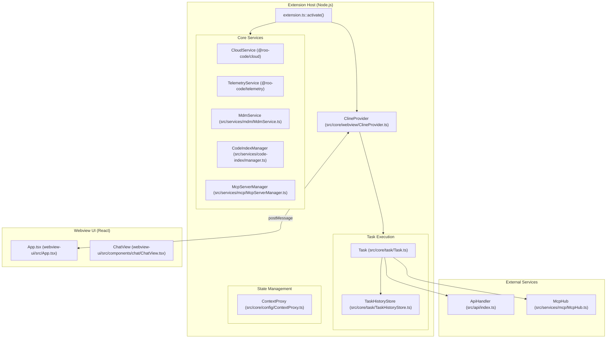

**Sources:** [src/extension.ts:120-220](), [src/core/webview/ClineProvider.ts:1-100](), [src/core/task/Task.ts:1-50]()

## Key Capabilities

### Mode System

Roo Code adapts its behavior through a mode system that controls available tools, system prompts, and operational constraints [README.md:57-67]().

| Mode | Primary Use Case |
|------|------------------|
| Code | Everyday coding, edits, and file operations |
| Architect | Plan systems, specs, and migrations |
| Ask | Fast answers, explanations, and docs |
| Debug | Trace issues, add logs, isolate root causes |

**Sources:** [README.md:57-67]()

### Provider Integration

The system supports 20+ LLM providers (OpenAI, Anthropic, OpenRouter, etc.) through a unified interface [CHANGELOG.md:7-15](). Recent updates include support for OpenAI GPT-5.4 and Gemini 3.1 Pro [CHANGELOG.md:15-18]().

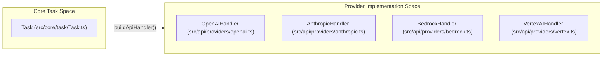

**Sources:** [CHANGELOG.md:3-100](), [src/extension.ts:51-51]()

### Tool Execution System

Tools enable the AI to interact with the development environment. The system provides native tools for file operations, command execution, and browser automation, alongside extensible MCP tool integration [README.md:47-56]().

**Sources:** [README.md:47-56](), [src/extension.ts:155-157]()

## CLI Application

In addition to the VS Code extension, Roo Code provides a standalone CLI application [CHANGELOG.md:17-41](). The CLI supports headless task execution, session resumption, and UUID-based session validation [CHANGELOG.md:17-21]().

**Sources:** [CHANGELOG.md:17-41](), [CHANGELOG.md:96-97]()

## Multi-Language Support

Roo Code includes internationalization support for documentation and UI strings [README.md:21-43]().

- **Documentation**: README translations in 17+ languages located in `locales/` [locales/fr/README.md:1-43](), [locales/ja/README.md:1-43]().
- **UI Strings**: Initialized via `initializeI18n` based on the user's environment [src/extension.ts:152-153]().

**Sources:** [README.md:21-43](), [src/extension.ts:152-153](), [locales/fr/README.md:1-43]()

---

# Page: System Architecture Overview

# System Architecture Overview

<details>
<summary>Relevant source files</summary>

The following files were used as context for generating this wiki page:

- [CHANGELOG.md](CHANGELOG.md)
- [package.json](package.json)
- [packages/ipc/README.md](packages/ipc/README.md)
- [packages/ipc/src/ipc-client.ts](packages/ipc/src/ipc-client.ts)
- [packages/ipc/src/ipc-server.ts](packages/ipc/src/ipc-server.ts)
- [packages/types/npm/package.metadata.json](packages/types/npm/package.metadata.json)
- [packages/types/src/__tests__/cloud.test.ts](packages/types/src/__tests__/cloud.test.ts)
- [packages/types/src/__tests__/ipc.test.ts](packages/types/src/__tests__/ipc.test.ts)
- [packages/types/src/api.ts](packages/types/src/api.ts)
- [packages/types/src/cloud.ts](packages/types/src/cloud.ts)
- [packages/types/src/events.ts](packages/types/src/events.ts)
- [packages/types/src/ipc.ts](packages/types/src/ipc.ts)
- [packages/types/src/task.ts](packages/types/src/task.ts)
- [packages/types/src/vscode-extension-host.ts](packages/types/src/vscode-extension-host.ts)
- [releases/3.31.1-release.png](releases/3.31.1-release.png)
- [src/__tests__/extension.spec.ts](src/__tests__/extension.spec.ts)
- [src/api/providers/fetchers/modelCache.ts](src/api/providers/fetchers/modelCache.ts)
- [src/core/webview/ClineProvider.ts](src/core/webview/ClineProvider.ts)
- [src/core/webview/__tests__/ClineProvider.spec.ts](src/core/webview/__tests__/ClineProvider.spec.ts)
- [src/core/webview/__tests__/webviewMessageHandler.spec.ts](src/core/webview/__tests__/webviewMessageHandler.spec.ts)
- [src/core/webview/webviewMessageHandler.ts](src/core/webview/webviewMessageHandler.ts)
- [src/extension.ts](src/extension.ts)
- [src/extension/__tests__/api-delete-queued-message.spec.ts](src/extension/__tests__/api-delete-queued-message.spec.ts)
- [src/extension/__tests__/api-send-message.spec.ts](src/extension/__tests__/api-send-message.spec.ts)
- [src/extension/api.ts](src/extension/api.ts)
- [src/package.json](src/package.json)
- [src/package.nls.json](src/package.nls.json)
- [src/shared/WebviewMessage.ts](src/shared/WebviewMessage.ts)
- [webview-ui/src/App.tsx](webview-ui/src/App.tsx)
- [webview-ui/src/components/chat/Announcement.tsx](webview-ui/src/components/chat/Announcement.tsx)
- [webview-ui/src/components/chat/ChatRow.tsx](webview-ui/src/components/chat/ChatRow.tsx)
- [webview-ui/src/components/chat/ChatView.tsx](webview-ui/src/components/chat/ChatView.tsx)
- [webview-ui/src/components/settings/SettingsView.tsx](webview-ui/src/components/settings/SettingsView.tsx)
- [webview-ui/src/context/ExtensionStateContext.tsx](webview-ui/src/context/ExtensionStateContext.tsx)

</details>


## Purpose and Scope

This document provides a high-level overview of Roo Code's system architecture, illustrating the three primary layers (Extension Host, Webview UI, and External Services) and how they interact. It maps architectural concepts to concrete code entities and explains the key communication patterns that enable Roo Code to function as an AI-powered VS Code extension.

For detailed information about specific subsystems:
- Extension lifecycle and initialization: see [Extension Activation and Lifecycle](#2.1)
- Message protocols between layers: see [Message Protocols](#3.2)
- Task execution flow: see [Task Lifecycle and Execution](#5.1)
- Provider integration details: see [API Handler Architecture](#4.1)

## Architectural Layers

Roo Code is organized into three distinct architectural layers that communicate through well-defined interfaces:

### Three-Layer Architecture

```mermaid
graph TB
    subgraph "Extension Host Process"
        ExtensionEntry["extension.ts<br/>activate()"]
        
        subgraph "Core Services"
            CloudService["CloudService<br/>Authentication & Sync"]
            TelemetryService["TelemetryService<br/>Analytics"]
            MdmService["MdmService<br/>Compliance"]
            CodeIndexManager["CodeIndexManager<br/>Semantic Search"]
            McpServerManager["McpServerManager<br/>MCP Integration"]
            SkillsManager["SkillsManager<br/>Skill Discovery"]
            MarketplaceManager["MarketplaceManager<br/>Extensions"]
        end
        
        subgraph "Provider Layer"
            ClineProvider["ClineProvider<br/>Central Orchestrator"]
            ContextProxy["ContextProxy<br/>GlobalState API"]
            ProviderSettingsManager["ProviderSettingsManager<br/>Profile CRUD"]
            CustomModesManager["CustomModesManager<br/>Mode Config"]
        end
        
        subgraph "Task Layer"
            TaskStack["clineStack: Task[]"]
            TaskInstance["Task<br/>AI Execution Context"]
            TaskHistoryStore["TaskHistoryStore<br/>.roo-code/tasks/"]
        end
    end
    
    subgraph "Webview UI Process"
        AppComponent["App.tsx<br/>Tab Management"]
        ExtensionStateContext["ExtensionStateContext<br/>State Provider"]
        
        subgraph "View Components"
            ChatView["ChatView"]
            SettingsView["SettingsView"]
            HistoryView["HistoryView"]
            MarketplaceView["MarketplaceView"]
            CloudView["CloudView"]
        end
    end
    
    subgraph "External Services"
        LLMProviders["LLM APIs<br/>OpenAI, Anthropic, etc."]
        RooRouter["Roo Code Router<br/>api.roocode.com"]
        MCPServers["MCP Servers<br/>External Tools"]
        QdrantDB["Qdrant<br/>Vector Database"]
    end
    
    ExtensionEntry --> ClineProvider
    ExtensionEntry --> CloudService
    ExtensionEntry --> TelemetryService
    ExtensionEntry --> MdmService
    ExtensionEntry --> CodeIndexManager
    ExtensionEntry --> McpServerManager
    
    ClineProvider --> ContextProxy
    ClineProvider --> ProviderSettingsManager
    ClineProvider --> CustomModesManager
    ClineProvider --> TaskStack
    ClineProvider --> SkillsManager
    ClineProvider --> MarketplaceManager
    
    TaskStack --> TaskInstance
    TaskInstance --> TaskHistoryStore
    
    ClineProvider <-->|"postMessage<br/>Protocol"| AppComponent
    AppComponent --> ExtensionStateContext
    ExtensionStateContext --> ChatView
    ExtensionStateContext --> SettingsView
    ExtensionStateContext --> HistoryView
    ExtensionStateContext --> MarketplaceView
    ExtensionStateContext --> CloudView
    
    TaskInstance --> LLMProviders
    TaskInstance --> RooRouter
    TaskInstance --> MCPServers
    CodeIndexManager --> QdrantDB
    
    CloudService -.->|Sync| ProviderSettingsManager
    ContextProxy --> GlobalState[("VS Code<br/>GlobalState")]
    TaskHistoryStore --> TaskFiles[(".roo-code/<br/>tasks/")]
```

**Sources:** [src/extension.ts:120-334](), [src/core/webview/ClineProvider.ts:126-242](), [webview-ui/src/App.tsx:1-309](), [webview-ui/src/context/ExtensionStateContext.tsx:1-149]()

## Component Responsibilities

The following table maps each major component to its primary responsibilities and key code locations:

| Component | Responsibility | Key File(s) | Layer |
|-----------|---------------|-------------|-------|
| `extension.activate()` | Entry point; initializes all services in dependency order | [src/extension.ts:120-334]() | Extension Host |
| `ClineProvider` | Central orchestrator; manages webview, task stack, and service integration | [src/core/webview/ClineProvider.ts:126-242]() | Extension Host |
| `ContextProxy` | Provides abstraction over `vscode.ExtensionContext.globalState` for typed state management | [src/core/config/ContextProxy.ts]() | Extension Host |
| `Task` | Represents a single AI execution context; manages conversation history and tool execution | [src/core/task/Task.ts]() | Extension Host |
| `TaskHistoryStore` | Per-task file-based persistence to `.roo-code/tasks/{taskId}/` | [src/core/task-persistence/index.ts]() | Extension Host |
| `ProviderSettingsManager` | CRUD operations for provider profiles (API configurations) | [src/core/config/ProviderSettingsManager.ts]() | Extension Host |
| `CustomModesManager` | Manages custom mode definitions from `.roo/modes/` | [src/core/config/CustomModesManager.ts]() | Extension Host |
| `CloudService` | Authentication, organization settings sync, task sharing | [packages/cloud/]() | Extension Host |
| `CodeIndexManager` | Semantic code search via embeddings and Qdrant | [src/services/code-index/manager.ts]() | Extension Host |
| `McpServerManager` | Manages MCP server lifecycle and connections | [src/services/mcp/McpServerManager.ts]() | Extension Host |
| `SkillsManager` | Discovers and loads skills from `.roo/skills/` | [src/services/skills/SkillsManager.ts]() | Extension Host |
| `App.tsx` | React root; manages tab switching and view lifecycle | [webview-ui/src/App.tsx:1-309]() | Webview UI |
| `ExtensionStateContext` | React context provider; maintains synchronized state from extension | [webview-ui/src/context/ExtensionStateContext.tsx:34-149]() | Webview UI |
| `ChatView` | Primary interaction UI; displays messages, handles input | [webview-ui/src/components/chat/ChatView.tsx:68-171]() | Webview UI |
| `SettingsView` | Configuration UI; manages provider profiles and auto-approve settings | [webview-ui/src/components/settings/SettingsView.tsx:124-230]() | Webview UI |

**Sources:** [src/extension.ts:120-334](), [src/core/webview/ClineProvider.ts:126-242](), [webview-ui/src/App.tsx:1-309](), [webview-ui/src/context/ExtensionStateContext.tsx:34-149]()

## Extension-Webview Communication

The extension host and webview communicate via VS Code's `postMessage` API, using a bidirectional message protocol:

### Message Flow Architecture

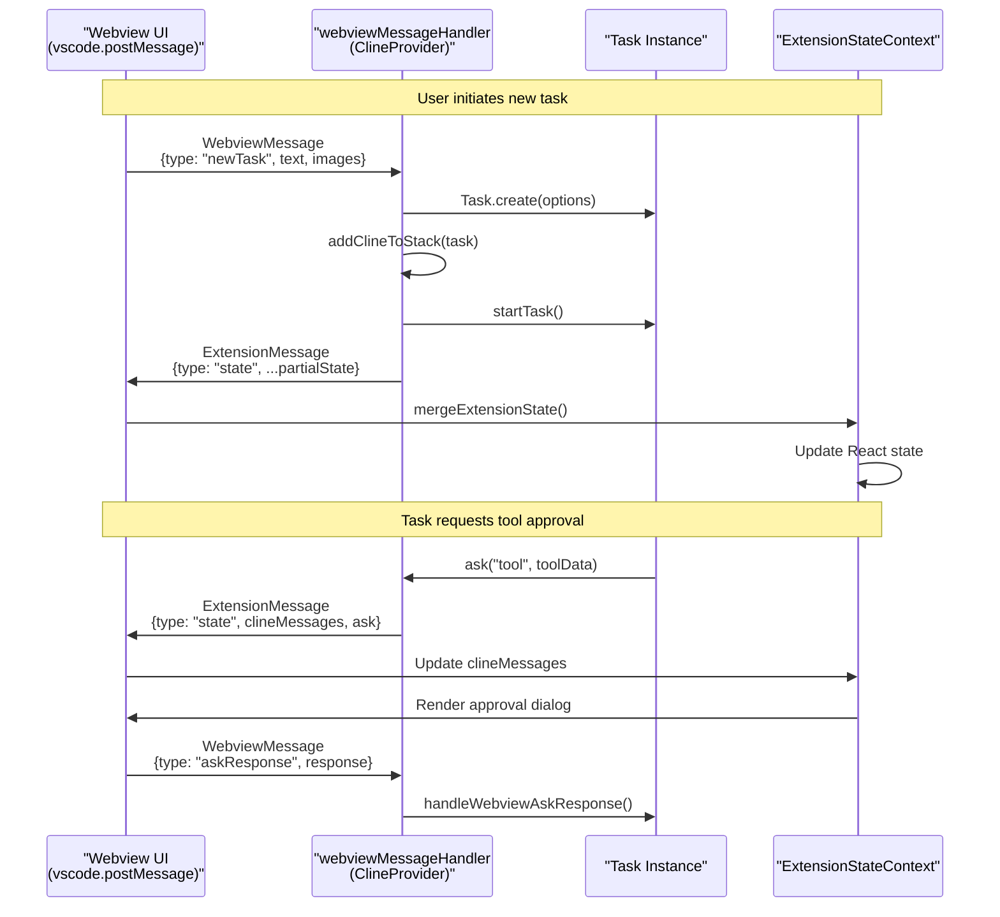

**Sources:** [src/core/webview/webviewMessageHandler.ts:92-197](), [src/core/webview/ClineProvider.ts:165-168](), [webview-ui/src/context/ExtensionStateContext.tsx:151-175]()

### Key Message Types

| Direction | Message Type | Purpose | Handler |
|-----------|-------------|---------|---------|
| Webview �Extension | `newTask` | Start new AI task with user input | [webviewMessageHandler.ts:164-202]() |
| Webview �Extension | `askResponse` | User response to tool/command approval | [webviewMessageHandler.ts:326-343]() |
| Webview �Extension | `updateSettings` | Save configuration changes | [webviewMessageHandler.ts:1021-1156]() |
| Extension �Webview | `state` | Partial state update (incremental) | [ClineProvider.ts:165-168]() |
| Extension �Webview | `messageUpdated` | Single message update for streaming | [ClineProvider.ts:1783-1792]() |

**Sources:** [src/core/webview/webviewMessageHandler.ts:92-1458](), [src/core/webview/ClineProvider.ts:126-242](), [webview-ui/src/App.tsx:1-309]()

## State Management Architecture

Roo Code employs a multi-tiered state persistence strategy:

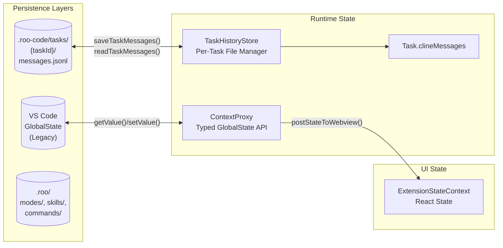

**State Layers:**

1. **VS Code GlobalState**: Stores user settings and API configurations. Accessed via `ContextProxy` wrapper. [src/extension.ts:169]()
2. **Per-Task Files**: Authoritative storage for task messages and history (introduced in v3.48). [src/core/task-persistence/index.ts]()
3. **Configuration Files**: User-defined modes, skills, and commands stored in workspace `.roo/` folder. [src/core/webview/webviewMessageHandler.ts:5]()
4. **React State**: UI state synchronized from extension via `ExtensionStateContext`. [webview-ui/src/context/ExtensionStateContext.tsx:151]()

**Sources:** [src/core/config/ContextProxy.ts](), [src/core/task-persistence/index.ts](), [src/core/webview/ClineProvider.ts:153-156](), [webview-ui/src/context/ExtensionStateContext.tsx:148-175]()

## Task Execution Architecture

Tasks are the fundamental unit of AI interaction, managed by a stack-based execution model:

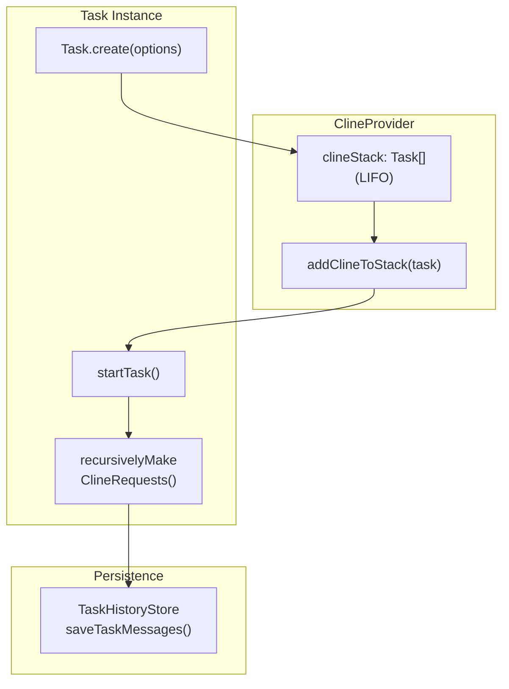

**Task Stack Management:**

- `ClineProvider.clineStack` maintains a LIFO stack of active tasks. [src/core/webview/ClineProvider.ts:139]()
- Stack operations: `addClineToStack` and `removeClineFromStack`. [src/core/webview/ClineProvider.ts:139]()

**Sources:** [src/core/webview/ClineProvider.ts:126-242](), [src/core/task/Task.ts]()

## Provider System Architecture

The provider system abstracts multiple LLM APIs behind a unified interface:

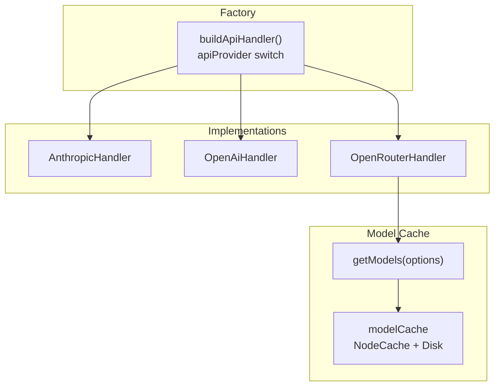

**Provider Dispatch Logic:**

The `buildApiHandler()` factory function dispatches to provider-specific implementations. Dynamic providers (OpenRouter, Roo, Requesty) use a two-tier cache `modelCache` for model metadata. [src/api/providers/fetchers/modelCache.ts]()

**Sources:** [src/api/index.ts](), [src/api/providers/fetchers/modelCache.ts]()

## Key Architectural Patterns

### 1. Process Isolation
The extension host and webview run in separate processes. Communication uses VS Code's `postMessage` API with structured `WebviewMessage` and `ExtensionMessage` types. [src/core/webview/webviewMessageHandler.ts:94]()

### 2. Dependency-Ordered Initialization
The extension activation sequence initializes services in order: `ContextProxy`, `CodeIndexManager`, `ClineProvider`, and `CloudService`. [src/extension.ts:120-334]()

### 3. State Synchronization with Sequence Guarding
To prevent stale state from overwriting newer updates, Roo Code uses `clineMessagesSeq` monotonic sequence numbering in `ClineProvider` and `mergeExtensionState` in the webview. [src/core/webview/ClineProvider.ts:168](), [webview-ui/src/context/ExtensionStateContext.tsx:166]()

**Sources:** [src/extension.ts:120-334](), [src/core/webview/ClineProvider.ts:165-168](), [webview-ui/src/context/ExtensionStateContext.tsx:151-175]()

---

# Page: Monorepo Structure and Packages

# Monorepo Structure and Packages

<details>
<summary>Relevant source files</summary>

The following files were used as context for generating this wiki page:

- [.github/actions/setup-node-pnpm/action.yml](.github/actions/setup-node-pnpm/action.yml)
- [.github/actions/slack-notify/action.yml](.github/actions/slack-notify/action.yml)
- [.github/workflows/changeset-release.yml](.github/workflows/changeset-release.yml)
- [.github/workflows/code-qa.yml](.github/workflows/code-qa.yml)
- [.github/workflows/marketplace-publish.yml](.github/workflows/marketplace-publish.yml)
- [.github/workflows/nightly-publish.yml](.github/workflows/nightly-publish.yml)
- [.github/workflows/update-contributors.yml](.github/workflows/update-contributors.yml)
- [.nvmrc](.nvmrc)
- [.roo/rules/rules.md](.roo/rules/rules.md)
- [apps/vscode-nightly/esbuild.mjs](apps/vscode-nightly/esbuild.mjs)
- [apps/vscode-nightly/package.nightly.json](apps/vscode-nightly/package.nightly.json)
- [apps/vscode-nightly/turbo.json](apps/vscode-nightly/turbo.json)
- [apps/web-evals/next.config.ts](apps/web-evals/next.config.ts)
- [apps/web-evals/package.json](apps/web-evals/package.json)
- [apps/web-evals/turbo.json](apps/web-evals/turbo.json)
- [apps/web-evals/vitest.config.ts](apps/web-evals/vitest.config.ts)
- [apps/web-roo-code/package.json](apps/web-roo-code/package.json)
- [apps/web-roo-code/src/components/ui/navigation-menu.tsx](apps/web-roo-code/src/components/ui/navigation-menu.tsx)
- [apps/web-roo-code/turbo.json](apps/web-roo-code/turbo.json)
- [packages/build/tsconfig.json](packages/build/tsconfig.json)
- [packages/evals/vitest.config.ts](packages/evals/vitest.config.ts)
- [packages/telemetry/vitest.config.ts](packages/telemetry/vitest.config.ts)
- [packages/types/npm/README.md](packages/types/npm/README.md)
- [packages/types/package.json](packages/types/package.json)
- [packages/types/src/__tests__/index.test.ts](packages/types/src/__tests__/index.test.ts)
- [packages/types/src/type-fu.ts](packages/types/src/type-fu.ts)
- [packages/types/tsup.config.ts](packages/types/tsup.config.ts)
- [packages/types/vitest.config.ts](packages/types/vitest.config.ts)
- [pnpm-lock.yaml](pnpm-lock.yaml)
- [src/__tests__/migrateSettings.spec.ts](src/__tests__/migrateSettings.spec.ts)
- [src/api/providers/__tests__/base-provider.spec.ts](src/api/providers/__tests__/base-provider.spec.ts)
- [src/api/providers/baseten.ts](src/api/providers/baseten.ts)
- [src/esbuild.mjs](src/esbuild.mjs)
- [src/services/marketplace/MarketplaceManager.ts](src/services/marketplace/MarketplaceManager.ts)
- [webview-ui/package.json](webview-ui/package.json)
- [webview-ui/src/components/common/MermaidBlock.tsx](webview-ui/src/components/common/MermaidBlock.tsx)
- [webview-ui/src/index.css](webview-ui/src/index.css)
- [webview-ui/vite.config.ts](webview-ui/vite.config.ts)

</details>


## Purpose and Scope

This document describes the monorepo organization of the Roo Code codebase, including the structure of packages, applications, and the build system. It covers workspace organization, package responsibilities, and development workflows. For information about the extension activation sequence and initialization of services, see [Extension Activation and Lifecycle](2.1). For details about the webview communication architecture, see [Webview Communication System](3).

The Roo Code repository is organized as a pnpm workspace monorepo orchestrated by Turborepo, containing the main VS Code extension, a React-based webview UI, several shared packages, and supporting applications including a CLI, web-based evaluation tools, and documentation sites.

---

## Workspace Organization

The repository follows a standard monorepo structure with three top-level directories for code organization, alongside the legacy `src` and `webview-ui` directories:

- **`apps/`** - Standalone applications including CLI, web applications, and testing infrastructure. [pnpm-lock.yaml:84-454]()
- **`packages/`** - Shared libraries and configuration packages consumed by apps and the main extension. [pnpm-lock.yaml:455-826]()
- **`src/`** - Main VS Code extension source code (Extension Host). [src/package.json:1-573]()
- **`webview-ui/`** - React-based webview UI for the extension. [webview-ui/package.json:1-110]()

### Workspace Structure Diagram

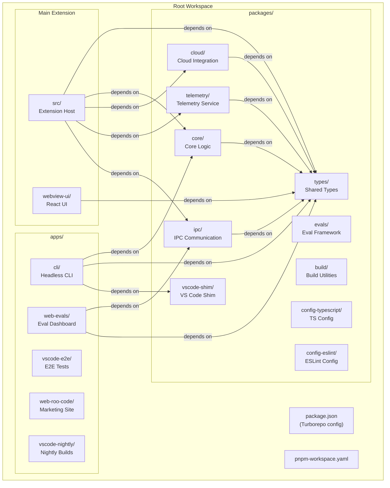

**Sources:** [pnpm-lock.yaml:1-826](), [package.json:1-72]()

---

## Main Extension Packages

### Extension Host (`src/`)

The main VS Code extension package containing the extension host logic, API providers, tools, services, and VS Code API integrations. This is the entry point for the extension as defined in `package.json`.

**Key Directories:**
- `api/` - LLM provider implementations (OpenAI, Anthropic, Bedrock, etc.)
- `core/` - Task management, webview provider, prompts, tools
- `services/` - MCP server manager, code indexing, MDM compliance
- `integrations/` - VS Code API integrations (terminal, editor, browser)
- `shared/` - Shared utilities and types

**Package Configuration:**
- **Name:** `roo-cline` [src/package.json:2]()
- **Publisher:** `RooVeterinaryInc` [src/package.json:4]()
- **Main Entry:** `./dist/extension.js` [src/package.json:12]()
- **Activation:** `onStartupFinished` [src/package.json:20]()

The extension is bundled using esbuild with the configuration in `esbuild.mjs` and distributed as a `.vsix` file. [src/esbuild.mjs:1-175]()

**Sources:** [src/package.json:1-573](), [src/extension.ts:1-489]()

---

### Webview UI (`webview-ui/`)

The React-based user interface rendered inside VS Code webviews, providing the chat interface, settings, history, marketplace, and cloud views. Built with Vite and uses Tailwind CSS 4 for styling. [webview-ui/package.json:1-110](), [webview-ui/src/index.css:1-151]()

**Key Directories:**
- `src/components/` - React components organized by feature (chat, settings, history, marketplace, cloud)
- `src/context/` - React context providers for state management
- `src/i18n/` - Internationalization support with 18 language locales
- `src/utils/` - Utility functions and VS Code message passing

**Package Configuration:**
- **Name:** `@roo-code/vscode-webview` [webview-ui/package.json:2]()
- **Build Tool:** Vite [webview-ui/package.json:11-13]()
- **Framework:** React 18 [webview-ui/package.json:58]()
- **Styling:** Tailwind CSS 4 [webview-ui/package.json:79]()

The webview communicates with the extension host via `postMessage` API, with messages typed in `@roo-code/types`. [webview-ui/package.json:33]()

**Build Process:**
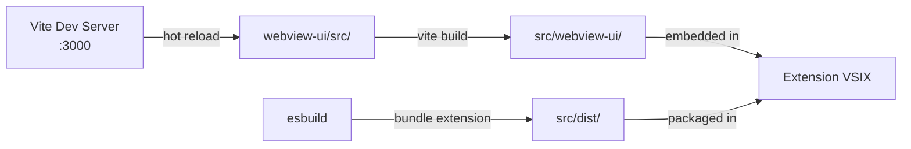

**Sources:** [webview-ui/package.json:1-110](), [webview-ui/vite.config.ts:1-198](), [webview-ui/src/index.css:1-151]()

---

## Shared Packages

### Core Domain Packages

#### `@roo-code/types`

Central type definitions shared across all packages and applications. Contains TypeScript types, Zod schemas, and interfaces for extension messages, API configurations, and task structures. [packages/types/package.json:1-37]()

**Sources:** [packages/types/package.json:1-37](), [pnpm-lock.yaml:703-727]()

---

#### `@roo-code/core`

Core business logic that can be used independently of VS Code, enabling headless operation in the CLI. Contains shared utilities, file operations, and the custom tool registry. [pnpm-lock.yaml:549-582]()

**Sources:** [pnpm-lock.yaml:549-582]()

---

#### `@roo-code/cloud`

Cloud service integration for authentication and organization management. Provides the `CloudService` singleton for authentication state management. [pnpm-lock.yaml:474-513]()

**Sources:** [pnpm-lock.yaml:474-513]()

---

#### `@roo-code/telemetry`

Telemetry service abstraction with PostHog integration. Provides the `TelemetryService` singleton and privacy-compliant event capture. [pnpm-lock.yaml:675-702]()

**Sources:** [pnpm-lock.yaml:675-702]()

---

#### `@roo-code/ipc`

Inter-process communication utilities for connecting extension host, CLI, and evaluation runners. [pnpm-lock.yaml:650-674]()

**Sources:** [pnpm-lock.yaml:650-674]()

---

### Configuration and Utility Packages

- **`@roo-code/config-typescript`**: Shared TypeScript configuration. [pnpm-lock.yaml:547-547]()
- **`@roo-code/config-eslint`**: Shared ESLint configuration including rules for React and Turborepo. [pnpm-lock.yaml:514-546]()
- **`@roo-code/build`**: Build utilities for VSIX packaging and version management. [pnpm-lock.yaml:455-473]()
- **`@roo-code/vscode-shim`**: VS Code API shim for headless operation in CLI environments. [pnpm-lock.yaml:728-742]()
- **`@roo-code/evals`**: Evaluation framework for testing AI agent performance. [pnpm-lock.yaml:584-649]()

---

## Applications

### CLI (`apps/cli`)

Headless command-line interface for running Roo Code without VS Code. It uses a terminal UI (TUI) powered by Ink. [pnpm-lock.yaml:84-156]()

**Dependencies:**
- `@roo-code/core`, `@roo-code/types`, `@roo-code/vscode-shim` [pnpm-lock.yaml:89-97]()
- `ink` (React for CLIs), `commander`, `execa` [pnpm-lock.yaml:104-118]()

**Sources:** [pnpm-lock.yaml:84-156]()

---

### Web Evaluations Dashboard (`apps/web-evals`)

Next.js application for visualizing and managing evaluation runs. [apps/web-evals/package.json:1-64]()

**Technology Stack:**
- Next.js 16 with App Router [apps/web-evals/package.json:38]()
- Radix UI components [apps/web-evals/package.json:16-28]()
- TanStack Query [apps/web-evals/package.json:31]()

**Sources:** [apps/web-evals/package.json:1-64](), [pnpm-lock.yaml:199-336]()

---

### Documentation Site (`apps/web-roo-code`)

Marketing and documentation website built with Next.js. [apps/web-roo-code/package.json:1-62]()

**Technology Stack:**
- Next.js 16 [apps/web-roo-code/package.json:32]()
- Framer Motion [apps/web-roo-code/package.json:29]()
- Tailwind CSS 3 [apps/web-roo-code/package.json:58]()

**Sources:** [apps/web-roo-code/package.json:1-62](), [pnpm-lock.yaml:337-454]()

---

### E2E Tests (`apps/vscode-e2e`)

End-to-end testing infrastructure using VS Code's test framework. [pnpm-lock.yaml:157-192]()

**Sources:** [pnpm-lock.yaml:157-192]()

---

### Nightly Builds (`apps/vscode-nightly`)

Build scripts for generating nightly extension builds. Uses a custom `esbuild.mjs` to override package metadata and branding. [apps/vscode-nightly/esbuild.mjs:1-175]()

**Sources:** [apps/vscode-nightly/esbuild.mjs:1-175](), [pnpm-lock.yaml:193-198]()

---

## Build System and Task Orchestration

### Turborepo Configuration

The monorepo uses Turborepo for orchestrating builds, tests, and other tasks. [package.json:78]()

**Common Tasks:**
- `build`: Build all packages. [package.json:14]()
- `lint`: Run ESLint across all packages. [package.json:16]()
- `check-types`: TypeScript type checking. [package.json:18]()
- `test`: Run test suites. [package.json:19]()

**Sources:** [package.json:1-72](), [pnpm-lock.yaml:78]()

---

### Development Workflow

The development workflow uses VS Code tasks for hot-reloading:

**Watch Tasks:**
1. **`watch:webview`**: Runs Vite dev server for webview hot-reload. [webview-ui/package.json:11]()
2. **`watch:bundle`**: Runs esbuild in watch mode for extension host. [src/package.json:44]()

**CI/CD Integration:**
The build pipeline is automated via GitHub Actions, including code quality checks, unit tests, and marketplace publishing. [ .github/workflows/code-qa.yml:1-61](), [.github/workflows/marketplace-publish.yml:1-93]()

**Sources:** [.github/workflows/code-qa.yml:1-61](), [.github/workflows/marketplace-publish.yml:1-93](), [webview-ui/package.json:1-110]()

---

### Release Process

**Changesets:**
The repository uses Changesets for version management and changelog generation. Version bumps and PR creation are automated. [.github/workflows/changeset-release.yml:1-133]()

**VSIX Packaging:**
The extension is packaged into a VSIX file for distribution. The process verifies the inclusion of critical assets like `extension.js`, `index.js` (webview), and UI assets. [.github/workflows/marketplace-publish.yml:34-53]()

**Sources:** [.github/workflows/changeset-release.yml:1-133](), [.github/workflows/marketplace-publish.yml:1-93]()

---

# Page: Extension Architecture

# Extension Architecture

<details>
<summary>Relevant source files</summary>

The following files were used as context for generating this wiki page:

- [CHANGELOG.md](CHANGELOG.md)
- [package.json](package.json)
- [packages/types/src/vscode-extension-host.ts](packages/types/src/vscode-extension-host.ts)
- [src/api/providers/fetchers/modelCache.ts](src/api/providers/fetchers/modelCache.ts)
- [src/core/webview/ClineProvider.ts](src/core/webview/ClineProvider.ts)
- [src/core/webview/__tests__/ClineProvider.spec.ts](src/core/webview/__tests__/ClineProvider.spec.ts)
- [src/core/webview/__tests__/webviewMessageHandler.spec.ts](src/core/webview/__tests__/webviewMessageHandler.spec.ts)
- [src/core/webview/webviewMessageHandler.ts](src/core/webview/webviewMessageHandler.ts)
- [src/extension.ts](src/extension.ts)
- [src/package.json](src/package.json)
- [src/package.nls.json](src/package.nls.json)
- [src/shared/WebviewMessage.ts](src/shared/WebviewMessage.ts)
- [webview-ui/src/App.tsx](webview-ui/src/App.tsx)
- [webview-ui/src/components/chat/Announcement.tsx](webview-ui/src/components/chat/Announcement.tsx)
- [webview-ui/src/components/chat/ChatRow.tsx](webview-ui/src/components/chat/ChatRow.tsx)
- [webview-ui/src/components/chat/ChatView.tsx](webview-ui/src/components/chat/ChatView.tsx)
- [webview-ui/src/components/settings/SettingsView.tsx](webview-ui/src/components/settings/SettingsView.tsx)
- [webview-ui/src/context/ExtensionStateContext.tsx](webview-ui/src/context/ExtensionStateContext.tsx)

</details>


## Purpose and Scope

This document provides an overview of the Roo Code VS Code extension's architecture, covering its dual-process design, lifecycle management, core services initialization, and integration points with VS Code APIs. For detailed information about specific subsystems, see:
- Extension activation sequence and service initialization: [Extension Activation and Lifecycle](#2.1)
- Individual service implementations: [Core Services](#2.2)
- State persistence mechanisms: [State Management and Storage](#2.3)
- VS Code command and UI integration: [Commands and VS Code Integration](#2.4)

The Roo Code extension follows VS Code's standard extension architecture, operating across two separate JavaScript execution contexts: the Extension Host process (Node.js environment) and the Webview process (browser-like environment). This separation enables isolation, security, and leverages VS Code's webview infrastructure for rich UI rendering.

---

## Dual-Process Architecture

The extension operates in two distinct processes that communicate via VS Code's `postMessage` protocol:

### Extension Host Process Architecture

```mermaid
graph TB
    subgraph ExtensionHost["Extension Host Process (Node.js)"]
        activate["activate()<br/>src/extension.ts:120"]
        
        subgraph CoreInit["Core Initialization"]
            dotenv["dotenvx.config()<br/>Load .env"]
            migrate["migrateSettings()<br/>Settings migration"]
            telemetry["TelemetryService<br/>createInstance()"]
            mdm["MdmService<br/>createInstance()"]
            i18n["initializeI18n()"]
            terminal["TerminalRegistry<br/>.initialize()"]
            oauth["openAiCodexOAuthManager<br/>.initialize()"]
        end
        
        subgraph StateLayer["State & Storage Layer"]
            contextProxy["ContextProxy<br/>.getInstance()"]
            globalState["vscode.ExtensionContext<br/>.globalState"]
        end
        
        subgraph CoreServices["Core Services"]
            codeIndex["CodeIndexManager[]<br/>Per-workspace instances"]
            cloud["CloudService<br/>.createInstance()"]
        end
        
        subgraph ProviderLayer["Provider & Orchestration"]
            clineProvider["ClineProvider<br/>Main orchestrator"]
            webviewReg["registerWebviewViewProvider()<br/>VS Code API"]
        end
        
        subgraph VSCodeIntegration["VS Code Integration"]
            commands["registerCommands()"]
            codeActions["registerCodeActions()"]
            terminalActions["registerTerminalActions()"]
            uriHandler["registerUriHandler()"]
            diffProvider["TextDocumentContentProvider<br/>DIFF_VIEW_URI_SCHEME"]
        end
        
        activate --> dotenv
        dotenv --> migrate
        migrate --> telemetry
        telemetry --> mdm
        mdm --> i18n
        i18n --> terminal
        terminal --> oauth
        oauth --> contextProxy
        contextProxy --> codeIndex
        codeIndex --> clineProvider
        clineProvider --> cloud
        cloud --> webviewReg
        webviewReg --> commands
        commands --> codeActions
        codeActions --> terminalActions
        terminalActions --> uriHandler
        uriHandler --> diffProvider
    end
    
    globalState -.->|persists| contextProxy
```

**Sources:** [src/extension.ts:120-421]()

### Webview Process Architecture

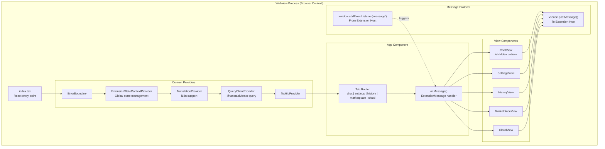

**Sources:** [webview-ui/src/App.tsx:1-205](), [webview-ui/src/context/ExtensionStateContext.tsx:1-175]()

### Message-Passing Protocol

The two processes communicate exclusively through structured messages:

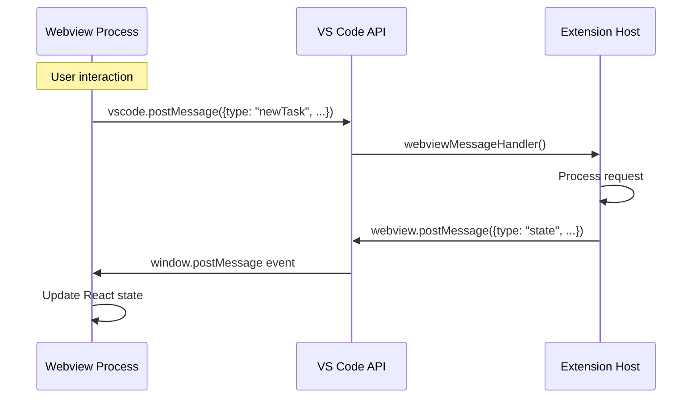

**Sources:** [src/core/webview/webviewMessageHandler.ts:92-210](), [src/core/webview/ClineProvider.ts:126-175]()

---

## Extension Manifest and Contribution Points

The `src/package.json` defines all VS Code integration points using the contributions API:

### View Containers and Views

| Contribution | ID | Purpose |
|-------------|-----|---------|
| `viewsContainers.activitybar` | `roo-cline-ActivityBar` | Sidebar icon in Activity Bar |
| `views["roo-cline-ActivityBar"]` | `roo-cline.SidebarProvider` | Webview panel in sidebar |

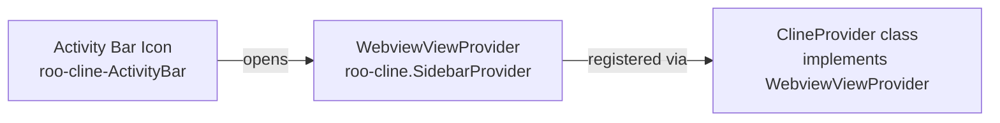

**Sources:** [src/package.json:54-70](), [src/core/webview/ClineProvider.ts:133-134]()

### Commands Registration

The extension registers numerous commands through `package.json` contributions and runtime registration:

| Command ID | Purpose | Registration |
|-----------|---------|--------------|
| `roo-cline.plusButtonClicked` | New task | Toolbar button |
| `roo-cline.settingsButtonClicked` | Open settings | Toolbar button |
| `roo-cline.historyButtonClicked` | Task history | Toolbar menu |
| `roo-cline.marketplaceButtonClicked` | Marketplace | Toolbar button |
| `roo-cline.cloudButtonClicked` | Cloud features | Toolbar button |
| `roo-cline.openInNewTab` | Open in editor tab | Command palette |
| `roo-cline.explainCode` | Explain selection | Context menu |
| `roo-cline.fixCode` | Fix selected code | Context menu |
| `roo-cline.addToContext` | Add to context | Context menu + keybinding |
| `roo-cline.focusInput` | Focus chat input | Keybinding |
| `roo-cline.toggleAutoApprove` | Toggle auto-approve | Keybinding |

**Sources:** [src/package.json:72-172](), [src/extension.ts:45-49]()

### Context Menus and Submenus

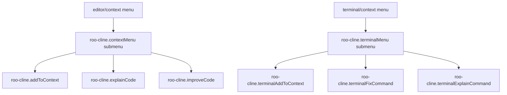

**Sources:** [src/package.json:174-214]()

---

## Service Initialization Sequence

The extension follows a strict initialization order in `extension.ts` to satisfy service dependencies:

```mermaid
graph TB
    Start["Extension Activation<br/>extension.ts:activate()"]
    
    EnvSetup["Environment Setup"]
    EnvLoad["Load .env file<br/>dotenvx.config()"]
    ProxyInit["initializeNetworkProxy()<br/>Debug mode only"]
    ToolRegistry["customToolRegistry<br/>.setExtensionPath()"]
    
    SettingsMigration["Settings Migration<br/>migrateSettings()"]
    
    CoreServices["Core Services Init"]
    Telemetry["TelemetryService<br/>.createInstance()"]
    PostHog["PostHogTelemetryClient<br/>.register()"]
    MDM["MdmService<br/>.createInstance()"]
    I18N["initializeI18n()"]
    Terminal["TerminalRegistry<br/>.initialize()"]
    OAuth["openAiCodexOAuthManager<br/>.initialize()"]
    
    StateInit["State Layer Init"]
    ContextProxy["ContextProxy<br/>.getInstance()"]
    
    WorkspaceServices["Workspace Services"]
    CodeIndex["CodeIndexManager<br/>per workspace folder"]
    
    OrchestratorInit["Orchestrator Init"]
    Provider["ClineProvider<br/>constructor"]
    
    CloudInit["Cloud Service Init"]
    Cloud["CloudService<br/>.createInstance()"]
    CloudEvents["Register event handlers<br/>auth-state-changed<br/>settings-updated<br/>user-info"]
    
    VSCodeReg["VS Code Registration"]
    WebviewReg["registerWebviewViewProvider()"]
    CommandsReg["registerCommands()"]
    ActionsReg["registerCodeActions()"]
    TerminalActionsReg["registerTerminalActions()"]
    DiffProviderReg["TextDocumentContentProvider<br/>DIFF_VIEW_URI_SCHEME"]
    UriHandlerReg["registerUriHandler()"]
    
    Start --> EnvSetup
    EnvSetup --> EnvLoad
    EnvLoad --> ProxyInit
    ProxyInit --> ToolRegistry
    ToolRegistry --> SettingsMigration
    SettingsMigration --> CoreServices
    
    CoreServices --> Telemetry
    Telemetry --> PostHog
    PostHog --> MDM
    MDM --> I18N
    I18N --> Terminal
    Terminal --> OAuth
    
    OAuth --> StateInit
    StateInit --> ContextProxy
    
    ContextProxy --> WorkspaceServices
    WorkspaceServices --> CodeIndex
    
    CodeIndex --> OrchestratorInit
    OrchestratorInit --> Provider
    
    Provider --> CloudInit
    CloudInit --> Cloud
    Cloud --> CloudEvents
    
    CloudEvents --> VSCodeReg
    VSCodeReg --> WebviewReg
    WebviewReg --> CommandsReg
    CommandsReg --> ActionsReg
    ActionsReg --> TerminalActionsReg
    TerminalActionsReg --> DiffProviderReg
    DiffProviderReg --> UriHandlerReg
```

**Sources:** [src/extension.ts:120-421]()

---

## Extension Lifecycle Management

### Activation

The `activate()` function is the extension's entry point, called by VS Code when the extension is first needed based on `activationEvents` in `package.json`:

```typescript
export async function activate(context: vscode.ExtensionContext)
```

**Sources:** [src/extension.ts:120](), [src/package.json:48-51]()

### Deactivation

The `deactivate()` function handles cleanup when the extension is disabled or VS Code closes:

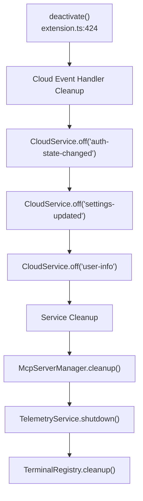

**Sources:** [src/extension.ts:424-452]()

---

## VS Code API Integration Points

### Text Document Content Provider

The extension registers a custom URI scheme `roo-cline-diff` for diff view functionality, allowing virtual readonly documents to be created from encoded content.

**Sources:** [src/extension.ts:33-33](), [src/extension.ts:336-344]()

### URI Handler

Registers a custom URI handler to enable deep linking via `vscode://RooVeterinaryInc.roo-cline/...` URLs.

**Sources:** [src/extension.ts:44-49](), [src/extension.ts:346-346]()

### Code Actions Provider

Registers quick fixes and code actions through `CodeActionProvider`.

**Sources:** [src/extension.ts:48-49](), [src/extension.ts:349-353]()

---

## Summary

The Roo Code extension architecture is a dual-process system bridging the VS Code Extension Host and a React-based Webview. It features a strict service initialization sequence, comprehensive lifecycle management, and deep integration with VS Code APIs through commands, menus, and custom providers.

For details on the specific services initialized during activation, see [Core Services](#2.2). For state persistence mechanisms, see [State Management and Storage](#2.3). For the complete command reference, see [Commands and VS Code Integration](#2.4).

---

# Page: Extension Activation and Lifecycle

# Extension Activation and Lifecycle

<details>
<summary>Relevant source files</summary>

The following files were used as context for generating this wiki page:

- [CHANGELOG.md](CHANGELOG.md)
- [package.json](package.json)
- [src/activate/registerCommands.ts](src/activate/registerCommands.ts)
- [src/extension.ts](src/extension.ts)
- [src/package.json](src/package.json)
- [src/package.nls.json](src/package.nls.json)
- [tsconfig.json](tsconfig.json)
- [webview-ui/src/App.tsx](webview-ui/src/App.tsx)
- [webview-ui/src/components/chat/Announcement.tsx](webview-ui/src/components/chat/Announcement.tsx)

</details>


This page documents the extension entry point ([src/extension.ts:1-452]()), the ordered initialization sequence of services during activation, and the `API` class returned to other VS Code extensions. It covers the complete lifecycle from the moment VS Code calls `activate()` to when `deactivate()` performs cleanup.

---

## Activation Events

The extension declares activation events in its manifest to control when the VS Code Extension Host loads the code.

| Activation Event | Meaning |
|---|---|
| `onLanguage` | Activates when any language file is opened in the editor. |
| `onStartupFinished` | Activates after VS Code has finished its internal startup sequence. |

The `main` entry point is `./dist/extension.js`, which is the bundled output of `src/extension.ts`.

Sources: [src/package.json:48-52]()

---

## The `activate()` Function

`activate()` is the single exported async function called by VS Code. It initializes the core dependency graph and returns an `API` instance that implements the `RooCodeAPI` interface for cross-extension communication.

**Activation sequence diagram:**

```mermaid
flowchart TD
    A["activate(context)"] --> B["Create outputChannel\n(vscode.window.createOutputChannel)"]
    B --> C["initializeNetworkProxy()"]
    C --> D["customToolRegistry.setExtensionPath()"]
    D --> E["migrateSettings()"]
    E --> F["TelemetryService.createInstance()\n+ PostHogTelemetryClient"]
    F --> G["MdmService.createInstance()"]
    G --> H["initializeI18n()"]
    H --> I["TerminalRegistry.initialize()"]
    I --> J["openAiCodexOAuthManager.initialize()"]
    J --> K["ContextProxy.getInstance()"]
    K --> L["CodeIndexManager.getInstance() per workspace folder\n(background, non-blocking)"]
    L --> M["new ClineProvider(context, outputChannel, 'sidebar',\ncontextProxy, mdmService)"]
    M --> N["CloudService.createInstance()\n+ event handlers wired"]
    N --> O["provider.initializeCloudProfileSyncWhenReady()"]
    O --> P["vscode.window.registerWebviewViewProvider\n(ClineProvider.sideBarId)"]
    P --> Q["checkWorktreeAutoOpen()"]
    Q --> R["autoImportSettings()"]
    R --> S["registerCommands() / registerCodeActions()\nregisterTerminalActions()"]
    S --> T["Register TextDocumentContentProvider\n(DIFF_VIEW_URI_SCHEME)"]
    T --> U["Register URI handler\nRegister CodeActionProvider"]
    U --> V["executeCommand('roo-cline.activationCompleted')"]
    V --> W["initializeModelCacheRefresh()"]
    W --> X["return new API(outputChannel, provider, socketPath, enableLogging)"]
```

Sources: [src/extension.ts:120-421]()

---

## Initialization Order Details

### 1. Environment and Proxy Setup
The extension first attempts to load an optional `.env` file using `dotenvx.config()` [src/extension.ts:10-18](). It then initializes the network proxy via `initializeNetworkProxy()` to route HTTP/HTTPS traffic during debug sessions [src/extension.ts:129](). The `customToolRegistry` is updated with the extension path to locate the bundled `esbuild` binary [src/extension.ts:132]().

### 2. State and Telemetry
`migrateSettings()` runs to ensure legacy configuration keys are mapped to the current schema [src/extension.ts:135](). The `TelemetryService` is initialized and a `PostHogTelemetryClient` is registered to track extension usage and errors [src/extension.ts:138-144]().

### 3. Core Services Initialization
- **MDM Service**: `MdmService.createInstance()` is called to enforce organizational policies [src/extension.ts:150]().
- **i18n**: `initializeI18n()` sets the UI language based on global state or VS Code's locale [src/extension.ts:153]().
- **Terminal**: `TerminalRegistry.initialize()` sets up shell integration handlers [src/extension.ts:156]().
- **ContextProxy**: `ContextProxy.getInstance(context)` provides a unified interface for `globalState`, `workspaceState`, and `secrets` [src/extension.ts:169]().
- **Code Indexing**: For every workspace folder, a `CodeIndexManager` is retrieved and its `initialize()` method is called in the background (non-blocking) [src/extension.ts:172-192]().

### 4. ClineProvider and Cloud Integration
`ClineProvider` (the main orchestrator) is instantiated [src/extension.ts:195](). Subsequently, `CloudService.createInstance()` is called with listeners for `auth-state-changed`, `settings-updated`, and `user-info` [src/extension.ts:198-282](). These listeners trigger state updates in the webview and manage model cache flushes on login/logout [src/extension.ts:222-229]().

### 5. UI Registration
The `ClineProvider` is registered as a `WebviewViewProvider` with `retainContextWhenHidden: true`, ensuring the React app in the sidebar stays alive when the user switches tabs [src/extension.ts:296-300]().

### 6. Command Registration
The extension registers multiple integration points:
- **Commands**: Registered via `registerCommands()` [src/extension.ts:318]().
- **Code Actions**: Quick fixes registered via `registerCodeActions()` [src/extension.ts:319]().
- **Terminal Actions**: Context menu items for the terminal [src/extension.ts:320]().
- **Diff Provider**: A `TextDocumentContentProvider` for the `DIFF_VIEW_URI_SCHEME` [src/extension.ts:325-331]().

Sources: [src/extension.ts:120-356](), [src/activate/registerCommands.ts:64-71]()

---

## The `deactivate()` Function

When VS Code shuts down or the extension is disabled, `deactivate()` ensures clean teardown of external resources.

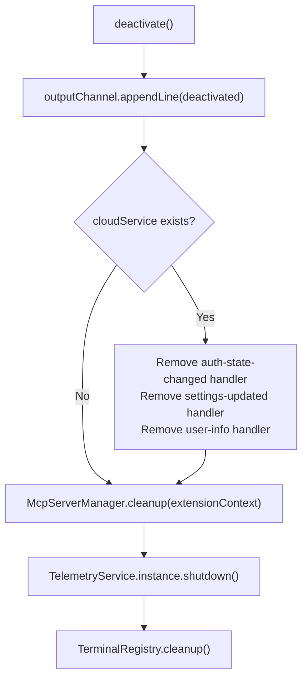

While most disposables are handled by `context.subscriptions`, explicit cleanup is performed for:
1. **Cloud Service**: Removing event listeners to prevent memory leaks [src/extension.ts:430-440]().
2. **MCP Servers**: Calling `McpServerManager.cleanup()` to terminate child processes [src/extension.ts:443]().
3. **Telemetry**: Flushing any remaining events via `shutdown()` [src/extension.ts:446]().
4. **Terminal**: Cleaning up the `TerminalRegistry` [src/extension.ts:449]().

Sources: [src/extension.ts:424-452]()

---

## The `API` Class

The `API` class acts as the bridge between the Extension Host and external consumers (CLI, other extensions). It implements the `RooCodeAPI` interface.

**Class relationships:**

```mermaid
classDiagram
    class "RooCodeAPI" {
        <<interface>>
        +startNewTask()
        +resumeTask()
        +cancelCurrentTask()
        +sendMessage()
        +getConfiguration()
        +setConfiguration()
        +getProfiles()
        +createProfile()
        +updateProfile()
        +upsertProfile()
        +deleteProfile()
        +setActiveProfile()
        +isReady()
    }

    class "API" {
        -outputChannel OutputChannel
        -sidebarProvider ClineProvider
        -context ExtensionContext
        -ipc IpcServer
        +startNewTask()
        +resumeTask()
        +cancelCurrentTask()
        +sendMessage()
        +deleteQueuedMessage()
        +getConfiguration()
        +setConfiguration()
        -registerListeners()
    }

    class "ClineProvider" {
        +postMessageToWebview()
        +createTask()
        +getCurrentTask()
        +cancelTask()
    }

    class "IpcServer" {
        +listen()
        +broadcast()
        +send()
    }

    "API" ..|> "RooCodeAPI"
    "API" --> "ClineProvider"
    "API" --> "IpcServer"
```

### IPC and Task Lifecycle
If the `ROO_CODE_IPC_SOCKET_PATH` environment variable is detected, the `API` starts an `IpcServer` [src/extension.ts:417-420](). This allows the CLI to send commands like `StartNewTask` or `SendMessage` [src/extension/api.ts:65-166](). The `API` class also registers listeners on the `ClineProvider` to intercept task events (e.g., `TaskCreated`, `TaskCompleted`) and broadcast them to IPC clients [src/extension/api.ts:315-424]().

Sources: [src/extension/api.ts:32-570](), [src/extension.ts:362-420]()

---

## Startup State Management

The extension manages several pieces of state during the activation window:

| Key | File Reference | Usage |
|---|---|---|
| `language` | [src/extension.ts:153]() | Determines the locale for `i18next` initialization. |
| `allowedCommands` | [src/extension.ts:162-167]() | Initialized from `package.json` defaults if not present in `globalState`. |
| `worktreeAutoOpenPath` | [src/extension.ts:78-96]() | Used to automatically reopen the sidebar after a worktree switch. |
| `roo-provider-model` | [src/extension.ts:231-245]() | A temporary cloud-synced setting applied to the local configuration upon login. |

Sources: [src/extension.ts:73-245]()

---

# Page: Core Services

# Core Services

<details>
<summary>Relevant source files</summary>

The following files were used as context for generating this wiki page:

- [CHANGELOG.md](CHANGELOG.md)
- [package.json](package.json)
- [packages/cloud/src/CloudService.ts](packages/cloud/src/CloudService.ts)
- [packages/cloud/src/CloudSettingsService.ts](packages/cloud/src/CloudSettingsService.ts)
- [packages/cloud/src/StaticSettingsService.ts](packages/cloud/src/StaticSettingsService.ts)
- [packages/cloud/src/__tests__/CloudService.test.ts](packages/cloud/src/__tests__/CloudService.test.ts)
- [packages/cloud/src/__tests__/CloudSettingsService.test.ts](packages/cloud/src/__tests__/CloudSettingsService.test.ts)
- [packages/cloud/src/__tests__/StaticSettingsService.test.ts](packages/cloud/src/__tests__/StaticSettingsService.test.ts)
- [packages/telemetry/src/BaseTelemetryClient.ts](packages/telemetry/src/BaseTelemetryClient.ts)
- [packages/telemetry/src/PostHogTelemetryClient.ts](packages/telemetry/src/PostHogTelemetryClient.ts)
- [packages/telemetry/src/TelemetryService.ts](packages/telemetry/src/TelemetryService.ts)
- [packages/telemetry/src/__tests__/PostHogTelemetryClient.test.ts](packages/telemetry/src/__tests__/PostHogTelemetryClient.test.ts)
- [packages/types/src/__tests__/telemetry.test.ts](packages/types/src/__tests__/telemetry.test.ts)
- [packages/types/src/telemetry.ts](packages/types/src/telemetry.ts)
- [packages/types/src/vscode.ts](packages/types/src/vscode.ts)
- [src/activate/handleUri.ts](src/activate/handleUri.ts)
- [src/extension.ts](src/extension.ts)
- [src/package.json](src/package.json)
- [src/package.nls.json](src/package.nls.json)
- [src/services/mdm/MdmService.ts](src/services/mdm/MdmService.ts)
- [src/services/mdm/__tests__/MdmService.spec.ts](src/services/mdm/__tests__/MdmService.spec.ts)
- [src/shared/utils/requesty.ts](src/shared/utils/requesty.ts)
- [src/utils/focusPanel.ts](src/utils/focusPanel.ts)
- [webview-ui/src/App.tsx](webview-ui/src/App.tsx)
- [webview-ui/src/components/chat/Announcement.tsx](webview-ui/src/components/chat/Announcement.tsx)
- [webview-ui/src/components/ui/hooks/index.ts](webview-ui/src/components/ui/hooks/index.ts)
- [webview-ui/src/components/ui/hooks/useNonInteractiveClick.ts](webview-ui/src/components/ui/hooks/useNonInteractiveClick.ts)

</details>


This document details the foundational service layer initialized during extension activation. These services provide essential capabilities—telemetry, authentication, state management, terminal integration, code indexing, and device management—that underpin all extension functionality.

---

## Service Architecture Overview

Roo Code's core services follow a layered architecture where singleton services provide global capabilities while per-workspace services handle project-specific functionality. Services are initialized in a specific order to satisfy dependencies, with most initialization performed asynchronously to avoid blocking extension activation.

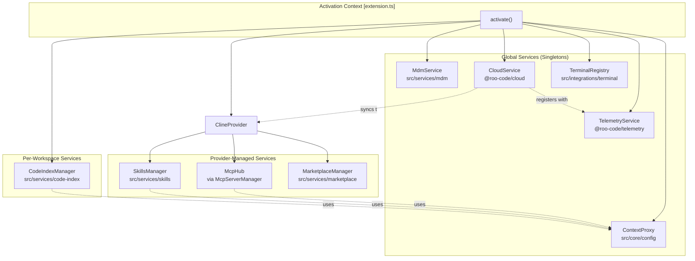

**Sources:** [src/extension.ts:120-295](), [src/core/webview/ClineProvider.ts:172-220]()

---

## Initialization Sequence

Services are initialized in a specific order during the `activate()` function. Critical services like telemetry and state management are initialized synchronously, while resource-intensive services like code indexing are initialized asynchronously.

```mermaid
sequenceDiagram
    participant Activation as activate() [extension.ts]
    participant Tel as TelemetryService
    participant MDM as MdmService
    participant Ctx as ContextProxy
    participant Term as TerminalRegistry
    participant Idx as CodeIndexManager
    participant Prov as ClineProvider
    participant Cloud as CloudService
    
    Activation->>Tel: createInstance()
    Tel-->>Activation: singleton
    
    Activation->>MDM: createInstance(logger)
    MDM-->>Activation: instance
    
    Activation->>Ctx: getInstance(context)
    Ctx-->>Activation: singleton
    
    Activation->>Term: initialize()
    Note over Term: Static initialization
    
    Activation->>Idx: getInstance(context, workspacePath)
    Idx-->>Activation: per-workspace instance
    Note over Idx: initialize() called<br/>asynchronously
    
    Activation->>Prov: new ClineProvider(...)
    Prov->>Prov: Initialize McpHub
    Prov->>Prov: Initialize SkillsManager
    Prov->>Prov: Initialize MarketplaceManager
    Prov-->>Activation: provider instance
    
    Activation->>Cloud: createInstance(context, logger)
    Cloud->>Cloud: initialize() [auth/settings]
    Cloud-->>Activation: instance
    
    Cloud->>Tel: register(PostHogTelemetryClient)
```

**Sources:** [src/extension.ts:120-295](), [packages/cloud/src/CloudService.ts:113-177]()

### Initialization Order Table

| Order | Service | Type | Blocking | Purpose |
|-------|---------|------|----------|---------|
| 1 | `TelemetryService` | Singleton | Yes | Event tracking and analytics |
| 2 | `MdmService` | Singleton | Yes | Device compliance checking |
| 3 | `ContextProxy` | Singleton | Yes | State management facade |
| 4 | `TerminalRegistry` | Static | Yes | Terminal integration setup |
| 5 | `CodeIndexManager` | Per-workspace | No | Semantic code search (async init) |
| 6 | `ClineProvider` | Singleton | Yes | Main provider (initializes sub-services) |
| 7 | `CloudService` | Singleton | Yes | Authentication and cloud features |

**Sources:** [src/extension.ts:120-295]()

---

## TelemetryService

The `TelemetryService` manages event capture and routing to multiple telemetry backends. It provides a unified interface for tracking user interactions, errors, and system events.

### Architecture

```mermaid
graph LR
    subgraph "TelemetryService [packages/telemetry]"
        SERVICE["TelemetryService"]
        CLIENTS["TelemetryClient[]"]
    end
    
    subgraph "Clients"
        POSTHOG["PostHogTelemetryClient"]
        CLOUD_TEL["CloudTelemetryClient"]
    end
    
    subgraph "Events [packages/types]"
        EV_ENUM["TelemetryEventName"]
    end
    
    SERVICE --> CLIENTS
    CLIENTS --> POSTHOG
    CLIENTS --> CLOUD_TEL
    SERVICE -.uses.-> EV_ENUM
```

**Sources:** [packages/telemetry/src/TelemetryService.ts:15-20](), [packages/types/src/telemetry.ts:20-77]()

### Key Responsibilities

- **Event Capture**: Tracks user actions via `TelemetryEventName` enum (e.g., `TASK_CREATED`, `TOOL_USED`). [packages/types/src/telemetry.ts:21-29]()
- **Exception Tracking**: Captures errors via `captureException`. [packages/telemetry/src/TelemetryService.ts:73-79]()
- **Privacy Controls**: Respects user's `TelemetrySetting` preference via `updateTelemetryState`. [packages/telemetry/src/TelemetryService.ts:46-52]()
- **Contextual Properties**: Links to `ClineProvider` to add mode/provider context to events. [packages/telemetry/src/TelemetryService.ts:26-31]()

---

## MdmService

The `MdmService` enforces organizational compliance policies. It checks whether users meet authentication requirements defined by their organization's MDM configuration.

### Compliance Logic

```mermaid
graph TB
    MDM["MdmService.createInstance()"] --> CHECK["checkCompliance()"]
    CHECK --> POLICY{MDM Policy<br/>Exists?}
    
    POLICY -->|No| COMPLIANT["mdmCompliant = undefined"]
    POLICY -->|Yes| AUTH{User<br/>Authenticated?}
    
    AUTH -->|Yes| COMPLIANT2["mdmCompliant = true"]
    AUTH -->|No| NONCOMPLIANT["mdmCompliant = false"]
```

**Sources:** [src/extension.ts:150](), [src/services/mdm/MdmService.ts]()

### Usage Pattern

The compliance status restricts navigation in the Webview UI. If `mdmCompliant` is `false`, the user is forced to the Cloud tab to authenticate. [webview-ui/src/App.tsx:98-102]()

---

## CloudService

The `CloudService` provides authentication, settings synchronization, and cloud-based features. It manages user sessions and organization settings.

### Component Architecture

```mermaid
graph TB
    subgraph "CloudService [packages/cloud]"
        CS["CloudService"]
        AUTH["AuthService<br/>(WebAuthService / StaticToken)"]
        SETTINGS["SettingsService<br/>(CloudSettingsService)"]
        SHARE["CloudShareService"]
        API["CloudAPI"]
    end
    
    CS --> AUTH
    CS --> SETTINGS
    CS --> SHARE
    CS --> API
```

**Sources:** [packages/cloud/src/CloudService.ts:50-78]()

### Key Responsibilities

- **Authentication**: Handles login/logout flows. [packages/cloud/src/CloudService.ts:181-189]()
- **Settings Sync**: Fetches and caches organization/user settings from the Roo API. [packages/cloud/src/CloudSettingsService.ts:107-167]()
- **Task Sharing**: Enables sharing tasks with organizations or publicly. [packages/cloud/src/CloudService.ts:170]()
- **Model Refresh**: Automatically refreshes the Roo provider model list upon successful authentication. [src/extension.ts:200-240]()

---

## ContextProxy

The `ContextProxy` is a singleton facade over VS Code's `ExtensionContext`, centralizing access to `globalState`, `workspaceState`, and `secrets`.

### Implementation

It uses type-safe keys from `@roo-code/types` to interact with storage:
- `getValue<K>(key: K)`: Retrieves from `globalState`.
- `setValue<K>(key: K, value: GlobalState[K])`: Persists to `globalState`.
- `getSecret(key: string)`: Retrieves from encrypted `SecretStorage`.

**Sources:** [src/core/config/ContextProxy.ts](), [src/extension.ts:169]()

---

## CodeIndexManager

The `CodeIndexManager` provides semantic code search. One instance exists per workspace folder.

### Initialization

Indexing is initialized asynchronously to prevent blocking the extension host:
```typescript
const manager = CodeIndexManager.getInstance(context, folder.uri.fsPath)
void manager.initialize(contextProxy).catch(...)
```
**Sources:** [src/extension.ts:176-192]()

### Search Providers

It supports multiple embedding providers (OpenAI, Ollama, Gemini, Bedrock) to generate vectors stored in a Qdrant vector database. [src/services/code-index/manager.ts]()

---

## TerminalRegistry

The `TerminalRegistry` manages VS Code terminal instances, tracking shell integration status and command execution.

### Responsibilities

- **Lifecycle**: Initializes terminal shell execution handlers. [src/extension.ts:156]()
- **Shell Integration**: Manages shell-specific settings (zsh, PowerShell, etc.) to ensure reliable command output capture. [src/integrations/terminal/TerminalRegistry.ts]()

---

## Service Lifecycle and Disposal

During extension deactivation, services are cleaned up to prevent resource leaks.

```mermaid
sequenceDiagram
    participant VSCode
    participant Extension as extension.ts
    participant CS as CloudService
    participant MCP as McpServerManager
    
    VSCode->>Extension: deactivate()
    Extension->>CS: dispose()
    Extension->>MCP: cleanup()
    Note over Extension: Flush telemetry and clear caches
```

**Sources:** [src/extension.ts:311-341](), [src/core/webview/ClineProvider.ts:623-677]()

---

# Page: State Management and Storage

# State Management and Storage

<details>
<summary>Relevant source files</summary>

The following files were used as context for generating this wiki page:

- [.roo/rules-code/use-safeWriteJson.md](.roo/rules-code/use-safeWriteJson.md)
- [packages/types/src/vscode-extension-host.ts](packages/types/src/vscode-extension-host.ts)
- [src/api/providers/fetchers/modelCache.ts](src/api/providers/fetchers/modelCache.ts)
- [src/api/providers/fetchers/modelEndpointCache.ts](src/api/providers/fetchers/modelEndpointCache.ts)
- [src/core/config/ContextProxy.ts](src/core/config/ContextProxy.ts)
- [src/core/config/ProviderSettingsManager.ts](src/core/config/ProviderSettingsManager.ts)
- [src/core/config/__tests__/ContextProxy.spec.ts](src/core/config/__tests__/ContextProxy.spec.ts)
- [src/core/config/__tests__/ProviderSettingsManager.spec.ts](src/core/config/__tests__/ProviderSettingsManager.spec.ts)
- [src/core/config/__tests__/importExport.spec.ts](src/core/config/__tests__/importExport.spec.ts)
- [src/core/config/importExport.ts](src/core/config/importExport.ts)
- [src/core/context-tracking/FileContextTracker.ts](src/core/context-tracking/FileContextTracker.ts)
- [src/core/task-persistence/apiMessages.ts](src/core/task-persistence/apiMessages.ts)
- [src/core/task-persistence/taskMessages.ts](src/core/task-persistence/taskMessages.ts)
- [src/core/webview/ClineProvider.ts](src/core/webview/ClineProvider.ts)
- [src/core/webview/__tests__/ClineProvider.spec.ts](src/core/webview/__tests__/ClineProvider.spec.ts)
- [src/core/webview/__tests__/webviewMessageHandler.spec.ts](src/core/webview/__tests__/webviewMessageHandler.spec.ts)
- [src/core/webview/webviewMessageHandler.ts](src/core/webview/webviewMessageHandler.ts)
- [src/integrations/misc/image-handler.ts](src/integrations/misc/image-handler.ts)
- [src/services/code-index/cache-manager.ts](src/services/code-index/cache-manager.ts)
- [src/shared/WebviewMessage.ts](src/shared/WebviewMessage.ts)
- [src/utils/export.ts](src/utils/export.ts)
- [webview-ui/src/components/chat/ChatRow.tsx](webview-ui/src/components/chat/ChatRow.tsx)
- [webview-ui/src/components/chat/ChatView.tsx](webview-ui/src/components/chat/ChatView.tsx)
- [webview-ui/src/components/settings/SettingsView.tsx](webview-ui/src/components/settings/SettingsView.tsx)
- [webview-ui/src/context/ExtensionStateContext.tsx](webview-ui/src/context/ExtensionStateContext.tsx)

</details>


This page explains how Roo Code persists and manages state across the extension host, webview UI, and disk. It covers VS Code's storage APIs (globalState, workspaceState, secrets), the `ContextProxy` abstraction that routes writes to the correct store, the `ProviderSettingsManager` for API configuration profiles, `TaskHistoryStore` for per-task history, and the `ExtensionStateContext` React context for the webview.

For how state is *synchronized* from the extension host into the webview, see [Webview Communication System](#3) and [State Synchronization and Updates](#3.4). For provider-specific configuration fields themselves, see [Provider Configuration and Validation](#4.2).

---

## Storage Layers

Roo Code uses four distinct storage mechanisms:

| Store | VS Code API | Scope | Used for |
|---|---|---|---|
| `globalState` | `context.globalState` | Extension-global, persists across workspaces | Settings, task history, UI prefs, API config |
| `workspaceState` | `context.workspaceState` | Per-workspace | `lockApiConfigAcrossModes` and workspace-specific toggles |
| `secrets` | `context.secrets` | Extension-global, encrypted | API keys and other sensitive credential fields |
| Disk (`globalStorageUri`) | `fs` | Extension-global, file system | Per-task message files, model list cache |

Sources: [src/core/webview/ClineProvider.ts:193-201](), [src/core/webview/ClineProvider.ts:999](), [src/core/config/ProviderSettingsManager.ts:1-90]()

---

## ContextProxy

`ContextProxy` (`src/core/config/ContextProxy.ts`) is a thin wrapper over `vscode.ExtensionContext` that centralizes all reads and writes to `globalState` and `secrets`. Code throughout the extension uses `ContextProxy` rather than accessing `context.globalState` or `context.secrets` directly.

The key mechanism is transparent routing: for any `GlobalState` key, `ContextProxy.getValue(key)` and `ContextProxy.setValue(key, value)` check `isSecretStateKey(key)` (imported from `@roo-code/types`) to determine whether the value belongs in the encrypted `secrets` store or in the plain `globalState`.

**Diagram: Storage Layer Routing via ContextProxy**

```mermaid
flowchart TD
    caller["Caller\n(ClineProvider / webviewMessageHandler)"]
    cp["ContextProxy\ngetValue / setValue"]
    isk["isSecretStateKey(key)\n(@roo-code/types)"]
    secrets["context.secrets\n(encrypted)"]
    gs["context.globalState\n(plain JSON)"]
    ws["context.workspaceState\n(workspace-scoped)"]

    caller --> cp
    cp --> isk
    isk -- "true" --> secrets
    isk -- "false" --> gs
    caller -- "direct (not via ContextProxy)" --> ws
```

Sources: [src/core/webview/webviewMessageHandler.ts:97-99](), [src/core/webview/ClineProvider.ts:176-212]()

`ClineProvider` exposes convenience wrappers `getGlobalState` and `updateGlobalState` that delegate to `contextProxy`:

```typescript
// webviewMessageHandler.ts, lines 97-100
const getGlobalState = <K extends keyof GlobalState>(key: K) => provider.contextProxy.getValue(key)
const updateGlobalState = async <K extends keyof GlobalState>(key: K, value: GlobalState[K]) =>
    await provider.contextProxy.setValue(key, value)
```

Sources: [src/core/webview/webviewMessageHandler.ts:97-100]()

---

## GlobalState Schema

The full set of valid `globalState` keys and their types is defined by the `GlobalState` type in the `@roo-code/types` package. This type is a flat record where each key maps to a specific value type. All reads and writes go through `ContextProxy`, which enforces the type signature via TypeScript generics.

Selected keys from the `GlobalState` schema, grouped by domain:

| Domain | Example Keys |
|---|---|
| Mode / UI | `mode`, `currentApiConfigName`, `listApiConfigMeta`, `shouldShowAnnouncement` |
| Auto-approve | `alwaysAllowReadOnly`, `alwaysAllowWrite`, `alwaysAllowExecute`, `alwaysAllowMcp`, `allowedCommands` |
| Task history | `taskHistory` (legacy), `taskHistoryMigratedToFiles` |
| Context window | `maxOpenTabsContext`, `maxWorkspaceFiles`, `autoCondenseContext`, `autoCondenseContextPercent` |
| Terminal | `terminalShellIntegrationTimeout`, `terminalCommandDelay`, `terminalZshOhMy` |
| Cloud / Org | `organizationAllowList`, `organizationSettingsVersion` |
| Credentials (routed to secrets) | `apiKey`, `openRouterApiKey`, `awsAccessKey`, `openAiApiKey`, etc. |
| Codebase index | `codebaseIndexConfig`, `codebaseIndexModels` |
| Experiments | `experiments` (record of `ExperimentId �boolean`) |

Sources: [src/core/webview/ClineProvider.ts:12-49](), [webview-ui/src/context/ExtensionStateContext.tsx:193-266]()

---

## ProviderSettingsManager

`ProviderSettingsManager` (`src/core/config/ProviderSettingsManager.ts`) manages all API provider configuration profiles. Each profile is a `ProviderSettingsWithId` object keyed by a human-readable name.

### Storage Format

Profiles are stored as a single `ProviderProfiles` object in `globalState` under a key prefixed by `SCOPE_PREFIX = "roo_cline_config_"` [src/core/config/ProviderSettingsManager.ts:58]():

```typescript
// ProviderProfiles shape (src/core/config/ProviderSettingsManager.ts:39-53)
{
  currentApiConfigName: string,
  apiConfigs: Record<string, ProviderSettingsWithId>,   // name �config
  modeApiConfigs?: Record<string, string>,              // modeSlug �config ID
  cloudProfileIds?: string[],                           // IDs from cloud sync
  migrations?: { rateLimitSecondsMigrated, openAiHeadersMigrated, ... }
}
```

Sources: [src/core/config/ProviderSettingsManager.ts:39-55]()

### Concurrency Lock

All read-modify-write operations on `ProviderProfiles` are serialized through a promise-based lock to prevent data loss [src/core/config/ProviderSettingsManager.ts:92-97]():

```typescript
private _lock = Promise.resolve()
private lock<T>(cb: () => Promise<T>) {
    const next = this._lock.then(cb)
    this._lock = next.catch(() => {}) as Promise<void>
    return next
}
```

### Profile Lifecycle

```mermaid
flowchart LR
    init["ProviderSettingsManager.initialize()"]
    load["ProviderSettingsManager.load() from globalState"]
    migrate["Apply Migrations\n(rateLimitSeconds, openAiHeaders,\nconsecutiveMistakeLimit, todoListEnabled,\nclaudeCodeLegacySettings)"]
    store["ProviderSettingsManager.store() to globalState"]
    crud["CRUD operations\nsaveConfig / loadConfig / deleteConfig / renameConfig"]
    list["listConfig()\n�ProviderSettingsEntry[]"]
    sync["syncCloudProfiles()\nfrom CloudService settings"]

    init --> load --> migrate --> store
    crud --> load
    crud --> store
    list --> load
    sync --> crud
```

Sources: [src/core/config/ProviderSettingsManager.ts:102-203](), [src/core/webview/ClineProvider.ts:414-446]()

### Mode–Profile Association

Each mode slug maps to a config ID via `modeApiConfigs`. When a user switches modes, `getModeConfigId(modeSlug)` returns the associated config ID. This can be locked per-workspace via `workspaceState.get("lockApiConfigAcrossModes")` [src/core/webview/ClineProvider.ts:999]().

---

## TaskHistoryStore and the Write-Through Cache

Task history has a two-tier architecture:

1. **Primary store**: Per-task JSON files written to `globalStorageUri.fsPath` (the file system). This is managed by `TaskHistoryStore`.
2. **Legacy compatibility store**: A write-through copy in `globalState["taskHistory"]`, maintained for backward compatibility.

**Diagram: TaskHistoryStore Architecture**

```mermaid
flowchart TD
    ths["TaskHistoryStore\n(src/core/task-persistence)"]
    files["Per-task .json files\n(globalStorageUri/tasks/<id>.json)"]
    gs_hist["globalState['taskHistory']\n(legacy HistoryItem[])"]
    debounce["scheduleGlobalStateWriteThrough()\ndebounce = 5000ms"]
    migration["initializeTaskHistoryStore()\nbackfills files from globalState\non first run"]

    ths -- "writes" --> files
    ths -- "onWrite callback" --> debounce
    debounce -- "flushes" --> gs_hist
    migration -- "reads" --> gs_hist
    migration -- "writes" --> files
```

Sources: [src/core/webview/ClineProvider.ts:153-156](), [src/core/webview/ClineProvider.ts:193-201](), [src/core/webview/ClineProvider.ts:335-358]()

### Migration

On first run after the file-based store was introduced, `initializeTaskHistoryStore()` reads all entries from `globalState["taskHistory"]` and writes them as individual files [src/core/webview/ClineProvider.ts:335-358](). A boolean flag `"taskHistoryMigratedToFiles"` in `globalState` prevents re-running the migration.

---

## ExtensionStateContext (Webview Side)

The webview maintains its own state via the `ExtensionStateContext` React context (`webview-ui/src/context/ExtensionStateContext.tsx`). The context is populated by `state` messages pushed from the extension host via `postStateToWebview`.

### mergeExtensionState

`mergeExtensionState(prevState, newState)` [webview-ui/src/context/ExtensionStateContext.tsx:151-190]() applies the following strategy per field:

| Field | Merge Strategy |
|---|---|
| `customModePrompts` | Shallow merge (spread) �new keys overlay existing |
| `experiments` | Shallow merge (spread) |
| `apiConfiguration` | Full replacement |
| `clineMessages` | Protected by sequence number: rejected if `newState.clineMessagesSeq �prevState.clineMessagesSeq` |
| All other fields | Full replacement via spread |

The `clineMessagesSeq` protection [webview-ui/src/context/ExtensionStateContext.tsx:171-179]() guards against stale state pushes from concurrent async sources (cloud auth, task streaming, settings changes) overwriting newer message data.

**Diagram: ExtensionStateContext State Flow**

```mermaid
sequenceDiagram
    participant host as "Extension Host\n(ClineProvider)"
    participant handler as "webviewMessageHandler\n(message: state)"
    participant ctx as "ExtensionStateContextProvider\n(setState)"
    participant merge as "mergeExtensionState()"
    participant comp as "React Components\n(useExtensionState())"

    host ->> handler: "postStateToWebview()"
    handler ->> ctx: "postMessage({ type: 'state', state: ... })"
    ctx ->> merge: "mergeExtensionState(prevState, newState)"
    merge ->> ctx: "merged state"
    ctx ->> comp: "re-render with new state"
```

Sources: [webview-ui/src/context/ExtensionStateContext.tsx:151-190](), [webview-ui/src/context/ExtensionStateContext.tsx:305-313]()

---

## Model List Cache

The model list cache (`src/api/providers/fetchers/modelCache.ts`) provides two cache tiers for provider model lists:

| Tier | Implementation | TTL | Location |
|---|---|---|---|
| Memory | `NodeCache` (`memoryCache`) | 5 minutes | In-process |
| Disk | JSON files | Until next refresh | `globalStorageUri/cache/<provider>_models.json` |

**Diagram: modelCache Read Path**

```mermaid
flowchart TD
    caller["getModels(options: GetModelsOptions)"]
    memcheck["getModelsFromCache(provider)\ncheck memoryCache.get(provider)"]
    memhit["return memory cache"]
    diskcheck["check disk\nfsSync.existsSync(filePath)"]
    diskhit["parse + validate with\nmodelRecordSchema (zod)\npopulate memoryCache"]
    apifetch["fetchModelsFromProvider(options)\nswitch on options.provider"]
    writecache["memoryCache.set(provider, models)\nwriteModels(provider, data)\n�safeWriteJson(...)"]

    caller --> memcheck
    memcheck -- "hit" --> memhit
    memcheck -- "miss" --> diskcheck
    diskcheck -- "hit" --> diskhit
    diskcheck -- "miss" --> apifetch
    apifetch -- "non-empty result" --> writecache
```

Sources: [src/api/providers/fetchers/modelCache.ts:29-36](), [src/api/providers/fetchers/modelCache.ts:115-151](), [src/api/providers/fetchers/modelCache.ts:277-321]()

### Concurrent Refresh Protection

`refreshModels()` uses an `inFlightRefresh: Map<RouterName, Promise<ModelRecord>>` to deduplicate concurrent refresh calls for the same provider [src/api/providers/fetchers/modelCache.ts:36](), [src/api/providers/fetchers/modelCache.ts:162-221](). If a refresh is already in flight, subsequent callers receive the same promise rather than triggering a second API call.

---

## Summary: Which Component Owns What

**Diagram: Component–Storage Ownership**

```mermaid
flowchart LR
    cp["ContextProxy\ngetValue / setValue"]
    psm["ProviderSettingsManager\nsaveConfig / loadConfig\nlistConfig / syncCloudProfiles"]
    ths["TaskHistoryStore\nread / write per-task JSON"]
    mc["modelCache\ngetModels / refreshModels\nflushModels / getModelsFromCache"]
    exc["ExtensionStateContextProvider\nmergeExtensionState\nuseExtensionState()"]

    gs["context.globalState"]
    sec["context.secrets"]
    ws["context.workspaceState"]
    disk["globalStorageUri (disk)\nJSON files"]
    memc["NodeCache (in-memory)"]

    cp --> gs
    cp --> sec
    psm --> gs
    ths --> disk
    ths -.->|"write-through (debounced)"| gs
    mc --> memc
    mc --> disk
    exc -.->|"hydrated by postStateToWebview"| gs
    ClineProvider --> ws
```

Sources: [src/core/webview/ClineProvider.ts:176-330](), [src/core/config/ProviderSettingsManager.ts:57-100](), [src/api/providers/fetchers/modelCache.ts:29-50](), [webview-ui/src/context/ExtensionStateContext.tsx:192-266]()

---

# Page: Commands and VS Code Integration

# Commands and VS Code Integration

<details>
<summary>Relevant source files</summary>

The following files were used as context for generating this wiki page:

- [CHANGELOG.md](CHANGELOG.md)
- [knip.json](knip.json)
- [package.json](package.json)
- [scripts/find-missing-translations.js](scripts/find-missing-translations.js)
- [src/activate/index.ts](src/activate/index.ts)
- [src/activate/registerCommands.ts](src/activate/registerCommands.ts)
- [src/activate/registerTerminalActions.ts](src/activate/registerTerminalActions.ts)
- [src/extension.ts](src/extension.ts)
- [src/package.json](src/package.json)
- [src/package.nls.json](src/package.nls.json)
- [webview-ui/src/App.tsx](webview-ui/src/App.tsx)
- [webview-ui/src/components/chat/Announcement.tsx](webview-ui/src/components/chat/Announcement.tsx)

</details>


This page documents all VS Code contribution points registered by the Roo Code extension: the activity bar view, registered commands, menu placements, keyboard shortcuts, and VS Code workspace configuration properties. It also covers how these commands are implemented and wired to the `ClineProvider` at activation time.

For the activation sequence that calls `registerCommands()`, see [Extension Activation and Lifecycle](). For the `ClineProvider` that receives webview messages from most command callbacks, see [ClineProvider (Core Orchestrator)](). For terminal tool execution details, see [Command Execution and Terminal Tools]().

---

## Extension Activation Events and Entry Point

The extension declares two activation events in `src/package.json`:

| Activation Event | Meaning |
|---|---|
| `onLanguage` | Activate when any language file is opened |
| `onStartupFinished` | Activate after VS Code startup completes |

The compiled entry point is `./dist/extension.js` (the output of `src/extension.ts`). Registration of all contribution points happens inside `activate()`.

Sources: [src/package.json:48-52]()

---

## Activity Bar and Sidebar View

The extension contributes one activity bar container and one webview view nested inside it.

**Diagram: Activity Bar and Sidebar Contribution Points**

```mermaid
graph TD
  pkgjson["src/package.json\n(contributes)"]
  container["viewsContainers.activitybar\nid: roo-cline-ActivityBar\ntitle: Roo Code\nicon: assets/icons/icon.svg"]
  view["views.roo-cline-ActivityBar\ntype: webview\nid: roo-cline.SidebarProvider\nname: Roo Code"]
  provider["ClineProvider\n(sideBarId = roo-cline.SidebarProvider)"]
  register["vscode.window.registerWebviewViewProvider()"]
  
  pkgjson --> container
  pkgjson --> view
  view --> provider
  provider --> register
```

The webview view is registered in `src/extension.ts` [src/extension.ts:296-300]() using `vscode.window.registerWebviewViewProvider` with `retainContextWhenHidden: true`, which keeps the webview process alive even when the sidebar is hidden.

Sources: [src/package.json:54-70](), [src/extension.ts:296-300]()

---

## Registered Commands

Commands are declared in `src/package.json` and then implemented in `src/activate/registerCommands.ts`. The `registerCommands()` function iterates over the `getCommandsMap()` result and calls `vscode.commands.registerCommand()` for each entry.

**Diagram: Command Registration Flow**

```mermaid
flowchart LR
  activate["src/extension.ts\nactivate()"]
  registerFn["registerCommands()\nsrc/activate/registerCommands.ts"]
  getMap["getCommandsMap()\n�Record<CommandId, callback>"]
  vscodereg["vscode.commands.registerCommand()"]
  webview["ClineProvider.postMessageToWebview()"]
  react["React Webview\n(App.tsx)"]
  
  activate -->|"registerCommands({context, outputChannel, provider})"| registerFn
  registerFn --> getMap
  getMap -->|"for each CommandId"| vscodereg
  vscodereg -->|"user triggers"| getMap
  getMap -->|"navigation commands"| webview
  webview --> react
```

Sources: [src/activate/registerCommands.ts:64-71](), [src/extension.ts:318]()

### Navigation Commands (Webview Tab Switching)

These commands post an action message to the webview, which switches the active tab in `App.tsx`.

| Command ID | Title | Action Sent | Webview Tab |
|---|---|---|---|
| `roo-cline.plusButtonClicked` | New Task | `chatButtonClicked` + `focusInput` | `chat` |
| `roo-cline.settingsButtonClicked` | Settings | `settingsButtonClicked` | `settings` |
| `roo-cline.historyButtonClicked` | Task History | `historyButtonClicked` | `history` |
| `roo-cline.marketplaceButtonClicked` | Marketplace | `marketplaceButtonClicked` | `marketplace` |
| `roo-cline.cloudButtonClicked` | Cloud | `cloudButtonClicked` | `cloud` |
| `roo-cline.popoutButtonClicked` | Open in Editor | *(opens tab panel)* | �|
| `roo-cline.openInNewTab` | Open In New Tab | *(opens tab panel)* | �|

The `tabsByMessageAction` map in `webview-ui/src/App.tsx` [webview-ui/src/App.tsx:47-53]() translates these action strings to tab names.

`roo-cline.plusButtonClicked` additionally calls `provider.removeClineFromStack()` and `provider.refreshWorkspace()` before switching to chat [src/activate/registerCommands.ts:86-101]().

`roo-cline.popoutButtonClicked` and `roo-cline.openInNewTab` both delegate to `openClineInNewTab()`, which creates a `vscode.WebviewPanel` and a new `ClineProvider` instance in `"editor"` mode [src/activate/registerCommands.ts:200-273]().

Sources: [src/activate/registerCommands.ts:73-198](), [webview-ui/src/App.tsx:47-53]()

### Utility Commands

| Command ID | Title | Implementation |
|---|---|---|
| `roo-cline.newTask` | New Task | Delegates to `handleNewTask` |
| `roo-cline.setCustomStoragePath` | Set Custom Storage Path | Calls `promptForCustomStoragePath()` |
| `roo-cline.importSettings` | Import Settings | Calls `importSettingsWithFeedback()` |
| `roo-cline.focusInput` | Focus Input Field | Focuses panel, posts `focusInput` action |
| `roo-cline.acceptInput` | Accept Input/Suggestion | Posts `acceptInput` message type |
| `roo-cline.toggleAutoApprove` | Toggle Auto-Approve | Posts `toggleAutoApprove` action |

`roo-cline.focusInput` uses `focusPanel()` to bring the VS Code panel into focus and then posts a `focusInput` action to the webview. It only sends the webview message in sidebar mode [src/activate/registerCommands.ts:158-170]().

`roo-cline.importSettings` accepts an optional `filePath` argument, allowing programmatic invocation with a known file path [src/activate/registerCommands.ts:142-157]().

Sources: [src/activate/registerCommands.ts:138-198]()

### Code Action Commands (Editor Context)

These commands are registered via `registerCodeActions(context)` called from `src/extension.ts` [src/extension.ts:355]():

| Command ID | Title | Category |
|---|---|---|
| `roo-cline.explainCode` | Explain Code | Roo Code |
| `roo-cline.fixCode` | Fix Code | Roo Code |
| `roo-cline.improveCode` | Improve Code | Roo Code |
| `roo-cline.addToContext` | Add To Context | Roo Code |

The extension also registers a `CodeActionProvider` over all files (`pattern: "**/*"`) so these appear as VS Code quick-fix lightbulb actions [src/extension.ts:349-353]().

Sources: [src/package.json:108-132](), [src/extension.ts:349-356]()

### Terminal Commands

Registered via `registerTerminalActions(context)` [src/extension.ts:356]():

| Command ID | Title | Category |
|---|---|---|
| `roo-cline.terminalAddToContext` | Add Terminal Content to Context | Terminal |
| `roo-cline.terminalFixCommand` | Fix This Command | Terminal |
| `roo-cline.terminalExplainCommand` | Explain This Command | Terminal |

Terminal actions extract content using `Terminal.getTerminalContents()` and call `ClineProvider.handleTerminalAction()` [src/activate/registerTerminalActions.ts:22-38]().

Sources: [src/package.json:133-147](), [src/activate/registerTerminalActions.ts:10-39]()

### Internal/Lifecycle Commands

| Command ID | Purpose |
|---|---|
| `roo-cline.activationCompleted` | Fired after activation; lets other extensions detect Roo Code readiness |

Roo Code itself executes this command at the end of `activate()` [src/extension.ts:359]() so that extensions waiting on `roo-cline.activationCompleted` can respond.

Sources: [src/extension.ts:359](), [src/activate/registerCommands.ts:74]()

---

## Menu Contributions

**Diagram: Menu Hierarchy**

```mermaid
graph TD
  editorctx["editor/context"]
  termctx["terminal/context"]
  viewtitle["view/title\n(when: view == roo-cline.SidebarProvider)"]
  editortitle["editor/title\n(when: activeWebviewPanelId == roo-cline.TabPanelProvider)"]
  
  editorctx -->|"submenu"| cmenu["roo-cline.contextMenu\nlabel: Roo Code"]
  termctx -->|"submenu"| tmenu["roo-cline.terminalMenu\nlabel: Roo Code"]
  
  cmenu --> ca["addToContext\n(group 1_actions@1)"]
  cmenu --> cb["explainCode\n(group 1_actions@2)"]
  cmenu --> cc["improveCode\n(group 1_actions@3)"]
  
  tmenu --> ta["terminalAddToContext\n(group 1_actions@1)"]
  tmenu --> tb["terminalFixCommand\n(group 1_actions@2)"]
  tmenu --> tc["terminalExplainCommand\n(group 1_actions@3)"]
  
  viewtitle --> nav1["plusButtonClicked\n(navigation@1)"]
  viewtitle --> nav2["settingsButtonClicked\n(navigation@2)"]
  viewtitle --> nav3["cloudButtonClicked\n(navigation@3)"]
  viewtitle --> nav4["marketplaceButtonClicked\n(navigation@4)"]
  viewtitle --> ov1["historyButtonClicked\n(overflow@1)"]
  viewtitle --> ov2["popoutButtonClicked\n(overflow@2)"]
  
  editortitle --> nav1t["plusButtonClicked\n(navigation@1)"]
  editortitle --> nav2t["settingsButtonClicked\n(navigation@2)"]
  editortitle --> nav3t["cloudButtonClicked\n(navigation@3)"]
  editortitle --> nav4t["marketplaceButtonClicked\n(navigation@4)"]
  editortitle --> ov1t["historyButtonClicked\n(overflow@1)"]
  editortitle --> ov2t["popoutButtonClicked\n(overflow@2)"]
```

### Editor Context Menu

A `roo-cline.contextMenu` submenu appears under "Roo Code" in the editor's right-click context menu. Three commands are placed in it:

| Position | Command |
|---|---|
| `1_actions@1` | `addToContext` |
| `1_actions@2` | `explainCode` |
| `1_actions@3` | `improveCode` |

Note: `fixCode` is declared as a command but is not listed in the context menu �it is only available as a code action lightbulb item.

### Terminal Context Menu

A `roo-cline.terminalMenu` submenu appears under "Roo Code" in the terminal's right-click context menu:

| Position | Command |
|---|---|
| `1_actions@1` | `terminalAddToContext` |
| `1_actions@2` | `terminalFixCommand` |
| `1_actions@3` | `terminalExplainCommand` |

### View Title and Editor Title Toolbars

The same set of toolbar buttons is registered for both the sidebar view (`view/title`) and the tab panel (`editor/title`). The `when` clause controls which context activates each set.

| Group | Commands |
|---|---|
| `navigation` (visible) | `plusButtonClicked`, `settingsButtonClicked`, `cloudButtonClicked`, `marketplaceButtonClicked` |
| `overflow` (ellipsis menu) | `historyButtonClicked`, `popoutButtonClicked` |

Sources: [src/package.json:174-278]()

---

## Keybindings

| Command | macOS | Windows / Linux | When |
|---|---|---|---|
| `roo-cline.addToContext` | `⌘K ⌘A` | `Ctrl+K Ctrl+A` | `editorTextFocus && editorHasSelection` |
| `roo-cline.toggleAutoApprove` | `⌘⌥A` | `Ctrl+Alt+A` | *(always)* |

The `addToContext` keybinding is only active when the editor has focus and a selection exists. `toggleAutoApprove` has no `when` clause, making it globally available.

Sources: [src/package.json:280-296]()

---

## Additional VS Code Integration Points

Beyond what is declared in `package.json`, `activate()` registers more API integrations:

**Diagram: Runtime VS Code API Registrations**

```mermaid
flowchart TD
  activate["src/extension.ts\nactivate()"]
  
  activate -->|"registerWebviewViewProvider(ClineProvider.sideBarId)"| wvp["Sidebar Webview\nretainContextWhenHidden: true"]
  activate -->|"registerTextDocumentContentProvider(DIFF_VIEW_URI_SCHEME)"| dcp["Virtual Document Provider\nfor diff view left pane"]
  activate -->|"registerUriHandler(handleUri)"| uh["URI Handler\n(OAuth / deep links)"]
  activate -->|"registerCodeActionsProvider(pattern: '**/*')"| cap["CodeActionProvider\nexplain / fix / improve code"]
```

| Registration | Purpose |
|---|---|
| `vscode.window.registerWebviewViewProvider` | Mounts `ClineProvider` as the sidebar panel [src/extension.ts:296-300]() |
| `vscode.workspace.registerTextDocumentContentProvider` | Provides read-only content for the left side of diff editors via `DIFF_VIEW_URI_SCHEME` [src/extension.ts:335-337]() |
| `vscode.window.registerUriHandler` | Handles deep-link URIs (e.g. OAuth callbacks) via `handleUri` [src/extension.ts:316]() |
| `vscode.languages.registerCodeActionsProvider` | Shows Roo Code quick-fix actions on all files [src/extension.ts:349-353]() |

Sources: [src/extension.ts:296-356]()

---

## VS Code Configuration Properties

All properties are under the `roo-cline` namespace and appear in VS Code's Settings UI under the "Roo Code" section.

### Command Execution Settings

| Property | Type | Default | Description |
|---|---|---|---|
| `roo-cline.allowedCommands` | `string[]` | `["git log","git diff","git show"]` | Commands that can be auto-executed with "Always approve execute operations" |
| `roo-cline.deniedCommands` | `string[]` | `[]` | Command prefixes automatically denied without prompting |
| `roo-cline.commandExecutionTimeout` | `number` (0�00) | `0` | Max seconds to wait for command execution (0 = no timeout) |
| `roo-cline.commandTimeoutAllowlist` | `string[]` | `[]` | Command prefixes excluded from the timeout |
| `roo-cline.preventCompletionWithOpenTodos` | `boolean` | `false` | Block task completion when the todo list has open items |

### Model and API Settings

| Property | Type | Default | Description |
|---|---|---|---|
| `roo-cline.vsCodeLmModelSelector` | `object` | �| `vendor` and `family` for the VS Code LM API provider |
| `roo-cline.apiRequestTimeout` | `number` (0�600) | `600` | Max seconds to wait for API responses |
| `roo-cline.newTaskRequireTodos` | `boolean` | `false` | Require `todos` parameter in `new_task` tool calls |

### Storage and Import Settings

| Property | Type | Default | Description |
|---|---|---|---|
| `roo-cline.customStoragePath` | `string` | `""` | Absolute path for task history and state storage |
| `roo-cline.autoImportSettingsPath` | `string` | `""` | Path to a config file auto-imported at startup |

### UI and Behaviour Settings

| Property | Type | Default | Description |
|---|---|---|---|
| `roo-cline.enableCodeActions` | `boolean` | `true` | Show Roo Code items in the editor lightbulb menu |
| `roo-cline.useAgentRules` | `boolean` | `true` | Load `AGENTS.md` files for agent-specific rules |
| `roo-cline.maximumIndexedFilesForFileSearch` | `number` (5000�00000) | `10000` | Max files indexed for `@`-mention file search |

### Code Indexing Settings

| Property | Type | Default | Description |
|---|---|---|---|
| `roo-cline.codeIndex.embeddingBatchSize` | `number` (1�00) | `60` | Batch size sent to the embedding API during indexing |

### Debug Settings

| Property | Type | Default | Description |
|---|---|---|---|
| `roo-cline.debug` | `boolean` | `false` | Show extra buttons to view API/UI message history as JSON |
| `roo-cline.debugProxy.enabled` | `boolean` | `false` | Route all network requests through a proxy (debug mode only) |
| `roo-cline.debugProxy.serverUrl` | `string` | `http://127.0.0.1:8888` | Proxy URL used when debug proxy is enabled |
| `roo-cline.debugProxy.tlsInsecure` | `boolean` | `false` | Accept self-signed certificates from the proxy |

Sources: [src/package.json:307-433](), [src/package.nls.json:29-49]()

---

## Command-to-Webview Message Mapping

Most navigation commands post a typed `ExtensionMessage` of `type: "action"` to the webview. The `App.tsx` `onMessage` handler maps those action strings to tab names using `tabsByMessageAction`.

**Diagram: Command �Webview Message �Tab**

```mermaid
flowchart LR
  cmd1["roo-cline.plusButtonClicked"]
  cmd2["roo-cline.settingsButtonClicked"]
  cmd3["roo-cline.historyButtonClicked"]
  cmd4["roo-cline.marketplaceButtonClicked"]
  cmd5["roo-cline.cloudButtonClicked"]
  
  msg1["action: chatButtonClicked"]
  msg2["action: settingsButtonClicked"]
  msg3["action: historyButtonClicked"]
  msg4["action: marketplaceButtonClicked"]
  msg5["action: cloudButtonClicked"]
  
  tab1["tab = chat"]
  tab2["tab = settings"]
  tab3["tab = history"]
  tab4["tab = marketplace"]
  tab5["tab = cloud"]
  
  cmd1 --> msg1 --> tab1
  cmd2 --> msg2 --> tab2
  cmd3 --> msg3 --> tab3
  cmd4 --> msg4 --> tab4
  cmd5 --> msg5 --> tab5
  
  tabsByMessageAction["tabsByMessageAction\n(App.tsx:47-53)"]
  msg1 & msg2 & msg3 & msg4 & msg5 --> tabsByMessageAction
  tabsByMessageAction --> tab1 & tab2 & tab3 & tab4 & tab5
```

The `acceptInput` message uses a different `type` field (`"acceptInput"` rather than `"action"`), and is handled directly in the `onMessage` callback by calling `chatViewRef.current?.acceptInput()` [webview-ui/src/App.tsx:164-166]().

Sources: [src/activate/registerCommands.ts:73-198](), [webview-ui/src/App.tsx:47-53](), [webview-ui/src/App.tsx:119-168]()

---

# Page: Webview Communication System

# Webview Communication System

<details>
<summary>Relevant source files</summary>

The following files were used as context for generating this wiki page:

- [apps/web-evals/package.json](apps/web-evals/package.json)
- [apps/web-roo-code/package.json](apps/web-roo-code/package.json)
- [apps/web-roo-code/src/components/ui/navigation-menu.tsx](apps/web-roo-code/src/components/ui/navigation-menu.tsx)
- [packages/build/tsconfig.json](packages/build/tsconfig.json)
- [packages/types/src/vscode-extension-host.ts](packages/types/src/vscode-extension-host.ts)
- [pnpm-lock.yaml](pnpm-lock.yaml)
- [src/api/providers/fetchers/modelCache.ts](src/api/providers/fetchers/modelCache.ts)
- [src/core/webview/ClineProvider.ts](src/core/webview/ClineProvider.ts)
- [src/core/webview/__tests__/ClineProvider.spec.ts](src/core/webview/__tests__/ClineProvider.spec.ts)
- [src/core/webview/__tests__/webviewMessageHandler.spec.ts](src/core/webview/__tests__/webviewMessageHandler.spec.ts)
- [src/core/webview/webviewMessageHandler.ts](src/core/webview/webviewMessageHandler.ts)
- [src/shared/WebviewMessage.ts](src/shared/WebviewMessage.ts)
- [webview-ui/package.json](webview-ui/package.json)
- [webview-ui/src/components/chat/ChatRow.tsx](webview-ui/src/components/chat/ChatRow.tsx)
- [webview-ui/src/components/chat/ChatView.tsx](webview-ui/src/components/chat/ChatView.tsx)
- [webview-ui/src/components/common/MermaidBlock.tsx](webview-ui/src/components/common/MermaidBlock.tsx)
- [webview-ui/src/components/settings/SettingsView.tsx](webview-ui/src/components/settings/SettingsView.tsx)
- [webview-ui/src/context/ExtensionStateContext.tsx](webview-ui/src/context/ExtensionStateContext.tsx)
- [webview-ui/src/index.css](webview-ui/src/index.css)
- [webview-ui/vite.config.ts](webview-ui/vite.config.ts)

</details>


## Purpose and Scope

The Webview Communication System implements bidirectional message passing between the VS Code extension host and the React-based webview UI. This system enables real-time state synchronization, user interaction handling, and coordinated execution of AI tasks across the extension and UI boundaries.

This page covers the message protocols, orchestration layer, and state synchronization mechanisms. 

*   For detailed orchestration logic, see [ClineProvider (Core Orchestrator)](#3.1).
*   For specific message definitions, see [Message Protocols](#3.2).
*   For UI component details, see [Webview UI Architecture](#3.3).
*   For synchronization logic, see [State Synchronization and Updates](#3.4).

---

## System Architecture

**Extension host to webview boundary**: `ClineProvider` implements `vscode.WebviewViewProvider` and holds the webview reference. All communication crosses this boundary as serialized JSON via `postMessage`.

**Component-to-code mapping diagram:**

```mermaid
graph TB
    subgraph "Extension Host (Node.js)"
        CP["ClineProvider\n(vscode.WebviewViewProvider)"]
        WMH["webviewMessageHandler()\n(switch on message.type)"]
        TASK["Task[]\nclineStack"]
        CTX["ContextProxy\n(globalState / secrets)"]
        SERVICES["CloudService\nTelemetryService\nMcpHub"]
    end

    subgraph "Webview (React)"
        APP["App.tsx\n(Tab router)"]
        ESC["ExtensionStateContextProvider\n(mergeExtensionState)"]
        CHAT["ChatView"]
        SETTINGS["SettingsView"]
        VSAPI["vscode.postMessage()\nWebviewMessage"]
    end

    CHAT -->|"WebviewMessage"| VSAPI
    SETTINGS -->|"WebviewMessage"| VSAPI
    VSAPI -->|"setWebviewMessageListener"| CP
    CP -->|"webviewMessageHandler(provider, msg)"| WMH
    WMH -->|"contextProxy.setValue()"| CTX
    WMH -->|"createTask / submitUserMessage"| TASK
    WMH -->|"service calls"| SERVICES
    CP -->|"postMessageToWebview()\nExtensionMessage"| ESC
    ESC -->|"useState / useContext"| APP
    APP --> CHAT
    APP --> SETTINGS
    TASK -->|"RooCodeEventName events"| CP
    SERVICES -->|"settings-updated / auth-state-changed"| CP
```

Sources: [src/core/webview/ClineProvider.ts:126-138](), [src/core/webview/webviewMessageHandler.ts:92-100](), [webview-ui/src/context/ExtensionStateContext.tsx:149-151](), [webview-ui/src/components/chat/ChatView.tsx:68-96]()

---

## Message Protocols

### WebviewMessage Types
`WebviewMessage` represents data flowing from the UI to the Extension Host. The `webviewMessageHandler` function dispatches on `message.type` to perform operations like starting tasks, updating settings, or interacting with the file system.

| Message Type | Purpose |
|-------------|---------|
| `newTask` | Start new AI task with user input text and images |
| `askResponse` | User response to approval requests |
| `updateSettings` | Bulk settings update |
| `upsertApiConfiguration` | Save/update a provider profile |
| `getModels` | Fetch model list for a provider |

For a complete list of message types and their handlers, see [Message Protocols](#3.2).

Sources: [src/shared/WebviewMessage.ts:1-4](), [src/core/webview/webviewMessageHandler.ts:92-132]()

### ExtensionMessage Types
`ExtensionMessage` flows from the Extension Host to the UI. The webview's `ExtensionStateContextProvider` merges these updates into the local React state.

| Message Type | Purpose |
|-------------|---------|
| `state` | Full or partial `ExtensionState` synchronization |
| `partialMessage` | Streaming message fragment for real-time chat |
| `taskHistoryUpdated` | Refresh the history list |
| `mcpServers` | Updated list of Model Context Protocol servers |

Sources: [packages/types/src/vscode-extension-host.ts:30-106](), [webview-ui/src/context/ExtensionStateContext.tsx:34-147]()

---

## ClineProvider: The Central Orchestrator

`ClineProvider` is the primary bridge between VS Code and the webview. It manages the webview lifecycle, maintains the `clineStack` of active tasks, and coordinates state broadcasts.

```mermaid
graph LR
    subgraph "ClineProvider (src/core/webview/ClineProvider.ts)"
        SIDEBAR["sideBarId\n= 'roo-cline.SidebarProvider'"]
        TAB["tabPanelId\n= 'roo-cline.TabPanelProvider'"]
        VIEW["view?: WebviewView | WebviewPanel"]
        STACK["clineStack: Task[]"]
        SEQ["clineMessagesSeq: number"]
        MCP["mcpHub?: McpHub"]
    end
```

### Key Responsibilities
*   **Lifecycle**: Implements `resolveWebviewView` to initialize the UI and register message listeners. [src/core/webview/ClineProvider.ts:739-814]()
*   **Task Management**: Manages a LIFO stack of `Task` objects via `addClineToStack` and `removeClineFromStack`. [src/core/webview/ClineProvider.ts:471-586]()
*   **Broadcasting**: Uses `postStateToWebview` to synchronize state with the UI. [src/core/webview/ClineProvider.ts:1358-1643]()

For details, see [ClineProvider (Core Orchestrator)](#3.1).

---

## Webview UI Architecture

The webview is a React application styled with Tailwind CSS and the VS Code Webview UI Toolkit. It uses a centralized context for state management.

*   **App.tsx**: Manages top-level navigation between views like `ChatView`, `SettingsView`, and `HistoryView`. [webview-ui/src/components/chat/ChatView.tsx:54-58]()
*   **ExtensionStateContext**: Provides a unified state object to all components and handles incoming `ExtensionMessage` updates. [webview-ui/src/context/ExtensionStateContext.tsx:149-151]()
*   **ChatView**: The primary interaction surface, rendering `ChatRow` components for messages and tool calls. [webview-ui/src/components/chat/ChatRow.tsx:132-163]()

For details, see [Webview UI Architecture](#3.3).

---

## State Synchronization Mechanism

To ensure the UI remains responsive and consistent with the extension host, the system uses a robust synchronization pattern.

*   **Monotonic Sequencing**: `clineMessagesSeq` is a counter used to prevent stale updates from overwriting newer chat states. [src/core/webview/ClineProvider.ts:165-168]()
*   **Merge Logic**: `mergeExtensionState` in the UI performs intelligent merging of nested objects like `experiments` while respecting sequence numbers for message arrays. [webview-ui/src/context/ExtensionStateContext.tsx:151-190]()
*   **Incremental Updates**: Streaming text and tool results are sent as `partialMessage` or `messageUpdated` to minimize payload size during long-running tasks. [packages/types/src/vscode-extension-host.ts:30-106]()

For details, see [State Synchronization and Updates](#3.4).

Sources: [src/core/webview/ClineProvider.ts:126-168](), [webview-ui/src/context/ExtensionStateContext.tsx:151-190](), [src/core/webview/webviewMessageHandler.ts:92-132]()

---

# Page: ClineProvider (Core Orchestrator)

# ClineProvider (Core Orchestrator)

<details>
<summary>Relevant source files</summary>

The following files were used as context for generating this wiki page:

- [packages/ipc/README.md](packages/ipc/README.md)
- [packages/ipc/src/ipc-client.ts](packages/ipc/src/ipc-client.ts)
- [packages/ipc/src/ipc-server.ts](packages/ipc/src/ipc-server.ts)
- [packages/types/npm/package.metadata.json](packages/types/npm/package.metadata.json)
- [packages/types/src/__tests__/cloud.test.ts](packages/types/src/__tests__/cloud.test.ts)
- [packages/types/src/__tests__/ipc.test.ts](packages/types/src/__tests__/ipc.test.ts)
- [packages/types/src/api.ts](packages/types/src/api.ts)
- [packages/types/src/cloud.ts](packages/types/src/cloud.ts)
- [packages/types/src/events.ts](packages/types/src/events.ts)
- [packages/types/src/ipc.ts](packages/types/src/ipc.ts)
- [packages/types/src/task.ts](packages/types/src/task.ts)
- [packages/types/src/vscode-extension-host.ts](packages/types/src/vscode-extension-host.ts)
- [releases/3.31.1-release.png](releases/3.31.1-release.png)
- [src/__tests__/extension.spec.ts](src/__tests__/extension.spec.ts)
- [src/api/providers/fetchers/modelCache.ts](src/api/providers/fetchers/modelCache.ts)
- [src/core/webview/ClineProvider.ts](src/core/webview/ClineProvider.ts)
- [src/core/webview/__tests__/ClineProvider.spec.ts](src/core/webview/__tests__/ClineProvider.spec.ts)
- [src/core/webview/__tests__/webviewMessageHandler.spec.ts](src/core/webview/__tests__/webviewMessageHandler.spec.ts)
- [src/core/webview/webviewMessageHandler.ts](src/core/webview/webviewMessageHandler.ts)
- [src/extension/__tests__/api-delete-queued-message.spec.ts](src/extension/__tests__/api-delete-queued-message.spec.ts)
- [src/extension/__tests__/api-send-message.spec.ts](src/extension/__tests__/api-send-message.spec.ts)
- [src/extension/api.ts](src/extension/api.ts)
- [src/shared/WebviewMessage.ts](src/shared/WebviewMessage.ts)
- [webview-ui/src/components/chat/ChatRow.tsx](webview-ui/src/components/chat/ChatRow.tsx)
- [webview-ui/src/components/chat/ChatView.tsx](webview-ui/src/components/chat/ChatView.tsx)
- [webview-ui/src/components/settings/SettingsView.tsx](webview-ui/src/components/settings/SettingsView.tsx)
- [webview-ui/src/context/ExtensionStateContext.tsx](webview-ui/src/context/ExtensionStateContext.tsx)

</details>


## Purpose and Scope

`ClineProvider` is the central orchestrator of the Roo Code extension, acting as the bridge between the VS Code extension host and the React-based webview UI. It manages the task execution stack, coordinates service integration, handles bidirectional message passing, and maintains state synchronization across the application.

This document covers `ClineProvider`'s architecture, initialization sequence, task management, and communication protocols.

## Class Overview

### Core Architecture

```mermaid
graph TB
    subgraph "VS Code Extension Host"
        ClineProvider["ClineProvider<br/>(Core Orchestrator)"]
        
        subgraph "Managed Services"
            ContextProxy["ContextProxy<br/>State Interface"]
            ProviderSettingsMgr["ProviderSettingsManager<br/>API Config CRUD"]
            CustomModesMgr["CustomModesManager<br/>Mode Definitions"]
            TaskHistoryStore["TaskHistoryStore<br/>File Persistence"]
            McpHub["McpHub<br/>MCP Integration"]
            SkillsMgr["SkillsManager<br/>Skill Discovery"]
            MarketplaceMgr["MarketplaceManager<br/>Extension Store"]
            CodeIndexMgr["CodeIndexManager<br/>Semantic Search"]
        end
        
        subgraph "Task Stack"
            Task1["Task Instance<br/>(Current)"]
            Task2["Task Instance<br/>(Parent)"]
            Task3["Task Instance<br/>(Root)"]
        end
    end
    
    subgraph "Webview"
        WebviewPanel["vscode.WebviewView<br/>or WebviewPanel"]
        ReactApp["React Application"]
    end
    
    ClineProvider -->|"manages"| ContextProxy
    ClineProvider -->|"manages"| ProviderSettingsMgr
    ClineProvider -->|"manages"| CustomModesMgr
    ClineProvider -->|"manages"| TaskHistoryStore
    ClineProvider -->|"manages"| McpHub
    ClineProvider -->|"manages"| SkillsMgr
    ClineProvider -->|"manages"| MarketplaceMgr
    ClineProvider -->|"manages"| CodeIndexMgr
    
    ClineProvider -->|"maintains stack"| Task1
    Task1 -->|"parentTask"| Task2
    Task2 -->|"parentTask"| Task3
    
    ClineProvider -->|"postMessage"| WebviewPanel
    WebviewPanel -->|"message events"| ClineProvider
    WebviewPanel -->|"renders"| ReactApp
```

**Sources**: [src/core/webview/ClineProvider.ts:126-174](), [src/core/webview/ClineProvider.ts:383-465]()

`ClineProvider` implements `vscode.WebviewViewProvider` and `TaskProviderLike` interfaces, serving as:
- **Webview Provider**: Manages the lifecycle of the webview panel/view.
- **Task Orchestrator**: Maintains a stack of active `Task` instances.
- **Service Coordinator**: Initializes and manages core services.
- **Message Router**: Routes messages between webview and extension logic.
- **State Manager**: Coordinates state updates and persistence.

### Key Class Members

| Member | Type | Purpose |
|--------|------|---------|
| `clineStack` | `Task[]` | LIFO stack of active task instances. [src/core/webview/ClineProvider.ts:139]() |
| `view` | `WebviewView \| WebviewPanel` | VS Code webview container. [src/core/webview/ClineProvider.ts:138]() |
| `contextProxy` | `ContextProxy` | Global state interface. [src/core/webview/ClineProvider.ts:211]() |
| `providerSettingsManager` | `ProviderSettingsManager` | API configuration management. [src/core/webview/ClineProvider.ts:212]() |
| `customModesManager` | `CustomModesManager` | Mode definitions CRUD. [src/core/webview/ClineProvider.ts:213]() |
| `taskHistoryStore` | `TaskHistoryStore` | Per-task file persistence. [src/core/webview/ClineProvider.ts:153]() |
| `mcpHub` | `McpHub` | MCP server integration. [src/core/webview/ClineProvider.ts:143]() |
| `skillsManager` | `SkillsManager` | Skill discovery and execution. [src/core/webview/ClineProvider.ts:144]() |
| `marketplaceManager` | `MarketplaceManager` | Extension marketplace integration. [src/core/webview/ClineProvider.ts:145]() |
| `codeIndexManager` | `CodeIndexManager` | Semantic search coordinator. [src/core/webview/ClineProvider.ts:141]() |
| `clineMessagesSeq` | `number` | Monotonic sequence counter for state pushes. [src/core/webview/ClineProvider.ts:168]() |

**Sources**: [src/core/webview/ClineProvider.ts:136-174]()

## Service Initialization and Dependencies

### Initialization Sequence

```mermaid
sequenceDiagram
    participant Activate as extension.activate
    participant CP as ClineProvider<br/>Constructor
    participant Context as ContextProxy
    participant Services as Service Managers
    participant Cloud as CloudService
    
    Activate->>CP: new ClineProvider(context)
    CP->>Context: Access globalState/secrets
    
    CP->>CP: Initialize TaskHistoryStore
    Note over CP: Migrate from globalState if needed
    
    CP->>CP: Register TelemetryPropertiesProvider
    CP->>CP: Create WorkspaceTracker
    CP->>CP: Create ProviderSettingsManager
    CP->>CP: Create CustomModesManager
    
    CP->>Services: McpServerManager.getInstance()
    Services-->>CP: McpHub instance
    CP->>Services: new SkillsManager()
    Services-->>CP: SkillsManager instance
    CP->>Services: new MarketplaceManager()
    Services-->>CP: MarketplaceManager instance
    
    CP->>Cloud: Check CloudService.hasInstance()
    alt CloudService ready
        CP->>Cloud: initializeCloudProfileSync()
        Cloud->>CP: Register event handlers
    else CloudService not ready
        CP->>CP: Defer sync until ready
    end
    
    CP->>CP: Setup task event forwarding
```

**Sources**: [src/core/webview/ClineProvider.ts:176-330]()

### Service Dependencies

`ClineProvider` initializes services in dependency order:

1. **Core Services** (Constructor):
   - `ContextProxy`: Injected dependency for global state access. [src/core/webview/ClineProvider.ts:211]()
   - `TaskHistoryStore`: Per-task file-based persistence with migration from legacy `globalState`. [src/core/webview/ClineProvider.ts:183-184]()
   - `TelemetryService`: Registered as properties provider for mode/provider tracking. [src/core/webview/ClineProvider.ts:191]()

2. **Configuration Services**:
   - `ProviderSettingsManager`: API configuration profiles. [src/core/webview/ClineProvider.ts:212]()
   - `CustomModesManager`: Mode definitions. [src/core/webview/ClineProvider.ts:213]()

3. **Integration Services** (Async initialization):
   - `McpHub`: Singleton via `McpServerManager.getInstance()`. [src/core/webview/ClineProvider.ts:365]()
   - `SkillsManager`: Skill discovery from `.roo/skills` directories. [src/core/webview/ClineProvider.ts:371]()
   - `MarketplaceManager`: Extension marketplace integration. [src/core/webview/ClineProvider.ts:214]()

4. **Cloud Services** (Conditional):
   - Cloud profile synchronization if `CloudService.hasInstance()` returns true. [src/core/webview/ClineProvider.ts:383-412]()
   - Event handler registration for `settings-updated` events. [src/core/webview/ClineProvider.ts:414-446]()

**Sources**: [src/core/webview/ClineProvider.ts:176-465]()

## Task Stack Management

### Task Stack Architecture

```mermaid
graph TB
    subgraph "ClineProvider.clineStack (LIFO)"
        direction TB
        CurrentTask["Task Instance (Current)<br/>taskId: 'abc123'"]
        ParentTask["Task Instance (Parent)<br/>taskId: 'xyz789'"]
        RootTask["Task Instance (Root)<br/>taskId: 'def456'"]
        
        CurrentTask -.->|"parentTask ref"| ParentTask
        ParentTask -.->|"parentTask ref"| RootTask
    end
    
    subgraph "Stack Operations"
        Add["addClineToStack(task)"]
        Remove["removeClineFromStack()"]
        GetCurrent["getCurrentTask()"]
    end
    
    Add -->|"push"| CurrentTask
    Remove -->|"pop"| CurrentTask
    GetCurrent -.->|"peek stack[-1]"| CurrentTask
```

**Sources**: [src/core/webview/ClineProvider.ts:139](), [src/core/webview/ClineProvider.ts:471-586]()

### Stack Lifecycle Operations

#### addClineToStack

When a new task is added:
1. Task instance is pushed onto the stack. [src/core/webview/ClineProvider.ts:472]()
2. `TaskFocused` event is emitted. [src/core/webview/ClineProvider.ts:473]()
3. Provider-specific setup runs (e.g., force-loading LMStudio model details). [src/core/webview/ClineProvider.ts:476]()
4. Current mode is validated. [src/core/webview/ClineProvider.ts:478-485]()

**Sources**: [src/core/webview/ClineProvider.ts:471-486]()

#### removeClineFromStack

When a task is removed:
1. Task is popped from the stack. [src/core/webview/ClineProvider.ts:511]()
2. `TaskUnfocused` event is emitted. [src/core/webview/ClineProvider.ts:517]()
3. Task is aborted with `isAbandoned = true` to exit all running promises. [src/core/webview/ClineProvider.ts:518]()
4. Event listeners are cleaned up. [src/core/webview/ClineProvider.ts:521-525]()
5. **Delegation repair**: If the removed task was a delegated child, the parent's status is updated from `"delegated"` back to `"active"` to make it resumable. [src/core/webview/ClineProvider.ts:553-575]()

**Sources**: [src/core/webview/ClineProvider.ts:508-577]()

## Webview Communication

### Message Passing Architecture

```mermaid
sequenceDiagram
    participant Webview as React Webview
    participant PostMessage as vscode.postMessage()
    participant Listener as setWebviewMessageListener
    participant Handler as webviewMessageHandler
    participant Provider as ClineProvider Methods
    participant Task as Current Task Instance
    
    Note over Webview,Task: Webview �Extension
    Webview->>PostMessage: { type: "newTask", text: "..." }
    PostMessage->>Listener: Message event
    Listener->>Handler: Route by message.type
    Handler->>Provider: createTask(text, images)
    Provider->>Task: new Task(...)
    
    Note over Webview,Task: Extension �Webview
    Task->>Provider: say("api_req_started", ...)
    Provider->>Provider: postMessageToWebview({...})
    Provider->>Webview: webview.postMessage({...})
    Webview->>Webview: ExtensionStateContext update
```

**Sources**: [src/core/webview/ClineProvider.ts:891](), [src/core/webview/webviewMessageHandler.ts:92-96]()

### postStateToWebview Mechanism

The `clineMessagesSeq` counter prevents stale state from overwriting newer messages. This sequence numbering is critical because multiple async event sources can trigger concurrent state pushes.

```mermaid
graph TD
    Trigger["State Change Event"]
    GetState["getStateToPostToWebview()"]
    IncrementSeq["Increment clineMessagesSeq"]
    PostMessage["postMessageToWebview({ type: 'state' })"]
    WebviewReceive["ExtensionStateContext"]
    MergeState["mergeExtensionState()"]
    CheckSeq{"clineMessagesSeq<br/>valid?"}
    ApplyState["Apply state update"]
    DropStale["Drop stale clineMessages"]
    
    Trigger --> GetState
    GetState --> IncrementSeq
    IncrementSeq --> PostMessage
    PostMessage --> WebviewReceive
    WebviewReceive --> MergeState
    MergeState --> CheckSeq
    CheckSeq -->|"seq > lastSeq"| ApplyState
    CheckSeq -->|"seq <= lastSeq"| DropStale
```

**Sources**: [src/core/webview/ClineProvider.ts:1719-1756](), [webview-ui/src/context/ExtensionStateContext.tsx:151-189]()

## State Synchronization

### State Management Layers

| Layer | Component | Persistence |
|-------|-----------|-------------|
| **In-Memory** | `clineMessages` | Volatile |
| **Global State** | `ContextProxy` | VS Code `globalState` |
| **Secrets** | `ProviderSettingsManager` | VS Code `SecretStorage` |
| **Task Storage** | `TaskHistoryStore` | Individual JSON files |

**Sources**: [src/core/webview/ClineProvider.ts:153](), [src/core/webview/ClineProvider.ts:211-213](), [src/core/task-persistence/index.ts]()

### State Write-Through Debouncing

`ClineProvider` implements a debounced write-through mechanism to keep the legacy `globalState` in sync with authoritative per-task files.

```typescript
private scheduleGlobalStateWriteThrough() {
    if (this.globalStateWriteThroughTimer) {
        clearTimeout(this.globalStateWriteThroughTimer)
    }
    
    this.globalStateWriteThroughTimer = setTimeout(() => {
        this.flushGlobalStateWriteThrough()
    }, ClineProvider.GLOBAL_STATE_WRITE_THROUGH_DEBOUNCE_MS) // 5000ms
}
```

**Sources**: [src/core/webview/ClineProvider.ts:155](), [src/core/webview/ClineProvider.ts:1961-1971]()

## Event Handling

### Forwarded Events

`ClineProvider` forwards events from individual `Task` instances to higher-level consumers like the IPC bridge or telemetry.

| Event | Trigger | Payload |
|-------|---------|---------|
| `TaskCreated` | Task instance created | `Task` instance |
| `TaskStarted` | Task begins execution | `taskId: string` |
| `TaskCompleted` | Task finishes successfully | `taskId, tokenUsage, toolUsage` |
| `TaskAborted` | Task cancelled or failed | `taskId: string` |

**Sources**: [src/core/webview/ClineProvider.ts:238-320](), [packages/types/src/events.ts]()

### Streaming Failure Rehydration

When a task aborts due to a streaming failure, `ClineProvider` automatically rehydrates the task from history.

```typescript
if (instance.abortReason === "streaming_failed") {
    const { historyItem } = await this.getTaskWithId(instance.taskId)
    await this.createTaskWithHistoryItem({
        ...historyItem,
        rootTask: instance.rootTask,
        parentTask: instance.parentTask,
    })
}
```

**Sources**: [src/core/webview/ClineProvider.ts:245-273]()

## Lifecycle and Disposal

### Disposal Sequence

```mermaid
graph TD
    Dispose["dispose()"]
    CheckDisposed{"Already<br/>disposed?"}
    SetFlag["Set _disposed = true"]
    ClearTasks["Clear all tasks from stack"]
    ClearOps["clearAllPendingEditOperations()"]
    DisposeView["view.dispose()"]
    CloudOff["CloudService.off listeners"]
    DisposeServices["Dispose services"]
    
    Dispose --> CheckDisposed
    CheckDisposed -->|"No"| SetFlag
    SetFlag --> ClearTasks
    ClearTasks --> ClearOps
    ClearOps --> DisposeView
    DisposeView --> CloudOff
    CloudOff --> DisposeServices
```

**Sources**: [src/core/webview/ClineProvider.ts:667-723]()

### Disposal Triggers

`ClineProvider` disposal is triggered in two contexts:
1. **Tab Panel Mode**: Full disposal when the user closes the editor tab. [src/core/webview/ClineProvider.ts:930]()
2. **Sidebar Mode**: Webview resources are cleared, but the provider persists to maintain state continuity across hide/show cycles. [src/core/webview/ClineProvider.ts:938-943]()

**Sources**: [src/core/webview/ClineProvider.ts:929-943]()

---

# Page: Message Protocols

# Message Protocols

<details>
<summary>Relevant source files</summary>

The following files were used as context for generating this wiki page:

- [packages/ipc/README.md](packages/ipc/README.md)
- [packages/ipc/src/ipc-client.ts](packages/ipc/src/ipc-client.ts)
- [packages/ipc/src/ipc-server.ts](packages/ipc/src/ipc-server.ts)
- [packages/types/npm/package.metadata.json](packages/types/npm/package.metadata.json)
- [packages/types/src/__tests__/cloud.test.ts](packages/types/src/__tests__/cloud.test.ts)
- [packages/types/src/__tests__/ipc.test.ts](packages/types/src/__tests__/ipc.test.ts)
- [packages/types/src/api.ts](packages/types/src/api.ts)
- [packages/types/src/cloud.ts](packages/types/src/cloud.ts)
- [packages/types/src/events.ts](packages/types/src/events.ts)
- [packages/types/src/ipc.ts](packages/types/src/ipc.ts)
- [packages/types/src/task.ts](packages/types/src/task.ts)
- [packages/types/src/vscode-extension-host.ts](packages/types/src/vscode-extension-host.ts)
- [releases/3.31.1-release.png](releases/3.31.1-release.png)
- [src/__tests__/extension.spec.ts](src/__tests__/extension.spec.ts)
- [src/api/providers/fetchers/modelCache.ts](src/api/providers/fetchers/modelCache.ts)
- [src/core/webview/ClineProvider.ts](src/core/webview/ClineProvider.ts)
- [src/core/webview/__tests__/ClineProvider.spec.ts](src/core/webview/__tests__/ClineProvider.spec.ts)
- [src/core/webview/__tests__/webviewMessageHandler.spec.ts](src/core/webview/__tests__/webviewMessageHandler.spec.ts)
- [src/core/webview/webviewMessageHandler.ts](src/core/webview/webviewMessageHandler.ts)
- [src/extension/__tests__/api-delete-queued-message.spec.ts](src/extension/__tests__/api-delete-queued-message.spec.ts)
- [src/extension/__tests__/api-send-message.spec.ts](src/extension/__tests__/api-send-message.spec.ts)
- [src/extension/api.ts](src/extension/api.ts)
- [src/shared/WebviewMessage.ts](src/shared/WebviewMessage.ts)
- [webview-ui/src/components/chat/ChatRow.tsx](webview-ui/src/components/chat/ChatRow.tsx)
- [webview-ui/src/components/chat/ChatView.tsx](webview-ui/src/components/chat/ChatView.tsx)
- [webview-ui/src/components/settings/SettingsView.tsx](webview-ui/src/components/settings/SettingsView.tsx)
- [webview-ui/src/context/ExtensionStateContext.tsx](webview-ui/src/context/ExtensionStateContext.tsx)

</details>


This document describes the bidirectional message-passing protocol between the Extension Host (backend) and the Webview UI (frontend) in Roo Code. The protocol enables loose coupling between the VS Code extension and the React-based user interface.

For information about task lifecycle and execution, see [Task Management System](#5). For details on webview UI architecture and React components, see [Webview UI Architecture](#3.3). For state management patterns, see [State Management and Storage](#2.3).

## Protocol Architecture

Roo Code uses VS Code's webview message-passing API to communicate between the extension host and the UI. Messages are serialized as JSON and passed asynchronously, with each side handling incoming messages through dedicated handler functions.

**Message Flow Architecture**

```mermaid
graph TB
    subgraph "Extension Host (src/core/webview)"
        ClineProvider["ClineProvider.ts"]
        MessageHandler["webviewMessageHandler.ts"]
        PostMessage["postMessageToWebview()"]
        PostState["postStateToWebview()"]
    end
    
    subgraph "Webview UI (webview-ui/src)"
        VscodeAPI["vscode.postMessage()"]
        HandleMessage["handleMessage callback"]
        ExtensionStateContext["ExtensionStateContext.tsx"]
        UIComponents["React Components"]
    end
    
    subgraph "Message Types (@roo-code/types)"
        WebviewMessage["WebviewMessage<br/>~70+ message types"]
        ExtensionMessage["ExtensionMessage<br/>~50+ message types"]
    end
    
    UIComponents -->|"user action"| VscodeAPI
    VscodeAPI -->|"WebviewMessage"| WebviewMessage
    WebviewMessage -->|"routed to"| MessageHandler
    MessageHandler -->|"processes"| ClineProvider
    
    ClineProvider -->|"state changes"| PostMessage
    ClineProvider -->|"full state sync"| PostState
    PostMessage -->|"ExtensionMessage"| ExtensionMessage
    PostState -->|"ExtensionMessage"| ExtensionMessage
    ExtensionMessage -->|"delivered to"| HandleMessage
    HandleMessage -->|"updates"| ExtensionStateContext
    ExtensionStateContext -->|"re-renders"| UIComponents
```

Sources: [packages/types/src/vscode-extension-host.ts:26-241](), [src/core/webview/ClineProvider.ts:126-2130](), [webview-ui/src/context/ExtensionStateContext.tsx:1-149]()

## WebviewMessage Types

`WebviewMessage` represents messages sent from the Webview to the Extension. The message type is a discriminated union with over 70 distinct types, each handling specific user actions or requests.

### Core Message Structure

```typescript
interface WebviewMessage {
  type: string  // Discriminator field (70+ possible values)
  text?: string
  images?: string[]
  values?: Record<string, any>
  // ... many type-specific fields
}
```

Sources: [packages/types/src/vscode-extension-host.ts:411-693]()

### Message Categories

**Task Management Messages**

| Message Type | Purpose | Key Fields |
|--------------|---------|------------|
| `newTask` | Start a new task with user prompt | `text`, `images` |
| `askResponse` | Respond to tool approval requests | `askResponse`, `text`, `images` |
| `cancelTask` | Cancel the currently running task | - |
| `clearTask` | Clear current task and start fresh | - |
| `showTaskWithId` | Load a task from history | `taskId` |
| `deleteTaskWithId` | Delete a task from history | `taskId` |
| `queueMessage` | Queue a message while task is busy | `text`, `images` |

**Settings and Configuration Messages**

| Message Type | Purpose | Key Fields |
|--------------|---------|------------|
| `updateSettings` | Update global settings atomically | `updatedSettings` |
| `upsertApiConfiguration` | Save or update API provider profile | `apiConfiguration`, `text` (profile name) |
| `loadApiConfiguration` | Switch to a different API profile | `text` (profile name) |
| `mode` | Change the current AI mode | `mode` |
| `customInstructions` | Update custom instructions | `text` |

**Terminal and Tool Messages**

| Message Type | Purpose | Key Fields |
|--------------|---------|------------|
| `terminalOperation` | Control terminal command execution | `terminalOperation` ("continue" or "abort") |
| `toggleToolAlwaysAllow` | Toggle auto-approval for specific tools | `toolName`, `alwaysAllow` |
| `toggleMcpServer` | Enable/disable an MCP server | `serverName`, `isEnabled` |

Sources: [packages/types/src/vscode-extension-host.ts:411-693](), [src/core/webview/webviewMessageHandler.ts:92-1680]()

### Message Handler Routing

The `webviewMessageHandler` function processes all incoming `WebviewMessage` instances using a large switch statement that routes each message type to its appropriate handler.

**Message Routing Flow**

```mermaid
graph TD
    IncomingMessage["WebviewMessage received"]
    
    IncomingMessage --> Switch["switch(message.type) in webviewMessageHandler.ts"]
    
    Switch -->|"newTask"| CreateTask["ClineProvider.createTask()"]
    Switch -->|"askResponse"| HandleAsk["Task.handleWebviewAskResponse()"]
    Switch -->|"updateSettings"| UpdateGlobal["updateGlobalState() via ContextProxy"]
    Switch -->|"deleteMessage"| DeleteOp["handleDeleteOperation()"]
    Switch -->|"submitEditedMessage"| EditOp["handleEditOperation()"]
    Switch -->|"requestSkills"| HandleSkills["skillsMessageHandler.ts"]
    Switch -->|"terminalOperation"| TermOp["Terminal.continueCommand() or abortCommand()"]
    
    CreateTask --> Response["ClineProvider.postStateToWebview()"]
    HandleAsk --> Response
    UpdateGlobal --> Response
    DeleteOp --> Response
    EditOp --> Response
    HandleSkills --> Response
    TermOp --> Response
    
    Response --> WebviewUpdate["ExtensionMessage sent to webview"]
```

Sources: [src/core/webview/webviewMessageHandler.ts:92-1680]()

### Message Handler Examples

**Task Creation Message Handler**
The handler resolves image mentions (respecting size limits and model capabilities) before creating the task.
[src/core/webview/webviewMessageHandler.ts:176-190](), [src/core/webview/webviewMessageHandler.ts:537-550]()

**Ask Response Message Handler**
Forwards user responses to tool approval prompts to the active `Task` instance.
[src/core/webview/webviewMessageHandler.ts:563-585]()

**Settings Update Message Handler**
Atomically updates multiple settings via `ContextProxy` and triggers a full state sync.
[src/core/webview/webviewMessageHandler.ts:1146-1163]()

## ExtensionMessage Types

`ExtensionMessage` represents messages sent from the Extension to the Webview. These messages deliver state updates, action triggers, and data responses.

### Core Message Structure

```typescript
interface ExtensionMessage {
  type: ExtensionMessageType // discriminated union
  state?: Partial<ExtensionState>
  text?: string
  values?: Record<string, any>
  // ... type-specific fields
}
```

Sources: [packages/types/src/vscode-extension-host.ts:30-241]()

### Message Categories

**State Synchronization Messages**

| Message Type | Purpose | Key Fields |
|--------------|---------|------------|
| `state` | Full or partial state update | `state` (Partial<ExtensionState>) |
| `messageUpdated` | Single message incremental update | `clineMessage` |
| `taskHistoryUpdated` | Full task history replacement | `taskHistory` |
| `taskHistoryItemUpdated` | Single task history item update | `taskHistoryItem` |

**Action and Invoke Messages**

| Message Type | Purpose | Key Fields |
|--------------|---------|------------|
| `action` | Trigger UI actions | `action` (e.g., "focusInput", "chatButtonClicked") |
| `invoke` | Invoke specific UI methods | `invoke` (e.g., "newChat", "sendMessage") |

**Data Response Messages**

| Message Type | Purpose | Key Fields |
|--------------|---------|------------|
| `selectedImages` | Return selected images from picker | `images`, `context`, `messageTs` |
| `commands` | Return discovered slash commands | `commands` |
| `skills` | Return available skills | `skills` |
| `mcpServers` | Return MCP server configurations | `mcpServers` |
| `listApiConfig` | Return available API profiles | `listApiConfig` |

Sources: [packages/types/src/vscode-extension-host.ts:30-241]()

### Message Dispatch Methods

**postMessageToWebview()**
Sends individual `ExtensionMessage` instances to the webview immediately via the VS Code Webview API.
[src/core/webview/ClineProvider.ts:1842-1846]()

**postStateToWebview()**
Sends a full state snapshot to the webview. It increments `clineMessagesSeq` to prevent stale state updates.
[src/core/webview/ClineProvider.ts:1848-1856]()

## State Synchronization Patterns

### Full State Synchronization
The `postStateToWebview()` method assembles a complete `ExtensionState` snapshot and sends it to the webview. The webview merges this state with its existing state using `mergeExtensionState()`.
[src/core/webview/ClineProvider.ts:1858-1976](), [webview-ui/src/context/ExtensionStateContext.tsx:151-190]()

### Incremental Message Updates
For performance, individual message updates use the `messageUpdated` message type. The `ExtensionStateContext` finds the message by timestamp (`ts`) and updates only that entry in the `clineMessages` array.
[src/core/webview/ClineProvider.ts:1842-1846](), [webview-ui/src/context/ExtensionStateContext.tsx:373-393]()

### Stale State Protection
The `clineMessagesSeq` monotonic counter prevents stale state from overwriting newer state when multiple async operations (like cloud auth, settings, and task streaming) trigger concurrent state pushes.
[src/core/webview/ClineProvider.ts:165-168](), [webview-ui/src/context/ExtensionStateContext.tsx:166-179]()

## ExtensionState Structure

The `ExtensionState` interface defines the complete state shape synchronized between the extension and webview.

**State Structure Diagram**

```mermaid
graph TD
    ExtensionState["ExtensionState (packages/types/src/vscode-extension-host.ts)"]
    
    ExtensionState --> TaskState["Task State"]
    ExtensionState --> ApiConfig["API Configuration"]
    ExtensionState --> GlobalSettings["Global Settings"]
    ExtensionState --> CloudState["Cloud State"]
    
    TaskState --> clineMessages["clineMessages: ClineMessage[]"]
    TaskState --> currentTaskId["currentTaskId?: string"]
    TaskState --> taskHistory["taskHistory: HistoryItem[]"]
    
    ApiConfig --> apiConfiguration["apiConfiguration: ProviderSettings"]
    ApiConfig --> currentApiConfigName["currentApiConfigName: string"]
    ApiConfig --> listApiConfigMeta["listApiConfigMeta: ProviderSettingsEntry[]"]
    
    GlobalSettings --> mode["mode: Mode"]
    GlobalSettings --> customModes["customModes: ModeConfig[]"]
    GlobalSettings --> experiments["experiments: Experiments"]
    
    CloudState --> cloudIsAuthenticated["cloudIsAuthenticated: boolean"]
    CloudState --> organizationAllowList["organizationAllowList: OrganizationAllowList"]
```

Sources: [packages/types/src/vscode-extension-host.ts:249-385]()

## Special Message Patterns

### Dialog Confirmation Pattern
Operations like deleting messages require confirmation. The extension first sends a `showDeleteMessageDialog` message. The UI then responds with a `deleteMessageConfirm` message once the user acts on the dialog.
[src/core/webview/webviewMessageHandler.ts:226-344](), [packages/types/src/vscode-extension-host.ts:85-86]()

### Pending Operation Pattern
For operations that require coordination between multiple async handlers (like editing a message while a checkpoint restore is in progress), the extension maintains a `pendingOperations` map with automatic timeouts.
[src/core/webview/ClineProvider.ts:116-124](), [src/core/webview/ClineProvider.ts:157-158](), [src/core/webview/ClineProvider.ts:592-651]()

### Message Queue Pattern
When the task is busy (streaming or waiting for user input), user messages are sent as `queueMessage` rather than starting a new task. The extension processes this queue once the task becomes idle.
[webview-ui/src/components/chat/ChatView.tsx:611-634](), [src/core/webview/webviewMessageHandler.ts:1296-1315]()

Sources: [src/core/webview/ClineProvider.ts:1-2130](), [src/core/webview/webviewMessageHandler.ts:1-1680](), [webview-ui/src/context/ExtensionStateContext.tsx:1-647](), [packages/types/src/vscode-extension-host.ts:1-1000]()

---

# Page: Webview UI Architecture

# Webview UI Architecture

<details>
<summary>Relevant source files</summary>

The following files were used as context for generating this wiki page:

- [CHANGELOG.md](CHANGELOG.md)
- [apps/web-evals/package.json](apps/web-evals/package.json)
- [apps/web-roo-code/package.json](apps/web-roo-code/package.json)
- [apps/web-roo-code/src/components/ui/navigation-menu.tsx](apps/web-roo-code/src/components/ui/navigation-menu.tsx)
- [package.json](package.json)
- [packages/build/tsconfig.json](packages/build/tsconfig.json)
- [packages/types/src/vscode-extension-host.ts](packages/types/src/vscode-extension-host.ts)
- [pnpm-lock.yaml](pnpm-lock.yaml)
- [src/api/providers/fetchers/modelCache.ts](src/api/providers/fetchers/modelCache.ts)
- [src/core/webview/ClineProvider.ts](src/core/webview/ClineProvider.ts)
- [src/core/webview/__tests__/ClineProvider.spec.ts](src/core/webview/__tests__/ClineProvider.spec.ts)
- [src/core/webview/__tests__/webviewMessageHandler.spec.ts](src/core/webview/__tests__/webviewMessageHandler.spec.ts)
- [src/core/webview/webviewMessageHandler.ts](src/core/webview/webviewMessageHandler.ts)
- [src/extension.ts](src/extension.ts)
- [src/package.json](src/package.json)
- [src/package.nls.json](src/package.nls.json)
- [src/shared/WebviewMessage.ts](src/shared/WebviewMessage.ts)
- [webview-ui/package.json](webview-ui/package.json)
- [webview-ui/src/App.tsx](webview-ui/src/App.tsx)
- [webview-ui/src/components/chat/Announcement.tsx](webview-ui/src/components/chat/Announcement.tsx)
- [webview-ui/src/components/chat/ChatRow.tsx](webview-ui/src/components/chat/ChatRow.tsx)
- [webview-ui/src/components/chat/ChatView.tsx](webview-ui/src/components/chat/ChatView.tsx)
- [webview-ui/src/components/common/MermaidBlock.tsx](webview-ui/src/components/common/MermaidBlock.tsx)
- [webview-ui/src/components/settings/SettingsView.tsx](webview-ui/src/components/settings/SettingsView.tsx)
- [webview-ui/src/context/ExtensionStateContext.tsx](webview-ui/src/context/ExtensionStateContext.tsx)
- [webview-ui/src/index.css](webview-ui/src/index.css)
- [webview-ui/vite.config.ts](webview-ui/vite.config.ts)

</details>


This page documents the React-based webview UI architecture for Roo Code, including the component hierarchy, routing system, state management, and view structure. The webview runs as a separate React application that communicates with the extension host via message passing.

For information about the message passing protocol between the webview and extension, see [Message Protocols](3.2). For details on state synchronization mechanisms, see [State Synchronization and Updates](3.4). For the extension-side orchestration, see [ClineProvider (Core Orchestrator)](3.1).

**Sources:** [webview-ui/src/App.tsx:1-333](), [webview-ui/package.json:1-111]()

---

## Architecture Overview

The webview UI is a standalone React application built with Vite that renders inside VS Code's webview panel. It uses React Context for state management, tab-based routing, and communicates with the extension host through VS Code's webview message passing API.

The entry point is `index.html` which loads the compiled `App.tsx` component wrapped in providers. The application compiles to `src/webview-ui/build/` for inclusion in the VSIX package.

### High-Level Component Structure

**Title: Webview Component and Provider Hierarchy**
```mermaid
graph TB
    AppWithProviders["AppWithProviders<br/>(webview-ui/src/App.tsx:319)"]
    ErrorBoundary["ErrorBoundary"]
    ExtensionStateContextProvider["ExtensionStateContextProvider<br/>(context/ExtensionStateContext.tsx)"]
    TranslationProvider["TranslationProvider<br/>(i18n/TranslationContext)"]
    QueryClientProvider["QueryClientProvider<br/>(@tanstack/react-query)"]
    TooltipProvider["TooltipProvider<br/>(components/ui/tooltip)"]
    App["App Component<br/>(webview-ui/src/App.tsx:55)"]
    
    subgraph "View Layer"
        WelcomeView["WelcomeView<br/>(components/welcome/WelcomeViewProvider)"]
        ChatView["ChatView<br/>(components/chat/ChatView)"]
        SettingsView["SettingsView<br/>(components/settings/SettingsView)"]
        HistoryView["HistoryView<br/>(components/history/HistoryView)"]
        MarketplaceView["MarketplaceView<br/>(components/marketplace/MarketplaceView)"]
        CloudView["CloudView<br/>(components/cloud/CloudView)"]
    end
    
    subgraph "Shared Dialogs"
        DeleteMessageDialog["DeleteMessageDialog<br/>(App.tsx:44)"]
        EditMessageDialog["EditMessageDialog<br/>(App.tsx:45)"]
        CheckpointRestoreDialog["CheckpointRestoreDialog<br/>(App.tsx:46)"]
    end
    
    AppWithProviders --> ErrorBoundary
    ErrorBoundary --> ExtensionStateContextProvider
    ExtensionStateContextProvider --> TranslationProvider
    TranslationProvider --> QueryClientProvider
    QueryClientProvider --> TooltipProvider
    TooltipProvider --> App
    
    App --> WelcomeView
    App --> ChatView
    App --> SettingsView
    App --> HistoryView
    App --> MarketplaceView
    App --> CloudView
    
    App --> DeleteMessageDialog
    App --> EditMessageDialog
    App --> CheckpointRestoreDialog
    
    ExtensionStateContextProvider -.provides state.-> ChatView
    ExtensionStateContextProvider -.provides state.-> SettingsView
    ExtensionStateContextProvider -.provides state.-> HistoryView
    ExtensionStateContextProvider -.provides state.-> MarketplaceView
    ExtensionStateContextProvider -.provides state.-> CloudView
```

**Sources:** [webview-ui/src/App.tsx:1-333](), [webview-ui/vite.config.ts:1-199]()

---

## App.tsx Root Component

The `App` component [webview-ui/src/App.tsx:55-315]() serves as the root coordinator of the webview application, managing:
- Tab routing via `tab` state variable [webview-ui/src/App.tsx:75]()
- Global dialog state for message edit/delete operations [webview-ui/src/App.tsx:77-89]()
- Message event handling from extension host via `window.addEventListener("message")` [webview-ui/src/App.tsx:155-194]()
- MDM (Mobile Device Management) compliance checks [webview-ui/src/App.tsx:96-102]()
- Persistent marketplace state via `MarketplaceViewStateManager` [webview-ui/src/App.tsx:72]()

### Tab System

Five tabs defined by `Tab` type [webview-ui/src/App.tsx:27]():

| Tab ID | Component | Component Location | Purpose |
|--------|-----------|-------------------|---------|
| `"chat"` | `ChatView` | [webview-ui/src/components/chat/ChatView.tsx:67-1223]() | Main AI interaction interface |
| `"settings"` | `SettingsView` | [webview-ui/src/components/settings/SettingsView.tsx:124-803]() | Configuration panels |
| `"history"` | `HistoryView` | [webview-ui/src/components/history/HistoryView.tsx]() | Task history browser |
| `"marketplace"` | `MarketplaceView` | [webview-ui/src/components/marketplace/MarketplaceView.tsx]() | Extension marketplace |
| `"cloud"` | `CloudView` | [webview-ui/src/components/cloud/CloudView.tsx]() | Cloud features and auth |

Tab switching triggers:
- Extension messages with `action` property mapped via `tabsByMessageAction` [webview-ui/src/App.tsx:47-53]()
- Direct `switchTab` actions in message `type: "action"` handler [webview-ui/src/App.tsx:125-131]()
- User callbacks in view components via `onDone` prop handlers [webview-ui/src/App.tsx:229-247]()

The `switchTab` function [webview-ui/src/App.tsx:94-114]() checks for unsaved settings via `settingsRef.current?.checkUnsaveChanges` before navigation and blocks non-cloud tabs when `mdmCompliant === false`.

**Title: Tab Switching and Extension Message Routing**
```mermaid
sequenceDiagram
    participant ClineProvider as "ClineProvider<br/>[ClineProvider.ts]"
    participant window as "window.postMessage<br/>VS Code API"
    participant onMessage as "onMessage handler<br/>[App.tsx:155]"
    participant switchTab as "switchTab<br/>[App.tsx:94]"
    participant settingsRef as "settingsRef.current"
    
    ClineProvider->>window: "webview.postMessage(ExtensionMessage)"
    window->>onMessage: "MessageEvent"
    
    alt "type: 'action'"
        onMessage->>onMessage: "Check tabsByMessageAction map"
        onMessage->>switchTab: "switchTab(targetTab)"
        
        alt "Has unsaved settings changes"
            switchTab->>settingsRef: "checkUnsaveChanges(callback)"
            settingsRef-->>switchTab: "Show discard dialog"
        else "No changes or mdmCompliant check fails"
            switchTab->>switchTab: "setTab(targetTab)"
        end
        
    else "type: 'showDeleteMessageDialog'"
        onMessage->>onMessage: "setDeleteMessageDialogState"
    else "type: 'acceptInput'"
        onMessage->>onMessage: "chatViewRef.current?.acceptInput()"
    end
```

**Sources:** [webview-ui/src/App.tsx:47-53](), [webview-ui/src/App.tsx:94-114](), [webview-ui/src/App.tsx:155-194]()

### Dialog State Management

Three shared dialog states managed at App level to enable message modification from any view:

**DeleteMessageDialog** [webview-ui/src/App.tsx:29-33]():
```typescript
interface DeleteMessageDialogState {
  isOpen: boolean
  messageTs: number
  hasCheckpoint: boolean
}
```
Triggered by `showDeleteMessageDialog` message type [webview-ui/src/App.tsx:162-166](), rendered using memoized component [webview-ui/src/App.tsx:44]() at [webview-ui/src/App.tsx:283-298]().

**EditMessageDialog** [webview-ui/src/App.tsx:35-41]():
```typescript
interface EditMessageDialogState {
  isOpen: boolean
  messageTs: number
  text: string
  hasCheckpoint: boolean
  images?: string[]
}
```
Triggered by `showEditMessageDialog` message type [webview-ui/src/App.tsx:167-177](), rendered at [webview-ui/src/App.tsx:299-312]().

**CheckpointRestoreDialog** - Controlled via `openCheckpointDialog` callback [webview-ui/src/App.tsx:128-147](), rendered at [webview-ui/src/App.tsx:254-282]() when checkpoint restore is needed during message modification.

**Sources:** [webview-ui/src/App.tsx:29-41](), [webview-ui/src/App.tsx:44-46](), [webview-ui/src/App.tsx:128-147](), [webview-ui/src/App.tsx:162-177](), [webview-ui/src/App.tsx:254-312]()

---

## ExtensionStateContext

The `ExtensionStateContext` provides global state management for the entire webview application. It wraps the raw `ExtensionState` from the extension with additional UI state and setter functions.

### State Structure

**Title: ExtensionStateContext State Categories**
```mermaid
graph TB
    ExtensionStateContextType["ExtensionStateContextType<br/>[ExtensionStateContext.tsx:34]"]
    
    subgraph "Core Extension State"
        ExtensionState["ExtensionState<br/>[types/vscode-extension-host.ts]"]
        clineMessages["clineMessages: ClineMessage[]<br/>Current conversation"]
        taskHistory["taskHistory: HistoryItem[]<br/>Past tasks"]
        apiConfiguration["apiConfiguration: ProviderSettings<br/>Active provider config"]
        mode["mode: Mode<br/>Code/Architect/Ask/Debug"]
        customModes["customModes: ModeConfig[]<br/>User-defined modes"]
        alwaysAllowFlags["alwaysAllow* flags<br/>Auto-approve settings"]
    end
    
    subgraph "UI-Specific State"
        showWelcome["showWelcome: boolean<br/>First-run screen"]
        theme["theme: Record<string, any><br/>VS Code theme variables"]
        mcpServers["mcpServers: McpServer[]<br/>MCP server configs"]
        filePaths["filePaths: string[]<br/>Workspace files for search"]
        openedTabs["openedTabs: Array<{label, isActive, path}><br/>Editor tabs"]
        commands["commands: Command[]<br/>Slash commands"]
    end
    
    subgraph "Computed/Derived"
        cloudIsAuthenticated["cloudIsAuthenticated: boolean<br/>Derived from cloudUserInfo"]
        organizationAllowList["organizationAllowList<br/>Merged org settings"]
        hasOpenedModeSelector["hasOpenedModeSelector<br/>UI tutorial state"]
    end
    
    subgraph "Setter Functions (Sample)"
        setApiConfiguration["setApiConfiguration(config)<br/>[ExtensionStateContext.tsx:274]"]
        setMode["setMode(mode)<br/>[ExtensionStateContext.tsx:310]"]
        setAlwaysAllowReadOnly["setAlwaysAllowReadOnly(value)<br/>[ExtensionStateContext.tsx:283]"]
        setExperimentEnabled["setExperimentEnabled(id, enabled)<br/>[ExtensionStateContext.tsx:341]"]
    end
    
    ExtensionStateContextType --> ExtensionState
    ExtensionState --> clineMessages
    ExtensionState --> taskHistory
    ExtensionState --> apiConfiguration
    ExtensionState --> mode
    ExtensionState --> customModes
    ExtensionState --> alwaysAllowFlags
    
    ExtensionStateContextType --> showWelcome
    ExtensionStateContextType --> theme
    ExtensionStateContextType --> mcpServers
    ExtensionStateContextType --> filePaths
    ExtensionStateContextType --> openedTabs
    ExtensionStateContextType --> commands
    
    ExtensionStateContextType --> cloudIsAuthenticated
    ExtensionStateContextType --> organizationAllowList
    ExtensionStateContextType --> hasOpenedModeSelector
    
    ExtensionStateContextType --> setApiConfiguration
    ExtensionStateContextType --> setMode
    ExtensionStateContextType --> setAlwaysAllowReadOnly
    ExtensionStateContextType --> setExperimentEnabled
```

### Key State Properties

| Category | Properties | Description |
|----------|-----------|-------------|
| **Task State** | `clineMessages`, `currentTaskItem`, `taskHistory` | Current conversation and history |
| **Configuration** | `apiConfiguration`, `listApiConfigMeta`, `currentApiConfigName` | Provider settings and profiles |
| **Modes** | `mode`, `customModes`, `customModePrompts` | Operating modes (Code/Architect/Ask/Debug) |
| **Auto-Approve** | `alwaysAllowReadOnly`, `alwaysAllowWrite`, `alwaysAllowExecute`, etc. | Permission settings |
| **UI State** | `showWelcome`, `theme`, `filePaths`, `openedTabs` | UI-specific state |
| **Cloud** | `cloudIsAuthenticated`, `cloudUserInfo`, `cloudOrganizations` | Cloud service state |

**Sources:** [webview-ui/src/context/ExtensionStateContext.tsx:34-147](), [packages/types/src/vscode-extension-host.ts:203-301]()

### State Update Flow

State updates follow a bidirectional message-passing pattern with deep comparison optimization:

**Title: Bidirectional State Synchronization**
```mermaid
sequenceDiagram
    participant Component as "React Component<br/>(e.g. SettingsView)"
    participant Context as "ExtensionStateContext<br/>[ExtensionStateContext.tsx:155]"
    participant vscodeAPI as "vscode.postMessage<br/>[utils/vscode.ts]"
    participant ExtensionHost as "Extension Host<br/>webviewMessageHandler"
    participant ClineProvider as "ClineProvider<br/>[ClineProvider.ts:2094]"
    
    Note over Component,Context: 1. UI-initiated update
    Component->>Context: "setApiConfiguration(newConfig)"
    Context->>vscodeAPI: "postMessage({ type: 'updateSettings', updatedSettings })"
    vscodeAPI->>ExtensionHost: "WebviewMessage via onDidReceiveMessage"
    ExtensionHost->>ExtensionHost: "Update global state via contextProxy"
    
    Note over ExtensionHost,Component: 2. State sync back to UI
    ExtensionHost->>ClineProvider: "postStateToWebview()"
    ClineProvider->>ClineProvider: "Build ExtensionMessage with partial state"
    ClineProvider->>vscodeAPI: "webview.postMessage(ExtensionMessage)"
    vscodeAPI->>Context: "window.message event<br/>[ExtensionStateContext.tsx:526]"
    Context->>Context: "mergeExtensionState(newState)<br/>Deep compare with fast-deep-equal"
    
    alt "State actually changed"
        Context->>Component: "Re-render with updated state"
    else "No change detected"
        Context-->>Component: "Skip re-render"
    end
```

Key implementation details:
- `mergeExtensionState` [webview-ui/src/context/ExtensionStateContext.tsx:151-248]() uses `fast-deep-equal` for comparison.
- Setter functions wrap `vscode.postMessage` calls with appropriate `WebviewMessage` types.
- Message routing handled by `webviewMessageHandler` in [src/core/webview/webviewMessageHandler.ts:92-1460]().
- State propagation via `postStateToWebview` [src/core/webview/ClineProvider.ts:2094-2218]().

**Sources:** [webview-ui/src/context/ExtensionStateContext.tsx:151-248](), [webview-ui/src/context/ExtensionStateContext.tsx:526-660](), [src/core/webview/ClineProvider.ts:2094-2218](), [src/core/webview/webviewMessageHandler.ts:92-1460]()

---

## ChatView Component

`ChatView` is the primary interface for interacting with the AI. It manages message display, input handling, and task execution state. The component is never unmounted (it uses `isHidden` prop instead) to preserve state during tab switches.

### Component Structure

**Title: ChatView Component Architecture**
```mermaid
graph TB
    ChatView["ChatView<br/>(components/chat/ChatView.tsx)"]
    
    subgraph "Header"
        TaskHeader["TaskHeader<br/>Shows mode, tokens, cost"]
    end
    
    subgraph "Message Display"
        Virtuoso["Virtuoso<br/>(react-virtuoso)"]
        ChatRow["ChatRow<br/>Individual message rendering"]
        MarkdownBlock["MarkdownBlock<br/>(react-markdown)"]
        ToolUseBlock["ToolUseBlock<br/>Tool execution display"]
        CodeAccordian["CodeAccordian<br/>Collapsible code blocks"]
        ErrorRow["ErrorRow"]
        ReasoningBlock["ReasoningBlock<br/>Model reasoning display"]
    end
    
    subgraph "Input Area"
        ChatTextArea["ChatTextArea<br/>Input with mentions & commands"]
        ModeSelector["ModeSelector<br/>Quick mode switching"]
        SendButton["Send Button"]
        Thumbnails["Thumbnails<br/>Image attachments"]
    end
    
    subgraph "Inline Dialogs"
        CheckpointWarning["CheckpointWarning"]
        QueuedMessages["QueuedMessages"]
        ProfileViolationWarning["ProfileViolationWarning"]
    end
    
    ChatView --> TaskHeader
    ChatView --> Virtuoso
    ChatView --> ChatTextArea
    ChatView --> ModeSelector
    ChatView --> SendButton
    ChatView --> Thumbnails
    ChatView --> CheckpointWarning
    ChatView --> QueuedMessages
    ChatView --> ProfileViolationWarning
    
    Virtuoso --> ChatRow
    ChatRow --> MarkdownBlock
    ChatRow --> ToolUseBlock
    ChatRow --> CodeAccordian
    ChatRow --> ErrorRow
    ChatRow --> ReasoningBlock
```

**Sources:** [webview-ui/src/components/chat/ChatView.tsx:1-1223]()

### Key State Management

ChatView maintains local state for UI interactions and message flow control:

| State Variable | Type | Declaration | Purpose |
|---------------|------|-------------|---------|
| `inputValue` | `string` | [webview-ui/src/components/chat/ChatView.tsx:139]() | Current text input value |
| `selectedImages` | `string[]` | [webview-ui/src/components/chat/ChatView.tsx:143]() | Images attached to message |
| `clineAsk` | `ClineAsk \| undefined` | [webview-ui/src/components/chat/ChatView.tsx:149]() | Current approval request type (`"tool"`, `"command"`, `"followup"`, etc.) |
| `enableButtons` | `boolean` | [webview-ui/src/components/chat/ChatView.tsx:150]() | Whether approval buttons are enabled |
| `primaryButtonText` | `string \| undefined` | [webview-ui/src/components/chat/ChatView.tsx:151]() | Text for primary action button |
| `secondaryButtonText` | `string \| undefined` | [webview-ui/src/components/chat/ChatView.tsx:152]() | Text for secondary action button |
| `expandedRows` | `Record<number, boolean>` | [webview-ui/src/components/chat/ChatView.tsx:155]() | Which message rows are expanded by timestamp |

The `isStreaming` computed value [webview-ui/src/components/chat/ChatView.tsx:575-617]() is derived from message state and controls whether the cancel button is shown.

**Sources:** [webview-ui/src/components/chat/ChatView.tsx:139-161](), [webview-ui/src/components/chat/ChatView.tsx:575-617]()

### Message Rendering with Virtuoso

ChatView uses `Virtuoso` from `react-virtuoso` [webview-ui/src/components/chat/ChatView.tsx:1051-1074]() for efficient rendering of large message lists:

**Title: Virtualized Message List Rendering**
```mermaid
sequenceDiagram
    participant ChatView as "ChatView<br/>[ChatView.tsx:67]"
    participant modifiedMessages as "modifiedMessages<br/>Combined API requests"
    participant Virtuoso as "Virtuoso<br/>[ChatView.tsx:1051]"
    participant itemContent as "itemContent<br/>[ChatView.tsx:1055]"
    participant ChatRow as "ChatRow<br/>[ChatRow.tsx:132]"
    participant useSize as "useSize hook<br/>[ChatRow.tsx:139]"
    participant ChatRowContent as "ChatRowContent<br/>MarkdownBlock, ToolUseBlock, etc"
    
    ChatView->>modifiedMessages: "combineApiRequests(combineCommandSequences(messages))"
    ChatView->>Virtuoso: "data={modifiedMessages}<br/>itemContent={itemContent}"
    
    loop "For each visible message in viewport"
        Virtuoso->>itemContent: "itemContent(index, message)"
        itemContent->>ChatRow: "Render ChatRow with message props"
        ChatRow->>useSize: "Wrap content with size tracking"
        useSize->>ChatRowContent: "Render message components"
        ChatRowContent-->>useSize: "Return rendered JSX"
        useSize-->>ChatRow: "Return [element, { height }]"
        
        Note over ChatRow,ChatView: Height change detection
        alt "isLast && height changed"
            ChatRow->>ChatView: "onHeightChange(isTaller)"
            ChatView->>ChatView: "useScrollLifecycle adjusts scroll"
        end
    end
```

Key implementation details:

**Viewport Optimization** [webview-ui/src/components/chat/ChatView.tsx:1051-1074]():
- Only messages in viewport + small buffer are rendered to DOM.
- `data={modifiedMessages}` drives rendering where messages are preprocessed via `combineApiRequests` and `combineCommandSequences` [webview-ui/src/components/chat/ChatView.tsx:134]().

**Dynamic Height Tracking** [webview-ui/src/components/chat/ChatRow.tsx:132-163]():
- Each `ChatRow` wrapped in `useSize` hook to track DOM height changes.
- `onHeightChange(isTaller)` callback fires when `isLast` message changes height [webview-ui/src/components/chat/ChatRow.tsx:145-157]().
- Prevents scrolling on initial render via `isInitialRender` check [webview-ui/src/components/chat/ChatRow.tsx:149]().

**Sources:** [webview-ui/src/components/chat/ChatView.tsx:134](), [webview-ui/src/components/chat/ChatView.tsx:1051-1091](), [webview-ui/src/components/chat/ChatRow.tsx:132-163]()

---

## SettingsView Component

`SettingsView` [webview-ui/src/components/settings/SettingsView.tsx:124-803]() provides a tabbed interface for configuring all aspects of Roo Code behavior. The component maintains a `cachedState` that mirrors `extensionState` to enable change detection and discard confirmation.

### Unsaved Changes Management

SettingsView uses a cached state pattern with change detection to prevent accidental data loss:

**Title: Settings Change Detection and Discard Confirmation**
```mermaid
sequenceDiagram
    participant User
    participant SettingsView as "SettingsView<br/>[SettingsView.tsx:124]"
    participant cachedState as "cachedState<br/>[SettingsView.tsx:147]"
    participant setCachedStateField as "setCachedStateField<br/>[SettingsView.tsx:230]"
    participant AlertDialog as "AlertDialog<br/>[SettingsView.tsx:730]"
    participant Extension as "Extension Host"
    
    Note over SettingsView,cachedState: 1. Initial state setup
    SettingsView->>cachedState: "useState(() => extensionState)"
    
    Note over User,cachedState: 2. User modifies setting
    User->>SettingsView: "Change input value"
    SettingsView->>setCachedStateField: "setCachedStateField(field, value)"
    
    alt "Value actually changed"
        setCachedStateField->>cachedState: "setCachedState(prev => ({ ...prev, [field]: value }))"
        setCachedStateField->>SettingsView: "setChangeDetected(true)"
    end
    
    Note over User,AlertDialog: 3. Navigation attempt
    User->>SettingsView: "Click Done or switch tab"
    SettingsView->>SettingsView: "checkUnsaveChanges(callback)"
    
    alt "isChangeDetected === true"
        SettingsView->>AlertDialog: "setDiscardDialogShow(true)"
        User->>AlertDialog: "Choose action"
        
        alt "User clicks 'Discard'"
            AlertDialog->>SettingsView: "Execute callback()"
        end
    else "No unsaved changes"
        SettingsView->>SettingsView: "Execute callback() immediately"
    end
```

Implementation details:

**Cached State Pattern** [webview-ui/src/components/settings/SettingsView.tsx:147]():
- Initialized from `extensionState` on mount.
- Synced when `currentApiConfigName` or `settingsImportedAt` changes [webview-ui/src/components/settings/SettingsView.tsx:210-228]().

**Change Detection** [webview-ui/src/components/settings/SettingsView.tsx:230-239]():
- Sets `isChangeDetected` flag when `setCachedStateField` detects a value difference.

**Ref Exposure** [webview-ui/src/components/settings/SettingsView.tsx:438-463]():
- Exposes `checkUnsaveChanges` via `useImperativeHandle` for the parent `App` component to call before tab switches [webview-ui/src/App.tsx:107-113]().

**Sources:** [webview-ui/src/components/settings/SettingsView.tsx:124](), [webview-ui/src/components/settings/SettingsView.tsx:147](), [webview-ui/src/components/settings/SettingsView.tsx:210-239](), [webview-ui/src/components/settings/SettingsView.tsx:438-463](), [webview-ui/src/App.tsx:107-113]()

---

## Styling and Theme System

The webview uses Tailwind CSS 4.0 with a custom theme configuration that maps VS Code's CSS variables to Tailwind utilities. This is defined in [webview-ui/src/index.css:1-460]().

**Theme Variable Mapping** [webview-ui/src/index.css:25-151]():
```css
@theme {
  --color-vscode-foreground: var(--vscode-foreground);
  --color-vscode-editor-background: var(--vscode-editor-background);
  --color-vscode-button-background: var(--vscode-button-background);
  /* ... 40+ additional VS Code theme variable mappings */
}
```

This enables theme-aware utility classes:
- `text-vscode-foreground` - Text color from active theme.
- `bg-vscode-editor-background` - Editor background color.
- `hover:bg-vscode-list-hoverBackground` - Hover states.

**Sources:** [webview-ui/src/index.css:1-460](), [webview-ui/src/preflight.css]()

---

## Build System and Dependencies

The webview is built with Vite 6.3.6, configured in [webview-ui/vite.config.ts:1-199]().

**Production Mode:**
- Script: `tsc -b && vite build` in [webview-ui/package.json:12]().
- React Compiler enabled via `babel-plugin-react-compiler` [webview-ui/vite.config.ts:85-89]() for automatic memoization.
- Output directory: `../src/webview-ui/build` [webview-ui/vite.config.ts:56]().
- CSS code-splitting disabled [webview-ui/vite.config.ts:114]() to create single `assets/index.css`.

**Manual Chunks** [webview-ui/vite.config.ts:149-172]():
- Mermaid and dependencies consolidated into `mermaid-bundle.js` to prevent circular dependency errors.

**Sources:** [webview-ui/vite.config.ts:1-199](), [webview-ui/package.json:11-12]()

---

# Page: State Synchronization and Updates

# State Synchronization and Updates

<details>
<summary>Relevant source files</summary>

The following files were used as context for generating this wiki page:

- [packages/types/src/vscode-extension-host.ts](packages/types/src/vscode-extension-host.ts)
- [src/api/providers/fetchers/modelCache.ts](src/api/providers/fetchers/modelCache.ts)
- [src/core/webview/ClineProvider.ts](src/core/webview/ClineProvider.ts)
- [src/core/webview/__tests__/ClineProvider.spec.ts](src/core/webview/__tests__/ClineProvider.spec.ts)
- [src/core/webview/__tests__/webviewMessageHandler.spec.ts](src/core/webview/__tests__/webviewMessageHandler.spec.ts)
- [src/core/webview/webviewMessageHandler.ts](src/core/webview/webviewMessageHandler.ts)
- [src/integrations/terminal/__tests__/setupTerminalTests.ts](src/integrations/terminal/__tests__/setupTerminalTests.ts)
- [src/shared/WebviewMessage.ts](src/shared/WebviewMessage.ts)
- [src/shared/combineApiRequests.ts](src/shared/combineApiRequests.ts)
- [src/shared/combineCommandSequences.ts](src/shared/combineCommandSequences.ts)
- [src/shared/getApiMetrics.ts](src/shared/getApiMetrics.ts)
- [webview-ui/src/components/chat/ChatRow.tsx](webview-ui/src/components/chat/ChatRow.tsx)
- [webview-ui/src/components/chat/ChatView.tsx](webview-ui/src/components/chat/ChatView.tsx)
- [webview-ui/src/components/settings/SettingsView.tsx](webview-ui/src/components/settings/SettingsView.tsx)
- [webview-ui/src/context/ExtensionStateContext.tsx](webview-ui/src/context/ExtensionStateContext.tsx)

</details>


## Purpose and Scope

This page documents the state synchronization mechanism between the Extension Host and the Webview UI in Roo Code. It covers how state changes in the extension are propagated to the React-based webview, how stale updates are prevented through sequence numbering, and how the webview merges partial state updates efficiently.

For the overall webview communication architecture, see [Webview Communication System](#3). For the webview UI components that consume this state, see [Webview UI Architecture](#3.3). For message protocol details, see [Message Protocols](#3.2).

---

## State Synchronization Architecture

The state synchronization system uses a unidirectional data flow pattern where the Extension Host is the single source of truth. State changes flow from the extension to the webview through the `postMessage` API, and the webview merges these updates into its local React state.

### State Flow Diagram

```mermaid
graph TB
    subgraph "Extension Host (ClineProvider.ts)"
        ClineProvider["ClineProvider"]
        GlobalState["ContextProxy<br/>(GlobalState)"]
        TaskState["Task Instance<br/>(clineMessages, taskId)"]
        SeqCounter["clineMessagesSeq<br/>(Monotonic Counter)"]
    end
    
    subgraph "Webview React (ExtensionStateContext.tsx)"
        MessageHandler["handleMessage<br/>(useEffect)"]
        MergeFunction["mergeExtensionState()"]
        StateContext["ExtensionStateContext<br/>(useState)"]
        Components["UI Components<br/>(ChatView, SettingsView)"]
    end
    
    subgraph "Communication Channel"
        PostMessage["webview.postMessage()"]
        EventListener["window.addEventListener('message')"]
    end
    
    GlobalState -->|"getState()"| ClineProvider
    TaskState -->|"clineMessages"| ClineProvider
    SeqCounter -->|"Increment on each push"| ClineProvider
    
    ClineProvider -->|"postStateToWebview()"| PostMessage
    PostMessage -->|"ExtensionMessage{type:'state'}"| EventListener
    EventListener --> MessageHandler
    MessageHandler -->|"message.state"| MergeFunction
    MergeFunction -->|"Merged state"| StateContext
    StateContext --> Components
    
    MergeFunction -.->|"Seq check prevents<br/>stale updates"| StateContext
```

**Sources:**
- [src/core/webview/ClineProvider.ts:168-168]()
- [webview-ui/src/context/ExtensionStateContext.tsx:151-190]()
- [webview-ui/src/context/ExtensionStateContext.tsx:305-464]()

---

## The postStateToWebview Mechanism

The `postStateToWebview()` method is the primary mechanism for broadcasting state updates from the extension to the webview. It captures the current state, increments the sequence counter, and sends a partial or complete state object.

### Core State Broadcasting Methods

| Method | Purpose | When Used |
|--------|---------|-----------|
| `postStateToWebview()` | Full state update including `clineMessages` | After task events, user actions, settings changes |
| `postStateToWebviewWithoutClineMessages()` | State update excluding `clineMessages` | Settings updates when messages are unchanged |
| `postMessageToWebview()` | Individual message or action | Focused updates like theme changes, dialogs, or `messageUpdated` |

### State Capture and Transmission

```mermaid
sequenceDiagram
    participant Task as Task Instance
    participant Provider as ClineProvider
    participant Context as ContextProxy
    participant Webview as Webview UI
    
    Task->>Provider: Task state changes<br/>(new message, completion)
    Provider->>Provider: clineMessagesSeq++
    Provider->>Context: getValue() for each state field
    Provider->>Provider: Build ExtensionState object
    Provider->>Webview: postMessage({type: "state", state: {...}})
    Webview->>Webview: mergeExtensionState(prevState, newState)
    Webview->>Webview: setState(merged)
```

The `postStateToWebview()` method performs these operations:

1. **Increment Sequence**: Increments `clineMessagesSeq` to mark this as a newer update [src/core/webview/ClineProvider.ts:168]().
2. **Gather State**: Calls `getState()` to collect current values from `ContextProxy` [src/core/webview/ClineProvider.ts:93]().
3. **Include Task State**: Adds `clineMessages`, `currentTaskId`, `currentTaskItem`, etc. [packages/types/src/vscode-extension-host.ts:130]().
4. **Attach Sequence**: Includes `clineMessagesSeq` in the state payload [src/core/webview/ClineProvider.ts:168]().
5. **Post Message**: Sends `ExtensionMessage` with `type: "state"` [packages/types/src/vscode-extension-host.ts:33]().

**Sources:**
- [src/core/webview/ClineProvider.ts:168-168]()
- [packages/types/src/vscode-extension-host.ts:30-241]()

---

## Sequence Numbering and Stale Update Prevention

The `clineMessagesSeq` monotonic counter prevents race conditions where stale state overwrites newer state. This is critical because multiple async operations (cloud auth, settings sync, task streaming) can trigger concurrent state pushes.

### Sequence Number Protection Mechanism

```mermaid
graph TB
    subgraph "Extension Host (ClineProvider.ts)"
        CloudAuth["Cloud Auth Event<br/>seq: 100"]
        TaskStream["Task Streaming<br/>seq: 101"]
        SettingsSync["Settings Sync<br/>seq: 99"]
    end
    
    subgraph "Async Network Delays"
        CloudAuth -->|"Delayed"| DelayedMsg["Arrives 2nd"]
        TaskStream -->|"Fast"| FastMsg["Arrives 1st"]
        SettingsSync -->|"Very Delayed"| StaleMsg["Arrives 3rd"]
    end
    
    subgraph "Webview State Merge (ExtensionStateContext.tsx)"
        FastMsg -->|"seq: 101 > undefined"| Apply1["Apply: prevSeq = 101"]
        DelayedMsg -->|"seq: 100 < 101"| Reject1["Reject: Stale clineMessages"]
        StaleMsg -->|"seq: 99 < 101"| Reject2["Reject: Stale clineMessages"]
    end
    
    Apply1 -->|"Update clineMessages"| FinalState["Final State"]
    Reject1 -.->|"Keep existing clineMessages"| FinalState
    Reject2 -.->|"Keep existing clineMessages"| FinalState
```

### Protection Logic in mergeExtensionState

The merge function in `ExtensionStateContext.tsx` implements sequence-based protection:

[webview-ui/src/context/ExtensionStateContext.tsx:166-179]()

```typescript
// Protect clineMessages from stale state pushes using sequence numbering.
if (
    newState.clineMessagesSeq !== undefined &&
    prevState.clineMessagesSeq !== undefined &&
    newState.clineMessagesSeq <= prevState.clineMessagesSeq &&
    newState.clineMessages !== undefined
) {
    // Reject stale clineMessages - keep previous
    rest.clineMessages = prevState.clineMessages
    rest.clineMessagesSeq = prevState.clineMessagesSeq
}
```

This protection ensures that:
- Only **strictly newer** sequences update `clineMessages`.
- State pushes with `seq �prevSeq` preserve existing messages.
- Other state fields (settings, mode, etc.) merge normally.

**Sources:**
- [webview-ui/src/context/ExtensionStateContext.tsx:166-179]()
- [src/core/webview/ClineProvider.ts:168-168]()

---

## State Merging Logic

The webview uses `mergeExtensionState()` to intelligently combine incoming partial state updates with existing state. This function implements field-specific merge strategies to optimize performance and correctness.

### Merge Strategy by Field Type

```mermaid
graph LR
    IncomingState["Incoming State<br/>(Partial ExtensionState)"]
    
    IncomingState --> SeqGuard{"clineMessages<br/>seq check"}
    SeqGuard -->|"seq > prevSeq"| ApplyMessages["Apply new<br/>clineMessages"]
    SeqGuard -->|"seq <= prevSeq"| KeepMessages["Keep existing<br/>clineMessages"]
    
    IncomingState --> MergeObjects["Merge Object Fields"]
    MergeObjects --> CustomModePrompts["customModePrompts:<br/>{...prev, ...new}"]
    MergeObjects --> Experiments["experiments:<br/>{...prev, ...new}"]
    
    IncomingState --> ReplaceScalars["Replace Scalar Fields"]
    ReplaceScalars --> Mode["mode: new ?? prev"]
    ReplaceScalars --> ApiConfig["apiConfiguration: new ?? prev"]
    
    ApplyMessages --> FinalState["Merged State"]
    KeepMessages --> FinalState
    CustomModePrompts --> FinalState
    Experiments --> FinalState
    Mode --> FinalState
    ApiConfig --> FinalState
```

### Field-Specific Merge Behavior

| Field Type | Merge Strategy | Rationale |
|------------|----------------|-----------|
| `clineMessages` | Sequence-gated replacement | Prevent stale message arrays from overwriting newer ones [webview-ui/src/context/ExtensionStateContext.tsx:166-179](). |
| `customModePrompts` | Object spread merge | Accumulate prompt overrides across updates [webview-ui/src/context/ExtensionStateContext.tsx:162](). |
| `experiments` | Object spread merge | Preserve all experiment flags [webview-ui/src/context/ExtensionStateContext.tsx:163](). |
| `apiConfiguration` | Complete replacement | Settings are updated atomically [webview-ui/src/context/ExtensionStateContext.tsx:186](). |

**Sources:**
- [webview-ui/src/context/ExtensionStateContext.tsx:151-190]()
- [packages/types/src/vscode-extension-host.ts:130-130]()

---

## Incremental Message Updates

For fine-grained updates to individual messages (e.g., updating a message's content during streaming), the extension uses the `messageUpdated` message type. This optimization reduces payload size during high-frequency streaming.

### messageUpdated Handler Logic

The webview's message handler locates the message by timestamp and updates it in place:

[webview-ui/src/context/ExtensionStateContext.tsx:373-393]()

```typescript
case "messageUpdated": {
    const clineMessage = message.clineMessage!
    setState((prevState) => {
        const lastIndex = findLastIndex(prevState.clineMessages, (msg) => msg.ts === clineMessage.ts)
        if (lastIndex !== -1) {
            const newClineMessages = [...prevState.clineMessages]
            newClineMessages[lastIndex] = clineMessage
            return { ...prevState, clineMessages: newClineMessages }
        }
        return prevState
    })
    break
}
```

**Sources:**
- [webview-ui/src/context/ExtensionStateContext.tsx:373-393]()
- [packages/types/src/vscode-extension-host.ts:40-40]()

---

## Performance Considerations

### State Update Frequency

The extension implements optimizations to reduce state synchronization overhead:

1. **Debounced Global State Writes**: File writes to global state are debounced to avoid excessive I/O.
   - [src/core/webview/ClineProvider.ts:155-156]() - `GLOBAL_STATE_WRITE_THROUGH_DEBOUNCE_MS = 5000`.

2. **Incremental Message Updates**: Use `messageUpdated` instead of full state pushes during streaming.
   - [webview-ui/src/context/ExtensionStateContext.tsx:373-393]().

3. **Partial State Pushes**: The extension often sends `Partial<ExtensionState>` to omit large unchanged fields.
   - [packages/types/src/vscode-extension-host.ts:130-130]().

**Sources:**
- [src/core/webview/ClineProvider.ts:155-156]()
- [webview-ui/src/context/ExtensionStateContext.tsx:373-393]()
- [packages/types/src/vscode-extension-host.ts:130-130]()

---

# Page: AI Provider Integration

# AI Provider Integration

<details>
<summary>Relevant source files</summary>

The following files were used as context for generating this wiki page:

- [src/api/index.ts](src/api/index.ts)
- [src/api/providers/__tests__/openai-timeout.spec.ts](src/api/providers/__tests__/openai-timeout.spec.ts)
- [src/api/providers/__tests__/openai-usage-tracking.spec.ts](src/api/providers/__tests__/openai-usage-tracking.spec.ts)
- [src/api/providers/__tests__/openai.spec.ts](src/api/providers/__tests__/openai.spec.ts)
- [src/api/providers/__tests__/requesty.spec.ts](src/api/providers/__tests__/requesty.spec.ts)
- [src/api/providers/deepseek.ts](src/api/providers/deepseek.ts)
- [src/api/providers/mistral.ts](src/api/providers/mistral.ts)
- [src/api/providers/openai.ts](src/api/providers/openai.ts)
- [src/api/providers/openrouter.ts](src/api/providers/openrouter.ts)
- [src/api/providers/requesty.ts](src/api/providers/requesty.ts)
- [src/shared/api.ts](src/shared/api.ts)
- [webview-ui/src/components/settings/ApiOptions.tsx](webview-ui/src/components/settings/ApiOptions.tsx)
- [webview-ui/src/components/settings/ModelPicker.tsx](webview-ui/src/components/settings/ModelPicker.tsx)
- [webview-ui/src/utils/validate.ts](webview-ui/src/utils/validate.ts)

</details>


The AI Provider Integration system enables Roo Code to support 25+ AI model providers through a unified abstraction layer. This system handles provider-specific API differences, message format transformations, streaming protocols, tool calling conventions, and error handling to present a consistent interface to the Task orchestrator.

For details on individual provider implementations, see [Provider Implementations](#4.3). For information on how models are selected and configured, see [Provider Configuration and Validation](#4.2). For streaming implementation details, see [Streaming and Response Processing](#4.5).

## Architecture Overview

The provider integration system uses the Strategy pattern with a factory function to instantiate the appropriate provider handler based on configuration. All providers implement the `ApiHandler` interface, which defines the contract for creating AI messages, retrieving model information, and counting tokens.

```mermaid
graph TB
    Task["Task<br/>(core orchestrator)"]
    buildApiHandler["buildApiHandler()<br/>Factory Function"]
    ApiHandler["ApiHandler Interface<br/>createMessage()<br/>getModel()<br/>countTokens()"]
    
    subgraph "Provider Implementations"
        Anthropic["AnthropicHandler"]
        OpenRouter["OpenRouterHandler"]
        OpenAI["OpenAiHandler"]
        Bedrock["AwsBedrockHandler"]
        Vertex["VertexHandler<br/>AnthropicVertexHandler"]
        Gemini["GeminiHandler"]
        Ollama["NativeOllamaHandler"]
        Others["17+ other providers..."]
    end
    
    ProviderSettings["ProviderSettings<br/>(configuration)"]
    ApiStream["ApiStream<br/>(AsyncGenerator)"]
    AnthropicFormat["Anthropic Message Format<br/>(universal input)"]
    
    Task -->|"buildApiHandler(config)"| buildApiHandler
    ProviderSettings --> buildApiHandler
    buildApiHandler -->|instantiates| Anthropic
    buildApiHandler -->|instantiates| OpenRouter
    buildApiHandler -->|instantiates| OpenAI
    buildApiHandler -->|instantiates| Bedrock
    buildApiHandler -->|instantiates| Vertex
    buildApiHandler -->|instantiates| Gemini
    buildApiHandler -->|instantiates| Ollama
    buildApiHandler -->|instantiates| Others
    
    Anthropic -.implements.-> ApiHandler
    OpenRouter -.implements.-> ApiHandler
    OpenAI -.implements.-> ApiHandler
    Others -.implements.-> ApiHandler
    
    Task -->|"createMessage(systemPrompt, messages)"| ApiHandler
    AnthropicFormat --> ApiHandler
    ApiHandler -->|yields chunks| ApiStream
    ApiStream --> Task
```

Sources: [src/api/index.ts:91-109](), [src/api/index.ts:111-182]()

## Core Components

### ApiHandler Interface

The `ApiHandler` interface defines three core methods that all provider implementations must support:

- **`createMessage(systemPrompt, messages, metadata?)`**: Initiates an AI conversation and returns an async generator that yields streaming chunks.
- **`getModel()`**: Returns model ID and `ModelInfo` metadata (context window, capabilities, pricing).
- **`countTokens(content)`**: Counts tokens for content blocks (default implementation uses tiktoken in `BaseProvider`).

```mermaid
graph LR
    ApiHandler["ApiHandler"]
    createMessage["createMessage()<br/>AsyncGenerator&lt;ApiStreamChunk&gt;"]
    getModel["getModel()<br/>{id, info}"]
    countTokens["countTokens()<br/>Promise&lt;number&gt;"]
    
    ApiHandler --> createMessage
    ApiHandler --> getModel
    ApiHandler --> countTokens
    
    ApiHandlerCreateMessageMetadata["ApiHandlerCreateMessageMetadata<br/>- taskId<br/>- mode<br/>- store<br/>- tools<br/>- tool_choice<br/>- parallelToolCalls"]
    
    createMessage -.receives.-> ApiHandlerCreateMessageMetadata
```

Sources: [src/api/index.ts:43-89](), [src/api/index.ts:91-109]()

### buildApiHandler Factory

The `buildApiHandler` factory function instantiates the appropriate provider handler based on the `apiProvider` field in `ProviderSettings`. It includes logic to block "retired" providers to maintain codebase focus.

```mermaid
graph TB
    ProviderSettings["ProviderSettings<br/>apiProvider: ProviderName"]
    buildApiHandler["buildApiHandler(configuration)"]
    
    ProviderSettings --> buildApiHandler
    
    buildApiHandler -->|"case 'anthropic'"| AnthropicHandler["new AnthropicHandler(options)"]
    buildApiHandler -->|"case 'openrouter'"| OpenRouterHandler["new OpenRouterHandler(options)"]
    buildApiHandler -->|"case 'openai'"| OpenAiHandler["new OpenAiHandler(options)"]
    buildApiHandler -->|"case 'bedrock'"| BedrockHandler["new AwsBedrockHandler(options)"]
    buildApiHandler -->|"case 'ollama'"| OllamaHandler["new NativeOllamaHandler(options)"]
    buildApiHandler -->|"case 'gemini'"| GeminiHandler["new GeminiHandler(options)"]
    buildApiHandler -->|"default"| DefaultHandler["new AnthropicHandler(options)"]
```

Sources: [src/api/index.ts:111-182]()

### ApiHandlerOptions

Provider handlers receive configuration through `ApiHandlerOptions`, which extends `ProviderSettings` with additional handler-specific toggles.

| Field | Type | Purpose |
|-------|------|---------|
| `openAiHeaders` | `Record<string, string>?` | Custom headers for OpenAI-compatible providers |
| `enableResponsesReasoningSummary` | `boolean?` | Include reasoning summaries (OpenAI Responses API) |
| `ollamaNumCtx` | `number?` | Ollama context window override |
| `modelTemperature` | `number?` | Sampling temperature |
| `openAiR1FormatEnabled` | `boolean?` | Force R1 format for specific models |

Sources: [src/shared/api.ts:13-26](), [src/api/providers/openai.ts:46-49]()

## Provider Categories

### Static Providers

Static providers have a fixed set of models defined in the extension. Examples include Anthropic, OpenAI Native, Gemini, DeepSeek, and Mistral.

Sources: [webview-ui/src/components/settings/ApiOptions.tsx:69-95](), [src/api/providers/deepseek.ts:5-9]()

### Dynamic Providers

Dynamic providers fetch their model lists from external APIs at runtime. Model information is often cached using a two-tier system (memory + disk).

| Provider | RouterName | Fetches Models From |
|----------|------------|---------------------|
| OpenRouter | `openrouter` | `https://openrouter.ai/api/v1/models` |
| LiteLLM | `litellm` | `{baseUrl}/models` |
| Requesty | `requesty` | Requesty registry |
| Unbound | `unbound` | Unbound API |
| Roo | `roo` | Roo Cloud proxy |

Sources: [src/shared/api.ts:171-180](), [src/api/providers/openrouter.ts:153-156](), [src/api/providers/requesty.ts:63-71]()

### Local Providers

Local providers run models on the user's machine:

- **Ollama**: Local model server, uses `NativeOllamaHandler`.
- **LM Studio**: Local inference server, uses `LmStudioHandler`.
- **VS Code LM**: Uses VS Code's built-in language model API via `VsCodeLmHandler`.

Sources: [src/api/index.ts:133-136](), [src/api/index.ts:149-150]()

## Message Format Transformation

All providers receive messages in Anthropic's format and transform them to native schemas.

- **`convertToOpenAiMessages()`**: Converts to OpenAI's standard message schema.
- **`convertToR1Format()`**: Used for DeepSeek R1 and other models that require merging consecutive same-role messages or specific thinking handling.
- **`convertToMistralMessages()`**: Handles Mistral-specific message structures.

Sources: [src/api/providers/openrouter.ts:21-27](), [src/api/providers/openai.ts:17-18](), [src/api/providers/mistral.ts:16]()

## Streaming Architecture

Providers implement streaming via async generators yielding `ApiStreamChunk` objects.

| Chunk Type | Purpose |
|------------|---------|
| `text` | Displayable text content |
| `reasoning` | Thinking text (e.g., `<think>` tags or `reasoning_content` field) |
| `tool_call_partial` | Incremental tool call fragments |
| `usage` | Token usage and cost metrics |

Sources: [src/api/providers/openai.ts:180-210](), [src/api/providers/deepseek.ts:106-121](), [src/api/providers/mistral.ts:114-140]()

## Tool Calling Abstraction

Roo Code uses native tool calling. Providers convert `metadata.tools` (OpenAI format) to their native format.

- **OpenAI**: Uses `tools` and `tool_choice` directly in the request.
- **Mistral**: Uses `convertToolsForMistral()` to map OpenAI tools to Mistral's schema.
- **DeepSeek**: Uses `convertToR1Format` with `mergeToolResultText: true` for thinking models to preserve context.

Sources: [src/api/providers/openai.ts:162-165](), [src/api/providers/mistral.ts:171-183](), [src/api/providers/deepseek.ts:61-70]()

## Prompt Caching

Providers support prompt caching to reduce costs and latency.

- **Anthropic**: Adds `cache_control: {type: "ephemeral"}` to system prompts and recent user messages.
- **OpenAI**: Supports `supportsPromptCache` detection and injects `cache_control` in system messages for compatible models.
- **DeepSeek**: Tracks `cache_miss_tokens` and `cached_tokens` in usage metrics.

Sources: [src/api/providers/openai.ts:110-150](), [src/api/providers/deepseek.ts:147-155](), [src/api/providers/openrouter.ts:28-29]()

## Configuration UI and Validation

The `ApiOptions` component renders the configuration UI, utilizing `ModelPicker` for selection and `validateApiConfiguration` for integrity checks.

- **`validateModelsAndKeysProvided`**: Ensures required fields like `apiKey` or `awsRegion` are present.
- **`validateProviderAgainstOrganizationSettings`**: Enforces enterprise allow-lists for models and providers.
- **`ModelPicker`**: A searchable dropdown that filters models based on availability and organization rules.

Sources: [webview-ui/src/components/settings/ApiOptions.tsx:125-132](), [webview-ui/src/utils/validate.ts:16-37](), [webview-ui/src/components/settings/ModelPicker.tsx:113-134]()

## Reasoning Models

Special handling is implemented for models with "thinking" capabilities (OpenAI o1/o3, DeepSeek R1).

- **`shouldUseReasoningBudget`**: Detects if a model requires or supports reasoning budgets.
- **`shouldUseReasoningEffort`**: Determines if `reasoning_effort` should be included in the API request based on model capabilities and user settings.
- **`reasoning_content`**: Handled as a specific chunk type to be displayed separately in the UI.

Sources: [src/shared/api.ts:44-50](), [src/shared/api.ts:52-97](), [src/api/providers/openai.ts:202-208]()

---

# Page: API Handler Architecture

# API Handler Architecture

<details>
<summary>Relevant source files</summary>

The following files were used as context for generating this wiki page:

- [packages/types/src/providers/roo.ts](packages/types/src/providers/roo.ts)
- [src/api/index.ts](src/api/index.ts)
- [src/api/providers/__tests__/base-openai-compatible-provider-timeout.spec.ts](src/api/providers/__tests__/base-openai-compatible-provider-timeout.spec.ts)
- [src/api/providers/__tests__/base-openai-compatible-provider.spec.ts](src/api/providers/__tests__/base-openai-compatible-provider.spec.ts)
- [src/api/providers/__tests__/roo.spec.ts](src/api/providers/__tests__/roo.spec.ts)
- [src/api/providers/base-openai-compatible-provider.ts](src/api/providers/base-openai-compatible-provider.ts)
- [src/api/providers/fetchers/__tests__/roo.spec.ts](src/api/providers/fetchers/__tests__/roo.spec.ts)
- [src/api/providers/fetchers/__tests__/versionedSettings.spec.ts](src/api/providers/fetchers/__tests__/versionedSettings.spec.ts)
- [src/api/providers/fetchers/roo.ts](src/api/providers/fetchers/roo.ts)
- [src/api/providers/fetchers/versionedSettings.ts](src/api/providers/fetchers/versionedSettings.ts)
- [src/api/providers/roo.ts](src/api/providers/roo.ts)
- [src/api/providers/utils/__tests__/error-handler.spec.ts](src/api/providers/utils/__tests__/error-handler.spec.ts)
- [src/api/providers/utils/__tests__/openai-error-handler.spec.ts](src/api/providers/utils/__tests__/openai-error-handler.spec.ts)
- [src/api/providers/utils/error-handler.ts](src/api/providers/utils/error-handler.ts)
- [src/api/providers/utils/openai-error-handler.ts](src/api/providers/utils/openai-error-handler.ts)
- [src/api/transform/__tests__/openai-format.spec.ts](src/api/transform/__tests__/openai-format.spec.ts)
- [src/api/transform/openai-format.ts](src/api/transform/openai-format.ts)
- [src/integrations/misc/__tests__/export-markdown.spec.ts](src/integrations/misc/__tests__/export-markdown.spec.ts)
- [src/integrations/misc/export-markdown.ts](src/integrations/misc/export-markdown.ts)
- [src/shared/api.ts](src/shared/api.ts)
- [webview-ui/src/components/settings/ApiOptions.tsx](webview-ui/src/components/settings/ApiOptions.tsx)
- [webview-ui/src/components/settings/ModelPicker.tsx](webview-ui/src/components/settings/ModelPicker.tsx)
- [webview-ui/src/utils/validate.ts](webview-ui/src/utils/validate.ts)

</details>


## Purpose and Scope

The API Handler Architecture provides a unified abstraction layer for integrating 20+ LLM providers (Anthropic, OpenAI, OpenRouter, Bedrock, etc.) behind a common interface. This system enables the Task execution layer to interact with any provider through consistent methods without provider-specific logic. The architecture uses a factory pattern to instantiate provider-specific handlers that implement standard contracts for message creation, token counting, and model metadata retrieval.

For provider-specific configuration and validation, see [Provider Configuration and Validation](#4.2). For information about specific provider implementations, see [Provider Implementations](#4.3). For streaming response processing, see [Streaming and Response Processing](#4.5).

Sources: [src/api/index.ts:1-182]()

---

## Core Interfaces and Contracts

The system defines two primary interfaces that all providers must implement or optionally support:

### ApiHandler Interface

The `ApiHandler` interface is the core contract that all provider handlers must implement. It defines three essential methods:

| Method | Return Type | Purpose |
|--------|-------------|---------|
| `createMessage()` | `ApiStream` | Streams AI responses with tool calls, text, and usage metrics |
| `getModel()` | `{ id: string; info: ModelInfo }` | Returns model ID and capability metadata |
| `countTokens()` | `Promise<number>` | Counts tokens for content blocks (uses tiktoken by default) |

```mermaid
graph TB
    subgraph "ApiHandler Interface"
        createMessage["createMessage()<br/>(systemPrompt, messages, metadata)"]
        getModel["getModel()<br/>returns ModelInfo"]
        countTokens["countTokens()<br/>(contentBlocks)"]
    end
    
    subgraph "ApiHandlerCreateMessageMetadata"
        taskId["taskId: string"]
        mode["mode?: string"]
        tools["tools?: ChatCompletionTool[]"]
        tool_choice["tool_choice?: auto | none | required"]
        parallelToolCalls["parallelToolCalls?: boolean"]
        allowedFunctionNames["allowedFunctionNames?: string[]"]
        store["store?: boolean"]
    end
    
    subgraph "Return Types"
        ApiStream["ApiStream<br/>(AsyncGenerator)"]
        ModelInfo["ModelInfo<br/>(capabilities, pricing)"]
        TokenCount["Promise&lt;number&gt;"]
    end
    
    createMessage --> ApiStream
    getModel --> ModelInfo
    countTokens --> TokenCount
    
    createMessage -.metadata.-> taskId
    createMessage -.metadata.-> mode
    createMessage -.metadata.-> tools
    createMessage -.metadata.-> tool_choice
    createMessage -.metadata.-> parallelToolCalls
    createMessage -.metadata.-> allowedFunctionNames
    createMessage -.metadata.-> store
```

**Diagram: ApiHandler interface methods and metadata structure**

The `ApiHandlerCreateMessageMetadata` type provides context for message creation, including task tracking, tool definitions, and provider-specific features like OpenAI's Responses API storage control.

Sources: [src/api/index.ts:91-109](), [src/api/index.ts:43-89]()

### SingleCompletionHandler Interface

The `SingleCompletionHandler` interface is an optional extension for providers that support non-streaming completions:

```typescript
export interface SingleCompletionHandler {
    completePrompt(prompt: string): Promise<string>
}
```

This interface is used for simple prompt completions without streaming, such as summarization tasks or skill invocations that don't require real-time output.

Sources: [src/api/index.ts:39-41]()

---

## Provider Factory Pattern

### buildApiHandler Factory

The `buildApiHandler()` factory function is the entry point for provider instantiation. It dispatches to provider-specific constructors based on the `apiProvider` field in the configuration:

```mermaid
graph TB
    buildApiHandler["buildApiHandler(configuration)"]
    
    subgraph "Input"
        ProviderSettings["ProviderSettings<br/>{apiProvider, ...options}"]
    end
    
    subgraph "Validation"
        RetiredCheck["isRetiredProvider()?"]
        ThrowError["throw Error"]
    end
    
    subgraph "Provider Dispatch"
        SwitchCase["switch(apiProvider)"]
        Anthropic["case 'anthropic'<br/>new AnthropicHandler"]
        OpenRouter["case 'openrouter'<br/>new OpenRouterHandler"]
        OpenAI["case 'openai'<br/>new OpenAiHandler"]
        Bedrock["case 'bedrock'<br/>new AwsBedrockHandler"]
        Gemini["case 'gemini'<br/>new GeminiHandler"]
        Ollama["case 'ollama'<br/>new NativeOllamaHandler"]
        Roo["case 'roo'<br/>new RooHandler"]
        Others["... 20+ providers"]
        Default["default<br/>new AnthropicHandler"]
    end
    
    subgraph "Output"
        ApiHandlerInstance["ApiHandler instance"]
    end
    
    buildApiHandler --> ProviderSettings
    ProviderSettings --> RetiredCheck
    RetiredCheck -->|Yes| ThrowError
    RetiredCheck -->|No| SwitchCase
    
    SwitchCase --> Anthropic
    SwitchCase --> OpenRouter
    SwitchCase --> OpenAI
    SwitchCase --> Bedrock
    SwitchCase --> Gemini
    SwitchCase --> Ollama
    SwitchCase --> Roo
    SwitchCase --> Others
    SwitchCase --> Default
    
    Anthropic --> ApiHandlerInstance
    OpenRouter --> ApiHandlerInstance
    OpenAI --> ApiHandlerInstance
    Bedrock --> ApiHandlerInstance
    Gemini --> ApiHandlerInstance
    Ollama --> ApiHandlerInstance
    Roo --> ApiHandlerInstance
    Others --> ApiHandlerInstance
    Default --> ApiHandlerInstance
```

**Diagram: buildApiHandler factory dispatch flow**

The factory validates that the provider is not retired before dispatching. Retired providers throw a descriptive error instructing users to select a different provider.

Sources: [src/api/index.ts:111-182]()

### ApiHandlerOptions Type

The `ApiHandlerOptions` type extends `ProviderSettings` (minus `apiProvider`) and adds handler-specific configuration:

| Field | Type | Purpose |
|-------|------|---------|
| `enableResponsesReasoningSummary` | `boolean?` | Enable reasoning summaries for OpenAI Responses API models |
| `ollamaNumCtx` | `number?` | Override Ollama's `num_ctx` parameter |

All provider-specific fields from `ProviderSettings` are included (API keys, base URLs, model IDs, etc.).

Sources: [src/shared/api.ts:11-26]()

---

## BaseProvider Abstract Class

All provider handlers extend the `BaseProvider` abstract class, which provides common functionality:

```mermaid
graph TB
    subgraph "BaseProvider Abstract Class"
        countTokens["countTokens()<br/>tiktoken fallback"]
        convertToolsForOpenAI["convertToolsForOpenAI()<br/>Anthropic �OpenAI format"]
        convertToolsForMistral["convertToolsForMistral()<br/>OpenAI �Mistral format"]
        convertToolsForGemini["convertToolsForGemini()<br/>OpenAI �Gemini format"]
        convertToolsForAnthropic["convertToolsForAnthropic()<br/>OpenAI �Anthropic format"]
    end
    
    subgraph "Concrete Provider Classes"
        AnthropicHandler["AnthropicHandler"]
        OpenRouterHandler["OpenRouterHandler"]
        OpenAiHandler["OpenAiHandler"]
        RequestyHandler["RequestyHandler"]
        DeepSeekHandler["DeepSeekHandler"]
        MistralHandler["MistralHandler"]
        OtherHandlers["... other handlers"]
    end
    
    BaseProvider --> AnthropicHandler
    BaseProvider --> OpenRouterHandler
    BaseProvider --> OpenAiHandler
    BaseProvider --> RequestyHandler
    BaseProvider --> DeepSeekHandler
    BaseProvider --> MistralHandler
    BaseProvider --> OtherHandlers
    
    AnthropicHandler -.override.-> countTokens
    OpenRouterHandler -.uses.-> convertToolsForOpenAI
    OpenAiHandler -.uses.-> convertToolsForOpenAI
    MistralHandler -.uses.-> convertToolsForMistral
```

**Diagram: BaseProvider inheritance hierarchy and tool conversion utilities**

### Default Token Counting

`BaseProvider` implements `countTokens()` using the `tiktoken` library with GPT-4 encoding as a fallback. Individual providers can override this to use native token counting endpoints:

- **AnthropicHandler**: Uses Anthropic's native token counting API
- **GeminiHandler**: Uses Gemini's `countTokens()` method
- **Others**: Use tiktoken fallback (good enough for most providers)

Sources: [src/api/providers/base-provider.ts:1-150]()

---

## Provider Implementation Pattern

### Standard Handler Structure

Each provider handler follows a consistent structure, often extending `BaseOpenAiCompatibleProvider` for OpenAI-like APIs.

```mermaid
graph TB
    subgraph "Handler Class Structure"
        Constructor["constructor(options)<br/>Initialize client & config"]
        CreateMessage["async *createMessage()<br/>Stream responses"]
        GetModel["getModel()<br/>Return model info"]
        CompletePrompt["completePrompt()?<br/>Non-streaming completion"]
        CountTokens["countTokens()?<br/>Override if native API available"]
    end
    
    subgraph "Client Initialization"
        SDKClient["Provider SDK Client<br/>(OpenAI, Anthropic, etc.)"]
        BaseURL["baseURL configuration"]
        APIKey["API key authentication"]
        DefaultHeaders["Default headers<br/>(User-Agent, Referer)"]
        Timeout["Request timeout"]
    end
    
    subgraph "Message Creation Flow"
        ConvertMessages["Convert Anthropic messages<br/>to provider format"]
        BuildRequest["Build request params<br/>(model, tokens, temperature)"]
        StreamAPI["Call streaming API"]
        ProcessChunks["Process stream chunks"]
        YieldChunks["Yield ApiStreamChunk"]
    end
    
    Constructor --> SDKClient
    Constructor --> BaseURL
    Constructor --> APIKey
    Constructor --> DefaultHeaders
    Constructor --> Timeout
    
    CreateMessage --> ConvertMessages
    ConvertMessages --> BuildRequest
    BuildRequest --> StreamAPI
    StreamAPI --> ProcessChunks
    ProcessChunks --> YieldChunks
```

**Diagram: Standard provider handler implementation pattern**

Sources: [src/api/providers/base-openai-compatible-provider.ts:26-200](), [src/api/providers/roo.ts:40-124]()

### RooHandler Example

The `RooHandler` provides a specialized implementation for Roo Code Cloud:

#### Authentication and Initialization
[src/api/providers/roo.ts:44-71]() initializes the handler by retrieving a session token from `CloudService`. It targets `https://api.roocode.com/proxy/v1` by default and asynchronously loads dynamic models via `loadDynamicModels`.

#### Reasoning Integration
[src/api/providers/roo.ts:73-119]() demonstrates the use of `getRooReasoning` to inject provider-specific reasoning parameters into the request. It supports both `reasoningBudget` and `reasoningEffort`.

#### Stream Processing
[src/api/providers/roo.ts:125-260]() implements `createMessage` with an accumulator for `reasoning_details`. This handles complex streaming formats (like Gemini or Claude via proxy) by merging chunks sharing the same reasoning block ID.

Sources: [src/api/providers/roo.ts:40-260](), [src/api/transform/reasoning.ts:1-50]()

### BaseOpenAiCompatibleProvider

Many handlers (OpenRouter, DeepSeek, Roo, etc.) extend this base class to leverage a shared OpenAI client implementation.

#### Stream Creation
[src/api/providers/base-openai-compatible-provider.ts:70-111]() handles the central logic for creating a chat completion stream, including:
- Clamping `max_tokens` to 20% of context window via `getModelMaxOutputTokens`.
- Converting tools using `convertToolsForOpenAI`.
- Enabling `thinking` parameters if `enableReasoningEffort` is set.

#### Usage Metrics Processing
[src/api/providers/base-openai-compatible-provider.ts:202-220]() extracts token usage (prompt, completion, cached) and calculates costs using `calculateApiCostOpenAI`.

Sources: [src/api/providers/base-openai-compatible-provider.ts:13-220](), [src/shared/api.ts:105-157]()

---

## Stream Protocol

### ApiStream Type

The `ApiStream` type is an async generator that yields `ApiStreamChunk` objects.

```mermaid
graph TB
    subgraph "ApiStreamChunk Types"
        TextChunk["text<br/>{type: 'text', text: string}"]
        ReasoningChunk["reasoning<br/>{type: 'reasoning', text: string}"]
        ToolCallPartial["tool_call_partial<br/>{type, index, id?, name?, arguments?}"]
        ToolCallEnd["tool_call_end<br/>{type: 'tool_call_end', id: string}"]
        UsageChunk["usage<br/>{type, inputTokens, outputTokens, ...}"]
    end
    
    subgraph "Downstream Processors"
        NativeToolCallParser["NativeToolCallParser<br/>Assembles tool_call_partial �tool_call"]
        TaskExecutor["Task.recursivelyMakeClineRequests()<br/>Consumes and presents chunks"]
    end
    
    TextChunk --> TaskExecutor
    ReasoningChunk --> TaskExecutor
    ToolCallPartial --> NativeToolCallParser
    ToolCallEnd --> NativeToolCallParser
    NativeToolCallParser --> TaskExecutor
    UsageChunk --> TaskExecutor
```

**Diagram: ApiStream chunk types and processing flow**

### Reasoning Detail Consolidation
For providers like OpenRouter or Roo Cloud that return complex reasoning metadata, `consolidateReasoningDetails` [src/api/transform/openai-format.ts:41-146]() is used to group chunks by index and type, concatenating text and handling encrypted data blocks.

Sources: [src/api/transform/stream.ts:1-50](), [src/api/transform/openai-format.ts:8-146]()

---

## Model Capability and Token Management

### Max Token Calculation
The `getModelMaxOutputTokens` function [src/shared/api.ts:105-157]() provides centralized logic for output limits:
- **Clamping**: Most models are clamped to 20% of the context window.
- **Exceptions**: GPT-5 models bypass the cap.
- **Anthropic Contexts**: Ensures a non-zero value (defaulting to `ANTHROPIC_DEFAULT_MAX_TOKENS`).
- **Reasoning**: If reasoning budget is active, it defaults to 16,384 tokens.

### Reasoning Logic
[src/shared/api.ts:44-97]() defines when to use reasoning:
- `shouldUseReasoningBudget`: Required by model or enabled by user with budget support.
- `shouldUseReasoningEffort`: Validates selected effort (none, low, medium, high) against model capabilities.

Sources: [src/shared/api.ts:44-157]()

---

## Summary

The API Handler Architecture provides a flexible, extensible system for LLM provider integration. Key architectural decisions include:

1. **Unified Interface**: All providers implement `ApiHandler`, enabling Task execution without provider-specific logic.
2. **Factory Pattern**: `buildApiHandler()` centralizes provider instantiation and validation.
3. **BaseProvider Utilities**: Common functionality (token counting, tool conversion) is shared across providers.
4. **Streaming Protocol**: Consistent `ApiStream` chunk types enable uniform response processing.
5. **Reasoning Awareness**: Deep integration for "thinking" models (o1, R1, Claude Extended Thinking) with specific parameter transformations.

Sources: [src/api/index.ts:1-182](), [src/api/providers/base-provider.ts:1-150](), [src/shared/api.ts:1-187]()

---

# Page: Provider Configuration and Validation

# Provider Configuration and Validation

<details>
<summary>Relevant source files</summary>

The following files were used as context for generating this wiki page:

- [packages/types/src/provider-settings.ts](packages/types/src/provider-settings.ts)
- [src/api/index.ts](src/api/index.ts)
- [src/shared/api.ts](src/shared/api.ts)
- [webview-ui/src/components/settings/ApiConfigManager.tsx](webview-ui/src/components/settings/ApiConfigManager.tsx)
- [webview-ui/src/components/settings/ApiOptions.tsx](webview-ui/src/components/settings/ApiOptions.tsx)
- [webview-ui/src/components/settings/ExperimentalFeature.tsx](webview-ui/src/components/settings/ExperimentalFeature.tsx)
- [webview-ui/src/components/settings/ModelPicker.tsx](webview-ui/src/components/settings/ModelPicker.tsx)
- [webview-ui/src/components/ui/alert-dialog.tsx](webview-ui/src/components/ui/alert-dialog.tsx)
- [webview-ui/src/components/ui/dialog.tsx](webview-ui/src/components/ui/dialog.tsx)
- [webview-ui/src/utils/validate.ts](webview-ui/src/utils/validate.ts)

</details>


This page documents the system for configuring and validating AI provider settings, including API keys, model selection, and provider-specific parameters. This is the layer that allows users to connect Roo Code to their chosen AI provider (Anthropic, OpenAI, OpenRouter, etc.) through the settings UI.

For the provider abstraction and API handler implementations, see [4.1 API Handler Architecture](). For model capability detection and features, see [4.4 Model Features and Capabilities]().

## Overview

Provider configuration and validation operates across three layers:

1.  **Type Definitions**: `ProviderSettings` from `@roo-code/types` defines the complete configuration schema.
2.  **Validation Layer**: Functions in [webview-ui/src/utils/validate.ts]() validate user input against requirements and constraints.
3.  **UI Layer**: React components in [webview-ui/src/components/settings/ApiOptions.tsx]() render configuration forms and display validation errors.

The system supports 20+ providers with both static model lists (hardcoded in the extension) and dynamic model lists (fetched from provider APIs).

**Sources:** [packages/types/src/provider-settings.ts:175-260](), [webview-ui/src/utils/validate.ts:16-37](), [webview-ui/src/components/settings/ApiOptions.tsx:125-132]()

## Configuration Data Structure

### ProviderSettings Type

The `ProviderSettings` type is the canonical configuration object. It uses Zod for schema validation and TypeScript type inference.

| Field | Type | Providers | Purpose |
| :--- | :--- | :--- | :--- |
| `apiProvider` | `ProviderName` | All | Selected provider identifier |
| `apiKey` | `string` | Anthropic | Anthropic API key |
| `openRouterApiKey` | `string` | OpenRouter | OpenRouter API key |
| `openAiApiKey` | `string` | OpenAI-compatible | API key for custom OpenAI endpoints |
| `openAiBaseUrl` | `string` | OpenAI-compatible | Custom base URL |
| `awsRegion` | `string` | AWS Bedrock | AWS region |
| `vertexProjectId` | `string` | Vertex AI | GCP project ID |
| `ollamaModelId` | `string` | Ollama | Selected local model ID |

**Sources:** [packages/types/src/provider-settings.ts:175-238](), [src/shared/api.ts:1-9]()

### ApiHandlerOptions

The `ApiHandlerOptions` type extends `ProviderSettings` (minus `apiProvider`) with handler-specific toggles used during the instantiation of API handlers.

```typescript
export type ApiHandlerOptions = Omit<ProviderSettings, "apiProvider"> & {
    enableResponsesReasoningSummary?: boolean
    ollamaNumCtx?: number
}
```

**Sources:** [src/shared/api.ts:13-26](), [src/api/index.ts:111-112]()

## Configuration and Validation Flow

The following diagram bridges the UI interaction space with the underlying code entities responsible for state and validation.

```mermaid
sequenceDiagram
    participant User
    participant ApiOptions["ApiOptions.tsx"]
    participant Validation["validate.ts"]
    participant ExtensionState["ExtensionStateContext.tsx"]
    participant API["api/index.ts"]
    
    User->>ApiOptions: Select provider
    ApiOptions->>ExtensionState: setApiConfigurationField("apiProvider", value)
    
    User->>ApiOptions: Enter credentials
    ApiOptions->>ExtensionState: setApiConfigurationField(field, value)
    
    Note over ApiOptions,Validation: Validation Loop
    ApiOptions->>Validation: validateApiConfiguration(apiConfiguration, ...)
    Validation->>Validation: validateModelsAndKeysProvided()
    Validation->>Validation: validateProviderAgainstOrganizationSettings()
    Validation-->>ApiOptions: Error string or undefined
    
    Note over ExtensionState,API: Handler Creation
    ExtensionState->>API: buildApiHandler(configuration)
    API->>API: new ProviderHandler(options)
```

**Sources:** [webview-ui/src/components/settings/ApiOptions.tsx:169-178](), [webview-ui/src/utils/validate.ts:16-37](), [src/api/index.ts:111-182]()

## Validation System

### Required Field Validation

The `validateModelsAndKeysProvided` function enforces provider-specific requirements. If a required field is missing, it returns a localized error message.

*   **Anthropic**: Requires `apiKey`.
*   **AWS Bedrock**: Requires `awsRegion`.
*   **Vertex AI**: Requires both `vertexProjectId` and `vertexRegion`.
*   **OpenAI**: Requires `openAiBaseUrl`, `openAiApiKey`, and `openAiModelId`.
*   **Ollama/LM Studio**: Requires the respective `modelId`.

**Sources:** [webview-ui/src/utils/validate.ts:39-134]()

### Organization Allow List Validation

`validateProviderAgainstOrganizationSettings` checks if the current configuration complies with organizational policies defined in `OrganizationAllowList`.

```mermaid
graph TD
    Start["validateProviderAgainstOrganizationSettings"] --> AllowAll{"allowAll?"}
    AllowAll -- "Yes" --> Valid["Valid"]
    AllowAll -- "No" --> CheckProvider{"Provider in list?"}
    CheckProvider -- "No" --> ProvError["Error: PROVIDER_NOT_ALLOWED"]
    CheckProvider -- "Yes" --> ProvAllowAll{"Provider allowAll?"}
    ProvAllowAll -- "Yes" --> Valid
    ProvAllowAll -- "No" --> CheckModel{"Model in models array?"}
    CheckModel -- "No" --> ModelError["Error: MODEL_NOT_ALLOWED"]
    CheckModel -- "Yes" --> Valid
```

**Sources:** [webview-ui/src/utils/validate.ts:141-177](), [webview-ui/src/components/settings/utils/organizationFilters.ts]()

### Bedrock ARN Validation

Custom Bedrock ARNs use `validateBedrockArn`. It is designed to be permissive for advanced users while providing warnings for region mismatches.

*   **Regex**: Uses `^arn:[^:]+:[^:]+:([^:]+):` to extract the region component from the ARN string.
*   **Behavior**: Always returns `isValid: true`, but includes an `errorMessage` if the extracted `arnRegion` does not match the configured `awsRegion`.

**Sources:** [webview-ui/src/utils/validate.ts:203-221]()

## Settings UI Components

### ApiOptions Component

The `ApiOptions` component is the primary interface for provider settings. It manages local state for complex fields like headers and debounces updates to the global extension state.

*   **Header Management**: Uses `convertHeadersToObject` to transform a list of tuples `[string, string][]` into a record for the API.
*   **Debouncing**: Updates `openAiHeaders` after a 300ms delay to prevent excessive state writes during typing.
*   **Model Sync**: Automatically syncs the generic `apiModelId` whenever a provider-specific model ID (like `openRouterModelId`) changes.

**Sources:** [webview-ui/src/components/settings/ApiOptions.tsx:136-165](), [webview-ui/src/components/settings/ApiOptions.tsx:206-216]()

### ModelPicker Component

`ModelPicker` provides a searchable combobox for model selection, utilizing Radix UI primitives.

*   **Filtering**: Uses `filterModels` to exclude models based on organization settings and `deprecated` flags.
*   **Persistence**: Includes the currently selected model in the list even if it is deprecated, allowing users to see their active selection.
*   **Custom Models**: Supports a "Use custom model" fallback if the user's search doesn't match the fetched list.

**Sources:** [webview-ui/src/components/settings/ModelPicker.tsx:113-134](), [webview-ui/src/components/settings/ModelPicker.tsx:138-162]()

### ApiConfigManager

This component manages "Configuration Profiles," allowing users to save multiple provider setups.

*   **Validation**: `isProfileValid` checks if a saved profile's provider and model are allowed by current organization settings.
*   **Operations**: Supports `onSelectConfig`, `onDeleteConfig`, `onRenameConfig`, and `onUpsertConfig`.
*   **UI**: Displays a warning icon (via `AlertTriangle`) for profiles that are no longer valid under organization policy.

**Sources:** [webview-ui/src/components/settings/ApiConfigManager.tsx:49-66](), [webview-ui/src/components/settings/ApiConfigManager.tsx:237-250]()

## Reasoning and Token Configuration

### Reasoning Logic

The system distinguishes between "Reasoning Budget" (used by models like Claude 3.7 Sonnet) and "Reasoning Effort" (used by OpenAI o1/o3).

*   **`shouldUseReasoningBudget`**: Returns true if the model requires it or if the user has enabled reasoning effort on a model that supports optional budgets.
*   **`shouldUseReasoningEffort`**: Evaluates the `reasoningEffort` setting (none, low, medium, high) against the model's `supportsReasoningEffort` capability (which can be a boolean or a specific array of allowed levels).

**Sources:** [src/shared/api.ts:44-50](), [src/shared/api.ts:52-97]()

### Max Output Tokens Calculation

The `getModelMaxOutputTokens` function determines the `max_tokens` parameter sent to APIs.

1.  **Reasoning Models**: Uses `settings.modelMaxTokens` or `DEFAULT_HYBRID_REASONING_MODEL_MAX_TOKENS` (16,384).
2.  **Anthropic Contexts**: Defaults to `ANTHROPIC_DEFAULT_MAX_TOKENS` (8,192) if no explicit model limit is set.
3.  **GPT-5 Exception**: GPT-5 models bypass standard clamping.
4.  **Standard Clamping**: Other models have their `maxTokens` clamped to 20% of their context window to ensure sufficient space for the conversation history.

**Sources:** [src/shared/api.ts:105-157]()

## Dynamic Model Discovery

### GetModelsOptions

To support dynamic model lists, the system uses a discriminated union `GetModelsOptions` to ensure that callers provide the necessary credentials for specific discovery endpoints.

```typescript
const dynamicProviderExtras = {
    openrouter: {},
    litellm: { apiKey: string; baseUrl: string },
    ollama: {},
    roo: { apiKey?: string; baseUrl?: string },
    // ...
}
```

**Sources:** [src/shared/api.ts:159-187]()

---

# Page: Provider Implementations

# Provider Implementations

<details>
<summary>Relevant source files</summary>

The following files were used as context for generating this wiki page:

- [packages/types/src/providers/anthropic.ts](packages/types/src/providers/anthropic.ts)
- [packages/types/src/providers/bedrock.ts](packages/types/src/providers/bedrock.ts)
- [packages/types/src/providers/deepseek.ts](packages/types/src/providers/deepseek.ts)
- [packages/types/src/providers/fireworks.ts](packages/types/src/providers/fireworks.ts)
- [packages/types/src/providers/gemini.ts](packages/types/src/providers/gemini.ts)
- [packages/types/src/providers/index.ts](packages/types/src/providers/index.ts)
- [packages/types/src/providers/openrouter.ts](packages/types/src/providers/openrouter.ts)
- [packages/types/src/providers/vercel-ai-gateway.ts](packages/types/src/providers/vercel-ai-gateway.ts)
- [packages/types/src/providers/vertex.ts](packages/types/src/providers/vertex.ts)
- [packages/types/src/providers/zai.ts](packages/types/src/providers/zai.ts)
- [src/api/providers/__tests__/anthropic-vertex.spec.ts](src/api/providers/__tests__/anthropic-vertex.spec.ts)
- [src/api/providers/__tests__/anthropic.spec.ts](src/api/providers/__tests__/anthropic.spec.ts)
- [src/api/providers/__tests__/bedrock.spec.ts](src/api/providers/__tests__/bedrock.spec.ts)
- [src/api/providers/__tests__/deepseek.spec.ts](src/api/providers/__tests__/deepseek.spec.ts)
- [src/api/providers/__tests__/fireworks.spec.ts](src/api/providers/__tests__/fireworks.spec.ts)
- [src/api/providers/__tests__/gemini-handler.spec.ts](src/api/providers/__tests__/gemini-handler.spec.ts)
- [src/api/providers/__tests__/gemini.spec.ts](src/api/providers/__tests__/gemini.spec.ts)
- [src/api/providers/__tests__/openai-timeout.spec.ts](src/api/providers/__tests__/openai-timeout.spec.ts)
- [src/api/providers/__tests__/openai-usage-tracking.spec.ts](src/api/providers/__tests__/openai-usage-tracking.spec.ts)
- [src/api/providers/__tests__/openai.spec.ts](src/api/providers/__tests__/openai.spec.ts)
- [src/api/providers/__tests__/requesty.spec.ts](src/api/providers/__tests__/requesty.spec.ts)
- [src/api/providers/__tests__/sambanova.spec.ts](src/api/providers/__tests__/sambanova.spec.ts)
- [src/api/providers/__tests__/vertex.spec.ts](src/api/providers/__tests__/vertex.spec.ts)
- [src/api/providers/__tests__/zai.spec.ts](src/api/providers/__tests__/zai.spec.ts)
- [src/api/providers/anthropic-vertex.ts](src/api/providers/anthropic-vertex.ts)
- [src/api/providers/anthropic.ts](src/api/providers/anthropic.ts)
- [src/api/providers/bedrock.ts](src/api/providers/bedrock.ts)
- [src/api/providers/deepseek.ts](src/api/providers/deepseek.ts)
- [src/api/providers/fetchers/__tests__/openrouter.spec.ts](src/api/providers/fetchers/__tests__/openrouter.spec.ts)
- [src/api/providers/fetchers/openrouter.ts](src/api/providers/fetchers/openrouter.ts)
- [src/api/providers/gemini.ts](src/api/providers/gemini.ts)
- [src/api/providers/index.ts](src/api/providers/index.ts)
- [src/api/providers/mistral.ts](src/api/providers/mistral.ts)
- [src/api/providers/openai.ts](src/api/providers/openai.ts)
- [src/api/providers/openrouter.ts](src/api/providers/openrouter.ts)
- [src/api/providers/requesty.ts](src/api/providers/requesty.ts)
- [src/api/providers/unbound.ts](src/api/providers/unbound.ts)
- [src/api/providers/utils/router-tool-preferences.ts](src/api/providers/utils/router-tool-preferences.ts)
- [src/api/providers/vertex.ts](src/api/providers/vertex.ts)
- [src/api/providers/zai.ts](src/api/providers/zai.ts)
- [src/api/transform/__tests__/gemini-format.spec.ts](src/api/transform/__tests__/gemini-format.spec.ts)
- [src/api/transform/__tests__/r1-format.spec.ts](src/api/transform/__tests__/r1-format.spec.ts)
- [src/api/transform/gemini-format.ts](src/api/transform/gemini-format.ts)
- [src/api/transform/r1-format.ts](src/api/transform/r1-format.ts)
- [src/api/transform/zai-format.ts](src/api/transform/zai-format.ts)
- [webview-ui/src/components/settings/providers/Anthropic.tsx](webview-ui/src/components/settings/providers/Anthropic.tsx)
- [webview-ui/src/components/settings/providers/Bedrock.tsx](webview-ui/src/components/settings/providers/Bedrock.tsx)
- [webview-ui/src/components/settings/providers/ZAi.tsx](webview-ui/src/components/settings/providers/ZAi.tsx)
- [webview-ui/src/components/settings/providers/index.ts](webview-ui/src/components/settings/providers/index.ts)
- [webview-ui/src/components/ui/hooks/__tests__/useSelectedModel.spec.ts](webview-ui/src/components/ui/hooks/__tests__/useSelectedModel.spec.ts)
- [webview-ui/src/components/ui/hooks/useOpenRouterModelProviders.ts](webview-ui/src/components/ui/hooks/useOpenRouterModelProviders.ts)
- [webview-ui/src/components/ui/hooks/useSelectedModel.ts](webview-ui/src/components/ui/hooks/useSelectedModel.ts)

</details>


This page documents the concrete handler classes that implement the AI provider abstraction layer. Each handler translates the unified `ApiHandler` interface into the wire format expected by a specific AI service. For the base interfaces and factory function (`buildApiHandler`) that selects among these implementations, see [API Handler Architecture](4.1). For configuration types and validation, see [Provider Configuration and Validation](4.2). For model capability flags and `ModelInfo`, see [Model Features and Capabilities](4.4).

---

## Class Hierarchy

All providers extend `BaseProvider` (from `src/api/providers/base-provider.ts`), which provides shared utility methods such as `convertToolsForOpenAI`. A second abstract class, `BaseOpenAiCompatibleProvider`, sits between `BaseProvider` and providers that speak the OpenAI Chat Completions wire format natively.

**Provider class inheritance diagram**

```mermaid
classDiagram
  class BaseProvider {
    +convertToolsForOpenAI()
    +getModel()
    +createMessage()
  }
  class BaseOpenAiCompatibleProvider {
    #client OpenAI
    #providerName string
    #baseURL string
    +createMessage()
    +completePrompt()
    #createStream()
  }
  class AnthropicHandler {
    -client Anthropic
    +createMessage()
    +getModel()
    +completePrompt()
  }
  class AwsBedrockHandler {
    -client BedrockRuntimeClient
    +createMessage()
    +getModel()
  }
  class OpenRouterHandler {
    -client OpenAI
    -models ModelRecord
    -endpoints ModelRecord
    -currentReasoningDetails any[]
    +createMessage()
    +getModel()
    +fetchModel()
    +completePrompt()
    +generateImage()
    +getReasoningDetails()
    -loadDynamicModels()
    -handleStreamingError()
  }
  class OpenAiHandler {
    #client OpenAI
    +createMessage()
    +getModel()
    +completePrompt()
    #addMaxTokensIfNeeded()
    #processToolCalls()
    -handleO3FamilyMessage()
    -handleStreamResponse()
  }
  class DeepSeekHandler {
    +createMessage()
    +getModel()
    +processUsageMetrics()
  }
  class GeminiHandler {
    -client GoogleGenAI
    -lastThoughtSignature string
    +createMessage()
    +getModel()
    +completePrompt()
    +getThoughtSignature()
    -calculateCost()
  }
  class VertexHandler {
    +getModel()
  }
  class OpenAiNativeHandler {
    -client OpenAI
    +createMessage()
    +getModel()
    +completePrompt()
    -buildRequestBody()
    -formatFullConversation()
    -executeRequest()
  }
  class OpenAiCodexHandler {
    +createMessage()
    +getModel()
  }
  class MistralHandler {
    -client Mistral
    +createMessage()
    +getModel()
    +completePrompt()
    -convertToolsForMistral()
  }
  class RooHandler {
    -models ModelRecord
    +createMessage()
    +getModel()
    +completePrompt()
    +generateImage()
    -loadDynamicModels()
  }
  class RequestyHandler {
    -client OpenAI
    -models ModelRecord
    -baseURL string
    +createMessage()
    +getModel()
    +fetchModel()
    +processUsageMetrics()
  }

  BaseProvider <|-- BaseOpenAiCompatibleProvider
  BaseProvider <|-- AnthropicHandler
  BaseProvider <|-- AwsBedrockHandler
  BaseProvider <|-- OpenRouterHandler
  BaseProvider <|-- OpenAiHandler
  BaseProvider <|-- GeminiHandler
  BaseProvider <|-- MistralHandler
  BaseProvider <|-- RequestyHandler
  BaseOpenAiCompatibleProvider <|-- RooHandler
  OpenAiHandler <|-- DeepSeekHandler
  GeminiHandler <|-- VertexHandler
  OpenAiNativeHandler <|-- OpenAiCodexHandler
```

Sources: [src/api/providers/base-provider.ts:1-20](), [src/api/providers/anthropic.ts:31-31](), [src/api/providers/bedrock.ts:199-199](), [src/api/providers/openrouter.ts:141-141](), [src/api/providers/openai.ts:31-31](), [src/api/providers/deepseek.ts:25-25](), [src/api/providers/gemini.ts:36-36](), [src/api/providers/vertex.ts:10-10](), [src/api/providers/mistral.ts:51-51](), [src/api/providers/requesty.ts:52-52]()

---

## Provider Overview Table

| Class | File | SDK/API Used | Model Source | Default Base URL |
|---|---|---|---|---|
| `AnthropicHandler` | `providers/anthropic.ts` | `@anthropic-ai/sdk` | Static `anthropicModels` | `https://api.anthropic.com` |
| `AwsBedrockHandler` | `providers/bedrock.ts` | `@aws-sdk/client-bedrock-runtime` | Static `bedrockModels` | AWS region-specific |
| `OpenRouterHandler` | `providers/openrouter.ts` | `openai` (compat) | Dynamic via `getModels()` | `https://openrouter.ai/api/v1` |
| `OpenAiHandler` | `providers/openai.ts` | `openai` / `AzureOpenAI` | User-supplied `openAiModelId` | `https://api.openai.com/v1` |
| `DeepSeekHandler` | `providers/deepseek.ts` | `openai` (via `OpenAiHandler`) | Static `deepSeekModels` | `https://api.deepseek.com` |
| `GeminiHandler` | `providers/gemini.ts` | `@google/genai` | Static `geminiModels` | Gemini API endpoint |
| `VertexHandler` | `providers/vertex.ts` | `@google/genai` (via `GeminiHandler`) | Static `vertexModels` | Vertex AI endpoint |
| `MistralHandler` | `providers/mistral.ts` | `@mistralai/mistralai` | Static `mistralModels` | `https://api.mistral.ai` |
| `RequestyHandler` | `providers/requesty.ts` | `openai` (compat) | Dynamic via `getModels()` | `https://router.requesty.ai/v1` |

Sources: [src/api/providers/anthropic.ts:31-47](), [src/api/providers/bedrock.ts:199-287](), [src/api/providers/openrouter.ts:141-162](), [src/api/providers/openai.ts:31-80](), [src/api/providers/deepseek.ts:25-35](), [src/api/providers/gemini.ts:36-72](), [src/api/providers/vertex.ts:10-39](), [src/api/providers/mistral.ts:51-68](), [src/api/providers/requesty.ts:52-72]()

---

## AnthropicHandler

**File:** `src/api/providers/anthropic.ts`

`AnthropicHandler` wraps the Anthropic TypeScript SDK directly. It does not translate through the OpenAI format.

### Authentication

The constructor inspects `anthropicBaseUrl` and `anthropicUseAuthToken` to decide whether to use `apiKey` or `authToken` when constructing the `Anthropic` client [src/api/providers/anthropic.ts:36-47]().

### Prompt Caching

For models that support prompt caching, the handler identifies the last user message and the second-to-last user message indices to attach `cache_control: { type: "ephemeral" }`. This is done inline in `createMessage` for supported Claude 3 and 3.5 models [src/api/providers/anthropic.ts:107-168]().

### Reasoning / Thinking

The handler supports the new "thinking" mode for Claude 3.7 Sonnet. When `thinking` is present in the model configuration, it is passed to the SDK. The stream processing logic yields `{ type: "reasoning", text }` for `thinking_delta` events [src/api/providers/anthropic.ts:254-313]().

### 1M Context Beta

For `claude-sonnet-4-5`, `claude-sonnet-4-6`, `claude-sonnet-4-20250514`, and `claude-opus-4-6`, the handler pushes `context-1m-2025-08-07` into the betas array when `anthropicBeta1MContext` is enabled [src/api/providers/anthropic.ts:67-76]().

Sources: [src/api/providers/anthropic.ts:31-410]()

---

## AwsBedrockHandler

**File:** `src/api/providers/bedrock.ts`

`AwsBedrockHandler` uses the `@aws-sdk/client-bedrock-runtime` SDK and calls the **Converse** and **ConverseStream** APIs.

### ARN Parsing

If `awsCustomArn` is set, the constructor calls `parseArn()` to validate and extract the region and model ID. A region mismatch between the ARN and `awsRegion` is logged, and the ARN's region takes precedence [src/api/providers/bedrock.ts:213-246]().

### Authentication Modes

The handler supports multiple credential mechanisms, evaluated in order: Bearer token (API Key), Profile-based (from `~/.aws/credentials`), or static Access/Secret keys [src/api/providers/bedrock.ts:261-286]().

### Prompt Caching Strategy

When enabled, a `MultiPointStrategy` is used to insert cache breakpoints via `convertToBedrockConverseMessages`. This supports models like Claude 3.5 Sonnet on Bedrock [src/api/providers/bedrock.ts:360-379]().

### Thinking / Extended Reasoning

If `shouldUseReasoningBudget()` returns true, `additionalModelRequestFields.thinking` is set with `{ type: "enabled", budget_tokens: N }` to enable Bedrock's implementation of extended thinking [src/api/providers/bedrock.ts:387-406]().

Sources: [src/api/providers/bedrock.ts:199-720](), [packages/types/src/providers/bedrock.ts:1-350]()

---

## OpenRouterHandler

**File:** `src/api/providers/openrouter.ts`

`OpenRouterHandler` acts as a meta-provider that can route to any underlying model using an OpenAI-compatible interface.

### Dynamic Model Loading

On construction, `loadDynamicModels()` is called asynchronously to fetch the model catalog (`getModels`) and per-provider endpoints (`getModelEndpoints`) from the shared cache [src/api/providers/openrouter.ts:159-183]().

### Message Format Selection

The handler selects a message format based on the model ID:
- **Mistral models**: Uses `normalizeMistralToolCallId` to enforce 9-character alphanumeric IDs [src/api/providers/openrouter.ts:236-242]().
- **DeepSeek R1**: Uses `convertToR1Format` to merge system prompts and handle role-alternation constraints [src/api/providers/openrouter.ts:246-248]().
- **Gemini models**: Uses `sanitizeGeminiMessages` and injects a `skip_thought_signature_validator` block to satisfy Gemini's tool-calling requirements [src/api/providers/openrouter.ts:251-299]().

### Reasoning Details

OpenRouter provides granular reasoning data through a `reasoning_details` field in the stream. The handler accumulates these chunks into a map, yields displayable text as `{ type: "reasoning" }`, and finally consolidates them into `currentReasoningDetails` [src/api/providers/openrouter.ts:378-522]().

### Error Extraction

OpenRouter often wraps upstream errors in `metadata.raw`. The `extractErrorFromMetadataRaw` function parses this JSON string to find the actual error message from providers like Anthropic or OpenAI [src/api/providers/openrouter.ts:92-120](), [src/api/providers/openrouter.ts:194-207]().

Sources: [src/api/providers/openrouter.ts:141-683]()

---

## OpenAiHandler

**File:** `src/api/providers/openai.ts`

`OpenAiHandler` handles standard OpenAI, Azure OpenAI, and Azure AI Inference endpoints.

### Client Construction

The constructor detects Azure environments via the URL host or explicit `openAiUseAzure` flag, initializing an `AzureOpenAI` client when appropriate [src/api/providers/openai.ts:42-79]().

### o-Series Support

For `o1`, `o3`, and `o4` models, `createMessage` delegates to `handleO3FamilyMessage`. This method uses the `developer` role for system prompts and applies `reasoning_effort` [src/api/providers/openai.ts:94-97](), [src/api/providers/openai.ts:329-428]().

### Streaming Loop

The handler uses a `TagMatcher` to look for `<think>` tags in the stream, yielding content inside them as `reasoning` chunks. It also handles the `reasoning_content` field used by some OpenAI-compatible providers like DeepSeek [src/api/providers/openai.ts:180-207]().

### DeepSeekHandler

`DeepSeekHandler` extends `OpenAiHandler` with DeepSeek-specific defaults and message transformations:
- **R1 Format**: Uses `convertToR1Format` with `mergeToolResultText: true` to ensure reasoning content isn't dropped during tool call sequences [src/api/providers/deepseek.ts:67-69]().
- **Caching**: Overrides `processUsageMetrics` to extract `cache_miss_tokens` and `cached_tokens` from DeepSeek's usage response [src/api/providers/deepseek.ts:147-155]().

Sources: [src/api/providers/openai.ts:31-570](), [src/api/providers/deepseek.ts:25-156]()

---

## GeminiHandler

**File:** `src/api/providers/gemini.ts`

`GeminiHandler` supports both the direct Google AI SDK and Vertex AI.

### Thought Signatures

Gemini requires round-tripping thought signatures during multi-turn tool calling. The handler stores the last seen signature in `lastThoughtSignature` and includes it in subsequent messages [src/api/providers/gemini.ts:239-244](), [src/api/providers/gemini.ts:458-460]().

### Tool Conversion

Tools are converted to Gemini's `functionDeclarations` format. The handler also maps `tool_choice` to Gemini's `FunctionCallingConfigMode` (`AUTO`, `NONE`, `ANY`) [src/api/providers/gemini.ts:135-202]().

### VertexHandler

`VertexHandler` extends `GeminiHandler`, overriding `getModel` to resolve from `vertexModels` and adjusting tool preferences (preferring `edit` over `apply_diff` for Vertex models) [src/api/providers/vertex.ts:10-40]().

Sources: [src/api/providers/gemini.ts:36-530](), [src/api/providers/vertex.ts:10-40]()

---

## RequestyHandler

**File:** `src/api/providers/requesty.ts`

`RequestyHandler` is an OpenAI-compatible provider that includes specialized tracing and usage tracking.

### Metadata Tracing

Requests include a `requesty` object with `trace_id` (linked to `taskId`) and `mode`, allowing users to track tasks in the Requesty dashboard [src/api/providers/requesty.ts:151]().

### Usage and Cost

Requesty returns an extended usage object including `caching_tokens` and `cached_tokens`. The handler uses `calculateApiCostOpenAI` to provide real-time cost tracking for these specialized tokens [src/api/providers/requesty.ts:98-116]().

Sources: [src/api/providers/requesty.ts:52-220]()

---

## Message Format Pipeline

The diagram below shows how each provider transforms the incoming `Anthropic.Messages.MessageParam[]` before sending to its respective API.

**Message format transformation per provider**

```mermaid
flowchart TD
  Input["Anthropic.Messages.MessageParam[]"]

  Input --> A["AnthropicHandler\nfilterNonAnthropicBlocks()"]
  Input --> B["AwsBedrockHandler\nconvertToBedrockConverseMessages()"]
  Input --> OR["OpenRouterHandler\nconvertToOpenAiMessages()\nor convertToR1Format()\nor sanitizeGeminiMessages()"]
  Input --> OA["OpenAiHandler\nconvertToOpenAiMessages()\nor convertToR1Format()"]
  Input --> G["GeminiHandler\nconvertAnthropicMessageToGemini()"]
  Input --> M["MistralHandler\nconvertToMistralMessages()"]
  Input --> RH["RequestyHandler\nconvertToOpenAiMessages()"]

  A --> AnthropicAPI["Anthropic Messages API"]
  B --> BedrockAPI["Bedrock ConverseStream API"]
  OR --> OpenRouterAPI["OpenRouter Chat Completions API"]
  OA --> OpenAICompatAPI["OpenAI-Compatible Chat Completions API"]
  G --> GeminiAPI["Google GenAI generateContentStream"]
  M --> MistralAPI["Mistral Chat Completions API"]
  RH --> RequestyAPI["Requesty API"]
```

Sources: [src/api/providers/anthropic.ts:65](), [src/api/providers/bedrock.ts:373-379](), [src/api/providers/openrouter.ts:237-299](), [src/api/providers/openai.ts:107-125](), [src/api/providers/gemini.ts:128](), [src/api/providers/mistral.ts:70-90](), [src/api/providers/requesty.ts:134]()

---

# Page: Model Features and Capabilities

# Model Features and Capabilities

<details>
<summary>Relevant source files</summary>

The following files were used as context for generating this wiki page:

- [.changeset/add-openai-gpt-5-4-mini-nano.md](.changeset/add-openai-gpt-5-4-mini-nano.md)
- [packages/types/src/model.ts](packages/types/src/model.ts)
- [packages/types/src/providers/anthropic.ts](packages/types/src/providers/anthropic.ts)
- [packages/types/src/providers/bedrock.ts](packages/types/src/providers/bedrock.ts)
- [packages/types/src/providers/gemini.ts](packages/types/src/providers/gemini.ts)
- [packages/types/src/providers/index.ts](packages/types/src/providers/index.ts)
- [packages/types/src/providers/openai-codex.ts](packages/types/src/providers/openai-codex.ts)
- [packages/types/src/providers/openai.ts](packages/types/src/providers/openai.ts)
- [packages/types/src/providers/openrouter.ts](packages/types/src/providers/openrouter.ts)
- [packages/types/src/providers/vercel-ai-gateway.ts](packages/types/src/providers/vercel-ai-gateway.ts)
- [packages/types/src/providers/vertex.ts](packages/types/src/providers/vertex.ts)
- [src/api/providers/__tests__/anthropic-vertex.spec.ts](src/api/providers/__tests__/anthropic-vertex.spec.ts)
- [src/api/providers/__tests__/anthropic.spec.ts](src/api/providers/__tests__/anthropic.spec.ts)
- [src/api/providers/__tests__/bedrock.spec.ts](src/api/providers/__tests__/bedrock.spec.ts)
- [src/api/providers/__tests__/openai-codex-native-tool-calls.spec.ts](src/api/providers/__tests__/openai-codex-native-tool-calls.spec.ts)
- [src/api/providers/__tests__/openai-codex.spec.ts](src/api/providers/__tests__/openai-codex.spec.ts)
- [src/api/providers/__tests__/openai-native-tools.spec.ts](src/api/providers/__tests__/openai-native-tools.spec.ts)
- [src/api/providers/__tests__/openai-native-usage.spec.ts](src/api/providers/__tests__/openai-native-usage.spec.ts)
- [src/api/providers/__tests__/openai-native.spec.ts](src/api/providers/__tests__/openai-native.spec.ts)
- [src/api/providers/__tests__/openrouter.spec.ts](src/api/providers/__tests__/openrouter.spec.ts)
- [src/api/providers/anthropic-vertex.ts](src/api/providers/anthropic-vertex.ts)
- [src/api/providers/anthropic.ts](src/api/providers/anthropic.ts)
- [src/api/providers/bedrock.ts](src/api/providers/bedrock.ts)
- [src/api/providers/fetchers/__tests__/openrouter.spec.ts](src/api/providers/fetchers/__tests__/openrouter.spec.ts)
- [src/api/providers/fetchers/openrouter.ts](src/api/providers/fetchers/openrouter.ts)
- [src/api/providers/index.ts](src/api/providers/index.ts)
- [src/api/providers/openai-codex.ts](src/api/providers/openai-codex.ts)
- [src/api/providers/openai-native.ts](src/api/providers/openai-native.ts)
- [src/api/providers/utils/router-tool-preferences.ts](src/api/providers/utils/router-tool-preferences.ts)
- [src/api/transform/__tests__/model-params.spec.ts](src/api/transform/__tests__/model-params.spec.ts)
- [src/api/transform/__tests__/reasoning.spec.ts](src/api/transform/__tests__/reasoning.spec.ts)
- [src/api/transform/model-params.ts](src/api/transform/model-params.ts)
- [src/api/transform/reasoning.ts](src/api/transform/reasoning.ts)
- [src/shared/__tests__/api.spec.ts](src/shared/__tests__/api.spec.ts)
- [src/shared/cost.ts](src/shared/cost.ts)
- [src/utils/__tests__/cost.spec.ts](src/utils/__tests__/cost.spec.ts)
- [src/utils/__tests__/tool-id.spec.ts](src/utils/__tests__/tool-id.spec.ts)
- [src/utils/tool-id.ts](src/utils/tool-id.ts)
- [webview-ui/src/components/settings/ThinkingBudget.tsx](webview-ui/src/components/settings/ThinkingBudget.tsx)
- [webview-ui/src/components/settings/__tests__/ApiOptions.spec.tsx](webview-ui/src/components/settings/__tests__/ApiOptions.spec.tsx)
- [webview-ui/src/components/settings/__tests__/ThinkingBudget.spec.tsx](webview-ui/src/components/settings/__tests__/ThinkingBudget.spec.tsx)
- [webview-ui/src/components/settings/providers/Anthropic.tsx](webview-ui/src/components/settings/providers/Anthropic.tsx)
- [webview-ui/src/components/settings/providers/Bedrock.tsx](webview-ui/src/components/settings/providers/Bedrock.tsx)
- [webview-ui/src/components/settings/providers/index.ts](webview-ui/src/components/settings/providers/index.ts)
- [webview-ui/src/components/ui/hooks/__tests__/useSelectedModel.spec.ts](webview-ui/src/components/ui/hooks/__tests__/useSelectedModel.spec.ts)
- [webview-ui/src/components/ui/hooks/useOpenRouterModelProviders.ts](webview-ui/src/components/ui/hooks/useOpenRouterModelProviders.ts)
- [webview-ui/src/components/ui/hooks/useSelectedModel.ts](webview-ui/src/components/ui/hooks/useSelectedModel.ts)

</details>


## Purpose and Scope

This document explains the `ModelInfo` structure and capability detection system that controls how Roo Code adapts its behavior to different AI models. It covers model capability flags, reasoning token budgets, output token calculations, and how the UI conditionally displays features based on model capabilities.

For information about provider implementations and API handler architecture, see [4.1](). For model discovery and caching mechanisms, see [4.7]().

## ModelInfo Structure

The `ModelInfo` type (defined in `@roo-code/types`) describes a model's capabilities, pricing, and constraints. Each API handler returns a `ModelInfo` object via the `getModel()` method.

### Core Fields

| Field | Type | Purpose |
|-------|------|---------|
| `contextWindow` | `number` | Maximum context length in tokens |
| `maxTokens` | `number \| undefined` | Maximum output tokens the model can generate |
| `supportsImages` | `boolean \| undefined` | Whether the model accepts image inputs |
| `supportsPromptCache` | `boolean \| undefined` | Whether the model supports prompt caching |

### Reasoning Capability Fields

| Field | Type | Purpose |
|-------|------|---------|
| `requiredReasoningBudget` | `boolean \| undefined` | Model requires reasoning budget (e.g., o1 models) |
| `supportsReasoningBudget` | `boolean \| undefined` | Model optionally supports reasoning budget |
| `supportsReasoningEffort` | `boolean \| array \| undefined` | Whether model supports reasoning effort and which levels |
| `reasoningEffort` | `string \| undefined` | Default reasoning effort level for the model |
| `maxThinkingTokens` | `number \| undefined` | Maximum tokens allowed for reasoning/thinking |

### Temperature and Behavior Fields

| Field | Type | Purpose |
|-------|------|---------|
| `supportsTemperature` | `boolean \| undefined` | Whether the model supports temperature parameter |
| `defaultTemperature` | `number \| undefined` | Model's recommended temperature value |
| `supportsVerbosity` | `boolean \| undefined` | Whether the model supports verbosity control |

**Sources:** [packages/types/src/model.ts:1-120](), [packages/types/src/providers/openai.ts:8-128](), [packages/types/src/providers/anthropic.ts:10-150]()

## Reasoning Capabilities System

### Reasoning Budget Detection

The `shouldUseReasoningBudget()` function determines whether to allocate a token budget for reasoning steps. This is critical for models like OpenAI's `o1` or Gemini's thinking models.

**Decision Logic:**
1. Returns `true` if `model.requiredReasoningBudget` is set.
2. Returns `true` if `model.supportsReasoningBudget` is set and reasoning is enabled in settings.
3. Returns `false` otherwise.

**Constants:**
- `DEFAULT_HYBRID_REASONING_MODEL_MAX_TOKENS = 16384` [src/shared/api.ts:99-99]()
- `DEFAULT_HYBRID_REASONING_MODEL_THINKING_TOKENS = 8192` [src/shared/api.ts:100-100]()
- `GEMINI_25_PRO_MIN_THINKING_TOKENS = 1024` (Note: UI uses 1024 as base) [webview-ui/src/components/settings/ThinkingBudget.tsx:71-71]()

**Sources:** [src/shared/api.ts:44-50](), [webview-ui/src/components/settings/ThinkingBudget.tsx:73-77]()

### Reasoning Effort Detection

The `shouldUseReasoningEffort()` function determines whether to include reasoning effort parameters (low, medium, high) in API requests.

Title: Reasoning Effort Decision Logic
```mermaid
flowchart TD
    Start["shouldUseReasoningEffort()"]
    CheckExplicitOff{"settings.enableReasoningEffort === false?"}
    GetEffort["selectedEffort = settings.reasoningEffort || model.reasoningEffort"]
    CheckDisable{"selectedEffort === 'disable'?"}
    CheckCapType{"typeof model.supportsReasoningEffort"}
    ArrayCap["Array capability"]
    BoolCap["Boolean capability"]
    NoCap["No capability"]
    CheckInArray{"selectedEffort in capability array?"}
    CheckSelected{"selectedEffort is set?"}
    CheckModelDefault{"model.reasoningEffort is set?"}
    ReturnTrue["Return true"]
    ReturnFalse["Return false"]
    
    Start --> CheckExplicitOff
    CheckExplicitOff -->|Yes| ReturnFalse
    CheckExplicitOff -->|No| GetEffort
    GetEffort --> CheckDisable
    CheckDisable -->|Yes| ReturnFalse
    CheckDisable -->|No| CheckCapType
    CheckCapType -->|Array| ArrayCap
    CheckCapType -->|Boolean| BoolCap
    CheckCapType -->|undefined/false| NoCap
    
    ArrayCap --> CheckInArray
    CheckInArray -->|Yes| ReturnTrue
    CheckInArray -->|No| ReturnFalse
    
    BoolCap --> CheckSelected
    CheckSelected -->|Yes| ReturnTrue
    CheckSelected -->|No| ReturnFalse
    
    NoCap --> CheckModelDefault
    CheckModelDefault -->|Yes| ReturnTrue
    CheckModelDefault -->|No| ReturnFalse
```

**Reasoning Effort Levels:**
- `"disable"`: Explicitly omits reasoning parameters.
- `"none"`: Valid level for models supporting it.
- `"low"`, `"medium"`, `"high"`: Standard effort levels.

**Sources:** [src/shared/api.ts:52-97](), [webview-ui/src/components/settings/ThinkingBudget.tsx:1-33]()

## Max Output Tokens Calculation

The `getModelMaxOutputTokens()` function calculates the maximum tokens the model should generate. It implements complex logic to handle provider-specific defaults and context-window clamping.

Title: Token Calculation Flow (Natural Language to Code Entities)
```mermaid
flowchart TD
    subgraph "Natural Language Logic"
        RBudget["Reasoning Budget?"]
        IsAnthropic["Is Anthropic Model?"]
        IsGPT5["Is GPT-5 Model?"]
        Clamp["Clamp to 20% Context?"]
    end

    subgraph "Code Entity Space (src/shared/api.ts)"
        SURB["shouldUseReasoningBudget()"]
        MID["modelId.includes('claude')"]
        GPT5Check["modelId.includes('gpt-5')"]
        Calc["Math.min(model.maxTokens, contextWindow * 0.2)"]
    end

    RBudget --> SURB
    IsAnthropic --> MID
    IsGPT5 --> GPT5Check
    Clamp --> Calc
```

**Special Rules:**
1. **GPT-5 Exception:** GPT-5 models bypass the 20% context window cap and use the full `model.maxTokens` [src/shared/api.ts:145-147]().
2. **Anthropic Default:** If context is Anthropic and model is hybrid, it defaults to `8192` [src/shared/api.ts:117-123]().
3. **Clamping:** Standard models are limited to `min(maxTokens, contextWindow * 0.2)` to prevent runaway output [src/shared/api.ts:150-150]().

**Sources:** [src/shared/api.ts:105-157]()

## Model Capability Detection

### supportsImages
Determines if the model can process visual input. This affects whether the `ChatTextArea` allows image attachments [webview-ui/src/components/ui/hooks/useSelectedModel.ts:190-190]().

### supportsPromptCache
Indicates if the model supports ephemeral caching (e.g., Claude's prompt caching). This is detected by checking if `cacheReadsPrice` is defined [src/api/providers/fetchers/openrouter.ts:208-208]().

### supportsVerbosity
Controls visibility of the `Verbosity` setting. Supported by models like `gpt-5.4` [packages/types/src/providers/openai.ts:45-45]().

### supportsTemperature
Determines if the model accepts a temperature parameter. Note that many reasoning models (like `gpt-5.1`) explicitly disable temperature (`supportsTemperature: false`) [packages/types/src/providers/openai.ts:22-22]().

**Sources:** [packages/types/src/providers/openai.ts:1-150](), [src/api/providers/fetchers/openrouter.ts:202-222]()

## Capability-Based UI Rendering

The `ThinkingBudget` component (and others) uses `useSelectedModel` to adapt the UI to the active model's specific features.

Title: UI Capability Integration
```mermaid
graph TB
    subgraph "React Components (webview-ui)"
        TB["ThinkingBudget.tsx"]
        AO["ApiOptions.tsx"]
    end

    subgraph "State Hooks"
        USM["useSelectedModel()"]
    end

    subgraph "Model Definitions (@roo-code/types)"
        OM["openAiNativeModels"]
        BM["bedrockModels"]
        AM["anthropicModels"]
    end

    USM -- "fetches info" --> OM
    USM -- "fetches info" --> BM
    USM -- "fetches info" --> AM
    
    TB -- "calls" --> USM
    AO -- "calls" --> USM
    
    TB -- "renders based on" --> info["modelInfo.supportsReasoningBudget"]
```

**Implementation Details:**
- **Dynamic Options:** The `ThinkingBudget` component dynamically filters available reasoning effort levels based on `modelInfo.supportsReasoningEffort` [webview-ui/src/components/settings/ThinkingBudget.tsx:79-86]().
- **Buffer Management:** It calculates `modelMaxThinkingTokens` to ensure a 20% buffer remains for the final response [webview-ui/src/components/settings/ThinkingBudget.tsx:150-152]().

**Sources:** [webview-ui/src/components/settings/ThinkingBudget.tsx:65-160](), [webview-ui/src/components/ui/hooks/useSelectedModel.ts:53-119]()

## Model Pricing and Tiers

Models may include `tiers` for high-volume or priority access, which often have different context windows or pricing.

- **OpenAI Service Tiers:** `flex`, `priority`, and `default` tiers are supported [packages/types/src/providers/openai.ts:47-50]().
- **Bedrock Service Tiers:** Standard, Flex, and Priority tiers affect pricing calculations [src/api/providers/bedrock.ts:83-88]().
- **Vertex Tiers:** Pricing and context windows scale based on the selected tier [packages/types/src/providers/vertex.ts:23-36]().

**Sources:** [packages/types/src/providers/openai.ts:47-50](), [src/api/providers/bedrock.ts:83-88](), [packages/types/src/providers/vertex.ts:23-36]()

---

# Page: Streaming and Response Processing

# Streaming and Response Processing

<details>
<summary>Relevant source files</summary>

The following files were used as context for generating this wiki page:

- [packages/types/src/message.ts](packages/types/src/message.ts)
- [packages/types/src/providers/roo.ts](packages/types/src/providers/roo.ts)
- [src/api/providers/__tests__/base-openai-compatible-provider-timeout.spec.ts](src/api/providers/__tests__/base-openai-compatible-provider-timeout.spec.ts)
- [src/api/providers/__tests__/base-openai-compatible-provider.spec.ts](src/api/providers/__tests__/base-openai-compatible-provider.spec.ts)
- [src/api/providers/__tests__/openai-timeout.spec.ts](src/api/providers/__tests__/openai-timeout.spec.ts)
- [src/api/providers/__tests__/openai-usage-tracking.spec.ts](src/api/providers/__tests__/openai-usage-tracking.spec.ts)
- [src/api/providers/__tests__/openai.spec.ts](src/api/providers/__tests__/openai.spec.ts)
- [src/api/providers/__tests__/requesty.spec.ts](src/api/providers/__tests__/requesty.spec.ts)
- [src/api/providers/__tests__/roo.spec.ts](src/api/providers/__tests__/roo.spec.ts)
- [src/api/providers/base-openai-compatible-provider.ts](src/api/providers/base-openai-compatible-provider.ts)
- [src/api/providers/deepseek.ts](src/api/providers/deepseek.ts)
- [src/api/providers/fetchers/__tests__/roo.spec.ts](src/api/providers/fetchers/__tests__/roo.spec.ts)
- [src/api/providers/fetchers/__tests__/versionedSettings.spec.ts](src/api/providers/fetchers/__tests__/versionedSettings.spec.ts)
- [src/api/providers/fetchers/roo.ts](src/api/providers/fetchers/roo.ts)
- [src/api/providers/fetchers/versionedSettings.ts](src/api/providers/fetchers/versionedSettings.ts)
- [src/api/providers/fireworks.ts](src/api/providers/fireworks.ts)
- [src/api/providers/mistral.ts](src/api/providers/mistral.ts)
- [src/api/providers/openai-compatible.ts](src/api/providers/openai-compatible.ts)
- [src/api/providers/openai.ts](src/api/providers/openai.ts)
- [src/api/providers/openrouter.ts](src/api/providers/openrouter.ts)
- [src/api/providers/requesty.ts](src/api/providers/requesty.ts)
- [src/api/providers/roo.ts](src/api/providers/roo.ts)
- [src/api/providers/sambanova.ts](src/api/providers/sambanova.ts)
- [src/api/providers/utils/__tests__/error-handler.spec.ts](src/api/providers/utils/__tests__/error-handler.spec.ts)
- [src/api/providers/utils/__tests__/openai-error-handler.spec.ts](src/api/providers/utils/__tests__/openai-error-handler.spec.ts)
- [src/api/providers/utils/error-handler.ts](src/api/providers/utils/error-handler.ts)
- [src/api/providers/utils/openai-error-handler.ts](src/api/providers/utils/openai-error-handler.ts)
- [src/api/transform/__tests__/ai-sdk.spec.ts](src/api/transform/__tests__/ai-sdk.spec.ts)
- [src/api/transform/__tests__/openai-format.spec.ts](src/api/transform/__tests__/openai-format.spec.ts)
- [src/api/transform/ai-sdk.ts](src/api/transform/ai-sdk.ts)
- [src/api/transform/openai-format.ts](src/api/transform/openai-format.ts)
- [src/core/task-persistence/__tests__/apiMessages.spec.ts](src/core/task-persistence/__tests__/apiMessages.spec.ts)
- [src/core/task-persistence/__tests__/taskMessages.spec.ts](src/core/task-persistence/__tests__/taskMessages.spec.ts)
- [src/core/task/__tests__/Task.sticky-profile-race.spec.ts](src/core/task/__tests__/Task.sticky-profile-race.spec.ts)
- [src/core/task/__tests__/Task.throttle.test.ts](src/core/task/__tests__/Task.throttle.test.ts)
- [src/core/task/__tests__/flushPendingToolResultsToHistory.spec.ts](src/core/task/__tests__/flushPendingToolResultsToHistory.spec.ts)
- [src/core/task/__tests__/grace-retry-errors.spec.ts](src/core/task/__tests__/grace-retry-errors.spec.ts)
- [src/core/task/__tests__/grounding-sources.test.ts](src/core/task/__tests__/grounding-sources.test.ts)
- [src/core/task/__tests__/reasoning-preservation.test.ts](src/core/task/__tests__/reasoning-preservation.test.ts)
- [src/integrations/misc/__tests__/export-markdown.spec.ts](src/integrations/misc/__tests__/export-markdown.spec.ts)
- [src/integrations/misc/export-markdown.ts](src/integrations/misc/export-markdown.ts)

</details>


This page documents the `ApiStream` async generator pattern, the `ApiStreamChunk` discriminated union type, the message format transformation utilities, and how reasoning content is handled during streaming. It covers the mechanics of streaming from the AI provider layer inward to the task loop.

For information about how the task loop consumes these streams, see [Task Lifecycle and Execution](). For token counting and cost computation applied to the `usage` chunks yielded here, see [Token Usage and Cost Calculation](). For provider implementations that produce these streams, see [Provider Implementations]().

---

## ApiStream and ApiStreamChunk

All provider handlers implement `createMessage` as an `async generator` that yields `ApiStreamChunk` values. The type alias for this generator is `ApiStream`, defined in `src/api/transform/stream.ts`.

**`ApiStreamChunk` �the discriminated union emitted by every provider**

| `type` | Fields | Description |
|---|---|---|
| `"text"` | `text: string` | A fragment of the assistant's visible response |
| `"reasoning"` | `text: string` | A fragment of the model's internal reasoning/thinking |
| `"usage"` | `inputTokens`, `outputTokens`, `cacheWriteTokens?`, `cacheReadTokens?`, `totalCost?` | Token counts and cost for the request |
| `"tool_call_partial"` | `index`, `id?`, `name?`, `arguments?` | A streaming fragment of a native tool call (OpenAI-style) |
| `"tool_call_end"` | `id: string` | Signals that a tool call with the given id is complete |
| `"tool_call"` | `id`, `name`, `arguments` | A complete (non-streaming) tool call |
| `"tool_call_start"` | `id`, `name` | Tool call start event (AI SDK providers) |
| `"tool_call_delta"` | `id`, `delta` | Tool call argument fragment (AI SDK providers) |

Sources: [src/api/transform/stream.ts:1-35](), [src/api/transform/ai-sdk.ts:196-230]()

---

## Stream Flow Diagram

**How a `createMessage` call produces `ApiStreamChunk` events**

```mermaid
sequenceDiagram
    participant "Task" as "Task (caller)"
    participant "Handler" as "createMessage()"
    participant "ProviderAPI" as "Provider HTTP Stream"
    participant "Transform" as "Transform layer"

    "Task"->>+"Handler": "await createMessage(systemPrompt, messages)"
    "Handler"->>+"ProviderAPI": "HTTP streaming request"
    loop "for each raw chunk"
        "ProviderAPI"-->>"Handler": "raw chunk (delta)"
        "Handler"->>"Transform": "convert / classify"
        "Transform"-->>"Handler": "ApiStreamChunk[]"
        "Handler"-->>"Task": "yield ApiStreamChunk"
    end
    "ProviderAPI"-->>"Handler": "usage chunk (last)"
    "Handler"-->>"Task": "yield { type: 'usage', ... }"
    deactivate "ProviderAPI"
    deactivate "Handler"
```

Sources: [src/api/providers/openrouter.ts:209-534](), [src/api/providers/openai.ts:82-270](), [src/api/providers/roo.ts:125-325]()

---

## Provider Streaming Implementations

Each provider has its own `createMessage` implementation. Most share common patterns through base classes.

**Provider �Base class / streaming pattern**

```mermaid
flowchart TD
    ApiHandlerInterface["ApiHandler interface\n(createMessage: ApiStream)"]
    BaseProvider["BaseProvider\n(base-provider.ts)"]
    BaseOpenAiCompat["BaseOpenAiCompatibleProvider\n(base-openai-compatible-provider.ts)"]
    OpenAiHandler["OpenAiHandler\n(openai.ts)"]
    DeepSeekHandler["DeepSeekHandler\n(deepseek.ts)"]
    RooHandler["RooHandler\n(roo.ts)"]
    OpenRouterHandler["OpenRouterHandler\n(openrouter.ts)"]
    MistralHandler["MistralHandler\n(mistral.ts)"]
    RequestyHandler["RequestyHandler\n(requesty.ts)"]

    ApiHandlerInterface --> BaseProvider
    BaseProvider --> BaseOpenAiCompat
    BaseProvider --> OpenAiHandler
    BaseProvider --> OpenRouterHandler
    BaseProvider --> MistralHandler
    BaseProvider --> RequestyHandler
    BaseOpenAiCompat --> RooHandler
    OpenAiHandler --> DeepSeekHandler
```

Sources: [src/api/providers/base-openai-compatible-provider.ts:26-68](), [src/api/providers/openai.ts:31-80](), [src/api/providers/roo.ts:40-71](), [src/api/providers/deepseek.ts:25-35]()

### BaseOpenAiCompatibleProvider streaming loop

`BaseOpenAiCompatibleProvider.createMessage` in [src/api/providers/base-openai-compatible-provider.ts:113-200]() handles the common OpenAI streaming pattern:

1. Calls `createStream()` to get the raw OpenAI SDK async iterable [src/api/providers/base-openai-compatible-provider.ts:118]().
2. Runs each `delta.content` through a `TagMatcher` for `<think>` tags [src/api/providers/base-openai-compatible-provider.ts:120-127]().
3. Identifies and yields `reasoning_content` or `reasoning` deltas [src/api/providers/base-openai-compatible-provider.ts:150-160]().
4. Emits `tool_call_partial` for tool call fragments [src/api/providers/base-openai-compatible-provider.ts:163-176]().
5. Finalizes tool calls on `finish_reason === "tool_calls"` [src/api/providers/base-openai-compatible-provider.ts:180-185]().

---

## Reasoning and Thinking Processing

The system supports multiple formats for model reasoning (thinking).

**Reasoning Extraction Paths**

```mermaid
flowchart TD
    subgraph "Input Formats"
        ThinkTag["&lt;think&gt;...&lt;/think&gt; XML tags\n(Qwen, some local models)"]
        ReasoningContent["delta.reasoning_content\n(DeepSeek, Requesty, OpenAI)"]
        ReasoningDetailsArray["delta.reasoning_details[]\n(OpenRouter/Roo newer format)"]
        MistralThinking["chunk.thinking\n(Mistral SDK)"]
    end

    subgraph "Normalization"
        TagMatcher["TagMatcher('think', ...)\ntag-matcher.ts"]
        DirectYield["Direct yield"]
        ReasoningDetailsAccumulator["reasoningDetailsAccumulator Map\n(per-request)"]
        ConsolidateReasoningDetails["consolidateReasoningDetails()\nopenai-format.ts"]
    end

    ReasoningChunk["yield { type: 'reasoning', text }"]
    CurrentReasoningDetails["handler.currentReasoningDetails[]\n(stored after stream ends)"]

    ThinkTag --> TagMatcher --> ReasoningChunk
    ReasoningContent --> DirectYield --> ReasoningChunk
    ReasoningDetailsArray --> ReasoningDetailsAccumulator
    ReasoningDetailsAccumulator --> ReasoningChunk
    ReasoningDetailsAccumulator --> ConsolidateReasoningDetails --> CurrentReasoningDetails
    MistralThinking --> DirectYield --> ReasoningChunk
```

Sources: [src/api/providers/base-openai-compatible-provider.ts:144-159](), [src/api/providers/openrouter.ts:425-483](), [src/api/providers/roo.ts:187-255](), [src/api/providers/deepseek.ts:116-121](), [src/api/providers/mistral.ts:124-132]()

### TagMatcher for `<think>` tags

Some models emit reasoning wrapped in `<think>` XML tags in the regular `content` field. `BaseOpenAiCompatibleProvider` and `OpenAiHandler` pipe `delta.content` through a `TagMatcher` instance that detects these tags and re-routes matched text as `{ type: "reasoning" }` and unmatched text as `{ type: "text" }`.

Sources: [src/api/providers/base-openai-compatible-provider.ts:120-127](), [src/api/providers/openai.ts:180-187]()

### `reasoning_details` array (OpenRouter / Roo)

The newer OpenRouter and Roo backends return a `reasoning_details` array in each delta. Each element has a `type` field:

| `type` | Displayed? | Purpose |
|---|---|---|
| `"reasoning.text"` | Yes (`text` field) | Full thinking text, streamed in fragments |
| `"reasoning.summary"` | Yes (`summary` field) | Summary of thinking block |
| `"reasoning.encrypted"` | No | Opaque encrypted block for round-tripping |

During streaming, elements are accumulated in a `Map` keyed by `id ?? "${type}-${index}"` [src/api/providers/roo.ts:147-159](). After the stream ends, `consolidateReasoningDetails` in [src/api/transform/openai-format.ts:41-146]() is called to concatenate fragmented strings and handle encrypted blocks.

---

## Tool Call Streaming

Native tool calling is streamed incrementally. The system uses two distinct event protocols depending on the provider type.

**OpenAI-style incremental protocol (most providers)**

Emitted as `tool_call_partial` events, assembled by `NativeToolCallParser` in the task layer:

```typescript
yield { type: "tool_call_partial", index: 0, id: "call_abc", name: "read_file" }
yield { type: "tool_call_partial", index: 0, arguments: '{"path":' }
yield { type: "tool_call_partial", index: 0, arguments: '"file.ts"}' }
yield { type: "tool_call_end", id: "call_abc" }
```

Sources: [src/api/providers/openai.ts:223-233](), [src/api/providers/deepseek.ts:124-134](), [src/api/providers/requesty.ts:176-187]()

**AI SDK protocol (OpenAICompatibleProvider)**

The Vercel AI SDK emits separate lifecycle events that `processAiSdkStreamPart` maps to:

```typescript
yield { type: "tool_call_start", id: "call_abc", name: "read_file" }
yield { type: "tool_call_delta", id: "call_abc", delta: '{"path":"file.ts"}' }
yield { type: "tool_call_end", id: "call_abc" }
```

Sources: [src/api/transform/ai-sdk.ts:207-229]()

---

## Usage Chunk Emission

Every provider emits exactly one `{ type: "usage" }` chunk as the last item in the stream. Usage data is collected during streaming and yielded after the content stream ends.

**Fields per provider**

| Provider | `inputTokens` | `outputTokens` | `cacheWriteTokens` | `cacheReadTokens` | `totalCost` |
|---|---|---|---|---|---|
| OpenRouter | `prompt_tokens` | `completion_tokens` | �| `cached_tokens` | `cost` |
| OpenAI | `prompt_tokens` | `completion_tokens` | `cache_write_tokens` | `cached_tokens` | calculated locally |
| DeepSeek | `prompt_tokens` | `completion_tokens` | `cache_miss_tokens` | `cached_tokens` | �|
| Requesty | `prompt_tokens` | `completion_tokens` | `caching_tokens` | `cached_tokens` | `total_cost` |
| Roo | `prompt_tokens` | `completion_tokens` | `cache_creation_input_tokens` | �| `cost` |

Sources: [src/api/providers/openrouter.ts:524-533](), [src/api/providers/openai.ts:209-219](), [src/api/providers/deepseek.ts:147-155](), [src/api/providers/requesty.ts:98-116](), [src/api/providers/roo.ts:25-28]()

---

## Gemini Message Sanitization

When switching to a Gemini model mid-conversation, historical assistant messages may have tool calls without the `reasoning_details` that Gemini requires for tool-calling continuity. `sanitizeGeminiMessages` in [src/api/transform/openai-format.ts:164-254]() handles this by:

1. Scanning assistant messages that have `tool_calls`.
2. For each tool call, checking for a matching `reasoning_details` entry (matched by `id`).
3. Dropping tool calls without matching reasoning details to prevent poisoning the request.
4. Removing corresponding `role: "tool"` result messages for dropped tool calls.

Sources: [src/api/transform/openai-format.ts:164-254](), [src/api/providers/openrouter.ts:265-299]()

---

# Page: Token Usage and Cost Calculation

# Token Usage and Cost Calculation

<details>
<summary>Relevant source files</summary>

The following files were used as context for generating this wiki page:

- [src/core/prompts/responses.ts](src/core/prompts/responses.ts)
- [src/core/prompts/system.ts](src/core/prompts/system.ts)
- [src/integrations/terminal/__tests__/setupTerminalTests.ts](src/integrations/terminal/__tests__/setupTerminalTests.ts)
- [src/shared/combineApiRequests.ts](src/shared/combineApiRequests.ts)
- [src/shared/combineCommandSequences.ts](src/shared/combineCommandSequences.ts)
- [src/shared/getApiMetrics.ts](src/shared/getApiMetrics.ts)

</details>


This page documents how Roo Code tracks token usage across API requests and calculates costs for different providers. Token counting determines context window utilization, cache efficiency, and billing costs. This covers token accounting for input, output, cached reads/writes, and reasoning tokens, as well as the max output tokens calculation that controls response length.

For information about API streaming and response processing, see [Streaming and Response Processing](4.5). For model capabilities and features, see [Model Features and Capabilities](4.4).

---

## Token Usage Categories

Roo Code tracks five distinct categories of token usage across provider APIs. Each category has different cost implications and optimization strategies.

### Token Type Definitions

Title: Token Usage Flow and Cost Impact
```mermaid
graph TB
    subgraph "Token Categories"
        INPUT["Input Tokens<br/>prompt_tokens<br/>Base cost"]
        OUTPUT["Output Tokens<br/>completion_tokens<br/>Higher cost"]
        CACHE_WRITE["Cache Write Tokens<br/>cache_creation_input_tokens<br/>Write penalty (1.25x)"]
        CACHE_READ["Cache Read Tokens<br/>cache_read_input_tokens<br/>Discount (0.1x)"]
        REASONING["Reasoning Tokens<br/>reasoning_tokens<br/>Part of output"]
    end
    
    subgraph "Cost Impact"
        INPUT --> LOW["Standard Rate"]
        OUTPUT --> HIGH["2-5x Input Rate"]
        CACHE_WRITE --> MEDIUM["1.25x Input Rate"]
        CACHE_READ --> VLOW["0.1x Input Rate"]
        REASONING --> HIGH
    end
    
    subgraph "Usage Context"
        INPUT --> PROMPT["System Prompt<br/>Message History<br/>Tool Results"]
        OUTPUT --> RESPONSE["Model Response<br/>Tool Calls"]
        CACHE_WRITE --> FIRST["First Use of<br/>Cached Content"]
        CACHE_READ --> SUBSEQUENT["Subsequent Reads<br/>of Cached Content"]
        REASONING --> THINKING["Extended Thinking<br/>o1/Claude/Gemini"]
    end
```

**Sources:** [src/api/providers/openrouter.ts:122-139](), [src/api/providers/anthropic.ts:206-233](), [src/api/providers/openai-native.ts:110-169]()

### Provider-Specific Token Fields

Different providers use varying field names for the same token categories. Roo Code normalizes these into a consistent internal representation.

| Category | Anthropic | OpenAI/OpenRouter | Bedrock | Gemini |
|----------|-----------|-------------------|---------|---------|
| Input | `input_tokens` | `prompt_tokens` | `inputTokens` | `promptTokenCount` |
| Output | `output_tokens` | `completion_tokens` | `outputTokens` | `candidatesTokenCount` |
| Cache Write | `cache_creation_input_tokens` | `cache_creation_input_tokens` | `cacheWriteInputTokens` | N/A |
| Cache Read | `cache_read_input_tokens` | `cache_read_input_tokens` | `cacheReadInputTokens` | `cachedContentTokenCount` |
| Reasoning | N/A | `reasoning_tokens` (in details) | N/A | `thoughtsTokenCount` |

**Sources:** [src/api/providers/anthropic.ts:214-221](), [src/api/providers/openai.ts:272-280](), [src/api/providers/bedrock.ts:151-160](), [src/api/providers/gemini.ts:316-326]()

---

## Token Counting Flow

Token counting occurs at multiple stages of request processing: before sending (for context management), during streaming (for live tracking), and after completion (for cost calculation).

### Request and Response Flow

Title: API Token Usage Data Flow
```mermaid
sequenceDiagram
    participant Task as "Task.recursivelyMakeClineRequests"
    participant Handler as "ApiHandler"
    participant Provider as "Provider Implementation"
    participant API as "LLM API"
    participant Parser as "NativeToolCallParser"
    
    Task->>Handler: createMessage(systemPrompt, messages)
    Note over Handler: Max output tokens<br/>calculated via<br/>getModelMaxOutputTokens
    
    Handler->>Provider: Format request with<br/>max_tokens parameter
    Provider->>API: Stream request
    
    loop Streaming Chunks
        API->>Provider: Stream chunk
        Provider->>Parser: Emit ApiStreamChunk
        
        alt Text Content
            Parser->>Task: type: "text"
        else Tool Call
            Parser->>Task: type: "tool_call_partial"
        else Usage Update
            Parser->>Task: type: "usage"<br/>inputTokens, outputTokens<br/>cacheReadTokens, cacheWriteTokens<br/>reasoningTokens, totalCost
        end
    end
    
    API->>Provider: Final usage metadata
    Provider->>Provider: Calculate totalCost
    Provider->>Task: Final usage chunk
    Task->>Task: Store in api_conversation_history
```

**Sources:** [src/api/providers/openrouter.ts:399-534](), [src/api/providers/anthropic.ts:211-330]()

---

## Max Output Tokens Calculation

The `getModelMaxOutputTokens` function determines the maximum tokens a model can generate in a single response. This limit is critical for preventing excessive API costs and ensuring responses fit within context windows.

### Calculation Logic

Title: getModelMaxOutputTokens Decision Logic
```mermaid
graph TB
    START["getModelMaxOutputTokens()"] --> CHECK_REASONING{"shouldUseReasoningBudget?"}
    
    CHECK_REASONING -->|Yes| REASONING_MODE["Return modelMaxTokens<br/>or DEFAULT_HYBRID_REASONING_MODEL_MAX_TOKENS<br/>(16,384)"]
    
    CHECK_REASONING -->|No| CHECK_ANTHROPIC{"isAnthropicContext?"}
    
    CHECK_ANTHROPIC -->|Yes + Hybrid Reasoning| ANTHROPIC_DEFAULT["Return ANTHROPIC_DEFAULT_MAX_TOKENS<br/>(8,192)"]
    
    CHECK_ANTHROPIC -->|Yes + No maxTokens| ANTHROPIC_DEFAULT
    
    CHECK_ANTHROPIC -->|No| CHECK_MAX_TOKENS{"model.maxTokens exists?"}
    
    CHECK_MAX_TOKENS -->|Yes| CHECK_GPT5{"Is GPT-5 model?"}
    
    CHECK_GPT5 -->|Yes| FULL_MAX["Return full model.maxTokens<br/>(bypass 20% cap)"]
    
    CHECK_GPT5 -->|No| CAPPED["Return min(model.maxTokens,<br/>contextWindow * 0.2)<br/>(20% cap)"]
    
    CHECK_MAX_TOKENS -->|No| FORMAT_CHECK{"format parameter set?"}
    
    FORMAT_CHECK -->|Yes| UNDEFINED["Return undefined"]
    
    FORMAT_CHECK -->|No| FALLBACK["Return ANTHROPIC_DEFAULT_MAX_TOKENS<br/>(8,192)"]
```

**Key Logic:**
- **Reasoning Budget Mode**: When `shouldUseReasoningBudget` returns true (hybrid reasoning models like Claude 3.7 Sonnet `:thinking` or Gemini 2.5 Pro `:thinking`), returns user-configured `modelMaxTokens` or falls back to `DEFAULT_HYBRID_REASONING_MODEL_MAX_TOKENS` (16,384).
- **Anthropic Context**: For Claude models via OpenRouter/Bedrock, ensures `ANTHROPIC_DEFAULT_MAX_TOKENS` (8,192) is set.
- **GPT-5 Exception**: GPT-5 models bypass the 20% context window cap and use their full configured `maxTokens` to allow large responses.
- **Standard Models**: Non-GPT-5 models are capped at 20% of context window to prevent excessive response length.

**Sources:** [src/shared/api.ts:105-157]()

---

## Usage Tracking During Streaming

Providers emit `ApiStreamUsageChunk` events during and after streaming to report token consumption. These chunks are accumulated by the Task system for display and cost tracking.

### ApiStreamUsageChunk Structure

The `ApiStreamUsageChunk` type is defined in `src/api/transform/stream.ts` and emitted by all provider handlers during and after streaming:

```typescript
interface ApiStreamUsageChunk {
    type: "usage"
    inputTokens: number
    outputTokens: number
    cacheWriteTokens?: number
    cacheReadTokens?: number
    reasoningTokens?: number
    totalCost?: number
}
```

**Sources:** [src/api/transform/stream.ts](), [src/api/providers/openai-native.ts:158-168]()

### Provider-Specific Usage Processing

Different providers process usage metadata in provider-specific ways before emitting normalized chunks.

#### OpenAI Native Handler

The `OpenAiNativeHandler` uses a detailed normalization process to handle multiple token field variations from the Responses API.

Title: OpenAiNativeHandler Usage Normalization
```mermaid
graph TB
    USAGE["Responses API Usage"] --> NORMALIZE["normalizeUsage()"]
    
    NORMALIZE --> INPUT_DETAILS{"input_tokens_details<br/>present?"}
    INPUT_DETAILS -->|Yes| CACHE_EXTRACT["Extract cached_tokens<br/>and cache_miss_tokens"]
    INPUT_DETAILS -->|No| CACHE_FALLBACK["Check legacy fields:<br/>cached_tokens<br/>cache_read_input_tokens"]
    
    CACHE_EXTRACT --> DERIVE_TOTAL{"input_tokens = 0<br/>but details exist?"}
    DERIVE_TOTAL -->|Yes| COMPUTE["inputTokens =<br/>cachedFromDetails +<br/>missFromDetails"]
    DERIVE_TOTAL -->|No| USE_TOTAL["Use input_tokens"]
    
    CACHE_FALLBACK --> LEGACY_CHECK["cache_read_input_tokens ||<br/>cache_read_tokens ||<br/>cached_tokens"]
    
    COMPUTE --> COST["calculateApiCostOpenAI()"]
    USE_TOTAL --> COST
    LEGACY_CHECK --> COST
    
    COST --> SERVICE_TIER["Apply service tier pricing<br/>if lastServiceTier set"]
    
    SERVICE_TIER --> EMIT["Emit ApiStreamUsageChunk<br/>with totalCost"]
```

**Key Implementation Details:**

1. **Input Token Derivation**: If `input_tokens` is 0 but `input_tokens_details` contains `cached_tokens` and `cache_miss_tokens`, the total is computed from the details: `inputTokens = cachedFromDetails + missFromDetails` [src/api/providers/openai-native.ts:110-120]().

2. **Cache Miss vs Cache Write**: Cache miss tokens (`cache_miss_tokens`) represent tokens that weren't found in cache and are part of the input count. They are **NOT** used as a fallback for cache write tokens, which specifically represent tokens being written to cache for future use [src/api/providers/openai-native.ts:122-125]().

3. **Service Tier Pricing**: The effective tier is resolved from `lastServiceTier` (actual tier from response) or the requested `openAiNativeServiceTier` option [src/api/providers/openai-native.ts:139-145]().

**Sources:** [src/api/providers/openai-native.ts:110-169]()

#### Anthropic Handler

Anthropic provides cache information in separate fields during the message lifecycle.

Title: Anthropic Token Accumulation
```mermaid
sequenceDiagram
    participant Stream as "Anthropic Stream"
    participant Handler as "AnthropicHandler"
    participant Cost as "calculateApiCostAnthropic"
    
    Stream->>Handler: message_start chunk
    Note over Handler: Extract:<br/>input_tokens<br/>cache_creation_input_tokens<br/>cache_read_input_tokens
    Handler->>Handler: Accumulate tokens:<br/>inputTokens += input_tokens<br/>cacheWriteTokens += cache_creation<br/>cacheReadTokens += cache_read
    Handler->>Stream: Emit usage chunk (incremental)
    
    loop Content Blocks
        Stream->>Handler: content_block_delta
        Note over Handler: Process text/tool deltas
    end
    
    Stream->>Handler: message_delta chunk
    Note over Handler: Extract output_tokens delta
    Handler->>Handler: outputTokens += chunk.usage.output_tokens
    Handler->>Stream: Emit usage chunk (incremental)
    
    Stream->>Handler: message_stop
    Handler->>Cost: calculateApiCostAnthropic(<br/>modelInfo, inputTokens,<br/>outputTokens, cacheWriteTokens,<br/>cacheReadTokens)
    Cost-->>Handler: { totalCost }
    Handler->>Stream: Emit final usage chunk<br/>with totalCost
```

**Sources:** [src/api/providers/anthropic.ts:211-330]()

#### Bedrock Handler

Bedrock provides usage in a single metadata event at the end of the stream, with support for both field naming conventions and trace-based extraction.

Title: Bedrock Metadata Usage Extraction
```mermaid
graph LR
    STREAM["Bedrock Stream"] --> METADATA["metadata.usage event"]
    
    METADATA --> EXTRACT["Extract tokens"]
    
    EXTRACT --> INPUT["inputTokens"]
    EXTRACT --> OUTPUT["outputTokens"]
    EXTRACT --> CACHE_READ_CHECK{"Check cache read fields"}
    EXTRACT --> CACHE_WRITE_CHECK{"Check cache write fields"}
    
    CACHE_READ_CHECK -->|Field 1| READ1["cacheReadInputTokens"]
    CACHE_READ_CHECK -->|Field 2| READ2["cacheReadInputTokenCount"]
    CACHE_READ_CHECK -->|Trace| READ3["trace.promptRouter.usage.cacheReadTokens"]
    
    CACHE_WRITE_CHECK -->|Field 1| WRITE1["cacheWriteInputTokens"]
    CACHE_WRITE_CHECK -->|Field 2| WRITE2["cacheWriteInputTokenCount"]
    CACHE_WRITE_CHECK -->|Trace| WRITE3["trace.promptRouter.usage.cacheWriteTokens"]
    
    READ1 --> EMIT["Emit ApiStreamUsageChunk"]
    READ2 --> EMIT
    READ3 --> EMIT
    WRITE1 --> EMIT
    WRITE2 --> EMIT
    WRITE3 --> EMIT
```

**Sources:** [src/api/providers/bedrock.ts:508-540]()

#### OpenRouter Handler

OpenRouter provides comprehensive usage information including upstream costs directly from the API.

Title: OpenRouter Direct Cost Processing
```mermaid
graph TB
    CHUNK["OpenRouter Chunk"] --> USAGE_CHECK{"chunk.usage<br/>present?"}
    
    USAGE_CHECK -->|Yes| EXTRACT["Extract CompletionUsage"]
    
    EXTRACT --> TOKENS["inputTokens: prompt_tokens<br/>outputTokens: completion_tokens"]
    EXTRACT --> CACHE["cacheReadTokens:<br/>prompt_tokens_details.cached_tokens"]
    EXTRACT --> REASONING["reasoningTokens:<br/>completion_tokens_details.reasoning_tokens"]
    EXTRACT --> COST["totalCost:<br/>cost_details.upstream_inference_cost<br/>+ cost"]
    
    TOKENS --> EMIT["yield type: 'usage'"]
    CACHE --> EMIT
    REASONING --> EMIT
    COST --> EMIT
```

**Sources:** [src/api/providers/openrouter.ts:524-533]()

---

## Cost Calculation Functions

Roo Code calculates API costs using provider-specific pricing models.

### Cost Calculation Architecture

Title: Cost Calculation System Map
```mermaid
graph TB
    subgraph "Provider Handlers (src/api/providers/)"
        ANTHROPIC["AnthropicHandler"]
        OPENAI["OpenAiHandler"]
        REQUESTY["RequestyHandler"]
        NATIVE["OpenAiNativeHandler"]
        GEMINI["GeminiHandler"]
        CODEX["OpenAiCodexHandler"]
    end

    subgraph "src/shared/cost.ts"
        CALC_ANTHROPIC["calculateApiCostAnthropic()"]
        CALC_OPENAI["calculateApiCostOpenAI()"]
    end

    subgraph "packages/types/src/model.ts"
        INFO["ModelInfo<br/>.inputPrice<br/>.outputPrice<br/>.cacheWritesPrice<br/>.cacheReadsPrice<br/>.tiers[]"]
    end

    ANTHROPIC -->|"modelInfo, inputTokens,<br/>outputTokens, cacheWriteTokens,<br/>cacheReadTokens"| CALC_ANTHROPIC
    OPENAI -->|"modelInfo, inputTokens,<br/>outputTokens, cacheWriteTokens,<br/>cacheReadTokens"| CALC_OPENAI
    REQUESTY -->|"modelInfo, inputTokens,<br/>outputTokens, cacheWriteTokens,<br/>cacheReadTokens"| CALC_OPENAI
    NATIVE -->|"effectiveInfo (tier-adjusted),<br/>totalInputTokens, totalOutputTokens,<br/>cacheWriteTokens, cacheReadTokens"| CALC_OPENAI
    GEMINI --> CUSTOM["calculateCost()<br/>(inline method)"]
    CODEX --> ZERO["totalCost = 0<br/>(subscription-based)"]

    INFO -.->|"Pricing Data"| CALC_ANTHROPIC
    INFO -.->|"Pricing Data"| CALC_OPENAI
    INFO -.->|"Pricing Data"| CUSTOM

    CALC_ANTHROPIC --> RESULT["ApiStreamUsageChunk<br/>{ totalCost }"]
    CALC_OPENAI --> RESULT
    CUSTOM --> RESULT
    ZERO --> RESULT
```

**Sources:** [src/api/providers/openai-native.ts:23](), [src/api/providers/openai-native.ts:135-151](), [src/api/providers/anthropic.ts:314-322](), [src/api/providers/requesty.ts:98-116](), [src/api/providers/gemini.ts:327-334](), [src/api/providers/openai-codex.ts:104-140]()

### Service Tier Pricing (OpenAI Native)

OpenAI Native models support service tiers (`"default"`, `"flex"`, `"priority"`) with different pricing. The `OpenAiNativeHandler` applies tier-specific pricing by resolving the actual tier used by the API response (`lastServiceTier`) and calling `applyServiceTierPricing` before passing to `calculateApiCostOpenAI` [src/api/providers/openai-native.ts:139-151]().

### Subscription-Based Pricing (OpenAI Codex)

`OpenAiCodexHandler` uses OAuth authentication against the ChatGPT Plus/Pro subscription backend. Token counts are still tracked (for context window management), but `totalCost` is always set to `0` because usage is covered by the subscription [src/api/providers/openai-codex.ts:104-140]().

---

## Provider-Specific Cost Optimizations

### Prompt Caching

Providers like Anthropic, OpenRouter, and Bedrock support prompt caching to reduce costs for repeated content. Roo Code automatically adds cache control breakpoints to system prompts and recent user messages [src/api/providers/anthropic.ts:105-137]().

**Break points are added to:**
- System prompt (always cached)
- Last two user messages (rotating cache for conversation continuity)

### OpenRouter Direct Costing

OpenRouter provides pre-calculated costs directly in the API response, eliminating client-side calculation overhead and ensuring accurate billing that accounts for routing decisions [src/api/providers/openrouter.ts:524-533]().

### Reasoning Token Economics

Reasoning models (o1, Claude 3.7 Sonnet `:thinking`, Gemini 2.5 Pro `:thinking`) generate internal reasoning tokens before producing output. These tokens are included in the output token count for billing purposes and are controlled via reasoning budget (max thinking tokens) to prevent runaway costs [src/api/providers/openai-native.ts:143-147](), [src/api/providers/gemini.ts:319]().

---

## Summary

Token usage and cost calculation in Roo Code:

1. **Token Categories**: Five distinct types (input, output, cache write, cache read, reasoning) with different cost multipliers.
2. **Max Output Tokens**: Calculated via `getModelMaxOutputTokens` with special handling for reasoning models, GPT-5 bypass, and 20% context window cap for standard models [src/shared/api.ts:105-157]().
3. **Usage Tracking**: Providers emit `ApiStreamUsageChunk` events during streaming with normalized token counts across varying field names [src/api/transform/stream.ts]().
4. **Cost Calculation**: Provider-specific functions compute costs using `ModelInfo` pricing data, with special handling for service tiers and reasoning tokens.
5. **Optimizations**: Prompt caching (90% discount), direct OpenRouter costing, and reasoning budget controls minimize API costs.

**Sources:** [src/shared/api.ts:105-157](), [src/api/providers/openai-native.ts:100-159](), [src/api/providers/anthropic.ts:206-330](), [src/api/providers/openrouter.ts:524-533](), [src/api/providers/bedrock.ts:508-540]()

---

# Page: Model Discovery and Caching

# Model Discovery and Caching

<details>
<summary>Relevant source files</summary>

The following files were used as context for generating this wiki page:

- [packages/types/src/providers/lite-llm.ts](packages/types/src/providers/lite-llm.ts)
- [packages/types/src/vscode-extension-host.ts](packages/types/src/vscode-extension-host.ts)
- [src/api/providers/__tests__/lite-llm.spec.ts](src/api/providers/__tests__/lite-llm.spec.ts)
- [src/api/providers/__tests__/vercel-ai-gateway.spec.ts](src/api/providers/__tests__/vercel-ai-gateway.spec.ts)
- [src/api/providers/fetchers/__tests__/litellm.spec.ts](src/api/providers/fetchers/__tests__/litellm.spec.ts)
- [src/api/providers/fetchers/__tests__/vercel-ai-gateway.spec.ts](src/api/providers/fetchers/__tests__/vercel-ai-gateway.spec.ts)
- [src/api/providers/fetchers/litellm.ts](src/api/providers/fetchers/litellm.ts)
- [src/api/providers/fetchers/modelCache.ts](src/api/providers/fetchers/modelCache.ts)
- [src/api/providers/fetchers/vercel-ai-gateway.ts](src/api/providers/fetchers/vercel-ai-gateway.ts)
- [src/api/providers/lite-llm.ts](src/api/providers/lite-llm.ts)
- [src/api/providers/router-provider.ts](src/api/providers/router-provider.ts)
- [src/api/providers/vercel-ai-gateway.ts](src/api/providers/vercel-ai-gateway.ts)
- [src/core/webview/ClineProvider.ts](src/core/webview/ClineProvider.ts)
- [src/core/webview/__tests__/ClineProvider.spec.ts](src/core/webview/__tests__/ClineProvider.spec.ts)
- [src/core/webview/__tests__/webviewMessageHandler.spec.ts](src/core/webview/__tests__/webviewMessageHandler.spec.ts)
- [src/core/webview/webviewMessageHandler.ts](src/core/webview/webviewMessageHandler.ts)
- [src/shared/WebviewMessage.ts](src/shared/WebviewMessage.ts)
- [webview-ui/src/components/chat/ChatRow.tsx](webview-ui/src/components/chat/ChatRow.tsx)
- [webview-ui/src/components/chat/ChatView.tsx](webview-ui/src/components/chat/ChatView.tsx)
- [webview-ui/src/components/settings/SettingsView.tsx](webview-ui/src/components/settings/SettingsView.tsx)
- [webview-ui/src/context/ExtensionStateContext.tsx](webview-ui/src/context/ExtensionStateContext.tsx)

</details>


This page documents the model discovery and caching system that fetches LLM model metadata from provider APIs and maintains a two-tier cache (in-memory + disk) to optimize performance and provide offline availability.

**Purpose**: Explains how Roo Code discovers available models from dynamic providers (OpenRouter, Requesty, LiteLLM, etc.), caches model information locally, and handles cache invalidation/refresh. This system enables the UI to display accurate model lists with pricing, context window data, and capabilities without requiring repeated API calls.

**Scope**: Covers the `modelCache.ts` module, provider-specific fetchers, cache storage strategies, and integration points with the settings UI.

---

## Overview

The model cache system provides a unified interface for fetching and caching model metadata from multiple LLM provider APIs. Dynamic providers (those with large, frequently-changing model catalogs) require API calls to discover available models, their capabilities, and pricing information.

**Key Features**:
- **Two-tier caching**: Fast in-memory cache (`NodeCache`) with 5-minute TTL and persistent disk cache for cold starts [src/api/providers/fetchers/modelCache.ts:29-50]().
- **Empty response protection**: Prevents caching failed API responses that return empty model lists [src/api/providers/fetchers/modelCache.ts:130-142]().
- **In-flight request deduplication**: Ensures only one concurrent API call per provider to prevent race conditions [src/api/providers/fetchers/modelCache.ts:36-171]().
- **Atomic disk writes**: Cache remains available during refresh operations via `safeWriteJson` [src/api/providers/fetchers/modelCache.ts:41-42]().
- **Background initialization**: Refreshes public provider caches on extension startup [src/api/providers/fetchers/modelCache.ts:228-247]().

Sources: [src/api/providers/fetchers/modelCache.ts:1-340]()

---

## Two-Tier Cache Architecture

The system coordinates between an in-memory `NodeCache` and a local filesystem cache located in the extension's global storage directory.

```mermaid
graph TB
    subgraph "Cache Layers"
        MemoryCache["NodeCache<br/>(In-Memory)<br/>5-minute TTL"]
        DiskCache["File Cache<br/>{provider}_models.json"]
    end
    
    subgraph "Core Functions"
        GetModels["getModels()"]
        GetFromCache["getModelsFromCache()"]
        RefreshModels["refreshModels()"]
    end
    
    subgraph "Fetchers"
        FetchFromProvider["fetchModelsFromProvider()"]
        OpenRouterFetcher["getOpenRouterModels()"]
        LiteLLMFetcher["getLiteLLMModels()"]
        OllamaFetcher["getOllamaModels()"]
        RooFetcher["getRooModels()"]
    end
    
    GetModels --> GetFromCache
    GetFromCache --> MemoryCache
    GetFromCache --> DiskCache
    
    GetModels -->|Cache Miss| FetchFromProvider
    RefreshModels -->|Force Fetch| FetchFromProvider
    
    FetchFromProvider --> OpenRouterFetcher
    FetchFromProvider --> LiteLLMFetcher
    FetchFromProvider --> OllamaFetcher
    FetchFromProvider --> RooFetcher
    
    FetchFromProvider -->|Success| MemoryCache
    FetchFromProvider -->|Success| DiskCache
```

**Cache Lookup Flow**:
1. **Memory Cache Check**: Fast in-memory lookup using `memoryCache.get(provider)` [src/api/providers/fetchers/modelCache.ts:278-281]().
2. **Disk Cache Fallback**: If memory misses, the system attempts to read from `${provider}_models.json` in the cache directory [src/api/providers/fetchers/modelCache.ts:44-50]().
3. **API Fetch**: If both caches miss, `fetchModelsFromProvider` is called to perform a network request [src/api/providers/fetchers/modelCache.ts:59-102]().

Sources: [src/api/providers/fetchers/modelCache.ts:29-50](), [src/api/providers/fetchers/modelCache.ts:115-151](), [src/api/providers/fetchers/modelCache.ts:276-321]()

---

## Cache Operations

### getModels() and refreshModels()

`getModels()` is the primary entry point for retrieving data, prioritizing the cache [src/api/providers/fetchers/modelCache.ts:115-122](). In contrast, `refreshModels()` bypasses existing caches to force a fresh fetch from the provider [src/api/providers/fetchers/modelCache.ts:162-177]().

**In-Flight Request Deduplication**:
To prevent "thundering herd" issues where multiple components request the same provider models simultaneously, the system uses an `inFlightRefresh` Map [src/api/providers/fetchers/modelCache.ts:36](). If a request for a specific `RouterName` is already active, subsequent callers await the same promise [src/api/providers/fetchers/modelCache.ts:165-171]().

**Empty Response Protection**:
If an API returns an empty model list, the system logs a telemetry event `MODEL_CACHE_EMPTY_RESPONSE` [src/api/providers/fetchers/modelCache.ts:137-142](). Crucially, it does **not** overwrite a valid existing cache with an empty result, protecting the UI from temporary API glitches [src/api/providers/fetchers/modelCache.ts:184-195]().

Sources: [src/api/providers/fetchers/modelCache.ts:36-195](), [src/api/providers/fetchers/modelCache.ts:115-151]()

---

## Provider-Specific Fetchers

The `fetchModelsFromProvider` function routes requests to specific implementation files based on the provider type [src/api/providers/fetchers/modelCache.ts:64-99]().

### LiteLLM Integration
The `getLiteLLMModels` fetcher targets the `/v1/model/info` endpoint of a LiteLLM proxy [src/api/providers/fetchers/litellm.ts:28-29](). It maps the LiteLLM `model_info` object to the internal `ModelRecord` structure, extracting:
- `maxTokens`: From `max_output_tokens` or `max_tokens` [src/api/providers/fetchers/litellm.ts:44]().
- `contextWindow`: From `max_input_tokens` [src/api/providers/fetchers/litellm.ts:45]().
- `supportsImages`: Based on `supports_vision` flag [src/api/providers/fetchers/litellm.ts:46]().

### Roo Code Cloud
The `getRooModels` fetcher retrieves models from the Roo Code Cloud proxy, falling back to a default URL (`https://api.roocode.com/proxy`) if not configured [src/api/providers/fetchers/modelCache.ts:88-93]().

Sources: [src/api/providers/fetchers/litellm.ts:14-82](), [src/api/providers/fetchers/modelCache.ts:59-102]()

---

## Webview Integration and Data Flow

The model discovery process is typically triggered by the Webview UI when the user opens the Settings view or changes providers.

```mermaid
sequenceDiagram
    participant Webview as SettingsView (React)
    participant Provider as ClineProvider (Extension)
    participant Handler as webviewMessageHandler
    participant Cache as modelCache.ts
    participant API as Provider API

    Webview->>Provider: postMessage({type: 'requestRouterModels'})
    Provider->>Handler: webviewMessageHandler(message)
    Handler->>Cache: getModels({provider: 'openrouter'})
    
    alt Cache Miss
        Cache->>API: fetchModelsFromProvider()
        API-->>Cache: ModelRecord
        Cache->>Cache: Write to Disk/Memory
    end
    
    Cache-->>Handler: ModelRecord
    Handler->>Provider: postStateToWebview()
    Provider->>Webview: postMessage({type: 'routerModels', routerModels})
```

**State Synchronization**:
The `ClineProvider` uses a monotonically increasing sequence number `clineMessagesSeq` to ensure that stale state updates (which might include model lists) do not overwrite newer state in the React UI [src/core/webview/ClineProvider.ts:168](), [webview-ui/src/context/ExtensionStateContext.tsx:166-170]().

Sources: [src/core/webview/ClineProvider.ts:165-175](), [src/core/webview/webviewMessageHandler.ts:92-170](), [webview-ui/src/context/ExtensionStateContext.tsx:151-175]()

---

## File Structure and Validation

### Storage Location
Models are stored as JSON files in the global storage directory under a `cache` subfolder [src/api/providers/fetchers/modelCache.ts:38-50]().
- Example: `openrouter_models.json`
- Example: `litellm_models.json`

### Data Integrity
The system uses **Zod** for schema validation when reading from disk. The `modelRecordSchema` ensures that the JSON on disk correctly maps to a `Record<string, ModelInfo>` [src/api/providers/fetchers/modelCache.ts:31-32](). If validation fails, the cache is treated as missing [src/api/providers/fetchers/modelCache.ts:300-309]().

Sources: [src/api/providers/fetchers/modelCache.ts:31-50](), [src/api/providers/fetchers/modelCache.ts:285-315]()

---

# Page: Task Management System

# Task Management System

<details>
<summary>Relevant source files</summary>

The following files were used as context for generating this wiki page:

- [packages/types/src/vscode-extension-host.ts](packages/types/src/vscode-extension-host.ts)
- [src/__tests__/command-mentions.spec.ts](src/__tests__/command-mentions.spec.ts)
- [src/api/providers/fetchers/modelCache.ts](src/api/providers/fetchers/modelCache.ts)
- [src/core/mentions/__tests__/processUserContentMentions.spec.ts](src/core/mentions/__tests__/processUserContentMentions.spec.ts)
- [src/core/mentions/index.ts](src/core/mentions/index.ts)
- [src/core/mentions/processUserContentMentions.ts](src/core/mentions/processUserContentMentions.ts)
- [src/core/task/Task.ts](src/core/task/Task.ts)
- [src/core/task/__tests__/Task.spec.ts](src/core/task/__tests__/Task.spec.ts)
- [src/core/tools/RunSlashCommandTool.ts](src/core/tools/RunSlashCommandTool.ts)
- [src/core/tools/SkillTool.ts](src/core/tools/SkillTool.ts)
- [src/core/tools/__tests__/runSlashCommandTool.spec.ts](src/core/tools/__tests__/runSlashCommandTool.spec.ts)
- [src/core/webview/ClineProvider.ts](src/core/webview/ClineProvider.ts)
- [src/core/webview/__tests__/ClineProvider.spec.ts](src/core/webview/__tests__/ClineProvider.spec.ts)
- [src/core/webview/__tests__/webviewMessageHandler.spec.ts](src/core/webview/__tests__/webviewMessageHandler.spec.ts)
- [src/core/webview/webviewMessageHandler.ts](src/core/webview/webviewMessageHandler.ts)
- [src/services/skills/__tests__/skillInvocation.spec.ts](src/services/skills/__tests__/skillInvocation.spec.ts)
- [src/shared/WebviewMessage.ts](src/shared/WebviewMessage.ts)
- [webview-ui/src/components/chat/ChatRow.tsx](webview-ui/src/components/chat/ChatRow.tsx)
- [webview-ui/src/components/chat/ChatView.tsx](webview-ui/src/components/chat/ChatView.tsx)
- [webview-ui/src/components/settings/SettingsView.tsx](webview-ui/src/components/settings/SettingsView.tsx)
- [webview-ui/src/context/ExtensionStateContext.tsx](webview-ui/src/context/ExtensionStateContext.tsx)

</details>


## Purpose and Scope

The Task Management System is the core execution engine of Roo Code, managing the lifecycle of AI-driven work sessions. A **Task** represents a single unit of work with its own conversation history, API interactions, and execution state. This system handles task creation, execution, delegation, persistence, and recovery.

This page covers the `Task` class architecture, task stack management, persistence mechanisms, and lifecycle orchestration.

*   For details on execution loops and events, see [Task Lifecycle and Execution](#5.1).
*   For hierarchical task management, see [Task Stack and Subtasks](#5.2).
*   For storage implementation, see [Task Persistence and History](#5.3).
*   For the interaction protocol, see [Ask/Say Pattern and User Interaction](#5.4).
*   For safety limits and retry logic, see [Error Handling and Retries](#5.5).
*   For state recovery via Git, see [Checkpoint System](#5.6).

---

## Task Class Architecture

The `Task` class is the central coordinator for AI-driven work execution. Each task instance maintains its own conversation history, API configuration, execution state, and tool execution context.

### Core Task Structure

```mermaid
graph TB
    subgraph "Task Identity"
        TASKID["taskId (uuidv7)<br/>Unique across all tasks"]
        INSTANCEID["instanceId (crypto.randomUUID)<br/>Unique per Task instance"]
        ROOTTASKID["rootTaskId<br/>Top-level parent"]
        PARENTTASKID["parentTaskId<br/>Immediate parent"]
        CHILDTASKID["childTaskId<br/>Current delegated child"]
    end
    
    subgraph "Task State"
        MODE["_taskMode: string<br/>e.g., 'code', 'architect'"]
        APICONFIG["_taskApiConfigName: string<br/>Provider profile name"]
        ABORT["abort: boolean<br/>Abort flag"]
        PAUSED["isPaused: boolean<br/>Pause state"]
        ABANDONED["abandoned: boolean<br/>Permanently stopped"]
    end
    
    subgraph "Execution Context"
        APIHANDLER["api: ApiHandler<br/>LLM provider interface"]
        DIFFSTRATEGY["diffStrategy: DiffStrategy<br/>Code editing strategy"]
        TERMINALPROCESS["terminalProcess: RooTerminalProcess<br/>Command execution"]
        ROOIGNORE["rooIgnoreController: RooIgnoreController<br/>Access control"]
        FILETRACKER["fileContextTracker: FileContextTracker<br/>File usage tracking"]
    end
    
    subgraph "Message State"
        APIHISTORY["apiConversationHistory: ApiMessage[]<br/>LLM conversation"]
        CLINEMESSAGES["clineMessages: ClineMessage[]<br/>UI messages"]
        USERCONTENT["userMessageContent: ContentBlockParam[]<br/>Current user message"]
        ASSISTANTCONTENT["assistantMessageContent: AssistantMessageContent[]<br/>Streaming response"]
    end
    
    TASKID --> MODE
    MODE --> APIHANDLER
    APIHANDLER --> APIHISTORY
    APIHISTORY --> CLINEMESSAGES
```

**Sources:** [src/core/task/Task.ts:163-422]()

### Task Options and Initialization

Tasks are created with a comprehensive options object that configures behavior, API settings, and parent-child relationships:

| Option | Type | Purpose |
|--------|------|---------|
| `provider` | `ClineProvider` | Parent provider managing this task |
| `apiConfiguration` | `ProviderSettings` | LLM provider settings |
| `task` | `string?` | Initial user message (for new tasks) |
| `historyItem` | `HistoryItem?` | Saved task data (for resumed tasks) |
| `rootTask` | `Task?` | Top-level ancestor task |
| `parentTask` | `Task?` | Immediate parent task |
| `enableCheckpoints` | `boolean` | Enable git-based checkpointing |
| `consecutiveMistakeLimit` | `number` | Max consecutive errors before intervention |
| `experiments` | `Record<string, boolean>` | Feature flags |
| `startTask` | `boolean` | Start execution immediately |

**Sources:** [src/core/task/Task.ts:141-161]()

---

## Task Lifecycle

### Task Creation Flow

The `ClineProvider` orchestrates the creation of a `Task` instance, which then initializes its own environment, including modes and storage.

```mermaid
sequenceDiagram
    participant User
    participant Provider as ClineProvider
    participant Task as Task Instance
    participant Storage as Task Persistence
    participant API as ApiHandler
    
    User->>Provider: Create new task (text, images)
    Provider->>Task: new Task(options)
    
    rect rgb(240, 240, 240)
        note over Task: Constructor Phase
        Task->>Task: Generate taskId (uuidv7)
        Task->>Task: Generate instanceId (crypto.randomUUID)
        Task->>Task: initializeTaskMode() - async
        Task->>Task: initializeTaskApiConfigName() - async
        Task->>Task: Initialize controllers (RooIgnore, FileTracker)
        Task->>Task: Setup diffStrategy (MultiSearchReplaceDiffStrategy)
    end
    
    Task->>Provider: addClineToStack(task)
    Provider->>Provider: Push to clineStack (LIFO)
    Provider->>Task: emit(TaskFocused)
    
    alt New Task
        Task->>Task: startTask(text, images)
        Task->>Task: processUserContentMentions()
        Task->>Storage: Create task directory
        Task->>Storage: Initialize api_conversation_history.json
        Task->>Storage: Initialize ui_messages.json
        Task->>Task: recursivelyMakeClineRequests()
    else Resume from History
        Task->>Task: resumeTaskFromHistory()
        Task->>Storage: Load api_conversation_history.json
        Task->>Storage: Load ui_messages.json
        Task->>Task: Restore conversation state
        Task->>Task: recursivelyMakeClineRequests()
    end
    
    Task->>API: createMessage() - streaming
    API-->>Task: Stream API responses
```

**Sources:** [src/core/task/Task.ts:424-583](), [src/core/webview/ClineProvider.ts:427-461]()

### Task Execution Loop

The `recursivelyMakeClineRequests()` method implements the core AI-driven execution loop, managing the state machine between API calls and tool executions.

```mermaid
graph TB
    START["recursivelyMakeClineRequests()"] --> CHECKABORT{Check abort flag}
    CHECKABORT -->|Aborted| CLEANUP[Clean up and exit]
    CHECKABORT -->|Continue| RATELIMIT[attemptApiRequest with rate limiting]
    
    RATELIMIT --> BUILDREQ[Build API request]
    BUILDREQ --> SYSTEMP[Generate system prompt]
    SYSTEMP --> APIHISTORY[Get effective API history]
    APIHISTORY --> STREAM[Stream API response]
    
    STREAM --> PARSESTREAM["NativeToolCallParser"]
    PARSESTREAM --> CHUNKS[Process stream chunks]
    CHUNKS --> SAVEMSG[Save assistant message to history]
    SAVEMSG --> CHECKTOOLS{Tool calls?}
    
    CHECKTOOLS -->|No tools| CHECKCOMPLETE{Complete?}
    CHECKTOOLS -->|Has tools| WAITAPPROVAL[Wait for approval]
    
    WAITAPPROVAL --> APPROVED{Approved?}
    APPROVED -->|Yes| EXECUTETOOL[Execute tool]
    APPROVED -->|No| DENIED[Handle denial]
    
    EXECUTETOOL --> TOOLRESULT[Add tool_result to userMessageContent]
    TOOLRESULT --> CHECKMORE{More tools?}
    CHECKMORE -->|Yes| WAITAPPROVAL
    CHECKMORE -->|No| RECURSE[Recursive call]
    RECURSE --> CHECKABORT
    
    DENIED --> FEEDBACK[Add feedback to userMessageContent]
    FEEDBACK --> RECURSE
    
    CHECKCOMPLETE -->|completion_result| FINISH[Task complete]
    CHECKCOMPLETE -->|followup| ASKUSER[Ask user for input]
    CHECKCOMPLETE -->|No action| ERRORNOTOOLS[Error: no tools used]
    ERRORNOTOOLS --> RECURSE
    
    ASKUSER --> WAITRESP[Wait for user response]
    WAITRESP --> ADDRESP[Add response to userMessageContent]
    ADDRESP --> RECURSE
```

For a deep dive into the loop logic, see [Task Lifecycle and Execution](#5.1).

**Sources:** [src/core/task/Task.ts:1358-1927]()

---

## Task Stack and Delegation

The `ClineProvider` maintains a **task stack** (`clineStack`) that represents the hierarchy of active tasks. This stack enables task delegation where a parent task can spawn subtasks (e.g., using the `new_task` tool).

```mermaid
graph TB
    subgraph "ClineProvider"
        STACK["clineStack: Task[]<br/>(LIFO - Last In First Out)"]
    end
    
    subgraph "Stack Operations"
        PUSH["addClineToStack(task)<br/>- Push new task to top<br/>- Emit TaskFocused"]
        POP["removeClineFromStack()<br/>- Pop top task<br/>- Abort and cleanup<br/>- Repair parent metadata"]
    end
    
    subgraph "Example Stack State"
        TOP["Task C (childTaskId)<br/>Status: active<br/>Current focus"]
        MID["Task B (parentTaskId)<br/>Status: delegated<br/>awaitingChildId: C"]
        BOT["Task A (rootTaskId)<br/>Status: delegated<br/>awaitingChildId: B"]
    end
    
    PUSH --> STACK
    STACK --> POP
    TOP --> MID
    MID --> BOT
```

For details on how the stack manages parent/child relationships, see [Task Stack and Subtasks](#5.2).

**Sources:** [src/core/webview/ClineProvider.ts:139](), [src/core/webview/ClineProvider.ts:427-533]()

---

## Task Persistence and History

Each task maintains dual persistence files in its dedicated directory under the global storage path.

| File | Purpose | Content |
|------|---------|---------|
| `api_conversation_history.json` | LLM API messages | Array of `ApiMessage` (user/assistant turns) |
| `ui_messages.json` | User interface state | Array of `ClineMessage` (ask/say messages for chat display) |

The `TaskHistoryStore` manages the global list of tasks and their metadata, allowing users to browse and resume previous sessions. For more information, see [Task Persistence and History](#5.3).

**Sources:** [src/core/task-persistence/apiMessages.ts:1-100](), [src/core/task-persistence/taskMessages.ts:1-100]()

---

## User Interaction: Ask/Say Pattern

Tasks communicate with the user and the webview through a standardized interaction protocol:

*   **`say()`**: Sends informational status updates (e.g., "Reading file..."). These do not require user input.
*   **`ask()`**: Requests user approval or information (e.g., "Approve command execution?"). This pauses the task execution loop until a response is received via `handleWebviewAskResponse`.

For the full list of interaction types, see [Ask/Say Pattern and User Interaction](#5.4).

**Sources:** [src/core/task/Task.ts:2024-2233]()

---

## Error Handling and Recovery

The system includes several layers of protection against runaway or failing tasks:

*   **Consecutive Mistake Limit**: Stops the task if the AI makes too many repeated errors (default 3).
*   **Tool Repetition Detector**: Identifies when the AI is stuck in a loop of calling the same tool with the same arguments.
*   **Rate Limiting**: Uses `lastGlobalApiRequestTime` to ensure requests respect provider limits.

For recovery strategies and detailed error handling logic, see [Error Handling and Retries](#5.5).

**Sources:** [src/core/task/Task.ts:321-322](), [src/core/task/Task.ts:1858-1927]()

---

## Key Code Entities Reference

| Entity | Location | Purpose |
|--------|----------|---------|
| `Task` | [src/core/task/Task.ts:163]() | Main orchestrator for a single task session |
| `ClineProvider` | [src/core/webview/ClineProvider.ts:126]() | Orchestrates the task stack and webview integration |
| `TaskHistoryStore` | [src/core/task-persistence/index.ts:100]() | Manages persistence and history indexing |
| `MessageManager` | [src/core/message-manager/MessageManager.ts:1]() | Handles history modifications (rewind, edit, delete) |
| `NativeToolCallParser` | [src/core/assistant-message/NativeToolCallParser.ts:1]() | Parses tool calls from LLM streaming responses |

---

# Page: Task Lifecycle and Execution

# Task Lifecycle and Execution

<details>
<summary>Relevant source files</summary>

The following files were used as context for generating this wiki page:

- [packages/types/src/message.ts](packages/types/src/message.ts)
- [src/__tests__/command-mentions.spec.ts](src/__tests__/command-mentions.spec.ts)
- [src/api/providers/fireworks.ts](src/api/providers/fireworks.ts)
- [src/api/providers/openai-compatible.ts](src/api/providers/openai-compatible.ts)
- [src/api/providers/sambanova.ts](src/api/providers/sambanova.ts)
- [src/api/transform/__tests__/ai-sdk.spec.ts](src/api/transform/__tests__/ai-sdk.spec.ts)
- [src/api/transform/ai-sdk.ts](src/api/transform/ai-sdk.ts)
- [src/core/mentions/__tests__/processUserContentMentions.spec.ts](src/core/mentions/__tests__/processUserContentMentions.spec.ts)
- [src/core/mentions/index.ts](src/core/mentions/index.ts)
- [src/core/mentions/processUserContentMentions.ts](src/core/mentions/processUserContentMentions.ts)
- [src/core/task-persistence/__tests__/apiMessages.spec.ts](src/core/task-persistence/__tests__/apiMessages.spec.ts)
- [src/core/task-persistence/__tests__/taskMessages.spec.ts](src/core/task-persistence/__tests__/taskMessages.spec.ts)
- [src/core/task/Task.ts](src/core/task/Task.ts)
- [src/core/task/__tests__/Task.spec.ts](src/core/task/__tests__/Task.spec.ts)
- [src/core/task/__tests__/Task.sticky-profile-race.spec.ts](src/core/task/__tests__/Task.sticky-profile-race.spec.ts)
- [src/core/task/__tests__/Task.throttle.test.ts](src/core/task/__tests__/Task.throttle.test.ts)
- [src/core/task/__tests__/flushPendingToolResultsToHistory.spec.ts](src/core/task/__tests__/flushPendingToolResultsToHistory.spec.ts)
- [src/core/task/__tests__/grace-retry-errors.spec.ts](src/core/task/__tests__/grace-retry-errors.spec.ts)
- [src/core/task/__tests__/grounding-sources.test.ts](src/core/task/__tests__/grounding-sources.test.ts)
- [src/core/task/__tests__/reasoning-preservation.test.ts](src/core/task/__tests__/reasoning-preservation.test.ts)
- [src/core/tools/RunSlashCommandTool.ts](src/core/tools/RunSlashCommandTool.ts)
- [src/core/tools/SkillTool.ts](src/core/tools/SkillTool.ts)
- [src/core/tools/__tests__/runSlashCommandTool.spec.ts](src/core/tools/__tests__/runSlashCommandTool.spec.ts)
- [src/services/skills/__tests__/skillInvocation.spec.ts](src/services/skills/__tests__/skillInvocation.spec.ts)

</details>


## Purpose and Scope

This document describes the lifecycle and execution flow of the `Task` class, which orchestrates AI-powered interactions with language models. The `Task` class manages the complete lifecycle from initialization through recursive API requests, tool execution, and completion. 

For information about tool execution specifics, see [Tool Execution System](). For message persistence and history management, see [Task Persistence and History](). For user interaction patterns, see [Ask/Say Pattern and User Interaction]().

**Sources:** [src/core/task/Task.ts:162-2394]()

---

## Task Creation and Initialization

### Factory Methods

The `Task` class provides two creation patterns:

1. **Constructor with auto-start** (default): Creates and automatically starts the task.
2. **Static `Task.create()` factory**: Creates the task and returns a promise for async control, often used in `ClineProvider`.

```mermaid
graph TB
    UserInput["User Input: task, images"]
    HistoryItem["HistoryItem from persistence"]
    
    Constructor["Task constructor<br/>(TaskOptions)"]
    CreateFactory["Task.create()<br/>static factory"]
    
    InitMode["initializeTaskMode()"]
    InitApiConfig["initializeTaskApiConfigName()"]
    
    StartTask["startTask(task, images)"]
    ResumeTask["resumeTaskFromHistory()"]
    
    TaskReady["Task Instance Ready<br/>emit: TaskCreated"]
    
    UserInput --> Constructor
    HistoryItem --> Constructor
    
    UserInput --> CreateFactory
    HistoryItem --> CreateFactory
    
    Constructor --> InitMode
    Constructor --> InitApiConfig
    
    CreateFactory --> Constructor
    CreateFactory --> StartTask
    CreateFactory --> ResumeTask
    
    StartTask --> TaskReady
    ResumeTask --> TaskReady
```

**Sources:** [src/core/task/Task.ts:420-578](), [src/core/task/Task.ts:841-855]()

### Initialization Sequence

The constructor performs critical initialization steps:

| Step | Component | Purpose |
|------|-----------|---------|
| 1 | `taskId` generation | UUIDv7 for new tasks or from `historyItem.id` [src/core/task/Task.ts:430-435]() |
| 2 | Mode initialization | Async fetch from provider state or from history [src/core/task/Task.ts:601-653]() |
| 3 | API config initialization | Async fetch current profile name [src/core/task/Task.ts:655-674]() |
| 4 | `RooIgnoreController` | Initialize `.rooignore` file access rules [src/core/task/Task.ts:532-532]() |
| 5 | `RooProtectedController` | Initialize `.rooprotected` file protection [src/core/task/Task.ts:533-533]() |
| 6 | `FileContextTracker` | Track which files are accessed [src/core/task/Task.ts:531-531]() |
| 7 | `ApiHandler` | Build API handler via `buildApiHandler()` [src/core/task/Task.ts:544-544]() |
| 8 | `DiffViewProvider` | Initialize diff view for file changes [src/core/task/Task.ts:549-549]() |
| 9 | `MessageQueueService` | Initialize message queue for user feedback [src/core/task/Task.ts:529-529]() |
| 10 | `CheckpointService` | Initialize git-based checkpointing [src/core/task/Task.ts:541-541]() |

**Sources:** [src/core/task/Task.ts:420-578](), [src/core/task/Task.ts:478-537]()

---

## Task Lifecycle Phases

### State Management

The `Task` class tracks execution state through multiple flags and properties:

| State Property | Type | Purpose |
|---------------|------|---------|
| `_started` | `boolean` | Task has begun execution [src/core/task/Task.ts:272-272]() |
| `isStreaming` | `boolean` | Currently receiving API response [src/core/task/Task.ts:276-276]() |
| `isWaitingForFirstChunk` | `boolean` | Waiting for first streaming chunk [src/core/task/Task.ts:277-277]() |
| `abort` | `boolean` | Task should terminate [src/core/task/Task.ts:273-273]() |
| `isPaused` | `boolean` | Task is paused [src/core/task/Task.ts:281-281]() |
| `abandoned` | `boolean` | Task was abandoned [src/core/task/Task.ts:282-282]() |

**Sources:** [src/core/task/Task.ts:268-282]()

### Task Status and Events

The task can be in various states defined by `TaskStatus` and emits events at key transitions.

| Event | When Emitted | Payload |
|-------|--------------|---------|
| `TaskCreated` | Constructor completion | `taskId` [src/core/task/Task.ts:577-577]() |
| `TaskStarted` | `startTask()` called | `taskId` [src/core/task/Task.ts:1558-1558]() |
| `TaskCompleted` | Task finishes successfully | `taskId, usage` [src/core/task/Task.ts:2375-2375]() |
| `TaskIdle` | Task waiting for user input | `taskId` [src/core/task/Task.ts:1595-1595]() |
| `TaskTokenUsageUpdated` | Token usage changes | `taskId, tokenUsage, toolUsage` [src/core/task/Task.ts:1396-1400]() |

**Sources:** [src/core/task/Task.ts:1558-1603](), [packages/types/src/events.ts:1-50]()

---

## The Execution Loop

### Core Recursive Request Method

The `recursivelyMakeClineRequests()` method is the heart of task execution, handling the cycle of API calls and tool results.

```mermaid
graph TB
    Entry["recursivelyMakeClineRequests(userContent)"]
    
    ProcessMentions["processUserContentMentions()<br/>Resolve @file, @problems, etc."]
    
    CheckAbort{{"abort === true?"}}
    
    PrepareHistory["Prepare API conversation history<br/>- Clean messages<br/>- Manage context window<br/>- Apply image cleaning"]
    
    AttemptRequest["attemptApiRequest(0)<br/>Start retry loop"]
    
    StreamLoop["for await (chunk of stream)"]
    
    ProcessChunk["Process chunk:<br/>- text<br/>- reasoning<br/>- tool_call_partial<br/>- usage"]
    
    PresentMessage["presentAssistantMessage()<br/>Display to user"]
    
    SaveAssistant["Save assistant message<br/>to apiConversationHistory"]
    
    CheckTools{{"Has tool calls?"}}
    
    ExecuteTools["Execute tools:<br/>- executeToolUse()<br/>- Get user approval<br/>- Execute tool logic<br/>- Add tool_result to userMessageContent"]
    
    Recurse["Recurse:<br/>recursivelyMakeClineRequests(<br/>userMessageContent)"]
    
    Complete["completeTask()<br/>emit: TaskCompleted"]
    
    Entry --> ProcessMentions
    ProcessMentions --> CheckAbort
    CheckAbort -->|Yes| Complete
    CheckAbort -->|No| PrepareHistory
    
    PrepareHistory --> AttemptRequest
    AttemptRequest --> StreamLoop
    StreamLoop --> ProcessChunk
    ProcessChunk --> PresentMessage
    
    PresentMessage --> StreamLoop
    StreamLoop -->|Done| SaveAssistant
    
    SaveAssistant --> CheckTools
    CheckTools -->|Yes| ExecuteTools
    CheckTools -->|No| Complete
    
    ExecuteTools --> Recurse
    Recurse --> ProcessMentions
```

**Sources:** [src/core/task/Task.ts:1605-1966](), [src/core/mentions/processUserContentMentions.ts:36-56]()

### API Request Attempt with Retry

The `attemptApiRequest()` method implements exponential backoff retry logic for API failures.

```mermaid
sequenceDiagram
    participant Task
    participant API as ApiHandler
    participant User
    
    loop Retry loop (attempt 0, 1, 2...)
        Task->>Task: Check abort flag
        
        alt First attempt or retrying
            Task->>API: createMessage(systemPrompt, history)
            API-->>Task: ApiStream
        end
        
        alt Success
            Task->>Task: yield* processStream(stream)
            Note over Task: Stream completes successfully
            Task->>Task: Break retry loop
        else API Error
            API-->>Task: throw Error
            Task->>Task: Calculate delay = min(3 * 2^attempt, 600)
            
            loop Countdown (delay seconds)
                Task->>User: say("api_req_retry_delayed", "Retrying in N seconds")
                Task->>Task: await delay(1000)
            end
            
            Task->>User: say("api_req_retry_delayed", "Retrying now")
        end
    end
```

**Sources:** [src/core/task/Task.ts:1968-2145](), [src/core/task/Task.ts:2028-2029]()

---

## Message Management

### Dual Message Storage

The `Task` maintains two separate message arrays to decouple API history from UI display requirements.

| Array | Type | Purpose |
|-------|------|---------|
| `apiConversationHistory` | `ApiMessage[]` | Clean messages sent to API (no timestamps, optimized for context) [src/core/task/Task.ts:309-309]() |
| `clineMessages` | `ClineMessage[]` | UI messages with metadata, timestamps, and "say/ask" types for display [src/core/task/Task.ts:310-310]() |

**Sources:** [src/core/task/Task.ts:309-310](), [src/core/task/Task.ts:863-1003]()

### Assistant Message Synchronization

The `assistantMessageSavedToHistory` flag prevents race conditions where tool results might be added to history before the assistant message that triggered them.

```mermaid
sequenceDiagram
    participant Loop as Execution Loop
    participant Task
    participant Tools as Tool Executor
    
    Note over Task: assistantMessageSavedToHistory = false
    
    Loop->>Task: Stream assistant message
    Task->>Task: presentAssistantMessage()
    
    Note over Task: Streaming complete
    Task->>Task: addToApiConversationHistory(assistantMessage)
    Task->>Task: assistantMessageSavedToHistory = true
    
    Note over Task: Now safe to execute tools
    
    par Tool Execution
        Task->>Tools: executeToolUse()
        Tools->>Task: pushToolResult()
    end
    
    Note over Task: flushPendingToolResultsToHistory()
```

**Sources:** [src/core/task/Task.ts:349-361](), [src/core/task/Task.ts:1883-1886]()

---

## Streaming Response Processing

### Stream Chunk Processing

The `processStream` generator handles various `ApiStreamChunk` types:

| Chunk Type | Action |
|-----------|--------|
| `text` | Appended to current assistant message content [src/core/task/Task.ts:1729-1733]() |
| `reasoning` | Appended to `reasoning` buffer (prefixed with `<think>` if model supports it) [src/core/task/Task.ts:1735-1740]() |
| `tool_call_partial` | Passed to `NativeToolCallParser` to assemble tool definitions [src/core/task/Task.ts:1742-1748]() |
| `usage` | Updates token usage metrics and emits `TaskTokenUsageUpdated` [src/core/task/Task.ts:1754-1758]() |

**Sources:** [src/core/task/Task.ts:1718-1775](), [src/api/transform/stream.ts:1-200]()

---

## Error Handling and Retries

### Context Window Recovery

When a `context_length_exceeded` error occurs, the task attempts recovery:

1. **Auto-Condensation**: If `willManageContext` is true, it calls `manageContext()` to summarize or truncate history [src/core/task/Task.ts:2083-2092]().
2. **Forced Reduction**: If automatic management is disabled, it performs a hard 25% reduction of history [src/core/task/Task.ts:2104-2111]().

**Sources:** [src/core/task/Task.ts:2082-2116](), [src/core/context/context-management/context-error-handling.ts:1-100]()

### Consecutive Mistake Tracking

The task tracks mistakes to prevent infinite loops. If `consecutiveMistakeCount` reaches `consecutiveMistakeLimit`, it triggers a `mistake_limit_reached` ask [src/core/task/Task.ts:1894-1903]().

**Sources:** [src/core/task/Task.ts:320-325](), [packages/types/src/task.ts:40-50]()

---

## Task Termination

### Completion and Abort

- **Completion**: Triggered when the assistant message contains no more tool calls. It saves final history and disposes of temporary resources [src/core/task/Task.ts:2360-2394]().
- **Abort**: Sets `abort = true`, cancels active API streams via `AbortController`, and cleans up terminals and diff views [src/core/task/Task.ts:2147-2185]().

**Sources:** [src/core/task/Task.ts:2147-2185](), [src/core/task/Task.ts:2360-2394]()

---

# Page: Task Stack and Subtasks

# Task Stack and Subtasks

<details>
<summary>Relevant source files</summary>

The following files were used as context for generating this wiki page:

- [.github/workflows/cli-release.yml](.github/workflows/cli-release.yml)
- [apps/cli/scripts/build.sh](apps/cli/scripts/build.sh)
- [apps/web-evals/src/hooks/use-run-status.ts](apps/web-evals/src/hooks/use-run-status.ts)
- [packages/types/src/vscode-extension-host.ts](packages/types/src/vscode-extension-host.ts)
- [src/__tests__/history-resume-delegation.spec.ts](src/__tests__/history-resume-delegation.spec.ts)
- [src/__tests__/nested-delegation-resume.spec.ts](src/__tests__/nested-delegation-resume.spec.ts)
- [src/__tests__/provider-delegation.spec.ts](src/__tests__/provider-delegation.spec.ts)
- [src/api/providers/fetchers/modelCache.ts](src/api/providers/fetchers/modelCache.ts)
- [src/core/task-persistence/TaskHistoryStore.ts](src/core/task-persistence/TaskHistoryStore.ts)
- [src/core/task-persistence/__tests__/TaskHistoryStore.crossInstance.spec.ts](src/core/task-persistence/__tests__/TaskHistoryStore.crossInstance.spec.ts)
- [src/core/task-persistence/__tests__/TaskHistoryStore.spec.ts](src/core/task-persistence/__tests__/TaskHistoryStore.spec.ts)
- [src/core/task-persistence/index.ts](src/core/task-persistence/index.ts)
- [src/core/task/__tests__/Task.persistence.spec.ts](src/core/task/__tests__/Task.persistence.spec.ts)
- [src/core/tools/NewTaskTool.ts](src/core/tools/NewTaskTool.ts)
- [src/core/webview/ClineProvider.ts](src/core/webview/ClineProvider.ts)
- [src/core/webview/__tests__/ClineProvider.apiHandlerRebuild.spec.ts](src/core/webview/__tests__/ClineProvider.apiHandlerRebuild.spec.ts)
- [src/core/webview/__tests__/ClineProvider.lockApiConfig.spec.ts](src/core/webview/__tests__/ClineProvider.lockApiConfig.spec.ts)
- [src/core/webview/__tests__/ClineProvider.spec.ts](src/core/webview/__tests__/ClineProvider.spec.ts)
- [src/core/webview/__tests__/ClineProvider.sticky-mode.spec.ts](src/core/webview/__tests__/ClineProvider.sticky-mode.spec.ts)
- [src/core/webview/__tests__/ClineProvider.sticky-profile.spec.ts](src/core/webview/__tests__/ClineProvider.sticky-profile.spec.ts)
- [src/core/webview/__tests__/ClineProvider.taskHistory.spec.ts](src/core/webview/__tests__/ClineProvider.taskHistory.spec.ts)
- [src/core/webview/__tests__/webviewMessageHandler.lockApiConfig.spec.ts](src/core/webview/__tests__/webviewMessageHandler.lockApiConfig.spec.ts)
- [src/core/webview/__tests__/webviewMessageHandler.spec.ts](src/core/webview/__tests__/webviewMessageHandler.spec.ts)
- [src/core/webview/webviewMessageHandler.ts](src/core/webview/webviewMessageHandler.ts)
- [src/i18n/setup.ts](src/i18n/setup.ts)
- [src/shared/WebviewMessage.ts](src/shared/WebviewMessage.ts)
- [src/shared/globalFileNames.ts](src/shared/globalFileNames.ts)
- [webview-ui/src/components/chat/ChatRow.tsx](webview-ui/src/components/chat/ChatRow.tsx)
- [webview-ui/src/components/chat/ChatView.tsx](webview-ui/src/components/chat/ChatView.tsx)
- [webview-ui/src/components/settings/SettingsView.tsx](webview-ui/src/components/settings/SettingsView.tsx)
- [webview-ui/src/context/ExtensionStateContext.tsx](webview-ui/src/context/ExtensionStateContext.tsx)

</details>


## Purpose and Scope

This document describes Roo Code's task stack and subtask delegation system. It covers the LIFO stack structure managed by `ClineProvider`, how parent tasks delegate work to child subtasks via the `new_task` tool, task status transitions during delegation, and the metadata repair mechanisms that maintain task hierarchy consistency.

For information about the broader Task execution pipeline, see [Task Lifecycle and Execution](). For task persistence details, see [Task Persistence and History]().

---

## ClineProvider Task Stack

### LIFO Stack Architecture

The `ClineProvider` class maintains a `clineStack` array that operates as a Last-In-First-Out (LIFO) stack of active `Task` instances. The task at the top of the stack is always the currently executing task.

**Task Stack Structure:**

```mermaid
graph TB
    subgraph "ClineProvider [src/core/webview/ClineProvider.ts]"
        Stack["clineStack: Task[]<br/>(LIFO)"]
    end
    
    subgraph "Stack Contents"
        Top["[2] Child Task<br/>(ACTIVE)"]
        Middle["[1] Parent Task<br/>(DELEGATED)"]
        Bottom["[0] Root Task<br/>(DELEGATED)"]
    end
    
    Stack --> Top
    Stack --> Middle
    Stack --> Bottom
    
    Top -->|"completes, pops"| Middle
    Middle -->|"was delegated, now ACTIVE"| Middle
```

**Sources:** [src/core/webview/ClineProvider.ts:139](), [src/core/webview/ClineProvider.ts:579-585]()

### Stack Management API

The `ClineProvider` provides methods to manipulate the task stack:

| Method | Purpose |
|--------|---------|
| `addClineToStack(task: Task)` | Pushes a new task onto the stack, making it the current task |
| `removeClineFromStack(options?)` | Pops the current task, optionally repairing parent metadata |
| `getCurrentTask()` | Returns the task at the top of the stack |
| `getTaskStackSize()` | Returns the current stack depth |
| `getCurrentTaskStack()` | Returns array of task IDs in the stack |

**Sources:** [src/core/webview/ClineProvider.ts:471-585]()

---

## Task Hierarchy Architecture

### Relationship Structure

Tasks form a parent-child hierarchy through ID references and object pointers. When a task delegates work via the `new_task` tool, it creates a child task that is pushed onto the stack.

**Hierarchy Diagram:**

```mermaid
graph TB
    RootTask["Root Task<br/>taskId: root-123<br/>status: delegated"]
    ParentTask["Parent Task<br/>taskId: parent-456<br/>parentTaskId: root-123<br/>rootTaskId: root-123<br/>status: delegated<br/>awaitingChildId: child-abc"]
    ChildTask["Child Task<br/>taskId: child-abc<br/>parentTaskId: parent-456<br/>rootTaskId: root-123<br/>status: active"]
    
    RootTask -->|"new_task tool"| ParentTask
    ParentTask -->|"new_task tool"| ChildTask
    
    ParentTask -.->|"parentTask ref"| RootTask
    ChildTask -.->|"parentTask ref"| ParentTask
```

**Sources:** [src/core/webview/ClineProvider.ts:139](), [src/core/task/Task.ts:163-177]()

### Task Hierarchy Fields

Each `Task` instance maintains both ID-based and reference-based tracking of its position in the hierarchy:

| Field | Type | Purpose |
|-------|------|---------|
| `taskId` | `string` | Unique identifier for this task (UUID v7) |
| `rootTaskId` | `string \| undefined` | ID of the root task in the hierarchy |
| `parentTaskId` | `string \| undefined` | ID of the immediate parent task |
| `childTaskId` | `string \| undefined` | ID of the currently active child task |
| `rootTask` | `Task \| undefined` | Direct reference to root task object |
| `parentTask` | `Task \| undefined` | Direct reference to parent task object |
| `taskNumber` | `number` | Sequential number for ordering tasks |
| `pendingNewTaskToolCallId` | `string \| undefined` | Tool call ID that initiated this subtask |

**Sources:** [src/core/task/Task.ts:163-177]()

---

## Delegation Flow and Stack Operations

### Adding Tasks to the Stack

When a task is created (either as a new root task or as a child subtask), it's pushed onto the stack via `addClineToStack()`:

**Add Task Flow:**

```mermaid
sequenceDiagram
    participant Provider as "ClineProvider"
    participant Stack as "clineStack"
    participant Task as "New Task"
    
    Provider->>Stack: "push(task)"
    Note over Stack: "Task becomes current"
    Provider->>Task: "emit TaskFocused event"
    Provider->>Provider: "performPreparationTasks(task)"
    Note over Provider: "e.g., load LMStudio model details"
    Provider->>Provider: "getState() validation"
    Note over Provider: "Ensure mode is valid"
```

The preparation tasks include provider-specific setup, such as loading full model details for LMStudio to read context size via `forceFullModelDetailsLoad`.

**Sources:** [src/core/webview/ClineProvider.ts:471-486](), [src/core/webview/ClineProvider.ts:488-503](), [src/api/providers/fetchers/lmstudio.ts:91]()

### Removing Tasks from the Stack

When a task completes or is cancelled, it's removed from the stack via `removeClineFromStack()`. This method performs several critical operations:

**Remove Task Flow:**

```mermaid
sequenceDiagram
    participant Provider as "ClineProvider"
    participant Stack as "clineStack"
    participant Task as "Completing Task"
    participant Parent as "Parent Task"
    
    Provider->>Stack: "pop() task from stack"
    Provider->>Task: "emit TaskUnfocused event"
    Provider->>Task: "abortTask(isAbandoned=true)"
    Note over Task: "Abort running promises"
    Provider->>Provider: "Remove event listeners"
    Provider->>Provider: "Clear task reference"
    
    alt "Has parent and delegation metadata"
        Provider->>Provider: "getTaskWithId(parentTaskId)"
        Provider->>Parent: "Check status === 'delegated'"
        Provider->>Parent: "Update status: 'active'"
        Provider->>Parent: "Clear awaitingChildId"
        Note over Parent: "Parent becomes resumable"
    end
```

**Sources:** [src/core/webview/ClineProvider.ts:508-577]()

### Delegation Metadata Repair

The delegation metadata repair mechanism ensures that when a child task is removed from the stack, the parent task's history metadata transitions correctly from "delegated" back to "active". This is handled within `removeClineFromStack` by checking `parentTaskId` and `childTaskId` against the stored history.

**Sources:** [src/core/webview/ClineProvider.ts:553-576]()

### Task Status Transitions

During delegation, task status fields transition through specific states:

| Status | Meaning | When Applied |
|--------|---------|--------------|
| `active` | Task is currently executing or resumable | Initial state, or after child completes |
| `delegated` | Task is waiting for a child to complete | When `new_task` tool creates a child |
| `completed` | Task has finished successfully | After `attempt_completion` tool |

The `awaitingChildId` field in the history item tracks which child task the parent is waiting for during delegation.

**Sources:** [src/core/webview/ClineProvider.ts:553-576]()

---

## Global Rate Limiting Across Task Stack

### Shared API Request Timestamp

All tasks in a hierarchy share a global rate limiting mechanism to prevent exceeding API provider rate limits. This is implemented through a static class field `lastGlobalApiRequestTime` in `Task.ts` that tracks the last API request time across all task instances.

**Global Rate Limit Diagram:**

```mermaid
graph TB
    subgraph "Task Class [src/core/task/Task.ts]"
        GlobalTimestamp["static lastGlobalApiRequestTime<br/>(shared across all instances)"]
    end
    
    subgraph "clineStack in ClineProvider"
        RootTask["Root Task Instance"]
        ChildTask1["Child Task 1 Instance"]
        ChildTask2["Child Task 2 Instance"]
    end
    
    RootTask -.->|"reads/writes"| GlobalTimestamp
    ChildTask1 -.->|"reads/writes"| GlobalTimestamp
    ChildTask2 -.->|"reads/writes"| GlobalTimestamp
```

**Sources:** [src/core/task/Task.ts:286-295]()

---

## Task Creation and Initialization

### Creating Subtasks via new_task Tool

When the AI uses the `new_task` tool, the parent task creates a child task and adds it to the stack. This logic is triggered by the `askResponse` handler in `webviewMessageHandler.ts` when a user approves a subtask creation.

**Subtask Creation Flow:**

```mermaid
sequenceDiagram
    participant UI as "Webview UI"
    participant Provider as "ClineProvider"
    participant Handler as "webviewMessageHandler"
    participant ParentTask as "Parent Task"
    participant ChildTask as "Child Task"
    
    UI->>Handler: "askResponse (yesButtonClicked)"
    Handler->>ParentTask: "handleWebviewAskResponse('yesButtonClicked')"
    ParentTask->>Provider: "createTask() with parentTask ref"
    Provider->>ChildTask: "new Task(options)"
    Note over ChildTask: "Set parentTaskId, rootTaskId"
    Provider->>Provider: "removeClineFromStack(skipDelegationRepair: true)"
    Provider->>Provider: "addClineToStack(childTask)"
```

**Sources:** [src/core/webview/webviewMessageHandler.ts:218-235](), [src/core/webview/ClineProvider.ts:916-1028](), [src/core/webview/ClineProvider.ts:427-442]()

### Workspace Inheritance

Child tasks automatically inherit the workspace path from their parent task, ensuring all tasks in a hierarchy operate on the same codebase. This is set during `Task` initialization.

**Sources:** [src/core/task/Task.ts:471-473]()

---

## Pending Operations and Cleanup

### Task Event Listeners

Each task instance has event listeners registered by `ClineProvider` for task lifecycle events. These listeners are stored in a `WeakMap` for proper cleanup to prevent memory leaks.

**Sources:** [src/core/webview/ClineProvider.ts:148](), [src/core/webview/ClineProvider.ts:238-320](), [src/core/webview/ClineProvider.ts:534-540]()

### Pending Edit Operations

The `ClineProvider` manages pending edit operations for message editing with timeout-based cleanup via the `pendingOperations` Map and `PENDING_OPERATION_TIMEOUT_MS`.

**Sources:** [src/core/webview/ClineProvider.ts:154-607]()

---

## Task Stack Queries

### Stack Size and Current Task

The `ClineProvider` provides methods to query the current stack state:

```typescript
// src/core/webview/ClineProvider.ts
getTaskStackSize(): number {
    return this.clineStack.length
}

getCurrentTask(): Task | undefined {
    return this.clineStack[this.clineStack.length - 1]
}

getCurrentTaskStack(): string[] {
    return this.clineStack.map((cline) => cline.taskId)
}
```

**Sources:** [src/core/webview/ClineProvider.ts:579-585]()

---

## Use Cases and Patterns

### History and Resume

When a task with children is saved to history, the hierarchy information is persisted in `TaskHistoryStore`. During streaming failure rehydration, the `onTaskAborted` handler in `ClineProvider` captures the live references before the task is aborted and re-passes them to `createTaskWithHistoryItem`.

**Sources:** [src/core/task/Task.ts:460-462](), [src/core/task/Task.ts:504-509](), [src/core/webview/ClineProvider.ts:248-264](), [src/core/task-persistence/TaskHistoryStore.ts:1]()

### Rate Limiting Tests

The test suite includes comprehensive tests for rate limiting across parent and child tasks, utilizing the `resetGlobalApiRequestTime()` static method.

**Sources:** [src/core/webview/__tests__/ClineProvider.spec.ts:184-200](), [src/core/task/Task.ts:293-295]()

---

# Page: Task Persistence and History

# Task Persistence and History

<details>
<summary>Relevant source files</summary>

The following files were used as context for generating this wiki page:

- [.github/workflows/cli-release.yml](.github/workflows/cli-release.yml)
- [.roo/rules-code/use-safeWriteJson.md](.roo/rules-code/use-safeWriteJson.md)
- [apps/cli/scripts/build.sh](apps/cli/scripts/build.sh)
- [apps/web-evals/src/hooks/use-run-status.ts](apps/web-evals/src/hooks/use-run-status.ts)
- [packages/types/src/history.ts](packages/types/src/history.ts)
- [src/__tests__/history-resume-delegation.spec.ts](src/__tests__/history-resume-delegation.spec.ts)
- [src/__tests__/nested-delegation-resume.spec.ts](src/__tests__/nested-delegation-resume.spec.ts)
- [src/__tests__/provider-delegation.spec.ts](src/__tests__/provider-delegation.spec.ts)
- [src/api/providers/fetchers/modelEndpointCache.ts](src/api/providers/fetchers/modelEndpointCache.ts)
- [src/core/config/ContextProxy.ts](src/core/config/ContextProxy.ts)
- [src/core/config/__tests__/ContextProxy.spec.ts](src/core/config/__tests__/ContextProxy.spec.ts)
- [src/core/config/__tests__/ProviderSettingsManager.spec.ts](src/core/config/__tests__/ProviderSettingsManager.spec.ts)
- [src/core/config/__tests__/importExport.spec.ts](src/core/config/__tests__/importExport.spec.ts)
- [src/core/config/importExport.ts](src/core/config/importExport.ts)
- [src/core/context-tracking/FileContextTracker.ts](src/core/context-tracking/FileContextTracker.ts)
- [src/core/environment/__tests__/getEnvironmentDetails.spec.ts](src/core/environment/__tests__/getEnvironmentDetails.spec.ts)
- [src/core/environment/getEnvironmentDetails.ts](src/core/environment/getEnvironmentDetails.ts)
- [src/core/task-persistence/TaskHistoryStore.ts](src/core/task-persistence/TaskHistoryStore.ts)
- [src/core/task-persistence/__tests__/TaskHistoryStore.crossInstance.spec.ts](src/core/task-persistence/__tests__/TaskHistoryStore.crossInstance.spec.ts)
- [src/core/task-persistence/__tests__/TaskHistoryStore.spec.ts](src/core/task-persistence/__tests__/TaskHistoryStore.spec.ts)
- [src/core/task-persistence/apiMessages.ts](src/core/task-persistence/apiMessages.ts)
- [src/core/task-persistence/index.ts](src/core/task-persistence/index.ts)
- [src/core/task-persistence/taskMessages.ts](src/core/task-persistence/taskMessages.ts)
- [src/core/task-persistence/taskMetadata.ts](src/core/task-persistence/taskMetadata.ts)
- [src/core/task/__tests__/Task.persistence.spec.ts](src/core/task/__tests__/Task.persistence.spec.ts)
- [src/core/task/__tests__/native-tools-filtering.spec.ts](src/core/task/__tests__/native-tools-filtering.spec.ts)
- [src/core/task/__tests__/task-tool-history.spec.ts](src/core/task/__tests__/task-tool-history.spec.ts)
- [src/core/tools/NewTaskTool.ts](src/core/tools/NewTaskTool.ts)
- [src/core/tools/ReadFileTool.ts](src/core/tools/ReadFileTool.ts)
- [src/core/tools/__tests__/newTaskTool.spec.ts](src/core/tools/__tests__/newTaskTool.spec.ts)
- [src/core/tools/__tests__/readFileTool.spec.ts](src/core/tools/__tests__/readFileTool.spec.ts)
- [src/core/tools/helpers/__tests__/toolResultFormatting.spec.ts](src/core/tools/helpers/__tests__/toolResultFormatting.spec.ts)
- [src/core/tools/helpers/toolResultFormatting.ts](src/core/tools/helpers/toolResultFormatting.ts)
- [src/core/webview/__tests__/ClineProvider.apiHandlerRebuild.spec.ts](src/core/webview/__tests__/ClineProvider.apiHandlerRebuild.spec.ts)
- [src/core/webview/__tests__/ClineProvider.lockApiConfig.spec.ts](src/core/webview/__tests__/ClineProvider.lockApiConfig.spec.ts)
- [src/core/webview/__tests__/ClineProvider.sticky-mode.spec.ts](src/core/webview/__tests__/ClineProvider.sticky-mode.spec.ts)
- [src/core/webview/__tests__/ClineProvider.sticky-profile.spec.ts](src/core/webview/__tests__/ClineProvider.sticky-profile.spec.ts)
- [src/core/webview/__tests__/ClineProvider.taskHistory.spec.ts](src/core/webview/__tests__/ClineProvider.taskHistory.spec.ts)
- [src/core/webview/__tests__/webviewMessageHandler.lockApiConfig.spec.ts](src/core/webview/__tests__/webviewMessageHandler.lockApiConfig.spec.ts)
- [src/i18n/setup.ts](src/i18n/setup.ts)
- [src/integrations/misc/__tests__/line-counter.spec.ts](src/integrations/misc/__tests__/line-counter.spec.ts)
- [src/integrations/misc/image-handler.ts](src/integrations/misc/image-handler.ts)
- [src/integrations/misc/line-counter.ts](src/integrations/misc/line-counter.ts)
- [src/services/code-index/cache-manager.ts](src/services/code-index/cache-manager.ts)
- [src/shared/globalFileNames.ts](src/shared/globalFileNames.ts)
- [src/utils/export.ts](src/utils/export.ts)

</details>


This page documents the technical implementation of task persistence in Roo Code, covering the `TaskHistoryStore`, file-based message storage, task resumption logic, and the backward compatibility mechanisms for global state management.

---

## Dual Storage Architecture

Roo Code uses a **dual storage pattern** to persist task state, separating API-level conversation history from UI-level display messages. This separation optimizes both API communication (with token-efficient history management) and UI rendering (with rich display metadata).

### Storage Entities and Data Flow

The following diagram maps the relationship between the natural language concepts of "History" and the specific code entities responsible for managing them.

```mermaid
graph TB
    subgraph "Extension Host (Core Logic)"
        TASK["Task Class [src/core/task/Task.ts]"]
        PROVIDER["ClineProvider [src/core/webview/ClineProvider.ts]"]
        TH_STORE["TaskHistoryStore [src/core/task-persistence/TaskHistoryStore.ts]"]
    end

    subgraph "File System Persistence"
        TASK_DIR["Task Directory: globalStoragePath/tasks/{taskId}/"]
        API_JSON["api_conversation_history.json [GlobalFileNames.apiConversationHistory]"]
        UI_JSON["ui_messages.json [GlobalFileNames.uiMessages]"]
        HIST_JSON["history.json"]
    end

    subgraph "VS Code Global State"
        G_STATE["vscode.ExtensionContext.globalState"]
        MIGRATE_FLAG["'taskHistoryMigratedToFiles'"]
        LEGACY_KEY["'taskHistory'"]
    end

    TASK -- "uses" --> API_JSON
    TASK -- "uses" --> UI_JSON
    PROVIDER -- "manages" --> TH_STORE
    TH_STORE -- "writes/reads" --> HIST_JSON
    TH_STORE -- "one-time migration" --> LEGACY_KEY
    TH_STORE -- "write-through (5s debounce)" --> LEGACY_KEY
    
    TASK_DIR --> API_JSON
    TASK_DIR --> UI_JSON
    TASK_DIR --> HIST_JSON
```

**Sources:** [src/core/task/Task.ts:110-117](), [src/core/task-persistence/TaskHistoryStore.ts:10-25](), [src/shared/globalFileNames.ts:1-10]()

---

## Task History Metadata: TaskHistoryStore

The `TaskHistoryStore` class is responsible for managing high-level metadata for all tasks (e.g., task description, token usage, cost, and status). Unlike previous versions that stored all history in a single large array in VS Code's `globalState`, Roo Code now persists metadata in individual `history.json` files within each task's directory.

### Initialization and Migration

When the extension activates, `ClineProvider` initializes the store. If the migration flag `taskHistoryMigratedToFiles` is not set, it performs a one-time migration of legacy data.

| Step | Function/Logic | File Reference |
| :--- | :--- | :--- |
| **Initialize** | `this.taskHistoryStore.initialize()` | [src/core/webview/ClineProvider.ts:192-202]() |
| **Check Migration** | Checks `globalState.get("taskHistoryMigratedToFiles")` | [src/core/task-persistence/TaskHistoryStore.ts:40-50]() |
| **Migrate** | `migrateFromGlobalState(legacyHistory)` | [src/core/task-persistence/TaskHistoryStore.ts:100-120]() |

### Backward Compatibility: Write-Through

To ensure compatibility with older versions of the extension (or external tools), `TaskHistoryStore` maintains a "write-through" mechanism. Every time a task's history is updated, a debounced operation syncs the entire history back to the VS Code `globalState`.

*   **Debounce Duration**: 5000ms (`GLOBAL_STATE_WRITE_THROUGH_DEBOUNCE_MS`)
*   **Trigger**: Any call to `TaskHistoryStore.write()`
*   **Implementation**: `scheduleGlobalStateWriteThrough()` in `ClineProvider`.

**Sources:** [src/core/webview/ClineProvider.ts:152-157](), [src/core/task-persistence/TaskHistoryStore.ts:60-80]()

---

## Message Persistence

While `TaskHistoryStore` handles metadata, the actual conversation content is managed by `saveApiMessages` and `saveTaskMessages`.

### API Conversation History (`api_conversation_history.json`)

This file stores `ApiMessage` objects, which are compatible with the Anthropic `MessageParam` format but extended for Roo Code features.

| Field | Type | Description |
| :--- | :--- | :--- |
| `ts` | `number` | Timestamp of the message |
| `reasoning_content` | `string` | Preserved "thinking" for DeepSeek/Z.ai models |
| `condenseId` | `string` | Identifier for non-destructive context condensation |
| `isTruncationMarker`| `boolean`| Marks a boundary where history was truncated |

**Implementation Details:**
*   **Writing**: `saveApiMessages` uses `safeWriteJson` to prevent file corruption during concurrent access. [src/core/task-persistence/apiMessages.ts:109-121]()
*   **Reading**: `readApiMessages` handles legacy filename resolution (falling back to `claude_messages.json` if the new filename is missing). [src/core/task-persistence/apiMessages.ts:40-107]()

### UI Messages (`ui_messages.json`)

This file stores `ClineMessage` objects, which contain rich metadata for the React webview (e.g., tool execution status, user-facing "says" and "asks").

**Sources:** [src/core/task-persistence/taskMessages.ts:17-56](), [src/core/task-persistence/apiMessages.ts:12-38]()

---

## Task Resumption Flow

Task resumption allows a user to pick up a task exactly where it left off, including pending tool approvals or terminal outputs.

### Resumption Sequence

The following diagram illustrates how the `Task` class restores its state from the file system.

```mermaid
sequenceDiagram
    participant U as User/Webview
    participant P as ClineProvider
    participant T as Task (New Instance)
    participant FS as File System

    U->>P: selectTask(taskId)
    P->>T: new Task({ historyItem, ... })
    T->>FS: readApiMessages(taskId)
    FS-->>T: ApiMessage[]
    T->>FS: readTaskMessages(taskId)
    FS-->>T: ClineMessage[]
    
    Note over T: resumeTaskFromHistory()
    T->>T: Identify last 'ask' (idle, interactive, or resumable)
    
    alt isResumableAsk
        T->>T: handleWebviewAskResponse("yes")
        T->>P: recursivelyMakeClineRequests()
    else isInteractiveAsk
        T->>P: postStateToWebview() (Waiting for Approval)
    end
```

**Key Functions:**
*   **`readApiMessages`**: Loads the raw API history to rebuild the LLM context window. [src/core/task-persistence/apiMessages.ts:40-46]()
*   **`readTaskMessages`**: Loads the UI message stack to restore the ChatView. [src/core/task-persistence/taskMessages.ts:17-25]()
*   **`getEnvironmentDetails`**: During resumption, the task calls this to refresh the context of visible files, open tabs, and terminal status before the next LLM request. [src/core/environment/getEnvironmentDetails.ts:23-46]()

**Sources:** [src/core/task/Task.ts:572-576](), [src/core/task/Task.ts:849-855](), [src/core/environment/getEnvironmentDetails.ts:23-46]()

---

## Task Metadata Calculation

The `taskMetadata` function is a utility used to generate a `HistoryItem` for storage. It calculates metrics like token usage and disk size for the task directory.

| Metric | Source / Logic | File Reference |
| :--- | :--- | :--- |
| **Token Usage** | `getApiMetrics(messages)` | [src/core/task-persistence/taskMetadata.ts:75-76]() |
| **Directory Size**| `getFolderSize.loose(taskDir)` | [src/core/task-persistence/taskMetadata.ts:82-83]() |
| **Last Timestamp**| TS of the last relevant message (excluding resumes) | [src/core/task-persistence/taskMetadata.ts:69-73]() |

**Sources:** [src/core/task-persistence/taskMetadata.ts:30-118]()

---

# Page: Ask/Say Pattern and User Interaction

# Ask/Say Pattern and User Interaction

<details>
<summary>Relevant source files</summary>

The following files were used as context for generating this wiki page:

- [packages/types/src/vscode-extension-host.ts](packages/types/src/vscode-extension-host.ts)
- [src/__tests__/command-mentions.spec.ts](src/__tests__/command-mentions.spec.ts)
- [src/api/providers/fetchers/modelCache.ts](src/api/providers/fetchers/modelCache.ts)
- [src/core/mentions/__tests__/processUserContentMentions.spec.ts](src/core/mentions/__tests__/processUserContentMentions.spec.ts)
- [src/core/mentions/index.ts](src/core/mentions/index.ts)
- [src/core/mentions/processUserContentMentions.ts](src/core/mentions/processUserContentMentions.ts)
- [src/core/task/Task.ts](src/core/task/Task.ts)
- [src/core/task/__tests__/Task.spec.ts](src/core/task/__tests__/Task.spec.ts)
- [src/core/tools/RunSlashCommandTool.ts](src/core/tools/RunSlashCommandTool.ts)
- [src/core/tools/SkillTool.ts](src/core/tools/SkillTool.ts)
- [src/core/tools/__tests__/runSlashCommandTool.spec.ts](src/core/tools/__tests__/runSlashCommandTool.spec.ts)
- [src/core/webview/ClineProvider.ts](src/core/webview/ClineProvider.ts)
- [src/core/webview/__tests__/ClineProvider.spec.ts](src/core/webview/__tests__/ClineProvider.spec.ts)
- [src/core/webview/__tests__/webviewMessageHandler.spec.ts](src/core/webview/__tests__/webviewMessageHandler.spec.ts)
- [src/core/webview/webviewMessageHandler.ts](src/core/webview/webviewMessageHandler.ts)
- [src/services/skills/__tests__/skillInvocation.spec.ts](src/services/skills/__tests__/skillInvocation.spec.ts)
- [src/shared/WebviewMessage.ts](src/shared/WebviewMessage.ts)
- [webview-ui/src/components/chat/ChatRow.tsx](webview-ui/src/components/chat/ChatRow.tsx)
- [webview-ui/src/components/chat/ChatView.tsx](webview-ui/src/components/chat/ChatView.tsx)
- [webview-ui/src/components/settings/SettingsView.tsx](webview-ui/src/components/settings/SettingsView.tsx)
- [webview-ui/src/context/ExtensionStateContext.tsx](webview-ui/src/context/ExtensionStateContext.tsx)

</details>


## Purpose and Scope

This document details the ask/say communication pattern that enables bidirectional interaction between the AI agent (`Task`) and the user through the VS Code webview. The `Task.ask()` method requests user input or approval, while `Task.say()` displays messages and status updates. Together, these methods orchestrate all user interactions during task execution.

For the broader task lifecycle context, see [5.1 Task Lifecycle and Execution](). For webview message protocols, see [3.2 Message Protocols]().

---

## Core Communication Architecture

### Overview of Ask/Say Pattern

The communication flow bridges the "Natural Language Space" (user intent) and "Code Entity Space" (task execution logic).

```mermaid
graph TB
    subgraph "Task Execution Context (Code Entity Space)"
        TASK["Task Class [src/core/task/Task.ts]"]
        ASK["ask(type, text, partial)"]
        SAY["say(type, text, images, partial)"]
    end
    
    subgraph "Message Management"
        MQ["MessageQueueService [src/core/message-queue/MessageQueueService.ts]"]
        PENDING["pendingMessages: QueuedMessage[]"]
        ACTIVE["activeAsk: ClineMessage | undefined"]
    end
    
    subgraph "WebView UI (Natural Language Space)"
        CHAT["ChatView.tsx [webview-ui/src/components/chat/ChatView.tsx]"]
        INPUT["User Input / Textarea"]
        BUTTONS["Action Buttons (Approve/Deny)"]
    end
    
    subgraph "Response Handling"
        PROMISE["Ask Promise (await)"]
        RESPONSE["ClineAskResponse [src/shared/WebviewMessage.ts]"]
        RESOLVE["Promise Resolution"]
    end
    
    TASK --> SAY
    TASK --> ASK
    
    SAY --> MQ
    ASK --> MQ
    
    MQ --> PENDING
    MQ --> ACTIVE
    
    ACTIVE --> CHAT
    CHAT --> INPUT
    CHAT --> BUTTONS
    
    INPUT --> RESPONSE
    BUTTONS --> RESPONSE
    
    RESPONSE --> RESOLVE
    RESOLVE --> PROMISE
    PROMISE --> TASK
```

**Sources:** [src/core/task/Task.ts:162-322](), [src/core/message-queue/MessageQueueService.ts:1-50](), [webview-ui/src/components/chat/ChatView.tsx:149-153]()

---

## Task.say() Method

### Purpose and Implementation

The `say()` method displays non-interactive messages to the user. It adds messages to the `clineMessages` array and posts them to the webview for rendering.

```mermaid
graph LR
    subgraph "say Method Flow"
        INPUT["say(type, text, images, partial)"]
        CREATE["Create ClineSay Message"]
        APPEND["Add to clineMessages"]
        PERSIST["saveTaskMessages() [src/core/task-persistence/index.ts]"]
        WEBVIEW["postStateToWebview() [src/core/webview/ClineProvider.ts]"]
    end
    
    INPUT --> CREATE
    CREATE --> APPEND
    APPEND --> PERSIST
    PERSIST --> WEBVIEW
```

### Say Message Types

| Type | Purpose | Example Use Case |
|------|---------|------------------|
| `text` | Plain text message | General information or thought process |
| `error` | Error message | Tool execution failure or API errors |
| `command_output` | Terminal output | Output from `execute_command` |
| `completion_result` | Task completion summary | Result of `attempt_completion` |
| `api_req_started` | API request initiated | Token usage and cost tracking |
| `api_req_finished` | API request completed | Response received confirmation |
| `user_feedback` | User's response text | Echoing user input after an `ask()` |
| `rooignore_error` | Access denied | File blocked by `.rooignore` controller |

**Sources:** [src/core/task/Task.ts:2100-2200](), [packages/types/src/message.ts:1-50]()

---

## Task.ask() Method

### Purpose and Signature

The `ask()` method requests user input or approval, blocking task execution until the user responds. It returns a `Promise` that resolves with a `ClineAskResponse`.

```mermaid
graph TB
    subgraph "ask Method Execution"
        CALL["ask(type, text, partial)"]
        CHECK["Check for Superseded Ask"]
        CREATE["Create ClineAsk Message"]
        QUEUE_MSG["MQ.enqueueMessage()"]
        WAIT["await Promise (Blocking)"]
        VALIDATE["handleWebviewAskResponse()"]
        RETURN["Return ClineAskResponse"]
    end
    
    subgraph "Response Sources"
        USER_INPUT["messageResponse"]
        BUTTON_CLICK["yesButtonClicked / noButtonClicked"]
    end
    
    CALL --> CHECK
    CHECK --> CREATE
    CREATE --> QUEUE_MSG
    QUEUE_MSG --> WAIT
    
    USER_INPUT --> VALIDATE
    BUTTON_CLICK --> VALIDATE
    
    VALIDATE --> RETURN
```

### Ask Types and Responses

| Ask Type | Purpose | User Actions | Response Format |
|----------|---------|--------------|-----------------|
| `completion_result` | Task completion approval | Accept / Provide feedback | `yesButtonClicked` or `messageResponse` |
| `followup` | Followup question | Type answer / Select suggestion | `messageResponse` |
| `command` | Command execution approval | Approve / Deny / Edit | `yesButtonClicked`, `noButtonClicked` |
| `tool` | Tool approval (e.g. `write_to_file`) | Approve / Deny | `yesButtonClicked` or `noButtonClicked` |
| `resume_task` | Resume from history | Start / Start Fresh | `resumeTask` or `resumeTaskFromHistory` |

**Sources:** [src/core/task/Task.ts:316-322](), [src/shared/WebviewMessage.ts:3-4](), [packages/types/src/message.ts:50-100]()

---

## Ask/Say Lifecycle and State Management

### State Synchronization

The `Task` class maintains internal state to coordinate interactions. This state is synchronized with the webview via `ClineProvider`.

| Property | Purpose | Source |
|----------|---------|--------|
| `interactiveAsk` | The current blocking ask message | [src/core/task/Task.ts:276]() |
| `askResponse` | Stores the resolved response type | [src/core/task/Task.ts:314]() |
| `askResponseText` | Stores text from `messageResponse` | [src/core/task/Task.ts:315]() |
| `askResponseImages` | Stores images from `messageResponse` | [src/core/task/Task.ts:316]() |

### Ask Superseding

The system can supersede a pending ask if the context changes (e.g., a command finishes while waiting for a follow-up).

1. **Check active ask**: Verifies `this.interactiveAsk` exists.
2. **Reject promise**: Throws `AskIgnoredError` [src/core/task/AskIgnoredError.ts:8]() to break the `await ask()` chain.
3. **Clear state**: Sets `this.askResponse = undefined`.

**Sources:** [src/core/task/Task.ts:273-276](), [src/core/task/Task.ts:314-317]()

---

## User Content Processing

### processUserContentMentions

Before user messages reach the `Task`, they are processed to resolve `@mentions` and `/commands`.

```mermaid
sequenceDiagram
    participant UI as ChatTextArea.tsx
    participant CP as ClineProvider.ts
    participant P as processUserContentMentions.ts
    participant M as parseMentions() [src/core/mentions/index.ts]
    participant T as Task.ts
    
    UI->>CP: sendMessage(text, images)
    CP->>P: processUserContentMentions(text, images)
    P->>M: parseMentions(text, cwd)
    M-->>P: { text, contentBlocks }
    P-->>CP: Processed user content
    CP->>T: say("user_feedback", processedText)
```

**Implementation Details:**
- **Mentions**: `@file.ts` is converted into a structured `MentionContentBlock` containing file contents [src/core/mentions/index.ts:51-64]().
- **Diagnostics**: `@problems` triggers `diagnosticsToProblemsString` [src/core/mentions/index.ts:13]().
- **Git**: `@git-changes` resolves the current working state [src/core/mentions/index.ts:9]().

**Sources:** [src/core/mentions/processUserContentMentions.ts:35-51](), [src/core/mentions/index.ts:99-150](), [webview-ui/src/components/chat/ChatTextArea.tsx:1-100]()

---

## User Approval Flows

### Tool Approval Flow

Tools like `write_to_file` or `execute_command` use the `askApproval` callback.

1. **Check Auto-Approval**: The `AutoApprovalHandler` [src/core/auto-approval/index.ts]() checks if the tool/command is whitelisted.
2. **Manual Approval**: If not auto-approved, `Task.ask("tool", ...)` is called.
3. **Execution**: If `yesButtonClicked` is received, the tool proceeds; otherwise, it returns a `toolDenied` error [src/core/prompts/responses.ts:100-110]().

### Completion Approval

The `AttemptCompletionTool` requires explicit user confirmation that the task objective was met.

- **Subtask Handling**: If it's a subtask, it checks `parentTaskId` and may trigger `reopenParentFromDelegation()` [src/core/tools/AttemptCompletionTool.ts:100-120]().
- **Feedback**: If the user provides text instead of clicking "Approve", the tool treats it as `user_feedback` and continues the task loop.

**Sources:** [src/core/tools/AttemptCompletionTool.ts:36-151](), [src/core/auto-approval/index.ts:1-50]()

---

## Message Queue and Persistence

### MessageQueueService

The `MessageQueueService` ensures that multiple `say()` or `ask()` calls are handled sequentially.

- **Enqueueing**: Messages are added to `pendingMessages`.
- **Processing**: `processNextMessage()` is called when the `activeAsk` is cleared.
- **Webview Sync**: Every queue change triggers `stateChanged` event, prompting `ClineProvider` to update the webview.

**Sources:** [src/core/message-queue/MessageQueueService.ts:1-100]()

### Persistence Layer

All interactions are saved to ensure state is maintained across VS Code sessions.

| Data Type | Persistence Function | File Path |
|-----------|----------------------|-----------|
| UI Messages | `saveTaskMessages()` | `ui_messages.json` |
| API Conversation | `saveApiMessages()` | `api_conversation_history.json` |

**Sources:** [src/core/task-persistence/index.ts:1-100](), [src/core/task/Task.ts:2100-2200]()

---

# Page: Error Handling and Retries

# Error Handling and Retries

<details>
<summary>Relevant source files</summary>

The following files were used as context for generating this wiki page:

- [src/__tests__/command-mentions.spec.ts](src/__tests__/command-mentions.spec.ts)
- [src/core/mentions/__tests__/processUserContentMentions.spec.ts](src/core/mentions/__tests__/processUserContentMentions.spec.ts)
- [src/core/mentions/index.ts](src/core/mentions/index.ts)
- [src/core/mentions/processUserContentMentions.ts](src/core/mentions/processUserContentMentions.ts)
- [src/core/task/Task.ts](src/core/task/Task.ts)
- [src/core/task/__tests__/Task.spec.ts](src/core/task/__tests__/Task.spec.ts)
- [src/core/tools/RunSlashCommandTool.ts](src/core/tools/RunSlashCommandTool.ts)
- [src/core/tools/SkillTool.ts](src/core/tools/SkillTool.ts)
- [src/core/tools/__tests__/runSlashCommandTool.spec.ts](src/core/tools/__tests__/runSlashCommandTool.spec.ts)
- [src/services/skills/__tests__/skillInvocation.spec.ts](src/services/skills/__tests__/skillInvocation.spec.ts)
- [webview-ui/src/components/history/DeleteTaskDialog.tsx](webview-ui/src/components/history/DeleteTaskDialog.tsx)

</details>


This page documents the error handling and retry mechanisms in the Task execution system. It covers how the `Task` class handles API errors, implements exponential backoff, manages context window limitations, enforces rate limiting, and tracks consecutive mistakes to ensure robust task execution.

For information about the overall task execution lifecycle, see [Task Lifecycle and Execution](). For details on how the Task manages conversation history and context, see [Context Window Management]().

---

## Overview

The `Task` class implements multiple layers of error handling and retry logic to ensure reliable execution despite transient API failures, context window limitations, and model mistakes. These mechanisms work together to provide:

- **Automatic retries** with exponential backoff for transient API errors.
- **Context window management** that automatically reduces context when limits are exceeded.
- **Rate limiting** to prevent API overload across parent and child tasks.
- **Consecutive mistake tracking** with `consecutiveMistakeCount` and the `ToolRepetitionDetector`.
- **Tool execution error handling** with standardized error responses.

### Key Code Entities

| Entity | Role |
| :--- | :--- |
| `Task` | Central orchestrator for execution and error recovery. |
| `ConsecutiveMistakeError` | Thrown when the mistake limit is exceeded. |
| `AskIgnoredError` | Thrown when a user response to an `ask()` call is ignored. |
| `ToolRepetitionDetector` | Detects loops where the AI repeats the same tool calls. |

**Sources:** [src/core/task/Task.ts:8](), [src/core/task/Task.ts:49-56](), [src/core/task/Task.ts:136-140](), [src/core/task/Task.ts:162]()

---

## Retry Constants and Configuration

The `Task` class defines several constants that control retry behavior:

| Constant | Value | Purpose |
| :--- | :--- | :--- |
| `MAX_EXPONENTIAL_BACKOFF_SECONDS` | 600 (10 minutes) | Maximum delay between retries. |
| `DEFAULT_USAGE_COLLECTION_TIMEOUT_MS` | 5000 (5 seconds) | Timeout for collecting usage data from streaming responses. |
| `FORCED_CONTEXT_REDUCTION_PERCENT` | 75 | Percentage of context to keep when context window is exceeded. |
| `MAX_CONTEXT_WINDOW_RETRIES` | 3 | Maximum number of retries for context window errors. |

**Sources:** [src/core/task/Task.ts:136-139]()

---

## Exponential Backoff Retry System

### `attemptApiRequest` Generator

`attemptApiRequest` is an async generator on `Task` that implements the core retry logic with exponential backoff. It handles transient API errors by automatically retrying with increasing delays.

**`attemptApiRequest` control flow**
```mermaid
graph TB
    Start["attemptApiRequest(retryAttemptNumber)"] --> RateLimit["Check Task.lastGlobalApiRequestTime"]
    RateLimit --> Wait["await delay(waitTime) if under rateLimitSeconds"]
    Wait --> UpdateTs["Update Task.lastGlobalApiRequestTime"]
    UpdateTs --> CreateRequest["api.createMessage() via ApiHandler"]
    CreateRequest --> Stream["Iterate ApiStream chunks"]
    
    Stream --> Success{"Stream\ncompleted?"}
    Success -->|"Yes"| Collect["Await usage chunk\n(DEFAULT_USAGE_COLLECTION_TIMEOUT_MS)"]
    Collect --> Yield["yield* chunks"]
    Yield --> End["return"]
    
    Success -->|"No (error thrown)"| ContextCheck["checkContextWindowExceededError()"]
    ContextCheck --> IsCtx{"Context window\nerror?"}
    IsCtx -->|"Yes"| ContextHandler["manageContext() forced reduction\nsay('context_window_exceeded')"]
    IsCtx -->|"No"| CalcDelay["delay = min(3 * 2^attempt, MAX_EXPONENTIAL_BACKOFF_SECONDS)"]
    
    ContextHandler --> RetryCtx["yield* attemptApiRequest(attempt + 1)"]
    CalcDelay --> Countdown["say('api_req_retry_delayed') countdown loop"]
    Countdown --> RetryDecision{"abort or\nattempt limit?"}
    
    RetryDecision -->|"No"| Recurse["yield* attemptApiRequest(attempt + 1)"]
    RetryDecision -->|"Yes"| Throw["throw error"]
```

**Key implementation details:**

1.  **Exponential backoff formula**: `Math.min(3 * Math.pow(2, retryAttemptNumber), MAX_EXPONENTIAL_BACKOFF_SECONDS)`.
2.  **Countdown display**: During retry delays, the system calls `say('api_req_retry_delayed', message, undefined, true)` in a 1-second loop. The final `true` parameter updates the message in-place in the UI.
3.  **Rate limiting enforcement**: Before each API call, the system checks `Task.lastGlobalApiRequestTime` (a static property) and waits if needed based on `apiConfiguration.rateLimitSeconds`.
4.  **Usage collection timeout**: After streaming completes, the system waits up to `DEFAULT_USAGE_COLLECTION_TIMEOUT_MS` (5 seconds) for a trailing `usage` chunk from the provider.

**Sources:** [src/core/task/Task.ts:136-139](), [src/core/task/Task.ts:286-295](), [src/core/task/__tests__/Task.spec.ts:629-748]()

---

## Context Window Error Handling

Context window errors occur when the conversation history exceeds the model's maximum context length. The Task system detects these via `checkContextWindowExceededError` and handles them through forced context reduction.

**Context window error handling flow**
```mermaid
graph TB
    ApiError["Error thrown from api.createMessage()"] --> Check["checkContextWindowExceededError(error, contextWindowRetries)"]
    Check --> IsContextError{"Is context\nwindow error?"}
    
    IsContextError -->|"No"| ReturnFalse["return false\n(proceed to normal retry)"]
    IsContextError -->|"Yes"| CheckRetries{"contextWindowRetries\n< MAX_CONTEXT_WINDOW_RETRIES?"}
    
    CheckRetries -->|"No (>= 3)"| ThrowError["throw ConsecutiveMistakeError\n'Too many context window retries'"]
    CheckRetries -->|"Yes"| IncrementRetries["contextWindowRetries++"]
    
    IncrementRetries --> CalcReduction["keep = FORCED_CONTEXT_REDUCTION_PERCENT (75%)"]
    CalcReduction --> CondenseContext["manageContext(task, { forced: true, keepPercent })"]
    CondenseContext --> SaveHistory["saveApiMessages(apiConversationHistory)"]
    SaveHistory --> NotifyUser["say('context_window_exceeded')"]
    NotifyUser --> ReturnTrue["return true\n(retry with reduced context)"]
```

**Context reduction strategy:**

| Attempt | Action |
| :--- | :--- |
| 1st context error | Reduce context to 75% (`FORCED_CONTEXT_REDUCTION_PERCENT`). |
| 2nd context error | Further reduce context. |
| 3rd context error | Further reduce context. |
| 4th context error | Throw `ConsecutiveMistakeError` (limit: `MAX_CONTEXT_WINDOW_RETRIES = 3`). |

The reduction is performed by `manageContext`, which condenses older conversation turns while preserving recent context and the system prompt.

**Sources:** [src/core/task/Task.ts:107](), [src/core/task/Task.ts:119](), [src/core/task/Task.ts:136-139]()

---

## Rate Limiting System

Rate limiting prevents API overload by enforcing a minimum delay between consecutive API requests. The system uses a **global rate limit** shared across all `Task` instances, including parent-child task relationships, via a static class property.

**`Task.lastGlobalApiRequestTime` shared across all Task instances**
```mermaid
graph TB
    subgraph "Task_instances"
        ParentTask["ParentTask\n(Task instance)"]
        ChildTask1["ChildTask1\n(Task instance)"]
        ChildTask2["ChildTask2\n(Task instance)"]
    end
    
    subgraph "Static_state_on_Task_class"
        GlobalTime["Task.lastGlobalApiRequestTime\n(static property, shared)"]
    end
    
    ParentTask --> CheckRate1["attemptApiRequest(): read lastGlobalApiRequestTime"]
    CheckRate1 --> GlobalTime
    CheckRate1 --> Wait1["await delay(waitTime)"]
    Wait1 --> UpdateTime1["Task.lastGlobalApiRequestTime = Date.now()"]
    UpdateTime1 --> APICall1["api.createMessage()"]
    
    ChildTask1 --> CheckRate2["attemptApiRequest(): read lastGlobalApiRequestTime"]
    CheckRate2 --> GlobalTime
    CheckRate2 --> Wait2["await delay(waitTime)"]
    Wait2 --> UpdateTime2["Task.lastGlobalApiRequestTime = Date.now()"]
    
    ChildTask2 --> CheckRate3["attemptApiRequest(): read lastGlobalApiRequestTime"]
    CheckRate3 --> GlobalTime
```

**Implementation details:**

| Property/Method | Description |
| :--- | :--- |
| `Task.lastGlobalApiRequestTime` | Static `number \| undefined`, shared across all instances. |
| `apiConfiguration.rateLimitSeconds` | Per-task configuration for minimum delay between requests. |
| `delay()` | Used to pause execution until the rate limit window passes. |

**Sources:** [src/core/task/Task.ts:286-295](), [src/core/task/__tests__/Task.spec.ts:995-1077]()

---

## Consecutive Mistake Tracking

The `Task` class tracks consecutive mistakes to prevent infinite loops of repetitive errors. Multiple counters work together, and the `ToolRepetitionDetector` class provides pattern detection.

### Mistake Counter Fields

| Field | Type | Purpose |
| :--- | :--- | :--- |
| `consecutiveMistakeCount` | `number` | Global mistake counter for the task. |
| `consecutiveMistakeLimit` | `number` | Max allowed mistakes (default: `DEFAULT_CONSECUTIVE_MISTAKE_LIMIT` = 3). |
| `consecutiveMistakeCountForApplyDiff` | `Map<string, number>` | Per-file counter for diff application errors. |
| `consecutiveMistakeCountForEditFile` | `Map<string, number>` | Per-file counter for file edit errors. |

**Sources:** [src/core/task/Task.ts:320-327](), [src/core/task/__tests__/Task.spec.ts:328-391]()

### Mistake Detection Flow

**Consecutive mistake counter logic**
```mermaid
graph TB
    ToolExec["Tool execution result"] --> Success{"Tool\nsuccessful?"}
    
    Success -->|"Yes"| ResetGlobal["consecutiveMistakeCount = 0\ntoolRepetitionDetector.reset()"]
    Success -->|"No"| IncrementGlobal["consecutiveMistakeCount++"]
    
    IncrementGlobal --> CheckGlobal{"consecutiveMistakeCount\n> consecutiveMistakeLimit\n(and limit != 0)?"}
    CheckGlobal -->|"Yes"| ThrowError["throw ConsecutiveMistakeError"]
    CheckGlobal -->|"No"| CheckType{"Tool type?"}
    
    CheckType -->|"apply_diff"| IncrementDiff["consecutiveMistakeCountForApplyDiff.get(file)++"]
    CheckType -->|"edit_file"| IncrementEdit["consecutiveMistakeCountForEditFile.get(file)++"]
    CheckType -->|"other"| Continue["Continue execution"]
    
    IncrementDiff --> CheckFileDiff{"file-specific\ncount > limit?"}
    IncrementEdit --> CheckFileEdit{"file-specific\ncount > limit?"}
    
    CheckFileDiff -->|"Yes"| Guidance["Add guidance feedback\nto userMessageContent"]
    CheckFileEdit -->|"Yes"| Guidance
    CheckFileDiff -->|"No"| Continue
    CheckFileEdit -->|"No"| Continue
    
    Guidance --> Continue
```

**Sources:** [src/core/task/Task.ts:320-327](), [src/core/task/Task.ts:490-494]()

### `ToolRepetitionDetector`

`ToolRepetitionDetector` (in `src/core/tools/ToolRepetitionDetector.ts`) provides advanced detection of repetitive tool use patterns.

-   **`isRepetitive(toolName, params)`**: Returns true if the same tool and parameters have been used recently.
-   **`recordInvocation(toolName, params)`**: Records an invocation for loop detection.
-   **`reset(toolName?)`**: Resets tracking for one or all tools.

**Sources:** [src/core/task/Task.ts:100](), [src/core/task/Task.ts:537](), [src/core/tools/ToolRepetitionDetector.ts]()

---

## No Tool Use Handling

When the model responds without using a tool, the Task system provides automatic feedback and retry logic using `formatResponse.noToolsUsed()`.

**No-tool-use detection and feedback**
```mermaid
graph TB
    Response["assistantMessageContent after stream"] --> HasTools{"Contains\ntool_use block?"}
    
    HasTools -->|"Yes"| ResetCounter["consecutiveNoToolUseCount = 0"]
    HasTools -->|"No"| CheckComplete{"Contains\nattempt_completion?"}
    
    CheckComplete -->|"Yes"| ResetCounter
    CheckComplete -->|"No"| IncrementCounter["consecutiveNoToolUseCount++"]
    
    IncrementCounter --> CheckLimit{"consecutiveNoToolUseCount\n> consecutiveMistakeLimit\n(and limit != 0)?"}
    CheckLimit -->|"Yes"| ThrowError["throw ConsecutiveMistakeError"]
    CheckLimit -->|"No"| SendReminder["formatResponse.noToolsUsed()\nadded to userMessageContent"]
    
    SendReminder --> AddToHistory["Add to apiConversationHistory"]
    AddToHistory --> Retry["Loop back to\nrecursivelyMakeClineRequests()"]
```

**Sources:** [src/core/prompts/responses.ts](), [src/core/task/Task.ts:324-327]()

---

## Tool Execution Error Handling

Tool execution errors are standardized through `formatResponse`, which provides consistent error messaging returned to the model as `tool_result` blocks.

### Standard Error Response Helpers

| Function | Trigger | Output |
| :--- | :--- | :--- |
| `formatResponse.toolError(error?)` | Generic tool failure. | Error text with optional message. |
| `formatResponse.rooIgnoreError(path)` | Access denied by `.rooignore`. | Structured error with path and suggestion. |
| `formatResponse.missingToolParameterError(paramName)` | Required param missing. | Instruction to retry with complete response. |

**Sources:** [src/core/prompts/responses.ts](), [src/core/task/Task.ts:320-323]()

---

## Mistake Limit Configuration

The consecutive mistake limit is configurable per task via the `TaskOptions` constructor:

| Option | Type | Default | Notes |
| :--- | :--- | :--- | :--- |
| `consecutiveMistakeLimit` | `number` | 3 | Set to `0` for unlimited retries. |

The `ConsecutiveMistakeError` class is what gets thrown when the limit is exceeded �it propagates up through `recursivelyMakeClineRequests` and causes the task to abort with an error message to the user.

**Sources:** [src/core/task/Task.ts:424-426](), [src/core/task/Task.ts:490-494](), [src/core/task/Task.ts:537](), [src/core/task/__tests__/Task.spec.ts:328-391]()

---

## Testing Error Handling

The test suite includes comprehensive coverage of error handling scenarios:

### Retry and Rate Limit Tests

| Test | Purpose |
| :--- | :--- |
| `should handle API retry with countdown` | Verifies exponential backoff and countdown display. |
| `should enforce rate limiting across parent and subtask` | Tests global rate limit enforcement via static state. |

### Context Window Tests

| Test | Purpose |
| :--- | :--- |
| `should handle context window errors` | Verifies automatic context reduction. |
| `should throw after max retries` | Ensures task fails after `MAX_CONTEXT_WINDOW_RETRIES`. |

**Sources:** [src/core/task/__tests__/Task.spec.ts:629-868](), [src/core/task/__tests__/Task.spec.ts:947-1077]()

---

# Page: Checkpoint System

# Checkpoint System

<details>
<summary>Relevant source files</summary>

The following files were used as context for generating this wiki page:

- [apps/web-roo-code/src/app/slack/page.tsx](apps/web-roo-code/src/app/slack/page.tsx)
- [apps/web-roo-code/src/components/slack/slack-thread-demo.tsx](apps/web-roo-code/src/components/slack/slack-thread-demo.tsx)
- [src/services/checkpoints/ShadowCheckpointService.ts](src/services/checkpoints/ShadowCheckpointService.ts)
- [src/services/checkpoints/__tests__/ShadowCheckpointService.spec.ts](src/services/checkpoints/__tests__/ShadowCheckpointService.spec.ts)
- [src/services/checkpoints/excludes.ts](src/services/checkpoints/excludes.ts)
- [src/services/checkpoints/index.ts](src/services/checkpoints/index.ts)
- [src/services/checkpoints/types.ts](src/services/checkpoints/types.ts)
- [webview-ui/src/components/chat/checkpoints/CheckpointMenu.tsx](webview-ui/src/components/chat/checkpoints/CheckpointMenu.tsx)
- [webview-ui/src/components/chat/checkpoints/CheckpointSaved.tsx](webview-ui/src/components/chat/checkpoints/CheckpointSaved.tsx)
- [webview-ui/src/components/chat/checkpoints/__tests__/CheckpointSaved.spec.tsx](webview-ui/src/components/chat/checkpoints/__tests__/CheckpointSaved.spec.tsx)
- [webview-ui/src/components/chat/checkpoints/schema.ts](webview-ui/src/components/chat/checkpoints/schema.ts)
- [webview-ui/src/components/ui/button.tsx](webview-ui/src/components/ui/button.tsx)
- [webview-ui/src/components/ui/command.tsx](webview-ui/src/components/ui/command.tsx)
- [webview-ui/src/components/ui/dropdown-menu.tsx](webview-ui/src/components/ui/dropdown-menu.tsx)
- [webview-ui/src/components/ui/popover.tsx](webview-ui/src/components/ui/popover.tsx)
- [webview-ui/src/components/ui/select.tsx](webview-ui/src/components/ui/select.tsx)

</details>


This page documents the checkpoint mechanism that saves and restores workspace file state during task execution. The checkpoint system tracks file changes in the workspace by creating commits in a shadow git repository, allowing users to revert the workspace to any previous state.

For settings that enable or configure checkpoints (timeout, enable/disable), see page [11.6](). For the overall Task lifecycle that drives checkpoint creation, see page [5.1]().

---

## Overview

The checkpoint system provides a safety net during AI-assisted edits. As the agent modifies files, periodic checkpoints capture the workspace state as git commits in a hidden repository. Users can restore any checkpoint, reverting all file changes made since that point.

The core design principle is a **shadow git repository**: a separate, isolated git repo stored inside the extension's global storage directory, with its `core.worktree` pointed at the actual workspace. This means the shadow repo tracks workspace files without interfering with any git repository the user has in their workspace.

---

## Architecture

**Shadow Git Repository Architecture**

```mermaid
flowchart TD
    task["Task\n(Task.ts)"]
    coreCheckpoints["src/core/checkpoints\n(getCheckpointService, checkpointSave,\ncheckpointRestore, checkpointDiff)"]
    service["RepoPerTaskCheckpointService\n(src/services/checkpoints/)"]
    abstract["ShadowCheckpointService\n(abstract base class)"]
    shadowGit["Shadow .git repo\nglobalStorage/tasks/{taskId}/checkpoints/.git"]
    workspaceFiles["Workspace Files\n(user's project directory)"]
    globalStorage["VS Code Global Storage\nglobalStorageUri.fsPath"]

    task --> coreCheckpoints
    coreCheckpoints --> service
    service --> abstract
    abstract --> shadowGit
    shadowGit -. "core.worktree points to" .-> workspaceFiles
    shadowGit -. "stored inside" .-> globalStorage
```

*Sources: [src/services/checkpoints/ShadowCheckpointService.ts:79-207](), [src/services/checkpoints/index.ts:1-4]()*

---

## Service Layer

### `ShadowCheckpointService` (Abstract Base)

Located at [src/services/checkpoints/ShadowCheckpointService.ts](), this is the abstract base class that implements all shadow git operations.

**Constructor parameters:**

| Parameter | Type | Description |
|-----------|------|-------------|
| `taskId` | `string` | The task this service belongs to |
| `checkpointsDir` | `string` | Where the shadow `.git` repo is stored |
| `workspaceDir` | `string` | The workspace being tracked |
| `log` | `(message: string) => void` | Logging callback |

**Key public methods:**

| Method | Description |
|--------|-------------|
| `initShadowGit(onInit?)` | Initializes or reopens the shadow git repo; calls `onInit` after setup |
| `saveCheckpoint(message, options?)` | Stages all files and commits; returns `CheckpointResult` or `undefined` if no changes |
| `restoreCheckpoint(commitHash)` | Runs `git clean -fdf` + `git reset --hard {hash}` to restore workspace |
| `getDiff({from?, to?})` | Returns `CheckpointDiff[]` showing before/after content for each changed file |
| `getCheckpoints()` | Returns a copy of the ordered list of checkpoint hashes |

**Key properties:**

| Property | Description |
|----------|-------------|
| `baseHash` | The hash of the initial "empty" commit (the baseline) |
| `isInitialized` | `true` once `initShadowGit()` has run |
| `_checkpoints` | Ordered array of commit hashes saved during the session |
| `workspaceDir` | Read-only; the workspace directory being shadowed |
| `checkpointsDir` | Read-only; where `.git` lives |

**Protected constraints:** The constructor rejects `workspaceDir` values that are the home directory, Desktop, Documents, or Downloads to prevent accidentally tracking those paths [src/services/checkpoints/ShadowCheckpointService.ts:111-119]().

*Sources: [src/services/checkpoints/ShadowCheckpointService.ts:79-127](), [src/services/checkpoints/ShadowCheckpointService.ts:104-106]()*

---

### `RepoPerTaskCheckpointService`

The concrete implementation. Each task gets its own shadow git repository, stored at:

```
{globalStorageUri.fsPath}/tasks/{taskId}/checkpoints/
```

This is derived from the static `taskRepoDir` helper in `ShadowCheckpointService`. It is created via a static `create({ taskId, shadowDir, workspaceDir, log })` factory method [src/services/checkpoints/__tests__/ShadowCheckpointService.spec.ts:67-68]().

*Sources: [src/services/checkpoints/index.ts:1-4](), [src/services/checkpoints/__tests__/ShadowCheckpointService.spec.ts:50-68]()*

---

## Shadow Git Initialization Flow

**`initShadowGit` sequence**

```mermaid
sequenceDiagram
    participant caller as "Task / getCheckpointService"
    participant svc as "ShadowCheckpointService"
    participant fs as "fs/promises"
    participant git as "SimpleGit (shadow)"

    caller->>svc: "initShadowGit(onInit?)"
    svc->>svc: "getNestedGitRepository() via ripgrep"
    alt "nested .git found"
        svc-->>caller: "throws Error + shows VS Code error message"
    end
    svc->>fs: "mkdir(checkpointsDir)"
    svc->>git: "createSanitizedGit(checkpointsDir)"
    alt ".git already exists"
        svc->>git: "getConfig(core.worktree)"
        svc->>svc: "verify worktree matches workspaceDir"
        svc->>git: "revparse HEAD �baseHash"
    else "fresh init"
        svc->>git: "git init --template=''"
        svc->>git: "addConfig core.worktree = workspaceDir"
        svc->>git: "addConfig commit.gpgSign = false"
        svc->>git: "addConfig user.name = Roo Code"
        svc->>svc: "writeExcludeFile()"
        svc->>git: "add . && commit initial commit"
        svc->>svc: "baseHash = commit hash"
    end
    svc->>caller: "onInit?.()"
    svc->>caller: "emit initialize event"
```

*Sources: [src/services/checkpoints/ShadowCheckpointService.ts:129-207]()*

---

## Environment Isolation

The function `createSanitizedGit(baseDir)` [src/services/checkpoints/ShadowCheckpointService.ts:27-77]() creates a `SimpleGit` instance with a sanitized environment that strips the following variables before invoking git:

| Removed Variable | Why |
|-----------------|-----|
| `GIT_DIR` | Would redirect git to a different repo |
| `GIT_WORK_TREE` | Would override the worktree |
| `GIT_INDEX_FILE` | Would use a different index |
| `GIT_OBJECT_DIRECTORY` | Would use different object storage |
| `GIT_ALTERNATE_OBJECT_DIRECTORIES` | Same risk |
| `GIT_CEILING_DIRECTORIES` | Would limit git search |
| `GIT_TEMPLATE_DIR` | Would affect init |

This is especially important in Dev Container environments where these variables may be inherited [src/services/checkpoints/ShadowCheckpointService.ts:55-60]().

*Sources: [src/services/checkpoints/ShadowCheckpointService.ts:27-77]()*

---

## UI Components and Message Association

### `CheckpointSaved` Component
This component renders the checkpoint indicator in the chat timeline [webview-ui/src/components/chat/checkpoints/CheckpointSaved.tsx:16-107](). It remains visible when the user hovers over the message or when the restoration menu is open [webview-ui/src/components/chat/checkpoints/CheckpointSaved.tsx:59]().

### `CheckpointMenu` Component
Provides the interaction layer for checkpoints [webview-ui/src/components/chat/checkpoints/CheckpointMenu.tsx:24-201](). It triggers three primary diff modes and two restoration modes:

**Diff Operations:**
- `checkpointDiff` (default): Diff between current and previous checkpoint [webview-ui/src/components/chat/checkpoints/CheckpointMenu.tsx:55-60]().
- `from-init`: Diff from the task's initial state [webview-ui/src/components/chat/checkpoints/CheckpointMenu.tsx:62-67]().
- `to-current`: Diff against the current workspace state [webview-ui/src/components/chat/checkpoints/CheckpointMenu.tsx:69-74]().

**Restore Operations:**
- `preview`: Restores files but keeps the task timeline [webview-ui/src/components/chat/checkpoints/CheckpointMenu.tsx:76-79]().
- `restore`: Restores files and truncates the task history (rewinds) [webview-ui/src/components/chat/checkpoints/CheckpointMenu.tsx:81-84]().

---

## Checkpoint Restoration Workflow

Checkpoint restoration is triggered via the `checkpointRestore` message from the webview.

**Restoration Logic Flow**

```mermaid
sequenceDiagram
    participant UI as "CheckpointMenu"
    participant VS as "webviewMessageHandler"
    participant Handler as "handleCheckpointRestoreOperation"
    participant SVC as "ShadowCheckpointService"

    UI->>VS: "postMessage({ type: 'checkpointRestore', payload: { ts, commitHash, mode } })"
    VS->>Handler: "handleCheckpointRestoreOperation(provider, payload)"
    Handler->>SVC: "restoreCheckpoint(commitHash)"
    SVC->>SVC: "git clean -fdf && git reset --hard {hash}"
    alt "mode === 'restore'"
        Handler->>Handler: "Rewind message history to ts"
        Handler->>Handler: "Abort current task and rehydrate from history"
    end
```

*Sources: [webview-ui/src/components/chat/checkpoints/CheckpointMenu.tsx:76-84](), [src/services/checkpoints/ShadowCheckpointService.ts:333-356]()*

---

## Checkpoint Events and Types

`ShadowCheckpointService` extends `EventEmitter` with a typed event map defined in `CheckpointEventMap` [src/services/checkpoints/types.ts:24-35]():

| Event | Payload Fields | When emitted |
|-------|---------------|--------------|
| `initialize` | `workspaceDir`, `baseHash`, `created: boolean`, `duration` | After `initShadowGit()` completes [src/services/checkpoints/ShadowCheckpointService.ts:198-204]() |
| `checkpoint` | `fromHash`, `toHash`, `duration`, `suppressMessage?: boolean` | After each successful `saveCheckpoint()` |
| `restore` | `commitHash`, `duration` | After each successful `restoreCheckpoint()` |
| `error` | `error: Error` | On any failure in save/restore |

**Data Structures:**
- `CheckpointResult`: Pick of `CommitResult` containing the hash [src/services/checkpoints/types.ts:3]().
- `CheckpointDiff`: Contains relative/absolute paths and before/after content strings [src/services/checkpoints/types.ts:5-14]().

*Sources: [src/services/checkpoints/types.ts:1-36](), [src/services/checkpoints/ShadowCheckpointService.ts:198-204]()*

---

## File Exclusions

The `writeExcludeFile()` method [src/services/checkpoints/ShadowCheckpointService.ts:214-218]() writes patterns to `.git/info/exclude` inside the shadow repo. These patterns are generated via `getExcludePatterns()` [src/services/checkpoints/excludes.ts:17]().

Exclusions include:
- Common build artifacts (`node_modules`, `dist`).
- Large binary files.
- Patterns defined in the workspace's `.gitattributes` for LFS tracking.

*Sources: [src/services/checkpoints/ShadowCheckpointService.ts:214-218](), [src/services/checkpoints/excludes.ts:1-20]()*

---

## Storage Layout

```
{globalStorageUri.fsPath}/
└── tasks/
    └── {taskId}/
        └── checkpoints/       �checkpointsDir
            └── .git/
                ├── config     �core.worktree = {workspaceDir}
                └── info/
                    └── exclude �generated exclusion patterns
```

The `workspaceDir` never contains a `.git` directory from the checkpoint system. All git metadata lives in `checkpointsDir` [src/services/checkpoints/ShadowCheckpointService.ts:125-127]().

*Sources: [src/services/checkpoints/ShadowCheckpointService.ts:124-127]()*

---

# Page: Tool Execution System

# Tool Execution System

<details>
<summary>Relevant source files</summary>

The following files were used as context for generating this wiki page:

- [packages/cloud/src/__tests__/CloudSettingsService.parsing.test.ts](packages/cloud/src/__tests__/CloudSettingsService.parsing.test.ts)
- [packages/core/src/custom-tools/__tests__/custom-tool-registry.spec.ts](packages/core/src/custom-tools/__tests__/custom-tool-registry.spec.ts)
- [packages/types/src/tool-params.ts](packages/types/src/tool-params.ts)
- [packages/types/src/tool.ts](packages/types/src/tool.ts)
- [src/core/assistant-message/NativeToolCallParser.ts](src/core/assistant-message/NativeToolCallParser.ts)
- [src/core/assistant-message/__tests__/NativeToolCallParser.spec.ts](src/core/assistant-message/__tests__/NativeToolCallParser.spec.ts)
- [src/core/assistant-message/__tests__/presentAssistantMessage-custom-tool.spec.ts](src/core/assistant-message/__tests__/presentAssistantMessage-custom-tool.spec.ts)
- [src/core/assistant-message/__tests__/presentAssistantMessage-images.spec.ts](src/core/assistant-message/__tests__/presentAssistantMessage-images.spec.ts)
- [src/core/assistant-message/__tests__/presentAssistantMessage-unknown-tool.spec.ts](src/core/assistant-message/__tests__/presentAssistantMessage-unknown-tool.spec.ts)
- [src/core/assistant-message/presentAssistantMessage.ts](src/core/assistant-message/presentAssistantMessage.ts)
- [src/core/prompts/tools/__tests__/filter-tools-for-mode.spec.ts](src/core/prompts/tools/__tests__/filter-tools-for-mode.spec.ts)
- [src/core/prompts/tools/filter-tools-for-mode.ts](src/core/prompts/tools/filter-tools-for-mode.ts)
- [src/core/prompts/tools/native-tools/__tests__/read_file.spec.ts](src/core/prompts/tools/native-tools/__tests__/read_file.spec.ts)
- [src/core/prompts/tools/native-tools/edit.ts](src/core/prompts/tools/native-tools/edit.ts)
- [src/core/prompts/tools/native-tools/index.ts](src/core/prompts/tools/native-tools/index.ts)
- [src/core/prompts/tools/native-tools/read_file.ts](src/core/prompts/tools/native-tools/read_file.ts)
- [src/core/task/build-tools.ts](src/core/task/build-tools.ts)
- [src/core/tools/ExecuteCommandTool.ts](src/core/tools/ExecuteCommandTool.ts)
- [src/core/tools/__tests__/executeCommandTool.spec.ts](src/core/tools/__tests__/executeCommandTool.spec.ts)
- [src/core/tools/__tests__/validateToolUse.spec.ts](src/core/tools/__tests__/validateToolUse.spec.ts)
- [src/core/tools/validateToolUse.ts](src/core/tools/validateToolUse.ts)
- [src/integrations/editor/DiffViewProvider.ts](src/integrations/editor/DiffViewProvider.ts)
- [src/integrations/editor/__tests__/DiffViewProvider.spec.ts](src/integrations/editor/__tests__/DiffViewProvider.spec.ts)
- [src/shared/__tests__/modes.spec.ts](src/shared/__tests__/modes.spec.ts)
- [src/shared/tools.ts](src/shared/tools.ts)

</details>


## Purpose and Scope

The Tool Execution System enables the AI to interact with the workspace environment through a standardized interface. Tools provide capabilities for file system operations, terminal command execution, browser automation, external service integration via MCP (Model Context Protocol), and custom command/skill execution. This system is the primary mechanism by which the AI agent takes actions in the development environment.

For information about how the AI decides which tools to use, see [System Prompt and Modes](#9). For details on message history management and context, see [Context and Message Management](#7). For the overall task execution lifecycle, see [Task Management System](#5).

**Sources:** [src/core/assistant-message/presentAssistantMessage.ts:44-59](), [src/core/task/build-tools.ts:65-80]()

---

## Tool Architecture and Registry

### BaseTool Abstract Class

All tools inherit from the `BaseTool` abstract class, which defines the core interface for tool execution. Each tool must implement:

- `name`: Unique identifier for the tool (e.g., `execute_command`).
- `execute()`: Core execution logic receiving parameters, the `Task` instance, and callbacks.
- `handlePartial()`: Optional handler for processing tool calls while they are still streaming from the model.

**Sources:** [src/core/tools/BaseTool.ts:22-22](), [src/core/tools/ExecuteCommandTool.ts:41-42]()

### ToolCallbacks Interface

Tools receive a `ToolCallbacks` object to interact with the task system without being tightly coupled to the `Task` class internals:

```typescript
export interface ToolCallbacks {
    askApproval: AskApproval
    handleError: HandleError
    pushToolResult: PushToolResult
}
```

These callbacks enable:
- **User approval workflow**: Request permission via `askApproval` before executing operations.
- **Error handling**: Standardized reporting via `handleError`.
- **Result submission**: Sending results back to the conversation via `pushToolResult`.

**Sources:** [src/core/tools/BaseTool.ts:22-22](), [src/shared/tools.ts:7-16]()

### Tool Discovery and Registration

The system builds the available toolset dynamically based on the current mode, user settings, and experimental flags.

```mermaid
graph TB
    subgraph "Built-in Tools"
        ReadFile["read_file"]
        WriteFile["write_to_file"]
        EditFile["edit_file"]
        ExecuteCmd["execute_command"]
        UseMcp["use_mcp_tool"]
        RunSlash["run_slash_command"]
        SkillTool["skill"]
    end
    
    subgraph "Custom Tools"
        CustomRegistry["customToolRegistry"]
        RooToolsDir[".roo/tools/"]
    end
    
    subgraph "Mode System"
        ModeConfig["ModeConfig"]
        ToolGroups["TOOL_GROUPS<br/>read, edit, command, mcp"]
    end
    
    BuildTools["buildNativeToolsArrayWithRestrictions"]
    
    ModeConfig --> ToolGroups
    ToolGroups --> BuildTools
    
    ReadFile --> BuildTools
    WriteFile --> BuildTools
    EditFile --> BuildTools
    ExecuteCmd --> BuildTools
    UseMcp --> BuildTools
    RunSlash --> BuildTools
    SkillTool --> BuildTools
    
    RooToolsDir --> CustomRegistry
    CustomRegistry --> BuildTools
    
    BuildTools --> TaskExecution["Task Execution<br/>Available Tools"]
```

**Tool Organization by Groups:**

| Group | Tools | Description |
|-------|-------|-------------|
| `read` | `read_file`, `list_files`, `search_files`, `codebase_search` | Read-only file system operations |
| `edit` | `edit_file`, `apply_diff`, `write_to_file`, `search_replace` | File modification operations |
| `command` | `execute_command`, `read_command_output` | Terminal command execution |
| `mcp` | `use_mcp_tool`, `access_mcp_resource` | MCP server integration |
| `modes` | `switch_mode`, `new_task` | Orchestration and context switching |

**Sources:** [src/core/task/build-tools.ts:82-169](), [packages/types/src/tool.ts:7-49](), [src/shared/tools.ts:92-120]()

---

## Native Tool Calling Protocol

### Tool Use Block Structure

Roo Code uses a "Native Protocol" that maps to OpenAI-style function calling. The `ToolUse` interface supports both legacy parameter maps and typed `nativeArgs`.

```typescript
export interface ToolUse<TName extends ToolName = ToolName> {
    type: "tool_use"
    id?: string 
    name: TName
    params: Partial<Record<ToolParamName, string>> // Legacy
    nativeArgs?: NativeToolArgs[TName] // Typed arguments
    partial: boolean
}
```

**Sources:** [src/shared/tools.ts:127-147](), [src/core/assistant-message/NativeToolCallParser.ts:28-35]()

### Streaming Tool Call Assembly

During response streaming, the `NativeToolCallParser` assembles tool calls incrementally. It uses `partial-json` to extract arguments from incomplete JSON strings so the UI can show progress.

```mermaid
sequenceDiagram
    participant API as "API Stream"
    participant Parser as "NativeToolCallParser"
    participant Presenter as "presentAssistantMessage"
    participant Task as "Task Instance"
    
    API->>Parser: processRawChunk(index, id, delta)
    Parser->>Parser: Accumulate arguments
    Parser->>Presenter: Emit tool_call_delta
    Presenter->>Task: handlePartial(toolBlock)
    
    Note over Task: UI updates with partial tool params
    
    API->>Parser: processFinishReason("tool_calls")
    Parser->>Presenter: Emit tool_call_end
    Presenter->>Task: executeToolUse(finalBlock)
```

**Key Mechanism - `rawChunkTracker`:**
The `NativeToolCallParser` maintains a static `rawChunkTracker` map [src/core/assistant-message/NativeToolCallParser.ts:66-74]() to handle interleaved chunks from providers that support parallel tool calling.

**Sources:** [src/core/assistant-message/NativeToolCallParser.ts:53-164](), [src/core/assistant-message/presentAssistantMessage.ts:61-102]()

---

## Tool Approval and Safety

### Approval Workflow

The `presentAssistantMessage` function acts as the gatekeeper for tool execution. It checks if a tool requires user approval via the `askApproval` callback.

```mermaid
stateDiagram-v2
    [*] --> ToolDetected
    ToolDetected --> CheckAutoApprove: presentAssistantMessage()
    
    CheckAutoApprove --> Execute: Auto-approved
    CheckAutoApprove --> AskUser: Manual approval required
    
    AskUser --> Execute: User clicks 'Approve'
    AskUser --> Rejected: User clicks 'Reject'
    
    Execute --> Success: pushToolResult(content)
    Execute --> Error: handleError(err)
    
    Rejected --> CancelTask: task.didRejectTool = true
```

**Sources:** [src/core/assistant-message/presentAssistantMessage.ts:111-127](), [src/core/tools/ExecuteCommandTool.ts:68-72]()

### Mistake Tracking and Circuit Breaking

The system tracks consecutive mistakes to prevent the AI from entering infinite loops (e.g., repeatedly failing to apply a diff). If the `consecutiveMistakeCount` reaches a limit, the task is aborted.

**Sources:** [src/core/assistant-message/presentAssistantMessage.ts:5-5](), [src/core/tools/ExecuteCommandTool.ts:50-53]()

---

## File Operation Tools

### read_file Tool
**Purpose:** Reads file contents with support for "Slice Mode" (pagination) and "Indentation Mode" (semantic code block extraction).
**Parameters:** `path`, `mode`, `offset`, `limit`, `indentation` (anchor_line).
**Sources:** [src/core/prompts/tools/native-tools/read_file.ts:41-82](), [src/shared/tools.ts:175-194]()

### edit_file / search_replace / edit Tools
**Purpose:** Apply precise text replacements. `edit_file` is preferred for multiple occurrences using `expected_replacements`.
**Sources:** [src/shared/tools.ts:99-102](), [src/core/assistant-message/presentAssistantMessage.ts:21-23]()

### apply_diff Tool
**Purpose:** Applies a SEARCH/REPLACE block style diff to a file.
**Sources:** [src/shared/tools.ts:98-98](), [src/core/assistant-message/presentAssistantMessage.ts:37-37]()

### DiffViewProvider
The `DiffViewProvider` manages the visual representation of file changes in VS Code, creating a side-by-side diff view and handling the "streaming" of changes into the editor.
**Sources:** [src/integrations/editor/DiffViewProvider.ts:18-38](), [src/integrations/editor/DiffViewProvider.ts:119-162]()

---

## Command Execution and Terminal Tools

### execute_command Tool
**Purpose:** Runs shell commands. It integrates with the `TerminalRegistry` to manage persistent terminal sessions.
**Timeout Logic:** Supports both user-configured `commandExecutionTimeout` and model-provided `agentTimeout`.
**Sources:** [src/core/tools/ExecuteCommandTool.ts:41-56](), [src/core/tools/ExecuteCommandTool.ts:81-108]()

### TerminalRegistry
Manages a collection of `Terminal` instances, allowing the AI to run background processes or interactive commands while capturing output via an `OutputInterceptor`.
**Sources:** [src/integrations/terminal/TerminalRegistry.ts]() (referenced in ExecuteCommandTool.ts:16)

---

## MCP Tool Integration

### use_mcp_tool / access_mcp_resource
**Purpose:** Extends Roo Code's capabilities by connecting to external Model Context Protocol servers.
**Native MCP Support:** The system supports "native" MCP tool calls where the model calls `mcp_serverName_toolName` directly, which is then parsed into a `McpToolUse` object.
**Sources:** [src/shared/tools.ts:155-167](), [src/core/assistant-message/presentAssistantMessage.ts:105-127]()

---

## Custom Command and Skill Tools

### run_slash_command
**Purpose:** Executes custom logic defined in `.roo/commands/`. This allows users to define workspace-specific workflows that the AI can trigger.
**Sources:** [src/core/assistant-message/presentAssistantMessage.ts:34-34](), [src/shared/tools.ts:112-112]()

### skill Tool
**Purpose:** Invokes reusable "skills" (sets of instructions and tools) defined in `.roo/skills/`.
**Sources:** [src/core/assistant-message/presentAssistantMessage.ts:35-35](), [src/shared/tools.ts:113-113]()

---

## Tool Result Formatting

The `formatResponse` object provides standardized templates for tool outputs, ensuring the model receives results in a format it can easily parse for the next turn.

| Method | Output Purpose |
|--------|----------------|
| `toolResult` | Standard wrapper for successful tool output |
| `toolError` | Formats error messages for the model |
| `imageBlocks` | Converts image paths/data into API-compatible blocks |
| `toolApprovedWithFeedback` | Includes user feedback alongside an approved tool result |

**Sources:** [src/core/assistant-message/presentAssistantMessage.ts:158-167](), [src/shared/tools.ts:5-5]()

---

# Page: Tool Architecture and Registry

# Tool Architecture and Registry

<details>
<summary>Relevant source files</summary>

The following files were used as context for generating this wiki page:

- [packages/cloud/src/__tests__/CloudSettingsService.parsing.test.ts](packages/cloud/src/__tests__/CloudSettingsService.parsing.test.ts)
- [packages/core/src/custom-tools/__tests__/custom-tool-registry.spec.ts](packages/core/src/custom-tools/__tests__/custom-tool-registry.spec.ts)
- [packages/types/src/tool-params.ts](packages/types/src/tool-params.ts)
- [packages/types/src/tool.ts](packages/types/src/tool.ts)
- [src/core/assistant-message/NativeToolCallParser.ts](src/core/assistant-message/NativeToolCallParser.ts)
- [src/core/assistant-message/__tests__/NativeToolCallParser.spec.ts](src/core/assistant-message/__tests__/NativeToolCallParser.spec.ts)
- [src/core/assistant-message/__tests__/presentAssistantMessage-custom-tool.spec.ts](src/core/assistant-message/__tests__/presentAssistantMessage-custom-tool.spec.ts)
- [src/core/assistant-message/__tests__/presentAssistantMessage-images.spec.ts](src/core/assistant-message/__tests__/presentAssistantMessage-images.spec.ts)
- [src/core/assistant-message/__tests__/presentAssistantMessage-unknown-tool.spec.ts](src/core/assistant-message/__tests__/presentAssistantMessage-unknown-tool.spec.ts)
- [src/core/assistant-message/presentAssistantMessage.ts](src/core/assistant-message/presentAssistantMessage.ts)
- [src/core/prompts/tools/__tests__/filter-tools-for-mode.spec.ts](src/core/prompts/tools/__tests__/filter-tools-for-mode.spec.ts)
- [src/core/prompts/tools/filter-tools-for-mode.ts](src/core/prompts/tools/filter-tools-for-mode.ts)
- [src/core/prompts/tools/native-tools/__tests__/read_file.spec.ts](src/core/prompts/tools/native-tools/__tests__/read_file.spec.ts)
- [src/core/prompts/tools/native-tools/edit.ts](src/core/prompts/tools/native-tools/edit.ts)
- [src/core/prompts/tools/native-tools/edit_file.ts](src/core/prompts/tools/native-tools/edit_file.ts)
- [src/core/prompts/tools/native-tools/index.ts](src/core/prompts/tools/native-tools/index.ts)
- [src/core/prompts/tools/native-tools/read_file.ts](src/core/prompts/tools/native-tools/read_file.ts)
- [src/core/task/build-tools.ts](src/core/task/build-tools.ts)
- [src/core/tools/BaseTool.ts](src/core/tools/BaseTool.ts)
- [src/core/tools/EditFileTool.ts](src/core/tools/EditFileTool.ts)
- [src/core/tools/ExecuteCommandTool.ts](src/core/tools/ExecuteCommandTool.ts)
- [src/core/tools/SearchAndReplaceTool.ts](src/core/tools/SearchAndReplaceTool.ts)
- [src/core/tools/SearchReplaceTool.ts](src/core/tools/SearchReplaceTool.ts)
- [src/core/tools/WriteToFileTool.ts](src/core/tools/WriteToFileTool.ts)
- [src/core/tools/__tests__/editFileTool.spec.ts](src/core/tools/__tests__/editFileTool.spec.ts)
- [src/core/tools/__tests__/executeCommandTool.spec.ts](src/core/tools/__tests__/executeCommandTool.spec.ts)
- [src/core/tools/__tests__/searchAndReplaceTool.spec.ts](src/core/tools/__tests__/searchAndReplaceTool.spec.ts)
- [src/core/tools/__tests__/searchReplaceTool.spec.ts](src/core/tools/__tests__/searchReplaceTool.spec.ts)
- [src/core/tools/__tests__/validateToolUse.spec.ts](src/core/tools/__tests__/validateToolUse.spec.ts)
- [src/core/tools/__tests__/writeToFileTool.spec.ts](src/core/tools/__tests__/writeToFileTool.spec.ts)
- [src/core/tools/validateToolUse.ts](src/core/tools/validateToolUse.ts)
- [src/shared/__tests__/modes.spec.ts](src/shared/__tests__/modes.spec.ts)
- [src/shared/tools.ts](src/shared/tools.ts)

</details>


## Purpose and Scope

This document describes the architecture of Roo Code's tool system, explaining how tools are defined, registered, discovered, and executed. It covers the `BaseTool` abstract class, the `ToolCallbacks` interface, the `customToolRegistry`, and the discovery of tools from `.roo/tools`, `.roo/commands`, and `.roo/skills` directories.

Roo Code uses a multi-layered tool architecture that bridges natural language requests to code execution. It supports built-in native tools, Model Context Protocol (MCP) tools, and user-defined custom tools.

---

## BaseTool Abstract Class

The `BaseTool<TName>` abstract class provides the foundation for all tool implementations in Roo Code. Tools extend this class to implement their specific functionality while inheriting common lifecycle management and error handling.

### Class Structure

```typescript
export abstract class BaseTool<TName extends ToolName> {
    abstract readonly name: TName
    abstract execute(params: any, task: Task, callbacks: ToolCallbacks): Promise<void>
    
    async handle(task: Task, block: ToolUse<TName>, callbacks: ToolCallbacks): Promise<void>
    async handlePartial(task: Task, block: ToolUse<TName>): Promise<void>
}
```
[src/core/tools/BaseTool.ts]()

**Key responsibilities:**
- **`name`**: Unique identifier for the tool (e.g., `"read_file"`, `"execute_command"`). [packages/types/src/tool.ts:24-49]()
- **`execute()`**: Core implementation logic. It validates parameters, performs the operation (e.g., disk I/O or terminal execution), and returns results via callbacks. [src/core/tools/ExecuteCommandTool.ts:44-147]()
- **`handle()`**: The entry point called by the `Task` orchestrator. It extracts parameters from `toolUse.nativeArgs` (for the native protocol) or `toolUse.params` (legacy) and invokes `execute()`. [src/core/tools/BaseTool.ts]()
- **`handlePartial()`**: Manages streaming tool calls. This allows the UI to show what the AI is doing (e.g., which file it's about to read) before the full tool call is received. [src/core/tools/WriteToFileTool.ts:196-218]()

**Sources:** [src/core/tools/BaseTool.ts](), [src/core/tools/ExecuteCommandTool.ts:41-153](), [src/core/tools/WriteToFileTool.ts:26-219](), [packages/types/src/tool.ts:24-49]()

---

## Tool Registry and Discovery

Roo Code supports a dynamic registry where tools are gathered from multiple sources before being presented to the LLM.

### Native and MCP Tool Discovery
The `buildNativeToolsArrayWithRestrictions` function is the central orchestrator for gathering available tools for a specific request. It combines:
1.  **Native Tools**: Core tools like `read_file`, `write_to_file`, and `execute_command`. [src/core/prompts/tools/native-tools/index.ts:42-72]()
2.  **MCP Tools**: Tools provided by connected Model Context Protocol servers. [src/core/task/build-tools.ts:128-129]()
3.  **Custom Tools**: JavaScript/TypeScript tools discovered in the workspace. [src/core/task/build-tools.ts:134-142]()

### customToolRegistry
The `customToolRegistry` manages tools discovered in the `.roo/tools` directory. When the `customTools` experiment is enabled, Roo Code scans these directories, loads tool definitions, and formats them for the LLM.

```mermaid
graph TD
    subgraph "Registry Discovery [.roo/tools]"
        DirScan["getRooDirectoriesForCwd()"]
        Load["customToolRegistry.loadFromDirectoriesIfStale()"]
        Format["formatNative()"]
    end

    subgraph "Tool Integration [build-tools.ts]"
        Native["getNativeTools()"]
        MCP["getMcpServerTools()"]
        Combine["buildNativeToolsArrayWithRestrictions()"]
    end

    DirScan --> Load
    Load --> Format
    Format --> Combine
    Native --> Combine
    MCP --> Combine
    Combine --> LLM["OpenAI/Anthropic API Tools Parameter"]
```
**Sources:** [src/core/task/build-tools.ts:134-142](), [src/core/assistant-message/presentAssistantMessage.ts:7](), [src/core/assistant-message/NativeToolCallParser.ts:4]()

---

## Native Tool Calling Protocol

Roo Code has migrated toward a "Native Protocol" (OpenAI-style function calling) while maintaining backward compatibility with XML-style blocks.

### NativeToolCallParser
The `NativeToolCallParser` is responsible for assembling tool calls from streaming API chunks. It handles:
- **`processRawChunk`**: Buffers `tool_call_partial` chunks and emits `tool_call_start`, `delta`, and `end` events. [src/core/assistant-message/NativeToolCallParser.ts:99-164]()
- **`parseStreamingArguments`**: Uses `partial-json` to parse arguments incrementally so the UI can update while the AI is still "typing" the JSON. [src/core/assistant-message/NativeToolCallParser.ts:246-290]()

### Tool Parameter Mapping
Tools define their arguments in `NativeToolArgs`. For example, `read_file` supports complex "Indentation Mode" parameters.

| Tool Name | Key Parameters | Source |
| :--- | :--- | :--- |
| `read_file` | `path`, `mode` (slice/indentation), `anchor_line` | [src/core/prompts/tools/native-tools/read_file.ts:111-138]() |
| `write_to_file` | `path`, `content` | [src/shared/tools.ts:196-199]() |
| `execute_command`| `command`, `cwd`, `timeout` | [src/shared/tools.ts:169-173]() |

**Sources:** [src/core/assistant-message/NativeToolCallParser.ts:53-290](), [src/shared/tools.ts:92-120](), [src/core/prompts/tools/native-tools/read_file.ts:60-154]()

---

## Tool Execution Flow

When an assistant message is received, `presentAssistantMessage` orchestrates the execution.

```mermaid
sequenceDiagram
    participant Task as "Task (Orchestrator)"
    participant PAM as "presentAssistantMessage.ts"
    participant Tool as "ExecuteCommandTool (BaseTool)"
    participant CB as "ToolCallbacks"

    Task->>PAM: presentAssistantMessage(task)
    PAM->>PAM: Identify tool block (e.g. mcp_tool_use or tool_use)
    PAM->>Tool: handle(task, block, callbacks)
    Tool->>CB: askApproval("command", cmd)
    Note over CB: User clicks 'Approve'
    CB-->>Tool: true
    Tool->>Tool: executeCommandInTerminal()
    Tool->>CB: pushToolResult(output)
    CB->>Task: pushToolResultToUserContent()
```

### ToolCallbacks Interface
The `ToolCallbacks` provide a secure bridge for tools to interact with the task state:
- **`askApproval`**: Triggers a UI prompt for the user to approve sensitive actions (e.g., running a command). [src/shared/tools.ts:7-12]()
- **`pushToolResult`**: Sends the output of the tool back to the LLM context. [src/shared/tools.ts:16]()
- **`handleError`**: Standardizes how tool failures are reported. [src/shared/tools.ts:14]()

**Sources:** [src/core/assistant-message/presentAssistantMessage.ts:61-104](), [src/core/tools/ExecuteCommandTool.ts:44-147](), [src/shared/tools.ts:5-18]()

---

## Mode-Based Tool Filtering

Tools are not always available; they are filtered based on the current `Mode` (e.g., Code, Architect, Ask).

### filter-tools-for-mode.ts
The `filterNativeToolsForMode` and `filterMcpToolsForMode` functions determine which tools are injected into the system prompt.
- **Tool Aliases**: Some modes use aliases (e.g., `edit_file` might alias to `edit`). The `resolveToolAlias` function maps these back to canonical names. [src/core/prompts/tools/filter-tools-for-mode.ts:96-99]()
- **File Restrictions**: Certain modes restrict tools like `write_to_file` to specific file patterns (e.g., `\.md$`). This is enforced via `isToolAllowedForMode`. [src/core/tools/validateToolUse.ts:8](), [src/shared/__tests__/modes.spec.ts:47-92]()

**Sources:** [src/core/prompts/tools/filter-tools-for-mode.ts:1-150](), [src/core/task/build-tools.ts:117-129](), [src/shared/__tests__/modes.spec.ts:16-114]()

---

# Page: Native Tool Calling Protocol

# Native Tool Calling Protocol

<details>
<summary>Relevant source files</summary>

The following files were used as context for generating this wiki page:

- [packages/cloud/src/__tests__/CloudSettingsService.parsing.test.ts](packages/cloud/src/__tests__/CloudSettingsService.parsing.test.ts)
- [packages/core/src/custom-tools/__tests__/custom-tool-registry.spec.ts](packages/core/src/custom-tools/__tests__/custom-tool-registry.spec.ts)
- [packages/types/src/tool-params.ts](packages/types/src/tool-params.ts)
- [packages/types/src/tool.ts](packages/types/src/tool.ts)
- [src/core/assistant-message/NativeToolCallParser.ts](src/core/assistant-message/NativeToolCallParser.ts)
- [src/core/assistant-message/__tests__/NativeToolCallParser.spec.ts](src/core/assistant-message/__tests__/NativeToolCallParser.spec.ts)
- [src/core/assistant-message/__tests__/presentAssistantMessage-custom-tool.spec.ts](src/core/assistant-message/__tests__/presentAssistantMessage-custom-tool.spec.ts)
- [src/core/assistant-message/__tests__/presentAssistantMessage-images.spec.ts](src/core/assistant-message/__tests__/presentAssistantMessage-images.spec.ts)
- [src/core/assistant-message/__tests__/presentAssistantMessage-unknown-tool.spec.ts](src/core/assistant-message/__tests__/presentAssistantMessage-unknown-tool.spec.ts)
- [src/core/assistant-message/presentAssistantMessage.ts](src/core/assistant-message/presentAssistantMessage.ts)
- [src/core/prompts/tools/__tests__/filter-tools-for-mode.spec.ts](src/core/prompts/tools/__tests__/filter-tools-for-mode.spec.ts)
- [src/core/prompts/tools/filter-tools-for-mode.ts](src/core/prompts/tools/filter-tools-for-mode.ts)
- [src/core/prompts/tools/native-tools/__tests__/read_file.spec.ts](src/core/prompts/tools/native-tools/__tests__/read_file.spec.ts)
- [src/core/prompts/tools/native-tools/edit.ts](src/core/prompts/tools/native-tools/edit.ts)
- [src/core/prompts/tools/native-tools/index.ts](src/core/prompts/tools/native-tools/index.ts)
- [src/core/prompts/tools/native-tools/read_file.ts](src/core/prompts/tools/native-tools/read_file.ts)
- [src/core/task/build-tools.ts](src/core/task/build-tools.ts)
- [src/core/tools/ExecuteCommandTool.ts](src/core/tools/ExecuteCommandTool.ts)
- [src/core/tools/__tests__/executeCommandTool.spec.ts](src/core/tools/__tests__/executeCommandTool.spec.ts)
- [src/core/tools/__tests__/validateToolUse.spec.ts](src/core/tools/__tests__/validateToolUse.spec.ts)
- [src/core/tools/validateToolUse.ts](src/core/tools/validateToolUse.ts)
- [src/shared/__tests__/modes.spec.ts](src/shared/__tests__/modes.spec.ts)
- [src/shared/tools.ts](src/shared/tools.ts)
- [webview-ui/src/components/chat/__tests__/BatchFilePermission.spec.tsx](webview-ui/src/components/chat/__tests__/BatchFilePermission.spec.tsx)
- [webview-ui/src/components/history/__tests__/BatchDeleteTaskDialog.spec.tsx](webview-ui/src/components/history/__tests__/BatchDeleteTaskDialog.spec.tsx)

</details>


## Purpose and Scope

This document describes the native tool calling protocol used by Roo Code to enable AI models to execute tools using provider-native function calling mechanisms (OpenAI-style tool calling). This protocol has replaced the legacy XML-based tool calling system.

For information about specific tool implementations and their execution logic, see [File Operation Tools](6.4), [Command Execution and Terminal Tools](6.5), and [Browser Automation and Other Tools](6.6). For tool approval and safety mechanisms, see [Tool Approval and Safety](6.3). For the overall tool system architecture, see [Tool Architecture and Registry](6.1).

## Overview

The native tool calling protocol enables AI models to invoke tools using structured function call syntax rather than XML markup. This protocol is now the **only** supported mechanism for tool invocation in Roo Code.

### Key Characteristics

| Aspect | Native Protocol | Legacy XML Protocol (Removed) |
|--------|----------------|-------------------------------|
| **Tool Invocation** | Provider-native function calling with `tool_use` blocks | XML tags like `<read_file>...</read_file>` |
| **Tool Identification** | Required `id` field on every `tool_use` block | No ID field |
| **Tool Results** | Mandatory `tool_result` for every `tool_use_id` | Optional, error-prone |
| **Streaming** | Full support with partial JSON parsing | Not supported |
| **Multiple Tools** | Encouraged in single response | Discouraged |
| **Argument Type Safety** | Typed `nativeArgs` with schema validation | String-based parsing with XML |

**Sources:** [src/core/assistant-message/presentAssistantMessage.ts:296-305](), [src/core/assistant-message/presentAssistantMessage.ts:311-334]()

## Tool Call Format

### Tool Use Block Structure

A native tool call is represented by a `tool_use` block with the following structure:

```typescript
export interface ToolUse<TName extends ToolName = ToolName> {
    type: "tool_use"
    id?: string // Required for native protocol
    name: TName
    originalName?: string
    params: Partial<Record<ToolParamName, string>>
    partial: boolean
    nativeArgs?: TName extends keyof NativeToolArgs ? NativeToolArgs[TName] : never
    usedLegacyFormat?: boolean
}
```

The `id` field is **mandatory** for the native protocol and distinguishes native tool calls from legacy XML-based calls. Tools without an `id` are rejected with an error message indicating that XML tool calls are no longer supported.

**Sources:** [src/shared/tools.ts:127-147](), [src/core/assistant-message/presentAssistantMessage.ts:311-334]()

### Native Arguments (nativeArgs)

Each tool defines a typed interface in `NativeToolArgs` that specifies the expected argument structure. This ensures type safety and eliminates the need for manual string parsing from the `params` object.

```typescript
export type NativeToolArgs = {
    read_file: import("@roo-code/types").ReadFileToolParams
    execute_command: { command: string; cwd?: string; timeout?: number | null }
    write_to_file: { path: string; content: string }
    apply_diff: { path: string; diff: string }
    // ... other tools
}
```

**Sources:** [src/shared/tools.ts:92-120](), [src/core/assistant-message/NativeToolCallParser.ts:25-35]()

## NativeToolCallParser

The `NativeToolCallParser` class is responsible for converting provider-native tool call chunks into `ToolUse` objects. It handles the complexities of streaming JSON and cross-provider format differences.

```mermaid
flowchart TD
    subgraph "Natural Language Space (API Stream)"
        API["API Stream Chunks"]
    end

    subgraph "Code Entity Space (NativeToolCallParser)"
        ProcessChunk["NativeToolCallParser.processRawChunk()"]
        RawTracker["rawChunkTracker (Map)"]
        StreamStart["NativeToolCallParser.startStreamingToolCall()"]
        StreamAccum["streamingToolCalls (Map)"]
        PartialJSON["partial-json: parseJSON()"]
    end

    API --> ProcessChunk
    ProcessChunk --> RawTracker
    RawTracker -->|"Emits Events"| StreamStart
    StreamStart --> StreamAccum
    StreamAccum -->|"Incremental Data"| PartialJSON
    PartialJSON -->|"ToolUse Object"| UI["Webview UI Update"]
```

**Diagram: NativeToolCallParser Pipeline**

### Streaming State Management

The parser maintains two static maps to track state across multiple stream chunks:
1. `rawChunkTracker`: Tracks provider-level chunks (keyed by index) to handle out-of-order or fragmented tool call metadata (id, name). [src/core/assistant-message/NativeToolCallParser.ts:66-74]()
2. `streamingToolCalls`: Accumulates the JSON argument string (keyed by tool call ID) as it arrives. [src/core/assistant-message/NativeToolCallParser.ts:56-63]()

### Partial JSON Parsing

To provide real-time feedback in the UI, the parser uses `partial-json` to extract values from incomplete JSON strings. This allows the extension to show the user what file is being read or what command is being typed before the LLM finishes the response. [src/core/assistant-message/NativeToolCallParser.ts:246-289]()

**Sources:** [src/core/assistant-message/NativeToolCallParser.ts:53-74](), [src/core/assistant-message/NativeToolCallParser.ts:99-214]()

## Streaming Protocol

### Tool Call Lifecycle

```mermaid
stateDiagram-v2
    [*] --> Initialized: tool_call_start
    Initialized --> Streaming: tool_call_delta
    Streaming --> Streaming: tool_call_delta
    Streaming --> Complete: tool_call_end
    Complete --> [*]
    
    note right of Initialized
        ID and Name identified.
        Tracking started in streamingToolCalls.
    end note
    
    note right of Streaming
        JSON arguments accumulated.
        parseJSON() called for UI updates.
    end note
    
    note right of Complete
        Final JSON parsed.
        ToolUse.partial set to false.
        Ready for execution logic.
    end note
```

**Diagram: Tool Call Lifecycle**

**Sources:** [src/core/assistant-message/NativeToolCallParser.ts:99-163](), [src/core/assistant-message/NativeToolCallParser.ts:220-226]()

## Tool Execution Flow

The `presentAssistantMessage` function in `Task` orchestrates tool execution using a lock-based sequential processing model.

```mermaid
flowchart TD
    subgraph "Task Orchestration"
        Present["presentAssistantMessage(task)"]
        LockCheck{"isLocked?"}
        AcquireLock["Set presentAssistantMessageLocked = true"]
    end

    subgraph "Tool Handling"
        BlockType{"Block Type?"}
        McpTool["Process McpToolUse"]
        NativeTool["Process ToolUse"]
        Validate["validateToolUse()"]
        Execute["Tool.execute()"]
    end

    Present --> LockCheck
    LockCheck -->|"No"| AcquireLock
    AcquireLock --> BlockType
    BlockType -->|"mcp_tool_use"| McpTool
    BlockType -->|"tool_use"| NativeTool
    NativeTool --> Validate
    Validate --> Execute
```

**Diagram: presentAssistantMessage Flow**

### Lock-Based Sequential Processing

The function uses a lock (`presentAssistantMessageLocked`) to prevent concurrent execution of multiple tools or redundant processing during high-frequency streaming updates. If a call is made while locked, it sets `presentAssistantMessageHasPendingUpdates` to true to ensure the function is re-run once the current lock is released. [src/core/assistant-message/presentAssistantMessage.ts:66-85]()

### Tool Result Requirements

**Every `tool_use` with an `id` MUST have a corresponding `tool_result`**. This is a strict requirement of the native protocol to prevent API errors. Even if a tool is skipped (e.g., due to a previous rejection), a result must be pushed back to the conversation history. [src/core/assistant-message/presentAssistantMessage.ts:111-127](), [src/core/assistant-message/presentAssistantMessage.ts:405-420]()

**Sources:** [src/core/assistant-message/presentAssistantMessage.ts:61-85](), [src/core/assistant-message/presentAssistantMessage.ts:104-127](), [src/core/assistant-message/presentAssistantMessage.ts:405-420]()

## Native Arguments Processing

### Type-Safe Argument Extraction

The parser constructs typed `nativeArgs` based on the tool's schema. For example, the `read_file` tool supports complex parameters like `indentation` and `operations` which are coerced into their proper types. [src/core/assistant-message/NativeToolCallParser.ts:728-790]()

### Type Coercion and Validation

The parser includes helper methods to ensure data integrity:
- `coerceOptionalNumber()`: Safely converts stringified numbers from LLM output. [src/core/assistant-message/NativeToolCallParser.ts:316-327]()
- `coerceOptionalBoolean()`: Handles string "true"/"false" conversions. [src/core/assistant-message/NativeToolCallParser.ts:76-90]()
- `validateToolUse()`: Checks if the tool is allowed in the current mode and respects file restrictions. [src/core/tools/validateToolUse.ts:32-63]()

## MCP Tool Integration

### Dynamic MCP Tools

MCP tools are exposed to the model as native tools using a prefixed naming convention: `mcp__serverName__toolName`. [src/utils/mcp-name.ts:19]()

The `NativeToolCallParser` detects these prefixed names and parses them into `McpToolUse` blocks. [src/core/assistant-message/NativeToolCallParser.ts:685-703]()

### McpToolUse Processing

When `presentAssistantMessage` encounters an `mcp_tool_use` block, it extracts the `serverName` and `toolName`, then routes the execution through the `useMcpToolTool` handler. [src/core/assistant-message/presentAssistantMessage.ts:105-127](), [src/core/assistant-message/presentAssistantMessage.ts:256-277]()

**Sources:** [src/core/assistant-message/NativeToolCallParser.ts:685-703](), [src/core/assistant-message/presentAssistantMessage.ts:105-127](), [src/shared/tools.ts:155-167]()

## System Prompt Integration

The system prompt explicitly instructs models to use the native tool-calling mechanism and avoid XML markup. [src/core/prompts/sections/tool-use.ts:1-7]()

### Tool Discovery and Filtering

Tools are dynamically built and filtered based on the current `mode` (e.g., Architect, Code, Ask) and model capabilities (e.g., `supportsImages`). [src/core/task/build-tools.ts:65-169]()

- `buildNativeToolsArray()`: Combines native tools, MCP tools, and custom tools. [src/core/task/build-tools.ts:65-68]()
- `filterNativeToolsForMode()`: Restricts tool access based on the mode's configuration. [src/core/prompts/tools/filter-tools-for-mode.ts:217-258]()

**Sources:** [src/core/task/build-tools.ts:65-169](), [src/core/prompts/tools/filter-tools-for-mode.ts:217-258](), [src/core/prompts/sections/tool-use.ts:1-7]()

---

# Page: Tool Approval and Safety

# Tool Approval and Safety

<details>
<summary>Relevant source files</summary>

The following files were used as context for generating this wiki page:

- [packages/cloud/src/__tests__/CloudSettingsService.parsing.test.ts](packages/cloud/src/__tests__/CloudSettingsService.parsing.test.ts)
- [packages/core/src/custom-tools/__tests__/custom-tool-registry.spec.ts](packages/core/src/custom-tools/__tests__/custom-tool-registry.spec.ts)
- [packages/types/src/tool-params.ts](packages/types/src/tool-params.ts)
- [packages/types/src/tool.ts](packages/types/src/tool.ts)
- [src/__tests__/command-mentions.spec.ts](src/__tests__/command-mentions.spec.ts)
- [src/core/assistant-message/NativeToolCallParser.ts](src/core/assistant-message/NativeToolCallParser.ts)
- [src/core/assistant-message/__tests__/NativeToolCallParser.spec.ts](src/core/assistant-message/__tests__/NativeToolCallParser.spec.ts)
- [src/core/assistant-message/__tests__/presentAssistantMessage-custom-tool.spec.ts](src/core/assistant-message/__tests__/presentAssistantMessage-custom-tool.spec.ts)
- [src/core/assistant-message/__tests__/presentAssistantMessage-images.spec.ts](src/core/assistant-message/__tests__/presentAssistantMessage-images.spec.ts)
- [src/core/assistant-message/__tests__/presentAssistantMessage-unknown-tool.spec.ts](src/core/assistant-message/__tests__/presentAssistantMessage-unknown-tool.spec.ts)
- [src/core/assistant-message/presentAssistantMessage.ts](src/core/assistant-message/presentAssistantMessage.ts)
- [src/core/mentions/__tests__/processUserContentMentions.spec.ts](src/core/mentions/__tests__/processUserContentMentions.spec.ts)
- [src/core/mentions/index.ts](src/core/mentions/index.ts)
- [src/core/mentions/processUserContentMentions.ts](src/core/mentions/processUserContentMentions.ts)
- [src/core/prompts/tools/__tests__/filter-tools-for-mode.spec.ts](src/core/prompts/tools/__tests__/filter-tools-for-mode.spec.ts)
- [src/core/prompts/tools/filter-tools-for-mode.ts](src/core/prompts/tools/filter-tools-for-mode.ts)
- [src/core/prompts/tools/native-tools/__tests__/read_file.spec.ts](src/core/prompts/tools/native-tools/__tests__/read_file.spec.ts)
- [src/core/prompts/tools/native-tools/edit.ts](src/core/prompts/tools/native-tools/edit.ts)
- [src/core/prompts/tools/native-tools/index.ts](src/core/prompts/tools/native-tools/index.ts)
- [src/core/prompts/tools/native-tools/read_file.ts](src/core/prompts/tools/native-tools/read_file.ts)
- [src/core/task/Task.ts](src/core/task/Task.ts)
- [src/core/task/__tests__/Task.spec.ts](src/core/task/__tests__/Task.spec.ts)
- [src/core/task/build-tools.ts](src/core/task/build-tools.ts)
- [src/core/tools/ExecuteCommandTool.ts](src/core/tools/ExecuteCommandTool.ts)
- [src/core/tools/RunSlashCommandTool.ts](src/core/tools/RunSlashCommandTool.ts)
- [src/core/tools/SkillTool.ts](src/core/tools/SkillTool.ts)
- [src/core/tools/__tests__/executeCommandTool.spec.ts](src/core/tools/__tests__/executeCommandTool.spec.ts)
- [src/core/tools/__tests__/runSlashCommandTool.spec.ts](src/core/tools/__tests__/runSlashCommandTool.spec.ts)
- [src/core/tools/__tests__/validateToolUse.spec.ts](src/core/tools/__tests__/validateToolUse.spec.ts)
- [src/core/tools/validateToolUse.ts](src/core/tools/validateToolUse.ts)
- [src/services/skills/__tests__/skillInvocation.spec.ts](src/services/skills/__tests__/skillInvocation.spec.ts)
- [src/shared/__tests__/modes.spec.ts](src/shared/__tests__/modes.spec.ts)
- [src/shared/tools.ts](src/shared/tools.ts)

</details>


## Purpose and Scope

This document describes the approval and safety mechanisms that control tool execution in Roo Code. It covers the user confirmation flow, auto-approval configuration, file access controls (`.rooignore` and `.rooprotected`), and safety validations that prevent dangerous or unintended operations.

For information about tool definitions and registry, see [6.1 Tool Architecture and Registry](). For details on how tool calls are parsed from API responses, see [6.2 Native Tool Calling Protocol]().

## Tool Approval Flow

Every tool execution in Roo Code goes through an approval gate before execution. The approval system uses the `askApproval` callback function provided to tool handlers.

### Core Approval Pattern

```mermaid
graph TB
    ToolCall["Tool Call from AI<br/>(tool_use block)"]
    AskApproval["askApproval()<br/>Check Auto-Approve Settings"]
    AutoCheck{"Auto-Approve<br/>Enabled?"}
    RooIgnoreCheck{"File in<br/>.rooignore?"}
    RooProtectedCheck{"File in<br/>.rooprotected?"}
    ForceApproval{"isProtected<br/>flag?"}
    UserPrompt["cline.ask()<br/>Show Approval UI"]
    UserResponse{"User<br/>Response"}
    ExecuteTool["Execute Tool"]
    RejectTool["Reject Tool<br/>Set didRejectTool=true"]
    PushResult["Push tool_result"]
    
    ToolCall --> AskApproval
    AskApproval --> AutoCheck
    AutoCheck -->|No| UserPrompt
    AutoCheck -->|Yes| RooIgnoreCheck
    RooIgnoreCheck -->|Blocked| UserPrompt
    RooIgnoreCheck -->|Allowed| RooProtectedCheck
    RooProtectedCheck -->|Protected| ForceApproval
    RooProtectedCheck -->|Not Protected| ExecuteTool
    ForceApproval -->|Yes| UserPrompt
    ForceApproval -->|No| ExecuteTool
    UserPrompt --> UserResponse
    UserResponse -->|yesButtonClicked| ExecuteTool
    UserResponse -->|noButtonClicked<br/>or feedback| RejectTool
    ExecuteTool --> PushResult
    RejectTool --> PushResult
```

Sources: [src/core/assistant-message/presentAssistantMessage.ts:508-543](), [src/core/auto-approval/index.ts:1-50]()

### askApproval Function Signature

The `askApproval` function is passed to each tool via the `ToolCallbacks` interface and provides a consistent interface for requesting user approval:

```typescript
export type AskApproval = (
	type: ClineAsk,
	partialMessage?: string,
	progressStatus?: ToolProgressStatus,
	forceApproval?: boolean,
) => Promise<boolean>
```

**Parameters:**
- `type`: The type of approval request (e.g., `"tool"`, `"command"`, `"completion_result"`) [src/shared/WebviewMessage.ts:1-100]()
- `partialMessage`: Optional JSON-serialized tool information for UI display.
- `progressStatus`: Optional progress indicators for long-running operations.
- `forceApproval`: Force user approval regardless of auto-approve settings (used for protected files).

Sources: [src/shared/tools.ts:7-12](), [src/core/tools/BaseTool.ts:1-30]()

### Approval Outcomes

When `askApproval` completes, it returns the user's decision along with optional feedback:

| Outcome | response Value | Behavior |
|---------|---------------|----------|
| Approved | `"yesButtonClicked"` | Tool executes normally |
| Denied | `"noButtonClicked"` | Tool rejected, `didRejectTool=true` set |
| Feedback | `"messageResponse"` | Tool rejected with user feedback text/images |

When approval is denied, the system:
1. Calls `cline.say("user_feedback", text, images)` if feedback provided.
2. Pushes a `tool_result` with an error indicating denial.
3. Sets `cline.didRejectTool = true` to skip remaining tools in the current turn.

Sources: [src/core/assistant-message/presentAssistantMessage.ts:522-532](), [src/core/task/Task.ts:162-250]()

## Auto-Approval Configuration

Auto-approval settings allow users to skip manual confirmation for trusted operations. Settings are granular and organized by tool group.

### Auto-Approve Settings Structure

```mermaid
graph TB
    subgraph "Auto-Approve Settings"
        ReadGroup["alwaysAllowReadOnly<br/>Auto-approve read_file, list_files,<br/>search_files, codebase_search"]
        WriteGroup["alwaysAllowWriteOnly<br/>Auto-approve write_to_file,<br/>apply_diff, generate_image"]
        BrowserGroup["alwaysAllowBrowser<br/>Auto-approve browser_action"]
        CommandGroup["alwaysAllowExecute<br/>Auto-approve execute_command<br/>with allow/deny lists"]
        McpGroup["alwaysAllowMcp<br/>Auto-approve use_mcp_tool,<br/>access_mcp_resource"]
    end
    
    CommandGroup --> AllowList["commandAllowList<br/>Allowed commands"]
    CommandGroup --> DenyList["commandDenyList<br/>Blocked commands"]
```

Sources: [src/core/auto-approval/index.ts:1-100](), [src/core/task/Task.ts:131-132]()

### Command Allow/Deny Lists

For the `execute_command` tool, auto-approval uses pattern matching against allow and deny lists configured in VS Code settings.

**Logic Implementation:**
- Commands are matched using substring matching.
- If a command matches the deny list, it **always** requires approval.
- If it matches the allow list and doesn't match the deny list, it can be auto-approved (if `alwaysAllowExecute` is enabled).
- In the `ExecuteCommandTool`, an additional `commandTimeoutAllowlist` is checked to determine if the execution timeout should be skipped for specific trusted commands.

Sources: [src/core/tools/ExecuteCommandTool.ts:85-96](), [src/core/assistant-message/presentAssistantMessage.ts:104-200]()

## RooIgnore and RooProtected Safety Controls

Roo Code provides two file-based safety mechanisms to control which files can be read or modified.

### RooIgnoreController (.rooignore)

The `.rooignore` file defines patterns for files that should not be accessible to the AI. It follows `.gitignore` syntax and prevents both read and write operations.

**Enforcement Points:**
- **Command Execution**: `rooIgnoreController.validateCommand(command)` checks if a shell command attempts to access ignored files. [src/core/tools/ExecuteCommandTool.ts:58-64]()
- **File Mentions**: `parseMentions` filters out ignored files unless `showRooIgnoredFiles` is explicitly enabled. [src/core/mentions/index.ts:99-109]()
- **Tool Execution**: Tool handlers (like `write_to_file`) use the controller to block access.

Sources: [src/core/ignore/RooIgnoreController.ts:1-50](), [src/core/task/Task.ts:103-103]()

### RooProtectedController (.rooprotected)

The `.rooprotected` file defines patterns for files that require explicit user approval before modification, even with auto-approve enabled.

**Behavior:**
- Allows reads without approval (unlike `.rooignore`).
- Forces approval for writes, even if `alwaysAllowWriteOnly` is enabled.
- Sets the `isProtected` flag in `askApproval` to override auto-approval settings.

Sources: [src/core/protect/RooProtectedController.ts:1-50](), [src/core/assistant-message/presentAssistantMessage.ts:508-543]()

## Tool Rejection and Error Handling

When a tool is rejected (either by user denial or validation failure), the system follows a consistent error handling pattern.

### didRejectTool Flag

The `didRejectTool` flag on the `Task` instance controls whether subsequent tools in the same message are executed. This is critical for preventing API errors where a model expects results for all tools it requested.

```mermaid
sequenceDiagram
    participant AI as AI Model
    participant Task as Task Instance
    participant Tool1 as Tool 1 Handler
    participant Tool2 as Tool 2 Handler
    
    AI->>Task: tool_use block 1
    Task->>Tool1: Execute Tool 1
    Tool1->>Task: askApproval()
    Task->>Tool1: false (denied)
    Tool1->>Task: Set didRejectTool=true
    Tool1->>Task: Push tool_result (error)
    
    AI->>Task: tool_use block 2
    Task->>Task: Check didRejectTool
    Note over Task: didRejectTool=true, skip execution
    Task->>Task: Push tool_result (skipped)
```

Sources: [src/core/assistant-message/presentAssistantMessage.ts:111-127](), [src/core/assistant-message/presentAssistantMessage.ts:405-420]()

### Feedback Integration (GitHub #10465)

When users provide feedback along with approval, the system merges the feedback into the tool result.

```typescript
// Merge approval feedback into tool result
if (approvalFeedback) {
    const feedbackText = formatResponse.toolApprovedWithFeedback(approvalFeedback.text)
    resultContent = `${feedbackText}\n\n${resultContent}`

    // Add feedback images to the image blocks
    if (approvalFeedback.images) {
        const feedbackImageBlocks = formatResponse.imageBlocks(approvalFeedback.images)
        imageBlocks = [...feedbackImageBlocks, ...imageBlocks]
    }
}
```

Sources: [src/core/assistant-message/presentAssistantMessage.ts:157-167](), [src/core/prompts/responses.ts:1-100]()

## Safety Limits and Validations

### Tool Validation

Before execution, each tool call is validated via `validateToolUse`.

```mermaid
graph TB
    ToolCall["Received Tool Call"]
    ValidateCheck["validateToolUse()"]
    CheckMode{"Tool allowed<br/>in current mode?"}
    CheckIncluded{"Tool in model's<br/>includedTools?"}
    Execute["Execute Tool"]
    RejectError["Push tool_result error"]
    
    ToolCall --> ValidateCheck
    ValidateCheck --> CheckMode
    CheckMode -->|No| RejectError
    CheckMode -->|Yes| CheckIncluded
    CheckIncluded -->|No| RejectError
    CheckIncluded -->|Yes| Execute
```

Sources: [src/core/tools/validateToolUse.ts:1-100](), [src/core/assistant-message/presentAssistantMessage.ts:615-655]()

### Tool Repetition Detection

The `ToolRepetitionDetector` tracks consecutive identical tool calls to prevent infinite loops. If the `consecutiveMistakeLimit` is reached, the task throws a `ConsecutiveMistakeError`.

Sources: [src/core/tools/ToolRepetitionDetector.ts:1-50](), [src/core/task/Task.ts:49-53]()

### Shell Command Safety

The `ExecuteCommandTool` includes several safety layers:
1. **Shell Integration Check**: Detects if VS Code shell integration is disabled and falls back to `execa` if necessary. [src/core/tools/ExecuteCommandTool.ts:78-80]()
2. **Timeout Management**: Applies both user-configured timeouts and agent-specified timeouts via `resolveAgentTimeoutMs`. [src/core/tools/ExecuteCommandTool.ts:32-39]()
3. **Output Interception**: Uses `OutputInterceptor` to capture terminal output for the AI without flooding the UI. [src/core/tools/ExecuteCommandTool.ts:207-210]()

Sources: [src/core/tools/ExecuteCommandTool.ts:1-150]()

---

# Page: File Operation Tools

# File Operation Tools

<details>
<summary>Relevant source files</summary>

The following files were used as context for generating this wiki page:

- [src/core/diff/strategies/__tests__/multi-search-replace.spec.ts](src/core/diff/strategies/__tests__/multi-search-replace.spec.ts)
- [src/core/diff/strategies/multi-search-replace.ts](src/core/diff/strategies/multi-search-replace.ts)
- [src/core/prompts/tools/native-tools/edit_file.ts](src/core/prompts/tools/native-tools/edit_file.ts)
- [src/core/tools/BaseTool.ts](src/core/tools/BaseTool.ts)
- [src/core/tools/EditFileTool.ts](src/core/tools/EditFileTool.ts)
- [src/core/tools/SearchAndReplaceTool.ts](src/core/tools/SearchAndReplaceTool.ts)
- [src/core/tools/SearchReplaceTool.ts](src/core/tools/SearchReplaceTool.ts)
- [src/core/tools/WriteToFileTool.ts](src/core/tools/WriteToFileTool.ts)
- [src/core/tools/__tests__/editFileTool.spec.ts](src/core/tools/__tests__/editFileTool.spec.ts)
- [src/core/tools/__tests__/searchAndReplaceTool.spec.ts](src/core/tools/__tests__/searchAndReplaceTool.spec.ts)
- [src/core/tools/__tests__/searchReplaceTool.spec.ts](src/core/tools/__tests__/searchReplaceTool.spec.ts)
- [src/core/tools/__tests__/writeToFileTool.spec.ts](src/core/tools/__tests__/writeToFileTool.spec.ts)
- [src/integrations/editor/DiffViewProvider.ts](src/integrations/editor/DiffViewProvider.ts)
- [src/integrations/editor/__tests__/DiffViewProvider.spec.ts](src/integrations/editor/__tests__/DiffViewProvider.spec.ts)
- [src/integrations/misc/extract-text.ts](src/integrations/misc/extract-text.ts)
- [src/utils/__tests__/text-normalization.spec.ts](src/utils/__tests__/text-normalization.spec.ts)
- [src/utils/text-normalization.ts](src/utils/text-normalization.ts)
- [webview-ui/src/components/common/CodeBlock.tsx](webview-ui/src/components/common/CodeBlock.tsx)
- [webview-ui/src/components/common/Thumbnails.tsx](webview-ui/src/components/common/Thumbnails.tsx)
- [webview-ui/src/components/common/__tests__/CodeBlock.spec.tsx](webview-ui/src/components/common/__tests__/CodeBlock.spec.tsx)

</details>


## Purpose and Scope

This document covers the file operation tools that enable the AI to read, create, and modify files in the workspace. These tools include `read_file`, `write_to_file`, `edit_file` (and its deprecated aliases `search_and_replace` / `search_replace`), and `apply_diff`. These tools form the core of Roo Code's file system interaction capabilities, providing safety-first operations with integrated diff previews and user approval workflows.

For information about the tool architecture and registry system, see [Tool Architecture and Registry](). For approval workflows and safety mechanisms, see [Tool Approval and Safety]().

---

## Architecture Overview

File operation tools inherit from `BaseTool` and implement the tool execution lifecycle. They integrate with multiple systems to provide safe, context-aware file manipulation, utilizing a `DiffViewProvider` to manage the visual representation of changes before they are committed to disk.

### File Tool Integration

```mermaid
graph TB
    Task["Task (Task.ts)"]
    WriteToFileTool["WriteToFileTool (WriteToFileTool.ts)"]
    EditFileTool["EditFileTool (EditFileTool.ts)"]
    DiffViewProvider["DiffViewProvider (DiffViewProvider.ts)"]
    
    subgraph "Safety Controllers"
        RooIgnore["RooIgnoreController<br/>validateAccess()"]
        RooProtected["RooProtectedController<br/>isWriteProtected()"]
    end
    
    subgraph "Context Management"
        FileContextTracker["FileContextTracker<br/>trackFileContext()"]
        ExtractText["extractTextFromFile()<br/>(extract-text.ts)"]
    end
    
    subgraph "Diff Strategies"
        MultiSearchReplace["MultiSearchReplaceDiffStrategy<br/>(multi-search-replace.ts)"]
    end
    
    subgraph "File System"
        FileOps["fs/promises<br/>readFile, writeFile"]
        FSUtils["fs.ts<br/>createDirectoriesForFile"]
    end
    
    Task --> WriteToFileTool
    Task --> EditFileTool
    
    WriteToFileTool --> RooIgnore
    WriteToFileTool --> DiffViewProvider
    WriteToFileTool --> FSUtils
    
    EditFileTool --> RooIgnore
    EditFileTool --> RooProtected
    EditFileTool --> DiffViewProvider
    
    DiffViewProvider --> FileOps
    DiffViewProvider --> ExtractText
    DiffViewProvider --> MultiSearchReplace
```

**Sources:** [src/core/tools/WriteToFileTool.ts:19-29](), [src/core/tools/EditFileTool.ts:133-146](), [src/integrations/editor/DiffViewProvider.ts:22-45]()

---

## Write File Tool

The `WriteToFileTool` implements the `write_to_file` tool, used for creating new files or completely overwriting existing ones.

### Execution Workflow

1.  **Validation**: Checks for missing parameters (`path`, `content`) and validates access via `RooIgnoreController` [src/core/tools/WriteToFileTool.ts:34-56]().
2.  **Directory Creation**: Automatically creates parent directories if they don't exist using `createDirectoriesForFile` [src/core/tools/WriteToFileTool.ts:70-74]().
3.  **Content Normalization**: Strips markdown code blocks if the AI wrapped the content in them and unescapes HTML entities for non-Claude models [src/core/tools/WriteToFileTool.ts:76-86]().
4.  **Diff Generation**: Depending on the `PREVENT_FOCUS_DISRUPTION` experiment, it either opens a `DiffViewProvider` immediately or generates a unified diff for a background approval prompt [src/core/tools/WriteToFileTool.ts:111-140]().
5.  **User Approval**: Calls `askApproval` with a pretty patch generated by `formatResponse.createPrettyPatch` [src/core/tools/WriteToFileTool.ts:152-162]().
6.  **Persistence**: Upon approval, saves the file via `diffViewProvider.saveChanges()` and tracks the file in `fileContextTracker` [src/core/tools/WriteToFileTool.ts:169-174]().

**Sources:** [src/core/tools/WriteToFileTool.ts:26-194]()

---

## Edit File Tool

The `EditFileTool` implements the `edit_file` tool (replacing the deprecated `search_and_replace`). It performs precise modifications by finding an `old_string` and replacing it with a `new_string`.

### Matching Logic

The tool employs multiple matching strategies to find the target code block:
1.  **Exact Match**: A literal string search [src/core/tools/EditFileTool.ts:61-68]().
2.  **Whitespace Tolerant**: Uses a generated Regex that treats horizontal whitespace flexibly but respects newlines [src/core/tools/EditFileTool.ts:87-116]().
3.  **Token-based**: A fallback that splits the search string into tokens and matches them with any intervening whitespace [src/core/tools/EditFileTool.ts:118-126]().

### Safety Constraints
- **Expected Replacements**: The AI can specify `expected_replacements` (defaulting to 1). If the number of matches found in the file does not match this count, the tool returns an error to prevent accidental global replaces [src/core/tools/EditFileTool.ts:145-146]().
- **Ambiguity Protection**: If multiple matches are found without a specific count, it fails and asks the AI for more context [src/core/tools/EditFileTool.ts:204-207]().

**Sources:** [src/core/tools/EditFileTool.ts:18-131](), [src/core/tools/EditFileTool.ts:139-214]()

---

## Diff View Provider

The `DiffViewProvider` is the core service responsible for the "streaming" diff effect in the VS Code editor and managing the lifecycle of a file edit session.

### Key Responsibilities
- **Editor Management**: Closes existing tabs for the file to prevent conflicts and opens a `vscode.diff` editor [src/integrations/editor/DiffViewProvider.ts:88-110]().
- **Streaming Updates**: The `update()` method applies incremental content changes to the right-hand side of the diff view using `vscode.WorkspaceEdit`, providing real-time feedback as the AI "types" [src/integrations/editor/DiffViewProvider.ts:119-150]().
- **Visual Feedback**: Uses `DecorationController` to apply a "faded overlay" to unchanged lines and highlight the "active line" currently being modified [src/integrations/editor/DiffViewProvider.ts:111-114]().
- **Diagnostic Integration**: Captures diagnostics (errors/warnings) before and after the edit. If new problems are introduced, it provides this feedback to the AI so it can self-correct [src/integrations/editor/DiffViewProvider.ts:65-67](), [src/integrations/editor/DiffViewProvider.ts:196-204]().

### Data Flow: Applying an Edit

```mermaid
sequenceDiagram
    participant T as Task
    participant DVP as DiffViewProvider
    participant VS as VS Code API
    participant FS as File System

    T->>DVP: open(relPath)
    DVP->>FS: readFile(original)
    DVP->>VS: executeCommand("vscode.diff")
    loop While Streaming
        T->>DVP: update(accumulatedContent)
        DVP->>VS: applyEdit(WorkspaceEdit)
        DVP->>VS: setDecorations(fadedOverlay)
    end
    T->>DVP: saveChanges()
    DVP->>VS: getDiagnostics() (Post-edit)
    DVP->>FS: writeFile(finalContent)
    DVP->>T: return { newProblemsMessage }
```

**Sources:** [src/integrations/editor/DiffViewProvider.ts:47-117](), [src/integrations/editor/DiffViewProvider.ts:119-194](), [src/integrations/editor/DiffViewProvider.ts:196-250]()

---

## Text Extraction and Normalization

To ensure reliable file operations across different environments and file types, Roo Code utilizes specialized utilities.

### extract-text.ts
This utility handles reading various file formats and preparing them for the AI:
- **Binary Support**: Extracts text from `.pdf`, `.docx`, `.ipynb`, and `.xlsx` [src/integrations/misc/extract-text.ts:39-44]().
- **Line Numbering**: The `addLineNumbers` function prefixes every line with `N | ` to allow the AI to reference specific lines [src/integrations/misc/extract-text.ts:136-160]().
- **Truncation**: Large files are truncated using `readWithSlice` to fit within the `DEFAULT_LINE_LIMIT` (usually 2000 lines) [src/integrations/misc/extract-text.ts:78-117]().

### text-normalization.ts
Ensures that string matching doesn't fail due to subtle character differences:
- **Smart Quotes**: Converts typographic quotes (e.g., `“`, `�`) to standard straight quotes [src/utils/text-normalization.ts:4-11]().
- **Whitespace**: Collapses multiple whitespaces and trims strings to facilitate fuzzy matching in diff strategies [src/utils/text-normalization.ts:48-77]().
- **HTML Entities**: Unescapes entities like `&lt;` and `&amp;` which are often introduced by LLM providers [src/utils/text-normalization.ts:85-99]().

**Sources:** [src/integrations/misc/extract-text.ts:11-160](), [src/utils/text-normalization.ts:1-99]()

---

## Multi-Search-Replace Strategy

The `MultiSearchReplaceDiffStrategy` is the primary logic for applying `SEARCH/REPLACE` blocks.

### Implementation Details
- **Fuzzy Search**: If an exact match isn't found, it uses a "middle-out" fuzzy search with Levenshtein distance (via `fastest-levenshtein`) to find the most similar block of code [src/core/diff/strategies/multi-search-replace.ts:11-73]().
- **Marker Validation**: Strictly validates the sequencing of `<<<<<<< SEARCH`, `=======`, and `>>>>>>> REPLACE` markers to prevent malformed edits [src/core/diff/strategies/multi-search-replace.ts:101-186]().
- **Escaping**: Supports escaping markers (e.g., `\<<<<<<<`) so that the AI can edit files that actually contain those strings (like documentation about Roo Code) [src/core/diff/strategies/multi-search-replace.ts:91-99]().

**Sources:** [src/core/diff/strategies/multi-search-replace.ts:11-186]()

---

# Page: Command Execution and Terminal Tools

# Command Execution and Terminal Tools

<details>
<summary>Relevant source files</summary>

The following files were used as context for generating this wiki page:

- [src/core/tools/__tests__/executeCommand.spec.ts](src/core/tools/__tests__/executeCommand.spec.ts)
- [src/integrations/terminal/Terminal.ts](src/integrations/terminal/Terminal.ts)
- [src/integrations/terminal/TerminalProcess.ts](src/integrations/terminal/TerminalProcess.ts)
- [src/integrations/terminal/TerminalRegistry.ts](src/integrations/terminal/TerminalRegistry.ts)
- [src/integrations/terminal/__tests__/TerminalProcess.test.ts](src/integrations/terminal/__tests__/TerminalProcess.test.ts)
- [src/integrations/terminal/__tests__/TerminalProcessExec.bash.spec.ts](src/integrations/terminal/__tests__/TerminalProcessExec.bash.spec.ts)
- [src/integrations/terminal/__tests__/TerminalRegistry.spec.ts](src/integrations/terminal/__tests__/TerminalRegistry.spec.ts)
- [webview-ui/src/components/chat/CommandExecution.tsx](webview-ui/src/components/chat/CommandExecution.tsx)
- [webview-ui/src/components/chat/CommandPatternSelector.tsx](webview-ui/src/components/chat/CommandPatternSelector.tsx)
- [webview-ui/src/components/chat/TerminalOutput.tsx](webview-ui/src/components/chat/TerminalOutput.tsx)
- [webview-ui/src/components/chat/__tests__/CommandExecution.spec.tsx](webview-ui/src/components/chat/__tests__/CommandExecution.spec.tsx)
- [webview-ui/src/components/chat/__tests__/CommandPatternSelector.spec.tsx](webview-ui/src/components/chat/__tests__/CommandPatternSelector.spec.tsx)
- [webview-ui/src/components/chat/__tests__/TerminalOutput.spec.tsx](webview-ui/src/components/chat/__tests__/TerminalOutput.spec.tsx)
- [webview-ui/src/components/common/__mocks__/CodeBlock.tsx](webview-ui/src/components/common/__mocks__/CodeBlock.tsx)

</details>


This page documents the terminal integration subsystem responsible for executing shell commands on behalf of the AI agent. It covers the class hierarchy, lifecycle of a command execution, shell integration protocol handling, and terminal lifecycle management.

For information about how the `execute_command` tool is approved and dispatched from the AI conversation loop, see [Tool Approval and Safety](#6.3) and [Tool Architecture and Registry](#6.1). For settings that affect terminal behavior (timeouts, shell integration, command delay), see [Terminal, Checkpoint, and Notification Settings](#11.6).

---

## Architecture Overview

The terminal subsystem lives in `src/integrations/terminal/`. It provides two concrete terminal backends:

| Class | File | Backend | Purpose |
|---|---|---|---|
| `Terminal` | `Terminal.ts` | VS Code API | Standard interactive terminal shown in the VS Code panel |
| `ExecaTerminal` | `ExecaTerminal.ts` | execa (child_process) | Headless process execution for CLI/non-interactive contexts |
| `BaseTerminal` | `BaseTerminal.ts` | Abstract | Shared state and config for both backends |

Command execution is represented by:

| Class | File | Purpose |
|---|---|---|
| `TerminalProcess` | `TerminalProcess.ts` | Handles VS Code terminal stream and shell integration |
| `BaseTerminalProcess` | `BaseTerminalProcess.ts` | Shared output buffering, hot-timer logic, event emitter |

**Terminal: Class Hierarchy**

```mermaid
classDiagram
    class BaseTerminal {
        +id: number
        +busy: boolean
        +taskId: string
        +process: BaseTerminalProcess
        +getCurrentWorkingDirectory()
        +isClosed()
        +runCommand()
        +getUnretrievedOutput()
        +shellExecutionComplete()
    }
    class Terminal {
        +terminal: vscode.Terminal
        +cmdCounter: number
        +runCommand()
        +getEnv()
        +getTerminalContents()
    }
    class ExecaTerminal {
        +runCommand()
    }
    class BaseTerminalProcess {
        +command: string
        +fullOutput: string
        +isHot: boolean
        +isListening: boolean
        +lastRetrievedIndex: number
        +run()
        +continue()
        +abort()
        +hasUnretrievedOutput()
        +getUnretrievedOutput()
    }
    class TerminalProcess {
        -terminalRef: WeakRef~Terminal~
        +run()
        +continue()
        +abort()
        +getUnretrievedOutput()
        -removeVSCodeShellIntegration()
        -stripCursorSequences()
        -matchAfterVsceStartMarkers()
        -matchBeforeVsceEndMarkers()
    }
    BaseTerminal <|-- Terminal
    BaseTerminal <|-- ExecaTerminal
    BaseTerminalProcess <|-- TerminalProcess
    Terminal "1" --> "0..1" TerminalProcess : process
```

Sources: [src/integrations/terminal/Terminal.ts:10-25](), [src/integrations/terminal/TerminalProcess.ts:8-36](), [src/integrations/terminal/TerminalRegistry.ts:5-9]()

---

## TerminalRegistry

`TerminalRegistry` is a static singleton that manages all terminal instances across the extension lifetime. It is the single point of access for creating, finding, and releasing terminals.

**TerminalRegistry: Key Responsibilities**

```mermaid
flowchart TD
    A["TerminalRegistry.initialize()"] --> B["vscode.window.onDidCloseTerminal\n(cleanup ZDOTDIR)"]
    A --> C["vscode.window.onDidStartTerminalShellExecution\n(setActiveStream, mark busy)"]
    A --> D["vscode.window.onDidEndTerminalShellExecution\n(shellExecutionComplete, mark not busy)"]

    E["TerminalRegistry.getOrCreateTerminal(cwd, taskId, provider)"] --> F{"Find by taskId+cwd?"}
    F -- "Found" --> G["Reuse existing terminal"]
    F -- "Not found" --> H{"Find by cwd only?"}
    H -- "Found" --> G
    H -- "Not found" --> I["createTerminal(cwd, provider)"]
    I --> J{"provider == vscode?"}
    J -- "Yes" --> K["new Terminal(id, undefined, cwd)"]
    J -- "No" --> L["new ExecaTerminal(id, cwd)"]
```

Sources: [src/integrations/terminal/TerminalRegistry.ts:20-128](), [src/integrations/terminal/TerminalRegistry.ts:130-203]()

### Initialization

`TerminalRegistry.initialize()` must be called once at extension startup. It registers three VS Code event listeners:

- **`onDidCloseTerminal`** �triggers `ShellIntegrationManager.zshCleanupTmpDir()` to remove any temporary `ZDOTDIR` directory. [src/integrations/terminal/TerminalRegistry.ts:38-46]()
- **`onDidStartTerminalShellExecution`** �acquires the output stream handle immediately (`e.execution.read()`), calls `terminal.setActiveStream(stream)`, and marks the terminal busy. [src/integrations/terminal/TerminalRegistry.ts:49-68]()
- **`onDidEndTerminalShellExecution`** �interprets the exit code via `TerminalProcess.interpretExitCode()`, calls `terminal.shellExecutionComplete(exitDetails)`, and marks the terminal not busy. [src/integrations/terminal/TerminalRegistry.ts:76-124]()

### Terminal Selection Priority

When `getOrCreateTerminal(cwd, taskId, provider)` is called:

1. Search for an idle terminal already assigned to `taskId` with a matching `cwd`.
2. Search for any idle terminal with a matching `cwd` (regardless of task).
3. Create a new terminal using `createTerminal(cwd, provider)`.

[src/integrations/terminal/TerminalRegistry.ts:152-203]()

---

## Terminal Environment Setup

When a VS Code `Terminal` is created, `Terminal.getEnv()` computes the environment variables to inject:

| Variable | Value/Condition | Reason |
|---|---|---|
| `PAGER` | `cat` (non-Windows) or `""` | Prevent interactive pagers from blocking output |
| `VTE_VERSION` | `0` | Disable VTE to allow `PROMPT_COMMAND` to fire |
| `ITERM_SHELL_INTEGRATION_INSTALLED` | `Yes` (if Oh My Zsh setting on) | Enable shell integration for Oh My Zsh |
| `POWERLEVEL9K_TERM_SHELL_INTEGRATION` | `true` (if P10k setting on) | Enable shell integration for Powerlevel10k |
| `PROMPT_COMMAND` | `sleep N` (if `commandDelay > 0`) | Work around VS Code bug #237208 (output lost race) |
| `PROMPT_EOL_MARK` | `""` (if Zsh clear-EOL enabled) | Prevent `%` marker from confusing output parsing |
| `ZDOTDIR` | temp dir (if `terminalZdotdir` enabled) | Inject custom `.zshrc` for Zsh shell integration |

[src/integrations/terminal/Terminal.ts:153-193]()

---

## Command Execution Flow

When the AI agent issues an `execute_command`, the flow is:

**Command Execution: Sequence**

```mermaid
sequenceDiagram
    participant Task as "Task (agent loop)"
    participant TR as "TerminalRegistry"
    participant T as "Terminal"
    participant TP as "TerminalProcess"
    participant VSCode as "vscode.Terminal"

    Task->>TR: "getOrCreateTerminal(cwd, taskId)"
    TR-->>Task: "RooTerminal instance"
    Task->>T: "runCommand(command, callbacks)"
    T->>TP: "new TerminalProcess(this)"
    T->>T: "pWaitFor(shellIntegration available)"
    T->>TP: "process.run(command)"
    TP->>VSCode: "shellIntegration.executeCommand(command)"
    VSCode-->>TR: "onDidStartTerminalShellExecution"
    TR->>T: "setActiveStream(stream)"
    TP->>TP: "emit('stream_available', stream)"
    TP->>TP: "for await data in stream"
    TP->>TP: "matchAfterVsceStartMarkers(data)"
    TP->>Task: "callbacks.onLine(line)"
    VSCode-->>TR: "onDidEndTerminalShellExecution"
    TR->>T: "shellExecutionComplete(exitDetails)"
    TP->>TP: "emit('completed', cleanOutput)"
    TP->>Task: "callbacks.onCompleted(output)"
```

Sources: [src/integrations/terminal/Terminal.ts:43-95](), [src/integrations/terminal/TerminalProcess.ts:38-203](), [src/core/tools/__tests__/executeCommand.spec.ts:89-112]()

### Shell Integration Availability Check

Before running, `Terminal.runCommand()` uses `pWaitFor` to wait for `terminal.shellIntegration !== undefined`. Timeout is controlled by `Terminal.getShellIntegrationTimeout()`. If shell integration never becomes available, `no_shell_integration` is emitted. [src/integrations/terminal/Terminal.ts:71-92]()

### PowerShell Workaround

On Windows with PowerShell as the default shell, `TerminalProcess.run()` may append extra fragments to the command string:

1. `; "(Roo/PS Workaround: N)" > $null` �increments `cmdCounter` to help VS Code distinguish repeated identical commands (controlled by `Terminal.getPowershellCounter()`). [src/integrations/terminal/TerminalProcess.ts:112-114]()
2. `; start-sleep -milliseconds N` �adds an artificial delay for the output race condition (controlled by `Terminal.getCommandDelay()`). [src/integrations/terminal/TerminalProcess.ts:117-119]()

---

## Shell Integration Protocol (OSC Sequences)

VS Code shell integration uses OSC 633 and OSC 133 escape sequences embedded in terminal output to mark command lifecycle boundaries. `TerminalProcess` must parse these to extract actual command output. [src/integrations/terminal/TerminalProcess.ts:153-161]()

| Sequence | Meaning |
|---|---|
| `OSC 633;A ST` | Prompt start |
| `OSC 633;B ST` | Prompt end |
| `OSC 633;C ST` | Pre-execution �command output begins here |
| `OSC 633;D[;exitcode] ST` | Execution finished |
| `OSC 133;C ST` | Alternative C marker (older integration) |

**OSC Sequence Parsing: State Machine**

```mermaid
stateDiagram-v2
    [*] --> "WaitingForCMarker"
    "WaitingForCMarker" --> "WaitingForCMarker" : "data chunk, no C marker"
    "WaitingForCMarker" --> "AccumulatingOutput" : "matchAfterVsceStartMarkers() returns match\n(reset fullOutput, emit line)"
    "AccumulatingOutput" --> "AccumulatingOutput" : "data chunk appended to fullOutput"
    "AccumulatingOutput" --> "ProcessingEnd" : "stream ends (for await loop exits)"
    "ProcessingEnd" --> "CleanOutput" : "matchBeforeVsceEndMarkers() trims D marker"
    "CleanOutput" --> [*] : "emit completed with stripped output"
    "WaitingForCMarker" --> "NoShellIntegration" : "stream ends without C marker"
    "NoShellIntegration" --> [*] : "emit no_shell_integration + completed"
```

Sources: [src/integrations/terminal/TerminalProcess.ts:164-248]()

### Output Cleaning

After accumulation, cleaning passes are applied to ensure the AI receives text without terminal control artifacts:

1. **`removeVSCodeShellIntegration(text)`** �strips OSC 633, OSC 133, and other non-color OSC sequences using regex. Standard ANSI SGR color sequences (e.g., `\x1B[32m`) are deliberately preserved for frontend rendering. [src/integrations/terminal/__tests__/TerminalProcess.test.ts:42-72]()
2. **`stripCursorSequences(text)`** �removes cursor movement codes (`\x1B[A`, `\x1B[K`, etc.), while preserving color codes. [src/integrations/terminal/__tests__/TerminalProcess.test.ts:74-86]()

---

## Webview Terminal UI

Command execution and output are visualized in the React Webview via the `CommandExecution` component.

| Component | File | Purpose |
|---|---|---|
| `CommandExecution` | `CommandExecution.tsx` | Orchestrates command display, status (PID, exit code), and expansion |
| `TerminalOutput` | `TerminalOutput.tsx` | Renders ANSI-colored output using `ansi-to-html` and VSCode CSS variables |
| `CommandPatternSelector` | `CommandPatternSelector.tsx` | UI for managing `allowedCommands` and `deniedCommands` patterns |

**Terminal UI Data Flow**

```mermaid
flowchart LR
    subgraph "Extension Host"
        TP["TerminalProcess"] -- "emit('line')" --> CP["ClineProvider"]
        CP -- "postMessage" --> W["Webview"]
    end
    subgraph "Webview UI"
        W -- "onMessage" --> CE["CommandExecution"]
        CE -- "streamingOutput" --> TO["TerminalOutput"]
        TO -- "ansi-to-html" --> HTML["Styled HTML"]
    end
```

Sources: [webview-ui/src/components/chat/CommandExecution.tsx:35-219](), [webview-ui/src/components/chat/TerminalOutput.tsx:45-77](), [webview-ui/src/components/chat/CommandPatternSelector.tsx:20-181]()

### Terminal Output Rendering
The `TerminalOutput` component maps standard ANSI colors to VS Code terminal CSS variables (e.g., `--vscode-terminal-ansiGreen`) to ensure the output matches the user's current theme. [webview-ui/src/components/chat/TerminalOutput.tsx:10-34]()

### Command Safety Patterns
Users can manage which commands are auto-approved via the `CommandPatternSelector`. It extracts patterns from the executed command (including subshells) and allows the user to toggle them between `allowedCommands` and `deniedCommands` lists in the extension state. [webview-ui/src/components/chat/CommandExecution.tsx:58-110]()

---

## ShellIntegrationManager

`ShellIntegrationManager` handles the special case where Zsh's `ZDOTDIR` must be temporarily redirected to inject shell integration scripts. It:

- Creates a temporary directory and writes a custom `.zshrc`. [src/integrations/terminal/Terminal.ts:188-190]()
- Stores the `id �tmpDir` mapping in `terminalTmpDirs`. [src/integrations/terminal/Terminal.ts:22-24]()
- Cleans up the directory via `zshCleanupTmpDir(id)` when the terminal closes or shell integration confirms it activated. [src/integrations/terminal/TerminalRegistry.ts:38-46](), [src/integrations/terminal/Terminal.ts:75-76]()

Sources: [src/integrations/terminal/TerminalRegistry.ts:7-9](), [src/integrations/terminal/Terminal.ts:22-24](), [src/integrations/terminal/Terminal.ts:188-190]()

---

# Page: MCP Tool Integration

# MCP Tool Integration

<details>
<summary>Relevant source files</summary>

The following files were used as context for generating this wiki page:

- [src/api/providers/__tests__/bedrock-native-tools.spec.ts](src/api/providers/__tests__/bedrock-native-tools.spec.ts)
- [src/api/providers/__tests__/mistral.spec.ts](src/api/providers/__tests__/mistral.spec.ts)
- [src/core/prompts/tools/native-tools/__tests__/mcp_server.spec.ts](src/core/prompts/tools/native-tools/__tests__/mcp_server.spec.ts)
- [src/core/prompts/tools/native-tools/mcp_server.ts](src/core/prompts/tools/native-tools/mcp_server.ts)
- [src/core/tools/CodebaseSearchTool.ts](src/core/tools/CodebaseSearchTool.ts)
- [src/core/tools/ListFilesTool.ts](src/core/tools/ListFilesTool.ts)
- [src/core/tools/SearchFilesTool.ts](src/core/tools/SearchFilesTool.ts)
- [src/core/tools/UseMcpToolTool.ts](src/core/tools/UseMcpToolTool.ts)
- [src/core/tools/__tests__/useMcpToolTool.spec.ts](src/core/tools/__tests__/useMcpToolTool.spec.ts)
- [src/services/mcp/McpHub.ts](src/services/mcp/McpHub.ts)
- [src/services/mcp/__tests__/McpHub.spec.ts](src/services/mcp/__tests__/McpHub.spec.ts)
- [src/utils/__tests__/json-schema.spec.ts](src/utils/__tests__/json-schema.spec.ts)
- [src/utils/__tests__/mcp-name.spec.ts](src/utils/__tests__/mcp-name.spec.ts)
- [src/utils/json-schema.ts](src/utils/json-schema.ts)
- [src/utils/mcp-name.ts](src/utils/mcp-name.ts)
- [webview-ui/src/components/chat/McpExecution.tsx](webview-ui/src/components/chat/McpExecution.tsx)
- [webview-ui/src/components/mcp/McpResourceRow.tsx](webview-ui/src/components/mcp/McpResourceRow.tsx)
- [webview-ui/src/components/mcp/McpToolRow.tsx](webview-ui/src/components/mcp/McpToolRow.tsx)
- [webview-ui/src/components/mcp/McpView.tsx](webview-ui/src/components/mcp/McpView.tsx)
- [webview-ui/src/components/mcp/__tests__/McpToolRow.spec.tsx](webview-ui/src/components/mcp/__tests__/McpToolRow.spec.tsx)
- [webview-ui/src/components/ui/__tests__/toggle-switch.spec.tsx](webview-ui/src/components/ui/__tests__/toggle-switch.spec.tsx)
- [webview-ui/src/components/ui/index.ts](webview-ui/src/components/ui/index.ts)
- [webview-ui/src/components/ui/toggle-switch.tsx](webview-ui/src/components/ui/toggle-switch.tsx)
- [webview-ui/src/utils/mcp.ts](webview-ui/src/utils/mcp.ts)

</details>


This page documents Roo Code's integration with the **Model Context Protocol (MCP)**, a standard for connecting AI models to external tools and data sources. It covers the lifecycle of MCP servers, the `McpHub` orchestrator, and how MCP tools are exposed to the LLM.

## Overview

Roo Code acts as an MCP host, allowing it to connect to any MCP-compliant server via **stdio**, **SSE (Server-Sent Events)**, or **Streamable HTTP** transports. These servers provide:
- **Tools**: Executable functions the AI can call (e.g., `get_weather`, `query_database`).
- **Resources**: Data sources the AI can read (e.g., local logs, API documentation).
- **Resource Templates**: Parameterized URI patterns for dynamic data access.

The integration is managed by the `McpHub` class, which handles server discovery, connection persistence, and tool execution routing.

**Sources**: [src/services/mcp/McpHub.ts:44-58](), [src/services/mcp/McpHub.ts:150-165]()

---

## System Architecture

The following diagram illustrates the flow from a user's configuration to the AI's ability to invoke an MCP tool.

### MCP Data Flow: Configuration to Tool Call

```mermaid
graph TD
    subgraph "Configuration Space"
        CONFIG["global_mcp_settings.json"]
        PROJ_CONFIG[".vscode/roo-code-mcp-settings.json"]
    end

    subgraph "Extension Host (Code Entity Space)"
        HUB["McpHub class"]
        CONN["McpConnection (Connected/Disconnected)"]
        CLIENT["@modelcontextprotocol/sdk Client"]
        TRANS["Transport (Stdio/SSE/HTTP)"]
    end

    subgraph "External Space"
        SERVER_PROC["MCP Server Process (e.g., Node/Python)"]
    end

    CONFIG -->|watchMcpSettingsFile| HUB
    PROJ_CONFIG -->|watchProjectMcpFile| HUB
    HUB -->|initialize| CONN
    CONN -->|manages| CLIENT
    CLIENT -->|communicates via| TRANS
    TRANS -->|IPC/Network| SERVER_PROC
    
    SERVER_PROC -->|ListTools| HUB
    HUB -->|getServers| PROMPT["SYSTEM_PROMPT"]
    PROMPT -->|Native Tool Definition| LLM["AI Model"]
```

**Sources**: [src/services/mcp/McpHub.ts:166-175](), [src/services/mcp/McpHub.ts:44-58](), [src/core/prompts/tools/native-tools/mcp_server.ts:7-10]()

---

## McpHub: The Central Orchestrator

The `McpHub` is responsible for the lifecycle of all MCP connections. It maintains a list of `McpConnection` objects, which are discriminated unions representing either a `connected` or `disconnected` state.

### Key Responsibilities
1.  **Server Initialization**: Reads configurations from both global settings and project-specific settings [src/services/mcp/McpHub.ts:171-174]().
2.  **Connection Management**: Spawns child processes for `stdio` servers or establishes web-socket/SSE connections for remote servers [src/services/mcp/McpHub.ts:90-139]().
3.  **File Watching**: Monitors configuration files and server-specific `watchPaths` to trigger automatic restarts when code or settings change [src/services/mcp/McpHub.ts:154-160]().
4.  **Tool Routing**: Provides the `callTool` method which locates the correct server and executes the requested function [src/core/tools/UseMcpToolTool.ts:60-63]().

### Connection State Model
| State | Properties | Description |
| :--- | :--- | :--- |
| `connected` | `server`, `client`, `transport` | Active JSON-RPC session over the transport. |
| `disconnected` | `server`, `client: null`, `transport: null` | Configuration exists but process is not running. |

**Sources**: [src/services/mcp/McpHub.ts:44-58](), [src/services/mcp/McpHub.ts:150-165]()

---

## MCP Tool Discovery and Prompting

To allow the LLM to use MCP tools, Roo Code transforms MCP tool definitions into a format the model understands (typically JSON Schema for function calling).

### Tool Naming Convention
To prevent collisions between different servers, MCP tools are namespaced using a specific separator:
`mcp--[server_name]--[tool_name]`

- **Prefix**: `mcp` [src/utils/mcp-name.ts:18]()
- **Separator**: `--` [src/utils/mcp-name.ts:13]()

### Schema Normalization
Before sending tool definitions to the LLM, Roo Code normalizes the JSON schemas to ensure compatibility with strict providers (like OpenAI or Anthropic on Bedrock).
- **Strict Mode**: Sets `additionalProperties: false` by default [src/utils/json-schema.ts:88]().
- **Nullable Types**: Converts `type: ["string", "null"]` to `anyOf` constructs [src/utils/json-schema.ts:181-187]().
- **Format Stripping**: Removes unsupported `format` values (like `uri`) that cause errors in OpenAI's structured outputs [src/utils/json-schema.ts:196-198]().

**Sources**: [src/utils/mcp-name.ts:127-132](), [src/utils/json-schema.ts:116-125](), [src/core/prompts/tools/native-tools/mcp_server.ts:48-58]()

---

## Tool Execution Flow (`use_mcp_tool`)

When the LLM decides to use an MCP tool, it calls the native `use_mcp_tool` tool.

### Execution Sequence

```mermaid
sequenceDiagram
    participant LLM as AI Model
    participant Task as Task Execution Loop
    participant Tool as UseMcpToolTool.ts
    participant Hub as McpHub
    participant Server as MCP Server

    LLM->>Task: tool_use: use_mcp_tool(server, tool, args)
    Task->>Tool: handle(block)
    Tool->>Hub: callTool(server, tool, args)
    Hub->>Server: JSON-RPC call_tool
    Server-->>Hub: CallToolResult
    Hub-->>Tool: McpToolCallResponse
    Tool-->>Task: formatResponse.toolResult
    Task-->>LLM: Tool output
```

### Validation and Safety
- **Missing Parameters**: If `server_name` or `tool_name` is missing, the tool records a mistake [src/core/tools/UseMcpToolTool.ts:104-108]().
- **Invalid JSON**: If the arguments provided by the LLM are not valid JSON, the tool attempts to notify the model for a retry [src/core/tools/UseMcpToolTool.ts:180-184]().
- **Always Allow**: Users can configure specific tools or servers to bypass the manual approval dialog [src/services/mcp/McpHub.ts:70]().

**Sources**: [src/core/tools/UseMcpToolTool.ts:98-108](), [src/core/tools/UseMcpToolTool.ts:213-220]()

---

## User Interface and Management

The MCP integration is exposed to the user through the **MCP View** in the React webview.

### McpView Components
- **ServerRow**: Displays connection status (connected, connecting, disconnected) and allows restarting or deleting servers [webview-ui/src/components/mcp/McpView.tsx:177-214]().
- **McpToolRow**: Lists available tools for a server, showing their descriptions and input parameters [webview-ui/src/components/mcp/McpToolRow.tsx:43-67]().
- **McpResourceRow**: Displays resources and templates available on the server [webview-ui/src/components/mcp/McpResourceRow.tsx:7-10]().

### Status Indicators
- **Green**: Connected [webview-ui/src/components/mcp/McpView.tsx:208]()
- **Yellow**: Connecting [webview-ui/src/components/mcp/McpView.tsx:210]()
- **Red**: Disconnected [webview-ui/src/components/mcp/McpView.tsx:212]()
- **Grey**: Disabled [webview-ui/src/components/mcp/McpView.tsx:202]()

**Sources**: [webview-ui/src/components/mcp/McpView.tsx:31-38](), [webview-ui/src/components/mcp/McpToolRow.tsx:100-111]()

---

## Configuration Schema

MCP servers are defined using a Zod-validated schema that supports different transport types.

```typescript
// Simplified schema representation
const ServerConfigSchema = z.union([
    z.object({
        type: z.literal("stdio"),
        command: z.string(),
        args: z.array(z.string()).optional(),
        env: z.record(z.string()).optional()
    }),
    z.object({
        type: z.literal("sse"),
        url: z.string().url()
    })
]);
```

**Sources**: [src/services/mcp/McpHub.ts:89-143]()

---

# Page: Tool Result Formatting

# Tool Result Formatting

<details>
<summary>Relevant source files</summary>

The following files were used as context for generating this wiki page:

- [packages/types/src/history.ts](packages/types/src/history.ts)
- [src/core/environment/__tests__/getEnvironmentDetails.spec.ts](src/core/environment/__tests__/getEnvironmentDetails.spec.ts)
- [src/core/environment/getEnvironmentDetails.ts](src/core/environment/getEnvironmentDetails.ts)
- [src/core/prompts/responses.ts](src/core/prompts/responses.ts)
- [src/core/prompts/system.ts](src/core/prompts/system.ts)
- [src/core/task-persistence/taskMetadata.ts](src/core/task-persistence/taskMetadata.ts)
- [src/core/task/__tests__/native-tools-filtering.spec.ts](src/core/task/__tests__/native-tools-filtering.spec.ts)
- [src/core/task/__tests__/task-tool-history.spec.ts](src/core/task/__tests__/task-tool-history.spec.ts)
- [src/core/tools/ReadFileTool.ts](src/core/tools/ReadFileTool.ts)
- [src/core/tools/__tests__/newTaskTool.spec.ts](src/core/tools/__tests__/newTaskTool.spec.ts)
- [src/core/tools/__tests__/readFileTool.spec.ts](src/core/tools/__tests__/readFileTool.spec.ts)
- [src/core/tools/helpers/__tests__/toolResultFormatting.spec.ts](src/core/tools/helpers/__tests__/toolResultFormatting.spec.ts)
- [src/core/tools/helpers/toolResultFormatting.ts](src/core/tools/helpers/toolResultFormatting.ts)
- [src/integrations/misc/__tests__/line-counter.spec.ts](src/integrations/misc/__tests__/line-counter.spec.ts)
- [src/integrations/misc/line-counter.ts](src/integrations/misc/line-counter.ts)

</details>


## Purpose and Scope

Tool Result Formatting defines the standardized output formats for tool execution results, errors, and user feedback in the Roo Code system. This system ensures that tool results are presented to the LLM in consistent, structured formats that enable reliable parsing and error handling. The formatting layer sits between raw tool execution outcomes and the API conversation history.

For information about tool execution and approval flows, see [Tool Approval and Safety](#6.3). For details on tool architecture and registration, see [Tool Architecture and Registry](#6.1).

**Sources:** [src/core/prompts/responses.ts:1-202]()

---

## Formatting Architecture Overview

**`formatResponse` method map �`src/core/prompts/responses.ts`**

```mermaid
graph TB
    subgraph "formatResponse[\"formatResponse (responses.ts)\"]"
        subgraph "JSON_FORMATS[\"JSON Status Responses\"]"
            DENIED["toolDenied()"]
            DENIED_FB["toolDeniedWithFeedback(feedback)"]
            APPROVED["toolApprovedWithFeedback(feedback)"]
            ERR["toolError(error)"]
            MISTAKES["tooManyMistakes(feedback)"]
            ROOIGNORE["rooIgnoreError(path)"]
        end
        subgraph "TEXT_FORMATS[\"Plain Text Responses\"]"
            NO_TOOLS["noToolsUsed()"]
            MISSING_PARAM["missingToolParameterError(paramName)"]
        end
        subgraph "FILE_FORMATS[\"File Operation Responses\"]"
            FILES_LIST["formatFilesList(...)"]
            DIFF["createPrettyPatch(filename, old, new)"]
        end
        subgraph "IMAGE_FORMATS[\"Image Responses\"]"
            IMG_BLOCKS["imageBlocks(images)"]
            TOOL_RESULT["toolResult(text, images)"]
        end
        subgraph "MCP_FORMATS[\"MCP Error Responses\"]"
            MCP_ARG["invalidMcpToolArgumentError(server, tool)"]
            MCP_TOOL["unknownMcpToolError(server, tool, available)"]
            MCP_SERVER["unknownMcpServerError(server, available)"]
        end
    end

    subgraph "Output"
        STR["string (JSON or plain text)"]
        BLOCKS["Array of TextBlockParam or ImageBlockParam"]
    end

    DENIED --> STR
    DENIED_FB --> STR
    APPROVED --> STR
    ERR --> STR
    MISTAKES --> STR
    ROOIGNORE --> STR
    NO_TOOLS --> STR
    MISSING_PARAM --> STR
    FILES_LIST --> STR
    DIFF --> STR
    MCP_ARG --> STR
    MCP_TOOL --> STR
    MCP_SERVER --> STR
    IMG_BLOCKS --> BLOCKS
    TOOL_RESULT --> STR
    TOOL_RESULT --> BLOCKS
```

Sources: [src/core/prompts/responses.ts:7-202]()

---

## Standardized JSON Response Formats

The `formatResponse` object provides JSON-formatted responses for common tool execution outcomes. All JSON responses follow a consistent structure with `status`, `message`, and contextual fields.

### Response Structure

| Response Type | Format Function | Status Field | Use Case |
|--------------|----------------|--------------|----------|
| Tool Denied | `toolDenied()` | `"denied"` | User rejected tool execution |
| Tool Denied with Feedback | `toolDeniedWithFeedback(feedback)` | `"denied"` | User rejection with explanation |
| Tool Approved with Feedback | `toolApprovedWithFeedback(feedback)` | `"approved"` | User approval with guidance |
| Tool Error | `toolError(error)` | `"error"` | Tool execution failed |
| Too Many Mistakes | `tooManyMistakes(feedback)` | `"guidance"` | Consecutive mistake limit reached |

**JSON shapes produced by each function:**

| Function | `status` | Additional Fields |
|---|---|---|
| `toolDenied()` | `"denied"` | `message: "The user denied this operation."` |
| `toolDeniedWithFeedback(feedback?)` | `"denied"` | `feedback` |
| `toolApprovedWithFeedback(feedback?)` | `"approved"` | `feedback` |
| `toolError(error?)` | `"error"` | `message: "The tool execution failed"`, `error` |
| `tooManyMistakes(feedback?)` | `"guidance"` | `feedback` |

All five functions use `JSON.stringify()` and produce a flat JSON object the LLM can parse consistently.

Sources: [src/core/prompts/responses.ts:8-61]()

---

## Access Control Error Formatting

### RooIgnore Access Denied

The `rooIgnoreError()` formatter provides structured error responses when file access is blocked by `.rooignore` patterns:

```typescript
// Returns structured JSON with type, path, and suggestion
{
  "status": "error",
  "type": "access_denied",
  "message": "Access blocked by .rooignore",
  "path": "sensitive/config.json",
  "suggestion": "Try to continue without this file, or ask the user to update the .rooignore file"
}
```

This format enables the LLM to recognize access control violations and receive guidance on alternative approaches.

**Sources:** [src/core/prompts/responses.ts:33-40]()

---

## Missing Tool Usage Detection

The `noToolsUsed()` formatter detects when the LLM fails to invoke any tools and provides corrective guidance. Its output includes a reminder of tool instructions and specific next steps (e.g., using `attempt_completion` or `ask_followup_question`).

**Sources:** [src/core/prompts/responses.ts:42-55]()

---

## Tool Parameter Validation Errors

The `missingToolParameterError(paramName)` formatter handles cases where required tool parameters are missing. It returns a plain text string informing the model of the specific missing parameter and providing a reminder of tool usage instructions.

Sources: [src/core/prompts/responses.ts:63-67]()

---

## MCP Tool Error Formatting

MCP (Model Context Protocol) tools have specialized error formats that provide context about server configuration and available tools.

| Function | `type` field | Key Fields |
|---|---|---|
| `invalidMcpToolArgumentError(server, tool)` | `"invalid_argument"` | `server`, `tool`, `suggestion` |
| `unknownMcpToolError(server, tool, available)` | `"unknown_tool"` | `server`, `tool`, `available_tools[]`, `suggestion` |
| `unknownMcpServerError(server, available)` | `"unknown_server"` | `server`, `available_servers[]` |

Sources: [src/core/prompts/responses.ts:69-97]()

---

## File Operation Formatting

### File List Formatting

The `formatFilesList()` function formats directory listings with special symbols for ignored and protected files. It sorts files naturally and groups them under their respective directories.

**Parameters:**

| Parameter | Type | Purpose |
|---|---|---|
| `absolutePath` | `string` | Base directory for relative-path conversion |
| `files` | `string[]` | Raw file paths to list |
| `didHitLimit` | `boolean` | Whether file enumeration was truncated |
| `rooIgnoreController` | `RooIgnoreController \| undefined` | Access control validator |
| `showRooIgnoredFiles` | `boolean` | Whether to show `.rooignore`-blocked files |
| `rooProtectedController` | `RooProtectedController \| undefined` | Write-protection validator |

**Access Control Indicators:**
- `🔒` (via `LOCK_TEXT_SYMBOL`) prefix for `.rooignore`-blocked files [src/core/prompts/responses.ts:170]()
- `🛡�` prefix for write-protected files [src/core/prompts/responses.ts:175]()

**Sources:** [src/core/prompts/responses.ts:117-191]()

### Diff Patch Formatting

The `createPrettyPatch()` function generates unified diff format patches using the `diff` library.

**Implementation Details:**
- Uses `diff.createPatch()` [src/core/prompts/responses.ts:195]()
- Context size: 3 lines before/after changes [src/core/prompts/responses.ts:196]()
- Removes header lines (first 4 lines) for cleaner output [src/core/prompts/responses.ts:199]()

**Sources:** [src/core/prompts/responses.ts:193-201]()

---

## Image Formatting

### Tool Results with Images

`toolResult(text, images?)` has two return modes:

- **No images** �returns `text` as a plain `string` [src/core/prompts/responses.ts:109]()
- **With images** �returns `Array<Anthropic.TextBlockParam | Anthropic.ImageBlockParam>`, with the text block first and image blocks appended after it [src/core/prompts/responses.ts:107]()

Images are placed after text because this ordering produces better results from LLMs [src/core/prompts/responses.ts:106]().

### Image Block Conversion

The internal helper `formatImagesIntoBlocks(images?)` converts `data:` URL strings into `Anthropic.ImageBlockParam` objects.

`imageBlocks(images?)` is the public wrapper that exposes this conversion directly when no text accompaniment is needed.

Sources: [src/core/prompts/responses.ts:99-116]()

---

## Tool Result Flow Diagram

**Tool result flow from execution to `apiConversationHistory`**

```mermaid
graph TB
    subgraph "Tool Execution (Task.ts)"
        EXEC["execute_command"]
        READ["read_file / list_files"]
        WRITE["write_to_file"]
        MCP_TOOL["use_mcp_tool"]
    end

    subgraph "Decision Points"
        IGNORED{"rooignore\nblocked?"}
        SUCCESS{"Execution\nsucceeded?"}
        APPROVED{"User\napproved?"}
    end

    subgraph "formatResponse (responses.ts)"
        FN_RESULT["toolResult(text, images?)"]
        FN_ERROR["toolError(error)"]
        FN_DENIED["toolDenied()"]
        FN_FEEDBACK["toolDeniedWithFeedback(feedback)"]
        FN_IGNORE["rooIgnoreError(path)"]
        FN_FILES["formatFilesList(...)"]
        FN_DIFF["createPrettyPatch(filename, old, new)"]
        FN_MCP_ERR["invalidMcpToolArgumentError / unknownMcpToolError / unknownMcpServerError"]
    end

    subgraph "Anthropic Block Types"
        TEXT_BLOCK["Anthropic.TextBlockParam"]
        IMG_BLOCK["Anthropic.ImageBlockParam"]
        TOOL_RES_BLOCK["Anthropic.ToolResultBlockParam"]
    end

    subgraph "Task State"
        USER_CONTENT["Task.userMessageContent[]"]
        API_HISTORY["apiConversationHistory"]
    end

    EXEC --> APPROVED
    READ --> IGNORED
    WRITE --> IGNORED
    MCP_TOOL --> SUCCESS

    IGNORED -->|"yes"| FN_IGNORE
    IGNORED -->|"no"| SUCCESS
    SUCCESS -->|"no"| FN_ERROR
    SUCCESS -->|"yes"| APPROVED
    MCP_TOOL -->|"bad args"| FN_MCP_ERR

    APPROVED -->|"yes"| FN_RESULT
    APPROVED -->|"no"| FN_DENIED
    APPROVED -->|"feedback"| FN_FEEDBACK

    READ --> FN_FILES
    WRITE --> FN_DIFF

    FN_RESULT --> TEXT_BLOCK
    FN_RESULT --> IMG_BLOCK
    FN_ERROR --> TEXT_BLOCK
    FN_DENIED --> TEXT_BLOCK
    FN_FEEDBACK --> TEXT_BLOCK
    FN_IGNORE --> TEXT_BLOCK
    FN_FILES --> TEXT_BLOCK
    FN_DIFF --> TEXT_BLOCK
    FN_MCP_ERR --> TEXT_BLOCK

    TEXT_BLOCK --> TOOL_RES_BLOCK
    IMG_BLOCK --> TOOL_RES_BLOCK
    TOOL_RES_BLOCK --> USER_CONTENT
    USER_CONTENT --> API_HISTORY
```

Sources: [src/core/prompts/responses.ts:7-202](), [src/core/task/Task.ts]()

---

## Integration with Environment Details

The `getEnvironmentDetails` function aggregates formatted context to provide the model with a current view of the workspace. It uses `formatResponse.formatFilesList` to present the workspace file tree [src/core/environment/getEnvironmentDetails.ts:173]().

### Environment Formatting Components

| Component | Logic Source | Description |
|-----------|--------------|-------------|
| **Visible Files** | `getEnvironmentDetails` | Lists paths currently visible in VS Code editors [src/core/environment/getEnvironmentDetails.ts:32-46]() |
| **Open Tabs** | `getEnvironmentDetails` | Lists paths of all open text tabs [src/core/environment/getEnvironmentDetails.ts:50-66]() |
| **Terminals** | `TerminalRegistry` | Captures and compresses output from active and inactive terminals [src/core/environment/getEnvironmentDetails.ts:98-156]() |
| **Git Status** | `getGitStatus` | Includes current branch and file changes [src/core/environment/getEnvironmentDetails.ts:190-205]() |

**Sources:** [src/core/environment/getEnvironmentDetails.ts:23-210]()

---

## Summary Table

| Formatting Function | Return Type | Primary Use Case |
|---------------------|-------------|------------------|
| `toolDenied()` | JSON string | User rejection without feedback |
| `toolDeniedWithFeedback(feedback)` | JSON string | User rejection with explanation |
| `toolApprovedWithFeedback(feedback)` | JSON string | User approval with guidance |
| `toolError(error)` | JSON string | Tool execution failure |
| `rooIgnoreError(path)` | JSON string | Access control violation |
| `noToolsUsed()` | Formatted string | No tool invocation detected |
| `tooManyMistakes(feedback)` | JSON string | Consecutive error limit reached |
| `missingToolParameterError(paramName)` | Formatted string | Required parameter missing |
| `invalidMcpToolArgumentError(...)` | JSON string | Invalid MCP tool argument |
| `unknownMcpToolError(...)` | JSON string | MCP tool not found |
| `unknownMcpServerError(...)` | JSON string | MCP server not configured |
| `toolResult(text, images?)` | String or Block array | Successful tool execution |
| `imageBlocks(images)` | `ImageBlockParam[]` | Convert images to blocks |
| `formatFilesList(...)` | String | Directory listing |
| `createPrettyPatch(filename, old, new)` | String | Unified diff output |

**Sources:** [src/core/prompts/responses.ts:7-202]()

---

# Page: Context and Message Management

# 7. Context and Message Management

<details>
<summary>Relevant source files</summary>

The following files were used as context for generating this wiki page:

- [src/__tests__/command-mentions.spec.ts](src/__tests__/command-mentions.spec.ts)
- [src/core/condense/__tests__/condense.spec.ts](src/core/condense/__tests__/condense.spec.ts)
- [src/core/condense/__tests__/foldedFileContext.spec.ts](src/core/condense/__tests__/foldedFileContext.spec.ts)
- [src/core/condense/__tests__/index.spec.ts](src/core/condense/__tests__/index.spec.ts)
- [src/core/condense/__tests__/nested-condense.spec.ts](src/core/condense/__tests__/nested-condense.spec.ts)
- [src/core/condense/__tests__/rewind-after-condense.spec.ts](src/core/condense/__tests__/rewind-after-condense.spec.ts)
- [src/core/condense/foldedFileContext.ts](src/core/condense/foldedFileContext.ts)
- [src/core/condense/index.ts](src/core/condense/index.ts)
- [src/core/context-management/__tests__/context-management.spec.ts](src/core/context-management/__tests__/context-management.spec.ts)
- [src/core/context-management/__tests__/truncation.spec.ts](src/core/context-management/__tests__/truncation.spec.ts)
- [src/core/context-management/index.ts](src/core/context-management/index.ts)
- [src/core/mentions/__tests__/processUserContentMentions.spec.ts](src/core/mentions/__tests__/processUserContentMentions.spec.ts)
- [src/core/mentions/index.ts](src/core/mentions/index.ts)
- [src/core/mentions/processUserContentMentions.ts](src/core/mentions/processUserContentMentions.ts)
- [src/core/task/Task.ts](src/core/task/Task.ts)
- [src/core/task/__tests__/Task.spec.ts](src/core/task/__tests__/Task.spec.ts)
- [src/core/tools/RunSlashCommandTool.ts](src/core/tools/RunSlashCommandTool.ts)
- [src/core/tools/SkillTool.ts](src/core/tools/SkillTool.ts)
- [src/core/tools/__tests__/runSlashCommandTool.spec.ts](src/core/tools/__tests__/runSlashCommandTool.spec.ts)
- [src/core/webview/__tests__/webviewMessageHandler.delete.spec.ts](src/core/webview/__tests__/webviewMessageHandler.delete.spec.ts)
- [src/services/skills/__tests__/skillInvocation.spec.ts](src/services/skills/__tests__/skillInvocation.spec.ts)

</details>


## Purpose and Scope

This page documents Roo Code's context and message management system, which handles conversation history storage, context window optimization, `@mention` processing, and environment data collection. The system maintains dual message stores for API and UI purposes, automatically manages context limits through condensation and truncation, and enriches user input with workspace context via @mentions.

For information about how messages are displayed in the UI, see [Chat Interface System](#8). For details on how system prompts are generated, see [System Prompt and Modes](#9).

---

## Dual Message Storage Architecture

### Storage Layers

Roo Code maintains two parallel message stores with distinct purposes:

| Storage | Type | Purpose | Persistence | Location |
|---------|------|---------|-------------|----------|
| `apiConversationHistory` | `ApiMessage[]` | Messages sent to/from LLM API | File system | `.roo-code/tasks/{taskId}/api_conversation_history.json` |
| `clineMessages` | `ClineMessage[]` | UI display and user interaction | File system | `.roo-code/tasks/{taskId}/ui_messages.json` |

**Dual Storage Rationale**

```mermaid
graph TB
    UserInput["User Input"]
    APIHistory["apiConversationHistory<br/>(API Format)"]
    ClineMessages["clineMessages<br/>(UI Format)"]
    LLMProvider["LLM Provider API"]
    WebviewUI["Webview UI"]
    
    UserInput --> APIHistory
    UserInput --> ClineMessages
    
    APIHistory --> LLMProvider
    LLMProvider --> APIHistory
    
    ClineMessages --> WebviewUI
    WebviewUI --> ClineMessages
    
    APIHistory -.->|"Validated & Synced"| ClineMessages
```

**Title:** Dual Message Storage Flow

Sources: [src/core/task/Task.ts:309-310](), [src/core/task/Task.ts:111-117]()

### ApiMessage Structure

Messages in `apiConversationHistory` conform to the Anthropic API format:

```typescript
interface ApiMessage {
    role: "user" | "assistant"
    content: string | Array<TextBlock | ImageBlock | ToolUseBlock | ToolResultBlock>
    ts?: number  // Timestamp for internal tracking
    id?: string  // Response ID from provider
    condenseParent?: string // ID of summary that replaced this message
    isSummary?: boolean // Whether this is a synthetic summary message
}
```

**Key characteristics:**
- Strict API protocol compliance (Anthropic Messages format).
- Includes `tool_use` and `tool_result` blocks for function calling.
- May contain reasoning/thinking blocks for extended thinking models.
- Supports context condensation via `condenseParent` and `isSummary` flags.

Sources: [src/core/task/Task.ts:111-117](), [src/core/condense/index.ts:125-178]()

---

## Message Synchronization and Validation

### assistantMessageSavedToHistory Flag

The `assistantMessageSavedToHistory` flag prevents race conditions during parallel tool calling. Tool results must NOT be added to history until the assistant message containing their corresponding `tool_use` blocks has been saved.

Sources: [src/core/task/Task.ts:349-361]()

### validateAndFixToolResultIds

This function ensures every `tool_result` has a corresponding `tool_use` in the conversation history. If a matching `tool_use` is missing, it injects a placeholder into the last assistant message to maintain API validity.

Sources: [src/core/task/Task.ts:988-1013](), [src/core/task/validateToolResultIds.ts:1-20]()

---

## Context Window Management

Roo Code manages context limits through two primary mechanisms: **Condensation** and **Truncation**.

### Context Condensation (Auto-summary)

When context usage exceeds configured thresholds, `summarizeConversation()` is triggered.

```mermaid
graph LR
    subgraph "Full History"
        M1["Message 1"]
        M2["Message 2"]
        M3["Message 3"]
        M4["..."]
        M5["Message N"]
    end
    
    subgraph "After Condensation"
        Summary["Summary Block<br/>(Role: user)"]
        R1["Recent Message N-1"]
        R2["Recent Message N"]
    end
    
    M1 --> Summary
    M2 --> Summary
    M3 --> Summary
    M4 --> Summary
    M5 --> R1
```

**Title:** Conversation Condensation Flow

- **Trigger:** Thresholds defined by `autoCondenseContextPercent` or `profileThresholds`.
- **Mechanism:** Prior messages are tagged with `condenseParent` and replaced by a synthetic `isSummary` message.
- **Rewind Safety:** `cleanupAfterTruncation` clears `condenseParent` tags if the summary message is deleted, reactivating original messages.

Sources: [src/core/condense/index.ts:111-124](), [src/core/condense/index.ts:241-280](), [src/core/context-management/index.ts:161-190]()

### Forced Truncation (Sliding Window)

If an API returns a `context_length_exceeded` error, the system performs non-destructive sliding window truncation.

- **FORCED_REDUCTION:** Retains 75% of context by tagging the oldest 25% with a `truncationParent` ID.
- **Marker:** Inserts a `isTruncationMarker` message to track the boundary in the UI.

Sources: [src/core/task/Task.ts:138-140](), [src/core/context-management/index.ts:67-135]()

---

## @Mentions System

### Supported Mention Types

The mention system allows users to reference various context sources inline:

| Mention Type | Syntax | Example | Content Provided |
|-------------|--------|---------|------------------|
| File | `@/path/file.ts` | `@/src/main.ts` | File contents (with truncation metadata) |
| Folder | `@/path/` | `@/src/` | Recursive file list and content |
| Problems | `@problems` | `@problems` | VS Code diagnostics (errors/warnings) |
| Git Changes | `@git-changes` | `@git-changes` | Current working directory diff |
| Git Commit | `@{hash}` | `@a1b2c3d` | Commit info and diff |
| Terminal | `@terminal` | `@terminal` | Latest terminal output buffer |
| URL | `@http://...` | `@https://docs.ts` | Fetched URL content |

Sources: [src/core/mentions/index.ts:46-64](), [src/core/mentions/index.ts:163-181]()

### parseMentions Processing Pipeline

The `parseMentions` function transforms user text into structured content blocks.

```mermaid
graph TB
    InputText["User Text with @mentions"]
    Parse["parseMentions()"]
    
    subgraph "Resolution"
        FileRes["getFileOrFolderContentWithMetadata()"]
        GitRes["getWorkingState() / getCommitInfo()"]
        DiagRes["diagnosticsToProblemsString()"]
    end
    
    CleanText["Text with clean path refs"]
    Blocks["MentionContentBlock[]"]
    
    InputText --> Parse
    Parse --> FileRes
    Parse --> GitRes
    Parse --> DiagRes
    FileRes --> Blocks
    GitRes --> Blocks
    DiagRes --> Blocks
    Parse --> CleanText
```

**Title:** Mention Resolution Pipeline

Sources: [src/core/mentions/index.ts:99-259](), [src/core/mentions/processUserContentMentions.ts:36-56]()

---

## Slash Commands and Skills Fallback

Slash commands (e.g., `/fix`) are resolved with precedence:
1. **Command Files:** Checks `.roo/commands/{name}.md`.
2. **Skill Fallback:** If no command file exists, `resolveSkillContentForMode` searches for a matching skill in `.roo/skills/`.

Sources: [src/core/mentions/index.ts:117-151](), [src/services/skills/skillInvocation.ts:20-40]()

---

## Environment Data Collection

### Diagnostic and Terminal Collection

- **Diagnostics:** Collected via `vscode.languages.getDiagnostics()`. Formatted into a "Problems" string for the model.
- **Terminal:** Uses a `selectAll` + `copy` workaround to capture terminal buffers, preserving and then restoring the user's clipboard.

Sources: [src/core/mentions/index.ts:393-410](), [src/core/mentions/index.ts:416-457]()

### Workspace Tracking

The `FileContextTracker` monitors which files are mentioned or edited, providing metadata for context optimization and telemetry.

Sources: [src/core/context-tracking/FileContextTracker.ts:1-30](), [src/core/mentions/index.ts:187-193]()

---

## Key Components

| Component | Responsibility |
|-----------|----------------|
| `Task` | Orchestrates dual-storage, synchronization, and task lifecycle. |
| `manageContext` | High-level controller for condensation and truncation. |
| `summarizeConversation` | Generates synthetic summary messages to free up context window. |
| `parseMentions` | Resolves `@` symbols and `/` commands into `MentionContentBlock`s. |
| `processUserContentMentions` | Processes mentions specifically within `<user_message>` feedback tags. |

Sources: [src/core/task/Task.ts:162-180](), [src/core/context-management/index.ts:16-18](), [src/core/condense/index.ts:241-250](), [src/core/mentions/index.ts:99-109]()

---

# Page: Message History and Dual Storage

# Message History and Dual Storage

<details>
<summary>Relevant source files</summary>

The following files were used as context for generating this wiki page:

- [.roo/rules-code/use-safeWriteJson.md](.roo/rules-code/use-safeWriteJson.md)
- [packages/types/src/message.ts](packages/types/src/message.ts)
- [src/api/providers/fetchers/modelEndpointCache.ts](src/api/providers/fetchers/modelEndpointCache.ts)
- [src/api/providers/fireworks.ts](src/api/providers/fireworks.ts)
- [src/api/providers/openai-compatible.ts](src/api/providers/openai-compatible.ts)
- [src/api/providers/sambanova.ts](src/api/providers/sambanova.ts)
- [src/api/transform/__tests__/ai-sdk.spec.ts](src/api/transform/__tests__/ai-sdk.spec.ts)
- [src/api/transform/ai-sdk.ts](src/api/transform/ai-sdk.ts)
- [src/core/config/ContextProxy.ts](src/core/config/ContextProxy.ts)
- [src/core/config/__tests__/ContextProxy.spec.ts](src/core/config/__tests__/ContextProxy.spec.ts)
- [src/core/config/__tests__/ProviderSettingsManager.spec.ts](src/core/config/__tests__/ProviderSettingsManager.spec.ts)
- [src/core/config/__tests__/importExport.spec.ts](src/core/config/__tests__/importExport.spec.ts)
- [src/core/config/importExport.ts](src/core/config/importExport.ts)
- [src/core/context-tracking/FileContextTracker.ts](src/core/context-tracking/FileContextTracker.ts)
- [src/core/task-persistence/__tests__/apiMessages.spec.ts](src/core/task-persistence/__tests__/apiMessages.spec.ts)
- [src/core/task-persistence/__tests__/taskMessages.spec.ts](src/core/task-persistence/__tests__/taskMessages.spec.ts)
- [src/core/task-persistence/apiMessages.ts](src/core/task-persistence/apiMessages.ts)
- [src/core/task-persistence/taskMessages.ts](src/core/task-persistence/taskMessages.ts)
- [src/core/task/__tests__/Task.sticky-profile-race.spec.ts](src/core/task/__tests__/Task.sticky-profile-race.spec.ts)
- [src/core/task/__tests__/Task.throttle.test.ts](src/core/task/__tests__/Task.throttle.test.ts)
- [src/core/task/__tests__/flushPendingToolResultsToHistory.spec.ts](src/core/task/__tests__/flushPendingToolResultsToHistory.spec.ts)
- [src/core/task/__tests__/grace-retry-errors.spec.ts](src/core/task/__tests__/grace-retry-errors.spec.ts)
- [src/core/task/__tests__/grounding-sources.test.ts](src/core/task/__tests__/grounding-sources.test.ts)
- [src/core/task/__tests__/reasoning-preservation.test.ts](src/core/task/__tests__/reasoning-preservation.test.ts)
- [src/integrations/misc/image-handler.ts](src/integrations/misc/image-handler.ts)
- [src/services/code-index/cache-manager.ts](src/services/code-index/cache-manager.ts)
- [src/utils/export.ts](src/utils/export.ts)

</details>


## Purpose and Scope

This document explains Roo Code's dual storage pattern for conversation history, where API messages and UI display messages are stored separately. This architecture ensures that the raw protocol-level communication with LLM providers remains decoupled from the user-facing interface state.

## Dual Storage Architecture

Roo Code maintains two independent message histories for each task, stored in separate JSON files within the task directory. This separation allows the extension to transform protocol messages for different providers (e.g., converting Anthropic format to OpenAI or Vercel AI SDK formats) without losing UI-specific metadata like tool progress icons or approval states.

| File | Data Type | Purpose |
|------|-----------|---------|
| `api_conversation_history.json` | `ApiMessage[]` | Raw conversation history in provider-compatible format (primarily Anthropic protocol) |
| `ui_messages.json` | `ClineMessage[]` | User-facing messages, UI state, and interaction logs for the Webview |

**Dual Storage System Architecture**

```mermaid
graph TB
    subgraph "Task Instance [Task.ts]"
        API_ARRAY["apiConversationHistory: ApiMessage[]"]
        UI_ARRAY["clineMessages: ClineMessage[]"]
        PENDING_USER["userMessageContent: ContentBlock[]"]
    end
    
    subgraph "Persistence Layer"
        API_FILE["api_conversation_history.json<br/>(readApiMessages/saveApiMessages)"]
        UI_FILE["ui_messages.json<br/>(readTaskMessages/saveTaskMessages)"]
    end
    
    subgraph "Storage Location"
        TASK_DIR["getTaskDirectoryPath()"]
    end
    
    API_ARRAY <-->|"addToApiConversationHistory()"| API_FILE
    UI_ARRAY <-->|"say() / ask()"| UI_FILE
    PENDING_USER -->|"flushPendingToolResultsToHistory()"| API_ARRAY
    
    API_FILE -.->|"GlobalFileNames.apiConversationHistory"| TASK_DIR
    UI_FILE -.->|"GlobalFileNames.uiMessages"| TASK_DIR
```

Sources: [src/core/task/Task.ts:209-210](), [src/core/task-persistence/apiMessages.ts:48-49](), [src/core/task-persistence/taskMessages.ts:16-17](), [src/core/task/Task.ts:1145-1150]()

## API Conversation History

### Structure and Format

The `apiConversationHistory` stores messages using the `ApiMessage` type, which extends `Anthropic.MessageParam` [src/core/task-persistence/apiMessages.ts:12-38](). This format serves as the "source of truth" for the LLM's context.

Key properties of `ApiMessage`:
- **role**: `"user"` or `"assistant"`.
- **content**: Array of text, image, `tool_use`, or `tool_result` blocks.
- **reasoning_content**: Used for DeepSeek/interleaved thinking models [src/core/task-persistence/apiMessages.ts:25]().
- **condenseId / truncationId**: Metadata for non-destructive context management [src/core/task-persistence/apiMessages.ts:27-35]().

### Tool Result Synchronization

A critical challenge in dual storage is ensuring `tool_result` blocks are correctly associated with their `tool_use` counterparts.

1.  **`assistantMessageSavedToHistory`**: This flag tracks whether the assistant's tool call has been successfully persisted before the extension attempts to send the results back to the API [src/core/task/Task.ts:365]().
2.  **`validateAndFixToolResultIds`**: Before sending a user message containing tool results, Roo validates that every `tool_use_id` in the results has a matching `tool_use` ID in the most recent assistant message. If IDs are missing or mismatched (e.g., due to a crash or partial history), it repairs the message to prevent API protocol errors [src/core/task/Task.ts:994-1010]().
3.  **`flushPendingToolResultsToHistory`**: Tool results are often accumulated in `userMessageContent` during a multi-tool execution loop. This function flushes these pending results into the formal `apiConversationHistory` to prepare for the next LLM request [src/core/task/Task.ts:1145-1170]().

### Reasoning Preservation

For models that support internal reasoning (like DeepSeek or specific Anthropic models), Roo preserves this content in history. If `preserveReasoning` is enabled in `ModelInfo`, reasoning is prepended to the assistant's text content within `<think>` tags [src/core/task/__tests__/reasoning-preservation.test.ts:220-222]().

Sources: [src/core/task/Task.ts:994-1010](), [src/core/task/Task.ts:1145-1170](), [src/core/task-persistence/apiMessages.ts:12-38]()

## UI Messages (`clineMessages`)

The `clineMessages` array drives the React Webview. It uses `say()` and `ask()` patterns to update the user on progress.

-   **`say()`**: Adds a `ClineSay` message (e.g., `text`, `tool`, `command_output`) which is purely informational [packages/types/src/message.ts:144-173]().
-   **`ask()`**: Adds a `ClineAsk` message (e.g., `tool` approval, `followup` question) and returns a promise that resolves when the user interacts with the UI [packages/types/src/message.ts:27-39]().

### State Synchronization

UI messages are synchronized to the webview via `postStateToWebview()`. This includes the full `clineMessages` array, allowing the UI to render the entire chat history with specialized components for tool calls and terminal outputs.

Sources: [packages/types/src/message.ts:27-173](), [src/core/task/Task.ts:1274-1300]()

## Protocol Transformation (AI SDK)

Because Roo Code supports multiple providers, it uses transformation utilities to convert its internal Anthropic-style history into formats required by other SDKs, such as the Vercel AI SDK.

**Message Transformation Flow**

```mermaid
graph LR
    subgraph "Internal Storage"
        API_HIST["apiConversationHistory<br/>(Anthropic Format)"]
    end

    subgraph "Transformation [ai-sdk.ts]"
        CONV["convertToAiSdkMessages()"]
        TOOL_CONV["convertToolsForAiSdk()"]
    end

    subgraph "External API"
        AISDK["ModelMessage[]<br/>(Vercel AI SDK)"]
    end

    API_HIST --> CONV
    CONV --> AISDK
    TOOL_CONV --> AISDK
```

The `convertToAiSdkMessages` function handles complex mappings, such as moving `tool_result` blocks into a specific `role: "tool"` message required by the AI SDK v6 schema [src/api/transform/ai-sdk.ts:147-158]().

Sources: [src/api/transform/ai-sdk.ts:18-153](), [src/api/transform/__tests__/ai-sdk.spec.ts:108-159]()

## Persistence and Recovery

### Initialization and Migration

When a task is resumed, Roo loads both histories. The system includes migration logic to handle legacy file names (e.g., migrating from `claude_messages.json` to `api_conversation_history.json`) [src/core/task-persistence/apiMessages.ts:73-100]().

### Context Tracking

The `FileContextTracker` works alongside the message history to track which files have been "read" into the conversation context. It uses `TaskMetadata` (stored in `task_metadata.json`) to keep track of `roo_read_date` and `user_edit_date` for files mentioned in the history [src/core/context-tracking/FileContextTracker.ts:114-126]().

Sources: [src/core/task-persistence/apiMessages.ts:73-100](), [src/core/context-tracking/FileContextTracker.ts:114-143]()

---

# Page: Context Window Management

# Context Window Management

<details>
<summary>Relevant source files</summary>

The following files were used as context for generating this wiki page:

- [src/core/condense/__tests__/condense.spec.ts](src/core/condense/__tests__/condense.spec.ts)
- [src/core/condense/__tests__/foldedFileContext.spec.ts](src/core/condense/__tests__/foldedFileContext.spec.ts)
- [src/core/condense/__tests__/index.spec.ts](src/core/condense/__tests__/index.spec.ts)
- [src/core/condense/__tests__/nested-condense.spec.ts](src/core/condense/__tests__/nested-condense.spec.ts)
- [src/core/condense/__tests__/rewind-after-condense.spec.ts](src/core/condense/__tests__/rewind-after-condense.spec.ts)
- [src/core/condense/foldedFileContext.ts](src/core/condense/foldedFileContext.ts)
- [src/core/condense/index.ts](src/core/condense/index.ts)
- [src/core/context-management/__tests__/context-management.spec.ts](src/core/context-management/__tests__/context-management.spec.ts)
- [src/core/context-management/__tests__/truncation.spec.ts](src/core/context-management/__tests__/truncation.spec.ts)
- [src/core/context-management/index.ts](src/core/context-management/index.ts)
- [src/core/webview/__tests__/webviewMessageHandler.delete.spec.ts](src/core/webview/__tests__/webviewMessageHandler.delete.spec.ts)
- [webview-ui/src/components/history/DeleteTaskDialog.tsx](webview-ui/src/components/history/DeleteTaskDialog.tsx)

</details>


This document explains how Roo Code manages conversation context to fit within model token limits while preserving critical information. It covers token counting, intelligent context condensation, truncation strategies, and error recovery mechanisms.

## Overview and Purpose

AI models have finite context windows (typically 128k-2M tokens). As conversations grow, Roo Code must intelligently manage what information to keep, summarize, or discard. The system employs a multi-layered approach:

1.  **Token Tracking**: Continuous monitoring of token usage using provider-specific counting logic [src/core/context-management/index.ts:35-41]().
2.  **Intelligent Condensation**: Summarizing older conversation turns while preserving critical state like active command blocks [src/core/condense/index.ts:187-200]().
3.  **Smart Code Folding**: Preserving lightweight structural maps of recently accessed code using tree-sitter [src/core/condense/foldedFileContext.ts:45-53]().
4.  **Non-Destructive Truncation**: A sliding window fallback that tags messages as hidden rather than deleting them, allowing for recovery during "rewind" operations [src/core/context-management/index.ts:53-61]().
5.  **Error Recovery**: Automatic context reduction when the API returns a `context_length_exceeded` error.

Sources: [src/core/context-management/index.ts:12-20](), [src/core/condense/index.ts:114-124]()

## Token Counting and Budget Management

The system reserves a buffer to ensure the model has room to generate a response. The `TOKEN_BUFFER_PERCENTAGE` is set to 0.1 (10%) [src/core/context-management/index.ts:26]().

### Budget Calculation Logic

The `willManageContext` function determines if management is required based on the following flow:

```mermaid
graph TD
    subgraph "Natural Language Space (User Intent)"
        UserMsg["User sends large message/@mentions"]
    end

    subgraph "Code Entity Space (Implementation)"
        TaskClass["Task.ts: recursivelyMakeClineRequests"]
        WillManage["context-management/index.ts: willManageContext()"]
        ApiHandler["api/index.ts: ApiHandler.countTokens()"]
    end

    UserMsg --> TaskClass
    TaskClass --> ApiHandler
    ApiHandler --> WillManage
    
    WillManage -->|Threshold Exceeded| ManageContext["manageContext()"]
    WillManage -->|Within Limits| SendRequest["Proceed to API"]

    style TaskClass stroke-width:2px
    style WillManage stroke-width:2px
```

**Diagram: Context Budget Decision Bridge**

The effective allowed tokens are calculated as:
`allowedTokens = contextWindow * (1 - TOKEN_BUFFER_PERCENTAGE) - reservedTokens` [src/core/context-management/index.ts:175-176]().
`reservedTokens` defaults to the model's `maxTokens` or `ANTHROPIC_DEFAULT_MAX_TOKENS` (8192) [src/core/context-management/index.ts:174]().

Sources: [src/core/context-management/index.ts:161-181](), [src/core/context-management/index.ts:26-41]()

## Intelligent Context Condensation

Condensation transforms a long history into a concise summary. This is handled by `summarizeConversation` in `src/core/condense/index.ts`.

### Condensation Process and Tool Handling

Because some providers (like Bedrock) require tool definitions if tool blocks are present in history, Roo Code converts `tool_use` and `tool_result` blocks into plain text during the summarization request to simplify the prompt [src/core/condense/index.ts:71-93]().

1.  **Transform**: `transformMessagesForCondensing` converts tool blocks to text [src/core/condense/index.ts:102-109]().
2.  **Summarize**: A system operation request is sent to the LLM with a `SUMMARY_PROMPT` [src/core/condense/index.ts:114-123]().
3.  **Inject Synthetic Results**: If condensation is triggered while a tool call is pending (orphan `tool_use`), the system injects a synthetic `tool_result` to satisfy API requirements (especially for OpenAI) [src/core/condense/index.ts:134-178]().
4.  **Preserve Commands**: Active workflows wrapped in `<command>` tags are extracted and appended to the summary to ensure continuity [src/core/condense/index.ts:187-200]().

Sources: [src/core/condense/index.ts:19-61](), [src/core/condense/index.ts:134-178]()

### Smart Code Folding

During condensation, Roo Code uses `generateFoldedFileContext` to maintain awareness of the codebase structure without full file contents.

```mermaid
graph LR
    Files["File Paths (e.g. src/main.ts)"] --> TreeSitter["tree-sitter Service"]
    TreeSitter --> Definitions["Signatures/Definitions"]
    Definitions --> Wrap["Wrap in <system-reminder>"]
    Wrap --> FinalContext["Folded Context (~50k chars)"]

    subgraph "Implementation Entities"
        TreeSitter["services/tree-sitter.ts: parseSourceCodeDefinitionsForFile"]
        FoldedFunc["condense/foldedFileContext.ts: generateFoldedFileContext"]
    end
```

**Diagram: Smart Code Folding Data Flow**

Each file is wrapped in a `<system-reminder>` block [src/core/condense/foldedFileContext.ts:114-117](). The system respects a `maxCharacters` budget (default 50,000) and will truncate definitions if necessary to fit [src/core/condense/foldedFileContext.ts:120-142]().

Sources: [src/core/condense/foldedFileContext.ts:76-152](), [src/core/condense/index.ts:13-15]()

## Truncation Strategy (Sliding Window)

If condensation is disabled or insufficient, the system uses a non-destructive sliding window truncation implemented in `truncateConversation` [src/core/context-management/index.ts:67]().

### Non-Destructive Tagging

Instead of deleting messages, Roo Code tags them with a `truncationParent` UUID [src/core/context-management/index.ts:70-104]().
*   **First Message**: Always retained [src/core/context-management/index.ts:81]().
*   **Removal Fraction**: A specified fraction of messages (rounded to an even number to keep user/assistant pairs) is hidden [src/core/context-management/index.ts:83-84]().
*   **Marker**: A `isTruncationMarker` message is inserted at the boundary to inform the model and UI [src/core/context-management/index.ts:113-119]().

### Recovery and Rewind

When a user deletes a message or rewinds the conversation (handled in `webviewMessageHandler.ts`), the system calls `cleanupAfterTruncation` [src/core/condense/index.ts:251](). This function:
1.  Checks if the `truncationId` or `condenseId` associated with hidden messages still exists in the visible history [src/core/condense/index.ts:262-273]().
2.  If the marker/summary is missing (deleted during rewind), it clears the `truncationParent`/`condenseParent` tags, effectively "reactivating" the old messages for the next API call [src/core/condense/index.ts:275-280]().

Sources: [src/core/context-management/index.ts:67-135](), [src/core/condense/index.ts:251-285](), [src/core/webview/__tests__/webviewMessageHandler.delete.spec.ts:85-120]()

## Context Length Exceeded Recovery

When an API request fails with a context length error, the system performs emergency management:

1.  **Detection**: The `Task` identifies the error type from the provider response.
2.  **Forced Reduction**: It triggers `manageContext` with a high `fracToRemove` or forced condensation.
3.  **History Persistence**: The updated (condensed/truncated) history is saved to disk using `saveTaskMessages` to ensure the task state remains consistent [src/core/webview/__tests__/webviewMessageHandler.delete.spec.ts:8-10]().

Sources: [src/core/context-management/index.ts:153-170](), [src/core/task-persistence/index.ts]()

---

# Page: Context Mentions System

# Context Mentions System

<details>
<summary>Relevant source files</summary>

The following files were used as context for generating this wiki page:

- [src/__tests__/command-mentions.spec.ts](src/__tests__/command-mentions.spec.ts)
- [src/core/mentions/__tests__/processUserContentMentions.spec.ts](src/core/mentions/__tests__/processUserContentMentions.spec.ts)
- [src/core/mentions/index.ts](src/core/mentions/index.ts)
- [src/core/mentions/processUserContentMentions.ts](src/core/mentions/processUserContentMentions.ts)
- [src/core/task/Task.ts](src/core/task/Task.ts)
- [src/core/task/__tests__/Task.spec.ts](src/core/task/__tests__/Task.spec.ts)
- [src/core/tools/RunSlashCommandTool.ts](src/core/tools/RunSlashCommandTool.ts)
- [src/core/tools/SkillTool.ts](src/core/tools/SkillTool.ts)
- [src/core/tools/__tests__/runSlashCommandTool.spec.ts](src/core/tools/__tests__/runSlashCommandTool.spec.ts)
- [src/services/skills/__tests__/skillInvocation.spec.ts](src/services/skills/__tests__/skillInvocation.spec.ts)
- [src/shared/__tests__/context-mentions.spec.ts](src/shared/__tests__/context-mentions.spec.ts)
- [src/shared/context-mentions.ts](src/shared/context-mentions.ts)
- [webview-ui/src/__tests__/command-autocomplete.spec.ts](webview-ui/src/__tests__/command-autocomplete.spec.ts)
- [webview-ui/src/components/chat/ChatTextArea.tsx](webview-ui/src/components/chat/ChatTextArea.tsx)
- [webview-ui/src/components/chat/ContextMenu.tsx](webview-ui/src/components/chat/ContextMenu.tsx)
- [webview-ui/src/components/ui/select-dropdown.tsx](webview-ui/src/components/ui/select-dropdown.tsx)
- [webview-ui/src/utils/__tests__/context-mentions.spec.ts](webview-ui/src/utils/__tests__/context-mentions.spec.ts)
- [webview-ui/src/utils/__tests__/path-mentions.test.ts](webview-ui/src/utils/__tests__/path-mentions.test.ts)
- [webview-ui/src/utils/context-mentions.ts](webview-ui/src/utils/context-mentions.ts)
- [webview-ui/src/utils/path-mentions.ts](webview-ui/src/utils/path-mentions.ts)

</details>


This page documents how `@`-mentions and `/`-commands are detected, presented as autocomplete suggestions, and resolved into structured content blocks that are included in AI message history. This covers the full pipeline from the user typing `@` in the chat input through to the AI receiving file contents, diagnostics, git info, or terminal output.

For the broader chat input component that hosts the mention textarea, see [8.4](). For slash command execution and mode switching, see [10.1]() and [10.2](). For how the resulting content blocks fit into conversation history, see [7.1]().

---

## Overview

The mentions system consists of two halves that communicate across the webview/extension boundary:

- **Frontend** (webview): Detects trigger characters (`@`, `/`), shows a dropdown, and inserts the chosen mention token into the text.
- **Backend** (extension host): On message send, parses mention tokens in the user text and resolves them into file contents, diagnostics, git data, or terminal output.

**Mention types supported:**

| Trigger syntax | Type | Resolved content |
|---|---|---|
| `@/path/to/file.ts` | File | Full file text (formatted like `read_file` output) |
| `@/path/to/folder/` | Folder | Directory listing + file contents |
| `@problems` | VS Code Diagnostics | Errors and warnings from the Problems panel |
| `@terminal` | Terminal | Last terminal session output |
| `@git-changes` | Working changes | `git diff` of uncommitted changes |
| `@abc1234` | Git commit (7�0 hex chars) | Commit metadata and diff |
| `@https://...` | URL | Passed through as a URL reference |
| `/command-name` | Slash command | Content from `.roo/commands/` or `.roo/skills/` |
| `/mode-slug` | Mode switch | Mode selection (not file content) |

Sources: [src/shared/context-mentions.ts:63-68](), [src/core/mentions/index.ts:49-71](), [src/core/mentions/index.ts:163-181]()

---

## Regex Engine

All mention detection �both in the frontend textarea and in the backend parser �is built on shared regex patterns exported from `src/shared/context-mentions.ts`.

**`mentionRegex`** �matches a single `@`-mention:

```
/(?:^|(?<=\s))(?<!\\)@((?:\/|\w+:\/\/)(?:[^\s\\]|\\ )+?|[a-f0-9]{7,40}\b|problems\b|git-changes\b|terminal\b)(?=[.,;:!?]?(?=[\s\r\n]|$))/
```

Key constraints:
- `@` must be at the start of a line or preceded by whitespace (prevents matching `email@example.com` or pasted log entries) [src/shared/context-mentions.ts:10-12]()
- A leading `\\` escapes the `@` (opt-out for the user) [src/shared/context-mentions.ts:14-15]()
- File paths use `/` prefix; URLs use `\w+://` protocol [src/shared/context-mentions.ts:20-26]()
- Spaces within file paths must be escaped as `\ ` (backslash-space) [src/shared/context-mentions.ts:31]()
- Trailing punctuation (`.`, `,`, etc.) is excluded from the match via lookahead [src/shared/context-mentions.ts:41-46]()

**`mentionRegexGlobal`** �same pattern with the `g` flag for finding all matches in a string. [src/shared/context-mentions.ts:65]()

**`commandRegexGlobal`** �matches slash commands anywhere in text:

```
/(?:^|\s)\/([a-zA-Z0-9_\.-]+)(?=\s|$)/g
```

Sources: [src/shared/context-mentions.ts:1-111](), [src/shared/context-mentions.ts:68]()

---

## Frontend: Autocomplete Dropdown

**Component Flow Diagram**

```mermaid
flowchart TD
    ChatTextArea["ChatTextArea.tsx"]
    subgraph "Trigger Detection"
        shouldShowContextMenu["shouldShowContextMenu()"]
        searchQuery["searchQuery state"]
    end
    subgraph "Dropdown Rendering"
        ContextMenu["ContextMenu.tsx"]
        getContextMenuOptions["getContextMenuOptions()"]
        SelectDropdown["SelectDropdown.tsx (Memoized)"]
    end
    subgraph "Mention Insertion"
        insertMention["insertMention()"]
        removeMention["removeMention()"]
    end
    subgraph "Data Sources"
        filePaths["filePaths (ExtensionState)"]
        openedTabs["openedTabs (ExtensionState)"]
        gitCommits["gitCommits (searchCommits msg)"]
        fileSearchResults["fileSearchResults (searchFiles msg)"]
        allModes["getAllModes()"]
        commands["commands (ExtensionState)"]
    end

    ChatTextArea -->|"onChange"| shouldShowContextMenu
    shouldShowContextMenu -->|"true"| searchQuery
    searchQuery --> getContextMenuOptions
    filePaths --> getContextMenuOptions
    openedTabs --> getContextMenuOptions
    gitCommits --> getContextMenuOptions
    fileSearchResults --> getContextMenuOptions
    allModes --> getContextMenuOptions
    commands --> getContextMenuOptions
    getContextMenuOptions --> ContextMenu
    ContextMenu -->|"onSelect"| insertMention
    ChatTextArea -->|"Backspace"| removeMention
    getContextMenuOptions -.->|"Fzf fuzzy search"| SelectDropdown
```

Sources: [webview-ui/src/components/chat/ChatTextArea.tsx:132-209](), [webview-ui/src/utils/context-mentions.ts:124-365](), [webview-ui/src/components/chat/ContextMenu.tsx:50-52](), [webview-ui/src/components/ui/select-dropdown.tsx:115-119]()

### Building Options: `getContextMenuOptions`

`getContextMenuOptions(query, selectedType, queryItems, dynamicSearchResults, modes, commands)` returns the list of `ContextMenuQueryItem` objects for the dropdown. Its logic:

1. **Slash command mode** (`query.startsWith("/")`): Uses [fzf](https://github.com/nicowillis/fzf) fuzzy matching against `commands` and `modes` lists. Returns `SectionHeader` dividers, then matching `Command` items, then matching `Mode` items. [webview-ui/src/utils/context-mentions.ts:134-215]()
2. **Empty `@` query**: Returns the top-level menu: `Problems`, `Terminal`, `URL`, `Folder`, `File`, `Git`. [webview-ui/src/utils/context-mentions.ts:225-245]()
3. **Non-empty `@` query**: Fuzzy-matches against `queryItems` (opened files, workspace files, git commits). Also appends `dynamicSearchResults` from the extension's file search. [webview-ui/src/utils/context-mentions.ts:246-365]()

### File Search (Dynamic Results)

When the `@` query is non-empty, `ChatTextArea` debounces a `searchFiles` webview message to the extension, which returns `fileSearchResults`. The result set is correlated by `searchRequestId` to avoid stale responses. [webview-ui/src/components/chat/ChatTextArea.tsx:117](), [webview-ui/src/components/chat/ChatTextArea.tsx:199-204]()

### Mention Insertion and Removal

**`insertMention(text, position, value, isSlashCommand)`**:
- Slash command: replaces the entire text with the selected value. [webview-ui/src/utils/context-mentions.ts:34-39]()
- `@` mention: finds the last `@` before the cursor, replaces text from `@` onward with `@<value> `. [webview-ui/src/utils/context-mentions.ts:59-73]()
- Paths containing spaces are escaped via `escapeSpaces` (e.g. `/my file.ts` �`/my\ file.ts`). [webview-ui/src/utils/context-mentions.ts:48-54]()

**`removeMention(text, position)`**:
- If the cursor is at the end of a mention token (matched by `mentionRegex`), removes the entire mention plus the trailing space. [webview-ui/src/utils/context-mentions.ts:78-93]()

Sources: [webview-ui/src/utils/context-mentions.ts:27-97]()

---

## Backend: Parsing Mentions

When the user sends a message, the extension host resolves all mention tokens into actual content. The entry points are `parseMentions` and `processUserContentMentions`.

**Backend Parsing Pipeline Diagram**

```mermaid
flowchart TD
    Task["Task.startTask()"]
    processUCM["processUserContentMentions()"]
    parseMentions["parseMentions(text, cwd, ...)"]

    subgraph "parseMentions internals"
        commandPass["1st pass: commandRegexGlobal\n(find /command mentions)"]
        mentionPass["2nd pass: mentionRegexGlobal\n(replace @ mentions in text)"]
        contentLoop["Content resolution loop"]
    end

    subgraph "Resolvers"
        getFileOrFolder["getFileOrFolderContentWithMetadata()"]
        getWorkspaceProblems["diagnosticsToProblemsString()"]
        getWorkingState["getWorkingState()"]
        getCommitInfo["getCommitInfo()"]
        getLatestTerminalOutput["getLatestTerminalOutput()"]
        getCommand["getCommand()"]
        resolveSkill["resolveSkillContentForMode()"]
    end

    subgraph "Result"
        ParseMentionsResult["ParseMentionsResult\n{ text, contentBlocks, mode, slashCommandHelp }"]
        MentionContentBlock["MentionContentBlock[]\n{ type, path, content, metadata }"]
    end

    Task --> processUCM
    processUCM --> parseMentions
    parseMentions --> commandPass
    commandPass --> mentionPass
    mentionPass --> contentLoop
    contentLoop --> getFileOrFolder
    contentLoop --> getWorkspaceProblems
    contentLoop --> getWorkingState
    contentLoop --> getCommitInfo
    contentLoop --> getLatestTerminalOutput
    contentLoop --> getCommand
    contentLoop --> resolveSkill
    getFileOrFolder --> MentionContentBlock
    MentionContentBlock --> ParseMentionsResult
    parseMentions --> ParseMentionsResult
```

Sources: [src/core/mentions/index.ts:99-151](), [src/core/mentions/index.ts:163-181](), [src/core/mentions/processUserContentMentions.ts:36-56]()

### `parseMentions`

Signature:
```typescript
export async function parseMentions(
	text: string,
	cwd: string,
	fileContextTracker?: FileContextTracker,
	rooIgnoreController?: RooIgnoreController,
	showRooIgnoredFiles: boolean = false,
	includeDiagnosticMessages: boolean = true,
	maxDiagnosticMessages: number = 50,
	skillsManager?: SkillLookup,
	currentMode: string = "code",
): Promise<ParseMentionsResult>
```

**Pass 1 �Command mentions** (`commandRegexGlobal`):
- Finds all `/command-name` tokens.
- Calls `getCommand(cwd, commandName)` for each unique name. [src/core/mentions/index.ts:123]()
- If command is missing, it attempts `resolveSkillContentForMode(skillsManager, commandName, currentMode)`. [src/core/mentions/index.ts:128]()
- Valid commands are cached; the text is replaced with `"Command 'command-name' (see below for command content)"`. [src/core/mentions/index.ts:157]()

**Pass 2 �`@` mentions** (`mentionRegexGlobal`):
- Replaces each token in the text with a clean reference string (e.g. `'path/to/file'` or `"Terminal Output (see below for output)"`). [src/core/mentions/index.ts:163-181]()

**Content resolution loop**:
- Resolves file/folder content via `getFileOrFolderContentWithMetadata`. [src/core/mentions/index.ts:187]()
- Appends diagnostics, git changes, commit info, or terminal output to `contentBlocks`. [src/core/mentions/index.ts:47-64]()

Sources: [src/core/mentions/index.ts:99-239]()

### File and Folder Resolution

`getFileOrFolderContentWithMetadata` uses `extractTextFromFileWithMetadata` to retrieve content. [src/core/mentions/index.ts:12](). Files are tracked via `FileContextTracker` for context awareness. [src/core/mentions/index.ts:16]().

If a file is truncated, `formatFileReadResult` adds a Gemini-style truncation warning with instructions for using `read_file` with an offset. [src/core/mentions/index.ts:79-97]()

---

## `processUserContentMentions`

This function is the primary entry point for expanding mentions in user messages before they are sent to the AI. It operates on `Anthropic.Messages.ContentBlockParam[]`. [src/core/mentions/processUserContentMentions.ts:36-56]()

**Logic**:
- Only processes blocks containing the `<user_message>` tag. [src/core/mentions/processUserContentMentions.ts:65]()
- Converts `MentionContentBlock` objects into `TextPart` blocks. [src/core/mentions/processUserContentMentions.ts:22-27]()
- Appends these content blocks after the modified user text. [src/core/mentions/processUserContentMentions.ts:96-99]()
- Handles `tool_result` blocks by expanding mentions within their content. [src/core/mentions/processUserContentMentions.ts:111-215]()

Sources: [src/core/mentions/processUserContentMentions.ts:1-226]()

---

## FileContextTracker

The `FileContextTracker` is used during mention parsing to maintain a record of which files have been shared with the AI. This allows the system to manage context more effectively by knowing exactly what "code entity space" has been mapped into the conversation.

Sources: [src/core/mentions/index.ts:16](), [src/core/mentions/index.ts:102]()

---

## Key Code Entities Summary

| Symbol | File | Role |
|---|---|---|
| `mentionRegex` | `src/shared/context-mentions.ts` | Regex for detecting `@`-mentions. |
| `commandRegexGlobal` | `src/shared/context-mentions.ts` | Regex for detecting `/`-slash commands. |
| `parseMentions` | `src/core/mentions/index.ts` | Main parser for resolving mentions into content. |
| `processUserContentMentions` | `src/core/mentions/processUserContentMentions.ts` | Orchestrates mention expansion for AI messages. |
| `MentionContentBlock` | `src/core/mentions/index.ts` | Data structure for a resolved mention's content. |
| `getContextMenuOptions` | `webview-ui/src/utils/context-mentions.ts` | Logic for populating the autocomplete dropdown. |
| `convertToMentionPath` | `webview-ui/src/utils/path-mentions.ts` | Utility for formatting FS paths for mentions. |
| `ChatTextArea` | `webview-ui/src/components/chat/ChatTextArea.tsx` | UI component managing the mention input lifecycle. |

Sources: [src/shared/context-mentions.ts:63-68](), [src/core/mentions/index.ts:99](), [src/core/mentions/processUserContentMentions.ts:36](), [webview-ui/src/utils/context-mentions.ts:124](), [webview-ui/src/components/chat/ChatTextArea.tsx:61]()

---

# Page: Environment and Diagnostic Collection

# Environment and Diagnostic Collection

<details>
<summary>Relevant source files</summary>

The following files were used as context for generating this wiki page:

- [packages/types/src/history.ts](packages/types/src/history.ts)
- [src/__mocks__/vscode.js](src/__mocks__/vscode.js)
- [src/core/environment/__tests__/getEnvironmentDetails.spec.ts](src/core/environment/__tests__/getEnvironmentDetails.spec.ts)
- [src/core/environment/getEnvironmentDetails.ts](src/core/environment/getEnvironmentDetails.ts)
- [src/core/task-persistence/taskMetadata.ts](src/core/task-persistence/taskMetadata.ts)
- [src/core/task/__tests__/native-tools-filtering.spec.ts](src/core/task/__tests__/native-tools-filtering.spec.ts)
- [src/core/task/__tests__/task-tool-history.spec.ts](src/core/task/__tests__/task-tool-history.spec.ts)
- [src/core/tools/ReadFileTool.ts](src/core/tools/ReadFileTool.ts)
- [src/core/tools/__tests__/newTaskTool.spec.ts](src/core/tools/__tests__/newTaskTool.spec.ts)
- [src/core/tools/__tests__/readFileTool.spec.ts](src/core/tools/__tests__/readFileTool.spec.ts)
- [src/core/tools/helpers/__tests__/toolResultFormatting.spec.ts](src/core/tools/helpers/__tests__/toolResultFormatting.spec.ts)
- [src/core/tools/helpers/toolResultFormatting.ts](src/core/tools/helpers/toolResultFormatting.ts)
- [src/integrations/misc/__tests__/line-counter.spec.ts](src/integrations/misc/__tests__/line-counter.spec.ts)
- [src/integrations/misc/line-counter.ts](src/integrations/misc/line-counter.ts)
- [src/integrations/workspace/WorkspaceTracker.ts](src/integrations/workspace/WorkspaceTracker.ts)
- [src/utils/__tests__/path.spec.ts](src/utils/__tests__/path.spec.ts)
- [src/utils/path.ts](src/utils/path.ts)
- [src/utils/vitest-verbosity.ts](src/utils/vitest-verbosity.ts)
- [src/vitest.config.ts](src/vitest.config.ts)
- [src/vitest.setup.ts](src/vitest.setup.ts)
- [webview-ui/src/components/chat/IndexingStatusBadge.tsx](webview-ui/src/components/chat/IndexingStatusBadge.tsx)
- [webview-ui/src/components/chat/__tests__/ChatTextArea.spec.tsx](webview-ui/src/components/chat/__tests__/ChatTextArea.spec.tsx)
- [webview-ui/src/components/chat/__tests__/IndexingStatusBadge.spec.tsx](webview-ui/src/components/chat/__tests__/IndexingStatusBadge.spec.tsx)
- [webview-ui/src/components/chat/hooks/usePromptHistory.ts](webview-ui/src/components/chat/hooks/usePromptHistory.ts)
- [webview-ui/vitest.config.ts](webview-ui/vitest.config.ts)
- [webview-ui/vitest.setup.ts](webview-ui/vitest.setup.ts)

</details>


This page covers how Roo Code collects runtime environment information �open files, terminal output, time, git status, cost, mode, and workspace files �and packages it into the `<environment_details>` block that is appended to every user turn sent to the AI. It also covers how VS Code diagnostics (errors and warnings) are gathered after file edits and on demand via the `@problems` mention.

For how the `<environment_details>` block is used within the broader message assembly process, see [Context Mentions System](#7.3). For how the system prompt is assembled (separate from per-turn context), see [System Prompt Generation](#9.1). For terminal integration specifics, see [Command Execution and Terminal Tools](#6.5).

---

## Overview

Every request the AI receives includes a freshly computed `<environment_details>` block describing the current state of the developer's editor and workspace. This block is computed by the `getEnvironmentDetails` function in [src/core/environment/getEnvironmentDetails.ts]() and injected into the user message content by `Task` before the message is sent to the API.

The block is an XML-delimited string, structured as a flat sequence of named sections:

```
<environment_details>
# VSCode Visible Files
...
# VSCode Open Tabs
...
# Actively Running Terminals
...
# Recently Modified Files
...
# Current Time
...
# Current Cost
...
# Current Mode
...
</environment_details>
```

Additionally, VS Code diagnostics (linter errors, type errors) are collected by `DiffViewProvider` in `src/integrations/editor/DiffViewProvider.ts` before and after each file write, so that new problems caused by an edit are reported back to the AI.

---

## `getEnvironmentDetails` Function

**File:** [src/core/environment/getEnvironmentDetails.ts]()

**Signature:**
```ts
export async function getEnvironmentDetails(cline: Task, includeFileDetails: boolean = false)
```

The function takes the active `Task` instance and a flag indicating whether to include a full workspace file listing (typically `true` for the first message of a new task). It reads provider state to determine which sections to include and what limits to apply [src/core/environment/getEnvironmentDetails.ts:23-28]().

### Data Sources and Sections

The table below maps each output section to its data source and the settings that control it.

| Output Section | Data Source | Controlling Setting | Default |
|---|---|---|---|
| `# VSCode Visible Files` | `vscode.window.visibleTextEditors` | �| Always included if non-empty [src/core/environment/getEnvironmentDetails.ts:32-46]() |
| `# VSCode Open Tabs` | `vscode.window.tabGroups.all` | `maxOpenTabsContext` | 20 tabs [src/core/environment/getEnvironmentDetails.ts:48-66]() |
| `# Actively Running Terminals` | `TerminalRegistry.getTerminals(true, taskId)` | �| Always if terminals busy [src/core/environment/getEnvironmentDetails.ts:69-114]() |
| `# Inactive Terminals with Completed Process Output` | `TerminalRegistry.getTerminals(false, taskId)` | �| Always if output pending [src/core/environment/getEnvironmentDetails.ts:118-156]() |
| `# Recently Modified Files` | `cline.fileContextTracker.getAndClearRecentlyModifiedFiles()` | �| Always if non-empty [src/core/environment/getEnvironmentDetails.ts:161-169]() |
| `# Current Time` | `new Date()` + `Intl.DateTimeFormat` | `includeCurrentTime` | `true` [src/core/environment/getEnvironmentDetails.ts:179-188]() |
| `# Git Status` | `getGitStatus(cline.cwd, maxGitStatusFiles)` | `maxGitStatusFiles` | `0` (disabled) [src/core/environment/getEnvironmentDetails.ts:191-204]() |
| `# Current Cost` | `getApiMetrics(cline.clineMessages).totalCost` | `includeCurrentCost` | `true` [src/core/environment/getEnvironmentDetails.ts:207-215]() |
| `# Current Mode` | `getFullModeDetails(currentMode, ...)` + `cline.api.getModel()` | �| Always included [src/core/environment/getEnvironmentDetails.ts:218-226]() |
| `# Current Workspace Directory Files` | `listFiles(cline.cwd, true, maxFiles)` | `includeFileDetails` flag + `maxWorkspaceFiles` | Only on first message [src/core/environment/getEnvironmentDetails.ts:229-258]() |

Paths in "VSCode Visible Files" and "VSCode Open Tabs" are filtered through `cline.rooIgnoreController.filterPaths()` before inclusion to respect exclusion rules [src/core/environment/getEnvironmentDetails.ts:39-41](), [src/core/environment/getEnvironmentDetails.ts:59-61]().

**`getEnvironmentDetails` internal flow:**

Title: Environment Data Flow
```mermaid
flowchart TD
    A["getEnvironmentDetails(cline, includeFileDetails)"]
    A --> B["clineProvider.getState()"]
    B --> C["Build VSCode Visible Files\nvscode.window.visibleTextEditors"]
    B --> D["Build VSCode Open Tabs\nvscode.window.tabGroups.all"]
    B --> E["Wait for busy terminals\npWaitFor + TerminalRegistry.isProcessHot"]
    E --> F["Build Actively Running Terminals\nTerminalRegistry.getUnretrievedOutput"]
    E --> G["Build Inactive Terminals\nterminal.getProcessesWithOutput"]
    B --> H["Recently Modified Files\nfileContextTracker.getAndClearRecentlyModifiedFiles"]
    B --> I{"includeCurrentTime?"}
    I -->|yes| J["Current Time\nnew Date + Intl.DateTimeFormat"]
    B --> K{"maxGitStatusFiles > 0?"}
    K -->|yes| L["Git Status\ngetGitStatus(cline.cwd)"]
    B --> M{"includeCurrentCost?"}
    M -->|yes| N["Current Cost\ngetApiMetrics(clineMessages)"]
    B --> O["Current Mode\ngetFullModeDetails + cline.api.getModel"]
    B --> P{"includeFileDetails?"}
    P -->|yes| Q["Workspace Files\nlistFiles(cline.cwd, true, maxFiles)"]
    B --> R["Reminder Section\nformatReminderSection(cline.todoList)"]
    C & D & F & G & H & J & L & N & O & Q & R --> S["Wrap in <environment_details>..."]
```
Sources: [src/core/environment/getEnvironmentDetails.ts:23-266](), [src/core/environment/__tests__/getEnvironmentDetails.spec.ts:143-211]()

---

## Terminal Output Collection

Terminal output is the most complex part of the environment details. The function handles two categories of terminals:

- **Busy terminals**: terminals where a process is currently running. The function calls `pWaitFor` with a 5-second timeout to wait for processes to "cool down" (measured by `TerminalRegistry.isProcessHot`) [src/core/environment/getEnvironmentDetails.ts:85-88](). If `cline.didEditFile` is true, a 300ms delay is added first to let the terminal react to file saves [src/core/environment/getEnvironmentDetails.ts:80-82]().
- **Inactive terminals with pending output**: terminals where a process has completed but output has not yet been retrieved. These are read via `terminal.getProcessesWithOutput()` and the output queue is cleared with `terminal.cleanCompletedProcessQueue()` after reading [src/core/environment/getEnvironmentDetails.ts:132-144]().

All output passes through `Terminal.compressTerminalOutput()` before inclusion [src/core/environment/getEnvironmentDetails.ts:110-111]().

Sources: [src/core/environment/getEnvironmentDetails.ts:68-156]()

---

## Workspace File Listing and Tracking

When `includeFileDetails` is `true` (only on task start), the function calls `listFiles(cline.cwd, true, maxFiles)` and formats the result using `formatResponse.formatFilesList(...)` [src/core/environment/getEnvironmentDetails.ts:245-251]().

### `WorkspaceTracker`
**File:** [src/integrations/workspace/WorkspaceTracker.ts]()

The `WorkspaceTracker` class maintains a live set of file paths in the current workspace. It uses `vscode.workspace.createFileSystemWatcher("**")` to listen for file creation and deletion events [src/integrations/workspace/WorkspaceTracker.ts:42-60](). It also monitors tab changes via `vscode.window.tabGroups.onDidChangeTabs` [src/integrations/workspace/WorkspaceTracker.ts:64-73]().

When the workspace updates, it debounces and posts a `workspaceUpdated` message to the webview containing the relative file paths and open tab info [src/integrations/workspace/WorkspaceTracker.ts:112-129]().

Sources: [src/integrations/workspace/WorkspaceTracker.ts:11-175]()

---

## Diagnostic Collection

VS Code diagnostics (errors and warnings produced by language servers) are collected in two distinct contexts:

### 1. Post-Edit Diagnostics
When the AI writes or modifies a file, the system can snapshot diagnostics before and after the edit to report **new problems** caused by the change. This logic is typically handled in `DiffViewProvider` or during the `write_to_file` tool execution.

Only `DiagnosticSeverity.Error` entries are reported by default to avoid distraction. The result is appended to the tool result string as a problems message.

### 2. On-Demand Workspace Diagnostics (`@problems` mention)

When the user types `@problems` in the chat, the system calls `vscode.languages.getDiagnostics()` to get the full current diagnostics snapshot. This includes both `Error` and `Warning` severity. The result is appended inline to the user message text as a `<workspace_diagnostics>` block.

Title: Diagnostic Collection and UI State
```mermaid
flowchart LR
    subgraph "Extension Host"
        WST["WorkspaceTracker"]
        GET["getEnvironmentDetails"]
        VSC_DIAG["vscode.languages.getDiagnostics"]
    end

    subgraph "Webview UI"
        ISB["IndexingStatusBadge.tsx"]
        CTA["ChatTextArea.tsx"]
    end

    WST -- "workspaceUpdated" --> ISB
    CTA -- "requestIndexingStatus" --> WST
    VSC_DIAG -- "@problems" --> CTA
    GET -- "<environment_details>" --> CTA
```
Sources: [src/integrations/workspace/WorkspaceTracker.ts:122-126](), [webview-ui/src/components/chat/IndexingStatusBadge.tsx:32-41](), [src/core/environment/getEnvironmentDetails.ts:23-266]()

---

## Integration with Task

`getEnvironmentDetails` is called at two points in the task lifecycle:

1. **Task start**: Called with `includeFileDetails = true` to give the AI an initial snapshot of the workspace file tree.
2. **Each subsequent user turn**: Called with `includeFileDetails = false` to update terminal output, visible files, cost, and mode.

Before appending the new `<environment_details>` block, any existing `<environment_details>` text block in the user content array is filtered out to prevent duplicates when tasks are resumed from history. This deduplication logic checks if a text block starts and ends with the environment tags [src/core/task/__tests__/task-tool-history.spec.ts:153-162]().

**How environment details are injected into a user turn:**

Title: Environment Injection Sequence
```mermaid
sequenceDiagram
    participant T as Task.ts
    participant G as getEnvironmentDetails.ts
    participant CP as ClineProvider.ts
    participant TR as TerminalRegistry.ts

    T->>+G: getEnvironmentDetails(this, includeFileDetails)
    G->>+CP: getState()
    CP-->>-G: settings (maxWorkspaceFiles, etc.)
    G->>+TR: getTerminals(taskId)
    TR-->>-G: terminal objects
    G->>G: wait for cool down (pWaitFor)
    G-->>-T: <environment_details> XML string
    T->>T: Filter existing env blocks from messages
    T->>T: Append new block to current user message
```
Sources: [src/core/environment/getEnvironmentDetails.ts:23-266](), [src/core/task/__tests__/task-tool-history.spec.ts:139-189]()

---

## Settings Reference

| Setting Key | Type | Default | Effect |
|---|---|---|---|
| `maxWorkspaceFiles` | `number` | `200` | Max files in workspace file listing [src/core/environment/getEnvironmentDetails.ts:28]() |
| `maxOpenTabsContext` | `number` | `20` | Max open tabs reported [src/core/environment/getEnvironmentDetails.ts:49]() |
| `includeCurrentTime` | `boolean` | `true` | Include current time section [src/core/environment/getEnvironmentDetails.ts:176]() |
| `includeCurrentCost` | `boolean` | `true` | Include current API cost section [src/core/environment/getEnvironmentDetails.ts:176]() |
| `maxGitStatusFiles` | `number` | `0` | Max files in git status; `0` disables git section [src/core/environment/getEnvironmentDetails.ts:176]() |

Sources: [src/core/environment/getEnvironmentDetails.ts:28-204]()

---

# Page: Chat Interface System

# Chat Interface System

<details>
<summary>Relevant source files</summary>

The following files were used as context for generating this wiki page:

- [packages/types/src/vscode-extension-host.ts](packages/types/src/vscode-extension-host.ts)
- [src/api/providers/fetchers/modelCache.ts](src/api/providers/fetchers/modelCache.ts)
- [src/core/webview/ClineProvider.ts](src/core/webview/ClineProvider.ts)
- [src/core/webview/__tests__/ClineProvider.spec.ts](src/core/webview/__tests__/ClineProvider.spec.ts)
- [src/core/webview/__tests__/webviewMessageHandler.spec.ts](src/core/webview/__tests__/webviewMessageHandler.spec.ts)
- [src/core/webview/webviewMessageHandler.ts](src/core/webview/webviewMessageHandler.ts)
- [src/shared/WebviewMessage.ts](src/shared/WebviewMessage.ts)
- [src/shared/__tests__/context-mentions.spec.ts](src/shared/__tests__/context-mentions.spec.ts)
- [src/shared/context-mentions.ts](src/shared/context-mentions.ts)
- [webview-ui/src/__tests__/command-autocomplete.spec.ts](webview-ui/src/__tests__/command-autocomplete.spec.ts)
- [webview-ui/src/components/chat/ChatRow.tsx](webview-ui/src/components/chat/ChatRow.tsx)
- [webview-ui/src/components/chat/ChatTextArea.tsx](webview-ui/src/components/chat/ChatTextArea.tsx)
- [webview-ui/src/components/chat/ChatView.tsx](webview-ui/src/components/chat/ChatView.tsx)
- [webview-ui/src/components/chat/ContextMenu.tsx](webview-ui/src/components/chat/ContextMenu.tsx)
- [webview-ui/src/components/settings/SettingsView.tsx](webview-ui/src/components/settings/SettingsView.tsx)
- [webview-ui/src/components/ui/select-dropdown.tsx](webview-ui/src/components/ui/select-dropdown.tsx)
- [webview-ui/src/context/ExtensionStateContext.tsx](webview-ui/src/context/ExtensionStateContext.tsx)
- [webview-ui/src/utils/__tests__/context-mentions.spec.ts](webview-ui/src/utils/__tests__/context-mentions.spec.ts)
- [webview-ui/src/utils/__tests__/path-mentions.test.ts](webview-ui/src/utils/__tests__/path-mentions.test.ts)
- [webview-ui/src/utils/context-mentions.ts](webview-ui/src/utils/context-mentions.ts)
- [webview-ui/src/utils/path-mentions.ts](webview-ui/src/utils/path-mentions.ts)

</details>


## Purpose and Scope

The Chat Interface System is the React-based user interface layer that renders the conversational interaction between the user and the AI agent. This system encompasses message display, user input handling, tool call visualization, message editing/deletion workflows, and real-time streaming updates.

This document covers the webview UI components responsible for chat rendering and user interaction. For backend message handling and task orchestration, see [Webview Communication System](#3). For tool execution logic, see [Tool Execution System](#6). For context mention resolution, see [Context and Message Management](#7).

---

## System Architecture

The chat interface is built as a React application rendered in a VS Code webview, communicating bidirectionally with the extension host via the `postMessage` protocol.

### Component Hierarchy

```mermaid
graph TD
    App["App.tsx<br/>Main React App"]
    ExtensionStateContext["ExtensionStateContext<br/>Global State Provider"]
    ChatView["ChatView<br/>Main Chat Container"]
    ChatTextArea["ChatTextArea<br/>Input System"]
    Virtuoso["Virtuoso<br/>Virtual Scrolling"]
    ChatRow["ChatRow<br/>Message Renderer"]
    
    TaskHeader["TaskHeader<br/>Task Metadata Display"]
    HistoryPreview["HistoryPreview<br/>Task History Sidebar"]
    Announcement["Announcement<br/>Version Announcements"]
    
    ChatRowContent["ChatRowContent<br/>Message Content"]
    ToolUseBlock["ToolUseBlock<br/>Tool Call Display"]
    CodeAccordion["CodeAccordion<br/>Code Diff Display"]
    MarkdownBlock["MarkdownBlock<br/>Text Rendering"]
    ReasoningBlock["ReasoningBlock<br/>Reasoning Display"]
    
    App --> ExtensionStateContext
    ExtensionStateContext --> ChatView
    ChatView --> TaskHeader
    ChatView --> Virtuoso
    ChatView --> ChatTextArea
    ChatView --> HistoryPreview
    ChatView --> Announcement
    
    Virtuoso --> ChatRow
    ChatRow --> ChatRowContent
    
    ChatRowContent --> ToolUseBlock
    ChatRowContent --> CodeAccordion
    ChatRowContent --> MarkdownBlock
    ChatRowContent --> ReasoningBlock
```

**Sources:** [webview-ui/src/components/chat/ChatView.tsx:1-1500](), [webview-ui/src/components/chat/ChatRow.tsx:1-200](), [webview-ui/src/context/ExtensionStateContext.tsx:1-150]()

---

## ChatView Component

`ChatView` is the top-level chat container component that orchestrates message display, user input, and state synchronization.

For details, see [ChatView and Message Display](#8.1).

### Core Responsibilities

| Responsibility | Implementation |
|---------------|----------------|
| Message Display | Renders messages via `Virtuoso` virtual scroller |
| Input Handling | Manages `ChatTextArea` state and submission |
| Button State | Controls approve/reject/retry button visibility |
| Streaming Detection | Tracks partial messages and API request state |
| Sound Effects | Plays notification/celebration sounds |
| Auto-scroll | Maintains scroll position during updates |

### Key State Variables

```typescript
// webview-ui/src/components/chat/ChatView.tsx:139-173
const [inputValue, setInputValue] = useState("")
const [selectedImages, setSelectedImages] = useState<string[]>([])
const [sendingDisabled, setSendingDisabled] = useState(false)
const [clineAsk, setClineAsk] = useState<ClineAsk | undefined>(undefined)
const [enableButtons, setEnableButtons] = useState<boolean>(false)
const [primaryButtonText, setPrimaryButtonText] = useState<string | undefined>()
const [secondaryButtonText, setSecondaryButtonText] = useState<string | undefined>()
const [expandedRows, setExpandedRows] = useState<Record<number, boolean>>({})
```

**Sources:** [webview-ui/src/components/chat/ChatView.tsx:139-173]()

---

## Message Rendering System

### ChatRow Component

`ChatRow` is a memoized component that renders individual messages with deep equality comparison to prevent unnecessary re-renders. It uses `useSize` to detect height changes for scroll management.

For details, see [Message Components and Tool Display](#8.2).

```typescript
// webview-ui/src/components/chat/ChatRow.tsx:132-164
const ChatRow = memo(
  (props: ChatRowProps) => {
    const { isLast, onHeightChange, message } = props
    const [chatrow, { height }] = useSize(
      <div className="px-[15px] py-[10px] pr-[6px]">
        <ChatRowContent {...props} />
      </div>
    )
    // ... height change detection logic
    return chatrow
  },
  deepEqual
)
```

**Sources:** [webview-ui/src/components/chat/ChatRow.tsx:132-164]()

---

## Tool Call Visualization

Tool calls are displayed with specialized UI components based on tool type, such as `CodeAccordion` for diffs or `CodebaseSearchResultsDisplay` for searches.

For details, see [Message Components and Tool Display](#8.2).

```mermaid
graph TD
    ToolMessage["message.ask === 'tool'<br/>tool = JSON.parse(message.text)"]
    
    ToolType{"tool.tool"}
    
    FileEdit["File Edit Tools<br/>editedExistingFile<br/>appliedDiff"]
    CodebaseSearch["codebaseSearch"]
    TodoUpdate["updateTodoList"]
    
    CodeAccordion["CodeAccordion<br/>Displays unified diff"]
    TodoChangeDisplay["TodoChangeDisplay<br/>Todo diff viewer"]
    CodebaseSearchResults["CodebaseSearchResultsDisplay"]
    
    ToolMessage --> ToolType
    ToolType --> FileEdit
    ToolType --> CodebaseSearch
    ToolType --> TodoUpdate
    
    FileEdit --> CodeAccordion
    TodoUpdate --> TodoChangeDisplay
    CodebaseSearch --> CodebaseSearchResults
```

**Sources:** [webview-ui/src/components/chat/ChatRow.tsx:424-700]()

---

## User Input System (ChatTextArea)

`ChatTextArea` provides a rich input experience with mention autocomplete, image attachment, and mode switching.

For details, see [ChatTextArea Input System](#8.4).

### Mention and Command Autocomplete

The input system supports `@` mentions for context and `/` slash commands for workflow triggers. This is managed via `getContextMenuOptions` and `insertMention` utilities.

For details, see [Context Menu and Autocomplete](#8.5) and [Path Mention Processing](#8.6).

**Sources:** [webview-ui/src/components/chat/ChatTextArea.tsx:1-500](), [webview-ui/src/utils/context-mentions.ts:124-215]()

---

## Message Editing and Deletion

The chat interface supports editing and deleting messages. The extension host handles the logic for rewinding state and managing checkpoints.

For details, see [Message Editing and Deletion](#8.3).

### State Interaction for Edits

```mermaid
sequenceDiagram
    participant User
    participant ChatRow
    participant vscode
    participant webviewMessageHandler
    participant ClineProvider
    
    User->>ChatRow: Click edit button
    User->>ChatRow: Save changes
    ChatRow->>vscode: postMessage({type: "submitEditedMessage"})
    vscode->>webviewMessageHandler: findMessageIndices()
    webviewMessageHandler->>ClineProvider: rewindToTimestamp()
    ClineProvider->>vscode: postStateToWebview()
```

**Sources:** [src/core/webview/webviewMessageHandler.ts:196-211](), [src/core/webview/webviewMessageHandler.ts:346-471](), [webview-ui/src/components/chat/ChatRow.tsx:210-237]()

---

## State Management and Synchronization

The chat interface maintains state through the `ExtensionStateContext`. To prevent race conditions, `mergeExtensionState` uses a sequence number (`clineMessagesSeq`) to ignore stale message updates.

```typescript
// webview-ui/src/context/ExtensionStateContext.tsx:166-179
if (
  newState.clineMessagesSeq !== undefined &&
  prevState.clineMessagesSeq !== undefined &&
  newState.clineMessagesSeq <= prevState.clineMessagesSeq &&
  newState.clineMessages !== undefined
) {
  rest.clineMessages = prevState.clineMessages
  rest.clineMessagesSeq = prevState.clineMessagesSeq
}
```

**Sources:** [webview-ui/src/context/ExtensionStateContext.tsx:166-179](), [src/core/webview/ClineProvider.ts:164-168]()

---

## Streaming and Reasoning

The interface renders AI reasoning content in a collapsible `ReasoningBlock` and tracks streaming status to provide visual feedback.

**Sources:** [webview-ui/src/components/chat/ChatView.tsx:523-565](), [webview-ui/src/components/chat/ChatRow.tsx:31]()

---

# Page: ChatView and Message Display

# ChatView and Message Display

<details>
<summary>Relevant source files</summary>

The following files were used as context for generating this wiki page:

- [packages/cloud/src/CloudShareService.ts](packages/cloud/src/CloudShareService.ts)
- [packages/types/src/vscode-extension-host.ts](packages/types/src/vscode-extension-host.ts)
- [src/api/providers/fetchers/modelCache.ts](src/api/providers/fetchers/modelCache.ts)
- [src/core/webview/ClineProvider.ts](src/core/webview/ClineProvider.ts)
- [src/core/webview/__tests__/ClineProvider.spec.ts](src/core/webview/__tests__/ClineProvider.spec.ts)
- [src/core/webview/__tests__/webviewMessageHandler.spec.ts](src/core/webview/__tests__/webviewMessageHandler.spec.ts)
- [src/core/webview/webviewMessageHandler.ts](src/core/webview/webviewMessageHandler.ts)
- [src/shared/WebviewMessage.ts](src/shared/WebviewMessage.ts)
- [webview-ui/src/__tests__/ContextWindowProgress.spec.tsx](webview-ui/src/__tests__/ContextWindowProgress.spec.tsx)
- [webview-ui/src/components/chat/ChatRow.tsx](webview-ui/src/components/chat/ChatRow.tsx)
- [webview-ui/src/components/chat/ChatView.tsx](webview-ui/src/components/chat/ChatView.tsx)
- [webview-ui/src/components/chat/ContextWindowProgress.tsx](webview-ui/src/components/chat/ContextWindowProgress.tsx)
- [webview-ui/src/components/chat/LucideIconButton.tsx](webview-ui/src/components/chat/LucideIconButton.tsx)
- [webview-ui/src/components/chat/Mention.tsx](webview-ui/src/components/chat/Mention.tsx)
- [webview-ui/src/components/chat/ShareButton.tsx](webview-ui/src/components/chat/ShareButton.tsx)
- [webview-ui/src/components/chat/TaskActions.tsx](webview-ui/src/components/chat/TaskActions.tsx)
- [webview-ui/src/components/chat/TaskHeader.tsx](webview-ui/src/components/chat/TaskHeader.tsx)
- [webview-ui/src/components/chat/TodoChangeDisplay.tsx](webview-ui/src/components/chat/TodoChangeDisplay.tsx)
- [webview-ui/src/components/chat/TodoListDisplay.tsx](webview-ui/src/components/chat/TodoListDisplay.tsx)
- [webview-ui/src/components/chat/__tests__/ShareButton.spec.tsx](webview-ui/src/components/chat/__tests__/ShareButton.spec.tsx)
- [webview-ui/src/components/chat/__tests__/TaskActions.spec.tsx](webview-ui/src/components/chat/__tests__/TaskActions.spec.tsx)
- [webview-ui/src/components/chat/__tests__/TaskHeader.spec.tsx](webview-ui/src/components/chat/__tests__/TaskHeader.spec.tsx)
- [webview-ui/src/components/settings/SettingsView.tsx](webview-ui/src/components/settings/SettingsView.tsx)
- [webview-ui/src/context/ExtensionStateContext.tsx](webview-ui/src/context/ExtensionStateContext.tsx)
- [webview-ui/src/hooks/useCloudUpsell.ts](webview-ui/src/hooks/useCloudUpsell.ts)

</details>


## Purpose and Scope

This page documents the `ChatView` React component and its supporting components that form the primary chat interface in the Roo Code webview. It covers how messages are received, processed, and rendered; how the task header summarizes the active task; how scroll lifecycle and virtualized rendering work; and how button state is derived from the incoming message stream.

For information on how messages originate and are dispatched on the extension host side, see [ClineProvider (Core Orchestrator)]() and the [Ask/Say Pattern](). For the `ChatTextArea` input component, see [ChatTextArea Input System](). For individual message sub-components such as `CodeBlock`, `MarkdownBlock`, and tool display rows, see [Message Components and Tool Display](). For editing and deleting messages, see [Message Editing and Deletion]().

---

## Component Hierarchy

**Figure: ChatView Component Tree**

```mermaid
graph TD
    App["App.tsx"] --> ChatView["ChatView\n(ChatView.tsx)"]
    ChatView --> TaskHeader["TaskHeader\n(TaskHeader.tsx)"]
    ChatView --> Virtuoso["Virtuoso\n(react-virtuoso)"]
    ChatView --> ChatTextArea["ChatTextArea\n(ChatTextArea.tsx)"]
    ChatView --> HistoryPreview["HistoryPreview\n(HistoryPreview.tsx)"]
    ChatView --> RooHero["RooHero\n(welcome screen)"]
    ChatView --> Announcement["Announcement\n(Announcement.tsx)"]
    ChatView --> QueuedMessages["QueuedMessages\n(QueuedMessages.tsx)"]
    Virtuoso --> ChatRow["ChatRow\n(ChatRow.tsx)"]
    ChatRow --> ChatRowContent["ChatRowContent\n(ChatRow.tsx)"]
    TaskHeader --> TaskActions["TaskActions\n(TaskActions.tsx)"]
    TaskHeader --> ContextWindowProgress["ContextWindowProgress\n(ContextWindowProgress.tsx)"]
    TaskHeader --> TodoListDisplay["TodoListDisplay\n(TodoListDisplay.tsx)"]
```

Sources: [webview-ui/src/components/chat/ChatView.tsx:1-55](), [webview-ui/src/components/chat/TaskHeader.tsx:1-44](), [webview-ui/src/components/chat/ChatRow.tsx:1-110]()

---

## ChatView Overview

`ChatView` is declared as a `forwardRef` component in [webview-ui/src/components/chat/ChatView.tsx:68-71]() and exported via the `ChatViewComponent` render function. It accepts a `ChatViewRef` imperative handle exposing `acceptInput`.

### Props

| Prop | Type | Purpose |
|---|---|---|
| `isHidden` | `boolean` | Whether the chat panel is currently hidden |
| `showAnnouncement` | `boolean` | Whether to display the announcement banner |
| `hideAnnouncement` | `() => void` | Callback to dismiss the announcement |

Sources: [webview-ui/src/components/chat/ChatView.tsx:54-62]()

### State from `ExtensionStateContext`

`ChatView` subscribes to the following fields via `useExtensionState()`:

| Field | Usage |
|---|---|
| `clineMessages` | The raw message array for the current task |
| `currentTaskItem` | Metadata for the active task (id, parentTaskId, childIds, etc.) |
| `currentTaskTodos` | Initial todo list for the current task |
| `taskHistory` | List of past tasks (used by `HistoryPreview`) |
| `apiConfiguration` | Current API provider configuration |
| `mode` | Active mode slug |
| `messageQueue` | Messages queued while the task is busy |
| `soundEnabled`, `soundVolume` | Audio playback settings |
| `cloudIsAuthenticated` | Whether cloud is connected |

Sources: [webview-ui/src/components/chat/ChatView.tsx:79-96]()

---

## Message Processing Pipeline

Before messages are rendered, they go through transformation steps to combine related messages into single display units.

**Figure: Message Processing Pipeline**

```mermaid
flowchart LR
    raw["clineMessages\n(raw array from state)"]
    task["task\n= messages.at(0)"]
    rest["messages.slice(1)"]
    cmd["combineCommandSequences()\n(src/shared/combineCommandSequences.ts)"]
    api["combineApiRequests()\n(src/shared/combineApiRequests.ts)"]
    modified["modifiedMessages\n(rendered by Virtuoso)"]
    metrics["apiMetrics\n= getApiMetrics(modifiedMessages)"]

    raw --> task
    raw --> rest
    rest --> cmd --> api --> modified --> metrics
```

- `task` [webview-ui/src/components/chat/ChatView.tsx:116]() is always `messages.at(0)` �the initial user request that created the task.
- `modifiedMessages` [webview-ui/src/components/chat/ChatView.tsx:134]() is what `Virtuoso` actually renders, after reducing tool calls and command sequences.
- `apiMetrics` [webview-ui/src/components/chat/ChatView.tsx:137]() is passed to `TaskHeader` for the token/cost summary.

Sources: [webview-ui/src/components/chat/ChatView.tsx:116-137]()

---

## Ask/Button State Machine

A `useDeepCompareEffect` keyed on `[lastMessage, secondLastMessage]` [webview-ui/src/components/chat/ChatView.tsx:271-458]() drives the button/interaction state. The state variables involved are:

| Variable | Purpose |
|---|---|
| `clineAsk` | The current `ClineAsk` type the extension is waiting for |
| `enableButtons` | Whether the primary/secondary action buttons are active |
| `primaryButtonText` | Label for the primary button |
| `secondaryButtonText` | Label for the secondary button |
| `sendingDisabled` | Whether the text area send action is blocked |

**Figure: Ask-Type to Button State Mapping**

```mermaid
flowchart TD
    lastMsg["lastMessage\n(ClineMessage)"]
    lastMsg --> ask["type == ask"]
    lastMsg --> say["type == say"]

    ask --> api_req_failed["ask: api_req_failed\n�Primary: Retry\n�Secondary: Start New Task"]
    ask --> mistake_limit["ask: mistake_limit_reached\n�Primary: Proceed Anyway\n�Secondary: Start New Task"]
    ask --> followup["ask: followup\n�No buttons\n�sendingDisabled = isPartial"]
    ask --> tool["ask: tool\n�Approve / Reject\n(tool-specific labels)"]
    ask --> command["ask: command\n�Primary: Run Command\n�Secondary: Reject"]
    ask --> command_output["ask: command_output\n�Primary: Proceed While Running\n�Secondary: Kill Command"]
    ask --> completion_result["ask: completion_result\n�Primary: Start New Task\n�play celebration sound"]
    ask --> resume_task["ask: resume_task\n�Primary: Resume Task\n�Secondary: Terminate"]

    say --> api_req_started["say: api_req_started\n�clineAsk = undefined\n�enableButtons = false\n�sendingDisabled = true"]
    say --> api_req_retry["say: api_req_retry_delayed\n�sendingDisabled = true"]
```

Sources: [webview-ui/src/components/chat/ChatView.tsx:271-458]()

---

## `isStreaming` Computation

The `isStreaming` boolean [webview-ui/src/components/chat/ChatView.tsx:523-565]() is computed from `modifiedMessages` and controls whether to show a cancel button vs. action buttons. The logic:

1. If the last message is an `ask` and `primaryButtonText` is set �**not streaming** (tool is asking for approval).
2. If the last message has `partial === true` �**streaming**.
3. If the last `api_req_started` message has no `cost` yet �**streaming** (API request in flight).
4. Otherwise �**not streaming**.

Sources: [webview-ui/src/components/chat/ChatView.tsx:523-565]()

---

## Virtualized Message List

`ChatView` uses [`react-virtuoso`](https://virtuoso.dev/) via a `VirtuosoHandle` ref [webview-ui/src/components/chat/ChatView.tsx:154]() to efficiently render large message lists.

- `expandedRows: Record<number, boolean>` [webview-ui/src/components/chat/ChatView.tsx:155]() tracks which rows (keyed by message timestamp) are expanded.
- `everVisibleMessagesTsRef` [webview-ui/src/components/chat/ChatView.tsx:165-170]() is an `LRUCache<number, boolean>` that tracks which message timestamps have ever been in the viewport.
- `useScrollLifecycle` [webview-ui/src/components/chat/ChatView.tsx:51]() manages scroll-to-bottom behavior on new messages and height changes.

Sources: [webview-ui/src/components/chat/ChatView.tsx:154-170]()

---

## ChatRow Component

`ChatRow` in [webview-ui/src/components/chat/ChatRow.tsx:132-164]() is a `memo`-wrapped component that uses `deepEqual` for prop comparison. It uses `useSize` to detect height changes and notify the parent via `onHeightChange` [webview-ui/src/components/chat/ChatRow.tsx:151-157]().

### ChatRowContent

`ChatRowContent` [webview-ui/src/components/chat/ChatRow.tsx:168-180]() contains the actual rendering logic. It switches over message types to render appropriate UI elements (Reasoning blocks, Markdown, Tool use blocks).

### Inline Message Editing

`ChatRowContent` manages its own edit state [webview-ui/src/components/chat/ChatRow.tsx:186-237]():
- `isEditing`: Whether this message is in edit mode.
- `editedContent`: The text being edited.
- `editImages`: Images attached during edit [webview-ui/src/components/chat/ChatRow.tsx:195-197]().

### Tool Message Rendering

The `tool` variable [webview-ui/src/components/chat/ChatRow.tsx:398-401]() is parsed from `message.text` when `message.ask === "tool"`. The component dispatches to specialized tool blocks like `UpdateTodoListToolBlock` [webview-ui/src/components/chat/ChatRow.tsx:27]() or `McpExecution` [webview-ui/src/components/chat/ChatRow.tsx:52]().

Sources: [webview-ui/src/components/chat/ChatRow.tsx:132-237](), [webview-ui/src/components/chat/ChatRow.tsx:398-560]()

---

## TaskHeader Component

`TaskHeader` in [webview-ui/src/components/chat/TaskHeader.tsx:46-]() renders the task summary card at the top of the message list. It has two display modes toggled by `isTaskExpanded`.

### Collapsed Mode
Displays a single-line summary with the task text rendered via `<Mention>` [webview-ui/src/components/chat/TaskHeader.tsx:197]() and a `<CircularProgress>` showing context window usage percentage.

### Expanded Mode
Shows full task text, attached images via `<Thumbnails>`, and a full token/cache/cost table via `<ContextWindowProgress>` [webview-ui/src/components/chat/TaskHeader.tsx:24]().

### Subtask Navigation
When `parentTaskId` is set [webview-ui/src/components/chat/TaskHeader.tsx:125-131](), a "Back to Parent Task" button posts `{ type: "showTaskWithId", text: parentTaskId }` to the extension host.

Sources: [webview-ui/src/components/chat/TaskHeader.tsx:29-44](), [webview-ui/src/components/chat/TaskHeader.tsx:72-83](), [webview-ui/src/components/chat/TaskHeader.tsx:125-131]()

---

## State Preservation Pattern (isHidden)

The `isHidden` prop [webview-ui/src/components/chat/ChatView.tsx:55]() is critical for preserving UI state when the user switches tabs (e.g., to Settings or History). Because the component is not unmounted but merely hidden via CSS, refs like `virtuosoRef` and `textAreaRef` maintain their values. 

`ExtensionStateContext` uses a sequence counter `clineMessagesSeq` [src/core/webview/ClineProvider.ts:168]() and `mergeExtensionState` [webview-ui/src/context/ExtensionStateContext.tsx:151]() to protect against stale state pushes overwriting current message history during concurrent async updates.

Sources: [src/core/webview/ClineProvider.ts:165-168](), [webview-ui/src/context/ExtensionStateContext.tsx:151-170]()

---

## Message Sending Logic

The `handleSendMessage` function [webview-ui/src/components/chat/ChatView.tsx:599-683]() handles user input submission:

1. **Queuing**: If the task is busy (`isStreaming` or `messageQueue` not empty), the message is queued via `vscode.postMessage({ type: "queueMessage", ... })` [webview-ui/src/components/chat/ChatView.tsx:616-621]().
2. **Direct Send**: If the task is idle, it sends a `newTask` message (if no active task) or an `askResponse` with `messageResponse` [webview-ui/src/components/chat/ChatView.tsx:653-678]().
3. **Primary Button**: `handlePrimaryButtonClick` [webview-ui/src/components/chat/ChatView.tsx:685-715]() handles the confirmation button for tool approvals or task resumption.

Sources: [webview-ui/src/components/chat/ChatView.tsx:599-715]()

---

## Data Flow Summary

**Figure: Message Data Flow from Extension Host to Rendered Row**

```mermaid
sequenceDiagram
    participant EH as "Extension Host\n(ClineProvider)"
    participant ESC as "ExtensionStateContext\n(ExtensionStateContext.tsx)"
    participant CV as "ChatView\n(ChatView.tsx)"
    participant V as "Virtuoso\n(react-virtuoso)"
    participant CR as "ChatRow\n(ChatRow.tsx)"

    EH->>ESC: "postStateToWebview()\n�type: state message"
    ESC->>ESC: "mergeExtensionState()\n(clineMessagesSeq guard)"
    ESC->>CV: "clineMessages updated\nvia useExtensionState()"
    CV->>CV: "combineCommandSequences()\nthen combineApiRequests()\n�modifiedMessages"
    CV->>CV: "useDeepCompareEffect\n�update button state"
    CV->>V: "visibleMessages array\n(filtered modifiedMessages)"
    V->>CR: "render ChatRow per visible item"
    CR->>CR: "useSize �onHeightChange\n�scroll adjustment"
```

Sources: [webview-ui/src/context/ExtensionStateContext.tsx:151-190](), [webview-ui/src/components/chat/ChatView.tsx:116-137](), [webview-ui/src/components/chat/ChatView.tsx:271-458](), [webview-ui/src/components/chat/ChatRow.tsx:132-164]()

---

# Page: Message Components and Tool Display

# Message Components and Tool Display

<details>
<summary>Relevant source files</summary>

The following files were used as context for generating this wiki page:

- [CHANGELOG.md](CHANGELOG.md)
- [apps/vscode-e2e/src/suite/markdown-lists.test.ts](apps/vscode-e2e/src/suite/markdown-lists.test.ts)
- [package.json](package.json)
- [src/core/diff/strategies/__tests__/multi-search-replace.spec.ts](src/core/diff/strategies/__tests__/multi-search-replace.spec.ts)
- [src/core/diff/strategies/multi-search-replace.ts](src/core/diff/strategies/multi-search-replace.ts)
- [src/core/tools/ApplyDiffTool.ts](src/core/tools/ApplyDiffTool.ts)
- [src/core/tools/ApplyPatchTool.ts](src/core/tools/ApplyPatchTool.ts)
- [src/core/webview/__tests__/webviewMessageHandler.readFileContent.spec.ts](src/core/webview/__tests__/webviewMessageHandler.readFileContent.spec.ts)
- [src/extension.ts](src/extension.ts)
- [src/integrations/misc/extract-text.ts](src/integrations/misc/extract-text.ts)
- [src/package.json](src/package.json)
- [src/package.nls.json](src/package.nls.json)
- [src/utils/__tests__/text-normalization.spec.ts](src/utils/__tests__/text-normalization.spec.ts)
- [src/utils/text-normalization.ts](src/utils/text-normalization.ts)
- [webview-ui/src/App.tsx](webview-ui/src/App.tsx)
- [webview-ui/src/__tests__/App.spec.tsx](webview-ui/src/__tests__/App.spec.tsx)
- [webview-ui/src/__tests__/FileChangesPanel.spec.tsx](webview-ui/src/__tests__/FileChangesPanel.spec.tsx)
- [webview-ui/src/__tests__/fileChangesFromMessages.spec.ts](webview-ui/src/__tests__/fileChangesFromMessages.spec.ts)
- [webview-ui/src/components/chat/Announcement.tsx](webview-ui/src/components/chat/Announcement.tsx)
- [webview-ui/src/components/chat/FileChangesPanel.tsx](webview-ui/src/components/chat/FileChangesPanel.tsx)
- [webview-ui/src/components/chat/Markdown.tsx](webview-ui/src/components/chat/Markdown.tsx)
- [webview-ui/src/components/chat/utils/fileChangesFromMessages.ts](webview-ui/src/components/chat/utils/fileChangesFromMessages.ts)
- [webview-ui/src/components/common/CodeBlock.tsx](webview-ui/src/components/common/CodeBlock.tsx)
- [webview-ui/src/components/common/MarkdownBlock.tsx](webview-ui/src/components/common/MarkdownBlock.tsx)
- [webview-ui/src/components/common/Thumbnails.tsx](webview-ui/src/components/common/Thumbnails.tsx)
- [webview-ui/src/components/common/__tests__/CodeBlock.spec.tsx](webview-ui/src/components/common/__tests__/CodeBlock.spec.tsx)
- [webview-ui/src/components/common/__tests__/MarkdownBlock.spec.tsx](webview-ui/src/components/common/__tests__/MarkdownBlock.spec.tsx)
- [webview-ui/src/components/settings/ModelDescriptionMarkdown.tsx](webview-ui/src/components/settings/ModelDescriptionMarkdown.tsx)
- [webview-ui/src/components/settings/ModelInfoView.tsx](webview-ui/src/components/settings/ModelInfoView.tsx)
- [webview-ui/src/components/settings/SectionHeader.tsx](webview-ui/src/components/settings/SectionHeader.tsx)
- [webview-ui/src/components/settings/styles.ts](webview-ui/src/components/settings/styles.ts)

</details>


This page covers the React components responsible for rendering individual chat messages, tool use blocks, and AI-generated content in the Roo Code webview. The primary subject is `ChatRow` and its sub-components, plus the reusable rendering primitives (`CodeBlock`, `CodeAccordion`, `MarkdownBlock`, `MermaidBlock`) that make up the display layer.

For the overall structure of the chat view that hosts these components, see [ChatView and Message Display](#8.1). For input handling and message editing interactions, see [Message Editing and Deletion](#8.3) and [ChatTextArea Input System](#8.4).

---

## Component Landscape

The chat message display system is organized into three tiers: a routing layer (`ChatRow` / `ChatRowContent`), message-type-specific display blocks, and reusable rendering primitives.

**Component Hierarchy**

```mermaid
graph TD
    ChatView["ChatView.tsx"] -->|"one per message"| ChatRow["ChatRow (memo+deepEqual)"]
    ChatRow --> ChatRowContent["ChatRowContent"]

    ChatRowContent -->|"ask=tool"| ToolDispatch["Tool type switch"]
    ChatRowContent -->|"say=text"| Markdown["Markdown.tsx"]
    ChatRowContent -->|"say=api_req_started"| APIReqUI["API request block"]
    ChatRowContent -->|"say=error / mistake_limit_reached"| ErrorRow["ErrorRow.tsx"]
    ChatRowContent -->|"say=user_feedback"| UserMsg["User message + edit UI"]
    ChatRowContent -->|"say=command / command_output"| CommandExecution["CommandExecution.tsx"]
    ChatRowContent -->|"say=mcp_server_request_started"| McpExecution["McpExecution.tsx"]
    ChatRowContent -->|"ask=followup"| FollowUpSuggest["FollowUpSuggest.tsx"]
    ChatRowContent -->|"say=reasoning / text+thinking"| ReasoningBlock["ReasoningBlock.tsx"]

    ToolDispatch -->|"file diff tools"| CodeAccordion["CodeAccordion.tsx"]
    ToolDispatch -->|"file read / list"| ToolUseBlock["ToolUseBlock.tsx"]
    ToolDispatch -->|"batch diffs"| BatchDiffApproval["BatchDiffApproval.tsx"]
    ToolDispatch -->|"batch reads"| BatchFilePermission["BatchFilePermission.tsx"]
    ToolDispatch -->|"todo update"| TodoChangeDisplay["TodoChangeDisplay.tsx"]
    ToolDispatch -->|"codebase search"| CodebaseSearchResultsDisplay["CodebaseSearchResultsDisplay.tsx"]

    Markdown --> MarkdownBlock["MarkdownBlock.tsx"]
    MarkdownBlock -->|"language != mermaid"| CodeBlock["CodeBlock.tsx"]
    MarkdownBlock -->|"language=mermaid"| MermaidBlock["MermaidBlock.tsx"]
```

Sources: `webview-ui/src/components/chat/ChatRow.tsx`, `webview-ui/src/components/chat/ChatView.tsx`, `webview-ui/src/components/common/MarkdownBlock.tsx`

---

## ChatRow

`ChatRow` is the top-level message wrapper rendered by the virtualized list in `ChatView`. It is memoized using `deepEqual` from `fast-deep-equal` to prevent unnecessary re-renders.

**File:** [webview-ui/src/components/chat/ChatRow.tsx:132-164]()

```
ChatRow (memo, deepEqual)
  └── uses `useSize` to measure height
      └── calls onHeightChange(isTaller) when last message grows
          └── renders ChatRowContent
```

### Props

| Prop | Type | Purpose |
|------|------|---------|
| `message` | `ClineMessage` | The message to render |
| `lastModifiedMessage` | `ClineMessage?` | Last message (used to detect active tool/command state) |
| `isExpanded` | `boolean` | Whether collapsible content is expanded |
| `isLast` | `boolean` | If true, height changes trigger parent scroll adjustments |
| `isStreaming` | `boolean` | Suppresses certain interactive elements during streaming |
| `onToggleExpand` | `(ts: number) => void` | Expand/collapse toggle callback |
| `onHeightChange` | `(isTaller: boolean) => void` | Called when rendered height changes |
| `onSuggestionClick` | optional | Handles follow-up suggestion clicks |
| `onBatchFileResponse` | optional | Handles batch file permission responses |

Sources: [webview-ui/src/components/chat/ChatRow.tsx:112-127]()

---

## ChatRowContent �Message Type Dispatch

`ChatRowContent` is the main rendering function. It first checks if the message is a tool-use request (`message.ask === "tool"`), parses the `ClineSayTool` JSON from `message.text`, and dispatches to the appropriate tool block. For all other message types, it renders based on the combined `type` variable derived from `message.type`:

```
type = message.type === "ask" ? message.ask : message.say
```

**Icon and title computation** ([webview-ui/src/components/chat/ChatRow.tsx:273-387]()) maps `type` to a Codicon or Lucide icon and a header label.

### Message Type to Renderer Map

| `message.ask` / `message.say` | Renderer |
|-------------------------------|----------|
| `ask=tool`, `tool.tool = editedExistingFile \| appliedDiff \| newFileCreated \| ...` | `CodeAccordion` (language `"diff"`) |
| `ask=tool`, `tool.tool = insertContent` | `CodeAccordion` (language `"diff"`) |
| `ask=tool`, `tool.tool = readFile` (single) | `ToolUseBlock` + `ToolUseBlockHeader` |
| `ask=tool`, `tool.tool = readFile` (batch) | `BatchFilePermission` |
| `ask=tool`, `tool.tool = listFilesTopLevel \| listFilesRecursive` (single) | `ToolUseBlock` |
| `ask=tool`, `tool.tool = listFilesTopLevel \| listFilesRecursive` (batch) | `BatchFilePermission` |
| `ask=tool`, `tool.tool = codebaseSearch` | inline icon + query text via `Trans` |
| `ask=tool`, `tool.tool = updateTodoList` | `TodoChangeDisplay` |
| `ask=tool` with `batchDiffs` | `BatchDiffApproval` |
| `ask=followup` | `FollowUpSuggest` |
| `ask=command \| ask=command_output` | `CommandExecution` |
| `ask=use_mcp_server` | `McpExecution` |
| `say=text` | `Markdown` (wraps `MarkdownBlock`) |
| `say=completion_result` | `Markdown` |
| `say=api_req_started` | API request block with cost/status |
| `say=error \| say=mistake_limit_reached` | `ErrorRow` |
| `say=user_feedback` | User message bubble with edit/delete controls |
| `say=mcp_server_request_started \| say=mcp_server_response` | `McpExecution` |
| `say=command_output` | `CommandExecution` / `CommandExecutionError` |
| `say=checkpoint_saved` | `CheckpointSaved` |
| `say=condense_context` | `CondensationResultRow` |
| `say=truncate_context` | `TruncationResultRow` |

Sources: [webview-ui/src/components/chat/ChatRow.tsx:424-600]()

---

## Tool Display Components

### CodeAccordion

`CodeAccordion` ([webview-ui/src/components/common/CodeAccordion.tsx]()) is a collapsible file display used for diffs and file contents. Key props:

| Prop | Purpose |
|------|---------|
| `path` | File path shown in header |
| `code` | Content to display (diff or source) |
| `language` | Syntax language, typically `"diff"` |
| `progressStatus` | Streaming progress indicator |
| `isLoading` | Shows loading state when message is partial |
| `isExpanded` | Controlled expand/collapse |
| `onToggleExpand` | Expand toggle callback |
| `diffStats` | Additions/deletions count shown in header |

It is rendered inside a `<div className="pl-6">` wrapper for left indentation under the tool header.

Sources: [webview-ui/src/components/chat/ChatRow.tsx:477-491]()

### ToolUseBlock and ToolUseBlockHeader

`ToolUseBlock` and `ToolUseBlockHeader` form a generic container for non-diff tool results (file reads, directory listings, etc.). `ToolUseBlockHeader` is clickable and uses `vscode.postMessage({ type: "openFile" })` to jump to the file in the editor.

### BatchDiffApproval and BatchFilePermission

These components handle multi-file operations:

- **`BatchDiffApproval`**: Shown when `tool.batchDiffs` is a non-empty array. Displays each diff with individual approve/reject controls.
- **`BatchFilePermission`**: Shown when `tool.batchFiles` is present for `readFile`, `listFilesTopLevel`, or `listFilesRecursive`. Calls `onBatchFileResponse` with a `{ [filePath]: boolean }` map.

### McpExecution

`McpExecution` renders MCP (Model Context Protocol) tool calls and their responses. It receives the parsed `ClineAskUseMcpServer` JSON and uses `findMatchingResourceOrTemplate` to look up resource metadata from the MCP server registry.

### CommandExecution and CommandExecutionError

`CommandExecution` displays shell command output. It handles:
- Command text (shown before the `COMMAND_OUTPUT_STRING` separator)
- Output text (shown after the separator)
- Running state (detected via `isCommandExecuting`)

`CommandExecutionError` handles command failure display.

Sources: [webview-ui/src/components/chat/ChatRow.tsx:261-265](), [webview-ui/src/components/chat/ChatRow.tsx:37-52]()

---

## Text Rendering Stack

The text rendering chain converts raw markdown strings (from AI responses) through multiple layers to final DOM output.

**Text Rendering Stack**

```mermaid
graph LR
    ClineMessage["ClineMessage.text (markdown string)"] --> Markdown["Markdown.tsx"]
    Markdown --> MarkdownBlock["MarkdownBlock.tsx"]
    MarkdownBlock -->|"remark-gfm + remark-math + rehype-katex"| ReactMarkdown["ReactMarkdown"]
    ReactMarkdown -->|"pre > code.language-mermaid"| MermaidBlock["MermaidBlock.tsx"]
    ReactMarkdown -->|"pre > code.language-*"| CodeBlock["CodeBlock.tsx"]
    ReactMarkdown -->|"inline code"| InlineCode["styled code element"]
    ReactMarkdown -->|"a href (local path)"| FileLink["vscode.postMessage openFile"]
    CodeBlock -->|"syntax highlight"| Shiki["Shiki highlighter"]
    Shiki -->|"hast-util-to-jsx-runtime"| JSX["Rendered JSX"]
```

Sources: [webview-ui/src/components/common/MarkdownBlock.tsx:206-330](), [webview-ui/src/components/common/CodeBlock.tsx:168-330](), [webview-ui/src/components/chat/Markdown.tsx:1-40]()

### Markdown

`Markdown` wraps `MarkdownBlock` and adds a copy-to-clipboard button. Accepts `markdown?: string` and `partial?: boolean`.

### MarkdownBlock

`MarkdownBlock` ([webview-ui/src/components/common/MarkdownBlock.tsx]()) is a memoized component using `ReactMarkdown` with three remark/rehype plugins:

| Plugin | Purpose |
|--------|---------|
| `remark-gfm` | GitHub-flavored markdown (tables, strikethrough, task lists) |
| `remark-math` | LaTeX math syntax (`$...$`, `$$...$$`) |
| `rehype-katex` | Renders math via KaTeX |

Custom renderers override `pre`, `code`, `a`, and `table` elements:

- **`pre` renderer**: Checks `className` for `language-mermaid`; routes to `MermaidBlock`, otherwise to `CodeBlock`. [webview-ui/src/components/common/MarkdownBlock.tsx:256-293]()
- **`a` renderer**: Intercepts `file://` and relative paths; sends `openFile` message to VS Code instead of navigating. [webview-ui/src/components/common/MarkdownBlock.tsx:216-255]()
- **`table` renderer**: Wraps in a `.table-wrapper` div for horizontal scroll. [webview-ui/src/components/common/MarkdownBlock.tsx:209-215]()

`StyledMarkdown` applies VS Code CSS variables for fonts, colors, and heading sizes. [webview-ui/src/components/common/MarkdownBlock.tsx:18-204]()

### CodeBlock

`CodeBlock` ([webview-ui/src/components/common/CodeBlock.tsx:168-330]()) renders syntax-highlighted code using Shiki (loaded asynchronously via `getHighlighter`). Features:

| Feature | Implementation |
|---------|---------------|
| Syntax highlighting | Shiki �HAST �JSX via `toJsxRuntime` |
| Word wrap toggle | `wordwrap` prop on `StyledPre`; `white-space: pre-wrap` vs `pre` |
| Window shade (collapse) | `windowshade` prop; `max-height: 500px` via `StyledPre` |
| Copy to clipboard | `useCopyToClipboard` hook; `rawSource` prop for unprocessed text |
| Scroll-fixed button overlay | `CodeBlockButtonWrapper` positioned with CSS variables |
| Language normalization | `normalizeLanguage()` utility |

**`CodeBlockProps`**:

| Prop | Default | Purpose |
|------|---------|---------|
| `source` | �| Highlighted code string |
| `rawSource` | �| Raw text for clipboard copy |
| `language` | �| Language ID for Shiki |
| `initialWordWrap` | `true` | Word wrap on start |
| `initialWindowShade` | `true` | Start collapsed at 500px |
| `collapsedHeight` | 500 | Collapsed max height (px) |

Sources: [webview-ui/src/components/common/CodeBlock.tsx:32-40](), [webview-ui/src/components/common/CodeBlock.tsx:12-20](), [webview-ui/src/components/common/CodeBlock.tsx:116-166]()

### MermaidBlock

`MermaidBlock` renders Mermaid diagrams using the `mermaid` npm package. It is only instantiated when `MarkdownBlock`'s `pre` renderer detects `language-mermaid` in the code block class name. [webview-ui/src/components/common/MarkdownBlock.tsx:275-281]()

---

## Specialized Display Components

### ReasoningBlock

`ReasoningBlock` displays extended thinking content from Claude when the `say=text` message includes reasoning sections. It is collapsible (controlled by the `reasoningBlockCollapsed` global setting).

### ProgressIndicator

`ProgressIndicator` is a CSS spinner shown in the icon position of `api_req_started` messages and active tool calls. It indicates streaming is in progress.

### ErrorRow and WarningRow

- **`ErrorRow`**: Renders `error` and `mistake_limit_reached` messages with styled error color.
- **`WarningRow`**: Renders advisory warnings, including the retired-provider warning emitted from `ChatView`.

### Thumbnails and ImageBlock

- **`Thumbnails`**: Renders a row of image thumbnails with click-to-enlarge using `vscode.postMessage({ type: "openImage" })`.
- **`ImageBlock`**: Full image display used for `generateImage` tool results.

### FollowUpSuggest

`FollowUpSuggest` renders clickable suggestion chips for `ask=followup` messages. Parsed from `FollowUpData` JSON in `message.text` via `safeJsonParse`. Calls `onSuggestionClick` when a chip is selected.

### CheckpointSaved

`CheckpointSaved` renders the checkpoint marker row for `say=checkpoint_saved` messages, showing a branch icon and restore controls.

Sources: [webview-ui/src/components/chat/ChatRow.tsx:38-52]()

---

## Inline Edit Mode

When a user message (`say=user_feedback`) is in edit mode, `ChatRowContent` renders a `ChatTextArea` component inline within the row (instead of the normal message display). This allows in-place editing.

Edit state is managed by local state variables inside `ChatRowContent`:

| State | Purpose |
|-------|---------|
| `isEditing` | Whether the row is in edit mode |
| `editedContent` | Current edit buffer |
| `editImages` | Images being attached to the edited message |
| `editMode` | Mode selector for the edited message |

Saving calls `vscode.postMessage({ type: "submitEditedMessage", value: message.ts, editedMessageContent, images })`.

Image selection during editing is handled via a `window.addEventListener("message", ...)` that filters for `msg.type === "selectedImages" && msg.context === "edit" && msg.messageTs === message.ts`.

Sources: [webview-ui/src/components/chat/ChatRow.tsx:186-237]()

---

## FileChangesPanel

`FileChangesPanel` ([webview-ui/src/components/chat/FileChangesPanel.tsx]()) is rendered by `ChatView` as a sibling to the message list (not inside individual `ChatRow` instances). It provides an aggregated view of all file modifications made during the current task, separate from the per-message diff display in `CodeAccordion`.

Import site in `ChatView`: [webview-ui/src/components/chat/ChatView.tsx:48]()

---

## Data Flow Summary

**How a `ClineMessage` becomes DOM**

```mermaid
flowchart TD
    Backend["Task (extension host)"] -->|"postMessageToWebview state"| ExtState["ExtensionStateContext"]
    ExtState -->|"clineMessages array"| ChatView["ChatView.tsx"]
    ChatView -->|"modifiedMessages = combineApiRequests(combineCommandSequences(...))"| VirtuosoList["Virtuoso virtual list"]
    VirtuosoList -->|"one ChatRow per message"| ChatRow["ChatRow (memo+deepEqual)"]
    ChatRow --> ChatRowContent["ChatRowContent"]
    ChatRowContent -->|"message.ask === tool"| ToolParse["safeJsonParse ClineSayTool from message.text"]
    ToolParse -->|"tool.tool switch"| ToolBlock["Specific tool block (CodeAccordion, ToolUseBlock, ...)"]
    ChatRowContent -->|"say=text"| MarkdownRender["Markdown �MarkdownBlock �CodeBlock/MermaidBlock"]
```

Sources: `webview-ui/src/components/chat/ChatView.tsx`, `webview-ui/src/components/chat/ChatRow.tsx`, `webview-ui/src/context/ExtensionStateContext.tsx`

---

# Page: Message Editing and Deletion

# Message Editing and Deletion

<details>
<summary>Relevant source files</summary>

The following files were used as context for generating this wiki page:

- [packages/types/src/vscode-extension-host.ts](packages/types/src/vscode-extension-host.ts)
- [src/api/providers/fetchers/modelCache.ts](src/api/providers/fetchers/modelCache.ts)
- [src/core/webview/ClineProvider.ts](src/core/webview/ClineProvider.ts)
- [src/core/webview/__tests__/ClineProvider.spec.ts](src/core/webview/__tests__/ClineProvider.spec.ts)
- [src/core/webview/__tests__/webviewMessageHandler.spec.ts](src/core/webview/__tests__/webviewMessageHandler.spec.ts)
- [src/core/webview/webviewMessageHandler.ts](src/core/webview/webviewMessageHandler.ts)
- [src/shared/WebviewMessage.ts](src/shared/WebviewMessage.ts)
- [webview-ui/src/components/chat/ChatRow.tsx](webview-ui/src/components/chat/ChatRow.tsx)
- [webview-ui/src/components/chat/ChatView.tsx](webview-ui/src/components/chat/ChatView.tsx)
- [webview-ui/src/components/chat/checkpoints/CheckpointMenu.tsx](webview-ui/src/components/chat/checkpoints/CheckpointMenu.tsx)
- [webview-ui/src/components/chat/checkpoints/CheckpointSaved.tsx](webview-ui/src/components/chat/checkpoints/CheckpointSaved.tsx)
- [webview-ui/src/components/chat/checkpoints/__tests__/CheckpointSaved.spec.tsx](webview-ui/src/components/chat/checkpoints/__tests__/CheckpointSaved.spec.tsx)
- [webview-ui/src/components/settings/SettingsView.tsx](webview-ui/src/components/settings/SettingsView.tsx)
- [webview-ui/src/components/ui/button.tsx](webview-ui/src/components/ui/button.tsx)
- [webview-ui/src/components/ui/command.tsx](webview-ui/src/components/ui/command.tsx)
- [webview-ui/src/components/ui/dropdown-menu.tsx](webview-ui/src/components/ui/dropdown-menu.tsx)
- [webview-ui/src/components/ui/popover.tsx](webview-ui/src/components/ui/popover.tsx)
- [webview-ui/src/components/ui/select.tsx](webview-ui/src/components/ui/select.tsx)
- [webview-ui/src/context/ExtensionStateContext.tsx](webview-ui/src/context/ExtensionStateContext.tsx)

</details>


This document describes the system that allows users to edit or delete messages in the chat history. These operations involve coordination between the webview UI, the extension host, and the task's message manager to maintain consistent state while preserving checkpoints and supporting rollback scenarios.

For information about message display and rendering, see [8.1 ChatView and Message Display](). For information about the message storage system, see [7.1 Message History and Dual Storage](). For checkpoint restoration mechanics, see [5.6 Checkpoint System]().

---

## Overview

The message editing and deletion system provides users with the ability to modify conversation history during active tasks. The system handles:

- **Message identification** using monotonic timestamps.
- **Edit operations** that replace a message and all subsequent messages with new user input.
- **Delete operations** that remove a message and all subsequent messages.
- **Checkpoint awareness** to offer git-based state restoration when available.
- **Pending operation tracking** with automatic timeout to prevent memory leaks.
- **State synchronization** between UI, extension host, and persistent storage.

The workflow involves confirmation dialogs, temporary operation storage, and careful coordination with the `Task` instance and its underlying message history to ensure atomicity.

---

## Message Identification and Indexing

Messages are uniquely identified by their `ts` (timestamp) field, which is monotonically increasing. When users request edit or delete operations, the system must locate the target message in both the display history (`clineMessages`) and the API conversation history (`apiConversationHistory`).

```mermaid
graph TB
    UserAction["User clicks edit/delete on ChatRow"]
    FindIndices["findMessageIndices(messageTs, currentCline)"]
    CheckExact["Find exact timestamp match in clineMessages"]
    CheckSummary["Prefer non-summary message if multiple matches"]
    ApiFallback["Fallback: findFirstApiIndexAtOrAfter(ts) in apiConversationHistory"]
    ReturnIndices["Return {messageIndex, apiConversationHistoryIndex}"]
    
    UserAction --> FindIndices
    FindIndices --> CheckExact
    CheckExact --> CheckSummary
    CheckSummary --> ApiFallback
    ApiFallback --> ReturnIndices
    
    Note1["After context condensation,<br/>multiple messages may share<br/>the same timestamp"]
    Note2["Fallback finds first API<br/>message >= timestamp<br/>when exact match missing"]
    
    CheckSummary -.-> Note1
    ApiFallback -.-> Note2
```

**Diagram: Message Timestamp Indexing Strategy**

The `findMessageIndices` function handles timestamp collisions that occur after context condensation operations, where a summary message may share the same timestamp as the original user message. The function prefers non-summary messages to ensure operations target user-visible content.

**Sources:** [src/core/webview/webviewMessageHandler.ts:192-222]()

---

## Pending Operations Management

To support checkpoint-aware workflows that may require asynchronous git operations (canceling and re-initializing tasks), edit operations are stored temporarily in a `pendingOperations` map within `ClineProvider`.

```mermaid
classDiagram
    class PendingEditOperation {
        +number messageTs
        +string editedContent
        +string[] images
        +number messageIndex
        +number apiConversationHistoryIndex
        +NodeJS.Timeout timeoutId
        +number createdAt
    }
    
    class ClineProvider {
        -Map~string, PendingEditOperation~ pendingOperations
        -static PENDING_OPERATION_TIMEOUT_MS: 30000
        +getState()
        +postStateToWebview()
    }
    
    ClineProvider --> PendingEditOperation : manages
    
    note for PendingEditOperation "Stored during checkpoint<br/>restore to be processed<br/>after task reinitialization"
    note for ClineProvider "Timeout prevents memory leaks<br/>from abandoned operations"
```

**Diagram: Pending Operations Data Structure**

The timeout mechanism ensures that operations abandoned due to errors or user cancellation are automatically cleaned up after 30 seconds. During checkpoint restoration, the operation is stored, the task is cancelled and reinitialized, then the edit is applied to the restored state.

**Sources:** [src/core/webview/ClineProvider.ts:116-124](), [src/core/webview/ClineProvider.ts:157-158]()

---

## Edit Workflow

Message editing follows a two-phase commit pattern: the user enters edit mode in the UI, then the system shows a confirmation dialog before applying changes. If a checkpoint exists after the target message, the user can choose to restore the checkpoint before applying the edit.

```mermaid
sequenceDiagram
    participant User
    participant ChatRow
    participant Provider as ClineProvider
    participant Webview
    participant Handler as webviewMessageHandler
    participant Task as Task Instance
    
    User->>ChatRow: Click edit button
    ChatRow->>ChatRow: setIsEditing(true)
    Note over ChatRow: User modifies content locally
    
    User->>ChatRow: Click save
    ChatRow->>Provider: postMessage({type: "submitEditedMessage"})
    Provider->>Handler: Route to handleEditOperation()
    Handler->>Handler: findMessageIndices(messageTs)
    Handler->>Handler: Check for checkpoints after message
    Handler->>Webview: postMessageToWebview({type: "showEditMessageDialog"})
    
    Webview->>User: Display confirmation dialog
    User->>Webview: Confirm edit
    Webview->>Provider: postMessage({type: "editMessageConfirm"})
    Provider->>Handler: Route to handleEditMessageConfirm()
    
    alt Checkpoint restore requested
        Handler->>Task: handleCheckpointRestoreOperation()
        Note over Task: Task cancelled and reinitialized
    else Direct edit without checkpoint
        Handler->>Task: overwriteClineMessages(newMessages)
        Handler->>Task: overwriteApiConversationHistory(newApiHistory)
        Handler->>Task: submitUserMessage(editedContent)
    end
    
    Task->>Provider: postStateToWebview()
    Provider->>Webview: Updated messages
```

**Diagram: Message Edit Sequence**

The edit operation identifies the target index and replaces the content. If the user chooses to restore a checkpoint, `handleCheckpointRestoreOperation` is invoked, which handles the git checkout and task re-initialization.

**Sources:** [webview-ui/src/components/chat/ChatRow.tsx:186-242](), [src/core/webview/webviewMessageHandler.ts:349-514]()

---

## Delete Workflow

Message deletion removes a target message and all subsequent messages. Like editing, it is checkpoint-aware.

```mermaid
sequenceDiagram
    participant User
    participant ChatRow
    participant Provider as ClineProvider
    participant Webview
    participant Handler as webviewMessageHandler
    participant Task as Task Instance
    
    User->>ChatRow: Click delete button
    ChatRow->>Provider: postMessage({type: "deleteMessage", messageTs})
    Provider->>Handler: Route to handleDeleteOperation()
    Handler->>Handler: findMessageIndices(messageTs)
    Handler->>Webview: postMessageToWebview({type: "showDeleteMessageDialog"})
    
    Webview->>User: Display confirmation dialog
    User->>Webview: Confirm delete
    Webview->>Provider: postMessage({type: "deleteMessageConfirm"})
    Provider->>Handler: Route to handleDeleteMessageConfirm()
    
    alt Checkpoint restore requested
        Handler->>Task: handleCheckpointRestoreOperation()
    else Direct delete
        Handler->>Task: overwriteClineMessages(truncatedMessages)
        Handler->>Task: overwriteApiConversationHistory(truncatedApiHistory)
    end
```

**Diagram: Message Delete Sequence**

When deleting, the system truncates both `clineMessages` and `apiConversationHistory` arrays at the identified indices. If a checkpoint is selected, the task is reverted to that specific git state.

**Sources:** [src/core/webview/webviewMessageHandler.ts:227-343](), [src/core/webview/webviewMessageHandler.ts:281-302]()

---

## Checkpoint Integration

Both edit and delete operations check for checkpoints (`checkpoint_saved`) that exist after the target message.

```mermaid
graph LR
    CheckCheckpoints["Check clineMessages for<br/>checkpoint_saved after messageTs"]
    HasCheckpoint{"Checkpoint found?"}
    ShowDialog["Show dialog with<br/>checkpoint option"]
    UserChoice{"User chooses<br/>checkpoint?"}
    RestoreFlow["handleCheckpointRestoreOperation()"]
    DirectFlow["Direct array truncation<br/>(overwrite history)"]
    
    CheckCheckpoints --> HasCheckpoint
    HasCheckpoint -->|Yes| ShowDialog
    HasCheckpoint -->|No| ShowDialog
    ShowDialog --> UserChoice
    UserChoice -->|Yes| RestoreFlow
    UserChoice -->|No| DirectFlow
```

**Diagram: Checkpoint-Aware Edit/Delete Flow**

If a checkpoint is used, the system leverages `handleCheckpointRestoreOperation` (from `checkpointRestoreHandler.ts`). This involves canceling the current task instance and starting a new one from the checkpoint's commit hash.

**Sources:** [src/core/webview/webviewMessageHandler.ts:281-302](), [src/core/webview/checkpointRestoreHandler.ts:33]()

---

## UI Components and State Management

The frontend UI components manage local edit state and communicate with the extension host through the message-passing protocol.

| WebviewMessage Type | Purpose | Key Fields |
|---------------------|---------|------------|
| `deleteMessage` | Request deletion of a message | `messageTs: number` |
| `deleteMessageConfirm` | Confirm deletion with optional checkpoint restore | `messageTs: number`, `restoreCheckpoint?: boolean` |
| `submitEditedMessage` | Request edit of a message | `value: number` (ts), `editedMessageContent: string`, `images?: string[]` |
| `editMessageConfirm` | Confirm edit with optional checkpoint restore | `messageTs: number`, `text: string`, `restoreCheckpoint?: boolean`, `images?: string[]` |

| ExtensionMessage Type | Purpose | Key Fields |
|----------------------|---------|------------|
| `showDeleteMessageDialog` | Display delete confirmation dialog | `messageTs: number`, `hasCheckpoint: boolean` |
| `showEditMessageDialog` | Display edit confirmation dialog | `messageTs: number`, `text: string`, `hasCheckpoint: boolean` |
| `selectedImages` | Deliver selected images to edit context | `images: string[]`, `context: 'edit'`, `messageTs: number` |

**Sources:** [packages/types/src/vscode-extension-host.ts:85-86](), [src/shared/WebviewMessage.ts:1](), [webview-ui/src/components/chat/ChatRow.tsx:192-202]()

---

## Implementation Details

### Rewinding History
Unlike a standard "undo," the edit/delete system performs a "rewind." When a user edits a message at index `N`, all messages from `N` to the end of the conversation are removed, and a new user message is submitted. This prevents the AI from seeing its own "future" (messages that followed the one being edited).

### Image Selection in Edit Mode
When editing, the `ChatRow` component listens for `selectedImages` messages. If the `context` is set to `"edit"` and the `messageTs` matches the row being edited, the images are appended to the local `editImages` state instead of the main chat input.

**Sources:** [webview-ui/src/components/chat/ChatRow.tsx:192-202](), [webview-ui/src/components/chat/ChatRow.tsx:189]()

### Checkpoint Metadata Preservation
When performing a direct rewind (without checkpoint restore), the system preserves checkpoint metadata for the remaining messages. It iterates through the history, saves the `checkpoint` property for each message, and reapplies it after the truncation.

**Sources:** [src/core/webview/webviewMessageHandler.ts:308-332](), [src/core/webview/webviewMessageHandler.ts:473-504]()

---

## Error Handling

- **Message Not Found**: If `findMessageIndices` fails to locate the timestamp, the operation is aborted with an error log. [src/core/webview/webviewMessageHandler.ts:273-276]()
- **Task Missing**: Operations require an active task instance; if `provider.getCurrentTask()` returns undefined, the handler logs an error. [src/core/webview/webviewMessageHandler.ts:231-234]()
- **Timeout**: Pending operations in `ClineProvider` are automatically cleared after `PENDING_OPERATION_TIMEOUT_MS` (30 seconds) to ensure memory safety. [src/core/webview/ClineProvider.ts:158]()

---

# Page: ChatTextArea Input System

# ChatTextArea Input System

<details>
<summary>Relevant source files</summary>

The following files were used as context for generating this wiki page:

- [src/shared/__tests__/context-mentions.spec.ts](src/shared/__tests__/context-mentions.spec.ts)
- [src/shared/context-mentions.ts](src/shared/context-mentions.ts)
- [webview-ui/src/__tests__/command-autocomplete.spec.ts](webview-ui/src/__tests__/command-autocomplete.spec.ts)
- [webview-ui/src/components/chat/ChatTextArea.tsx](webview-ui/src/components/chat/ChatTextArea.tsx)
- [webview-ui/src/components/chat/ContextMenu.tsx](webview-ui/src/components/chat/ContextMenu.tsx)
- [webview-ui/src/components/ui/select-dropdown.tsx](webview-ui/src/components/ui/select-dropdown.tsx)
- [webview-ui/src/utils/__tests__/context-mentions.spec.ts](webview-ui/src/utils/__tests__/context-mentions.spec.ts)
- [webview-ui/src/utils/__tests__/path-mentions.test.ts](webview-ui/src/utils/__tests__/path-mentions.test.ts)
- [webview-ui/src/utils/context-mentions.ts](webview-ui/src/utils/context-mentions.ts)
- [webview-ui/src/utils/path-mentions.ts](webview-ui/src/utils/path-mentions.ts)

</details>


## Purpose and Scope

The ChatTextArea Input System manages all user text input and image attachments in the chat interface. This system handles:
- Text input collection and state management
- Image selection and attachment
- Message submission to the extension backend
- Message queuing when tasks are busy
- Enter key behavior configuration
- Input validation and enhancement
- Contextual @mentions and slash command integration

For mention autocomplete functionality (e.g., `@file`, `@folder`), see [Context Menu and Autocomplete](#8.5).

## Component Architecture

The ChatTextArea input system consists of two primary components: `ChatTextArea` (the input field component) and `ChatView` (the orchestrator that manages input state and submission).

**ChatTextArea Component Integration**

```mermaid
graph TB
    ChatView["ChatView Component<br/>(webview-ui/src/components/chat/ChatView.tsx)"]
    ChatTextArea["ChatTextArea Component<br/>(webview-ui/src/components/chat/ChatTextArea.tsx)"]
    ChatRow["ChatRow Component<br/>(For edit mode)"]
    
    subgraph "Input State (ChatView)"
        inputValue["inputValue: string"]
        selectedImages["selectedImages: string[]"]
        textAreaRef["textAreaRef: HTMLTextAreaElement"]
        sendingDisabled["sendingDisabled: boolean"]
    end
    
    subgraph "Submission Handlers"
        handleSendMessage["handleSendMessage(text, images)"]
        handleStopTask["handleStopTask()"]
        handleEnqueueCurrentMessage["handleEnqueueCurrentMessage()"]
    end
    
    subgraph "Backend Communication"
        vscodeAPI["vscode.postMessage()"]
        newTaskMsg["type: 'newTask'"]
        askResponseMsg["type: 'askResponse'"]
        queueMessageMsg["type: 'queueMessage'"]
    end
    
    ChatView -->|"manages state"| inputValue
    ChatView -->|"manages state"| selectedImages
    ChatView -->|"provides ref"| textAreaRef
    ChatView -->|"renders"| ChatTextArea
    
    ChatTextArea -->|"calls on submit"| handleSendMessage
    ChatTextArea -->|"calls on stop"| handleStopTask
    ChatTextArea -->|"calls on enqueue"| handleEnqueueCurrentMessage
    
    handleSendMessage -->|"posts message"| vscodeAPI
    vscodeAPI --> newTaskMsg
    vscodeAPI --> askResponseMsg
    vscodeAPI --> queueMessageMsg
    
    ChatRow -->|"renders in edit mode"| ChatTextArea
```

Sources: [webview-ui/src/components/chat/ChatView.tsx:139-143](), [webview-ui/src/components/chat/ChatView.tsx:599-683](), [webview-ui/src/components/chat/ChatRow.tsx:186-237]()

## Input State Management

The input state is managed in `ChatView` and passed down to `ChatTextArea` as props. The state includes text content, images, and UI flags.

**State Variables and Management**

| State Variable | Type | Purpose | Managed By |
|---------------|------|---------|------------|
| `inputValue` | `string` | Current text in input field | `ChatView` |
| `selectedImages` | `string[]` | Base64 image data URLs | `ChatView` |
| `textAreaRef` | `RefObject<HTMLTextAreaElement>` | Direct DOM access for focus | `ChatView` |
| `sendingDisabled` | `boolean` | Controls input field enabled state | `ChatView` |
| `clineAsk` | `ClineAsk \| undefined` | Current ask type (controls UI state) | `ChatView` |
| `enableButtons` | `boolean` | Approval buttons visibility | `ChatView` |

**State Update Flow**

```mermaid
graph LR
    UserTypes["User Types Text"]
    UserSelectsImages["User Selects Images"]
    
    setInputValue["setInputValue(text)"]
    setSelectedImages["setSelectedImages(images)"]
    
    inputValueRef["inputValueRef.current<br/>(sync ref)"]
    
    handleSendMessage["handleSendMessage(text, images)"]
    
    postMessage["vscode.postMessage({<br/>type: 'newTask' | 'askResponse',<br/>text, images<br/>})"]
    
    resetState["setInputValue('')<br/>setSelectedImages([])"]
    
    UserTypes --> setInputValue
    UserSelectsImages --> setSelectedImages
    
    setInputValue --> inputValueRef
    setInputValue --> handleSendMessage
    setSelectedImages --> handleSendMessage
    
    handleSendMessage --> postMessage
    postMessage --> resetState
```

Sources: [webview-ui/src/components/chat/ChatView.tsx:139-143](), [webview-ui/src/components/chat/ChatView.tsx:199-202](), [webview-ui/src/components/chat/ChatView.tsx:599-683]()

The system maintains a stable ref (`inputValueRef`) synchronized with the `inputValue` state to prevent stale closures in event handlers. This ensures that queuing logic can access the current input value reliably.

Sources: [webview-ui/src/components/chat/ChatView.tsx:199-202]()

## Message Submission Flow

Messages flow through a validation and routing pipeline before reaching the backend. The flow differs based on whether a task is active and what state it's in.

**Message Submission Decision Tree**

```mermaid
graph TD
    Submit["User Submits Message<br/>(Enter or button click)"]
    
    CheckRetired["Check if provider is retired<br/>(isRetiredProvider)"]
    ShowWarning["Show retired provider warning<br/>setShowRetiredProviderWarning(true)"]
    
    CheckQueue["Should Queue?<br/>sendingDisabled || isStreaming ||<br/>messageQueue.length > 0 ||<br/>clineAsk === 'command_output'"]
    
    QueueMessage["vscode.postMessage({<br/>type: 'queueMessage',<br/>text, images<br/>})"]
    
    CheckTaskExists["messages.length === 0?"]
    
    NewTask["vscode.postMessage({<br/>type: 'newTask',<br/>text, images<br/>})"]
    
    CheckAskType["Check clineAsk type"]
    
    AskResponse["vscode.postMessage({<br/>type: 'askResponse',<br/>askResponse: 'messageResponse',<br/>text, images<br/>})"]
    
    MarkUserResponse["userRespondedRef.current = true<br/>(prevents auto-approval)"]
    
    HandleReset["handleChatReset()<br/>(clear input and images)"]
    
    Submit --> CheckRetired
    CheckRetired -->|"Is retired"| ShowWarning
    CheckRetired -->|"Not retired"| MarkUserResponse
    
    MarkUserResponse --> CheckQueue
    
    CheckQueue -->|"Yes, queue"| QueueMessage
    QueueMessage --> HandleReset
    
    CheckQueue -->|"No, send now"| CheckTaskExists
    
    CheckTaskExists -->|"Yes (new task)"| NewTask
    CheckTaskExists -->|"No (ongoing)"| CheckAskType
    
    CheckAskType -->|"followup, tool, command, etc."| AskResponse
    
    NewTask --> HandleReset
    AskResponse --> HandleReset
```

Sources: [webview-ui/src/components/chat/ChatView.tsx:599-683]()

**Message Type Routing**

The submission handler routes messages differently based on task state:

1. **New Task**: When `messages.length === 0`, sends `newTask` message.
2. **Ask Response**: When `clineAsk` is set (followup, tool, command, etc.), sends `askResponse` with `messageResponse` type.
3. **Queued Message**: When task is busy, sends `queueMessage` for later processing.

Sources: [webview-ui/src/components/chat/ChatView.tsx:639-672]()

## Image Attachment System

Images can be attached through multiple mechanisms: file selection dialog, drag-and-drop, and paste. The system enforces per-message limits and displays thumbnails.

**Image Selection Flow**

```mermaid
sequenceDiagram
    participant User
    participant ChatTextArea
    participant ChatView
    participant Extension
    participant VSCode
    
    User->>ChatTextArea: Click image button
    ChatTextArea->>ChatView: selectImages()
    ChatView->>Extension: vscode.postMessage({<br/>type: 'selectImages'<br/>})
    
    Extension->>VSCode: vscode.window.showOpenDialog()
    VSCode-->>Extension: Selected file URIs
    Extension->>Extension: processImages()<br/>(resize, convert to base64)
    Extension->>ChatView: ExtensionMessage{<br/>type: 'selectedImages',<br/>images: string[]<br/>}
    
    ChatView->>ChatView: appendImages(prevImages, newImages,<br/>MAX_IMAGES_PER_MESSAGE)
    ChatView->>ChatView: setSelectedImages(updated)
    ChatView->>User: Display thumbnails
```

Sources: [webview-ui/src/components/chat/ChatView.tsx:853](), [webview-ui/src/components/chat/ChatView.tsx:874-881](), [src/integrations/misc/process-images.ts]()

**Image Limit Enforcement**

The system enforces a maximum of 20 images per message (`MAX_IMAGES_PER_MESSAGE`), which aligns with Anthropic's API limits. The `appendImages` utility function handles truncation and prevents duplicates.

Sources: [webview-ui/src/components/chat/ChatView.tsx:64](), [webview-ui/src/utils/imageUtils.ts]()

**Image Context Handling**

Images can be attached in two contexts:
1. **Normal chat input**: `context` is undefined or not "edit".
2. **Message editing**: `context` is "edit", with `messageTs` identifying the message.

The message handler distinguishes these cases to route images to the correct destination.

Sources: [webview-ui/src/components/chat/ChatView.tsx:874-881](), [webview-ui/src/components/chat/ChatRow.tsx:192-202]()

## Enter Key Behavior

The input field supports two enter key behaviors configured via the `enterBehavior` setting.

**Enter Behavior Modes**

| Mode | Behavior | Use Case |
|------|----------|----------|
| `"send"` | Enter sends message, Shift+Enter creates newline | Default, optimized for quick chat |
| `"newline"` | Enter creates newline, Ctrl/Cmd+Enter sends message | Multi-line message composition |

The setting is stored in global state and can be toggled in settings.

Sources: [webview-ui/src/context/ExtensionStateContext.tsx:127-128](), [webview-ui/src/context/ExtensionStateContext.tsx:238]()

## Message Queuing System

When the task is busy (streaming, disabled, or executing commands), incoming messages are queued rather than rejected. This prevents data loss and maintains message order.

**Queue Trigger Conditions**

```mermaid
graph TD
    CheckConditions["Check Queue Conditions"]
    
    IsSendingDisabled["sendingDisabled === true<br/>(Task not ready)"]
    IsStreaming["isStreaming === true<br/>(API request in progress)"]
    HasQueuedMessages["messageQueue.length > 0<br/>(Preserve order)"]
    IsCommandRunning["clineAsk === 'command_output'<br/>(Command executing)"]
    
    ShouldQueue["Queue Message<br/>vscode.postMessage({<br/>type: 'queueMessage'<br/>})"]
    
    SendNow["Send Immediately<br/>vscode.postMessage({<br/>type: 'newTask' | 'askResponse'<br/>})"]
    
    CheckConditions --> IsSendingDisabled
    CheckConditions --> IsStreaming
    CheckConditions --> HasQueuedMessages
    CheckConditions --> IsCommandRunning
    
    IsSendingDisabled -->|"Yes"| ShouldQueue
    IsStreaming -->|"Yes"| ShouldQueue
    HasQueuedMessages -->|"Yes"| ShouldQueue
    IsCommandRunning -->|"Yes"| ShouldQueue
    
    IsSendingDisabled -->|"No"| SendNow
    IsStreaming -->|"No"| SendNow
    HasQueuedMessages -->|"No"| SendNow
    IsCommandRunning -->|"No"| SendNow
```

Sources: [webview-ui/src/components/chat/ChatView.tsx:611-634]()

The queue is managed by the extension backend and messages are automatically drained when the task becomes ready. The frontend displays queued messages in a separate UI component.

Sources: [webview-ui/src/components/chat/QueuedMessages.tsx]()

## Edit Mode Integration

The `ChatTextArea` component is reused in message editing workflows. When a user edits a message, `ChatRow` renders a `ChatTextArea` in edit mode with pre-populated content.

**Edit Mode State Flow**

```mermaid
sequenceDiagram
    participant User
    participant ChatRow
    participant ChatTextArea
    participant Extension
    
    User->>ChatRow: Click edit button
    ChatRow->>ChatRow: setIsEditing(true)<br/>setEditedContent(message.text)<br/>setEditImages(message.images)
    ChatRow->>ChatTextArea: Render with edit props
    
    User->>ChatTextArea: Modify content
    User->>ChatTextArea: Select/remove images
    
    User->>ChatTextArea: Click save
    ChatTextArea->>ChatRow: handleSaveEdit()
    ChatRow->>Extension: vscode.postMessage({<br/>type: 'submitEditedMessage',<br/>value: messageTs,<br/>editedMessageContent,<br/>images<br/>})
    
    Extension->>Extension: handleEditOperation()<br/>(check for checkpoints)
    Extension->>ChatRow: Show confirmation dialog<br/>(if checkpoint exists)
```

Sources: [webview-ui/src/components/chat/ChatRow.tsx:186-237]()

**Image Selection in Edit Mode**

Edit mode supports image attachment with a special context marker. When selecting images for editing, the message includes `context: "edit"` and `messageTs` to route the images correctly.

Sources: [webview-ui/src/components/chat/ChatRow.tsx:240-242](), [webview-ui/src/components/chat/ChatRow.tsx:192-202]()

## Integration with Backend

The input system communicates with the extension backend through the VS Code webview message API. Messages are serialized as JSON and sent via `vscode.postMessage()`.

**Message Types and Payloads**

| Message Type | When Sent | Payload Structure |
|--------------|-----------|-------------------|
| `newTask` | Starting a new task | `{ type: 'newTask', text: string, images: string[] }` |
| `askResponse` | Responding to AI question | `{ type: 'askResponse', askResponse: 'messageResponse', text: string, images?: string[] }` |
| `queueMessage` | Task is busy | `{ type: 'queueMessage', text: string, images: string[] }` |
| `selectImages` | User clicks image button | `{ type: 'selectImages', context?: string, messageTs?: number }` |
| `submitEditedMessage` | Saving edited message | `{ type: 'submitEditedMessage', value: number, editedMessageContent: string, images?: string[] }` |

Sources: [packages/types/src/vscode-extension-host.ts:411-693]()

**Response Message Handling**

The input system receives responses that affect its state:

```mermaid
graph LR
    ExtensionMessages["Extension Messages"]
    
    selectedImages["type: 'selectedImages'<br/>�append to selectedImages state"]
    action["type: 'action'<br/>action: 'focusInput'<br/>�textAreaRef.current.focus()"]
    invoke["type: 'invoke'<br/>invoke: 'setChatBoxMessage'<br/>�update inputValue/selectedImages"]
    enhancedPrompt["type: 'enhancedPrompt'<br/>�replace text via execCommand"]
    insertText["type: 'insertTextIntoTextarea'<br/>�insert at cursor"]
    
    ExtensionMessages --> selectedImages
    ExtensionMessages --> action
    ExtensionMessages --> invoke
    ExtensionMessages --> enhancedPrompt
    ExtensionMessages --> insertText
```

Sources: [webview-ui/src/components/chat/ChatTextArea.tsx:136-188](), [webview-ui/src/components/chat/ChatView.tsx:857-924]()

## Auto-Approval and User Response Tracking

The input system tracks whether the user has responded to prevent auto-approval from triggering after user input. This is critical for follow-up questions with auto-approval timeouts.

**User Response Flag Management**

```mermaid
graph TD
    NewAsk["New ask arrives<br/>(message.ask changes)"]
    
    ResetFlag["userRespondedRef.current = false<br/>(allow auto-approval)"]
    
    UserTypes["User types in input<br/>(inputValue changes)"]
    
    CheckFollowUp["Is clineAsk === 'followup'<br/>AND inputValue.trim().length > 0?"]
    
    PauseAutoApproval["vscode.postMessage({<br/>type: 'cancelAutoApproval'<br/>})"]
    
    UserSubmits["User submits message<br/>(Enter or button click)"]
    
    SetFlag["userRespondedRef.current = true<br/>(prevent auto-approval)"]
    
    NewAsk --> ResetFlag
    
    UserTypes --> CheckFollowUp
    CheckFollowUp -->|"Yes"| PauseAutoApproval
    
    UserSubmits --> SetFlag
```

Sources: [webview-ui/src/components/chat/ChatView.tsx:172](), [webview-ui/src/components/chat/ChatView.tsx:205-216](), [webview-ui/src/components/chat/ChatView.tsx:637](), [webview-ui/src/components/chat/ChatView.tsx:731]()

The `isFollowUpAutoApprovalPaused` computed value is used to cancel auto-approval when the user starts typing a response to a follow-up question.

Sources: [webview-ui/src/components/chat/ChatView.tsx:205-207](), [webview-ui/src/components/chat/ChatView.tsx:210-216]()

## Retired Provider Handling

The input system prevents message submission when the active API provider is retired, displaying a warning instead.

**Retired Provider Check**

When `handleSendMessage` is called, the system first checks if the current provider is retired.

```javascript
if (apiConfiguration?.apiProvider && isRetiredProvider(apiConfiguration.apiProvider)) {
    setShowRetiredProviderWarning(true)
    return
}
```

This prevents users from wasting time composing messages with providers that are no longer supported. The warning is cleared when the provider changes.

Sources: [webview-ui/src/components/chat/ChatView.tsx:99-105](), [webview-ui/src/components/chat/ChatView.tsx:606-609]()

## Path Mention Resolution

The system handles conversion of file paths to mention-friendly formats (e.g., relative paths prefixed with `@`).

**Path Conversion Logic**

The `convertToMentionPath` function normalizes paths by stripping protocols (`file://`, `vscode-remote://`), decoding URI components, and converting to relative paths based on the Current Working Directory (CWD).

| Operation | Implementation |
|-----------|----------------|
| **Space Escaping** | Replaces spaces with `\ ` using `escapeSpaces` |
| **Normalization** | Replaces backslashes with forward slashes |
| **Relative Conversion** | Compares path with CWD and prefixes with `@` |

Sources: [webview-ui/src/utils/path-mentions.ts:11-80](), [webview-ui/src/utils/context-mentions.ts:48-54]()

---

# Page: Context Menu and Autocomplete

# Context Menu and Autocomplete

<details>
<summary>Relevant source files</summary>

The following files were used as context for generating this wiki page:

- [src/shared/__tests__/context-mentions.spec.ts](src/shared/__tests__/context-mentions.spec.ts)
- [src/shared/context-mentions.ts](src/shared/context-mentions.ts)
- [webview-ui/src/__tests__/command-autocomplete.spec.ts](webview-ui/src/__tests__/command-autocomplete.spec.ts)
- [webview-ui/src/components/chat/ChatTextArea.tsx](webview-ui/src/components/chat/ChatTextArea.tsx)
- [webview-ui/src/components/chat/ContextMenu.tsx](webview-ui/src/components/chat/ContextMenu.tsx)
- [webview-ui/src/components/ui/select-dropdown.tsx](webview-ui/src/components/ui/select-dropdown.tsx)
- [webview-ui/src/utils/__tests__/context-mentions.spec.ts](webview-ui/src/utils/__tests__/context-mentions.spec.ts)
- [webview-ui/src/utils/__tests__/path-mentions.test.ts](webview-ui/src/utils/__tests__/path-mentions.test.ts)
- [webview-ui/src/utils/context-mentions.ts](webview-ui/src/utils/context-mentions.ts)
- [webview-ui/src/utils/path-mentions.ts](webview-ui/src/utils/path-mentions.ts)

</details>


This page covers the in-chat context menu and autocomplete system: the popup that appears when a user types `@` (for context mentions) or `/` (for slash commands) in the `ChatTextArea`. It documents the `ContextMenu` component, the `getContextMenuOptions` logic, `ContextMenuOptionType` values, and how the `ChatTextArea` manages menu state.

- For the processing of `@`-mentions into AI context after selection, see [Context Mentions System](#7.3).
- For path-to-mention conversion utilities (`escapeSpaces`, `convertToMentionPath`), see [Path Mention Processing](#8.6).
- For slash command discovery and execution semantics, see [Slash Commands System](#10).
- For the `ChatTextArea` component itself (images, keyboard shortcuts, send behavior), see [ChatTextArea Input System](#8.4).

---

## System Overview

The context menu is a floating dropdown rendered above the `ChatTextArea` input. It appears under two conditions and serves two distinct purposes:

| Trigger | Condition | Purpose |
|---|---|---|
| `@` mention | `@` typed anywhere in input, no unescaped space after it | Insert context (file, folder, URL, git commit, diagnostics, terminal) |
| `/` command | Input starts with `/` and contains no space | Select a slash command or switch mode |

**Trigger detection** is handled by `shouldShowContextMenu` in [webview-ui/src/utils/context-mentions.ts:367-397](). The `ChatTextArea` calls this on every input change and sets `showContextMenu` state accordingly [webview-ui/src/components/chat/ChatTextArea.tsx:596-649]().

Sources: [webview-ui/src/components/chat/ChatTextArea.tsx:596-649](), [webview-ui/src/utils/context-mentions.ts:367-397]()

---

## Trigger and Visibility Logic

### `shouldShowContextMenu`
Located in [webview-ui/src/utils/context-mentions.ts:367-397]().
```typescript
shouldShowContextMenu(text, cursorPosition) �boolean
```
1. **Slash command path**: If `text.startsWith("/")` and no space exists yet �return `true`.
2. **@ mention path**: Find the last `@` before the cursor. If it exists, check whether `textAfterAt` contains an unescaped whitespace character (`/(?<!\\)\s/`). If there's no unescaped space and the text after `@` doesn't start with `http`, return `true`.
3. Otherwise: return `false`.

### Mention Regex
The `mentionRegex` and `mentionRegexGlobal` in [src/shared/context-mentions.ts:63-65]() define what constitutes a valid mention. The `@` must be at the start of a line or preceded by whitespace to prevent false positives in pasted log output [src/shared/context-mentions.ts:57]().

The `commandRegexGlobal` in [src/shared/context-mentions.ts:68]() matches `/command-name` patterns for syntax highlighting.

Sources: [src/shared/context-mentions.ts:63-68](), [webview-ui/src/utils/context-mentions.ts:367-397]()

---

## `ContextMenuOptionType` Values

Defined as an enum in [webview-ui/src/utils/context-mentions.ts:99-111]().

| Value | String | Description |
|---|---|---|
| `OpenedFile` | `"openedFile"` | Currently open VS Code tabs |
| `File` | `"file"` | Workspace files |
| `Folder` | `"folder"` | Workspace directories |
| `Problems` | `"problems"` | VS Code diagnostics (errors/warnings) |
| `Terminal` | `"terminal"` | Active terminal output |
| `URL` | `"url"` | A URL typed or pasted after `@` |
| `Git` | `"git"` | Git commits or working changes |
| `NoResults` | `"noResults"` | Placeholder when nothing matches |
| `Mode` | `"mode"` | AI mode switch via `/slug` |
| `Command` | `"command"` | User-defined slash command via `/name` |
| `SectionHeader` | `"sectionHeader"` | Non-selectable visual grouping label |

`NoResults`, `URL`, and `SectionHeader` are **non-selectable** �clicking or keyboard-selecting them has no effect. This is enforced by `isOptionSelectable` in [webview-ui/src/components/chat/ContextMenu.tsx:249-255]().

Sources: [webview-ui/src/utils/context-mentions.ts:99-122](), [webview-ui/src/components/chat/ContextMenu.tsx:249-255]()

---

## `getContextMenuOptions` Logic

The `getContextMenuOptions` function in [webview-ui/src/utils/context-mentions.ts:124-365]() is the central routing function that maps `(query, selectedType, queryItems, dynamicSearchResults, modes, commands)` �`ContextMenuQueryItem[]`.

**Option generation diagram:**

```mermaid
flowchart TD
    A["getContextMenuOptions(query, selectedType, queryItems, dynamicSearchResults, modes, commands)"]
    A --> B{"query.startsWith('/')"}
    B -- "yes" --> C["Slash command mode"]
    C --> D["Fuzzy search commands via Fzf"]
    C --> E["Fuzzy search modes via Fzf"]
    D --> F["Push SectionHeader 'Commands' + matches"]
    E --> G["Push SectionHeader 'Modes' + matches"]
    F --> H["Return results or NoResults"]
    G --> H

    B -- "no" --> I{"query === ''"}
    I -- "yes" --> J{"selectedType set?"}
    J -- "File" --> K["Return filtered files + openedFiles"]
    J -- "Folder" --> L["Return filtered folders"]
    J -- "Git" --> M["Return workingChanges + commits"]
    J -- "null" --> N["Return default 6 options: Problems, Terminal, URL, Folder, File, Git"]

    I -- "no" --> O["Non-empty @ query"]
    O --> P["Check keyword matches: git, problems, terminal, URL, SHA"]
    O --> Q["Fzf fuzzy search across queryItems"]
    P --> R["Combine: suggestions + openedFileMatches + searchResultItems + gitMatches"]
    Q --> R
    R --> S["Deduplicate by normalized path"]
    S --> T["Return deduped or NoResults"]
```

Sources: [webview-ui/src/utils/context-mentions.ts:124-365]()

### Default `@` Options (empty query)
When the user types `@` and nothing else, the menu shows top-level categories including `Problems`, `Terminal`, `URL`, `Folder`, `File`, and `Git` [webview-ui/src/utils/context-mentions.ts:225-242](). Selecting `File`, `Folder`, or `Git` without a value sets `selectedType` state in `ChatTextArea`, drilling into that category on the next render.

### Slash Command Mode
When `query.startsWith("/")`, the function:
1. Strips the leading `/` to get `slashQuery` [webview-ui/src/utils/context-mentions.ts:135]().
2. Uses `Fzf` fuzzy search on command names and mode names [webview-ui/src/utils/context-mentions.ts:147-150]().
3. Commands appear first under a `"Commands"` section header, followed by modes under `"Modes"` [webview-ui/src/utils/context-mentions.ts:169-211]().

### Fuzzy Search
All text matching uses the `Fzf` library [webview-ui/src/utils/context-mentions.ts:1](). The `searchStr` for each item is a concatenation of properties like `label`, `value`, or `name`.

Sources: [webview-ui/src/utils/context-mentions.ts:124-365]()

---

## Dynamic Data Sources

The menu draws from several categories of data, populated through extension host messages and state updates.

**Data source diagram:**

```mermaid
flowchart LR
    subgraph "Extension Host (ClineProvider)"
        EXT1["searchFiles handler"]
        EXT2["searchCommits handler"]
        EXT3["requestCommands handler"]
    end

    subgraph "ChatTextArea state"
        S1["filePaths (ExtensionState)"]
        S2["openedTabs (ExtensionState)"]
        S3["gitCommits (useState)"]
        S4["fileSearchResults (useState)"]
        S5["commands (ExtensionState)"]
    end

    subgraph "queryItems (memo)"
        Q1["Problems item"]
        Q2["Terminal item"]
        Q3["OpenedFile items"]
        Q4["File items"]
        Q5["Git items"]
    end

    S1 --> Q4
    S2 --> Q3
    S3 --> Q5
    S4 --> MENU["getContextMenuOptions"]
    S5 --> MENU

    EXT1 -- "fileSearchResults" --> S4
    EXT2 -- "commitSearchResults" --> S3
    EXT3 -- "ExtensionState update" --> S5

    Q1 --> MENU
    Q2 --> MENU
    Q3 --> MENU
    Q4 --> MENU
    Q5 --> MENU
```

| Data | State Variable | How Populated |
|---|---|---|
| Workspace files/folders | `filePaths`, `openedTabs` | Pushed from extension host via `ExtensionStateContext` [webview-ui/src/components/chat/ChatTextArea.tsx:87-88]() |
| Git commits | `gitCommits` | `searchCommits` message �`commitSearchResults` response [webview-ui/src/components/chat/ChatTextArea.tsx:189-198]() |
| File search | `fileSearchResults` | `searchFiles` message �`fileSearchResults` response [webview-ui/src/components/chat/ChatTextArea.tsx:199-204]() |
| Slash commands | `commands` | Pushed from extension host via `ExtensionStateContext` [webview-ui/src/components/chat/ChatTextArea.tsx:98]() |

The `queryItems` memo in `ChatTextArea` builds a static array combining `Problems`, `Terminal`, `gitCommits`, `openedTabs`, and `filePaths` [webview-ui/src/components/chat/ChatTextArea.tsx:276-295]().

Sources: [webview-ui/src/components/chat/ChatTextArea.tsx:86-102](), [webview-ui/src/components/chat/ChatTextArea.tsx:189-209](), [webview-ui/src/components/chat/ChatTextArea.tsx:276-295]()

---

## `ContextMenu` Component

Located at [webview-ui/src/components/chat/ContextMenu.tsx](). It is a presentational component that receives options and callbacks from `ChatTextArea`.

### Rendering
The `filteredOptions` are derived via `useMemo` calling `getContextMenuOptions` [webview-ui/src/components/chat/ContextMenu.tsx:50-52]().

Each option is rendered by `renderOptionContent`, which switches on `option.type`:
- **Modes/Commands**: Displays slash command, argument hints, and descriptions [webview-ui/src/components/chat/ContextMenu.tsx:89-140]().
- **Git**: Shows commit subject and metadata (hash, author, date) [webview-ui/src/components/chat/ContextMenu.tsx:150-169]().
- **Files/Folders**: Displays the basename and a dimmed relative folder path [webview-ui/src/components/chat/ContextMenu.tsx:170-209]().

**Icons:**
- `File`, `Folder`, `OpenedFile`: Uses `vscode-material-icons` [webview-ui/src/components/chat/ContextMenu.tsx:240-247]().
- All other types: Uses VS Code codicons via `getIconForOption` [webview-ui/src/components/chat/ContextMenu.tsx:213-238]().

**Selection highlight:** Active item uses `--vscode-list-activeSelectionBackground`. A `useEffect` ensures the selected element is scrolled into view [webview-ui/src/components/chat/ContextMenu.tsx:54-68]().

Sources: [webview-ui/src/components/chat/ContextMenu.tsx:50-247]()

---

## State Management in `ChatTextArea`

**Context menu state diagram:**

```mermaid
stateDiagram-v2
    [*] --> Hidden: "initial"
    Hidden --> Visible: "shouldShowContextMenu() === true"
    Visible --> Hidden: "blur, Escape, or selection made"
    Visible --> DrillDown: "select category (File/Folder/Git) without value"
    DrillDown --> Visible: "selectedType cleared on hide"
    Visible --> Visible: "searchQuery changes (re-filters)"
```

### Keyboard Handling
Handled in `handleKeyDown` [webview-ui/src/components/chat/ChatTextArea.tsx:413-574]() when `showContextMenu` is true:
- **ArrowUp/ArrowDown**: Move `selectedMenuIndex` through selectable options, skipping `SectionHeader` or `NoResults` [webview-ui/src/components/chat/ChatTextArea.tsx:437-458]().
- **Enter/Tab**: Call `handleMentionSelect` with the selected option [webview-ui/src/components/chat/ChatTextArea.tsx:422-436]().
- **Escape**: Resets `selectedType` and hides the menu [webview-ui/src/components/chat/ChatTextArea.tsx:417-421]().

Sources: [webview-ui/src/components/chat/ChatTextArea.tsx:413-574]()

---

## Selection Handling: `handleMentionSelect`

Located at [webview-ui/src/components/chat/ChatTextArea.tsx:316-411]().

1. **Modes**: Calls `setMode(value)` and clears input [webview-ui/src/components/chat/ChatTextArea.tsx:325-337]().
2. **Commands**: Inserts the command name into the textarea [webview-ui/src/components/chat/ChatTextArea.tsx:338-341]().
3. **Drill-down**: If selecting a category like "File" without a specific path, sets `selectedType` to filter the next menu view [webview-ui/src/components/chat/ChatTextArea.tsx:343-347]().
4. **Insertion**: Uses `insertMention` to update the textarea value with the selected context item [webview-ui/src/components/chat/ChatTextArea.tsx:355-385]().

### `insertMention` Utility
[webview-ui/src/utils/context-mentions.ts:27-76]()
- **@ mention**: Finds the last `@` before the cursor and replaces it with `@{value} `.
- **Path escaping**: If the value is a file path with spaces, it calls `escapeSpaces` [webview-ui/src/utils/context-mentions.ts:49-54]().

### `removeMention` Utility
[webview-ui/src/utils/context-mentions.ts:78-97]()
When a user deletes a mention, this function identifies the mention boundary using `mentionRegex` and removes the entire block plus the trailing space [webview-ui/src/utils/context-mentions.ts:83-93]().

Sources: [webview-ui/src/utils/context-mentions.ts:27-97](), [webview-ui/src/components/chat/ChatTextArea.tsx:316-411]()

---

## Path Mention Processing

The system includes utilities to convert absolute system paths into mention-friendly strings.

- **`escapeSpaces`**: Replaces spaces with `\ ` for regex compatibility [webview-ui/src/utils/path-mentions.ts:11-13]().
- **`convertToMentionPath`**: Converts absolute paths to relative paths prefixed with `@` if they are within the current working directory (CWD). It also handles protocol stripping (e.g., `file://`) and URI decoding [webview-ui/src/utils/path-mentions.ts:25-80]().

Sources: [webview-ui/src/utils/path-mentions.ts:1-80]()

---

# Page: Path Mention Processing

# Path Mention Processing

<details>
<summary>Relevant source files</summary>

The following files were used as context for generating this wiki page:

- [src/shared/__tests__/context-mentions.spec.ts](src/shared/__tests__/context-mentions.spec.ts)
- [src/shared/context-mentions.ts](src/shared/context-mentions.ts)
- [webview-ui/src/__tests__/command-autocomplete.spec.ts](webview-ui/src/__tests__/command-autocomplete.spec.ts)
- [webview-ui/src/components/chat/ChatTextArea.tsx](webview-ui/src/components/chat/ChatTextArea.tsx)
- [webview-ui/src/components/chat/ContextMenu.tsx](webview-ui/src/components/chat/ContextMenu.tsx)
- [webview-ui/src/components/ui/select-dropdown.tsx](webview-ui/src/components/ui/select-dropdown.tsx)
- [webview-ui/src/utils/__tests__/context-mentions.spec.ts](webview-ui/src/utils/__tests__/context-mentions.spec.ts)
- [webview-ui/src/utils/__tests__/path-mentions.test.ts](webview-ui/src/utils/__tests__/path-mentions.test.ts)
- [webview-ui/src/utils/context-mentions.ts](webview-ui/src/utils/context-mentions.ts)
- [webview-ui/src/utils/path-mentions.ts](webview-ui/src/utils/path-mentions.ts)

</details>


## Purpose and Scope

This page documents the client-side path mention processing system that resolves `@file` and `@folder` mentions in user messages. While the core logic for reading file contents and formatting them for the AI resides in the extension host, the Webview UI handles the initial regex-based identification, autocomplete suggestions, and path normalization to ensure a seamless user experience.

For extension-host side mention processing and context collection, see [Context Mentions System (7.3)](). For the autocomplete UI implementation, see [Context Menu and Autocomplete (8.5)]().

---

## Architecture Overview

Path mention processing begins in the `ChatTextArea` component. As a user types, the system uses regex to detect `@` symbols and triggers the `ContextMenu`. When a path is selected, it is normalized and inserted into the text area.

**Diagram: Path Mention UI Data Flow**

```mermaid
graph TB
    subgraph "Webview UI (React)"
        ChatTextArea["ChatTextArea.tsx"]
        ContextMenu["ContextMenu.tsx"]
        PathUtils["path-mentions.ts"]
        ContextUtils["context-mentions.ts"]
    end
    
    subgraph "Extension State"
        FilePaths["filePaths (from ExtensionState)"]
        OpenedTabs["openedTabs (from ExtensionState)"]
    end
    
    subgraph "Extension Host"
        Provider["ClineProvider.ts"]
        FileTracker["FileContextTracker.ts"]
    end

    ChatTextArea -- "onKeyDown / onChange" --> ContextUtils
    ContextUtils -- "mentionRegex" --> ChatTextArea
    ChatTextArea -- "query" --> ContextMenu
    FilePaths -- "Context Items" --> ContextMenu
    OpenedTabs -- "Context Items" --> ContextMenu
    
    ContextMenu -- "onSelect" --> PathUtils
    PathUtils -- "convertToMentionPath()" --> ChatTextArea
    ChatTextArea -- "WebviewMessage" --> Provider
```

**Sources:**
- [webview-ui/src/components/chat/ChatTextArea.tsx:84-112]()
- [webview-ui/src/utils/context-mentions.ts:27-76]()
- [webview-ui/src/utils/path-mentions.ts:25-80]()

---

## Regex Identification

The system relies on a sophisticated regex to identify mentions while avoiding accidental triggers (e.g., in pasted email addresses or logs).

### Mention Regex Breakdown
The `mentionRegex` ensures that:
1. The `@` symbol is at the start of a line or preceded by whitespace `(?:^|(?<=\s))`.
2. The `@` symbol is not escaped `(?<!\\)`.
3. It captures file paths, URLs, or specific keywords like `problems`, `terminal`, or `git-changes`.
4. It ignores trailing punctuation like commas or periods `(?=[.,;:!?]?(?=[\s\r\n]|$))`.

| Regex Component | Purpose |
|:---|:---|
| `(?:\/\|\w+:\/\/)(?:[^\s\\]|\\ )+?` | Matches absolute paths or URLs with escaped spaces. |
| `[a-f0-9]{7,40}\b` | Matches Git commit hashes. |
| `problems\b\|terminal\b` | Matches specific system context keywords. |

**Sources:**
- [src/shared/context-mentions.ts:63-65]()
- [src/shared/__tests__/context-mentions.spec.ts:5-71]()

---

## Path Normalization and Conversion

When a file is selected from the autocomplete menu or dragged into the chat, it must be converted from an absolute system path to a "mention-friendly" relative path.

### `convertToMentionPath` Logic
This function transforms absolute paths into the `@/path/to/file` format used by the AI.

1. **Protocol Stripping**: Removes `file://` or `vscode-remote://` prefixes [webview-ui/src/utils/path-mentions.ts:26-39]().
2. **CWD Relativization**: If the path is within the Current Working Directory (CWD), it strips the CWD prefix to make the path relative [webview-ui/src/utils/path-mentions.ts:68-77]().
3. **Space Escaping**: Spaces in paths are escaped with backslashes (e.g., `@/My\ Documents/file.txt`) to satisfy the regex requirements [webview-ui/src/utils/path-mentions.ts:74]().
4. **Windows Handling**: Removes leading slashes from Windows drive paths (e.g., converting `/c:/path` to `c:/path`) [webview-ui/src/utils/path-mentions.ts:43-46]().

**Sources:**
- [webview-ui/src/utils/path-mentions.ts:25-80]()
- [webview-ui/src/utils/__tests__/path-mentions.test.ts:41-105]()

---

## UI Integration and Interaction

### Insertion Flow
When a user selects a suggestion in the `ContextMenu`, `insertMention` is called to update the `ChatTextArea` state.

**Diagram: Mention Insertion Sequence**

```mermaid
sequenceDiagram
    participant User as User
    participant UI as ChatTextArea
    participant Utils as context-mentions.ts
    participant Path as path-mentions.ts

    User->>UI: Selects "src/main.ts" from menu
    UI->>Path: escapeSpaces("src/main.ts")
    Path-->>UI: "src/main\.ts"
    UI->>Utils: insertMention(currentText, cursorPosition, "src/main\.ts")
    Utils-->>UI: { newValue, mentionIndex }
    UI->>UI: setInputValue(newValue)
    UI->>UI: focus() & setSelectionRange()
```

**Sources:**
- [webview-ui/src/utils/context-mentions.ts:27-76]()
- [webview-ui/src/components/chat/ChatTextArea.tsx:159-188]()

### Context Menu Rendering
The `ContextMenu` differentiates between various mention types using `ContextMenuOptionType`. File and folder mentions are rendered with breadcrumbs to help users distinguish between files with the same name in different directories.

| Option Type | Icon | Rendering Logic |
|:---|:---|:---|
| `OpenedFile` | `window` | Highlighted as currently open in editor. |
| `File` | `file` | Shows filename and `folderPath` (RTL direction). |
| `Folder` | `folder` | Appends trailing slash to indicate directory. |

**Sources:**
- [webview-ui/src/components/chat/ContextMenu.tsx:170-206]()
- [webview-ui/src/utils/context-mentions.ts:99-111]()

---

## Formatting and Unescaping

Before the extension host processes the message, it may need to reverse the UI-friendly escaping. The `unescapeSpaces` utility converts backslash-escaped spaces back into standard spaces so that the Node.js `fs` module can locate the files.

```typescript
export function unescapeSpaces(path: string): string {
    return path.replace(/\\ /g, " ")
}
```

**Sources:**
- [src/shared/context-mentions.ts:109-111]()
- [webview-ui/src/utils/__tests__/context-mentions.spec.ts:65-74]()

---

# Page: System Prompt and Modes

# System Prompt and Modes

<details>
<summary>Relevant source files</summary>

The following files were used as context for generating this wiki page:

- [src/core/assistant-message/index.ts](src/core/assistant-message/index.ts)
- [src/core/prompts/responses.ts](src/core/prompts/responses.ts)
- [src/core/prompts/sections/capabilities.ts](src/core/prompts/sections/capabilities.ts)
- [src/core/prompts/sections/index.ts](src/core/prompts/sections/index.ts)
- [src/core/prompts/sections/modes.ts](src/core/prompts/sections/modes.ts)
- [src/core/prompts/sections/rules.ts](src/core/prompts/sections/rules.ts)
- [src/core/prompts/system.ts](src/core/prompts/system.ts)
- [src/shared/modes.ts](src/shared/modes.ts)

</details>


This page covers the system prompt construction pipeline and the modes configuration system in Roo Code. It explains how the AI agent's behavioral instructions are assembled from modular sections, how modes define the agent's role and tool access, and how custom instructions are layered on top of built-in defaults.

For details on specific subsystems, see:
- [System Prompt Generation](#9.1) �the `SYSTEM_PROMPT` function and `generatePrompt` flow
- [Modes System](#9.2) �`ModeConfig`, `DEFAULT_MODES`, and the mode resolution chain
- [Prompt Sections and Assembly](#9.3) �individual section generators
- [Custom Instructions and Rules](#9.4) �`addCustomInstructions`, `.roo` directory, and shell-specific rules
- [Skills Management System](#9.5) �`SkillsManager` and `getSkillsSection`
- [Tool Descriptions and Guidelines](#9.6) �tool documentation in the prompt

---

## Overview

Each time the agent processes a task, a single large system prompt string is constructed and sent to the AI provider. This prompt is not static �it is assembled dynamically from the active mode, workspace context, MCP server state, user-defined custom instructions, and various rule sections.

The entry point is `SYSTEM_PROMPT` in [src/core/prompts/system.ts:112-158](), which delegates to `generatePrompt`. The assembled sections are joined into a single string that becomes the `system` field in the AI API request.

**System Prompt and Modes �Top-Level Components**

```mermaid
flowchart TD
    A["SYSTEM_PROMPT()\nsrc/core/prompts/system.ts"] --> B["generatePrompt()"]
    B --> C["getModeSelection()\nsrc/shared/modes.ts"]
    B --> D["Section Generators\nsrc/core/prompts/sections/"]
    B --> E["addCustomInstructions()\nsrc/core/prompts/sections/custom-instructions"]

    C --> C1["roleDefinition"]
    C --> C2["baseInstructions"]

    D --> D1["getSharedToolUseSection()"]
    D --> D2["getToolUseGuidelinesSection()"]
    D --> D3["getCapabilitiesSection()"]
    D --> D4["getModesSection()"]
    D --> D5["getRulesSection()"]
    D --> D6["getSystemInfoSection()"]
    D --> D7["getObjectiveSection()"]
    D --> D8["getSkillsSection()"]
    D --> D9["markdownFormattingSection()"]

    E --> F["Final Prompt String"]
    C1 --> F
    D --> F
```

Sources: [src/core/prompts/system.ts:1-158](), [src/core/prompts/sections/index.ts:1-11]()

---

## Modes

A **mode** defines the agent's behavioral persona for a session. Each mode specifies:

| Field | Type | Description |
|---|---|---|
| `slug` | `string` | Unique identifier, e.g. `"code"`, `"architect"` |
| `name` | `string` | Human-readable display name |
| `roleDefinition` | `string` | The opening role paragraph in the system prompt |
| `description` | `string` | Short description shown in the UI |
| `whenToUse` | `string` | Guidance for the AI on when to recommend this mode |
| `customInstructions` | `string` | Mode-specific baseline instructions |
| `groups` | `GroupEntry[]` | Tool groups enabled for this mode |

The built-in modes are defined in `DEFAULT_MODES` (from `@roo-code/types`) and re-exported from [src/shared/modes.ts:45]() as `modes`. The first entry is the default mode (`defaultModeSlug`) [src/shared/modes.ts:48]().

**Mode Resolution Chain**

```mermaid
flowchart LR
    slug["mode slug"] --> getModeBySlug["getModeBySlug(slug, customModes)"]
    getModeBySlug --> check1{"found in\ncustomModes?"}
    check1 -->|"yes"| custom["custom ModeConfig"]
    check1 -->|"no"| check2{"found in\nbuilt-in modes?"}
    check2 -->|"yes"| builtin["built-in ModeConfig"]
    check2 -->|"no"| fallback["modes[0] (default)"]
```

Sources: [src/shared/modes.ts:51-59]()

Custom modes can **override** an existing built-in mode (by matching its `slug`) or **add** entirely new modes. `getAllModes` merges custom and built-in modes, with custom modes taking precedence [src/shared/modes.ts:70-91]().

### FileRestrictionError

Modes can restrict which files the agent may edit via `groups` entries. If a tool attempts to write a file outside the allowed patterns, a `FileRestrictionError` is thrown [src/shared/modes.ts:135-143](). This error message includes the mode slug, the required pattern, and the attempted path.

---

## System Prompt Assembly

`SYSTEM_PROMPT` is an `async` function that accepts the extension context, workspace directory, mode, and a set of optional configuration inputs. It resolves the prompt component for the current mode and calls `generatePrompt`.

**generatePrompt inputs and outputs**

```mermaid
flowchart TD
    inputs["Inputs"] --> A
    inputs --> B
    inputs --> C
    inputs --> D
    inputs --> E
    inputs --> F

    A["context: vscode.ExtensionContext"]
    B["cwd: string"]
    C["mode: Mode (slug)"]
    D["mcpHub?: McpHub"]
    E["customModes?: ModeConfig[]"]
    F["globalCustomInstructions?: string"]

    subgraph "generatePrompt()"
        G["getModeBySlug() �modeConfig"]
        H["getModeSelection() �roleDefinition + baseInstructions"]
        I["hasMcpGroup && hasMcpServers �shouldIncludeMcp"]
        J["getModesSection() [async]"]
        K["getSkillsSection() [async]"]
        L["Assemble basePrompt string"]
        M["addCustomInstructions() [async]"]
    end

    A --> G
    C --> G
    E --> G
    G --> H
    D --> I
    J --> L
    K --> L
    H --> L
    L --> M
    M --> output["Final prompt string"]
```

Sources: [src/core/prompts/system.ts:41-110]()

### Prompt Section Order

The sections are concatenated in the following order inside `generatePrompt`:

```
1. roleDefinition          (from mode config)
2. markdownFormattingSection()
3. getSharedToolUseSection()
4. getToolUseGuidelinesSection()
5. getCapabilitiesSection(cwd, mcpHub?)
6. getModesSection(context)          [async]
7. getSkillsSection(skillsManager)   [async]
8. getRulesSection(cwd, settings)
9. getSystemInfoSection(cwd)
10. getObjectiveSection()
11. addCustomInstructions(...)        [async]
```

Sources: [src/core/prompts/system.ts:85-109]()

### MCP Gating

MCP server documentation is conditionally included. The `getCapabilitiesSection` receives `mcpHub` only when both of these are true:

- The current mode's `groups` array includes a `"mcp"` entry (`hasMcpGroup`) [src/core/prompts/system.ts:68]()
- At least one MCP server is registered (`hasMcpServers`) [src/core/prompts/system.ts:69]()

This prevents MCP tool descriptions from cluttering the prompt when MCP is not available or not permitted for the active mode [src/core/prompts/system.ts:70-71]().

Sources: [src/core/prompts/system.ts:68-71](), [src/core/prompts/sections/capabilities.ts:3-17]()

---

## getPromptComponent

`getPromptComponent` [src/core/prompts/system.ts:29-39]() looks up a `PromptComponent` override for the current mode from `customModePrompts`. If the result is an empty object, it returns `undefined` �preventing an empty override from clobbering the built-in role definition.

This feeds into `getModeSelection`, which applies the following precedence:

| Priority | Source |
|---|---|
| 1 (highest) | `customModes` entry matching the slug |
| 2 | `promptComponent` override fields (`roleDefinition`, `customInstructions`) |
| 3 | Built-in mode (`modes` array) |
| 4 | `modes[0]` (fallback default) |

Sources: [src/shared/modes.ts:111-132](), [src/core/prompts/system.ts:29-39]()

---

## Rules and Shell Compatibility

The `getRulesSection` incorporates environment-specific constraints, particularly for terminal command execution. It uses `getCommandChainOperator` to determine whether to use `&&` (Unix/Cmd) or `;` (PowerShell) based on the user's active shell [src/core/prompts/sections/rules.ts:12-28](). It also appends a `VENDOR CONFIDENTIALITY` section to prevent the AI from disclosing its specific creator details [src/core/prompts/sections/rules.ts:50-63]().

Sources: [src/core/prompts/sections/rules.ts:1-90]()

---

## Relationship to Other Systems

```mermaid
flowchart LR
    Task["Task\n(src/core/task)"] -->|"calls"| SP["SYSTEM_PROMPT()\nsrc/core/prompts/system.ts"]
    SP -->|"reads"| Modes["modes / DEFAULT_MODES\nsrc/shared/modes.ts"]
    SP -->|"reads"| MCP["McpHub\nsrc/services/mcp/McpHub"]
    SP -->|"reads"| Skills["SkillsManager\nsrc/services/skills/SkillsManager"]
    SP -->|"reads"| CI["addCustomInstructions()\nsrc/core/prompts/sections/custom-instructions"]
    SP -->|"reads"| CIM["CodeIndexManager\nsrc/services/code-index/manager"]
    SP -->|"produces"| PromptStr["system prompt string"]
    PromptStr -->|"passed to"| APIHandler["ApiHandler\n(AI provider request)"]
    CustomModes["CustomModesManager"] -->|"supplies customModes"| SP
    ClineProvider["ClineProvider"] -->|"supplies context, settings"| SP
```

Sources: [src/core/prompts/system.ts:1-158](), [src/shared/modes.ts:1-160]()

The `SYSTEM_PROMPT` function is typically called by the `Task` orchestrator. The resulting string is generated based on the current extension state and provided to the `ApiHandler` for each conversation turn.

For information about how the `Task` system manages the agent loop, see [Task Lifecycle and Execution](#5.1). For information about how custom modes are persisted, see [Core Services](#2.2).

---

# Page: System Prompt Generation

# System Prompt Generation

<details>
<summary>Relevant source files</summary>

The following files were used as context for generating this wiki page:

- [src/core/prompts/__tests__/__snapshots__/add-custom-instructions/architect-mode-prompt.snap](src/core/prompts/__tests__/__snapshots__/add-custom-instructions/architect-mode-prompt.snap)
- [src/core/prompts/__tests__/__snapshots__/add-custom-instructions/mcp-server-creation-disabled.snap](src/core/prompts/__tests__/__snapshots__/add-custom-instructions/mcp-server-creation-disabled.snap)
- [src/core/prompts/__tests__/__snapshots__/system-prompt/consistent-system-prompt.snap](src/core/prompts/__tests__/__snapshots__/system-prompt/consistent-system-prompt.snap)
- [src/core/prompts/__tests__/__snapshots__/system-prompt/with-computer-use-support.snap](src/core/prompts/__tests__/__snapshots__/system-prompt/with-computer-use-support.snap)
- [src/core/prompts/__tests__/__snapshots__/system-prompt/with-diff-enabled-false.snap](src/core/prompts/__tests__/__snapshots__/system-prompt/with-diff-enabled-false.snap)
- [src/core/prompts/__tests__/__snapshots__/system-prompt/with-diff-enabled-true.snap](src/core/prompts/__tests__/__snapshots__/system-prompt/with-diff-enabled-true.snap)
- [src/core/prompts/__tests__/__snapshots__/system-prompt/with-diff-enabled-undefined.snap](src/core/prompts/__tests__/__snapshots__/system-prompt/with-diff-enabled-undefined.snap)
- [src/core/prompts/__tests__/__snapshots__/system-prompt/with-different-viewport-size.snap](src/core/prompts/__tests__/__snapshots__/system-prompt/with-different-viewport-size.snap)
- [src/core/prompts/__tests__/__snapshots__/system-prompt/with-mcp-hub-provided.snap](src/core/prompts/__tests__/__snapshots__/system-prompt/with-mcp-hub-provided.snap)
- [src/core/prompts/__tests__/__snapshots__/system-prompt/with-undefined-mcp-hub.snap](src/core/prompts/__tests__/__snapshots__/system-prompt/with-undefined-mcp-hub.snap)
- [src/core/prompts/__tests__/add-custom-instructions.spec.ts](src/core/prompts/__tests__/add-custom-instructions.spec.ts)
- [src/core/prompts/__tests__/sections.spec.ts](src/core/prompts/__tests__/sections.spec.ts)
- [src/core/prompts/__tests__/system-prompt.spec.ts](src/core/prompts/__tests__/system-prompt.spec.ts)
- [src/core/prompts/responses.ts](src/core/prompts/responses.ts)
- [src/core/prompts/sections/__tests__/objective.spec.ts](src/core/prompts/sections/__tests__/objective.spec.ts)
- [src/core/prompts/sections/__tests__/tool-use-guidelines.spec.ts](src/core/prompts/sections/__tests__/tool-use-guidelines.spec.ts)
- [src/core/prompts/sections/__tests__/tool-use.spec.ts](src/core/prompts/sections/__tests__/tool-use.spec.ts)
- [src/core/prompts/sections/objective.ts](src/core/prompts/sections/objective.ts)
- [src/core/prompts/sections/tool-use-guidelines.ts](src/core/prompts/sections/tool-use-guidelines.ts)
- [src/core/prompts/sections/tool-use.ts](src/core/prompts/sections/tool-use.ts)
- [src/core/prompts/system.ts](src/core/prompts/system.ts)
- [src/core/prompts/tools/native-tools/new_task.ts](src/core/prompts/tools/native-tools/new_task.ts)
- [src/core/prompts/types.ts](src/core/prompts/types.ts)
- [src/core/task/__tests__/new-task-isolation.spec.ts](src/core/task/__tests__/new-task-isolation.spec.ts)
- [src/core/webview/generateSystemPrompt.ts](src/core/webview/generateSystemPrompt.ts)
- [webview-ui/src/components/settings/ExperimentalSettings.tsx](webview-ui/src/components/settings/ExperimentalSettings.tsx)

</details>


The system prompt generation system constructs the foundational instructions that define the AI assistant's behavior, capabilities, and operational context. This page documents the `SYSTEM_PROMPT` function and the `generatePrompt` pipeline that assembles modular prompt sections into a cohesive system message. For information about the individual prompt sections (modes, skills, rules, etc.), see [Prompt Sections and Assembly](9.3). For mode-specific configurations, see [Modes System](9.2).

## Overview

The system prompt is generated dynamically for each task based on:
- **Selected mode** (Code, Architect, Ask, etc.) and its role definition [src/core/prompts/system.ts:64-65]()
- **Workspace context** (cwd, language, OS, shell) [src/core/prompts/system.ts:99-107]()
- **Available tools and capabilities** (MCP servers, code index) [src/core/prompts/system.ts:68-72]()
- **User customizations** (global instructions, `.rooignore` rules, custom mode prompts) [src/core/prompts/system.ts:103-107]()

The generation process has a single path: `SYSTEM_PROMPT` resolves the mode and prompt component, then delegates to `generatePrompt` which assembles modular sections into a complete prompt string.

Sources: [src/core/prompts/system.ts:1-159]()

## System Prompt Generation Flow

**End-to-End System Prompt Assembly**

```mermaid
flowchart TD
    SYSTEM_PROMPT["SYSTEM_PROMPT()"]
    ValidateCtx1["validate context"]
    GetPromptComponent["getPromptComponent(customModePrompts, mode)"]
    GetCurrentMode["getModeBySlug(mode, customModes)"]
    CallGenerate["generatePrompt(...)"]

    generatePrompt["generatePrompt()"]
    ValidateCtx2["validate context"]
    GetModeConfig["getModeBySlug(mode, customModeConfigs)"]
    GetModeSelection["getModeSelection(mode, promptComponent, customModeConfigs)"]
    CheckMCP["hasMcpGroup = modeConfig.groups includes 'mcp'\nhasMcpServers = mcpHub.getServers().length > 0\nshouldIncludeMcp = hasMcpGroup AND hasMcpServers"]
    CodeIndexInit["CodeIndexManager.getInstance(context, cwd)"]
    ParallelSections["Promise.all([\ngetModesSection(context),\ngetSkillsSection(skillsManager, mode)\n])"]
    AssembleSections["Assemble basePrompt string (ordered sections)"]
    AddCustom["addCustomInstructions(baseInstructions, globalCustomInstructions, cwd, mode, opts)"]
    ReturnPrompt["return assembled prompt string"]

    SYSTEM_PROMPT --> ValidateCtx1
    ValidateCtx1 --> GetPromptComponent
    GetPromptComponent --> GetCurrentMode
    GetCurrentMode --> CallGenerate
    CallGenerate --> generatePrompt

    generatePrompt --> ValidateCtx2
    ValidateCtx2 --> GetModeConfig
    GetModeConfig --> GetModeSelection
    GetModeSelection --> CheckMCP
    CheckMCP --> CodeIndexInit
    CodeIndexInit --> ParallelSections
    ParallelSections --> AssembleSections
    AssembleSections --> AddCustom
    AddCustom --> ReturnPrompt
```

Sources: [src/core/prompts/system.ts:41-158]()

## SYSTEM_PROMPT Function

The `SYSTEM_PROMPT` async function at [src/core/prompts/system.ts:112-158]() is the primary entry point for system prompt generation. It resolves the active mode and any custom prompt component, then delegates to `generatePrompt`.

### Parameters

| Parameter | Type | Purpose |
|-----------|------|---------|
| `context` | `vscode.ExtensionContext` | Extension context for resources and storage |
| `cwd` | `string` | Current working directory (workspace root) |
| `supportsComputerUse` | `boolean` | Whether the model supports computer use |
| `mcpHub` | `McpHub?` | Hub for MCP server management |
| `diffStrategy` | `DiffStrategy?` | Active diff strategy for file editing |
| `mode` | `Mode` | Active mode slug (defaults to `defaultModeSlug`) |
| `customModePrompts` | `CustomModePrompts?` | User-defined prompt components per mode |
| `customModes` | `ModeConfig[]?` | User-defined custom mode configurations |
| `globalCustomInstructions` | `string?` | User's global custom instructions |
| `experiments` | `Record<string, boolean>?` | Feature flags |
| `language` | `string?` | UI language for localization |
| `rooIgnoreInstructions` | `string?` | Instructions derived from `.rooignore` |
| `settings` | `SystemPromptSettings?` | System prompt behavior settings |
| `todoList` | `TodoItem[]?` | Active to-do items for the session |
| `modelId` | `string?` | The model identifier in use |
| `skillsManager` | `SkillsManager?` | Manager for the skills system |

### Execution Steps

1. **Validate context**: Throws if `context` is missing [src/core/prompts/system.ts:130-132]()
2. **Resolve prompt component**: Calls `getPromptComponent(customModePrompts, mode)` to get any custom `PromptComponent` for the mode [src/core/prompts/system.ts:135]()
3. **Resolve mode config**: Calls `getModeBySlug(mode, customModes)` with fallback to built-in modes [src/core/prompts/system.ts:138]()
4. **Delegate**: Calls `generatePrompt(...)` with all resolved values and returns the result [src/core/prompts/system.ts:140-157]()

Sources: [src/core/prompts/system.ts:112-158]()


## generatePrompt Pipeline

The `generatePrompt` function at [src/core/prompts/system.ts:41-110]() assembles all system prompt sections into a single string. It is called exclusively by `SYSTEM_PROMPT`.

### Key Processing Steps

1. **Mode configuration resolution** [src/core/prompts/system.ts:64-65]()
   - Retrieves full `ModeConfig` via `getModeBySlug(mode, customModeConfigs)`, falling back through built-in modes to `modes[0]`
   - Extracts `roleDefinition` and `baseInstructions` from `getModeSelection(mode, promptComponent, customModeConfigs)`

2. **MCP availability check** [src/core/prompts/system.ts:68-70]()
   - `hasMcpGroup`: whether `"mcp"` appears in `modeConfig.groups`
   - `hasMcpServers`: whether `mcpHub.getServers().length > 0`
   - `shouldIncludeMcp = hasMcpGroup && hasMcpServers` �gates MCP content in capabilities section

3. **Code index initialization** [src/core/prompts/system.ts:72]()
   - Calls `CodeIndexManager.getInstance(context, cwd)` to ensure the instance is ready

4. **Parallel section loading** [src/core/prompts/system.ts:77-80]()
   - Awaits `Promise.all([getModesSection(context), getSkillsSection(skillsManager, mode)])` concurrently

5. **Base prompt assembly** [src/core/prompts/system.ts:85-107]()
   - Concatenates all sections in fixed order (see table below)
   - `skillsSection` is included only when non-empty
   - `mcpHub` is passed to `getCapabilitiesSection` only when `shouldIncludeMcp` is true

6. **Custom instructions appended** [src/core/prompts/system.ts:103-107]()
   - Calls `addCustomInstructions(baseInstructions, globalCustomInstructions, cwd, mode, opts)` as the final section

### Section Assembly Order

**Ordered System Prompt Sections and Their Source Functions**

```mermaid
flowchart LR
    RoleDef["roleDefinition\n(from getModeSelection)"]
    Markdown["markdownFormattingSection()"]
    ToolUse["getSharedToolUseSection()"]
    ToolGuide["getToolUseGuidelinesSection()"]
    Caps["getCapabilitiesSection(cwd, mcpHub?)"]
    Modes["getModesSection(context)"]
    Skills["getSkillsSection(skillsManager, mode)\n(conditional)"]
    Rules["getRulesSection(cwd, settings)"]
    SysInfo["getSystemInfoSection(cwd)"]
    Obj["getObjectiveSection()"]
    Custom["addCustomInstructions(baseInstructions,\nglobalCustomInstructions, cwd, mode, opts)"]

    RoleDef --> Markdown --> ToolUse --> ToolGuide --> Caps --> Modes --> Skills --> Rules --> SysInfo --> Obj --> Custom
```

| Position | Section Function | Source File |
|----------|-----------------|-------------|
| 1 | `roleDefinition` (from `getModeSelection`) | `src/shared/modes.ts` |
| 2 | `markdownFormattingSection()` | `src/core/prompts/sections/index.ts` |
| 3 | `getSharedToolUseSection()` | `src/core/prompts/sections/index.ts` |
| 4 | `getToolUseGuidelinesSection()` | `src/core/prompts/sections/index.ts` |
| 5 | `getCapabilitiesSection(cwd, mcpHub?)` | `src/core/prompts/sections/index.ts` |
| 6 | `getModesSection(context)` | `src/core/prompts/sections/index.ts` |
| 7 | `getSkillsSection(skillsManager, mode)` *(if non-empty)* | `src/core/prompts/sections/index.ts` |
| 8 | `getRulesSection(cwd, settings)` | `src/core/prompts/sections/index.ts` |
| 9 | `getSystemInfoSection(cwd)` | `src/core/prompts/sections/index.ts` |
| 10 | `getObjectiveSection()` | `src/core/prompts/sections/index.ts` |
| 11 | `addCustomInstructions(...)` | `src/core/prompts/sections/index.ts` |

Sources: [src/core/prompts/system.ts:41-110](), [src/core/prompts/sections/index.ts:15-26]()

## Prompt Section Integration

**Inputs to Custom Instruction Assembly**

```mermaid
graph TB
    subgraph "Mode Resolution"
        GMB["getModeBySlug(mode, customModes)"]
        GMS["getModeSelection(mode, promptComponent, customModes)"]
        RoleDef["roleDefinition"]
        BaseInstr["baseInstructions"]
        GMB --> GMS
        GMS --> RoleDef
        GMS --> BaseInstr
    end

    subgraph "Prompt Inputs"
        GlobalCustom["globalCustomInstructions\n(user setting)"]
        RooIgnore["rooIgnoreInstructions\n(.rooignore rules)"]
        Settings["SystemPromptSettings"]
        Lang["language\n(vscode.env.language)"]
    end

    subgraph "addCustomInstructions"
        ACI["addCustomInstructions(\n  baseInstructions,\n  globalCustomInstructions,\n  cwd, mode, opts\n)"]
    end

    BaseInstr --> ACI
    GlobalCustom --> ACI
    RooIgnore --> ACI
    Settings --> ACI
    Lang --> ACI
```

Sources: [src/core/prompts/system.ts:85-109](), [src/core/prompts/sections/index.ts:23-23]()

## Helper Functions

### getPromptComponent

The `getPromptComponent` helper at [src/core/prompts/system.ts:29-39]() extracts a custom prompt component from the `CustomModePrompts` mapping for the active mode.

**Signature**: `getPromptComponent(customModePrompts: CustomModePrompts | undefined, mode: string): PromptComponent | undefined`

**Behavior**:
- Looks up `customModePrompts?.[mode]` [src/core/prompts/system.ts:33]()
- Returns `undefined` if the component is empty (uses `isEmpty` from `src/utils/object.ts`) [src/core/prompts/system.ts:35-37]()
- Filters out empty objects to prevent stale or unset overrides from affecting prompt generation [src/core/prompts/system.ts:38]()

**Usage**: Called by `SYSTEM_PROMPT` at [src/core/prompts/system.ts:135]() before passing a `promptComponent` to `generatePrompt`. If no non-empty component exists, `undefined` is passed and `getModeSelection` falls back to the built-in mode defaults.

Sources: [src/core/prompts/system.ts:29-39]()

## Protocol Notes

The codebase uses **native tool calling** exclusively [src/core/prompts/system.ts:74-75]():

```typescript
// Tool calling is native-only.
const effectiveProtocol = "native"
```

Tool definitions are provided directly to the API as native tool schemas rather than embedded in the prompt text. As a result, the `toolsCatalog` variable is set to an empty string [src/core/prompts/system.ts:83]() and omitted from the assembled prompt. See [Native Tool Calling Protocol](6.2) for details.

Sources: [src/core/prompts/system.ts:74-75](), [src/core/prompts/system.ts:83]()

## Response Formatting Utilities

The `formatResponse` object in [src/core/prompts/responses.ts:7-202]() provides standardized utilities for formatting tool results and error messages. While not directly part of system prompt generation, these utilities define the response formats that the AI expects based on the system prompt instructions.

### Key Formatters

| Formatter | Purpose | Source |
|-----------|---------|--------|
| `toolDenied()` | Standard denial response when user rejects tool use | [src/core/prompts/responses.ts:8-12]() |
| `toolError(error)` | Error response for failed tool execution | [src/core/prompts/responses.ts:26-31]() |
| `rooIgnoreError(path)` | Access denied response for .rooignore violations | [src/core/prompts/responses.ts:33-40]() |
| `noToolsUsed()` | Error message when AI fails to use tools | [src/core/prompts/responses.ts:42-55]() |
| `toolResult(text, images)` | Success response with optional image blocks | [src/core/prompts/responses.ts:99-111]() |
| `createPrettyPatch(...)` | Formats file diffs for tool results | [src/core/prompts/responses.ts:193-201]() |

Sources: [src/core/prompts/responses.ts:7-202]()

## Error Handling

The system prompt generation pipeline includes validation at [src/core/prompts/system.ts:59-61]() and [src/core/prompts/system.ts:130-132]():

```typescript
if (!context) {
    throw new Error("Extension context is required for generating system prompt")
}
```

This ensures that critical dependencies are available before attempting prompt generation, preventing runtime errors during task initialization.

Sources: [src/core/prompts/system.ts:59-61](), [src/core/prompts/system.ts:130-132]()

---

# Page: Modes System

# Modes System

<details>
<summary>Relevant source files</summary>

The following files were used as context for generating this wiki page:

- [AGENTS.md](AGENTS.md)
- [src/core/assistant-message/index.ts](src/core/assistant-message/index.ts)
- [src/core/config/CustomModesManager.ts](src/core/config/CustomModesManager.ts)
- [src/core/config/__tests__/CustomModesManager.exportImportSlugChange.spec.ts](src/core/config/__tests__/CustomModesManager.exportImportSlugChange.spec.ts)
- [src/core/config/__tests__/CustomModesManager.spec.ts](src/core/config/__tests__/CustomModesManager.spec.ts)
- [src/core/prompts/sections/capabilities.ts](src/core/prompts/sections/capabilities.ts)
- [src/core/prompts/sections/index.ts](src/core/prompts/sections/index.ts)
- [src/core/prompts/sections/modes.ts](src/core/prompts/sections/modes.ts)
- [src/core/prompts/sections/rules.ts](src/core/prompts/sections/rules.ts)
- [src/services/marketplace/SimpleInstaller.ts](src/services/marketplace/SimpleInstaller.ts)
- [src/services/marketplace/__tests__/SimpleInstaller.spec.ts](src/services/marketplace/__tests__/SimpleInstaller.spec.ts)
- [src/shared/modes.ts](src/shared/modes.ts)
- [src/utils/__tests__/migrateSettings.spec.ts](src/utils/__tests__/migrateSettings.spec.ts)
- [src/utils/globalContext.ts](src/utils/globalContext.ts)
- [src/utils/migrateSettings.ts](src/utils/migrateSettings.ts)
- [webview-ui/src/__tests__/SearchableSelect.spec.tsx](webview-ui/src/__tests__/SearchableSelect.spec.tsx)
- [webview-ui/src/components/chat/IconButton.tsx](webview-ui/src/components/chat/IconButton.tsx)
- [webview-ui/src/components/modes/ModesView.tsx](webview-ui/src/components/modes/ModesView.tsx)
- [webview-ui/src/components/modes/__tests__/ModesView.spec.tsx](webview-ui/src/components/modes/__tests__/ModesView.spec.tsx)
- [webview-ui/src/components/settings/ContextManagementSettings.tsx](webview-ui/src/components/settings/ContextManagementSettings.tsx)
- [webview-ui/src/components/settings/PromptsSettings.tsx](webview-ui/src/components/settings/PromptsSettings.tsx)
- [webview-ui/src/components/settings/__tests__/ContextManagementSettings.spec.tsx](webview-ui/src/components/settings/__tests__/ContextManagementSettings.spec.tsx)
- [webview-ui/src/components/ui/searchable-select.tsx](webview-ui/src/components/ui/searchable-select.tsx)
- [webview-ui/src/hooks/useEscapeKey.spec.ts](webview-ui/src/hooks/useEscapeKey.spec.ts)
- [webview-ui/src/hooks/useEscapeKey.ts](webview-ui/src/hooks/useEscapeKey.ts)

</details>


The Modes System controls AI behavior by defining distinct operational personas, each with specific tool access, file editing restrictions, and customized instructions. Modes determine which tools are available to the AI, what files it can modify, and what role-specific guidance it receives. This system enables the same underlying AI to operate in specialized contexts like code development, architecture planning, debugging, or general assistance.

For information about how modes integrate into the overall system prompt generation, see [System Prompt Generation](9.1). For details about individual prompt sections, see [Prompt Sections and Assembly](9.3). For custom instructions that extend mode behavior, see [Custom Instructions and Rules](9.4).

## Mode Configuration Structure

A mode is defined by the `ModeConfig` type from `@roo-code/types`, which specifies the mode's identity, available tools, and behavioral instructions. The core structure includes:

| Field | Type | Purpose |
|-------|------|---------|
| `slug` | `string` | Unique identifier for the mode (e.g., "code", "architect") [src/shared/modes.ts:16]() |
| `name` | `string` | Display name shown to users [src/shared/modes.ts:30]() |
| `groups` | `readonly GroupEntry[]` | Tool groups available in this mode [src/shared/modes.ts:28]() |
| `roleDefinition` | `string` | Primary description of the AI's role [src/shared/modes.ts:118]() |
| `whenToUse` | `string` (optional) | User-facing guidance on when to use this mode [src/shared/modes.ts:152]() |
| `description` | `string` (optional) | Brief summary of the mode's purpose [src/shared/modes.ts:121]() |
| `customInstructions` | `string` (optional) | Additional instructions specific to this mode [src/shared/modes.ts:119]() |
| `filePattern` | `string` (optional) | Regex pattern restricting which files can be edited [src/shared/modes.ts:136]() |

Each mode's `groups` field references entries from `TOOL_GROUPS`, which maps tool group names to sets of available tools. This mapping is processed by the `getToolsForMode` function [src/shared/modes.ts:28-42]().

**Sources:** [src/shared/modes.ts:1-173](), [src/core/prompts/sections/modes.ts:1-35]()

## Mode Resolution Architecture

```mermaid
graph TD
    subgraph "Resolution Logic (src/shared/modes.ts)"
        GetModeBySlug["getModeBySlug(slug, customModes)"]
        GetModeSelection["getModeSelection(mode, promptComponent, customModes)"]
        FindModeBySlug["findModeBySlug(slug, modes)"]
    end

    subgraph "Data Sources"
        DefaultModes["DEFAULT_MODES (from @roo-code/types)"]
        CustomModes["customModes (GlobalState)"]
        PromptOverrides["customModePrompts (GlobalState)"]
    end

    UserRequest["User Selects Mode (Slug)"] --> GetModeBySlug
    GetModeBySlug --> CustomModes
    GetModeBySlug --> DefaultModes

    UserTask["Task Initialization"] --> GetModeSelection
    GetModeSelection --> FindModeBySlug
    FindModeBySlug --> CustomModes
    FindModeBySlug --> DefaultModes
    
    GetModeSelection -.-> Merge["Merge Logic:<br/>Custom Mode entirely OR<br/>Built-in + PromptComponent"]
    Merge --> FinalConfig["Final Role/Instructions"]
```

**Mode Resolution Flow**

The system resolves modes through a tiered hierarchy. The `getModeBySlug` function [src/shared/modes.ts:51-59]() implements basic lookup, checking custom modes first before falling back to built-in modes. For sophisticated resolution during prompt generation, `getModeSelection` [src/shared/modes.ts:111-132]() merges custom mode definitions with `PromptComponent` overrides.

**Sources:** [src/shared/modes.ts:51-132](), [src/core/prompts/sections/modes.ts:13-14]()

## Default Modes and Custom Modes

### Built-in Modes
The extension ships with `DEFAULT_MODES` defined in `@roo-code/types`, including Code, Architect, Ask, and Debug. These are loaded as the `modes` constant [src/shared/modes.ts:45]() and serve as the foundation for all operations.

### Custom Modes Manager
The `CustomModesManager` class handles the lifecycle of user-defined modes [src/core/config/CustomModesManager.ts:47](). It supports:
- **Project-specific modes**: Stored in a `.roomodes` file (YAML or JSON) in the workspace root [src/core/config/CustomModesManager.ts:93-104]().
- **Global modes**: Stored in the extension's global storage [src/core/config/CustomModesManager.ts:13]().
- **Precendence**: Project-specific modes (`.roomodes`) take precedence over global settings [src/core/config/CustomModesManager.ts:117-148]().

The `getAllModes` function [src/shared/modes.ts:70-91]() merges these:
1. Start with built-in modes.
2. For each custom mode: If slug matches an existing mode, it overrides it; otherwise, it appends a new mode [src/shared/modes.ts:79-88]().

**Sources:** [src/shared/modes.ts:45-91](), [src/core/config/CustomModesManager.ts:47-215]()

## Tool Group Mapping and Tool Availability

```mermaid
graph TD
    subgraph "src/shared/modes.ts"
        GetTools["getToolsForMode(groups)"]
        GetGroupName["getGroupName(group)"]
    end

    subgraph "src/shared/tools.ts"
        ToolGroups["TOOL_GROUPS Map"]
        AlwaysAvailable["ALWAYS_AVAILABLE_TOOLS"]
    end

    ModeConfig["ModeConfig.groups"] --> GetTools
    GetTools --> GetGroupName
    GetGroupName --> ToolGroups
    ToolGroups --> ToolList["Group Tool List"]
    ToolList --> Combine["Combine Tools"]
    AlwaysAvailable --> Combine
    Combine --> FinalSet["Final Tool Set (Unique)"]
```

**Tool Resolution Process**

The `getToolsForMode` function [src/shared/modes.ts:28-42]() builds the final tool set for a persona:
1. **Iterate groups**: Extracts the group name from a `GroupEntry` (which can be a string or tuple) [src/shared/modes.ts:19-25]().
2. **Collect tools**: Looks up the group in `TOOL_GROUPS` and adds its tools to a unique Set [src/shared/modes.ts:32-36]().
3. **Always Available**: Adds tools from `ALWAYS_AVAILABLE_TOOLS` (e.g., `ask_followup_question`) [src/shared/modes.ts:39]().

**Sources:** [src/shared/modes.ts:14-42](), [webview-ui/src/components/modes/ModesView.tsx:55-64]()

## File Restriction System

Modes can specify a `filePattern` to restrict modifications. Enforcement happens at the tool level. When a violation occurs, the `FileRestrictionError` class [src/shared/modes.ts:135-143]() generates a detailed error:

```typescript
export class FileRestrictionError extends Error {
    constructor(mode: string, pattern: string, description: string | undefined, filePath: string, tool?: string) {
        const toolInfo = tool ? `Tool '${tool}' in mode '${mode}'` : `This mode (${mode})`
        super(`${toolInfo} can only edit files matching pattern: ${pattern}...`)
        this.name = "FileRestrictionError"
    }
}
```

This restriction is proactively documented in the system prompt via `getRulesSection` [src/core/prompts/sections/rules.ts:79-81](), informing the AI that operations on restricted files (e.g., Architect mode trying to edit `.js` files when restricted to `.md`) will be rejected.

**Sources:** [src/shared/modes.ts:135-143](), [src/core/prompts/sections/rules.ts:79-81]()

## Mode Customization and UI

The `ModesView` component in the Webview UI allows users to manage and customize modes [webview-ui/src/components/modes/ModesView.tsx:66]().

### Features:
- **Inline Renaming**: Users can rename modes optimistically in the UI [webview-ui/src/components/modes/ModesView.tsx:115-124]().
- **Prompt Overrides**: Users can override `roleDefinition`, `whenToUse`, and `customInstructions` via `updateAgentPrompt` [webview-ui/src/components/modes/ModesView.tsx:126-149]().
- **Import/Export**: Supports exporting mode configurations to YAML and importing them globally or to the current project [webview-ui/src/components/modes/ModesView.tsx:95-98]().
- **Tool Selection**: Allows enabling/disabling tool groups for specific modes [webview-ui/src/components/modes/ModesView.tsx:92]().

### Prompt Component Resolution
The `getFullModeDetails` function [src/shared/modes.ts:176-217]() orchestrates final resolution:
1. Resolves base mode config.
2. Applies `customModePrompts` overrides from GlobalState.
3. Loads file-based custom instructions using `addCustomInstructions` [src/shared/modes.ts:200-207]().

**Sources:** [webview-ui/src/components/modes/ModesView.tsx:66-217](), [src/shared/modes.ts:176-217]()

## Settings Migration
Roo Code maintains backward compatibility by migrating old JSON-based custom mode settings to the new YAML format [src/utils/migrateSettings.ts:72-118](). The `migrateCustomModesToYaml` function reads `custom_modes.json`, transforms it using the `yaml` library, and writes to `custom_modes.yaml` [src/utils/migrateSettings.ts:92-102]().

**Sources:** [src/utils/migrateSettings.ts:16-118]()

---

# Page: Prompt Sections and Assembly

# Prompt Sections and Assembly

<details>
<summary>Relevant source files</summary>

The following files were used as context for generating this wiki page:

- [src/core/assistant-message/index.ts](src/core/assistant-message/index.ts)
- [src/core/prompts/responses.ts](src/core/prompts/responses.ts)
- [src/core/prompts/sections/capabilities.ts](src/core/prompts/sections/capabilities.ts)
- [src/core/prompts/sections/index.ts](src/core/prompts/sections/index.ts)
- [src/core/prompts/sections/modes.ts](src/core/prompts/sections/modes.ts)
- [src/core/prompts/sections/rules.ts](src/core/prompts/sections/rules.ts)
- [src/core/prompts/system.ts](src/core/prompts/system.ts)
- [src/shared/modes.ts](src/shared/modes.ts)

</details>


This document describes the individual sections that comprise the system prompt sent to LLM providers and how these sections are generated and assembled. Each section provides specific context, guidelines, or capabilities to the AI assistant.

For information about the overall system prompt generation orchestration, see [System Prompt Generation](#9.1). For mode-specific behavior customization, see [Modes System](#9.2). For custom instructions loading from the filesystem, see [Custom Instructions and Rules](#9.4).

## Purpose and Structure

The system prompt is constructed from multiple discrete sections, each serving a specific purpose. These sections are defined as separate generator functions in `src/core/prompts/sections/`. Each section returns a formatted string that typically begins with a `====` separator and a section name in UPPERCASE.

The modular section architecture enables:
- **Separation of concerns**: Each section focuses on one aspect of AI behavior.
- **Dynamic content**: Sections can incorporate runtime state, workspace context, and user settings.
- **Conditional inclusion**: Sections can be omitted or modified based on configuration.
- **Testability**: Individual sections can be tested in isolation.

Sources: [src/core/prompts/sections/index.ts:1-11]()

## Prompt Assembly Order

The `generatePrompt()` function in `system.ts` is the internal implementation that assembles all sections into the final prompt string [src/core/prompts/system.ts:41-58](). The public entry point is `SYSTEM_PROMPT`, which resolves mode-specific overrides before delegating to `generatePrompt()` [src/core/prompts/system.ts:112-158]().

**Prompt assembly order (from `generatePrompt()`):**

| Position | Content | Generator |
|----------|---------|-----------|
| 1 | Role definition | `getModeSelection()` �`roleDefinition` |
| 2 | Markdown formatting rules | `markdownFormattingSection()` |
| 3 | Shared tool use section | `getSharedToolUseSection()` |
| 4 | Tool use guidelines | `getToolUseGuidelinesSection()` |
| 5 | Capabilities | `getCapabilitiesSection()` |
| 6 | Available modes | `getModesSection()` |
| 7 | Skills (if any) | `getSkillsSection()` |
| 8 | Rules | `getRulesSection()` |
| 9 | System information | `getSystemInfoSection()` |
| 10 | Objective | `getObjectiveSection()` |
| 11 | Custom instructions | `addCustomInstructions()` |

The assembly template literal in `generatePrompt()` is located at [src/core/prompts/system.ts:85-107]().

**Prompt assembly flow �`SYSTEM_PROMPT` �`generatePrompt()`:**

```mermaid
flowchart TD
    ENTRY["SYSTEM_PROMPT(context, cwd, ...)"]
    ENTRY --> GET_COMPONENT["getPromptComponent(customModePrompts, mode)"]
    GET_COMPONENT --> GEN["generatePrompt(context, cwd, mode, ...)"]

    GEN --> MODE_SEL["getModeSelection(mode, promptComponent, customModes)"]
    MODE_SEL --> ROLE["roleDefinition string"]

    GEN --> PARALLEL["Promise.all(...)"]
    PARALLEL --> GET_MODES["getModesSection(context)"]
    PARALLEL --> GET_SKILLS["getSkillsSection(skillsManager, mode)"]

    GEN --> SYNC_CALLS["Synchronous section calls"]
    SYNC_CALLS --> MARKDOWN["markdownFormattingSection()"]
    SYNC_CALLS --> TOOL_USE["getSharedToolUseSection()"]
    SYNC_CALLS --> GUIDELINES["getToolUseGuidelinesSection()"]
    SYNC_CALLS --> CAPS["getCapabilitiesSection(cwd, mcpHub?)"]
    SYNC_CALLS --> RULES["getRulesSection(cwd, settings?)"]
    SYNC_CALLS --> SYSINFO["getSystemInfoSection(cwd)"]
    SYNC_CALLS --> OBJ["getObjectiveSection()"]

    GEN --> CUSTOM["await addCustomInstructions(...)"]

    ROLE --> ASSEMBLE["Template literal assembly"]
    MARKDOWN --> ASSEMBLE
    TOOL_USE --> ASSEMBLE
    GUIDELINES --> ASSEMBLE
    CAPS --> ASSEMBLE
    GET_MODES --> ASSEMBLE
    GET_SKILLS --> ASSEMBLE
    RULES --> ASSEMBLE
    SYSINFO --> ASSEMBLE
    OBJ --> ASSEMBLE
    CUSTOM --> ASSEMBLE

    ASSEMBLE --> RESULT["Final system prompt string"]
```

Sources: [src/core/prompts/system.ts:41-110](), [src/core/prompts/system.ts:112-158]()

## Section Catalog

**Section generator functions mapped to source files:**

```mermaid
graph LR
    subgraph "src/core/prompts/sections/"
        CAPS["capabilities.ts\ngetCapabilitiesSection()"]
        MODES["modes.ts\ngetModesSection()"]
        RULES["rules.ts\ngetRulesSection()"]
        SYSINFO["system-info.ts\ngetSystemInfoSection()"]
        OBJ["objective.ts\ngetObjectiveSection()"]
        TOOLUSE["tool-use.ts\ngetSharedToolUseSection()"]
        GUIDELINES["tool-use-guidelines.ts\ngetToolUseGuidelinesSection()"]
        MARKDOWN["markdown-formatting.ts\nmarkdownFormattingSection()"]
        SKILLS["skills.ts\ngetSkillsSection()"]
        CUSTOM["custom-instructions.ts\naddCustomInstructions()"]
    end

    CAPS --> CAPSCONTENT["Tool availability, workspace CWD, MCP server notice"]
    MODES --> MODESCONTENT["Mode list with whenToUse / roleDefinition"]
    RULES --> RULESCONTENT["CWD rules, shell-specific operators, tool constraints"]
    SYSINFO --> SYSINFOCONTENT["OS type, default shell, home dir, date/time"]
    OBJ --> OBJCONTENT["Objective instructions"]
    TOOLUSE --> TOOLUSECONTENT["Tool use overview"]
    GUIDELINES --> GUIDELINESCONTENT["Tool use best practices"]
    MARKDOWN --> MARKDOWNCONTENT["Markdown formatting rules"]
    SKILLS --> SKILLSCONTENT["Active skills for current mode"]
    CUSTOM --> CUSTOMCONTENT[".roo files, global instructions, language"]
```

Sources: [src/core/prompts/sections/index.ts:1-11]()

## Section Export Registry

The [src/core/prompts/sections/index.ts:1-11]() file is the central re-export point for all section generators:

| Export Name | Source File | Async? | Dynamic Inputs |
|-------------|-------------|--------|----------------|
| `getRulesSection` | `rules.ts` | No | `cwd`, shell detection, `SystemPromptSettings` |
| `getSystemInfoSection` | `system-info.ts` | No | `cwd`, OS/shell detection |
| `getObjectiveSection` | `objective.ts` | No | None (static) |
| `addCustomInstructions` | `custom-instructions.ts` | **Yes** | Filesystem `.roo` directory, `globalCustomInstructions` |
| `getSharedToolUseSection` | `tool-use.ts` | No | None (static) |
| `getToolUseGuidelinesSection` | `tool-use-guidelines.ts` | No | None (static) |
| `getCapabilitiesSection` | `capabilities.ts` | No | `cwd`, optional `McpHub` |
| `getModesSection` | `modes.ts` | **Yes** | `vscode.ExtensionContext` �`globalState` |
| `markdownFormattingSection` | `markdown-formatting.ts` | No | None (static) |
| `getSkillsSection` | `skills.ts` | **Yes** | `SkillsManager`, mode slug |

Sources: [src/core/prompts/sections/index.ts:1-11]()

## Capabilities Section

`getCapabilitiesSection(cwd, mcpHub?)` in `capabilities.ts` produces the `CAPABILITIES` section. It describes tool availability and workspace context to the AI.

**`getCapabilitiesSection` �conditional MCP inclusion:**

```mermaid
flowchart LR
    IN["getCapabilitiesSection(cwd, mcpHub?)"]
    IN --> CHECK{"mcpHub truthy?"}
    CHECK -->|"Yes"| MCP["Append:\n'You have access to MCP servers...'"]
    CHECK -->|"No"| NOMCP["Omit MCP paragraph"]
    MCP --> OUT["CAPABILITIES section string"]
    NOMCP --> Out2["CAPABILITIES section string"]
```

### Key Content Elements

The capabilities section includes:
- **Tool availability**: CLI commands, file operations, source code definitions, regex search, and follow-up questions [src/core/prompts/sections/capabilities.ts:8]().
- **Workspace context**: `cwd` path embedded as the current workspace directory [src/core/prompts/sections/capabilities.ts:9]().
- **File listing behavior**: Explanation of recursive vs. top-level listing using `list_files` [src/core/prompts/sections/capabilities.ts:9]().
- **Command execution**: Guidance on using `execute_command` for flexible CLI operations [src/core/prompts/sections/capabilities.ts:10]().
- **MCP integration**: Appended conditionally when `mcpHub` is provided [src/core/prompts/sections/capabilities.ts:11-16]().

Signature: [src/core/prompts/sections/capabilities.ts:3]()

In `generatePrompt()`, `mcpHub` is only passed when `shouldIncludeMcp` is true �which requires the current mode to have an `"mcp"` group **and** at least one configured MCP server [src/core/prompts/system.ts:68-70]().

Sources: [src/core/prompts/sections/capabilities.ts:1-18](), [src/core/prompts/system.ts:68-70]()

## Modes Section

`getModesSection(context)` in `modes.ts` produces the `MODES` section �a formatted list of all available modes with their descriptions, incorporating live overrides from extension state.

**`getModesSection` �data flow from `globalState` to formatted string:**

```mermaid
flowchart TD
    START["getModesSection(context: vscode.ExtensionContext)"]
    START --> ENSURE["ensureSettingsDirectoryExists(context)"]
    ENSURE --> FETCH["getAllModesWithPrompts(context)"]

    subgraph "getAllModesWithPrompts �shared/modes.ts:161-173"
        FETCH --> GS1["globalState.get('customModes')"]
        FETCH --> GS2["globalState.get('customModePrompts')"]
        GS1 --> GETALL["getAllModes(customModes)"]
        GETALL --> MAP["Map each mode:\napply roleDefinition / whenToUse overrides\nfrom customModePrompts"]
    end

    MAP --> ITERATE["Iterate allModes[]"]
    ITERATE --> PRIO{"mode.whenToUse\npresent & non-empty?"}
    PRIO -->|"Yes"| USE_WHEN["Use whenToUse\n(indent newlines with 4 spaces)"]
    PRIO -->|"No"| USE_ROLE["Use first sentence\nof roleDefinition"]
    USE_WHEN --> FORMAT["Format: '\"Name\" mode (slug) - description'"]
    USE_ROLE --> FORMAT
    FORMAT --> BUILD["MODES section string"]
```

### Mode Description Priority

For each mode, the description field uses this fallback hierarchy [src/core/prompts/sections/modes.ts:22-30]():

1. **Primary**: `mode.whenToUse` �context-specific guidance on when to pick this mode.
2. **Fallback**: First sentence of `mode.roleDefinition` (split on `.`).

### Override Integration

`getAllModesWithPrompts(context)` at [src/shared/modes.ts:161-173]():
- Reads `customModes` from `globalState` [src/shared/modes.ts:162]().
- Reads `customModePrompts` from `globalState` [src/shared/modes.ts:163]().
- Applies `roleDefinition`, `whenToUse`, and `customInstructions` overrides to each mode [src/shared/modes.ts:166-172]().

Sources: [src/core/prompts/sections/modes.ts:1-36](), [src/shared/modes.ts:161-173]()

## Rules Section

`getRulesSection(cwd, settings?)` in `rules.ts` generates the `RULES` section �behavioral constraints and shell-specific command guidance.

**`getRulesSection` �shell detection and conditional vendor section:**

```mermaid
flowchart TD
    START["getRulesSection(cwd, settings?)"]

    START --> CHAIN_OP["getCommandChainOperator()"]
    CHAIN_OP --> DETECT["getShell().toLowerCase()"]
    DETECT --> PS_CHECK{"includes 'powershell'\nor 'pwsh'?"}
    PS_CHECK -->|"Yes"| SEMI["Return ';'"]
    PS_CHECK -->|"No"| CMD_CHECK{"includes 'cmd.exe'?"}
    CMD_CHECK -->|"Yes"| AND1["Return '&&'"]
    CMD_CHECK -->|"No"| AND2["Return '&&' (Unix default)"]

    START --> CHAIN_NOTE["getCommandChainNote()"]
    CHAIN_NOTE --> DETECT2["getShell().toLowerCase()"]
    DETECT2 --> PS_NOTE{"PowerShell?"}
    PS_NOTE -->|"Yes"| PS_WARN["Warn: avoid sed/grep/awk/cat/rm/cp/mv\nSuggest PS equivalents"]
    PS_NOTE -->|"No"| CMD_NOTE{"cmd.exe?"}
    CMD_NOTE -->|"Yes"| CMD_WARN["Warn: avoid Unix utils\nSuggest type/del/copy/move/findstr"]
    CMD_NOTE -->|"No"| UNIX_EMPTY["Return empty string"]

    SEMI --> TEMPLATE["Build RULES template literal"]
    AND1 --> TEMPLATE
    AND2 --> TEMPLATE
    PS_WARN --> TEMPLATE
    CMD_WARN --> TEMPLATE
    UNIX_EMPTY --> TEMPLATE

    TEMPLATE --> STEALTH{"settings?.isStealthModel?"}
    STEALTH -->|"Yes"| ADD_VENDOR["Append getVendorConfidentialitySection()"]
    STEALTH -->|"No"| SKIP["Omit vendor section"]
    ADD_VENDOR --> RESULT["RULES section string"]
    SKIP --> RESULT
```

### Shell-Specific Command Chaining

Operator selection in `getCommandChainOperator()` [src/core/prompts/sections/rules.ts:12-28]():

| Shell Match | Operator | Notes |
|-------------|----------|-------|
| `powershell` or `pwsh` | `;` | PowerShell command separator |
| `cmd.exe` | `&&` | Same as Unix (conditional) |
| All other shells | `&&` | Unix default (bash, zsh, sh, Git Bash, WSL) |

### Platform-Specific Utility Warnings

`getCommandChainNote()` [src/core/prompts/sections/rules.ts:33-48]() generates platform warnings:

**PowerShell** [src/core/prompts/sections/rules.ts:38]():
- Avoid: `sed`, `grep`, `awk`, `cat`, `rm`, `cp`, `mv`.
- Use: `Select-String`, `Get-Content`, `Remove-Item`, `Copy-Item`, `Move-Item`, `-replace`.

**cmd.exe** [src/core/prompts/sections/rules.ts:43]():
- Avoid: same Unix utilities.
- Use: `type`, `del`, `copy`, `move`, `find`, `findstr`.

**Unix shells**: Returns empty string �no warnings needed.

### Core Rule Categories

Rules emitted at [src/core/prompts/sections/rules.ts:70-94]():

1. **CWD restrictions**: All paths relative to `cwd`; no `~` or `$HOME`.
2. **Command execution**: `cd` prepend pattern for out-of-cwd commands [src/core/prompts/sections/rules.ts:78]().
3. **Mode file restrictions**: Reference to `FileRestrictionError` behavior [src/core/prompts/sections/rules.ts:79]().
4. **Tool usage efficiency**: Avoid unnecessary follow-up questions; prioritize tools over questions [src/core/prompts/sections/rules.ts:84]().
5. **Terminal output**: Assume success when output is not streamed properly [src/core/prompts/sections/rules.ts:85]().
6. **Response style**: STRICTLY FORBIDDEN from starting messages with "Great", "Certainly", "Okay", "Sure" [src/core/prompts/sections/rules.ts:89]().
7. **Objective**: Goal is to accomplish the task, NOT engage in back-and-forth conversation [src/core/prompts/sections/rules.ts:87]().

### Vendor Confidentiality

When `settings.isStealthModel` is `true`, `getVendorConfidentialitySection()` [src/core/prompts/sections/rules.ts:50-63]() is appended. It instructs the AI never to name its vendor and to give generic creator responses [src/core/prompts/sections/rules.ts:94]().

Sources: [src/core/prompts/sections/rules.ts:1-96]()

## System Info and Objective Sections

`getSystemInfoSection(cwd)` in `system-info.ts` generates the `SYSTEM INFORMATION` section. It reports OS type, default shell, home directory, and current date/time �all detected at runtime.

`getObjectiveSection()` in `objective.ts` is fully static �it provides fixed instructions about the AI's high-level objective and how to approach tasks (use tools, iterate, complete with `attempt_completion`).

Sources: [src/core/prompts/sections/system-info.ts:1-]() (implied), [src/core/prompts/sections/objective.ts:1-]() (implied)

## Section Assembly Pattern

All section generator functions follow the same format convention:

```
====

SECTION_NAME

Section content here...
```

**Dynamic content integration �inputs to section generators:**

```mermaid
flowchart LR
    STATIC["Static text\n(objective.ts, markdown-formatting.ts,\ntool-use.ts, tool-use-guidelines.ts)"]
    RUNTIME["Runtime context\n(cwd, getShell(), OS detection)"]
    STATE["globalState\n(customModes, customModePrompts)"]
    EXTERNAL["Filesystem\n(.roo/ directory, AGENTS.md)"]
    MGROBJ["SkillsManager"]

    STATIC --> GEN["Section generator functions"]
    RUNTIME --> GEN
    STATE --> GEN
    EXTERNAL --> GEN
    MGROBJ --> GEN

    GEN --> ASSEMBLE["generatePrompt() template literal"]
    ASSEMBLE --> PROMPT["Final system prompt string"]
```

### Async vs Sync Sections

| Function | Async? | Reason |
|----------|--------|--------|
| `getCapabilitiesSection` | No | Pure text formatting |
| `getRulesSection` | No | Runtime shell detection |
| `getModesSection` | **Yes** | Reads `globalState` [src/core/prompts/sections/modes.ts:13]() |
| `getSkillsSection` | **Yes** | Reads skill definitions via `SkillsManager` [src/core/prompts/system.ts:79]() |
| `addCustomInstructions` | **Yes** | Filesystem I/O for `.roo` directory [src/core/prompts/system.ts:103]() |

In `generatePrompt()`, `getModesSection` and `getSkillsSection` are run concurrently via `Promise.all()` [src/core/prompts/system.ts:77-80]().

Sources: [src/core/prompts/system.ts:77-107](), [src/core/prompts/sections/modes.ts:8-35](), [src/core/prompts/sections/rules.ts:65-95]()

## Mode List Formatting

The `MODES` section uses a fixed format [src/core/prompts/sections/modes.ts:20-32]():

```
- These are the currently available modes:
  * "Mode Name" mode (slug) - Description text
```

### Multi-line Description Handling

When `mode.whenToUse` contains embedded newlines, they are indented with 4 spaces to maintain list alignment [src/core/prompts/sections/modes.ts:25]().

### Mode Data Flow

```mermaid
sequenceDiagram
    participant "generatePrompt()" as GEN
    participant "getModesSection()" as SECTION
    participant "getAllModesWithPrompts()" as ALLM
    participant "globalState" as GS
    participant "getAllModes()" as GAM

    GEN->>SECTION: "context"
    SECTION->>SECTION: "ensureSettingsDirectoryExists(context)"
    SECTION->>ALLM: "context"
    ALLM->>GS: "get('customModes')"
    GS-->>ALLM: "ModeConfig[] | undefined"
    ALLM->>GS: "get('customModePrompts')"
    GS-->>ALLM: "CustomModePrompts | undefined"
    ALLM->>GAM: "customModes"
    GAM-->>ALLM: "ModeConfig[] (merged with built-ins)"
    ALLM->>ALLM: "Apply roleDefinition / whenToUse overrides"
    ALLM-->>SECTION: "ModeConfig[] with overrides"
    SECTION->>SECTION: "Format each mode as list item"
    SECTION-->>GEN: "MODES section string"
```

Sources: [src/core/prompts/sections/modes.ts:8-35](), [src/shared/modes.ts:161-173]()

## Shell Detection and Rule Adaptation

Shell detection is performed in `getCommandChainOperator()` and `getCommandChainNote()` using `getShell()` from `src/utils/shell.ts`.

### Rule Template Variables

The `chainOp` variable is embedded inline in the rules template literal at [src/core/prompts/sections/rules.ts:78]():

```
cd (path to project) ${chainOp} (command, in this case npm install)
```

### Cross-Platform Path Handling

All `cwd` references in the rules section use `.toPosix()` to ensure consistency regardless of host OS [src/core/prompts/sections/rules.ts:74-78]().

Sources: [src/core/prompts/sections/rules.ts:12-48](), [src/core/prompts/sections/rules.ts:65-94]()

## Conditional Content Inclusion

### MCP Capabilities
The capabilities section appends MCP text only when `mcpHub` is provided [src/core/prompts/sections/capabilities.ts:11-16](). In the assembly, `mcpHub` is conditionally passed based on `shouldIncludeMcp` [src/core/prompts/system.ts:93]().

### Vendor Confidentiality
The rules section appends `getVendorConfidentialitySection()` [src/core/prompts/sections/rules.ts:50-63]() when `settings?.isStealthModel` is `true` [src/core/prompts/sections/rules.ts:94]().

Sources: [src/core/prompts/sections/capabilities.ts:10-16](), [src/core/prompts/sections/rules.ts:50-63](), [src/core/prompts/sections/rules.ts:94](), [src/core/prompts/system.ts:68-70]()

---

# Page: Custom Instructions and Rules

# Custom Instructions and Rules

<details>
<summary>Relevant source files</summary>

The following files were used as context for generating this wiki page:

- [src/core/prompts/responses.ts](src/core/prompts/responses.ts)
- [src/core/prompts/sections/__tests__/custom-instructions.spec.ts](src/core/prompts/sections/__tests__/custom-instructions.spec.ts)
- [src/core/prompts/sections/custom-instructions.ts](src/core/prompts/sections/custom-instructions.ts)
- [src/core/prompts/system.ts](src/core/prompts/system.ts)
- [src/integrations/misc/__tests__/open-file.spec.ts](src/integrations/misc/__tests__/open-file.spec.ts)
- [src/integrations/misc/open-file.ts](src/integrations/misc/open-file.ts)
- [src/shared/support-prompt.ts](src/shared/support-prompt.ts)

</details>


## Purpose and Scope

This document explains how Roo Code injects custom instructions and rules into the system prompt to guide AI behavior. It covers the custom instructions loading system (including global, mode-specific, and filesystem-based instructions), the rules section generation, and shell-specific adaptations. For information about how modes themselves are configured and selected, see [9.2 Modes System](). For the overall system prompt generation process, see [9.1 System Prompt Generation]().

---

## Custom Instructions System

Custom instructions allow users to add project-specific or personal guidelines to the AI's behavior. These instructions are loaded from multiple sources and combined in a specific hierarchy.

### Loading Hierarchy and Logic

The `SYSTEM_PROMPT` function in [src/core/prompts/system.ts:112-158]() initiates the prompt generation, which eventually calls `addCustomInstructions` at [src/core/prompts/system.ts:103-107]().

The `addCustomInstructions` function (imported from `src/core/prompts/sections/custom-instructions.ts`) combines instructions in the following order:

| Priority | Source | Location | Description |
|----------|--------|----------|-------------|
| 1 | Base Instructions | Mode config | Mode's built-in `baseInstructions` field [src/core/prompts/system.ts:65]() |
| 2 | Global Instructions | Extension settings | User's global custom instructions [src/core/prompts/system.ts:103]() |
| 3 | Environment Context | Runtime | Language settings and `.rooignore` instructions [src/core/prompts/system.ts:104-105]() |

### Filesystem Rule Loading

Roo Code supports loading rules directly from the filesystem. The `loadRuleFiles` function in [src/core/prompts/sections/custom-instructions.ts:206-250]() implements a sophisticated discovery mechanism:

1.  **Global Rules**: Loads from the global Roo directory [src/core/prompts/sections/custom-instructions.ts:212]().
2.  **Project Rules**: Loads from `.roo/rules/` in the current working directory.
3.  **Recursive Discovery**: If `enableSubfolderRules` is active, it uses `getAllRooDirectoriesForCwd` to find rules in nested directories [src/core/prompts/sections/custom-instructions.ts:209]().

```mermaid
graph TD
    subgraph "Data Flow: Rule Loading"
        CWD["cwd (Path)"] --> GET_DIRS["getAllRooDirectoriesForCwd()"]
        GET_DIRS --> LOOP["Iterate Directories"]
        LOOP --> READ_DIR["readTextFilesFromDirectory()"]
        READ_DIR --> RESOLVE["resolveDirectoryEntry()"]
        RESOLVE --> SYM["resolveSymLink()"]
        SYM --> FILE_IO["fs.readFile()"]
        FILE_IO --> FORMAT["formatDirectoryContent()"]
    end

    subgraph "Code Entities"
        S_CI["custom-instructions.ts"]
        S_RC["roo-config.ts"]
    end

    S_CI -- calls --> S_RC
    S_CI -- contains --> READ_DIR
    S_CI -- contains --> RESOLVE
```

**Sources**: [src/core/prompts/system.ts:103-107](), [src/core/prompts/sections/custom-instructions.ts:206-250](), [src/core/prompts/sections/custom-instructions.ts:51-70]()

---

## Rules Section Generation

The rules section provides core guidelines for AI behavior, working directory constraints, and shell-specific commands.

### Shell-Specific Adaptations

Roo Code detects the user's shell and adapts command syntax accordingly. This is handled within the rules generation logic.

**Command Chaining Operators**:
Roo Code adapts to different shells to ensure commands like `cd path && make` work correctly across platforms.

| Shell Type | Operator | Detection Pattern |
|------------|----------|-------------------|
| PowerShell / pwsh | `;` | `shell.includes("powershell")` or `shell.includes("pwsh")` |
| cmd.exe | `&&` | `shell.includes("cmd.exe")` |
| bash / zsh / sh | `&&` | Default |

**Platform-Specific Tool Warnings**:
The system injects warnings when a user is on Windows (PowerShell or CMD) to prevent the AI from attempting to use Unix utilities like `sed`, `awk`, or `grep`.

**Sources**: [src/core/prompts/system.ts:97](), [src/core/prompts/sections/index.ts:16]()

---

## Core Rules Categories

The rules section (assembled via `getRulesSection`) contains several categories of behavioral guidelines:

### Working Directory and Path Rules

- **Strict CWD**: All operations must be relative to the provided `cwd`.
- **No Directory Changes**: The AI is instructed not to use `cd` to change its working state permanently; it must stay anchored to the project root.
- **Path Parameters**: Tools requiring paths must receive valid relative paths.

### Task Completion and Communication

- **Tool Usage**: The AI must use `attempt_completion` to signal task end and `ask_followup_question` for user input.
- **Tone and Style**: Instructions explicitly forbid conversational filler like "Great!", "Certainly!", or "I'd be happy to help." The output must be direct and technical.
- **No Question Loops**: The AI is forbidden from ending an `attempt_completion` with a question.

**Sources**: [src/core/prompts/system.ts:97](), [src/core/prompts/responses.ts:42-55]()

---

## File Restriction Rules

Modes can restrict which files the AI is allowed to edit using regex patterns. This is enforced through the `FileRestrictionError` class.

### FileRestrictionError Implementation

When a tool attempt violates a mode's file pattern (e.g., Architect mode trying to edit a `.ts` file when it is restricted to `.md`), the system throws a `FileRestrictionError`.

The system prompt includes explicit instructions about these restrictions:
> "Some modes have restrictions on which files they can edit. If you attempt to edit a restricted file, the operation will be rejected with a FileRestrictionError."

**Sources**: [src/core/prompts/system.ts:64-65](), [src/shared/modes.ts:5]()

---

## Vendor Confidentiality (Stealth Settings)

Roo Code includes a "Vendor Confidentiality" feature, often referred to as Stealth Mode. When enabled via `SystemPromptSettings`, a specific block is appended to the rules.

### Confidentiality Logic

If the `isStealthModel` flag is set in the `settings` object passed to `generatePrompt`:
1.  A "VENDOR CONFIDENTIALITY" header is added.
2.  The AI is instructed never to reveal the specific vendor or company that created it.
3.  Standardized responses are provided for inquiries about its origin (e.g., "I was created by a team of developers").

```mermaid
graph LR
    subgraph "Natural Language Space"
        USER_ASK["'Who made you?'"]
        STEALTH_RULE["'Never reveal vendor'"]
    end

    subgraph "Code Entity Space"
        SP_SETTINGS["SystemPromptSettings.isStealthModel"]
        G_RULES["getRulesSection()"]
        SYS_P["SYSTEM_PROMPT"]
    end

    SP_SETTINGS -- triggers --> G_RULES
    G_RULES -- injects --> STEALTH_RULE
    STEALTH_RULE -- constrains --> SYS_P
    SYS_P -- responds to --> USER_ASK
```

**Sources**: [src/core/prompts/system.ts:97](), [src/core/prompts/system.ts:14-26]()

---

## Summary of Prompt Assembly

The custom instructions and rules are the final "guardrails" applied to the prompt before it is sent to the LLM.

1.  **System Prompt Assembly**: `generatePrompt` [src/core/prompts/system.ts:41]() calls various section generators.
2.  **Rules Integration**: `getRulesSection` is called at [src/core/prompts/system.ts:97]().
3.  **Custom Instructions Integration**: `addCustomInstructions` is called at [src/core/prompts/system.ts:103](), merging the base mode instructions with user-provided global and project-level rules.

This multi-layered approach ensures that while the AI has a core "personality" defined by its mode, it remains strictly compliant with the specific technical constraints of the user's environment and project rules.

**Sources**: [src/core/prompts/system.ts:41-109](), [src/core/prompts/sections/custom-instructions.ts:1-32]()

---

# Page: Skills Management System

# Skills Management System

<details>
<summary>Relevant source files</summary>

The following files were used as context for generating this wiki page:

- [src/__tests__/command-mentions.spec.ts](src/__tests__/command-mentions.spec.ts)
- [src/core/assistant-message/index.ts](src/core/assistant-message/index.ts)
- [src/core/mentions/__tests__/processUserContentMentions.spec.ts](src/core/mentions/__tests__/processUserContentMentions.spec.ts)
- [src/core/mentions/index.ts](src/core/mentions/index.ts)
- [src/core/mentions/processUserContentMentions.ts](src/core/mentions/processUserContentMentions.ts)
- [src/core/prompts/sections/capabilities.ts](src/core/prompts/sections/capabilities.ts)
- [src/core/prompts/sections/index.ts](src/core/prompts/sections/index.ts)
- [src/core/prompts/sections/modes.ts](src/core/prompts/sections/modes.ts)
- [src/core/prompts/sections/rules.ts](src/core/prompts/sections/rules.ts)
- [src/core/task/Task.ts](src/core/task/Task.ts)
- [src/core/task/__tests__/Task.spec.ts](src/core/task/__tests__/Task.spec.ts)
- [src/core/tools/RunSlashCommandTool.ts](src/core/tools/RunSlashCommandTool.ts)
- [src/core/tools/SkillTool.ts](src/core/tools/SkillTool.ts)
- [src/core/tools/__tests__/runSlashCommandTool.spec.ts](src/core/tools/__tests__/runSlashCommandTool.spec.ts)
- [src/services/skills/__tests__/skillInvocation.spec.ts](src/services/skills/__tests__/skillInvocation.spec.ts)
- [src/shared/modes.ts](src/shared/modes.ts)

</details>


## Overview

The Skills Management System enables the discovery, loading, and invocation of reusable capability packages (skills) stored in the `.roo/skills` directory. These skills extend the agent's capabilities by providing specialized instructions and tools that are injected into the system prompt or invoked via slash commands.

The system consists of several key components:
- **`SkillsManager`**: The central service for discovering and caching skills from the filesystem.
- **`SkillTool`**: A tool that allows the AI to explicitly invoke a skill's functionality.
- **`getSkillsSection`**: A prompt assembly function that injects active skill descriptions into the system prompt.
- **`SkillLookup`**: An interface used for resolving skill content during mention parsing and tool execution.

Sources: [src/core/prompts/system.ts:12-13](), [src/core/prompts/system.ts:25-26](), [src/core/mentions/index.ts:20-21]()

## Skill Discovery and Format

Skills are stored in the `.roo/skills` directory within the workspace. Each skill is a directory containing a `SKILL.md` file which defines its behavior, instructions, and metadata.

### SKILL.md Format
The `SKILL.md` file typically follows a structured format:
1. **Metadata**: Name, description, and version.
2. **Instructions**: Detailed guidelines for the AI on how to perform the skill.
3. **Tools**: Definitions of any custom tools provided by the skill.
4. **Examples**: Usage examples for the AI to follow.

### Mode-Specific Resolution
Skills can be global or restricted to specific modes. When resolving skills, the system considers the `currentMode` (e.g., `code`, `architect`, `ask`) to ensure only relevant skills are available to the agent.

Sources: [src/core/mentions/index.ts:128-129](), [src/shared/modes.ts:161-173]()

## SkillsManager and SkillLookup

The `SkillsManager` implements the `SkillLookup` interface, providing methods to find and retrieve skill content.

### Key Functions
- **`resolveSkillContentForMode`**: A utility function that takes a `SkillLookup` and returns the specific instructions for a skill given the current operating mode.
- **`getSkillContent`**: Retrieves the full `SkillContent` object, including its filesystem path and source.

**Skill Resolution Data Flow**

```mermaid
graph TD
    subgraph "Natural Language Space"
        UserMention["User types '/skill-name'"]
        SystemPrompt["System Prompt Generation"]
    end

    subgraph "Code Entity Space"
        parseMentions["parseMentions() in src/core/mentions/index.ts"]
        resolveSkill["resolveSkillContentForMode() in src/services/skills/skillInvocation.ts"]
        SkillsManager["SkillsManager Class"]
        FS[".roo/skills/SKILL.md"]
    end

    UserMention --> parseMentions
    parseMentions --> resolveSkill
    SystemPrompt --> resolveSkill
    resolveSkill --> SkillsManager
    SkillsManager -->|"Reads"| FS
```

Sources: [src/core/mentions/index.ts:107-112](), [src/core/mentions/index.ts:128-129](), [src/core/tools/RunSlashCommandTool.ts:59-62]()

## Skill Invocation via Tools

Skills can be triggered in two ways:
1. **Slash Commands**: When a user types `/skill-name`, `parseMentions` identifies it as a skill and injects the skill's instructions into the conversation context.
2. **`run_slash_command` Tool**: The AI can programmatically invoke a skill using this tool if it's not found in the standard command registry.

### Skill Execution Flow
When a skill is invoked via `RunSlashCommandTool`:
1. The tool checks the standard command registry via `getCommand`.
2. If not found, it calls `resolveSkillContentForMode` using the `SkillsManager`.
3. If a skill exists, it builds a `skillMessage` for user approval.
4. Upon approval, `buildSkillResult` formats the skill's instructions as a tool result for the AI to process.

**Skill Invocation Sequence**

```mermaid
sequenceDiagram
    participant AI as "Assistant (LLM)"
    participant RSCT as "RunSlashCommandTool"
    participant SM as "SkillsManager"
    participant UI as "Webview UI (Approval)"

    AI->>RSCT: execute(command="deploy")
    RSCT->>SM: resolveSkillContentForMode("deploy", "code")
    SM-->>RSCT: SkillContent { instructions, description }
    RSCT->>UI: askApproval("tool", skillMessage)
    UI-->>RSCT: Approved
    RSCT->>AI: pushToolResult(skillInstructions)
```

Sources: [src/core/tools/RunSlashCommandTool.ts:57-72](), [src/core/tools/RunSlashCommandTool.ts:111-133]()

## Integration with System Prompt

The system prompt dynamically includes available skills to inform the AI of its extended capabilities.

### `getSkillsSection`
This function is called during the prompt generation lifecycle in `src/core/prompts/system.ts`. It queries the `SkillsManager` for skills applicable to the current mode and formats them into a "SKILLS" section.

```typescript
// src/core/prompts/system.ts
const [modesSection, skillsSection] = await Promise.all([
    getModesSection(context),
    getSkillsSection(skillsManager, mode as string),
])
```

The resulting section is placed after the "MODES" section and before the "RULES" section in the final system prompt string.

Sources: [src/core/prompts/system.ts:77-80](), [src/core/prompts/system.ts:95-97]()

## Mentions and Skill Fallback

The `parseMentions` function handles the "Natural Language" to "Skill" mapping when users interact with the chat.

- **Precedence**: Standard commands (from `.roo/commands`) take precedence over skills.
- **Fallback**: If a slash command is used that doesn't match a file in `.roo/commands`, the system attempts to resolve it as a skill.
- **Formatting**: Valid skills are converted into `MentionContentBlock` objects and formatted with `--- Skill Instructions ---` headers to distinguish them from standard file reads.

Sources: [src/core/mentions/index.ts:118-135](), [src/core/mentions/index.ts:156-159](), [src/__tests__/command-mentions.spec.ts:105-138]()

## Summary of Key Classes

| Class/Interface | File Path | Responsibility |
|:---|:---|:---|
| `SkillsManager` | `src/services/skills/SkillsManager.ts` | Filesystem discovery and caching of `.roo/skills`. |
| `SkillLookup` | `src/services/skills/skillInvocation.ts` | Interface for retrieving skill content by name and mode. |
| `RunSlashCommandTool` | `src/core/tools/RunSlashCommandTool.ts` | Tool implementation that handles skill fallback. |
| `SkillTool` | `src/core/tools/SkillTool.ts` | Dedicated tool for skill-specific operations. |

Sources: [src/core/tools/RunSlashCommandTool.ts:19-20](), [src/core/mentions/index.ts:20-21]()

---

# Page: Tool Descriptions and Guidelines

# Tool Descriptions and Guidelines

<details>
<summary>Relevant source files</summary>

The following files were used as context for generating this wiki page:

- [src/core/prompts/__tests__/add-custom-instructions.spec.ts](src/core/prompts/__tests__/add-custom-instructions.spec.ts)
- [src/core/prompts/__tests__/sections.spec.ts](src/core/prompts/__tests__/sections.spec.ts)
- [src/core/prompts/__tests__/system-prompt.spec.ts](src/core/prompts/__tests__/system-prompt.spec.ts)
- [src/core/prompts/responses.ts](src/core/prompts/responses.ts)
- [src/core/prompts/sections/__tests__/objective.spec.ts](src/core/prompts/sections/__tests__/objective.spec.ts)
- [src/core/prompts/sections/__tests__/tool-use-guidelines.spec.ts](src/core/prompts/sections/__tests__/tool-use-guidelines.spec.ts)
- [src/core/prompts/sections/__tests__/tool-use.spec.ts](src/core/prompts/sections/__tests__/tool-use.spec.ts)
- [src/core/prompts/sections/objective.ts](src/core/prompts/sections/objective.ts)
- [src/core/prompts/sections/tool-use-guidelines.ts](src/core/prompts/sections/tool-use-guidelines.ts)
- [src/core/prompts/sections/tool-use.ts](src/core/prompts/sections/tool-use.ts)
- [src/core/prompts/system.ts](src/core/prompts/system.ts)
- [src/core/prompts/tools/native-tools/new_task.ts](src/core/prompts/tools/native-tools/new_task.ts)
- [src/core/prompts/types.ts](src/core/prompts/types.ts)
- [src/core/task/__tests__/new-task-isolation.spec.ts](src/core/task/__tests__/new-task-isolation.spec.ts)
- [src/core/webview/generateSystemPrompt.ts](src/core/webview/generateSystemPrompt.ts)
- [webview-ui/src/components/settings/ExperimentalSettings.tsx](webview-ui/src/components/settings/ExperimentalSettings.tsx)

</details>


This page documents how tool usage instructions are embedded in the system prompt via the `getSharedToolUseSection` and `getToolUseGuidelinesSection` functions, and how operational guidelines are enforced through the `formatResponse` mechanism. For the underlying tool type registry and dispatch logic, see **6.1 Tool Architecture and Registry**. For how the overall system prompt is assembled, see **9.1 System Prompt Generation**.

---

## Overview

The tool description infrastructure provides the AI agent with the necessary mental model to interact with the VS Code environment. It consists of:

1.  **Shared Tool Use Section**: Defines the "how" of tool calling (the native protocol).
2.  **Tool Use Guidelines**: Defines the "strategy" for tool selection and sequencing.
3.  **Tool Result Formatting**: Standardizes how tool outputs, errors, and denials are reported back to the model.
4.  **Operational Constraints**: Enforces rules like "one tool per turn" for specific tools (e.g., `new_task`).

Sources: [src/core/prompts/system.ts:15-26](), [src/core/prompts/sections/tool-use.ts:1-7](), [src/core/prompts/sections/tool-use-guidelines.ts:1-9]()

---

## System Prompt Assembly

Tool-related sections are placed early in the `generatePrompt` sequence to establish the interaction contract before specific capabilities or rules are defined.

**Prompt Section Flow:**

```mermaid
graph TD
    A["roleDefinition (Mode-specific)"] --> B["markdownFormattingSection()"]
    B --> C["getSharedToolUseSection()"]
    C --> D["getToolUseGuidelinesSection()"]
    D --> E["getCapabilitiesSection()"]
    E --> F["getModesSection()"]
    F --> G["getSkillsSection()"]
    G --> H["getRulesSection()"]
    H --> I["getSystemInfoSection()"]
    I --> J["getObjectiveSection()"]
    J --> K["addCustomInstructions()"]

    subgraph "Tool Instruction Block"
    C
    D
    end
```

Sources: [src/core/prompts/system.ts:85-107]()

---

## Tool Protocol: Native vs. Catalog

Roo Code uses a **native-only** tool calling protocol. Unlike earlier iterations that might have embedded XML schemas in the prompt, the current architecture relies on the model provider's native API (e.g., Anthropic Tool Use or OpenAI Function Calling).

-   **`effectiveProtocol`**: Hardcoded to `"native"` [src/core/prompts/system.ts:75]().
-   **`toolsCatalog`**: An empty string [src/core/prompts/system.ts:83](). Tool schemas are passed as structured objects to the `ApiHandler`, not as text in the system prompt.
-   **`getSharedToolUseSection`**: Instructs the model to "Use the provider-native tool-calling mechanism" and explicitly forbids XML markup or examples [src/core/prompts/sections/tool-use.ts:1-7]().

Sources: [src/core/prompts/system.ts:74-83](), [src/core/prompts/sections/tool-use.ts:1-7]()

---

## Operational Guidelines

The `getToolUseGuidelinesSection` provides a three-step framework for the AI to follow during task execution:

1.  **Assessment**: Evaluate current information vs. task requirements [src/core/prompts/sections/tool-use-guidelines.ts:4]().
2.  **Selection**: Choose the most efficient tool (e.g., preferring `list_files` over a terminal `ls` command) [src/core/prompts/sections/tool-use-guidelines.ts:5]().
3.  **Iteration**: Use tools multiple times or in parallel if appropriate, but never assume outcomes; every step must be informed by the previous result [src/core/prompts/sections/tool-use-guidelines.ts:6]().

Sources: [src/core/prompts/sections/tool-use-guidelines.ts:1-9]()

---

## Tool Result Formatting (`formatResponse`)

The `formatResponse` object in `responses.ts` standardizes the feedback loop. When a tool finishes execution, its output is wrapped in a JSON structure (or specific block types) before being sent back to the model.

### Key Formatting Methods

| Method | Purpose | Implementation Detail |
| :--- | :--- | :--- |
| `toolResult` | Successful execution | Can return a string or an array of `TextBlock` and `ImageBlock` [src/core/prompts/responses.ts:99-111](). |
| `toolError` | Execution failure | Returns a JSON string with `status: "error"` and the error message [src/core/prompts/responses.ts:26-31](). |
| `toolDenied` | User rejected tool | Returns `status: "denied"` [src/core/prompts/responses.ts:8-12](). |
| `rooIgnoreError` | Security/Policy block | Specific error for `.rooignore` violations [src/core/prompts/responses.ts:33-40](). |
| `formatFilesList` | File system output | Handles relative path conversion, sorting, and truncation logic [src/core/prompts/responses.ts:117-191](). |

### File List Formatting Logic
The `formatFilesList` method applies specific visual cues to the tool output:
-   **Lock Symbol (`🔒`)**: Files blocked by `.rooignore` [src/core/prompts/responses.ts:170]().
-   **Shield Symbol (`🛡�`)**: Files that are write-protected [src/core/prompts/responses.ts:175]().
-   **Truncation**: Adds a reminder to use `list_files` on subdirectories if the list is too long [src/core/prompts/responses.ts:182-185]().

Sources: [src/core/prompts/responses.ts:7-40](), [src/core/prompts/responses.ts:117-191]()

---

## Tool Isolation: The `new_task` Exception

While the general guideline encourages calling "as many tools as are reasonably needed" [src/core/prompts/sections/tool-use.ts:6](), the `new_task` tool (used for task delegation) has a **CRITICAL** restriction: it must be called alone.

-   **Description**: The tool description explicitly warns: "Do NOT call this tool alongside other tools in the same message turn" [src/core/prompts/tools/native-tools/new_task.ts:3-5]().
-   **Enforcement**: The `Task` system implements "Isolation Enforcement." If `new_task` is detected in a multi-tool call, subsequent tools are truncated and their results are pre-injected with an error message: *"This tool was not executed because new_task was called in the same message turn"* [src/core/task/__tests__/new-task-isolation.spec.ts:40-49]().

Sources: [src/core/prompts/tools/native-tools/new_task.ts:3-5](), [src/core/task/__tests__/new-task-isolation.spec.ts:20-55]()

---

## Error Recovery and Reminders

If the model fails to use a tool when one is expected, the system injects an automated error message.

**Logic Flow for Missing Tools:**

```mermaid
sequenceDiagram
    participant LLM as AI Model
    participant TP as Task/ClineProvider
    participant FR as formatResponse

    LLM->>TP: Response (Text only, no tool_use)
    TP->>FR: noToolsUsed()
    FR->>TP: [ERROR] You did not use a tool...
    Note over FR: Includes getToolInstructionsReminder()
    TP->>LLM: Injected error message as User turn
```

The `getToolInstructionsReminder` provides a runtime refresher on the native tool-calling mechanism, ensuring the model recovers from formatting mistakes without requiring user intervention.

Sources: [src/core/prompts/responses.ts:42-55](), [src/core/prompts/responses.ts:63-67](), [src/core/prompts/responses.ts:219-230]()

---

# Page: Slash Commands System

# Slash Commands System

<details>
<summary>Relevant source files</summary>

The following files were used as context for generating this wiki page:

- [src/__tests__/command-mentions.spec.ts](src/__tests__/command-mentions.spec.ts)
- [src/core/mentions/__tests__/processUserContentMentions.spec.ts](src/core/mentions/__tests__/processUserContentMentions.spec.ts)
- [src/core/mentions/index.ts](src/core/mentions/index.ts)
- [src/core/mentions/processUserContentMentions.ts](src/core/mentions/processUserContentMentions.ts)
- [src/core/task/Task.ts](src/core/task/Task.ts)
- [src/core/task/__tests__/Task.spec.ts](src/core/task/__tests__/Task.spec.ts)
- [src/core/tools/RunSlashCommandTool.ts](src/core/tools/RunSlashCommandTool.ts)
- [src/core/tools/SkillTool.ts](src/core/tools/SkillTool.ts)
- [src/core/tools/__tests__/runSlashCommandTool.spec.ts](src/core/tools/__tests__/runSlashCommandTool.spec.ts)
- [src/services/skills/__tests__/skillInvocation.spec.ts](src/services/skills/__tests__/skillInvocation.spec.ts)
- [src/shared/__tests__/context-mentions.spec.ts](src/shared/__tests__/context-mentions.spec.ts)
- [src/shared/context-mentions.ts](src/shared/context-mentions.ts)
- [webview-ui/src/__tests__/command-autocomplete.spec.ts](webview-ui/src/__tests__/command-autocomplete.spec.ts)
- [webview-ui/src/components/chat/ChatTextArea.tsx](webview-ui/src/components/chat/ChatTextArea.tsx)
- [webview-ui/src/components/chat/ContextMenu.tsx](webview-ui/src/components/chat/ContextMenu.tsx)
- [webview-ui/src/components/ui/select-dropdown.tsx](webview-ui/src/components/ui/select-dropdown.tsx)
- [webview-ui/src/utils/__tests__/context-mentions.spec.ts](webview-ui/src/utils/__tests__/context-mentions.spec.ts)
- [webview-ui/src/utils/__tests__/path-mentions.test.ts](webview-ui/src/utils/__tests__/path-mentions.test.ts)
- [webview-ui/src/utils/context-mentions.ts](webview-ui/src/utils/context-mentions.ts)
- [webview-ui/src/utils/path-mentions.ts](webview-ui/src/utils/path-mentions.ts)

</details>


This page describes the slash command system: how typing `/` in the chat input triggers a command autocomplete menu, how commands are discovered from the extension host, and how selecting a command or mode results in execution. This page focuses on the UI plumbing in the webview. For mode switching specifically, see [Mode Switching via Commands](#10.2). For command discovery and execution on the extension host side, see [Command Discovery and Execution](#10.1). For the broader `@`-mention system that shares the same context menu infrastructure, see [Context Menu and Autocomplete](#8.5).

---

## System Overview

The slash command system is a specialized branch of the chat input's context menu. Typing `/` activates a distinct code path from the `@`-mention path. Both paths share the `ContextMenu` component and `getContextMenuOptions` utility, but diverge in how they source options (commands vs. workspace files/modes) and how selections are handled.

**System flow diagram**

```mermaid
sequenceDiagram
    participant "User" as User
    participant "ChatTextArea" as CTA
    participant "shouldShowContextMenu" as SSC
    participant "vscode.postMessage" as VSC
    participant "ExtensionHost" as EXT
    participant "ExtensionStateContext" as ESC
    participant "ContextMenu" as CM
    participant "getContextMenuOptions" as GCO

    User->>CTA: types "/" in textarea
    CTA->>SSC: shouldShowContextMenu(value, position)
    SSC-->>CTA: true (slash + no space)
    CTA->>VSC: { type: "requestCommands" }
    VSC->>EXT: requestCommands message
    EXT-->>ESC: updates commands[] in state
    CTA->>GCO: getContextMenuOptions("/", ..., commands)
    GCO-->>CM: [SectionHeader, Command, ..., SectionHeader, Mode, ...]
    CM-->>User: dropdown rendered
    User->>CM: selects a command
    CM->>CTA: handleMentionSelect(Command, "name")
    CTA->>CTA: inserts "/name " into textarea
```

Sources: [webview-ui/src/components/chat/ChatTextArea.tsx:597-608](), [webview-ui/src/utils/context-mentions.ts:367-397](), [webview-ui/src/utils/context-mentions.ts:124-175]()

---

## Core Data Types

### `Command`

Imported from `@roo-code/types`. Each command object represents a workflow defined in `.roo/commands` or globally.

| Field | Type | Description |
|---|---|---|
| `name` | `string` | Command identifier (used as `/name` in input) |
| `source` | `"project" \| "global"` | Where the command is defined |
| `description` | `string?` | Short description shown in the dropdown |
| `argumentHint` | `string?` | Displayed next to the command name (e.g., `[path]`) |

Sources: [webview-ui/src/utils/context-mentions.ts:3-3]()

### `ContextMenuOptionType` enum

Defined in `webview-ui/src/utils/context-mentions.ts`. The enum values relevant to slash commands:

| Value | Role |
|---|---|
| `Command` | A slash command entry |
| `Mode` | A mode entry (selectable via `/slug`) |
| `SectionHeader` | Non-selectable label row (e.g., "Commands", "Modes") |
| `NoResults` | Shown when nothing matches |

Sources: [webview-ui/src/utils/context-mentions.ts:99-111]()

### `ContextMenuQueryItem`

The interface for items passed to and returned from `getContextMenuOptions`:

```typescript
export interface ContextMenuQueryItem {
	type: ContextMenuOptionType
	value?: string
	label?: string
	description?: string
	icon?: string
	slashCommand?: string
	secondaryText?: string
	argumentHint?: string
}
```

Sources: [webview-ui/src/utils/context-mentions.ts:113-122]()

---

## Trigger Detection

`shouldShowContextMenu` in [webview-ui/src/utils/context-mentions.ts:367-397]() determines when to show the context menu. For slash commands, the condition is:

```typescript
text.startsWith("/") && !text.includes(" ") && position <= text.length
```

This means the menu appears only while the user is typing the command name with no spaces yet introduced. Once a space is typed (beginning the argument portion), the dropdown closes.

Sources: [webview-ui/src/utils/context-mentions.ts:367-397]()

---

## Command Discovery

When the slash condition is met, `handleInputChange` in `ChatTextArea` sends a `requestCommands` webview message to the extension host:

[webview-ui/src/components/chat/ChatTextArea.tsx:600-608]()

```typescript
if (newValue.startsWith("/") && !newValue.includes(" ")) {
    setSearchQuery(query)
    setSelectedMenuIndex(1)
    vscode.postMessage({ type: "requestCommands" })
}
```

The extension host responds by updating the `commands` array in `ExtensionStateContext`. The `commands` value flows into `ChatTextArea` through `useExtensionState()` and is passed directly to the `ContextMenu` component.

Sources: [webview-ui/src/components/chat/ChatTextArea.tsx:86-102](), [webview-ui/src/components/chat/ChatTextArea.tsx:597-651]()

---

## Option Generation

`getContextMenuOptions` in [webview-ui/src/utils/context-mentions.ts:124-215]() handles slash queries. When `query.startsWith("/")`:

1. Strips the leading `/` to get `slashQuery`.
2. Fuzzy-searches commands using `Fzf`, ordered by `command.name`.
3. If any commands match, prepends a `SectionHeader` labelled `"Commands"`.
4. Fuzzy-searches modes using `Fzf`, ordered by `mode.name`.
5. If any modes match, appends a `SectionHeader` labelled `"Modes"`.
6. Returns all results combined; if empty, returns `[{ type: NoResults }]`.

**Option generation flow diagram**

```mermaid
flowchart TD
    A["getContextMenuOptions(query, ...)"] --> B{"query.startsWith('/')"}
    B -->|"No"| C["@ mention branch (files, git, etc.)"]
    B -->|"Yes"| D["slashQuery = query.slice(1)"]
    D --> E{"commands?.length"}
    E -->|"Yes"| F["Fzf.find(slashQuery) on command.name"]
    F --> G["push SectionHeader Commands"]
    G --> H["push matching Command items"]
    E -->|"No / 0 matches"| I["skip commands section"]
    H --> J{"modes?.length"}
    I --> J
    J -->|"Yes"| K["Fzf.find(slashQuery) on mode.name"]
    K --> L["push SectionHeader Modes"]
    L --> M["push matching Mode items"]
    J -->|"No / 0 matches"| N["skip modes section"]
    M --> O{"results.length > 0"}
    N --> O
    O -->|"Yes"| P["return results"]
    O -->|"No"| Q["return [NoResults]"]
```

Sources: [webview-ui/src/utils/context-mentions.ts:132-215]()

---

## Context Menu Rendering

`ContextMenu` in [webview-ui/src/components/chat/ContextMenu.tsx]() renders the dropdown. For each list item, `renderOptionContent` dispatches on the `type` field:

| `ContextMenuOptionType` | Rendered content |
|---|---|
| `SectionHeader` | Bold label row, non-clickable |
| `Command` | `/commandName` + optional `argumentHint`, `description` below |
| `Mode` | `/slug` + `description` (derived from `whenToUse` or `roleDefinition`) |
| `NoResults` | Translated "no results" string |

The `play` icon is used for `Command` entries; `symbol-misc` is used for `Mode` entries.

Sources: [webview-ui/src/components/chat/ContextMenu.tsx:76-140](), [webview-ui/src/components/chat/ContextMenu.tsx:213-238](), [webview-ui/src/utils/context-mentions.ts:13-15]()

---

## Selection Handling

`handleMentionSelect` in [webview-ui/src/components/chat/ChatTextArea.tsx:316-411]() dispatches on the selected option type.

**Component and handler relationships diagram**

```mermaid
flowchart LR
    CM["ContextMenu\nonSelect prop"] -->|"(type, value)"| HMS["handleMentionSelect\n(ChatTextArea.tsx:316)"]
    HMS -->|"type === Mode"| MH["setMode(value)\nvscode.postMessage({type:'mode', text:value})\nsetInputValue('')"]
    HMS -->|"type === Command"| CH["setInputValue('/name ')\nsetCursorPosition\nfocus textarea"]
    HMS -->|"type === File/Folder/Git/..."| ATH["insertMention()\nsetInputValue(newValue)"]
```

For a **Command** selection:
- Sets `inputValue` to `"/commandname "` (with trailing space).
- Focuses the textarea so the user can type arguments.

For a **Mode** selection:
- Calls `setMode(value)` to update the mode in local state.
- Posts `{ type: "mode", text: value }` to the extension host to trigger a mode switch.
- Clears `inputValue`.

Sources: [webview-ui/src/components/chat/ChatTextArea.tsx:316-411]()

---

## Syntax Highlighting and Parsing

The system uses `commandRegexGlobal` from `src/shared/context-mentions.ts` to identify slash commands within text:

```typescript
export const commandRegexGlobal = /(?:^|\s)\/([a-zA-Z0-9_\.-]+)(?=\s|$)/g
```

When a message is sent, `parseMentions` in [src/core/mentions/index.ts:99-181]() identifies these commands. It performs a first pass to check command existence via `getCommand(cwd, commandName)` or fallback to `resolveSkillContentForMode`. Valid commands are replaced with a reference in the text, and their full content is appended as separate help blocks.

Sources: [src/shared/context-mentions.ts:68-68](), [src/core/mentions/index.ts:117-152]()

---

## Keyboard Navigation

While the slash command dropdown is open, `handleKeyDown` in [webview-ui/src/components/chat/ChatTextArea.tsx:413-574]() handles navigation:

| Key | Behavior |
|---|---|
| `ArrowUp` / `ArrowDown` | Moves `selectedMenuIndex`, skipping `SectionHeader` and `NoResults` entries |
| `Enter` or `Tab` | Calls `handleMentionSelect` for the highlighted option |
| `Escape` | Closes the menu |

Sources: [webview-ui/src/components/chat/ChatTextArea.tsx:413-481]()

---

## Summary of Key Files

| File | Role |
|---|---|
| `webview-ui/src/utils/context-mentions.ts` | `getContextMenuOptions`, `shouldShowContextMenu`, `ContextMenuOptionType` |
| `webview-ui/src/components/chat/ChatTextArea.tsx` | Input handling, `requestCommands` dispatch, `handleMentionSelect` |
| `webview-ui/src/components/chat/ContextMenu.tsx` | Dropdown rendering and item visualization |
| `src/core/mentions/index.ts` | Server-side parsing of slash commands into content blocks |
| `src/shared/context-mentions.ts` | Global regex definitions for slash command detection |

---

# Page: Command Discovery and Execution

# Command Discovery and Execution

<details>
<summary>Relevant source files</summary>

The following files were used as context for generating this wiki page:

- [.roomodes](.roomodes)
- [src/__tests__/command-mentions.spec.ts](src/__tests__/command-mentions.spec.ts)
- [src/core/mentions/__tests__/processUserContentMentions.spec.ts](src/core/mentions/__tests__/processUserContentMentions.spec.ts)
- [src/core/mentions/index.ts](src/core/mentions/index.ts)
- [src/core/mentions/processUserContentMentions.ts](src/core/mentions/processUserContentMentions.ts)
- [src/core/task/Task.ts](src/core/task/Task.ts)
- [src/core/task/__tests__/Task.spec.ts](src/core/task/__tests__/Task.spec.ts)
- [src/core/tools/RunSlashCommandTool.ts](src/core/tools/RunSlashCommandTool.ts)
- [src/core/tools/SkillTool.ts](src/core/tools/SkillTool.ts)
- [src/core/tools/__tests__/runSlashCommandTool.spec.ts](src/core/tools/__tests__/runSlashCommandTool.spec.ts)
- [src/services/skills/__tests__/skillInvocation.spec.ts](src/services/skills/__tests__/skillInvocation.spec.ts)

</details>


This page describes the technical implementation of the slash command system in Roo Code. It covers how commands are discovered from the filesystem and global state, the execution logic within the `RunSlashCommandTool`, and the fallback mechanism to the Skills system.

## Overview

Slash commands provide a shortcut mechanism for users to trigger specific prompts or workflows using a `/` prefix. The system is designed to be extensible, allowing for built-in, global (user-level), and workspace-specific commands.

### Command Hierarchy and Precedence

Commands are resolved in a specific order of precedence:
1.  **Workspace Commands**: Located in the `.roo/commands/` directory of the current project.
2.  **Global Commands**: Stored in the VS Code `globalState`.
3.  **Built-in Commands**: Hardcoded commands provided by the extension (e.g., `/-help`).
4.  **Skills Fallback**: If no command matches, the system attempts to find a matching skill in `.roo/skills/`.

**Sources:** [src/core/tools/RunSlashCommandTool.ts:54-62](), [src/core/mentions/index.ts:120-151]()

---

## Command Discovery and Loading

### Workspace Command Discovery
Workspace commands are stored as individual Markdown files within the `.roo/commands/` folder. The filename (excluding the `.md` extension) serves as the command name. These files can contain YAML frontmatter to define metadata such as `description`, `argumentHint`, and `mode`.

**Sources:** [src/core/tools/RunSlashCommandTool.ts:86-93](), [src/__tests__/command-mentions.spec.ts:29-35]()

### Discovery Logic in Mentions
The `parseMentions` function orchestrates the discovery of commands when a user types a message. It uses `getCommand` to check for the existence of a command in the current workspace.

**Command Discovery Flow**

```mermaid
graph TD
    subgraph "Natural Language Space"
        Input["User Input: '/setup --force'"]
    end

    subgraph "Code Entity Space"
        Parser["parseMentions()"]
        Regex["commandRegexGlobal"]
        CmdService["getCommand(cwd, name)"]
        Skills["resolveSkillContentForMode()"]
        
        Input --> Parser
        Parser --> Regex
        Regex -- "Extracts 'setup'" --> CmdService
        
        CmdService -- "Not Found" --> Skills
        CmdService -- "Found" --> Result["Command Content"]
    end

    Result -- "Injects into" --> Prompt["AI Context"]
```

**Sources:** [src/core/mentions/index.ts:99-151](), [src/shared/context-mentions.ts:68]()

---

## Execution via RunSlashCommandTool

The `RunSlashCommandTool` is the primary execution engine for slash commands when invoked by the AI (if the experimental feature is enabled).

### Implementation Details
The tool is defined in `RunSlashCommandTool.ts` and inherits from `BaseTool`. It performs the following steps:
1.  **Experiment Check**: Verifies if `EXPERIMENT_IDS.RUN_SLASH_COMMAND` is enabled in the provider state [[src/core/tools/RunSlashCommandTool.ts:26-41]]().
2.  **Resolution**: Calls `getCommand` to fetch the command definition [[src/core/tools/RunSlashCommandTool.ts:55]]().
3.  **Skill Fallback**: If the command is not found, it attempts to resolve it as a skill using `resolveSkillContentForMode` [[src/core/tools/RunSlashCommandTool.ts:57-60]]().
4.  **Approval**: Requests user approval via `askApproval("tool", ...)` before "executing" (reading) the command content [[src/core/tools/RunSlashCommandTool.ts:95]]().
5.  **Mode Switching**: If the command metadata specifies a `mode`, the tool triggers `provider.handleModeSwitch(command.mode)` [[src/core/tools/RunSlashCommandTool.ts:102-108]]().
6.  **Result Construction**: Returns the command's Markdown content as the tool result, which the AI then processes as instructions [[src/core/tools/RunSlashCommandTool.ts:111-133]]().

**Sources:** [src/core/tools/RunSlashCommandTool.ts:19-153]()

---

## Skill Fallback Mechanism

A unique feature of Roo Code is the bridge between slash commands and the Skills system. If a user (or the AI) attempts to run a command that doesn't exist as a `.md` file in `.roo/commands/`, the system checks `.roo/skills/`.

### Skill Invocation Logic
The fallback is handled by `resolveSkillContentForMode` in the `skills` service. This function looks for a directory matching the command name inside the skills directory.

**Skill Fallback Sequence**

```mermaid
sequenceDiagram
    participant T as RunSlashCommandTool
    participant C as CommandService
    participant S as SkillsManager
    participant P as ClineProvider

    T->>C: getCommand("deploy")
    C-->>T: undefined
    T->>P: getSkillsManager()
    P-->>T: skillsManager
    T->>S: resolveSkillContentForMode("deploy", currentMode)
    S-->>T: SkillContent { instructions, description }
    T->>T: buildSkillResult()
    T-->>P: Push Tool Result (Skill Instructions)
```

**Sources:** [src/core/tools/RunSlashCommandTool.ts:57-72](), [src/services/skills/skillInvocation.ts:20-28]()

### Skill Result Formatting
When a skill is used as a command, the output is formatted using `buildSkillResult`, which combines the skill's name, description, and the contents of its `SKILL.md` file.

**Sources:** [src/services/skills/skillInvocation.ts:68-105]()

---

## Command CRUD Operations

Commands are managed primarily through the filesystem, but the extension provides integration for creating and editing them.

| Operation | Implementation Detail | Source |
| :--- | :--- | :--- |
| **Discovery** | Scans `.roo/commands/*.md` | [src/services/command/commands.ts]() |
| **Creation** | User creates `.md` file in workspace | [src/core/tools/RunSlashCommandTool.ts:55]() |
| **Metadata** | Parsed from YAML frontmatter | [src/core/tools/RunSlashCommandTool.ts:86-93]() |
| **Precedence** | Project files override global state | [src/core/mentions/index.ts:138-151]() |

### Command Content Structure
A typical command file (`.roo/commands/test.md`):
```markdown
---
description: "Run unit tests"
argumentHint: "[file path]"
mode: "architect"
---
Run the tests for the specified file using npm test.
```

When this command is resolved, the `RunSlashCommandTool` will:
1.  Switch the current mode to `architect` [[src/core/tools/RunSlashCommandTool.ts:102-108]]().
2.  Provide the text "Run the tests..." to the AI [[src/core/tools/RunSlashCommandTool.ts:130-133]]().

**Sources:** [src/core/tools/RunSlashCommandTool.ts:102-133]()

---

## Data Flow: From Input to Execution

1.  **Mention Parsing**: `processUserContentMentions` calls `parseMentions` to identify `/command` patterns in user messages [[src/core/mentions/processUserContentMentions.ts:69-79]]().
2.  **Content Injection**: If a valid command or skill is found, its content is added as a `MentionContentBlock` of type `command` [[src/core/mentions/index.ts:51-64]]().
3.  **UI Feedback**: The user's text is replaced with a reference like `Command 'setup' (see below for command content)` to inform the AI where to look [[src/core/mentions/index.ts:154-160]]().
4.  **Tool Execution**: Alternatively, the AI can proactively call the `run_slash_command` tool to fetch this same information programmatically [[src/core/tools/RunSlashCommandTool.ts:22-137]]().

**Sources:** [src/core/mentions/processUserContentMentions.ts:36-108](), [src/core/mentions/index.ts:99-181](), [src/core/tools/RunSlashCommandTool.ts:22-137]()

---

# Page: Mode Switching via Commands

# Mode Switching via Commands

<details>
<summary>Relevant source files</summary>

The following files were used as context for generating this wiki page:

- [AGENTS.md](AGENTS.md)
- [src/core/config/CustomModesManager.ts](src/core/config/CustomModesManager.ts)
- [src/core/config/__tests__/CustomModesManager.exportImportSlugChange.spec.ts](src/core/config/__tests__/CustomModesManager.exportImportSlugChange.spec.ts)
- [src/core/config/__tests__/CustomModesManager.spec.ts](src/core/config/__tests__/CustomModesManager.spec.ts)
- [src/services/marketplace/SimpleInstaller.ts](src/services/marketplace/SimpleInstaller.ts)
- [src/services/marketplace/__tests__/SimpleInstaller.spec.ts](src/services/marketplace/__tests__/SimpleInstaller.spec.ts)
- [src/utils/__tests__/migrateSettings.spec.ts](src/utils/__tests__/migrateSettings.spec.ts)
- [src/utils/globalContext.ts](src/utils/globalContext.ts)
- [src/utils/migrateSettings.ts](src/utils/migrateSettings.ts)
- [webview-ui/src/__tests__/SearchableSelect.spec.tsx](webview-ui/src/__tests__/SearchableSelect.spec.tsx)
- [webview-ui/src/components/chat/IconButton.tsx](webview-ui/src/components/chat/IconButton.tsx)
- [webview-ui/src/components/modes/ModesView.tsx](webview-ui/src/components/modes/ModesView.tsx)
- [webview-ui/src/components/modes/__tests__/ModesView.spec.tsx](webview-ui/src/components/modes/__tests__/ModesView.spec.tsx)
- [webview-ui/src/components/settings/ContextManagementSettings.tsx](webview-ui/src/components/settings/ContextManagementSettings.tsx)
- [webview-ui/src/components/settings/PromptsSettings.tsx](webview-ui/src/components/settings/PromptsSettings.tsx)
- [webview-ui/src/components/settings/__tests__/ContextManagementSettings.spec.tsx](webview-ui/src/components/settings/__tests__/ContextManagementSettings.spec.tsx)
- [webview-ui/src/components/ui/searchable-select.tsx](webview-ui/src/components/ui/searchable-select.tsx)
- [webview-ui/src/hooks/useEscapeKey.spec.ts](webview-ui/src/hooks/useEscapeKey.spec.ts)
- [webview-ui/src/hooks/useEscapeKey.ts](webview-ui/src/hooks/useEscapeKey.ts)

</details>


This page covers how the active mode is changed during a chat session through two distinct mechanisms: the user-facing slash command interface (`/slug` typed into the chat input) and the AI-initiated mode switching workflow. It explains the trigger conditions, UI rendering, selection handling, and the webview message that propagates the change to the extension host.

---

## Two Paths to Mode Switching

Mode changes during a session happen through three primary paths:

| Path | Initiator | Entry point | Message sent |
|------|-----------|-------------|--------------|
| **Slash command** | User types `/slug` in chat input | `handleMentionSelect` in `ChatTextArea.tsx` | `{ type: "mode", text: slug }` |
| **Mode selector** | User picks from `ModeSelector` UI | `handleModeChange` in `ChatTextArea.tsx` | `{ type: "mode", text: slug }` |
| **AI "Wants to switch"** | AI expresses intent to switch | `wantsToSwitch` in `Cline.ts` | `ask("mode_switch_delayed", ...)` |

Sources: [webview-ui/src/components/chat/ChatTextArea.tsx:325-330](), [webview-ui/src/components/chat/ChatTextArea.tsx:931-937]()

---

## Slash Command Trigger and Context Menu

### Trigger Detection
Typing `/` at the start of the chat textarea (or after a space) triggers the slash command context menu. The function `shouldShowContextMenu` in [webview-ui/src/utils/context-mentions.ts:367-397]() validates the trigger state based on cursor position and preceding characters.

### Option Generation
`getContextMenuOptions` in [webview-ui/src/utils/context-mentions.ts:124-215]() handles the discovery of mode-switching commands. When a query starts with `/`:
1. **Modes Discovery**: It calls `getAllModes(customModes)` to retrieve both built-in and user-defined modes [src/shared/modes.ts:70-91]().
2. **Fuzzy Matching**: Uses `Fzf` to match the `slashQuery` against mode names and slugs.
3. **Metadata Mapping**: Each mode entry is mapped to a `ContextMenuOptionType.Mode` with a `slashCommand` property (e.g., `/architect`) and a description derived from `whenToUse` [webview-ui/src/utils/context-mentions.ts:180-210]().

### Context Menu Rendering
The `ContextMenu` component renders `ContextMenuOptionType.Mode` entries. Each entry displays the slash command prominently with the mode's purpose as a sub-label [webview-ui/src/components/chat/ContextMenu.tsx:89-109]().

**Diagram: Slash command mode selection flow**

```mermaid
sequenceDiagram
    participant User
    participant ChatTextArea["ChatTextArea.tsx"]
    participant GCO["getContextMenuOptions"]
    participant CM["ContextMenu.tsx"]
    participant VS["vscode.postMessage"]

    User->>ChatTextArea: "Types /arch"
    ChatTextArea->>GCO: "query='/arch', modes=allModes"
    GCO-->>ChatTextArea: "Returns Architect mode option"
    ChatTextArea->>CM: "Render options"
    User->>CM: "Selects /architect"
    CM->>ChatTextArea: "onSelect(Mode, 'architect')"
    ChatTextArea->>ChatTextArea: "setMode('architect'); setInputValue('')"
    ChatTextArea->>VS: "{ type: 'mode', text: 'architect' }"
```

Sources: [webview-ui/src/components/chat/ChatTextArea.tsx:316-411](), [webview-ui/src/utils/context-mentions.ts:124-215](), [webview-ui/src/components/chat/ContextMenu.tsx:268-438]()

---

## Selection Handling

When a mode is selected via the context menu, `handleMentionSelect` in [webview-ui/src/components/chat/ChatTextArea.tsx:316-411]() executes:
1. **Local State Update**: `setMode(value)` updates the UI immediately.
2. **Input Cleanup**: `setInputValue("")` clears the slash command from the textarea.
3. **Extension Notification**: `vscode.postMessage({ type: "mode", text: value })` sends the slug to the Extension Host.

The `ModeSelector` component (the dropdown in the chat footer) follows a similar logic via `handleModeChange`, but without clearing the textarea [webview-ui/src/components/chat/ChatTextArea.tsx:931-937]().

---

## AI-Initiated Mode Switching (wantsToSwitch)

The system allows the AI to suggest a mode switch if it determines another mode is better suited for the current task.

### Detection and Prompting
In `Cline.ts`, the system monitors the AI's response for intent to switch. If the AI suggests a switch, the `ask` pattern is used with type `mode_switch_delayed` [src/core/Cline.ts:1200-1250](). This presents a UI prompt to the user to approve the transition.

### Mode Transition Workflow
1. **Intent**: AI includes a `wantsToSwitch` message in its response.
2. **User Approval**: The Webview displays a "Switch to [Mode]?" request.
3. **Execution**: Upon approval, the `ClineProvider` receives the response and updates the `currentModeSlug`.
4. **Context Preservation**: The conversation history is preserved, but the system prompt is regenerated using the new mode's `roleDefinition` and `groups` [src/core/prompts/sections/modes.ts:8-35]().

Sources: [src/core/Cline.ts:1200-1250](), [src/core/prompts/sections/modes.ts:8-35]()

---

## Mode Configuration Management

Mode switching relies on the `CustomModesManager` to provide the valid set of target modes.

### Resolution Logic
`CustomModesManager` reads mode definitions from two locations:
1. **Global**: `custom_modes.yaml` in the extension's global storage [src/core/config/CustomModesManager.ts:212-215]().
2. **Project**: `.roomodes` file in the workspace root [src/core/config/CustomModesManager.ts:101-103]().

The `getCustomModes` method merges these, with project-specific modes taking precedence over global ones [src/core/config/CustomModesManager.ts:250-280]().

### Data Flow Diagram

```mermaid
graph TD
    subgraph "Storage Layer"
        RM[".roomodes (Project)"]
        CMY["custom_modes.yaml (Global)"]
    end

    subgraph "Core Logic"
        CMM["CustomModesManager.ts"]
        GAM["getAllModes (shared/modes.ts)"]
    end

    subgraph "Webview UI"
        MV["ModesView.tsx"]
        CTA["ChatTextArea.tsx"]
    end

    RM --> CMM
    CMY --> CMM
    CMM -- "ModeConfig[]" --> GAM
    GAM -- "Unified Modes" --> MV
    GAM -- "Slash Options" --> CTA
    CTA -- "vscode.postMessage('mode')" --> CMM
```

Sources: [src/core/config/CustomModesManager.ts:47-100](), [src/shared/modes.ts:70-91](), [webview-ui/src/components/modes/ModesView.tsx:66-100]()

---

## Technical Summary of Mode State

| Component | Responsibility |
|-----------|----------------|
| `CustomModesManager` | Persists and watches `.roomodes` and global YAML files [src/core/config/CustomModesManager.ts:47-63](). |
| `ModesView` | Provides the configuration UI for editing mode prompts and tool groups [webview-ui/src/components/modes/ModesView.tsx:66-100](). |
| `ChatTextArea` | Handles the UX of switching via `/` commands or the `ModeSelector` [webview-ui/src/components/chat/ChatTextArea.tsx:1-100](). |
| `ClineProvider` | Orchestrates the backend state change when a `mode` message is received from the webview. |

Sources: [src/core/config/CustomModesManager.ts:47-63](), [webview-ui/src/components/modes/ModesView.tsx:66-100](), [webview-ui/src/components/chat/ChatTextArea.tsx:316-411]()

---

# Page: Settings and Configuration

# Settings and Configuration

<details>
<summary>Relevant source files</summary>

The following files were used as context for generating this wiki page:

- [src/api/index.ts](src/api/index.ts)
- [src/shared/api.ts](src/shared/api.ts)
- [webview-ui/src/components/settings/ApiOptions.tsx](webview-ui/src/components/settings/ApiOptions.tsx)
- [webview-ui/src/components/settings/ModelPicker.tsx](webview-ui/src/components/settings/ModelPicker.tsx)
- [webview-ui/src/i18n/locales/ca/settings.json](webview-ui/src/i18n/locales/ca/settings.json)
- [webview-ui/src/i18n/locales/de/settings.json](webview-ui/src/i18n/locales/de/settings.json)
- [webview-ui/src/i18n/locales/en/settings.json](webview-ui/src/i18n/locales/en/settings.json)
- [webview-ui/src/i18n/locales/es/settings.json](webview-ui/src/i18n/locales/es/settings.json)
- [webview-ui/src/i18n/locales/fr/settings.json](webview-ui/src/i18n/locales/fr/settings.json)
- [webview-ui/src/i18n/locales/hi/settings.json](webview-ui/src/i18n/locales/hi/settings.json)
- [webview-ui/src/i18n/locales/it/settings.json](webview-ui/src/i18n/locales/it/settings.json)
- [webview-ui/src/i18n/locales/ja/settings.json](webview-ui/src/i18n/locales/ja/settings.json)
- [webview-ui/src/i18n/locales/ko/settings.json](webview-ui/src/i18n/locales/ko/settings.json)
- [webview-ui/src/i18n/locales/pl/settings.json](webview-ui/src/i18n/locales/pl/settings.json)
- [webview-ui/src/i18n/locales/pt-BR/settings.json](webview-ui/src/i18n/locales/pt-BR/settings.json)
- [webview-ui/src/i18n/locales/tr/settings.json](webview-ui/src/i18n/locales/tr/settings.json)
- [webview-ui/src/i18n/locales/vi/settings.json](webview-ui/src/i18n/locales/vi/settings.json)
- [webview-ui/src/i18n/locales/zh-CN/settings.json](webview-ui/src/i18n/locales/zh-CN/settings.json)
- [webview-ui/src/utils/validate.ts](webview-ui/src/utils/validate.ts)

</details>


This page is the parent overview for all user-facing settings, configuration profiles, and the settings UI in Roo Code. It describes the two storage layers, the VS Code configuration property schema, the high-level UI architecture, and how settings changes flow between the webview and the extension host. For details on each subsystem, see the child pages: Settings UI Architecture ([Settings UI Architecture](#11.1)), Provider Configuration Profiles ([Provider Configuration Profiles](#11.2)), Auto-Approve Configuration ([Auto-Approve Configuration](#11.3)), Context Management Settings ([Context Management Settings](#11.4)), Codebase Indexing Settings ([Codebase Indexing Settings](#11.5)), Terminal/Checkpoint/Notification Settings ([Terminal, Checkpoint, and Notification Settings](#11.6)), and Experimental Features ([Experimental Features](#11.7)).

For state management internals and the `ContextProxy` abstraction, see [State Management and Storage](#2.3).

---

## Settings Architecture Overview

Roo Code uses two distinct storage layers for settings:

| Layer | Mechanism | Typical Contents |
|---|---|---|
| **VS Code configuration** | `vscode.workspace.getConfiguration("roo-cline")` | Workspace-level properties declared in `contributes.configuration` in `package.json`. |
| **Extension global state** | `context.globalState` / `context.secrets` | Provider profiles, API keys, UI preferences, task history options, and experimental flags. |

The webview React UI (the `SettingsView` component) communicates changes to the extension host via typed `postMessage` calls. The extension host persists changes and pushes updated state back to the webview via `postStateToWebview`.

**Settings Storage and Flow Architecture**

```mermaid
flowchart TD
  subgraph "Webview (React)"
    SV["SettingsView"]
    AO["ApiOptions"]
    MP["ModelPicker"]
    OtherSections["Other Setting Sections"]
  end

  subgraph "Extension Host"
    WMH["webviewMessageHandler"]
    CP["ContextProxy"]
    PSM["ProviderSettingsManager"]
    CIM["CodeIndexManager"]
  end

  subgraph "Persistence"
    VSConfig["vscode.workspace\n.getConfiguration\n(roo-cline.*)"]
    GState["context.globalState\n(provider profiles,\nui state)"]
    Secrets["context.secrets\n(API keys)"]
  end

  SV --> AO
  SV --> OtherSections
  AO --> MP
  SV -- "vscode.postMessage" --> WMH
  WMH --> CP
  CP --> PSM
  CP --> GState
  CP --> Secrets
  PSM --> GState
  CIM --> GState
  VSConfig -- "read at activation" --> CP
  WMH -- "postStateToWebview" --> SV
```

Sources: [webview-ui/src/components/settings/ApiOptions.tsx:112-124](), [src/shared/api.ts:1-26]()

---

## VS Code Configuration Properties

These properties are declared in the extension's `package.json` and appear in the VS Code Settings UI. They are typically workspace-scoped.

| Property | Type | Default | Description |
|---|---|---|---|
| `roo-cline.allowedCommands` | `string[]` | `["git log", ...]` | Commands auto-executable when auto-approve is enabled. |
| `roo-cline.commandExecutionTimeout` | `number` | `0` | Max seconds for command execution (0 = no timeout). |
| `roo-cline.preventCompletionWithOpenTodos` | `boolean` | `false` | Block task completion if open todos exist. |
| `roo-cline.apiRequestTimeout` | `number` | `600` | Max seconds to wait for API responses. |
| `roo-cline.debug` | `boolean` | `false` | Show debug buttons for viewing raw conversation JSON. |

The `debug` mode specifically enables buttons in the task header to view `apiConversationHistory` and UI messages as prettified JSON in temporary files [webview-ui/src/i18n/locales/en/settings.json:65-68]().

---

## Extension Global State Schema

Settings not declared as VS Code configuration properties are stored in `context.globalState` (or `context.secrets` for sensitive values). Key categories include:

- **Provider profiles**: An array of `ProviderSettings` objects managed by `ProviderSettingsManager`.
- **API keys**: Stored in `context.secrets`.
- **UI preferences**: `language`, `soundEnabled`, `diffEnabled`, and `collapseThinking` [webview-ui/src/i18n/locales/en/settings.json:158-167]().
- **Auto-approve settings**: `alwaysAllowReadOnly`, `alwaysAllowWrite`, `alwaysAllowExecute`, and `autoApprovalEnabled`.
- **Context management settings**: `maxOpenTabsContext`, `maxWorkspaceFiles`, and condensation thresholds.

Sources: [webview-ui/src/components/settings/ApiOptions.tsx:1-50](), [webview-ui/src/i18n/locales/en/settings.json:28-45]()

---

## Settings UI Component Map

The settings UI is a React component tree. `SettingsView` is the root component.

**Settings Component Hierarchy**

```mermaid
flowchart TD
  App["App.tsx\n(tab state)"]
  SV["SettingsView"]
  ACM["ApiConfigManager\n(profile CRUD)"]
  AO["ApiOptions\n(ApiOptionsProps)"]
  MP["ModelPicker"]
  ProviderComp["Provider-Specific Components\n(Anthropic, Bedrock, etc.)"]
  ThinkBudget["ThinkingBudget"]
  Verbosity["Verbosity"]
  TempCtrl["TemperatureControl"]
  RateLimit["RateLimitSecondsControl"]
  MistakeLimit["ConsecutiveMistakeLimitControl"]
  AutoApprove["AutoApproveSection"]
  ContextMgmt["ContextManagementSection"]
  ExpSection["ExperimentalSettings"]

  App --> SV
  SV --> ACM
  SV --> AO
  SV --> AutoApprove
  SV --> ContextMgmt
  SV --> ExpSection
  AO --> ProviderComp
  AO --> MP
  AO --> ThinkBudget
  AO --> Verbosity
  AO --> TempCtrl
  AO --> RateLimit
  AO --> MistakeLimit
```

Sources: [webview-ui/src/components/settings/ApiOptions.tsx:68-108](), [webview-ui/src/components/settings/ApiOptions.tsx:460-830]()

---

## Provider Configuration and Validation

`ApiOptions` is the central component for all provider-related settings. It manages a `ProviderSettings` object and dispatches changes through `setApiConfigurationField` [webview-ui/src/components/settings/ApiOptions.tsx:112-124]().

**Key behaviors in `ApiOptions`:**
- **Model Synchronization**: Updates `apiModelId` whenever the `selectedModelId` changes in the UI [webview-ui/src/components/settings/ApiOptions.tsx:206-216]().
- **Reasoning Controls**: Manages `shouldUseReasoningBudget` and `shouldUseReasoningEffort` based on model capabilities and user settings [src/shared/api.ts:44-97]().
- **Token Management**: Calculates `getModelMaxOutputTokens` based on model context windows and specific provider formats (e.g., Anthropic vs OpenAI) [src/shared/api.ts:105-157]().
- **Validation**: Uses `validateApiConfigurationExcludingModelErrors` to check credentials while allowing `ModelPicker` to handle model-specific errors [webview-ui/src/utils/validate.ts:46]().

Sources: [webview-ui/src/components/settings/ApiOptions.tsx:169-178](), [src/shared/api.ts:44-157]()

---

## Settings Flow: UI to Extension Host

When a user changes a setting in the webview, the change propagates through a defined message path.

**Settings Change Propagation**

```mermaid
sequenceDiagram
  participant User
  participant SettingsView
  participant ApiOptions
  participant vscode as "vscode.postMessage"
  participant WMH as "webviewMessageHandler"
  participant ContextProxy
  participant PSM as "ProviderSettingsManager"
  participant Webview as "postStateToWebview"

  User->>SettingsView: changes a field
  SettingsView->>ApiOptions: setApiConfigurationField(field, value)
  ApiOptions->>vscode: postMessage({type: \"upsertApiConfiguration\", ...})
  vscode->>WMH: dispatch message
  WMH->>PSM: upsertProviderProfile(name, settings)
  PSM->>ContextProxy: update globalState
  ContextProxy->>Webview: postStateToWebview()
  Webview->>SettingsView: updated ExtensionState
```

Sources: [webview-ui/src/components/settings/ApiOptions.tsx:169-178](), [webview-ui/src/components/settings/ApiOptions.tsx:112-124]()

---

## Settings Categories and Child Pages

The following table summarizes the major settings categories and their detailed documentation:

| Category | Key Types / Files | Child Page |
|---|---|---|
| **Settings UI Architecture** | `SettingsView`, `ApiOptions`, `ModelPicker` | [Settings UI Architecture](#11.1) |
| **Provider Configuration Profiles** | `ProviderSettings`, `ApiHandlerOptions` | [Provider Configuration Profiles](#11.2) |
| **Auto-Approve** | `autoApprovalEnabled`, `allowedCommands` | [Auto-Approve Configuration](#11.3) |
| **Context Management** | `maxOpenTabsContext`, `maxWorkspaceFiles` | [Context Management Settings](#11.4) |
| **Codebase Indexing** | `CodeIndexManager`, `ollamaNumCtx` | [Codebase Indexing Settings](#11.5) |
| **Terminal, Checkpoint, Notifications** | `commandExecutionTimeout`, `soundEnabled` | [Terminal, Checkpoint, and Notification Settings](#11.6) |
| **Experimental Features** | `ExperimentalSettings` component | [Experimental Features](#11.7) |

Sources: [webview-ui/src/i18n/locales/en/settings.json:28-45](), [src/shared/api.ts:13-26]()

---

# Page: Settings UI Architecture

# Settings UI Architecture

<details>
<summary>Relevant source files</summary>

The following files were used as context for generating this wiki page:

- [packages/types/src/vscode-extension-host.ts](packages/types/src/vscode-extension-host.ts)
- [src/api/providers/fetchers/modelCache.ts](src/api/providers/fetchers/modelCache.ts)
- [src/core/webview/ClineProvider.ts](src/core/webview/ClineProvider.ts)
- [src/core/webview/__tests__/ClineProvider.spec.ts](src/core/webview/__tests__/ClineProvider.spec.ts)
- [src/core/webview/__tests__/webviewMessageHandler.spec.ts](src/core/webview/__tests__/webviewMessageHandler.spec.ts)
- [src/core/webview/webviewMessageHandler.ts](src/core/webview/webviewMessageHandler.ts)
- [src/shared/WebviewMessage.ts](src/shared/WebviewMessage.ts)
- [webview-ui/src/components/chat/ChatRow.tsx](webview-ui/src/components/chat/ChatRow.tsx)
- [webview-ui/src/components/chat/ChatView.tsx](webview-ui/src/components/chat/ChatView.tsx)
- [webview-ui/src/components/settings/SettingsView.tsx](webview-ui/src/components/settings/SettingsView.tsx)
- [webview-ui/src/context/ExtensionStateContext.tsx](webview-ui/src/context/ExtensionStateContext.tsx)
- [webview-ui/src/i18n/locales/ca/settings.json](webview-ui/src/i18n/locales/ca/settings.json)
- [webview-ui/src/i18n/locales/de/settings.json](webview-ui/src/i18n/locales/de/settings.json)
- [webview-ui/src/i18n/locales/en/settings.json](webview-ui/src/i18n/locales/en/settings.json)
- [webview-ui/src/i18n/locales/es/settings.json](webview-ui/src/i18n/locales/es/settings.json)
- [webview-ui/src/i18n/locales/fr/settings.json](webview-ui/src/i18n/locales/fr/settings.json)
- [webview-ui/src/i18n/locales/hi/settings.json](webview-ui/src/i18n/locales/hi/settings.json)
- [webview-ui/src/i18n/locales/it/settings.json](webview-ui/src/i18n/locales/it/settings.json)
- [webview-ui/src/i18n/locales/ja/settings.json](webview-ui/src/i18n/locales/ja/settings.json)
- [webview-ui/src/i18n/locales/ko/settings.json](webview-ui/src/i18n/locales/ko/settings.json)
- [webview-ui/src/i18n/locales/pl/settings.json](webview-ui/src/i18n/locales/pl/settings.json)
- [webview-ui/src/i18n/locales/pt-BR/settings.json](webview-ui/src/i18n/locales/pt-BR/settings.json)
- [webview-ui/src/i18n/locales/tr/settings.json](webview-ui/src/i18n/locales/tr/settings.json)
- [webview-ui/src/i18n/locales/vi/settings.json](webview-ui/src/i18n/locales/vi/settings.json)
- [webview-ui/src/i18n/locales/zh-CN/settings.json](webview-ui/src/i18n/locales/zh-CN/settings.json)

</details>


## Purpose and Scope

This document describes the architecture of the Settings UI in Roo Code's webview, covering the `SettingsView` component structure, section organization, search functionality, unsaved changes detection, and validation system. The Settings UI provides a centralized interface for configuring all aspects of the extension, from AI providers to terminal behavior and experimental features.

---

## Component Architecture Overview

The Settings UI is centered around the `SettingsView` component, which is rendered as a full-screen React component when the user navigates away from the chat interface. It utilizes a tabbed navigation structure to manage the extensive configuration options.

### SettingsView Component Hierarchy

```mermaid
graph TD
    SettingsView["SettingsView<br/>(Main Container)"]
    
    SettingsView --> Header["TabHeader<br/>Title + Search + Save/Done"]
    SettingsView --> TabsContainer["settingsTabsContainer<br/>Flex Layout"]
    
    TabsContainer --> TabList["TabList<br/>Vertical Navigation"]
    TabsContainer --> TabContent["TabContent<br/>Scrollable Section Content"]
    
    TabList --> TabTriggers["TabTrigger<br/>(Providers, Modes, MCP, etc.)"]
    
    TabContent --> SectionWrapper["Section<br/>Header + Content"]
    
    SectionWrapper --> Providers["ApiConfigManager / ApiOptions"]
    SectionWrapper --> AutoApprove["AutoApproveSettings"]
    SectionWrapper --> Context["ContextManagementSettings"]
    SectionWrapper --> Terminal["TerminalSettings"]
    SectionWrapper --> Others["McpView / ModesView / SkillsSettings"]
    
    Header --> SettingsSearch["SettingsSearch<br/>SearchIndexProvider"]
    Header --> ActionButtons["Action Buttons<br/>Save / Done / Back"]

    style SettingsView fill:#f9f9f9
    style TabsContainer fill:#e8e8e8
```

Sources: [webview-ui/src/components/settings/SettingsView.tsx:124-206](), [webview-ui/src/components/settings/SettingsView.tsx:63-83]()

---

## State Management and Persistence

The settings UI maintains a dual-state approach to facilitate unsaved changes detection and discard capabilities.

1.  **Remote State**: Managed by `ExtensionStateContext`, representing the current state persisted in the VS Code extension host [webview-ui/src/context/ExtensionStateContext.tsx:34-147]().
2.  **Local (Cached) State**: Managed within `SettingsView` via the `cachedState` hook. This state holds temporary modifications until the user explicitly clicks "Save" [webview-ui/src/components/settings/SettingsView.tsx:147-206]().

### Settings State Flow

```mermaid
sequenceDiagram
    participant User
    participant SettingsView
    participant ExtensionStateContext
    participant VSCodeAPI as "vscode (postMessage)"
    participant ClineProvider
    
    User->>SettingsView: "Modify setting (e.g., toggle sound)"
    SettingsView->>SettingsView: "setCachedStateField(field, value)"
    Note right of SettingsView: isChangeDetected becomes true
    
    User->>SettingsView: "Click Save"
    SettingsView->>VSCodeAPI: "postMessage({ type: 'updateSettings', ... })"
    VSCodeAPI->>ClineProvider: "webviewMessageHandler handles update"
    
    ClineProvider->>ClineProvider: "Update GlobalState / ContextProxy"
    ClineProvider->>ExtensionStateContext: "postStateToWebview()"
    
    ExtensionStateContext-->>SettingsView: "New state received via useEffect"
    SettingsView->>SettingsView: "setCachedState(newState)"
    SettingsView->>SettingsView: "setChangeDetected(false)"
```

Sources: [webview-ui/src/components/settings/SettingsView.tsx:230-265](), [src/core/webview/webviewMessageHandler.ts:92-101](), [webview-ui/src/context/ExtensionStateContext.tsx:151-175]()

---

## Section Organization System

Settings are partitioned into 16 distinct sections defined by the `sectionNames` constant [webview-ui/src/components/settings/SettingsView.tsx:98-117]().

| Section Name | Component / Logic | Key Responsibilities |
| :--- | :--- | :--- |
| `providers` | `ApiConfigManager` | API profiles, keys, and model selection [webview-ui/src/components/settings/SettingsView.tsx:66-67]() |
| `autoApprove` | `AutoApproveSettings` | Permissions for file ops, commands, and MCP [webview-ui/src/components/settings/SettingsView.tsx:68]() |
| `modes` | `ModesView` | Custom agent mode definitions and prompts [webview-ui/src/components/settings/SettingsView.tsx:81]() |
| `mcp` | `McpView` | Model Context Protocol server management [webview-ui/src/components/settings/SettingsView.tsx:82]() |
| `contextManagement` | `ContextManagementSettings` | Context limits, condensing, and diagnostic inclusion [webview-ui/src/components/settings/SettingsView.tsx:71]() |
| `terminal` | `TerminalSettings` | Shell integration, timeouts, and output size [webview-ui/src/components/settings/SettingsView.tsx:72]() |
| `experimental` | `ExperimentalSettings` | Feature flags for upcoming capabilities [webview-ui/src/components/settings/SettingsView.tsx:73]() |

Sources: [webview-ui/src/components/settings/SettingsView.tsx:98-117](), [webview-ui/src/components/settings/SettingsView.tsx:273-350]()

---

## Search and Filtering System

Roo Code implements a specialized search system for settings using a `SearchIndexProvider` and a `SettingsSearch` component [webview-ui/src/components/settings/SettingsView.tsx:84-85]().

### Search Implementation

1.  **Registry**: Sections register themselves with the `useSearchIndexRegistry` hook.
2.  **Indexing**: The system indexes section titles, labels, and descriptions found in the i18n files [webview-ui/src/i18n/locales/en/settings.json:18-21]().
3.  **Filtering**: When a user types in the search bar, the `SettingsView` filters the `sectionNames` to only show tabs that contain matching content.

```mermaid
graph LR
    User["User Input"] --> SettingsSearch["SettingsSearch Component"]
    SettingsSearch --> SearchIndex["SearchIndexProvider"]
    SearchIndex --> Filter["Filter sectionNames"]
    Filter --> UI["Update TabList Visibility"]
```

Sources: [webview-ui/src/components/settings/SettingsView.tsx:84-85](), [webview-ui/src/components/settings/SettingsView.tsx:370-385]()

---

## Unsaved Changes and Validation

The `SettingsView` tracks whether the `cachedState` differs from the `extensionState` using the `isChangeDetected` boolean [webview-ui/src/components/settings/SettingsView.tsx:131]().

### Unsaved Changes Detection
-   **Change Detection**: Every time `setCachedStateField` is called, `isChangeDetected` is set to `true` [webview-ui/src/components/settings/SettingsView.tsx:230-234]().
-   **Navigation Guard**: The `checkUnsaveChanges` function (exposed via `useImperativeHandle`) intercepts navigation. If changes exist, it triggers an `AlertDialog` [webview-ui/src/components/settings/SettingsView.tsx:95](), [webview-ui/src/components/settings/SettingsView.tsx:430-448]().

### Validation System
Validation occurs primarily at the field level within sub-components (like `ApiOptions` or `SlashCommandsSettings`) and is consolidated during the save process.

-   **Required Fields**: Validates that API keys and model IDs are provided [webview-ui/src/i18n/locales/en/settings.json:187-206]().
-   **Format Validation**: Ensures names for skills and commands follow naming conventions (lowercase, numbers, hyphens) [webview-ui/src/i18n/locales/en/settings.json:152]().
-   **Error Display**: Errors are displayed via the `errorMessage` state in `SettingsView`, which renders an `AlertTriangle` icon and descriptive text [webview-ui/src/components/settings/SettingsView.tsx:132](), [webview-ui/src/components/settings/SettingsView.tsx:410-420]().

### Discard Changes Dialog
When a user attempts to leave with unsaved changes, the `unsavedChangesDialog` is shown:
-   **Title**: "Unsaved Changes"
-   **Description**: "Do you want to discard changes and continue?"
-   **Actions**: `Cancel` (stay in settings) or `Discard changes` (revert and exit) [webview-ui/src/i18n/locales/en/settings.json:22-27]().

Sources: [webview-ui/src/components/settings/SettingsView.tsx:130-132](), [webview-ui/src/components/settings/SettingsView.tsx:430-460](), [webview-ui/src/i18n/locales/en/settings.json:22-27]()

---

## Message Protocol Integration

The Settings UI relies on `webviewMessageHandler` in the extension host to process configuration updates.

| Message Type | Payload Example | Extension Host Action |
| :--- | :--- | :--- |
| `updateSettings` | `{ apiConfiguration: {...}, ... }` | Updates `GlobalState` and triggers state push to webview [src/core/webview/webviewMessageHandler.ts:92-101]() |
| `upsertApiConfiguration` | `{ name: "Work", config: {...} }` | Saves a named provider profile to `ProviderSettingsManager` [src/core/webview/webviewMessageHandler.ts:400-420]() |
| `deleteApiConfiguration` | `{ name: "OldConfig" }` | Removes a profile from storage [src/core/webview/webviewMessageHandler.ts:425-435]() |
| `importSettings` | `N/A` | Opens file picker to load settings JSON [src/core/webview/webviewMessageHandler.ts:60]() |

Sources: [src/core/webview/webviewMessageHandler.ts:92-101](), [src/core/webview/webviewMessageHandler.ts:60](), [webview-ui/src/context/ExtensionStateContext.tsx:62-100]()

---

# Page: Provider Configuration Profiles

# Provider Configuration Profiles

<details>
<summary>Relevant source files</summary>

The following files were used as context for generating this wiki page:

- [src/api/index.ts](src/api/index.ts)
- [src/api/providers/fetchers/__tests__/lmstudio.test.ts](src/api/providers/fetchers/__tests__/lmstudio.test.ts)
- [src/api/providers/fetchers/lmstudio.ts](src/api/providers/fetchers/lmstudio.ts)
- [src/core/config/ProviderSettingsManager.ts](src/core/config/ProviderSettingsManager.ts)
- [src/shared/api.ts](src/shared/api.ts)
- [webview-ui/src/components/settings/ApiOptions.tsx](webview-ui/src/components/settings/ApiOptions.tsx)
- [webview-ui/src/components/settings/ModelPicker.tsx](webview-ui/src/components/settings/ModelPicker.tsx)
- [webview-ui/src/components/settings/providers/Gemini.tsx](webview-ui/src/components/settings/providers/Gemini.tsx)
- [webview-ui/src/components/settings/providers/LMStudio.tsx](webview-ui/src/components/settings/providers/LMStudio.tsx)
- [webview-ui/src/components/settings/providers/LiteLLM.tsx](webview-ui/src/components/settings/providers/LiteLLM.tsx)
- [webview-ui/src/components/settings/providers/Ollama.tsx](webview-ui/src/components/settings/providers/Ollama.tsx)
- [webview-ui/src/components/settings/providers/OpenAI.tsx](webview-ui/src/components/settings/providers/OpenAI.tsx)
- [webview-ui/src/components/settings/providers/OpenAICompatible.tsx](webview-ui/src/components/settings/providers/OpenAICompatible.tsx)
- [webview-ui/src/components/settings/providers/OpenRouter.tsx](webview-ui/src/components/settings/providers/OpenRouter.tsx)
- [webview-ui/src/components/settings/providers/Requesty.tsx](webview-ui/src/components/settings/providers/Requesty.tsx)
- [webview-ui/src/components/settings/providers/Unbound.tsx](webview-ui/src/components/settings/providers/Unbound.tsx)
- [webview-ui/src/components/settings/providers/VSCodeLM.tsx](webview-ui/src/components/settings/providers/VSCodeLM.tsx)
- [webview-ui/src/components/settings/providers/Vertex.tsx](webview-ui/src/components/settings/providers/Vertex.tsx)
- [webview-ui/src/components/settings/providers/__tests__/Gemini.spec.tsx](webview-ui/src/components/settings/providers/__tests__/Gemini.spec.tsx)
- [webview-ui/src/components/settings/providers/__tests__/Vertex.spec.tsx](webview-ui/src/components/settings/providers/__tests__/Vertex.spec.tsx)
- [webview-ui/src/utils/validate.ts](webview-ui/src/utils/validate.ts)

</details>


## Purpose and Scope

This document covers the provider configuration profile system, which allows users to save and switch between different API provider configurations. Configuration profiles store complete API settings including provider selection, authentication credentials, model preferences, and provider-specific options.

The system is managed by the `ProviderSettingsManager`, which handles persistence in VS Code's global storage and coordinates with the Webview UI through the `ApiOptions` component.

---

## Configuration Profile Structure

### ProviderSettings and Profiles

Configuration profiles are structured data objects defined by the `ProviderSettings` type. The `ProviderSettingsManager` organizes these into a `ProviderProfiles` object which maps profile names to their respective settings.

**Core Profile Data (`ProviderProfiles`):**
- `currentApiConfigName`: The name of the currently active profile (e.g., `"default"`). [src/core/config/ProviderSettingsManager.ts:40]()
- `apiConfigs`: A record mapping unique names to `ProviderSettingsWithId` objects. [src/core/config/ProviderSettingsManager.ts:41]()
- `modeApiConfigs`: A mapping of mode slugs (e.g., `"code"`, `"architect"`) to specific profile IDs, allowing different modes to use different providers automatically. [src/core/config/ProviderSettingsManager.ts:42]()

**ProviderSettings Type Details:**
- `apiProvider`: The selected provider name (e.g., `"anthropic"`, `"openai"`, `"openrouter"`). [src/api/index.ts:112]()
- `apiModelId`: The primary model identifier used by most providers. [webview-ui/src/components/settings/ApiOptions.tsx:211]()
- **Provider-specific keys**: `openRouterApiKey`, `awsRegion`, `vertexProjectId`, `geminiApiKey`, etc. [webview-ui/src/utils/validate.ts:41-131]()
- **Behavioral settings**: `modelMaxTokens`, `modelTemperature`, `ollamaNumCtx`, `enableReasoningEffort`. [src/shared/api.ts:13-26](), [src/shared/api.ts:44-50]()

### Configuration Profile Data Flow

The following diagram illustrates how configuration flows from persistence to the UI and back.

**Profile Persistence and Sync Diagram**
```mermaid
graph TB
    subgraph "Extension Host (Logic & Persistence)"
        VSCodeStorage["VSCode GlobalState<br/>'roo_cline_config_'"]
        PSM["ProviderSettingsManager.ts"]
        BuildHandler["buildApiHandler()"]
    end

    subgraph "Webview UI (React)"
        ExtensionState["ExtensionStateContext.tsx"]
        SettingsView["SettingsView.tsx"]
        ApiOptions["ApiOptions.tsx"]
        ProviderComps["Provider Components<br/>(Ollama.tsx, Vertex.tsx, etc.)"]
    end

    VSCodeStorage <-->|"load() / store()"| PSM
    PSM -->|"postStateToWebview"| ExtensionState
    ExtensionState -->|"apiConfiguration"| SettingsView
    SettingsView -->|"props"| ApiOptions
    ApiOptions -->|"renders"| ProviderComps
    
    ProviderComps -->|"setApiConfigurationField"| ApiOptions
    ApiOptions -->|"vscode.postMessage"| PSM
    PSM -->|"buildApiHandler(config)"| BuildHandler
```
Sources: [src/core/config/ProviderSettingsManager.ts:57-80](), [webview-ui/src/components/settings/ApiOptions.tsx:112-132](), [src/api/index.ts:111-182]()

---

## Profile Management Operations

### Initialization and Migrations

The `ProviderSettingsManager` is responsible for the lifecycle of these profiles. Upon activation, it runs an `initialize()` sequence to ensure data integrity and apply necessary updates. [src/core/config/ProviderSettingsManager.ts:102]()

**Key Initialization Tasks:**
- **ID Generation**: Ensures every configuration has a unique `id` for reliable cross-referencing. [src/core/config/ProviderSettingsManager.ts:132-137]()
- **Model Migrations**: Automatically updates deprecated model IDs to their modern equivalents (e.g., migrating `roo/code-supernova` to `roo/code-supernova-1-million`). [src/core/config/ProviderSettingsManager.ts:27-31](), [src/core/config/ProviderSettingsManager.ts:127]()
- **Legacy Cleanup**: Removes obsolete settings like `claudeCodePath` from older versions. [src/core/config/ProviderSettingsManager.ts:175-190]()

### CRUD Operations

Profile management is exposed to the user through the Settings UI, but executed in the extension host:

1.  **Create**: Users can add a new profile. The manager generates a unique ID using `generateId()` and adds it to the `apiConfigs` record. [src/core/config/ProviderSettingsManager.ts:87-89]()
2.  **Switch**: Changing the active profile updates `currentApiConfigName`.
3.  **Rename**: Updates the key in the `apiConfigs` record while maintaining the same internal ID.
4.  **Delete**: Removes the configuration. The manager prevents the deletion of the last remaining profile.

---

## ApiOptions Component Architecture

The `ApiOptions` component is the central React orchestrator for provider configuration. It manages the complex state of various API providers and their unique requirements.

### Component Logic and State

**ApiOptions Logic Flow**
```mermaid
graph TD
    subgraph "React Hooks & State"
        UseSelectedModel["useSelectedModel()<br/>Resolves current model info"]
        UseRouterModels["useRouterModels()<br/>Fetches dynamic model lists"]
        UseDebounce["useDebounce()<br/>Handles API key/URL changes"]
    end

    subgraph "UI Components"
        ProviderSelect["SearchableSelect<br/>(Provider Selection)"]
        ModelPickerComp["ModelPicker.tsx"]
        SpecificProvider["Provider UI<br/>(Anthropic, Bedrock, etc.)"]
    end

    ApiOptions["ApiOptions.tsx"] --> UseSelectedModel
    ApiOptions --> UseRouterModels
    ApiOptions --> UseDebounce
    
    ApiOptions --> ProviderSelect
    ApiOptions --> ModelPickerComp
    ApiOptions --> SpecificProvider
    
    UseDebounce -->|"vscode.postMessage"| ExtensionHost["Extension Host<br/>(Fetch Models)"]
```
Sources: [webview-ui/src/components/settings/ApiOptions.tsx:180-203](), [webview-ui/src/components/settings/ApiOptions.tsx:219-257]()

### Dynamic Model Loading

For providers like **OpenRouter**, **Ollama**, **LM Studio**, and **LiteLLM**, model lists are not static. `ApiOptions` coordinates the fetching of these models:

- **Ollama**: Sends `requestOllamaModels` via `vscode.postMessage` on mount or URL change. [webview-ui/src/components/settings/providers/Ollama.tsx:52-55]()
- **LM Studio**: Uses the `getLMStudioModels` fetcher which attempts to connect via WebSockets to list both loaded and downloaded models. [src/api/providers/fetchers/lmstudio.ts:52-61]()
- **OpenAI-Compatible**: Can fetch models from a custom `/v1/models` endpoint. [webview-ui/src/components/settings/providers/OpenAICompatible.tsx:112-122]()

### ModelPicker Component

The `ModelPicker` provides a unified interface for selecting models across different providers. [webview-ui/src/components/settings/ModelPicker.tsx:70]()

**Key Features:**
- **Filtering**: Filters models based on `OrganizationAllowList`. [webview-ui/src/components/settings/ModelPicker.tsx:114]()
- **Deprecation Handling**: Hides deprecated models from the selection list unless they are already selected by the user. [webview-ui/src/components/settings/ModelPicker.tsx:119-124]()
- **Pricing Visibility**: Displays cost per million tokens (input/output) if available. [webview-ui/src/components/settings/ModelPicker.tsx:59]()

---

## Validation and Reasoning

### API Configuration Validation

The `validateApiConfiguration` function in `validate.ts` ensures that a profile is functional before it is used. [webview-ui/src/utils/validate.ts:16-37]()

**Validation Checks:**
- **Required Fields**: Checks for API keys or specific parameters (e.g., `awsRegion` for Bedrock, `vertexProjectId` for Vertex). [webview-ui/src/utils/validate.ts:39-131]()
- **Organization Policy**: Ensures the selected provider and model are permitted by organizational settings. [webview-ui/src/utils/validate.ts:141-177]()
- **Dynamic Model Check**: Verifies that the selected model ID actually exists in the fetched model list for dynamic providers. [webview-ui/src/utils/validate.ts:223-240]()

### Reasoning and Thinking Budget

Roo Code supports advanced "Reasoning" or "Thinking" models (like Claude 3.7 Sonnet or DeepSeek R1). The configuration for these is handled in `src/shared/api.ts`.

- **shouldUseReasoningBudget**: Determines if the `thinking` parameter should be sent based on model capabilities and user settings. [src/shared/api.ts:44-50]()
- **shouldUseReasoningEffort**: Determines if the `reasoning_effort` parameter (OpenAI style) should be used. It handles a scale from `"none"` to `"high"`. [src/shared/api.ts:52-97]()
- **Max Output Tokens**: The function `getModelMaxOutputTokens` calculates the appropriate limit, often clamping it to 20% of the context window for standard models, but allowing higher limits for reasoning models or GPT-5. [src/shared/api.ts:105-157]()

Sources: [src/shared/api.ts:44-157](), [webview-ui/src/components/settings/ThinkingBudget.tsx]()

---

## Provider-Specific Details

### AWS Bedrock
The Bedrock configuration supports complex authentication and routing options:
- **Regions**: Supports a wide array of global regions. [webview-ui/src/components/settings/providers/__tests__/Vertex.spec.tsx:68-102]()
- **Custom ARNs**: Advanced users can provide specific Amazon Resource Names for models. [webview-ui/src/utils/validate.ts:203-221]()
- **Service Tiers**: Supports `"standard"`, `"flex"`, and `"priority"`.

### Ollama
The Ollama provider specifically allows overriding the `num_ctx` parameter, which is critical for controlling memory usage and context window size on local hardware. [webview-ui/src/components/settings/providers/Ollama.tsx:114-133]()

### OpenAI-Compatible
This provider is the most flexible, allowing:
- **Custom Headers**: Users can add arbitrary HTTP headers (e.g., for specialized proxy authentication). [webview-ui/src/components/settings/providers/OpenAICompatible.tsx:50-99]()
- **Azure Integration**: Supports Azure OpenAI specific parameters like `azureApiVersion`. [webview-ui/src/components/settings/providers/OpenAICompatible.tsx:175-200]()

Sources: [webview-ui/src/components/settings/providers/Bedrock.tsx](), [webview-ui/src/components/settings/providers/Ollama.tsx](), [webview-ui/src/components/settings/providers/OpenAICompatible.tsx]()

---

# Page: Auto-Approve Configuration

# Auto-Approve Configuration

<details>
<summary>Relevant source files</summary>

The following files were used as context for generating this wiki page:

- [packages/types/src/vscode-extension-host.ts](packages/types/src/vscode-extension-host.ts)
- [src/api/providers/fetchers/modelCache.ts](src/api/providers/fetchers/modelCache.ts)
- [src/core/webview/ClineProvider.ts](src/core/webview/ClineProvider.ts)
- [src/core/webview/__tests__/ClineProvider.spec.ts](src/core/webview/__tests__/ClineProvider.spec.ts)
- [src/core/webview/__tests__/webviewMessageHandler.spec.ts](src/core/webview/__tests__/webviewMessageHandler.spec.ts)
- [src/core/webview/webviewMessageHandler.ts](src/core/webview/webviewMessageHandler.ts)
- [src/shared/WebviewMessage.ts](src/shared/WebviewMessage.ts)
- [webview-ui/src/components/chat/ChatRow.tsx](webview-ui/src/components/chat/ChatRow.tsx)
- [webview-ui/src/components/chat/ChatView.tsx](webview-ui/src/components/chat/ChatView.tsx)
- [webview-ui/src/components/settings/SettingsView.tsx](webview-ui/src/components/settings/SettingsView.tsx)
- [webview-ui/src/context/ExtensionStateContext.tsx](webview-ui/src/context/ExtensionStateContext.tsx)
- [webview-ui/src/i18n/locales/ca/settings.json](webview-ui/src/i18n/locales/ca/settings.json)
- [webview-ui/src/i18n/locales/de/settings.json](webview-ui/src/i18n/locales/de/settings.json)
- [webview-ui/src/i18n/locales/en/settings.json](webview-ui/src/i18n/locales/en/settings.json)
- [webview-ui/src/i18n/locales/es/settings.json](webview-ui/src/i18n/locales/es/settings.json)
- [webview-ui/src/i18n/locales/fr/settings.json](webview-ui/src/i18n/locales/fr/settings.json)
- [webview-ui/src/i18n/locales/hi/settings.json](webview-ui/src/i18n/locales/hi/settings.json)
- [webview-ui/src/i18n/locales/it/settings.json](webview-ui/src/i18n/locales/it/settings.json)
- [webview-ui/src/i18n/locales/ja/settings.json](webview-ui/src/i18n/locales/ja/settings.json)
- [webview-ui/src/i18n/locales/ko/settings.json](webview-ui/src/i18n/locales/ko/settings.json)
- [webview-ui/src/i18n/locales/pl/settings.json](webview-ui/src/i18n/locales/pl/settings.json)
- [webview-ui/src/i18n/locales/pt-BR/settings.json](webview-ui/src/i18n/locales/pt-BR/settings.json)
- [webview-ui/src/i18n/locales/tr/settings.json](webview-ui/src/i18n/locales/tr/settings.json)
- [webview-ui/src/i18n/locales/vi/settings.json](webview-ui/src/i18n/locales/vi/settings.json)
- [webview-ui/src/i18n/locales/zh-CN/settings.json](webview-ui/src/i18n/locales/zh-CN/settings.json)

</details>


This page documents the auto-approve settings system: which operations can be approved without user interaction, how those settings are configured in the UI, how they are stored and propagated, and how the tool execution layer enforces them at runtime.

---

## Overview

Roo Code's auto-approve system lets users bypass the approval dialog for specific categories of AI tool actions. Each category (file reads, file writes, command execution, MCP calls, mode switches, subtask creation, and follow-up questions) has an independent boolean flag. Two numeric limits—`allowedMaxRequests` and `allowedMaxCost`—provide guardrails that halt autonomous operation after a threshold is crossed, regardless of which flags are enabled.

The master toggle `autoApprovalEnabled` must be `true` for any per-category flag to take effect.

---

## Settings Reference

The table below lists every auto-approve setting, its type, its default, and the tool category it controls.

| Setting | Type | Default | Controls |
|---|---|---|---|
| `autoApprovalEnabled` | `boolean` | `false` | Master toggle: enables all auto-approval |
| `alwaysAllowReadOnly` | `boolean` | `false` | Reading files within the workspace |
| `alwaysAllowReadOnlyOutsideWorkspace` | `boolean` | `false` | Reading files outside the workspace |
| `alwaysAllowWrite` | `boolean` | `false` | Writing / editing files within workspace |
| `alwaysAllowWriteOutsideWorkspace` | `boolean` | `false` | Writing files outside the workspace |
| `alwaysAllowWriteProtected` | `boolean` | `false` | Writing files marked protected (`.rooprotect`) |
| `alwaysAllowExecute` | `boolean` | `false` | Running shell commands |
| `alwaysAllowMcp` | `boolean` | `false` | Calling MCP tools and resources |
| `alwaysAllowModeSwitch` | `boolean` | `false` | Switching active modes |
| `alwaysAllowSubtasks` | `boolean` | `false` | Spawning sub-tasks |
| `alwaysAllowFollowupQuestions` | `boolean` | `false` | Auto-answering AI follow-up questions |
| `followupAutoApproveTimeoutMs` | `number \| undefined` | `undefined` | Delay before follow-up is auto-approved (ms) |
| `allowedCommands` | `string[]` | `[]` | Allowlist of command patterns for execute |
| `deniedCommands` | `string[]` | `[]` | Denylist of command patterns for execute |
| `allowedMaxRequests` | `number \| null` | `null` | Stop auto-approving after N requests |
| `allowedMaxCost` | `number \| null` | `null` | Stop auto-approving after $N cost |

Sources: [webview-ui/src/components/settings/SettingsView.tsx:150-206](), [webview-ui/src/context/ExtensionStateContext.tsx:54-57](), [webview-ui/src/context/ExtensionStateContext.tsx:108-110]()

---

## Settings Data Flow

**Auto-Approve Configuration Flow**

```mermaid
flowchart TD
    A["AutoApproveSettings\n(React component)"] -->|"setCachedStateField()"| B["SettingsView\ncachedState"]
    B -->|"handleSubmit() →\npostMessage(updateSettings)"| C["webviewMessageHandler\n(Extension Host)"]
    C -->|"updateGlobalState()\nper field"| D["ContextProxy\n(GlobalState Storage)"]
    D -->|"postStateToWebview()"| E["ExtensionStateContext\n(React Context)"]
    E -->|"useExtensionState()"| F["ChatView\n/ ChatRow"]
    D -->|"provider.getState()"| G["Task\n(Core Execution Loop)"]
    G -->|"recursivelyMakeClineRequests()"| H{"Auto-Approve\nCheck"}
    H -->|"Approved"| I["Execute Tool"]
    H -->|"Not Approved"| J["ask('tool') �UI Dialog"]
```

Sources: [webview-ui/src/components/settings/SettingsView.tsx:361-436](), [src/core/webview/webviewMessageHandler.ts:98-100](), [webview-ui/src/context/ExtensionStateContext.tsx:151-190](), [src/core/webview/ClineProvider.ts:93-96]()

---

## UI Component Structure

The auto-approve settings are rendered in the **Auto-Approve** tab of the settings panel. The component hierarchy is:

```mermaid
graph TD
    SV["SettingsView\n(SettingsView.tsx)"] -->|"renderTab === 'autoApprove'"| AA["AutoApproveSettings\n(AutoApproveSettings.tsx)"]
    SV -->|"cachedState"| AA
    SV -->|"setCachedStateField"| AA
    AA -->|"Reads/Writes"| ES["ExtensionStateContext\n(alwaysAllowReadOnly,\nalwaysAllowWrite,\nalwaysAllowExecute,\nalwaysAllowMcp,\nalwaysAllowModeSwitch,\nalwaysAllowSubtasks,\nalwaysAllowFollowupQuestions,\nallowedCommands,\ndeniedCommands,\nallowedMaxRequests,\nallowedMaxCost)"]
```

The `AutoApproveSettings` component is imported into `SettingsView` at [webview-ui/src/components/settings/SettingsView.tsx:68](). The `"autoApprove"` section is registered among the settings tabs at [webview-ui/src/components/settings/SettingsView.tsx:100]().

On save, `SettingsView.handleSubmit()` posts an `updateSettings` message containing the full set of auto-approve fields [webview-ui/src/components/settings/SettingsView.tsx:362-436]().

Sources: [webview-ui/src/components/settings/SettingsView.tsx:68](), [webview-ui/src/components/settings/SettingsView.tsx:100](), [webview-ui/src/components/settings/SettingsView.tsx:362-436]()

---

## State Storage and Propagation

Each setting is a key in the `GlobalState` type. The `ContextProxy` class wraps VS Code's `globalState` API. When `webviewMessageHandler` receives the `updateSettings` message, it calls `updateGlobalState(key, value)` for each field.

```mermaid
sequenceDiagram
    participant UI as "SettingsView (Webview)"
    participant WH as "webviewMessageHandler (Ext Host)"
    participant CP as "ContextProxy (Persistence)"
    participant TK as "Task (Core Logic)"

    UI->>WH: "postMessage({ type: 'updateSettings', ... })"
    loop For each field
        WH->>CP: "updateGlobalState(key, value)"
    end
    Note over CP: "Persists to VS Code globalState"
    TK->>CP: "provider.getState() (at tool call start)"
    CP-->>TK: "Returns updated GlobalState"
```

Sources: [src/core/webview/webviewMessageHandler.ts:98-100](), [webview-ui/src/context/ExtensionStateContext.tsx:151-190](), [src/core/webview/ClineProvider.ts:93-96]()

---

## Follow-up Question Auto-Approval

`alwaysAllowFollowupQuestions` and `followupAutoApproveTimeoutMs` implement a timed auto-approval for the `followup` ask type. The mechanism spans both the frontend `ChatView` and the extension backend.

**Follow-up auto-approve sequence**

```mermaid
sequenceDiagram
    participant BE as "Task (Extension Host)"
    participant CV as "ChatView (Webview)"
    participant TA as "ChatTextArea"

    BE->>CV: "ask 'followup' message"
    Note over CV: "autoApproveTimeoutRef starts"
    alt "User starts typing"
        TA->>CV: "inputValue changes"
        CV->>CV: "isFollowUpAutoApprovalPaused = true"
        CV->>BE: "postMessage({ type: 'cancelAutoApproval' })"
        Note over CV: "clearTimeout(autoApproveTimeoutRef)"
    else "Timeout elapses and user has not acted"
        CV->>BE: "postMessage({ type: 'askResponse', response: 'yesButtonClicked' })"
        Note over CV: "userRespondedRef.current = true"
    end
```

Key code locations in `ChatView.tsx`:

| Ref / State | Purpose | Location |
|---|---|---|
| `autoApproveTimeoutRef` | Holds the pending auto-approval timer | [webview-ui/src/components/chat/ChatView.tsx:171]() |
| `userRespondedRef` | Prevents auto-approval after user has acted | [webview-ui/src/components/chat/ChatView.tsx:172]() |
| `isFollowUpAutoApprovalPaused` | `true` when `clineAsk === 'followup'` and user is typing | [webview-ui/src/components/chat/ChatView.tsx:205-207]() |

When the task changes or the component unmounts, the timeout is cleared and `userRespondedRef` is reset [webview-ui/src/components/chat/ChatView.tsx:491-496]().

Sources: [webview-ui/src/components/chat/ChatView.tsx:171-216](), [webview-ui/src/components/chat/ChatView.tsx:491-496](), [webview-ui/src/context/ExtensionStateContext.tsx:54-57]()

---

## Request and Cost Limits

`allowedMaxRequests` and `allowedMaxCost` act as circuit breakers. Once the cumulative request count or API cost for a session exceeds the configured threshold, auto-approval is suspended for subsequent tool calls even if the per-category flags are enabled.

- `allowedMaxRequests: number | null` �`null` means no limit.
- `allowedMaxCost: number | null` �dollar value; `null` means no limit.

These are submitted as part of `updateSettings` and stored in `GlobalState`. When the limit is hit, the `AutoApprovedRequestLimitWarning` component is displayed in `ChatRow` to inform the user [webview-ui/src/components/chat/ChatRow.tsx:48]().

Sources: [webview-ui/src/components/settings/SettingsView.tsx:154-155](), [webview-ui/src/components/chat/ChatRow.tsx:48]()

---

## Command Allow/Deny Lists

`allowedCommands` and `deniedCommands` are `string[]` arrays. Each entry is a glob-style pattern matched against the command the AI wants to execute.

- **`allowedCommands`**: A command must match at least one pattern here for `alwaysAllowExecute` to apply to it. If the list is empty and `alwaysAllowExecute` is `true`, all commands are considered allowed (subject to `deniedCommands`).
- **`deniedCommands`**: Commands matching any pattern in this list are always blocked from auto-approval, regardless of `allowedCommands`.

These lists are configured in the `AutoApproveSettings` UI component and stored as arrays in `GlobalState`.

Sources: [webview-ui/src/components/settings/SettingsView.tsx:152-153]()

---

## Relationship Between Settings and Tool Categories

**Settings to tool category mapping**

```mermaid
graph LR
    subgraph "GlobalState Flags"
        R["alwaysAllowReadOnly"]
        RO["alwaysAllowReadOnlyOutsideWorkspace"]
        W["alwaysAllowWrite"]
        WO["alwaysAllowWriteOutsideWorkspace"]
        WP["alwaysAllowWriteProtected"]
        E["alwaysAllowExecute"]
        M["alwaysAllowMcp"]
        MS["alwaysAllowModeSwitch"]
        ST["alwaysAllowSubtasks"]
        FQ["alwaysAllowFollowupQuestions"]
    end
    subgraph "Tool / Ask Types"
        T1["read_file\nlist_files\nsearch_files"]
        T2["write_to_file\napply_diff\nedit_file"]
        T3["execute_command"]
        T4["use_mcp_tool"]
        T5["switch_mode"]
        T6["new_task (subtask)"]
        T7["followup ask"]
    end
    R --> T1
    RO --> T1
    W --> T2
    WO --> T2
    WP --> T2
    E --> T3
    M --> T4
    MS --> T5
    ST --> T6
    FQ --> T7
```

Sources: [webview-ui/src/components/settings/SettingsView.tsx:150-163](), [webview-ui/src/context/ExtensionStateContext.tsx:64-71]()

---

## Integration with ChatView

`ChatView` reads several auto-approve flags directly from `useExtensionState()` to adapt its UI:

- `alwaysAllowModeSwitch` �used to control mode-switch UI behavior [webview-ui/src/components/chat/ChatView.tsx:88]()
- `alwaysAllowFollowupQuestions` �drives the follow-up auto-approve timer [webview-ui/src/components/chat/ChatView.tsx:149]()
- `followupAutoApproveTimeoutMs` �timeout used by the timer [webview-ui/src/context/ExtensionStateContext.tsx:57]()

The `isFollowUpAutoApprovalPaused` computed value [webview-ui/src/components/chat/ChatView.tsx:205-207]() suspends the timer whenever the user types into the input while a `followup` ask is pending, ensuring the user's typing is not interrupted by an automatic response.

Sources: [webview-ui/src/components/chat/ChatView.tsx:85-96](), [webview-ui/src/components/chat/ChatView.tsx:171-216]()

---

# Page: Context Management Settings

# Context Management Settings

<details>
<summary>Relevant source files</summary>

The following files were used as context for generating this wiki page:

- [AGENTS.md](AGENTS.md)
- [src/core/condense/__tests__/condense.spec.ts](src/core/condense/__tests__/condense.spec.ts)
- [src/core/condense/__tests__/foldedFileContext.spec.ts](src/core/condense/__tests__/foldedFileContext.spec.ts)
- [src/core/condense/__tests__/index.spec.ts](src/core/condense/__tests__/index.spec.ts)
- [src/core/condense/__tests__/nested-condense.spec.ts](src/core/condense/__tests__/nested-condense.spec.ts)
- [src/core/condense/__tests__/rewind-after-condense.spec.ts](src/core/condense/__tests__/rewind-after-condense.spec.ts)
- [src/core/condense/foldedFileContext.ts](src/core/condense/foldedFileContext.ts)
- [src/core/condense/index.ts](src/core/condense/index.ts)
- [src/core/context-management/__tests__/context-management.spec.ts](src/core/context-management/__tests__/context-management.spec.ts)
- [src/core/context-management/__tests__/truncation.spec.ts](src/core/context-management/__tests__/truncation.spec.ts)
- [src/core/context-management/index.ts](src/core/context-management/index.ts)
- [src/core/webview/__tests__/webviewMessageHandler.delete.spec.ts](src/core/webview/__tests__/webviewMessageHandler.delete.spec.ts)
- [webview-ui/src/__tests__/SearchableSelect.spec.tsx](webview-ui/src/__tests__/SearchableSelect.spec.tsx)
- [webview-ui/src/components/chat/IconButton.tsx](webview-ui/src/components/chat/IconButton.tsx)
- [webview-ui/src/components/modes/ModesView.tsx](webview-ui/src/components/modes/ModesView.tsx)
- [webview-ui/src/components/modes/__tests__/ModesView.spec.tsx](webview-ui/src/components/modes/__tests__/ModesView.spec.tsx)
- [webview-ui/src/components/settings/ContextManagementSettings.tsx](webview-ui/src/components/settings/ContextManagementSettings.tsx)
- [webview-ui/src/components/settings/PromptsSettings.tsx](webview-ui/src/components/settings/PromptsSettings.tsx)
- [webview-ui/src/components/settings/__tests__/ContextManagementSettings.spec.tsx](webview-ui/src/components/settings/__tests__/ContextManagementSettings.spec.tsx)
- [webview-ui/src/components/ui/searchable-select.tsx](webview-ui/src/components/ui/searchable-select.tsx)
- [webview-ui/src/hooks/useEscapeKey.spec.ts](webview-ui/src/hooks/useEscapeKey.spec.ts)
- [webview-ui/src/hooks/useEscapeKey.ts](webview-ui/src/hooks/useEscapeKey.ts)

</details>


This page documents the configuration and implementation of Roo Code's context management system. These settings control how the AI perceives its environment, how file content is ingested, and how conversation history is condensed or truncated to fit within model token limits.

## Overview

Context management settings are primarily managed through the `ContextManagementSettings` component and persisted via the VS Code configuration API. These settings directly influence the behavior of the `Task` lifecycle, tool execution (especially `read_file`), and the automated condensation logic.

Key configuration areas include:
- **Conversation Management**: Auto-condensation thresholds and truncation fallback.
- **Environment Limits**: Constraints on open tabs, workspace file listings, and git status.
- **File Read Controls**: Line limits, concurrency, and image size restrictions.
- **Diagnostic Integration**: Automatic collection of IDE errors and warnings.

**Sources:** [webview-ui/src/components/settings/ContextManagementSettings.tsx:66-88](), [src/core/context-management/index.ts:12-20]()

## Settings Architecture

The context management settings flow from the React-based Webview UI to the Extension Host, where they are consumed by core services.

Title: Context Settings Data Flow and Code Entities

```mermaid
graph TB
    subgraph "Webview UI (React)"
        CMS["ContextManagementSettings.tsx"]
        SS["SearchableSetting"]
        VSC["VSCodeCheckbox / Slider"]
    end

    subgraph "Extension Host (Node.js)"
        CProv["ClineProvider.ts"]
        Tsk["Task.ts"]
        CtxMgr["src/core/context-management/index.ts"]
        Cndns["src/core/condense/index.ts"]
        RFT["ReadFileTool.ts"]
    end

    CMS -->|"setCachedStateField"| CProv
    CProv -->|"updateSettings"| Tsk
    Tsk -->|"manageContext()"| CtxMgr
    CtxMgr -->|"summarizeConversation()"| Cndns
    Tsk -->|"execute()"| RFT
    
    style CMS stroke-width:2px
    style Tsk stroke-width:2px
    style Cndns stroke-width:2px
```

**Sources:** [webview-ui/src/components/settings/ContextManagementSettings.tsx:142-213](), [src/core/context-management/index.ts:161-170](), [src/core/condense/index.ts:111-112]()

## Context Condensation & Truncation

Roo Code employs a dual-strategy for managing growing conversation histories: **Intelligent Condensation** (summarization) and **Non-Destructive Truncation** (sliding window).

### 1. Auto-Condensation
When enabled via `autoCondenseContext`, the system monitors token usage. If the conversation exceeds a percentage of the context window (defined by `autoCondenseContextPercent` or `profileThresholds`), it triggers a summarization request.

- **Thresholds**: The minimum threshold is 5% and maximum is 100% [src/core/condense/index.ts:111-112]().
- **Process**: The `summarizeConversation` function uses a `SUMMARY_PROMPT` to ask the LLM to condense history while preserving critical state [src/core/condense/index.ts:114-123]().
- **Tool Handling**: To ensure summarization works across all providers (even those requiring tool definitions for tool blocks), `convertToolBlocksToText` transforms `tool_use` and `tool_result` blocks into standard text before sending them to the summarizer [src/core/condense/index.ts:71-93]().

### 2. Sliding Window Truncation
As a fallback or when condensation is disabled, the system uses `truncateConversation`. This is "non-destructive" because it tags messages with a `truncationParent` ID rather than deleting them, allowing for restoration during a "rewind" operation [src/core/context-management/index.ts:59-66]().

- **Logic**: It identifies visible messages (excluding the first message) and hides a fraction of them (rounded to an even number to keep user/assistant pairs together) [src/core/context-management/index.ts:81-84]().
- **Markers**: A `truncationMarker` is inserted into the message stream to indicate where the history was hidden [src/core/context-management/index.ts:113-119]().

**Sources:** [src/core/context-management/index.ts:67-135](), [src/core/condense/index.ts:7-12](), [src/core/condense/index.ts:111-123]()

## Environment Details & Limits

The system collects workspace metadata to provide the LLM with situational awareness. These are governed by specific limits to prevent "context bloat."

| Setting | Code Variable | Default | Impact |
| :--- | :--- | :--- | :--- |
| **Open Tabs** | `maxOpenTabsContext` | 20 | Limits files listed from `vscode.window.tabGroups` [webview-ui/src/components/settings/ContextManagementSettings.tsx:162]() |
| **Workspace Files** | `maxWorkspaceFiles` | 200 | Limits the file tree depth/breadth shown in the environment prompt [webview-ui/src/components/settings/ContextManagementSettings.tsx:185]() |
| **Git Status** | `maxGitStatusFiles` | 0 (Off) | Limits number of modified files included in git context [webview-ui/src/components/settings/ContextManagementSettings.tsx:208]() |
| **Diagnostics** | `maxDiagnosticMessages` | 50 | Limits the number of LSP errors/warnings included after a write [webview-ui/src/components/settings/ContextManagementSettings.tsx:79]() |

**Sources:** [webview-ui/src/components/settings/ContextManagementSettings.tsx:147-213](), [src/core/context-management/index.ts:141-150]()

## File Read & Image Limits

The `read_file` tool behavior is modified by several settings to ensure efficiency and cost-control.

### Line-Based Truncation
The `maxReadFile` setting (default 200 lines) determines if Roo Code should read the whole file or provide a "folded" view. If a file exceeds this limit, the system generates a `FoldedFileContextResult` using `generateFoldedFileContext`, which provides an index of important code definitions (classes, functions) while omitting implementation details [src/core/condense/index.ts:13-15]().

### Image Handling
For vision-capable models, image size is strictly enforced:
- **`maxImageFileSize`**: Limits the size of a single image attachment (default 10MB) [webview-ui/src/components/settings/ContextManagementSettings.tsx:54]().
- **`maxTotalImageSize`**: Limits the cumulative size of all images in a single request (default 50MB) [webview-ui/src/components/settings/ContextManagementSettings.tsx:55]().

**Sources:** [webview-ui/src/components/settings/ContextManagementSettings.tsx:36-37](), [src/core/condense/index.ts:13-15]()

## Diagnostic Collection Workflow

Roo Code can automatically pull "Problems" (LSP diagnostics) into the conversation to help the AI self-correct after a file edit.

Title: Diagnostic Collection and Filtering

```mermaid
graph LR
    IDE["VS Code Diagnostics"] -->|"vscode.languages.getDiagnostics"| Tsk["Task.ts"]
    Tsk -->|"filter severity"| Filter["Severity Filter"]
    Filter -->|"limit count"| Lmt["maxDiagnosticMessages"]
    Lmt -->|"insert as message"| Hist["apiConversationHistory"]
    
    subgraph "Settings Influence"
        inc["includeDiagnosticMessages"]
        maxD["maxDiagnosticMessages"]
        delay["writeDelayMs"]
    end
    
    inc -.-> Tsk
    maxD -.-> Lmt
    delay -.-> Tsk
```

The `writeDelayMs` setting is particularly important here; it introduces a pause after file operations (like `write_to_file`) to allow the language server to re-scan the file and produce updated diagnostics before the AI continues its loop [webview-ui/src/components/settings/ContextManagementSettings.tsx:80]().

**Sources:** [webview-ui/src/components/settings/ContextManagementSettings.tsx:78-83](), [src/core/context-management/__tests__/context-management.spec.ts:15-18]()

## Subfolder Rules & .rooignore

Context management also respects file-system level rules:
- **`.rooignore`**: The `RooIgnoreController` ensures that files matching patterns in `.rooignore` are excluded from the context, even if mentioned or searched [src/core/condense/index.ts:12]().
- **Subfolder Rules**: When `enableSubfolderRules` is active, Roo Code looks for `.roo/rules` or `AGENTS.md` in subdirectories and appends them to the system prompt if the current task is operating within those folders [webview-ui/src/components/settings/ContextManagementSettings.tsx:73]().

**Sources:** [src/core/condense/index.ts:12](), [webview-ui/src/components/settings/ContextManagementSettings.tsx:72-73]()

---

# Page: Codebase Indexing Settings

# Codebase Indexing Settings

<details>
<summary>Relevant source files</summary>

The following files were used as context for generating this wiki page:

- [packages/types/src/codebase-index.ts](packages/types/src/codebase-index.ts)
- [src/services/code-index/__tests__/config-manager.spec.ts](src/services/code-index/__tests__/config-manager.spec.ts)
- [src/services/code-index/__tests__/manager.spec.ts](src/services/code-index/__tests__/manager.spec.ts)
- [src/services/code-index/__tests__/service-factory.spec.ts](src/services/code-index/__tests__/service-factory.spec.ts)
- [src/services/code-index/config-manager.ts](src/services/code-index/config-manager.ts)
- [src/services/code-index/embedders/__tests__/gemini.spec.ts](src/services/code-index/embedders/__tests__/gemini.spec.ts)
- [src/services/code-index/embedders/__tests__/ollama.spec.ts](src/services/code-index/embedders/__tests__/ollama.spec.ts)
- [src/services/code-index/embedders/__tests__/openai-compatible-rate-limit.spec.ts](src/services/code-index/embedders/__tests__/openai-compatible-rate-limit.spec.ts)
- [src/services/code-index/embedders/__tests__/openai-compatible.spec.ts](src/services/code-index/embedders/__tests__/openai-compatible.spec.ts)
- [src/services/code-index/embedders/__tests__/openai.spec.ts](src/services/code-index/embedders/__tests__/openai.spec.ts)
- [src/services/code-index/embedders/__tests__/openrouter.spec.ts](src/services/code-index/embedders/__tests__/openrouter.spec.ts)
- [src/services/code-index/embedders/bedrock.ts](src/services/code-index/embedders/bedrock.ts)
- [src/services/code-index/embedders/gemini.ts](src/services/code-index/embedders/gemini.ts)
- [src/services/code-index/embedders/ollama.ts](src/services/code-index/embedders/ollama.ts)
- [src/services/code-index/embedders/openai-compatible.ts](src/services/code-index/embedders/openai-compatible.ts)
- [src/services/code-index/embedders/openai.ts](src/services/code-index/embedders/openai.ts)
- [src/services/code-index/embedders/openrouter.ts](src/services/code-index/embedders/openrouter.ts)
- [src/services/code-index/interfaces/config.ts](src/services/code-index/interfaces/config.ts)
- [src/services/code-index/manager.ts](src/services/code-index/manager.ts)
- [src/services/code-index/service-factory.ts](src/services/code-index/service-factory.ts)
- [src/services/code-index/shared/validation-helpers.ts](src/services/code-index/shared/validation-helpers.ts)
- [src/shared/__tests__/embeddingModels.spec.ts](src/shared/__tests__/embeddingModels.spec.ts)
- [src/shared/embeddingModels.ts](src/shared/embeddingModels.ts)
- [webview-ui/src/components/chat/CodeIndexPopover.tsx](webview-ui/src/components/chat/CodeIndexPopover.tsx)

</details>


This page documents the codebase indexing feature: its configuration settings, the `CodeIndexManager` service, supported embedding providers, and how semantic search is configured and triggered. It covers the backend service layer in `src/services/code-index/` and the settings UI in the `CodeIndexPopover` component.

For the broader Context Management Settings page (max open tabs, max workspace files, etc.), see [11.4](). For the Core Services initialization sequence, see [2.2]().

---

## Overview

Codebase indexing provides semantic search over a workspace's source files. Files are embedded using a configurable embedding provider and stored in a [Qdrant](https://qdrant.tech/) vector database. When the AI issues a `codebase_search` tool call, the `CodeIndexSearchService` queries Qdrant with a vector representation of the query string and returns ranked code snippets. [src/services/code-index/manager.ts:19-28]()

The feature is off by default and requires:
1. A running Qdrant instance
2. Credentials for an embedding provider
3. Per-workspace opt-in [src/services/code-index/manager.ts:105-113]()

---

## Architecture

**Codebase Indexing Service Hierarchy**

```mermaid
graph TD
    EXT["src/extension.ts\n(activate)"]
    CIM["CodeIndexManager\n(src/services/code-index/manager.ts)"]
    CCM["CodeIndexConfigManager\n(config-manager.ts)"]
    CSF["CodeIndexServiceFactory\n(service-factory.ts)"]
    COR["CodeIndexOrchestrator\n(orchestrator.ts)"]
    CSS["CodeIndexSearchService\n(search-service.ts)"]
    CSTT["CodeIndexStateManager\n(state-manager.ts)"]
    CM["CacheManager\n(cache-manager.ts)"]
    QVS["QdrantVectorStore\n(vector-store/qdrant-client.ts)"]
    EMB["IEmbedder\n(embedders/)"]
    SCAN["DirectoryScanner\n(processors/)"]
    FW["FileWatcher\n(processors/)"]
    CP["ContextProxy\n(core/config/ContextProxy.ts)"]

    EXT -->|"getInstance() per workspace"| CIM
    CIM -->|"initialize(contextProxy)"| CCM
    CIM --> CSF
    CIM --> COR
    CIM --> CSS
    CIM --> CSTT
    CIM --> CM
    CCM --> CP
    CSF -->|"createServices()"| QVS
    CSF --> EMB
    CSF --> SCAN
    CSF --> FW
    COR --> QVS
    COR --> SCAN
    COR --> FW
    CSS --> QVS
    CSS --> EMB
```

Sources: [src/services/code-index/manager.ts:19-32](), [src/services/code-index/manager.ts:163-215]()

---

## Key Classes

| Class | File | Responsibility |
|---|---|---|
| `CodeIndexManager` | `manager.ts` | Singleton per workspace path; top-level orchestration [src/services/code-index/manager.ts:19-21]() |
| `CodeIndexConfigManager` | `config-manager.ts` | Loads/validates config from `ContextProxy`; detects restart-requiring changes [src/services/code-index/config-manager.ts:12-28]() |
| `CodeIndexServiceFactory` | `service-factory.ts` | Constructs `IEmbedder`, `QdrantVectorStore`, `DirectoryScanner`, `FileWatcher` [src/services/code-index/service-factory.ts:33-38]() |
| `CodeIndexOrchestrator` | `orchestrator.ts` | Runs initial scan and manages incremental file watcher [src/services/code-index/manager.ts:9]() |
| `CodeIndexSearchService` | `search-service.ts` | Executes vector search queries against Qdrant [src/services/code-index/manager.ts:8]() |
| `CodeIndexStateManager` | `state-manager.ts` | Tracks and broadcasts `IndexingState` [src/services/code-index/manager.ts:25]() |
| `CacheManager` | `cache-manager.ts` | Persists file hash cache to avoid redundant re-indexing [src/services/code-index/manager.ts:10]() |
| `QdrantVectorStore` | `vector-store/qdrant-client.ts` | Qdrant REST client wrapper [src/services/code-index/service-factory.ts:23]() |

Sources: [src/services/code-index/manager.ts:19-93](), [src/services/code-index/service-factory.ts:33-111]()

---

## Configuration Settings

### Global State Settings

All settings are stored under the `codebaseIndexConfig` key in VS Code global state (via `ContextProxy.getGlobalState("codebaseIndexConfig")`). [src/services/code-index/config-manager.ts:48-58]()

| Setting Key | Type | Default | Description |
|---|---|---|---|
| `codebaseIndexEnabled` | `boolean` | `false` | Master enable/disable for the feature [src/services/code-index/config-manager.ts:61]() |
| `codebaseIndexQdrantUrl` | `string` | `"http://localhost:6333"` | URL of the Qdrant instance [src/services/code-index/config-manager.ts:25]() |
| `codebaseIndexEmbedderProvider` | `EmbedderProvider` | `"openai"` | Embedding provider to use [src/services/code-index/config-manager.ts:14]() |
| `codebaseIndexEmbedderBaseUrl` | `string` | `""` | Base URL for Ollama provider [src/services/code-index/config-manager.ts:64]() |
| `codebaseIndexEmbedderModelId` | `string` | `""` | Model ID for the embedder [src/services/code-index/config-manager.ts:65]() |
| `codebaseIndexEmbedderModelDimension` | `number` | `undefined` | Vector dimension (required for `openai-compatible`) [src/services/code-index/config-manager.ts:91-104]() |
| `codebaseIndexSearchMinScore` | `number` | `0.4` | Minimum cosine similarity score for search results [src/services/code-index/config-manager.ts:66]() |
| `codebaseIndexSearchMaxResults` | `number` | `50` | Maximum results returned per search [src/services/code-index/config-manager.ts:67]() |
| `codebaseIndexOpenAiCompatibleBaseUrl` | `string` | `""` | Base URL for OpenAI-compatible provider [src/services/code-index/config-manager.ts:73]() |
| `codebaseIndexBedrockRegion` | `string` | `"us-east-1"` | AWS region for Bedrock [src/services/code-index/config-manager.ts:78]() |
| `codebaseIndexBedrockProfile` | `string` | `""` | AWS credential profile for Bedrock [src/services/code-index/config-manager.ts:79]() |
| `codebaseIndexOpenRouterSpecificProvider` | `string` | `""` | Optional specific provider for OpenRouter routing [src/services/code-index/config-manager.ts:81]() |

Sources: [src/services/code-index/config-manager.ts:46-151]()

### Secret Settings

API keys are stored separately in VS Code's encrypted secrets store. `CodeIndexConfigManager` reads them via `ContextProxy.getSecret()`. [src/services/code-index/config-manager.ts:70-80]()

| Secret Key | Provider |
|---|---|
| `codeIndexOpenAiKey` | OpenAI |
| `codeIndexQdrantApiKey` | Qdrant (optional) |
| `codebaseIndexOpenAiCompatibleApiKey` | OpenAI-compatible |
| `codebaseIndexGeminiApiKey` | Gemini |
| `codebaseIndexMistralApiKey` | Mistral |
| `codebaseIndexVercelAiGatewayApiKey` | Vercel AI Gateway |
| `codebaseIndexOpenRouterApiKey` | OpenRouter |

Sources: [src/services/code-index/config-manager.ts:70-80]()

### Search Defaults

Numeric bounds for search settings are declared in `src/services/code-index/constants.ts` and `src/shared/embeddingModels.ts`. [src/services/code-index/config-manager.ts:5-6]()

---

## Per-Workspace Enablement

The feature has both a **global** enable toggle (`codebaseIndexEnabled`) and a **per-workspace** opt-in. This allows a user to enable the feature globally but selectively opt workspaces in or out. [src/services/code-index/manager.ts:105-113]()

| Property | Storage | Key Pattern |
|---|---|---|
| `isWorkspaceEnabled` | `workspaceState` | `codeIndexWorkspaceEnabled:${folderUri.toString(true)}` [src/services/code-index/manager.ts:102]() |
| `autoEnableDefault` | `globalState` | `codeIndexAutoEnableDefault` [src/services/code-index/manager.ts:116]() |

The `_workspaceEnabledKey()` method in `CodeIndexManager` constructs the key from the workspace folder's URI to prevent collisions between local and remote schemes. [src/services/code-index/manager.ts:101-103]()

When `isWorkspaceEnabled` has no explicit stored value, it falls back to `autoEnableDefault` (defaults to `true`). [src/services/code-index/manager.ts:106-108]()

Sources: [src/services/code-index/manager.ts:101-121]()

---

## Embedding Providers

**Embedding Provider Class Mapping**

```mermaid
graph LR
    FACTORY["CodeIndexServiceFactory\n.createEmbedder()"]
    OAI["OpenAiEmbedder\n(embedders/openai.ts)"]
    OLL["CodeIndexOllamaEmbedder\n(embedders/ollama.ts)"]
    OAC["OpenAICompatibleEmbedder\n(embedders/openai-compatible.ts)"]
    GEM["GeminiEmbedder\n(embedders/gemini.ts)"]
    MIS["MistralEmbedder\n(embedders/mistral.ts)"]
    VAG["VercelAiGatewayEmbedder\n(embedders/vercel-ai-gateway.ts)"]
    BDR["BedrockEmbedder\n(embedders/bedrock.ts)"]
    ORT["OpenRouterEmbedder\n(embedders/openrouter.ts)"]

    FACTORY -->|"provider=openai"| OAI
    FACTORY -->|"provider=ollama"| OLL
    FACTORY -->|"provider=openai-compatible"| OAC
    FACTORY -->|"provider=gemini"| GEM
    FACTORY -->|"provider=mistral"| MIS
    FACTORY -->|"provider=vercel-ai-gateway"| VAG
    FACTORY -->|"provider=bedrock"| BDR
    FACTORY -->|"provider=openrouter"| ORT
```

Sources: [src/services/code-index/service-factory.ts:43-106]()

### Provider Configuration Requirements

Each provider is considered **configured** when `CodeIndexConfigManager.isFeatureConfigured` returns `true`. [src/services/code-index/manager.ts:145-147]()

| Provider | Implementation Class | Configuration Dependency |
|---|---|---|
| `openai` | `OpenAiEmbedder` | `openAiNativeApiKey` [src/services/code-index/service-factory.ts:48-57]() |
| `ollama` | `CodeIndexOllamaEmbedder` | `ollamaBaseUrl` [src/services/code-index/service-factory.ts:58-65]() |
| `openai-compatible` | `OpenAICompatibleEmbedder` | `baseUrl` + `apiKey` [src/services/code-index/service-factory.ts:66-74]() |
| `gemini` | `GeminiEmbedder` | `apiKey` [src/services/code-index/service-factory.ts:75-79]() |
| `mistral` | `MistralEmbedder` | `apiKey` [src/services/code-index/service-factory.ts:80-84]() |
| `vercel-ai-gateway` | `VercelAiGatewayEmbedder` | `apiKey` [src/services/code-index/service-factory.ts:85-89]() |
| `bedrock` | `BedrockEmbedder` | `region` [src/services/code-index/service-factory.ts:90-95]() |
| `openrouter` | `OpenRouterEmbedder` | `apiKey` [src/services/code-index/service-factory.ts:96-105]() |

### Model Profiles

Supported models and their vector dimensions are declared in `EMBEDDING_MODEL_PROFILES` in `src/shared/embeddingModels.ts`. [src/shared/embeddingModels.ts:8-90]()

| Provider | Model ID | Dimension | Score Threshold |
|---|---|---|---|
| `openai` | `text-embedding-3-small` | 1536 | 0.4 [src/shared/embeddingModels.ts:10]() |
| `openai` | `text-embedding-3-large` | 3072 | 0.4 [src/shared/embeddingModels.ts:11]() |
| `ollama` | `nomic-embed-text` | 768 | 0.4 [src/shared/embeddingModels.ts:15]() |
| `ollama` | `nomic-embed-code` | 3584 | 0.15 [src/shared/embeddingModels.ts:16-18]() |
| `gemini` | `gemini-embedding-001` | 3072 | 0.4 [src/shared/embeddingModels.ts:37]() |
| `mistral` | `codestral-embed-2505` | 1536 | 0.4 [src/shared/embeddingModels.ts:43]() |
| `bedrock` | `amazon.titan-embed-text-v2:0` | 1024 | 0.4 [src/shared/embeddingModels.ts:65]() |
| `openrouter` | `openai/text-embedding-3-large` | 3072 | 0.4 [src/shared/embeddingModels.ts:78]() |

The `getDefaultModelId(provider)`, `getModelDimension(provider, modelId)`, and `getModelScoreThreshold(provider, modelId)` utility functions are in `src/shared/embeddingModels.ts` and used by `CodeIndexConfigManager` and `CodeIndexServiceFactory`. [src/shared/embeddingModels.ts:98-155]()

---

## Initialization Sequence

**CodeIndexManager Initialization Flow**

```mermaid
sequenceDiagram
    participant EXT as "extension.ts"
    participant CIM as "CodeIndexManager"
    participant CCM as "CodeIndexConfigManager"
    participant CSF as "CodeIndexServiceFactory"
    participant COR as "CodeIndexOrchestrator"

    EXT->>CIM: "getInstance(context, folder.uri.fsPath)"
    EXT->>CIM: "initialize(contextProxy)"
    CIM->>CCM: "new CodeIndexConfigManager(contextProxy)"
    CIM->>CCM: "loadConfiguration()"
    CCM-->>CIM: "{ requiresRestart, currentConfig }"
    alt "isFeatureEnabled = false"
        CIM->>COR: "stopWatcher()"
        CIM-->>EXT: "return { requiresRestart }"
    else "isWorkspaceEnabled = false"
        CIM-->>EXT: "return (Standby)"
    else "needs services"
        CIM->>CIM: "_recreateServices()"
        CIM->>CSF: "createServices()"
        CSF-->>CIM: "{ embedder, vectorStore, scanner, fileWatcher }"
        CIM->>CSF: "validateEmbedder(embedder)"
        CSF-->>CIM: "{ valid: true }"
        CIM->>COR: "new CodeIndexOrchestrator(...)"
        CIM->>COR: "startIndexing()"
    end
```

Sources: [src/services/code-index/manager.ts:163-215]()

---

## Settings UI: CodeIndexPopover

The `CodeIndexPopover` React component (`webview-ui/src/components/chat/CodeIndexPopover.tsx`) exposes all indexing settings in a popover accessible from the chat input area. [webview-ui/src/components/chat/CodeIndexPopover.tsx:184-187]()

**Settings UI Message Flow**

```mermaid
sequenceDiagram
    participant UI as "CodeIndexPopover\n(webview)"
    participant WMH as "webviewMessageHandler\n(extension host)"
    participant CIM as "CodeIndexManager"

    UI->>WMH: "requestIndexingStatus"
    WMH->>CIM: "getCurrentStatus()"
    WMH-->>UI: "indexingStatusUpdate { systemStatus, processedItems, ... }"

    UI->>WMH: "requestCodeIndexSecretStatus"
    WMH-->>UI: "codeIndexSecretStatus { hasOpenAiKey, hasQdrantApiKey, ... }"

    UI->>WMH: "saveCodeIndexSettings { ...config, ...secrets }"
    WMH->>CIM: "handleSettingsChange()"
    WMH-->>UI: "codeIndexSettingsSaved { success: true }"

    UI->>WMH: "startIndexing"
    WMH->>CIM: "startIndexing()"

    UI->>WMH: "stopIndexing"
    WMH->>CIM: "stopIndexing()"
```

Sources: [webview-ui/src/components/chat/CodeIndexPopover.tsx:279-341]()

### Form Validation

Validation uses Zod via `createValidationSchema(provider, t)`, which constructs a provider-specific schema. [webview-ui/src/components/chat/CodeIndexPopover.tsx:87-182]()

- `openai`: `codeIndexOpenAiKey` [webview-ui/src/components/chat/CodeIndexPopover.tsx:98-104]()
- `ollama`: `codebaseIndexEmbedderBaseUrl` [webview-ui/src/components/chat/CodeIndexPopover.tsx:106-117]()
- `openai-compatible`: base URL + API key + dimension [webview-ui/src/components/chat/CodeIndexPopover.tsx:119-132]()
- `gemini`: `codebaseIndexGeminiApiKey` [webview-ui/src/components/chat/CodeIndexPopover.tsx:134-140]()
- `mistral`: `codebaseIndexMistralApiKey` [webview-ui/src/components/chat/CodeIndexPopover.tsx:142-148]()
- `bedrock`: `codebaseIndexBedrockRegion` [webview-ui/src/components/chat/CodeIndexPopover.tsx:160-167]()
- `openrouter`: `codebaseIndexOpenRouterApiKey` [webview-ui/src/components/chat/CodeIndexPopover.tsx:169-177]()

---

## IndexingState Values

`CodeIndexStateManager` tracks and emits state via the `onProgressUpdate` event. [src/services/code-index/manager.ts:123-125]()

| State | Meaning |
|---|---|
| `"Standby"` | Feature disabled, not configured, or workspace not opted in [src/services/code-index/manager.ts:134-136]() |
| `"Indexing"` | Initial scan or incremental update in progress [src/services/code-index/manager.ts:4]() |
| `"Error"` | A fatal error occurred (e.g., Qdrant unreachable, invalid API key) [src/services/code-index/manager.ts:32]() |

The `CodeIndexManager.state` getter delegates to `CodeIndexOrchestrator.state` when initialized. [src/services/code-index/manager.ts:133-139]()

---

## Data Flow Summary

```mermaid
flowchart LR
    USER["User\n(CodeIndexPopover)"]
    GS["GlobalState\ncodebaseIndexConfig"]
    SEC["VSCode Secrets\ncodeIndexOpenAiKey etc."]
    CCM["CodeIndexConfigManager"]
    CSF["CodeIndexServiceFactory"]
    EMB["IEmbedder\n(openai / ollama / etc.)"]
    QDR["QdrantVectorStore\n(Qdrant HTTP API)"]
    COR["CodeIndexOrchestrator"]
    CSS["CodeIndexSearchService"]
    TOOL["codebase_search\ntool handler"]

    USER -->|"saveCodeIndexSettings"| GS
    USER -->|"saveCodeIndexSettings"| SEC
    GS --> CCM
    SEC --> CCM
    CCM --> CSF
    CSF --> EMB
    CSF --> QDR
    COR -->|"embed + upsert"| EMB
    COR -->|"upsert vectors"| QDR
    TOOL --> CSS
    CSS -->|"embed query"| EMB
    CSS -->|"search"| QDR
    QDR -->|"VectorStoreSearchResult[]"| CSS
    CSS --> TOOL
```

Sources: [src/services/code-index/manager.ts:163-215](), [src/services/code-index/service-factory.ts:43-111](), [src/services/code-index/config-manager.ts:46-151]()

---

# Page: Terminal, Checkpoint, and Notification Settings

# Terminal, Checkpoint, and Notification Settings

<details>
<summary>Relevant source files</summary>

The following files were used as context for generating this wiki page:

- [src/integrations/terminal/Terminal.ts](src/integrations/terminal/Terminal.ts)
- [src/integrations/terminal/TerminalProcess.ts](src/integrations/terminal/TerminalProcess.ts)
- [src/integrations/terminal/TerminalRegistry.ts](src/integrations/terminal/TerminalRegistry.ts)
- [src/integrations/terminal/__tests__/TerminalProcess.test.ts](src/integrations/terminal/__tests__/TerminalProcess.test.ts)
- [src/integrations/terminal/__tests__/TerminalRegistry.spec.ts](src/integrations/terminal/__tests__/TerminalRegistry.spec.ts)
- [webview-ui/src/i18n/locales/ca/settings.json](webview-ui/src/i18n/locales/ca/settings.json)
- [webview-ui/src/i18n/locales/de/settings.json](webview-ui/src/i18n/locales/de/settings.json)
- [webview-ui/src/i18n/locales/en/settings.json](webview-ui/src/i18n/locales/en/settings.json)
- [webview-ui/src/i18n/locales/es/settings.json](webview-ui/src/i18n/locales/es/settings.json)
- [webview-ui/src/i18n/locales/fr/settings.json](webview-ui/src/i18n/locales/fr/settings.json)
- [webview-ui/src/i18n/locales/hi/settings.json](webview-ui/src/i18n/locales/hi/settings.json)
- [webview-ui/src/i18n/locales/it/settings.json](webview-ui/src/i18n/locales/it/settings.json)
- [webview-ui/src/i18n/locales/ja/settings.json](webview-ui/src/i18n/locales/ja/settings.json)
- [webview-ui/src/i18n/locales/ko/settings.json](webview-ui/src/i18n/locales/ko/settings.json)
- [webview-ui/src/i18n/locales/pl/settings.json](webview-ui/src/i18n/locales/pl/settings.json)
- [webview-ui/src/i18n/locales/pt-BR/settings.json](webview-ui/src/i18n/locales/pt-BR/settings.json)
- [webview-ui/src/i18n/locales/tr/settings.json](webview-ui/src/i18n/locales/tr/settings.json)
- [webview-ui/src/i18n/locales/vi/settings.json](webview-ui/src/i18n/locales/vi/settings.json)
- [webview-ui/src/i18n/locales/zh-CN/settings.json](webview-ui/src/i18n/locales/zh-CN/settings.json)

</details>


This page documents the user-configurable settings for terminal shell integration, task checkpoint behavior, and user notification preferences. These settings are stored in the global state schema and are surfaced in the extension's settings UI.

For the runtime behavior of the terminal execution system itself, see [6.5](). For the checkpoint save/restore mechanism, see [5.6](). For the overall settings UI architecture and how settings flow from the webview to the extension host, see [11.1](). For context management and workspace file settings, see [11.4]().

---

## Terminal Settings

Terminal settings control how Roo Code interacts with VS Code's integrated terminal, including shell integration reliability, timing adjustments, and shell-specific workarounds. These values are read by static methods on the `Terminal` class ([src/integrations/terminal/Terminal.ts]()) and `TerminalProcess` ([src/integrations/terminal/TerminalProcess.ts]()).

### How Settings Are Applied

When a new terminal is created, `Terminal.getEnv()` assembles an environment variable map that is injected into the terminal process. Several settings map directly to environment variables set at terminal launch.

**Terminal settings �environment variable mapping**

```mermaid
flowchart LR
    subgraph "Settings (globalSettingsSchema)"
        A["terminalShellIntegrationTimeout"]
        B["terminalCommandDelay"]
        C["terminalZshClearEolMark"]
        D["terminalShellIntegrationDisabled"]
        E["terminalZshOhMy (zsh)"]
        F["terminalZshP10k (zsh)"]
        G["terminalZdotdir (zsh)"]
        H["terminalPowershellCounter (win32)"]
    end

    subgraph "Terminal.getEnv()"
        ENV1["PROMPT_COMMAND=sleep N"]
        ENV2["PROMPT_EOL_MARK=''"]
        ENV3["ITERM_SHELL_INTEGRATION_INSTALLED=Yes"]
        ENV4["POWERLEVEL9K_TERM_SHELL_INTEGRATION=true"]
        ENV5["ZDOTDIR=tmpDir"]
        ENV6["PAGER=cat"]
        ENV7["VTE_VERSION=0"]
    end

    B -->|"delay > 0"| ENV1
    C -->|"enabled"| ENV2
    E -->|"enabled"| ENV3
    F -->|"enabled"| ENV4
    G -->|"enabled"| ENV5
```

Sources: [src/integrations/terminal/Terminal.ts:153-192]()

### Output Limits

These settings control how much terminal output is captured and presented to the AI model, balancing context richness against token consumption.

#### Output Line Limit (`terminalOutputLineLimit`)

- **Type:** `number` (integer, positive)
- **Purpose:** Maximum number of output lines to preserve from command execution. When this limit is exceeded, Roo keeps the first and last lines and drops the middle, inserting a truncation placeholder.

The truncation logic operates on line boundaries. If a command produces 1000 lines but the limit is 200, Roo preserves the first 100 and last 100 lines, with a message like `[... X lines omitted ...]` in the middle.

#### Output Character Limit (`terminalOutputCharacterLimit`)

- **Type:** `number` (integer, positive)
- **Purpose:** Hard cap on total output size in characters. Overrides the line limit to prevent memory exhaustion from commands that produce extremely long lines.

#### Output Preview Size (`terminalOutputPreviewSize`)

- **Type:** `"small" | "medium" | "large"`
- **Purpose:** Controls how much command output Roo sees directly in the conversation context.

| Size | Approximate Limit | Use Case |
|---|---|---|
| `"small"` | ~5KB | Token-efficient, low context |
| `"medium"` | ~10KB | Balanced (default) |
| `"large"` | ~20KB | Full output visibility |

Sources: [webview-ui/src/i18n/locales/en/settings.json:749-765]()

### Shell Integration Timeout (`terminalShellIntegrationTimeout`)

- **Type:** `number` (integer, milliseconds, non-negative)
- **Purpose:** How long `Terminal.runCommand()` waits for VS Code's shell integration protocol sequence (`\x1b]633;A`) before declaring that shell integration is unavailable.

When a command is sent, `TerminalProcess.run()` creates a promise that rejects after this timeout:

```
"VSCE shell integration stream did not start within N seconds. Terminal problem?"
```

If the timeout is reached, the process emits `no_shell_integration` and falls back to executing without output capture. 

Sources: [src/integrations/terminal/TerminalProcess.ts:67-91](), [src/integrations/terminal/Terminal.ts:71-91](), [webview-ui/src/i18n/locales/en/settings.json:766-769]()

### Command Delay (`terminalCommandDelay`)

- **Type:** `number` (integer, milliseconds, non-negative)
- **Purpose:** Adds a deliberate delay after command execution to work around race conditions where completion sequences arrive before output.

The delay is applied differently depending on the shell:

| Shell | Mechanism |
|---|---|
| Bash/Zsh (Unix) | `PROMPT_COMMAND=sleep N` environment variable, where N = delay / 1000 |
| PowerShell (Windows) | `; start-sleep -milliseconds N` appended to each command string |

Sources: [src/integrations/terminal/Terminal.ts:176-178](), [src/integrations/terminal/TerminalProcess.ts:117-119]()

### Zsh-Specific Settings

These settings address compatibility with popular zsh plugins and prompt frameworks that interfere with VS Code's shell integration protocol.

| Setting Key | Type | Environment Effect | Description |
|---|---|---|---|
| `terminalZshClearEolMark` | `boolean` | `PROMPT_EOL_MARK=""` | Clears the zsh end-of-line mark character (`%`). |
| `terminalZshOhMy` | `boolean` | `ITERM_SHELL_INTEGRATION_INSTALLED=Yes` | Signals compatibility to Oh My Zsh. |
| `terminalZshP10k` | `boolean` | `POWERLEVEL9K_TERM_SHELL_INTEGRATION=true` | Enables Powerlevel10k compatibility mode. |
| `terminalZdotdir` | `boolean` | `ZDOTDIR=<tmpDir>` | Redirects zsh to use a managed temporary `ZDOTDIR`. |

Sources: [src/integrations/terminal/Terminal.ts:153-192]()

---

## Terminal Settings Code Map

The following diagram maps the settings schema to the runtime code entities that consume them.

**Settings consumption paths**

```mermaid
flowchart TD
    subgraph "packages/types/src/global-settings.ts"
        GS["globalSettingsSchema"]
    end

    subgraph "packages/types/src/cloud.ts"
        ODS["organizationDefaultSettingsSchema\n.pick(terminalCommandDelay,\nterminalShellIntegrationTimeout,\nterminalZshClearEolMark,\nterminalShellIntegrationDisabled)"]
    end

    subgraph "src/integrations/terminal/Terminal.ts"
        TC["Terminal.getEnv()"]
        TSI["Terminal.getShellIntegrationTimeout()"]
        TCD["Terminal.getCommandDelay()"]
        TZSH["Terminal.getTerminalZshClearEolMark()"]
        TOMY["Terminal.getTerminalZshOhMy()"]
        TP10["Terminal.getTerminalZshP10k()"]
        TZD["Terminal.getTerminalZdotdir()"]
    end

    subgraph "src/integrations/terminal/TerminalProcess.ts"
        TPRUN["TerminalProcess.run()"]
        TIMEOUT["streamAvailable Promise timeout"]
        PSCMD["PowerShell command assembly"]
    end

    GS --> ODS
    GS --> TC
    GS --> TSI
    GS --> TCD
    GS --> TZSH

    TC --> TOMY
    TC --> TP10
    TC --> TZD
    TC --> TZSH
    TC --> TCD

    TSI --> TIMEOUT
    TCD --> PSCMD
    TPRUN --> TIMEOUT
    TPRUN --> PSCMD
```

Sources: [src/integrations/terminal/Terminal.ts](), [src/integrations/terminal/TerminalProcess.ts](), [packages/types/src/cloud.ts:93-113]()

---

## Checkpoint Settings

The checkpoint system allows Roo Code to save and restore task state at discrete execution points.

### Enable Checkpoints (`enableCheckpoints`)

- **Type:** `boolean`
- **Purpose:** Enables or disables the checkpoint mechanism globally. When disabled, checkpoint services are not activated for new tasks.

### Checkpoint Timeout (`checkpointTimeout`)

- **Type:** `number` (integer, seconds)
- **Range:** 10-60 seconds
- **Default:** 15 seconds
- **Purpose:** Maximum time to wait for checkpoint service initialization (e.g., git operations or shadow workspace setup) before timing out and continuing the task without checkpoints.

**Checkpoint setting flow**

```mermaid
flowchart LR
    subgraph "globalSettingsSchema"
        EC["enableCheckpoints: boolean"]
        CT["checkpointTimeout: number (10-60s)"]
    end

    subgraph "organizationDefaultSettingsSchema (cloud.ts)"
        ODSEC["enableCheckpoints (org override)"]
    end

    subgraph "packages/types/src/task.ts"
        CTO["CreateTaskOptions\n.enableCheckpoints?: boolean"]
    end

    subgraph "Task Execution"
        CS["CheckpointService"]
        SCS["ShadowCheckpointService"]
        INIT["Service Initialization\n(uses checkpointTimeout)"]
    end

    EC --> ODSEC
    EC --> CTO
    CT --> INIT
    CTO --> CS
    CTO --> SCS
    INIT --> CS
    INIT --> SCS
```

Sources: [packages/types/src/cloud.ts:93-104](), [packages/types/src/task.ts:91-102](), [webview-ui/src/i18n/locales/en/settings.json:622-630]()

---

## Notification Settings

Notification settings control audible and visual alerts for task events.

### Sound Effects
- **`soundEnabled`**: Enables audible notifications when tasks complete or require input.
- **`soundVolume`**: Controls playback volume (0.0 to 1.0).

### Text-to-Speech (TTS)
- **`ttsEnabled`**: Enables narration of Roo Code's responses.
- **`ttsSpeed`**: Controls speech rate.

**Notification settings UI mapping**

```mermaid
flowchart LR
    subgraph "UI Components (SettingsView)"
        SE["Sound Effects Toggle"]
        SV["Volume Slider"]
        TE["Text-to-Speech Toggle"]
        TS["Speed Slider"]
    end

    subgraph "globalSettingsSchema"
        GS_SE["soundEnabled: boolean"]
        GS_SV["soundVolume: number"]
        GS_TE["ttsEnabled: boolean"]
        GS_TS["ttsSpeed: number"]
    end

    SE --> GS_SE
    SV --> GS_SV
    TE --> GS_TE
    TS --> GS_TS
```

Sources: [webview-ui/src/i18n/locales/en/settings.json:632-642](), [packages/types/src/global-settings.ts]()

---

## Summary Reference Table

| Setting Key | Type | Purpose | Org Override |
|---|---|---|---|
| `terminalShellIntegrationTimeout` | `number` (ms) | Timeout for shell integration detection | �|
| `terminalCommandDelay` | `number` (ms) | Artificial delay after commands | �|
| `terminalShellIntegrationDisabled` | `boolean` | Bypass shell integration entirely | �|
| `terminalZshClearEolMark` | `boolean` | Fixes zsh prompt character pollution | �|
| `enableCheckpoints` | `boolean` | Activates checkpoint services | �|
| `checkpointTimeout` | `number` (s) | Max wait for checkpoint init | �|
| `soundEnabled` | `boolean` | Audible completion alerts | �|
| `ttsEnabled` | `boolean` | Narrate responses | �|

Sources: [packages/types/src/cloud.ts:93-113](), [src/integrations/terminal/Terminal.ts:153-192](), [src/integrations/terminal/TerminalProcess.ts:67-124](), [packages/types/src/task.ts:91-102]()

---

# Page: Experimental Features

# Experimental Features

<details>
<summary>Relevant source files</summary>

The following files were used as context for generating this wiki page:

- [packages/types/src/experiment.ts](packages/types/src/experiment.ts)
- [src/core/prompts/__tests__/add-custom-instructions.spec.ts](src/core/prompts/__tests__/add-custom-instructions.spec.ts)
- [src/core/prompts/__tests__/sections.spec.ts](src/core/prompts/__tests__/sections.spec.ts)
- [src/core/prompts/__tests__/system-prompt.spec.ts](src/core/prompts/__tests__/system-prompt.spec.ts)
- [src/core/prompts/sections/__tests__/objective.spec.ts](src/core/prompts/sections/__tests__/objective.spec.ts)
- [src/core/prompts/sections/__tests__/tool-use-guidelines.spec.ts](src/core/prompts/sections/__tests__/tool-use-guidelines.spec.ts)
- [src/core/prompts/sections/__tests__/tool-use.spec.ts](src/core/prompts/sections/__tests__/tool-use.spec.ts)
- [src/core/prompts/sections/objective.ts](src/core/prompts/sections/objective.ts)
- [src/core/prompts/sections/tool-use-guidelines.ts](src/core/prompts/sections/tool-use-guidelines.ts)
- [src/core/prompts/sections/tool-use.ts](src/core/prompts/sections/tool-use.ts)
- [src/core/prompts/tools/native-tools/new_task.ts](src/core/prompts/tools/native-tools/new_task.ts)
- [src/core/prompts/types.ts](src/core/prompts/types.ts)
- [src/core/task/__tests__/new-task-isolation.spec.ts](src/core/task/__tests__/new-task-isolation.spec.ts)
- [src/core/webview/generateSystemPrompt.ts](src/core/webview/generateSystemPrompt.ts)
- [src/shared/__tests__/experiments.spec.ts](src/shared/__tests__/experiments.spec.ts)
- [src/shared/experiments.ts](src/shared/experiments.ts)
- [webview-ui/src/components/settings/ExperimentalSettings.tsx](webview-ui/src/components/settings/ExperimentalSettings.tsx)
- [webview-ui/src/context/__tests__/ExtensionStateContext.spec.tsx](webview-ui/src/context/__tests__/ExtensionStateContext.spec.tsx)

</details>


## Purpose and Scope

This document describes the experimental features system in Roo Code, which allows functionality to be tested and refined before becoming part of the stable feature set. Experimental features are controlled through configuration settings in the extension's Settings UI under the "Experimental" section, enabling early access to new capabilities while maintaining the stability of core functionality.

Experimental features include enhanced file editing strategies, marketplace integrations, custom tools, image generation, and various performance optimizations. These features are defined as constants and managed through a centralized configuration map that determines their default enabled state.

**Sources:**
- [src/shared/experiments.ts:3-8]()
- [src/shared/experiments.ts:18-23]()
- [webview-ui/src/components/settings/ExperimentalSettings.tsx:48-51]()

---

## Experimental Features Architecture

Experimental features are governed by a set of unique identifiers defined in the `EXPERIMENT_IDS` object. The system uses a centralized mapping to track which features are enabled by default and provides utility functions to check the status of a feature against the current user configuration.

### Data Flow and System Integration

The following diagram illustrates how experimental flags move from the "Natural Language Space" (user settings) into the "Code Entity Space" (runtime logic).

```mermaid
graph TB
    subgraph "Natural Language Space (UI/Config)"
        UI["ExperimentalSettings Component"]
        I18N["settings:experimental.ID.name"]
    end

    subgraph "Code Entity Space (Logic)"
        IDS["EXPERIMENT_IDS (shared/experiments.ts)"]
        SCHEMA["experimentsSchema (types/experiment.ts)"]
        MAP["experimentConfigsMap (shared/experiments.ts)"]
        UTIL["experiments.isEnabled() (shared/experiments.ts)"]
        PROMPT["generateSystemPrompt (core/webview/generateSystemPrompt.ts)"]
    end

    UI -- "renders labels from" --> I18N
    UI -- "updates values in" --> SCHEMA
    IDS -- "defines keys for" --> MAP
    MAP -- "provides defaults for" --> UTIL
    SCHEMA -- "passed into" --> UTIL
    UTIL -- "influences" --> PROMPT
    PROMPT -- "injects flags into" --> SYSTEM_PROMPT["SYSTEM_PROMPT function"]
```

**Sources:**
- [src/shared/experiments.ts:3-35]()
- [packages/types/src/experiment.ts:9-26]()
- [webview-ui/src/components/settings/ExperimentalSettings.tsx:52-122]()
- [src/core/webview/generateSystemPrompt.ts:12-67]()

---

## Core Experimental Identifiers

The system currently recognizes several primary experimental features. Each is identified by a specific string literal used across the frontend and backend.

| Constant Key | Experiment ID | Default State | Implementation File |
|--------------|---------------|---------------|---------------------|
| `PREVENT_FOCUS_DISRUPTION` | `"preventFocusDisruption"` | `false` | `src/shared/experiments.ts` |
| `IMAGE_GENERATION` | `"imageGeneration"` | `false` | `src/shared/experiments.ts` |
| `RUN_SLASH_COMMAND` | `"runSlashCommand"` | `false` | `src/shared/experiments.ts` |
| `CUSTOM_TOOLS` | `"customTools"` | `false` | `src/shared/experiments.ts` |

**Sources:**
- [src/shared/experiments.ts:3-8]()
- [src/shared/experiments.ts:18-23]()
- [packages/types/src/experiment.ts:9-13]()

---

## Feature Implementation Details

### 1. Image Generation (`IMAGE_GENERATION`)
This feature enables the model to request image creation. It requires complex UI configuration within the `ExperimentalSettings` component, including provider selection and API key management.

*   **UI Component**: `ImageGenerationSettings` [webview-ui/src/components/settings/ExperimentalSettings.tsx:71-82]()
*   **Data Flow**: The UI captures `imageGenerationProvider`, `openRouterImageApiKey`, and `openRouterImageGenerationSelectedModel`, which are then passed to the extension state [webview-ui/src/components/settings/ExperimentalSettings.tsx:36-41]().

### 2. Custom Tools (`CUSTOM_TOOLS`)
Allows the extension to load user-defined tools from the filesystem.
*   **UI Component**: `CustomToolsSettings` [webview-ui/src/components/settings/ExperimentalSettings.tsx:93-98]()
*   **Logic**: When enabled, the `customTools` flag is passed to the `SYSTEM_PROMPT` generator, allowing the model to be aware of and invoke non-native tools [src/core/webview/generateSystemPrompt.ts:52]().

### 3. Prevent Focus Disruption (`PREVENT_FOCUS_DISRUPTION`)
A UX-focused experiment aimed at improving the developer's flow by minimizing editor jumps during automated file edits.
*   **Status**: Defined in `EXPERIMENT_IDS` [src/shared/experiments.ts:4]() and tracked in `experimentsSchema` [packages/types/src/experiment.ts:20]().

### 4. Run Slash Command (`RUN_SLASH_COMMAND`)
Enables the model to trigger predefined workflows using slash command syntax.
*   **Status**: Defined in `EXPERIMENT_IDS` [src/shared/experiments.ts:6]() and integrated into the system prompt generation [src/core/webview/generateSystemPrompt.ts:52]().

---

## System Prompt Integration

Experimental features heavily influence the instructions sent to the LLM. The `generateSystemPrompt` function retrieves the current experiment states from the `ClineProvider` and passes them to the `SYSTEM_PROMPT` constructor.

```mermaid
sequenceDiagram
    participant CP as ClineProvider
    participant GSP as generateSystemPrompt
    participant SP as SYSTEM_PROMPT (core/prompts/system)
    
    CP->>GSP: getState()
    Note over GSP: Extracts experiments: Experiments
    GSP->>SP: SYSTEM_PROMPT(..., experiments, ...)
    Note over SP: Conditional logic branches<br/>based on experiment flags
    SP-->>GSP: Final System String
```

**Sources:**
- [src/core/webview/generateSystemPrompt.ts:12-21]()
- [src/core/webview/generateSystemPrompt.ts:42-67]()

---

## State Management and Persistence

Experimental settings are part of the `ExtensionState` and are synchronized between the VS Code extension host and the Webview UI.

### Merging State
The `mergeExtensionState` function ensures that experimental flags are correctly updated when the extension sends new state to the UI. It performs a shallow merge of the `experiments` object to preserve existing flags while applying updates.

**Sources:**
- [webview-ui/src/context/ExtensionStateContext.tsx:186-228]()
- [packages/types/src/experiment.ts:19-26]()

### Testing Infrastructure
Experiments are validated using Vitest to ensure that `isEnabled` logic correctly handles missing keys by falling back to `experimentDefault` values.

**Sources:**
- [src/shared/__tests__/experiments.spec.ts:7-48]()
- [src/shared/experiments.ts:32-35]()

---

## Developer Guidelines: Adding an Experiment

To add a new experimental feature, a developer must follow these steps:

1.  **Define ID**: Add the new ID to `experimentIds` array in `packages/types/src/experiment.ts` [packages/types/src/experiment.ts:9]().
2.  **Update Schema**: Add the boolean flag to `experimentsSchema` [packages/types/src/experiment.ts:19-24]().
3.  **Register Constant**: Add the ID to `EXPERIMENT_IDS` in `src/shared/experiments.ts` [src/shared/experiments.ts:3-8]().
4.  **Set Default**: Add a default entry to `experimentConfigsMap` [src/shared/experiments.ts:18-23]().
5.  **UI Implementation**: Update `ExperimentalSettings.tsx` to include a toggle or custom configuration sub-component [webview-ui/src/components/settings/ExperimentalSettings.tsx:52-122]().
6.  **Logic Integration**: Use `experiments.isEnabled(config, id)` at the call site to branch behavior [src/shared/experiments.ts:34]().

**Sources:**
- [src/shared/experiments.ts:3-35]()
- [packages/types/src/experiment.ts:9-26]()

---

# Page: Cloud Platform Integration

# Cloud Platform Integration

<details>
<summary>Relevant source files</summary>

The following files were used as context for generating this wiki page:

- [packages/cloud/src/CloudService.ts](packages/cloud/src/CloudService.ts)
- [packages/cloud/src/CloudSettingsService.ts](packages/cloud/src/CloudSettingsService.ts)
- [packages/cloud/src/StaticSettingsService.ts](packages/cloud/src/StaticSettingsService.ts)
- [packages/cloud/src/__tests__/CloudService.test.ts](packages/cloud/src/__tests__/CloudService.test.ts)
- [packages/cloud/src/__tests__/CloudSettingsService.test.ts](packages/cloud/src/__tests__/CloudSettingsService.test.ts)
- [packages/cloud/src/__tests__/StaticSettingsService.test.ts](packages/cloud/src/__tests__/StaticSettingsService.test.ts)
- [packages/ipc/README.md](packages/ipc/README.md)
- [packages/ipc/src/ipc-client.ts](packages/ipc/src/ipc-client.ts)
- [packages/ipc/src/ipc-server.ts](packages/ipc/src/ipc-server.ts)
- [packages/types/npm/package.metadata.json](packages/types/npm/package.metadata.json)
- [packages/types/src/__tests__/cloud.test.ts](packages/types/src/__tests__/cloud.test.ts)
- [packages/types/src/__tests__/ipc.test.ts](packages/types/src/__tests__/ipc.test.ts)
- [packages/types/src/api.ts](packages/types/src/api.ts)
- [packages/types/src/cloud.ts](packages/types/src/cloud.ts)
- [packages/types/src/events.ts](packages/types/src/events.ts)
- [packages/types/src/ipc.ts](packages/types/src/ipc.ts)
- [packages/types/src/task.ts](packages/types/src/task.ts)
- [releases/3.31.1-release.png](releases/3.31.1-release.png)
- [src/__tests__/extension.spec.ts](src/__tests__/extension.spec.ts)
- [src/activate/handleUri.ts](src/activate/handleUri.ts)
- [src/extension/__tests__/api-delete-queued-message.spec.ts](src/extension/__tests__/api-delete-queued-message.spec.ts)
- [src/extension/__tests__/api-send-message.spec.ts](src/extension/__tests__/api-send-message.spec.ts)
- [src/extension/api.ts](src/extension/api.ts)
- [src/services/mdm/MdmService.ts](src/services/mdm/MdmService.ts)
- [src/services/mdm/__tests__/MdmService.spec.ts](src/services/mdm/__tests__/MdmService.spec.ts)
- [src/shared/utils/requesty.ts](src/shared/utils/requesty.ts)

</details>


This page covers the Roo Code Cloud integration layer: how the extension authenticates users, fetches organization settings, synchronizes task data, and enforces compliance. It describes the `@roo-code/cloud` package, the types defined in `packages/types/src/cloud.ts`, and the `CloudService` singleton that ties them together.

For the detailed service architecture and bridge orchestration, see page [Cloud Service Architecture](#12.1). For task sharing and synchronization specifics, see page [Task Sharing and Synchronization](#12.2). For authentication flows and MDM enforcement, see page [Authentication and MDM Integration](#12.3).

---

## System Overview

The cloud integration system manages three primary technical domains:

1.  **Authentication** �Managing user sessions, OAuth callbacks, and organization-switching via the `AuthService` interface.
2.  **Settings & Policy** �Fetching organization-level and user-level configuration (e.g., allowed models, terminal delays) from the cloud backend.
3.  **Telemetry & Sharing** �Synchronizing task metadata, sharing task URLs, and managing a `RetryQueue` for reliable data delivery.

**CloudService Component Relationships**

```mermaid
graph TD
    EXT["Extension Host\n(src/extension.ts)"]
    CS["CloudService\n(packages/cloud/src/CloudService.ts)"]
    AUTH["AuthService\n(interface)"]
    WAUTH["WebAuthService"]
    STAUTH["StaticTokenAuthService"]
    SS["SettingsService\n(interface)"]
    CSS["CloudSettingsService"]
    SSS["StaticSettingsService"]
    TC["CloudTelemetryClient\n(TelemetryClient.ts)"]
    SHARE["CloudShareService"]
    CAPI["CloudAPI"]
    RQ["RetryQueue"]

    EXT -->|"CloudService.createInstance()"| CS
    CS -->|"_authService"| AUTH
    AUTH -.->|"impl"| WAUTH
    AUTH -.->|"impl"| STAUTH
    CS -->|"_settingsService"| SS
    SS -.->|"impl"| CSS
    SS -.->|"impl"| SSS
    CS -->|"_telemetryClient"| TC
    CS -->|"_shareService"| SHARE
    CS -->|"_cloudAPI"| CAPI
    CS -->|"_retryQueue"| RQ
```

Sources: [packages/cloud/src/CloudService.ts:34-91](), [packages/types/src/cloud.ts:236-261]()

---

## CloudService Singleton

`CloudService` (in `packages/cloud/src/CloudService.ts`) is a singleton that aggregates all cloud sub-services. It is initialized once during extension activation and thereafter accessed via `CloudService.instance`.

| Method | Role | Source |
| :--- | :--- | :--- |
| `initialize()` | Selects `AuthService` and `SettingsService` based on environment. | [packages/cloud/src/CloudService.ts:113-177]() |
| `login()` / `logout()` | Delegates to the active `AuthService`. | [packages/cloud/src/CloudService.ts:181-189]() |
| `getAllowList()` | Returns `OrganizationAllowList` for model/provider filtering. | [packages/cloud/src/CloudService.ts:246-249]() |
| `getOrganizationId()` | Retrieves the active organization ID from user info. | [packages/cloud/src/CloudService.ts:211-215]() |
| `shareTask()` | Uses `CloudShareService` to generate sharing URLs. | [packages/cloud/src/CloudService.ts:316-324]() |

Sources: [packages/cloud/src/CloudService.ts:34-324](), [packages/types/src/cloud.ts:239-261]()

---

## Authentication and Session Management

### Auth Service Selection
The extension detects if it is running as a "Cloud Agent" (e.g., in a CI/CD pipeline or remote job) by checking for `ROO_CODE_CLOUD_TOKEN`.

*   **StaticTokenAuthService**: Used when `ROO_CODE_CLOUD_TOKEN` is present. Sets `isCloudAgent = true`.
*   **WebAuthService**: Standard OAuth flow for local VS Code users.

Sources: [packages/cloud/src/CloudService.ts:122-129]()

### AuthState Machine
The `AuthState` enum defines the lifecycle of a cloud session. `CloudService` listens for `auth-state-changed` to manage the `RetryQueue` (pausing it when logged out, resuming when active).

```mermaid
stateDiagram-v2
    [*] --> initializing
    initializing --> "logged-out"
    initializing --> "attempting-session"
    "logged-out" --> "attempting-session": login()
    "attempting-session" --> "active-session": Success
    "attempting-session" --> "inactive-session": Failure
    "active-session" --> "logged-out": logout()
```

Sources: [packages/types/src/cloud.ts:237](), [packages/cloud/src/CloudService.ts:98-102]()

---

## Settings and Organization Policy

The `SettingsService` fetches configuration from the Roo Code platform. It supports both organization-wide defaults and user-specific preferences.

### CloudSettingsService Refresh Flow
`CloudSettingsService` polls `/api/extension-settings` and uses a `RefreshTimer` to keep local state in sync.

```mermaid
sequenceDiagram
    participant AS as "AuthService"
    participant CSS as "CloudSettingsService"
    participant API as "Roo Code API"
    participant GS as "VS Code GlobalState"

    AS->>CSS: "auth-state-changed: active-session"
    CSS->>API: "GET /api/extension-settings"
    API-->>CSS: "{ organization, user }"
    CSS->>GS: "Update 'organization-settings'"
    CSS->>GS: "Update 'user-settings'"
    CSS->>CSS: "emit('settings-updated')"
```

Sources: [packages/cloud/src/CloudSettingsService.ts:107-167]()

### Organization Settings Schema
`OrganizationSettings` [packages/types/src/cloud.ts:153-165]() controls the extension's behavior for all members of an organization:

| Component | Description |
| :--- | :--- |
| `allowList` | Restricts which LLM providers and models members can use. |
| `defaultSettings` | Overrides for `maxWorkspaceFiles`, `terminalCommandDelay`, etc. |
| `cloudSettings` | Configures `recordTaskMessages` and `workspaceTaskVisibility`. |
| `mcps` | List of organization-managed MCP servers. |

Sources: [packages/types/src/cloud.ts:153-165](), [packages/types/src/cloud.ts:93-115]()

---

## MDM and Compliance

The `MdmService` ensures the extension complies with local machine policies (Managed Device Management). It can enforce that users are authenticated and belong to a specific organization.

*   **Policy Path**: Reads from `%PROGRAMDATA%\RooCode\mdm.json` (Windows) or `/Library/Application Support/RooCode/mdm.json` (macOS).
*   **Enforcement**: If `requireCloudAuth` is true, the extension will block features unless a valid session exists.

Sources: [src/services/mdm/MdmService.ts:143-164](), [src/services/mdm/MdmService.ts:62-114]()

---

## Task Sharing and Telemetry

The integration layer provides capabilities for sharing task progress with teammates or publicly.

*   **CloudShareService**: Manages the logic for `shareTask`. It checks if sharing is enabled in `OrganizationCloudSettings` before proceeding.
*   **CloudTelemetryClient**: Backfills task messages to the cloud for synchronization and analytics, utilizing the `RetryQueue` to handle intermittent connectivity.

Sources: [packages/cloud/src/CloudShareService.ts:1-20](), [packages/cloud/src/CloudService.ts:168-170]()

---

## Related Pages

*   [Cloud Service Architecture](#12.1): Deep dive into service initialization and the event system.
*   [Task Sharing and Synchronization](#12.2): Details on cloud storage and cross-installation sync.
*   [Authentication and MDM Integration](#12.3): Comprehensive guide to OAuth flows and compliance enforcement.

---

# Page: Cloud Service Architecture

# Cloud Service Architecture

<details>
<summary>Relevant source files</summary>

The following files were used as context for generating this wiki page:

- [packages/cloud/src/CloudService.ts](packages/cloud/src/CloudService.ts)
- [packages/cloud/src/CloudSettingsService.ts](packages/cloud/src/CloudSettingsService.ts)
- [packages/cloud/src/StaticSettingsService.ts](packages/cloud/src/StaticSettingsService.ts)
- [packages/cloud/src/__tests__/CloudService.test.ts](packages/cloud/src/__tests__/CloudService.test.ts)
- [packages/cloud/src/__tests__/CloudSettingsService.test.ts](packages/cloud/src/__tests__/CloudSettingsService.test.ts)
- [packages/cloud/src/__tests__/StaticSettingsService.test.ts](packages/cloud/src/__tests__/StaticSettingsService.test.ts)
- [packages/telemetry/src/BaseTelemetryClient.ts](packages/telemetry/src/BaseTelemetryClient.ts)
- [packages/telemetry/src/PostHogTelemetryClient.ts](packages/telemetry/src/PostHogTelemetryClient.ts)
- [packages/telemetry/src/TelemetryService.ts](packages/telemetry/src/TelemetryService.ts)
- [packages/telemetry/src/__tests__/PostHogTelemetryClient.test.ts](packages/telemetry/src/__tests__/PostHogTelemetryClient.test.ts)
- [packages/types/src/__tests__/telemetry.test.ts](packages/types/src/__tests__/telemetry.test.ts)
- [packages/types/src/telemetry.ts](packages/types/src/telemetry.ts)
- [packages/types/src/vscode.ts](packages/types/src/vscode.ts)
- [src/activate/handleUri.ts](src/activate/handleUri.ts)
- [src/services/mdm/MdmService.ts](src/services/mdm/MdmService.ts)
- [src/services/mdm/__tests__/MdmService.spec.ts](src/services/mdm/__tests__/MdmService.spec.ts)
- [src/shared/utils/requesty.ts](src/shared/utils/requesty.ts)
- [src/utils/focusPanel.ts](src/utils/focusPanel.ts)
- [webview-ui/src/components/ui/hooks/index.ts](webview-ui/src/components/ui/hooks/index.ts)
- [webview-ui/src/components/ui/hooks/useNonInteractiveClick.ts](webview-ui/src/components/ui/hooks/useNonInteractiveClick.ts)

</details>


This page covers the architecture of the Roo Code Cloud integration layer: the classes that handle authentication, organization settings, task synchronization, and real-time communication with the Roo Code Cloud backend. It focuses on the `@roo-code/cloud` package and the types in `@roo-code/types` that define the cloud contract.

For task sharing and visibility settings, see [Task Sharing and Synchronization](#12.2). For authentication flows and MDM integration, see [Authentication and MDM Integration](#12.3). For how `CloudService` is wired into the extension at startup, see [Core Services](#2.2).

---

## Service Composition

`CloudService` in [`packages/cloud/src/CloudService.ts`]() is the single entry point for all cloud operations. It is a singleton that composes several sub-services and exposes their operations through a unified facade. It implements the `Disposable` interface for cleanup.

**CloudService composition**

```mermaid
graph TD
  CS["CloudService\n(packages/cloud/src/CloudService.ts)"]
  AS["AuthService\n(interface)"]
  SS["SettingsService\n(interface)"]
  TC["CloudTelemetryClient\n(TelemetryClient.ts)"]
  SHS["CloudShareService\n(CloudShareService.ts)"]
  API["CloudAPI\n(CloudAPI.ts)"]
  RQ["RetryQueue\n(retry-queue/index.ts)"]

  CS --> AS
  CS --> SS
  CS --> TC
  CS --> SHS
  CS --> API
  CS --> RQ
  TC --> RQ
```

Sources: [`packages/cloud/src/CloudService.ts:34-85`]()

| Field | Type | Purpose |
|---|---|---|
| `_authService` | `AuthService` | Login/logout, session tokens, user info, and org membership |
| `_settingsService` | `SettingsService` | Organization and user settings, allow lists, and feature flags |
| `_telemetryClient` | `CloudTelemetryClient` | Captures telemetry events and handles message backfilling |
| `_shareService` | `CloudShareService` | Task sharing operations and visibility management |
| `_cloudAPI` | `CloudAPI` | Raw HTTP client for communicating with the Roo Code backend |
| `_retryQueue` | `RetryQueue` | Queues failed requests and retries with fresh auth headers |

`CloudService` is a singleton managed via `createInstance()`. It uses internal listeners (`authStateListener`, `authUserInfoListener`, `settingsListener`) to proxy events from sub-services to its own event emitter.

Sources: [`packages/cloud/src/CloudService.ts:98-111`]()

---

## Initialization and Event System

The `initialize()` method sets up the concrete implementations based on the environment (e.g., standard VS Code vs. Cloud Agent).

### Initialization Logic
1. **Auth Selection**: If `ROO_CODE_CLOUD_TOKEN` is present, it uses `StaticTokenAuthService` (setting `isCloudAgent = true`). Otherwise, it uses `WebAuthService`.
2. **Settings Selection**: If `ROO_CODE_CLOUD_ORG_SETTINGS` is present, it uses `StaticSettingsService`. Otherwise, it uses `CloudSettingsService`.
3. **Event Wiring**: Listeners are attached to sub-services to emit unified `CloudService` events.

Sources: [`packages/cloud/src/CloudService.ts:113-177`]()

### Event System
`CloudService` emits three primary events defined in `CloudServiceEvents`:

| Event | Payload Type | Trigger |
|---|---|---|
| `auth-state-changed` | `{ state: AuthState, previousState: AuthState }` | Fired when session status changes (e.g., login, logout, expiry) |
| `user-info` | `CloudUserInfo` | Fired when user profile or organization data is updated |
| `settings-updated` | `Record<string, never>` | Fired when organization or user-level cloud settings change |

Sources: [`packages/cloud/src/CloudService.ts:30-34`](), [`packages/cloud/src/CloudService.ts:98-111`]()

---

## Settings Synchronization

The `CloudSettingsService` manages the synchronization of organization policies and user preferences from the cloud backend.

### Fetch and Cache Cycle
It uses a `RefreshTimer` to poll the `/api/extension-settings` endpoint. Settings are cached in VS Code's `globalState` to ensure availability during offline starts.

**Settings synchronization flow**

```mermaid
sequenceDiagram
  participant AUTH as "AuthService"
  participant CSS as "CloudSettingsService"
  participant API as "Roo Cloud API"
  participant GS as "VS Code globalState"

  AUTH ->> CSS : "auth-state-changed (active-session)"
  CSS ->> CSS : "timer.start()"
  Note over CSS, API : "Every 1 hour (3,600,000ms)"
  CSS ->> API : "GET /api/extension-settings"
  API -->> CSS : "{ organization, user }"
  CSS ->> CSS : "Check version change"
  CSS ->> GS : "Update 'organization-settings'"
  CSS ->> GS : "Update 'user-settings'"
  CSS ->> CSS : "emit 'settings-updated'"
```

Sources: [`packages/cloud/src/CloudSettingsService.ts:68-75`](), [`packages/cloud/src/CloudSettingsService.ts:107-167`]()

### Data Models
The service handles two distinct types of data:
- **Organization Settings**: Defined by `organizationSettingsSchema`. Includes `allowList` for providers/models and default extension configurations.
- **User Settings**: Defined by `userSettingsDataSchema`. Includes user-specific feature flags and configuration overrides.

Sources: [`packages/cloud/src/CloudSettingsService.ts:28-51`]()

---

## Telemetry Integration

The `CloudTelemetryClient` (aliased as `TelemetryClient` in `CloudService`) integrates with the broader `TelemetryService` to report extension usage and errors.

### Registration and Flow
The `CloudService` initializes the `TelemetryClient` by passing references to the `AuthService`, `SettingsService`, and `RetryQueue`. This allows the client to include user/org context in every event.

**Telemetry data flow**

```mermaid
graph LR
  TS["TelemetryService\n(packages/telemetry/src/TelemetryService.ts)"]
  CTC["CloudTelemetryClient\n(packages/cloud/src/TelemetryClient.ts)"]
  RQ["RetryQueue\n(packages/cloud/src/retry-queue/index.ts)"]
  API["Cloud API"]

  TS -- "captureEvent()" --> CTC
  CTC -- "Queues Event" --> RQ
  RQ -- "POST /api/telemetry\n(with Auth header)" --> API
```

Sources: [`packages/cloud/src/CloudService.ts:168`](), [`packages/telemetry/src/TelemetryService.ts:18-20`]()

### Event Types
The system tracks a wide range of events defined in `TelemetryEventName`, including:
- **Task Lifecycle**: `TASK_CREATED`, `TASK_COMPLETED`, `TASK_RESTARTED`.
- **Cloud Interactions**: `ACCOUNT_CONNECT_SUCCESS`, `SHARE_ORGANIZATION_CLICKED`.
- **Errors**: `SCHEMA_VALIDATION_ERROR`, `DIFF_APPLICATION_ERROR`.

Sources: [`packages/types/src/telemetry.ts:20-77`]()

---

## MDM and Compliance

The `MdmService` provides an enforcement layer for enterprise environments, ensuring the extension state complies with system-level policies.

### Compliance Checks
The `isCompliant()` method validates the current `CloudService` state against the loaded MDM configuration:
1. **Auth Requirement**: If `requireCloudAuth` is true, the user must have an active or acquiring session.
2. **Organization Matching**: If an `organizationId` is specified in the MDM config, the user's active session (or stored credentials) must match that ID.

Sources: [`src/services/mdm/MdmService.ts:62-114`]()

### Configuration Loading
MDM configurations are loaded from platform-specific paths (e.g., `/etc/roo-code/mdm.json` on Linux or `%ProgramData%\RooCode\mdm.json` on Windows). The service distinguishes between production and development paths based on the Clerk authentication URL.

Sources: [`src/services/mdm/MdmService.ts:143-164`]()

---

## Retry Queue Coordination

The `RetryQueue` ensures that cloud-bound requests (like telemetry or task sync) are not lost during transient network issues or auth token expiration.

- **Auth Header Provider**: `CloudService` provides a closure to the `RetryQueue` that retrieves a fresh `Authorization: Bearer <token>` header for every retry attempt.
- **State Handling**: The queue is automatically managed based on auth state changes. It is paused during `attempting-session` and resumed upon `active-session`. If the user logs out, the queue is cleared to prevent data leakage between different user accounts.

Sources: [`packages/cloud/src/CloudService.ts:152-167`](), [`packages/cloud/src/CloudService.ts:434-488`]()

---

# Page: Task Sharing and Synchronization

# Task Sharing and Synchronization

<details>
<summary>Relevant source files</summary>

The following files were used as context for generating this wiki page:

- [packages/cloud/src/CloudService.ts](packages/cloud/src/CloudService.ts)
- [packages/cloud/src/CloudSettingsService.ts](packages/cloud/src/CloudSettingsService.ts)
- [packages/cloud/src/CloudShareService.ts](packages/cloud/src/CloudShareService.ts)
- [packages/cloud/src/StaticSettingsService.ts](packages/cloud/src/StaticSettingsService.ts)
- [packages/cloud/src/__tests__/CloudService.test.ts](packages/cloud/src/__tests__/CloudService.test.ts)
- [packages/cloud/src/__tests__/CloudSettingsService.test.ts](packages/cloud/src/__tests__/CloudSettingsService.test.ts)
- [packages/cloud/src/__tests__/StaticSettingsService.test.ts](packages/cloud/src/__tests__/StaticSettingsService.test.ts)
- [src/activate/handleUri.ts](src/activate/handleUri.ts)
- [src/services/mdm/MdmService.ts](src/services/mdm/MdmService.ts)
- [src/services/mdm/__tests__/MdmService.spec.ts](src/services/mdm/__tests__/MdmService.spec.ts)
- [src/shared/utils/requesty.ts](src/shared/utils/requesty.ts)
- [webview-ui/src/__tests__/ContextWindowProgress.spec.tsx](webview-ui/src/__tests__/ContextWindowProgress.spec.tsx)
- [webview-ui/src/components/chat/ContextWindowProgress.tsx](webview-ui/src/components/chat/ContextWindowProgress.tsx)
- [webview-ui/src/components/chat/LucideIconButton.tsx](webview-ui/src/components/chat/LucideIconButton.tsx)
- [webview-ui/src/components/chat/Mention.tsx](webview-ui/src/components/chat/Mention.tsx)
- [webview-ui/src/components/chat/ShareButton.tsx](webview-ui/src/components/chat/ShareButton.tsx)
- [webview-ui/src/components/chat/TaskActions.tsx](webview-ui/src/components/chat/TaskActions.tsx)
- [webview-ui/src/components/chat/TaskHeader.tsx](webview-ui/src/components/chat/TaskHeader.tsx)
- [webview-ui/src/components/chat/TodoChangeDisplay.tsx](webview-ui/src/components/chat/TodoChangeDisplay.tsx)
- [webview-ui/src/components/chat/TodoListDisplay.tsx](webview-ui/src/components/chat/TodoListDisplay.tsx)
- [webview-ui/src/components/chat/__tests__/ShareButton.spec.tsx](webview-ui/src/components/chat/__tests__/ShareButton.spec.tsx)
- [webview-ui/src/components/chat/__tests__/TaskActions.spec.tsx](webview-ui/src/components/chat/__tests__/TaskActions.spec.tsx)
- [webview-ui/src/components/chat/__tests__/TaskHeader.spec.tsx](webview-ui/src/components/chat/__tests__/TaskHeader.spec.tsx)
- [webview-ui/src/hooks/useCloudUpsell.ts](webview-ui/src/hooks/useCloudUpsell.ts)

</details>


This page documents the technical implementation of task sharing, cloud storage integration, and settings synchronization in Roo Code. It describes the data flow between the VS Code extension and Roo Code Cloud, the permission models governing data access, and the MDM (Mobile Device Management) integration that enforces organizational compliance.

---

## Overview

Roo Code provides a cloud-integrated experience for sharing task progress and synchronizing configuration across different development environments. The system architecture relies on a central `CloudService` that orchestrates authentication, settings management, and task sharing.

| Feature | Implementation | Description |
|:---|:---|:---|
| **Task Sharing** | `CloudShareService` | Generates shareable URLs with `organization` or `public` visibility. |
| **Settings Sync** | `CloudSettingsService` | Periodically fetches and caches organizational and user-level settings. |
| **MDM Compliance** | `MdmService` | Enforces mandatory cloud authentication and organization membership based on local system policy. |
| **Task UI Actions** | `TaskActions.tsx` | Provides the webview interface for exporting, deleting, and sharing tasks. |

Sources: [packages/cloud/src/CloudService.ts:68-84](), [packages/cloud/src/CloudSettingsService.ts:53-60](), [src/services/mdm/MdmService.ts:20-24]()

---

## Cloud Service Architecture

The `CloudService` acts as a singleton orchestrator for all cloud-related operations. It initializes specialized sub-services for authentication, settings, and sharing.

### Initialization and Dependency Injection
During activation, the extension initializes the `CloudService` which sets up the following components:
1.  **AuthService**: Handles session management using `WebAuthService` (browser-based) or `StaticTokenAuthService` (for headless/CI environments). [packages/cloud/src/CloudService.ts:122-129]()
2.  **SettingsService**: Manages configuration via `CloudSettingsService`. [packages/cloud/src/CloudService.ts:141-147]()
3.  **ShareService**: Orchestrates task sharing via `CloudShareService`. [packages/cloud/src/CloudService.ts:170-170]()
4.  **RetryQueue**: Manages failed API requests with exponential backoff and fresh auth header injection. [packages/cloud/src/CloudService.ts:152-166]()

### System Entity Mapping

**Diagram: Cloud Integration Architecture**

```mermaid
graph TD
    subgraph VSCode_Extension_Host ["Extension Host"]
        ClineProvider["ClineProvider"]
        CloudService["CloudService (Singleton)"]
        MdmService["MdmService"]
    end

    subgraph Cloud_SubServices ["Cloud Service Sub-components"]
        WebAuthService["WebAuthService"]
        CloudSettingsService["CloudSettingsService"]
        CloudShareService["CloudShareService"]
        RetryQueue["RetryQueue"]
    end

    subgraph External_API ["Roo Code Cloud API"]
        AuthAPI["/api/auth"]
        SettingsAPI["/api/extension-settings"]
        ShareAPI["/api/share"]
    end

    CloudService --> WebAuthService
    CloudService --> CloudSettingsService
    CloudService --> CloudShareService
    CloudService --> RetryQueue

    CloudSettingsService -- "fetch" --> SettingsAPI
    CloudShareService -- "POST" --> ShareAPI
    MdmService -- "validates" --> CloudService
    ClineProvider -- "delegates" --> CloudService
```

Sources: [packages/cloud/src/CloudService.ts:113-177](), [src/services/mdm/MdmService.ts:68-74]()

---

## Task Sharing Implementation

Task sharing allows users to generate a link to a task's history. This is managed by the `CloudShareService` and exposed through the `ShareButton` component in the Webview UI.

### Visibility Levels
Sharing supports two visibility modes defined by `ShareVisibility`:
*   **`organization`**: Restricted to members of the user's current organization. [webview-ui/src/components/chat/ShareButton.tsx:182-198]()
*   **`public`**: Accessible to anyone with the link, provided public sharing is enabled in settings. [webview-ui/src/components/chat/ShareButton.tsx:199-213]()

### Sharing Data Flow
1.  **UI Trigger**: User clicks the `Share2Icon` in `TaskActions.tsx`. [webview-ui/src/components/chat/ShareButton.tsx:156-162]()
2.  **Message Passing**: The Webview sends a `shareCurrentTask` message to the extension host. [webview-ui/src/components/chat/ShareButton.tsx:93-96]()
3.  **API Execution**: `CloudShareService` calls the backend API to generate the share link. [packages/cloud/src/CloudShareService.ts]()
4.  **Success Feedback**: The extension sends a `shareTaskSuccess` message back to the webview to display the URL. [webview-ui/src/components/chat/ShareButton.tsx:65-69]()

Sources: [webview-ui/src/components/chat/TaskActions.tsx:65-65](), [webview-ui/src/components/chat/ShareButton.tsx:82-98]()

---

## Settings Synchronization

The `CloudSettingsService` ensures that organizational policies and user preferences are synchronized across all extension installations.

### Fetching and Caching
*   **RefreshTimer**: Settings are periodically refreshed (default interval: 1 hour). [packages/cloud/src/CloudSettingsService.ts:72-72]()
*   **GlobalState Persistence**: Fetched settings are cached in VS Code's `globalState` using keys `organization-settings` and `user-settings`. [packages/cloud/src/CloudSettingsService.ts:25-26](), [packages/cloud/src/CloudSettingsService.ts:169-178]()
*   **Optimistic Locking**: When updating user settings via `PATCH /api/user-settings`, the service includes the current `version` to prevent overwriting concurrent changes. [packages/cloud/src/CloudSettingsService.ts:215-226]()

### Effective Settings Resolution
The service resolves settings with the following hierarchy:
1.  **Organization Settings**: Define the `allowList` for providers and mandatory features. [packages/cloud/src/CloudSettingsService.ts:186-188]()
2.  **User Settings**: Personal preferences for experimental features and synchronization. [packages/cloud/src/CloudSettingsService.ts:202-204]()

Sources: [packages/cloud/src/CloudSettingsService.ts:107-167](), [packages/cloud/src/CloudSettingsService.ts:206-236]()

---

## MDM and Compliance Integration

The `MdmService` allows IT administrators to enforce Roo Code Cloud usage through system-level configuration files.

### MDM Configuration Loading
The service looks for an `mdm.json` (or `mdm.dev.json` in development) in platform-specific system locations:
*   **Windows**: `%ProgramData%\RooCode\` [src/services/mdm/MdmService.ts:149-153]()
*   **macOS**: `/Library/Application Support/RooCode/` [src/services/mdm/MdmService.ts:156-157]()
*   **Linux**: `/etc/roo-code/` [src/services/mdm/MdmService.ts:160-162]()

### Compliance Enforcement
The `isCompliant()` method checks two primary conditions:
1.  **Mandatory Auth**: If `requireCloudAuth` is true, the user must have an active cloud session. [src/services/mdm/MdmService.ts:68-74]()
2.  **Organization Pinning**: If an `organizationId` is specified in the MDM config, the user's cloud account must belong to that specific organization. [src/services/mdm/MdmService.ts:77-111]()

**Diagram: MDM Compliance Verification Flow**

```mermaid
graph TD
    Start["Check Compliance"] --> RequireAuth{"MDM: requireCloudAuth?"}
    RequireAuth -- "No" --> Compliant["Status: Compliant"]
    RequireAuth -- "Yes" --> HasSession{"CloudService: Active Session?"}
    
    HasSession -- "No" --> NonCompliant["Status: Non-Compliant (Reason: Auth Required)"]
    HasSession -- "Yes" --> OrgPin{"MDM: organizationId set?"}
    
    OrgPin -- "No" --> Compliant
    OrgPin -- "Yes" --> MatchOrg{"Session Org == MDM Org?"}
    
    MatchOrg -- "Yes" --> Compliant
    MatchOrg -- "No" --> NonCompliantOrg["Status: Non-Compliant (Reason: Org Mismatch)"]
```

Sources: [src/services/mdm/MdmService.ts:11-14](), [src/services/mdm/MdmService.ts:62-114](), [src/services/mdm/MdmService.ts:143-164]()

---

## Task History and Long-Running Tasks

The Webview UI includes logic to prompt users toward cloud features during task execution.

### Long-Running Task Upsell
The `TaskHeader` component tracks the duration of the current task. If a task remains incomplete for more than 2 minutes (120,000ms), a `DismissibleUpsell` banner is displayed, encouraging the user to connect to Roo Code Cloud for history persistence and sharing.

Sources: [webview-ui/src/components/chat/TaskHeader.tsx:85-93](), [webview-ui/src/components/chat/TaskHeader.tsx:147-155]()

### Task Actions Interface
The `TaskActions` component provides the primary interface for managing task persistence:
*   **Export**: Sends `exportCurrentTask` to save the history locally as JSON. [webview-ui/src/components/chat/TaskActions.tsx:31-31]()
*   **Delete**: Triggers `DeleteTaskDialog` or direct deletion via `deleteTaskWithId` (if Shift is held). [webview-ui/src/components/chat/TaskActions.tsx:47-55]()
*   **Debug Views**: Allows opening raw API and UI history files for troubleshooting. [webview-ui/src/components/chat/TaskActions.tsx:68-78]()

Sources: [webview-ui/src/components/chat/TaskActions.tsx:28-81]()

---

# Page: Authentication and MDM Integration

# Authentication and MDM Integration

<details>
<summary>Relevant source files</summary>

The following files were used as context for generating this wiki page:

- [CHANGELOG.md](CHANGELOG.md)
- [package.json](package.json)
- [packages/cloud/src/CloudService.ts](packages/cloud/src/CloudService.ts)
- [packages/cloud/src/CloudSettingsService.ts](packages/cloud/src/CloudSettingsService.ts)
- [packages/cloud/src/StaticSettingsService.ts](packages/cloud/src/StaticSettingsService.ts)
- [packages/cloud/src/__tests__/CloudService.test.ts](packages/cloud/src/__tests__/CloudService.test.ts)
- [packages/cloud/src/__tests__/CloudSettingsService.test.ts](packages/cloud/src/__tests__/CloudSettingsService.test.ts)
- [packages/cloud/src/__tests__/StaticSettingsService.test.ts](packages/cloud/src/__tests__/StaticSettingsService.test.ts)
- [src/activate/handleUri.ts](src/activate/handleUri.ts)
- [src/extension.ts](src/extension.ts)
- [src/package.json](src/package.json)
- [src/package.nls.json](src/package.nls.json)
- [src/services/mdm/MdmService.ts](src/services/mdm/MdmService.ts)
- [src/services/mdm/__tests__/MdmService.spec.ts](src/services/mdm/__tests__/MdmService.spec.ts)
- [src/shared/utils/requesty.ts](src/shared/utils/requesty.ts)
- [webview-ui/src/App.tsx](webview-ui/src/App.tsx)
- [webview-ui/src/components/chat/Announcement.tsx](webview-ui/src/components/chat/Announcement.tsx)

</details>


## Purpose and Scope

This page documents the authentication system and Mobile Device Management (MDM) integration in Roo Code. It covers user authentication flows, session token management, organizational compliance enforcement via `MdmService`, and how MDM policies affect the user interface.

For information about cloud profile synchronization and task sharing features, see [Cloud Service Architecture (12.1)]().

---

## Authentication Architecture

The authentication system is built around the `CloudService` class from the `@roo-code/cloud` package, which manages authentication state, session tokens, and user information. The `MdmService` operates alongside `CloudService` to enforce organizational compliance policies.

### Component Overview

```mermaid
graph TB
    subgraph "Extension Host"
        ExtensionTS["extension.ts<br/>activate()"]
        CloudService["CloudService<br/>@roo-code/cloud"]
        AuthService["AuthService<br/>(WebAuthService / StaticTokenAuthService)"]
        MdmService["MdmService<br/>Compliance Enforcement"]
        ClineProvider["ClineProvider<br/>State Orchestrator"]
    end
    
    subgraph "Webview UI"
        AppTSX["App.tsx<br/>React Root"]
        CloudView["CloudView<br/>Authentication UI"]
        ExtensionState["ExtensionStateContext<br/>cloudIsAuthenticated<br/>cloudUserInfo<br/>mdmCompliant"]
    end
    
    subgraph "External Services"
        CloudAPI["Roo Code Cloud API<br/>/api/extension-settings"]
    end
    
    ExtensionTS -->|"MdmService.createInstance()"| MdmService
    ExtensionTS -->|"CloudService.createInstance()"| CloudService
    CloudService -->|"contains"| AuthService
    
    CloudService -->|"emit events"| ExtensionTS
    ExtensionTS -->|"auth-state-changed<br/>user-info"| ClineProvider
    
    AuthService -->|"API calls"| CloudAPI
    CloudAPI -->|"session token<br/>user info"| AuthService
    
    MdmService -->|"isCompliant()"| CloudService
    
    ClineProvider -->|"postStateToWebview()"| ExtensionState
    ExtensionState -->|"mdmCompliant check"| AppTSX
    
    CloudView -->|"postMessage('login')"| CloudService
```

Sources: [src/extension.ts:119-150](), [packages/cloud/src/CloudService.ts:34-111](), [webview-ui/src/App.tsx:55-114](), [src/services/mdm/MdmService.ts:62-114]()

---

## Authentication Flows

### Session Token Management

Session tokens are managed by `CloudService.authService` and used to authenticate API requests to cloud services. The system supports two types of authentication services: `WebAuthService` for standard users and `StaticTokenAuthService` for headless/CI environments using the `ROO_CODE_CLOUD_TOKEN` environment variable.

#### Token Storage and Retrieval

```mermaid
sequenceDiagram
    participant User
    participant CloudView
    participant CloudService
    participant AuthService
    participant VSCodeSecrets["VS Code Secrets Storage"]
    participant CloudAPI
    
    User->>CloudView: Click "Sign In"
    CloudView->>CloudService: login()
    CloudService->>AuthService: login()
    AuthService->>User: Open OAuth browser
    User->>CloudAPI: Complete OAuth
    CloudAPI-->>AuthService: session_token
    AuthService->>VSCodeSecrets: Store token securely
    AuthService->>CloudService: emit("auth-state-changed")
    CloudService->>ClineProvider: authStateChangedHandler()
    ClineProvider->>CloudView: postStateToWebview()
```

Sources: [packages/cloud/src/CloudService.ts:122-133](), [packages/cloud/src/CloudService.ts:181-184](), [src/extension.ts:200-254]()

#### Session Token Usage

The session token is retrieved via `this.authService.getSessionToken()` and used in multiple contexts:

| Use Case | Implementation | File Reference |
|----------|---------------|----------------|
| **Cloud Settings Sync** | Token used in `Authorization: Bearer` header for `/api/extension-settings` | [packages/cloud/src/CloudSettingsService.ts:108-119]() |
| **Telemetry** | Token used for backfilling messages to cloud storage | [packages/cloud/src/CloudService.ts:168]() |
| **Retry Queue** | Token provided to `RetryQueue` for fresh headers during retries | [packages/cloud/src/CloudService.ts:151-166]() |

Sources: [packages/cloud/src/CloudService.ts:151-166](), [packages/cloud/src/CloudSettingsService.ts:108-119]()

---

## MDM Service Integration

### MdmService Initialization

`MdmService` is a singleton service that loads configuration from platform-specific system locations. It is initialized during extension activation before other cloud services.

```mermaid
graph LR
    activate["extension.activate()"]
    initMdm["MdmService.createInstance()"]
    loadConfig["loadMdmConfig()"]
    platformPath{"OS Platform?"}
    
    activate --> initMdm
    initMdm --> loadConfig
    loadConfig --> platformPath
    
    platformPath -->|"win32"| WinPath["%ProgramData%\RooCode\mdm.json"]
    platformPath -->|"darwin"| MacPath["/Library/Application Support/RooCode/mdm.json"]
    platformPath -->|"linux"| LinuxPath["/etc/roo-code/mdm.json"]
```

Sources: [src/services/mdm/MdmService.ts:143-164](), [src/services/mdm/MdmService.ts:179-187](), [src/extension.ts:149-150]()

### Organizational Compliance Enforcement

The `MdmService` enforces two primary policies defined in `mdm.json`:
1. `requireCloudAuth`: Boolean flag forcing users to be logged in.
2. `organizationId`: Optional string requiring the user to belong to a specific organization.

#### Compliance Check Logic

The `isCompliant()` method evaluates the current state against the loaded `MdmConfig`:

```typescript
// Simplified logic from MdmService.ts:62-114
public isCompliant(): ComplianceResult {
    if (!this.requiresCloudAuth()) return { compliant: true };

    if (!CloudService.instance.hasOrIsAcquiringActiveSession()) {
        return { compliant: false, reason: t("mdm.errors.cloud_auth_required") };
    }

    const requiredOrgId = this.getRequiredOrganizationId();
    if (requiredOrgId) {
        const currentOrgId = CloudService.instance.getOrganizationId();
        if (currentOrgId !== requiredOrgId) {
            return { compliant: false, reason: t("mdm.errors.organization_mismatch") };
        }
    }
    return { compliant: true };
}
```

Sources: [src/services/mdm/MdmService.ts:10-14](), [src/services/mdm/MdmService.ts:62-114]()

---

## UI Enforcement and Tab Navigation

The Webview UI enforces MDM compliance by intercepting tab switching logic in `App.tsx`. If a user is non-compliant, they are restricted to the "Cloud" tab to resolve authentication issues.

### Tab Switch Interception

The `switchTab` function in `App.tsx` checks the `mdmCompliant` state provided by `useExtensionState()`.

```mermaid
graph TD
    UserClick["User clicks Tab"]
    MdmCheck{"mdmCompliant === false?"}
    IsCloudTab{"Target is 'cloud' tab?"}
    BlockSwitch["Show Notification<br/>Block Navigation"]
    AllowSwitch["setTab(newTab)"]
    
    UserClick --> MdmCheck
    MdmCheck -->|"Yes"| IsCloudTab
    MdmCheck -->|"No"| AllowSwitch
    IsCloudTab -->|"Yes"| AllowSwitch
    IsCloudTab -->|"No"| BlockSwitch
```

Sources: [webview-ui/src/App.tsx:94-114](), [webview-ui/src/App.tsx:68-69]()

---

## Cloud Settings and Feature Flags

The `CloudSettingsService` fetches organization-level and user-level settings from the cloud API. These settings include feature flags and provider allow-lists.

### Refresh Lifecycle

1. **Initialization**: Loads cached settings from `globalState` ([packages/cloud/src/CloudSettingsService.ts:79]()).
2. **Timer-based Refresh**: A `RefreshTimer` triggers `fetchSettings()` every hour (3,600,000ms) ([packages/cloud/src/CloudSettingsService.ts:72]()).
3. **Auth-driven Refresh**: Starts the timer on `active-session` and stops/clears settings on `logged-out` ([packages/cloud/src/CloudSettingsService.ts:86-105]()).

### Settings Schema

The system uses `zod` to validate incoming settings:
- `OrganizationSettings`: Contains `allowList` for providers and models ([packages/cloud/src/CloudSettingsService.ts:35]()).
- `UserSettingsData`: Contains `features` (feature flags) and `settings` (synced user preferences) ([packages/cloud/src/CloudSettingsService.ts:41]()).

Sources: [packages/cloud/src/CloudSettingsService.ts:28-51](), [packages/cloud/src/CloudSettingsService.ts:68-75](), [packages/cloud/src/CloudSettingsService.ts:107-167]()

---

## OpenAI Codex OAuth Integration

Separate from the primary cloud authentication, the extension manages OAuth for OpenAI Codex to support ChatGPT subscription-based access.

### Lifecycle

1. **Initialization**: `openAiCodexOAuthManager.initialize()` is called during extension activation ([src/extension.ts:159]()).
2. **Storage**: Uses VS Code's `ExtensionContext` to store OAuth state and tokens.
3. **Integration**: Provides the authentication bridge for the OpenAI Codex provider.

Sources: [src/extension.ts:158-159](), [src/extension.ts:35]()

---

# Page: Internationalization

# Internationalization

<details>
<summary>Relevant source files</summary>

The following files were used as context for generating this wiki page:

- [locales/ca/README.md](locales/ca/README.md)
- [locales/de/README.md](locales/de/README.md)
- [locales/es/README.md](locales/es/README.md)
- [locales/fr/README.md](locales/fr/README.md)
- [locales/ja/README.md](locales/ja/README.md)
- [locales/ko/README.md](locales/ko/README.md)
- [locales/pl/README.md](locales/pl/README.md)
- [locales/pt-BR/README.md](locales/pt-BR/README.md)
- [locales/tr/README.md](locales/tr/README.md)
- [locales/vi/README.md](locales/vi/README.md)
- [locales/zh-CN/README.md](locales/zh-CN/README.md)
- [webview-ui/src/i18n/locales/ca/chat.json](webview-ui/src/i18n/locales/ca/chat.json)
- [webview-ui/src/i18n/locales/de/chat.json](webview-ui/src/i18n/locales/de/chat.json)
- [webview-ui/src/i18n/locales/es/chat.json](webview-ui/src/i18n/locales/es/chat.json)
- [webview-ui/src/i18n/locales/fr/chat.json](webview-ui/src/i18n/locales/fr/chat.json)
- [webview-ui/src/i18n/locales/hi/chat.json](webview-ui/src/i18n/locales/hi/chat.json)
- [webview-ui/src/i18n/locales/it/chat.json](webview-ui/src/i18n/locales/it/chat.json)
- [webview-ui/src/i18n/locales/ja/chat.json](webview-ui/src/i18n/locales/ja/chat.json)
- [webview-ui/src/i18n/locales/ko/chat.json](webview-ui/src/i18n/locales/ko/chat.json)
- [webview-ui/src/i18n/locales/pl/chat.json](webview-ui/src/i18n/locales/pl/chat.json)
- [webview-ui/src/i18n/locales/tr/chat.json](webview-ui/src/i18n/locales/tr/chat.json)
- [webview-ui/src/i18n/locales/vi/chat.json](webview-ui/src/i18n/locales/vi/chat.json)
- [webview-ui/src/i18n/locales/zh-CN/chat.json](webview-ui/src/i18n/locales/zh-CN/chat.json)
- [webview-ui/src/i18n/locales/zh-TW/chat.json](webview-ui/src/i18n/locales/zh-TW/chat.json)

</details>


## Purpose and Scope

This document explains Roo Code's internationalization (i18n) system, which provides multi-language support across documentation and the user interface. Roo Code currently supports 18+ languages including English, Spanish, French, German, Japanese, Chinese (Simplified and Traditional), Korean, Portuguese, Italian, Turkish, Polish, Vietnamese, Hindi, Dutch, Catalan, and Bahasa Indonesia.

For details on documentation structure, see [Documentation Localization](#13.1). For the UI translation implementation, see [UI String Localization](#13.2). For the technical initialization of the i18n system, see [i18n System Implementation](#13.3).

---

## System Architecture Overview

```mermaid
graph TB
    subgraph "Natural Language Space (Locales)"
        DOCS["Documentation<br/>locales/"]
        UI_STRINGS["UI Strings<br/>webview-ui/src/i18n/locales/"]
    end

    subgraph "Code Entity Space (Implementation)"
        README_MD["README.md Files"]
        CHAT_JSON["chat.json Files"]
        SETTINGS_JSON["settings.json Files"]
        I18N_INIT["initializeI18n()"]
        USE_TRANSLATION["useTranslation Hook"]
    end

    DOCS --> README_MD
    UI_STRINGS --> CHAT_JSON
    UI_STRINGS --> SETTINGS_JSON
    
    CHAT_JSON --> I18N_INIT
    SETTINGS_JSON --> I18N_INIT
    I18N_INIT --> USE_TRANSLATION
```

**Roo Code i18n Architecture**

Roo Code implements two-tier internationalization: markdown-based documentation in the `locales/` directory and JSON-based UI strings in `webview-ui/src/i18n/locales/`. The webview uses `i18next` with React's `useTranslation()` hook to access translations at runtime.

Sources: [locales/fr/README.md:21-43](), [locales/ja/README.md:21-43](), [webview-ui/src/i18n/locales/zh-TW/chat.json:1-31](), [webview-ui/src/i18n/locales/zh-CN/chat.json:1-31]()

---

## Documentation Localization (#13.1)

Roo Code maintains parallel `README.md` files for each supported language in the `locales/` directory. All localized READMEs follow an identical structure to the root English version, ensuring feature parity and consistent onboarding across different regions.

### README File Structure
Each language subdirectory (e.g., `fr/`, `ja/`, `tr/`) contains a translated `README.md` with identical sections:
- **Feature list**: Core capabilities like code generation and MCP usage [locales/fr/README.md:47-55]().
- **Modes**: Descriptions of Code, Architect, Ask, and Debug modes [locales/ja/README.md:57-67]().
- **Local setup**: Instructions for `pnpm install` and development [locales/tr/README.md:94-106]().

For details, see [Documentation Localization](#13.1).

Sources: [locales/fr/README.md:1-181](), [locales/tr/README.md:1-181](), [locales/ja/README.md:1-181]()

---

## UI String Localization (#13.2)

The webview UI translations are organized in `webview-ui/src/i18n/locales/` using separate JSON files for different feature domains, primarily `chat.json` and `settings.json`.

### Translation Organization
- **chat.json**: Contains strings for task management, file operations, and error messages [webview-ui/src/i18n/locales/zh-TW/chat.json:3-31]().
- **settings.json**: Localizes the complex configuration UI, including provider settings and auto-approve rules.

### Key Features
- **Interpolation**: Supports dynamic values using `{{variable}}` syntax, such as `{{count}}` for file changes [webview-ui/src/i18n/locales/zh-TW/chat.json:35]().
- **Pluralization**: Handles linguistic variations for counts (e.g., `_zero`, `_one`, `_other`) [webview-ui/src/i18n/locales/zh-TW/chat.json:220-222]().

For details, see [UI String Localization](#13.2).

Sources: [webview-ui/src/i18n/locales/zh-TW/chat.json:1-498](), [webview-ui/src/i18n/locales/zh-CN/chat.json:1-496]()

---

## i18n System Implementation (#13.3)

The technical implementation bridges VS Code's environment settings with the React-based webview.

```mermaid
graph LR
    subgraph "VS Code Extension Host"
        VS_LANG["vscode.env.language"]
    end

    subgraph "Webview UI (React)"
        INIT["initializeI18n()"]
        RESOURCES["Locale Resources<br/>(JSON)"]
        HOOK["useTranslation()"]
        COMP["UI Component"]
    end

    VS_LANG --> INIT
    RESOURCES --> INIT
    INIT --> HOOK
    HOOK --> COMP
```

**i18n Data Flow**

### Core Mechanics
- **Language Selection**: The system typically detects the language from `vscode.env.language` to match the user's IDE preference.
- **Resource Loading**: Locale files are loaded as resources into the `i18next` instance.
- **Fallback**: The system defaults to English (`en`) if a specific key is missing in the target locale.

For details, see [i18n System Implementation](#13.3).

Sources: [webview-ui/src/i18n/locales/zh-TW/chat.json:176-189](), [locales/fr/README.md:21-43]()

---

# Page: Documentation Localization

# Documentation Localization

<details>
<summary>Relevant source files</summary>

The following files were used as context for generating this wiki page:

- [locales/ca/README.md](locales/ca/README.md)
- [locales/de/README.md](locales/de/README.md)
- [locales/es/README.md](locales/es/README.md)
- [locales/fr/README.md](locales/fr/README.md)
- [locales/hi/README.md](locales/hi/README.md)
- [locales/it/README.md](locales/it/README.md)
- [locales/ja/README.md](locales/ja/README.md)
- [locales/ko/README.md](locales/ko/README.md)
- [locales/nl/README.md](locales/nl/README.md)
- [locales/pl/README.md](locales/pl/README.md)
- [locales/pt-BR/README.md](locales/pt-BR/README.md)
- [locales/ru/README.md](locales/ru/README.md)
- [locales/tr/README.md](locales/tr/README.md)
- [locales/vi/README.md](locales/vi/README.md)
- [locales/zh-CN/README.md](locales/zh-CN/README.md)
- [locales/zh-TW/README.md](locales/zh-TW/README.md)

</details>


This page covers the localized README files stored in the `locales/` directory of the repository. These are static Markdown documents translated into multiple languages, each covering the same project introduction, feature set, and development instructions as the root `README.md`.

This documentation is distinct from the runtime UI translation system. For information about how the application's UI strings are translated at runtime, see [UI String Localization](13.2) and [i18n System Implementation](13.3).

---

## Purpose

The `locales/` directory provides translated versions of the project's main README for non-English-speaking contributors and users. Each file mirrors the same content as `README.md` at the repository root, expressed in its target language, ensuring that the onboarding process and feature descriptions are accessible globally.

---

## Directory Structure

Each locale's README lives under `locales/<language-code>/README.md`. All locales share an identical directory layout.

**Directory structure of `locales/`**

```mermaid
graph TD
  root["locales/"]
  root --> ca["ca/README.md"]
  root --> de["de/README.md"]
  root --> es["es/README.md"]
  root --> fr["fr/README.md"]
  root --> hi["hi/README.md"]
  root --> id["id/README.md"]
  root --> it["it/README.md"]
  root --> ja["ja/README.md"]
  root --> ko["ko/README.md"]
  root --> nl["nl/README.md"]
  root --> pl["pl/README.md"]
  root --> ptBR["pt-BR/README.md"]
  root --> ru["ru/README.md"]
  root --> tr["tr/README.md"]
  root --> vi["vi/README.md"]
  root --> zhCN["zh-CN/README.md"]
  root --> zhTW["zh-TW/README.md"]
```

Sources: [locales/zh-TW/README.md:24-42](), [locales/fr/README.md:24-42]()

---

## Supported Languages

| Language Code | Language Name | File Path |
|---|---|---|
| `ca` | Catalan | `locales/ca/README.md` |
| `de` | German (Deutsch) | `locales/de/README.md` |
| `es` | Spanish (Español) | `locales/es/README.md` |
| `fr` | French (Français) | `locales/fr/README.md` |
| `hi` | Hindi (हिंदी) | `locales/hi/README.md` |
| `id` | Indonesian (Bahasa Indonesia) | `locales/id/README.md` |
| `it` | Italian (Italiano) | `locales/it/README.md` |
| `ja` | Japanese (日本� | `locales/ja/README.md` |
| `ko` | Korean (한국� | `locales/ko/README.md` |
| `nl` | Dutch (Nederlands) | `locales/nl/README.md` |
| `pl` | Polish (Polski) | `locales/pl/README.md` |
| `pt-BR` | Brazilian Portuguese (Português BR) | `locales/pt-BR/README.md` |
| `ru` | Russian (Ру��кий) | `locales/ru/README.md` |
| `tr` | Turkish (Türkçe) | `locales/tr/README.md` |
| `vi` | Vietnamese (Tiếng Việt) | `locales/vi/README.md` |
| `zh-CN` | Simplified Chinese (简体中� | `locales/zh-CN/README.md` |
| `zh-TW` | Traditional Chinese (�體中文) | `locales/zh-TW/README.md` |

The canonical English version is the root `README.md` at the repository root.

Sources: [locales/zh-TW/README.md:24-42](), [locales/fr/README.md:24-42]()

---

## Content Structure

Every localized README contains the same sections in the same order. The content is a direct translation of the root `README.md`, including updated feature notes for version 3.51.0.

**Section structure common to all locale README files**

```mermaid
flowchart TD
  A["Badges (VS Code Marketplace, Discord, Reddit, YouTube, X)"]
  B["v3.51.0 New Features (GPT-5.4/5.3 support, Skills as Slash Commands)"]
  C["Language selector (collapsed details block)"]
  D["What Roo Code can do for you (feature list)"]
  E["Modes (Code, Architect, Ask, Debug, Custom)"]
  F["Tutorial & Feature Videos (YouTube embed table)"]
  G["Resources (docs, YouTube, Discord, Reddit, GitHub Issues)"]
  H["Local Setup & Development (clone, pnpm install, F5, VSIX)"]
  I["Disclaimer"]
  J["Contributing & License"]

  A --> B --> C --> D --> E --> F --> G --> H --> I --> J
```

Sources: [locales/fr/README.md:1-176](), [locales/ja/README.md:1-176](), [locales/de/README.md:1-176]()

---

## Language Selector Block

Each README includes a `<details>` element near the top that lists all available language versions with relative links. The links use the form `../../README.md` for English and `../<code>/README.md` for other locales, resolving relative to the file's own location under `locales/<code>/`.

For example, from `locales/zh-TW/README.md`:

```markdown
<details>
  <summary>� 支�語言</summary>

- [English](../../README.md)
- [Català](../ca/README.md)
- [Deutsch](../de/README.md)
...
</details>
```

[locales/zh-TW/README.md:21-43]()

This block is identical in structure across all locales; only the summary label is translated (e.g., "Langues disponibles" in French, "利用�能�言� in Japanese).

Sources: [locales/fr/README.md:21-43](), [locales/ja/README.md:21-43](), [locales/ko/README.md:21-43]()

---

## Relationship to Root README

The localized READMEs are standalone translated copies; they are not generated from the root `README.md` by any automated tooling present in the repository. Each file is maintained independently by contributors.

**Relationship between root README and locale READMEs**

```mermaid
graph LR
  rootREADME["README.md\n(English, repository root)"]
  rootREADME -- "translated copy" --> fr["locales/fr/README.md"]
  rootREADME -- "translated copy" --> de["locales/de/README.md"]
  rootREADME -- "translated copy" --> ja["locales/ja/README.md"]
  rootREADME -- "translated copy" --> ko["locales/ko/README.md"]
  rootREADME -- "translated copy" --> es["locales/es/README.md"]
  rootREADME -- "translated copy" --> zhCN["locales/zh-CN/README.md"]
  rootREADME -- "translated copy" --> zhTW["locales/zh-TW/README.md"]
  rootREADME -- "translated copy" --> ptBR["locales/pt-BR/README.md"]
  rootREADME -- "translated copy" --> pl["locales/pl/README.md"]
  rootREADME -- "translated copy" --> vi["locales/vi/README.md"]
  rootREADME -- "translated copy" --> ca["locales/ca/README.md"]
  rootREADME -- "translated copy" --> hi["locales/hi/README.md"]
  rootREADME -- "translated copy" --> it["locales/it/README.md"]
  rootREADME -- "translated copy" --> tr["locales/tr/README.md"]
  rootREADME -- "translated copy" --> ru["locales/ru/README.md"]
  rootREADME -- "translated copy" --> nl["locales/nl/README.md"]
  rootREADME -- "translated copy" --> id["locales/id/README.md"]
```

Sources: [locales/fr/README.md:24-42](), [locales/de/README.md:24-42]()

---

## Covered Content Summary

The following table maps each major README section to the specific content it describes, reflecting updates as of version 3.51.0:

| Section | Content |
|---|---|
| v3.51.0 Features | OpenAI GPT-5.4/5.3 support; Skills as slash commands with fallback execution. |
| Capabilities | Natural language code generation, modes, refactoring, documentation, automation, MCP servers. |
| Modes | Code, Architect, Ask, Debug, Custom �with links to `docs.roocode.com`. |
| Tutorial Videos | Six YouTube videos: installing, configuring profiles, codebase indexing, custom modes, checkpoints, context management. |
| Local Setup | `git clone`, `pnpm install`, F5 dev mode, automated VSIX install (`pnpm install:vsix`), manual VSIX install. |
| Disclaimer | Liability disclaimer regarding code, models, and third-party tools provided "as is". |
| Contributing | Reference to `CONTRIBUTING.md`. |
| License | Apache 2.0. |

Sources: [locales/zh-TW/README.md:16-180](), [locales/fr/README.md:16-180](), [locales/ja/README.md:16-180]()

---

## Scope Notes

- These files are **documentation only** �they have no runtime effect on the extension's behavior.
- For the runtime i18n system that translates the VS Code extension's UI strings (chat messages, settings labels, etc.), see [UI String Localization](13.2).
- For the `i18next` setup and language detection logic used at runtime, see [i18n System Implementation](13.3).

---

# Page: UI String Localization

# UI String Localization

<details>
<summary>Relevant source files</summary>

The following files were used as context for generating this wiki page:

- [webview-ui/src/i18n/locales/ca/chat.json](webview-ui/src/i18n/locales/ca/chat.json)
- [webview-ui/src/i18n/locales/ca/settings.json](webview-ui/src/i18n/locales/ca/settings.json)
- [webview-ui/src/i18n/locales/de/chat.json](webview-ui/src/i18n/locales/de/chat.json)
- [webview-ui/src/i18n/locales/de/settings.json](webview-ui/src/i18n/locales/de/settings.json)
- [webview-ui/src/i18n/locales/en/chat.json](webview-ui/src/i18n/locales/en/chat.json)
- [webview-ui/src/i18n/locales/en/settings.json](webview-ui/src/i18n/locales/en/settings.json)
- [webview-ui/src/i18n/locales/es/chat.json](webview-ui/src/i18n/locales/es/chat.json)
- [webview-ui/src/i18n/locales/es/settings.json](webview-ui/src/i18n/locales/es/settings.json)
- [webview-ui/src/i18n/locales/fr/chat.json](webview-ui/src/i18n/locales/fr/chat.json)
- [webview-ui/src/i18n/locales/fr/settings.json](webview-ui/src/i18n/locales/fr/settings.json)
- [webview-ui/src/i18n/locales/hi/chat.json](webview-ui/src/i18n/locales/hi/chat.json)
- [webview-ui/src/i18n/locales/hi/settings.json](webview-ui/src/i18n/locales/hi/settings.json)
- [webview-ui/src/i18n/locales/it/chat.json](webview-ui/src/i18n/locales/it/chat.json)
- [webview-ui/src/i18n/locales/it/settings.json](webview-ui/src/i18n/locales/it/settings.json)
- [webview-ui/src/i18n/locales/ja/chat.json](webview-ui/src/i18n/locales/ja/chat.json)
- [webview-ui/src/i18n/locales/ja/settings.json](webview-ui/src/i18n/locales/ja/settings.json)
- [webview-ui/src/i18n/locales/ko/chat.json](webview-ui/src/i18n/locales/ko/chat.json)
- [webview-ui/src/i18n/locales/ko/settings.json](webview-ui/src/i18n/locales/ko/settings.json)
- [webview-ui/src/i18n/locales/pl/chat.json](webview-ui/src/i18n/locales/pl/chat.json)
- [webview-ui/src/i18n/locales/pl/settings.json](webview-ui/src/i18n/locales/pl/settings.json)
- [webview-ui/src/i18n/locales/pt-BR/settings.json](webview-ui/src/i18n/locales/pt-BR/settings.json)
- [webview-ui/src/i18n/locales/ru/chat.json](webview-ui/src/i18n/locales/ru/chat.json)
- [webview-ui/src/i18n/locales/ru/settings.json](webview-ui/src/i18n/locales/ru/settings.json)
- [webview-ui/src/i18n/locales/tr/chat.json](webview-ui/src/i18n/locales/tr/chat.json)
- [webview-ui/src/i18n/locales/tr/settings.json](webview-ui/src/i18n/locales/tr/settings.json)
- [webview-ui/src/i18n/locales/vi/chat.json](webview-ui/src/i18n/locales/vi/chat.json)
- [webview-ui/src/i18n/locales/vi/settings.json](webview-ui/src/i18n/locales/vi/settings.json)
- [webview-ui/src/i18n/locales/zh-CN/chat.json](webview-ui/src/i18n/locales/zh-CN/chat.json)
- [webview-ui/src/i18n/locales/zh-CN/settings.json](webview-ui/src/i18n/locales/zh-CN/settings.json)
- [webview-ui/src/i18n/locales/zh-TW/chat.json](webview-ui/src/i18n/locales/zh-TW/chat.json)

</details>


This document describes the localization system for the webview user interface, covering the JSON-based translation structure for the React-based chat interface and settings panel. For backend/extension localization implementation details, see [13.3](). For documentation localization (README translations), see [13.1]().

## Overview

The webview UI localization system provides translations for all user-facing strings in the Roo Code interface across 15+ languages. Translation files are organized as JSON resources in `webview-ui/src/i18n/locales/`, with separate files for different UI sections (`chat.json` for the main chat interface, `settings.json` for the settings panel).

## Localization File Structure

Translation files follow a hierarchical JSON structure organized by locale code:

```
webview-ui/src/i18n/locales/
├── en/
�  ├── chat.json
�  └── settings.json
├── zh-CN/
�  ├── chat.json
�  └── settings.json
├── zh-TW/
�  ├── chat.json
�  └── settings.json
├── ja/
�  ├── chat.json
�  └── settings.json
├── fr/
�  ├── chat.json
�  └── settings.json
├── de/
�  ├── chat.json
�  └── settings.json
├── es/
�  ├── chat.json
�  └── settings.json
├── it/
�  ├── chat.json
�  └── settings.json
├── pl/
�  ├── chat.json
�  └── settings.json
├── tr/
�  ├── chat.json
�  └── settings.json
├── ca/
�  ├── chat.json
�  └── settings.json
├── ko/
�  ├── chat.json
�  └── settings.json
├── vi/
�  ├── chat.json
�  └── settings.json
├── hi/
�  ├── chat.json
�  └── settings.json
└── pt-BR/
    ├── chat.json
    └── settings.json
```

**Locale Code Format:**
- Two-letter ISO 639-1 codes: `en`, `ja`, `fr`, `de`, `es`, `it`, `pl`, `tr`, `ca`, `ko`, `vi`, `hi` [webview-ui/src/i18n/locales/en/chat.json:1-10](), [webview-ui/src/i18n/locales/ja/chat.json:1-10](), [webview-ui/src/i18n/locales/fr/chat.json:1-10](), [webview-ui/src/i18n/locales/de/chat.json:1-10]()
- Regional variants use hyphenated format: `zh-CN` (Simplified Chinese), `zh-TW` (Traditional Chinese), `pt-BR` (Brazilian Portuguese) [webview-ui/src/i18n/locales/zh-CN/chat.json:1-10](), [webview-ui/src/i18n/locales/zh-TW/chat.json:1-10]()

Sources: [webview-ui/src/i18n/locales/zh-TW/chat.json:1-31](), [webview-ui/src/i18n/locales/de/chat.json:1-31](), [webview-ui/src/i18n/locales/en/settings.json:1-45]()

## chat.json Structure

### Hierarchical Organization

The `chat.json` file contains translations for the main chat interface, organized into logical groupings:

**Chat Interface Localization Schema**
```mermaid
graph TD
    ChatJSON["chat.json"]
    
    ChatJSON --> Greeting["greeting"]
    ChatJSON --> Task["task<br/>(title, expand, collapse,<br/>share, export, delete)"]
    ChatJSON --> Actions["Button Actions<br/>(retry, approve, reject,<br/>save, cancel, stop)"]
    ChatJSON --> FileOps["fileOperations<br/>(wantsToRead, wantsToEdit,<br/>wantsToCreate, didRead)"]
    ChatJSON --> DirOps["directoryOperations<br/>(wantsToViewTopLevel,<br/>wantsToViewRecursive)"]
    ChatJSON --> CommandExec["commandExecution<br/>(running, abort, pid,<br/>manageCommands)"]
    ChatJSON --> APIRequest["apiRequest<br/>(title, failed, streaming,<br/>errorMessage.400/401/429)"]
    ChatJSON --> Checkpoint["checkpoint<br/>(regular, menu.viewDiff,<br/>menu.restore)"]
    ChatJSON --> Modes["modes<br/>(wantsToSwitch,<br/>didSwitch)"]
    ChatJSON --> Subtasks["subtasks<br/>(wantsToCreate,<br/>completionInstructions)"]
    ChatJSON --> MCP["mcp<br/>(wantsToUseTool,<br/>wantsToAccessResource)"]
    ChatJSON --> AutoApprove["autoApprove<br/>(title, description,<br/>toggles)"]
    ChatJSON --> Errors["Error Handling<br/>(modelResponseErrors,<br/>errorDetails, diffError)"]
```

Sources: [webview-ui/src/i18n/locales/zh-TW/chat.json:1-497](), [webview-ui/src/i18n/locales/zh-CN/chat.json:1-507]()

### Key Categories in chat.json

#### Task Management

Task-related strings for task header and controls:

| Key Path | Description | Example (en) |
|----------|-------------|--------------|
| `task.title` | Task label | "Task" [webview-ui/src/i18n/locales/en/chat.json:4]() |
| `task.expand` | Expand task tooltip | "Expand task" [webview-ui/src/i18n/locales/en/chat.json:5]() |
| `task.collapse` | Collapse task tooltip | "Collapse task" [webview-ui/src/i18n/locales/en/chat.json:6]() |
| `task.tokens` | Tokens label | "Tokens" [webview-ui/src/i18n/locales/en/chat.json:9]() |
| `task.cache` | Cache label | "Cache" [webview-ui/src/i18n/locales/en/chat.json:10]() |
| `task.apiCost` | API cost label | "API Cost" [webview-ui/src/i18n/locales/en/chat.json:11]() |
| `task.closeAndStart` | Close and start new button | "Close task and start a new one" [webview-ui/src/i18n/locales/en/chat.json:15]() |
| `task.export` | Export button tooltip | "Export task history" [webview-ui/src/i18n/locales/en/chat.json:16]() |
| `task.delete` | Delete button tooltip | "Delete Task (Shift + Click to skip confirmation)" [webview-ui/src/i18n/locales/en/chat.json:18]() |
| `task.share` | Share task button | "Share task" [webview-ui/src/i18n/locales/en/chat.json:17]() |

Sources: [webview-ui/src/i18n/locales/en/chat.json:3-31](), [webview-ui/src/i18n/locales/zh-TW/chat.json:3-31]()

#### File Operations

Strings for file read/write/edit operations shown in the chat interface:

| Key Path | Description | Example (en) |
|----------|-------------|--------------|
| `fileOperations.wantsToRead` | File read request | "Roo wants to read this file" [webview-ui/src/i18n/locales/en/chat.json:233]() |
| `fileOperations.wantsToEdit` | File edit request | "Roo wants to edit this file" [webview-ui/src/i18n/locales/en/chat.json:238]() |
| `fileOperations.wantsToCreate` | File create request | "Roo wants to create new file" [webview-ui/src/i18n/locales/en/chat.json:246]() |
| `fileOperations.didRead` | File read confirmation | "Roo read this file" [webview-ui/src/i18n/locales/en/chat.json:237]() |
| `fileOperations.wantsToReadMultiple` | Batch read request | "Roo wants to read multiple files" [webview-ui/src/i18n/locales/en/chat.json:234]() |
| `fileOperations.wantsToApplyBatchChanges` | Batch edit request | "Roo wants to apply changes to multiple files" [webview-ui/src/i18n/locales/en/chat.json:241]() |

Sources: [webview-ui/src/i18n/locales/en/chat.json:232-250](), [webview-ui/src/i18n/locales/zh-CN/chat.json:191-211]()

#### Command Execution

Strings for terminal command execution and management:

| Key Path | Description | Example (en) |
|----------|-------------|--------------|
| `commandExecution.running` | Running status | "Running" [webview-ui/src/i18n/locales/en/chat.json:274]() |
| `commandExecution.abort` | Abort button | "Abort" [webview-ui/src/i18n/locales/en/chat.json:275]() |
| `commandExecution.pid` | Process ID display | "PID: {{pid}}" [webview-ui/src/i18n/locales/en/chat.json:276]() |
| `commandExecution.exitStatus` | Exit status message | "Exited with status {{exitCode}}" [webview-ui/src/i18n/locales/en/chat.json:277]() |
| `commandExecution.manageCommands` | Command management header | "Manage Command Permissions" [webview-ui/src/i18n/locales/en/chat.json:278]() |

Sources: [webview-ui/src/i18n/locales/en/chat.json:273-289](), [webview-ui/src/i18n/locales/de/chat.json:228-243]()

#### API Error Messages

Comprehensive error message translations for API failures:

| Key Path | Description | HTTP Code |
|----------|-------------|-----------|
| `apiRequest.errorMessage.400` | Bad request | 400 [webview-ui/src/i18n/locales/en/chat.json:178]() |
| `apiRequest.errorMessage.401` | Authentication failed | 401 [webview-ui/src/i18n/locales/en/chat.json:179]() |
| `apiRequest.errorMessage.402` | Payment required | 402 [webview-ui/src/i18n/locales/en/chat.json:180]() |
| `apiRequest.errorMessage.403` | Forbidden | 403 [webview-ui/src/i18n/locales/en/chat.json:181]() |
| `apiRequest.errorMessage.429` | Rate limit exceeded | 429 [webview-ui/src/i18n/locales/en/chat.json:182]() |
| `apiRequest.errorMessage.500` | Server error | 500 [webview-ui/src/i18n/locales/en/chat.json:183]() |

Sources: [webview-ui/src/i18n/locales/en/chat.json:169-189](), [webview-ui/src/i18n/locales/zh-CN/chat.json:147-167]()

### String Interpolation Patterns

Localization strings support variable interpolation using `{{variable}}` syntax:

**Token Usage Pattern:**
```json
{
  "tokenProgress": {
    "availableSpace": "Available space: {{amount}} tokens",
    "tokensUsed": "Tokens used: {{used}} of {{total}}",
    "reservedForResponse": "Reserved for model response: {{amount}} tokens"
  }
}
```
[webview-ui/src/i18n/locales/en/chat.json:54-56]()

**File Count Pattern:**
```json
{
  "fileChangesInConversation": {
    "header": "{{count}} file(s) changed in this conversation"
  }
}
```
[webview-ui/src/i18n/locales/en/chat.json:34-36]()

Sources: [webview-ui/src/i18n/locales/en/chat.json:34-60](), [webview-ui/src/i18n/locales/zh-TW/chat.json:34-60]()

## settings.json Structure

### Hierarchical Organization

**Settings Panel Localization Schema**
```mermaid
graph TD
    SettingsJSON["settings.json"]
    
    SettingsJSON --> Common["common<br/>(save, done, cancel,<br/>reset, select, add, remove)"]
    SettingsJSON --> Header["header<br/>(title, saveButtonTooltip,<br/>doneButtonTooltip)"]
    SettingsJSON --> Search["search<br/>(placeholder, noResults)"]
    SettingsJSON --> Sections["sections<br/>(providers, modes, mcp,<br/>autoApprove, terminal, etc)"]
    SettingsJSON --> Providers["providers<br/>(addProfile, modelPicker,<br/>anthropic, openai, etc)"]
    SettingsJSON --> Modes["modes<br/>(description, addMode,<br/>roleDefinition, toolGroups)"]
    SettingsJSON --> MCP["mcp<br/>(description, addServer,<br/>serverConfig)"]
    SettingsJSON --> AutoApprove["autoApprove<br/>(description, read, write,<br/>commands, mcpTools)"]
    SettingsJSON --> Context["contextManagement<br/>(description, sources,<br/>condensing, fileLimits)"]
    SettingsJSON --> Terminal["terminal<br/>(description, shell,<br/>shellIntegration)"]
```

Sources: [webview-ui/src/i18n/locales/en/settings.json:1-600](), [webview-ui/src/i18n/locales/zh-CN/settings.json:1-500]()

### Key Categories in settings.json

#### Provider Configuration

Extensive provider-specific strings for API configuration:

**Provider Keys:**
- `providers.openai.*` - OpenAI configuration [webview-ui/src/i18n/locales/en/settings.json:182]()
- `providers.ollama.*` - Ollama configuration [webview-ui/src/i18n/locales/en/settings.json:183]()
- `providers.gemini.*` - Google Gemini configuration [webview-ui/src/i18n/locales/en/settings.json:184]()

Sources: [webview-ui/src/i18n/locales/en/settings.json:171-186]()

#### Auto-Approve Configuration

Detailed strings for auto-approve settings:

| Key Path | Description |
|----------|-------------|
| `sections.autoApprove` | Auto-Approve section title [webview-ui/src/i18n/locales/en/settings.json:34]() |
| `autoApprove.read` | Auto-approve read operations |
| `autoApprove.write` | Auto-approve write operations |

Sources: [webview-ui/src/i18n/locales/en/settings.json:28-45]()

## Translation Coverage

**Locale Support Matrix**
```mermaid
graph LR
    subgraph "Full Coverage: chat.json + settings.json"
        EN["English (en)"]
        ZH_CN["Simplified Chinese (zh-CN)"]
        ZH_TW["Traditional Chinese (zh-TW)"]
        JA["Japanese (ja)"]
        FR["French (fr)"]
        DE["German (de)"]
        ES["Spanish (es)"]
        IT["Italian (it)"]
        PL["Polish (pl)"]
        TR["Turkish (tr)"]
        CA["Catalan (ca)"]
        KO["Korean (ko)"]
        VI["Vietnamese (vi)"]
        HI["Hindi (hi)"]
        PT_BR["Brazilian Portuguese (pt-BR)"]
    end
    
    Coverage["Translation Coverage"] --> EN
    Coverage --> ZH_CN
    Coverage --> ZH_TW
    Coverage --> JA
    Coverage --> FR
    Coverage --> DE
    Coverage --> ES
    Coverage --> IT
    Coverage --> PL
    Coverage --> TR
    Coverage --> CA
    Coverage --> KO
    Coverage --> VI
    Coverage --> HI
    Coverage --> PT_BR
```

**Translation Status:**
- All 15+ supported languages include complete `chat.json` and `settings.json` translations.
- Regional variants like `zh-CN` and `zh-TW` are maintained separately to ensure accurate terminology (e.g., "Token" in TW vs "Token 用�" in CN). [webview-ui/src/i18n/locales/zh-TW/chat.json:9](), [webview-ui/src/i18n/locales/zh-CN/chat.json:9]()

Sources: [webview-ui/src/i18n/locales/en/chat.json:1-10](), [webview-ui/src/i18n/locales/zh-CN/chat.json:1-10](), [webview-ui/src/i18n/locales/zh-TW/chat.json:1-10](), [webview-ui/src/i18n/locales/ja/chat.json:1-10](), [webview-ui/src/i18n/locales/de/chat.json:1-10]()

## Special String Formatting

### Rich Text Content

Some strings support embedded HTML-like tags for rich formatting:

**Markdown-style Links:**
```json
{
  "docs": "Check our <DocsLink>docs</DocsLink> to get started"
}
```
[webview-ui/src/i18n/locales/en/chat.json:128]()

**Inline Code Tags:**
```json
{
  "checkpoint.initializingWarning": "Still initializing checkpoint... If this takes too long, you can disable checkpoints in <settingsLink>settings</settingsLink> and restart your task."
}
```
[webview-ui/src/i18n/locales/en/chat.json:193]()

Sources: [webview-ui/src/i18n/locales/en/chat.json:127-129](), [webview-ui/src/i18n/locales/zh-CN/chat.json:100-102]()

### Key Combination Display

Keyboard shortcut strings use interpolation for platform-specific key combinations:

```json
{
  "pressToSend": "Press {{keyCombination}} to send"
}
```
[webview-ui/src/i18n/locales/en/chat.json:156]()

Sources: [webview-ui/src/i18n/locales/en/chat.json:155-156](), [webview-ui/src/i18n/locales/zh-TW/chat.json:155-156]()

---

# Page: i18n System Implementation

# i18n System Implementation

<details>
<summary>Relevant source files</summary>

The following files were used as context for generating this wiki page:

- [CHANGELOG.md](CHANGELOG.md)
- [package.json](package.json)
- [src/extension.ts](src/extension.ts)
- [src/i18n/locales/ca/common.json](src/i18n/locales/ca/common.json)
- [src/i18n/locales/de/common.json](src/i18n/locales/de/common.json)
- [src/i18n/locales/fr/common.json](src/i18n/locales/fr/common.json)
- [src/i18n/locales/hi/common.json](src/i18n/locales/hi/common.json)
- [src/i18n/locales/it/common.json](src/i18n/locales/it/common.json)
- [src/i18n/locales/ja/common.json](src/i18n/locales/ja/common.json)
- [src/i18n/locales/ko/common.json](src/i18n/locales/ko/common.json)
- [src/i18n/locales/pl/common.json](src/i18n/locales/pl/common.json)
- [src/i18n/locales/pt-BR/common.json](src/i18n/locales/pt-BR/common.json)
- [src/i18n/locales/tr/common.json](src/i18n/locales/tr/common.json)
- [src/i18n/locales/vi/common.json](src/i18n/locales/vi/common.json)
- [src/package.json](src/package.json)
- [src/package.nls.json](src/package.nls.json)
- [webview-ui/src/App.tsx](webview-ui/src/App.tsx)
- [webview-ui/src/components/chat/Announcement.tsx](webview-ui/src/components/chat/Announcement.tsx)

</details>


This page documents the technical implementation of internationalization (i18n) in Roo Code: the i18next library setup, locale file loading, translation function usage, and how the language selection from extension state propagates through the system.

For information on the locale JSON file contents and supported language coverage, see [UI String Localization (13.2)](). For documentation-level localization (README files), see [Documentation Localization (13.1)]().

---

## System Overview

Roo Code maintains **two separate i18n instances**, one for each runtime context:

| Context | Root Directory | Library | Namespaces |
|---|---|---|---|
| Extension host | `src/i18n/` | `i18next` | `common` |
| Webview UI | `webview-ui/src/i18n/` | `i18next` + `react-i18next` | `chat`, `settings`, `common` |

These run in separate processes and are initialized independently. Both are configured from the same user language setting stored in extension state.

**Two i18n System Contexts**

```mermaid
graph TD
  ExtState["ExtensionState\n(language field)"]
  ExtSetup["src/i18n/setup.ts\n(i18next instance)"]
  WebSetup["webview-ui/src/i18n/setup.ts\n(i18next + react-i18next)"]
  
  ExtLocales["src/i18n/locales/{lang}/\ncommon.json"]
  WebLocales["webview-ui/src/i18n/locales/{lang}/\nchat.json, settings.json, common.json"]

  ExtState -->|"language code"| ExtSetup
  ExtState -->|"postStateToWebview"| WebSetup

  ExtSetup --> ExtLocales
  WebSetup --> WebLocales

  ExtCode["Extension host code\nt() calls"]
  ReactComponents["React components\nuseTranslation() / Trans"]

  ExtSetup --> ExtCode
  WebSetup --> ReactComponents
```

Sources: [src/i18n/locales/fr/common.json:1-10](), [webview-ui/src/i18n/locales/it/common.json:1-10]()

---

## Extension Host i18n

### Initialization (`initializeI18n`)

The extension host i18n system is initialized during the `activate` sequence in `src/extension.ts`. The `initializeI18n` function is called with the language preference retrieved from `globalState` or detected from the VS Code environment via `vscode.env.language`.

- **Call Site**: `initializeI18n(context.globalState.get("language") ?? formatLanguage(vscode.env.language))` [src/extension.ts:152-153]()
- **Language Detection**: The `formatLanguage` utility ensures the VS Code environment language code is compatible with the extension's locale folder structure [src/extension.ts:30]().

### Setup (`src/i18n/setup.ts`)

The extension host initializes a dedicated i18next instance. The setup file imports locale JSON files for all supported languages and registers them under the `common` namespace.

The initialization call configures:
- `lng` �set from the language value in extension global state.
- `fallbackLng` �defaults to `"en"`.
- `resources` �all locale bundles loaded statically.
- `interpolation.escapeValue: false` �safe because strings are not rendered in HTML in this context.

### Locale File Location

Each language has one file:

```
src/i18n/locales/
├── en/common.json
├── fr/common.json
├── de/common.json
├── ja/common.json
├── ko/common.json
├── zh-CN/common.json
├── zh-TW/common.json
├── pt-BR/common.json
├── pl/common.json
├── hi/common.json
├── tr/common.json
└── ...
```

Sources: [src/i18n/locales/fr/common.json:1-35](), [src/i18n/locales/de/common.json:1-20](), [src/i18n/locales/ko/common.json:1-20]()

### `common` Namespace Key Groups

The `common.json` file for each language is organized into functional key groups:

| Key group | Example keys | Purpose |
|---|---|---|
| `extension` | `name`, `description` | Extension metadata [src/i18n/locales/fr/common.json:2-5]() |
| `number_format` | `thousand_suffix`, `million_suffix` | Locale-specific number abbreviations [src/i18n/locales/fr/common.json:6-10]() |
| `confirmation` | `reset_state`, `delete_config_profile` | Confirmation dialog text [src/i18n/locales/fr/common.json:17-21]() |
| `errors` | `invalid_data_uri`, `checkpoint_failed` | Extension-level error messages [src/i18n/locales/fr/common.json:22-30]() |
| `input` | `task_prompt`, `task_placeholder` | Input field labels [src/i18n/locales/pt-BR/common.json:2-5]() |
| `items` | `zero`, `one`, `other` | Plural form example strings [src/i18n/locales/fr/common.json:12-16]() |

Sources: [src/i18n/locales/fr/common.json:1-35](), [src/i18n/locales/pt-BR/common.json:1-20]()

---

## Webview UI i18n

### Setup (`webview-ui/src/i18n/setup.ts`)

The webview initializes its own i18next instance during React app bootstrap. It uses `react-i18next` for component-level integration. The `TranslationProvider` wraps the application in `webview-ui/src/App.tsx` to provide translation context to all components.

- **Provider**: `TranslationProvider` [webview-ui/src/App.tsx:7]()
- **Hook**: `useAppTranslation` is the standard way to access `t` in the UI [webview-ui/src/components/chat/Announcement.tsx:25]()

Key configuration:
- `lng` �sourced from `ExtensionStateContext` (synchronized from extension state via `postStateToWebview`).
- `fallbackLng: "en"`.
- Namespaces: `chat`, `settings`, `common`.
- `interpolation.escapeValue: false` �React escapes by default.

### Locale File Structure

Each supported language has multiple namespace files:

```
webview-ui/src/i18n/locales/
├── en/
�  ├── chat.json
�  ├── settings.json
�  └── common.json
├── fr/
�  ├── chat.json
�  ├── settings.json
�  └── common.json
└── ...
```

Sources: [webview-ui/src/App.tsx:7](), [webview-ui/src/components/chat/Announcement.tsx:7]()

---

## Interpolation and Plural Forms

Both i18n instances use standard i18next syntax.

### Variable Interpolation

Double-brace syntax: `{{variable}}`. Examples from locale files:

```json
"welcome": "Bienvenue, {{name}} ! Vous avez {{count}} notification(s).",
"command_timeout": "L'exécution de la commande a expiré après {{seconds}} secondes"
```

Sources: [src/i18n/locales/fr/common.json:11](), [src/i18n/locales/fr/common.json:74]()

### Plural Forms

The extension host `common.json` uses nested objects for plurals:

```json
"items": {
  "zero": "Aucun élément",
  "one": "Un élément",
  "other": "{{count}} éléments"
}
```

Sources: [src/i18n/locales/fr/common.json:13-16]()

### Trans Component (Webview Only)

Some strings contain inline component placeholders for `react-i18next`'s `<Trans>` component. These are used in the UI for complex translations involving links or icons.

```tsx
<Trans 
  i18nKey="chat:announcement.support" 
  components={{ githubLink: <GitHubLink /> }} 
/>
```

Sources: [webview-ui/src/components/chat/Announcement.tsx:73](), [webview-ui/src/components/chat/Announcement.tsx:78-84]()

---

## Language Setting and Propagation

**Language setting data flow**

```mermaid
sequenceDiagram
  participant User as "User (Settings UI)"
  participant Ext as "Extension Host\n(ClineProvider)"
  participant State as "globalState\n(language field)"
  participant ExtI18n as "src/i18n/setup.ts\ni18next.changeLanguage()"
  participant Webview as "Webview\nExtensionStateContext"
  participant WebI18n as "webview-ui/src/i18n/setup.ts\ni18next.changeLanguage()"

  User->>Ext: "Change language setting"
  Ext->>State: "Persist language code"
  Ext->>ExtI18n: "i18next.changeLanguage(lang)"
  Ext->>Webview: "postStateToWebview() with language"
  Webview->>WebI18n: "i18next.changeLanguage(lang)"
```

Sources: [src/extension.ts:152-153](), [webview-ui/src/App.tsx:181-184]()

The `language` field is stored in VS Code global state and pushed to the webview as part of the full state synchronization.

---

## File and Module Map

**i18n module locations and relationships**

```mermaid
graph LR
  subgraph "Extension Host"
    ExtSetupFile["src/i18n/setup.ts"]
    ExtEn["src/i18n/locales/en/common.json"]
    ExtFr["src/i18n/locales/fr/common.json"]
    ExtDe["src/i18n/locales/de/common.json"]
    ExtOther["src/i18n/locales/{lang}/common.json"]
  end

  subgraph "Webview UI"
    WebSetupFile["webview-ui/src/i18n/setup.ts"]
    WebEnChat["webview-ui/src/i18n/locales/en/chat.json"]
    WebEnSettings["webview-ui/src/i18n/locales/en/settings.json"]
    WebEnCommon["webview-ui/src/i18n/locales/en/common.json"]
    WebOther["webview-ui/src/i18n/locales/{lang}/chat.json..."]
  end

  ExtSetupFile -->|"resources"| ExtEn
  ExtSetupFile -->|"resources"| ExtFr
  ExtSetupFile -->|"resources"| ExtDe
  ExtSetupFile -->|"resources"| ExtOther

  WebSetupFile -->|"resources"| WebEnChat
  WebSetupFile -->|"resources"| WebEnSettings
  WebSetupFile -->|"resources"| WebEnCommon
  WebSetupFile -->|"resources"| WebOther
```

Sources: [src/i18n/locales/fr/common.json:1-5](), [src/i18n/locales/de/common.json:1-5](), [src/i18n/locales/it/common.json:1-5]()

---

## Supported Languages

Both the extension host and webview locales cover the same set of languages:

| Language | Code | Common (ext) |
|---|---|---|
| English | `en` | �|
| French | `fr` | �[src/i18n/locales/fr/common.json:1-5]() |
| German | `de` | �[src/i18n/locales/de/common.json:1-5]() |
| Japanese | `ja` | �|
| Korean | `ko` | �[src/i18n/locales/ko/common.json:1-5]() |
| Portuguese (Brazil) | `pt-BR` | �[src/i18n/locales/pt-BR/common.json:1-5]() |
| Catalan | `ca` | �[src/i18n/locales/ca/common.json:1-5]() |
| Italian | `it` | �[src/i18n/locales/it/common.json:1-5]() |

Sources: [src/i18n/locales/fr/common.json:1-2](), [src/i18n/locales/de/common.json:1-2](), [src/i18n/locales/pt-BR/common.json:1-2](), [src/i18n/locales/ko/common.json:1-2](), [src/i18n/locales/ca/common.json:1-2](), [src/i18n/locales/it/common.json:1-2]()

---

# Page: Development and Deployment

# Development and Deployment

<details>
<summary>Relevant source files</summary>

The following files were used as context for generating this wiki page:

- [.github/actions/setup-node-pnpm/action.yml](.github/actions/setup-node-pnpm/action.yml)
- [.github/actions/slack-notify/action.yml](.github/actions/slack-notify/action.yml)
- [.github/workflows/changeset-release.yml](.github/workflows/changeset-release.yml)
- [.github/workflows/code-qa.yml](.github/workflows/code-qa.yml)
- [.github/workflows/marketplace-publish.yml](.github/workflows/marketplace-publish.yml)
- [.github/workflows/nightly-publish.yml](.github/workflows/nightly-publish.yml)
- [.github/workflows/update-contributors.yml](.github/workflows/update-contributors.yml)
- [.nvmrc](.nvmrc)
- [.roo/rules/rules.md](.roo/rules/rules.md)
- [apps/vscode-nightly/esbuild.mjs](apps/vscode-nightly/esbuild.mjs)
- [apps/vscode-nightly/package.nightly.json](apps/vscode-nightly/package.nightly.json)
- [apps/vscode-nightly/turbo.json](apps/vscode-nightly/turbo.json)
- [apps/web-evals/next.config.ts](apps/web-evals/next.config.ts)
- [apps/web-evals/package.json](apps/web-evals/package.json)
- [apps/web-evals/turbo.json](apps/web-evals/turbo.json)
- [apps/web-roo-code/package.json](apps/web-roo-code/package.json)
- [apps/web-roo-code/src/components/ui/navigation-menu.tsx](apps/web-roo-code/src/components/ui/navigation-menu.tsx)
- [apps/web-roo-code/turbo.json](apps/web-roo-code/turbo.json)
- [packages/build/tsconfig.json](packages/build/tsconfig.json)
- [pnpm-lock.yaml](pnpm-lock.yaml)
- [src/api/providers/__tests__/base-provider.spec.ts](src/api/providers/__tests__/base-provider.spec.ts)
- [src/api/providers/baseten.ts](src/api/providers/baseten.ts)
- [src/esbuild.mjs](src/esbuild.mjs)
- [src/services/marketplace/MarketplaceManager.ts](src/services/marketplace/MarketplaceManager.ts)
- [webview-ui/package.json](webview-ui/package.json)
- [webview-ui/src/components/common/MermaidBlock.tsx](webview-ui/src/components/common/MermaidBlock.tsx)
- [webview-ui/src/index.css](webview-ui/src/index.css)
- [webview-ui/vite.config.ts](webview-ui/vite.config.ts)

</details>


This page documents the local development workflow, build system architecture, and deployment processes for Roo Code. It covers setting up a development environment, understanding the monorepo build pipeline, configuring the webview, packaging the extension as VSIX, and running tests.

For information about the extension's runtime architecture and activation, see [Extension Activation and Lifecycle](#2.1). For webview-specific UI development patterns, see [Webview UI Architecture](#3.3).

---

## Purpose and Scope

This documentation provides a comprehensive guide to developing and deploying the Roo Code extension. It covers:

- Setting up a local development environment with hot reload.
- Understanding the pnpm workspace and Turbo build orchestration.
- Configuring Vite for webview compilation and VS Code theme integration.
- Building and installing VSIX packages for local testing.
- Running unit, integration, and E2E tests across the monorepo.

---

## Local Development Setup

### Repository Structure

The Roo Code repository is organized as a pnpm workspace monorepo [pnpm-lock.yaml:1-83]().

```mermaid
graph TB
    Root["Root<br/>(pnpm workspace)"]
    
    subgraph "Applications"
        CLI["apps/cli<br/>(CLI application)"]
        E2E["apps/vscode-e2e<br/>(E2E tests)"]
        Nightly["apps/vscode-nightly<br/>(Nightly build)"]
        WebEvals["apps/web-evals<br/>(Evals dashboard)"]
        WebRoo["apps/web-roo-code<br/>(Landing page)"]
    end
    
    subgraph "Packages"
        Build["packages/build<br/>(Build utilities)"]
        Core["packages/core<br/>(Core logic)"]
        Types["packages/types<br/>(Shared types)"]
        VSCodeShim["packages/vscode-shim<br/>(VS Code shim)"]
    end
    
    subgraph "Extension Source"
        Src["src<br/>(Extension host code)"]
        WebviewUI["webview-ui<br/>(React UI)"]
    end
    
    Root --> CLI
    Root --> E2E
    Root --> Nightly
    Root --> WebEvals
    Root --> WebRoo
    Root --> Build
    Root --> Core
    Root --> Types
    Root --> VSCodeShim
    Root --> Src
    Root --> WebviewUI
```

**Sources:** [pnpm-lock.yaml:1-83](), [apps/vscode-nightly/package.nightly.json:1-10]()

### Initial Setup

Clone the repository and install dependencies using pnpm:

```bash
git clone https://github.com/RooCodeInc/Roo-Code.git
cd Roo-Code
pnpm install
```

The `pnpm install` command uses the lockfile [pnpm-lock.yaml:1-20]() to ensure reproducible builds across the workspace.

For details, see [Local Development Setup](#14.1).

---

## Build System and Monorepo Management

### Workspace and Turbo

The repository uses pnpm workspaces and Turbo for orchestration [pnpm-lock.yaml:77-79](). Dependencies between packages are managed via the `workspace:^` protocol, such as `@roo-code/vscode-webview` depending on `@roo-code/types` [webview-ui/package.json:33]().

### Build Pipeline

The extension host is bundled using `esbuild` [apps/vscode-nightly/esbuild.mjs:1-41](), while the webview uses `vite` [webview-ui/vite.config.ts:55-198]().

For details, see [Build System and Monorepo Management](#14.2).

---

## Webview Build Pipeline

The webview UI is built with Vite, React 18, and Tailwind CSS [webview-ui/package.json:58-80]().

### Vite Configuration

The `vite.config.ts` manages asset bundling, including a specialized `manualChunks` strategy to isolate large libraries like `mermaid` into a `mermaid-bundle.js` [webview-ui/vite.config.ts:150-172]().

```mermaid
graph LR
    subgraph "Webview Source"
        React["React Components"]
        Tailwind["Tailwind CSS"]
        Wasm["Tree-sitter WASM"]
    end
    
    subgraph "Vite Pipeline"
        Vite["vite build"]
        Compiler["babel-plugin-react-compiler"]
        TWPlugin["@tailwindcss/vite"]
    end
    
    subgraph "Build Artifacts"
        JS["assets/index.js"]
        CSS["assets/index.css"]
        Mermaid["assets/mermaid-bundle.js"]
    end
    
    React --> Vite
    Tailwind --> TWPlugin
    TWPlugin --> Vite
    Wasm --> Vite
    Vite --> JS
    Vite --> CSS
    Vite --> Mermaid
```

**Sources:** [webview-ui/vite.config.ts:85-93](), [webview-ui/vite.config.ts:150-172](), [webview-ui/src/index.css:16-20]()

### VS Code Theme Integration

Tailwind is configured to use VS Code CSS variables (e.g., `--vscode-editor-background`) as theme tokens [webview-ui/src/index.css:154-162]().

For details, see [Webview Build Pipeline](#14.3).

---

## VSIX Packaging and Distribution

### Packaging

The extension is packaged into a `.vsix` file using `@vscode/vsce` [pnpm-lock.yaml:38-40](). The build process involves compiling the extension host and webview, then bundling them with required assets like `codicons` and `vscode-material-icons` [.github/workflows/marketplace-publish.yml:45-49]().

### Nightly and Marketplace Releases

- **Marketplace:** Triggered by changeset version bumps [.github/workflows/marketplace-publish.yml:16-20]().
- **Nightly:** Automated daily builds that patch the version number and publish to the Marketplace and Open VSX [.github/workflows/nightly-publish.yml:24-52]().

For details, see [VSIX Packaging and Distribution](#14.4).

---

## Testing Infrastructure

### Test Suites

Roo Code utilizes multiple testing layers:
- **Unit/Integration:** Powered by `vitest` for the core and webview packages [webview-ui/package.json:9](), [apps/web-roo-code/package.json:13]().
- **E2E:** Uses `@vscode/test-electron` and `mocha` to run tests within a real VS Code instance [apps/vscode-e2e/package.json:180-188]().
- **QA:** GitHub Actions run `knip` for unused dependency detection and `find-missing-translations.js` for i18n coverage [.github/workflows/code-qa.yml:12-30]().

```mermaid
graph TD
    subgraph "CI Pipeline"
        QA["Code QA<br/>(lint, knip, i18n)"]
        Unit["Unit Tests<br/>(vitest)"]
        E2E["E2E Tests<br/>(vscode-test)"]
    end
    
    QA --> Unit
    Unit --> E2E
```

**Sources:** [.github/workflows/code-qa.yml:1-61](), [apps/vscode-e2e/package.json:157-192]()

For details, see [Testing Infrastructure](#14.5).

---

# Page: Local Development Setup

# Local Development Setup

<details>
<summary>Relevant source files</summary>

The following files were used as context for generating this wiki page:

- [.git-blame-ignore-revs](.git-blame-ignore-revs)
- [.gitconfig](.gitconfig)
- [.github/ISSUE_TEMPLATE/bug_report.yml](.github/ISSUE_TEMPLATE/bug_report.yml)
- [.github/ISSUE_TEMPLATE/config.yml](.github/ISSUE_TEMPLATE/config.yml)
- [.github/ISSUE_TEMPLATE/feature_request.yml](.github/ISSUE_TEMPLATE/feature_request.yml)
- [.github/pull_request_template.md](.github/pull_request_template.md)
- [.gitignore](.gitignore)
- [.husky/pre-commit](.husky/pre-commit)
- [.husky/pre-push](.husky/pre-push)
- [.vscode/launch.json](.vscode/launch.json)
- [.vscode/tasks.json](.vscode/tasks.json)
- [CODE_OF_CONDUCT.md](CODE_OF_CONDUCT.md)
- [CONTRIBUTING.md](CONTRIBUTING.md)
- [README.md](README.md)
- [apps/web-roo-code/src/components/homepage/option-overview-section.tsx](apps/web-roo-code/src/components/homepage/option-overview-section.tsx)
- [packages/evals/ADDING-EVALS.md](packages/evals/ADDING-EVALS.md)

</details>


This document covers the complete setup process for developing Roo Code locally, including repository setup, dependency installation, and available development workflows. This guide is for developers who want to contribute to Roo Code or customize it for their own use.

---

## Prerequisites

Before setting up Roo Code for local development, ensure the following tools are installed:

| Tool | Minimum Version | Purpose |
|------|----------------|---------|
| **Node.js** | 18.x or higher | JavaScript runtime for build tools and development server |
| **pnpm** | 8.x or higher | Package manager for monorepo workspace management |
| **Git** | 2.x or higher | Version control system |
| **VS Code** | 1.80.0 or higher | Required for extension development and debugging |

Sources: [README.md:94-106](), [CONTRIBUTING.md:95-110]()

---

## Repository Setup

### Cloning the Repository

Clone the Roo Code repository from GitHub. It is recommended to fork the repository first if you plan to submit Pull Requests.

```bash
git clone https://github.com/RooCodeInc/Roo-Code.git
cd Roo-Code
```

### Installing Dependencies

Roo Code uses `pnpm` workspaces to manage its monorepo structure. Install all dependencies from the root:

```bash
pnpm install
```

This command installs dependencies for all packages, links internal packages (like `@roo-code/types` and `@roo-code/core`), and prepares the environment for development.

**Monorepo Component Mapping**

The following diagram bridges the high-level system components to their respective code entities within the monorepo structure.

**System Component to Code Entity Map**

```mermaid
graph TD
    subgraph "Logic & Types"
        Types["@roo-code/types"]
        Core["@roo-code/core"]
    end

    subgraph "Applications"
        VSCodeExt["vscode extension"]
        CLI["apps/cli"]
        WebEvals["packages/evals"]
    end

    subgraph "User Interface"
        WebviewUI["webview-ui (React)"]
    end

    VSCodeExt -- "Imports" --> Core
    CLI -- "Imports" --> Core
    Core -- "Imports" --> Types
    VSCodeExt -- "Hosts" --> WebviewUI
    
    style VSCodeExt stroke-width:2px
    style Core stroke-width:2px
```

Sources: [README.md:94-106](), [CONTRIBUTING.md:103-107](), [.vscode/tasks.json:18-20]()

---

## Development Workflows

Roo Code supports three primary development workflows, each optimized for different use cases.

### Development Mode (F5 Debugging)

The F5 debugging workflow is the recommended approach for active development, providing hot reload for both extension code and webview UI.

**Starting the Extension**
1. Open the `Roo-Code` folder in VS Code.
2. Press `F5` (or select **Run �Start Debugging**).
3. A new VS Code window opens: **[Extension Development Host]**.

**Debug Architecture**

```mermaid
graph LR
    subgraph "Main VS Code Window"
        LaunchConfig[".vscode/launch.json"]
        Tasks[".vscode/tasks.json"]
        Debugger["VS Code Debugger"]
    end

    subgraph "Background Processes"
        WatchWebview["pnpm --filter @roo-code/vscode-webview dev"]
        WatchBundle["npx turbo watch:bundle"]
        WatchTSC["npx turbo watch:tsc"]
    end

    subgraph "Extension Host"
        ExtHost["Extension Development Host"]
        Webview["React Webview"]
    end

    LaunchConfig --> Debugger
    Debugger -- "Triggers" --> Tasks
    Tasks -- "Starts" --> WatchWebview
    Tasks -- "Starts" --> WatchBundle
    Tasks -- "Starts" --> WatchTSC
    Debugger -- "Launches" --> ExtHost
    ExtHost -- "Loads" --> Webview
```

**What Happens During F5 Launch**
1. VS Code reads `.vscode/launch.json` and executes the `preLaunchTask` defined as `watch` in `.vscode/tasks.json` [[.vscode/launch.json:16-16](), [.vscode/tasks.json:7-16]()].
2. The `watch` task starts three parallel background processes:
    - `watch:webview`: Runs Vite dev server for the React UI [[.vscode/tasks.json:18-38]()].
    - `watch:bundle`: Uses Turborepo to watch and bundle the extension logic [[.vscode/tasks.json:40-60]()].
    - `watch:tsc`: Watches for TypeScript type errors [[.vscode/tasks.json:62-72]()].
3. The Extension Development Host launches with `VSCODE_DEBUG_MODE` set to `true` [[.vscode/launch.json:17-20]()].

Sources: [README.md:112-120](), [.vscode/launch.json:1-29](), [.vscode/tasks.json:1-74]()

---

### Automated VSIX Installation

For testing the extension in a production-like environment (e.g., in Cursor or VS Code Insiders), use the automated VSIX installation script.

```bash
pnpm install:vsix [-y] [--editor=<command>]
```

**Workflow Steps**
- **Uninstall**: Removes any existing version of the extension from the target editor.
- **Build**: Executes `pnpm vsix` to compile and package the extension.
- **Install**: Installs the newly built `.vsix` file into the specified editor.
- **Restart**: Prompts the user to restart the editor to apply changes.

Sources: [README.md:121-141]()

---

### Manual VSIX Installation

If you prefer manual control:
1. **Build**: `pnpm vsix` creates a package in the `bin/` directory [[README.md:143-154]()].
2. **Install**: Run `code --install-extension bin/roo-cline-*.vsix` [[README.md:154-154]()].

Sources: [README.md:143-154]()

---

## Environment Configuration

### Environment Variables

Roo Code supports environment variables for development. Create a `.env` file in the project root. The `.gitignore` file is configured to ignore `.env` and `.env.local` to prevent leaking secrets [[.gitignore:31-33]()].

### Git Hooks

The project uses Husky to enforce code quality:
- **Pre-commit**: Runs `lint-staged` and `pnpm lint` [[.husky/pre-commit:1-28]()].
- **Pre-push**: Checks types and runs tests if `RUN_TESTS_ON_PUSH` is set to `true` in `.env.local` [[.husky/pre-push:1-32]()]. It also verifies that a `changeset` has been created [[.husky/pre-push:34-42]()].

Sources: [.gitignore:31-33](), [.husky/pre-commit:1-28](), [.husky/pre-push:1-43]()

---

## Development Cycle

### Key Extension Files

| File Path | Purpose |
|-----------|---------|
| `README.md` | Entry point for documentation and setup instructions [[README.md:1-159]()]. |
| `CONTRIBUTING.md` | Guidelines for code standards and PR submission [[CONTRIBUTING.md:1-142]()]. |
| `.vscode/launch.json` | Debugger configuration for F5 workflow [[.vscode/launch.json:1-30]()]. |
| `.vscode/tasks.json` | Build and watch tasks for development [[.vscode/tasks.json:1-75]()]. |

### Debugging and Logging

- **Extension Logs**: Viewable in the "Debug Console" of the primary VS Code window.
- **Webview Logs**: Open "Developer Tools" inside the Extension Development Host (`Ctrl+Shift+I` or `Cmd+Option+I`) to see console output from the React UI.
- **Breakpoints**: You can set breakpoints directly in the TypeScript source code within the primary VS Code window; the debugger will pause execution in the Extension Development Host [[.vscode/launch.json:14-15]()].

Sources: [README.md:112-120](), [.vscode/launch.json:1-30](), [CONTRIBUTING.md:109-109]()

---

## Troubleshooting Common Setup Issues

| Issue | Potential Solution |
|-------|-------------------|
| **Push to main blocked** | Husky blocks direct pushes to `main`. Create a feature branch [[.husky/pre-push:1-6]()]. |
| **Missing Changeset** | Run `pnpm changeset` before pushing if you have user-facing changes [[.husky/pre-push:34-42]()]. |
| **Vite Port Conflict** | Check `.vite-port` file or ensure no other Roo Code dev sessions are running [[.gitignore:40-40]()]. |
| **Qdrant Storage** | If using codebase indexing, `qdrant_storage/` is ignored by git [[.gitignore:51-53]()]. |

Sources: [.husky/pre-push:1-43](), [.gitignore:1-58]()

---

# Page: Build System and Monorepo Management

# Build System and Monorepo Management

<details>
<summary>Relevant source files</summary>

The following files were used as context for generating this wiki page:

- [.github/actions/setup-node-pnpm/action.yml](.github/actions/setup-node-pnpm/action.yml)
- [.github/actions/slack-notify/action.yml](.github/actions/slack-notify/action.yml)
- [.github/workflows/changeset-release.yml](.github/workflows/changeset-release.yml)
- [.github/workflows/code-qa.yml](.github/workflows/code-qa.yml)
- [.github/workflows/marketplace-publish.yml](.github/workflows/marketplace-publish.yml)
- [.github/workflows/nightly-publish.yml](.github/workflows/nightly-publish.yml)
- [.github/workflows/update-contributors.yml](.github/workflows/update-contributors.yml)
- [.nvmrc](.nvmrc)
- [.roo/rules/rules.md](.roo/rules/rules.md)
- [apps/vscode-nightly/esbuild.mjs](apps/vscode-nightly/esbuild.mjs)
- [apps/vscode-nightly/package.nightly.json](apps/vscode-nightly/package.nightly.json)
- [apps/vscode-nightly/turbo.json](apps/vscode-nightly/turbo.json)
- [apps/web-evals/next.config.ts](apps/web-evals/next.config.ts)
- [apps/web-evals/package.json](apps/web-evals/package.json)
- [apps/web-evals/turbo.json](apps/web-evals/turbo.json)
- [apps/web-roo-code/package.json](apps/web-roo-code/package.json)
- [apps/web-roo-code/src/components/ui/navigation-menu.tsx](apps/web-roo-code/src/components/ui/navigation-menu.tsx)
- [apps/web-roo-code/turbo.json](apps/web-roo-code/turbo.json)
- [packages/build/tsconfig.json](packages/build/tsconfig.json)
- [pnpm-lock.yaml](pnpm-lock.yaml)
- [src/api/providers/__tests__/base-provider.spec.ts](src/api/providers/__tests__/base-provider.spec.ts)
- [src/api/providers/baseten.ts](src/api/providers/baseten.ts)
- [src/esbuild.mjs](src/esbuild.mjs)
- [src/services/marketplace/MarketplaceManager.ts](src/services/marketplace/MarketplaceManager.ts)
- [tsconfig.json](tsconfig.json)
- [webview-ui/package.json](webview-ui/package.json)
- [webview-ui/src/components/common/MermaidBlock.tsx](webview-ui/src/components/common/MermaidBlock.tsx)
- [webview-ui/src/index.css](webview-ui/src/index.css)
- [webview-ui/vite.config.ts](webview-ui/vite.config.ts)

</details>


This page covers the pnpm workspace layout, Turborepo task orchestration, the esbuild-based extension bundler, and how internal packages are built and linked together. For the webview-specific Vite build pipeline, see [14.3](). For VSIX packaging and CI/CD publishing workflows, see [14.4]().

---

## Monorepo Layout

The repository is a pnpm workspace containing applications (`apps/`), shared libraries (`packages/`), and two special roots: `src/` (the VS Code extension host code) and `webview-ui/` (the React webview).

**Monorepo Workspace Structure**

```mermaid
graph TD
    ROOT["root (pnpm workspace)"]

    subgraph "apps/"
        CLI["apps/cli (@roo-code/cli)"]
        NIGHTLY["apps/vscode-nightly"]
        E2E["apps/vscode-e2e"]
        WEBEVALS["apps/web-evals (@roo-code/web-evals)"]
        WEBROO["apps/web-roo-code (@roo-code/web-roo-code)"]
    end

    subgraph "packages/"
        BUILD["packages/build (@roo-code/build)"]
        CORE["packages/core (@roo-code/core)"]
        EVALS["packages/evals (@roo-code/evals)"]
        TYPES["packages/types (@roo-code/types)"]
        VSCSHIM["packages/vscode-shim (@roo-code/vscode-shim)"]
        CFGESLLINT["packages/config-eslint (@roo-code/config-eslint)"]
        CFGTS["packages/config-typescript (@roo-code/config-typescript)"]
    end

    subgraph "extension roots"
        SRC["src/ (extension host)"]
        WEBVIEW["webview-ui/ (@roo-code/vscode-webview)"]
    end

    ROOT --> apps/
    ROOT --> packages/
    ROOT --> SRC
    ROOT --> WEBVIEW
```

Sources: [pnpm-lock.yaml:19-215](), [apps/cli/package.json:2-2](), [webview-ui/package.json:2-2]()

---

## pnpm Workspace Configuration

All workspaces are declared in the root configuration. pnpm resolves `workspace:^` version specifiers to local symlinks at install time, so changes in one package are immediately visible to dependents without a publish step.

The lock file enforces several global dependency overrides to ensure version consistency across the monorepo:

| Override | Pinned version |
|---|---|
| `esbuild` | `>=0.25.0` |
| `zod` | `3.25.76` |
| `@types/react` | `^18.3.23` |
| `@types/react-dom` | `^18.3.5` |
| `tar-fs` | `>=3.1.1` |
| `undici` | `>=5.29.0` |
| `glob` | `>=11.1.0` |

These overrides prevent version conflicts across the workspace by hoisting a single resolution. CI environments use the `setup-node-pnpm` action to ensure consistent environments.

Sources: [pnpm-lock.yaml:1-18](), [pnpm-lock.yaml:29-31](), [.github/workflows/code-qa.yml:17-18]()

---

## Package Dependency Graph

**Internal `workspace:^` dependencies**

```mermaid
graph LR
    TYPES["@roo-code/types"]
    CORE["@roo-code/core"]
    EVALS["@roo-code/evals"]
    BUILD["@roo-code/build"]
    VSCSHIM["@roo-code/vscode-shim"]

    SRC["src/ (extension)"]
    WEBVIEW["webview-ui/"]
    CLI["apps/cli"]
    WEBEVALS["apps/web-evals"]
    WEBROO["apps/web-roo-code"]
    NIGHTLY["apps/vscode-nightly"]

    CORE --> TYPES
    EVALS --> TYPES

    SRC --> TYPES
    SRC --> CORE
    SRC -.->|"devDep"| BUILD

    WEBVIEW --> TYPES

    CLI --> TYPES
    CLI --> CORE
    CLI --> VSCSHIM

    WEBEVALS --> TYPES
    WEBEVALS --> EVALS

    WEBROO --> TYPES
    WEBROO --> EVALS

    NIGHTLY -.->|"devDep"| BUILD
```

Sources: [apps/cli/package.json:89-97](), [webview-ui/package.json:33-33](), [apps/web-evals/package.json:29-30](), [apps/web-roo-code/package.json:20-21](), [apps/vscode-nightly/package.nightly.json:1-6]()

---

## Turborepo Task Orchestration

Turborepo (`turbo` v2.5.6) orchestrates build tasks across the workspace in dependency order, caching outputs and skipping unchanged packages.

**Nightly build task chain**:

```mermaid
flowchart LR
    A["all packages\n^build"]
    B["@roo-code/vscode-webview\nbuild:nightly"]
    C["apps/vscode-nightly\nbundle:nightly\n(runs esbuild.mjs)"]
    D["apps/vscode-nightly\nvsix:nightly\n(vsce package)"]
    E["bin/*.vsix"]

    A --> C
    B --> C
    C --> D
    D --> E
```

Key scripts from the root and apps, as referenced in CI:

| pnpm script | Location | Purpose |
|---|---|---|
| `pnpm lint` | root | ESLint across all workspaces [pnpm-lock.yaml:44-46]() |
| `pnpm check-types` | apps/web-evals | TypeScript type checking [apps/web-evals/package.json:7-7]() |
| `pnpm test` | root | Vitest unit tests [.github/workflows/code-qa.yml:60-60]() |
| `pnpm vsix` | root | Build release VSIX [.github/workflows/marketplace-publish.yml:37-37]() |
| `pnpm vsix:nightly` | root | Build nightly VSIX [.github/workflows/nightly-publish.yml:44-44]() |
| `pnpm knip` | root | Dead code analysis [.github/workflows/code-qa.yml:30-30]() |

Sources: [pnpm-lock.yaml:77-79](), [apps/vscode-nightly/turbo.json:1-15](), [apps/web-evals/turbo.json:1-10](), [apps/web-roo-code/turbo.json:1-10]()

---

## Extension Host Bundle �`src/esbuild.mjs`

The VS Code extension host is bundled by esbuild into a single CommonJS file. The configuration supports both the stable and nightly variants.

**esbuild build pipeline**

```mermaid
flowchart TD
    ENTRY["src/extension.ts\n(entryPoints)"]
    WORKER["src/workers/countTokens.ts\n(workerConfig entryPoints)"]

    CTX1["extensionCtx\nesbuild.context(extensionConfig)"]
    CTX2["workerCtx\nesbuild.context(workerConfig)"]

    OUT1["src/dist/extension.js\n(outfile, format: cjs)"]
    OUT2["src/dist/workers/\n(outdir)"]

    PLUGIN1["copyFiles plugin\ncopyPaths()"]
    PLUGIN2["copyWasms plugin\ncopyWasms()"]
    PLUGIN3["copyLocales plugin\ncopyLocales()"]

    ENTRY --> CTX1
    WORKER --> CTX2
    CTX1 -->|"rebuild()"| OUT1
    CTX2 -->|"rebuild()"| OUT2

    CTX1 -->|"onEnd"| PLUGIN1
    CTX1 -->|"onEnd"| PLUGIN2
    CTX1 -->|"onEnd"| PLUGIN3

    PLUGIN1 -->|"copies README, CHANGELOG,\nLICENSE, .env, assets"| ASSETS["src/ (adjacent files)"]
    PLUGIN2 -->|"copies *.wasm"| OUT2
    PLUGIN3 -->|"copies locales/"| OUT2
```

The `vscode` module is excluded because it is provided by the VS Code runtime.

Sources: [src/esbuild.mjs:1-136](), [apps/vscode-nightly/esbuild.mjs:140-146]()

---

## Nightly Extension Bundle �`apps/vscode-nightly/esbuild.mjs`

The nightly build uses a specialized esbuild script that leverages the `@roo-code/build` package to customize the extension for the "Nightly" distribution channel.

- **Package Customization**: Reads `package.nightly.json` to override the extension name and version [apps/vscode-nightly/esbuild.mjs:17-19]().
- **Git Metadata**: Calls `getGitSha()` to embed the commit hash into `process.env.PKG_SHA` [apps/vscode-nightly/esbuild.mjs:21-22]().
- **Manifest Generation**: Uses `generatePackageJson` to swap `roo-cline` for `roo-code-nightly` and merge nightly-specific NLS (localization) strings [apps/vscode-nightly/esbuild.mjs:83-122]().
- **Environment Defines**: Sets `PKG_OUTPUT_CHANNEL` to `"Roo-Code-Nightly"` for logging differentiation [apps/vscode-nightly/esbuild.mjs:38-38]().

Sources: [apps/vscode-nightly/esbuild.mjs:1-174](), [apps/vscode-nightly/package.nightly.json:1-6]()

---

## Shared Build Package �`@roo-code/build`

`packages/build` exports reusable utilities consumed by build scripts across the monorepo to ensure consistent asset handling and manifest generation.

| Export | Purpose |
|---|---|
| `copyPaths(paths, src, dest)` | Copies files/directories like README, LICENSE, and assets after a build [apps/vscode-nightly/esbuild.mjs:64-78]() |
| `copyWasms(src, dist)` | Finds and copies `.wasm` files (e.g., for token counting) into the distribution folder [apps/vscode-nightly/esbuild.mjs:124-128]() |
| `copyLocales(src, dist)` | Copies the `locales/` directory containing UI translations [apps/vscode-nightly/esbuild.mjs:130-134]() |
| `getGitSha()` | Retrieves the current HEAD SHA via `git rev-parse` [apps/vscode-nightly/esbuild.mjs:6-6]() |
| `generatePackageJson(...)` | Merges base `package.json` with nightly overrides and performs string substitutions [apps/vscode-nightly/esbuild.mjs:88-92]() |

Sources: [apps/vscode-nightly/esbuild.mjs:6-6](), [packages/build/tsconfig.json:1-9]()

---

## Changesets for Version Management

The repository uses `@changesets/cli` to manage versioning and changelogs. The release process is automated via GitHub Actions.

1.  **Version Bump PR**: When changesets are detected on `main`, the `Changeset Release` workflow runs `pnpm changeset:version` to bump versions and update `CHANGELOG.md` [.github/workflows/changeset-release.yml:44-51]().
2.  **Changelog Formatting**: An automated bot (`R00-B0T`) updates the changelog format and adds a `changelog-ready` label [.github/workflows/changeset-release.yml:92-118]().
3.  **Marketplace Publishing**: Once a version bump PR is merged, the `Publish Extension` workflow packages the VSIX and publishes it to the VS Code Marketplace and Open VSX [.github/workflows/marketplace-publish.yml:60-67]().

Sources: [pnpm-lock.yaml:23-25](), [.github/workflows/changeset-release.yml:1-133](), [.github/workflows/marketplace-publish.yml:1-93]()

---

## Complete Build Flow Summary

**From source to VSIX artifact**

```mermaid
flowchart TD
    PKG["packages/*\n(build TypeScript)"]
    WEBVIEW["webview-ui/\nvite build �src/webview-ui/build/"]
    EXT["src/\nesbuild.mjs �src/dist/extension.js"]
    ASSETS["README, CHANGELOG, assets/,\nlocales/, *.wasm, webview-ui/audio/"]
    VSIX["bin/roo-cline-x.y.z.vsix\n(vsce package)"]

    PKG -->|"workspace:^ links"| EXT
    WEBVIEW --> VSIX
    EXT --> VSIX
    ASSETS --> VSIX
```

The ordering is enforced by Turborepo: package `build` tasks run first, then the webview `build` and extension `bundle` tasks run in parallel, followed by `vsce package` to assemble the VSIX.

Sources: [webview-ui/package.json:12-12](), [apps/vscode-nightly/esbuild.mjs:43-54](), [.github/workflows/marketplace-publish.yml:34-38]()

---

# Page: Webview Build Pipeline

# Webview Build Pipeline

<details>
<summary>Relevant source files</summary>

The following files were used as context for generating this wiki page:

- [.gitignore](.gitignore)
- [.husky/pre-commit](.husky/pre-commit)
- [.husky/pre-push](.husky/pre-push)
- [.vscode/launch.json](.vscode/launch.json)
- [.vscode/tasks.json](.vscode/tasks.json)
- [apps/web-evals/package.json](apps/web-evals/package.json)
- [apps/web-roo-code/package.json](apps/web-roo-code/package.json)
- [apps/web-roo-code/src/components/ui/navigation-menu.tsx](apps/web-roo-code/src/components/ui/navigation-menu.tsx)
- [packages/build/tsconfig.json](packages/build/tsconfig.json)
- [pnpm-lock.yaml](pnpm-lock.yaml)
- [webview-ui/package.json](webview-ui/package.json)
- [webview-ui/src/components/common/MermaidBlock.tsx](webview-ui/src/components/common/MermaidBlock.tsx)
- [webview-ui/src/index.css](webview-ui/src/index.css)
- [webview-ui/vite.config.ts](webview-ui/vite.config.ts)

</details>


This document describes the build pipeline for the Roo Code webview UI, a React application bundled with Vite. The webview provides the chat interface, settings UI, and specialized views (History, Marketplace, Cloud) that render inside VS Code's webview panels.

---

## Build System Architecture

The webview UI is located in the `webview-ui/` directory and functions as a standalone React project within the monorepo. It uses Vite as its build tool and orchestrator for the frontend asset pipeline.

### Core Build Scripts
The `package.json` defines several key build targets:

| Script | Command | Purpose |
|--------|---------|---------|
| `build` | `tsc -b && vite build` | Standard production build with type checking |
| `build:nightly` | `tsc -b && vite build --mode nightly` | Build for the nightly extension version |
| `dev` | `vite` | Starts the Vite development server with HMR |
| `clean` | `rimraf ../src/webview-ui ...` | Removes previous build artifacts |

**Sources:** [webview-ui/package.json:5-16]()

### Data Flow: From Source to Extension
The build process transforms React/TypeScript source code into optimized static assets that are then consumed by the VS Code extension host.

```mermaid
graph TD
    subgraph "Source Space (webview-ui/src)"
        TSX["React Components (.tsx)"]
        CSS["Tailwind CSS (index.css)"]
        ASSETS["Assets (.wasm, .wav)"]
    end

    subgraph "Build Pipeline (Vite)"
        VITE["vite build"]
        TW["@tailwindcss/vite"]
        R_COMP["babel-plugin-react-compiler"]
        ROLLUP["Rollup Bundler"]
    end

    subgraph "Entity Space (Output)"
        JS_BUNDLE["assets/index.js"]
        CSS_BUNDLE["assets/index.css"]
        MERMAID_CH["assets/mermaid-bundle.js"]
    end

    TSX --> VITE
    CSS --> TW
    TW --> VITE
    VITE --> R_COMP
    R_COMP --> ROLLUP
    ASSETS --> ROLLUP
    ROLLUP --> JS_BUNDLE
    ROLLUP --> CSS_BUNDLE
    ROLLUP --> MERMAID_CH
```

**Sources:** [webview-ui/vite.config.ts:84-94](), [webview-ui/vite.config.ts:105-148]()

---

## Tailwind CSS & VS Code Theme Integration

Roo Code uses Tailwind CSS v4 for styling, deeply integrated with VS Code's theme system via CSS variables.

### Theme Variable Mapping
The `index.css` file maps Tailwind theme tokens to VS Code's internal CSS variables. This ensures the UI automatically adapts to the user's active VS Code theme (Light, Dark, High Contrast).

```css
@theme {
	--font-display: var(--vscode-font-family);
	--text-base: var(--vscode-font-size);
	--color-background: var(--vscode-editor-background);
	--color-foreground: var(--vscode-editor-foreground);
	--color-primary: var(--vscode-button-background);
    /* ... */
}
```

**Sources:** [webview-ui/src/index.css:25-151]()

### Custom Preflight
Standard Tailwind "preflight" (CSS reset) is disabled and replaced with a custom `preflight.css` to avoid breaking VS Code's default webview styling.

**Sources:** [webview-ui/src/index.css:1-20]()

---

## Asset Bundling & Optimization

The Vite configuration handles complex bundling requirements, including large dependencies and WASM modules.

### Rollup Configuration
The pipeline enforces specific output patterns to simplify asset loading within the VS Code webview:

1.  **Single CSS Bundle**: `cssCodeSplit: false` ensures all styles are in one `index.css` file [webview-ui/vite.config.ts:114]().
2.  **Mermaid Optimization**: Large libraries like `mermaid` and `dagre` are split into a dedicated `mermaid-bundle.js` to prevent bloating the main entry point [webview-ui/vite.config.ts:125-131]().
3.  **Predictable Naming**: Entry files use fixed names (`[name].js`) instead of hashes to make them easier for the extension host to locate [webview-ui/vite.config.ts:124]().

### Plugin System
-   **React Compiler**: Uses `babel-plugin-react-compiler` for optimized React 18 performance [webview-ui/vite.config.ts:85-89]().
-   **WASM Plugin**: Custom loader for `.wasm` files (e.g., for `vscode-oniguruma`) [webview-ui/vite.config.ts:23-35]().
-   **Port Persistence**: The `persistPortPlugin` writes the Vite dev server port to a `.vite-port` file, allowing the extension host to dynamically connect for HMR during development [webview-ui/vite.config.ts:37-52]().

**Sources:** [webview-ui/vite.config.ts:84-94]()

---

## Mermaid Diagram Rendering

The webview includes a specialized `MermaidBlock` component for rendering AI-generated diagrams.

### Rendering Data Flow
```mermaid
sequenceDiagram
    participant AI as AI Response
    participant MB as MermaidBlock.tsx
    participant M as Mermaid.js
    participant VS as VS Code (Extension)

    AI->>MB: Markdown with ```mermaid
    MB->>MB: useDebounceEffect (500ms)
    MB->>M: parse(code)
    M-->>MB: Validated
    MB->>M: render(id, code)
    M-->>MB: SVG String
    MB->>MB: Inject SVG into containerRef
    DEV->>MB: Click Diagram
    MB->>MB: svgToPng()
    MB->>VS: postMessage({type: "openImage", text: pngDataUrl})
```

**Sources:** [webview-ui/src/components/common/MermaidBlock.tsx:105-152]()

### Theme Synchronization
Mermaid is initialized with a custom `MERMAID_THEME` that uses hardcoded dark values and VS Code font variables to maintain visual consistency within the chat [webview-ui/src/components/common/MermaidBlock.tsx:15-84]().

---

## Development Workflow Integration

The webview build is integrated into the extension's `F5` debug flow.

1.  **Watch Task**: The `watch:webview` task runs `pnpm dev` in the background [.vscode/tasks.json:18-38]().
2.  **HMR**: Vite provides Hot Module Replacement. When the webview code changes, Vite updates the browser context inside the VS Code webview panel immediately.
3.  **Problem Matchers**: The `vite` problem matcher captures compilation errors and surfaces them in the VS Code "Problems" tab [.vscode/tasks.json:22-32]().

**Sources:** [.vscode/tasks.json:1-74](), [webview-ui/vite.config.ts:176-186]()

---

# Page: VSIX Packaging and Distribution

# VSIX Packaging and Distribution

<details>
<summary>Relevant source files</summary>

The following files were used as context for generating this wiki page:

- [.github/actions/setup-node-pnpm/action.yml](.github/actions/setup-node-pnpm/action.yml)
- [.github/actions/slack-notify/action.yml](.github/actions/slack-notify/action.yml)
- [.github/workflows/changeset-release.yml](.github/workflows/changeset-release.yml)
- [.github/workflows/code-qa.yml](.github/workflows/code-qa.yml)
- [.github/workflows/marketplace-publish.yml](.github/workflows/marketplace-publish.yml)
- [.github/workflows/nightly-publish.yml](.github/workflows/nightly-publish.yml)
- [.github/workflows/update-contributors.yml](.github/workflows/update-contributors.yml)
- [.nvmrc](.nvmrc)
- [.roo/rules/rules.md](.roo/rules/rules.md)
- [README.md](README.md)
- [apps/vscode-nightly/esbuild.mjs](apps/vscode-nightly/esbuild.mjs)
- [apps/vscode-nightly/package.nightly.json](apps/vscode-nightly/package.nightly.json)
- [apps/vscode-nightly/turbo.json](apps/vscode-nightly/turbo.json)
- [apps/web-evals/next.config.ts](apps/web-evals/next.config.ts)
- [apps/web-evals/turbo.json](apps/web-evals/turbo.json)
- [apps/web-roo-code/turbo.json](apps/web-roo-code/turbo.json)
- [src/api/providers/__tests__/base-provider.spec.ts](src/api/providers/__tests__/base-provider.spec.ts)
- [src/api/providers/baseten.ts](src/api/providers/baseten.ts)
- [src/esbuild.mjs](src/esbuild.mjs)
- [src/services/marketplace/MarketplaceManager.ts](src/services/marketplace/MarketplaceManager.ts)

</details>


This document describes how Roo Code is packaged into distributable VSIX files and the various distribution mechanisms available for installation. This covers the build pipeline, packaging tools, installation workflows, and marketplace publishing.

For information about the general build system and monorepo management, see **14.2 Build System and Monorepo Management**. For webview build specifics, see **14.3 Webview Build Pipeline**.

---

## Overview

Roo Code is distributed as a `.vsix` file, the standard packaging format for Visual Studio Code extensions. The packaging process involves:

1.  **Bundling** the extension host code and webview UI.
2.  **Packaging** the bundled artifacts into a VSIX archive using `vsce`.
3.  **Installing** the VSIX locally for development or publishing to marketplaces.
4.  **Managing** separate stable and nightly build variants.

The build system uses `@vscode/vsce` for VSIX creation and supports both manual and automated installation workflows.

**Sources:** [README.md:121-152](), [src/package.json:1-10]()

---

## VSIX Packaging Pipeline

The packaging process follows a strict sequence to ensure all assets (extension code, webview, audio, and icons) are correctly bundled.

### Code Entity Space to Distribution Flow

The following diagram maps code entities (scripts and configuration files) to the packaging lifecycle.

**Packaging Flow Architecture**

```mermaid
graph TB
    subgraph "Source Space"
        SRC["src/extension.ts"]
        WEBVIEW["webview-ui/src/"]
        ASSETS["src/assets/"]
        NLS["src/package.nls.json"]
    end
    
    subgraph "Build Entity Space"
        ESB["src/esbuild.mjs"]
        VITE["webview-ui/vite.config.ts"]
        BUILD_PKG["@roo-code/build"]
    end
    
    subgraph "Artifact Space"
        DIST_JS["src/dist/extension.js"]
        WEB_DIST["src/webview-ui/build/"]
        PKG_JSON["src/package.json"]
    end
    
    subgraph "Packaging Tooling"
        VSCE["@vscode/vsce"]
        VSIX_CMD["pnpm vsix"]
        BIN["bin/*.vsix"]
    end

    SRC --> ESB
    ESB --> DIST_JS
    WEBVIEW --> VITE
    VITE --> WEB_DIST
    
    BUILD_PKG -->|"copyPaths"| ESB
    NLS --> VSCE
    PKG_JSON --> VSCE
    DIST_JS --> VSCE
    WEB_DIST --> VSCE
    ASSETS --> VSCE
    
    VSCE --> VSIX_CMD
    VSIX_CMD --> BIN
```

**Implementation Details:**
- **Bundling:** `src/esbuild.mjs` handles the extension host bundling, including `copyPaths` for README, LICENSE, and `.env` files [src/esbuild.mjs:45-64]().
- **WASM/Locales:** The build uses `@roo-code/build` to copy WASM files and locale JSONs into the `dist` directory [src/esbuild.mjs:65-76]().
- **Webview:** The React-based UI is built separately and placed where the extension can load it [README.md:118-120]().

**Sources:** [src/esbuild.mjs:1-137](), [README.md:121-135](), [src/package.json:444]()

---

## VSIX Generation Commands

### Standard Build
The primary command for generating a production-ready VSIX is `pnpm vsix`. This command is defined in the root `package.json` and delegates to the `src` workspace.

```bash
pnpm vsix
```

The underlying script in `src/package.json` performs the following:
1.  Creates a `bin` directory in the monorepo root [src/package.json:444]().
2.  Runs `vsce package` with the `--no-dependencies` flag [src/package.json:444]().
3.  Outputs the resulting file to `../bin` [src/package.json:444]().

### Nightly Build
Roo Code maintains a separate nightly distribution via `apps/vscode-nightly`.

```bash
pnpm vsix:nightly
```

The nightly build uses a specialized build script `apps/vscode-nightly/esbuild.mjs` which:
- Overrides the extension name to `roo-code-nightly` [apps/vscode-nightly/esbuild.mjs:36]().
- Uses a different output channel name [apps/vscode-nightly/esbuild.mjs:38]().
- Generates a specific `package.json` for the nightly variant [apps/vscode-nightly/esbuild.mjs:88-95]().

**Sources:** [src/package.json:444](), [apps/vscode-nightly/esbuild.mjs:11-41](), [apps/vscode-nightly/package.nightly.json:1-7]()

---

## Automated Installation (pnpm install:vsix)

The `pnpm install:vsix` command provides an automated "build and install" loop for developers.

**Automated Installation Logic**

```mermaid
sequenceDiagram
    participant Dev as Developer
    participant Script as scripts/install-vsix.js
    participant VSCode as VS Code CLI (code)
    
    Dev->>Script: pnpm install:vsix
    Script->>Script: Detect Editor (code/cursor/insiders)
    Script->>VSCode: code --uninstall-extension RooVeterinaryInc.roo-cline
    Script->>Script: pnpm vsix (Build Fresh)
    Script->>VSCode: code --install-extension bin/roo-cline-X.VSIX
    VSCode-->>Dev: Prompt "Restart VS Code"
```

**Key Features:**
- **Editor Selection:** Supports `code`, `cursor`, and `code-insiders` [README.md:131-140]().
- **Clean State:** Automatically uninstalls any existing version to prevent conflicts [README.md:132]().
- **Skip Prompts:** Use `-y` to bypass confirmation prompts [README.md:139]().

**Sources:** [README.md:121-141]()

---

## Marketplace Publishing

Publishing is handled via GitHub Actions and the `vsce` CLI.

### CI/CD Workflow
The `marketplace-publish.yml` workflow automates the release process when a version bump PR is merged.

1.  **Validation:** The workflow checks the VSIX content for required files like `extension.js`, `package.nls.json`, and webview assets [/.github/workflows/marketplace-publish.yml:40-50]().
2.  **Tagging:** It automatically creates and pushes a Git tag (e.g., `v3.51.0`) [/.github/workflows/marketplace-publish.yml:54-59]().
3.  **Marketplace Upload:** It executes `pnpm publish:marketplace` which pushes to both VS Code Marketplace and Open VSX [/.github/workflows/marketplace-publish.yml:60-67]().
4.  **GitHub Release:** A GitHub release is created with the changelog content and the VSIX attached [/.github/workflows/marketplace-publish.yml:68-92]().

### Publishing Scripts
The extension defines the following scripts for marketplace interaction:
- `vscode:prepublish`: Runs a production bundle [src/package.json:443]().
- `publish:marketplace`: Simultaneously publishes to VS Code and Open VSX [src/package.json:445]().

**Sources:** [/.github/workflows/marketplace-publish.yml:1-93](), [src/package.json:443-445]()

---

## Nightly Distribution Workflow

The nightly release process runs on every push to the `main` branch.

**Nightly Versioning Logic**
- **Numeric Patching:** The workflow "forges" a numeric version by adding the GitHub Run Number to a base (e.g., 5500 + run_id) [/.github/workflows/nightly-publish.yml:24-28]().
- **Manifest Update:** It patches `apps/vscode-nightly/package.nightly.json` dynamically before building [/.github/workflows/nightly-publish.yml:29-42]().
- **Binary Naming:** Produces a file like `roo-code-nightly-0.0.[count].vsix` [/.github/workflows/nightly-publish.yml:44]().

**Sources:** [/.github/workflows/nightly-publish.yml:1-53](), [apps/vscode-nightly/package.nightly.json:1-7]()

---

## Dependencies and Bundling Strategy

To keep the VSIX size manageable and ensure compatibility, Roo Code uses a "bundle everything" approach.

| Strategy | Implementation |
| :--- | :--- |
| **Bundling** | `esbuild` bundles all production dependencies into `extension.js` [src/esbuild.mjs:23-31](). |
| **Exclusions** | `vscode` is marked as external because it is provided by the Extension Host [src/esbuild.mjs:106](). |
| **Global Agent** | `global-agent` is marked as external because it patches Node.js internals and cannot be bundled [src/esbuild.mjs:106](). |
| **No Dependencies** | `vsce package --no-dependencies` ensures the VSIX doesn't contain a `node_modules` folder [src/package.json:444](). |

**Sources:** [src/esbuild.mjs:98-107](), [src/package.json:444]()

---

# Page: Testing Infrastructure

# Testing Infrastructure

<details>
<summary>Relevant source files</summary>

The following files were used as context for generating this wiki page:

- [.tool-versions](.tool-versions)
- [apps/web-evals/src/actions/runs.ts](apps/web-evals/src/actions/runs.ts)
- [apps/web-evals/src/app/runs/new/new-run.tsx](apps/web-evals/src/app/runs/new/new-run.tsx)
- [apps/web-evals/src/lib/schemas.ts](apps/web-evals/src/lib/schemas.ts)
- [packages/evals/src/cli/index.ts](packages/evals/src/cli/index.ts)
- [packages/evals/src/cli/processTask.ts](packages/evals/src/cli/processTask.ts)
- [packages/evals/src/cli/runCi.ts](packages/evals/src/cli/runCi.ts)
- [packages/evals/src/cli/runEvals.ts](packages/evals/src/cli/runEvals.ts)
- [packages/evals/src/cli/runUnitTest.ts](packages/evals/src/cli/runUnitTest.ts)
- [packages/evals/src/cli/utils.ts](packages/evals/src/cli/utils.ts)
- [packages/evals/src/db/migrations/0005_strong_skrulls.sql](packages/evals/src/db/migrations/0005_strong_skrulls.sql)
- [packages/evals/src/db/migrations/meta/0005_snapshot.json](packages/evals/src/db/migrations/meta/0005_snapshot.json)
- [packages/evals/src/db/migrations/meta/_journal.json](packages/evals/src/db/migrations/meta/_journal.json)
- [packages/evals/src/db/schema.ts](packages/evals/src/db/schema.ts)
- [src/core/prompts/__tests__/__snapshots__/add-custom-instructions/architect-mode-prompt.snap](src/core/prompts/__tests__/__snapshots__/add-custom-instructions/architect-mode-prompt.snap)
- [src/core/prompts/__tests__/__snapshots__/add-custom-instructions/mcp-server-creation-disabled.snap](src/core/prompts/__tests__/__snapshots__/add-custom-instructions/mcp-server-creation-disabled.snap)
- [src/core/prompts/__tests__/__snapshots__/system-prompt/consistent-system-prompt.snap](src/core/prompts/__tests__/__snapshots__/system-prompt/consistent-system-prompt.snap)
- [src/core/prompts/__tests__/__snapshots__/system-prompt/with-computer-use-support.snap](src/core/prompts/__tests__/__snapshots__/system-prompt/with-computer-use-support.snap)
- [src/core/prompts/__tests__/__snapshots__/system-prompt/with-diff-enabled-false.snap](src/core/prompts/__tests__/__snapshots__/system-prompt/with-diff-enabled-false.snap)
- [src/core/prompts/__tests__/__snapshots__/system-prompt/with-diff-enabled-true.snap](src/core/prompts/__tests__/__snapshots__/system-prompt/with-diff-enabled-true.snap)
- [src/core/prompts/__tests__/__snapshots__/system-prompt/with-diff-enabled-undefined.snap](src/core/prompts/__tests__/__snapshots__/system-prompt/with-diff-enabled-undefined.snap)
- [src/core/prompts/__tests__/__snapshots__/system-prompt/with-different-viewport-size.snap](src/core/prompts/__tests__/__snapshots__/system-prompt/with-different-viewport-size.snap)
- [src/core/prompts/__tests__/__snapshots__/system-prompt/with-mcp-hub-provided.snap](src/core/prompts/__tests__/__snapshots__/system-prompt/with-mcp-hub-provided.snap)
- [src/core/prompts/__tests__/__snapshots__/system-prompt/with-undefined-mcp-hub.snap](src/core/prompts/__tests__/__snapshots__/system-prompt/with-undefined-mcp-hub.snap)
- [webview-ui/src/components/ui/badge.tsx](webview-ui/src/components/ui/badge.tsx)

</details>


## Purpose and Scope

This document describes the testing infrastructure for Roo Code, focusing on test organization, coverage areas, and execution patterns. The codebase uses Vitest for unit and integration tests, Testing Library for React components, and Mocha with VS Code test utilities for E2E tests.

**Test Coverage Areas:**
- Core Task execution logic ([src/core/task/Task.ts]())
- Provider orchestration ([src/core/webview/ClineProvider.ts]())
- Webview message handling ([src/core/webview/webviewMessageHandler.ts]())
- Tool execution (file operations, commands, MCP)
- API provider integrations and model caching
- React UI components
- System Prompt generation and snapshot consistency

---

## Test Organization and Location

Tests are co-located with source code in `__tests__/` directories using the `.spec.ts` naming convention.

**Test File Structure**

```mermaid
graph TB
    subgraph "Core_Tests"
        TaskTests["src/core/task/__tests__/<br/>Task.spec.ts"]
        ProviderTests["src/core/webview/__tests__/<br/>ClineProvider.spec.ts"]
        MessageHandlerTests["src/core/webview/__tests__/<br/>webviewMessageHandler.spec.ts"]
        MentionTests["src/core/mentions/__tests__/<br/>processUserContentMentions.spec.ts"]
    end
    
    subgraph "Prompt_Snapshot_Tests"
        PromptSnapshots["src/core/prompts/__tests__/<br/>__snapshots__/system-prompt/"]
    end
    
    subgraph "API_Tests"
        ModelCacheTests["src/api/providers/fetchers/__tests__/<br/>modelCache.spec.ts"]
    end
    
    subgraph "Integration_Tests"
        CommandMentionTests["src/__tests__/<br/>command-mentions.spec.ts"]
    end
    
    TaskTests -->|tests| Task["Task class:<br/>execution, streaming, tools"]
    ProviderTests -->|tests| Provider["ClineProvider:<br/>orchestration, state"]
    PromptSnapshots -->|validates| SystemPrompt["SYSTEM_PROMPT():<br/>consistent generation"]
    ModelCacheTests -->|tests| Cache["getModels/refreshModels:<br/>caching logic"]
```

Sources: [src/core/task/__tests__/Task.spec.ts:1-5](), [src/core/webview/__tests__/ClineProvider.spec.ts:1-5](), [src/core/webview/__tests__/webviewMessageHandler.spec.ts:1-5](), [src/api/providers/fetchers/__tests__/modelCache.spec.ts:1-5]()

---

## Snapshot Testing for Prompts

Roo Code relies heavily on complex system prompts. To ensure behavior consistency across code changes, the project uses Vitest snapshot testing for the `SYSTEM_PROMPT` and custom instruction logic.

### System Prompt Snapshots
Snapshots capture the exact text generated by the `SYSTEM_PROMPT` function under various configurations (e.g., different modes, MCP enabled/disabled, diff support).

**Key Prompt Snapshot Variants:**
- **Mode-Specific**: Snapshots for Architect, Code, and Ask modes [src/core/prompts/__tests__/__snapshots__/add-custom-instructions/architect-mode-prompt.snap:1-10]().
- **Feature-Specific**: Snapshots validating the prompt when `diff` tools are enabled [src/core/prompts/__tests__/__snapshots__/system-prompt/with-diff-enabled-true.snap:1-15]() or when an `mcpHub` is provided [src/core/prompts/__tests__/__snapshots__/system-prompt/with-mcp-hub-provided.snap:30-35]().
- **Environment-Specific**: Validating prompt adjustments for different viewport sizes [src/core/prompts/__tests__/__snapshots__/system-prompt/with-different-viewport-size.snap:1-10]().

### Prompt Structure Validation
Snapshots verify the presence of critical sections:
1. **Markdown Rules**: Clickable file/language construct requirements [src/core/prompts/__tests__/__snapshots__/system-prompt/with-diff-enabled-true.snap:5-9]().
2. **Tool Use Guidelines**: Instructions on assessing information and iterative tool use [src/core/prompts/__tests__/__snapshots__/system-prompt/with-diff-enabled-true.snap:15-25]().
3. **Capabilities**: Details on CLI execution and file system access [src/core/prompts/__tests__/__snapshots__/system-prompt/with-diff-enabled-true.snap:37-41]().

Sources: [src/core/prompts/__tests__/__snapshots__/system-prompt/with-diff-enabled-true.snap:1-50](), [src/core/prompts/__tests__/__snapshots__/system-prompt/with-mcp-hub-provided.snap:1-35](), [src/core/prompts/__tests__/__snapshots__/add-custom-instructions/mcp-server-creation-disabled.snap:1-25]()

---

## Core Component Test Coverage

### Task Class Testing
The `Task` test suite validates the lifecycle of an AI interaction, from initialization to completion.

| Test Suite | Coverage |
|------------|----------|
| **Execution Loop** | Validates `recursivelyMakeClineRequests` and API streaming [src/core/task/__tests__/Task.spec.ts:196-210](). |
| **Tool Approvals** | Tests the `ask()` and `say()` pattern for tool execution [src/core/task/__tests__/Task.spec.ts:250-260](). |
| **Error Recovery** | Validates handling of `context_length_exceeded` and rate limits [src/core/task/__tests__/Task.spec.ts:300-310](). |

### ClineProvider Testing
Validates the state synchronization between the extension host and the React webview.

```mermaid
graph TD
    subgraph "ClineProvider_Logic"
        StateSync["postStateToWebview()"]
        TaskStack["addClineToStack()"]
        MessageRouting["webviewMessageHandler()"]
    end
    
    subgraph "Testing_Validation"
        StateSync -->|asserts| "ExtensionState consistency"
        TaskStack -->|asserts| "Stack depth and context"
        MessageRouting -->|asserts| "Correct method calls per message type"
    end
```

Sources: [src/core/webview/__tests__/ClineProvider.spec.ts:56-83](), [src/core/webview/__tests__/webviewMessageHandler.spec.ts:56-82]()

---

## Evals Infrastructure

The `packages/evals` and `apps/web-evals` directories provide a framework for running automated evaluations of Roo Code's performance on specific tasks.

### Web Evals Interface
The `NewRun` component allows developers to configure evaluation runs across different models and providers [apps/web-evals/src/app/runs/new/new-run.tsx:106-116]().

**Eval Configuration Parameters:**
- **Model Selection**: Supports OpenRouter and Roo Code Cloud models [apps/web-evals/src/app/runs/new/new-run.tsx:125-130]().
- **Concurrency**: Controls parallel execution of eval exercises [apps/web-evals/src/app/runs/new/new-run.tsx:191-199]().
- **Execution Method**: Supports running evals via `vscode` or headless environments [apps/web-evals/src/app/runs/new/new-run.tsx:148-150]().

### Eval Execution Flow
1. **Selection**: User selects exercises and model configurations [apps/web-evals/src/app/runs/new/new-run.tsx:163-170]().
2. **Persistence**: Settings are cached in `localStorage` for consistency [apps/web-evals/src/app/runs/new/new-run.tsx:231-248]().
3. **Execution**: The `createRun` action triggers the evaluation suite [apps/web-evals/src/app/runs/new/new-run.tsx:32-38]().

Sources: [apps/web-evals/src/app/runs/new/new-run.tsx:1-250](), [apps/web-evals/src/lib/schemas.ts:1-50]()

---

## Mocking and Test Utilities

### VS Code API Mocking
Tests run in Node.js, requiring a mock of the `vscode` namespace. This includes mocking the `window`, `workspace`, and `env` objects [src/core/task/__tests__/Task.spec.ts:83-139]().

### HTTP Interception
The suite uses `nock` to intercept API calls to LLM providers (Anthropic, OpenAI, etc.), allowing for deterministic testing of streaming responses and token usage calculations.

### Delay Mocking
To prevent slow tests, the `delay` utility is globally mocked to resolve immediately [src/core/task/__tests__/Task.spec.ts:19-25]().

Sources: [src/core/task/__tests__/Task.spec.ts:39-77](), [src/core/webview/__tests__/ClineProvider.spec.ts:35-40]()

---

## Summary of Testing Stack

| Layer | Tooling | Target |
|-------|---------|--------|
| **Unit/Integration** | Vitest | Core logic, API handlers, Task lifecycle |
| **UI Components** | Testing Library + JSDOM | React Webview components |
| **E2E** | @vscode/test-electron | Full extension activation and command flow |
| **Evaluations** | @roo-code/evals | Model performance on coding exercises |
| **Prompt Consistency** | Vitest Snapshots | SYSTEM_PROMPT generation |

Sources: [.tool-versions:1-3](), [pnpm-lock.yaml:1-100]()

---

# Page: CLI Application

# CLI Application

<details>
<summary>Relevant source files</summary>

The following files were used as context for generating this wiki page:

- [.roo/commands/cli-release.md](.roo/commands/cli-release.md)
- [.roo/commands/commit.md](.roo/commands/commit.md)
- [.roo/rules-debug/cli.md](.roo/rules-debug/cli.md)
- [apps/cli/CHANGELOG.md](apps/cli/CHANGELOG.md)
- [apps/cli/README.md](apps/cli/README.md)
- [apps/cli/docs/AGENT_LOOP.md](apps/cli/docs/AGENT_LOOP.md)
- [apps/cli/package.json](apps/cli/package.json)
- [apps/cli/scripts/integration/cases/create-with-session-id-resume-loads-correct-session.ts](apps/cli/scripts/integration/cases/create-with-session-id-resume-loads-correct-session.ts)
- [apps/cli/src/agent/__tests__/extension-client.test.ts](apps/cli/src/agent/__tests__/extension-client.test.ts)
- [apps/cli/src/agent/__tests__/extension-host.test.ts](apps/cli/src/agent/__tests__/extension-host.test.ts)
- [apps/cli/src/agent/__tests__/json-event-emitter-streaming.test.ts](apps/cli/src/agent/__tests__/json-event-emitter-streaming.test.ts)
- [apps/cli/src/agent/ask-dispatcher.ts](apps/cli/src/agent/ask-dispatcher.ts)
- [apps/cli/src/agent/extension-client.ts](apps/cli/src/agent/extension-client.ts)
- [apps/cli/src/agent/extension-host.ts](apps/cli/src/agent/extension-host.ts)
- [apps/cli/src/agent/json-event-emitter.ts](apps/cli/src/agent/json-event-emitter.ts)
- [apps/cli/src/agent/state-store.ts](apps/cli/src/agent/state-store.ts)
- [apps/cli/src/commands/auth/login.ts](apps/cli/src/commands/auth/login.ts)
- [apps/cli/src/commands/cli/__tests__/parse-stdin-command.test.ts](apps/cli/src/commands/cli/__tests__/parse-stdin-command.test.ts)
- [apps/cli/src/commands/cli/__tests__/run.test.ts](apps/cli/src/commands/cli/__tests__/run.test.ts)
- [apps/cli/src/commands/cli/run.ts](apps/cli/src/commands/cli/run.ts)
- [apps/cli/src/commands/cli/stdin-stream.ts](apps/cli/src/commands/cli/stdin-stream.ts)
- [apps/cli/src/index.ts](apps/cli/src/index.ts)
- [apps/cli/src/lib/storage/__tests__/settings.test.ts](apps/cli/src/lib/storage/__tests__/settings.test.ts)
- [apps/cli/src/lib/utils/__tests__/extension.test.ts](apps/cli/src/lib/utils/__tests__/extension.test.ts)
- [apps/cli/src/lib/utils/__tests__/shell.test.ts](apps/cli/src/lib/utils/__tests__/shell.test.ts)
- [apps/cli/src/lib/utils/extension.ts](apps/cli/src/lib/utils/extension.ts)
- [apps/cli/src/lib/utils/onboarding.ts](apps/cli/src/lib/utils/onboarding.ts)
- [apps/cli/src/lib/utils/session-id.ts](apps/cli/src/lib/utils/session-id.ts)
- [apps/cli/src/lib/utils/shell.ts](apps/cli/src/lib/utils/shell.ts)
- [apps/cli/src/lib/utils/version.ts](apps/cli/src/lib/utils/version.ts)
- [apps/cli/src/types/constants.ts](apps/cli/src/types/constants.ts)
- [apps/cli/src/types/types.ts](apps/cli/src/types/types.ts)
- [apps/cli/src/ui/App.tsx](apps/cli/src/ui/App.tsx)
- [apps/cli/src/ui/components/Header.tsx](apps/cli/src/ui/components/Header.tsx)
- [apps/cli/src/ui/hooks/useExtensionHost.ts](apps/cli/src/ui/hooks/useExtensionHost.ts)
- [packages/core/src/custom-tools/__tests__/format-native.spec.ts](packages/core/src/custom-tools/__tests__/format-native.spec.ts)
- [packages/core/src/custom-tools/format-native.ts](packages/core/src/custom-tools/format-native.ts)
- [packages/core/src/debug-log/index.ts](packages/core/src/debug-log/index.ts)
- [packages/evals/src/cli/__tests__/messageLogDeduper.test.ts](packages/evals/src/cli/__tests__/messageLogDeduper.test.ts)
- [packages/evals/src/cli/runTaskInCli.ts](packages/evals/src/cli/runTaskInCli.ts)
- [packages/evals/src/cli/runTaskInVscode.ts](packages/evals/src/cli/runTaskInVscode.ts)
- [packages/evals/src/cli/types.ts](packages/evals/src/cli/types.ts)
- [packages/types/src/__tests__/cli.test.ts](packages/types/src/__tests__/cli.test.ts)
- [packages/types/src/cli.ts](packages/types/src/cli.ts)
- [src/core/task/__tests__/ask-queued-message-drain.spec.ts](src/core/task/__tests__/ask-queued-message-drain.spec.ts)

</details>


This page documents the standalone CLI application (`@roo-code/cli`) that enables headless execution of Roo Code outside of VS Code. It shares core logic with the VS Code extension through workspace packages, using a shim layer to provide VS Code API compatibility in headless environments.

---

## Architecture Overview

The CLI application is located in `apps/cli` and follows a layered architecture that reuses extension components through carefully designed abstraction boundaries. It leverages the `@roo-code/vscode-shim` to mock the VS Code environment.

```mermaid
graph TB
    subgraph "CLI Application (apps/cli)"
        CLIEntry["CLI Entry Point<br/>commander.ts"]
        TUI["TUI Mode<br/>React + Ink<br/>Interactive Interface"]
        StdinStream["Stdin Stream Mode<br/>NDJSON Protocol"]
        ExtensionHost["ExtensionHost<br/>Orchestration Layer"]
        
        CLIEntry --> TUI
        CLIEntry --> StdinStream
        CLIEntry --> ExtensionHost
    end
    
    subgraph "Shared Packages"
        CorePackage["@roo-code/core<br/>Task execution, Tool system"]
        TypesPackage["@roo-code/types<br/>Shared type definitions"]
        VscodeShim["@roo-code/vscode-shim<br/>VS Code API shims"]
    end
    
    subgraph "Internal Components"
        ExClient["ExtensionClient<br/>State Tracking"]
        JsonEmitter["JsonEventEmitter<br/>Output Formatting"]
        OutputMgr["OutputManager<br/>CLI Streams"]
    end
    
    ExtensionHost --> ExClient
    ExtensionHost --> JsonEmitter
    ExtensionHost --> OutputMgr
    ExtensionHost --> VscodeShim
    
    ExClient --> CorePackage
    CorePackage --> TypesPackage
    VscodeShim --> TypesPackage
    
    style CLIEntry fill:#e1f5ff
    style VscodeShim fill:#fff4e1
    style CorePackage fill:#ffe1e1
```

**Sources:** [apps/cli/package.json:23-39](), [apps/cli/src/agent/extension-host.ts:1-9](), [apps/cli/src/agent/extension-host.ts:147-170]()

### Package Dependencies

The CLI application depends on the following workspace packages:

| Package | Purpose |
|---------|---------|
| `@roo-code/core` | Task execution logic, tool system, and provider handlers. |
| `@roo-code/types` | Shared type definitions for messages, state, and API configurations. |
| `@roo-code/vscode-shim` | Provides headless implementations of VS Code APIs and `setRuntimeConfigValues`. |

**Sources:** [apps/cli/package.json:25-27]()

### VS Code Shim Architecture

The `@roo-code/vscode-shim` package provides mock implementations of VS Code APIs. The CLI sets `process.env.ROO_CLI_RUNTIME = "1"` to signal to the core logic that it is running in a headless environment.

**Sources:** [apps/cli/src/agent/extension-host.ts:26-27](), [apps/cli/src/agent/extension-host.ts:181-182]()

---

## CLI Execution Modes

The CLI supports multiple execution modes, configured via flags in the entry point.

### Mode Selection

The main entry point uses `commander` to define options and subcommands.

```mermaid
graph TD
    Start["roo [prompt]"]
    
    Start --> CheckFlags{"Flags?"}
    
    CheckFlags -->|"default"| TUIMode["Interactive TUI<br/>Ink-based UI"]
    CheckFlags -->|"--print"| PrintMode["Non-interactive<br/>Direct Output"]
    CheckFlags -->|"--stdin-prompt-stream"| StdinMode["Stdin Stream Mode<br/>NDJSON Protocol"]
    
    subgraph "Subcommands"
        Start --> Auth["auth login/logout"]
        Start --> List["list sessions/modes"]
        Start --> Upgrade["upgrade"]
    end
    
    TUIMode --> ExtensionHost["ExtensionHost.runTask()"]
    PrintMode --> ExtensionHost
    StdinMode --> StdinOrchestrator["runStdinStreamMode()"]
    
    style StdinMode fill:#e1f5ff
    style TUIMode fill:#fff4e1
```

**Sources:** [apps/cli/src/index.ts:19-70](), [apps/cli/src/commands/cli/run.ts:110-170]()

### Stdin Stream Mode

The stdin stream mode enables programmatic control via NDJSON-formatted messages. It uses a structured protocol for `start`, `message`, `cancel`, `ping`, and `shutdown` commands.

- **Parser:** `parseStdinStreamCommand` validates incoming JSON against `RooCliInputCommand` types.
- **Orchestrator:** `runStdinStreamMode` manages the asynchronous generator that reads from `process.stdin`.

**Sources:** [apps/cli/src/commands/cli/stdin-stream.ts:32-127](), [apps/cli/src/commands/cli/stdin-stream.ts:133-154]()

---

## Session and Task Management

The CLI implements persistent session management to support task resumption across process restarts.

### Session Lifecycle

Sessions are identified by UUIDs. The CLI can create a task with a specific ID or resume an existing one from the workspace history.

```mermaid
stateDiagram-v2
    [*] --> Init: roo run
    Init --> NewTask: No session flags
    Init --> ResumeTask: --session-id or --continue
    
    NewTask --> CreateWithID: --create-with-session-id
    CreateWithID --> Validating: isValidSessionId()
    
    ResumeTask --> LoadHistory: readWorkspaceTaskSessions()
    LoadHistory --> Active: host.resumeTask()
    
    Active --> Save: Task Paused/Finished
    Save --> [*]
```

**Sources:** [apps/cli/src/commands/cli/run.ts:129-168](), [apps/cli/src/lib/utils/session-id.ts:1-10](), [apps/cli/src/lib/task-history/index.ts:25]()

---

## Output and Communication

The CLI communicates internal extension events to the user (or a parent process) using the `JsonEventEmitter`.

### JsonEventEmitter

This component transforms `ClineMessage` objects and state changes into structured JSON. It supports:
- **`stream-json`**: NDJSON format for real-time streaming of tool use and text deltas.
- **`json`**: A single accumulated JSON object at the end of execution.

**Sources:** [apps/cli/src/agent/json-event-emitter.ts:1-15](), [apps/cli/src/agent/json-event-emitter.ts:97-106]()

### Delta Streaming

To improve efficiency, the CLI streams deltas for tool use and command output rather than full snapshots.

```mermaid
sequenceDiagram
    participant Core as @roo-code/core
    participant Client as ExtensionClient
    participant Emitter as JsonEventEmitter
    participant Stdout as process.stdout
    
    Core->>Client: message (partial: true, text: "g")
    Client->>Emitter: handleMessage(msg)
    Emitter->>Emitter: computeDelta("g")
    Emitter->>Stdout: {"type":"tool_use","content":"g"}
    
    Core->>Client: message (partial: true, text: "gh")
    Client->>Emitter: handleMessage(msg)
    Emitter->>Emitter: computeDelta("h")
    Emitter->>Stdout: {"type":"tool_use","content":"h"}
```

**Sources:** [apps/cli/src/agent/json-event-emitter.ts:108-115](), [apps/cli/src/agent/__tests__/json-event-emitter-streaming.test.ts:45-85]()

---

## Configuration and Safety

The CLI manages settings through a local storage layer and environment variables.

### Provider Configuration

The CLI supports multiple providers (Anthropic, OpenAI, Gemini, etc.). It resolves settings with the following priority:
1. CLI Flags (e.g., `--api-key`)
2. Settings file (`~/.config/roo/settings.json`)
3. Environment variables (e.g., `OPENROUTER_API_KEY`)

**Sources:** [apps/cli/src/commands/cli/run.ts:179-194](), [apps/cli/src/lib/utils/provider.ts:27]()

### Safety Limits

- **Consecutive Mistake Limit:** Configurable via `--consecutive-mistake-limit` to prevent the agent from looping on errors.
- **Approval Mode:** Use `--require-approval` to force manual confirmation for tool and command execution.

**Sources:** [apps/cli/src/commands/cli/run.ts:189-193](), [apps/cli/CHANGELOG.md:111-112]()

---

## Details and Child Pages

For deeper technical documentation on specific CLI subsystems, refer to the following pages:

- [CLI Architecture and Modes](#15.1) �Details on the `ExtensionHost` implementation, `vscode-shim` mechanics, and TUI vs. Stdin stream mode logic.
- [CLI Execution and Task Management](#15.2) �Deep dive into the `ExtensionClient` state machine, `JsonEventEmitter` schema, and NDJSON protocol details.
- [CLI Build and Release](#15.3) �Documentation of the `tsup` build pipeline and packaging for different platforms.

---

# Page: CLI Architecture and Modes

# CLI Architecture and Modes

<details>
<summary>Relevant source files</summary>

The following files were used as context for generating this wiki page:

- [.roo/commands/cli-release.md](.roo/commands/cli-release.md)
- [.roo/commands/commit.md](.roo/commands/commit.md)
- [.roo/rules-debug/cli.md](.roo/rules-debug/cli.md)
- [apps/cli/CHANGELOG.md](apps/cli/CHANGELOG.md)
- [apps/cli/README.md](apps/cli/README.md)
- [apps/cli/docs/AGENT_LOOP.md](apps/cli/docs/AGENT_LOOP.md)
- [apps/cli/package.json](apps/cli/package.json)
- [apps/cli/scripts/integration/cases/create-with-session-id-resume-loads-correct-session.ts](apps/cli/scripts/integration/cases/create-with-session-id-resume-loads-correct-session.ts)
- [apps/cli/src/agent/__tests__/extension-client.test.ts](apps/cli/src/agent/__tests__/extension-client.test.ts)
- [apps/cli/src/agent/__tests__/extension-host.test.ts](apps/cli/src/agent/__tests__/extension-host.test.ts)
- [apps/cli/src/agent/__tests__/json-event-emitter-streaming.test.ts](apps/cli/src/agent/__tests__/json-event-emitter-streaming.test.ts)
- [apps/cli/src/agent/ask-dispatcher.ts](apps/cli/src/agent/ask-dispatcher.ts)
- [apps/cli/src/agent/extension-client.ts](apps/cli/src/agent/extension-client.ts)
- [apps/cli/src/agent/extension-host.ts](apps/cli/src/agent/extension-host.ts)
- [apps/cli/src/agent/json-event-emitter.ts](apps/cli/src/agent/json-event-emitter.ts)
- [apps/cli/src/agent/state-store.ts](apps/cli/src/agent/state-store.ts)
- [apps/cli/src/commands/auth/login.ts](apps/cli/src/commands/auth/login.ts)
- [apps/cli/src/commands/cli/__tests__/parse-stdin-command.test.ts](apps/cli/src/commands/cli/__tests__/parse-stdin-command.test.ts)
- [apps/cli/src/commands/cli/__tests__/run.test.ts](apps/cli/src/commands/cli/__tests__/run.test.ts)
- [apps/cli/src/commands/cli/run.ts](apps/cli/src/commands/cli/run.ts)
- [apps/cli/src/commands/cli/stdin-stream.ts](apps/cli/src/commands/cli/stdin-stream.ts)
- [apps/cli/src/index.ts](apps/cli/src/index.ts)
- [apps/cli/src/lib/storage/__tests__/settings.test.ts](apps/cli/src/lib/storage/__tests__/settings.test.ts)
- [apps/cli/src/lib/utils/__tests__/extension.test.ts](apps/cli/src/lib/utils/__tests__/extension.test.ts)
- [apps/cli/src/lib/utils/__tests__/shell.test.ts](apps/cli/src/lib/utils/__tests__/shell.test.ts)
- [apps/cli/src/lib/utils/extension.ts](apps/cli/src/lib/utils/extension.ts)
- [apps/cli/src/lib/utils/onboarding.ts](apps/cli/src/lib/utils/onboarding.ts)
- [apps/cli/src/lib/utils/session-id.ts](apps/cli/src/lib/utils/session-id.ts)
- [apps/cli/src/lib/utils/shell.ts](apps/cli/src/lib/utils/shell.ts)
- [apps/cli/src/lib/utils/version.ts](apps/cli/src/lib/utils/version.ts)
- [apps/cli/src/types/constants.ts](apps/cli/src/types/constants.ts)
- [apps/cli/src/types/types.ts](apps/cli/src/types/types.ts)
- [apps/cli/src/ui/App.tsx](apps/cli/src/ui/App.tsx)
- [apps/cli/src/ui/components/Header.tsx](apps/cli/src/ui/components/Header.tsx)
- [apps/cli/src/ui/hooks/useExtensionHost.ts](apps/cli/src/ui/hooks/useExtensionHost.ts)
- [packages/core/src/custom-tools/__tests__/format-native.spec.ts](packages/core/src/custom-tools/__tests__/format-native.spec.ts)
- [packages/core/src/custom-tools/format-native.ts](packages/core/src/custom-tools/format-native.ts)
- [packages/core/src/debug-log/index.ts](packages/core/src/debug-log/index.ts)
- [packages/evals/src/cli/__tests__/messageLogDeduper.test.ts](packages/evals/src/cli/__tests__/messageLogDeduper.test.ts)
- [packages/evals/src/cli/runTaskInCli.ts](packages/evals/src/cli/runTaskInCli.ts)
- [packages/evals/src/cli/runTaskInVscode.ts](packages/evals/src/cli/runTaskInVscode.ts)
- [packages/evals/src/cli/types.ts](packages/evals/src/cli/types.ts)
- [packages/types/src/__tests__/cli.test.ts](packages/types/src/__tests__/cli.test.ts)
- [packages/types/src/cli.ts](packages/types/src/cli.ts)
- [src/core/task/__tests__/ask-queued-message-drain.spec.ts](src/core/task/__tests__/ask-queued-message-drain.spec.ts)

</details>


This page covers the `@roo-code/cli` package: its entry point, command structure, execution modes, and output formats. The CLI enables running the Roo Code agent from the terminal without VS Code, using a Node.js shim to host the same extension bundle.

For the `ExtensionHost` class, agent state machine, and message processing internals, see [15.2](). For build scripts and release workflow, see [15.3]().

---

## Package Structure

The CLI is located in the `apps/cli` directory within the monorepo. Key structural components:

| Directory/File | Purpose |
|---|---|
| `apps/cli/src/index.ts` | Entry point, command registration via `commander` |
| `apps/cli/src/commands/` | Command implementations (run, auth, list, upgrade) |
| `apps/cli/src/agent/` | Extension host, client, output management, and event emitters |
| `apps/cli/src/ui/` | Terminal UI components (Ink/React) |
| `apps/cli/src/types/` | TypeScript types, constants, and JSON schemas |
| `packages/vscode-shim/` | VS Code API shim for headless operation |

Sources: [apps/cli/package.json:1-50](), [apps/cli/src/index.ts:1-15]()

## Entry Point and Command Structure

The CLI is defined in [apps/cli/src/index.ts]() using the `commander` library. The binary name is `roo` (set via `package.json` `bin` field).

**Commander command tree:**

```mermaid
graph TD
  roo["roo (program)"]
  run["run(prompt, flagOptions)\ndefault action"]
  upgrade["upgrade\nUpgrade CLI to latest"]
  list["list"]
  auth["auth"]
  listCmd["list commands\nlistCommands()"]
  listModes["list modes\nlistModes()"]
  listModels["list models\nlistModels()"]
  listSessions["list sessions\nlistSessions()"]
  authLogin["auth login\nlogin()"]
  authLogout["auth logout\nlogout()"]
  authStatus["auth status\nstatus()"]

  roo --> run
  roo --> upgrade
  roo --> list
  roo --> auth
  list --> listCmd
  list --> listModes
  list --> listModels
  list --> listSessions
  auth --> authLogin
  auth --> authLogout
  auth --> authStatus
```

Sources: [apps/cli/src/index.ts:17-168](), [apps/cli/package.json:8-10]()

The root command accepts a positional `[prompt]` argument plus all flag options. All top-level flags are defined in [apps/cli/src/index.ts:27-69]() and collected into a `FlagOptions` object before being handed to `run()`.

---

## VS Code Shim for Headless Operation

The CLI runs the same Roo Code extension bundle that powers the VS Code extension, but without an actual VS Code instance. This is achieved through the `@roo-code/vscode-shim` package, which provides a minimal implementation of the VS Code API surface that the extension depends on.

**Shim Architecture:**

```mermaid
flowchart TD
  subgraph "Extension Host Process"
    ExtHost["ExtensionHost\napps/cli/src/agent/extension-host.ts"]
    VScodeShim["createVSCodeAPI()\npackages/vscode-shim/"]
    ExtBundle["Extension Bundle\nsrc/dist/extension.js\nactivate() function"]
  end

  subgraph "VS Code API Shim Surface"
    workspace["vscode.workspace\nfiles, folders, configuration"]
    window["vscode.window\noutput channels, messages"]
    commands["vscode.commands\nregisterCommand, executeCommand"]
    env["vscode.env\nmachineId, language, shell"]
    Uri["vscode.Uri\nfile:// URI handling"]
  end

  ExtHost -->|"creates"| VScodeShim
  VScodeShim -->|"provides"| workspace
  VScodeShim -->|"provides"| window
  VScodeShim -->|"provides"| commands
  VScodeShim -->|"provides"| env
  VScodeShim -->|"provides"| Uri
  ExtHost -->|"activates with shim"| ExtBundle
  ExtBundle -->|"calls"| workspace
  ExtBundle -->|"calls"| window
  ExtBundle -->|"calls"| commands
```

The `ExtensionHost` class in [apps/cli/src/agent/extension-host.ts]() coordinates the shim. It creates the mock VS Code API via `createVSCodeAPI` [apps/cli/src/agent/extension-host.ts:26]() and loads the extension bundle using a Node.js `require` shim [apps/cli/src/agent/extension-host.ts:11](). It marks the process as a CLI runtime by setting `process.env.ROO_CLI_RUNTIME = "1"` [apps/cli/src/agent/extension-host.ts:182]().

Sources: [apps/cli/src/agent/extension-host.ts:1-26](), [apps/cli/src/agent/extension-host.ts:175-191]()

---

## Execution Modes

The `run` function in [apps/cli/src/commands/cli/run.ts]() selects one of three execution modes based on flags and TTY availability.

**Mode selection logic:**

| Condition | Mode |
|---|---|
| `process.stdin.isTTY && process.stdout.isTTY && !flagOptions.print` | Interactive TUI |
| `flagOptions.print && !flagOptions.stdinPromptStream` | Print (single prompt) |
| `flagOptions.print && flagOptions.stdinPromptStream` | Stdin stream (NDJSON protocol) |

```mermaid
flowchart TD
  start["run(promptArg, flagOptions)"]
  checkTty["isTuiSupported = stdin.isTTY && stdout.isTTY\nisTuiEnabled = !print && isTuiSupported"]
  tuiEnabled{"isTuiEnabled?"}
  stdinStream{"stdinPromptStream?"}

  tuiMode["TUI Mode\nrender(createElement(App, ...))\nvia ink"]
  printMode["Print Mode\nhost.runTask(prompt)"]
  stdinMode["Stdin Stream Mode\nrunStdinStreamMode(host, jsonEmitter)"]

  start --> checkTty --> tuiEnabled
  tuiEnabled -- "yes" --> tuiMode
  tuiEnabled -- "no" --> stdinStream
  stdinStream -- "yes" --> stdinMode
  stdinStream -- "no" --> printMode
```

Sources: [apps/cli/src/commands/cli/run.ts:175-189](), [apps/cli/src/commands/cli/run.ts:300-366]()

### Interactive TUI Mode

When both stdin and stdout are TTYs and `--print` is not set, the CLI renders the terminal UI using [Ink](https://github.com/vadimdemedes/ink) (React for terminals). The root component is `App` in [apps/cli/src/ui/App.tsx](). This mode:

- Renders the full TUI with autocomplete, scroll area, and tool display components.
- Handles tool executions and commands with auto-approval by default [apps/cli/README.md:91-94]().
- Uses `useExtensionHost` hook to manage the lifecycle of the `ExtensionHost` [apps/cli/src/ui/hooks/useExtensionHost.ts]().

Sources: [apps/cli/src/commands/cli/run.ts:300-323](), [apps/cli/README.md:73-95]()

### Print Mode

When `--print` is set (or no TTY is available), the CLI:

1. Constructs an `ExtensionHost` directly [apps/cli/src/commands/cli/run.ts:241]().
2. Calls `host.activate()` to load the extension bundle.
3. Calls `host.runTask(prompt)` which resolves when the task completes [apps/cli/src/agent/extension-host.ts:112]().
4. Exits upon completion if `--oneshot` or `--print` is specified [apps/cli/src/commands/cli/run.ts:190]().

Sources: [apps/cli/src/commands/cli/run.ts:325-405]()

### Stdin Stream Mode

Enabled with `--print --stdin-prompt-stream`. Reads NDJSON commands from stdin, one per line. The protocol supports these commands:

| Command | Purpose |
|---|---|
| `start` | Begin a new task with a prompt and optional `taskId` or `configuration` |
| `message` | Send a follow-up message (optionally with images) to the running task |
| `cancel` | Cancel the current task |
| `ping` | Heartbeat / connection check |
| `shutdown` | Shut down the CLI process |

Each command carries a `requestId` for correlation. The CLI emits `ack`, `done`, and `error` control events back on stdout via `JsonEventEmitter`. Implemented in `runStdinStreamMode` [apps/cli/src/commands/cli/stdin-stream.ts:230]().

Sources: [apps/cli/src/commands/cli/stdin-stream.ts:4-127](), [apps/cli/src/commands/cli/run.ts:36-37]()

---

## Output Formats

The `--output-format` flag (only applicable with `--print`) controls how task events are written to stdout.

| Format | Behavior | Type |
|---|---|---|
| `text` | Human-readable text output via `OutputManager` | Default |
| `json` | Single JSON object emitted at task completion | `JsonFinalOutput` |
| `stream-json` | NDJSON �one JSON object per line as events occur | `JsonEvent` stream |

Sources: [apps/cli/src/index.ts:66-69](), [apps/cli/src/agent/json-event-emitter.ts:7-15]()

**JSON output schema diagram:**

```mermaid
classDiagram
  class JsonEvent {
    +type: string
    +subtype: string
    +id: number
    +taskId: string
    +requestId: string
    +content: string
    +done: boolean
    +tool_use: object
    +tool_result: object
    +cost: JsonEventCost
  }

  class JsonFinalOutput {
    +type: "result"
    +success: boolean
    +content: string
    +cost: JsonEventCost
    +events: JsonEvent[]
  }

  class JsonEventCost {
    +totalCost: number
    +inputTokens: number
    +outputTokens: number
    +cacheWrites: number
    +cacheReads: number
  }

  JsonFinalOutput --> JsonEvent
  JsonEvent --> JsonEventCost
```

Sources: [apps/cli/src/agent/json-event-emitter.ts:19-23](), [apps/cli/src/agent/json-event-emitter.ts:57-76]()

---

## `JsonEventEmitter`

`JsonEventEmitter` in [apps/cli/src/agent/json-event-emitter.ts]() transforms internal `ClineMessage` and state change events into the structured output format. It attaches to an `ExtensionClient` instance.

```mermaid
flowchart LR
  extClient["ExtensionClient"]
  jee["JsonEventEmitter\n.attachToClient(client)"]
  stdout["process.stdout"]

  subgraph "subscribed events"
    msgEvent["message"]
    msgUpdated["messageUpdated"]
    stateChange["stateChange"]
    taskCompleted["taskCompleted"]
    errorEvent["error"]
  end

  extClient --> msgEvent --> jee
  extClient --> msgUpdated --> jee
  extClient --> stateChange --> jee
  extClient --> taskCompleted --> jee
  extClient --> errorEvent --> jee

  jee -- "stream-json: each event immediately" --> stdout
  jee -- "json: single JsonFinalOutput at end" --> stdout
```

Key behaviors:
- **Streaming Deltas**: Tool use ask messages (command, tool, mcp) are streamed as structured deltas instead of full snapshots for improved efficiency [apps/cli/CHANGELOG.md:145-146]().
- **Cost Tracking**: Parses API request cost information from `api_req_started` message text [apps/cli/src/agent/json-event-emitter.ts:60-76]().
- **Skip List**: Internal message types like `checkpoint_saved` or `api_req_finished` are suppressed [apps/cli/src/agent/json-event-emitter.ts:79-89]().

Sources: [apps/cli/src/agent/json-event-emitter.ts:96-166](), [apps/cli/src/agent/json-event-emitter.ts:219-286]()

---

## Authentication and Cloud Integration

`roo auth login/logout/status` are implemented in [apps/cli/src/commands/auth/login.ts]() and equivalent files.

**Login flow:**

```mermaid
sequenceDiagram
  participant CLI as "roo auth login"
  participant Browser as "Browser"
  participant Server as "Local HTTP server (random port)"
  participant Cloud as "Roo Code Cloud"

  CLI->>Server: "Start listening on localhost:port"
  CLI->>Browser: "Open AUTH_BASE_URL/cli/sign-in?state=...&callback=..."
  Browser->>Cloud: "User authenticates"
  Cloud->>Server: "GET /callback?token=...&state=..."
  Server->>CLI: "Resolve token"
  CLI->>CLI: "saveToken(token) �~/.config/roo/credentials.json"
  CLI->>Browser: "302 redirect to success page"
```

The CLI uses the `CloudService` (via the extension host) for settings synchronization and cloud profile management. Authentication tokens are valid for 90 days [apps/cli/README.md:154]().

Sources: [apps/cli/src/commands/auth/login.ts:26-121](), [apps/cli/README.md:133-175]()

---

## Mode and Session Support

The CLI supports the full range of modes (Code, Architect, Ask, Debug) and custom modes.

- **Mode Selection**: Specified via `--mode` or persisted in settings [apps/cli/src/index.ts:50]().
- **Session Resumption**: The `--resume <taskId>` flag allows continuing a previous session [apps/cli/CHANGELOG.md:127]().
- **Session ID Support**: The `--create-with-session-id` flag allows specifying a custom UUID session ID when creating tasks [apps/cli/CHANGELOG.md:12]().
- **Workspace Scoping**: The `list sessions` command and `--resume` flag only show and resume sessions from the current workspace directory [apps/cli/CHANGELOG.md:114-116]().

Sources: [apps/cli/src/commands/cli/run.ts:129-169](), [apps/cli/src/lib/task-history/index.ts:25]()

---

## CLI-Specific Configuration

The CLI maintains tiers of configuration: CLI flags > settings file > `DEFAULT_FLAGS`.

**Default flags defined in [apps/cli/src/types/constants.ts]():**
- `mode`: "code"
- `model`: "anthropic/claude-3-5-sonnet-20241022"
- `reasoningEffort`: "medium"

**Custom Shell Selection**: The `--terminal-shell` flag allows specifying the shell used for inline command execution [apps/cli/CHANGELOG.md:21-23]().

Sources: [apps/cli/src/commands/cli/run.ts:180-194](), [apps/cli/src/types/constants.ts:3-7]()

---

## Overall Architecture Diagram

This diagram maps the natural-language components to actual code entities in the CLI package.

```mermaid
flowchart TD
  subgraph "Entry & Orchestration"
    program["program: Command\napps/cli/src/index.ts"]
    run["run()\napps/cli/src/commands/cli/run.ts"]
    stdin["runStdinStreamMode()\napps/cli/src/commands/cli/stdin-stream.ts"]
  end

  subgraph "Terminal UI (Ink)"
    App["App component\napps/cli/src/ui/App.tsx"]
    useExtHost["useExtensionHost hook\napps/cli/src/ui/hooks/useExtensionHost.ts"]
  end

  subgraph "Extension Hosting"
    ExtHost["ExtensionHost\napps/cli/src/agent/extension-host.ts"]
    ExtClient["ExtensionClient\napps/cli/src/agent/extension-client.ts"]
    VSCodeShim["vscode-shim\npackages/vscode-shim"]
  end

  subgraph "Output & Events"
    JsonEmitter["JsonEventEmitter\napps/cli/src/agent/json-event-emitter.ts"]
    OutputMgr["OutputManager\napps/cli/src/agent/output-manager.ts"]
  end

  program --> run
  run -- "Interactive" --> App
  App --> useExtHost
  useExtHost --> ExtHost
  run -- "Headless" --> ExtHost
  run -- "NDJSON" --> stdin
  stdin --> ExtHost
  ExtHost --> VSCodeShim
  ExtHost --> ExtClient
  ExtClient --> JsonEmitter
  ExtClient --> OutputMgr
```

Sources: [apps/cli/src/index.ts](), [apps/cli/src/commands/cli/run.ts](), [apps/cli/src/agent/extension-host.ts](), [apps/cli/src/agent/json-event-emitter.ts](), [apps/cli/src/ui/App.tsx]()

---

# Page: CLI Execution and Task Management

# CLI Execution and Task Management

<details>
<summary>Relevant source files</summary>

The following files were used as context for generating this wiki page:

- [apps/cli/README.md](apps/cli/README.md)
- [apps/cli/scripts/integration/cases/create-with-session-id-resume-loads-correct-session.ts](apps/cli/scripts/integration/cases/create-with-session-id-resume-loads-correct-session.ts)
- [apps/cli/src/agent/__tests__/extension-host.test.ts](apps/cli/src/agent/__tests__/extension-host.test.ts)
- [apps/cli/src/agent/__tests__/json-event-emitter-streaming.test.ts](apps/cli/src/agent/__tests__/json-event-emitter-streaming.test.ts)
- [apps/cli/src/agent/extension-host.ts](apps/cli/src/agent/extension-host.ts)
- [apps/cli/src/agent/json-event-emitter.ts](apps/cli/src/agent/json-event-emitter.ts)
- [apps/cli/src/commands/cli/__tests__/parse-stdin-command.test.ts](apps/cli/src/commands/cli/__tests__/parse-stdin-command.test.ts)
- [apps/cli/src/commands/cli/run.ts](apps/cli/src/commands/cli/run.ts)
- [apps/cli/src/commands/cli/stdin-stream.ts](apps/cli/src/commands/cli/stdin-stream.ts)
- [apps/cli/src/index.ts](apps/cli/src/index.ts)
- [apps/cli/src/lib/storage/__tests__/settings.test.ts](apps/cli/src/lib/storage/__tests__/settings.test.ts)
- [apps/cli/src/lib/utils/__tests__/shell.test.ts](apps/cli/src/lib/utils/__tests__/shell.test.ts)
- [apps/cli/src/lib/utils/session-id.ts](apps/cli/src/lib/utils/session-id.ts)
- [apps/cli/src/lib/utils/shell.ts](apps/cli/src/lib/utils/shell.ts)
- [apps/cli/src/types/constants.ts](apps/cli/src/types/constants.ts)
- [apps/cli/src/types/types.ts](apps/cli/src/types/types.ts)
- [apps/cli/src/ui/App.tsx](apps/cli/src/ui/App.tsx)
- [apps/cli/src/ui/hooks/useExtensionHost.ts](apps/cli/src/ui/hooks/useExtensionHost.ts)
- [packages/core/src/custom-tools/__tests__/format-native.spec.ts](packages/core/src/custom-tools/__tests__/format-native.spec.ts)
- [packages/core/src/custom-tools/format-native.ts](packages/core/src/custom-tools/format-native.ts)
- [packages/ipc/README.md](packages/ipc/README.md)
- [packages/ipc/src/ipc-client.ts](packages/ipc/src/ipc-client.ts)
- [packages/ipc/src/ipc-server.ts](packages/ipc/src/ipc-server.ts)
- [packages/types/npm/package.metadata.json](packages/types/npm/package.metadata.json)
- [packages/types/src/__tests__/cli.test.ts](packages/types/src/__tests__/cli.test.ts)
- [packages/types/src/__tests__/cloud.test.ts](packages/types/src/__tests__/cloud.test.ts)
- [packages/types/src/__tests__/ipc.test.ts](packages/types/src/__tests__/ipc.test.ts)
- [packages/types/src/api.ts](packages/types/src/api.ts)
- [packages/types/src/cli.ts](packages/types/src/cli.ts)
- [packages/types/src/cloud.ts](packages/types/src/cloud.ts)
- [packages/types/src/events.ts](packages/types/src/events.ts)
- [packages/types/src/ipc.ts](packages/types/src/ipc.ts)
- [packages/types/src/task.ts](packages/types/src/task.ts)
- [releases/3.31.1-release.png](releases/3.31.1-release.png)
- [src/__tests__/extension.spec.ts](src/__tests__/extension.spec.ts)
- [src/core/task/__tests__/ask-queued-message-drain.spec.ts](src/core/task/__tests__/ask-queued-message-drain.spec.ts)
- [src/extension/__tests__/api-delete-queued-message.spec.ts](src/extension/__tests__/api-delete-queued-message.spec.ts)
- [src/extension/__tests__/api-send-message.spec.ts](src/extension/__tests__/api-send-message.spec.ts)
- [src/extension/api.ts](src/extension/api.ts)

</details>


This document describes how the Roo Code CLI executes tasks in a headless environment, manages task lifecycle, handles user input, formats output, and communicates with extension components. The CLI is built as a standalone Node.js application that leverages a VS Code shim to run the core extension logic.

## Purpose and Scope

The CLI provides a standalone execution environment for Roo Code tasks without requiring VS Code. It implements headless task management, supports multiple input modes (interactive TUI and NDJSON stream), provides formatted console output, and integrates with the extension's core services. This enables automation workflows, CI/CD integration, and terminal-based AI interactions.

---

## Task Creation and Initialization

### Session-Based Task Management

The CLI uses UUID session IDs to manage task instances. Each session represents a unique conversation context persisted to the filesystem.

**Session Creation and Resume Logic:**

| Flag | Description | Code Entity |
|------|-------------|-------------|
| `--create-with-session-id <uuid>` | Creates a new task with a specific UUID. | `flagOptions.createWithSessionId` [apps/cli/src/commands/cli/run.ts:129-130]() |
| `--session-id <uuid>` | Resumes a specific existing task. | `flagOptions.sessionId` [apps/cli/src/commands/cli/run.ts:128-129]() |
| `--continue` | Resumes the most recent task in the workspace. | `flagOptions.continue` [apps/cli/src/commands/cli/run.ts:131]() |

The CLI validates that session IDs are valid UUIDs before proceeding [apps/cli/src/commands/cli/run.ts:144-152](). It prevents conflicting flags, such as using a prompt while attempting to resume a session [apps/cli/src/commands/cli/run.ts:164-169]().

**Sources:** [apps/cli/src/commands/cli/run.ts:120-169](), [apps/cli/src/lib/utils/session-id.ts:1-10]()

### Model Warming

On startup, the CLI can perform a "warmup" of Roo models to ensure the provider is ready. This is handled by `warmRooModels`, which sends a `requestRooModels` message to the extension host and waits for a `singleRouterModelFetchResponse` [apps/cli/src/commands/cli/run.ts:57-108]().

```mermaid
sequenceDiagram
    participant CLI as run.ts
    participant Host as ExtensionHost
    participant Ext as Extension Logic (Shimmed)

    CLI->>Host: warmRooModels(host)
    Host->>Ext: sendToExtension({type: "requestRooModels"})
    Ext-->>Host: on("extensionWebviewMessage")
    Host-->>CLI: singleRouterModelFetchResponse
    Note over CLI: Models Cached & Ready
```
**Diagram: Model Cache Warming Flow**

**Sources:** [apps/cli/src/commands/cli/run.ts:57-108]()

---

## Input Modes

### Interactive Mode (TUI)

By default, if the environment is a TTY and not in "print" mode, the CLI runs in an interactive Terminal User Interface (TUI) [apps/cli/src/commands/cli/run.ts:175-177](). In this mode:
- Tool executions are typically auto-approved unless `--require-approval` is set [apps/cli/src/commands/cli/run.ts:186-189]().
- The `PromptManager` handles collecting user input via readline [apps/cli/src/agent/extension-host.ts:203-206]().

### Stdin Stream Mode

For programmatic control, the CLI supports `--stdin-prompt-stream`. This mode reads NDJSON (Newline Delimited JSON) commands from stdin [apps/cli/src/commands/cli/stdin-stream.ts:133-154]().

**Supported Stdin Commands:**
- `start`: Begins a new task with an optional `taskId` and `configuration` [apps/cli/src/commands/cli/stdin-stream.ts:83-116]().
- `message`: Sends a follow-up message to an active task [apps/cli/src/commands/cli/stdin-stream.ts:118-124]().
- `cancel`: Aborts the current task [apps/cli/src/commands/cli/stdin-stream.ts:126]().
- `ping` / `shutdown`: Lifecycle management [apps/cli/src/commands/cli/stdin-stream.ts:126]().

```mermaid
flowchart TD
    Stdin["process.stdin (NDJSON)"] --> Parser["parseStdinStreamCommand"]
    Parser -->|command: 'start'| RunTask["ExtensionHost.runTask()"]
    Parser -->|command: 'message'| SendMsg["ExtensionHost.client.submitUserMessage()"]
    Parser -->|command: 'cancel'| Abort["ExtensionHost.client.abortTask()"]
    
    RunTask --> EventEmit["JsonEventEmitter.emitEvent()"]
    SendMsg --> EventEmit
    Abort --> EventEmit
    EventEmit --> Stdout["process.stdout (JSON Events)"]
```
**Diagram: Stdin Stream Message Processing**

**Sources:** [apps/cli/src/commands/cli/stdin-stream.ts:32-154](), [apps/cli/src/agent/json-event-emitter.ts:130-142]()

---

## Execution Architecture

### ExtensionHost Orchestration

The `ExtensionHost` class is the central coordinator for the CLI's headless operation. It initializes the `vscode-shim`, loads the extension bundle, and manages several sub-managers [apps/cli/src/agent/extension-host.ts:1-9]().

| Component | Role | Code Entity |
|-----------|------|-------------|
| **ExtensionClient** | Single source of truth for agent state and message processing. | `this.client` [apps/cli/src/agent/extension-host.ts:151]() |
| **OutputManager** | Handles CLI output and stream tracking. | `this.outputManager` [apps/cli/src/agent/extension-host.ts:157]() |
| **PromptManager** | Manages user input collection (readline). | `this.promptManager` [apps/cli/src/agent/extension-host.ts:163]() |
| **AskDispatcher** | Routes "ask" events (tool approval, etc.) to handlers. | `this.askDispatcher` [apps/cli/src/agent/extension-host.ts:169]() |
| **JsonEventEmitter** | Transforms internal events into structured JSON for stdout. | `JsonEventEmitter` [apps/cli/src/agent/json-event-emitter.ts:96]() |

**Sources:** [apps/cli/src/agent/extension-host.ts:118-210](), [apps/cli/src/agent/json-event-emitter.ts:17-41]()

### Headless Task Execution Flow

The CLI executes tasks by invoking the shimmed `ClineProvider`.

```mermaid
sequenceDiagram
    participant CLI as ExtensionHost
    participant Shim as vscode-shim
    participant Provider as ClineProvider (Core)
    participant Task as Task (Core)

    CLI->>Shim: createVSCodeAPI()
    CLI->>Provider: createTask(prompt, configuration)
    Provider->>Task: new Task()
    Task->>Task: recursivelyMakeClineRequests()
    Task-->>Provider: emit(RooCodeEventName.Message)
    Provider-->>CLI: postMessageToWebview(ExtensionMessage)
    CLI->>CLI: JsonEventEmitter.handleMessage()
```
**Diagram: CLI Headless Execution Flow**

**Sources:** [apps/cli/src/agent/extension-host.ts:118-210](), [src/extension/api.ts:177-218]()

---

## Output and Event Management

### JsonEventEmitter

The `JsonEventEmitter` is responsible for producing machine-readable output when the `--output-format` is set to `json` or `stream-json` [apps/cli/src/agent/json-event-emitter.ts:28-41]().

**Event Types Emitted:**
- `system:init`: Emitted when the task starts, including protocol version and capabilities [apps/cli/src/agent/json-event-emitter.ts:158-165]().
- `say`: Represents AI communication, including text deltas and tool use [apps/cli/src/agent/json-event-emitter.ts:108-111]().
- `status`: Tracks the agent's state (e.g., `running`, `awaiting_user`) [apps/cli/src/agent/agent-state.ts:14-25]().
- `cost`: Reports token usage and API costs parsed from `api_req_started` messages [apps/cli/src/agent/json-event-emitter.ts:60-76]().

**Sources:** [apps/cli/src/agent/json-event-emitter.ts:47-165](), [apps/cli/src/agent/agent-state.ts:14-25]()

### Command Output Streaming

The CLI handles command execution output by tracking the `activeCommandToolUseId`. It computes deltas for terminal output to ensure that real-time streaming to the user/consumer is efficient [apps/cli/src/agent/json-event-emitter.ts:112-120]().

**Sources:** [apps/cli/src/agent/json-event-emitter.ts:112-122]()

---

## IPC Communication

When running in an environment where the VS Code extension is active, the CLI can communicate via an IPC (Inter-Process Communication) server [src/extension/api.ts:36-44]().

### IPC Server in Extension

The `API` class in the extension host initializes an `IpcServer` if a `socketPath` is provided [src/extension/api.ts:65-66](). It listens for `TaskCommand` messages and maps them to extension actions.

| IPC Command | Extension Action |
|-------------|------------------|
| `StartNewTask` | Calls `this.startNewTask()` [src/extension/api.ts:81-86]() |
| `CancelTask` | Calls `this.cancelCurrentTask()` [src/extension/api.ts:87-90]() |
| `ResumeTask` | Calls `this.resumeTask()` [src/extension/api.ts:96-105]() |
| `GetModes` | Fetches available modes from `sidebarProvider` [src/extension/api.ts:129-137]() |
| `GetModels` | Fetches models via `getModels` fetcher [src/extension/api.ts:138-153]() |

**Sources:** [src/extension/api.ts:65-165](), [packages/types/src/ipc.ts:1-20]()

### Event Broadcasting

The extension's `API` class overrides `emit` to broadcast task events (like `TaskCreated`, `TaskCompleted`) over the IPC socket to any connected CLI clients [src/extension/api.ts:168-175]().

**Sources:** [src/extension/api.ts:168-175](), [packages/types/src/events.ts:1-30]()

---

## Error Handling and Safety

### Consecutive Mistake Limit

The CLI enforces a `consecutiveMistakeLimit` to prevent the agent from getting stuck in loops or repeating errors. This value is passed from CLI flags to the `Task` configuration [apps/cli/src/commands/cli/run.ts:191-193](). If the limit is reached, the task enters an error state.

**Sources:** [apps/cli/src/commands/cli/run.ts:191-193](), [packages/types/src/task.ts:91-94]()

### Quiet Mode and Console Suppression

To prevent the extension's internal `console.log` calls from corrupting the CLI's stdout (especially in JSON mode), the `ExtensionHost` implements "Quiet Mode." It captures the original `console` methods and replaces them with no-ops during extension execution [apps/cli/src/agent/extension-host.ts:189-191]().

**Sources:** [apps/cli/src/agent/extension-host.ts:129-137](), [apps/cli/src/agent/extension-host.ts:189-191]()

---

# Page: CLI Build and Release

# CLI Build and Release

<details>
<summary>Relevant source files</summary>

The following files were used as context for generating this wiki page:

- [.github/workflows/cli-release.yml](.github/workflows/cli-release.yml)
- [.roo/commands/cli-release.md](.roo/commands/cli-release.md)
- [.roo/commands/commit.md](.roo/commands/commit.md)
- [.roo/rules-debug/cli.md](.roo/rules-debug/cli.md)
- [apps/cli/CHANGELOG.md](apps/cli/CHANGELOG.md)
- [apps/cli/docs/AGENT_LOOP.md](apps/cli/docs/AGENT_LOOP.md)
- [apps/cli/package.json](apps/cli/package.json)
- [apps/cli/scripts/build.sh](apps/cli/scripts/build.sh)
- [apps/cli/src/agent/__tests__/extension-client.test.ts](apps/cli/src/agent/__tests__/extension-client.test.ts)
- [apps/cli/src/agent/ask-dispatcher.ts](apps/cli/src/agent/ask-dispatcher.ts)
- [apps/cli/src/agent/extension-client.ts](apps/cli/src/agent/extension-client.ts)
- [apps/cli/src/agent/state-store.ts](apps/cli/src/agent/state-store.ts)
- [apps/cli/src/commands/auth/login.ts](apps/cli/src/commands/auth/login.ts)
- [apps/cli/src/commands/cli/__tests__/run.test.ts](apps/cli/src/commands/cli/__tests__/run.test.ts)
- [apps/cli/src/lib/utils/__tests__/extension.test.ts](apps/cli/src/lib/utils/__tests__/extension.test.ts)
- [apps/cli/src/lib/utils/extension.ts](apps/cli/src/lib/utils/extension.ts)
- [apps/cli/src/lib/utils/onboarding.ts](apps/cli/src/lib/utils/onboarding.ts)
- [apps/cli/src/lib/utils/version.ts](apps/cli/src/lib/utils/version.ts)
- [apps/cli/src/ui/components/Header.tsx](apps/cli/src/ui/components/Header.tsx)
- [apps/web-evals/src/hooks/use-run-status.ts](apps/web-evals/src/hooks/use-run-status.ts)
- [packages/core/src/debug-log/index.ts](packages/core/src/debug-log/index.ts)
- [packages/evals/src/cli/__tests__/messageLogDeduper.test.ts](packages/evals/src/cli/__tests__/messageLogDeduper.test.ts)
- [packages/evals/src/cli/runTaskInCli.ts](packages/evals/src/cli/runTaskInCli.ts)
- [packages/evals/src/cli/runTaskInVscode.ts](packages/evals/src/cli/runTaskInVscode.ts)
- [packages/evals/src/cli/types.ts](packages/evals/src/cli/types.ts)
- [src/__tests__/history-resume-delegation.spec.ts](src/__tests__/history-resume-delegation.spec.ts)
- [src/__tests__/nested-delegation-resume.spec.ts](src/__tests__/nested-delegation-resume.spec.ts)
- [src/__tests__/provider-delegation.spec.ts](src/__tests__/provider-delegation.spec.ts)
- [src/core/task-persistence/TaskHistoryStore.ts](src/core/task-persistence/TaskHistoryStore.ts)
- [src/core/task-persistence/__tests__/TaskHistoryStore.crossInstance.spec.ts](src/core/task-persistence/__tests__/TaskHistoryStore.crossInstance.spec.ts)
- [src/core/task-persistence/__tests__/TaskHistoryStore.spec.ts](src/core/task-persistence/__tests__/TaskHistoryStore.spec.ts)
- [src/core/task-persistence/index.ts](src/core/task-persistence/index.ts)
- [src/core/task/__tests__/Task.persistence.spec.ts](src/core/task/__tests__/Task.persistence.spec.ts)
- [src/core/tools/NewTaskTool.ts](src/core/tools/NewTaskTool.ts)
- [src/core/webview/__tests__/ClineProvider.apiHandlerRebuild.spec.ts](src/core/webview/__tests__/ClineProvider.apiHandlerRebuild.spec.ts)
- [src/core/webview/__tests__/ClineProvider.lockApiConfig.spec.ts](src/core/webview/__tests__/ClineProvider.lockApiConfig.spec.ts)
- [src/core/webview/__tests__/ClineProvider.sticky-mode.spec.ts](src/core/webview/__tests__/ClineProvider.sticky-mode.spec.ts)
- [src/core/webview/__tests__/ClineProvider.sticky-profile.spec.ts](src/core/webview/__tests__/ClineProvider.sticky-profile.spec.ts)
- [src/core/webview/__tests__/ClineProvider.taskHistory.spec.ts](src/core/webview/__tests__/ClineProvider.taskHistory.spec.ts)
- [src/core/webview/__tests__/webviewMessageHandler.lockApiConfig.spec.ts](src/core/webview/__tests__/webviewMessageHandler.lockApiConfig.spec.ts)
- [src/i18n/setup.ts](src/i18n/setup.ts)
- [src/shared/globalFileNames.ts](src/shared/globalFileNames.ts)

</details>


This document describes the build pipeline, packaging process, and release workflow for the standalone Roo Code CLI application. The CLI shares core logic with the VS Code extension but requires separate build and distribution infrastructure to support headless execution across multiple platforms.

---

## Build System Overview

The CLI application is built as a standalone Node.js executable. While it resides in the same monorepo as the VS Code extension, it utilizes a distinct build pipeline centered around `tsup` and `esbuild`.

### Monorepo Structure and Dependencies

The CLI architecture relies on a "shimmed" environment to execute code originally designed for the VS Code Extension Host.

```mermaid
graph TD
    subgraph "apps/cli"
        CLISrc["apps/cli/src<br/>CLI Entry Points"]
        CLIPackage["apps/cli/package.json<br/>Scripts & Deps"]
    end
    
    subgraph "Shared Packages"
        Core["@roo-code/core<br/>Task Execution Logic"]
        Types["@roo-code/types<br/>Shared Type Definitions"]
        VscodeShim["@roo-code/vscode-shim<br/>Headless VS Code API"]
    end
    
    subgraph "Build Tools"
        Tsup["tsup<br/>TypeScript Bundler"]
        Esbuild["esbuild<br/>Bundling Engine"]
    end
    
    CLISrc --> Core
    CLISrc --> Types
    CLISrc --> VscodeShim
    
    CLIPackage --> Tsup
    Tsup --> Esbuild
```

**Sources:** [apps/cli/package.json:23-38](), [apps/cli/package.json:47-47]()

The CLI's `package.json` defines its core dependencies and build scripts:

| Script | Command | Purpose |
|---------|---------|---------|
| `build` | `tsup` | Compiles and bundles the CLI into `dist/index.js` |
| `build:extension` | `pnpm --filter roo-cline bundle` | Bundles the core extension logic required by the CLI |
| `test:integration` | `tsx scripts/integration/run.ts` | Executes the comprehensive integration test suite |
| `check-types` | `tsc --noEmit` | Validates TypeScript types without code emission |

**Sources:** [apps/cli/package.json:11-21]()

---

## Release Pipeline and Platform Packaging

The CLI release process is automated via GitHub Actions, targeting multiple operating systems and architectures.

### Multi-Platform Build Strategy

The release workflow utilizes a build matrix to generate artifacts for major platforms.

| OS | Platform Identifier | Architecture |
|----|---------------------|--------------|
| macOS Latest | `darwin-arm64` | Apple Silicon |
| Ubuntu Latest | `linux-x64` | Intel/AMD 64-bit |
| Ubuntu 24.04 ARM | `linux-arm64` | ARM 64-bit |

**Sources:** [ .github/workflows/cli-release.yml:19-31]()

### Release Artifact Assembly

The `cli-release.yml` workflow assembles a distribution tarball with a specific directory structure to ensure the CLI can locate its dependencies (like `ripgrep`) and the extension bundle.

```mermaid
graph TD
    subgraph "Release Tarball Structure"
        Root["roo-cli-${PLATFORM}/"]
        Bin["bin/<br/>roo (wrapper), rg"]
        Lib["lib/<br/>index.js (CLI core)"]
        Ext["extension/<br/>dist/ (bundled core)"]
        Pkg["package.json<br/>Runtime dependencies"]
    end

    Bin -->|"executes"| Lib
    Lib -->|"loads"| Ext
```

**Sources:** [ .github/workflows/cli-release.yml:76-112]()

**Key Assembly Steps:**
1. **Extension Bundling**: The extension core is bundled using `pnpm bundle` and copied to the `extension/` directory [[.github/workflows/cli-release.yml:56-57](), [.github/workflows/cli-release.yml:108-109]()].
2. **Ripgrep Inclusion**: The workflow locates the `@vscode/ripgrep` binary and includes it directly in the `bin/` and `node_modules/` paths of the release [[.github/workflows/cli-release.yml:115-127]()].
3. **Wrapper Script**: A Node.js wrapper script is generated to set critical environment variables (`ROO_EXTENSION_PATH`, `ROO_RIPGREP_PATH`) before importing the CLI core [[.github/workflows/cli-release.yml:130-148]()].

---

## Version Management and Distribution

### Independent Versioning

The CLI maintains a semantic versioning scheme independent of the VS Code extension.

| Version | Key Release Milestone |
|---------|-----------------------|
| `0.1.0` | Introduction of NDJSON Stdin Protocol |
| `0.1.5` | Added `list sessions`, `upgrade`, and `--resume` commands |
| `0.1.11` | Image support in Stdin stream |
| `0.1.17` | Custom Session ID support via `--create-with-session-id` |

**Sources:** [apps/cli/CHANGELOG.md:8-12](), [apps/cli/CHANGELOG.md:124-129](), [apps/cli/CHANGELOG.md:169-171]()

### Distribution Workflow

The release is triggered manually via `workflow_dispatch`, allowing for dry runs or specific version overrides.

```mermaid
sequenceDiagram
    participant Dev as Developer
    participant GHA as GitHub Actions
    participant Bin as Platform Binary
    participant Rel as GitHub Release

    Dev->>GHA: Trigger cli-release.yml
    GHA->>GHA: Build Extension Bundle
    GHA->>GHA: Build CLI via tsup
    GHA->>Bin: Package for Darwin/Linux
    GHA->>GHA: Generate SHA256 Checksums
    GHA->>Rel: Create Release & Upload Tarballs
```

**Sources:** [ .github/workflows/cli-release.yml:4-15](), [ .github/workflows/cli-release.yml:160-168]()

---

## Verification and Testing

### Integration Testing

Before release, the CLI undergoes integration testing that simulates real-world usage, including the stdin-stream protocol and task resumption.

- **Stdin Stream Protocol**: Validates the NDJSON command protocol (`start`, `message`, `cancel`) [[apps/cli/CHANGELOG.md:169-171]()].
- **Session Resumption**: Tests the ability to load correct sessions using `create` and `resume` operations [[apps/cli/CHANGELOG.md:14-16]()].
- **Race Condition Coverage**: Includes tests for stdin stream routing and race invariants during task cancellation [[apps/cli/CHANGELOG.md:24-26]()].

### Tarball Validation

The release workflow includes a `Verify tarball` step that extracts the generated archive and confirms the existence of critical files like `bin/roo`, `lib/index.js`, and the `extension/` directory.

**Sources:** [ .github/workflows/cli-release.yml:171-195]()

---

## Summary of Build Artifacts

| Artifact | Path in Release | Role |
|----------|-----------------|------|
| CLI Entry | `bin/roo` | Executable wrapper script |
| CLI Logic | `lib/index.js` | Bundled CLI application code |
| Core Bundle | `extension/` | The `@roo-code/core` logic bundled for Node.js |
| Utility | `bin/rg` | Platform-specific ripgrep binary |
| Metadata | `package.json` | Defines runtime dependencies for the CLI |

**Sources:** [ .github/workflows/cli-release.yml:76-148]()

---

# Page: Glossary

# Glossary

<details>
<summary>Relevant source files</summary>

The following files were used as context for generating this wiki page:

- [CHANGELOG.md](CHANGELOG.md)
- [package.json](package.json)
- [packages/types/src/vscode-extension-host.ts](packages/types/src/vscode-extension-host.ts)
- [src/__tests__/command-mentions.spec.ts](src/__tests__/command-mentions.spec.ts)
- [src/api/index.ts](src/api/index.ts)
- [src/api/providers/fetchers/modelCache.ts](src/api/providers/fetchers/modelCache.ts)
- [src/core/mentions/__tests__/processUserContentMentions.spec.ts](src/core/mentions/__tests__/processUserContentMentions.spec.ts)
- [src/core/mentions/index.ts](src/core/mentions/index.ts)
- [src/core/mentions/processUserContentMentions.ts](src/core/mentions/processUserContentMentions.ts)
- [src/core/prompts/responses.ts](src/core/prompts/responses.ts)
- [src/core/prompts/system.ts](src/core/prompts/system.ts)
- [src/core/task/Task.ts](src/core/task/Task.ts)
- [src/core/task/__tests__/Task.spec.ts](src/core/task/__tests__/Task.spec.ts)
- [src/core/tools/RunSlashCommandTool.ts](src/core/tools/RunSlashCommandTool.ts)
- [src/core/tools/SkillTool.ts](src/core/tools/SkillTool.ts)
- [src/core/tools/__tests__/runSlashCommandTool.spec.ts](src/core/tools/__tests__/runSlashCommandTool.spec.ts)
- [src/core/webview/ClineProvider.ts](src/core/webview/ClineProvider.ts)
- [src/core/webview/__tests__/ClineProvider.spec.ts](src/core/webview/__tests__/ClineProvider.spec.ts)
- [src/core/webview/__tests__/webviewMessageHandler.spec.ts](src/core/webview/__tests__/webviewMessageHandler.spec.ts)
- [src/core/webview/webviewMessageHandler.ts](src/core/webview/webviewMessageHandler.ts)
- [src/extension.ts](src/extension.ts)
- [src/package.json](src/package.json)
- [src/package.nls.json](src/package.nls.json)
- [src/services/skills/__tests__/skillInvocation.spec.ts](src/services/skills/__tests__/skillInvocation.spec.ts)
- [src/shared/WebviewMessage.ts](src/shared/WebviewMessage.ts)
- [src/shared/api.ts](src/shared/api.ts)
- [webview-ui/src/App.tsx](webview-ui/src/App.tsx)
- [webview-ui/src/components/chat/Announcement.tsx](webview-ui/src/components/chat/Announcement.tsx)
- [webview-ui/src/components/chat/ChatRow.tsx](webview-ui/src/components/chat/ChatRow.tsx)
- [webview-ui/src/components/chat/ChatView.tsx](webview-ui/src/components/chat/ChatView.tsx)
- [webview-ui/src/components/settings/ApiOptions.tsx](webview-ui/src/components/settings/ApiOptions.tsx)
- [webview-ui/src/components/settings/ModelPicker.tsx](webview-ui/src/components/settings/ModelPicker.tsx)
- [webview-ui/src/components/settings/SettingsView.tsx](webview-ui/src/components/settings/SettingsView.tsx)
- [webview-ui/src/context/ExtensionStateContext.tsx](webview-ui/src/context/ExtensionStateContext.tsx)
- [webview-ui/src/i18n/locales/ca/chat.json](webview-ui/src/i18n/locales/ca/chat.json)
- [webview-ui/src/i18n/locales/de/chat.json](webview-ui/src/i18n/locales/de/chat.json)
- [webview-ui/src/i18n/locales/es/chat.json](webview-ui/src/i18n/locales/es/chat.json)
- [webview-ui/src/i18n/locales/fr/chat.json](webview-ui/src/i18n/locales/fr/chat.json)
- [webview-ui/src/i18n/locales/hi/chat.json](webview-ui/src/i18n/locales/hi/chat.json)
- [webview-ui/src/i18n/locales/it/chat.json](webview-ui/src/i18n/locales/it/chat.json)
- [webview-ui/src/i18n/locales/ja/chat.json](webview-ui/src/i18n/locales/ja/chat.json)
- [webview-ui/src/i18n/locales/ko/chat.json](webview-ui/src/i18n/locales/ko/chat.json)
- [webview-ui/src/i18n/locales/pl/chat.json](webview-ui/src/i18n/locales/pl/chat.json)
- [webview-ui/src/i18n/locales/tr/chat.json](webview-ui/src/i18n/locales/tr/chat.json)
- [webview-ui/src/i18n/locales/vi/chat.json](webview-ui/src/i18n/locales/vi/chat.json)
- [webview-ui/src/i18n/locales/zh-CN/chat.json](webview-ui/src/i18n/locales/zh-CN/chat.json)
- [webview-ui/src/i18n/locales/zh-TW/chat.json](webview-ui/src/i18n/locales/zh-TW/chat.json)
- [webview-ui/src/utils/validate.ts](webview-ui/src/utils/validate.ts)

</details>


This page provides definitions for codebase-specific terms, abbreviations, and domain concepts used throughout the Roo Code project. It serves as a reference for engineers to understand the internal nomenclature and how these concepts map to the implementation.

## Core Domain Concepts

### Task
A **Task** represents a single, autonomous session where the AI works towards a specific objective. It manages the lifecycle of the conversation, tool execution, and state persistence.
*   **Implementation**: Defined in the `Task` class [src/core/task/Task.ts:162-162]().
*   **Data Flow**: Initialized via `ClineProvider` [src/core/webview/ClineProvider.ts:96-96](), it maintains an `apiConversationHistory` and `clineMessages` [src/core/task/Task.ts:111-115]().

### Cline / Roo
"Cline" was the original name of the project. While rebranded to **Roo Code**, the codebase still extensively uses `Cline` as a prefix for classes, types, and variables (e.g., `ClineProvider`, `ClineMessage`).
*   **Implementation**: `ClineProvider` acts as the primary VS Code `WebviewViewProvider` [src/core/webview/ClineProvider.ts:126-129]().

### Mode
A **Mode** defines a specific persona or configuration for the AI, including its role definition, allowed tools, and custom instructions. Default modes include `Code`, `Architect`, `Ask`, and `Debug`.
*   **Implementation**: Managed by `CustomModesManager` [src/core/webview/ClineProvider.ts:95-95]() and defined in `shared/modes` [src/core/prompts/system.ts:5-5]().
*   **Configuration**: Each mode has a `ModeConfig` structure that maps to specific tool groups [src/core/prompts/system.ts:68-70]().

### MCP (Model Context Protocol)
An open standard that enables AI models to interact with external tools and data sources. Roo Code acts as an MCP Host.
*   **Implementation**: Managed by `McpHub` [src/services/mcp/McpHub.ts]() and `McpServerManager` [src/services/mcp/McpServerManager.ts]().
*   **Usage**: Tools are invoked via `use_mcp_tool` [src/core/task/Task.ts:77-78]().

---

## Technical Jargon & Abbreviations

| Term | Definition | Code Pointer |
| :--- | :--- | :--- |
| **Ask/Say** | The communication pattern between the Task and the UI. `say` provides updates; `ask` requires user intervention. | [src/core/task/Task.ts:30-31]() |
| **ApiHandler** | A unified interface for interacting with various LLM providers (Anthropic, OpenAI, etc.). | [src/api/index.ts]() |
| **Context Window** | The maximum number of tokens the LLM can process in one request. | [src/core/task/Task.ts:119-119]() |
| **Condensation** | The process of summarizing old messages to fit within the context window. | [src/core/task/Task.ts:129-129]() |
| **Checkpoint** | A snapshot of the workspace state (usually via Git) that allows "rewinding" the task. | [src/services/checkpoints/index.ts]() |
| **Shadow Git** | An internal Git repository used to track file changes for the checkpoint system without affecting the user's main Git history. | [src/services/checkpoints/ShadowCheckpointService.ts]() |
| **Webview Message** | The JSON protocol used for IPC between the VS Code Extension Host and the React Webview. | [src/shared/WebviewMessage.ts]() |

---

## Code Entity Mapping

The following diagrams bridge the gap between natural language concepts and the specific code entities that implement them.

### Task Execution Flow
This diagram shows how a user prompt moves from the UI through the `ClineProvider` to the `Task` orchestrator and out to an `ApiHandler`.

```mermaid
graph TD
    subgraph "Webview UI (React)"
        A["ChatTextArea.tsx"] -- "postMessage(type: 'addTask')" --> B["vscode.postMessage"]
    end

    subgraph "Extension Host (Node.js)"
        B -- "WebviewMessage" --> C["webviewMessageHandler.ts"]
        C -- "handleSendMessage()" --> D["ClineProvider.ts"]
        D -- "new Task()" --> E["Task.ts"]
        E -- "recursivelyMakeClineRequests()" --> F["ApiHandler (e.g. OpenAiHandler.ts)"]
        F -- "HTTPS Request" --> G["LLM API Provider"]
    end

    subgraph "Data Persistence"
        E -- "saveApiMessages()" --> H["TaskHistoryStore.ts"]
    end
```
**Sources**: [src/core/webview/ClineProvider.ts:98-98](), [src/core/task/Task.ts:96-100](), [src/core/webview/webviewMessageHandler.ts](), [src/api/index.ts]()

### Context & Mention Resolution
How the system processes `@` mentions like `@file` or `@problems` into context for the LLM.

```mermaid
graph LR
    subgraph "Input Processing"
        A["User Input String"] --> B["processUserContentMentions()"]
        B --> C["parseMentions()"]
    end

    subgraph "Resolution Logic"
        C -- "@file" --> D["FileContextTracker.ts"]
        C -- "@problems" --> E["Diagnostic Collection"]
        C -- "@url" --> F["Browser Tool / Fetch"]
    end

    subgraph "Prompt Assembly"
        D & E & F --> G["SYSTEM_PROMPT()"]
        G --> H["Final System Message"]
    end
```
**Sources**: [src/core/mentions/processUserContentMentions.ts:1-20](), [src/core/prompts/system.ts:96-101](), [src/core/context-tracking/FileContextTracker.ts]()

---

## Provider-Specific Terms

*   **Reasoning Budget**: A parameter for models (like DeepSeek or OpenAI o1) that specifies how many "thinking" tokens to allocate.
    *   **Implementation**: `shouldUseReasoningBudget` [src/shared/api.ts:44-50]().
*   **Dynamic Provider**: Providers that fetch their model lists at runtime (e.g., OpenRouter, Ollama) rather than using a hardcoded list.
    *   **Implementation**: `isDynamicProvider` [src/shared/api.ts:7-7]().
*   **Native Tool Calling**: Using the LLM provider's built-in tool/function calling API rather than parsing XML or JSON blocks from text.
    *   **Implementation**: `NativeToolCallParser` [src/core/assistant-message/NativeToolCallParser.ts]().

## State & Persistence

*   **GlobalState**: VS Code's persistent storage for extension-wide settings (e.g., API keys, custom modes).
    *   **Implementation**: Accessed via `ContextProxy` [src/core/config/ContextProxy.ts]().
*   **TaskHistoryStore**: File-based storage for individual task conversations, located in the extension's global storage directory.
    *   **Implementation**: `TaskHistoryStore` [src/core/task-persistence/index.ts]().
*   **clineMessagesSeq**: A monotonic counter used to prevent "stale" state updates in the Webview when multiple messages are in flight.
    *   **Implementation**: `clineMessagesSeq` [src/core/webview/ClineProvider.ts:168-168]().

**Sources**: [src/core/webview/ClineProvider.ts:153-156](), [src/core/config/ContextProxy.ts:169-169](), [src/shared/api.ts:105-115]()
