# Page: Overview

# Overview

<details>
<summary>Relevant source files</summary>

The following files were used as context for generating this wiki page:

- [docs/development/intro/compile.md](docs/development/intro/compile.md)
- [docs/document/command.md](docs/document/command.md)
- [docs/document/install.md](docs/document/install.md)
- [docs/document/level-0/ch07-xray-server.md](docs/document/level-0/ch07-xray-server.md)
- [docs/document/level-0/ch08-xray-clients.md](docs/document/level-0/ch08-xray-clients.md)
- [docs/document/level-1/fallbacks-lv1.md](docs/document/level-1/fallbacks-lv1.md)
- [docs/document/level-1/fallbacks-with-sni.md](docs/document/level-1/fallbacks-with-sni.md)
- [docs/document/level-1/routing-lv1-part1.md](docs/document/level-1/routing-lv1-part1.md)
- [docs/document/level-1/routing-lv1-part2.md](docs/document/level-1/routing-lv1-part2.md)
- [docs/en/document/command.md](docs/en/document/command.md)
- [docs/en/document/install.md](docs/en/document/install.md)
- [docs/en/document/level-0/ch07-xray-server.md](docs/en/document/level-0/ch07-xray-server.md)
- [docs/ru/document/level-0/ch07-xray-server.md](docs/ru/document/level-0/ch07-xray-server.md)
- [docs/ru/document/level-1/fallbacks-with-sni.md](docs/ru/document/level-1/fallbacks-with-sni.md)
- [docs/ru/document/level-1/routing-lv1-part1.md](docs/ru/document/level-1/routing-lv1-part1.md)

</details>


## What is Xray-core

Xray-core is a cross-platform proxy building platform that provides a modular framework for building network proxies. The project is hosted at [https://github.com/XTLS/Xray-core](https://github.com/XTLS/Xray-core) under the MPL 2.0 open-source license. The same `xray` binary executable functions as both server and client—the differentiation lies solely in the configuration file provided.

This documentation covers the Xray-core system architecture, configuration, protocols, deployment strategies, and the VitePress-based documentation infrastructure itself. For information about the documentation build system specifically, see [Documentation Build System](#1.3). For detailed installation procedures across platforms, see [Installation and CLI](#1.2).

## Core System Architecture

Xray operates on a three-layer processing model where traffic flows through inbound handlers, routing rules, and outbound handlers. The system is configured entirely through structured configuration files (JSON, YAML, or TOML formats).

### Primary Components

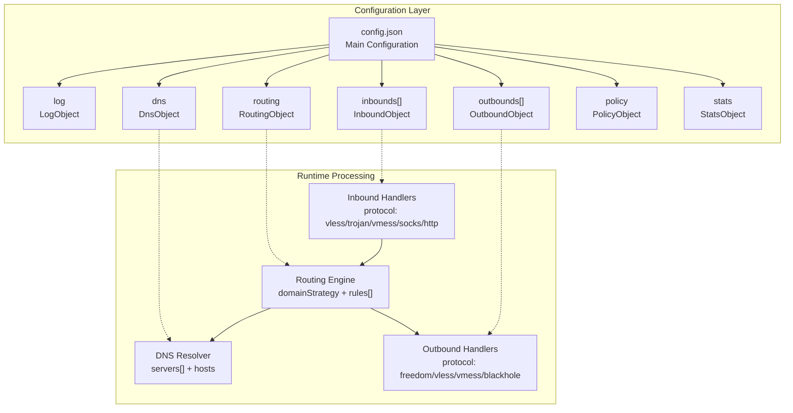

**Configuration File Structure**

The primary configuration file (`config.json` by default) contains seven top-level sections:

| Section | Config Key | Description |
|---------|-----------|-------------|
| Logging | `log` | Access and error log configuration with levels: none, error, warning, info, debug |
| DNS | `dns` | Built-in DNS resolver with servers, hosts, queryStrategy |
| Routing | `routing` | Traffic routing rules with domain/IP/protocol matching |
| Inbounds | `inbounds` | Array of inbound connection handlers (port, protocol, settings) |
| Outbounds | `outbounds` | Array of outbound connection handlers (protocol, destination) |
| Policy | `policy` | User levels, timeouts, buffer strategies |
| Statistics | `stats` | Traffic statistics collection |

Sources: [docs/document/level-0/ch07-xray-server.md:143-242](), [docs/document/level-0/ch08-xray-clients.md:102-247]()

### Traffic Processing Flow

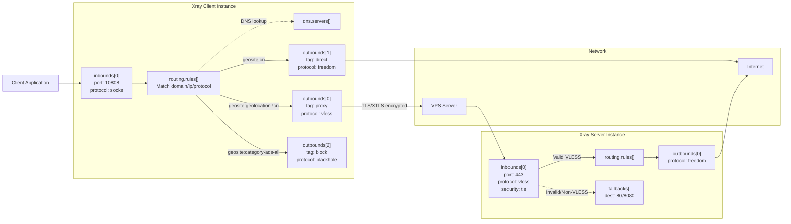

**Processing Stages**

1. **Inbound Reception**: Traffic enters through configured `inbounds[i].port` using specified `protocol` (socks, http, vless, trojan, vmess)
2. **Routing Decision**: The `routing.rules[]` array evaluates traffic against conditions (`domain`, `ip`, `protocol`, `inboundTag`) sequentially
3. **DNS Resolution**: When `routing.domainStrategy` is `IPIfNonMatch` or `IPOnDemand`, domains are resolved via `dns.servers[]`
4. **Outbound Dispatch**: Matched traffic is directed to the corresponding `outbounds[i]` by `outboundTag` reference
5. **Hidden Rule**: Any traffic not matching explicit rules uses `outbounds[0]` (first outbound) as default

Sources: [docs/document/level-0/ch08-xray-clients.md:1-33](), [docs/document/level-1/routing-lv1-part1.md:1-420]()

## Binary Execution and CLI

The `xray` executable is invoked from the command line with subcommands:

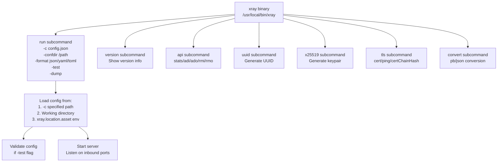

**Key Commands**

- `xray run -c /path/to/config.json`: Start Xray with configuration file
- `xray run -confdir /etc/xray`: Load all JSON configs from directory
- `xray run -test -c config.json`: Validate configuration without starting
- `xray uuid`: Generate UUID for VLESS authentication
- `xray x25519`: Generate X25519 keypair for REALITY/VLESS Encryption
- `xray tls cert`: Generate TLS certificates

The configuration file search order when `-c` is not specified: working directory → `${xray.location.asset}/config.json` (environment variable)

Sources: [docs/document/command.md:1-252](), [docs/document/level-0/ch07-xray-server.md:100-104]()

## Installation Methods

Xray supports multiple installation approaches across platforms:

**Binary Installation**
- Download pre-compiled ZIP archives from [GitHub Releases](https://github.com/xtls/Xray-core/releases)
- Extract and run `xray` (Linux/macOS) or `xray.exe` (Windows) directly

**Package Managers**
- **Linux**: Official installation script [XTLS/Xray-install](https://github.com/XTLS/Xray-install)
- **macOS**: `brew install xray`
- **Windows**: `scoop install xray` via [Mochi bucket](https://github.com/Qv2ray/mochi)
- **Arch Linux**: `yay -S xray` (AUR) or `pacman -S xray` (archlinuxcn repo)

**Docker Images**
- `teddysun/xray`: Full environment with root access, shell, Alpine-based
- `ghcr.io/xtls/xray-core`: Minimal environment, rootless, no shell, supports reproducible builds

**Platform Support**
- Windows 7+ (x86/amd64/arm32/arm64)
- macOS 10.10+ (amd64/arm64)
- Linux 2.6.23+ (x86/amd64/arm/arm64/mips64/mips/ppc64/s390x/riscv64)
- FreeBSD, OpenBSD (x86/amd64)

Sources: [docs/document/install.md:1-169](), [docs/document/level-0/ch07-xray-server.md:21-61]()

## Configuration File Structure Mapping

The configuration file directly maps to Go structures in the codebase. Key objects:

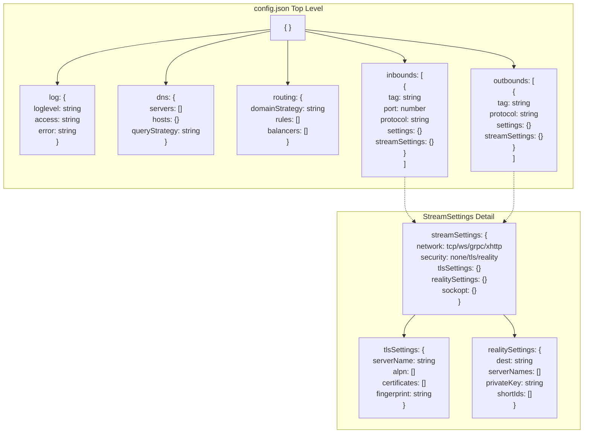

**Critical Configuration Patterns**

Server-side VLESS inbound with fallback:
```json
{
  "inbounds": [{
    "port": 443,
    "protocol": "vless",
    "settings": {
      "clients": [{"id": "uuid", "flow": "xtls-rprx-vision"}],
      "decryption": "none",
      "fallbacks": [{"dest": 80}]
    },
    "streamSettings": {
      "network": "tcp",
      "security": "tls",
      "tlsSettings": {
        "certificates": [{
          "certificateFile": "/path/to/cert.pem",
          "keyFile": "/path/to/key.pem"
        }]
      }
    }
  }]
}
```

Client-side routing with geosite/geoip:
```json
{
  "routing": {
    "domainStrategy": "IPIfNonMatch",
    "rules": [
      {
        "domain": ["geosite:category-ads-all"],
        "outboundTag": "block"
      },
      {
        "domain": ["geosite:cn"],
        "outboundTag": "direct"
      },
      {
        "domain": ["geosite:geolocation-!cn"],
        "outboundTag": "proxy"
      }
    ]
  }
}
```

Sources: [docs/document/level-0/ch07-xray-server.md:143-243](), [docs/document/level-0/ch08-xray-clients.md:102-247]()

## Protocol Support

Xray supports multiple proxy protocols with distinct characteristics:

| Protocol | Use Case | Authentication | Flow Control |
|----------|----------|----------------|--------------|
| `vless` | Server/client, XTLS support | UUID | xtls-rprx-vision, xtls-rprx-vision-udp443 |
| `trojan` | Server/client, TLS tunnel | Password | Supports fallbacks |
| `vmess` | Server/client, legacy | UUID + alterId | None |
| `freedom` | Direct connection outbound | None | N/A |
| `blackhole` | Traffic blocking | None | N/A |
| `socks` | Local inbound proxy | Optional user/pass | None |
| `http` | Local inbound proxy | Optional user/pass | None |
| `shadowsocks` | Server/client | Password + method | None |

**VLESS with XTLS Flow Control**

VLESS combined with XTLS Vision provides optimal performance:
- `flow: "xtls-rprx-vision"`: Enables XTLS with inner padding and UDP 443 blocking
- `flow: "xtls-rprx-vision-udp443"`: XTLS with inner padding, no UDP 443 blocking
- Linux systems utilize `splice` mechanism for kernel-level zero-copy forwarding

**Fallback Mechanism**

Protocols `vless` and `trojan` support the `fallbacks[]` array for active probing defense:
```json
{
  "fallbacks": [
    {"dest": 8080},
    {"path": "/websocket", "dest": 1234, "xver": 1},
    {"name": "blog.example.com", "dest": 5003, "xver": 1}
  ]
}
```

Traffic not matching protocol authentication is redirected based on `name` (SNI), `path`, or `alpn` matching.

Sources: [docs/document/level-1/fallbacks-lv1.md:1-393](), [docs/document/level-0/ch07-xray-server.md:193-213]()

## Transport and Security Layers

Transport protocols carry proxy protocol traffic with optional security wrapping:

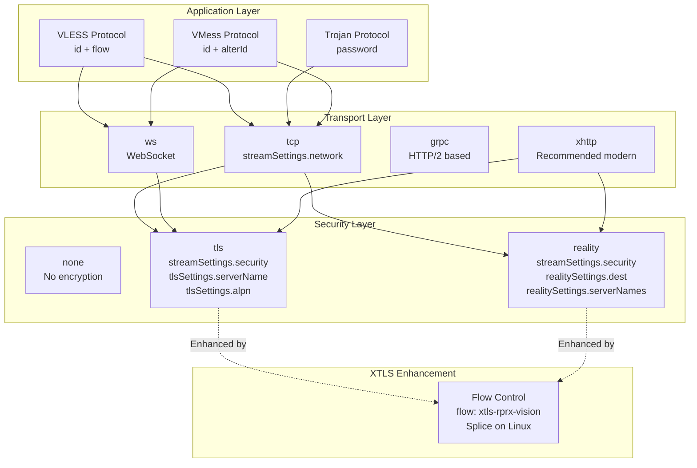

**Key Transport Configuration**

TCP with TLS:
```json
{
  "streamSettings": {
    "network": "tcp",
    "security": "tls",
    "tlsSettings": {
      "serverName": "example.com",
      "alpn": ["h2", "http/1.1"],
      "fingerprint": "chrome"
    }
  }
}
```

WebSocket with path:
```json
{
  "streamSettings": {
    "network": "ws",
    "wsSettings": {
      "path": "/websocket",
      "acceptProxyProtocol": true
    }
  }
}
```

REALITY (server-side):
```json
{
  "streamSettings": {
    "network": "tcp",
    "security": "reality",
    "realitySettings": {
      "dest": "www.example.com:443",
      "serverNames": ["www.example.com"],
      "privateKey": "generated_by_xray_x25519",
      "shortIds": ["0123456789abcdef"]
    }
  }
}
```

Sources: [docs/document/level-1/fallbacks-with-sni.md:1-328](), [docs/document/level-0/ch07-xray-server.md:214-226]()

## Routing System

The routing engine (`routing.rules[]`) evaluates traffic sequentially using multiple matching conditions:

**Matching Conditions**

| Condition | Type | Example | Purpose |
|-----------|------|---------|---------|
| `domain` | string[] | `["geosite:cn", "full:example.com"]` | Domain matching with geosite database |
| `ip` | string[] | `["geoip:cn", "geoip:private", "1.1.1.1"]` | IP matching with geoip database |
| `protocol` | string[] | `["bittorrent", "http", "tls"]` | Protocol detection (requires sniffing) |
| `inboundTag` | string[] | `["socks-in", "http-in"]` | Source inbound identification |
| `port` | string | `"80-443"` | Destination port range |
| `network` | string | `"tcp"` or `"udp"` | Network type |

**Domain Strategy**

The `routing.domainStrategy` controls DNS resolution timing:

- `"AsIs"`: Use domain as-is, no DNS lookup (fastest)
- `"IPIfNonMatch"`: Resolve domain to IP only if no domain rules match
- `"IPOnDemand"`: Resolve domain immediately when any IP-based rule exists

**Geosite and Geoip Data Files**

Located in `${xray.location.asset}/` directory:
- `geosite.dat`: Domain categorization (category-ads-all, cn, geolocation-!cn, apple, google, etc.)
- `geoip.dat`: IP range categorization (cn, private, etc.)

These files enable flexible routing without manually maintaining domain/IP lists.

Sources: [docs/document/level-1/routing-lv1-part2.md:1-417](), [docs/document/level-1/routing-lv1-part1.md:233-308]()

## Service Management

Xray typically runs as a systemd service on Linux:

**Installation Script**

The official script [install-release.sh](https://github.com/XTLS/Xray-install/raw/main/install-release.sh) installs:
- Binary: `/usr/local/bin/xray`
- Configuration: `/usr/local/etc/xray/config.json`
- Systemd unit: `/etc/systemd/system/xray.service`
- Asset files: `/usr/local/share/xray/geosite.dat`, `/usr/local/share/xray/geoip.dat`

**Service Commands**

```bash
sudo systemctl start xray      # Start service
sudo systemctl stop xray       # Stop service
sudo systemctl restart xray    # Restart service
sudo systemctl status xray     # Check status
sudo systemctl enable xray     # Enable auto-start
sudo systemctl disable xray    # Disable auto-start
```

**Certificate Management**

Using `acme.sh` for automatic TLS certificate renewal:
```bash
acme.sh --install-cert -d domain.com --ecc \
  --fullchain-file /path/to/cert.pem \
  --key-file /path/to/key.pem \
  --reloadcmd "systemctl restart xray"
```

The `--reloadcmd` ensures Xray reloads certificates upon renewal.

Sources: [docs/document/level-0/ch07-xray-server.md:248-298](), [docs/document/level-0/ch07-xray-server.md:63-93]()

## Documentation Infrastructure

This documentation site is built using VitePress 2.0.0-alpha.16 with the following architecture:

**Build Pipeline**

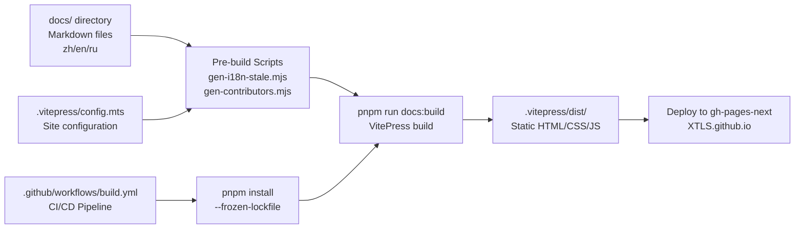

**Key Features**

- **Multi-language Support**: Chinese (default), English (`/en/`), Russian (`/ru/`)
- **Mermaid Diagrams**: Integrated via `vitepress-plugin-mermaid` with SSR support
- **Local Search**: MiniSearch provider with language-specific tokenization (Chinese: segment-based, English/Russian: word-based)
- **Automated Builds**: GitHub Actions triggers on push to main branch
- **Contributors**: Auto-generated from Git history via `gen-contributors.mjs`

**Configuration Structure**

Located at [.vitepress/config.mts]():
- Site metadata: title, description, head tags
- Locales configuration: language-specific navigation and sidebars
- Theme configuration: search, sidebar, navigation menus
- Build plugins: Mermaid, llmstxt, optimization settings

Sources: [docs/document/install.md:1-169](), [docs/en/document/install.md:1-166]()

## Next Steps

- **[Project X and Xray-core](#1.1)**: Deep dive into the Xray ecosystem and binary structure
- **[Installation and CLI](#1.2)**: Detailed installation procedures and command-line usage
- **[Core Architecture](#2)**: Complete system architecture including inbounds, routing, and outbounds
- **[Transport Layer](#3)**: StreamSettings, network protocols, and security mechanisms
- **[Protocol Configuration](#4)**: VLESS, Trojan, VMess, and Freedom protocol details
- **[Advanced Features](#5)**: DNS system, multiplexing, fallbacks, reverse proxy, and traffic obfuscation
- **[Deployment and Operations](#6)**: Production deployment, performance optimization, and troubleshooting

---

# Page: Project X and Xray-core

# Project X and Xray-core

<details>
<summary>Relevant source files</summary>

The following files were used as context for generating this wiki page:

- [docs/development/intro/compile.md](docs/development/intro/compile.md)
- [docs/document/command.md](docs/document/command.md)
- [docs/document/install.md](docs/document/install.md)
- [docs/document/level-0/ch07-xray-server.md](docs/document/level-0/ch07-xray-server.md)
- [docs/document/level-0/ch08-xray-clients.md](docs/document/level-0/ch08-xray-clients.md)
- [docs/document/level-1/fallbacks-lv1.md](docs/document/level-1/fallbacks-lv1.md)
- [docs/document/level-1/fallbacks-with-sni.md](docs/document/level-1/fallbacks-with-sni.md)
- [docs/document/level-1/routing-lv1-part1.md](docs/document/level-1/routing-lv1-part1.md)
- [docs/document/level-1/routing-lv1-part2.md](docs/document/level-1/routing-lv1-part2.md)
- [docs/en/document/command.md](docs/en/document/command.md)
- [docs/en/document/install.md](docs/en/document/install.md)
- [docs/en/document/level-0/ch07-xray-server.md](docs/en/document/level-0/ch07-xray-server.md)
- [docs/ru/document/level-0/ch07-xray-server.md](docs/ru/document/level-0/ch07-xray-server.md)
- [docs/ru/document/level-1/fallbacks-with-sni.md](docs/ru/document/level-1/fallbacks-with-sni.md)
- [docs/ru/document/level-1/routing-lv1-part1.md](docs/ru/document/level-1/routing-lv1-part1.md)

</details>


This document introduces Project X and its core component Xray-core, explaining the ecosystem, architecture, and fundamental concepts that underpin the proxy platform. For detailed installation instructions, see [Installation and CLI](#1.2). For configuration details, see [Configuration Structure](#2.1). For specific protocol configurations, see [Protocol Configuration](#4).

## Overview

**Project X** is an open-source ecosystem centered around building flexible, high-performance network proxies. The project encompasses:

- The core codebase and binary at [github.com/XTLS/Xray-core](https://github.com/XTLS/Xray-core)
- Official documentation at [XTLS.github.io](https://xtls.github.io)
- Installation scripts at [github.com/XTLS/Xray-install](https://github.com/XTLS/Xray-install)
- A community of GUI clients, configuration tools, and extensions

The project is licensed under MPL 2.0 and maintains active development focused on performance, security, and extensibility.

**Sources:** [docs/document/level-0/ch07-xray-server.md:22-24](), [docs/document/install.md:1-19]()

## Xray-core Binary Architecture

### Single Binary, Dual Role

Xray-core produces a single cross-platform binary (`xray` on Unix-like systems, `xray.exe` on Windows) that functions as both client and server depending solely on its configuration. This architectural decision simplifies deployment and reduces maintenance overhead.

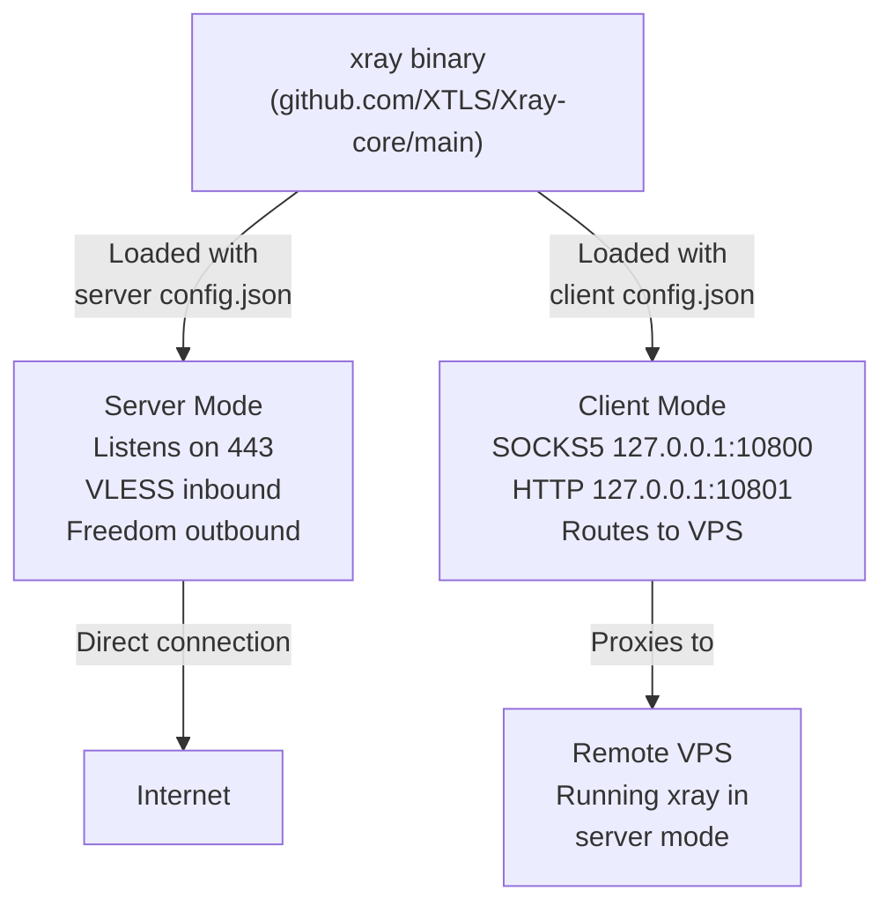

The binary locates its configuration file through:
1. Explicit path via `-c` or `-config` flag
2. Working directory `config.json`
3. Path specified in `Xray.location.asset` environment variable

**Sources:** [docs/document/level-0/ch07-xray-server.md:22-24](), [docs/document/level-0/ch08-xray-clients.md:79-81](), [docs/document/command.md:72-76]()

### CLI Interface

The binary exposes multiple commands through a Go-style CLI:

| Command | Purpose | Key Flags |
|---------|---------|-----------|
| `run` | Start Xray with configuration (default) | `-c`, `-confdir`, `-format`, `-test`, `-dump` |
| `version` | Display version information | None |
| `api` | Interact with gRPC API | `stats`, `adi`, `ado`, `rmi`, `rmo` |
| `uuid` | Generate UUIDs for authentication | `-i` |
| `x25519` | Generate REALITY/VLESS Encryption keys | `-i`, `--std-encoding` |
| `tls` | TLS utilities (cert generation, ping) | Subcommands: `cert`, `ping`, `certChainHash` |
| `mlkem768` | Generate post-quantum keys for VLESS | `-i` |
| `vlessenc` | Generate VLESS Encryption configs | None |

**Sources:** [docs/document/command.md:8-33](), [docs/en/document/command.md:8-33]()

### Build and Distribution

The codebase compiles with standard Go tooling. Release binaries are distributed via:
- GitHub Releases: Pre-built ZIP archives for all platforms
- Package managers: Homebrew, Scoop, pacman (Arch), apt (Debian)
- Docker images: `teddysun/xray` and `ghcr.io/xtls/xray-core`
- Installation script: `install-release.sh` from [XTLS/Xray-install](https://github.com/XTLS/Xray-install)

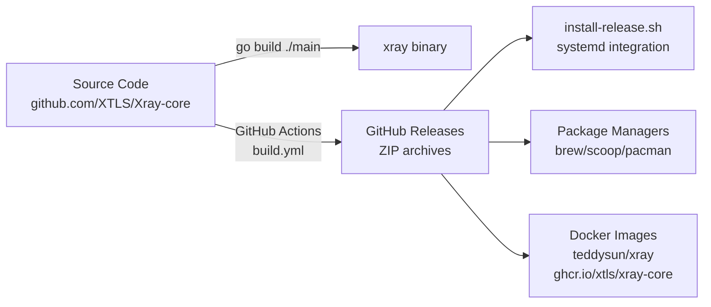

Compilation from source requires Go 1.18+ and follows standard procedures documented in [docs/development/intro/compile.md:1-96](). The build process supports cross-compilation and reproducible builds.

**Sources:** [docs/document/install.md:16-21](), [docs/development/intro/compile.md:42-47](), [docs/document/level-0/ch07-xray-server.md:37-53]()

## Core Architectural Concepts

### Configuration-Driven Behavior

Xray's behavior is entirely defined by configuration files in JSON, YAML, or TOML format. The configuration has seven primary sections:

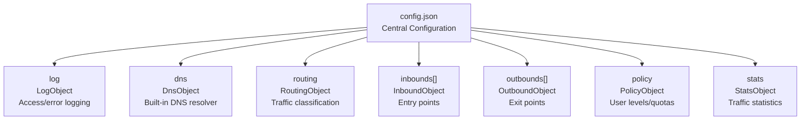

Each section controls a distinct subsystem. The `inbounds`, `outbounds`, and `routing` sections form the core traffic processing pipeline.

**Sources:** [docs/document/level-0/ch07-xray-server.md:143-158](), [docs/document/level-0/ch08-xray-clients.md:107-112]()

### Traffic Processing Pipeline

Traffic flows through Xray via a three-stage pipeline: **inbound → routing → outbound**. This architecture enables sophisticated traffic classification and handling.

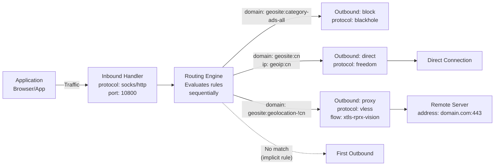

**Key Concepts:**

- **Inbounds** define how traffic enters Xray (protocols, ports, authentication)
- **Routing** evaluates traffic against sequential rules to determine handling
- **Outbounds** define how traffic exits Xray (protocols, destinations)
- **Tags** create references between components (`inboundTag`, `outboundTag`)

The implicit rule "unmatched traffic goes to first outbound" ensures all traffic receives handling.

**Sources:** [docs/document/level-0/ch08-xray-clients.md:6-31](), [docs/document/level-1/routing-lv1-part1.md:1-156]()

### Protocol Layers

Xray implements a layered protocol architecture where transport, security, and application protocols compose independently:

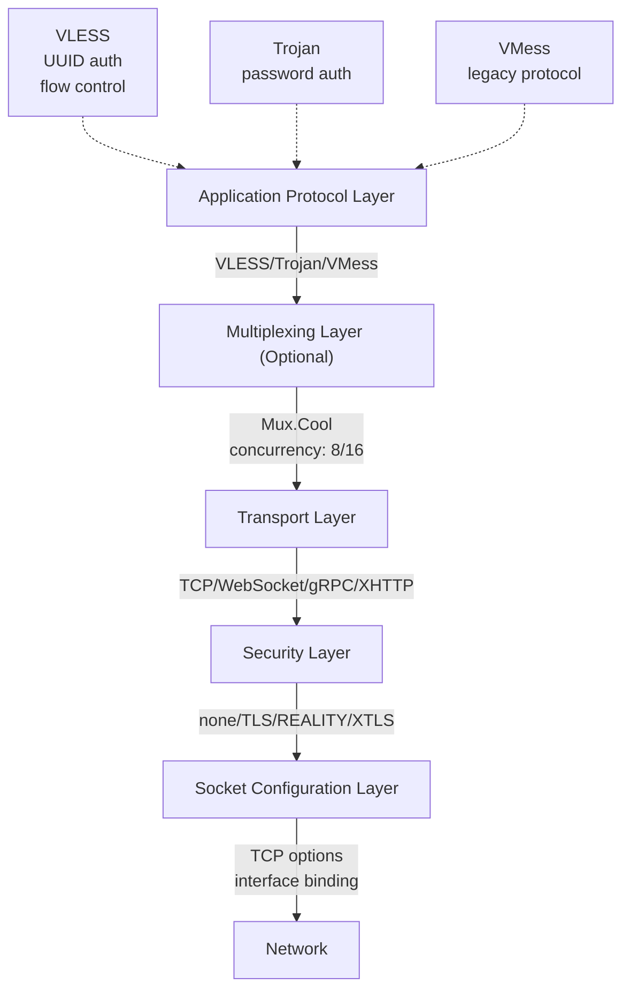

This modular design allows combinations like:
- `VLESS + TCP + REALITY + XTLS Vision`
- `VMess + WebSocket + TLS`
- `Trojan + gRPC + TLS`

Each layer is configured via `StreamSettingsObject` within inbound/outbound definitions.

**Sources:** [docs/document/level-0/ch08-xray-clients.md:38-45](), Diagram 4 from high-level overview

## Configuration Structure

### InboundObject Structure

Inbounds define listening configurations. The structure from [docs/document/level-0/ch07-xray-server.md:194-227]():

```json
{
  "port": 443,
  "protocol": "vless",
  "tag": "inbound-vless-443",
  "settings": {
    "clients": [
      {
        "id": "UUID",
        "flow": "xtls-rprx-vision",
        "level": 0,
        "email": "user@example.com"
      }
    ],
    "decryption": "none",
    "fallbacks": [...]
  },
  "streamSettings": {...}
}
```

Critical fields:
- `port`: Listening port (e.g., 443 for HTTPS)
- `protocol`: Protocol handler (`vless`, `trojan`, `vmess`, `socks`, `http`)
- `tag`: Unique identifier for routing references
- `settings`: Protocol-specific authentication and behavior
- `streamSettings`: Transport and security configuration

**Sources:** [docs/document/level-0/ch07-xray-server.md:143-227]()

### OutboundObject Structure

Outbounds define exit configurations. The structure from [docs/document/level-0/ch08-xray-clients.md:206-234]():

```json
{
  "tag": "proxy-out-vless",
  "protocol": "vless",
  "settings": {
    "vnext": [
      {
        "address": "server.example.com",
        "port": 443,
        "users": [
          {
            "id": "UUID",
            "flow": "xtls-rprx-vision",
            "encryption": "none"
          }
        ]
      }
    ]
  },
  "streamSettings": {...}
}
```

Key protocols:
- `freedom`: Direct connection (no proxy)
- `blackhole`: Traffic blocking
- `vless`, `trojan`, `vmess`: Proxy protocols for forwarding

**Sources:** [docs/document/level-0/ch08-xray-clients.md:204-247](), [docs/document/level-1/routing-lv1-part1.md:204-231]()

### RoutingObject Structure

The routing configuration from [docs/document/level-1/routing-lv1-part1.md:236-256]() shows rule evaluation:

```json
{
  "routing": {
    "domainStrategy": "AsIs",
    "rules": [
      {
        "domain": ["geosite:category-ads-all"],
        "outboundTag": "block"
      },
      {
        "domain": ["geosite:cn"],
        "ip": ["geoip:cn", "geoip:private"],
        "outboundTag": "direct"
      },
      {
        "domain": ["geosite:geolocation-!cn"],
        "outboundTag": "proxy"
      }
    ]
  }
}
```

Rules match on:
- `domain`: Domain patterns or `geosite:category`
- `ip`: IP addresses or `geoip:country`
- `protocol`: Application protocol (requires `sniffing`)
- `inboundTag`: Source inbound
- `port`, `network`, `source`: Additional conditions

Rules evaluate sequentially; first match wins.

**Sources:** [docs/document/level-1/routing-lv1-part1.md:122-154](), [docs/document/level-1/routing-lv1-part2.md:183-239]()

## Key Subsystems

### DNS System

Xray includes a built-in DNS resolver configured via `DnsObject`. The system supports:

- Multiple upstream servers with priority-based selection
- Domain-specific server routing
- Static `hosts` mappings (recursive up to depth 5)
- IP filtering via `expectedIPs`/`unexpectedIPs` for pollution protection
- DoH, DoT, and UDP protocols

DNS queries interact with routing via `domainStrategy`:
- `AsIs`: No DNS resolution during routing (fastest)
- `IPIfNonMatch`: DNS lookup only if domain rules fail
- `IPOnDemand`: DNS lookup when IP rules exist

**Sources:** [docs/document/level-1/routing-lv1-part2.md:345-390](), Diagram 5 from high-level overview

### Fallback Mechanism

VLESS and Trojan protocols support fallback configurations for active probing defense. Traffic failing authentication or protocol validation redirects to alternate destinations:

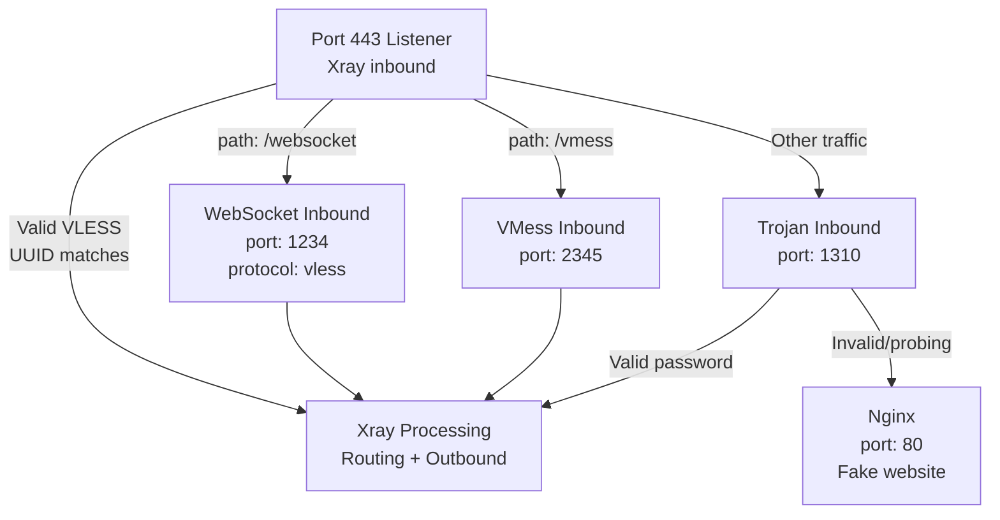

Fallback configuration includes:
- `dest`: Target port or Unix socket
- `path`: HTTP path matching
- `name`: SNI matching
- `alpn`: Application-Layer Protocol Negotiation matching
- `xver`: Enable PROXY protocol for real IP forwarding

This creates layered defense where invalid traffic sees only legitimate web servers.

**Sources:** [docs/document/level-1/fallbacks-lv1.md:1-388](), [docs/document/level-1/fallbacks-with-sni.md:1-90]()

### Transport and Security

The `StreamSettingsObject` configures transport and security layers independently:

**Transport Options** (`network`):
- `tcp`: Raw TCP (baseline)
- `ws`: WebSocket (HTTP/1.1 upgrade)
- `grpc`: gRPC (HTTP/2 based)
- `xhttp`: Modern recommended transport with QUIC support
- `h2`: HTTP/2 (see XHTTP)
- `httpupgrade`: HTTP/1.1 upgrade mechanism

**Security Options** (`security`):
- `none`: No encryption (internal use only)
- `tls`: Standard TLS 1.3
- `reality`: Xray-specific protocol mimicking real websites

**XTLS Flow Control** (`flow`):
- `xtls-rprx-vision`: Vision mode with inner padding
- `xtls-rprx-vision-udp443`: Vision without UDP 443 blocking

On Linux with TCP, XTLS enables splice mechanism for kernel-level zero-copy forwarding.

**Sources:** [docs/document/level-0/ch08-xray-clients.md:208-234](), Diagram 4 from high-level overview

## Documentation Ecosystem

The project maintains comprehensive documentation built with VitePress 2.0.0-alpha.16. The system located at [.vitepress/config.mts]() orchestrates:

- Multi-language support (Chinese, English, Russian)
- Mermaid diagram rendering
- Local search with language-specific tokenization
- Automated contributor generation
- Cross-repository deployment to XTLS.github.io

Build pipeline from [.github/workflows/build.yml]():
1. Pre-build scripts generate dynamic content
2. VitePress compiles markdown to static HTML
3. GitHub Actions deploys to `gh-pages-next` branch
4. Content serves from XTLS.github.io

**Sources:** [docs/document/install.md:1-19](), Diagram 6 from high-level overview, documentation build system context

## Integration Points

### GUI Clients

The ecosystem includes numerous GUI clients across platforms:
- **Windows**: v2rayN, Furious, Invisible Man
- **macOS**: Happ, V2rayU, V2RayXS, OneXray
- **Linux**: v2rayA, Furious, GorzRay
- **Android**: v2rayNG, X-flutter, SimpleXray
- **iOS**: Happ, FoXray, Streisand
- **OpenWrt**: PassWall, ShadowSocksR Plus+, luci-app-xray

These clients embed the `xray` binary and provide configuration interfaces.

**Sources:** [docs/document/install.md:124-165]()

### Installation Methods

Production deployments typically use one of:
- **Official script**: `bash install-release.sh` from XTLS/Xray-install
  - Installs to `/usr/local/bin/xray`
  - Creates systemd service at `/etc/systemd/system/xray.service`
  - Config directory: `/usr/local/etc/xray/`
  
- **Package managers**: Native integration with system package management
- **Docker**: Containerized deployment with volume mounts for config/logs
- **Manual binary**: Direct binary placement with custom service management

**Sources:** [docs/document/level-0/ch07-xray-server.md:21-53](), [docs/document/install.md:42-85]()

---

# Page: Installation and CLI

# Installation and CLI

<details>
<summary>Relevant source files</summary>

The following files were used as context for generating this wiki page:

- [docs/development/intro/compile.md](docs/development/intro/compile.md)
- [docs/document/command.md](docs/document/command.md)
- [docs/document/install.md](docs/document/install.md)
- [docs/en/document/command.md](docs/en/document/command.md)
- [docs/en/document/install.md](docs/en/document/install.md)

</details>


This document covers Xray-core installation methods across different platforms and explains the command-line interface for running and managing Xray. For information about configuring the core binary after installation, see [Configuration Structure](#2.1). For GUI client applications, see [Client Configuration](#6.2).

## Purpose and Scope

This page documents:
- Platform compatibility and system requirements
- Installation methods: binary downloads, package managers, scripts, Docker, and compilation
- Post-installation file structure and locations
- CLI command reference for the `xray` binary
- Key generation utilities for VLESS, REALITY, and other protocols

## Platform Support

Xray-core provides cross-platform support with pre-compiled binaries for multiple architectures:

| Platform | Versions | Architectures | Notes |
|----------|----------|---------------|-------|
| Windows | 7 and later | x86, amd64, arm32, arm64 | Windows 7 requires KB4474419 update for versions 1.8.4+; v25+ only needs SP1 |
| macOS | 10.10 Yosemite and later | amd64, arm64 | Native Apple Silicon support |
| Linux | Kernel 2.6.23 and later | x86, amd64, arm, arm64, mips64, mips, ppc64, s390x, riscv64 | Includes Debian, Ubuntu, CentOS, Arch |
| FreeBSD | Latest | x86, amd64 | Community support |
| OpenBSD | Latest | x86, amd64 | Community support |

**Sources:** [docs/document/install.md:3-14](), [docs/en/document/install.md:3-14]()

## Installation Methods Overview

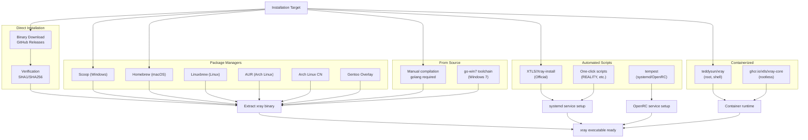

**Diagram: Installation Path Decision Tree**

**Sources:** [docs/document/install.md:16-95](), [docs/en/document/install.md:16-88]()

### Binary Downloads

Pre-compiled binaries are available from [GitHub Releases](https://github.com/xtls/Xray-core/releases). Download the ZIP archive for your platform and extract the `xray` executable (or `xray.exe` on Windows).

**Verification Methods:**
1. **Checksum verification:** Compare SHA1/SHA256 digest provided in release notes
2. **Reproducible builds:** Compile from source and verify build hash matches (see [Compilation from Source](#compilation-from-source))

**Sources:** [docs/document/install.md:16-27](), [docs/en/document/install.md:16-27]()

### Package Managers

#### Windows: Scoop

```bash
scoop bucket add mochi https://github.com/Qv2ray/mochi
scoop install xray
```

Xray is available in the [Mochi](https://github.com/Qv2ray/mochi) bucket.

#### macOS: Homebrew

```bash
brew install xray
```

Official formula maintained in [homebrew-xray](https://github.com/N4FA/homebrew-xray).

#### Linux: Linuxbrew

```bash
brew install xray
```

Uses the same formula as macOS Homebrew.

#### Arch Linux

**AUR (Arch User Repository):**
```bash
yay -S xray
```

Requires an [AUR helper](https://wiki.archlinux.org/index.php/AUR_helpers) such as `yay`.

**Arch Linux CN Repository:**
```bash
# First add the repository: https://www.archlinuxcn.org/archlinux-cn-repo-and-mirror/
sudo pacman -S xray
```

#### Gentoo

Three third-party overlays provide Portage scripts:
- **CHN-beta/touchfish-os:** systemD support
- **Gentoo-zh:** systemD support, community maintained
- **JuanCldCmt/Xray-Overlay:** openRC support with xray user group

```bash
# Add overlay using layman or eselect-repository
sudo emerge xray
```

**Sources:** [docs/document/install.md:29-84](), [docs/en/document/install.md:29-81]()

### Installation Scripts

#### Official: XTLS/Xray-install

```bash
bash -c "$(curl -L https://github.com/XTLS/Xray-install/raw/main/install-release.sh)" @ install
```

Provides systemd service setup, automatic updates, and proper file permissions.

Repository: [XTLS/Xray-install](https://github.com/XTLS/Xray-install)

#### tempest

Supports both systemd and OpenRC init systems.

Repository: [team-cloudchaser/tempest](https://github.com/team-cloudchaser/tempest)

#### One-Click Scripts

Pre-configured scripts for specific use cases:
- **REALITY setup:** [Xray-REALITY](https://github.com/zxcvos/Xray-script), [xray-reality](https://github.com/sajjaddg/xray-reality), [reality-ezpz](https://github.com/aleskxyz/reality-ezpz)
- **General deployment:** [v2ray-agent](https://github.com/mack-a/v2ray-agent), [Xray_onekey](https://github.com/wulabing/Xray_onekey), [XTool](https://github.com/LordPenguin666/XTool)

**Sources:** [docs/document/install.md:44-53](), [docs/en/document/install.md:42-51]()

### Docker Installation

Two official Docker images with different security profiles:

#### teddysun/xray

**Characteristics:**
- Root privileges available
- Shell environment included
- Compatible with all Alpine-supported architectures
- Built by private server dl.lamp.sh
- More convenient for debugging

```bash
docker pull teddysun/xray
docker run -d -v /path/to/config:/etc/xray teddysun/xray
```

#### ghcr.io/xtls/xray-core

**Characteristics:**
- Rootless container (runs as UID 65532)
- No shell environment (distroless)
- Official repository builds with traceability
- Enhanced security at cost of convenience

```bash
docker pull ghcr.io/xtls/xray-core
docker run -d -v /path/to/config:/usr/local/etc/xray ghcr.io/xtls/xray-core
```

**Sources:** [docs/document/install.md:86-122](), [docs/en/document/install.md:84-119]()

## Post-Installation File Structure

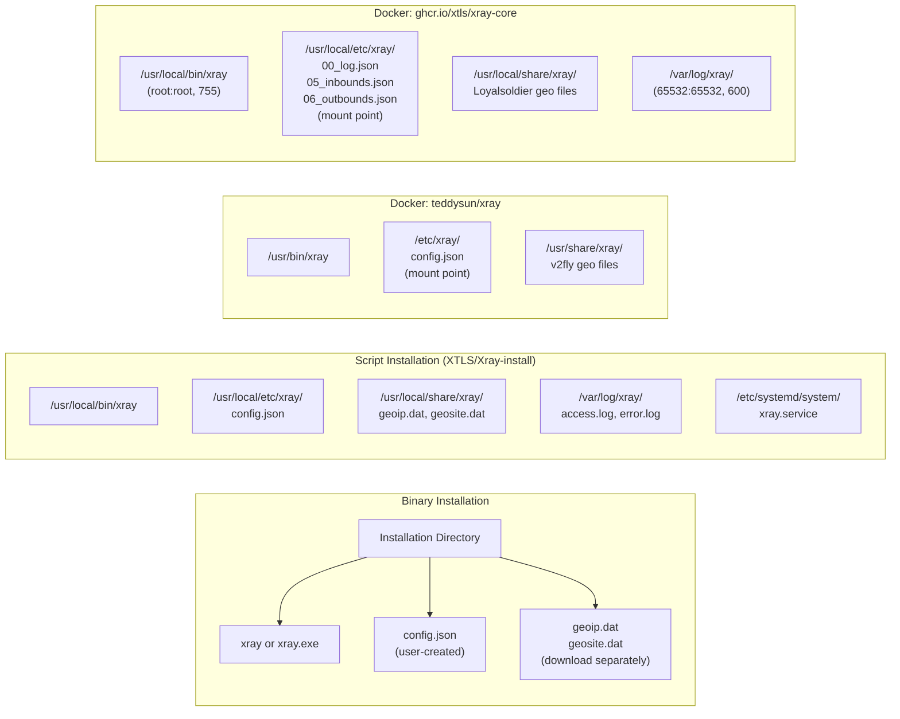

**Diagram: File Structure by Installation Method**

### Binary Installation File Locations

When using pre-compiled binaries, the file structure is minimal:
- **Executable:** `xray` or `xray.exe` in the extracted directory
- **Configuration:** `config.json` must be created manually in the same directory or specified via `-c` flag
- **Geo Data Files:** Must be downloaded separately from [v2fly/domain-list-community](https://github.com/v2fly/domain-list-community) or [Loyalsoldier/v2ray-rules-dat](https://github.com/Loyalsoldier/v2ray-rules-dat)

### Script Installation File Locations

Official XTLS/Xray-install script creates this structure:
- `/usr/local/bin/xray` - Main executable
- `/usr/local/etc/xray/config.json` - Configuration file
- `/usr/local/share/xray/` - Resource files (geoip.dat, geosite.dat)
- `/var/log/xray/` - Log files
- `/etc/systemd/system/xray.service` - systemd service unit

### Docker File Structure

**teddysun/xray image:**
- `/usr/bin/xray` - Main program
- `/etc/xray/config.json` - Single configuration file (mount point)
- `/usr/share/xray/` - v2fly version geo data files

**ghcr.io/xtls/xray-core image:**
- `/usr/local/bin/xray` - Main program (owner: root:root, permissions: 755)
- `/usr/local/etc/xray/` - Configuration directory with split config files (mount point)
- `/usr/local/share/xray/` - Loyalsoldier version geo data files
- `/var/log/xray/` - Log directory (files owned by 65532:65532, permissions: 600)

**Sources:** [docs/document/install.md:93-122](), [docs/en/document/install.md:90-119]()

## CLI Command Reference

```mermaid
graph TB
    XRAY["xray binary"]
    
    XRAY --> RUN["run<br/>(default command)"]
    XRAY --> VERSION["version"]
    XRAY --> API["api"]
    XRAY --> CONVERT["convert"]
    XRAY --> TLS["tls"]
    XRAY --> UUID["uuid"]
    XRAY --> X25519["x25519"]
    XRAY --> WG["wg"]
    XRAY --> MLDSA["mldsa65"]
    XRAY --> MLKEM["mlkem768"]
    XRAY --> VLESSENC["vlessenc"]
    
    RUN --> RUN_FLAGS["-c config.json<br/>-confdir dir<br/>-format json|toml|yaml<br/>-test<br/>-dump"]
    
    API --> API_CMDS["restartlogger<br/>stats, statsquery, statssys<br/>adi, ado, rmi, rmo"]
    
    CONVERT --> CONV_PB["pb<br/>(json to protobuf)"]
    CONVERT --> CONV_JSON["json<br/>(typedMessage to json)"]
    
    TLS --> TLS_CERT["cert<br/>(generate certificates)"]
    TLS --> TLS_PING["ping<br/>(TLS handshake test)"]
    TLS --> TLS_HASH["certChainHash<br/>(calculate cert hash)"]
    
    UUID --> UUID_V4["UUIDv4 or UUIDv5<br/>-i option for namespace"]
    X25519 --> X25519_KEY["Key pair for REALITY<br/>VLESS Encryption"]
    WG --> WG_KEY["WireGuard curve25519<br/>key pair"]
    MLDSA --> MLDSA_KEY["Post-quantum signature<br/>for REALITY"]
    MLKEM --> MLKEM_KEY["Post-quantum key exchange<br/>for VLESS Encryption"]
    VLESSENC --> VLESSENC_JSON["Generate encryption/<br/>decryption json pair"]
```

**Diagram: CLI Command Structure**

**Sources:** [docs/document/command.md:7-32](), [docs/en/document/command.md:7-32]()

### Getting Help

```bash
xray help                    # List all commands
xray help <command>          # Detailed help for specific command
```

**Output:**
```
Xray is a platform for building proxies.

Usage:
        xray <command> [arguments]

The commands are:
        run          Run Xray with config, the default command
        version      Show current version of Xray
        api          Call an API in an Xray process
        convert      Convert configs
        tls          TLS tools
        uuid         Generate UUIDv4 or UUIDv5 (VLESS)
        x25519       Generate key pair for X25519 key exchange (REALITY, VLESS Encryption)
        wg           Generate key pair for X25519 key exchange (WireGuard)
        mldsa65      Generate key pair for ML-DSA-65 post-quantum signature (REALITY)
        mlkem768     Generate key pair for ML-KEM-768 post-quantum key exchange (VLESS Encryption)
        vlessenc     Generate decryption/encryption json pair (VLESS Encryption)
```

**Sources:** [docs/document/command.md:8-33](), [docs/en/document/command.md:8-33]()

### xray run

The default command that starts the Xray proxy server with specified configuration.

**Syntax:**
```bash
xray run [-c config.json] [-confdir dir] [-format json|toml|yaml] [-test] [-dump]
```

**Flags:**

| Flag | Shorthand | Description | Multiple |
|------|-----------|-------------|----------|
| `-config` | `-c` | Specify configuration file path | Yes |
| `-confdir` | - | Specify directory containing multiple config files | No |
| `-format` | - | Set config format (json/toml/yaml), default: auto-detect | No |
| `-test` | - | Test configuration validity without starting server | No |
| `-dump` | - | Print merged configuration and exit | No |

**Configuration File Loading Priority:**

When `-config` is not specified, Xray searches for `config.json` in this order:
1. Current working directory
2. Path specified by `xray.location.asset` environment variable (see [Environment Variables](#5.8))

**Examples:**

```bash
# Run with single config file
xray run -c /etc/xray/config.json

# Run with multiple config files (merged)
xray run -c server.json -c routing.json -c dns.json

# Run with config directory (all JSON files merged)
xray run -confdir /etc/xray/conf.d/

# Test YAML configuration
xray run -c config.yaml -format yaml -test

# Show merged configuration from multiple files
xray run -c base.json -c override.json -dump
```

**Multi-File Configuration:**

When multiple config files are specified, Xray merges them in the order provided. Arrays are concatenated, and objects are merged with later values overriding earlier ones.

**Sources:** [docs/document/command.md:35-82](), [docs/en/document/command.md:35-83]()

### xray version

Display version information including Xray version, Go version, and build details.

**Syntax:**
```bash
xray version
```

**Output example:**
```
Xray 1.8.8 (Xray, Penetrates Everything.) Custom (go1.22.0 linux/amd64)
A unified platform for anti-censorship.
```

**Sources:** [docs/document/command.md:84-92](), [docs/en/document/command.md:85-93]()

### xray api

Call Xray's gRPC API to manage running instances dynamically. Requires API configuration enabled in `config.json` (see [Metrics and Logging](#5.7)).

**Syntax:**
```bash
xray api <command> [arguments]
```

**Available API Commands:**

| Command | Description |
|---------|-------------|
| `restartlogger` | Restart the logger (useful for log rotation) |
| `stats` | Get statistics |
| `statsquery` | Query statistics with patterns |
| `statssys` | Get system statistics |
| `adi` | Add inbound handlers dynamically |
| `ado` | Add outbound handlers dynamically |
| `rmi` | Remove inbound handlers |
| `rmo` | Remove outbound handlers |

**Example:**
```bash
# Query traffic statistics
xray api statsquery --pattern "" --reset

# Add new outbound
xray api ado -tag proxy2 -protocol vless -address example.com -port 443
```

**Sources:** [docs/document/command.md:94-113](), [docs/en/document/command.md:95-114]()

### xray convert

Convert configuration files between formats or decode typedMessage structures.

**Syntax:**
```bash
xray convert <command> [arguments]
```

#### convert pb

Convert JSON configuration(s) to protobuf format.

**Syntax:**
```bash
xray convert pb [-outpbfile out.pb] [-debug] [-type] [json file] [json file] ...
```

**Examples:**
```bash
# Merge three configs into single protobuf file
xray convert pb -outpbfile mix.pb c1.json c2.json c3.json

# Inspect protobuf file content
xray convert pb -debug mix.pb

# Run Xray with protobuf config
xray -c mix.pb
```

#### convert json

Convert typedMessage (protobuf) to JSON format.

**Syntax:**
```bash
xray convert json [-type] [stdin:] [typedMessage file]
```

**Example:**
```bash
tmsg='{
  "type": "xray.proxy.shadowsocks.Account",
  "value": "CgMxMTEQBg=="
}'

echo ${tmsg} | xray convert json stdin:

# Output:
# {
#   "cipherType": "AES_256_GCM",
#   "password": "111"
# }
```

**Sources:** [docs/document/command.md:115-168](), [docs/en/document/command.md:116-169]()

### xray tls

TLS-related utilities for certificate management and testing.

**Syntax:**
```bash
xray tls <command> [arguments]
```

**Available TLS Commands:**

| Command | Description |
|---------|-------------|
| `cert` | Generate TLS certificates |
| `ping` | Test TLS handshake with domain |
| `certChainHash` | Calculate certificate chain hash for REALITY configuration |

**Example:**
```bash
# Generate self-signed certificate
xray tls cert -domain example.com

# Test TLS handshake
xray tls ping -domain google.com

# Calculate certificate hash for REALITY
xray tls certChainHash -address example.com:443
```

**Sources:** [docs/document/command.md:170-184](), [docs/en/document/command.md:171-185]()

### Key Generation Commands

```mermaid
graph TB
    subgraph "UUID Generation"
        UUID_CMD["xray uuid"]
        UUID_V4["UUIDv4<br/>(random)"]
        UUID_V5["UUIDv5<br/>(namespace-based)"]
        
        UUID_CMD --> UUID_V4
        UUID_CMD -->|"-i namespace"| UUID_V5
    end
    
    subgraph "X25519 Key Exchange"
        X25519_CMD["xray x25519"]
        X25519_PRIV["Private key<br/>(base64.RawURLEncoding)"]
        X25519_PUB["Public key"]
        
        X25519_CMD --> X25519_PRIV
        X25519_CMD --> X25519_PUB
        
        X25519_USES["Used by:<br/>- REALITY<br/>- VLESS Encryption"]
    end
    
    subgraph "WireGuard Keys"
        WG_CMD["xray wg"]
        WG_PRIV["Private key<br/>(base64.StdEncoding)"]
        WG_PUB["Public key"]
        
        WG_CMD --> WG_PRIV
        WG_CMD --> WG_PUB
        
        WG_USES["Used by:<br/>- WireGuard protocol"]
    end
    
    subgraph "Post-Quantum Cryptography"
        MLDSA_CMD["xray mldsa65"]
        MLDSA_PRIV["ML-DSA-65 private key"]
        MLDSA_PUB["ML-DSA-65 public key"]
        
        MLKEM_CMD["xray mlkem768"]
        MLKEM_PRIV["ML-KEM-768 private key"]
        MLKEM_PUB["ML-KEM-768 public key"]
        
        MLDSA_CMD --> MLDSA_PRIV
        MLDSA_CMD --> MLDSA_PUB
        MLKEM_CMD --> MLKEM_PRIV
        MLKEM_CMD --> MLKEM_PUB
        
        MLDSA_USES["Used by:<br/>- REALITY signatures"]
        MLKEM_USES["Used by:<br/>- VLESS Encryption<br/>key exchange"]
    end
    
    subgraph "VLESS Encryption Config Generator"
        VLESSENC_CMD["xray vlessenc"]
        VLESSENC_DEC["Decryption config<br/>(server-side)"]
        VLESSENC_ENC["Encryption config<br/>(client-side)"]
        
        VLESSENC_CMD --> VLESSENC_DEC
        VLESSENC_CMD --> VLESSENC_ENC
        
        VLESSENC_NOTE["Generates both X25519<br/>and ML-KEM-768 options<br/>(choose one)"]
    end
    
    UUID_V4 -.-> VLESS_PROTO["VLESS protocol<br/>user identification"]
    X25519_PRIV -.-> REALITY_CONFIG["REALITY security<br/>configuration"]
    X25519_PRIV -.-> VLESS_ENC["VLESS Encryption<br/>authentication"]
    MLDSA_PRIV -.-> REALITY_CONFIG
    MLKEM_PRIV -.-> VLESS_ENC
```

**Diagram: Key Generation Commands and Their Usage**

**Sources:** [docs/document/command.md:186-251](), [docs/en/document/command.md:187-252]()

#### xray uuid

Generate UUID for VLESS protocol user identification.

**Syntax:**
```bash
xray uuid [-i "namespace_string"]
```

**Examples:**
```bash
# Generate random UUIDv4
xray uuid

# Generate deterministic UUIDv5 from namespace
xray uuid -i "example@domain.com"
```

**Output:**
```
550e8400-e29b-41d4-a716-446655440000
```

**Use Case:** Identifies users in VLESS protocol configuration (see [VLESS Protocol](#4.1)).

**Sources:** [docs/document/command.md:186-194](), [docs/en/document/command.md:187-195]()

#### xray x25519

Generate X25519 key pair for REALITY and VLESS Encryption authentication.

**Syntax:**
```bash
xray x25519 [-i "(base64.RawURLEncoding)"] [--std-encoding]
```

**Examples:**
```bash
# Generate new key pair
xray x25519

# Generate from seed
xray x25519 -i "my_seed_string"

# Use standard base64 encoding instead of raw URL encoding
xray x25519 --std-encoding
```

**Output:**
```
Private key: gKFwvYW4ezkA7FLFcz1FKkDr9d0eHQHFqR3nCJrYpVc
Public key: 8XdKKl3R7LqZPGv3ZEmRn5c1VvnPqKqZPGv3ZEmRn5c
```

**Use Cases:**
- REALITY: Server-side private key, client-side public key (see [REALITY](#3.3))
- VLESS Encryption: Authentication key exchange (see [VLESS Protocol](#4.1))

**Sources:** [docs/document/command.md:196-204](), [docs/en/document/command.md:197-205]()

#### xray wg

Generate WireGuard curve25519 key pair.

**Syntax:**
```bash
xray wg [-i "(base64.StdEncoding)"]
```

**Example:**
```bash
xray wg
```

**Output:**
```
Private key: 4L6F3rV8K9mN5pQ2tU7wX0yZ1aB3cD4eF5gH6iJ7kL8=
Public key: mN5pQ2tU7wX0yZ1aB3cD4eF5gH6iJ7kL8mN5pQ2tU7w=
```

**Use Case:** WireGuard protocol configuration (see [Other Protocols](#4.4)).

**Sources:** [docs/document/command.md:206-221](), [docs/en/document/command.md:207-222]()

#### xray mldsa65

Generate ML-DSA-65 post-quantum signature key pair for REALITY.

**Syntax:**
```bash
xray mldsa65 [-i "seed (base64.StdEncoding)"]
```

**Example:**
```bash
xray mldsa65
```

**Output:**
```
Private key: [2592 bytes in base64]
Public key: [1952 bytes in base64]
```

**Use Case:** REALITY protocol post-quantum signature authentication (see [REALITY](#3.3)).

**Sources:** [docs/document/command.md:223-231](), [docs/en/document/command.md:224-232]()

#### xray mlkem768

Generate ML-KEM-768 post-quantum key exchange key pair for VLESS Encryption.

**Syntax:**
```bash
xray mlkem768 [-i "seed (base64.StdEncoding)"]
```

**Example:**
```bash
xray mlkem768
```

**Output:**
```
Private key: [2400 bytes in base64]
Public key: [1184 bytes in base64]
```

**Use Case:** VLESS Encryption post-quantum key exchange (see [VLESS Protocol](#4.1)).

**Sources:** [docs/document/command.md:233-241](), [docs/en/document/command.md:234-242]()

#### xray vlessenc

Generate complete VLESS Encryption configuration with both classical (X25519) and post-quantum (ML-KEM-768) authentication options.

**Syntax:**
```bash
xray vlessenc
```

**Output Structure:**
```json
{
  "decryption": {
    "x25519": {
      "privateKey": "..."
    },
    "mlkem768": {
      "privateKey": "..."
    }
  },
  "encryption": {
    "x25519": {
      "publicKey": "..."
    },
    "mlkem768": {
      "publicKey": "..."
    }
  }
}
```

**Important Notes:**
- Server uses `decryption` configuration
- Client uses `encryption` configuration
- Choose **either** X25519 **or** ML-KEM-768 for authentication (not both)
- Both server and client must use the same authentication method
- Ephemeral key exchange remains post-quantum secure regardless of authentication choice

**Use Case:** VLESS Encryption protocol setup (see [VLESS Protocol](#4.1)).

**Sources:** [docs/document/command.md:243-251](), [docs/en/document/command.md:244-252]()

## Compilation from Source

For users who need to build custom versions or verify binary authenticity through reproducible builds.

### Prerequisites

- **Go version:** Must match the version used for official releases (check GitHub release notes)
- **Git:** For cloning the repository
- **Network access:** To download Go dependencies (use GOPROXY if behind firewall)

### Basic Compilation Steps

```bash
# Clone repository
git clone https://github.com/XTLS/Xray-core.git
cd Xray-core

# Download dependencies
go mod download

# Build (Linux/macOS)
CGO_ENABLED=0 go build -o xray -trimpath -buildvcs=false -ldflags "-s -w -buildid=" ./main

# Build (Windows PowerShell)
$env:CGO_ENABLED=0
go build -o xray.exe -trimpath -buildvcs=false -ldflags "-s -w -buildid=" ./main
```

### Build Flags Explanation

| Flag | Purpose |
|------|---------|
| `CGO_ENABLED=0` | Disable CGO for static binary |
| `-trimpath` | Remove file system paths from binary |
| `-buildvcs=false` | Exclude VCS information |
| `-ldflags "-s -w"` | Strip debug info and symbol table |
| `-ldflags "-buildid="` | Remove build ID for reproducibility |

**Debug Builds:**

Remove `-s -w` from ldflags to enable debugging with `gdb` or `dlv`:
```bash
CGO_ENABLED=0 go build -o xray -trimpath -buildvcs=false -ldflags "-buildid=" ./main
```

### Cross-Compilation

Compile for different platforms by setting `GOOS` and `GOARCH` environment variables:

```bash
# Example: Build Linux binary from Windows
$env:CGO_ENABLED=0
$env:GOOS="linux"
$env:GOARCH="amd64"
go build -o xray -trimpath -buildvcs=false -ldflags "-s -w -buildid=" ./main

# View all supported platforms
go tool dist list
```

### Reproducible Builds

To verify official release binaries, build with the exact commit SHA:

```bash
CGO_ENABLED=0 go build -o xray -trimpath -buildvcs=false \
  -gcflags="all=-l=4" \
  -ldflags="-X github.com/xtls/xray-core/core.build=<short_commit_id> -s -w -buildid=" \
  -v ./main
```

**For MIPS/MIPSLE architectures:**
```bash
CGO_ENABLED=0 go build -o xray -trimpath -buildvcs=false \
  -gcflags="-l=4" \
  -ldflags="-X github.com/xtls/xray-core/core.build=<short_commit_id> -s -w -buildid=" \
  -v ./main
```

Replace `<short_commit_id>` with the first 7 characters of the commit SHA-256 hash.

### Windows 7 Builds

For Windows 7 compatibility, use the special [go-win7](https://github.com/XTLS/go-win7) toolchain:

```bash
# Download go-win7 toolchain
# Then build as normal
CGO_ENABLED=0 go build -o xray.exe -trimpath -buildvcs=false -ldflags "-s -w -buildid=" ./main
```

**Sources:** [docs/development/intro/compile.md:1-96]()

## Configuration File Discovery

After installation, Xray needs a configuration file to run. The binary searches for `config.json` in this order:

1. **Explicitly specified path** via `-c` or `-config` flag
2. **Working directory** (where the command is executed)
3. **Asset directory** specified by `xray.location.asset` environment variable

**Example:**
```bash
# Working directory search
cd /etc/xray
xray run  # Looks for /etc/xray/config.json

# Explicit path
xray run -c /opt/xray/server.json

# Multiple files merged
xray run -c base.json -c /etc/xray/routes.json
```

For configuration file format details, see [Configuration Structure](#2.1).

**Sources:** [docs/document/command.md:67-76](), [docs/en/document/command.md:68-77]()

## Verification and Testing

### Configuration Validation

Test configuration files without starting the server:

```bash
xray run -c config.json -test
```

This validates JSON syntax, checks required fields, and reports configuration errors.

### Binary Verification

Verify downloaded binaries using checksums:

```bash
# Linux/macOS
sha256sum xray
sha256sum -c xray_checksums.txt

# Windows PowerShell
Get-FileHash xray.exe -Algorithm SHA256
```

Compare output with the SHA256 digest provided in GitHub release notes.

**Sources:** [docs/document/install.md:22-27](), [docs/en/document/install.md:22-27]()

## Next Steps

- **Configuration:** See [Configuration Structure](#2.1) for creating `config.json`
- **Server Setup:** See [Server Setup and Configuration](#6.1) for production deployment
- **Protocol Selection:** See [VLESS Protocol](#4.1), [Trojan Protocol](#4.2), or [Other Protocols](#4.4)
- **Environment Variables:** See [Environment Variables and Configuration](#5.8) for runtime options

---

# Page: Documentation Build System

# Documentation Build System

<details>
<summary>Relevant source files</summary>

The following files were used as context for generating this wiki page:

- [.github/workflows/build.yml](.github/workflows/build.yml)
- [.vitepress/config.mts](.vitepress/config.mts)
- [docs/config/outbounds/index.md](docs/config/outbounds/index.md)
- [docs/config/transports/index.md](docs/config/transports/index.md)
- [docs/ru/config/inbounds/tun.md](docs/ru/config/inbounds/tun.md)
- [docs/ru/config/outbounds/hysteria.md](docs/ru/config/outbounds/hysteria.md)
- [docs/ru/config/outbounds/index.md](docs/ru/config/outbounds/index.md)
- [docs/ru/config/transports/hysteria.md](docs/ru/config/transports/hysteria.md)
- [docs/ru/config/transports/index.md](docs/ru/config/transports/index.md)
- [package.json](package.json)
- [pnpm-lock.yaml](pnpm-lock.yaml)

</details>


This document describes the static site generation system used to build and deploy the Xray documentation website. It covers the VitePress-based build pipeline, pre-processing scripts, plugin architecture, and multi-language support infrastructure.

For information about contributing documentation content, see page [6](#6). For details on the documentation content structure, see page [6.2](#6.2).

## System Overview

The documentation build system transforms Markdown source files into a static website through a multi-stage pipeline. The system uses VitePress as its core static site generator, enhanced by custom pre-processing scripts and specialized plugins.

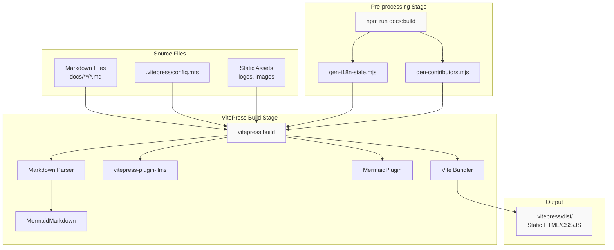

**Build Flow Diagram**: Shows the complete transformation from source Markdown files through pre-processing, VitePress build, and final static output generation.

Sources: [package.json:10-12](), [.vitepress/config.mts:1-41]()

## VitePress Static Site Generator

VitePress serves as the foundation of the documentation system. It is configured through a TypeScript configuration file that defines the site structure, theme, and behavior.

### Core Configuration Structure

The primary configuration resides in `.vitepress/config.mts` and defines site metadata, build options, and theme configuration:

| Configuration Section | Purpose | Key Settings |
|----------------------|---------|--------------|
| **Site Metadata** | Basic site information | `title`, `description`, `head` |
| **Build Options** | Source and output control | `srcDir: "docs"`, `ignoreDeadLinks`, `sitemap` |
| **Markdown Settings** | Content processing | `lineNumbers`, `theme`, `config()` |
| **Vite Configuration** | Build tool settings | `plugins`, `optimizeDeps`, `ssr` |
| **Theme Configuration** | UI customization | `nav`, `sidebar`, `search`, `socialLinks` |
| **Locales** | Multi-language support | `root`, `en`, `ru` configurations |

The `srcDir` option specifies that all documentation content resides in the `docs/` directory, keeping source files separate from configuration.

Sources: [.vitepress/config.mts:6-19]()

### Markdown Processing Pipeline

VitePress processes Markdown files through a customizable pipeline configured in the `markdown` section:

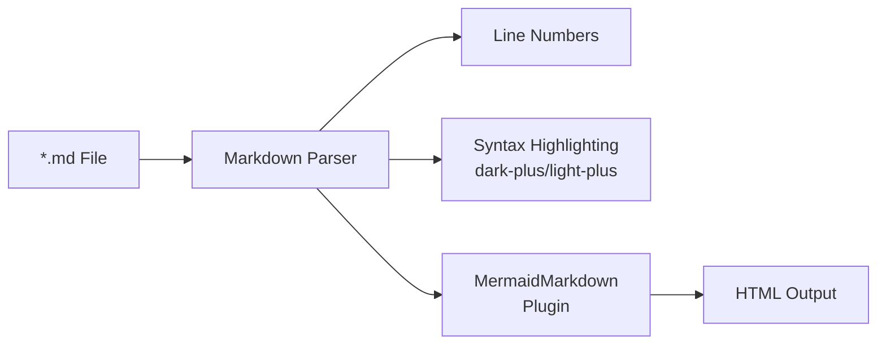

**Markdown Processing Pipeline**: Markdown files are parsed and enhanced with line numbers, syntax highlighting, and Mermaid diagram support before being converted to HTML.

The `markdown.config()` function registers the `MermaidMarkdown` plugin, enabling Mermaid diagram rendering within Markdown code blocks.

Sources: [.vitepress/config.mts:21-32]()

## Pre-processing Scripts

Before VitePress builds the site, two Node.js scripts generate dynamic content that is then included in the build.

### Script Execution Order

All npm scripts (`docs:dev`, `docs:build`, `docs:preview`) execute pre-processing scripts sequentially before invoking VitePress:

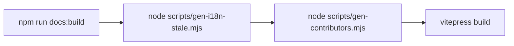

**Pre-processing Sequence**: Scripts run in a fixed order to generate auxiliary content before the main build.

| Script | File Path | Purpose |
|--------|-----------|---------|
| **I18N Stale Checker** | `scripts/gen-i18n-stale.mjs` | Identifies outdated translations by comparing file modification times across language directories |
| **Contributors Generator** | `scripts/gen-contributors.mjs` | Generates contributor lists from Git history for acknowledgment pages |

These scripts generate Markdown files or data that VitePress includes in the final build, ensuring dynamic content is up-to-date with each build.

Sources: [package.json:10-12]()

## Plugin Architecture

The documentation system extends VitePress functionality through three specialized plugins, each serving a distinct purpose.

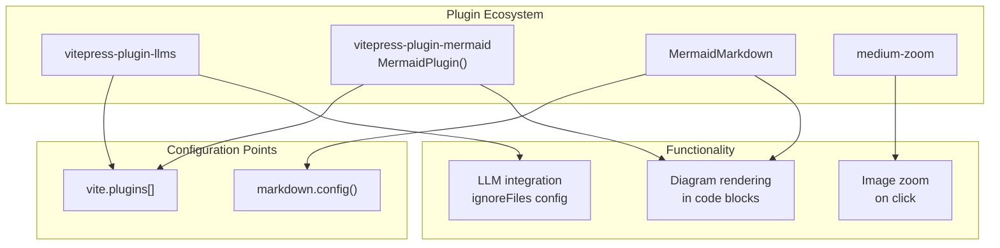

**Plugin Architecture Diagram**: Shows how plugins integrate with VitePress through configuration points and their respective functionalities.

### Plugin Descriptions

**1. vitepress-plugin-llms**

This plugin integrates LLM-specific functionality, configured with file exclusions to prevent non-Chinese content from being processed:

```typescript
llmstxt({ ignoreFiles: ["en/**", "ru/**"] })
```

The plugin excludes English and Russian directories, focusing only on the root Chinese content.

**2. vitepress-plugin-mermaid**

Provides comprehensive Mermaid diagram support through two components:
- `MermaidMarkdown`: Markdown-level plugin for parsing Mermaid code blocks
- `MermaidPlugin()`: Vite-level plugin for runtime rendering

The plugin is configured in two locations:
- Markdown config: `md.use(MermaidMarkdown)` 
- Vite plugins: `MermaidPlugin()`

**3. medium-zoom**

Enables click-to-zoom functionality for images in the documentation. This is a standard dependency included for enhanced image viewing.

### Plugin Dependencies and Optimization

The build system explicitly configures Mermaid dependency handling:

| Configuration | Setting | Purpose |
|---------------|---------|---------|
| `vite.optimizeDeps.include` | `["mermaid"]` | Pre-bundles Mermaid for faster dev server startup |
| `vite.ssr.noExternal` | `["mermaid"]` | Forces Mermaid to be bundled for SSR compatibility |

These settings ensure Mermaid diagrams render correctly during both development and production builds, including server-side rendering.

Sources: [.vitepress/config.mts:2-3](), [.vitepress/config.mts:29-40](), [package.json:3-7]()

## Multi-language Support System

The documentation supports three languages through VitePress's `locales` configuration, with parallel content structures for each language.

### Locale Configuration Structure

```mermaid
graph TB
    subgraph "Locale Configuration"
        Root["root locale<br/>label: 简体中文<br/>lang: zh"]
        En["en locale<br/>label: English<br/>lang: en"]
        Ru["ru locale<br/>label: Русский<br/>lang: ru"]
    end
    
    subgraph "File Structure"
        RootFiles["docs/*.md<br/>docs/config/*.md<br/>docs/document/*.md"]
        EnFiles["docs/en/*.md<br/>docs/en/config/*.md<br/>docs/en/document/*.md"]
        RuFiles["docs/ru/*.md<br/>docs/ru/config/*.md<br/>docs/ru/document/*.md"]
    end
    
    subgraph "Theme Config"
        RootTheme["themeConfig<br/>Chinese nav/sidebar"]
        EnTheme["themeConfig<br/>English nav/sidebar"]
        RuTheme["themeConfig<br/>Russian nav/sidebar"]
    end
    
    Root --> RootFiles
    En --> EnFiles
    Ru --> RuFiles
    
    Root --> RootTheme
    En --> EnTheme
    Ru --> RuTheme
```

**Multi-language Configuration**: Each locale has independent content directories and theme configurations.

### Per-Locale Configuration

Each locale requires complete configuration including:

**Navigation (`nav`)**: Top-level menu items linking to major documentation sections
**Sidebar (`sidebar`)**: Per-section navigation trees for detailed content browsing
**Search (`search`)**: Language-specific tokenization for accurate search results

#### Language-Specific Tokenization

The search system uses custom tokenizers optimized for each language:

| Locale | Tokenization Pattern | Purpose |
|--------|---------------------|---------|
| Chinese (root) | `/[\s,，。、]+/` | Splits on spaces, Chinese and English punctuation |
| English | `/[\s.,;!?'"(){}[\]\-_+=&%$#@~`^<>|\\]+/` | Splits on extensive English punctuation set |

The Chinese tokenizer handles both Chinese punctuation marks (，。、) and spaces, while the English tokenizer uses a comprehensive set of ASCII punctuation delimiters.

Sources: [.vitepress/config.mts:376-442](), [.vitepress/config.mts:70-96](), [.vitepress/config.mts:414-423]()

### Navigation and Sidebar Duplication

The configuration file contains parallel `nav` and `sidebar` structures for each language. The sidebar configuration is particularly extensive, with collapsed/expandable sections for major documentation areas:

```mermaid
graph LR
    subgraph "Root Sidebar"
        RootConfig["config/<br/>5 sections<br/>~50 pages"]
        RootDoc["document/<br/>4 sections<br/>~30 pages"]
        RootDev["development/<br/>2 sections<br/>~7 pages"]
    end
    
    subgraph "En Sidebar"
        EnConfig["en/config/<br/>5 sections<br/>~50 pages"]
        EnDoc["en/document/<br/>4 sections<br/>~30 pages"]
        EnDev["en/development/<br/>2 sections<br/>~7 pages"]
    end
    
    subgraph "Ru Sidebar (Partial)"
        RuNote["Russian locale<br/>has limited<br/>configuration"]
    end
```

**Sidebar Structure**: Each language maintains parallel sidebar structures linking to localized content.

The Russian locale configuration is less complete in the provided files, but follows the same structural pattern as the root and English locales.

Sources: [.vitepress/config.mts:111-346](), [.vitepress/config.mts:454-723]()

## Theme Configuration

The theme configuration controls the visual presentation and user interface elements of the documentation site.

### Global Theme Settings

| Setting | Configuration | Purpose |
|---------|---------------|---------|
| **Dark Mode** | `darkModeSwitchLabel`, `darkModeSwitchTitle`, `lightModeSwitchTitle` | User-facing labels for theme switching |
| **Navigation** | `sidebarMenuLabel`, `returnToTopLabel` | Accessibility and navigation labels |
| **Outline** | `level: [2, 4]`, `label` | Table of contents depth and heading |
| **External Links** | `externalLinkIcon: true` | Visual indicator for external links |

### Edit and Footer Configuration

The theme includes GitHub integration for collaborative editing:

```typescript
editLink: {
  pattern: "https://github.com/XTLS/Xray-docs-next/edit/main/docs/:path",
  text: "帮助我们改善此页面！"
}
```

The `:path` placeholder dynamically generates edit links for each page, directing users to the corresponding file in the GitHub repository.

The footer configuration provides licensing and copyright information:

```typescript
footer: {
  message: "根据 CC-BY-SA 4.0 许可协议授权",
  copyright: "版权所有 © 2020-至今 Project X 社区"
}
```

Sources: [.vitepress/config.mts:98-109](), [.vitepress/config.mts:352-373]()

## Build and Deployment Pipeline

The documentation system uses npm scripts as entry points for different build modes, each invoking the same pre-processing sequence followed by VitePress commands.

### Available Build Commands

| Command | VitePress Command | Purpose |
|---------|------------------|---------|
| `npm run docs:dev` | `vitepress dev` | Start development server with hot reload |
| `npm run docs:build` | `vitepress build` | Generate production-ready static files |
| `npm run docs:preview` | `vitepress preview` | Preview production build locally |

All commands follow this execution pattern:

```
node scripts/gen-i18n-stale.mjs && 
node scripts/gen-contributors.mjs && 
vitepress [command]
```

The `&&` operator ensures sequential execution, with each step completing successfully before the next begins.

### Output Directory Structure

VitePress generates the complete static site in `.vitepress/dist/`, which contains:

- **HTML files**: One per Markdown source file, with path-based routing
- **CSS bundles**: Themed stylesheets for light and dark modes
- **JavaScript bundles**: Vue.js application code and client-side routing
- **Static assets**: Copied from source, including images and logos

This output directory is the deployable artifact that can be served by any static web server.

Sources: [package.json:9-13]()

## Development Workflow Integration

The build system integrates with VitePress's development features to support efficient documentation authoring.

### Hot Module Replacement

During development (`docs:dev`), VitePress provides hot module replacement (HMR) for immediate feedback:

```mermaid
graph LR
    Edit["Edit .md File"]
    Detect["File Watcher<br/>Detects Change"]
    Rebuild["Incremental<br/>Rebuild"]
    HMR["Hot Module<br/>Replacement"]
    Browser["Browser<br/>Auto-Update"]
    
    Edit --> Detect
    Detect --> Rebuild
    Rebuild --> HMR
    HMR --> Browser
```

**Development Workflow**: File changes trigger automatic rebuilds and browser updates without full page reloads.

The development server watches Markdown files, configuration changes, and Vue components, rebuilding only affected modules for fast iteration.

### Configuration Hot Reload

Changes to `.vitepress/config.mts` require a manual server restart, as configuration changes affect the entire application structure. This is a limitation of VitePress's architecture, not a build system configuration.

Sources: [package.json:10]()

## Search System Architecture

The documentation includes a local search feature powered by MiniSearch, with language-specific tokenization configured per locale.

```mermaid
graph TB
    subgraph "Search Configuration"
        Provider["provider: 'local'"]
        MiniSearch["miniSearch.options"]
        Tokenize["tokenize function"]
    end
    
    subgraph "Language-Specific Tokenization"
        ZH["Chinese: /[\s,，。、]+/"]
        EN["English: /[\s.,;!?'()...]+/"]
    end
    
    subgraph "Search Index"
        Index["Pre-built Index<br/>at build time"]
        Query["Client-side<br/>Query Engine"]
    end
    
    Provider --> MiniSearch
    MiniSearch --> Tokenize
    Tokenize --> ZH
    Tokenize --> EN
    
    Tokenize --> Index
    Index --> Query
```

**Search System**: Local search uses pre-built indexes with language-specific tokenization for accurate results.

The search system builds indexes at build time and ships them with the static site, enabling instant client-side search without server dependencies. Each locale maintains its own index with appropriate tokenization rules.

Sources: [.vitepress/config.mts:70-96](), [.vitepress/config.mts:414-442]()

## Sitemap Generation

VitePress automatically generates a sitemap for search engine optimization:

```typescript
sitemap: {
  hostname: "https://xtls.github.io",
}
```

The sitemap includes all pages from all locales, using the configured hostname as the base URL. This aids search engines in discovering and indexing documentation content.

Sources: [.vitepress/config.mts:17-19]()

## Dependency Management

The documentation system uses pnpm as its package manager, with locked dependencies specified in `pnpm-lock.yaml`. The lockfile ensures reproducible builds across different environments.

### Core Dependencies

| Package | Version | Role |
|---------|---------|------|
| `vitepress` | `2.0.0-alpha.15` | Static site generator core |
| `vitepress-plugin-llms` | `^1.10.0` | LLM integration plugin |
| `vitepress-plugin-mermaid` | `^2.0.17` | Mermaid diagram support |
| `mermaid` | `^11.12.2` | Diagram rendering engine |
| `medium-zoom` | `^1.1.0` | Image zoom functionality |

All dependencies are specified as `devDependencies` since the build system is development-time tooling, and the output is pure static files with no runtime Node.js dependencies.

Sources: [package.json:2-8](), [pnpm-lock.yaml:10-25]()

---

# Page: Core Architecture

# Core Architecture

<details>
<summary>Relevant source files</summary>

The following files were used as context for generating this wiki page:

- [docs/config/inbound.md](docs/config/inbound.md)
- [docs/config/outbound.md](docs/config/outbound.md)
- [docs/development/protocols/muxcool.md](docs/development/protocols/muxcool.md)
- [docs/document/level-0/ch07-xray-server.md](docs/document/level-0/ch07-xray-server.md)
- [docs/document/level-0/ch08-xray-clients.md](docs/document/level-0/ch08-xray-clients.md)
- [docs/document/level-1/fallbacks-lv1.md](docs/document/level-1/fallbacks-lv1.md)
- [docs/document/level-1/fallbacks-with-sni.md](docs/document/level-1/fallbacks-with-sni.md)
- [docs/document/level-1/routing-lv1-part1.md](docs/document/level-1/routing-lv1-part1.md)
- [docs/document/level-1/routing-lv1-part2.md](docs/document/level-1/routing-lv1-part2.md)
- [docs/en/config/inbound.md](docs/en/config/inbound.md)
- [docs/en/config/log.md](docs/en/config/log.md)
- [docs/en/config/outbound.md](docs/en/config/outbound.md)
- [docs/en/config/policy.md](docs/en/config/policy.md)
- [docs/en/config/stats.md](docs/en/config/stats.md)
- [docs/en/document/level-0/ch07-xray-server.md](docs/en/document/level-0/ch07-xray-server.md)
- [docs/ru/document/level-0/ch07-xray-server.md](docs/ru/document/level-0/ch07-xray-server.md)
- [docs/ru/document/level-1/fallbacks-with-sni.md](docs/ru/document/level-1/fallbacks-with-sni.md)
- [docs/ru/document/level-1/routing-lv1-part1.md](docs/ru/document/level-1/routing-lv1-part1.md)

</details>


## Purpose and Scope

This document provides an overview of Xray's core architectural design, focusing on how the major subsystems are organized and how they interact. It covers the configuration structure, the layered processing model (inbound → routing → outbound), and the role of supporting systems like DNS and policy management.

For detailed information about specific subsystems:
- Transport layer configuration: see [Transport Layer](#3)
- Protocol-specific configuration: see [Protocol Configuration](#4)
- Routing rules and strategies: see [Routing System](#2.5)
- Advanced features like multiplexing and fallbacks: see [Advanced Features](#5)

## Architectural Overview

Xray is designed as a modular, configuration-driven proxy platform. The core architecture follows a three-stage processing pipeline where all network traffic flows through:

1. **Inbound Layer**: Accepts connections using various protocols (VLESS, Trojan, HTTP, SOCKS, etc.)
2. **Routing Engine**: Classifies and directs traffic based on rules (domain, IP, protocol, etc.)
3. **Outbound Layer**: Sends traffic to destinations using specified protocols and transports

This design allows maximum flexibility—the same binary can function as a client, server, or intermediate node depending solely on configuration.

```mermaid
graph TB
    subgraph "External"
        Client[Client Application]
        Server[Target Server]
    end
    
    subgraph "Xray Core"
        Inbound["Inbound Layer<br/>(InboundObject)"]
        Routing["Routing Engine<br/>(RoutingObject)"]
        Outbound["Outbound Layer<br/>(OutboundObject)"]
        
        subgraph "Supporting Systems"
            DNS["DNS System<br/>(DnsObject)"]
            Policy["Policy Manager<br/>(PolicyObject)"]
            Stats["Statistics<br/>(StatsObject)"]
            Log["Logging<br/>(LogObject)"]
        end
        
        Inbound --> Routing
        Routing --> Outbound
        Routing <--> DNS
        Routing -.-> Policy
        Inbound -.-> Policy
        Outbound -.-> Policy
        Inbound -.-> Stats
        Outbound -.-> Stats
        Inbound -.-> Log
        Routing -.-> Log
        Outbound -.-> Log
    end
    
    Client --> Inbound
    Outbound --> Server
```

**Sources**: [docs/config/inbound.md](), [docs/config/outbound.md](), [docs/config/routing.md](), [docs/document/level-0/ch08-xray-clients.md:4-24]()

## Configuration Structure

Xray's behavior is entirely determined by `config.json`, which contains seven primary sections. Each section configures a distinct subsystem.

### Configuration File Anatomy

```mermaid
graph TB
    ConfigJSON["config.json"]
    
    ConfigJSON --> Log["log<br/>LogObject"]
    ConfigJSON --> DNS["dns<br/>DnsObject"]
    ConfigJSON --> Routing["routing<br/>RoutingObject"]
    ConfigJSON --> Policy["policy<br/>PolicyObject"]
    ConfigJSON --> Inbounds["inbounds<br/>[]InboundObject"]
    ConfigJSON --> Outbounds["outbounds<br/>[]OutboundObject"]
    ConfigJSON --> Stats["stats<br/>StatsObject"]
    
    Log --> LogFiles["access.log<br/>error.log"]
    
    DNS --> DnsServers["servers<br/>[]DnsServerObject"]
    DNS --> DnsHosts["hosts<br/>static mappings"]
    
    Routing --> RoutingRules["rules<br/>[]RuleObject"]
    Routing --> RoutingBalancers["balancers<br/>[]BalancerObject"]
    
    Inbounds --> InboundN["InboundObject[n]<br/>protocol, port, tag,<br/>streamSettings"]
    
    Outbounds --> OutboundN["OutboundObject[n]<br/>protocol, tag,<br/>streamSettings, mux"]
    
    Policy --> PolicyLevels["levels<br/>map of LevelPolicyObject"]
    Policy --> PolicySystem["system<br/>SystemPolicyObject"]
```

**Sources**: [docs/config/inbound.md:9-26](), [docs/config/outbound.md:13-31](), [docs/document/level-0/ch07-xray-server.md:143-243]()

### Configuration Section Summary

| Section | Object Type | Purpose | Configuration File Location |
|---------|-------------|---------|---------------------------|
| `log` | `LogObject` | Controls access and error log output | [docs/en/config/log.md:12-19]() |
| `dns` | `DnsObject` | Built-in DNS resolver configuration | See [DNS System](#5.1) |
| `routing` | `RoutingObject` | Traffic classification and forwarding rules | See [Routing System](#2.5) |
| `inbounds` | `[]InboundObject` | Array of inbound connection handlers | [docs/config/inbound.md:6-26]() |
| `outbounds` | `[]OutboundObject` | Array of outbound connection handlers | [docs/config/outbound.md:5-31]() |
| `policy` | `PolicyObject` | User levels, timeouts, and quotas | [docs/en/config/policy.md:9-31]() |
| `stats` | `StatsObject` | Traffic statistics collection | [docs/en/config/stats.md:9-14]() |

The first outbound in the `outbounds` array serves as the **default outbound** when no routing rule matches.

**Sources**: [docs/config/inbound.md:1-154](), [docs/config/outbound.md:1-157](), [docs/document/level-1/routing-lv1-part1.md:309-319]()

## Core Components

### Inbound Layer

The inbound layer defines how Xray accepts incoming connections. Each `InboundObject` specifies:

- **Protocol**: `vless`, `trojan`, `vmess`, `http`, `socks`, `shadowsocks`, etc.
- **Listen address and port**: Where to accept connections
- **Tag**: Unique identifier for routing references
- **StreamSettings**: Transport and security configuration
- **Sniffing**: Protocol detection for transparent proxying

```mermaid
graph LR
    External["External<br/>Connection"] --> Listen["listen + port<br/>(e.g., 127.0.0.1:10808)"]
    
    Listen --> ProtocolHandler["Protocol Handler<br/>(protocol field)"]
    
    ProtocolHandler --> Sniffing["Sniffing<br/>(SniffingObject)"]
    Sniffing --> |"Extract domain"| SniffResult["Domain:<br/>example.com"]
    Sniffing --> |"No sniff"| IPResult["IP:<br/>1.2.3.4"]
    
    ProtocolHandler --> StreamSettings["Transport/Security<br/>(StreamSettingsObject)"]
    
    SniffResult --> RoutingEngine["To Routing<br/>(tag reference)"]
    IPResult --> RoutingEngine
    
    StreamSettings --> |"TCP/WS/gRPC/XHTTP"| RoutingEngine
```

**Key Configuration Fields**:

- `listen` (string): IP address or Unix domain socket. Default: `"0.0.0.0"`
- `port` (number | string): Port number, range, or environment variable
- `protocol` (string): One of the supported inbound protocols
- `tag` (string): Unique identifier used in routing rules
- `sniffing` (SniffingObject): Traffic detection configuration
  - `enabled` (bool): Enable protocol sniffing
  - `destOverride` ([]string): Protocol types to extract (`"http"`, `"tls"`, `"quic"`, `"fakedns"`)
  - `routeOnly` (bool): Use sniffed domain only for routing, not connection

**Sources**: [docs/config/inbound.md:6-154](), [docs/en/config/inbound.md:9-154]()

### Routing Engine

The routing engine is the "brain" of Xray, determining where traffic should be sent based on configurable rules. It evaluates incoming connections against a sequential list of rules and forwards matching traffic to the appropriate outbound.

```mermaid
graph TB
    TrafficIn["Traffic from<br/>Inbound<br/>(with tag)"] --> DomainStrategy{"domainStrategy"}
    
    DomainStrategy --> |"AsIs"| RuleEval["Rule Evaluation<br/>(sequential)"]
    DomainStrategy --> |"IPIfNonMatch"| DomainFirst["Try domain rules"]
    DomainFirst --> |"No match"| ResolveDNS["Resolve via DNS"]
    ResolveDNS --> RuleEval
    DomainFirst --> |"Match"| RuleEval
    DomainStrategy --> |"IPOnDemand"| ResolveImmediate["Resolve immediately<br/>if IP rules exist"]
    ResolveImmediate --> RuleEval
    
    RuleEval --> Rule1{"Rule 1<br/>Match?"}
    Rule1 --> |"Yes"| OutboundTag1["Forward to<br/>outboundTag"]
    Rule1 --> |"No"| Rule2{"Rule 2<br/>Match?"}
    Rule2 --> |"Yes"| OutboundTag2["Forward to<br/>outboundTag"]
    Rule2 --> |"No"| RuleN{"Rule N<br/>Match?"}
    RuleN --> |"Yes"| OutboundTagN["Forward to<br/>outboundTag"]
    RuleN --> |"No"| DefaultOutbound["Forward to<br/>outbounds[0]<br/>(default)"]
```

**Routing Rule Matching Conditions**:

Each rule in `rules[]` can match based on:

- `domain` ([]string): Domain patterns, supports `geosite:category` from `geosite.dat`
- `ip` ([]string): IP addresses/CIDR, supports `geoip:country` from `geoip.dat`
- `port` (string): Port ranges
- `network` (string): `"tcp"` or `"udp"`
- `protocol` ([]string): Sniffed protocols like `"bittorrent"`, `"http"`, `"tls"`
- `inboundTag` ([]string): Match traffic from specific inbounds
- `user` ([]string): Match specific user emails
- `source` ([]string): Source IP addresses

**Rule Evaluation Logic**:

1. Rules are evaluated sequentially from first to last
2. Within a single rule, all conditions must match (AND logic)
3. First matching rule determines the `outboundTag`
4. If no rules match, traffic goes to `outbounds[0]`

**Sources**: [docs/document/level-1/routing-lv1-part1.md:115-156](), [docs/document/level-1/routing-lv1-part2.md:9-159](), [docs/config/routing.md]()

### Outbound Layer

The outbound layer sends traffic to its final destination. Each `OutboundObject` specifies how to establish external connections.

```mermaid
graph LR
    RoutingDecision["Routing<br/>Decision"] --> OutboundTag["outboundTag"]
    
    OutboundTag --> OutboundObject["OutboundObject<br/>(matched by tag)"]
    
    OutboundObject --> Protocol["protocol<br/>(freedom/vless/vmess/etc)"]
    OutboundObject --> Settings["settings<br/>(protocol-specific)"]
    OutboundObject --> StreamSettings["streamSettings<br/>(transport + security)"]
    OutboundObject --> Mux["mux<br/>(MuxObject)"]
    OutboundObject --> ProxySettings["proxySettings<br/>(chain forwarding)"]
    
    Protocol --> Freedom["freedom<br/>(direct connection)"]
    Protocol --> VLESS["vless<br/>(proxy protocol)"]
    Protocol --> Blackhole["blackhole<br/>(drop traffic)"]
    
    StreamSettings --> Network["network:<br/>tcp/ws/grpc/xhttp"]
    StreamSettings --> Security["security:<br/>none/tls/reality"]
    
    Mux --> MuxEnabled["enabled: bool<br/>concurrency: int<br/>xudpConcurrency: int"]
```

**Key Configuration Fields**:

- `tag` (string): Unique identifier referenced by routing rules
- `protocol` (string): Outbound protocol (`freedom`, `vless`, `vmess`, `trojan`, `blackhole`, etc.)
- `settings` (object): Protocol-specific configuration (varies by protocol)
- `streamSettings` (StreamSettingsObject): Transport and security layers
- `sendThrough` (string): Source IP for outbound connections (default: `"0.0.0.0"`)
- `proxySettings` (ProxySettingsObject): Chain forwarding to another outbound
- `mux` (MuxObject): Multiplexing configuration
- `targetStrategy` (string): Domain resolution strategy (`AsIs`, `UseIP`, `ForceIP`, etc.)

**Special Outbound Protocols**:

- `freedom`: Direct connection to destination (no proxy)
- `blackhole`: Drop traffic (for blocking)
- `dns`: Use as DNS server
- `loopback`: Route back to inbound

**Sources**: [docs/config/outbound.md:5-157](), [docs/en/config/outbound.md:13-157]()

### Supporting Systems

#### DNS System

Xray includes a built-in DNS resolver that integrates with the routing engine. It can perform DNS lookups at multiple points in the traffic processing pipeline.

```mermaid
graph TB
    Query["DNS Query<br/>(domain name)"] --> HostsCheck{"Check hosts<br/>static mappings"}
    
    HostsCheck --> |"Found"| HostsResult["Return mapped IP"]
    HostsCheck --> |"Not found"| ServerSelection["Select DNS server<br/>by domain matching"]
    
    ServerSelection --> Server1["DnsServerObject[0]<br/>domains matched"]
    ServerSelection --> Server2["DnsServerObject[1]<br/>domains matched"]
    ServerSelection --> ServerN["DnsServerObject[n]<br/>fallback"]
    
    Server1 --> Query1["Query upstream<br/>(DoH/DoT/UDP)"]
    Server2 --> Query2["Query upstream"]
    ServerN --> QueryN["Query upstream"]
    
    Query1 --> Filter1{"expectedIPs<br/>filter"}
    Filter1 --> |"Pass"| Result1["Return IPs"]
    Filter1 --> |"Fail"| Fallback["Trigger fallback<br/>(if not skipFallback)"]
    
    Fallback --> ServerN
```

**DNS Configuration Fields** (`DnsObject`):

- `hosts` (map): Static domain-to-IP mappings (max recursion depth: 5)
- `servers` ([]DnsServerObject): Prioritized list of DNS servers
  - `address` (string): DNS server address (supports DoH/DoT)
  - `domains` ([]string): Domain matching rules for server selection
  - `expectedIPs` ([]string): IP validation rules (triggers fallback if mismatch)
  - `skipFallback` (bool): Don't use this server as fallback
- `queryStrategy` (string): IPv4/IPv6 preference (`UseIP`, `UseIPv4`, `UseIPv6`)

**Sources**: [docs/document/level-1/routing-lv1-part2.md:344-390](), [docs/config/dns.md]()

#### Policy System

The `PolicyObject` manages user levels, connection timeouts, and traffic statistics.

**Policy Configuration**:

- `levels` (map): Per-user-level settings
  - `handshake` (number): Connection handshake timeout (seconds)
  - `connIdle` (number): Idle connection timeout (seconds)
  - `uplinkOnly` (number): Time after downlink closed (seconds)
  - `downlinkOnly` (number): Time after uplink closed (seconds)
  - `statsUserUplink` (bool): Enable per-user uplink stats
  - `statsUserDownlink` (bool): Enable per-user downlink stats
  - `bufferSize` (number): Internal buffer size (KB)
- `system` (SystemPolicyObject): Global statistics switches
  - `statsInboundUplink/Downlink` (bool)
  - `statsOutboundUplink/Downlink` (bool)

**Sources**: [docs/en/config/policy.md:9-31]()

#### Statistics System

When `StatsObject` is present in the configuration, Xray collects traffic statistics that can be queried via the API.

**Available Statistics**:

- User-level: `user>>>[email]>>>traffic>>>uplink/downlink`
- Inbound: `inbound>>>[tag]>>>traffic>>>uplink/downlink`
- Outbound: `outbound>>>[tag]>>>traffic>>>uplink/downlink`

**Sources**: [docs/en/config/stats.md:9-54]()

#### Logging System

The `LogObject` configures access and error logging.

**Log Configuration**:

- `access` (string): Access log file path or `"none"` to disable
- `error` (string): Error log file path or `"none"` to disable
- `loglevel` (string): `"debug"`, `"info"`, `"warning"`, `"error"`, `"none"`
- `dnsLog` (bool): Enable DNS query logging
- `maskAddress` (string): IP masking level (`"quarter"`, `"half"`, `"full"`)

**Sources**: [docs/en/config/log.md:12-60]()

## Connection Data Flow

The following diagram shows a complete request traversing through Xray's architecture:

```mermaid
sequenceDiagram
    participant App as Application
    participant Inbound as Inbound Handler
    participant Sniff as Sniffing
    participant DNS as DNS Resolver
    participant Routing as Routing Engine
    participant Outbound as Outbound Handler
    participant Transport as Transport Layer
    participant Security as Security Layer
    participant Destination as Target Server
    
    App->>Inbound: TCP/UDP connection
    Inbound->>Inbound: Protocol decoding<br/>(VLESS/Trojan/etc)
    
    alt Sniffing enabled
        Inbound->>Sniff: Extract metadata
        Sniff->>Sniff: Detect protocol<br/>(HTTP/TLS/etc)
        Sniff-->>Inbound: Domain: example.com
    end
    
    Inbound->>Routing: Forward with metadata<br/>(domain/IP, inboundTag)
    
    alt domainStrategy != AsIs
        Routing->>DNS: Resolve domain
        DNS->>DNS: Check hosts
        DNS->>DNS: Query servers
        DNS-->>Routing: IP addresses
    end
    
    Routing->>Routing: Evaluate rules<br/>(sequential)
    Routing->>Routing: Match rule<br/>(domain/IP/protocol/etc)
    Routing->>Outbound: Forward to outboundTag
    
    alt Protocol = freedom
        Outbound->>Destination: Direct connection
    else Protocol = proxy
        Outbound->>Transport: Encode protocol<br/>(VLESS/VMess/etc)
        Transport->>Security: Apply security<br/>(TLS/REALITY/XTLS)
        Security->>Destination: Send encrypted data
    else Protocol = blackhole
        Outbound->>Outbound: Drop traffic
    end
```

**Data Flow Stages**:

1. **Inbound Reception**: Protocol decoding (e.g., VLESS, Trojan) on configured port
2. **Sniffing (Optional)**: Extract domain/protocol from traffic if `sniffing.enabled`
3. **Routing Decision**: Evaluate rules based on domain/IP/protocol/inboundTag
4. **DNS Resolution (Conditional)**: Triggered by `domainStrategy` or `targetStrategy`
5. **Outbound Transmission**: Encode in outbound protocol, apply transport/security
6. **Final Connection**: Establish connection to destination or next proxy

**Sources**: [docs/document/level-0/ch08-xray-clients.md:4-32](), [docs/document/level-1/routing-lv1-part2.md]()

## Configuration Loading and Execution

Xray's configuration is loaded at startup from `config.json` (default path: `/usr/local/etc/xray/config.json` on Linux).

**Configuration Loading Process**:

1. Binary executable: `xray` or `xray.exe`
2. Command-line arguments: `xray -c /path/to/config.json`
3. Parse JSON configuration into internal objects
4. Validate configuration (e.g., unique tags, valid protocols)
5. Initialize subsystems in order:
   - Log system
   - DNS resolver
   - Inbound handlers (bind to ports)
   - Outbound handlers
   - Routing engine
   - Policy manager
   - Statistics collector
6. Start accepting connections on inbound ports

**Environment Variables** (can be referenced in config):

- `xray.location.asset`: Directory for `geosite.dat` and `geoip.dat`
- `xray.location.config`: Configuration file directory
- Port values can use `"env:PORT"` syntax to read from environment

**Sources**: [docs/document/level-0/ch07-xray-server.md:20-24](), [docs/document/level-0/ch08-xray-clients.md:80-90](), [docs/config/inbound.md:45-53]()

## Tag-Based Component References

Xray uses string tags to reference components across the configuration. This creates a loosely-coupled architecture where components can reference each other by name.

```mermaid
graph TB
    InboundA["InboundObject<br/>tag: 'socks-in'"] --> |"Referenced by"| RoutingRule1["RuleObject<br/>inboundTag: ['socks-in']"]
    InboundB["InboundObject<br/>tag: 'http-in'"] --> |"Referenced by"| RoutingRule1
    
    RoutingRule1 --> |"outboundTag"| OutboundProxy["OutboundObject<br/>tag: 'proxy-vless'"]
    RoutingRule2["RuleObject<br/>domain: ['geosite:cn']"] --> |"outboundTag"| OutboundDirect["OutboundObject<br/>tag: 'direct'"]
    RoutingRule3["RuleObject<br/>domain: ['geosite:ads']"] --> |"outboundTag"| OutboundBlock["OutboundObject<br/>tag: 'block'"]
    
    OutboundProxy --> |"proxySettings.tag"| OutboundChain["OutboundObject<br/>tag: 'chain-node'"]
    
    PolicyLevel["PolicyObject<br/>levels[0]"] -.-> |"Applied to"| InboundA
    PolicyLevel -.-> |"Applied to"| OutboundProxy
    
    StatsObject["StatsObject"] -.-> |"Collects from"| InboundA
    StatsObject -.-> |"Collects from"| OutboundProxy
```

**Tag Usage**:

- **Inbound tags**: Referenced by `inboundTag` in routing rules
- **Outbound tags**: Referenced by `outboundTag` in routing rules, `proxySettings.tag` for chaining
- **User email**: Referenced in statistics as `user>>>[email]>>>traffic>>>uplink`

**Tag Constraints**:

- All tags must be unique across inbounds and outbounds
- Tags are case-sensitive strings
- Empty tags are valid but cannot be referenced

**Sources**: [docs/config/inbound.md:69-74](), [docs/config/outbound.md:56-62](), [docs/document/level-1/routing-lv1-part1.md:122-135]()

## Architecture Characteristics

### Modularity

Each component (inbound, routing, outbound, DNS) is independently configurable and replaceable. The same Xray binary can function in entirely different roles based on configuration alone.

### Configuration-Driven

No code changes are required to:
- Add new routing rules
- Change protocols
- Adjust security settings
- Enable/disable features

### Zero-Trust Design

Each connection is evaluated independently. No implicit trust or state is maintained between connections.

### Performance Optimization

- **Mux.Cool**: Multiplexes multiple connections over a single TCP stream ([docs/config/outbound.md:110-157]())
- **XTLS**: Zero-copy splice for kernel-level forwarding on Linux
- **First-packet routing**: Routing decisions made on the first packet to minimize latency

**Sources**: [docs/document/level-0/ch07-xray-server.md:143-243](), [docs/development/protocols/muxcool.md:1-130]()

---

# Page: Configuration Structure

# Configuration Structure

<details>
<summary>Relevant source files</summary>

The following files were used as context for generating this wiki page:

- [docs/config/inbound.md](docs/config/inbound.md)
- [docs/config/outbound.md](docs/config/outbound.md)
- [docs/development/protocols/muxcool.md](docs/development/protocols/muxcool.md)
- [docs/document/level-0/ch07-xray-server.md](docs/document/level-0/ch07-xray-server.md)
- [docs/document/level-0/ch08-xray-clients.md](docs/document/level-0/ch08-xray-clients.md)
- [docs/document/level-1/fallbacks-lv1.md](docs/document/level-1/fallbacks-lv1.md)
- [docs/document/level-1/fallbacks-with-sni.md](docs/document/level-1/fallbacks-with-sni.md)
- [docs/document/level-1/routing-lv1-part1.md](docs/document/level-1/routing-lv1-part1.md)
- [docs/document/level-1/routing-lv1-part2.md](docs/document/level-1/routing-lv1-part2.md)
- [docs/en/config/inbound.md](docs/en/config/inbound.md)
- [docs/en/config/log.md](docs/en/config/log.md)
- [docs/en/config/outbound.md](docs/en/config/outbound.md)
- [docs/en/config/policy.md](docs/en/config/policy.md)
- [docs/en/config/stats.md](docs/en/config/stats.md)
- [docs/en/document/level-0/ch07-xray-server.md](docs/en/document/level-0/ch07-xray-server.md)
- [docs/ru/document/level-0/ch07-xray-server.md](docs/ru/document/level-0/ch07-xray-server.md)
- [docs/ru/document/level-1/fallbacks-with-sni.md](docs/ru/document/level-1/fallbacks-with-sni.md)
- [docs/ru/document/level-1/routing-lv1-part1.md](docs/ru/document/level-1/routing-lv1-part1.md)

</details>


This page documents the structure and format of Xray's primary configuration file (`config.json`). It explains the seven main configuration sections, their purposes, and how they interconnect. For detailed configuration options within each section, see the protocol-specific pages under sections 3-5. For information about how configuration drives runtime behavior, see [Connection Flow Overview](#2.2).

## Configuration File Overview

Xray's configuration is defined in a single JSON file, typically named `config.json`. The core binary reads this file at startup to determine all operational parameters.

### File Location

The configuration file location is determined by:
- Command-line parameter: `xray -c /path/to/config.json` ([docs/document/level-0/ch08-xray-clients.md:264-265]())
- Default location: `/usr/local/etc/xray/config.json` ([docs/document/level-0/ch07-xray-server.md:137]())
- Environment variable: `xray.location.config` (see [Environment Variables and Configuration](#5.8))

### File Format

The configuration uses standard JSON syntax with support for JavaScript-style comments (`//` and `/* */`) for documentation purposes ([docs/document/level-0/ch07-xray-server.md:144-147]()).

Sources: [docs/document/level-0/ch07-xray-server.md:137-147](), [docs/document/level-0/ch08-xray-clients.md:264-265]()

## Seven Main Configuration Sections

### Top-Level Configuration Structure

```mermaid
graph TB
    CONFIG["config.json"]
    
    CONFIG --> LOG["log<br/>LogObject"]
    CONFIG --> DNS["dns<br/>DnsObject"]
    CONFIG --> ROUTING["routing<br/>RoutingObject"]
    CONFIG --> INBOUNDS["inbounds[]<br/>Array of InboundObject"]
    CONFIG --> OUTBOUNDS["outbounds[]<br/>Array of OutboundObject"]
    CONFIG --> POLICY["policy<br/>PolicyObject"]
    CONFIG --> STATS["stats<br/>StatsObject"]
    
    LOG -.-> |"access/error paths"| LOGFILES["Log Files"]
    DNS -.-> |"influences"| ROUTING
    ROUTING -.-> |"references tags"| INBOUNDS
    ROUTING -.-> |"references tags"| OUTBOUNDS
    POLICY -.-> |"applies to"| INBOUNDS
    POLICY -.-> |"applies to"| OUTBOUNDS
    STATS -.-> |"monitors"| INBOUNDS
    STATS -.-> |"monitors"| OUTBOUNDS
```

The configuration hierarchy consists of seven primary sections, each controlling a distinct aspect of Xray's operation:

| Section | Object Type | Purpose | Required |
|---------|------------|---------|----------|
| `log` | `LogObject` | Controls access and error logging output | No |
| `dns` | `DnsObject` | Configures built-in DNS resolver | No |
| `routing` | `RoutingObject` | Defines traffic routing rules and strategies | No |
| `inbounds` | `InboundObject[]` | Specifies listening ports and protocols | **Yes** |
| `outbounds` | `OutboundObject[]` | Defines traffic egress methods | **Yes** |
| `policy` | `PolicyObject` | Sets user levels and resource limits | No |
| `stats` | `StatsObject` | Enables traffic statistics collection | No |

Sources: [docs/document/level-0/ch07-xray-server.md:144-147](), [docs/config/inbound.md:9-26](), [docs/config/outbound.md:14-31]()

### Configuration Interaction Flow

```mermaid
graph LR
    TRAFFIC["Incoming<br/>Traffic"]
    
    TRAFFIC --> INBOUND["inbounds[]<br/>Port + Protocol"]
    INBOUND --> SNIFF["sniffing<br/>Domain Detection"]
    SNIFF --> ROUTE["routing<br/>Rule Evaluation"]
    
    ROUTE --> DNS["dns<br/>Domain Resolution"]
    DNS -.-> ROUTE
    
    ROUTE --> OUTBOUND["outbounds[]<br/>Destination Selection"]
    OUTBOUND --> STREAM["streamSettings<br/>Transport + Security"]
    STREAM --> DEST["Destination"]
    
    POLICY["policy<br/>User Levels"] -.-> |"applies to"| INBOUND
    POLICY -.-> |"applies to"| OUTBOUND
    
    LOG["log<br/>access.log + error.log"] -.-> |"records"| INBOUND
    LOG -.-> |"records"| OUTBOUND
    
    STATS["stats<br/>Traffic Counters"] -.-> |"monitors"| INBOUND
    STATS -.-> |"monitors"| OUTBOUND
```

This diagram illustrates how traffic flows through the configuration sections during request processing. The solid arrows show the primary data path, while dotted arrows show supporting relationships.

Sources: [docs/document/level-0/ch08-xray-clients.md:6-24](), [docs/document/level-1/routing-lv1-part1.md:25-42]()

## Log Configuration (`log`)

The `LogObject` controls how Xray outputs operational logs. It defines two independent log streams:

```json
{
  "log": {
    "access": "/var/log/xray/access.log",
    "error": "/var/log/xray/error.log",
    "loglevel": "warning",
    "dnsLog": false,
    "maskAddress": ""
  }
}
```

### Key Properties

| Property | Type | Description |
|----------|------|-------------|
| `access` | string | File path for access logs, or `"none"` to disable |
| `error` | string | File path for error logs, or `"none"` to disable |
| `loglevel` | string | Logging verbosity: `"debug"`, `"info"`, `"warning"`, `"error"`, `"none"` |
| `dnsLog` | boolean | Enable DNS query logging |
| `maskAddress` | string | IP masking level: `""` (disabled), `"quarter"`, `"half"`, `"full"` |

When file paths are omitted or empty, logs output to stdout ([docs/en/config/log.md:26-27]()). The default `loglevel` is `"warning"` ([docs/en/config/log.md:38]()).

**File Permissions Note**: Log files must be writable by the Xray process user (typically `nobody`). See [docs/document/level-0/ch07-xray-server.md:129-132]() for permission configuration.

Sources: [docs/en/config/log.md:9-60](), [docs/document/level-0/ch07-xray-server.md:155-159](), [docs/document/level-0/ch07-xray-server.md:129-132]()

## DNS Configuration (`dns`)

The `DnsObject` configures Xray's built-in DNS resolver. This resolver is used by routing rules to convert domain names to IP addresses for matching. For detailed DNS functionality, see [DNS System](#5.1).

### Basic Structure

```json
{
  "dns": {
    "servers": [
      "https+local://1.1.1.1/dns-query",
      "localhost"
    ],
    "hosts": {},
    "queryStrategy": "UseIP"
  }
}
```

The DNS system operates independently of system DNS and can:
- Query multiple upstream servers with priority-based selection
- Filter responses using `expectedIPs` to prevent DNS poisoning
- Provide static host mappings via the `hosts` field
- Control IPv4/IPv6 preference through `queryStrategy`

**Interaction with Routing**: DNS resolution timing is controlled by `routing.domainStrategy` ([docs/document/level-1/routing-lv1-part2.md:346-390]()). DNS queries themselves bypass routing rules to prevent infinite loops.

Sources: [docs/document/level-0/ch07-xray-server.md:161-166](), [docs/config/inbound.md:19-26](), [docs/document/level-1/routing-lv1-part2.md:346-390]()

## Routing Configuration (`routing`)

The `RoutingObject` defines rules for traffic classification and distribution. It evaluates incoming connections against sequential rules to determine which outbound should handle the traffic.

### Basic Structure

```json
{
  "routing": {
    "domainStrategy": "IPIfNonMatch",
    "rules": [
      {
        "type": "field",
        "domain": ["geosite:category-ads-all"],
        "outboundTag": "block"
      },
      {
        "type": "field",
        "ip": ["geoip:cn"],
        "outboundTag": "direct"
      }
    ],
    "balancers": []
  }
}
```

### Routing Architecture

```mermaid
graph TB
    TRAFFIC["Inbound Traffic"]
    
    TRAFFIC --> DOMAIN_STRAT{"domainStrategy"}
    
    DOMAIN_STRAT --> |"AsIs"| RULE1
    DOMAIN_STRAT --> |"IPIfNonMatch"| RULE1
    DOMAIN_STRAT --> |"IPOnDemand"| DNS_RESOLVE["DNS Resolution"]
    DNS_RESOLVE --> RULE1
    
    RULE1["Rule 1<br/>domain/ip/protocol"]
    RULE1 --> |"match"| OUT1["outboundTag"]
    RULE1 --> |"no match"| RULE2["Rule 2"]
    RULE2 --> |"match"| OUT2["outboundTag"]
    RULE2 --> |"no match"| RULE3["Rule 3"]
    RULE3 --> |"match"| OUT3["outboundTag"]
    RULE3 --> |"no match"| DEFAULT["Default<br/>First Outbound"]
    
    OUT1 --> OUTBOUND1["outbounds[0]"]
    OUT2 --> OUTBOUND2["outbounds[1]"]
    OUT3 --> OUTBOUND3["outbounds[2]"]
    DEFAULT --> OUTBOUND1
```

### Key Concepts

**Rule Evaluation**: Rules are evaluated sequentially from top to bottom. The first matching rule determines the outbound. If no rules match, traffic routes to the first outbound in the `outbounds` array ([docs/document/level-1/routing-lv1-part1.md:310-320]()).

**domainStrategy**: Controls DNS resolution timing:
- `"AsIs"`: No DNS lookup, fastest, domain-only matching ([docs/document/level-1/routing-lv1-part2.md:360-371]())
- `"IPIfNonMatch"`: DNS lookup only if domain rules don't match ([docs/document/level-1/routing-lv1-part2.md:372-379]())
- `"IPOnDemand"`: Immediate DNS lookup when IP rules exist ([docs/document/level-1/routing-lv1-part2.md:381-387]())

**Matching Conditions**: Rules support multiple condition types:
- `domain`: Domain name patterns including `geosite:*` references
- `ip`: IP address ranges including `geoip:*` references
- `protocol`: Protocol types (requires `sniffing` enabled)
- `inboundTag`: Source inbound identifier
- `port`, `sourcePort`, `network`, `source`, `user`, `attrs`: Additional conditions

Sources: [docs/document/level-0/ch07-xray-server.md:168-191](), [docs/document/level-1/routing-lv1-part1.md:115-156](), [docs/document/level-1/routing-lv1-part2.md:9-181]()

## Inbounds Configuration (`inbounds`)

The `inbounds` array defines listening endpoints where Xray accepts incoming connections. Each element is an `InboundObject` specifying a protocol, port, and processing rules.

### InboundObject Structure

```json
{
  "inbounds": [
    {
      "listen": "0.0.0.0",
      "port": 443,
      "protocol": "vless",
      "settings": {},
      "streamSettings": {},
      "tag": "inbound-443",
      "sniffing": {
        "enabled": true,
        "destOverride": ["http", "tls"]
      }
    }
  ]
}
```

### Core Properties

| Property | Type | Description |
|----------|------|-------------|
| `listen` | string | Listening address: IP, `"0.0.0.0"` (all), or Unix socket path |
| `port` | number/string | Port number, range (`"5-10"`), or environment variable (`"env:PORT"`) |
| `protocol` | string | Protocol name: `"vless"`, `"vmess"`, `"trojan"`, `"shadowsocks"`, `"socks"`, `"http"`, `"dokodemo-door"`, `"wireguard"` |
| `settings` | object | Protocol-specific configuration (`InboundConfigurationObject`) |
| `streamSettings` | object | Transport and security settings ([StreamSettingsObject](#3.1)) |
| `tag` | string | Unique identifier for routing references |
| `sniffing` | object | Traffic detection configuration (`SniffingObject`) |

**First Inbound Significance**: When routing rules fail to match, traffic defaults to the first outbound. However, inbound order does not affect processing—all configured inbounds listen simultaneously ([docs/config/inbound.md:9-26]()).

### Sniffing (Traffic Detection)

The `SniffingObject` enables protocol detection and domain extraction from encrypted traffic:

```json
{
  "sniffing": {
    "enabled": true,
    "destOverride": ["http", "tls", "quic", "fakedns"],
    "metadataOnly": false,
    "domainsExcluded": [],
    "routeOnly": false
  }
}
```

When `enabled` is `true`, Xray extracts domain names from TLS SNI or HTTP Host headers, allowing routing rules to match based on domains even when the original connection used IP addresses ([docs/config/inbound.md:78-88]()).

**routeOnly Mode**: When `true`, domains are extracted for routing decisions but the connection's destination IP is not modified. This prevents connection failures with certain applications (e.g., Tor Browser) while enabling domain-based routing ([docs/config/inbound.md:145-153]()).

Sources: [docs/config/inbound.md:6-154](), [docs/document/level-0/ch07-xray-server.md:194-227](), [docs/document/level-1/fallbacks-lv1.md:11-33]()

## Outbounds Configuration (`outbounds`)

The `outbounds` array defines how Xray sends traffic to destinations. Each `OutboundObject` specifies a transmission method and target.

### OutboundObject Structure

```json
{
  "outbounds": [
    {
      "sendThrough": "0.0.0.0",
      "protocol": "vless",
      "settings": {},
      "tag": "proxy-out",
      "streamSettings": {},
      "proxySettings": {},
      "mux": {},
      "targetStrategy": "AsIs"
    }
  ]
}
```

### Core Properties

| Property | Type | Description |
|----------|------|-------------|
| `sendThrough` | string | Source IP for outgoing connections, or `"origin"` to use inbound IP |
| `protocol` | string | Protocol: `"freedom"`, `"vless"`, `"vmess"`, `"trojan"`, `"shadowsocks"`, `"socks"`, `"http"`, `"blackhole"`, `"dns"`, `"loopback"`, `"wireguard"` |
| `settings` | object | Protocol-specific configuration (`OutboundConfigurationObject`) |
| `tag` | string | Unique identifier referenced by routing rules |
| `streamSettings` | object | Transport and security configuration ([StreamSettingsObject](#3.1)) |
| `proxySettings` | object | Proxy chaining configuration ([ProxySettingsObject](#proxysettingsobject)) |
| `mux` | object | Multiplexing settings ([MuxObject](#muxobject)) |
| `targetStrategy` | string | Domain resolution strategy for proxied requests |

**First Outbound Significance**: The first outbound serves as the default route when no routing rules match ([docs/config/outbound.md:10-11]()). This is the hidden routing rule ([docs/document/level-1/routing-lv1-part1.md:310-320]()).

### Common Outbound Types

```mermaid
graph TB
    ROUTING["Routing Decision"]
    
    ROUTING --> FREEDOM["freedom<br/>Direct Connection"]
    ROUTING --> PROXY["vless/vmess/trojan<br/>Proxy to VPS"]
    ROUTING --> BLACKHOLE["blackhole<br/>Traffic Blocking"]
    
    FREEDOM --> |"streamSettings"| STREAM1["Transport + Security"]
    PROXY --> |"streamSettings"| STREAM2["Transport + Security"]
    PROXY --> |"optional"| MUX["mux<br/>Connection Multiplexing"]
    
    STREAM1 --> DEST1["Direct Destination"]
    STREAM2 --> DEST2["Remote Proxy Server"]
    MUX --> STREAM2
    BLACKHOLE --> NULL["Dropped"]
```

- **freedom**: Direct connection to destination without proxying ([docs/config/outbound.md:232-235]())
- **vless/vmess/trojan**: Proxy protocols for tunneling through remote servers
- **blackhole**: Discards traffic, used for blocking ([docs/config/outbound.md:237-240]())

### ProxySettings (Outbound Chaining)

```json
{
  "proxySettings": {
    "tag": "another-outbound-tag",
    "transportLayer": false
  }
}
```

The `ProxySettingsObject` enables multi-hop proxying by forwarding one outbound's traffic through another ([docs/config/outbound.md:86-109]()). When `transportLayer` is `false` (default), transport settings are bypassed. Set to `true` to apply `streamSettings` to the chain.

### Mux.Cool (Connection Multiplexing)

```json
{
  "mux": {
    "enabled": true,
    "concurrency": 8,
    "xudpConcurrency": 16,
    "xudpProxyUDP443": "reject"
  }
}
```

The `MuxObject` configures connection multiplexing, which reduces TCP handshake latency by carrying multiple logical connections over a single physical TCP connection ([docs/config/outbound.md:112-113]()).

**Key Parameters**:
- `concurrency`: Maximum TCP subconnections per physical connection (1-128, default 8)
- `xudpConcurrency`: Maximum UDP subconnections in separate tunnel (0 = share with TCP)
- `xudpProxyUDP443`: Handling for QUIC/UDP443 traffic: `"reject"` (default), `"allow"`, `"skip"`

**Usage Note**: Mux is designed to reduce latency, not increase throughput. It provides negative value for video streaming, downloads, or speed tests ([docs/config/outbound.md:112]()).

Sources: [docs/config/outbound.md:5-157](), [docs/document/level-0/ch07-xray-server.md:230-242](), [docs/development/protocols/muxcool.md:1-130]()

## Policy Configuration (`policy`)

The `PolicyObject` defines resource limits and behavior settings per user level. Each connection is associated with a user level (0 by default), and policies apply based on that level.

### PolicyObject Structure

```json
{
  "policy": {
    "levels": {
      "0": {
        "handshake": 4,
        "connIdle": 300,
        "uplinkOnly": 2,
        "downlinkOnly": 5,
        "statsUserUplink": false,
        "statsUserDownlink": false,
        "bufferSize": 4
      }
    },
    "system": {
      "statsInboundUplink": false,
      "statsInboundDownlink": false,
      "statsOutboundUplink": false,
      "statsOutboundDownlink": false
    }
  }
}
```

### LevelPolicyObject Properties

| Property | Type | Default | Description |
|----------|------|---------|-------------|
| `handshake` | number | 4 | Handshake timeout in seconds |
| `connIdle` | number | 300 | Idle connection timeout in seconds |
| `uplinkOnly` | number | 2 | Time to wait after downlink closes (seconds) |
| `downlinkOnly` | number | 5 | Time to wait after uplink closes (seconds) |
| `statsUserUplink` | boolean | false | Enable per-user uplink statistics |
| `statsUserDownlink` | boolean | false | Enable per-user downlink statistics |
| `bufferSize` | number | - | Internal buffer size per connection (KB) |

**User Level Assignment**: User levels are assigned in inbound/outbound protocol `settings` via the `level` field. Statistics and policies then apply to all connections at that level ([docs/en/config/policy.md:38-40]()).

### SystemPolicyObject

The `system` section controls global statistics collection:
- `statsInboundUplink/Downlink`: Enable per-inbound traffic counters
- `statsOutboundUplink/Downlink`: Enable per-outbound traffic counters

These must be enabled along with the `stats` section to collect traffic data ([docs/en/config/policy.md:24-29]()).

Sources: [docs/en/config/policy.md:8-107](), [docs/document/level-0/ch07-xray-server.md:203]()

## Stats Configuration (`stats`)

The `StatsObject` enables Xray's internal traffic statistics system. Once enabled, statistics can be retrieved via the `xray api` command-line tool.

### Basic Configuration

```json
{
  "stats": {}
}
```

The stats system currently requires no parameters—its mere presence enables statistics collection ([docs/en/config/stats.md:9-16]()).

### Available Statistics

After enabling stats and the corresponding policy flags, the following metrics become available:

**Per-User Statistics** (requires `policy.levels[].statsUser*` enabled):
- `user>>>[email]>>>traffic>>>uplink`: User uplink bytes
- `user>>>[email]>>>traffic>>>downlink`: User downlink bytes

**Per-Connection Statistics** (requires `policy.system.stats*` enabled):
- `inbound>>>[tag]>>>traffic>>>uplink`: Inbound uplink bytes
- `inbound>>>[tag]>>>traffic>>>downlink`: Inbound downlink bytes
- `outbound>>>[tag]>>>traffic>>>uplink`: Outbound uplink bytes
- `outbound>>>[tag]>>>traffic>>>downlink`: Outbound downlink bytes

**Note**: User statistics require the `email` field to be set in protocol `settings.clients` ([docs/en/config/stats.md:35-36]()).

Sources: [docs/en/config/stats.md:1-54](), [docs/document/level-0/ch07-xray-server.md:204]()

## Configuration Loading and Validation

### Loading Mechanism

Xray loads the configuration file during startup via the following process:

1. **File Location**: Determined by `-c` parameter, default path, or `xray.location.config` environment variable
2. **Parsing**: JSON parser with comment support processes the file
3. **Validation**: Each section is validated against its schema (`LogObject`, `InboundObject`, etc.)
4. **Initialization**: Components initialize based on validated configuration
5. **Runtime**: Hot reload of certificates is automatic; other changes require restart ([docs/document/level-0/ch07-xray-server.md:93]())

### Common Configuration Errors

#### Tag Uniqueness Violations

Tags in `inbounds` and `outbounds` must be unique across all elements:

```json
// INCORRECT: Duplicate tags
{
  "inbounds": [
    {"tag": "main", ...},
    {"tag": "main", ...}  // Error: duplicate tag
  ]
}
```

Tags are required when referenced by routing rules ([docs/config/inbound.md:72-74](), [docs/config/outbound.md:60-62]()).

#### Routing Rule Logic Errors

Multiple conditions within a single rule use AND logic, not OR:

```json
// INCORRECT: Impossible to match both simultaneously
{
  "routing": {
    "rules": [
      {
        "ip": ["223.5.5.5"],
        "domain": ["full:direct.yourdomain.com"],
        "outboundTag": "direct"  // Will never match!
      }
    ]
  }
}

// CORRECT: Separate rules for different conditions
{
  "routing": {
    "rules": [
      {"ip": ["223.5.5.5"], "outboundTag": "direct"},
      {"domain": ["full:direct.yourdomain.com"], "outboundTag": "direct"}
    ]
  }
}
```

Sources: [docs/document/level-1/routing-lv1-part2.md:282-343]()

#### File Permission Issues

Log files and certificate files must be readable/writable by the Xray process user (typically `nobody`):

```bash
# Ensure log files are writable
chmod a+w /var/log/xray/*.log

# Ensure certificate private key is readable
chmod +r /path/to/xray.key
```

Sources: [docs/document/level-0/ch07-xray-server.md:129-132](), [docs/document/level-0/ch07-xray-server.md:83-87]()

### Configuration Template

The following minimal template demonstrates a working configuration with all seven sections:

```json
{
  "log": {
    "loglevel": "warning"
  },
  "dns": {
    "servers": ["1.1.1.1", "localhost"]
  },
  "routing": {
    "domainStrategy": "IPIfNonMatch",
    "rules": [
      {"domain": ["geosite:category-ads-all"], "outboundTag": "block"},
      {"domain": ["geosite:cn"], "outboundTag": "direct"},
      {"ip": ["geoip:cn", "geoip:private"], "outboundTag": "direct"}
    ]
  },
  "inbounds": [
    {
      "port": 10808,
      "protocol": "socks",
      "settings": {"udp": true}
    }
  ],
  "outbounds": [
    {
      "protocol": "vless",
      "settings": {"vnext": [...]},
      "tag": "proxy"
    },
    {"protocol": "freedom", "tag": "direct"},
    {"protocol": "blackhole", "tag": "block"}
  ],
  "policy": {
    "levels": {"0": {"handshake": 4, "connIdle": 300}}
  },
  "stats": {}
}
```

Sources: [docs/document/level-0/ch07-xray-server.md:143-243](), [docs/document/level-0/ch08-xray-clients.md:102-248]()

## Summary

The configuration structure organizes Xray's behavior into seven orthogonal sections:

- **log**: Operational visibility
- **dns**: Name resolution
- **routing**: Traffic classification and distribution
- **inbounds**: Traffic ingress points
- **outbounds**: Traffic egress methods
- **policy**: Resource limits and user levels
- **stats**: Traffic metrics collection

Understanding the relationships between sections—particularly how `routing` references `inbounds`/`outbounds` tags, how `dns` influences `routing` decisions, and how `policy` applies to connections—is essential for effective Xray configuration.

---

# Page: Connection Flow Overview

# Connection Flow Overview

<details>
<summary>Relevant source files</summary>

The following files were used as context for generating this wiki page:

- [docs/config/inbound.md](docs/config/inbound.md)
- [docs/config/outbound.md](docs/config/outbound.md)
- [docs/development/protocols/muxcool.md](docs/development/protocols/muxcool.md)
- [docs/document/level-0/ch07-xray-server.md](docs/document/level-0/ch07-xray-server.md)
- [docs/document/level-0/ch08-xray-clients.md](docs/document/level-0/ch08-xray-clients.md)
- [docs/document/level-1/fallbacks-lv1.md](docs/document/level-1/fallbacks-lv1.md)
- [docs/document/level-1/fallbacks-with-sni.md](docs/document/level-1/fallbacks-with-sni.md)
- [docs/document/level-1/routing-lv1-part1.md](docs/document/level-1/routing-lv1-part1.md)
- [docs/document/level-1/routing-lv1-part2.md](docs/document/level-1/routing-lv1-part2.md)
- [docs/en/config/inbound.md](docs/en/config/inbound.md)
- [docs/en/config/log.md](docs/en/config/log.md)
- [docs/en/config/outbound.md](docs/en/config/outbound.md)
- [docs/en/config/policy.md](docs/en/config/policy.md)
- [docs/en/config/stats.md](docs/en/config/stats.md)
- [docs/en/document/level-0/ch07-xray-server.md](docs/en/document/level-0/ch07-xray-server.md)
- [docs/ru/document/level-0/ch07-xray-server.md](docs/ru/document/level-0/ch07-xray-server.md)
- [docs/ru/document/level-1/fallbacks-with-sni.md](docs/ru/document/level-1/fallbacks-with-sni.md)
- [docs/ru/document/level-1/routing-lv1-part1.md](docs/ru/document/level-1/routing-lv1-part1.md)

</details>


## Purpose and Scope

This document traces the complete data flow through Xray from the moment traffic enters the system until it exits. It explains how data moves through the inbound handler, routing engine, DNS resolver, outbound handler, transport layer, and security layer to reach its final destination.

For detailed configuration of each component mentioned here, see:
- Inbound configuration: [2.3](#2.3)
- Outbound configuration: [2.4](#2.4)
- Routing system: [2.5](#2.5)
- Transport layer: [3](#3)
- Security protocols: [3.3](#3.3)
- DNS system: [5.1](#5.1)

## High-Level Flow Architecture

The connection flow can be understood as a pipeline where data passes through multiple processing stages. On the client side, Xray accepts traffic from applications and forwards it to a remote server. On the server side, Xray receives proxied traffic and forwards it to the final destination.

### Client-Side Flow

```mermaid
graph LR
    APP["Application<br/>(Browser/App)"]
    PROXY["Local Proxy<br/>SOCKS5/HTTP"]
    
    subgraph "Xray Client"
        INBOUND["Inbound Handler<br/>InboundObject"]
        SNIFF["Traffic Sniffing<br/>SniffingObject"]
        ROUTE["Routing Engine<br/>RoutingObject"]
        DNS["DNS Resolver<br/>DnsObject"]
        OUT_DIRECT["Outbound: direct<br/>freedom protocol"]
        OUT_PROXY["Outbound: proxy<br/>VLESS/VMess/etc"]
        OUT_BLOCK["Outbound: block<br/>blackhole protocol"]
        
        INBOUND --> SNIFF
        SNIFF --> ROUTE
        ROUTE <--> DNS
        ROUTE --> OUT_DIRECT
        ROUTE --> OUT_PROXY
        ROUTE --> OUT_BLOCK
    end
    
    OUT_DIRECT --> DOMESTIC["Domestic Servers"]
    OUT_PROXY --> ENCRYPTED["Encrypted Tunnel"]
    
    APP --> PROXY
    PROXY --> INBOUND
```

**Client-Side Data Processing Stages:**

1. **Application Layer**: Applications send traffic to local proxy ports (typically `127.0.0.1:10800` for SOCKS5 or `:10801` for HTTP)
2. **Inbound Reception**: `InboundObject` receives and decodes the proxy protocol
3. **Traffic Sniffing**: `SniffingObject` extracts destination domain/protocol if enabled
4. **Routing Decision**: `RoutingObject` evaluates rules to determine outbound
5. **DNS Resolution**: `DnsObject` resolves domains when needed by routing strategy
6. **Outbound Selection**: Traffic flows to matched outbound handler
7. **Transport Wrapping**: `StreamSettingsObject` wraps data in transport protocol
8. **Security Layer**: TLS/REALITY/XTLS encrypts the connection

**Sources:** [docs/document/level-0/ch08-xray-clients.md:1-33](), [docs/document/level-1/routing-lv1-part1.md:20-157]()

### Server-Side Flow

```mermaid
graph LR
    NETWORK["Network<br/>(443/HTTPS)"]
    
    subgraph "Xray Server"
        INBOUND_S["Inbound Handler<br/>VLESS/Trojan"]
        AUTH["Authentication<br/>UUID/Password"]
        FALLBACK["Fallback System<br/>FallbackObject"]
        ROUTE_S["Routing Engine<br/>RoutingObject"]
        DNS_S["DNS Resolver<br/>DnsObject"]
        OUT_FREE["Outbound: freedom<br/>direct protocol"]
        OUT_CHAIN["Outbound: proxy<br/>chain forwarding"]
        OUT_BLOCK_S["Outbound: block<br/>blackhole protocol"]
        
        INBOUND_S --> AUTH
        AUTH -->|Valid| ROUTE_S
        AUTH -->|Invalid| FALLBACK
        ROUTE_S <--> DNS_S
        ROUTE_S --> OUT_FREE
        ROUTE_S --> OUT_CHAIN
        ROUTE_S --> OUT_BLOCK_S
    end
    
    OUT_FREE --> TARGET["Target Servers"]
    FALLBACK --> WEB["Web Server<br/>Nginx/Caddy"]
    
    NETWORK --> INBOUND_S
```

**Server-Side Data Processing Stages:**

1. **Network Reception**: Encrypted traffic arrives on port 443
2. **Security Decryption**: TLS/REALITY/XTLS decrypts the outer layer
3. **Protocol Recognition**: Identifies VLESS/Trojan/VMess protocol
4. **Authentication**: Validates UUID/password credentials
5. **Fallback Handling**: Invalid traffic redirected to camouflage service
6. **Routing Evaluation**: `RoutingObject` applies server-side rules
7. **DNS Resolution**: Resolves target domains if needed
8. **Outbound Forwarding**: `freedom` protocol sends traffic to target

**Sources:** [docs/document/level-0/ch07-xray-server.md:95-242](), [docs/document/level-1/fallbacks-lv1.md:1-113]()

## Complete End-to-End Flow

The following diagram shows a complete request traversing both client and server:

```mermaid
graph TB
    subgraph "Client Machine"
        APP["Browser"]
        
        subgraph "Xray Client Process"
            C_IN["port: 10800<br/>protocol: socks"]
            C_SNIFF["sniffing:<br/>destOverride"]
            C_ROUTE["routing:<br/>domainStrategy"]
            C_DNS["dns:<br/>servers"]
            C_OUT["protocol: vless<br/>flow: xtls-rprx-vision"]
            
            APP --> C_IN
            C_IN --> C_SNIFF
            C_SNIFF --> C_ROUTE
            C_ROUTE <--> C_DNS
            C_ROUTE --> C_OUT
        end
    end
    
    subgraph "Network Transit"
        ENCRYPT["TLS 1.3 Encryption<br/>security: tls/reality"]
        GFW["Firewall/Censorship"]
        
        C_OUT --> ENCRYPT
        ENCRYPT --> GFW
    end
    
    subgraph "Server Machine"
        subgraph "Xray Server Process"
            S_IN["port: 443<br/>protocol: vless"]
            S_AUTH["clients:<br/>id validation"]
            S_FALL["fallbacks:<br/>dest"]
            S_ROUTE["routing:<br/>rules"]
            S_DNS["dns:<br/>servers"]
            S_OUT["protocol: freedom"]
            
            GFW --> S_IN
            S_IN --> S_AUTH
            S_AUTH -->|Match| S_ROUTE
            S_AUTH -->|No Match| S_FALL
            S_ROUTE <--> S_DNS
            S_ROUTE --> S_OUT
        end
        
        NGINX["Nginx<br/>port: 80/8080"]
        S_FALL --> NGINX
    end
    
    TARGET["Target Website<br/>example.com"]
    S_OUT --> TARGET
```

**Sources:** [docs/document/level-0/ch08-xray-clients.md:5-30](), [docs/document/level-1/routing-lv1-part1.md:25-156]()

## Data Processing Stages in Detail

### Stage 1: Inbound Reception

When data enters Xray, the `InboundObject` configuration determines how it is received:

**Configuration Elements:**
- `listen`: IP address to bind (e.g., `"127.0.0.1"`, `"0.0.0.0"`)
- `port`: Port number or range (e.g., `1080`, `"5-10"`)
- `protocol`: Protocol type (e.g., `"socks"`, `"http"`, `"vless"`, `"trojan"`)
- `settings`: Protocol-specific configuration
- `tag`: Identifier for routing references

**Example Client Inbound:**
```json
{
  "tag": "socks-in",
  "protocol": "socks",
  "listen": "127.0.0.1",
  "port": 10800,
  "settings": {
    "udp": true
  }
}
```

**Example Server Inbound:**
```json
{
  "port": 443,
  "protocol": "vless",
  "settings": {
    "clients": [
      {
        "id": "uuid",
        "flow": "xtls-rprx-vision"
      }
    ],
    "decryption": "none"
  }
}
```

**Sources:** [docs/config/inbound.md:1-154](), [docs/document/level-0/ch07-xray-server.md:193-228]()

### Stage 2: Traffic Sniffing

The `SniffingObject` (optional) inspects traffic content to extract destination information:

**Sniffing Process:**
1. Client connects to IP address (e.g., `1.2.3.4` from DNS)
2. Xray sniffs protocol headers (HTTP/TLS/QUIC)
3. Extracts domain name (e.g., `abc.com`) from SNI or Host header
4. Replaces IP with domain for routing evaluation

**Configuration:**
- `enabled`: Whether to enable sniffing
- `destOverride`: Protocols to sniff (`["http", "tls", "quic", "fakedns"]`)
- `metadataOnly`: Use only connection metadata (faster but less accurate)
- `routeOnly`: Use sniffed domain for routing only, keep original destination

**Use Case:** Essential for transparent proxy scenarios where applications only see IPs, but routing needs domains.

**Sources:** [docs/config/inbound.md:76-154](), [docs/en/config/inbound.md:76-89]()

### Stage 3: Routing Decision

The `RoutingObject` evaluates traffic against sequential rules to determine the destination outbound:

```mermaid
graph TD
    TRAFFIC["Incoming Traffic"]
    
    RULE1{"Rule 1<br/>domain: geosite:category-ads-all"}
    RULE2{"Rule 2<br/>ip: geoip:private<br/>ip: geoip:cn"}
    RULE3{"Rule 3<br/>domain: geosite:geolocation-!cn"}
    DEFAULT["Default Rule<br/>(first outbound)"]
    
    OUT_BLOCK["outboundTag: block"]
    OUT_DIRECT["outboundTag: direct"]
    OUT_PROXY["outboundTag: proxy"]
    OUT_DEFAULT["First Outbound"]
    
    TRAFFIC --> RULE1
    RULE1 -->|Match| OUT_BLOCK
    RULE1 -->|No Match| RULE2
    RULE2 -->|Match| OUT_DIRECT
    RULE2 -->|No Match| RULE3
    RULE3 -->|Match| OUT_PROXY
    RULE3 -->|No Match| DEFAULT
    DEFAULT --> OUT_DEFAULT
```

**Rule Evaluation:**
- Rules evaluated **sequentially** from top to bottom
- **First match wins**, no further evaluation
- If no rules match, traffic goes to **first outbound** in `outbounds` array

**Matching Conditions:**
- `domain`: Domain names (`"geosite:cn"`, `"full:example.com"`)
- `ip`: IP addresses (`"geoip:cn"`, `"223.5.5.5"`)
- `protocol`: Protocol type (`"bittorrent"`, `"http"`)
- `inboundTag`: Source inbound identifier
- `port`, `network`, `source`, `user`: Additional filters

**Sources:** [docs/document/level-1/routing-lv1-part1.md:113-156](), [docs/document/level-1/routing-lv1-part2.md:1-343]()

### Stage 4: DNS Resolution

The `DnsObject` resolves domains to IPs when required by routing strategy:

**DNS Interaction with Routing:**

The `domainStrategy` setting controls when DNS resolution occurs:

1. **`AsIs`**: No DNS lookup, domain passed as-is to outbound (fastest)
2. **`IPIfNonMatch`**: DNS lookup only if no domain rules match
3. **`IPOnDemand`**: DNS lookup when any IP-based rule exists

```mermaid
graph TD
    REQUEST["Domain Request<br/>example.com"]
    
    DS{"domainStrategy"}
    
    DS -->|AsIs| DOMAIN_RULES["Match Domain Rules"]
    DS -->|IPIfNonMatch| DOMAIN_CHECK{"Domain Rules<br/>Match?"}
    DS -->|IPOnDemand| DNS_RESOLVE["DNS Resolution"]
    
    DOMAIN_CHECK -->|Yes| DOMAIN_RULES
    DOMAIN_CHECK -->|No| DNS_RESOLVE
    
    DOMAIN_RULES --> IP_RULES["Match IP Rules"]
    DNS_RESOLVE --> IP_RULES
    
    IP_RULES --> OUTBOUND["Select Outbound"]
```

**DNS Server Selection:**
- **Priority-based**: Servers with matching `domains` take precedence
- **Fallback logic**: Failed servers trigger fallback (unless `skipFallback: true`)
- **IP filtering**: `expectedIPs`/`unexpectedIPs` validate responses

**Sources:** [docs/document/level-1/routing-lv1-part2.md:344-391](), [docs/document/level-1/routing-lv1-part1.md:352-391]()

### Stage 5: Outbound Forwarding

The `OutboundObject` sends traffic to its destination:

**Outbound Types:**

1. **`freedom` (Direct)**: Sends traffic directly to target
   - `domainStrategy`: Controls DNS resolution timing
   - Used for: Domestic traffic, unblocked content
   
2. **`vless`/`vmess`/`trojan` (Proxy)**: Forwards through remote server
   - `targetStrategy`: Controls whether client or server resolves domain
   - `streamSettings`: Transport protocol configuration
   - `mux`: Optional multiplexing (Mux.Cool)

3. **`blackhole` (Block)**: Drops traffic silently
   - Used for: Ads, malware domains

**Proxy Settings:**
- `proxySettings`: Chain forwarding through another outbound
- `sendThrough`: Source IP for outgoing connections
- `tag`: Identifier referenced by routing rules

**Sources:** [docs/config/outbound.md:1-157](), [docs/en/config/outbound.md:1-157]()

### Stage 6: Transport Layer Wrapping

The `StreamSettingsObject` wraps data in the transport protocol:

**Transport Options:**
- **TCP (RAW)**: Direct TCP connection
- **WebSocket**: HTTP/1.1 upgrade-based transport
- **gRPC**: HTTP/2-based transport with health checks
- **XHTTP**: Modern HTTP/3 (QUIC) transport (recommended)
- **HTTPUpgrade**: HTTP/1.1 upgrade mechanism

**Configuration:**
```json
{
  "streamSettings": {
    "network": "tcp",
    "security": "tls",
    "tlsSettings": {
      "serverName": "example.com",
      "alpn": ["h2", "http/1.1"]
    }
  }
}
```

**Sources:** [docs/config/outbound.md:64-67](), [docs/config/inbound.md:65-67]()

### Stage 7: Security Layer Encryption

The security layer provides encryption and authentication:

**Security Options:**
- **`none`**: No encryption (use only over already-encrypted channels)
- **`tls`**: Standard TLS 1.3 encryption
- **`reality`**: Xray-specific anti-detection protocol
- **XTLS flow control**: Optimized TLS with Vision/Splice

**XTLS Flow Control:**
- `xtls-rprx-vision`: Cross-platform compatible flow control
- `xtls-rprx-vision-udp443`: Vision without UDP 443 blocking
- Splice mechanism: Linux kernel-level zero-copy forwarding

**Sources:** [docs/document/level-0/ch07-xray-server.md:196-228](), [docs/document/level-0/ch08-xray-clients.md:38-47]()

## Special Flow Mechanisms

### Fallback Flow

When server inbound receives invalid traffic (authentication failure, wrong protocol), the `fallbacks` configuration redirects it to camouflage services:

```mermaid
graph LR
    PROBE["Probing Traffic<br/>(Active Detection)"]
    
    subgraph "Xray Server"
        VLESS["VLESS Inbound<br/>port: 443"]
        AUTH{"Authentication"}
        
        TROJAN["Trojan Inbound<br/>port: 1310"]
        TROJAN_AUTH{"Trojan Auth"}
        
        NGINX["Nginx<br/>port: 80"]
    end
    
    PROBE --> VLESS
    VLESS --> AUTH
    AUTH -->|Invalid| TROJAN
    TROJAN --> TROJAN_AUTH
    TROJAN_AUTH -->|Invalid| NGINX
    
    NGINX --> WEBSITE["Fake Website"]
```

**Fallback Matching:**
- `name`: SNI hostname matching
- `path`: HTTP path matching
- `alpn`: ALPN protocol matching
- `dest`: Destination port for forwarded traffic
- `xver`: Proxy Protocol version (preserves client IP)

**Multi-layer fallbacks** enable nested protocol detection (VLESS → Trojan → Nginx).

**Sources:** [docs/document/level-1/fallbacks-lv1.md:86-384](), [docs/document/level-1/fallbacks-with-sni.md:1-48]()

### Multiplexing Flow (Mux.Cool)

The Mux.Cool protocol multiplexes multiple connections over a single TCP connection:

**Mux Frame Structure:**
1. Client creates main connection to server
2. Sub-connections assigned unique IDs
3. Frames carry metadata (ID, status, destination) + data
4. Server demultiplexes frames to individual targets

**Status Types:**
- **New**: Establishes new sub-connection with target info
- **Keep**: Transmits data for existing sub-connection
- **End**: Closes sub-connection
- **KeepAlive**: Maintains main connection

**XUDP Extension**: Separate mux tunnel for UDP traffic with higher concurrency limits.

**Sources:** [docs/development/protocols/muxcool.md:1-130](), [docs/config/outbound.md:110-157]()

### Reverse Proxy Flow

VLESS reverse proxy allows connections to traverse NAT without port forwarding:

```mermaid
graph LR
    CLIENT["Client<br/>(Behind NAT)"]
    SERVER["Server<br/>(Public IP)"]
    INTERNAL["Internal Service<br/>(Behind NAT)"]
    
    CLIENT -->|1. Register tunnel| SERVER
    SERVER -->|2. Accept connections| USERS["External Users"]
    SERVER -->|3. Forward via tunnel| CLIENT
    CLIENT -->|4. Proxy to service| INTERNAL
```

**Tags:**
- `r-outbound`: Reverse outbound (tunnel registration)
- `r-inbound`: Reverse inbound (tunnel acceptance)

**Use case:** Exposing services behind NAT/firewall without port forwarding.

**Sources:** [docs/document/level-0/ch07-xray-server.md:1-242]()

## Flow Configuration Examples

### Complete Client Configuration Flow

The following configuration shows a complete client-side flow with three-way traffic split:

```json
{
  "inbounds": [{
    "tag": "socks-in",
    "protocol": "socks",
    "listen": "127.0.0.1",
    "port": 10800,
    "sniffing": {
      "enabled": true,
      "destOverride": ["http", "tls"]
    }
  }],
  "routing": {
    "domainStrategy": "IPIfNonMatch",
    "rules": [
      {
        "domain": ["geosite:category-ads-all"],
        "outboundTag": "block"
      },
      {
        "domain": ["geosite:cn"],
        "ip": ["geoip:cn", "geoip:private"],
        "outboundTag": "direct"
      },
      {
        "domain": ["geosite:geolocation-!cn"],
        "outboundTag": "proxy"
      }
    ]
  },
  "outbounds": [
    {
      "tag": "proxy",
      "protocol": "vless",
      "settings": {
        "vnext": [{
          "address": "server.example.com",
          "port": 443,
          "users": [{
            "id": "uuid",
            "flow": "xtls-rprx-vision"
          }]
        }]
      },
      "streamSettings": {
        "network": "tcp",
        "security": "tls"
      }
    },
    {
      "tag": "direct",
      "protocol": "freedom"
    },
    {
      "tag": "block",
      "protocol": "blackhole"
    }
  ]
}
```

**Flow Logic:**
1. SOCKS5 traffic enters port 10800
2. Sniffing extracts domain from TLS SNI
3. Routing evaluates: ads → block, domestic → direct, foreign → proxy
4. Default (first outbound) handles unmatched traffic

**Sources:** [docs/document/level-0/ch08-xray-clients.md:96-248](), [docs/document/level-1/routing-lv1-part2.md:192-239]()

### Complete Server Configuration Flow

The following configuration shows server-side flow with fallback protection:

```json
{
  "inbounds": [{
    "port": 443,
    "protocol": "vless",
    "settings": {
      "clients": [{"id": "uuid", "flow": "xtls-rprx-vision"}],
      "decryption": "none",
      "fallbacks": [
        {"dest": 8080}
      ]
    },
    "streamSettings": {
      "network": "tcp",
      "security": "tls",
      "tlsSettings": {
        "certificates": [{
          "certificateFile": "/path/cert.pem",
          "keyFile": "/path/key.pem"
        }]
      }
    }
  }],
  "routing": {
    "rules": [
      {"ip": ["geoip:private"], "outboundTag": "block"},
      {"ip": ["geoip:cn"], "outboundTag": "block"}
    ]
  },
  "outbounds": [
    {"tag": "direct", "protocol": "freedom"},
    {"tag": "block", "protocol": "blackhole"}
  ]
}
```

**Flow Logic:**
1. TLS traffic arrives on port 443
2. VLESS protocol validates UUID
3. Valid traffic: routing blocks CN IPs, forwards rest directly
4. Invalid traffic: fallback to port 8080 (Nginx camouflage)

**Sources:** [docs/document/level-0/ch07-xray-server.md:143-242](), [docs/document/level-1/fallbacks-lv1.md:136-188]()

## Flow Performance Considerations

**Connection Handshake:**
- First packet length < 18 bytes triggers fallback
- Authentication occurs after TLS decryption
- Policy `handshake` timeout controls connection establishment time

**Connection Idle:**
- Policy `connIdle` timeout closes inactive connections
- `uplinkOnly`/`downlinkOnly` handle half-closed connections
- Mux.Cool reduces handshake overhead for multiple requests

**Buffer Management:**
- Policy `bufferSize` controls per-request buffer (KB)
- Larger buffers reduce write blocking but consume more memory
- UDP writes may be discarded if buffer full

**Sources:** [docs/en/config/policy.md:1-107](), [docs/config/outbound.md:110-136]()

---

# Page: Inbound Connections

# Inbound Connections

<details>
<summary>Relevant source files</summary>

The following files were used as context for generating this wiki page:

- [docs/config/features/env.md](docs/config/features/env.md)
- [docs/config/inbound.md](docs/config/inbound.md)
- [docs/config/inbounds/trojan.md](docs/config/inbounds/trojan.md)
- [docs/config/inbounds/vless.md](docs/config/inbounds/vless.md)
- [docs/config/outbound.md](docs/config/outbound.md)
- [docs/config/outbounds/trojan.md](docs/config/outbounds/trojan.md)
- [docs/config/outbounds/vless.md](docs/config/outbounds/vless.md)
- [docs/development/protocols/muxcool.md](docs/development/protocols/muxcool.md)
- [docs/en/config/inbound.md](docs/en/config/inbound.md)
- [docs/en/config/inbounds/trojan.md](docs/en/config/inbounds/trojan.md)
- [docs/en/config/inbounds/vless.md](docs/en/config/inbounds/vless.md)
- [docs/en/config/log.md](docs/en/config/log.md)
- [docs/en/config/outbound.md](docs/en/config/outbound.md)
- [docs/en/config/outbounds/trojan.md](docs/en/config/outbounds/trojan.md)
- [docs/en/config/outbounds/vless.md](docs/en/config/outbounds/vless.md)
- [docs/en/config/policy.md](docs/en/config/policy.md)
- [docs/en/config/stats.md](docs/en/config/stats.md)

</details>


Inbound connections receive and process incoming traffic from clients or other network sources. This page details the `InboundObject` configuration structure, including listening addresses, port allocation, protocol handlers, traffic sniffing capabilities, and user authentication mechanisms.

For information about outbound connections and how they send data, see [Outbound Connections](#2.4). For how routing decisions direct traffic from inbounds to outbounds, see [Routing System](#2.5). For transport layer configuration shared between inbound and outbound, see [StreamSettingsObject](#3.1).

## InboundObject Structure

The `InboundObject` is the core configuration structure for all inbound connections, defined as an element in the `inbounds` array within the main configuration file.

**Diagram: InboundObject Configuration Structure**

```mermaid
graph TB
    CONFIG["config.json"]
    INBOUNDS["inbounds: []"]
    
    CONFIG --> INBOUNDS
    
    INBOUNDS --> INB["InboundObject"]
    
    INB --> LISTEN["listen: address<br/>Listening IP/socket"]
    INB --> PORT["port: number|string<br/>Port(s) to bind"]
    INB --> PROTOCOL["protocol: string<br/>Handler type"]
    INB --> SETTINGS["settings: InboundConfigurationObject<br/>Protocol-specific config"]
    INB --> STREAM["streamSettings: StreamSettingsObject<br/>Transport layer config"]
    INB --> TAG["tag: string<br/>Unique identifier"]
    INB --> SNIFF["sniffing: SniffingObject<br/>Traffic detection"]
    
    PROTOCOL --> PROTO_LIST["Available protocols:<br/>vless, vmess, trojan<br/>socks, http, shadowsocks<br/>dokodemo-door, wireguard"]
    
    SETTINGS --> VLESS_CONF["VLESSInboundConfig<br/>clients[], decryption, fallbacks"]
    SETTINGS --> TROJAN_CONF["TrojanInboundConfig<br/>clients[], fallbacks"]
    SETTINGS --> OTHER_CONF["Other protocol configs"]
    
    STREAM -.-> TRANSPORT["Transport protocols<br/>See StreamSettingsObject"]
    
    TAG -.-> ROUTING["Referenced by<br/>routing rules"]
    
    style INB fill:#f9f9f9
    style PROTOCOL fill:#fff4e1
    style SNIFF fill:#e1ffe1
```

Sources: [docs/config/inbound.md:1-154](), [docs/en/config/inbound.md:1-153]()

### Configuration Example

```json
{
  "inbounds": [
    {
      "listen": "0.0.0.0",
      "port": 443,
      "protocol": "vless",
      "settings": {
        "clients": [
          {
            "id": "5783a3e7-e373-51cd-8642-c83782b807c5",
            "level": 0,
            "email": "user@example.com"
          }
        ],
        "decryption": "none"
      },
      "streamSettings": {},
      "tag": "inbound-443",
      "sniffing": {
        "enabled": true,
        "destOverride": ["http", "tls"]
      }
    }
  ]
}
```

Sources: [docs/config/inbound.md:9-26](), [docs/config/inbounds/vless.md:9-27]()

## Listening Configuration

### listen Address

The `listen` field specifies the network address where Xray accepts incoming connections.

| Address Type | Format | Behavior |
|--------------|--------|----------|
| IPv4 wildcard | `"0.0.0.0"` | Listens on all IPv4 and IPv6 interfaces |
| IPv6 wildcard | `"::"` | Equivalent to `"0.0.0.0"`, listens on all interfaces |
| Specific IPv4 | `"192.168.1.100"` | Listens only on the specified IPv4 address |
| Specific IPv6 | `"2001:db8::1"` | Listens only on the specified IPv6 address |
| Unix domain socket | `"/dev/shm/xray.sock"` | Listens on a Unix socket (absolute path) |
| Abstract socket | `"@xray"` | Linux abstract namespace socket |
| Loopback | `"127.0.0.1"` | Localhost only, no external access |

**IPv6-only listening**: Set `sockopt.v6only` to `true` when `listen` is `"::"` to disable IPv4 on the same port.

**Unix domain sockets**: When using Unix sockets, the `port` field is ignored. Protocols supported are VLESS, VMess, and Trojan with TCP-based transports (`tcp`, `websocket`, `grpc`). UDP-based transports like `mkcp` are not supported.

Socket permissions can be specified: `"/dev/shm/xray.sock,0666"` sets file permissions to `0666`.

**UDP listening caveat**: For UDP-based inbounds on hosts with multiple IPs, listening on `0.0.0.0` may cause Xray to reply using the primary IP rather than the IP that received the packet, breaking the connection. Solution: listen on a specific IP address instead.

Sources: [docs/config/inbound.md:28-43](), [docs/en/config/inbound.md:28-43]()

### port Allocation

The `port` field accepts multiple formats for flexible port binding:

**Diagram: Port Configuration Formats**

```mermaid
graph LR
    PORT["port field"]
    
    PORT --> INT["Integer: 1080<br/>Single port"]
    PORT --> ENV["Environment var:<br/>'env:PORT'<br/>Read from environment"]
    PORT --> STR_SINGLE["String single:<br/>'1234'<br/>Single port as string"]
    PORT --> STR_RANGE["String range:<br/>'5-10'<br/>6 consecutive ports"]
    PORT --> STR_MULTI["String multi:<br/>'11,13,15-17'<br/>Multiple ports/ranges"]
    
    INT --> RESULT["Xray listens on<br/>specified port(s)"]
    ENV --> RESULT
    STR_SINGLE --> RESULT
    STR_RANGE --> RESULT
    STR_MULTI --> RESULT
    
    STR_RANGE --> WARNING["Warning: Each port<br/>is expensive to monitor"]
    STR_MULTI --> WARNING
```

**Port range limitations**: Listening on thousands of ports can cause high resource usage or failure. For large ranges, use `iptables` redirection instead of direct listening in Xray configuration.

**Environment variable example**: `"env:XRAY_PORT"` reads the port number from the `XRAY_PORT` environment variable at runtime.

Sources: [docs/config/inbound.md:45-55](), [docs/en/config/inbound.md:45-55]()

## Protocol Selection and Settings

### Available Protocols

The `protocol` field selects the inbound handler type:

| Protocol | Use Case | Authentication Method |
|----------|----------|----------------------|
| `vless` | Modern proxy protocol with XTLS support | UUID-based |
| `vmess` | Legacy proxy protocol | UUID + alterId |
| `trojan` | TLS tunnel protocol | Password-based |
| `shadowsocks` | SOCKS5-based proxy | Password + cipher |
| `socks` | SOCKS5 server | Username/password (optional) |
| `http` | HTTP proxy server | Username/password (optional) |
| `dokodemo-door` | Transparent proxy / port forward | None |
| `wireguard` | VPN protocol | Public/private keys |

For protocol-specific configuration, see [Protocol Configuration](#4).

Sources: [docs/config/inbound.md:57-59](), [docs/en/config/inbound.md:57-59]()

### InboundConfigurationObject

The `settings` field contains protocol-specific configuration. Its structure varies by protocol:

**Diagram: Protocol-Specific Settings Structure**

```mermaid
graph TB
    SETTINGS["settings:<br/>InboundConfigurationObject"]
    
    SETTINGS --> VLESS["VLESS settings"]
    SETTINGS --> TROJAN["Trojan settings"]
    SETTINGS --> VMESS["VMess settings"]
    SETTINGS --> OTHER["Other protocols"]
    
    VLESS --> VLESS_CLIENTS["clients: ClientObject[]<br/>User list with id, email, level, flow"]
    VLESS --> VLESS_DEC["decryption: string<br/>VLESS Encryption config"]
    VLESS --> VLESS_FALL["fallbacks: FallbackObject[]<br/>Active probing defense"]
    
    TROJAN --> TROJAN_CLIENTS["clients: ClientObject[]<br/>User list with password, email, level"]
    TROJAN --> TROJAN_FALL["fallbacks: FallbackObject[]<br/>TLS tunnel fallback"]
    
    VMESS --> VMESS_CLIENTS["clients: ClientObject[]<br/>User list with id, alterId, email"]
    
    VLESS_CLIENTS --> CLIENT_AUTH["UUID authentication<br/>Custom string to UUID mapping"]
    TROJAN_CLIENTS --> PASS_AUTH["Password authentication<br/>Any string"]
    
    VLESS_FALL -.-> FALLBACK_SYS["Fallback system<br/>See FallbackObject"]
    TROJAN_FALL -.-> FALLBACK_SYS
    
    style VLESS fill:#e1f5ff
    style TROJAN fill:#ffe1e1
```

Sources: [docs/config/inbound.md:61-63](), [docs/config/inbounds/vless.md:7-59](), [docs/config/inbounds/trojan.md:9-38]()

## Traffic Sniffing (SniffingObject)

Traffic sniffing extracts the target domain from encrypted traffic to enable domain-based routing and DNS resolution.

**Diagram: Sniffing Process Flow**

```mermaid
flowchart TB
    START["Client connects<br/>to IP 1.2.3.4"]
    
    RECEIVE["Xray receives connection<br/>destination: 1.2.3.4"]
    
    SNIFF_CHECK{"sniffing.enabled<br/>= true?"}
    
    NO_SNIFF["Use IP address<br/>for routing"]
    
    SNIFF_TRAFFIC["Read traffic data<br/>Parse protocol headers"]
    
    EXTRACT["Extract domain from:<br/>- HTTP Host header<br/>- TLS SNI<br/>- QUIC SNI"]
    
    DOMAIN_FOUND{"Domain extracted?<br/>e.g., abc.com"}
    
    CHECK_EXCLUDED{"Domain in<br/>domainsExcluded?"}
    
    ROUTE_ONLY{"routeOnly<br/>= true?"}
    
    OVERRIDE["Override destination:<br/>1.2.3.4 → abc.com<br/>destOverride applied"]
    
    ROUTE_USE["Use domain for routing<br/>Destination stays as IP"]
    
    ROUTE["Pass to routing system<br/>with domain/IP info"]
    
    START --> RECEIVE
    RECEIVE --> SNIFF_CHECK
    SNIFF_CHECK -->|No| NO_SNIFF
    SNIFF_CHECK -->|Yes| SNIFF_TRAFFIC
    SNIFF_TRAFFIC --> EXTRACT
    EXTRACT --> DOMAIN_FOUND
    DOMAIN_FOUND -->|No| NO_SNIFF
    DOMAIN_FOUND -->|Yes| CHECK_EXCLUDED
    CHECK_EXCLUDED -->|Yes| NO_SNIFF
    CHECK_EXCLUDED -->|No| ROUTE_ONLY
    ROUTE_ONLY -->|No| OVERRIDE
    ROUTE_ONLY -->|Yes| ROUTE_USE
    OVERRIDE --> ROUTE
    ROUTE_USE --> ROUTE
    NO_SNIFF --> ROUTE
    
    style SNIFF_TRAFFIC fill:#e1ffe1
    style OVERRIDE fill:#fff4e1
```

Sources: [docs/config/inbound.md:76-89](), [docs/en/config/inbound.md:76-89]()

### SniffingObject Configuration

```json
{
  "enabled": true,
  "destOverride": ["http", "tls", "quic", "fakedns"],
  "metadataOnly": false,
  "domainsExcluded": [
    "courier.push.apple.com",
    "Mijia Cloud",
    "regexp:^.*\\.local$"
  ],
  "routeOnly": false
}
```

| Field | Type | Description |
|-------|------|-------------|
| `enabled` | boolean | Enable/disable sniffing |
| `destOverride` | string[] | Protocol types to sniff: `"http"`, `"tls"`, `"quic"`, `"fakedns"` |
| `metadataOnly` | boolean | Use only connection metadata (no data inspection). Disables sniffers except `fakedns` |
| `domainsExcluded` | string[] | Domains to exclude from destination override. Supports exact match or `regexp:` prefix |
| `routeOnly` | boolean | Use sniffed domain for routing only, keep destination as original IP |

**metadataOnly behavior**: When `true`, the client must send data first before the proxy establishes the upstream connection. Incompatible with protocols where the server must send first (e.g., SMTP).

**routeOnly use case**: Enables domain-based routing while preserving the original IP address as the connection destination. Useful when combined with `domainStrategy: "AsIs"` in routing for full DNS-free operation with the proxied connection handling DNS resolution.

**ECH consideration**: Modern browsers may use Encrypted Client Hello (ECH), causing Xray to only see the outer SNI. Consider DNS hijacking or manually disabling ECH in browser settings for full domain visibility.

**domainsExcluded examples**:
- `"courier.push.apple.com"` - iOS push notifications require original IP
- `"Mijia Cloud"` - Xiaomi IoT devices need original destination
- `"regexp:^game-.*\\.example\\.com$"` - Game servers with regex pattern

Sources: [docs/config/inbound.md:91-153](), [docs/en/config/inbound.md:91-152]()

## User Authentication

Most proxy protocols (VLESS, Trojan, VMess) require user authentication through a `ClientObject` array in the protocol-specific settings.

**Diagram: Client Authentication Structures**

```mermaid
graph TB
    CLIENTS["clients: ClientObject[]<br/>Array of authorized users"]
    
    CLIENTS --> VLESS_CLIENT["VLESS ClientObject"]
    CLIENTS --> TROJAN_CLIENT["Trojan ClientObject"]
    
    VLESS_CLIENT --> VLESS_ID["id: string<br/>UUID or custom string<br/><30 bytes"]
    VLESS_CLIENT --> VLESS_LEVEL["level: number<br/>Policy level (default: 0)"]
    VLESS_CLIENT --> VLESS_EMAIL["email: string<br/>Traffic statistics identifier"]
    VLESS_CLIENT --> VLESS_FLOW["flow: string<br/>XTLS flow control:<br/>xtls-rprx-vision"]
    VLESS_CLIENT --> VLESS_REVERSE["reverse: struct<br/>Reverse proxy config"]
    
    TROJAN_CLIENT --> TROJAN_PASS["password: string<br/>Any string, must match client"]
    TROJAN_CLIENT --> TROJAN_LEVEL["level: number<br/>Policy level (default: 0)"]
    TROJAN_CLIENT --> TROJAN_EMAIL["email: string<br/>Traffic statistics identifier"]
    
    VLESS_ID --> UUID_MAP["UUID Mapping:<br/>Custom string ↔ UUIDv5<br/>xray uuid -i 'string'"]
    
    VLESS_LEVEL -.-> POLICY["PolicyObject<br/>Local policy settings"]
    TROJAN_LEVEL -.-> POLICY
    
    VLESS_EMAIL -.-> STATS["StatsObject<br/>Per-user statistics"]
    TROJAN_EMAIL -.-> STATS
    
    VLESS_FLOW --> XTLS_MODES["XTLS modes:<br/>- '' (standard TLS)<br/>- xtls-rprx-vision"]
    
    style VLESS_CLIENT fill:#e1f5ff
    style TROJAN_CLIENT fill:#ffe1e1
```

Sources: [docs/config/inbounds/vless.md:60-127](), [docs/config/inbounds/trojan.md:44-71](), [docs/en/config/inbounds/vless.md:61-128]()

### VLESS ClientObject

```json
{
  "id": "5783a3e7-e373-51cd-8642-c83782b807c5",
  "level": 0,
  "email": "love@xray.com",
  "flow": "xtls-rprx-vision",
  "reverse": {
    "tag": "r-outbound"
  }
}
```

**id field**: Accepts either a standard UUID or a custom string under 30 bytes. Custom strings are mapped to UUIDv5 according to the [VLESS UUID Mapping Standard](https://github.com/XTLS/Xray-core/issues/158). Use `xray uuid -i "custom string"` to generate the mapping, or `xray uuid` for a random UUID.

**level field**: References a user level in [PolicyObject](#2.1) for applying connection timeouts, buffer sizes, and other policies. Default is `0`.

**email field**: Unique identifier for per-user traffic statistics. Required for statistics to function. Must not be duplicated across clients.

**flow field**: Controls XTLS flow mode:
- Empty or omitted: Standard TLS proxy
- `"xtls-rprx-vision"`: XTLS with inner handshake padding. Requires TCP+TLS or TCP+REALITY transport.

**reverse field**: Enables VLESS reverse proxy. The `tag` value references an outbound proxy tag. Traffic routed to that outbound is forwarded through the reverse tunnel to the connecting client's routing system. When multiple clients connect, Xray randomly selects one per request.

Sources: [docs/config/inbounds/vless.md:60-127](), [docs/en/config/inbounds/vless.md:61-128]()

### Trojan ClientObject

```json
{
  "password": "password123",
  "email": "love@xray.com",
  "level": 0
}
```

**password field**: Any string. Must match the client configuration exactly. No length restrictions.

**email field**: Same purpose as VLESS - enables per-user statistics. Must be unique across all clients if statistics are enabled.

**level field**: Same as VLESS, references [PolicyObject](#2.1) user levels.

**TLS requirement**: Trojan protocol is designed to work exclusively within properly configured encrypted TLS tunnels. The `streamSettings` must include TLS security.

Sources: [docs/config/inbounds/trojan.md:44-71](), [docs/en/config/inbounds/trojan.md:44-71]()

## VLESS Encryption (Decryption Field)

The `decryption` field in VLESS inbound configuration enables [VLESS Encryption](https://github.com/XTLS/Xray-core/pull/5067), a post-quantum secure protocol extension.

**Configuration format**: A dot-separated string of configuration blocks. Cannot be empty; set to `"none"` to disable.

**Recommended approach**: Use `xray vlessenc` command to generate this field automatically.

**Manual configuration format**:
```
mlkem768x25519plus.native.600s.100-111-1111.75-0-111.50-0-3333.ptjHQxBQxTJ9MWr2cd5qWIflBSACHOevTauCQwa_71U
```

| Block | Field | Options | Description |
|-------|-------|---------|-------------|
| 1 | Handshake method | `mlkem768x25519plus` | Post-quantum key exchange. Must match client |
| 2 | Encryption method | `native`, `xorpub`, `random` | Data format: raw / XOR-obfuscated / fully random |
| 3 | Session resumption | `600s` or `100-500s` | Ticket validity duration range |
| 4+ | Padding | `probability-min-max` | Server→client garbage data for length obfuscation |
| 4+ | Delay | `probability-min-max` | Wait time between padding chunks (milliseconds) |
| Last | Auth parameter | Base64 string | Server private key: `xray x25519` or `xray mlkem768` |

**Padding requirements**: First padding block must have 100% probability and minimum length > 0. Default if omitted: `100-111-1111.75-0-111.50-0-3333`.

**Padding format**: Variable-length, can chain multiple: `padding.delay.padding.delay.padding...`

**Example padding block**: `100-111-1111` = 100% probability, length 111-1111 bytes
**Example delay block**: `75-0-111` = 75% probability, wait 0-111ms

**Key generation**:
- X25519: `xray x25519` → Use `PrivateKey` field
- ML-KEM-768: `xray mlkem768` → Use `Seed` field

Post-quantum security: ML-KEM-768 prevents future quantum computers from deriving the private key if client parameters leak. The handshake itself is always post-quantum secure.

Sources: [docs/config/inbounds/vless.md:35-54](), [docs/en/config/inbounds/vless.md:35-54]()

## Tag-Based Referencing

The `tag` field provides a unique identifier for the inbound connection, used by other configuration sections to reference this specific inbound.

**Usage in other components**:
- **Routing rules**: Match connections from specific inbounds using `inboundTag`
- **Statistics**: Query traffic data by inbound tag via API
- **Reverse proxy**: Reference inbound tags in VLESS reverse proxy configuration
- **Policy application**: Associate policies with tagged inbounds

**Uniqueness requirement**: When non-empty, the `tag` value must be unique across all `tag` fields in both `inbounds` and `outbounds` arrays.

**Diagram: Tag Reference Flow**

```mermaid
graph LR
    INBOUND["InboundObject<br/>tag: 'web-in'"]
    
    INBOUND --> ROUTE_RULE["Routing rule:<br/>inboundTag: ['web-in']<br/>→ outbound: 'proxy'"]
    
    INBOUND --> API_QUERY["API query:<br/>inbound>>>web-in>>>traffic>>>uplink"]
    
    INBOUND --> REVERSE["VLESS reverse proxy:<br/>tag: 'r-inbound'<br/>in outbound config"]
    
    ROUTE_RULE --> DECISION["Route traffic from<br/>this inbound differently"]
    API_QUERY --> STATS_DATA["Retrieve statistics<br/>for this inbound"]
    REVERSE --> TUNNEL["Reverse tunnel<br/>entry point"]
    
    style INBOUND fill:#fff4e1
```

Sources: [docs/config/inbound.md:69-74](), [docs/en/config/inbound.md:69-74]()

## StreamSettings Integration

The `streamSettings` field references [StreamSettingsObject](#3.1) to configure the transport layer and security mechanisms for the inbound connection.

**Key transport configurations**:
- **network**: Transport protocol (tcp, ws, grpc, xhttp, etc.)
- **security**: Encryption layer (none, tls, reality)
- **sockopt**: Low-level socket options (TCP FastOpen, congestion control, interface binding)

Example with TLS:
```json
{
  "streamSettings": {
    "network": "tcp",
    "security": "tls",
    "tlsSettings": {
      "certificates": [
        {
          "certificateFile": "/path/to/cert.pem",
          "keyFile": "/path/to/key.pem"
        }
      ]
    }
  }
}
```

For detailed transport and security configuration, see [Transport Layer](#3).

Sources: [docs/config/inbound.md:65-67](), [docs/en/config/inbound.md:65-67]()

## Inbound Connection Processing Flow

**Diagram: Complete Inbound Processing Pipeline**

```mermaid
flowchart TB
    NET["Network packet arrives<br/>on listen:port"]
    
    ACCEPT["Accept connection<br/>Create inbound handler"]
    
    HANDSHAKE["Protocol handshake<br/>Parse inbound protocol"]
    
    AUTH{"User authentication"}
    
    AUTH_FAIL["Authentication failed"]
    FALLBACK{"Fallback configured?"}
    FALLBACK_DEST["Redirect to fallback<br/>FallbackObject destination"]
    DROP["Drop connection"]
    
    AUTH_PASS["Authentication succeeded"]
    
    SNIFF_CHECK{"Sniffing enabled?"}
    SNIFF["Extract domain from traffic<br/>TLS SNI / HTTP Host"]
    NO_SNIFF["Use original destination"]
    
    DEST_OVERRIDE{"destOverride<br/>protocols match?"}
    OVERRIDE["Override destination<br/>with extracted domain"]
    KEEP_IP["Keep IP as destination"]
    
    ROUTE_ONLY_CHECK{"routeOnly = true?"}
    
    TO_ROUTING["Send to routing system<br/>with domain/IP info"]
    
    NET --> ACCEPT
    ACCEPT --> HANDSHAKE
    HANDSHAKE --> AUTH
    
    AUTH -->|Fail| AUTH_FAIL
    AUTH_FAIL --> FALLBACK
    FALLBACK -->|Yes| FALLBACK_DEST
    FALLBACK -->|No| DROP
    
    AUTH -->|Success| AUTH_PASS
    AUTH_PASS --> SNIFF_CHECK
    
    SNIFF_CHECK -->|No| NO_SNIFF
    SNIFF_CHECK -->|Yes| SNIFF
    
    SNIFF --> DEST_OVERRIDE
    DEST_OVERRIDE -->|No| NO_SNIFF
    DEST_OVERRIDE -->|Yes| ROUTE_ONLY_CHECK
    
    ROUTE_ONLY_CHECK -->|No| OVERRIDE
    ROUTE_ONLY_CHECK -->|Yes| KEEP_IP
    
    NO_SNIFF --> TO_ROUTING
    OVERRIDE --> TO_ROUTING
    KEEP_IP --> TO_ROUTING
    
    style AUTH fill:#ffe1e1
    style SNIFF fill:#e1ffe1
    style TO_ROUTING fill:#fff4e1
```

Sources: [docs/config/inbound.md:1-154](), [docs/config/inbounds/vless.md:1-127]()

## Configuration Files Reference

Key implementation files:

| File | Purpose |
|------|---------|
| [docs/config/inbound.md:9-26]() | InboundObject structure definition |
| [docs/config/inbound.md:91-153]() | SniffingObject configuration details |
| [docs/config/inbounds/vless.md:7-27]() | VLESS InboundConfigurationObject |
| [docs/config/inbounds/vless.md:60-127]() | VLESS ClientObject and authentication |
| [docs/config/inbounds/trojan.md:9-38]() | Trojan InboundConfigurationObject |
| [docs/config/inbounds/trojan.md:44-71]() | Trojan ClientObject structure |

Sources: [docs/config/inbound.md:1-154](), [docs/config/inbounds/vless.md:1-127](), [docs/config/inbounds/trojan.md:1-71]()

---

# Page: Outbound Connections

# Outbound Connections

<details>
<summary>Relevant source files</summary>

The following files were used as context for generating this wiki page:

- [docs/config/features/browser_dialer.md](docs/config/features/browser_dialer.md)
- [docs/config/inbound.md](docs/config/inbound.md)
- [docs/config/metrics.md](docs/config/metrics.md)
- [docs/config/outbound.md](docs/config/outbound.md)
- [docs/config/outbounds/freedom.md](docs/config/outbounds/freedom.md)
- [docs/config/transports/grpc.md](docs/config/transports/grpc.md)
- [docs/config/transports/h2.md](docs/config/transports/h2.md)
- [docs/config/transports/httpupgrade.md](docs/config/transports/httpupgrade.md)
- [docs/config/transports/splithttp.md](docs/config/transports/splithttp.md)
- [docs/config/transports/websocket.md](docs/config/transports/websocket.md)
- [docs/development/protocols/muxcool.md](docs/development/protocols/muxcool.md)
- [docs/en/config/inbound.md](docs/en/config/inbound.md)
- [docs/en/config/log.md](docs/en/config/log.md)
- [docs/en/config/outbound.md](docs/en/config/outbound.md)
- [docs/en/config/policy.md](docs/en/config/policy.md)
- [docs/en/config/stats.md](docs/en/config/stats.md)
- [docs/en/config/transports/splithttp.md](docs/en/config/transports/splithttp.md)

</details>


## Purpose and Scope

Outbound connections in Xray define how traffic exits the system and reaches its final destination. This document details the `OutboundObject` configuration structure, including protocol selection, connection chaining via `proxySettings`, multiplexing via `mux`, and tag-based routing integration.

For information about inbound connections, see [Inbound Connections](#2.3). For routing decisions that select which outbound to use, see [Routing System](#2.5). For transport and security layer configuration, see [StreamSettingsObject Overview](#3.1).

---

## OutboundObject Structure

The `OutboundObject` corresponds to individual elements in the `outbounds` array in `config.json`. The first outbound in the array serves as the **primary outbound**—when routing rules do not match or no match succeeds, traffic exits through this default outbound.

**Configuration Structure Overview**

```mermaid
graph TB
    CONFIG["config.json"]
    
    CONFIG --> OUTBOUNDS["outbounds: []<br/>Array of OutboundObject"]
    
    OUTBOUNDS --> OUT1["Outbound #1<br/>(Primary/Default)"]
    OUTBOUNDS --> OUT2["Outbound #2"]
    OUTBOUNDS --> OUT3["Outbound #N"]
    
    OUT1 --> SENDTHROUGH["sendThrough<br/>Source IP selection"]
    OUT1 --> PROTOCOL["protocol<br/>Protocol type"]
    OUT1 --> SETTINGS["settings<br/>Protocol-specific config"]
    OUT1 --> TAG["tag<br/>Unique identifier"]
    OUT1 --> STREAM["streamSettings<br/>Transport layer config"]
    OUT1 --> PROXY["proxySettings<br/>Connection chaining"]
    OUT1 --> MUX["mux<br/>Multiplexing config"]
    OUT1 --> TARGET["targetStrategy<br/>Domain resolution control"]
    
    PROTOCOL --> PROTO_FREEDOM["freedom"]
    PROTOCOL --> PROTO_VLESS["vless"]
    PROTOCOL --> PROTO_VMESS["vmess"]
    PROTOCOL --> PROTO_TROJAN["trojan"]
    PROTOCOL --> PROTO_SHADOWSOCKS["shadowsocks"]
    PROTOCOL --> PROTO_SOCKS["socks"]
    PROTOCOL --> PROTO_HTTP["http"]
    PROTOCOL --> PROTO_BLACKHOLE["blackhole"]
    PROTOCOL --> PROTO_DNS["dns"]
    PROTOCOL --> PROTO_LOOPBACK["loopback"]
    PROTOCOL --> PROTO_WIREGUARD["wireguard"]
    
    TAG -.->|Referenced by| ROUTING["Routing Rules<br/>outboundTag"]
    TAG -.->|Referenced by| PROXY
```

Sources: [docs/config/outbound.md:1-157](), [docs/en/config/outbound.md:1-157]()

---

## Core Configuration Fields

### JSON Configuration Template

```json
{
  "outbounds": [
    {
      "sendThrough": "0.0.0.0",
      "protocol": "freedom",
      "settings": {},
      "tag": "direct",
      "streamSettings": {},
      "proxySettings": {
        "tag": "another-outbound-tag",
        "transportLayer": false
      },
      "mux": {},
      "targetStrategy": "AsIs"
    }
  ]
}
```

Sources: [docs/config/outbound.md:13-31](), [docs/en/config/outbound.md:13-30]()

---

### sendThrough

**Type:** `address` (IP address or CIDR block)  
**Default:** `"0.0.0.0"`

Specifies the source IP address used to send outbound data. This field is effective when the host has multiple IP addresses.

**Basic Usage:**
- `"0.0.0.0"` - Default, uses system-selected IP
- `"1.2.3.4"` - Specific IPv4 address
- `"2001:db8::1"` - Specific IPv6 address

**Advanced: IPv6 CIDR Block**

You can specify an IPv6 CIDR block (e.g., `"114:514:1919:810::/64"`), and Xray will randomly select an IP from this range for each outbound connection. This requires proper network configuration:
- Network interface must allow binding to all IPs in the block
- Routing table must be correctly configured
- Kernel parameters must permit binding to any IP within the range

::: warning
For networks using NDP (Neighbor Discovery Protocol), avoid subnets smaller than `/120` to prevent NDP flooding that can fill the router's neighbor cache.
:::

**Special Value: `"origin"`**

When set to `"origin"`, Xray uses the same IP that the inbound connection targeted. For example, if a machine has `11.4.5.0/24` and a client connects to `11.4.5.14`, outbound traffic will also originate from `11.4.5.14`.

::: warning
The `origin` feature does not work for UDP due to its connectionless nature. Xray cannot determine the original destination IP for UDP packets within a QUIC connection, where it may vary.
:::

Sources: [docs/config/outbound.md:33-46](), [docs/en/config/outbound.md:33-46]()

---

### protocol

**Type:** `string`  
**Allowed Values:** `"blackhole"` | `"dns"` | `"freedom"` | `"http"` | `"loopback"` | `"shadowsocks"` | `"socks"` | `"trojan"` | `"vless"` | `"vmess"` | `"wireguard"`

Specifies the protocol used for this outbound connection. Each protocol has distinct use cases:

| Protocol | Primary Use Case |
|----------|------------------|
| `freedom` | Direct connections to destination (no proxy) |
| `vless` | Modern, lightweight proxy protocol with XTLS support |
| `vmess` | Legacy proxy protocol (consider migrating to VLESS) |
| `trojan` | Password-based protocol designed for TLS camouflage |
| `shadowsocks` | Popular SOCKS5-based proxy protocol |
| `socks` | Standard SOCKS5 proxy for local proxying |
| `http` | HTTP/HTTPS proxy protocol |
| `blackhole` | Blocks traffic (returns no data) |
| `dns` | DNS query forwarding |
| `loopback` | Internal traffic looping for testing |
| `wireguard` | WireGuard VPN protocol |

For detailed protocol configuration, see [Protocol Configuration](#4).

Sources: [docs/config/outbound.md:48-50](), [docs/en/config/outbound.md:48-50]()

---

### settings

**Type:** `OutboundConfigurationObject` (protocol-specific)

Contains protocol-specific configuration. The structure varies completely depending on the selected `protocol`. Each protocol defines its own `OutboundConfigurationObject` schema.

**Examples:**
- **Freedom:** `domainStrategy`, `redirect`, `fragment`, `noises`, `proxyProtocol`
- **VLESS:** `vnext` (servers array), `encryption`, `flow`
- **Trojan:** `servers` array with `address`, `port`, `password`

See individual protocol documentation for complete `settings` schemas:
- [Freedom Outbound Protocol](#4.3)
- [VLESS Protocol](#4.1)
- [Trojan Protocol](#4.2)

Sources: [docs/config/outbound.md:52-54](), [docs/en/config/outbound.md:52-54]()

---

### tag

**Type:** `string`  
**Constraint:** Must be unique across all inbound and outbound tags

An identifier for this outbound connection, used to reference it from routing rules, proxy chaining, and API queries.

**Tag Reference Flow Diagram**

```mermaid
graph LR
    ROUTING["Routing Rules<br/>(RoutingObject)"]
    BALANCE["Balancers"]
    PROXY["proxySettings"]
    API["Xray API Commands"]
    STATS["Statistics System"]
    
    ROUTING -->|"outboundTag: 'proxy'"| OUTBOUND["Outbound<br/>tag: 'proxy'"]
    BALANCE -->|"selector: ['tag1', 'tag2']"| OUTBOUND
    PROXY -->|"tag: 'upstream'"| OUTBOUND
    API -->|Query by tag| OUTBOUND
    STATS -->|"outbound>>>tag>>>traffic"| OUTBOUND
```

**Example Usage:**
```json
{
  "outbounds": [
    { "tag": "direct", "protocol": "freedom" },
    { "tag": "proxy", "protocol": "vless" },
    { "tag": "block", "protocol": "blackhole" }
  ],
  "routing": {
    "rules": [
      { "domain": ["geosite:category-ads-all"], "outboundTag": "block" },
      { "domain": ["geosite:cn"], "outboundTag": "direct" },
      { "outboundTag": "proxy" }
    ]
  }
}
```

::: danger
When `tag` is not empty, its value **must be unique** among all tags in both inbounds and outbounds. Duplicate tags will cause configuration errors.
:::

Sources: [docs/config/outbound.md:56-62](), [docs/en/config/outbound.md:56-62]()

---

### streamSettings

**Type:** `StreamSettingsObject`

Configures the underlying transport layer (network protocol) and security layer (TLS/REALITY) for this outbound. This is a complex nested object that controls:

- **Network Protocol:** `tcp`, `ws` (WebSocket), `grpc`, `xhttp`, `h2`, `httpupgrade`, `splith2`, `hysteria`
- **Security Layer:** `none`, `tls`, `reality`
- **Socket Options:** `sockopt` for TCP optimization, interface binding, transparent proxy
- **Obfuscation:** `finalmask` for UDP traffic disguise

Since `streamSettings` is shared between inbound and outbound configurations and has extensive options, it is documented separately. See [StreamSettingsObject Overview](#3.1) for complete details.

**Quick Example:**
```json
{
  "streamSettings": {
    "network": "xhttp",
    "security": "reality",
    "realitySettings": {
      "serverName": "www.example.com",
      "publicKey": "...",
      "fingerprint": "chrome"
    }
  }
}
```

Sources: [docs/config/outbound.md:64-66](), [docs/en/config/outbound.md:64-66]()

---

### targetStrategy

**Type:** `string`  
**Default:** `"AsIs"`  
**Allowed Values:** `"AsIs"` | `"UseIP"` | `"UseIPv6v4"` | `"UseIPv6"` | `"UseIPv4v6"` | `"UseIPv4"` | `"ForceIP"` | `"ForceIPv6v4"` | `"ForceIPv6"` | `"ForceIPv4v6"` | `"ForceIPv4"`

Controls whether domain names in **proxied requests** are resolved to IP addresses before being sent through this outbound.

**DNS Resolution Strategy Table**

| Strategy | IPv4 Behavior | IPv6 Behavior | Fallback |
|----------|---------------|---------------|----------|
| `AsIs` | Send domain as-is (no resolution) | Send domain as-is | N/A |
| `UseIP` | Resolve to IP, prefer IPv4 if both exist | Resolve to IP, prefer IPv4 | Dual-stack |
| `UseIPv4` | Resolve to IPv4 only | Not resolved | IPv4 only |
| `UseIPv6` | Not resolved | Resolve to IPv6 only | IPv6 only |
| `UseIPv4v6` | Try IPv4 first | Fall back to IPv6 if IPv4 fails | IPv4→IPv6 |
| `UseIPv6v4` | Fall back to IPv4 if IPv6 fails | Try IPv6 first | IPv6→IPv4 |
| `ForceIP` | Force resolution, fail if unavailable | Force resolution, fail if unavailable | Fail on error |
| `ForceIPv4` | Force IPv4 resolution, fail if unavailable | Not resolved | Fail on error |
| `ForceIPv6` | Not resolved | Force IPv6 resolution, fail if unavailable | Fail on error |
| `ForceIPv4v6` | Try IPv4 first, fail if both unavailable | Fall back to IPv6 | Fail on error |
| `ForceIPv6v4` | Fall back to IPv4, fail if both unavailable | Try IPv6 first | Fail on error |

::: tip
This field controls **proxied requests** (the target domain the client wants to reach). If the outbound proxy server's address itself is a domain, configure `domainStrategy` in [sockopt](./transport.md#sockoptobject) instead.
:::

**Interaction with DNS System:**

When `targetStrategy` is not `"AsIs"`, Xray uses its built-in DNS system to resolve domains. This resolution is independent of the routing layer's DNS resolution and happens at the outbound stage. See [DNS System](#5.1) for DNS configuration details.

Sources: [docs/config/outbound.md:76-84](), [docs/en/config/outbound.md:76-84]()

---

## Connection Chaining with ProxySettings

The `proxySettings` field enables **multi-hop proxy configurations**, where traffic from one outbound is forwarded through another outbound before reaching its destination.

### ProxySettingsObject

```json
{
  "tag": "another-outbound-tag",
  "transportLayer": false
}
```

**Connection Chaining Architecture**

```mermaid
graph LR
    CLIENT["Client Application"]
    INBOUND["Inbound Handler"]
    ROUTING["Routing Engine"]
    
    OUTBOUND_A["Outbound A<br/>tag: 'first-hop'<br/>proxySettings.tag: 'second-hop'"]
    OUTBOUND_B["Outbound B<br/>tag: 'second-hop'<br/>protocol: vless"]
    OUTBOUND_C["Outbound C<br/>tag: 'final-exit'<br/>protocol: freedom"]
    
    REMOTE_PROXY["Remote Proxy Server<br/>(VPS)"]
    TARGET["Target Website<br/>example.com"]
    
    CLIENT --> INBOUND
    INBOUND --> ROUTING
    ROUTING -->|Route to 'first-hop'| OUTBOUND_A
    OUTBOUND_A -->|Forward through| OUTBOUND_B
    OUTBOUND_B -->|Encrypted tunnel| REMOTE_PROXY
    REMOTE_PROXY -->|Direct connection| TARGET
    
    ROUTING -->|Alternative route| OUTBOUND_C
    OUTBOUND_C -->|Direct| TARGET
```

**Field Details:**

#### tag

**Type:** `string`

The tag of another outbound to forward traffic through. When specified, all data sent by this outbound is first routed to the specified outbound.

**Example Configuration:**
```json
{
  "outbounds": [
    {
      "tag": "upstream-proxy",
      "protocol": "vless",
      "settings": { "vnext": [{ "address": "proxy.example.com", "port": 443 }] }
    },
    {
      "tag": "chained-proxy",
      "protocol": "socks",
      "settings": { "servers": [{ "address": "127.0.0.1", "port": 1080 }] },
      "proxySettings": { "tag": "upstream-proxy" }
    }
  ]
}
```

In this example, SOCKS traffic through `chained-proxy` is first encrypted and sent through `upstream-proxy` before reaching the SOCKS server.

#### transportLayer

**Type:** `boolean`  
**Default:** `false`

Controls whether the forwarding uses transport layer settings (`streamSettings`).

**Forwarding Behavior Comparison**

| `transportLayer` | StreamSettings Applied? | Equivalent To | Use Case |
|------------------|-------------------------|---------------|----------|
| `false` (default) | No | Direct protocol-level forwarding | Simple chaining without additional encryption |
| `true` | Yes | `SockOpt.dialerProxy` | Advanced scenarios requiring transport layer features |

**Default Behavior (transportLayer: false):**
- Traffic is forwarded **without** applying this outbound's `streamSettings`
- The chain skips transport protocols (REALITY, XHTTP, gRPC, etc.)
- Only the referenced outbound's transport settings apply

**When transportLayer: true:**
- Converts the setting to `SockOpt.dialerProxy` internally
- Applies this outbound's `streamSettings` before forwarding
- Enables complex multi-layer transport configurations

::: danger Conflict Warning
`proxySettings` conflicts with [SockOpt.dialerProxy](./transport.md#sockoptobject). Use only one method for connection chaining. If you need transport-layer chaining, either:
1. Set `transportLayer: true` in `proxySettings`, OR
2. Use `SockOpt.dialerProxy` directly
:::

Sources: [docs/config/outbound.md:86-109](), [docs/en/config/outbound.md:86-109]()

---

## Multiplexing with Mux

The `mux` field configures **Mux.Cool**, Xray's multiplexing protocol that transmits multiple logical TCP connections over a single physical TCP connection. For complete multiplexing details, see [Multiplexing with Mux.Cool](#5.2).

### MuxObject

```json
{
  "enabled": true,
  "concurrency": 8,
  "xudpConcurrency": 16,
  "xudpProxyUDP443": "reject"
}
```

**Multiplexing Architecture**

```mermaid
graph TB
    subgraph "Client Side"
        APP1["Application 1<br/>TCP Connection"]
        APP2["Application 2<br/>TCP Connection"]
        APP3["Application 3<br/>TCP Connection"]
        APP4["UDP Application<br/>UDP Traffic"]
        
        MUX_CLIENT["Mux.Cool Client<br/>concurrency: 8<br/>xudpConcurrency: 16"]
        
        APP1 --> MUX_CLIENT
        APP2 --> MUX_CLIENT
        APP3 --> MUX_CLIENT
        APP4 --> MUX_CLIENT
    end
    
    subgraph "Physical Connection"
        TCP_CONN["Single TCP Connection<br/>to proxy server"]
        UDP_TUNNEL["Separate XUDP Tunnel<br/>(optional)"]
    end
    
    subgraph "Server Side"
        MUX_SERVER["Mux.Cool Server<br/>(auto-adapts)"]
        
        OUT1["Outbound TCP #1"]
        OUT2["Outbound TCP #2"]
        OUT3["Outbound TCP #3"]
        OUT4["Outbound UDP"]
        
        MUX_SERVER --> OUT1
        MUX_SERVER --> OUT2
        MUX_SERVER --> OUT3
        MUX_SERVER --> OUT4
    end
    
    MUX_CLIENT -->|"TCP sub-connections"| TCP_CONN
    MUX_CLIENT -->|"UDP via XUDP"| UDP_TUNNEL
    TCP_CONN --> MUX_SERVER
    UDP_TUNNEL --> MUX_SERVER
```

### Field Details

#### enabled

**Type:** `boolean`  
**Default:** `false`

Whether to enable Mux for forwarding requests. Mux is **client-side only**—the server automatically adapts when it detects Mux protocol markers.

#### concurrency

**Type:** `number`  
**Range:** 1-128  
**Default:** 8 (when omitted or set to 0)

Maximum number of TCP sub-connections multiplexed over a single physical connection. When a connection reaches 128 sub-connections (the protocol maximum), Xray creates a new physical connection for additional traffic.

**Connection Pool Behavior:**
1. First 8 TCP requests → Single physical connection created
2. Requests 9-16 → Second physical connection created (if first is full)
3. When traffic decreases, Xray alternates between 2 connections, idling others
4. Idle connections are closed after all sub-connections naturally terminate
5. System reverts to single connection when load decreases below `concurrency`

::: tip Disabling TCP Multiplexing
Set `concurrency` to a negative value (e.g., `-1`) to disable Mux for TCP traffic while still allowing XUDP for UDP traffic.
:::

**When to Use Mux:**
- ✅ Reduces TCP handshake latency for many short connections (web browsing)
- ✅ Improves performance for high-latency networks with frequent connections
- ❌ **DO NOT use for streaming video, downloads, or speed tests** (hurts throughput)

#### xudpConcurrency

**Type:** `number`  
**Range:** 1-1024  
**Default:** 0 (UDP shares TCP Mux connection)

Enables **XUDP**, a separate Mux tunnel specifically for UDP traffic. When set to a positive value, UDP traffic is multiplexed over a dedicated connection rather than sharing the TCP Mux connection.

**XUDP Behavior:**
- `0` or omitted: UDP shares the same Mux connection as TCP (traditional behavior)
- Positive value: Creates a separate XUDP aggregation tunnel with specified max sub-UoT count
- Negative value (e.g., `-1`): Disables Mux for UDP; uses protocol's native UDP method
  - `Shadowsocks` → Native UDP
  - `VLESS` → UoT (UDP over TCP)

#### xudpProxyUDP443

**Type:** `string`  
**Default:** `"reject"`  
**Allowed Values:** `"reject"` | `"allow"` | `"skip"`

Controls how Mux handles proxied UDP/443 traffic (typically QUIC).

| Value | Behavior | Use Case |
|-------|----------|----------|
| `reject` | Reject UDP/443 traffic | Default; browsers fall back to TCP HTTP/2 |
| `allow` | Allow UDP/443 through Mux | When QUIC support is required |
| `skip` | Bypass Mux for UDP/443 | Use protocol's native UDP transmission |

**Why Reject UDP/443?**
Many websites use QUIC (HTTP/3 over UDP/443) as an optimization, but proxying QUIC can be problematic. Rejecting UDP/443 forces browsers to fall back to HTTP/2 over TCP, which is more proxy-friendly.

Sources: [docs/config/outbound.md:110-157](), [docs/en/config/outbound.md:110-157](), [docs/development/protocols/muxcool.md:1-130]()

---

## Integration with Routing System

Outbound tags are referenced by the routing system to direct traffic. The routing engine evaluates rules sequentially and sends traffic to the matching outbound.

**Routing to Outbound Flow**

```mermaid
graph TB
    TRAFFIC["Incoming Traffic<br/>from Inbound"]
    
    ROUTING["Routing Engine<br/>RoutingObject"]
    
    RULE1["Rule 1:<br/>domain: geosite:category-ads-all"]
    RULE2["Rule 2:<br/>domain: geosite:cn<br/>ip: geoip:cn"]
    RULE3["Rule 3:<br/>domain: geosite:geolocation-!cn"]
    DEFAULT["No Match:<br/>Hidden Rule"]
    
    OUT_BLOCK["Outbound<br/>tag: 'block'<br/>protocol: blackhole"]
    OUT_DIRECT["Outbound<br/>tag: 'direct'<br/>protocol: freedom"]
    OUT_PROXY["Outbound<br/>tag: 'proxy'<br/>protocol: vless"]
    OUT_DEFAULT["First Outbound<br/>in outbounds array"]
    
    TRAFFIC --> ROUTING
    ROUTING --> RULE1
    RULE1 -->|Match| OUT_BLOCK
    RULE1 -->|No match| RULE2
    RULE2 -->|Match| OUT_DIRECT
    RULE2 -->|No match| RULE3
    RULE3 -->|Match| OUT_PROXY
    RULE3 -->|No match| DEFAULT
    DEFAULT --> OUT_DEFAULT
```

**Example Configuration:**
```json
{
  "outbounds": [
    {
      "tag": "proxy",
      "protocol": "vless",
      "settings": {
        "vnext": [{
          "address": "server.example.com",
          "port": 443,
          "users": [{ "id": "uuid-here", "encryption": "none" }]
        }]
      },
      "streamSettings": {
        "network": "xhttp",
        "security": "reality"
      }
    },
    {
      "tag": "direct",
      "protocol": "freedom",
      "settings": {}
    },
    {
      "tag": "block",
      "protocol": "blackhole",
      "settings": {}
    }
  ],
  "routing": {
    "rules": [
      {
        "type": "field",
        "domain": ["geosite:category-ads-all"],
        "outboundTag": "block"
      },
      {
        "type": "field",
        "domain": ["geosite:cn"],
        "ip": ["geoip:cn", "geoip:private"],
        "outboundTag": "direct"
      },
      {
        "type": "field",
        "outboundTag": "proxy"
      }
    ]
  }
}
```

**Tag Resolution Rules:**
1. Routing rules reference outbounds by `tag` via the `outboundTag` field
2. If no routing rule matches, traffic uses the **first outbound** in the `outbounds` array (primary outbound)
3. Tags must be unique; duplicate tags cause configuration errors
4. Balancers can reference multiple tags for load distribution

For complete routing configuration, see [Routing System](#2.5).

Sources: [docs/config/outbound.md:56-62](), [docs/en/config/outbound.md:56-62]()

---

## Summary

Key characteristics of Xray outbound connections:

1. **Array Order Matters:** The first outbound is the default/primary outbound used when no routing rule matches
2. **Tag-Based Referencing:** Tags enable routing rules, proxy chaining, balancers, and API queries to reference specific outbounds
3. **Protocol Flexibility:** Supports 11+ protocols from direct connections (`freedom`) to encrypted proxies (`vless`, `vmess`, `trojan`)
4. **Multi-Hop Support:** `proxySettings` enables connection chaining through multiple proxy servers
5. **Performance Optimization:** Mux reduces handshake latency; `xudpConcurrency` separates UDP traffic for better performance
6. **DNS Control:** `targetStrategy` determines when and how proxied domain names are resolved
7. **Source IP Selection:** `sendThrough` controls which local IP/subnet is used for outbound connections

For protocol-specific configuration details, see [Protocol Configuration](#4). For transport and security configuration, see [Transport Layer](#3).

Sources: [docs/config/outbound.md:1-157](), [docs/en/config/outbound.md:1-157]()

---

# Page: Routing System

# Routing System

<details>
<summary>Relevant source files</summary>

The following files were used as context for generating this wiki page:

- [docs/config/routing.md](docs/config/routing.md)
- [docs/document/level-0/ch07-xray-server.md](docs/document/level-0/ch07-xray-server.md)
- [docs/document/level-0/ch08-xray-clients.md](docs/document/level-0/ch08-xray-clients.md)
- [docs/document/level-1/fallbacks-lv1.md](docs/document/level-1/fallbacks-lv1.md)
- [docs/document/level-1/fallbacks-with-sni.md](docs/document/level-1/fallbacks-with-sni.md)
- [docs/document/level-1/routing-lv1-part1.md](docs/document/level-1/routing-lv1-part1.md)
- [docs/document/level-1/routing-lv1-part2.md](docs/document/level-1/routing-lv1-part2.md)
- [docs/en/config/routing.md](docs/en/config/routing.md)
- [docs/en/document/level-0/ch07-xray-server.md](docs/en/document/level-0/ch07-xray-server.md)
- [docs/ru/config/routing.md](docs/ru/config/routing.md)
- [docs/ru/document/level-0/ch07-xray-server.md](docs/ru/document/level-0/ch07-xray-server.md)
- [docs/ru/document/level-1/fallbacks-with-sni.md](docs/ru/document/level-1/fallbacks-with-sni.md)
- [docs/ru/document/level-1/routing-lv1-part1.md](docs/ru/document/level-1/routing-lv1-part1.md)

</details>


The Routing System is Xray's traffic classification and distribution engine. It evaluates incoming connections against a set of configurable rules and directs traffic to appropriate outbound handlers based on domain names, IP addresses, protocols, and other criteria. This system enables sophisticated traffic management such as split-tunneling, ad-blocking, load balancing, and geo-based routing.

For DNS configuration that affects routing decisions, see [DNS System](#5.1). For outbound handler configuration, see [Outbound Connections](#2.4). For load balancing strategies, see [BalancerObject](#balancerobject) below.

## Architecture Overview

The routing system sits between inbound handlers and outbound handlers, acting as the decision-making layer for all traffic flowing through Xray.

```mermaid
graph TB
    subgraph "Inbound Layer"
        IN1["Inbound Handler<br/>(VLESS/Trojan/etc)"]
        IN2["Traffic + Metadata"]
    end
    
    subgraph "Routing Engine"
        ENTRY["Routing Entry Point"]
        DS["domainStrategy<br/>Resolution Logic"]
        RULES["Sequential Rule<br/>Evaluation"]
        
        ENTRY --> DS
        DS --> RULES
    end
    
    subgraph "Rule Matching"
        R1["Rule 1: domain match"]
        R2["Rule 2: ip match"]
        R3["Rule 3: protocol match"]
        RN["Rule N: ..."]
        
        RULES --> R1
        R1 -->|no match| R2
        R2 -->|no match| R3
        R3 -->|no match| RN
    end
    
    subgraph "Target Selection"
        OUT1["outboundTag"]
        OUT2["balancerTag"]
        DEFAULT["First Outbound<br/>(default)"]
        
        R1 -->|match| OUT1
        R2 -->|match| OUT1
        R3 -->|match| OUT2
        RN -->|no match| DEFAULT
    end
    
    subgraph "Outbound Layer"
        OUTBOUND1["Outbound: proxy"]
        OUTBOUND2["Outbound: direct"]
        OUTBOUND3["Outbound: block"]
        BALANCER["Load Balancer"]
        
        OUT1 --> OUTBOUND1
        OUT1 --> OUTBOUND2
        OUT1 --> OUTBOUND3
        OUT2 --> BALANCER
        BALANCER --> OUTBOUND1
        BALANCER --> OUTBOUND2
        DEFAULT --> OUTBOUND1
    end
    
    IN1 --> IN2
    IN2 --> ENTRY
```

**Traffic Flow Through Routing**

Sources: [docs/config/routing.md:1-407](), [docs/document/level-1/routing-lv1-part1.md:1-417]()

The routing system processes traffic in the following stages:

1. **Entry**: Connection enters from an inbound handler with metadata (destination domain/IP, source IP, protocol, etc.)
2. **Domain Resolution**: Based on `domainStrategy`, domains may be resolved to IPs immediately or deferred
3. **Rule Evaluation**: Rules are evaluated sequentially from top to bottom; first match wins
4. **Target Selection**: Matched rule specifies an `outboundTag` or `balancerTag`
5. **Default Fallback**: If no rule matches, traffic uses the first outbound in the `outbounds` array

## RoutingObject Configuration

The `RoutingObject` is defined in the top-level `routing` section of `config.json`.

```mermaid
graph LR
    subgraph "RoutingObject Structure"
        RO["RoutingObject"]
        
        RO --> DS["domainStrategy"]
        RO --> RULES["rules: Array"]
        RO --> BAL["balancers: Array"]
        
        RULES --> R1["RuleObject 1"]
        RULES --> R2["RuleObject 2"]
        RULES --> RN["RuleObject N"]
        
        BAL --> B1["BalancerObject 1"]
        BAL --> B2["BalancerObject 2"]
        
        R1 --> MATCH["Matching Criteria:<br/>domain, ip, port,<br/>protocol, etc."]
        R1 --> TARGET["Target:<br/>outboundTag or<br/>balancerTag"]
        
        B1 --> SEL["selector: Array"]
        B1 --> STRAT["strategy: Object"]
    end
```

**Configuration Structure**

Sources: [docs/config/routing.md:9-54]()

| Field | Type | Description |
|-------|------|-------------|
| `domainStrategy` | string | Domain resolution strategy: `"AsIs"`, `"IPIfNonMatch"`, or `"IPOnDemand"` |
| `rules` | Array<[RuleObject](#ruleobject)> | Ordered list of routing rules evaluated sequentially |
| `balancers` | Array<[BalancerObject](#balancerobject)> | Load balancer configurations for distributing traffic across multiple outbounds |

### Basic Configuration Example

```json
{
  "routing": {
    "domainStrategy": "IPIfNonMatch",
    "rules": [
      {
        "domain": ["geosite:category-ads-all"],
        "outboundTag": "block"
      },
      {
        "ip": ["geoip:private"],
        "outboundTag": "direct"
      }
    ],
    "balancers": []
  }
}
```

Sources: [docs/config/routing.md:13-21]()

## RuleObject: Rule Matching System

Each `RuleObject` defines matching criteria and a target destination. When all specified criteria in a rule are satisfied simultaneously, the rule matches and traffic is routed to the specified target.

```mermaid
graph TB
    subgraph "RuleObject Matching Logic"
        RULE["RuleObject"]
        
        RULE --> CRIT["Matching Criteria<br/>(ALL must match)"]
        RULE --> DEST["Destination"]
        
        CRIT --> DOM["domain: Array"]
        CRIT --> IP["ip: Array"]
        CRIT --> PORT["port: string/number"]
        CRIT --> NET["network: tcp/udp"]
        CRIT --> PROTO["protocol: Array"]
        CRIT --> PROC["process: Array"]
        CRIT --> SRC["sourceIP/sourcePort"]
        CRIT --> USER["user: Array"]
        CRIT --> INBOUND["inboundTag: Array"]
        
        DEST --> OUT["outboundTag: string"]
        DEST --> BAL["balancerTag: string"]
    end
    
    subgraph "Match Evaluation"
        ALL["All Criteria<br/>Match?"]
        
        ALL -->|Yes| ROUTE["Route to<br/>Target"]
        ALL -->|No| NEXT["Evaluate<br/>Next Rule"]
    end
    
    RULE --> ALL
```

**Critical Behavior: Simultaneous Matching**

Sources: [docs/config/routing.md:55-81](), [docs/document/level-1/routing-lv1-part2.md:284-343]()

::: danger
When multiple criteria are specified in a single `RuleObject`, **ALL** criteria must match simultaneously for the rule to take effect. This is an AND relationship, not OR.

**Incorrect** (will never match):
```json
{
  "ip": ["223.5.5.5"],
  "domain": ["full:direct.yourdomain.com"],
  "outboundTag": "direct"
}
```
This requires the destination to be BOTH `223.5.5.5` AND `direct.yourdomain.com` simultaneously, which is impossible.

**Correct** (separate rules):
```json
{
  "ip": ["223.5.5.5"],
  "outboundTag": "direct"
},
{
  "domain": ["full:direct.yourdomain.com"],
  "outboundTag": "direct"
}
```
:::

### Domain Matching

Domain matching supports multiple formats for flexible pattern matching.

| Format | Prefix | Example | Matches | Notes |
|--------|--------|---------|---------|-------|
| Plain string | (none) | `"sina.com"` | `sina.com`, `sina.com.cn`, `www.sina.com` | Substring match (equivalent to `keyword:`) |
| Subdomain | `domain:` | `"domain:xray.com"` | `xray.com`, `www.xray.com` | Recommended for domain matching |
| Full match | `full:` | `"full:xray.com"` | `xray.com` only | Exact match |
| Regular expression | `regexp:` | `"regexp:\\.goo.*\\.com$"` | `www.google.com`, `fonts.googleapis.com` | Case-sensitive; backslashes must be escaped |
| Dotless | `dotless:` | `"dotless:pc-"` | `pc-alice`, `mypc-alice` | For internal NetBIOS domains |
| Predefined list | `geosite:` | `"geosite:cn"` | Domains in `geosite.dat` CN category | See [Predefined Domain List](#predefined-domain-list) |
| External file | `ext:` | `"ext:custom.dat:tag"` | Domains in custom file | File stored in resource directory |

Sources: [docs/config/routing.md:83-95](), [docs/en/config/routing.md:83-94]()

**Common Domain Patterns**

```json
{
  "domain": [
    "geosite:category-ads-all",        // Block ads
    "geosite:cn",                       // Chinese domains
    "geosite:geolocation-!cn",          // Non-Chinese domains
    "domain:example.com",               // example.com and subdomains
    "full:api.example.com",             // Exact match only
    "regexp:\\.google\\..*$"           // Regex: *.google.*
  ],
  "outboundTag": "proxy"
}
```

Sources: [docs/config/routing.md:386-407]()

### IP Matching

IP matching supports individual IPs, CIDR ranges, and predefined IP lists.

| Format | Example | Matches | Notes |
|--------|---------|---------|-------|
| Single IP | `"127.0.0.1"` | Exact IP | IPv4 or IPv6 |
| CIDR | `"10.0.0.0/8"` | IP range | Use `0.0.0.0/0` for all IPv4, `"::/0"` for all IPv6 |
| GeoIP | `"geoip:cn"` | IPs in `geoip.dat` CN category | Country code (2 letters) |
| GeoIP Private | `"geoip:private"` | `127.0.0.1`, `192.168.0.0/16`, etc. | All private/local IPs |
| GeoIP Inverse | `"geoip:!cn"` | IPs NOT in CN | Inverse selection with `!` |
| External file | `"ext:custom.dat:tag"` | IPs in custom file | File stored in resource directory |

Sources: [docs/config/routing.md:96-106](), [docs/en/config/routing.md:96-105]()

**Inverse Selection Logic**

Multiple inverse selections use AND logic, while positive selections and all inverse selections use OR logic:

```json
{
  "ip": ["geoip:!cn", "geoip:!us", "geoip:telegram"],
  "outboundTag": "proxy"
}
```

This matches IPs that are (NOT in CN **AND** NOT in US) **OR** (in Telegram).

Sources: [docs/config/routing.md:104](), [docs/en/config/routing.md:104]()

### Other Matching Criteria

| Criterion | Type | Description | Example |
|-----------|------|-------------|---------|
| `port` | string/number | Target port or range | `"80"`, `"1000-2000"`, `"53,443,1000-2000"` |
| `sourcePort` | string/number | Source port or range | Same format as `port` |
| `localPort` | string/number | Inbound local port | Useful when inbound listens on port range |
| `network` | string | Connection type | `"tcp"`, `"udp"`, `"tcp,udp"` |
| `sourceIP` | Array<string> | Source IP (alias: `source`) | Same formats as `ip` matching |
| `localIP` | Array<string> | Inbound listening IP | Identifies actual incoming IP when listening on `0.0.0.0` |
| `user` | Array<string> | Email address from inbound | Supports `regexp:` prefix for regex matching |
| `vlessRoute` | string/number | VLESS UUID routing data | Bytes 7-8 of UUID encoded as uint16 |
| `inboundTag` | Array<string> | Inbound handler tag | Matches traffic from specific inbound |
| `protocol` | Array<string> | Detected protocol | `"http"`, `"tls"`, `"quic"`, `"bittorrent"` (requires sniffing) |
| `attrs` | Object | HTTP header attributes | `{":method": "GET"}`, `{"accept": "text/html"}` |
| `process` | Array<string> | Process name/path | Windows/Linux only; `"curl"`, `"C:/path/to/app.exe"` |

Sources: [docs/config/routing.md:107-218](), [docs/en/config/routing.md:107-217]()

**Protocol Sniffing Requirement**

To use `protocol` or `attrs` matching, the inbound handler must enable `sniffing`:

```json
{
  "inbounds": [{
    "sniffing": {
      "enabled": true,
      "destOverride": ["http", "tls", "quic"]
    }
  }]
}
```

Sources: [docs/config/routing.md:180-183]()

### Rule Target

Each `RuleObject` must specify exactly one target:

| Field | Type | Description | Priority |
|-------|------|-------------|----------|
| `outboundTag` | string | Target outbound handler tag | Takes precedence if both specified |
| `balancerTag` | string | Target load balancer tag | Used if `outboundTag` not specified |
| `ruleTag` | string | Optional rule name for debugging | Logs at Info level when matched |

Sources: [docs/config/routing.md:219-236](), [docs/en/config/routing.md:219-236]()

## Domain Resolution Strategy

The `domainStrategy` field controls when and how domain names are resolved to IP addresses during rule evaluation.

```mermaid
graph TB
    subgraph "Domain Resolution Strategies"
        START["Incoming Connection<br/>(domain or IP)"]
        
        START --> CHECK["domainStrategy?"]
        
        CHECK -->|AsIs| ASIS["AsIs:<br/>Use domain as-is"]
        CHECK -->|IPIfNonMatch| IPIF["IPIfNonMatch:<br/>Try domain rules first"]
        CHECK -->|IPOnDemand| IPOD["IPOnDemand:<br/>Resolve before matching"]
        
        ASIS --> DMATCH1["Match domain rules"]
        DMATCH1 -->|matched| ROUTE1["Route to target"]
        DMATCH1 -->|no match| DEFAULT1["First outbound"]
        
        IPIF --> DMATCH2["Match all rules<br/>(domain + others)"]
        DMATCH2 -->|matched| ROUTE2["Route to target"]
        DMATCH2 -->|no match| RESOLVE1["Resolve domain to IP"]
        RESOLVE1 --> REMATCH["Match all rules again<br/>(now with IP)"]
        REMATCH -->|matched| ROUTE3["Route to target"]
        REMATCH -->|no match| DEFAULT2["First outbound"]
        
        IPOD --> CHECK_IP["IP rules exist?"]
        CHECK_IP -->|yes| RESOLVE2["Resolve domain to IP<br/>immediately"]
        CHECK_IP -->|no| DMATCH3["Match domain rules"]
        RESOLVE2 --> MATCH_ALL["Match all rules<br/>(domain + IP)"]
        DMATCH3 --> MATCH_ALL
        MATCH_ALL -->|matched| ROUTE4["Route to target"]
        MATCH_ALL -->|no match| DEFAULT3["First outbound"]
    end
```

**Domain Resolution Strategies**

Sources: [docs/config/routing.md:23-38](), [docs/document/level-1/routing-lv1-part2.md:344-391]()

| Strategy | Behavior | Performance | Use Case |
|----------|----------|-------------|----------|
| `AsIs` | No DNS resolution; uses domain or sniffed domain as-is | Fastest (no DNS queries) | Default; recommended for most scenarios |
| `IPIfNonMatch` | Resolve to IP only if no domain rules match; perform second round of matching with resolved IP | Moderate (DNS only on mismatch) | Balance between speed and IP-based routing |
| `IPOnDemand` | Resolve to IP immediately when any IP rule exists; match domain with resolved IP | Slower (DNS for every domain when IP rules exist) | Ensure IP matching works for all domains |

**Resolution Behavior Details**

- Resolution is deferred until the first IP rule is encountered (reduces latency)
- Results include both IPv4 and IPv6 (can be restricted via DNS `queryStrategy`)
- When domain resolves to multiple IPs, each rule tries all IPs sequentially; rule matches if any IP satisfies the condition
- When `sniffing` + `routeOnly` is enabled and resolution occurs, routing sees only resolved IP, not original destination IP (unless resolution fails)
- Sniffed domain always has higher priority than target domain for both resolution and matching
- Resolution does not affect actual target address; request still goes to original target

Sources: [docs/config/routing.md:31-37](), [docs/en/config/routing.md:31-37]()

### DNS Integration

The routing system integrates with Xray's built-in DNS for domain resolution.

```mermaid
graph LR
    subgraph "Routing and DNS Integration"
        ROUTE["Routing Engine"]
        DNS["DNS System"]
        
        ROUTE -->|"domainStrategy<br/>triggers resolution"| DNS
        DNS -->|"Returns IPs"| ROUTE
        
        ROUTE --> HOSTS["Static hosts<br/>mapping"]
        ROUTE --> SERVERS["DNS servers<br/>with priority"]
        ROUTE --> FILTER["expectedIPs<br/>filtering"]
    end
    
    subgraph "Resolution Flow"
        Q1["Query: example.com"]
        Q1 --> H["Check hosts"]
        H -->|not found| S1["Server 1: domains matched"]
        S1 -->|returns IP| F1["Check expectedIPs"]
        F1 -->|pass| RESULT["Return IP to routing"]
        F1 -->|fail| S2["Server 2: skipFallback=false"]
        S2 --> RESULT
    end
```

**DNS System Interaction**

Sources: [docs/document/level-1/routing-lv1-part2.md:5-43](), High-level Diagram 5

The routing system's domain resolution is performed by Xray's built-in DNS system (see [DNS System](#5.1)), which provides:

- Static `hosts` mappings checked first
- Priority-based DNS server selection
- IP filtering via `expectedIPs`/`unexpectedIPs` to prevent DNS pollution
- Fallback logic when primary servers fail

To avoid routing loops, Xray does not apply routing `domainStrategy` to DNS queries themselves.

## Rule Evaluation Flow

Rules are evaluated sequentially from top to bottom. The first rule that matches determines the traffic destination.

```mermaid
graph TB
    subgraph "Rule Evaluation Order"
        START["Traffic Entry"]
        
        START --> R1["Rule 1"]
        R1 -->|"All criteria match"| T1["Route to target"]
        R1 -->|"Any criterion fails"| R2["Rule 2"]
        R2 -->|"All criteria match"| T2["Route to target"]
        R2 -->|"Any criterion fails"| R3["Rule 3"]
        R3 -->|"All criteria match"| T3["Route to target"]
        R3 -->|"Any criterion fails"| RN["Rule N"]
        RN -->|"All criteria match"| TN["Route to target"]
        RN -->|"Any criterion fails"| DEFAULT["Hidden Rule:<br/>First outbound"]
    end
    
    subgraph "Common Pattern"
        PATTERN["Recommended Order:<br/>1. Block (ads)<br/>2. Direct (domestic)<br/>3. Proxy (foreign)<br/>4. First outbound (catch-all)"]
    end
```

**Evaluation Rules**

Sources: [docs/config/routing.md:39-47](), [docs/document/level-1/routing-lv1-part2.md:183-240]()

1. **Sequential Evaluation**: Rules are checked from top to bottom
2. **First Match Wins**: Once a rule matches, evaluation stops
3. **Default Fallback**: If no rule matches, traffic routes to the first outbound in the `outbounds` array
4. **All Criteria Required**: Within a single rule, ALL specified criteria must match simultaneously

### Typical Rule Order Pattern

```json
{
  "routing": {
    "domainStrategy": "IPIfNonMatch",
    "rules": [
      // [1] Block: Ad domains
      {
        "domain": ["geosite:category-ads-all"],
        "outboundTag": "block"
      },
      
      // [2] Direct: Domestic traffic
      {
        "domain": ["geosite:cn"],
        "outboundTag": "direct"
      },
      {
        "ip": ["geoip:private", "geoip:cn"],
        "outboundTag": "direct"
      },
      {
        "protocol": ["bittorrent"],
        "outboundTag": "direct"
      },
      
      // [3] Proxy: Foreign traffic
      {
        "domain": ["geosite:geolocation-!cn"],
        "outboundTag": "proxy"
      },
      {
        "ip": ["1.1.1.1"],
        "outboundTag": "proxy"
      }
      
      // [4] Hidden default: First outbound handles unmatched traffic
    ]
  },
  "outbounds": [
    {"tag": "proxy", "protocol": "vless"},  // First outbound is default
    {"tag": "direct", "protocol": "freedom"},
    {"tag": "block", "protocol": "blackhole"}
  ]
}
```

Sources: [docs/document/level-1/routing-lv1-part2.md:192-239](), [docs/document/level-0/ch07-xray-server.md:143-243]()

## BalancerObject: Load Balancing

Load balancers distribute traffic across multiple outbound handlers based on configurable strategies.

```mermaid
graph TB
    subgraph "Load Balancer Architecture"
        RULE["Routing Rule"]
        RULE -->|"balancerTag"| BAL["BalancerObject"]
        
        BAL --> SEL["selector:<br/>Prefix matching"]
        BAL --> STRAT["strategy:<br/>Selection algorithm"]
        BAL --> FALL["fallbackTag:<br/>Backup outbound"]
        
        SEL -->|"Matches"| OUT1["outbound-1"]
        SEL -->|"Matches"| OUT2["outbound-2"]
        SEL -->|"Matches"| OUT3["outbound-3"]
        
        STRAT --> ALG["Algorithm"]
        ALG --> RAND["random"]
        ALG --> RR["roundRobin"]
        ALG --> LP["leastPing"]
        ALG --> LL["leastLoad"]
        
        STRAT -->|"Selects one"| OUT2
        OUT2 -->|"Available"| SEND["Send traffic"]
        OUT2 -->|"All unavailable"| FALL
    end
    
    subgraph "Observatory Integration"
        OBS["Observatory"]
        OBS -->|"Health checks"| OUT1
        OBS -->|"Health checks"| OUT2
        OBS -->|"Health checks"| OUT3
        OBS -->|"Provides metrics"| LP
        OBS -->|"Provides metrics"| LL
    end
```

**BalancerObject Configuration**

Sources: [docs/config/routing.md:237-283](), [docs/en/config/routing.md:237-283]()

| Field | Type | Description |
|-------|------|-------------|
| `tag` | string | Balancer identifier; referenced by `RuleObject.balancerTag` |
| `selector` | Array<string> | Prefix patterns to match outbound tags; e.g., `["out"]` matches `["out1", "out2", "outbound"]` |
| `fallbackTag` | string | Outbound tag to use when all selected outbounds are unavailable (requires Observatory) |
| `strategy` | [StrategyObject](#strategyobject) | Selection algorithm and settings |

### StrategyObject

Load balancing strategies determine how traffic is distributed across matched outbounds.

| Strategy | Description | Requirements |
|----------|-------------|--------------|
| `random` | Random selection (default) | None |
| `roundRobin` | Round-robin sequential selection | None |
| `leastPing` | Select outbound with lowest latency | Requires Observatory or BurstObservatory |
| `leastLoad` | Select most stable outbound | Requires Observatory or BurstObservatory |

Sources: [docs/config/routing.md:268-283]()

**Strategy Settings (leastLoad only)**

The `leastLoad` strategy supports additional configuration via `settings`:

| Field | Type | Description |
|-------|------|-------------|
| `expected` | number | Number of optimal nodes to select; traffic randomly distributed among them |
| `maxRTT` | string | Maximum acceptable RTT for speed tests (e.g., `"1s"`) |
| `tolerance` | float | Maximum acceptable speed test failure ratio (e.g., `0.01` = 1%) |
| `baselines` | Array<string> | Maximum acceptable standard deviation for RTT |
| `costs` | Array<CostObject> | Weight assignments for outbounds; higher value = lower selection probability |

Sources: [docs/config/routing.md:290-341]()

### Load Balancer Example

```json
{
  "routing": {
    "rules": [
      {
        "inboundTag": ["api"],
        "balancerTag": "balancer-us"
      }
    ],
    "balancers": [
      {
        "tag": "balancer-us",
        "selector": ["us-"],  // Matches us-1, us-2, us-west, etc.
        "strategy": {
          "type": "leastPing"
        },
        "fallbackTag": "direct"
      }
    ]
  },
  "outbounds": [
    {"tag": "us-1", "protocol": "vless"},
    {"tag": "us-2", "protocol": "vless"},
    {"tag": "us-west", "protocol": "vless"},
    {"tag": "direct", "protocol": "freedom"}
  ]
}
```

Sources: [docs/config/routing.md:342-384]()

## Predefined Domain List

Xray includes `geosite.dat`, a pre-compiled database of domain categories for common routing scenarios.

**Common Categories**

| Category | Description | Example Usage |
|----------|-------------|---------------|
| `category-ads` | Common advertising domains | `"geosite:category-ads"` |
| `category-ads-all` | Advertising domains + ad provider domains | `"geosite:category-ads-all"` |
| `cn` | Chinese domains (combines `geolocation-cn` + `tld-cn`) | `"geosite:cn"` |
| `geolocation-cn` | Common mainland China site domains | `"geosite:geolocation-cn"` |
| `geolocation-!cn` | Common non-mainland China site domains | `"geosite:geolocation-!cn"` |
| `tld-cn` | CNNIC-managed TLDs (`.cn`, `.中国`) | `"geosite:tld-cn"` |
| `apple` | Apple domains | `"geosite:apple"` |
| `google` | Google domains | `"geosite:google"` |
| `microsoft` | Microsoft domains | `"geosite:microsoft"` |
| `facebook` | Facebook domains | `"geosite:facebook"` |
| `twitter` | Twitter domains | `"geosite:twitter"` |
| `telegram` | Telegram domains | `"geosite:telegram"` |

Full list available at: [Domain list community](https://github.com/v2fly/domain-list-community)

Sources: [docs/config/routing.md:386-407](), [docs/en/config/routing.md:386-406]()

## Complete Configuration Example

This example demonstrates a typical routing configuration for split-tunneling Chinese and foreign traffic with ad-blocking.

```json
{
  "routing": {
    "domainStrategy": "IPIfNonMatch",
    "rules": [
      // Block: Advertisements
      {
        "domain": ["geosite:category-ads-all"],
        "outboundTag": "block"
      },
      
      // Direct: Chinese domains and IPs
      {
        "domain": ["geosite:cn"],
        "outboundTag": "direct"
      },
      {
        "ip": [
          "geoip:private",  // Local/private IPs
          "geoip:cn",       // Chinese IPs
          "223.5.5.5"       // Chinese DNS
        ],
        "outboundTag": "direct"
      },
      
      // Direct: BitTorrent to avoid VPS abuse
      {
        "protocol": ["bittorrent"],
        "outboundTag": "direct"
      },
      
      // Proxy: Foreign domains and IPs
      {
        "domain": ["geosite:geolocation-!cn"],
        "outboundTag": "proxy"
      },
      {
        "ip": ["1.1.1.1"],  // Foreign DNS
        "outboundTag": "proxy"
      },
      
      // Load balance: API traffic across multiple servers
      {
        "inboundTag": ["api-in"],
        "balancerTag": "api-balancer"
      }
    ],
    "balancers": [
      {
        "tag": "api-balancer",
        "selector": ["api-"],
        "strategy": {
          "type": "leastPing"
        }
      }
    ]
  },
  "inbounds": [
    {
      "tag": "socks-in",
      "port": 10808,
      "protocol": "socks",
      "sniffing": {
        "enabled": true,
        "destOverride": ["http", "tls"]
      }
    },
    {
      "tag": "api-in",
      "port": 10809,
      "protocol": "http"
    }
  ],
  "outbounds": [
    // First outbound is default for unmatched traffic
    {
      "tag": "proxy",
      "protocol": "vless",
      "settings": {
        "vnext": [{
          "address": "example.com",
          "port": 443,
          "users": [{"id": "uuid", "flow": "xtls-rprx-vision"}]
        }]
      },
      "streamSettings": {
        "network": "tcp",
        "security": "tls"
      }
    },
    {
      "tag": "direct",
      "protocol": "freedom"
    },
    {
      "tag": "block",
      "protocol": "blackhole"
    },
    {
      "tag": "api-1",
      "protocol": "vless"
    },
    {
      "tag": "api-2",
      "protocol": "vless"
    }
  ]
}
```

Sources: [docs/document/level-0/ch08-xray-clients.md:102-248](), [docs/document/level-1/routing-lv1-part2.md:192-239]()

## Implementation Details

The routing system is implemented in Xray's core routing module with the following key characteristics:

**File Structure**
- Configuration schema: [docs/config/routing.md]()
- Rule matching logic: Sequential evaluation in [RoutingObject.rules]()
- Domain resolution integration: Controlled by `domainStrategy` field
- GeoIP/GeoSite data: Loaded from `geoip.dat` and `geosite.dat` in resource directory

**Performance Considerations**
- `AsIs` domain strategy provides fastest routing (no DNS queries)
- Rule order affects performance; frequently matched rules should be placed earlier
- GeoIP/GeoSite lookups are optimized with in-memory data structures
- Load balancers with Observatory incur health check overhead

**Resource Files**
- `geosite.dat`: Domain category database
- `geoip.dat`: IP range database with country codes
- External files: Can be loaded via `ext:filename:tag` syntax
- Location: Configured via `xray.location.asset` environment variable (see [Environment Variables](#5.8))

Sources: [docs/config/routing.md:1-407](), [docs/document/level-1/routing-lv1-part1.md:1-417](), [docs/document/level-1/routing-lv1-part2.md:1-417]()

---

# Page: Transport Layer

# Transport Layer

<details>
<summary>Relevant source files</summary>

The following files were used as context for generating this wiki page:

- [docs/config/features/browser_dialer.md](docs/config/features/browser_dialer.md)
- [docs/config/metrics.md](docs/config/metrics.md)
- [docs/config/outbounds/freedom.md](docs/config/outbounds/freedom.md)
- [docs/config/transport.md](docs/config/transport.md)
- [docs/config/transports/grpc.md](docs/config/transports/grpc.md)
- [docs/config/transports/h2.md](docs/config/transports/h2.md)
- [docs/config/transports/httpupgrade.md](docs/config/transports/httpupgrade.md)
- [docs/config/transports/splithttp.md](docs/config/transports/splithttp.md)
- [docs/config/transports/websocket.md](docs/config/transports/websocket.md)
- [docs/en/config/transport.md](docs/en/config/transport.md)
- [docs/en/config/transports/splithttp.md](docs/en/config/transports/splithttp.md)
- [docs/ru/config/transport.md](docs/ru/config/transport.md)

</details>


The Transport Layer in Xray defines how data streams are transmitted between nodes, encompassing network protocols (TCP, WebSocket, gRPC, XHTTP, etc.), security mechanisms (TLS, REALITY, XTLS), and socket-level optimizations. This layer operates between the protocol handlers (VLESS, Trojan, VMess) and the actual network transmission, providing a flexible, configurable foundation for establishing secure, efficient connections.

This document provides an overview of the transport architecture and its configuration structure. For detailed configuration of specific components, see:
- **Network protocol implementations**: [Network Protocols](#3.2)
- **TLS, REALITY, and XTLS security**: [Security Protocols](#3.3)
- **Socket-level optimizations**: [Socket Configuration and Optimization](#3.4)

For protocol-specific configurations (VLESS, Trojan, etc.), see [Protocol Configuration](#4).

## Architecture Overview

The transport layer consists of three stacked sublayers, each configured through the `StreamSettingsObject`:

```mermaid
graph TB
    subgraph "Application Layer"
        VLESS["VLESS Protocol<br/>InboundHandlerObject"]
        TROJAN["Trojan Protocol<br/>InboundHandlerObject"]
        VMESS["VMess Protocol<br/>InboundHandlerObject"]
    end
    
    subgraph "Transport Layer Configuration"
        STREAM["StreamSettingsObject<br/>streamSettings field"]
    end
    
    subgraph "Network Protocol Sublayer"
        RAW["raw (TCP)<br/>rawSettings / tcpSettings"]
        XHTTP["xhttp<br/>xhttpSettings"]
        WS["ws (WebSocket)<br/>wsSettings"]
        GRPC["grpc<br/>grpcSettings"]
        MKCP["kcp (mKCP)<br/>kcpSettings"]
        HU["httpupgrade<br/>httpupgradeSettings"]
        HYS["hysteria<br/>hysteriaSettings"]
    end
    
    subgraph "Security Sublayer"
        NONE["none<br/>No encryption"]
        TLS["tls<br/>tlsSettings.TLSObject"]
        REALITY["reality<br/>realitySettings.RealityObject"]
        XTLS["XTLS Flow Control<br/>flow parameter"]
    end
    
    subgraph "Socket Optimization Sublayer"
        SOCKOPT["SockoptObject<br/>sockopt field"]
        FINALMASK["FinalMaskObject<br/>finalmask field"]
    end
    
    VLESS --> STREAM
    TROJAN --> STREAM
    VMESS --> STREAM
    
    STREAM --> RAW
    STREAM --> XHTTP
    STREAM --> WS
    STREAM --> GRPC
    STREAM --> MKCP
    STREAM --> HU
    STREAM --> HYS
    
    RAW --> NONE
    RAW --> TLS
    RAW --> REALITY
    XHTTP --> TLS
    XHTTP --> REALITY
    WS --> TLS
    GRPC --> TLS
    
    TLS -.->|"Enhanced by"| XTLS
    REALITY -.->|"Enhanced by"| XTLS
    
    NONE --> SOCKOPT
    TLS --> SOCKOPT
    REALITY --> SOCKOPT
    
    SOCKOPT --> FINALMASK
```

**Sources:** [docs/config/transport.md:7-111](), [High-Level Diagram 4]()

### Layer Responsibilities

| Sublayer | Configuration Object | Purpose | Key Parameters |
|----------|---------------------|---------|----------------|
| Network Protocol | `network`, `rawSettings`, `xhttpSettings`, etc. | Data framing and transmission method | Protocol-specific settings, paths, headers |
| Security | `security`, `tlsSettings`, `realitySettings` | Encryption and authentication | Certificates, SNI, fingerprints, ALPN |
| Socket Optimization | `sockopt`, `finalmask` | Low-level network tuning and obfuscation | TCP options, transparent proxy, traffic masking |

**Sources:** [docs/config/transport.md:12-111]()

## StreamSettingsObject: Central Configuration

The `StreamSettingsObject` serves as the unified configuration point for all transport settings. It appears in both inbound and outbound configurations within the `streamSettings` field.

### Configuration Structure

```mermaid
graph LR
    subgraph "InboundObject / OutboundObject"
        STREAM["streamSettings:<br/>StreamSettingsObject"]
    end
    
    subgraph "Network Selection"
        STREAM --> NET["network: string<br/>raw|xhttp|kcp|grpc|ws|httpupgrade|hysteria"]
    end
    
    subgraph "Security Selection"
        STREAM --> SEC["security: string<br/>none|tls|reality"]
    end
    
    subgraph "Protocol-Specific Settings"
        NET --> RAW_CFG["rawSettings: RawObject"]
        NET --> XHTTP_CFG["xhttpSettings: XHTTPObject"]
        NET --> WS_CFG["wsSettings: WebSocketObject"]
        NET --> GRPC_CFG["grpcSettings: GRPCObject"]
        NET --> MKCP_CFG["kcpSettings: KcpObject"]
        NET --> HU_CFG["httpupgradeSettings: HttpUpgradeObject"]
        NET --> HYS_CFG["hysteriaSettings: HysteriaObject"]
    end
    
    subgraph "Security Configuration"
        SEC --> TLS_CFG["tlsSettings: TLSObject"]
        SEC --> REALITY_CFG["realitySettings: RealityObject"]
    end
    
    subgraph "Socket & Obfuscation"
        STREAM --> SOCK["sockopt: SockoptObject"]
        STREAM --> MASK["finalmask: FinalMaskObject"]
    end
```

**Sources:** [docs/config/transport.md:7-44]()

### Basic Configuration Example

```json
{
  "network": "raw",
  "security": "none",
  "tlsSettings": {},
  "realitySettings": {},
  "rawSettings": {},
  "xhttpSettings": {},
  "kcpSettings": {},
  "grpcSettings": {},
  "wsSettings": {},
  "httpupgradeSettings": {},
  "finalmask": {
    "udp": []
  },
  "sockopt": {
    "mark": 0,
    "tcpMaxSeg": 1440,
    "tcpFastOpen": false,
    "tproxy": "off",
    "domainStrategy": "AsIs",
    "happyEyeballs": {},
    "dialerProxy": "",
    "acceptProxyProtocol": false,
    "tcpKeepAliveInterval": 0,
    "tcpKeepAliveIdle": 300,
    "tcpUserTimeout": 10000,
    "tcpCongestion": "bbr",
    "interface": "wg0",
    "v6only": false,
    "tcpWindowClamp": 600,
    "tcpMptcp": false
  }
}
```

**Sources:** [docs/config/transport.md:11-44]()

### Field Selection Logic

The following diagram illustrates how Xray selects which configuration objects to use based on the `network` and `security` fields:

```mermaid
flowchart TD
    START["StreamSettingsObject<br/>parsed from config"]
    
    START --> NET_CHECK{"network field"}
    
    NET_CHECK -->|"raw or tcp"| RAW["Load rawSettings<br/>or tcpSettings"]
    NET_CHECK -->|"xhttp"| XHTTP["Load xhttpSettings"]
    NET_CHECK -->|"ws"| WS["Load wsSettings"]
    NET_CHECK -->|"grpc"| GRPC["Load grpcSettings"]
    NET_CHECK -->|"kcp"| MKCP["Load kcpSettings"]
    NET_CHECK -->|"httpupgrade"| HU["Load httpupgradeSettings"]
    NET_CHECK -->|"hysteria"| HYS["Load hysteriaSettings"]
    NET_CHECK -->|"default/empty"| RAW
    
    RAW --> SEC_CHECK{"security field"}
    XHTTP --> SEC_CHECK
    WS --> SEC_CHECK
    GRPC --> SEC_CHECK
    MKCP --> SEC_CHECK
    HU --> SEC_CHECK
    HYS --> SEC_CHECK
    
    SEC_CHECK -->|"none"| NO_SEC["No security layer<br/>Plain transmission"]
    SEC_CHECK -->|"tls"| TLS_LOAD["Load tlsSettings<br/>TLSObject"]
    SEC_CHECK -->|"reality"| REALITY_LOAD["Load realitySettings<br/>RealityObject"]
    SEC_CHECK -->|"default"| NO_SEC
    
    NO_SEC --> SOCK_LOAD["Load sockopt<br/>SockoptObject"]
    TLS_LOAD --> SOCK_LOAD
    REALITY_LOAD --> SOCK_LOAD
    
    SOCK_LOAD --> MASK_LOAD["Load finalmask<br/>FinalMaskObject<br/>UDP only"]
    
    MASK_LOAD --> END["Transport stack<br/>ready"]
```

**Sources:** [docs/config/transport.md:47-111]()

## Network Protocol Layer

The `network` field determines the transport protocol. Each protocol has unique characteristics and use cases.

### Protocol Compatibility Matrix

| Protocol | Recommended | Security Support | Multiplexing | CDN Compatible | Use Case |
|----------|------------|------------------|--------------|----------------|----------|
| `raw` (TCP) | ⚠️ Basic | TLS, REALITY | Via Mux.Cool | No | Direct connections, low overhead |
| `xhttp` | ✅ **Preferred** | TLS, REALITY | Built-in | Yes | Modern deployments, QUIC support |
| `ws` (WebSocket) | ⚠️ Legacy | TLS | Via Mux.Cool | Yes | Legacy support, CDN fronting |
| `grpc` | ⚠️ Legacy | TLS | Built-in | Yes | HTTP/2 environments |
| `httpupgrade` | ⚠️ Legacy | TLS | Via Mux.Cool | Yes | HTTP/1.1 upgrade |
| `kcp` (mKCP) | ⚠️ Special | None | No | No | High packet loss networks |
| `hysteria` | ⚠️ Special | None | No | No | QUIC-based, congestion control |

**Sources:** [docs/config/transport.md:47-103](), [docs/config/transports/grpc.md:8-10](), [docs/config/transports/websocket.md:7-9]()

### Protocol Deprecation Notes

```mermaid
graph TB
    subgraph "Recommended Migration Path"
        OLD["Legacy Transports<br/>ws, grpc, httpupgrade<br/>splithttp, h2"]
        NEW["XHTTP<br/>Modern unified transport"]
        
        OLD -->|"Migrate to"| NEW
        
        OLD_NOTE["⚠️ Legacy protocols have<br/>detectable traffic patterns<br/>e.g., ALPN http/1.1"]
        NEW_NOTE["✅ XHTTP provides<br/>better obfuscation<br/>QUIC support"]
        
        OLD_NOTE -.-> OLD
        NEW_NOTE -.-> NEW
    end
    
    subgraph "Special Purpose"
        RAW["raw (TCP)<br/>Basic direct connections"]
        MKCP["kcp (mKCP)<br/>Packet loss tolerance"]
        HYS["hysteria<br/>QUIC congestion control"]
    end
```

**Sources:** [docs/config/transports/grpc.md:8-10](), [docs/config/transports/websocket.md:7-9](), [docs/config/transports/httpupgrade.md:6-8](), [docs/config/transports/splithttp.md:1-4]()

## Security Layer

The `security` field determines encryption and authentication mechanisms.

### Security Options

```mermaid
graph TB
    subgraph "Security Selection"
        SEC_NONE["security: none<br/>No encryption"]
        SEC_TLS["security: tls<br/>Standard TLS 1.3"]
        SEC_REALITY["security: reality<br/>Xray-specific enhanced TLS"]
    end
    
    subgraph "TLS Configuration"
        SEC_TLS --> TLS_OBJ["TLSObject"]
        TLS_OBJ --> TLS_SERVER["serverName<br/>rejectUnknownSni<br/>alpn"]
        TLS_OBJ --> TLS_CERT["certificates<br/>CertificateObject[]"]
        TLS_OBJ --> TLS_FP["fingerprint<br/>uTLS simulation"]
        TLS_OBJ --> TLS_PIN["pinnedPeerCertSha256<br/>Certificate pinning"]
        TLS_OBJ --> TLS_ECH["echServerKeys<br/>echConfigList<br/>Encrypted Client Hello"]
    end
    
    subgraph "REALITY Configuration"
        SEC_REALITY --> REAL_OBJ["RealityObject"]
        REAL_OBJ --> REAL_TARGET["target<br/>Destination for fallback"]
        REAL_OBJ --> REAL_SERVER["serverNames<br/>privateKey<br/>shortIds"]
        REAL_OBJ --> REAL_LIMIT["limitFallbackUpload<br/>limitFallbackDownload"]
        REAL_OBJ --> REAL_PQC["mldsa65Seed<br/>Post-quantum signatures"]
    end
    
    subgraph "XTLS Enhancement"
        XTLS["XTLS Flow Control<br/>flow parameter in protocol"]
        XTLS --> VISION["xtls-rprx-vision<br/>Inner padding + UDP443 block"]
        XTLS --> VISION_UDP["xtls-rprx-vision-udp443<br/>No UDP443 block"]
        VISION --> SPLICE["Linux: Splice mechanism<br/>Kernel-level zero-copy"]
    end
    
    SEC_TLS -.->|"Enhanced by"| XTLS
    SEC_REALITY -.->|"Enhanced by"| XTLS
```

**Sources:** [docs/config/transport.md:55-75](), [docs/config/transport.md:112-349]()

### TLS vs REALITY Comparison

| Feature | TLS (`security: "tls"`) | REALITY (`security: "reality"`) |
|---------|------------------------|--------------------------------|
| **Configuration Object** | `TLSObject` in `tlsSettings` | `RealityObject` in `realitySettings` |
| **Certificate Requirement** | Requires valid certificate | Steals target site certificate |
| **Server Identification** | `serverName`, `certificates` | `target`, `serverNames`, `privateKey` |
| **Client Authentication** | Certificate validation | `password` (X25519 public key), `shortId` |
| **Fallback Behavior** | TLS handshake failure | Traffic forwarded to `target` |
| **Fingerprint Simulation** | `fingerprint` via uTLS | `fingerprint` via uTLS (mandatory) |
| **Post-Quantum Support** | `curvePreferences` (X25519MLKEM768) | `mldsa65Seed` / `mldsa65Verify` |
| **Active Probing Defense** | Depends on configuration | Built-in via fallback to real site |

**Sources:** [docs/config/transport.md:63-75](), [docs/config/transport.md:318-510]()

### Key Generation Commands

REALITY and ECH require key generation:

| Purpose | Command | Output |
|---------|---------|--------|
| X25519 key pair (REALITY) | `xray x25519` | Private/public key for `privateKey`/`password` |
| ML-DSA-65 key pair (Post-quantum) | `xray mldsa65` | Keys for `mldsa65Seed`/`mldsa65Verify` |
| ECH server keys | `xray tls ech --serverName example.com` | Server key and client config |
| Certificate SHA256 hash | `xray tls hash --cert cert.pem` | Hash for `pinnedPeerCertSha256` |
| Target site inspection | `xray tls ping example.com` | Certificate info, ALPN, PQ support |

**Sources:** [docs/config/transport.md:402-404](), [docs/config/transport.md:429](), [docs/config/transport.md:283-286](), [docs/config/transport.md:244]()

## Socket Optimization and Obfuscation

The lowest sublayer provides system-level network tuning and traffic obfuscation.

### Socket Configuration Flow

```mermaid
flowchart TB
    SOCKOPT["SockoptObject<br/>sockopt field"]
    
    SOCKOPT --> DOMAIN["domainStrategy<br/>DNS resolution timing"]
    SOCKOPT --> TPROXY["tproxy<br/>Transparent proxy mode"]
    SOCKOPT --> TCP_OPT["TCP Optimizations"]
    SOCKOPT --> IFACE["interface<br/>Bind to network device"]
    SOCKOPT --> HAPPY["happyEyeballs<br/>HappyEyeballsObject"]
    SOCKOPT --> CUSTOM["customSockopt[]<br/>Raw socket options"]
    
    TCP_OPT --> TFO["tcpFastOpen<br/>TCP Fast Open"]
    TCP_OPT --> KEEPALIVE["tcpKeepAliveInterval<br/>tcpKeepAliveIdle"]
    TCP_OPT --> CONGESTION["tcpCongestion<br/>e.g., bbr"]
    TCP_OPT --> MPTCP["tcpMptcp<br/>Multipath TCP"]
    TCP_OPT --> WINDOW["tcpWindowClamp<br/>tcpMaxSeg"]
    
    DOMAIN --> DNS_STRAT["AsIs|UseIP|UseIPv4|UseIPv6<br/>ForceIP|ForceIPv4|ForceIPv6"]
    TPROXY --> TPROXY_MODE["off|redirect|tproxy"]
    HAPPY --> HAPPY_FIELDS["tryDelayMs<br/>prioritizeIPv6<br/>interleave<br/>maxConcurrentTry"]
```

**Sources:** [docs/config/transport.md:630-915]()

### FinalMask for UDP Obfuscation

```mermaid
graph LR
    subgraph "FinalMask Layer"
        FINAL["FinalMaskObject<br/>finalmask.udp[]"]
        
        FINAL --> HEADER_DNS["header-dns<br/>DNS query headers"]
        FINAL --> HEADER_DTLS["header-dtls<br/>DTLS 1.2 packets"]
        FINAL --> HEADER_SRTP["header-srtp<br/>Video call packets"]
        FINAL --> HEADER_WG["header-wireguard<br/>WireGuard-like packets"]
        FINAL --> XDNS["xdns<br/>DNS TXT tunneling"]
        FINAL --> SALAMANDER["salamander<br/>Hysteria2 obfuscation"]
        FINAL --> MKCP_MASKS["mkcp-original<br/>mkcp-aes128gcm<br/>Legacy mKCP masks"]
    end
    
    NOTE["⚠️ Applied AFTER<br/>TLS/REALITY encryption<br/>UDP traffic only"]
    
    NOTE -.-> FINAL
```

**Sources:** [docs/config/transport.md:916-1022]()

### Critical Socket Options

| Field | Type | Default | Purpose |
|-------|------|---------|---------|
| `domainStrategy` | string | `"AsIs"` | Controls DNS resolution: `AsIs` (no resolution), `UseIP` (resolve with fallback), `ForceIP` (must resolve) |
| `tcpCongestion` | string | system default | TCP congestion control algorithm (e.g., `"bbr"`, `"cubic"`) |
| `tcpFastOpen` | bool/number | false | Enables TCP Fast Open for reduced latency |
| `tproxy` | string | `"off"` | Transparent proxy mode: `"redirect"` (TCP only), `"tproxy"` (TCP+UDP) |
| `interface` | string | empty | Bind outbound connections to specific network interface |
| `happyEyeballs` | object | disabled | RFC 8305 implementation for IPv4/IPv6 racing |

**Sources:** [docs/config/transport.md:703-915]()

## Configuration Precedence and Interactions

Understanding how different configuration layers interact is critical for correct setup:

```mermaid
flowchart TD
    START["Connection Request"]
    
    START --> PROTO_DS{"Freedom Protocol<br/>domainStrategy"}
    
    PROTO_DS -->|"Non-AsIs"| PROTO_RESOLVE["Resolve via<br/>built-in DNS"]
    PROTO_DS -->|"AsIs"| SOCKOPT_DS{"SockoptObject<br/>domainStrategy"}
    
    PROTO_RESOLVE --> SOCKOPT_IP["SockoptObject sees IP<br/>domainStrategy ineffective"]
    
    SOCKOPT_DS -->|"Non-AsIs"| SOCKOPT_RESOLVE["Resolve via<br/>built-in DNS or system"]
    SOCKOPT_DS -->|"AsIs"| SYS_DIAL["System dial<br/>RFC6724 default<br/>usually IPv6 first"]
    
    SOCKOPT_RESOLVE --> HAPPY{"happyEyeballs<br/>enabled?"}
    HAPPY -->|"Yes"| RACE["Race multiple IPs<br/>tryDelayMs intervals"]
    HAPPY -->|"No"| PICK_IP["Pick random IP<br/>from DNS results"]
    
    SOCKOPT_IP --> SOCK_APPLY["Apply socket options:<br/>tcpFastOpen, tcpCongestion,<br/>interface, tproxy, etc."]
    SYS_DIAL --> SOCK_APPLY
    RACE --> SOCK_APPLY
    PICK_IP --> SOCK_APPLY
    
    SOCK_APPLY --> CONNECT["Establish TCP/UDP<br/>connection"]
```

**Sources:** [docs/config/transport.md:703-750](), [docs/config/outbounds/freedom.md:28-36](), [docs/config/transport.md:877-915]()

### Common Pitfall: DNS Resolution Order

The following configuration causes `sockopt.domainStrategy` to be **ignored**:

```json
{
  "protocol": "freedom",
  "settings": {
    "domainStrategy": "UseIPv4"  // Resolves here
  },
  "streamSettings": {
    "sockopt": {
      "domainStrategy": "UseIPv6"  // Never evaluated!
    }
  }
}
```

**Reason**: Freedom protocol resolves the domain to an IP address before passing it to the socket layer. The socket layer only sees the IP and cannot apply its `domainStrategy`.

**Sources:** [docs/config/outbounds/freedom.md:28-36](), [docs/config/transport.md:709-750]()

## Transport Layer in Connection Lifecycle

```mermaid
sequenceDiagram
    participant App as Application Layer<br/>(VLESS/Trojan)
    participant Stream as StreamSettingsObject
    participant Net as Network Protocol<br/>(raw/xhttp/ws)
    participant Sec as Security Layer<br/>(TLS/REALITY)
    participant Sock as Socket Layer<br/>(SockoptObject)
    participant OS as Operating System
    
    App->>Stream: Request connection<br/>to destination
    Stream->>Stream: Parse network field
    Stream->>Net: Initialize protocol<br/>(e.g., xhttpSettings)
    
    Stream->>Stream: Parse security field
    Stream->>Sec: Initialize security<br/>(e.g., realitySettings)
    
    Stream->>Sock: Load socket options<br/>(sockopt)
    
    alt domainStrategy != AsIs
        Sock->>Sock: Resolve domain via DNS
    end
    
    alt happyEyeballs enabled
        Sock->>OS: Race multiple IPs<br/>with tryDelayMs delay
    else
        Sock->>OS: Connect to target
    end
    
    OS-->>Sock: TCP/UDP socket
    
    Sock->>Sock: Apply socket options<br/>(tcpFastOpen, tcpCongestion)
    
    Sock-->>Sec: Raw socket
    
    alt security = tls
        Sec->>Sec: TLS handshake<br/>(with fingerprint simulation)
    else security = reality
        Sec->>Sec: REALITY handshake<br/>(or fallback to target)
    end
    
    Sec-->>Net: Encrypted stream
    
    Net->>Net: Apply protocol framing<br/>(HTTP headers, gRPC frames, etc.)
    
    Net-->>App: Ready connection
    
    App->>Net: Write application data
    Net->>Sec: Encrypted data
    Sec->>Sock: Network packets
    
    alt finalmask.udp configured
        Sock->>Sock: Apply UDP obfuscation<br/>(header-dns, etc.)
    end
    
    Sock->>OS: Send packets
```

**Sources:** [docs/config/transport.md:7-111](), [High-Level Diagram 4]()

## Code Entity Reference

The following table maps configuration objects to their implementation locations in the codebase:

| Configuration Object | Code Entity | Location Pattern |
|---------------------|-------------|------------------|
| `StreamSettingsObject` | Transport configuration | `transport/internet/config.pb.go` |
| `TLSObject` | TLS settings | `transport/internet/tls/config.pb.go` |
| `RealityObject` | REALITY settings | `transport/internet/reality/config.pb.go` |
| `SockoptObject` | Socket options | `transport/internet/sockopt*.go` |
| `FinalMaskObject` | UDP obfuscation | `transport/internet/udp/dispatcher.go` |
| `WebSocketObject` | WebSocket transport | `transport/internet/websocket/config.pb.go` |
| `GRPCObject` | gRPC transport | `transport/internet/grpc/config.pb.go` |
| `HappyEyeballsObject` | RFC 8305 implementation | `transport/internet/sockopt.go` |

**Sources:** File structure inferred from [docs/config/transport.md:1-1022]()

---

**Page Sources:**
- [docs/config/transport.md:1-1022]()
- [docs/en/config/transport.md:1-1022]()
- [docs/ru/config/transport.md:1-1022]()
- [docs/config/transports/grpc.md:1-130]()
- [docs/config/transports/websocket.md:1-68]()
- [docs/config/transports/httpupgrade.md:1-54]()
- [docs/config/transports/splithttp.md:1-4]()
- [docs/config/transports/h2.md:1-4]()
- [docs/config/outbounds/freedom.md:1-91]()
- [docs/config/features/browser_dialer.md:1-52]()

---

# Page: StreamSettingsObject Overview

# StreamSettingsObject Overview

<details>
<summary>Relevant source files</summary>

The following files were used as context for generating this wiki page:

- [docs/config/transport.md](docs/config/transport.md)
- [docs/en/config/transport.md](docs/en/config/transport.md)
- [docs/ru/config/transport.md](docs/ru/config/transport.md)

</details>


## Purpose and Scope

The `StreamSettingsObject` is the central configuration structure that defines how data is transported and secured between Xray nodes. It appears in both inbound and outbound configurations and controls three primary aspects: the network transport protocol, the security/encryption layer, and low-level socket options. This document explains the structure, available options, and how the various components interact.

For protocol-specific transport configurations (WebSocket, gRPC, etc.), see [3.2](#3.2). For detailed security configuration (TLS, REALITY, XTLS), see [3.3](#3.3). For socket-level optimizations, see [3.4](#3.4).

**Sources:** [docs/config/transport.md:1-110]()

---

## Role in Connection Architecture

`StreamSettingsObject` sits at the transport layer of Xray's architecture, positioned between the protocol layer (VLESS, Trojan, VMess) and the physical network. Both inbound and outbound handlers can configure their own independent `streamSettings`, allowing asymmetric transport configurations where needed.

```mermaid
graph TB
    subgraph "Inbound Handler"
        IN_PROTO["Protocol Layer<br/>VLESS/Trojan/VMess"]
        IN_STREAM["streamSettings<br/>StreamSettingsObject"]
        IN_PROTO --> IN_STREAM
    end
    
    subgraph "StreamSettingsObject Components"
        NETWORK["network<br/>Transport Protocol"]
        SECURITY["security<br/>Encryption Layer"]
        TRANSPORT_SETTINGS["Transport-Specific Settings<br/>wsSettings/grpcSettings/etc"]
        SOCKOPT["sockopt<br/>SockoptObject"]
        FINALMASK["finalmask<br/>FinalMaskObject"]
        
        NETWORK --> TRANSPORT_SETTINGS
        SECURITY --> TRANSPORT_SETTINGS
        TRANSPORT_SETTINGS --> SOCKOPT
        SOCKOPT --> FINALMASK
    end
    
    subgraph "Outbound Handler"
        OUT_STREAM["streamSettings<br/>StreamSettingsObject"]
        OUT_PROTO["Protocol Layer<br/>Freedom/VLESS/VMess"]
        OUT_STREAM --> OUT_PROTO
    end
    
    IN_STREAM --> NETWORK
    FINALMASK --> OUT_STREAM
    
    subgraph "Physical Network"
        SOCKET["TCP/UDP Socket"]
    end
    
    FINALMASK --> SOCKET
```

**Sources:** [docs/config/transport.md:7-10](), [docs/config/transport.md:47-106]()

---

## StreamSettingsObject Structure

The complete `StreamSettingsObject` configuration structure contains the following fields:

| Field | Type | Description | Default |
|-------|------|-------------|---------|
| `network` | string | Transport protocol type | `"raw"` |
| `security` | string | Security/encryption layer | `"none"` |
| `tlsSettings` | TLSObject | TLS configuration | `{}` |
| `realitySettings` | RealityObject | REALITY configuration | `{}` |
| `rawSettings` | RawObject | RAW/TCP transport config | `{}` |
| `xhttpSettings` | XHTTPObject | XHTTP transport config | `{}` |
| `kcpSettings` | KcpObject | mKCP transport config | `{}` |
| `grpcSettings` | GRPCObject | gRPC transport config | `{}` |
| `wsSettings` | WebSocketObject | WebSocket transport config | `{}` |
| `httpupgradeSettings` | HttpUpgradeObject | HTTPUpgrade transport config | `{}` |
| `hysteriaSettings` | HysteriaObject | Hysteria transport config | `{}` |
| `sockopt` | SockoptObject | Socket-level options | `{}` |
| `finalmask` | FinalMaskObject | Post-encryption obfuscation | `{}` |

**Sources:** [docs/config/transport.md:11-44]()

---

## Configuration Placement

`StreamSettingsObject` appears as the `streamSettings` field in both `InboundObject` and `OutboundObject` configurations:

```mermaid
graph LR
    CONFIG["config.json"]
    
    CONFIG --> INBOUNDS["inbounds[]<br/>Array of InboundObject"]
    CONFIG --> OUTBOUNDS["outbounds[]<br/>Array of OutboundObject"]
    
    INBOUNDS --> INB1["InboundObject"]
    INBOUNDS --> INB2["InboundObject"]
    
    OUTBOUNDS --> OUT1["OutboundObject"]
    OUTBOUNDS --> OUT2["OutboundObject"]
    
    INB1 --> STREAM_IN1["streamSettings<br/>StreamSettingsObject"]
    INB2 --> STREAM_IN2["streamSettings<br/>StreamSettingsObject"]
    
    OUT1 --> STREAM_OUT1["streamSettings<br/>StreamSettingsObject"]
    OUT2 --> STREAM_OUT2["streamSettings<br/>StreamSettingsObject"]
    
    STREAM_IN1 --> NET_IN1["network: 'raw'"]
    STREAM_IN1 --> SEC_IN1["security: 'reality'"]
    
    STREAM_OUT1 --> NET_OUT1["network: 'xhttp'"]
    STREAM_OUT1 --> SEC_OUT1["security: 'tls'"]
```

Each inbound or outbound can have its own independent transport configuration. This allows flexibility such as accepting VLESS+TCP+REALITY on the server while using VLESS+XHTTP+TLS to connect to an upstream.

**Sources:** [docs/config/transport.md:7-10]()

---

## Network Transport Selection

The `network` field determines which transport protocol is used for the data stream. The value of this field dictates which transport-specific settings object is active:

```mermaid
graph TB
    NETWORK["network field<br/>string value"]
    
    NETWORK -->|"raw" or "tcp"| RAW["rawSettings<br/>RawObject<br/>Direct TCP connection"]
    NETWORK -->|"xhttp"| XHTTP["xhttpSettings<br/>XHTTPObject<br/>HTTP/2 or HTTP/3"]
    NETWORK -->|"kcp"| KCP["kcpSettings<br/>KcpObject<br/>mKCP UDP-based"]
    NETWORK -->|"grpc"| GRPC["grpcSettings<br/>GRPCObject<br/>gRPC over HTTP/2"]
    NETWORK -->|"ws"| WS["wsSettings<br/>WebSocketObject<br/>WebSocket upgrade"]
    NETWORK -->|"httpupgrade"| HTTPUP["httpupgradeSettings<br/>HttpUpgradeObject<br/>HTTP/1.1 upgrade"]
    NETWORK -->|"hysteria"| HYSTERIA["hysteriaSettings<br/>HysteriaObject<br/>QUIC-based"]
    
    style XHTTP fill:#90EE90
    style RAW fill:#FFE4B5
    style WS fill:#FFE4B5
    style GRPC fill:#FFE4B5
```

### Network Types

- **`"raw"`** (or `"tcp"`): Direct TCP connection, renamed from TCP in v24.9.30 for accuracy. Default transport.
- **`"xhttp"`**: Modern HTTP/2 or HTTP/3 transport, **recommended** for new deployments.
- **`"kcp"`**: mKCP, a UDP-based transport with configurable congestion control.
- **`"grpc"`**: gRPC transport using HTTP/2, suitable for environments where gRPC traffic is allowed.
- **`"ws"`**: WebSocket transport, HTTP/1.1 upgrade-based, legacy but widely compatible.
- **`"httpupgrade"`**: HTTP/1.1 upgrade mechanism, simpler alternative to WebSocket.
- **`"hysteria"`**: QUIC-based transport with BBR/Brutal congestion control.

**Sources:** [docs/config/transport.md:47-102](), [docs/config/transport.md:51-53]()

---

## Security Layer Configuration

The `security` field determines whether and how transport-layer encryption is applied:

```mermaid
graph TB
    SECURITY["security field<br/>string value"]
    
    SECURITY -->|"none"| NONE["No Encryption<br/>Plaintext transport<br/>Not recommended for production"]
    SECURITY -->|"tls"| TLS["tlsSettings active<br/>TLSObject<br/>Standard TLS 1.3<br/>Go crypto/tls implementation"]
    SECURITY -->|"reality"| REALITY["realitySettings active<br/>RealityObject<br/>Xray REALITY protocol<br/>Enhanced security vs TLS"]
    
    TLS --> TLS_SUB["TLS Features:<br/>- Certificates<br/>- SNI<br/>- ALPN<br/>- uTLS fingerprinting<br/>- ECH (Encrypted Client Hello)"]
    
    REALITY --> REALITY_SUB["REALITY Features:<br/>- Target website mimicry<br/>- X25519 key exchange<br/>- Post-quantum MLKEM768 support<br/>- Fallback to target on auth fail"]
    
    TLS_SUB --> XTLS["XTLS Flow Control<br/>xtls-rprx-vision<br/>xtls-rprx-vision-udp443"]
    REALITY_SUB --> XTLS
    
    XTLS --> SPLICE["Linux TCP Splice<br/>Zero-copy optimization"]
```

### Security Options

- **`"none"`**: No encryption. Transport is plaintext. Only use in trusted environments or when upper-layer encryption exists.
- **`"tls"`**: Standard TLS encryption using Go's `crypto/tls`. Supports TLS 1.2 and 1.3, certificate management, uTLS fingerprinting, and optional ECH (Encrypted Client Hello).
- **`"reality"`**: Xray's enhanced security protocol. Mimics legitimate TLS connections to a real website, making detection extremely difficult. Supports post-quantum cryptography.

Both `"tls"` and `"reality"` can be enhanced with XTLS flow control (`xtls-rprx-vision` or `xtls-rprx-vision-udp443`) for improved performance through techniques like TCP splice on Linux.

**Sources:** [docs/config/transport.md:55-75](), [docs/config/transport.md:112-135](), [docs/config/transport.md:318-356]()

---

## Transport-Specific Settings Objects

Each network transport type has its own configuration object. Only the object corresponding to the selected `network` value is used:

```mermaid
graph LR
    subgraph "StreamSettingsObject"
        NETWORK_VAL["network = 'xhttp'"]
        
        RAW_SET["rawSettings: {...}"]
        XHTTP_SET["xhttpSettings: {...}"]
        KCP_SET["kcpSettings: {...}"]
        GRPC_SET["grpcSettings: {...}"]
        WS_SET["wsSettings: {...}"]
        HTTPUP_SET["httpupgradeSettings: {...}"]
        HYSTERIA_SET["hysteriaSettings: {...}"]
    end
    
    NETWORK_VAL -.->|"Ignored"| RAW_SET
    NETWORK_VAL ==>|"Active"| XHTTP_SET
    NETWORK_VAL -.->|"Ignored"| KCP_SET
    NETWORK_VAL -.->|"Ignored"| GRPC_SET
    NETWORK_VAL -.->|"Ignored"| WS_SET
    NETWORK_VAL -.->|"Ignored"| HTTPUP_SET
    NETWORK_VAL -.->|"Ignored"| HYSTERIA_SET
    
    XHTTP_SET --> XHTTP_DETAIL["mode: 'stream'<br/>path: '/path'<br/>host: 'example.com'<br/>... (XHTTP-specific options)"]
```

### Configuration Object References

Each transport has detailed configuration options documented in separate pages:

- `rawSettings`: Basic TCP with optional header obfuscation → See [3.2](#3.2)
- `xhttpSettings`: HTTP/2 or HTTP/3 based, see [XHTTP Discussion](https://github.com/XTLS/Xray-core/discussions/4113)
- `kcpSettings`: mKCP configuration → See [3.2](#3.2)
- `grpcSettings`: gRPC-specific options → See [3.2](#3.2)
- `wsSettings`: WebSocket configuration → See [3.2](#3.2)
- `httpupgradeSettings`: HTTP Upgrade settings → See [3.2](#3.2)
- `hysteriaSettings`: Hysteria transport options → See [3.2](#3.2)

**Sources:** [docs/config/transport.md:76-102]()

---

## Socket Options Layer

The `sockopt` field configures low-level socket behavior through a `SockoptObject`. This controls transparent proxy settings, TCP optimizations, interface binding, and domain resolution strategies:

```mermaid
graph TB
    SOCKOPT["sockopt<br/>SockoptObject"]
    
    SOCKOPT --> TPROXY["tproxy<br/>Transparent proxy mode<br/>redirect/tproxy/off"]
    SOCKOPT --> DOMAIN_STRAT["domainStrategy<br/>DNS resolution timing<br/>AsIs/UseIP/ForceIP variants"]
    SOCKOPT --> TCP_OPT["TCP Optimizations<br/>tcpFastOpen<br/>tcpKeepAliveIdle<br/>tcpKeepAliveInterval<br/>tcpCongestion (bbr)<br/>tcpMptcp"]
    SOCKOPT --> BIND["Binding Options<br/>interface<br/>mark<br/>sendThrough integration"]
    SOCKOPT --> HAPPY["happyEyeballs<br/>HappyEyeballsObject<br/>RFC-8305 dual-stack racing"]
    SOCKOPT --> PROXY["dialerProxy<br/>Outbound chain forwarding"]
    SOCKOPT --> ACCEPT["acceptProxyProtocol<br/>PROXY protocol support"]
    SOCKOPT --> CUSTOM["customSockopt[]<br/>Advanced socket options"]
    
    TCP_OPT --> BBR["Example: BBR congestion control<br/>reduces latency on lossy networks"]
    HAPPY --> RACE["Races IPv4 vs IPv6<br/>selects fastest connection"]
```

### Key Socket Options

- **`tproxy`**: Enable transparent proxy mode (Linux only). Options: `"redirect"` (TCP), `"tproxy"` (TCP+UDP), `"off"`.
- **`domainStrategy`**: Controls when domain names are resolved to IPs. Critical for routing decisions. See [3.4](#3.4).
- **`tcpFastOpen`**: Enable TCP Fast Open for reduced handshake latency.
- **`tcpCongestion`**: Set TCP congestion algorithm, e.g., `"bbr"` for better performance on lossy links.
- **`interface`**: Bind outbound connections to specific network interface (e.g., `"wg0"`).
- **`happyEyeballs`**: RFC-8305 implementation for racing IPv4/IPv6 connections.
- **`dialerProxy`**: Chain outbound connections through another outbound, enabling transport-level forwarding chains.

**Sources:** [docs/config/transport.md:104-106](), [docs/config/transport.md:630-915]()

---

## FinalMask Obfuscation Layer

The `finalmask` field applies obfuscation **after** all transport and security layers. Currently supports UDP traffic only:

```mermaid
graph LR
    subgraph "Data Flow"
        PROTO["Protocol Data<br/>VLESS/Trojan/etc"]
        TRANSPORT["Transport Layer<br/>RAW/XHTTP/etc"]
        SECURITY["Security Layer<br/>TLS/REALITY"]
        FINALMASK["finalmask<br/>FinalMaskObject"]
        NETWORK["Physical Network<br/>UDP packets"]
        
        PROTO --> TRANSPORT
        TRANSPORT --> SECURITY
        SECURITY --> FINALMASK
        FINALMASK --> NETWORK
    end
    
    subgraph "FinalMask Types (UDP only)"
        FINALMASK --> TYPE1["header-dns<br/>Mimic DNS queries"]
        FINALMASK --> TYPE2["header-dtls<br/>Mimic DTLS 1.2"]
        FINALMASK --> TYPE3["header-srtp<br/>Mimic video calls"]
        FINALMASK --> TYPE4["header-wireguard<br/>Mimic WireGuard VPN"]
        FINALMASK --> TYPE5["xdns<br/>Tunnel via DNS TXT queries"]
        FINALMASK --> TYPE6["salamander<br/>Hysteria2 obfuscation"]
    end
```

### FinalMask Configuration

The `finalmask` object contains a `udp` array listing obfuscation layers to apply sequentially:

```json
{
  "finalmask": {
    "udp": [
      {
        "type": "header-dns",
        "settings": {
          "domain": "www.example.com"
        }
      }
    ]
  }
}
```

Multiple obfuscations can be layered. Each type has specific use cases:
- **header-dns**: Useful on networks that allow DNS but block other UDP.
- **header-srtp**: Makes traffic resemble video calls (FaceTime, etc.).
- **xdns**: Experimental DNS tunneling via standard TXT queries.
- **salamander**: Hysteria2-compatible obfuscation.

**Sources:** [docs/config/transport.md:108-110](), [docs/config/transport.md:916-1022]()

---

## Configuration Interaction Diagram

This diagram shows how the various components of `StreamSettingsObject` interact during connection establishment:

```mermaid
sequenceDiagram
    participant App as Application
    participant Handler as Inbound/Outbound Handler
    participant Stream as StreamSettingsObject
    participant Network as Network Transport
    participant Security as Security Layer
    participant Sockopt as Socket Options
    participant FinalMask as FinalMask
    participant Wire as Physical Network
    
    App->>Handler: Connection request
    Handler->>Stream: Load streamSettings
    
    Stream->>Sockopt: Apply domainStrategy
    Note over Sockopt: Resolve domain if needed<br/>based on strategy
    
    Stream->>Network: Initialize transport
    Note over Network: Create transport based on<br/>network field (raw/xhttp/etc)
    
    Network->>Sockopt: Apply socket options
    Note over Sockopt: Set TCP options, interface,<br/>transparent proxy mode
    
    Network->>Security: Apply security layer
    Note over Security: Initialize TLS/REALITY<br/>based on security field
    
    alt security is "tls" or "reality"
        Security->>Security: TLS/REALITY handshake
        Security->>Security: Optional XTLS flow control
    end
    
    Security->>FinalMask: Apply obfuscation
    Note over FinalMask: Only for UDP traffic<br/>based on finalmask config
    
    FinalMask->>Wire: Send encrypted data
    Wire-->>FinalMask: Receive encrypted data
    FinalMask-->>Security: De-obfuscate
    Security-->>Network: Decrypt
    Network-->>Handler: Deliver plaintext
    Handler-->>App: Connection established
```

**Sources:** [docs/config/transport.md:7-110](), [docs/config/transport.md:630-915]()

---

## Symmetric Configuration Requirement

Most transport configurations require symmetry between client and server. The `network` value must match on both ends, as must the corresponding transport-specific settings:

| Component | Must Match? | Notes |
|-----------|-------------|-------|
| `network` | **Yes** | Both ends must use same transport protocol |
| Transport settings | **Yes** | E.g., WebSocket path must match |
| `security` | **Yes** | Both must use same security layer |
| TLS/REALITY settings | Partially | Server configures certificates, client configures serverName |
| `sockopt` | **No** | Independent on each side |
| `finalmask` | **Yes** | Must match for proper obfuscation/deobfuscation |

Example asymmetry that **fails**:
- Client: `"network": "ws"`
- Server: `"network": "raw"`
- Result: Connection cannot be established

Example asymmetry that **works**:
- Client: `"tcpCongestion": "cubic"` in sockopt
- Server: `"tcpCongestion": "bbr"` in sockopt
- Result: Each side uses its own TCP settings

**Sources:** [docs/config/transport.md:3-6]()

---

## Configuration Example: Complete StreamSettingsObject

A complete example showing all major components:

```json
{
  "streamSettings": {
    "network": "xhttp",
    "security": "reality",
    "realitySettings": {
      "show": false,
      "target": "www.microsoft.com:443",
      "serverNames": ["www.microsoft.com"],
      "privateKey": "server_private_key_here",
      "shortIds": ["", "0123456789abcdef"]
    },
    "xhttpSettings": {
      "mode": "stream",
      "path": "/xhttp",
      "host": "example.com"
    },
    "sockopt": {
      "tcpFastOpen": true,
      "tcpCongestion": "bbr",
      "domainStrategy": "UseIP",
      "happyEyeballs": {
        "tryDelayMs": 250,
        "interleave": 1
      }
    },
    "finalmask": {
      "udp": [
        {
          "type": "header-srtp"
        }
      ]
    }
  }
}
```

This configuration:
1. Uses XHTTP transport (modern HTTP/2 or HTTP/3)
2. Applies REALITY security layer, mimicking Microsoft's website
3. Enables TCP Fast Open and BBR congestion control
4. Resolves domains to IPs before routing decisions
5. Races IPv4/IPv6 connections with Happy Eyeballs
6. Obfuscates UDP traffic as SRTP (video calls)

**Sources:** [docs/config/transport.md:11-44](), [docs/config/transport.md:76-102](), [docs/config/transport.md:318-356]()

---

## Common Configuration Patterns

### Pattern 1: Maximum Security (REALITY + XTLS Vision)

```json
{
  "streamSettings": {
    "network": "raw",
    "security": "reality",
    "realitySettings": {
      "target": "cloudflare.com:443",
      "serverNames": ["cloudflare.com"],
      "privateKey": "...",
      "shortIds": [""]
    }
  }
}
```

Used in protocol configuration with `flow: "xtls-rprx-vision"` for VLESS. Provides maximum security and performance.

### Pattern 2: HTTP/CDN Camouflage (XHTTP + TLS)

```json
{
  "streamSettings": {
    "network": "xhttp",
    "security": "tls",
    "tlsSettings": {
      "serverName": "example.com",
      "fingerprint": "chrome"
    },
    "xhttpSettings": {
      "path": "/api/v1",
      "host": "example.com"
    }
  }
}
```

Traffic appears as normal HTTPS to CDN. Suitable when CDN is involved.

### Pattern 3: Transparent Proxy (RAW + Tproxy)

```json
{
  "streamSettings": {
    "network": "raw",
    "security": "none",
    "sockopt": {
      "tproxy": "tproxy",
      "mark": 255
    }
  }
}
```

Used on Linux gateway for transparent proxying of local network traffic.

**Sources:** [docs/config/transport.md:47-110](), [docs/config/transport.md:112-356](), [docs/config/transport.md:630-915]()

---

## Summary

`StreamSettingsObject` is the unified configuration structure for Xray's transport layer, appearing in both inbound and outbound configurations. It orchestrates three primary layers:

1. **Network Transport** (`network` + transport-specific settings): Determines how data is packaged and transmitted (TCP, WebSocket, gRPC, XHTTP, etc.)
2. **Security Layer** (`security` + `tlsSettings`/`realitySettings`): Applies encryption and authentication (none, TLS, REALITY)
3. **Socket Options** (`sockopt`): Controls low-level network behavior (TCP optimizations, transparent proxy, interface binding)
4. **Obfuscation** (`finalmask`): Optional post-encryption obfuscation for UDP traffic

The configuration is modular: changing one component (e.g., switching from `"raw"` to `"xhttp"`) requires only updating the relevant fields. However, transport and security configurations must match between client and server for successful connections.

For detailed configuration of specific transports, see [3.2](#3.2). For security protocols, see [3.3](#3.3). For socket-level optimization, see [3.4](#3.4).

**Sources:** [docs/config/transport.md:1-1022]()

---

# Page: Network Protocols

# Network Protocols

<details>
<summary>Relevant source files</summary>

The following files were used as context for generating this wiki page:

- [.vitepress/config.mts](.vitepress/config.mts)
- [docs/config/features/browser_dialer.md](docs/config/features/browser_dialer.md)
- [docs/config/metrics.md](docs/config/metrics.md)
- [docs/config/outbounds/freedom.md](docs/config/outbounds/freedom.md)
- [docs/config/outbounds/index.md](docs/config/outbounds/index.md)
- [docs/config/transport.md](docs/config/transport.md)
- [docs/config/transports/grpc.md](docs/config/transports/grpc.md)
- [docs/config/transports/h2.md](docs/config/transports/h2.md)
- [docs/config/transports/httpupgrade.md](docs/config/transports/httpupgrade.md)
- [docs/config/transports/index.md](docs/config/transports/index.md)
- [docs/config/transports/splithttp.md](docs/config/transports/splithttp.md)
- [docs/config/transports/websocket.md](docs/config/transports/websocket.md)
- [docs/en/config/transport.md](docs/en/config/transport.md)
- [docs/en/config/transports/splithttp.md](docs/en/config/transports/splithttp.md)
- [docs/ru/config/inbounds/tun.md](docs/ru/config/inbounds/tun.md)
- [docs/ru/config/outbounds/hysteria.md](docs/ru/config/outbounds/hysteria.md)
- [docs/ru/config/outbounds/index.md](docs/ru/config/outbounds/index.md)
- [docs/ru/config/transport.md](docs/ru/config/transport.md)
- [docs/ru/config/transports/hysteria.md](docs/ru/config/transports/hysteria.md)
- [docs/ru/config/transports/index.md](docs/ru/config/transports/index.md)

</details>


## Purpose and Scope

This document describes the network transport protocols available in Xray's transport layer. Network protocols define how data streams are transmitted between Xray nodes. The protocol is specified via the `network` field in [StreamSettingsObject](#3.1) and determines the underlying connection mechanism.

For security layer configuration (TLS, REALITY, XTLS), see [Security Protocols](#3.3). For socket-level optimizations, see [Socket Configuration](#3.4).

---

## Protocol Overview and Selection

Xray supports multiple transport protocols, each with distinct characteristics for obfuscation, performance, and compatibility. The following diagram shows the available protocols and their current status:

```mermaid
graph TB
    subgraph "Recommended"
        XHTTP["XHTTP<br/>Modern HTTP-based<br/>QUIC support"]
    end
    
    subgraph "Standard Protocols"
        RAW["RAW/TCP<br/>Direct connection<br/>Minimal overhead"]
        HYSTERIA["Hysteria<br/>QUIC-based<br/>BBR/Brutal"]
        MKCP["mKCP<br/>UDP-based<br/>Custom obfuscation"]
    end
    
    subgraph "Legacy - Migration Recommended"
        WS["WebSocket<br/>ALPN: http/1.1"]
        GRPC["gRPC<br/>HTTP/2 based"]
        HTTPUPGRADE["HTTPUpgrade<br/>HTTP/1.1 upgrade"]
        H2["HTTP/2<br/>See XHTTP"]
        SPLITHTTP["SplitHTTP<br/>See XHTTP"]
    end
    
    WS -.->|"Migrate to"| XHTTP
    GRPC -.->|"Migrate to"| XHTTP
    HTTPUPGRADE -.->|"Migrate to"| XHTTP
    H2 -.->|"Deprecated"| XHTTP
    SPLITHTTP -.->|"Deprecated"| XHTTP
    
    style XHTTP fill:#90EE90
    style WS fill:#FFB6C6
    style GRPC fill:#FFB6C6
    style HTTPUPGRADE fill:#FFB6C6
    style H2 fill:#FFB6C6
    style SPLITHTTP fill:#FFB6C6
```

**Sources:** [docs/config/transport.md:47-102](), [docs/config/transports/grpc.md:9-10](), [docs/config/transports/websocket.md:7-9](), [docs/config/transports/httpupgrade.md:6-8]()

### Protocol Selection Decision Tree

```mermaid
graph TB
    START{{"Transport<br/>Protocol<br/>Selection"}}
    
    START --> Q1{"Need CDN<br/>compatibility?"}
    
    Q1 -->|Yes| Q2{"Modern<br/>features?"}
    Q1 -->|No| Q3{"UDP-based<br/>preferred?"}
    
    Q2 -->|Yes| XHTTP_CDN["XHTTP<br/>Best obfuscation<br/>QUIC support"]
    Q2 -->|No| WS_LEGACY["WebSocket*<br/>*Legacy option"]
    
    Q3 -->|Yes| Q4{"High-loss<br/>network?"}
    Q3 -->|No| RAW_DIRECT["RAW/TCP<br/>Minimal overhead"]
    
    Q4 -->|Yes| HYSTERIA_NET["Hysteria<br/>BBR/Brutal CC"]
    Q4 -->|No| MKCP_NET["mKCP<br/>Custom obfuscation"]
    
    style XHTTP_CDN fill:#90EE90
    style RAW_DIRECT fill:#e1f5ff
    style HYSTERIA_NET fill:#e1f5ff
    style WS_LEGACY fill:#FFB6C6
```

**Sources:** [docs/config/transport.md:47-53](), [docs/config/transports/grpc.md:9-17](), [docs/config/transports/hysteria.md:1-80]()

---

## Configuration Integration

Network protocols are configured within `StreamSettingsObject`. The relationship between the configuration structure and protocol-specific objects is shown below:

```mermaid
graph LR
    STREAM["StreamSettingsObject<br/>config.transport.md:7-45"]
    
    NETWORK["network field<br/>Line 47"]
    
    STREAM --> NETWORK
    
    NETWORK --> RAW_SET["rawSettings<br/>RawObject"]
    NETWORK --> XHTTP_SET["xhttpSettings<br/>XHTTPObject"]
    NETWORK --> KCP_SET["kcpSettings<br/>KcpObject"]
    NETWORK --> GRPC_SET["grpcSettings<br/>GRPCObject"]
    NETWORK --> WS_SET["wsSettings<br/>WebSocketObject"]
    NETWORK --> HU_SET["httpupgradeSettings<br/>HttpUpgradeObject"]
    NETWORK --> HYS_SET["hysteriaSettings<br/>HysteriaObject"]
    
    RAW_SET --> RAW_FILE["transports/raw.md"]
    XHTTP_SET --> XHTTP_FILE["XHTTP Discussion<br/>GitHub #4113"]
    KCP_SET --> KCP_FILE["transports/mkcp.md"]
    GRPC_SET --> GRPC_FILE["transports/grpc.md"]
    WS_SET --> WS_FILE["transports/websocket.md"]
    HU_SET --> HU_FILE["transports/httpupgrade.md"]
    HYS_SET --> HYS_FILE["transports/hysteria.md"]
```

**Sources:** [docs/config/transport.md:7-103]()

---

## RAW Transport

**Status:** Standard  
**Aliases:** `"tcp"` (legacy name, maintained for compatibility)  
**Configuration Object:** `RawObject`

### Overview

RAW is the default transport protocol providing direct TCP connections with minimal overhead. As of v24.9.30, the protocol was renamed from "tcp" to "raw" to better reflect its behavior, though both names remain supported as aliases.

### Use Cases

- Direct connections without obfuscation requirements
- Maximum performance scenarios
- Server-to-server communication
- When used with XTLS Vision for optimal throughput

### Configuration

```json
{
  "network": "raw",
  "rawSettings": {
    // RAW-specific configuration
    // See transports/raw.md for details
  }
}
```

**Sources:** [docs/config/transport.md:47-78]()

### Compatibility Notes

- Both `"network": "raw"` and `"network": "tcp"` are valid
- Both `rawSettings` and `tcpSettings` configuration objects are aliases
- Works with all security protocols (none, TLS, REALITY)
- Supports XTLS flow control for enhanced performance

**Sources:** [docs/config/transport.md:52-53]()

---

## WebSocket Transport

**Status:** Legacy (migration to XHTTP recommended)  
**Configuration Object:** `WebSocketObject`

### Overview

WebSocket provides HTTP/1.1-based transport with upgrade mechanism. While widely supported, it exhibits traffic characteristics that may be detectable (ALPN: http/1.1).

### Traffic Characteristics

```mermaid
graph LR
    CLIENT["Client"] -->|"HTTP/1.1 Upgrade"| REQUEST["Upgrade Request<br/>Connection: Upgrade<br/>Upgrade: websocket"]
    REQUEST --> SERVER["Server"]
    SERVER -->|"101 Switching Protocols"| RESPONSE["Upgrade Response<br/>ALPN: http/1.1"]
    RESPONSE --> STREAM["WebSocket Stream"]
```

**Sources:** [docs/config/websocket.md:7-9]()

### Configuration Structure

The `WebSocketObject` is defined in [docs/config/transports/websocket.md:15-29]():

```json
{
  "acceptProxyProtocol": false,
  "path": "/",
  "host": "xray.com",
  "headers": {
    "key": "value"
  },
  "heartbeatPeriod": 10
}
```

### Key Parameters

> **`path`**: string

WebSocket HTTP path. Default: `"/"`.

**Early Data Support:** If the client path contains an `ed` parameter (e.g., `/mypath?ed=2560`), Early Data is enabled to reduce latency. The value specifies the first packet length threshold. Recommended value: `2560`. Maximum: `8192`.

> **`host`**: string

Host value sent in HTTP request. When specified on the server, validates that client's Host header matches this value.

> **`headers`**: map{string: string}

Client-only. Custom HTTP headers as key-value pairs.

> **`heartbeatPeriod`**: number

Interval in seconds for sending Ping messages to keep connections alive. Default: `0` (disabled).

**Sources:** [docs/config/transports/websocket.md:15-64]()

### PROXY Protocol Support

WebSocket recognizes the `X-Forwarded-For` HTTP header to override traffic source addresses, with higher priority than PROXY protocol.

**Sources:** [docs/config/transports/websocket.md:12-13]()

### Browser Dialer Integration

WebSocket supports [Browser Dialer](#5.5) for using real browser network stacks, providing authentic TLS fingerprints. Configuration requires:
- `address` must be a domain name (not IP)
- Browser must have direct connection to server
- CORS considerations for localhost:8080 to server domain

**Sources:** [docs/config/transports/websocket.md:66-68](), [docs/config/features/browser_dialer.md:1-52]()

### Migration Recommendation

WebSocket exhibits the following detectable characteristics:
- ALPN fixed to `http/1.1`
- Standard WebSocket handshake pattern
- Predictable upgrade mechanism

**Recommended migration path:** Transition to XHTTP for improved obfuscation and modern features.

**Sources:** [docs/config/transports/websocket.md:7-9]()

---

## gRPC Transport

**Status:** Legacy (migration to XHTTP recommended)  
**Configuration Object:** `GRPCObject`

### Overview

gRPC provides HTTP/2-based transport with multiplexing. Can be proxied through HTTP/2-capable servers (Nginx, Caddy). Built-in multiplexing makes Mux.Cool unnecessary.

### Limitations and Warnings

```mermaid
graph TB
    GRPC["gRPC Protocol"]
    
    GRPC --> LIMIT1["No custom Host support"]
    GRPC --> LIMIT2["No fallback capability"]
    GRPC --> LIMIT3["Active probing risk"]
    GRPC --> LIMIT4["Requires HTTP/2 ALPN"]
    
    LIMIT1 --> NOTE1["Must use correct domain<br/>in outbound address<br/>or tlsSettings.serverName"]
    
    LIMIT2 --> NOTE2["Cannot fallback to<br/>other services"]
    
    LIMIT3 --> NOTE3["Use Caddy/Nginx<br/>for Path-based routing"]
    
    LIMIT4 --> NOTE4["Ensure h2 is first<br/>in tlsSettings.alpn"]
```

**Sources:** [docs/config/transports/grpc.md:12-34]()

### Configuration Structure

The `GRPCObject` is defined in [docs/config/transports/grpc.md:36-51]():

```json
{
  "authority": "grpc.example.com",
  "serviceName": "name",
  "multiMode": false,
  "user_agent": "custom user agent",
  "idle_timeout": 60,
  "health_check_timeout": 20,
  "permit_without_stream": false,
  "initial_windows_size": 0
}
```

### Key Parameters

> **`serviceName`**: string

Service name, analogous to HTTP/2 Path. Client uses this for communication; server validates match.

**Custom Path:** When `serviceName` starts with `/`, enables custom path with minimum two slashes. Example:
- Server: `"serviceName": "/my/sample/path1|path2"`
- Client: `"serviceName": "/my/sample/path1"` or `"/my/sample/path2"`

> **`multiMode`**: boolean (BETA)

Experimental option. Enables multi-stream mode. May provide ~20% performance improvement in test environments. Client-only configuration.

**Warning:** Not guaranteed for long-term support or cross-version compatibility.

> **`idle_timeout`**: number

Seconds of inactivity before health check. Minimum value: `10`. Client-only.

**Important:** Without reverse proxy, values below `60` may cause unexpected h2 GOAWAY frames from server.

> **`initial_windows_size`**: number

h2 Stream initial window size. 
- `<= 0`: Feature disabled (default)
- `> 65535`: Disables Dynamic Window mechanism

**Cloudflare CDN:** Set to `65536` or higher to prevent unexpected h2 GOAWAY frames.

**Sources:** [docs/config/transports/grpc.md:36-129]()

### Reverse Proxy Integration

When using Caddy or Nginx:
- Ensure HTTP/2 is enabled on reverse proxy
- Use HTTP/2 or h2c (Caddy), grpc_pass (Nginx) to connect to Xray
- Path formats:
  - Normal mode: `/${serviceName}/Tun`
  - Multi mode: `/${serviceName}/TunMulti`
- Client IP can be passed via `X-Real-IP` header

**Sources:** [docs/config/transports/grpc.md:19-26]()

### Migration Recommendation

gRPC's limitations and active probing risks make XHTTP a superior choice for new deployments.

**Sources:** [docs/config/transports/grpc.md:9-10]()

---

## XHTTP Transport

**Status:** Recommended  
**Configuration:** See [XHTTP: Beyond REALITY](https://github.com/XTLS/Xray-core/discussions/4113)

### Overview

XHTTP is the recommended modern HTTP-based transport protocol. It provides superior obfuscation characteristics, QUIC support, and addresses the limitations of legacy HTTP-based transports.

### Key Advantages

```mermaid
graph TB
    XHTTP["XHTTP Protocol"]
    
    XHTTP --> ADV1["Superior obfuscation"]
    XHTTP --> ADV2["QUIC support"]
    XHTTP --> ADV3["No ALPN limitations"]
    XHTTP --> ADV4["Modern features"]
    
    ADV1 --> NOTE1["Avoids http/1.1<br/>ALPN signature"]
    ADV2 --> NOTE2["Native QUIC transport<br/>via Browser Dialer"]
    ADV3 --> NOTE3["Flexible ALPN<br/>negotiation"]
    ADV4 --> NOTE4["Replaces H2, SplitHTTP,<br/>HTTPUpgrade"]
```

**Sources:** [docs/config/transport.md:80-82](), [docs/config/transports/splithttp.md:1-4](), [docs/config/transports/h2.md:1-4]()

### Configuration

```json
{
  "network": "xhttp",
  "xhttpSettings": {
    // See GitHub discussion #4113
    // https://github.com/XTLS/Xray-core/discussions/4113
  }
}
```

The complete configuration specification is maintained in the XHTTP discussion thread rather than static documentation due to active development.

**Sources:** [docs/config/transport.md:80-82]()

### Browser Dialer Support

XHTTP supports [Browser Dialer](#5.5) with native QUIC capability:
- Chrome: Enable QUIC in `chrome://flags`
- Other browsers: Similar configuration options available
- Uses browser's native QUIC stack when enabled
- `tlsSettings` are ignored; HTTP version determined by browser

**Sources:** [docs/config/features/browser_dialer.md:45-52]()

### Deprecation Context

XHTTP replaces several legacy protocols:
- **HTTP/2**: Full migration to XHTTP
- **SplitHTTP**: Full migration to XHTTP  
- **WebSocket**: Recommended migration path
- **HTTPUpgrade**: Recommended migration path
- **gRPC**: Recommended migration path

**Sources:** [docs/config/transports/h2.md:1-4](), [docs/config/transports/splithttp.md:1-4]()

---

## HTTPUpgrade Transport

**Status:** Legacy (migration to XHTTP recommended)  
**Configuration Object:** `HttpUpgradeObject`

### Overview

HTTPUpgrade implements an HTTP/1.1 upgrade mechanism similar to WebSocket but without full WebSocket protocol overhead, providing higher efficiency. Designed for use with security protocols (TLS, REALITY), not standalone.

### Configuration Structure

The `HttpUpgradeObject` is defined in [docs/config/transports/httpupgrade.md:10-23]():

```json
{
  "acceptProxyProtocol": false,
  "path": "/",
  "host": "xray.com",
  "headers": {
    "key": "value"
  }
}
```

### Key Parameters

> **`path`**: string

HTTP protocol path. Default: `"/"`.

**Early Data:** Path can include `ed` parameter (e.g., `/mypath?ed=2560`) for Early Data support. Value specifies first packet length threshold. Recommended: `2560`.

> **`host`**: string

Host value in HTTP request. Server validates if specified.

### Traffic Characteristics

HTTPUpgrade exhibits similar characteristics to WebSocket:
- ALPN: `http/1.1`
- Standard HTTP/1.1 upgrade handshake
- Detectable connection upgrade pattern

**Migration recommendation:** Transition to XHTTP to avoid these signatures.

**Sources:** [docs/config/transports/httpupgrade.md:6-54]()

---

## Hysteria Transport

**Status:** Standard  
**Configuration Object:** `HysteriaObject`  
**Protocol Basis:** QUIC with custom congestion control

### Overview

Hysteria is a QUIC-based transport protocol with specialized congestion control algorithms (BBR/Brutal) designed for high-performance scenarios. Typically used with [Hysteria2 outbound protocol](#4.4).

### Architecture

```mermaid
graph TB
    HYSTERIA["Hysteria Transport"]
    
    HYSTERIA --> QUIC["QUIC Foundation"]
    HYSTERIA --> CC["Congestion Control"]
    HYSTERIA --> AUTH["Authentication"]
    HYSTERIA --> FEATURES["Advanced Features"]
    
    QUIC --> QUIC_PARAMS["Window sizes<br/>MTU discovery<br/>Idle timeout"]
    
    CC --> BBR["BBR Mode<br/>Bandwidth estimation"]
    CC --> BRUTAL["Brutal Mode<br/>Fixed rate limiting"]
    
    AUTH --> PASSWORD["Password-based<br/>auth field"]
    
    FEATURES --> UDPHOP["UDP Port Hopping<br/>udphop config"]
    FEATURES --> RATELIMIT["Rate Limiting<br/>up/down parameters"]
```

**Sources:** [docs/ru/config/transports/hysteria.md:1-80]()

### Configuration Structure

The `HysteriaObject` is defined in [docs/ru/config/transports/hysteria.md:6-27]():

```json
{
  "version": 2,
  "auth": "password",
  "up": "0",
  "down": "0",
  "udphop": {
    "port": "1145-1919",
    "interval": "30"
  },
  "initStreamReceiveWindow": 8388608,
  "maxStreamReceiveWindow": 8388608,
  "initConnectionReceiveWindow": 20971520,
  "maxConnectionReceiveWindow": 20971520,
  "maxIdleTimeout": 30,
  "keepAlivePeriod": 0,
  "disablePathMTUDiscovery": false
}
```

### Key Parameters

> **`version`**: number

Hysteria version. Must be `2`.

> **`auth`**: string

Authentication password. Must match on server and client.

> **`up`** / **`down`**: string

Upload/download rate limits. Default: `"0"` (no limit).

Format supports user-friendly notation: `"1000000"`, `"100kb"`, `"20 mb"`, `"100 mbps"`, `"1g"`, `"1 tbps"`. Case-insensitive, spaces optional. Minimum: `65535 bps`.

**Negotiation behavior:**
- Server value: Maximum Brutal mode rate client can select; `0` = no client limit
- Client `0`: Use BBR mode
- Client non-zero: Use Brutal mode, constrained by server limit

**Important:** Upload/download are relative—server upload is client download, vice versa.

> **`udphop`**: object

UDP port hopping configuration.

**`port`**: Port range specification. Examples:
- Single: `"1234"`
- Range: `"1145-1919"` (775 ports from 1145 to 1919)
- Multiple: `"11,13,15-17"` (5 ports: 11, 13, 15-17)

**`interval`**: Hopping interval in seconds.

> **QUIC Window Parameters**

Four parameters control QUIC windows:
- `initStreamReceiveWindow`
- `maxStreamReceiveWindow`
- `initConnectionReceiveWindow`
- `maxConnectionReceiveWindow`

**Warning:** Do not modify unless fully understanding implications. Recommended ratio: stream:connection = 2:5.

> **`maxIdleTimeout`**: number

Idle timeout in seconds. Server closes connection after this period without client data. Range: 4-120 seconds. Default: `30`.

> **`keepAlivePeriod`**: number

QUIC KeepAlive interval in seconds. Range: 2-60 seconds. Default: disabled (`0`).

**Sources:** [docs/ru/config/transports/hysteria.md:29-80]()

### Use Cases

- High packet loss networks
- Scenarios requiring custom congestion control
- When QUIC's reliability features are beneficial
- Performance-critical applications with rate limiting needs

---

## mKCP Transport

**Status:** Standard  
**Configuration Object:** `KcpObject`  
**Protocol Basis:** UDP with custom reliability layer

### Overview

mKCP is a UDP-based transport protocol with built-in reliability mechanisms and obfuscation capabilities. Provides custom packet-level obfuscation through [FinalMask](#finalmask-integration) integration.

### Configuration

```json
{
  "network": "kcp",
  "kcpSettings": {
    // See transports/mkcp.md for detailed configuration
  }
}
```

**Sources:** [docs/config/transport.md:84-86]()

### FinalMask Integration

mKCP historically included built-in obfuscation methods now unified under FinalMask:
- `mkcp-original`: Simple obfuscation (legacy compatibility)
- `mkcp-aes128gcm`: AES-128-GCM encryption with seed
- Various header types: DNS, DTLS, SRTP, uTP, WeChat, WireGuard

These obfuscations are now configured via [FinalMaskObject](#finalmask-configuration) rather than mKCP-specific settings.

**Sources:** [docs/config/transport.md:941-990]()

### Use Cases

- UDP-based transmission required
- Custom obfuscation needs
- Networks blocking TCP but allowing UDP
- Compatibility with legacy mKCP deployments

---

## HTTP/2 and SplitHTTP (Deprecated)

**Status:** Deprecated  
**Migration Path:** Use XHTTP

Both HTTP/2 and SplitHTTP protocols have been fully replaced by XHTTP. Their documentation now redirects to the XHTTP discussion.

### Migration

```mermaid
graph LR
    H2["HTTP/2<br/>transport"] -.->|"Fully replaced"| XHTTP["XHTTP"]
    SPLIT["SplitHTTP<br/>transport"] -.->|"Fully replaced"| XHTTP
    
    style H2 fill:#FFB6C6
    style SPLIT fill:#FFB6C6
    style XHTTP fill:#90EE90
```

**Sources:** [docs/config/transports/h2.md:1-4](), [docs/config/transports/splithttp.md:1-4]()

---

## Protocol Comparison Matrix

| Protocol | Layer | Obfuscation | CDN Support | QUIC | Multiplexing | Status |
|----------|-------|-------------|-------------|------|--------------|--------|
| RAW | TCP | None | No | No | Via Mux.Cool | Standard |
| XHTTP | HTTP | High | Yes | Yes | Built-in | **Recommended** |
| WebSocket | HTTP/1.1 | Medium | Yes | No | Via Mux.Cool | Legacy |
| gRPC | HTTP/2 | Medium | Yes | No | Built-in | Legacy |
| HTTPUpgrade | HTTP/1.1 | Medium | Yes | No | Via Mux.Cool | Legacy |
| Hysteria | QUIC | High | No | Native | Built-in | Standard |
| mKCP | UDP | Configurable | No | No | Via Mux.Cool | Standard |

**Sources:** [docs/config/transport.md:47-103](), [docs/config/transports/grpc.md:6]()

---

## FinalMask Configuration

FinalMask provides transport-agnostic traffic obfuscation applied **after** encryption (including TLS/REALITY). Currently supports UDP traffic only.

### Configuration Structure

The `FinalMaskObject` is defined in [docs/config/transport.md:916-933]():

```json
{
  "finalmask": {
    "udp": [
      {
        "type": "header-dns",
        "settings": {
          "domain": "www.baidu.com"
        }
      }
    ]
  }
}
```

### Available Obfuscation Types

The following table lists FinalMask obfuscation methods:

| Type | Description | Settings | Source |
|------|-------------|----------|--------|
| `mkcp-original` | Legacy mKCP obfuscation | None | [943-945]() |
| `mkcp-aes128gcm` | AES-128-GCM encryption | `password` | [947-957]() |
| `header-dns` | DNS query simulation | `domain` | [959-970]() |
| `header-dtls` | DTLS 1.2 simulation | None | [972-974]() |
| `header-srtp` | SRTP simulation (video calls) | None | [976-978]() |
| `header-utp` | uTP simulation (BitTorrent) | None | [980-982]() |
| `header-wechat` | WeChat video simulation | None | [984-986]() |
| `header-wireguard` | WireGuard-like packets | None | [988-990]() |
| `xdns` | DNS TXT query tunneling | `domain` | [992-1008]() |
| `salamander` | Hysteria2 obfuscation | `password` | [1010-1022]() |

**Sources:** [docs/config/transport.md:916-1022]()

### XDNS Tunneling

XDNS is an experimental feature tunneling data through standard DNS TXT queries:

- Performs actual DNS queries through any UDP DNS server
- Very small MTU; incompatible with QUIC
- Recommended for use with mKCP (client MTU: 130, server: 900)
- Requires server listening on port 53
- Requires ownership of domain with NS records pointing to server

**Configuration example:**

```json
{
  "type": "xdns",
  "settings": {
    "domain": "www.example.com"
  }
}
```

**Sources:** [docs/config/transport.md:992-1008]()

---

## Special Features and Integration

### Browser Dialer Support

Protocols supporting Browser Dialer for authentic browser TLS fingerprints:
- **WebSocket**: Full support with Early Data
- **XHTTP**: Full support with QUIC capability

See [Browser Dialer](#5.5) for configuration details.

**Sources:** [docs/config/features/browser_dialer.md:1-52]()

### PROXY Protocol Integration

Several transports support PROXY protocol for source IP preservation:

| Transport | Support | Priority | Configuration Field |
|-----------|---------|----------|-------------------|
| WebSocket | Yes | Lower than X-Forwarded-For | `acceptProxyProtocol` |
| HTTPUpgrade | Yes | Standard | `acceptProxyProtocol` |
| RAW | Via sockopt | - | `sockopt.acceptProxyProtocol` |

**Sources:** [docs/config/transports/websocket.md:12-13,31-39](), [docs/config/transports/httpupgrade.md:25-33]()

### Multiplexing Compatibility

Transport compatibility with [Mux.Cool](#5.2):

- **Recommended for:** RAW, WebSocket, HTTPUpgrade, mKCP
- **Not recommended for:** gRPC, XHTTP, Hysteria (built-in multiplexing)

**Sources:** [docs/config/transports/grpc.md:6]()

---

## Migration Guidelines

### From WebSocket/gRPC/HTTPUpgrade to XHTTP

**Reasons to migrate:**
- Eliminates ALPN `http/1.1` signature
- Superior obfuscation characteristics
- QUIC support for better performance
- Active development and modern features

**Migration steps:**
1. Review XHTTP discussion: [GitHub #4113](https://github.com/XTLS/Xray-core/discussions/4113)
2. Update `network` field to `"xhttp"`
3. Replace protocol-specific settings with `xhttpSettings`
4. Update reverse proxy configurations if applicable
5. Test thoroughly before production deployment

**Sources:** [docs/config/transports/websocket.md:7-9](), [docs/config/transports/grpc.md:9-10](), [docs/config/transports/httpupgrade.md:6-8]()

### From HTTP/2 or SplitHTTP

These protocols are fully deprecated. Direct migration to XHTTP is required.

**Sources:** [docs/config/transports/h2.md:1-4](), [docs/config/transports/splithttp.md:1-4]()

---

## Code Entity References

### Configuration File Structure

```mermaid
graph TB
    ROOT["StreamSettingsObject<br/>transport.md:7-45"]
    
    ROOT --> NETWORK["network: string<br/>Line 47"]
    ROOT --> SECURITY["security: string<br/>Line 55"]
    ROOT --> SOCKOPT["sockopt: SockoptObject<br/>Line 104"]
    ROOT --> FINALMASK["finalmask: FinalMaskObject<br/>Line 108"]
    
    NETWORK --> RAW["'raw'<br/>rawSettings: RawObject"]
    NETWORK --> XHTTP["'xhttp'<br/>xhttpSettings"]
    NETWORK --> KCP["'kcp'<br/>kcpSettings: KcpObject"]
    NETWORK --> GRPC["'grpc'<br/>grpcSettings: GRPCObject"]
    NETWORK --> WS["'ws'<br/>wsSettings: WebSocketObject"]
    NETWORK --> HU["'httpupgrade'<br/>httpupgradeSettings"]
    NETWORK --> HYS["'hysteria'<br/>hysteriaSettings: HysteriaObject"]
    
    RAW --> RAW_MD["transports/raw.md"]
    XHTTP --> XHTTP_DISC["GitHub Discussion #4113"]
    KCP --> KCP_MD["transports/mkcp.md"]
    GRPC --> GRPC_MD["transports/grpc.md:36-130"]
    WS --> WS_MD["transports/websocket.md:15-68"]
    HU --> HU_MD["transports/httpupgrade.md:10-54"]
    HYS --> HYS_MD["transports/hysteria.md:6-80"]
```

**Sources:** [docs/config/transport.md:7-110]()

### Protocol-Specific Setting Objects

The following objects define protocol-specific configuration:

- **`RawObject`**: [docs/config/transports/raw.md]()
- **`WebSocketObject`**: [docs/config/transports/websocket.md:15-29]()
- **`GRPCObject`**: [docs/config/transports/grpc.md:36-51]()
- **`HttpUpgradeObject`**: [docs/config/transports/httpupgrade.md:10-23]()
- **`HysteriaObject`**: [docs/ru/config/transports/hysteria.md:6-27]()
- **`KcpObject`**: [docs/config/transports/mkcp.md]()
- **`FinalMaskObject`**: [docs/config/transport.md:916-933]()

---

## Summary

Network protocols in Xray provide diverse options for different deployment scenarios:

- **XHTTP**: Recommended for new deployments requiring HTTP-based transport
- **RAW**: Best for direct connections with minimal overhead
- **Hysteria**: Optimal for QUIC-based scenarios with custom congestion control
- **Legacy protocols** (WebSocket, gRPC, HTTPUpgrade): Functional but migration to XHTTP recommended

Protocol selection should consider obfuscation requirements, CDN compatibility, network characteristics, and deployment constraints. The transport layer integrates seamlessly with [security protocols](#3.3) and [socket optimizations](#3.4) to form Xray's complete connection architecture.

---

# Page: Security Protocols: TLS, REALITY, and XTLS

# Security Protocols: TLS, REALITY, and XTLS

<details>
<summary>Relevant source files</summary>

The following files were used as context for generating this wiki page:

- [docs/config/features/env.md](docs/config/features/env.md)
- [docs/config/inbounds/trojan.md](docs/config/inbounds/trojan.md)
- [docs/config/inbounds/vless.md](docs/config/inbounds/vless.md)
- [docs/config/outbounds/trojan.md](docs/config/outbounds/trojan.md)
- [docs/config/outbounds/vless.md](docs/config/outbounds/vless.md)
- [docs/config/transport.md](docs/config/transport.md)
- [docs/en/config/inbounds/trojan.md](docs/en/config/inbounds/trojan.md)
- [docs/en/config/inbounds/vless.md](docs/en/config/inbounds/vless.md)
- [docs/en/config/outbounds/trojan.md](docs/en/config/outbounds/trojan.md)
- [docs/en/config/outbounds/vless.md](docs/en/config/outbounds/vless.md)
- [docs/en/config/transport.md](docs/en/config/transport.md)
- [docs/ru/config/transport.md](docs/ru/config/transport.md)

</details>


This page documents the security-layer protocols available in Xray's transport system. Security protocols encrypt and authenticate data transmitted over network protocols (RAW/TCP, XHTTP, WebSocket, etc.). Xray provides three security modes: standard TLS with advanced fingerprinting capabilities, REALITY (a proprietary anti-probing protocol), and XTLS (an optimization layer for TLS/REALITY that enables kernel-level zero-copy forwarding).

For general transport layer configuration, see [StreamSettingsObject Overview](#3.1). For network protocol configuration, see [Network Protocols](#3.2). For socket-level optimizations, see [Socket Configuration and Optimization](#3.4).

## Security Layer Architecture

The security layer is configured within `StreamSettingsObject` via the `security` field and corresponding configuration objects (`tlsSettings`, `realitySettings`). Security protocols wrap the underlying network transport with encryption and authentication.

**StreamSettingsObject Structure:**

```mermaid
graph TB
    subgraph StreamSettingsObject["StreamSettingsObject Configuration"]
        network["network: 'raw' | 'xhttp' | 'kcp' | 'grpc' | 'ws' | 'httpupgrade' | 'hysteria'"]
        security["security: 'none' | 'tls' | 'reality'"]
        tlsSettings["tlsSettings: TLSObject"]
        realitySettings["realitySettings: RealityObject"]
        rawSettings["rawSettings / tcpSettings"]
        xhttpSettings["xhttpSettings"]
        kcpSettings["kcpSettings"]
        grpcSettings["grpcSettings"]
        wsSettings["wsSettings"]
        httpupgradeSettings["httpupgradeSettings"]
        sockopt["sockopt: SockoptObject"]
        finalmask["finalmask: FinalMaskObject"]
    end
    
    subgraph SecurityLayer["Security Layer (Applied After Transport)"]
        none["security: 'none'<br/>No encryption applied"]
        tls["security: 'tls'<br/>Reads: tlsSettings<br/>Go crypto/tls library<br/>TLS 1.2/1.3 negotiation"]
        reality["security: 'reality'<br/>Reads: realitySettings<br/>Modified TLS handshake<br/>Target fallback behavior"]
    end
    
    subgraph TransportLayer["Network Transport Layer"]
        tcp["network: 'raw'<br/>rawSettings: RawObject<br/>Direct TCP socket"]
        xhttp["network: 'xhttp'<br/>xhttpSettings<br/>HTTP/2 or QUIC"]
        ws["network: 'ws'<br/>wsSettings: WebSocketObject<br/>WebSocket upgrade"]
    end
    
    security -->|"'none'"| none
    security -->|"'tls'"| tls
    security -->|"'reality'"| reality
    
    tls --> tlsSettings
    reality --> realitySettings
    
    network -->|"'raw'"| tcp
    network -->|"'xhttp'"| xhttp
    network -->|"'ws'"| ws
    
    none --> tcp & xhttp & ws
    tls --> tcp & xhttp & ws
    reality --> tcp & xhttp & ws
```

**Sources:** [docs/config/transport.md:7-110]()

**Key Configuration Fields:**

The `security` field determines which settings object is used:
- `"security": "none"` → No security configuration applied
- `"security": "tls"` → `tlsSettings` (TLSObject) is read
- `"security": "reality"` → `realitySettings` (RealityObject) is read

The security layer operates independently of the network protocol (`network` field), but certain combinations are optimal:
- **RAW/TCP + TLS/REALITY**: Best for XTLS splice optimization
- **XHTTP + REALITY**: Recommended modern configuration
- **WebSocket + TLS**: Common for CDN fronting

**XTLS flow control** is configured separately in protocol-specific settings (VLESS `flow` field), not in `StreamSettingsObject`. See [XTLS Flow Control](#xtls-flow-control) section.

**Sources:** [docs/config/transport.md:7-110](), [docs/config/inbounds/vless.md:96-109]()

## TLS Protocol Configuration

### TLSObject Structure

Standard TLS encryption is configured via `TLSObject` when `"security": "tls"` is set. Xray uses Go's `crypto/tls` library, typically negotiating TLS 1.3. TLS is provided by Golang and does not support DTLS.

**Complete TLSObject Configuration:**

```mermaid
graph TB
    subgraph TLSObject["TLSObject Fields (tlsSettings)"]
        subgraph Identification["Server Identification"]
            serverName["serverName: string<br/>SNI for Client Hello<br/>Certificate validation domain"]
            verifyPeerCertByName["verifyPeerCertByName: string<br/>Override SNI for cert validation<br/>Comma-separated domains"]
            rejectUnknownSni["rejectUnknownSni: bool<br/>Server: reject mismatched SNI<br/>Default: false"]
        end
        
        subgraph Negotiation["TLS Negotiation Parameters"]
            alpn["alpn: [string]<br/>Default: ['h2', 'http/1.1']<br/>Special: ['FromMitM']"]
            minVersion["minVersion: string<br/>'1.2' or '1.3'"]
            maxVersion["maxVersion: string<br/>'1.2' or '1.3'"]
            cipherSuites["cipherSuites: string<br/>Colon-separated cipher names"]
            curvePreferences["curvePreferences: [string]<br/>ECDHE curves<br/>X25519, X25519MLKEM768, etc"]
        end
        
        subgraph Certificates["Certificate Configuration"]
            certificates["certificates: [CertificateObject]<br/>Server certificate list<br/>Hot-reloaded every 3600s"]
            disableSystemRoot["disableSystemRoot: bool<br/>Ignore OS CA certs<br/>Default: false"]
            pinnedPeerCertSha256["pinnedPeerCertSha256: string<br/>Certificate pinning<br/>SHA256 hex hashes"]
        end
        
        subgraph Fingerprinting["uTLS Fingerprinting"]
            fingerprint["fingerprint: string<br/>'chrome', 'firefox', 'safari'<br/>'random', 'randomized'<br/>'unsafe' (go TLS)"]
        end
        
        subgraph ECH["Encrypted Client Hello"]
            echServerKeys["echServerKeys: string<br/>Server: ECH private keys<br/>Generate: xray tls ech"]
            echConfigList["echConfigList: string<br/>Client: ECHConfig or DNS query<br/>'udp://1.1.1.1' or static"]
            echForceQuery["echForceQuery: string<br/>'none', 'half', 'full'<br/>DNS query strategy"]
            echSockopt["echSockopt: SockoptObject<br/>DNS query socket options"]
        end
        
        subgraph Advanced["Advanced Options"]
            allowInsecure["allowInsecure: bool<br/>Skip cert validation (DEPRECATED)<br/>Use pinnedPeerCertSha256"]
            enableSessionResumption["enableSessionResumption: bool<br/>TLS session resumption<br/>Not 0-RTT"]
            masterKeyLog["masterKeyLog: string<br/>Key log for Wireshark<br/>Debug only"]
        end
    end
```

**Sources:** [docs/config/transport.md:112-135]()

**Field Reference:**

| Field | Type | Default | Line Reference |
|-------|------|---------|----------------|
| `serverName` | string | (from address) | [docs/config/transport.md:138-142]() |
| `verifyPeerCertByName` | string | "" | [docs/config/transport.md:146-150]() |
| `rejectUnknownSni` | boolean | false | [docs/config/transport.md:152-154]() |
| `alpn` | [string] | ["h2", "http/1.1"] | [docs/config/transport.md:156-160]() |
| `minVersion` / `maxVersion` | string | - | [docs/config/transport.md:162-168]() |
| `cipherSuites` | string | (auto) | [docs/config/transport.md:170-179]() |
| `allowInsecure` | boolean | false | [docs/config/transport.md:181-191]() |
| `disableSystemRoot` | boolean | false | [docs/config/transport.md:193-197]() |
| `enableSessionResumption` | boolean | false | [docs/config/transport.md:199-205]() |
| `fingerprint` | string | "chrome" | [docs/config/transport.md:207-237]() |
| `pinnedPeerCertSha256` | string | "" | [docs/config/transport.md:240-249]() |
| `certificates` | [CertificateObject] | [] | [docs/config/transport.md:251-258]() |
| `curvePreferences` | [string] | (all curves) | [docs/config/transport.md:260-276]() |
| `masterKeyLog` | string | "" | [docs/config/transport.md:278-280]() |
| `echServerKeys` | string | "" | [docs/config/transport.md:282-288]() |
| `echConfigList` | string | "" | [docs/config/transport.md:290-300]() |
| `echForceQuery` | string | "none" | [docs/config/transport.md:302-310]() |
| `echSockopt` | SockoptObject | {} | [docs/config/transport.md:314-316]() |

**Sources:** [docs/config/transport.md:112-316]()

### SNI and Certificate Validation

The `serverName` field controls both SNI transmission and certificate validation:

1. **Client Hello SNI Extension**: Sent only if `serverName` is a domain name (omitted for IP addresses, per RFC)
2. **Certificate SAN Validation**: Server certificate's Subject Alternative Name must contain `serverName`

**SNI Behavior:**

- If `serverName` is empty: defaults to the target address (if domain)
- If `serverName` is IPv6: wrap in `[]` brackets
- Special value `"FromMitM"`: extracts SNI from dokodemo-door inbound's decrypted TLS

**TLS Handshake Flow with SNI:**

```mermaid
sequenceDiagram
    participant Client as "Xray Client<br/>(tlsSettings)"
    participant Server as "Xray Server<br/>(tlsSettings + certificates)"
    
    Note over Client: serverName: "example.com"<br/>fingerprint: "chrome"<br/>alpn: ["h2", "http/1.1"]
    
    Client->>Server: "TLS Client Hello"<br/>SNI: example.com<br/>ALPN: h2, http/1.1<br/>Fingerprint: Chrome signature
    
    Note over Server: certificates[0]:<br/>  certificateFile: /path/cert.crt<br/>  keyFile: /path/key.key<br/>rejectUnknownSni: false
    
    alt "SNI matches certificate SAN"
        Server->>Client: "TLS Server Hello"<br/>Certificate presented<br/>ALPN selected: h2
        
        Note over Client: Validate certificate:<br/>1. Check SAN contains "example.com"<br/>2. Check signature chain<br/>3. Check expiry
        
        alt "Certificate valid"
            Client->>Server: "Client Key Exchange"
            Server->>Client: "Server Finished"
            Note over Client,Server: "TLS 1.3 Handshake Complete"
        else "Certificate invalid + allowInsecure=false"
            Client->>Server: "Connection Reset"
            Note over Client: "Connection fails"
        end
    else "SNI mismatch + rejectUnknownSni=true"
        Server->>Client: "TLS Alert: Unrecognized Name"
        Note over Server: "Handshake rejected"
    end
```

**Sources:** [docs/config/transport.md:138-154](), [docs/en/config/transport.md:136-152]()

**Advanced SNI Configuration:**

**`verifyPeerCertByName`** (client-side):
- Overrides `serverName` for certificate validation only
- Preserves original SNI in Client Hello
- Useful for domain fronting: connect to CDN with SNI `cdn.example.com`, validate certificate against `target.example.com`
- Format: comma-separated domains (e.g., `"target1.com,target2.com"`)
- Certificate must have at least one matching SAN
- Special value `"FromMitM"`: adds SNI from dokodemo-door decrypted TLS

**`rejectUnknownSni`** (server-side):
- When `true`: reject TLS handshake if SNI doesn't match any certificate domain
- When `false` (default): accept all SNI values, use first available certificate
- Line reference: [docs/config/transport.md:152-154]()

**Sources:** [docs/config/transport.md:146-154](), [docs/en/config/transport.md:144-152]()

### uTLS Fingerprinting

Xray's `fingerprint` field enables TLS Client Hello fingerprint simulation via the uTLS library. This makes Xray's TLS handshake appear identical to popular browsers, bypassing fingerprint-based blocking.

```mermaid
graph TB
    subgraph FingerprintModes["Fingerprint Configuration Modes"]
        Browser["Browser Simulation<br/>'chrome', 'firefox', 'safari'<br/>'ios', 'android', 'edge'<br/>'360', 'qq'"]
        Random["Random Generation<br/>'random': pick from recent browsers<br/>'randomized': unique fingerprint"]
        Native["uTLS Variables<br/>'HelloRandomizedNoALPN'<br/>'HelloChrome_106_Shuffle'"]
        Unsafe["Disable uTLS<br/>'unsafe': use Go TLS<br/>(Not available for REALITY)"]
    end
    
    subgraph ClientHelloStructure["Client Hello Packet Structure"]
        TLSVersion["TLS Version"]
        CipherSuites["Cipher Suites"]
        Extensions["Extensions Order"]
        Curves["Supported Curves"]
        ALPN["ALPN Values"]
    end
    
    subgraph FingerprintBehavior["Fingerprint Simulation Behavior"]
        Override["uTLS overrides:<br/>- Cipher suites<br/>- Extension order<br/>- ALPN (from fingerprint)<br/>- TLS version preferences"]
        Preserved["Preserved from TLSObject:<br/>- serverName<br/>- allowInsecure<br/>- disableSystemRoot<br/>- pinnedPeerCertSha256<br/>- masterKeyLog"]
    end
    
    Browser & Random & Native --> ClientHelloStructure
    ClientHelloStructure --> Override
    Override --> DPIEvasion["Evades fingerprint-based<br/>DPI blocking"]
    
    style Browser fill:#90EE90
    style Override fill:#FFE4B5
```

**Sources:** [docs/config/transport.md:198-230](), [docs/en/config/transport.md:182-211]()

**Key points:**

- **Default value**: `"chrome"` (as of recent versions, previously empty/disabled)
- **Browser presets**: Simulate latest stable versions of Chrome, Firefox, Safari, iOS/Android browsers, Edge, 360, QQ Browser
- **Random modes**: 
  - `"random"`: Randomly select from a pool of modern browser fingerprints at startup
  - `"randomized"`: Generate a completely unique fingerprint (100% TLS 1.3 compatible with X25519)
- **Native uTLS names**: Direct access to uTLS fingerprint variables (see [utls library](https://github.com/refraction-networking/utls/blob/master/u_common.go#L434))
- **Limitations**: Only simulates Client Hello fingerprint. Other behaviors (HTTP headers, connection patterns) remain Go-like. For full browser simulation, use [Browser Dialer](#5.5).
- **TLS parameter override**: When fingerprinting is enabled, some TLS options are overridden by uTLS (e.g., `alpn`, `cipherSuites`). The `serverName`, `allowInsecure`, `disableSystemRoot`, `pinnedPeerCertSha256`, and `masterKeyLog` parameters are still honored.

To restore native Go TLS fingerprint (not recommended), set `"fingerprint": "unsafe"`. This is **not available** for REALITY, which requires uTLS for protocol implementation.

### Certificate Configuration (CertificateObject)

Server-side TLS requires certificates configured via the `certificates` array in `TLSObject`. Each `CertificateObject` defines a certificate/key pair with hot-reload and OCSP stapling support.

**CertificateObject Structure:**

```mermaid
graph TB
    subgraph CertificateObject["CertificateObject Fields"]
        subgraph CertSource["Certificate Source (choose one)"]
            certificateFile["certificateFile: string<br/>Path to .crt file<br/>Fullchain recommended"]
            certificate["certificate: [string]<br/>Inline PEM-encoded cert<br/>Array of strings"]
        end
        
        subgraph KeySource["Private Key Source (choose one)"]
            keyFile["keyFile: string<br/>Path to .key file<br/>Password-protected not supported"]
            key["key: [string]<br/>Inline PEM-encoded key<br/>Array of strings"]
        end
        
        subgraph CertUsage["Certificate Usage"]
            usage["usage: string<br/>Default: 'encipherment'"]
            encipherment["'encipherment'<br/>TLS auth + encryption"]
            verify["'verify'<br/>Verify remote certs<br/>Must be CA cert<br/>keyFile/key optional"]
            issue["'issue'<br/>Dynamic cert issuance<br/>Must be CA cert<br/>1-hour validity"]
        end
        
        subgraph Reloading["Hot-Reload Configuration"]
            ocspStapling["ocspStapling: number<br/>OCSP update interval (seconds)<br/>0: disabled, non-zero: enabled<br/>Overrides 3600s default reload"]
            oneTimeLoading["oneTimeLoading: bool<br/>true: disable hot-reload + OCSP<br/>false: reload every 3600s"]
            buildChain["buildChain: bool<br/>true: embed CA in issued certs<br/>Only for usage='issue'<br/>Don't embed root CA"]
        end
        
        usage --> encipherment & verify & issue
    end
    
    subgraph DynamicIssuance["Dynamic Certificate Issuance (usage='issue')"]
        ClientConnect["Client connects:<br/>SNI: example.com"]
        CertCheck["Check certificates[] for<br/>matching SAN"]
        NoMatch["No match found"]
        IssueCert["Issue temp cert:<br/>CN: example.com<br/>Signed by: usage='issue' CA<br/>Valid: 1 hour"]
        CacheAndUse["Add to certificates[]<br/>Use for this connection"]
        
        ClientConnect --> CertCheck
        CertCheck --> NoMatch
        NoMatch --> IssueCert
        IssueCert --> CacheAndUse
    end
```

**Sources:** [docs/config/transport.md:502-628]()

**Field Details:**

| Field | Type | Default | Line Reference | Description |
|-------|------|---------|----------------|-------------|
| `certificateFile` | string | - | [docs/config/transport.md:614-616]() | Path to certificate file (OpenSSL .crt format) |
| `keyFile` | string | - | [docs/config/transport.md:622-624]() | Path to private key file (OpenSSL .key, no password) |
| `certificate` | [string] | - | [docs/config/transport.md:618-620]() | Inline PEM certificate (alternative to file) |
| `key` | [string] | - | [docs/config/transport.md:626-628]() | Inline PEM key (alternative to file) |
| `usage` | string | "encipherment" | [docs/config/transport.md:573-589]() | Certificate purpose |
| `ocspStapling` | number | 0 | [docs/config/transport.md:565-567]() | OCSP interval; non-zero enables OCSP |
| `oneTimeLoading` | boolean | false | [docs/config/transport.md:569-571]() | Disable hot-reload and OCSP |
| `buildChain` | boolean | false | [docs/config/transport.md:606-612]() | Embed CA in issued certs (usage='issue') |

**Hot-Reload Behavior:**

1. **Default**: Certificates reload every 3600 seconds (1 hour)
2. **Custom interval**: Set `ocspStapling` to non-zero value (e.g., `7200` for 2 hours)
3. **Disabled**: Set `oneTimeLoading: true`

**Usage Modes:**

1. **`"encipherment"`** (default): Standard TLS server certificate
   - Used for TLS authentication and encryption
   - `keyFile`/`key` required
   - Line reference: [docs/config/transport.md:577]()

2. **`"verify"`**: CA certificate for validating remote certificates
   - Used when Xray acts as TLS client to verify server certs
   - `keyFile`/`key` optional (not needed for verification)
   - Must be a CA certificate
   - Line reference: [docs/config/transport.md:578]()

3. **`"issue"`**: CA certificate for dynamic certificate generation
   - Issues temporary certificates on-the-fly when SNI matches
   - Issued certs valid for 1 hour, cached for future requests
   - Must be a CA certificate with signing capability
   - Example: Client requests `example.com`, no matching cert → Xray issues `example.com` cert signed by this CA
   - Line reference: [docs/config/transport.md:579-588]()

**Certificate Priority:**

When multiple certificates exist:
1. First, search for exact SAN match with Client Hello SNI
2. If no match and a `usage: "issue"` cert exists, dynamically issue a new cert
3. Newly issued certs are added to the certificate list for subsequent connections

**File vs. Inline:**

- If both `certificateFile` and `certificate` are set, `certificateFile` takes precedence
- Same for `keyFile` and `key`
- Line reference: [docs/config/transport.md:590-592]()

**Certificate Generation:**

```bash
# Self-signed CA certificate
xray tls cert -domain example.com -org "MyOrg" -expire 8760h

# Let's Encrypt via acme.sh
acme.sh --issue -d example.com --standalone
```

**Sources:** [docs/config/transport.md:502-628](), [docs/config/transport.md:599-604]()

### Advanced TLS Features

#### Encrypted Client Hello (ECH)

ECH (RFC 9458) encrypts the SNI field in Client Hello, preventing passive observers from seeing which domain is being accessed.

**Server configuration** (`echServerKeys`):

```bash
# Generate ECH server keys
xray tls ech --serverName example.com
```

This produces:
- **Server Key**: Configured in `tlsSettings.echServerKeys` (server-side)
- **ECHConfig**: Published in DNS HTTPS record or provided to clients

Server accepts both ECH and non-ECH connections. ECH-enabled clients will use encrypted SNI; legacy clients use plain SNI.

**Sources:** [docs/config/transport.md:269-277]()

**Client configuration** (`echConfigList`):

Two modes:

1. **Static ECHConfig**: Directly embed the base64-encoded config
   ```json
   {
     "echConfigList": "AF7+DQBaAAAgACA51i3Ssu4wUMV4FNCc8iRX5J+YC4Bhigz9sacl2lCfSQAkAAEAAQABAAIAAQADAAIAAQACAAIAAgADAAMAAQADAAIAAwADAAtleGFtcGxlLmNvbQAA"
   }
   ```

2. **DNS query**: Dynamically fetch ECHConfig from DNS HTTPS records
   ```json
   {
     "echConfigList": "https://1.1.1.1/dns-query"
   }
   ```
   Xray queries the target domain's HTTPS record and caches the ECHConfig per its TTL.

**Query enforcement** (`echForceQuery`):

- `"none"` (default): Query once; if failed, retry after 5 minutes. **Does not use ECH** if query fails.
- `"half"`: Query once; retry on every request if failed. **Does not use ECH** if query fails or returns no ECHConfig.
- `"full"`: **Require valid ECHConfig** for connection to succeed. If query fails, connection fails. Recommended for mandatory ECH usage.

**Sources:** [docs/config/transport.md:278-304]()

#### Certificate Pinning

`pinnedPeerCertSha256` validates the remote certificate's SHA256 fingerprint. Protects against MITM attacks using fraudulent CA-signed certificates.

```json
{
  "pinnedPeerCertSha256": "e8e2d387fdbffeb38e9c9065cf30a97ee23c0e3d32ee6f78ffae40966befccc9"
}
```

- Format: Hex-encoded SHA256 (case-insensitive), matching Chrome's certificate viewer format
- Multiple fingerprints: Separate with `~` (e.g., `"hash1~hash2"`)
- Validation logic:
  1. Normal certificate validation executes first (chain of trust, expiry, etc.)
  2. If leaf certificate hash matches: **validation passes**
  3. If CA certificate hash matches: Verify leaf cert was signed by this CA

Calculate fingerprint: `xray tls leafCertHash --cert <cert.pem>`

**Sources:** [docs/config/transport.md:231-241](), [docs/en/config/transport.md:213-226]()

#### TLS Version and Cipher Suite Control

```json
{
  "minVersion": "1.2",
  "maxVersion": "1.3",
  "cipherSuites": "TLS_ECDHE_RSA_WITH_AES_128_GCM_SHA256:TLS_ECDHE_RSA_WITH_AES_256_GCM_SHA384"
}
```

- `minVersion` / `maxVersion`: Constrain TLS version range (e.g., `"1.2"`, `"1.3"`)
- `cipherSuites`: Colon-separated cipher suite names (see [Go TLS cipher suites](https://golang.org/src/crypto/tls/cipher_suites.go))
- **Warning**: Incorrect configuration can weaken security. Leave unset unless you have specific requirements.

**Sources:** [docs/config/transport.md:155-173]()

#### Session Resumption

```json
{
  "enableSessionResumption": true
}
```

When enabled on both client and server, TLS sessions can be resumed without full handshake, slightly reducing latency. This is **not TLS 0-RTT** (which Go TLS doesn't support) and doesn't reduce RTT count.

**Sources:** [docs/config/transport.md:190-197]()

#### Master Key Logging

```json
{
  "masterKeyLog": "/path/to/keylog.txt"
}
```

Outputs (Pre-)Master-Secret logs for Wireshark/tcpdump decryption. For debugging only; compromises security.

**Sources:** [docs/config/transport.md:265-267]()

## REALITY Protocol Configuration

REALITY is Xray's proprietary anti-active-probing protocol. Unlike standard TLS, which can be detected via active probing (sending invalid Client Hello to observe server behavior), REALITY seamlessly forwards failed authentication attempts to a legitimate target website, making the proxy indistinguishable from a normal HTTPS server.

### REALITY Design Principles

```mermaid
graph TB
    subgraph NormalTLS["Standard TLS Proxy Behavior"]
        ProbeRequest1["Active Probe:<br/>Invalid Client Hello"]
        TLSServer1["TLS Proxy Server"]
        ProbeResponse1["Connection Reset/Timeout<br/>⚠️ Reveals proxy existence"]
        
        ProbeRequest1 --> TLSServer1
        TLSServer1 --> ProbeResponse1
    end
    
    subgraph REALITYBehavior["REALITY Proxy Behavior"]
        ProbeRequest2["Active Probe:<br/>Invalid Client Hello"]
        REALITYServer["REALITY Proxy Server"]
        TargetWebsite["Target Website<br/>(e.g., www.microsoft.com)"]
        ProbeResponse2["Normal HTTPS Response<br/>✓ Indistinguishable from real site"]
        
        ValidClient["Valid REALITY Client<br/>with correct shortId + password"]
        ProxyTraffic["Decrypted proxy traffic"]
        
        ProbeRequest2 --> REALITYServer
        REALITYServer -->|Auth failed| TargetWebsite
        TargetWebsite --> ProbeResponse2
        
        ValidClient --> REALITYServer
        REALITYServer -->|Auth success| ProxyTraffic
    end
    
    subgraph REALITYFeatures["REALITY Anti-Probing Features"]
        Fallback["Seamless fallback to target<br/>No distinguishable behavior"]
        ShortID["Short ID authentication<br/>Fails early on mismatch"]
        SessionID["Random session ID modification<br/>Prevents QUIC compatibility"]
        RateLimit["Optional rate limiting<br/>for fallback connections"]
    end
    
    REALITYServer -.implements.-> Fallback & ShortID & SessionID & RateLimit
    
    style ProbeResponse1 fill:#FFB6C1
    style REALITYBehavior fill:#90EE90
```

**Sources:** [docs/config/transport.md:305-373](), [docs/en/config/transport.md:239-262]()

**Key differences from TLS:**

1. **No distinguishable rejection**: Invalid REALITY requests are **forwarded directly** to the target website (configured via `target`/`dest`), not rejected. The target's TLS server responds normally, making the proxy indistinguishable from the target itself.

2. **Session ID modification**: REALITY modifies the TLS session_id field (random in TCP TLS implementations). This is why **REALITY doesn't support QUIC**: QUIC TLS uses 0-length session_id, leaving no room for modification.

3. **Early authentication**: REALITY uses `shortId` for fast authentication before full TLS handshake, avoiding computation costs for invalid requests.

4. **Certificate stealing**: REALITY "steals" the target website's certificate, presenting it as its own. Valid clients authenticate using the server's `privateKey` (corresponding `publicKey` on client).

### REALITY Server Configuration

```json
{
  "security": "reality",
  "realitySettings": {
    "show": false,
    "target": "www.microsoft.com:443",
    "serverNames": ["www.microsoft.com", "*.microsoft.com"],
    "privateKey": "<x25519-private-key>",
    "shortIds": ["", "0123456789abcdef"],
    "mldsa65Seed": "<ml-dsa-65-private-key>",
    "limitFallbackUpload": {
      "afterBytes": 10485760,
      "bytesPerSec": 1048576,
      "burstBytesPerSec": 5242880
    }
  }
}
```

**Core Server Fields:**

| Field | Required | Purpose |
|-------|----------|---------|
| `target` | Yes | Fallback destination (IP:port or domain:port) |
| `serverNames` | Yes | List of accepted SNI values (no `*` wildcard support) |
| `privateKey` | Yes | X25519 private key (generate: `xray x25519`) |
| `shortIds` | Yes | List of valid short IDs for client authentication |
| `xver` | No | PROXY protocol version (0/1/2) to send to target |
| `minClientVer` / `maxClientVer` | No | Restrict client Xray version (format: `x.y.z`) |
| `maxTimeDiff` | No | Maximum allowed time difference (milliseconds) |

**Sources:** [docs/config/transport.md:305-417]()

**Target selection best practices:**

1. **Same ASN**: Choose targets within the same Autonomous System Number (ASN) as your server to avoid becoming an open relay for CDN traffic.

2. **Certificate size**: If using post-quantum features (`mldsa65Seed`), target certificate must be >3500 bytes. Check with:
   ```bash
   xray tls ping www.microsoft.com
   ```

3. **Post-quantum support**: For full post-quantum security, target should support `X25519MLKEM768` key exchange. Verify with the same command above.

4. **IP certificates**: If `serverNames` contains `""` (empty string), the server accepts connections without SNI. The target must also accept SNI-less connections (typically requires IP-based certificates). Test with:
   ```bash
   xray tls ping <target-ip>
   ```

**Server authentication flow:**

```mermaid
sequenceDiagram
    participant Client
    participant REALITYServer as REALITY Server
    participant Target as Target Website
    
    Client->>REALITYServer: Client Hello (SNI, shortId in session_id)
    
    alt shortId valid
        REALITYServer->>REALITYServer: Verify password (X25519 public key)
        alt password valid
            REALITYServer->>Client: Server Hello (stolen cert + REALITY signature)
            Note over REALITYServer,Client: Optional ML-DSA-65 post-quantum signature
            REALITYServer->>Client: Proxy traffic flows
        else password invalid
            REALITYServer->>Target: Forward entire TLS handshake
            Target->>REALITYServer: Target's response
            REALITYServer->>Client: Forward target response
            Note over Client,Target: Client sees normal HTTPS connection to target
        end
    else shortId invalid
        REALITYServer->>Target: Forward entire TLS handshake
        Target->>REALITYServer: Target's response
        REALITYServer->>Client: Forward target response
    end
```

**Sources:** [docs/config/transport.md:355-417]()

### REALITY Client Configuration

```json
{
  "security": "reality",
  "realitySettings": {
    "show": false,
    "fingerprint": "chrome",
    "serverName": "www.microsoft.com",
    "password": "<x25519-public-key>",
    "shortId": "0123456789abcdef",
    "mldsa65Verify": "<ml-dsa-65-public-key>",
    "spiderX": "/path?query=param"
  }
}
```

**Core Client Fields:**

| Field | Required | Purpose |
|-------|----------|---------|
| `fingerprint` | Yes | uTLS fingerprint (see TLS fingerprinting section) |
| `serverName` | Yes | One of the server's `serverNames` values |
| `password` | Yes | X25519 public key corresponding to server's `privateKey` |
| `shortId` | Yes | One of the server's `shortIds` values |
| `mldsa65Verify` | No | ML-DSA-65 public key for post-quantum verification |
| `spiderX` | No | Crawling path/query (should differ per client) |

**Sources:** [docs/config/transport.md:453-488]()

**Field constraints:**

- `fingerprint`: Cannot be `"unsafe"` (native Go TLS) because REALITY requires uTLS for protocol implementation
- `serverName`: Can be an IP address if server's `serverNames` includes `""` (no SNI mode). Xray sends Client Hello without SNI extension.
- `shortId`: Must be 0-16 hex characters (0-8 bytes), even-length only. Examples:
  - `""` (empty, if server allows)
  - `"aa"` (1 byte, auto-padded to `aa00000000000000`)
  - `"0123456789abcdef"` (8 bytes, full length)
  - `"aaa123"` **invalid** (odd length)

**Password derivation:**

```bash
# Server generates private key
xray x25519

# Output example:
# Private key: gKFOa92aBjSpXqce0MhFG1CRK4qF1Euk8UO5cIgmYWQ
# Public key: mnRvKbG9nh2-fXhfHTrYF-nKM3EGPSwGYm07lMcBPBU

# Client uses the public key as "password"
```

**Generate public key from private key:**

```bash
xray x25519 -i "gKFOa92aBjSpXqce0MhFG1CRK4qF1Euk8UO5cIgmYWQ"
# Output: mnRvKbG9nh2-fXhfHTrYF-nKM3EGPSwGYm07lMcBPBU
```

**Sources:** [docs/config/transport.md:477-480]()

### Post-Quantum Cryptography

REALITY supports two post-quantum algorithms to protect against future quantum computer attacks:

1. **X25519MLKEM768**: Hybrid key exchange combining classical X25519 with post-quantum ML-KEM-768
2. **ML-DSA-65**: Post-quantum signature algorithm for certificate authentication

```mermaid
graph TB
    subgraph ClassicalCrypto["Classical Cryptography (Pre-Quantum)"]
        X25519["X25519 Key Exchange<br/>Elliptic curve Diffie-Hellman"]
        RSA["RSA/ECDSA Signatures<br/>Certificate authentication"]
    end
    
    subgraph PostQuantumCrypto["REALITY Post-Quantum Features"]
        KeyExchange["Hybrid Key Exchange<br/>X25519 + ML-KEM-768"]
        Signature["Post-Quantum Signatures<br/>ML-DSA-65"]
    end
    
    subgraph Configuration["Configuration Fields"]
        ServerMLDSA["Server: mldsa65Seed<br/>(private key)"]
        ClientMLDSA["Client: mldsa65Verify<br/>(public key)"]
        AutoKeyExchange["Automatic if target supports<br/>X25519MLKEM768"]
    end
    
    subgraph QuantumThreats["Protection Against Quantum Attacks"]
        StoreNowDecrypt["Store-now-decrypt-later attacks<br/>protected by ML-KEM-768"]
        CertForgery["Certificate forgery attacks<br/>protected by ML-DSA-65"]
    end
    
    X25519 -.vulnerable.-> StoreNowDecrypt
    RSA -.vulnerable.-> CertForgery
    
    KeyExchange -.protects.-> StoreNowDecrypt
    Signature -.protects.-> CertForgery
    
    AutoKeyExchange --> KeyExchange
    ServerMLDSA & ClientMLDSA --> Signature
    
    style PostQuantumCrypto fill:#90EE90
    style QuantumThreats fill:#FFE4B5
```

**Sources:** [docs/config/transport.md:412-419](), [docs/ru/config/transport.md:419-427]()

**X25519MLKEM768 Key Exchange:**

- **Automatic negotiation**: If the target website supports `X25519MLKEM768` (part of TLS 1.3 post-quantum cryptography), REALITY client automatically uses this hybrid key exchange.
- **Verification**: Check target support with `xray tls ping <target-domain>`
- **Protection**: Defends against "store-now-decrypt-later" quantum attacks where adversaries record encrypted traffic today to decrypt later with quantum computers.

**ML-DSA-65 Signatures:**

Server configuration:

```bash
# Generate ML-DSA-65 keypair
xray mldsa65

# Output:
# mldsa65Seed: <base64-private-key>
# mldsa65Verify: <base64-public-key>
```

Server `realitySettings`:
```json
{
  "mldsa65Seed": "<base64-private-key>"
}
```

Client `realitySettings`:
```json
{
  "mldsa65Verify": "<base64-public-key>"
}
```

**How it works:**

1. Server adds ML-DSA-65 signature to the certificate extension field
2. Signature is derived from the target's certificate + REALITY's private signing key
3. Client verifies the signature using the public key
4. Old clients (without `mldsa65Verify`) ignore the extension; new clients validate it

**Requirements:**

- Target certificate must be **>3500 bytes** (ML-DSA-65 signature is large; prevents distinguishable size characteristics)
- Verify with: `xray tls ping <target-domain>` (shows certificate size and post-quantum support)

**Note**: If you extract the public key from the server key:

```bash
xray tls ech -i "<your-server-key>"
```

### Fallback Rate Limiting

To prevent abuse when fallback is triggered (invalid authentication forwarded to target), REALITY supports token bucket rate limiting:

```json
{
  "limitFallbackUpload": {
    "afterBytes": 10485760,
    "bytesPerSec": 1048576,
    "burstBytesPerSec": 5242880
  },
  "limitFallbackDownload": {
    "afterBytes": 10485760,
    "bytesPerSec": 1048576,
    "burstBytesPerSec": 5242880
  }
}
```

**Token bucket algorithm:**

1. After transferring `afterBytes` bytes, rate limiting activates
2. Bucket capacity is `burstBytesPerSec` tokens (initially full)
3. Each byte transferred consumes one token
4. Tokens refill at `bytesPerSec` per second until capacity is reached

**Example**: `afterBytes=10485760` (10MB), `burstBytesPerSec=5242880` (5MB), `bytesPerSec=1048576` (1MB/s)

- First 10MB: unlimited speed
- Next 5MB: burst at 5MB/s (consumes all tokens)
- Ongoing: sustained 1MB/s (tokens refill at this rate)
- If paused 5 seconds: 5MB burst capacity restored, then back to 1MB/s

**When to use:**

- **Most cases**: Not needed if stealing certificates from the same ASN
- **CDN scenarios**: If stealing Cloudflare/other CDN certificates, your server becomes an open relay. Rate limiting prevents abuse.
- **Warning**: Rate limiting creates traffic patterns that may be detectable. If enabled, **randomize parameters** across deployments (especially for panel/script developers).

**Sources:** [docs/config/transport.md:420-439](), [docs/ru/config/transport.md:428-450]()

## XTLS Flow Control

XTLS is not a standalone security protocol but a **performance optimization layer** for TLS and REALITY. It is configured via the `flow` field in VLESS protocol settings (both inbound and outbound), **not** in `StreamSettingsObject`.

**Key Features:**

1. **Splice mechanism**: Linux kernel-level zero-copy TCP forwarding
2. **Vision flow control**: Inner handshake padding and protocol detection
3. **UDP 443 filtering**: Optional QUIC blocking to maximize Splice usage

**XTLS Configuration Location:**

```mermaid
graph TB
    subgraph VLESSInbound["VLESS Inbound Configuration"]
        InboundClients["clients: [ClientObject]"]
        ClientObject1["ClientObject:<br/>  id: uuid<br/>  email: user@example.com<br/>  level: 0<br/>  flow: 'xtls-rprx-vision'<br/>  reverse: {}"]
        InboundClients --> ClientObject1
    end
    
    subgraph VLESSOutbound["VLESS Outbound Configuration"]
        OutboundVnext["vnext: [ServerObject]"]
        ServerObject1["ServerObject:<br/>  address: server.example.com<br/>  port: 443<br/>  users: [UserObject]"]
        UserObject1["UserObject:<br/>  id: uuid<br/>  encryption: 'none'<br/>  flow: 'xtls-rprx-vision'<br/>  level: 0"]
        OutboundVnext --> ServerObject1
        ServerObject1 --> UserObject1
    end
    
    subgraph StreamSettings["StreamSettingsObject (Separate)"]
        network["network: 'tcp'"]
        security["security: 'reality' or 'tls'"]
        realitySettings["realitySettings: RealityObject"]
        note1["NOTE: 'flow' is NOT here<br/>It's in VLESS protocol config"]
    end
    
    subgraph XTLSBehavior["XTLS Behavior"]
        Detection["1. Protocol Detection<br/>First few packets inspected"]
        Decision["2. Splice Decision<br/>If inner = TLS 1.3 HTTPS"]
        Activation["3. Kernel Splice<br/>Zero-copy forwarding"]
        
        Detection --> Decision
        Decision --> Activation
    end
    
    ClientObject1 -.configures.-> XTLSBehavior
    UserObject1 -.configures.-> XTLSBehavior
```

**Sources:** [docs/config/inbounds/vless.md:96-109](), [docs/config/outbounds/vless.md:62-87]()

**Available Flow Values:**

- **Empty or omitted**: Standard TLS/REALITY (no XTLS optimization)
- **`"xtls-rprx-vision"`**: Enable XTLS Vision + block UDP port 443 (recommended)
- **`"xtls-rprx-vision-udp443"`**: Enable XTLS Vision, allow UDP 443 (QUIC)

Line references:
- Inbound: [docs/config/inbounds/vless.md:96-104]()
- Outbound: [docs/config/outbounds/vless.md:62-76]()

**Sources:** [docs/config/inbounds/vless.md:96-109](), [docs/config/outbounds/vless.md:62-87]()

### XTLS Vision Mechanism

**Vision Flow Control Components:**

```mermaid
sequenceDiagram
    participant App as "Application"
    participant Inbound as "Xray Inbound<br/>(Dokodemo/SOCKS/HTTP)"
    participant Core as "Xray Core<br/>(User Space)"
    participant Kernel as "Linux Kernel<br/>(splice syscall)"
    participant Outbound as "Xray VLESS Outbound<br/>flow: xtls-rprx-vision"
    participant Remote as "Remote Server<br/>(TLS 1.3 + REALITY)"
    
    Note over App,Remote: Phase 1: TLS Handshake (User Space)
    
    App->>Inbound: TCP connection
    Inbound->>Core: Forward to routing
    Core->>Outbound: Route to VLESS outbound
    
    Outbound->>Remote: "Client Hello (with padding)"<br/>SNI, ALPN, fingerprint
    Remote->>Outbound: "Server Hello + Certificate"
    Outbound->>Core: "TLS 1.3 handshake complete"
    
    Note over Outbound: "Detect inner protocol:<br/>Inspect first application data"
    
    alt "Inner protocol is TLS 1.3 (HTTPS)"
        Note over Outbound,Kernel: Phase 2: Splice Activation (Kernel Space)
        
        Outbound->>Kernel: "splice() system call"<br/>FD_IN: inbound socket<br/>FD_OUT: outbound socket<br/>SPLICE_F_MOVE flag
        
        Note over Kernel: "Direct kernel-to-kernel copy<br/>No user-space memory access<br/>Zero-copy forwarding"
        
        App->>Kernel: "Application data (TLS encrypted)"
        Kernel->>Remote: "Zero-copy forward"
        Remote->>Kernel: "Response data (TLS encrypted)"
        Kernel->>App: "Zero-copy forward"
        
        Note over Core: "Core cannot see traffic stats<br/>during splice (kernel-managed)"
        
    else "Inner protocol is NOT TLS 1.3 (e.g., HTTP)"
        Note over Outbound: "Fall back to user-space proxy"
        
        App->>Core: "Application data"
        Core->>Remote: "Forward via user space"
    end
    
    Note over Outbound: "flow: xtls-rprx-vision<br/>Also blocks UDP 443 (QUIC)"
```

**Sources:** [docs/config/outbounds/vless.md:77-87](), [docs/config/features/env.md:42]()

**Splice Activation Conditions:**

The following must ALL be true for Splice to activate:

1. **Operating System**: Linux (splice is a Linux kernel syscall)
2. **Inbound Protocol**: Pure TCP connection (Dokodemo-door, SOCKS, HTTP) OR inbound also uses XTLS
3. **Outbound Protocol**: VLESS with `flow: "xtls-rprx-vision"` or `"xtls-rprx-vision-udp443"`
4. **Security Layer**: `security: "tls"` or `"reality"` in `streamSettings`
5. **Network Protocol**: `network: "tcp"` (RAW/TCP transport)
6. **Inner Protocol**: Detected as TLS 1.3 HTTPS (not plain HTTP)

Line reference: [docs/config/outbounds/vless.md:77-87]()

**Environment Variable Control:**

The `xray.buf.splice` environment variable can enable/disable Splice:
- Not set or `"enable"`: Splice enabled (default)
- Any other value: Splice disabled

Line reference: [docs/config/features/env.md:42]()

**UDP 443 Blocking (QUIC Prevention):**

- **`xtls-rprx-vision`**: Blocks UDP traffic to port 443, forcing browsers to use TCP (HTTPS instead of HTTP/3)
  - Maximizes Splice usage since QUIC cannot be Spliced
  - Line reference: [docs/config/outbounds/vless.md:69-70]()

- **`xtls-rprx-vision-udp443`**: Allows UDP 443 traffic (QUIC)
  - Use when applications require QUIC and break if UDP 443 is blocked
  - Line reference: [docs/config/outbounds/vless.md:70-71]()

**Performance Characteristics:**

| Metric | Traditional TLS Proxy | XTLS Vision (Splice) |
|--------|----------------------|---------------------|
| Memory copies | 4x (kernel→user→user→kernel) | 0x (kernel→kernel) |
| CPU context switches | High (per packet) | Low (setup only) |
| Throughput | Baseline | 10-30x increase |
| Latency | Baseline | ~30% reduction |
| Network stats | Real-time | Delayed (updated after disconnect) |

**Sources:** [docs/config/outbounds/vless.md:77-87]()

**Statistics Lag:**

When Splice is active, Xray's statistics and speed displays lag because the kernel manages the connection directly. Traffic statistics are only updated when the connection closes and the kernel returns control to user space.

Line reference: [docs/config/outbounds/vless.md:85-87]()

**Compatible Transport Configurations:**

1. **RAW/TCP + TLS/REALITY** (optimal):
   ```json
   {
     "streamSettings": {
       "network": "tcp",
       "security": "reality"
     }
   }
   ```

2. **VLESS Encryption + TCP** (also works):
   - VLESS Encryption can be penetrated by XTLS
   - If underlying transport is TCP, Splice still attempts activation
   - Line reference: [docs/config/outbounds/vless.md:72-76]()

**Sources:** [docs/config/outbounds/vless.md:62-87](), [docs/config/inbounds/vless.md:106-109]()

### XTLS + REALITY Synergy

REALITY and XTLS complement each other:

```mermaid
graph LR
    subgraph SecurityLayer["Security Layer"]
        REALITY["REALITY Protocol<br/>- Anti-probing<br/>- Certificate stealing<br/>- Post-quantum crypto"]
    end
    
    subgraph OptimizationLayer["Optimization Layer"]
        XTLS["XTLS Vision<br/>- Kernel Splice<br/>- Zero-copy forwarding<br/>- 10-30x performance"]
    end
    
    subgraph Result["Combined Benefits"]
        Security["Undetectable by active probing<br/>Indistinguishable from real HTTPS"]
        Performance["Near-native TCP performance<br/>Minimal CPU overhead"]
        PostQuantum["Future-proof against<br/>quantum computers"]
    end
    
    REALITY --> Security
    XTLS --> Performance
    REALITY --> PostQuantum
    
    Security & Performance & PostQuantum --> OptimalProxy["Optimal Proxy Configuration"]
    
    style REALITY fill:#FFB6C1
    style XTLS fill:#90EE90
    style OptimalProxy fill:#E1F5FF
```

**Recommended configuration:**

```json
{
  "inbounds": [{
    "port": 443,
    "protocol": "vless",
    "settings": {
      "clients": [{
        "id": "uuid",
        "flow": "xtls-rprx-vision"
      }]
    },
    "streamSettings": {
      "network": "tcp",
      "security": "reality",
      "realitySettings": {
        "target": "www.microsoft.com:443",
        "serverNames": ["www.microsoft.com"],
        "privateKey": "server-x25519-private-key",
        "shortIds": ["0123456789abcdef"],
        "mldsa65Seed": "ml-dsa-65-private-key"
      }
    }
  }]
}
```

This configuration provides:
1. **Undetectability**: REALITY anti-probing
2. **Performance**: XTLS Vision Splice optimization
3. **Future-proofing**: Post-quantum cryptography (if target supports X25519MLKEM768 and ML-DSA-65 configured)

**Sources:** [docs/config/transport.md:69-71](), Diagram 6 from high-level overview

## Comparison Matrix

| Feature | TLS | REALITY | XTLS |
|---------|-----|---------|------|
| **Type** | Security protocol | Security protocol | Optimization layer |
| **Encryption** | Standard TLS 1.2/1.3 | Modified TLS 1.3 | (Uses underlying TLS/REALITY) |
| **Fingerprinting** | uTLS simulation | uTLS simulation (required) | N/A |
| **Active probing resistance** | Weak (reveals proxy) | Strong (indistinguishable) | N/A |
| **Certificate requirements** | Valid cert or allowInsecure | Steals target cert | N/A |
| **Post-quantum support** | Via `curvePreferences` (limited) | X25519MLKEM768 + ML-DSA-65 | N/A |
| **Performance** | Standard | Standard | 10-30x throughput via Splice |
| **Platform compatibility** | All platforms | All platforms | Linux only (Splice) |
| **QUIC/HTTP3 support** | Yes | No (session_id modification) | No (UDP 443 blocking) |
| **Configuration complexity** | Medium | High | Low (just set `flow`) |
| **Use case** | General TLS encryption | Maximum stealth | Maximum performance |

**Sources:** All sections above

## Configuration Workflow

### Generating Keys and Certificates

```bash
# TLS: Generate self-signed CA
xray tls cert -domain example.com -org MyOrg

# REALITY: Generate X25519 keypair
xray x25519
# Output: Private key: <server-private> / Public key: <client-public>

# REALITY: Extract public key from private key
xray x25519 -i "<server-private-key>"

# REALITY: Generate ML-DSA-65 keypair (post-quantum)
xray mldsa65
# Output: mldsa65Seed: <server-seed> / mldsa65Verify: <client-verify>

# ECH: Generate ECH keys
xray tls ech --serverName example.com
# Output: Server Key: <server-key> / ECHConfig: <client-config>

# Check target certificate size and post-quantum support
xray tls ping www.microsoft.com

# Calculate certificate hash for pinning
xray tls leafCertHash --cert /path/to/cert.pem
```

**Sources:** [docs/config/transport.md:390-419](), [docs/config/transport.md:269-277]()

### Common Pitfalls

1. **REALITY target selection**: Avoid CloudFlare/CDN targets unless you implement rate limiting (your server becomes an open relay)

2. **XTLS with non-TCP protocols**: XTLS Vision requires RAW/TCP. XHTTP has native XTLS support but different mechanics.

3. **TLS fingerprint + custom ALPN**: When `fingerprint` is enabled, `alpn` values are overridden by uTLS. Use Browser Dialer for full browser simulation.

4. **REALITY + QUIC**: REALITY modifies TLS session_id, which is 0-length in QUIC. REALITY is TCP-only.

5. **Certificate hot-reload with OCSP**: Setting `ocspStapling` to non-zero overrides the default 3600s reload interval.

6. **Short ID length**: Must be even-length hex (0-16 chars). `"aaa"` is invalid (odd); `"aa"` is valid (auto-padded to `aa00000000000000`).

7. **Post-quantum certificate size**: Target certificate must be >3500 bytes if using `mldsa65Seed`. Verify before deployment.

**Sources:** [docs/config/transport.md:366-372](), [docs/config/transport.md:469-476]()

---

# Page: Socket Configuration and Optimization

# Socket Options and Network Optimization

<details>
<summary>Relevant source files</summary>

The following files were used as context for generating this wiki page:

- [docs/config/transport.md](docs/config/transport.md)
- [docs/document/level-0/ch07-xray-server.md](docs/document/level-0/ch07-xray-server.md)
- [docs/document/level-0/ch08-xray-clients.md](docs/document/level-0/ch08-xray-clients.md)
- [docs/document/level-1/fallbacks-lv1.md](docs/document/level-1/fallbacks-lv1.md)
- [docs/document/level-1/fallbacks-with-sni.md](docs/document/level-1/fallbacks-with-sni.md)
- [docs/document/level-1/routing-lv1-part1.md](docs/document/level-1/routing-lv1-part1.md)
- [docs/document/level-1/routing-lv1-part2.md](docs/document/level-1/routing-lv1-part2.md)
- [docs/en/config/transport.md](docs/en/config/transport.md)
- [docs/en/document/level-0/ch07-xray-server.md](docs/en/document/level-0/ch07-xray-server.md)
- [docs/ru/config/transport.md](docs/ru/config/transport.md)
- [docs/ru/document/level-0/ch07-xray-server.md](docs/ru/document/level-0/ch07-xray-server.md)
- [docs/ru/document/level-1/fallbacks-with-sni.md](docs/ru/document/level-1/fallbacks-with-sni.md)
- [docs/ru/document/level-1/routing-lv1-part1.md](docs/ru/document/level-1/routing-lv1-part1.md)

</details>


This page documents the `SockoptObject` configuration within `StreamSettingsObject`, which controls low-level socket options and network-level optimizations for both inbound and outbound connections. These settings directly manipulate operating system socket behavior, TCP stack parameters, and connection establishment strategies to optimize performance, security, and compatibility.

For transport protocol configuration (TCP/XHTTP/gRPC/WebSocket), see [Transport Protocols](#3.3). For security layer configuration (TLS/REALITY/XTLS), see [Security Layer](#3.2). For transparent proxy traffic interception, see [TPROXY and Traffic Redirection](#8.1).

## SockoptObject Structure

The `SockoptObject` appears within `streamSettings` and applies to the entire connection, regardless of the transport protocol used. It is configured at [docs/config/transport.md:620-642]().

```json
{
  "mark": 0,
  "tcpMaxSeg": 1440,
  "tcpFastOpen": false,
  "tproxy": "off",
  "domainStrategy": "AsIs",
  "happyEyeballs": {},
  "dialerProxy": "",
  "acceptProxyProtocol": false,
  "tcpKeepAliveInterval": 0,
  "tcpKeepAliveIdle": 300,
  "tcpUserTimeout": 10000,
  "tcpCongestion": "bbr",
  "interface": "wg0",
  "v6only": false,
  "tcpWindowClamp": 600,
  "tcpMptcp": false,
  "addressPortStrategy": "",
  "customSockopt": []
}
```

```mermaid
graph TB
    subgraph SockoptObject["SockoptObject Configuration Space"]
        SocketOpts["Socket-Level Options"]
        TCPOpts["TCP Stack Optimization"]
        DomainRes["Domain Resolution Strategy"]
        ProxyOpts["Proxy Integration"]
        Advanced["Advanced Features"]
    end
    
    SocketOpts --> mark["mark: SO_MARK socket marking"]
    SocketOpts --> interface["interface: bind to network device"]
    SocketOpts --> v6only["v6only: IPv6-only listening"]
    
    TCPOpts --> tcpCongestion["tcpCongestion: BBR/CUBIC/RENO"]
    TCPOpts --> tcpFastOpen["tcpFastOpen: TFO support"]
    TCPOpts --> tcpMptcp["tcpMptcp: Multipath TCP"]
    TCPOpts --> tcpMaxSeg["tcpMaxSeg: MSS setting"]
    TCPOpts --> tcpWindowClamp["tcpWindowClamp: window size limit"]
    TCPOpts --> keepalive["tcpKeepAlive*: connection health"]
    TCPOpts --> tcpUserTimeout["tcpUserTimeout: transmission timeout"]
    
    DomainRes --> domainStrategy["domainStrategy: AsIs/UseIP/ForceIP"]
    DomainRes --> happyEyeballs["happyEyeballs: RFC-8305 racing"]
    DomainRes --> addressPortStrategy["addressPortStrategy: SRV/TXT lookup"]
    
    ProxyOpts --> tproxy["tproxy: transparent proxy mode"]
    ProxyOpts --> acceptProxyProtocol["acceptProxyProtocol: HAProxy protocol"]
    ProxyOpts --> dialerProxy["dialerProxy: chain through outbound"]
    
    Advanced --> customSockopt["customSockopt: raw socket options"]
    
    SockoptObject -.applies to.-> InboundConnections["Inbound Connections"]
    SockoptObject -.applies to.-> OutboundConnections["Outbound Connections"]
```

**Sources:** [docs/config/transport.md:620-905]()

## TCP Congestion Control

TCP congestion control algorithms manage data flow to prevent network congestion. Xray supports configuring the algorithm via `tcpCongestion`, with BBR (Bottleneck Bandwidth and Round-trip propagation time) being the recommended choice for modern deployments.

### Configuration

The `tcpCongestion` field accepts algorithm names as strings [docs/config/transport.md:779-790](). Common values:

| Algorithm | Description | Use Case |
|-----------|-------------|----------|
| `"bbr"` | Google BBR - modern algorithm focusing on bottleneck bandwidth | **Recommended** for most scenarios |
| `"cubic"` | Default Linux algorithm | Legacy compatibility |
| `"reno"` | Traditional TCP algorithm | Limited networks |

```json
{
  "streamSettings": {
    "sockopt": {
      "tcpCongestion": "bbr"
    }
  }
}
```

### Enabling BBR System-Wide

BBR requires kernel support (Linux 4.9+). System-level enablement is documented in [docs/document/level-0/ch07-xray-server.md:361-506]():

1. **Kernel Configuration** - Edit `/etc/sysctl.conf`:
   ```
   net.core.default_qdisc=fq
   net.ipv4.tcp_congestion_control=bbr
   ```

2. **Verification** - Check loaded modules:
   ```shell
   lsmod | grep bbr    # Should return: tcp_bbr
   lsmod | grep fq     # Should return: sch_fq
   ```

The `fq` (Fair Queue) queueing discipline is the recommended pairing with BBR [docs/config/transport.md:784-790]().

```mermaid
graph LR
    subgraph "TCP Connection with BBR"
        Client["Client"] -->|data packets| Network["Network Path"]
        Network -->|measure bandwidth| BBRAlgo["BBR Algorithm"]
        BBRAlgo -->|adjust sending rate| Congestion["Congestion Window"]
        Congestion -->|control flow| Network
        Network --> Server["Server"]
    end
    
    subgraph "BBR Decision Factors"
        BBRAlgo --> Bandwidth["Bottleneck Bandwidth Estimate"]
        BBRAlgo --> RTT["Round-Trip Time Measurement"]
        Bandwidth --> SendingRate["Optimal Sending Rate"]
        RTT --> SendingRate
    end
    
    subgraph "System Configuration"
        SysctlConf["/etc/sysctl.conf"] -.configures.-> KernelParams["Kernel Parameters"]
        KernelParams --> FQ["fq qdisc"]
        KernelParams --> BBRModule["tcp_bbr module"]
        FQ -.works with.-> BBRModule
    end
```

**Sources:** [docs/config/transport.md:779-790](), [docs/document/level-0/ch07-xray-server.md:361-506]()

## TCP Fast Open (TFO)

TCP Fast Open reduces connection establishment latency by allowing data transmission during the TCP handshake. Configuration is specified at [docs/config/transport.md:656-677]().

### Configuration Values

The `tcpFastOpen` field accepts three value types:

- `true` or positive integer: Enable TFO (for inbound, the integer specifies the backlog size)
- `false` or negative integer: Force disable TFO
- `0` or omitted: Use system default

```json
{
  "streamSettings": {
    "sockopt": {
      "tcpFastOpen": true
    }
  }
}
```

### Platform Support and Requirements

| Platform | Version Required | Notes |
|----------|------------------|-------|
| Linux | 3.16+ | Requires `net.ipv4.tcp_fastopen` kernel parameter |
| FreeBSD | 10.3 (server) / 12.0 (client) | Requires kernel parameter configuration |
| macOS | 10.11+ | Upper limit set via `net.inet.tcp.fastopen_backlog` |
| iOS | 9+ | Supported |
| Windows | ~~10 (1607)~~ | Implementation incorrect, not recommended |

**Linux Configuration:**
```shell
# View current setting
sysctl net.ipv4.tcp_fastopen

# Enable for both client and server
# 0x1 = client, 0x2 = server, 0x3 = both
sysctl -w net.ipv4.tcp_fastopen=3
```

```mermaid
sequenceDiagram
    participant Client
    participant Server
    
    Note over Client,Server: Traditional TCP Handshake (3 steps)
    Client->>Server: SYN
    Server->>Client: SYN-ACK
    Client->>Server: ACK
    Client->>Server: HTTP Request (4th packet)
    
    Note over Client,Server: TCP Fast Open (2 steps)
    Client->>Server: SYN + TFO Cookie + HTTP Request
    Server->>Client: SYN-ACK + HTTP Response
    
    Note right of Server: Data sent during handshake
    Note left of Client: Reduces RTT by ~1
```

**Sources:** [docs/config/transport.md:656-677]()

## Domain Resolution Strategy

The `domainStrategy` field controls how Xray resolves domain names when establishing outbound connections. This is critical for routing decisions, DNS leak prevention, and connection optimization.

### Strategy Options

Defined at [docs/config/transport.md:693-714]():

| Strategy | Behavior | Fallback on Failure |
|----------|----------|---------------------|
| `"AsIs"` | Use Go's native DNS resolver (RFC 6724 priority: IPv6 first) | N/A |
| `"UseIP"` | Resolve via Xray DNS, select random IP | Falls back to AsIs |
| `"UseIPv4"` | Resolve and use only IPv4 | Falls back to AsIs |
| `"UseIPv6"` | Resolve and use only IPv6 | Falls back to AsIs |
| `"UseIPv4v6"` | Prefer IPv4, allow IPv6 | Falls back to AsIs |
| `"UseIPv6v4"` | Prefer IPv6, allow IPv4 | Falls back to AsIs |
| `"ForceIP"` | Same as UseIP, but fail if resolution fails | No fallback - fails |
| `"ForceIPv4"` | Force IPv4 resolution, no fallback | No fallback - fails |
| `"ForceIPv6"` | Force IPv6 resolution, no fallback | No fallback - fails |
| `"ForceIPv4v6"` | Force IPv4 preference, no fallback | No fallback - fails |
| `"ForceIPv6v4"` | Force IPv6 preference, no fallback | No fallback - fails |

```json
{
  "streamSettings": {
    "sockopt": {
      "domainStrategy": "UseIPv4v6"
    }
  }
}
```

### Resolution Flow

```mermaid
flowchart TD
    Start["Outbound Connection to example.com"] --> CheckStrategy{domainStrategy?}
    
    CheckStrategy -->|AsIs| GoResolver["Go Native Dial"]
    GoResolver --> Connect1["Connect (IPv6 preferred by RFC 6724)"]
    
    CheckStrategy -->|UseIP/ForceIP| XrayDNS["Xray Built-in DNS Resolution"]
    XrayDNS --> CheckDNSConfig{DNS configured?}
    CheckDNSConfig -->|Yes| QueryDNS["Query DnsObject"]
    CheckDNSConfig -->|No| SystemDNS["Use System DNS"]
    
    QueryDNS --> FilterType{IP Type Filter}
    SystemDNS --> FilterType
    
    FilterType -->|UseIPv4| IPv4Only["Return IPv4 addresses only"]
    FilterType -->|UseIPv6| IPv6Only["Return IPv6 addresses only"]
    FilterType -->|UseIP| AllIPs["Return all addresses"]
    
    IPv4Only --> RandomSelect["Random IP Selection"]
    IPv6Only --> RandomSelect
    AllIPs --> RandomSelect
    
    RandomSelect --> CheckResults{Results match requirements?}
    
    CheckResults -->|Yes| Connect2["Connect to selected IP"]
    CheckResults -->|No, Use*| Fallback["Fallback to AsIs"]
    CheckResults -->|No, Force*| Fail["Connection Fails"]
    
    Fallback --> GoResolver
    
    CheckStrategy -->|addressPortStrategy set| SRVLookup["SRV/TXT DNS Lookup"]
    SRVLookup --> OverrideAddr["Override destination address/port"]
    OverrideAddr --> XrayDNS
```

### Interaction with DNS Configuration

When `domainStrategy` uses Xray DNS (any non-AsIs option), the actual behavior is the intersection of `domainStrategy` and the DNS server's `queryStrategy` [docs/config/transport.md:708-710]():

```
Effective Strategy = domainStrategy ∩ queryStrategy
```

Example: If `domainStrategy = "UseIP"` but `queryStrategy = "UseIPv4"`, only IPv4 addresses will be resolved (equivalent to `UseIPv4`).

### Dead Loop Warning

When using non-AsIs strategies with built-in DNS, avoid circular dependencies [docs/config/transport.md:716-743]():

**Problematic Configuration:**
1. Proxy server domain: `proxy.example.com`
2. Built-in DNS server: `dns.example.com`
3. Routing rule: Route DNS traffic through `proxy.example.com`

**Result:** 
- Connecting to proxy requires DNS resolution
- DNS resolution requires connecting to DNS server
- DNS connection is routed through proxy
- Dead loop ⇒ connection hangs

**Solutions:**
- Configure DNS split routing to bypass proxy
- Use `hosts` mapping for proxy domain
- Use direct IP addresses for proxy servers

**Sources:** [docs/config/transport.md:693-743]()

## Transparent Proxy (TPROXY)

The `tproxy` field enables transparent proxying at the kernel level, allowing Xray to intercept traffic without client configuration. This is a Linux-only feature requiring `CAP_NET_ADMIN` or root privileges.

### Modes

Configured at [docs/config/transport.md:678-691]():

| Mode | Protocol Support | Description |
|------|------------------|-------------|
| `"off"` | N/A | Transparent proxy disabled (default) |
| `"redirect"` | TCP (IPv4/IPv6) | Use iptables REDIRECT target |
| `"tproxy"` | TCP + UDP (IPv4/IPv6) | Use iptables TPROXY target (full transparency) |

```json
{
  "inbounds": [{
    "protocol": "dokodemo-door",
    "settings": {
      "followRedirect": true
    },
    "streamSettings": {
      "sockopt": {
        "tproxy": "tproxy"
      }
    }
  }]
}
```

### Interaction with Dokodemo-door

When Dokodemo-door's `followRedirect` is `true` and `tproxy` is empty, `tproxy` is automatically set to `"redirect"` [docs/config/transport.md:688-691]().

```mermaid
graph TB
    subgraph "Transparent Proxy Architecture"
        Client["Client Application"] -->|normal traffic| Kernel["Linux Kernel"]
        Kernel -->|iptables rules| IPTables["iptables/nftables"]
        
        IPTables -->|REDIRECT mode| TCPRedirect["REDIRECT target<br/>(DNAT, TCP only)"]
        IPTables -->|TPROXY mode| TPROXYTarget["TPROXY target<br/>(preserves dest, TCP+UDP)"]
        
        TCPRedirect --> DokodemoInbound["Dokodemo-door Inbound<br/>followRedirect: true"]
        TPROXYTarget --> DokodemoInbound
        
        DokodemoInbound -->|extract original dest| XrayRouting["Xray Routing Engine"]
        XrayRouting --> Outbound["Outbound Connection"]
    end
    
    subgraph "iptables Configuration Example"
        MangleTable["mangle table<br/>PREROUTING chain"] -.TPROXY mode.-> TPROXYRule["TPROXY --on-port 12345"]
        NATTable["nat table<br/>PREROUTING chain"] -.REDIRECT mode.-> REDIRECTRule["REDIRECT --to-ports 12345"]
    end
```

**Sources:** [docs/config/transport.md:678-691](), cross-reference with [Dokodemo-door configuration](#8.1)

## Happy Eyeballs (RFC 8305)

Happy Eyeballs is a dual-stack connection racing mechanism that tries multiple IP addresses concurrently to reduce connection latency. Configured at [docs/config/transport.md:871-905]().

### Configuration

```json
{
  "streamSettings": {
    "sockopt": {
      "domainStrategy": "UseIP",
      "happyEyeballs": {
        "tryDelayMs": 250,
        "prioritizeIPv6": false,
        "interleave": 1,
        "maxConcurrentTry": 4
      }
    }
  }
}
```

### Parameters

| Field | Type | Default | Description |
|-------|------|---------|-------------|
| `tryDelayMs` | number | 0 (disabled) | Delay (ms) between each concurrent attempt. Recommended: 250 |
| `prioritizeIPv6` | boolean | false | Whether to try IPv6 first |
| `interleave` | number | 1 | RFC 8305 "First Address Family count" - controls IP version interleaving |
| `maxConcurrentTry` | number | 4 | Maximum concurrent connection attempts |

### Interleave Pattern Examples

The `interleave` parameter controls how IPv4 and IPv6 addresses are interleaved in the attempt queue:

- `interleave: 1` → `IPv4, IPv6, IPv4, IPv6, IPv4, IPv6...` (alternating)
- `interleave: 2` → `IPv4, IPv4, IPv6, IPv6, IPv4, IPv4...` (pairs)
- `interleave: 3` → `IPv4, IPv4, IPv4, IPv6, IPv6, IPv6...` (triplets)

```mermaid
sequenceDiagram
    participant Xray
    participant DNS
    participant IPv4_1
    participant IPv6_1
    participant IPv4_2
    
    Note over Xray,IPv4_2: Happy Eyeballs Connection Racing
    
    Xray->>DNS: Resolve example.com
    DNS-->>Xray: [IPv4_1, IPv6_1, IPv4_2, ...]
    
    Note over Xray: Sort IPs: interleave=1, prioritizeIPv6=false
    Note over Xray: Queue: [IPv4_1, IPv6_1, IPv4_2]
    
    Xray->>IPv4_1: Attempt 1 (t=0ms)
    
    Note over Xray: Wait tryDelayMs (250ms)
    
    Xray->>IPv6_1: Attempt 2 (t=250ms)
    
    Note over Xray: Wait tryDelayMs (250ms)
    
    Xray->>IPv4_2: Attempt 3 (t=500ms)
    
    Note over IPv4_1: Connection in progress...
    IPv6_1-->>Xray: Connection established! (t=280ms)
    
    Note over Xray: Cancel other attempts
    Xray-xIPv4_1: Cancel
    Xray-xIPv4_2: Cancel
    
    Note over Xray: Use IPv6_1 connection
```

### Compatibility Warning

Do **not** use `domainStrategy` in the Freedom outbound when Happy Eyeballs is enabled in sockopt. Freedom's domain strategy resolves domains before sockopt processes them, preventing Happy Eyeballs from seeing multiple IPs [docs/config/transport.md:874-877]().

**Correct:**
```json
{
  "outbounds": [{
    "protocol": "freedom",
    "streamSettings": {
      "sockopt": {
        "domainStrategy": "UseIP",
        "happyEyeballs": { "tryDelayMs": 250 }
      }
    }
  }]
}
```

**Incorrect:**
```json
{
  "outbounds": [{
    "protocol": "freedom",
    "settings": {
      "domainStrategy": "UseIP"  // ❌ Conflicts with Happy Eyeballs
    },
    "streamSettings": {
      "sockopt": {
        "happyEyeballs": { "tryDelayMs": 250 }
      }
    }
  }]
}
```

**Sources:** [docs/config/transport.md:871-905]()

## TCP Keep-Alive Configuration

TCP keep-alive probes detect dead connections by sending periodic packets. Configured via three parameters at [docs/config/transport.md:763-776]():

| Parameter | Type | Default (Outbound) | Default (Inbound) | Description |
|-----------|------|-------------------|-------------------|-------------|
| `tcpKeepAliveIdle` | number (seconds) | 45 | disabled | Time before first probe after idle period |
| `tcpKeepAliveInterval` | number (seconds) | 45 | disabled | Time between subsequent probes |
| `tcpUserTimeout` | number (milliseconds) | 10000 | - | Maximum time to wait for ACK before declaring connection dead |

```json
{
  "streamSettings": {
    "sockopt": {
      "tcpKeepAliveIdle": 300,
      "tcpKeepAliveInterval": 60,
      "tcpUserTimeout": 10000
    }
  }
}
```

### Behavior Rules

**Outbound Connections:**
- Default: Keep-alive enabled with `idle = 45s`, `interval = 45s` (Chrome defaults)
- Setting either parameter to a **negative** value disables keep-alive
- Positive values override the defaults

**Inbound Connections:**
- Default: Keep-alive **disabled**
- Setting either parameter to a **non-zero** value enables keep-alive
- If only one parameter is set, the other follows OS defaults

```mermaid
stateDiagram-v2
    [*] --> Established: TCP connection established
    
    Established --> Idle: No data transfer
    Idle --> ProbeWait: After tcpKeepAliveIdle seconds
    
    ProbeWait --> SendProbe: Send keep-alive probe
    SendProbe --> AwaitACK: Wait for ACK
    
    AwaitACK --> Idle: ACK received (connection alive)
    AwaitACK --> NextProbe: No ACK after tcpKeepAliveInterval
    
    NextProbe --> SendProbe: Send next probe
    
    AwaitACK --> Timeout: tcpUserTimeout exceeded
    Timeout --> [*]: Connection terminated
    
    note right of ProbeWait
        First probe sent after
        tcpKeepAliveIdle seconds
    end note
    
    note right of NextProbe
        Subsequent probes sent
        every tcpKeepAliveInterval
    end note
```

**Sources:** [docs/config/transport.md:763-776]()

## Multipath TCP (MPTCP)

MPTCP allows a single TCP connection to use multiple network paths simultaneously, improving throughput and resilience. Configured at [docs/config/transport.md:808-811]().

### Requirements

- **Platform:** Linux only
- **Kernel:** 5.6 or newer
- **Go Version:** 1.21+ (server-side automatically enabled in Go 1.24+)
- **Configuration Scope:** Client-side only (servers auto-enable in Go 1.24+)

```json
{
  "streamSettings": {
    "sockopt": {
      "tcpMptcp": true
    }
  }
}
```

```mermaid
graph TB
    subgraph "MPTCP Connection"
        Client["Client<br/>(tcpMptcp: true)"]
        
        Client -->|Path 1: WiFi| Internet1["Internet"]
        Client -->|Path 2: LTE| Internet2["Internet"]
        
        Internet1 --> Server["Server<br/>(auto-enabled in Go 1.24+)"]
        Internet2 --> Server
        
        Server -.combined throughput.-> Response["Faster/More Reliable Response"]
    end
    
    subgraph "Use Cases"
        Mobile["Mobile Devices<br/>(WiFi + Cellular)"]
        MultiNIC["Multi-NIC Servers<br/>(Load balancing)"]
        Failover["Connection Resilience<br/>(Automatic failover)"]
    end
```

**Sources:** [docs/config/transport.md:808-811]()

## Network Interface Binding

The `interface` field binds outbound connections to a specific network interface by name. Supported on Linux, iOS, macOS, and Windows [docs/config/transport.md:796-799]().

```json
{
  "streamSettings": {
    "sockopt": {
      "interface": "wg0"
    }
  }
}
```

Common use cases:
- Bind to VPN tunnel interface (e.g., `wg0`, `tun0`)
- Multi-homed servers with multiple NICs
- Policy-based routing by interface

```mermaid
graph LR
    subgraph "Server with Multiple Interfaces"
        XrayProcess["Xray Process"]
        
        XrayProcess -->|sockopt.interface = "eth0"| eth0["eth0<br/>Main Internet"]
        XrayProcess -->|sockopt.interface = "wg0"| wg0["wg0<br/>WireGuard VPN"]
        XrayProcess -->|sockopt.interface = "eth1"| eth1["eth1<br/>Private Network"]
        
        eth0 --> Internet["Public Internet"]
        wg0 --> VPN["VPN Network"]
        eth1 --> LAN["Local Area Network"]
    end
```

**Sources:** [docs/config/transport.md:796-799]()

## Socket Marking (Linux)

The `mark` field sets the SO_MARK socket option, used for advanced routing and traffic classification on Linux. Requires `CAP_NET_ADMIN` privileges [docs/config/transport.md:645-651]().

```json
{
  "streamSettings": {
    "sockopt": {
      "mark": 255
    }
  }
}
```

Use cases:
- Policy-based routing with `ip rule` and fwmark
- Traffic shaping and QoS classification
- Iptables/nftables filtering by mark

```mermaid
graph TB
    subgraph "SO_MARK Routing Flow"
        XrayOutbound["Xray Outbound"] -->|sockopt.mark = 100| Packet["Packet with fwmark=100"]
        Packet --> IPTables["iptables/nftables"]
        
        IPTables -->|match fwmark 100| CustomTable["Custom routing table"]
        IPTables -->|other marks| DefaultTable["Default routing table"]
        
        CustomTable --> VPN["Route via VPN"]
        DefaultTable --> Direct["Route via default gateway"]
    end
    
    subgraph "Configuration Example"
        IPRule["ip rule add fwmark 100 table 100"]
        IPRoute["ip route add default via 10.0.0.1 table 100"]
    end
```

**Sources:** [docs/config/transport.md:645-651]()

## PROXY Protocol Support

The `acceptProxyProtocol` field enables receiving PROXY protocol headers, which preserve original client IP and port information through reverse proxies. Inbound-only configuration [docs/config/transport.md:753-761]().

```json
{
  "inbounds": [{
    "streamSettings": {
      "sockopt": {
        "acceptProxyProtocol": true
      }
    }
  }]
}
```

Supports:
- PROXY protocol v1 (text format)
- PROXY protocol v2 (binary format)

Common reverse proxy configurations:
- **HAProxy:** `send-proxy` or `send-proxy-v2`
- **Nginx:** `proxy_protocol on;`
- **VLESS Fallbacks:** `xver` field ([docs/config/transport.md:379-382]())

```mermaid
sequenceDiagram
    participant RealClient as Real Client<br/>203.0.113.45
    participant HAProxy as HAProxy/Nginx
    participant XrayInbound as Xray Inbound<br/>(acceptProxyProtocol: true)
    
    RealClient->>HAProxy: HTTP Request
    Note over HAProxy: Reverse proxy
    
    HAProxy->>XrayInbound: PROXY TCP4 203.0.113.45 198.51.100.1 54321 443\r\n<br/>+ Original Request
    
    Note over XrayInbound: Parse PROXY header<br/>Extract real client: 203.0.113.45
    
    XrayInbound->>XrayInbound: Process with real client IP
    
    Note right of XrayInbound: Logs show 203.0.113.45<br/>not HAProxy's IP
```

**Warning:** If `acceptProxyProtocol` is `true`, **all** connections to that inbound **must** send a valid PROXY header, or they will be rejected. Do not expose such inbounds directly to the internet.

**Sources:** [docs/config/transport.md:753-761]()

## Outbound Chaining (dialerProxy)

The `dialerProxy` field routes outbound connections through another outbound by tag, enabling multi-hop proxy chains at the transport layer. This is distinct from `proxySettings` (which chains at the protocol layer) [docs/config/transport.md:745-751]().

```json
{
  "outbounds": [
    {
      "tag": "proxy-1",
      "protocol": "vless",
      "settings": { /* ... */ }
    },
    {
      "tag": "proxy-2",
      "protocol": "freedom",
      "streamSettings": {
        "sockopt": {
          "dialerProxy": "proxy-1"
        }
      }
    }
  ]
}
```

```mermaid
graph LR
    Client["Client Application"] --> Routing["Routing Engine"]
    Routing -->|selects| Proxy2["proxy-2<br/>(Freedom)"]
    
    Proxy2 -->|dialerProxy: proxy-1| Proxy1Transport["proxy-1 Transport Layer"]
    Proxy1Transport --> Proxy1["proxy-1<br/>(VLESS)"]
    
    Proxy1 --> RemoteServer["Remote VLESS Server"]
    RemoteServer --> Destination["Final Destination"]
    
    Note1["Data Flow:<br/>Client → proxy-2 → proxy-1 transport → VLESS → Destination"]
```

**Incompatibility:** `dialerProxy` cannot be used with `proxySettings` in the same outbound [docs/config/transport.md:749-751]().

**Sources:** [docs/config/transport.md:745-751]()

## Address and Port Override via DNS

The `addressPortStrategy` field enables dynamic destination override using SRV or TXT DNS records. Queries are performed via system DNS (not Xray's built-in DNS) [docs/config/transport.md:817-830]().

### Strategy Options

| Strategy | DNS Record | Override Behavior |
|----------|------------|-------------------|
| `"none"` | N/A | No DNS lookup (default) |
| `"SrvPortOnly"` | SRV | Override port only |
| `"SrvAddressOnly"` | SRV | Override address only |
| `"SrvPortAndAddress"` | SRV | Override both address and port |
| `"TxtPortOnly"` | TXT | Override port only (format: `host:port`) |
| `"TxtAddressOnly"` | TXT | Override address only (format: `host:port`) |
| `"TxtPortAndAddress"` | TXT | Override both address and port |

```json
{
  "streamSettings": {
    "sockopt": {
      "addressPortStrategy": "SrvPortAndAddress"
    }
  }
}
```

### Execution Order

1. `addressPortStrategy` lookup (if enabled)
2. Address/port override applied
3. `domainStrategy` resolution (if domain remains)

If the destination is already an IP (e.g., from Freedom's `domainStrategy`), `addressPortStrategy` has no effect [docs/config/transport.md:827-828]().

```mermaid
flowchart TD
    Start["Outbound to proxy.example.com:443"] --> CheckStrategy{addressPortStrategy?}
    
    CheckStrategy -->|none| SkipLookup["Use original address:port"]
    CheckStrategy -->|Srv*| SRVQuery["System DNS: Query SRV record<br/>_xray._tcp.proxy.example.com"]
    CheckStrategy -->|Txt*| TXTQuery["System DNS: Query TXT record<br/>proxy.example.com"]
    
    SRVQuery --> SRVResult["SRV Result: server2.example.com:8443"]
    TXTQuery --> TXTResult["TXT Result: 198.51.100.10:8443"]
    
    SRVResult --> ApplyOverride{Which fields?}
    TXTResult --> ApplyOverride
    
    ApplyOverride -->|*PortOnly| OverridePort["New destination:<br/>proxy.example.com:8443"]
    ApplyOverride -->|*AddressOnly| OverrideAddr["New destination:<br/>server2.example.com:443"]
    ApplyOverride -->|*PortAndAddress| OverrideBoth["New destination:<br/>server2.example.com:8443"]
    
    SkipLookup --> DomainStrategy["Apply domainStrategy (if any)"]
    OverridePort --> DomainStrategy
    OverrideAddr --> DomainStrategy
    OverrideBoth --> DomainStrategy
    
    DomainStrategy --> Connect["Establish Connection"]
```

**Sources:** [docs/config/transport.md:817-830]()

## Advanced: Custom Socket Options

The `customSockopt` array allows setting arbitrary socket options via syscalls, providing access to platform-specific features not exposed by higher-level fields. This is for **advanced users** familiar with socket programming [docs/config/transport.md:831-870]().

### Structure

```json
{
  "streamSettings": {
    "sockopt": {
      "customSockopt": [
        {
          "system": "linux",
          "type": "str",
          "level": "6",
          "opt": "13",
          "value": "bbr"
        }
      ]
    }
  }
}
```

| Field | Type | Required | Description |
|-------|------|----------|-------------|
| `system` | string | Optional | Target OS: `"linux"`, `"windows"`, `"darwin"`. Empty = all platforms |
| `type` | string | Required | Value type: `"int"` or `"str"` |
| `level` | string | Optional | Protocol level (decimal). Default: `6` (TCP) |
| `opt` | string | Required | Socket option constant (decimal) |
| `value` | string | Required | Option value (decimal for int type) |

### Example: TCP Congestion Control

The example at [docs/config/transport.md:837-847]() shows setting TCP_CONGESTION (equivalent to `tcpCongestion: "bbr"`):

- **Level:** `6` = IPPROTO_TCP
- **Opt:** `13` = TCP_CONGESTION (0xd in hex)
- **Value:** `"bbr"` (string)

```mermaid
graph TB
    subgraph "customSockopt Execution Path"
        Config["customSockopt array"] --> Filter{system matches?}
        Filter -->|Yes or Empty| Prepare["Prepare syscall parameters"]
        Filter -->|No| Skip["Skip this option"]
        
        Prepare --> TypeCheck{type?}
        TypeCheck -->|int| ParseInt["Parse value as decimal integer"]
        TypeCheck -->|str| UseStr["Use value as string"]
        
        ParseInt --> Syscall["setsockopt(fd, level, opt, &value)"]
        UseStr --> Syscall
        
        Syscall --> KernelSpace["Kernel Socket Layer"]
        KernelSpace --> SocketBehavior["Modified Socket Behavior"]
    end
    
    subgraph "Example: TCP_CONGESTION"
        ExampleOpt["level=6 (TCP)<br/>opt=13 (TCP_CONGESTION)<br/>value='bbr'"]
        ExampleOpt -.maps to.-> SyscallExample["setsockopt(fd, IPPROTO_TCP,<br/>TCP_CONGESTION, 'bbr', 3)"]
    end
```

### Platform Support

- **Linux:** Full support
- **Windows:** Supported
- **Darwin (macOS):** Supported

To find socket option constants, consult platform documentation:
- Linux: `/usr/include/netinet/tcp.h`, `man 7 tcp`
- Windows: Winsock2 documentation
- macOS: `man tcp`, `netinet/tcp.h`

**Sources:** [docs/config/transport.md:831-870]()

## Configuration Precedence Table

When multiple socket options interact, the following precedence applies:

| Higher-Level Field | Can Be Replicated By | Notes |
|-------------------|---------------------|-------|
| `tcpCongestion` | `customSockopt` | Higher-level field is simpler |
| `tcpFastOpen` | System defaults + `customSockopt` | Platform-specific implementation |
| `tcpMptcp` | Kernel defaults (Go 1.24+) | Client-side only in older Go |
| `interface` | `customSockopt` with `SO_BINDTODEVICE` | Higher-level field is portable |
| `mark` | `customSockopt` with `SO_MARK` | Linux-only |

**Recommendation:** Use higher-level fields when available for better readability and portability. Reserve `customSockopt` for options without dedicated fields.

## Complete Configuration Example

This example demonstrates a production-grade outbound configuration with multiple optimizations:

```json
{
  "outbounds": [{
    "protocol": "vless",
    "settings": {
      "vnext": [{
        "address": "server.example.com",
        "port": 443,
        "users": [{
          "id": "uuid-here",
          "encryption": "none",
          "flow": "xtls-rprx-vision"
        }]
      }]
    },
    "streamSettings": {
      "network": "tcp",
      "security": "reality",
      "realitySettings": {
        "serverName": "server.example.com",
        "fingerprint": "chrome",
        "shortId": "abcdef0123456789",
        "publicKey": "public-key-here"
      },
      "sockopt": {
        "tcpCongestion": "bbr",
        "tcpFastOpen": true,
        "tcpMptcp": false,
        "tcpKeepAliveIdle": 300,
        "tcpKeepAliveInterval": 60,
        "domainStrategy": "UseIPv4v6",
        "happyEyeballs": {
          "tryDelayMs": 250,
          "prioritizeIPv6": false,
          "interleave": 1,
          "maxConcurrentTry": 4
        },
        "interface": "",
        "mark": 0
      }
    }
  }]
}
```

**Configuration Rationale:**
- **BBR:** Optimal congestion control for modern networks
- **TFO:** Reduces handshake latency
- **Keep-Alive:** Detects dead connections (5-minute idle timeout)
- **Happy Eyeballs:** Fast dual-stack connections with 250ms stagger
- **Domain Strategy:** Resolve via Xray DNS, prefer IPv4

**Sources:** Synthesized from [docs/config/transport.md:620-905](), [docs/document/level-0/ch07-xray-server.md:361-506]()

---

# Page: Protocol Configuration

# Protocol Configuration

<details>
<summary>Relevant source files</summary>

The following files were used as context for generating this wiki page:

- [docs/config/features/browser_dialer.md](docs/config/features/browser_dialer.md)
- [docs/config/features/env.md](docs/config/features/env.md)
- [docs/config/inbounds/trojan.md](docs/config/inbounds/trojan.md)
- [docs/config/inbounds/vless.md](docs/config/inbounds/vless.md)
- [docs/config/metrics.md](docs/config/metrics.md)
- [docs/config/outbounds/freedom.md](docs/config/outbounds/freedom.md)
- [docs/config/outbounds/trojan.md](docs/config/outbounds/trojan.md)
- [docs/config/outbounds/vless.md](docs/config/outbounds/vless.md)
- [docs/config/transports/grpc.md](docs/config/transports/grpc.md)
- [docs/config/transports/h2.md](docs/config/transports/h2.md)
- [docs/config/transports/httpupgrade.md](docs/config/transports/httpupgrade.md)
- [docs/config/transports/splithttp.md](docs/config/transports/splithttp.md)
- [docs/config/transports/websocket.md](docs/config/transports/websocket.md)
- [docs/en/config/inbounds/trojan.md](docs/en/config/inbounds/trojan.md)
- [docs/en/config/inbounds/vless.md](docs/en/config/inbounds/vless.md)
- [docs/en/config/outbounds/trojan.md](docs/en/config/outbounds/trojan.md)
- [docs/en/config/outbounds/vless.md](docs/en/config/outbounds/vless.md)
- [docs/en/config/transports/splithttp.md](docs/en/config/transports/splithttp.md)

</details>


## Purpose and Scope

This document provides an overview of **proxy protocols** available in Xray-core, their purposes, authentication mechanisms, and configuration patterns. Protocols in Xray serve as the application-layer handlers that manage user authentication, data encapsulation, and connection establishment between clients and servers.

This page covers:
- Protocol architecture and how protocols fit into the Xray system
- Classification of available protocols (proxy protocols vs. outbound-only protocols)
- Authentication mechanisms and security characteristics
- Protocol selection guidance and compatibility considerations

For detailed configuration of specific protocols, see:
- [VLESS Protocol](#4.1) - UUID-based authentication with XTLS support
- [Trojan Protocol](#4.2) - Password-based authentication over TLS
- [Freedom Outbound Protocol](#4.3) - Direct connection handler
- [Other Protocols](#4.4) - VMess, Shadowsocks, SOCKS, HTTP, etc.

For transport layer configuration (TCP, WebSocket, gRPC, XHTTP, etc.), see [Transport Layer](#3).

For security protocols (TLS, REALITY, XTLS), see [Security Protocols](#3.3).

---

## Protocol Architecture in Xray

Protocols in Xray operate at the **application layer** and are distinct from transport mechanisms. They handle authentication, data framing, and connection metadata, while transport and security layers handle the actual data transmission.

### Protocol Position in the Stack

```mermaid
graph TB
    subgraph "Client Application"
        APP["Application<br/>(Browser, App)"]
    end
    
    subgraph "Xray Client"
        INBOUND_PROTO["Inbound Protocol<br/>SOCKS5, HTTP"]
        ROUTING["Routing Engine"]
        OUTBOUND_PROTO["Outbound Protocol<br/>VLESS, Trojan, VMess"]
        TRANSPORT["Transport Layer<br/>TCP, WebSocket, gRPC, XHTTP"]
        SECURITY["Security Layer<br/>TLS, REALITY, XTLS"]
    end
    
    subgraph "Network"
        ENCRYPTED["Encrypted Tunnel"]
    end
    
    subgraph "Xray Server"
        SERVER_SECURITY["Security Layer<br/>TLS, REALITY, XTLS"]
        SERVER_TRANSPORT["Transport Layer<br/>TCP, WebSocket, gRPC, XHTTP"]
        SERVER_PROTO["Inbound Protocol<br/>VLESS, Trojan, VMess"]
        SERVER_AUTH["Authentication"]
        SERVER_ROUTING["Routing Engine"]
        SERVER_OUT_PROTO["Outbound Protocol<br/>Freedom, Blackhole"]
    end
    
    subgraph "Internet"
        TARGET["Target Server"]
    end
    
    APP --> INBOUND_PROTO
    INBOUND_PROTO --> ROUTING
    ROUTING --> OUTBOUND_PROTO
    OUTBOUND_PROTO --> TRANSPORT
    TRANSPORT --> SECURITY
    SECURITY --> ENCRYPTED
    
    ENCRYPTED --> SERVER_SECURITY
    SERVER_SECURITY --> SERVER_TRANSPORT
    SERVER_TRANSPORT --> SERVER_PROTO
    SERVER_PROTO --> SERVER_AUTH
    SERVER_AUTH --> SERVER_ROUTING
    SERVER_ROUTING --> SERVER_OUT_PROTO
    SERVER_OUT_PROTO --> TARGET
```

**Sources:** [docs/config/inbounds/vless.md:1-127](), [docs/config/outbounds/vless.md:1-112](), [docs/config/outbounds/freedom.md:1-91]()

---

## Protocol Categories

Xray protocols fall into three categories based on their purpose:

### Protocol Taxonomy

```mermaid
graph TB
    ROOT["Xray Protocols"]
    
    ROOT --> PROXY["Proxy Protocols<br/>Bidirectional"]
    ROOT --> OUT_ONLY["Outbound-Only Protocols<br/>Connection Handlers"]
    ROOT --> IN_ONLY["Inbound-Only Protocols<br/>Local Services"]
    
    PROXY --> VLESS["VLESS<br/>protocol: vless"]
    PROXY --> TROJAN["Trojan<br/>protocol: trojan"]
    PROXY --> VMESS["VMess<br/>protocol: vmess"]
    PROXY --> SHADOWSOCKS["Shadowsocks<br/>protocol: shadowsocks"]
    
    OUT_ONLY --> FREEDOM["Freedom<br/>protocol: freedom"]
    OUT_ONLY --> BLACKHOLE["Blackhole<br/>protocol: blackhole"]
    OUT_ONLY --> DNS_OUT["DNS<br/>protocol: dns"]
    OUT_ONLY --> LOOPBACK["Loopback<br/>protocol: loopback"]
    OUT_ONLY --> WIREGUARD["WireGuard<br/>protocol: wireguard"]
    
    IN_ONLY --> SOCKS["SOCKS<br/>protocol: socks"]
    IN_ONLY --> HTTP["HTTP<br/>protocol: http"]
    IN_ONLY --> DOKODEMO["Dokodemo-door<br/>protocol: dokodemo-door"]
    
    style VLESS fill:#90EE90
    style TROJAN fill:#90EE90
    style FREEDOM fill:#87CEEB
```

**Sources:** [docs/config/inbounds/vless.md:1-3](), [docs/config/inbounds/trojan.md:1-3](), [docs/config/outbounds/freedom.md:1-3]()

---

## Protocol Comparison Matrix

| Protocol | Direction | Authentication | Encryption | Primary Use Case | XTLS Support |
|----------|-----------|---------------|------------|------------------|--------------|
| **VLESS** | Bidirectional | UUID or custom string | Optional (VLESS Encryption) | Modern proxy, XTLS compatible | ✅ Yes (`xtls-rprx-vision`) |
| **Trojan** | Bidirectional | Password (SHA224 hash) | Requires TLS tunnel | Stealth proxy mimicking HTTPS | ❌ No |
| **VMess** | Bidirectional | UUID + Alter ID | Built-in (AES-GCM, ChaCha20-Poly1305) | Legacy proxy protocol | ❌ No |
| **Shadowsocks** | Bidirectional | Password | Built-in (multiple ciphers) | Legacy GFW evasion | ❌ No |
| **Freedom** | Outbound only | None | None | Direct connection to targets | N/A |
| **SOCKS** | Inbound only | Optional (username/password) | None | Local proxy service | N/A |
| **HTTP** | Inbound only | Optional (basic auth) | None | Local proxy service | N/A |
| **Blackhole** | Outbound only | None | None | Block traffic | N/A |

**Sources:** [docs/config/inbounds/vless.md:1-127](), [docs/config/inbounds/trojan.md:1-71](), [docs/config/outbounds/freedom.md:1-91]()

---

## Configuration Structure

### Inbound Protocol Configuration

```mermaid
graph LR
    INBOUND["InboundObject"]
    
    INBOUND --> LISTEN["listen: 0.0.0.0"]
    INBOUND --> PORT["port: 443"]
    INBOUND --> PROTOCOL["protocol: vless/trojan/socks/http"]
    INBOUND --> SETTINGS["settings: InboundConfigurationObject"]
    INBOUND --> STREAM["streamSettings: StreamSettingsObject"]
    INBOUND --> SNIFFING["sniffing: SniffingObject"]
    INBOUND --> TAG["tag: inbound-tag"]
    
    SETTINGS --> VLESS_IN["VLESS: clients array<br/>decryption field<br/>fallbacks array"]
    SETTINGS --> TROJAN_IN["Trojan: clients array<br/>fallbacks array"]
    SETTINGS --> SOCKS_IN["SOCKS: auth settings<br/>udp support"]
    SETTINGS --> HTTP_IN["HTTP: auth settings"]
    
    STREAM --> NETWORK["network: tcp/ws/grpc/xhttp"]
    STREAM --> SECURITY_LAYER["security: none/tls/reality"]
```

### Outbound Protocol Configuration

```mermaid
graph LR
    OUTBOUND["OutboundObject"]
    
    OUTBOUND --> PROTOCOL_OUT["protocol: vless/trojan/freedom/blackhole"]
    OUTBOUND --> SETTINGS_OUT["settings: OutboundConfigurationObject"]
    OUTBOUND --> STREAM_OUT["streamSettings: StreamSettingsObject"]
    OUTBOUND --> TAG_OUT["tag: outbound-tag"]
    OUTBOUND --> PROXY_OUT["proxySettings: proxy chaining"]
    OUTBOUND --> MUX_OUT["mux: MuxObject"]
    
    SETTINGS_OUT --> VLESS_OUT["VLESS: address, port, id<br/>encryption, flow"]
    SETTINGS_OUT --> TROJAN_OUT["Trojan: address, port<br/>password"]
    SETTINGS_OUT --> FREEDOM_OUT["Freedom: domainStrategy<br/>redirect, fragment, noises"]
    SETTINGS_OUT --> BLACKHOLE_OUT["Blackhole: response type"]
    
    STREAM_OUT --> NETWORK_OUT["network: tcp/ws/grpc/xhttp"]
    STREAM_OUT --> SECURITY_OUT["security: none/tls/reality"]
```

**Sources:** [docs/config/inbounds/vless.md:7-27](), [docs/config/outbounds/vless.md:9-18](), [docs/config/outbounds/freedom.md:7-26]()

---

## Authentication Mechanisms

### VLESS Authentication Flow

```mermaid
sequenceDiagram
    participant C as Client
    participant S as Server
    
    Note over C,S: VLESS Standard Authentication
    C->>S: UUID or custom string (mapped to UUIDv5)
    S->>S: Verify UUID in clients array
    alt UUID valid
        S->>C: Connection accepted
    else UUID invalid
        S->>C: Trigger fallback (if configured)
    end
    
    Note over C,S: VLESS Encryption (Optional)
    C->>S: mlkem768x25519plus handshake
    S->>S: Verify client parameter
    alt Parameter valid
        S->>C: Server parameter + session ticket
        Note over C,S: Post-quantum secure tunnel established
    else Parameter invalid
        S->>C: Trigger fallback
    end
```

**Key characteristics:**
- **UUID mapping**: Custom strings (≤30 bytes) map to UUIDv5 via standard algorithm
- **Command generation**: `xray uuid` generates random UUID, `xray uuid -i "string"` maps custom string
- **VLESS Encryption**: Optional post-quantum encryption layer using ML-KEM-768 + X25519
- **Configuration**: `id` field in `ClientObject` (inbound) or root level (outbound)

**Sources:** [docs/config/inbounds/vless.md:72-85](), [docs/config/outbounds/vless.md:29-40]()

### Trojan Authentication Flow

```mermaid
sequenceDiagram
    participant C as Client
    participant S as Server
    participant T as TLS Layer
    
    Note over C,T: TLS handshake must complete first
    C->>T: ClientHello
    T->>C: ServerHello + Certificate
    C->>T: Finished
    T->>C: Finished
    
    Note over C,S: Trojan authentication over TLS tunnel
    C->>S: SHA224(password) in first packet
    S->>S: Compare against clients array
    alt Password valid
        S->>C: Connection accepted
    else Password invalid
        S->>C: Trigger fallback (if configured)
    end
```

**Key characteristics:**
- **Password-based**: Any string, hashed with SHA224
- **TLS requirement**: Trojan protocol designed for TLS tunnels only
- **Configuration**: `password` field in `ClientObject` (inbound) or root level (outbound)
- **No time dependency**: Unlike VMess, no clock synchronization required

**Sources:** [docs/config/inbounds/trojan.md:1-71](), [docs/config/outbounds/trojan.md:1-42]()

### Freedom Protocol (No Authentication)

Freedom is an **outbound-only** protocol that establishes direct connections without authentication. It is used for:
- Direct connections to non-proxied destinations
- Fallback targets from VLESS/Trojan inbounds
- Internal routing between Xray instances

**Sources:** [docs/config/outbounds/freedom.md:1-3]()

---

## Protocol Selection Guide

### Decision Matrix

```mermaid
graph TB
    START["Select Protocol"]
    
    START --> Q1{"Bidirectional<br/>proxy needed?"}
    Q1 -->|No| OUT_ONLY["Outbound-only protocols"]
    Q1 -->|Yes| Q2{"Performance<br/>priority?"}
    
    OUT_ONLY --> FREEDOM_CHOICE["Freedom: Direct connections<br/>Blackhole: Block traffic<br/>DNS: DNS queries"]
    
    Q2 -->|High| Q3{"XTLS support<br/>needed?"}
    Q2 -->|Normal| Q4{"Existing<br/>infrastructure?"}
    
    Q3 -->|Yes| VLESS_CHOICE["VLESS<br/>+ XTLS Vision<br/>+ TCP/Reality"]
    Q3 -->|No| Q4
    
    Q4 -->|VMess| VMESS_CHOICE["VMess<br/>Legacy support"]
    Q4 -->|Trojan| TROJAN_CHOICE["Trojan<br/>Stealth over TLS"]
    Q4 -->|Shadowsocks| SS_CHOICE["Shadowsocks<br/>Legacy support"]
    Q4 -->|New setup| VLESS_REC["VLESS<br/>Recommended"]
    
    style VLESS_CHOICE fill:#90EE90
    style VLESS_REC fill:#90EE90
```

### Recommended Configurations

| Scenario | Protocol | Transport | Security | Reason |
|----------|----------|-----------|----------|--------|
| **Maximum Performance** | VLESS | TCP | TLS/REALITY + XTLS Vision | Splice reduces CPU usage, Vision defeats detection |
| **Maximum Stealth** | VLESS | XHTTP | REALITY | Mimics real browser traffic, post-quantum signatures |
| **CDN Compatibility** | VLESS/Trojan | WebSocket/gRPC | TLS | Works with Cloudflare, needs HTTP upgrade |
| **Legacy Client Support** | VMess | TCP/WebSocket | Built-in | Compatible with older v2ray clients |
| **Direct Connection** | Freedom | N/A | N/A | No proxy overhead |
| **Block Ads/Malware** | Blackhole | N/A | N/A | Drop unwanted traffic |

**Sources:** [docs/config/inbounds/vless.md:96-109](), [docs/config/outbounds/vless.md:62-87]()

---

## VLESS Protocol Details

### UUID Mapping Mechanism

VLESS supports both standard UUIDs and custom strings for user identification:

```mermaid
graph LR
    INPUT["User Input"]
    
    INPUT --> UUID_DIRECT["Standard UUID<br/>5783a3e7-e373-51cd-8642-c83782b807c5"]
    INPUT --> CUSTOM["Custom String<br/>我爱🍉老师1314"]
    
    CUSTOM --> MAPPING["UUID Mapping Algorithm<br/>UUIDv5 Standard"]
    MAPPING --> UUID_MAPPED["Mapped UUID<br/>5783a3e7-e373-51cd-8642-c83782b807c5"]
    
    UUID_DIRECT --> CONFIG["config.json<br/>id field"]
    UUID_MAPPED --> CONFIG
    
    CONFIG --> SERVER_MATCH["Server matches against<br/>clients array"]
```

**Generation commands:**
- `xray uuid` - Generate random UUID
- `xray uuid -i "我爱🍉老师1314"` - Map custom string to UUID

Both forms are equivalent and interchangeable in configuration files.

**Sources:** [docs/config/inbounds/vless.md:72-85](), [docs/config/outbounds/vless.md:29-40]()

### VLESS Encryption (Post-Quantum)

VLESS Encryption is an optional feature providing authenticated encryption with post-quantum security:

**Configuration format:**
```
mlkem768x25519plus.native.600s.100-111-1111.75-0-111.50-0-3333.ptjHQxBQxTJ9MWr2cd5qWIflBSACHOevTauCQwa_71U
```

**Field breakdown:**
1. `mlkem768x25519plus` - Handshake method (ML-KEM-768 + X25519)
2. `native` - Encryption mode (`native`/`xorpub`/`random`)
3. `600s` or `0rtt`/`1rtt` - Session resumption settings (server/client differ)
4. Padding configuration - Length obfuscation (format: `probability-min-max`)
5. Authentication parameter - Generated by `xray x25519` or `xray mlkem768`

**Recommended generation:**
```bash
./xray vlessenc  # Auto-generates complete configuration
./xray mlkem768  # Generate post-quantum keys
./xray x25519    # Generate X25519 keys
```

**Sources:** [docs/config/inbounds/vless.md:35-54](), [docs/config/outbounds/vless.md:41-61]()

### XTLS Flow Control

VLESS supports XTLS flow control modes for performance optimization:

| Flow Mode | Description | Use Case |
|-----------|-------------|----------|
| None (empty) | Standard TLS proxy | No performance optimization |
| `xtls-rprx-vision` | XTLS with UDP 443 blocking | Recommended, forces HTTPS over HTTP/3 |
| `xtls-rprx-vision-udp443` | XTLS without UDP 443 blocking | When applications require QUIC |

**Requirements for XTLS:**
- **Transport**: TCP + TLS/REALITY (for Splice capability)
- **OR**: VLESS Encryption (works on any transport)
- **OS**: Linux recommended for Splice optimization
- **Inbound**: Pure TCP protocols (Dokodemo-door, SOCKS, HTTP) or XTLS-enabled inbound

**Splice mechanism** (Linux only):
When conditions are met, kernel-level TCP forwarding eliminates userspace copying, dramatically reducing CPU usage. Network statistics appear delayed because the kernel manages connections directly.

**Sources:** [docs/config/inbounds/vless.md:96-109](), [docs/config/outbounds/vless.md:62-87]()

---

## Trojan Protocol Details

### TLS Tunnel Requirement

Trojan is **designed to work exclusively over TLS tunnels**. The protocol mimics HTTPS traffic by using password authentication within the TLS-encrypted payload.

**Configuration requirements:**
```json
{
  "inbounds": [{
    "protocol": "trojan",
    "port": 443,
    "settings": {
      "clients": [{"password": "password123"}]
    },
    "streamSettings": {
      "network": "tcp",
      "security": "tls",  // Required: tls or reality
      "tlsSettings": {
        "certificates": [...]
      }
    }
  }]
}
```

**Sources:** [docs/config/inbounds/trojan.md:1-71](), [docs/config/outbounds/trojan.md:1-42]()

### Fallback Support

Trojan inbounds support the same fallback mechanism as VLESS:

**Fallback trigger conditions:**
- First packet length < 58 bytes
- 57th byte is not `\r` (carriage return)
- Password authentication fails

This allows the server to present a legitimate website to probing attacks while serving authenticated Trojan connections.

**Sources:** [docs/config/inbounds/trojan.md:39-42]()

---

## Freedom Protocol Details

Freedom is the primary **outbound-only** protocol for establishing direct connections to target destinations without proxying.

### Domain Resolution Strategy

Freedom provides fine-grained control over DNS resolution timing:

```json
{
  "protocol": "freedom",
  "settings": {
    "domainStrategy": "AsIs",  // Default
    "redirect": "127.0.0.1:3366",
    "fragment": {...},
    "noises": [...],
    "proxyProtocol": 0
  }
}
```

**`domainStrategy` options:**
- `AsIs` - Pass domain to sockopt layer (allows HappyEyeballs)
- `UseIP` - Resolve via Xray's built-in DNS before connecting
- `UseIPv4` - Force IPv4 resolution
- `UseIPv6` - Force IPv6 resolution
- `ForceIP`/`ForceIPv4`/`ForceIPv6` - Force resolution variants

**Important interaction:**
Setting non-`AsIs` values resolves the domain **before** sockopt layer, bypassing `sockopt.domainStrategy` and `happyEyeballs` settings. This affects dual-stack connection racing.

**Sources:** [docs/config/outbounds/freedom.md:28-39]()

### Traffic Obfuscation Features

Freedom includes advanced features for evading DPI (Deep Packet Inspection):

#### TCP Fragmentation

```json
{
  "fragment": {
    "packets": "tlshello",
    "length": "100-200",
    "interval": "10-20"
  }
}
```

**Parameters:**
- `packets`: `"1-3"` (TCP stream slicing) or `"tlshello"` (TLS handshake slicing)
- `length`: Fragment size in bytes (Int32Range format)
- `interval`: Fragment delay in milliseconds (Int32Range format)

**Use case:** Bypass SNI blacklists by fragmenting TLS Client Hello packets.

#### UDP Noise Injection

```json
{
  "noises": [
    {
      "type": "rand",
      "packet": "100",
      "delay": "10-16"
    },
    {
      "type": "base64",
      "packet": "7nQBAAABAAAAAAAABnQtcmluZwZtc2VkZ2UDbmV0AAABAAE=",
      "delay": "10-16"
    }
  ]
}
```

**Noise types:**
- `rand` - Random data of specified length
- `str` - Custom string
- `hex` - Hexadecimal binary data
- `base64` - Base64-encoded binary data

**Behavior:**
- Sends noise packets **before** actual UDP traffic
- Bypasses port 53 (DNS) to avoid breaking DNS queries
- Use at your own risk - may break legitimate connections

**Sources:** [docs/config/outbounds/freedom.md:55-85]()

### Redirect and PROXY Protocol

```json
{
  "redirect": "127.0.0.1:3366",
  "proxyProtocol": 2
}
```

**`redirect`**: Force all traffic to specified address/port
- `":443"` - Change only port, preserve original address
- `"example.com:0"` - Change only address, preserve original port

**`proxyProtocol`**: Send PROXY protocol headers (v1 or v2)
- Commonly used with Nginx/HAProxy backends
- Preserves original client IP information
- Backend server must support PROXY protocol

**Sources:** [docs/config/outbounds/freedom.md:40-90]()

---

## Transport Compatibility

### Protocol-Transport Compatibility Matrix

| Protocol | TCP | WebSocket | gRPC | XHTTP | HTTP/2 | HTTPUpgrade | Note |
|----------|-----|-----------|------|-------|--------|-------------|------|
| VLESS | ✅ | ✅ | ✅ | ✅ | ✅ | ✅ | Full support, XTLS works on TCP |
| Trojan | ✅ | ✅ | ✅ | ✅ | ✅ | ✅ | Full support, no XTLS |
| VMess | ✅ | ✅ | ✅ | ✅ | ✅ | ✅ | Full support |
| Freedom | N/A | N/A | N/A | N/A | N/A | N/A | Outbound-only, uses system sockets |
| SOCKS | N/A | N/A | N/A | N/A | N/A | N/A | Inbound-only, raw TCP/UDP |
| HTTP | N/A | N/A | N/A | N/A | N/A | N/A | Inbound-only, raw HTTP/1.1 |

**Migration recommendation:**
XHTTP is the recommended modern transport. Legacy transports (WebSocket, gRPC, HTTP/2, SplitHTTP, HTTPUpgrade) have notable traffic characteristics:
- WebSocket/HTTPUpgrade: ALPN is `http/1.1` (suspicious for HTTPS)
- gRPC: Active probing risk, complex health check behavior
- HTTP/2/SplitHTTP: See XHTTP documentation for migration path

**Sources:** [docs/config/transports/websocket.md:1-68](), [docs/config/transports/grpc.md:1-130](), [docs/config/transports/httpupgrade.md:1-54](), [docs/config/transports/splithttp.md:1-4](), [docs/config/transports/h2.md:1-4]()

---

## Environment Variables

Protocol behavior can be modified via environment variables:

| Variable | Purpose | Default |
|----------|---------|---------|
| `xray.vmess.padding` | VMess padding behavior | - |
| `xray.buf.splice` | Enable/disable TCP splice | Enabled on Linux |
| `xray.cone.disabled` | Disable cone NAT for UDP | - |
| `xray.browser.dialer` | Enable browser dialer for WebSocket/XHTTP | Not set |
| `xray.xudp.show` | Show XUDP debug information | - |

**Example:**
```bash
XRAY_BROWSER_DIALER=127.0.0.1:8080 ./xray -c config.json
```

**Sources:** [docs/config/features/env.md:41-49](), [docs/config/features/browser_dialer.md:22-25]()

---

## Browser Dialer Integration

Browser Dialer allows WebSocket and XHTTP transports to use a **real browser's network stack** for ultimate TLS fingerprint authenticity.

### Architecture

```mermaid
sequenceDiagram
    participant B as Browser (localhost:8080)
    participant X as Xray Core
    participant S as Proxy Server
    
    Note over B,X: Initialization
    X->>B: Serve HTML/JS page
    B->>X: Establish WebSocket to Xray
    
    Note over X,S: Connection Request
    X->>B: Send target URL + early data
    B->>S: Browser native TLS/HTTP connection
    S->>B: Connection established
    B->>X: Notify success
    
    Note over X,S: Data Transfer
    X->>B: Application data
    B->>S: Forward via browser stack
    S->>B: Response data
    B->>X: Forward to Xray
```

**Supported protocols:**
- WebSocket (`network: "ws"`)
- XHTTP (`network: "xhttp"`)

**Limitations:**
- Manual browser launch required
- Browser connections must bypass routing (no Xray loop)
- Cannot customize SNI/Host (must match `address` field)
- Performance overhead from JavaScript processing
- Mux.Cool recommended due to browser connection limits

**Sources:** [docs/config/features/browser_dialer.md:1-52]()

---

## Configuration Examples

### Minimal VLESS Client

```json
{
  "outbounds": [{
    "protocol": "vless",
    "settings": {
      "address": "example.com",
      "port": 443,
      "id": "5783a3e7-e373-51cd-8642-c83782b807c5",
      "encryption": "none",
      "flow": ""
    },
    "streamSettings": {
      "network": "tcp",
      "security": "tls"
    }
  }]
}
```

### VLESS Server with XTLS Vision

```json
{
  "inbounds": [{
    "port": 443,
    "protocol": "vless",
    "settings": {
      "clients": [{
        "id": "5783a3e7-e373-51cd-8642-c83782b807c5",
        "flow": "xtls-rprx-vision"
      }],
      "decryption": "none"
    },
    "streamSettings": {
      "network": "tcp",
      "security": "reality",
      "realitySettings": {
        "dest": "example.com:443",
        "serverNames": ["example.com"],
        "privateKey": "...",
        "shortIds": [""]
      }
    }
  }]
}
```

### Trojan with Fallback

```json
{
  "inbounds": [{
    "port": 443,
    "protocol": "trojan",
    "settings": {
      "clients": [{
        "password": "password123"
      }],
      "fallbacks": [{
        "dest": 80,
        "xver": 1
      }]
    },
    "streamSettings": {
      "network": "tcp",
      "security": "tls",
      "tlsSettings": {
        "certificates": [{
          "certificateFile": "/path/to/cert.pem",
          "keyFile": "/path/to/key.pem"
        }]
      }
    }
  }]
}
```

### Freedom with Fragmentation

```json
{
  "outbounds": [{
    "protocol": "freedom",
    "settings": {
      "domainStrategy": "UseIP",
      "fragment": {
        "packets": "tlshello",
        "length": "100-200",
        "interval": "10-20"
      }
    }
  }]
}
```

**Sources:** [docs/config/inbounds/vless.md:9-27](), [docs/config/outbounds/vless.md:9-18](), [docs/config/inbounds/trojan.md:11-26](), [docs/config/outbounds/freedom.md:7-26]()

---

## Summary

Protocol configuration in Xray follows these principles:

1. **Separation of Concerns**: Protocols (authentication) are independent from transports (transmission) and security layers (encryption)
2. **Protocol Hierarchy**: Proxy protocols (VLESS, Trojan, VMess) for bidirectional proxying; outbound-only protocols (Freedom, Blackhole) for connection handling
3. **Flexibility**: Same protocol can work with multiple transports and security configurations
4. **Modern Recommendation**: VLESS + TCP + REALITY + XTLS Vision for optimal performance and stealth
5. **Legacy Support**: VMess, Shadowsocks, and standard TLS configurations maintain compatibility with existing infrastructure

For detailed protocol-specific configuration, see the child pages [VLESS](#4.1), [Trojan](#4.2), [Freedom](#4.3), and [Other Protocols](#4.4).

---

# Page: VLESS Protocol

# VLESS Protocol

<details>
<summary>Relevant source files</summary>

The following files were used as context for generating this wiki page:

- [docs/config/features/env.md](docs/config/features/env.md)
- [docs/config/inbounds/trojan.md](docs/config/inbounds/trojan.md)
- [docs/config/inbounds/vless.md](docs/config/inbounds/vless.md)
- [docs/config/outbounds/trojan.md](docs/config/outbounds/trojan.md)
- [docs/config/outbounds/vless.md](docs/config/outbounds/vless.md)
- [docs/development/intro/compile.md](docs/development/intro/compile.md)
- [docs/document/command.md](docs/document/command.md)
- [docs/document/install.md](docs/document/install.md)
- [docs/en/config/inbounds/trojan.md](docs/en/config/inbounds/trojan.md)
- [docs/en/config/inbounds/vless.md](docs/en/config/inbounds/vless.md)
- [docs/en/config/outbounds/trojan.md](docs/en/config/outbounds/trojan.md)
- [docs/en/config/outbounds/vless.md](docs/en/config/outbounds/vless.md)
- [docs/en/document/command.md](docs/en/document/command.md)
- [docs/en/document/install.md](docs/en/document/install.md)

</details>


## Purpose and Scope

VLESS is a stateless, lightweight transport protocol for proxying connections between Xray clients and servers. Unlike VMess, VLESS does not depend on system time synchronization. Authentication uses UUID or custom strings mapped to UUIDv5. This document describes the VLESS protocol configuration for `InboundConfigurationObject` and `OutboundConfigurationObject`, including VLESS Encryption (post-quantum key exchange), XTLS flow control modes, `FallbackObject` integration, and reverse proxy configuration.

Related documentation:
- Transport layer configuration: page 3.3 (TLS, REALITY, XTLS)
- Inbound/outbound concepts: pages 2.3, 2.4
- Routing integration: page 2.5
- CLI tools: page 1.2 (`xray uuid`, `xray x25519`, `xray mlkem768`, `xray vlessenc`)

**Sources:** [docs/config/inbounds/vless.md:1-6](), [docs/config/outbounds/vless.md:1-6]()
</thinking>

---

## VLESS Protocol Architecture

```mermaid
graph TB
    ClientApp["Client Application"]
    
    subgraph XrayClient["Xray Client Process"]
        InboundLocal["Inbound Handler<br/>SOCKS/HTTP"]
        RoutingClient["Routing Engine"]
        OutboundVLESS["Outbound Handler<br/>OutboundConfigurationObject"]
        EncryptionClient["VLESS Encryption Layer<br/>encryption field"]
        FlowClient["XTLS Flow Control<br/>flow: xtls-rprx-vision"]
    end
    
    subgraph TransportSecurity["Transport + Security Layers"]
        StreamSettings["StreamSettingsObject<br/>network: tcp/xhttp/grpc/ws"]
        TLSLayer["TLS/REALITY Layer<br/>security: tls/reality"]
    end
    
    subgraph Network["Network"]
        EncryptedConn["Encrypted Connection<br/>Port 443"]
    end
    
    subgraph XrayServer["Xray Server Process"]
        InboundVLESS["Inbound Handler<br/>InboundConfigurationObject"]
        AuthValidator["UUID Validator<br/>clients array"]
        DecryptionServer["VLESS Encryption Layer<br/>decryption field"]
        FlowServer["XTLS Flow Control<br/>flow: xtls-rprx-vision"]
        FallbackHandler["FallbackObject Handler<br/>fallbacks array"]
        ReverseHandler["Reverse Proxy Handler<br/>reverse struct"]
        RoutingServer["Routing Engine"]
    end
    
    subgraph Destination["Destination"]
        TargetServer["Target Server"]
    end
    
    ClientApp --> InboundLocal
    InboundLocal --> RoutingClient
    RoutingClient --> OutboundVLESS
    OutboundVLESS --> EncryptionClient
    EncryptionClient --> FlowClient
    FlowClient --> StreamSettings
    StreamSettings --> TLSLayer
    TLSLayer --> EncryptedConn
    
    EncryptedConn --> TLSLayer
    TLSLayer --> StreamSettings
    StreamSettings --> InboundVLESS
    InboundVLESS --> AuthValidator
    AuthValidator -->|Valid| DecryptionServer
    AuthValidator -->|Invalid| FallbackHandler
    DecryptionServer --> FlowServer
    FlowServer --> ReverseHandler
    ReverseHandler -->|Normal| RoutingServer
    ReverseHandler -->|Reverse Mode| OutboundVLESS
    RoutingServer --> TargetServer
    
    FallbackHandler -.->|dest: 80| WebServer["Web Server"]
```

**VLESS Protocol Layer Position**

VLESS operates between the routing layer and transport layer. On the client side, `OutboundConfigurationObject` defines the remote server connection parameters. On the server side, `InboundConfigurationObject` accepts connections, validates UUIDs from the `clients` array, and optionally applies `FallbackObject` rules or `reverse` proxy configuration. Both sides may apply VLESS Encryption (`encryption`/`decryption` fields) and XTLS flow control (`flow` field) before passing data to `StreamSettingsObject`.

**Sources:** [docs/config/inbounds/vless.md:1-127](), [docs/config/outbounds/vless.md:1-112]()

---

## VLESS Protocol Architecture

The following diagram illustrates how VLESS fits into Xray's connection pipeline and its relationship with transport and security layers.

```mermaid
graph TB
    Client["Client Application"]
    
    subgraph "Xray Client - Outbound"
        OutboundConfig["OutboundConfigurationObject<br/>docs/config/outbounds/vless.md"]
        OutboundFlow["XTLS Flow Control<br/>xtls-rprx-vision"]
        VLESSEncClient["VLESS Encryption<br/>mlkem768x25519plus handshake"]
    end
    
    subgraph "Transport & Security Layer"
        StreamSettings["StreamSettingsObject<br/>TCP/XHTTP/gRPC/WebSocket"]
        SecurityLayer["TLS/REALITY/XTLS<br/>Certificate + Fingerprint"]
    end
    
    subgraph "Network"
        Internet["Encrypted Connection"]
    end
    
    subgraph "Xray Server - Inbound"
        InboundConfig["InboundConfigurationObject<br/>docs/config/inbounds/vless.md"]
        AuthCheck["UUID Authentication<br/>ClientObject validation"]
        VLESSEncServer["VLESS Encryption<br/>decryption field"]
        InboundFlow["XTLS Flow Control<br/>xtls-rprx-vision"]
        Fallback["FallbackObject<br/>Redirect unmatched traffic"]
        Reverse["Reverse Proxy<br/>reverse field"]
    end
    
    subgraph "Destination Routing"
        RoutingEngine["Routing Engine"]
        TargetServer["Target Server"]
    end
    
    Client --> OutboundConfig
    OutboundConfig --> VLESSEncClient
    VLESSEncClient --> OutboundFlow
    OutboundFlow --> StreamSettings
    StreamSettings --> SecurityLayer
    SecurityLayer --> Internet
    
    Internet --> SecurityLayer
    SecurityLayer --> StreamSettings
    StreamSettings --> InboundConfig
    InboundConfig --> AuthCheck
    AuthCheck -->|Valid| VLESSEncServer
    AuthCheck -->|Invalid| Fallback
    VLESSEncServer --> InboundFlow
    InboundFlow --> Reverse
    Reverse -->|Normal Mode| RoutingEngine
    Reverse -->|Reverse Mode| OutboundConfig
    RoutingEngine --> TargetServer
    
    Fallback -.->|Port 80| WebServer["Decoy Web Server"]
```

**VLESS Protocol Position in Pipeline:** VLESS operates at the protocol layer, sitting between the routing engine and the transport layer. Inbound VLESS authenticates clients via UUID and optionally applies VLESS Encryption and XTLS flow control before passing connections to routing. Outbound VLESS connects to remote servers, applying encryption and flow control before the transport/security layer encapsulates the connection.

**Sources:** [docs/config/inbounds/vless.md:1-127](), [docs/config/outbounds/vless.md:1-122]()

---

## Inbound Configuration

### InboundConfigurationObject

The `InboundConfigurationObject` defines server-side VLESS settings for accepting client connections.

```json
{
  "clients": [
    {
      "id": "5783a3e7-e373-51cd-8642-c83782b807c5",
      "level": 0,
      "email": "love@xray.com",
      "flow": "xtls-rprx-vision",
      "reverse": {}
    }
  ],
  "decryption": "none",
  "fallbacks": [
    {
      "dest": 80
    }
  ]
}
```

### Configuration Fields

| Field | Type | Required | Description |
|-------|------|----------|-------------|
| `clients` | [ClientObject](#clientobject)\[\] | Yes | Array of authorized client configurations. Each element must have a unique `id` |
| `decryption` | string | Yes | VLESS Encryption configuration. Cannot be empty. Set to `"none"` to disable, or provide dot-separated encryption configuration string |
| `fallbacks` | [FallbackObject](../features/fallback.md)\[\] | No | Array of fallback rules for unmatched/invalid traffic. See page 5.3 for `FallbackObject` structure |

**Field Validation:**
- `decryption`: Cannot be null or empty string. If VLESS Encryption is disabled, must explicitly set to `"none"`.
- `clients`: Must contain at least one element for server to accept connections.

**Sources:** [docs/config/inbounds/vless.md:7-27](), [docs/config/inbounds/vless.md:35-37]()

---

### ClientObject

The `ClientObject` defines individual client authentication and policy settings.

```json
{
  "id": "5783a3e7-e373-51cd-8642-c83782b807c5",
  "level": 0,
  "email": "love@xray.com",
  "flow": "xtls-rprx-vision",
  "reverse": {}
}
```

| Field | Type | Required | Description |
|-------|------|----------|-------------|
| `id` | string | Yes | Client UUID or custom string (≤30 bytes). Custom strings are mapped to UUIDv5 |
| `level` | number | No | User level for policy matching. Default: `0` |
| `email` | string | No | User identifier for logging and statistics |
| `flow` | string | No | XTLS flow control mode. Options: `""` (TLS), `"xtls-rprx-vision"` (XTLS) |
| `reverse` | object | No | Reverse proxy configuration with `tag` field |

### UUID Authentication System

The `id` field in `ClientObject` accepts two formats:

1. **Standard UUID:** `"5783a3e7-e373-51cd-8642-c83782b807c5"` (36-character format with hyphens)
2. **Custom String:** Any string ≤30 bytes (e.g., `"我爱🍉老师1314"`) that is automatically mapped to UUIDv5

**Custom String Mapping:** Custom strings are converted to UUIDv5 using the mapping standard defined in [XTLS/Xray-core#158](https://github.com/XTLS/Xray-core/issues/158). The mapping is deterministic: the same custom string always produces the same UUID. Both forms are equivalent and interchangeable in configuration files.

**CLI Commands for UUID Generation:**

```bash
# Generate random UUIDv4
xray uuid

# Generate UUIDv5 from custom string
xray uuid -i "我爱🍉老师1314"
# Output: 5783a3e7-e373-51cd-8642-c83782b807c5
```

**Validation Rules:**
- Standard UUID must match RFC 4122 format
- Custom string maximum length: 30 bytes (not characters; UTF-8 encoding)
- Empty strings are invalid

**Sources:** [docs/config/inbounds/vless.md:72-84](), [docs/document/command.md:186-194]()

---

## Outbound Configuration

### OutboundConfigurationObject

The `OutboundConfigurationObject` defines client-side VLESS settings for connecting to remote servers.

```json
{
  "address": "example.com",
  "port": 443,
  "id": "5783a3e7-e373-51cd-8642-c83782b807c5",
  "encryption": "none",
  "flow": "xtls-rprx-vision",
  "level": 0,
  "reverse": {}
}
```

| Field | Type | Required | Description |
|-------|------|----------|-------------|
| `address` | string | Yes | Server address (domain, IPv4, or IPv6) |
| `port` | number | Yes | Server port (typically 443) |
| `id` | string | Yes | User ID matching server's ClientObject ID |
| `encryption` | string | Yes | VLESS Encryption configuration. Must be `"none"` or valid encryption string |
| `flow` | string | No | XTLS flow control mode. Options: `""`, `"xtls-rprx-vision"`, `"xtls-rprx-vision-udp443"` |
| `level` | number | No | User level for policy matching. Default: `0` |
| `reverse` | object | No | Reverse proxy configuration with `tag` field |

**Sources:** [docs/config/outbounds/vless.md:7-19]()

---

## VLESS Encryption System

VLESS Encryption ([XTLS/Xray-core#5067](https://github.com/XTLS/Xray-core/pull/5067)) provides post-quantum secure key exchange and traffic padding. Configuration uses a dot-separated string format with 5+ blocks defining handshake algorithm, encryption mode, session parameters, padding configuration, and authentication key.

**Configuration String Structure Diagram**

```mermaid
graph LR
    ConfigStr["Encryption/Decryption String"]
    
    ConfigStr --> B1["Block 1<br/>Handshake"]
    ConfigStr --> B2["Block 2<br/>Encryption"]
    ConfigStr --> B3["Block 3<br/>Session"]
    ConfigStr --> BN["Blocks 4-N<br/>Padding"]
    ConfigStr --> BLast["Last Block<br/>Auth Key"]
    
    B1 --> B1Val["mlkem768x25519plus"]
    B2 --> B2Val["native | xorpub | random"]
    
    B3 --> B3Server["Server decryption<br/>600s or 100-500s"]
    B3 --> B3Client["Client encryption<br/>0rtt or 1rtt"]
    
    BN --> BNFormat["padding.delay.padding..."]
    BNFormat --> Padding["Padding: probability-min-max"]
    BNFormat --> Delay["Delay: probability-min-max"]
    
    BLast --> KeyServer["Server: x25519 PrivateKey<br/>or mlkem768 Seed"]
    BLast --> KeyClient["Client: x25519 Password<br/>or mlkem768 Client"]
```

**Example Configuration Strings:**

Server `decryption`:
```
mlkem768x25519plus.native.600s.100-111-1111.75-0-111.50-0-3333.ptjHQxBQxTJ9MWr2cd5qWIflBSACHOevTauCQwa_71U
```

Client `encryption`:
```
mlkem768x25519plus.native.0rtt.100-111-1111.75-0-111.50-0-3333.FkDwB3QxBDxSJ9NXs3de6rXJgmCTIPfwUbvDRxb_82V
```

### Block Structure Specification

#### Block 1: Handshake Method

| Value | Description |
|-------|-------------|
| `mlkem768x25519plus` | ML-KEM-768 + X25519 hybrid key exchange (only supported value) |

**Requirements:**
- Must be identical on server `decryption` and client `encryption`
- Provides post-quantum security via ML-KEM-768 (FIPS 203)

#### Block 2: Encryption Mode

| Value | Packet Format | Obfuscation |
|-------|---------------|-------------|
| `native` | Original VLESS format | None |
| `xorpub` | Original VLESS format | Public key XOR obfuscated |
| `random` | Fully randomized | Similar to VMess/Shadowsocks |

**Requirements:**
- Must be identical on server `decryption` and client `encryption`
- Affects on-wire packet structure

#### Block 3: Session Parameters

**Server Side (`decryption` field) - Ticket Validity:**

| Format | Interpretation | Example |
|--------|----------------|---------|
| `{n}s` | Random duration between n/2 and n seconds | `600s` → 300-600 seconds |
| `{min}-{max}s` | Random duration between min and max seconds | `100-500s` → 100-500 seconds |

**Client Side (`encryption` field) - Resumption Mode:**

| Value | Behavior |
|-------|----------|
| `0rtt` | Attempt 0-RTT resumption with cached session ticket |
| `1rtt` | Force full 1-RTT handshake (ignores cached tickets) |

**Note:** Server can disable 0-RTT even if client requests it.

#### Blocks 4-N: Padding Configuration

**Format:** `padding.delay.padding.delay...` (alternating pattern, variable length)

**Padding Block Format:** `{probability}-{min}-{max}`
- `probability`: Integer 0-100 (percentage chance to send padding)
- `min`, `max`: Padding length range in bytes

**Delay Block Format:** `{probability}-{min}-{max}`
- `probability`: Integer 0-100 (percentage chance to apply delay)
- `min`, `max`: Delay duration range in milliseconds

**Validation Rules:**
- First padding block must have `probability=100` and `min>0`
- Must alternate padding and delay blocks (cannot have two padding/delay blocks consecutively)
- If omitted entirely, defaults to `100-111-1111.75-0-111.50-0-3333`

**Direction:**
- Server `decryption`: Padding sent from server to client
- Client `encryption`: Padding sent from client to server
- Server and client padding configurations are independent

**Example:** `100-111-1111.75-0-111.50-0-3333`
1. Send 111-1111 bytes padding (100% probability)
2. Wait 0-111 ms (75% probability)
3. Send 0-3333 bytes padding (50% probability)

#### Last Block: Authentication Key

**Server (`decryption` field):**

```bash
# Option 1: X25519 (use PrivateKey output)
xray x25519
# Output includes: Private key: ptjH...71U

# Option 2: ML-KEM-768 (use Seed output)
xray mlkem768
# Output includes: Seed: ptjH...71U
```

**Client (`encryption` field):**

```bash
# Option 1: X25519 (use Password output from same keypair)
xray x25519
# Output includes: Public key: FkDw...82V

# Option 2: ML-KEM-768 (use Client output from same keypair)
xray mlkem768
# Output includes: Client: FkDw...82V
```

**Requirements:**
- Server and client must use corresponding keys from the same keypair
- Both sides must use the same algorithm (both X25519 OR both ML-KEM-768)
- ML-KEM-768 provides post-quantum security against future quantum computing attacks

### Automated Configuration Generation

**Recommended Tool:**

```bash
xray vlessenc
```

This command generates a complete encryption/decryption pair with proper formatting. Output includes both server `decryption` string and client `encryption` string using both X25519 and ML-KEM-768 authentication options. Users can select one authentication method; server and client must match.

**Sources:** [docs/config/inbounds/vless.md:35-53](), [docs/config/outbounds/vless.md:41-61](), [docs/document/command.md:224-252]()

---

## XTLS Flow Control

XTLS (Xray TLS) provides direct kernel-level TCP forwarding for TLS 1.3 traffic, bypassing Xray's memory and reducing CPU context switches. Flow control modes determine XTLS behavior.

### Flow Control Modes

#### Inbound Flow Control

| Mode | Description |
|------|-------------|
| `""` (empty) | Standard TLS proxy without XTLS |
| `"xtls-rprx-vision"` | XTLS Vision mode with random padding in inner handshake |

#### Outbound Flow Control

| Mode | Description |
|------|-------------|
| `""` (empty) | Standard TLS proxy without XTLS |
| `"xtls-rprx-vision"` | XTLS Vision mode with uTLS fingerprint support. Intercepts UDP/443 (QUIC) |
| `"xtls-rprx-vision-udp443"` | Same as vision but does NOT intercept UDP/443 traffic |

### XTLS Compatibility Requirements

```mermaid
graph TB
    XTLSFlow["XTLS Flow Control<br/>xtls-rprx-vision"]
    
    XTLSFlow --> TransportCheck{"Transport Layer"}
    TransportCheck -->|Option 1| TCPTLS["TCP + TLS/REALITY"]
    TransportCheck -->|Option 2| VLESSEnc["VLESS Encryption<br/>Any transport"]
    
    TCPTLS --> SpliceCheck{"Linux Kernel?"}
    SpliceCheck -->|Yes| Splice["Splice Mode<br/>Kernel-level forwarding"]
    SpliceCheck -->|No| MemoryCopy["Memory-based forwarding"]
    
    TCPTLS --> TrafficCheck{"Traffic Type"}
    TrafficCheck -->|TLS 1.3| DirectCopy["Direct encrypted copy"]
    TrafficCheck -->|Other| NormalProxy["Normal proxy"]
    
    VLESSEnc --> EncOnly["XTLS through<br/>Encryption only"]
    
    Splice -.->|Requirements| InboundType["Inbound: Dokodemo/Socks/HTTP<br/>or XTLS-enabled protocol"]
    Splice -.->|Requirements| OutboundType["Outbound: VLESS + XTLS"]
```

### Splice Mode Implementation

**Splice** is a Linux kernel syscall (`splice(2)`) that enables zero-copy TCP forwarding. When active, the kernel forwards TCP data directly between sockets, bypassing Xray's userspace memory.

**Activation Requirements:**
- Operating system: Linux kernel with `splice()` support
- Environment variable: `xray.buf.splice` not set to disable
- Inbound protocol: `dokodemo-door`, `socks`, `http`, or any XTLS-enabled inbound
- Outbound protocol: VLESS with `flow: "xtls-rprx-vision"` or `flow: "xtls-rprx-vision-udp443"`
- Connection type: Pure TCP (not muxed)

**When Splice is Active:**
- Data bypasses Xray's `buf.Buffer` system
- CPU usage decreases significantly
- Memory allocations eliminated for forwarded data
- Statistics (`StatsObject`) update only after connection close
- Network speed display in monitoring tools shows delayed/batched updates

**Verification:** Check Xray logs for "splice" messages when connections are established.

### UDP/443 Traffic Handling

**Default Behavior (`xtls-rprx-vision`):**
- Intercepts outbound UDP packets with destination port 443
- Blocks QUIC connections (which use UDP/443)
- Forces applications to fall back to TCP-based TLS 1.3
- Enables XTLS optimization for more traffic

**Rationale:** QUIC implements its own congestion control (Cubic/BBR). Tunneling QUIC over TCP creates double congestion control, significantly degrading performance.

**Alternative Mode (`xtls-rprx-vision-udp443`):**
- Does NOT intercept UDP/443
- Allows QUIC connections to pass through
- Use when applications require QUIC and cannot fall back to TLS/TCP

**Configuration:**
- Client `flow` setting controls behavior
- Server `flow` setting is typically `"xtls-rprx-vision"` (same for both modes)
- No server-side configuration change needed

**Sources:** [docs/config/outbounds/vless.md:69-70](), [docs/config/outbounds/vless.md:77-87](), [docs/config/features/env.md:41-42]()

---

## Fallback Mechanism

The `fallbacks` array in `InboundConfigurationObject` redirects non-VLESS or invalid traffic to alternative destinations. This enables VLESS servers to present as legitimate web servers to network scanners.

### FallbackObject Array Configuration

```json
{
  "fallbacks": [
    {
      "dest": 80
    }
  ]
}
```

### Fallback Trigger Conditions

Traffic is redirected to `fallbacks` when:

1. **Authentication failure:** UUID in `clients` array not matched
2. **Protocol detection failure:** First packet does not match VLESS protocol format
3. **TLS SNI/ALPN mismatch:** When combined with TLS, SNI or ALPN does not match expected values

### Integration with Active Probing Defense

Fallback mechanism provides active probing defense:

| Probe Type | VLESS Response | Fallback Destination |
|------------|----------------|---------------------|
| Invalid UUID | Reject | HTTP server (port 80/443) |
| Random data | Protocol error | Web server |
| Browser HTTPS | TLS success → Auth fail | Legitimate website |

This makes the VLESS server indistinguishable from a standard HTTPS web server to external observers.

**Complete Configuration:** See page 5.3 for full `FallbackObject` specification including SNI routing, path matching, ALPN selection, and multi-level fallback chains.

**Sources:** [docs/config/inbounds/vless.md:55-58]()

---

## Reverse Proxy Feature

VLESS includes a simplified reverse proxy system that allows connections to traverse NAT and firewalls by reversing the connection direction.

### Reverse Proxy Architecture

```mermaid
sequenceDiagram
    participant Client as "Client<br/>(Behind NAT)"
    participant Server as "Server<br/>(Public IP)"
    participant Target as "Target Service<br/>(Local to Client)"
    
    Note over Client,Server: Phase 1: Tunnel Establishment
    Client->>Server: Connect with VLESS + reverse
    Server->>Server: Register tunnel<br/>(store connection)
    
    Note over Client,Server: Phase 2: Traffic Flow
    Server->>Server: External request arrives
    Server->>Server: Route to reverse outbound tag
    Server->>Client: Forward request through tunnel
    Client->>Client: Route from reverse inbound tag
    Client->>Target: Connect to local service
    Target->>Client: Response
    Client->>Server: Return response
    Server->>Server: Forward to original requester
    
    Note over Client,Server: Multiple connections load-balanced
```

### Server-Side Configuration (Inbound)

Add `reverse` struct to `ClientObject` in `InboundConfigurationObject`:

```json
{
  "clients": [
    {
      "id": "client-uuid",
      "reverse": {
        "tag": "r-outbound"
      }
    }
  ]
}
```

**Configuration Fields:**
- `tag` (string, required): Outbound tag for reverse proxy traffic routing

**Behavior:**
- Connection from this UUID can serve as reverse proxy tunnel
- Traffic routed to the specified outbound `tag` is sent through tunnel to client
- Multiple simultaneous tunnels from different devices are load-balanced randomly per request

### Client-Side Configuration (Outbound)

Add `reverse` struct to `OutboundConfigurationObject`:

```json
{
  "address": "server.example.com",
  "port": 443,
  "id": "client-uuid",
  "reverse": {
    "tag": "r-inbound"
  }
}
```

**Configuration Fields:**
- `tag` (string, required): Inbound tag where reverse-proxied requests enter routing system

**Behavior:**
- Establishes persistent connection to server for tunnel registration
- Reverse-proxied traffic from server enters via specified inbound `tag`
- Client routing rules (`RoutingObject`) process incoming reverse proxy requests
- UUID must match a reverse-enabled `ClientObject` on server

### Routing Configuration Example

**Server routing (send requests to client):**

```json
{
  "routing": {
    "rules": [
      {
        "type": "field",
        "inboundTag": ["internal-service"],
        "outboundTag": "r-outbound"
      }
    ]
  }
}
```

**Client routing (handle reverse requests):**

```json
{
  "routing": {
    "rules": [
      {
        "type": "field",
        "inboundTag": ["r-inbound"],
        "outboundTag": "local-service"
      }
    ]
  }
}
```

### Comparison with General Reverse Proxy

VLESS `reverse` struct provides equivalent functionality to the general `ReverseObject` system (documented in page 5.4) but with simpler configuration:

| Feature | VLESS Reverse | General Reverse |
|---------|---------------|-----------------|
| Configuration location | Protocol-level (`ClientObject`) | Top-level (`ReverseObject`) |
| Tunnel registration | Automatic via VLESS connection | Explicit `bridge` configuration |
| Protocol support | VLESS only | Any protocol |
| Complexity | Lower (embedded in protocol) | Higher (separate configuration) |

**Sources:** [docs/config/inbounds/vless.md:110-127](), [docs/config/outbounds/vless.md:95-112]()

---

## Configuration Summary Table

### Complete Configuration Object Reference

| Configuration Object | File Location | Key Fields |
|---------------------|---------------|------------|
| `InboundConfigurationObject` | [docs/config/inbounds/vless.md:7-27]() | `clients`, `decryption`, `fallbacks` |
| `OutboundConfigurationObject` | [docs/config/outbounds/vless.md:7-19]() | `address`, `port`, `id`, `encryption`, `flow` |
| `ClientObject` | [docs/config/inbounds/vless.md:60-70]() | `id`, `level`, `email`, `flow`, `reverse` |

### Field Value Reference

| Field | Valid Values | Default | Notes |
|-------|--------------|---------|-------|
| `decryption` | `"none"`, encryption string | N/A | Required, cannot be empty |
| `encryption` | `"none"`, encryption string | N/A | Required, cannot be empty |
| `flow` (inbound) | `""`, `"xtls-rprx-vision"` | `""` | Empty = standard TLS |
| `flow` (outbound) | `""`, `"xtls-rprx-vision"`, `"xtls-rprx-vision-udp443"` | `""` | UDP443 variant disables QUIC blocking |
| `level` | 0-65535 | 0 | References PolicyObject levels |
| `id` | UUID or string ≤30 bytes | N/A | Custom strings auto-mapped to UUIDv5 |

**Sources:** [docs/config/inbounds/vless.md:7-127](), [docs/config/outbounds/vless.md:7-122]()

---

# Page: Trojan Protocol

# Trojan Protocol

<details>
<summary>Relevant source files</summary>

The following files were used as context for generating this wiki page:

- [docs/config/features/env.md](docs/config/features/env.md)
- [docs/config/inbounds/trojan.md](docs/config/inbounds/trojan.md)
- [docs/config/inbounds/vless.md](docs/config/inbounds/vless.md)
- [docs/config/outbounds/trojan.md](docs/config/outbounds/trojan.md)
- [docs/config/outbounds/vless.md](docs/config/outbounds/vless.md)
- [docs/en/config/inbounds/trojan.md](docs/en/config/inbounds/trojan.md)
- [docs/en/config/inbounds/vless.md](docs/en/config/inbounds/vless.md)
- [docs/en/config/outbounds/trojan.md](docs/en/config/outbounds/trojan.md)
- [docs/en/config/outbounds/vless.md](docs/en/config/outbounds/vless.md)

</details>


## Overview

Trojan is a proxy protocol designed to disguise proxy traffic as normal HTTPS traffic. It was originally created to circumvent network censorship by mimicking the behavior of legitimate TLS-encrypted web browsing. In Xray-core, Trojan is implemented as both an inbound and outbound protocol handler.

Unlike [VLESS](./vless.md), Trojan uses password-based authentication rather than UUID-based authentication. The protocol is intentionally simple, relying on the underlying TLS layer for encryption and security.

::: danger
Trojan **must** operate over a correctly configured TLS tunnel. The protocol does not provide its own encryption and depends entirely on TLS for confidentiality and integrity.
:::

**Key Characteristics:**
- Password-based authentication (any string)
- Requires TLS/REALITY for encryption
- Supports fallback mechanism for active probing defense
- Simpler than VLESS (no flow control options)
- Protocol specification: https://trojan-gfw.github.io/trojan/protocol

Sources: [docs/config/inbounds/trojan.md:1-7](), [docs/config/outbounds/trojan.md:1-7](), [docs/en/config/inbounds/trojan.md:1-7]()

---

## Protocol Architecture

### Trojan in Xray's Protocol Stack

```mermaid
graph TB
    subgraph "Application Layer"
        APP[Client Application]
    end
    
    subgraph "Xray Client"
        SOCKS[SOCKS/HTTP Inbound]
        TROJAN_OUT[Trojan Outbound Handler]
        TROJAN_OUT_CFG["OutboundConfigurationObject<br/>password, address, port"]
    end
    
    subgraph "Transport Layer"
        TCP[TCP Transport]
        TLS[TLS 1.3 / REALITY]
    end
    
    subgraph "Xray Server"
        TROJAN_IN[Trojan Inbound Handler]
        TROJAN_IN_CFG["InboundConfigurationObject<br/>clients[], fallbacks[]"]
        AUTH[Password Authentication]
        FALLBACK[Fallback Mechanism]
        ROUTING[Routing System]
    end
    
    subgraph "Destination"
        TARGET[Target Server]
    end
    
    APP --> SOCKS
    SOCKS --> TROJAN_OUT
    TROJAN_OUT_CFG -.configures.-> TROJAN_OUT
    TROJAN_OUT --> TCP
    TCP --> TLS
    TLS --> TROJAN_IN
    TROJAN_IN_CFG -.configures.-> TROJAN_IN
    TROJAN_IN --> AUTH
    AUTH -->|Valid| ROUTING
    AUTH -->|Invalid| FALLBACK
    ROUTING --> TARGET
    FALLBACK --> NGINX[Nginx/Caddy<br/>Fake Website]
    
    style TLS fill:#ffe1e1
    style AUTH fill:#fff4e1
    style FALLBACK fill:#e1ffe1
```

**Trojan Protocol Flow**

Sources: [docs/config/inbounds/trojan.md:1-42](), [docs/config/outbounds/trojan.md:1-18]()

### Configuration Object Mapping

```mermaid
graph LR
    subgraph "Inbound Configuration"
        IN_CFG["InboundConfigurationObject"]
        IN_CLIENTS["clients: ClientObject[]"]
        IN_FALLBACKS["fallbacks: FallbackObject[]"]
        
        IN_CFG --> IN_CLIENTS
        IN_CFG --> IN_FALLBACKS
        
        CLIENT_OBJ["ClientObject"]
        CLIENT_PASS["password: string"]
        CLIENT_EMAIL["email: string"]
        CLIENT_LEVEL["level: number"]
        
        IN_CLIENTS --> CLIENT_OBJ
        CLIENT_OBJ --> CLIENT_PASS
        CLIENT_OBJ --> CLIENT_EMAIL
        CLIENT_OBJ --> CLIENT_LEVEL
    end
    
    subgraph "Outbound Configuration"
        OUT_CFG["OutboundConfigurationObject"]
        OUT_ADDR["address: string"]
        OUT_PORT["port: number"]
        OUT_PASS["password: string"]
        OUT_EMAIL["email: string"]
        OUT_LEVEL["level: number"]
        
        OUT_CFG --> OUT_ADDR
        OUT_CFG --> OUT_PORT
        OUT_CFG --> OUT_PASS
        OUT_CFG --> OUT_EMAIL
        OUT_CFG --> OUT_LEVEL
    end
    
    style CLIENT_PASS fill:#fff4e1
    style OUT_PASS fill:#fff4e1
```

**Configuration Structure to Code Entity Mapping**

Sources: [docs/config/inbounds/trojan.md:9-26](), [docs/config/outbounds/trojan.md:9-18]()

---

## Inbound Configuration

The Trojan inbound handler accepts connections from Trojan clients and authenticates them using password-based verification.

### InboundConfigurationObject

```json
{
  "clients": [
    {
      "password": "password",
      "email": "love@xray.com",
      "level": 0
    }
  ],
  "fallbacks": [
    {
      "dest": 80
    }
  ]
}
```

Sources: [docs/config/inbounds/trojan.md:11-25]()

### Configuration Fields

| Field | Type | Required | Description |
|-------|------|----------|-------------|
| `clients` | array | Yes | Array of [ClientObject](#clientobject) defining authorized users |
| `fallbacks` | array | No | Array of [FallbackObject](../features/fallback.md) for active probing defense |

#### clients

An array of `ClientObject` entries, each representing an authorized user. The inbound handler will validate incoming connections against these client definitions.

**Important:** Email addresses must be unique across all `ClientObject` entries within the same inbound.

Sources: [docs/config/inbounds/trojan.md:28-32]()

#### fallbacks

An array of fallback configurations that enable Xray's Trojan implementation to masquerade as a legitimate web server when probed by unauthorized clients or active detection systems.

**Fallback Trigger Conditions:**
1. First packet length < 58 bytes, OR
2. The 57th byte is not `\r` (carriage return), OR
3. Password authentication fails

The fallback mechanism in Trojan works identically to VLESS fallbacks. See [5.3 Fallback Mechanism](../../advanced-features/fallback-mechanism.md) for detailed configuration.

Sources: [docs/config/inbounds/trojan.md:34-42](), [docs/en/config/inbounds/trojan.md:39-42]()

### ClientObject

```json
{
  "password": "password",
  "email": "love@xray.com",
  "level": 0
}
```

Sources: [docs/config/inbounds/trojan.md:46-51]()

#### password

**Type:** `string`  
**Required:** Yes

The authentication password for this client. Can be any string value. The password is transmitted as part of the Trojan protocol header within the TLS tunnel.

**Security Note:** Since Trojan relies on TLS for encryption, the password is protected during transmission. However, use strong, unique passwords as they are the only authentication mechanism.

Sources: [docs/config/inbounds/trojan.md:54-56]()

#### email

**Type:** `string`  
**Required:** No

Email address identifier for this user. Used in logs and statistics to distinguish traffic from different users.

::: danger
Email addresses must be unique across all ClientObject entries. Duplicate emails will cause configuration errors.
:::

Sources: [docs/config/inbounds/trojan.md:58-64]()

#### level

**Type:** `number`  
**Default:** `0`

User level that determines which [local policy](../policy.md#levelpolicyobject) applies to this client's connections. The value corresponds to the `level` field in the [PolicyObject](../policy.md#policyobject) configuration.

User levels enable different quality-of-service settings, such as:
- Connection timeouts
- Buffer sizes
- Statistics granularity
- Handshake timeout values

Sources: [docs/config/inbounds/trojan.md:66-70]()

---

## Outbound Configuration

The Trojan outbound handler establishes connections to a Trojan server, authenticating using the configured password.

### OutboundConfigurationObject

```json
{
  "address": "127.0.0.1",
  "port": 1234,
  "password": "password",
  "email": "love@xray.com",
  "level": 0
}
```

Sources: [docs/config/outbounds/trojan.md:11-18]()

### Configuration Fields

| Field | Type | Required | Description |
|-------|------|----------|-------------|
| `address` | string | Yes | Server address (IPv4, IPv6, or domain name) |
| `port` | number | Yes | Server port (typically 443 for TLS) |
| `password` | string | Yes | Authentication password matching server configuration |
| `email` | string | No | User identifier for statistics |
| `level` | number | No | User level for local policy (default: 0) |

#### address

**Type:** `address` (string)  
**Required:** Yes

The Trojan server address. Supports:
- IPv4 addresses (e.g., `"192.0.2.1"`)
- IPv6 addresses (e.g., `"2001:db8::1"`)
- Domain names (e.g., `"example.com"`)

The address should point to the server running the Trojan inbound handler.

Sources: [docs/config/outbounds/trojan.md:21-23]()

#### port

**Type:** `number`  
**Required:** Yes

The server port number, typically matching the port the Trojan inbound is listening on. For TLS-based deployments, this is usually `443` to blend in with normal HTTPS traffic.

Sources: [docs/config/outbounds/trojan.md:25-27]()

#### password

**Type:** `string`  
**Required:** Yes

The authentication password that must match one of the passwords configured in the server's `clients` array. Can be any string value.

Sources: [docs/config/outbounds/trojan.md:29-31]()

#### email

**Type:** `string`  
**Required:** No

Optional email identifier used for traffic statistics and logging on the client side.

Sources: [docs/config/outbounds/trojan.md:33-35]()

#### level

**Type:** `number`  
**Default:** `0`

User level that determines which [local policy](../policy.md#levelpolicyobject) applies to this outbound's connections. Corresponds to the `level` field in [PolicyObject](../policy.md#policyobject).

Sources: [docs/config/outbounds/trojan.md:37-41]()

---

## Authentication Flow

### Password-Based Authentication Mechanism

```mermaid
sequenceDiagram
    participant Client as Trojan Client
    participant TLS as TLS Layer
    participant Server as Trojan Server
    participant Router as Routing System
    participant Fallback as Fallback Handler
    
    Client->>TLS: TLS Handshake
    TLS->>Server: Encrypted TLS Tunnel Established
    
    Client->>Server: Trojan Request Header<br/>(password + command + target)
    
    Server->>Server: Extract password from header
    Server->>Server: Validate against clients[] array
    
    alt Password Valid
        Server->>Router: Forward request to routing system
        Router->>Client: Proxied response
    else Password Invalid
        Server->>Server: Check fallback conditions
        Server->>Fallback: Redirect to fallback destination
        Fallback->>Client: Return fake website content
    end
```

**Trojan Authentication Sequence**

The authentication process follows these steps:

1. **TLS Tunnel Establishment**: Client and server complete TLS handshake first
2. **Header Transmission**: Client sends Trojan protocol header containing password over encrypted TLS tunnel
3. **Password Validation**: Server compares received password against configured `ClientObject` entries
4. **Route or Fallback**: Valid passwords enter routing system; invalid passwords trigger fallback mechanism

Sources: [docs/config/inbounds/trojan.md:39-42](), [docs/en/config/inbounds/trojan.md:39-42]()

### Trojan Protocol Header Structure

The Trojan protocol defines a simple header format transmitted over TLS:

```
+------+----------+----------+--------+---------+----------+
| PASS | CRLF     | CMD      | ATYP   | DST     | CRLF     |
+------+----------+----------+--------+---------+----------+
| Var  | 0x0D0A   | 1 byte   | Var    | Var     | 0x0D0A   |
+------+----------+----------+--------+---------+----------+
```

- **PASS**: SHA224 hash of the password
- **CRLF**: Carriage return and line feed (`\r\n`)
- **CMD**: Command byte (0x01 for CONNECT)
- **ATYP**: Address type (IPv4/IPv6/Domain)
- **DST**: Destination address and port
- **CRLF**: Another `\r\n` delimiter

The server validates authentication by checking if the PASS field matches any configured client password. The 57th byte check in fallback conditions verifies the presence of the second CRLF (`\r`).

Sources: [docs/en/config/inbounds/trojan.md:41]()

---

## Fallback System

Xray's Trojan implementation includes full support for the fallback mechanism, identical to VLESS fallbacks in functionality and configuration.

### Fallback Trigger Conditions

The Trojan inbound handler activates fallbacks when:

| Condition | Description | Purpose |
|-----------|-------------|---------|
| Packet length < 58 | First packet smaller than minimum Trojan header | Detect non-Trojan protocols |
| Byte 57 ≠ `\r` | Missing second CRLF delimiter | Malformed Trojan request |
| Authentication failure | Password doesn't match any client | Invalid credentials |

When any condition is met, the connection is redirected to a configured fallback destination instead of being dropped, making the server appear as a legitimate web service.

Sources: [docs/config/inbounds/trojan.md:39-42](), [docs/en/config/inbounds/trojan.md:39-42]()

### Fallback Configuration

```json
{
  "fallbacks": [
    {
      "dest": 80,
      "xver": 0
    },
    {
      "path": "/secret",
      "dest": 8080,
      "xver": 1
    }
  ]
}
```

Fallbacks are configured as an array of `FallbackObject` entries. Each fallback can match based on:
- SNI (Server Name Indication)
- ALPN (Application-Layer Protocol Negotiation)
- Path (first packet content inspection)

For complete fallback configuration details, see [5.3 Fallback Mechanism](../../advanced-features/fallback-mechanism.md).

**Multi-layer Fallback Example:**

```mermaid
graph TB
    TROJAN[Trojan Inbound :443]
    AUTH{Authentication}
    FB1{Fallback Matcher}
    
    TROJAN --> AUTH
    
    AUTH -->|Valid Password| ROUTE[Routing System]
    AUTH -->|Invalid/Malformed| FB1
    
    FB1 -->|path=/api| BACKEND[Backend API :8080]
    FB1 -->|default| NGINX[Nginx :80<br/>Static Website]
    
    ROUTE --> INTERNET[Internet]
    
    style AUTH fill:#fff4e1
    style FB1 fill:#e1ffe1
```

**Fallback Decision Flow**

Sources: [docs/config/inbounds/trojan.md:34-37]()

---

## Trojan vs VLESS Comparison

Both Trojan and VLESS are proxy protocols in Xray, but they differ in design philosophy and features:

| Feature | Trojan | VLESS |
|---------|--------|-------|
| **Authentication** | Password (any string) | UUID or custom string |
| **Protocol Complexity** | Simple, minimal overhead | More features, slightly larger overhead |
| **Flow Control** | Not supported | XTLS Vision with splice support |
| **Encryption** | None (relies on TLS) | Optional VLESS Encryption with post-quantum support |
| **Fallback Support** | Yes | Yes |
| **Header Format** | Fixed (SHA224 + CRLF delimited) | Variable (more flexible) |
| **UUID Mapping** | Not applicable | Supports custom string to UUID mapping |
| **Reverse Proxy** | Not supported | Supported |
| **Use Case** | Simplicity and TLS mimicry | Advanced features and performance optimization |

Sources: [docs/config/inbounds/trojan.md:1-71](), [docs/config/inbounds/vless.md:1-127]()

### When to Use Trojan

**Choose Trojan when:**
- You want a simple, easy-to-configure protocol
- You don't need XTLS flow control optimizations
- You prefer password-based authentication
- Your deployment already uses TLS/REALITY for encryption
- You want maximum compatibility with original Trojan implementations

**Choose VLESS when:**
- You need XTLS flow control for performance (Vision with splice)
- You want post-quantum secure encryption (VLESS Encryption)
- You need reverse proxy functionality
- You prefer UUID-based authentication
- You want custom string to UUID mapping

Both protocols require TLS/REALITY for security, but VLESS offers additional features at the cost of slightly more complex configuration.

Sources: [docs/config/inbounds/vless.md:1-6](), [docs/config/inbounds/trojan.md:1-7]()

---

## Transport and Security Requirements

### Required Transport Configuration

Trojan **must** be used with TLS or REALITY transport security. The protocol does not provide its own encryption layer.

**Typical StreamSettings for Trojan:**

```json
{
  "inbounds": [
    {
      "port": 443,
      "protocol": "trojan",
      "settings": {
        "clients": [
          {
            "password": "your-password"
          }
        ]
      },
      "streamSettings": {
        "network": "tcp",
        "security": "tls",
        "tlsSettings": {
          "certificates": [
            {
              "certificateFile": "/path/to/cert.pem",
              "keyFile": "/path/to/key.pem"
            }
          ]
        }
      }
    }
  ]
}
```

The `streamSettings` section configures the TLS layer that protects the Trojan protocol. See:
- [3.1 StreamSettingsObject Overview](../../transport-layer/streamsettings-overview.md)
- [3.3 Security Protocols: TLS, REALITY, and XTLS](../../transport-layer/security-protocols.md)

Sources: [docs/config/inbounds/trojan.md:5-7]()

### REALITY Support

Trojan can also be used with REALITY, Xray's advanced TLS camouflage mechanism:

```json
{
  "streamSettings": {
    "network": "tcp",
    "security": "reality",
    "realitySettings": {
      "dest": "www.microsoft.com:443",
      "serverNames": ["www.microsoft.com"],
      "privateKey": "your-private-key",
      "shortIds": ["0123456789abcdef"]
    }
  }
}
```

REALITY makes Trojan traffic indistinguishable from connections to the legitimate target website, providing superior stealth against deep packet inspection.

Sources: [docs/config/inbounds/trojan.md:5-7]()

---

## Example Configurations

### Complete Server Configuration

```json
{
  "inbounds": [
    {
      "port": 443,
      "protocol": "trojan",
      "settings": {
        "clients": [
          {
            "password": "strong-password-here",
            "email": "user1@example.com",
            "level": 0
          },
          {
            "password": "another-password",
            "email": "user2@example.com",
            "level": 1
          }
        ],
        "fallbacks": [
          {
            "dest": 80,
            "xver": 1
          }
        ]
      },
      "streamSettings": {
        "network": "tcp",
        "security": "tls",
        "tlsSettings": {
          "alpn": ["http/1.1"],
          "certificates": [
            {
              "certificateFile": "/etc/xray/cert.pem",
              "keyFile": "/etc/xray/key.pem"
            }
          ]
        }
      }
    }
  ],
  "outbounds": [
    {
      "protocol": "freedom",
      "tag": "direct"
    }
  ]
}
```

This configuration:
- Listens on port 443 with Trojan protocol
- Accepts two users with different passwords
- Falls back to port 80 (Nginx) on authentication failure
- Uses TLS with HTTP/1.1 ALPN
- Routes authenticated traffic directly to the internet

Sources: [docs/config/inbounds/trojan.md:11-25]()

### Complete Client Configuration

```json
{
  "inbounds": [
    {
      "port": 10808,
      "protocol": "socks",
      "settings": {
        "udp": true
      }
    }
  ],
  "outbounds": [
    {
      "protocol": "trojan",
      "settings": {
        "address": "example.com",
        "port": 443,
        "password": "strong-password-here"
      },
      "streamSettings": {
        "network": "tcp",
        "security": "tls",
        "tlsSettings": {
          "serverName": "example.com",
          "allowInsecure": false
        }
      }
    }
  ]
}
```

This client configuration:
- Provides a SOCKS5 proxy on port 10808
- Connects to Trojan server at example.com:443
- Uses password authentication
- Validates TLS certificate for security

Sources: [docs/config/outbounds/trojan.md:11-18]()

---

## CLI Commands for Trojan Setup

Xray provides CLI commands to assist with Trojan deployment:

### Generate UUID for Logging

```bash
xray uuid
```

While Trojan uses passwords, you may still want UUIDs for generating email identifiers or other purposes.

### TLS Certificate Generation

```bash
xray tls cert -domain example.com -name cert
```

Generates self-signed certificates for testing. For production, use certificates from Let's Encrypt or other Certificate Authorities.

See [1.2 Installation and CLI](../../overview/installation-and-cli.md) for more CLI commands.

Sources: [docs/config/features/env.md:1-51]()

---

## Related Documentation

- **[4.1 VLESS Protocol](./vless.md)** - UUID-based protocol with more advanced features
- **[5.3 Fallback Mechanism](../../advanced-features/fallback-mechanism.md)** - Detailed fallback configuration
- **[3.3 Security Protocols](../../transport-layer/security-protocols.md)** - TLS and REALITY configuration
- **[2.5 Routing System](../../core-architecture/routing-system.md)** - How authenticated traffic is routed
- **[6.1 Server Setup](../../deployment-operations/server-setup.md)** - Production deployment guide

---


---

# Page: Freedom Outbound Protocol

# Freedom Outbound Protocol

<details>
<summary>Relevant source files</summary>

The following files were used as context for generating this wiki page:

- [docs/config/features/browser_dialer.md](docs/config/features/browser_dialer.md)
- [docs/config/metrics.md](docs/config/metrics.md)
- [docs/config/outbounds/freedom.md](docs/config/outbounds/freedom.md)
- [docs/config/transports/grpc.md](docs/config/transports/grpc.md)
- [docs/config/transports/h2.md](docs/config/transports/h2.md)
- [docs/config/transports/httpupgrade.md](docs/config/transports/httpupgrade.md)
- [docs/config/transports/splithttp.md](docs/config/transports/splithttp.md)
- [docs/config/transports/websocket.md](docs/config/transports/websocket.md)
- [docs/en/config/transports/splithttp.md](docs/en/config/transports/splithttp.md)
- [docs/ru/config/dns.md](docs/ru/config/dns.md)
- [docs/ru/config/metrics.md](docs/ru/config/metrics.md)
- [docs/ru/config/outbound.md](docs/ru/config/outbound.md)
- [docs/ru/config/outbounds/dns.md](docs/ru/config/outbounds/dns.md)
- [docs/ru/config/outbounds/freedom.md](docs/ru/config/outbounds/freedom.md)
- [docs/ru/document/level-1/routing-with-dns.md](docs/ru/document/level-1/routing-with-dns.md)

</details>


## Purpose and Scope

The Freedom outbound protocol is Xray's direct connection handler that sends unmodified TCP or UDP traffic to destination servers without proxying through intermediate nodes. This protocol is used when routing rules determine that traffic should be sent directly to its intended destination, typically for trusted or local destinations.

Freedom provides advanced features for censorship circumvention (TCP fragmentation, UDP noise), traffic redirection, domain resolution control, and integration with reverse proxy systems. For information about other outbound protocols like VLESS or Shadowsocks, see [4.3](#4.3). For routing configuration that determines when Freedom is used, see [2.4](#2.4).

Sources: [docs/config/outbounds/freedom.md:1-3](), [docs/en/config/outbounds/freedom.md:1-3]()

---

## Freedom in the Outbound Pipeline

Freedom processes outbound traffic through a series of configuration-driven transformations. The following diagram maps configuration fields to processing steps:

```mermaid
flowchart TB
    RoutingEngine["RoutingObject<br/>RuleObject matching"]
    
    OutboundTag["outboundTag field"]
    RoutingEngine --> OutboundTag
    
    OutboundTag -->|"tag: direct"| FreedomOutbound["OutboundObject<br/>protocol: freedom<br/>settings: OutboundConfigurationObject"]
    OutboundTag -->|"tag: proxy"| ProxyOutbound["OutboundObject<br/>protocol: vless/vmess/etc"]
    OutboundTag -->|"tag: block"| BlackholeOutbound["OutboundObject<br/>protocol: blackhole"]
    
    FreedomOutbound --> DomainStrategyField{"domainStrategy field<br/>(or targetStrategy)"}
    
    DomainStrategyField -->|"AsIs"| SystemResolve["system DNS<br/>via Golang net.Dial"]
    DomainStrategyField -->|"UseIP*"| DnsObject["DnsObject query<br/>Built-in DNS module"]
    DomainStrategyField -->|"ForceIP*"| DnsObject
    
    SystemResolve --> ConnectPhase["TCP/UDP dial phase"]
    DnsObject --> ConnectPhase
    
    ConnectPhase --> FragmentField{"fragment field<br/>present?"}
    FragmentField -->|"packets: tlshello"| TLSFragment["TLS ClientHello<br/>fragmentation"]
    FragmentField -->|"packets: 1-3"| StreamFragment["TCP write<br/>fragmentation"]
    FragmentField -->|"null"| NormalTCP["normal TCP"]
    
    TLSFragment --> SendData["send to destination"]
    StreamFragment --> SendData
    NormalTCP --> SendData
    
    ConnectPhase --> NoisesField{"noises array<br/>length > 0?"}
    NoisesField -->|"UDP traffic"| NoiseLoop["iterate noises array<br/>send each noise packet"]
    NoisesField -->|"empty"| NormalUDP["normal UDP"]
    
    NoiseLoop --> SendData
    NormalUDP --> SendData
    
    FreedomOutbound --> RedirectField{"redirect field<br/>present?"}
    RedirectField -->|"address:port"| OverrideDestination["override target<br/>address and/or port"]
    RedirectField -->|"null"| OriginalDestination["use inbound<br/>destination"]
    
    OverrideDestination --> ProxyProtocolField{"proxyProtocol field"}
    OriginalDestination --> ProxyProtocolField
    
    ProxyProtocolField -->|"1 or 2"| ProxyHeader["prepend PROXY<br/>protocol header"]
    ProxyProtocolField -->|"0"| NoHeader["no header"]
    
    ProxyHeader --> Backend["backend service<br/>(e.g., Nginx)"]
    NoHeader --> SendData
    
    style FreedomOutbound fill:#f9f,stroke:#333,stroke-width:3px
    style DomainStrategyField fill:#ff9,stroke:#333,stroke-width:2px
    style FragmentField fill:#9ff,stroke:#333,stroke-width:2px
    style NoisesField fill:#9ff,stroke:#333,stroke-width:2px
```

**Diagram: OutboundConfigurationObject Processing Flow**

This diagram maps JSON configuration fields to their runtime processing behavior, showing how `domainStrategy`, `fragment`, `noises`, `redirect`, and `proxyProtocol` fields control connection handling.

Sources: [docs/config/outbounds/freedom.md:1-98](), [docs/en/config/outbounds/freedom.md:1-128]()
</thinking>

---

## Configuration Structure

### OutboundConfigurationObject

Freedom is configured through the `OutboundConfigurationObject` structure within an outbound definition. The configuration is embedded in the `settings` field when `protocol` is set to `"freedom"`:

```json
{
  "outbounds": [
    {
      "protocol": "freedom",
      "settings": {
        "domainStrategy": "AsIs",
        "redirect": "127.0.0.1:3366",
        "userLevel": 0,
        "fragment": {
          "packets": "tlshello",
          "length": "100-200",
          "interval": "10-20",
          "maxSplit": "300-400"
        },
        "noises": [
          {
            "type": "base64",
            "packet": "7nQBAAABAAAAAAAABnQtcmluZwZtc2VkZ2UDbmV0AAABAAE=",
            "delay": "10-16",
            "applyTo": "ip"
          }
        ],
        "proxyProtocol": 0
      },
      "tag": "direct"
    }
  ]
}
```

The following table documents all `OutboundConfigurationObject` fields:

| Field | Type | Purpose | Default | File Reference |
|-------|------|---------|---------|----------------|
| `domainStrategy` / `targetStrategy` | string | Domain name resolution strategy | `"AsIs"` | [docs/config/outbounds/freedom.md:28-36]() |
| `redirect` | string | Force destination override (address:port) | Not set | [docs/config/outbounds/freedom.md:40-47]() |
| `userLevel` | number | User level for PolicyObject matching | `0` | [docs/config/outbounds/freedom.md:49-53]() |
| `fragment` | object | TCP fragmentation configuration | Not set | [docs/config/outbounds/freedom.md:55-67]() |
| `noises` | array | UDP noise packet definitions | `[]` | [docs/config/outbounds/freedom.md:69-84]() |
| `proxyProtocol` | number | PROXY protocol version (0/1/2) | `0` | [docs/config/outbounds/freedom.md:86-90]() |

::: tip Field Name Variation
The field is named `domainStrategy` in Chinese documentation and `targetStrategy` in English documentation. Both names are functionally identical and accepted by the Xray core.
:::

Sources: [docs/config/outbounds/freedom.md:7-26](), [docs/en/config/outbounds/freedom.md:7-39]()

---

## Domain Resolution Strategies

### Strategy Overview

The `domainStrategy`/`targetStrategy` field controls how Freedom resolves domain names before establishing connections. This is critical for controlling IP version selection and DNS resolution behavior.

```mermaid
flowchart TD
    DomainInput["Domain Name<br/>example.com"]
    
    StrategyCheck{"domainStrategy<br/>Value"}
    DomainInput --> StrategyCheck
    
    StrategyCheck -->|"AsIs"| SystemResolve["Golang Default<br/>System DNS"]
    StrategyCheck -->|"UseIP*"| BuiltInResolve["Built-in DNS<br/>DnsObject"]
    StrategyCheck -->|"ForceIP*"| ForceBuiltIn["Built-in DNS<br/>Mandatory"]
    
    SystemResolve --> SystemResult["IPv4/IPv6<br/>System Priority"]
    
    BuiltInResolve --> IPFilter{"IP Version<br/>Filter"}
    ForceBuiltIn --> IPFilter
    
    IPFilter -->|"UseIPv4"| IPv4Only["IPv4 Addresses<br/>Random Selection"]
    IPFilter -->|"UseIPv6"| IPv6Only["IPv6 Addresses<br/>Random Selection"]
    IPFilter -->|"UseIPv4v6"| IPv4Prefer["IPv4 Preferred<br/>Fallback IPv6"]
    IPFilter -->|"UseIPv6v4"| IPv6Prefer["IPv6 Preferred<br/>Fallback IPv4"]
    IPFilter -->|"UseIP"| BothTypes["Both Types<br/>Random Selection"]
    
    IPv4Only --> UseCheck{"Resolution<br/>Success?"}
    IPv6Only --> UseCheck
    IPv4Prefer --> UseCheck
    IPv6Prefer --> UseCheck
    BothTypes --> UseCheck
    
    UseCheck -->|"Use* + Fail"| FallbackAsIs["Fallback to AsIs<br/>System DNS"]
    UseCheck -->|"Force* + Fail"| ConnectionFail["Connection Fails<br/>No Fallback"]
    UseCheck -->|"Success"| ConnectIP["Connect to IP"]
    
    FallbackAsIs --> SystemResolve
    
    style StrategyCheck fill:#ff9,stroke:#333,stroke-width:3px
    style IPFilter fill:#f9f,stroke:#333,stroke-width:2px
    style UseCheck fill:#9ff,stroke:#333,stroke-width:2px
```

**Diagram: Domain Resolution Strategy Decision Tree**

Sources: [docs/config/outbounds/freedom.md:28-42](), [docs/en/config/outbounds/freedom.md:42-68]()

### Strategy Values

| Strategy | DNS Source | IP Selection | Fallback Behavior |
|----------|-----------|--------------|-------------------|
| `AsIs` | System DNS | Golang default priority | N/A |
| `UseIP` | Built-in DNS | IPv4 or IPv6 | Falls back to `AsIs` on failure |
| `UseIPv4` | Built-in DNS | IPv4 only | Falls back to `AsIs` if no IPv4 |
| `UseIPv6` | Built-in DNS | IPv6 only | Falls back to `AsIs` if no IPv6 |
| `UseIPv4v6` | Built-in DNS | IPv4 preferred, IPv6 fallback | Falls back to `AsIs` on complete failure |
| `UseIPv6v4` | Built-in DNS | IPv6 preferred, IPv4 fallback | Falls back to `AsIs` on complete failure |
| `ForceIP` | Built-in DNS | IPv4 or IPv6 | Connection fails if resolution fails |
| `ForceIPv4` | Built-in DNS | IPv4 only | Connection fails if no IPv4 |
| `ForceIPv6` | Built-in DNS | IPv6 only | Connection fails if no IPv6 |
| `ForceIPv4v6` | Built-in DNS | IPv4 preferred, IPv6 fallback | Connection fails if both fail |
| `ForceIPv6v4` | Built-in DNS | IPv6 preferred, IPv4 fallback | Connection fails if both fail |

### DNS Integration

When using `Use*` or `Force*` strategies, Freedom queries the built-in DNS system configured in `DnsObject` (see [5.1](#5.1)). If `DnsObject` is not present in the configuration, Freedom falls back to system DNS.

The `queryStrategy` field in DNS configuration intersects with `domainStrategy`:
- If `queryStrategy` is `"UseIPv4"` and `domainStrategy` is `"UseIP"`, the effective behavior is `"UseIPv4"`
- Only IP types included in both strategies will be resolved

Sources: [docs/config/outbounds/freedom.md:34-42](), [docs/en/config/outbounds/freedom.md:46-68]()

### SendThrough and IP Version Selection

When `sendThrough` is specified in the `OutboundObject` configuration (see [2.4](#2.4)), Freedom automatically determines the required IP version:
- If `sendThrough` is an IPv4 address, Freedom requires IPv4 destinations
- If `sendThrough` is an IPv6 address, Freedom requires IPv6 destinations
- Mismatches between `sendThrough` and manually specified IP strategies cause connection failures

For UDP connections with `UseIP` or `ForceIP` strategies, Freedom attempts to select the same IP version as the original destination address (before protocol sniffing) to prevent MTU mismatches and avoid triggering censorship systems that analyze IP version changes.

Sources: [docs/en/config/outbounds/freedom.md:58-68]()

---

## TCP Fragmentation for Censorship Evasion

### Fragment Configuration

The `fragment` object enables TCP fragmentation to bypass Deep Packet Inspection (DPI) systems:

```json
{
  "fragment": {
    "packets": "tlshello",
    "length": "100-200",
    "interval": "10-20",
    "maxSplit": "300-400"
  }
}
```

| Field | Type | Value Format | Description | File Reference |
|-------|------|--------------|-------------|----------------|
| `packets` | string | `"tlshello"` or `"N-M"` | Fragmentation target: TLS ClientHello packet or TCP write operations N through M | [docs/config/outbounds/freedom.md:61]() |
| `length` | string | Int32Range | Fragment size in bytes (e.g., `"100"` or `"100-200"`) | [docs/config/outbounds/freedom.md:63]() |
| `interval` | string | Int32Range | Millisecond delay between fragments (e.g., `"10"` or `"10-20"`) | [docs/config/outbounds/freedom.md:65]() |
| `maxSplit` | string | Int32Range | Maximum fragments per packet (optional, prevents excessive fragmentation) | [docs/en/config/outbounds/freedom.md:94]() |

::: tip Int32Range Format
The `Int32Range` type accepts either a fixed integer (e.g., `"100"`) or a range (e.g., `"100-200"`). When a range is specified, a random value within the range is selected for each operation.
:::

When `interval` is set to `"0"` and `packets` is `"tlshello"`, all fragments are sent in a single TCP packet (if the total size does not exceed MSS/MTU, preventing system-level fragmentation).

Sources: [docs/config/outbounds/freedom.md:55-67](), [docs/en/config/outbounds/freedom.md:84-94]()

### Fragmentation Methods

#### TLS Hello Fragmentation

When `packets` is set to `"tlshello"`, Freedom fragments the TLS Client Hello packet:

```mermaid
sequenceDiagram
    participant Client as "Xray Client"
    participant Censor as "DPI/Censorship System"
    participant Server as "Target Server"
    
    Note over Client: TLS Client Hello<br/>500 bytes total
    
    Client->>Censor: Fragment 1: 150 bytes<br/>(partial SNI)
    Note over Censor: Cannot extract<br/>complete SNI
    
    Client->>Censor: Fragment 2: 150 bytes<br/>(SNI continuation)
    Note over Censor: Still incomplete<br/>SNI data
    
    Client->>Censor: Fragment 3: 200 bytes<br/>(rest of Client Hello)
    Note over Censor: Fragments already<br/>passed inspection
    
    Censor->>Server: Forward all fragments
    Server->>Server: Reassemble Client Hello
    Server->>Client: Server Hello
    
    Note over Client,Server: Encrypted connection<br/>established
```

**Diagram: TLS Client Hello Fragmentation Flow**

When `interval` is set to `0`, all fragments are sent in a single TCP packet (if size permits), avoiding timing-based detection while still preventing SNI inspection.

Sources: [docs/config/outbounds/freedom.md:68-74](), [docs/en/config/outbounds/freedom.md:88-94]()

#### TCP Stream Fragmentation

When `packets` is set to a range like `"1-3"`, Freedom fragments the first N TCP write operations by the client:

```mermaid
flowchart LR
    ClientWrite["Client Application<br/>Write #1, #2, #3"]
    
    FragmentLogic["Fragment Logic"]
    ClientWrite --> FragmentLogic
    
    FragmentLogic --> Write1["TCP Write #1<br/>Fragmented"]
    FragmentLogic --> Write2["TCP Write #2<br/>Fragmented"]
    FragmentLogic --> Write3["TCP Write #3<br/>Fragmented"]
    FragmentLogic --> Write4["TCP Write #4+<br/>Normal"]
    
    Write1 --> Frag1A["Fragment 1A<br/>(length bytes)"]
    Write1 --> Frag1B["Fragment 1B<br/>(remaining)"]
    
    Frag1A --> Delay1["interval ms<br/>delay"]
    Delay1 --> Frag1B
    
    Frag1B --> Network["Network"]
    Write2 --> Network
    Write3 --> Network
    Write4 --> Network
    
    style FragmentLogic fill:#f9f,stroke:#333,stroke-width:2px
```

**Diagram: TCP Stream Fragmentation Logic**

Sources: [docs/config/outbounds/freedom.md:68]()

### Fragment Count Limiting with maxSplit

The `maxSplit` field limits the number of fragments per packet:

**Example Configuration:**
- Packet size: 100 bytes
- `length`: `"1"`
- `maxSplit`: `"50"`

**Result:** 49 fragments of 1 byte each, plus 1 final fragment of 51 bytes.

This prevents excessive fragmentation that might trigger anomaly detection systems or cause performance degradation.

Sources: [docs/en/config/outbounds/freedom.md:94]()

---

## UDP Noise Generation

### Noise Configuration

The `noises` array enables UDP noise generation to obfuscate traffic patterns or bypass protocol-specific restrictions:

```json
{
  "noises": [
    {
      "type": "rand",
      "packet": "10-20",
      "delay": "10-16",
      "applyTo": "ipv4"
    },
    {
      "type": "str",
      "packet": "hiGFW",
      "delay": "5-10",
      "applyTo": "ip"
    },
    {
      "type": "base64",
      "packet": "7nQBAAABAAAAAAAABnQtcmluZwZtc2VkZ2UDbmV0AAABAAE=",
      "delay": "0",
      "applyTo": "ipv6"
    }
  ]
}
```

Each noise object in the array is sent sequentially before the real UDP data.

Sources: [docs/config/outbounds/freedom.md:76-92](), [docs/en/config/outbounds/freedom.md:100-124]()

### Noise Object Structure

Each element in the `noises` array is a noise object processed sequentially:

```mermaid
flowchart TB
    NoiseArray["noises: []<br/>(array in OutboundConfigurationObject)"]
    
    NoiseArray --> Loop["for each noise object"]
    
    Loop --> NoiseObj["noise object:<br/>{type, packet, delay, applyTo}"]
    
    NoiseObj --> TypeField["type field"]
    NoiseObj --> PacketField["packet field"]
    NoiseObj --> DelayField["delay field<br/>(Int32Range)"]
    NoiseObj --> ApplyToField["applyTo field<br/>(optional)"]
    
    TypeField --> TypeSwitch{"type value"}
    
    TypeSwitch -->|"rand"| RandPacket["packet = length<br/>generate random bytes"]
    TypeSwitch -->|"str"| StrPacket["packet = string<br/>send as raw bytes"]
    TypeSwitch -->|"base64"| Base64Packet["packet = base64 data<br/>decode then send"]
    
    ApplyToField --> ApplyToCheck{"applyTo value"}
    ApplyToCheck -->|"ipv4"| IPv4Check{"remote address<br/>is IPv4?"}
    ApplyToCheck -->|"ipv6"| IPv6Check{"remote address<br/>is IPv6?"}
    ApplyToCheck -->|"ip" or null| AlwaysSend["always send"]
    
    IPv4Check -->|"yes"| SendPacket["send noise packet"]
    IPv4Check -->|"no"| SkipNoise["skip this noise"]
    IPv6Check -->|"yes"| SendPacket
    IPv6Check -->|"no"| SkipNoise
    AlwaysSend --> SendPacket
    
    RandPacket --> SendPacket
    StrPacket --> SendPacket
    Base64Packet --> SendPacket
    
    SendPacket --> WaitDelay["sleep delay ms"]
    WaitDelay --> NextNoise["process next noise<br/>or send real UDP data"]
    SkipNoise --> NextNoise
    
    style TypeSwitch fill:#ff9,stroke:#333,stroke-width:2px
    style ApplyToCheck fill:#9ff,stroke:#333,stroke-width:2px
```

**Diagram: Noise Array Processing Logic**

Port 53 (DNS) is automatically excluded from noise injection to prevent DNS query corruption.

Sources: [docs/en/config/outbounds/freedom.md:100-124](), [docs/config/outbounds/freedom.md:69-84]()

### Noise Type Specifications

| Type | Packet Field Format | Example | Description |
|------|-------------------|---------|-------------|
| `rand` | Length range or fixed value | `"10-20"` or `"50"` | Random bytes of specified length |
| `str` | String value | `"hiGFW"` | Raw string sent as bytes |
| `base64` | Base64-encoded data | `"SGVsbG8gV29ybGQ="` | Binary data after Base64 decoding |

Sources: [docs/config/outbounds/freedom.md:82-90](), [docs/en/config/outbounds/freedom.md:105-112]()

### ApplyTo Filtering

The `applyTo` field (available in newer versions) controls when noise is sent based on the remote IP version:

- `"ip"`: Always send noise (default)
- `"ipv4"`: Send only when remote address is IPv4
- `"ipv6"`: Send only when remote address is IPv6

This is resolved after domain name resolution, so it depends on the effective IP address Freedom connects to.

Sources: [docs/en/config/outbounds/freedom.md:117-123]()

### DNS Port Bypass

UDP noise generation automatically bypasses port 53 to avoid breaking DNS queries, as noise packets could corrupt DNS protocol messages.

Sources: [docs/config/outbounds/freedom.md:78]()

---

## Traffic Redirection

### Redirect Configuration

The `redirect` field forces Freedom to send all traffic to a different destination than the one specified by the inbound connection:

```json
{
  "redirect": "127.0.0.1:3366"
}
```

| Format | Address Behavior | Port Behavior | Example |
|--------|-----------------|---------------|---------|
| `"address:port"` | Override to specified address | Override to specified port | `"127.0.0.1:3366"` |
| `":port"` | Keep original address | Override to specified port | `":443"` |
| `"address:0"` | Override to specified address | Keep original port | `"proxy.local:0"` |

```mermaid
flowchart LR
    InboundTarget["Inbound Target<br/>example.com:443"]
    
    RedirectCheck{"redirect<br/>Field Set?"}
    InboundTarget --> RedirectCheck
    
    RedirectCheck -->|"Not Set"| OriginalAddr["Connect to<br/>example.com:443"]
    RedirectCheck -->|"127.0.0.1:3366"| OverrideBoth["Connect to<br/>127.0.0.1:3366"]
    RedirectCheck -->|":8080"| OverridePort["Connect to<br/>example.com:8080"]
    RedirectCheck -->|"proxy.local:0"| OverrideAddr["Connect to<br/>proxy.local:443"]
    
    OverrideBoth --> Connection["Establish<br/>Connection"]
    OverridePort --> Connection
    OverrideAddr --> Connection
    OriginalAddr --> Connection
    
    style RedirectCheck fill:#f9f,stroke:#333,stroke-width:2px
```

**Diagram: Redirect Address Override Logic**

This feature is commonly used with `proxyProtocol` to redirect traffic to a local reverse proxy (like Nginx) while preserving original destination information via PROXY protocol headers.

Sources: [docs/config/outbounds/freedom.md:47-54](), [docs/en/config/outbounds/freedom.md:70-76]()

---

## PROXY Protocol Support

### Configuration

The `proxyProtocol` field enables PROXY protocol header injection, typically used when redirecting traffic to backend services:

```json
{
  "redirect": "127.0.0.1:8080",
  "proxyProtocol": 2
}
```

| Value | Behavior |
|-------|----------|
| `0` | Disabled (default) |
| `1` | Enable PROXY protocol version 1 (text format) |
| `2` | Enable PROXY protocol version 2 (binary format) |

Sources: [docs/config/outbounds/freedom.md:93-97](), [docs/en/config/outbounds/freedom.md:125-127]()

### Integration Flow

```mermaid
sequenceDiagram
    participant Routing as "Routing Engine"
    participant Freedom as "Freedom Outbound<br/>proxyProtocol: 2"
    participant Nginx as "Nginx Backend<br/>PROXY Protocol Enabled"
    participant Upstream as "Upstream Service"
    
    Routing->>Freedom: Route to Freedom<br/>Original: client.com:443
    
    Note over Freedom: redirect: 127.0.0.1:8080
    
    Freedom->>Freedom: Build PROXY v2 Header<br/>Client IP: 1.2.3.4<br/>Dest: client.com:443
    
    Freedom->>Nginx: PROXY Header<br/>+ TLS Client Hello
    
    Note over Nginx: Extract original<br/>client IP from header
    
    Nginx->>Nginx: Apply access rules<br/>based on real client IP
    
    Nginx->>Upstream: Forward request<br/>X-Real-IP: 1.2.3.4
    
    Upstream->>Nginx: Response
    Nginx->>Freedom: Response
    Freedom->>Routing: Response
    
    Note over Freedom,Nginx: PROXY protocol preserves<br/>original client information
```

**Diagram: PROXY Protocol Integration with Nginx**

If the backend service does not support PROXY protocol, the connection will be rejected immediately upon receiving the PROXY header.

Sources: [docs/config/outbounds/freedom.md:93-97](), [docs/en/config/outbounds/freedom.md:125-127]()

### Use Cases

1. **Reverse Proxy Integration**: Freedom redirects to local Nginx with PROXY protocol, allowing Nginx to see original client IPs for logging and access control
2. **Fallback Handling**: Combined with VLESS fallback mechanism (see [4.1](#4.1)), unmatched traffic redirects to a web server with client information preserved
3. **Load Balancer Integration**: Backend load balancers receive original client addresses for session affinity

Sources: [docs/config/outbounds/freedom.md:95]()

---

## User Level and Policy Integration

### UserLevel Configuration

The `userLevel` field associates Freedom connections with policy levels defined in the `PolicyObject` (see [7.2](#7.2)):

```json
{
  "userLevel": 1
}
```

This value corresponds to the `level` field in the policy configuration:

```json
{
  "policy": {
    "levels": {
      "1": {
        "connIdle": 300,
        "uplinkOnly": 2,
        "downlinkOnly": 5,
        "statsUserUplink": true,
        "statsUserDownlink": true,
        "bufferSize": 512
      }
    }
  }
}
```

The policy system applies connection timeouts, buffer sizes, and statistics collection based on the assigned user level.

Sources: [docs/config/outbounds/freedom.md:56-60](), [docs/en/config/outbounds/freedom.md:78-82]()

---

## Configuration Examples

### Example 1: Basic Direct Connection

```json
{
  "protocol": "freedom",
  "settings": {
    "domainStrategy": "AsIs"
  },
  "tag": "direct"
}
```

Sends traffic directly using system DNS resolution.

### Example 2: IPv4-Only with Built-in DNS

```json
{
  "protocol": "freedom",
  "settings": {
    "domainStrategy": "ForceIPv4"
  },
  "tag": "direct-ipv4"
}
```

Forces IPv4 resolution through built-in DNS. Fails if destination has no IPv4 address.

### Example 3: SNI Censorship Evasion

```json
{
  "protocol": "freedom",
  "settings": {
    "domainStrategy": "UseIP",
    "fragment": {
      "packets": "tlshello",
      "length": "100-200",
      "interval": "10-20"
    }
  },
  "tag": "direct-fragment"
}
```

Fragments TLS Client Hello to bypass SNI blacklists.

### Example 4: UDP Protocol Obfuscation

```json
{
  "protocol": "freedom",
  "settings": {
    "domainStrategy": "UseIP",
    "noises": [
      {
        "type": "rand",
        "packet": "50-100",
        "delay": "10-20",
        "applyTo": "ip"
      },
      {
        "type": "str",
        "packet": "NOISE",
        "delay": "5-10",
        "applyTo": "ip"
      }
    ]
  },
  "tag": "direct-udp-noise"
}
```

Sends random and string noise before UDP data.

### Example 5: Nginx Integration with PROXY Protocol

```json
{
  "protocol": "freedom",
  "settings": {
    "domainStrategy": "AsIs",
    "redirect": "127.0.0.1:8080",
    "proxyProtocol": 2
  },
  "tag": "to-nginx"
}
```

Redirects all traffic to local Nginx with PROXY protocol v2 headers.

### Example 6: Complete Anti-Censorship Setup

```json
{
  "protocol": "freedom",
  "settings": {
    "domainStrategy": "UseIPv4v6",
    "fragment": {
      "packets": "tlshello",
      "length": "50-150",
      "interval": "5-15",
      "maxSplit": "100"
    },
    "noises": [
      {
        "type": "rand",
        "packet": "20-50",
        "delay": "10-20",
        "applyTo": "ip"
      }
    ],
    "userLevel": 0
  },
  "tag": "direct-evasion"
}
```

Combines domain resolution control, TCP fragmentation, and UDP noise for comprehensive censorship evasion.

Sources: [docs/config/outbounds/freedom.md:7-98](), [docs/en/config/outbounds/freedom.md:7-128]()

---

## Integration with Other Systems

### Built-in DNS Integration

When `domainStrategy` is set to a `Use*` or `Force*` value, Freedom queries the built-in DNS module configured in `DnsObject`:

```mermaid
flowchart TB
    FreedomOutbound["OutboundConfigurationObject<br/>domainStrategy: UseIPv4"]
    
    Domain["domain name:<br/>example.com"]
    
    FreedomOutbound --> Domain
    Domain --> StrategyCheck{"domainStrategy<br/>mode"}
    
    StrategyCheck -->|"AsIs"| SystemDNS["system DNS<br/>net.DefaultResolver"]
    StrategyCheck -->|"UseIP*<br/>ForceIP*"| BuiltInDNS["DnsObject<br/>built-in DNS"]
    
    BuiltInDNS --> ServersArray["servers array"]
    ServersArray --> Server1["DnsServerObject 1<br/>domains match"]
    ServersArray --> Server2["DnsServerObject 2<br/>fallback"]
    
    Server1 --> Query1["DNS query<br/>(A/AAAA)"]
    Server2 --> Query2["fallback query"]
    
    Query1 --> FilterByStrategy["filter by<br/>queryStrategy ∩ domainStrategy"]
    Query2 --> FilterByStrategy
    
    FilterByStrategy --> Results["IP address list"]
    Results --> RandomPick["random selection"]
    RandomPick --> ReturnIP["return IP to Freedom"]
    
    ReturnIP --> DialPhase["net.Dial(IP, port)"]
    SystemDNS --> DialPhase
    
    style BuiltInDNS fill:#9ff,stroke:#333,stroke-width:2px
    style FilterByStrategy fill:#ff9,stroke:#333,stroke-width:2px
```

**Diagram: Freedom DNS Resolution Flow**

The `queryStrategy` field in `DnsObject` intersects with Freedom's `domainStrategy`:
- If DNS `queryStrategy` is `"UseIPv4"` and Freedom `domainStrategy` is `"UseIP"`, the effective behavior is IPv4-only resolution
- If DNS `queryStrategy` is `"UseIPv6"` and Freedom `domainStrategy` is `"UseIPv4"`, resolution will fail (no overlap)
- If `DnsObject` is not configured in the main configuration, system DNS is used as fallback

Sources: [docs/config/outbounds/freedom.md:34-40](), [docs/en/config/outbounds/freedom.md:46-56]()

### Routing System Integration

Freedom is typically selected by routing rules (see [2.4](#2.4)) when traffic matches direct connection criteria:

```mermaid
flowchart TB
    InboundTraffic["Inbound Traffic"]
    
    RoutingEngine["Routing Engine<br/>Rule Evaluation"]
    InboundTraffic --> RoutingEngine
    
    Rule1["Rule 1: Domain Match<br/>geosite:cn"]
    Rule2["Rule 2: IP Match<br/>geoip:private"]
    Rule3["Rule 3: Default Rule"]
    
    RoutingEngine --> Rule1
    RoutingEngine --> Rule2
    RoutingEngine --> Rule3
    
    Rule1 -->|"Match"| FreedomTag["outboundTag: direct"]
    Rule2 -->|"Match"| FreedomTag
    Rule3 -->|"Match"| ProxyTag["outboundTag: proxy"]
    
    FreedomTag --> FreedomOutbound["Freedom Outbound<br/>OutboundConfigurationObject"]
    
    FreedomOutbound --> Fragment["Apply fragment"]
    FreedomOutbound --> Noise["Apply noises"]
    FreedomOutbound --> Redirect["Apply redirect"]
    
    Fragment --> DirectConnection["Direct Connection<br/>to Destination"]
    Noise --> DirectConnection
    Redirect --> DirectConnection
    
    style RoutingEngine fill:#ff9,stroke:#333,stroke-width:3px
    style FreedomOutbound fill:#f9f,stroke:#333,stroke-width:2px
```

**Diagram: Routing to Freedom Outbound**

Sources: [docs/config/outbounds/freedom.md:1-3]()

### Socket Options Integration

Freedom respects socket options configured in `SockoptObject` at the outbound level (see [3.4](#3.4)). The following socket options affect Freedom connections:

| Socket Option | Purpose | Configuration Location |
|---------------|---------|----------------------|
| `tcpFastOpen` | Enable TFO for reduced handshake latency | `streamSettings.sockopt.tcpFastOpen` |
| `tcpCongestion` | Set congestion control algorithm (e.g., BBR) | `streamSettings.sockopt.tcpCongestion` |
| `tcpMptcp` | Enable Multipath TCP | `streamSettings.sockopt.tcpMptcp` |
| `domainStrategy` | Happy Eyeballs (RFC 8305) for dual-stack | `streamSettings.sockopt.domainStrategy` |
| `dialerProxy` | Chain through another outbound | `streamSettings.sockopt.dialerProxy` |

::: warning domainStrategy Interaction
Freedom's `domainStrategy` takes precedence over `sockopt.domainStrategy`. If Freedom's `domainStrategy` is not `"AsIs"`, the built-in DNS resolution occurs before socket-level domain resolution, making `sockopt.domainStrategy` ineffective for that connection.
:::

These options apply to the actual TCP/UDP sockets Freedom establishes after DNS resolution and address selection.

Sources: [docs/en/config/outbounds/freedom.md:55-56](), [docs/config/outbounds/freedom.md:34-36]()

---

## Summary Table: Freedom Features

| Feature | Configuration Field | Use Case |
|---------|-------------------|----------|
| Domain Resolution | `domainStrategy` / `targetStrategy` | Control DNS resolution and IP version selection |
| TCP Fragmentation | `fragment.packets`, `fragment.length`, `fragment.interval` | Bypass SNI-based censorship |
| UDP Noise | `noises[]` | Obfuscate UDP traffic patterns |
| Traffic Redirection | `redirect` | Force connections to specific address/port |
| PROXY Protocol | `proxyProtocol` | Integrate with reverse proxies |
| User Policy | `userLevel` | Apply connection policies and statistics |
| Fragment Limiting | `fragment.maxSplit` | Prevent excessive fragmentation |
| Noise IP Filtering | `noises[].applyTo` | Conditional noise based on IP version |

Sources: [docs/config/outbounds/freedom.md:7-98](), [docs/en/config/outbounds/freedom.md:7-128]()

---

# Page: Other Protocols

# Other Protocols

<details>
<summary>Relevant source files</summary>

The following files were used as context for generating this wiki page:

- [.vitepress/config.mts](.vitepress/config.mts)
- [docs/config/inbound.md](docs/config/inbound.md)
- [docs/config/outbound.md](docs/config/outbound.md)
- [docs/config/outbounds/index.md](docs/config/outbounds/index.md)
- [docs/config/transports/index.md](docs/config/transports/index.md)
- [docs/development/intro/compile.md](docs/development/intro/compile.md)
- [docs/development/protocols/muxcool.md](docs/development/protocols/muxcool.md)
- [docs/document/command.md](docs/document/command.md)
- [docs/document/install.md](docs/document/install.md)
- [docs/en/config/inbound.md](docs/en/config/inbound.md)
- [docs/en/config/log.md](docs/en/config/log.md)
- [docs/en/config/outbound.md](docs/en/config/outbound.md)
- [docs/en/config/policy.md](docs/en/config/policy.md)
- [docs/en/config/stats.md](docs/en/config/stats.md)
- [docs/en/document/command.md](docs/en/document/command.md)
- [docs/en/document/install.md](docs/en/document/install.md)
- [docs/ru/config/inbounds/tun.md](docs/ru/config/inbounds/tun.md)
- [docs/ru/config/outbounds/hysteria.md](docs/ru/config/outbounds/hysteria.md)
- [docs/ru/config/outbounds/index.md](docs/ru/config/outbounds/index.md)
- [docs/ru/config/transports/hysteria.md](docs/ru/config/transports/hysteria.md)
- [docs/ru/config/transports/index.md](docs/ru/config/transports/index.md)

</details>


This page documents additional proxy protocols supported by Xray beyond the primary protocols covered in dedicated sections. These protocols serve specialized use cases or provide compatibility with existing proxy ecosystems.

For the primary recommended protocols, see [VLESS Protocol](#4.1), [Trojan Protocol](#4.2), and [Freedom Outbound Protocol](#4.3). For information on transport layer configuration shared across all protocols, see [StreamSettingsObject Overview](#3.1).

---

## Protocol Overview

Xray supports multiple proxy protocols for both inbound and outbound connections. The following table summarizes the protocols documented on this page:

| Protocol | Inbound | Outbound | Primary Use Case |
|----------|---------|----------|------------------|
| VMess | ✓ | ✓ | Legacy encrypted proxy protocol with AEAD encryption |
| Shadowsocks | ✓ | ✓ | Popular circumvention protocol with multiple cipher support |
| SOCKS | ✓ | ✓ | Standard SOCKS4/SOCKS5 proxy protocol |
| HTTP | ✓ | ✓ | Standard HTTP/HTTPS proxy protocol |
| Dokodemo-door | ✓ | ✗ | Transparent proxy and port forwarding |
| Blackhole | ✗ | ✓ | Traffic blocking and dropping |
| DNS | ✗ | ✓ | DNS query forwarding |
| Loopback | ✗ | ✓ | Internal traffic routing between inbounds |
| WireGuard | ✓ | ✓ | Modern VPN protocol with kernel-level support |
| Hysteria2 | ✗ | ✓ | QUIC-based protocol with optimized congestion control |

Sources: [docs/config/outbound.md:48](), [docs/config/inbound.md:57](), [docs/config/outbounds/index.md:1-17]()

---

## Protocol Architecture

The following diagram shows how these protocols fit into Xray's overall architecture and their typical usage patterns:

```mermaid
graph TB
    subgraph "Client Device"
        APP["User Application<br/>(Browser, App)"]
    end
    
    subgraph "Xray Client Instance"
        SOCKS_IN["SOCKS Inbound<br/>Port 10800"]
        HTTP_IN["HTTP Inbound<br/>Port 10801"]
        DOKODEMO["Dokodemo-door<br/>Transparent Proxy"]
        
        ROUTE_CLIENT["Routing Engine"]
        
        VMESS_OUT["VMess Outbound<br/>Legacy Encrypted"]
        SS_OUT["Shadowsocks Outbound<br/>AEAD Ciphers"]
        VLESS_OUT["VLESS Outbound<br/>Primary Protocol"]
        WG_OUT["WireGuard Outbound<br/>VPN Protocol"]
        HY2_OUT["Hysteria2 Outbound<br/>QUIC-based"]
        
        FREEDOM["Freedom Outbound<br/>Direct Connection"]
        BLACKHOLE["Blackhole Outbound<br/>Drop Traffic"]
        DNS_OUT["DNS Outbound<br/>DNS Queries"]
        LOOPBACK["Loopback Outbound<br/>Internal Routing"]
    end
    
    subgraph "Remote Server"
        VMESS_SRV["VMess Server"]
        SS_SRV["Shadowsocks Server"]
        VLESS_SRV["VLESS Server"]
        WG_SRV["WireGuard Server"]
        HY2_SRV["Hysteria2 Server"]
    end
    
    APP -->|"SOCKS5"| SOCKS_IN
    APP -->|"HTTP/HTTPS"| HTTP_IN
    APP -->|"Transparent"| DOKODEMO
    
    SOCKS_IN --> ROUTE_CLIENT
    HTTP_IN --> ROUTE_CLIENT
    DOKODEMO --> ROUTE_CLIENT
    
    ROUTE_CLIENT -->|"Proxy Traffic"| VMESS_OUT
    ROUTE_CLIENT -->|"Proxy Traffic"| SS_OUT
    ROUTE_CLIENT -->|"Proxy Traffic"| VLESS_OUT
    ROUTE_CLIENT -->|"VPN Traffic"| WG_OUT
    ROUTE_CLIENT -->|"High Performance"| HY2_OUT
    ROUTE_CLIENT -->|"Direct Access"| FREEDOM
    ROUTE_CLIENT -->|"Block Ads"| BLACKHOLE
    ROUTE_CLIENT -->|"DNS Resolution"| DNS_OUT
    ROUTE_CLIENT -->|"Re-routing"| LOOPBACK
    
    VMESS_OUT --> VMESS_SRV
    SS_OUT --> SS_SRV
    VLESS_OUT --> VLESS_SRV
    WG_OUT --> WG_SRV
    HY2_OUT --> HY2_SRV
    
    LOOPBACK -.->|"Routes back to"| SOCKS_IN
```

Sources: [docs/config/outbound.md:14-31](), [docs/config/inbound.md:10-26]()

---

## VMess Protocol

VMess is a legacy encrypted proxy protocol originally designed for V2Ray. While VLESS is now recommended, VMess remains widely deployed in existing infrastructure.

### Protocol Characteristics

- **Encryption**: AEAD (Authenticated Encryption with Associated Data) mandatory since 2022
- **Authentication**: User ID (UUID) based
- **Alter ID**: Deprecated for security reasons, must be 0
- **Time Synchronization**: Requires system time within 90 seconds of server
- **Legacy Status**: Still supported but VLESS is recommended for new deployments

### Configuration Structure

**Outbound Configuration:**

```json
{
  "protocol": "vmess",
  "settings": {
    "vnext": [
      {
        "address": "example.com",
        "port": 443,
        "users": [
          {
            "id": "uuid-here",
            "alterId": 0,
            "security": "auto"
          }
        ]
      }
    ]
  }
}
```

**Inbound Configuration:**

```json
{
  "protocol": "vmess",
  "settings": {
    "clients": [
      {
        "id": "uuid-here",
        "alterId": 0,
        "email": "user@example.com"
      }
    ]
  }
}
```

### Key Parameters

| Parameter | Type | Required | Description |
|-----------|------|----------|-------------|
| `id` | string | Yes | User UUID for authentication |
| `alterId` | number | No | Must be 0 (legacy AlterID deprecated) |
| `security` | string | No | Encryption method: "auto", "aes-128-gcm", "chacha20-poly1305", "none" |
| `email` | string | No | User identifier for statistics |

### Security Considerations

VMess has known security weaknesses compared to modern protocols:
- Time-based authentication can be vulnerable to replay attacks
- Protocol header is larger than VLESS
- AEAD migration was necessary due to cryptographic vulnerabilities

**Recommendation**: Use VLESS for new deployments. VMess is maintained for compatibility with existing infrastructure.

Sources: [docs/config/outbound.md:48](), [docs/config/inbound.md:57]()

---

## Shadowsocks Protocol

Shadowsocks is a widely-used circumvention protocol with strong community support and client availability across all platforms.

### Protocol Characteristics

- **Encryption**: Multiple cipher options with AEAD support
- **Authentication**: Password-based
- **Compatibility**: Works with standard Shadowsocks clients
- **Performance**: Efficient for high-throughput scenarios

### Configuration Structure

**Outbound Configuration:**

```json
{
  "protocol": "shadowsocks",
  "settings": {
    "servers": [
      {
        "address": "example.com",
        "port": 8388,
        "method": "aes-256-gcm",
        "password": "password-here"
      }
    ]
  }
}
```

**Inbound Configuration:**

```json
{
  "protocol": "shadowsocks",
  "settings": {
    "method": "aes-256-gcm",
    "password": "password-here",
    "network": "tcp,udp"
  }
}
```

### Supported Ciphers

| Cipher | Security Level | Performance | Notes |
|--------|---------------|-------------|-------|
| `aes-256-gcm` | High | High | Recommended AEAD cipher |
| `aes-128-gcm` | High | Very High | Faster than 256-bit, still secure |
| `chacha20-poly1305` | High | High | Best for ARM devices |
| `chacha20-ietf-poly1305` | High | High | IETF standard variant |
| `2022-blake3-aes-256-gcm` | Very High | High | Shadowsocks 2022 with replay protection |
| `2022-blake3-aes-128-gcm` | Very High | Very High | Shadowsocks 2022 faster variant |

### Network Support

The `network` parameter controls protocol availability:
- `"tcp"`: TCP only
- `"udp"`: UDP only  
- `"tcp,udp"`: Both protocols (default)

### Use Cases

1. **Compatibility**: Connect to existing Shadowsocks servers
2. **Simplicity**: Simple password-based authentication
3. **Wide Client Support**: Available on all platforms
4. **Performance**: Efficient for streaming and downloads

Sources: [docs/config/outbound.md:48](), [docs/config/inbound.md:57]()

---

## SOCKS Protocol

SOCKS (Socket Secure) is a standard proxy protocol supporting both SOCKS4 and SOCKS5 versions. It provides a standardized way for applications to route traffic through proxy servers.

### Protocol Characteristics

- **Standards**: SOCKS4, SOCKS4a, SOCKS5 (RFC 1928)
- **Authentication**: SOCKS5 supports username/password
- **Protocol Support**: TCP and UDP (SOCKS5 only)
- **Compatibility**: Widely supported by applications

### Configuration Structure

**Outbound Configuration:**

```json
{
  "protocol": "socks",
  "settings": {
    "servers": [
      {
        "address": "127.0.0.1",
        "port": 1080,
        "users": [
          {
            "user": "username",
            "pass": "password"
          }
        ]
      }
    ]
  }
}
```

**Inbound Configuration:**

```json
{
  "protocol": "socks",
  "settings": {
    "auth": "password",
    "accounts": [
      {
        "user": "username",
        "pass": "password"
      }
    ],
    "udp": true,
    "ip": "127.0.0.1"
  }
}
```

### Authentication Modes

| Mode | Value | Description |
|------|-------|-------------|
| No Authentication | `"noauth"` | Allow anonymous connections (not recommended for public servers) |
| Username/Password | `"password"` | Require SOCKS5 username/password authentication |

### UDP Support

SOCKS5 supports UDP relay through the `udp` parameter:
- `true`: Enable UDP relay
- `false`: TCP only (default)

The `ip` parameter specifies the IP address advertised to clients for UDP relay. Use `"127.0.0.1"` for local clients or the server's public IP for remote clients.

### Use Cases

1. **Local Proxy**: Provide SOCKS5 interface for applications
2. **Chain Proxying**: Connect to upstream SOCKS servers
3. **Testing**: Standard protocol for debugging
4. **Application Integration**: Many apps support SOCKS natively

Sources: [docs/config/outbound.md:48](), [docs/config/inbound.md:57]()

---

## HTTP Protocol

HTTP proxy protocol provides standard HTTP/HTTPS proxy functionality compatible with all web browsers and many applications.

### Protocol Characteristics

- **Standards**: HTTP/1.1 CONNECT method (RFC 7231)
- **Authentication**: Basic authentication support
- **Compatibility**: Universal browser support
- **Protocol**: HTTP/HTTPS proxy tunneling

### Configuration Structure

**Outbound Configuration:**

```json
{
  "protocol": "http",
  "settings": {
    "servers": [
      {
        "address": "example.com",
        "port": 8080,
        "users": [
          {
            "user": "username",
            "pass": "password"
          }
        ]
      }
    ]
  }
}
```

**Inbound Configuration:**

```json
{
  "protocol": "http",
  "settings": {
    "accounts": [
      {
        "user": "username",
        "pass": "password"
      }
    ],
    "allowTransparent": false
  }
}
```

### Key Parameters

| Parameter | Type | Description |
|-----------|------|-------------|
| `accounts` | array | List of username/password pairs for authentication |
| `allowTransparent` | boolean | Allow transparent proxy mode (useful with TProxy) |
| `timeout` | number | Connection timeout in seconds |

### Use Cases

1. **Browser Configuration**: Set as system/browser HTTP proxy
2. **Corporate Environments**: Compatible with enterprise proxy settings
3. **PAC Scripts**: Works with Proxy Auto-Configuration
4. **Simple Proxying**: Easy to configure in any application

Sources: [docs/config/outbound.md:48](), [docs/config/inbound.md:57]()

---

## Dokodemo-door Protocol

Dokodemo-door (Japanese: どこでもドア, "anywhere door") is a transparent proxy inbound that can redirect traffic to any destination. It is essential for transparent proxy setups.

### Protocol Characteristics

- **Direction**: Inbound only
- **Transparency**: Can accept redirected traffic from iptables/nftables
- **Flexibility**: Override destination addresses
- **Use Case**: Transparent proxy, port forwarding

### Configuration Structure

```json
{
  "protocol": "dokodemo-door",
  "settings": {
    "address": "1.2.3.4",
    "port": 80,
    "network": "tcp,udp",
    "followRedirect": true
  }
}
```

### Key Parameters

| Parameter | Type | Description |
|-----------|------|-------------|
| `address` | string | Target address (overrides actual destination if `followRedirect` is false) |
| `port` | number | Target port (overrides actual destination if `followRedirect` is false) |
| `network` | string | Protocol types: "tcp", "udp", or "tcp,udp" |
| `followRedirect` | boolean | If true, use iptables/nftables redirect target; if false, use specified address/port |

### Operation Modes

**Mode 1: Port Forwarding**
```json
{
  "followRedirect": false,
  "address": "example.com",
  "port": 443
}
```
All traffic is forwarded to the specified address:port regardless of original destination.

**Mode 2: Transparent Proxy**
```json
{
  "followRedirect": true
}
```
Reads the original destination from the redirected connection (requires iptables REDIRECT or TPROXY target).

### Integration with iptables

Dokodemo-door must be combined with iptables rules for transparent proxying:

```bash
# Redirect TCP traffic to Xray
iptables -t nat -A PREROUTING -p tcp --dport 80 -j REDIRECT --to-port 12345

# Or use TPROXY for both TCP and UDP
iptables -t mangle -A PREROUTING -p tcp -j TPROXY --on-port 12345 --tproxy-mark 0x1/0x1
iptables -t mangle -A PREROUTING -p udp -j TPROXY --on-port 12345 --tproxy-mark 0x1/0x1
```

Sources: [docs/config/inbound.md:57]()

---

## Blackhole Protocol

Blackhole is an outbound protocol that drops all traffic. It is used for blocking unwanted connections such as advertisements or malicious domains.

### Protocol Characteristics

- **Direction**: Outbound only
- **Function**: Drops all data
- **Response**: Can simulate responses to prevent client timeouts
- **Use Case**: Ad blocking, malicious site blocking

### Configuration Structure

```json
{
  "protocol": "blackhole",
  "settings": {
    "response": {
      "type": "http"
    }
  }
}
```

### Response Types

| Type | Description |
|------|-------------|
| `"none"` | Drop connection silently (default) |
| `"http"` | Send HTTP 403 Forbidden response before closing |

### Typical Usage Pattern

```mermaid
graph LR
    CLIENT["Client Request<br/>ad.example.com"]
    ROUTE["Routing Engine<br/>Check Rules"]
    BLACKHOLE["Blackhole Outbound<br/>Drop Traffic"]
    PROXY["Proxy Outbound<br/>Normal Traffic"]
    
    CLIENT --> ROUTE
    ROUTE -->|"Matches ad domain"| BLACKHOLE
    ROUTE -->|"Normal traffic"| PROXY
    
    BLACKHOLE -->|"Return 403 or drop"| CLIENT
```

### Common Configuration Example

```json
{
  "outbounds": [
    {
      "protocol": "vless",
      "tag": "proxy"
    },
    {
      "protocol": "blackhole",
      "tag": "block",
      "settings": {
        "response": {
          "type": "http"
        }
      }
    }
  ],
  "routing": {
    "rules": [
      {
        "type": "field",
        "domain": [
          "geosite:category-ads-all"
        ],
        "outboundTag": "block"
      }
    ]
  }
}
```

Sources: [docs/config/outbound.md:48]()

---

## DNS Protocol

The DNS outbound protocol forwards DNS queries to specified DNS servers. This is distinct from Xray's built-in DNS system and is used for specialized DNS routing scenarios.

### Protocol Characteristics

- **Direction**: Outbound only
- **Function**: Forward DNS queries
- **Use Case**: Route DNS queries through proxy, custom DNS servers
- **Integration**: Works with DNS routing rules

### Configuration Structure

```json
{
  "protocol": "dns",
  "settings": {
    "network": "udp",
    "address": "8.8.8.8",
    "port": 53
  }
}
```

### Key Parameters

| Parameter | Type | Default | Description |
|-----------|------|---------|-------------|
| `network` | string | "udp" | Protocol: "tcp" or "udp" |
| `address` | string | - | DNS server address (optional, can be empty to use built-in DNS) |
| `port` | number | 53 | DNS server port |

### Use Cases

1. **DNS Through Proxy**: Route DNS queries through encrypted tunnel
2. **Custom DNS Servers**: Direct DNS to specific resolvers
3. **DNS Splitting**: Different DNS servers for different domains via routing
4. **DoH/DoT Integration**: Combined with built-in DNS for encryption

### Relationship with Built-in DNS

The DNS outbound is different from the [DNS System](#5.1):

- **Built-in DNS System**: Resolves domains for Xray's internal operations (routing, connection establishment)
- **DNS Outbound**: Forwards DNS queries from applications as regular traffic

Sources: [docs/config/outbound.md:48]()

---

## Loopback Protocol

Loopback is an outbound protocol that redirects traffic back into Xray's inbound handlers. This enables advanced routing scenarios and multi-stage processing.

### Protocol Characteristics

- **Direction**: Outbound only
- **Function**: Route traffic to another inbound
- **Use Case**: Complex routing, traffic transformation, multi-hop processing
- **Tag-based**: References inbound by tag

### Configuration Structure

```json
{
  "protocol": "loopback",
  "settings": {
    "inboundTag": "inbound-tag-here"
  }
}
```

### Architecture Diagram

```mermaid
graph TB
    subgraph "Xray Instance"
        IN1["Inbound 1<br/>SOCKS<br/>tag: socks-in"]
        IN2["Inbound 2<br/>HTTP<br/>tag: http-in"]
        
        ROUTE1["Routing Stage 1<br/>Initial Rules"]
        
        LOOP_OUT["Loopback Outbound<br/>inboundTag: http-in"]
        PROXY_OUT["Proxy Outbound<br/>VLESS"]
        
        ROUTE2["Routing Stage 2<br/>Secondary Rules"]
        
        FINAL_OUT["Final Outbound<br/>Freedom/Proxy"]
    end
    
    IN1 --> ROUTE1
    ROUTE1 -->|"Some traffic"| LOOP_OUT
    ROUTE1 -->|"Other traffic"| PROXY_OUT
    
    LOOP_OUT -.->|"Re-enter"| IN2
    IN2 --> ROUTE2
    ROUTE2 --> FINAL_OUT
```

### Use Cases

1. **Protocol Transformation**: Convert SOCKS to HTTP or vice versa
2. **Multi-stage Routing**: Apply different routing rules in stages
3. **Traffic Inspection**: Re-process traffic with different sniffing settings
4. **Policy Application**: Apply different policies at different stages

### Example: Two-Stage Routing

```json
{
  "inbounds": [
    {
      "tag": "transparent",
      "protocol": "dokodemo-door",
      "port": 12345
    },
    {
      "tag": "socks-internal",
      "protocol": "socks",
      "listen": "127.0.0.1",
      "port": 0,
      "sniffing": {
        "enabled": true,
        "destOverride": ["http", "tls"]
      }
    }
  ],
  "outbounds": [
    {
      "protocol": "loopback",
      "tag": "to-socks",
      "settings": {
        "inboundTag": "socks-internal"
      }
    },
    {
      "protocol": "vless",
      "tag": "proxy"
    }
  ],
  "routing": {
    "rules": [
      {
        "inboundTag": ["transparent"],
        "outboundTag": "to-socks"
      },
      {
        "inboundTag": ["socks-internal"],
        "network": "tcp",
        "outboundTag": "proxy"
      }
    ]
  }
}
```

In this example, transparent proxy traffic enters through dokodemo-door, gets routed to loopback which sends it to the SOCKS inbound for sniffing, then gets routed based on the sniffed information.

Sources: [docs/config/outbound.md:48]()

---

## WireGuard Protocol

WireGuard is a modern VPN protocol known for its simplicity, performance, and strong cryptography. Xray supports WireGuard as both inbound and outbound.

### Protocol Characteristics

- **Standards**: WireGuard protocol (RFC draft)
- **Cryptography**: Curve25519, ChaCha20, Poly1305, BLAKE2s
- **Performance**: Kernel-level implementation available on Linux
- **Use Case**: VPN tunneling, site-to-site connections

### Configuration Structure

**Outbound Configuration:**

```json
{
  "protocol": "wireguard",
  "settings": {
    "secretKey": "private-key-here",
    "address": ["10.0.0.2/32"],
    "peers": [
      {
        "publicKey": "peer-public-key",
        "endpoint": "example.com:51820",
        "allowedIPs": ["0.0.0.0/0"]
      }
    ],
    "mtu": 1420
  }
}
```

**Inbound Configuration:**

```json
{
  "protocol": "wireguard",
  "settings": {
    "secretKey": "private-key-here",
    "peers": [
      {
        "publicKey": "peer-public-key",
        "allowedIPs": ["10.0.0.2/32"]
      }
    ]
  }
}
```

### Key Parameters

| Parameter | Type | Description |
|-----------|------|-------------|
| `secretKey` | string | WireGuard private key (base64) |
| `publicKey` | string | Peer's public key (base64) |
| `endpoint` | string | Peer's endpoint address:port (outbound only) |
| `allowedIPs` | array | IP ranges allowed for this peer |
| `address` | array | IP addresses assigned to local interface (outbound only) |
| `mtu` | number | Maximum Transmission Unit (default: 1420) |
| `reserved` | array | Reserved bytes for obfuscation (3 bytes) |

### Key Generation

Use the `xray wg` command to generate WireGuard key pairs:

```bash
xray wg
# Output:
# Private key: <base64-private-key>
# Public key: <base64-public-key>
```

Sources: [docs/document/command.md:207-214](), [docs/config/outbound.md:48](), [docs/config/inbound.md:57]()

### Integration with Existing WireGuard

Xray's WireGuard implementation can interoperate with standard WireGuard servers and clients. This allows:
- Connecting Xray to a WireGuard VPN server
- Providing WireGuard server functionality within Xray
- Tunneling WireGuard traffic through other Xray protocols

### Performance Considerations

WireGuard is designed for high performance:
- Kernel-level implementation on Linux (requires kernel module)
- Userspace implementation fallback on other platforms
- Lower overhead than OpenVPN
- Higher throughput than most proxy protocols

---

## Hysteria2 Protocol

Hysteria2 is a QUIC-based proxy protocol optimized for lossy and unstable networks using custom congestion control algorithms.

### Protocol Characteristics

- **Transport**: QUIC (UDP-based)
- **Congestion Control**: BBR or Brutal mode
- **UDP Hopping**: Port hopping for improved stability
- **Use Case**: High-latency networks, lossy connections, satellite links

### Configuration Structure

**Outbound Configuration:**

```json
{
  "protocol": "hysteria2",
  "settings": {
    "address": "example.com",
    "port": 443
  },
  "streamSettings": {
    "network": "hysteria",
    "security": "tls",
    "hysteriaSettings": {
      "version": 2,
      "auth": "password",
      "up": "100 mbps",
      "down": "200 mbps"
    }
  }
}
```

### Key Parameters

The Hysteria2 protocol configuration is split between the protocol settings and transport layer. The transport layer configuration (`hysteriaSettings`) is documented in detail at [Hysteria Transport](#3.2).

| Parameter | Location | Description |
|-----------|----------|-------------|
| `address` | settings | Server address |
| `port` | settings | Server port |
| `version` | hysteriaSettings | Must be 2 |
| `auth` | hysteriaSettings | Authentication password |
| `up` | hysteriaSettings | Upload bandwidth limit |
| `down` | hysteriaSettings | Download bandwidth limit |

### Congestion Control Modes

Hysteria2 supports two congestion control algorithms:

**BBR Mode** (Bandwidth Delay Product):
- Set `up` and `down` to `"0"`
- Automatically adapts to network conditions
- Suitable for most scenarios

**Brutal Mode** (Fixed Bandwidth):
- Set `up` and `down` to non-zero values
- Forces constant sending rate
- Better for stable bandwidth networks

### UDP Port Hopping

Port hopping improves stability by switching between multiple ports:

```json
{
  "hysteriaSettings": {
    "udphop": {
      "port": "1145-1919",
      "interval": 30
    }
  }
}
```

This configuration rotates through ports 1145-1919 every 30 seconds.

Sources: [docs/config/outbounds/index.md:16](), [docs/ru/config/outbounds/hysteria.md:1-23](), [docs/ru/config/transports/hysteria.md:1-80]()

---

## Protocol Selection Guide

The following table helps you choose the appropriate protocol for different scenarios:

```mermaid
graph TB
    START["Select Protocol"]
    
    START --> Q1{"Purpose?"}
    
    Q1 -->|"Proxy Server"| Q2{"New Deployment?"}
    Q1 -->|"Local Interface"| Q3{"Application Support?"}
    Q1 -->|"Transparent Proxy"| DOKODEMO["Dokodemo-door"]
    Q1 -->|"Block Traffic"| BLACKHOLE["Blackhole"]
    Q1 -->|"VPN Tunnel"| WG["WireGuard"]
    
    Q2 -->|"Yes"| VLESS["VLESS<br/>(Recommended)"]
    Q2 -->|"No, Compatibility"| Q4{"Existing Server?"}
    
    Q4 -->|"Shadowsocks"| SS["Shadowsocks"]
    Q4 -->|"VMess"| VMESS["VMess<br/>(Legacy)"]
    Q4 -->|"Trojan"| TROJAN["Trojan"]
    Q4 -->|"Hysteria2"| HY2["Hysteria2<br/>(High Latency)"]
    
    Q3 -->|"SOCKS Support"| SOCKS["SOCKS<br/>Port 10800"]
    Q3 -->|"HTTP Support"| HTTP["HTTP<br/>Port 10801"]
    Q3 -->|"Both"| BOTH["Both SOCKS + HTTP"]
```

### Decision Factors

| Scenario | Recommended Protocol | Alternative |
|----------|---------------------|-------------|
| New proxy server | VLESS | Trojan |
| Existing infrastructure | Match existing protocol | - |
| Browser proxy | HTTP | SOCKS |
| Application proxy | SOCKS | HTTP |
| Transparent proxy | Dokodemo-door + Freedom | - |
| Ad blocking | Blackhole | - |
| Site-to-site VPN | WireGuard | - |
| High latency network | Hysteria2 | WireGuard |
| Maximum compatibility | Shadowsocks | VMess |

Sources: [docs/config/outbounds/index.md:1-17]()

---

## Protocol Comparison Matrix

The following table compares key characteristics of all protocols:

| Protocol | Encryption | Authentication | UDP Support | Compatibility | Performance | Recommended |
|----------|------------|----------------|-------------|---------------|-------------|-------------|
| VLESS | Optional | UUID | Yes | Xray only | Excellent | ✓ |
| Trojan | TLS | Password | Yes | Wide | Excellent | ✓ |
| VMess | AEAD | UUID | Yes | V2Ray/Xray | Good | Legacy |
| Shadowsocks | AEAD | Password | Yes | Universal | Excellent | Compatibility |
| SOCKS | No | Optional | SOCKS5 only | Universal | Excellent | Local use |
| HTTP | No | Optional | No | Universal | Good | Local use |
| WireGuard | Built-in | Public Key | Yes | Universal | Excellent | VPN use |
| Hysteria2 | TLS+QUIC | Password | Yes | Limited | Excellent* | High latency |
| Blackhole | N/A | N/A | Yes | N/A | N/A | Blocking |
| DNS | No | No | Yes | N/A | Good | DNS routing |
| Loopback | N/A | N/A | Yes | N/A | Excellent | Internal |
| Dokodemo-door | No | No | Yes | N/A | Excellent | Transparent |

*Performance excellent on lossy/high-latency networks

Sources: [docs/config/outbound.md:48](), [docs/config/inbound.md:57]()

---

## Configuration Examples

### Multi-Protocol Client Setup

This example shows a client configuration supporting multiple inbound protocols for different applications:

```json
{
  "inbounds": [
    {
      "tag": "socks-in",
      "protocol": "socks",
      "listen": "127.0.0.1",
      "port": 10800,
      "settings": {
        "auth": "noauth",
        "udp": true
      }
    },
    {
      "tag": "http-in",
      "protocol": "http",
      "listen": "127.0.0.1",
      "port": 10801,
      "settings": {
        "allowTransparent": false
      }
    }
  ],
  "outbounds": [
    {
      "tag": "proxy",
      "protocol": "vless",
      "settings": {
        "vnext": [
          {
            "address": "server.example.com",
            "port": 443,
            "users": [{"id": "uuid-here"}]
          }
        ]
      }
    },
    {
      "tag": "block",
      "protocol": "blackhole",
      "settings": {
        "response": {"type": "http"}
      }
    }
  ],
  "routing": {
    "rules": [
      {
        "type": "field",
        "domain": ["geosite:category-ads-all"],
        "outboundTag": "block"
      }
    ]
  }
}
```

Sources: [docs/config/inbound.md:10-26](), [docs/config/outbound.md:14-31]()

### Multi-Protocol Server Setup

This example shows a server supporting multiple inbound protocols on different ports:

```json
{
  "inbounds": [
    {
      "tag": "vless-in",
      "protocol": "vless",
      "port": 443,
      "settings": {
        "clients": [
          {"id": "uuid-here", "email": "user@example.com"}
        ],
        "decryption": "none"
      },
      "streamSettings": {
        "network": "tcp",
        "security": "reality"
      }
    },
    {
      "tag": "vmess-in",
      "protocol": "vmess",
      "port": 8443,
      "settings": {
        "clients": [
          {"id": "uuid-here", "email": "user2@example.com"}
        ]
      },
      "streamSettings": {
        "network": "ws",
        "security": "tls"
      }
    },
    {
      "tag": "shadowsocks-in",
      "protocol": "shadowsocks",
      "port": 8388,
      "settings": {
        "method": "aes-256-gcm",
        "password": "password-here"
      }
    }
  ],
  "outbounds": [
    {
      "protocol": "freedom",
      "tag": "direct"
    }
  ]
}
```

Sources: [docs/config/inbound.md:10-26]()

---

## Security Considerations

### Protocol Security Levels

Different protocols provide different security guarantees:

**Strong Encryption + Authentication:**
- VLESS with REALITY/TLS
- Trojan with TLS
- Shadowsocks with AEAD ciphers
- WireGuard (built-in encryption)
- Hysteria2 with TLS

**Weak or No Encryption:**
- VMess (legacy, known vulnerabilities)
- SOCKS (no encryption)
- HTTP (no encryption)
- Dokodemo-door (transparent, no encryption)

### Authentication Methods

| Protocol | Method | Strength |
|----------|--------|----------|
| VLESS | UUID | Strong if using XTLS/REALITY |
| Trojan | Password + TLS | Strong with long passwords |
| VMess | UUID | Moderate (time-based) |
| Shadowsocks | Password | Depends on cipher and password |
| SOCKS | Username/Password | Weak (plaintext if not over TLS) |
| WireGuard | Public Key | Very Strong |

### Recommendations

1. **Always use encryption**: Combine protocols like SOCKS/HTTP with encrypted outbounds
2. **Choose modern protocols**: Prefer VLESS + REALITY over VMess
3. **Strong passwords**: Use long random passwords for password-based protocols
4. **Regular rotation**: Change credentials periodically
5. **Minimize exposure**: Don't expose unnecessary inbound ports

Sources: [docs/config/outbound.md:48](), [docs/config/inbound.md:57]()

---

## Common Pitfalls

### Protocol Mismatches

**Problem**: Client and server must use the same protocol
```
Client: protocol: "vless" ✗ Server: protocol: "vmess"
```

**Solution**: Match protocol types and settings exactly

### Missing streamSettings

**Problem**: Some protocols require specific transport configurations
```json
{
  "protocol": "hysteria2",
  "streamSettings": {} // ✗ Missing hysteriaSettings
}
```

**Solution**: Include required transport settings for the protocol

### UDP Configuration

**Problem**: Forgetting to enable UDP where needed
```json
{
  "protocol": "socks",
  "settings": {
    // ✗ Missing "udp": true
  }
}
```

**Solution**: Explicitly enable UDP support in settings

### Time Synchronization (VMess)

**Problem**: VMess requires accurate system time
```
Server time: 12:00:00 ± 90 seconds
Client time: 14:00:00 ✗ Connection fails
```

**Solution**: Use NTP to synchronize system clocks

### Port Conflicts

**Problem**: Multiple inbounds on the same port
```json
{
  "inbounds": [
    {"port": 10800, "protocol": "socks"},
    {"port": 10800, "protocol": "http"} // ✗ Conflict
  ]
}
```

**Solution**: Use different ports for each inbound

Sources: [docs/config/inbound.md:45-56]()

---

## Performance Tuning

### Buffer Sizes

Protocol performance can be affected by buffer settings in [Policy Configuration](#5.7):

```json
{
  "policy": {
    "levels": {
      "0": {
        "bufferSize": 512
      }
    }
  }
}
```

### Multiplexing

Some protocols benefit from Mux.Cool multiplexing (see [Multiplexing with Mux.Cool](#5.2)):

- **Good for Mux**: VMess, Shadowsocks, SOCKS, HTTP
- **Not compatible**: Trojan, WireGuard, Hysteria2

### Connection Pooling

Use appropriate `connIdle` timeout values:

```json
{
  "policy": {
    "levels": {
      "0": {
        "connIdle": 300
      }
    }
  }
}
```

Sources: [docs/config/policy.md:1-133](), [docs/development/protocols/muxcool.md:1-130]()

---

This page has covered the additional protocols supported by Xray. For transport layer configuration that applies to all protocols, see [Transport Layer](#3). For routing configuration that determines which protocol handles which traffic, see [Routing System](#2.5).

---

# Page: Advanced Features

# Advanced Features

<details>
<summary>Relevant source files</summary>

The following files were used as context for generating this wiki page:

- [docs/config/dns.md](docs/config/dns.md)
- [docs/config/inbound.md](docs/config/inbound.md)
- [docs/config/outbound.md](docs/config/outbound.md)
- [docs/development/protocols/muxcool.md](docs/development/protocols/muxcool.md)
- [docs/en/config/dns.md](docs/en/config/dns.md)
- [docs/en/config/inbound.md](docs/en/config/inbound.md)
- [docs/en/config/log.md](docs/en/config/log.md)
- [docs/en/config/outbound.md](docs/en/config/outbound.md)
- [docs/en/config/policy.md](docs/en/config/policy.md)
- [docs/en/config/stats.md](docs/en/config/stats.md)

</details>


This document provides an overview of Xray's advanced capabilities beyond basic proxy operations. These features enable sophisticated routing, performance optimization, security enhancements, and operational monitoring.

The advanced features covered include:
- **DNS System** ([5.1](#5.1)): Built-in DNS resolver with intelligent fallback and IP filtering
- **Multiplexing** ([5.2](#5.2)): Connection pooling via Mux.Cool protocol for reduced latency
- **Fallback Mechanism** ([5.3](#5.3)): Active probing defense for stealth operation
- **Reverse Proxy** ([5.4](#5.4)): NAT traversal and tunnel registration
- **Browser Dialer** ([5.5](#5.5)): Real browser network stacks for transport authenticity
- **Traffic Obfuscation** ([5.6](#5.6)): Protocol mimicry and fragmentation techniques
- **Metrics and Logging** ([5.7](#5.7)): Statistics collection and monitoring integration
- **Environment Configuration** ([5.8](#5.8)): Runtime configuration via environment variables

For basic configuration structure, see [Core Architecture](#2). For transport layer details, see [Transport Layer](#3). For protocol configuration, see [Protocol Configuration](#4).

## DNS System

Xray includes a built-in DNS resolver (`DnsObject`) that serves three primary purposes: routing-phase domain resolution for rule matching, target address resolution for connection establishment, and transparent DNS proxying. The DNS system operates independently of system DNS and integrates tightly with the routing engine.

**Key Configuration Objects**:
- `DnsObject` in `config.json` ([docs/config/dns.md:41-88]())
- `DnsServerObject` for per-server configuration ([docs/config/dns.md:258-359]())

**Resolution Modes**:
- Static `hosts` mappings with recursive resolution up to depth 5 ([docs/config/dns.md:91-102]())
- Priority-based server selection via `domains` matching ([docs/config/dns.md:29-39]())
- Fallback logic with `skipFallback` and `disableFallback` controls ([docs/config/dns.md:228-234]())
- IP filtering through `expectedIPs` and `unexpectedIPs` ([docs/config/dns.md:316-326]())

**DNS Server Types**:
- UDP/TCP standard DNS ([docs/config/dns.md:110-114]())
- DNS over HTTPS (DOH) ([docs/config/dns.md:116-120]())
- DNS over QUIC (DOQ) ([docs/config/dns.md:122]())
- Local modes (TCPL, DOHL, DOQL) bypass routing for reduced latency ([docs/config/dns.md:114-122]())

**Query Strategy**:
The `queryStrategy` field controls IPv4/IPv6 query behavior with options `UseIP`, `UseIPv4`, `UseIPv6`, and `UseSystem` ([docs/config/dns.md:144-150]()). Global and per-server settings interact, with conflicts resulting in empty responses ([docs/config/dns.md:177-208]()).

For detailed DNS configuration including processing flow, cache behavior, and routing integration, see [DNS System](#5.1).

Sources: [docs/config/dns.md:1-359](), [docs/en/config/dns.md:1-359]()

## Multiplexing (Mux.Cool)

The Mux.Cool protocol (`MuxObject`) multiplexes multiple TCP or UDP connections over a single underlying connection to reduce handshake latency. This is particularly effective for scenarios with many short-lived connections but has negative effects on high-throughput operations like video streaming or downloads.

**Configuration Structure**:

```json
{
  "mux": {
    "enabled": true,
    "concurrency": 8,
    "xudpConcurrency": 16,
    "xudpProxyUDP443": "reject"
  }
}
```

**Parameters**:
- `enabled`: Activates Mux for TCP multiplexing ([docs/config/outbound.md:125-127]())
- `concurrency`: Maximum sub-connections per Mux tunnel (1-128, default 8) ([docs/config/outbound.md:129-135]())
- `xudpConcurrency`: Separate UDP multiplexing tunnel (1-1024, 0=shared with TCP) ([docs/config/outbound.md:141-148]())
- `xudpProxyUDP443`: Controls QUIC/UDP443 handling (`reject`, `allow`, `skip`) ([docs/config/outbound.md:150-156]())

**Protocol Details**:
Mux.Cool operates at the application layer above transport protocols. Each multiplexed sub-connection receives a unique ID and state machine with transitions: `New` (0x01) → `Keep` (0x02) → `End` (0x03), plus `KeepAlive` (0x04) for connection maintenance ([docs/development/protocols/muxcool.md:64-123]()).

**Frame Format**:
Each frame contains metadata length (2 bytes), metadata (L bytes), and optional extra data. Metadata includes connection ID, state code, and protocol-specific fields like network type (TCP=0x01, UDP=0x02) and target address ([docs/development/protocols/muxcool.md:42-86]()).

**Special Considerations**:
- Negative values disable Mux for specific traffic types ([docs/config/outbound.md:138-148]())
- Server-side automatically adapts; client-side only configuration required ([docs/config/outbound.md:112]())
- Incompatible with Trojan protocol ([docs/config/outbound.md:112]())

For complete protocol specification and implementation details, see [Multiplexing with Mux.Cool](#5.2).

Sources: [docs/config/outbound.md:110-157](), [docs/en/config/outbound.md:110-157](), [docs/development/protocols/muxcool.md:1-130]()

## Fallback Mechanism

The fallback system defends against active probing by presenting legitimate services when invalid connections are detected. When authentication fails on an inbound handler, traffic is redirected to specified fallback destinations rather than being rejected, making the proxy indistinguishable from a normal web server.

**Fallback Triggers**:
Authentication failures in VLESS or Trojan protocols trigger fallback logic. The system evaluates fallback targets based on SNI (Server Name Indication), ALPN (Application-Layer Protocol Negotiation), and path matching.

**Multi-Layer Fallbacks**:
Fallback targets can themselves be Xray inbound handlers, enabling cascading fallback chains (e.g., VLESS → Trojan → Nginx). This creates defense in depth where multiple layers of authentication must fail before reaching the final fallback.

**PROXY Protocol Support**:
Fallbacks can forward original client information via PROXY protocol, allowing downstream services to see real source IPs and ports despite being behind the Xray proxy.

For detailed fallback configuration including FallbackObject structure, matching rules, and integration with web servers, see [Fallback Mechanism](#5.3).

Sources: High-level system overview from context

## Reverse Proxy System

Xray's reverse proxy functionality enables NAT traversal and allows devices behind firewalls to register tunnels for inbound connections. The VLESS protocol supports reverse proxy mode through special tags `r-outbound` and `r-inbound`.

**Tunnel Registration**:
Clients behind NAT initiate outbound connections to a server with reverse proxy configured. These connections remain open and allow the server to send inbound traffic back through the tunnel.

**Use Cases**:
- Accessing home servers without port forwarding
- Building distributed proxy networks across NAT boundaries
- Peer-to-peer connection establishment

For configuration examples and detailed tunnel mechanics, see [Reverse Proxy System](#5.4).

Sources: High-level system overview from context

## Browser Dialer

Browser Dialer integrates real browser network stacks (via browser automation) into Xray's transport layer for WebSocket and XHTTP connections. This provides authentic TLS fingerprints and connection behavior indistinguishable from actual browsers.

**Advantages**:
- Browser-native TLS fingerprints resist fingerprinting detection
- Real browser HTTP/2 and HTTP/3 implementations
- Connection pooling managed by browser engine

**Limitations**:
- Increased resource consumption (full browser instance)
- Additional latency from browser communication overhead
- Platform-specific browser availability requirements

For Browser Dialer configuration and connection pool management, see [Browser Dialer](#5.5).

Sources: High-level system overview from context

## Traffic Obfuscation

Traffic obfuscation techniques make proxy traffic resemble legitimate protocols to evade deep packet inspection (DPI) and traffic analysis.

**UDP Obfuscation (FinalMaskObject)**:
Applied after encryption, UDP traffic can be masked to resemble DNS queries, DTLS handshakes, SRTP video calls, or WireGuard tunnels. The `header` types include `header-dns`, `header-dtls`, `header-srtp`, `header-wireguard`, plus tunneling modes `xdns` and `salamander`.

**TCP Fragmentation**:
Freedom outbound supports TCP fragmentation to split initial packets, disrupting DPI pattern matching.

**UDP Noise Injection**:
Random UDP packets can be injected into streams to alter traffic patterns.

For complete obfuscation configuration including all FinalMask header types, see [Traffic Obfuscation](#5.6).

Sources: High-level system overview from context

## Metrics and Logging

Xray provides comprehensive observability through structured logging and statistics collection.

### Logging Configuration

`LogObject` controls access and error log output ([docs/en/config/log.md:8-21]()):

```json
{
  "log": {
    "access": "/var/log/xray/access.log",
    "error": "/var/log/xray/error.log",
    "loglevel": "warning",
    "dnsLog": false,
    "maskAddress": "half"
  }
}
```

**Log Levels**: `debug`, `info`, `warning`, `error`, `none` ([docs/en/config/log.md:35-44]())

**DNS Query Logging**: Enabled via `dnsLog` field shows DNS resolution timing and results ([docs/en/config/log.md:46-48]())

**IP Masking**: The `maskAddress` field provides privacy protection with levels `quarter`, `half`, `full`, or custom format like `/16+/32` ([docs/en/config/log.md:50-59]())

### Statistics System

`StatsObject` enables traffic data collection ([docs/en/config/stats.md:5-16]()):

```json
{
  "stats": {}
}
```

Statistics require enabling the corresponding flags in `PolicyObject` ([docs/en/config/policy.md:6-31]()):

**Per-User Statistics**:
- `statsUserUplink`: Uplink traffic per user email ([docs/en/config/policy.md:80-82]())
- `statsUserDownlink`: Downlink traffic per user email ([docs/en/config/policy.md:84-86]())
- `statsUserOnline`: Online user count (active within 20s) ([docs/en/config/policy.md:88-89]())

**Global Statistics**:
- `statsInboundUplink`/`statsInboundDownlink`: Per-inbound traffic ([docs/en/config/policy.md:118-124]())
- `statsOutboundUplink`/`statsOutboundDownlink`: Per-outbound traffic ([docs/en/config/policy.md:126-132]())

**Retrieving Statistics**:
Use `xray api` commands to query statistics ([docs/en/config/stats.md:19-54]()):
- `user>>>[email]>>>traffic>>>uplink`
- `inbound>>>[tag]>>>traffic>>>downlink`
- `outbound>>>[tag]>>>traffic>>>uplink`

### Policy System

`PolicyObject` controls connection timeouts and resource management per user level ([docs/en/config/policy.md:6-31]()):

**Level Policies** (`LevelPolicyObject`):
- `handshake`: Connection establishment timeout (default 4s) ([docs/en/config/policy.md:60-62]())
- `connIdle`: Idle connection timeout (default 300s) ([docs/en/config/policy.md:64-66]())
- `uplinkOnly`: Post-downlink-close grace period (default 2s) ([docs/en/config/policy.md:68-70]())
- `downlinkOnly`: Post-uplink-close grace period (default 5s) ([docs/en/config/policy.md:72-77]())
- `bufferSize`: Internal buffer size in KB ([docs/en/config/policy.md:91-106]())

For complete metrics configuration, monitoring integration, and pprof endpoints, see [Metrics and Logging](#5.7).

Sources: [docs/en/config/log.md:1-60](), [docs/en/config/stats.md:1-54](), [docs/en/config/policy.md:1-133]()

## Environment Variables

Xray supports runtime configuration through environment variables for asset locations, performance tuning, and protocol-specific settings.

**Common Variables**:
- `xray.location.asset`: Directory containing geoip.dat and geosite.dat files
- `xray.location.config`: Custom configuration file location
- `xray.buf.splice`: Enable/disable splice mechanism for XTLS
- `xray.vmess.padding`: Configure VMess padding behavior
- `XRAY_RAY_BUFFER_SIZE`: Default buffer size in MB (overrides config)

For complete list of environment variables and their effects, see [Environment Variables and Configuration](#5.8).

Sources: [docs/en/config/policy.md:105]()

## Feature Integration

The following diagrams illustrate how advanced features integrate with Xray's core architecture and interact with each other.

### Advanced Features Architecture

```mermaid
graph TB
    subgraph "Configuration Layer"
        CONFIG["config.json"]
        LOGOBJ["LogObject"]
        DNSOBJ["DnsObject"]
        POLICYOBJ["PolicyObject"]
        STATSOBJ["StatsObject"]
    end
    
    subgraph "DNS Subsystem"
        HOSTS["hosts mappings<br/>Recursive depth 5"]
        DNSSERVERS["DnsServerObject array"]
        DNSCACHE["DNS Cache<br/>serveStale support"]
        
        DNSSERVERS --> DNS_UDP["UDP/TCP DNS"]
        DNSSERVERS --> DNS_DOH["DOH/DOHL<br/>RFC8484"]
        DNSSERVERS --> DNS_DOQ["DOQ/DOQL<br/>Port 853"]
        
        DNS_UDP --> DNSCACHE
        DNS_DOH --> DNSCACHE
        DNS_DOQ --> DNSCACHE
    end
    
    subgraph "Mux Subsystem"
        MUXOBJ["MuxObject"]
        MUXCTL["Mux Controller"]
        
        MUXCTL --> MUXTCP["TCP Tunnel<br/>concurrency: 8"]
        MUXCTL --> MUXUDP["XUDP Tunnel<br/>xudpConcurrency: 16"]
        
        MUXTCP --> FRAME_NEW["Frame: New 0x01"]
        MUXTCP --> FRAME_KEEP["Frame: Keep 0x02"]
        MUXTCP --> FRAME_END["Frame: End 0x03"]
        MUXTCP --> FRAME_KA["Frame: KeepAlive 0x04"]
    end
    
    subgraph "Policy & Stats Subsystem"
        LEVEL_POLICY["LevelPolicyObject<br/>per user level"]
        SYSTEM_POLICY["SystemPolicyObject<br/>global flags"]
        
        LEVEL_POLICY --> TIMEOUT["Timeouts<br/>handshake/connIdle"]
        LEVEL_POLICY --> BUFFER["bufferSize<br/>per request"]
        LEVEL_POLICY --> USER_STATS["User Statistics<br/>statsUserUplink/Downlink"]
        
        SYSTEM_POLICY --> GLOBAL_STATS["Global Statistics<br/>statsInbound/Outbound"]
    end
    
    subgraph "Logging & Monitoring"
        ACCESS_LOG["Access Log<br/>file or stdout"]
        ERROR_LOG["Error Log<br/>loglevel control"]
        DNS_LOG["DNS Query Log<br/>dnsLog flag"]
        MASK["IP Masking<br/>maskAddress"]
        
        ERROR_LOG --> LOGLEVEL["Levels: debug/info/<br/>warning/error/none"]
    end
    
    subgraph "Statistics API"
        STATS_API["xray api commands"]
        
        STATS_API --> USER_METRIC["user>>>[email]>>><br/>traffic>>>uplink"]
        STATS_API --> INBOUND_METRIC["inbound>>>[tag]>>><br/>traffic>>>downlink"]
        STATS_API --> OUTBOUND_METRIC["outbound>>>[tag]>>><br/>traffic>>>uplink"]
    end
    
    CONFIG --> LOGOBJ
    CONFIG --> DNSOBJ
    CONFIG --> POLICYOBJ
    CONFIG --> STATSOBJ
    
    DNSOBJ --> HOSTS
    DNSOBJ --> DNSSERVERS
    
    MUXOBJ -.->|"Applied to"| OUTBOUND["OutboundObject"]
    
    POLICYOBJ --> LEVEL_POLICY
    POLICYOBJ --> SYSTEM_POLICY
    
    STATSOBJ -.->|"Requires"| POLICYOBJ
    
    LOGOBJ --> ACCESS_LOG
    LOGOBJ --> ERROR_LOG
    LOGOBJ --> DNS_LOG
    LOGOBJ --> MASK
    
    USER_STATS -.->|"Collected by"| STATSOBJ
    GLOBAL_STATS -.->|"Collected by"| STATSOBJ
    
    STATSOBJ -.->|"Queried via"| STATS_API
```

Sources: [docs/config/dns.md:41-88](), [docs/config/outbound.md:110-157](), [docs/en/config/log.md:8-21](), [docs/en/config/policy.md:6-31](), [docs/en/config/stats.md:5-16]()

### DNS Processing Flow

```mermaid
flowchart TB
    START["DNS Query Request<br/>domain.com"]
    
    HOSTS_CHECK{"hosts mapping<br/>exists?"}
    
    HOSTS_IP["Return IP<br/>from hosts"]
    HOSTS_DOMAIN["hosts → domain<br/>Recursive resolve<br/>Max depth 5"]
    
    BUILD_LIST1["Build List 1:<br/>domains field matches"]
    
    CHECK_DISABLE_FB{"disableFallback<br/>= true?"}
    CHECK_DISABLE_MATCH{"disableFallbackIfMatch<br/>= true AND<br/>List 1 not empty?"}
    
    BUILD_LIST2["Build List 2:<br/>skipFallback = false<br/>servers"]
    
    FINAL_LIST["Final Server List<br/>= List 1 + List 2"]
    
    PARALLEL{"enableParallelQuery<br/>= true?"}
    
    SERIAL["Sequential Query<br/>Try each server"]
    PARALLEL_Q["Parallel Query<br/>Dynamic grouping"]
    
    QUERY_SERVER["Query DNS Server"]
    
    FILTER_IPS{"expectedIPs/<br/>unexpectedIPs<br/>filter"}
    
    IPS_MATCH["Return filtered IPs"]
    IPS_FAIL["Try next server"]
    
    FINAL_QUERY{"finalQuery<br/>= true?"}
    
    EMPTY["Return empty<br/>resolution"]
    
    CACHE{"disableCache<br/>= false?"}
    STALE{"Cache expired<br/>AND serveStale<br/>= true?"}
    
    RETURN_STALE["Return stale cache<br/>Refresh in background"]
    CACHE_STORE["Store in cache"]
    RETURN_RESULT["Return DNS result"]
    
    START --> HOSTS_CHECK
    
    HOSTS_CHECK -->|"Match: IP"| HOSTS_IP
    HOSTS_CHECK -->|"Match: domain"| HOSTS_DOMAIN
    HOSTS_CHECK -->|"No match"| BUILD_LIST1
    
    HOSTS_DOMAIN -->|"Resolved to IP"| HOSTS_IP
    HOSTS_DOMAIN -->|"Depth 5 reached<br/>Still domain"| BUILD_LIST1
    
    BUILD_LIST1 --> CHECK_DISABLE_FB
    
    CHECK_DISABLE_FB -->|"Yes"| FINAL_LIST
    CHECK_DISABLE_FB -->|"No"| CHECK_DISABLE_MATCH
    
    CHECK_DISABLE_MATCH -->|"Yes"| FINAL_LIST
    CHECK_DISABLE_MATCH -->|"No"| BUILD_LIST2
    
    BUILD_LIST2 --> FINAL_LIST
    
    FINAL_LIST --> PARALLEL
    
    PARALLEL -->|"No"| SERIAL
    PARALLEL -->|"Yes"| PARALLEL_Q
    
    SERIAL --> QUERY_SERVER
    PARALLEL_Q --> QUERY_SERVER
    
    QUERY_SERVER --> FILTER_IPS
    
    FILTER_IPS -->|"Pass"| IPS_MATCH
    FILTER_IPS -->|"Fail"| FINAL_QUERY
    
    FINAL_QUERY -->|"Yes"| EMPTY
    FINAL_QUERY -->|"No"| IPS_FAIL
    
    IPS_FAIL -->|"More servers"| QUERY_SERVER
    IPS_FAIL -->|"No more servers"| EMPTY
    
    IPS_MATCH --> CACHE
    
    CACHE -->|"Yes"| STALE
    CACHE -->|"No"| RETURN_RESULT
    
    STALE -->|"Yes"| RETURN_STALE
    STALE -->|"No"| CACHE_STORE
    
    CACHE_STORE --> RETURN_RESULT
    
    RETURN_STALE --> RETURN_RESULT
    HOSTS_IP --> RETURN_RESULT
```

Sources: [docs/config/dns.md:25-39](), [docs/en/config/dns.md:25-40]()

### Mux.Cool Frame Structure

```mermaid
graph TB
    subgraph "Mux Connection Lifecycle"
        CLIENT["Client Initiates<br/>Main Connection"]
        
        CLIENT --> NEW_SUB["New Sub-connection<br/>Status: New 0x01"]
        NEW_SUB --> KEEP_SUB["Transmit Data<br/>Status: Keep 0x02"]
        KEEP_SUB --> END_SUB["Close Sub-connection<br/>Status: End 0x03"]
        
        CLIENT -.->|"Optional"| KEEPALIVE["KeepAlive Frame<br/>Status: 0x04"]
        KEEPALIVE -.->|"Prevents closure"| CLIENT
    end
    
    subgraph "Frame Format"
        FRAME["2B: Metadata Length L"]
        FRAME --> METADATA["L Bytes: Metadata"]
        METADATA --> EXTRA{"Opt D = 0x01?"}
        EXTRA -->|"Yes"| EXTRADATA["2B: Data Length<br/>X-2 Bytes: Data"]
        EXTRA -->|"No"| NODATA["No Extra Data"]
    end
    
    subgraph "New Frame Metadata"
        NEW_META["2B: ID<br/>1B: 0x01<br/>1B: Opt"]
        NEW_META --> NET_TYPE["1B: Network Type<br/>0x01=TCP 0x02=UDP"]
        NET_TYPE --> PORT["2B: Port"]
        PORT --> ADDR_TYPE["1B: Address Type<br/>0x01=IPv4 0x02=Domain<br/>0x03=IPv6"]
        ADDR_TYPE --> ADDRESS["A Bytes: Address"]
        ADDRESS --> GLOBAL_ID["8B: Global ID<br/>XUDP only"]
    end
    
    subgraph "Keep Frame Metadata"
        KEEP_META_TCP["TCP:<br/>2B: ID<br/>1B: 0x02<br/>1B: Opt"]
        KEEP_META_UDP["UDP:<br/>2B: ID<br/>1B: 0x02<br/>1B: Opt<br/>+ Network/Port/Addr"]
    end
    
    subgraph "End Frame Metadata"
        END_META["2B: ID<br/>1B: 0x03<br/>1B: Opt<br/>Optional data if Opt D"]
    end
    
    subgraph "Concurrency Control"
        CONC["concurrency: 8<br/>Max TCP sub-connections"]
        XUDP_CONC["xudpConcurrency: 16<br/>Max UDP sub-connections"]
        
        CONC --> MAX_REUSE["Max reuse: 128<br/>per connection"]
        
        XUDP_CONC --> SHARED{"Value = 0?"}
        SHARED -->|"Yes"| SAME_TUNNEL["Shares TCP tunnel"]
        SHARED -->|"No"| SEPARATE_TUNNEL["Separate UDP tunnel"]
    end
    
    NEW_SUB -.->|"Creates"| NEW_META
    KEEP_SUB -.->|"Creates"| KEEP_META_TCP
    KEEP_SUB -.->|"Creates"| KEEP_META_UDP
    END_SUB -.->|"Creates"| END_META
```

Sources: [docs/development/protocols/muxcool.md:42-123](), [docs/config/outbound.md:110-157]()

### Statistics Collection Flow

```mermaid
flowchart TB
    subgraph "Configuration"
        STATS_ENABLE["stats: &#123;&#125;<br/>Enables statistics"]
        
        POLICY["PolicyObject"]
        
        POLICY --> LEVEL["LevelPolicyObject"]
        POLICY --> SYSTEM["SystemPolicyObject"]
        
        LEVEL --> USER_UP["statsUserUplink: true"]
        LEVEL --> USER_DOWN["statsUserDownlink: true"]
        LEVEL --> USER_ONLINE["statsUserOnline: true"]
        
        SYSTEM --> IN_UP["statsInboundUplink: true"]
        SYSTEM --> IN_DOWN["statsInboundDownlink: true"]
        SYSTEM --> OUT_UP["statsOutboundUplink: true"]
        SYSTEM --> OUT_DOWN["statsOutboundDownlink: true"]
    end
    
    subgraph "Data Collection"
        INBOUND_CONN["Inbound Connection<br/>tag: proxy-in"]
        OUTBOUND_CONN["Outbound Connection<br/>tag: proxy-out"]
        
        INBOUND_CONN --> USER_EMAIL{"User email<br/>specified?"}
        
        USER_EMAIL -->|"Yes"| COLLECT_USER["Collect per-user stats"]
        USER_EMAIL -->|"No"| NO_USER["No user stats"]
        
        COLLECT_USER --> USER_METRIC_UP["user>>>alice@example.com<br/>>>>traffic>>>uplink"]
        COLLECT_USER --> USER_METRIC_DOWN["user>>>alice@example.com<br/>>>>traffic>>>downlink"]
        
        INBOUND_CONN --> COLLECT_IN["Collect inbound stats"]
        OUTBOUND_CONN --> COLLECT_OUT["Collect outbound stats"]
        
        COLLECT_IN --> IN_METRIC_UP["inbound>>>proxy-in<br/>>>>traffic>>>uplink"]
        COLLECT_IN --> IN_METRIC_DOWN["inbound>>>proxy-in<br/>>>>traffic>>>downlink"]
        
        COLLECT_OUT --> OUT_METRIC_UP["outbound>>>proxy-out<br/>>>>traffic>>>uplink"]
        COLLECT_OUT --> OUT_METRIC_DOWN["outbound>>>proxy-out<br/>>>>traffic>>>downlink"]
    end
    
    subgraph "Query Interface"
        API["xray api commands"]
        
        API --> QUERY_USER["xray api statsquery<br/>--pattern 'user>>>.*'"]
        API --> QUERY_INBOUND["xray api statsquery<br/>--pattern 'inbound>>>.*'"]
        API --> QUERY_OUTBOUND["xray api statsquery<br/>--pattern 'outbound>>>.*'"]
        
        QUERY_USER -.->|"Returns"| USER_RESULTS["Bytes transferred<br/>per user email"]
        QUERY_INBOUND -.->|"Returns"| IN_RESULTS["Bytes transferred<br/>per inbound tag"]
        QUERY_OUTBOUND -.->|"Returns"| OUT_RESULTS["Bytes transferred<br/>per outbound tag"]
    end
    
    subgraph "Monitoring Integration"
        EXTERNAL["External Monitoring<br/>Netdata/Prometheus"]
        
        EXTERNAL --> PPROF["pprof endpoints<br/>/debug/pprof/*"]
        EXTERNAL --> EXPVARS["expvars endpoint<br/>/debug/vars"]
        EXTERNAL --> STATS_API["API polling<br/>xray api statsquery"]
    end
    
    STATS_ENABLE -.->|"Required by"| POLICY
    
    USER_UP -.->|"Enables"| USER_METRIC_UP
    USER_DOWN -.->|"Enables"| USER_METRIC_DOWN
    
    IN_UP -.->|"Enables"| IN_METRIC_UP
    IN_DOWN -.->|"Enables"| IN_METRIC_DOWN
    OUT_UP -.->|"Enables"| OUT_METRIC_UP
    OUT_DOWN -.->|"Enables"| OUT_METRIC_DOWN
    
    USER_METRIC_UP -.->|"Available via"| API
    IN_METRIC_UP -.->|"Available via"| API
    OUT_METRIC_UP -.->|"Available via"| API
    
    API -.->|"Used by"| EXTERNAL
```

Sources: [docs/en/config/stats.md:1-54](), [docs/en/config/policy.md:1-133]()

### Policy System Integration

```mermaid
graph TB
    subgraph "User Level Assignment"
        INBOUND["InboundObject"]
        OUTBOUND["OutboundObject"]
        
        INBOUND --> IN_USER["User configuration<br/>with level field"]
        OUTBOUND --> OUT_LEVEL["Outbound level<br/>default level"]
        
        IN_USER --> LEVEL_0["Level 0:<br/>Default user"]
        IN_USER --> LEVEL_1["Level 1:<br/>Premium user"]
        IN_USER --> LEVEL_N["Level N:<br/>Custom level"]
    end
    
    subgraph "Level Policy Application"
        LEVEL_0 --> POLICY_0["LevelPolicyObject<br/>for level 0"]
        LEVEL_1 --> POLICY_1["LevelPolicyObject<br/>for level 1"]
        LEVEL_N --> POLICY_N["LevelPolicyObject<br/>for level N"]
        
        POLICY_0 --> TIMEOUT_0["handshake: 4s<br/>connIdle: 300s"]
        POLICY_1 --> TIMEOUT_1["handshake: 8s<br/>connIdle: 600s"]
        
        POLICY_0 --> GRACE_0["uplinkOnly: 2s<br/>downlinkOnly: 5s"]
        POLICY_1 --> GRACE_1["uplinkOnly: 5s<br/>downlinkOnly: 10s"]
        
        POLICY_0 --> BUFFER_0["bufferSize: 512KB<br/>default platform value"]
        POLICY_1 --> BUFFER_1["bufferSize: 1024KB<br/>premium buffer"]
        
        POLICY_0 --> STATS_0["statsUserUplink: false<br/>statsUserDownlink: false"]
        POLICY_1 --> STATS_1["statsUserUplink: true<br/>statsUserDownlink: true"]
    end
    
    subgraph "Connection Lifecycle"
        CONNECT["Connection Established"]
        
        CONNECT --> HANDSHAKE["Handshake Phase"]
        HANDSHAKE --> HANDSHAKE_TIMEOUT{"Exceeds handshake<br/>timeout?"}
        
        HANDSHAKE_TIMEOUT -->|"Yes"| TERMINATE["Connection Terminated"]
        HANDSHAKE_TIMEOUT -->|"No"| ACTIVE["Active Transfer"]
        
        ACTIVE --> IDLE_CHECK{"No data for<br/>connIdle seconds?"}
        
        IDLE_CHECK -->|"Yes"| TERMINATE
        IDLE_CHECK -->|"No"| ACTIVE
        
        ACTIVE --> CLIENT_CLOSE["Client Closes Uplink"]
        CLIENT_CLOSE --> DOWN_GRACE["Wait downlinkOnly<br/>seconds"]
        DOWN_GRACE --> TERMINATE
        
        ACTIVE --> SERVER_CLOSE["Server Closes Downlink"]
        SERVER_CLOSE --> UP_GRACE["Wait uplinkOnly<br/>seconds"]
        UP_GRACE --> TERMINATE
    end
    
    subgraph "Buffer Management"
        REQUEST["Proxied Request"]
        
        REQUEST --> BUFFER["Internal Buffer<br/>Size = bufferSize * 1KB"]
        
        BUFFER --> WRITE_CHECK{"Buffer full?"}
        
        WRITE_CHECK -->|"TCP: Wait"| BLOCK["Block until space<br/>available"]
        WRITE_CHECK -->|"UDP: Discard"| DROP["Drop packet<br/>bandwidth waste"]
        WRITE_CHECK -->|"Space available"| WRITE["Write to buffer"]
        
        WRITE --> SEND["Send when buffer<br/>exceeds threshold"]
    end
    
    subgraph "Environment Override"
        ENV_VAR["XRAY_RAY_BUFFER_SIZE<br/>Environment Variable"]
        
        ENV_VAR -.->|"Overrides default<br/>Value in MB"| BUFFER_0
        ENV_VAR -.->|"Does not override<br/>explicit config"| BUFFER_1
    end
```

Sources: [docs/en/config/policy.md:1-133]()

## Summary

Advanced features transform Xray from a basic proxy into a sophisticated network platform. The DNS system provides intelligent resolution with fallback protection. Multiplexing reduces latency for connection-heavy workloads. Fallbacks defend against active probing. Reverse proxying enables NAT traversal. Browser dialer provides authentic fingerprints. Obfuscation techniques evade DPI. The metrics and policy systems enable operational monitoring and resource management.

These features are configured primarily through the top-level `DnsObject`, `MuxObject`, `PolicyObject`, `StatsObject`, and `LogObject` in the configuration file. They integrate with the core routing, inbound, and outbound components documented in [Core Architecture](#2), [Transport Layer](#3), and [Protocol Configuration](#4).

For detailed configuration of each feature, refer to the respective subsection pages ([5.1](#5.1) through [5.8](#5.8)).

Sources: All files referenced throughout document

---

# Page: DNS System

# DNS System

<details>
<summary>Relevant source files</summary>

The following files were used as context for generating this wiki page:

- [docs/config/dns.md](docs/config/dns.md)
- [docs/en/config/dns.md](docs/en/config/dns.md)
- [docs/ru/config/dns.md](docs/ru/config/dns.md)
- [docs/ru/config/metrics.md](docs/ru/config/metrics.md)
- [docs/ru/config/outbound.md](docs/ru/config/outbound.md)
- [docs/ru/config/outbounds/dns.md](docs/ru/config/outbounds/dns.md)
- [docs/ru/config/outbounds/freedom.md](docs/ru/config/outbounds/freedom.md)
- [docs/ru/document/level-1/routing-with-dns.md](docs/ru/document/level-1/routing-with-dns.md)

</details>


## Purpose and Scope

The DNS System in Xray-core is a built-in DNS resolver that serves three primary functions:

1. **Domain resolution for routing decisions**: Resolves domain names to IP addresses during the routing phase, enabling IP-based routing rules. This behavior depends on the `domainStrategy` setting in the routing configuration ([2.5](#2.5)).

2. **Target address resolution for connections**: Resolves domains before establishing outbound connections. Used by the Freedom outbound ([4.3](#4.3)) and sockopt configuration when their `domainStrategy` is set to use DNS resolution.

3. **DNS traffic handling**: Acts as a recursive DNS server, either intercepting DNS queries in transparent proxy mode or exposing port 53 as a standard DNS service.

This page documents the DNS module's architecture, configuration, and integration with other Xray components. For routing integration details, see [Routing System](#2.5). For transport-level domain resolution, see [Socket Configuration](#3.4).

**Sources:** [docs/config/dns.md:1-24](), [docs/en/config/dns.md:1-23]()

---

## Architecture Overview

The DNS module sits between the routing engine and outbound handlers, providing domain-to-IP resolution at multiple points in the request lifecycle.

```mermaid
graph TB
    subgraph "Client Request Flow"
        CLIENT["Client Request<br/>(domain or IP)"]
    end
    
    subgraph "Inbound Processing"
        INBOUND["InboundHandler<br/>SOCKS/HTTP/Trojan"]
        SNIFF["Sniffing<br/>(optional domain extraction)"]
    end
    
    subgraph "DNS Module"
        HOSTS["hosts<br/>Static Mappings"]
        DNS_SELECT["Server Selection<br/>Domain matching + priority"]
        DNS_QUERY["DNS Query Execution<br/>UDP/TCP/DOH/DOT/DOQ"]
        DNS_FILTER["IP Filtering<br/>expectedIPs/unexpectedIPs"]
        DNS_FALLBACK["Fallback Logic<br/>Retry on failure"]
        DNS_CACHE["DNS Cache<br/>(optional)"]
    end
    
    subgraph "Routing Engine"
        ROUTE_DS["routing.domainStrategy<br/>AsIs/IPIfNonMatch/IPOnDemand"]
        ROUTE_RULES["Routing Rules<br/>domain + ip rules"]
    end
    
    subgraph "Outbound Processing"
        OUT_SELECT["Outbound Selection"]
        FREEDOM["Freedom Outbound<br/>freedom.domainStrategy"]
        PROXY["Proxy Outbound<br/>targetStrategy"]
        SOCKOPT["SockOpt<br/>sockopt.domainStrategy"]
    end
    
    CLIENT --> INBOUND
    INBOUND --> SNIFF
    SNIFF --> ROUTE_DS
    
    ROUTE_DS -->|"Needs DNS"| HOSTS
    HOSTS -->|"Not found"| DNS_SELECT
    DNS_SELECT --> DNS_QUERY
    DNS_QUERY --> DNS_FILTER
    DNS_FILTER -->|"Match failed"| DNS_FALLBACK
    DNS_FILTER -->|"Match success"| DNS_CACHE
    DNS_FALLBACK --> DNS_SELECT
    DNS_CACHE --> ROUTE_DS
    
    ROUTE_DS --> ROUTE_RULES
    ROUTE_RULES --> OUT_SELECT
    
    OUT_SELECT --> FREEDOM
    OUT_SELECT --> PROXY
    
    FREEDOM -->|"Needs DNS"| HOSTS
    PROXY -->|"targetStrategy=UseIP"| HOSTS
    
    FREEDOM --> SOCKOPT
    PROXY --> SOCKOPT
    SOCKOPT -->|"Needs DNS"| HOSTS
```

**Diagram: DNS Module Integration in Xray Request Flow**

The DNS module can be invoked at three distinct stages:
1. **Routing stage**: When `routing.domainStrategy` requires IP resolution
2. **Freedom outbound stage**: When `freedom.domainStrategy` is not `AsIs`
3. **Socket stage**: When `sockopt.domainStrategy` requires resolution

**Sources:** [docs/config/dns.md:1-24](), [docs/en/config/dns.md:1-23](), Diagram 5 from high-level overview

---

## DNS Resolution Processing Flow

The DNS module follows a multi-stage resolution flow with sophisticated fallback mechanisms.

```mermaid
flowchart TD
    START["DNS Query Request<br/>(domain name)"] --> HOSTS_CHECK{"hosts<br/>mapping exists?"}
    
    HOSTS_CHECK -->|"Match"| HOSTS_TYPE{"Mapping type?"}
    HOSTS_TYPE -->|"IP address(es)"| RETURN_IP["Return IP(s)"]
    HOSTS_TYPE -->|"Single domain"| HOSTS_RECURSE["Recursive lookup<br/>(max depth 5)"]
    HOSTS_TYPE -->|"Multiple domains"| DNS_QUERY_START["Enter DNS query phase<br/>(ambiguous result)"]
    HOSTS_RECURSE --> HOSTS_CHECK
    
    HOSTS_CHECK -->|"No match"| BUILD_LIST1["Build List 1:<br/>Servers with matching domains field"]
    
    BUILD_LIST1 --> CHECK_DISABLE_FB{"disableFallback<br/>= true?"}
    CHECK_DISABLE_FB -->|"Yes"| FINAL_LIST1["Final List = List 1 only"]
    CHECK_DISABLE_FB -->|"No"| CHECK_DISABLE_FBIM{"disableFallbackIfMatch<br/>= true AND List 1 not empty?"}
    
    CHECK_DISABLE_FBIM -->|"Yes"| FINAL_LIST1
    CHECK_DISABLE_FBIM -->|"No"| BUILD_LIST2["Build List 2:<br/>Servers not in List 1<br/>with skipFallback=false"]
    
    BUILD_LIST2 --> FINAL_LIST2["Final List = List 1 + List 2"]
    
    FINAL_LIST1 --> QUERY_SERVERS
    FINAL_LIST2 --> QUERY_SERVERS["Query servers sequentially<br/>(or in parallel if enabled)"]
    
    QUERY_SERVERS --> QUERY_EXEC["Execute DNS query<br/>UDP/TCP/DOH/DOT/DOQ"]
    QUERY_EXEC --> FILTER_IP{"expectedIPs/<br/>unexpectedIPs<br/>filter"}
    
    FILTER_IP -->|"Pass"| RETURN_RESULT["Return filtered IPs"]
    FILTER_IP -->|"Fail"| CHECK_NEXT{"More servers<br/>in list?"}
    
    CHECK_NEXT -->|"Yes"| QUERY_SERVERS
    CHECK_NEXT -->|"No"| RETURN_EMPTY["Return empty result"]
    
    DNS_QUERY_START --> BUILD_LIST1
    RETURN_IP --> END["End"]
    RETURN_RESULT --> END
    RETURN_EMPTY --> END
```

**Diagram: DNS Resolution Processing Flow with Fallback Logic**

The resolution process follows these stages:

1. **Hosts mapping check**: Static `hosts` entries are checked first, with recursive resolution support up to depth 5
2. **Server list construction**: Builds prioritized server lists based on domain matching
3. **Query execution**: Queries servers sequentially (or in parallel if `enableParallelQuery` is true)
4. **IP filtering**: Validates results against `expectedIPs` and `unexpectedIPs`
5. **Fallback**: Retries with next server if filtering fails

**Sources:** [docs/config/dns.md:25-40](), [docs/en/config/dns.md:25-40]()

---

## Configuration Structure

### DnsObject

The `DnsObject` is the top-level DNS configuration, corresponding to the `dns` field in the main configuration file.

| Field | Type | Description |
|-------|------|-------------|
| `hosts` | map{string: address \| [address]} | Static IP mappings for domains |
| `servers` | [string \| DnsServerObject] | Array of DNS servers |
| `clientIp` | string | IP address for EDNS Client Subnet extension |
| `queryStrategy` | string | Global query strategy: `UseIP`, `UseIPv4`, `UseIPv6`, `UseSystem` |
| `disableCache` | boolean | Disable DNS caching (default: false) |
| `serveStale` | boolean | Enable optimistic caching (default: false) |
| `serveExpiredTTL` | number | Optimistic cache validity in seconds (default: 0) |
| `disableFallback` | boolean | Disable fallback queries (default: false) |
| `disableFallbackIfMatch` | boolean | Disable fallback when priority domains match (default: false) |
| `enableParallelQuery` | boolean | Enable parallel queries (default: false) |
| `useSystemHosts` | boolean | Append system hosts file (default: false) |
| `tag` | string | Tag for routing DNS query traffic |

**Example Configuration:**

```json
{
  "dns": {
    "hosts": {
      "baidu.com": "127.0.0.1",
      "dns.google": ["8.8.8.8", "8.8.4.4"]
    },
    "servers": [
      "8.8.8.8",
      {
        "address": "https://1.1.1.1/dns-query",
        "domains": ["geosite:google"],
        "expectedIPs": ["geoip:!cn"]
      }
    ],
    "queryStrategy": "UseIP",
    "disableCache": false,
    "tag": "dns_inbound"
  }
}
```

**Sources:** [docs/config/dns.md:41-89](), [docs/en/config/dns.md:41-89]()

### DnsServerObject

The `DnsServerObject` provides fine-grained control over individual DNS servers.

| Field | Type | Description |
|-------|------|-------------|
| `address` | string | DNS server address (various formats supported) |
| `port` | number | DNS server port (default: 53, invalid for DOH/DOQL) |
| `domains` | [string] | Domain list for priority matching |
| `expectedIPs` | [string] | IP range filter (only return matching IPs) |
| `unexpectedIPs` | [string] | IP range exclusion filter |
| `skipFallback` | boolean | Skip this server during fallback (default: false) |
| `timeoutMs` | number | Query timeout in milliseconds (default: 4000) |
| `finalQuery` | boolean | Make this the final query attempt, no fallback |
| `queryStrategy` | string | Per-server query strategy (inherits global if unset) |
| `clientIP` | string | Per-server EDNS Client Subnet IP |
| `disableCache` | boolean | Per-server cache control |
| `tag` | string | Per-server routing tag |

**Sources:** [docs/config/dns.md:258-359](), [docs/en/config/dns.md:258-359]()

---

## DNS Server Address Formats and Modes

The DNS module supports multiple transport protocols and operational modes:

```mermaid
graph LR
    subgraph "Standard Modes (through routing)"
        UDP["UDP DNS<br/>'8.8.8.8' or '8.8.8.8:53'<br/>Standard UDP DNS query"]
        TCP["DNS over TCP<br/>'tcp://8.8.8.8:53'<br/>TCP-based DNS"]
        DOH["DNS over HTTPS<br/>'https://dns.google/dns-query'<br/>RFC8484 DOH"]
        H2C["Cleartext HTTP/2<br/>'h2c://dns.google/dns-query'<br/>For custom TLS wrapping"]
    end
    
    subgraph "Local Modes (bypass routing)"
        TCPL["TCP Local Mode<br/>'tcp+local://8.8.8.8:53'<br/>Direct via Freedom outbound"]
        DOHL["DOH Local Mode<br/>'https+local://dns.google/dns-query'<br/>Direct HTTPS DNS"]
        DOQL["DOQ Local Mode<br/>'quic+local://dns.adguard.com'<br/>DNS over QUIC, port 853"]
    end
    
    subgraph "Special Modes"
        LOCALHOST["System DNS<br/>'localhost'<br/>Uses system DNS config"]
        FAKEDNS["FakeDNS<br/>'fakedns'<br/>Returns fake IP addresses"]
    end
```

**Diagram: DNS Server Address Format Types**

### Mode Comparison

| Mode | Format | Routing | Use Case |
|------|--------|---------|----------|
| UDP | `8.8.8.8:53` | Yes | Standard DNS, follows routing rules |
| TCP | `tcp://8.8.8.8:53` | Yes | DNS over TCP, more reliable |
| DOH | `https://dns.google/dns-query` | Yes | Encrypted DNS, bypasses censorship |
| H2C | `h2c://dns.google/dns-query` | Yes | Custom TLS configuration needed |
| TCPL | `tcp+local://8.8.8.8:53` | No | Low latency, server-side use |
| DOHL | `https+local://dns.google/dns-query` | No | Low latency DOH, server-side use |
| DOQL | `quic+local://dns.adguard.com` | No | QUIC-based, low latency |
| localhost | `localhost` | N/A | System DNS, no Xray control |
| fakedns | `fakedns` | N/A | FakeDNS for transparent proxy |

### Local Mode Behavior

Local modes (`+local` suffix) bypass the routing component and connect directly via the Freedom outbound. This provides:
- Lower latency (no routing overhead)
- Direct system-level connections
- Ideal for server-side DNS resolution

**Important:** DNS servers using local modes (`TCPL`, `DOHL`, `DOQL`) and system modes (`localhost`, `fakedns`) cannot be matched by the routing `inboundTag` rule because they don't enter the routing system.

**Sources:** [docs/config/dns.md:104-125](), [docs/en/config/dns.md:104-125](), [docs/config/dns.md:276-306]()

---

## Query Strategy and IP Version Control

The `queryStrategy` field controls IPv4/IPv6 query behavior at both global and per-server levels.

### Query Strategy Values

| Value | Behavior | A Record | AAAA Record |
|-------|----------|----------|-------------|
| `UseIP` | Query both IPv4 and IPv6 | Yes | Yes |
| `UseIPv4` | IPv4 only | Yes | No |
| `UseIPv6` | IPv6 only | No | Yes |
| `UseSystem` | Adapt to OS network environment | Dynamic | Dynamic |

### Strategy Hierarchy

```mermaid
graph TD
    GLOBAL["Global queryStrategy<br/>(dns.queryStrategy)"]
    SERVER["Per-Server queryStrategy<br/>(DnsServerObject.queryStrategy)"]
    
    GLOBAL -->|"Constrains"| SERVER
    
    SERVER -->|"If unset"| INHERIT["Inherit global setting"]
    SERVER -->|"If set"| CHECK{"Conflicts with<br/>global?"}
    
    CHECK -->|"Yes<br/>(e.g., global UseIPv4<br/>+ server UseIPv6)"| EMPTY["Return empty response"]
    CHECK -->|"No<br/>(e.g., global UseIP<br/>+ server UseIPv4)"| ALLOW["Allow per-server setting"]
    
    INHERIT --> EXECUTE["Execute DNS query"]
    ALLOW --> EXECUTE
    EMPTY --> FAIL["Query fails"]
```

**Diagram: Query Strategy Hierarchy and Conflict Resolution**

### Conflict Rules

Compatible combinations:
- Global `UseIP` + Server `UseIPv4` ✓
- Global `UseIP` + Server `UseIPv6` ✓

Conflicting combinations (result in empty response):
- Global `UseIPv4` + Server `UseIPv6` ✗
- Global `UseIPv6` + Server `UseIPv4` ✗

### UseSystem Behavior

`UseSystem` adapts to the operating system's network configuration:
- Checks for IPv4/IPv6 default gateway presence
- On graphical OS: checks in real-time
- On command-line OS: checks once at startup
- Dynamically limits server capabilities and sets query types

**Sources:** [docs/config/dns.md:144-209](), [docs/en/config/dns.md:144-209]()

---

## Server Selection and Fallback Logic

The DNS module uses a sophisticated server selection algorithm based on domain matching and fallback behavior.

### List Building Algorithm

```mermaid
flowchart TD
    START["DNS Query<br/>for domain X"] --> MATCH_DOMAINS["Check all servers:<br/>Which have domains field<br/>matching domain X?"]
    
    MATCH_DOMAINS --> LIST1["List 1:<br/>Servers with matching domains<br/>(in config order)"]
    
    LIST1 --> CHECK_DF{"disableFallback<br/>= true?"}
    CHECK_DF -->|"Yes"| FINAL_LIST1["Final List = List 1"]
    
    CHECK_DF -->|"No"| CHECK_DFIM{"disableFallbackIfMatch<br/>= true AND<br/>List 1 not empty?"}
    CHECK_DFIM -->|"Yes"| FINAL_LIST1
    
    CHECK_DFIM -->|"No"| LIST2["List 2:<br/>Servers NOT in List 1<br/>with skipFallback=false<br/>(in config order)"]
    
    LIST2 --> FINAL_LIST2["Final List = List 1 + List 2"]
    
    FINAL_LIST1 --> QUERY
    FINAL_LIST2 --> QUERY["Query servers in final list<br/>(sequentially or parallel)"]
    
    QUERY --> CHECK_FINAL{"Server has<br/>finalQuery=true?"}
    CHECK_FINAL -->|"Yes"| TRUNCATE["Truncate list:<br/>This is the last server"]
    CHECK_FINAL -->|"No"| CONTINUE["Continue to next server<br/>on failure"]
    
    TRUNCATE --> END
    CONTINUE --> END["Return result or empty"]
```

**Diagram: DNS Server List Construction and Fallback Logic**

### Field Interactions

| Field | Scope | Effect |
|-------|-------|--------|
| `domains` | DnsServerObject | Adds server to List 1 if domain matches |
| `skipFallback` | DnsServerObject | If true, excludes from List 2 |
| `finalQuery` | DnsServerObject | If true, stops fallback chain immediately |
| `disableFallback` | DnsObject | If true, never builds List 2 |
| `disableFallbackIfMatch` | DnsObject | If true and List 1 not empty, skips List 2 |

### Domain Matching Format

The `domains` field uses the same format as routing rules:
- `domain:example.com` - matches `*.example.com` and `example.com`
- `full:example.com` - exact match only
- `keyword:example` - contains "example"
- `regexp:^.*\.example\.com$` - regular expression
- `geosite:cn` - matches domains from geo data

**Sources:** [docs/config/dns.md:29-40](), [docs/en/config/dns.md:29-40](), [docs/config/dns.md:312-315]()

---

## IP Filtering with expectedIPs and unexpectedIPs

The DNS module validates query results using IP range filters, enabling DNS pollution protection and geo-based validation.

### Filtering Mechanism

```mermaid
flowchart LR
    QUERY["DNS Query Result<br/>IP addresses"] --> CHECK_EXP{"expectedIPs<br/>configured?"}
    
    CHECK_EXP -->|"No"| CHECK_UNEXP{"unexpectedIPs<br/>configured?"}
    CHECK_EXP -->|"Yes"| FILTER_EXP["Filter: Keep only IPs<br/>in expectedIPs ranges"]
    
    FILTER_EXP --> EXP_EMPTY{"Filtered result<br/>empty?"}
    EXP_EMPTY -->|"Yes"| CHECK_STAR1{"expectedIPs<br/>contains '*'?"}
    CHECK_STAR1 -->|"Yes"| RETURN_ORIG1["Return original IPs"]
    CHECK_STAR1 -->|"No"| FAIL1["Trigger fallback"]
    
    EXP_EMPTY -->|"No"| CHECK_UNEXP
    
    CHECK_UNEXP -->|"No"| SUCCESS["Return filtered IPs"]
    CHECK_UNEXP -->|"Yes"| FILTER_UNEXP["Filter: Remove IPs<br/>in unexpectedIPs ranges"]
    
    FILTER_UNEXP --> UNEXP_EMPTY{"Filtered result<br/>empty?"}
    UNEXP_EMPTY -->|"Yes"| CHECK_STAR2{"unexpectedIPs<br/>contains '*'?"}
    CHECK_STAR2 -->|"Yes"| RETURN_ORIG2["Return original IPs"]
    CHECK_STAR2 -->|"No"| FAIL2["Trigger fallback"]
    
    UNEXP_EMPTY -->|"No"| SUCCESS
```

**Diagram: IP Filtering Logic with expectedIPs and unexpectedIPs**

### IP Range Format

Supports the same format as routing IP rules:
- `1.2.3.4` - single IP
- `10.0.0.0/8` - CIDR notation
- `geoip:cn` - geo IP data
- `geoip:!cn` - negated geo data
- `geoip:private` - private IP ranges

### Wildcard Behavior

The wildcard `*` in filter lists provides fallback behavior:
- If filtering results in empty set, return original IPs
- Prevents request failures due to overly strict filtering
- Useful when you want filtering but need graceful degradation

### Use Cases

**DNS Pollution Protection:**
```json
{
  "address": "114.114.114.114",
  "domains": ["geosite:cn"],
  "expectedIPs": ["geoip:cn"]
}
```
If a Chinese domain returns non-Chinese IPs (likely pollution), trigger fallback.

**CDN Optimization:**
```json
{
  "address": "8.8.8.8",
  "domains": ["geosite:geolocation-!cn"],
  "expectedIPs": ["geoip:!cn"]
}
```
Ensure foreign domains resolve to foreign IPs for optimal routing.

**Sources:** [docs/config/dns.md:316-327](), [docs/en/config/dns.md:316-327]()

---

## Hosts Mapping System

The `hosts` field provides static DNS overrides with advanced recursive resolution capabilities.

### Mapping Types and Behavior

```mermaid
flowchart TD
    QUERY["Domain Query"] --> CHECK_HOSTS["Check hosts mapping"]
    
    CHECK_HOSTS --> FOUND{"Mapping exists?"}
    FOUND -->|"No"| DNS_PHASE["Enter DNS query phase"]
    
    FOUND -->|"Yes"| MAPPING_TYPE{"Mapping value type?"}
    
    MAPPING_TYPE -->|"IP address(es)"| RETURN_IP["Return IP(s)"]
    
    MAPPING_TYPE -->|"Multiple domains"| AMBIGUOUS["Ambiguous:<br/>Query fails,<br/>enter DNS phase"]
    
    MAPPING_TYPE -->|"Single domain"| RECURSE["Recursive lookup<br/>(depth counter++)"]
    
    RECURSE --> DEPTH_CHECK{"Depth > 5?"}
    DEPTH_CHECK -->|"Yes"| DNS_PHASE
    DEPTH_CHECK -->|"No"| CHECK_HOSTS
    
    RECURSE --> FINAL_CHECK{"Final result after<br/>recursion?"}
    FINAL_CHECK -->|"Has IPs"| RETURN_IP
    FINAL_CHECK -->|"Single domain only"| REPLACE["Replace original domain<br/>with final domain"]
    REPLACE --> DNS_PHASE
    
    FINAL_CHECK -->|"IPs + domains"| REMOVE_DOMAIN["Remove domains,<br/>keep IPs only"]
    REMOVE_DOMAIN --> RETURN_IP
```

**Diagram: Hosts Mapping Resolution Logic with Recursion**

### Configuration Examples

**Simple IP mapping:**
```json
"hosts": {
  "example.com": "127.0.0.1",
  "multi.example.com": ["1.2.3.4", "5.6.7.8"]
}
```

**Domain-to-domain with recursion:**
```json
"hosts": {
  "cdn.example.com": "cdn-alias.example.com",
  "cdn-alias.example.com": "cdn-final.cloudfront.net",
  "cdn-final.cloudfront.net": "1.2.3.4"
}
```
Query `cdn.example.com` → recursive lookup up to depth 5 → returns `1.2.3.4`

**Domain replacement:**
```json
"hosts": {
  "blocked.example.com": "mirror.example.org"
}
```
Query `blocked.example.com` → final result is `mirror.example.org` → enters DNS phase to resolve `mirror.example.org`

### Matching Format

Without prefix, defaults to `full:` (exact match):
- `example.com` = `full:example.com`

Also supports routing-style prefixes:
- `domain:example.com` - matches `*.example.com`
- `full:example.com` - exact match
- `keyword:example` - contains substring
- `regexp:^.*\.example\.com$` - regex pattern

**Sources:** [docs/config/dns.md:91-102](), [docs/en/config/dns.md:91-102]()

---

## Parallel Query Strategy

The `enableParallelQuery` feature enables sophisticated parallel DNS resolution with dynamic grouping.

### Default Serial Behavior

By default, DNS fallback is serial:
1. Query first server in list
2. If fails or IP filter doesn't match → query next server
3. Repeat until success or list exhausted

### Parallel Query Mechanism

```mermaid
flowchart TD
    START["enableParallelQuery = true<br/>Selected server list"] --> GROUP["Dynamic Grouping:<br/>Adjacent servers with identical:<br/>clientIP, skipFallback, queryStrategy,<br/>tag, domains, expectedIPs, unexpectedIPs"]
    
    GROUP --> GROUPS["Groups:<br/>Group 1 | Group 2 | Group 3"]
    
    GROUPS --> G1_START["Group 1:<br/>Send async queries<br/>to all servers"]
    
    G1_START --> G1_RACE["Intra-group Racing:<br/>Wait for any server<br/>to succeed"]
    
    G1_RACE --> G1_SUCCESS{"Any server<br/>succeeded with<br/>matching IP?"}
    
    G1_SUCCESS -->|"Yes"| G1_RETURN["Return IP<br/>(ignore other servers in group)"]
    
    G1_SUCCESS -->|"No<br/>(all failed)"| G2_START["Group 2:<br/>Inter-group Fallback<br/>Send async queries"]
    
    G2_START --> G2_RACE["Intra-group Racing"]
    G2_RACE --> G2_SUCCESS{"Any server<br/>succeeded?"}
    
    G2_SUCCESS -->|"Yes"| G2_RETURN["Return IP"]
    G2_SUCCESS -->|"No"| G3_START["Group 3:<br/>Continue fallback"]
    
    G3_START --> G3_FINAL{"All groups<br/>failed?"}
    G3_FINAL -->|"Yes"| EMPTY["Return empty result"]
    G3_FINAL -->|"No"| G3_RETURN["Return result"]
    
    G1_RETURN --> END["End"]
    G2_RETURN --> END
    G3_RETURN --> END
    EMPTY --> END
```

**Diagram: Parallel Query Strategy with Dynamic Grouping**

### Strategy Summary

**Three-level strategy:**
1. **Dynamic Grouping**: Adjacent servers with identical configuration parameters form a group
2. **Intra-group Racing**: Within each group, all servers query simultaneously; first success wins
3. **Inter-group Fallback**: If a group fails, fallback to next group

### Benefits

- Reduced latency: multiple servers queried simultaneously within groups
- Improved reliability: automatic fallback if a group fails
- Optimized resource usage: servers grouped by configuration to avoid redundant queries

### Configuration Example

```json
{
  "dns": {
    "enableParallelQuery": true,
    "servers": [
      {
        "address": "1.1.1.1",
        "domains": ["geosite:google"],
        "clientIP": "1.2.3.4"
      },
      {
        "address": "8.8.8.8",
        "domains": ["geosite:google"],
        "clientIP": "1.2.3.4"
      },
      // ↑ These two form one group (same domains, clientIP)
      {
        "address": "223.5.5.5",
        "domains": ["geosite:cn"]
      }
      // ↑ Different domains, forms separate group
    ]
  }
}
```

**Sources:** [docs/config/dns.md:236-249](), [docs/en/config/dns.md:236-249]()

---

## Integration with Routing System

The DNS module integrates deeply with the routing system, creating multiple resolution points in the request flow.

### DNS Resolution Points in Request Flow

```mermaid
flowchart TB
    REQUEST["Client Request<br/>(domain)"]
    
    subgraph "Point 1: Routing Module"
        ROUTE_DS["routing.domainStrategy<br/>IPIfNonMatch / IPOnDemand"]
        ROUTE_DNS1["DNS Resolution<br/>via built-in DNS"]
    end
    
    subgraph "Point 2: Freedom Outbound"
        FREEDOM_DS["freedom.domainStrategy<br/>UseIP / UseIPv4 / UseIPv6"]
        FREEDOM_DNS["DNS Resolution<br/>via built-in DNS"]
    end
    
    subgraph "Point 3: Sockopt Layer"
        SOCKOPT_DS["sockopt.domainStrategy<br/>UseIP / UseIPv4 / UseIPv6"]
        SOCKOPT_DNS["System DNS Resolution"]
    end
    
    subgraph "Point 4: Target Strategy"
        TARGET_DS["targetStrategy<br/>(proxy outbounds)"]
        TARGET_DNS["DNS Resolution<br/>via built-in DNS"]
    end
    
    REQUEST --> ROUTE_DS
    ROUTE_DS -->|"Not AsIs"| ROUTE_DNS1
    ROUTE_DS --> ROUTING["Route to outbound"]
    ROUTE_DNS1 --> ROUTING
    
    ROUTING --> FREEDOM_DS
    FREEDOM_DS -->|"Not AsIs"| FREEDOM_DNS
    FREEDOM_DS -->|"AsIs"| SOCKOPT_DS
    
    SOCKOPT_DS -->|"Not AsIs"| SOCKOPT_DNS
    
    ROUTING --> TARGET_DS
    TARGET_DS -->|"UseIP/ForceIP"| TARGET_DNS
    TARGET_DS -->|"AsIs"| REMOTE["Remote server<br/>resolves domain"]
```

**Diagram: Multiple DNS Resolution Points in Xray Request Flow**

### domainStrategy in Routing

Controls when DNS resolution occurs for routing decisions:

| Value | Behavior | Use Case |
|-------|----------|----------|
| `AsIs` | No DNS, use domain directly | Fastest, but only domain rules work |
| `IPIfNonMatch` | DNS only if domain rules don't match | Balanced approach |
| `IPOnDemand` | DNS when IP rules exist | Ensures IP rules work |

### Critical Interaction: Freedom domainStrategy

The Freedom outbound's `domainStrategy` has special priority:
- If Freedom's `domainStrategy` is **not** `AsIs`, it uses built-in DNS
- This **bypasses** sockopt's `domainStrategy` setting
- To use system DNS, Freedom must be `AsIs` to pass through to sockopt

### DNS Query Routing

DNS queries themselves can be routed using the `tag` field:

```json
{
  "dns": {
    "tag": "dns_inbound",
    "servers": [...]
  },
  "routing": {
    "rules": [
      {
        "inboundTag": ["dns_inbound"],
        "outboundTag": "proxy"
      }
    ]
  }
}
```

DNS queries are treated as inbound traffic with the specified tag, allowing routing control.

**Exception:** `localhost`, `fakedns`, `TCPL`, `DOHL`, and `DOQL` modes don't enter routing.

**Loop Prevention:** DNS queries automatically skip `IPIfNonMatch` and `IPOnDemand` resolution in routing to prevent infinite loops.

**Sources:** [docs/config/dns.md:1-24](), [docs/en/config/dns.md:1-15](), [docs/config/dns.md:296-306](), [docs/ru/document/level-1/routing-with-dns.md:37-49]()

---

## Integration with Outbound Protocols

### Freedom Outbound

The Freedom outbound ([4.3](#4.3)) can use the DNS module for target resolution:

```json
{
  "protocol": "freedom",
  "settings": {
    "domainStrategy": "UseIP"
  }
}
```

When `domainStrategy` is not `AsIs`:
- Uses built-in DNS module
- Bypasses sockopt's `domainStrategy`
- Resolved IP used for direct connection

**Sources:** [docs/ru/config/outbounds/freedom.md:1-90]()

### DNS Outbound Protocol

The DNS outbound is a special protocol that intercepts and forwards DNS queries:

```json
{
  "protocol": "dns",
  "settings": {
    "network": "tcp",
    "address": "1.1.1.1",
    "port": 53,
    "nonIPQuery": "drop"
  }
}
```

Behavior:
- Forwards A/AAAA queries to built-in DNS
- Handles non-IP queries per `nonIPQuery` setting: `drop`, `skip`, or `reject`
- Can convert UDP DNS to TCP DNS
- Can change target DNS server address/port

**Use case:** Transparent proxy DNS hijacking

**Sources:** [docs/ru/config/outbounds/dns.md:1-48]()

### Target Strategy

Proxy outbounds support `targetStrategy` for domain resolution:

| Value | Behavior |
|-------|----------|
| `AsIs` | Send domain to remote server (default) |
| `UseIP` | Resolve locally via built-in DNS |
| `ForceIP` | Force local resolution even if IP provided |

**Sources:** [docs/ru/config/outbound.md:79-88]()

### Sockopt Domain Strategy

The sockopt layer ([3.4](#3.4)) provides system-level DNS resolution:
- Only takes effect if Freedom's `domainStrategy` is `AsIs`
- Uses system DNS resolver
- Supports `UseIP`, `UseIPv4`, `UseIPv6` values

**Sources:** [docs/ru/config/outbounds/freedom.md:28-38]()

---

## Caching and Performance Optimization

### DNS Cache Control

| Field | Scope | Default | Description |
|-------|-------|---------|-------------|
| `disableCache` | DnsObject, DnsServerObject | false | Disable DNS caching |
| `serveStale` | DnsObject, DnsServerObject | false | Enable optimistic caching |
| `serveExpiredTTL` | DnsObject, DnsServerObject | 0 | Optimistic cache validity (seconds) |

### Optimistic Caching

Optimistic caching provides stale cache results while refreshing in background:

```mermaid
flowchart LR
    QUERY["DNS Query"] --> CACHE_CHECK{"Cache exists?"}
    
    CACHE_CHECK -->|"No"| FRESH_QUERY["Fresh DNS query<br/>Wait for result"]
    
    CACHE_CHECK -->|"Yes"| TTL_CHECK{"Cache TTL<br/>expired?"}
    
    TTL_CHECK -->|"No"| RETURN_CACHE["Return cached result"]
    
    TTL_CHECK -->|"Yes"| STALE_CHECK{"Optimistic cache<br/>(serveExpiredTTL)<br/>expired?"}
    
    STALE_CHECK -->|"No<br/>(serveStale=true)"| RETURN_STALE["Return stale result<br/>immediately"]
    RETURN_STALE --> BACKGROUND["Background refresh<br/>of cache"]
    
    STALE_CHECK -->|"Yes"| FRESH_QUERY
```

**Diagram: Optimistic DNS Caching Behavior**

### Configuration Example

```json
{
  "dns": {
    "disableCache": false,
    "serveStale": true,
    "serveExpiredTTL": 86400,
    "servers": [...]
  }
}
```

This enables 24-hour optimistic caching: stale results returned immediately while cache refreshes in background.

**Note:** `disableCache` does not affect `localhost` (system DNS), which follows Go's DNS caching behavior.

**Sources:** [docs/config/dns.md:210-227](), [docs/en/config/dns.md:210-227]()

---

## Advanced Configuration Features

### EDNS Client Subnet (clientIP)

The `clientIP` field enables EDNS Client Subnet (ECS) for CDN-optimized responses:

```json
{
  "dns": {
    "clientIp": "222.85.85.85",
    "servers": [
      {
        "address": "8.8.8.8",
        "clientIp": "10.0.0.1"
      }
    ]
  }
}
```

- Global `clientIp` applies to all servers
- Per-server `clientIp` overrides global setting
- IPv4 sent as /24 subnet, IPv6 as /96
- Last bits automatically masked

**Use case:** Get geo-optimized CDN IPs by providing ISP location

**Sources:** [docs/config/dns.md:138-143](), [docs/en/config/dns.md:138-143]()

### System Hosts Integration

```json
{
  "dns": {
    "useSystemHosts": true
  }
}
```

Appends system hosts file (`/etc/hosts` on Unix, `C:\Windows\System32\drivers\etc\hosts` on Windows) to built-in DNS hosts.

**Sources:** [docs/config/dns.md:250-253](), [docs/en/config/dns.md:250-253]()

### Timeout Configuration

```json
{
  "address": "8.8.8.8",
  "timeoutMs": 5000
}
```

Sets per-server timeout in milliseconds. Default: 4000ms.

**Note:** Does not affect `localhost` (system DNS), which follows Go's DNS timeout behavior.

**Sources:** [docs/config/dns.md:332-337](), [docs/en/config/dns.md:332-337]()

### DNS Query Logging

DNS query logging can be enabled in the log configuration (v1.4.0+):

```json
{
  "log": {
    "loglevel": "info",
    "dnsLog": true
  }
}
```

Logs all DNS queries and responses for debugging.

**Sources:** [docs/config/dns.md:134-136](), [docs/en/config/dns.md:134-136]()

---

## Configuration Patterns and Best Practices

### Pattern 1: DNS Pollution Prevention

Protect against DNS poisoning for Chinese domains:

```json
{
  "dns": {
    "servers": [
      {
        "address": "223.5.5.5",
        "domains": ["geosite:cn"],
        "expectedIPs": ["geoip:cn"],
        "skipFallback": true
      },
      {
        "address": "8.8.8.8",
        "domains": ["geosite:cn"]
      }
    ]
  }
}
```

Logic: If Chinese DNS returns non-Chinese IP (pollution), fallback to foreign DNS.

**Sources:** [docs/ru/document/level-1/routing-with-dns.md:52-166]()

### Pattern 2: CDN-Optimized Resolution

Get optimal CDN IPs for both domestic and foreign sites:

```json
{
  "dns": {
    "servers": [
      {
        "address": "223.5.5.5",
        "domains": ["geosite:cn"],
        "clientIp": "222.85.85.85"
      },
      {
        "address": "8.8.8.8",
        "domains": ["geosite:geolocation-!cn"],
        "clientIp": "1.2.3.4"
      }
    ]
  }
}
```

Use appropriate ECS IP for each region to get geo-optimized CDN responses.

**Sources:** [docs/ru/document/level-1/routing-with-dns.md:52-166]()

### Pattern 3: Preventing DNS Loops

Avoid loops when DNS server address is a domain:

```json
{
  "dns": {
    "hosts": {
      "dns.google": ["8.8.8.8", "8.8.4.4"]
    },
    "servers": [
      "https://dns.google/dns-query"
    ]
  }
}
```

Static hosts mapping prevents recursive DNS lookup for the DNS server itself.

**Sources:** [docs/config/dns.md:296-306](), [docs/en/config/dns.md:296-306]()

### Pattern 4: Low-Latency Server-Side DNS

Use local modes on server for minimal latency:

```json
{
  "dns": {
    "servers": [
      "https+local://1.1.1.1/dns-query",
      "quic+local://dns.adguard.com"
    ]
  }
}
```

Bypasses routing for direct, low-latency DNS queries.

**Sources:** [docs/config/dns.md:114-123](), [docs/en/config/dns.md:114-123]()

### Pattern 5: Transparent Proxy DNS Hijacking

Intercept and handle DNS queries in transparent proxy:

```json
{
  "inbounds": [{
    "protocol": "dokodemo-door",
    "port": 53,
    "settings": {
      "network": "tcp,udp",
      "address": "0.0.0.0"
    }
  }],
  "outbounds": [{
    "protocol": "dns",
    "settings": {
      "network": "tcp",
      "nonIPQuery": "skip"
    }
  }]
}
```

Captures port 53 traffic and routes A/AAAA queries to built-in DNS.

**Sources:** [docs/ru/config/outbounds/dns.md:1-48]()

---

## Monitoring and Debugging

### Metrics Integration

DNS statistics are available via the metrics endpoint ([5.7](#5.7)):

```
http://127.0.0.1:11111/debug/vars
```

The `stats` section includes DNS traffic data for the DNS outbound and DNS-tagged queries.

**Sources:** [docs/ru/config/metrics.md:1-255]()

### Common Issues

**Issue: DNS loop detected**
- Cause: DNS server address is a domain, and resolution enters infinite loop
- Solution: Add static hosts mapping for DNS server domain

**Issue: Slow DNS resolution**
- Cause: Serial fallback through many servers
- Solution: Enable `enableParallelQuery` or optimize server list order

**Issue: Wrong CDN IPs**
- Cause: Missing or incorrect `clientIp` for ECS
- Solution: Set appropriate `clientIp` matching your ISP location

**Issue: DNS leak**
- Cause: System DNS used instead of Xray DNS
- Solution: Check Freedom and sockopt `domainStrategy` settings

**Sources:** [docs/ru/document/level-1/routing-with-dns.md:1-290]()

---

# Page: Multiplexing with Mux.Cool

# Multiplexing with Mux.Cool

<details>
<summary>Relevant source files</summary>

The following files were used as context for generating this wiki page:

- [docs/config/features/browser_dialer.md](docs/config/features/browser_dialer.md)
- [docs/config/inbound.md](docs/config/inbound.md)
- [docs/config/metrics.md](docs/config/metrics.md)
- [docs/config/outbound.md](docs/config/outbound.md)
- [docs/config/outbounds/freedom.md](docs/config/outbounds/freedom.md)
- [docs/config/transports/grpc.md](docs/config/transports/grpc.md)
- [docs/config/transports/h2.md](docs/config/transports/h2.md)
- [docs/config/transports/httpupgrade.md](docs/config/transports/httpupgrade.md)
- [docs/config/transports/splithttp.md](docs/config/transports/splithttp.md)
- [docs/config/transports/websocket.md](docs/config/transports/websocket.md)
- [docs/development/protocols/muxcool.md](docs/development/protocols/muxcool.md)
- [docs/en/config/inbound.md](docs/en/config/inbound.md)
- [docs/en/config/log.md](docs/en/config/log.md)
- [docs/en/config/outbound.md](docs/en/config/outbound.md)
- [docs/en/config/policy.md](docs/en/config/policy.md)
- [docs/en/config/stats.md](docs/en/config/stats.md)
- [docs/en/config/transports/splithttp.md](docs/en/config/transports/splithttp.md)

</details>


This document describes Xray's Mux.Cool protocol, which enables multiplexing multiple TCP and UDP connections over a single transport connection. This feature reduces handshake latency by reusing established connections but is not designed to increase bandwidth throughput.

For information about transport layer protocols that carry Mux connections, see [Network Protocols](#3.2). For outbound configuration structure, see [Outbound Connections](#2.4).

## Purpose and Scope

Mux.Cool multiplexes multiple logical connections (sub-connections) over a single physical connection (main connection). Each sub-connection maintains independent state and data streams while sharing the underlying transport. The protocol operates transparently between client and server, requiring configuration only on the client side.

**When to use Mux.Cool:**
- High-latency connections where handshake overhead is significant
- Scenarios with many short-lived connections (web browsing with many small requests)
- TCP connections to reduce per-connection overhead

**When to avoid Mux.Cool:**
- Large data transfers (video streaming, downloads, speed tests)
- High-bandwidth scenarios where throughput is the primary concern
- Transport protocols with built-in multiplexing (HTTP/2, gRPC)

Sources: [docs/config/outbound.md:110-112](), [docs/development/protocols/muxcool.md:1-10]()

## Configuration Structure

The `MuxObject` is configured within the outbound section of the configuration file. Mux functionality is client-side only; servers automatically detect and handle multiplexed connections.

```json
{
  "outbounds": [
    {
      "protocol": "vless",
      "settings": {},
      "mux": {
        "enabled": true,
        "concurrency": 8,
        "xudpConcurrency": 16,
        "xudpProxyUDP443": "reject"
      }
    }
  ]
}
```

### MuxObject Parameters

> `enabled`: true | false

Enables or disables Mux forwarding. Default: `false`.

> `concurrency`: number

Maximum number of sub-connections per main connection. Valid range: 1-128. Default: `8`.
- Values omitted or set to `0` default to `8`
- Values exceeding `128` are capped at `128`
- Negative values (e.g., `-1`) disable Mux for TCP traffic entirely

When all active main connections reach their sub-connection capacity, Xray creates new main connections. The internal scheduler prefers alternating between two connections to allow idle connections to close naturally after their sub-connections complete. If sub-connection count remains below `concurrency` for extended periods, the system reverts to a single main connection state.

> `xudpConcurrency`: number

Maximum concurrent UDP-over-TCP (UoT) sub-connections in the XUDP aggregation tunnel. Valid range: 1-1024.
- Setting to `0` (default) routes UDP traffic through the same Mux connection as TCP
- Positive values create a separate Mux connection dedicated to UDP traffic
- Negative values (e.g., `-1`) disable Mux for UDP, using the protocol's native UDP transport (Shadowsocks native UDP, VLESS UoT, etc.)

> `xudpProxyUDP443`: string

Controls handling of UDP port 443 (typically QUIC) traffic:
- `"reject"` (default): Blocks UDP/443, forcing browsers to fall back to TCP HTTP/2
- `"allow"`: Permits UDP/443 through Mux connections
- `"skip"`: Bypasses Mux for UDP/443, using protocol's native UDP transport

Sources: [docs/config/outbound.md:110-157](), [docs/en/config/outbound.md:110-157]()

## Mux.Cool Protocol Architecture

The following diagram illustrates the layered architecture of Mux.Cool multiplexing:

```mermaid
graph TB
    subgraph "Client Application Layer"
        APP1["Application Request 1<br/>(TCP to target1.com:443)"]
        APP2["Application Request 2<br/>(TCP to target2.com:80)"]
        APP3["Application Request 3<br/>(UDP to target3.com:53)"]
    end
    
    subgraph "Xray Client Multiplexing Layer"
        MUXMGR["Mux Manager"]
        
        MUXMGR --> TCPPOOL["TCP Main Connection Pool"]
        MUXMGR --> UDPPOOL["XUDP Main Connection Pool<br/>(optional separate tunnel)"]
        
        TCPPOOL --> CONN1["Main Connection 1<br/>Sub-connections: 0-8"]
        TCPPOOL --> CONN2["Main Connection 2<br/>Sub-connections: 0-8"]
        
        UDPPOOL --> UDPCONN["XUDP Connection<br/>Sub-UoT: 0-16"]
    end
    
    subgraph "Mux.Cool Frame Layer"
        FRAME["Frame Encoder/Decoder"]
        
        FRAME --> NEWFRAME["New Frame (0x01)<br/>Establish sub-connection"]
        FRAME --> KEEPFRAME["Keep Frame (0x02)<br/>Transfer data"]
        FRAME --> ENDFRAME["End Frame (0x03)<br/>Close sub-connection"]
        FRAME --> KAFRAME["KeepAlive Frame (0x04)<br/>Maintain main connection"]
    end
    
    subgraph "Transport Layer"
        TRANSPORT["StreamSettings<br/>(TCP/WS/gRPC/XHTTP)"]
    end
    
    subgraph "Server Side"
        SRVMUX["Mux Decoder"]
        SRVDEMUX["Demultiplexer"]
        
        SRVDEMUX --> TARGET1["target1.com:443"]
        SRVDEMUX --> TARGET2["target2.com:80"]
        SRVDEMUX --> TARGET3["target3.com:53"]
    end
    
    APP1 --> MUXMGR
    APP2 --> MUXMGR
    APP3 --> MUXMGR
    
    CONN1 --> FRAME
    CONN2 --> FRAME
    UDPCONN --> FRAME
    
    FRAME --> TRANSPORT
    TRANSPORT --> SRVMUX
    SRVMUX --> SRVDEMUX
    
    style TCPPOOL fill:#f9f9f9
    style UDPPOOL fill:#f9f9f9
    style FRAME fill:#f0f0f0
```

**Diagram: Mux.Cool System Architecture**

The architecture operates in distinct layers:

1. **Application Layer**: Individual application requests with specific target addresses
2. **Multiplexing Layer**: Manages connection pools and sub-connection allocation
3. **Frame Layer**: Encodes sub-connection metadata and payload data into Mux frames
4. **Transport Layer**: Carries framed data over configured transport (TCP, WebSocket, etc.)
5. **Server Side**: Decodes frames and forwards data to final destinations

Sources: [docs/development/protocols/muxcool.md:15-37](), [docs/config/outbound.md:110-157]()

## Connection Lifecycle and Frame Structure

### Frame Format

All Mux.Cool frames use a consistent structure:

```mermaid
graph LR
    subgraph "Mux.Cool Frame"
        LEN["Metadata Length (L)<br/>2 bytes"]
        META["Metadata<br/>L bytes"]
        DATA["Payload Data<br/>X bytes (optional)"]
    end
    
    LEN --> META
    META --> DATA
```

**Diagram: Mux Frame Structure**

The metadata section contains type-specific information. All metadata types include:
- **ID** (2 bytes): Sub-connection identifier (1-65535 for normal connections, 0 for Single XUDP)
- **Opt** (1 byte): Options bitfield where `0x01` indicates payload data is present

When `Opt(D)` is enabled, payload format is:

| 2 bytes | X-2 bytes |
|---------|-----------|
| Payload Length (X-2) | Payload Data |

Sources: [docs/development/protocols/muxcool.md:38-62]()

### Metadata Types

```mermaid
stateDiagram-v2
    [*] --> New: Client initiates sub-connection
    New --> Keep: Send/receive data
    Keep --> Keep: Continue data transfer
    Keep --> End: Connection closing
    End --> [*]: Sub-connection terminated
    
    note right of New
        Frame Type: 0x01
        Contains: Network type, Port, Address, Global ID
    end note
    
    note right of Keep
        Frame Type: 0x02
        Contains: Data payload
        UDP: Includes target address per packet
    end note
    
    note right of End
        Frame Type: 0x03
        Signals sub-connection closure
    end note
```

**Diagram: Mux Sub-Connection State Machine**

#### New Frame (0x01)

Establishes a new sub-connection:

| Field | Size | Description |
|-------|------|-------------|
| ID | 2 bytes | Sub-connection identifier |
| Type | 1 byte | Fixed: `0x01` |
| Opt | 1 byte | Options: `0x01` if data present |
| Network Type | 1 byte | `0x01` = TCP, `0x02` = UDP |
| Port | 2 bytes | Destination port |
| Address Type | 1 byte | `0x01` = IPv4, `0x02` = Domain, `0x03` = IPv6 |
| Address | Variable | Address in format determined by Address Type |
| Global ID | 8 bytes | XUDP only: UDP session identifier for reconnection |

The address field format varies by Address Type:
- IPv4 (`0x01`): 4 bytes
- Domain (`0x02`): 1 byte length + domain string
- IPv6 (`0x03`): 16 bytes

If `Opt(D)` is set, the frame includes initial payload data sent immediately to the target.

#### Keep Frame (0x02)

Maintains sub-connection and transfers data:

**TCP Keep Frame:**
| Field | Size |
|-------|------|
| ID | 2 bytes |
| Type | 1 byte (0x02) |
| Opt | 1 byte |

**UDP Keep Frame:**
| Field | Size |
|-------|------|
| ID | 2 bytes |
| Type | 1 byte (0x02) |
| Opt | 1 byte |
| Network Type | 1 byte (0x02) |
| Port | 2 bytes |
| Address Type | 1 byte |
| Address | Variable |

UDP Keep frames include destination address for each packet since UDP is connectionless. XUDP appends target address after `Opt(D)` without Global ID.

#### End Frame (0x03)

Signals sub-connection closure:

| Field | Size |
|-------|------|
| ID | 2 bytes |
| Type | 1 byte (0x03) |
| Opt | 1 byte |

If `Opt(D)` is set, final payload data is included before closing.

#### KeepAlive Frame (0x04)

Prevents main connection closure during idle periods:

| Field | Size |
|-------|------|
| ID | 2 bytes (random) |
| Type | 1 byte (0x04) |
| Opt | 1 byte |

KeepAlive frames:
- Use random ID values (not associated with sub-connections)
- Any payload data (`Opt(D)`) must be discarded
- Can be sent by either client or server

Sources: [docs/development/protocols/muxcool.md:64-123]()

## Client and Server Behavior

### Client Behavior

```mermaid
sequenceDiagram
    participant App as Application
    participant Mux as Mux Manager
    participant Pool as Connection Pool
    participant Srv as Server
    
    App->>Mux: New request to target.com:443
    
    alt No available connection
        Mux->>Pool: Create main connection
        Pool->>Srv: Establish connection to v1.mux.cool
        Note over Pool,Srv: Main connection established
    end
    
    alt Available connection exists
        Mux->>Pool: Get connection (sub-count < concurrency)
    end
    
    Mux->>Srv: Send New Frame (ID=1, target.com:443)
    Srv-->>Mux: Acknowledge (connection to target established)
    
    loop Data transfer
        App->>Mux: Send data
        Mux->>Srv: Send Keep Frame (ID=1, data)
        Srv-->>Mux: Receive Keep Frame (ID=1, response)
        Mux-->>App: Deliver response
    end
    
    App->>Mux: Close connection
    Mux->>Srv: Send End Frame (ID=1)
    
    alt Connection idle & all sub-connections closed
        Pool->>Pool: Close main connection after timeout
    else More requests pending
        Pool->>Pool: Reuse connection for new sub-connections
    end
```

**Diagram: Mux Client Connection Lifecycle**

Client responsibilities:
1. **Main Connection Management**: Create main connections when needed, no existing connections are available, or all have reached capacity
2. **Sub-connection Allocation**: Assign new requests to main connections with available capacity
3. **Frame Transmission**: Send New, Keep, and End frames with proper sequencing
4. **Connection Reuse**: Maintain main connections until sub-connection count falls below `concurrency` for extended periods
5. **KeepAlive**: Send periodic KeepAlive frames to prevent server-side timeouts

The client may close the main connection at any time but must ensure the server also maintains the connection. Maximum sub-connections per main connection is 128 due to protocol limitations.

Sources: [docs/development/protocols/muxcool.md:19-27]()

### Server Behavior

Server responsibilities:
1. **Frame Decoding**: Parse incoming frames to extract sub-connection metadata
2. **Connection Establishment**: Create upstream connections to target addresses on New frames
3. **Data Forwarding**: Bidirectionally relay data between client and target
4. **ID Preservation**: Use the same sub-connection ID in responses as received in requests
5. **Restriction**: Never send New frames (client initiates all sub-connections)
6. **KeepAlive Response**: Send KeepAlive frames to prevent client-side timeouts

The server automatically detects Mux connections by observing frame structure and handles them without explicit configuration.

Sources: [docs/development/protocols/muxcool.md:29-36]()

## Protocol Detection and Compatibility

### Special Addressing

Mux.Cool uses a reserved address for protocol detection in target-oriented protocols (Shadowsocks, VMess):

```mermaid
graph TB
    CLIENT["Client Outbound"]
    
    CLIENT --> CHECK{Target Address?}
    
    CHECK -->|"v1.mux.cool"| MUX["Mux Handler<br/>Parse frames<br/>Demultiplex connections"]
    CHECK -->|"Other address"| DIRECT["Direct Handler<br/>Traditional forwarding<br/>Single connection"]
    
    MUX --> TARGET1["Target 1"]
    MUX --> TARGET2["Target 2"]
    MUX --> TARGET3["Target N"]
    
    DIRECT --> SINGLE["Target"]
    
    style MUX fill:#f9f9f9
```

**Diagram: Mux Protocol Detection via Special Address**

When a connection's target address matches `"v1.mux.cool"`, the server activates Mux handling. This is an internal marker; protocols do not transmit this literal string in packets. For VLESS and VMess, the main connection appears as a normal connection to `v1.mux.cool`, with actual target addresses specified in each New frame.

Sources: [docs/development/protocols/muxcool.md:124-129]()

### Transport Compatibility

The following table shows Mux.Cool compatibility with various transport protocols:

| Transport | Mux Support | Notes |
|-----------|-------------|-------|
| TCP (RAW) | ✅ Full | Primary transport, optimal performance |
| WebSocket | ✅ Full | Can be CDN-proxied with Mux |
| gRPC | ⚠️ Not Recommended | HTTP/2 already provides multiplexing |
| XHTTP | ✅ Full | Recommended modern transport |
| HTTP/2 | ⚠️ Not Recommended | Built-in multiplexing conflicts |
| SplitHTTP | ✅ Full | See XHTTP for migration |
| HTTPUpgrade | ✅ Full | Works but less optimal than XHTTP |
| mKCP | ❌ Not Tested | UDP-based, compatibility unknown |

**Key Recommendation**: Do not enable Mux.Cool with gRPC or HTTP/2 transports, as they implement their own multiplexing at the HTTP/2 layer, causing redundant overhead.

Sources: [docs/config/transports/grpc.md:5-6](), [docs/config/transports/websocket.md:1-5]()

## XUDP: UDP Multiplexing

### Architecture

XUDP extends Mux.Cool to handle UDP traffic by encapsulating UDP packets in TCP-based Mux frames:

```mermaid
graph TB
    subgraph "UDP Application Traffic"
        UDPAPP1["DNS Query<br/>target-dns.com:53"]
        UDPAPP2["QUIC Connection<br/>target-web.com:443"]
        UDPAPP3["Generic UDP<br/>target-game.com:8080"]
    end
    
    subgraph "XUDP Multiplexing Strategy"
        STRATEGY{xudpConcurrency?}
        
        STRATEGY -->|"0 (default)"| SHARED["Share TCP Mux Connection<br/>UDP as sub-connections"]
        STRATEGY -->|"> 0"| SEPARATE["Dedicated XUDP Tunnel<br/>Separate Mux connection"]
        STRATEGY -->|"< 0"| NATIVE["Native UDP Transport<br/>Bypass Mux entirely"]
    end
    
    subgraph "UDP/443 Handling"
        UDP443{UDP port 443<br/>traffic?}
        
        UDP443 -->|"reject (default)"| BLOCK["Drop traffic<br/>Force HTTP/2 fallback"]
        UDP443 -->|"allow"| ALLOW["Route through Mux<br/>With other UDP"]
        UDP443 -->|"skip"| SKIP["Native UDP transport<br/>Bypass Mux"]
    end
    
    UDPAPP1 --> STRATEGY
    UDPAPP2 --> UDP443
    UDPAPP3 --> STRATEGY
    
    UDP443 --> STRATEGY
    
    SHARED --> TCPMUX["TCP Main Connection<br/>TCP + UDP sub-connections"]
    SEPARATE --> XUDPTUN["XUDP Main Connection<br/>UDP-only sub-connections<br/>Max: xudpConcurrency"]
    NATIVE --> RAWUDP["Protocol Native UDP<br/>Shadowsocks UDP<br/>VLESS UoT"]
    
    style SHARED fill:#f9f9f9
    style SEPARATE fill:#f9f9f9
    style NATIVE fill:#f9f9f9
```

**Diagram: XUDP UDP Traffic Handling**

### Configuration Modes

**Shared Mode (`xudpConcurrency = 0`)**: Default behavior where UDP traffic uses the same Mux connection as TCP. Each UDP session becomes a sub-connection within the TCP Mux pool, subject to `concurrency` limits.

**Dedicated XUDP Mode (`xudpConcurrency > 0`)**: Creates a separate Mux connection exclusively for UDP traffic. This connection has its own concurrency limit (1-1024) independent of TCP's `concurrency` setting. Useful for isolating UDP traffic patterns from TCP.

**Native Mode (`xudpConcurrency < 0`)**: Completely disables Mux for UDP, using the outbound protocol's native UDP transport:
- Shadowsocks: Native UDP packets
- VLESS: UDP-over-TCP (UoT) without Mux
- Trojan: Native protocol UDP handling

Sources: [docs/config/outbound.md:141-148](), [docs/en/config/outbound.md:141-148]()

### UDP/443 Special Handling

UDP port 443 carries QUIC protocol traffic, primarily HTTP/3. The `xudpProxyUDP443` setting provides fine-grained control:

**`reject` (default)**: Blocks UDP/443 traffic at the Mux layer. Browsers automatically fall back to HTTP/2 over TCP when QUIC is unavailable, ensuring connectivity while avoiding QUIC tunneling overhead.

**`allow`**: Permits UDP/443 through Mux connections normally. Use when QUIC performance is critical or fallback is undesirable.

**`skip`**: Bypasses Mux for UDP/443 only, using native UDP transport while other UDP ports may still use Mux. Provides selective handling for QUIC traffic.

Sources: [docs/config/outbound.md:150-157](), [docs/en/config/outbound.md:150-157]()

### Global ID and Session Persistence

For XUDP, each UDP session receives an 8-byte Global ID computed from the source address-port tuple. The server uses this ID to maintain consistent outbound ports across Mux reconnections:

```mermaid
sequenceDiagram
    participant Client as UDP Application
    participant Mux1 as Mux Connection 1
    participant Mux2 as Mux Connection 2
    participant Server as Xray Server
    participant Target as UDP Target
    
    Client->>Mux1: UDP packet (source 192.168.1.10:5000)
    Mux1->>Server: New Frame (Global ID: 0x1234567890ABCDEF)
    Server->>Target: UDP from server_port_A
    Target-->>Server: Response to server_port_A
    Server-->>Mux1: Keep Frame
    Mux1-->>Client: Deliver response
    
    Note over Mux1: Connection interrupted
    
    Client->>Mux2: Same UDP session (source 192.168.1.10:5000)
    Mux2->>Server: New Frame (Same Global ID: 0x1234567890ABCDEF)
    Server->>Server: Recognize Global ID<br/>Reuse server_port_A
    Server->>Target: UDP from server_port_A (same port!)
    Target-->>Server: Response to server_port_A
    Server-->>Mux2: Keep Frame
    Mux2-->>Client: Deliver response
```

**Diagram: XUDP Global ID Session Persistence**

This mechanism ensures stateful UDP protocols continue functioning across Mux reconnections, critical for gaming and real-time applications.

Sources: [docs/development/protocols/muxcool.md:52-54](), [docs/development/protocols/muxcool.md:83-84]()

## Performance Characteristics and Tuning

### When Mux Improves Performance

Mux.Cool reduces latency in scenarios dominated by connection establishment overhead:

```mermaid
graph LR
    subgraph "Without Mux"
        REQ1["Request 1"] --> HS1["TCP Handshake<br/>+ TLS Handshake<br/>~150ms"]
        REQ2["Request 2"] --> HS2["TCP Handshake<br/>+ TLS Handshake<br/>~150ms"]
        REQ3["Request 3"] --> HS3["TCP Handshake<br/>+ TLS Handshake<br/>~150ms"]
        
        HS1 --> DATA1["Data Transfer"]
        HS2 --> DATA2["Data Transfer"]
        HS3 --> DATA3["Data Transfer"]
    end
    
    subgraph "With Mux"
        MREQ1["Request 1"] --> MHS["TCP Handshake<br/>+ TLS Handshake<br/>~150ms once"]
        MREQ2["Request 2"] --> REUSE1["Reuse Connection<br/>~0ms"]
        MREQ3["Request 3"] --> REUSE2["Reuse Connection<br/>~0ms"]
        
        MHS --> MDATA1["Data Transfer"]
        REUSE1 --> MDATA2["Data Transfer"]
        REUSE2 --> MDATA3["Data Transfer"]
    end
```

**Diagram: Latency Reduction with Mux**

**Ideal Use Cases:**
- Web browsing with many small requests (images, scripts, API calls)
- High-latency proxy connections (RTT > 100ms)
- Applications making frequent short-lived connections
- API clients with burst request patterns

**Latency Savings**: Each reused connection avoids approximately 1-2 RTT for TCP + 2-3 RTT for TLS handshake (3-5 RTT total). At 100ms RTT, this saves 300-500ms per request.

Sources: [docs/config/outbound.md:110-112](), [docs/en/config/outbound.md:110-112]()

### When Mux Degrades Performance

Mux introduces overhead that harms high-throughput scenarios:

**Problematic Use Cases:**
- Video streaming (Netflix, YouTube)
- Large file downloads
- Speed tests
- Continuous data transfer applications
- Scenarios where throughput matters more than latency

**Overhead Sources:**
1. **Framing**: Each packet adds metadata (4-6+ bytes per frame)
2. **Serialization**: Sub-connection data queues behind shared TCP connection
3. **Head-of-line blocking**: Slow sub-connection blocks others
4. **Buffer contention**: Multiple streams compete for TCP window

For bandwidth-intensive operations, direct connections outperform Mux significantly.

Sources: [docs/config/outbound.md:110-112](), [docs/en/config/outbound.md:110-112]()

### Concurrency Tuning

The `concurrency` parameter balances resource usage and flexibility:

**Low Concurrency (1-4):**
- Fewer main connections
- Lower memory footprint
- Higher chance of head-of-line blocking
- Suitable for low-traffic scenarios

**Medium Concurrency (8, default):**
- Balanced resource usage
- Good parallelism for typical workloads
- Recommended for general use

**High Concurrency (16-128):**
- More parallel sub-connections possible
- Higher memory and connection overhead
- Diminishing returns beyond 16-32
- Main connection reaches reuse limit (128) faster

**Connection Pool Behavior**: When sub-connection demand falls below `concurrency` for extended periods, the scheduler idles extra connections and eventually closes them, reverting to single-connection operation. This auto-scaling reduces resource waste during idle periods.

Sources: [docs/config/outbound.md:129-136](), [docs/en/config/outbound.md:129-136]()

### Browser Dialer Integration

When using Browser Dialer for WebSocket or XHTTP transport, Mux.Cool is strongly recommended:

Browsers limit concurrent connections per domain (typically 6-8). Without Mux, Xray can only establish this limited number of connections. Enabling Mux allows unlimited logical connections multiplexed over the browser's connection limit, significantly improving performance.

Configuration reminder: Set `xudpConcurrency` appropriately since browser connections typically handle mixed TCP/UDP traffic.

Sources: [docs/config/features/browser_dialer.md:24-25]()

## Transport Layer Interaction

### Recommended Transport Combinations

The following configurations provide optimal Mux.Cool performance:

**Best Practice (VLESS + TCP + REALITY + Mux):**
```json
{
  "protocol": "vless",
  "streamSettings": {
    "network": "tcp",
    "security": "reality",
    "realitySettings": { /* ... */ }
  },
  "mux": {
    "enabled": true,
    "concurrency": 8
  }
}
```

**CDN-Friendly (VLESS + XHTTP + TLS + Mux):**
```json
{
  "protocol": "vless",
  "streamSettings": {
    "network": "xhttp",
    "security": "tls",
    "tlsSettings": { /* ... */ }
  },
  "mux": {
    "enabled": true,
    "concurrency": 8,
    "xudpConcurrency": 16
  }
}
```

Sources: [docs/config/transports/websocket.md:1-9]()

### Incompatible Combinations

**gRPC Transport**: Do not enable Mux with gRPC. gRPC operates over HTTP/2, which already implements multiplexing at the transport layer. Enabling Mux creates double-multiplexing with significant overhead and no benefit.

```json
{
  "streamSettings": {
    "network": "grpc"
  },
  "mux": {
    "enabled": false  // Keep disabled for gRPC
  }
}
```

**HTTP/2 Transport**: Similar to gRPC, HTTP/2's native multiplexing makes Mux redundant.

Sources: [docs/config/transports/grpc.md:5-6]()

## Implementation References

### Key Code Locations

The Mux.Cool implementation spans multiple components:

**Protocol Definition**:
- Frame structure: [docs/development/protocols/muxcool.md:38-62]()
- Metadata types: [docs/development/protocols/muxcool.md:64-123]()
- Protocol versioning: [docs/development/protocols/muxcool.md:5-8]()

**Configuration**:
- MuxObject definition: [docs/config/outbound.md:110-157]()
- Parameter validation: [docs/config/outbound.md:129-136]()

**XUDP Extensions**:
- Single XUDP specification: [docs/development/protocols/muxcool.md:52-54]()
- Global ID mechanism: [docs/development/protocols/muxcool.md:83-84]()
- Keep frame UDP format: [docs/development/protocols/muxcool.md:98-103]()

### Single XUDP Implementation

Single XUDP is a special optimization for UDP multiplexing:

```mermaid
graph LR
    subgraph "Regular XUDP"
        RUDP1["UDP Session 1"] --> RID1["Sub-connection ID: 1"]
        RUDP2["UDP Session 2"] --> RID2["Sub-connection ID: 2"]
        RUDP3["UDP Session 3"] --> RID3["Sub-connection ID: 3"]
        
        RID1 --> RMUX["Mux Encoder"]
        RID2 --> RMUX
        RID3 --> RMUX
    end
    
    subgraph "Single XUDP"
        SUDP1["UDP Session 1"] --> SID["Sub-connection ID: 0"]
        SUDP2["UDP Session 2"] --> SID
        SUDP3["UDP Session 3"] --> SID
        
        SID --> SMUX["Mux Encoder<br/>Single sub-connection<br/>All UDP uses ID=0"]
    end
    
    RMUX --> ROUT["Multiple sub-connection tracking<br/>Higher overhead"]
    SMUX --> SOUT["Single sub-connection tracking<br/>Lower overhead"]
```

**Diagram: Single XUDP Optimization**

Single XUDP uses a fixed sub-connection ID of `0` for all UDP traffic, reducing state tracking overhead when multiple UDP sessions can share a single sub-connection. This is an internal optimization transparent to configuration.

Sources: [docs/development/protocols/muxcool.md:52-54]()

## Summary

Mux.Cool provides connection multiplexing that reduces handshake latency by reusing established connections for multiple logical streams. Key points:

- **Configuration**: Client-side only via `MuxObject` in outbound settings
- **TCP Multiplexing**: Up to 128 sub-connections per main connection
- **UDP Multiplexing (XUDP)**: Optional dedicated tunnel or shared with TCP
- **Performance**: Benefits high-latency, many-connection scenarios; harms throughput
- **Compatibility**: Works with most transports except gRPC/HTTP/2
- **Automatic Detection**: Servers detect Mux via frame structure, no configuration needed

For typical browsing scenarios over high-latency proxies, enable Mux with default `concurrency: 8`. For streaming/downloads, disable Mux. For Browser Dialer, always enable Mux.

Sources: [docs/development/protocols/muxcool.md:1-129](), [docs/config/outbound.md:110-157]()

---

# Page: Fallback Mechanism

# Fallback Mechanism

<details>
<summary>Relevant source files</summary>

The following files were used as context for generating this wiki page:

- [docs/config/features/env.md](docs/config/features/env.md)
- [docs/config/inbounds/trojan.md](docs/config/inbounds/trojan.md)
- [docs/config/inbounds/vless.md](docs/config/inbounds/vless.md)
- [docs/config/outbounds/trojan.md](docs/config/outbounds/trojan.md)
- [docs/config/outbounds/vless.md](docs/config/outbounds/vless.md)
- [docs/document/level-0/ch07-xray-server.md](docs/document/level-0/ch07-xray-server.md)
- [docs/document/level-0/ch08-xray-clients.md](docs/document/level-0/ch08-xray-clients.md)
- [docs/document/level-1/fallbacks-lv1.md](docs/document/level-1/fallbacks-lv1.md)
- [docs/document/level-1/fallbacks-with-sni.md](docs/document/level-1/fallbacks-with-sni.md)
- [docs/document/level-1/routing-lv1-part1.md](docs/document/level-1/routing-lv1-part1.md)
- [docs/document/level-1/routing-lv1-part2.md](docs/document/level-1/routing-lv1-part2.md)
- [docs/en/config/inbounds/trojan.md](docs/en/config/inbounds/trojan.md)
- [docs/en/config/inbounds/vless.md](docs/en/config/inbounds/vless.md)
- [docs/en/config/outbounds/trojan.md](docs/en/config/outbounds/trojan.md)
- [docs/en/config/outbounds/vless.md](docs/en/config/outbounds/vless.md)
- [docs/en/document/level-0/ch07-xray-server.md](docs/en/document/level-0/ch07-xray-server.md)
- [docs/ru/document/level-0/ch07-xray-server.md](docs/ru/document/level-0/ch07-xray-server.md)
- [docs/ru/document/level-1/fallbacks-with-sni.md](docs/ru/document/level-1/fallbacks-with-sni.md)
- [docs/ru/document/level-1/routing-lv1-part1.md](docs/ru/document/level-1/routing-lv1-part1.md)

</details>


## Purpose and Scope

This document describes Xray's fallback mechanism, a sophisticated traffic routing feature that enables active probing defense while providing flexible protocol multiplexing capabilities. The fallback system allows invalid or non-authenticated traffic to be transparently redirected to legitimate services, making Xray servers indistinguishable from ordinary web servers.

This page focuses on the fallback configuration and architecture. For routing traffic between inbound and outbound connections, see [Routing System](#2.5). For reverse proxy capabilities, see [Reverse Proxy System](#5.4).

**Sources:** [docs/document/level-1/fallbacks-lv1.md:1-130](), [docs/config/inbounds/vless.md:55-58]()

---

## What is the Fallback Mechanism

The fallback mechanism is a traffic inspection and redirection system that operates during the TLS handshake phase. When Xray receives a connection on its listening port, it examines the initial packet characteristics to determine whether the connection is a valid proxy protocol connection. If validation fails, the connection is "fallen back" to an alternative destination rather than being dropped.

### Core Concept

```mermaid
graph TB
    subgraph "External Traffic"
        Client["Client Connection<br/>Port 443"]
    end
    
    subgraph "Xray Inbound Port 443"
        TLS["TLS Termination"]
        Inspector["First Packet Inspector"]
        
        TLS --> Inspector
    end
    
    subgraph "Decision Logic"
        Inspector --> Valid{"Valid VLESS/<br/>Trojan Traffic?"}
        Valid -->|Yes| XrayInternal["Xray Internal<br/>Routing Engine"]
        Valid -->|No| Fallback["Fallback<br/>Evaluation"]
    end
    
    subgraph "Fallback Targets"
        Fallback --> FBMatch{"Match<br/>name/path/alpn?"}
        FBMatch -->|"name='blog.example.com'"| Target1["Port 5003<br/>Nginx Blog"]
        FBMatch -->|"path='/vmessws'"| Target2["Port 5000<br/>VMess-WS"]
        FBMatch -->|"Default"| Target3["Port 80<br/>Nginx Default"]
    end
    
    Client --> TLS
    XrayInternal --> Outbound["Xray Outbound"]
```

**Diagram: Basic Fallback Flow**

**Sources:** [docs/document/level-1/fallbacks-lv1.md:86-130](), [docs/document/level-0/ch07-xray-server.md:192-228]()

---

## Active Probing Defense

### The Threat Model

Active probing is a reconnaissance technique where attackers send crafted network requests to servers and analyze responses to identify proxy software signatures. Traditional proxy protocols often expose distinctive behavioral patterns that can be detected:

- Specific error messages or connection refusal patterns
- Unusual timing characteristics in TLS handshakes
- Absence of expected web server headers (e.g., `Server: nginx`)
- Presence of proxy-specific protocol artifacts

### How Fallbacks Provide Defense

The fallback mechanism neutralizes active probing by ensuring that:

1. **Invalid connections receive legitimate responses**: Probing traffic that lacks correct authentication credentials is redirected to real web services (Nginx, Caddy, or other applications)

2. **Server fingerprints match expectations**: The response from fallback targets contains expected web server headers and behaviors, not proxy software signatures

3. **Protocol-level indistinguishability**: From an external observer's perspective, the server appears to be running only standard HTTPS services

```mermaid
graph LR
    subgraph "Attacker Perspective"
        Probe["Active Probe<br/>Invalid Credentials"]
    end
    
    subgraph "Xray Server"
        Xray443["Xray:443<br/>VLESS Inbound"]
        Nginx80["Nginx:80"]
        
        Xray443 -->|"Fallback"| Nginx80
    end
    
    subgraph "Response Characteristics"
        Response["HTTP/1.1 200 OK<br/>Server: nginx/1.18.0<br/>Content-Type: text/html"]
    end
    
    Probe --> Xray443
    Nginx80 --> Response
    Response -.->|"Appears as<br/>Normal Website"| Probe
```

**Diagram: Active Probing Defense Through Fallbacks**

**Sources:** [docs/document/level-1/fallbacks-lv1.md:96-112](), [docs/document/level-0/ch07-xray-server.md:446-509]()

---

## Fallback Trigger Conditions

### VLESS Protocol

For VLESS inbound connections, fallback is triggered when:

| Condition | Description | Configuration Location |
|-----------|-------------|----------------------|
| **First packet length < 18 bytes** | Insufficient data for VLESS protocol header | Core protocol validation |
| **Invalid protocol version** | Protocol version field does not match expected value | Core protocol validation |
| **Authentication failure** | UUID does not match any configured client | `clients[].id` verification |

**Sources:** [docs/document/level-1/fallbacks-lv1.md:117-119](), [docs/document/level-1/fallbacks-with-sni.md:37-39]()

### Trojan Protocol

For Trojan inbound connections, fallback is triggered when:

| Condition | Description | Configuration Location |
|-----------|-------------|----------------------|
| **First packet length < 58 bytes** | Insufficient data for Trojan protocol header | Core protocol validation |
| **57th byte ≠ `\r`** | Invalid protocol format (Trojan has no version field) | Core protocol validation |
| **Authentication failure** | Password does not match any configured client | `clients[].password` verification |

**Sources:** [docs/config/inbounds/trojan.md:39-42](), [docs/en/config/inbounds/trojan.md:40-42]()

---

## FallbackObject Configuration

### Configuration Structure

The `fallbacks` field in VLESS and Trojan inbound configurations accepts an array of `FallbackObject` entries. Each entry defines matching criteria and a destination target.

```json
{
  "inbounds": [
    {
      "port": 443,
      "protocol": "vless",
      "settings": {
        "clients": [...],
        "decryption": "none",
        "fallbacks": [
          {
            "name": "example.com",
            "path": "/websocket",
            "alpn": "http/1.1",
            "dest": 5000,
            "xver": 1
          }
        ]
      }
    }
  ]
}
```

**Sources:** [docs/config/inbounds/vless.md:21-26](), [docs/document/level-1/fallbacks-lv1.md:138-187]()

### FallbackObject Fields

| Field | Type | Description | Matching Order |
|-------|------|-------------|----------------|
| `name` | string | SNI (Server Name Indication) hostname to match | 1st priority |
| `path` | string | HTTP path prefix to match | 2nd priority |
| `alpn` | string | ALPN protocol negotiation result to match (e.g., `"h2"`, `"http/1.1"`) | 3rd priority |
| `dest` | string/number | Destination address or port (e.g., `80`, `"127.0.0.1:8080"`, `"/path/to/socket"`) | Required |
| `xver` | number | PROXY protocol version (0=disabled, 1=version 1, 2=version 2) | Optional |

### Matching Logic

Xray evaluates fallback entries sequentially from top to bottom. The first entry that matches **all** specified criteria is selected. Criteria not specified in an entry are not evaluated for that entry.

**Example Matching Sequence:**

```mermaid
graph TB
    Start["Incoming Connection<br/>After Failed Auth"]
    
    Start --> Check1{"name Match?"}
    Check1 -->|"Specified & Matches"| Check2{"path Match?"}
    Check1 -->|"Specified & No Match"| Next1["Try Next Fallback"]
    Check1 -->|"Not Specified"| Check2
    
    Check2 -->|"Specified & Matches"| Check3{"alpn Match?"}
    Check2 -->|"Specified & No Match"| Next2["Try Next Fallback"]
    Check2 -->|"Not Specified"| Check3
    
    Check3 -->|"Specified & Matches"| Selected["Use This Fallback"]
    Check3 -->|"Specified & No Match"| Next3["Try Next Fallback"]
    Check3 -->|"Not Specified"| Selected
    
    Next1 --> Check1
    Next2 --> Check1
    Next3 --> Check1
    
    Selected --> Forward["Forward to dest"]
```

**Diagram: Fallback Matching Algorithm**

**Sources:** [docs/document/level-1/fallbacks-lv1.md:152-187](), [docs/document/level-1/fallbacks-with-sni.md:36-40]()

---

## Multi-Layer Fallback Architecture

One of the most powerful aspects of Xray's fallback system is the ability to create nested fallback chains. Since both VLESS and Trojan support fallbacks, a fallback target can itself be another Xray inbound with its own fallback configuration.

### Two-Tier Fallback Example

```mermaid
graph TB
    subgraph "Layer 1: VLESS Entry Point"
        Port443["Xray Inbound<br/>Port 443<br/>Protocol: VLESS"]
        
        ValidVLESS["Valid VLESS<br/>Authenticated"]
        InvalidVLESS["Invalid/Unauthenticated<br/>Traffic"]
        
        Port443 --> ValidVLESS
        Port443 --> InvalidVLESS
    end
    
    subgraph "Layer 2: Trojan Fallback"
        Port1310["Xray Inbound<br/>Port 1310<br/>Protocol: Trojan"]
        
        ValidTrojan["Valid Trojan<br/>Authenticated"]
        InvalidTrojan["Invalid/Unauthenticated<br/>Traffic"]
        
        Port1310 --> ValidTrojan
        Port1310 --> InvalidTrojan
    end
    
    subgraph "Layer 3: Web Server"
        Port80["Nginx<br/>Port 80<br/>Camouflage Website"]
    end
    
    InvalidVLESS -->|"Fallback<br/>dest: 1310"| Port1310
    ValidVLESS --> Routing["Xray Routing Engine"]
    ValidTrojan --> Routing
    
    InvalidTrojan -->|"Fallback<br/>dest: 80"| Port80
```

**Diagram: Multi-Layer Fallback Architecture (Nested Protocol Support)**

### Configuration Example

**VLESS Inbound (Port 443):**
```json
{
  "port": 443,
  "protocol": "vless",
  "settings": {
    "clients": [{"id": "uuid", "flow": "xtls-rprx-vision"}],
    "decryption": "none",
    "fallbacks": [
      {"dest": 1310, "xver": 1}
    ]
  }
}
```

**Trojan Inbound (Port 1310):**
```json
{
  "port": 1310,
  "listen": "127.0.0.1",
  "protocol": "trojan",
  "settings": {
    "clients": [{"password": "password"}],
    "fallbacks": [
      {"dest": 80}
    ]
  },
  "streamSettings": {
    "network": "tcp",
    "security": "none",
    "tcpSettings": {
      "acceptProxyProtocol": true
    }
  }
}
```

**Sources:** [docs/document/level-1/fallbacks-lv1.md:230-262](), [docs/document/level-0/ch07-xray-server.md:208-243]()

---

## SNI-Based Domain Routing

Server Name Indication (SNI) is a TLS extension that allows clients to specify which hostname they are attempting to connect to during the TLS handshake. Xray can inspect the SNI field and route traffic to different backends based on the requested domain.

### Use Case: Multiple Services on Port 443

A common deployment scenario involves running multiple services (proxy, websites, APIs) all accessible via standard HTTPS port 443, but distinguished by their domain names.

```mermaid
graph TB
    subgraph "Client Requests"
        C1["https://example.com"]
        C2["https://blog.example.com"]
        C3["https://api.example.com<br/>/websocket"]
    end
    
    subgraph "Xray Port 443"
        Xray["VLESS Inbound<br/>TLS Termination"]
        
        Xray --> SNI{"SNI Matching"}
    end
    
    subgraph "Fallback Routing"
        SNI -->|"SNI: example.com<br/>Valid Auth"| Proxy["Xray Routing"]
        SNI -->|"SNI: example.com<br/>No Auth"| FB1["Port 5001<br/>Nginx Main Site"]
        SNI -->|"SNI: blog.example.com"| FB2["Port 5003<br/>Nginx Blog"]
        SNI -->|"SNI: api.example.com<br/>Path: /websocket"| FB3["Port 5000<br/>WebSocket Service"]
    end
    
    C1 --> Xray
    C2 --> Xray
    C3 --> Xray
```

**Diagram: SNI-Based Routing with Multiple Domains**

### Configuration Example

```json
{
  "port": 443,
  "protocol": "vless",
  "settings": {
    "clients": [{"id": "uuid", "flow": "xtls-rprx-vision"}],
    "decryption": "none",
    "fallbacks": [
      {
        "name": "blog.example.com",
        "dest": 5003,
        "xver": 1
      },
      {
        "name": "api.example.com",
        "path": "/websocket",
        "dest": 5000,
        "xver": 1
      },
      {
        "dest": 5001,
        "xver": 1
      }
    ]
  },
  "streamSettings": {
    "network": "tcp",
    "security": "tls",
    "tlsSettings": {
      "certificates": [
        {
          "certificateFile": "/path/to/fullchain.pem",
          "keyFile": "/path/to/privkey.pem"
        }
      ]
    }
  }
}
```

**Key Points:**
- The last fallback entry (without `name` or `path`) acts as the default catch-all
- All fallbacks share the same TLS certificate (must be valid for all domains)
- SAN (Subject Alternative Name) wildcard certificates are often used for multiple subdomains

**Sources:** [docs/document/level-1/fallbacks-with-sni.md:1-159](), [docs/document/level-1/fallbacks-lv1.md:138-187]()

---

## ALPN-Based Protocol Routing

Application-Layer Protocol Negotiation (ALPN) is a TLS extension that allows clients and servers to negotiate which application protocol (e.g., HTTP/1.1, HTTP/2) will be used over the encrypted connection. Xray can route traffic differently based on the negotiated ALPN value.

### HTTP/2 vs HTTP/1.1 Routing

HTTP/2 (`h2`) requires specific handling compared to HTTP/1.1. Nginx, for example, cannot listen for both HTTP/1.1 and h2c (HTTP/2 over cleartext) on the same port for internal connections. Xray's ALPN-based fallbacks solve this problem.

```mermaid
graph TB
    subgraph "TLS Negotiation"
        Client["HTTPS Client"]
        Client --> ALPN{"ALPN Negotiation"}
        ALPN -->|"Negotiates: h2"| H2["HTTP/2 Connection"]
        ALPN -->|"Negotiates: http/1.1"| H1["HTTP/1.1 Connection"]
    end
    
    subgraph "Xray Fallback Routing"
        H2 --> FB_H2["Fallback Entry<br/>alpn: 'h2'<br/>dest: 5002"]
        H1 --> FB_H1["Fallback Entry<br/>alpn: (not specified)<br/>dest: 5001"]
    end
    
    subgraph "Backend Services"
        FB_H2 --> Nginx_H2["Nginx Port 5002<br/>HTTP/2 Mode"]
        FB_H1 --> Nginx_H1["Nginx Port 5001<br/>HTTP/1.1 Mode"]
    end
```

**Diagram: ALPN-Based HTTP/2 and HTTP/1.1 Separation**

### Configuration Pattern for Dual-Protocol Support

When a single backend (identified by `name`) needs to support both HTTP/1.1 and HTTP/2:

```json
{
  "fallbacks": [
    {
      "name": "example.com",
      "dest": 5001,
      "xver": 1
    },
    {
      "name": "example.com",
      "alpn": "h2",
      "dest": 5002,
      "xver": 1
    }
  ]
}
```

**Evaluation Order:**
1. First entry matches `name: "example.com"` and no `alpn` specified → catches HTTP/1.1 traffic
2. Second entry matches both `name: "example.com"` AND `alpn: "h2"` → catches HTTP/2 traffic

**Sources:** [docs/document/level-1/fallbacks-with-sni.md:177-209](), [docs/document/level-1/fallbacks-lv1.md:152-187]()

---

## PROXY Protocol Integration

### Purpose of PROXY Protocol

When Xray falls back traffic to a backend service (e.g., Nginx), the backend sees the connection as originating from `127.0.0.1` (localhost) rather than the actual client IP address. The PROXY protocol solves this by prepending connection metadata to the forwarded data stream.

### Protocol Versions

| Version | Format | Use Case |
|---------|--------|----------|
| **Version 1** (`xver: 1`) | Human-readable text format | Most common, widely supported |
| **Version 2** (`xver: 2`) | Binary format | More efficient, fewer edge cases |

### Configuration Requirements

**In Xray (Sender):**
```json
{
  "fallbacks": [
    {
      "dest": 5000,
      "xver": 1
    }
  ]
}
```

**In Backend Service (Receiver):**

**Nginx:**
```nginx
server {
    listen 127.0.0.1:5000 proxy_protocol;
    
    set_real_ip_from 127.0.0.1;
    real_ip_header proxy_protocol;
    
    location / {
        # Client IP now available in $remote_addr
    }
}
```

**Xray (receiving from another Xray):**
```json
{
  "port": 5000,
  "listen": "127.0.0.1",
  "protocol": "vmess",
  "streamSettings": {
    "network": "ws",
    "wsSettings": {
      "acceptProxyProtocol": true
    }
  }
}
```

### Important Constraints

1. **Symmetric Requirement**: If sender enables PROXY protocol (`xver > 0`), receiver MUST be configured to accept it
2. **Port Exclusivity**: A single port cannot mix PROXY protocol and non-PROXY protocol connections
3. **ReadV Incompatibility**: When an Xray inbound has `acceptProxyProtocol: true`, the ReadV optimization is disabled

**Sources:** [docs/document/level-1/fallbacks-with-sni.md:163-175](), [docs/document/level-1/fallbacks-lv1.md:206-209](), [docs/document/level-1/fallbacks-lv1.md:285-290]()

---

## Path-Based Routing

Path-based routing allows Xray to inspect the HTTP request path (after TLS decryption but before full HTTP processing) and route to different backends. This enables protocol coexistence on a single port and domain.

### Configuration Example: Mixed Protocols

```json
{
  "port": 443,
  "protocol": "vless",
  "settings": {
    "clients": [{"id": "uuid", "flow": "xtls-rprx-vision"}],
    "decryption": "none",
    "fallbacks": [
      {
        "path": "/vmessws",
        "dest": 5000,
        "xver": 1
      },
      {
        "path": "/vmesstcp",
        "dest": 2345,
        "xver": 1
      },
      {
        "dest": 80
      }
    ]
  }
}
```

**Corresponding Inbound Configurations:**

**VMess-WebSocket (Port 5000):**
```json
{
  "port": 5000,
  "listen": "127.0.0.1",
  "protocol": "vmess",
  "streamSettings": {
    "network": "ws",
    "wsSettings": {
      "acceptProxyProtocol": true,
      "path": "/vmessws"
    }
  }
}
```

**VMess-TCP (Port 2345):**
```json
{
  "port": 2345,
  "listen": "127.0.0.1",
  "protocol": "vmess",
  "streamSettings": {
    "network": "tcp",
    "tcpSettings": {
      "acceptProxyProtocol": true,
      "header": {
        "type": "http",
        "request": {
          "path": ["/vmesstcp"]
        }
      }
    }
  }
}
```

**Sources:** [docs/document/level-1/fallbacks-lv1.md:266-356]()

---

## Integration with Web Servers

### Nginx Integration

**Nginx Configuration for Fallback Targets:**

```nginx
# PROXY protocol support
set_real_ip_from 127.0.0.1;
real_ip_header proxy_protocol;

# Default site (catch-all)
server {
    listen 127.0.0.1:5001 proxy_protocol default_server;
    listen 127.0.0.1:5002 proxy_protocol default_server http2;
    
    location / {
        root /srv/http/default;
    }
}

# Specific domain
server {
    listen 127.0.0.1:5003 proxy_protocol;
    listen 127.0.0.1:5004 proxy_protocol http2;
    
    server_name blog.example.com;
    
    location / {
        root /srv/http/blog.example.com;
    }
}

# HTTP to HTTPS redirect
server {
    listen 80;
    return 301 https://$host$request_uri;
}
```

**Sources:** [docs/document/level-1/fallbacks-with-sni.md:212-253]()

### Caddy Integration

Caddy offers a simpler configuration since it can handle both HTTP/1.1 and h2c on the same port.

**Caddy Configuration:**

```caddyfile
{
    servers 127.0.0.1:5001 {
        listener_wrappers {
            proxy_protocol
        }
        protocol {
            allow_h2c
        }
    }
}

:5001 {
    root * /srv/http/default
    file_server
    log
    bind 127.0.0.1
}

http://blog.example.com:5002 {
    root * /srv/http/blog.example.com
    file_server
    log
    bind 127.0.0.1
}

:80 {
    redir https://{host}{uri} permanent
}
```

**Sources:** [docs/document/level-1/fallbacks-with-sni.md:256-312]()

---

## Common Deployment Patterns

### Pattern 1: Simple Stealth Proxy

**Goal:** VLESS proxy with website camouflage

```mermaid
graph LR
    Internet["Internet"] --> Port443["Xray Port 443<br/>VLESS Inbound"]
    
    Port443 --> Auth{"Authentication"}
    Auth -->|"Valid UUID"| Proxy["Proxy Traffic<br/>Xray Routing"]
    Auth -->|"Invalid/Probe"| Fallback["Fallback dest: 80"]
    
    Fallback --> Nginx["Nginx Port 80<br/>Static Website"]
```

**Configuration:**
- Xray: [docs/document/level-0/ch07-xray-server.md:192-228]()
- Nginx: [docs/document/level-0/ch07-xray-server.md:446-509]()

### Pattern 2: Multi-Domain Service Hub

**Goal:** Multiple websites and services on port 443

```mermaid
graph LR
    Internet["Internet"] --> Port443["Xray Port 443<br/>VLESS + TLS"]
    
    Port443 --> SNI{"SNI Router"}
    SNI -->|"example.com + Auth"| Proxy["Proxy Traffic"]
    SNI -->|"example.com"| Site1["Port 5001<br/>Main Site"]
    SNI -->|"blog.example.com"| Site2["Port 5003<br/>Blog"]
    SNI -->|"api.example.com"| Site3["Port 5005<br/>API"]
```

**Configuration:**
- Xray: [docs/document/level-1/fallbacks-with-sni.md:72-159]()

### Pattern 3: Nested Protocol Support

**Goal:** VLESS + Trojan + Website on single port

```mermaid
graph LR
    Internet["Internet"] --> VLESS["Xray Port 443<br/>VLESS"]
    
    VLESS --> Auth1{"VLESS Auth"}
    Auth1 -->|"Valid"| Proxy["Proxy Traffic"]
    Auth1 -->|"Invalid"| Trojan["Xray Port 1310<br/>Trojan"]
    
    Trojan --> Auth2{"Trojan Auth"}
    Auth2 -->|"Valid"| Proxy
    Auth2 -->|"Invalid"| Web["Nginx Port 80<br/>Website"]
```

**Configuration:**
- Xray: [docs/document/level-1/fallbacks-lv1.md:230-262]()

**Sources:** [docs/document/level-1/fallbacks-lv1.md:359-383]()

---

## Performance Considerations

### Zero-Overhead Design

The fallback mechanism operates during the initial packet inspection phase, before any data buffering or processing. This design ensures:

1. **Millisecond-Level Detection**: Protocol validation occurs in microseconds
2. **No Data Copying**: Traffic is forwarded directly to destination without intermediate buffering
3. **Single-Pass Processing**: Decision made on first packet only, no re-evaluation

### ReadV and Splice Compatibility

When using fallbacks with certain configurations:

- **PROXY Protocol Impact**: If any inbound has `acceptProxyProtocol: true`, ReadV optimization is disabled for that inbound
- **Splice Compatibility**: Fallbacks do not interfere with Linux kernel splice when using XTLS Vision

**Sources:** [docs/document/level-1/fallbacks-lv1.md:117-127](), [docs/document/level-1/fallbacks-with-sni.md:163-175]()

---

## Security Implications

### Advantages

1. **Stealth**: Server appears as legitimate web service to probes
2. **Defense in Depth**: Multiple authentication layers (VLESS → Trojan → Website)
3. **No Information Leakage**: Failed authentication reveals nothing about proxy software

### Configuration Best Practices

1. **Always Configure Fallbacks**: Never leave a proxy protocol exposed without fallback
2. **Use Real Services**: Fallback targets should be functioning services, not empty ports
3. **Certificate Consistency**: Ensure fallback targets can properly utilize TLS certificates
4. **PROXY Protocol Security**: Only accept PROXY protocol from trusted sources (typically `127.0.0.1`)

**Sources:** [docs/document/level-1/fallbacks-lv1.md:96-112]()

---

## Related Configuration Files

### Inbound Configuration Files

- VLESS: [docs/config/inbounds/vless.md:21-27]()
- Trojan: [docs/config/inbounds/trojan.md:20-37]()

### Example Configurations

- Basic Fallback: [docs/document/level-0/ch07-xray-server.md:192-243]()
- Multi-Layer: [docs/document/level-1/fallbacks-lv1.md:138-187]()
- SNI-Based: [docs/document/level-1/fallbacks-with-sni.md:72-159]()

### Environment Variables

The following environment variables may affect fallback behavior:

- `xray.location.cert`: Certificate file location for TLS
- `xray.buf.splice`: Linux splice optimization

See [Environment Variables](#5.8) for details.

**Sources:** [docs/config/features/env.md:1-52]()

---

# Page: Reverse Proxy System

# Reverse Proxy System

<details>
<summary>Relevant source files</summary>

The following files were used as context for generating this wiki page:

- [docs/config/features/env.md](docs/config/features/env.md)
- [docs/config/inbounds/trojan.md](docs/config/inbounds/trojan.md)
- [docs/config/inbounds/vless.md](docs/config/inbounds/vless.md)
- [docs/config/outbounds/trojan.md](docs/config/outbounds/trojan.md)
- [docs/config/outbounds/vless.md](docs/config/outbounds/vless.md)
- [docs/en/config/inbounds/trojan.md](docs/en/config/inbounds/trojan.md)
- [docs/en/config/inbounds/vless.md](docs/en/config/inbounds/vless.md)
- [docs/en/config/outbounds/trojan.md](docs/en/config/outbounds/trojan.md)
- [docs/en/config/outbounds/vless.md](docs/en/config/outbounds/vless.md)

</details>


The Reverse Proxy System is a VLESS-specific feature that enables NAT traversal by allowing a server to route traffic back through a client connection. This creates a tunnel where the client initially connects to the server, but the server can then send requests through this tunnel to access resources behind the client's NAT or firewall.

This feature is distinct from the generic [Fallback Mechanism](#5.3) used for active probing defense. For standard proxy configuration, see [VLESS Protocol](#4.1). For multiplexed connections, see [Multiplexing with Mux.Cool](#5.2).

## Architecture Overview

The reverse proxy system operates through a pre-established tunnel where roles are inverted: the client maintains a persistent connection to the server, and the server injects traffic into this tunnel when needed.

```mermaid
graph TB
    subgraph "Client Side (Behind NAT)"
        CLIENT_APP["Client Application"]
        CLIENT_ROUTING["Client Routing System"]
        CLIENT_REVERSE_IN["Reverse Inbound<br/>tag: 'r-inbound'"]
        CLIENT_VLESS_OUT["VLESS Outbound<br/>with reverse config"]
        
        CLIENT_APP -->|"Local request"| CLIENT_ROUTING
        CLIENT_ROUTING -->|"Route to server"| CLIENT_VLESS_OUT
        CLIENT_VLESS_OUT -->|"Establish tunnel"| CLIENT_VLESS_OUT
        CLIENT_REVERSE_IN -->|"Receives reverse traffic"| CLIENT_ROUTING
    end
    
    subgraph "Internet"
        TUNNEL["Persistent VLESS<br/>Connection"]
    end
    
    subgraph "Server Side (Public IP)"
        SERVER_VLESS_IN["VLESS Inbound<br/>with ClientObject.reverse"]
        SERVER_ROUTING["Server Routing System"]
        SERVER_REVERSE_OUT["Reverse Outbound<br/>tag: 'r-outbound'"]
        SERVER_APP["Server Application<br/>or External Request"]
        
        SERVER_APP -->|"Access client resource"| SERVER_ROUTING
        SERVER_ROUTING -->|"Route to r-outbound"| SERVER_REVERSE_OUT
        SERVER_REVERSE_OUT -->|"Dispatch via tunnel"| SERVER_VLESS_IN
    end
    
    CLIENT_VLESS_OUT <-->|"Bidirectional<br/>tunnel"| TUNNEL
    TUNNEL <-->|"443/tcp"| SERVER_VLESS_IN
    SERVER_VLESS_IN -.->|"Register tunnel<br/>for reverse use"| SERVER_REVERSE_OUT
    SERVER_REVERSE_OUT -.->|"Select random<br/>connection"| CLIENT_REVERSE_IN
    
    style TUNNEL fill:#fff
    style SERVER_REVERSE_OUT fill:#fff
    style CLIENT_REVERSE_IN fill:#fff
```

**Diagram: Reverse Proxy Architecture with Tag-based Routing**

Sources: [docs/config/inbounds/vless.md:110-127](), [docs/config/outbounds/vless.md:95-112]()

## Configuration Components

### Server-Side Configuration

The server-side configuration consists of two elements: a VLESS inbound with reverse-enabled clients, and a virtual outbound that represents the reverse tunnel.

#### ClientObject with `reverse` Field

In the VLESS inbound configuration, each client that can establish a reverse tunnel includes a `reverse` object:

```json
{
  "inbounds": [
    {
      "protocol": "vless",
      "port": 443,
      "settings": {
        "clients": [
          {
            "id": "5783a3e7-e373-51cd-8642-c83782b807c5",
            "level": 0,
            "email": "client-behind-nat@example.com",
            "flow": "xtls-rprx-vision",
            "reverse": {
              "tag": "r-outbound"
            }
          }
        ],
        "decryption": "none"
      }
    }
  ]
}
```

| Field | Type | Description |
|-------|------|-------------|
| `reverse` | object | Enables reverse proxy for this client |
| `reverse.tag` | string | Outbound tag to use for routing reverse traffic |

When this client connects, the server registers the connection as available for reverse proxying. Any traffic routed to the outbound with tag `"r-outbound"` will be dispatched through this tunnel.

Sources: [docs/config/inbounds/vless.md:110-127](), [docs/en/config/inbounds/vless.md:111-127]()

#### Routing to Reverse Outbound

The server does not need to explicitly define the reverse outbound in the `outbounds` array. The tag specified in `ClientObject.reverse.tag` creates a virtual outbound. Routing rules can reference this tag:

```json
{
  "routing": {
    "rules": [
      {
        "type": "field",
        "inboundTag": ["external-api"],
        "outboundTag": "r-outbound"
      }
    ]
  }
}
```

When multiple clients with the same reverse tag are connected simultaneously (potentially from different devices), the core randomly selects one connection for each reverse proxy request.

Sources: [docs/config/inbounds/vless.md:124-126]()

### Client-Side Configuration

The client-side configuration includes a VLESS outbound that connects to the server and registers for reverse proxy, plus an inbound that receives the reverse traffic.

#### VLESS Outbound with `reverse` Field

```json
{
  "outbounds": [
    {
      "protocol": "vless",
      "tag": "vless-tunnel",
      "settings": {
        "address": "server.example.com",
        "port": 443,
        "id": "5783a3e7-e373-51cd-8642-c83782b807c5",
        "encryption": "none",
        "flow": "xtls-rprx-vision",
        "reverse": {
          "tag": "r-inbound"
        }
      },
      "streamSettings": {
        "network": "tcp",
        "security": "reality"
      }
    }
  ]
}
```

| Field | Type | Description |
|-------|------|-------------|
| `reverse` | object | Enables this outbound as a reverse proxy client |
| `reverse.tag` | string | Inbound tag where reverse traffic enters routing |

The UUID specified in `id` must match a server-side client configuration that also has `reverse` enabled. The outbound automatically establishes and maintains the connection to register the reverse proxy tunnel.

Sources: [docs/config/outbounds/vless.md:95-112](), [docs/en/config/outbounds/vless.md:95-112]()

#### Reverse Inbound Configuration

The client must define an inbound with the tag referenced in the outbound's `reverse.tag`:

```json
{
  "inbounds": [
    {
      "tag": "r-inbound",
      "protocol": "dokodemo-door",
      "port": 10085,
      "listen": "127.0.0.1",
      "settings": {
        "network": "tcp,udp",
        "followRedirect": false
      }
    }
  ]
}
```

When the server dispatches a reverse proxy request, it enters the client's routing system through this inbound. The client's routing rules then determine where to forward the traffic (e.g., to local services, other outbounds, or direct connections).

Sources: [docs/config/outbounds/vless.md:109-110]()

## Data Flow

```mermaid
sequenceDiagram
    participant ClientApp as "Client App"
    participant ClientCore as "Client Xray<br/>(Behind NAT)"
    participant ServerCore as "Server Xray<br/>(Public IP)"
    participant ServerApp as "Server App or<br/>External Request"
    participant TargetService as "Target Service<br/>(Behind Client NAT)"
    
    Note over ClientCore,ServerCore: Phase 1: Tunnel Establishment
    ClientCore->>ServerCore: VLESS connection with UUID
    ServerCore->>ServerCore: Verify UUID has reverse config
    ServerCore-->>ClientCore: Accept and register tunnel
    Note over ClientCore,ServerCore: Tunnel now available for<br/>bidirectional traffic
    
    Note over ServerCore,TargetService: Phase 2: Reverse Proxy Request
    ServerApp->>ServerCore: Request to access 192.168.1.100:8080
    ServerCore->>ServerCore: Route to "r-outbound" tag
    ServerCore->>ServerCore: Select random registered tunnel
    ServerCore->>ClientCore: Dispatch request via tunnel
    ClientCore->>ClientCore: Receive at "r-inbound" tag
    ClientCore->>ClientCore: Apply routing rules
    ClientCore->>TargetService: Forward to 192.168.1.100:8080
    
    Note over ClientCore,TargetService: Phase 3: Response Path
    TargetService-->>ClientCore: Response data
    ClientCore-->>ServerCore: Send response via tunnel
    ServerCore-->>ServerApp: Deliver response
    
    Note over ClientCore,ServerCore: Tunnel remains active<br/>for subsequent requests
```

**Diagram: Reverse Proxy Request Sequence**

Sources: [docs/config/inbounds/vless.md:110-127](), [docs/config/outbounds/vless.md:95-112]()

### Key Flow Characteristics

1. **Tunnel Persistence**: The client maintains a persistent connection. If the connection drops, the client automatically reconnects to re-register the tunnel.

2. **Random Selection**: When multiple clients with the same `reverse.tag` are connected, the server randomly distributes reverse proxy requests among them.

3. **Routing Integration**: Reverse traffic enters the client's routing system like any other inbound traffic, allowing full routing rule application (domain matching, IP rules, load balancing).

4. **Bidirectional Support**: Both TCP and UDP protocols are supported through the reverse tunnel.

Sources: [docs/config/inbounds/vless.md:124-127](), [docs/config/outbounds/vless.md:99-100]()

## Use Cases

### NAT Traversal for Home Services

Access services running behind a home router without port forwarding:

```
[Home Device] <-- NAT --> [Internet] <-- Public Server --> [External User]
     |                                        ^
     +--- Reverse Tunnel -------------------->+
```

The home device initiates a VLESS connection to the public server. External users connect to the server, which routes their requests through the reverse tunnel to the home device.

### Development Environment Access

Developers can expose local development servers (e.g., `localhost:3000`) through a public server for remote testing or client demonstrations without deploying to a public host.

### IoT Device Management

IoT devices in the field establish reverse tunnels to a central management server, allowing the server to initiate connections to devices that may be behind carrier-grade NAT or restrictive firewalls.

### Multi-Site Connectivity

Branch offices with dynamic IPs can maintain reverse tunnels to headquarters, enabling headquarters to access branch resources without VPN configuration or static IP requirements.

Sources: [docs/config/inbounds/vless.md:110-127](), [docs/config/outbounds/vless.md:95-112]()

## Complete Configuration Example

### Server Configuration

```json
{
  "log": {
    "loglevel": "info"
  },
  "inbounds": [
    {
      "tag": "vless-in",
      "protocol": "vless",
      "port": 443,
      "listen": "0.0.0.0",
      "settings": {
        "clients": [
          {
            "id": "b3a2c6f8-e9d1-4a7b-8c5d-6e4f3a2b1c0d",
            "email": "home-client@example.com",
            "flow": "xtls-rprx-vision",
            "reverse": {
              "tag": "r-outbound"
            }
          }
        ],
        "decryption": "none"
      },
      "streamSettings": {
        "network": "tcp",
        "security": "reality",
        "realitySettings": {
          "dest": "www.example.com:443",
          "serverNames": ["www.example.com"],
          "privateKey": "server-private-key-here",
          "shortIds": ["0123456789abcdef"]
        }
      }
    },
    {
      "tag": "api-in",
      "protocol": "http",
      "port": 8080,
      "listen": "127.0.0.1"
    }
  ],
  "outbounds": [
    {
      "protocol": "freedom",
      "tag": "direct"
    }
  ],
  "routing": {
    "rules": [
      {
        "type": "field",
        "inboundTag": ["api-in"],
        "outboundTag": "r-outbound"
      }
    ]
  }
}
```

Sources: [docs/config/inbounds/vless.md:7-27]()

### Client Configuration

```json
{
  "log": {
    "loglevel": "info"
  },
  "inbounds": [
    {
      "tag": "r-inbound",
      "protocol": "dokodemo-door",
      "port": 10085,
      "listen": "127.0.0.1",
      "settings": {
        "network": "tcp,udp",
        "followRedirect": false
      }
    }
  ],
  "outbounds": [
    {
      "protocol": "vless",
      "tag": "reverse-tunnel",
      "settings": {
        "address": "server.example.com",
        "port": 443,
        "id": "b3a2c6f8-e9d1-4a7b-8c5d-6e4f3a2b1c0d",
        "encryption": "none",
        "flow": "xtls-rprx-vision",
        "reverse": {
          "tag": "r-inbound"
        }
      },
      "streamSettings": {
        "network": "tcp",
        "security": "reality",
        "realitySettings": {
          "serverName": "www.example.com",
          "publicKey": "server-public-key-here",
          "shortId": "0123456789abcdef",
          "fingerprint": "chrome"
        }
      }
    },
    {
      "protocol": "freedom",
      "tag": "local-services"
    }
  ],
  "routing": {
    "rules": [
      {
        "type": "field",
        "inboundTag": ["r-inbound"],
        "ip": ["192.168.1.0/24"],
        "outboundTag": "local-services"
      },
      {
        "type": "field",
        "inboundTag": ["r-inbound"],
        "outboundTag": "reverse-tunnel"
      }
    ]
  }
}
```

Sources: [docs/config/outbounds/vless.md:7-18]()

## Configuration Matrix

| Component | Location | Key Field | Purpose |
|-----------|----------|-----------|---------|
| Server ClientObject | `inbounds[].settings.clients[].reverse` | `tag: "r-outbound"` | Registers client connection as reverse tunnel |
| Server Routing | `routing.rules[]` | `outboundTag: "r-outbound"` | Directs traffic into reverse tunnel |
| Client Outbound | `outbounds[].settings.reverse` | `tag: "r-inbound"` | Establishes tunnel and specifies entry point |
| Client Inbound | `inbounds[]` | `tag: "r-inbound"` | Receives reverse traffic for routing |
| Client Routing | `routing.rules[]` | `inboundTag: ["r-inbound"]` | Routes reverse traffic to destinations |

Sources: [docs/config/inbounds/vless.md:110-127](), [docs/config/outbounds/vless.md:95-112]()

## Implementation Notes

### UUID Matching Requirement

The UUID specified in the client's outbound `id` field must exactly match a server-side client configuration that has `reverse` enabled. Mismatched UUIDs will result in authentication failure, and the tunnel will not be registered for reverse proxy use.

Sources: [docs/config/outbounds/vless.md:111-112](), [docs/en/config/outbounds/vless.md:111-112]()

### Tag Naming Conventions

While tag names are arbitrary, common conventions include:
- Server side: `"r-outbound"`, `"reverse-out"`, `"tunnel-out"`
- Client side: `"r-inbound"`, `"reverse-in"`, `"tunnel-in"`

Consistent naming simplifies multi-client deployments and troubleshooting.

### Multiple Concurrent Tunnels

When multiple clients with the same `reverse.tag` connect simultaneously (potentially from different physical locations or devices), the server's random selection behavior distributes requests across all registered tunnels. This provides basic load distribution but not guaranteed failover or sticky sessions.

Sources: [docs/config/inbounds/vless.md:124-127]()

### Protocol and Flow Compatibility

The reverse proxy feature works with all VLESS flow modes, including:
- No flow (standard TLS)
- `xtls-rprx-vision` (XTLS with Vision)
- `xtls-rprx-vision-udp443` (XTLS Vision without UDP 443 blocking)

VLESS Encryption is also compatible with reverse proxy configurations. The flow mode affects only the tunnel's transport characteristics, not the reverse proxy mechanism itself.

Sources: [docs/config/inbounds/vless.md:96-109](), [docs/config/outbounds/vless.md:62-87]()

### Comparison with Generic Reverse Proxy

Xray's core includes a generic reverse proxy feature (not documented here) that works across multiple protocols. The VLESS-specific reverse proxy documented on this page provides:
- Simpler configuration (no bridge or portal configuration required)
- Automatic tunnel registration and maintenance
- Direct integration with VLESS authentication

For scenarios requiring reverse proxy with non-VLESS protocols, refer to the generic reverse proxy implementation in the core codebase.

Sources: [docs/config/inbounds/vless.md:112-113](), [docs/config/outbounds/vless.md:97-98]()

---

# Page: Browser Dialer

# Browser Dialer

<details>
<summary>Relevant source files</summary>

The following files were used as context for generating this wiki page:

- [docs/config/features/browser_dialer.md](docs/config/features/browser_dialer.md)
- [docs/config/metrics.md](docs/config/metrics.md)
- [docs/config/outbounds/freedom.md](docs/config/outbounds/freedom.md)
- [docs/config/transports/grpc.md](docs/config/transports/grpc.md)
- [docs/config/transports/h2.md](docs/config/transports/h2.md)
- [docs/config/transports/httpupgrade.md](docs/config/transports/httpupgrade.md)
- [docs/config/transports/splithttp.md](docs/config/transports/splithttp.md)
- [docs/config/transports/websocket.md](docs/config/transports/websocket.md)
- [docs/en/config/transports/splithttp.md](docs/en/config/transports/splithttp.md)

</details>


## Purpose and Scope

This document describes the Browser Dialer feature, which enables Xray to use a real browser's network stack for establishing connections through WebSocket and XHTTP transports. Browser Dialer achieves authentic TLS fingerprints and HTTP behavior by delegating connection establishment to JavaScript code running in an actual browser, providing maximum resistance to traffic fingerprinting and active probing.

For general transport configuration, see [StreamSettingsObject Overview](#3.1). For specific WebSocket configuration, see [Network Protocols](#3.2). For TLS fingerprint simulation without Browser Dialer, see [Security Protocols: TLS, REALITY, and XTLS](#3.3).

Sources: [docs/config/features/browser_dialer.md:1-52]()

## Architecture Overview

Browser Dialer inverts the traditional proxy client architecture. Instead of Xray directly establishing TCP/TLS connections to the proxy server, Xray delegates this responsibility to JavaScript running in a local browser. The browser's native network stack handles all aspects of connection establishment, including TLS negotiation, HTTP protocol selection, and QUIC transport (if supported).

### System Components

| Component | Role | Implementation |
|-----------|------|----------------|
| **Xray Core** | HTTP server and connection consumer | Listens on local address (e.g., 127.0.0.1:8080) |
| **Browser** | Network stack provider | Chrome, Firefox, or other modern browser |
| **JavaScript Client** | Connection broker | Served by Xray, runs in browser context |
| **Connection Pool** | Channel of idle connections | Managed by JavaScript, consumed by Xray |
| **Target Server** | Proxy server endpoint | Must support WebSocket or XHTTP |

The architecture achieves authentic browser behavior because the connections **are** real browser connections—not simulations or emulations.

Sources: [docs/config/features/browser_dialer.md:3-9](), [docs/config/features/browser_dialer.md:27-34]()

### Component Interaction Diagram

```mermaid
graph TB
    subgraph "User Machine"
        APP["Application<br/>(Browser, etc)"]
        XRAY["Xray Core"]
        BROWSER["Web Browser"]
        JS["JavaScript Client"]
        
        APP -->|"SOCKS/HTTP"| XRAY
        XRAY -->|"Serves JS page"| BROWSER
        BROWSER -->|"Runs"| JS
        JS -->|"WebSocket pool"| XRAY
        XRAY -->|"Pulls connection<br/>from channel"| JS
    end
    
    subgraph "Internet"
        TARGET["Proxy Server<br/>(WebSocket/XHTTP)"]
    end
    
    JS -->|"Browser's native<br/>TLS/HTTP stack"| TARGET
    
    style XRAY fill:#e1f5ff
    style JS fill:#fff4e1
    style BROWSER fill:#90EE90
```

**Diagram: Browser Dialer Component Architecture**

This diagram shows how Xray acts as both a proxy server (receiving application traffic) and an HTTP server (serving the JavaScript client). The JavaScript client maintains a pool of connections to Xray, which Xray consumes when it needs to forward traffic to the proxy server.

Sources: [docs/config/features/browser_dialer.md:27-34]()

## Communication Protocol

### Connection Lifecycle

```mermaid
sequenceDiagram
    participant X as Xray Core
    participant C as Connection Channel
    participant J as JavaScript Client
    participant B as Browser Network Stack
    participant S as Proxy Server
    
    Note over X,J: 1. Initialization Phase
    B->>X: HTTP GET http://127.0.0.1:8080
    X->>B: Serve HTML + JavaScript
    B->>J: Execute JavaScript
    
    Note over J,C: 2. Pool Establishment
    loop Maintain Pool Size
        J->>X: WebSocket CONNECT ws://127.0.0.1:8080
        X->>C: Store connection in channel
    end
    
    Note over X,S: 3. Request Handling
    X->>C: Pull idle connection
    C->>X: Return WebSocket conn
    X->>J: Send target URL + early data
    J->>B: Connect to target via native stack
    B->>S: TLS handshake (real browser fingerprint)
    B->>S: HTTP upgrade request
    S->>B: HTTP 101 Switching Protocols
    J->>X: Connection established signal
    
    Note over X,S: 4. Data Transfer
    X->>J: Proxy data
    J->>B: Forward via WebSocket
    B->>S: Send over established connection
    S->>B: Response data
    B->>J: Receive via WebSocket
    J->>X: Proxy data back
    
    Note over X,J: 5. Cleanup
    X->>J: Close signal
    J->>B: Close connection
    J->>X: Establish new idle connection
```

**Diagram: Browser Dialer Connection Lifecycle**

This sequence diagram illustrates the complete lifecycle of a connection through Browser Dialer, from initialization through data transfer to cleanup.

Sources: [docs/config/features/browser_dialer.md:27-34]()

### Internal Communication Mechanism

The communication between Xray and the JavaScript client follows this protocol:

1. **HTTP Server Phase**: Xray listens on the configured address (e.g., `127.0.0.1:8080`) as an HTTP server. When a browser accesses this address, Xray serves an HTML page containing the JavaScript client code.

2. **Connection Pool Phase**: The JavaScript client proactively establishes WebSocket connections to `http://127.0.0.1:8080`. Xray receives these connections and stores them in an internal channel, creating a pool of idle connections.

3. **Request Phase**: When Xray needs to proxy a connection to the target server, it pulls a connection from the channel. Xray sends the target URL and optional early data over this WebSocket connection.

4. **Establishment Phase**: The JavaScript client uses the browser's native `fetch()` or `WebSocket` API to connect to the target URL. The browser performs standard TLS negotiation with its own network stack, generating an authentic browser fingerprint.

5. **Forwarding Phase**: Once connected, the JavaScript client notifies Xray. Both sides then perform full-duplex bidirectional data forwarding. Connection closure is synchronized between Xray and the JavaScript client.

6. **Recycling Phase**: After a connection is used and closed, the JavaScript client automatically establishes a new idle connection to maintain the pool size.

Sources: [docs/config/features/browser_dialer.md:27-34]()

## Configuration

### Environment Variable Setup

Browser Dialer is enabled via the `XRAY_BROWSER_DIALER` environment variable:

```bash
# Linux/macOS
XRAY_BROWSER_DIALER=127.0.0.1:8080 ./xray -c config.json

# Windows Command Prompt
set XRAY_BROWSER_DIALER=127.0.0.1:8080
xray.exe -c config.json

# Windows PowerShell
$env:XRAY_BROWSER_DIALER="127.0.0.1:8080"
.\xray.exe -c config.json
```

The value specifies the address and port where Xray will listen for browser connections. This must be a local address (typically `127.0.0.1` or `localhost`).

Sources: [docs/config/features/browser_dialer.md:20-26]()

### Outbound Configuration Requirements

Browser Dialer requires specific configuration in the outbound section:

| Requirement | Details | Rationale |
|-------------|---------|-----------|
| **Transport** | WebSocket or XHTTP only | Only HTTP-based protocols supported by browser APIs |
| **Address** | Must be a domain name | JavaScript cannot override SNI; IP addresses not supported |
| **DNS/Hosts** | Configure if IP needed | Domain must resolve; use system hosts or Xray DNS for custom IPs |
| **Custom Headers** | Ignored | Browser enforces standard headers; custom headers not supported |
| **tlsSettings** | Ignored | Browser's native TLS stack used; fingerprint set by browser, not config |
| **SNI/Host** | Must match address | `SNI == host == address` enforced by browser security model |

Example outbound configuration for WebSocket:

```json
{
  "protocol": "vless",
  "settings": {
    "vnext": [{
      "address": "example.com",  // Must be domain, not IP
      "port": 443,
      "users": [{
        "id": "uuid-here",
        "encryption": "none"
      }]
    }]
  },
  "streamSettings": {
    "network": "ws",
    "security": "tls",
    "wsSettings": {
      "path": "/path"
    }
    // tlsSettings ignored when Browser Dialer active
  }
}
```

Sources: [docs/config/features/browser_dialer.md:20-26](), [docs/config/transports/websocket.md:65-67]()

### Browser Setup

1. **Direct Connection Enforcement**: The browser must be configured to directly connect to the proxy server address without routing through Xray's transparent proxy. If using a TUN device, configure routing rules to exclude the proxy server address.

2. **Access Point**: Open the browser and navigate to the address specified in `XRAY_BROWSER_DIALER` (e.g., `http://127.0.0.1:8080`). The page will display status information and the JavaScript client will automatically begin establishing connections.

3. **Developer Tools**: Use browser developer tools (F12) to monitor:
   - **Console**: JavaScript client status messages and errors
   - **Network**: Connection establishment and data transfer
   - **Application/Storage**: WebSocket connections in the WS panel

4. **Connection Multiplexing**: Browsers limit the number of concurrent connections per domain. Enable Mux.Cool to reduce connection requirements. See [Multiplexing with Mux.Cool](#5.2) for configuration details.

Sources: [docs/config/features/browser_dialer.md:20-26]()

## WebSocket Support

### Version Requirements

Browser Dialer support for WebSocket was introduced in **v1.4.1**.

Sources: [docs/config/features/browser_dialer.md:36-44]()

### Protocol Adjustments

The WebSocket implementation includes browser-specific adjustments:

| Feature | Standard Behavior | Browser Dialer Behavior | Purpose |
|---------|------------------|------------------------|---------|
| **Early Data Encoding** | `base64.StdEncoding` | `base64.RawURLEncoding` | Browser compatibility with URL-safe encoding |
| **Sec-WebSocket-Protocol** | Optional/not echoed | Echoed in response | Obfuscates handshake response length pattern |
| **MaxHeaderBytes** | Variable | 4096 bytes | Accommodates early data parameter `?ed=2048` |
| **Response Headers** | Minimal | Includes request protocol | Mimics standard browser WebSocket handshake |

### Early Data Mechanism

WebSocket early data reduces latency by encoding the first packet in the HTTP upgrade request. With Browser Dialer, the encoding scheme differs from standard Xray usage:

```
Standard:       ?ed=2048 with base64.StdEncoding
Browser Dialer: ?ed=2048 with base64.RawURLEncoding (no padding)
```

The server implementation is compatible with both encodings, accepting either `StdEncoding` or `RawURLEncoding`. The `ed` parameter value (e.g., 2048) specifies the maximum early data payload size in bytes. If the first packet exceeds this threshold, early data is not used.

Sources: [docs/config/features/browser_dialer.md:36-44](), [docs/config/transports/websocket.md:45]()

### Configuration Example

```json
{
  "streamSettings": {
    "network": "ws",
    "security": "tls",
    "wsSettings": {
      "path": "/mypath?ed=2048",
      "host": "example.com"
    }
  }
}
```

When Browser Dialer is active, the `host` field is ignored and derived from the outbound `address` field. The `?ed=2048` parameter enables early data with a 2048-byte threshold.

Sources: [docs/config/transports/websocket.md:19-67]()

## XHTTP Support

### Version Requirements

Browser Dialer support for XHTTP was introduced in **v1.8.19**.

Sources: [docs/config/features/browser_dialer.md:45-52]()

### QUIC Integration

XHTTP natively supports QUIC transport. When using Browser Dialer with XHTTP, the browser's native QUIC stack can be utilized for transport:

| Browser | QUIC Configuration | Location |
|---------|-------------------|----------|
| **Chrome/Edge** | Enable QUIC | `chrome://flags/#enable-quic` |
| **Firefox** | Enable HTTP/3 | `about:config` → `network.http.http3.enabled` |
| **Safari** | Enabled by default | No configuration needed (macOS 11+) |
| **Brave** | Enable QUIC | `brave://flags/#enable-quic` |

When QUIC is enabled, the browser automatically negotiates HTTP/3 over QUIC if the server supports it, providing:
- Faster connection establishment (0-RTT)
- Better performance on lossy networks
- Built-in multiplexing without head-of-line blocking

### Protocol Selection

With Browser Dialer + XHTTP, the HTTP version is determined entirely by the browser:

- **HTTP/1.1**: If QUIC disabled or server doesn't support HTTP/3
- **HTTP/2**: If TLS with ALPN includes `h2`
- **HTTP/3**: If QUIC enabled and server advertises via Alt-Svc

The `tlsSettings` configuration is ignored. The browser uses its own TLS settings, certificate validation, and protocol negotiation.

Sources: [docs/config/features/browser_dialer.md:45-52](), [docs/config/transports/splithttp.md:1-4]()

### Configuration Example

```json
{
  "streamSettings": {
    "network": "xhttp",
    "security": "tls",
    "xhttpSettings": {
      "path": "/xpath",
      "host": "example.com"
    }
    // tlsSettings ignored when Browser Dialer active
  }
}
```

For XHTTP documentation and configuration details, see the discussion at [XHTTP: Beyond REALITY](https://github.com/XTLS/Xray-core/discussions/4113).

Sources: [docs/config/transports/splithttp.md:1-4]()

## Limitations and Considerations

### Operational Requirements

Browser Dialer introduces operational overhead and constraints:

| Limitation | Impact | Workaround/Mitigation |
|------------|--------|----------------------|
| **Manual Browser Start** | User must manually open browser to address | Script browser startup; use kiosk mode for automation |
| **Direct Connection Required** | Browser must not route through Xray | Configure routing exceptions; exclude proxy server IP |
| **TUN Mode Conflicts** | Risk of routing loops with TUN devices | Explicitly exclude target domain from TUN routing |
| **HTTP Only** | Limited to WebSocket and XHTTP transports | Use raw TCP for other protocols; run parallel configs |
| **Performance Overhead** | JavaScript processing adds latency/CPU usage | Enable Mux.Cool to reduce connection count |
| **Connection Limits** | Browser limits concurrent connections per domain | Enable Mux.Cool; use multiple browser profiles |

Sources: [docs/config/features/browser_dialer.md:11-18]()

### Security and Protocol Constraints

Browser security models impose restrictions:

- **CORS Policy**: When JavaScript connects to the proxy server from `localhost:8080`, Cross-Origin Resource Sharing (CORS) policies apply if the server and localhost are considered different origins. Most configurations avoid this by using WebSocket upgrades or XHTTP, which bypass CORS for the connection itself.

- **SNI/Host Restrictions**: The browser enforces `SNI == host == address`. Custom SNI cannot be set via JavaScript. If the target requires a different SNI, use DNS or system hosts file to map the required hostname to the target IP.

- **Custom Headers Ignored**: Any custom HTTP headers configured in `wsSettings.headers` or similar fields are ignored. The browser sends standard headers based on its default behavior.

- **Certificate Validation**: The browser uses its own certificate store and validation logic. Self-signed certificates or custom CA certificates must be installed in the browser's certificate store, not Xray's configuration.

Sources: [docs/config/features/browser_dialer.md:11-18]()

### Routing Configuration

Example routing configuration to prevent loops when using Browser Dialer with transparent proxy:

```json
{
  "routing": {
    "rules": [
      {
        "type": "field",
        "domain": ["proxy-server.example.com"],
        "outboundTag": "direct"
      },
      {
        "type": "field",
        "ip": ["127.0.0.1"],
        "outboundTag": "direct"
      }
    ]
  }
}
```

This ensures the browser's connections to the proxy server bypass Xray's routing, preventing infinite loops.

Sources: [docs/config/features/browser_dialer.md:11-18]()

## Use Cases and Advantages

### Fingerprint Authenticity

Browser Dialer provides the most authentic TLS and HTTP fingerprinting possible:

- **TLS ClientHello**: Generated by the browser's native TLS implementation (BoringSSL for Chrome, NSS for Firefox), matching real browser behavior exactly
- **HTTP Headers**: Browser-generated User-Agent, Accept, Accept-Language, and other headers with proper capitalization and ordering
- **HTTP/2 Settings**: Browser-specific SETTINGS frames and priorities
- **HTTP/3/QUIC**: Native QUIC implementation with browser-specific parameters

No simulation library, including uTLS, can perfectly replicate browser behavior at all times. Browser Dialer eliminates this problem by using actual browser code.

Sources: [docs/config/features/browser_dialer.md:3-9]()

### Censorship Resistance

The authentic browser fingerprint makes traffic indistinguishable from legitimate browser HTTPS traffic:

- **Active Probing Defense**: Censors attempting to replay or probe connections will interact with real browser TLS/HTTP stacks
- **Statistical Analysis Resistance**: Traffic timing, packet sizes, and connection patterns match real browsers
- **Protocol Compliance**: Perfect adherence to RFCs because browsers are the reference implementation

This is particularly valuable in environments with sophisticated Deep Packet Inspection (DPI) systems that may detect discrepancies between simulated and real browser behavior.

Sources: [docs/config/features/browser_dialer.md:3-9]()

### Development and Testing

Browser Dialer is useful for:

- **Fingerprint Verification**: Testing how a proxy server responds to real browser connections
- **Protocol Debugging**: Using browser DevTools to inspect WebSocket/HTTP/3 traffic
- **Behavior Analysis**: Understanding how specific browsers negotiate protocols and handle errors

The real-time visibility provided by browser developer tools (Console, Network, WebSocket panels) offers debugging capabilities not available with standard Xray connections.

Sources: [docs/config/features/browser_dialer.md:27-34]()

## Reference Implementation

### Connection Pool Management

The JavaScript client maintains a minimum pool size of idle connections. When Xray consumes a connection from the pool, the JavaScript client immediately establishes a replacement connection. This ensures connections are always available when needed, reducing latency.

The pool size is determined by the JavaScript implementation and browser connection limits. Typical pool sizes range from 2-6 connections per target domain.

### Early Data Flow

For WebSocket with early data enabled (`?ed=2048`):

1. Xray sends target URL and first packet data to JavaScript client
2. JavaScript client base64-encodes data using `RawURLEncoding`
3. Browser sends HTTP upgrade request with `Sec-WebSocket-Protocol: base64-data`
4. Server decodes early data and begins processing before WebSocket established
5. Server responds with `Sec-WebSocket-Protocol` echoed in headers
6. WebSocket connection transitions to bidirectional mode

This mechanism reduces round trips by embedding the first packet in the connection establishment phase.

Sources: [docs/config/features/browser_dialer.md:36-44]()

### Platform Compatibility

Browser Dialer works on any platform that supports:
- Modern web browser (Chrome 90+, Firefox 88+, Safari 14+, Edge 90+)
- WebSocket or Fetch API support
- JavaScript ES6+ features

Operating system requirements are minimal since the browser provides the network stack. This includes:
- Windows 7+
- macOS 10.13+
- Linux (any distribution with modern browser support)
- Android 5.0+ (via Chrome/Firefox mobile)

Mobile platform support is limited by browser background execution policies. The browser must remain in foreground for connections to persist.

Sources: [docs/config/features/browser_dialer.md:1-52]()

---

# Page: Traffic Obfuscation

# Traffic Obfuscation

<details>
<summary>Relevant source files</summary>

The following files were used as context for generating this wiki page:

- [docs/config/features/browser_dialer.md](docs/config/features/browser_dialer.md)
- [docs/config/metrics.md](docs/config/metrics.md)
- [docs/config/outbounds/freedom.md](docs/config/outbounds/freedom.md)
- [docs/config/transport.md](docs/config/transport.md)
- [docs/config/transports/grpc.md](docs/config/transports/grpc.md)
- [docs/config/transports/h2.md](docs/config/transports/h2.md)
- [docs/config/transports/httpupgrade.md](docs/config/transports/httpupgrade.md)
- [docs/config/transports/splithttp.md](docs/config/transports/splithttp.md)
- [docs/config/transports/websocket.md](docs/config/transports/websocket.md)
- [docs/en/config/transport.md](docs/en/config/transport.md)
- [docs/en/config/transports/splithttp.md](docs/en/config/transports/splithttp.md)
- [docs/ru/config/transport.md](docs/ru/config/transport.md)

</details>


Traffic obfuscation in Xray refers to techniques that modify or disguise network traffic patterns to evade detection by censorship systems, deep packet inspection (DPI), or traffic analysis. These mechanisms operate at different layers of the network stack to make proxy traffic appear as legitimate protocols or introduce characteristics that confuse automated detection systems.

This page covers UDP packet obfuscation via `FinalMask`, TCP fragmentation, and UDP noise injection. For transport-layer encryption and fingerprinting (TLS/REALITY/XTLS), see [Security Protocols](#3.3). For transport protocol selection and configuration, see [Network Protocols](#3.2).

## Overview

Xray provides three primary obfuscation mechanisms that operate at different stages of the connection lifecycle:

1. **FinalMask** - Applied after transport-layer encryption (TLS/REALITY) to UDP traffic only
2. **TCP Fragmentation** - Splits TCP packets (especially TLS Client Hello) into smaller segments
3. **UDP Noise Injection** - Sends decoy packets before establishing actual UDP connections

These techniques complement rather than replace encryption, adding an additional layer of traffic disguise after secure tunnels are established.

Sources: [docs/config/transport.md:916-1022](), [docs/config/outbounds/freedom.md:55-90]()

## Obfuscation Pipeline Architecture

```mermaid
flowchart TB
    subgraph "Outbound Processing"
        APP[Application Data]
        PROTO[Protocol Layer<br/>VLESS/Trojan/VMess]
        TRANSPORT[Transport Layer<br/>TCP/WebSocket/gRPC/XHTTP]
        SECURITY[Security Layer<br/>TLS/REALITY/XTLS]
    end
    
    subgraph "TCP Path"
        FRAG{Fragment<br/>Enabled?}
        FRAG_APPLY[TCP Fragmentation<br/>Split packets]
        TCP_SEND[Send TCP Packets]
        
        SECURITY -->|TCP Traffic| FRAG
        FRAG -->|Yes| FRAG_APPLY
        FRAG -->|No| TCP_SEND
        FRAG_APPLY --> TCP_SEND
    end
    
    subgraph "UDP Path"
        NOISE{Noises<br/>Configured?}
        NOISE_SEND[Send Noise Packets]
        FINALMASK{FinalMask<br/>Configured?}
        MASK_APPLY[Apply Obfuscation Layers<br/>header-dns/dtls/srtp/etc]
        UDP_SEND[Send UDP Packets]
        
        SECURITY -->|UDP Traffic| NOISE
        NOISE -->|Yes| NOISE_SEND
        NOISE -->|No| FINALMASK
        NOISE_SEND --> FINALMASK
        FINALMASK -->|Yes| MASK_APPLY
        FINALMASK -->|No| UDP_SEND
        MASK_APPLY --> UDP_SEND
    end
    
    APP --> PROTO
    PROTO --> TRANSPORT
    TRANSPORT --> SECURITY
    
    style FRAG_APPLY fill:#f9f9f9
    style NOISE_SEND fill:#f9f9f9
    style MASK_APPLY fill:#f9f9f9
```

**Diagram: Obfuscation Pipeline in Xray Outbound Processing**

This diagram shows how obfuscation techniques are applied at different stages. TCP fragmentation occurs after security encryption for TCP connections, while UDP traffic can have both noise injection (before real data) and FinalMask obfuscation (applied to all UDP packets).

Sources: [docs/config/transport.md:916-922](), [docs/config/outbounds/freedom.md:12-90]()

## FinalMask UDP Obfuscation

### Concept and Architecture

`FinalMask` is a post-encryption obfuscation system that applies masking to UDP traffic **after** TLS or REALITY encryption has been applied. It operates within the `StreamSettingsObject` configuration and can apply multiple obfuscation layers sequentially to the same UDP stream.

The key architectural principle is that FinalMask disguises already-encrypted traffic, making it appear as legitimate protocols like DNS queries, DTLS handshakes, or SRTP video streams. This provides defense-in-depth: even if encryption is somehow compromised, the obfuscation layer adds another barrier to traffic analysis.

```mermaid
graph LR
    subgraph "StreamSettingsObject Structure"
        STREAM[streamSettings]
        STREAM --> NETWORK[network]
        STREAM --> SECURITY[security]
        STREAM --> FINALMASK[finalmask]
        
        FINALMASK --> UDP_ARRAY["udp: []"]
        
        UDP_ARRAY --> LAYER1["Layer 1<br/>{type, settings}"]
        UDP_ARRAY --> LAYER2["Layer 2<br/>{type, settings}"]
        UDP_ARRAY --> LAYERN["Layer N<br/>{type, settings}"]
    end
    
    subgraph "Processing Flow"
        ENCRYPTED[Encrypted UDP Packet]
        ENCRYPTED --> APPLY1[Apply Layer 1 Mask]
        APPLY1 --> APPLY2[Apply Layer 2 Mask]
        APPLY2 --> APPLYN[Apply Layer N Mask]
        APPLYN --> OUTPUT[Obfuscated Packet]
    end
    
    style FINALMASK fill:#f9f9f9
    style UDP_ARRAY fill:#f9f9f9
```

**Diagram: FinalMask Configuration Structure and Processing Flow**

Sources: [docs/config/transport.md:108-110](), [docs/config/transport.md:916-1022]()

### Configuration Object

The `FinalMaskObject` is configured within `streamSettings` at both inbound and outbound levels:

```json
{
  "streamSettings": {
    "network": "raw",
    "security": "reality",
    "finalmask": {
      "udp": [
        {
          "type": "header-dns",
          "settings": {
            "domain": "www.baidu.com"
          }
        },
        {
          "type": "salamander",
          "settings": {
            "password": "your-password"
          }
        }
      ]
    }
  }
}
```

**Key Properties:**

- **`udp`** (array): List of obfuscation layers to apply sequentially. Currently, TCP obfuscation is not supported.
- **`type`** (string): Specifies the obfuscation algorithm (see types below)
- **`settings`** (object): Type-specific configuration parameters

Sources: [docs/config/transport.md:916-933]()

### Available Obfuscation Types

The following table summarizes all FinalMask obfuscation types and their characteristics:

| Type | Description | Settings | Use Case | Notes |
|------|-------------|----------|----------|-------|
| `mkcp-original` | Simple mKCP obfuscation | None | Legacy mKCP server compatibility | Original mKCP default mask [line 942]() |
| `mkcp-aes128gcm` | AES-128-GCM encryption mask | `password` (string) | Legacy mKCP `seed` feature | Must match server/client [line 945-956]() |
| `header-dns` | DNS query headers | `domain` (string) | Campus networks allowing DNS | Adds DNS query header to packets [line 958-969]() |
| `header-dtls` | DTLS 1.2 headers | None | Generic UDP obfuscation | Appears as DTLS handshake [line 971-973]() |
| `header-srtp` | SRTP headers | None | Video call traffic | Mimics FaceTime/video protocols [line 975-977]() |
| `header-utp` | uTP headers | None | BitTorrent traffic | Appears as BT download [line 979-981]() |
| `header-wechat` | WeChat Video headers | None | Chinese video calls | Mimics WeChat video traffic [line 983-985]() |
| `header-wireguard` | WireGuard-like headers | None | VPN traffic disguise | Not real WireGuard protocol [line 987-989]() |
| `xdns` | DNS tunneling | `domain` (string) | Standard DNS TXT queries | Extremely low MTU, use with mKCP [line 991-1008]() |
| `salamander` | Hysteria2 obfuscation | `password` (string) | General obfuscation | From Hysteria2 project [line 1010-1021]() |

Sources: [docs/config/transport.md:942-1021]()

### Protocol-Specific Details

#### DNS-Based Obfuscation (`header-dns` and `xdns`)

**`header-dns`**: Adds a standard DNS query header to each UDP packet. The `domain` parameter specifies what domain appears in the DNS query header.

```json
{
  "type": "header-dns",
  "settings": {
    "domain": "www.example.com"
  }
}
```

**`xdns`**: A more sophisticated DNS tunneling mechanism that transmits data through actual DNS TXT record queries. This is similar to tools like DNSTT.

Configuration requirements for `xdns`:
- Server must listen on port 53
- Proxy protocol must point to a DNS server (e.g., `8.8.8.8:53`)
- Domain ownership required with NS records pointing to the server
- Provides very small MTU (~130 client, ~900 server recommended)
- Cannot use QUIC due to MTU limitations
- Recommended pairing: mKCP transport

```json
{
  "type": "xdns",
  "settings": {
    "domain": "www.example.com"
  }
}
```

The `xdns` mechanism can route through any UDP DNS server, though efficiency may be poor. Standard DNS queries are executed, making it more stealthy but slower.

Sources: [docs/config/transport.md:958-1008]()

#### Encrypted Obfuscation Types

**`mkcp-aes128gcm`**: Uses AES-128-GCM to encrypt the UDP payload. This replaces the legacy mKCP `seed` functionality. The password must match between client and server.

```json
{
  "type": "mkcp-aes128gcm",
  "settings": {
    "password": "your-shared-secret"
  }
}
```

**`salamander`**: Imported from the Hysteria2 project, this provides general-purpose obfuscation. Like `mkcp-aes128gcm`, it requires a matching password on both ends.

```json
{
  "type": "salamander",
  "settings": {
    "password": "your-shared-secret"
  }
}
```

Sources: [docs/config/transport.md:945-956](), [docs/config/transport.md:1010-1021]()

#### Header-Only Types

The `header-*` types add protocol-specific headers without encrypting the payload:

- **`header-dtls`**: Mimics DTLS 1.2 packet structure
- **`header-srtp`**: Appears as SRTP (Secure Real-time Transport Protocol), commonly used for video calls
- **`header-utp`**: Mimics uTorrent Transport Protocol, appearing as BitTorrent traffic
- **`header-wechat`**: Mimics WeChat video call packets (China-specific)
- **`header-wireguard`**: Adds WireGuard-like headers (not actual WireGuard encryption)

None of these require additional configuration parameters. They are applied as simple header wrappers.

Sources: [docs/config/transport.md:971-989]()

### Layer Stacking Example

Multiple obfuscation layers can be applied sequentially. The order matters, as each layer processes the output of the previous layer:

```json
{
  "finalmask": {
    "udp": [
      {
        "type": "salamander",
        "settings": {
          "password": "encryption-layer"
        }
      },
      {
        "type": "header-srtp",
        "settings": {}
      }
    ]
  }
}
```

In this example:
1. Encrypted UDP data enters FinalMask
2. Salamander obfuscation is applied (encrypted again)
3. SRTP header is added on top
4. Final packet appears as SRTP video traffic but contains double-obfuscated proxy data

Sources: [docs/config/transport.md:916-933]()

## TCP Fragmentation

### Purpose and Mechanism

TCP fragmentation splits outgoing TCP packets into smaller segments at the application layer, before they reach the network interface. This technique is particularly effective against SNI-based blocking, where censorship systems inspect the TLS Client Hello to identify and block specific domains.

By fragmenting the Client Hello packet, the SNI field may be split across multiple TCP segments, making it harder for middle-boxes to extract and analyze without full TCP stream reassembly.

```mermaid
flowchart LR
    subgraph "Normal TCP Flow"
        N1[TLS Client Hello<br/>1400 bytes<br/>Contains SNI]
        N2[Single TCP Packet<br/>Easily Inspected]
        N1 --> N2
    end
    
    subgraph "Fragmented TCP Flow"
        F1[TLS Client Hello<br/>1400 bytes<br/>Contains SNI]
        F2[Fragment 1<br/>150 bytes]
        F3[Wait interval]
        F4[Fragment 2<br/>180 bytes]
        F5[Wait interval]
        F6[Fragment N<br/>Remaining bytes]
        
        F1 --> F2
        F2 --> F3
        F3 --> F4
        F4 --> F5
        F5 --> F6
    end
    
    style F2 fill:#f9f9f9
    style F4 fill:#f9f9f9
    style F6 fill:#f9f9f9
```

**Diagram: TCP Fragmentation Applied to TLS Client Hello**

Sources: [docs/config/outbounds/freedom.md:55-67]()

### Configuration

TCP fragmentation is configured in the `Freedom` outbound protocol using the `fragment` object:

```json
{
  "protocol": "freedom",
  "settings": {
    "fragment": {
      "packets": "tlshello",
      "length": "100-200",
      "interval": "10-20"
    }
  }
}
```

**Configuration Parameters:**

| Parameter | Type | Description | Example Values |
|-----------|------|-------------|----------------|
| `packets` | string | Which packets to fragment | `"tlshello"` or `"1-3"` |
| `length` | string | Fragment size in bytes (Int32Range) | `"100-200"`, `"150"` |
| `interval` | string | Delay between fragments in milliseconds (Int32Range) | `"10-20"`, `"5"` |

**`packets` Options:**
- **`"tlshello"`**: Fragments only the TLS Client Hello packet. Most effective for bypassing SNI blacklists.
- **`"1-3"`**: Fragments the first through third write operations on the TCP connection (stream slicing).

**Int32Range Format:**
- Fixed value: `"150"` - Always use 150 bytes/ms
- Range: `"100-200"` - Random value between 100 and 200 bytes/ms for each fragment

When `interval` is set to `"0"` with `packets: "tlshello"`, the entire fragmented Client Hello is sent in a single TCP packet (if it fits within MSS/MTU), which may still provide some evasion benefits depending on how the receiving system processes it.

Sources: [docs/config/outbounds/freedom.md:55-67]()

### Use Cases and Limitations

**Effective Against:**
- SNI-based domain blocking
- Simple stateful packet inspection that doesn't reassemble TCP streams
- Keyword filtering in initial packets

**Limitations:**
- Does not protect against deep packet inspection with full stream reassembly
- May increase latency due to fragmentation delay
- Some networks may treat fragmented packets suspiciously
- Only works with TCP, not UDP

**Best Practices:**
- Use with `"tlshello"` for targeted SNI evasion
- Keep `length` values reasonable (100-300 bytes) to avoid unusual patterns
- Add random intervals to make timing less predictable
- Combine with REALITY or TLS for encryption layer protection

Sources: [docs/config/outbounds/freedom.md:55-67]()

## UDP Noise Injection

### Purpose and Architecture

UDP noise injection sends decoy packets before establishing the actual UDP connection. These "noise" packets can confuse traffic sniffers or pattern recognition systems by introducing randomness or mimicking other protocols before real proxy data is transmitted.

The system operates in the `Freedom` outbound and is specifically designed to avoid interfering with DNS (port 53 is bypassed automatically).

```mermaid
sequenceDiagram
    participant Client as Xray Client
    participant Noise as Noise Generator
    participant Network as Network
    participant Server as Destination Server
    
    Note over Client,Server: UDP Connection Establishment
    
    Client->>Noise: Generate Noise Packet 1
    Noise->>Network: Send Noise (rand/str/hex/base64)
    Note over Noise: Wait delay (e.g., 10ms)
    
    Noise->>Network: Send Noise Packet 2
    Note over Noise: Wait delay (e.g., 15ms)
    
    Noise->>Network: Send Noise Packet N
    Note over Noise: Wait delay
    
    Client->>Network: Send Real UDP Data
    Network->>Server: Deliver Real Data
    Server->>Network: Response
    Network->>Client: Response
    
    Note over Client,Server: Noise packets ignored by server<br/>May confuse DPI systems
```

**Diagram: UDP Noise Injection Sequence**

Sources: [docs/config/outbounds/freedom.md:69-84]()

### Configuration

UDP noises are configured as an array in the `Freedom` outbound settings:

```json
{
  "protocol": "freedom",
  "settings": {
    "noises": [
      {
        "type": "rand",
        "packet": "100-150",
        "delay": "10-16"
      },
      {
        "type": "base64",
        "packet": "7nQBAAABAAAAAAAABnQtcmluZwZtc2VkZ2UDbmV0AAABAAE=",
        "delay": "20-30"
      },
      {
        "type": "str",
        "packet": "Hello, this is noise",
        "delay": "5-10"
      }
    ]
  }
}
```

**Noise Object Structure:**

| Field | Type | Description | Values |
|-------|------|-------------|--------|
| `type` | string | Noise packet data type | `"rand"`, `"str"`, `"hex"`, `"base64"` |
| `packet` | string | Packet content/length (type-dependent) | See below |
| `delay` | string | Wait time in ms after sending (Int32Range) | `"10-20"`, `"15"` |

**`packet` Values by Type:**

- **`type: "rand"`**: `packet` specifies random data length
  - Fixed: `"100"` (always 100 bytes)
  - Range: `"50-150"` (random length between 50-150 bytes)

- **`type: "str"`**: `packet` contains the literal string to send
  - Example: `"GET / HTTP/1.1\r\n"`

- **`type: "hex"`**: `packet` contains hexadecimal representation of binary data
  - Example: `"48656c6c6f"` (hex for "Hello")

- **`type: "base64"`**: `packet` contains base64-encoded binary data
  - Example: `"SGVsbG8gV29ybGQ="` (base64 for "Hello World")

Sources: [docs/config/outbounds/freedom.md:69-84]()

### Security Considerations

**Important Warnings:**

1. **May Break Connections**: UDP noise can interfere with legitimate UDP protocols. The mechanism bypasses port 53 automatically, but other services may be affected.

2. **Use at Your Own Risk**: Noise injection is experimental and may:
   - Trigger rate limiting on certain networks
   - Be detected as anomalous behavior
   - Cause connection failures with strict UDP services

3. **Detection Possibility**: Sophisticated DPI systems might:
   - Detect that initial packets are invalid for the destination protocol
   - Flag predictable noise patterns (especially fixed `type: "str"`)
   - Correlate noise packets with subsequent proxy traffic

**Best Practices:**

- Use random types (`"rand"`) with variable lengths and delays
- Avoid predictable patterns in `type: "str"` content
- Limit the number of noise packets (2-3 usually sufficient)
- Test thoroughly before production use
- Consider that noise adds latency (sum of all `delay` values)

Sources: [docs/config/outbounds/freedom.md:69-84]()

## Configuration Integration

### Complete StreamSettings Example

The following example demonstrates how obfuscation techniques integrate with the complete transport configuration:

```json
{
  "outbounds": [
    {
      "protocol": "vless",
      "settings": {
        "vnext": [
          {
            "address": "example.com",
            "port": 443,
            "users": [
              {
                "id": "uuid",
                "encryption": "none"
              }
            ]
          }
        ]
      },
      "streamSettings": {
        "network": "raw",
        "security": "reality",
        "realitySettings": {
          "serverName": "example.com",
          "fingerprint": "chrome",
          "shortId": "abcd",
          "password": "public-key"
        },
        "finalmask": {
          "udp": [
            {
              "type": "header-srtp",
              "settings": {}
            }
          ]
        },
        "sockopt": {
          "tcpCongestion": "bbr",
          "domainStrategy": "UseIP"
        }
      }
    },
    {
      "protocol": "freedom",
      "tag": "direct",
      "settings": {
        "domainStrategy": "AsIs",
        "fragment": {
          "packets": "tlshello",
          "length": "100-200",
          "interval": "10-20"
        },
        "noises": [
          {
            "type": "rand",
            "packet": "50-100",
            "delay": "5-15"
          }
        ]
      }
    }
  ]
}
```

**Key Integration Points:**

1. **FinalMask** applies to UDP traffic after REALITY encryption in the VLESS outbound
2. **TCP Fragmentation** and **UDP Noise** apply to direct connections in the Freedom outbound
3. Each outbound can have different obfuscation strategies based on routing rules

Sources: [docs/config/transport.md:11-110](), [docs/config/outbounds/freedom.md:8-90]()

### Relationship with Transport Protocols

Different transport protocols have varying compatibility with obfuscation techniques:

| Transport | FinalMask | TCP Fragmentation | UDP Noise | Notes |
|-----------|-----------|-------------------|-----------|-------|
| RAW/TCP | UDP only | ✓ Yes | ✓ Yes | Most direct access |
| WebSocket | UDP only | Through Freedom | Through Freedom | Operates over HTTP/1.1 |
| gRPC | UDP only | Through Freedom | Through Freedom | Operates over HTTP/2 |
| XHTTP | UDP only | Through Freedom | Through Freedom | Modern, supports QUIC |
| HTTPUpgrade | UDP only | Through Freedom | Through Freedom | HTTP/1.1 upgrade mechanism |
| Hysteria | ✓ Yes (built-in salamander) | N/A (QUIC-based) | N/A | QUIC doesn't use TCP/UDP separately |

**Important Notes:**

- FinalMask is applied at the `streamSettings` level and affects UDP traffic regardless of proxy protocol (VLESS, Trojan, etc.)
- TCP fragmentation and UDP noise are `Freedom` outbound features, typically used for direct connections or final-hop routing
- WebSocket, gRPC, XHTTP, HTTPUpgrade all operate over HTTP, so they inherit HTTP-layer characteristics that may conflict with low-level obfuscation

Sources: [docs/config/transport.md:47-102](), [docs/config/transports/websocket.md:1-68](), [docs/config/transports/grpc.md:1-130]()

## Practical Considerations

### Performance Impact

Each obfuscation technique introduces overhead:

| Technique | Latency Impact | Throughput Impact | CPU Impact |
|-----------|----------------|-------------------|------------|
| FinalMask header-* | Negligible | ~1-2% (header size) | Minimal |
| FinalMask encryption (salamander, mkcp-aes) | Low | ~2-5% | Moderate |
| FinalMask xdns | Very High | Severe (MTU ~130) | High |
| TCP Fragmentation | Medium (interval delays) | ~5-10% (increased packets) | Low |
| UDP Noise | Low-Medium (delay parameter) | ~1-5% (extra packets) | Low |

**Recommendations:**
- Use lightweight obfuscation (header-* types) unless encryption is specifically needed
- Avoid `xdns` except when DNS tunneling is the only viable option
- Keep fragmentation intervals small (5-20ms) to balance evasion and performance
- Limit noise packets to 1-3 per connection

Sources: [docs/config/transport.md:991-1008](), [docs/config/outbounds/freedom.md:55-84]()

### Detection and Countermeasures

**Common Detection Methods:**

1. **Statistical Analysis**: Repeated patterns in noise or fragment sizes
   - Countermeasure: Use ranges (e.g., `"100-200"`) instead of fixed values

2. **Protocol Validation**: Invalid protocol headers are detected
   - Countermeasure: Ensure obfuscation types match network environment (e.g., `header-srtp` on networks that allow video calls)

3. **Timing Analysis**: Predictable delays between packets
   - Countermeasure: Use variable delays with ranges

4. **Volume Analysis**: Unusual packet sizes or counts
   - Countermeasure: Keep fragment sizes and noise packet counts reasonable

**Defense in Depth:**

Obfuscation works best when layered:
1. Protocol encryption (VLESS + REALITY)
2. Transport obfuscation (FinalMask)
3. Connection patterns (Mux.Cool to reduce connection count)
4. Timing randomization (range-based parameters)

Sources: [docs/config/transport.md:916-1022](), [docs/config/outbounds/freedom.md:55-90]()

### Deployment Scenarios

**Scenario 1: Bypass SNI Blacklist**

```json
{
  "protocol": "freedom",
  "settings": {
    "fragment": {
      "packets": "tlshello",
      "length": "100-200",
      "interval": "10-20"
    }
  }
}
```

Use Case: Direct connections to TLS websites blocked by SNI inspection.

**Scenario 2: UDP Protocol Disguise**

```json
{
  "streamSettings": {
    "finalmask": {
      "udp": [
        {
          "type": "header-wireguard",
          "settings": {}
        }
      ]
    }
  }
}
```

Use Case: Make UDP proxy traffic appear as VPN (WireGuard) traffic.

**Scenario 3: DNS Tunneling in Restricted Networks**

```json
{
  "streamSettings": {
    "network": "kcp",
    "kcpSettings": {
      "mtu": 130,
      "tti": 50,
      "congestion": true
    },
    "finalmask": {
      "udp": [
        {
          "type": "xdns",
          "settings": {
            "domain": "tunnel.example.com"
          }
        }
      ]
    }
  }
}
```

Use Case: Campus or corporate networks that only allow DNS traffic. Requires domain ownership and NS record configuration.

**Scenario 4: Multi-Layer Defense**

```json
{
  "streamSettings": {
    "security": "reality",
    "finalmask": {
      "udp": [
        {
          "type": "salamander",
          "settings": {
            "password": "layer1-encryption"
          }
        },
        {
          "type": "header-dtls",
          "settings": {}
        }
      ]
    }
  }
}
```

Use Case: Maximum obfuscation with encryption (REALITY) + additional encryption (salamander) + protocol disguise (DTLS header).

Sources: [docs/config/transport.md:916-1022](), [docs/config/outbounds/freedom.md:8-90]()

---

# Page: Metrics and Logging

# Metrics and Logging

<details>
<summary>Relevant source files</summary>

The following files were used as context for generating this wiki page:

- [docs/config/features/browser_dialer.md](docs/config/features/browser_dialer.md)
- [docs/config/inbound.md](docs/config/inbound.md)
- [docs/config/metrics.md](docs/config/metrics.md)
- [docs/config/outbound.md](docs/config/outbound.md)
- [docs/config/outbounds/freedom.md](docs/config/outbounds/freedom.md)
- [docs/config/transports/grpc.md](docs/config/transports/grpc.md)
- [docs/config/transports/h2.md](docs/config/transports/h2.md)
- [docs/config/transports/httpupgrade.md](docs/config/transports/httpupgrade.md)
- [docs/config/transports/splithttp.md](docs/config/transports/splithttp.md)
- [docs/config/transports/websocket.md](docs/config/transports/websocket.md)
- [docs/development/protocols/muxcool.md](docs/development/protocols/muxcool.md)
- [docs/en/config/inbound.md](docs/en/config/inbound.md)
- [docs/en/config/log.md](docs/en/config/log.md)
- [docs/en/config/outbound.md](docs/en/config/outbound.md)
- [docs/en/config/policy.md](docs/en/config/policy.md)
- [docs/en/config/stats.md](docs/en/config/stats.md)
- [docs/en/config/transports/splithttp.md](docs/en/config/transports/splithttp.md)

</details>


This page documents Xray's observability subsystem, which consists of three main components: **logging** (access and error logs), **statistics** (traffic counters for users, inbounds, and outbounds), and **metrics** (runtime profiling and performance monitoring via HTTP endpoints). For information about routing rules and DNS configuration, see [5.1](#5.1). For policy-based traffic management, see the policy configuration section below.

## System Architecture

The following diagram shows how the three subsystems interact with Xray's core components:

```mermaid
graph TB
    subgraph "Xray Core Runtime"
        INBOUND["Inbound Handlers"]
        ROUTING["Routing Engine"]
        OUTBOUND["Outbound Handlers"]
        
        INBOUND -->|traffic| ROUTING
        ROUTING -->|route decision| OUTBOUND
    end
    
    subgraph "Logging Subsystem"
        LOG_ACCESS["Access Logger<br/>LogObject.access"]
        LOG_ERROR["Error Logger<br/>LogObject.error"]
        LOG_LEVEL["Log Level Filter<br/>LogObject.loglevel"]
        LOG_DNS["DNS Query Logger<br/>LogObject.dnsLog"]
        LOG_MASK["IP Masking<br/>LogObject.maskAddress"]
        
        LOG_LEVEL -->|filters| LOG_ACCESS
        LOG_LEVEL -->|filters| LOG_ERROR
        LOG_DNS -.->|optional| LOG_ACCESS
        LOG_MASK -.->|transforms| LOG_ACCESS
        LOG_MASK -.->|transforms| LOG_ERROR
    end
    
    subgraph "Statistics Subsystem"
        STATS_CORE["StatsObject<br/>enables stat collection"]
        POLICY_USER["PolicyObject.levels<br/>statsUserUplink/Downlink"]
        POLICY_SYS["PolicyObject.system<br/>statsInbound/Outbound"]
        STATS_COUNTER["Internal Counters<br/>user>>>email>>>traffic<br/>inbound>>>tag>>>traffic<br/>outbound>>>tag>>>traffic"]
        
        STATS_CORE -->|activates| STATS_COUNTER
        POLICY_USER -->|configures| STATS_COUNTER
        POLICY_SYS -->|configures| STATS_COUNTER
    end
    
    subgraph "Metrics Subsystem"
        METRICS_OBJ["MetricsObject<br/>tag + listen"]
        METRICS_PPROF["pprof Endpoints<br/>/debug/pprof/*"]
        METRICS_EXPVARS["expvars Endpoint<br/>/debug/vars"]
        METRICS_HTTP["HTTP Server<br/>127.0.0.1:11111"]
        
        METRICS_OBJ -->|spawns| METRICS_HTTP
        METRICS_HTTP -->|serves| METRICS_PPROF
        METRICS_HTTP -->|serves| METRICS_EXPVARS
        METRICS_EXPVARS -->|exposes| STATS_COUNTER
    end
    
    subgraph "External Tools"
        GO_TOOL["go tool pprof<br/>profiling analysis"]
        NETDATA["Netdata<br/>python.d plugin"]
        API_CLIENT["xray api<br/>CLI statistics"]
        
        GO_TOOL -->|queries| METRICS_PPROF
        NETDATA -->|polls| METRICS_EXPVARS
        API_CLIENT -->|gRPC| STATS_COUNTER
    end
    
    INBOUND -.->|writes| LOG_ACCESS
    ROUTING -.->|writes| LOG_ERROR
    OUTBOUND -.->|writes| LOG_ACCESS
    INBOUND -.->|increments| STATS_COUNTER
    OUTBOUND -.->|increments| STATS_COUNTER
```

**Sources:** [docs/config/metrics.md:1-255](), [docs/en/config/log.md:1-60](), [docs/en/config/policy.md:1-133](), [docs/en/config/stats.md:1-54]()

## Logging Configuration

### LogObject

The `LogObject` defines how Xray outputs diagnostic information. It appears in the top-level configuration file under the `log` key.

```json
{
  "log": {
    "access": "/var/log/xray/access.log",
    "error": "/var/log/xray/error.log",
    "loglevel": "warning",
    "dnsLog": false,
    "maskAddress": "half"
  }
}
```

| Field | Type | Default | Description |
|-------|------|---------|-------------|
| `access` | string | stdout | File path for access logs. Special value `"none"` disables access logging. |
| `error` | string | stdout | File path for error logs. Special value `"none"` disables error logging. |
| `loglevel` | string | `"warning"` | Minimum severity level: `"debug"` \| `"info"` \| `"warning"` \| `"error"` \| `"none"` |
| `dnsLog` | boolean | `false` | Enable DNS query logging with timing information. |
| `maskAddress` | string | empty | IP masking level: `"quarter"` \| `"half"` \| `"full"` \| custom format like `"/16+/32"` |

**Sources:** [docs/en/config/log.md:8-60]()

### Log Level Hierarchy

Each log level includes all messages from more severe levels:

```mermaid
graph LR
    DEBUG["debug<br/>Development diagnostics"]
    INFO["info<br/>Runtime status"]
    WARNING["warning<br/>Potential issues"]
    ERROR["error<br/>Critical failures"]
    NONE["none<br/>No logging"]
    
    DEBUG -->|includes| INFO
    INFO -->|includes| WARNING
    WARNING -->|includes| ERROR
    ERROR -->|excludes| NONE
```

**Sources:** [docs/en/config/log.md:35-44]()

### IP Address Masking

The `maskAddress` field protects privacy when sharing logs. Masking formats:

| Level | IPv4 Format | IPv6 Format | Example IPv4 | Example IPv6 |
|-------|-------------|-------------|--------------|--------------|
| `"quarter"` | `1.2.*.*` | `1234:5678::/32` | `192.168.0.0` → `192.168.*.*` | `2001:db8::1` → `2001:db8::/32` |
| `"half"` | `1.*.*.*` | `1234::/16` | `192.168.0.1` → `192.*.*.*` | `2001:db8::1` → `2001::/16` |
| `"full"` | `[Masked IPv4]` | `[Masked IPv6]` | All addresses hidden | All addresses hidden |

Custom format syntax: `/bits_ipv4+/bits_ipv6` where bits indicate how many leading bits remain unmasked. The IPv4 value must be divisible by 8.

**Sources:** [docs/en/config/log.md:50-59]()

### DNS Query Logging

When `dnsLog` is enabled, DNS resolution events appear in the access log:

```
DOH//doh.server got answer: domain.com -> [ip1, ip2] 2.333ms
```

This helps diagnose DNS resolution issues and understand query patterns. Note that newer browsers may use ECH (Encrypted Client Hello), limiting the visibility of SNI domains in TLS traffic sniffing.

**Sources:** [docs/en/config/log.md:46-48](), [docs/en/config/inbound.md:89]()

## Statistics System

### Configuration Hierarchy

Statistics require coordination between three configuration objects:

```mermaid
graph TB
    CONFIG["config.json"]
    
    CONFIG --> STATS["stats: {}<br/>StatsObject"]
    CONFIG --> POLICY["policy: PolicyObject"]
    CONFIG --> INBOUNDS["inbounds: []<br/>InboundObject array"]
    CONFIG --> OUTBOUNDS["outbounds: []<br/>OutboundObject array"]
    
    STATS -->|"enables collection"| COUNTERS["Internal Counters"]
    
    POLICY --> LEVELS["levels: map<br/>LevelPolicyObject"]
    POLICY --> SYSTEM["system:<br/>SystemPolicyObject"]
    
    LEVELS --> L0["0:<br/>statsUserUplink: bool<br/>statsUserDownlink: bool<br/>statsUserOnline: bool"]
    LEVELS --> L1["1:<br/>statsUserUplink: bool<br/>statsUserDownlink: bool<br/>statsUserOnline: bool"]
    
    SYSTEM --> SYS_IN_UP["statsInboundUplink: bool"]
    SYSTEM --> SYS_IN_DOWN["statsInboundDownlink: bool"]
    SYSTEM --> SYS_OUT_UP["statsOutboundUplink: bool"]
    SYSTEM --> SYS_OUT_DOWN["statsOutboundDownlink: bool"]
    
    INBOUNDS -->|"settings.clients[].email"| USER_EMAIL["User Emails"]
    INBOUNDS -->|"tag"| INBOUND_TAGS["Inbound Tags"]
    OUTBOUNDS -->|"tag"| OUTBOUND_TAGS["Outbound Tags"]
    
    USER_EMAIL -.->|"if email set and<br/>statsUser* enabled"| COUNTERS
    INBOUND_TAGS -.->|"if statsInbound*<br/>enabled"| COUNTERS
    OUTBOUND_TAGS -.->|"if statsOutbound*<br/>enabled"| COUNTERS
```

**Sources:** [docs/en/config/stats.md:1-54](), [docs/en/config/policy.md:1-133]()

### StatsObject

The `StatsObject` is a simple enablement flag with no parameters:

```json
{
  "stats": {}
}
```

The presence of this object activates Xray's internal statistics collection infrastructure. Without it, no counters are maintained even if policy settings request them.

**Sources:** [docs/en/config/stats.md:5-17]()

### PolicyObject: User-Level Statistics

The `PolicyObject` defines traffic policies and statistics collection on a per-user-level basis:

```json
{
  "policy": {
    "levels": {
      "0": {
        "handshake": 4,
        "connIdle": 300,
        "uplinkOnly": 2,
        "downlinkOnly": 5,
        "statsUserUplink": true,
        "statsUserDownlink": true,
        "statsUserOnline": true,
        "bufferSize": 512
      }
    },
    "system": {
      "statsInboundUplink": true,
      "statsInboundDownlink": true,
      "statsOutboundUplink": true,
      "statsOutboundDownlink": true
    }
  }
}
```

#### LevelPolicyObject Fields

| Field | Type | Default | Description |
|-------|------|---------|-------------|
| `handshake` | number | `4` | Handshake timeout in seconds. |
| `connIdle` | number | `300` | Idle connection timeout in seconds. |
| `uplinkOnly` | number | `2` | Timeout after downlink closes (seconds). |
| `downlinkOnly` | number | `5` | Timeout after uplink closes (seconds). |
| `statsUserUplink` | boolean | `false` | Enable uplink traffic counters for users at this level. |
| `statsUserDownlink` | boolean | `false` | Enable downlink traffic counters for users at this level. |
| `statsUserOnline` | boolean | `false` | Enable online user counting (active within 20 seconds). |
| `bufferSize` | number | platform-dependent | Internal buffer size per request in KB. |

**Sources:** [docs/en/config/policy.md:46-106]()

#### SystemPolicyObject Fields

| Field | Type | Default | Description |
|-------|------|---------|-------------|
| `statsInboundUplink` | boolean | `false` | Enable uplink traffic counters for all inbound proxies. |
| `statsInboundDownlink` | boolean | `false` | Enable downlink traffic counters for all inbound proxies. |
| `statsOutboundUplink` | boolean | `false` | Enable uplink traffic counters for all outbound proxies. |
| `statsOutboundDownlink` | boolean | `false` | Enable downlink traffic counters for all outbound proxies. |

**Sources:** [docs/en/config/policy.md:108-133]()

### User Level Assignment

Each inbound and outbound can specify a `userLevel` field that determines which `LevelPolicyObject` applies. For inbounds with authentication (VLESS, VMess, Trojan), individual users can be assigned levels via the `level` field in their client configuration. For outbounds like Freedom, the `userLevel` field applies to all connections through that outbound.

**Sources:** [docs/config/outbounds/freedom.md:49-52]()

### Statistics Counter Naming Convention

Xray uses a hierarchical naming scheme for statistics counters:

```mermaid
graph LR
    subgraph "User Statistics"
        USER["user>>>email@example.com>>>traffic>>>uplink<br/>user>>>email@example.com>>>traffic>>>downlink"]
    end
    
    subgraph "Inbound Statistics"
        INB["inbound>>>tag_name>>>traffic>>>uplink<br/>inbound>>>tag_name>>>traffic>>>downlink"]
    end
    
    subgraph "Outbound Statistics"
        OUTB["outbound>>>tag_name>>>traffic>>>uplink<br/>outbound>>>tag_name>>>traffic>>>downlink"]
    end
    
    USER -.->|"requires email in<br/>client config"| NOTE1["Email-based identification"]
    INB -.->|"requires tag in<br/>inbound config"| NOTE2["Tag-based identification"]
    OUTB -.->|"requires tag in<br/>outbound config"| NOTE3["Tag-based identification"]
```

Counter name format:
- User: `user>>>[email]>>>traffic>>>{uplink|downlink}`
- Inbound: `inbound>>>[tag]>>>traffic>>>{uplink|downlink}`
- Outbound: `outbound>>>[tag]>>>traffic>>>{uplink|downlink}`

All values are in bytes. User statistics only work if the client configuration includes an `email` field.

**Sources:** [docs/en/config/stats.md:23-54]()

## Metrics Subsystem

### MetricsObject Configuration

The `MetricsObject` exposes runtime profiling and statistics via HTTP endpoints:

```json
{
  "metrics": {
    "tag": "metrics_outbound",
    "listen": "127.0.0.1:11111"
  }
}
```

| Field | Type | Required | Description |
|-------|------|----------|-------------|
| `tag` | string | conditional | Outbound tag for routing-based access. Auto-set to `"Metrics"` if `listen` is specified. |
| `listen` | string | conditional | Direct HTTP server address. Format: `"IP:PORT"`. |

At least one of `tag` or `listen` must be specified. The `tag` approach requires configuring a dokodemo-door inbound and routing rule to reach the metrics outbound. The `listen` approach creates a direct HTTP server.

**Sources:** [docs/config/metrics.md:5-24]()

### Metrics Endpoint Architecture

```mermaid
graph TB
    METRICS_SERVER["HTTP Server<br/>127.0.0.1:11111"]
    
    METRICS_SERVER --> PPROF_ROOT["/debug/pprof/<br/>index page"]
    METRICS_SERVER --> PPROF_HEAP["/debug/pprof/heap<br/>memory profile"]
    METRICS_SERVER --> PPROF_GOROUTINE["/debug/pprof/goroutine<br/>goroutine stack traces"]
    METRICS_SERVER --> PPROF_PROFILE["/debug/pprof/profile<br/>CPU profile"]
    METRICS_SERVER --> PPROF_BLOCK["/debug/pprof/block<br/>blocking profile"]
    METRICS_SERVER --> PPROF_MUTEX["/debug/pprof/mutex<br/>mutex contention"]
    METRICS_SERVER --> EXPVARS["/debug/vars<br/>JSON statistics"]
    
    PPROF_ROOT -.->|"links to"| PPROF_HEAP
    PPROF_ROOT -.->|"links to"| PPROF_GOROUTINE
    PPROF_ROOT -.->|"links to"| PPROF_PROFILE
    
    EXPVARS --> EXPVAR_STATS["stats object<br/>all counters"]
    EXPVARS --> EXPVAR_OBS["observatory object<br/>health check results"]
    EXPVARS --> EXPVAR_STD["cmdline, memstats<br/>standard Go expvars"]
    
    TOOL_PPROF["go tool pprof<br/>http://127.0.0.1:11111/debug/pprof/heap"]
    TOOL_CURL["curl<br/>http://127.0.0.1:11111/debug/vars"]
    TOOL_NETDATA["netdata<br/>python.d/go_expvar.conf"]
    
    TOOL_PPROF -.->|"analyzes"| PPROF_HEAP
    TOOL_CURL -.->|"retrieves"| EXPVARS
    TOOL_NETDATA -.->|"polls"| EXPVARS
```

**Sources:** [docs/config/metrics.md:26-36]()

### pprof Endpoints

pprof provides Go runtime profiling data for performance analysis and debugging:

| Endpoint | Description | Use Case |
|----------|-------------|----------|
| `/debug/pprof/` | Index page with links to all profiles | Starting point for investigation |
| `/debug/pprof/heap` | Memory allocation profile | Diagnosing memory leaks or high memory usage |
| `/debug/pprof/goroutine` | Goroutine stack traces | Finding goroutine leaks or deadlocks |
| `/debug/pprof/profile` | CPU profile (30s sample) | Identifying CPU hotspots |
| `/debug/pprof/block` | Blocking operations profile | Finding synchronization bottlenecks |
| `/debug/pprof/mutex` | Mutex contention profile | Diagnosing lock contention |

**Usage with go tool pprof:**

```bash
# Interactive memory analysis
go tool pprof http://127.0.0.1:11111/debug/pprof/heap

# Generate CPU profile (samples for 30 seconds)
go tool pprof http://127.0.0.1:11111/debug/pprof/profile

# Analyze goroutines
go tool pprof http://127.0.0.1:11111/debug/pprof/goroutine
```

**Bug reporting:** When reporting memory leaks or high memory usage, attach both `/debug/pprof/heap` and `/debug/pprof/goroutine` profiles.

**Sources:** [docs/config/metrics.md:28-32]()

### expvars Endpoint

The `/debug/vars` endpoint returns JSON-formatted statistics combining Xray-specific data with standard Go runtime metrics:

```json
{
  "stats": {
    "inbound": {
      "http_inbound": {
        "downlink": 74460,
        "uplink": 10231
      },
      "socks_inbound": {
        "downlink": 19925615,
        "uplink": 5512
      }
    },
    "outbound": {
      "direct": {
        "downlink": 97714548,
        "uplink": 3234617
      },
      "tcp_outbound": {
        "downlink": 23873238,
        "uplink": 1049595
      }
    },
    "user": {}
  },
  "observatory": {
    "tcp_outbound": {
      "alive": true,
      "delay": 782,
      "outbound_tag": "tcp_outbound",
      "last_seen_time": 1648477189,
      "last_try_time": 1648477189
    }
  },
  "cmdline": ["xray", "-c", "config.json"],
  "memstats": { "...": "standard Go memory statistics" }
}
```

**Structure:**
- **`stats`**: All traffic counters (inbound, outbound, user). Values are cumulative bytes.
- **`observatory`**: Health check results with latency, alive status, and timestamps.
- **`cmdline`**: Command-line arguments used to start Xray.
- **`memstats`**: Standard Go runtime memory statistics.

**Sources:** [docs/config/metrics.md:34-135]()

### Integration with Netdata

Netdata can visualize Xray metrics using its `python.d/go_expvar` plugin:

#### Configuration Steps

1. Edit Netdata configuration:
   ```bash
   sudo /etc/netdata/edit-config python.d/go_expvar.conf
   ```

2. Add Xray data source:
   ```yaml
   xray:
     name: 'xray'
     update_every: 2
     url: 'http://127.0.0.1:11111/debug/vars'
     collect_memstats: false
     extra_charts:
       - id: 'inbounds'
         options:
           name: 'inbounds'
           title: 'Xray System Inbounds'
           units: bytes
           family: xray
           context: xray.inbounds
           chart_type: line
         lines:
           - expvar_key: stats.inbound.tproxy_tcp_inbound.uplink
             id: 'tcp.uplink'
             algorithm: incremental
             expvar_type: int
   ```

3. Define charts for inbounds, outbounds, and observatory metrics as needed.

The `algorithm: incremental` setting converts cumulative byte counts to per-second rates.

**Sources:** [docs/config/metrics.md:137-254]()

## Statistics Retrieval via API

### xray api Command

Statistics can be retrieved using the `xray api` command-line tool, which communicates with Xray via gRPC:

```bash
# Query specific counter
xray api statsquery --server=127.0.0.1:10085 -pattern "user>>>email@example.com>>>traffic>>>uplink"

# Query all inbound statistics
xray api statsquery --server=127.0.0.1:10085 -pattern "inbound>>>.*>>>traffic>>>"

# Reset statistics
xray api stats --server=127.0.0.1:10085 -reset
```

This requires an API inbound configured in Xray (typically dokodemo-door on a local port with gRPC).

**Sources:** [docs/en/config/stats.md:20-22]()

## Data Flow Summary

The following diagram shows how traffic data flows through the observability system:

```mermaid
flowchart TB
    CLIENT["Client Connection"]
    
    CLIENT --> INBOUND_HANDLER["Inbound Handler<br/>e.g., VLESS, Trojan"]
    
    INBOUND_HANDLER --> CHECK_STATS{StatsObject<br/>enabled?}
    CHECK_STATS -->|Yes| CHECK_POLICY{Policy settings<br/>enable stats?}
    CHECK_POLICY -->|Yes| INCREMENT["Increment Counters"]
    
    INCREMENT --> USER_COUNTER["user>>>email>>>traffic>>>*<br/>if email configured<br/>and statsUser* = true"]
    INCREMENT --> INBOUND_COUNTER["inbound>>>tag>>>traffic>>>*<br/>if statsInbound* = true"]
    
    INBOUND_HANDLER --> ROUTING["Routing Engine"]
    ROUTING --> OUTBOUND_HANDLER["Outbound Handler<br/>e.g., Freedom, proxy"]
    
    OUTBOUND_HANDLER --> CHECK_OUT_STATS{StatsObject<br/>enabled?}
    CHECK_OUT_STATS -->|Yes| CHECK_OUT_POLICY{statsOutbound*<br/>= true?}
    CHECK_OUT_POLICY -->|Yes| INCREMENT_OUT["Increment Counters"]
    
    INCREMENT_OUT --> OUTBOUND_COUNTER["outbound>>>tag>>>traffic>>>*"]
    
    OUTBOUND_HANDLER --> TARGET["Target Server"]
    
    INBOUND_HANDLER -.->|"connection events"| ACCESS_LOG["Access Log<br/>LogObject.access"]
    ROUTING -.->|"errors, warnings"| ERROR_LOG["Error Log<br/>LogObject.error"]
    OUTBOUND_HANDLER -.->|"connection events"| ACCESS_LOG
    
    USER_COUNTER --> EXPVARS_OUT["Exposed via<br/>/debug/vars"]
    INBOUND_COUNTER --> EXPVARS_OUT
    OUTBOUND_COUNTER --> EXPVARS_OUT
    
    EXPVARS_OUT --> NETDATA_POLL["Netdata polling"]
    EXPVARS_OUT --> CURL_QUERY["curl queries"]
    
    USER_COUNTER --> API_QUERY["xray api statsquery"]
    INBOUND_COUNTER --> API_QUERY
    OUTBOUND_COUNTER --> API_QUERY
```

**Sources:** [docs/en/config/stats.md:1-54](), [docs/en/config/policy.md:1-133](), [docs/config/metrics.md:1-255]()

## Performance Considerations

### Buffer Size Impact

The `bufferSize` field in `LevelPolicyObject` affects memory usage and throughput:

- **Default values:** Platform-dependent (0 on ARM/MIPS, 4 KB on ARM64/MIPS64, 512 KB on x86_64).
- **Trade-offs:** Larger buffers improve throughput but increase memory usage. Smaller buffers may cause bandwidth waste, especially for UDP where full buffers cause packet drops rather than blocking.
- **Multiplexing note:** Each request has independent buffers even when sharing a connection via Mux or gRPC multiplexing.

Set via environment variable `XRAY_RAY_BUFFER_SIZE` (in MB) to override defaults globally.

**Sources:** [docs/en/config/policy.md:91-106]()

### Statistics Overhead

Enabling statistics adds minimal CPU overhead (counter increments) but requires memory for tracking:

- **User statistics:** One counter pair (uplink/downlink) per email address.
- **Inbound/outbound statistics:** One counter pair per tag.
- **Online user counting:** Maintains timestamps for activity tracking (20-second window).

For high-traffic servers with many users, consider enabling only necessary statistics (e.g., outbound totals only).

**Sources:** [docs/en/config/policy.md:80-89]()

### Log File Rotation

Xray does not internally rotate log files. Use external tools for rotation:

**Linux (logrotate):**
```
/var/log/xray/*.log {
    daily
    rotate 7
    compress
    delaycompress
    notifempty
    postrotate
        killall -HUP xray
    endscript
}
```

**Sources:** [docs/en/config/log.md:23-33]()

---

# Page: Environment Variables and Configuration

# Environment Variables and Configuration

<details>
<summary>Relevant source files</summary>

The following files were used as context for generating this wiki page:

- [docs/config/features/env.md](docs/config/features/env.md)
- [docs/config/inbounds/trojan.md](docs/config/inbounds/trojan.md)
- [docs/config/inbounds/vless.md](docs/config/inbounds/vless.md)
- [docs/config/outbounds/trojan.md](docs/config/outbounds/trojan.md)
- [docs/config/outbounds/vless.md](docs/config/outbounds/vless.md)
- [docs/en/config/inbounds/trojan.md](docs/en/config/inbounds/trojan.md)
- [docs/en/config/inbounds/vless.md](docs/en/config/inbounds/vless.md)
- [docs/en/config/outbounds/trojan.md](docs/en/config/outbounds/trojan.md)
- [docs/en/config/outbounds/vless.md](docs/en/config/outbounds/vless.md)

</details>


This document describes Xray's environment variables that control runtime behavior and file path resolution. These variables provide system-level configuration options that affect Xray's operation before configuration files are loaded.

For application-level configuration of Xray's features, see [Configuration Structure](#2.1). For deployment-specific systemd service configuration, see [Server Setup and Configuration](#6.1).

## Overview

Xray supports environment variables to modify low-level system behavior without changing configuration files. These variables are read at startup and affect resource file locations, feature toggles, and performance optimizations. Environment variables follow two naming conventions:

- **Lowercase dotted format**: `xray.location.asset`
- **Uppercase underscored format**: `XRAY_LOCATION_ASSET`

Both formats are functionally equivalent and can be used interchangeably.

Sources: [docs/config/features/env.md:1-52]()

## Environment Variable Loading Sequence

The following diagram illustrates how Xray resolves configuration and resource files at startup using environment variables:

```mermaid
flowchart TB
    START["Xray Startup"]
    
    subgraph "Resource File Resolution"
        CHECK_ASSET{"xray.location.asset<br/>or XRAY_LOCATION_ASSET<br/>set?"}
        USE_ASSET["Use specified path"]
        SEARCH_ASSET["Search in order:<br/>1. ./<br/>2. /usr/local/share/xray<br/>3. /usr/share/xray"]
        LOAD_GEO["Load geoip.dat<br/>and geosite.dat"]
    end
    
    subgraph "Config File Resolution"
        CHECK_CONFIG{"xray.location.config<br/>or XRAY_LOCATION_CONFIG<br/>set?"}
        USE_CONFIG["Use specified path"]
        DEFAULT_CONFIG["Use Xray binary path"]
        LOAD_CONFIG["Load config.json"]
    end
    
    subgraph "Multi-Config Directory"
        CHECK_CONFDIR{"CLI --confdir<br/>argument?"}
        USE_CLI_CONFDIR["Use CLI argument"]
        CHECK_ENV_CONFDIR{"xray.location.confdir<br/>or XRAY_LOCATION_CONFDIR<br/>set?"}
        USE_ENV_CONFDIR["Use environment path"]
        SKIP_CONFDIR["Skip multi-config"]
        LOAD_JSON["Load all .json files<br/>in alphabetical order"]
    end
    
    START --> CHECK_ASSET
    CHECK_ASSET -->|Yes| USE_ASSET
    CHECK_ASSET -->|No| SEARCH_ASSET
    USE_ASSET --> LOAD_GEO
    SEARCH_ASSET --> LOAD_GEO
    
    LOAD_GEO --> CHECK_CONFIG
    CHECK_CONFIG -->|Yes| USE_CONFIG
    CHECK_CONFIG -->|No| DEFAULT_CONFIG
    USE_CONFIG --> LOAD_CONFIG
    DEFAULT_CONFIG --> LOAD_CONFIG
    
    LOAD_CONFIG --> CHECK_CONFDIR
    CHECK_CONFDIR -->|Yes| USE_CLI_CONFDIR
    CHECK_CONFDIR -->|No| CHECK_ENV_CONFDIR
    USE_CLI_CONFDIR --> LOAD_JSON
    CHECK_ENV_CONFDIR -->|Yes| USE_ENV_CONFDIR
    CHECK_ENV_CONFDIR -->|No| SKIP_CONFDIR
    USE_ENV_CONFDIR --> LOAD_JSON
    
    LOAD_JSON --> INIT["Initialize Xray Instance"]
    SKIP_CONFDIR --> INIT
```

**Priority Rules**:
- CLI arguments take precedence over environment variables for `confdir`
- Environment variable format (lowercase/uppercase) has equal priority
- Resource file search follows FHS (Filesystem Hierarchy Standard) conventions

Sources: [docs/config/features/env.md:5-33]()

## Path Configuration Variables

### xray.location.asset

| Property | Value |
|----------|-------|
| **Variable Names** | `xray.location.asset` or `XRAY_LOCATION_ASSET` |
| **Purpose** | Specifies the directory containing geoip.dat and geosite.dat files |
| **Default Behavior** | Searches in order: `./`, `/usr/local/share/xray`, `/usr/share/xray` |
| **Used By** | Routing system for geosite/geoip rule matching |
| **Related Components** | RoutingObject, DNS system |

The asset directory contains geographical data files used by the routing engine to match domain and IP rules. These files enable patterns like `geosite:cn` and `geoip:private` in routing configurations.

**Example Usage**:
```bash
# Set asset location to custom directory
export xray.location.asset=/opt/xray-resources
# or
export XRAY_LOCATION_ASSET=/opt/xray-resources

# Start Xray
xray run -config /etc/xray/config.json
```

**FHS Search Order**:
1. Current directory (`./`) - highest priority
2. `/usr/local/share/xray` - local installation location
3. `/usr/share/xray` - system-wide installation location

Sources: [docs/config/features/env.md:5-17]()

### xray.location.config

| Property | Value |
|----------|-------|
| **Variable Names** | `xray.location.config` or `XRAY_LOCATION_CONFIG` |
| **Purpose** | Specifies the directory containing config.json |
| **Default Behavior** | Same directory as Xray binary |
| **Used By** | Configuration loader at startup |
| **CLI Equivalent** | `xray run -config <path>` (takes precedence) |

This variable sets the default search path for `config.json` when no explicit configuration file is specified via CLI arguments.

**Example Usage**:
```bash
# Set config directory
export xray.location.config=/etc/xray

# Run without -config argument (will load /etc/xray/config.json)
xray run
```

Sources: [docs/config/features/env.md:19-24]()

### xray.location.confdir

| Property | Value |
|----------|-------|
| **Variable Names** | `xray.location.confdir` or `XRAY_LOCATION_CONFDIR` |
| **Purpose** | Directory containing multiple .json configuration files |
| **Default Behavior** | Empty string (disabled) |
| **Loading Order** | Alphabetical by filename |
| **Priority** | Lower than CLI `--confdir` argument |

When set, Xray loads all `.json` files from this directory in alphabetical order, allowing configuration to be split across multiple files. This is useful for modular configuration management.

**Example Usage**:
```bash
# Set multi-config directory
export xray.location.confdir=/etc/xray/conf.d

# Directory structure:
# /etc/xray/conf.d/
#   01-log.json
#   02-inbounds.json
#   03-outbounds.json
#   04-routing.json

# All files merged in order: 01, 02, 03, 04
xray run
```

**CLI Override**:
```bash
# CLI argument takes precedence over environment variable
xray run -confdir /custom/path
```

Sources: [docs/config/features/env.md:26-33]()

### Additional Path Variables

| Variable | Purpose |
|----------|---------|
| `xray.location.plugin` | Plugin directory location |
| `xray.location.tool` | Tool files location |
| `xray.location.cert` | Certificate files location |

These variables follow the same naming conventions as other path variables. Their specific usage requires source code examination.

Sources: [docs/config/features/env.md:37-39]()

## Feature Control Variables

### xray.buf.splice

| Property | Value |
|----------|-------|
| **Variable Name** | `xray.buf.splice` |
| **Purpose** | Controls Linux kernel splice() optimization for XTLS |
| **Platform** | Linux only |
| **Related Features** | XTLS Vision flow control, TCP zero-copy forwarding |
| **Performance Impact** | Significant - eliminates userspace data copying |

The splice mechanism is automatically enabled when using VLESS with `xtls-rprx-vision` flow control on Linux systems. This variable can force-disable the feature if needed.

**Splice Activation Conditions** (from VLESS documentation):
- Linux environment
- Inbound protocol: Dokodemo door, SOCKS, HTTP (pure TCP), or XTLS-enabled inbound
- Outbound protocol: VLESS + XTLS
- Transport: TCP with TLS 1.3 traffic

**Example Usage**:
```bash
# Disable splice (troubleshooting)
export xray.buf.splice=0

# Run with XTLS Vision
xray run -config /etc/xray/config.json
```

**Related Configuration**:
```json
{
  "outbounds": [
    {
      "protocol": "vless",
      "settings": {
        "flow": "xtls-rprx-vision"
      },
      "streamSettings": {
        "network": "tcp",
        "security": "tls"
      }
    }
  ]
}
```

Sources: [docs/config/features/env.md:41-43](), [docs/config/outbounds/vless.md:77-87](), [docs/en/config/outbounds/vless.md:77-87]()

### xray.buf.readv

| Property | Value |
|----------|-------|
| **Variable Name** | `xray.buf.readv` |
| **Purpose** | Controls vectorized I/O operations |
| **System Call** | readv() and writev() on Unix-like systems |
| **Use Case** | Performance tuning for specific workloads |

This variable controls whether Xray uses vectorized I/O system calls for reading and writing data. It may improve performance with certain traffic patterns.

Sources: [docs/config/features/env.md:41-43]()

### xray.vmess.padding

| Property | Value |
|----------|-------|
| **Variable Name** | `xray.vmess.padding` |
| **Purpose** | Controls VMess protocol padding behavior |
| **Protocol** | VMess (legacy protocol) |
| **Security Impact** | Affects traffic pattern obfuscation |

This variable modifies padding behavior in the VMess protocol, which can affect both performance and traffic analysis resistance.

Sources: [docs/config/features/env.md:41-43]()

### xray.cone.disabled

| Property | Value |
|----------|-------|
| **Variable Name** | `xray.cone.disabled` |
| **Purpose** | Disables cone NAT behavior |
| **Protocol** | UDP forwarding |
| **Use Case** | NAT traversal troubleshooting |

Controls NAT cone behavior for UDP traffic forwarding. Useful when dealing with specific NAT configurations.

Sources: [docs/config/features/env.md:41-44]()

## Advanced Configuration Variables

### Buffer and Memory Management

| Variable | Purpose |
|----------|---------|
| `xray.ray.buffer.size` | Internal buffer size configuration |

This variable controls the size of internal buffers used for data transfer between components. Larger buffers may improve throughput at the cost of memory usage.

Sources: [docs/config/features/env.md:46-49]()

### Browser Dialer Integration

| Variable | Purpose |
|----------|---------|
| `xray.browser.dialer` | Enables/configures browser network stack integration |

This variable controls the Browser Dialer feature, which uses real browser network stacks for enhanced TLS fingerprinting authenticity. See [Browser Dialer](#5.5) for detailed information.

Sources: [docs/config/features/env.md:47-49]()

### XUDP Configuration

| Variable | Purpose |
|----------|---------|
| `xray.xudp.show` | Controls XUDP debug output visibility |
| `xray.xudp.basekey` | Base key for XUDP multiplexing |

XUDP is the UDP multiplexing component of Mux.Cool. These variables control debugging and key generation for UDP session management. See [Multiplexing with Mux.Cool](#5.2) for XUDP details.

Sources: [docs/config/features/env.md:48-49]()

## Environment Variable Integration Map

This diagram shows how environment variables integrate with Xray's subsystems and configuration components:

```mermaid
graph TB
    subgraph "Environment Variables"
        ENV_ASSET["xray.location.asset"]
        ENV_CONFIG["xray.location.config"]
        ENV_CONFDIR["xray.location.confdir"]
        ENV_SPLICE["xray.buf.splice"]
        ENV_BROWSER["xray.browser.dialer"]
        ENV_XUDP["xray.xudp.show<br/>xray.xudp.basekey"]
        ENV_VMESS["xray.vmess.padding"]
        ENV_BUFFER["xray.ray.buffer.size"]
    end
    
    subgraph "File System Layer"
        GEOIP["geoip.dat"]
        GEOSITE["geosite.dat"]
        CONFIG_JSON["config.json"]
        MULTI_JSON["*.json files<br/>alphabetical order"]
    end
    
    subgraph "Xray Core Components"
        ROUTING["Routing Engine<br/>RoutingObject"]
        DNS["DNS System<br/>DnsObject"]
        VLESS_OUT["VLESS Outbound<br/>flow: xtls-rprx-vision"]
        VMESS["VMess Protocol"]
        MUX["Mux.Cool<br/>XUDP"]
        BROWSER_DIAL["Browser Dialer<br/>WebSocket/XHTTP"]
        SPLICE["Linux Splice<br/>Zero-copy TCP"]
        BUFFER_POOL["Internal Buffer Pool"]
    end
    
    ENV_ASSET -->|"Specifies location"| GEOIP
    ENV_ASSET -->|"Specifies location"| GEOSITE
    GEOIP -->|"geoip:cn<br/>geoip:private"| ROUTING
    GEOSITE -->|"geosite:cn<br/>geosite:google"| ROUTING
    GEOIP -->|"expectedIPs filtering"| DNS
    
    ENV_CONFIG -->|"Default directory"| CONFIG_JSON
    ENV_CONFDIR -->|"Loads from directory"| MULTI_JSON
    CONFIG_JSON -->|"Defines"| ROUTING
    CONFIG_JSON -->|"Defines"| DNS
    CONFIG_JSON -->|"Defines"| VLESS_OUT
    MULTI_JSON -->|"Merged into"| CONFIG_JSON
    
    ENV_SPLICE -->|"Enable/disable"| SPLICE
    VLESS_OUT -.->|"Activates on Linux<br/>TCP+TLS 1.3"| SPLICE
    
    ENV_BROWSER -->|"Configures"| BROWSER_DIAL
    BROWSER_DIAL -.->|"Enhanced transport"| VLESS_OUT
    
    ENV_XUDP -->|"Controls"| MUX
    MUX -.->|"UDP multiplexing"| VLESS_OUT
    
    ENV_VMESS -->|"Padding control"| VMESS
    
    ENV_BUFFER -->|"Size configuration"| BUFFER_POOL
    BUFFER_POOL -.->|"Used by all"| VLESS_OUT
    BUFFER_POOL -.->|"Used by all"| VMESS
```

**Component Interactions**:
- Asset files (`geoip.dat`, `geosite.dat`) are loaded at startup from the directory specified by `xray.location.asset`
- Routing and DNS systems consume geo-data for rule matching
- Configuration files are loaded from `xray.location.config` or merged from `xray.location.confdir`
- Feature toggles (`xray.buf.splice`, `xray.browser.dialer`) affect protocol behavior at runtime
- Performance variables (`xray.ray.buffer.size`) control memory allocation strategies

Sources: [docs/config/features/env.md:1-52](), [docs/config/inbounds/vless.md:1-127](), [docs/config/outbounds/vless.md:1-112]()

## Configuration Priority Table

The following table summarizes configuration priority when multiple methods specify the same setting:

| Setting | Priority 1 (Highest) | Priority 2 | Priority 3 | Priority 4 (Lowest) |
|---------|---------------------|------------|------------|---------------------|
| **Config File Path** | CLI `-config` | `xray.location.config` | Binary directory | - |
| **Multi-Config Directory** | CLI `-confdir` | `xray.location.confdir` | Disabled | - |
| **Asset Path** | `xray.location.asset` | Current directory | `/usr/local/share/xray` | `/usr/share/xray` |
| **Splice Behavior** | `xray.buf.splice=0` (force off) | Auto-detection (Linux+TCP+TLS1.3) | - | - |
| **Buffer Size** | `xray.ray.buffer.size` | Compiled default | - | - |

**Resolution Logic**:
1. CLI arguments always override environment variables
2. Environment variables override compiled defaults
3. Auto-detection features activate when conditions are met and not explicitly disabled
4. Path searches follow FHS convention when environment variables are not set

Sources: [docs/config/features/env.md:26-33](), [docs/config/outbounds/vless.md:77-87]()

## Usage Examples

### Example 1: Custom Installation Path

```bash
#!/bin/bash
# Custom Xray installation in /opt/xray

# Set resource locations
export xray.location.asset=/opt/xray/share
export xray.location.config=/opt/xray/etc
export xray.location.confdir=/opt/xray/etc/conf.d

# Start Xray
/opt/xray/bin/xray run
```

Sources: [docs/config/features/env.md:5-33]()

### Example 2: Debugging Splice Issues

```bash
#!/bin/bash
# Disable splice to troubleshoot connection issues

# Force disable splice
export xray.buf.splice=0

# Enable XUDP debugging
export xray.xudp.show=1

# Run Xray with detailed logging
xray run -config /etc/xray/config.json
```

Sources: [docs/config/features/env.md:41-49]()

### Example 3: systemd Service with Environment Variables

```ini
[Unit]
Description=Xray Service
After=network.target

[Service]
Type=simple
User=xray
ExecStart=/usr/local/bin/xray run -config /etc/xray/config.json

# Set environment variables
Environment="xray.location.asset=/var/lib/xray"
Environment="xray.location.confdir=/etc/xray/conf.d"

# Performance tuning
Environment="xray.ray.buffer.size=65536"

Restart=on-failure
RestartSec=5s

[Install]
WantedBy=multi-user.target
```

**Service Management**:
```bash
# Reload systemd configuration
systemctl daemon-reload

# Start service with environment variables
systemctl start xray

# Verify environment
systemctl show xray | grep Environment
```

Sources: [docs/config/features/env.md:1-52]()

## Variable Discovery and Source Code References

The environment variables documented here are discovered through source code analysis. For users with specialized requirements, additional environment variables may be available:

**Documented Variables**: Variables listed in this document have known purposes and documented behavior.

**Undocumented Variables**: Variables listed in [docs/config/features/env.md:37-49]() without detailed descriptions require source code examination to understand their effects.

**Source Code Pattern**: Environment variables are typically checked using patterns like:
```go
// Example pattern (conceptual, not actual code)
if value := os.Getenv("xray.feature.name"); value != "" {
    // Apply configuration
}
```

To discover variable usage:
1. Search Xray-core repository for `os.Getenv` or `os.LookupEnv`
2. Look for string literals starting with `xray.` or `XRAY_`
3. Examine initialization code in `main` and `app` packages

Sources: [docs/config/features/env.md:51-52]()

## Best Practices

### Production Deployments

1. **Use uppercase format in systemd**: `XRAY_LOCATION_ASSET` is more visible in service files
2. **Centralize geo-data**: Set `xray.location.asset` to a shared directory for multiple Xray instances
3. **Split configurations**: Use `xray.location.confdir` for modular configuration management
4. **Document customizations**: Comment environment variables in service files

### Development and Testing

1. **Disable optimizations**: Set `xray.buf.splice=0` when debugging connection issues
2. **Enable debug output**: Use `xray.xudp.show=1` for multiplexing diagnostics
3. **Test path resolution**: Verify asset file loading with different path configurations
4. **Version control**: Track environment variable changes alongside configuration files

### Security Considerations

1. **File permissions**: Ensure directories specified in path variables have appropriate permissions
2. **Resource isolation**: Use separate asset directories for different security contexts
3. **Service user**: Run Xray with dedicated user account with minimal permissions
4. **Path validation**: Verify that custom paths don't expose sensitive directories

Sources: [docs/config/features/env.md:1-52]()

---

# Page: Deployment and Operations

# Deployment and Operations

<details>
<summary>Relevant source files</summary>

The following files were used as context for generating this wiki page:

- [docs/development/intro/compile.md](docs/development/intro/compile.md)
- [docs/document/command.md](docs/document/command.md)
- [docs/document/install.md](docs/document/install.md)
- [docs/document/level-0/ch07-xray-server.md](docs/document/level-0/ch07-xray-server.md)
- [docs/document/level-0/ch08-xray-clients.md](docs/document/level-0/ch08-xray-clients.md)
- [docs/document/level-1/fallbacks-lv1.md](docs/document/level-1/fallbacks-lv1.md)
- [docs/document/level-1/fallbacks-with-sni.md](docs/document/level-1/fallbacks-with-sni.md)
- [docs/document/level-1/routing-lv1-part1.md](docs/document/level-1/routing-lv1-part1.md)
- [docs/document/level-1/routing-lv1-part2.md](docs/document/level-1/routing-lv1-part2.md)
- [docs/en/document/command.md](docs/en/document/command.md)
- [docs/en/document/install.md](docs/en/document/install.md)
- [docs/en/document/level-0/ch07-xray-server.md](docs/en/document/level-0/ch07-xray-server.md)
- [docs/ru/document/level-0/ch07-xray-server.md](docs/ru/document/level-0/ch07-xray-server.md)
- [docs/ru/document/level-1/fallbacks-with-sni.md](docs/ru/document/level-1/fallbacks-with-sni.md)
- [docs/ru/document/level-1/routing-lv1-part1.md](docs/ru/document/level-1/routing-lv1-part1.md)

</details>


This page provides a practical guide to deploying Xray-core on a server, covering installation, certificate management, service configuration, and performance optimization. For basic installation methods across different platforms, see [Installation and CLI](#1.2). For detailed configuration structure, see [Configuration Structure](#2.1). For client-side setup, see [Client Configuration](#6.2).

## Installation on Linux Servers

### Official Installation Script

Xray provides an official installation script that automates deployment and systemd service configuration. The script is maintained at [XTLS/Xray-install](https://github.com/XTLS/Xray-install).

```bash
# Download the installation script
wget https://github.com/XTLS/Xray-install/raw/main/install-release.sh

# Execute with sudo (installs for all users)
sudo bash install-release.sh

# Remove the script after installation
rm ~/install-release.sh
```

**Installation Flow:**

```mermaid
graph TB
    START["User executes<br/>install-release.sh"]
    DETECT["Detect system<br/>architecture"]
    DOWNLOAD["Download xray binary<br/>from GitHub Releases"]
    INSTALL["Install to<br/>/usr/local/bin/xray"]
    SERVICE["Create systemd service<br/>/etc/systemd/system/xray.service"]
    DIRS["Create directories:<br/>/usr/local/etc/xray/<br/>/var/log/xray/"]
    ENABLE["Enable xray.service"]
    COMPLETE["Installation complete"]
    
    START --> DETECT
    DETECT --> DOWNLOAD
    DOWNLOAD --> INSTALL
    INSTALL --> SERVICE
    SERVICE --> DIRS
    DIRS --> ENABLE
    ENABLE --> COMPLETE
```

**Sources:** [docs/document/level-0/ch07-xray-server.md:21-61](), [docs/en/document/level-0/ch07-xray-server.md:20-58]()

### Post-Installation Directory Structure

After installation, the following directory structure is created:

| Path | Purpose | Permissions |
|------|---------|-------------|
| `/usr/local/bin/xray` | Xray binary executable | `755` (root:root) |
| `/usr/local/etc/xray/` | Configuration file directory | `755` (root:root) |
| `/usr/local/etc/xray/config.json` | Main configuration file | `644` (root:root) |
| `/var/log/xray/` | Log file directory | `755` (root:root) |
| `/var/log/xray/access.log` | Access log | `644` (nobody:nogroup) |
| `/var/log/xray/error.log` | Error log | `644` (nobody:nogroup) |
| `/etc/systemd/system/xray.service` | Systemd service unit | `644` (root:root) |

**Alternative User-Specific Installation:**

For non-root installations, log files and certificates can be stored in the user's home directory to avoid permission issues:

```bash
mkdir ~/xray_log
touch ~/xray_log/access.log ~/xray_log/error.log
chmod a+w ~/xray_log/*.log

mkdir ~/xray_cert
```

**Sources:** [docs/document/level-0/ch07-xray-server.md:63-133](), [docs/en/document/level-0/ch07-xray-server.md:60-127]()

## TLS Certificate Management with acme.sh

### Certificate Acquisition

Xray requires valid TLS certificates for secure operation. The recommended method is using `acme.sh` with DNS-01 validation for automatic certificate issuance and renewal.

**acme.sh Installation and Certificate Workflow:**

```mermaid
graph TB
    INSTALL["curl https://get.acme.sh | sh"]
    CONFIG["Configure DNS API credentials<br/>(e.g., CF_Token for Cloudflare)"]
    ISSUE["acme.sh --issue -d domain.com<br/>--dns dns_cf"]
    VERIFY["DNS-01 challenge verification"]
    OBTAIN["Certificate obtained in<br/>~/.acme.sh/domain.com/"]
    INSTALLCERT["acme.sh --install-cert<br/>to /path/to/certs/"]
    CRON["Auto-renewal via cron job<br/>(checks daily)"]
    RELOAD["Reload Xray on renewal<br/>(--reloadcmd)"]
    
    INSTALL --> CONFIG
    CONFIG --> ISSUE
    ISSUE --> VERIFY
    VERIFY --> OBTAIN
    OBTAIN --> INSTALLCERT
    INSTALLCERT --> CRON
    CRON --> RELOAD
```

**Certificate Installation Commands:**

```bash
# Create certificate directory
mkdir ~/xray_cert

# Install certificate with proper paths and permissions
acme.sh --install-cert -d subdomain.yourdomain.com --ecc \
    --fullchain-file ~/xray_cert/xray.crt \
    --key-file ~/xray_cert/xray.key

# Make private key readable by xray user
chmod +r ~/xray_cert/xray.key
```

**Important Notes:**
- Never use certificates directly from `~/.acme.sh/` directory
- Always use `--install-cert` to copy certificates to the application directory
- The `--reloadcmd` parameter enables automatic Xray restart after renewal
- acme.sh checks for renewal daily and auto-renews certificates with < 30 days validity
- Xray automatically hot-reloads certificates without service interruption

**Certificate Path References in Configuration:**

[docs/document/level-0/ch07-xray-server.md:217-224]() shows the certificate paths used in `config.json`:

```json
{
  "streamSettings": {
    "tlsSettings": {
      "certificates": [{
        "certificateFile": "/home/vpsadmin/xray_cert/xray.crt",
        "keyFile": "/home/vpsadmin/xray_cert/xray.key"
      }]
    }
  }
}
```

**Sources:** [docs/document/level-0/ch07-xray-server.md:63-94](), [docs/en/document/level-0/ch07-xray-server.md:60-88](), [docs/document/level-1/fallbacks-with-sni.md:47-69]()

## Configuration File Setup

### Generating Required Identifiers

Before creating the configuration file, generate a UUID for client authentication:

```bash
xray uuid
# Output: uuiduuid-uuid-uuid-uuid-uuiduuiduuid
```

For REALITY or VLESS Encryption, additional key pairs may be required:

```bash
# X25519 key pair for REALITY
xray x25519

# ML-KEM-768 key pair for post-quantum encryption
xray mlkem768

# Complete VLESS Encryption configuration pair
xray vlessenc
```

**Sources:** [docs/document/level-0/ch07-xray-server.md:95-104](), [docs/document/command.md:186-251]()

### Configuration File Creation

The main configuration file must be created at `/usr/local/etc/xray/config.json`:

```bash
sudo nano /usr/local/etc/xray/config.json
```

**Minimal VLESS+XTLS Configuration Structure:**

```mermaid
graph LR
    CONFIG["config.json"]
    LOG["log:<br/>access.log<br/>error.log"]
    DNS["dns:<br/>DoH servers"]
    ROUTING["routing:<br/>domainStrategy<br/>rules[]"]
    INBOUNDS["inbounds[]:<br/>port: 443<br/>protocol: vless"]
    OUTBOUNDS["outbounds[]:<br/>protocol: freedom<br/>protocol: blackhole"]
    
    CONFIG --> LOG
    CONFIG --> DNS
    CONFIG --> ROUTING
    CONFIG --> INBOUNDS
    CONFIG --> OUTBOUNDS
    
    INBOUNDS --> SETTINGS["settings:<br/>clients[]<br/>UUID<br/>flow: xtls-rprx-vision<br/>fallbacks[]"]
    INBOUNDS --> STREAM["streamSettings:<br/>network: tcp<br/>security: tls<br/>certificates[]"]
    
    ROUTING --> RULES["rules:<br/>geoip:private → block<br/>geoip:cn → block<br/>geosite:category-ads-all → block"]
```

**Key Configuration Sections:**

| Section | Purpose | Key Parameters |
|---------|---------|----------------|
| `log` | Logging configuration | `loglevel`, `access`, `error` |
| `dns` | DNS resolution | `servers[]`, DoH endpoints |
| `routing` | Traffic routing rules | `domainStrategy`, `rules[]` |
| `inbounds` | Listening configuration | `port`, `protocol`, `settings`, `streamSettings` |
| `outbounds` | Egress handling | `protocol`, `tag` |

**Example Inbound Configuration:**

[docs/document/level-0/ch07-xray-server.md:188-227]() provides a complete inbound example:

- Port: `443` (standard HTTPS)
- Protocol: `vless`
- Flow control: `xtls-rprx-vision`
- Fallback: `dest: 80` for non-VLESS traffic
- TLS certificates: paths to `.crt` and `.key` files
- ALPN: `http/1.1`

**Sources:** [docs/document/level-0/ch07-xray-server.md:95-246](), [docs/en/document/level-0/ch07-xray-server.md:90-240]()

## Systemd Service Management

### Service Control Commands

After installation, Xray is managed via systemd. The service unit file is located at `/etc/systemd/system/xray.service`.

**Basic Service Operations:**

| Command | Action | Description |
|---------|--------|-------------|
| `sudo systemctl start xray` | Start | Starts the Xray service immediately |
| `sudo systemctl stop xray` | Stop | Stops the running Xray service |
| `sudo systemctl restart xray` | Restart | Stops and starts the service |
| `sudo systemctl reload xray` | Reload | Reloads configuration without dropping connections |
| `sudo systemctl status xray` | Status | Shows current service status |
| `sudo systemctl enable xray` | Enable | Enables auto-start on boot |
| `sudo systemctl disable xray` | Disable | Disables auto-start on boot |

**Service Lifecycle Management:**

```mermaid
stateDiagram-v2
    [*] --> Inactive
    Inactive --> Starting: systemctl start
    Starting --> Active: Success
    Starting --> Failed: Config error
    Active --> Stopping: systemctl stop
    Active --> Reloading: systemctl reload
    Reloading --> Active: Hot reload
    Active --> Restarting: systemctl restart
    Restarting --> Starting
    Stopping --> Inactive
    Failed --> Inactive: systemctl reset-failed
    Inactive --> [*]
```

**Verifying Service Status:**

```bash
sudo systemctl status xray
```

Look for `active (running)` in green text to confirm successful operation.

**Common Service Issues:**

| Issue | Symptom | Solution |
|-------|---------|----------|
| Configuration syntax error | Service fails to start | Check `sudo journalctl -u xray -n 50` for errors |
| Certificate permission error | TLS handshake fails | Verify `chmod +r` on private key file |
| Port already in use | Bind error on port 443 | Check `sudo netstat -tulpn | grep :443` |
| Log file permission denied | Service starts but no logs | Run `chmod a+w` on log files |

**Sources:** [docs/document/level-0/ch07-xray-server.md:248-298](), [docs/en/document/level-0/ch07-xray-server.md:242-290]()

## Performance Optimization: BBR TCP Congestion Control

### Understanding BBR

**BBR** (Bottleneck Bandwidth and Round-trip propagation time) is a TCP congestion control algorithm that significantly improves network throughput, especially on high-latency connections.

**Key Points:**
- BBR is included in Linux kernel 4.9+
- Provides noticeable improvements in speed, stability, and latency
- No need for third-party "magic" BBR scripts or kernel modifications
- Use the kernel version provided by your Linux distribution

**Avoid These:**
- `bbrplus` - unmaintained, often installs outdated kernel 4.19
- `bbr2` - experimental, unstable
- "Modified BBR" scripts - unreliable third-party kernels
- Acceleration tools like RuiSu, Finalspeed, LotServer - these use aggressive multi-packet sending that wastes bandwidth

**Sources:** [docs/document/level-0/ch07-xray-server.md:300-348]()

### Enabling BBR on Debian-based Systems

**Step 1: Update Kernel (if necessary)**

```bash
# Add backports repository (Debian 10 example)
sudo nano /etc/apt/sources.list
# Add: deb http://archive.debian.org/debian buster-backports main

# Update package lists and install latest kernel
sudo apt update && sudo apt -t buster-backports install linux-image-amd64

# Alternative: Cloud-optimized kernel (if supported by your VPS)
# sudo apt -t buster-backports install linux-image-cloud-amd64
```

**Step 2: Configure Kernel Parameters**

```bash
# Edit sysctl configuration
sudo nano /etc/sysctl.conf

# Add these lines:
# net.core.default_qdisc=fq
# net.ipv4.tcp_congestion_control=bbr
```

Or create a custom configuration file:

```bash
sudo nano /etc/sysctl.d/99-bbr.conf
```

**Step 3: Apply and Verify**

```bash
# Reboot to activate new kernel and settings
sudo reboot

# After reboot, verify BBR is loaded
lsmod | grep bbr
# Expected output: tcp_bbr

# Verify fq qdisc is loaded
lsmod | grep fq
# Expected output: sch_fq

# Check current congestion control algorithm
sysctl net.ipv4.tcp_congestion_control
# Expected: net.ipv4.tcp_congestion_control = bbr
```

**BBR Configuration Workflow:**

```mermaid
graph TB
    CHECK["Check current kernel version:<br/>uname -r"]
    DECIDE{Kernel >= 4.9?}
    UPDATE["Update kernel:<br/>apt install linux-image-amd64"]
    SYSCTL["Edit /etc/sysctl.conf:<br/>net.core.default_qdisc=fq<br/>net.ipv4.tcp_congestion_control=bbr"]
    REBOOT["sudo reboot"]
    VERIFY["Verify:<br/>lsmod | grep bbr<br/>lsmod | grep fq"]
    DONE["BBR enabled"]
    
    CHECK --> DECIDE
    DECIDE -->|Yes| SYSCTL
    DECIDE -->|No| UPDATE
    UPDATE --> SYSCTL
    SYSCTL --> REBOOT
    REBOOT --> VERIFY
    VERIFY --> DONE
```

**Sources:** [docs/document/level-0/ch07-xray-server.md:349-445](), [docs/en/document/level-0/ch07-xray-server.md:292-425]()

## HTTP to HTTPS Redirection

### Nginx Configuration for Auto-Redirect

When using Nginx for fallback handling, configure automatic HTTP to HTTPS redirection to improve security and user experience.

**Architecture Overview:**

```mermaid
graph LR
    CLIENT["Client Browser"]
    HTTP80["Nginx :80<br/>(external)"]
    REDIRECT["301 Redirect:<br/>return 301 https://..."]
    XRAY443["Xray :443<br/>(VLESS+TLS)"]
    NGINX8080["Nginx :127.0.0.1:8080<br/>(fallback content)"]
    
    CLIENT -->|"HTTP request<br/>port 80"| HTTP80
    HTTP80 --> REDIRECT
    REDIRECT -->|"HTTPS redirect"| CLIENT
    CLIENT -->|"HTTPS request<br/>port 443"| XRAY443
    XRAY443 -->|"Non-VLESS traffic<br/>(fallback)"| NGINX8080
```

**Nginx Configuration Steps:**

1. **Edit Nginx configuration:**

```bash
sudo nano /etc/nginx/nginx.conf
```

2. **Modify the port 80 server block:**

```nginx
server {
    listen 80;
    # Add 301 redirect to HTTPS
    return 301 https://$http_host$request_uri;
    
    # Remove or comment out:
    # root /path/to/website;
    # index index.html;
}
```

3. **Add local listener for fallback content:**

```nginx
server {
    listen 127.0.0.1:8080;
    root /home/vpsadmin/www/webpage;
    index index.html;
    add_header Strict-Transport-Security "max-age=63072000" always;
}
```

4. **Update Xray fallback configuration:**

```bash
sudo nano /usr/local/etc/xray/config.json
```

Change fallback destination from port 80 to 8080:

```json
{
  "fallbacks": [{
    "dest": 8080  // Changed from 80
  }]
}
```

5. **Restart services:**

```bash
sudo systemctl restart nginx
sudo systemctl restart xray
```

**Traffic Flow After Configuration:**

| Request Type | Port | Handler | Action |
|--------------|------|---------|--------|
| HTTP | 80 | Nginx | 301 redirect to HTTPS |
| HTTPS (valid VLESS) | 443 | Xray | Process as proxy traffic |
| HTTPS (non-VLESS) | 443 | Xray → Nginx :8080 | Serve fallback website |

**Sources:** [docs/document/level-0/ch07-xray-server.md:446-501](), [docs/en/document/level-0/ch07-xray-server.md:427-480]()

## Advanced Fallback Configuration

For complex deployments requiring multiple protocols or domain-based routing, Xray supports multi-layer fallback configurations. See [Fallback Mechanism](#5.3) for detailed documentation.

**Multi-Protocol Fallback Example Structure:**

```mermaid
graph TB
    VLESS443["Xray :443<br/>VLESS Inbound"]
    
    VLESS443 -->|"Protocol = VLESS"| INTERNAL["Xray Internal<br/>Routing"]
    VLESS443 -->|"path = /vmessws"| VMESSWS["Xray :5000<br/>VMess+WebSocket"]
    VLESS443 -->|"path = /vmesstcp"| VMESSTCP["Xray :5001<br/>VMess+TCP"]
    VLESS443 -->|"default"| TROJAN["Xray :1310<br/>Trojan"]
    
    TROJAN -->|"Protocol = Trojan"| INTERNAL
    TROJAN -->|"invalid/probe"| NGINX["Nginx :80<br/>Website"]
    
    VMESSWS --> INTERNAL
    VMESSTCP --> INTERNAL
```

**Key Configuration Elements:**

- `name`: Match SNI (Server Name Indication) for domain-based routing
- `path`: Match HTTP path for WebSocket or HTTP/2 routing
- `alpn`: Match ALPN (Application-Layer Protocol Negotiation) for HTTP/2 vs HTTP/1.1
- `dest`: Destination port for fallback traffic
- `xver`: Enable Proxy Protocol to preserve client IP address

**Sources:** [docs/document/level-1/fallbacks-lv1.md:132-384](), [docs/document/level-1/fallbacks-with-sni.md:1-327]()

## Common Deployment Issues

### Permission Errors

**Symptom:** Xray fails to start with "permission denied" errors

**Solutions:**
1. Ensure certificate files are readable:
   ```bash
   chmod +r /path/to/xray.key
   ```

2. Ensure log files are writable:
   ```bash
   chmod a+w /var/log/xray/*.log
   ```

3. Verify configuration file ownership:
   ```bash
   sudo chown root:root /usr/local/etc/xray/config.json
   ```

### Port Conflicts

**Symptom:** "bind: address already in use" error

**Solutions:**
1. Check which process is using the port:
   ```bash
   sudo netstat -tulpn | grep :443
   sudo lsof -i :443
   ```

2. Stop conflicting service (e.g., Nginx on port 443):
   ```bash
   sudo systemctl stop nginx
   ```

3. Configure the other service to use a different port or use fallbacks

### Configuration Syntax Errors

**Symptom:** Service starts but immediately stops

**Solutions:**
1. Test configuration before starting:
   ```bash
   xray -test -c /usr/local/etc/xray/config.json
   ```

2. Check service logs:
   ```bash
   sudo journalctl -u xray -n 50 --no-pager
   ```

3. Validate JSON syntax using online tools or:
   ```bash
   python3 -m json.tool /usr/local/etc/xray/config.json
   ```

### Certificate Issues

**Symptom:** TLS handshake failures or "certificate expired" errors

**Solutions:**
1. Verify certificate validity:
   ```bash
   openssl x509 -in /path/to/xray.crt -noout -dates
   ```

2. Force certificate renewal:
   ```bash
   acme.sh --renew -d yourdomain.com --force
   ```

3. Check certificate path in configuration matches actual file location

4. Ensure Xray has read permissions on certificate files

**Sources:** [docs/document/level-0/ch07-xray-server.md:514-532](), [docs/en/document/level-0/ch07-xray-server.md:492-507]()

## Monitoring and Logging

### Log File Management

Xray generates two types of logs as configured in `config.json`:

**Log Configuration Example:**

```json
{
  "log": {
    "loglevel": "warning",  // none, error, warning, info, debug
    "access": "/var/log/xray/access.log",
    "error": "/var/log/xray/error.log"
  }
}
```

**Log Levels:**

| Level | Verbosity | Use Case |
|-------|-----------|----------|
| `none` | No logs | Production (not recommended) |
| `error` | Errors only | Production minimal logging |
| `warning` | Errors + warnings | Recommended for production |
| `info` | + informational | Development and debugging |
| `debug` | All messages | Detailed troubleshooting |

**Viewing Logs:**

```bash
# Real-time access log monitoring
tail -f /var/log/xray/access.log

# Real-time error log monitoring
tail -f /var/log/xray/error.log

# View systemd service logs
sudo journalctl -u xray -f

# View last 100 lines of service logs
sudo journalctl -u xray -n 100 --no-pager
```

**Log Rotation:**

To prevent log files from consuming excessive disk space, configure log rotation:

```bash
sudo nano /etc/logrotate.d/xray
```

```
/var/log/xray/*.log {
    daily
    rotate 7
    compress
    delaycompress
    missingok
    notifempty
    create 0644 nobody nogroup
    postrotate
        systemctl reload xray > /dev/null 2>&1 || true
    endscript
}
```

**Sources:** [docs/document/level-0/ch07-xray-server.md:148-159](), [docs/en/document/level-0/ch07-xray-server.md:148-152]()

## Environment Variables

Xray supports several environment variables for advanced configuration. See [Environment Variables and Configuration](#5.8) for complete documentation.

**Common Environment Variables:**

| Variable | Purpose | Example |
|----------|---------|---------|
| `xray.location.asset` | Path for geoip.dat/geosite.dat | `/usr/local/share/xray` |
| `xray.location.config` | Alternative config file path | `/etc/xray` |
| `xray.buf.splice` | Enable splice for XTLS Vision | `enable` |
| `XRAY_LOCATION_ASSET` | Same as xray.location.asset | `/usr/share/xray` |

Setting environment variables for systemd service:

```bash
sudo systemctl edit xray
```

Add:

```ini
[Service]
Environment="xray.location.asset=/usr/local/share/xray"
Environment="xray.buf.splice=enable"
```

**Sources:** [docs/document/command.md:72-76](), [docs/en/document/command.md:72-77]()

## Next Steps

- For server-specific configuration details, see [Server Setup and Configuration](#6.1)
- For client configuration, see [Client Configuration](#6.2)
- For advanced performance tuning, see [Performance Optimization](#6.3)
- For routing configuration, see [Routing System](#2.5)
- For security protocols, see [Security Protocols: TLS, REALITY, and XTLS](#3.3)

---

# Page: Server Setup and Configuration

# Server Setup and Configuration

<details>
<summary>Relevant source files</summary>

The following files were used as context for generating this wiki page:

- [docs/document/level-0/ch07-xray-server.md](docs/document/level-0/ch07-xray-server.md)
- [docs/document/level-0/ch08-xray-clients.md](docs/document/level-0/ch08-xray-clients.md)
- [docs/document/level-1/fallbacks-lv1.md](docs/document/level-1/fallbacks-lv1.md)
- [docs/document/level-1/fallbacks-with-sni.md](docs/document/level-1/fallbacks-with-sni.md)
- [docs/document/level-1/routing-lv1-part1.md](docs/document/level-1/routing-lv1-part1.md)
- [docs/document/level-1/routing-lv1-part2.md](docs/document/level-1/routing-lv1-part2.md)
- [docs/en/document/level-0/ch07-xray-server.md](docs/en/document/level-0/ch07-xray-server.md)
- [docs/ru/document/level-0/ch07-xray-server.md](docs/ru/document/level-0/ch07-xray-server.md)
- [docs/ru/document/level-1/fallbacks-with-sni.md](docs/ru/document/level-1/fallbacks-with-sni.md)
- [docs/ru/document/level-1/routing-lv1-part1.md](docs/ru/document/level-1/routing-lv1-part1.md)

</details>


This page provides a step-by-step guide for deploying Xray on a server, covering installation, directory structure, TLS certificate management, configuration file creation, and service startup. For client-side setup and connection parameters, see [Client Configuration](#6.2). For performance tuning after initial setup, see [Performance Optimization](#6.3).

## Overview

The server setup process involves five main stages:

1. **Installation**: Deploying the `xray` binary using the official installation script
2. **Certificate Setup**: Obtaining and installing TLS certificates for secure communication
3. **Configuration**: Creating `config.json` with appropriate inbound/outbound settings
4. **Log Management**: Setting up log directories with correct permissions
5. **Service Control**: Managing the Xray service via `systemd`

The entire process assumes a non-root user with `sudo` privileges, following security best practices.

Sources: [docs/document/level-0/ch07-xray-server.md:1-20](), [docs/en/document/level-0/ch07-xray-server.md:1-19]()

## Installation via install-release.sh

### Download and Execute

The official installation script automates the process of downloading and installing the Xray binary:

```bash
# Download installation script
wget https://github.com/XTLS/Xray-install/raw/main/install-release.sh

# Execute with sudo
sudo bash install-release.sh

# Clean up
rm ~/install-release.sh
```

**Important**: When using the `rm` command, always specify the complete path (`~/install-release.sh`) to avoid accidental deletion of unintended files. This is a critical safety practice when working with destructive commands.

Sources: [docs/document/level-0/ch07-xray-server.md:36-57](), [docs/en/document/level-0/ch07-xray-server.md:34-58]()

### Installation Script Behavior

The `install-release.sh` script performs the following actions:

- Downloads the latest Xray release binary from GitHub
- Places the binary at `/usr/local/bin/xray`
- Creates configuration directory at `/usr/local/etc/xray/`
- Sets up systemd service file at `/etc/systemd/system/xray.service`
- Configures proper file permissions

For non-root user installations, ensure proper `sudo` permissions are configured beforehand to avoid permission-related errors.

Sources: [docs/document/level-0/ch07-xray-server.md:21-29](), [docs/en/document/level-0/ch07-xray-server.md:20-27]()

## Directory Structure and File Locations

### Standard Installation Paths

The following diagram shows the standard directory structure created by the installation script:

```mermaid
graph TB
    subgraph "System Binaries"
        BIN["/usr/local/bin/xray"]
    end
    
    subgraph "Configuration Files"
        CONF_DIR["/usr/local/etc/xray/"]
        CONFIG["/usr/local/etc/xray/config.json"]
        CONF_DIR --> CONFIG
    end
    
    subgraph "Log Files (Standard)"
        LOG_DIR["/var/log/xray/"]
        ACCESS["/var/log/xray/access.log"]
        ERROR["/var/log/xray/error.log"]
        LOG_DIR --> ACCESS
        LOG_DIR --> ERROR
    end
    
    subgraph "Log Files (Alternative for non-root)"
        USER_LOG["~/xray_log/"]
        USER_ACCESS["~/xray_log/access.log"]
        USER_ERROR["~/xray_log/error.log"]
        USER_LOG --> USER_ACCESS
        USER_LOG --> USER_ERROR
    end
    
    subgraph "TLS Certificates"
        CERT_DIR["~/xray_cert/"]
        CERT_FILE["~/xray_cert/xray.crt"]
        KEY_FILE["~/xray_cert/xray.key"]
        CERT_DIR --> CERT_FILE
        CERT_DIR --> KEY_FILE
    end
    
    subgraph "Systemd Service"
        SERVICE["/etc/systemd/system/xray.service"]
    end
    
    BIN -.->|reads| CONFIG
    BIN -.->|writes| ACCESS
    BIN -.->|writes| ERROR
    BIN -.->|reads| CERT_FILE
    BIN -.->|reads| KEY_FILE
    SERVICE -.->|manages| BIN
```

### File Permissions Considerations

| Path | Owner | Permissions | Notes |
|------|-------|-------------|-------|
| `/usr/local/bin/xray` | root:root | 755 | Executable by all, writable only by root |
| `/usr/local/etc/xray/config.json` | root:root | 644 | Readable by all, writable only by root |
| `~/xray_cert/xray.key` | user:user | 644 (after chmod +r) | Must be readable by `nobody` user |
| `~/xray_log/*.log` | user:user | 666 (after chmod a+w) | Must be writable by `nobody` user |

The `nobody` user is the default user under which Xray runs for security purposes. All files that Xray needs to read or write must have appropriate permissions set.

Sources: [docs/document/level-0/ch07-xray-server.md:69-132](), [docs/en/document/level-0/ch07-xray-server.md:64-127]()

## TLS Certificate Acquisition

### Using acme.sh for Certificate Management

Xray requires valid TLS certificates for secure communication. The `acme.sh` tool provides automated certificate issuance and renewal:

```bash
# Create certificate directory
mkdir ~/xray_cert

# Install certificate to Xray directory
acme.sh --install-cert -d subdomain.yourdomain.com --ecc \
    --fullchain-file ~/xray_cert/xray.crt \
    --key-file ~/xray_cert/xray.key

# Grant read permissions to private key
chmod +r ~/xray_cert/xray.key
```

**Certificate Renewal**: The `acme.sh` script automatically checks daily and renews certificates expiring within 30 days. Xray automatically reloads certificates without manual intervention, ensuring continuous service availability.

Sources: [docs/document/level-0/ch07-xray-server.md:63-93](), [docs/en/document/level-0/ch07-xray-server.md:60-88]()

### Certificate File Structure

The `--install-cert` command performs the following actions:

1. Copies the full certificate chain to `xray.crt`
2. Copies the private key to `xray.key`
3. Sets up automatic renewal hooks
4. Configures reload commands for seamless certificate updates

The certificate files must be accessible by the Xray process. When using a non-root user setup, ensure the certificate directory is in a location the service can access.

Sources: [docs/document/level-0/ch07-xray-server.md:75-87](), [docs/document/level-1/fallbacks-with-sni.md:48-69]()

## Configuration File Creation

### config.json Structure

The Xray configuration file follows a standardized five-section structure:

```mermaid
graph TB
    CONFIG["config.json"]
    
    subgraph "Section 1: LogObject"
        LOG["log"]
        LOG_LEVEL["loglevel"]
        LOG_ACCESS["access"]
        LOG_ERROR["error"]
        LOG --> LOG_LEVEL
        LOG --> LOG_ACCESS
        LOG --> LOG_ERROR
    end
    
    subgraph "Section 2: DnsObject"
        DNS["dns"]
        DNS_SERVERS["servers[]"]
        DNS --> DNS_SERVERS
    end
    
    subgraph "Section 3: RoutingObject"
        ROUTING["routing"]
        ROUTING_STRATEGY["domainStrategy"]
        ROUTING_RULES["rules[]"]
        ROUTING --> ROUTING_STRATEGY
        ROUTING --> ROUTING_RULES
    end
    
    subgraph "Section 4: InboundObject[]"
        INBOUNDS["inbounds[]"]
        IN_PORT["port: 443"]
        IN_PROTOCOL["protocol: vless"]
        IN_SETTINGS["settings.clients[]"]
        IN_UUID["settings.clients[0].id"]
        IN_FLOW["settings.clients[0].flow: xtls-rprx-vision"]
        IN_FALLBACK["settings.fallbacks[]"]
        IN_STREAM["streamSettings"]
        IN_TLS["streamSettings.security: tls"]
        IN_CERT["streamSettings.tlsSettings.certificates[]"]
        
        INBOUNDS --> IN_PORT
        INBOUNDS --> IN_PROTOCOL
        INBOUNDS --> IN_SETTINGS
        IN_SETTINGS --> IN_UUID
        IN_SETTINGS --> IN_FLOW
        INBOUNDS --> IN_FALLBACK
        INBOUNDS --> IN_STREAM
        IN_STREAM --> IN_TLS
        IN_STREAM --> IN_CERT
    end
    
    subgraph "Section 5: OutboundObject[]"
        OUTBOUNDS["outbounds[]"]
        OUT_DIRECT["outbounds[0]: freedom"]
        OUT_BLOCK["outbounds[1]: blackhole"]
        OUTBOUNDS --> OUT_DIRECT
        OUTBOUNDS --> OUT_BLOCK
    end
    
    CONFIG --> LOG
    CONFIG --> DNS
    CONFIG --> ROUTING
    CONFIG --> INBOUNDS
    CONFIG --> OUTBOUNDS
```

### Minimal Server Configuration

The following configuration provides a production-ready server setup with VLESS protocol, XTLS Vision flow control, and port 80 fallback:

**Configuration File Location**: `/usr/local/etc/xray/config.json`

**Key Configuration Elements**:

| Element | Value/Purpose | Location in Code |
|---------|---------------|------------------|
| `log.loglevel` | `"warning"` | Controls log verbosity |
| `log.access` | `/home/vpsadmin/xray_log/access.log` | Access log path |
| `log.error` | `/home/vpsadmin/xray_log/error.log` | Error log path |
| `inbounds[0].port` | `443` | HTTPS port for inbound connections |
| `inbounds[0].protocol` | `"vless"` | Protocol type |
| `inbounds[0].settings.clients[0].id` | UUID | Client authentication identifier |
| `inbounds[0].settings.clients[0].flow` | `"xtls-rprx-vision"` | XTLS flow control mode |
| `inbounds[0].settings.fallbacks[0].dest` | `80` | Fallback port for non-VLESS traffic |
| `streamSettings.security` | `"tls"` | TLS encryption layer |
| `streamSettings.tlsSettings.certificates[0].certificateFile` | `/home/vpsadmin/xray_cert/xray.crt` | TLS certificate path |
| `streamSettings.tlsSettings.certificates[0].keyFile` | `/home/vpsadmin/xray_cert/xray.key` | TLS private key path |
| `outbounds[0].protocol` | `"freedom"` | Direct connection outbound |
| `outbounds[1].protocol` | `"blackhole"` | Traffic blocking outbound |

### UUID Generation

Generate a valid UUID for client authentication:

```bash
xray uuid
```

The generated UUID should be inserted into `inbounds[0].settings.clients[0].id` in the configuration file. Each client connecting to the server must present this UUID for authentication.

Sources: [docs/document/level-0/ch07-xray-server.md:95-243](), [docs/en/document/level-0/ch07-xray-server.md:90-237]()

### Configuration Security Practices

The configuration includes several security measures:

1. **IP Blocking for Private Networks**: `routing.rules` blocks traffic to `geoip:private` to prevent internal network attacks
2. **Domestic IP Blocking**: `routing.rules` blocks traffic to `geoip:cn` to prevent direct server-to-domestic connections
3. **Ad Domain Blocking**: `routing.rules` blocks `geosite:category-ads-all` domains
4. **Fallback Mechanism**: Non-VLESS traffic is redirected to port 80, masking the proxy service from active probing

Sources: [docs/document/level-0/ch07-xray-server.md:167-190](), [docs/document/level-1/fallbacks-lv1.md:96-113]()

## Log File Setup

### Creating Log Directories and Files

Log files must be created with appropriate permissions before starting Xray:

```bash
# Create log directory
mkdir ~/xray_log

# Create log files
touch ~/xray_log/access.log && touch ~/xray_log/error.log

# Grant write permissions to all users (required for 'nobody' user)
chmod a+w ~/xray_log/*.log
```

**Location Rationale**: The log files are placed in the user's home directory (`~/xray_log/`) to avoid permission issues during initial setup. For production deployments, consider moving logs to the standard location `/var/log/xray/` after understanding permission management.

Sources: [docs/document/level-0/ch07-xray-server.md:106-132](), [docs/en/document/level-0/ch07-xray-server.md:100-127]()

### Log File Permissions

The Xray service runs as user `nobody` by default (configured in the systemd service file). This requires that log files have write permissions for all users:

- `*.log` wildcard matches all files with `.log` extension in the directory
- `chmod a+w` grants write permission to all users (owner, group, others)
- Without these permissions, Xray will fail to start with permission denied errors

Sources: [docs/document/level-0/ch07-xray-server.md:129-132](), [docs/en/document/level-0/ch07-xray-server.md:123-127]()

## Service Management with systemd

### Service Control Flow

```mermaid
graph LR
    subgraph "Systemd Service Control"
        START["systemctl start xray"]
        STOP["systemctl stop xray"]
        RESTART["systemctl restart xray"]
        STATUS["systemctl status xray"]
        ENABLE["systemctl enable xray"]
        DISABLE["systemctl disable xray"]
    end
    
    subgraph "Xray Process States"
        INACTIVE["inactive (dead)"]
        ACTIVE["active (running)"]
        FAILED["failed"]
    end
    
    subgraph "Auto-start Behavior"
        BOOT_ENABLED["Start on boot"]
        BOOT_DISABLED["Do not start on boot"]
    end
    
    START --> ACTIVE
    STOP --> INACTIVE
    RESTART --> ACTIVE
    STATUS -.->|reports| ACTIVE
    STATUS -.->|reports| INACTIVE
    STATUS -.->|reports| FAILED
    
    ENABLE --> BOOT_ENABLED
    DISABLE --> BOOT_DISABLED
    
    ACTIVE -.->|system reboot| BOOT_ENABLED
    ACTIVE -.->|system reboot| BOOT_DISABLED
```

### Starting the Service

```bash
# Start Xray service
sudo systemctl start xray

# Check service status
sudo systemctl status xray
```

A successful start displays `active (running)` in green text. If the service fails to start, check:

1. Configuration file syntax errors (run `xray -test -config /usr/local/etc/xray/config.json`)
2. Certificate file permissions (ensure readable by `nobody` user)
3. Log file permissions (ensure writable by `nobody` user)
4. Port availability (ensure port 443 is not already in use)

Sources: [docs/document/level-0/ch07-xray-server.md:248-269](), [docs/en/document/level-0/ch07-xray-server.md:242-262]()

### Common Service Commands

| Command | Purpose | When to Use |
|---------|---------|-------------|
| `sudo systemctl start xray` | Start the service | After initial setup or after stopping |
| `sudo systemctl stop xray` | Stop the service | For maintenance or configuration changes |
| `sudo systemctl restart xray` | Restart the service | After editing `config.json` |
| `sudo systemctl status xray` | Check service status | Debugging connection issues |
| `sudo systemctl enable xray` | Enable auto-start on boot | Production deployments |
| `sudo systemctl disable xray` | Disable auto-start on boot | Testing or temporary setups |

**Note**: Configuration changes require a service restart to take effect. TLS certificates, however, are automatically reloaded without requiring a restart.

Sources: [docs/document/level-0/ch07-xray-server.md:271-298](), [docs/en/document/level-0/ch07-xray-server.md:264-290]()

## Configuration Verification

### Testing Configuration Syntax

Before starting the service, verify the configuration file syntax:

```bash
xray -test -config /usr/local/etc/xray/config.json
```

This command performs a dry-run check without actually starting the service, identifying syntax errors and configuration issues.

### Common Configuration Errors

1. **Invalid JSON Syntax**: Missing commas, brackets, or quotes
2. **Incorrect File Paths**: Certificate or log file paths that don't exist
3. **Port Conflicts**: Port 443 already in use by another service
4. **Invalid UUID Format**: Malformed UUID in `clients[].id`
5. **Certificate Mismatch**: Certificate file doesn't match the domain in configuration

Sources: [docs/document/level-0/ch07-xray-server.md:514-532]()

## Integration with Nginx for Fallback

### HTTP to HTTPS Redirection

To implement automatic HTTP to HTTPS redirection while maintaining the fallback mechanism:

1. **Nginx Configuration**: Configure Nginx to listen on port 80 and redirect to HTTPS
2. **Local Port Binding**: Create a local listener on port 8080 for actual content serving
3. **Xray Fallback Update**: Change fallback destination from port 80 to port 8080

The modified Nginx configuration at `/etc/nginx/nginx.conf` should include:

```nginx
server {
    listen 80;
    return 301 https://$http_host$request_uri;
}

server {
    listen 127.0.0.1:8080;
    root /home/vpsadmin/www/webpage;
    index index.html;
    add_header Strict-Transport-Security "max-age=63072000" always;
}
```

Update the fallback destination in `config.json`:

```json
"fallbacks": [
    {
        "dest": 8080  // Changed from 80
    }
]
```

This configuration ensures:
- All HTTP traffic is redirected to HTTPS
- HTTPS traffic with invalid VLESS credentials falls back to the legitimate website
- Active probing reveals only a normal HTTPS website

Sources: [docs/document/level-0/ch07-xray-server.md:446-500](), [docs/en/document/level-0/ch07-xray-server.md:427-480]()

## Post-Installation Steps

After completing the server setup:

1. **Enable Auto-start**: Run `sudo systemctl enable xray` for production deployments
2. **Configure Firewall**: Ensure ports 80 and 443 are open in firewall rules
3. **Client Setup**: Configure client applications with server parameters (see [Client Configuration](#6.2))
4. **Performance Tuning**: Consider enabling BBR congestion control (see [Performance Optimization](#6.3))
5. **Monitoring**: Set up log monitoring or integrate with systems like Netdata (see [Metrics and Logging](#5.7))

Sources: [docs/document/level-0/ch07-xray-server.md:506-510](), [docs/en/document/level-0/ch07-xray-server.md:486-490]()

---

# Page: Client Configuration

# Client Configuration

<details>
<summary>Relevant source files</summary>

The following files were used as context for generating this wiki page:

- [docs/development/intro/compile.md](docs/development/intro/compile.md)
- [docs/document/command.md](docs/document/command.md)
- [docs/document/install.md](docs/document/install.md)
- [docs/document/level-0/ch07-xray-server.md](docs/document/level-0/ch07-xray-server.md)
- [docs/document/level-0/ch08-xray-clients.md](docs/document/level-0/ch08-xray-clients.md)
- [docs/document/level-1/fallbacks-lv1.md](docs/document/level-1/fallbacks-lv1.md)
- [docs/document/level-1/fallbacks-with-sni.md](docs/document/level-1/fallbacks-with-sni.md)
- [docs/document/level-1/routing-lv1-part1.md](docs/document/level-1/routing-lv1-part1.md)
- [docs/document/level-1/routing-lv1-part2.md](docs/document/level-1/routing-lv1-part2.md)
- [docs/en/document/command.md](docs/en/document/command.md)
- [docs/en/document/install.md](docs/en/document/install.md)
- [docs/en/document/level-0/ch07-xray-server.md](docs/en/document/level-0/ch07-xray-server.md)
- [docs/ru/document/level-0/ch07-xray-server.md](docs/ru/document/level-0/ch07-xray-server.md)
- [docs/ru/document/level-1/fallbacks-with-sni.md](docs/ru/document/level-1/fallbacks-with-sni.md)
- [docs/ru/document/level-1/routing-lv1-part1.md](docs/ru/document/level-1/routing-lv1-part1.md)

</details>


This page explains how to configure Xray on the client side to connect to an Xray server. It covers connection parameters, `config.json` structure for clients, manual configuration using `xray-core`, GUI client options, and basic troubleshooting.

For server-side configuration, see [Server Setup and Configuration](#6.1). For performance optimization of client connections, see [Performance Optimization](#6.3).

## Purpose and Scope

Client configuration establishes the connection between a local device and a remote Xray server. The client receives traffic from local applications, applies routing rules, and forwards traffic through configured outbound connections. This document focuses on:

- Required connection parameters for various protocols
- Client-side `config.json` structure
- Manual setup using `xray-core` binary
- Available GUI clients
- Common configuration issues

## Connection Parameters

### Required Information from Server

To configure a client, you need the following parameters from your server administrator. The specific parameters depend on the protocol used:

| Parameter | Description | Example Values |
|-----------|-------------|----------------|
| `address` | Server domain or IP | `example.com` or `1.2.3.4` |
| `port` | Server listening port | `443`, `8443` |
| `protocol` | Proxy protocol | `vless`, `vmess`, `trojan` |
| `id` / `password` | Authentication credential | UUID for VLESS/VMess, password for Trojan |
| `flow` | Flow control setting (VLESS only) | `xtls-rprx-vision`, `xtls-rprx-vision-udp443` |
| `security` | Transport security | `tls`, `reality`, `none` |
| `network` | Transport protocol | `tcp`, `ws`, `grpc`, `xhttp` |

### Protocol-Specific Parameters

**VLESS with XTLS Vision:**
- `id`: UUID (generate with `xray uuid`)
- `flow`: `xtls-rprx-vision` or `xtls-rprx-vision-udp443`
- `encryption`: `none`
- `security`: `tls` or `reality`

**Trojan:**
- `password`: String credential
- `security`: `tls` (mandatory)
- No flow control

**VMess:**
- `id`: UUID
- `alterId`: Usually `0`
- `security`: Encryption method (`auto`, `aes-128-gcm`, `chacha20-poly1305`, `none`)

Sources: [docs/document/level-0/ch07-xray-server.md:38-45](), [docs/document/level-0/ch08-xray-clients.md:34-46]()

## Client Configuration Structure

### Complete Client config.json Example

```
Client Configuration Flow
```

```mermaid
graph TB
    subgraph "Local Applications"
        APP["Applications<br/>(Browser, etc.)"]
    end
    
    subgraph "Xray Client Process"
        INB["inbounds[]<br/>Listen 127.0.0.1:10800"]
        ROUTE["routing<br/>domainStrategy rules"]
        DNS["dns<br/>servers[] hosts"]
        
        OUT1["outbounds[0]<br/>proxy-out-vless"]
        OUT2["outbounds[1]<br/>direct-out freedom"]
        OUT3["outbounds[2]<br/>block blackhole"]
    end
    
    subgraph "Destinations"
        VPS["VPS Server<br/>VLESS + TLS"]
        DIRECT["Direct Connection"]
        BLOCK["Blackhole"]
    end
    
    APP -->|"SOCKS5/HTTP"| INB
    INB --> ROUTE
    ROUTE -->|"Foreign domains"| OUT1
    ROUTE -->|"Domestic domains"| OUT2
    ROUTE -->|"Ad domains"| OUT3
    ROUTE -.->|"DNS resolution"| DNS
    
    OUT1 --> VPS
    OUT2 --> DIRECT
    OUT3 --> BLOCK
```

The client `config.json` has five main sections:

1. **log**: Access and error logging paths
2. **dns**: DNS resolution configuration
3. **routing**: Traffic classification rules
4. **inbounds**: Local listening configuration (SOCKS5/HTTP proxy)
5. **outbounds**: Traffic forwarding destinations

Sources: [docs/document/level-0/ch08-xray-clients.md:96-247]()

### Inbounds Configuration

The client inbounds define how local applications connect to Xray:

```json
{
  "inbounds": [
    {
      "tag": "socks-in",
      "protocol": "socks",
      "listen": "127.0.0.1",
      "port": 10800,
      "settings": {
        "udp": true
      }
    },
    {
      "tag": "http-in",
      "protocol": "http",
      "listen": "127.0.0.1",
      "port": 10801
    }
  ]
}
```

| Field | Purpose |
|-------|---------|
| `protocol` | `socks` for SOCKS5 proxy, `http` for HTTP proxy |
| `listen` | Local interface (typically `127.0.0.1`) |
| `port` | Local port applications will connect to |
| `settings.udp` | Enable UDP support (SOCKS5 only) |

**Common Port Conventions:**
- SOCKS5: `10800`, `1080`, `1081`
- HTTP: `10801`, `8118`, `8888`

Sources: [docs/document/level-0/ch08-xray-clients.md:183-200]()

### Outbounds Configuration

```
Outbound Selection Logic
```

```mermaid
graph LR
    subgraph "Outbound Array Order"
        O1["outbounds[0]<br/>proxy-out-vless<br/>(Default)"]
        O2["outbounds[1]<br/>direct-out"]
        O3["outbounds[2]<br/>block"]
    end
    
    subgraph "Routing Decision"
        R["routing.rules[]<br/>Sequential Evaluation"]
    end
    
    subgraph "Rule Matching"
        RULE1["Rule: geosite:geolocation-!cn<br/>→ outboundTag: proxy-out-vless"]
        RULE2["Rule: geosite:cn<br/>→ outboundTag: direct-out"]
        RULE3["Rule: geosite:category-ads-all<br/>→ outboundTag: block"]
        NOMATCH["No Rule Matched<br/>→ Use outbounds[0]"]
    end
    
    R --> RULE1
    R --> RULE2
    R --> RULE3
    R -.-> NOMATCH
    
    RULE1 --> O1
    RULE2 --> O2
    RULE3 --> O3
    NOMATCH -.-> O1
```

#### Proxy Outbound (VLESS Example)

```json
{
  "tag": "proxy-out-vless",
  "protocol": "vless",
  "settings": {
    "vnext": [
      {
        "address": "example.com",
        "port": 443,
        "users": [
          {
            "id": "uuid-uuid-uuid-uuid-uuid",
            "flow": "xtls-rprx-vision",
            "encryption": "none",
            "level": 0
          }
        ]
      }
    ]
  },
  "streamSettings": {
    "network": "tcp",
    "security": "tls",
    "tlsSettings": {
      "serverName": "example.com",
      "allowInsecure": false,
      "fingerprint": "chrome"
    }
  }
}
```

| Field | Description |
|-------|-------------|
| `settings.vnext[]` | Array of server configurations |
| `vnext[].address` | Server domain or IP |
| `vnext[].port` | Server port |
| `vnext[].users[]` | Authentication credentials |
| `streamSettings` | Transport layer configuration |
| `streamSettings.security` | `tls`, `reality`, or `none` |
| `tlsSettings.serverName` | TLS SNI (must match certificate) |
| `tlsSettings.allowInsecure` | **Must be `false`** for security |
| `tlsSettings.fingerprint` | TLS fingerprint (`chrome`, `firefox`, `safari`, `randomized`) |

#### Direct Outbound

```json
{
  "tag": "direct-out",
  "protocol": "freedom",
  "settings": {
    "domainStrategy": "UseIP"
  }
}
```

The `freedom` protocol establishes direct connections without proxying. The `domainStrategy` field controls DNS resolution behavior (see [DNS System](#5.1) for details).

#### Block Outbound

```json
{
  "tag": "block",
  "protocol": "blackhole",
  "settings": {
    "response": {
      "type": "http"
    }
  }
}
```

The `blackhole` protocol drops traffic silently. The `response.type` can be `http` (sends HTTP 403) or `none` (no response).

**Important:** The first outbound in the array (`outbounds[0]`) serves as the default for traffic that doesn't match any routing rule.

Sources: [docs/document/level-0/ch08-xray-clients.md:204-246](), [docs/document/level-1/routing-lv1-part1.md:70-112]()

### DNS Configuration

```json
{
  "dns": {
    "servers": [
      {
        "address": "1.1.1.1",
        "domains": ["geosite:geolocation-!cn"]
      },
      {
        "address": "223.5.5.5",
        "domains": ["geosite:cn"],
        "expectIPs": ["geoip:cn"]
      },
      {
        "address": "114.114.114.114",
        "domains": ["geosite:cn"]
      },
      "localhost"
    ]
  }
}
```

**DNS Server Selection Logic:**
1. Match domain against `domains[]` rules
2. Query selected server
3. Validate response against `expectIPs[]` (if specified)
4. Fallback to next server if validation fails

For detailed DNS configuration, see [DNS System](#5.1).

Sources: [docs/document/level-0/ch08-xray-clients.md:123-144]()

### Routing Configuration

```json
{
  "routing": {
    "domainStrategy": "IPIfNonMatch",
    "rules": [
      {
        "domain": ["geosite:category-ads-all"],
        "outboundTag": "block"
      },
      {
        "domain": ["geosite:cn"],
        "outboundTag": "direct-out"
      },
      {
        "domain": ["geosite:geolocation-!cn"],
        "outboundTag": "proxy-out-vless"
      },
      {
        "ip": ["223.5.5.5"],
        "outboundTag": "direct-out"
      },
      {
        "ip": ["geoip:cn", "geoip:private"],
        "outboundTag": "direct-out"
      }
    ]
  }
}
```

**Rule Evaluation:**
- Rules evaluated sequentially from top to bottom
- First matching rule determines outbound
- Unmatched traffic uses `outbounds[0]`

**domainStrategy Options:**
- `AsIs`: No DNS resolution during routing (fastest)
- `IPIfNonMatch`: Resolve to IP if domain rules don't match
- `IPOnDemand`: Resolve to IP when IP rules exist

**Common Routing Patterns:**

| Pattern | Configuration |
|---------|---------------|
| Block ads | `domain: ["geosite:category-ads-all"]` → `block` |
| Domestic direct | `domain: ["geosite:cn"]`, `ip: ["geoip:cn"]` → `direct-out` |
| Foreign proxy | `domain: ["geosite:geolocation-!cn"]` → `proxy-out-vless` |
| Private networks | `ip: ["geoip:private"]` → `direct-out` |

For comprehensive routing documentation, see [Routing System](#2.5).

Sources: [docs/document/level-0/ch08-xray-clients.md:147-179](), [docs/document/level-1/routing-lv1-part1.md:114-156](), [docs/document/level-1/routing-lv1-part2.md:183-239]()

## Manual Configuration with xray-core

### Installation

Download the appropriate `xray-core` binary for your platform from [GitHub Releases](https://github.com/XTLS/Xray-core/releases).

**Windows:**
```powershell
# Download and extract to C:\xray\
# Create config.json in the same directory
C:\xray\xray.exe -c C:\xray\config.json
```

**Linux/macOS:**
```bash
# Download and extract to /usr/local/bin/
# Create config.json in /usr/local/etc/xray/
sudo chmod +x /usr/local/bin/xray
/usr/local/bin/xray -c /usr/local/etc/xray/config.json
```

### Directory Structure

```
Client Directory Layout
```

```mermaid
graph TB
    subgraph "Typical Client Installation"
        ROOT["Installation Root"]
        BIN["xray or xray.exe<br/>(executable)"]
        CONFIG["config.json<br/>(configuration)"]
        GEO1["geoip.dat<br/>(IP rules)"]
        GEO2["geosite.dat<br/>(domain rules)"]
        LOG["logs/<br/>(optional)"]
    end
    
    ROOT --> BIN
    ROOT --> CONFIG
    ROOT --> GEO1
    ROOT --> GEO2
    ROOT --> LOG
    
    BIN -.->|"reads"| CONFIG
    BIN -.->|"loads"| GEO1
    BIN -.->|"loads"| GEO2
    BIN -.->|"writes"| LOG
```

| File | Purpose | Required |
|------|---------|----------|
| `xray` / `xray.exe` | Core executable | Yes |
| `config.json` | Configuration file | Yes |
| `geoip.dat` | IP routing rules | No (for IP-based routing) |
| `geosite.dat` | Domain routing rules | No (for domain-based routing) |

**Geodata Files:**
- Default location: Same directory as `xray` executable
- Alternative location: Set via `xray.location.asset` environment variable
- Download from: [Loyalsoldier/v2ray-rules-dat](https://github.com/Loyalsoldier/v2ray-rules-dat) or [v2fly/domain-list-community](https://github.com/v2fly/domain-list-community)

Sources: [docs/document/level-0/ch08-xray-clients.md:250-279](), [docs/document/command.md:72-76]()

### Running xray-core

```bash
# Test configuration
xray -c /path/to/config.json -test

# Run with configuration
xray -c /path/to/config.json

# Run with multiple configs
xray -c config1.json -c config2.json

# Run with config directory
xray -confdir /path/to/configs/
```

**Command Line Options:**
- `-c`: Specify configuration file (can be used multiple times)
- `-confdir`: Specify directory containing multiple JSON configs
- `-test`: Validate configuration without starting
- `-format`: Specify format (`json`, `yaml`, `toml`) - auto-detected by default

Sources: [docs/document/command.md:35-76]()

### System Integration

**Linux systemd Service:**

Create `/etc/systemd/system/xray-client.service`:

```ini
[Unit]
Description=Xray Client
After=network.target

[Service]
Type=simple
User=nobody
ExecStart=/usr/local/bin/xray -c /usr/local/etc/xray/config.json
Restart=on-failure
RestartSec=5s

[Install]
WantedBy=multi-user.target
```

```bash
sudo systemctl enable xray-client
sudo systemctl start xray-client
sudo systemctl status xray-client
```

**macOS launchd:**

Create `~/Library/LaunchAgents/com.xray.client.plist` (configuration details vary by preference).

**Windows Task Scheduler:**

Create a scheduled task to run `xray.exe` at login with hidden window.

Sources: [docs/document/level-0/ch07-xray-server.md:264-298]()

## GUI Client Options

```
GUI Client Architecture
```

```mermaid
graph TB
    subgraph "User Interface Layer"
        GUI["GUI Client Application"]
    end
    
    subgraph "Core Layer"
        CORE["xray-core or v2fly-core<br/>(embedded or external)"]
        CONFIG["Generated config.json"]
    end
    
    subgraph "System Integration"
        PROXY["System Proxy Settings"]
        TUN["TUN/TAP Interface<br/>(some clients)"]
    end
    
    GUI -->|"generates"| CONFIG
    GUI -->|"starts/stops"| CORE
    GUI -->|"configures"| PROXY
    GUI -->|"configures"| TUN
    CORE -->|"reads"| CONFIG
    
    CORE -.->|"routes traffic"| PROXY
    CORE -.->|"routes traffic"| TUN
```

### Platform-Specific Clients

**Windows:**
- **v2rayN** - Most popular, supports both xray-core and v2fly-core
- **v2rayA** - Web-based interface, cross-platform
- **Furious** - Modern Qt-based client
- **Invisible Man - Xray** - Dedicated Xray client

**Android:**
- **v2rayNG** - Android equivalent of v2rayN
- **X-flutter** - Official Xray GUI (in development)
- **SaeedDev94/Xray** - Lightweight Xray client

**iOS/macOS:**
- **Happ** - Native iOS/macOS client supporting VLESS and XTLS
- **FoXray** - iOS client with REALITY support
- **Streisand** - Open-source iOS client
- **V2RayXS** - macOS client based on V2RayX

**Linux:**
- **v2rayA** - Web UI accessible at `http://localhost:2017`
- **v2rayN** - Cross-platform version available
- **Furious** - Qt-based client

### Configuration Import Methods

Most GUI clients support multiple import methods:

| Method | Format | Use Case |
|--------|--------|----------|
| Manual Entry | GUI form | Fine-grained control |
| JSON Import | `config.json` | From manual configuration |
| Share Link | `vless://`, `vmess://`, `trojan://` | Quick sharing |
| QR Code | Encoded share link | Mobile devices |
| Subscription URL | HTTP(S) endpoint | Multiple servers |

**Share Link Format (VLESS Example):**
```
vless://uuid@example.com:443?encryption=none&flow=xtls-rprx-vision&security=tls&sni=example.com&fp=chrome&type=tcp#ServerName
```

**Important:** Always verify `allowInsecure=false` or equivalent setting in GUI clients to prevent TLS verification bypass attacks.

Sources: [docs/document/install.md:124-165](), [docs/en/document/install.md:121-162](), [docs/document/level-0/ch08-xray-clients.md:47-75]()

### Client Selection Considerations

| Factor | Recommendation |
|--------|----------------|
| Ease of use | v2rayN (Windows), v2rayNG (Android) |
| Latest features | Manual xray-core configuration |
| System integration | Platform-native clients (Happ, FoXray) |
| Multi-server | Clients with subscription support |
| Resource usage | Manual xray-core (lowest overhead) |

**Important:** Verify which core (xray-core vs v2fly-core) the GUI client uses. Not all features are compatible between cores.

Sources: [docs/document/level-0/ch08-xray-clients.md:48-51]()

## Troubleshooting Connection Issues

### Common Configuration Errors

```
Troubleshooting Decision Flow
```

```mermaid
graph TB
    START["Connection Failed"]
    
    START --> CHECK1{"Can ping server?"}
    CHECK1 -->|No| NET["Network/Firewall Issue"]
    CHECK1 -->|Yes| CHECK2{"TLS handshake fails?"}
    
    CHECK2 -->|Yes| TLS["TLS Configuration"]
    CHECK2 -->|No| CHECK3{"Authentication fails?"}
    
    CHECK3 -->|Yes| AUTH["Credential Mismatch"]
    CHECK3 -->|No| CHECK4{"Routing not working?"}
    
    CHECK4 -->|Yes| ROUTE["Routing Configuration"]
    CHECK4 -->|No| OTHER["Other Issues"]
    
    TLS --> TLS1["Check serverName matches cert"]
    TLS --> TLS2["Verify allowInsecure: false"]
    TLS --> TLS3["Check SNI/ALPN settings"]
    
    AUTH --> AUTH1["Verify UUID/password"]
    AUTH --> AUTH2["Check flow setting matches"]
    AUTH --> AUTH3["Confirm protocol version"]
    
    ROUTE --> ROUTE1["Check geoip.dat/geosite.dat"]
    ROUTE --> ROUTE2["Verify outboundTag references"]
    ROUTE --> ROUTE3["Test with no routing"]
    
    NET --> NET1["Ping/traceroute test"]
    NET --> NET2["Check firewall rules"]
    NET --> NET3["Verify port is open"]
```

### 1. Connection Refused / Timeout

**Symptoms:**
- Error: `connection refused`
- Error: `i/o timeout`
- Error: `dial tcp: lookup failed`

**Diagnosis:**

| Check | Command | Expected Result |
|-------|---------|-----------------|
| Server reachable | `ping example.com` | Successful ping |
| Port open | `telnet example.com 443` | Connection established |
| DNS resolution | `nslookup example.com` | Returns IP address |

**Solutions:**
- Verify server is running: `systemctl status xray` (on server)
- Check firewall: `sudo ufw status` or `sudo firewall-cmd --list-all`
- Confirm correct address and port in client config
- Test with IP address instead of domain if DNS issues suspected

### 2. TLS Certificate Errors

**Symptoms:**
- Error: `x509: certificate signed by unknown authority`
- Error: `x509: certificate has expired`
- Error: `x509: certificate is valid for X, not Y`

**Common Causes:**

| Error | Cause | Solution |
|-------|-------|----------|
| Unknown authority | Self-signed cert or expired | Obtain valid cert from Let's Encrypt |
| Hostname mismatch | `serverName` ≠ cert CN/SAN | Match `serverName` to certificate domain |
| Expired cert | Certificate renewal failed | Renew cert with acme.sh on server |

**Configuration Check:**
```json
{
  "tlsSettings": {
    "serverName": "example.com",  // Must match certificate
    "allowInsecure": false,        // NEVER set to true
    "fingerprint": "chrome"        // Valid values: chrome, firefox, safari, randomized
  }
}
```

**Dangerous Configuration (DO NOT USE):**
```json
{
  "tlsSettings": {
    "allowInsecure": true  // ⚠️ INSECURE - bypasses certificate validation
  }
}
```

### 3. Authentication Failures

**Symptoms:**
- Error: `invalid user`
- Error: `authentication failed`
- Connection succeeds but no traffic flows

**Checklist:**

| Parameter | Client Must Match Server |
|-----------|--------------------------|
| `id` (VLESS/VMess) | Exact UUID |
| `password` (Trojan) | Exact string |
| `flow` (VLESS) | Exact flow setting or omit if server doesn't use |
| `encryption` (VLESS) | Typically `none` |

**Verification:**
```bash
# Generate new UUID on server
xray uuid

# Generate X25519 keypair (for REALITY)
xray x25519
```

Ensure client uses the same credentials configured in server's `inbounds[].settings.clients[]`.

Sources: [docs/document/level-0/ch07-xray-server.md:100-104]()

### 4. Routing Not Working

**Symptoms:**
- All traffic goes to wrong destination
- Domestic sites routed through proxy
- Foreign sites attempt direct connection

**Diagnosis:**

```json
// Test with minimal routing
{
  "routing": {
    "domainStrategy": "AsIs",
    "rules": [
      {
        "inboundTag": ["socks-in"],
        "outboundTag": "proxy-out-vless"
      }
    ]
  }
}
```

If this works, gradually add routing rules to identify the problematic rule.

**Common Mistakes:**

```json
// ❌ WRONG - Multiple conditions in same rule treated as AND
{
  "rules": [
    {
      "ip": ["223.5.5.5"],
      "domain": ["example.com"],  // Will NEVER match
      "outboundTag": "direct-out"
    }
  ]
}

// ✅ CORRECT - Separate rules for separate conditions
{
  "rules": [
    {
      "ip": ["223.5.5.5"],
      "outboundTag": "direct-out"
    },
    {
      "domain": ["example.com"],
      "outboundTag": "direct-out"
    }
  ]
}
```

**File Issues:**
- Missing `geoip.dat` or `geosite.dat`: Download from [v2ray-rules-dat releases](https://github.com/Loyalsoldier/v2ray-rules-dat/releases)
- Outdated geodata files: Update regularly for accurate routing
- Wrong file location: Check `xray.location.asset` environment variable

Sources: [docs/document/level-1/routing-lv1-part2.md:283-342]()

### 5. Performance Issues

**Symptoms:**
- Slow connection speeds
- High latency
- Frequent disconnections

**Optimization:**

| Issue | Solution |
|-------|----------|
| High CPU usage | Enable XTLS flow control (`xtls-rprx-vision`) |
| DNS delays | Use `domainStrategy: "AsIs"` for fastest routing |
| Memory usage | Reduce log verbosity: `"loglevel": "warning"` |
| Routing overhead | Simplify routing rules, remove unnecessary checks |

**Flow Control Settings:**
```json
{
  "users": [
    {
      "id": "uuid",
      "flow": "xtls-rprx-vision"  // Enables XTLS optimizations
    }
  ]
}
```

For detailed performance tuning, see [Performance Optimization](#6.3).

### 6. Application-Specific Issues

**Browser Not Using Proxy:**
- Configure browser to use SOCKS5 proxy: `127.0.0.1:10800`
- OR configure system proxy settings
- OR use browser extension (SwitchyOmega, FoxyProxy)

**UDP Not Working:**
- Verify `"udp": true` in inbound settings
- Check if protocol supports UDP (VLESS/VMess yes, HTTP proxy no)
- Ensure firewall permits UDP on server

**DNS Leaks:**
- Configure DNS explicitly in client config
- Use `domainStrategy` to control DNS resolution
- Verify DNS queries routed correctly: `dig @1.1.1.1 example.com`

### Logging and Diagnostics

**Enable Debug Logging:**
```json
{
  "log": {
    "loglevel": "debug",
    "access": "/path/to/access.log",
    "error": "/path/to/error.log"
  }
}
```

**Log Levels:**
- `none`: No logging (not recommended)
- `error`: Only errors
- `warning`: Errors and warnings (recommended for production)
- `info`: Connection info
- `debug`: Detailed traffic information (temporary debugging only)

**Monitor Logs:**
```bash
# Linux/macOS
tail -f /path/to/error.log

# Windows PowerShell
Get-Content C:\path\to\error.log -Wait
```

Common error patterns to search for:
- `rejected`: Authentication failure
- `timeout`: Network connectivity
- `tls`: Certificate/encryption issues
- `dial tcp`: Connection establishment problems

Sources: [docs/document/level-0/ch07-xray-server.md:148-159](), [docs/document/level-0/ch08-xray-clients.md:115-121]()

## Configuration Templates

### Basic Global Proxy

Simplest configuration - routes all traffic through proxy:

```json
{
  "log": {
    "loglevel": "warning"
  },
  "inbounds": [
    {
      "protocol": "socks",
      "listen": "127.0.0.1",
      "port": 10800,
      "settings": {
        "udp": true
      }
    }
  ],
  "outbounds": [
    {
      "protocol": "vless",
      "settings": {
        "vnext": [
          {
            "address": "example.com",
            "port": 443,
            "users": [
              {
                "id": "uuid",
                "flow": "xtls-rprx-vision",
                "encryption": "none"
              }
            ]
          }
        ]
      },
      "streamSettings": {
        "network": "tcp",
        "security": "tls",
        "tlsSettings": {
          "serverName": "example.com",
          "allowInsecure": false
        }
      }
    }
  ]
}
```

### Split Routing Configuration

Routes domestic traffic directly, foreign traffic through proxy:

See the complete example in [docs/document/level-0/ch08-xray-clients.md:102-247]() which includes:
- DNS configuration for domestic/foreign domains
- Routing rules for CN/non-CN domains and IPs
- Ad blocking rules
- Multiple outbounds (proxy, direct, block)

### WebSocket + TLS Configuration

For scenarios requiring CDN or firewall traversal:

```json
{
  "outbounds": [
    {
      "protocol": "vmess",
      "settings": {
        "vnext": [
          {
            "address": "example.com",
            "port": 443,
            "users": [
              {
                "id": "uuid",
                "security": "auto"
              }
            ]
          }
        ]
      },
      "streamSettings": {
        "network": "ws",
        "security": "tls",
        "wsSettings": {
          "path": "/vmessws"
        },
        "tlsSettings": {
          "serverName": "example.com",
          "allowInsecure": false
        }
      }
    }
  ]
}
```

Sources: [docs/document/level-1/fallbacks-lv1.md:266-291](), [docs/document/level-1/fallbacks-lv1.md:333-356]()

## Related Documentation

- **[Server Setup and Configuration](#6.1)**: Configure the server side
- **[Routing System](#2.5)**: Detailed routing rule configuration
- **[DNS System](#5.1)**: DNS resolution and filtering
- **[Transport Layer](#3)**: StreamSettings and transport protocols
- **[VLESS Protocol](#4.1)**: VLESS-specific configuration
- **[Performance Optimization](#6.3)**: Optimize client performance

Sources: Multiple files as referenced throughout the document

---

# Page: Performance Optimization

# Performance Optimization

<details>
<summary>Relevant source files</summary>

The following files were used as context for generating this wiki page:

- [docs/document/level-0/ch07-xray-server.md](docs/document/level-0/ch07-xray-server.md)
- [docs/document/level-0/ch08-xray-clients.md](docs/document/level-0/ch08-xray-clients.md)
- [docs/document/level-1/fallbacks-lv1.md](docs/document/level-1/fallbacks-lv1.md)
- [docs/document/level-1/fallbacks-with-sni.md](docs/document/level-1/fallbacks-with-sni.md)
- [docs/document/level-1/routing-lv1-part1.md](docs/document/level-1/routing-lv1-part1.md)
- [docs/document/level-1/routing-lv1-part2.md](docs/document/level-1/routing-lv1-part2.md)
- [docs/en/document/level-0/ch07-xray-server.md](docs/en/document/level-0/ch07-xray-server.md)
- [docs/ru/document/level-0/ch07-xray-server.md](docs/ru/document/level-0/ch07-xray-server.md)
- [docs/ru/document/level-1/fallbacks-with-sni.md](docs/ru/document/level-1/fallbacks-with-sni.md)
- [docs/ru/document/level-1/routing-lv1-part1.md](docs/ru/document/level-1/routing-lv1-part1.md)

</details>


## Purpose and Scope

This page documents performance optimizations available in Xray, including TCP congestion control algorithms, kernel-level optimizations, XTLS flow control mechanisms, and connection multiplexing strategies. This guide focuses on legitimate performance improvements and explicitly warns against problematic "acceleration" scripts that can degrade system stability.

For transport protocol configuration details, see [Network Protocols](#3.2). For XTLS and security layer configuration, see [Security Protocols](#3.3). For multiplexing configuration, see [Multiplexing with Mux.Cool](#5.2).

## Performance Optimization Architecture

The following diagram illustrates the layers where performance optimizations apply in Xray's architecture:

**Performance Optimization Layers**

```mermaid
graph TB
    subgraph "Application Layer"
        A1["Protocol Selection<br/>VLESS > VMess<br/>Minimal overhead"]
        A2["Mux.Cool<br/>Connection pooling<br/>TCP: 8 concurrent<br/>UDP: 16 concurrent"]
    end
    
    subgraph "Transport Layer"
        T1["XTLS Flow Control<br/>xtls-rprx-vision<br/>xtls-rprx-vision-udp443"]
        T2["Transport Protocol<br/>XHTTP (recommended)<br/>gRPC, WebSocket"]
    end
    
    subgraph "Kernel Layer"
        K1["TCP Congestion Control<br/>BBR algorithm<br/>net.ipv4.tcp_congestion_control=bbr"]
        K2["Queue Discipline<br/>fq scheduler<br/>net.core.default_qdisc=fq"]
        K3["Splice Mechanism<br/>Zero-copy forwarding<br/>Linux TCP only"]
    end
    
    subgraph "Socket Layer"
        S1["TCP Options<br/>FastOpen, KeepAlive"]
        S2["HappyEyeballs<br/>RFC 8305<br/>IPv4/IPv6 racing"]
    end
    
    A1 --> T1
    A2 --> T1
    T1 --> K1
    T2 --> K1
    K1 --> K2
    T1 -.->|Enables| K3
    K1 --> S1
    K2 --> S1
    S1 --> S2
```

Sources: [docs/document/level-0/ch07-xray-server.md:300-449](), [docs/en/document/level-0/ch07-xray-server.md:292-425]()

## BBR TCP Congestion Control

### What is BBR

**BBR** (Bottleneck Bandwidth and Round-trip propagation time) is a TCP congestion control algorithm developed by Google. Unlike traditional loss-based algorithms, BBR uses a model of the network's bottleneck bandwidth and round-trip time to determine sending rates.

BBR functions as **traffic management for data flow**: when the network path is not congested, each connection can maintain optimal throughput without artificial throttling.

### Performance Impact

Enabling BBR typically provides noticeable improvements in:
- **Throughput**: Higher sustained transfer rates
- **Latency**: Reduced queueing delays
- **Stability**: More consistent performance under varying network conditions

However, the difference between BBR versions (4.x vs 5.x kernels) is often subtle. The decisive factor in connection quality remains the underlying network path quality.

Sources: [docs/document/level-0/ch07-xray-server.md:302-315](), [docs/en/document/level-0/ch07-xray-server.md:300-306]()

### Kernel Requirements

BBR is integrated into the Linux kernel and requires minimum versions:

| BBR Version | Minimum Kernel | Status |
|-------------|----------------|---------|
| BBR v1 | 4.9+ | Stable, production-ready |
| BBR v2 | 5.x+ (mainline) | Stable in recent kernels |
| BBR v3 | Development | Not recommended for production |

**Recommendation**: Use the latest stable kernel provided by your Linux distribution. For Debian-based systems, this typically means kernel 5.10+ or newer.

Sources: [docs/document/level-0/ch07-xray-server.md:313-330](), [docs/en/document/level-0/ch07-xray-server.md:304-320]()

### Installation and Configuration

The following diagram shows the BBR enablement process:

**BBR Configuration Flow**

```mermaid
flowchart TD
    START["Start: Check current kernel"]
    CHECK{"Kernel version<br/>>= 4.9?"}
    
    UPDATE["Update kernel via<br/>distribution repository"]
    UPDATE_CMD["apt update &&<br/>apt install linux-image-amd64"]
    
    CONFIG["Configure sysctl parameters"]
    SYSCTL_EDIT["Edit /etc/sysctl.conf<br/>or /etc/sysctl.d/*.conf"]
    ADD_PARAMS["Add:<br/>net.core.default_qdisc=fq<br/>net.ipv4.tcp_congestion_control=bbr"]
    
    REBOOT["Reboot system<br/>sudo reboot"]
    
    VERIFY["Verify BBR enabled"]
    CHECK_BBR["lsmod | grep bbr<br/>Should show: tcp_bbr"]
    CHECK_FQ["lsmod | grep fq<br/>Should show: sch_fq"]
    
    END["BBR enabled and active"]
    
    START --> CHECK
    CHECK -->|No| UPDATE
    CHECK -->|Yes| CONFIG
    UPDATE --> UPDATE_CMD
    UPDATE_CMD --> CONFIG
    CONFIG --> SYSCTL_EDIT
    SYSCTL_EDIT --> ADD_PARAMS
    ADD_PARAMS --> REBOOT
    REBOOT --> VERIFY
    VERIFY --> CHECK_BBR
    CHECK_BBR --> CHECK_FQ
    CHECK_FQ --> END
```

**Step-by-step procedure:**

1. **Add backports repository** (Debian 10 example):
   ```bash
   sudo nano /etc/apt/sources.list
   # Add: deb http://archive.debian.org/debian buster-backports main
   ```

2. **Install latest kernel**:
   ```bash
   sudo apt update && sudo apt -t buster-backports install linux-image-amd64
   ```
   
   For cloud-optimized systems (if supported):
   ```bash
   sudo apt -t buster-backports install linux-image-cloud-amd64
   ```

3. **Configure kernel parameters**:
   ```bash
   sudo nano /etc/sysctl.conf
   # Or preferably: /etc/sysctl.d/99-bbr.conf
   ```
   
   Add the following lines:
   ```
   net.core.default_qdisc=fq
   net.ipv4.tcp_congestion_control=bbr
   ```

4. **Reboot to apply changes**:
   ```bash
   sudo reboot
   ```

5. **Verify BBR is active**:
   ```bash
   lsmod | grep bbr    # Should output: tcp_bbr
   lsmod | grep fq     # Should output: sch_fq
   ```

Sources: [docs/document/level-0/ch07-xray-server.md:352-449](), [docs/en/document/level-0/ch07-xray-server.md:340-425]()

### Queue Discipline Algorithms

The `net.core.default_qdisc` parameter controls packet scheduling:

| Algorithm | Description | Use Case |
|-----------|-------------|----------|
| `fq` | Fair Queue | **Recommended**: Pairs optimally with BBR |
| `fq_codel` | Fair Queue CoDel | Alternative for mixed traffic |
| `fq_pie` | Fair Queue PIE | Alternative queueing discipline |
| `cake` | Common Applications Kept Enhanced | Advanced shaping, may conflict |

**Recommendation**: Use `fq` (Fair Queue) unless you have specific requirements. It provides optimal performance with BBR and does not degrade connection quality.

Sources: [docs/document/level-0/ch07-xray-server.md:332-334](), [docs/en/document/level-0/ch07-xray-server.md:322-324]()

### What to Avoid: Modified BBR Scripts

**Critical Warning**: Do not use unofficial "modified" BBR scripts, including:
- `bbrplus`
- `bbr2` (unofficial third-party versions)
- "魔改bbr" (modified BBR)
- Any third-party kernel modification scripts

**Reasons to avoid these scripts:**

1. **Outdated kernels**: Many scripts install obsolete kernels (e.g., 4.19) when stable distributions now ship 5.10+
2. **Stability risks**: Third-party kernel modifications may introduce crashes, panics, or data corruption
3. **No performance benefit**: Any performance advantage these scripts once had has been superseded by mainline kernel BBR
4. **Security vulnerabilities**: Older kernels lack critical security patches
5. **Loss of distribution support**: Breaking away from distribution-provided kernels complicates updates

**Timeline perspective**: A `bbrplus` script installing kernel 4.19 was potentially useful in January 2018, became obsolete by October 2018 when 4.19 was officially released, and is now a significant downgrade in 2024.

Sources: [docs/document/level-0/ch07-xray-server.md:317-330](), [docs/en/document/level-0/ch07-xray-server.md:308-320]()

## XTLS Flow Control and Splice

### XTLS Vision Flow Control

XTLS provides optimized flow control mechanisms that reduce overhead and improve throughput:

| Flow Mode | Description | UDP 443 Blocking |
|-----------|-------------|------------------|
| `xtls-rprx-vision` | Standard Vision flow with UDP 443 filtering | Yes |
| `xtls-rprx-vision-udp443` | Vision flow without UDP 443 filtering | No |

Both modes include:
- **Inner padding**: Randomized padding to resist traffic analysis
- **TLS handshake optimization**: Reduced round-trips

Configuration example in VLESS inbound:
```json
{
  "clients": [
    {
      "id": "uuid-here",
      "flow": "xtls-rprx-vision"
    }
  ]
}
```

Sources: [docs/document/level-0/ch07-xray-server.md:196-202](), High-level diagrams (Diagram 4)

### Splice Mechanism

**Splice** is a Linux-specific zero-copy mechanism that provides kernel-level traffic forwarding, eliminating userspace copying overhead.

**Splice Performance Architecture**

```mermaid
graph TB
    subgraph "Traditional Path"
        T1["Network Interface"]
        T2["Kernel Space"]
        T3["Copy to Userspace<br/>Xray process"]
        T4["Copy to Kernel"]
        T5["Network Interface"]
        
        T1 --> T2
        T2 -->|"memcpy"| T3
        T3 -->|"memcpy"| T4
        T4 --> T5
    end
    
    subgraph "Splice Path"
        S1["Network Interface"]
        S2["Kernel Space<br/>Direct forwarding"]
        S3["Network Interface"]
        
        S1 --> S2
        S2 -->|"Zero-copy splice()"| S3
    end
    
    subgraph "Requirements"
        R1["Linux kernel"]
        R2["TCP transport"]
        R3["XTLS flow enabled"]
        R4["Environment variable<br/>xray.buf.splice"]
    end
```

**Requirements for Splice activation:**
1. Linux operating system (kernel support for `splice()` system call)
2. TCP-based transport protocol (not UDP)
3. XTLS flow control enabled (`xtls-rprx-vision` or `xtls-rprx-vision-udp443`)
4. Environment variable `xray.buf.splice` not explicitly disabled

**Configuration:**
Splice is automatically enabled when conditions are met. To explicitly control:
```bash
# Enable splice (default when available)
export xray.buf.splice=enable

# Disable splice if needed
export xray.buf.splice=disable
```

**Performance impact**: Splice can reduce CPU usage by 30-50% and increase throughput by 20-40% on high-bandwidth connections by eliminating double memory copying.

Sources: High-level diagrams (Diagram 4), [docs/document/level-0/ch07-xray-server.md:196-202]()

## Connection Multiplexing with Mux.Cool

Mux.Cool reduces TCP handshake latency by pooling multiple logical connections over a single TCP connection. For detailed configuration, see [Multiplexing with Mux.Cool](#5.2).

### Performance Characteristics

| Aspect | Impact |
|--------|--------|
| **Latency reduction** | 50-200ms per new connection (eliminates TCP handshake) |
| **Connection overhead** | Reduced for short-lived requests |
| **Bandwidth efficiency** | Slight overhead from multiplexing protocol |
| **Compatibility** | Not supported with Trojan protocol |

### Configuration

```json
{
  "mux": {
    "enabled": true,
    "concurrency": 8,        // TCP connections
    "xudpConcurrency": 16,   // UDP connections via XUDP
    "xudpProxyUDP443": "reject"
  }
}
```

### When to Use Mux

**Use Mux when:**
- Making many short-lived connections (web browsing)
- High latency to proxy server
- Connection establishment is the bottleneck

**Do not use Mux when:**
- Large file transfers (adds overhead without benefit)
- Already using UDP-based transports
- Using Trojan protocol (incompatible)
- Low-latency connection to server

Sources: High-level diagrams (Diagram 4), purpose statement

## Avoiding Detrimental "Acceleration" Scripts

### Dangerous Tools to Avoid

The following tools should **never** be used:

| Tool | Alternative Name | Problem |
|------|------------------|---------|
| 锐速 | ServerSpeeder, RuiSu | Multi-packet sending, traffic multiplication |
| Finalspeed | - | Excessive retransmission |
| LotServer | - | Aggressive retransmission |

### Why These Tools Are Harmful

**Mechanism of Operation**

```mermaid
graph LR
    subgraph "Normal Operation"
        N1["Application"]
        N2["1 packet sent"]
        N3["Network"]
        N4["Destination"]
        
        N1 --> N2
        N2 --> N3
        N3 -->|"10% loss"| N4
    end
    
    subgraph "Acceleration Script Operation"
        A1["Application"]
        A2["3 identical packets sent"]
        A3["Network congestion"]
        A4["Destination"]
        
        A1 --> A2
        A2 -->|"300% traffic"| A3
        A3 -->|"Increased loss"| A4
    end
```

**Problems with these tools:**

1. **Traffic multiplication**: Send 2-5 copies of every packet, multiplying bandwidth usage
2. **Network congestion**: Excess traffic causes congestion for all users on the same network segment
3. **Provider violations**: May violate ToS, leading to account suspension
4. **Not optimization**: These are brute-force retransmission, not algorithmic improvements
5. **Counterproductive**: On good networks with low packet loss, they provide no benefit and waste traffic
6. **Collective harm**: When multiple users employ these tools, network becomes unusable for everyone

**Proper solution for high packet loss**: Switch to a better network provider or route, not multiply traffic.

Sources: [docs/document/level-0/ch07-xray-server.md:336-347](), [docs/en/document/level-0/ch07-xray-server.md:326-336]()

## Socket-Level Optimizations

### TCP Options via SockoptObject

Socket options provide fine-grained control over TCP behavior. These are configured in `streamSettings.sockopt`:

**Available TCP Optimizations**

| Option | Description | Configuration |
|--------|-------------|---------------|
| `tcpFastOpen` | TFO (RFC 7413) | `true` / `false` |
| `tcpKeepAliveInterval` | Keepalive probe interval | Seconds (integer) |
| `tcpKeepAliveIdle` | Idle time before probes | Seconds (integer) |
| `tcpCongestion` | Congestion algorithm | `"bbr"`, `"cubic"`, `"reno"` |
| `tcpWindowClamp` | Maximum receive window | Bytes (integer) |
| `tcpUserTimeout` | TCP_USER_TIMEOUT | Milliseconds (integer) |

**Example configuration:**

```json
{
  "streamSettings": {
    "sockopt": {
      "tcpFastOpen": true,
      "tcpKeepAliveInterval": 30,
      "tcpCongestion": "bbr",
      "tcpNoDelay": true
    }
  }
}
```

### TCP Fast Open (TFO)

TCP Fast Open reduces connection establishment from 2 RTT to 1 RTT by including data in the SYN packet.

**Requirements:**
- Client and server both support TFO
- Linux kernel 3.7+ (client), 3.13+ (server)
- Enabled in kernel: `/proc/sys/net/ipv4/tcp_fastopen` should be `3` (client+server)

**Compatibility**: May be blocked by some middleboxes. Test thoroughly before deploying widely.

### HappyEyeballs (RFC 8305)

HappyEyeballs races IPv4 and IPv6 connections simultaneously, using whichever completes first. This prevents IPv6 timeout delays when IPv6 connectivity is broken.

**Configuration:**

```json
{
  "streamSettings": {
    "sockopt": {
      "dialerProxy": "",
      "tcpKeepAliveIdle": 300,
      "tcpNoDelay": true
    }
  }
}
```

When both A (IPv4) and AAAA (IPv6) records exist, Xray will:
1. Start IPv6 connection attempt
2. After 300ms delay, start IPv4 connection attempt in parallel
3. Use whichever connection succeeds first
4. Cancel the slower connection

Sources: High-level diagrams (Diagram 4), [docs/document/level-1/routing-lv1-part2.md:388-390]()

## Performance Optimization Checklist

Use this checklist to ensure optimal Xray performance:

**Kernel-Level Optimizations**
- [ ] Linux kernel 5.10+ installed
- [ ] BBR congestion control enabled (`net.ipv4.tcp_congestion_control=bbr`)
- [ ] Fair Queue scheduler enabled (`net.core.default_qdisc=fq`)
- [ ] Configuration persists after reboot (in `/etc/sysctl.conf` or `/etc/sysctl.d/`)
- [ ] Verified with `lsmod | grep bbr` and `lsmod | grep fq`

**XTLS Configuration**
- [ ] Using VLESS protocol (lower overhead than VMess)
- [ ] Flow control enabled (`xtls-rprx-vision` or `xtls-rprx-vision-udp443`)
- [ ] TCP transport (required for Splice)
- [ ] Linux system (for Splice support)

**Transport and Protocol**
- [ ] XHTTP transport for optimal obfuscation and performance (or TCP for XTLS)
- [ ] TLS 1.3 with modern cipher suites
- [ ] Certificate automatically reloaded on renewal

**Connection Management**
- [ ] Mux.Cool enabled for web browsing workloads (if applicable)
- [ ] Mux.Cool disabled for bulk transfers
- [ ] TCP Fast Open enabled (if supported by network path)

**Socket Options**
- [ ] `tcpNoDelay` enabled for latency-sensitive applications
- [ ] Appropriate keepalive intervals configured
- [ ] HappyEyeballs enabled for dual-stack environments

**What to Avoid**
- [ ] No third-party "modified BBR" kernels installed
- [ ] No "acceleration" scripts (锐速/ServerSpeeder, Finalspeed, LotServer)
- [ ] No outdated kernels (check: kernel older than your distribution's stable version)

Sources: [docs/document/level-0/ch07-xray-server.md:300-449](), [docs/en/document/level-0/ch07-xray-server.md:292-425]()

---

# Page: Documentation Development

# Documentation Development

<details>
<summary>Relevant source files</summary>

The following files were used as context for generating this wiki page:

- [.github/workflows/build.yml](.github/workflows/build.yml)
- [.vitepress/config.mts](.vitepress/config.mts)
- [docs/config/outbounds/index.md](docs/config/outbounds/index.md)
- [docs/config/transports/index.md](docs/config/transports/index.md)
- [docs/ru/config/inbounds/tun.md](docs/ru/config/inbounds/tun.md)
- [docs/ru/config/outbounds/hysteria.md](docs/ru/config/outbounds/hysteria.md)
- [docs/ru/config/outbounds/index.md](docs/ru/config/outbounds/index.md)
- [docs/ru/config/transports/hysteria.md](docs/ru/config/transports/hysteria.md)
- [docs/ru/config/transports/index.md](docs/ru/config/transports/index.md)
- [package.json](package.json)
- [pnpm-lock.yaml](pnpm-lock.yaml)

</details>


This page provides a comprehensive guide to the Xray documentation infrastructure for contributors. It covers the VitePress-based build system, localization mechanisms, plugin architecture, and the CI/CD pipeline that publishes documentation to GitHub Pages. For information about the Xray proxy software itself, see [Overview](#1).

## System Overview

The Xray documentation uses VitePress 2.0.0-alpha.16 as its static site generator, with pnpm for package management and GitHub Actions for automated deployment. The documentation supports three languages (Chinese, English, Russian) and includes specialized plugins for diagram rendering and LLM text processing.

**Architecture Components:**

| Component | Technology | Purpose |
|-----------|-----------|---------|
| Static Site Generator | VitePress 2.0.0-alpha.16 | Transforms Markdown to static HTML |
| Package Manager | pnpm | Manages dependencies with frozen lockfile |
| Build Runner | Node.js 22 | Executes build scripts and VitePress |
| CI/CD | GitHub Actions | Automates build and deployment |
| Deployment Target | GitHub Pages | Hosts static site at XTLS.github.io |
| Documentation Source | Markdown files in `docs/` | Multi-language content |

Sources: [package.json:1-16](), [.github/workflows/build.yml:1-44](), [.vitepress/config.mts:1-284]()

## Build System Architecture

```mermaid
graph TB
    subgraph "Source Files"
        DOCS_MD["docs/**/*.md<br/>Markdown content"]
        CONFIG["config.mts<br/>VitePress configuration"]
        NAV_ZH["menus/nav.mts"]
        NAV_EN["menus/nav.en.mts"]
        NAV_RU["menus/nav.ru.mts"]
        SIDEBAR_ZH["menus/sidebar.mts"]
        SIDEBAR_EN["menus/sidebar.en.mts"]
        SIDEBAR_RU["menus/sidebar.ru.mts"]
    end
    
    subgraph "Pre-Build Scripts"
        GEN_I18N["gen-i18n-stale.mjs<br/>Checks translation status"]
        GEN_CONTRIB["gen-contributors.mjs<br/>Generates contributor list"]
    end
    
    subgraph "VitePress Build Process"
        VP_CORE["VitePress Core<br/>vitepress build"]
        MARKDOWN_IT["markdown-it<br/>MD parser"]
        VUE_COMPILER["Vue 3 Compiler<br/>SFC processing"]
        VITE_BUNDLER["Vite Bundler<br/>Asset optimization"]
    end
    
    subgraph "Plugins"
        MERMAID["MermaidPlugin<br/>Diagram rendering"]
        LLMSTXT["llmstxt plugin<br/>LLM text processing"]
        MERMAID_MD["MermaidMarkdown<br/>MD integration"]
    end
    
    subgraph "Output"
        DIST[".vitepress/dist/<br/>Static HTML/CSS/JS"]
    end
    
    DOCS_MD --> VP_CORE
    CONFIG --> VP_CORE
    NAV_ZH --> CONFIG
    NAV_EN --> CONFIG
    NAV_RU --> CONFIG
    SIDEBAR_ZH --> CONFIG
    SIDEBAR_EN --> CONFIG
    SIDEBAR_RU --> CONFIG
    
    GEN_I18N -.->|Pre-build| VP_CORE
    GEN_CONTRIB -.->|Pre-build| VP_CORE
    
    VP_CORE --> MARKDOWN_IT
    MARKDOWN_IT --> MERMAID_MD
    MARKDOWN_IT --> VUE_COMPILER
    VUE_COMPILER --> VITE_BUNDLER
    
    MERMAID -.->|Plugin| VP_CORE
    LLMSTXT -.->|Plugin| VP_CORE
    MERMAID_MD --> MERMAID
    
    VITE_BUNDLER --> DIST
```

**Build Script Execution Flow**

The build process is orchestrated through npm scripts defined in `package.json`. All three scripts (`docs:dev`, `docs:build`, `docs:preview`) follow the same pattern:

1. Execute `gen-i18n-stale.mjs` to check translation synchronization status
2. Execute `gen-contributors.mjs` to generate contributor attribution
3. Run the appropriate VitePress command

Sources: [package.json:10-14]()

**VitePress Configuration Structure**

The main configuration file `config.mts` exports a `defineConfig` object with these key sections:

| Configuration Key | Purpose | Line Reference |
|------------------|---------|----------------|
| `srcDir: "docs"` | Source directory for Markdown files | [.vitepress/config.mts:14]() |
| `markdown` | Markdown parsing options, syntax highlighting | [.vitepress/config.mts:28-41]() |
| `vite.plugins` | Vite plugin registration | [.vitepress/config.mts:43-46]() |
| `vite.optimizeDeps` | Dependency optimization for mermaid | [.vitepress/config.mts:47-49]() |
| `vite.ssr.noExternal` | SSR configuration for mermaid | [.vitepress/config.mts:50-52]() |
| `themeConfig` | Navigation, search, sidebar configuration | [.vitepress/config.mts:55-130]() |
| `locales` | Multi-language locale definitions | [.vitepress/config.mts:132-282]() |

Sources: [.vitepress/config.mts:13-283]()

## Local Development Setup

**Prerequisites Installation**

```bash
# Install Node.js 22 (required version)
# Install pnpm package manager
npm install -g pnpm

# Clone repository
git clone https://github.com/XTLS/Xray-docs-next.git
cd Xray-docs-next

# Install dependencies with frozen lockfile
pnpm install --frozen-lockfile
```

**Development Server**

```bash
# Start development server with hot reload
pnpm run docs:dev
```

This command executes the pre-build scripts and starts VitePress in development mode, typically serving at `http://localhost:5173`. The development server provides:
- Hot module replacement for instant preview
- Multi-language navigation at `/` (Chinese), `/en/` (English), `/ru/` (Russian)
- Local search functionality with language-specific tokenization

**Build for Production**

```bash
# Build static site
pnpm run docs:build

# Preview production build locally
pnpm run docs:preview
```

Sources: [package.json:10-14](), [.github/workflows/build.yml:29-33]()

## Content Organization and Localization

```mermaid
graph LR
    subgraph "docs/ Directory Structure"
        ROOT_INDEX["index.md<br/>(Chinese homepage)"]
        ROOT_DOCS["*.md files<br/>(Chinese content)"]
        
        EN_DIR["en/ subdirectory"]
        EN_INDEX["en/index.md<br/>(English homepage)"]
        EN_DOCS["en/**/*.md<br/>(English content)"]
        
        RU_DIR["ru/ subdirectory"]
        RU_INDEX["ru/index.md<br/>(Russian homepage)"]
        RU_DOCS["ru/**/*.md<br/>(Russian content)"]
    end
    
    subgraph "URL Mapping"
        URL_ROOT["https://xtls.github.io/<br/>(Chinese)"]
        URL_EN["https://xtls.github.io/en/<br/>(English)"]
        URL_RU["https://xtls.github.io/ru/<br/>(Russian)"]
    end
    
    ROOT_INDEX --> URL_ROOT
    ROOT_DOCS --> URL_ROOT
    EN_INDEX --> URL_EN
    EN_DOCS --> URL_EN
    RU_INDEX --> URL_RU
    RU_DOCS --> URL_RU
```

**Locale Configuration Structure**

VitePress uses the `locales` configuration object to define language-specific settings. Each locale has:

| Locale Key | Language | Label | Theme Overrides |
|------------|----------|-------|-----------------|
| `root` | Chinese (zh) | "简体中文" | Full Chinese UI strings |
| `en` | English | "English" | Full English UI strings |
| `ru` | Russian | "Русский" | Full Russian UI strings |

Each locale defines its own:
- Navigation menu (`nav`) imported from `menus/nav.*.mts`
- Sidebar structure (`sidebar`) imported from `menus/sidebar.*.mts`
- Search tokenization strategy
- UI labels (search, navigation, footer)

Sources: [.vitepress/config.mts:132-282]()

**Search Tokenization**

The search system uses different tokenization strategies per language:

**Chinese (root locale):**
```javascript
tokenize: (str) => str.split(/[\s,，。、]+/)
```
Splits on whitespace and Chinese punctuation marks.

**English and Russian:**
```javascript
tokenize: (str) => 
  str.split(/[\s.,;!?'"(){}[\]\-_+=&%$#@~`^<>|\\]+/)
     .filter(Boolean)
```
Splits on whitespace and common punctuation, filters empty strings.

Sources: [.vitepress/config.mts:65-66](), [.vitepress/config.mts:148-152](), [.vitepress/config.mts:220-224]()

**Navigation and Sidebar Menu System**

Navigation menus are defined in separate TypeScript modules:

| File | Purpose | Locale |
|------|---------|--------|
| `menus/nav.mts` | Top navigation bar | Chinese |
| `menus/nav.en.mts` | Top navigation bar | English |
| `menus/nav.ru.mts` | Top navigation bar | Russian |
| `menus/sidebar.mts` | Left sidebar navigation | Chinese |
| `menus/sidebar.en.mts` | Left sidebar navigation | English |
| `menus/sidebar.ru.mts` | Left sidebar navigation | Russian |

These modules export menu configuration arrays that are imported into `config.mts`.

Sources: [.vitepress/config.mts:5-10](), [.vitepress/config.mts:57](), [.vitepress/config.mts:101](), [.vitepress/config.mts:142](), [.vitepress/config.mts:184](), [.vitepress/config.mts:214](), [.vitepress/config.mts:256]()

## Plugin Ecosystem

The documentation system integrates three specialized plugins configured in the Vite plugins array:

**Plugin Configuration Table**

| Plugin Package | Configuration Location | Purpose |
|----------------|----------------------|---------|
| `vitepress-plugin-llms` | [.vitepress/config.mts:44]() | LLM text processing |
| `vitepress-plugin-mermaid` | [.vitepress/config.mts:45]() | Diagram rendering |
| mermaid (library) | [package.json:4]() | Diagram specification |

### llmstxt Plugin

The `llmstxt` plugin processes documentation for LLM consumption:

```javascript
llmstxt({ ignoreFiles: ["en/**", "ru/**"] })
```

This configuration processes only Chinese content (`docs/*.md`), ignoring English and Russian translations. The plugin generates LLM-optimized text representations of the documentation.

Sources: [.vitepress/config.mts:44]()

### Mermaid Plugin Integration

Mermaid diagram support requires two integration points:

**1. Markdown-level integration:**
```javascript
markdown: {
  config(md) {
    md.use(MermaidMarkdown)
  }
}
```

The `MermaidMarkdown` function is a markdown-it plugin that recognizes mermaid code blocks and transforms them for rendering.

Sources: [.vitepress/config.mts:38-40]()

**2. Vite-level plugin:**
```javascript
vite: {
  plugins: [
    MermaidPlugin()
  ]
}
```

The `MermaidPlugin` handles client-side rendering of diagrams.

Sources: [.vitepress/config.mts:45]()

**3. Dependency optimization:**
```javascript
optimizeDeps: {
  include: ["mermaid"]
},
ssr: {
  noExternal: ["mermaid"]
}
```

The `optimizeDeps.include` ensures mermaid is pre-bundled during development. The `ssr.noExternal` configuration forces mermaid to be bundled for SSR (Server-Side Rendering) rather than treated as an external dependency, which is necessary because mermaid uses browser-specific APIs.

Sources: [.vitepress/config.mts:47-52]()

### Markdown Configuration

Additional markdown processing features:

| Feature | Configuration | Purpose |
|---------|---------------|---------|
| Line numbers | `lineNumbers: true` | Display line numbers in code blocks |
| Syntax theme | `theme: { dark: "dark-plus", light: "light-plus" }` | VS Code-style syntax highlighting |
| Custom attributes | `attrs: { leftDelimiter: "{:" }` | Enable custom attribute syntax |

Sources: [.vitepress/config.mts:28-36]()

## CI/CD Deployment Pipeline

```mermaid
graph TB
    subgraph "Trigger Events"
        PUSH["git push to main"]
        PR["Pull Request to main"]
    end
    
    subgraph "GitHub Actions Workflow<br/>(.github/workflows/build.yml)"
        CHECKOUT["actions/checkout@v6<br/>fetch-depth: 0<br/>(full git history)"]
        SETUP_NODE["actions/setup-node@v6<br/>node-version: 22"]
        SETUP_PNPM["pnpm/action-setup@v4<br/>version: latest"]
        INSTALL["pnpm install<br/>--frozen-lockfile"]
        BUILD["pnpm run docs:build<br/>(executes VitePress build)"]
        DEPLOY["peaceiris/actions-gh-pages@v4"]
    end
    
    subgraph "Deployment Configuration"
        TOKEN["secrets.ACTION_PERSONAL_TOKEN<br/>(GitHub personal access token)"]
        TARGET_REPO["XTLS/XTLS.github.io<br/>(external repository)"]
        BRANCH["gh-pages-next<br/>(publish branch)"]
        ORPHAN["force_orphan: true<br/>(clean history)"]
    end
    
    subgraph "Published Site"
        GHPAGES["GitHub Pages<br/>https://xtls.github.io"]
    end
    
    PUSH --> CHECKOUT
    PR --> CHECKOUT
    
    CHECKOUT --> SETUP_NODE
    SETUP_NODE --> SETUP_PNPM
    SETUP_PNPM --> INSTALL
    INSTALL --> BUILD
    BUILD --> DEPLOY
    
    DEPLOY --> TOKEN
    DEPLOY --> TARGET_REPO
    DEPLOY --> BRANCH
    DEPLOY --> ORPHAN
    
    DEPLOY -.->|Push event only| GHPAGES
    
    TOKEN --> GHPAGES
    TARGET_REPO --> GHPAGES
    BRANCH --> GHPAGES
```

**Workflow Trigger Configuration**

The workflow is triggered by:
- Push events to the `main` branch (triggers full build and deploy)
- Pull request events targeting `main` (triggers build-only validation)

Sources: [.github/workflows/build.yml:3-7]()

**Job Steps Breakdown**

| Step | Action | Purpose | Configuration |
|------|--------|---------|---------------|
| Checkout | `actions/checkout@v6` | Clone repository | `fetch-depth: 0` for full git history |
| Setup Node | `actions/setup-node@v6` | Install Node.js runtime | Version 22 (latest LTS) |
| Setup pnpm | `pnpm/action-setup@v4` | Install pnpm package manager | Latest version |
| Install | `pnpm install` | Install dependencies | `--frozen-lockfile` prevents updates |
| Build | `pnpm run docs:build` | Execute VitePress build | Outputs to `.vitepress/dist/` |
| Deploy | `peaceiris/actions-gh-pages@v4` | Deploy to GitHub Pages | Conditional on push events |

Sources: [.github/workflows/build.yml:14-44]()

**Deployment Configuration Details**

The deployment step uses `peaceiris/actions-gh-pages@v4` with these critical parameters:

```yaml
personal_token: ${{ secrets.ACTION_PERSONAL_TOKEN }}
publish_dir: .vitepress/dist
external_repository: XTLS/XTLS.github.io
publish_branch: gh-pages-next
force_orphan: true
```

- **Cross-repository deployment**: Builds in `XTLS/Xray-docs-next`, deploys to `XTLS/XTLS.github.io`
- **Personal token authentication**: Required for writing to external repository
- **Orphan branch**: `force_orphan: true` creates a clean git history with each deployment
- **Conditional execution**: `if: github.event_name != 'pull_request'` prevents deployment on PRs

Sources: [.github/workflows/build.yml:35-43]()

**Frozen Lockfile Strategy**

The `--frozen-lockfile` flag ensures:
- Exact dependency versions from `pnpm-lock.yaml` are installed
- Build failures if lockfile is out of sync with `package.json`
- Reproducible builds across different environments and CI runs

Sources: [.github/workflows/build.yml:30](), [pnpm-lock.yaml:1-8]()

## Contributing Workflow

**Adding New Content**

1. Create or modify Markdown files in `docs/` (Chinese), `docs/en/`, or `docs/ru/`
2. Update navigation menus in `menus/nav*.mts` and `menus/sidebar*.mts` if adding new pages
3. Test locally with `pnpm run docs:dev`
4. Submit pull request

**Translation Workflow**

When adding content in one language:
1. The `gen-i18n-stale.mjs` script tracks which files need translation
2. Add translated versions in corresponding `docs/en/` or `docs/ru/` directories
3. Maintain identical directory structure across language directories
4. Update language-specific navigation menus

**Editing Configuration**

- Main site config: [.vitepress/config.mts:1-284]()
- Chinese navigation: `menus/nav.mts`, `menus/sidebar.mts`
- English navigation: `menus/nav.en.mts`, `menus/sidebar.en.mts`
- Russian navigation: `menus/nav.ru.mts`, `menus/sidebar.ru.mts`

**Diagram Guidelines**

Use mermaid code blocks for diagrams:
````markdown
```mermaid
graph TB
    A["Node A"] --> B["Node B"]
```
````

Avoid colors in diagrams as they reduce readability and accessibility.

Sources: [.vitepress/config.mts:1-284](), [package.json:10-14]()

## Dependency Management

**Core Dependencies**

| Package | Version | Purpose |
|---------|---------|---------|
| vitepress | 2.0.0-alpha.16 | Static site generator |
| mermaid | ^11.12.2 | Diagram rendering library |
| vitepress-plugin-mermaid | ^2.0.17 | Mermaid VitePress integration |
| vitepress-plugin-llms | ^1.11.0 | LLM text processing |
| medium-zoom | ^1.1.0 | Image zoom functionality |
| svg-pan-zoom | ^3.6.2 | SVG interaction enhancement |

Sources: [package.json:2-9]()

**Version Pinning Strategy**

- VitePress is pinned to a specific alpha version (`2.0.0-alpha.16`) for stability
- Other packages use caret ranges (`^`) for minor/patch updates
- `pnpm-lock.yaml` locks all transitive dependencies to exact versions

The lockfile contains exact resolution information for 1000+ packages, ensuring reproducible builds.

Sources: [package.json:6](), [pnpm-lock.yaml:1-29]()

**Updating Dependencies**

```bash
# Update dependencies (respecting version ranges)
pnpm update

# Update lockfile
pnpm install
```

After updating, verify the build works:
```bash
pnpm run docs:build
```

Sources: [pnpm-lock.yaml:1-29]()

---

# Page: Build and Deployment Pipeline

# Build and Deployment Pipeline

<details>
<summary>Relevant source files</summary>

The following files were used as context for generating this wiki page:

- [.github/workflows/build.yml](.github/workflows/build.yml)
- [package.json](package.json)
- [pnpm-lock.yaml](pnpm-lock.yaml)

</details>


## Purpose and Scope

This document describes the automated build and deployment infrastructure for the Xray documentation website. It covers the CI/CD pipeline implemented via GitHub Actions, the VitePress static site generation process, dependency management through pnpm, and the deployment mechanism to GitHub Pages.

For information about the content structure and localization system, see [Content Structure and Localization](#7.2). For details about VitePress plugins and their configuration, see [Plugin Ecosystem](#7.3).

## Pipeline Architecture Overview

The build and deployment pipeline consists of four main stages: dependency installation, pre-build script execution, VitePress static site generation, and deployment to the production hosting environment.

**Workflow Execution Diagram**

```mermaid
graph TB
    subgraph "GitHub Actions Trigger"
        PUSH["Push to main branch"]
        PR["Pull Request to main"]
    end
    
    subgraph "Build Job: ubuntu-latest"
        CHECKOUT["actions/checkout@v6<br/>fetch-depth: 0"]
        NODE_SETUP["actions/setup-node@v6<br/>node-version: 22"]
        PNPM_SETUP["pnpm/action-setup@v4<br/>version: latest"]
        INSTALL["pnpm install<br/>--frozen-lockfile"]
        BUILD["pnpm run docs:build"]
        ARTIFACTS[".vitepress/dist/"]
    end
    
    subgraph "Deployment Decision"
        CHECK_EVENT{"Event Type"}
        DEPLOY["peaceiris/actions-gh-pages@v4"]
        SKIP["Build validation only"]
    end
    
    subgraph "Target Repository"
        EXTERNAL["XTLS/XTLS.github.io<br/>Branch: gh-pages-next"]
    end
    
    PUSH --> CHECKOUT
    PR --> CHECKOUT
    
    CHECKOUT --> NODE_SETUP
    NODE_SETUP --> PNPM_SETUP
    PNPM_SETUP --> INSTALL
    INSTALL --> BUILD
    BUILD --> ARTIFACTS
    
    ARTIFACTS --> CHECK_EVENT
    CHECK_EVENT -->|"push"| DEPLOY
    CHECK_EVENT -->|"pull_request"| SKIP
    
    DEPLOY --> EXTERNAL
```

**Sources:** [.github/workflows/build.yml:1-44]()

## GitHub Actions Workflow Configuration

The CI/CD pipeline is defined in the `build.yml` workflow file, which orchestrates the entire build and deployment process.

### Trigger Configuration

The workflow activates on two types of events:

- **Push events** to the `main` branch trigger a full build and deployment
- **Pull request events** targeting `main` trigger build validation without deployment

**Sources:** [.github/workflows/build.yml:3-7]()

### Job Steps Breakdown

| Step | Action | Purpose | Configuration |
|------|--------|---------|---------------|
| Checkout | `actions/checkout@v6` | Clone repository with full history | `fetch-depth: 0` for commit history access |
| Node.js Setup | `actions/setup-node@v6` | Install Node.js runtime | `node-version: 22` |
| pnpm Installation | `pnpm/action-setup@v4` | Install package manager | `version: latest` |
| Dependencies | `pnpm install` | Install locked dependencies | `--frozen-lockfile` prevents updates |
| Build | `pnpm run docs:build` | Execute documentation build | Runs pre-build + VitePress |
| Deploy | `peaceiris/actions-gh-pages@v4` | Publish to GitHub Pages | Conditional on push events |

**Sources:** [.github/workflows/build.yml:14-43]()

### Deployment Configuration

The deployment step uses cross-repository publishing with specific security and version control considerations:

```yaml
personal_token: ${{ secrets.ACTION_PERSONAL_TOKEN }}
publish_dir: .vitepress/dist
external_repository: XTLS/XTLS.github.io
publish_branch: gh-pages-next
force_orphan: true
```

Key characteristics:
- **Cross-repository deployment**: Builds in `XTLS/Xray-docs-next`, deploys to `XTLS/XTLS.github.io`
- **Orphan commits**: `force_orphan: true` creates clean git history for each deployment
- **Branch isolation**: Uses `gh-pages-next` branch for staging/production separation
- **Authentication**: Requires `ACTION_PERSONAL_TOKEN` secret with write permissions

**Sources:** [.github/workflows/build.yml:35-43]()

## Package Management and Build Scripts

### Package Definition

The `package.json` file defines the build system's dependencies and executable scripts:

**Build System Components**

```mermaid
graph LR
    subgraph "package.json"
        SCRIPTS["scripts"]
        DEVDEPS["devDependencies"]
    end
    
    subgraph "Build Scripts"
        DEV["docs:dev"]
        BUILD_SCRIPT["docs:build"]
        PREVIEW["docs:preview"]
    end
    
    subgraph "Pre-build Scripts"
        I18N["gen-i18n-stale.mjs"]
        CONTRIB["gen-contributors.mjs"]
    end
    
    subgraph "Core Dependencies"
        VP["vitepress: 2.0.0-alpha.16"]
        MERMAID["vitepress-plugin-mermaid: ^2.0.17"]
        LLMS["vitepress-plugin-llms: ^1.11.0"]
        MERMAID_LIB["mermaid: ^11.12.2"]
    end
    
    SCRIPTS --> DEV
    SCRIPTS --> BUILD_SCRIPT
    SCRIPTS --> PREVIEW
    
    BUILD_SCRIPT --> I18N
    BUILD_SCRIPT --> CONTRIB
    BUILD_SCRIPT --> VP
    
    DEVDEPS --> VP
    DEVDEPS --> MERMAID
    DEVDEPS --> LLMS
    DEVDEPS --> MERMAID_LIB
```

**Sources:** [package.json:1-16]()

### Build Script Execution Flow

All three npm scripts follow the same pattern: execute pre-build scripts, then run VitePress command.

**Development Mode:**
```bash
node scripts/gen-i18n-stale.mjs && node scripts/gen-contributors.mjs && vitepress dev
```

**Production Build:**
```bash
node scripts/gen-i18n-stale.mjs && node scripts/gen-contributors.mjs && vitepress build
```

**Preview Mode:**
```bash
node scripts/gen-i18n-stale.mjs && node scripts/gen-contributors.mjs && vitepress preview
```

The sequential execution ensures:
1. Translation status is calculated and cached
2. Contributor data is generated from git history
3. VitePress processes markdown files with current metadata

**Sources:** [package.json:10-14]()

### Dependency Pinning Strategy

The project uses precise version specifications for reproducibility:

| Dependency | Version Specifier | Rationale |
|------------|-------------------|-----------|
| `vitepress` | `2.0.0-alpha.16` | Exact version (no caret) for stability during alpha phase |
| `mermaid` | `^11.12.2` | Caret allows patch updates within v11 |
| `vitepress-plugin-mermaid` | `^2.0.17` | Compatible with mermaid v11 |
| `vitepress-plugin-llms` | `^1.11.0` | Minor version updates allowed |
| `medium-zoom` | `^1.1.0` | Image zoom functionality |
| `svg-pan-zoom` | `^3.6.2` | SVG interaction library |

**Sources:** [package.json:2-9]()

## Dependency Lock and Reproducible Builds

### pnpm Lock File Structure

The `pnpm-lock.yaml` file ensures deterministic dependency resolution across all environments:

```
lockfileVersion: '9.0'
settings:
  autoInstallPeers: true
  excludeLinksFromLockfile: false
```

**Key lock file sections:**

1. **Importers section**: Direct dependencies for the root package
2. **Packages section**: Complete dependency tree with resolved versions
3. **Snapshots section**: Integrity hashes and peer dependency relationships

**Sources:** [pnpm-lock.yaml:1-28]()

### Critical Dependencies in Lock File

The lock file contains 1500+ transitive dependencies. Key resolved versions include:

```yaml
vitepress:
  specifier: 2.0.0-alpha.16
  version: 2.0.0-alpha.16(postcss@8.5.6)

vitepress-plugin-mermaid:
  specifier: ^2.0.17
  version: 2.0.17(mermaid@11.12.2)(vitepress@2.0.0-alpha.16(postcss@8.5.6))

mermaid:
  specifier: ^11.12.2
  version: 11.12.2
```

The version strings show:
- Exact resolved versions (e.g., `2.0.0-alpha.16`)
- Peer dependency satisfaction (e.g., `(postcss@8.5.6)`)
- Transitive dependency chains

**Sources:** [pnpm-lock.yaml:20-28]()

### Frozen Lockfile Installation

The CI/CD workflow uses `pnpm install --frozen-lockfile` to enforce exact dependency matching:

```bash
pnpm install --frozen-lockfile
```

This flag:
- **Fails the build** if `pnpm-lock.yaml` doesn't match `package.json`
- **Prevents automatic updates** during CI runs
- **Ensures byte-for-byte reproducibility** across builds
- **Detects dependency drift** immediately

Without this flag, pnpm would automatically update the lockfile to satisfy `package.json`, potentially introducing untested dependencies into production builds.

**Sources:** [.github/workflows/build.yml:30]()

## Pre-build Script Execution

### Script Purpose and Timing

Two Node.js scripts execute before VitePress processes markdown files:

1. **`scripts/gen-i18n-stale.mjs`**: Analyzes translation synchronization status
2. **`scripts/gen-contributors.mjs`**: Generates contributor lists from git history

Both scripts run synchronously before VitePress starts, ensuring generated data is available during static site generation.

**Script Execution Order**

```mermaid
sequenceDiagram
    participant CI as "GitHub Actions"
    participant I18N as "gen-i18n-stale.mjs"
    participant CONTRIB as "gen-contributors.mjs"
    participant VP as "vitepress build"
    participant OUTPUT as ".vitepress/dist/"
    
    CI->>I18N: node scripts/gen-i18n-stale.mjs
    activate I18N
    Note over I18N: Compare docs/ files<br/>across zh/en/ru
    I18N->>I18N: Generate stale tracking data
    deactivate I18N
    
    CI->>CONTRIB: node scripts/gen-contributors.mjs
    activate CONTRIB
    Note over CONTRIB: Parse git log<br/>with fetch-depth: 0
    CONTRIB->>CONTRIB: Generate contributor metadata
    deactivate CONTRIB
    
    CI->>VP: vitepress build
    activate VP
    Note over VP: Process markdown<br/>with generated data
    VP->>OUTPUT: Static HTML/CSS/JS
    deactivate VP
```

**Sources:** [package.json:12](), [.github/workflows/build.yml:32-33]()

### Translation Staleness Detection

The `gen-i18n-stale.mjs` script identifies outdated translations by comparing file modification times and content hashes across language directories (`docs/zh/`, `docs/en/`, `docs/ru/`).

**Expected output location**: Generated metadata files referenced by VitePress configuration

**Sources:** [package.json:12]()

### Contributor Data Generation

The `gen-contributors.mjs` script leverages the full git history (enabled by `fetch-depth: 0` in checkout step) to extract commit author information.

**Git history requirement**: The workflow's `fetch-depth: 0` parameter ensures all commits are available for contributor analysis, not just the latest commit.

**Sources:** [package.json:12](), [.github/workflows/build.yml:16-17]()

## VitePress Build Process

### Build Command Execution

The `vitepress build` command compiles markdown files, Vue components, and static assets into optimized HTML/CSS/JS bundles:

```bash
vitepress build
```

This command:
1. Loads configuration from `.vitepress/config.mts`
2. Processes all markdown files in `docs/` directory
3. Compiles Vue components for interactive elements
4. Generates static pages with client-side hydration
5. Outputs to `.vitepress/dist/` directory

**Sources:** [package.json:12]()

### Build Output Structure

The `vitepress build` command produces a complete static site in the `.vitepress/dist/` directory:

```
.vitepress/dist/
├── index.html              # Chinese homepage (/)
├── en/                     # English version (/en/)
│   ├── index.html
│   └── [pages...]
├── ru/                     # Russian version (/ru/)
│   ├── index.html
│   └── [pages...]
├── assets/                 # Bundled CSS/JS
│   ├── app.[hash].js       # Vue application bundle
│   ├── chunks/             # Code-split chunks
│   └── style.[hash].css    # Compiled styles
└── [static assets]         # Images, fonts, etc.
```

This directory structure is directly deployed to GitHub Pages, serving:
- **Chinese** content at root path `/`
- **English** content at `/en/` path
- **Russian** content at `/ru/` path

**Sources:** [.github/workflows/build.yml:40]()

### VitePress Version and Alpha Status

The project uses VitePress `2.0.0-alpha.16` (alpha version, pinned without caret):

```json
"vitepress": "2.0.0-alpha.16"
```

**Alpha version implications:**
- **API instability**: Breaking changes expected between alpha releases
- **Exact version pinning**: Critical for preventing unexpected breakage
- **No automatic updates**: Requires manual testing before version bumps
- **Feature completeness**: Core functionality stable despite alpha label

The VitePress 2.0 alpha series provides the multi-language support and plugin architecture required by this documentation system.

**Sources:** [package.json:6]()

## Deployment Mechanism

### GitHub Pages Publishing

The deployment step uses the `peaceiris/actions-gh-pages@v4` action to publish the built site:

**Deployment Configuration Breakdown**

```mermaid
graph TB
    subgraph "Source Repository"
        BUILD_OUTPUT[".vitepress/dist/<br/>Static site files"]
    end
    
    subgraph "Deployment Action"
        ACTION["peaceiris/actions-gh-pages@v4"]
        AUTH["personal_token:<br/>ACTION_PERSONAL_TOKEN"]
    end
    
    subgraph "Target Repository: XTLS/XTLS.github.io"
        BRANCH["Branch: gh-pages-next"]
        COMMIT["Orphan commit<br/>(force_orphan: true)"]
        PAGES["GitHub Pages Service"]
    end
    
    subgraph "Published Site"
        URL["https://XTLS.github.io"]
        ZH["/ → Chinese"]
        EN["/en/ → English"]
        RU["/ru/ → Russian"]
    end
    
    BUILD_OUTPUT --> ACTION
    AUTH --> ACTION
    ACTION --> BRANCH
    BRANCH --> COMMIT
    COMMIT --> PAGES
    PAGES --> URL
    URL --> ZH
    URL --> EN
    URL --> RU
```

**Sources:** [.github/workflows/build.yml:35-43]()

### Cross-Repository Deployment Strategy

The deployment architecture separates source and hosting repositories:

| Repository | Purpose | Branch | Content |
|------------|---------|--------|---------|
| `XTLS/Xray-docs-next` | Source repository | `main` | Markdown files, build scripts, configuration |
| `XTLS/XTLS.github.io` | Hosting repository | `gh-pages-next` | Compiled static site only |

**Advantages of this separation:**
- **Clean hosting history**: Orphan commits prevent build artifacts from polluting source history
- **Repository size management**: Large compiled assets don't bloat source repository
- **Access control separation**: Different permissions for source vs. deployment
- **Multiple documentation versions**: Same hosting repo can serve multiple branches

**Sources:** [.github/workflows/build.yml:41-42]()

### Orphan Commit Strategy

The `force_orphan: true` setting creates commits without parent history:

```yaml
force_orphan: true
```

**Behavior:**
- Each deployment creates a **new orphan commit** with no git parents
- Previous deployment history is **completely discarded**
- The `gh-pages-next` branch only contains the **latest deployment**

**Rationale:**
- **Reduced repository size**: No accumulation of historical build artifacts
- **Fast clones**: Minimal history to fetch when accessing hosting repository
- **Deployment independence**: Each deployment is self-contained

**Trade-offs:**
- **Lost deployment history**: Cannot git-revert to previous deployments
- **No incremental builds**: GitHub Pages must re-process entire site each time

**Sources:** [.github/workflows/build.yml:43]()

### Conditional Deployment Logic

The deployment step includes event-based conditional execution:

```yaml
if: github.event_name != 'pull_request'
```

**Deployment behavior by event type:**

| Event Type | Build Execution | Deployment | Use Case |
|------------|-----------------|------------|----------|
| `push` to `main` | ✅ Yes | ✅ Yes | Production deployment |
| `pull_request` to `main` | ✅ Yes | ❌ No | Build validation |

**Pull request workflow:**
1. Build executes completely, validating markdown and VitePress configuration
2. Build artifacts are generated but **not deployed**
3. Contributors can verify build success before merging
4. No credentials required for PR builds (safer for external contributions)

**Sources:** [.github/workflows/build.yml:36]()

## Security and Authentication

### Personal Access Token

The deployment requires a GitHub Personal Access Token with specific permissions:

```yaml
personal_token: ${{ secrets.ACTION_PERSONAL_TOKEN }}
```

**Required token scopes:**
- **`public_repo`** or **`repo`**: Write access to target repository
- **`workflow`** (optional): If deployment triggers other workflows

**Token security:**
- Stored as GitHub repository secret `ACTION_PERSONAL_TOKEN`
- Never exposed in build logs or artifacts
- Scoped to single repository for least-privilege access
- Should be a fine-grained PAT with minimal permissions

**Sources:** [.github/workflows/build.yml:39]()

### Build Environment Isolation

The workflow executes in ephemeral GitHub Actions runners:

```yaml
runs-on: ubuntu-latest
```

**Security characteristics:**
- **Fresh environment**: Each build starts with clean Ubuntu container
- **No persistent state**: Credentials never cached between builds
- **Isolated execution**: No access to other repositories or secrets
- **Audit trail**: Complete build logs stored by GitHub

**Sources:** [.github/workflows/build.yml:11]()

## Build Performance Characteristics

### Dependency Installation Optimization

The workflow uses pnpm for fast dependency installation:

**pnpm advantages over npm/yarn:**
- **Content-addressable storage**: Packages stored once globally, linked to projects
- **Atomic installations**: Transaction-based updates prevent corrupted `node_modules`
- **Strict lockfile**: `--frozen-lockfile` enforces exact dependency matching
- **Faster installs**: Parallel fetching and linking

**Typical installation times:**
- **Cold cache**: ~2-3 minutes for 1500+ dependencies
- **Warm cache**: ~30-60 seconds (GitHub Actions caches pnpm store)

**Sources:** [.github/workflows/build.yml:24-30]()

### VitePress Build Optimization

VitePress provides several performance features:

1. **Vue 3 compiler**: Fast template compilation
2. **Vite-powered**: ES modules with on-demand compilation
3. **Code splitting**: Automatic route-based chunk splitting
4. **Static generation**: Pre-rendered HTML for fast initial loads
5. **Incremental builds**: Only changed pages rebuilt (in dev mode)

**Typical production build times:**
- **Full build**: ~1-2 minutes for complete documentation
- **Output size**: ~5-10MB compressed static assets

**Sources:** [package.json:6](), [.github/workflows/build.yml:32-33]()

## Troubleshooting and Build Failures

### Common Failure Scenarios

| Failure Type | Symptom | Resolution |
|-------------|---------|------------|
| **Lockfile mismatch** | `pnpm install --frozen-lockfile` fails | Run `pnpm install` locally and commit updated lockfile |
| **VitePress compilation error** | Syntax errors in markdown or Vue components | Check build logs for file path and line number |
| **Plugin incompatibility** | mermaid or llms plugin errors | Verify plugin versions match VitePress compatibility |
| **Deployment authentication** | `actions-gh-pages` fails with 403 | Regenerate `ACTION_PERSONAL_TOKEN` with correct scopes |
| **Orphan commit conflict** | Deployment rejected | Check target repository branch protection rules |

**Sources:** [.github/workflows/build.yml:1-44](), [package.json:1-16]()

### Build Log Access

GitHub Actions provides detailed logs for each workflow run:

1. Navigate to repository **Actions** tab
2. Select **Deploy VitePress** workflow
3. Click specific run to view step-by-step logs
4. Expand failed steps to see error details

**Log retention**: GitHub retains logs for 90 days by default.

**Sources:** [.github/workflows/build.yml:1-2]()

---

# Page: Content Structure and Localization

# Content Structure and Localization

<details>
<summary>Relevant source files</summary>

The following files were used as context for generating this wiki page:

- [.github/workflows/build.yml](.github/workflows/build.yml)
- [.vitepress/config.mts](.vitepress/config.mts)
- [docs/config/outbounds/index.md](docs/config/outbounds/index.md)
- [docs/config/transports/index.md](docs/config/transports/index.md)
- [docs/ru/config/inbounds/tun.md](docs/ru/config/inbounds/tun.md)
- [docs/ru/config/outbounds/hysteria.md](docs/ru/config/outbounds/hysteria.md)
- [docs/ru/config/outbounds/index.md](docs/ru/config/outbounds/index.md)
- [docs/ru/config/transports/hysteria.md](docs/ru/config/transports/hysteria.md)
- [docs/ru/config/transports/index.md](docs/ru/config/transports/index.md)
- [package.json](package.json)
- [pnpm-lock.yaml](pnpm-lock.yaml)

</details>


This page describes the organization of documentation content across multiple languages and the localization infrastructure. The Xray documentation supports three languages: Chinese (default/root), English, and Russian. Each language has independent content files, navigation menus, and search configurations optimized for language-specific characteristics.

For information about the build pipeline that processes this content, see [Build and Deployment Pipeline](#7.1). For plugin systems that enhance content presentation, see [Plugin Ecosystem](#7.3).

## Directory Structure

The documentation content follows a language-segregated directory hierarchy:

```mermaid
graph TB
    subgraph "Source Repository"
        ROOT["docs/"]
        
        ROOT --> ZH_FILES["*.md files<br/>(Chinese root content)"]
        ROOT --> EN_DIR["en/"]
        ROOT --> RU_DIR["ru/"]
        ROOT --> PUBLIC["public/<br/>(static assets)"]
        
        EN_DIR --> EN_FILES["*.md files<br/>(English translations)"]
        RU_DIR --> RU_FILES["*.md files<br/>(Russian translations)"]
        
        ZH_FILES --> ZH_CONFIG["config/<br/>inbounds/<br/>outbounds/<br/>etc."]
        EN_FILES --> EN_CONFIG["config/<br/>inbounds/<br/>outbounds/<br/>etc."]
        RU_FILES --> RU_CONFIG["config/<br/>inbounds/<br/>outbounds/<br/>etc."]
    end
    
    subgraph "VitePress Config Directory"
        VP_ROOT[".vitepress/"]
        
        VP_ROOT --> MENUS["menus/"]
        VP_ROOT --> CONFIG_MTS["config.mts"]
        
        MENUS --> NAV_ZH["nav.mts<br/>(Chinese nav)"]
        MENUS --> NAV_EN["nav.en.mts<br/>(English nav)"]
        MENUS --> NAV_RU["nav.ru.mts<br/>(Russian nav)"]
        
        MENUS --> SIDEBAR_ZH["sidebar.mts<br/>(Chinese sidebar)"]
        MENUS --> SIDEBAR_EN["sidebar.en.mts<br/>(English sidebar)"]
        MENUS --> SIDEBAR_RU["sidebar.ru.mts<br/>(Russian sidebar)"]
    end
    
    CONFIG_MTS -.->|imports| NAV_ZH
    CONFIG_MTS -.->|imports| NAV_EN
    CONFIG_MTS -.->|imports| NAV_RU
    CONFIG_MTS -.->|imports| SIDEBAR_ZH
    CONFIG_MTS -.->|imports| SIDEBAR_EN
    CONFIG_MTS -.->|imports| SIDEBAR_RU
```

**Directory Layout:**
- **`docs/`**: Source directory containing all markdown content ([.vitepress/config.mts:14]())
- **`docs/*.md`**: Chinese (root language) documentation files
- **`docs/en/`**: English translations with parallel structure
- **`docs/ru/`**: Russian translations with parallel structure
- **`docs/public/`**: Static assets (images, logos) shared across languages
- **`.vitepress/menus/`**: Navigation and sidebar configurations per language

Sources: [.vitepress/config.mts:14](), [docs/config/outbounds/index.md:1-17](), [docs/ru/config/outbounds/index.md:1-17]()

## VitePress Locales Configuration

The locales system in VitePress defines language variants and their configurations:

```mermaid
graph TB
    subgraph "VitePress Configuration"
        CONFIG["defineConfig()"]
        
        CONFIG --> LOCALES["locales:<br/>Language Definitions"]
        CONFIG --> THEME["themeConfig:<br/>Root Language UI"]
        
        LOCALES --> ROOT_LOCALE["root:<br/>label: '简体中文'<br/>lang: 'zh'"]
        LOCALES --> EN_LOCALE["en:<br/>label: 'English'<br/>lang: 'en'"]
        LOCALES --> RU_LOCALE["ru:<br/>label: 'Русский'<br/>lang: 'ru'"]
        
        ROOT_LOCALE --> ROOT_THEME["Uses root themeConfig"]
        EN_LOCALE --> EN_THEME["themeConfig:<br/>English UI text"]
        RU_LOCALE --> RU_THEME["themeConfig:<br/>Russian UI text"]
        
        ROOT_THEME --> ROOT_NAV["nav: nav<br/>sidebar: sidebar"]
        EN_THEME --> EN_NAV["nav: nav_en<br/>sidebar: sidebar_en"]
        RU_THEME --> RU_NAV["nav: nav_ru<br/>sidebar: sidebar_ru"]
    end
    
    subgraph "Imported Menu Files"
        NAV_FILE["nav.mts"]
        NAV_EN_FILE["nav.en.mts"]
        NAV_RU_FILE["nav.ru.mts"]
        SIDEBAR_FILE["sidebar.mts"]
        SIDEBAR_EN_FILE["sidebar.en.mts"]
        SIDEBAR_RU_FILE["sidebar.ru.mts"]
    end
    
    ROOT_NAV -.->|references| NAV_FILE
    ROOT_NAV -.->|references| SIDEBAR_FILE
    EN_NAV -.->|references| NAV_EN_FILE
    EN_NAV -.->|references| SIDEBAR_EN_FILE
    RU_NAV -.->|references| NAV_RU_FILE
    RU_NAV -.->|references| SIDEBAR_RU_FILE
```

**Locale Configuration Structure:**

| Language | Locale Key | Label | URL Path | Theme Config Source |
|----------|------------|-------|----------|---------------------|
| Chinese | `root` | 简体中文 | `/` | [.vitepress/config.mts:55-129]() |
| English | `en` | English | `/en/` | [.vitepress/config.mts:138-208]() |
| Russian | `ru` | Русский | `/ru/` | [.vitepress/config.mts:210-281]() |

The root locale serves Chinese content at the base URL path, while English and Russian content are served under `/en/` and `/ru/` subdirectories respectively.

Sources: [.vitepress/config.mts:132-282]()

## Language-Specific UI Text

Each locale has customized UI text for interface elements:

```mermaid
graph LR
    subgraph "Chinese (Root)"
        ZH_SEARCH["search.buttonText: '搜索'"]
        ZH_DARK["darkModeSwitchLabel: '深色模式'"]
        ZH_OUTLINE["outline.label: '页面导航'"]
        ZH_EDIT["editLink.text: '帮助我们改善此页面！'"]
        ZH_FOOTER["footer.message:<br/>'根据 CC-BY-SA 4.0 许可协议授权'"]
    end
    
    subgraph "English"
        EN_SEARCH["search.buttonText: 'Search'"]
        EN_DARK["darkModeSwitchLabel: 'Appearance'"]
        EN_OUTLINE["outline.label: 'On this page'"]
        EN_EDIT["editLink.text:<br/>'Help us improve this page on GitHub!'"]
        EN_FOOTER["footer.message:<br/>'Licensed under CC-BY-SA 4.0'"]
    end
    
    subgraph "Russian"
        RU_SEARCH["search.buttonText: 'Поиск'"]
        RU_DARK["darkModeSwitchLabel: 'Внешний вид'"]
        RU_OUTLINE["outline.label: 'Содержание страницы'"]
        RU_EDIT["editLink.text:<br/>'Помогите нам улучшить эту страницу!'"]
        RU_FOOTER["footer.message:<br/>'Лицензия CC-BY-SA 4.0'"]
    end
```

**UI Text Customization Areas:**

1. **Search Interface** ([.vitepress/config.mts:68-84](), [.vitepress/config.mts:154-170](), [.vitepress/config.mts:226-242]())
   - Button text and ARIA labels
   - Modal text (display details, reset, back, no results)
   - Footer navigation text (select, navigate, close)

2. **Theme Controls** ([.vitepress/config.mts:88-92](), [.vitepress/config.mts:174-178](), [.vitepress/config.mts:246-250]())
   - Dark/light mode switch labels
   - Sidebar menu label
   - Return to top label

3. **Navigation Elements** ([.vitepress/config.mts:96-98](), [.vitepress/config.mts:180-182](), [.vitepress/config.mts:252-254]())
   - Outline (table of contents) label
   - Edit link text

4. **Pagination and Footer** ([.vitepress/config.mts:113-128](), [.vitepress/config.mts:190-206](), [.vitepress/config.mts:262-279]())
   - Last updated text
   - Previous/next page labels
   - License message and copyright

Sources: [.vitepress/config.mts:59-129](), [.vitepress/config.mts:141-207](), [.vitepress/config.mts:213-280]()

## Navigation and Sidebar Menu Files

Navigation and sidebar configurations are maintained separately for each language:

**Menu File Organization:**

```
.vitepress/menus/
├── nav.mts          # Chinese top navigation
├── nav.en.mts       # English top navigation
├── nav.ru.mts       # Russian top navigation
├── sidebar.mts      # Chinese sidebar
├── sidebar.en.mts   # English sidebar
└── sidebar.ru.mts   # Russian sidebar
```

These files are imported and assigned to their respective locale configurations:

```typescript
// Chinese (root)
import { nav as nav } from "./menus/nav.mts"
import { sidebar as sidebar } from "./menus/sidebar.mts"

// English
import { nav as nav_en } from "./menus/nav.en.mts"
import { sidebar as sidebar_en } from "./menus/sidebar.en.mts"

// Russian
import { nav as nav_ru } from "./menus/nav.ru.mts"
import { sidebar as sidebar_ru } from "./menus/sidebar.ru.mts"
```

**Menu Configuration Assignment:**

| Language | Navigation Config | Sidebar Config | Config Location |
|----------|------------------|----------------|-----------------|
| Chinese | `nav: nav` | `sidebar: sidebar` | [.vitepress/config.mts:57,101]() |
| English | `nav: nav_en` | `sidebar: sidebar_en` | [.vitepress/config.mts:142,184]() |
| Russian | `nav: nav_ru` | `sidebar: sidebar_ru` | [.vitepress/config.mts:214,256]() |

This separation allows each language version to have independently maintained menu structures, accommodating different organizational preferences or translation states.

Sources: [.vitepress/config.mts:5-10](), [.vitepress/config.mts:57](), [.vitepress/config.mts:101](), [.vitepress/config.mts:142](), [.vitepress/config.mts:184](), [.vitepress/config.mts:214](), [.vitepress/config.mts:256]()

## Search Tokenization Strategies

The search system uses language-specific tokenization to optimize search accuracy:

```mermaid
graph TB
    subgraph "Search Configuration"
        SEARCH_PROVIDER["provider: 'local'<br/>miniSearch engine"]
        
        SEARCH_PROVIDER --> ZH_TOKEN["Chinese Tokenization"]
        SEARCH_PROVIDER --> EN_TOKEN["English Tokenization"]
        SEARCH_PROVIDER --> RU_TOKEN["Russian Tokenization"]
    end
    
    subgraph "Chinese (Segment-Based)"
        ZH_TOKEN --> ZH_REGEX["tokenize:<br/>str.split(/[\\s,，。、]+/)"]
        ZH_REGEX --> ZH_DESC["Splits on:<br/>- Whitespace<br/>- Chinese/English commas<br/>- Chinese periods<br/>- Chinese enumeration comma"]
    end
    
    subgraph "English/Russian (Word-Based)"
        EN_TOKEN --> EN_REGEX["tokenize:<br/>str.split(/[\\s.,;!?'...]+/)"]
        RU_TOKEN --> RU_REGEX["tokenize:<br/>str.split(/[\\s.,;!?'...]+/)"]
        
        EN_REGEX --> WB_DESC["Splits on:<br/>- Whitespace<br/>- Punctuation<br/>- Special characters<br/>- Brackets/operators"]
        RU_REGEX --> WB_DESC
    end
```

**Tokenization Patterns:**

**Chinese (Root Locale):**
```typescript
tokenize: (str) => str.split(/[\s,，。、]+/)
```
- Pattern: `/[\s,，。、]+/`
- Splits on: spaces, English commas, Chinese commas (，), Chinese periods (。), Chinese enumeration commas (、)
- Optimized for: Continuous Chinese text without natural word boundaries
- Location: [.vitepress/config.mts:65]()

**English Locale:**
```typescript
tokenize: (str) => str
  .split(/[\s.,;!?'"(){}[\]\-_+=&%$#@~`^<>|\\]+/)
  .filter(Boolean)
```
- Pattern: `/[\s.,;!?'"(){}[\]\-_+=&%$#@~`^<>|\\]+/`
- Splits on: extensive set of punctuation and special characters
- Filters: removes empty strings
- Optimized for: Natural English word boundaries
- Location: [.vitepress/config.mts:148-151]()

**Russian Locale:**
```typescript
tokenize: (str) => str
  .split(/[\s.,;!?'"(){}[\]\-_+=&%$#@~`^<>|\\]+/)
  .filter(Boolean)
```
- Pattern: Identical to English
- Optimized for: Cyrillic word boundaries similar to Latin script
- Location: [.vitepress/config.mts:220-223]()

**Comparison Table:**

| Language | Token Strategy | Regex Pattern | Empty Filter | Reason |
|----------|---------------|---------------|--------------|---------|
| Chinese | Segment-based | `/[\s,，。、]+/` | No | Chinese lacks spaces between words; segment on punctuation |
| English | Word-based | `/[\s.,;!?'"...]+/` | Yes | Natural word boundaries with spaces |
| Russian | Word-based | `/[\s.,;!?'"...]+/` | Yes | Cyrillic text has word boundaries like Latin |

Sources: [.vitepress/config.mts:59-86](), [.vitepress/config.mts:144-172](), [.vitepress/config.mts:216-244]()

## Content Synchronization

Content organization follows parallel directory structures across languages:

```mermaid
graph TB
    subgraph "Content File Mapping"
        ZH_PATH["docs/config/transports/index.md"]
        EN_PATH["docs/en/config/transports/index.md"]
        RU_PATH["docs/ru/config/transports/index.md"]
        
        ZH_PATH --> ZH_CONTENT["# Xray 传输层列表<br/>- RAW<br/>- XHTTP<br/>- mKCP<br/>- gRPC<br/>- WebSocket<br/>- HTTPUpgrade<br/>- Hysteria"]
        
        EN_PATH --> EN_CONTENT["# Xray Transport Layers<br/>(translation pending)"]
        
        RU_PATH --> RU_CONTENT["# Список транспортных слоев Xray<br/>- RAW<br/>- XHTTP<br/>- mKCP<br/>- gRPC<br/>- WebSocket<br/>- HTTPUpgrade<br/>- Hysteria"]
    end
    
    subgraph "Protocol Documentation"
        ZH_HYSTERIA["docs/config/transports/hysteria.md"]
        RU_HYSTERIA["docs/ru/config/transports/hysteria.md"]
        
        ZH_HYSTERIA --> ZH_H_CONTENT["未翻译 (Not yet translated)"]
        RU_HYSTERIA --> RU_H_CONTENT["# Hysteria<br/>Реализация низкоуровневого...<br/>(Full Russian translation)"]
    end
```

**Content Files Structure:**

- Each language maintains parallel directory hierarchies under its root
- File paths are identical across languages (e.g., `config/transports/hysteria.md`)
- Index files list available protocols/features ([docs/config/transports/index.md:1-12](), [docs/ru/config/transports/index.md:1-12]())

**Translation Coverage Example:**

From the provided files, we can see different translation states:

| File Path | Chinese | English | Russian | Notes |
|-----------|---------|---------|---------|-------|
| `config/outbounds/index.md` | ✓ | Partial | ✓ | All list 16 protocols |
| `config/transports/index.md` | ✓ | Missing | ✓ | All list 7 transports |
| `config/transports/hysteria.md` | Missing | Missing | ✓ | Only Russian has full documentation |
| `config/outbounds/hysteria.md` | Missing | Missing | ✓ | Only Russian has full documentation |
| `config/inbounds/tun.md` | Missing | Missing | ✓ | Only Russian has full documentation |

This shows independent translation progress for different language teams.

Sources: [docs/config/transports/index.md:1-12](), [docs/ru/config/transports/index.md:1-12](), [docs/config/outbounds/index.md:1-17](), [docs/ru/config/outbounds/index.md:1-17](), [docs/ru/config/transports/hysteria.md:1-80](), [docs/ru/config/outbounds/hysteria.md:1-23](), [docs/ru/config/inbounds/tun.md:1-37]()

## LLM Processing Configuration

The `vitepress-plugin-llms` plugin selectively processes content for LLM consumption:

```typescript
vite: {
  plugins: [
    llmstxt({ ignoreFiles: ["en/**", "ru/**"] }),
    // ... other plugins
  ]
}
```

**Configuration:**
- Plugin: `vitepress-plugin-llms`
- Ignored paths: `["en/**", "ru/**"]`
- Processed content: Only Chinese (root) documentation
- Purpose: Generate LLM-optimized text format from markdown content

This configuration means the LLM text processing intentionally excludes English and Russian translations, focusing only on the primary Chinese documentation. This reduces processing overhead and ensures consistent LLM training data from a single source language.

Sources: [.vitepress/config.mts:42-46](), [package.json:7]()

## Edit Link Configuration

Edit links direct contributors to the correct repository location:

```typescript
editLink: {
  pattern: "https://github.com/XTLS/Xray-docs-next/edit/main/docs/:path",
  text: "帮助我们改善此页面！"  // Chinese
  // text: "Help us improve this page on GitHub!" // English
  // text: "Помогите нам улучшить эту страницу!" // Russian
}
```

**Pattern Structure:**
- Repository: `XTLS/Xray-docs-next`
- Branch: `main`
- Base path: `docs/`
- Variable: `:path` (automatically replaced with current page path)

**Example URLs:**
- Chinese page: `https://github.com/XTLS/Xray-docs-next/edit/main/docs/config/transports/hysteria.md`
- English page: `https://github.com/XTLS/Xray-docs-next/edit/main/docs/en/config/transports/hysteria.md`
- Russian page: `https://github.com/XTLS/Xray-docs-next/edit/main/docs/ru/config/transports/hysteria.md`

The pattern automatically constructs the correct GitHub edit URL based on the current page's locale and path, allowing contributors to directly edit source files.

Sources: [.vitepress/config.mts:107-110](), [.vitepress/config.mts:186-188](), [.vitepress/config.mts:258-260]()

## Complete Locales Flow Diagram

```mermaid
graph TB
    subgraph "User Access"
        USER["User visits site"]
        USER --> ROOT_URL["/ (Chinese)"]
        USER --> EN_URL["/en/ (English)"]
        USER --> RU_URL["/ru/ (Russian)"]
    end
    
    subgraph "VitePress Routing"
        ROOT_URL --> ROOT_LOCALE["root locale<br/>lang: 'zh'"]
        EN_URL --> EN_LOCALE["en locale<br/>lang: 'en'"]
        RU_URL --> RU_LOCALE["ru locale<br/>lang: 'ru'"]
    end
    
    subgraph "Content Loading"
        ROOT_LOCALE --> ROOT_FILES["docs/*.md"]
        EN_LOCALE --> EN_FILES["docs/en/*.md"]
        RU_LOCALE --> RU_FILES["docs/ru/*.md"]
    end
    
    subgraph "UI Rendering"
        ROOT_FILES --> ROOT_UI["Chinese UI<br/>nav.mts<br/>sidebar.mts<br/>Chinese tokenization"]
        EN_FILES --> EN_UI["English UI<br/>nav.en.mts<br/>sidebar.en.mts<br/>English tokenization"]
        RU_FILES --> RU_UI["Russian UI<br/>nav.ru.mts<br/>sidebar.ru.mts<br/>Russian tokenization"]
    end
    
    subgraph "Search Indexing"
        ROOT_UI --> ROOT_INDEX["Chinese Index<br/>Segment-based tokens"]
        EN_UI --> EN_INDEX["English Index<br/>Word-based tokens"]
        RU_UI --> RU_INDEX["Russian Index<br/>Word-based tokens"]
    end
```

This diagram shows the complete flow from user access through locale determination, content loading, UI rendering, and search indexing, with each language path fully independent.

Sources: [.vitepress/config.mts:132-282]()

---

# Page: Plugin Ecosystem

# Plugin Ecosystem

<details>
<summary>Relevant source files</summary>

The following files were used as context for generating this wiki page:

- [.github/workflows/build.yml](.github/workflows/build.yml)
- [.vitepress/config.mts](.vitepress/config.mts)
- [docs/config/outbounds/index.md](docs/config/outbounds/index.md)
- [docs/config/transports/index.md](docs/config/transports/index.md)
- [docs/ru/config/inbounds/tun.md](docs/ru/config/inbounds/tun.md)
- [docs/ru/config/outbounds/hysteria.md](docs/ru/config/outbounds/hysteria.md)
- [docs/ru/config/outbounds/index.md](docs/ru/config/outbounds/index.md)
- [docs/ru/config/transports/hysteria.md](docs/ru/config/transports/hysteria.md)
- [docs/ru/config/transports/index.md](docs/ru/config/transports/index.md)
- [package.json](package.json)
- [pnpm-lock.yaml](pnpm-lock.yaml)

</details>


This page documents the VitePress plugin ecosystem used in the Xray documentation build system. It covers the core plugins for diagram rendering (Mermaid), LLM text processing (llmstxt), local search (miniSearch), and supporting utilities for enhanced user experience.

For information about the overall build pipeline and CI/CD automation, see [Build and Deployment Pipeline](#7.1). For documentation structure and internationalization, see [Content Structure and Localization](#7.2).

## Plugin Architecture Overview

The Xray documentation system uses VitePress 2.0.0-alpha.16 as its static site generator, with several specialized plugins that extend its functionality. Plugins are configured in two locations: the `package.json` for dependency management and `.vitepress/config.mts` for runtime configuration.

**Plugin Integration Architecture**

```mermaid
graph TB
    subgraph "Package Management"
        PKG["package.json<br/>devDependencies"]
        LOCK["pnpm-lock.yaml<br/>Version locking"]
        PKG --> LOCK
    end
    
    subgraph "VitePress Configuration"
        CONFIG[".vitepress/config.mts<br/>defineConfig"]
        MD_CONFIG["markdown.config()<br/>Markdown processor"]
        VITE_CONFIG["vite.plugins<br/>Build-time plugins"]
        VITE_OPT["vite.optimizeDeps<br/>vite.ssr"]
        
        CONFIG --> MD_CONFIG
        CONFIG --> VITE_CONFIG
        CONFIG --> VITE_OPT
    end
    
    subgraph "Plugin Instances"
        MERMAID_MD["MermaidMarkdown<br/>Markdown extension"]
        MERMAID_PLUGIN["MermaidPlugin()<br/>Vite plugin"]
        LLMS_PLUGIN["llmstxt()<br/>Vite plugin"]
        
        MD_CONFIG --> MERMAID_MD
        VITE_CONFIG --> MERMAID_PLUGIN
        VITE_CONFIG --> LLMS_PLUGIN
    end
    
    subgraph "Runtime Libraries"
        MERMAID_LIB["mermaid@11.12.2<br/>Diagram renderer"]
        ZOOM["medium-zoom@1.1.0<br/>Image zoom"]
        SVG_PAN["svg-pan-zoom@3.6.2<br/>SVG manipulation"]
        
        VITE_OPT --> MERMAID_LIB
    end
    
    PKG --> CONFIG
    MERMAID_PLUGIN --> MERMAID_LIB
    
    style CONFIG fill:#f9f9f9
    style MERMAID_MD fill:#e8f4f8
    style MERMAID_PLUGIN fill:#e8f4f8
    style LLMS_PLUGIN fill:#fff4e1
```

**Sources:** [package.json:1-16](), [.vitepress/config.mts:1-53]()

## Mermaid Plugin System

The Mermaid plugin provides diagram rendering capabilities throughout the documentation. It consists of two components: a markdown extension that processes Mermaid code blocks, and a Vite plugin that handles client-side rendering and SSR compatibility.

### Plugin Components

| Component | Package | Version | Purpose |
|-----------|---------|---------|---------|
| `vitepress-plugin-mermaid` | Main plugin | 2.0.17 | Integrates Mermaid with VitePress |
| `mermaid` | Core library | 11.12.2 | Diagram rendering engine |
| `MermaidMarkdown` | Markdown extension | - | Processes Mermaid code blocks |
| `MermaidPlugin` | Vite plugin | - | Handles build-time integration |

**Sources:** [package.json:4-8](), [pnpm-lock.yaml:14-28]()

### Configuration in config.mts

The Mermaid plugin requires configuration in three locations within `.vitepress/config.mts`:

**Mermaid Plugin Configuration**

```mermaid
graph LR
    subgraph "Import Phase"
        IMP1["import { MermaidMarkdown, MermaidPlugin }"]
        IMP2["from 'vitepress-plugin-mermaid'"]
        IMP1 --> IMP2
    end
    
    subgraph "Markdown Configuration"
        MD_CFG["markdown.config(md)"]
        MD_USE["md.use(MermaidMarkdown)"]
        MD_CFG --> MD_USE
    end
    
    subgraph "Vite Plugin Registration"
        VITE_PLUGINS["vite.plugins[]"]
        MERMAID_CALL["MermaidPlugin()"]
        VITE_PLUGINS --> MERMAID_CALL
    end
    
    subgraph "Optimization Settings"
        OPT_DEPS["vite.optimizeDeps.include"]
        SSR_EXT["vite.ssr.noExternal"]
        MERMAID_STR["'mermaid'"]
        
        OPT_DEPS --> MERMAID_STR
        SSR_EXT --> MERMAID_STR
    end
    
    IMP2 --> MD_USE
    IMP2 --> MERMAID_CALL
    MERMAID_CALL --> OPT_DEPS
    MERMAID_CALL --> SSR_EXT
```

**Sources:** [.vitepress/config.mts:3-3](), [.vitepress/config.mts:38-52]()

The configuration breakdown:

1. **Markdown Extension** ([.vitepress/config.mts:38-40]()):
   ```typescript
   config(md) {
     md.use(MermaidMarkdown)
   }
   ```
   Registers `MermaidMarkdown` to process ` ```mermaid ` code blocks during markdown parsing.

2. **Vite Plugin** ([.vitepress/config.mts:43-46]()):
   ```typescript
   vite: {
     plugins: [
       MermaidPlugin()
     ]
   }
   ```
   Adds `MermaidPlugin()` to handle diagram rendering in the build process.

3. **Dependency Optimization** ([.vitepress/config.mts:47-52]()):
   ```typescript
   optimizeDeps: {
     include: ["mermaid"]
   },
   ssr: {
     noExternal: ["mermaid"]
   }
   ```
   - `optimizeDeps.include`: Pre-bundles Mermaid for faster development server startup
   - `ssr.noExternal`: Prevents SSR externalization, ensuring Mermaid is bundled for server-side rendering

### SSR Handling

The `noExternal` configuration is critical for SSR compatibility. Without it, Mermaid would be treated as an external dependency during server-side rendering, causing build failures. This setting forces Vite to bundle Mermaid into the SSR output.

**Sources:** [.vitepress/config.mts:50-52]()

## llmstxt Plugin

The `vitepress-plugin-llms` plugin processes documentation for LLM consumption by generating structured text representations. It creates an `llms.txt` file that summarizes documentation content in a format optimized for language models.

### Plugin Configuration

**llmstxt Plugin Configuration**

```mermaid
graph TB
    subgraph "Plugin Import"
        IMP["import llmstxt"]
        SRC["from 'vitepress-plugin-llms'"]
        IMP --> SRC
    end
    
    subgraph "Plugin Instantiation"
        CALL["llmstxt({ ignoreFiles: [...] })"]
        
        CALL --> OPT1["ignoreFiles: ['en/**']"]
        CALL --> OPT2["ignoreFiles: ['ru/**']"]
    end
    
    subgraph "Vite Plugins Array"
        PLUGINS["vite.plugins[]"]
        PLUGINS --> CALL
    end
    
    subgraph "File Processing"
        INCLUDE["Process: docs/**/*.md"]
        EXCLUDE1["Exclude: docs/en/**"]
        EXCLUDE2["Exclude: docs/ru/**"]
        OUTPUT["Generate: llms.txt"]
        
        CALL --> INCLUDE
        OPT1 --> EXCLUDE1
        OPT2 --> EXCLUDE2
        INCLUDE --> OUTPUT
    end
    
    style CALL fill:#fff4e1
    style OUTPUT fill:#e8f4f8
```

**Sources:** [.vitepress/config.mts:2-2](), [.vitepress/config.mts:44-44]()

Configuration details:

```typescript
llmstxt({ ignoreFiles: ["en/**", "ru/**"] })
```

The plugin is configured to:
- **Process**: All markdown files in the `docs/` directory
- **Ignore**: English (`en/**`) and Russian (`ru/**`) translations
- **Output**: Generate `llms.txt` containing only Chinese documentation

This selective processing ensures that LLM training or processing focuses on the primary documentation language while excluding duplicate content from translations.

**Sources:** [.vitepress/config.mts:44](), [package.json:7]()

## Search System: miniSearch

VitePress includes built-in local search powered by `miniSearch`. Unlike Mermaid and llmstxt, miniSearch is not a separate plugin but is configured through VitePress's `themeConfig.search` options.

### Search Configuration Structure

**Search System Architecture**

```mermaid
graph TB
    subgraph "ThemeConfig"
        SEARCH["themeConfig.search"]
        PROVIDER["provider: 'local'"]
        OPTIONS["options: {}"]
        
        SEARCH --> PROVIDER
        SEARCH --> OPTIONS
    end
    
    subgraph "miniSearch Configuration"
        MINI_CFG["miniSearch.options"]
        TOKENIZE["tokenize: function"]
        
        OPTIONS --> MINI_CFG
        MINI_CFG --> TOKENIZE
    end
    
    subgraph "Language-Specific Tokenization"
        ZH["Chinese (root)<br/>Split: /[\\s,，。、]+/"]
        EN["English (en)<br/>Split: /[\\s.,;!?'(){}...]+/"]
        RU["Russian (ru)<br/>Split: /[\\s.,;!?'(){}...]+/"]
        
        TOKENIZE --> ZH
        TOKENIZE --> EN
        TOKENIZE --> RU
    end
    
    subgraph "UI Translations"
        TRANS["translations"]
        
        TRANS --> BTN["button: { buttonText, buttonAriaLabel }"]
        TRANS --> MODAL["modal: { displayDetails, resetButtonTitle, ... }"]
    end
    
    OPTIONS --> TRANS
    
    style MINI_CFG fill:#e8f4f8
    style ZH fill:#fff4e1
    style EN fill:#e1ffe1
    style RU fill:#ffe1e1
```

**Sources:** [.vitepress/config.mts:59-86](), [.vitepress/config.mts:144-172](), [.vitepress/config.mts:216-244]()

### Tokenization Strategies

Different languages require different tokenization approaches for effective search:

| Language | Locale | Tokenization Pattern | Rationale |
|----------|--------|---------------------|-----------|
| Chinese | `root` | `/[\s,，。、]+/` | Splits on spaces and Chinese punctuation |
| English | `en` | `/[\s.,;!?'"(){}[\]\-_+=&%$#@~`^<>|\\\]+/` | Splits on spaces and English punctuation |
| Russian | `ru` | `/[\s.,;!?'"(){}[\]\-_+=&%$#@~`^<>|\\\]+/` | Splits on spaces and Cyrillic-compatible punctuation |

**Chinese Tokenization** ([.vitepress/config.mts:65]()):
```typescript
tokenize: (str) => str.split(/[\s,，。、]+/)
```
Uses a simplified pattern for Chinese text, splitting on spaces and common Chinese punctuation marks (，。、).

**English/Russian Tokenization** ([.vitepress/config.mts:148-151](), [.vitepress/config.mts:220-223]()):
```typescript
tokenize: (str) =>
  str
    .split(/[\s.,;!?'"(){}[\]\-_+=&%$#@~`^<>|\\]+/)
    .filter(Boolean)
```
Uses comprehensive punctuation splitting and filters out empty strings with `.filter(Boolean)`.

**Sources:** [.vitepress/config.mts:63-67](), [.vitepress/config.mts:146-153]()

### Search UI Configuration

Each locale defines translations for the search interface:

```typescript
translations: {
  button: {
    buttonText: "搜索",
    buttonAriaLabel: "搜索"
  },
  modal: {
    displayDetails: "显示详细列表",
    resetButtonTitle: "清除查询条件",
    backButtonTitle: "关闭搜索",
    noResultsText: "无法找到相关结果",
    footer: {
      selectText: "选择",
      navigateText: "切换",
      closeText: "关闭"
    }
  }
}
```

**Sources:** [.vitepress/config.mts:68-84](), [.vitepress/config.mts:154-170](), [.vitepress/config.mts:226-242]()

## Supporting Utility Libraries

The documentation system includes utility libraries that enhance user experience but don't require explicit configuration in `config.mts`.

### medium-zoom

Provides image zoom functionality for documentation images.

- **Package**: `medium-zoom@1.1.0`
- **Purpose**: Allows users to click images to view them in full-screen zoom mode
- **Integration**: Automatically applied to images through VitePress theming

**Sources:** [package.json:3](), [pnpm-lock.yaml:11-13]()

### svg-pan-zoom

Enables pan and zoom capabilities for SVG diagrams.

- **Package**: `svg-pan-zoom@3.6.2`
- **Purpose**: Interactive manipulation of SVG content (particularly useful for complex Mermaid diagrams)
- **Integration**: Applied to rendered SVG elements in the documentation

**Sources:** [package.json:5](), [pnpm-lock.yaml:17-19]()

## Package Dependency Management

All plugins and libraries are managed through `pnpm` with strict version locking to ensure reproducible builds across environments.

### Dependency Declaration

**Plugin Dependencies in package.json**

```mermaid
graph TB
    subgraph "package.json devDependencies"
        PKG["package.json"]
        
        PKG --> VP["vitepress: 2.0.0-alpha.16"]
        PKG --> MM["mermaid: ^11.12.2"]
        PKG --> VPM["vitepress-plugin-mermaid: ^2.0.17"]
        PKG --> VPL["vitepress-plugin-llms: ^1.11.0"]
        PKG --> MZ["medium-zoom: ^1.1.0"]
        PKG --> SPZ["svg-pan-zoom: ^3.6.2"]
    end
    
    subgraph "Version Locking"
        LOCK["pnpm-lock.yaml"]
        
        VP --> LOCK_VP["vitepress@2.0.0-alpha.16"]
        MM --> LOCK_MM["mermaid@11.12.2"]
        VPM --> LOCK_VPM["vitepress-plugin-mermaid@2.0.17"]
        VPL --> LOCK_VPL["vitepress-plugin-llms@1.11.0"]
        MZ --> LOCK_MZ["medium-zoom@1.1.0"]
        SPZ --> LOCK_SPZ["svg-pan-zoom@3.6.2"]
        
        LOCK_VP --> LOCK
        LOCK_MM --> LOCK
        LOCK_VPM --> LOCK
        LOCK_VPL --> LOCK
        LOCK_MZ --> LOCK
        LOCK_SPZ --> LOCK
    end
    
    subgraph "Installation"
        INSTALL["pnpm install --frozen-lockfile"]
        LOCK --> INSTALL
    end
    
    style PKG fill:#fff4e1
    style LOCK fill:#e8f4f8
```

**Sources:** [package.json:2-9](), [pnpm-lock.yaml:9-28]()

### Version Pinning Strategy

| Package | Specifier | Locked Version | Strategy |
|---------|-----------|----------------|----------|
| `vitepress` | `2.0.0-alpha.16` | `2.0.0-alpha.16` | Exact version (alpha) |
| `mermaid` | `^11.12.2` | `11.12.2` | Compatible with 11.x |
| `vitepress-plugin-mermaid` | `^2.0.17` | `2.0.17` | Compatible with 2.x |
| `vitepress-plugin-llms` | `^1.11.0` | `1.11.0` | Compatible with 1.x |
| `medium-zoom` | `^1.1.0` | `1.1.0` | Compatible with 1.x |
| `svg-pan-zoom` | `^3.6.2` | `3.6.2` | Compatible with 3.x |

**Exact version** for VitePress ensures stability with the alpha release. **Caret ranges** (`^`) allow patch and minor updates for other packages while preventing breaking major version changes.

**Sources:** [package.json:2-9](), [pnpm-lock.yaml:10-28]()

## Build Scripts Integration

Build scripts in `package.json` execute pre-build steps before invoking VitePress, ensuring plugins have necessary data.

**Build Script Execution Flow**

```mermaid
graph LR
    subgraph "NPM Scripts"
        DEV["pnpm run docs:dev"]
        BUILD["pnpm run docs:build"]
        PREVIEW["pnpm run docs:preview"]
    end
    
    subgraph "Pre-build Scripts"
        I18N["node scripts/gen-i18n-stale.mjs"]
        CONTRIB["node scripts/gen-contributors.mjs"]
    end
    
    subgraph "VitePress Execution"
        VP_DEV["vitepress dev"]
        VP_BUILD["vitepress build"]
        VP_PREVIEW["vitepress preview"]
    end
    
    DEV --> I18N
    BUILD --> I18N
    PREVIEW --> I18N
    
    I18N --> CONTRIB
    
    CONTRIB --> VP_DEV
    CONTRIB --> VP_BUILD
    CONTRIB --> VP_PREVIEW
    
    style I18N fill:#fff4e1
    style CONTRIB fill:#fff4e1
```

**Sources:** [package.json:10-14]()

Script definitions ([package.json:10-14]()):

```json
{
  "scripts": {
    "docs:dev": "node scripts/gen-i18n-stale.mjs && node scripts/gen-contributors.mjs && vitepress dev",
    "docs:build": "node scripts/gen-i18n-stale.mjs && node scripts/gen-contributors.mjs && vitepress build",
    "docs:preview": "node scripts/gen-i18n-stale.mjs && node scripts/gen-contributors.mjs && vitepress preview"
  }
}
```

Each script runs:
1. `gen-i18n-stale.mjs` - Generates internationalization status data
2. `gen-contributors.mjs` - Generates contributor lists from Git history
3. VitePress command (`dev`, `build`, or `preview`)

This ensures dynamically generated content is available before VitePress processes markdown files and activates plugins.

**Sources:** [package.json:10-14]()

## Plugin Execution Order

Understanding the order in which plugins execute is crucial for troubleshooting and extending the system.

**Plugin Lifecycle in Build Process**

```mermaid
graph TB
    subgraph "1. Pre-build Phase"
        PREBUILD["Pre-build Scripts<br/>gen-i18n-stale, gen-contributors"]
    end
    
    subgraph "2. VitePress Initialization"
        VP_INIT["VitePress Config Loading<br/>.vitepress/config.mts"]
        
        VP_INIT --> VITE_PLUGINS["Register Vite Plugins<br/>llmstxt, MermaidPlugin"]
        VP_INIT --> MD_PLUGINS["Register Markdown Plugins<br/>MermaidMarkdown"]
    end
    
    subgraph "3. Markdown Processing Phase"
        MD_PARSE["Parse Markdown Files"]
        MD_MERMAID["MermaidMarkdown<br/>Transform code blocks"]
        
        MD_PARSE --> MD_MERMAID
    end
    
    subgraph "4. Build Phase"
        VITE_BUILD["Vite Build"]
        
        VITE_BUILD --> LLMS["llmstxt Plugin<br/>Generate llms.txt"]
        VITE_BUILD --> MERMAID_RENDER["MermaidPlugin<br/>Render diagrams"]
        VITE_BUILD --> OPTIMIZE["optimizeDeps<br/>Pre-bundle mermaid"]
    end
    
    subgraph "5. SSR Phase"
        SSR["Server-Side Rendering"]
        SSR_MERMAID["Bundle mermaid<br/>noExternal config"]
        
        SSR --> SSR_MERMAID
    end
    
    subgraph "6. Output"
        DIST[".vitepress/dist/<br/>Static site"]
        LLMS_FILE["llms.txt"]
        
        SSR_MERMAID --> DIST
        LLMS --> LLMS_FILE
    end
    
    PREBUILD --> VP_INIT
    MD_MERMAID --> VITE_BUILD
    VITE_PLUGINS --> VITE_BUILD
    
    style MD_MERMAID fill:#e8f4f8
    style LLMS fill:#fff4e1
    style MERMAID_RENDER fill:#e8f4f8
```

**Sources:** [.vitepress/config.mts:38-52](), [package.json:10-14]()

Execution sequence:
1. **Pre-build scripts** generate dynamic content
2. **Configuration loading** registers plugins
3. **Markdown processing** transforms Mermaid code blocks
4. **Vite build** runs plugin build hooks (llmstxt generation, Mermaid optimization)
5. **SSR phase** bundles Mermaid for server rendering
6. **Output generation** produces final static site

Each plugin operates at its designated phase, with clear separation of concerns between markdown transformation (MermaidMarkdown), build-time processing (llmstxt), and runtime optimization (Vite configuration).

**Sources:** [.vitepress/config.mts:1-53](), [package.json:1-15]()