# Page: Overview

# Overview

<details>
<summary>Relevant source files</summary>

The following files were used as context for generating this wiki page:

- [.github/workflows/ci.yml](.github/workflows/ci.yml)
- [AGENTS.md](AGENTS.md)
- [README.md](README.md)
- [README.zh-CN.md](README.zh-CN.md)
- [agents/java-build-resolver.md](agents/java-build-resolver.md)
- [agents/java-reviewer.md](agents/java-reviewer.md)
- [docs/ja-JP/README.md](docs/ja-JP/README.md)
- [docs/ko-KR/CONTRIBUTING.md](docs/ko-KR/CONTRIBUTING.md)
- [docs/ko-KR/README.md](docs/ko-KR/README.md)
- [docs/ko-KR/TERMINOLOGY.md](docs/ko-KR/TERMINOLOGY.md)
- [docs/zh-TW/README.md](docs/zh-TW/README.md)
- [install.ps1](install.ps1)
- [package-lock.json](package-lock.json)
- [package.json](package.json)
- [scripts/ci/catalog.js](scripts/ci/catalog.js)
- [tests/run-all.js](tests/run-all.js)

</details>


Everything Claude Code (ECC) is a comprehensive enhancement system for Claude Code and compatible AI agent harnesses. It provides production-ready agents, skills, commands, rules, hooks, and MCP configurations designed to optimize token usage, enforce code quality, persist memory across sessions, and enable autonomous workflows. The system originated from an Anthropic hackathon winner and has been battle-tested over 10+ months of daily use building real products [README.md:34-38]().

This page provides a high-level architectural overview of ECC's component system, distribution model, and design principles.

---

## Origins and Maturity

ECC was developed during intensive daily use of Claude Code starting from the experimental rollout in 2024. The system won the Anthropic x Forum Ventures hackathon, demonstrating production viability [README.md:20-21](). As of v1.8.0, the system includes:

- **25 specialized agents** - Domain-specific delegation (planner, architect, tdd-guide, code-reviewer, etc.) [AGENTS.md:3-13]()
- **108 skills** - Workflow definitions spanning frameworks, languages, and business processes [AGENTS.md:3-13]()
- **57 commands** - Slash commands for quick execution [AGENTS.md:3-13]()
- **Multi-language rules** - Organized as `common/` + language-specific directories (TypeScript, Python, Go, Java, Perl) [README.md:109-114]()
- **8 hook event types** - PreToolUse, PostToolUse, SessionStart, SessionEnd, Stop, PreCompact, Notification, UserPromptSubmit [README.md:80-82]()
- **997+ internal tests** - Comprehensive validation across components [README.md:86-87]()
- **Cross-platform support** - Claude Code, Cursor IDE, OpenCode, and Codex CLI [README.md:38-39]()

**Sources:** [README.md:20-87](), [AGENTS.md:1-13](), [package.json:1-4]()

---

## System Architecture Overview

### Core System Layers

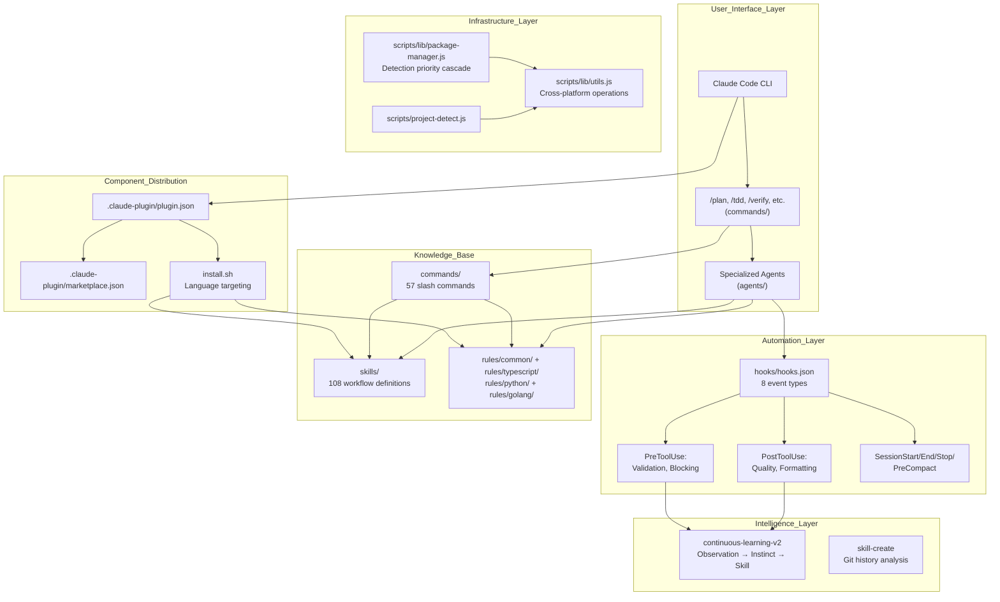

**Sources:** [README.md:145-206](), [AGENTS.md:134-145](), [package.json:40-94]()

---

## Core Component Types

### Agents
Agents are specialized subagents defined in `agents/*.md` with YAML frontmatter specifying tools, model, and permissions. The main Claude instance delegates tasks using the `Task` tool [AGENTS.md:40-53]().

**Key agents:**
- `planner.md`: Implementation planning [AGENTS.md:17-17]()
- `architect.md`: System design and scalability [AGENTS.md:18-18]()
- `tdd-guide.md`: Test-driven development [AGENTS.md:19-19]()
- `code-reviewer.md`: Quality and maintainability [AGENTS.md:20-20]()
- `java-build-resolver.md`: Java/Maven/Gradle error specialist [agents/java-build-resolver.md:1-6]()

**Sources:** [AGENTS.md:13-38](), [agents/java-reviewer.md:1-6]()

### Skills
Skills are workflow definitions in `skills/*/SKILL.md`. They contain step-by-step procedures, domain knowledge, and evidence of effectiveness [README.zh-CN.md:168-186]().

**Organization:**
- `skills/coding-standards/`: Language best practices
- `skills/continuous-learning-v2/`: Instinct-based learning
- `skills/tdd-workflow/`: TDD methodology
- `skills/springboot-patterns/`: Java Spring Boot specialist knowledge [agents/java-reviewer.md:92-92]()

**Sources:** [README.zh-CN.md:168-186](), [AGENTS.md:138-138]()

### Commands
Commands are quick-execution prompts in `commands/*.md` that map slash commands to workflows [README.zh-CN.md:187-206]().

**Common commands:**
- `/plan`: Implementation planning [README.zh-CN.md:189-189]()
- `/tdd`: Test-driven development [README.zh-CN.md:188-188]()
- `/verify`: Run verification loop (build → type → lint → test → git) [README.zh-CN.md:196-196]()
- `/checkpoint`: Save verification state [README.zh-CN.md:195-195]()

**Sources:** [README.zh-CN.md:187-206](), [AGENTS.md:139-139]()

### Rules
Rules are always-follow guidelines in `rules/` organized hierarchically [README.md:109-114]().

```
rules/
├── common/          # Language-agnostic principles
├── typescript/      # TypeScript/JavaScript specific
├── python/          # Python specific
├── golang/          # Go specific
└── perl/            # Perl specific
```

**Sources:** [README.md:109-114](), [AGENTS.md:141-141]()

---

## Package Manager Detection System

The system uses a priority-based cascade to detect the correct package manager for any given project, ensuring cross-platform reliability [README.md:114-123]().

### Detection Priority Logic

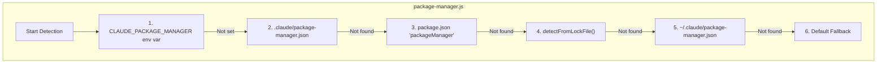

**Sources:** [README.md:114-123](), [README.zh-CN.md:114-142]()

---

## Testing and Validation

ECC maintains high quality through a rigorous testing infrastructure [AGENTS.md:86-101]().

- **Minimum coverage requirement:** 80% [AGENTS.md:88-88]()
- **Validation Suite:** Automated scripts verify every agent, command, skill, and rule against schemas [package.json:107-107]()
- **Test Orchestrator:** `tests/run-all.js` executes the full suite across multiple Node.js versions and operating systems [tests/run-all.js:1-15](), [.github/workflows/ci.yml:24-29]()

**Sources:** [package.json:107-107](), [tests/run-all.js:1-118](), [.github/workflows/ci.yml:162-185]()

---

# Page: Getting Started

# Getting Started

<details>
<summary>Relevant source files</summary>

The following files were used as context for generating this wiki page:

- [.claude-plugin/marketplace.json](.claude-plugin/marketplace.json)
- [.claude-plugin/plugin.json](.claude-plugin/plugin.json)
- [.cursor/rules/php-coding-style.md](.cursor/rules/php-coding-style.md)
- [.cursor/rules/php-hooks.md](.cursor/rules/php-hooks.md)
- [.cursor/rules/php-patterns.md](.cursor/rules/php-patterns.md)
- [.cursor/rules/php-security.md](.cursor/rules/php-security.md)
- [.cursor/rules/php-testing.md](.cursor/rules/php-testing.md)
- [.github/workflows/release.yml](.github/workflows/release.yml)
- [.github/workflows/reusable-release.yml](.github/workflows/reusable-release.yml)
- [README.md](README.md)
- [README.zh-CN.md](README.zh-CN.md)
- [commands/checkpoint.md](commands/checkpoint.md)
- [commands/eval.md](commands/eval.md)
- [commands/verify.md](commands/verify.md)
- [docs/ja-JP/README.md](docs/ja-JP/README.md)
- [docs/ko-KR/CONTRIBUTING.md](docs/ko-KR/CONTRIBUTING.md)
- [docs/ko-KR/README.md](docs/ko-KR/README.md)
- [docs/ko-KR/TERMINOLOGY.md](docs/ko-KR/TERMINOLOGY.md)
- [docs/zh-TW/README.md](docs/zh-TW/README.md)
- [install.sh](install.sh)
- [rules/README.md](rules/README.md)
- [rules/php/hooks.md](rules/php/hooks.md)
- [scripts/ci/validate-rules.js](scripts/ci/validate-rules.js)
- [scripts/release.sh](scripts/release.sh)

</details>


This page documents the installation process, verification steps, and initial usage of the everything-claude-code (ECC) system. ECC is designed as a performance optimization system for AI agent harnesses, evolving from an Anthropic hackathon winner into a production-ready suite of agents, skills, hooks, and rules.

The simplest installation path involves the Claude Code plugin marketplace, followed by a mandatory manual step for rules installation due to platform limitations.

---

## Installation Methods

ECC supports multiple installation paths depending on your target harness (Claude Code, Cursor, OpenCode, or Codex). For most users, the Marketplace or Interactive Wizard is recommended.

### Option 1: Marketplace & Wizard (Recommended)

The interactive `configure-ecc` skill provides a guided setup with merge/overwrite detection, making it the safest path for first-time users.

**Marketplace Installation Flow:**

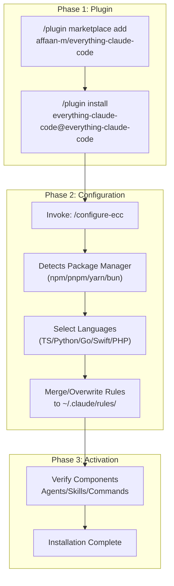

**Essential Commands:**

```bash
# 1. Add the marketplace source
/plugin marketplace add affaan-m/everything-claude-code [README.zh-CN.md:71]()

# 2. Install the plugin
/plugin install everything-claude-code@everything-claude-code [README.zh-CN.md:74]()

# 3. (Optional) Run the configuration wizard
/configure-ecc [README.md:111]()
```

**Rules Installation (Mandatory Manual Step):**
Claude Code plugins cannot automatically distribute files to the `~/.claude/rules/` directory. You must manually install the language-specific rules you need.

```bash
# Clone the repository to access rule files
git clone https://github.com/affaan-m/everything-claude-code.git [README.zh-CN.md:83]()

# Install common rules (required)
cp -r everything-claude-code/rules/common/* ~/.claude/rules/ [README.zh-CN.md:86]()

# Install language-specific rules (choose your stack)
cp -r everything-claude-code/rules/typescript/* ~/.claude/rules/ [README.zh-CN.md:87]()
```

Sources: [README.md:109-113](), [README.zh-CN.md:67-91](), [rules/README.md:27-41]()

### Option 2: Manual Installation (Advanced)

For users who want full control or are using harnesses like Cursor or Codex, manual installation involves copying components to the respective configuration directories.

**File Inventory for Manual Setup:**

| Component | Target Directory | Source Directory |
|-----------|------------------|------------------|
| **Agents** | `~/.claude/agents/` | `agents/*.md` |
| **Commands** | `~/.claude/commands/` | `commands/*.md` |
| **Skills** | `~/.claude/skills/` | `skills/*` (directories) |
| **Rules** | `~/.claude/rules/` | `rules/common/` + `rules/<lang>/` |

**Legacy Installer:**
The repository includes a Node-based installer runtime accessible via a shell wrapper.

```bash
./install.sh typescript python [rules/README.md:33-40]()
```

Sources: [install.sh:1-17](), [rules/README.md:43-60](), [README.zh-CN.md:149-222]()

---

## Installation Verification

Verify that the ECC components are correctly recognized by the harness.

**Verification Checklist:**

| Check | Command | Expected Result |
|-------|---------|-----------------|
| **Plugin Status** | `/plugin list` | `everything-claude-code` is enabled [README.zh-CN.md:103]() |
| **Commands** | Type `/` | Autocomplete shows `/plan`, `/tdd`, `/verify`, `/checkpoint` [README.md:83]() |
| **Agents** | `/plan "test"` | Response identifies as "planner" agent [README.zh-CN.md:97]() |
| **PM Detection** | `/setup-pm --detect` | Shows detected package manager (npm/pnpm/yarn/bun) [README.zh-CN.md:138]() |
| **Rules** | `ls ~/.claude/rules` | Directory contains `common/` and chosen language folders [rules/README.md:4-22]() |

**Verification Flow:**

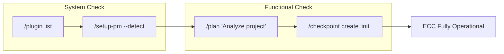

Sources: [README.zh-CN.md:93-106](), [README.zh-CN.md:131-141](), [rules/README.md:27-60]()

---

## First Commands to Try

ECC introduces a structured workflow using specialized agents. Start with these commands to experience the performance optimization.

### 1. Feature Planning (`/plan`)
Invokes the **Planner Agent** (`agents/planner.md`). This agent is restricted to read-only tools (Read, Grep, Glob) to ensure implementation doesn't start before a solid plan is established.

```bash
/plan "Add JWT authentication to the express backend"
```
*   **Result:** A detailed markdown implementation plan covering schema, API, and tests. [README.zh-CN.md:189]()

### 2. Test-Driven Development (`/tdd`)
Invokes the **TDD Guide Agent** (`agents/tdd-guide.md`). It follows the RED-GREEN-REFACTOR cycle defined in `skills/tdd-workflow/`.

```bash
/tdd "Implement the login controller"
```
*   **Result:** Agent writes failing tests, implements minimal code, and refactors. [README.zh-CN.md:188]()

### 3. Verification & Quality Gates (`/verify`)
Runs a comprehensive check of the codebase including build, type checks, linting, and tests.

```bash
/verify
```
*   **Result:** Executes the verification loop defined in `skills/verification-loop/`. [README.zh-CN.md:196]()

### 4. Checkpoint Management (`/checkpoint`)
Saves the current state of the project (Git SHA, test results, and coverage) to `checkpoints.log`.

```bash
/checkpoint create "Before refactoring auth"
```
*   **Result:** Persists project state for later verification or rollback. [README.zh-CN.md:195]()

Sources: [README.zh-CN.md:155-166](), [README.zh-CN.md:187-205](), [commands/plan.md:1-38](), [commands/tdd.md:1-45]()

---

## Configuration Basics

### Package Manager Detection
ECC uses a priority cascade to detect your preferred package manager (npm, pnpm, yarn, or bun):
1.  **Env Var:** `CLAUDE_PACKAGE_MANAGER` [README.zh-CN.md:118]()
2.  **Project Config:** `.claude/package-manager.json` [README.zh-CN.md:119]()
3.  **package.json:** `packageManager` field [README.zh-CN.md:120]()
4.  **Lock Files:** Detection from `pnpm-lock.yaml`, etc. [README.zh-CN.md:121]()
5.  **Global Config:** `~/.claude/package-manager.json` [README.zh-CN.md:122]()

### Model Selection
ECC is optimized for **Claude 3.5 Sonnet** for implementation and **Claude 3 Opus** for complex architecture or security reviews. Some hooks (like `suggest-compact`) may use **Claude 3 Haiku** for cost-efficient background analysis. [README.md:67-72]()

Sources: [README.zh-CN.md:114-141](), [README.md:65-72]()

---

# Page: Core Concepts

# Core Concepts

<details>
<summary>Relevant source files</summary>

The following files were used as context for generating this wiki page:

- [.github/workflows/ci.yml](.github/workflows/ci.yml)
- [AGENTS.md](AGENTS.md)
- [README.md](README.md)
- [README.zh-CN.md](README.zh-CN.md)
- [agents/java-build-resolver.md](agents/java-build-resolver.md)
- [agents/java-reviewer.md](agents/java-reviewer.md)
- [agents/planner.md](agents/planner.md)
- [docs/ja-JP/README.md](docs/ja-JP/README.md)
- [docs/ko-KR/CONTRIBUTING.md](docs/ko-KR/CONTRIBUTING.md)
- [docs/ko-KR/README.md](docs/ko-KR/README.md)
- [docs/ko-KR/TERMINOLOGY.md](docs/ko-KR/TERMINOLOGY.md)
- [docs/zh-TW/README.md](docs/zh-TW/README.md)
- [examples/django-api-CLAUDE.md](examples/django-api-CLAUDE.md)
- [hooks/README.md](hooks/README.md)
- [hooks/hooks.json](hooks/hooks.json)
- [install.ps1](install.ps1)
- [package-lock.json](package-lock.json)
- [package.json](package.json)
- [scripts/ci/catalog.js](scripts/ci/catalog.js)
- [scripts/hooks/insaits-security-monitor.py](scripts/hooks/insaits-security-monitor.py)
- [scripts/hooks/insaits-security-wrapper.js](scripts/hooks/insaits-security-wrapper.js)
- [tests/run-all.js](tests/run-all.js)

</details>


This document introduces the fundamental architecture of Everything Claude Code (ECC). It provides a high-level overview of how agents, skills, commands, rules, hooks, and MCPs work together to create a multi-layered development workflow system optimized for AI agent harnesses like Claude Code, Cursor, and OpenCode.

For detailed information about specific component types, see the following child pages:
- [Plugin Architecture](#3.1) — Plugin structure and marketplace distribution.
- [Agents](#3.2) — Specialized subagents and task delegation.
- [Skills](#3.3) — Workflow definitions and domain knowledge.
- [Commands](#3.4) — Slash commands for quick execution.
- [Rules](#3.5) — Hierarchical guidelines and constraints.
- [Hooks](#3.6) — Event-driven automation and lifecycle phases.
- [MCPs (Model Context Protocol)](#3.7) — External service integrations.

---

## Component Types

ECC organizes its capabilities into six primary component types, each serving a distinct role in the development lifecycle:

| Component | Location | Purpose | Invocation Method |
|-----------|----------|---------|-------------------|
| **Agents** | `agents/*.md` | Specialized subagents with specific tool permissions for delegated tasks | Via command delegation or direct invocation |
| **Skills** | `skills/*/` | Reusable workflow definitions and domain knowledge | Auto-loaded by context or referenced by agents |
| **Commands** | `commands/*.md` | Slash commands for quick workflow execution | User types `/command-name` |
| **Rules** | `rules/` | Always-follow guidelines (Common + Language-specific) | Auto-loaded in every session |
| **Hooks** | `hooks/hooks.json` | Event-driven scripts triggered by tool use or lifecycle events | Automatic on event triggers |
| **MCPs** | `mcp-configs/` | External service integrations (GitHub, Postgres, etc.) | Tool calls from the LLM |

**Sources:** [README.md:137-145](), [AGENTS.md:1-13](), [package.json:41-94]()

---

## The Layered Architecture

ECC operates across four distinct layers, bridging high-level user intent to low-level system execution and continuous improvement.

### Architectural Flow Diagram
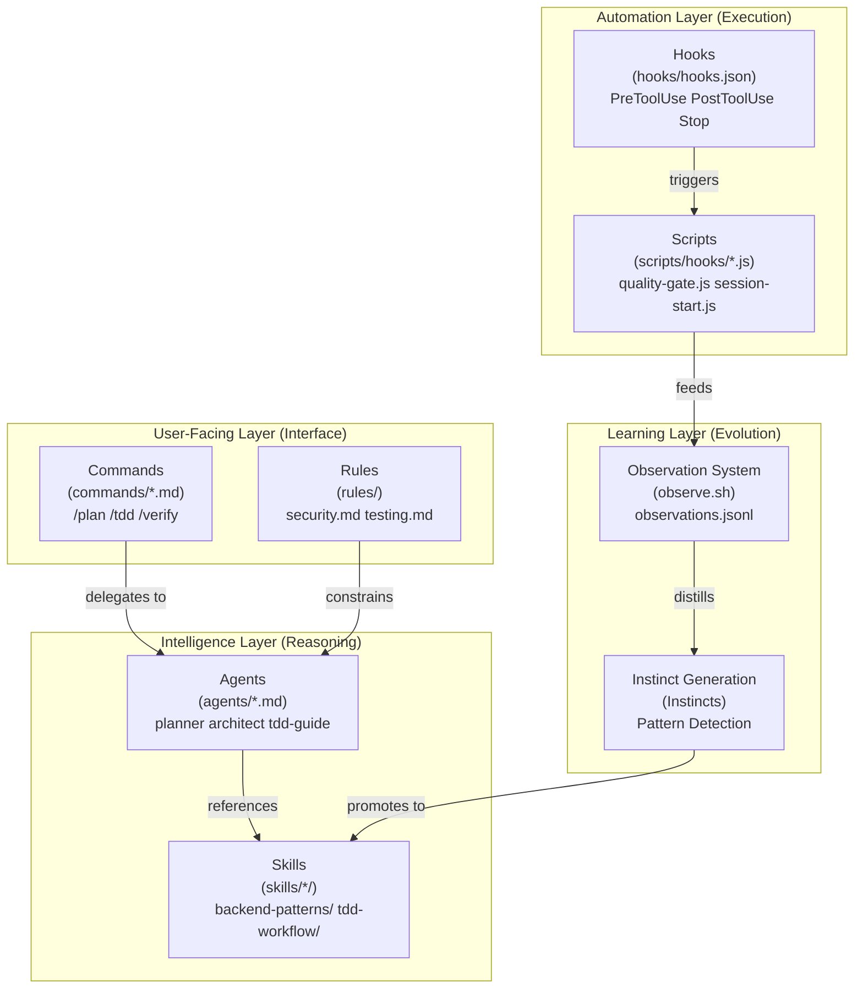

**Sources:** [README.md:34-39](), [AGENTS.md:40-53](), [hooks/README.md:7-15]()

---

## Component Discovery and Loading

The system identifies components through a combination of explicit manifests and directory conventions.

### Mapping Natural Language to Code Entities
The following diagram illustrates how user-facing concepts map to specific code entities and file paths within the ECC structure.

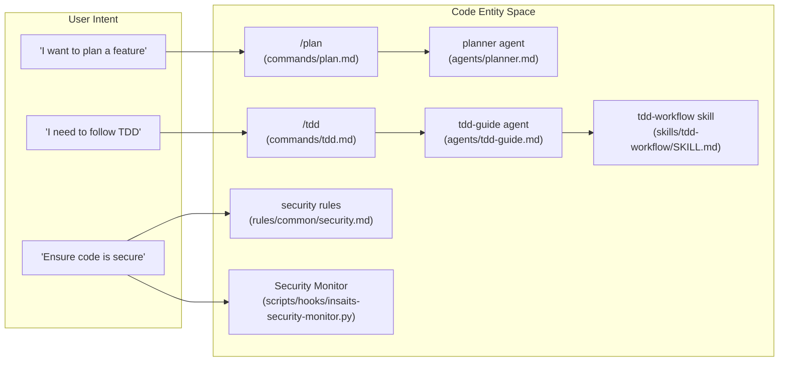

**Sources:** [AGENTS.md:15-38](), [hooks/hooks.json:72-76](), [scripts/ci/catalog.js:43-54]()

---

## Hook Lifecycle and Data Flow

Hooks are the "glue" of the system, intercepting tool inputs and outputs to enforce quality and persist state.

### Tool Execution Sequence
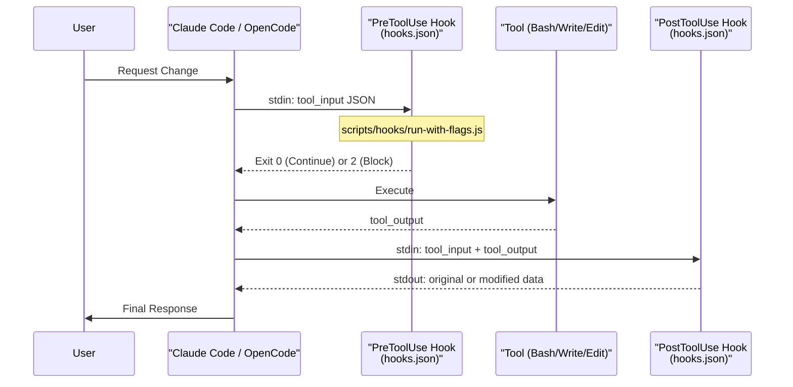

**Sources:** [hooks/hooks.json:1-170](), [hooks/README.md:7-15](), [scripts/hooks/run-with-flags.js:1-50]()

---

## File Organization and Priority

ECC follows a strict directory convention that allows for project-specific overrides.

### Directory Structure
- `agents/`: Contains 25+ specialized subagents. [AGENTS.md:137]()
- `skills/`: Contains 100+ workflow definitions. [AGENTS.md:138]()
- `commands/`: Contains 50+ slash commands. [AGENTS.md:139]()
- `hooks/`: Trigger-based automations. [AGENTS.md:140]()
- `rules/`: Always-follow guidelines (Common, TS, Python, Go, Perl). [AGENTS.md:141]()
- `scripts/`: Cross-platform Node.js utilities. [AGENTS.md:142]()

### Configuration Priority
ECC resolves settings and package managers in a specific order to ensure flexibility:
1. **Environment Variables**: e.g., `CLAUDE_PACKAGE_MANAGER`. [README.md:118]()
2. **Project Configuration**: `.claude/package-manager.json`. [README.md:119]()
3. **Local Manifests**: `package.json` fields or lock files. [README.md:120-121]()
4. **Global Configuration**: `~/.claude/package-manager.json`. [README.md:122]()

**Sources:** [README.md:114-124](), [AGENTS.md:134-145](), [package.json:41-94]()

---

## Summary of Interactions

The power of ECC lies in the interaction between these components:
- **Commands** trigger **Agents**.
- **Agents** follow **Rules** and use **Skills**.
- **Hooks** monitor **Tools** used by Agents to ensure they meet **Rules**.
- **Continuous Learning** extracts new **Skills** from successful **Agent** sessions.

For detailed implementation details, proceed to the child pages: [Plugin Architecture](#3.1), [Agents](#3.2), [Skills](#3.3), [Commands](#3.4), [Rules](#3.5), [Hooks](#3.6), and [MCPs (Model Context Protocol)](#3.7).

---

# Page: Plugin Architecture

# Plugin Architecture

<details>
<summary>Relevant source files</summary>

The following files were used as context for generating this wiki page:

- [.claude-plugin/README.md](.claude-plugin/README.md)
- [.claude-plugin/marketplace.json](.claude-plugin/marketplace.json)
- [.claude-plugin/plugin.json](.claude-plugin/plugin.json)
- [.github/workflows/release.yml](.github/workflows/release.yml)
- [.github/workflows/reusable-release.yml](.github/workflows/reusable-release.yml)
- [README.md](README.md)
- [README.zh-CN.md](README.zh-CN.md)
- [commands/checkpoint.md](commands/checkpoint.md)
- [commands/eval.md](commands/eval.md)
- [commands/verify.md](commands/verify.md)
- [docs/ja-JP/README.md](docs/ja-JP/README.md)
- [docs/ko-KR/CONTRIBUTING.md](docs/ko-KR/CONTRIBUTING.md)
- [docs/ko-KR/README.md](docs/ko-KR/README.md)
- [docs/ko-KR/TERMINOLOGY.md](docs/ko-KR/TERMINOLOGY.md)
- [docs/zh-TW/README.md](docs/zh-TW/README.md)
- [scripts/ci/validate-rules.js](scripts/ci/validate-rules.js)
- [scripts/release.sh](scripts/release.sh)

</details>


## Overview

Everything Claude Code is distributed as a Claude Code plugin—a structured package of components (agents, skills, commands, hooks) that can be installed via the plugin marketplace or manually integrated. The plugin system provides a standardized way to package, distribute, and load development workflows, automation scripts, and AI agent configurations.

This page covers the plugin structure itself—how components are organized, distributed via marketplace, and loaded by Claude Code. For details on individual component types, see [Agents](3.2), [Skills](3.3), [Commands](3.4), [Rules](3.5), and [Hooks](3.6).

Sources: [README.md:145-241](), [.claude-plugin/plugin.json:1-25]()

## Plugin Directory Structure

The plugin is organized into directories that map to component types:

```text
everything-claude-code/
├── .claude-plugin/          # Plugin system metadata
│   ├── plugin.json          # Plugin manifest
│   └── marketplace.json     # Marketplace catalog entry
├── agents/                  # Specialized subagents (markdown with frontmatter)
│   ├── planner.md
│   ├── code-reviewer.md
│   └── ...
├── skills/                  # Domain knowledge & workflows
│   ├── tdd-workflow/
│   ├── continuous-learning-v2/
│   └── ...
├── commands/                # Slash commands (markdown with frontmatter)
│   ├── plan.md
│   ├── tdd.md
│   └── ...
├── rules/                   # Always-follow guidelines (Not auto-installed)
│   ├── common/
│   ├── typescript/
│   └── ...
├── hooks/                   # Event-driven automation
│   └── hooks.json           # Hook definitions and matchers
├── scripts/                 # Cross-platform Node.js utilities
│   ├── lib/
│   │   ├── utils.js         # Shared utility library
│   │   └── package-manager.js
│   └── hooks/               # Hook implementations
│       ├── session-start.js
│       └── session-end.js
└── mcp-configs/             # MCP server configurations
    └── mcp-servers.json
```

Sources: [README.md:149-235](), [.claude-plugin/plugin.json:1-25]()

## Plugin Manifest (plugin.json)

The plugin manifest at `.claude-plugin/plugin.json` declares metadata and component locations. This is the entry point for plugin loading by the Claude Code CLI.

**Title: Plugin Manifest Structure**
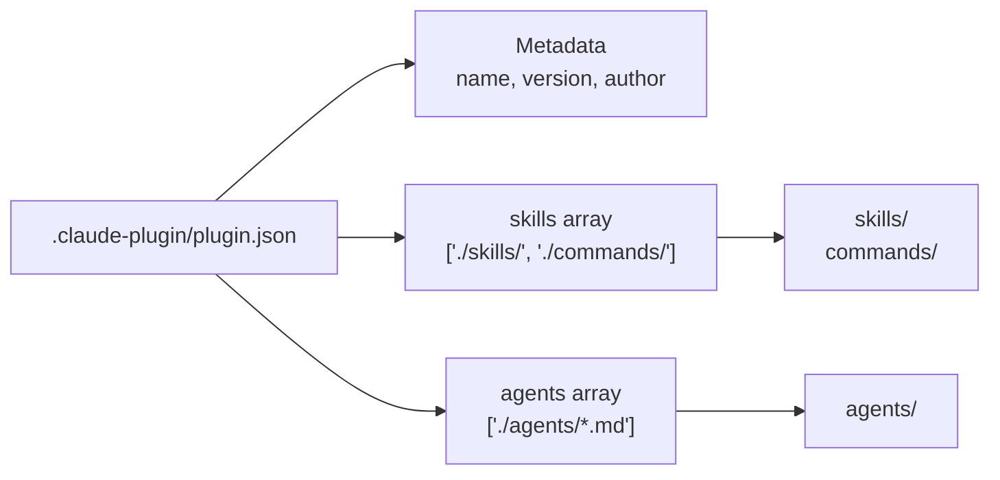

Sources: [.claude-plugin/plugin.json:1-25]()

### Component Registration

The manifest uses path arrays to declare where components are located:

```json
{
  "name": "everything-claude-code",
  "version": "1.8.0",
  "skills": ["./skills/", "./commands/"],
  "agents": ["./agents/*.md"]
}
```

**Note on Hooks:** The manifest does NOT include a `"hooks"` field. Claude Code CLI v2.1+ automatically loads `hooks/hooks.json` by convention. Explicitly declaring it causes duplicate detection errors.

Sources: [.claude-plugin/plugin.json:1-25](), [.claude-plugin/README.md:1-6]()

### Component Types Not Supported by Plugins

**Rules** cannot be distributed via the plugin system due to platform limitations. Users must manually install rules using the provided `install.sh` script or by copying them to `~/.claude/rules/`.

Sources: [README.md:77-91](), [README.md:121-136]()

## Marketplace Distribution

The plugin is distributed via the Claude Code marketplace system using `marketplace.json`.

**Title: Marketplace Distribution Flow**
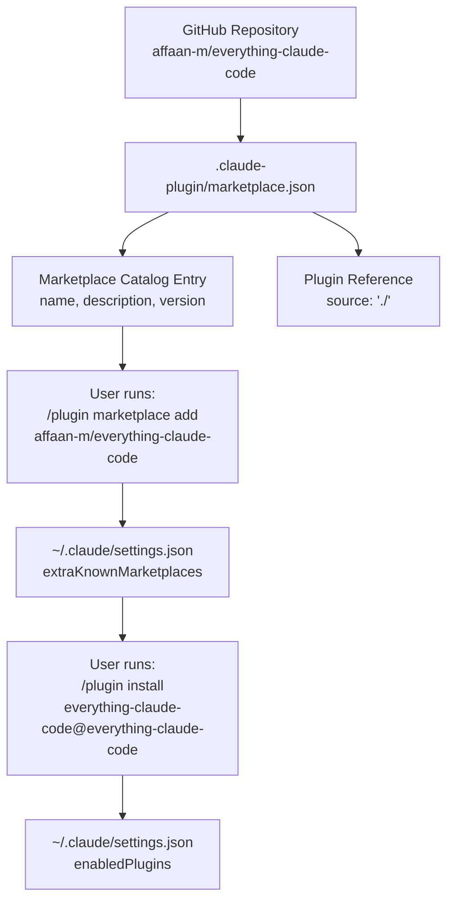

Sources: [.claude-plugin/marketplace.json:1-49](), [README.md:67-75]()

### Marketplace Catalog Structure

The `marketplace.json` file defines how the plugin appears in the marketplace:

| Field | Purpose |
|-------|---------|
| `$schema` | JSON schema reference for validation |
| `name` | Marketplace identifier (must match repository) |
| `owner` | Contact information for the author |
| `plugins[].name` | Plugin identifier within the marketplace |
| `plugins[].source` | Relative path to the plugin directory (`./`) |
| `plugins[].version` | Plugin version (synced with `plugin.json`) |
| `plugins[].category` | Marketplace category (e.g., `"workflow"`) |

Sources: [.claude-plugin/marketplace.json:1-49]()

## Plugin Loading Process

Claude Code loads plugins through a multi-step registration and initialization process.

**Title: Plugin Component Loading**
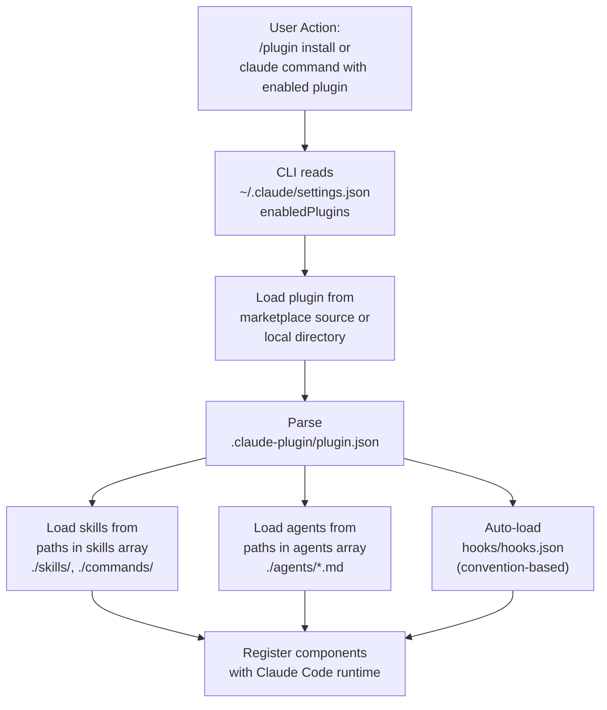

Sources: [.claude-plugin/plugin.json:1-25](), [README.md:145-206]()

## Cross-Platform Support

The plugin uses Node.js scripts for cross-platform compatibility across Windows, macOS, and Linux.

### Package Manager Detection

The plugin detects package managers through a priority cascade implemented in `scripts/lib/package-manager.js`.

**Title: Package Manager Detection Priority**
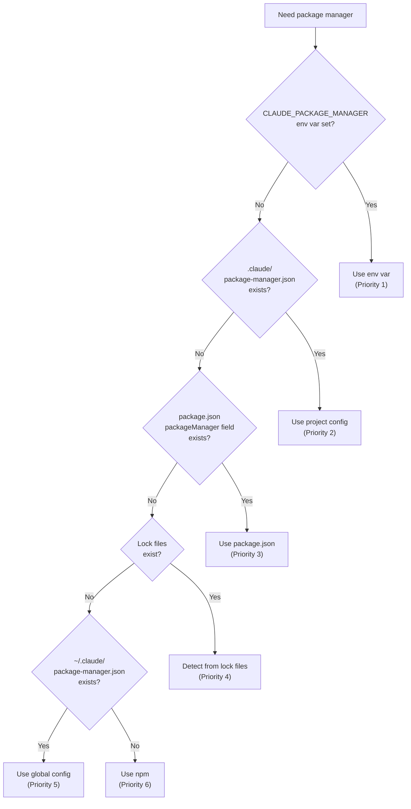

Sources: [README.md:114-142](), [README.zh-CN.md:114-142]()

### Component File Mapping

| Component Type | Source Location | Registration Method |
|----------------|-----------------|---------------------|
| **Agents** | `agents/*.md` | `plugin.json` `agents` array |
| **Skills** | `skills/*/` | `plugin.json` `skills` array |
| **Commands** | `commands/*.md` | `plugin.json` `skills` array |
| **Hooks** | `hooks/hooks.json` | Convention (auto-loaded) |
| **Scripts** | `scripts/**/*.js` | Referenced by hooks |

Sources: [.claude-plugin/plugin.json:1-25](), [README.md:145-235]()

---

# Page: Agents

# Agents

<details>
<summary>Relevant source files</summary>

The following files were used as context for generating this wiki page:

- [.agents/skills/bun-runtime/agents/openai.yaml](.agents/skills/bun-runtime/agents/openai.yaml)
- [.agents/skills/documentation-lookup/agents/openai.yaml](.agents/skills/documentation-lookup/agents/openai.yaml)
- [.agents/skills/nextjs-turbopack/agents/openai.yaml](.agents/skills/nextjs-turbopack/agents/openai.yaml)
- [.github/workflows/ci.yml](.github/workflows/ci.yml)
- [AGENTS.md](AGENTS.md)
- [agents/architect.md](agents/architect.md)
- [agents/build-error-resolver.md](agents/build-error-resolver.md)
- [agents/code-reviewer.md](agents/code-reviewer.md)
- [agents/database-reviewer.md](agents/database-reviewer.md)
- [agents/doc-updater.md](agents/doc-updater.md)
- [agents/e2e-runner.md](agents/e2e-runner.md)
- [agents/java-build-resolver.md](agents/java-build-resolver.md)
- [agents/java-reviewer.md](agents/java-reviewer.md)
- [agents/python-reviewer.md](agents/python-reviewer.md)
- [agents/refactor-cleaner.md](agents/refactor-cleaner.md)
- [agents/security-reviewer.md](agents/security-reviewer.md)
- [agents/tdd-guide.md](agents/tdd-guide.md)
- [examples/saas-nextjs-CLAUDE.md](examples/saas-nextjs-CLAUDE.md)
- [install.ps1](install.ps1)
- [package-lock.json](package-lock.json)
- [package.json](package.json)
- [rules/common/agents.md](rules/common/agents.md)
- [rules/common/coding-style.md](rules/common/coding-style.md)
- [rules/common/git-workflow.md](rules/common/git-workflow.md)
- [rules/common/hooks.md](rules/common/hooks.md)
- [rules/common/patterns.md](rules/common/patterns.md)
- [rules/common/security.md](rules/common/security.md)
- [rules/common/testing.md](rules/common/testing.md)
- [scripts/ci/catalog.js](scripts/ci/catalog.js)
- [scripts/setup-package-manager.js](scripts/setup-package-manager.js)
- [skills/cpp-testing/SKILL.md](skills/cpp-testing/SKILL.md)
- [skills/e2e-testing/SKILL.md](skills/e2e-testing/SKILL.md)
- [skills/postgres-patterns/SKILL.md](skills/postgres-patterns/SKILL.md)
- [tests/run-all.js](tests/run-all.js)

</details>


**Purpose:** This page defines what agents are in the Everything Claude Code (ECC) system, their YAML structure, model and tool configurations, delegation patterns, and orchestration strategies. Agents are the primary specialized actors that execute domain-specific tasks within the ECC ecosystem.

---

## What Are Agents?

Agents are **specialized subprocesses** that handle delegated tasks with limited scope. The main Claude Code instance (the "orchestrator") delegates specific responsibilities to agents, each configured with restricted tool permissions, specific models, and focused instructions. This "Agent-First" principle [AGENTS.md:7-7]() ensures that domain tasks are handled by specialized logic rather than a generic prompt.

**Key characteristics:**

- **Focused scope** — Each agent handles one type of task (planning, code review, security analysis, etc.) [AGENTS.md:15-38]()
- **Separate context** — Agents run in isolated processes with their own context windows to prevent "author bias" during reviews.
- **Tool restrictions** — Agents have explicit `tools` permissions defined in their frontmatter [agents/database-reviewer.md:4-4]().
- **Model routing** — Different agents use different models (Haiku/Sonnet/Opus) based on task complexity [agents/doc-updater.md:5-5]().
- **Stateless execution** — Agents receive input, perform work, return output, then exit.

**Diagram: Agent Role in ECC Architecture**

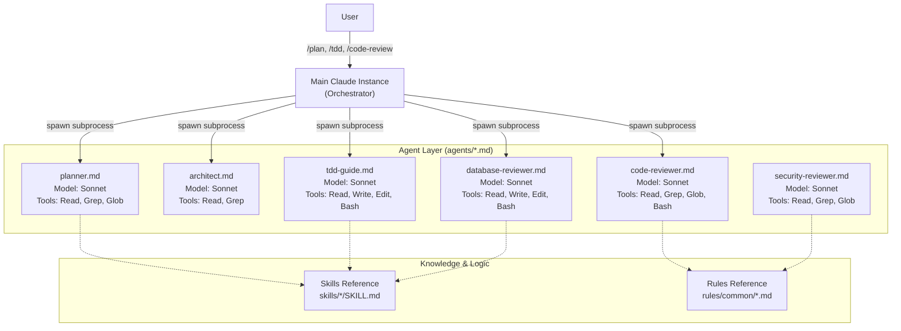
Sources: [AGENTS.md:1-53](), [agents/database-reviewer.md:1-6](), [rules/common/agents.md:1-51]()

---

## Agent File Structure

Agents are Markdown files with YAML frontmatter stored in the `agents/` directory [AGENTS.md:137-137]().

**Diagram: Agent File Anatomy**

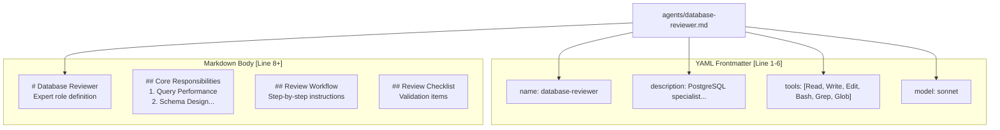

**Frontmatter fields:**

| Field | Type | Required | Purpose |
|-------|------|----------|---------|
| `name` | string | Yes | Unique identifier (kebab-case) [agents/database-reviewer.md:2-2]() |
| `description` | string | Yes | Single-line summary shown in agent lists [agents/database-reviewer.md:3-3]() |
| `tools` | string[] | Yes | Allowed tool names (Read, Write, Edit, Bash, Grep, Glob) [agents/database-reviewer.md:4-4]() |
| `model` | string | No | Preferred model (haiku, sonnet) [agents/database-reviewer.md:5-5]() |

Sources: [agents/database-reviewer.md:1-6](), [agents/doc-updater.md:1-6](), [agents/e2e-runner.md:1-6]()

---

## Model Configuration

ECC routes tasks to specific models based on the reasoning depth required for the agent's role.

| Model | Use Case | Agents |
|-------|-----------|----------|
| **haiku** | Fast exploration, simple updates, documentation syncing. | `doc-updater` [agents/doc-updater.md:5-5]() |
| **sonnet** | Standard coding, complex logic, multi-file reviews, database optimization. | `database-reviewer` [agents/database-reviewer.md:5-5](), `e2e-runner` [agents/e2e-runner.md:5-5](), `tdd-guide` [agents/tdd-guide.md:5-5]() |

**Context Window Strategy:**
Agents are instructed to avoid the last 20% of the context window for large refactorings to maintain performance and reliability [AGENTS.md:130-130]().

Sources: [AGENTS.md:130-132](), [agents/doc-updater.md:5-5](), [agents/database-reviewer.md:5-5]()

---

## Tool Permissions

Agents declare allowed tools to create security boundaries. This prevents a "Reviewer" agent from accidentally modifying code, maintaining the integrity of the review process.

**Common Tool Sets:**

- **Read-Only/Analysis:** `["Read", "Grep", "Glob"]` (e.g., used for initial planning or documentation lookup).
- **Review & Verification:** `["Read", "Bash", "Grep", "Glob"]` (e.g., `code-reviewer` uses `Bash` to run tests but not `Edit` to change code).
- **Implementation:** `["Read", "Write", "Edit", "Bash", "Grep", "Glob"]` (e.g., `database-reviewer` [agents/database-reviewer.md:4-4](), `e2e-runner` [agents/e2e-runner.md:4-4]()).

Sources: [agents/database-reviewer.md:4-4](), [agents/e2e-runner.md:3-4](), [agents/doc-updater.md:3-4]()

---

## Agent Orchestration & Delegation

The ECC system uses an **Agent-First** approach where the orchestrator delegates tasks proactively without waiting for user prompts [AGENTS.md:42-42]().

### Proactive Invocation Patterns
- **Complex features** → `planner` [AGENTS.md:43-43]()
- **Code modifications** → `code-reviewer` [AGENTS.md:44-44]()
- **Bug fixes** → `tdd-guide` [AGENTS.md:45-45]()
- **Architecture decisions** → `architect` [AGENTS.md:46-46]()

### Parallel Execution
ECC emphasizes **parallel execution** for independent operations. Instead of waiting for one agent to finish, multiple agents (e.g., a security reviewer and a performance reviewer) can be launched simultaneously [AGENTS.md:52-52](), [rules/common/agents.md:30-41]().

**Diagram: Sequential vs. Parallel Delegation**

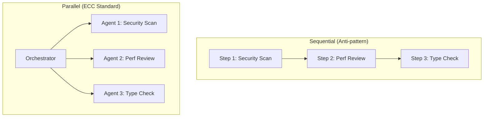
Sources: [AGENTS.md:40-52](), [rules/common/agents.md:28-41]()

---

## Available Agents Reference

ECC includes 25+ specialized agents [AGENTS.md:3-3](). Below are key agents and their specific roles.

| Agent | Purpose | Primary Skills Used |
|-------|---------|---------------------|
| `planner` | Implementation planning for complex features [AGENTS.md:17-17]() | `implementation-planning` |
| `tdd-guide` | Enforces RED → GREEN → REFACTOR loop [AGENTS.md:19-19](), [skills/cpp-testing/SKILL.md:38-43]() | `testing`, `tdd-workflow` |
| `database-reviewer` | PostgreSQL query optimization and schema design [agents/database-reviewer.md:14-18]() | `postgres-patterns` [agents/database-reviewer.md:85-85]() |
| `e2e-runner` | End-to-end testing using Agent Browser or Playwright [agents/e2e-runner.md:14-19]() | `e2e-testing` [agents/e2e-runner.md:103-103]() |
| `doc-updater` | Maintaining codemaps and READMEs [agents/doc-updater.md:14-18]() | `codemaps` |
| `build-error-resolver` | Analyzes and fixes build/type errors [AGENTS.md:22-22]() | `build-troubleshooting` |
| `security-reviewer` | Vulnerability detection (SQLi, XSS, CSRF) [AGENTS.md:21-21](), [AGENTS.md:58-62]() | `security-audit` |

Sources: [AGENTS.md:15-38](), [agents/database-reviewer.md:1-20](), [agents/e2e-runner.md:1-20](), [agents/doc-updater.md:1-20]()

---

## Development Workflow with Agents

The standard ECC workflow integrates agents at every phase of the lifecycle [AGENTS.md:103-112]():

1. **Plan:** Use `planner` to identify dependencies and break tasks into phases.
2. **TDD:** Use `tdd-guide` to write failing tests first (RED), implement (GREEN), and clean up (REFACTOR).
3. **Review:** Use `code-reviewer` immediately after modification to address issues.
4. **Document:** Use `doc-updater` to sync codemaps with new architectural changes.
5. **Verify:** Use `e2e-runner` to ensure critical user flows remain intact.

**Success Metrics for Agents:**
- All tests pass with **80%+ coverage** [AGENTS.md:149-149]().
- No security vulnerabilities found by `security-reviewer` [AGENTS.md:150-150]().
- Code quality checklist met (small functions, proper error handling) [AGENTS.md:80-84]().

Sources: [AGENTS.md:80-112](), [AGENTS.md:147-152](), [skills/cpp-testing/SKILL.md:29-43]()

---

# Page: Skills

# Skills

<details>
<summary>Relevant source files</summary>

The following files were used as context for generating this wiki page:

- [.agents/skills/claude-api/SKILL.md](.agents/skills/claude-api/SKILL.md)
- [.agents/skills/crosspost/SKILL.md](.agents/skills/crosspost/SKILL.md)
- [.agents/skills/exa-search/SKILL.md](.agents/skills/exa-search/SKILL.md)
- [.agents/skills/x-api/SKILL.md](.agents/skills/x-api/SKILL.md)
- [examples/user-CLAUDE.md](examples/user-CLAUDE.md)
- [scripts/lib/orchestration-session.js](scripts/lib/orchestration-session.js)
- [scripts/lib/tmux-worktree-orchestrator.js](scripts/lib/tmux-worktree-orchestrator.js)
- [scripts/orchestrate-codex-worker.sh](scripts/orchestrate-codex-worker.sh)
- [scripts/orchestrate-worktrees.js](scripts/orchestrate-worktrees.js)
- [scripts/orchestration-status.js](scripts/orchestration-status.js)
- [skills/backend-patterns/SKILL.md](skills/backend-patterns/SKILL.md)
- [skills/blueprint/SKILL.md](skills/blueprint/SKILL.md)
- [skills/clickhouse-io/SKILL.md](skills/clickhouse-io/SKILL.md)
- [skills/coding-standards/SKILL.md](skills/coding-standards/SKILL.md)
- [skills/configure-ecc/SKILL.md](skills/configure-ecc/SKILL.md)
- [skills/continuous-learning/SKILL.md](skills/continuous-learning/SKILL.md)
- [skills/crosspost/SKILL.md](skills/crosspost/SKILL.md)
- [skills/django-verification/SKILL.md](skills/django-verification/SKILL.md)
- [skills/dmux-workflows/SKILL.md](skills/dmux-workflows/SKILL.md)
- [skills/eval-harness/SKILL.md](skills/eval-harness/SKILL.md)
- [skills/exa-search/SKILL.md](skills/exa-search/SKILL.md)
- [skills/fal-ai-media/SKILL.md](skills/fal-ai-media/SKILL.md)
- [skills/frontend-patterns/SKILL.md](skills/frontend-patterns/SKILL.md)
- [skills/iterative-retrieval/SKILL.md](skills/iterative-retrieval/SKILL.md)
- [tests/lib/orchestration-session.test.js](tests/lib/orchestration-session.test.js)
- [tests/lib/tmux-worktree-orchestrator.test.js](tests/lib/tmux-worktree-orchestrator.test.js)

</details>


This page defines skills as workflow definitions in the Everything Claude Code system, their markdown structure with YAML frontmatter, and how agents and commands invoke them. For quick-execution prompts, see [Commands](3.4). For always-follow guidelines, see [Rules](3.5). For how agents delegate to skills, see [Agents](3.2).

---

## Overview

Skills are **workflow definitions** that encapsulate reusable execution patterns, domain knowledge, and step-by-step procedures. Unlike rules (always-applied constraints) or commands (single-shot prompts), skills provide detailed guidance for multi-step processes like TDD workflows, security reviews, architectural patterns, or framework-specific best practices.

Skills are stored as markdown files with YAML frontmatter and invoked either directly by agents through delegation or indirectly via slash commands.

**Sources:** [skills/blueprint/SKILL.md:1-14](), [skills/configure-ecc/SKILL.md:1-5]()

---

## File Structure and Format

### Skill File Anatomy

Every skill follows a standardized markdown structure:

```markdown
---
name: skill-name-kebab-case
description: "Brief description of the workflow or domain knowledge"
origin: ECC | community
---

# Skill Title

Brief overview of what this skill covers and when to use it.

## When to Use / When to Activate

- Specific scenario 1
- Specific scenario 2

## Core Tools / Workflow Steps

Detailed content here, often including tool parameters or bash snippets.

## Usage Patterns / Examples

Concrete examples of how to apply the skill.

## Related Skills (optional)

Links to complementary workflows.
```

**Sources:** [skills/exa-search/SKILL.md:1-100](), [skills/blueprint/SKILL.md:1-106]()

### Directory Organization

Skills are organized in a two-level hierarchy within the `.claude/skills/` or `~/.claude/skills/` directories.

```
skills/
├── configure-ecc/
│   └── SKILL.md
├── exa-search/
│   └── SKILL.md
├── blueprint/
│   └── SKILL.md
└── crosspost/
    └── SKILL.md
```

**Sources:** [skills/configure-ecc/SKILL.md:53-61](), [skills/blueprint/SKILL.md:82-83]()

---

## Frontmatter Schema

### Required Fields

| Field | Type | Purpose | Example |
|-------|------|---------|---------|
| `name` | string | Kebab-case identifier for the skill | `exa-search` |
| `description` | string | One-line summary for agent discovery | `"Neural search via Exa MCP"` |
| `origin` | enum | Source attribution: `ECC` or `community` | `ECC` |

**Sources:** [skills/exa-search/SKILL.md:1-5](), [skills/blueprint/SKILL.md:1-14]()

---

## Skill File Structure Diagram

**Diagram: Skill Markdown File Structure**

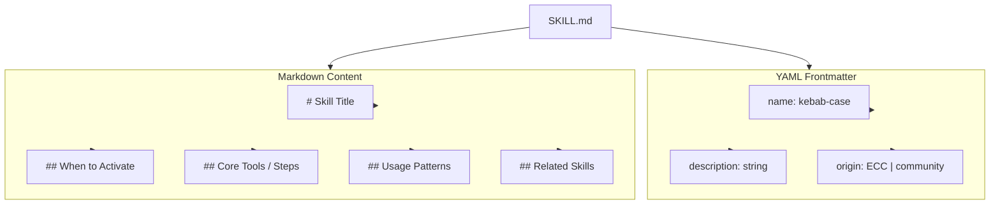

**Sources:** [skills/exa-search/SKILL.md:1-100](), [skills/crosspost/SKILL.md:1-191]()

---

## Skill Categories

Skills in ECC are organized into functional categories to help users and agents select the right workflow.

### Framework & Language Patterns
| Skill | Purpose |
|-------|---------|
| `backend-patterns` | API design and server-side best practices |
| `coding-standards` | Universal standards for TS/JS/React |
| `django-patterns` | Django architecture and ORM patterns |
| `springboot-patterns` | Spring Boot layered architecture |

### Workflow & Quality
| Skill | Purpose |
|-------|---------|
| `blueprint` | Project roadmap and multi-PR planning |
| `configure-ecc` | Interactive setup and verification |
| `continuous-learning` | Pattern extraction from sessions |
| `eval-harness` | Capability and regression testing |

### Research & Distribution
| Skill | Purpose |
|-------|---------|
| `exa-search` | Neural web and code search |
| `crosspost` | Multi-platform social content adaptation |
| `content-engine` | High-quality content drafting |

**Sources:** [skills/configure-ecc/SKILL.md:104-148](), [skills/blueprint/SKILL.md:1-14]()

---

## How Skills Are Invoked

**Diagram: Skill Invocation Flow**

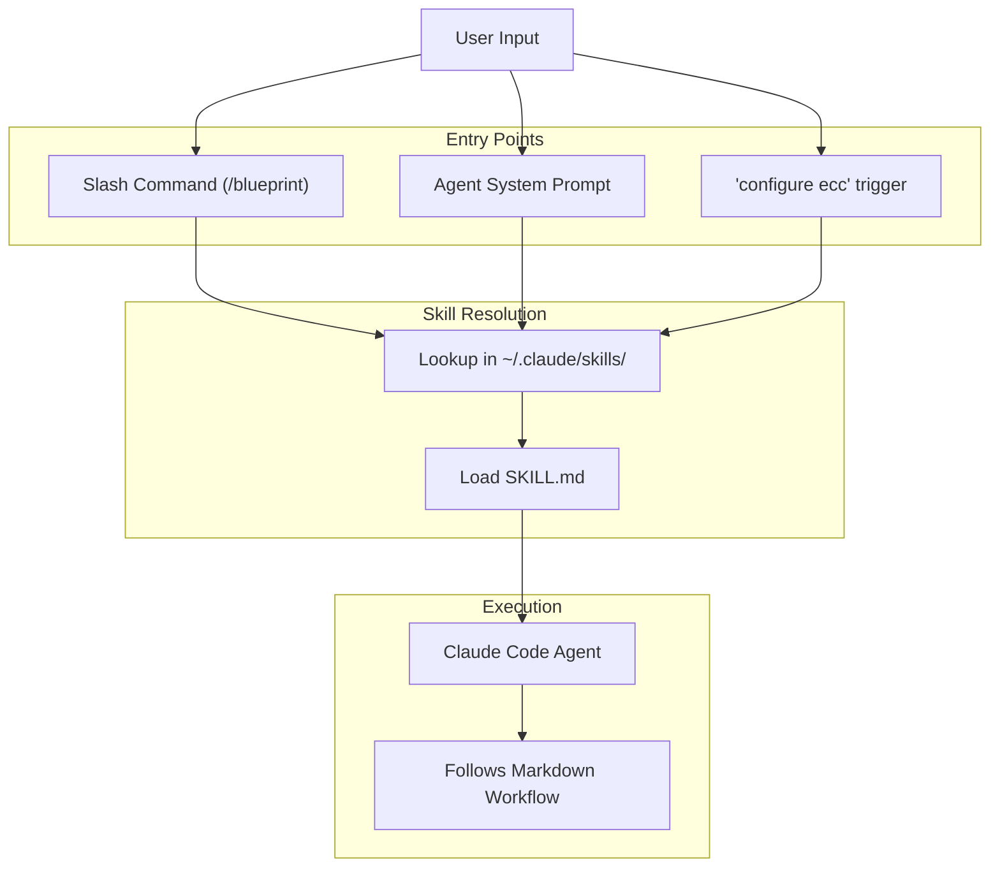

**Sources:** [skills/configure-ecc/SKILL.md:11-23](), [skills/blueprint/SKILL.md:9-12]()

### Invocation Methods

1.  **Slash Commands**: Commands like `/blueprint` directly trigger the skill by passing the user's objective to the blueprint workflow.
2.  **Natural Language Activation**: Skills like `configure-ecc` are activated when the user says "setup ecc" or "configure everything claude code".
3.  **Agent Delegation**: Agents (e.g., `planner`) have skills pre-loaded in their definitions to handle specific domains like architecture or security.

**Sources:** [skills/configure-ecc/SKILL.md:11-16](), [skills/blueprint/SKILL.md:9-12](), [examples/user-CLAUDE.md:42-58]()

---

## Advanced Skill Orchestration: Tmux & Worktrees

For complex engineering tasks, ECC uses specialized scripts to orchestrate multi-worker workflows, often guided by skills like `blueprint`.

**Diagram: Orchestration Bridge (Logic to Code)**

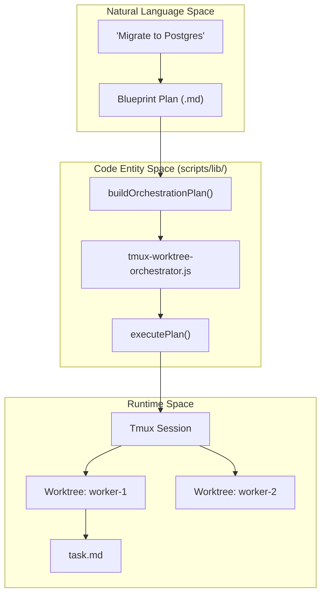

**Sources:** [scripts/lib/tmux-worktree-orchestrator.js:175-213](), [scripts/lib/orchestration-session.js:226-245]()

### Key Orchestration Components

*   **`buildOrchestrationPlan`**: Transforms a high-level project objective into individual worker tasks, git worktree paths, and tmux window commands. [scripts/lib/tmux-worktree-orchestrator.js:175-213]()
*   **`materializePlan`**: Creates the physical directory structure and `task.md` files for each worker. [tests/lib/tmux-worktree-orchestrator.test.js:206-210]()
*   **`parseWorkerStatus`**: Reads `status.md` files to track the progress of asynchronous workers. [scripts/lib/orchestration-session.js:58-90]()
*   **`orchestrate-codex-worker.sh`**: The shell-level entry point that runs inside a worktree, executing the task and writing the `handoff.md`. [scripts/orchestrate-codex-worker.sh:1-107]()

**Sources:** [scripts/lib/tmux-worktree-orchestrator.js:175-213](), [scripts/lib/orchestration-session.js:58-90](), [scripts/orchestrate-codex-worker.sh:1-107]()

---

## Skills vs Commands vs Rules

| Aspect | Skills | Commands | Rules |
|--------|--------|----------|-------|
| **Purpose** | Workflow definitions | Quick execution | Always-follow constraints |
| **Trigger** | Contextual/Explicit | Slash command (/) | Automatic/Global |
| **Complexity** | High (Multi-step) | Low (Single prompt) | Medium (Guidelines) |
| **Storage** | `skills/*/SKILL.md` | `commands/*.md` | `rules/*.md` |

**Sources:** [examples/user-CLAUDE.md:25-58](), [skills/configure-ecc/SKILL.md:1-5]()

---

## References

*   **Tmux Orchestrator**: [scripts/lib/tmux-worktree-orchestrator.js]()
*   **Session Management**: [scripts/lib/orchestration-session.js]()
*   **Worker Execution**: [scripts/orchestrate-codex-worker.sh]()
*   **Blueprint Skill**: [skills/blueprint/SKILL.md]()
*   **Configure ECC Skill**: [skills/configure-ecc/SKILL.md]()

**Sources:** [scripts/lib/tmux-worktree-orchestrator.js:1-47](), [scripts/lib/orchestration-session.js:1-44](), [skills/blueprint/SKILL.md:1-14]()

---

# Page: Commands

# Commands

<details>
<summary>Relevant source files</summary>

The following files were used as context for generating this wiki page:

- [.claude-plugin/marketplace.json](.claude-plugin/marketplace.json)
- [.claude-plugin/plugin.json](.claude-plugin/plugin.json)
- [.github/workflows/release.yml](.github/workflows/release.yml)
- [.github/workflows/reusable-release.yml](.github/workflows/reusable-release.yml)
- [commands/checkpoint.md](commands/checkpoint.md)
- [commands/e2e.md](commands/e2e.md)
- [commands/eval.md](commands/eval.md)
- [commands/multi-backend.md](commands/multi-backend.md)
- [commands/multi-execute.md](commands/multi-execute.md)
- [commands/multi-frontend.md](commands/multi-frontend.md)
- [commands/multi-plan.md](commands/multi-plan.md)
- [commands/multi-workflow.md](commands/multi-workflow.md)
- [commands/plan.md](commands/plan.md)
- [commands/pm2.md](commands/pm2.md)
- [commands/tdd.md](commands/tdd.md)
- [commands/verify.md](commands/verify.md)
- [docs/ja-JP/commands/multi-backend.md](docs/ja-JP/commands/multi-backend.md)
- [docs/ja-JP/commands/multi-execute.md](docs/ja-JP/commands/multi-execute.md)
- [docs/ja-JP/commands/multi-frontend.md](docs/ja-JP/commands/multi-frontend.md)
- [docs/ja-JP/commands/multi-plan.md](docs/ja-JP/commands/multi-plan.md)
- [docs/ja-JP/commands/multi-workflow.md](docs/ja-JP/commands/multi-workflow.md)
- [scripts/ci/validate-rules.js](scripts/ci/validate-rules.js)
- [scripts/hooks/run-with-flags-shell.sh](scripts/hooks/run-with-flags-shell.sh)
- [scripts/release.sh](scripts/release.sh)
- [skills/nutrient-document-processing/SKILL.md](skills/nutrient-document-processing/SKILL.md)

</details>


Commands are slash-invoked prompts that provide quick access to common workflows. They serve as entry points to structured tasks, often delegating to specialized agents or invoking skill workflows.

For information about agents that commands delegate to, see [Agents](#3.2). For details on skill workflows that commands invoke, see [Skills](#3.3). For hook-based automation that runs alongside command execution, see [Hooks](#3.6).

---

## Purpose and Scope

Commands fulfill three primary roles in the ECC system:

1.  **Quick Execution Prompts** — Pre-written prompts for common tasks (`/tdd`, `/code-review`, `/plan`) [[commands/tdd.md:1-7]]() [[commands/plan.md:1-7]]().
2.  **Agent Delegation Entry Points** — Commands that spawn specialized subagents for focused work (e.g., `/tdd` invokes `tdd-guide`) [[commands/tdd.md:7-8]]().
3.  **Skill Workflow Triggers** — Commands that invoke multi-step workflows defined in skills (e.g., `/workflow` uses multi-model collaboration) [[commands/multi-workflow.md:1-22]]().

Commands exist in the middle layer of the ECC architecture: users interact with commands, commands orchestrate agents and skills, and hooks enforce quality gates during command execution.

---

## Command Architecture

### File-Based Storage

Commands are stored as markdown files in the `commands/` directory. Each command file defines a prompt template that Claude Code executes when the user invokes the corresponding slash command.

```
commands/
├── tdd.md              # /tdd command
├── plan.md             # /plan command
├── multi-plan.md       # /multi-plan (Multi-model)
├── multi-execute.md    # /multi-execute (Multi-model)
├── pm2.md              # /pm2 initialization
└── verify.md           # /verify command
```

**Sources:** [[.claude-plugin/marketplace.json:28-30]](), [[commands/tdd.md:1-5]](), [[commands/multi-plan.md:1-5]]()

### Command Structure

Commands follow a markdown format, sometimes including YAML frontmatter for metadata:

```markdown
---
description: Brief description for the CLI help menu
---

# Command Title

Detailed instructions for Claude Code to execute.

## Usage
/command [arguments]
```

The command name is derived directly from the filename (e.g., `multi-plan.md` becomes `/multi-plan`).

**Sources:** [[commands/plan.md:1-5]](), [[commands/tdd.md:1-5]](), [[commands/multi-frontend.md:1-9]]()

---

## Command Execution Flow

### Multi-Model Orchestration Flow
Commands like `/multi-plan` or `/multi-workflow` use a complex execution flow involving background tasks and external model wrappers.

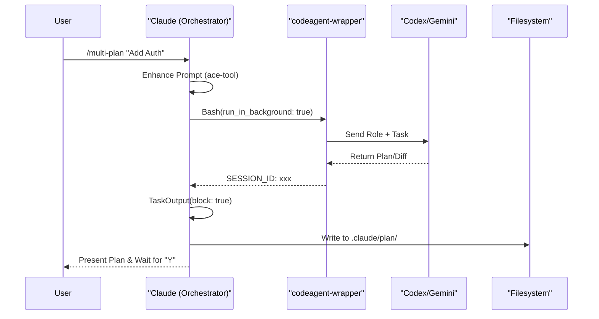

**Sources:** [[commands/multi-plan.md:21-55]](), [[commands/multi-workflow.md:32-66]](), [[commands/multi-execute.md:19-53]]()

### Argument Parsing
Commands access user-provided input via the `$ARGUMENTS` variable. Templates use this to parameterize tasks.
*   **Example**: In `/tdd $ARGUMENTS`, the string is passed to the `tdd-guide` agent to define the feature scope [[commands/tdd.md:52-54]]().
*   **Example**: In `/pm2 $ARGUMENTS`, the arguments might specify specific ports or service names [[commands/pm2.md:5-6]]().

---

## Command Categories

### 1. Development Workflow Commands
These commands guide the core coding cycle.

| Command | Purpose | Primary Agent/Logic |
| :--- | :--- | :--- |
| `/plan` | Restate requirements and assess risks | `planner` [[commands/plan.md:5-14]]() |
| `/tdd` | Enforce RED -> GREEN -> REFACTOR cycle | `tdd-guide` [[commands/tdd.md:7-15]]() |
| `/pm2` | Auto-analyze and generate service configs | Project scanner [[commands/pm2.md:1-6]]() |

### 2. Multi-Model Collaborative Commands (CCG)
These commands leverage the `codeagent-wrapper` to use Codex (Backend) and Gemini (Frontend) in parallel.

| Command | Purpose | Model Routing |
| :--- | :--- | :--- |
| `/multi-plan` | Dual-model analysis & planning | Codex + Gemini [[commands/multi-plan.md:1-3]]() |
| `/multi-execute` | Prototype refactoring & implementation | Codex/Gemini -> Claude [[commands/multi-execute.md:1-3]]() |
| `/multi-workflow` | 6-phase E2E workflow | Orchestrated Pipeline [[commands/multi-workflow.md:1-3]]() |
| `/frontend` | Gemini-led UI development | Gemini Authority [[commands/multi-frontend.md:1-3]]() |

### 3. Utility & Integration Commands
| Command | Purpose | Reference |
| :--- | :--- | :--- |
| `/nutrient` | Document processing (OCR, PDF, Sign) | Nutrient DWS API [[skills/nutrient-document-processing/SKILL.md:1-5]]() |

---

## Technical Implementation Details

### The `codeagent-wrapper` Integration
Many advanced commands rely on a bash wrapper located at `~/.claude/bin/codeagent-wrapper`. This allows Claude to:
1.  **Specify Backends**: Choose between `--backend codex` or `--backend gemini` [[commands/multi-plan.md:25-26]]().
2.  **Session Persistence**: Resume previous model conversations using `resume <SESSION_ID>` [[commands/multi-execute.md:26]]().
3.  **Background Execution**: Use `run_in_background: true` with a high `timeout` (e.g., 3600000ms) to prevent blocking the main UI during long-running model calls [[commands/multi-plan.md:34-35]]().

### Multi-Model Call Specification
Commands define strict protocols for how external models interact with the codebase:
*   **Code Sovereignty**: External models have **zero filesystem write access**. They output Unified Diff patches which Claude must refactor and apply [[commands/multi-execute.md:11-13]]().
*   **Role Prompts**: Commands reference specific role files for models, such as `~/.claude/.ccg/prompts/codex/analyzer.md` [[commands/multi-plan.md:46]]().

**Sources:** [[commands/multi-execute.md:9-15]](), [[commands/multi-plan.md:19-50]]()

---

## Command to Agent Relationship

Commands often serve as the "bridge" between the Natural Language space (User Intent) and the Code Entity space (Specific Agents/Scripts).

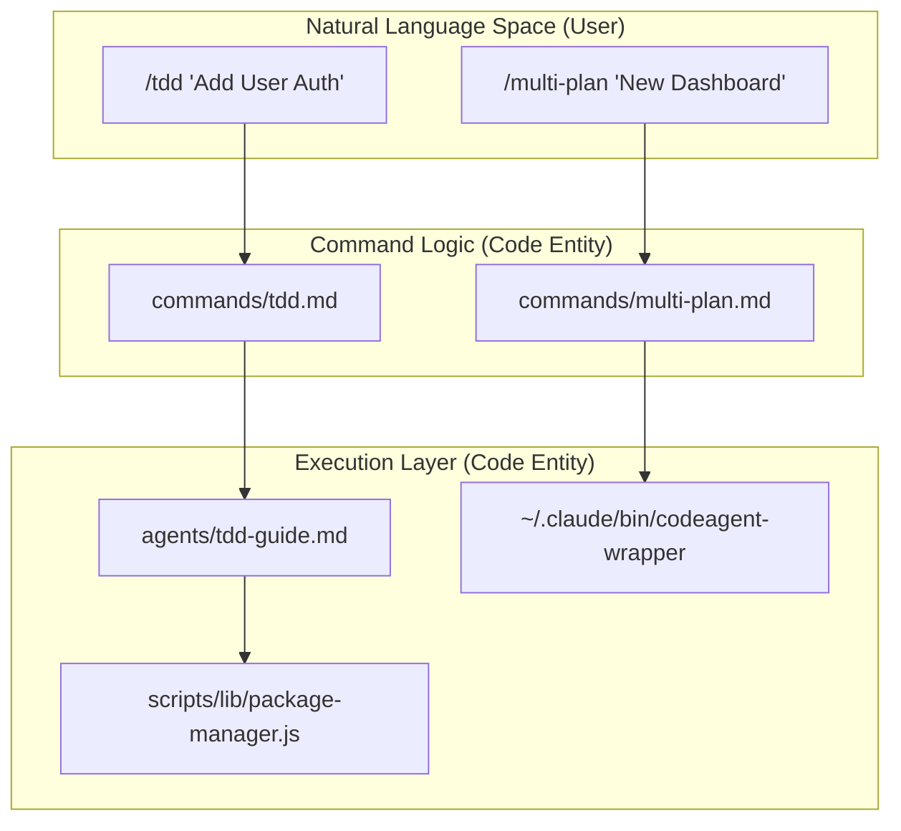

**Sources:** [[commands/tdd.md:7-8]](), [[commands/multi-plan.md:24-26]](), [[.claude-plugin/marketplace.json:16-17]]()

---

## Registration and Distribution

Commands are distributed as part of the `everything-claude-code` plugin.

1.  **Manifest**: Registered via `.claude-plugin/plugin.json` [[.claude-plugin/plugin.json:1-4]]().
2.  **Marketplace**: Listed in `.claude-plugin/marketplace.json` with metadata describing the "33+ commands" available [[.claude-plugin/marketplace.json:16]]().
3.  **Versioning**: The `scripts/release.sh` utility ensures that when the plugin version bumps, all command definitions are bundled into the new release tag [[scripts/release.sh:71-75]]().

**Sources:** [[.claude-plugin/plugin.json:1-25]](), [[.claude-plugin/marketplace.json:1-49]](), [[scripts/release.sh:1-84]]()

---

# Page: Rules

# Rules

<details>
<summary>Relevant source files</summary>

The following files were used as context for generating this wiki page:

- [.agents/skills/bun-runtime/agents/openai.yaml](.agents/skills/bun-runtime/agents/openai.yaml)
- [.agents/skills/documentation-lookup/agents/openai.yaml](.agents/skills/documentation-lookup/agents/openai.yaml)
- [.agents/skills/nextjs-turbopack/agents/openai.yaml](.agents/skills/nextjs-turbopack/agents/openai.yaml)
- [.cursor/rules/php-coding-style.md](.cursor/rules/php-coding-style.md)
- [.cursor/rules/php-hooks.md](.cursor/rules/php-hooks.md)
- [.cursor/rules/php-patterns.md](.cursor/rules/php-patterns.md)
- [.cursor/rules/php-security.md](.cursor/rules/php-security.md)
- [.cursor/rules/php-testing.md](.cursor/rules/php-testing.md)
- [install.sh](install.sh)
- [rules/README.md](rules/README.md)
- [rules/common/agents.md](rules/common/agents.md)
- [rules/common/coding-style.md](rules/common/coding-style.md)
- [rules/common/development-workflow.md](rules/common/development-workflow.md)
- [rules/common/git-workflow.md](rules/common/git-workflow.md)
- [rules/common/hooks.md](rules/common/hooks.md)
- [rules/common/patterns.md](rules/common/patterns.md)
- [rules/common/security.md](rules/common/security.md)
- [rules/common/testing.md](rules/common/testing.md)
- [rules/php/hooks.md](rules/php/hooks.md)
- [skills/search-first/SKILL.md](skills/search-first/SKILL.md)

</details>


Rules are always-follow guidelines that constrain Claude Code's behavior across all sessions. They form a declarative specification layer that operates above individual prompts, enforcing project-specific patterns, coding standards, security requirements, and workflow conventions without requiring explicit reminders in every interaction.

For detailed listings of available rules and their contents, see [Rules Reference](#5.4). For information about dynamic system prompt injection and context management techniques, see [Memory & Context Preservation](#11.3).

---

## What Rules Are

Rules are Markdown files stored in the `rules/` directory that Claude Code loads at the start of every session. Unlike skills (which are invoked explicitly) or commands (which run on demand), rules are **always active** — they establish the baseline constraints and preferences that guide all agent behavior.

**Core Characteristics:**

| Property | Behavior |
|----------|----------|
| **Scope** | Universal — applies to all operations in a session |
| **Invocation** | Automatic — loaded at session start without user action |
| **Priority** | Higher authority than user messages, lower than system prompts |
| **Persistence** | Session-scoped — reloaded for each new `claude` invocation |
| **Mutability** | Read-only — agents cannot modify rule files |

**Example rule statements:**

```markdown
# From coding-style.md
- Prefer immutability: const > let, never use var
- File size limit: 300 lines per file (exceptions: config files)

# From testing.md
- Minimum 80% code coverage for new code
- Write tests before implementation (TDD) [rules/common/development-workflow.md:23-28]()

# From security.md
- No hardcoded secrets (API keys, tokens, passwords)
- Use parameterized queries for database operations [rules/common/security.md]()
```

Sources: [rules/README.md:67-70](), [rules/common/development-workflow.md:23-28](), [rules/common/security.md]()

---

## Hierarchical Structure

Rules are organized into a two-tier hierarchy: **common rules** (language-agnostic) and **language-specific rules** (ecosystem conventions).

### Directory Organization

```
rules/
├── common/                   # Universal principles (always install)
│   ├── coding-style.md       # Immutability, file organization, naming
│   ├── git-workflow.md       # Commit format, branch naming, PR process
│   ├── development-workflow.md # TDD, Research-first, Planning
│   ├── testing.md            # Coverage requirements
│   ├── performance.md        # Resource optimization
│   ├── patterns.md           # Design patterns
│   ├── hooks.md              # Hook usage
│   ├── agents.md             # Agent delegation rules
│   └── security.md           # Mandatory security checks
├── typescript/               # TypeScript/JavaScript specific
├── python/                   # Python specific
├── golang/                   # Go specific
├── swift/                    # Swift specific
└── php/                      # PHP specific
```

**Design Rationale:**

- **Common rules** define universal defaults applicable to all projects [rules/README.md:93-93]().
- **Language directories** extend common rules with framework-specific patterns and tools [rules/README.md:25-25]().
- **Specificity Precedence**: When a language-specific rule conflicts with a common rule, the language-specific one takes precedence [rules/README.md:90-91]().

Sources: [rules/README.md:4-22](), [rules/README.md:90-95]()

---

## Installation and Data Flow

Rules must be installed manually due to platform limitations. They are typically placed in `~/.claude/rules/` (User-level) or `.claude/rules/` (Project-level).

### Rule Installation Flow

The following diagram bridges the Natural Language rules to the Code Entity space by showing how the `install.sh` script (and its underlying `scripts/install-apply.js` logic) populates the system.

**Rule Deployment Architecture**

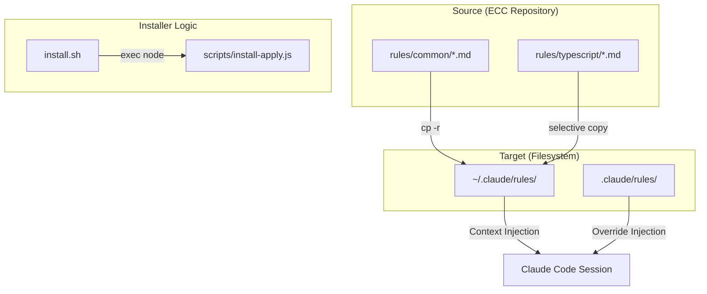

### Installation Methods

**Option 1: Install Script (Recommended)**
The `install.sh` wrapper resolves the package root and delegates to the Node-based installer [install.sh:1-17]().

```bash
# Install common + specific language rules
./install.sh typescript python
```

**Option 2: Manual Installation**
Users must copy entire directories rather than flattening files to maintain relative references like `../common/` used by language-specific files [rules/README.md:43-49]().

```bash
cp -r rules/common ~/.claude/rules/common
cp -r rules/typescript ~/.claude/rules/typescript
```

Sources: [install.sh:1-17](), [rules/README.md:27-41](), [rules/README.md:43-63]()

---

## How Rules Constrain Behavior

Rules act as the "constitution" for the agent. They are not just documentation; they are active constraints injected into the system prompt.

### Workflow Constraints: Research & Planning

The `development-workflow.md` rule mandates a specific sequence of operations before any code is written:

1.  **Research & Reuse**: Mandatory check of GitHub, library docs, and package registries [rules/common/development-workflow.md:9-15]().
2.  **Plan First**: Use the `planner` agent to generate architecture and task lists [rules/common/development-workflow.md:17-21]().
3.  **TDD**: Use the `tdd-guide` agent for a RED/GREEN/IMPROVE cycle [rules/common/development-workflow.md:23-27]().

### Technical Implementation: Rule to Code Association

This diagram maps natural language rules found in the `rules/` directory to the specific agents and skills defined in the codebase that enforce them.

**Constraint Enforcement Mapping**

```mermaid
graph LR
    subgraph "Rules (Natural Language Space)"
        R_Workflow["development-workflow.md"]
        R_Security["security.md"]
        R_Review["coding-style.md"]
    end

    subgraph "Code Entities (Code Space)"
        A_Planner["agents/planner.yaml"]
        A_TDD["agents/tdd-guide.yaml"]
        A_Reviewer["agents/code-reviewer.yaml"]
        S_Search["skills/search-first/SKILL.md"]
    end

    R_Workflow -- "Mandates Planning" --> A_Planner
    R_Workflow -- "Mandates Research" --> S_Search
    R_Workflow -- "Mandates TDD" --> A_TDD
    R_Security -- "Enforced by" --> A_Reviewer
    R_Review -- "Checked by" --> A_Reviewer
```

Sources: [rules/common/development-workflow.md:7-39](), [rules/common/agents.md:7-18](), [skills/search-first/SKILL.md:1-5]()

---

## Rules vs. Skills

It is critical to distinguish between Rules (what to follow) and Skills (how to perform).

| Feature | Rules (`rules/`) | Skills (`skills/`) |
| :--- | :--- | :--- |
| **Nature** | Standards, conventions, checklists [rules/README.md:67-68]() | Actionable reference material [rules/README.md:68-68]() |
| **Precedence** | Language-specific overrides common [rules/README.md:90-91]() | Context-dependent |
| **Example** | "80% test coverage" [rules/README.md:67]() | `golang-testing` workflow [rules/README.md:68]() |
| **Relationship** | Rules tell you *what* to do | Skills tell you *how* to do it [rules/README.md:70]() |

Sources: [rules/README.md:65-71](), [rules/README.md:89-91]()

---

## Agent Orchestration Rules

The `rules/common/agents.md` file defines when and how Claude should delegate tasks to specialized sub-agents.

**Mandatory Delegation Triggers:**
*   **Complex features**: Use `planner` [rules/common/agents.md:23-23]().
*   **Modified code**: Use `code-reviewer` immediately [rules/common/agents.md:24-24]().
*   **New features/Bugs**: Use `tdd-guide` [rules/common/agents.md:25-25]().

**Execution Strategy:**
*   **Parallelism**: Always use parallel `Task` execution for independent operations to optimize speed [rules/common/agents.md:30-38]().
*   **Multi-Perspective**: For complex problems, split roles into sub-agents (e.g., Factual reviewer, Security expert) [rules/common/agents.md:43-51]().

Sources: [rules/common/agents.md:1-51]()

---

# Page: Hooks

# Hooks

<details>
<summary>Relevant source files</summary>

The following files were used as context for generating this wiki page:

- [.claude/package-manager.json](.claude/package-manager.json)
- [agents/planner.md](agents/planner.md)
- [commands/setup-pm.md](commands/setup-pm.md)
- [examples/django-api-CLAUDE.md](examples/django-api-CLAUDE.md)
- [hooks/README.md](hooks/README.md)
- [hooks/hooks.json](hooks/hooks.json)
- [scripts/hooks/check-console-log.js](scripts/hooks/check-console-log.js)
- [scripts/hooks/evaluate-session.js](scripts/hooks/evaluate-session.js)
- [scripts/hooks/insaits-security-monitor.py](scripts/hooks/insaits-security-monitor.py)
- [scripts/hooks/insaits-security-wrapper.js](scripts/hooks/insaits-security-wrapper.js)
- [scripts/hooks/post-edit-console-warn.js](scripts/hooks/post-edit-console-warn.js)
- [scripts/hooks/post-edit-format.js](scripts/hooks/post-edit-format.js)
- [scripts/hooks/post-edit-typecheck.js](scripts/hooks/post-edit-typecheck.js)
- [scripts/hooks/pre-compact.js](scripts/hooks/pre-compact.js)
- [scripts/hooks/session-end.js](scripts/hooks/session-end.js)

</details>


## Purpose and Scope

This page introduces **hooks** as event-driven automation in the Everything Claude Code (ECC) system. Hooks are executable scripts that fire automatically at specific lifecycle points—before or after tool execution, at session boundaries, or during context compaction—to enforce quality standards, prevent errors, and automate repetitive tasks. Unlike **Skills** (which are invoked probabilistically by the agent) or **Rules** (which are natural language constraints), hooks run **deterministically** based on the system's execution state.

---

## What Are Hooks?

Hooks are the "guardrails" of ECC. They receive tool inputs via `stdin`, process them, and can either allow the operation to proceed, provide a warning to the user/agent via `stderr`, or block the operation entirely by exiting with a specific code.

**Key characteristics:**

| Property | Technical Implementation |
|----------|-------------|
| **Deterministic** | Triggered 100% of the time by the underlying engine [hooks/README.md:3-5](). |
| **Input Protocol** | Receive a JSON payload on `stdin` containing tool context [hooks/README.md:92-95](). |
| **Output Protocol** | Must echo the original JSON to `stdout` to maintain the tool chain [hooks/README.md:114-115](). |
| **Control Flow** | Can block execution using Exit Code `2` (PreToolUse only) [hooks/README.md:11-12](). |
| **Async Support** | Can run in the background (e.g., for telemetry or heavy analysis) [hooks/hooks.json:61-62](). |

---

## Hook Lifecycle & Event Flow

The ECC system hooks into the Claude Code lifecycle at several distinct phases. The following diagram maps the Natural Language intent (User Request) to the Code Entities (Hook Scripts) that manage the flow.

### Event Flow Architecture

```mermaid
graph TD
    User["User Request"] --> CC["Claude Code Engine"]
    CC --> SStart["Event: SessionStart"]
    SStart --> SStartScript["session-start.js"]
    
    CC --> PickTool["Agent Picks Tool (e.g., Edit)"]
    PickTool --> PreTool["Event: PreToolUse"]
    
    subgraph "Pre-Execution Gate"
        PreTool --> DocWarn["doc-file-warning.js"]
        PreTool --> InsAIts["insaits-security-wrapper.js"]
        PreTool --> CompactSug["suggest-compact.js"]
    end
    
    DocWarn -->|Exit 0| Exec["Tool Execution"]
    InsAIts -->|Exit 2| Blocked["Execution Blocked"]
    
    Exec --> PostTool["Event: PostToolUse"]
    
    subgraph "Post-Execution Quality"
        PostTool --> Format["post-edit-format.js"]
        PostTool --> TypeCheck["post-edit-typecheck.js"]
        PostTool --> Quality["quality-gate.js"]
    end
    
    PostTool --> Stop["Event: Stop"]
    Stop --> ConsoleLog["check-console-log.js"]
    Stop --> Eval["evaluate-session.js"]
    
    CC --> Compact["Event: PreCompact"]
    Compact --> PCompactScript["pre-compact.js"]

    Sources: ["hooks/hooks.json:1-170", "hooks/README.md:7-15"]
```

### Hook Lifecycle Phases

| Phase | Description | Key Code Entities |
|-------|-------------|-------------------|
| **SessionStart** | Fires when a new terminal session begins. | `session-start.js` [hooks/hooks.json:91-101]() |
| **PreToolUse** | Fires *before* a tool (Bash, Edit, Write) runs. Can block. | `doc-file-warning.js`, `insaits-security-monitor.py` [hooks/hooks.json:4-78]() |
| **PostToolUse** | Fires *after* a tool completes. Used for auto-fixes. | `post-edit-format.js`, `post-edit-typecheck.js` [hooks/hooks.json:103-170]() |
| **Stop** | Fires after the Agent finishes a turn (response). | `check-console-log.js`, `evaluate-session.js` [hooks/README.md:47-50]() |
| **PreCompact** | Fires before context window summarization. | `pre-compact.js` [hooks/hooks.json:79-90]() |
| **SessionEnd** | Fires when the session is closed. | `session-end.js` [scripts/hooks/session-end.js:3-10]() |

---

## Quality Enforcement Patterns

Hooks serve as the primary mechanism for "Invisible Quality Control." They operate in three main modes:

### 1. Blocking & Validation (PreToolUse)
These hooks validate the *intent* of the agent. For example, the `doc-file-warning.js` hook checks if the agent is trying to create non-standard documentation files and warns the agent to use standard patterns [hooks/hooks.json:40-44](). The `insaits-security-monitor.py` can block critical security risks like credential exposure [scripts/hooks/insaits-security-monitor.py:48-55]().

### 2. Auto-Remediation (PostToolUse)
These hooks fix code style or errors immediately after the agent writes a file.
*   **`post-edit-format.js`**: Automatically detects if the project uses Biome or Prettier and runs the formatter on the edited file [scripts/hooks/post-edit-format.js:7-12]().
*   **`post-edit-typecheck.js`**: Runs `tsc --noEmit` on the specific file edited to catch syntax or type errors before the agent continues [scripts/hooks/post-edit-typecheck.js:7-10]().

### 3. State Persistence (Session/Stop)
Hooks like `session-end.js` extract summaries from the `transcript.jsonl` to maintain cross-session continuity [scripts/hooks/session-end.js:7-10]().

---

## Implementation Details

### Data Flow Protocol
All hooks must adhere to a specific I/O contract to avoid breaking the agent's execution chain.

```mermaid
sequenceDiagram
    participant CC as "Claude Code"
    participant H as "Hook (e.g., post-edit-format.js)"
    participant PM as "Package Manager / Tool"

    CC->>H: stdin: JSON {tool_name, tool_input, tool_output}
    Note over H: run(rawInput) [scripts/hooks/post-edit-format.js:37]
    H->>H: JSON.parse(rawInput)
    H->>PM: spawnSync('biome', ['check', '--write', filePath])
    PM-->>H: Format Success/Failure
    H->>CC: stderr: [Hook] Warning/Info (Optional)
    H->>CC: stdout: original rawInput JSON [scripts/hooks/post-edit-format.js:104]
    H->>CC: exit(0) or exit(2)

    Sources: ["scripts/hooks/post-edit-format.js:37-107", "hooks/README.md:92-123"]
```

### Critical Implementation Logic

*   **Exit Codes**: 
    *   `0`: Success. The tool or session proceeds.
    *   `2`: Block. Only valid in `PreToolUse`. Prevents the tool from running [hooks/README.md:120-121]().
*   **Safety**: Hooks like `post-edit-format.js` include guards against shell injection by rejecting paths with unsafe characters (e.g., `&|<>^%!`) when running on Windows [scripts/hooks/post-edit-format.js:24-60]().
*   **Performance**: ECC prefers local binaries (e.g., `node_modules/.bin/biome`) over `npx` to save 200-500ms per invocation [scripts/hooks/post-edit-format.js:14-15]().

### Configuration (hooks.json)
The `hooks/hooks.json` file defines the registration of these scripts. It uses **matchers** to target specific tools:

```json
{
  "matcher": "Edit",
  "hooks": [
    {
      "type": "command",
      "command": "node \"${CLAUDE_PLUGIN_ROOT}/scripts/hooks/post-edit-format.js\""
    }
  ]
}
```
*Source: [hooks/hooks.json:141-147]()*

---

## Key Hook Reference

| Hook Entity | File Path | Role |
|-------------|-----------|------|
| **Security Monitor** | `scripts/hooks/insaits-security-monitor.py` | Detects credential exposure and prompt injection [scripts/hooks/insaits-security-monitor.py:7-10](). |
| **Formatter** | `scripts/hooks/post-edit-format.js` | Runs Biome/Prettier after `Edit` tool use [scripts/hooks/post-edit-format.js:7-9](). |
| **Type Checker** | `scripts/hooks/post-edit-typecheck.js` | Runs `tsc` and filters output to the relevant file [scripts/hooks/post-edit-typecheck.js:7-10](). |
| **Session Manager** | `scripts/hooks/session-end.js` | Extracts summaries for persistence [scripts/hooks/session-end.js:7-10](). |
| **Console Auditor** | `scripts/hooks/check-console-log.js` | Scans git-modified files for debug statements [scripts/hooks/check-console-log.js:8-10](). |
| **Observer** | `skills/continuous-learning-v2/hooks/observe.sh` | Captures tool use for the learning system [hooks/hooks.json:60-65](). |

Sources: [hooks/hooks.json:1-170](), [scripts/hooks/post-edit-format.js:1-18](), [scripts/hooks/session-end.js:1-10](), [scripts/hooks/post-edit-typecheck.js:1-10]()

---

# Page: MCPs (Model Context Protocol)

# MCPs (Model Context Protocol)

<details>
<summary>Relevant source files</summary>

The following files were used as context for generating this wiki page:

- [.agents/skills/mcp-server-patterns/SKILL.md](.agents/skills/mcp-server-patterns/SKILL.md)
- [.cursor/skills/mcp-server-patterns/SKILL.md](.cursor/skills/mcp-server-patterns/SKILL.md)
- [CONTRIBUTING.md](CONTRIBUTING.md)
- [agents/docs-lookup.md](agents/docs-lookup.md)
- [commands/devfleet.md](commands/devfleet.md)
- [commands/docs.md](commands/docs.md)
- [docs/ARCHITECTURE-IMPROVEMENTS.md](docs/ARCHITECTURE-IMPROVEMENTS.md)
- [docs/COMMAND-AGENT-MAP.md](docs/COMMAND-AGENT-MAP.md)
- [mcp-configs/mcp-servers.json](mcp-configs/mcp-servers.json)
- [skills/claude-devfleet/SKILL.md](skills/claude-devfleet/SKILL.md)
- [skills/mcp-server-patterns/SKILL.md](skills/mcp-server-patterns/SKILL.md)

</details>


## Purpose and Scope

This page explains MCPs (Model Context Protocol) in the context of Everything Claude Code (ECC). MCP servers act as external service integrations that extend Claude's capabilities by providing a standardized way to expose tools, resources, and prompts to the model. This section details the technical implementation, the configuration schema, and the critical relationship between MCP usage and context window management.

---

## What Are MCPs?

MCPs are **prompt-driven wrappers around external services** that allow Claude to interact with APIs, databases, and local filesystems through natural language. Instead of writing custom integration code for every service, the Model Context Protocol provides a universal interface where an MCP server describes its available tools to the Claude client.

**Key Technical Distinction**: MCPs are not simple API clients. They are stateful or stateless external processes that translate LLM tool calls into service-specific actions.

### Implementation Patterns

| Pattern | Description | Example File/Tool |
|---------|-------------|-------------------|
| **Stdio** | Server runs as a local subprocess; communication via JSON-RPC over stdin/stdout. | `github`, `supabase` [[mcp-configs/mcp-servers.json:3-23]]() |
| **HTTP/SSE** | Server runs remotely or locally as a web service; communication via Server-Sent Events. | `vercel`, `cloudflare-docs` [[mcp-configs/mcp-servers.json:34-48]]() |
| **Custom Tools** | Agents explicitly list MCP tools they are permitted to use. | `docs-lookup` agent [[agents/docs-lookup.md:4]]() |

**Sources:** [mcp-configs/mcp-servers.json:1-146](), [agents/docs-lookup.md:1-6]()

---

## MCP Architecture and Data Flow

The following diagram illustrates how the Claude Code harness interacts with MCP servers to bridge the gap between natural language requests and external code execution.

### Data Flow: Natural Language to Code Entity Space

```mermaid
graph TB
    subgraph "Natural Language Space"
        UserReq["User: 'Show me my GitHub PRs'"]
        Agent["Agent: docs-lookup / planner"]
    end

    subgraph "Claude Code Entity Space"
        McpConfig["mcp-servers.json<br/>(Server Definitions)"]
        ToolRegistry["Tool Registry<br/>(mcp__context7__query-docs, etc.)"]
        McpClient["MCP Protocol Client"]
    end

    subgraph "External Execution Space"
        GithubSrv["@modelcontextprotocol/server-github"]
        Context7Srv["@upstash/context7-mcp"]
        InsaItsSrv["insa_its.mcp_server (Python)"]
    end

    UserReq --> Agent
    Agent -->|"Look up tool in"| ToolRegistry
    ToolRegistry -->|"Refers to config in"| McpConfig
    McpClient -->|"Spawn/Connect"| GithubSrv
    McpClient -->|"JSON-RPC call"| Context7Srv
    McpClient -->|"Local Python Process"| InsaItsSrv

    style McpConfig fill:#f9f9f9
    style ToolRegistry fill:#f9f9f9
    style McpClient fill:#f9f9f9
```

**Implementation Details:**
- **Server Discovery**: Servers are defined in a central configuration file [[mcp-configs/mcp-servers.json:1-146]]().
- **Tool Prefixing**: Tools are often exposed with prefixes to avoid collisions, such as `mcp__context7__resolve-library-id` [[agents/docs-lookup.md:4]]().
- **Multi-Runtime Support**: ECC supports MCPs written in Node.js (`npx`), Python (`python3 -m`), and native HTTP [[mcp-configs/mcp-servers.json:4, 93, 119]]().

**Sources:** [mcp-configs/mcp-servers.json:1-146](), [agents/docs-lookup.md:1-20]()

---

## Context Window Impact: The 200k to 70k Problem

A critical technical constraint in ECC is the "Context Window Degradation" caused by MCP bloat. Each enabled MCP server injects its tool definitions, schemas, and descriptions into the system prompt.

### Context Consumption Metrics

| Configuration State | Tokens Consumed (Approx) | Remaining Context (Sonnet 3.5) |
|---------------------|--------------------------|--------------------------------|
| Baseline (No MCPs)  | ~2k (System Prompt)      | ~198k                          |
| 5-10 MCPs Enabled   | ~30k - 50k               | ~150k                          |
| 30+ MCPs Enabled    | ~130k+                   | **<70k (Critical)**            |

**Optimization Strategy:**
ECC enforces a discipline of having many servers *configured* but few *enabled* simultaneously. The `disabledMcpServers` array in project configurations is used to prune the toolset per-project [[mcp-configs/mcp-servers.json:150-151]]().

**Sources:** [mcp-configs/mcp-servers.json:147-153]()

---

## Key MCP Servers in ECC

The ECC repository provides a pre-configured library of battle-tested MCP servers.

### Integration Reference Table

| Server Name | Implementation / Command | Primary Purpose |
|-------------|-------------------------|-----------------|
| `github` | `npx @modelcontextprotocol/server-github` | PRs, issues, and repo management [[mcp-configs/mcp-servers.json:3-9]]() |
| `context7` | `npx @upstash/context7-mcp@latest` | Live documentation lookup for libraries [[mcp-configs/mcp-servers.json:77-81]]() |
| `devfleet` | `http://localhost:18801/mcp` | Multi-agent orchestration in worktrees [[mcp-configs/mcp-servers.json:126-130]]() |
| `insaits` | `python3 -m insa_its.mcp_server` | Local AI security monitoring & anomaly detection [[mcp-configs/mcp-servers.json:92-96]]() |
| `token-optimizer` | `npx token-optimizer-mcp` | 95%+ context reduction via deduplication [[mcp-configs/mcp-servers.json:131-135]]() |

### Case Study: Documentation Lookup Flow

The `docs-lookup` agent and `/docs` command demonstrate a multi-step MCP workflow:
1. **Resolve**: Calls `mcp__context7__resolve-library-id` to find the correct library ID [[agents/docs-lookup.md:24]]().
2. **Query**: Calls `mcp__context7__query-docs` with the ID to fetch specific documentation sections [[agents/docs-lookup.md:33]]().
3. **Synthesize**: Summarizes the fetched context into a response [[commands/docs.md:27]]().

**Sources:** [mcp-configs/mcp-servers.json:1-146](), [agents/docs-lookup.md:22-45](), [commands/docs.md:1-32]()

---

## Multi-Agent Orchestration via DevFleet

The `devfleet` MCP server represents an advanced use case where one Claude instance orchestrates a "swarm" of other agents.

### Orchestration Sequence Diagram

```mermaid
sequenceDiagram
    participant User
    participant MainAgent as Claude (Main)
    participant DevFleet as DevFleet MCP Server
    participant SubAgent as Claude (Worktree Agent)

    User->>MainAgent: "Implement Auth and API parallel"
    MainAgent->>DevFleet: plan_project(prompt)
    DevFleet-->>MainAgent: Returns Mission DAG (M1, M2)
    MainAgent->>User: Request approval for plan
    User->>MainAgent: Approved
    MainAgent->>DevFleet: dispatch_mission(M1)
    DevFleet->>SubAgent: Spawn in isolated git worktree
    SubAgent-->>DevFleet: Mission Complete (Auto-merge)
    DevFleet-->>MainAgent: get_report(M1)
    MainAgent->>User: Final Summary
```

**Key DevFleet Tools:**
- `plan_project(prompt)`: AI-driven decomposition of tasks into a Directed Acyclic Graph (DAG) [[skills/claude-devfleet/SKILL.md:42]]().
- `dispatch_mission(mission_id)`: Spawns a sub-agent in a dedicated worktree [[commands/devfleet.md:42]]().
- `get_report(mission_id)`: Retrieves structured results including `files_changed` and `errors_encountered` [[commands/devfleet.md:67]]().

**Sources:** [skills/claude-devfleet/SKILL.md:1-104](), [commands/devfleet.md:1-93]()

---

## Best Practices for Development

When building or contributing MCP servers to ECC, developers should follow established patterns:

1. **Schema Validation**: Use **Zod** for input validation to ensure the LLM provides correctly typed arguments [[skills/mcp-server-patterns/SKILL.md:53]]().
2. **Transport Independence**: Keep core logic separate from transport (stdio vs HTTP) to allow flexible deployment [[skills/mcp-server-patterns/SKILL.md:30]]().
3. **Error Handling**: Return structured error messages that the model can interpret for self-correction, rather than raw stack traces [[skills/mcp-server-patterns/SKILL.md:58]]().
4. **Tool Granularity**: Avoid "god tools." Prefer small, idempotent actions that can be chained [[skills/mcp-server-patterns/SKILL.md:59]]().

**Sources:** [skills/mcp-server-patterns/SKILL.md:1-68](), [CONTRIBUTING.md:13-15]()

---

# Page: Installation & Setup

# Installation & Setup

<details>
<summary>Relevant source files</summary>

The following files were used as context for generating this wiki page:

- [.claude-plugin/marketplace.json](.claude-plugin/marketplace.json)
- [.claude-plugin/plugin.json](.claude-plugin/plugin.json)
- [.cursor/rules/php-coding-style.md](.cursor/rules/php-coding-style.md)
- [.cursor/rules/php-hooks.md](.cursor/rules/php-hooks.md)
- [.cursor/rules/php-patterns.md](.cursor/rules/php-patterns.md)
- [.cursor/rules/php-security.md](.cursor/rules/php-security.md)
- [.cursor/rules/php-testing.md](.cursor/rules/php-testing.md)
- [.github/workflows/release.yml](.github/workflows/release.yml)
- [.github/workflows/reusable-release.yml](.github/workflows/reusable-release.yml)
- [commands/checkpoint.md](commands/checkpoint.md)
- [commands/eval.md](commands/eval.md)
- [commands/verify.md](commands/verify.md)
- [install.sh](install.sh)
- [rules/README.md](rules/README.md)
- [rules/php/hooks.md](rules/php/hooks.md)
- [scripts/ci/validate-rules.js](scripts/ci/validate-rules.js)
- [scripts/ecc.js](scripts/ecc.js)
- [scripts/install-apply.js](scripts/install-apply.js)
- [scripts/lib/install-executor.js](scripts/lib/install-executor.js)
- [scripts/lib/install-manifests.js](scripts/lib/install-manifests.js)
- [scripts/lib/install/request.js](scripts/lib/install/request.js)
- [scripts/lib/install/runtime.js](scripts/lib/install/runtime.js)
- [scripts/lib/session-adapters/canonical-session.js](scripts/lib/session-adapters/canonical-session.js)
- [scripts/release.sh](scripts/release.sh)
- [tests/lib/install-manifests.test.js](tests/lib/install-manifests.test.js)
- [tests/lib/install-request.test.js](tests/lib/install-request.test.js)
- [tests/scripts/ecc.test.js](tests/scripts/ecc.test.js)
- [tests/scripts/install-apply.test.js](tests/scripts/install-apply.test.js)

</details>


This page provides a comprehensive guide to installing the Everything Claude Code (ECC) system. ECC supports multiple installation pathways—ranging from the automated plugin marketplace to a sophisticated selective-install CLI—to accommodate different environments like Claude Code, Cursor, and more.

For details on post-installation settings, see [Configuration Guide](#9). For resolving setup errors, see [Troubleshooting](#15).

---

## Installation Methods Overview

ECC can be installed through several methods depending on your target environment and required level of granularity.

### Comparison of Methods

| Method | Best For | Complexity | Target Platforms |
|:---|:---|:---|:---|
| **Plugin Marketplace** | Most users, automatic updates | Low | Claude Code |
| **ECC CLI (`ecc`)** | Selective modules, profiles | Medium | Claude, Cursor, Antigravity |
| **NPM Package** | Automation, CI/CD | Low | All |
| **Manual / Git** | Development, heavy customization | High | All |

### Installation Logic & Entity Mapping

The following diagram bridges the high-level installation concepts to the underlying code entities that manage the process.

**Installer System Architecture**
```mermaid
graph TD
    User["User/CI"] -- "ecc install --profile core" --> ECC_JS["scripts/ecc.js"]
    ECC_JS -- "delegates to" --> APPLY_JS["scripts/install-apply.js"]
    
    subgraph "Logic Space"
        APPLY_JS --> REQ["lib/install/request.js"]
        REQ --> PLAN["lib/install-manifests.js"]
        PLAN --> EXEC["lib/install-executor.js"]
    end

    subgraph "Entity Space (Manifests)"
        MODS["manifests/install-modules.json"]
        PROFS["manifests/install-profiles.json"]
        COMPS["manifests/install-components.json"]
    end

    PLAN -- "reads" --> MODS
    PLAN -- "reads" --> PROFS
    PLAN -- "reads" --> COMPS

    EXEC -- "writes to" --> TARGET["Target Environment"]
    EXEC -- "records state" --> STATE["install-state.json"]

    style ECC_JS stroke-width:2px
    style APPLY_JS stroke-width:2px
    style MODS stroke-dasharray: 5 5
```
Sources: [scripts/ecc.js:7-60](), [scripts/install-apply.js:95-118](), [scripts/lib/install-executor.js:5-12]()

---

## Automated Installation (NPM & CLI)

The recommended way to install ECC is via the global NPM package, which provides the `ecc` command-line interface.

```bash
# 1. Install the global package
npm install -g everything-claude-code

# 2. Run a standard installation for your primary language
ecc typescript
```

The `ecc` CLI acts as a router for various lifecycle commands [scripts/ecc.js:7-48](). By default, passing arguments directly to `ecc` (e.g., `ecc typescript`) triggers an implicit install command [scripts/ecc.js:124-137]().

For details on the command-line interface, see [Selective Install System](#4.6).

Sources: [scripts/ecc.js:1-209](), [tests/scripts/ecc.test.js:64-95]()

---

## Plugin Marketplace Installation

For users of the native Claude Code CLI, ECC is available as a first-class plugin.

1. **Add the Marketplace Source:**
   `/plugin marketplace add affaan-m/everything-claude-code`
2. **Install the Plugin:**
   `/plugin install everything-claude-code`

The plugin's identity and metadata are defined in the marketplace manifest [.claude-plugin/marketplace.json:1-49]().

**Note:** Due to platform limitations, rules must be installed separately using the CLI or manual methods. For details, see [Plugin Installation](#4.1) and [Rules Installation](#4.4).

Sources: [.claude-plugin/marketplace.json:1-49](), [.claude-plugin/plugin.json:1-25]()

---

## Manual Installation

Manual installation involves cloning the repository and using the `install.sh` entrypoint or manually copying directories.

```bash
git clone https://github.com/affaan-m/everything-claude-code.git
cd everything-claude-code
./install.sh typescript python
```

The `install.sh` script is a legacy wrapper that resolves the repository root and delegates execution to the Node.js runtime [install.sh:1-17]().

For details, see [Manual Installation](#4.2).

Sources: [install.sh:1-18](), [rules/README.md:29-41]()

---

## Rules Installation & Language Support

Rules are organized into a `common` layer and `language-specific` directories [rules/README.md:4-22](). When installing, the `common` rules are always included, while language directories extend them with specific patterns [rules/README.md:24-26]().

### Language Directory Structure
```mermaid
graph LR
    Common["rules/common/"] -->|Extended By| TS["rules/typescript/"]
    Common -->|Extended By| PY["rules/python/"]
    Common -->|Extended By| GO["rules/golang/"]
    Common -->|Extended By| SW["rules/swift/"]
    Common -->|Extended By| PHP["rules/php/"]
```

For details on rule priority and adding new languages, see [Rules Installation](#4.4).

Sources: [rules/README.md:1-107](), [scripts/lib/install-executor.js:221-242]()

---

## Initial Configuration

After files are copied, ECC requires minimal initial configuration to function optimally.

### Package Manager Setup
ECC uses a priority cascade to detect your package manager (npm, pnpm, yarn, bun). You can explicitly set this using the `/setup-pm` command. For details, see [Package Manager Configuration](#4.3).

### Interactive Wizard
For a guided setup of skills and agents, use the interactive configuration wizard.
`/configure-ecc`

For details, see [Interactive Configuration Wizard](#4.5).

---

## Verification

To verify your installation, you can use the `doctor` command provided by the CLI:

```bash
ecc doctor
```

This command diagnoses missing or drifted ECC-managed files [scripts/ecc.js:24-27](). You can also query the SQLite state store to see the summary of your installation [scripts/ecc.js:32-35]().

Sources: [scripts/ecc.js:24-35](), [tests/scripts/ecc.test.js:96-106]()

---

# Page: Plugin Installation

# Plugin Installation

<details>
<summary>Relevant source files</summary>

The following files were used as context for generating this wiki page:

- [.claude-plugin/marketplace.json](.claude-plugin/marketplace.json)
- [.claude-plugin/plugin.json](.claude-plugin/plugin.json)
- [.github/workflows/release.yml](.github/workflows/release.yml)
- [.github/workflows/reusable-release.yml](.github/workflows/reusable-release.yml)
- [README.md](README.md)
- [README.zh-CN.md](README.zh-CN.md)
- [commands/checkpoint.md](commands/checkpoint.md)
- [commands/eval.md](commands/eval.md)
- [commands/verify.md](commands/verify.md)
- [docs/ja-JP/README.md](docs/ja-JP/README.md)
- [docs/ko-KR/CONTRIBUTING.md](docs/ko-KR/CONTRIBUTING.md)
- [docs/ko-KR/README.md](docs/ko-KR/README.md)
- [docs/ko-KR/TERMINOLOGY.md](docs/ko-KR/TERMINOLOGY.md)
- [docs/zh-TW/README.md](docs/zh-TW/README.md)
- [scripts/ci/validate-rules.js](scripts/ci/validate-rules.js)
- [scripts/release.sh](scripts/release.sh)

</details>


This page covers installing Everything Claude Code (ECC) via the Claude Code plugin marketplace. This is the recommended installation method as it provides automatic component installation and updates through Claude Code's native plugin system.

For manual installation (git clone and copy), see **4.2 Manual Installation**. For rules installation (required after plugin install), see **4.4 Rules Installation**. For package manager configuration, see **4.3 Package Manager Configuration**.

---

## Overview

The plugin installation method uses Claude Code's marketplace system to install agents, skills, commands, and hooks automatically. The marketplace identifies plugins by their repository structure and distributes them as namespaced components within Claude Code.

**What gets installed automatically:**
- 14+ agents ([.claude-plugin/marketplace.json:16]())
- 56+ skills ([.claude-plugin/marketplace.json:16]())
- 33+ commands ([.claude-plugin/marketplace.json:16]())
- Hooks configuration ([README.md:80-82]())

**What requires manual installation:**
- **Rules** ([README.md:121-123]()) — Claude Code platform limitation prevents rules distribution via plugins.

---

## Installation Flow

### Step 1: Add Marketplace Source

The marketplace source tells Claude Code where to find the plugin catalog. Add the ECC marketplace:

```bash
/plugin marketplace add affaan-m/everything-claude-code
```

This registers the GitHub repository as a known marketplace in your `~/.claude/settings.json`.

**Diagram: Marketplace Registration**

```mermaid
graph LR
    User["User executes<br/>/plugin marketplace add"]
    CLI["Claude Code CLI"]
    Settings["~/.claude/settings.json"]
    GH["GitHub Repository<br/>affaan-m/everything-claude-code"]
    Marketplace[".claude-plugin/marketplace.json"]
    
    User --> CLI
    CLI --> Settings
    Settings --> GH
    GH --> Marketplace
    
    Marketplace --> |"registers plugins"| Settings
```

**Sources:** [README.md:114-115](), [.claude-plugin/marketplace.json:1-49]()

---

### Step 2: Install Plugin

Once the marketplace is registered, install the plugin:

```bash
/plugin install everything-claude-code@everything-claude-code
```

The format is `<marketplace-name>@<plugin-name>`. Both identifiers match the marketplace and plugin names defined in [.claude-plugin/marketplace.json:3,14]().

**Alternative: Manual settings.json Configuration**

You can also add the plugin directly to your `~/.claude/settings.json`:

```json
{
  "extraKnownMarketplaces": {
    "everything-claude-code": {
      "source": {
        "source": "github",
        "repo": "affaan-m/everything-claude-code"
      }
    }
  },
  "enabledPlugins": {
    "everything-claude-code@everything-claude-code": true
  }
}
```

**Sources:** [README.md:117-118](), [.claude-plugin/plugin.json:1-25]()

---

## Plugin Structure and Component Distribution

The plugin system reads component paths from [.claude-plugin/plugin.json]() and distributes files to Claude Code's runtime directories. The plugin manifest defines metadata but **does not specify hooks** — hooks are auto-loaded by convention in modern Claude Code versions.

**Diagram: Plugin Component Distribution**

```mermaid
graph TB
    Repo["GitHub Repository<br/>affaan-m/everything-claude-code"]
    Manifest[".claude-plugin/plugin.json"]
    Marketplace[".claude-plugin/marketplace.json"]
    
    Agents["agents/*.md<br/>14+ agent files"]
    Skills["skills/*/SKILL.md<br/>56+ skill files"]
    Commands["commands/*.md<br/>33+ command files"]
    Hooks["hooks/hooks.json<br/>Auto-loaded by convention"]
    Rules["rules/<br/>NOT distributed via plugin"]
    
    Runtime["~/.claude/<br/>Claude Code runtime"]
    
    Repo --> Manifest
    Repo --> Marketplace
    Repo --> Agents
    Repo --> Skills
    Repo --> Commands
    Repo --> Hooks
    Repo --> Rules
    
    Manifest --> |"metadata only"| Runtime
    Agents --> |"distributed"| Runtime
    Skills --> |"distributed"| Runtime
    Commands --> |"distributed"| Runtime
    Hooks --> |"auto-loaded"| Runtime
    Rules -.-> |"manual install required"| Runtime
```

**Sources:** [.claude-plugin/plugin.json:1-25](), [.claude-plugin/marketplace.json:12-48](), [README.md:121-123]()

---

## Component Namespacing

Plugin-installed commands use a namespaced format to avoid collisions with native Claude Code commands or other plugins:

```bash
# Plugin install format (namespaced)
/everything-claude-code:plan "Add user authentication"
/everything-claude-code:tdd
/everything-claude-code:verify

# Manual install format (shorter, no namespace)
/plan "Add user authentication"
/tdd
/verify
```

Agents and skills are typically accessed without namespacing if they are uniquely named:

```bash
# Agents
claude --agent planner

# Skills
# Referenced in commands or loaded by agents automatically
```

**Verification Command:**

```bash
# List all components installed by the plugin
/plugin list everything-claude-code@everything-claude-code
```

**Sources:** [README.md:143-150](), [README.md:136-137]()

---

## Hooks Auto-Loading Behavior

**Critical:** Claude Code v2.1.0+ automatically loads `hooks/hooks.json` from installed plugins **by convention**. The ECC plugin manifest [.claude-plugin/plugin.json]() intentionally omits a `"hooks"` field to avoid duplication errors.

**Diagram: Hooks Loading Mechanism**

```mermaid
graph TD
    CCStart["Claude Code starts"]
    ScanPlugins["Scan enabledPlugins<br/>in settings.json"]
    PluginDir["Plugin directory<br/>/path/to/plugin/"]
    HooksFile["hooks/hooks.json"]
    AutoLoad["Auto-load by convention<br/>Claude Code v2.1+"]
    Manifest[".claude-plugin/plugin.json"]
    NoHooksField["NO 'hooks' field<br/>in plugin.json"]
    
    CCStart --> ScanPlugins
    ScanPlugins --> PluginDir
    PluginDir --> HooksFile
    PluginDir --> Manifest
    HooksFile --> AutoLoad
    Manifest --> NoHooksField
    
    NoHooksField -.-> |"prevents duplicate error"| AutoLoad
```

**Sources:** [README.md:80-82](), [.claude-plugin/plugin.json:1-25]()

---

## Rules Installation (Manual Step Required)

Claude Code plugins **cannot distribute rules** due to a platform limitation. Rules must be installed manually after plugin installation to ensure agents follow the system's core guidelines.

### Quick Install via Script

The easiest way to install rules is using the provided `install.sh` script:

```bash
# Clone the repository
git clone https://github.com/affaan-m/everything-claude-code.git
cd everything-claude-code

# Install common + language-specific rules
./install.sh typescript    # or python, golang
```

### Manual Installation

If you prefer not to use the script, copy the files manually:

```bash
# User-level (applies to all projects)
mkdir -p ~/.claude/rules
cp -r rules/common/* ~/.claude/rules/
cp -r rules/typescript/* ~/.claude/rules/   # pick your stack
```

**Sources:** [README.md:121-136](), [README.md:207-222]()

---

## Verification Steps

After plugin installation, verify the setup:

### 1. Verify Plugin Components
Run the list command to ensure all 14+ agents and 33+ commands are recognized.
```bash
/plugin list everything-claude-code@everything-claude-code
```

### 2. Test a Namespaced Command
Verify the dispatcher is working by running a plan.
```bash
/everything-claude-code:plan "Verify ECC installation"
```

### 3. Check Rules Installation
Confirm rules are in the correct local directory.
```bash
ls ~/.claude/rules/
```

**Sources:** [README.md:143-153](), [README.md:121-125]()

---

## Configuration Structure

**Diagram: Plugin Configuration Files**

```mermaid
graph TB
    subgraph "Repository Structure"
        PluginJSON[".claude-plugin/plugin.json<br/>name, version, metadata"]
        MarketplaceJSON[".claude-plugin/marketplace.json<br/>catalog, owner, plugins[]"]
        HooksJSON["hooks/hooks.json<br/>PreToolUse, PostToolUse, etc."]
    end
    
    subgraph "User Settings"
        SettingsJSON["~/.claude/settings.json<br/>extraKnownMarketplaces<br/>enabledPlugins"]
    end
    
    subgraph "Runtime"
        Agents["~/.claude/agents/<br/>14+ agent files"]
        Skills["~/.claude/skills/<br/>56+ skill directories"]
        Commands["~/.claude/commands/<br/>33+ command files"]
    end
    
    MarketplaceJSON --> |"registered via"| SettingsJSON
    PluginJSON --> |"metadata read by"| SettingsJSON
    HooksJSON --> |"auto-loaded"| SettingsJSON
    
    SettingsJSON --> |"distributes to"| Agents
    SettingsJSON --> |"distributes to"| Skills
    SettingsJSON --> |"distributes to"| Commands
```

**Key Files:**

| File | Purpose | Line Reference |
|------|---------|----------------|
| `.claude-plugin/plugin.json` | Plugin metadata (name, version, description) | [.claude-plugin/plugin.json:1-25]() |
| `.claude-plugin/marketplace.json` | Marketplace catalog (plugins list, owner) | [.claude-plugin/marketplace.json:1-49]() |
| `hooks/hooks.json` | Hook definitions (auto-loaded by convention) | [README.md:80-82]() |

**Sources:** [.claude-plugin/plugin.json:1-25](), [.claude-plugin/marketplace.json:1-49](), [README.md:80-82]()

---

## Troubleshooting

### "Duplicate hooks file detected"
**Cause:** This usually happens if a `"hooks"` field was manually added to [.claude-plugin/plugin.json]().
**Fix:** Ensure [.claude-plugin/plugin.json]() does not contain a hooks key. Claude Code v2.1.0+ handles this automatically.

### Commands not found
**Cause:** You may be trying to use the short form `/plan` instead of the namespaced form `/everything-claude-code:plan`.
**Fix:** Use the namespaced form for plugin installs, or use the manual installation method (Section 4.2) for short-form commands.

### Rules not active
**Cause:** Rules are not distributed via the plugin marketplace.
**Fix:** Run `./install.sh <language>` from the root of the ECC repository.

**Sources:** [README.md:121-136](), [README.md:143-150]()

---

# Page: Manual Installation

# Manual Installation

<details>
<summary>Relevant source files</summary>

The following files were used as context for generating this wiki page:

- [.cursor/rules/php-coding-style.md](.cursor/rules/php-coding-style.md)
- [.cursor/rules/php-hooks.md](.cursor/rules/php-hooks.md)
- [.cursor/rules/php-patterns.md](.cursor/rules/php-patterns.md)
- [.cursor/rules/php-security.md](.cursor/rules/php-security.md)
- [.cursor/rules/php-testing.md](.cursor/rules/php-testing.md)
- [.github/workflows/ci.yml](.github/workflows/ci.yml)
- [AGENTS.md](AGENTS.md)
- [agents/java-build-resolver.md](agents/java-build-resolver.md)
- [agents/java-reviewer.md](agents/java-reviewer.md)
- [install.ps1](install.ps1)
- [install.sh](install.sh)
- [package-lock.json](package-lock.json)
- [package.json](package.json)
- [rules/README.md](rules/README.md)
- [rules/php/hooks.md](rules/php/hooks.md)
- [scripts/ci/catalog.js](scripts/ci/catalog.js)
- [tests/run-all.js](tests/run-all.js)

</details>


This document covers manual installation of Everything Claude Code components via git clone and direct file copying. This method provides complete control over which components are installed and where, particularly useful for developers who want to selectively include agents, skills, or rules based on their specific tech stack.

For plugin marketplace installation, see [Plugin Installation](#4.1). For language-specific rules setup details, see [Rules Installation](#4.4). For guided interactive setup, see [Interactive Configuration Wizard](#4.5). For package manager configuration, see [Package Manager Configuration](#4.3).

---

## Installation Overview

Manual installation involves three stages:

1.  **Clone** — Clone the repository to your local machine.
2.  **Copy** — Selectively copy components to `~/.claude/` (global) or `.claude/` (project-specific).
3.  **Configure** — Register hooks and MCP servers in configuration files.

Two approaches are available:

| Approach | Control | Complexity | Best For |
| :--- | :--- | :--- | :--- |
| **Full Manual Copy** | Complete | High | Users who want exact component selection and custom paths. |
| **Semi-Automated (`install.sh`)** | Moderate | Low | Users who want a guided shell script with language targeting. |

---

## Prerequisites

Before beginning manual installation:

| Requirement | Verification Command | Minimum Version |
| :--- | :--- | :--- |
| Git | `git --version` | Any modern version |
| Claude Code CLI | `claude --version` | v2.1.0+ |
| Shell | `bash --version` or `pwsh --version` | Bash 4.0+ or PowerShell 7+ |
| Node.js (for hooks) | `node --version` | v18+ |

The hooks system and various CLI utilities require Node.js v18+ as specified in the engine requirements [package.json:121-123]().

---

## Component Distribution Map

The following diagram illustrates how entities from the source repository are mapped to the local system during a manual installation.

### Source to Entity Mapping
```mermaid
graph TD
    subgraph "Natural Language Space (Source Repo)"
        SR["everything-claude-code repo"]
        A_Src["'Specialized Agents'"]
        C_Src["'Slash Commands'"]
        S_Src["'Workflow Skills'"]
        R_Src["'Coding Rules'"]
        H_Src["'Automation Hooks'"]
    end

    subgraph "Code Entity Space (Local System)"
        A_Code["agents/*.md"]
        C_Code["commands/*.md"]
        S_Code["skills/*/SKILL.md"]
        R_Code["rules/common/ & rules/lang/"]
        H_Code["hooks/hooks.json & scripts/hooks/*.js"]
    end

    subgraph "Installation Targets"
        Global["~/.claude/"]
        Project[".claude/"]
        Settings["~/.claude/settings.json"]
    end

    SR --> A_Src & C_Src & S_Src & R_Src & H_Src
    A_Src -.-> A_Code
    C_Src -.-> C_Code
    S_Src -.-> S_Code
    R_Src -.-> R_Code
    H_Src -.-> H_Code

    A_Code --> Global
    C_Code --> Global
    S_Code --> Global
    R_Code --> Global & Project
    H_Code --> Settings
```
**Sources:** [package.json:40-94](), [AGENTS.md:134-145](), [rules/README.md:6-22]()

---

## Method 1: Full Manual Copy

### Step 1: Clone Repository

```bash
# Clone the repository
git clone https://github.com/affaan-m/everything-claude-code.git
cd everything-claude-code

# Verify directory structure
ls -F
# agents/ commands/ skills/ rules/ hooks/ scripts/
```

**Sources:** [package.json:32-35](), [AGENTS.md:134-145]()

### Step 2: Copy Core Components

#### Agents
Copy the Markdown definitions for the 25 specialized agents [AGENTS.md:15]().

```bash
mkdir -p ~/.claude/agents
cp agents/*.md ~/.claude/agents/
```
**Note:** These files (e.g., `planner.md`, `java-reviewer.md`) contain instructions that Claude uses to adopt specific personas [agents/java-reviewer.md:1-6]().

#### Commands
Copy the 57 slash commands [AGENTS.md:139]().

```bash
mkdir -p ~/.claude/commands
cp commands/*.md ~/.claude/commands/
```

#### Skills
Skills are organized into directories containing a `SKILL.md` file [scripts/ci/catalog.js:46-47]().

```bash
mkdir -p ~/.claude/skills
# It is recommended to copy only necessary skills to save context
cp -r skills/search-first ~/.claude/skills/
cp -r skills/continuous-learning-v2 ~/.claude/skills/
```

#### Rules
Rules must be copied while maintaining their directory structure to preserve relative references [rules/README.md:43-49]().

```bash
# Install common rules (required)
mkdir -p ~/.claude/rules/common
cp -r rules/common/* ~/.claude/rules/common/

# Install language-specific rules (e.g., Java)
mkdir -p ~/.claude/rules/java
cp -r rules/java/* ~/.claude/rules/java/
```
**Sources:** [rules/README.md:51-63]()

### Step 3: Configure Hooks
Manual installation requires merging the content of `hooks/hooks.json` into your global `~/.claude/settings.json`. The hook scripts themselves are located in `scripts/hooks/` [package.json:69]().

---

## Method 2: Semi-Automated with install.sh

The `install.sh` script (and `install.ps1` for Windows) acts as a wrapper that delegates to the Node-based installer runtime `scripts/install-apply.js` [install.sh:17](), [install.ps1:37]().

### Logic Flow for install-apply.js
```mermaid
graph TD
    Start["Invoke install.sh [lang]"]
    Resolve["Resolve Repo Root<br/>(install.sh:9-15)"]
    Delegate["exec node scripts/install-apply.js"]
    
    subgraph "install-apply.js Execution"
        Args["Parse Args & Langs"]
        Target["Identify Target<br/>(Global vs Project)"]
        CopyCommon["Copy rules/common/"]
        CopyLang["Copy rules/[lang]/"]
        Verify["Verify File Integrity"]
    end

    Start --> Resolve --> Delegate --> Args --> Target --> CopyCommon --> CopyLang --> Verify
```
**Sources:** [install.sh:1-18](), [install.ps1:1-39](), [package.json:97]()

### Basic Usage

```bash
# Install common rules plus TypeScript and Python support
./install.sh typescript python

# On Windows (PowerShell)
.\install.ps1 typescript python
```

### Advanced Targeting
The installer supports targeting different IDEs and harnesses by resolving the appropriate directory structures (e.g., `.cursor/`, `.opencode/`, `.codex/`) [package.json:41-54]().

| Target | Configuration Path |
| :--- | :--- |
| Claude Code | `~/.claude/` |
| Cursor | `.cursor/rules/` |
| OpenCode | `.opencode/` |
| Codex | `.codex/` |

**Sources:** [package.json:41-54](), [rules/README.md:31-41]()

---

## Verification and Testing

After installation, run the built-in catalog utility to ensure all components are recognized correctly.

```bash
# Run the catalog check
node scripts/ci/catalog.js --text
```
This script scans the `agents/`, `commands/`, and `skills/` directories and compares the count against the documentation in `README.md` and `AGENTS.md` [scripts/ci/catalog.js:1-54]().

### Post-Install Directory Structure
```text
~/.claude/
├── agents/            # Personas (e.g., java-build-resolver.md)
├── commands/          # Slash commands (e.g., /tdd)
├── skills/            # Workflow directories
└── rules/             # Layered rules
    ├── common/        # Agnostic principles
    └── [language]/    # Language-specific overrides
```
**Sources:** [rules/README.md:6-22](), [AGENTS.md:134-145]()

---

# Page: Package Manager Configuration

# Package Manager Configuration

<details>
<summary>Relevant source files</summary>

The following files were used as context for generating this wiki page:

- [.claude/package-manager.json](.claude/package-manager.json)
- [commands/setup-pm.md](commands/setup-pm.md)
- [scripts/hooks/check-console-log.js](scripts/hooks/check-console-log.js)
- [scripts/hooks/evaluate-session.js](scripts/hooks/evaluate-session.js)
- [scripts/hooks/post-edit-console-warn.js](scripts/hooks/post-edit-console-warn.js)
- [scripts/hooks/post-edit-format.js](scripts/hooks/post-edit-format.js)
- [scripts/hooks/post-edit-typecheck.js](scripts/hooks/post-edit-typecheck.js)
- [scripts/hooks/pre-compact.js](scripts/hooks/pre-compact.js)
- [scripts/hooks/session-end.js](scripts/hooks/session-end.js)
- [scripts/hooks/suggest-compact.js](scripts/hooks/suggest-compact.js)
- [scripts/lib/package-manager.js](scripts/lib/package-manager.js)
- [scripts/lib/session-aliases.js](scripts/lib/session-aliases.js)
- [scripts/lib/session-manager.js](scripts/lib/session-manager.js)
- [scripts/lib/utils.js](scripts/lib/utils.js)

</details>


This document covers the package manager detection and configuration system used by the everything-claude-code (ECC) plugin. The system automatically detects and uses the preferred package manager (npm, pnpm, yarn, or bun) across different environments to ensure that tool executions (like formatting, linting, or testing) remain consistent with the project's ecosystem.

## Purpose and Scope

The package manager configuration system handles the diversity of JavaScript environments. It ensures that when Claude Code or an ECC hook needs to run a command (e.g., `npm install` vs `pnpm install`), it uses the correct binary and lockfile logic.

Key features include:
- **Automatic detection** from lock files, `package.json`, and environment variables.
- **Priority-based selection** to respect user and project-level overrides.
- **Command Abstraction** providing unified access to `install`, `run`, and `exec` commands regardless of the underlying manager.
- **Resource Protection** avoiding expensive child process spawns in hot paths (like session startup hooks) to prevent plugin freezes [scripts/lib/package-manager.js:131-134]().

Sources: [scripts/lib/package-manager.js:1-6](), [scripts/lib/package-manager.js:225-230]()

## Detection Priority Cascade

The system follows a strict priority order to determine which package manager to use for the current project. This logic is primarily implemented in the `getPackageManager()` function [scripts/lib/package-manager.js:163-236]().

### Detection Logic Flow

```mermaid
graph TD
    Start["getPackageManager()"] --> Env["1. Env Var:<br/>CLAUDE_PACKAGE_MANAGER"]
    Env -- "Found" --> Result["Return PM Config"]
    Env -- "Not Found" --> ProjConfig["2. Project Config:<br/>.claude/package-manager.json"]
    
    ProjConfig -- "Found" --> Result
    ProjConfig -- "Not Found" --> PkgJson["3. package.json:<br/>packageManager field"]
    
    PkgJson -- "Found" --> Result
    PkgJson -- "Not Found" --> LockFile["4. Lock File Detection:<br/>(pnpm > bun > yarn > npm)"]
    
    LockFile -- "Found" --> Result
    LockFile -- "Not Found" --> GlobalConfig["5. Global Config:<br/>~/.claude/package-manager.json"]
    
    GlobalConfig -- "Found" --> Result
    GlobalConfig -- "Not Found" --> Default["6. Default Fallback:<br/>npm"]
    
    Default --> Result
```

| Priority | Source | Description |
| :--- | :--- | :--- |
| 1 | **Environment Variable** | Checks `process.env.CLAUDE_PACKAGE_MANAGER` [scripts/lib/package-manager.js:167-174](). |
| 2 | **Project Config** | Reads `.claude/package-manager.json` within the project directory [scripts/lib/package-manager.js:177-192](). |
| 3 | **package.json** | Parses the `packageManager` field (e.g., `"pnpm@8.6.0"`) [scripts/lib/package-manager.js:107-126](). |
| 4 | **Lock Files** | Checks for `pnpm-lock.yaml`, `bun.lockb`, `yarn.lock`, or `package-lock.json` [scripts/lib/package-manager.js:92-102](). |
| 5 | **Global Config** | Reads `~/.claude/package-manager.json` [scripts/lib/package-manager.js:215-221](). |
| 6 | **Default** | Defaults to `npm` to avoid spawning processes during critical hook execution [scripts/lib/package-manager.js:231-235](). |

Sources: [scripts/lib/package-manager.js:57](), [scripts/lib/package-manager.js:163-236]()

## Supported Package Managers

The `PACKAGE_MANAGERS` constant defines the command mapping for each supported tool.

| Manager | Lock File | Install | Run | Exec (npx equivalent) |
| :--- | :--- | :--- | :--- | :--- |
| **npm** | `package-lock.json` | `npm install` | `npm run` | `npx` |
| **pnpm** | `pnpm-lock.yaml` | `pnpm install` | `pnpm` | `pnpm dlx` |
| **yarn** | `yarn.lock` | `yarn` | `yarn` | `yarn dlx` |
| **bun** | `bun.lockb` | `bun install` | `bun run` | `bunx` |

Sources: [scripts/lib/package-manager.js:13-54]()

## Configuration Methods

### The /setup-pm Command
The `/setup-pm` command (defined in `commands/setup-pm.md`) allows users to interactively configure their preferences. It typically invokes the `setup-package-manager.js` script to persist settings to either the global or project-specific configuration files.

### Global Configuration
Global preferences are stored in the user's home directory.
- **File Path**: `~/.claude/package-manager.json` [scripts/lib/package-manager.js:60-62]()
- **Function**: `setPreferredPackageManager(pmName)` updates this file [scripts/lib/package-manager.js:241-255]().

### Project Configuration
Project-specific overrides allow teams to enforce a specific manager.
- **File Path**: `<project-root>/.claude/package-manager.json` [scripts/lib/package-manager.js:177]()
- **Behavior**: This file takes precedence over the user's global settings but can be overridden by the environment variable.

## Technical Implementation

### Data Flow and Code Entities

The following diagram illustrates how the package manager logic bridges the gap between the natural language intent (setting a preference) and the underlying file system/code entities.

```mermaid
graph LR
    subgraph "Natural Language / UI Space"
        Command["/setup-pm"]
        EnvVar["CLAUDE_PACKAGE_MANAGER=pnpm"]
    end

    subgraph "Code Entity Space (package-manager.js)"
        GPM["getPackageManager()"]
        DFL["detectFromLockFile()"]
        DPJ["detectFromPackageJson()"]
        SPPM["setPreferredPackageManager()"]
        PM_MAP["PACKAGE_MANAGERS (Const)"]
    end

    subgraph "Storage / System Space"
        GlobalJSON["~/.claude/package-manager.json"]
        ProjectJSON[".claude/package-manager.json"]
        LockFiles["pnpm-lock.yaml, etc."]
        Binaries["/usr/bin/pnpm, etc."]
    end

    Command --> SPPM
    EnvVar --> GPM
    SPPM --> GlobalJSON
    GPM --> ProjectJSON
    GPM --> GlobalJSON
    GPM --> DFL
    GPM --> DPJ
    DFL --> LockFiles
    DPJ --> ProjectJSON
    GPM --> PM_MAP
    PM_MAP --> Binaries
```

Sources: [scripts/lib/package-manager.js:13-54](), [scripts/lib/package-manager.js:163-236](), [scripts/lib/package-manager.js:241-255]()

### Key Functions Reference

#### `getPackageManager(options)`
The primary entry point. It checks sources in the cascade order. It accepts a `projectDir` option (defaulting to `process.cwd()`) to scope the detection [scripts/lib/package-manager.js:163-164]().

#### `detectFromLockFile(projectDir)`
Iterates through the `DETECTION_PRIORITY` array (`pnpm`, `bun`, `yarn`, `npm`) and checks if the corresponding `lockFile` exists on disk [scripts/lib/package-manager.js:92-102]().

#### `getAvailablePackageManagers()`
Used for diagnostic purposes (e.g., the `--list` or `--detect` flags in the setup script). It uses `utils.commandExists()` to verify if the binary is in the system PATH [scripts/lib/package-manager.js:136-146](). 

**Caution**: This function spawns child processes and should be avoided in performance-critical paths like `PreToolUse` hooks [scripts/lib/package-manager.js:131-134]().

#### `loadConfig()` / `saveConfig(config)`
Internal helpers that manage the reading and writing of the global `package-manager.json` file located in the Claude config directory [scripts/lib/package-manager.js:67-87]().

Sources: [scripts/lib/package-manager.js:67-102](), [scripts/lib/package-manager.js:136-146](), [scripts/lib/package-manager.js:163-236]()

## Integration with Hooks

The package manager configuration is heavily utilized by `PostToolUse` hooks to ensure that quality gates (like formatting and type-checking) use the correct environment.

- **`post-edit-format.js`**: Uses `detectFormatter` and `resolveFormatterBin` (which rely on the project root and configuration) to run Biome or Prettier [scripts/hooks/post-edit-format.js:45-54]().
- **`post-edit-typecheck.js`**: Locates the nearest `tsconfig.json` and runs `tsc` via `npx` (or `npx.cmd` on Windows) [scripts/hooks/post-edit-typecheck.js:51-60]().

Sources: [scripts/hooks/post-edit-format.js:45-54](), [scripts/hooks/post-edit-typecheck.js:51-60]()

---

# Page: Rules Installation

# Rules Installation

<details>
<summary>Relevant source files</summary>

The following files were used as context for generating this wiki page:

- [.cursor/rules/php-coding-style.md](.cursor/rules/php-coding-style.md)
- [.cursor/rules/php-hooks.md](.cursor/rules/php-hooks.md)
- [.cursor/rules/php-patterns.md](.cursor/rules/php-patterns.md)
- [.cursor/rules/php-security.md](.cursor/rules/php-security.md)
- [.cursor/rules/php-testing.md](.cursor/rules/php-testing.md)
- [install.sh](install.sh)
- [rules/README.md](rules/README.md)
- [rules/common/development-workflow.md](rules/common/development-workflow.md)
- [rules/php/hooks.md](rules/php/hooks.md)
- [skills/search-first/SKILL.md](skills/search-first/SKILL.md)

</details>


This page explains the manual rules installation requirement (due to platform limitations), language-specific rule selection, and the `install.sh` script with language targeting.

## Platform Limitation & Manual Requirement

Claude Code plugins **cannot distribute rules automatically**. This is a platform limitation: while the plugin system can distribute agents, skills, commands, and hooks via `.claude-plugin/plugin.json`, the `rules` directory must be installed manually by users to either `~/.claude/rules/` (global) or `.claude/rules/` (project-specific).

**Sources:** [rules/README.md:43-50]()

---

## Rules Directory Structure

Rules are organized into a **common** layer and **language-specific** directories.

### Implementation Hierarchy

1.  **`rules/common/`**: Contains language-agnostic principles (e.g., Git workflow, TDD philosophy, security). These are intended to be installed for every project. [rules/README.md:8-16]()
2.  **`rules/<language>/`**: Extends common rules with framework-specific patterns, tools, and code examples. Each file in these directories explicitly references its common counterpart. [rules/README.md:17-21](), [rules/README.md:25-25]()

### File Organization

| Directory | Purpose | Key Files |
| :--- | :--- | :--- |
| `common/` | Universal Standards | `coding-style.md`, `testing.md`, `development-workflow.md` |
| `typescript/` | TS/JS Standards | `coding-style.md`, `patterns.md`, `hooks.md` |
| `python/` | Python Standards | `coding-style.md`, `testing.md`, `security.md` |
| `php/` | PHP Standards | `coding-style.md`, `patterns.md`, `hooks.md` |

**Sources:** [rules/README.md:4-22](), [rules/common/development-workflow.md:1-7]()

---

## Installation via `install.sh`

The `install.sh` script is the recommended entrypoint for installing rules. It acts as a wrapper that resolves the repository root and delegates execution to a Node-based runtime.

### Execution Flow

The script uses `readlink` to resolve its physical location (supporting symlinked npm bins) before invoking the installer logic. [install.sh:9-17]()

```mermaid
graph TD
    subgraph "Shell Entrypoint (install.sh)"
        A["Invoke ./install.sh [args]"] --> B["Resolve SCRIPT_PATH via readlink"]
        B --> C["Identify SCRIPT_DIR (Repo Root)"]
        C --> D["exec node scripts/install-apply.js"]
    end

    subgraph "Installer Logic (install-apply.js)"
        D --> E["Parse Language Args (e.g., 'typescript', 'python')"]
        E --> F["Copy rules/common/ to ~/.claude/rules/common/"]
        F --> G["For each <lang> in args: Copy rules/<lang>/ to ~/.claude/rules/<lang>/"]
    end
```

**Sources:** [install.sh:1-18](), [rules/README.md:29-41]()

---

## Language-Specific Rule Selection

Users select rules based on their project's tech stack. Language-specific rules are designed to **override** common rules when conflicts occur (specific overrides general). [rules/README.md:89-95]()

### Precedence Example: Immutability
*   `common/coding-style.md`: Recommends immutability by default. [rules/README.md:98-98]()
*   `golang/coding-style.md`: Overrides this for pointer receivers, which are idiomatic in Go. [rules/README.md:100-100]()

### Installation Commands
```bash
# Install common + TypeScript rules
./install.sh typescript

# Install common + multiple languages
./install.sh python golang php
```
**Sources:** [rules/README.md:31-41](), [rules/README.md:104-107]()

---

## Manual Installation Safety

If not using the script, users must copy entire directories rather than flattening files.

### Why Flattening Fails
Language-specific directories often contain files with the same names as those in `common/` (e.g., `testing.md`). Flattening them into a single directory causes:
1.  **Overwriting**: Language-specific files overwrite the universal common rules. [rules/README.md:45-47]()
2.  **Broken References**: Language files use relative paths (e.g., `../common/testing.md`) to extend their counterparts. Flattening breaks these links. [rules/README.md:48-49]()

### Manual Copy Commands
```bash
# Correct Manual Approach
cp -r rules/common ~/.claude/rules/common
cp -r rules/php ~/.claude/rules/php
```
**Sources:** [rules/README.md:51-60]()

---

## Rules vs. Skills in Installation

During installation, it is important to distinguish between these two entities:
*   **Rules**: Define "What" to do (standards, conventions, checklists). They are "always-on" constraints. [rules/README.md:67-67]()
*   **Skills**: Define "How" to do it (actionable workflows, deep reference material). They are invoked via commands like `/search-first`. [rules/README.md:68-68](), [skills/search-first/SKILL.md:1-9]()

### Extension Pattern
Language rules often reference skills. For example, a PHP rule might point to a `php-patterns` skill for implementation details. [rules/README.md:70-70]()

```mermaid
classDiagram
    class CommonRule {
        +String fileName
        +String principle
    }
    class LanguageRule {
        +String langName
        +extends(CommonRule)
        +references(Skill)
    }
    class Skill {
        +String workflow
        +invoke(Agent)
    }
    LanguageRule --|> CommonRule : "Extends via ../common/"
    LanguageRule ..> Skill : "References for 'How-To'"
```

**Sources:** [rules/README.md:25-25](), [rules/README.md:70-70](), [skills/search-first/SKILL.md:107-114]()

---

# Page: Interactive Configuration Wizard

# Interactive Configuration Wizard

<details>
<summary>Relevant source files</summary>

The following files were used as context for generating this wiki page:

- [.agents/skills/claude-api/SKILL.md](.agents/skills/claude-api/SKILL.md)
- [.agents/skills/crosspost/SKILL.md](.agents/skills/crosspost/SKILL.md)
- [.agents/skills/exa-search/SKILL.md](.agents/skills/exa-search/SKILL.md)
- [.agents/skills/x-api/SKILL.md](.agents/skills/x-api/SKILL.md)
- [scripts/lib/orchestration-session.js](scripts/lib/orchestration-session.js)
- [scripts/lib/tmux-worktree-orchestrator.js](scripts/lib/tmux-worktree-orchestrator.js)
- [scripts/orchestrate-codex-worker.sh](scripts/orchestrate-codex-worker.sh)
- [scripts/orchestrate-worktrees.js](scripts/orchestrate-worktrees.js)
- [scripts/orchestration-status.js](scripts/orchestration-status.js)
- [skills/configure-ecc/SKILL.md](skills/configure-ecc/SKILL.md)
- [skills/crosspost/SKILL.md](skills/crosspost/SKILL.md)
- [skills/dmux-workflows/SKILL.md](skills/dmux-workflows/SKILL.md)
- [skills/exa-search/SKILL.md](skills/exa-search/SKILL.md)
- [skills/fal-ai-media/SKILL.md](skills/fal-ai-media/SKILL.md)
- [tests/lib/orchestration-session.test.js](tests/lib/orchestration-session.test.js)
- [tests/lib/tmux-worktree-orchestrator.test.js](tests/lib/tmux-worktree-orchestrator.test.js)

</details>


This document covers the `configure-ecc` skill, which provides an interactive, step-by-step installation wizard for Everything Claude Code components. The wizard guides users through selective installation of skills and rules using `AskUserQuestion` prompts, verifies correctness, and offers optimization of installed files.

For marketplace-based plugin installation, see [Plugin Installation](). For manual git-based installation, see [Manual Installation](). For package manager setup specifically, see [Package Manager Configuration]().

---

## Overview

The interactive configuration wizard is implemented as a skill located at [skills/configure-ecc/SKILL.md:1-327](). Unlike automated installation methods, this wizard provides fine-grained control over which components to install and where to install them.

**When to activate:**
- User says "configure ecc", "install ecc", "setup everything claude code" [skills/configure-ecc/SKILL.md:13-13]()
- User wants selective installation of specific skills or rules [skills/configure-ecc/SKILL.md:14-14]()
- User wants to verify or fix an existing ECC installation [skills/configure-ecc/SKILL.md:15-15]()
- User wants to optimize installed files for their project [skills/configure-ecc/SKILL.md:16-16]()

**Prerequisites:**

The `configure-ecc` skill must be accessible before activation. Two bootstrap methods exist:

| Method | Command | Details |
|--------|---------|---------|
| Via Plugin | `/plugin install everything-claude-code` | Plugin loads the skill automatically [skills/configure-ecc/SKILL.md:21-21]() |
| Manual Bootstrap | Copy single skill to `~/.claude/skills/configure-ecc/` | Then activate by saying "configure ecc" [skills/configure-ecc/SKILL.md:22-22]() |

Sources: [skills/configure-ecc/SKILL.md:1-23]()

---

## Wizard Architecture

The wizard implements a 7-phase installation pipeline with interactive decision points at each phase.

**Wizard Flow Diagram**

```mermaid
flowchart TD
    Start["User: 'configure ecc'"] --> Step0["Step 0: Clone Repository<br/>git clone to /tmp"]
    
    Step0 --> Step1["Step 1: Installation Level<br/>AskUserQuestion"]
    Step1 --> Choice1{Installation Level}
    Choice1 -->|"User-level"| Target1["TARGET=~/.claude"]
    Choice1 -->|"Project-level"| Target2["TARGET=.claude"]
    Choice1 -->|"Both"| Target3["TARGET_USER + TARGET_PROJECT"]
    
    Target1 & Target2 & Target3 --> Step2["Step 2: Skill Selection<br/>AskUserQuestion multiSelect"]
    
    Step2 --> Scope{Skill Scope}
    Scope -->|"Core only"| Core["Copy .agents/skills/*<br/>+ search-first"]
    Scope -->|"Core + niche"| CoreNiche["Core + selected categories"]
    Scope -->|"Niche only"| Niche["Selected categories only"]
    
    Core & CoreNiche & Niche --> SkillCopy["cp -r ECC_ROOT/skills/<name> TARGET/skills/"]
    
    SkillCopy --> Step3["Step 3: Rules Selection<br/>AskUserQuestion multiSelect"]
    
    Step3 --> Rules["cp -r ECC_ROOT/rules/* TARGET/rules/"]
    
    Rules --> Step4["Step 4: Verification<br/>Automated checks"]
    
    Step4 --> Verify["ls, grep for paths<br/>Check cross-references"]
    
    Verify --> Issues{Issues Found?}
    Issues -->|"Yes"| Report["Generate issue report"]
    Issues -->|"No"| Step5["Step 5: Optimization<br/>AskUserQuestion"]
    Report --> Step5
    
    Step5 --> Optimize{Optimize?}
    Optimize -->|"Yes"| Edit["Edit SKILL.md files<br/>Fix paths, tailor content"]
    Optimize -->|"No"| Step6["Step 6: Summary Report"]
    Edit --> Step6
    
    Step6 --> Cleanup["rm -rf /tmp/ecc<br/>Print summary"]
    
    Cleanup --> End["Installation Complete"]
```

**Key architectural features:**

1. **Temporary staging**: Source repository cloned to `/tmp/everything-claude-code` to avoid modifying user's working directory [skills/configure-ecc/SKILL.md:26-35]().
2. **Interactive branching**: `AskUserQuestion` tool determines installation paths at each decision point [skills/configure-ecc/SKILL.md:43-51]().
3. **Verification pass**: Automated checks run after installation to detect broken references [skills/configure-ecc/SKILL.md:198-242]().
4. **In-place optimization**: Only modifies files in `TARGET/`, never in `ECC_ROOT/` [skills/configure-ecc/SKILL.md:274-274]().

Sources: [skills/configure-ecc/SKILL.md:1-327]()

---

## Installation Level Selection

The wizard first determines where to install components using a single-select question.

**Installation Level Decision Tree**

```mermaid
flowchart LR
    Q["AskUserQuestion:<br/>Installation Level?"]
    
    Q --> U["User-level<br/>~/.claude/"]
    Q --> P["Project-level<br/>.claude/"]
    Q --> B["Both"]
    
    U --> UA["TARGET=~/.claude<br/>mkdir -p TARGET/skills<br/>mkdir -p TARGET/rules"]
    P --> PA["TARGET=.claude<br/>mkdir -p TARGET/skills<br/>mkdir -p TARGET/rules"]
    B --> BA["TARGET_USER=~/.claude<br/>TARGET_PROJECT=.claude<br/>mkdir both"]
    
    UA --> Effect1["Applies to all<br/>Claude Code projects"]
    PA --> Effect2["Applies only to<br/>current project"]
    BA --> Effect3["Common items user-level<br/>Project-specific items project-level"]
```

**Implementation:**

The wizard presents three options [skills/configure-ecc/SKILL.md:41-56]():

| Option | Target Directory | Scope | Use Case |
|--------|-----------------|-------|----------|
| `User-level (~/.claude/)` | `~/.claude/` | All projects | Default for shared components |
| `Project-level (.claude/)` | `.claude/` | Current project only | Project-specific customizations |
| `Both` | Both directories | Hybrid | Common skills user-level, project-specific project-level |

After selection, the wizard creates the target directory structure [skills/configure-ecc/SKILL.md:58-61]():

```bash
mkdir -p $TARGET/skills $TARGET/rules
```

Sources: [skills/configure-ecc/SKILL.md:41-62]()

---

## Skill Selection & Installation

The skill selection phase implements a two-tier filtering system: scope selection followed by category/individual selection.

### Scope Selection

The core bundle includes [skills/configure-ecc/SKILL.md:66-79]():
- `.agents/skills/*` - All agent-embedded skills.
- `skills/search-first/` - Research-before-coding workflow.
- TDD, E2E, evals, verification workflows.
- Security review, strategic compaction.
- Frontend patterns and cross-functional Anthropic skills (article-writing, content-engine, etc.).

### Category Selection

The wizard presents skills organized into 8 category groups [skills/configure-ecc/SKILL.md:82-100]():

| Category | Description |
|----------|-------------|
| Framework & Language | Django, Laravel, Spring Boot, Go, Python, Java, Frontend [skills/configure-ecc/SKILL.md:90-90]() |
| Database | PostgreSQL, ClickHouse, JPA/Hibernate patterns [skills/configure-ecc/SKILL.md:91-91]() |
| Workflow & Quality | TDD, verification, learning, security review, compaction [skills/configure-ecc/SKILL.md:92-92]() |
| Research & APIs | Deep research, Exa search, Claude API patterns [skills/configure-ecc/SKILL.md:93-93]() |
| Social & Content | X/Twitter API, crossposting, content-engine [skills/configure-ecc/SKILL.md:94-94]() |
| Media Generation | fal.ai image/video/audio, VideoDB [skills/configure-ecc/SKILL.md:95-95]() |
| Orchestration | dmux multi-agent workflows [skills/configure-ecc/SKILL.md:96-96]() |
| All skills | Install every available skill [skills/configure-ecc/SKILL.md:97-97]() |

### Individual Skill Confirmation

For each selected category, the user can confirm or deselect specific skills [skills/configure-ecc/SKILL.md:100-102](). For example, the **Framework & Language** category contains 21 skills including `backend-patterns`, `django-patterns`, `laravel-patterns`, and `springboot-patterns` [skills/configure-ecc/SKILL.md:104-128]().

### Installation Execution

For each selected skill, the wizard copies the entire skill directory [skills/configure-ecc/SKILL.md:160-166]():

```bash
cp -r $ECC_ROOT/skills/<skill-name> $TARGET/skills/
```

**Note:** Skills like `continuous-learning-v2` contain additional logic files (config.json, hooks) which are preserved during the recursive copy [skills/configure-ecc/SKILL.md:143-143]().

Sources: [skills/configure-ecc/SKILL.md:63-166]()

---

## Rules Selection & Installation

Rules are organized into common (language-agnostic) and language-specific sets, installed as flat files into `$TARGET/rules/`.

**Rules selection options** [skills/configure-ecc/SKILL.md:170-196]():

| Rule Set | Files | Description |
|----------|-------|-------------|
| Common rules | 8 files | Language-agnostic: coding style, git workflow, testing, security [skills/configure-ecc/SKILL.md:175-175]() |
| TypeScript/JavaScript | 5 files | TS/JS patterns, hooks, Playwright testing [skills/configure-ecc/SKILL.md:180-180]() |
| Python | 5 files | Python patterns, pytest, black/ruff formatting [skills/configure-ecc/SKILL.md:185-185]() |
| Go | 5 files | Go patterns, table-driven tests, gofmt/staticcheck [skills/configure-ecc/SKILL.md:190-190]() |

**Installation behavior:**

Rules are installed as flat files, not in subdirectories [skills/configure-ecc/SKILL.md:177-177]():

```bash
# Correct structure after installation
$TARGET/rules/coding-style.md
$TARGET/rules/git-workflow.md
$TARGET/rules/typescript-patterns.md
```

**Dependency warning:**

If user selects language-specific rules without common rules, the wizard prompts [skills/configure-ecc/SKILL.md:194-196]():

> "Language-specific rules extend the common rules. Installing without common rules may result in incomplete coverage. Install common rules too?"

Sources: [skills/configure-ecc/SKILL.md:168-196]()

---

## Verification Phase

After installation, the wizard runs automated checks to detect configuration issues and broken references [skills/configure-ecc/SKILL.md:198-242]().

### Path Reference Scanning

The verification scans for three types of path references [skills/configure-ecc/SKILL.md:211-218]():

1. **User-level paths**: `grep -rn "~/.claude/" $TARGET/skills/ $TARGET/rules/` [skills/configure-ecc/SKILL.md:212-212]()
2. **Relative common paths**: `grep -rn "../common/" $TARGET/rules/` [skills/configure-ecc/SKILL.md:215-215]()
3. **Skill cross-references**: `grep -rn "skills/" $TARGET/skills/` [skills/configure-ecc/SKILL.md:218-218]()

### Cross-Reference Validation

The wizard checks specific dependency relationships [skills/configure-ecc/SKILL.md:225-233]():
- `django-tdd` → `django-patterns` [skills/configure-ecc/SKILL.md:226-226]()
- `springboot-tdd` → `springboot-patterns` [skills/configure-ecc/SKILL.md:227-227]()
- `continuous-learning-v2` → `~/.claude/homunculus/` directory [skills/configure-ecc/SKILL.md:230-230]()

Sources: [skills/configure-ecc/SKILL.md:198-242]()

---

## Optimization Phase

The optimization phase allows users to tailor installed files to their project's tech stack and preferences [skills/configure-ecc/SKILL.md:244-275]().

### Skill Optimization

The wizard performs these steps when optimizing skills [skills/configure-ecc/SKILL.md:258-264]():

1. **Read each installed SKILL.md** from the target directory.
2. **Ask about tech stack** (e.g., "React + TypeScript", "Django + PostgreSQL").
3. **Suggest section removals** for irrelevant frameworks or patterns.
4. **Edit SKILL.md in-place** at `$TARGET/` (never at `$ECC_ROOT/`).
5. **Fix path issues** identified in the verification phase.

### Rules Optimization

For rules optimization, the wizard collects preferences such as test coverage targets (default 80%), formatting tools, and git conventions [skills/configure-ecc/SKILL.md:265-273]().

**Critical constraint:** The wizard only modifies files in the installation target (`$TARGET/`), never in the source ECC repository (`$ECC_ROOT/`) [skills/configure-ecc/SKILL.md:274-274]().

Sources: [skills/configure-ecc/SKILL.md:244-275]()

---

## Summary Report & Cleanup

The final phase cleans up temporary files and generates an installation summary [skills/configure-ecc/SKILL.md:276-310]().

### Cleanup

The wizard removes the cloned repository [skills/configure-ecc/SKILL.md:280-284]():

```bash
rm -rf /tmp/everything-claude-code
```

### Summary Report Structure

The report includes [skills/configure-ecc/SKILL.md:286-309]():
- **Installation Target**: Level (user/project) and path [skills/configure-ecc/SKILL.md:290-292]().
- **Skills Installed**: List of installed skills [skills/configure-ecc/SKILL.md:294-295]().
- **Rules Installed**: List of rule sets [skills/configure-ecc/SKILL.md:297-300]().
- **Verification Results**: Count of issues found and fixed [skills/configure-ecc/SKILL.md:302-304]().
- **Optimizations Applied**: Summary of changes made [skills/configure-ecc/SKILL.md:306-307]().

Sources: [skills/configure-ecc/SKILL.md:276-310]()

---

## Troubleshooting

### Skills Not Being Picked Up

**Verification checklist:**
- Confirm `SKILL.md` file exists inside a named directory [skills/configure-ecc/SKILL.md:316-317]().
- User-level: check `~/.claude/skills/<skill-name>/SKILL.md`.
- Project-level: check `.claude/skills/<skill-name>/SKILL.md`.

### Rules Not Working

**Common causes:**
1. **Nested directories**: Rules must be flat in `$TARGET/rules/`, not in `common/` or `python/` subdirectories [skills/configure-ecc/SKILL.md:322-323]().
2. **Restart required**: Claude Code loads rules at session start [skills/configure-ecc/SKILL.md:324-324]().

Sources: [skills/configure-ecc/SKILL.md:311-327]()

---

# Page: Selective Install System

# Selective Install System

<details>
<summary>Relevant source files</summary>

The following files were used as context for generating this wiki page:

- [manifests/install-components.json](manifests/install-components.json)
- [manifests/install-modules.json](manifests/install-modules.json)
- [manifests/install-profiles.json](manifests/install-profiles.json)
- [scripts/ecc.js](scripts/ecc.js)
- [scripts/install-apply.js](scripts/install-apply.js)
- [scripts/lib/install-executor.js](scripts/lib/install-executor.js)
- [scripts/lib/install-lifecycle.js](scripts/lib/install-lifecycle.js)
- [scripts/lib/install-manifests.js](scripts/lib/install-manifests.js)
- [scripts/lib/install-state.js](scripts/lib/install-state.js)
- [scripts/lib/install-targets/antigravity-project.js](scripts/lib/install-targets/antigravity-project.js)
- [scripts/lib/install-targets/cursor-project.js](scripts/lib/install-targets/cursor-project.js)
- [scripts/lib/install-targets/helpers.js](scripts/lib/install-targets/helpers.js)
- [scripts/lib/install-targets/registry.js](scripts/lib/install-targets/registry.js)
- [scripts/lib/install/config.js](scripts/lib/install/config.js)
- [scripts/lib/install/request.js](scripts/lib/install/request.js)
- [scripts/lib/install/runtime.js](scripts/lib/install/runtime.js)
- [scripts/lib/session-adapters/canonical-session.js](scripts/lib/session-adapters/canonical-session.js)
- [tests/lib/install-lifecycle.test.js](tests/lib/install-lifecycle.test.js)
- [tests/lib/install-manifests.test.js](tests/lib/install-manifests.test.js)
- [tests/lib/install-request.test.js](tests/lib/install-request.test.js)
- [tests/lib/install-state.test.js](tests/lib/install-state.test.js)
- [tests/lib/install-targets.test.js](tests/lib/install-targets.test.js)
- [tests/scripts/ecc.test.js](tests/scripts/ecc.test.js)
- [tests/scripts/install-apply.test.js](tests/scripts/install-apply.test.js)
- [tests/scripts/install-sh.test.js](tests/scripts/install-sh.test.js)
- [tests/scripts/repair.test.js](tests/scripts/repair.test.js)
- [tests/scripts/uninstall.test.js](tests/scripts/uninstall.test.js)

</details>


The Selective Install System is the core mechanism used by the `ecc` CLI to provision Everything Claude Code (ECC) components into various AI development environments. It provides a manifest-driven approach to resolving dependencies, applying profiles, and targeting specific platforms like Claude Code, Cursor, or Antigravity.

## Overview and Manifests

The system is governed by three primary JSON manifests located in the `manifests/` directory. These manifests define the granularity of the installation, from individual file paths to high-level user profiles.

| Manifest | Purpose | Key Entity |
| :--- | :--- | :--- |
| `install-modules.json` | Defines atomic units of functionality, their file paths, and target compatibility. | `Module` [manifests/install-modules.json:3-4]() |
| `install-components.json` | Groups modules into logical features (e.g., `lang:typescript`, `capability:security`). | `Component` [manifests/install-components.json:3-4]() |
| `install-profiles.json` | High-level presets that bundle multiple modules for specific use cases. | `Profile` [manifests/install-profiles.json:3-4]() |

### Module Resolution Logic
Modules are the building blocks of the system. Each module defines its `kind` (e.g., rules, agents, skills), the source `paths` it manages, and which `targets` it can be installed into [manifests/install-modules.json:5-20](). The `resolveInstallPlan` function in `scripts/lib/install-manifests.js` processes these manifests to determine the final set of files to be deployed based on user input.

## Installation Profiles

Profiles allow users to install curated sets of ECC functionality without manually selecting dozens of modules.

*   **`core`**: Minimal baseline with commands, hooks, and platform configs [manifests/install-profiles.json:4-14]().
*   **`developer`**: The default engineering profile, adding framework-language skills and database support [manifests/install-profiles.json:15-28]().
*   **`security`**: Focuses on security-specific guidance and review agents [manifests/install-profiles.json:29-39]().
*   **`research`**: Optimized for investigation, synthesis, and publishing workflows [manifests/install-profiles.json:41-54]().
*   **`full`**: Installs every classified module in the ECC repository [manifests/install-profiles.json:55-79]().

**Sources:** [manifests/install-profiles.json:1-81](), [scripts/lib/install-manifests.js:10-11]()

## Install Targets and Adapters

The system uses a "Target Adapter" pattern to handle the structural differences between AI tools. Each adapter defines where files should be placed and how they should be named to be recognized by the host application.

### Supported Targets
1.  **`claude`**: Targets the Anthropic Claude Code CLI. Installs into `~/.claude/` [tests/lib/install-targets.test.js:57-64]().
2.  **`cursor`**: Targets the Cursor IDE. Installs into the `.cursor/` directory within a project root [tests/lib/install-targets.test.js:46-55]().
3.  **`antigravity`**: Targets the Antigravity agent harness. Remaps commands to `workflows` and agents to `skills` [tests/lib/install-targets.test.js:146-191]().
4.  **`codex` / `opencode`**: Specialized targets for Codex CLI and OpenCode environments [tests/lib/install-targets.test.js:42-43]().

### Data Flow: Target Resolution
The following diagram illustrates how the `ecc` CLI resolves a request into a platform-specific installation plan.

**Target Resolution Flow**
```mermaid
graph TD
    subgraph "Natural Language Space"
        User["User Input: 'ecc install --target cursor --profile developer'"]
    end

    subgraph "Code Entity Space"
        CLI["scripts/ecc.js"]
        Parser["scripts/lib/install/request.js:parseInstallArgs"]
        Registry["scripts/lib/install-targets/registry.js:getInstallTargetAdapter"]
        Planner["scripts/lib/install-manifests.js:resolveInstallPlan"]
        Adapter["scripts/lib/install-targets/cursor-project.js"]
        
        User --> CLI
        CLI --> Parser
        Parser --> Registry
        Registry --> Adapter
        Adapter --> Planner
        Planner --> Plan["Resolved Install Plan"]
    end
```
**Sources:** [scripts/ecc.js:7-48](), [scripts/lib/install-targets/registry.js:8-12](), [scripts/lib/install-manifests.js:1-12](), [tests/lib/install-targets.test.js:46-55]()

## CLI Command Reference

The `ecc` utility [scripts/ecc.js:1-209]() is the primary entry point for the selective install system.

### Primary Commands
*   **`ecc install`**: Executes the installation. It supports a "Legacy Compatibility" mode where passing a language name (e.g., `ecc typescript`) automatically selects the `framework-language` module [scripts/ecc.js:123-138]().
*   **`ecc plan`**: Previews what would be installed. It lists resolved modules and profiles without modifying the filesystem [scripts/ecc.js:12-19]().
*   **`ecc doctor`**: Diagnoses the current installation by checking for missing or drifted files compared to the `install-state.json` [scripts/ecc.js:24-27]().
*   **`ecc repair`**: Restores files that `doctor` identified as drifted or missing [scripts/ecc.js:28-31]().
*   **`ecc uninstall`**: Removes all ECC-managed files recorded in the install state [scripts/ecc.js:44-47]().

### Dry-Run Mode
All destructive commands support a `--dry-run` flag. When enabled, the system generates the full `install-state` and operation list but skips the actual filesystem writes, outputting a JSON summary of the intended actions [tests/scripts/ecc.test.js:71-79]().

**Sources:** [scripts/ecc.js:7-60](), [tests/scripts/ecc.test.js:64-140](), [scripts/lib/install-executor.js:127-130]()

## Implementation Details

### Install State Persistence
The system maintains an `install-state.json` file within the target's root directory (e.g., `~/.claude/ecc/install-state.json` or `.cursor/ecc-install-state.json`). This file tracks:
*   The original install request (profiles, modules, targets).
*   The exact versions and commits of the source repository.
*   A manifest of every file created, including its source path and "ownership" status [tests/scripts/install-apply.test.js:101-114]().

### Scaffold Strategies
The `planInstallTargetScaffold` function [tests/lib/install-targets.test.js:11-12]() determines how files are copied based on the target adapter:
*   **`sync-root-children`**: Syncs the contents of a directory directly into the target root.
*   **`flatten-copy`**: Flattens nested directory structures into a single folder, often used for Cursor rules to avoid collisions (e.g., `rules/common/style.md` becomes `rules/common-style.md`) [tests/lib/install-targets.test.js:108-144]().
*   **`preserve-relative-path`**: Maintains the original directory hierarchy [scripts/lib/install-executor.js:132-143]().

### System Architecture Diagram
The following diagram shows the relationship between the CLI, the manifest resolution, and the filesystem adapters.

**Selective Install Architecture**
```mermaid
graph LR
    subgraph "CLI Layer"
        ECC["scripts/ecc.js"]
        Apply["scripts/install-apply.js"]
    end

    subgraph "Logic Layer"
        Manifests["scripts/lib/install-manifests.js"]
        Lifecycle["scripts/lib/install-lifecycle.js"]
        Executor["scripts/lib/install-executor.js"]
    end

    subgraph "Target Adapters"
        Claude["scripts/lib/install-targets/claude-home.js"]
        Cursor["scripts/lib/install-targets/cursor-project.js"]
        AntiG["scripts/lib/install-targets/antigravity-project.js"]
    end

    subgraph "State Management"
        State["scripts/lib/install-state.js"]
        DB["~/.claude/ecc/state.db"]
    end

    ECC --> Apply
    Apply --> Manifests
    Apply --> Lifecycle
    Lifecycle --> Executor
    Executor --> Claude
    Executor --> Cursor
    Executor --> AntiG
    Lifecycle --> State
    State --> DB
```
**Sources:** [scripts/ecc.js:7-48](), [scripts/lib/install-lifecycle.js:1-12](), [scripts/lib/install-executor.js:1-12](), [scripts/lib/install-state.js:1-5]()

---

# Page: Component Reference

# Component Reference

<details>
<summary>Relevant source files</summary>

The following files were used as context for generating this wiki page:

- [.github/workflows/ci.yml](.github/workflows/ci.yml)
- [AGENTS.md](AGENTS.md)
- [README.md](README.md)
- [README.zh-CN.md](README.zh-CN.md)
- [agents/architect.md](agents/architect.md)
- [agents/build-error-resolver.md](agents/build-error-resolver.md)
- [agents/code-reviewer.md](agents/code-reviewer.md)
- [agents/database-reviewer.md](agents/database-reviewer.md)
- [agents/doc-updater.md](agents/doc-updater.md)
- [agents/e2e-runner.md](agents/e2e-runner.md)
- [agents/java-build-resolver.md](agents/java-build-resolver.md)
- [agents/java-reviewer.md](agents/java-reviewer.md)
- [agents/python-reviewer.md](agents/python-reviewer.md)
- [agents/refactor-cleaner.md](agents/refactor-cleaner.md)
- [agents/security-reviewer.md](agents/security-reviewer.md)
- [agents/tdd-guide.md](agents/tdd-guide.md)
- [docs/ja-JP/README.md](docs/ja-JP/README.md)
- [docs/ko-KR/CONTRIBUTING.md](docs/ko-KR/CONTRIBUTING.md)
- [docs/ko-KR/README.md](docs/ko-KR/README.md)
- [docs/ko-KR/TERMINOLOGY.md](docs/ko-KR/TERMINOLOGY.md)
- [docs/zh-TW/README.md](docs/zh-TW/README.md)
- [examples/saas-nextjs-CLAUDE.md](examples/saas-nextjs-CLAUDE.md)
- [install.ps1](install.ps1)
- [package-lock.json](package-lock.json)
- [package.json](package.json)
- [scripts/ci/catalog.js](scripts/ci/catalog.js)
- [scripts/setup-package-manager.js](scripts/setup-package-manager.js)
- [skills/cpp-testing/SKILL.md](skills/cpp-testing/SKILL.md)
- [skills/e2e-testing/SKILL.md](skills/e2e-testing/SKILL.md)
- [skills/postgres-patterns/SKILL.md](skills/postgres-patterns/SKILL.md)
- [tests/run-all.js](tests/run-all.js)

</details>


This page provides a comprehensive reference for all components in the Everything Claude Code (ECC) system. Components are the building blocks that extend AI agent capabilities: **agents** (specialized subagents), **skills** (workflow definitions), **commands** (slash commands), and **rules** (always-follow guidelines).

For detailed documentation of specific components, see:
- Agent specifications and configurations: [Agent Reference](#5.1)
- Skill workflow definitions: [Skills Reference](#5.2)
- Command usage and examples: [Command Reference](#5.3)
- Rules structure and guidelines: [Rules Reference](#5.4)

For information about how components are installed and distributed, see [Installation & Setup](#4). For component interaction patterns, see [Development Workflows](#10).

---

## Component Architecture

The ECC system organizes components into four primary types, each with distinct purposes and storage locations. The system is designed to be "Agent-First," delegating domain tasks to specialized subagents [AGENTS.md:7-13]().

**Component Type Hierarchy**

```mermaid
graph TB
    User["User Interaction"]
    
    subgraph "Direct Invocation"
        Commands["Commands<br/>commands/*.md<br/>57 slash commands"]
        Agents["Agents<br/>agents/*.md<br/>25 specialized subagents"]
    end
    
    subgraph "Workflow Definitions"
        Skills["Skills<br/>skills/*/SKILL.md<br/>108+ workflow patterns"]
    end
    
    subgraph "Constraint Layer"
        Rules["Rules<br/>rules/common/<br/>Always-follow guidelines"]
    end
    
    subgraph "Event System"
        Hooks["Hooks<br/>hooks/hooks.json<br/>Event-driven automation"]
    end
    
    User --> Commands
    User --> Agents
    
    Commands --> Skills
    Agents --> Skills
    
    Skills --> Rules
    Agents --> Rules
    Commands --> Rules
    
    Hooks -.-> Agents
    Hooks -.-> Skills
    
    style Commands fill:#e1f5ff
    style Agents fill:#ffe1f5
    style Skills fill:#fff4e1
    style Rules fill:#f5ffe1
    style Hooks fill:#ffe1e1
```

Sources: [AGENTS.md:1-12](), [AGENTS.md:136-145](), [scripts/ci/catalog.js:43-54]()

---

## Component Organization

### File System Mapping

Components are distributed across the repository and installed to specific locations. ECC supports multiple platforms including Claude Code, Cursor, OpenCode, and Codex [README.md:34-38]().

| Component Type | Repository Location | Installation Target | Count (v1.8.0) |
|---------------|-------------------|-------------------|-------|
| **Agents** | `agents/*.md` | `~/.claude/agents/` | 25 |
| **Skills** | `skills/*/SKILL.md` | `~/.claude/skills/` | 108+ |
| **Commands** | `commands/*.md` | `~/.claude/commands/` | 57 |
| **Rules** | `rules/common/`, `rules/{lang}/` | `~/.claude/rules/` | 40+ |
| **Hooks** | `hooks/hooks.json` | Auto-loaded / `~/.claude/` | 8 event types |
| **Hook Scripts** | `scripts/hooks/*.js` | Executed by hooks | 20+ scripts |

**Component Distribution Flow**

```mermaid
graph LR
    Repo["Repository<br/>github.com/affaan-m/<br/>everything-claude-code"]
    
    Plugin["Plugin System<br/>.claude-plugin/plugin.json"]
    Manual["Manual Install<br/>install.sh / ecc CLI"]
    
    UserAgents["~/.claude/agents/"]
    UserSkills["~/.claude/skills/"]
    UserCommands["~/.claude/commands/"]
    UserRules["~/.claude/rules/"]
    
    ProjectClaude[".claude/<br/>Project overrides"]
    
    Repo --> Plugin
    Repo --> Manual
    
    Plugin --> UserAgents
    Plugin --> UserSkills
    Plugin --> UserCommands
    Manual --> UserRules
    
    UserAgents -.->|can override| ProjectClaude
    UserSkills -.->|can override| ProjectClaude
    UserRules -.->|can override| ProjectClaude
```

Sources: [AGENTS.md:136-145](), [package.json:40-94](), [README.zh-CN.md:149-225]()

---

## Component Taxonomy

### Agents by Function

Agents are specialized subagents that handle delegated tasks with limited scope. Each agent has a YAML frontmatter specifying tools, model, and purpose [agents/database-reviewer.md:1-6]().

| Category | Agents | Primary Model | Tools |
|----------|--------|--------------|-------|
| **Planning & Architecture** | `planner`, `architect` | Opus | Read, Grep, Glob, Bash |
| **Development** | `tdd-guide`, `build-error-resolver` | Sonnet | Read, Write, Edit, Bash |
| **Quality & Security** | `code-reviewer`, `security-reviewer`, `database-reviewer` | Opus/Sonnet | Read, Grep, Glob, Bash |
| **Autonomous Ops** | `loop-operator`, `harness-optimizer` | Sonnet | Bash, Read, Write |
| **Language-Specific** | `go-reviewer`, `python-reviewer`, `rust-reviewer`, `java-reviewer` | Sonnet/Opus | Read, Grep, Bash |

**Agent YAML Structure**
All agents follow this standard format: [agents/database-reviewer.md:1-6]()

```yaml
---
name: database-reviewer
description: PostgreSQL database specialist...
tools: ["Read", "Write", "Edit", "Bash", "Grep", "Glob"]
model: sonnet
---
```

Sources: [AGENTS.md:15-38](), [agents/database-reviewer.md:1-6]()

### Skills by Domain

Skills are workflow definitions stored as Markdown files. They provide the "how-to" for complex operations [AGENTS.md:138]().

| Category | Examples |
|----------|----------|
| **Framework & Language** | `frontend-patterns`, `golang-patterns`, `swift-6-2-concurrency` |
| **Database** | `postgres-patterns`, `database-migrations` |
| **Workflow & Quality** | `tdd-workflow`, `verification-loop`, `plankton-code-quality` |
| **Learning & Automation** | `continuous-learning-v2`, `autonomous-loops`, `skill-stocktake` |
| **Business & Content** | `article-writing`, `market-research`, `investor-materials` |
| **Standalone** | `search-first`, `configure-ecc`, `security-scan` |

Sources: [AGENTS.md:3-4](), [README.md:88-104](), [README.zh-CN.md:168-186]()

### Commands by Workflow Phase

Commands are executable slash commands that invoke agents and skills [AGENTS.md:139]().

**Development Lifecycle Command Map**

```mermaid
graph TD
    Start["Feature Start"]
    
    Research["Research Phase<br/>/search-first"]
    Plan["Planning Phase<br/>/plan<br/>/multi-plan"]
    Implement["Implementation Phase<br/>/tdd<br/>/multi-execute"]
    Review["Review Phase<br/>/code-review<br/>/security-scan"]
    Verify["Verification Phase<br/>/verify<br/>/checkpoint<br/>/eval"]
    Learning["Learning Phase<br/>/learn<br/>/skill-create"]
    
    Start --> Research
    Research --> Plan
    Plan --> Implement
    Implement --> Review
    Review --> Verify
    Verify --> Learning
    
    Verify -.->|failures| Implement
    Learning -.->|new skills| Plan
```

| Phase | Commands | Agent Delegation |
|-------|----------|-----------------|
| **Planning** | `/plan`, `/multi-plan` | `planner`, `architect` |
| **Implementation** | `/tdd`, `/multi-execute`, `/multi-backend` | `tdd-guide` |
| **Review** | `/code-review`, `/security-scan`, `/go-review` | `code-reviewer`, `security-reviewer` |
| **Verification** | `/verify`, `/checkpoint`, `/eval`, `/harness-audit` | `build-error-resolver` |
| **Learning** | `/learn`, `/skill-create`, `/evolve`, `/instinct-status` | `loop-operator` |

Sources: [AGENTS.md:42-51](), [README.md:78-85](), [README.zh-CN.md:187-206]()

### Rules Hierarchy

Rules are always-follow guidelines organized by language and common principles [README.zh-CN.md:207-222]().

| Scope | Location | Purpose |
|-------|----------|---------|
| **Common** | `rules/common/` | Language-agnostic principles (Testing, Git, Security) |
| **TypeScript** | `rules/typescript/` | TS/JS-specific patterns and best practices |
| **Python** | `rules/python/` | Python-specific patterns, PEP 8, and testing |
| **Go** | `rules/golang/` | Idiomatic Go and concurrency patterns |

Sources: [AGENTS.md:141](), [README.zh-CN.md:207-222]()

---

## Component Discovery and Loading

**Runtime Component Resolution**

```mermaid
graph TB
    SessionStart["SessionStart Hook<br/>scripts/hooks/session-start.js"]
    
    DetectPM["detect-project.sh<br/>Identify language/framework"]
    LoadAgents["Load agents/<br/>Filter by tools/model"]
    LoadSkills["Load skills/<br/>Match to project type"]
    LoadRules["Load rules/<br/>common + language-specific"]
    
    Context["Session Context<br/>Available components"]
    
    SessionStart --> DetectPM
    DetectPM --> LoadAgents
    DetectPM --> LoadSkills
    DetectPM --> LoadRules
    LoadAgents --> Context
    LoadSkills --> Context
    LoadRules --> Context
```

Sources: [README.md:81-82](), [README.zh-CN.md:211-215](), [scripts/setup-package-manager.js:60-65]()

---

## Component Validation

All components are validated in CI via dedicated scripts to ensure structural integrity [package.json:107]().

| Validator | Target | Checks |
|-----------|--------|--------|
| `validate-agents.js` | `agents/*.md` | YAML frontmatter, model IDs, tool names |
| `validate-skills.js` | `skills/*/SKILL.md` | SKILL.md existence, YAML frontmatter |
| `validate-commands.js` | `commands/*.md` | Markdown format and usage examples |
| `validate-hooks.js` | `hooks/hooks.json` | Hook registration and script paths |
| `catalog.js` | `README.md` / `AGENTS.md` | Syncs documentation counts with file system |

Sources: [package.json:107](), [scripts/ci/catalog.js:1-10]()

---

For detailed documentation of individual components, navigate to the appropriate sub-page:
- [Agent Reference](#5.1) — All 25 agents with tools, models, and purposes
- [Skills Reference](#5.2) — All 108+ skills organized by category
- [Command Reference](#5.3) — All 57 commands with usage examples
- [Rules Reference](#5.4) — Common and language-specific rules documentation

---

# Page: Agent Reference

# Agent Reference

<details>
<summary>Relevant source files</summary>

The following files were used as context for generating this wiki page:

- [.github/workflows/ci.yml](.github/workflows/ci.yml)
- [AGENTS.md](AGENTS.md)
- [agents/architect.md](agents/architect.md)
- [agents/build-error-resolver.md](agents/build-error-resolver.md)
- [agents/chief-of-staff.md](agents/chief-of-staff.md)
- [agents/code-reviewer.md](agents/code-reviewer.md)
- [agents/database-reviewer.md](agents/database-reviewer.md)
- [agents/doc-updater.md](agents/doc-updater.md)
- [agents/e2e-runner.md](agents/e2e-runner.md)
- [agents/java-build-resolver.md](agents/java-build-resolver.md)
- [agents/java-reviewer.md](agents/java-reviewer.md)
- [agents/python-reviewer.md](agents/python-reviewer.md)
- [agents/refactor-cleaner.md](agents/refactor-cleaner.md)
- [agents/security-reviewer.md](agents/security-reviewer.md)
- [agents/tdd-guide.md](agents/tdd-guide.md)
- [docs/ja-JP/agents/database-reviewer.md](docs/ja-JP/agents/database-reviewer.md)
- [docs/ja-JP/plugins/README.md](docs/ja-JP/plugins/README.md)
- [docs/ja-JP/skills/cpp-testing/SKILL.md](docs/ja-JP/skills/cpp-testing/SKILL.md)
- [docs/ja-JP/skills/postgres-patterns/SKILL.md](docs/ja-JP/skills/postgres-patterns/SKILL.md)
- [examples/saas-nextjs-CLAUDE.md](examples/saas-nextjs-CLAUDE.md)
- [install.ps1](install.ps1)
- [package-lock.json](package-lock.json)
- [package.json](package.json)
- [scripts/ci/catalog.js](scripts/ci/catalog.js)
- [scripts/setup-package-manager.js](scripts/setup-package-manager.js)
- [skills/cpp-testing/SKILL.md](skills/cpp-testing/SKILL.md)
- [skills/e2e-testing/SKILL.md](skills/e2e-testing/SKILL.md)
- [skills/postgres-patterns/SKILL.md](skills/postgres-patterns/SKILL.md)
- [tests/run-all.js](tests/run-all.js)

</details>


This page provides a comprehensive reference for all agents in the Everything Claude Code (ECC) system. Agents are specialized subagents that handle delegated tasks with constrained scope, specific tool permissions, and model configurations optimized for their workload.

---

## What Are Agents?

Agents in ECC are Markdown files containing YAML frontmatter, typically stored in the `agents/` directory of the repository and installed to `~/.claude/agents/`. Each agent is a "domain specialist" designed to be used proactively by the main orchestrator or via slash commands.

**Core Agent Characteristics:**
- **Constrained Scope**: Focused on a specific task type (e.g., `tdd-guide` for testing, `architect` for design).
- **Tool Permissions**: Explicit allow-list of Claude Code tools (e.g., `Read`, `Write`, `Bash`).
- **Model Configuration**: Defaults to `sonnet` for reasoning, `haiku` for speed/cost, or `opus` for high-stakes architectural/security decisions.
- **System Prompt**: Detailed instructions in the Markdown body defining the agent's persona and constraints.

Sources: [AGENTS.md:7-13](), [agents/database-reviewer.md:1-6](), [agents/doc-updater.md:1-6]()

---

## Agent Architecture & Data Flow

The following diagram illustrates how an agent definition in the "Code Entity Space" (the `.md` files) translates into an active execution unit in the "Natural Language Space" (the conversation).

**Agent Execution Pipeline**

```mermaid
graph TD
    subgraph "Code Entity Space (Filesystem)"
        MD["agents/*.md"]
        YAML["YAML Frontmatter<br/>(name, tools, model)"]
        Body["System Instructions<br/>(Markdown Prompt)"]
    end

    subgraph "ECC Orchestration (Logic)"
        Registry["Agent Registry<br/>(scripts/ci/catalog.js)"]
        Loader["Agent Loader<br/>(YAML Parser)"]
    end

    subgraph "Natural Language Space (Runtime)"
        Orchestrator["Main Claude Orchestrator"]
        TaskTool["Task Tool Delegation"]
        Subagent["Specialized Subagent Instance"]
    end

    MD --> YAML
    MD --> Body
    YAML --> Registry
    Registry --> Loader
    Orchestrator -- "Delegates via" --> TaskTool
    TaskTool -- "Initializes" --> Loader
    Loader -- "Spawns" --> Subagent
    Subagent -- "Uses Allowed" --> Tools["Read/Write/Bash Tools"]

    style MD fill:#f9f9f9,stroke:#333,stroke-width:2px
    style Subagent fill:#f9f9f9,stroke:#333,stroke-width:2px
```

Sources: [AGENTS.md:137-142](), [scripts/ci/catalog.js:43-54](), [agents/e2e-runner.md:1-6]()

---

## Agent YAML Configuration Reference

All agents follow a standardized frontmatter schema validated during CI.

```yaml
---
name: agent-identifier      # kebab-case name used for invocation
description: purpose string # Used by the main agent to decide when to delegate
tools: ["Read", "Bash"]     # Allowed Claude Code tools
model: sonnet               # haiku | sonnet | opus
---
```

### Tool Permission Patterns
- **Analyst (Read-Only)**: `["Read", "Grep", "Glob"]` — Used by `code-reviewer` or `security-reviewer`.
- **Implementer (Write)**: `["Read", "Write", "Edit", "Grep", "Glob"]` — Used by `planner` or `doc-updater`.
- **Operator (Full)**: `["Read", "Write", "Edit", "Bash", "Grep", "Glob"]` — Used by `tdd-guide` or `build-error-resolver` to run tests and build commands.

Sources: [agents/database-reviewer.md:1-6](), [agents/e2e-runner.md:1-6](), [agents/java-build-resolver.md:1-6]()

---

## Core Agents Reference

The system includes 25 specialized agents. Below are the most critical agents used in standard development workflows.

### Planning & Architecture

| Agent | Model | Primary Tools | Purpose |
|-------|-------|---------------|---------|
| `planner` | `sonnet` | Read, Grep, Glob | Implementation planning, breaking features into phases. [AGENTS.md:17]() |
| `architect` | `opus` | Read, Grep, Glob | System design, scalability, and high-level tech decisions. [AGENTS.md:18]() |

### Quality & Testing

| Agent | Model | Primary Tools | Purpose |
|-------|-------|---------------|---------|
| `tdd-guide` | `sonnet` | Full Access | Enforces RED → GREEN → REFACTOR workflow. [AGENTS.md:19]() |
| `code-reviewer` | `sonnet` | Read, Grep, Glob | Reviews code for maintainability and quality. [AGENTS.md:20]() |
| `security-reviewer`| `sonnet` | Read, Grep, Glob | Scans for vulnerabilities and hardcoded secrets. [AGENTS.md:21]() |
| `e2e-runner` | `sonnet` | Full Access | Manages Playwright/Agent Browser E2E journeys. [agents/e2e-runner.md:1-10]() |

### Maintenance & Resolution

| Agent | Model | Primary Tools | Purpose |
|-------|-------|---------------|---------|
| `build-error-resolver` | `sonnet` | Full Access | Diagnoses and fixes build/type failures surgically. [AGENTS.md:22]() |
| `doc-updater` | `haiku` | Read, Write, Edit | Updates READMEs and codemaps (docs/CODEMAPS/*). [agents/doc-updater.md:1-6]() |
| `refactor-cleaner` | `haiku` | Read, Write, Edit | Dead code cleanup and "de-sloppifying" codebases. [AGENTS.md:24]() |

Sources: [AGENTS.md:15-38](), [agents/doc-updater.md:1-6](), [agents/e2e-runner.md:1-10]()

---

## Language-Specific Specialists

ECC provides deep expertise for specific stacks through specialized reviewer and resolver agents.

| Language | Reviewer Agent | Build/Error Resolver |
|----------|----------------|----------------------|
| **Java** | `java-reviewer` | `java-build-resolver` |
| **Go** | `go-reviewer` | `go-build-resolver` |
| **Rust** | `rust-reviewer` | `rust-build-resolver` |
| **Kotlin** | `kotlin-reviewer` | `kotlin-build-resolver` |
| **Python** | `python-reviewer` | N/A (General Resolver) |

**Example: `java-build-resolver`**
This agent is specifically tuned for Maven/Gradle. It uses diagnostic commands like `./mvnw dependency:tree` or `./gradlew build --debug` to resolve `cannot find symbol` or version mismatches surgically without refactoring logic.

Sources: [AGENTS.md:26-38](), [agents/java-build-resolver.md:10-21](), [agents/java-build-resolver.md:26-34]()

---

## Agent Orchestration & Delegation Flow

The "Chief of Staff" pattern and the "Main Agent" logic coordinate these specialists.

**Multi-Agent Workflow for a New Feature**

```mermaid
graph LR
    User["User Request"] --> Main["Main Agent<br/>(Orchestrator)"]
    
    subgraph "Phase 1: Planning"
        Main -- "Delegate" --> Planner["planner agent"]
        Planner -- "Output" --> Plan["PLAN.md"]
    end

    subgraph "Phase 2: Implementation"
        Main -- "Delegate" --> TDD["tdd-guide agent"]
        TDD -- "Tool Use" --> Bash["Run Tests"]
        TDD -- "Edit" --> Code["Source Code"]
    end

    subgraph "Phase 3: Verification"
        Main -- "Delegate" --> Reviewer["code-reviewer agent"]
        Reviewer -- "Flag" --> Issues["Quality Issues"]
        Main -- "Delegate" --> BuildFix["build-error-resolver"]
    end

    Issues --> TDD
    Plan --> TDD

    style Main fill:#f9f9f9,stroke:#333,stroke-width:2px
    style TDD fill:#f9f9f9,stroke:#333,stroke-width:2px
```

### Delegation Principles
1. **Complex feature requests** → Use `planner`. [AGENTS.md:43]()
2. **Code just modified** → Use `code-reviewer`. [AGENTS.md:44]()
3. **Bug fix or new feature** → Use `tdd-guide`. [AGENTS.md:45]()
4. **Build failures** → Use `build-error-resolver`. [AGENTS.md:22]()

Sources: [AGENTS.md:40-51](), [AGENTS.md:103-106](), [agents/java-build-resolver.md:36-44]()

---

## Specialized Agent: Database Reviewer

The `database-reviewer` is a PostgreSQL/Supabase specialist. It is designed to be used proactively when writing SQL or creating migrations.

**Key Diagnostic Tools:**
- `pg_stat_statements`: Analyzes execution time and call frequency. [agents/database-reviewer.md:25]()
- `EXPLAIN ANALYZE`: Used to verify index usage and prevent sequential scans. [agents/database-reviewer.md:34]()
- **RLS Enforcement**: Checks for Row Level Security patterns like `(SELECT auth.uid())`. [agents/database-reviewer.md:44]()

Sources: [agents/database-reviewer.md:10-20](), [agents/database-reviewer.md:21-28](), [agents/database-reviewer.md:43-48]()

---

## Testing & Validation

All agents are validated via a CI suite to ensure they follow the required YAML schema and Markdown structure.

- **Validation Script**: `scripts/ci/validate-agents.js` [package.json:107]()
- **Cataloging**: `scripts/ci/catalog.js` [package.json:107]()
- **Test Runner**: `tests/run-all.js` [package.json:107]()

The `catalog.js` script ensures that the count of agents in the `agents/` directory matches the counts documented in `README.md` and `AGENTS.md`.

Sources: [package.json:107-108](), [scripts/ci/catalog.js:43-54](), [tests/run-all.js:65-79]()

---

# Page: Skills Reference

# Skills Reference

<details>
<summary>Relevant source files</summary>

The following files were used as context for generating this wiki page:

- [.agents/skills/bun-runtime/SKILL.md](.agents/skills/bun-runtime/SKILL.md)
- [.agents/skills/documentation-lookup/SKILL.md](.agents/skills/documentation-lookup/SKILL.md)
- [.agents/skills/nextjs-turbopack/SKILL.md](.agents/skills/nextjs-turbopack/SKILL.md)
- [.cursor/skills/bun-runtime/SKILL.md](.cursor/skills/bun-runtime/SKILL.md)
- [.cursor/skills/documentation-lookup/SKILL.md](.cursor/skills/documentation-lookup/SKILL.md)
- [.cursor/skills/nextjs-turbopack/SKILL.md](.cursor/skills/nextjs-turbopack/SKILL.md)
- [agents/rust-reviewer.md](agents/rust-reviewer.md)
- [examples/go-microservice-CLAUDE.md](examples/go-microservice-CLAUDE.md)
- [examples/user-CLAUDE.md](examples/user-CLAUDE.md)
- [skills/backend-patterns/SKILL.md](skills/backend-patterns/SKILL.md)
- [skills/bun-runtime/SKILL.md](skills/bun-runtime/SKILL.md)
- [skills/carrier-relationship-management/SKILL.md](skills/carrier-relationship-management/SKILL.md)
- [skills/clickhouse-io/SKILL.md](skills/clickhouse-io/SKILL.md)
- [skills/coding-standards/SKILL.md](skills/coding-standards/SKILL.md)
- [skills/continuous-learning/SKILL.md](skills/continuous-learning/SKILL.md)
- [skills/customs-trade-compliance/SKILL.md](skills/customs-trade-compliance/SKILL.md)
- [skills/django-verification/SKILL.md](skills/django-verification/SKILL.md)
- [skills/documentation-lookup/SKILL.md](skills/documentation-lookup/SKILL.md)
- [skills/energy-procurement/SKILL.md](skills/energy-procurement/SKILL.md)
- [skills/eval-harness/SKILL.md](skills/eval-harness/SKILL.md)
- [skills/frontend-patterns/SKILL.md](skills/frontend-patterns/SKILL.md)
- [skills/inventory-demand-planning/SKILL.md](skills/inventory-demand-planning/SKILL.md)
- [skills/iterative-retrieval/SKILL.md](skills/iterative-retrieval/SKILL.md)
- [skills/java-coding-standards/SKILL.md](skills/java-coding-standards/SKILL.md)
- [skills/jpa-patterns/SKILL.md](skills/jpa-patterns/SKILL.md)
- [skills/logistics-exception-management/SKILL.md](skills/logistics-exception-management/SKILL.md)
- [skills/nextjs-turbopack/SKILL.md](skills/nextjs-turbopack/SKILL.md)
- [skills/production-scheduling/SKILL.md](skills/production-scheduling/SKILL.md)
- [skills/quality-nonconformance/SKILL.md](skills/quality-nonconformance/SKILL.md)
- [skills/returns-reverse-logistics/SKILL.md](skills/returns-reverse-logistics/SKILL.md)
- [skills/springboot-patterns/SKILL.md](skills/springboot-patterns/SKILL.md)
- [skills/springboot-security/SKILL.md](skills/springboot-security/SKILL.md)
- [skills/springboot-verification/SKILL.md](skills/springboot-verification/SKILL.md)

</details>


This page provides a comprehensive reference for all skills available in the Everything Claude Code (ECC) system. Skills are codified workflow definitions and domain knowledge packages that guide Claude through specific development patterns, coding standards, and technical implementations.

## Skill Architecture

Skills are implemented as Markdown files with YAML frontmatter. This structure allows them to be both human-readable and machine-parseable by the ECC system.

### Skill Metadata (Frontmatter)
Each skill contains a header that defines its identity and scope:
- `name`: Unique identifier for the skill.
- `description`: Brief summary used by agents to determine relevance.
- `origin`: Indicates if the skill is core ECC, community-contributed, or platform-specific.
- `metadata`: Optional structured data (e.g., author, version, emoji).

**Sources:** [skills/documentation-lookup/SKILL.md:1-5](), [skills/inventory-demand-planning/SKILL.md:1-19]()

### Technical Implementation & Data Flow
Skills bridge the gap between "Natural Language Space" (user intent) and "Code Entity Space" (tool execution). When an agent is invoked, the ECC system injects the relevant `SKILL.md` content into the system prompt.

#### Skill Resolution Logic
The system resolves skills using a hierarchical priority cascade:
1. **Project-level**: `.claude/skills/` (Highest priority, overrides all).
2. **User-level**: `~/.claude/skills/`.
3. **Plugin-level**: `.claude-plugin/skills/` (Default implementations).

#### Skill-to-Tool Mapping
Skills often act as orchestrators for specific MCP (Model Context Protocol) tools.

**Diagram: Skill-to-Code Mapping (Documentation Lookup)**
```mermaid
graph TD
    subgraph "Natural Language Space"
        USER["User asks: 'How do I use Next.js middleware?'"]
        INTENT["Intent: Documentation Lookup"]
    end

    subgraph "ECC Skill: documentation-lookup"
        direction TB
        SKILL_MD["File: skills/documentation-lookup/SKILL.md"]
        STEP1["Step 1: Resolve Library ID"]
        STEP2["Step 2: Fetch Docs"]
    end

    subgraph "Code Entity Space (MCP Tools)"
        RESOLVE["Tool: resolve-library-id"]
        QUERY["Tool: query-docs"]
    end

    USER --> INTENT
    INTENT --> SKILL_MD
    SKILL_MD --> STEP1
    STEP1 --> RESOLVE
    RESOLVE --> STEP2
    STEP2 --> QUERY
```
**Sources:** [skills/documentation-lookup/SKILL.md:11-56](), [README.md:569-577]()

---

## Framework & Language Skills

These skills provide specialized knowledge for specific runtimes and frameworks.

### Modern Runtimes & Bundlers
| Skill | Implementation Path | Key Capabilities |
|-------|---------------------|------------------|
| `bun-runtime` | `skills/bun-runtime/SKILL.md` | `bun install` optimization, `bun test` execution, Vercel deployment patterns. |
| `nextjs-turbopack` | `skills/nextjs-turbopack/SKILL.md` | Incremental bundling, FS caching management, Webpack fallback logic. |

**Sources:** [skills/bun-runtime/SKILL.md:9-28](), [skills/nextjs-turbopack/SKILL.md:9-25]()

### Documentation & Research
- **Documentation Lookup**: Uses the `Context7` MCP to fetch live data. It avoids hallucination by requiring a library ID resolution via `resolve-library-id` before calling `query-docs`.
- **Iterative Retrieval**: Implements progressive context negotiation for complex research tasks.

**Sources:** [skills/documentation-lookup/SKILL.md:13-15](), [README.md:244-245]()

---

## Database & Infrastructure Skills

Skills focused on data persistence and system architecture.

| Skill | Category | Key Patterns |
|-------|----------|--------------|
| `clickhouse-io` | Analytics | Column-store optimization, data engineering. |
| `postgres-patterns` | SQL | Indexing strategies, JSONB operations. |
| `deployment-patterns` | DevOps | GitHub Actions, health checks, blue-green deployments. |

**Sources:** [README.md:233](), [README.md:268](), [README.md:273-274]()

---

## Business & Operations Skills (Domain Expertise)

ECC includes "Codified Expertise" skills that simulate senior-level professional roles. These are particularly dense, often containing 15+ years of industry knowledge.

### Logistics & Supply Chain
- **Inventory Demand Planning**: Codifies ABC/XYZ analysis, safety stock calculations using `SS = Z × σ_d × √(LT + RP)`, and seasonal transition management.
- **Carrier Relationship Management**: Focuses on freight rate negotiation (linehaul, FSC, accessorials) and carrier scorecarding (OTD, tender acceptance).
- **Returns & Reverse Logistics**: Defines grading frameworks (Grade A-D) and disposition economics (restock vs. liquidate).

**Sources:** [skills/inventory-demand-planning/SKILL.md:21-73](), [skills/carrier-relationship-management/SKILL.md:20-70](), [skills/returns-reverse-logistics/SKILL.md:21-71]()

---

## Workflow & Quality Skills

These skills define the "ECC Way" of building software.

### The Verification Loop
The `verification-loop` skill (often coupled with `plankton-code-quality`) enforces a strict quality gate:
1. **Build**: Ensure code compiles.
2. **Typecheck**: Validate TypeScript/Static types.
3. **Lint**: Enforce style rules.
4. **Test**: Execute unit/integration suites.
5. **Git**: Prepare for commit/push.

**Sources:** [README.md:274](), [skills/plankton-code-quality/SKILL.md:1-197]()

### Autonomous Loop Architectures
ECC supports various autonomous execution patterns defined in `skills/autonomous-loops/SKILL.md`.

**Diagram: Autonomous Loop Complexity**
```mermaid
graph LR
    subgraph "Loop Implementation Entities"
        CLAW["scripts/claw.js<br/>(NanoClaw REPL)"]
        INF["Infinite Agentic<br/>(Decomposer + Workers)"]
        RALPH["Ralphinho<br/>(RFC-driven DAG)"]
    end

    subgraph "Execution Strategy"
        SEQ["Sequential Pipeline"]
        PR["Continuous PR Loop"]
    end

    SEQ --> CLAW
    CLAW --> INF
    INF --> PR
    PR --> RALPH
```
**Sources:** [skills/autonomous-loops/SKILL.md:104-528]()

---

## Skill Lifecycle & Health

The ECC system tracks the "health" of skills through the Continuous Learning System.

### Evolution Pipeline
1. **Observation**: `observe.sh` captures tool usage and patterns.
2. **Analysis**: The Observer Agent detects repeated patterns.
3. **Codification**: `/skill-create` generates a new `SKILL.md`.
4. **Promotion**: `/promote` moves a learned skill to the global library.

### Health Tracking
The `skills-health` CLI monitors `skill-runs.jsonl` to generate reports on success rates and declining skill utility.

**Sources:** [README.md:330-380](), [the-longform-guide.md:88-103]()

---

# Page: Command Reference

# Command Reference

<details>
<summary>Relevant source files</summary>

The following files were used as context for generating this wiki page:

- [commands/evolve.md](commands/evolve.md)
- [commands/instinct-export.md](commands/instinct-export.md)
- [commands/instinct-import.md](commands/instinct-import.md)
- [commands/instinct-status.md](commands/instinct-status.md)
- [commands/multi-backend.md](commands/multi-backend.md)
- [commands/multi-execute.md](commands/multi-execute.md)
- [commands/multi-frontend.md](commands/multi-frontend.md)
- [commands/multi-plan.md](commands/multi-plan.md)
- [commands/multi-workflow.md](commands/multi-workflow.md)
- [commands/orchestrate.md](commands/orchestrate.md)
- [commands/pm2.md](commands/pm2.md)
- [commands/resume-session.md](commands/resume-session.md)
- [commands/save-session.md](commands/save-session.md)
- [commands/sessions.md](commands/sessions.md)
- [commands/skill-create.md](commands/skill-create.md)
- [docs/ja-JP/commands/multi-backend.md](docs/ja-JP/commands/multi-backend.md)
- [docs/ja-JP/commands/multi-execute.md](docs/ja-JP/commands/multi-execute.md)
- [docs/ja-JP/commands/multi-frontend.md](docs/ja-JP/commands/multi-frontend.md)
- [docs/ja-JP/commands/multi-plan.md](docs/ja-JP/commands/multi-plan.md)
- [docs/ja-JP/commands/multi-workflow.md](docs/ja-JP/commands/multi-workflow.md)
- [skills/nutrient-document-processing/SKILL.md](skills/nutrient-document-processing/SKILL.md)
- [tests/scripts/orchestrate-codex-worker.test.js](tests/scripts/orchestrate-codex-worker.test.js)

</details>


This page provides a complete reference for all slash commands available in Everything Claude Code (ECC). Commands are executable prompts that trigger specific workflows, agents, or skills. They provide quick access to common development tasks without requiring full prompt composition.

For detailed information about the agents invoked by these commands, see [Agent Reference](5.1). For the underlying skills and workflows, see [Skills Reference](5.2).

---

## Command Categories

ECC provides 30+ commands organized into the following categories:

| Category | Purpose | Key Commands |
|----------|---------|--------------|
| **Planning & Execution** | Multi-model collaborative workflows | `/ccg:plan`, `/ccg:execute`, `/workflow` |
| **Session Management** | Context persistence and history | `/save-session`, `/resume-session`, `/sessions` |
| **Development & Quality** | TDD, verification, and orchestration | `/tdd`, `/verify`, `/orchestrate`, `/checkpoint` |
| **Continuous Learning** | Instinct and skill evolution | `/instinct-status`, `/evolve`, `/instinct-import` |
| **Service Management** | Process monitoring and lifecycle | `/pm2`, `/pm2-logs`, `/pm2-status` |
| **Specialized Skills** | Document and data processing | `/nutrient-document-processing` |

---

## Command Flow Architecture

The diagram below illustrates the data flow from a user's slash command input to the final tool execution, highlighting the interaction between the `session-manager.js` and the command markdown files.

**Command Execution Logic**
```mermaid
flowchart TD
    User["User types /command"] --> Parser["Claude Code Parser"]
    Parser --> CmdFile["commands/{name}.md"]
    
    subgraph "ECC Logic Space"
        CmdFile --> EnvVars["$ARGUMENTS & $PWD"]
        EnvVars --> Agent["Agent Delegation<br/>(planner/architect/etc)"]
        Agent --> SessionAPI["session-manager.js<br/>API Calls"]
    end
    
    subgraph "Persistence Layer"
        SessionAPI --> SessionFile["~/.claude/sessions/<br/>YYYY-MM-DD-id-session.tmp"]
        SessionAPI --> AliasAPI["session-aliases.js"]
    end
    
    subgraph "Execution & Hooks"
        Agent --> ToolCall["Tool Use<br/>(Bash/Write/Edit)"]
        ToolCall --> PreHook["PreToolUse Hook<br/>(observe.sh)"]
        PreHook --> PostHook["PostToolUse Hook<br/>(format/typecheck)"]
    end

    style CmdFile fill:#f9f9f9
    style SessionFile fill:#fff
    style SessionAPI fill:#e8e8e8
```
**Sources:** [commands/save-session.md:37-46](), [commands/sessions.md:31-34](), [commands/resume-session.md:28-48]()

---

## Session & Context Management

These commands manage the lifecycle of a Claude session, ensuring context is preserved across restarts or when hitting context limits.

### `/save-session`
**Purpose:** Captures the current state (modified files, test status, blockers) into a dated file.
**Implementation:** Creates a file at `~/.claude/sessions/YYYY-MM-DD-<short-id>-session.tmp` [commands/save-session.md:37](). It uses a strict naming convention: lowercase `a-z`, digits `0-9`, and hyphens, with a minimum ID length of 8 characters [commands/save-session.md:39-41]().
**Data Flow:** Gathers context via `git diff` and conversation history → Writes structured Markdown → Confirms with user [commands/save-session.md:18-64]().

### `/resume-session`
**Purpose:** Loads the most recent or a specific session file to orient Claude.
**Logic:**
1. If no arg: Finds the most recently modified `*-session.tmp` in `~/.claude/sessions/` [commands/resume-session.md:30-33]().
2. If arg is date: Searches for matching date patterns [commands/resume-session.md:43-45]().
3. Output: Provides a "SESSION LOADED" briefing including "What Not To Retry" and "Next Steps" [commands/resume-session.md:58-81]().

### `/sessions`
**Purpose:** Advanced session management including aliasing and metadata extraction.
**Key Functions:**
- `list`: Uses `sm.getAllSessions({ limit: 20 })` to display ID, Date, Branch, and Worktree [commands/sessions.md:31-56]().
- `alias`: Uses `aa.setAlias(name, filename)` from `session-aliases.js` to create memorable names for session IDs [commands/sessions.md:145-171]().
- `info`: Displays line counts, completed items, and size via `sm.getSessionStats()` [commands/sessions.md:87-130]().

**Sources:** [commands/save-session.md:1-180](), [commands/resume-session.md:1-156](), [commands/sessions.md:1-228]()

---

## Multi-Model Collaborative Commands

ECC implements a "Code Sovereignty" protocol where external models (Codex/Gemini) generate prototypes, but Claude performs all filesystem writes [commands/multi-execute.md:12]().

### `/ccg:plan` (Multi-Plan)
**Purpose:** Context retrieval + Dual-model analysis to generate a step-by-step plan.
**Process:**
1. **Prompt Enhancement**: Uses `mcp__ace-tool__enhance_prompt` [commands/multi-plan.md:74-81]().
2. **Parallel Analysis**: Dispatches tasks to Codex (Backend authority) and Gemini (Frontend authority) using `run_in_background: true` [commands/multi-plan.md:125-139]().
3. **Synthesis**: Claude integrates consensus and resolves divergence into a final `.claude/plan/task-name.md` [commands/multi-plan.md:164-195]().

### `/ccg:execute` (Multi-Execute)
**Purpose:** Implements a plan by acquiring prototypes from specialized models and refactoring them for production.
**Workflow:**
- **Phase 3 (Prototype)**: Routes UI tasks to Gemini and Logic tasks to Codex [commands/multi-execute.md:172-192]().
- **Refactoring**: Claude treats external diffs as "dirty prototypes" and applies them with quality gates [commands/multi-execute.md:13]().

**Sources:** [commands/multi-plan.md:1-200](), [commands/multi-execute.md:1-200](), [commands/multi-workflow.md:24-28]()

---

## Continuous Learning & Evolution

These commands interface with the `continuous-learning-v2` system to turn session observations into permanent skills.

### `/instinct-status`
**Purpose:** Lists all learned instincts with confidence scores and project/global scoping.
**Implementation:** Calls `instinct-cli.py status` using the `CLAUDE_PLUGIN_ROOT` environment variable [commands/instinct-status.md:11-14]().

### `/evolve`
**Purpose:** Analyzes clusters of instincts to suggest new Commands, Skills, or Agents.
**Rules:**
- **To Command**: If instincts describe explicit user actions (e.g., "when user asks to add a table") [commands/evolve.md:37-48]().
- **To Skill**: If instincts describe auto-triggered behaviors (e.g., "prefer functional style") [commands/evolve.md:50-61]().
- **To Agent**: If instincts describe complex, multi-step processes needing isolation [commands/evolve.md:63-75]().

**Sources:** [commands/evolve.md:1-179](), [commands/instinct-import.md:1-115](), [commands/instinct-status.md:1-20]()

---

## Multi-Agent Orchestration

### `/orchestrate`
**Purpose:** Sequential agent workflow for complex features.
**Workflow Types:**
- `feature`: `planner` -> `tdd-guide` -> `code-reviewer` -> `security-reviewer` [commands/orchestrate.md:15-19]().
- `refactor`: `architect` -> `code-reviewer` -> `tdd-guide` [commands/orchestrate.md:27-31]().
**Implementation:** Uses a structured **Handoff Document** between agents to pass context, findings, and open questions [commands/orchestrate.md:52-69](). For parallel workers, it utilizes `orchestrate-worktrees.js` to manage isolated git states [commands/orchestrate.md:155]().

**Worker Coordination Diagram**
```mermaid
flowchart LR
    Main["Main Orchestrator<br/>(Claude)"] -- "JSON Plan" --> Script["orchestrate-worktrees.js"]
    Script -- "git worktree add" --> W1["Worker 1 (Docs)"]
    Script -- "git worktree add" --> W2["Worker 2 (Logic)"]
    
    subgraph "Worker Environment"
        W1 --> T1["tmux-worktree-orchestrator.js"]
        T1 --> TaskMD["task.md"]
        T1 --> StatusMD["status.md"]
    end
    
    W1 -- "Handoff" --> Main
    W2 -- "Handoff" --> Main
```
**Sources:** [commands/orchestrate.md:155-180](), [tests/scripts/orchestrate-codex-worker.test.js:27-31]()

---

## Service & Tool Commands

### `/pm2`
**Purpose:** Auto-analyzes project and generates PM2 service commands for Node.js, Python, and Go.
**Service Detection:** Scans for `vite.config.*`, `next.config.*`, `go.mod`, etc. [commands/pm2.md:19-27]().
**Output:** Generates `ecosystem.config.cjs` and command wrappers in `.claude/commands/` (e.g., `/pm2-all`, `/pm2-logs`) [commands/pm2.md:33-52]().

### `/nutrient-document-processing`
**Purpose:** High-level wrapper for the Nutrient DWS API.
**Capabilities:** Convert (DOCX/HTML to PDF), OCR, Redact PII, and Sign documents [skills/nutrient-document-processing/SKILL.md:21-130]().
**Execution:** Uses `curl` multipart POST requests to `https://api.nutrient.io/build` with an `instructions` JSON field [skills/nutrient-document-processing/SKILL.md:19]().

**Sources:** [commands/pm2.md:1-273](), [skills/nutrient-document-processing/SKILL.md:1-166]()

---

# Page: Rules Reference

# Rules Reference

<details>
<summary>Relevant source files</summary>

The following files were used as context for generating this wiki page:

- [.agents/skills/bun-runtime/agents/openai.yaml](.agents/skills/bun-runtime/agents/openai.yaml)
- [.agents/skills/documentation-lookup/agents/openai.yaml](.agents/skills/documentation-lookup/agents/openai.yaml)
- [.agents/skills/nextjs-turbopack/agents/openai.yaml](.agents/skills/nextjs-turbopack/agents/openai.yaml)
- [agents/cpp-build-resolver.md](agents/cpp-build-resolver.md)
- [agents/cpp-reviewer.md](agents/cpp-reviewer.md)
- [agents/kotlin-reviewer.md](agents/kotlin-reviewer.md)
- [commands/cpp-build.md](commands/cpp-build.md)
- [commands/cpp-review.md](commands/cpp-review.md)
- [commands/cpp-test.md](commands/cpp-test.md)
- [commands/gradle-build.md](commands/gradle-build.md)
- [examples/laravel-api-CLAUDE.md](examples/laravel-api-CLAUDE.md)
- [rules/common/agents.md](rules/common/agents.md)
- [rules/common/coding-style.md](rules/common/coding-style.md)
- [rules/common/development-workflow.md](rules/common/development-workflow.md)
- [rules/common/git-workflow.md](rules/common/git-workflow.md)
- [rules/common/hooks.md](rules/common/hooks.md)
- [rules/common/patterns.md](rules/common/patterns.md)
- [rules/common/security.md](rules/common/security.md)
- [rules/common/testing.md](rules/common/testing.md)
- [rules/cpp/coding-style.md](rules/cpp/coding-style.md)
- [rules/cpp/hooks.md](rules/cpp/hooks.md)
- [rules/cpp/patterns.md](rules/cpp/patterns.md)
- [rules/cpp/security.md](rules/cpp/security.md)
- [rules/cpp/testing.md](rules/cpp/testing.md)
- [rules/golang/coding-style.md](rules/golang/coding-style.md)
- [rules/golang/hooks.md](rules/golang/hooks.md)
- [rules/golang/patterns.md](rules/golang/patterns.md)
- [rules/golang/security.md](rules/golang/security.md)
- [rules/golang/testing.md](rules/golang/testing.md)
- [rules/kotlin/coding-style.md](rules/kotlin/coding-style.md)
- [rules/kotlin/patterns.md](rules/kotlin/patterns.md)
- [rules/kotlin/security.md](rules/kotlin/security.md)
- [rules/kotlin/testing.md](rules/kotlin/testing.md)
- [rules/php/coding-style.md](rules/php/coding-style.md)
- [rules/php/patterns.md](rules/php/patterns.md)
- [rules/php/security.md](rules/php/security.md)
- [rules/php/testing.md](rules/php/testing.md)
- [rules/python/coding-style.md](rules/python/coding-style.md)
- [rules/python/hooks.md](rules/python/hooks.md)
- [rules/python/patterns.md](rules/python/patterns.md)
- [rules/python/security.md](rules/python/security.md)
- [rules/python/testing.md](rules/python/testing.md)
- [rules/typescript/coding-style.md](rules/typescript/coding-style.md)
- [skills/android-clean-architecture/SKILL.md](skills/android-clean-architecture/SKILL.md)
- [skills/compose-multiplatform-patterns/SKILL.md](skills/compose-multiplatform-patterns/SKILL.md)
- [skills/kotlin-coroutines-flows/SKILL.md](skills/kotlin-coroutines-flows/SKILL.md)
- [skills/laravel-patterns/SKILL.md](skills/laravel-patterns/SKILL.md)
- [skills/laravel-security/SKILL.md](skills/laravel-security/SKILL.md)
- [skills/laravel-tdd/SKILL.md](skills/laravel-tdd/SKILL.md)
- [skills/laravel-verification/SKILL.md](skills/laravel-verification/SKILL.md)
- [skills/search-first/SKILL.md](skills/search-first/SKILL.md)
- [tests/hooks/auto-tmux-dev.test.js](tests/hooks/auto-tmux-dev.test.js)

</details>


## Purpose and Scope

This page documents the rules system in Everything Claude Code — the "always-follow" guidelines that constrain Claude's behavior across all sessions. Rules are markdown files loaded automatically by Claude Code that define coding standards, workflows, security requirements, and best practices. These rules serve as the "guardrails" for the system, ensuring that agents like `planner` or `code-reviewer` adhere to project-specific and language-specific standards.

For information about skills (workflow definitions), see [3.3 Skills](). For commands that execute specific tasks, see [3.4 Commands]().

---

## Rules System Architecture

### How Rules Work

Rules are markdown files stored in `~/.claude/rules/` (user-level) or `.claude/rules/` (project-level) that Claude Code loads on every session start. Unlike skills which are invoked explicitly, rules apply continuously throughout the session.

**Title: Rules Architecture and Data Flow**
```mermaid
graph TB
    subgraph "Rules_Storage"
        UserRules["~/.claude/rules/\n(user-level)"]
        ProjectRules[".claude/rules/\n(project-level)"]
    end
    
    subgraph "Rules_Organization"
        Common["common/\n8 language-agnostic files"]
        TypeScript["typescript/\nCoding style, patterns"]
        Python["python/\nTesting, patterns"]
        Kotlin["kotlin/\nCoroutines, patterns"]
        PHP["php/\nSecurity, patterns"]
    end
    
    subgraph "Claude_Code_Session"
        SessionStart["Session Start"]
        RulesLoader["Rules Loader"]
        SystemPrompt["System Prompt Context"]
        AgentExecution["Agent Execution (e.g. planner)"]
    end
    
    UserRules --> RulesLoader
    ProjectRules --> RulesLoader
    
    Common --> UserRules
    TypeScript --> UserRules
    Kotlin --> UserRules
    PHP --> UserRules
    
    SessionStart --> RulesLoader
    RulesLoader --> SystemPrompt
    SystemPrompt --> AgentExecution
```

**Rules Loading Priority**
Rules are matched against file paths using glob patterns defined in the frontmatter. For example, Kotlin rules target `**/*.kt` and `**/*.kts` [rules/kotlin/patterns.md:2-5]().

Sources: [rules/kotlin/patterns.md:1-5](), [rules/php/patterns.md:1-5](), [rules/typescript/coding-style.md:1-7]()

---

## Common Rules

Common rules apply regardless of programming language. These establish universal principles for all Claude Code sessions.

| Rule File | Purpose | Key Constraints |
|-----------|---------|----------------|
| `coding-style.md` | Code organization and style | Immutability, file size limits, module structure |
| `git-workflow.md` | Git and version control | Conventional commits, PR process, branch naming |
| `testing.md` | Test requirements | TDD workflow, 80%+ coverage mandate |
| `performance.md` | Token optimization | Model selection (Haiku/Sonnet/Opus), context management |
| `patterns.md` | Design patterns | Repository pattern, DTOs, abstraction layers |
| `security.md` | Security requirements | Input validation, secrets handling, dependency auditing |

### Development Workflow Integration

The `development-workflow.md` file extends `git-workflow.md` with the complete feature development pipeline [rules/common/development-workflow.md:1-3](). It mandates a "Research & Reuse" phase before any implementation [rules/common/development-workflow.md:9-15]().

**Title: Feature Implementation Workflow (Natural Language to Code)**
```mermaid
graph TD
    Research["0. Research & Reuse\n(gh search repos, search-first skill)"]
    Plan["1. Plan First\n(planner agent)"]
    TDD["2. TDD Approach\n(tdd-guide agent)"]
    Review["3. Code Review\n(code-reviewer agent)"]
    Commit["4. Commit & Push\n(git-workflow.md)"]
    
    Research --> Plan
    Plan --> TDD
    TDD --> Review
    Review --> Commit

    subgraph "Code_Entities"
        SkillSearch["/search-first"]
        AgentPlanner["agents/planner.md"]
        AgentTDD["agents/tdd-guide.md"]
        AgentReviewer["agents/code-reviewer.md"]
    end

    Research -.-> SkillSearch
    Plan -.-> AgentPlanner
    TDD -.-> AgentTDD
    Review -.-> AgentReviewer
```

Sources: [rules/common/development-workflow.md:7-39](), [skills/search-first/SKILL.md:19-47]()

---

## Language-Specific Rules

Language-specific rules extend common rules with idioms and framework-specific patterns.

### Kotlin Rules
Located in `rules/kotlin/`. These focus heavily on **Structured Concurrency** and **Compose Multiplatform**.

*   **Patterns**: Prefers constructor injection (Koin/Hilt), ViewModel with single state objects, and the `expect`/`actual` pattern for KMP [rules/kotlin/patterns.md:10-109]().
*   **Testing**: Mandates `kotlinx-coroutines-test` for async work and **Turbine** for Flow verification [rules/kotlin/testing.md:10-32]().
*   **Reviewer**: The `kotlin-reviewer` agent enforces these rules, specifically checking for `GlobalScope` usage and unstable Compose parameters [agents/kotlin-reviewer.md:58-93]().

### TypeScript/JavaScript Rules
Located in `rules/typescript/`.

*   **Coding Style**: Mandates explicit types for public APIs and prohibits the use of `any` [rules/typescript/coding-style.md:12-77]().
*   **Validation**: Recommends **Zod** for schema-based input validation [rules/typescript/coding-style.md:178-194]().
*   **Immutability**: Requires the spread operator for updates to maintain state integrity [rules/typescript/coding-style.md:116-139]().

### PHP Rules
Located in `rules/php/`.

*   **Security**: Requires `composer audit`, prepared statements for all SQL, and CSRF protection [rules/php/security.md:11-34]().
*   **Patterns**: Enforces "Thin Controllers" and explicit Service layers to isolate business logic from transport [rules/php/patterns.md:10-14]().
*   **Testing**: Default is **PHPUnit**, but **Pest** is preferred if already configured [rules/php/testing.md:12-14]().

**Title: Rule Extension Hierarchy**
```mermaid
graph TB
    CommonPatterns["rules/common/patterns.md"]
    CommonTesting["rules/common/testing.md"]
    CommonSecurity["rules/common/security.md"]

    subgraph "Kotlin_Specialization"
        KotPatterns["rules/kotlin/patterns.md"]
        KotTesting["rules/kotlin/testing.md"]
    end

    subgraph "PHP_Specialization"
        PHPPatterns["rules/php/patterns.md"]
        PHPSecurity["rules/php/security.md"]
    end

    CommonPatterns -- "Extended by" --> KotPatterns
    CommonPatterns -- "Extended by" --> PHPPatterns
    CommonTesting -- "Extended by" --> KotTesting
    CommonSecurity -- "Extended by" --> PHPSecurity
```

Sources: [rules/kotlin/patterns.md:8-9](), [rules/php/patterns.md:8](), [rules/typescript/coding-style.md:10](), [agents/kotlin-reviewer.md:12-16]()

---

## Rules Installation

### Manual Installation Requirement
Claude Code plugins cannot distribute rules automatically due to platform limitations. Rules must be installed manually to `~/.claude/rules/`.

### Installation via `install.sh`
The repository includes an `install.sh` script that automates the copying of common and language-specific rules.

```bash
# Install common + Kotlin + PHP rules
./install.sh kotlin php
```

### Installation via `configure-ecc` Skill
The `configure-ecc` skill provides an interactive wizard to select and install rules for specific stacks.

Sources: [rules/kotlin/patterns.md:1-5](), [rules/php/security.md:1-6]()

---

## Rules vs. Skills vs. Commands

| Component | Nature | Activation | Scope |
|-----------|--------|------------|-------|
| **Rules** | Constraint | Automatic (Always-on) | Global/Project-wide |
| **Skills** | Methodology | Agent Invocation | Task-specific |
| **Commands** | Execution | User Triggered (`/`) | Immediate action |

### Example: Kotlin Coroutines
1.  **Rule**: `rules/kotlin/patterns.md` mandates using `viewModelScope` over `GlobalScope` [rules/kotlin/patterns.md:111-115]().
2.  **Skill**: `kotlin-coroutines-flows` provides deep implementation patterns for `StateFlow` and `SharedFlow` [skills/kotlin-coroutines-flows/SKILL.md:86-167]().
3.  **Agent**: `kotlin-reviewer` flags any violations of the scope rules [agents/kotlin-reviewer.md:58-66]().

Sources: [rules/kotlin/patterns.md:111-115](), [skills/kotlin-coroutines-flows/SKILL.md:2-3](), [agents/kotlin-reviewer.md:12-15]()

---

# Page: Hooks System

# Hooks System

<details>
<summary>Relevant source files</summary>

The following files were used as context for generating this wiki page:

- [.claude/package-manager.json](.claude/package-manager.json)
- [agents/planner.md](agents/planner.md)
- [commands/setup-pm.md](commands/setup-pm.md)
- [examples/django-api-CLAUDE.md](examples/django-api-CLAUDE.md)
- [hooks/README.md](hooks/README.md)
- [hooks/hooks.json](hooks/hooks.json)
- [scripts/hooks/check-console-log.js](scripts/hooks/check-console-log.js)
- [scripts/hooks/evaluate-session.js](scripts/hooks/evaluate-session.js)
- [scripts/hooks/insaits-security-monitor.py](scripts/hooks/insaits-security-monitor.py)
- [scripts/hooks/insaits-security-wrapper.js](scripts/hooks/insaits-security-wrapper.js)
- [scripts/hooks/post-edit-console-warn.js](scripts/hooks/post-edit-console-warn.js)
- [scripts/hooks/post-edit-format.js](scripts/hooks/post-edit-format.js)
- [scripts/hooks/post-edit-typecheck.js](scripts/hooks/post-edit-typecheck.js)
- [scripts/hooks/pre-compact.js](scripts/hooks/pre-compact.js)
- [scripts/hooks/session-end.js](scripts/hooks/session-end.js)
- [scripts/skill-create-output.js](scripts/skill-create-output.js)
- [tests/ci/validators.test.js](tests/ci/validators.test.js)
- [tests/hooks/evaluate-session.test.js](tests/hooks/evaluate-session.test.js)
- [tests/hooks/hooks.test.js](tests/hooks/hooks.test.js)
- [tests/hooks/suggest-compact.test.js](tests/hooks/suggest-compact.test.js)
- [tests/lib/package-manager.test.js](tests/lib/package-manager.test.js)
- [tests/lib/session-aliases.test.js](tests/lib/session-aliases.test.js)
- [tests/lib/session-manager.test.js](tests/lib/session-manager.test.js)
- [tests/lib/utils.test.js](tests/lib/utils.test.js)
- [tests/scripts/setup-package-manager.test.js](tests/scripts/setup-package-manager.test.js)
- [tests/scripts/skill-create-output.test.js](tests/scripts/skill-create-output.test.js)

</details>


## Purpose and Scope

This document provides a comprehensive overview of the hooks system in Everything Claude Code. Hooks are event-driven automation points that intercept Claude Code's tool execution lifecycle to provide validation, quality enforcement, observation, and context management.

For detailed information on specific hook phases, see:
- Hook execution model and protocol: [Hook Lifecycle & Event Flow](#6.1)
- Blocking and validation hooks: [PreToolUse Hooks](#6.2)
- Quality enforcement patterns: [PostToolUse Hooks](#6.3)
- Persistence and context management: [Session & Context Hooks](#6.4)
- Testing framework and helpers: [Hook Testing Infrastructure](#6.5)
- Guide for new hook development: [Creating Custom Hooks](#6.6)

For the broader plugin architecture, see [Plugin Architecture](#3.1).

---

## What Are Hooks?

Hooks are executable scripts (Node.js, Bash, or Python) configured in `hooks/hooks.json` that run at specific points during Claude Code's execution lifecycle. They enable:

1.  **Validation** — Block or warn before operations execute (PreToolUse) [hooks/hooks.json:4-78]()
2.  **Quality Enforcement** — Auto-format, type-check, or warn after operations (PostToolUse) [scripts/hooks/post-edit-format.js:3-17]()
3.  **Observation** — Capture tool use for learning systems (PreToolUse/PostToolUse) [skills/continuous-learning-v2/hooks/observe.sh:1-50]()
4.  **Context Management** — Load/save session state (SessionStart/SessionEnd) [scripts/hooks/session-start.js:1-10]()
5.  **Security Monitoring** — Real-time anomaly detection for tool inputs [scripts/hooks/insaits-security-monitor.py:3-11]()

Hooks communicate via a standard JSON-in/JSON-out protocol and use exit codes to signal behavior:
-   **Exit 0**: Pass through (continue execution).
-   **Exit 2**: Block operation (Supported in **PreToolUse** only).
-   **Other codes**: Treated as errors; logged but usually non-blocking.

Sources: [hooks/hooks.json:1-194](), [scripts/hooks/post-edit-format.js:1-18](), [tests/hooks/hooks.test.js:53-78]()

---

## Hook Event Types

The system supports several distinct event phases, allowing for precise intervention.

| Event Type | When It Fires | Can Block? | Typical Use Cases |
| :--- | :--- | :--- | :--- |
| **SessionStart** | At session initialization | No | Load previous session context, detect package manager [scripts/hooks/session-start.js:1-10]() |
| **PreToolUse** | Before each tool execution | **Yes** (exit 2) | Block dev servers outside tmux, security scanning, git push reminders [hooks/hooks.json:4-78]() |
| **PostToolUse** | After each tool completes | No | Auto-format code, type-check, capture observations [scripts/hooks/post-edit-format.js:3-9]() |
| **Stop** | After each Claude response | No | Check for console.log in modified files, evaluate session quality [scripts/hooks/check-console-log.js:1-10]() |
| **PreCompact** | Before context compaction | No | Save session state, annotate compaction event [hooks/hooks.json:79-90]() |
| **SessionEnd** | At session termination | No | Persist session summary, extract learnings [scripts/hooks/session-end.js:3-10]() |

Sources: [hooks/hooks.json:2-192](), [tests/hooks/hooks.test.js:88-285]()

---

## Hook Execution Protocol

### Stdin/Stdout Communication

Hooks receive a JSON payload via `stdin` describing the event and must write the (potentially modified) JSON back to `stdout`.

```mermaid
sequenceDiagram
    participant CC as "Claude Code"
    participant Hook as "Hook Script<br/>(Node.js/Bash/Py)"
    
    CC->>Hook: stdin: JSON input<br/>{"tool_name":"Edit","tool_input":{...}}
    
    Note over Hook: 1. Read stdin (max 1MB)<br/>2. Parse JSON<br/>3. Execute logic (Format/Check)
    
    alt Exit Code 0 (Success/Warning)
        Hook->>CC: stdout: JSON payload
        Hook->>CC: stderr: Human-readable logs/warnings
        Hook->>CC: exit: 0
        Note over CC: Continue execution
    else Exit Code 2 (Block - PreToolUse only)
        Hook->>CC: stdout: JSON payload
        Hook->>CC: stderr: "BLOCKED: Reason..."
        Hook->>CC: exit: 2
        Note over CC: Operation Cancelled
    end
```

**Payload Examples:**
- **PreToolUse/PostToolUse**: Includes `tool_name`, `tool_input`, and (for Post) `tool_output`. [scripts/hooks/post-edit-format.js:37-41]()
- **SessionStart/End**: Includes `transcript_path` and `session_id`. [scripts/hooks/session-end.js:179-187]()

Sources: [scripts/hooks/post-edit-format.js:91-107](), [scripts/hooks/session-end.js:110-125](), [tests/hooks/hooks.test.js:54-78]()

---

## Hook Configuration Structure

Hooks are registered in `hooks/hooks.json`. Each entry defines a `matcher` (to target specific tools) and an array of `hooks` to execute.

```json
{
  "hooks": {
    "PreToolUse": [
      {
        "matcher": "Bash",
        "hooks": [
          {
            "type": "command",
            "command": "node \"${CLAUDE_PLUGIN_ROOT}/scripts/hooks/auto-tmux-dev.js\""
          }
        ]
      }
    ]
  }
}
```

**Key Configuration Fields:**
- **matcher**: A regex or string pattern for tool names (e.g., `"Edit|Write"`, `"*"`). [hooks/hooks.json:46-56]()
- **async**: If `true`, the hook runs in the background without blocking the main agent flow. [hooks/hooks.json:61]()
- **timeout**: Maximum execution time in seconds before the hook is killed. [hooks/hooks.json:62]()

Sources: [hooks/hooks.json:1-194](), [scripts/ci/validate-hooks.js:1-50]()

---

## Hook Scripts Mapping

This diagram bridges the high-level hook definitions to the specific code entities implementing them.

```mermaid
graph LR
    subgraph "Event Triggers (Code Entity Space)"
        CC_Start["Claude Code Start"]
        CC_PreTool["Tool Request"]
        CC_PostTool["Tool Response"]
        CC_Stop["Agent Turn Stop"]
        CC_End["Claude Code Exit"]
    end
    
    subgraph "Hook Implementations (scripts/hooks/)"
        SStart["session-start.js<br/>(Context Loader)"]
        SFormat["post-edit-format.js<br/>(Auto-formatter)"]
        SType["post-edit-typecheck.js<br/>(tsc --noEmit)"]
        SConsole["post-edit-console-warn.js<br/>(Regex Scanner)"]
        SSec["insaits-security-monitor.py<br/>(Anomaly Detector)"]
        SEnd["session-end.js<br/>(Summary Generator)"]
    end

    subgraph "Learning Hooks (skills/continuous-learning-v2/)"
        SObserve["observe.sh<br/>(Event Capture)"]
    end
    
    CC_Start -- "SessionStart" --> SStart
    CC_PreTool -- "PreToolUse" --> SSec
    CC_PreTool -- "PreToolUse" --> SObserve
    CC_PostTool -- "PostToolUse" --> SFormat
    CC_PostTool -- "PostToolUse" --> SType
    CC_PostTool -- "PostToolUse" --> SConsole
    CC_PostTool -- "PostToolUse" --> SObserve
    CC_Stop -- "Stop" --> SEnd
    CC_End -- "SessionEnd" --> SEnd
```

Sources: [hooks/hooks.json:4-192](), [scripts/hooks/post-edit-format.js:1-18](), [scripts/hooks/session-end.js:1-10]()

---

## Core Hook Implementations

### SessionStart: Context & Environment
The `session-start.js` hook is responsible for cross-session continuity. It attempts to resolve the `CLAUDE_PLUGIN_ROOT` to find and load previous session summaries from `~/.claude/sessions/`. It also triggers package manager detection to inform the agent of the preferred toolchain (npm, pnpm, yarn, or bun).
Sources: [scripts/hooks/session-start.js:1-10](), [hooks/hooks.json:91-102]()

### PostToolUse: Quality Gates
Quality hooks automatically improve code or provide immediate feedback:
- **post-edit-format.js**: Detects Biome or Prettier and runs them on the edited file. [scripts/hooks/post-edit-format.js:43-55]()
- **post-edit-typecheck.js**: Finds the nearest `tsconfig.json` and runs `tsc --noEmit`, filtering errors to only show those relevant to the modified file. [scripts/hooks/post-edit-typecheck.js:38-51]()
- **post-edit-console-warn.js**: Scans for `console.log` statements left behind during debugging. [scripts/hooks/post-edit-console-warn.js:37-43]()

### SessionEnd: Learning & Summarization
The `session-end.js` hook processes the session transcript (`transcript.jsonl`). It extracts user messages, tool usage patterns, and file modifications to build a structured session summary. This summary is persisted to a `.tmp` file, serving as the "memory bridge" for the next session.
Sources: [scripts/hooks/session-end.js:38-108](), [scripts/hooks/session-end.js:148-163]()

### Security: InsAIts Monitor
The `insaits-security-monitor.py` (wrapped by `insaits-security-wrapper.js`) provides a local-first security layer. It scans tool inputs for credential exposure, prompt injection, and behavioral anomalies. It can block critical issues by exiting with code 2.
Sources: [scripts/hooks/insaits-security-monitor.py:3-56](), [hooks/hooks.json:68-77]()

---

## Hook Testing Infrastructure

The system includes a robust testing framework in `tests/hooks/hooks.test.js` to ensure hooks behave correctly across platforms.

**Key Test Utilities:**
- `runScript(path, input)`: Spawns a node process and pipes JSON to it. [tests/hooks/hooks.test.js:54-78]()
- `runShellScript(path, args, input)`: Specifically for testing `.sh` hooks like `observe.sh`. [tests/hooks/hooks.test.js:80-101]()
- `createCommandShim()`: Creates fake binaries to test hooks that rely on external tools (like `git` or `npm`). [tests/hooks/hooks.test.js:125-146]()

Sources: [tests/hooks/hooks.test.js:1-162]()

---

## Summary of Execution Flow

```mermaid
graph TD
    subgraph "Claude Code Turn"
        A["User Input"] --> B["Agent Planning"]
        B --> C["PreToolUse Hooks"]
        C -- "Exit 2" --> D["Block & Report"]
        C -- "Exit 0" --> E["Tool Execution"]
        E --> F["PostToolUse Hooks"]
        F --> G["Agent Response"]
        G --> H["Stop Hooks"]
    end
    
    subgraph "Persistent Storage"
        F -. "observe.sh" .-> Obs["observations.jsonl"]
        H -. "session-end.js" .-> Sess["session.tmp"]
    end
```

Sources: [hooks/hooks.json:1-194](), [scripts/hooks/session-end.js:192-230]()

---

# Page: Hook Lifecycle & Event Flow

# Hook Lifecycle & Event Flow

<details>
<summary>Relevant source files</summary>

The following files were used as context for generating this wiki page:

- [agents/planner.md](agents/planner.md)
- [examples/django-api-CLAUDE.md](examples/django-api-CLAUDE.md)
- [hooks/README.md](hooks/README.md)
- [hooks/hooks.json](hooks/hooks.json)
- [schemas/hooks.schema.json](schemas/hooks.schema.json)
- [scripts/ci/validate-agents.js](scripts/ci/validate-agents.js)
- [scripts/ci/validate-commands.js](scripts/ci/validate-commands.js)
- [scripts/ci/validate-hooks.js](scripts/ci/validate-hooks.js)
- [scripts/ci/validate-skills.js](scripts/ci/validate-skills.js)
- [scripts/hooks/insaits-security-monitor.py](scripts/hooks/insaits-security-monitor.py)
- [scripts/hooks/insaits-security-wrapper.js](scripts/hooks/insaits-security-wrapper.js)
- [skills/continuous-learning/evaluate-session.sh](skills/continuous-learning/evaluate-session.sh)
- [skills/strategic-compact/suggest-compact.sh](skills/strategic-compact/suggest-compact.sh)

</details>


This document explains the complete lifecycle of hooks in the Everything Claude Code (ECC) plugin, detailing the event points where hooks execute, the order of execution, stdin/stdout protocol, and integration with the Claude Code runtime.

## Hook Event Points

The ECC plugin leverages the Claude Code hook system to inject logic at specific lifecycle boundaries. These events are defined in the central configuration file [hooks/hooks.json:1-197]().

| Event | Fires When | Primary Use Cases |
|-------|------------|-------------------|
| `SessionStart` | A new Claude Code session begins. | Load previous context, detect package manager [hooks/hooks.json:91-102](). |
| `PreToolUse` | Before a tool (Bash, Edit, etc.) executes. | Validation, blocking, safety reminders [hooks/hooks.json:4-78](). |
| `PostToolUse` | After a tool completes execution. | Auto-formatting, type checking, quality gates [hooks/hooks.json:103-167](). |
| `Stop` | Claude finishes a response cycle. | Session summarization, cost tracking, learning extraction [hooks/hooks.json:168-194](). |
| `PreCompact` | Before context window compaction. | Saving critical state to avoid context loss [hooks/hooks.json:79-90](). |
| `SessionEnd` | The session is explicitly terminated. | Final cleanup and lifecycle logging [hooks/hooks.json:191-197](). |

Sources: [hooks/hooks.json:1-197](), [hooks/README.md:5-15]()

---

## Execution Flow & Protocol

### Hook Pipeline Sequence

The following diagram illustrates the flow from a user request to tool execution, highlighting where hooks intercept the process.

```mermaid
sequenceDiagram
    participant C as "Claude Code"
    participant H as "ECC Hook System"
    participant T as "Tool (Bash/Edit/etc)"

    Note over C, T: User sends request
    C->>H: Fire PreToolUse (stdin: JSON)
    alt Hook returns exit 2
        H-->>C: Blocked (stderr message)
    else Hook returns exit 0
        H-->>C: Continue (stdout: original JSON)
        C->>T: Execute Tool
        T-->>C: Tool Output
        C->>H: Fire PostToolUse (stdin: JSON + output)
        H-->>C: Pass-through (stdout: original JSON)
    end
    Note over C, T: Response sent to User
    C->>H: Fire Stop Hook
```

Sources: [hooks/README.md:7-15](), [hooks/hooks.json:4-167]()

### Stdin/Stdout/Stderr Protocol

Hooks communicate with the main Claude Code process using standard I/O streams and exit codes.

1.  **Stdin**: Receives a JSON payload containing `tool_name`, `tool_input`, and (for PostToolUse) `tool_output` [hooks/README.md:126-140]().
2.  **Stdout**: **Must** output the original JSON received on stdin to allow the pipeline to continue [hooks/README.md:114-115]().
3.  **Stderr**: Used to display warnings or messages to the user. These appear in the Claude Code interface prefixed with `[Hook]` [hooks/README.md:108-109]().
4.  **Exit Codes**:
    *   `0`: Success. Continue execution [hooks/README.md:120]().
    *   `2`: **Block**. Only valid for `PreToolUse`. Prevents the tool from running and reports the stderr message as the reason [hooks/README.md:121]().
    *   `Other`: Error. Logged but typically does not block execution [hooks/README.md:122]().

Sources: [hooks/README.md:92-124](), [scripts/hooks/insaits-security-monitor.py:33-39]()

---

## Technical Implementation: The Wrapper Pattern

Because Claude Code often spawns hooks via `node`, ECC uses a "wrapper" or "flag" pattern to manage complex hook logic, especially when bridging to other languages like Python.

### Code Entity Association

This diagram bridges the conceptual hook phases to the specific scripts and classes implemented in the codebase.

```mermaid
flowchart TB
    subgraph CLI_Space["Claude Code CLI"]
        Settings["~/.claude/settings.json"]
        Env["ECC_HOOK_PROFILE"]
    end

    subgraph Hook_Logic["Code Entities (scripts/hooks/)"]
        RW["run-with-flags.js"]
        SS["session-start.js"]
        QG["quality-gate.js"]
        SC["suggest-compact.js"]
        ISM["insaits-security-wrapper.js"]
        PY["insaits-security-monitor.py"]
    end

    Settings -- "Defines" --> RW
    Env -- "Filters" --> RW
    RW -- "Executes" --> SS
    RW -- "Executes" --> QG
    RW -- "Executes" --> SC
    RW -- "Executes" --> ISM
    ISM -- "Spawns" --> PY
```

Sources: [hooks/hooks.json:10, 20, 30, 40, 50, 72, 97, 109, 119, 131, 143, 153, 163, 175, 185](), [scripts/hooks/insaits-security-wrapper.js:1-10](), [scripts/hooks/insaits-security-monitor.py:1-40]()

### Flag-Based Execution (`run-with-flags.js`)
Most hooks in `hooks.json` are invoked via `run-with-flags.js`. This utility provides:
*   **Profile Filtering**: Hooks can be categorized as `minimal`, `standard`, or `strict` via `ECC_HOOK_PROFILE` [hooks/README.md:77-88]().
*   **Disabling**: Specific hooks can be skipped using the `ECC_DISABLED_HOOKS` environment variable [hooks/README.md:81-82]().
*   **Path Resolution**: It dynamically resolves the plugin root to locate script files across different installation methods [hooks/hooks.json:97]().

Sources: [hooks/hooks.json:20, 30, 40, 50, 72, 97, 109, 119, 131, 143, 153, 163, 175, 185](), [hooks/README.md:73-88]()

---

## Blocking vs. Async Hooks

### Blocking Hooks (PreToolUse)
PreToolUse hooks are synchronous by default. They are used for "Guardrails" that must validate input before execution.
*   **Example**: `insaits-security-monitor.py` scans for credential exposure or prompt injection. If a critical issue is found, it exits with code `2`, stopping the `Bash` or `Write` tool from proceeding [scripts/hooks/insaits-security-monitor.py:33-37, 92]().

### Async Hooks (PostToolUse)
For operations that are heavy but don't need to block the user (like background analysis), the `async` flag is used in `hooks.json`.
*   **Example**: The `quality-gate.js` and build analysis hooks run with `"async": true` and a `timeout` (e.g., 30s) [hooks/hooks.json:119-122, 131-134]().
*   **Behavior**: Claude Code spawns the hook and immediately continues to the next step without waiting for the hook's stdout [hooks/README.md:142-155]().

Sources: [hooks/hooks.json:61, 120, 132](), [hooks/README.md:142-156](), [schemas/hooks.schema.json:37-45]()

---

## Matcher Logic

Hooks are not fired for every single tool call; they use a `matcher` to filter relevant events.

| Matcher Type | Example | Implementation Detail |
|--------------|---------|-----------------------|
| **Tool Name** | `Bash`, `Edit`, `Write` | Fires only when that specific tool is invoked [hooks/hooks.json:6, 36, 105](). |
| **Combined** | `Edit\|Write\|MultiEdit` | Uses a pipe-delimited string to match multiple tools [hooks/hooks.json:68, 127](). |
| **Wildcard** | `*` | Fires for every tool or event in that category (e.g., all `SessionStart` events) [hooks/hooks.json:56, 81, 93](). |

The validation of these matchers and the overall hook structure is enforced by `validate-hooks.js` and the corresponding JSON schema [scripts/ci/validate-hooks.js:13-32](), [schemas/hooks.schema.json:119-145]().

Sources: [hooks/hooks.json:6, 36, 46, 56, 68, 81, 93, 105, 127](), [scripts/ci/validate-hooks.js:13-34](), [schemas/hooks.schema.json:119-145]()

---

# Page: PreToolUse Hooks

# PreToolUse Hooks

<details>
<summary>Relevant source files</summary>

The following files were used as context for generating this wiki page:

- [.cursor/hooks/adapter.js](.cursor/hooks/adapter.js)
- [.cursor/hooks/after-shell-execution.js](.cursor/hooks/after-shell-execution.js)
- [.cursor/hooks/before-shell-execution.js](.cursor/hooks/before-shell-execution.js)
- [.cursor/hooks/session-end.js](.cursor/hooks/session-end.js)
- [.cursor/hooks/session-start.js](.cursor/hooks/session-start.js)
- [.cursor/hooks/stop.js](.cursor/hooks/stop.js)
- [.opencode/tools/format-code.ts](.opencode/tools/format-code.ts)
- [.opencode/tools/git-summary.ts](.opencode/tools/git-summary.ts)
- [.opencode/tools/lint-check.ts](.opencode/tools/lint-check.ts)
- [commands/projects.md](commands/projects.md)
- [commands/promote.md](commands/promote.md)
- [scripts/hooks/doc-file-warning.js](scripts/hooks/doc-file-warning.js)
- [scripts/hooks/pre-bash-dev-server-block.js](scripts/hooks/pre-bash-dev-server-block.js)
- [scripts/hooks/session-start.js](scripts/hooks/session-start.js)
- [scripts/lib/project-detect.js](scripts/lib/project-detect.js)
- [scripts/lib/shell-split.js](scripts/lib/shell-split.js)
- [skills/continuous-learning-v2/agents/observer.md](skills/continuous-learning-v2/agents/observer.md)
- [tests/hooks/doc-file-warning.test.js](tests/hooks/doc-file-warning.test.js)
- [tests/hooks/pre-bash-dev-server-block.test.js](tests/hooks/pre-bash-dev-server-block.test.js)
- [tests/hooks/pre-bash-reminders.test.js](tests/hooks/pre-bash-reminders.test.js)
- [tests/lib/project-detect.test.js](tests/lib/project-detect.test.js)
- [tests/lib/shell-split.test.js](tests/lib/shell-split.test.js)

</details>


PreToolUse hooks are event-driven automations that execute **before** Claude invokes a tool (such as `Read`, `Write`, `Edit`, or `Bash`). These hooks provide validation, blocking, and reminder functionality to prevent errors, enforce best practices, and maintain workflow discipline by intercepting the tool call before it reaches the operating system.

For general hook concepts and the complete hook lifecycle, see [Hook Lifecycle & Event Flow](). For creating custom PreToolUse hooks, see [Creating Custom Hooks]().

## Overview

PreToolUse hooks intercept tool invocations, enabling three primary technical use cases:

1.  **Blocking**: Terminate the tool execution if specific safety or architectural constraints are violated (e.g., `pre-bash-dev-server-block.js`).
2.  **Validation**: Inspect tool inputs (like file paths in `doc-file-warning.js`) to ensure they align with project standards.
3.  **Reminders/Suggestions**: Inject warnings or advice into the `stderr` stream without stopping the tool (e.g., `git-push-warning`).

The hook receives the tool invocation details via `stdin` as a JSON object and must either pass that JSON to `stdout` to allow execution or exit with a non-zero status to block it.

Sources: [scripts/hooks/doc-file-warning.js:1-6](), [scripts/hooks/pre-bash-dev-server-block.js:1-188]()

## Hook Execution Flow

The following diagram illustrates how a PreToolUse hook intercepts a `Bash` tool call to validate a command.

### Tool Interception Architecture
```mermaid
sequenceDiagram
    participant Claude as "Claude Agent"
    participant Engine as "Claude Code Engine"
    participant Hook as "PreToolUse Hook<br/>(e.g. pre-bash-dev-server-block.js)"
    participant Tool as "Actual Tool Execution<br/>(e.g. /bin/bash)"
    
    Claude->>Engine: "Call tool: Bash { command: 'npm run dev' }"
    Engine->>Hook: "Pipe JSON input to stdin"
    Note over Hook: "parse JSON input"
    Note over Hook: "splitShellSegments(cmd)"
    
    alt "Validation Fails (Blocking)"
        Hook-->>Engine: "exit(2) + stderr message"
        Engine-->>Claude: "Error: BLOCKED: Dev server must run in tmux"
    else "Validation Passes (Allowing)"
        Hook->>Engine: "write original JSON to stdout"
        Hook-->>Engine: "exit(0)"
        Engine->>Tool: "Execute 'npm run dev'"
        Tool-->>Claude: "Tool Output"
    end
```

Sources: [scripts/hooks/pre-bash-dev-server-block.js:157-187](), [scripts/lib/shell-split.js:8-84]()

## Core PreToolUse Hooks

### 1. Dev Server tmux Block (`pre-bash-dev-server-block.js`)
This hook prevents Claude from starting development servers directly in the main terminal. Because dev servers are long-running and produce continuous logs, running them in `tmux` allows the agent to background the task and re-attach later to check logs.

*   **Logic**: It uses `splitShellSegments` to parse compound commands (e.g., `cd src && npm run dev`) and identifies if a "dev" command is being called without a `tmux` wrapper.
*   **Blocking Behavior**: Exits with code `2` if a bare dev command is detected.
*   **Exemptions**: Commands already wrapped in `tmux new-session` or similar are allowed.

Sources: [scripts/hooks/pre-bash-dev-server-block.js:162-181](), [scripts/lib/shell-split.js:45-77]()

### 2. Documentation File Warning (`doc-file-warning.js`)
To prevent documentation fragmentation, this hook warns when Claude attempts to create non-standard `.md` or `.txt` files outside of approved directories.

*   **Allowed Paths**: Includes `README.md`, `CLAUDE.md`, `docs/`, `skills/`, and `.claude/` subdirectories.
*   **Implementation**: Uses `isAllowedDocPath(filePath)` to check the `tool_input.file_path` against a whitelist of regex patterns.
*   **Behavior**: Non-blocking. It prints a warning to `stderr` but always exits with code `0`.

Sources: [scripts/hooks/doc-file-warning.js:15-38](), [tests/hooks/doc-file-warning.test.js:37-108]()

### 3. Git Push & tmux Reminders
These are lightweight scripts (often implemented as `pre-bash-git-push-reminder.js` and `pre-bash-tmux-reminder.js`) that monitor shell commands.

*   **Git Push**: Detects `git push` and reminds the agent to review diffs via `git diff origin/main...HEAD`.
*   **tmux Suggestion**: Suggests using `tmux` for potentially long-running operations like `npm install`, `cargo build`, or `docker` commands if the `TMUX` environment variable is missing.

Sources: [.cursor/hooks/before-shell-execution.js:23-34](), [tests/hooks/pre-bash-reminders.test.js:48-95]()

## Supporting Infrastructure

### Shell Command Parsing (`shell-split.js`)
PreToolUse hooks often need to inspect individual commands within a piped or chained string (e.g., `npm install && npm run dev`). The `splitShellSegments` function handles:
*   Operators: `&&`, `||`, `;`, and `&`.
*   Quoting: Respects single and double quotes so operators inside strings aren't split.
*   Escaping: Handles backslash escapes.

Sources: [scripts/lib/shell-split.js:8-84](), [tests/lib/shell-split.test.js:23-64]()

### Project & Context Detection
While primarily used in `SessionStart`, the `detectProjectType` utility informs hooks about the environment they are validating.

| Entity | Function/Rule | Role |
| :--- | :--- | :--- |
| `LANGUAGE_RULES` | `project-detect.js` | Defines markers like `package.json` or `go.mod` to identify languages. |
| `FRAMEWORK_RULES` | `project-detect.js` | Identifies specific frameworks (e.g., `nextjs`, `django`) via file markers or package keys. |
| `detectProjectType()` | `project-detect.js` | Aggregates detection results into a structured object for hooks to consume. |

Sources: [scripts/lib/project-detect.js:17-123](), [scripts/hooks/session-start.js:75-89]()

## Summary Table: PreToolUse Behavior

| Hook Script | Tool Target | Condition | Action | Exit Code |
| :--- | :--- | :--- | :--- | :--- |
| `pre-bash-dev-server-block.js` | `Bash` | `npm/pnpm/yarn dev` (No tmux) | **Block** | `2` |
| `doc-file-warning.js` | `Write/Edit` | `.md/.txt` outside whitelist | **Warn** | `0` |
| `pre-bash-git-push-reminder.js`| `Bash` | `git push` | **Warn** | `0` |
| `pre-bash-tmux-reminder.js` | `Bash` | `install/test/build` (No TMUX) | **Warn** | `0` |
| `suggest-compact.js` | `Write/Edit` | Threshold of tool calls met | **Suggest** | `0` |

Sources: [scripts/hooks/doc-file-warning.js:1-6](), [scripts/hooks/pre-bash-dev-server-block.js:175-181](), [.cursor/hooks/before-shell-execution.js:11-34]()

---

# Page: PostToolUse Hooks

# PostToolUse Hooks

<details>
<summary>Relevant source files</summary>

The following files were used as context for generating this wiki page:

- [.claude/package-manager.json](.claude/package-manager.json)
- [commands/setup-pm.md](commands/setup-pm.md)
- [scripts/hooks/check-console-log.js](scripts/hooks/check-console-log.js)
- [scripts/hooks/evaluate-session.js](scripts/hooks/evaluate-session.js)
- [scripts/hooks/post-edit-console-warn.js](scripts/hooks/post-edit-console-warn.js)
- [scripts/hooks/post-edit-format.js](scripts/hooks/post-edit-format.js)
- [scripts/hooks/post-edit-typecheck.js](scripts/hooks/post-edit-typecheck.js)
- [scripts/hooks/pre-compact.js](scripts/hooks/pre-compact.js)
- [scripts/hooks/quality-gate.js](scripts/hooks/quality-gate.js)
- [scripts/hooks/run-with-flags.js](scripts/hooks/run-with-flags.js)
- [scripts/hooks/session-end.js](scripts/hooks/session-end.js)
- [scripts/lib/resolve-formatter.js](scripts/lib/resolve-formatter.js)
- [tests/hooks/post-bash-hooks.test.js](tests/hooks/post-bash-hooks.test.js)
- [tests/hooks/quality-gate.test.js](tests/hooks/quality-gate.test.js)
- [tests/lib/resolve-formatter.test.js](tests/lib/resolve-formatter.test.js)

</details>


This page documents all PostToolUse hooks in the ECC system, which run **after** tool execution completes to enforce code quality, capture observations, and provide informational feedback. PostToolUse hooks are advisory only and cannot block operations.

For hooks that run **before** tools execute, see [PreToolUse Hooks](). For session lifecycle hooks, see [Session & Context Hooks](). For the complete hook execution model, see [Hook Lifecycle & Event Flow]().

---

## Purpose and Characteristics

PostToolUse hooks fire immediately after a tool (Edit, Write, Read, Bash) completes execution. They receive both the tool's input parameters and output results, enabling:

- **Quality enforcement**: Auto-formatting, type checking, linting.
- **Warning generation**: Console.log detection, style violations.
- **Observation capture**: Continuous learning data collection.
- **Informational logging**: PR URLs, build status, command suggestions.

**Key Properties:**

| Property | Value | Rationale |
|----------|-------|-----------|
| **Exit code** | Always 0 | Cannot block completed operations. |
| **Execution order** | Sequential by matcher priority | Predictable warning/fix order. |
| **Async support** | Yes | Long-running analysis without blocking. |
| **Stdin format** | JSON with `tool_input` + `tool_output` | Complete context for analysis. |
| **Stderr output** | Warnings/info for user | Main agent can see but doesn't halt. |

Sources: [scripts/hooks/post-edit-format.js:104-106](), [scripts/hooks/post-edit-typecheck.js:94-96](), [scripts/hooks/post-edit-console-warn.js:52-54]()

---

## Hook Execution Flow

```mermaid
sequenceDiagram
    participant Tool as "Tool Execution"
    participant Matcher as "Hook Matcher"
    participant Format as "post-edit-format.js"
    participant Type as "post-edit-typecheck.js"
    participant Console as "post-edit-console-warn.js"
    participant Observe as "evaluate-session.js (Stop)"
    participant Agent as "Main Agent"

    Tool->>Tool: "Edit src/auth.ts" completes
    Tool->>Matcher: "tool_input + tool_output"
    
    Matcher->>Format: "matcher: Edit"
    Format->>Format: "detectFormatter()"
    Format->>Format: "spawnSync(formatter, args)"
    Format-->>Matcher: "exit 0 (formatted)"
    
    Matcher->>Type: "matcher: Edit .ts file"
    Type->>Type: "Find nearest tsconfig.json"
    Type->>Type: "npx tsc --noEmit"
    Type-->>Matcher: "stderr: [Hook] TypeScript errors"
    
    Matcher->>Console: "matcher: Edit .ts file"
    Console->>Console: "Scan for console.log"
    Console-->>Matcher: "stderr: [Hook] WARNING: console.log"
    
    Note over Observe: "Stop Hook Phase"
    Observe->>Observe: "evaluate-session.js"
    Observe->>Observe: "Count user messages"
    
    Matcher->>Agent: "All hooks complete"
    Note over Agent: "Sees stderr warnings"
```

**Flow Characteristics:**

1. **Sequential execution**: Hooks run in order for matching matcher.
2. **Accumulated stderr**: All warnings collected and shown to agent.
3. **Auto-fix then warn**: Format hook fixes issues, typecheck warns about remaining issues.
4. **Non-blocking**: Agent receives response immediately after sync hooks complete.

Sources: [scripts/hooks/post-edit-format.js:37-88](), [scripts/hooks/post-edit-typecheck.js:27-96](), [scripts/hooks/post-edit-console-warn.js:25-54]()

---

## Stdin JSON Protocol

PostToolUse hooks receive JSON on stdin with both input and output:

```json
{
  "tool_input": {
    "file_path": "src/auth.ts",
    "instructions": "Add validation"
  },
  "tool_output": {
    "output": "Successfully edited src/auth.ts",
    "status": "success"
  }
}
```

**Input parsing pattern** (all hooks follow this):

```javascript
let data = '';
process.stdin.on('data', chunk => {
  if (data.length < MAX_STDIN) {
    data += chunk.substring(0, MAX_STDIN - data.length);
  }
});

process.stdin.on('end', () => {
  try {
    const input = JSON.parse(data);
    // ... logic ...
  } catch { /* pass through */ }
  process.stdout.write(data);
  process.exit(0);
});
```

Sources: [scripts/hooks/post-edit-format.js:91-107](), [scripts/hooks/post-edit-typecheck.js:16-27](), [scripts/hooks/post-edit-console-warn.js:14-25]()

---

## PostToolUse Hook Registry

### Code Entity Mapping

```mermaid
graph TB
    subgraph "Logic Entities"
        FormatScript["post-edit-format.js"]
        TypeScript["post-edit-typecheck.js"]
        ConsoleScript["post-edit-console-warn.js"]
        QualityGate["quality-gate.js"]
    end
    
    subgraph "Core Functions"
        DetectFmt["detectFormatter()"]
        ResolveBin["resolveFormatterBin()"]
        FindRoot["findProjectRoot()"]
        RunMain["run()"]
    end
    
    subgraph "External Tools"
        Biome["biome check --write"]
        Prettier["prettier --write"]
        TSC["tsc --noEmit"]
        Ruff["ruff format"]
        Gofmt["gofmt -w"]
    end
    
    FormatScript --> RunMain
    QualityGate --> RunMain
    
    RunMain --> FindRoot
    RunMain --> DetectFmt
    RunMain --> ResolveBin
    
    ResolveBin --> Biome
    ResolveBin --> Prettier
    TypeScript --> TSC
    QualityGate --> Ruff
    QualityGate --> Gofmt
```

Sources: [scripts/hooks/post-edit-format.js:37-55](), [scripts/hooks/quality-gate.js:57-132](), [scripts/lib/resolve-formatter.js:58-116]()

---

## Hook 1: post-edit-format.js

**Purpose:** Auto-format JavaScript/TypeScript files after Edit tool use using project's configured formatter (Biome or Prettier).

### Detection Logic

The hook uses `detectFormatter` to check for `biome.json` or Prettier configs. Biome takes priority. It then resolves the binary using `resolveFormatterBin`, preferring local `node_modules/.bin` to avoid `npx` overhead.

| Formatter | Primary Command | Target Extensions |
|-----------|-----------------|-------------------|
| **Biome** | `check --write` | `.ts`, `.tsx`, `.js`, `.jsx` |
| **Prettier**| `--write`      | `.ts`, `.tsx`, `.js`, `.jsx` |

Sources: [scripts/hooks/post-edit-format.js:52-54](), [scripts/lib/resolve-formatter.js:83-116](), [scripts/lib/resolve-formatter.js:146-170]()

---

## Hook 2: post-edit-typecheck.js

**Purpose:** Run TypeScript type checking after editing `.ts`/`.tsx` files, reporting only errors in the edited file.

### Type Checking Flow

1. **Resolve Path**: Converts relative `file_path` to absolute.
2. **Find Config**: Walks up directories (max 20 levels) to find `tsconfig.json`.
3. **Execute**: Runs `tsc --noEmit --pretty false`.
4. **Filter**: Captures output and filters lines containing the `filePath`, `resolvedPath`, or `relPath`.

Sources: [scripts/hooks/post-edit-typecheck.js:33-49](), [scripts/hooks/post-edit-typecheck.js:54-79]()

---

## Hook 3: post-edit-console-warn.js

**Purpose:** Warn about `console.log` statements in edited files to help remove debug statements before committing.

### Implementation

It reads the file content after the tool edit and scans for the `console.log` regex. If found, it prints the line numbers and content to `stderr`.

```javascript
lines.forEach((line, idx) => {
  if (/console\.log/.test(line)) {
    matches.push((idx + 1) + ': ' + line.trim());
  }
});
```

Sources: [scripts/hooks/post-edit-console-warn.js:31-40]()

---

## Hook 4: quality-gate.js

**Purpose:** Provides lightweight quality checks for non-JS/TS languages or specific Biome checks for `.json`/`.md`.

### Language Support

| Language | Tool | Mode |
|----------|------|------|
| **Go** | `gofmt` | `-w` (fix) or `-l` (check) |
| **Python** | `ruff` | `format` |
| **JSON/MD**| `biome` | `check` |

Sources: [scripts/hooks/quality-gate.js:69-131]()

---

## Hook 5: session-end.js (Stop Hook)

**Purpose:** Persists learnings and extracts session summaries when a session ends or a stop event occurs.

### Summary Extraction

The script parses the JSONL transcript to collect:
- **User messages**: The last 10 tasks requested.
- **Tools used**: Unique list of tools invoked.
- **Files modified**: Tracks files touched by `Edit` or `Write` tools.

Sources: [scripts/hooks/session-end.js:38-108]()

---

## Common Implementation Patterns

### Cross-Platform Command Execution

Hooks use `spawnSync` or `execFileSync` with platform-specific binary shims (e.g., `npx.cmd` on Windows) and safe environment handling.

```javascript
const npxBin = process.platform === "win32" ? "npx.cmd" : "npx";
execFileSync(npxBin, ["tsc", "--noEmit", "--pretty", "false"], {
  cwd: dir,
  timeout: 30000,
});
```

Sources: [scripts/hooks/post-edit-typecheck.js:54-60](), [scripts/hooks/post-edit-format.js:56-67]()

### Error Handling Guidelines

All PostToolUse hooks follow the "Fail Silently" principle to ensure the main agent's workflow is never blocked by a hook failure.

1. **Try-Catch Blocks**: Wrap logic to prevent crashes on malformed JSON or missing files.
2. **Exit Code 0**: Always exit with 0, even if errors occur.
3. **Stdout Passthrough**: Always write the original stdin data back to stdout.

Sources: [scripts/hooks/post-edit-format.js:83-87](), [scripts/hooks/post-edit-typecheck.js:90-96](), [scripts/hooks/quality-gate.js:145-149]()

---

# Page: Session & Context Hooks

# Session & Context Hooks

<details>
<summary>Relevant source files</summary>

The following files were used as context for generating this wiki page:

- [.claude/package-manager.json](.claude/package-manager.json)
- [commands/setup-pm.md](commands/setup-pm.md)
- [contexts/dev.md](contexts/dev.md)
- [contexts/research.md](contexts/research.md)
- [contexts/review.md](contexts/review.md)
- [scripts/hooks/check-console-log.js](scripts/hooks/check-console-log.js)
- [scripts/hooks/evaluate-session.js](scripts/hooks/evaluate-session.js)
- [scripts/hooks/post-edit-console-warn.js](scripts/hooks/post-edit-console-warn.js)
- [scripts/hooks/post-edit-format.js](scripts/hooks/post-edit-format.js)
- [scripts/hooks/post-edit-typecheck.js](scripts/hooks/post-edit-typecheck.js)
- [scripts/hooks/pre-compact.js](scripts/hooks/pre-compact.js)
- [scripts/hooks/session-end-marker.js](scripts/hooks/session-end-marker.js)
- [scripts/hooks/session-end.js](scripts/hooks/session-end.js)

</details>


This page documents Session & Context Hooks, which manage the lifecycle of Claude Code sessions and preserve context during compaction. These hooks handle session initialization, cleanup, state persistence, and context window management. Session & Context Hooks fire at distinct lifecycle events: `SessionStart` (at session beginning), `Stop` (after each response), `SessionEnd` (at session termination), and `PreCompact` (before context compaction).

For hooks that fire during tool execution, see [6.2 PreToolUse Hooks]() and [6.3 PostToolUse Hooks](). For the complete hook lifecycle, see [6.1 Hook Lifecycle & Event Flow]().

## Overview

Session & Context Hooks enable four critical capabilities:

| Hook Type | Trigger Point | Primary Purpose | Blocking Behavior |
|-----------|--------------|-----------------|-------------------|
| `SessionStart` | Session initialization | Load context, detect environment | Non-blocking |
| `Stop` | After each assistant response | Post-response validation | Non-blocking |
| `SessionEnd` | Session termination | Persist state, evaluate patterns | Non-blocking |
| `PreCompact` | Before context compaction | Save critical state | Non-blocking |

Sources: [scripts/hooks/session-end.js:1-10](), [scripts/hooks/pre-compact.js:1-9](), [scripts/hooks/evaluate-session.js:1-13]()

## Session Hook Lifecycle

The complete lifecycle showing when each session and context hook executes:

Title: Session and Context Hook Lifecycle
```mermaid
sequenceDiagram
    participant User
    participant Claude
    participant SessionStart as "session-start.js"
    participant Stop as "check-console-log.js"
    participant PreCompact as "pre-compact.js"
    participant SessionEnd as "session-end.js"
    participant Evaluator as "evaluate-session.js"
    
    User->>Claude: "Start new session"
    Claude->>SessionStart: "Trigger SessionStart"
    SessionStart->>SessionStart: "Load context &<br/>Detect package manager"
    SessionStart-->>Claude: "Session info (stderr)"
    
    loop Each response
        User->>Claude: "User message"
        Claude->>Claude: "Generate response"
        Claude->>Stop: "Trigger Stop"
        Stop->>Stop: "Scan modified files<br/>for console.log"
        Stop-->>Claude: "Warnings (stderr)"
    end
    
    alt Manual compaction triggered
        Claude->>PreCompact: "Trigger PreCompact"
        PreCompact->>PreCompact: "Save state to<br/>compaction-log.txt"
        PreCompact-->>Claude: "State preserved"
        Claude->>Claude: "Compact context"
    end
    
    User->>Claude: "End session"
    Claude->>SessionEnd: "Trigger SessionEnd"
    SessionEnd->>SessionEnd: "Extract summary from<br/>transcript.jsonl"
    SessionEnd-->>Claude: "Session persisted"
    Claude->>Evaluator: "Trigger SessionEnd (2)"
    Evaluator->>Evaluator: "Check min_session_length<br/>for learning"
```

Sources: [scripts/hooks/session-end.js:7-10](), [scripts/hooks/pre-compact.js:1-9](), [scripts/hooks/evaluate-session.js:1-13](), [scripts/hooks/check-console-log.js:4-14]()

## SessionStart Hook

The `SessionStart` hook executes when a new Claude Code session initializes. It loads persisted context from previous sessions and detects the project's package manager configuration.

### Implementation Details

The `SessionStart` phase typically triggers `session-start.js`. This script performs the following:

1.  **Environment Detection**: Uses `getPackageManager()` to identify if the project uses `npm`, `pnpm`, `yarn`, or `bun`.
2.  **Context Loading**: Searches `~/.claude/sessions/` for active session templates.
3.  **Project Identity**: Calls `getProjectName()` to scope the session.

Sources: [scripts/hooks/session-end.js:15-25](), [scripts/hooks/session-start.js:1-72]() (referenced via logic in `session-end.js` and `utils.js`)

## Stop Hook

The `Stop` hook executes after each assistant response completes. It performs lightweight validation checks on modified files.

### check-console-log.js Implementation

This hook scans files modified during the current turn to ensure debug statements aren't accidentally committed.

Title: Stop Hook File Validation Flow
```mermaid
flowchart TD
    Stop["Stop Event Fired"]
    ReadStdin["Read stdin (JSON)"]
    IsGit{"isGitRepo()?"}
    GetFiles["getGitModifiedFiles()"]
    Filter["Filter .ts, .js files"]
    Check["readFile() & search 'console.log'"]
    Warn["log(WARNING) to stderr"]
    Stdout["Write original JSON to stdout"]
    
    Stop --> ReadStdin
    ReadStdin --> IsGit
    IsGit -- "Yes" --> GetFiles
    IsGit -- "No" --> Stdout
    GetFiles --> Filter
    Filter --> Check
    Check -- "Found" --> Warn
    Check -- "Not Found" --> Stdout
    Warn --> Stdout
```

Sources: [scripts/hooks/check-console-log.js:40-71](), [scripts/lib/utils.js:17-18]()

| Code Entity | File Path | Role |
| :--- | :--- | :--- |
| `getGitModifiedFiles` | [scripts/lib/utils.js:17]() | Retrieves list of files changed in git index |
| `EXCLUDED_PATTERNS` | [scripts/hooks/check-console-log.js:20-27]() | RegEx list to skip tests and config files |
| `readFile` | [scripts/lib/utils.js:21]() | Reads file content for string matching |

## SessionEnd Hooks

The `SessionEnd` hooks execute when a session terminates. These are critical for the **Continuous Learning System**.

### Hook 1: session-end.js (Persistence)

This hook extracts a meaningful summary from the session transcript (`transcript.jsonl`) and updates a session file for cross-session continuity.

*   **Summary Extraction**: Parses JSONL lines to collect `userMessages`, `toolsUsed`, and `filesModified` [scripts/hooks/session-end.js:38-108]().
*   **Metadata Management**: Captures current git branch and worktree path [scripts/hooks/session-end.js:133-141]().
*   **Header Merging**: Updates the session file header with `Last Updated` timestamps [scripts/hooks/session-end.js:166-176]().

Sources: [scripts/hooks/session-end.js:7-10, 38-108, 133-141]()

### Hook 2: evaluate-session.js (Continuous Learning)

Analyzes the session to determine if it contains reusable patterns worth promoting to "learned skills".

*   **Threshold Check**: Only evaluates sessions longer than `min_session_length` (default: 10 user messages) [scripts/hooks/evaluate-session.js:60-93]().
*   **Transcript Parsing**: Uses `countInFile` with the regex `/"type"\s*:\s*"user"/g` to calculate session depth [scripts/hooks/evaluate-session.js:87-93]().
*   **Signaling**: Logs to stderr to inform the user that the session is being evaluated for extractable patterns [scripts/hooks/evaluate-session.js:96-98]().

Sources: [scripts/hooks/evaluate-session.js:44-100]()

## PreCompact Hook

The `PreCompact` hook executes immediately before Claude Code performs context window compaction.

### pre-compact.js Implementation

When the context window is full, Claude summarizes previous turns. `pre-compact.js` ensures a permanent record of the state exists before this lossy summarization.

1.  **Logging**: Appends a timestamped entry to `~/.claude/sessions/compaction-log.txt` [scripts/hooks/pre-compact.js:23-31]().
2.  **Session Annotation**: Finds the active `*-session.tmp` file and inserts a marker: `**[Compaction occurred at HH:MM:SS]**` [scripts/hooks/pre-compact.js:33-39]().

Sources: [scripts/hooks/pre-compact.js:11-48]()

## Summary of Context Management Entities

Title: Context Management Code Map
```mermaid
classDiagram
    class Utils {
        +getSessionsDir()
        +getProjectName()
        +readFile(path)
    }
    class SessionEndHook {
        +extractSessionSummary(transcriptPath)
        +mergeSessionHeader(content, metadata)
    }
    class PreCompactHook {
        +main()
        +appendFile(logPath)
    }
    class Evaluator {
        +minSessionLength
        +countInFile(path, regex)
    }
    
    SessionEndHook ..> Utils : uses
    PreCompactHook ..> Utils : uses
    Evaluator ..> Utils : uses
```

Sources: [scripts/lib/utils.js:12-25](), [scripts/hooks/session-end.js:12-25](), [scripts/hooks/pre-compact.js:11-20](), [scripts/hooks/evaluate-session.js:15-23]()

---

# Page: Hook Testing Infrastructure

# Hook Testing Infrastructure

<details>
<summary>Relevant source files</summary>

The following files were used as context for generating this wiki page:

- [commands/claw.md](commands/claw.md)
- [scripts/claw.js](scripts/claw.js)
- [scripts/skill-create-output.js](scripts/skill-create-output.js)
- [skills/strategic-compact/SKILL.md](skills/strategic-compact/SKILL.md)
- [tests/ci/validators.test.js](tests/ci/validators.test.js)
- [tests/hooks/check-hook-enabled.test.js](tests/hooks/check-hook-enabled.test.js)
- [tests/hooks/evaluate-session.test.js](tests/hooks/evaluate-session.test.js)
- [tests/hooks/hook-flags.test.js](tests/hooks/hook-flags.test.js)
- [tests/hooks/hooks.test.js](tests/hooks/hooks.test.js)
- [tests/hooks/suggest-compact.test.js](tests/hooks/suggest-compact.test.js)
- [tests/integration/hooks.test.js](tests/integration/hooks.test.js)
- [tests/lib/package-manager.test.js](tests/lib/package-manager.test.js)
- [tests/lib/session-aliases.test.js](tests/lib/session-aliases.test.js)
- [tests/lib/session-manager.test.js](tests/lib/session-manager.test.js)
- [tests/lib/utils.test.js](tests/lib/utils.test.js)
- [tests/scripts/claw.test.js](tests/scripts/claw.test.js)
- [tests/scripts/setup-package-manager.test.js](tests/scripts/setup-package-manager.test.js)
- [tests/scripts/skill-create-output.test.js](tests/scripts/skill-create-output.test.js)

</details>


This document covers the test suite for hook scripts, including test helpers, test categories, and guidelines for adding new hook tests. For information about the hook lifecycle and event flow, see [Hook Lifecycle & Event Flow](). For guidance on creating custom hooks, see [Creating Custom Hooks]().

## Overview

The hook testing infrastructure provides a comprehensive test suite for validating hook behavior in realistic scenarios. It tests input/output handling, exit codes, error recovery, timeout enforcement, and `hooks.json` schema validation. The test suite runs as a standalone integration test that simulates Claude Code's hook invocation protocol by feeding JSON payloads into `stdin` and capturing `stdout`/`stderr`.

**Sources:** [tests/integration/hooks.test.js:1-10](), [tests/hooks/hooks.test.js:1-5]()

---

## Test Infrastructure Components

### Test Execution Framework

The test suite uses custom test helpers for synchronous and asynchronous tests. These are replicated across `tests/hooks/hooks.test.js` and `tests/integration/hooks.test.js` to ensure isolation.

| Helper | Purpose | Return Value |
|--------|---------|--------------|
| `test(name, fn)` | Synchronous test runner | `true` (pass) / `false` (fail) |
| `asyncTest(name, fn)` | Async test runner with promise support | `true` (pass) / `false` (fail) |

Both helpers catch exceptions, log results with ✓/✗ symbols, and return boolean success indicators for test counting.

**Sources:** [tests/hooks/hooks.test.js:28-51](), [tests/integration/hooks.test.js:17-40]()

### Hook Simulation Helpers

#### runHookWithInput

The primary hook simulation function that mimics Claude Code's hook invocation:

```javascript
runHookWithInput(scriptPath, input = {}, env = {}, timeoutMs = 10000)
```

**Parameters:**
- `scriptPath`: Path to the hook script (e.g., `scripts/hooks/session-start.js`).
- `input`: Hook input object (automatically JSON-stringified and sent to `stdin`).
- `env`: Environment variables (merged with `process.env`).
- `timeoutMs`: Timeout in milliseconds (default: 10000).

**Key behaviors:**
- Spawns node process with `spawn('node', [scriptPath])` [tests/integration/hooks.test.js:51-54]().
- Writes JSON input to `stdin`, then closes `stdin` with `end()` [tests/integration/hooks.test.js:71-74]().
- Ignores `EPIPE`/`EOF` errors which occur if a process exits before the write finishes [tests/integration/hooks.test.js:64-68]().
- Kills process with `SIGKILL` if timeout is reached [tests/integration/hooks.test.js:76-79]().

**Sources:** [tests/integration/hooks.test.js:49-91]()

#### runHookCommand / _runInlineHook

Specialized helper for testing inline hooks from `hooks.json` (those using `node -e "..."` or shell wrappers):

```javascript
runHookCommand(command, input = {}, env = {}, timeoutMs = 10000)
```

**Behavior:**
- Resolves environment variables in the command string using regex `${VAR_NAME}` [tests/integration/hooks.test.js:104-107]().
- Detects if the command is a direct `node` script or requires a shell (`bash` on Unix, `cmd` on Windows) [tests/integration/hooks.test.js:109-112]().
- Parses arguments and handles platform-specific shell invocation [tests/integration/hooks.test.js:113-125]().

**Sources:** [tests/integration/hooks.test.js:100-162]()

### Test Environment Management

| Helper | Purpose |
|--------|---------|
| `createTestDir()` | Creates temporary directory in `os.tmpdir()` with prefix `hooks-test-` or `hook-integration-test-`. |
| `cleanupTestDir(testDir)` | Recursively removes test directory with retry logic for `EPERM`/`EBUSY` on Windows. |
| `createCommandShim()` | Creates a mock binary (JS or .cmd) that logs calls to a file for verifying hook side effects. |

**Sources:** [tests/hooks/hooks.test.js:104-146](), [tests/integration/hooks.test.js:165-172]()

---

## Test Architecture

The following diagram bridges the Natural Language test concepts to the Code Entities responsible for them.

```mermaid
graph TB
    subgraph "Natural Language Space"
        InputHandling["Input Validation"]
        LifeCycle["Lifecycle Events"]
        SideEffects["Side Effect Verification"]
    end

    subgraph "Code Entity Space"
        Runner["tests/hooks/hooks.test.js"]
        IntegRunner["tests/integration/hooks.test.js"]
        
        InputHandling --- runHookWithInput["runHookWithInput()"]
        LifeCycle --- runHookCommand["runHookCommand()"]
        SideEffects --- createCommandShim["createCommandShim()"]
        
        runHookWithInput --> Script["scripts/hooks/*.js"]
        runHookCommand --> HooksJSON["hooks/hooks.json"]
        createCommandShim --> LogFile["readCommandLog()"]
    end

    style Runner stroke-dasharray: 5 5
    style IntegRunner stroke-dasharray: 5 5
```

**Sources:** [tests/hooks/hooks.test.js:54-101](), [tests/integration/hooks.test.js:49-162]()

---

## Test Categories

### Hook Input Format Handling

Tests hook resilience to various `stdin` inputs:

| Test Case | Validation |
|-----------|------------|
| Empty `stdin` | Hook exits 0 without crashing [tests/integration/hooks.test.js:190-193](). |
| Malformed JSON | Hook handles `JSON.parse` errors gracefully and exits 0 [tests/integration/hooks.test.js:195-213](). |
| Valid `tool_input` | Hook correctly extracts nested properties from simulated Claude input [tests/integration/hooks.test.js:215-235](). |

**Sources:** [tests/integration/hooks.test.js:188-235]()

### Hook Output Protocol

Tests hook compliance with the ECC output protocol:

| Output Type | Expected Behavior |
|-------------|-------------------|
| Info/Warnings | Must be sent to `stderr` to avoid polluting tool output [tests/integration/hooks.test.js:237-251](). |
| [Prefix] format | Messages should be prefixed with hook name (e.g., `[SessionStart]`) [tests/integration/hooks.test.js:253-261](). |
| Blocking | Hooks intended to block tool use must output `BLOCKED` and exit code 2 [tests/integration/hooks.test.js:263-273](). |

**Sources:** [tests/integration/hooks.test.js:237-273]()

### Specialized Hook Logic

#### suggest-compact logic
- Verifies counter file creation in `os.tmpdir()` [tests/hooks/suggest-compact.test.js:79-88]().
- Tests threshold logic (default 50) and interval logic (every 25 calls after threshold) [tests/hooks/suggest-compact.test.js:104-147]().
- Validates environment variable overrides like `COMPACT_THRESHOLD` [tests/hooks/suggest-compact.test.js:152-191]().

**Sources:** [tests/hooks/suggest-compact.test.js:57-205]()

#### evaluate-session logic
- Uses `createTranscript()` to generate dummy `JSONL` files with specific user message counts [tests/hooks/evaluate-session.test.js:43-53]().
- Verifies the `min_session_length` threshold (default 10) [tests/hooks/evaluate-session.test.js:82-117]().
- Tests custom config loading from `skills/continuous-learning/config.json` [tests/hooks/evaluate-session.test.js:181-195]().

**Sources:** [tests/hooks/evaluate-session.test.js:73-195]()

---

## Data Flow: Hook Testing

This diagram illustrates how data flows from the test runner into a hook and how side effects are captured.

```mermaid
sequenceDiagram
    participant T as TestRunner (Node.js)
    participant S as Shim (Mock Binary)
    participant H as Hook Script (JS/Bash)
    participant F as File System (Temp Dir)

    T->>F: createTestDir()
    T->>F: createCommandShim("git", "mock.log")
    T->>H: runHookWithInput({ tool_input: "git push" })
    activate H
    H->>S: exec("git push")
    activate S
    S->>F: appendFileSync("mock.log", JSON_ARGS)
    S-->>H: exit 0
    deactivate S
    H-->>T: { code: 0, stderr: "[Prefix] Success" }
    deactivate H
    T->>F: readCommandLog("mock.log")
    T->>T: assert(log.args.includes("push"))
```

**Sources:** [tests/hooks/hooks.test.js:125-146](), [tests/integration/hooks.test.js:49-91]()

---

## Test Execution Flow

The `tests/integration/hooks.test.js` script acts as the primary entry point for integration testing.

1. **Initialization**: Loads `hooks/hooks.json` to identify all registered hooks [tests/integration/hooks.test.js:181-183]().
2. **Category Execution**: Runs tests grouped by "Input Format", "Output Format", "Exit Codes", and "Realistic Scenarios" [tests/integration/hooks.test.js:188-332]().
3. **Transcript Parsing**: Specifically validates `session-end.js` against various `JSONL` formats (direct tool use, nested assistant messages, etc.) [tests/integration/hooks.test.js:419-535]().
4. **Resilience Testing**: Feeds hooks oversized inputs (>1MB) and truncated JSON to ensure they never crash (Exit 0) [tests/integration/hooks.test.js:540-633]().
5. **Reporting**: Aggregates `passed`/`failed` counters and exits with non-zero code if any test failed [tests/integration/hooks.test.js:706-713]().

**Sources:** [tests/integration/hooks.test.js:175-715]()

---

## Running Tests

Tests are run using standard Node.js without external test runners to minimize dependencies and complexity.

```bash
# Run hook logic tests
node tests/hooks/hooks.test.js

# Run full integration tests (requires hooks.json)
node tests/integration/hooks.test.js

# Run specific hook unit tests
node tests/hooks/suggest-compact.test.js
node tests/hooks/evaluate-session.test.js
```

**Sources:** [tests/hooks/hooks.test.js:4](), [tests/integration/hooks.test.js:7]()

---

# Page: Creating Custom Hooks

# Creating Custom Hooks

<details>
<summary>Relevant source files</summary>

The following files were used as context for generating this wiki page:

- [agents/planner.md](agents/planner.md)
- [examples/django-api-CLAUDE.md](examples/django-api-CLAUDE.md)
- [hooks/README.md](hooks/README.md)
- [hooks/hooks.json](hooks/hooks.json)
- [schemas/hooks.schema.json](schemas/hooks.schema.json)
- [scripts/ci/validate-agents.js](scripts/ci/validate-agents.js)
- [scripts/ci/validate-commands.js](scripts/ci/validate-commands.js)
- [scripts/ci/validate-hooks.js](scripts/ci/validate-hooks.js)
- [scripts/ci/validate-skills.js](scripts/ci/validate-skills.js)
- [scripts/hooks/insaits-security-monitor.py](scripts/hooks/insaits-security-monitor.py)
- [scripts/hooks/insaits-security-wrapper.js](scripts/hooks/insaits-security-wrapper.js)
- [skills/continuous-learning/evaluate-session.sh](skills/continuous-learning/evaluate-session.sh)
- [skills/strategic-compact/suggest-compact.sh](skills/strategic-compact/suggest-compact.sh)

</details>


This document provides a technical guide for implementing custom hooks in the Everything Claude Code system. Hooks are scripts that intercept tool execution events and can validate, modify, or observe behavior.

---

## Hook Input/Output Protocol

### Stdin JSON Format

Hooks receive JSON input via `stdin` containing the tool invocation details. The structure varies depending on the hook type.

```json
{
  "tool_name": "Edit",
  "tool_input": {
    "file_path": "/path/to/file.ts",
    "old_string": "const x = 1",
    "new_string": "const x = 2"
  },
  "tool_output": {
    "output": "File edited successfully",
    "error": null
  },
  "transcript_path": "/home/user/.claude/sessions/transcript.jsonl"
}
```

*   **PreToolUse hooks**: Receive `tool_name` and `tool_input` only (tool hasn't executed yet) [hooks/README.md:127-135]().
*   **PostToolUse hooks**: Receive all fields including `tool_output` [hooks/README.md:136-138]().
*   **SessionStart/SessionEnd/Stop/PreCompact hooks**: Receive lifecycle metadata and often a `transcript_path` [hooks/README.md:127-140]().

**Sources:** [hooks/README.md:124-140](), [scripts/hooks/insaits-security-monitor.py:95-126]()

### Output Protocol

Custom hooks must follow a strict I/O protocol to remain compatible with the Claude Code harness.

Title: Hook Execution Data Flow
```mermaid
flowchart LR
    stdin["stdin<br/>(JSON input)"] --> hook["Hook Script"]
    hook --> stdout["stdout<br/>(passthrough original data)"]
    hook --> stderr["stderr<br/>(warnings/messages)"]
    hook --> exitcode["Exit Code<br/>(0=allow, 2=block)"]
    
    stdout --> claude["Claude Code"]
    stderr --> user["User<br/>(visible in UI)"]
    exitcode --> decision{"Exit code?"}
    decision -->|0| allow["Allow tool execution"]
    decision -->|2| block["Block tool execution"]
```

**Rules:**
1.  **stdout**: Must echo the original `stdin` data (JSON passthrough). Claude Code expects the hook to act as a transparent pipe for the tool data [hooks/README.md:114-115]().
2.  **stderr**: Write human-readable messages or warnings here. These are visible to the user and Claude [hooks/README.md:108-109]().
3.  **Exit code 0**: Success. Execution proceeds [hooks/README.md:120]().
4.  **Exit code 2**: Block tool execution (Valid for `PreToolUse` only) [hooks/README.md:121]().
5.  **Other non-zero**: Logged as an error but generally does not block execution [hooks/README.md:122]().

**Sources:** [hooks/README.md:90-122](), [scripts/hooks/insaits-security-monitor.py:33-39](), [scripts/hooks/insaits-security-wrapper.js:84-87]()

---

## Creating a Simple Hook Script

### Example: JavaScript Hook Template

Hooks are typically implemented in Node.js or Shell, though any executable works.

```javascript
// my-hook.js
let data = '';
process.stdin.on('data', chunk => data += chunk);
process.stdin.on('end', () => {
  try {
    const input = JSON.parse(data);

    // Access tool info
    const toolName = input.tool_name;        // "Edit", "Bash", etc.
    const toolInput = input.tool_input;      // Tool-specific parameters

    // Logic: Warn if using 'rm' in Bash
    if (toolName === 'Bash' && toolInput.command.includes('rm ')) {
      console.error('[Hook] Warning: Destructive command detected');
    }

    // Logic: Block if specific condition met (PreToolUse only)
    // if (shouldBlock) process.exit(2);

  } catch (e) {
    // Fail-open on parse errors
  }

  // ALWAYS output the original data to stdout
  console.log(data);
});
```

**Sources:** [hooks/README.md:94-117](), [scripts/hooks/insaits-security-wrapper.js:23-35]()

---

## Hook Registration in `hooks.json`

Custom hooks must be registered in the `hooks/hooks.json` file or the user's `~/.claude/settings.json`.

### Registration Schema

Title: hooks.json Configuration Structure
```mermaid
graph TB
    hooksjson["hooks.json"] --> events["Event Types"]
    
    events --> preToolUse["PreToolUse"]
    events --> postToolUse["PostToolUse"]
    events --> sessionStart["SessionStart"]
    events --> stop["Stop"]
    
    preToolUse --> matcherEntry["Matcher Entry"]
    matcherEntry --> matcher["matcher: 'Bash|Write'"]
    matcherEntry --> hooksArray["hooks: []"]
    
    hooksArray --> hookObject["Hook Object"]
    hookObject --> typeField["type: 'command'"]
    hookObject --> commandField["command: 'node script.js'"]
    hookObject --> asyncField["async: true (optional)"]
```

**Sources:** [hooks/hooks.json:1-78](), [schemas/hooks.schema.json:147-189](), [scripts/ci/validate-hooks.js:155-202]()

### Registration Example

```json
{
  "hooks": {
    "PreToolUse": [
      {
        "matcher": "Bash",
        "hooks": [
          {
            "type": "command",
            "command": "node \"${CLAUDE_PLUGIN_ROOT}/scripts/hooks/my-custom-hook.js\"",
            "async": false
          }
        ],
        "description": "Custom security check for bash commands"
      }
    ]
  }
}
```

**Matcher patterns:**
*   `"Bash"`, `"Write"`, `"Edit"`, `"MultiEdit"`: Match specific tools [hooks/hooks.json:105-127]().
*   `"Edit|Write"`: Regex-style matching for multiple tools [hooks/hooks.json:46]().
*   `"*"`: Matches all tools/events [hooks/hooks.json:56]().

**Sources:** [hooks/hooks.json:4-78](), [schemas/hooks.schema.json:119-145]()

---

## Inline JavaScript Hooks

For very simple logic, hooks can be defined inline using `node -e` in the `command` field.

```json
{
  "matcher": "Write",
  "hooks": [{
    "type": "command",
    "command": "node -e \"let d='';process.stdin.on('data',c=>d+=c);process.stdin.on('end',()=>{const i=JSON.parse(d);if((i.tool_input?.content||'').length>800){console.error('[Hook] File too large');process.exit(2)}console.log(d)})\""
  }]
}
```

**Sources:** [hooks/README.md:172-183](), [scripts/ci/validate-hooks.js:76-84]()

---

## Async Hooks and Timeouts

Hooks that perform heavy analysis (like build checks or security scans) should be configured as `async` to avoid blocking the main interaction loop.

```json
{
  "type": "command",
  "command": "node my-slow-hook.js",
  "async": true,
  "timeout": 30
}
```

*   **`async: true`**: Runs the hook in the background. It cannot block tool execution (even if it exits with code 2) [hooks/README.md:155]().
*   **`timeout`**: Maximum duration in seconds before the hook process is killed [schemas/hooks.schema.json:41-45]().

**Sources:** [hooks/README.md:142-156](), [schemas/hooks.schema.json:37-45](), [hooks/hooks.json:119-122]()

---

## Error Handling and Validation

### Fail-Open vs Fail-Closed
By default, most hooks in ECC are "fail-open" (errors are logged but execution continues) [scripts/hooks/insaits-security-wrapper.js:66-72](). However, critical security hooks like the InsAIts monitor can be configured to "fail-closed" using environment variables [scripts/hooks/insaits-security-monitor.py:44-45]().

### Validation CI
The system includes a validator `scripts/ci/validate-hooks.js` that checks:
*   `hooks.json` against the official schema [scripts/ci/validate-hooks.js:141-153]().
*   Valid event types (e.g., `PreToolUse`, `PostToolUse`) [scripts/ci/validate-hooks.js:13-32]().
*   Syntax of inline JavaScript commands [scripts/ci/validate-hooks.js:76-84]().

**Sources:** [scripts/ci/validate-hooks.js:1-125](), [schemas/hooks.schema.json:1-197]()

---

## Summary of Hook Exit Codes

| Exit Code | Meaning | Context |
| :--- | :--- | :--- |
| `0` | Success / Allow | Tool execution proceeds [hooks/README.md:120](). |
| `2` | Block Tool | **PreToolUse only**. Prevents the tool from running [hooks/README.md:121](). |
| `Non-zero` | Error | Logged to stderr; tool proceeds unless it was a critical PreToolUse failure [hooks/README.md:122](). |

**Sources:** [hooks/README.md:119-123](), [scripts/hooks/insaits-security-monitor.py:36-39]()

---

# Page: Session Management System

# Session Management System

<details>
<summary>Relevant source files</summary>

The following files were used as context for generating this wiki page:

- [scripts/hooks/suggest-compact.js](scripts/hooks/suggest-compact.js)
- [scripts/lib/package-manager.js](scripts/lib/package-manager.js)
- [scripts/lib/session-aliases.js](scripts/lib/session-aliases.js)
- [scripts/lib/session-manager.js](scripts/lib/session-manager.js)
- [scripts/lib/utils.js](scripts/lib/utils.js)
- [scripts/skill-create-output.js](scripts/skill-create-output.js)
- [tests/ci/validators.test.js](tests/ci/validators.test.js)
- [tests/hooks/evaluate-session.test.js](tests/hooks/evaluate-session.test.js)
- [tests/hooks/hooks.test.js](tests/hooks/hooks.test.js)
- [tests/hooks/suggest-compact.test.js](tests/hooks/suggest-compact.test.js)
- [tests/lib/package-manager.test.js](tests/lib/package-manager.test.js)
- [tests/lib/session-aliases.test.js](tests/lib/session-aliases.test.js)
- [tests/lib/session-manager.test.js](tests/lib/session-manager.test.js)
- [tests/lib/utils.test.js](tests/lib/utils.test.js)
- [tests/scripts/setup-package-manager.test.js](tests/scripts/setup-package-manager.test.js)
- [tests/scripts/skill-create-output.test.js](tests/scripts/skill-create-output.test.js)

</details>


## Purpose and Scope

The session management system provides persistent memory across independent Claude Code invocations through markdown-formatted session files. It handles session CRUD operations, human-readable aliases, metadata extraction, and strategic compaction recommendations. This architecture enables autonomous loops where each `claude -p` invocation can access historical context without relying on the underlying Claude instance's memory.

For information about session hooks integration, see [Session & Context Hooks](#6.4). For session-aliases.json format details, see [Session Aliases System](#7.3).

---

## Session Storage Architecture

### Session File Format and Naming Convention

Session files are stored as markdown in `~/.claude/sessions/` with a standardized naming convention that supports both legacy and modern formats [scripts/lib/session-manager.js:5-8]():

```
YYYY-MM-DD-session.tmp              (legacy format, no ID)
YYYY-MM-DD-<short-id>-session.tmp   (modern format, 8+ chars)
```

**Naming Convention Components:**

| Component | Format | Validation | Example |
|-----------|--------|------------|---------|
| Year | `YYYY` | 4-digit year | `2026` |
| Month | `MM` | 01-12, calendar-accurate | `02` |
| Day | `DD` | 01-31, calendar-accurate with month validation | `01` |
| Short ID | `[a-zA-Z0-9_-]+` | Alphanumeric, underscores, hyphens | `a1b2c3d4` |
| Extension | `.tmp` | Fixed | `.tmp` |

The `parseSessionFilename()` function validates calendar accuracy by rejecting impossible dates like Feb 31 or Apr 31 using JavaScript's `Date` constructor rollover detection [scripts/lib/session-manager.js:32-58]().

### Session File Naming Diagram

Title: Session Filename Parsing and Validation Flow
```mermaid
graph LR
    subgraph "Filename Components"
        Date["Date<br/>YYYY-MM-DD"]
        ShortId["Short ID<br/>(optional)<br/>alphanumeric"]
        Suffix["session.tmp"]
    end
    
    subgraph "Validation [session-manager.js]"
        DateCheck["Calendar Validation:<br/>- Month: 1-12<br/>- Day: 1-31<br/>- Feb 29 leap year<br/>- Month roundtrip check"]
        IdCheck["Short ID Check:<br/>- Optional<br/>- [a-zA-Z0-9_-] only<br/>- No leading hyphen"]
    end
    
    subgraph "Parsed Metadata Entity"
        ParsedDate["date: '2026-02-01'"]
        ParsedId["shortId: 'a1b2c3d4'<br/>or 'no-id'"]
        ParsedTime["datetime: Date object"]
        ParsedFile["filename: full name"]
    end
    
    Date --> DateCheck
    ShortId --> IdCheck
    DateCheck --> ParsedDate
    IdCheck --> ParsedId
    ParsedDate --> ParsedTime
    ParsedId --> ParsedFile
```
**Sources:** [scripts/lib/session-manager.js:19-58](), [tests/lib/session-manager.test.js:48-88]()

---

## Session Manager API

The `session-manager.js` module provides the core API for session CRUD operations, metadata parsing, and pagination.

### Core API Functions

Title: Session Manager API Entity Map
```mermaid
graph TB
    subgraph "Parsing & Metadata [session-manager.js]"
        ParseFilename["parseSessionFilename(filename)<br/>→ {shortId, date, datetime, filename} | null"]
        ParseMeta["parseSessionMetadata(content)<br/>→ {title, date, started, completed[], ...}"]
        GetStats["getSessionStats(pathOrContent)<br/>→ {totalItems, completedItems, lineCount, ...}"]
    end
    
    subgraph "Read Operations"
        GetContent["getSessionContent(sessionPath)<br/>→ string | null"]
        GetAll["getAllSessions(options)<br/>→ {sessions[], total, offset, limit, hasMore}"]
        GetById["getSessionById(sessionId, includeContent)<br/>→ session object | null"]
    end
    
    subgraph "Write Operations"
        WriteContent["writeSessionContent(sessionPath, content)<br/>→ boolean"]
        AppendContent["appendSessionContent(sessionPath, content)<br/>→ boolean"]
        DeleteSession["deleteSession(sessionPath)<br/>→ boolean"]
    end
    
    subgraph "Storage Utilities [utils.js]"
        GetSessionsDir["getSessionsDir()<br/>→ ~/.claude/sessions/"]
        ReadFile["readFile(path)"]
    end
    
    GetContent --> ReadFile
    ParseFilename --> GetSessionsDir
    GetAll --> ParseFilename
    GetById --> ParseFilename
    GetById --> ParseMeta
```
**Sources:** [scripts/lib/session-manager.js:1-180](), [scripts/lib/utils.js:33-35]()

### Session Metadata Structure

The `parseSessionMetadata()` function extracts structured data from markdown session files using regex patterns [scripts/lib/session-manager.js:83-171]():

| Field | Pattern | Example |
|-------|---------|---------|
| `title` | `^#\s+(.+)$` (first H1) | `"Authentication Refactor"` |
| `date` | `\*\*Date:\*\*\s*(\d{4}-\d{2}-\d{2})` | `"2026-02-01"` |
| `started` | `\*\*Started:\*\*\s*([\d:]+)` | `"10:30"` |
| `lastUpdated` | `\*\*Last Updated:\*\*\s*([\d:]+)` | `"14:45"` |
| `completed` | `### Completed\n...- \[x\]\s*(.+)` | `["Set up project"]` |
| `notes` | `### Notes for Next Session\n([\s\S]*?)` | `"Check the logs"` |
| `context` | `### Context to Load\n\`\`\`\n([\s\S]*?)\`\`\`` | `"src/main.ts"` |

**Sources:** [scripts/lib/session-manager.js:83-171](), [tests/lib/session-manager.test.js:92-130]()

---

## Session Aliases System

The aliases system provides human-readable names for sessions, stored in `~/.claude/session-aliases.json` [scripts/lib/session-aliases.js:17-19]().

### Alias Resolution Flow

Title: Session Alias Resolution and Validation
```mermaid
graph TB
    subgraph "Validation [session-aliases.js]"
        Input["Input: alias string"]
        ValidateChars["Check: /^[a-zA-Z0-9_-]+$/"]
        ValidateReserved["Check: reserved names<br/>(list, help, delete, etc.)"]
    end
    
    subgraph "Storage [session-aliases.json]"
        LoadFile["loadAliases()"]
        AliasesObj["aliases: { 'my-task': { sessionPath, title } }"]
    end
    
    subgraph "Resolution Result"
        Found["Return AliasData:<br/>{ alias, sessionPath, title }"]
        NotFound["Return: null"]
    end
    
    Input --> ValidateChars
    ValidateChars --> ValidateReserved
    ValidateReserved --> LoadFile
    LoadFile --> AliasesObj
    AliasesObj -->|exists| Found
    AliasesObj -->|not exists| NotFound
```
**Sources:** [scripts/lib/session-aliases.js:158-179](), [tests/lib/session-aliases.test.js:150-174]()

### Alias API Functions

| Function | Purpose |
|----------|---------|
| `setAlias` | Create or update alias with validation [scripts/lib/session-aliases.js:188-235]() |
| `resolveAlias` | Get session path from alias [scripts/lib/session-aliases.js:158-179]() |
| `listAliases` | List all aliases with search/limit [scripts/lib/session-aliases.js:244-275]() |
| `deleteAlias` | Remove alias from storage [scripts/lib/session-aliases.js:284-311]() |
| `cleanupAliases` | Remove aliases pointing to non-existent files [scripts/lib/session-aliases.js:424-457]() |

**Sources:** [scripts/lib/session-aliases.js:158-457]()

---

## Session Lifecycle and Persistence

Session hooks bridge context across independent Claude invocations by loading previous session content and saving session summaries.

### Session Lifecycle Hooks Flow

Title: Hook Lifecycle and Session Persistence
```mermaid
sequenceDiagram
    participant Claude as "Claude Code"
    participant StartHook as "session-start.js"
    participant EndHook as "session-end.js"
    participant SessionMgr as "session-manager.js"
    
    Claude->>StartHook: SessionStart Event
    StartHook->>SessionMgr: getAllSessions({limit: 1})
    SessionMgr-->>StartHook: Most recent session
    StartHook->>Claude: Inject summary to stdout
    
    Note over Claude: User interaction occurs
    
    Claude->>EndHook: SessionEnd Event
    EndHook->>EndHook: Read transcript.jsonl
    EndHook->>EndHook: Extract user messages & tool uses
    EndHook->>SessionMgr: writeSessionContent()
    SessionMgr-->>EndHook: Session saved to ~/.claude/sessions/
```
**Sources:** [scripts/hooks/session-start.js:41-60](), [scripts/hooks/session-end.js:1-230]()

### Strategic Compaction System

The `suggest-compact.js` hook monitors tool call counts and suggests manual `/compact` invocations at logical boundaries [scripts/hooks/suggest-compact.js:6-13]().

**Threshold Behavior:**
- **Initial Suggestion:** Triggers at 50 tool calls [scripts/hooks/suggest-compact.js:17]().
- **Interval Suggestions:** Triggers every 25 calls after the initial threshold [scripts/hooks/suggest-compact.js:72-74]().
- **Counter Persistence:** Uses a temporary file `/tmp/claude-tool-count-{sessionId}` to track calls across hook invocations [scripts/hooks/suggest-compact.js:33]().

**Sources:** [scripts/hooks/suggest-compact.js:1-81](), [tests/hooks/suggest-compact.test.js:1-100]()

---

## Child Pages
- [Session Files & Format](#7.1) — Document session file naming convention, markdown structure, and metadata sections.
- [Session Manager API](#7.2) — Document `session-manager.js` API including `getSessionById`, `getAllSessions`, and pagination.
- [Session Aliases System](#7.3) — Document `session-aliases.js` API including `setAlias`, `resolveAlias`, and cleanup operations.
- [Session Lifecycle & Persistence](#7.4) — Explain `session-start.js` and `session-end.js` hook behavior and summary extraction.
- [Strategic Compaction](#7.5) — Document `suggest-compact.js` behavior and tool call tracking.
- [Session Adapters](#7.6) — Document the session adapter registry and unified session views.

---

# Page: Session Files & Format

# Session Files & Format

<details>
<summary>Relevant source files</summary>

The following files were used as context for generating this wiki page:

- [scripts/hooks/suggest-compact.js](scripts/hooks/suggest-compact.js)
- [scripts/lib/package-manager.js](scripts/lib/package-manager.js)
- [scripts/lib/session-aliases.js](scripts/lib/session-aliases.js)
- [scripts/lib/session-manager.js](scripts/lib/session-manager.js)
- [scripts/lib/utils.js](scripts/lib/utils.js)
- [scripts/skill-create-output.js](scripts/skill-create-output.js)
- [tests/ci/validators.test.js](tests/ci/validators.test.js)
- [tests/hooks/evaluate-session.test.js](tests/hooks/evaluate-session.test.js)
- [tests/hooks/hooks.test.js](tests/hooks/hooks.test.js)
- [tests/hooks/suggest-compact.test.js](tests/hooks/suggest-compact.test.js)
- [tests/lib/package-manager.test.js](tests/lib/package-manager.test.js)
- [tests/lib/session-aliases.test.js](tests/lib/session-aliases.test.js)
- [tests/lib/session-manager.test.js](tests/lib/session-manager.test.js)
- [tests/lib/utils.test.js](tests/lib/utils.test.js)
- [tests/scripts/setup-package-manager.test.js](tests/scripts/setup-package-manager.test.js)
- [tests/scripts/skill-create-output.test.js](tests/scripts/skill-create-output.test.js)

</details>


This document describes the file naming convention, markdown structure, and metadata format used by session files in Everything Claude Code. Session files persist conversation state and project context across independent Claude Code invocations, enabling cross-session memory and continuity.

---

## File Naming Convention

Session files follow a strict naming convention with date validation and optional session identification. They are stored in the `~/.claude/sessions/` directory [scripts/lib/session-manager.js:5-8]().

### Format Specification

```
YYYY-MM-DD-shortid-session.tmp
```

**Components:**
- `YYYY-MM-DD`: ISO 8601 date (validated for calendar correctness).
- `shortid`: Optional identifier (letters, digits, underscores, and hyphens) [scripts/lib/session-manager.js:19-25]().
- Extension: `.tmp`.

**Examples:**
- New format: `2026-02-01-a1b2c3d4-session.tmp`
- Legacy format: `2026-01-17-session.tmp` (no short ID) [scripts/lib/session-manager.js:47]().

**Sources:** [scripts/lib/session-manager.js:19-25](), [tests/lib/session-manager.test.js:51-64]()

### Short ID Specification

The `shortid` is typically derived from the `CLAUDE_SESSION_ID` environment variable.

```mermaid
graph LR
    EnvVar["CLAUDE_SESSION_ID<br/>env variable"]
    Extract["utils.getSessionIdShort()<br/>Extract last 8 chars"]
    Validate["SESSION_FILENAME_REGEX"]
    ShortID["shortid field"]
    Fallback["Fallback:<br/>'no-id'"]
    
    EnvVar --> Extract
    Extract --> Validate
    Validate -->|Valid| ShortID
    Validate -->|Invalid/Missing| Fallback
```

**Implementation Details:**
- `utils.getSessionIdShort()`: Returns the last 8 characters of the session ID, falling back to the project name or 'default' [scripts/lib/utils.js:114-120]().
- `SESSION_FILENAME_REGEX`: `/^(\d{4}-\d{2}-\d{2})(?:-([a-zA-Z0-9_][a-zA-Z0-9_-]*))?-session\.tmp$/` [scripts/lib/session-manager.js:25]().

**Sources:** [scripts/lib/utils.js:114-120](), [scripts/lib/session-manager.js:25-58]()

### Date Validation

The `parseSessionFilename` function performs deep calendar validation to ensure the date is physically possible [scripts/lib/session-manager.js:32-45]().

| Validation | Rule |
|------------|------|
| Month range | 1-12 [scripts/lib/session-manager.js:40](). |
| Day range | 1-31 [scripts/lib/session-manager.js:40](). |
| Roundtrip Check | Rejects impossible dates like Feb 31 by checking if `Date` constructor rolls the month [scripts/lib/session-manager.js:41-44](). |

**Sources:** [scripts/lib/session-manager.js:32-45](), [tests/lib/session-manager.test.js:72-75]()

---

## Session File Structure

Session files are Markdown documents containing metadata blocks and specific sections for task tracking and context.

### Markdown Template

```markdown
# Session Title

**Date:** 2026-02-01
**Started:** 10:30
**Last Updated:** 14:45
**Project:** everything-claude-code
**Branch:** main
**Worktree:** /path/to/worktree

### Completed
- [x] Task 1
- [x] Task 2

### In Progress
- [ ] Task 3

### Notes for Next Session
Free-form notes here.

### Context to Load
```
src/main.ts
tests/lib/session-manager.test.js
```
```

**Sources:** [scripts/lib/session-manager.js:83-171](), [tests/lib/session-manager.test.js:92-130]()

---

## Metadata Extraction

The `parseSessionMetadata(content)` function uses Regular Expressions to transform Markdown into a structured JavaScript object [scripts/lib/session-manager.js:83-171]().

### Field Mapping

| Metadata Key | Extraction Logic | Code Pointer |
|--------------|------------------|--------------|
| `title` | First H1 heading (`# Title`) | [scripts/lib/session-manager.js:101-104]() |
| `project` | `**Project:** value` | [scripts/lib/session-manager.js:125-128]() |
| `completed` | Items matching `- [x] text` in `### Completed` | [scripts/lib/session-manager.js:141-147]() |
| `context` | Content within code block in `### Context to Load` | [scripts/lib/session-manager.js:165-168]() |

### Code Entity Mapping

```mermaid
graph TB
    subgraph "Natural Language (Markdown)"
        MD["# Session Title<br/>**Project:** ECC<br/>### Completed<br/>- [x] Done"]
    end

    subgraph "Code Entity Space (session-manager.js)"
        Parser["parseSessionMetadata(content)"]
        RegexTitle["/^#\s+(.+)$/m"]
        RegexProject["/\*\*Project:\*\*\s*(.+)$/m"]
        RegexTask["/- \[x\]\s*(.+)/g"]
    end

    subgraph "Data Structure"
        Result["metadata object<br/>{ title: '...', project: '...', completed: [...] }"]
    end

    MD --> Parser
    Parser --> RegexTitle
    Parser --> RegexProject
    Parser --> RegexTask
    RegexTitle --> Result
    RegexProject --> Result
    RegexTask --> Result
```

**Sources:** [scripts/lib/session-manager.js:83-171](), [tests/lib/session-manager.test.js:92-130]()

---

## Session Statistics

The `getSessionStats(sessionPathOrContent)` function calculates health and progress metrics for a session [scripts/lib/session-manager.js:180-203]().

### Statistics Schema
- `totalItems`: Sum of completed and in-progress tasks [scripts/lib/session-manager.js:196]().
- `completedItems`: Count of checked tasks [scripts/lib/session-manager.js:197]().
- `lineCount`: Total lines in the session file [scripts/lib/session-manager.js:199]().
- `hasNotes`: Boolean indicating if notes section is non-empty [scripts/lib/session-manager.js:200]().

**Sources:** [scripts/lib/session-manager.js:180-203](), [tests/lib/session-manager.test.js:154-169]()

---

## Session Aliases

To avoid dealing with long filenames, the system supports a JSON-based alias registry located at `~/.claude/session-aliases.json` [scripts/lib/session-aliases.js:17-19]().

### Alias Format
Aliases are stored in a versioned JSON structure [scripts/lib/session-aliases.js:22-36]().

```json
{
  "version": "1.0",
  "aliases": {
    "my-feature": {
      "sessionPath": "/absolute/path/to/session.tmp",
      "createdAt": "ISO-TIMESTAMP",
      "updatedAt": "ISO-TIMESTAMP",
      "title": "Optional Title"
    }
  }
}
```

### Alias Management Diagram

```mermaid
graph TD
    CLI["Slash Command / Alias API"]
    SetAlias["setAlias(name, path)"]
    Load["loadAliases()"]
    Save["saveAliases(data)"]
    Atomic["Atomic Write:<br/>.tmp -> .bak -> rename"]
    Storage["session-aliases.json"]

    CLI --> SetAlias
    SetAlias --> Load
    Load --> Storage
    SetAlias --> Save
    Save --> Atomic
    Atomic --> Storage
```

**Implementation Details:**
- **Atomic Writes:** Uses a `.tmp` file and `.bak` backup during `fs.renameSync` to prevent corruption [scripts/lib/session-aliases.js:88-151]().
- **Validation:** Alias names must match `^[a-zA-Z0-9_-]+$` and cannot exceed 128 characters [scripts/lib/session-aliases.js:188-206]().
- **Reserved Names:** Names like `list`, `help`, and `delete` are forbidden [scripts/lib/session-aliases.js:208-211]().

**Sources:** [scripts/lib/session-aliases.js:88-151](), [scripts/lib/session-aliases.js:188-211](), [tests/lib/session-aliases.test.js:89-133]()

---

## Evaluation Thresholds

Session files are analyzed for "Continuous Learning" only if they meet specific activity thresholds defined in `evaluate-session.js` [scripts/hooks/evaluate-session.js:1-16]().

- **Default Threshold:** 10 user messages [tests/hooks/evaluate-session.test.js:79-81]().
- **Configurable:** Can be overridden via `min_session_length` in `config.json` [tests/hooks/evaluate-session.test.js:181-188]().
- **Logic:** The script counts `type: "user"` entries in the `transcript.jsonl` associated with the session [tests/hooks/evaluate-session.test.js:156-176]().

**Sources:** [tests/hooks/evaluate-session.test.js:79-117](), [tests/hooks/evaluate-session.test.js:181-188]()

---

# Page: Session Manager API

# Session Manager API

<details>
<summary>Relevant source files</summary>

The following files were used as context for generating this wiki page:

- [scripts/hooks/suggest-compact.js](scripts/hooks/suggest-compact.js)
- [scripts/lib/package-manager.js](scripts/lib/package-manager.js)
- [scripts/lib/session-aliases.js](scripts/lib/session-aliases.js)
- [scripts/lib/session-manager.js](scripts/lib/session-manager.js)
- [scripts/lib/utils.js](scripts/lib/utils.js)
- [scripts/skill-create-output.js](scripts/skill-create-output.js)
- [tests/ci/validators.test.js](tests/ci/validators.test.js)
- [tests/hooks/evaluate-session.test.js](tests/hooks/evaluate-session.test.js)
- [tests/hooks/hooks.test.js](tests/hooks/hooks.test.js)
- [tests/hooks/suggest-compact.test.js](tests/hooks/suggest-compact.test.js)
- [tests/lib/package-manager.test.js](tests/lib/package-manager.test.js)
- [tests/lib/session-aliases.test.js](tests/lib/session-aliases.test.js)
- [tests/lib/session-manager.test.js](tests/lib/session-manager.test.js)
- [tests/lib/utils.test.js](tests/lib/utils.test.js)
- [tests/scripts/setup-package-manager.test.js](tests/scripts/setup-package-manager.test.js)
- [tests/scripts/skill-create-output.test.js](tests/scripts/skill-create-output.test.js)

</details>


## Purpose and Scope

The Session Manager API provides core CRUD operations for Claude Code sessions stored in `~/.claude/sessions/`. This library handles session file parsing, metadata extraction, content reading/writing, and session listing with pagination and filtering. It serves as the data access layer for session lifecycle hooks and the session management CLI.

**Sources:** [scripts/lib/session-manager.js:1-10](), [scripts/lib/session-manager.js:13-17]()

---

## Session Manager Architecture

The following diagram illustrates the relationship between the high-level API functions and the underlying file system storage.

```mermaid
graph TB
    subgraph "Entry Points (scripts/lib/session-manager.js)"
        getAllSessions["getAllSessions(options)"]
        getSessionById["getSessionById(id, includeContent)"]
        writeSessionContent["writeSessionContent(path, content)"]
        appendSessionContent["appendSessionContent(path, content)"]
        deleteSession["deleteSession(path)"]
    end
    
    subgraph "Core Parsing Logic"
        parseSessionFilename["parseSessionFilename(filename)<br/>Regex: SESSION_FILENAME_REGEX"]
        parseSessionMetadata["parseSessionMetadata(content)<br/>Extracts: title, date, tasks, context"]
        getSessionStats["getSessionStats(content)<br/>Computes: totalItems, lineCount"]
    end
    
    subgraph "Filesystem Helpers (scripts/lib/utils.js)"
        getSessionsDir["getSessionsDir()"]
        readFile["readFile(path)"]
        writeFile["writeFile(path, content)"]
    end
    
    subgraph "Storage (~/.claude/sessions/)"
        SessionFiles["YYYY-MM-DD-shortid-session.tmp"]
    end
    
    getAllSessions --> parseSessionFilename
    getAllSessions --> getSessionsDir
    getSessionById --> parseSessionFilename
    getSessionById --> readFile
    getSessionById --> parseSessionMetadata
    getSessionById --> getSessionStats
    
    parseSessionFilename --> SessionFiles
    readFile --> SessionFiles
    writeSessionContent --> writeFile
    appendSessionContent --> SessionFiles
    deleteSession --> SessionFiles
```

**Sources:** [scripts/lib/session-manager.js:1-442](), [scripts/lib/utils.js:33-35]()

---

## Filename Parsing

### `parseSessionFilename(filename)`

Parses session filenames to extract metadata. It uses `SESSION_FILENAME_REGEX` to identify the date and optional short ID.

**Supported formats:**
- **Old format:** `2026-01-17-session.tmp` (returns `shortId: 'no-id'`) [scripts/lib/session-manager.js:47-47]()
- **New format:** `2026-02-01-a1b2c3d4-session.tmp` [scripts/lib/session-manager.js:22-25]()

**Validation rules:**
- Date must be `YYYY-MM-DD` format. [scripts/lib/session-manager.js:36-36]()
- Month must be 01-12 and Day 01-31. [scripts/lib/session-manager.js:40-40]()
- Validates calendar accuracy (e.g., rejects Feb 31) by checking if the `Date` object month roundtrips correctly. [scripts/lib/session-manager.js:41-44]()

**Returns:** `{ filename, shortId, date, datetime }` or `null` if invalid. [scripts/lib/session-manager.js:49-57]()

**Sources:** [scripts/lib/session-manager.js:25-58](), [tests/lib/session-manager.test.js:51-88]()

---

## Content Operations

### `getSessionContent(sessionPath)`
Reads session markdown content from disk using the `readFile` utility. [scripts/lib/session-manager.js:74-76]()

### `writeSessionContent(sessionPath, content)`
Writes content to a session file. It utilizes `fs.writeFileSync` to persist data. [scripts/lib/session-manager.js:371-379]()

### `appendSessionContent(sessionPath, content)`
Appends content to an existing session file. [scripts/lib/session-manager.js:387-395]()

**Sources:** [scripts/lib/session-manager.js:69-76](), [scripts/lib/session-manager.js:371-395]()

---

## Metadata Extraction

### `parseSessionMetadata(content)`

Extracts structured metadata from session markdown content using regex patterns. It initializes a metadata object with default null/empty values. [scripts/lib/session-manager.js:84-96]()

| Metadata Field | Extraction Source | Regex Pattern / Logic |
| :--- | :--- | :--- |
| `title` | First `#` heading | `/^#\s+(.+)$/m` [scripts/lib/session-manager.js:101-104]() |
| `date` | `**Date:**` field | `/\*\*Date:\*\*\s*(\d{4}-\d{2}-\d{2})/` [scripts/lib/session-manager.js:107-110]() |
| `started` | `**Started:**` field | `/\*\*Started:\*\*\s*([\d:]+)/` [scripts/lib/session-manager.js:113-116]() |
| `completed` | `### Completed` section | Matches `- [x]` items [scripts/lib/session-manager.js:141-147]() |
| `inProgress` | `### In Progress` section | Matches `- [ ]` items [scripts/lib/session-manager.js:150-156]() |
| `context` | `### Context to Load` | Extracts content inside triple backticks [scripts/lib/session-manager.js:165-168]() |

**Sources:** [scripts/lib/session-manager.js:83-171](), [tests/lib/session-manager.test.js:92-130]()

---

### `getSessionStats(sessionPathOrContent)`

Calculates session statistics. It includes a heuristic to determine if the input is a file path or raw content to avoid redundant disk reads. [scripts/lib/session-manager.js:185-191]()

**Heuristic for Path Detection:**
- No newlines.
- Ends with `.tmp`.
- Starts with `/` (Unix) or a drive letter (Windows). [scripts/lib/session-manager.js:185-188]()

**Returns:**
```javascript
{
  totalItems: 3,       // Sum of completed and in-progress
  completedItems: 2,   // Count of checked tasks
  inProgressItems: 1,  // Count of unchecked tasks
  lineCount: 15,       // Total lines in content
  hasNotes: true,      // Boolean check for notes section
  hasContext: true     // Boolean check for context section
}
```
**Sources:** [scripts/lib/session-manager.js:180-203](), [tests/lib/session-manager.test.js:154-183]()

---

## Session Retrieval and Pagination

### `getAllSessions(options)`

Lists all sessions with filtering and pagination.

**Options:**
- `limit`: Maximum sessions to return (default: 50). [scripts/lib/session-manager.js:208-208]()
- `offset`: Number of sessions to skip. [scripts/lib/session-manager.js:209-209]()
- `date`: Filter by specific date (YYYY-MM-DD). [scripts/lib/session-manager.js:210-210]()
- `search`: Substring search within the short ID. [scripts/lib/session-manager.js:211-211]()

**Implementation Detail:**
1. Clamps `offset` and `limit` to valid integers. [scripts/lib/session-manager.js:215-219]()
2. Reads the sessions directory. [scripts/lib/session-manager.js:221-221]()
3. Filters files by extension (`.tmp`) and matching criteria. [scripts/lib/session-manager.js:228-239]()
4. Sorts by modification time (newest first). [scripts/lib/session-manager.js:256-256]()
5. Returns a paginated slice of the results. [scripts/lib/session-manager.js:259-270]()

**Sources:** [scripts/lib/session-manager.js:192-271](), [tests/lib/session-manager.test.js:361-423]()

---

### `getSessionById(sessionId, includeContent)`

Retrieves a single session. It supports matching by short ID, full filename, or filename without the `.tmp` extension. [scripts/lib/session-manager.js:291-301]()

**Content Loading:**
If `includeContent` is `true`, the function:
1. Reads the file content. [scripts/lib/session-manager.js:316-316]()
2. Parses metadata. [scripts/lib/session-manager.js:317-317]()
3. Calculates stats using the pre-read content to optimize performance. [scripts/lib/session-manager.js:318-318]()

**Sources:** [scripts/lib/session-manager.js:279-332](), [tests/lib/session-manager.test.js:428-480]()

---

## Data Flow: Content-Aware Retrieval

The following diagram maps natural language requests to the code entities that process them when retrieving a session with its metadata.

```mermaid
sequenceDiagram
    participant App as "Caller"
    participant SM as "session-manager.js"
    participant U as "utils.js"
    participant FS as "File System"

    App->>SM: getSessionById("a1b2c3d4", true)
    SM->>U: getSessionsDir()
    U-->>SM: "~/.claude/sessions/"
    SM->>FS: readdirSync()
    FS-->>SM: ["2026-02-01-a1b2c3d4-session.tmp", ...]
    
    Note over SM: Match found via parseSessionFilename()
    
    SM->>U: readFile(path)
    U->>FS: readFileSync()
    FS-->>U: "# Title\n**Date:** 2026..."
    U-->>SM: content string
    
    SM->>SM: parseSessionMetadata(content)
    SM->>SM: getSessionStats(content)
    
    SM-->>App: session object { content, metadata, stats }
```

**Sources:** [scripts/lib/session-manager.js:279-332](), [scripts/lib/utils.js:33-35](), [scripts/lib/utils.js:264-266]()

---

## Session Utilities

| Function | Purpose | Implementation Detail |
| :--- | :--- | :--- |
| `getSessionTitle(path)` | Returns session title | Falls back to "Untitled Session" if missing. [scripts/lib/session-manager.js:339-344]() |
| `getSessionSize(path)` | Human-readable size | Formats bytes into KB/MB. [scripts/lib/session-manager.js:350-363]() |
| `sessionExists(path)` | Existence check | Uses `fs.existsSync` and `fs.statSync`. [scripts/lib/session-manager.js:420-423]() |
| `deleteSession(path)` | File removal | Uses `fs.unlinkSync`. [scripts/lib/session-manager.js:402-413]() |

**Sources:** [scripts/lib/session-manager.js:339-423](), [tests/lib/session-manager.test.js:222-329]()

---

# Page: Session Aliases System

# Session Aliases System

<details>
<summary>Relevant source files</summary>

The following files were used as context for generating this wiki page:

- [scripts/hooks/suggest-compact.js](scripts/hooks/suggest-compact.js)
- [scripts/lib/package-manager.js](scripts/lib/package-manager.js)
- [scripts/lib/session-aliases.js](scripts/lib/session-aliases.js)
- [scripts/lib/session-manager.js](scripts/lib/session-manager.js)
- [scripts/lib/utils.js](scripts/lib/utils.js)
- [scripts/skill-create-output.js](scripts/skill-create-output.js)
- [tests/ci/validators.test.js](tests/ci/validators.test.js)
- [tests/hooks/evaluate-session.test.js](tests/hooks/evaluate-session.test.js)
- [tests/hooks/hooks.test.js](tests/hooks/hooks.test.js)
- [tests/hooks/suggest-compact.test.js](tests/hooks/suggest-compact.test.js)
- [tests/lib/package-manager.test.js](tests/lib/package-manager.test.js)
- [tests/lib/session-aliases.test.js](tests/lib/session-aliases.test.js)
- [tests/lib/session-manager.test.js](tests/lib/session-manager.test.js)
- [tests/lib/utils.test.js](tests/lib/utils.test.js)
- [tests/scripts/setup-package-manager.test.js](tests/scripts/setup-package-manager.test.js)
- [tests/scripts/skill-create-output.test.js](tests/scripts/skill-create-output.test.js)

</details>


**Purpose:** The Session Aliases System provides human-readable names for session files in Claude Code. Instead of referencing sessions by long IDs like `2026-02-01-a1b2c3d4-session.tmp`, users can create memorable aliases like `auth-refactor` or `api-migration`. This system manages the alias storage file (`~/.claude/session-aliases.json`), validates alias names, ensures atomic writes with backup/restore, and integrates with the Session Manager for session lookups.

For session file management operations (CRUD, pagination, metadata extraction), see [Session Manager API](7.2). For session persistence and cross-session continuity, see [Session Lifecycle & Persistence](7.4).

---

## Storage Architecture

The alias system stores all aliases in a single JSON file at `~/.claude/session-aliases.json` with a versioned schema.

### Alias File Structure

Title: Session Alias Data Model
```mermaid
graph TB
    AliasFile["session-aliases.json"]
    Version["version: '1.0'"]
    Aliases["aliases: {}"]
    Metadata["metadata: {}"]
    
    AliasFile --> Version
    AliasFile --> Aliases
    AliasFile --> Metadata
    
    Aliases --> Entry1["alias-name-1"]
    Aliases --> Entry2["alias-name-2"]
    
    Entry1 --> SessionPath1["sessionPath: '/path/to/session'"]
    Entry1 --> CreatedAt1["createdAt: ISO timestamp"]
    Entry1 --> UpdatedAt1["updatedAt: ISO timestamp"]
    Entry1 --> Title1["title: 'Optional Title'"]
    
    Metadata --> TotalCount["totalCount: number"]
    Metadata --> LastUpdated["lastUpdated: ISO timestamp"]
```

**Sources:** [scripts/lib/session-aliases.js:27-36](), [scripts/lib/session-aliases.js:69-74](), [scripts/lib/session-aliases.js:95-98]()

### File Location

| Path | Description |
|------|-------------|
| `~/.claude/session-aliases.json` | Main alias storage file |
| `~/.claude/session-aliases.json.tmp` | Temporary file for atomic writes |
| `~/.claude/session-aliases.json.bak` | Backup created during save operations |

**Sources:** [scripts/lib/session-aliases.js:17-19]()

---

## Alias Structure

Each alias entry contains the following fields:

| Field | Type | Description |
|-------|------|-------------|
| `sessionPath` | `string` | Full path to the session file |
| `createdAt` | `string` | ISO 8601 timestamp when alias was created |
| `updatedAt` | `string` | ISO 8601 timestamp of last update |
| `title` | `string \| null` | Optional human-readable title |

**Sources:** [scripts/lib/session-aliases.js:217-222](), [scripts/lib/session-aliases.js:173-178]()

---

## CRUD Operations

### Create/Update Alias: `setAlias()`

Title: setAlias Function Flow
```mermaid
sequenceDiagram
    participant Caller
    participant setAlias
    participant Validation
    participant loadAliases
    participant saveAliases
    
    Caller->>setAlias: setAlias(alias, sessionPath, title)
    setAlias->>Validation: Validate alias name
    
    alt Invalid name
        Validation-->>setAlias: Error (empty, invalid chars, reserved, too long)
        setAlias-->>Caller: {success: false, error}
    end
    
    alt Invalid session path
        Validation-->>setAlias: Error (empty, non-string)
        setAlias-->>Caller: {success: false, error}
    end
    
    setAlias->>loadAliases: Load current aliases
    loadAliases-->>setAlias: aliases data
    
    alt Alias exists
        Note over setAlias: Update existing (preserve createdAt)
    else New alias
        Note over setAlias: Create new (set createdAt)
    end
    
    setAlias->>saveAliases: Save updated aliases
    
    alt Save success
        saveAliases-->>setAlias: true
        setAlias-->>Caller: {success: true, isNew, alias, sessionPath, title}
    else Save failed
        saveAliases-->>setAlias: false
        setAlias-->>Caller: {success: false, error}
    end
```

**Sources:** [scripts/lib/session-aliases.js:188-235]()

### Read Alias: `resolveAlias()`

Title: resolveAlias Logic
```mermaid
graph LR
    Input["alias name"] --> Validate["Validate format<br/>(alphanumeric, dash, underscore)"]
    Validate -->|Invalid| Null["return null"]
    Validate -->|Valid| Load["loadAliases()"]
    Load --> Lookup["data.aliases[alias]"]
    Lookup -->|Not found| Null2["return null"]
    Lookup -->|Found| Return["return {<br/>alias, sessionPath,<br/>createdAt, title<br/>}"]
```

**Sources:** [scripts/lib/session-aliases.js:158-179]()

### List Aliases: `listAliases()`

The `listAliases()` function supports filtering and pagination:

| Option | Type | Description |
|--------|------|-------------|
| `search` | `string` | Filter by partial name or title match (case-insensitive) |
| `limit` | `number` | Maximum number of results to return |

**Sort Order:** Aliases are sorted by `updatedAt` (most recent first), falling back to `createdAt` if `updatedAt` is missing.

**Sources:** [scripts/lib/session-aliases.js:244-274](), [scripts/lib/session-aliases.js:257-257]()

### Update Operations

Title: Alias Modification API
```mermaid
graph TB
    Rename["renameAlias(oldAlias, newAlias)"]
    UpdateTitle["updateAliasTitle(alias, title)"]
    Delete["deleteAlias(alias)"]
    
    Rename --> ValidateNew["Validate new alias name<br/>(same rules as setAlias)"]
    ValidateNew --> CheckExists["Check if newAlias exists"]
    CheckExists -->|Exists| Error1["return error"]
    CheckExists -->|Available| Move["Move alias entry<br/>Update updatedAt"]
    Move --> Save1["saveAliases()"]
    Save1 -->|Fail| Rollback["Restore old alias"]
    
    UpdateTitle --> ValidateTitle["title must be string or null"]
    ValidateTitle --> Update["data.aliases[alias].title = title<br/>Update updatedAt"]
    Update --> Save2["saveAliases()"]
    
    Delete --> CheckAlias["Check alias exists"]
    CheckAlias -->|Not found| Error2["return error"]
    CheckAlias -->|Found| Remove["delete data.aliases[alias]"]
    Remove --> Save3["saveAliases()"]
```

**Sources:** [scripts/lib/session-aliases.js:308-358](), [scripts/lib/session-aliases.js:382-405](), [scripts/lib/session-aliases.js:281-300]()

---

## Validation Rules

### Alias Name Constraints

Title: Alias Name Validation
```mermaid
graph TB
    Input["Alias name input"]
    
    Input --> Check1["Non-empty?"]
    Check1 -->|No| Fail1["Error: 'Alias name cannot be empty'"]
    
    Check1 -->|Yes| Check2["Length ≤ 128?"]
    Check2 -->|No| Fail2["Error: 'Cannot exceed 128 characters'"]
    
    Check2 -->|Yes| Check3["Matches /^[a-zA-Z0-9_-]+$/?"]
    Check3 -->|No| Fail3["Error: 'Must contain only letters,<br/>numbers, dashes, underscores'"]
    
    Check3 -->|Yes| Check4["Not reserved?<br/>(list, help, remove,<br/>delete, create, set)"]
    Check4 -->|Reserved| Fail4["Error: 'Reserved alias name'"]
    
    Check4 -->|Not reserved| Success["Valid alias name"]
```

**Reserved Names:** `list`, `help`, `remove`, `delete`, `create`, `set`

**Sources:** [scripts/lib/session-aliases.js:189-211](), [scripts/lib/session-aliases.js:162-164](), [scripts/lib/session-aliases.js:208-211]()

### Session Path Validation

| Rule | Error Message |
|------|---------------|
| Non-empty string | "Session path cannot be empty" |
| Type is `string` | "Session path cannot be empty" |
| Not whitespace-only | "Session path cannot be empty" |

**Sources:** [scripts/lib/session-aliases.js:195-197](), [tests/lib/session-aliases.test.js:135-140]()

---

## Atomic Write Strategy

The alias system uses atomic writes with backup/restore to prevent data corruption.

### Write Process

Title: saveAliases Atomic Write Sequence
```mermaid
sequenceDiagram
    participant saveAliases
    participant Temp["session-aliases.json.tmp"]
    participant Backup["session-aliases.json.bak"]
    participant Target["session-aliases.json"]
    
    saveAliases->>saveAliases: Update metadata<br/>(totalCount, lastUpdated)
    saveAliases->>saveAliases: JSON.stringify(aliases)
    
    alt Target file exists
        saveAliases->>Backup: Copy target → backup
    end
    
    saveAliases->>Temp: Write content to temp file
    
    alt Windows platform
        Note over saveAliases,Target: Windows: rename fails with EEXIST
        saveAliases->>Target: Unlink existing file
        saveAliases->>Target: Rename temp → target
    else Unix/macOS
        Note over saveAliases,Target: Unix: rename atomically replaces
        saveAliases->>Target: Rename temp → target
    end
    
    alt Write successful
        saveAliases->>Backup: Remove backup file
    else Write failed
        saveAliases->>Backup: Copy backup → target (restore)
        saveAliases->>Temp: Remove temp file (cleanup)
    end
```

**Platform Differences:**
- **Windows:** `fs.renameSync()` fails with `EEXIST` if destination exists. Target file must be deleted before rename.
- **Unix/macOS:** `rename(2)` atomically replaces the destination file. No pre-delete needed.

**Sources:** [scripts/lib/session-aliases.js:88-150](), [scripts/lib/session-aliases.js:116-119]()

### Error Recovery

Title: saveAliases Recovery Logic
```mermaid
graph TB
    Start["Save operation fails"]
    
    Start --> CheckBackup["Backup file exists?"]
    CheckBackup -->|Yes| Restore["Copy backup → target"]
    CheckBackup -->|No| Log1["Log error"]
    
    Restore -->|Success| Log2["Log: 'Restored from backup'"]
    Restore -->|Fail| Log3["Log: 'Failed to restore backup'"]
    
    Log1 --> Cleanup
    Log2 --> Cleanup
    Log3 --> Cleanup
    
    Cleanup["Clean up temp file<br/>(best effort)"]
    Cleanup --> Return["return false"]
```

**Sources:** [scripts/lib/session-aliases.js:127-148]()

---

## Integration with Session Manager

The alias system integrates with the Session Manager to enable alias-based session lookups.

### Session Resolution Flow

Title: Mapping Aliases to Session Entities
```mermaid
graph TB
    UserInput["User provides session identifier"]
    
    UserInput --> ResolveAlias["resolveSessionAlias(aliasOrId)"]
    ResolveAlias --> TryAlias["Try resolveAlias(aliasOrId)"]
    
    TryAlias -->|Found| ReturnPath["Return alias.sessionPath"]
    TryAlias -->|Not found| ReturnInput["Return aliasOrId as-is<br/>(might be direct session path)"]
    
    ReturnPath --> SessionMgr["Session Manager lookup"]
    ReturnInput --> SessionMgr
    
    SessionMgr --> GetById["getSessionById(resolvedPath)"]
    GetById --> LoadSession["Load session file and metadata"]
```

**Sources:** [scripts/lib/session-aliases.js:365-374](), [scripts/lib/session-manager.js:279-332]()

### Multiple Aliases Per Session

A single session can have multiple aliases pointing to it. The `getAliasesForSession()` function returns all aliases for a given session path.

**Use Case:** When renaming or deleting a session, you can find all aliases that need updating.

**Sources:** [scripts/lib/session-aliases.js:412-427]()

---

## Cleanup Operations

### Stale Alias Detection

The `cleanupAliases()` function removes aliases pointing to non-existent sessions.

Title: cleanupAliases Process
```mermaid
sequenceDiagram
    participant Caller
    participant cleanupAliases
    participant sessionExists["sessionExists(path)<br/>(callback)"]
    participant saveAliases
    
    Caller->>cleanupAliases: cleanupAliases(sessionExists)
    
    alt sessionExists not a function
        cleanupAliases-->>Caller: {totalChecked: 0, removed: 0, error}
    end
    
    cleanupAliases->>cleanupAliases: loadAliases()
    
    loop For each alias entry
        cleanupAliases->>sessionExists: Check if session exists
        
        alt Session does not exist
            Note over cleanupAliases: Mark for removal
        else Session exists
            Note over cleanupAliases: Keep alias
        end
    end
    
    cleanupAliases->>cleanupAliases: Delete marked aliases
    cleanupAliases->>saveAliases: Save updated aliases
    cleanupAliases-->>Caller: {success, totalChecked,<br/>removed, removedAliases}
```

**Callback Function:** The `sessionExists` callback receives a session path and returns `true` if the session exists, `false` otherwise. This allows the caller to define custom existence checks (e.g., check filesystem, check database).

**Sources:** [scripts/lib/session-aliases.js:434-460]()

---

## API Reference

### Core Functions

| Function | Parameters | Returns | Description |
|----------|-----------|---------|-------------|
| `getAliasesPath()` | - | `string` | Path to alias storage file |
| `loadAliases()` | - | `object` | Load aliases from file with validation |
| `saveAliases(aliases)` | `object` | `boolean` | Atomic save with backup |
| `setAlias(alias, sessionPath, title)` | `string, string, string?` | `{success, isNew, alias, sessionPath, title}` | Create or update alias |
| `resolveAlias(alias)` | `string` | `object \| null` | Get alias data or null |
| `listAliases(options)` | `{search?, limit?}` | `Array<object>` | List aliases with filtering |
| `deleteAlias(alias)` | `string` | `{success, alias, deletedSessionPath}` | Delete alias |
| `renameAlias(oldAlias, newAlias)` | `string, string` | `{success, oldAlias, newAlias, sessionPath}` | Rename alias |
| `updateAliasTitle(alias, title)` | `string, string \| null` | `{success, alias, title}` | Update alias title |
| `resolveSessionAlias(aliasOrId)` | `string` | `string \| null` | Resolve alias to session path |
| `getAliasesForSession(sessionPath)` | `string` | `Array<{name, createdAt, title}>` | Get all aliases for session |
| `cleanupAliases(sessionExists)` | `Function` | `{success, totalChecked, removed, removedAliases}` | Remove stale aliases |

**Sources:** [scripts/lib/session-aliases.js:17-460]()

---

## Error Handling

### Common Error Scenarios

Title: Session Alias Error Handling
```mermaid
graph TB
    CorruptJSON["Corrupted alias file<br/>(invalid JSON)"]
    MissingField["Missing aliases field<br/>in loaded data"]
    InvalidCallback["Non-function sessionExists<br/>in cleanupAliases"]
    SaveFail["Save operation fails<br/>(permission denied, disk full)"]
    
    CorruptJSON --> Reset1["Return default structure<br/>(empty aliases)"]
    MissingField --> Reset2["Return default structure<br/>(empty aliases)"]
    InvalidCallback --> Error1["Return error object<br/>(totalChecked: 0)"]
    SaveFail --> Restore["Restore from backup<br/>(if exists)"]
    
    Reset1 --> Log1["Log warning"]
    Reset2 --> Log2["Log warning"]
    Restore --> Log3["Log error + restore status"]
```

**Defensive Behaviors:**
- **File corruption:** Returns default structure instead of throwing [scripts/lib/session-aliases.js:77-80]()
- **Missing fields:** Adds missing fields on load [scripts/lib/session-aliases.js:63-74]()
- **Save failures:** Attempts backup restoration [scripts/lib/session-aliases.js:127-148]()
- **Invalid input:** Returns error objects with descriptive messages [scripts/lib/session-aliases.js:190-211]()

**Sources:** [scripts/lib/session-aliases.js:54-80](), [scripts/lib/session-aliases.js:127-148](), [scripts/lib/session-aliases.js:435-437]()

---

## Testing Coverage

The test suite in `tests/lib/session-aliases.test.js` covers the following scenarios:

| Test Category | Coverage |
|---------------|----------|
| **loadAliases** | Empty file, corrupted JSON, invalid structure |
| **setAlias** | Create new, update existing, validation rules (empty, invalid chars, reserved, length) |
| **resolveAlias** | Existing alias, non-existent, null/undefined input, invalid characters |
| **listAliases** | Sort by recency, search filtering, limit pagination, missing timestamps |
| **deleteAlias** | Existing alias, non-existent |
| **renameAlias** | Valid rename, existing target, non-existent source, invalid new name |
| **updateAliasTitle** | Update, clear (null), non-string input |
| **cleanupAliases** | Remove stale, all exist, non-function callback, callback throws |
| **saveAliases** | Atomic write, metadata update, persistence across cycles |

**Sources:** [tests/lib/session-aliases.test.js:50-243]()

---

# Page: Session Lifecycle & Persistence

# Session Lifecycle & Persistence

<details>
<summary>Relevant source files</summary>

The following files were used as context for generating this wiki page:

- [.claude/package-manager.json](.claude/package-manager.json)
- [commands/projects.md](commands/projects.md)
- [commands/promote.md](commands/promote.md)
- [commands/setup-pm.md](commands/setup-pm.md)
- [scripts/hooks/check-console-log.js](scripts/hooks/check-console-log.js)
- [scripts/hooks/doc-file-warning.js](scripts/hooks/doc-file-warning.js)
- [scripts/hooks/evaluate-session.js](scripts/hooks/evaluate-session.js)
- [scripts/hooks/post-edit-console-warn.js](scripts/hooks/post-edit-console-warn.js)
- [scripts/hooks/post-edit-format.js](scripts/hooks/post-edit-format.js)
- [scripts/hooks/post-edit-typecheck.js](scripts/hooks/post-edit-typecheck.js)
- [scripts/hooks/pre-compact.js](scripts/hooks/pre-compact.js)
- [scripts/hooks/session-end.js](scripts/hooks/session-end.js)
- [scripts/hooks/session-start.js](scripts/hooks/session-start.js)
- [scripts/lib/project-detect.js](scripts/lib/project-detect.js)
- [skills/continuous-learning-v2/agents/observer.md](skills/continuous-learning-v2/agents/observer.md)
- [tests/lib/project-detect.test.js](tests/lib/project-detect.test.js)

</details>


This page documents how session state is persisted across independent Claude Code invocations through the `session-start.js` and `session-end.js` hooks. These hooks create a "memory bridge" that allows Claude to maintain context even though each `claude` invocation has no inherent memory of prior sessions.

---

## Session Lifecycle Overview

The session lifecycle consists of three phases: initialization (`SessionStart` hook), active work, and persistence (`Stop` hook). Each phase runs at specific Claude Code hook points and performs distinct responsibilities.

### Lifecycle Sequence

```mermaid
sequenceDiagram
    participant User
    participant CC as "Claude Code CLI"
    participant SSH as "session-start.js"
    participant FS as "~/.claude/sessions/<br/>YYYY-MM-DD-shortid-session.tmp"
    participant Claude as "Claude Instance"
    participant SEH as "session-end.js"
    participant Transcript as "transcript.jsonl"

    User->>CC: claude
    CC->>SSH: SessionStart hook
    SSH->>FS: findFiles(sessionsDir, '*-session.tmp', {maxAge: 7})
    FS-->>SSH: recentSessions[0] (latest)
    SSH->>FS: readFile(latest.path)
    FS-->>SSH: session content (markdown)
    SSH->>SSH: if !content.includes('[Session context goes here]')
    SSH->>Claude: output("Previous session summary:\n" + content)
    SSH->>CC: exit 0

    Note over User,Claude: User interacts with Claude<br/>Tools execute, transcript grows

    User->>CC: Exit session
    CC->>SEH: Stop hook (Session End)
    CC->>SEH: stdin JSON: {transcript_path: "..."}
    SEH->>Transcript: readFile(transcriptPath)
    Transcript-->>SEH: JSONL lines
    SEH->>SEH: extractSessionSummary(transcriptPath)
    SEH->>SEH: buildSessionHeader() & mergeSessionHeader()
    SEH->>FS: writeFile(sessionFile, updatedContent)
    SEH->>CC: exit 0
```

**Sources:** [scripts/hooks/session-start.js:1-98](), [scripts/hooks/session-end.js:1-237]()

---

## SessionStart Hook: Context Injection

The `session-start.js` hook fires when a new Claude session initializes. Its primary responsibility is to inject the most recent session's summary into Claude's context, enabling cross-session continuity.

### Execution Flow

```mermaid
flowchart TD
    Start["SessionStart Hook Triggered"]
    EnsureDirs["ensureDir(sessionsDir)<br/>ensureDir(learnedDir)"]
    FindRecent["findFiles(sessionsDir,<br/>'*-session.tmp',<br/>{maxAge: 7})"]
    CheckCount{"recentSessions.length > 0?"}
    ReadLatest["latest = recentSessions[0]<br/>content = readFile(latest.path)"]
    CheckTemplate{"content.includes<br/>('[Session context goes here]')?"}
    InjectContext["output('Previous session summary:\\n' + content)"]
    ReportSkills["log(learnedSkills.length + ' learned skill(s)')"]
    DetectProject["detectProjectType()<br/>output('Project type: ' + JSON.stringify(info))"]
    Exit["exit(0)"]

    Start --> EnsureDirs
    EnsureDirs --> FindRecent
    FindRecent --> CheckCount
    CheckCount -->|Yes| ReadLatest
    CheckCount -->|No| ReportSkills
    ReadLatest --> CheckTemplate
    CheckTemplate -->|No (real session)| InjectContext
    CheckTemplate -->|Yes (template)| ReportSkills
    InjectContext --> ReportSkills
    ReportSkills --> DetectProject
    DetectProject --> Exit
```

**Sources:** [scripts/hooks/session-start.js:25-98]()

### Context Injection Mechanism

Session content is injected into Claude's context using the `output()` utility, which writes to `stdout`. Claude Code captures `stdout` from `SessionStart` hooks and includes it in the initial system context.

**Key Logic:**
- **Age Filter:** Only sessions from the last 7 days are considered [scripts/hooks/session-start.js:34]().
- **Template Detection:** The hook checks for the string `[Session context goes here]` to avoid injecting empty boilerplate into the LLM context [scripts/hooks/session-start.js:43-46]().
- **Project Detection:** The hook calls `detectProjectType()` and outputs the result as a JSON string to inform the model about the tech stack [scripts/hooks/session-start.js:76-86]().

**Sources:** [scripts/hooks/session-start.js:34-86](), [scripts/lib/project-detect.js:13-172]()

---

## SessionEnd Hook: Summary Extraction

The `session-end.js` hook (mapped to the `Stop` event) extracts a summary from the `transcript.jsonl` file provided by Claude Code and persists it to a `.tmp` session file.

### Transcript Parsing Logic

The `extractSessionSummary(transcriptPath)` function performs a linear scan of the JSONL transcript to extract:
1. **User Messages**: Captures the last 10 user messages, truncated to 200 characters each [scripts/hooks/session-end.js:53-64]().
2. **Tools Used**: A unique `Set` of all tool names invoked [scripts/hooks/session-end.js:67-75]().
3. **Files Modified**: Tracks files passed to `Edit` or `Write` tools [scripts/hooks/session-end.js:71-74]().

### Summary Extraction Data Flow

```mermaid
flowchart LR
    subgraph "Code Entities"
        Transcript["transcript.jsonl"]
        Parser["extractSessionSummary()"]
        Metadata["getSessionMetadata()"]
        HeaderBuilder["buildSessionHeader()"]
    end

    subgraph "Natural Language Space"
        Tasks["User Tasks (Last 10)"]
        Files["Files Modified"]
        Tools["Tools Utilized"]
    end

    Transcript --> Parser
    Parser --> Tasks
    Parser --> Files
    Parser --> Tools
    Metadata --> HeaderBuilder
    HeaderBuilder --> FinalMD["Markdown Session File"]
    Tasks & Files & Tools --> FinalMD
```

**Sources:** [scripts/hooks/session-end.js:38-108](), [scripts/hooks/session-end.js:133-164]()

---

## Strategic Compaction & PreCompact

When Claude's context window fills, it triggers a compaction event. The `pre-compact.js` hook runs immediately before this to preserve the session state.

### Compaction Logging
- **Log Entry:** Records the compaction event in `~/.claude/sessions/compaction-log.txt` with a timestamp [scripts/hooks/pre-compact.js:24-30]().
- **Session Marker:** If an active session file exists, it appends a marker: `**[Compaction occurred at HH:MM]** - Context was summarized` [scripts/hooks/pre-compact.js:33-38]().

**Sources:** [scripts/hooks/pre-compact.js:22-43]()

---

## Cross-Session Persistence Logic

The persistence mechanism ensures that headers (Date, Started, Project, Branch) are maintained or updated correctly during a long-running session that spans multiple `Stop` hook triggers.

### Header Merging
The `mergeSessionHeader()` function is used when updating an existing session file. It splits the content at the `---` separator, rebuilds the header with the current `Last Updated` time and Git branch, and re-attaches the body [scripts/hooks/session-end.js:166-176]().

### Metadata Extraction
The hook retrieves environment-specific metadata to anchor the session:
- **Project Name:** via `getProjectName()` [scripts/hooks/session-end.js:137]().
- **Git Branch:** via `git rev-parse --abbrev-ref HEAD` [scripts/hooks/session-end.js:134]().
- **Worktree:** via `process.cwd()` [scripts/hooks/session-end.js:139]().

**Sources:** [scripts/hooks/session-end.js:133-176](), [scripts/lib/utils.js:12-25]()

---

## Summary of Session Metadata Fields

| Field | Source | Purpose |
|-------|--------|---------|
| **Date** | `getDateString()` | Primary sorting key for session discovery. |
| **Started** | `getTimeString()` | Initial timestamp of the session creation. |
| **Last Updated** | `getTimeString()` | Updated on every `Stop` hook execution. |
| **Project** | `getProjectName()` | Scopes the session to a specific codebase. |
| **Branch** | `git rev-parse` | Provides context on the specific feature/fix branch. |
| **Worktree** | `process.cwd()` | Absolute path to the local repository. |

**Sources:** [scripts/hooks/session-end.js:148-164](), [scripts/lib/utils.js:15-19]()

---

# Page: Strategic Compaction

# Strategic Compaction

<details>
<summary>Relevant source files</summary>

The following files were used as context for generating this wiki page:

- [scripts/hooks/suggest-compact.js](scripts/hooks/suggest-compact.js)
- [scripts/lib/package-manager.js](scripts/lib/package-manager.js)
- [scripts/lib/session-aliases.js](scripts/lib/session-aliases.js)
- [scripts/lib/session-manager.js](scripts/lib/session-manager.js)
- [scripts/lib/utils.js](scripts/lib/utils.js)
- [scripts/skill-create-output.js](scripts/skill-create-output.js)
- [tests/ci/validators.test.js](tests/ci/validators.test.js)
- [tests/hooks/evaluate-session.test.js](tests/hooks/evaluate-session.test.js)
- [tests/hooks/hooks.test.js](tests/hooks/hooks.test.js)
- [tests/hooks/suggest-compact.test.js](tests/hooks/suggest-compact.test.js)
- [tests/lib/package-manager.test.js](tests/lib/package-manager.test.js)
- [tests/lib/session-aliases.test.js](tests/lib/session-aliases.test.js)
- [tests/lib/session-manager.test.js](tests/lib/session-manager.test.js)
- [tests/lib/utils.test.js](tests/lib/utils.test.js)
- [tests/scripts/setup-package-manager.test.js](tests/scripts/setup-package-manager.test.js)
- [tests/scripts/skill-create-output.test.js](tests/scripts/skill-create-output.test.js)

</details>


This document describes the strategic compaction system implemented in `suggest-compact.js`, which tracks tool call counts and recommends manual compaction at logical intervals. This is part of the session management system's optimization layer, designed to maintain context quality without arbitrary interruptions.

For information about the PreCompact hook that runs when compaction occurs, see [6.4 Session & Context Hooks](). For general session persistence mechanisms, see [7.4 Session Lifecycle & Persistence]().

---

## Purpose & Philosophy

The strategic compaction system advocates **manual compaction at logical checkpoints** rather than automatic compaction at arbitrary points. The core philosophy:

- **Auto-compact happens mid-task**: Automatic compaction triggers at fixed message counts, often disrupting active work.
- **Context preservation**: Manual compaction allows you to compact after exploration phases, before execution phases.
- **Milestone-based**: Compact after completing a feature, before starting the next one.
- **Strategic timing**: Preserve the most relevant context by choosing when to reset.

The system **suggests** compaction opportunities but never forces them, leaving the decision to the user.

**Sources:** [scripts/hooks/suggest-compact.js:1-14]()

---

## Architecture Overview

Strategic compaction operates as a `PreToolUse` hook that maintains a persistent counter in the system's temporary directory.

**Strategic Compaction Data Flow**
```mermaid
graph TB
    subgraph "Claude_Code_Lifecycle"
        Start["Session Start"]
        Tools["Tool Executions<br/>(Edit, Write, Read, Bash)"]
        Hook["PreToolUse Hook<br/>(suggest-compact.js)"]
        End["Session End"]
    end
    
    subgraph "Counter_Persistence"
        CounterFile["Counter File<br/>getTempDir()/claude-tool-count-{sessionId}"]
        Read["fs.openSync('a+')<br/>Read current count"]
        Increment["count = parsed + 1"]
        Write["ftruncateSync(0)<br/>writeSync(count)"]
    end
    
    subgraph "Threshold_Logic"
        Check1{"count == threshold<br/>(default: 50)"}
        Check2{"count > threshold<br/>&& (count-threshold) % 25 == 0"}
        Suggest1["log: 'consider /compact<br/>if transitioning phases'"]
        Suggest2["log: 'good checkpoint<br/>for /compact'"]
    end
    
    Start --> Tools
    Tools --> Hook
    Hook --> CounterFile
    CounterFile --> Read
    Read --> Increment
    Increment --> Write
    Write --> Check1
    Check1 -->|Yes| Suggest1
    Check1 -->|No| Check2
    Check2 -->|Yes| Suggest2
    Check2 -->|No| Tools
    Suggest1 --> Tools
    Suggest2 --> Tools
    Tools -->|Loop| Hook
    Tools -->|Done| End
```

**Counter File Path Resolution:**
- Session ID: `process.env.CLAUDE_SESSION_ID || 'default'` [scripts/hooks/suggest-compact.js:28]()
- File path: `path.join(getTempDir(), \`claude-tool-count-\${sessionId}\`)` [scripts/hooks/suggest-compact.js:23-26]()
- Temp directory varies by platform (from `os.tmpdir()`) [scripts/lib/utils.js:45-49]()

**Sources:** [scripts/hooks/suggest-compact.js:17-75](), [scripts/lib/utils.js:45-49]()

---

## Counter File Mechanics

### File Location & Naming

| Component | Implementation | Example |
|-----------|---------------|---------|
| Base directory | `getTempDir()` (from `os.tmpdir()`) | `/tmp` (Linux/macOS) [scripts/lib/utils.js:48]() |
| Session ID source | `process.env.CLAUDE_SESSION_ID` | `test-session-abc12345` [scripts/hooks/suggest-compact.js:28]() |
| Fallback ID | `'default'` | When `CLAUDE_SESSION_ID` is unset [scripts/hooks/suggest-compact.js:28]() |
| Filename pattern | `claude-tool-count-${sessionId}` | `claude-tool-count-abc12345` [scripts/hooks/suggest-compact.js:23]() |

**Sources:** [scripts/hooks/suggest-compact.js:23-33](), [scripts/lib/utils.js:45-49]()

### Read-Increment-Write Cycle

The counter follows an atomic file descriptor pattern to reduce race conditions during high-frequency tool calls.

**Counter Atomic Update Sequence**
```mermaid
stateDiagram-v2
    [*] --> OpenFile: "fs.openSync(counterFile, 'a+')"
    OpenFile --> ReadCurrent: "fs.readSync(fd, buf, 0, 64, 0)"
    ReadCurrent --> ParseValue: "parseInt(buf.toString().trim(), 10)"
    ParseValue --> ValidateRange: "Check if 0 < parsed <= 1,000,000"
    ValidateRange --> IncrementValid: "count = parsed + 1"
    ValidateRange --> ResetInvalid: "count = 1 (if invalid/corrupted)"
    IncrementValid --> Truncate: "fs.ftruncateSync(fd, 0)"
    ResetInvalid --> Truncate
    Truncate --> WriteNew: "fs.writeSync(fd, String(count), 0)"
    WriteNew --> CloseFile: "fs.closeSync(fd)"
    CloseFile --> [*]
```

**Race Condition Mitigation:**
- Uses `fs.openSync()` with `'a+'` mode (open for appending, create if not exists) [scripts/hooks/suggest-compact.js:40]().
- Single file descriptor for read → truncate → write sequence [scripts/hooks/suggest-compact.js:41-62]().
- Fallback to `writeFile()` if file descriptor operations fail [scripts/hooks/suggest-compact.js:62]().

**Value Validation:**
- Valid range: `0 < count <= 1,000,000` [scripts/hooks/suggest-compact.js:44-51]().
- Protects against corrupted files with extremely large integers.
- Resets to `1` if parsed value is `NaN`, non-finite, or out of range.

**Sources:** [scripts/hooks/suggest-compact.js:35-62]()

---

## Threshold & Interval System

### Initial Threshold

The system allows users to define a custom threshold via environment variables, defaulting to 50 calls.

**Threshold Resolution Logic**
```mermaid
flowchart LR
    EnvVar["COMPACT_THRESHOLD<br/>environment variable"]
    Default["Default: 50"]
    Parse["parseInt(value, 10)"]
    Validate{"isFinite && > 0<br/>&& <= 10,000"}
    
    EnvVar --> Parse
    Parse --> Validate
    Validate -->|Pass| UseValue["threshold = parsed"]
    Validate -->|Fail| UseDefault["threshold = 50"]
    Default -->|Not set| UseDefault
```

**Threshold Configuration:**

| Configuration | Value Range | Default | Validation |
|---------------|-------------|---------|------------|
| `COMPACT_THRESHOLD` | 1 - 10,000 | 50 | Must be finite, positive, <= 10,000 [scripts/hooks/suggest-compact.js:30-33]() |
| Invalid values | Any other | Falls back to 50 | Includes `NaN`, negative, zero, > 10,000 |

**First Suggestion:**
- Triggers when `count === threshold` (exact match) [scripts/hooks/suggest-compact.js:64]().
- Message: `"${threshold} tool calls reached - consider /compact if transitioning phases"` [scripts/hooks/suggest-compact.js:66]().

**Sources:** [scripts/hooks/suggest-compact.js:30-33](), [scripts/hooks/suggest-compact.js:64-67]()

### Interval Suggestions

After the initial threshold, the system suggests compaction at **regular 25-call intervals**.

**Calculation:**
`if (count > threshold && (count - threshold) % 25 === 0)` [scripts/hooks/suggest-compact.js:69]()

**Example Progression (threshold = 50):**

| Tool Calls | Suggestion? | Message |
|------------|-------------|---------|
| 50 | ✅ Yes | "50 tool calls reached - consider /compact if transitioning phases" |
| 75 | ✅ Yes | "75 tool calls - good checkpoint for /compact if context is stale" |
| 100 | ✅ Yes | "100 tool calls - good checkpoint for /compact if context is stale" |

**Sources:** [scripts/hooks/suggest-compact.js:69-72]()

---

## Hook Integration

The `suggest-compact.js` script is registered as a **PreToolUse hook** in the plugin configuration.

**Hook Execution Sequence**
```mermaid
sequenceDiagram
    participant User
    participant Claude
    participant HookEngine as Hook Engine
    participant SuggestCompact as suggest-compact.js
    participant Counter as Counter File
    
    User->>Claude: Invoke tool (Edit/Write/Read/Bash)
    Claude->>HookEngine: PreToolUse event
    HookEngine->>SuggestCompact: Execute hook
    SuggestCompact->>Counter: Read current count
    Counter-->>SuggestCompact: Return count (e.g., 49)
    SuggestCompact->>Counter: Write count + 1 (50)
    SuggestCompact->>SuggestCompact: Check if count == 50
    SuggestCompact->>Claude: log() to stderr (if threshold)
    SuggestCompact-->>HookEngine: Exit 0 (always allow)
    HookEngine->>Claude: Continue tool execution
    Claude->>User: Tool result + suggestion (if any)
```

**Exit Code Behavior:**
- Always exits with `0` (never blocks tool execution) [scripts/hooks/suggest-compact.js:75]().
- Unlike validation hooks (e.g., `doc-file-warning.js`), this is purely advisory.
- Logs to `stderr` for user visibility but doesn't modify stdin/stdout data flow.

**Sources:** [scripts/hooks/suggest-compact.js:75](), [tests/hooks/hooks.test.js:341-348]()

---

## Edge Cases & Error Handling

### Corrupted Counter Files

If the counter file contains non-numeric or invalid data, the system attempts to recover gracefully.

**Validation Logic:**
1. Must be finite number (rejects `NaN`, `Infinity`) [scripts/hooks/suggest-compact.js:44]().
2. Must be positive (rejects `<= 0`) [scripts/hooks/suggest-compact.js:44]().
3. Must be reasonable (rejects `> 1,000,000`) [scripts/hooks/suggest-compact.js:44]().
4. Resets to `1` if any rule fails [scripts/hooks/suggest-compact.js:49]().

**Sources:** [scripts/hooks/suggest-compact.js:43-51](), [tests/hooks/hooks.test.js:428-446]()

### File Descriptor Failures

The system wraps file operations in a try-catch block to prevent hook crashes from affecting the main agent workflow.

```javascript
try {
  const fd = fs.openSync(counterFile, 'a+');
  // ... operations ...
} catch {
  // Fallback: use simple writeFile if fd operations fail
  writeFile(counterFile, String(count));
}
```

**Sources:** [scripts/hooks/suggest-compact.js:40-62]()

---

## Testing Infrastructure

The strategic compaction system has comprehensive test coverage in `tests/hooks/hooks.test.js`, ensuring threshold logic and interval calculations are accurate across platforms.

**Test Coverage Summary:**
- **Basic execution**: Ensures the hook exits 0 and allows tools [tests/hooks/hooks.test.js:341-348]().
- **Counter increment**: Validates tracking across multiple calls [tests/hooks/hooks.test.js:350-367]().
- **Threshold triggering**: Verifies suggestions appear at the exact threshold [tests/hooks/hooks.test.js:369-388]().
- **Interval suggestions**: Confirms triggers every 25 calls after threshold [tests/hooks/hooks.test.js:409-427]().
- **Corrupted counter**: Tests reset behavior for invalid files [tests/hooks/hooks.test.js:428-446]().

**Sources:** [tests/hooks/hooks.test.js:340-478]()

---

# Page: Session Adapters

# Session Adapters

<details>
<summary>Relevant source files</summary>

The following files were used as context for generating this wiki page:

- [commands/orchestrate.md](commands/orchestrate.md)
- [commands/sessions.md](commands/sessions.md)
- [docs/SESSION-ADAPTER-CONTRACT.md](docs/SESSION-ADAPTER-CONTRACT.md)
- [scripts/ecc.js](scripts/ecc.js)
- [scripts/install-apply.js](scripts/install-apply.js)
- [scripts/lib/install-executor.js](scripts/lib/install-executor.js)
- [scripts/lib/install-manifests.js](scripts/lib/install-manifests.js)
- [scripts/lib/install/request.js](scripts/lib/install/request.js)
- [scripts/lib/install/runtime.js](scripts/lib/install/runtime.js)
- [scripts/lib/session-adapters/canonical-session.js](scripts/lib/session-adapters/canonical-session.js)
- [scripts/lib/session-adapters/claude-history.js](scripts/lib/session-adapters/claude-history.js)
- [scripts/lib/session-adapters/dmux-tmux.js](scripts/lib/session-adapters/dmux-tmux.js)
- [scripts/lib/session-adapters/registry.js](scripts/lib/session-adapters/registry.js)
- [tests/lib/install-manifests.test.js](tests/lib/install-manifests.test.js)
- [tests/lib/install-request.test.js](tests/lib/install-request.test.js)
- [tests/lib/session-adapters.test.js](tests/lib/session-adapters.test.js)
- [tests/scripts/ecc.test.js](tests/scripts/ecc.test.js)
- [tests/scripts/install-apply.test.js](tests/scripts/install-apply.test.js)
- [tests/scripts/orchestrate-codex-worker.test.js](tests/scripts/orchestrate-codex-worker.test.js)
- [tests/scripts/session-inspect.test.js](tests/scripts/session-inspect.test.js)

</details>


The Session Adapter system provides a unified interface for inspecting and snapshotting AI agent sessions across different execution environments. Whether a session is a standard local Claude Code history file or a complex, multi-worker `dmux` orchestration running in `tmux` with multiple git worktrees, the adapter layer normalizes this data into a **Canonical Session Snapshot**.

## Overview

ECC supports diverse "harnesses" for running Claude. The Session Adapter registry allows tools like the `session-inspect` CLI to treat these disparate data sources as a single unified entity.

Key components include:
*   **Adapter Registry**: Routes a target string (e.g., `claude:latest` or a path to a `plan.json`) to the correct handler [scripts/lib/session-adapters/registry.js:6-12]().
*   **Canonical Format**: A strict JSON schema (`ecc.session.v1`) that represents workers, their intent, runtime state, and outputs [scripts/lib/session-adapters/canonical-session.js:7-8]().
*   **Persistence Layer**: Automatically records snapshots to a temporary recording directory or the ECC SQLite state store for historical analysis [scripts/lib/session-adapters/canonical-session.js:103-104]().

### System Architecture

The following diagram illustrates how the `AdapterRegistry` bridges the gap between the physical storage of sessions and the unified API used by the CLI and other ECC components.

**Session Resolution and Normalization Flow**
```mermaid
graph TD
    subgraph "Natural Language Space"
        UserTarget["User Target String<br/>'claude:latest' or 'my-plan.json'"]
    end

    subgraph "Code Entity Space: scripts/lib/session-adapters/"
        Registry["registry.js<br/>createAdapterRegistry()"]
        ClaudeAdapter["claude-history.js<br/>createClaudeHistoryAdapter()"]
        DmuxAdapter["dmux-tmux.js<br/>createDmuxTmuxAdapter()"]
        Canonical["canonical-session.js<br/>validateCanonicalSnapshot()"]
    end

    subgraph "Storage Space"
        HistoryFiles["~/.claude/sessions/*.tmp"]
        OrchPlans[".claude/orchestration/*.json"]
    end

    UserTarget --> Registry
    Registry -- "select()" --> ClaudeAdapter
    Registry -- "select()" --> DmuxAdapter
    
    ClaudeAdapter -- "open()" --> HistoryFiles
    DmuxAdapter -- "open()" --> OrchPlans
    
    ClaudeAdapter -- "getSnapshot()" --> Canonical
    DmuxAdapter -- "getSnapshot()" --> Canonical
    
    Canonical -- "persist()" --> Snapshot[".json Snapshot"]
```
Sources: [scripts/lib/session-adapters/registry.js:78-115](), [scripts/lib/session-adapters/claude-history.js:114-154](), [scripts/lib/session-adapters/dmux-tmux.js:43-84]()

---

## The Adapter Registry

The `AdapterRegistry` is the central entry point for session inspection. It manages a list of registered adapters and provides methods to resolve targets to specific adapter instances.

### Target Resolution
The registry uses `normalizeStructuredTarget` to handle both raw strings and structured objects. It supports explicit type-hinting to bypass auto-detection [scripts/lib/session-adapters/registry.js:45-76]().

| Target Type | Example Value | Resolved Adapter |
| :--- | :--- | :--- |
| `claude-history` | `latest` or `short-id` | `claude-history` |
| `claude-alias` | `my-feature-session` | `claude-history` |
| `session-file` | `./2026-01-01-abc.tmp` | `claude-history` |
| `plan` | `./my-plan.json` | `dmux-tmux` |
| `session` | `orchestration-session-name` | `dmux-tmux` |

Sources: [scripts/lib/session-adapters/registry.js:6-12](), [scripts/lib/session-adapters/claude-history.js:10-22]()

---

## Supported Adapters

### Claude History Adapter (`claude-history`)
This adapter interfaces with the standard Claude Code session management system. It leverages `session-manager.js` and `session-aliases.js` to locate and parse `.tmp` session files [scripts/lib/session-adapters/claude-history.js:6-8]().

*   **Logic**: It detects targets prefixed with `claude:`, `history:`, or raw `.tmp` file paths [scripts/lib/session-adapters/claude-history.js:15-20]().
*   **Normalization**: It maps the markdown-based session metadata (Branch, Worktree, etc.) into the canonical worker format [scripts/lib/session-adapters/claude-history.js:139-140]().

### Dmux Tmux Adapter (`dmux-tmux`)
This adapter handles "orchestrated" sessions created via `scripts/orchestrate-worktrees.js`. These sessions typically involve multiple agents running in parallel across different tmux panes [scripts/lib/session-adapters/dmux-tmux.js:6-7]().

*   **Logic**: It detects `.json` plan files or directories within `.claude/orchestration/` [scripts/lib/session-adapters/dmux-tmux.js:9-27]().
*   **Worker Aggregation**: It collects real-time status from tmux panes, including active PIDs, current commands, and handoff files (`task.md`, `status.md`, `handoff.md`) [tests/lib/session-adapters.test.js:63-113]().

---

## Canonical Session Format

All adapters must emit a snapshot adhering to the `ecc.session.v1` schema. This ensures that downstream consumers (like health dashboards or continuous learning observers) can process data without knowing the source harness [scripts/lib/session-adapters/canonical-session.js:7]().

### Snapshot Structure

| Field | Type | Description |
| :--- | :--- | :--- |
| `schemaVersion` | `string` | Always `ecc.session.v1` |
| `adapterId` | `string` | The ID of the adapter that generated the snapshot |
| `session.id` | `string` | Unique identifier (e.g., short ID or orchestration name) |
| `session.kind` | `string` | `history` (Claude) or `orchestrated` (Dmux) |
| `session.state` | `string` | `active`, `completed`, `failed`, or `idle` |
| `workers` | `Array` | List of worker objects containing `intent`, `runtime`, and `outputs` |
| `aggregates` | `Object` | Summary counts of worker states |

Sources: [scripts/lib/session-adapters/canonical-session.js:120-202]()

### Worker Normalization
A critical role of the adapter is mapping harness-specific state to the `worker` object:
*   **Intent**: Captured from `objective` and `seedPaths` [scripts/lib/session-adapters/canonical-session.js:172-177]().
*   **Runtime**: Captures the execution environment (e.g., `kind: "tmux-pane"`) and process status [scripts/lib/session-adapters/canonical-session.js:163-170]().
*   **Outputs**: Aggregates `summary`, `validation` steps, and `remainingRisks` from handoff documents [scripts/lib/session-adapters/canonical-session.js:179-185]().

---

## Session Inspection CLI

The `session-inspect.js` script (invoked via `ecc session-inspect`) is the primary tool for emitting unified session views [scripts/ecc.js:40-43]().

### Command Usage
```bash
# Inspect the most recent Claude session
ecc session-inspect claude:latest

# Inspect a specific orchestration plan
ecc session-inspect ./my-feature.json

# List all available adapters
ecc session-inspect --list-adapters

# Write a canonical snapshot to a file
ecc session-inspect claude:latest --write ./snapshot.json
```
Sources: [tests/scripts/session-inspect.test.js:67-167](), [scripts/ecc.js:88]()

### Implementation Detail
The CLI initializes the `AdapterRegistry`, resolves the target, and calls `getSnapshot()`. If the `--write` flag is provided, it serializes the result to disk; otherwise, it emits the JSON to `stdout` for piping into other tools [tests/scripts/session-inspect.test.js:141-167]().

**CLI to Adapter Mapping**
```mermaid
graph LR
    subgraph "CLI Layer: scripts/"
        ECC["ecc.js<br/>'session-inspect'"]
        Inspect["session-inspect.js<br/>main()"]
    end

    subgraph "Library Layer: scripts/lib/session-adapters/"
        Reg["registry.js<br/>inspectSessionTarget()"]
        Can["canonical-session.js<br/>persistCanonicalSnapshot()"]
    end

    ECC -- "spawnSync" --> Inspect
    Inspect -- "calls" --> Reg
    Reg -- "calls" --> Can
```
Sources: [scripts/ecc.js:140-155](), [scripts/lib/session-adapters/registry.js:117-120](), [scripts/lib/session-adapters/claude-history.js:142-147]()

---

# Page: Continuous Learning System

# Continuous Learning System

<details>
<summary>Relevant source files</summary>

The following files were used as context for generating this wiki page:

- [README.md](README.md)
- [README.zh-CN.md](README.zh-CN.md)
- [docs/ja-JP/README.md](docs/ja-JP/README.md)
- [docs/ko-KR/CONTRIBUTING.md](docs/ko-KR/CONTRIBUTING.md)
- [docs/ko-KR/README.md](docs/ko-KR/README.md)
- [docs/ko-KR/TERMINOLOGY.md](docs/ko-KR/TERMINOLOGY.md)
- [docs/zh-TW/README.md](docs/zh-TW/README.md)
- [skills/continuous-learning-v2/agents/observer-loop.sh](skills/continuous-learning-v2/agents/observer-loop.sh)
- [skills/continuous-learning-v2/agents/session-guardian.sh](skills/continuous-learning-v2/agents/session-guardian.sh)
- [skills/continuous-learning-v2/agents/start-observer.sh](skills/continuous-learning-v2/agents/start-observer.sh)
- [skills/continuous-learning-v2/hooks/observe.sh](skills/continuous-learning-v2/hooks/observe.sh)
- [skills/continuous-learning-v2/scripts/detect-project.sh](skills/continuous-learning-v2/scripts/detect-project.sh)
- [tests/hooks/observer-memory.test.js](tests/hooks/observer-memory.test.js)

</details>


## Purpose and Scope

The Continuous Learning System automatically extracts reusable patterns from Claude Code sessions and converts them into persistent knowledge structures. This page provides an architectural overview of the system, focusing on the high-level flow from observation to instinct generation and skill evolution.

For detailed implementation guides, see:
- v2 Architecture Overview: [Continuous Learning v2 Architecture](#8.1)
- Observation Hook: [Observation System](#8.2)
- Background Daemon: [Observer Agent & Pattern Detection](#8.3)
- Instinct Management: [Instinct Structure & Management](#8.4)
- Evolution Pipeline: [Evolution Pipeline](#8.5)
- Project Scoping: [Project-Scoped Learning](#8.6)
- Skill Creation: [Skill Creator Integration](#8.7)
- Session Evaluation: [Evaluation System](#8.8)
- Health & Versioning: [Skill Evolution & Health Tracking](#8.9)

## System Architecture Overview

The system operates as a parallel pipeline that observes session activity and generates reusable artifacts. It uses deterministic hook-based observation and a project-scoped storage architecture.

```mermaid
graph TB
    subgraph "Session Activity (Claude Code)"
        USER["User Prompts"]
        CLAUDE["Claude Responses"]
        TOOLS["Tool Executions"]
    end
    
    subgraph "Observation Phase"
        PRE_HOOK["observe.sh (PreToolUse)"]
        POST_HOOK["observe.sh (PostToolUse)"]
        OBS_LOG["observations.jsonl"]
    end
    
    subgraph "Analysis Phase (Background)"
        OBSERVER["start-observer.sh<br/>(Haiku Agent)"]
        DETECT["Pattern Detection"]
        INSTINCTS["~/.claude/homunculus/projects/<id>/instincts/"]
    end
    
    subgraph "Evolution Phase"
        EVOLVE["/evolve Command"]
        SKILLS["~/.claude/homunculus/projects/<id>/evolved/skills/"]
        HEALTH["skill-evolution library"]
    end
    
    USER --> CLAUDE
    CLAUDE --> TOOLS
    TOOLS --> PRE_HOOK
    TOOLS --> POST_HOOK
    
    PRE_HOOK -->|"100% reliable capture"| OBS_LOG
    POST_HOOK -->|"100% reliable capture"| OBS_LOG
    
    OBS_LOG -->|"periodic scan"| OBSERVER
    OBSERVER --> DETECT
    DETECT -->|"creates/updates"| INSTINCTS
    
    INSTINCTS -->|"clustering threshold"| EVOLVE
    EVOLVE -->|"generates"| SKILLS
    SKILLS --> HEALTH
```

**Diagram: Continuous Learning Lifecycle**

The system captures 100% of tool usage via hooks, which are then analyzed by a background Haiku-based observer to build atomic instincts.

Sources: [README.md:69-70](), [skills/continuous-learning-v2/hooks/observe.sh:1-12](), [skills/continuous-learning-v2/agents/start-observer.sh:1-15]()

## Observation System

### Hook-Based Capture
The system uses the `observe.sh` script, registered as both a `PreToolUse` and `PostToolUse` hook, to capture tool inputs and outputs [skills/continuous-learning-v2/hooks/observe.sh:15-16](). It includes guards to prevent observing automated subagent sessions or its own observer loop [skills/continuous-learning-v2/hooks/observe.sh:94-114]().

### Project Detection
Observations are project-scoped using `detect-project.sh`, which hashes the git remote URL or project path to create a unique `PROJECT_ID` [skills/continuous-learning-v2/scripts/detect-project.sh:82-105]().

```mermaid
graph LR
    CWD["Current Directory"]
    GIT["git remote get-url"]
    HASH["SHA256 Hash (12 chars)"]
    PROJ_DIR["~/.claude/homunculus/projects/<PROJECT_ID>/"]
    
    CWD --> GIT
    GIT --> HASH
    HASH --> PROJ_DIR
```

**Diagram: Project ID Generation and Storage Mapping**

Sources: [skills/continuous-learning-v2/hooks/observe.sh:131-143](), [skills/continuous-learning-v2/scripts/detect-project.sh:52-79]()

## Analysis and Instincts

### Observer Agent
The `start-observer.sh` script launches a background loop (`observer-loop.sh`) that periodically invokes Claude Haiku to analyze recent observations [skills/continuous-learning-v2/agents/start-observer.sh:195-208](). To prevent memory explosion, it uses tail-based sampling of the last 500 lines of observations [skills/continuous-learning-v2/agents/observer-loop.sh:55-61]().

### Instinct Structure
Instincts are stored as YAML-frontmatter markdown files. They track confidence scores (0.3 to 0.85) based on the frequency of observed patterns [skills/continuous-learning-v2/agents/observer-loop.sh:68-80]().

| Field | Purpose |
|-------|---------|
| `id` | Unique kebab-case identifier |
| `trigger` | Natural language condition for activation |
| `confidence` | Weighted score based on observation count |
| `scope` | `project` or `global` |

Sources: [skills/continuous-learning-v2/agents/observer-loop.sh:63-100](), [skills/continuous-learning-v2/agents/start-observer.sh:71-104]()

## Evolution and Health

### The Evolution Pipeline
The `/evolve` command triggers the clustering of related instincts into full skills or commands [README.md:205](). This transforms atomic observations into high-level workflow definitions stored in the project's `evolved/` directory [skills/continuous-learning-v2/scripts/detect-project.sh:131-137]().

### Skill Health Tracking
The system tracks the performance of learned skills through `skill-runs.jsonl`, calculating success rates and identifying "declining" skills that may need refactoring or deletion [README.md:100-101]().

```mermaid
graph LR
    RUN["Skill Execution"]
    LOG["skill-runs.jsonl"]
    HEALTH["skills-health CLI"]
    REPORT["Health Dashboard"]
    
    RUN --> LOG
    LOG --> HEALTH
    HEALTH --> REPORT
```

**Diagram: Skill Health Monitoring Flow**

Sources: [README.md:100-101](), [skills/continuous-learning-v2/agents/observer-loop.sh:150-168]()

## Summary of Learning Commands

| Command | System Component | File Path Reference |
|---------|------------------|---------------------|
| `/instinct-status` | Instinct Management | [commands/instinct-status.md]() |
| `/instinct-import` | Instinct Management | [commands/instinct-import.md]() |
| `/evolve` | Evolution Pipeline | [commands/evolve.md]() |
| `/skill-create` | Skill Creator | [commands/skill-create.md]() |
| `/skill-health` | Health Tracking | [README.md:100-101]() |

Sources: [README.md:202-205](), [README.md:100-101]()

---

# Page: Continuous Learning v2 Architecture

# Continuous Learning v2 Architecture

<details>
<summary>Relevant source files</summary>

The following files were used as context for generating this wiki page:

- [.opencode/MIGRATION.md](.opencode/MIGRATION.md)
- [.opencode/README.md](.opencode/README.md)
- [.opencode/index.ts](.opencode/index.ts)
- [.opencode/opencode.json](.opencode/opencode.json)
- [.opencode/package-lock.json](.opencode/package-lock.json)
- [.opencode/package.json](.opencode/package.json)
- [skills/continuous-learning-v2/SKILL.md](skills/continuous-learning-v2/SKILL.md)
- [skills/continuous-learning-v2/agents/observer-loop.sh](skills/continuous-learning-v2/agents/observer-loop.sh)
- [skills/continuous-learning-v2/agents/session-guardian.sh](skills/continuous-learning-v2/agents/session-guardian.sh)
- [skills/continuous-learning-v2/agents/start-observer.sh](skills/continuous-learning-v2/agents/start-observer.sh)
- [skills/continuous-learning-v2/hooks/observe.sh](skills/continuous-learning-v2/hooks/observe.sh)
- [skills/continuous-learning-v2/scripts/detect-project.sh](skills/continuous-learning-v2/scripts/detect-project.sh)
- [tests/hooks/observer-memory.test.js](tests/hooks/observer-memory.test.js)
- [tests/opencode-config.test.js](tests/opencode-config.test.js)
- [the-security-guide.md](the-security-guide.md)

</details>


## Purpose and Scope

This page documents the architecture of the Continuous Learning v2 system, an instinct-based learning framework that observes Claude Code sessions via hooks, detects patterns through background analysis, and codifies learned behaviors as atomic "instincts" with confidence scoring. Version 2.1 introduces project-scoped learning to prevent cross-project contamination.

The system bridges the "Natural Language Space" (user intent and model reasoning) with the "Code Entity Space" (tool calls, file edits, and project structures) by capturing the relationship between prompts and their resulting code changes.

**Sources:** [skills/continuous-learning-v2/SKILL.md:1-14](), [skills/continuous-learning-v2/hooks/observe.sh:2-9]()

---

## System Overview

The architecture transitions from unreliable session-end summaries to deterministic, hook-based observation. Every tool execution is captured, analyzed by a background daemon, and converted into structured YAML/Markdown "instincts."

| Component | Role | Implementation Entity |
|-----------|------|-----------------------|
| **Observer Hook** | Event Capture | `observe.sh` |
| **Project Detector** | Context Isolation | `detect-project.sh` |
| **Observer Daemon** | Pattern Analysis | `observer-loop.sh` |
| **Session Guardian** | Resource Management | `session-guardian.sh` |
| **Instinct Store** | Knowledge Persistence | `~/.claude/homunculus/projects/` |

**Sources:** [skills/continuous-learning-v2/SKILL.md:36-46](), [skills/continuous-learning-v2/agents/start-observer.sh:25-45]()

---

## Five-Phase Pipeline Architecture

### System Data Flow: From Tool Use to Instinct

This diagram maps the flow from the Claude Code execution environment to the persisted instinct files.

```mermaid
graph TB
    subgraph "Phase 1: Observation (Hook Space)"
        CC_Tool["Claude Code Tool Call"]
        ObserveHook["observe.sh (Pre/Post)"]
        DetectProj["detect-project.sh"]
        ObsFile["observations.jsonl"]
    end
    
    subgraph "Phase 2: Analysis (Daemon Space)"
        ObserverLoop["observer-loop.sh"]
        Guardian["session-guardian.sh"]
        ClaudeHaiku["Claude Haiku (Pattern Detection)"]
    end
    
    subgraph "Phase 3: Codification (Entity Space)"
        InstinctYAML["Instinct YAML/MD"]
        PersonalDir["instincts/personal/"]
    end
    
    subgraph "Phase 4: Evolution (Command Space)"
        EvolveCmd["/evolve"]
        PromoteCmd["/promote"]
        EvolvedSkills["evolved/skills/"]
    end
    
    subgraph "Phase 5: Usage (Context Space)"
        AgentContext["Agent System Prompt"]
    end
    
    CC_Tool --> ObserveHook
    ObserveHook --> DetectProj
    DetectProj --> ObsFile
    
    ObsFile --> ObserverLoop
    ObserverLoop --> Guardian
    Guardian -->|Proceed| ClaudeHaiku
    
    ClaudeHaiku --> InstinctYAML
    InstinctYAML --> PersonalDir
    
    PersonalDir --> EvolveCmd
    PersonalDir --> PromoteCmd
    EvolveCmd --> EvolvedSkills
    
    PersonalDir --> AgentContext
    EvolvedSkills --> AgentContext
```

**Sources:** [skills/continuous-learning-v2/SKILL.md:82-124](), [skills/continuous-learning-v2/agents/observer-loop.sh:27-143]()

---

## Phase 1: Observation

### Hook Execution and Project Detection
The `observe.sh` hook is triggered by Claude Code's `PreToolUse` and `PostToolUse` events. It performs lightweight project detection to ensure observations are stored in the correct project directory.

```mermaid
sequenceDiagram
    participant CC as Claude Code
    participant Hook as observe.sh
    participant DP as detect-project.sh
    participant Obs as observations.jsonl
    participant Loop as observer-loop.sh
    
    CC->>Hook: stdin (JSON payload)
    Hook->>Hook: resolve_python_cmd()
    Hook->>DP: source detect-project.sh
    DP->>DP: _clv2_detect_project()
    Note over DP: Hashing Git Remote/Path
    DP-->>Hook: Export PROJECT_ID, PROJECT_DIR
    Hook->>Obs: Append JSONL record
    Hook->>Loop: kill -USR1 (Signal Data)
```

**Key Implementation Details:**
- **Throttling:** To prevent signaling storms, `observe.sh` uses a signal counter file (`.observer-signal-counter`) and only signals the daemon every `ECC_OBSERVER_SIGNAL_EVERY_N` (default 20) observations.
- **Project Hashing:** `detect-project.sh` generates a 12-character SHA256 hash of the git remote URL (or local path) to uniquely identify the project.

**Sources:** [skills/continuous-learning-v2/hooks/observe.sh:15-53](), [skills/continuous-learning-v2/scripts/detect-project.sh:52-113](), [tests/hooks/observer-memory.test.js:55-95]()

---

## Phase 2: Analysis

### The Observer Loop and Session Guardian
The `observer-loop.sh` is a background process that analyzes the `observations.jsonl` file. It incorporates a "Session Guardian" to prevent unnecessary API costs and resource contention.

| Guard Type | Implementation | Purpose |
|------------|----------------|---------|
| **Re-entrancy** | `ANALYZING` flag | Prevents multiple Claude processes from overlapping. |
| **Cooldown** | `ANALYSIS_COOLDOWN` | Minimum 60s between analysis cycles. |
| **Active Hours** | `ACTIVE_START/END` | Limits analysis to specific local time windows. |
| **Idle Detection** | `get_idle_seconds()` | Skips cycles if the user has been idle (default 30 min). |
| **Sampling** | `tail -n 500` | Only analyzes the most recent 500 lines to prevent context bloat. |

**Sources:** [skills/continuous-learning-v2/agents/observer-loop.sh:148-168](), [skills/continuous-learning-v2/agents/session-guardian.sh:26-52](), [tests/hooks/observer-memory.test.js:101-188]()

---

## Phase 3: Codification

### Instinct Structure
Pattern detection results in "Instincts"—atomic units of learned behavior. These are stored in `~/.claude/homunculus/projects/<project_id>/instincts/personal/`.

**Instinct Schema:**
- **id**: Kebab-case identifier.
- **trigger**: Natural language condition (e.g., "when writing React components").
- **confidence**: Score from 0.3 to 0.85 based on observation frequency.
- **domain**: One of `code-style`, `testing`, `git`, `debugging`, `workflow`, `file-patterns`.
- **scope**: `project` (default) or `global`.

**Sources:** [skills/continuous-learning-v2/SKILL.md:48-79](), [skills/continuous-learning-v2/agents/observer-loop.sh:68-100]()

---

## Phase 4: Evolution and Usage

### Knowledge Lifecycle
Instincts move from project-specific observations to global skills through two primary mechanisms:

1.  **Promotion (`/promote`)**: Project-scoped instincts are moved to global scope (`~/.claude/homunculus/instincts/personal/`) when the pattern is verified as universal or seen across multiple projects.
2.  **Evolution (`/evolve`)**: Related instincts are clustered by domain and trigger similarity to generate full `SKILL.md` files or specialized agents.

### Agent Context Integration
When an ECC agent (like `planner` or `architect`) starts, the system injects relevant instincts into the prompt based on the current project ID. This ensures that the agent adheres to project-specific patterns learned in previous sessions.

**Sources:** [skills/continuous-learning-v2/SKILL.md:105-124](), [skills/continuous-learning-v2/SKILL.md:203-210](), [skills/continuous-learning-v2/agents/start-observer.sh:152-154]()

---

## Cross-Platform Compatibility (OpenCode)

The v2 architecture is also implemented for the OpenCode platform. OpenCode's plugin system maps Claude Code hook phases to its native event system:

| Claude Code Hook | OpenCode Event |
|------------------|----------------|
| `PreToolUse` | `tool.execute.before` |
| `PostToolUse` | `tool.execute.after` |
| `SessionStart` | `session.created` |
| `SessionEnd` | `session.deleted` |
| `Stop` | `session.idle` |

The OpenCode implementation of ECC hooks is exported via `ECCHooksPlugin` in the `ecc-universal` package.

**Sources:** [.opencode/MIGRATION.md:25-39](), [.opencode/index.ts:37-79](), [.opencode/README.md:133-146]()

---

# Page: Observation System

# Observation System

<details>
<summary>Relevant source files</summary>

The following files were used as context for generating this wiki page:

- [schemas/hooks.schema.json](schemas/hooks.schema.json)
- [scripts/ci/validate-agents.js](scripts/ci/validate-agents.js)
- [scripts/ci/validate-commands.js](scripts/ci/validate-commands.js)
- [scripts/ci/validate-hooks.js](scripts/ci/validate-hooks.js)
- [scripts/ci/validate-skills.js](scripts/ci/validate-skills.js)
- [skills/continuous-learning-v2/agents/observer-loop.sh](skills/continuous-learning-v2/agents/observer-loop.sh)
- [skills/continuous-learning-v2/agents/session-guardian.sh](skills/continuous-learning-v2/agents/session-guardian.sh)
- [skills/continuous-learning-v2/agents/start-observer.sh](skills/continuous-learning-v2/agents/start-observer.sh)
- [skills/continuous-learning-v2/hooks/observe.sh](skills/continuous-learning-v2/hooks/observe.sh)
- [skills/continuous-learning-v2/scripts/detect-project.sh](skills/continuous-learning-v2/scripts/detect-project.sh)
- [skills/continuous-learning/evaluate-session.sh](skills/continuous-learning/evaluate-session.sh)
- [skills/strategic-compact/suggest-compact.sh](skills/strategic-compact/suggest-compact.sh)
- [tests/hooks/observer-memory.test.js](tests/hooks/observer-memory.test.js)

</details>


The Observation System is the data capture layer of the Continuous Learning v2 architecture. It captures tool use events (Edit, Write, Read, Bash) as they occur during Claude Code sessions and writes them to project-scoped JSONL files for subsequent analysis by the Observer Agent.

This document covers the `observe.sh` hook implementation, project detection integration, `observations.jsonl` format, archival strategy, and USR1 signaling. For pattern analysis and instinct generation, see [Observer Agent & Pattern Detection](#8.3). For the overall learning architecture, see [Continuous Learning v2 Architecture](#8.1).

---

## Hook Registration and Execution

The observation hook is registered in `hooks.json` and executes on both `PreToolUse` and `PostToolUse` events. The hook phase determines the event type captured.

### Hook Configuration Structure

```json
{
  "PreToolUse": [{
    "matcher": "*",
    "hooks": [{
      "type": "command",
      "command": "~/.claude/skills/continuous-learning-v2/hooks/observe.sh pre"
    }]
  }],
  "PostToolUse": [{
    "matcher": "*",
    "hooks": [{
      "type": "command",
      "command": "~/.claude/skills/continuous-learning-v2/hooks/observe.sh post"
    }]
  }]
}
```

The shell script receives the hook phase (`pre` or `post`) as the first command-line argument at [skills/continuous-learning-v2/hooks/observe.sh:16]().

**Execution Model:**
- **PreToolUse**: Captures `tool_start` events before tool execution.
- **PostToolUse**: Captures `tool_complete` events after tool execution, including tool output.
- **Stdin Protocol**: Claude Code passes hook data as JSON via stdin [skills/continuous-learning-v2/hooks/observe.sh:23]().
- **Exit Code**: Always exits with code 0 to avoid blocking tool execution [skills/continuous-learning-v2/hooks/observe.sh:27]().

**Sources:** [skills/continuous-learning-v2/hooks/observe.sh:1-28](), [schemas/hooks.schema.json:158-163]()

---

## Project Detection Integration

The observation system uses project-scoped storage, writing observations to project-specific directories under `~/.claude/homunculus/projects/`. This enables per-project learning without cross-contamination.

### Project Detection Flow

```mermaid
flowchart TD
    StdinRead["Read JSON from stdin"]
    ExtractCwd["Extract 'cwd' field from JSON"]
    CheckCwd{"cwd provided<br/>and directory<br/>exists?"}
    SetEnv["Set CLAUDE_PROJECT_DIR<br/>environment variable"]
    SourceDetect["Source detect-project.sh"]
    DetectProject["detect-project.sh<br/>determines:<br/>PROJECT_ID<br/>PROJECT_NAME<br/>PROJECT_ROOT<br/>PROJECT_DIR"]
    ConfigObs["Configure observation paths:<br/>PROJECT_DIR/observations.jsonl"]
    
    StdinRead --> ExtractCwd
    ExtractCwd --> CheckCwd
    CheckCwd -->|Yes| SetEnv
    CheckCwd -->|No| SourceDetect
    SetEnv --> SourceDetect
    SourceDetect --> DetectProject
    DetectProject --> ConfigObs
```

**Project Detection Priority:**
1. **Stdin CWD**: Extracted from hook JSON using Python at [skills/continuous-learning-v2/hooks/observe.sh:61-69]().
2. **Git Repository**: Fallback to git root detection in `detect-project.sh` [skills/continuous-learning-v2/scripts/detect-project.sh:65-70]().
3. **Global Fallback**: If no project context is detected, uses `~/.claude/homunculus/` [skills/continuous-learning-v2/scripts/detect-project.sh:73-78]().

**Key Variables Set:**
- `PROJECT_ID`: 12-character SHA-256 hash of project root or git remote [skills/continuous-learning-v2/scripts/detect-project.sh:104-112]().
- `PROJECT_NAME`: Directory name of project root [skills/continuous-learning-v2/scripts/detect-project.sh:82]().
- `PROJECT_ROOT`: Absolute path to project root [skills/continuous-learning-v2/scripts/detect-project.sh:128]().
- `PROJECT_DIR`: `~/.claude/homunculus/projects/{PROJECT_ID}` [skills/continuous-learning-v2/scripts/detect-project.sh:129]().

**Sources:** [skills/continuous-learning-v2/hooks/observe.sh:56-74](), [skills/continuous-learning-v2/scripts/detect-project.sh:52-141]()

---

## Observation Capture Process

The capture process transforms Claude Code hook JSON into structured observation records with project context.

### Stdin JSON Parsing Pipeline

```mermaid
flowchart LR
    Stdin["Claude Code<br/>stdin JSON"]
    Python["Python parser<br/>observe.sh:155-202"]
    ParsedJSON["Parsed JSON:<br/>event, tool,<br/>input, output,<br/>session, cwd"]
    CheckParsed{"Parsing<br/>succeeded?"}
    BuildObs["Build observation<br/>with project context<br/>observe.sh:204-230"]
    AppendFile["Append to<br/>observations.jsonl"]
    
    Stdin --> Python
    Python --> ParsedJSON
    ParsedJSON --> CheckParsed
    CheckParsed -->|parsed=True| BuildObs
    BuildObs --> AppendFile
```

### Stdin JSON Schema (Claude Code Hook Format)

The hook receives JSON via stdin. The Python parser at [skills/continuous-learning-v2/hooks/observe.sh:155-202]() normalizes the following fields:

| Field | Description | Mapping Logic |
|-------|-------------|---------------|
| `tool` | Tool name | `data.get("tool_name", data.get("tool", "unknown"))` |
| `input` | Tool parameters | `data.get("tool_input", data.get("input", {}))` |
| `output` | Tool execution result | `data.get("tool_response")` or `data.get("tool_output")` |
| `session_id`| Claude session ID | `data.get("session_id", "unknown")` |
| `cwd` | Working directory | `data.get("cwd", "")` |

**Truncation**: Inputs and outputs are truncated to 5000 characters to prevent file bloat [skills/continuous-learning-v2/hooks/observe.sh:181-188]().

**Sources:** [skills/continuous-learning-v2/hooks/observe.sh:155-202]()

---

## Observations File Format

Observations are stored in JSONL (JSON Lines) format in `${PROJECT_DIR}/observations.jsonl` [skills/continuous-learning-v2/hooks/observe.sh:143]().

### Observation Record Structure
Each line is a JSON object containing:
- `timestamp`: ISO 8601 UTC timestamp.
- `event`: `tool_start` (pre) or `tool_complete` (post).
- `tool`: The name of the tool (e.g., `bash`, `Edit`).
- `session`: The unique session identifier.
- `project_id`: The project-specific hash.
- `project_name`: The human-readable project name.
- `input`: The tool input (if `tool_start`).
- `output`: The tool response (if `tool_complete`).

**Sources:** [skills/continuous-learning-v2/hooks/observe.sh:190-199](), [skills/continuous-learning-v2/hooks/observe.sh:217-226]()

---

## Archival and Purge Strategy

To prevent unbounded growth, the system implements both file-size-based archival and time-based purging.

### Archival Process
Before writing an observation, the script checks if `observations.jsonl` exceeds `MAX_FILE_SIZE_MB` (default 10MB) [skills/continuous-learning-v2/hooks/observe.sh:144](). If so, it moves the file to the `observations.archive` directory with a timestamped name [skills/continuous-learning-v2/hooks/observe.sh:147-151]().

### Purge Mechanism
Once per session, the system purges archived files older than 30 days [skills/continuous-learning-v2/hooks/observe.sh:148-151](). This is tracked via a `.last-purge` marker file [skills/continuous-learning-v2/hooks/observe.sh:147]().

**Sources:** [skills/continuous-learning-v2/hooks/observe.sh:143-151]()

---

## Observer Signaling via USR1

The observation hook signals the background observer daemon to trigger an immediate analysis cycle when new data is available.

### Signaling Logic and Throttling
To prevent high CPU usage from excessive signaling, the hook uses a signal counter [tests/hooks/observer-memory.test.js:68](). It only sends `SIGUSR1` every `ECC_OBSERVER_SIGNAL_EVERY_N` observations (default: 20) [tests/hooks/observer-memory.test.js:92]().

### Observer Response
The `observer-loop.sh` daemon traps `SIGUSR1` to interrupt its sleep and run `analyze_observations` [skills/continuous-learning-v2/agents/observer-loop.sh:169-185]().

```mermaid
sequenceDiagram
    participant Hook as observe.sh
    participant PIDFile as .observer.pid
    participant Loop as observer-loop.sh
    
    Hook->>Hook: Increment .observer-signal-counter
    alt Counter >= Threshold
        Hook->>PIDFile: Read PID
        Hook->>Loop: kill -USR1 [PID]
        Loop->>Loop: on_usr1()
        Loop->>Loop: analyze_observations()
    end
```

**Re-entrancy Guard**: The observer daemon uses an `ANALYZING` flag and an `ANALYSIS_COOLDOWN` (default 60s) to prevent overlapping or runaway analysis processes [skills/continuous-learning-v2/agents/observer-loop.sh:150-167]().

**Sources:** [skills/continuous-learning-v2/agents/observer-loop.sh:145-185](), [tests/hooks/observer-memory.test.js:55-166]()

---

## Session Guards and Automated Sessions

The observation system includes multiple layers of guards to prevent self-loops and observing automated sessions.

1. **Entrypoint Guard**: Skips if `CLAUDE_CODE_ENTRYPOINT` is not `cli` [skills/continuous-learning-v2/hooks/observe.sh:100-103]().
2. **Hook Profile**: Skips if `ECC_HOOK_PROFILE` is set to `minimal` [skills/continuous-learning-v2/hooks/observe.sh:106]().
3. **Agent Guard**: Skips if the hook JSON contains an `agent_id`, indicating a subagent session [skills/continuous-learning-v2/hooks/observe.sh:112-113]().
4. **Path Exclusion**: Skips if the current directory matches patterns in `ECC_OBSERVE_SKIP_PATHS` (e.g., `observer-sessions`) [skills/continuous-learning-v2/hooks/observe.sh:116-125]().

**Sources:** [skills/continuous-learning-v2/hooks/observe.sh:84-125]()

---

# Page: Observer Agent & Pattern Detection

# Observer Agent & Pattern Detection

<details>
<summary>Relevant source files</summary>

The following files were used as context for generating this wiki page:

- [skills/continuous-learning-v2/agents/observer-loop.sh](skills/continuous-learning-v2/agents/observer-loop.sh)
- [skills/continuous-learning-v2/agents/session-guardian.sh](skills/continuous-learning-v2/agents/session-guardian.sh)
- [skills/continuous-learning-v2/agents/start-observer.sh](skills/continuous-learning-v2/agents/start-observer.sh)
- [skills/continuous-learning-v2/hooks/observe.sh](skills/continuous-learning-v2/hooks/observe.sh)
- [skills/continuous-learning-v2/scripts/detect-project.sh](skills/continuous-learning-v2/scripts/detect-project.sh)
- [tests/hooks/observer-memory.test.js](tests/hooks/observer-memory.test.js)

</details>


This page documents the background observer daemon that analyzes captured observations to detect patterns and generate instincts. The observer operates asynchronously, using Claude Haiku for cost-efficient pattern analysis, and includes sophisticated safety guards to prevent resource exhaustion.

For observation capture and storage, see **8.2 Observation System**. For instinct structure and management, see **8.4 Instinct Structure & Management**.

---

## Purpose and Architecture

The observer agent is a background process that continuously monitors project-scoped observation files and triggers pattern analysis when thresholds are reached. It operates independently of the main Claude Code session to avoid blocking interactive workflows or polluting the user's terminal.

**Key Responsibilities:**
- Monitor `observations.jsonl` for new tool use events `[skills/continuous-learning-v2/agents/observer-loop.sh:27-35]()`.
- Trigger analysis when the minimum observation threshold is reached `[skills/continuous-learning-v2/agents/observer-loop.sh:33-35]()`.
- Invoke Claude Haiku with specialized pattern detection prompts `[skills/continuous-learning-v2/agents/observer-loop.sh:63-117]()`.
- Create or update instinct files based on detected patterns `[skills/continuous-learning-v2/agents/observer-loop.sh:65-100]()`.
- Implement memory and resource safety via tail-sampling and re-entrancy guards `[skills/continuous-learning-v2/agents/observer-loop.sh:4-16]()`.

**Sources:** `[skills/continuous-learning-v2/agents/observer-loop.sh:1-16]()`, `[skills/continuous-learning-v2/agents/start-observer.sh:1-9]()`

---

## Observer Daemon Lifecycle

The lifecycle is managed by `start-observer.sh`, which launches the `observer-loop.sh` background process.

```mermaid
stateDiagram-v2
    [*] --> CheckEnabled: "start-observer.sh start"
    CheckEnabled --> CheckRunning: "observer.enabled=true"
    CheckEnabled --> Disabled: "observer.enabled=false"
    CheckRunning --> AlreadyRunning: "PID file exists + process alive"
    CheckRunning --> StartDaemon: "No active observer"
    
    StartDaemon --> InitializePID: "nohup bash background"
    InitializePID --> EventLoop: "Write PID to .observer.pid"
    
    EventLoop --> InterruptibleSleep: "sleep OBSERVER_INTERVAL_SECONDS"
    EventLoop --> USR1Trap: "kill -USR1 [PID]"
    
    InterruptibleSleep --> GuardianCheck: "Timer expires"
    USR1Trap --> GuardianCheck: "Signal received"
    
    GuardianCheck --> RunAnalysis: "session-guardian.sh permits"
    GuardianCheck --> SkipAnalysis: "Guardian blocks (idle/cooldown)"
    
    RunAnalysis --> SampleTail: "tail -n 500 observations.jsonl"
    SampleTail --> ClaudeHaiku: "claude --model haiku"
    ClaudeHaiku --> CreateInstincts: "Pattern detection prompt"
    CreateInstincts --> ArchiveObservations: "mv to observations.archive/"
    ArchiveObservations --> EventLoop
    
    SkipAnalysis --> EventLoop
    AlreadyRunning --> [*]
    Disabled --> [*]
    
    EventLoop --> Cleanup: "SIGTERM/SIGINT"
    Cleanup --> [*]: "rm .observer.pid"
```

**Daemon Start Sequence:**
1. **Configuration Check**: Reads `config.json` to verify `observer.enabled` is `true` `[skills/continuous-learning-v2/agents/start-observer.sh:168-172]()`.
2. **Project Detection**: Sources `detect-project.sh` to determine `PROJECT_ID`, `PROJECT_NAME`, and `PROJECT_DIR` `[skills/continuous-learning-v2/agents/start-observer.sh:31]()`.
3. **PID File Check**: Verifies no existing observer is running for the specific project `[skills/continuous-learning-v2/agents/start-observer.sh:175-182]()`.
4. **Background Launch**: Starts `observer-loop.sh` using `nohup`, passing essential environment variables `[skills/continuous-learning-v2/agents/start-observer.sh:195-208]()`.
5. **Prompt Guard**: Checks the log for confirmation prompts to "fail closed" if Claude requires permission `[skills/continuous-learning-v2/agents/start-observer.sh:214-219]()`.

**Sources:** `[skills/continuous-learning-v2/agents/start-observer.sh:1-225]()`, `[skills/continuous-learning-v2/agents/observer-loop.sh:1-25]()`

---

## Pattern Detection & Safety Guards

The observer system implements several layers of safety to prevent "infinite loops" where the agent observes its own analysis, and to prevent memory explosion.

### Memory & Performance Guards (Issue #521)
To prevent memory explosion and runaway processes, the observer implements:
- **Tail-based Sampling**: Only the last 500 lines (configurable via `ECC_OBSERVER_MAX_ANALYSIS_LINES`) of the observation file are sent to the LLM `[skills/continuous-learning-v2/agents/observer-loop.sh:57-59]()`.
- **Re-entrancy Guard**: An `ANALYZING` flag prevents a second analysis from starting if one is already in progress `[skills/continuous-learning-v2/agents/observer-loop.sh:151-154]()`.
- **Cooldown Throttle**: A minimum interval (default 60s) between analyses is enforced via `ANALYSIS_COOLDOWN` `[skills/continuous-learning-v2/agents/observer-loop.sh:15-16]()`.

### The Session Guardian
Before spawning a Claude session, the loop invokes `session-guardian.sh` which enforces:
1. **Time Windows**: Skips cycles outside active hours (default 08:00 - 23:00) `[skills/continuous-learning-v2/agents/session-guardian.sh:31-52]()`.
2. **Idle Detection**: Skips cycles if the user has been idle for more than 30 minutes (uses `ioreg` on macOS, `xprintidle` on Linux, or PowerShell on Windows) `[skills/continuous-learning-v2/agents/session-guardian.sh:103-148]()`.
3. **Project Cooldown**: Uses a file-based lock (`.observer-last-run.log.lock`) to ensure the same project isn't analyzed too frequently `[skills/continuous-learning-v2/agents/session-guardian.sh:54-101]()`.

**Sources:** `[skills/continuous-learning-v2/agents/observer-loop.sh:4-16]()`, `[skills/continuous-learning-v2/agents/session-guardian.sh:1-151]()`, `[tests/hooks/observer-memory.test.js:1-11]()`

---

## Claude Haiku Analysis Logic

The observer uses Claude Haiku via the `claude` CLI. It identifies patterns based on tool use history and creates instincts in the `instincts/personal/` directory.

### Pattern Detection Criteria
The prompt provided to Haiku `[skills/continuous-learning-v2/agents/observer-loop.sh:64-100]()` instructs it to:
- Identify patterns with **3+ occurrences**.
- Detect **user corrections**, **error resolutions**, **repeated workflows**, and **tool preferences**.
- Calculate **confidence scores** based on frequency:
    - 3-5 times: 0.5
    - 6-10 times: 0.7
    - 11+ times: 0.85

### Scope Resolution
Haiku must decide if a pattern is project-specific or global:
- **Project Scope**: React functional components, Django conventions, project-specific linting rules `[skills/continuous-learning-v2/agents/observer-loop.sh:99]()`.
- **Global Scope**: Universal patterns like "always validate user input" or "prefer explicit error handling" `[skills/continuous-learning-v2/agents/observer-loop.sh:98]()`.

### Code Space to System Space Mapping
The following diagram illustrates how internal code variables and functions map to the resulting system entities.

```mermaid
graph LR
    subgraph "Code Entity Space"
        Loop["observer-loop.sh"]
        Detect["detect-project.sh"]
        Guardian["session-guardian.sh"]
        ObserveHook["observe.sh"]
    end

    subgraph "System Logic Space"
        PID["PID_FILE (.observer.pid)"]
        OBS["OBSERVATIONS_FILE (observations.jsonl)"]
        LOG["LOG_FILE (observer.log)"]
        INST["INSTINCTS_DIR (instincts/personal/)"]
    end

    subgraph "Natural Language Space"
        Pattern["'User always uses --no-verify'"]
        Trigger["'when committing code'"]
        Action["'Use --no-verify for local commits'"]
    end

    ObserveHook -->|"writes to"| OBS
    Detect -->|"defines"| PID
    Detect -->|"defines"| INST
    Guardian -->|"blocks"| Loop
    Loop -->|"reads tail of"| OBS
    Loop -->|"calls Haiku to find"| Pattern
    Pattern -->|"codified as"| Trigger
    Trigger -->|"saved to"| INST
    Action -->|"saved to"| INST
```

**Sources:** `[skills/continuous-learning-v2/agents/observer-loop.sh:63-100]()`, `[skills/continuous-learning-v2/scripts/detect-project.sh:126-137]()`, `[skills/continuous-learning-v2/agents/session-guardian.sh:60-64]()`

---

## Signal Handling (USR1)

The `observe.sh` hook triggers the observer immediately after tool completion using the `USR1` signal, provided a throttle threshold is met.

| Component | Logic | File Reference |
|-----------|-------|----------------|
| **Throttle** | Signals every 20 observations by default (`ECC_OBSERVER_SIGNAL_EVERY_N`) | `[tests/hooks/observer-memory.test.js:89-95]()` |
| **Hook Signal** | `kill -USR1 $observer_pid` | `[skills/continuous-learning-v2/hooks/observe.sh:177-185]` (contextual) |
| **Loop Trap** | `trap on_usr1 USR1` sets `USR1_FIRED=1` and interrupts sleep | `[skills/continuous-learning-v2/agents/observer-loop.sh:169]()` |
| **Re-entrancy** | If `ANALYZING=1`, the signal is logged and ignored | `[skills/continuous-learning-v2/agents/observer-loop.sh:151-154]()` |

**Sources:** `[skills/continuous-learning-v2/agents/observer-loop.sh:145-169]()`, `[tests/hooks/observer-memory.test.js:55-87]()`

---

## Thresholds & Configuration

The observer's behavior is governed by `config.json` and several environment variables.

| Setting | Default | Description |
|---------|---------|-------------|
| `run_interval_minutes` | 5 | Periodic interval for analysis if no signals are received. |
| `min_observations_to_analyze` | 20 | Minimum lines in `observations.jsonl` before analysis starts. |
| `ECC_OBSERVER_MAX_ANALYSIS_LINES` | 500 | Max lines sampled from the end of the observation file. |
| `ECC_OBSERVER_TIMEOUT_SECONDS` | 120 | Maximum time allowed for a single Claude analysis session. |
| `ECC_OBSERVER_MAX_TURNS` | 10 | Maximum turns for the Haiku observer session. |

**Sources:** `[skills/continuous-learning-v2/agents/start-observer.sh:71-104]()`, `[skills/continuous-learning-v2/agents/observer-loop.sh:57-114]()`

---

# Page: Instinct Structure & Management

# Instinct Structure & Management

<details>
<summary>Relevant source files</summary>

The following files were used as context for generating this wiki page:

- [.claude/homunculus/instincts/inherited/everything-claude-code-instincts.yaml](.claude/homunculus/instincts/inherited/everything-claude-code-instincts.yaml)
- [.claude/skills/everything-claude-code/SKILL.md](.claude/skills/everything-claude-code/SKILL.md)
- [commands/evolve.md](commands/evolve.md)
- [commands/instinct-export.md](commands/instinct-export.md)
- [commands/instinct-import.md](commands/instinct-import.md)
- [commands/instinct-status.md](commands/instinct-status.md)
- [commands/skill-create.md](commands/skill-create.md)
- [skills/continuous-learning-v2/config.json](skills/continuous-learning-v2/config.json)
- [skills/continuous-learning-v2/scripts/instinct-cli.py](skills/continuous-learning-v2/scripts/instinct-cli.py)
- [skills/continuous-learning-v2/scripts/test_parse_instinct.py](skills/continuous-learning-v2/scripts/test_parse_instinct.py)

</details>


This page documents the structure of instinct files in the continuous learning v2.1 system, their metadata format, confidence scoring mechanism, project scoping rules, storage architecture, and the commands used to manage instincts throughout their lifecycle.

For the overall continuous learning architecture, see [8.1 Continuous Learning v2 Architecture](). For how instincts are created from observations, see [8.3 Observer Agent & Pattern Detection](). For how instincts evolve into skills/commands, see [8.5 Evolution Pipeline]().

---

## Instinct File Format

Instincts are stored as markdown files with YAML frontmatter or standalone YAML files [skills/continuous-learning-v2/scripts/instinct-cli.py:48-48](). Each instinct is an atomic learned behavior with a single trigger and action.

### YAML Frontmatter Structure

```yaml
---
id: prefer-functional-style
trigger: "when writing new functions"
confidence: 0.7
domain: "code-style"
source: "session-observation"
scope: project
project_id: "a1b2c3d4e5f6"
project_name: "my-react-app"
---
```

| Field | Type | Required | Description |
|-------|------|----------|-------------|
| `id` | string | Yes | Kebab-case unique identifier [skills/continuous-learning-v2/scripts/instinct-cli.py:89-99]() |
| `trigger` | string | Yes | When this instinct should apply (specific condition) |
| `confidence` | float | Yes | 0.3-0.9 based on observation frequency [skills/continuous-learning-v2/scripts/instinct-cli.py:236-250]() |
| `domain` | string | Yes | One of: `code-style`, `testing`, `git`, `debugging`, `workflow`, `file-patterns`, `security`, `general-best-practices` |
| `source` | string | Yes | `session-observation`, `repo-curation`, or `repo-analysis` [.claude/homunculus/instincts/inherited/everything-claude-code-instincts.yaml:9-9]() |
| `scope` | string | Yes | `project` or `global` [commands/instinct-export.md:50-50]() |
| `project_id` | string | Conditional | Required if `scope: project` (12-char hash) [skills/continuous-learning-v2/scripts/instinct-cli.py:155-155]() |
| `project_name` | string | Conditional | Required if `scope: project` (human-readable) |

**Sources:** [skills/continuous-learning-v2/scripts/instinct-cli.py:89-183](), [.claude/homunculus/instincts/inherited/everything-claude-code-instincts.yaml:1-11](), [commands/instinct-export.md:44-53]()

---

### Markdown Content Structure

```markdown
# Title

## Action
<what to do, one clear sentence>

## Evidence
- Observed N times in session <id>
- Pattern: <description>
- Last observed: <date>
```

The markdown body contains two required sections:
- **Action**: Single-sentence directive describing the behavior [.claude/homunculus/instincts/inherited/everything-claude-code-instincts.yaml:15-17]()
- **Evidence**: Bullet list of observations that led to this instinct [.claude/homunculus/instincts/inherited/everything-claude-code-instincts.yaml:19-22]()

**Sources:** [.claude/homunculus/instincts/inherited/everything-claude-code-instincts.yaml:13-23](), [skills/continuous-learning-v2/scripts/instinct-cli.py:179-185]()

---

## Instinct Metadata Model

**Diagram: Instinct Metadata Structure**

```mermaid
graph TB
    subgraph "InstinctFile[.yaml or .md]"
        FM["YAML Frontmatter"]
        Body["Markdown Body"]
    end
    
    subgraph "FrontmatterFields"
        ID["id: kebab-case-name"]
        Trigger["trigger: when condition"]
        Conf["confidence: 0.3-0.9"]
        Domain["domain: category"]
        Source["source: origin"]
        Scope["scope: project|global"]
        ProjID["project_id: hash (if project)"]
        ProjName["project_name: name (if project)"]
    end
    
    subgraph "BodySections"
        Title["# Title"]
        Action["## Action<br/>(single directive)"]
        Evidence["## Evidence<br/>(observations)"]
    end
    
    FM --> ID
    FM --> Trigger
    FM --> Conf
    FM --> Domain
    FM --> Source
    FM --> Scope
    FM --> ProjID
    FM --> ProjName
    
    Body --> Title
    Body --> Action
    Body --> Evidence
    
    Scope -.->|if project| ProjID
    Scope -.->|if project| ProjName
```

**Sources:** [skills/continuous-learning-v2/scripts/instinct-cli.py:89-100](), [.claude/homunculus/instincts/inherited/everything-claude-code-instincts.yaml:4-11](), [commands/instinct-export.md:44-53]()

---

## Storage Architecture

### Directory Structure

The `instinct-cli.py` script manages a hierarchical directory structure under `~/.claude/homunculus/` [skills/continuous-learning-v2/scripts/instinct-cli.py:34-43]().

**Diagram: Instinct Storage Hierarchy**

```mermaid
graph TB
    Home["HOMUNCULUS_DIR<br/>(~/.claude/homunculus/)"]
    
    Global["Global Instincts"]
    Projects["PROJECTS_DIR<br/>(projects/)"]
    
    GlobalPersonal["GLOBAL_PERSONAL_DIR<br/>(instincts/personal/)"]
    GlobalInherited["GLOBAL_INHERITED_DIR<br/>(instincts/inherited/)"]
    
    Project1["Project ID Hash<br/>(e.g. abc123def456)"]
    
    Proj1Instincts["instincts/"]
    Proj1Personal["personal/"]
    Proj1Inherited["inherited/"]
    
    Registry["REGISTRY_FILE<br/>(projects.json)"]
    
    Home --> Global
    Home --> Projects
    Home --> Registry
    
    Global --> GlobalPersonal
    Global --> GlobalInherited
    
    Projects --> Project1
    
    Project1 --> Proj1Instincts
    Proj1Instincts --> Proj1Personal
    Proj1Instincts --> Proj1Inherited
```

### Storage Paths

| Scope | Source | Path |
|-------|--------|------|
| Global | Auto-learned | `~/.claude/homunculus/instincts/personal/` [skills/continuous-learning-v2/scripts/instinct-cli.py:40-40]() |
| Global | Imported | `~/.claude/homunculus/instincts/inherited/` [skills/continuous-learning-v2/scripts/instinct-cli.py:41-41]() |
| Project | Auto-learned | `~/.claude/homunculus/projects/<hash>/instincts/personal/` [skills/continuous-learning-v2/scripts/instinct-cli.py:161-161]() |
| Project | Imported | `~/.claude/homunculus/projects/<hash>/instincts/inherited/` [skills/continuous-learning-v2/scripts/instinct-cli.py:162-162]() |

The project hash is a 12-character SHA256 identifier derived from the git remote URL or project root path [skills/continuous-learning-v2/scripts/instinct-cli.py:154-155]().

**Sources:** [skills/continuous-learning-v2/scripts/instinct-cli.py:34-43](), [skills/continuous-learning-v2/scripts/instinct-cli.py:154-183]()

---

## Confidence Scoring System

### Initial Confidence Assignment

Confidence is calculated during instinct creation or import. The `instinct-cli.py` uses thresholds for various operations:

| Threshold | Value | Purpose |
|-----------|-------|---------|
| `PROMOTE_CONFIDENCE_THRESHOLD` | 0.8 | Minimum confidence to move project instinct to global [skills/continuous-learning-v2/scripts/instinct-cli.py:46-46]() |
| `min-confidence` (Import) | User-defined | Filter during `/instinct-import` [commands/instinct-import.md:14-14]() |
| `min-confidence` (Export) | User-defined | Filter during `/instinct-export` [commands/instinct-export.md:19-19]() |

**Diagram: Confidence Logic in instinct-cli.py**

```mermaid
graph TD
    Import["/instinct-import"] --> Conflict{"ID Conflict?"}
    Conflict -->|Yes| Compare{"Import Conf > Local Conf?"}
    Compare -->|Yes| Update["Candidate for Update"]
    Compare -->|No| Skip["Skip Import"]
    
    Status["/instinct-status"] --> Group["Group by Domain"]
    Group --> Display["Display Confidence Bar"]
    
    Promote["/promote"] --> Threshold{"Conf >= 0.8?"}
    Threshold -->|Yes| Globalize["Move to Global Scope"]
    Threshold -->|No| Keep["Remain Project Scoped"]
```

**Sources:** [skills/continuous-learning-v2/scripts/instinct-cli.py:46-46](), [commands/instinct-import.md:61-74](), [commands/instinct-status.md:52-52]()

---

## Scope Decision System

### Scope Types

Instincts have two possible scopes:

1. **Project scope** (`scope: project`): Pattern applies only within the specific project where it was observed [commands/instinct-export.md:50-51]().
2. **Global scope** (`scope: global`): Universal pattern that applies across all projects [commands/instinct-status.md:55-58]().

### Scope Precedence
When loading instincts, the system merges project and global scopes. If an ID conflict occurs, the **project-scoped instinct takes precedence** over the global one [commands/evolve.md:80-80]().

**Sources:** [commands/instinct-export.md:50-53](), [commands/instinct-status.md:46-59](), [commands/evolve.md:80-80]()

---

## Instinct Management Commands

### Command Overview

The management logic is centralized in `instinct-cli.py` [skills/continuous-learning-v2/scripts/instinct-cli.py:1-15]().

| Command | Purpose | Implementation |
|---------|---------|----------------|
| `/instinct-status` | Show all instincts (project + global) with confidence | `instinct-cli.py status` [commands/instinct-status.md:16-16]() |
| `/instinct-import` | Import instincts from local file or URL | `instinct-cli.py import` [commands/instinct-import.md:14-14]() |
| `/instinct-export` | Export instincts to YAML file | `instinct-cli.py export` [commands/instinct-export.md:20-20]() |
| `/evolve` | Cluster instincts into higher-level structures | `instinct-cli.py evolve` [commands/evolve.md:14-14]() |
| `/promote` | Promote project instincts to global scope | `instinct-cli.py promote` [skills/continuous-learning-v2/scripts/instinct-cli.py:13-13]() |
| `/projects` | List all known projects and instinct counts | `instinct-cli.py projects` [skills/continuous-learning-v2/scripts/instinct-cli.py:14-14]() |

**Diagram: instinct-cli.py Internal Flow**

```mermaid
sequenceDiagram
    participant C as Claude Code
    participant CLI as instinct-cli.py
    participant P as detect_project()
    participant S as Storage
    
    C->>CLI: execute command (e.g. status)
    CLI->>P: identify project root/ID
    P->>S: check PROJECTS_DIR / ID
    P-->>CLI: project context dict
    CLI->>S: load_all_instincts()
    S-->>CLI: list of instinct dicts
    CLI->>C: formatted output
```

**Sources:** [skills/continuous-learning-v2/scripts/instinct-cli.py:106-183](), [commands/instinct-status.md:31-37](), [commands/instinct-import.md:34-42]()

---

## Instinct Lifecycle

### 1. Observation & Capture
Observations are captured via hooks and analyzed by the observer agent. High-frequency patterns are codified into instinct files [commands/skill-create.md:82-104]().

### 2. Management & Import
Users can manually import curated instincts (e.g., from the ECC repository) using `/instinct-import` [.claude/homunculus/instincts/inherited/everything-claude-code-instincts.yaml:2-2]().

### 3. Promotion
Instincts observed across multiple projects (min 2) with high confidence (>= 0.8) are candidates for promotion to global scope [skills/continuous-learning-v2/scripts/instinct-cli.py:46-47]().

### 4. Evolution
The `/evolve` command analyzes the cluster of instincts and generates higher-level entities:
- **Skills**: From auto-triggered behavior clusters [commands/evolve.md:50-61]().
- **Commands**: From user-invoked action clusters [commands/evolve.md:37-48]().
- **Agents**: From complex multi-step process clusters [commands/evolve.md:63-75]().

**Sources:** [commands/evolve.md:23-75](), [skills/continuous-learning-v2/scripts/instinct-cli.py:45-47](), [commands/skill-create.md:82-104]()

---

## Project Registry

The `projects.json` registry file maps 12-character project hashes to metadata [skills/continuous-learning-v2/scripts/instinct-cli.py:36-36]().

```json
{
  "a1b2c3d4e5f6": {
    "name": "my-app",
    "root": "/path/to/my-app",
    "remote": "git@github.com:user/my-app.git",
    "last_seen": "2025-01-22Z"
  }
}
```

**Implementation**: The `_update_registry` function in `instinct-cli.py` maintains this file whenever a project is detected [skills/continuous-learning-v2/scripts/instinct-cli.py:186-204]().

**Sources:** [skills/continuous-learning-v2/scripts/instinct-cli.py:186-204](), [commands/instinct-status.md:46-48]()

---

## Configuration

Continuous learning parameters are defined in `skills/continuous-learning-v2/config.json` [skills/continuous-learning-v2/config.json:1-9]().

| Field | Default | Description |
|-------|---------|-------------|
| `observer.enabled` | `false` | Background analysis toggle [skills/continuous-learning-v2/config.json:4-4]() |
| `observer.run_interval_minutes` | `5` | Frequency of analysis loops [skills/continuous-learning-v2/config.json:5-5]() |
| `observer.min_observations_to_analyze` | `20` | Threshold for starting analysis [skills/continuous-learning-v2/config.json:6-6]() |

**Sources:** [skills/continuous-learning-v2/config.json:1-9]()

---

# Page: Evolution Pipeline

# Evolution Pipeline

<details>
<summary>Relevant source files</summary>

The following files were used as context for generating this wiki page:

- [commands/evolve.md](commands/evolve.md)
- [commands/instinct-export.md](commands/instinct-export.md)
- [commands/instinct-import.md](commands/instinct-import.md)
- [commands/instinct-status.md](commands/instinct-status.md)
- [commands/projects.md](commands/projects.md)
- [commands/promote.md](commands/promote.md)
- [commands/skill-create.md](commands/skill-create.md)
- [scripts/hooks/doc-file-warning.js](scripts/hooks/doc-file-warning.js)
- [scripts/hooks/session-start.js](scripts/hooks/session-start.js)
- [scripts/lib/project-detect.js](scripts/lib/project-detect.js)
- [skills/continuous-learning-v2/agents/observer.md](skills/continuous-learning-v2/agents/observer.md)
- [tests/lib/project-detect.test.js](tests/lib/project-detect.test.js)

</details>


The Evolution Pipeline transforms atomic instincts into higher-level constructs through clustering and pattern analysis. When related instincts reach a critical mass (default: 3+), the `/evolve` command groups them and generates commands, skills, or agents based on their characteristics.

## Overview

The evolution pipeline operates as a clustering and synthesis system that converts low-level learned behaviors (instincts) into reusable, shareable artifacts. This allows patterns observed across multiple sessions to coalesce into formal plugin components.

**Key concepts:**
- **Clustering**: Groups instincts by domain, trigger patterns, and action sequences.
- **Evolution types**: Determines whether to create a command, skill, or agent.
- **Project Scoping**: Prioritizes project-specific instincts over global fallbacks [commands/evolve.md:79-81]().
- **Promotion**: Moves high-confidence, cross-project instincts from project scope to global scope [commands/promote.md:1-42]().

Sources: [commands/evolve.md:23-27](), [commands/promote.md:34-42]()

## Evolution Architecture

### Natural Language to Code Entity Space

The pipeline bridges the gap between unstructured observations and structured code entities by clustering YAML-based instincts and synthesizing Markdown-based skills and commands.

```mermaid
graph TD
    subgraph "Natural Language Space (Observations)"
        OBS1["'Use React hooks'"]
        OBS2["'Prefer functional components'"]
        OBS3["'Avoid class components'"]
    end

    subgraph "Instinct Entity Space (~/.claude/homunculus/)"
        direction LR
        I1["instinct-cli.py<br/>(Observer Agent)"]
        I2["use-react-hooks.yaml"]
        I3["prefer-functional.yaml"]
        I4["avoid-classes.yaml"]
    end

    subgraph "Code Entity Space (Evolved Artifacts)"
        direction TB
        E1["/evolve --generate"]
        E2["functional-patterns.md<br/>(Skill Entity)"]
        E3["new-component.md<br/>(Command Entity)"]
    end

    OBS1 & OBS2 & OBS3 --> I1
    I1 --> I2 & I3 & I4
    I2 & I3 & I4 --> E1
    E1 --> E2 & E3
```

Sources: [skills/continuous-learning-v2/agents/observer.md:120-135](), [commands/evolve.md:31-33]()

### Invocation and Script Execution

The evolution logic is centralized in a Python-based CLI that manages the transition from project-scoped data to global artifacts.

```mermaid
graph LR
    subgraph "Command Interface"
        USER["/evolve command"]
        PROMOTE["/promote command"]
    end
    
    subgraph "Logic Engine (instinct-cli.py)"
        CLI["instinct-cli.py"]
        EV_FUNC["evolve()"]
        PR_FUNC["promote()"]
    end
    
    subgraph "Data Storage"
        PROJ_DIR["~/.claude/homunculus/projects/<hash>/"]
        GLOB_DIR["~/.claude/homunculus/instincts/personal/"]
    end
    
    USER --> EV_FUNC
    PROMOTE --> PR_FUNC
    EV_FUNC & PR_FUNC --> CLI
    CLI --> PROJ_DIR
    CLI --> GLOB_DIR
```

The `/evolve` command executes through the Python CLI:
- Primary path: `${CLAUDE_PLUGIN_ROOT}/skills/continuous-learning-v2/scripts/instinct-cli.py evolve` [commands/evolve.md:11-14]().
- Fallback path: `~/.claude/skills/continuous-learning-v2/scripts/instinct-cli.py evolve` [commands/evolve.md:17-20]().

Sources: [commands/evolve.md:11-20](), [commands/promote.md:13-23]()

## Evolution Types and Decision Criteria

### Command Evolution (User-Invoked)
Commands are generated when instincts describe actions a user explicitly requests.
- **Criteria**: Triggers like "when user asks to..." or "when creating a new X" [commands/evolve.md:37-41]().
- **Output**: Creates a command file (e.g., `/new-table`) that follows a repeatable sequence [commands/evolve.md:43-48]().

### Skill Evolution (Auto-Triggered)
Skills are generated for behaviors that should happen automatically.
- **Criteria**: Pattern-matching triggers, error handling responses, or code style enforcement [commands/evolve.md:50-54]().
- **Example**: Clustering "prefer-functional" and "use-immutable" into a `functional-patterns` skill [commands/evolve.md:56-61]().

### Agent Evolution (Complex Workflows)
Agents are created for multi-step processes benefiting from isolation.
- **Criteria**: Debugging workflows, refactoring sequences, or research tasks [commands/evolve.md:63-67]().
- **Example**: A sequence of "check logs" → "isolate component" → "reproduce" → "verify" evolves into a **debugger** agent [commands/evolve.md:69-75]().

Sources: [commands/evolve.md:37-75]()

## Instinct Promotion (Project → Global)

Promotion is the process of elevating a project-specific instinct to a global rule. This is handled by the `promote` command within `instinct-cli.py` [commands/promote.md:13-16]().

**Promotion Criteria:**
1. **Cross-Project Presence**: The same pattern exists in 2+ different projects [skills/continuous-learning-v2/agents/observer.md:153]().
2. **Confidence Threshold**: Each instance must have a confidence score `>= 0.8` [skills/continuous-learning-v2/agents/observer.md:154]().
3. **Domain Suitability**: The domain must be global-friendly (e.g., security, general workflow, git practices) [skills/continuous-learning-v2/agents/observer.md:155]().

**Implementation:**
- Promoted instincts are moved to `~/.claude/homunculus/instincts/personal/` with `scope: global` [commands/promote.md:41-42]().
- The command supports auto-detection of candidates or specific ID promotion [commands/promote.md:28-31]().

Sources: [commands/promote.md:34-42](), [skills/continuous-learning-v2/agents/observer.md:150-157]()

## Evolution Logic and Generation

### Clustering and Generation Process
The `/evolve` command performs the following steps:
1. **Context Detection**: Identifies the current project using `detect-project.sh` [commands/evolve.md:79]().
2. **Precedence Handling**: Reads project and global instincts, where project instincts take precedence on ID conflicts [commands/evolve.md:80]().
3. **Clustering**: Groups instincts by trigger/domain patterns [commands/evolve.md:81]().
4. **Candidate Identification**:
   - **Skill**: Trigger clusters with 2+ instincts [commands/evolve.md:83]().
   - **Command**: High-confidence workflow instincts [commands/evolve.md:84]().
   - **Agent**: Larger clusters with high confidence [commands/evolve.md:85]().
5. **Generation**: If `--generate` is passed, writes files to the project's `evolved/` directory or the global fallback [commands/evolve.md:87-89]().

Sources: [commands/evolve.md:79-89]()

### Generated Artifact Structure

| Entity Type | Frontmatter Key | Destination Path |
| :--- | :--- | :--- |
| **Command** | `command: /name` | `evolved/commands/` |
| **Skill** | `name: identifier` | `evolved/skills/` |
| **Agent** | `model: sonnet/haiku` | `evolved/agents/` |

Every evolved artifact includes an `evolved_from` list in its frontmatter, citing the source instinct IDs [commands/evolve.md:132-135](), [commands/evolve.md:152-155](), [commands/evolve.md:169-172]().

Sources: [commands/evolve.md:124-178]()

## Integration with Local Git History

The evolution pipeline is complemented by the `/skill-create` command, which analyzes local git history to jumpstart the instinct pool.

- **Git Analysis**: Parses commits and file co-changes to identify recurring workflows [commands/skill-create.md:22-24]().
- **Instinct Generation**: When run with `--instincts`, it creates YAML instincts for the `continuous-learning-v2` system based on commit conventions and architecture patterns [commands/skill-create.md:82-103]().
- **Evidence Tracking**: Generated instincts include metadata about the number of analyzed commits and the percentage of files following the pattern [commands/skill-create.md:100-103]().

Sources: [commands/skill-create.md:7-26](), [commands/skill-create.md:82-103]()

---

# Page: Project-Scoped Learning

# Project-Scoped Learning

<details>
<summary>Relevant source files</summary>

The following files were used as context for generating this wiki page:

- [commands/projects.md](commands/projects.md)
- [commands/promote.md](commands/promote.md)
- [scripts/hooks/doc-file-warning.js](scripts/hooks/doc-file-warning.js)
- [scripts/hooks/session-start.js](scripts/hooks/session-start.js)
- [scripts/lib/project-detect.js](scripts/lib/project-detect.js)
- [skills/continuous-learning-v2/agents/observer-loop.sh](skills/continuous-learning-v2/agents/observer-loop.sh)
- [skills/continuous-learning-v2/agents/observer.md](skills/continuous-learning-v2/agents/observer.md)
- [skills/continuous-learning-v2/agents/session-guardian.sh](skills/continuous-learning-v2/agents/session-guardian.sh)
- [skills/continuous-learning-v2/agents/start-observer.sh](skills/continuous-learning-v2/agents/start-observer.sh)
- [skills/continuous-learning-v2/hooks/observe.sh](skills/continuous-learning-v2/hooks/observe.sh)
- [skills/continuous-learning-v2/scripts/detect-project.sh](skills/continuous-learning-v2/scripts/detect-project.sh)
- [tests/hooks/observer-memory.test.js](tests/hooks/observer-memory.test.js)
- [tests/lib/project-detect.test.js](tests/lib/project-detect.test.js)

</details>


This document explains how the continuous learning system isolates observations, instincts, and analysis by project context. Project scoping enables per-project learning patterns while maintaining a global knowledge base for universal patterns.

For the overall continuous learning architecture, see [8.1 Continuous Learning v2 Architecture](). For instinct structure and management, see [8.4 Instinct Structure & Management](). For the evolution pipeline that promotes project instincts to global scope, see [8.5 Evolution Pipeline]().

---

## Purpose and Benefits

Project-scoped learning solves the problem of conflicting conventions across codebases. A pattern learned in a Django REST framework project (e.g., "use ViewSets with routers") should not apply to an Express.js project. Project scoping provides:

- **Isolation**: Observations from different projects are stored separately [[skills/continuous-learning-v2/hooks/observe.sh:7-8]]().
- **Context**: Instincts include project metadata (`project_id`, `project_name`) [[skills/continuous-learning-v2/agents/observer-loop.sh:77-78]]().
- **Precision**: Pattern detection analyzes project-specific behavior [[skills/continuous-learning-v2/agents/observer.md:126-129]]().
- **Promotion**: Universal patterns can be promoted to global scope via the `/promote` command [[commands/promote.md:9]]().

The system maintains both project-scoped storage under `~/.claude/homunculus/projects/` and global fallback storage under `~/.claude/homunculus/` [[skills/continuous-learning-v2/scripts/detect-project.sh:22-23]]().

**Sources:** [skills/continuous-learning-v2/hooks/observe.sh:7-8](), [skills/continuous-learning-v2/agents/observer-loop.sh:77-78](), [skills/continuous-learning-v2/agents/observer.md:126-129](), [commands/promote.md:9](), [skills/continuous-learning-v2/scripts/detect-project.sh:22-23]()

---

## Project Detection System

### Detection Flow

The `detect-project.sh` script runs at the start of observation hooks and observer agents to establish project identity. It sets environment variables that subsequent scripts use to locate storage.

**Project Identity Mapping (Code to System)**
```mermaid
flowchart TD
    Start["Hook/Agent Entry"]
    CheckEnv["Check CLAUDE_PROJECT_DIR env"]
    CheckStdin["Extract 'cwd' from Hook JSON"]
    CheckGit["Run 'git rev-parse --show-toplevel'"]
    Fallback["Fallback to PWD"]
    
    subgraph "detect-project.sh Logic"
    ResolveRoot["Identify PROJECT_ROOT"]
    GetRemote["Get 'git remote get-url origin'"]
    HashProcess["Python hashlib.sha256(hash_input)"]
    end

    Start --> CheckEnv
    CheckEnv -- "Not Set" --> CheckStdin
    CheckStdin -- "Not Found" --> CheckGit
    CheckGit -- "Not Git" --> Fallback
    
    CheckEnv -- "Set" --> ResolveRoot
    CheckStdin -- "Found" --> ResolveRoot
    CheckGit -- "Success" --> ResolveRoot
    Fallback --> ResolveRoot
    
    ResolveRoot --> GetRemote
    GetRemote --> HashProcess
    HashProcess --> Finalize["Set PROJECT_ID (12 chars)"]
```
**Sources:** [skills/continuous-learning-v2/scripts/detect-project.sh:52-111](), [skills/continuous-learning-v2/hooks/observe.sh:59-74]()

### Environment Variables Set

The following variables are exported by `detect-project.sh` for use in the learning pipeline:

| Variable | Description | Source Logic |
|----------|-------------|--------------|
| `PROJECT_ROOT` | Absolute path to the detected project base. | [[detect-project.sh:60]]() |
| `PROJECT_ID` | 12-character SHA256 hash of the git remote URL or path. | [[detect-project.sh:104]]() |
| `PROJECT_NAME` | Basename of the `PROJECT_ROOT` directory. | [[detect-project.sh:82]]() |
| `PROJECT_DIR` | Absolute path to the scoped storage directory. | [[detect-project.sh:129]]() |

**Sources:** [skills/continuous-learning-v2/scripts/detect-project.sh:60-129]()

### Priority Cascade

Project detection follows this priority order:

1. **`CLAUDE_PROJECT_DIR` environment variable**: Explicit override [[detect-project.sh:59]]().
2. **`cwd` field from hook stdin JSON**: Extracted from the `INPUT_JSON` passed by Claude Code [[observe.sh:61-74]]().
3. **Git repository root**: Primary detection method using `git rev-parse` [[detect-project.sh:66]]().
4. **"global" fallback**: Used if no project context is detected [[detect-project.sh:73-77]]().

**Sources:** [skills/continuous-learning-v2/scripts/detect-project.sh:59-77](), [skills/continuous-learning-v2/hooks/observe.sh:61-74]()

---

## Storage Architecture

### Directory Structure

Project-specific data is stored in a hashed subdirectory to ensure isolation across different local clones of the same repository (if using remote URL hashing) or different projects.

**Homunculus Storage Layout**
```mermaid
graph TD
    H["~/.claude/homunculus/"]
    P["projects/"]
    Reg["projects.json (Registry)"]
    
    subgraph "Project Scoped (e.g., a1b2c3d4e5f6)"
    PD["PROJECT_DIR"]
    Obs["observations.jsonl"]
    Inst["instincts/personal/"]
    Arch["observations.archive/"]
    Pid[".observer.pid"]
    Log["observer.log"]
    end
    
    H --> P
    H --> Reg
    P --> PD
    PD --> Obs
    PD --> Inst
    PD --> Arch
    PD --> Pid
    PD --> Log
```
**Sources:** [skills/continuous-learning-v2/scripts/detect-project.sh:129-137](), [skills/continuous-learning-v2/agents/start-observer.sh:38-44]()

### Key Data Entities

| Entity | Path (relative to `PROJECT_DIR`) | Purpose |
|--------|----------------------------------|---------|
| **Observations** | `observations.jsonl` | Append-only log of tool use events [[observe.sh:143]](). |
| **Instincts** | `instincts/personal/` | Markdown files containing learned patterns [[start-observer.sh:44]](). |
| **Project Registry** | `~/.claude/homunculus/projects.json` | JSON mapping of `PROJECT_ID` to metadata [[detect-project.sh:24]](). |
| **State Guard** | `.observer.pid` | Lock file containing the PID of the project's observer [[start-observer.sh:41]](). |

**Sources:** [skills/continuous-learning-v2/scripts/detect-project.sh:24](), [skills/continuous-learning-v2/hooks/observe.sh:143](), [skills/continuous-learning-v2/agents/start-observer.sh:41-44]()

---

## Project Context in Observations

### Observation Format

Every observation written by `observe.sh` captures the project context to ensure the `observer-loop.sh` analyzes data for the correct project.

```json
{
  "timestamp": "2025-01-22T10:30:00Z",
  "event": "tool_complete",
  "tool": "Bash",
  "session": "abc123",
  "project_id": "a1b2c3d4e5f6",
  "project_name": "my-react-app",
  "output": "All tests pass"
}
```
The `observe.sh` script extracts these fields from the stdin JSON and the environment variables set by `detect-project.sh` [[observe.sh:153-199]]().

**Sources:** [skills/continuous-learning-v2/hooks/observe.sh:153-199](), [skills/continuous-learning-v2/agents/observer.md:23-28]()

---

## Project Context in Instincts

### YAML Frontmatter

The `observer-loop.sh` uses a prompt that mandates specific YAML frontmatter for every generated instinct. This metadata includes the `project_id` and `scope` [[observer-loop.sh:68-80]]().

```yaml
---
id: kebab-case-name
trigger: when <specific condition>
confidence: 0.7
domain: code-style
source: session-observation
scope: project
project_id: a1b2c3d4e5f6
project_name: my-app
---
```

### Scope Decision Logic

The system distinguishes between project-specific conventions and universal best practices:

| Pattern Type | Scope | Storage Location |
|--------------|-------|------------------|
| **Framework Style** | `project` | `PROJECT_DIR/instincts/personal/` |
| **Local File Patterns** | `project` | `PROJECT_DIR/instincts/personal/` |
| **Security Best Practices** | `global` | `~/.claude/homunculus/instincts/personal/` |
| **General Workflow** | `global` | `~/.claude/homunculus/instincts/personal/` |

**Sources:** [skills/continuous-learning-v2/agents/observer-loop.sh:97-99](), [skills/continuous-learning-v2/agents/observer.md:124-133]()

---

## Multi-Project Observer Management

### Independent Daemons

Each project has its own background observer loop. This is managed by `start-observer.sh`, which uses project-scoped PID files to track status [[start-observer.sh:41]]().

- **Start**: `start-observer.sh start` launches `observer-loop.sh` in the background [[start-observer.sh:184]]().
- **Status**: `start-observer.sh status` checks if the PID in `PROJECT_DIR/.observer.pid` is active [[start-observer.sh:144-164]]().
- **Stop**: `start-observer.sh stop` kills the process identified in the PID file [[start-observer.sh:51-69]]().

**Sources:** [skills/continuous-learning-v2/agents/start-observer.sh:41-184]()

### Signal Routing and Throttling

To prevent high CPU usage, the system implements several guards in `observer-loop.sh` and `session-guardian.sh`:

1. **Re-entrancy Guard**: The `ANALYZING` variable in `observer-loop.sh` prevents multiple analyses from running concurrently for the same project [[observer-loop.sh:151-154]]().
2. **Cooldown**: `ANALYSIS_COOLDOWN` (default 60s) prevents rapid re-triggering by `SIGUSR1` signals [[observer-loop.sh:15-16, 159-163]]().
3. **Session Guardian**: A pre-flight check that enforces active hours and idle detection before spawning Claude [[session-guardian.sh:13-17]]().

**Sources:** [skills/continuous-learning-v2/agents/observer-loop.sh:15-163](), [skills/continuous-learning-v2/agents/session-guardian.sh:13-17]()

---

## Global Fallback and Promotion

### Global Fallback

If `detect-project.sh` cannot identify a git repository or project root, it sets `PROJECT_ID` to `"global"` and `PROJECT_DIR` to the root `~/.claude/homunculus/` directory [[detect-project.sh:73-77]](). This ensures that even "one-off" scripts or unstructured work benefit from pattern learning.

### Promotion Pipeline

The `/promote` command (implemented via `instinct-cli.py`) facilitates moving instincts from project scope to global scope.

1. **Detection**: Scans all project directories in `projects.json` [[detect-project.sh:140]]().
2. **Criteria**: Identifies patterns appearing in 2+ projects with high confidence [[commands/promote.md:38-40]]().
3. **Execution**: Moves the `.md` file to the global `instincts/personal/` directory and updates the `scope` to `global` [[commands/promote.md:41]]().

**Sources:** [skills/continuous-learning-v2/scripts/detect-project.sh:73-140](), [commands/promote.md:38-41]()

---

# Page: Skill Creator Integration

# Skill Creator Integration

<details>
<summary>Relevant source files</summary>

The following files were used as context for generating this wiki page:

- [commands/evolve.md](commands/evolve.md)
- [commands/instinct-export.md](commands/instinct-export.md)
- [commands/instinct-import.md](commands/instinct-import.md)
- [commands/instinct-status.md](commands/instinct-status.md)
- [commands/skill-create.md](commands/skill-create.md)
- [scripts/skill-create-output.js](scripts/skill-create-output.js)
- [tests/ci/validators.test.js](tests/ci/validators.test.js)
- [tests/hooks/evaluate-session.test.js](tests/hooks/evaluate-session.test.js)
- [tests/hooks/hooks.test.js](tests/hooks/hooks.test.js)
- [tests/hooks/suggest-compact.test.js](tests/hooks/suggest-compact.test.js)
- [tests/lib/package-manager.test.js](tests/lib/package-manager.test.js)
- [tests/lib/session-aliases.test.js](tests/lib/session-aliases.test.js)
- [tests/lib/session-manager.test.js](tests/lib/session-manager.test.js)
- [tests/lib/utils.test.js](tests/lib/utils.test.js)
- [tests/scripts/setup-package-manager.test.js](tests/scripts/setup-package-manager.test.js)
- [tests/scripts/skill-create-output.test.js](tests/scripts/skill-create-output.test.js)

</details>


This document describes the Skill Creator system, which analyzes git repository history to automatically extract coding patterns and generate Skills and Instincts. Skill Creator operates in two modes: a GitHub App for remote repositories and a local command (`/skill-create`) for analyzing local git history. Both modes integrate with Continuous Learning v2 by generating instincts that can be imported via `/instinct-import`.

For information about how imported instincts evolve into higher-level constructs, see [Evolution Pipeline](#8.5). For general skill concepts, see [Skills](#3.3).

---

## System Architecture

The Skill Creator system has two operational modes that produce compatible outputs:

```mermaid
graph TB
    subgraph "InputSources"
        GITHUB_REPO["GitHub Repository<br/>(via GitHub App)"]
        LOCAL_REPO["Local Git Repository<br/>(via /skill-create)"]
    end
    
    subgraph "AnalysisEngine"
        GIT_PARSER["Git History Parser<br/>git log analysis"]
        PATTERN_DETECTOR["Pattern Detector<br/>- Commit conventions<br/>- File co-changes<br/>- Workflow sequences<br/>- Architecture patterns"]
    end
    
    subgraph "OutputGeneration"
        SKILL_GEN["SKILL.md Generator<br/>Markdown documentation"]
        INSTINCT_GEN["Instinct Generator<br/>YAML format"]
        UI_FORMATTER["SkillCreateOutput<br/>scripts/skill-create-output.js"]
    end
    
    subgraph "IntegrationPoints"
        SKILL_FILE["skills/{repo}-patterns/<br/>SKILL.md"]
        INSTINCT_FILE["homunculus/instincts/<br/>inherited/{repo}-instincts.yaml"]
        IMPORT_CMD["/instinct-import command"]
    end
    
    GITHUB_REPO --> GIT_PARSER
    LOCAL_REPO --> GIT_PARSER
    
    GIT_PARSER --> PATTERN_DETECTOR
    PATTERN_DETECTOR --> SKILL_GEN
    PATTERN_DETECTOR --> INSTINCT_GEN
    
    SKILL_GEN --> SKILL_FILE
    INSTINCT_GEN --> INSTINCT_FILE
    PATTERN_DETECTOR --> UI_FORMATTER
    
    INSTINCT_FILE --> IMPORT_CMD
```

**Sources:** [commands/skill-create.md:1-175](), [scripts/skill-create-output.js:81-86]()

---

## GitHub App Mode

The Skill Creator GitHub App provides cloud-based repository analysis with enhanced features for large codebases and team collaboration.

### Installation

The GitHub App is available at `github.com/apps/skill-creator` and requires installation on target repositories.

### Usage Pattern

1. Install app on repository.
2. Comment `/skill-creator analyze` on any issue.
3. GitHub App analyzes git history (supports 10k+ commits).
4. Receives PR with generated skills and instincts.

### Output Delivery

The GitHub App creates a pull request containing:
- Generated `SKILL.md` files in `.claude/skills/{repo}-patterns/`.
- Generated instinct files in `.claude/homunculus/instincts/inherited/`.
- Analysis report as PR description.

**Sources:** [commands/skill-create.md:158-165](), [scripts/skill-create-output.js:171-171]()

---

## Local Command Mode

The `/skill-create` command provides local git analysis without external dependencies.

### Command Interface

| Flag | Purpose | Default |
|------|---------|---------|
| `--commits N` | Analyze last N commits | 200 |
| `--output PATH` | Output directory | `./.claude/skills` |
| `--instincts` | Also generate instincts | false |

### Allowed Tools

The command operates with restricted tool permissions: `Bash`, `Read`, `Write`, `Grep`, `Glob`.

**Sources:** [commands/skill-create.md:4-18]()

### Analysis Pipeline

```mermaid
graph LR
    subgraph "Phase1:GitDataCollection"
        LOG["git log --oneline -n 200<br/>--name-only"]
        FREQ["File change frequency<br/>uniq -c | sort -rn"]
        MSGS["Commit message patterns<br/>cut -d' ' -f2-"]
    end
    
    subgraph "Phase2:PatternDetection"
        COMMITS["Commit Conventions<br/>Regex: feat:, fix:, chore:"]
        COCHANGE["File Co-changes<br/>Files that change together"]
        WORKFLOW["Workflow Sequences<br/>Repeated change patterns"]
        ARCH["Architecture<br/>Folder structure, naming"]
        TESTS["Testing Patterns<br/>Test locations, coverage"]
    end
    
    subgraph "Phase3:OutputGeneration"
        SKILL_MD["SKILL.md<br/>Markdown documentation"]
        INSTINCT_YAML["instincts.yaml<br/>Continuous learning format"]
        UI["SkillCreateOutput.analysisResults()"]
    end
    
    LOG --> COMMITS
    FREQ --> COCHANGE
    MSGS --> COMMITS
    LOG --> WORKFLOW
    
    COMMITS --> SKILL_MD
    COCHANGE --> SKILL_MD
    WORKFLOW --> SKILL_MD
    ARCH --> SKILL_MD
    TESTS --> SKILL_MD
    
    COMMITS --> INSTINCT_YAML
    WORKFLOW --> INSTINCT_YAML
    ARCH --> INSTINCT_YAML
    
    SKILL_MD --> UI
```

**Sources:** [commands/skill-create.md:28-52](), [scripts/skill-create-output.js:112-120]()

### Git Commands Used

The analysis executes the following git commands:

```bash
# Recent commits with file changes
git log --oneline -n ${COMMITS:-200} --name-only \
  --pretty=format:"%H|%s|%ad" --date=short

# Commit frequency by file
git log --oneline -n 200 --name-only | \
  grep -v "^$" | grep -v "^[a-f0-9]" | \
  sort | uniq -c | sort -rn | head -20

# Commit message patterns
git log --oneline -n 200 | cut -d' ' -f2- | head -50
```

**Sources:** [commands/skill-create.md:32-39]()

---

## Pattern Detection Methods

The analyzer identifies five primary pattern types:

| Pattern Type | Detection Method | Example Output |
|-------------|------------------|----------------|
| **Commit conventions** | Regex on commit messages | `feat:`, `fix:`, `chore:` prefix usage |
| **File co-changes** | Statistical correlation | Files X and Y always change together |
| **Workflow sequences** | Temporal file change patterns | Migration → schema → types workflow |
| **Architecture** | Directory structure analysis | Service layer in `services/`, not `routes/` |
| **Testing patterns** | Test file location/naming | `__tests__/` directories, `.test.ts` suffix |

**Sources:** [commands/skill-create.md:44-52]()

---

## Output Format: SKILL.md

Generated skill files follow this structure:

```markdown
---
name: {repo-name}-patterns
description: Coding patterns extracted from {repo-name}
version: 1.0.0
source: local-git-analysis
analyzed_commits: {count}
---

# {Repo Name} Patterns

## Commit Conventions
{detected commit message patterns}

## Code Architecture
{detected folder structure and organization}

## Workflows
{detected repeating file change patterns}

## Testing Patterns
{detected test conventions}
```

**Sources:** [commands/skill-create.md:58-80]()

---

## Output Format: Instincts YAML

When `--instincts` flag is used, generates instinct files for Continuous Learning v2:

```yaml
---
id: {repo}-commit-convention
trigger: "when writing a commit message"
confidence: 0.8
domain: git
source: local-repo-analysis
---

# Use Conventional Commits

## Action
Prefix commits with: feat:, fix:, chore:, docs:, test:, refactor:

## Evidence
- Analyzed {n} commits
- {percentage}% follow conventional commit format
```

**Sources:** [commands/skill-create.md:82-103]()

---

## Output Formatter (`SkillCreateOutput`)

The `SkillCreateOutput` class provides high-fidelity terminal UI for the `/skill-create` command, utilizing ANSI colors and box-drawing characters without external dependencies.

### Key Methods and Logic

*   **`header()`**: Renders a branded header block including the repository name. [scripts/skill-create-output.js:88-97]()
*   **`analyzePhase(data)`**: Executes an animated progress spinner using the `SPINNER` constant to indicate analysis steps (e.g., "Parsing git history"). [scripts/skill-create-output.js:99-110]()
*   **`analysisResults(data)`**: Displays a summary box containing commit counts, time ranges, and contributor counts. [scripts/skill-create-output.js:112-120]()
*   **`patterns(patterns)`**: Lists discovered patterns with a visual `progressBar` indicating detection confidence. [scripts/skill-create-output.js:122-136]()
*   **`instincts(instincts)`**: Renders a summary box of generated instincts and their associated confidence levels. [scripts/skill-create-output.js:138-143]()
*   **`nextSteps()`**: Provides a list of follow-up commands, such as `/instinct-import` and `/evolve`. [scripts/skill-create-output.js:158-166]()

### Visualization Components

| Component | Logic | File Reference |
|-----------|-------|----------------|
| **Box Drawing** | Uses `BOX` constant (╭, ╮, ╰, ╯, ─, │) | [scripts/skill-create-output.js:24-33]() |
| **Progress Bar** | Calculates filled/empty ratio using `█` and `░` | [scripts/skill-create-output.js:55-60]() |
| **Spinner** | Cycles through `⠋⠙⠹⠸⠼⠴⠦⠧⠇⠏` frames | [scripts/skill-create-output.js:36-36]() |
| **ANSI Colors** | Custom `chalk` implementation for terminal styling | [scripts/skill-create-output.js:10-21]() |

**Sources:** [scripts/skill-create-output.js:1-174]()

---

## Import Integration

Skill Creator outputs integrate with the instinct management system via `/instinct-import`.

### Import Command

```bash
# Import from local file
/instinct-import .claude/homunculus/instincts/inherited/repo-instincts.yaml

# Import from Skill Creator GitHub App
/instinct-import --from-skill-creator owner/repo
```

**Sources:** [commands/instinct-import.md:30-36]()

### Source Tracking

Imported instincts are marked with metadata:

```yaml
source: "inherited"
imported_from: "repo-instincts.yaml"
imported_at: "2025-01-22T10:30:00Z"
original_source: "repo-analysis"  # Indicates Skill Creator origin
```

**Sources:** [commands/instinct-import.md:100-106]()

---

## Evolution Workflow

The complete workflow from analysis to integrated skill:

```mermaid
graph TD
    START["Developer runs /skill-create"]
    ANALYZE["Analyze git history<br/>200 commits by default"]
    GENERATE["Generate outputs:<br/>- SKILL.md<br/>- instincts.yaml"]
    REVIEW["Review generated files"]
    IMPORT["Run /instinct-import"]
    
    subgraph "EvolutionProcess"
        EVOLVE_CMD["/evolve --generate"]
        CLUSTER["Cluster instincts by trigger"]
        GEN_SKILL["Generate Evolved Skill"]
    end
    
    START --> ANALYZE
    ANALYZE --> GENERATE
    GENERATE --> REVIEW
    REVIEW --> IMPORT
    IMPORT --> EVOLVE_CMD
    EVOLVE_CMD --> CLUSTER
    CLUSTER --> GEN_SKILL
```

**Sources:** [commands/skill-create.md:1-175](), [commands/evolve.md:1-33]()

### Related Commands

| Command | Purpose | Documentation |
|---------|---------|---------------|
| `/skill-create` | Analyze local git history | [Session Adapters](#7.6) |
| `/instinct-import` | Import generated instincts | [Instinct Structure & Management](#8.4) |
| `/instinct-status` | View all learned instincts | [Instinct Structure & Management](#8.4) |
| `/evolve` | Cluster instincts into skills/agents | [Evolution Pipeline](#8.5) |

**Sources:** [commands/skill-create.md:166-171](), [commands/evolve.md:1-5]()

---

# Page: Evaluation System

# Evaluation System

<details>
<summary>Relevant source files</summary>

The following files were used as context for generating this wiki page:

- [.claude/package-manager.json](.claude/package-manager.json)
- [commands/setup-pm.md](commands/setup-pm.md)
- [scripts/hooks/check-console-log.js](scripts/hooks/check-console-log.js)
- [scripts/hooks/evaluate-session.js](scripts/hooks/evaluate-session.js)
- [scripts/hooks/post-edit-console-warn.js](scripts/hooks/post-edit-console-warn.js)
- [scripts/hooks/post-edit-format.js](scripts/hooks/post-edit-format.js)
- [scripts/hooks/post-edit-typecheck.js](scripts/hooks/post-edit-typecheck.js)
- [scripts/hooks/pre-compact.js](scripts/hooks/pre-compact.js)
- [scripts/hooks/session-end.js](scripts/hooks/session-end.js)
- [scripts/skill-create-output.js](scripts/skill-create-output.js)
- [tests/ci/validators.test.js](tests/ci/validators.test.js)
- [tests/hooks/evaluate-session.test.js](tests/hooks/evaluate-session.test.js)
- [tests/hooks/hooks.test.js](tests/hooks/hooks.test.js)
- [tests/hooks/suggest-compact.test.js](tests/hooks/suggest-compact.test.js)
- [tests/lib/package-manager.test.js](tests/lib/package-manager.test.js)
- [tests/lib/session-aliases.test.js](tests/lib/session-aliases.test.js)
- [tests/lib/session-manager.test.js](tests/lib/session-manager.test.js)
- [tests/lib/utils.test.js](tests/lib/utils.test.js)
- [tests/scripts/setup-package-manager.test.js](tests/scripts/setup-package-manager.test.js)
- [tests/scripts/skill-create-output.test.js](tests/scripts/skill-create-output.test.js)

</details>


The Evaluation System determines whether a Claude Code session contains sufficient interaction to warrant pattern extraction and instinct generation. It runs on the `Stop` hook to analyze session transcripts and applies a configurable message count threshold to filter out trivial sessions. This system serves as the entry point for the continuous learning pipeline, preventing noise from short sessions while capturing meaningful interactions for analysis.

For information about the pattern detection and instinct generation that follows evaluation, see [Observer Agent & Pattern Detection](#8.3). For session persistence and summary extraction, see [Session Lifecycle & Persistence](#7.4).

---

## System Architecture

The Evaluation System operates as a lightweight gatekeeper between session completion and the continuous learning analysis pipeline. It reads session transcript metadata, applies threshold criteria, and signals whether deeper analysis should occur.

### Evaluation Data Flow

```mermaid
graph TB
    subgraph "Session End Flow"
        Stop["Stop Hook Triggered"]
        SessionEnd["session-end.js<br/>Extract summary"]
        Evaluate["evaluate-session.js<br/>Check threshold"]
    end
    
    subgraph "Input Sources"
        Stdin["stdin JSON<br/>transcript_path"]
        EnvVar["CLAUDE_TRANSCRIPT_PATH<br/>fallback env var"]
        Transcript["transcript.jsonl<br/>JSONL session log"]
    end
    
    subgraph "Configuration"
        Config["config.json<br/>min_session_length<br/>learned_skills_path"]
        Defaults["Default Values<br/>min=10, path=~/.claude/skills/learned"]
    end
    
    subgraph "Evaluation Logic"
        Count["countInFile<br/>Regex: type colon user"]
        Compare{"messageCount >= minSessionLength"}
        Skip["Log: too short<br/>exit 0"]
        Signal["Log: evaluate for patterns<br/>exit 0"]
    end
    
    subgraph "Next Phase"
        Observer["Observer Agent<br/>Pattern Detection"]
    end
    
    Stop --> SessionEnd
    Stop --> Evaluate
    
    Stdin --> Evaluate
    EnvVar -.fallback.-> Evaluate
    Evaluate --> Transcript
    
    Config -.read.-> Evaluate
    Defaults -.fallback.-> Evaluate
    
    Transcript --> Count
    Count --> Compare
    Compare -->|No| Skip
    Compare -->|Yes| Signal
    
    Signal -.manual trigger.-> Observer
```

**Sources:** [scripts/hooks/evaluate-session.js:1-101](), [scripts/hooks/session-end.js:1-108]()

---

## Hook Execution Context

The Evaluation System runs on the **Stop hook**, which fires once per session after all responses complete. This design choice minimizes latency compared to per-message hooks.

### Stop Hook vs UserPromptSubmit

| Aspect | Stop Hook | UserPromptSubmit Hook |
|--------|-----------|----------------------|
| **Trigger frequency** | Once per session | Every user message |
| **Latency impact** | None (post-session) | Adds delay per message |
| **Use case** | Session-level analysis | Real-time validation |
| **Resource cost** | Low (single execution) | High (N executions) |

The Stop hook receives a JSON payload via stdin containing `transcript_path`, which points to the session's JSONL transcript file. If JSON parsing fails, the system falls back to the `CLAUDE_TRANSCRIPT_PATH` environment variable for backward compatibility.

**Sources:** [scripts/hooks/evaluate-session.js:25-53](), [tests/hooks/evaluate-session.test.js:122-131]()

---

## Session Length Threshold

The core evaluation criterion is the **message count threshold**, which defaults to 10 user messages. Sessions below this threshold are considered too short for meaningful pattern extraction.

### Threshold Logic

```mermaid
flowchart TD
    Start["evaluate-session.js<br/>main function"]
    LoadConfig["Load config.json<br/>min_session_length"]
    GetTranscript["Read transcript_path<br/>from stdin/env"]
    
    CheckExists{"Transcript<br/>exists?"}
    
    CountMessages["countInFile<br/>regex: type colon user"]
    
    CheckThreshold{"messageCount >= minSessionLength"}
    
    LogShort["log: Session too short<br/>N messages, skipping"]
    LogEvaluate["log: Session has N messages<br/>evaluate for extractable patterns"]
    LogPath["log: Save learned skills to path"]
    
    Exit["exit 0"]
    
    Start --> LoadConfig
    LoadConfig --> GetTranscript
    GetTranscript --> CheckExists
    CheckExists -->|No| Exit
    CheckExists -->|Yes| CountMessages
    CountMessages --> CheckThreshold
    CheckThreshold -->|No| LogShort
    CheckThreshold -->|Yes| LogEvaluate
    LogShort --> Exit
    LogEvaluate --> LogPath
    LogPath --> Exit
```

The `countInFile` utility function uses a regex pattern `/"type"\s*:\s*"user"/g` to count user messages in the JSONL transcript. The regex includes optional whitespace (`\s*`) around the colon to handle both minified and pretty-printed JSON formats.

**Sources:** [scripts/hooks/evaluate-session.js:86-98](), [tests/hooks/evaluate-session.test.js:80-117]()

---

## Configuration System

The Evaluation System reads configuration from `skills/continuous-learning/config.json`, which defines threshold and output path parameters.

### Configuration Schema

```json
{
  "min_session_length": 10,
  "learned_skills_path": "~/.claude/skills/learned"
}
```

| Parameter | Type | Default | Description |
|-----------|------|---------|-------------|
| `min_session_length` | `number` | `10` | Minimum user messages required for evaluation |
| `learned_skills_path` | `string` | `~/.claude/skills/learned` | Directory for generated skills (supports `~` expansion) |

### Configuration Loading Priority

```mermaid
flowchart LR
    Try["Try parse config.json"]
    Success["Use config values"]
    Fail["Parse error catch"]
    Defaults["Use hardcoded defaults<br/>min=10, path=getLearnedSkillsDir"]
    LogError["log: Failed to parse config"]
    
    Try -->|Valid JSON| Success
    Try -->|Invalid JSON| Fail
    Fail --> LogError
    LogError --> Defaults
    Try -.config missing.-> Defaults
```

The system falls back to defaults if the config file is missing or contains invalid JSON. The `learned_skills_path` supports tilde (`~`) expansion, which is replaced with `os.homedir()` at runtime using the `getLearnedSkillsDir` helper.

**Sources:** [scripts/hooks/evaluate-session.js:56-77](), [tests/hooks/evaluate-session.test.js:181-200]()

---

## Transcript Analysis Implementation

The transcript counting logic bridges the evaluation system to the raw session data stored in JSONL format.

### JSONL Transcript Format

Each line in the transcript is a JSON object representing a message exchange. The `evaluate-session.js` hook specifically looks for entries where the `type` is `user`.

```json
{"type":"user","content":"Add authentication to the API"}
{"type":"assistant","content":"I'll help add authentication..."}
{"type":"user","content":"Use JWT tokens"}
```

The `countInFile` utility function performs a regex scan without full JSON parsing, making it efficient for large transcripts:

```javascript
// From scripts/lib/utils.js (referenced by evaluate-session.js)
function countInFile(filePath, pattern) {
  const content = readFile(filePath);
  if (!content) return 0;
  const matches = content.match(pattern);
  return matches ? matches.length : 0;
}
```

### Message Type Detection

The regex pattern `/"type"\s*:\s*"user"/g` matches:
- Strict formatting: `"type":"user"`
- Spaced formatting: `"type" : "user"`
- Pretty-printed: `"type" : "user"`

Assistant messages (`"type":"assistant"`) are intentionally ignored, as the evaluation criterion measures user interaction depth, not total conversation length.

**Sources:** [scripts/hooks/evaluate-session.js:86-87](), [tests/hooks/evaluate-session.test.js:156-176]()

---

## Input Protocol

The Evaluation System implements the standard Claude Code hook stdin/stdout protocol with specific handling for the Stop hook payload.

### Stdin JSON Structure

```json
{
  "transcript_path": "/Users/user/.claude/sessions/transcript-abc123.jsonl"
}
```

### Input Parsing with Fallback

```mermaid
sequenceDiagram
    participant Hook as evaluate-session.js
    participant Stdin as stdin stream
    participant Env as Environment Variables
    
    Hook->>Stdin: Read up to 1MB
    Stdin->>Hook: JSON string
    
    Hook->>Hook: JSON.parse(stdinData)
    
    alt Parse Success
        Hook->>Hook: transcriptPath = input.transcript_path
    else Parse Failure
        Hook->>Env: Check CLAUDE_TRANSCRIPT_PATH
        Env->>Hook: Environment value or null
        Hook->>Hook: transcriptPath = env var
    end
    
    Hook->>Hook: Continue with transcriptPath
```

The system reads stdin in chunks up to a 1MB limit (`MAX_STDIN = 1024 * 1024`) to prevent memory exhaustion on malformed input. If stdin contains invalid JSON, the system falls back to the `CLAUDE_TRANSCRIPT_PATH` environment variable.

**Sources:** [scripts/hooks/evaluate-session.js:19-53](), [tests/hooks/evaluate-session.test.js:60-71]()

---

## Evaluation Outcomes

The Evaluation System has two possible outcomes, both of which exit with code 0 (non-blocking):

### Outcome 1: Session Too Short

When `messageCount < minSessionLength`:

```
[ContinuousLearning] Session too short (9 messages), skipping
```

The session is discarded without further processing. This prevents the Observer Agent from wasting resources on trivial interactions.

### Outcome 2: Session Eligible for Analysis

When `messageCount >= minSessionLength`:

```
[ContinuousLearning] Session has 15 messages - evaluate for extractable patterns
[ContinuousLearning] Save learned skills to: /Users/user/.claude/skills/learned
```

This signals that the session contains sufficient interaction for pattern extraction. The logs include the target directory for generated skills, aiding in debugging and user awareness.

### Exit Code Behavior

| Scenario | Exit Code | Stdout | Stderr |
|----------|-----------|--------|--------|
| Threshold not met | 0 | Empty | Log message |
| Threshold met | 0 | Empty | Log messages |
| Transcript missing | 0 | Empty | None |
| Config parse error | 0 | Empty | Log error |
| Invalid stdin | 0 | Empty | Error message |

All scenarios exit with code 0 to avoid blocking the Stop hook chain.

**Sources:** [scripts/hooks/evaluate-session.js:88-99](), [tests/hooks/evaluate-session.test.js:82-93]()

---

## Integration with Continuous Learning

The Evaluation System outputs are consumed by the Observer Agent, which performs the actual pattern analysis.

### Data Flow: Evaluation to Analysis

```mermaid
graph TB
    subgraph "Evaluation Phase"
        EvalHook["evaluate-session.js<br/>Stop hook"]
        CountMsgs["Count user messages<br/>in transcript.jsonl"]
        CheckThresh{"Count >= min_session_length"}
        LogSignal["Log: evaluate for patterns"]
    end
    
    subgraph "Storage"
        Transcript["transcript.jsonl<br/>Raw session data"]
        Observations["observations.jsonl<br/>Tool use events"]
    end
    
    subgraph "Analysis Phase"
        Observer["Observer Agent<br/>start-observer.sh"]
        Claude["Claude Haiku API<br/>Pattern detection"]
        Instincts["Generate instincts<br/>YAML output"]
    end
    
    EvalHook --> Transcript
    Transcript --> CountMsgs
    CountMsgs --> CheckThresh
    CheckThresh -->|Yes| LogSignal
    LogSignal -.manual.-> Observer
    
    Transcript --> Observer
    Observations --> Observer
    Observer --> Claude
    Claude --> Instincts
```

The Observer Agent runs as a background daemon and analyzes eligible sessions identified by this system.

**Sources:** [scripts/hooks/evaluate-session.js:95-97](), [tests/hooks/evaluate-session.test.js:109-117]()

---

## Testing Infrastructure

The Evaluation System includes comprehensive tests covering threshold boundaries, edge cases, and config parsing failures.

### Test Categories

| Test Category | Coverage |
|---------------|----------|
| **Threshold boundaries** | 9, 10, 11 messages (below, at, above threshold) |
| **Edge cases** | Missing transcript, invalid stdin, empty file |
| **Message counting** | User vs assistant filtering, malformed JSON |
| **Config parsing** | Valid config, missing config, corrupt JSON |

### Example Test: Threshold Boundary

From [tests/hooks/evaluate-session.test.js:95-107]():

```javascript
if (test('evaluates session with exactly 10 user messages (at threshold)', () => {
  const testDir = createTestDir();
  const transcript = createTranscript(testDir, 10);
  const result = runEvaluate({ transcript_path: transcript });
  assert.strictEqual(result.code, 0, 'Should exit 0');
  // Should NOT say "too short" — should say "evaluate for extractable patterns"
  assert.ok(!result.stderr.includes('too short'), 'Should NOT say too short at threshold');
  assert.ok(
    result.stderr.includes('10 messages') || result.stderr.includes('evaluate'),
    'Should indicate evaluation'
  );
  cleanupTestDir(testDir);
})) passed++; else failed++;
```

The test suite uses temporary directories and synthetic JSONL transcripts to verify behavior across all code paths.

**Sources:** [tests/hooks/evaluate-session.test.js:1-176]()

---

## Related Systems

- **[Session Lifecycle & Persistence](#7.4)** - The `session-end.js` hook runs alongside evaluation to extract session summaries. [scripts/hooks/session-end.js:1-10]()
- **[Observer Agent & Pattern Detection](#8.3)** - Consumes eligible sessions for pattern analysis.
- **[Continuous Learning v2 Architecture](#8.1)** - High-level architecture showing evaluation as Phase 0.
- **[Session & Context Hooks](#6.4)** - Hook event type documentation.
- **[Continuous Learning Configuration](#9.5)** - Complete configuration reference. [scripts/hooks/evaluate-session.js:56-77]()

**Sources:** [scripts/hooks/evaluate-session.js:1-101](), [scripts/hooks/session-end.js:1-237](), [tests/hooks/evaluate-session.test.js:1-420]()

---

# Page: Skill Evolution & Health Tracking

# Skill Evolution & Health Tracking

<details>
<summary>Relevant source files</summary>

The following files were used as context for generating this wiki page:

- [commands/skill-health.md](commands/skill-health.md)
- [scripts/lib/skill-evolution/dashboard.js](scripts/lib/skill-evolution/dashboard.js)
- [scripts/lib/skill-evolution/health.js](scripts/lib/skill-evolution/health.js)
- [scripts/lib/skill-evolution/index.js](scripts/lib/skill-evolution/index.js)
- [scripts/lib/skill-evolution/provenance.js](scripts/lib/skill-evolution/provenance.js)
- [scripts/lib/skill-evolution/tracker.js](scripts/lib/skill-evolution/tracker.js)
- [scripts/lib/skill-evolution/versioning.js](scripts/lib/skill-evolution/versioning.js)
- [scripts/lib/skill-improvement/amendify.js](scripts/lib/skill-improvement/amendify.js)
- [scripts/lib/skill-improvement/evaluate.js](scripts/lib/skill-improvement/evaluate.js)
- [scripts/lib/skill-improvement/health.js](scripts/lib/skill-improvement/health.js)
- [scripts/lib/skill-improvement/observations.js](scripts/lib/skill-improvement/observations.js)
- [scripts/session-inspect.js](scripts/session-inspect.js)
- [scripts/skills-health.js](scripts/skills-health.js)
- [tests/lib/skill-dashboard.test.js](tests/lib/skill-dashboard.test.js)
- [tests/lib/skill-evolution.test.js](tests/lib/skill-evolution.test.js)
- [tests/lib/skill-improvement.test.js](tests/lib/skill-improvement.test.js)

</details>


The Skill Evolution system provides the infrastructure for tracking the lifecycle, performance, and reliability of skills within Everything Claude Code (ECC). It transitions skills from static markdown files into versioned, measurable entities with tracked success rates and automated improvement pipelines.

## Overview & Provenance

Skills in ECC are categorized by their **provenance**, which determines how they are managed and whether they require metadata tracking. The system distinguishes between curated library skills and those learned or imported during active sessions.

### Skill Types
| Type | Identifier | Description | Location |
| :--- | :--- | :--- | :--- |
| **Curated** | `curated` | High-quality, battle-tested skills bundled with the ECC core. | `skills/` in repo root |
| **Learned** | `learned` | Skills generated by the Continuous Learning system from user patterns. | `~/.claude/skills/learned` |
| **Imported** | `imported` | Skills brought in from external sources or other projects. | `~/.claude/skills/imported` |

The `provenance.js` library handles the classification and metadata validation for these types. Learned and imported skills require a `.provenance.json` file to track their origin, author, and confidence scores [scripts/lib/skill-evolution/provenance.js:10-15](), [scripts/lib/skill-evolution/provenance.js:80-83]().

### Provenance Data Flow
The following diagram illustrates how the `classifySkillPath` function determines skill types based on directory roots.

Title: Skill Provenance Resolution
```mermaid
graph TD
    subgraph "Natural Language Space"
        UserSkill["User's Custom Skill"]
        CoreSkill["Official ECC Skill"]
    end

    subgraph "Code Entity Space"
        direction TB
        classifySkillPath["classifySkillPath() in provenance.js"]
        getSkillRoots["getSkillRoots() in provenance.js"]
        
        RepoRoot["repoRoot/skills/"]
        HomeLearned["~/.claude/skills/learned/"]
        HomeImported["~/.claude/skills/imported/"]

        ProvenanceFile[".provenance.json"]
    end

    UserSkill --> classifySkillPath
    CoreSkill --> classifySkillPath
    classifySkillPath --> getSkillRoots
    getSkillRoots --> RepoRoot
    getSkillRoots --> HomeLearned
    getSkillRoots --> HomeImported

    HomeLearned -.-> ProvenanceFile
    HomeImported -.-> ProvenanceFile
```
Sources: [scripts/lib/skill-evolution/provenance.js:50-78](), [scripts/lib/skill-evolution/provenance.js:85-87]()

---

## Skill Run Tracking

Every time a skill is invoked, its execution is logged to a persistent store. This data forms the basis for health analytics and success rate calculations.

### Data Schema (`skill-runs.jsonl`)
Execution records are stored in a newline-delimited JSON format at `~/.claude/state/skill-runs.jsonl` [scripts/lib/skill-evolution/tracker.js:21-22](). Each record includes:
* **skill_id**: Unique identifier of the skill [scripts/lib/skill-evolution/tracker.js:74]().
* **skill_version**: The specific version (e.g., `v2`) active during the run [scripts/lib/skill-evolution/tracker.js:75]().
* **outcome**: One of `success`, `failure`, or `partial` [scripts/lib/skill-evolution/tracker.js:9]().
* **user_feedback**: Optional explicit feedback (`accepted`, `corrected`, `rejected`) [scripts/lib/skill-evolution/tracker.js:10]().
* **Metadata**: `tokens_used`, `duration_ms`, and `recorded_at` timestamp [scripts/lib/skill-evolution/tracker.js:79-83]().

### Implementation
The `tracker.js` library provides `recordSkillExecution()` to append new runs. It supports a fallback mechanism: it attempts to use the SQLite `stateStore` if available, otherwise it appends to the flat `.jsonl` file [scripts/lib/skill-evolution/tracker.js:105-129]().

Sources: [scripts/lib/skill-evolution/tracker.js:37-84](), [scripts/lib/skill-evolution/tracker.js:105-129]()

---

## Versioning & Evolution Logs

Skills support internal versioning and a "shadow" directory structure for tracking changes over time.

### Directory Structure
Each skill directory can contain two hidden subdirectories for lifecycle management [scripts/lib/skill-evolution/versioning.js:8-14]():
1.  `.versions/`: Stores snapshots of the `SKILL.md` file (e.g., `v1.md`, `v2.md`) [scripts/lib/skill-evolution/versioning.js:164]().
2.  `.evolution/`: Contains append-only logs for the skill's development [scripts/lib/skill-evolution/versioning.js:46-49]():
    *   `observations.jsonl`: Raw patterns detected during usage.
    *   `inspections.jsonl`: Results of automated skill reviews.
    *   `amendments.jsonl`: Proposed and applied changes to the skill text.

### Versioning Logic
The `versioning.js` library provides `createVersion()` to snapshot the current state and `rollbackTo()` to revert a skill to a previous version [scripts/lib/skill-evolution/versioning.js:158-183](), [scripts/lib/skill-evolution/versioning.js:185-221]().

Sources: [scripts/lib/skill-evolution/versioning.js:8-14](), [scripts/lib/skill-evolution/versioning.js:58-78](), [scripts/lib/skill-evolution/versioning.js:129-133]()

---

## Health Reports & Analytics

The health system analyzes the `skill-runs.jsonl` data to detect performance trends and "declining" skills.

### Health Metrics
The `collectSkillHealth()` function calculates several key indicators [scripts/lib/skill-evolution/health.js:145-211]():
*   **Success Rate (7d vs 30d)**: Compares recent performance against a long-term baseline [scripts/lib/skill-evolution/health.js:184-187]().
*   **Failure Trend**: Categorized as `stable`, `improving`, or `worsening`. A skill is marked as `declining` if its 7-day success rate drops below the 30-day rate by more than the `warn-threshold` (default 10%) [scripts/lib/skill-evolution/health.js:97-112]().
*   **Pending Amendments**: Counts open proposals in `.evolution/amendments.jsonl` [scripts/lib/skill-evolution/health.js:114-128]().

### Health Logic Diagram
Title: Health Analysis & Success Rate Calculation
```mermaid
graph LR
    subgraph "Data Sources"
        RunsFile["skill-runs.jsonl"]
        EvolLog["amendments.jsonl"]
    end

    subgraph "Logic: health.js"
        collectSkillHealth["collectSkillHealth()"]
        calcRate["calculateSuccessRate()"]
        getTrend["getFailureTrend()"]
    end

    subgraph "Output"
        Report["Health Report (JSON/Text)"]
        Declining["Declining Skills List"]
    end

    RunsFile --> collectSkillHealth
    EvolLog --> collectSkillHealth
    collectSkillHealth --> calcRate
    calcRate --> getTrend
    getTrend --> Report
    getTrend -->|delta < -threshold| Declining
```
Sources: [scripts/lib/skill-evolution/health.js:80-87](), [scripts/lib/skill-evolution/health.js:97-112](), [scripts/lib/skill-evolution/health.js:145-168]()

---

## Interfaces: CLI & Commands

Users interact with the health system via the `skills-health.js` CLI and the `/skill-health` slash command.

### `skills-health.js` CLI
This utility provides raw and visual health data [scripts/skills-health.js:7-23]().
*   `--json`: Emits machine-readable health data.
*   `--dashboard`: Renders a rich terminal UI with charts [scripts/lib/skill-evolution/dashboard.js:40-54]().
*   `--warn-threshold <n>`: Adjusts sensitivity for declining skill detection.

### `/skill-health` Dashboard
The command triggers a multi-panel view using `renderDashboard()` [scripts/lib/skill-evolution/dashboard.js:125-221]():
1.  **Success Rate (30d)**: Sparkline charts showing daily success percentages [scripts/lib/skill-evolution/dashboard.js:14-28]().
2.  **Failure Patterns**: Clusters failure reasons into a horizontal bar chart to identify common friction points [scripts/lib/skill-evolution/dashboard.js:174-220]().
3.  **Pending Amendments**: Lists skills awaiting evolution review.
4.  **Version History**: Timeline of skill snapshots.

### Usage Example
```bash
/skill-health --panel failures
```
This command invokes `scripts/skills-health.js --dashboard --panel failures` to show only the clustered failure reasons [commands/skill-health.md:19-23]().

Sources: [scripts/skills-health.js:11-23](), [commands/skill-health.md:31-37](), [scripts/lib/skill-evolution/dashboard.js:12-28]()

---

# Page: Configuration Guide

# Configuration Guide

<details>
<summary>Relevant source files</summary>

The following files were used as context for generating this wiki page:

- [.claude-plugin/marketplace.json](.claude-plugin/marketplace.json)
- [.claude-plugin/plugin.json](.claude-plugin/plugin.json)
- [.github/workflows/release.yml](.github/workflows/release.yml)
- [.github/workflows/reusable-release.yml](.github/workflows/reusable-release.yml)
- [README.md](README.md)
- [README.zh-CN.md](README.zh-CN.md)
- [commands/checkpoint.md](commands/checkpoint.md)
- [commands/eval.md](commands/eval.md)
- [commands/verify.md](commands/verify.md)
- [docs/ja-JP/README.md](docs/ja-JP/README.md)
- [docs/ko-KR/CONTRIBUTING.md](docs/ko-KR/CONTRIBUTING.md)
- [docs/ko-KR/README.md](docs/ko-KR/README.md)
- [docs/ko-KR/TERMINOLOGY.md](docs/ko-KR/TERMINOLOGY.md)
- [docs/zh-TW/README.md](docs/zh-TW/README.md)
- [scripts/ci/validate-rules.js](scripts/ci/validate-rules.js)
- [scripts/release.sh](scripts/release.sh)

</details>


This page documents the configuration system for Everything Claude Code (ECC), including directory structure, settings files, package manager detection, MCP configuration, and project-specific overrides. For installation procedures, see [Installation & Setup](#4). For hooks configuration details, see [Hooks System](#6).

---

## Directory Structure

ECC uses a multi-layered directory hierarchy with user-level (`~/.claude/`) and project-level (`.claude/`) configurations.

### Directory Hierarchy Diagram

```mermaid
graph TB
    subgraph "User-Level: ~/.claude/"
        UserConfig["settings.json"]
        UserMCP["~/.claude.json<br/>(MCP servers)"]
        UserSessions["sessions/<br/>(session files)"]
        UserSkills["skills/<br/>(workflow definitions)"]
        UserAgents["agents/<br/>(subagent definitions)"]
        UserCommands["commands/<br/>(slash commands)"]
        UserRules["rules/<br/>(always-follow guidelines)"]
        UserLearned["skills/learned/<br/>(generated skills)"]
        UserInstincts["homunculus/<br/>(learned patterns)"]
        UserAliases["session-aliases.json"]
        UserPM["package-manager.json<br/>(global PM preference)"]
        UserState["ecc/state.db<br/>(SQLite State Store)"]
    end
    
    subgraph "Project-Level: .claude/"
        ProjSettings[".claude/settings.json<br/>(project overrides)"]
        ProjPM[".claude/package-manager.json<br/>(project PM)"]
        ProjRules[".claude/rules/<br/>(project-specific rules)"]
    end
    
    subgraph "Plugin System"
        PluginManifest[".claude-plugin/plugin.json"]
        PluginMarketplace[".claude-plugin/marketplace.json"]
    end
    
    UserConfig -->|merged with| ProjSettings
    UserPM -->|overridden by| ProjPM
    UserRules -->|augmented by| ProjRules
    PluginManifest -->|references| UserSkills
    PluginManifest -->|references| UserAgents
    PluginManifest -->|references| UserCommands
```

**Sources:** [README.md:150-235](), [README.zh-CN.md:150-235](), [docs/zh-TW/README.md:145-205](), [docs/ko-KR/README.md:208-250]()

For a detailed breakdown of each directory's role and specific file patterns, see [Directory Structure](#9.1).

---

## Settings Configuration

The primary configuration file is `~/.claude/settings.json`, with project-level overrides in `.claude/settings.json`.

### settings.json Structure Diagram

```mermaid
graph LR
    subgraph "settings.json Schema"
        Root["settings.json"]
        Hooks["hooks: {}<br/>(event-driven automations)"]
        DisabledMCP["disabledMcpServers: []<br/>(per-project MCP blacklist)"]
        EnabledPlugins["enabledPlugins: {}<br/>(plugin activation map)"]
        Marketplaces["extraKnownMarketplaces: {}<br/>(marketplace sources)"]
    end
    
    Root --> Hooks
    Root --> DisabledMCP
    Root --> EnabledPlugins
    Root --> Marketplaces
    
    Hooks -->|auto-loaded| HooksJson["hooks/hooks.json<br/>(by convention)"]
    DisabledMCP -->|overrides| UserMCP["~/.claude.json"]
    EnabledPlugins -->|activates| PluginComp["Plugin components"]
    Marketplaces -->|adds| GitHubSrc["GitHub repos"]
```

**Sources:** [README.zh-CN.md:114-141](), [docs/ja-JP/README.md:155-181](), [docs/ko-KR/README.md:161-189]()

For details on schema properties and hook registration, see [Settings Configuration](#9.2).

---

## Context Window Management

MCP servers consume context window space by injecting tool descriptions. Excessive MCPs can degrade the effective context window from 200k tokens down to ~70k. ECC enforces "MCP discipline" to maintain performance.

### Context Degradation Overview

| Metric | Recommendation |
|--------|---------------|
| Configured MCPs | 20-30 |
| Enabled MCPs | 5-10 |
| Active Tools | < 50 |

For optimization strategies and `mgrep` usage, see [Context Window Management](#9.3).

---

## MCP Server Configuration

MCP (Model Context Protocol) servers are configured in `~/.claude.json`. This file defines the external tools available to Claude.

### MCP Configuration Mapping

```mermaid
graph TD
    subgraph "Code Entity Space"
        MCPConfig["~/.claude.json"]
        GitHubMCP["@modelcontextprotocol/server-github"]
        SupabaseMCP["@supabase/mcp-server-supabase"]
    end

    subgraph "Natural Language Space"
        UserReq["'Search my GitHub repos'"]
        SystemCap["Capability: External Data Access"]
    end

    UserReq --> SystemCap
    SystemCap --> MCPConfig
    MCPConfig --> GitHubMCP
    MCPConfig --> SupabaseMCP
```

**Sources:** [docs/zh-TW/README.md:232-233](), [README.md:36-38]()

For server definitions and API key setup, see [MCP Server Configuration](#9.4).

---

## Continuous Learning Configuration

Continuous Learning v2 is governed by `config.json` located in the homunculus directory. It controls how often observations are analyzed and where learned skills are saved.

### Learning Pipeline Entities

| Setting | Code Reference | Purpose |
|---------|----------------|---------|
| `observer.enabled` | `observer.enabled` | Toggles the background analysis daemon |
| `interval` | `run_interval_minutes` | Frequency of pattern detection loops |
| `threshold` | `min_observations_to_analyze` | Minimum data points before generating instincts |
| `output` | `learned_skills_path` | Target directory for evolved `.md` skills |

**Sources:** [README.md:69-70](), [docs/ko-KR/README.md:68-69](), [README.zh-CN.md:172-173]()

For details on the evolution pipeline, see [Continuous Learning Configuration](#9.5).

---

## Project-Specific Configuration

ECC supports project-level overrides through a `.claude/` directory in your repository root. This allows for project-specific package managers, custom rules, and specialized agent behavior.

### Project Override Logic

```mermaid
graph LR
    subgraph "Global (~/.claude/)"
        GlobalPM["package-manager.json"]
        GlobalRules["rules/common/"]
    end

    subgraph "Project (.claude/)"
        ProjPM[".claude/package-manager.json"]
        ProjRules[".claude/rules/"]
    end

    GlobalPM -->|Overridden by| ProjPM
    GlobalRules -->|Augmented by| ProjRules
```

**Sources:** [README.zh-CN.md:114-141](), [docs/ko-KR/README.md:161-189]()

For details on project-scoped rules and detection, see [Project-Specific Configuration](#9.6).

---

## State Store & SQLite Persistence

ECC maintains a persistent state store in SQLite at `~/.claude/ecc/state.db`. This database tracks session metadata, skill performance, and governance events.

### State Store Schema Entities

```mermaid
graph TD
    subgraph "SQLite: state.db"
        SessionTable["session<br/>(id, alias, path, metadata)"]
        SkillRunTable["skillRun<br/>(id, skill_id, status, duration)"]
        DecisionTable["decision<br/>(id, agent_id, reasoning, outcome)"]
        GovernanceTable["governanceEvent<br/>(id, hook_id, action)"]
    end

    SessionTable --- SkillRunTable
    SkillRunTable --- DecisionTable
```

**Sources:** [README.md:84-86](), [docs/ko-KR/README.md:83-85]()

For database schema details and CLI usage, see [State Store & SQLite Persistence](#9.7).

---

# Page: Directory Structure

# Directory Structure

<details>
<summary>Relevant source files</summary>

The following files were used as context for generating this wiki page:

- [README.md](README.md)
- [README.zh-CN.md](README.zh-CN.md)
- [docs/ja-JP/README.md](docs/ja-JP/README.md)
- [docs/ko-KR/CONTRIBUTING.md](docs/ko-KR/CONTRIBUTING.md)
- [docs/ko-KR/README.md](docs/ko-KR/README.md)
- [docs/ko-KR/TERMINOLOGY.md](docs/ko-KR/TERMINOLOGY.md)
- [docs/zh-TW/README.md](docs/zh-TW/README.md)
- [scripts/hooks/suggest-compact.js](scripts/hooks/suggest-compact.js)
- [scripts/lib/package-manager.js](scripts/lib/package-manager.js)
- [scripts/lib/session-aliases.js](scripts/lib/session-aliases.js)
- [scripts/lib/session-manager.js](scripts/lib/session-manager.js)
- [scripts/lib/utils.js](scripts/lib/utils.js)

</details>


## Purpose

This document describes the filesystem layout used by Everything Claude Code (ECC), including both user-global directories (`~/.claude/`) and project-specific directories (`.claude/`), as well as the plugin repository structure. Understanding this layout is essential for troubleshooting, manual configuration, and extending the system.

For information about configuring these directories, see [Settings Configuration](#9.2). For session file formats and management APIs, see [Session Files & Format](#7.1).

---

## Two-Tier Directory Architecture

ECC uses a dual-directory model to separate global user preferences from project-specific configuration:

| Scope | Location | Purpose | Management |
|-------|----------|---------|------------|
| **Global** | `~/.claude/` | User preferences, learned skills, all sessions | Persistent across all projects |
| **Project** | `.claude/` (in project root) | Project-specific overrides, package manager config | Per-project, optional |
| **Plugin** | `.claude-plugin/` (in repo) | Plugin metadata for marketplace distribution | Version-controlled in repo |

The system follows a cascading configuration model where project-specific settings override global settings, and environment variables override both.

**Sources:** [scripts/lib/utils.js:17-42](), [scripts/lib/package-manager.js:59-87]()

---

## Global Directory Structure (`~/.claude/`)

The global Claude directory stores user-wide configuration, session history, and learned knowledge. It is created automatically on first use by the `ensureDir()` function.

```mermaid
graph TB
    ClaudeDir["~/.claude/"]
    
    Sessions["sessions/"]
    SessionFiles["*.tmp session files"]
    CompactLog["compaction-log.txt"]
    
    Skills["skills/"]
    Learned["learned/"]
    LearnedFiles["*.md learned skills"]
    
    Homunculus["homunculus/"]
    Projects["projects/"]
    ProjectHash["<project-hash>/"]
    Observations["observations.jsonl"]
    Instincts["instincts/"]
    InstinctFiles["*.md instinct files"]
    
    Config["Configuration Files"]
    Aliases["session-aliases.json"]
    PMConfig["package-manager.json"]
    
    ClaudeDir --> Sessions
    Sessions --> SessionFiles
    Sessions --> CompactLog
    
    ClaudeDir --> Skills
    Skills --> Learned
    Learned --> LearnedFiles
    
    ClaudeDir --> Homunculus
    Homunculus --> Projects
    Projects --> ProjectHash
    ProjectHash --> Observations
    ProjectHash --> Instincts
    Instincts --> InstinctFiles
    
    ClaudeDir --> Config
    Config --> Aliases
    Config --> PMConfig
```

### Sessions Directory

**Location:** `~/.claude/sessions/`  
**Managed by:** [scripts/lib/session-manager.js:12-17](), [scripts/lib/utils.js:32-34]()

Session files store cross-session memory and context for autonomous loops. Each session is a markdown file with structured metadata.

| File/Directory | Format | Purpose | Created By |
|----------------|--------|---------|------------|
| `YYYY-MM-DD-<shortid>-session.tmp` | Markdown | Active session state | [session-end.js]() hook |
| `YYYY-MM-DD-session.tmp` | Markdown | Legacy format (no short ID) | Old sessions |
| `compaction-log.txt` | Plain text | Compaction event log | [pre-compact.js]() hook |

**Filename Pattern:** The regex `SESSION_FILENAME_REGEX` at [scripts/lib/session-manager.js:25]() validates session filenames:
- Date component: `YYYY-MM-DD` with calendar validation [scripts/lib/session-manager.js:36-44]()
- Short ID: Optional alphanumeric ID, including underscores and hyphens [scripts/lib/session-manager.js:25]()
- Suffix: `-session.tmp`

**Example filenames:**
- `2026-02-01-abc12345-session.tmp` (new format)
- `2026-01-17-session.tmp` (old format)

**Sources:** [scripts/lib/session-manager.js:1-64](), [scripts/lib/utils.js:32-34]()

### Skills Directory

**Location:** `~/.claude/skills/learned/`  
**Managed by:** [scripts/lib/utils.js:38-42]()

Stores skills generated by the continuous learning system after clustering related instincts. These are automatically loaded by agents during session start.

| Component | Format | Purpose |
|-----------|--------|---------|
| `*.md` files | Markdown with YAML frontmatter | Learned workflow patterns |

**Sources:** [scripts/lib/utils.js:38-42]()

### Homunculus Directory

**Location:** `~/.claude/homunculus/`  
**Purpose:** Continuous learning v2 data storage

The homunculus system implements project-scoped learning with the following structure:

```mermaid
graph LR
    Homunculus["homunculus/"]
    Projects["projects/"]
    ProjectA["<hash-a>/"]
    ProjectB["<hash-b>/"]
    
    ObsA["observations.jsonl"]
    InstinctsA["instincts/"]
    InstinctMD["*.md instinct files"]
    
    Homunculus --> Projects
    Projects --> ProjectA
    Projects --> ProjectB
    
    ProjectA --> ObsA
    ProjectA --> InstinctsA
    InstinctsA --> InstinctMD
```

**Project Hash Calculation:** Project identity is derived from the git repository root path or current directory name to ensure consistent scoping across sessions [scripts/lib/utils.js:104-108]().

| File/Directory | Purpose |
|----------------|---------|
| `observations.jsonl` | Raw tool use events captured by the observer |
| `instincts/*.md` | Generated instinct patterns before promotion to skills |

**Sources:** [scripts/lib/utils.js:104-108]()

### Configuration Files

**Location:** `~/.claude/`  
**Format:** JSON

| File | Purpose | Structure | Managed By |
|------|---------|-----------|------------|
| `session-aliases.json` | Human-readable session names | `{version, aliases: {}, metadata: {}}` | [scripts/lib/session-aliases.js:27-36]() |
| `package-manager.json` | Global package manager preference | `{packageManager, setAt}` | [scripts/lib/package-manager.js:60-87]() |

**Alias Structure Example:**
```json
{
  "version": "1.0",
  "aliases": {
    "auth-refactor": {
      "sessionPath": "/path/to/session.tmp",
      "createdAt": "2026-02-01T10:00:00.000Z",
      "updatedAt": "2026-02-01T14:30:00.000Z",
      "title": "Authentication Refactor"
    }
  },
  "metadata": {
    "totalCount": 1,
    "lastUpdated": "2026-02-01T14:30:00.000Z"
  }
}
```

**Sources:** [scripts/lib/session-aliases.js:16-81](), [scripts/lib/package-manager.js:59-87]()

---

## Project Directory Structure (`.claude/`)

Project-specific configuration overrides global settings for the current working directory.

**Location:** `.claude/` in project root  
**Purpose:** Project-scoped overrides

| File | Purpose | Priority |
|------|---------|----------|
| `package-manager.json` | Project package manager | Overrides global config [scripts/lib/package-manager.js:177-192]() |

**Detection Order:** The package manager system follows a 6-level priority cascade [scripts/lib/package-manager.js:163-236]():
1. `CLAUDE_PACKAGE_MANAGER` env var
2. `.claude/package-manager.json` (project)
3. `package.json` `packageManager` field
4. Lock file detection (e.g., `pnpm-lock.yaml`, `bun.lockb`)
5. `~/.claude/package-manager.json` (global)
6. Default to `npm`

**Sources:** [scripts/lib/package-manager.js:163-236]()

---

## Plugin Repository Structure

The plugin repository contains the distributable components that are installed into the Claude environment.

```mermaid
graph TB
    Root["Repository Root"]
    
    Plugin[".claude-plugin/"]
    PluginJSON["plugin.json"]
    MarketJSON["marketplace.json"]
    
    Agents["agents/"]
    AgentFiles["*.md agent definitions"]
    
    Skills["skills/"]
    SkillDirs["<category>/<skill-name>/"]
    SkillMD["SKILL.md"]
    
    Commands["commands/"]
    CommandFiles["*.md command definitions"]
    
    Rules["rules/"]
    CommonRules["common/"]
    LangRules["<language>/"]
    
    Scripts["scripts/"]
    Hooks["hooks/"]
    HookFiles["*.js hook scripts"]
    Lib["lib/"]
    LibFiles["*.js utility modules"]
    
    Docs["docs/"]
    
    Root --> Plugin
    Plugin --> PluginJSON
    Plugin --> MarketJSON
    
    Root --> Agents
    Agents --> AgentFiles
    
    Root --> Skills
    Skills --> SkillDirs
    SkillDirs --> SkillMD
    
    Root --> Commands
    Commands --> CommandFiles
    
    Root --> Rules
    Rules --> CommonRules
    Rules --> LangRules
    
    Root --> Scripts
    Scripts --> Hooks
    Hooks --> HookFiles
    Scripts --> Lib
    Lib --> LibFiles
    
    Root --> Docs
```

### Component Organization

| Directory | Contents | Purpose |
|-----------|----------|---------|
| `agents/` | `*.md` files | Specialized sub-agents for delegation (e.g., `planner.md`, `architect.md`) [README.zh-CN.md:155-167]() |
| `skills/` | Markdown files | Workflow definitions and domain knowledge (e.g., `tdd-workflow`, `security-review`) [README.zh-CN.md:168-185]() |
| `commands/` | `*.md` files | Slash commands for quick execution (e.g., `/plan`, `/tdd`, `/code-review`) [README.zh-CN.md:187-205]() |
| `rules/` | `common/`, `typescript/`, etc. | Hierarchical guidelines for the model to follow [README.zh-CN.md:207-221]() |

**Sources:** [README.zh-CN.md:150-221]()

### Scripts Directory

**Location:** `scripts/`

Contains the runtime implementation of hooks and utility libraries.

```mermaid
graph LR
    Scripts["scripts/"]
    
    Hooks["hooks/"]
    SuggestCompact["suggest-compact.js"]
    SessionHooks["session-start.js, session-end.js"]
    
    Lib["lib/"]
    Utils["utils.js"]
    SessionMgr["session-manager.js"]
    Aliases["session-aliases.js"]
    PkgMgr["package-manager.js"]
    
    Scripts --> Hooks
    Hooks --> SuggestCompact
    Hooks --> SessionHooks
    
    Scripts --> Lib
    Lib --> Utils
    Lib --> SessionMgr
    Lib --> Aliases
    Lib --> PkgMgr
```

**Key Modules:**

| Module | Exports | Used By |
|--------|---------|---------|
| `utils.js` | `getClaudeDir()`, `getSessionsDir()`, `ensureDir()`, `readStdinJson()` | All hooks and scripts [scripts/lib/utils.js:16-210]() |
| `session-manager.js` | `parseSessionFilename()`, `getSessionContent()`, `parseSessionMetadata()` | Session management commands [scripts/lib/session-manager.js:32-171]() |
| `session-aliases.js` | `setAlias()`, `resolveAlias()`, `listAliases()` | Session alias operations [scripts/lib/session-aliases.js:158-244]() |
| `package-manager.js` | `getPackageManager()`, `detectFromLockFile()` | Environment setup [scripts/lib/package-manager.js:92-163]() |

**Sources:** [scripts/lib/utils.js:1-210](), [scripts/lib/session-manager.js:1-171](), [scripts/lib/session-aliases.js:1-244](), [scripts/lib/package-manager.js:1-163]()

---

## Temporary Files and State

ECC uses temporary files for ephemeral state that should not persist across system restarts.

### Tool Call Counter

**Location:** `${TMPDIR}/claude-tool-count-${sessionId}`  
**Managed by:** [scripts/hooks/suggest-compact.js:25-62]()  
**Purpose:** Track tool call count per session for strategic compaction suggestions.

The counter file uses file descriptor operations to reduce race conditions between concurrent hook invocations [scripts/hooks/suggest-compact.js:41-58]():
- Open with `a+` mode (read/write, create if missing).
- Read existing count via `fs.readSync()`.
- Truncate to 0 with `fs.ftruncateSync()`.
- Write new count via `fs.writeSync()`.

**Sources:** [scripts/hooks/suggest-compact.js:1-81]()

---

## Directory Initialization Flow

```mermaid
sequenceDiagram
    participant Script as "Hook Script"
    participant Utils as "utils.js"
    participant FS as "Filesystem"
    
    Script->>Utils: getClaudeDir()
    Utils-->>Script: ~/.claude/
    
    Script->>Utils: ensureDir(path)
    Utils->>FS: fs.existsSync(path)
    alt Path missing
        Utils->>FS: fs.mkdirSync(path, {recursive: true})
    end
    Utils-->>Script: path
```

**Key Function:** `ensureDir(dirPath)` at [scripts/lib/utils.js:57-69]()

The function uses `fs.mkdirSync()` with `{recursive: true}` to create parent directories atomically. It catches `EEXIST` errors (race condition with another process) and propagates all other errors [scripts/lib/utils.js:64-67]().

**Sources:** [scripts/lib/utils.js:57-69]()

---

## Path Resolution Utilities

ECC provides utility functions to abstract cross-platform path handling:

| Function | Returns | Implementation |
|----------|---------|----------------|
| `getHomeDir()` | User's home directory | `os.homedir()` [scripts/lib/utils.js:19-21]() |
| `getClaudeDir()` | `~/.claude/` | `path.join(getHomeDir(), '.claude')` [scripts/lib/utils.js:26-28]() |
| `getSessionsDir()` | `~/.claude/sessions/` | `path.join(getClaudeDir(), 'sessions')` [scripts/lib/utils.js:33-35]() |
| `getLearnedSkillsDir()` | `~/.claude/skills/learned/` | `path.join(getClaudeDir(), 'skills', 'learned')` [scripts/lib/utils.js:40-42]() |
| `getTempDir()` | OS temp directory | `os.tmpdir()` [scripts/lib/utils.js:47-49]() |

**Sources:** [scripts/lib/utils.js:17-49]()

---

# Page: Settings Configuration

# Settings Configuration

<details>
<summary>Relevant source files</summary>

The following files were used as context for generating this wiki page:

- [.claude-plugin/marketplace.json](.claude-plugin/marketplace.json)
- [.claude-plugin/plugin.json](.claude-plugin/plugin.json)
- [.github/workflows/release.yml](.github/workflows/release.yml)
- [.github/workflows/reusable-release.yml](.github/workflows/reusable-release.yml)
- [agents/planner.md](agents/planner.md)
- [commands/checkpoint.md](commands/checkpoint.md)
- [commands/eval.md](commands/eval.md)
- [commands/verify.md](commands/verify.md)
- [examples/django-api-CLAUDE.md](examples/django-api-CLAUDE.md)
- [hooks/README.md](hooks/README.md)
- [hooks/hooks.json](hooks/hooks.json)
- [scripts/ci/validate-rules.js](scripts/ci/validate-rules.js)
- [scripts/hooks/insaits-security-monitor.py](scripts/hooks/insaits-security-monitor.py)
- [scripts/hooks/insaits-security-wrapper.js](scripts/hooks/insaits-security-wrapper.js)
- [scripts/release.sh](scripts/release.sh)

</details>


## Purpose and Scope

This page documents the structure and configuration options for `settings.json`, the primary user-level configuration file for Claude Code. This file controls plugin marketplaces, plugin enablement, and global hooks configuration. It also covers the interaction between user-level settings and project-specific overrides.

For directory structures and file locations, see [9.1 Directory Structure](). For MCP server configuration, see [9.4 MCP Server Configuration](). For project-specific overrides, see [9.6 Project-Specific Configuration]().

---

## File Location and Structure

The `settings.json` file is located at `~/.claude/settings.json` and serves as the **user-level configuration** that applies to all Claude Code sessions unless overridden at the project level.

### Settings File Hierarchy

```mermaid
graph TB
    USER["~/.claude/settings.json<br/>(User-level config)"]
    PROJECT[".claude/config.json<br/>(Project-level config)"]
    MERGED["Merged Runtime Config"]
    
    USER -->|"base configuration"| MERGED
    PROJECT -->|"overrides user config"| MERGED
    
    subgraph "User Config Scope"
        MARKETS["extraKnownMarketplaces"]
        PLUGINS["enabledPlugins"]
        HOOKS_USER["hooks (global)"]
    end
    
    subgraph "Project Config Scope"
        DISABLED["disabledMcpServers"]
        HOOKS_PROJECT["hooks (project-specific)"]
        PM["packageManager"]
    end
    
    USER -.contains.-> MARKETS
    USER -.contains.-> PLUGINS
    USER -.contains.-> HOOKS_USER
    
    PROJECT -.contains.-> DISABLED
    PROJECT -.contains.-> HOOKS_PROJECT
    PROJECT -.contains.-> PM
```

**Sources:** [.claude-plugin/plugin.json:1-25](), [hooks/README.md:57-71]()

---

## Schema Validation

Claude Code validates `settings.json` against a JSON schema. The schema reference is declared at the file's root:

```json
{
  "$schema": "https://json.schemastore.org/claude-code-settings.json"
}
```

This enables IDE validation and autocomplete when editing the file.

**Sources:** [hooks/hooks.json:2]()

---

## Plugin Marketplace Configuration

### `extraKnownMarketplaces` Structure

The `extraKnownMarketplaces` field defines custom plugin marketplaces beyond the official Claude Code marketplace. Each marketplace is identified by a unique key and contains source information.

```json
{
  "extraKnownMarketplaces": {
    "everything-claude-code": {
      "source": {
        "source": "github",
        "repo": "affaan-m/everything-claude-code"
      }
    }
  }
}
```

### Marketplace Source Types

| Field | Type | Description |
|-------|------|-------------|
| `source` | `string` | Source type, typically `"github"` |
| `repo` | `string` | Repository in `owner/repo` format |

**Sources:** [.claude-plugin/marketplace.json:1-49](), [scripts/release.sh:10-74]()

---

## Plugin Enablement

### `enabledPlugins` Structure

The `enabledPlugins` field controls which installed plugins are active. Plugins are identified by their fully qualified name in the format `plugin-name@marketplace-name`.

```json
{
  "enabledPlugins": {
    "everything-claude-code@everything-claude-code": true
  }
}
```

### Plugin Identifier Format

Plugin identifiers follow the pattern: `<plugin-name>@<marketplace-name>`

| Component | Description | Example |
|-----------|-------------|---------|
| `plugin-name` | Name declared in plugin's `plugin.json` | `everything-claude-code` |
| `marketplace-name` | Key in `extraKnownMarketplaces` | `everything-claude-code` |

**Sources:** [.claude-plugin/plugin.json:2](), [.claude-plugin/marketplace.json:3-14]()

---

## MCP Server Disablement

### `disabledMcpServers` Configuration

The `disabledMcpServers` field controls which MCP servers are disabled on a per-project basis. This field is typically set in project-level `.claude/settings.json`, not the user-level config, to preserve context window.

```json
{
  "disabledMcpServers": ["supabase", "railway", "vercel"]
}
```

### Context Window Preservation Strategy

MCP servers consume context window through their tool descriptions. Each MCP server's tools reduce your available 200k context window. The `disabledMcpServers` array contains string keys that reference the MCP server names from the user config.

**Sources:** [hooks/README.md:128-139]()

---

## Hooks Configuration

### Hooks Configuration Location

In Claude Code v2.1+, hooks are auto-loaded from `hooks/hooks.json` by convention when a plugin is installed. The `hooks` field in `settings.json` can be used to override or disable specific hooks.

### Hook Execution Lifecycle

```mermaid
graph TB
    subgraph "Lifecycle Events"
        SESSION_START["SessionStart"]
        SESSION_END["SessionEnd"]
        STOP["Stop"]
    end
    
    subgraph "Tool Flow"
        PRE_TOOL["PreToolUse"]
        TOOL_EXEC["Tool Execution"]
        POST_TOOL["PostToolUse"]
    end
    
    subgraph "Memory Flow"
        PRE_COMPACT["PreCompact"]
        COMPACT["Compaction"]
    end
    
    SESSION_START --> PRE_TOOL
    PRE_TOOL --> TOOL_EXEC
    TOOL_EXEC --> POST_TOOL
    POST_TOOL --> STOP
    STOP --> PRE_COMPACT
    PRE_COMPACT --> COMPACT
    STOP --> SESSION_END
```

### Hook Fields Reference

Based on [hooks/hooks.json:1-169]():

| Field | Type | Required | Description |
|-------|------|----------|-------------|
| `matcher` | `string` | Yes | Tool name (e.g., `"Bash"`, `"Edit"`) or `"*"` |
| `hooks` | `array` | Yes | Array of hook actions |
| `hooks[].type` | `string` | Yes | Action type, typically `"command"` |
| `hooks[].command` | `string` | Yes | Shell command or script to execute |
| `hooks[].async` | `boolean` | No | If `true`, runs in background [hooks/hooks.json:61]() |
| `hooks[].timeout` | `number` | No | Timeout in seconds for execution [hooks/hooks.json:62]() |

### Security Monitor Configuration (Optional)

The `insaits-security-monitor.py` is a specialized `PreToolUse` hook that can be enabled via environment variables and registered in `settings.json`.

```json
{
  "hooks": {
    "PreToolUse": [
      {
        "matcher": "Bash|Write|Edit|MultiEdit",
        "hooks": [
          {
            "type": "command",
            "command": "node scripts/hooks/insaits-security-wrapper.js"
          }
        ]
      }
    ]
  }
}
```

**Sources:** [hooks/hooks.json:1-78](), [scripts/hooks/insaits-security-monitor.py:16-31](), [scripts/hooks/insaits-security-wrapper.js:31-88]()

---

## Runtime Hook Controls

ECC provides environment variables to control hook behavior without modifying `settings.json` files.

| Variable | Values | Description |
|----------|--------|-------------|
| `ECC_HOOK_PROFILE` | `minimal`, `standard`, `strict` | Sets the enforcement level [hooks/README.md:78-88]() |
| `ECC_DISABLED_HOOKS` | Comma-separated IDs | Disables specific hook scripts [hooks/README.md:82]() |
| `ECC_ENABLE_INSAITS` | `1`, `true`, `yes` | Enables the AI security monitor [scripts/hooks/insaits-security-wrapper.js:19-21]() |

### Hook Input Schema

Hooks receive a JSON payload on `stdin` with the following structure:

```mermaid
classDiagram
    class HookInput {
        +String tool_name
        +Object tool_input
        +Object tool_output
    }
    class ToolInput {
        +String command
        +String file_path
        +String content
        +String new_string
    }
    HookInput *-- ToolInput
```

**Sources:** [hooks/README.md:127-140](), [scripts/hooks/insaits-security-monitor.py:95-126]()

---

## Configuration Precedence

1. **Environment Variables** (e.g., `ECC_HOOK_PROFILE`)
2. **Project-level settings** (`.claude/settings.json`)
3. **User-level settings** (`~/.claude/settings.json`)
4. **Plugin-level defaults** (`hooks/hooks.json`)

**Sources:** [hooks/README.md:57-88](), [scripts/hooks/insaits-security-wrapper.js:32-35]()

---

# Page: Context Window Management

# Context Window Management

<details>
<summary>Relevant source files</summary>

The following files were used as context for generating this wiki page:

- [CONTRIBUTING.md](CONTRIBUTING.md)
- [README.md](README.md)
- [README.zh-CN.md](README.zh-CN.md)
- [agents/docs-lookup.md](agents/docs-lookup.md)
- [commands/devfleet.md](commands/devfleet.md)
- [commands/docs.md](commands/docs.md)
- [docs/ARCHITECTURE-IMPROVEMENTS.md](docs/ARCHITECTURE-IMPROVEMENTS.md)
- [docs/COMMAND-AGENT-MAP.md](docs/COMMAND-AGENT-MAP.md)
- [docs/ja-JP/README.md](docs/ja-JP/README.md)
- [docs/ko-KR/CONTRIBUTING.md](docs/ko-KR/CONTRIBUTING.md)
- [docs/ko-KR/README.md](docs/ko-KR/README.md)
- [docs/ko-KR/TERMINOLOGY.md](docs/ko-KR/TERMINOLOGY.md)
- [docs/zh-TW/README.md](docs/zh-TW/README.md)
- [mcp-configs/mcp-servers.json](mcp-configs/mcp-servers.json)
- [skills/claude-devfleet/SKILL.md](skills/claude-devfleet/SKILL.md)

</details>


This document covers strategies for preserving and maximizing Claude's available context window through MCP server management, tool limitation, and semantic search optimization. The focus is on preventing the **200k → 70k** context degradation that occurs when too many tools and schemas are enabled simultaneously.

---

## The Context Window Problem

Claude Code's context window degrades significantly when too many Model Context Protocol (MCP) servers and tools are enabled. A session that starts with 200,000 tokens of available context can shrink to 70,000 tokens or less when 15+ MCP servers are active with 100+ tools exposed.

### Context Degradation Pattern

```mermaid
graph TB
    subgraph "Baseline Context Window"
        BASE["200k tokens available<br/>No MCPs loaded"]
    end
    
    subgraph "Progressive Degradation"
        FEW["150k-180k tokens<br/>5-8 MCPs enabled<br/>40-60 tools"]
        MODERATE["120k-150k tokens<br/>10-12 MCPs enabled<br/>60-80 tools"]
        MANY["70k-100k tokens<br/>15+ MCPs enabled<br/>80-120 tools"]
    end
    
    BASE -->|"Load MCPs"| FEW
    FEW -->|"Add more MCPs"| MODERATE
    MODERATE -->|"Enable all MCPs"| MANY
    
    MANY -.->|"Compaction triggered earlier<br/>More frequent context loss"| COMPACT["PreCompact Hook fires<br/>Critical state may be lost"]
```

**Sources:** [mcp-configs/mcp-servers.json:151-152](), [README.md:34-38]()

The degradation is not linear. Each MCP server registers tool definitions (schema, parameters, descriptions) and server metadata which are injected into the system prompt or tool-calling context.

### Measured Impact

| MCPs Enabled | Tools Active | Available Context | Effective Reduction |
|--------------|--------------|-------------------|---------------------|
| 0-3          | 0-20         | 180k-200k         | 0-10%              |
| 5-8          | 40-60        | 150k-180k         | 10-25%             |
| 10-12        | 60-80        | 120k-150k         | 25-40%             |
| 15+          | 80-120       | 70k-100k          | 50-65%             |

**Sources:** [mcp-configs/mcp-servers.json:147-152]()

---

## MCP Discipline: The 20-30/5-10 Rule

To maintain context health, Everything Claude Code (ECC) enforces a strict "MCP Discipline":

- **20-30 MCPs configured** in `~/.claude.json` (The global library).
- **5-10 MCPs enabled** per project (The active working set).
- **<80 tools active** across all enabled servers.

Exceeding these thresholds leads to earlier compaction triggers and decreased effectiveness of session memory.

### MCP Discipline: Configuration vs Enablement

```mermaid
graph TB
    USER_CONFIG["~/.claude.json<br/>mcpServers object<br/>20-30 total MCPs"]
    
    PROJECT_A["Project A<br/>.claude.json<br/>disabledMcpServers: [...]<br/>5-7 enabled"]
    PROJECT_B["Project B<br/>.claude.json<br/>disabledMcpServers: [...]<br/>5-7 enabled"]
    
    CONTEXT_A["Context: 160k-170k tokens<br/>~40-50 tools active"]
    CONTEXT_B["Context: 155k-165k tokens<br/>~35-45 tools active"]
    
    USER_CONFIG -->|"Filter via disabledMcpServers"| PROJECT_A
    USER_CONFIG -->|"Filter via disabledMcpServers"| PROJECT_B
    
    PROJECT_A --> CONTEXT_A
    PROJECT_B --> CONTEXT_B
```

**Sources:** [mcp-configs/mcp-servers.json:147-152](), [README.zh-CN.md:114-123]()

---

## Configuration Hierarchy

MCP enablement is controlled via a precedence cascade. The global library is defined in the user home directory, while project-specific constraints are defined in the workspace.

### User-Level MCP Configuration
**Location:** `~/.claude.json`
Defines the "MCP library". All servers configured here are available but should not all be active.

```json
{
  "mcpServers": {
    "github": {
      "command": "npx",
      "args": ["-y", "@modelcontextprotocol/server-github"]
    },
    "supabase": {
      "command": "npx",
      "args": ["-y", "@supabase/mcp-server-supabase@latest"]
    }
  }
}
```
**Sources:** [mcp-configs/mcp-servers.json:1-23]()

### Project-Level Disabling
**Location:** `project/.claude.json`
Selectively disables MCPs that aren't needed for a specific tech stack.

```json
{
  "projects": {
    ".": {
      "disabledMcpServers": [
        "supabase",
        "railway",
        "clickhouse"
      ]
    }
  }
}
```
**Sources:** [mcp-configs/mcp-servers.json:150-150](), [README.zh-CN.md:118-122]()

---

## Optimization via mgrep

`mgrep` is a semantic search tool used within ECC to reduce context consumption. Standard `grep` or `ripgrep` operations often return excessive lines of code that bloat the context window. `mgrep` provides ranked, semantic matches, significantly reducing the tokens required for codebase navigation.

### Search Efficiency Comparison

```mermaid
graph TB
    subgraph "Natural Language Space"
        REQ["'Find where user auth is handled'"]
    end

    subgraph "Code Entity Space"
        GREP["ripgrep --context 5 'auth'"]
        MGREP["mgrep 'user authentication logic'"]
    end

    subgraph "Context Window Result"
        G_OUT["20+ matches<br/>~5,000 tokens consumed"]
        M_OUT["3 semantic matches<br/>~800 tokens consumed"]
    end

    REQ --> GREP
    REQ --> MGREP
    GREP --> G_OUT
    MGREP --> M_OUT
```

**Sources:** [README.md:67-73](), [agents/docs-lookup.md:4-4]()

---

## Context-Aware Tooling

Specialized agents in ECC are configured with specific tool subsets to prevent them from seeing the entire MCP tool library, further preserving their internal context window.

### Agent-Specific Tool Constraints

| Agent | Purpose | Restricted Toolset |
|-------|---------|-------------------|
| `docs-lookup` | API Documentation | `Read`, `Grep`, `mcp__context7__resolve-library-id`, `mcp__context7__query-docs` |
| `tdd-guide` | Test Driven Development | `Read`, `Write`, `Edit`, `Bash`, `Grep`, `Glob` |

**Sources:** [agents/docs-lookup.md:1-5](), [CONTRIBUTING.md:152-158]()

---

## Monitoring and Compaction

ECC includes hooks to monitor tool usage and suggest compaction when the context window becomes fragmented.

1. **Strategic Compaction:** The system tracks the number of tool calls. High tool call volume triggers a suggestion to the user to run `/compact` or uses a `PreCompact` hook to summarize state.
2. **Token Optimization:** Rules in `rules/common/performance.md` instruct the model on when to delegate to sub-agents to avoid context bloat in the main session.

### Compaction Workflow

```mermaid
graph LR
    SESSION["Active Session"]
    TOOL_LIMIT["Tool Threshold Reached"]
    PRE_COMPACT["PreCompact Hook<br/>(scripts/hooks/pre-compact.js)"]
    SUMMARY["State Summary Created"]
    COMPACTED["Compacted Session"]

    SESSION --> TOOL_LIMIT
    TOOL_LIMIT --> PRE_COMPACT
    PRE_COMPACT --> SUMMARY
    SUMMARY --> COMPACTED
```

**Sources:** [README.zh-CN.md:175-175](), [README.zh-CN.md:213-214](), [docs/zh-TW/README.md:213-214]()

---

## Best Practices Summary

1. **Keep under 10 MCPs enabled** per project to preserve context window. [mcp-configs/mcp-servers.json:151-152]()
2. **Use Project-Specific Config** to disable irrelevant servers (e.g., disable `supabase` on a frontend-only repo). [mcp-configs/mcp-servers.json:150-150]()
3. **Prefer specialized agents** for research tasks (like `docs-lookup`) to keep the main agent's context clean. [agents/docs-lookup.md:1-6]()
4. **Utilize semantic search** via `mgrep` instead of broad `grep` patterns. [README.md:67-73]()

**Sources:** [mcp-configs/mcp-servers.json:147-152](), [README.md:34-38](), [agents/docs-lookup.md:8-16]()

---

# Page: MCP Server Configuration

# MCP Server Configuration

<details>
<summary>Relevant source files</summary>

The following files were used as context for generating this wiki page:

- [.agents/skills/mcp-server-patterns/SKILL.md](.agents/skills/mcp-server-patterns/SKILL.md)
- [.cursor/skills/mcp-server-patterns/SKILL.md](.cursor/skills/mcp-server-patterns/SKILL.md)
- [CONTRIBUTING.md](CONTRIBUTING.md)
- [agents/docs-lookup.md](agents/docs-lookup.md)
- [commands/devfleet.md](commands/devfleet.md)
- [commands/docs.md](commands/docs.md)
- [docs/ARCHITECTURE-IMPROVEMENTS.md](docs/ARCHITECTURE-IMPROVEMENTS.md)
- [docs/COMMAND-AGENT-MAP.md](docs/COMMAND-AGENT-MAP.md)
- [mcp-configs/mcp-servers.json](mcp-configs/mcp-servers.json)
- [skills/claude-devfleet/SKILL.md](skills/claude-devfleet/SKILL.md)
- [skills/mcp-server-patterns/SKILL.md](skills/mcp-server-patterns/SKILL.md)

</details>


This page documents the configuration of MCP (Model Context Protocol) servers in Claude Code, including the `~/.claude.json` configuration structure, API key management, and recommended MCP discipline to preserve context window capacity.

For information about what MCPs are and their role in the system, see [MCPs (Model Context Protocol)](#3.7). For information about context window degradation caused by MCP servers, see [Context Window Management](#9.3).

---

## Configuration File Locations

MCP servers are configured through two primary locations:

| Configuration Level | File Path | Purpose |
|-------------------|-----------|---------|
| **User-level** | `~/.claude.json` | Global MCP servers available to all projects |
| **Project-level** | `.claude/settings.json` | Project-specific MCP overrides and disabled servers |

The user-level configuration defines which MCP servers are installed. The project-level configuration controls which servers are enabled for a specific project.

**Configuration Hierarchy Diagram**

```mermaid
graph TB
    UserConfig["~/.claude.json<br/>User-level MCP definitions"]
    ProjectConfig[".claude/settings.json<br/>Project-level overrides"]
    ClaudeProcess["Claude Code Process"]
    
    UserConfig -->|"defines mcpServers"| ClaudeProcess
    ProjectConfig -->|"disabledMcpServers array"| ClaudeProcess
    
    ClaudeProcess -->|"loads enabled MCPs"| ActiveMCPs["Active MCP Servers<br/>(user - project.disabled)"]
    ActiveMCPs -->|"expose tools"| ContextWindow["Context Window<br/>200k → 70k with many tools"]
```

Sources: [mcp-configs/mcp-servers.json:147-152](), [CONTRIBUTING.md:211-215]()

---

## MCP Server Types

MCP servers come in two transport types, configured differently in `~/.claude.json`:

### Command-Based MCP Servers

Command-based servers are spawned as child processes via `npx`, `python3`, or direct command execution.

**Structure:**
```json
{
  "mcpServers": {
    "server-name": {
      "command": "npx",
      "args": ["-y", "@package/name", "--option", "value"],
      "env": {
        "API_KEY": "your-key-here"
      }
    }
  }
}
```

**Example: GitHub MCP**
```json
{
  "github": {
    "command": "npx",
    "args": ["-y", "@modelcontextprotocol/server-github"],
    "env": {
      "GITHUB_PERSONAL_ACCESS_TOKEN": "YOUR_GITHUB_PAT_HERE"
    }
  }
}
```

### HTTP-Based MCP Servers

HTTP-based servers connect to remote endpoints via URLs.

**Structure:**
```json
{
  "mcpServers": {
    "server-name": {
      "type": "http",
      "url": "https://mcp.example.com/mcp",
      "headers": {
        "Authorization": "Bearer key"
      }
    }
  }
}
```

**Example: Vercel MCP**
```json
{
  "vercel": {
    "type": "http",
    "url": "https://mcp.vercel.com"
  }
}
```

**MCP Server Type Comparison**

```mermaid
graph LR
    subgraph "Command-Based MCPs"
        CMD_Config["JSON config with<br/>command + args"]
        CMD_Process["spawned child process<br/>stdio transport"]
        CMD_Tools["tools via stdin/stdout"]
    end
    
    subgraph "HTTP-Based MCPs"
        HTTP_Config["JSON config with<br/>type: http + url"]
        HTTP_Request["HTTP requests<br/>to remote endpoint"]
        HTTP_Tools["tools via HTTP API"]
    end
    
    CMD_Config --> CMD_Process --> CMD_Tools
    HTTP_Config --> HTTP_Request --> HTTP_Tools
```

Sources: [mcp-configs/mcp-servers.json:3-10](), [mcp-configs/mcp-servers.json:34-38](), [skills/mcp-server-patterns/SKILL.md:19-24]()

---

## Common MCP Servers Reference

The repository includes a reference configuration at `mcp-configs/mcp-servers.json` with commonly used MCP servers.

### Version Control & Documentation

| MCP Server | Type | Package/URL | Key Required |
|-----------|------|---------|--------------|
| **github** | command | `@modelcontextprotocol/server-github` | `GITHUB_PERSONAL_ACCESS_TOKEN` |
| **context7** | command | `@upstash/context7-mcp` | None (Live docs lookup) |
| **confluence** | command | `confluence-mcp-server` | `CONFLUENCE_API_TOKEN` |

```json
{
  "context7": {
    "command": "npx",
    "args": ["-y", "@upstash/context7-mcp@latest"],
    "description": "Live documentation lookup"
  }
}
```

### Database & Analytics

| MCP Server | Type | Package/URL | Key Required |
|-----------|------|---------|--------------|
| **supabase** | command | `@supabase/mcp-server-supabase` | `--project-ref` |
| **clickhouse** | http | `https://mcp.clickhouse.cloud/mcp` | Service credentials |

### Specialized & AI Tools

| MCP Server | Type | Package/URL | Key Required |
|-----------|------|---------|--------------|
| **devfleet** | http | `http://localhost:18801/mcp` | Multi-agent orchestration |
| **token-optimizer** | command | `token-optimizer-mcp` | 95%+ context reduction |
| **insaits** | command | `insa_its.mcp_server` (Python) | Security monitoring |
| **fal-ai** | command | `fal-ai-mcp-server` | `FAL_KEY` |

**MCP Server Ecosystem Diagram**

```mermaid
graph TB
    ClaudeCode["Claude Code CLI"]
    
    subgraph "Orchestration"
        DevFleet["devfleet<br/>Multi-agent dispatch"]
    end
    
    subgraph "Documentation"
        Context7["context7<br/>Live doc lookup"]
        CloudflareDocs["cloudflare-docs<br/>Cloudflare search"]
    end
    
    subgraph "Infrastructure"
        Vercel["vercel<br/>Deployments"]
        Railway["railway<br/>Infrastructure"]
    end
    
    subgraph "Utilities"
        TokenOpt["token-optimizer<br/>Context reduction"]
        Insaits["insaits<br/>Security monitoring"]
    end
    
    ClaudeCode --> DevFleet
    ClaudeCode --> Context7
    ClaudeCode --> CloudflareDocs
    ClaudeCode --> Vercel
    ClaudeCode --> Railway
    ClaudeCode --> TokenOpt
    ClaudeCode --> Insaits
```

Sources: [mcp-configs/mcp-servers.json:1-146](), [skills/claude-devfleet/SKILL.md:13-16]()

---

## API Key Management

### Placeholder Replacement Pattern

The reference configuration at `mcp-configs/mcp-servers.json` contains placeholder keys that must be replaced with real credentials in your local `~/.claude.json`.

**Common Placeholders:**

| Placeholder | Real Key Format | Service |
|------------|----------------|---------|
| `YOUR_GITHUB_PAT_HERE` | `ghp_...` | GitHub Personal Access Token |
| `YOUR_FIRECRAWL_KEY_HERE` | `fc-...` | Firecrawl API Key |
| `YOUR_EXA_API_KEY_HERE` | UUID/Hash | Exa Web Search Key |
| `YOUR_FAL_KEY_HERE` | `key_...` | fal.ai Key |
| `YOUR_BROWSERBASE_KEY_HERE` | Hash | Browserbase API Key |

**Example: Before and After Replacement**

Before (from `mcp-configs/mcp-servers.json`):
```json
{
  "exa-web-search": {
    "command": "npx",
    "args": ["-y", "exa-mcp-server"],
    "env": {
      "EXA_API_KEY": "YOUR_EXA_API_KEY_HERE"
    }
  }
}
```

After (in `~/.claude.json`):
```json
{
  "exa-web-search": {
    "command": "npx",
    "args": ["-y", "exa-mcp-server"],
    "env": {
      "EXA_API_KEY": "exa_123abc456def"
    }
  }
}
```

Sources: [mcp-configs/mcp-servers.json:69-76](), [mcp-configs/mcp-servers.json:148-152]()

---

## MCP Discipline: Recommended Limits

### The Context Window Problem

Each MCP tool description consumes tokens from the 200k context window. With too many MCP servers enabled, the effective context window can degrade significantly.

**Critical Rule from Production Use:**
> Keep under 10 MCPs enabled to preserve context window.

**Context Window Impact Diagram**

```mermaid
graph LR
    Base["Base Context Window<br/>200,000 tokens"]
    
    Few["5 MCPs Enabled<br/>~30 tools<br/>Minimal token cost"]
    Moderate["10 MCPs Enabled<br/>~60 tools<br/>Preserved context"]
    Many["20+ MCPs Enabled<br/>~120+ tools<br/>Severe context bloat"]
    
    Base -->|"Healthy"| Few
    Base -->|"Threshold"| Moderate
    Base -->|"Warning"| Many
    
    Few -->|"~195k effective"| FewResult["Fast & Capable"]
    Moderate -->|"~180k effective"| ModResult["Balanced"]
    Many -->|"~70k effective"| ManyResult["Degraded Reasoning"]
```

### Recommended Configuration Strategy

| Configuration Level | Recommended Count | Purpose |
|--------------------|------------------|---------|
| **Defined in `~/.claude.json`** | 20-30 servers | Full library available |
| **Enabled globally** | 5-10 servers | Core daily drivers |
| **Enabled per project** | 2-5 servers | Domain-specific tools |

Sources: [mcp-configs/mcp-servers.json:151-152]()

---

## Per-Project MCP Configuration

Project-specific MCP control is managed through `.claude/settings.json` in the project root. This allows different projects to enable only the MCP servers they need.

### Configuration Structure

**.claude/settings.json:**
```json
{
  "disabledMcpServers": [
    "railway",
    "firecrawl",
    "clickhouse"
  ]
}
```

The `disabledMcpServers` array lists MCP server names (matching keys in `~/.claude.json`) that should be disabled for this specific project.

**Project-Specific MCP Resolution Diagram**

```mermaid
graph TB
    UserMCPs["~/.claude.json<br/>mcpServers: [github, vercel, memory, exa, fal]"]
    ProjectSettings[".claude/settings.json<br/>disabledMcpServers: [fal, exa]"]
    
    Resolution["MCP Resolution Process"]
    
    UserMCPs --> Resolution
    ProjectSettings --> Resolution
    
    Resolution --> Active["Active MCPs: [github, vercel, memory]"]
    Resolution --> Disabled["Disabled MCPs: [exa, fal]"]
    
    Active --> ContextWindow["Context Window<br/>Reduced tool count"]
    Disabled -.-> NoImpact["No context impact"]
```

Sources: [mcp-configs/mcp-servers.json:150-152]()

---

## Integration with Specialized Agents

Certain agents in Everything Claude Code are designed specifically to work with MCP servers.

### Docs Lookup Agent
The `docs-lookup` agent utilizes the `context7` MCP to fetch up-to-date documentation rather than relying on training data.

**Required Tools:**
- `mcp__context7__resolve-library-id`
- `mcp__context7__query-docs`

### DevFleet Agent
The `claude-devfleet` skill orchestrates parallel agents using the `devfleet` MCP server.

**Required Tools:**
- `mcp__devfleet__plan_project`
- `mcp__devfleet__dispatch_mission`
- `mcp__devfleet__get_report`

**Agent-to-MCP Association Diagram**

```mermaid
graph LR
    Agent_Docs["Agent: docs-lookup"]
    Agent_DevFleet["Skill: claude-devfleet"]
    Agent_Sec["Agent: security-reviewer"]
    
    MCP_Context7["MCP: context7<br/>(Upstash)"]
    MCP_DevFleet["MCP: devfleet<br/>(Localhost)"]
    MCP_Insaits["MCP: insaits<br/>(Local Python)"]
    
    Agent_Docs -->|"calls"| MCP_Context7
    Agent_DevFleet -->|"calls"| MCP_DevFleet
    Agent_Sec -->|"calls"| MCP_Insaits
```

Sources: [agents/docs-lookup.md:3-5](), [skills/claude-devfleet/SKILL.md:13-16](), [mcp-configs/mcp-servers.json:92-96]()

---

## Summary of Best Practices

1. **Lazy Loading**: Define many servers in `~/.claude.json`, but use `disabledMcpServers` to keep active counts low.
2. **Security**: Replace placeholders like `YOUR_GITHUB_PAT_HERE` with real keys in your private config; never commit these keys.
3. **Transport Choice**: Use `stdio` (command-based) for local tools and `http` for cloud-based or persistent multi-agent tools like DevFleet.
4. **Agent Synergy**: Pair the `context7` MCP with the `/docs` command for current API information.

Sources: [mcp-configs/mcp-servers.json:147-152](), [commands/docs.md:9-11](), [skills/mcp-server-patterns/SKILL.md:21-23]()

---

# Page: Continuous Learning Configuration

# Continuous Learning Configuration

<details>
<summary>Relevant source files</summary>

The following files were used as context for generating this wiki page:

- [skills/continuous-learning-v2/agents/observer-loop.sh](skills/continuous-learning-v2/agents/observer-loop.sh)
- [skills/continuous-learning-v2/agents/session-guardian.sh](skills/continuous-learning-v2/agents/session-guardian.sh)
- [skills/continuous-learning-v2/agents/start-observer.sh](skills/continuous-learning-v2/agents/start-observer.sh)
- [skills/continuous-learning-v2/config.json](skills/continuous-learning-v2/config.json)
- [skills/continuous-learning-v2/hooks/observe.sh](skills/continuous-learning-v2/hooks/observe.sh)
- [skills/continuous-learning-v2/scripts/detect-project.sh](skills/continuous-learning-v2/scripts/detect-project.sh)
- [skills/continuous-learning-v2/scripts/instinct-cli.py](skills/continuous-learning-v2/scripts/instinct-cli.py)
- [skills/continuous-learning-v2/scripts/test_parse_instinct.py](skills/continuous-learning-v2/scripts/test_parse_instinct.py)
- [tests/hooks/observer-memory.test.js](tests/hooks/observer-memory.test.js)

</details>


## Purpose and Scope

This page documents the configuration parameters for the Continuous Learning v2 system, specifically focusing on the `config.json` structure and the environment variables that govern the observation and analysis lifecycle. It covers how the system manages project-scoped learning, analysis intervals, and the safety guards that prevent runaway resource consumption.

For the overall architecture of the continuous learning system, see [Continuous Learning v2 Architecture](#8.1). For the background analysis daemon implementation, see [Observer Agent & Pattern Detection](#8.3).

---

## Configuration File Location

The continuous learning system uses a primary JSON configuration file located within the skill directory:

```text
~/.claude/skills/continuous-learning-v2/config.json
```

This file is read by the `start-observer.sh` launcher to initialize the background analysis loop.

**Sources:** [skills/continuous-learning-v2/agents/start-observer.sh:39]()

---

## Configuration File Structure

### Complete Schema

The `config.json` file follows a versioned structure to allow for future schema evolution.

```json
{
  "version": "2.1",
  "observer": {
    "enabled": false,
    "run_interval_minutes": 5,
    "min_observations_to_analyze": 20
  }
}
```

**Sources:** [skills/continuous-learning-v2/config.json:1-8]()

---

## Observer Configuration Options

### `observer.enabled`

**Type:** Boolean  
**Default:** `false`  

This is the primary master switch for the analysis phase. If set to `false`, the `start-observer.sh` script will refuse to spawn the background `observer-loop.sh` process. This prevents unexpected API costs from Claude Haiku analysis.

**Sources:** [skills/continuous-learning-v2/agents/start-observer.sh:74,168-172]()

### `observer.run_interval_minutes`

**Type:** Integer (minutes)  
**Default:** `5`  

Defines the sleep duration for the `observer-loop.sh` background process. This value is converted to seconds and passed to the `sleep` command within the loop.

**Conversion Logic:**
```bash
OBSERVER_INTERVAL_SECONDS=$((OBSERVER_INTERVAL_MINUTES * 60))
```

**Sources:** [skills/continuous-learning-v2/agents/start-observer.sh:72,104]()

### `observer.min_observations_to_analyze`

**Type:** Integer (line count)  
**Default:** `20`  

The minimum number of tool-use events (lines in `observations.jsonl`) required before the observer triggers an LLM analysis session. This ensures that the system has enough data to detect meaningful patterns before spending tokens.

**Sources:** [skills/continuous-learning-v2/agents/start-observer.sh:73,85,96-98]()

---

## Environment Variables and Runtime Guards

In addition to `config.json`, the system respects several environment variables and file-based guards to control behavior in specialized environments.

### Observation Guards

The `observe.sh` hook uses several layers of guards to prevent self-observation loops or capturing automated sessions:

| Variable / File | Purpose |
|-----------------|---------|
| `~/.claude/homunculus/disabled` | If this file exists, all observation capture is skipped globally. |
| `CLAUDE_CODE_ENTRYPOINT` | Must be `cli`. Other values (automated) cause the hook to exit. |
| `ECC_HOOK_PROFILE` | If set to `minimal`, observation capture is suppressed. |
| `ECC_SKIP_OBSERVE` | Set to `1` by internal agents to prevent observing their own actions. |
| `ECC_OBSERVE_SKIP_PATHS` | Comma-separated list of path substrings to ignore (e.g., `observer-sessions`). |

**Sources:** [skills/continuous-learning-v2/hooks/observe.sh:84-125]()

### Analysis Throttling (Memory Protection)

To prevent memory explosion and runaway processes (Fix #521), the following variables control the `observer-loop.sh`:

| Variable | Default | Purpose |
|----------|---------|---------|
| `ECC_OBSERVER_ANALYSIS_COOLDOWN` | `60` | Minimum seconds between analysis runs, even if signaled by `USR1`. |
| `ECC_OBSERVER_MAX_ANALYSIS_LINES` | `500` | Limits the number of lines read from `observations.jsonl` via `tail`. |
| `ECC_OBSERVER_SIGNAL_EVERY_N` | `20` | `observe.sh` only signals the daemon every N observations. |

**Sources:** [skills/continuous-learning-v2/agents/observer-loop.sh:16,57](), [tests/hooks/observer-memory.test.js:89-95]()

---

## Configuration Data Flow

The following diagram illustrates how configuration is resolved from the static `config.json` into the active `observer-loop.sh` process.

**Diagram: Configuration Resolution and Process Spawning**

```mermaid
flowchart TD
    subgraph "Static Configuration"
        C["config.json"]
    end

    subgraph "Launcher (start-observer.sh)"
        P["Python Config Parser"]
        V["Validation & Defaults"]
        D["detect-project.sh"]
    end

    subgraph "Daemon (observer-loop.sh)"
        L["Background Loop"]
        G["session-guardian.sh"]
    end

    C --> P
    P --> V
    V -->|"OBSERVER_INTERVAL_SECONDS"| L
    V -->|"MIN_OBSERVATIONS"| L
    D -->|"PROJECT_DIR"| L
    L --> G
    G -->|"Gate 1: Active Hours"| L
    G -->|"Gate 2: Cooldown"| L
    G -->|"Gate 3: Idle Detection"| L
```

**Sources:** [skills/continuous-learning-v2/agents/start-observer.sh:71-104](), [skills/continuous-learning-v2/agents/observer-loop.sh:49-53](), [skills/continuous-learning-v2/agents/session-guardian.sh:26-150]()

---

## Project-Scoped Storage Configuration

While `config.json` is global, the learning data is strictly project-scoped based on the `PROJECT_ID` (a hash of the git remote or local path).

| Entity | Path Pattern |
|--------|--------------|
| **Observations** | `~/.claude/homunculus/projects/{PROJECT_ID}/observations.jsonl` |
| **Log File** | `~/.claude/homunculus/projects/{PROJECT_ID}/observer.log` |
| **PID File** | `~/.claude/homunculus/projects/{PROJECT_ID}/.observer.pid` |
| **Instincts** | `~/.claude/homunculus/projects/{PROJECT_ID}/instincts/personal/` |

**Sources:** [skills/continuous-learning-v2/agents/start-observer.sh:40-44](), [skills/continuous-learning-v2/scripts/detect-project.sh:129-137]()

---

## System Interaction Diagram

This diagram maps the relationship between the configuration files, the shell scripts, and the Python-based management utilities.

**Diagram: Configuration and Entity Mapping**

```mermaid
graph LR
    subgraph "Natural Language Space"
        Instinct["Instinct (YAML/MD)"]
        Skill["Learned Skill (MD)"]
    end

    subgraph "Code Entity Space"
        Config["config.json"]
        StartScript["start-observer.sh"]
        LoopScript["observer-loop.sh"]
        DetectScript["detect-project.sh"]
        CLI["instinct-cli.py"]
    end

    Config -.->|"Parsed by"| StartScript
    StartScript -->|"Executes"| LoopScript
    LoopScript -->|"Sources"| DetectScript
    DetectScript -->|"Defines"| PROJECT_DIR["PROJECT_DIR variable"]
    PROJECT_DIR -->|"Scopes"| Instinct
    CLI -->|"Manages"| Instinct
    CLI -->|"Promotes to"| Skill
```

**Sources:** [skills/continuous-learning-v2/agents/start-observer.sh:25-33](), [skills/continuous-learning-v2/scripts/instinct-cli.py:106-183](), [skills/continuous-learning-v2/scripts/detect-project.sh:7-14]()

---

## Summary of Fallback Behavior

If `config.json` is missing or contains invalid values, the system defaults to a conservative state:

| Parameter | Default | Fallback Logic |
|-----------|---------|----------------|
| `enabled` | `false` | Defaults to `false` if the Python parser fails or field is missing. |
| `run_interval_minutes` | `5` | Reverts to `5` if the value is not a positive integer. |
| `min_observations_to_analyze` | `20` | Reverts to `20` if the value is not a positive integer. |

**Sources:** [skills/continuous-learning-v2/agents/start-observer.sh:87-92]()

---

# Page: Project-Specific Configuration

# Project-Specific Configuration

<details>
<summary>Relevant source files</summary>

The following files were used as context for generating this wiki page:

- [rules/common/development-workflow.md](rules/common/development-workflow.md)
- [scripts/hooks/suggest-compact.js](scripts/hooks/suggest-compact.js)
- [scripts/lib/package-manager.js](scripts/lib/package-manager.js)
- [scripts/lib/session-aliases.js](scripts/lib/session-aliases.js)
- [scripts/lib/session-manager.js](scripts/lib/session-manager.js)
- [scripts/lib/utils.js](scripts/lib/utils.js)
- [skills/search-first/SKILL.md](skills/search-first/SKILL.md)

</details>


## Purpose and Scope

This document covers configuration specific to individual projects using the `.claude/` directory and project-level configuration files. Project-specific configuration allows you to override user-level defaults, define project-specific workflows, and optimize context window usage on a per-project basis.

For user-level configuration (applies to all projects), see [Settings Configuration](#9.2). For general directory structure, see [Directory Structure](#9.1). For MCP server configuration patterns, see [MCP Server Configuration](#9.4).

---

## Configuration File Hierarchy

Project-specific configuration follows a precedence hierarchy where project-level settings override user-level defaults. This is implemented via the configuration loading logic in the utility libraries and specialized managers.

| Configuration Type | User-Level Location | Project-Level Location | Precedence |
|-------------------|---------------------|------------------------|------------|
| Rules | `~/.claude/rules/` | `.claude/rules/` | Project overrides user |
| Agents | `~/.claude/agents/` | `.claude/agents/` | Project extends user |
| Commands | `~/.claude/commands/` | `.claude/commands/` | Project extends user |
| Skills | `~/.claude/skills/` | `.claude/skills/` | Project extends user |
| Package Manager | `~/.claude/package-manager.json` | `.claude/package-manager.json` | Project overrides user |
| MCP Disabling | `~/.claude.json` (projects section) | Project-specific config | Project-specific |

Sources: [scripts/lib/package-manager.js:163-236](), [scripts/lib/utils.js:104-108]()

---

## Project Directory Structure

```mermaid
graph TB
    subgraph "Project_Root"
        CLAUDE_MD["CLAUDE.md<br/>(Option A: Single file)"]
        CLAUDE_DIR[".claude/<br/>(Project configuration directory)"]
    end
    
    subgraph "Project_Claude_Directory_Contents"
        RULES_DIR[".claude/rules/<br/>(Option B: Modular rules)"]
        AGENTS_FILE[".claude/AGENTS.md<br/>(Project-specific agents)"]
        PKG_MGR[".claude/package-manager.json<br/>(Package manager override)"]
        SESSIONS_DIR[".claude/sessions/<br/>(Project-local session persistence)"]
    end
    
    subgraph "Rules_Directory_Entities"
        SEC_RULE["security.md"]
        CODE_RULE["coding-style.md"]
        TEST_RULE["testing.md"]
        PROJ_RULE["project-specific.md"]
    end
    
    CLAUDE_DIR --> RULES_DIR
    CLAUDE_DIR --> AGENTS_FILE
    CLAUDE_DIR --> PKG_MGR
    CLAUDE_DIR --> SESSIONS_DIR
    
    RULES_DIR --> SEC_RULE
    RULES_DIR --> CODE_RULE
    RULES_DIR --> TEST_RULE
    RULES_DIR --> PROJ_RULE
```

**Diagram: Project-Level Configuration Structure**

The `.claude/` directory is created at the project root to store project-specific configuration. While the global system uses `getClaudeDir()` to point to `~/.claude` [scripts/lib/utils.js:26-28](), many scripts detect the local project context using `getProjectName()` [scripts/lib/utils.js:104-108]().

Sources: [scripts/lib/utils.js:26-28](), [scripts/lib/utils.js:104-108](), [scripts/lib/package-manager.js:177-188]()

---

## Package Manager Configuration

Projects can override the global package manager setting using `.claude/package-manager.json`. This is handled by the `getPackageManager` function in the package manager library.

### Detection Priority Cascade

The `getPackageManager` function [scripts/lib/package-manager.js:163-236]() implements a 6-stage priority cascade to determine which package manager to use for a given project directory.

```mermaid
graph TD
    START["getPackageManager()"] --> ENV["1. Environment Variable<br/>CLAUDE_PACKAGE_MANAGER"]
    ENV -- "Not Set" --> PROJ_CONFIG["2. Project Config<br/>.claude/package-manager.json"]
    PROJ_CONFIG -- "Not Found" --> PKG_JSON["3. package.json<br/>packageManager field"]
    PKG_JSON -- "Not Set" --> LOCK["4. Lock File Detection<br/>(detectFromLockFile)"]
    LOCK -- "Not Found" --> GLOBAL["5. Global Config<br/>~/.claude/package-manager.json"]
    GLOBAL -- "Not Found" --> FALLBACK["6. Fallback<br/>Default to 'npm'"]
    
    ENV -- "Set" --> RETURN["Return PM Config"]
    PROJ_CONFIG -- "Found" --> RETURN
    PKG_JSON -- "Found" --> RETURN
    LOCK -- "Found" --> RETURN
    GLOBAL -- "Found" --> RETURN
    FALLBACK --> RETURN
```

**Diagram: Package Manager Detection Logic (scripts/lib/package-manager.js)**

### Key Implementation Details

*   **Lock File Detection**: `detectFromLockFile()` [scripts/lib/package-manager.js:92-102]() checks for `package-lock.json`, `pnpm-lock.yaml`, `yarn.lock`, and `bun.lockb` in the project root.
*   **Package JSON Detection**: `detectFromPackageJson()` [scripts/lib/package-manager.js:107-126]() parses `package.json` for the `packageManager` field (e.g., `"pnpm@8.6.0"`).
*   **Safe Fallback**: To avoid exceeding spawn limits on platforms like Windows, the final fallback defaults to `npm` without spawning child processes [scripts/lib/package-manager.js:231-235]().

Sources: [scripts/lib/package-manager.js:92-102](), [scripts/lib/package-manager.js:107-126](), [scripts/lib/package-manager.js:163-236]()

---

## Session Persistence and Context

Projects can maintain local session history to preserve context across multiple Claude Code interactions.

### Session Metadata Extraction

The `session-manager.js` library provides `parseSessionMetadata()` [scripts/lib/session-manager.js:83-171]() to extract project-specific context from session files, including:
*   **Project Name**: Extracted from `**Project:**` header [scripts/lib/session-manager.js:125-128]().
*   **Branch/Worktree**: Tracked for git-integrated projects [scripts/lib/session-manager.js:130-138]().
*   **Next Steps**: "Notes for Next Session" section is parsed to bridge context [scripts/lib/session-manager.js:159-162]().

### Strategic Compaction

The `suggest-compact.js` hook [scripts/hooks/suggest-compact.js:1-14]() manages the context window at the project level by tracking tool calls in a session-specific counter file located in the temp directory [scripts/hooks/suggest-compact.js:28-29]().

```mermaid
graph LR
    subgraph "suggest-compact.js Logic"
        S_ID["Get CLAUDE_SESSION_ID"]
        C_FILE["Open counter file:<br/>claude-tool-count-{id}"]
        READ["Read & Increment Count"]
        THRESH["Check Threshold<br/>(Default: 50)"]
        LOG["Log /compact suggestion"]
    end
    
    S_ID --> C_FILE
    C_FILE --> READ
    READ --> THRESH
    THRESH -- "Count == 50" --> LOG
```

**Diagram: Project-Scoped Context Management (scripts/hooks/suggest-compact.js)**

Sources: [scripts/lib/session-manager.js:83-171](), [scripts/hooks/suggest-compact.js:25-33](), [scripts/hooks/suggest-compact.js:64-72]()

---

## Project-Specific Workflow Rules

Project-specific rules often extend the `development-workflow.md` [rules/common/development-workflow.md:1-39]() standards.

### The "Search-First" Mandate

A core project-specific configuration pattern in Everything Claude Code is the `search-first` skill [skills/search-first/SKILL.md:1-5](). This skill enforces a research-before-coding workflow that:
1.  **Analyzes Need**: Defines functionality and constraints [skills/search-first/SKILL.md:23-25]().
2.  **Parallel Search**: Uses the `researcher` agent to check npm, PyPI, and existing GitHub implementations [skills/search-first/SKILL.md:27-31]().
3.  **Evaluates & Decides**: Uses a decision matrix to **Adopt**, **Extend**, or **Build** [skills/search-first/SKILL.md:49-56]().

### Configuration Precedence for Rules

When loading rules, the system prioritizes local definitions. This allows projects to enforce stricter TDD or Code Review standards than the global defaults defined in `rules/common/`.

| Priority | Source | Implementation |
|----------|--------|----------------|
| **High** | `.claude/rules/*.md` | Local project overrides |
| **Medium**| `~/.claude/rules/*.md` | User-wide standards |
| **Low**  | Internal defaults | System fallbacks |

Sources: [rules/common/development-workflow.md:7-39](), [skills/search-first/SKILL.md:19-47](), [scripts/lib/utils.js:104-108]()

---

## Best Practices Summary

1.  **Explicit Package Management**: Define `.claude/package-manager.json` in monorepos to prevent incorrect detection in sub-directories [scripts/lib/package-manager.js:177-188]().
2.  **Session Aliasing**: Use the session alias system [scripts/lib/session-aliases.js:188-235]() to name project-specific workstreams (e.g., `feature-auth`) for easier context switching.
3.  **Threshold Tuning**: Adjust `COMPACT_THRESHOLD` environment variable per project to control how aggressively Claude suggests context compaction [scripts/hooks/suggest-compact.js:30-33]().
4.  **Local Rule Modularization**: Use the `.claude/rules/` directory for modular guidelines rather than a single massive `CLAUDE.md` to improve agent retrieval accuracy.

Sources: [scripts/lib/package-manager.js:177-188](), [scripts/lib/session-aliases.js:188-235](), [scripts/hooks/suggest-compact.js:30-33]()

---

# Page: State Store & SQLite Persistence

# State Store & SQLite Persistence

<details>
<summary>Relevant source files</summary>

The following files were used as context for generating this wiki page:

- [schemas/state-store.schema.json](schemas/state-store.schema.json)
- [scripts/ecc.js](scripts/ecc.js)
- [scripts/install-apply.js](scripts/install-apply.js)
- [scripts/lib/install-executor.js](scripts/lib/install-executor.js)
- [scripts/lib/install-manifests.js](scripts/lib/install-manifests.js)
- [scripts/lib/install/request.js](scripts/lib/install/request.js)
- [scripts/lib/install/runtime.js](scripts/lib/install/runtime.js)
- [scripts/lib/session-adapters/canonical-session.js](scripts/lib/session-adapters/canonical-session.js)
- [scripts/lib/state-store/index.js](scripts/lib/state-store/index.js)
- [scripts/lib/state-store/migrations.js](scripts/lib/state-store/migrations.js)
- [scripts/lib/state-store/queries.js](scripts/lib/state-store/queries.js)
- [scripts/lib/state-store/schema.js](scripts/lib/state-store/schema.js)
- [scripts/sessions-cli.js](scripts/sessions-cli.js)
- [scripts/status.js](scripts/status.js)
- [tests/lib/install-manifests.test.js](tests/lib/install-manifests.test.js)
- [tests/lib/install-request.test.js](tests/lib/install-request.test.js)
- [tests/lib/state-store.test.js](tests/lib/state-store.test.js)
- [tests/scripts/ecc.test.js](tests/scripts/ecc.test.js)
- [tests/scripts/install-apply.test.js](tests/scripts/install-apply.test.js)

</details>


The Everything Claude Code (ECC) state store provides a centralized, persistent repository for tracking the lifecycle of sessions, skill executions, installation health, and governance events. Unlike the transient nature of individual session files, the state store (powered by SQLite) allows for cross-session querying, historical analysis, and system-wide status reporting.

## Overview & Database Location

The primary database is located at `~/.claude/ecc/state.db` [scripts/lib/state-store/index.js:140-145](). It serves as the source of truth for the `ecc status` and `ecc sessions` CLI tools, aggregating data from various ECC components into a structured relational format.

### Data Flow Architecture

The following diagram illustrates how external events and CLI tools interact with the `StateStore` API and the underlying SQLite database.

**ECC Persistence Architecture**
```mermaid
graph TD
    subgraph "Natural Language Space"
        User["User Prompt / Intent"]
        SkillExec["Skill Execution"]
    end

    subgraph "Code Entity Space"
        ECC_CLI["ecc CLI (scripts/ecc.js)"]
        StateStore["createStateStore (scripts/lib/state-store/index.js)"]
        SQLite[".claude/ecc/state.db"]
        
        SessionManager["Session Manager (scripts/lib/session-manager.js)"]
        InstallExecutor["Install Executor (scripts/lib/install-executor.js)"]
    end

    User --> ECC_CLI
    ECC_CLI -->|calls| StateStore
    SkillExec -->|logs to| StateStore
    
    StateStore -->|SQL Queries| SQLite
    InstallExecutor -->|updates installState| StateStore
    SessionManager -->|provides data for| StateStore
```
Sources: [scripts/ecc.js:32-48](), [scripts/lib/state-store/index.js:4-10](), [scripts/lib/install-executor.js:122-125]()

## Schema Entities

The state store manages six primary entities defined in the schema [scripts/lib/state-store/schema.js]():

| Entity | Description | Key Fields |
| :--- | :--- | :--- |
| **Session** | Tracks active and historical Claude sessions. | `id`, `harness`, `adapterId`, `state`, `repoRoot`, `startedAt` |
| **SkillRun** | Records every execution of an ECC skill. | `id`, `skillId`, `skillVersion`, `outcome`, `durationMs` |
| **SkillVersion** | Tracks the evolution of skill definitions. | `skillId`, `version`, `checksum`, `createdAt` |
| **Decision** | Persists choices made by agents or users during workflows. | `id`, `sessionId`, `decisionType`, `rationale` |
| **InstallState** | Monitors the health and versioning of ECC installations. | `targetId`, `targetRoot`, `status`, `sourceVersion` |
| **GovernanceEvent** | Logs security or policy-related events for auditing. | `id`, `eventType`, `severity`, `sessionId`, `metadata` |

Sources: [scripts/status.js:10-11](), [scripts/lib/state-store/index.js:145-155]()

## State Store API (`createStateStore`)

The `createStateStore` function initializes the database connection, runs pending migrations, and returns an object containing query and mutation methods.

### Key Functions
- `getStatus(options)`: Aggregates a summary of active sessions, recent skill runs, and installation health [scripts/status.js:145-151]().
- `getSessions(options)`: Queries sessions with support for filtering by state (e.g., `active`) and pagination [scripts/sessions-cli.js:36-38]().
- `recordSkillRun(runData)`: Persists the result of a skill execution.
- `updateInstallState(targetId, state)`: Records or updates the status of an ECC installation [scripts/lib/install-executor.js:122-125]().

Sources: [scripts/lib/state-store/index.js:4-10](), [scripts/status.js:140-155]()

## CLI Tooling

ECC provides two primary commands for interacting with the persisted state via `scripts/ecc.js` [scripts/ecc.js:32-39]().

### `ecc status`
The `status` command provides a high-level overview of the system's current state. It is used to diagnose "drift" in installations or to see which sessions are currently active across different harnesses (Claude, Cursor, etc.).

**Usage:**
```bash
ecc status [--json] [--limit <n>]
```
- **Active Sessions:** Shows ID, harness, and repo root [scripts/status.js:53-58]().
- **Skill Runs:** Calculates success/failure rates over a window of recent executions [scripts/status.js:61-71]().
- **Install Health:** Lists recorded targets and their current status (Healthy/Warning) [scripts/status.js:84-88]().

Sources: [scripts/status.js:8-12](), [scripts/status.js:145-151]()

### `ecc sessions`
The `sessions` command allows for detailed inspection of the session history stored in SQLite. It bridges the gap between raw session files on disk and the structured metadata in the DB.

**Usage:**
```bash
ecc sessions [subcommand] [--json]
```
- `ecc sessions`: Lists recent sessions.
- `ecc sessions session-active`: Filters for currently running sessions [scripts/ecc.js:87]().
- `ecc session-inspect <id>`: Emits a **Canonical Session Snapshot** by combining DB state with the transcript data [scripts/lib/session-adapters/canonical-session.js:120-130]().

Sources: [scripts/ecc.js:36-43](), [scripts/ecc.js:86-88]()

## Migrations & Schema Evolution

The state store includes a migration engine to handle schema updates without data loss. Migrations are located in `scripts/lib/state-store/migrations.js`.

**Migration Workflow**
```mermaid
graph TD
    Init["createStateStore() called"]
    CheckDB["Open SQLite connection"]
    Version["Check user_version pragma"]
    
    Version -->|Version Match| Ready["Return Store API"]
    Version -->|Version Mismatch| Apply["Execute migration scripts"]
    
    Apply --> UpdatePragma["Update user_version"]
    UpdatePragma --> Ready
```
Sources: [scripts/lib/state-store/index.js:140-150](), [scripts/lib/state-store/migrations.js:1-10]()

## Integration with Session Adapters

The state store works in tandem with the session adapter system to provide a unified view of different platforms.

1. **Adapter Resolution:** When a session is recorded, the `adapterId` (e.g., `claude-history`, `dmux-tmux`) is stored [scripts/lib/session-adapters/canonical-session.js:131]().
2. **Canonical Snapshots:** The `session-inspect` command uses the `adapterId` from the state store to locate the correct transcript and generate a standardized JSON representation of the session [scripts/ecc.js:40-43]().
3. **Target Resolution:** The state store tracks `repoRoot` and `sourceTarget` to allow for cross-referencing sessions that occurred in the same project but via different tools [scripts/lib/session-adapters/canonical-session.js:139-143]().

Sources: [scripts/lib/session-adapters/canonical-session.js:7-9](), [scripts/lib/session-adapters/canonical-session.js:120-160](), [scripts/ecc.js:40-43]()

---

# Page: Development Workflows

# Development Workflows

<details>
<summary>Relevant source files</summary>

The following files were used as context for generating this wiki page:

- [README.md](README.md)
- [README.zh-CN.md](README.zh-CN.md)
- [docs/ja-JP/README.md](docs/ja-JP/README.md)
- [docs/ko-KR/CONTRIBUTING.md](docs/ko-KR/CONTRIBUTING.md)
- [docs/ko-KR/README.md](docs/ko-KR/README.md)
- [docs/ko-KR/TERMINOLOGY.md](docs/ko-KR/TERMINOLOGY.md)
- [docs/zh-TW/README.md](docs/zh-TW/README.md)
- [examples/user-CLAUDE.md](examples/user-CLAUDE.md)
- [skills/backend-patterns/SKILL.md](skills/backend-patterns/SKILL.md)
- [skills/clickhouse-io/SKILL.md](skills/clickhouse-io/SKILL.md)
- [skills/coding-standards/SKILL.md](skills/coding-standards/SKILL.md)
- [skills/continuous-learning/SKILL.md](skills/continuous-learning/SKILL.md)
- [skills/django-verification/SKILL.md](skills/django-verification/SKILL.md)
- [skills/eval-harness/SKILL.md](skills/eval-harness/SKILL.md)
- [skills/frontend-patterns/SKILL.md](skills/frontend-patterns/SKILL.md)
- [skills/iterative-retrieval/SKILL.md](skills/iterative-retrieval/SKILL.md)

</details>


## Purpose and Scope

This page documents end-to-end development workflows using ECC components. A **workflow** is a structured sequence of steps combining agents, skills, commands, and hooks to accomplish a complete development task—from initial research through implementation to verification and commit.

This page provides an overview of workflow types, selection guidance, and orchestration patterns. For detailed implementation of specific workflows, see:

- [Complete Feature Development](#10.1) — Full implementation: Research → Plan → TDD → Review → Commit.
- [Search-First Workflow](#10.2) — Research-first skill: need analysis, parallel search, and evaluation.
- [Test-Driven Development Workflow](#10.3) — TDD workflow using `tdd-guide` agent: RED → GREEN → IMPROVE.
- [Code Review & Security Workflow](#10.4) — `code-reviewer` and `security-reviewer` agent usage and security scanning.
- [Checkpoint & Verification Workflow](#10.5) — `/checkpoint` and `/verify` command pipelines for state management.
- [Eval-Driven Development Workflow](#10.6) — `/eval` command for capability and regression testing.
- [Autonomous Loop Patterns](#10.7) — Unattended execution patterns: Sequential Pipelines and NanoClaw REPL.

For the underlying component systems, see: Agents [#3.2](), Skills [#3.3](), Commands [#3.4](), Hooks [#3.6]().

---

## Workflow Categories

ECC provides primary workflow patterns evolved over 10+ months of intensive daily use [README.md:34-37]():

| Category | Purpose | Key Components | Automation Level |
|----------|---------|----------------|------------------|
| **Feature Development** | Implement new features from planning to commit | `planner`, `tdd-guide`, `code-reviewer` | Interactive |
| **Search-First** | Find existing solutions before coding | `researcher` agent, `search-first` skill | Interactive |
| **TDD** | Write tests first, implement to pass | `tdd-guide` agent, `tdd-workflow` skill | Interactive |
| **Code Review & Security** | Quality gates and vulnerability scanning | `code-reviewer`, `security-reviewer` | On-demand |
| **Verification Loops** | Continuous or checkpoint-based validation | `verification-loop` skill, `/checkpoint`, `/verify` | Mixed |
| **Autonomous Loops** | Unattended execution via `claude -p` | Sequential pipelines, NanoClaw v2 | Fully automated |

Sources: [README.md:34-37](), [README.md:78-86](), [examples/user-CLAUDE.md:12-22]()

---

## The Standard Feature Development Pipeline

### Complete Workflow Architecture

The canonical feature development workflow integrates research, planning, TDD, review, and verification phases:

```mermaid
graph TB
    Start["User Request:<br/>Add feature X"]
    
    subgraph "Phase 0: Research & Reuse"
        GHSearch["GitHub Code Search<br/>(gh search)"]
        PkgSearch["Package Registry Search<br/>(npm, PyPI, etc)"]
        MCPSearch["MCP & Skills Search<br/>(~/.claude/settings.json)"]
        Decision{"Solution<br/>Found?"}
    end
    
    subgraph "Phase 1: Planning"
        PlanAgent["planner agent<br/>(agents/planner.md)"]
        PlanDocs["Generate:<br/>PRD, architecture,<br/>task_list"]
    end
    
    subgraph "Phase 2: TDD Implementation"
        TDDAgent["tdd-guide agent<br/>(agents/tdd-guide.md)"]
        RED["Write Failing Tests<br/>(RED)"]
        GREEN["Implement to Pass<br/>(GREEN)"]
        REFACTOR["Refactor Code<br/>(IMPROVE)"]
    end
    
    subgraph "Phase 3: Code Review"
        ReviewAgent["code-reviewer agent<br/>(agents/code-reviewer.md)"]
        SecurityAgent["security-reviewer agent<br/>(agents/security-reviewer.md)"]
        Issues["Address CRITICAL issues"]
    end
    
    subgraph "Phase 4: Verification"
        VerifyCmd["/verify command"]
        BuildCheck["Build → Type Check"]
        LintCheck["Lint → Test"]
    end
    
    subgraph "Phase 5: Commit & Push"
        CommitMsg["Conventional Commit"]
        Push["git push"]
    end
    
    Start --> GHSearch
    Start --> PkgSearch
    Start --> MCPSearch
    GHSearch --> Decision
    PkgSearch --> Decision
    MCPSearch --> Decision
    
    Decision -->|"Adopt/Extend"| End["Use Existing Solution"]
    Decision -->|"Build Custom"| PlanAgent
    
    PlanAgent --> PlanDocs
    PlanDocs --> TDDAgent
    
    TDDAgent --> RED
    RED --> GREEN
    GREEN --> REFACTOR
    
    REFACTOR --> ReviewAgent
    ReviewAgent --> SecurityAgent
    SecurityAgent --> Issues
    
    Issues --> VerifyCmd
    VerifyCmd --> BuildCheck
    BuildCheck --> LintCheck
    
    LintCheck --> CommitMsg
    CommitMsg --> Push
    Push --> End
```

Sources: [examples/user-CLAUDE.md:12-22](), [README.md:155-164](), [skills/eval-harness/SKILL.md:106-163]()

### Phase-Specific Tools

Each phase uses specific ECC components:

| Phase | Commands | Agents | Skills | Hooks |
|-------|----------|--------|--------|-------|
| **Research** | — | `researcher` | `search-first` | — |
| **Planning** | `/plan` | `planner`, `architect` | — | `session-start.js` |
| **TDD** | `/tdd`, `/go-test` | `tdd-guide` | `tdd-workflow` | `observe.sh` |
| **Review** | `/code-review` | `code-reviewer` | `security-review` | — |
| **Verification** | `/verify`, `/checkpoint` | — | `verification-loop` | — |
| **Commit** | — | — | — | `post-edit-format.js` |

Sources: [README.md:155-206](), [README.md:210-217](), [examples/user-CLAUDE.md:42-56]()

---

## Workflow Selection Guide

### Decision Matrix

```mermaid
flowchart TD
    Start{"What are you<br/>building?"}
    
    New["New feature"]
    Fix["Bug fix"]
    Research["Research"]
    Quality["Quality"]
    
    Start --> New
    Start --> Fix
    Start --> Research
    Start --> Quality
    
    New --> SearchFirst{"Likely existing<br/>solutions?"}
    SearchFirst -->|Yes| SearchWorkflow["Search-First Workflow<br/>(#10.2)"]
    SearchFirst -->|No| FeatureWorkflow["Complete Feature Dev<br/>(#10.1)"]
    
    Fix --> Tests{"Have<br/>tests?"}
    Tests -->|No| TDDWorkflow["TDD Workflow<br/>(#10.3)"]
    Tests -->|Yes| DirectFix["Fix + Review<br/>(#10.4)"]
    
    Research --> ExternalInfo{"Need external<br/>data?"}
    ExternalInfo -->|Yes| MCPResearch["Use MCP servers<br/>+ search-first"]
    ExternalInfo -->|No| CodebaseSearch["Use mgrep<br/>+ researcher"]
    
    Quality --> QualityType{"Focus?"}
    QualityType --> Security["Security audit"]
    QualityType --> Coverage["Test coverage"]
    
    Security --> SecurityWorkflow["Code Review & Security<br/>(#10.4)"]
    Coverage --> VerifyWorkflow["Verification Loop<br/>(#10.5)"]
```

Sources: [examples/user-CLAUDE.md:12-22](), [skills/eval-harness/SKILL.md:12-19](), [skills/search-first/SKILL.md:2-6]() (referenced)

---

## Workflow Orchestration Patterns

### Interactive vs Autonomous Execution

ECC workflows operate in two modes:

1.  **Interactive Mode**: User provides input (e.g., `/plan "Add Auth"`), reviews Claude's output, and iterates.
2.  **Autonomous Mode**: Unattended execution via pipelines or NanoClaw v2 [README.md:84](). Each step is a separate invocation with context bridged via session files [README.md:68]().

Sources: [README.md:83-84](), [README.md:67-72](), [examples/user-CLAUDE.md:12-22]()

### Hook-Driven Automation

Workflows integrate with the hook system for automated quality enforcement:

```mermaid
sequenceDiagram
    participant User
    participant Workflow as "Workflow Step"
    participant PreHook as "PreToolUse Hooks"
    participant Tool as "Tool Execution"
    participant PostHook as "PostToolUse Hooks"
    
    User->>Workflow: Execute workflow step (e.g., /tdd)
    Workflow->>Tool: Edit file
    
    Tool->>PreHook: doc-file-warning.js
    PreHook-->>Tool: Allow (exit 0) or Block (exit 2)
    
    Tool->>Tool: Execute file edit
    
    Tool->>PostHook: suggest-compact.js
    PostHook->>PostHook: Check token thresholds
    PostHook-->>Workflow: Warnings to stderr
    
    Workflow->>User: Step complete
```

Sources: [README.md:82](), [README.md:214-216](), [examples/user-CLAUDE.md:38]()

---

## Agent Delegation in Workflows

### Workflow-to-Agent Mapping

Workflows delegate specialized tasks to focused agents defined in `agents/`:

| Phase | Agent | Purpose | File Path |
|-------|-------|---------|-----------|
| Planning | `planner` | Implementation planning | [agents/planner.md:1-50]() |
| Architecture | `architect` | System design decisions | [agents/architect.md:1-50]() |
| TDD | `tdd-guide` | Test-driven development | [agents/tdd-guide.md:1-50]() |
| Review | `code-reviewer` | Quality and security review | [agents/code-reviewer.md:1-50]() |
| Security | `security-reviewer` | Vulnerability analysis | [agents/security-reviewer.md:1-50]() |
| Build Fix | `build-error-resolver` | Resolving build errors | [agents/build-error-resolver.md:1-50]() |

Sources: [README.md:155-167](), [examples/user-CLAUDE.md:42-56]()

### Model Selection by Phase

ECC optimizes performance by selecting models based on task complexity [README.md:67]():

- **Exploration (Haiku)**: Fast search, low reasoning.
- **Planning (Opus)**: Deep architectural reasoning [examples/user-CLAUDE.md:19]().
- **Implementation (Sonnet)**: Balanced coding performance.
- **Review (Opus)**: Critical safety and quality checks [examples/user-CLAUDE.md:51-52]().

Sources: [README.md:67](), [examples/user-CLAUDE.md:17-22]()

---

## Context Persistence Across Workflow Phases

Workflows spanning multiple sessions use the **Session Management System** to maintain continuity:

1.  **Session Files**: Automatically saved to `~/.claude/sessions/` via `session-end.js` [README.md:212]().
2.  **Context Loading**: Restored at session start via `session-start.js` [README.md:211]().
3.  **Iterative Retrieval**: Progressively refines context for subagents to solve the "missing context" problem [skills/iterative-retrieval/SKILL.md:7-18]().

Sources: [README.md:68](), [README.md:211-213](), [skills/iterative-retrieval/SKILL.md:7-18]()

---

## Quality Gates and Verification

Workflows incorporate quality gates at logical intervals:

1.  **Write-time (Hooks)**: Auto-formatting and type checking [README.md:82]().
2.  **Explicit Checkpoints**: `/checkpoint create` to save known-good states [README.md:195]().
3.  **Full Verification**: `/verify` pipeline running build, lint, and tests [README.md:196]().
4.  **Eval-Driven Development**: Formal pass/fail criteria and `pass@k` metrics [skills/eval-harness/SKILL.md:2-6]().

Sources: [README.md:195-196](), [skills/eval-harness/SKILL.md:2-6](), [skills/eval-harness/SKILL.md:106-163]()

---

# Page: Complete Feature Development

# Complete Feature Development

<details>
<summary>Relevant source files</summary>

The following files were used as context for generating this wiki page:

- [examples/user-CLAUDE.md](examples/user-CLAUDE.md)
- [rules/common/development-workflow.md](rules/common/development-workflow.md)
- [skills/backend-patterns/SKILL.md](skills/backend-patterns/SKILL.md)
- [skills/clickhouse-io/SKILL.md](skills/clickhouse-io/SKILL.md)
- [skills/coding-standards/SKILL.md](skills/coding-standards/SKILL.md)
- [skills/continuous-learning/SKILL.md](skills/continuous-learning/SKILL.md)
- [skills/django-verification/SKILL.md](skills/django-verification/SKILL.md)
- [skills/eval-harness/SKILL.md](skills/eval-harness/SKILL.md)
- [skills/frontend-patterns/SKILL.md](skills/frontend-patterns/SKILL.md)
- [skills/iterative-retrieval/SKILL.md](skills/iterative-retrieval/SKILL.md)
- [skills/search-first/SKILL.md](skills/search-first/SKILL.md)

</details>


## Purpose and Scope

This page documents the end-to-end workflow for developing production-ready features using Everything Claude Code (ECC). It defines a structured pipeline that moves from initial discovery to verified implementation: **Research & Reuse → Plan First → TDD → Code Review → Commit & Push**. This process is designed to minimize technical debt, prevent "reinventing the wheel," and enforce quality gates at every stage of the lifecycle.

---

## Workflow Overview

The feature implementation workflow is a battle-tested pipeline that extends standard git operations with rigorous pre-coding phases.

```mermaid
graph TD
    subgraph "Phase 0: Discovery"
        Research["0. Research & Reuse<br/>(search-first skill)"]
    end

    subgraph "Phase 1: Strategy"
        Plan["1. Plan First<br/>(/plan command)"]
        Planner["planner agent"]
    end

    subgraph "Phase 2: Execution"
        TDD["2. TDD Approach<br/>(/tdd command)"]
        TDDAgent["tdd-guide agent"]
    end

    subgraph "Phase 3: Validation"
        Review["3. Code Review<br/>(/code-review command)"]
        Reviewer["code-reviewer agent"]
    end

    subgraph "Phase 4: Persistence"
        Commit["4. Commit & Push<br/>(git-workflow)"]
    end

    Research --> Plan
    Plan --> Planner
    Planner --> TDD
    TDD --> TDDAgent
    TDDAgent --> Review
    Review --> Reviewer
    Reviewer --> Commit
```

**Sources:** [rules/common/development-workflow.md:1-7](), [rules/common/development-workflow.md:8-39]()

---

## Phase 0: Research & Reuse

Before writing any new code, ECC mandates a "search-first" approach to identify existing solutions, libraries, or internal patterns that can be adopted or ported.

### The Search-First Logic
This phase is systematized by the `search-first` skill, which follows a specific decision matrix to avoid dependency bloat while maximizing reuse.

| Signal | Action |
|--------|--------|
| Exact match, well-maintained, MIT/Apache | **Adopt** — install and use directly |
| Partial match, good foundation | **Extend** — install + write thin wrapper |
| Multiple weak matches | **Compose** — combine 2-3 small packages |
| Nothing suitable found | **Build** — write custom, but informed by research |

### Research Tools Hierarchy
1.  **GitHub Code Search:** Use `gh search repos` and `gh search code` to find templates [rules/common/development-workflow.md:10-10]().
2.  **Library Documentation:** Use `Context7` or primary vendor docs to confirm API behavior [rules/common/development-workflow.md:11-11]().
3.  **Package Registries:** Search `npm`, `PyPI`, or `crates.io` before writing utility code [rules/common/development-workflow.md:13-13]().
4.  **Exa Search:** Use only when internal and primary documentation is insufficient [rules/common/development-workflow.md:12-12]().

**Sources:** [rules/common/development-workflow.md:9-15](), [skills/search-first/SKILL.md:1-58](), [skills/search-first/SKILL.md:49-57]()

---

## Phase 1: Plan First

The `planner` agent is responsible for creating a comprehensive implementation strategy before any files are modified.

### Planning Artifacts
The planner generates structured documentation to guide the implementation:
*   **Architecture & System Design:** High-level component interactions.
*   **Task List:** Granular breakdown of implementation phases.
*   **Risk Assessment:** Identification of dependencies and potential blockers.

### Agent Configuration
*   **Agent:** `planner` [examples/user-CLAUDE.md:48-48]()
*   **Model:** Typically Claude 3.5 Sonnet for balanced reasoning.
*   **Role:** Feature implementation planning [examples/user-CLAUDE.md:48-48]().

**Sources:** [rules/common/development-workflow.md:17-21](), [examples/user-CLAUDE.md:42-51]()

---

## Phase 2: TDD Approach

ECC enforces a strict Test-Driven Development (TDD) cycle using the `tdd-guide` agent. This ensures that functionality is defined by its requirements and that regression testing is built-in from the start.

### The RED-GREEN-IMPROVE Cycle
1.  **RED:** Write failing tests first to define the interface and expected behavior [rules/common/development-workflow.md:25-25]().
2.  **GREEN:** Implement the minimum code necessary to pass the tests [rules/common/development-workflow.md:26-26]().
3.  **IMPROVE:** Refactor for performance, readability, and adherence to [coding-standards](skills/coding-standards/SKILL.md) [rules/common/development-workflow.md:27-27]().

### Coverage Requirements
A minimum of **80% code coverage** is required for all new features [rules/common/development-workflow.md:28-28](). This is verified through language-specific tools (e.g., `pytest-cov` for Python or `jest` for Node.js).

**Sources:** [rules/common/development-workflow.md:23-28](), [examples/user-CLAUDE.md:77-81](), [skills/django-verification/SKILL.md:108-117]()

---

## Phase 3: Code Review

Immediately following implementation, the `code-reviewer` agent performs a quality and security audit.

### Review Criteria
The agent prioritizes issues based on impact:
*   **CRITICAL/HIGH:** Must be addressed immediately (e.g., security vulnerabilities, data loss risks) [rules/common/development-workflow.md:32-32]().
*   **MEDIUM:** Should be fixed when possible (e.g., performance bottlenecks, complex logic) [rules/common/development-workflow.md:33-33]().

### Specialized Reviewers
For sensitive features, the `security-reviewer` agent is invoked to perform vulnerability analysis [examples/user-CLAUDE.md:52-52]().

**Sources:** [rules/common/development-workflow.md:30-34](), [examples/user-CLAUDE.md:51-52]()

---

## Phase 4: Commit & Push

The final stage persists the verified changes to the version control system.

### Conventional Commits
All commits must follow the conventional commits format to ensure a readable project history:
*   `feat:`: New features
*   `fix:`: Bug fixes
*   `refactor:`: Code changes that neither fix a bug nor add a feature
*   `test:`: Adding missing tests or correcting existing tests

### Pre-Commit Verification
Before pushing, the developer must verify the state locally to ensure no "broken" code reaches the remote repository [examples/user-CLAUDE.md:74-74]().

**Sources:** [rules/common/development-workflow.md:35-39](), [examples/user-CLAUDE.md:72-75]()

---

## Data Flow: From Intent to Entity

The following diagram bridges the gap between natural language intent and the specific code entities involved in the development workflow.

```mermaid
graph LR
    subgraph "Natural Language Space"
        Intent["'Add JWT Auth'"]
        PlanIntent["'Create a plan'"]
        TestIntent["'Write tests'"]
    end

    subgraph "Code Entity Space"
        Planner["planner agent<br/>(agents/planner.md)"]
        TDDGuide["tdd-guide agent<br/>(agents/tdd-guide.md)"]
        SearchSkill["search-first skill<br/>(skills/search-first/SKILL.md)"]
        WorkflowRule["development-workflow.md<br/>(rules/common/development-workflow.md)"]
    end

    Intent --> SearchSkill
    PlanIntent --> Planner
    TestIntent --> TDDGuide
    Planner -.->|Follows| WorkflowRule
    TDDGuide -.->|Follows| WorkflowRule
```

**Sources:** [rules/common/development-workflow.md:1-39](), [skills/search-first/SKILL.md:1-5](), [examples/user-CLAUDE.md:42-58]()

---

## System Interaction: Feature Implementation

This diagram illustrates how different system components interact during the implementation of a feature.

```mermaid
sequenceDiagram
    participant U as User
    participant S as search-first skill
    participant P as planner agent
    participant T as tdd-guide agent
    participant R as code-reviewer agent

    U->>S: Request feature research
    S-->>U: Recommendation (Adopt/Build)
    U->>P: Request implementation plan
    P->>P: Analyze codebase
    P-->>U: Generate plan.md
    U->>T: Start TDD cycle
    loop RED-GREEN-IMPROVE
        T->>T: Write Test
        T->>T: Implement Code
    end
    T-->>U: Feature complete (80% coverage)
    U->>R: Request code review
    R-->>U: Review Report (Issues/Approval)
```

**Sources:** [rules/common/development-workflow.md:7-39](), [skills/search-first/SKILL.md:21-47]()

---

# Page: Search-First Workflow

# Search-First Workflow

<details>
<summary>Relevant source files</summary>

The following files were used as context for generating this wiki page:

- [.agents/skills/claude-api/SKILL.md](.agents/skills/claude-api/SKILL.md)
- [.agents/skills/crosspost/SKILL.md](.agents/skills/crosspost/SKILL.md)
- [.agents/skills/exa-search/SKILL.md](.agents/skills/exa-search/SKILL.md)
- [.agents/skills/x-api/SKILL.md](.agents/skills/x-api/SKILL.md)
- [rules/common/development-workflow.md](rules/common/development-workflow.md)
- [scripts/lib/orchestration-session.js](scripts/lib/orchestration-session.js)
- [scripts/lib/tmux-worktree-orchestrator.js](scripts/lib/tmux-worktree-orchestrator.js)
- [scripts/orchestrate-codex-worker.sh](scripts/orchestrate-codex-worker.sh)
- [scripts/orchestrate-worktrees.js](scripts/orchestrate-worktrees.js)
- [scripts/orchestration-status.js](scripts/orchestration-status.js)
- [skills/configure-ecc/SKILL.md](skills/configure-ecc/SKILL.md)
- [skills/crosspost/SKILL.md](skills/crosspost/SKILL.md)
- [skills/dmux-workflows/SKILL.md](skills/dmux-workflows/SKILL.md)
- [skills/exa-search/SKILL.md](skills/exa-search/SKILL.md)
- [skills/fal-ai-media/SKILL.md](skills/fal-ai-media/SKILL.md)
- [skills/search-first/SKILL.md](skills/search-first/SKILL.md)
- [tests/lib/orchestration-session.test.js](tests/lib/orchestration-session.test.js)
- [tests/lib/tmux-worktree-orchestrator.test.js](tests/lib/tmux-worktree-orchestrator.test.js)

</details>


This document describes the **search-first** workflow, a research-before-coding methodology that systematically searches for existing tools, libraries, and patterns before writing custom code. This workflow is implemented as a skill that can be invoked inline or by delegating to the **researcher** agent.

For general development workflows including planning and TDD, see [Complete Feature Development](10.1). For the researcher agent's capabilities and configuration, see [Agent Reference](5.1).

---

## Overview

The search-first workflow addresses the "reinventing the wheel" problem by enforcing a structured research phase before any implementation. It searches across package registries (npm, PyPI), MCP servers, Claude Code skills, GitHub repositories, and web resources to identify existing solutions that can be adopted, extended, composed, or used as references for custom implementations.

**Key Benefits:**
- Reduces custom code by 40-60% through adoption of battle-tested libraries [skills/search-first/SKILL.md:135-136]().
- Identifies integration points (MCP servers) before they're needed [skills/search-first/SKILL.md:66-66]().
- Discovers reference implementations and design patterns [skills/search-first/SKILL.md:119-119]().
- Avoids dependency bloat through informed evaluation [skills/search-first/SKILL.md:162-162]().

Sources: [skills/search-first/SKILL.md:1-162](), [rules/common/development-workflow.md:9-16]()

---

## Trigger Conditions

Activate the search-first workflow when:

| Scenario | Example |
|----------|---------|
| Starting a new feature | "Add authentication", "Add payment processing" [skills/search-first/SKILL.md:14-14]() |
| Adding a dependency | "We need an HTTP client with retries" [skills/search-first/SKILL.md:15-15]() |
| Creating utilities/helpers | "Write a function to parse markdown frontmatter" [skills/search-first/SKILL.md:17-17]() |
| Integration requirements | "Connect to the database", "Add analytics" [skills/search-first/SKILL.md:101-102]() |
| About to write code | Any time you're about to implement something non-trivial [skills/search-first/SKILL.md:16-16]() |

The workflow is **mandatory** before any new implementation [rules/common/development-workflow.md:9-9](). It should be triggered before Phase 1 (Architecture Review) in the planner agent's process [skills/search-first/SKILL.md:110-110]().

Sources: [skills/search-first/SKILL.md:11-18](), [rules/common/development-workflow.md:9-14]()

---

## The Five-Phase Process

The search-first workflow consists of five sequential phases that progress from problem definition to implementation.

```mermaid
graph TB
    Phase1["Phase 1: NEED ANALYSIS"]
    Phase2["Phase 2: PARALLEL SEARCH"]
    Phase3["Phase 3: EVALUATE"]
    Phase4["Phase 4: DECIDE"]
    Phase5["Phase 5: IMPLEMENT"]
    
    Phase1 --> Phase2
    Phase2 --> Phase3
    Phase3 --> Phase4
    Phase4 --> Phase5
    
    subgraph Need["Need Analysis"]
        DefineFunc["Define functionality required"]
        IdentConstraints["Identify language/framework constraints"]
        CheckRepo["Check if exists in repo (rg search)"]
    end
    
    subgraph Search["Parallel Search"]
        NPM["npm / PyPI search"]
        MCP["MCP servers in settings.json"]
        Skills["~/.claude/skills/ directory"]
        GitHub["GitHub code search (gh search)"]
        Web["Exa MCP web search"]
    end
    
    subgraph Eval["Evaluation"]
        Score["Score candidates on:
        - Functionality match
        - Maintenance status
        - Community size
        - Documentation quality
        - License compatibility
        - Dependency count"]
    end
    
    subgraph Decide["Decision Matrix"]
        Adopt["ADOPT: Use as-is"]
        Extend["EXTEND: Wrap/adapt"]
        Compose["COMPOSE: Combine 2-3"]
        Build["BUILD: Custom with research"]
    end
    
    subgraph Implement["Implementation"]
        Install["Install package"]
        ConfigMCP["Configure MCP"]
        WriteCode["Write minimal custom code"]
    end
    
    Phase1 -.-> Need
    Phase2 -.-> Search
    Phase3 -.-> Eval
    Phase4 -.-> Decide
    Phase5 -.-> Implement
```

**Figure 1: Five-Phase Search-First Process**

Sources: [skills/search-first/SKILL.md:19-46]()

---

## Phase 1: Need Analysis

Before searching, explicitly define the requirement and constraints.

**Actions:**
1. **Define functionality**: What problem needs to be solved? [skills/search-first/SKILL.md:24-24]()
2. **Identify constraints**: Language (TypeScript, Python, Go), framework (React, Django, Spring Boot) [skills/search-first/SKILL.md:25-25]()
3. **Check repository first**: Run `rg` (ripgrep) through the codebase to verify the functionality doesn't already exist [skills/search-first/SKILL.md:64-64]()

Sources: [skills/search-first/SKILL.md:22-25](), [skills/search-first/SKILL.md:60-68]()

---

## Phase 2: Parallel Search

Execute searches across multiple sources simultaneously. The **researcher** agent handles this phase when using Full Mode.

### Search Sources and Priority

```mermaid
graph LR
    subgraph Sources["Search Sources (Parallel)"]
        Repo["Repository
        rg search"]
        Registry["Package Registry
        npm / PyPI / crates.io"]
        MCPServers["MCP Servers
        ~/.claude/settings.json"]
        SkillsDir["Skills Directory
        ~/.claude/skills/"]
        GitHubCode["GitHub Code Search
        gh search code/repos"]
        WebSearch["Web Research
        Exa MCP"]
    end
    
    subgraph Results["Consolidated Results"]
        Candidates["Candidate list with scores"]
    end
    
    Repo --> Results
    Registry --> Results
    MCPServers --> Results
    SkillsDir --> Results
    GitHubCode --> Results
    WebSearch --> Results
```

**Figure 2: Parallel Search Architecture**

### Search Tools and Commands

| Platform | Command / Tool | Source File |
|----------|---------|-------------|
| Repository | `rg` | [skills/search-first/SKILL.md:64-64]() |
| npm / PyPI | Registry Search | [skills/search-first/SKILL.md:29-30]() |
| MCP Servers | `settings.json` | [skills/search-first/SKILL.md:66-66]() |
| Skills | `~/.claude/skills/` | [skills/search-first/SKILL.md:67-67]() |
| GitHub | `gh search repos` | [rules/common/development-workflow.md:10-10]() |
| Web | `web_search_exa` | [skills/exa-search/SKILL.md:38-43]() |
| Code Context | `get_code_context_exa` | [skills/exa-search/SKILL.md:55-60]() |

Sources: [skills/search-first/SKILL.md:27-31](), [skills/exa-search/SKILL.md:38-60](), [rules/common/development-workflow.md:10-14]()

---

## Phase 3: Evaluate

Score each candidate on functionality, maintenance, community, docs, license, and dependencies [skills/search-first/SKILL.md:34-35]().

### Evaluation Criteria

| Criterion | Weight | Questions to Ask |
|-----------|--------|------------------|
| **Functionality** | High | Does it solve the exact problem? What's missing? |
| **Maintenance** | High | Last commit? Open issues? Release cadence? |
| **Community** | Medium | npm downloads? GitHub stars? Active discussions? |
| **Documentation** | Medium | API docs? Examples? Migration guides? |
| **License** | High | MIT/Apache? GPL? Proprietary? |
| **Dependencies** | Medium | How many? Are they maintained? Bundle size? |

Sources: [skills/search-first/SKILL.md:33-36]()

---

## Phase 4: Decision Matrix

Based on evaluation scores and functionality match, choose one of four paths [skills/search-first/SKILL.md:49-56]().

```mermaid
graph TD
    Start["Evaluation Complete"]
    
    ExactMatch{"Exact match?
    Score >= 8/10?
    MIT/Apache license?"}
    
    PartialMatch{"Partial match?
    Score >= 6/10?
    Good foundation?"}
    
    MultipleWeak{"Multiple candidates?
    Each solves 30-50%?
    Compatible?"}
    
    Adopt["ADOPT
    Install and use directly
    Zero custom code"]
    
    Extend["EXTEND
    Install + thin wrapper
    Minimal custom code"]
    
    Compose["COMPOSE
    Install 2-3 packages
    Coordinate with glue code"]
    
    Build["BUILD
    Write custom code
    Informed by research"]
    
    Start --> ExactMatch
    ExactMatch -->|Yes| Adopt
    ExactMatch -->|No| PartialMatch
    
    PartialMatch -->|Yes| Extend
    PartialMatch -->|No| MultipleWeak
    
    MultipleWeak -->|Yes| Compose
    MultipleWeak -->|No| Build
```

**Figure 3: Decision Matrix Flowchart**

### Decision Paths

| Path | Condition | Action | Custom Code |
|------|-----------|--------|-------------|
| **ADOPT** | Exact match, well-maintained, MIT/Apache | Install and use directly [skills/search-first/SKILL.md:53-53]() | 0% |
| **EXTEND** | Partial match, good foundation | Install + write thin wrapper [skills/search-first/SKILL.md:54-54]() | 10-20% |
| **COMPOSE** | Multiple weak matches | Combine 2-3 small packages [skills/search-first/SKILL.md:55-55]() | 20-30% |
| **BUILD** | Nothing suitable found | Write custom, but informed by research [skills/search-first/SKILL.md:56-56]() | 80-100% |

Sources: [skills/search-first/SKILL.md:49-56](), [skills/search-first/SKILL.md:37-42]()

---

## Phase 5: Implement

Execute the chosen decision path by installing the package, configuring the MCP, or writing minimal custom code [skills/search-first/SKILL.md:43-46]().

---

## Usage Modes

The search-first workflow supports two execution modes depending on complexity.

### Quick Mode (Inline)

For simple, low-risk decisions, mentally run through the checklist without delegating to an agent [skills/search-first/SKILL.md:60-68]().

**Quick Mode Checklist:**
0. **Repository**: `rg` through relevant modules/tests [skills/search-first/SKILL.md:64-64]()
1. **Common problem?**: Search npm/PyPI [skills/search-first/SKILL.md:65-65]()
2. **MCP exists?**: Check `~/.claude/settings.json` [skills/search-first/SKILL.md:66-66]()
3. **Skill exists?**: Check `~/.claude/skills/` [skills/search-first/SKILL.md:67-67]()
4. **GitHub implementation?**: Run `gh search code` [skills/search-first/SKILL.md:68-68]()

Sources: [skills/search-first/SKILL.md:60-68]()

### Full Mode (Agent Delegation)

For complex functionality, delegate to a subagent (typically the **researcher** agent) using a structured prompt [skills/search-first/SKILL.md:70-83]().

**Full Mode Invocation Pattern:**
```
Task(subagent_type="general-purpose", prompt="
  Research existing tools for: [DESCRIPTION]
  Language/framework: [LANG]
  Constraints: [ANY]

  Search: npm/PyPI, MCP servers, Claude Code skills, GitHub
  Return: Structured comparison with recommendation
")
```

Sources: [skills/search-first/SKILL.md:75-82]()

---

## Integration with Other Components

### Integration with planner Agent

The **planner** agent should invoke researcher before Phase 1 (Architecture Review) [skills/search-first/SKILL.md:110-110]().
- Researcher identifies available tools [skills/search-first/SKILL.md:111-111]().
- Planner incorporates them into the implementation plan [skills/search-first/SKILL.md:112-112]().
- Avoids "reinventing the wheel" in the plan [skills/search-first/SKILL.md:113-113]().

Sources: [skills/search-first/SKILL.md:109-114]()

### Integration with architect Agent

The **architect** agent consults researcher for technology stack decisions, integration pattern discovery, and existing reference architectures [skills/search-first/SKILL.md:116-120]().

Sources: [skills/search-first/SKILL.md:115-120]()

### Integration with iterative-retrieval Skill

Combine for progressive discovery [skills/search-first/SKILL.md:122-126]():
- **Cycle 1**: Broad search (npm, PyPI, MCP)
- **Cycle 2**: Evaluate top candidates in detail
- **Cycle 3**: Test compatibility with project constraints

Sources: [skills/search-first/SKILL.md:122-126]()

---

## Search Shortcuts by Category

| Category | Search Keywords / Tools |
|----------|-------------------------|
| **Linting** | `eslint`, `ruff`, `textlint`, `markdownlint` [skills/search-first/SKILL.md:88-88]() |
| **Formatting** | `prettier`, `black`, `gofmt` [skills/search-first/SKILL.md:89-89]() |
| **Testing** | `jest`, `pytest`, `go test` [skills/search-first/SKILL.md:90-90]() |
| **HTTP Clients** | `httpx` (Python), `ky`/`got` (Node) [skills/search-first/SKILL.md:99-99]() |
| **Validation** | `zod` (TS), `pydantic` (Python) [skills/search-first/SKILL.md:100-100]() |
| **AI/LLM** | Claude SDK, Prompt management MCPs [skills/search-first/SKILL.md:94-95]() |

Sources: [skills/search-first/SKILL.md:87-106]()

---

## Anti-Patterns

- **Jumping to code**: Writing a utility without checking if one exists [skills/search-first/SKILL.md:158-158]().
- **Ignoring MCP**: Not checking if an MCP server already provides the capability [skills/search-first/SKILL.md:159-159]().
- **Over-customizing**: Wrapping a library so heavily it loses its benefits [skills/search-first/SKILL.md:160-160]().
- **Dependency bloat**: Installing a massive package for one small feature [skills/search-first/SKILL.md:161-161]().

Sources: [skills/search-first/SKILL.md:156-162]()

---

## File References

| File | Purpose |
|------|---------|
| [skills/search-first/SKILL.md]() | Primary definition of the search-first workflow and decision matrix. |
| [rules/common/development-workflow.md]() | Ruleset that mandates search-first as the mandatory Step 0 of feature development. |
| [skills/exa-search/SKILL.md]() | Documentation for the Exa MCP tools used for web and code research. |
| [scripts/lib/tmux-worktree-orchestrator.js]() | Underlying library for spawning parallel worker environments for deep research tasks. |

Sources: [skills/search-first/SKILL.md:1-162](), [rules/common/development-workflow.md:1-39](), [skills/exa-search/SKILL.md:1-104]()

---

# Page: Test-Driven Development Workflow

# Test-Driven Development Workflow

<details>
<summary>Relevant source files</summary>

The following files were used as context for generating this wiki page:

- [agents/architect.md](agents/architect.md)
- [agents/build-error-resolver.md](agents/build-error-resolver.md)
- [agents/code-reviewer.md](agents/code-reviewer.md)
- [agents/database-reviewer.md](agents/database-reviewer.md)
- [agents/doc-updater.md](agents/doc-updater.md)
- [agents/e2e-runner.md](agents/e2e-runner.md)
- [agents/python-reviewer.md](agents/python-reviewer.md)
- [agents/refactor-cleaner.md](agents/refactor-cleaner.md)
- [agents/security-reviewer.md](agents/security-reviewer.md)
- [agents/tdd-guide.md](agents/tdd-guide.md)
- [commands/e2e.md](commands/e2e.md)
- [commands/plan.md](commands/plan.md)
- [commands/tdd.md](commands/tdd.md)
- [examples/saas-nextjs-CLAUDE.md](examples/saas-nextjs-CLAUDE.md)
- [scripts/hooks/run-with-flags-shell.sh](scripts/hooks/run-with-flags-shell.sh)
- [scripts/setup-package-manager.js](scripts/setup-package-manager.js)
- [skills/cpp-testing/SKILL.md](skills/cpp-testing/SKILL.md)
- [skills/e2e-testing/SKILL.md](skills/e2e-testing/SKILL.md)
- [skills/postgres-patterns/SKILL.md](skills/postgres-patterns/SKILL.md)

</details>


This page documents the Test-Driven Development (TDD) workflow implementation in the Everything Claude Code plugin, including the RED-GREEN-IMPROVE methodology, agent orchestration, and coverage enforcement patterns across multiple languages and frameworks.

---

## Overview

The plugin enforces TDD through specialized commands (`/tdd`, `/e2e`) that delegate to the `tdd-guide` agent. The workflow mandates writing tests before implementation, verifying 80%+ code coverage, and following language-specific testing patterns. The system incorporates modern practices such as Eval-Driven Development and Agent Browser for end-to-end flows.

**Sources**: [agents/tdd-guide.md:1-6](), [commands/tdd.md:1-3]()

---

## TDD Methodology: RED-GREEN-IMPROVE

The core TDD cycle consists of three phases executed iteratively, as defined by the `tdd-guide` agent and language-specific skills.

```mermaid
graph TB
    RED["RED<br/>Write Failing Test"]
    GREEN["GREEN<br/>Implement Minimal Code"]
    IMPROVE["IMPROVE<br/>Refactor & Optimize"]
    VERIFY["Verify Coverage<br/>80% Threshold"]
    NEXT["Next Requirement"]
    
    RED -->|"Test fails for<br/>right reason"| GREEN
    GREEN -->|"All tests pass"| IMPROVE
    IMPROVE -->|"Tests still pass"| VERIFY
    VERIFY -->|"Coverage >= 80%"| NEXT
    VERIFY -->|"Coverage < 80%"| RED
    NEXT --> RED
    
    RED -.->|"Tool: Bash (npm test / ctest)"| RED
    GREEN -.->|"Tool: Write/Edit"| GREEN
    IMPROVE -.->|"Agent: refactor-cleaner"| IMPROVE
    VERIFY -.->|"Tool: Bash (test:coverage)"| VERIFY
```

**Diagram**: TDD cycle phases and verification checkpoints.

**Sources**: [agents/tdd-guide.md:18-41](), [skills/cpp-testing/SKILL.md:27-43]()

---

## Agent Orchestration: tdd-guide

The `tdd-guide` agent coordinates the TDD workflow. It is configured to use the `sonnet` model for high-reasoning capabilities required for test design.

| Property | Value |
|----------|-------|
| **Name** | `tdd-guide` [agents/tdd-guide.md:2]() |
| **Model** | `sonnet` [agents/tdd-guide.md:5]() |
| **Tools** | `Read`, `Write`, `Edit`, `Bash`, `Grep` [agents/tdd-guide.md:4]() |
| **Primary Goal** | Enforce tests-before-code methodology [agents/tdd-guide.md:12]() |

### Command Flow
When a user executes `/tdd`, the system delegates to the `tdd-guide` agent which follows a structured execution path:

```mermaid
graph LR
    USER["User: /tdd<br/>'implement feature X'"]
    TDD_CMD["commands/tdd.md"]
    TDD_AGENT["agents/tdd-guide.md"]
    
    USER --> TDD_CMD
    TDD_CMD -->|"Invokes"| TDD_AGENT
    
    subgraph "Execution Loop"
    TDD_AGENT -->|"1. RED"| TEST["Write failing test<br/>Verify failure"]
    TDD_AGENT -->|"2. GREEN"| IMPL["Minimal code<br/>to pass"]
    TDD_AGENT -->|"3. IMPROVE"| REFACTOR["Refactor<br/>Stay green"]
    TDD_AGENT -->|"4. COVERAGE"| COV["Check 80% threshold"]
    end
    
    COV -->|"Success"| DONE["Feature Complete"]
```

**Diagram**: `/tdd` command flow and agent delegation logic.

**Sources**: [agents/tdd-guide.md:18-41](), [commands/tdd.md:1-110]()

---

## Multi-Layer Testing Strategy

The workflow categorizes tests into three distinct layers, each with specific requirements and tools.

| Type | What to Test | Tools/Frameworks |
|------|-------------|-------------------|
| **Unit** | Individual functions in isolation | `jest`, `mocha`, `gtest` |
| **Integration** | API endpoints, DB operations | `supertest`, `psql` |
| **E2E** | Critical user flows | `agent-browser`, `playwright` |

**Sources**: [agents/tdd-guide.md:42-49](), [agents/e2e-runner.md:21-49]()

### End-to-End (E2E) Workflow
The `e2e-runner` agent handles complex user journeys, prioritizing semantic AI-driven selectors over raw CSS.

```mermaid
graph TD
    E2E_START["/e2e command"]
    AGENT_BROWSER["Vercel Agent Browser<br/>(Preferred)"]
    PLAYWRIGHT["Playwright<br/>(Fallback)"]
    
    E2E_START --> AGENT_BROWSER
    AGENT_BROWSER -->|"snapshot -i"| REFS["Identify elements by @ref"]
    REFS -->|"click/fill"| ACTION["Execute semantic actions"]
    ACTION -->|"screenshot"| ARTIFACT["Capture results"]
    
    AGENT_BROWSER -.->|"If unavailable"| PLAYWRIGHT
```

**Diagram**: E2E testing flow using semantic locators.

**Sources**: [agents/e2e-runner.md:21-36](), [commands/e2e.md:1-10]()

---

## Specialized Testing Workflows

### C++ Testing (GTest/CMake)
The `cpp-testing` skill provides a specialized TDD loop for modern C++ (C++17/20).

*   **Pattern**: Uses `gtest_discover_tests()` in CMake for stable discovery [skills/cpp-testing/SKILL.md:33]().
*   **Isolation**: Prefers dependency injection and fakes over global state [skills/cpp-testing/SKILL.md:30]().
*   **Sanitizers**: Includes `ASAN` and `UBSAN` for memory/race diagnostics [skills/cpp-testing/SKILL.md:248-254]().

### Database Testing
The `database-reviewer` agent and `postgres-patterns` skill ensure database integrity during TDD.

*   **Query Performance**: Mandates `EXPLAIN ANALYZE` on complex queries [agents/database-reviewer.md:34]().
*   **Security**: Enforces Row Level Security (RLS) with the `(SELECT auth.uid())` pattern [agents/database-reviewer.md:44]().

**Sources**: [agents/database-reviewer.md:30-48](), [skills/postgres-patterns/SKILL.md:63-68]()

---

## Eval-Driven TDD Addendum

In version 1.8+, the TDD workflow incorporates **Eval-Driven Development** to ensure stability on release-critical paths.

1.  **Define Evals**: Create capability and regression evals before implementation [agents/tdd-guide.md:86]().
2.  **Capture Signatures**: Run baseline tests to capture failure signatures [agents/tdd-guide.md:87]().
3.  **Stability Metric**: Target `pass@3` stability (three consecutive passes) before merging critical paths [agents/tdd-guide.md:91]().

**Sources**: [agents/tdd-guide.md:82-92]()

---

## Coverage and Quality Enforcement

The workflow enforces a strict 80% coverage threshold for branches, functions, lines, and statements [agents/tdd-guide.md:39]().

### Edge Case Checklist
The `tdd-guide` mandates testing for the following scenarios:
*   **Null/Undefined** inputs [agents/tdd-guide.md:52]().
*   **Boundary values** (min/max) [agents/tdd-guide.md:55]().
*   **Error paths** (network/DB failures) [agents/tdd-guide.md:56]().
*   **Race conditions** (concurrent operations) [agents/tdd-guide.md:57]().

### Automated Cleanup
Post-TDD, the `refactor-cleaner` agent can be invoked to remove dead code identified by tools like `knip` or `ts-prune` [agents/refactor-cleaner.md:21-26]().

---

## Integration with Feature Development

TDD is typically the third phase in a complete feature implementation:
1.  **Plan**: `/plan` to restate requirements and assess risks [commands/plan.md:9-14]().
2.  **Research**: Use `researcher` agent for technical discovery.
3.  **Implement (TDD)**: `/tdd` for the RED-GREEN-IMPROVE cycle [commands/tdd.md:106]().
4.  **Review**: `/code-review` to ensure quality and security [agents/code-reviewer.md:1-6]().

**Sources**: [commands/plan.md:103-109](), [agents/code-reviewer.md:1-6]()

---

# Page: Code Review & Security Workflow

# Code Review & Security Workflow

<details>
<summary>Relevant source files</summary>

The following files were used as context for generating this wiki page:

- [agents/architect.md](agents/architect.md)
- [agents/build-error-resolver.md](agents/build-error-resolver.md)
- [agents/code-reviewer.md](agents/code-reviewer.md)
- [agents/database-reviewer.md](agents/database-reviewer.md)
- [agents/doc-updater.md](agents/doc-updater.md)
- [agents/e2e-runner.md](agents/e2e-runner.md)
- [agents/go-build-resolver.md](agents/go-build-resolver.md)
- [agents/go-reviewer.md](agents/go-reviewer.md)
- [agents/python-reviewer.md](agents/python-reviewer.md)
- [agents/refactor-cleaner.md](agents/refactor-cleaner.md)
- [agents/security-reviewer.md](agents/security-reviewer.md)
- [agents/tdd-guide.md](agents/tdd-guide.md)
- [commands/go-build.md](commands/go-build.md)
- [commands/go-review.md](commands/go-review.md)
- [commands/go-test.md](commands/go-test.md)
- [examples/saas-nextjs-CLAUDE.md](examples/saas-nextjs-CLAUDE.md)
- [scripts/setup-package-manager.js](scripts/setup-package-manager.js)
- [skills/cpp-testing/SKILL.md](skills/cpp-testing/SKILL.md)
- [skills/e2e-testing/SKILL.md](skills/e2e-testing/SKILL.md)
- [skills/golang-patterns/SKILL.md](skills/golang-patterns/SKILL.md)
- [skills/golang-testing/SKILL.md](skills/golang-testing/SKILL.md)
- [skills/postgres-patterns/SKILL.md](skills/postgres-patterns/SKILL.md)

</details>


This page documents code review and security scanning workflows in ECC, including manual review invocation, automated quality enforcement, security vulnerability detection, and integration with development pipelines.

For continuous verification and testing workflows, see [Checkpoint & Verification Workflow](10.5). For write-time quality enforcement hooks, see [Hook Testing Infrastructure](6.5) and [PostToolUse Hooks](6.3).

---

## Overview

ECC provides a multi-layered code review and security system with three enforcement levels:

1.  **Write-time enforcement** — PostToolUse hooks auto-format, typecheck, and warn on quality issues immediately after file edits.
2.  **Manual review agents** — Dedicated subagents perform deep quality and security analysis on demand.
3.  **Automated security scanning** — AgentShield (and specialized security agents) audits configurations, MCP servers, and agent definitions for vulnerabilities.

The system distinguishes between **blocking quality gates** (hooks that prevent problematic operations) and **advisory feedback** (warnings that guide but don't block).

Sources: [agents/code-reviewer.md:1-6](), [agents/security-reviewer.md:1-6](), [agents/tdd-guide.md:1-6]()

---

## Core Components

### Review Agents

ECC includes specialized review agents with different scopes and model configurations:

| Agent | Model | Tools | Purpose |
| :--- | :--- | :--- | :--- |
| `code-reviewer` | sonnet | Read, Grep, Glob, Bash | General quality, security, and maintainability review. [agents/code-reviewer.md:1-6]() |
| `security-reviewer` | sonnet | Read, Grep, Glob, Bash | Deep vulnerability analysis and OWASP compliance. [agents/security-reviewer.md:1-6]() |
| `database-reviewer` | sonnet | Read, Write, Edit, Bash, Grep, Glob | PostgreSQL optimization, schema design, and RLS. [agents/database-reviewer.md:1-6]() |
| `go-reviewer` | sonnet | Read, Grep, Glob, Bash | Idiomatic Go, concurrency patterns, and error handling. [agents/go-reviewer.md:1-6]() |
| `python-reviewer` | sonnet | Read, Grep, Glob, Bash | Python-specific patterns and testing. [agents/python-reviewer.md:1-6]() |
| `doc-updater` | haiku | Read, Write, Edit, Bash, Grep, Glob | Maintains codemaps and README accuracy. [agents/doc-updater.md:1-6]() |

Sources: [agents/code-reviewer.md:1-6](), [agents/database-reviewer.md:1-6](), [agents/go-reviewer.md:1-6](), [agents/doc-updater.md:1-6]()

### Review Commands

| Command | Primary Agent | When to Use |
| :--- | :--- | :--- |
| `/go-review` | `go-reviewer` | Review Go code changes for idioms and security. [commands/go-review.md:1-10]() |
| `/go-test` | `tdd-guide` | Enforce TDD workflow and coverage for Go. [commands/go-test.md:1-10]() |
| `/go-build` | `go-build-resolver` | Fix compilation and vet errors. [commands/go-build.md:1-10]() |
| `/setup-pm` | `package-manager.js` | Configure project/global package manager. [scripts/setup-package-manager.js:1-13]() |

Sources: [commands/go-test.md:1-10](), [agents/go-build-resolver.md:1-10](), [scripts/setup-package-manager.js:1-13]()

---

## Code Review Architecture

```mermaid
graph TB
    subgraph "Write-Time Quality (PostToolUse Hooks)"
        EditEvent["Edit/Write Tool Execution"]
        Format["post-edit-format.js<br/>Auto-format code"]
        TypeCheck["post-edit-typecheck.js<br/>TypeScript validation"]
        ConsoleWarn["post-edit-console-warn.js<br/>Console.log detection"]
    end
    
    subgraph "Manual Review (On-Demand)"
        ReviewCmd["/code-review command"]
        CodeReviewer["code-reviewer agent<br/>(Sonnet)"]
        SecurityReviewer["security-reviewer agent<br/>(Sonnet)"]
        DBReviewer["database-reviewer agent<br/>(Sonnet)"]
    end
    
    subgraph "Specialized Resolution"
        BuildErr["go-build-resolver<br/>Surgical build fixes"]
        Refactor["refactor-cleaner<br/>Dead code removal"]
    end
    
    subgraph "Outputs"
        Warnings["stderr warnings<br/>(non-blocking)"]
        ReviewDoc["review-comments.md<br/>(prioritized issues)"]
        FixReport["Build Status: SUCCESS/FAILED"]
    end
    
    EditEvent --> Format
    EditEvent --> TypeCheck
    EditEvent --> ConsoleWarn
    Format --> Warnings
    TypeCheck --> Warnings
    ConsoleWarn --> Warnings
    
    ReviewCmd --> CodeReviewer
    ReviewCmd --> SecurityReviewer
    ReviewCmd --> DBReviewer
    
    CodeReviewer --> ReviewDoc
    SecurityReviewer --> ReviewDoc
    DBReviewer --> ReviewDoc
    
    BuildErr --> FixReport
    Refactor --> ReviewDoc
```

**Diagram: ECC Multi-Tier Review System Architecture**

The system operates at distinct intervention points:
1.  **Immediate feedback** via hooks (formatting, type errors) — runs transparently during edits.
2.  **Deep analysis** via specialized review agents (e.g., `database-reviewer` for SQL, `go-reviewer` for Go) — user-invoked before commits. [agents/database-reviewer.md:30-48](), [agents/go-reviewer.md:10-15]()
3.  **Surgical remediation** via resolution agents like `go-build-resolver` to fix specific build failures. [agents/go-build-resolver.md:33-42]()

Sources: [agents/code-reviewer.md:10-19](), [agents/database-reviewer.md:30-48](), [agents/go-build-resolver.md:33-42](), [agents/refactor-cleaner.md:28-51]()

---

## Review Workflow Patterns

### Pattern 1: TDD & Implementation Review Cycle

```mermaid
sequenceDiagram
    participant Dev as Developer
    participant TDD as tdd-guide agent
    participant Code as Main Agent
    participant Hooks as PostToolUse Hooks
    participant Review as code-reviewer agent
    
    Dev->>TDD: /go-test "New email validator"
    TDD->>Code: Step 2: Write failing tests (RED)
    Code->>Hooks: Edit validator_test.go
    Hooks-->>Code: go test (Verify FAIL)
    
    TDD->>Code: Step 4: Minimal Implementation (GREEN)
    Code->>Hooks: Edit validator.go
    Hooks-->>Code: go test (Verify PASS)
    
    Dev->>Review: /go-review
    Review->>Review: Run go vet / staticcheck
    Review->>Dev: Block/Approve Findings
    
    Dev->>Code: Step 5: Refactor (IMPROVE)
    Code->>Hooks: Edit files
    Hooks-->>Code: Verify coverage 80%+
```

**Diagram: Go TDD → Implement → Review Cycle**

This follows the RED-GREEN-REFACTOR cycle enforced by `tdd-guide` and language-specific commands like `/go-test`. [commands/go-test.md:27-34]()
1.  **RED**: Write a failing test first. [agents/tdd-guide.md:20-21]()
2.  **GREEN**: Write minimal code to pass. [agents/tdd-guide.md:28-29]()
3.  **REFACTOR**: Improve while staying green, followed by a `/code-review` or specialized `/go-review`. [agents/tdd-guide.md:33-34](), [agents/go-reviewer.md:70-75]()

Sources: [commands/go-test.md:27-34](), [agents/tdd-guide.md:18-39](), [agents/go-reviewer.md:70-75]()

### Pattern 2: Database Review & Optimization

When working with PostgreSQL or Supabase, the `database-reviewer` provides specific diagnostic and optimization workflows. [agents/database-reviewer.md:3-6]()

1.  **Diagnostic**: Runs `EXPLAIN ANALYZE` and checks `pg_stat_statements` for slow queries. [agents/database-reviewer.md:21-28](), [skills/postgres-patterns/SKILL.md:106-111]()
2.  **Schema Check**: Validates data types (e.g., `bigint` for IDs, `timestamptz` for dates). [agents/database-reviewer.md:38-42](), [skills/postgres-patterns/SKILL.md:32-41]()
3.  **Security Audit**: Ensures Row Level Security (RLS) is enabled and optimized. [agents/database-reviewer.md:43-48](), [skills/postgres-patterns/SKILL.md:63-68]()

Sources: [agents/database-reviewer.md:10-28](), [skills/postgres-patterns/SKILL.md:21-91]()

---

## Write-Time Quality Enforcement

### PostToolUse Hook Pipeline

ECC uses a chain of PostToolUse hooks to provide immediate feedback to the agent after any `Edit` or `Write` tool execution.

*   **Formatting**: Auto-runs tools like `biome` or `prettier`.
*   **Typechecking**: Runs `tsc --noEmit` or language-specific compilers.
*   **Linting**: Detects `console.log` or unused variables. [agents/code-reviewer.md:69-72]()
*   **Plankton (Advanced)**: A three-phase architecture that silently auto-fixes style issues and delegates complex violations to sub-processes (Haiku/Sonnet/Opus).

Sources: [agents/code-reviewer.md:62-72](), [agents/refactor-cleaner.md:19-26]()

### Build Error Resolution

If the hook pipeline or a manual build fails, the `go-build-resolver` (or general `build-error-resolver`) is invoked for surgical fixes. [agents/go-build-resolver.md:8-11]()

1.  **Parse**: Analyzes error messages (e.g., `undefined: X`, `cannot use X as type Y`). [agents/go-build-resolver.md:44-58]()
2.  **Fix**: Applies minimal changes to resolve the specific error without refactoring. [agents/go-build-resolver.md:68-75]()
3.  **Verify**: Runs `go build` and `go vet` to confirm the fix. [agents/go-build-resolver.md:33-42]()

Sources: [agents/go-build-resolver.md:33-58]()

---

## Issue Prioritization and Remediation

### Review Checklist & Severity

Review agents categorize findings by severity to prevent noise. [agents/code-reviewer.md:20-29]()

| Severity | Category | Typical Issues |
| :--- | :--- | :--- |
| **CRITICAL** | Security | Hardcoded credentials, SQL injection, XSS, Path traversal. [agents/code-reviewer.md:32-44]() |
| **CRITICAL** | Error Handling | Ignored errors (`_`), missing wrapping, panic for recoverable errors. [agents/go-reviewer.md:27-32]() |
| **HIGH** | Code Quality | Functions > 50 lines, deep nesting (>4), missing tests. [agents/code-reviewer.md:62-72]() |
| **HIGH** | Concurrency | Goroutine leaks, deadlocks, missing sync coordination. [agents/go-reviewer.md:33-38]() |
| **MEDIUM** | Performance | String concatenation in loops, N+1 queries, unnecessary allocations. [agents/code-reviewer.md:138-142](), [agents/go-reviewer.md:46-51]() |

Sources: [agents/code-reviewer.md:30-72](), [agents/go-reviewer.md:16-58]()

### Confidence-Based Filtering

Reviewers only report issues where they have **>80% confidence**. [agents/code-reviewer.md:18-24]() They are instructed to:
*   Skip stylistic preferences unless they violate project conventions. [agents/code-reviewer.md:25]()
*   Consolidate similar issues (e.g., "5 functions missing error handling"). [agents/code-reviewer.md:27]()
*   Skip issues in unchanged code unless they are CRITICAL security risks. [agents/code-reviewer.md:26]()

Sources: [agents/code-reviewer.md:20-29]()

---

## Specialized Review Workflows

### Dead Code & Refactor Cleanup

The `refactor-cleaner` agent specializes in reducing technical debt. [agents/refactor-cleaner.md:8-11]()

1.  **Analyze**: Runs `knip`, `depcheck`, or `ts-prune`. [agents/refactor-cleaner.md:19-26]()
2.  **Verify**: Greps for dynamic references and checks public API status. [agents/refactor-cleaner.md:34-39]()
3.  **Remove**: Executes safe removals in batches (deps -> exports -> files). [agents/refactor-cleaner.md:40-45]()

Sources: [agents/refactor-cleaner.md:12-51]()

### E2E Testing Workflow

The `e2e-runner` manages the final line of defense: critical user journeys. [agents/e2e-runner.md:8-11]()

*   **Tooling**: Prefers **Agent Browser** (semantic selectors) with **Playwright** fallback. [agents/e2e-runner.md:21-40]()
*   **Flaky Handling**: Identifies and quarantines unstable tests using `test.fixme()`. [agents/e2e-runner.md:79-91]()
*   **Artifacts**: Captures screenshots, videos, and traces for failed runs. [agents/e2e-runner.md:17]()

Sources: [agents/e2e-runner.md:12-20](), [agents/e2e-runner.md:51-78]()

---

## References

| Component | File Path |
| :--- | :--- |
| General Code Reviewer | [agents/code-reviewer.md]() |
| Go Specialist Reviewer | [agents/go-reviewer.md]() |
| Database Specialist | [agents/database-reviewer.md]() |
| TDD Guide | [agents/tdd-guide.md]() |
| Go TDD Command | [commands/go-test.md]() |
| Build Error Resolver | [agents/go-build-resolver.md]() |
| Refactor Specialist | [agents/refactor-cleaner.md]() |
| E2E Test Specialist | [agents/e2e-runner.md]() |
| PostgreSQL Patterns | [skills/postgres-patterns/SKILL.md]() |

Sources: [agents/code-reviewer.md:1-6](), [agents/go-reviewer.md:1-6](), [agents/database-reviewer.md:1-6](), [agents/tdd-guide.md:1-6](), [commands/go-test.md:1-10](), [agents/go-build-resolver.md:1-6](), [agents/refactor-cleaner.md:1-6](), [agents/e2e-runner.md:1-6]()

---

# Page: Checkpoint & Verification Workflow

# Checkpoint & Verification Workflow

<details>
<summary>Relevant source files</summary>

The following files were used as context for generating this wiki page:

- [.claude-plugin/marketplace.json](.claude-plugin/marketplace.json)
- [.claude-plugin/plugin.json](.claude-plugin/plugin.json)
- [.github/workflows/release.yml](.github/workflows/release.yml)
- [.github/workflows/reusable-release.yml](.github/workflows/reusable-release.yml)
- [commands/checkpoint.md](commands/checkpoint.md)
- [commands/eval.md](commands/eval.md)
- [commands/verify.md](commands/verify.md)
- [scripts/ci/validate-rules.js](scripts/ci/validate-rules.js)
- [scripts/release.sh](scripts/release.sh)

</details>


This document covers the checkpoint and verification system for managing development state and ensuring code quality. The checkpoint system provides named snapshots of project state, while the verification pipeline runs comprehensive quality checks. Together, they enable systematic validation of development progress and safe rollback points.

For eval-driven development workflow using pass@N metrics, see [10.6 Eval-Driven Development Workflow](). For code review integration, see [10.4 Code Review & Security Workflow](). For session-level quality enforcement, see [6.4 Session & Context Hooks]().

**Sources:** [commands/checkpoint.md:1-74](), [commands/verify.md:1-60]()

---

## Checkpoint System Architecture

The checkpoint system manages named snapshots of project state stored in `.claude/checkpoints.log`. Each checkpoint records a timestamp, name, and git SHA, enabling comparison of code quality metrics across development milestones.

### Checkpoint Storage Format

**Checkpoint Log Entry Structure**

```
YYYY-MM-DD-HH:MM | checkpoint-name | git-sha
```

The checkpoint log is appended to `.claude/checkpoints.log` with each `create` operation. The system maintains a rolling window of the last 5 checkpoints when the `clear` operation is invoked.

**Sources:** [commands/checkpoint.md:15-19](), [commands/checkpoint.md:74-74]()

---

### Checkpoint State Machine

**Checkpoint Lifecycle Diagram**

```mermaid
stateDiagram-v2
    [*] --> "Create" : "/checkpoint create"
    "Create" --> "VerifyQuick" : "Run /verify quick"
    "VerifyQuick" --> "GitCommit" : "State clean"
    "VerifyQuick" --> [*] : "State dirty (abort)"
    "GitCommit" --> "LogEntry" : "git stash or commit"
    "LogEntry" --> [*] : "Append to .claude/checkpoints.log"
    
    [*] --> "Verify" : "/checkpoint verify"
    "Verify" --> "ReadLog" : "Load checkpoint entry"
    "ReadLog" --> "Compare" : "Extract git SHA"
    "Compare" --> "DiffAnalysis" : "Files changed"
    "Compare" --> "TestComparison" : "Test pass rate"
    "Compare" --> "CoverageComparison" : "Coverage delta"
    "DiffAnalysis" --> "Report"
    "TestComparison" --> "Report"
    "CoverageComparison" --> "Report"
    "Report" --> [*] : "Display comparison"
    
    [*] --> "List" : "/checkpoint list"
    "List" --> "ReadAllEntries" : "Parse .claude/checkpoints.log"
    "ReadAllEntries" --> "StatusCheck" : "Compare to current HEAD"
    "StatusCheck" --> "Display" : "Show table"
    "Display" --> [*]
    
    [*] --> "Clear" : "/checkpoint clear"
    "Clear" --> "KeepLast5" : "Retain recent entries"
    "KeepLast5" --> [*] : "Truncate log"
```

**Sources:** [commands/checkpoint.md:9-19](), [commands/checkpoint.md:24-43](), [commands/checkpoint.md:45-51](), [commands/checkpoint.md:70-74]()

---

## Verification Pipeline

The `/verify` command executes a six-stage pipeline that validates code quality in a strict order. Each stage must pass before proceeding to the next, providing early failure detection.

### Verification Execution Order

**Verification Pipeline Stages**

```mermaid
graph TD
    "Start"["User invokes /verify"] --> "BuildCheck"["1. Build Check<br/>Run project build command"]
    "BuildCheck" -->|Fail| "StopBuild"["Report errors<br/>STOP pipeline"]
    "BuildCheck" -->|Pass| "TypeCheck"["2. Type Check<br/>TypeScript/type checker"]
    "TypeCheck" --> "LintCheck"["3. Lint Check<br/>Run linter"]
    "LintCheck" --> "TestSuite"["4. Test Suite<br/>Run all tests + coverage"]
    "TestSuite" --> "ConsoleAudit"["5. Console.log Audit<br/>Search source for console.log"]
    "ConsoleAudit" --> "GitStatus"["6. Git Status<br/>Show uncommitted changes"]
    "GitStatus" --> "Report"["Generate verification report"]
    "Report" --> "PassFail"{"Overall<br/>status"}
    "PassFail" -->|Pass| "ReadyPR"["Ready for PR: YES"]
    "PassFail" -->|Fail| "NotReady"["Ready for PR: NO<br/>List critical issues"]
    
    "StopBuild" --> "End"["End"]
    "ReadyPR" --> "End"
    "NotReady" --> "End"
```

**Sources:** [commands/verify.md:7-34]()

---

### Verification Output Format

The verification report follows a standardized format:

```
VERIFICATION: [PASS/FAIL]

Build:    [OK/FAIL]
Types:    [OK/X errors]
Lint:     [OK/X issues]
Tests:    [X/Y passed, Z% coverage]
Secrets:  [OK/X found]
Logs:     [OK/X console.logs]

Ready for PR: [YES/NO]
```

If critical issues exist, the report lists them with fix suggestions below the summary.

**Sources:** [commands/verify.md:36-49]()

---

## Checkpoint Operations

### Create Operation

The `create` operation establishes a named checkpoint after verifying current state is clean.

**Checkpoint Creation Workflow**

| Step | Action | Command/File |
|------|--------|--------------|
| 1 | Pre-verify | `/verify quick` |
| 2 | Git snapshot | `git stash` or `git commit` |
| 3 | Log entry | Append to `.claude/checkpoints.log` |
| 4 | Report | Confirm checkpoint created |

**Log Entry Format:**
```bash
echo "$(date +%Y-%m-%d-%H:%M) | $CHECKPOINT_NAME | $(git rev-parse --short HEAD)" >> .claude/checkpoints.log
```

**Sources:** [commands/checkpoint.md:9-21]()

---

### Verify Operation

The `verify` operation compares current project state against a named checkpoint.

**Checkpoint Comparison Metrics**

```mermaid
graph LR
    "CheckpointSHA"["Checkpoint Git SHA"] --> "GitDiff"["git diff SHA..HEAD"]
    "GitDiff" --> "FilesChanged"["Files Added/Modified"]
    
    "CheckpointSHA" --> "TestBaseline"["Historical Test Results"]
    "CurrentTests"["Current Test Results"] --> "TestComparison"["Test Delta"]
    "TestBaseline" --> "TestComparison"
    
    "CheckpointSHA" --> "CoverageBaseline"["Historical Coverage"]
    "CurrentCoverage"["Current Coverage"] --> "CoverageComparison"["Coverage Delta"]
    "CoverageBaseline" --> "CoverageComparison"
    
    "FilesChanged" --> "Report"["Comparison Report"]
    "TestComparison" --> "Report"
    "CoverageComparison" --> "Report"
    
    "Report" --> "Output"["CHECKPOINT COMPARISON: name<br/>Files changed: X<br/>Tests: +Y/-Z<br/>Coverage: +X%/-Y%<br/>Build: PASS/FAIL"]
```

**Output Format:**
```
CHECKPOINT COMPARISON: $NAME
============================
Files changed: X
Tests: +Y passed / -Z failed
Coverage: +X% / -Y%
Build: [PASS/FAIL]
```

**Sources:** [commands/checkpoint.md:24-42]()

---

### List Operation

The `list` operation displays all checkpoints with their current status relative to `HEAD`.

**Checkpoint Status Table**

| Name | Timestamp | Git SHA | Status |
|------|-----------|---------|--------|
| feature-start | 2024-01-15-14:30 | abc1234 | behind |
| core-done | 2024-01-15-16:45 | def5678 | behind |
| refactor-done | 2024-01-15-18:20 | ghi9012 | current |

Status values:
- **current**: Checkpoint SHA matches current HEAD
- **behind**: HEAD has advanced beyond checkpoint
- **ahead**: HEAD is behind checkpoint (unusual, suggests rollback)

**Sources:** [commands/checkpoint.md:45-51]()

---

### Clear Operation

The `clear` operation removes old checkpoints, retaining only the last 5 entries.

```bash
# Conceptual clear logic implemented by command
tail -n 5 .claude/checkpoints.log > .claude/checkpoints.log.tmp
mv .claude/checkpoints.log.tmp .claude/checkpoints.log
```

**Sources:** [commands/checkpoint.md:74-74]()

---

## Verification Modes

The `/verify` command supports four execution modes via the `$ARGUMENTS` parameter.

### Mode Comparison Table

| Mode | Stages Executed | Use Case |
|------|----------------|----------|
| `quick` | Build + Types only | Rapid iteration feedback |
| `full` | All 6 stages | Default comprehensive check |
| `pre-commit` | Build, Types, Lint, Console Audit, Git Status | Before committing changes |
| `pre-pr` | All 6 stages + Security scan | Before creating pull request |

**Sources:** [commands/verify.md:54-59]()

---

### Mode Selection Diagram

```mermaid
flowchart TD
    "User"["Developer invokes /verify"] --> "ModeArg"{"Check $ARGUMENTS"}
    
    "ModeArg" -->|"quick"| "Quick"["Execute:<br/>1. Build<br/>2. Types"]
    "ModeArg" -->|"pre-commit"| "PreCommit"["Execute:<br/>1. Build<br/>2. Types<br/>3. Lint<br/>5. Console Audit<br/>6. Git Status"]
    "ModeArg" -->|"pre-pr"| "PrePR"["Execute:<br/>All 6 stages<br/>+ Security scan"]
    "ModeArg" -->|"full" or empty| "Full"["Execute:<br/>All 6 stages"]
    
    "Quick" --> "QuickReport"["Quick validation report"]
    "PreCommit" --> "CommitReport"["Pre-commit report"]
    "PrePR" --> "PRReport"["PR readiness report"]
    "Full" --> "FullReport"["Full verification report"]
```

**Sources:** [commands/verify.md:54-59]()

---

## State Persistence

### Checkpoint Log Structure

The `.claude/checkpoints.log` file persists checkpoint history in a simple line-delimited format.

**File Path:** `.claude/checkpoints.log`

**Example Content:**
```
2024-01-15-14:30 | feature-start | abc1234
2024-01-15-16:45 | core-done | def5678
2024-01-15-18:20 | refactor-done | ghi9012
2024-01-16-10:15 | tests-green | jkl3456
2024-01-16-14:50 | ready-for-pr | mno7890
```

**Parsing Algorithm:**
1. Split line on ` | ` delimiter
2. Extract timestamp (field 0)
3. Extract name (field 1)
4. Extract git SHA (field 2)
5. Compare SHA to `git rev-parse HEAD` for status

**Sources:** [commands/checkpoint.md:15-19](), [commands/checkpoint.md:45-51]()

---

## Integration with Git Workflow

### Checkpoint-Driven Development Flow

**Development Workflow with Checkpoints**

```mermaid
sequenceDiagram
    participant Dev as "Developer"
    participant CP as "/checkpoint"
    participant V as "/verify"
    participant Git as "git"
    participant Log as ".claude/checkpoints.log"
    
    Dev->>CP: /checkpoint create "feature-start"
    CP->>V: /verify quick
    V->>V: Build + Types check
    V-->>CP: State clean
    CP->>Git: git commit -m "checkpoint: feature-start"
    Git-->>CP: SHA abc1234
    CP->>Log: Append entry
    Log-->>Dev: Checkpoint created
    
    Note over Dev: Implement core functionality
    
    Dev->>CP: /checkpoint create "core-done"
    CP->>V: /verify quick
    V-->>CP: State clean
    CP->>Git: git commit -m "checkpoint: core-done"
    Git-->>CP: SHA def5678
    CP->>Log: Append entry
    
    Note over Dev: Write tests
    
    Dev->>CP: /checkpoint verify "core-done"
    CP->>Log: Read checkpoint SHA def5678
    CP->>Git: git diff def5678..HEAD --stat
    Git-->>CP: Files changed: 12
    CP->>V: Run tests
    V-->>CP: Tests: +15 passed
    CP-->>Dev: Comparison report
    
    Note over Dev: Refactor
    
    Dev->>CP: /checkpoint create "refactor-done"
    CP->>V: /verify quick
    V-->>CP: State clean
    CP->>Git: git commit -m "checkpoint: refactor-done"
    CP->>Log: Append entry
    
    Dev->>CP: /checkpoint verify "feature-start"
    CP->>Log: Read checkpoint SHA abc1234
    CP->>Git: git diff abc1234..HEAD --stat
    CP->>V: Run full verification
    V-->>CP: All checks pass
    CP-->>Dev: Ready for PR: YES
```

**Sources:** [commands/checkpoint.md:53-66]()

---

## Practical Workflow Examples

### Example 1: Feature Development with Checkpoints

**Sequential Checkpoint Pattern:**

```
[Start] --> /checkpoint create "feature-start"
   |
[Implement] --> /checkpoint create "core-done"
   |
[Test] --> /checkpoint verify "core-done"
   |
[Refactor] --> /checkpoint create "refactor-done"
   |
[PR] --> /checkpoint verify "feature-start"
```

This pattern establishes named milestones and validates progress at each stage.

**Sources:** [commands/checkpoint.md:53-66]()

---

### Example 2: Verification Before Key Events

**Pre-Commit Verification:**
```bash
/verify pre-commit
# Checks: Build, Types, Lint, Console Audit, Git Status
# Ensures commit meets quality standards
```

**Pre-PR Verification:**
```bash
/verify pre-pr
# Checks: All 6 stages + Security scan
# Ensures PR readiness with comprehensive validation
```

**Quick Iteration Verification:**
```bash
/verify quick
# Checks: Build, Types only
# Fast feedback during rapid development
```

**Sources:** [commands/verify.md:54-59]()

---

### Example 3: Checkpoint Comparison Workflow

**Measuring Feature Impact:**

```bash
# Create baseline checkpoint
/checkpoint create "before-optimization"

# Implement optimization

# Verify current state
/verify full

# Compare metrics
/checkpoint verify "before-optimization"
# Output shows:
#   Files changed: 8
#   Tests: +0 passed / -0 failed (no regressions)
#   Coverage: +5% (improvement)
#   Build: PASS
```

This workflow quantifies the impact of code changes against a known-good state.

**Sources:** [commands/checkpoint.md:24-42]()

---

## Command Reference

### /checkpoint Command

**Syntax:** `/checkpoint [create|verify|list|clear] [name]`

**Operations:**

| Operation | Arguments | Description |
|-----------|-----------|-------------|
| `create` | `<name>` | Create named checkpoint after `/verify quick` |
| `verify` | `<name>` | Compare current state to named checkpoint |
| `list` | none | Show all checkpoints with status |
| `clear` | none | Remove old checkpoints (keeps last 5) |

**Sources:** [commands/checkpoint.md:1-74]()

---

### /verify Command

**Syntax:** `/verify [quick|full|pre-commit|pre-pr]`

**Execution Pipeline:**
1. **Build Check**: Run project build command (required, stops on failure).
2. **Type Check**: Run TypeScript/type checker.
3. **Lint Check**: Run linter.
4. **Test Suite**: Run all tests and report coverage.
5. **Console.log Audit**: Search source files for `console.log`.
6. **Git Status**: Show uncommitted changes and modifications since last commit.

**Exit Behavior:**
- **Build failure**: Immediate stop, report errors.
- **Other stages**: Continue pipeline, aggregate results in report.

**Sources:** [commands/verify.md:1-59]()

---

## Error Handling

### Checkpoint Creation Failures

**Failure Scenarios:**

| Scenario | Detection | Resolution |
|----------|-----------|------------|
| Dirty working tree | `/verify quick` fails | Commit or stash changes |
| Build failure | Build stage fails | Fix build errors before checkpoint |
| Type errors | Type stage fails | Resolve type issues |
| Duplicate name | Log parsing | Use unique checkpoint names |

**Sources:** [commands/checkpoint.md:9-21]()

---

### Verification Pipeline Failures

**Early Exit on Build Failure:**

When the build stage fails:
1. Pipeline stops immediately (stages 2-6 are skipped).
2. Error output is reported to user.
3. Report shows: `Build: FAIL`, `Ready for PR: NO`.
4. Fix suggestions are provided if available.

**Aggregate Reporting for Other Failures:**

When non-build stages fail:
1. Pipeline continues through all 6 stages.
2. Each failure is recorded in the report summary.
3. Final report shows all issues with file:line locations.
4. Critical issues are listed with fix suggestions.

**Sources:** [commands/verify.md:7-51]()

---

# Page: Eval-Driven Development Workflow

# Eval-Driven Development Workflow

<details>
<summary>Relevant source files</summary>

The following files were used as context for generating this wiki page:

- [.claude-plugin/marketplace.json](.claude-plugin/marketplace.json)
- [.claude-plugin/plugin.json](.claude-plugin/plugin.json)
- [.github/workflows/release.yml](.github/workflows/release.yml)
- [.github/workflows/reusable-release.yml](.github/workflows/reusable-release.yml)
- [commands/checkpoint.md](commands/checkpoint.md)
- [commands/eval.md](commands/eval.md)
- [commands/verify.md](commands/verify.md)
- [scripts/ci/validate-rules.js](scripts/ci/validate-rules.js)
- [scripts/release.sh](scripts/release.sh)

</details>


## Purpose and Scope

This document describes the eval-driven development workflow, which establishes objective pass/fail criteria before implementation begins and tracks progress against these criteria throughout development. The workflow centers on the `/eval` command, which manages capability evals (new functionality) and regression evals (existing functionality preservation).

For general TDD practices, see [Test-Driven Development Workflow](#10.3). For code quality verification, see [Code Review & Security Workflow](#10.4). For checkpoint-based progress tracking, see [Checkpoint & Verification Workflow](#10.5).

## Workflow Overview

The eval-driven development workflow follows a four-phase cycle that separates feature definition from implementation:

Title: Eval-Driven Development Lifecycle
```mermaid
graph TB
    DEFINE["Phase 1: Define Evals<br/>/eval define feature-name<br/>Create .claude/evals/feature-name.md"]
    IMPLEMENT["Phase 2: Implementation<br/>Write code with periodic checks"]
    CHECK["Phase 3: Check Progress<br/>/eval check feature-name<br/>Verify against criteria"]
    REPORT["Phase 4: Ship Decision<br/>/eval report feature-name<br/>SHIP / NEEDS WORK / BLOCKED"]
    
    DEFINE -->|"Define criteria first"| IMPLEMENT
    IMPLEMENT -->|"Periodic verification"| CHECK
    CHECK -->|"Not ready"| IMPLEMENT
    CHECK -->|"Ready"| REPORT
    REPORT -->|"NEEDS WORK"| IMPLEMENT
    REPORT -->|"SHIP"| MERGE["Merge to main"]
    
    subgraph "Capability Evals"
        CAP1["New functionality works"]
        CAP2["pass@3 > 90%"]
    end
    
    subgraph "Regression Evals"
        REG1["Existing behavior preserved"]
        REG2["pass^3 = 100%"]
    end
    
    DEFINE -.defines.-> CAP1
    DEFINE -.defines.-> REG1
    CHECK -.measures.-> CAP2
    CHECK -.measures.-> REG2
```

Sources: [commands/eval.md:1-121]()

## Eval Types

### Capability Evals

Capability evals verify that new functionality works as intended. Each capability eval represents a specific behavior or feature that must pass verification:

| Metric | Requirement | Meaning |
|--------|-------------|---------|
| `pass@1` | Informational | Percentage passing on first attempt |
| `pass@2` | Informational | Percentage passing within 2 attempts |
| `pass@3` | **> 90%** | Success threshold - must pass 9/10 times |

The `pass@N` notation indicates retry attempts. A capability eval that passes on the second attempt contributes to `pass@2` and `pass@3` but not `pass@1`.

### Regression Evals

Regression evals ensure existing functionality remains intact. These must achieve perfect reliability:

| Metric | Requirement | Meaning |
|--------|-------------|---------|
| `pass^3` | **100%** | Must pass 3 consecutive runs without failure |

The exponential notation `pass^3` indicates consecutive successful runs. A single failure resets the count.

Sources: [commands/eval.md:21-32](), [commands/eval.md:86-89]()

## Command Interface

### Define: Creating Eval Criteria

The `/eval define <feature-name>` command creates a new eval definition file at `.claude/evals/<feature-name>.md`.

Title: Eval Definition Data Flow
```mermaid
graph LR
    CMD["/eval define feature-auth"]
    TEMPLATE["Generate markdown template"]
    FILE[".claude/evals/feature-auth.md"]
    PROMPT["Prompt user to fill criteria"]
    
    CMD --> TEMPLATE
    TEMPLATE --> FILE
    FILE --> PROMPT
```

The command generates the definition with the following structure:

```markdown
## EVAL: feature-name
Created: $(date)

### Capability Evals
- [ ] [Description of capability 1]
- [ ] [Description of capability 2]

### Regression Evals
- [ ] [Existing behavior 1 still works]
- [ ] [Existing behavior 2 still works]

### Success Criteria
- pass@3 > 90% for capability evals
- pass^3 = 100% for regression evals
```

Sources: [commands/eval.md:9-34]()

### Check: Running Evaluations

The `/eval check <feature-name>` command executes verification by reading the definition, attempting verification for each criterion, and logging the results to `.claude/evals/<feature-name>.log`.

Title: Eval Execution Logic
```mermaid
graph TB
    READ["Read eval definition<br/>.claude/evals/feature-name.md"]
    CAP["For each capability eval:<br/>- Attempt verification<br/>- Record PASS/FAIL"]
    REG["For each regression eval:<br/>- Run relevant tests<br/>- Compare to baseline<br/>- Record PASS/FAIL"]
    LOG["Log attempt to<br/>.claude/evals/feature-name.log"]
    STATUS["Report current status"]
    
    READ --> CAP
    READ --> REG
    CAP --> LOG
    REG --> LOG
    LOG --> STATUS
```

Output format:

```
EVAL CHECK: feature-name
========================
Capability: X/Y passing
Regression: X/Y passing
Status: IN PROGRESS / READY
```

Sources: [commands/eval.md:36-59]()

### Report: Ship/No-Ship Decision

The `/eval report <feature-name>` command generates a comprehensive decision document based on logged metrics.

Title: Reporting and Decision Matrix
```mermaid
graph TB
    COLLECT["Collect all eval runs<br/>from .claude/evals/feature-name.log"]
    
    subgraph "Capability Analysis"
        CAP_CALC["Calculate pass@1, pass@2, pass@3"]
        CAP_EVAL["Evaluate against > 90% threshold"]
    end
    
    subgraph "Regression Analysis"
        REG_CALC["Calculate pass^3"]
        REG_EVAL["Evaluate against 100% threshold"]
    end
    
    RECOMMEND["Generate recommendation:<br/>SHIP / NEEDS WORK / BLOCKED"]
    REPORT["Output comprehensive report"]
    
    COLLECT --> CAP_CALC
    COLLECT --> REG_CALC
    CAP_CALC --> CAP_EVAL
    REG_CALC --> REG_EVAL
    CAP_EVAL --> RECOMMEND
    REG_EVAL --> RECOMMEND
    RECOMMEND --> REPORT
```

Sources: [commands/eval.md:61-98]()

### List: Overview of All Evals

The `/eval list` command displays all eval definitions with their status:

```
EVAL DEFINITIONS
================
feature-auth      [3/5 passing] IN PROGRESS
feature-search    [5/5 passing] READY
feature-export    [0/4 passing] NOT STARTED
```

Sources: [commands/eval.md:99-111]()

## File Structure and Storage

### Directory Layout

Title: Eval System File Organization
```mermaid
graph TB
    CLAUDE[".claude/"]
    EVALS["evals/"]
    DEF["feature-name.md<br/>Eval definition"]
    LOG["feature-name.log<br/>Attempt history"]
    
    CLAUDE --> EVALS
    EVALS --> DEF
    EVALS --> LOG
    
    subgraph "Definition File Contents"
        CAP_SECTION["### Capability Evals<br/>- [ ] criterion 1<br/>- [ ] criterion 2"]
        REG_SECTION["### Regression Evals<br/>- [ ] test 1 still works<br/>- [ ] test 2 still works"]
        CRITERIA["### Success Criteria<br/>pass@3 > 90%<br/>pass^3 = 100%"]
    end
    
    subgraph "Log File Format"
        TIMESTAMP["timestamp"]
        EVAL_TYPE["capability|regression"]
        NAME["eval-name"]
        RESULT["PASS|FAIL"]
        ATTEMPT["attempt-number"]
    end
    
    DEF -.contains.-> CAP_SECTION
    DEF -.contains.-> REG_SECTION
    DEF -.contains.-> CRITERIA
    
    LOG -.records.-> TIMESTAMP
    LOG -.records.-> EVAL_TYPE
    LOG -.records.-> NAME
    LOG -.records.-> RESULT
    LOG -.records.-> ATTEMPT
```

Sources: [commands/eval.md:14-32](), [commands/eval.md:46-47]()

## Integration with Other Workflows

### With Verification Command

The eval workflow integrates tightly with `/verify` for automated checking. The `/verify` command runs build, type, lint, and test checks in a specific order.

Title: Eval and Verification Integration
```mermaid
graph LR
    EVAL_CHECK["/eval check feature-name"]
    VERIFY["/verify full"]
    RESULTS["Test results<br/>Coverage data<br/>Build status"]
    UPDATE_LOG["Update .claude/evals/<br/>feature-name.log"]
    
    EVAL_CHECK -->|"Invokes"| VERIFY
    VERIFY --> RESULTS
    RESULTS --> UPDATE_LOG
```

Sources: [commands/verify.md:1-60](), [commands/eval.md:44-48]()

### With Checkpoint Command

Checkpoints provide historical comparison points for eval progress. When creating a checkpoint, the system runs `/verify quick` to ensure the state is clean.

Title: Checkpoint-Eval Correlation
```mermaid
graph TB
    BASELINE["/checkpoint create baseline"]
    IMPLEMENT["Implement feature"]
    CHECK1["/eval check feature-name"]
    CHECKPOINT["/checkpoint create eval-ready"]
    COMPARE["/checkpoint verify baseline"]
    REPORT["/eval report feature-name"]
    
    BASELINE -->|"Save initial state"| IMPLEMENT
    IMPLEMENT --> CHECK1
    CHECK1 -->|"If passing"| CHECKPOINT
    CHECKPOINT --> COMPARE
    COMPARE -->|"Show delta"| REPORT
```

Sources: [commands/checkpoint.md:1-75](), [commands/eval.md:36-98]()

## Metrics Calculation

### Pass@N Calculation

For capability evals, the `pass@N` metric measures success rate within N attempts:

| Eval | Attempt 1 | Attempt 2 | Attempt 3 | Contributes to |
|------|-----------|-----------|-----------|----------------|
| eval-1 | ✅ PASS | - | - | pass@1, pass@2, pass@3 |
| eval-2 | ❌ FAIL | ✅ PASS | - | pass@2, pass@3 |
| eval-3 | ❌ FAIL | ❌ FAIL | ✅ PASS | pass@3 |
| eval-4 | ❌ FAIL | ❌ FAIL | ❌ FAIL | none |

**Calculation:**
- `pass@1 = 1/4 = 25%`
- `pass@2 = 2/4 = 50%`
- `pass@3 = 3/4 = 75%`

**Result:** Does not meet threshold (pass@3 > 90%)

### Pass^N Calculation

For regression evals, the `pass^N` metric requires N consecutive successful runs:

| Run | eval-1 | eval-2 | eval-3 | Consecutive Count |
|-----|--------|--------|--------|-------------------|
| 1 | ✅ PASS | ✅ PASS | ✅ PASS | 1 |
| 2 | ✅ PASS | ✅ PASS | ❌ FAIL | reset to 0 for eval-3 |
| 3 | ✅ PASS | ✅ PASS | ✅ PASS | 1 for eval-3, 3 for eval-1 and eval-2 |

**Calculation:**
- `eval-1: pass^3 = 3 consecutive ✅`
- `eval-2: pass^3 = 3 consecutive ✅`
- `eval-3: pass^3 = 1 consecutive ❌ (needs 3)`

**Result:** Does not meet threshold (pass^3 = 100%)

Sources: [commands/eval.md:86-89]()

## Cleanup and Maintenance

The eval system accumulates logs over time. The `/eval clean` command removes old evaluation logs while preserving the most recent 10 runs per feature.

Log retention strategy:
- Definition files (`.claude/evals/<feature>.md`) are never auto-deleted.
- Log files (`.claude/evals/<feature>.log`) are trimmed to the last 10 runs.
- Completed features can be manually archived after shipping.

Sources: [commands/eval.md:113-120]()

---

# Page: Autonomous Loop Patterns

# Autonomous Loop Patterns

<details>
<summary>Relevant source files</summary>

The following files were used as context for generating this wiki page:

- [commands/claw.md](commands/claw.md)
- [scripts/claw.js](scripts/claw.js)
- [skills/autonomous-loops/SKILL.md](skills/autonomous-loops/SKILL.md)
- [skills/plankton-code-quality/SKILL.md](skills/plankton-code-quality/SKILL.md)
- [skills/strategic-compact/SKILL.md](skills/strategic-compact/SKILL.md)
- [tests/integration/hooks.test.js](tests/integration/hooks.test.js)
- [tests/scripts/claw.test.js](tests/scripts/claw.test.js)

</details>


## Purpose and Scope

This page documents patterns and architectures for running Claude Code autonomously in loops—from simple sequential `claude -p` pipelines to sophisticated RFC-driven multi-agent DAG orchestration systems. These patterns enable unattended development workflows that run without human intervention across multiple iterations.

For session management and memory persistence that enables cross-iteration context, see [7. Session Management System](). For hook-based automation that supports these loops, see [6. Hooks System](). For verification gates that can be integrated into loops, see [10.5. Checkpoint & Verification Workflow]() and [10.6. Eval-Driven Development Workflow]().

---

## Pattern Overview

Autonomous loop patterns exist on a spectrum from simple to complex. The choice depends on whether you need parallel execution, dependency management, quality gates, and context persistence across iterations.

**Pattern Comparison Matrix**

| Pattern | Complexity | Parallelism | Context Bridge | CI Integration | Use Case |
|---------|-----------|-------------|----------------|----------------|----------|
| Sequential Pipeline | Low | No | Filesystem | Excellent | Daily dev tasks, scripted workflows |
| NanoClaw REPL | Low | No | Session file | Poor | Interactive persistent sessions |
| Infinite Agentic Loop | Medium | Yes | Spec + directory | Fair | Content generation, spec-driven work |
| Continuous Claude PR Loop | Medium | Via worktrees | SHARED_TASK_NOTES.md | Excellent | Multi-day iterative projects |
| De-Sloppify Pattern | Add-on | No | N/A | N/A | Quality cleanup after any Implementer |
| Ralphinho DAG | High | Yes | SQLite + worktrees | Good | Large features with dependencies |

Sources: [skills/autonomous-loops/SKILL.md:25-37]()

---

## Sequential Pipeline Pattern

### Architecture

The simplest autonomous loop. Chain multiple `claude -p` invocations together in a shell script. Each invocation gets a fresh context window and operates on the filesystem state left by the previous step.

**Sequential Pipeline Execution Flow**

```mermaid
flowchart TD
    "Start"["Start Pipeline"] --> "Step1"["claude -p 'Implement feature'"]
    "Step1" --> "FS1"["Filesystem State:\nCode + Tests"]
    "FS1" --> "Step2"["claude -p 'De-sloppify'"]
    "Step2" --> "FS2"["Filesystem State:\nCleaned Code"]
    "FS2" --> "Step3"["claude -p 'Run verify'"]
    "Step3" --> "Decision"{"Build/Test\nPass?"}
    "Decision" -->|No| "Exit1"["Exit 1\n(set -e)"]
    "Decision" -->|Yes| "Step4"["claude -p 'Commit'"]
    "Step4" --> "Done"["Pipeline Complete"]
```

Sources: [skills/autonomous-loops/SKILL.md:40-67]()

### Key Design Principles

*   **Context Isolation**: Each `claude -p` call starts with an empty context window. No conversation history is preserved between steps. Context is bridged through filesystem state and git commits [skills/autonomous-loops/SKILL.md:69-72]().
*   **Exit Code Propagation**: Use `set -e` to stop the pipeline on first failure. Each `claude -p` invocation returns exit code 0 on success [skills/autonomous-loops/SKILL.md:74-74]().
*   **Order Dependency**: Steps execute sequentially. Each builds on the filesystem state left by the previous [skills/autonomous-loops/SKILL.md:72-72]().
*   **Negative Instruction Problem**: Don't constrain behavior with "don't do X" instructions. Instead, use separate cleanup passes [skills/autonomous-loops/SKILL.md:73-73]().

Sources: [skills/autonomous-loops/SKILL.md:69-75]()

---

## NanoClaw REPL Pattern

### Architecture

A persistent REPL that wraps `claude -p` with session management. Unlike sequential pipelines, NanoClaw maintains conversation history across invocations using a Markdown file as the database.

**NanoClaw Session Management Flow**

```mermaid
flowchart LR
    "Input"["User Input"] --> "Load"["Load Session:\n~/.claude/claw/{session}.md"]
    "Load" --> "History"["buildPrompt():\nHistory + New Message"]
    "History" --> "Claude"["claude -p\n(via spawnSync)"]
    "Claude" --> "Append"["appendTurn():\nAppend Response"]
    "Append" --> "Prompt"["Next User Input"]
    "Prompt" --> "Load"
```

Sources: [scripts/claw.js:78-110](), [scripts/claw.js:48-53](), [tests/scripts/claw.test.js:167-181]()

### Code Implementation

The NanoClaw REPL is implemented in `scripts/claw.js`.

*   **Session Loading**: `loadHistory(filePath)` reads the markdown file at `~/.claude/claw/{name}.md` [scripts/claw.js:40-46]().
*   **Context Injection**: `loadECCContext(skillList)` reads `SKILL.md` files from the ECC directory and prepends them to the system prompt [scripts/claw.js:61-76]().
*   **Prompt Construction**: `buildPrompt(systemPrompt, history, userMessage)` creates a structured prompt with distinct sections for system context, history, and the new message [scripts/claw.js:78-84]().
*   **Execution**: `askClaude(...)` uses `spawnSync` to call the `claude` CLI with the `-p` flag [scripts/claw.js:86-110]().

### REPL Commands

NanoClaw provides operational controls via slash commands:
*   `/compact`: Keeps only the most recent `DEFAULT_COMPACT_KEEP_TURNS` (default 20) and writes a compaction header [scripts/claw.js:166-178]().
*   `/branch`: Copies the current session to a new file [scripts/claw.js:216-226]().
*   `/metrics`: Estimates token count (chars/4) and turn distribution [scripts/claw.js:126-141]().

Sources: [scripts/claw.js:16-18](), [commands/claw.md:29-44]()

---

## Infinite Agentic Loop Pattern

### Architecture

A two-prompt system that orchestrates parallel sub-agents for specification-driven generation. The orchestrator decomposes a spec into creative directions, then deploys N agents in parallel, each receiving a unique assignment to prevent duplicates.

**Infinite Loop Two-Prompt Architecture**

```mermaid
flowchart TB
    subgraph "Orchestrator" ["ORCHESTRATOR (claude -p)"]
        "ParseSpec"["Parse Spec File"]
        "ScanDir"["Scan Output Directory:\nFind highest iteration N"]
        "PlanDirs"["Plan Creative Directions\n(N unique themes)"]
        "Deploy"["Deploy Sub-Agents:\nTask tool parallel"]
    end
    
    subgraph "SubAgents" ["SUB-AGENTS (N parallel)"]
        "Agent1"["Agent 1\nIteration N+1\nDirection: Modern UI"]
        "Agent2"["Agent 2\nIteration N+2\nDirection: Retro Style"]
    end
    
    subgraph "Output" ["OUTPUT DIRECTORY"]
        "File1"["component-001.tsx"]
        "File2"["component-002.tsx"]
    end
    
    "ParseSpec" --> "ScanDir"
    "ScanDir" --> "PlanDirs"
    "PlanDirs" --> "Deploy"
    "Deploy" --> "Agent1"
    "Deploy" --> "Agent2"
    "Agent1" --> "File1"
    "Agent2" --> "File2"
```

Sources: [skills/autonomous-loops/SKILL.md:146-169]()

### Execution Phases

1.  **Spec Analysis**: Orchestrator reads a specification file defining the target output [skills/autonomous-loops/SKILL.md:161-161]().
2.  **Directory Recon**: Scans existing output to find the highest iteration number to avoid filename collisions [skills/autonomous-loops/SKILL.md:162-162]().
3.  **Parallel Deployment**: Launches N sub-agents, assigning each a unique creative direction and iteration ID [skills/autonomous-loops/SKILL.md:163-167]().
4.  **Wave Management**: Deploys agents in waves (typically 3-5) to manage context pressure [skills/autonomous-loops/SKILL.md:168-168]().

Sources: [skills/autonomous-loops/SKILL.md:160-169]()

---

## Continuous Claude PR Loop Pattern

### Architecture

A production-grade loop that manages the full PR lifecycle: branch creation, implementation, CI verification, and merging. Context persists across iterations via a `SHARED_TASK_NOTES.md` file.

**Continuous Claude PR Loop Flow**

```mermaid
flowchart TD
    "Start"["Iteration N"] --> "Branch"["Create Branch:\ncontinuous-claude/iteration-N"]
    "Branch" --> "Implement"["claude -p with prompt"]
    "Implement" --> "Commit"["Commit Changes"]
    "Commit" --> "PR"["gh pr create"]
    "PR" --> "WaitCI"["Poll: gh pr checks"]
    "WaitCI" --> "CIResult"{"CI Status"}
    "CIResult" -->|Fail| "FixPass"["claude -p fix pass\nwith CI logs"]
    "FixPass" --> "WaitCI"
    "CIResult" -->|Pass| "Merge"["Merge PR"]
    "Merge" --> "UpdateNotes"["Update\nSHARED_TASK_NOTES.md"]
    "UpdateNotes" --> "NextIter"["Iteration N+1"]
```

Sources: [skills/autonomous-loops/SKILL.md:206-259]()

### Core Components

*   **CI Failure Recovery**: When PR checks fail, the loop automatically fetches logs via `gh run view` and spawns a fix pass [skills/autonomous-loops/SKILL.md:277-285]().
*   **Context Bridge**: `SHARED_TASK_NOTES.md` is updated by Claude at the end of each iteration to provide task continuity, failure context, and next actions [skills/autonomous-loops/SKILL.md:261-275]().
*   **Completion Signal**: Claude can signal the end of the project by outputting a specific magic phrase (e.g., `CONTINUOUS_CLAUDE_PROJECT_COMPLETE`), which triggers a loop exit [skills/autonomous-loops/SKILL.md:287-297]().

Sources: [skills/autonomous-loops/SKILL.md:261-297]()

---

## De-Sloppify Pattern

### Problem Statement

LLMs often implement TDD too literally, generating "slop" such as tests for language features (e.g., verifying `typeof` works) or redundant type checks that the compiler already handles [skills/autonomous-loops/SKILL.md:315-325]().

### Solution: Separate Cleanup Pass

Instead of constraining the Implementer with negative prompts, add a focused cleanup agent in a fresh context window:

1.  **Step 1: Implement**: Run `claude -p` to implement the feature and tests [skills/autonomous-loops/SKILL.md:334-335]().
2.  **Step 2: De-sloppify**: Run a second `claude -p` specifically to review changes and remove unnecessary type tests, defensive checks for impossible states, and console logs [skills/autonomous-loops/SKILL.md:337-349]().

Sources: [skills/autonomous-loops/SKILL.md:333-349]()

---

## Ralphinho: RFC-Driven DAG Orchestration

### Architecture Overview

Ralphinho is a high-sophistication pattern that decomposes an RFC into a dependency DAG (Directed Acyclic Graph). Work units are executed in parallel layers using isolated worktrees.

**Ralphinho Merge Queue and Eviction**

```mermaid
flowchart TB
    "MQ"["Merge Queue"] --> "Rebase"["Rebase onto main"]
    "Rebase" --> "ConflictCheck"{"Conflict?"}
    "ConflictCheck" -->|Yes| "Evict"["EVICT:\nCapture context"]
    "ConflictCheck" -->|No| "Tests"["Run Tests"]
    "Tests" --> "TestCheck"{"Pass?"}
    "TestCheck" -->|No| "Evict"
    "TestCheck" -->|Yes| "Land"["Push to main"]
    "Evict" --> "Retry"["Retry Ralph Pass\nwith failure context"]
```

Sources: [skills/autonomous-loops/SKILL.md:375-407](), [skills/autonomous-loops/SKILL.md:469-499]()

### Key Design Principles

*   **Author-Bias Elimination**: Every stage (Research, Plan, Implement, Test, Review) runs in a separate context window. The reviewer is never the author [skills/autonomous-loops/SKILL.md:452-467]().
*   **Complexity Tiers**: Work units are assigned tiers (`trivial` to `large`). `trivial` units skip review stages, while `large` units require multi-agent review passes [skills/autonomous-loops/SKILL.md:436-450]().
*   **Merge Queue with Eviction**: If a unit fails to land due to a conflict or test failure, it is "evicted." The failure context is captured and fed back into the next implementation pass [skills/autonomous-loops/SKILL.md:469-499]().

Sources: [skills/autonomous-loops/SKILL.md:409-529]()

---

## Integration with ECC Systems

### Strategic Compaction

Autonomous loops frequently encounter context limits. The `suggest-compact.js` script (running on `PreToolUse` hooks) tracks tool calls and suggests manual `/compact` at logical boundaries (e.g., after research, before implementation) [skills/strategic-compact/SKILL.md:31-38]().

Sources: [skills/strategic-compact/SKILL.md:7-38]()

### Plankton Code Quality

Loops can integrate the **Plankton** system for write-time enforcement. Plankton's `multi_linter.sh` runs on `PostToolUse`, performing silent auto-formatting and spawning Haiku/Sonnet subprocesses to fix linting violations automatically [skills/plankton-code-quality/SKILL.md:20-42]().

Sources: [skills/plankton-code-quality/SKILL.md:7-42]()

---

# Page: Advanced Topics

# Advanced Topics

<details>
<summary>Relevant source files</summary>

The following files were used as context for generating this wiki page:

- [scripts/hooks/suggest-compact.js](scripts/hooks/suggest-compact.js)
- [scripts/lib/package-manager.js](scripts/lib/package-manager.js)
- [scripts/lib/session-aliases.js](scripts/lib/session-aliases.js)
- [scripts/lib/session-manager.js](scripts/lib/session-manager.js)
- [scripts/lib/utils.js](scripts/lib/utils.js)
- [scripts/skill-create-output.js](scripts/skill-create-output.js)
- [tests/ci/validators.test.js](tests/ci/validators.test.js)
- [tests/hooks/evaluate-session.test.js](tests/hooks/evaluate-session.test.js)
- [tests/hooks/hooks.test.js](tests/hooks/hooks.test.js)
- [tests/hooks/suggest-compact.test.js](tests/hooks/suggest-compact.test.js)
- [tests/lib/package-manager.test.js](tests/lib/package-manager.test.js)
- [tests/lib/session-aliases.test.js](tests/lib/session-aliases.test.js)
- [tests/lib/session-manager.test.js](tests/lib/session-manager.test.js)
- [tests/lib/utils.test.js](tests/lib/utils.test.js)
- [tests/scripts/setup-package-manager.test.js](tests/scripts/setup-package-manager.test.js)
- [tests/scripts/skill-create-output.test.js](tests/scripts/skill-create-output.test.js)

</details>


This page provides deep dives into the internal architectures, optimization strategies, and testing infrastructure that power everything-claude-code. Topics covered include agent delegation patterns, token optimization techniques, memory persistence across sessions, cross-platform utility libraries, package manager detection, project type identification, and the Plankton code quality system.

For basic concepts about agents, skills, and hooks, see [Core Concepts](#3). For practical workflows using these systems, see [Development Workflows](#10). For cross-platform details, see [Cross-Platform Support](#12).

---

## Agent Delegation & Orchestration

The system implements agent orchestration where the main Claude instance delegates specialized tasks to bounded subagents. This reduces context pressure and enables parallel execution. The `chief-of-staff` agent enforces quality through PostToolUse hooks that run after every tool execution.

### Bounded Contexts and Tool Sandboxing

Each agent operates within a bounded context defined by:
- **Tool Permissions**: Restricted subset of available tools (Read, Write, Edit, Bash, Grep, Glob)
- **Skill Access**: Pre-loaded skills relevant to the agent's domain
- **Model Selection**: Appropriate model tier (Haiku for simple tasks, Sonnet for moderate, Opus for complex)

**Architecture: Agent Delegation Flow**

```mermaid
graph TB
    User["User Request"] --> Orchestrator["Main Claude Orchestrator"]
    
    Orchestrator --> Decision{"Task Type?"}
    
    Decision -->|"Planning"| Planner["planner agent<br/>model: sonnet<br/>tools: Read, Grep, Glob"]
    Decision -->|"Testing"| TDD["tdd-guide agent<br/>model: opus<br/>tools: Read, Write, Edit, Bash"]
    Decision -->|"Security"| Security["security-reviewer agent<br/>model: sonnet<br/>tools: Read, Grep, Glob"]
    
    Planner --> PlannerExec["Execute: build plan"]
    TDD --> TDDExec["Execute: write tests"]
    Security --> SecurityExec["Execute: scan code"]
    
    PlannerExec --> Orchestrator
    TDDExec --> Orchestrator
    SecurityExec --> Orchestrator
```

Sources: [tests/ci/validators.test.js:195-197](), [tests/ci/validators.test.js:192-194]()

For details, see [Agent Delegation & Orchestration](#11.1).

---

## Token Optimization Strategies

Token optimization operates at multiple levels: model selection (Haiku/Sonnet/Opus), MCP discipline, tool choice (mgrep vs grep), and codebase structure.

### The 200k → 70k Degradation Problem

The 200k context window can degrade significantly if too many MCP servers are enabled. Each MCP server adds tool definitions that consume context.

**Measured Impact**

| Configuration | Active MCPs | Active Plugins | Usable Context |
|--------------|-------------|----------------|----------------|
| Minimal | 5 | 4 | ~195k |
| Overloaded | 14+ | 10+ | ~70k |

### Strategic Compaction

The `suggest-compact.js` hook tracks tool call count and suggests compaction at logical intervals to prevent context overflow.

```javascript
// scripts/hooks/suggest-compact.js
const COMPACT_THRESHOLD = parseInt(process.env.COMPACT_THRESHOLD || '50', 10);
```

Sources: [scripts/hooks/suggest-compact.js:1-81](), [tests/hooks/suggest-compact.test.js:1-50]()

For details, see [Token Optimization Strategies](#11.2).

---

## Memory & Context Preservation

Session persistence across Claude Code invocations is handled by session files, aliases, and hooks.

### Session File Format

**Session Filename Pattern**: `YYYY-MM-DD-shortid-session.tmp`

The `session-manager.js` library handles parsing these filenames and their markdown content to extract metadata like completed tasks and notes.

```javascript
// scripts/lib/session-manager.js:25-25
const SESSION_FILENAME_REGEX = /^(\d{4}-\d{2}-\d{2})(?:-([a-zA-Z0-9_][a-zA-Z0-9_-]*))?-session\.tmp$/;
```

Sources: [scripts/lib/session-manager.js:25-58](), [tests/lib/session-manager.test.js:51-88]()

### Session Aliases

Session aliases provide human-readable names for session IDs, stored in `~/.claude/session-aliases.json`.

```javascript
// scripts/lib/session-aliases.js:188-235
function setAlias(alias, sessionPath, title = null) {
  // ... validation and persistence logic
}
```

Sources: [scripts/lib/session-aliases.js:188-235](), [tests/lib/session-aliases.test.js:89-145]()

For details, see [Memory & Context Preservation](#11.3).

---

## Utility Library Architecture

The utility library (`scripts/lib/utils.js`) provides cross-platform primitives for file operations, command execution, and hook I/O.

### Cross-Platform Primitives

```mermaid
graph TD
    Utils["scripts/lib/utils.js"] --> Platform["Platform Detection"]
    Utils --> Files["File Operations"]
    Utils --> HookIO["Hook I/O (JSON)"]
    
    Platform --> Win["isWindows"]
    Platform --> Mac["isMacOS"]
    Platform --> Lin["isLinux"]
    
    Files --> Read["readFile()"]
    Files --> Write["writeFile()"]
    Files --> Find["findFiles()"]
    
    HookIO --> Stdin["readStdinJson()"]
```

Sources: [scripts/lib/utils.js:11-15](), [scripts/lib/utils.js:137-207]()

For details, see [Utility Library Architecture](#11.4).

---

## Package Manager System

The `package-manager.js` library implements a priority cascade to detect the preferred package manager (npm, pnpm, yarn, bun) without spawning unnecessary child processes during hot paths.

### Detection Priority

1. Environment variable `CLAUDE_PACKAGE_MANAGER`
2. Project-specific config (`.claude/package-manager.json`)
3. `package.json` `packageManager` field
4. Lock file detection (`pnpm-lock.yaml`, `yarn.lock`, etc.)
5. Global user preference

Sources: [scripts/lib/package-manager.js:163-236](), [tests/lib/package-manager.test.js:217-234]()

For details, see [Package Manager System](#11.5).

---

## Testing Infrastructure

The testing infrastructure includes unit tests, hook simulation, and CI validation scripts.

### Test Suite Orchestration

The `tests/run-all.js` orchestrator runs the full suite, including library unit tests and hook integration tests.

| Test File | Target | Purpose |
|-----------|--------|---------|
| `tests/lib/utils.test.js` | `utils.js` | Platform/File/IO unit tests |
| `tests/hooks/hooks.test.js` | Hook Scripts | Stdin/Stdout protocol validation |
| `tests/ci/validators.test.js` | `scripts/ci/` | Component schema validation |

Sources: [tests/lib/utils.test.js:28-200](), [tests/hooks/hooks.test.js:1-100](), [tests/ci/validators.test.js:1-120]()

For details, see [Testing Infrastructure](#11.7).

---

## Plankton Code Quality System

Plankton is a three-phase architecture for automated code quality:
1. **Silent Auto-fix**: Runs formatters (biome, ruff) silently.
2. **Subprocess Remediation**: Routes complex linting errors to specialized Claude subprocesses (Haiku/Sonnet/Opus).
3. **Main Agent Reporting**: Reports remaining unfixable issues to the primary session.

For details, see [Plankton Code Quality System](#11.8).

---

## Tmux Worktree Orchestration

The `tmux-worktree-orchestrator.js` manages complex multi-agent workflows across git worktrees and tmux sessions, allowing parallel feature development with automated handoffs.

For details, see [Tmux Worktree Orchestration](#11.9).

---

# Page: Agent Delegation & Orchestration

# Agent Delegation & Orchestration

<details>
<summary>Relevant source files</summary>

The following files were used as context for generating this wiki page:

- [.agents/skills/claude-api/SKILL.md](.agents/skills/claude-api/SKILL.md)
- [.agents/skills/crosspost/SKILL.md](.agents/skills/crosspost/SKILL.md)
- [.agents/skills/exa-search/SKILL.md](.agents/skills/exa-search/SKILL.md)
- [.agents/skills/x-api/SKILL.md](.agents/skills/x-api/SKILL.md)
- [agents/chief-of-staff.md](agents/chief-of-staff.md)
- [commands/multi-backend.md](commands/multi-backend.md)
- [commands/multi-execute.md](commands/multi-execute.md)
- [commands/multi-frontend.md](commands/multi-frontend.md)
- [commands/multi-plan.md](commands/multi-plan.md)
- [commands/multi-workflow.md](commands/multi-workflow.md)
- [commands/pm2.md](commands/pm2.md)
- [docs/ja-JP/agents/database-reviewer.md](docs/ja-JP/agents/database-reviewer.md)
- [docs/ja-JP/commands/multi-backend.md](docs/ja-JP/commands/multi-backend.md)
- [docs/ja-JP/commands/multi-execute.md](docs/ja-JP/commands/multi-execute.md)
- [docs/ja-JP/commands/multi-frontend.md](docs/ja-JP/commands/multi-frontend.md)
- [docs/ja-JP/commands/multi-plan.md](docs/ja-JP/commands/multi-plan.md)
- [docs/ja-JP/commands/multi-workflow.md](docs/ja-JP/commands/multi-workflow.md)
- [docs/ja-JP/plugins/README.md](docs/ja-JP/plugins/README.md)
- [docs/ja-JP/skills/cpp-testing/SKILL.md](docs/ja-JP/skills/cpp-testing/SKILL.md)
- [docs/ja-JP/skills/postgres-patterns/SKILL.md](docs/ja-JP/skills/postgres-patterns/SKILL.md)
- [scripts/lib/orchestration-session.js](scripts/lib/orchestration-session.js)
- [scripts/lib/tmux-worktree-orchestrator.js](scripts/lib/tmux-worktree-orchestrator.js)
- [scripts/orchestrate-codex-worker.sh](scripts/orchestrate-codex-worker.sh)
- [scripts/orchestrate-worktrees.js](scripts/orchestrate-worktrees.js)
- [scripts/orchestration-status.js](scripts/orchestration-status.js)
- [skills/configure-ecc/SKILL.md](skills/configure-ecc/SKILL.md)
- [skills/crosspost/SKILL.md](skills/crosspost/SKILL.md)
- [skills/dmux-workflows/SKILL.md](skills/dmux-workflows/SKILL.md)
- [skills/exa-search/SKILL.md](skills/exa-search/SKILL.md)
- [skills/fal-ai-media/SKILL.md](skills/fal-ai-media/SKILL.md)
- [skills/nutrient-document-processing/SKILL.md](skills/nutrient-document-processing/SKILL.md)
- [tests/lib/orchestration-session.test.js](tests/lib/orchestration-session.test.js)
- [tests/lib/tmux-worktree-orchestrator.test.js](tests/lib/tmux-worktree-orchestrator.test.js)

</details>


## Purpose and Scope

This document explains agent delegation patterns, handoff documents, tool permission boundaries, and orchestrator agents in Everything Claude Code (ECC). It covers how specialized subagents enable bounded task execution, sequential workflows with handoff documents, parallel execution patterns, and advanced multi-model orchestration via tmux and worktrees. For information about specific agents and their capabilities, see [Agent Reference](#5.1).

## Agent-First Philosophy

The Everything Claude Code system implements an **agent-first** design philosophy where the main Claude orchestrator delegates specialized work to subagents rather than attempting all tasks directly. This approach provides:

1. **Context preservation**: Offload work to free the main orchestrator's context window.
2. **Specialization**: Each agent has domain expertise through skill access.
3. **Parallelization**: Multiple agents execute simultaneously via the `Task` tool or external orchestrators.
4. **Risk mitigation**: Sandboxed agents have restricted tool access.

The core principle from [examples/user-CLAUDE.md:14-21]():

```markdown
**Key Principles:**
1. **Agent-First**: Delegate to specialized agents for complex work
2. **Parallel Execution**: Use Task tool with multiple agents when possible
3. **Plan Before Execute**: Use Plan Mode for complex operations
```

**Sources:** [examples/user-CLAUDE.md:14-21]()

## Agent Directory Structure

Agents are defined in the plugin's agents directory as specified in [.claude-plugin/plugin.json:27]():

```mermaid
graph TB
    subgraph Plugin["Plugin Directory (.claude-plugin/)"]
        PluginJSON["plugin.json<br/>'agents': './agents'"]
        AgentsDir["agents/"]
    end
    
    subgraph AgentFiles["Agent Definitions (./agents/)"]
        Planner["planner.md"]
        Architect["architect.md"]
        TDDGuide["tdd-guide.md"]
        CodeReviewer["code-reviewer.md"]
        SecurityReviewer["security-reviewer.md"]
        BuildResolver["build-error-resolver.md"]
        ChiefOfStaff["chief-of-staff.md"]
    end
    
    subgraph UserAgents["User Agents (~/.claude/agents/)"]
        UserAgent1["custom-agent-1.md"]
    end
    
    PluginJSON --> AgentsDir
    AgentsDir --> Planner
    AgentsDir --> Architect
    AgentsDir --> TDDGuide
    AgentsDir --> CodeReviewer
    AgentsDir --> SecurityReviewer
    AgentsDir --> BuildResolver
    AgentsDir --> ChiefOfStaff
    
    UserAgents -.merge with.-> AgentsDir
```

**Sources:** [.claude-plugin/plugin.json:27](), [examples/user-CLAUDE.md:44-56]()

## Agent Definition Format

Each agent is defined in a Markdown file with YAML front matter specifying:

| Field | Description | Example |
|-------|-------------|---------|
| `name` | Agent identifier | `code-reviewer` |
| `description` | Agent purpose and scope | `Code review for quality/security` |
| `model` | Claude model to use | `claude-3-5-sonnet-latest` |
| `tools` | Allowed tools (sandboxing) | `["Read", "Grep", "Glob"]` |
| `skills` | Available skills | `["backend-patterns", "security-review"]` |

**Sources:** [the-shortform-guide.md:82-95](), [examples/user-CLAUDE.md:44-56]()

## Orchestrator Agents vs Specialist Agents

### Orchestrator Agents
Orchestrator agents coordinate complex workflows and delegate to specialist agents. The **Chief of Staff** agent [agents/chief-of-staff.md]() is a primary example, enforcing quality gates via `PostToolUse` hooks and ensuring subagents follow project standards.

### Specialist Agents
Specialist agents perform focused tasks within limited scope, such as `tdd-guide` [agents/tdd-guide.md]() or `code-reviewer` [agents/code-reviewer.md]().

### Tool Permission Boundaries

```mermaid
graph TB
    subgraph "Orchestrator Layer"
        MainClaude["Main Claude<br/>All tools enabled"]
        ChiefOfStaff["chief-of-staff<br/>Enforcement & Routing"]
    end
    
    subgraph "Read-Only Specialist Agents"
        Architect["architect<br/>Read, Bash<br/>No Write/Edit"]
        CodeReviewer["code-reviewer<br/>Read, Grep<br/>No Write/Edit"]
    end
    
    subgraph "Write-Enabled Specialist Agents"
        TDDGuide["tdd-guide<br/>Edit, Bash, Grep<br/>Can modify code"]
    end
    
    MainClaude -->|"delegates"| ChiefOfStaff
    ChiefOfStaff -->|"read-only"| Architect
    ChiefOfStaff -->|"write-access"| TDDGuide
```

**Sources:** [README.md:149-160](), [agents/chief-of-staff.md:1-20](), [the-shortform-guide.md:76-95]()

## Tmux Worktree Orchestration

For complex, long-running, or parallel tasks that require isolated environments, ECC uses a sophisticated `tmux` and `git worktree` orchestration system. This is primarily implemented in `scripts/lib/tmux-worktree-orchestrator.js` [scripts/lib/tmux-worktree-orchestrator.js:1-175]().

### Orchestration Architecture

```mermaid
graph TD
    subgraph "Natural Language Space"
        UserTask["User: 'Refactor auth and update docs in parallel'"]
    end

    subgraph "Code Entity Space (scripts/lib/)"
        OrchPlan["buildOrchestrationPlan()"]
        ExecPlan["executePlan()"]
        MatPlan["materializePlan()"]
        WorkerPlan["workerPlans[]"]
    end

    subgraph "Execution Space (System)"
        TmuxSession["Tmux Session"]
        Worktree1["Worktree: Auth Refactor"]
        Worktree2["Worktree: Doc Update"]
        TaskMD["task.md"]
        HandoffMD["handoff.md"]
        StatusMD["status.md"]
    end

    UserTask --> OrchPlan
    OrchPlan --> WorkerPlan
    WorkerPlan --> ExecPlan
    ExecPlan --> TmuxSession
    ExecPlan --> Worktree1
    ExecPlan --> Worktree2
    MatPlan --> TaskMD
    MatPlan --> HandoffMD
    MatPlan --> StatusMD
```

### Key Functions and Data Flow

1.  **`buildOrchestrationPlan(config)`**: Generates a detailed plan including worker slugs, branch names, worktree paths, and `tmux` commands [scripts/lib/tmux-worktree-orchestrator.js:175-212]().
2.  **`materializePlan(plan)`**: Creates the physical coordination directory structure. It writes `task.md`, `status.md`, and `handoff.md` for each worker [scripts/lib/tmux-worktree-orchestrator.js:108-173]().
3.  **`executePlan(plan)`**: Executes `git worktree add` and `tmux` commands to spawn the swarm [scripts/lib/tmux-worktree-orchestrator.js:213-250]().
4.  **Worker Lifecycle**:
    *   **Task**: Defined in `task.md` [scripts/lib/tmux-worktree-orchestrator.js:121-142]().
    *   **Status**: Tracked in `status.md` (e.g., `not started`, `running`, `completed`) [scripts/lib/tmux-worktree-orchestrator.js:161-170]().
    *   **Handoff**: Captured in `handoff.md` upon completion [scripts/lib/tmux-worktree-orchestrator.js:144-159]().

### Worker Execution Protocol

Workers are launched using a wrapper script, such as `scripts/orchestrate-codex-worker.sh` [scripts/orchestrate-codex-worker.sh:1-31](). This script:
*   Sets the status to `running` [scripts/orchestrate-codex-worker.sh:49]().
*   Injects a specialized system prompt enforcing worktree boundaries [scripts/orchestrate-codex-worker.sh:58-78]().
*   Executes the task via a model backend (e.g., `codex exec`) [scripts/orchestrate-codex-worker.sh:80]().
*   Writes the final response and git status to `handoff.md` [scripts/orchestrate-codex-worker.sh:81-94]().

**Sources:** [scripts/lib/tmux-worktree-orchestrator.js:1-250](), [scripts/orchestrate-codex-worker.sh:1-108](), [tests/lib/tmux-worktree-orchestrator.test.js:55-105]()

## Multi-Model Collaborative Workflows

ECC supports complex multi-model workflows (e.g., Claude for orchestration, Codex for backend, Gemini for frontend). These are defined in commands like `/workflow` [commands/multi-workflow.md:1-20]() and `/execute` [commands/multi-execute.md:1-15]().

### The 6-Phase Workflow
Implemented in `/workflow` [commands/multi-workflow.md:98-112]():
1.  **Research**: Context retrieval and requirement scoring.
2.  **Ideation**: Parallel analysis by Codex and Gemini.
3.  **Plan**: Multi-model collaborative architecture.
4.  **Execute**: Implementation following the plan.
5.  **Optimize**: Parallel review and refactoring.
6.  **Review**: Final audit and delivery.

### Intelligent Routing
*   **Frontend**: Routed to Gemini [commands/multi-execute.md:129]().
*   **Backend**: Routed to Codex [commands/multi-execute.md:130]().
*   **Fullstack**: Parallel execution across both [commands/multi-execute.md:131]().

**Sources:** [commands/multi-workflow.md:1-112](), [commands/multi-execute.md:1-131]()

## Monitoring and Session Management

The `scripts/lib/orchestration-session.js` [scripts/lib/orchestration-session.js:1-10]() library provides tools to inspect and manage these distributed agent sessions.

### Session Snapshots
The `buildSessionSnapshot` function [scripts/lib/orchestration-session.js:226-245]() aggregates data from:
*   **Tmux**: Using `listTmuxPanes` to check process health [scripts/lib/orchestration-session.js:157-216]().
*   **Filesystem**: Using `loadWorkerSnapshots` to read `status.md` and `handoff.md` [scripts/lib/orchestration-session.js:131-155]().

### Status Parsing
The system uses regex-based parsing to extract structured data from Markdown artifacts:
*   `parseWorkerStatus`: Extracts `state`, `branch`, and `worktree` [scripts/lib/orchestration-session.js:58-90]().
*   `parseWorkerHandoff`: Extracts `summary`, `validation`, and `risks` [scripts/lib/orchestration-session.js:99-105]().

**Sources:** [scripts/lib/orchestration-session.js:58-245](), [tests/lib/orchestration-session.test.js:34-111]()

## Best Practices for Delegation

1.  **Use `/multi-plan`**: Always decompose complex tasks into non-overlapping units before spawning parallel agents [commands/multi-plan.md:1-50]().
2.  **Isolated Worktrees**: Use the orchestration system when tasks require independent git states or build executions [commands/multi-workflow.md:104-110]().
3.  **Quality Gates**: Ensure the **Chief of Staff** agent or `PostToolUse` hooks are active to validate subagent output [agents/chief-of-staff.md:1-15]().
4.  **Handoffs**: Always require subagents to produce structured handoff documents for context continuity [scripts/lib/tmux-worktree-orchestrator.js:144-159]().

**Sources:** [commands/multi-plan.md:1-50](), [agents/chief-of-staff.md:1-20](), [scripts/lib/tmux-worktree-orchestrator.js:108-173]()

---

# Page: Token Optimization Strategies

# Token Optimization Strategies

<details>
<summary>Relevant source files</summary>

The following files were used as context for generating this wiki page:

- [.cursor/rules/common-performance.md](.cursor/rules/common-performance.md)
- [README.md](README.md)
- [README.zh-CN.md](README.zh-CN.md)
- [docs/ja-JP/README.md](docs/ja-JP/README.md)
- [docs/ko-KR/CONTRIBUTING.md](docs/ko-KR/CONTRIBUTING.md)
- [docs/ko-KR/README.md](docs/ko-KR/README.md)
- [docs/ko-KR/TERMINOLOGY.md](docs/ko-KR/TERMINOLOGY.md)
- [docs/zh-TW/README.md](docs/zh-TW/README.md)
- [examples/statusline.json](examples/statusline.json)
- [rules/common/performance.md](rules/common/performance.md)
- [skills/content-hash-cache-pattern/SKILL.md](skills/content-hash-cache-pattern/SKILL.md)
- [skills/cost-aware-llm-pipeline/SKILL.md](skills/cost-aware-llm-pipeline/SKILL.md)
- [skills/cpp-coding-standards/SKILL.md](skills/cpp-coding-standards/SKILL.md)

</details>


## Purpose and Scope

This document covers strategies for minimizing token consumption and associated API costs in Claude Code. While [Test-Driven Development Workflow](#10.3) focuses on configuration to preserve context space, this page addresses the economics of token usage: model selection hierarchies, tool choice tradeoffs, and architectural patterns that reduce token burn.

For agent delegation patterns that distribute work across cheaper models, see [Agent Delegation & Orchestration](#11.1). For MCP configuration details, see [MCP Server Configuration](#9.4).

## Core Token Optimization Dimensions

Token optimization operates across four interconnected dimensions, each with measurable impact on cost and performance:

```mermaid
graph TB
    TokenCost["Token Cost Optimization"]
    
    TokenCost --> ModelSelection["1. Model Selection<br/>Haiku→Sonnet→Opus"]
    TokenCost --> ToolChoice["2. Tool Choice<br/>mgrep vs grep<br/>CLI vs MCP"]
    TokenCost --> ContextMgmt["3. Context Management<br/>Selective MCP loading"]
    TokenCost --> CodeArch["4. Code Architecture<br/>Modular vs monolithic"]
    
    ModelSelection --> Cost1["$0.80 → $15.00/MTok<br/>18.75x difference"]
    ToolChoice --> Cost2["~50% token reduction<br/>mgrep benchmark"]
    ContextMgmt --> Cost3["200k → 70k degradation<br/>with excessive MCPs"]
    CodeArch --> Cost4["Higher success rate<br/>fewer retries"]
    
    Cost1 --> Total["Combined Effect:<br/>10-50x cost variance"]
    Cost2 --> Total
    Cost3 --> Total
    Cost4 --> Total
```

Sources: [README.md:65-72](), [skills/cost-aware-llm-pipeline/SKILL.md:154-160]()

## Model Selection Strategy

The primary token optimization lever is model selection. Claude offers three models with different pricing and reasoning capabilities, as defined in the ECC performance guidelines [rules/common/performance.md:3-19]().

### Pricing Matrix (2025-2026)

| Model | Input Cost ($/1M) | Output Cost ($/1M) | Use Cases | Relative Cost |
|-------|-----------|-------------|-----------|------------------|
| **Haiku 4.5** | $0.80 | $4.00 | Lightweight agents, frequent invocation, pair programming | 1x (Baseline) |
| **Sonnet 4.6** | $3.00 | $15.00 | Main development work, multi-agent orchestration | ~4x |
| **Opus 4.5** | $15.00 | $75.00 | Complex architectural decisions, deep reasoning | ~19x |

Sources: [skills/cost-aware-llm-pipeline/SKILL.md:154-160](), [rules/common/performance.md:3-19]()

### Hierarchical Model Selection

The optimal strategy is hierarchical fallback: start with the cheapest sufficient model and escalate based on task complexity [skills/cost-aware-llm-pipeline/SKILL.md:20-42]().

```mermaid
graph TB
    Task["Development Task"]
    
    Task --> Simple{"Simple?<br/>Single file<br/>Clear spec"}
    Task --> Standard{"Standard?<br/>Multi-file<br/>Common patterns"}
    Task --> Complex{"Complex?<br/>Architecture<br/>Security critical"}
    
    Simple -->|Yes| Haiku["Haiku 4.5 Agent<br/>$0.80/MTok input<br/>Fast exploration"]
    Standard -->|Yes| Sonnet["Sonnet 4.6 Agent<br/>$3.00/MTok input<br/>Default for 90% tasks"]
    Complex -->|Yes| Opus["Opus 4.5 Agent<br/>$15.00/MTok input<br/>Deep reasoning"]
    
    Haiku -->|Failure| Sonnet
    Sonnet -->|Failure| Opus
    
    Haiku --> Success["Task Complete"]
    Sonnet --> Success
    Opus --> Success
```

**Agent Configuration in Practice:**

The ECC repository demonstration agents use model selection in their YAML frontmatter to control costs.

*   **Opus Agents:** Used for high-stakes reasoning like security [agents/security-reviewer.md:1-10]().
*   **Sonnet Agents:** Used for standard planning and implementation [agents/planner.md:1-10](), [agents/tdd-guide.md:1-10]().
*   **Haiku Agents:** Used for lightweight cleanup or documentation [agents/refactor-cleaner.md:1-10](), [agents/doc-updater.md:1-10]().

Sources: [rules/common/performance.md:3-19](), [skills/cost-aware-llm-pipeline/SKILL.md:162-168]()

## Tool Optimization: mgrep vs grep

Tool choice significantly impacts token consumption. Traditional `grep` often returns large result sets with excessive context, whereas `mgrep` provides structured, deduplicated results optimized for LLM consumption.

### mgrep Efficiency

Traditional `grep` returns full file paths, line numbers, and surrounding context for every match. `mgrep` reduces token overhead by ~50% by returning only essential identifiers and locations.

**Token Impact:**
- `grep` output: ~150-200 tokens per result.
- `mgrep` output: ~50-80 tokens per result.

Sources: [README.md:65-72](), [README.zh-CN.md:172-175]()

## MCP vs CLI Tradeoffs

MCP (Model Context Protocol) servers provide powerful integrations but consume significant token overhead because their tool definitions are always present in the context window [README.md:382-391]().

### MCP Token Overhead

Each enabled MCP contributes tool definitions that occupy context space before any conversation begins. For example, a GitHub MCP might occupy ~6,000 tokens of the system prompt just for tool schemas [README.md:509-523]().

### CLI Alternative Pattern

For services with robust CLIs (like `gh`, `npm`, or `supabase`), wrapping CLI commands in ECC skills or commands is more token-efficient than keeping an MCP enabled.

**Example: Package Manager Detection**
Instead of an MCP tool, ECC uses `scripts/lib/package-manager.js` to detect and generate commands locally, consuming 0 tokens of permanent context [scripts/lib/package-manager.js:1-140]().

```mermaid
graph LR
    MCP["MCP Approach"] --> MCPLoad["Always Loaded<br/>~6000 Tokens"]
    CLI["CLI/Skill Approach"] --> CLILoad["Loaded on Demand<br/>~200 Tokens"]
    
    MCPLoad --> Cost1["High Baseline Cost"]
    CLILoad --> Cost2["Low Baseline Cost"]
```

Sources: [scripts/lib/package-manager.js:1-140](), [README.md:509-523]()

## Code Architecture Impact

File structure and modularity directly impact token consumption and success rates. ECC guidelines recommend avoiding the last 20% of the context window for complex tasks [rules/common/performance.md:22-30]().

### Modular vs Monolithic Files

| File Size | Token Impact | Success Rate | Avg Retries |
|-----------|---------------|--------------|-------------|
| 100-300 lines | Low | High | ~0.2 |
| 1000+ lines | High | Low | ~2.5+ |

**Key Insight:** A 2000-line file costs significantly more tokens than five 200-line files because the agent must re-read the entire monolithic file on every retry attempt [rules/common/performance.md:22-35]().

Sources: [rules/common/performance.md:20-35](), [skills/cpp-coding-standards/SKILL.md:33-35]()

## Context Window Economics

Excessive MCP loading and large rule sets degrade usable context, forcing more frequent compaction.

### MCP Discipline

ECC recommends a strict "MCP Discipline" to maintain context space:
1.  **Configured:** 20-30 MCPs in `~/.claude.json`.
2.  **Enabled:** Only 5-10 MCPs per project.
3.  **Disabled:** Use `disabledMcpServers` in project `CLAUDE.md` to prune context.

### Compaction Cadence

ECC uses hooks to manage compaction. The `suggest-compact.js` hook tracks tool usage and suggests the `/compact` command when context bloat is detected [README.md:65-72]().

```mermaid
graph TB
    subgraph "Session Lifecycle"
        Start["Session Start"] --> ToolUse["Tool Use<br/>(Tracked by Hook)"]
        ToolUse --> Threshold{"Threshold<br/>Reached?"}
        Threshold -->|Yes| Suggest["Suggest /compact"]
        Threshold -->|No| ToolUse
    end
    
    Suggest --> Compact["/compact command"]
    Compact --> PreCompact["PreCompact Hook<br/>(Save State)"]
    PreCompact --> Rebuild["Context Rebuild"]
```

Sources: [README.md:509-523](), [README.zh-CN.md:175-176]()

## Practical Optimization Workflows

### Cost-Aware Pipeline Implementation

For applications calling LLM APIs, ECC provides a `cost-aware-llm-pipeline` skill that implements routing, tracking, and caching [skills/cost-aware-llm-pipeline/SKILL.md:7-9]().

1.  **Model Routing:** `select_model()` based on text length and item count [skills/cost-aware-llm-pipeline/SKILL.md:31-41]().
2.  **Immutable Tracking:** `CostTracker` to monitor spend without state mutation [skills/cost-aware-llm-pipeline/SKILL.md:59-77]().
3.  **Prompt Caching:** Using `cache_control: {"type": "ephemeral"}` for long system prompts [skills/cost-aware-llm-pipeline/SKILL.md:105-126]().

### Tool Optimization Checklist

*   **Use `mgrep`** for codebase exploration [README.md:65-72]().
*   **Set `MAX_THINKING_TOKENS`** to cap internal reasoning costs [rules/common/performance.md:44-44]().
*   **Prune MCPs** via `disabledMcpServers` [README.md:509-523]().
*   **Modularize code** to stay under 300 lines per file [skills/cpp-coding-standards/SKILL.md:33-35]().

Sources: [skills/cost-aware-llm-pipeline/SKILL.md:1-184](), [rules/common/performance.md:35-50]()

---

# Page: Memory & Context Preservation

# Memory & Context Preservation

<details>
<summary>Relevant source files</summary>

The following files were used as context for generating this wiki page:

- [.claude/package-manager.json](.claude/package-manager.json)
- [commands/setup-pm.md](commands/setup-pm.md)
- [contexts/dev.md](contexts/dev.md)
- [contexts/research.md](contexts/research.md)
- [contexts/review.md](contexts/review.md)
- [scripts/hooks/check-console-log.js](scripts/hooks/check-console-log.js)
- [scripts/hooks/evaluate-session.js](scripts/hooks/evaluate-session.js)
- [scripts/hooks/post-edit-console-warn.js](scripts/hooks/post-edit-console-warn.js)
- [scripts/hooks/post-edit-format.js](scripts/hooks/post-edit-format.js)
- [scripts/hooks/post-edit-typecheck.js](scripts/hooks/post-edit-typecheck.js)
- [scripts/hooks/pre-compact.js](scripts/hooks/pre-compact.js)
- [scripts/hooks/session-end.js](scripts/hooks/session-end.js)

</details>


## Purpose and Scope

This document details the system's mechanisms for maintaining state and continuity across independent Claude Code invocations. Because Claude Code starts with a fresh context in each session, Everything Claude Code (ECC) implements a multi-layered persistence architecture. This includes session file management for cross-session state, lifecycle hooks for automated summary extraction, counter-based compaction management, and dynamic system prompt injection for mode-specific context.

---

## Session File System

The system persists session state to `.tmp` files in `~/.claude/sessions/`. These files serve as a "memory bridge," allowing a new Claude instance to ingest the state of the previous interaction.

### Directory Structure

```
~/.claude/
├── sessions/
│   ├── 2026-02-01-a1b2c3d4-session.tmp  # Active session file
│   ├── 2026-02-01-e5f6g7h8-session.tmp
│   └── compaction-log.txt               # History of context summarizations
├── session-aliases.json                 # Human-readable names for sessions
└── settings.json                        # Global configuration
```
**Sources:** [scripts/hooks/session-end.js:189-195](), [scripts/hooks/pre-compact.js:23-25]()

### Session Lifecycle Management

The preservation of context is handled by three primary hooks: `SessionStart`, `PreCompact`, and `SessionEnd`.

#### 1. SessionStart: Context Loading
When a new session begins, the `session-start.js` hook scans for recent session files (defaulting to the last 7 days) and injects the most recent summary into the current context.

```mermaid
graph TB
    subgraph "Code Entity Space"
        START_JS["session-start.js"]
        UTILS["lib/utils.js"]
        SESS_DIR["getSessionsDir()"]
    end

    subgraph "Natural Language Space"
        SESS_FILE["'2026-01-23-abc123-session.tmp'"]
        STDOUT["'Previous session summary...'"]
    end

    START_JS --> UTILS
    UTILS --> SESS_DIR
    SESS_DIR -.-> SESS_FILE
    SESS_FILE -- "Read Content" --> START_JS
    START_JS -- "Process.stdout.write" --> STDOUT
```
**Sources:** [scripts/hooks/session-start.js:21-66]()

#### 2. PreCompact: State Preservation
Claude Code automatically compacts (summarizes) context when it nears token limits. The `pre-compact.js` hook fires immediately before this, ensuring a record of the event is kept in the session file to signal a potential loss of granular detail.

```mermaid
graph TD
    subgraph "Code Entity Space"
        PRE_COMPACT["pre-compact.js"]
        APPEND["appendFile()"]
        SESS_LOG["compaction-log.txt"]
    end

    subgraph "Natural Language Space"
        EVENT["'Context compaction triggered'"]
        ANNOTATION["'**[Compaction occurred at HH:MM]**'"]
    end

    PRE_COMPACT --> APPEND
    APPEND --> SESS_LOG
    SESS_LOG -.-> EVENT
    PRE_COMPACT -- "Update Active Session" --> ANNOTATION
```
**Sources:** [scripts/hooks/pre-compact.js:22-42]()

#### 3. SessionEnd: Summary Extraction
When a session concludes, `session-end.js` parses the `transcript.jsonl` (provided via stdin JSON) to extract a meaningful summary of the work performed.

**Data Flow in session-end.js:**
1. **Read Stdin:** Parses JSON to find `transcript_path` [scripts/hooks/session-end.js:181-187]().
2. **Parse JSONL:** Iterates through messages to identify user tasks and tool usage [scripts/hooks/session-end.js:48-90]().
3. **Extract Metadata:** Collects current git branch and project name [scripts/hooks/session-end.js:133-141]().
4. **Update Session File:** Writes a structured markdown file containing user messages, tools used, and files modified [scripts/hooks/session-end.js:102-108]().

**Sources:** [scripts/hooks/session-end.js:1-125]()

---

## Strategic Compaction Management

To prevent the context window from filling with repetitive edits, ECC tracks tool usage and recommends manual compaction.

### Counter-Based Suggestion (`suggest-compact.js`)
This hook increments a counter stored in `/tmp/claude-tool-count-{sessionId}` every time `Edit` or `Write` tools are used. When the counter hits a threshold (default 50), it logs a suggestion to the user to run `/compact`.

**Threshold Logic:**
- **Initial Suggestion:** At 50 tool calls.
- **Subsequent Reminders:** Every 25 calls after the threshold (75, 100, etc.).

**Sources:** [scripts/hooks/suggest-compact.js:1-70]()

---

## Memory Bridge Patterns

### SHARED_TASK_NOTES.md
For long-running tasks or autonomous loops, the system utilizes a `SHARED_TASK_NOTES.md` file in the project root. This serves as a "scratchpad" that the agent is instructed to update after every major milestone. This file is explicitly read at the start of new sessions to provide immediate orientation.

**Sources:** [the-longform-guide.md:38-49]()

### Continuous Learning Evaluation
The `evaluate-session.js` hook runs at the end of a session to determine if the interaction contains reusable patterns. It checks if the `messageCount` exceeds `min_session_length` (default 10) before signaling that the session should be evaluated for "instinct" extraction.

| Config Parameter | Default | Purpose |
|------------------|---------|---------|
| `min_session_length` | 10 | Minimum user messages to trigger learning |
| `learned_skills_path` | `~/.claude/skills/learned` | Where extracted patterns are stored |

**Sources:** [scripts/hooks/evaluate-session.js:55-93]()

---

## Utility Reference

The memory system relies on `scripts/lib/utils.js` for consistent file operations and identity resolution.

| Function | File:Line | Role |
|----------|-----------|------|
| `getSessionIdShort()` | [scripts/lib/utils.js:90-105]() | Extracts 8-char ID from `CLAUDE_SESSION_ID` |
| `getProjectName()` | [scripts/lib/utils.js:107-117]() | Identifies the project for scoping memory |
| `findFiles()` | [scripts/lib/utils.js:134-164]() | Scans directories for recent `.tmp` session files |
| `readFile()` / `writeFile()` | [scripts/lib/utils.js:166-180]() | Standardized I/O with error handling |

**Sources:** [scripts/lib/utils.js:1-186]()

---

# Page: Utility Library Architecture

# Utility Library Architecture

<details>
<summary>Relevant source files</summary>

The following files were used as context for generating this wiki page:

- [scripts/hooks/suggest-compact.js](scripts/hooks/suggest-compact.js)
- [scripts/lib/package-manager.d.ts](scripts/lib/package-manager.d.ts)
- [scripts/lib/package-manager.js](scripts/lib/package-manager.js)
- [scripts/lib/session-aliases.d.ts](scripts/lib/session-aliases.d.ts)
- [scripts/lib/session-aliases.js](scripts/lib/session-aliases.js)
- [scripts/lib/session-manager.d.ts](scripts/lib/session-manager.d.ts)
- [scripts/lib/session-manager.js](scripts/lib/session-manager.js)
- [scripts/lib/utils.d.ts](scripts/lib/utils.d.ts)
- [scripts/lib/utils.js](scripts/lib/utils.js)

</details>


The utility library (`scripts/lib/utils.js`) provides cross-platform abstractions for common operations used throughout the plugin's hooks and scripts. It ensures consistent behavior across Windows, macOS, and Linux by abstracting platform-specific differences in file paths, command execution, and system operations.

This page documents the utility functions, their implementation details, and the data flow between core library modules like `session-manager.js`, `session-aliases.js`, and `package-manager.js`.

---

## Module Architecture

The utility library is the foundation of the Everything Claude Code (ECC) system. It is organized into functional categories that provide a unified API for higher-level managers.

### Data Flow and Dependency Graph

The following diagram illustrates how `utils.js` serves as the base layer for the session and package management subsystems.

```mermaid
graph TD
    subgraph "Core Utilities [utils.js]"
        Platform["Platform Detection<br/>isWindows, isMacOS"]
        FS["File Operations<br/>readFile, writeFile, ensureDir"]
        System["System Ops<br/>runCommand, commandExists"]
        IO["Hook I/O<br/>readStdinJson, log, output"]
    end

    subgraph "Session Subsystem"
        SM["session-manager.js<br/>CRUD & Metadata"]
        SA["session-aliases.js<br/>Named Shortcuts"]
    end

    subgraph "Environment Subsystem"
        PM["package-manager.js<br/>Detection & Commands"]
    end

    FS --> SM
    FS --> SA
    Platform --> SA
    System --> PM
    FS --> PM
    IO --> Hooks["Hook Scripts<br/>(suggest-compact.js, etc.)"]
```

**Sources:** [scripts/lib/utils.js:1-10]() | [scripts/lib/session-manager.js:13-17]() | [scripts/lib/session-aliases.js:9-14]() | [scripts/lib/package-manager.js:10-10]()

---

## Platform and Directory Management

The library exports constants and functions to handle the `~/.claude` directory hierarchy across different operating systems.

### Platform Detection
| Constant | Implementation | Source |
|----------|----------------|--------|
| `isWindows` | `process.platform === 'win32'` | [scripts/lib/utils.js:12-12]() |
| `isMacOS` | `process.platform === 'darwin'` | [scripts/lib/utils.js:13-13]() |
| `isLinux` | `process.platform === 'linux'` | [scripts/lib/utils.js:14-14]() |

### Directory Hierarchy
ECC relies on a specific structure within the user's home directory. The `ensureDir` function [scripts/lib/utils.js:57-69]() handles recursive creation and `EEXIST` race conditions common in concurrent hook executions.

| Function | Path | Purpose |
|----------|------|---------|
| `getClaudeDir()` | `~/.claude` | Root config directory |
| `getSessionsDir()` | `~/.claude/sessions` | Markdown session storage |
| `getLearnedSkillsDir()` | `~/.claude/skills/learned` | Continuous learning output |

**Sources:** [scripts/lib/utils.js:16-50]()

---

## Session and Project Identity

The utility library provides the logic for identifying the current context, which is critical for session naming and project-scoped learning.

### Project Detection Logic
`getProjectName()` [scripts/lib/utils.js:104-108]() attempts to identify the project using a priority cascade:
1. **Git Root**: Calls `getGitRepoName()` which executes `git rev-parse --show-toplevel` [scripts/lib/utils.js:95-99]().
2. **CWD Basename**: Falls back to the current working directory's folder name.

### Session ID Shortening
To keep filenames manageable, `getSessionIdShort()` [scripts/lib/utils.js:114-120]() extracts the last 8 characters of the `CLAUDE_SESSION_ID` environment variable. This is used by `session-manager.js` to construct standardized filenames like `YYYY-MM-DD-shortid-session.tmp` [scripts/lib/session-manager.js:19-25]().

**Sources:** [scripts/lib/utils.js:95-120]()

---

## File and Search Operations

Beyond basic I/O, the library includes advanced text processing and search capabilities.

### Cross-Platform File Search
The `findFiles(dir, pattern, options)` function [scripts/lib/utils.js:142-199]() implements a glob-to-regex converter to provide a consistent alternative to the Unix `find` command. It supports:
- **Wildcards**: `*` and `?` conversion [scripts/lib/utils.js:155-159]().
- **Temporal Filtering**: `maxAge` filter based on `stats.mtimeMs` [scripts/lib/utils.js:177-183]().
- **Sorting**: Automatic sorting by modification time (newest first) [scripts/lib/utils.js:196-196]().

### Text Processing
- `replaceInFile`: A cross-platform `sed` alternative [scripts/lib/utils.d.ts:108-108]().
- `grepFile`: Returns an array of `{lineNumber, content}` matches [scripts/lib/utils.d.ts:124-124]().

**Sources:** [scripts/lib/utils.js:142-199]() | [scripts/lib/utils.d.ts:108-124]()

---

## Hook I/O Protocol

Hooks communicate with Claude Code via a specific JSON-based stdin/stdout protocol. `utils.js` provides the standard implementation for this exchange.

### Stdin Handling
`readStdinJson(options)` [scripts/lib/utils.js:208-246]() is a robust, asynchronous reader that prevents hooks from hanging:
- **Timeout**: Defaults to 5000ms to ensure the CLI doesn't freeze if stdin is left open [scripts/lib/utils.js:209-209]().
- **Size Limit**: Defaults to 1MB to prevent memory exhaustion [scripts/lib/utils.js:209-209]().
- **Graceful Failure**: Returns an empty object `{}` on parse errors or timeouts instead of throwing [scripts/lib/utils.js:228-228]().

### Output Channels
- `log(message)`: Writes to `process.stderr`. This is the only way to show text to the user during hook execution [scripts/lib/utils.d.ts:149-149]().
- `output(data)`: Writes JSON to `process.stdout`. This data is captured by Claude Code to determine if a tool should be blocked or if context should be updated [scripts/lib/utils.d.ts:152-152]().

**Sources:** [scripts/lib/utils.js:208-246]() | [scripts/lib/utils.d.ts:142-153]()

---

## System Command Execution

The library provides wrappers around `child_process` with added security and platform checks.

### Command Validation
`commandExists(cmd)` [scripts/lib/utils.d.ts:161-161]() checks the system PATH. It branches based on platform:
- **Windows**: Uses `where.exe` [scripts/lib/utils.d.ts:159-159]().
- **Unix**: Uses `which` [scripts/lib/utils.d.ts:159-159]().

### Secure Execution
`runCommand(cmd, options)` [scripts/lib/utils.js:96-96]() returns a `CommandResult` object containing a `success` boolean and the combined `output` [scripts/lib/utils.d.ts:163-167]().

```mermaid
graph LR
    subgraph "Natural Language Space"
        UserAction["'Is git installed?'"]
        UserAction2["'Run the build'"]
    end

    subgraph "Code Entity Space"
        UtilFn["utils.js: commandExists()"]
        UtilFn2["utils.js: runCommand()"]
        System1["spawnSync('which/where')"]
        System2["execSync()"]
    end

    UserAction --> UtilFn
    UtilFn --> System1
    UserAction2 --> UtilFn2
    UtilFn2 --> System2
```

**Sources:** [scripts/lib/utils.js:96-99]() | [scripts/lib/utils.d.ts:155-174]()

---

## Subsystem Integration: Session Aliases

The `session-aliases.js` library leverages `utils.js` for atomic file operations, ensuring that the alias database (~/.claude/session-aliases.json) is never corrupted.

### Atomic Write Pattern
When saving aliases in `saveAliases(aliases)` [scripts/lib/session-aliases.js:88-151]():
1. **Backup**: Creates a `.bak` of the current file [scripts/lib/session-aliases.js:106-108]().
2. **Temp Write**: Writes new data to a `.tmp` file [scripts/lib/session-aliases.js:111-111]().
3. **Atomic Rename**: Uses `fs.renameSync` to overwrite the original [scripts/lib/session-aliases.js:119-119]().
4. **Platform Handling**: On Windows, it explicitly deletes the destination first as `renameSync` is not atomic across existing files there [scripts/lib/session-aliases.js:116-118]().

**Sources:** [scripts/lib/session-aliases.js:88-151]()

---

## Subsystem Integration: Package Manager

The `package-manager.js` utility uses the system and file utilities to detect the project environment without causing performance bottlenecks.

### Detection Priority Cascade
`getPackageManager()` [scripts/lib/package-manager.js:163-236]() uses a 6-tier priority:
1. **Environment**: `CLAUDE_PACKAGE_MANAGER` [scripts/lib/package-manager.js:167-174]().
2. **Project Config**: `.claude/package-manager.json` [scripts/lib/package-manager.js:177-192]().
3. **Package.json**: The `packageManager` field [scripts/lib/package-manager.js:195-202]().
4. **Lock Files**: Detection via `detectFromLockFile()` [scripts/lib/package-manager.js:205-212]().
5. **Global Config**: `~/.claude/package-manager.json` [scripts/lib/package-manager.js:215-222]().
6. **Default**: Falls back to `npm` [scripts/lib/package-manager.js:231-235]().

**Note on Performance**: To avoid Bun's spawn limits on Windows during session startup, the system avoids calling `getAvailablePackageManagers()` (which spawns processes) in the default path [scripts/lib/package-manager.js:225-230]().

**Sources:** [scripts/lib/package-manager.js:163-236]() | [scripts/lib/package-manager.js:92-102]()

---

# Page: Package Manager System

# Package Manager System

<details>
<summary>Relevant source files</summary>

The following files were used as context for generating this wiki page:

- [scripts/hooks/suggest-compact.js](scripts/hooks/suggest-compact.js)
- [scripts/lib/package-manager.js](scripts/lib/package-manager.js)
- [scripts/lib/session-aliases.js](scripts/lib/session-aliases.js)
- [scripts/lib/session-manager.js](scripts/lib/session-manager.js)
- [scripts/lib/utils.js](scripts/lib/utils.js)
- [scripts/skill-create-output.js](scripts/skill-create-output.js)
- [tests/ci/validators.test.js](tests/ci/validators.test.js)
- [tests/hooks/evaluate-session.test.js](tests/hooks/evaluate-session.test.js)
- [tests/hooks/hooks.test.js](tests/hooks/hooks.test.js)
- [tests/hooks/suggest-compact.test.js](tests/hooks/suggest-compact.test.js)
- [tests/lib/package-manager.test.js](tests/lib/package-manager.test.js)
- [tests/lib/session-aliases.test.js](tests/lib/session-aliases.test.js)
- [tests/lib/session-manager.test.js](tests/lib/session-manager.test.js)
- [tests/lib/utils.test.js](tests/lib/utils.test.js)
- [tests/scripts/setup-package-manager.test.js](tests/scripts/setup-package-manager.test.js)
- [tests/scripts/skill-create-output.test.js](tests/scripts/skill-create-output.test.js)

</details>


## Purpose and Scope

The Package Manager System provides automatic detection and consistent command generation for JavaScript package managers (npm, pnpm, yarn, bun) across Windows, macOS, and Linux platforms. This system resolves the cross-platform package manager fragmentation problem by implementing a priority-based detection cascade and generating platform-specific commands on demand.

This document covers the detection algorithm, configuration methods, command generation, and security model. For project detection (languages and frameworks), see [Project Detection System](#11.6). For usage in session initialization, see [Session Lifecycle & Persistence](#7.4).

**Sources:** [scripts/lib/package-manager.js:1-432]()

---

## Architecture Overview

### Detection Priority Cascade

The package manager resolution follows a 6-level cascade to balance explicit configuration with automatic detection. This cascade is implemented in the `getPackageManager` function [scripts/lib/package-manager.js:163-236]().

**Detection Priority Cascade Diagram**

```mermaid
flowchart TD
    Start["getPackageManager()"]
    
    Check1{"1. CLAUDE_PACKAGE_MANAGER<br/>env var set?"}
    Check2{"2. .claude/package-manager.json<br/>in project?"}
    Check3{"3. package.json<br/>packageManager field?"}
    Check4{"4. Lock files present?"}
    Check5{"5. ~/.claude/package-manager.json<br/>global config?"}
    
    Env["Return env var<br/>source: 'environment'"]
    Project["Return project config<br/>source: 'project-config'"]
    PkgJson["Return packageManager<br/>source: 'package.json'"]
    LockFile["detectFromLockFile()<br/>source: 'lock-file'"]
    Global["Return global config<br/>source: 'global-config'"]
    Default["Return npm<br/>source: 'default'"]
    
    Start --> Check1
    Check1 -->|Yes| Env
    Check1 -->|No| Check2
    Check2 -->|Yes| Project
    Check2 -->|No| Check3
    Check3 -->|Yes| PkgJson
    Check3 -->|No| Check4
    Check4 -->|Yes| LockFile
    Check4 -->|No| Check5
    Check5 -->|Yes| Global
    Check5 -->|No| Default
    
    Env --> Return["Return { name, config, source }"]
    Project --> Return
    PkgJson --> Return
    LockFile --> Return
    Global --> Return
    Default --> Return
```

**Sources:** [scripts/lib/package-manager.js:163-236]()

### Lock File Detection Priority

When detecting from lock files via `detectFromLockFile()` [scripts/lib/package-manager.js:92-102](), the system uses a priority order defined in `DETECTION_PRIORITY` [scripts/lib/package-manager.js:57]() to prefer more specific package managers:

```mermaid
graph LR
    Start["detectFromLockFile(projectDir)"]
    
    Priority["DETECTION_PRIORITY:<br/>['pnpm', 'bun', 'yarn', 'npm']"]
    
    CheckPnpm["fs.existsSync()<br/>pnpm-lock.yaml"]
    CheckBun["fs.existsSync()<br/>bun.lockb"]
    CheckYarn["fs.existsSync()<br/>yarn.lock"]
    CheckNpm["fs.existsSync()<br/>package-lock.json"]
    
    Start --> Priority
    Priority --> CheckPnpm
    CheckPnpm -->|Found| ReturnPnpm["return 'pnpm'"]
    CheckPnpm -->|Not found| CheckBun
    CheckBun -->|Found| ReturnBun["return 'bun'"]
    CheckBun -->|Not found| CheckYarn
    CheckYarn -->|Found| ReturnYarn["return 'yarn'"]
    CheckYarn -->|Not found| CheckNpm
    CheckNpm -->|Found| ReturnNpm["return 'npm'"]
    CheckNpm -->|Not found| ReturnNull["return null"]
```

**Sources:** [scripts/lib/package-manager.js:92-102](), [scripts/lib/package-manager.js:57]()

---

## Package Manager Definitions

### Supported Package Managers

The system defines four package managers in the `PACKAGE_MANAGERS` constant [scripts/lib/package-manager.js:13-54]() with their lock files and command structures:

| Package Manager | Lock File | Install | Run Script | Execute Binary | Test | Build | Dev |
|----------------|-----------|---------|------------|----------------|------|-------|-----|
| **npm** | `package-lock.json` | `npm install` | `npm run` | `npx` | `npm test` | `npm run build` | `npm run dev` |
| **pnpm** | `pnpm-lock.yaml` | `pnpm install` | `pnpm` | `pnpm dlx` | `pnpm test` | `pnpm build` | `pnpm dev` |
| **yarn** | `yarn.lock` | `yarn` | `yarn` | `yarn dlx` | `yarn test` | `yarn build` | `yarn dev` |
| **bun** | `bun.lockb` | `bun install` | `bun run` | `bunx` | `bun test` | `bun run build` | `bun run dev` |

**Sources:** [scripts/lib/package-manager.js:13-54]()

### PACKAGE_MANAGERS Object Structure

The configuration for each manager follows a standardized schema used for command generation:

```javascript
// Structure of each package manager definition in scripts/lib/package-manager.js
{
  name: string,          // Package manager identifier
  lockFile: string,      // Lock file name for detection
  installCmd: string,    // Installation command
  runCmd: string,        // Script execution prefix
  execCmd: string,       // Binary execution command (npx/dlx/bunx)
  testCmd: string,       // Test command
  buildCmd: string,      // Build command
  devCmd: string         // Development server command
}
```

**Sources:** [scripts/lib/package-manager.js:13-54]()

---

## Detection Implementation

### getPackageManager() Function

The core detection function [scripts/lib/package-manager.js:163-236]() returns a result object with metadata:

```javascript
// Return type
{
  name: string,        // 'npm' | 'pnpm' | 'yarn' | 'bun'
  config: object,      // Full PACKAGE_MANAGERS[name] definition
  source: string       // Detection source identifier
}

// Source values (in priority order)
'environment'      // CLAUDE_PACKAGE_MANAGER env var
'project-config'   // .claude/package-manager.json in project
'package.json'     // packageManager field
'lock-file'        // Lock file detection
'global-config'    // ~/.claude/package-manager.json
'default'          // npm fallback
```

**Sources:** [scripts/lib/package-manager.js:163-236]()

### detectFromPackageJson() Function

Parses the `packageManager` field from `package.json` [scripts/lib/package-manager.js:107-126]():

```javascript
// Supported formats in package.json:
"packageManager": "pnpm@8.6.0"  // With version
"packageManager": "pnpm"        // Without version

// Implementation extracts PM name before '@'
const pmName = pkg.packageManager.split('@')[0];
```

**Sources:** [scripts/lib/package-manager.js:107-126]()

### Critical Performance Note

The `getAvailablePackageManagers()` function [scripts/lib/package-manager.js:136-146]() spawns child processes (`where.exe` on Windows, `which` on Unix) to check command availability. This function **must not** be called during session startup hooks to avoid exceeding process limits on Windows [scripts/lib/package-manager.js:131-135]().

```javascript
/**
 * WARNING: This spawns child processes (where.exe on Windows, which on Unix)
 * for each package manager. Do NOT call this during session startup hooks —
 * it can exceed Bun's spawn limit on Windows and freeze the plugin.
 * Use detectFromLockFile() or detectFromPackageJson() for hot paths.
 */
function getAvailablePackageManagers() { ... }
```

**Sources:** [scripts/lib/package-manager.js:136-146](), [scripts/lib/package-manager.js:224-230]()

---

## Command Generation

### Function Mapping

The system provides three command generation functions to ensure consistency across managers:

```mermaid
graph TB
    subgraph "Command Generation API"
        GetRun["getRunCommand(script, options)"]
        GetExec["getExecCommand(binary, args, options)"]
        GetPM["getPackageManager(options)"]
    end
    
    subgraph "Input Validation"
        ValidateScript["SAFE_NAME_REGEX:<br/>/^[@a-zA-Z0-9_./-]+$/"]
        ValidateArgs["SAFE_ARGS_REGEX:<br/>/^[@a-zA-Z0-9\s_./:=,'\"*+-]+$/"]
    end
    
    subgraph "Output Commands"
        InstallCmd["pm.config.installCmd"]
        TestCmd["pm.config.testCmd"]
        BuildCmd["pm.config.buildCmd"]
        DevCmd["pm.config.devCmd"]
        GenericRun["pm.config.runCmd + script"]
        ExecBinary["pm.config.execCmd + binary + args"]
    end
    
    GetRun --> ValidateScript
    GetExec --> ValidateScript
    GetExec --> ValidateArgs
    
    GetRun --> GetPM
    GetExec --> GetPM
    
    ValidateScript --> InstallCmd
    ValidateScript --> TestCmd
    ValidateScript --> BuildCmd
    ValidateScript --> DevCmd
    ValidateScript --> GenericRun
    
    ValidateArgs --> ExecBinary
```

**Sources:** [scripts/lib/package-manager.js:288-315](), [scripts/lib/package-manager.js:327-340](), [scripts/lib/package-manager.js:285-286](), [scripts/lib/package-manager.js:319-320]()

### getRunCommand() Examples

The `getRunCommand` function [scripts/lib/package-manager.js:288-315]() handles both standard scripts and recognized patterns:

```javascript
// Special script names (recognized patterns)
getRunCommand('install')  // → 'npm install' | 'pnpm install' | 'yarn' | 'bun install'
getRunCommand('test')     // → 'npm test' | 'pnpm test' | 'yarn test' | 'bun test'
getRunCommand('build')    // → 'npm run build' | 'pnpm build' | 'yarn build' | 'bun run build'
getRunCommand('dev')      // → 'npm run dev' | 'pnpm dev' | 'yarn dev' | 'bun run dev'

// Generic script names
getRunCommand('lint')     // → 'npm run lint' | 'pnpm lint' | 'yarn lint' | 'bun run lint'
```

**Sources:** [scripts/lib/package-manager.js:303-315]()

---

## Configuration Methods

### Environment Variable Configuration

Highest priority configuration method checked in `getPackageManager` [scripts/lib/package-manager.js:167-174]():

```bash
# Set globally for all sessions
export CLAUDE_PACKAGE_MANAGER=pnpm

# Set for single session
CLAUDE_PACKAGE_MANAGER=yarn claude -p "add express"
```

### Project-Specific Configuration

Second priority after environment variable [scripts/lib/package-manager.js:177-192]():

**File:** `.claude/package-manager.json` in project root

```json
{
  "packageManager": "pnpm",
  "setAt": "2025-01-15T10:30:00Z"
}
```

### Global User Configuration

Fifth priority (after env var, project config, package.json, lock files) [scripts/lib/package-manager.js:215-222]():

**File:** `~/.claude/package-manager.json` (path generated by `getConfigPath()` [scripts/lib/package-manager.js:60-62]())

```json
{
  "packageManager": "pnpm",
  "setAt": "2025-01-15T10:30:00Z"
}
```

**Sources:** [scripts/lib/package-manager.js:163-236](), [scripts/lib/package-manager.js:60-62]()

---

## Security Model

### Command Injection Prevention

The system validates all user-provided script names and arguments using regex constants to prevent shell injection:

```javascript
// Script names: alphanumeric, dash, underscore, dot, slash, @
const SAFE_NAME_REGEX = /^[@a-zA-Z0-9_./-]+$/;

// Arguments: blocks dangerous metacharacters like ; | & ` $
const SAFE_ARGS_REGEX = /^[@a-zA-Z0-9\s_./:=,'"*+-]+$/;
```

**Validation Logic Examples:**
- `getRunCommand` throws if the script name fails `SAFE_NAME_REGEX` [scripts/lib/package-manager.js:296-298]().
- `getExecCommand` throws if the binary name fails `SAFE_NAME_REGEX` or if args fail `SAFE_ARGS_REGEX` [scripts/lib/package-manager.js:331-337]().

**Sources:** [scripts/lib/package-manager.js:285-286](), [scripts/lib/package-manager.js:319-320](), [scripts/lib/package-manager.js:296-298](), [scripts/lib/package-manager.js:331-337]()

---

## CLI Interface

### setup-package-manager.js CLI

The CLI tool provides interactive configuration management for the system.

**CLI Operation Flow**

```mermaid
graph TB
    Start["node scripts/setup-package-manager.js"]
    
    ParseArgs["Parse argv"]
    
    Help["--help / -h:<br/>Show usage"]
    Detect["--detect:<br/>Show current PM + sources"]
    List["--list:<br/>Show all supported PMs"]
    Global["--global PM:<br/>Set global preference"]
    Project["--project PM:<br/>Set project preference"]
    
    Start --> ParseArgs
    
    ParseArgs --> Help
    ParseArgs --> Detect
    ParseArgs --> List
    ParseArgs --> Global
    ParseArgs --> Project
    
    Detect --> ShowDetection["Display detection cascade<br/>+ current selection<br/>+ commands"]
    Global --> SetConfig["setPreferredPackageManager()"]
    Project --> SetProjectConfig["setProjectPackageManager()"]
```

**Sources:** [scripts/setup-package-manager.js:1-158]() (inferred), [tests/scripts/setup-package-manager.test.js:1-397]()

---

## Module API Reference

### Exported Functions

The `scripts/lib/package-manager.js` module exports the following [scripts/lib/package-manager.js:418-431]():

- `PACKAGE_MANAGERS`: The configuration object for all managers.
- `DETECTION_PRIORITY`: The order used for lock file detection.
- `getPackageManager`: Resolves the manager for the current project.
- `detectFromLockFile`: Checks for existence of specific lock files.
- `detectFromPackageJson`: Reads `packageManager` field from `package.json`.
- `getRunCommand`: Generates a `run` command for a script.
- `getExecCommand`: Generates an execution command (e.g., `npx`) for a binary.
- `setPreferredPackageManager`: Saves a global preference to `~/.claude/`.
- `setProjectPackageManager`: Saves a project preference to `.claude/`.
- `getCommandPattern`: Generates a regex pattern to match equivalent commands across all managers.

**Sources:** [scripts/lib/package-manager.js:418-431]()

---

# Page: Project Detection System

# Project Detection System

<details>
<summary>Relevant source files</summary>

The following files were used as context for generating this wiki page:

- [commands/projects.md](commands/projects.md)
- [commands/promote.md](commands/promote.md)
- [scripts/hooks/doc-file-warning.js](scripts/hooks/doc-file-warning.js)
- [scripts/hooks/session-start.js](scripts/hooks/session-start.js)
- [scripts/lib/project-detect.js](scripts/lib/project-detect.js)
- [skills/continuous-learning-v2/agents/observer.md](skills/continuous-learning-v2/agents/observer.md)
- [tests/lib/project-detect.test.js](tests/lib/project-detect.test.js)

</details>


The Project Detection System automatically identifies programming languages and frameworks used in a project by inspecting marker files, file extensions, and dependency manifests. This information is injected into each session's context via the `SessionStart` hook, enabling Claude to provide language-specific and framework-specific guidance without explicit user configuration.

**Scope**: This page documents the detection algorithms, rule definitions, dependency readers, and `SessionStart` integration. For package manager detection, see [Package Manager System](). For session lifecycle management, see [Session Lifecycle & Persistence]().

---

## Detection Architecture

The project detection system operates in three phases: language detection (marker files + extensions), framework detection (marker files + dependencies), and primary type determination (including fullstack detection).

### Detection Flow Diagram

```mermaid
flowchart TD
    Start["detectProjectType(projectDir)"]
    
    Phase1["Phase 1: Language Detection"]
    CheckLangRules["Iterate LANGUAGE_RULES"]
    CheckMarkers["Check marker files<br/>(tsconfig.json, go.mod, etc.)"]
    CheckExtensions["Check file extensions<br/>(.ts, .py, .go, etc.)"]
    LangResult["languages: string[]"]
    
    Dedupe["Deduplicate:<br/>typescript > javascript"]
    
    Phase2["Phase 2: Framework Detection"]
    ReadDeps["Read dependency manifests"]
    NPM["getPackageJsonDeps()"]
    Python["getPythonDeps()"]
    Go["getGoDeps()"]
    Rust["getRustDeps()"]
    Composer["getComposerDeps()"]
    Elixir["getElixirDeps()"]
    
    CheckFwRules["Iterate FRAMEWORK_RULES"]
    CheckFwMarkers["Check framework markers<br/>(next.config.js, manage.py)"]
    CheckFwDeps["Check packageKeys in deps"]
    FwResult["frameworks: string[]"]
    
    Phase3["Phase 3: Primary Type"]
    DeterminePrimary["frameworks[0] || languages[0]"]
    CheckFullstack["Frontend + Backend?"]
    FullstackResult["primary = 'fullstack'"]
    OtherResult["primary = framework or language"]
    
    Return["Return {languages, frameworks, primary, projectDir}"]
    
    Start --> Phase1
    Phase1 --> CheckLangRules
    CheckLangRules --> CheckMarkers
    CheckLangRules --> CheckExtensions
    CheckMarkers --> LangResult
    CheckExtensions --> LangResult
    LangResult --> Dedupe
    
    Dedupe --> Phase2
    Phase2 --> ReadDeps
    ReadDeps --> NPM & Python & Go & Rust & Composer & Elixir
    NPM & Python & Go & Rust & Composer & Elixir --> CheckFwRules
    CheckFwRules --> CheckFwMarkers
    CheckFwRules --> CheckFwDeps
    CheckFwMarkers --> FwResult
    CheckFwDeps --> FwResult
    
    FwResult --> Phase3
    Phase3 --> DeterminePrimary
    DeterminePrimary --> CheckFullstack
    CheckFullstack -->|Yes| FullstackResult
    CheckFullstack -->|No| OtherResult
    FullstackResult --> Return
    OtherResult --> Return
```

**Sources**: [scripts/lib/project-detect.js:320-415]()

---

## Language Detection Rules

Language detection uses a two-pronged approach: checking for marker files (e.g., `tsconfig.json`, `go.mod`) and checking for file extensions in the project root via `hasFileWithExtension` [scripts/lib/project-detect.js:139-156]().

### LANGUAGE_RULES Structure

```mermaid
graph TB
    subgraph "LANGUAGE_RULES Array"
        Python["python<br/>markers: requirements.txt, pyproject.toml, setup.py<br/>extensions: .py"]
        TS["typescript<br/>markers: tsconfig.json, tsconfig.build.json<br/>extensions: .ts, .tsx"]
        JS["javascript<br/>markers: package.json, jsconfig.json<br/>extensions: .js, .jsx, .mjs"]
        Go["golang<br/>markers: go.mod, go.sum<br/>extensions: .go"]
        Rust["rust<br/>markers: Cargo.toml, Cargo.lock<br/>extensions: .rs"]
        Ruby["ruby<br/>markers: Gemfile, Gemfile.lock, Rakefile<br/>extensions: .rb"]
        Java["java<br/>markers: pom.xml, build.gradle<br/>extensions: .java"]
        CSharp["csharp<br/>markers: none<br/>extensions: .cs, .csproj, .sln"]
        Swift["swift<br/>markers: Package.swift<br/>extensions: .swift"]
        Kotlin["kotlin<br/>markers: none<br/>extensions: .kt, .kts"]
        Elixir["elixir<br/>markers: mix.exs<br/>extensions: .ex, .exs"]
        PHP["php<br/>markers: composer.json, composer.lock<br/>extensions: .php"]
    end
```

### Deduplication Logic

If both `typescript` and `javascript` are detected, JavaScript is removed from the languages array to avoid redundancy [scripts/lib/project-detect.js:340-344]().

**Sources**: [scripts/lib/project-detect.js:14-78](), [scripts/lib/project-detect.js:330-344]()

---

## Framework Detection Rules

Frameworks are detected by checking marker files (config files like `next.config.js`, `angular.json`) and by parsing dependency manifests (package.json, requirements.txt, etc.) using `packageKeys` [scripts/lib/project-detect.js:84-123]().

### FRAMEWORK_RULES by Language

| Framework | Language | Marker Files | Package Keys |
|-----------|----------|--------------|--------------|
| `django` | python | `manage.py` | `django` |
| `fastapi` | python | - | `fastapi` |
| `flask` | python | - | `flask` |
| `nextjs` | typescript | `next.config.js`, `next.config.mjs`, `next.config.ts` | `next` |
| `react` | typescript | - | `react` |
| `vue` | typescript | `vue.config.js` | `vue` |
| `angular` | typescript | `angular.json` | `@angular/core` |
| `svelte` | typescript | `svelte.config.js` | `svelte` |
| `express` | javascript | - | `express` |
| `nestjs` | typescript | `nest-cli.json` | `@nestjs/core` |
| `remix` | typescript | - | `@remix-run/node`, `@remix-run/react` |
| `astro` | typescript | `astro.config.mjs`, `astro.config.ts` | `astro` |
| `nuxt` | typescript | `nuxt.config.js`, `nuxt.config.ts` | `nuxt` |
| `electron` | typescript | - | `electron` |
| `rails` | ruby | `config/routes.rb`, `bin/rails` | - |
| `gin` | golang | - | `github.com/gin-gonic/gin` |
| `echo` | golang | - | `github.com/labstack/echo` |
| `actix` | rust | - | `actix-web` |
| `axum` | rust | - | `axum` |
| `spring` | java | - | `spring-boot`, `org.springframework` |
| `laravel` | php | `artisan` | `laravel/framework` |
| `symfony` | php | `symfony.lock` | `symfony/framework-bundle` |
| `phoenix` | elixir | - | `phoenix` |

### Framework Detection Algorithm

```mermaid
flowchart LR
    Rule["FRAMEWORK_RULE"]
    CheckMarker["Check marker files<br/>fileExists(projectDir, marker)"]
    CheckDep["Check packageKeys"]
    SelectDepList["Select dependency list:<br/>python → pyDeps<br/>typescript/javascript → npmDeps<br/>golang → goDeps<br/>rust → rustDeps<br/>php → composerDeps<br/>elixir → elixirDeps"]
    MatchKey["packageKeys.some(key =><br/>deps.includes(key))"]
    Detected["Framework detected"]
    
    Rule --> CheckMarker
    Rule --> CheckDep
    CheckDep --> SelectDepList
    SelectDepList --> MatchKey
    CheckMarker -->|hasMarker| Detected
    MatchKey -->|hasDep| Detected
```

**Sources**: [scripts/lib/project-detect.js:80-123](), [scripts/lib/project-detect.js:346-389]()

---

## Dependency Readers

Each language ecosystem has a dedicated dependency reader that parses manifest files and extracts dependency names.

### Dependency Reader Functions

```mermaid
graph TB
    subgraph "Dependency Readers"
        NPMReader["getPackageJsonDeps(projectDir)<br/>Reads: package.json<br/>Returns: deps + devDeps"]
        PyReader["getPythonDeps(projectDir)<br/>Reads: requirements.txt, pyproject.toml<br/>Returns: dependency names (lowercase)"]
        GoReader["getGoDeps(projectDir)<br/>Reads: go.mod require block<br/>Returns: module paths"]
        RustReader["getRustDeps(projectDir)<br/>Reads: Cargo.toml [dependencies]<br/>Returns: crate names"]
        ComposerReader["getComposerDeps(projectDir)<br/>Reads: composer.json<br/>Returns: require + require-dev"]
        ElixirReader["getElixirDeps(projectDir)<br/>Reads: mix.exs<br/>Returns: dependency atom names"]
    end
    
    NPMReader --> FrameworkDetection["Framework Detection"]
    PyReader --> FrameworkDetection
    GoReader --> FrameworkDetection
    RustReader --> FrameworkDetection
    ComposerReader --> FrameworkDetection
    ElixirReader --> FrameworkDetection
```

### package.json Reader

Reads both `dependencies` and `devDependencies` fields from `package.json` [scripts/lib/project-detect.js:163-172]().

### Python Reader

Parses `requirements.txt` (line-by-line, ignoring comments and version constraints) and `pyproject.toml` (extracts dependencies array via regex) [scripts/lib/project-detect.js:179-225]().

### Go Reader

Parses `go.mod` require block to extract module paths [scripts/lib/project-detect.js:227-252]().

### Rust Reader

Parses `Cargo.toml` `[dependencies]` and `[dev-dependencies]` sections [scripts/lib/project-detect.js:254-281]().

### Composer Reader

Parses `composer.json` `require` and `require-dev` fields [scripts/lib/project-detect.js:283-297]().

### Elixir Reader

Parses `mix.exs` using simple pattern matching for `{:atom` syntax [scripts/lib/project-detect.js:299-318]().

**Sources**: [scripts/lib/project-detect.js:158-318]()

---

## Primary Type Determination

The primary type is determined using the following priority:
1. If frameworks are detected, use `frameworks[0]` as primary [scripts/lib/project-detect.js:391-393]().
2. Else if languages are detected, use `languages[0]` as primary [scripts/lib/project-detect.js:394-396]().
3. Else return `'unknown'` [scripts/lib/project-detect.js:397]().

### Fullstack Detection

If both frontend and backend frameworks are detected, the primary type is set to `'fullstack'` [scripts/lib/project-detect.js:402-407]().

**Frontend Signals**: `react`, `vue`, `angular`, `svelte`, `nextjs`, `nuxt`, `astro`, `remix`

**Backend Signals**: `django`, `fastapi`, `flask`, `express`, `nestjs`, `rails`, `spring`, `laravel`, `phoenix`, `gin`, `echo`, `actix`, `axum`

```mermaid
flowchart TD
    Start["Determine primary"]
    CheckFrameworks{"frameworks.length > 0?"}
    CheckLangs{"languages.length > 0?"}
    CheckFullstack{"hasFrontend &&<br/>hasBackend?"}
    
    PrimaryFramework["primary = frameworks[0]"]
    PrimaryLang["primary = languages[0]"]
    PrimaryUnknown["primary = 'unknown'"]
    PrimaryFullstack["primary = 'fullstack'"]
    
    Start --> CheckFrameworks
    CheckFrameworks -->|Yes| PrimaryFramework
    CheckFrameworks -->|No| CheckLangs
    CheckLangs -->|Yes| PrimaryLang
    CheckLangs -->|No| PrimaryUnknown
    
    PrimaryFramework --> CheckFullstack
    CheckFullstack -->|Yes| PrimaryFullstack
    CheckFullstack -->|No| PrimaryFramework
```

**Sources**: [scripts/lib/project-detect.js:391-407]()

---

## SessionStart Integration

The project detection system is invoked in the `session-start.js` hook to inject project type information into the session context [scripts/hooks/session-start.js:75-89]().

### SessionStart Flow

```mermaid
sequenceDiagram
    participant Hook as session-start.js
    participant Detect as detectProjectType()
    participant Claude as Claude Context
    
    Hook->>Detect: detectProjectType()
    Detect->>Detect: Check languages
    Detect->>Detect: Check frameworks
    Detect->>Detect: Determine primary
    Detect-->>Hook: {languages, frameworks, primary}
    
    alt Languages or Frameworks detected
        Hook->>Hook: Build parts array
        Hook->>Hook: Log to stderr
        Hook->>Claude: output(JSON.stringify(projectInfo))
    else No detection
        Hook->>Hook: Log "No specific project type detected"
    end
```

### SessionStart Hook Usage

The hook logs project information to stderr and injects structured JSON into Claude's context via stdout [scripts/hooks/session-start.js:85-86]():

```
[SessionStart] Project detected — languages: typescript; frameworks: nextjs, react
Project type: {"languages":["typescript"],"frameworks":["nextjs","react"],"primary":"nextjs","projectDir":"/path/to/project"}
```

**Sources**: [scripts/hooks/session-start.js:75-89]()

---

## API Reference

### detectProjectType(projectDir)

Main exported function for project detection [scripts/lib/project-detect.js:320-415]().

**Parameters**:
- `projectDir` (string, optional): Project directory path. Defaults to `process.cwd()`.

**Returns**:
```typescript
{
  languages: string[],      // Detected languages
  frameworks: string[],     // Detected frameworks
  primary: string,          // Primary type (framework > language > 'unknown' or 'fullstack')
  projectDir: string        // Resolved project directory
}
```

**Usage Example**:
```javascript
const { detectProjectType } = require('./lib/project-detect');
const info = detectProjectType();
// { languages: ['typescript'], frameworks: ['nextjs', 'react'], primary: 'nextjs', projectDir: '/path/to/project' }
```

**Sources**: [scripts/lib/project-detect.js:320-415]()

### Exported Rule Arrays

- `LANGUAGE_RULES`: Array of language detection rules [scripts/lib/project-detect.js:17-78]().
- `FRAMEWORK_RULES`: Array of framework detection rules [scripts/lib/project-detect.js:84-123]().

### Exported Dependency Readers

- `getPackageJsonDeps(projectDir)`: Returns npm dependencies [scripts/lib/project-detect.js:163-172]().
- `getPythonDeps(projectDir)`: Returns Python dependencies [scripts/lib/project-detect.js:179-225]().
- `getGoDeps(projectDir)`: Returns Go module dependencies [scripts/lib/project-detect.js:227-252]().
- `getRustDeps(projectDir)`: Returns Rust crate dependencies [scripts/lib/project-detect.js:254-281]().
- `getComposerDeps(projectDir)`: Returns Composer dependencies [scripts/lib/project-detect.js:283-297]().
- `getElixirDeps(projectDir)`: Returns Elixir dependencies [scripts/lib/project-detect.js:299-318]().

**Sources**: [scripts/lib/project-detect.js:417-428]()

---

## Helper Functions

### fileExists(projectDir, filePath)

Checks if a file exists relative to the project directory [scripts/lib/project-detect.js:131-137]().

**Parameters**:
- `projectDir` (string): Project root directory
- `filePath` (string): Relative file path

**Returns**: boolean

**Sources**: [scripts/lib/project-detect.js:126-137]()

### hasFileWithExtension(projectDir, extensions)

Checks if any file with given extensions exists in the project root (non-recursive, top-level only) [scripts/lib/project-detect.js:145-156]().

**Parameters**:
- `projectDir` (string): Project root directory
- `extensions` (string[]): File extensions to check (e.g., `['.ts', '.tsx']`)

**Returns**: boolean

**Sources**: [scripts/lib/project-detect.js:139-156]()

---

## Testing Infrastructure

The project detection system has comprehensive test coverage covering language detection, framework detection, dependency readers, fullstack detection, and edge cases [tests/lib/project-detect.test.js:1-22]().

### Test File Structure

```mermaid
graph TB
    TestSuite["project-detect.test.js"]
    
    subgraph "Test Categories"
        RuleDefs["Rule Definitions:<br/>LANGUAGE_RULES, FRAMEWORK_RULES structure"]
        EmptyDir["Empty Directory:<br/>Returns unknown primary"]
        PythonTests["Python Detection:<br/>requirements.txt, pyproject.toml, frameworks"]
        TSTests["TypeScript/JavaScript Detection:<br/>tsconfig.json, deduplication, frameworks"]
        GoTests["Go Detection:<br/>go.mod, gin framework"]
        RustTests["Rust Detection:<br/>Cargo.toml, axum framework"]
        RubyTests["Ruby Detection:<br/>Gemfile, rails framework"]
        PHPTests["PHP Detection:<br/>composer.json, laravel framework"]
        FullstackTests["Fullstack Detection:<br/>Frontend + backend combination"]
        DepReaders["Dependency Readers:<br/>getPackageJsonDeps, getPythonDeps, etc."]
        EdgeCases["Edge Cases:<br/>Non-existent dirs, malformed files"]
    end
    
    TestSuite --> RuleDefs
    TestSuite --> EmptyDir
    TestSuite --> PythonTests
    TestSuite --> TSTests
    TestSuite --> GoTests
    TestSuite --> RustTests
    TestSuite --> RubyTests
    TestSuite --> PHPTests
    TestSuite --> FullstackTests
    TestSuite --> DepReaders
    TestSuite --> EdgeCases
```

### Test Helpers

The test suite uses temporary directories to create isolated test environments [tests/lib/project-detect.test.js:38-55]():

- `createTempDir()`: Creates a temporary directory for testing
- `cleanupDir(dir)`: Removes the temporary directory
- `writeTestFile(dir, filePath, content)`: Writes a test file in the temp directory

**Sources**: [tests/lib/project-detect.test.js:1-419]()

---

## Edge Case Handling

The project detection system handles various edge cases gracefully:

### Non-existent Directories

Returns `{ languages: [], frameworks: [], primary: 'unknown' }` without throwing errors [tests/lib/project-detect.test.js:96-107]().

### TypeScript/JavaScript Deduplication

When both `tsconfig.json` and `package.json` exist, only `typescript` is included in languages (JavaScript is removed) [scripts/lib/project-detect.js:340-344](), [tests/lib/project-detect.test.js:171-183]().

### Documentation File Validation

The `doc-file-warning.js` hook also utilizes path normalization and basename checks to warn about non-standard documentation files, encouraging consolidation into standard directories [scripts/hooks/doc-file-warning.js:15-38]().

**Sources**: [scripts/lib/project-detect.js:340-344](), [tests/lib/project-detect.test.js:96-107](), [scripts/hooks/doc-file-warning.js:15-38]()

---

# Page: Testing Infrastructure

# Testing Infrastructure

<details>
<summary>Relevant source files</summary>

The following files were used as context for generating this wiki page:

- [.github/workflows/ci.yml](.github/workflows/ci.yml)
- [AGENTS.md](AGENTS.md)
- [agents/java-build-resolver.md](agents/java-build-resolver.md)
- [agents/java-reviewer.md](agents/java-reviewer.md)
- [install.ps1](install.ps1)
- [package-lock.json](package-lock.json)
- [package.json](package.json)
- [schemas/hooks.schema.json](schemas/hooks.schema.json)
- [scripts/ci/catalog.js](scripts/ci/catalog.js)
- [scripts/ci/validate-agents.js](scripts/ci/validate-agents.js)
- [scripts/ci/validate-commands.js](scripts/ci/validate-commands.js)
- [scripts/ci/validate-hooks.js](scripts/ci/validate-hooks.js)
- [scripts/ci/validate-skills.js](scripts/ci/validate-skills.js)
- [scripts/skill-create-output.js](scripts/skill-create-output.js)
- [skills/continuous-learning/evaluate-session.sh](skills/continuous-learning/evaluate-session.sh)
- [skills/strategic-compact/suggest-compact.sh](skills/strategic-compact/suggest-compact.sh)
- [tests/ci/validators.test.js](tests/ci/validators.test.js)
- [tests/hooks/evaluate-session.test.js](tests/hooks/evaluate-session.test.js)
- [tests/hooks/hooks.test.js](tests/hooks/hooks.test.js)
- [tests/hooks/suggest-compact.test.js](tests/hooks/suggest-compact.test.js)
- [tests/lib/package-manager.test.js](tests/lib/package-manager.test.js)
- [tests/lib/session-aliases.test.js](tests/lib/session-aliases.test.js)
- [tests/lib/session-manager.test.js](tests/lib/session-manager.test.js)
- [tests/lib/utils.test.js](tests/lib/utils.test.js)
- [tests/run-all.js](tests/run-all.js)
- [tests/scripts/setup-package-manager.test.js](tests/scripts/setup-package-manager.test.js)
- [tests/scripts/skill-create-output.test.js](tests/scripts/skill-create-output.test.js)

</details>


The Everything Claude Code (ECC) testing infrastructure is a multi-layered system designed to ensure the reliability of its agents, skills, and core utility libraries. It employs a centralized orchestrator, specialized validation scripts for CI/CD, and a robust suite of unit and integration tests.

## Architecture Overview

The testing suite is organized into three primary domains: **Core Logic Tests** (unit/integration), **Component Validators** (structural/schema), and **Hook Lifecycle Tests** (functional).

### Testing System Components

```mermaid
graph TD
    subgraph "Orchestration Layer"
        RunAll["run-all.js<br/>(Main Orchestrator)"]
    end

    subgraph "Validator Layer (scripts/ci/)"
        ValAgents["validate-agents.js"]
        ValSkills["validate-skills.js"]
        ValCommands["validate-commands.js"]
        ValHooks["validate-hooks.js"]
        ValCatalog["catalog.js"]
    end

    subgraph "Test Suite (tests/)"
        HookTests["hooks/hooks.test.js<br/>(Shell/Node Lifecycle)"]
        LibTests["lib/*.test.js<br/>(Utils, Session, PM)"]
        ScriptTests["scripts/*.test.js<br/>(Skill Creation)"]
        CIVests["ci/validators.test.js<br/>(Meta-testing)"]
    end

    RunAll --> HookTests
    RunAll --> LibTests
    RunAll --> ScriptTests
    
    subgraph "CI Pipeline (.github/workflows/ci.yml)"
        NPMTest["npm test"]
    end

    NPMTest --> ValAgents
    NPMTest --> ValSkills
    NPMTest --> ValCommands
    NPMTest --> ValHooks
    NPMTest --> RunAll
```

Sources: [package.json:107-107](), [tests/run-all.js:12-14]()

## Core Orchestrator: `run-all.js`

The `run-all.js` script serves as the primary test runner for the `tests/` directory. It dynamically discovers and executes all files matching the `tests/**/*.test.js` glob pattern [tests/run-all.js:14-15]().

### Execution Logic
1.  **Discovery**: Recursively walks the `tests/` directory to find `.test.js` files [tests/run-all.js:25-44]().
2.  **Isolation**: Executes each test file in a separate Node.js subprocess using `spawnSync` [tests/run-all.js:76-79]().
3.  **Reporting**: Parses `stdout` and `stderr` for "Passed: X" and "Failed: Y" strings to aggregate final results [tests/run-all.js:89-94]().
4.  **Exit Codes**: Returns exit code `1` if any test file fails or exits with a non-zero status [tests/run-all.js:118-118]().

Sources: [tests/run-all.js:1-119]()

## Component Validation (CI)

Validation scripts in `scripts/ci/` perform static and structural analysis on ECC components to ensure they meet the required schemas and documentation standards.

| Validator | Target | Logic |
|-----------|--------|-------|
| `validate-agents.js` | `agents/*.md` | Checks for YAML frontmatter, required model fields, and tool permissions [scripts/ci/validate-agents.js:1-100](). |
| `validate-skills.js` | `skills/**/SKILL.md` | Ensures skill metadata (name, description, origin) is present and valid [scripts/ci/validate-skills.js:1-100](). |
| `validate-commands.js` | `commands/*.md` | Validates slash command descriptions and usage examples [scripts/ci/validate-commands.js:1-100](). |
| `validate-hooks.js` | `hooks.json` | Validates the hook registry against `schemas/hooks.schema.json` [scripts/ci/validate-hooks.js:1-100](). |
| `catalog.js` | `README.md` | Verifies that the counts of agents/skills in documentation match the actual filesystem [scripts/ci/catalog.js:1-100](). |

Sources: [package.json:107-107](), [tests/ci/validators.test.js:16-20]()

## Testing Helpers & Utilities

ECC provides a set of helpers to facilitate testing complex interactions like shell scripts, filesystem operations, and session management.

### Hook Testing Helpers (`tests/hooks/hooks.test.js`)
-   **`runScript(scriptPath, input, env)`**: Runs a Node.js script with piped `stdin` and captures output [tests/hooks/hooks.test.js:54-78]().
-   **`runShellScript(scriptPath, args, input, env)`**: Executes a Bash script, handling cross-platform path translation via `toBashPath` [tests/hooks/hooks.test.js:80-101]().
-   **`createCommandShim(binDir, baseName, logFile)`**: Creates a mock executable that logs its own invocations, used to verify if hooks correctly call external tools [tests/hooks/hooks.test.js:125-146]().

### Session & Lib Helpers
-   **`createTempSessionDir()`**: Sets up an isolated environment for session CRUD testing [tests/lib/session-manager.test.js:28-32]().
-   **`resetAliases()`**: Clears the temporary alias registry to ensure test isolation [tests/lib/session-aliases.test.js:39-48]().

Sources: [tests/hooks/hooks.test.js:13-146](), [tests/lib/session-manager.test.js:28-32](), [tests/lib/session-aliases.test.js:39-48]()

## Data Flow: Test Execution

This diagram illustrates how a single test flows from the orchestrator through the helper libraries to the actual system components.

```mermaid
sequenceDiagram
    participant Runner as run-all.js
    participant TestFile as hooks.test.js
    participant Helper as test-helpers
    participant System as observe.sh (Hook)
    participant FS as Filesystem (Temp)

    Runner->>TestFile: spawnSync('node', [testPath])
    TestFile->>Helper: createTestDir()
    Helper->>FS: mkdtempSync()
    TestFile->>Helper: runShellScript(observePath, payload)
    Helper->>System: spawn('bash', [observe.sh])
    System->>FS: Write observations.jsonl
    System-->>Helper: exit(0)
    Helper-->>TestFile: { code, stdout, stderr }
    TestFile->>TestFile: assert(result.code === 0)
    TestFile-->>Runner: console.log("Passed: 1")
```

Sources: [tests/run-all.js:76-94](), [tests/hooks/hooks.test.js:189-219]()

## Specialized Test Suites

### Package Manager Detection
The `tests/lib/package-manager.test.js` suite validates the priority cascade of the `package-manager.js` library. It verifies that `CLAUDE_PACKAGE_MANAGER` environment variables take precedence over lockfile detection (`pnpm-lock.yaml` > `package-lock.json`) [tests/lib/package-manager.test.js:130-143](), [tests/lib/package-manager.test.js:217-224]().

### Session Evaluation
The `tests/hooks/evaluate-session.test.js` suite tests the `evaluate-session.js` hook. It simulates different session lengths by creating mock `transcript.jsonl` files to verify that the evaluation only triggers when the `min_session_length` (default 10 user messages) is met [tests/hooks/evaluate-session.test.js:43-53](), [tests/hooks/evaluate-session.test.js:79-117]().

### Continuous Learning (Observe)
The `observe.sh` tests ensure that project detection does not have side effects. Specifically, they verify that the observer does not create `projects.json` or project directories before a valid project is actually detected [tests/hooks/hooks.test.js:176-187](), [tests/hooks/hooks.test.js:189-219]().

Sources: [tests/lib/package-manager.test.js:130-224](), [tests/hooks/evaluate-session.test.js:43-117](), [tests/hooks/hooks.test.js:176-219]()

---

# Page: Plankton Code Quality System

# Plankton Code Quality System

<details>
<summary>Relevant source files</summary>

The following files were used as context for generating this wiki page:

- [scripts/hooks/quality-gate.js](scripts/hooks/quality-gate.js)
- [scripts/hooks/run-with-flags.js](scripts/hooks/run-with-flags.js)
- [scripts/lib/resolve-formatter.js](scripts/lib/resolve-formatter.js)
- [skills/autonomous-loops/SKILL.md](skills/autonomous-loops/SKILL.md)
- [skills/plankton-code-quality/SKILL.md](skills/plankton-code-quality/SKILL.md)
- [tests/lib/resolve-formatter.test.js](tests/lib/resolve-formatter.test.js)

</details>


This page documents the Plankton code quality enforcement system, a write-time quality assurance architecture that runs formatters and linters on every file edit via PostToolUse hooks. Plankton implements a three-phase pipeline: silent auto-formatting, violation collection, and Claude-powered subprocess remediation with tiered model routing.

For session-level quality checks and verification loops, see [10.5 Checkpoint & Verification Workflow](). For security scanning, see [10.4 Code Review & Security Workflow](). For hook system fundamentals, see [6. Hooks System]().

**Scope:** This page covers Plankton's architecture (phases, model routing, subprocess delegation), config protection mechanisms, integration with ECC hooks, and configuration reference. It also details the shared formatter resolution logic used by quality gates.

---

## System Architecture

Plankton operates as a PostToolUse hook that intercepts every file edit or write operation. The system enforces quality standards through a three-phase pipeline that progressively escalates from automatic fixes to Claude-powered remediation.

### Three-Phase Pipeline

**Phase 1: Auto-Format (Silent Fixes)**

The first phase runs formatters on the modified file and automatically fixes style issues without reporting to the main agent. This phase handles 40-50% of quality issues transparently [skills/plankton-code-quality/SKILL.md:25-28]().

```mermaid
graph TB
    FileEdit["File Edit Event<br/>(Edit or Write tool)"]
    PostHook["PostToolUse Hook<br/>multi_linter.sh"]
    
    subgraph Phase1["Phase 1: Auto-Format"]
        DetectLang["Detect Language<br/>(file extension)"]
        PythonFmt["ruff format"]
        TypeScriptFmt["biome format"]
        ShellFmt["shfmt"]
        YAMLFmt["yamllint --fix"]
        TOMLFmt["taplo format"]
        MarkdownFmt["markdownlint-cli2 --fix"]
    end
    
    SilentFix["Apply fixes<br/>No output to agent"]
    
    FileEdit --> PostHook
    PostHook --> DetectLang
    DetectLang -->|".py"| PythonFmt
    DetectLang -->|".ts/.tsx/.js/.jsx"| TypeScriptFmt
    DetectLang -->|".sh"| ShellFmt
    DetectLang -->|".yaml/.yml"| YAMLFmt
    DetectLang -->|".toml"| TOMLFmt
    DetectLang -->|".md"| MarkdownFmt
    
    PythonFmt --> SilentFix
    TypeScriptFmt --> SilentFix
    ShellFmt --> SilentFix
    YAMLFmt --> SilentFix
    TOMLFmt --> SilentFix
    MarkdownFmt --> SilentFix
```

**Sources:** [skills/plankton-code-quality/SKILL.md:22-29](), [scripts/hooks/quality-gate.js:69-131]()

**Phase 2: Collect Violations (Structured Data)**

After auto-formatting, the second phase runs linters and collects unfixable violations as structured JSON: `{line, column, code, message, linter}` [skills/plankton-code-quality/SKILL.md:30-33]().

```mermaid
graph TB
    Phase1Done["Phase 1 Complete"]
    
    subgraph Phase2["Phase 2: Collect Violations"]
        RunLinters["Run Linters"]
        
        subgraph PythonLinters["Python"]
            Ruff["ruff check<br/>(style + logic)"]
            Ty["ty<br/>(type analysis)"]
            Vulture["vulture<br/>(dead code)"]
            Bandit["bandit<br/>(security)"]
        end
        
        subgraph TypeScriptLinters["TypeScript/JS"]
            Biome["biome check"]
            Oxlint["oxlint"]
            Semgrep["semgrep"]
            Knip["knip<br/>(dead exports)"]
        end
        
        subgraph OtherLinters["Other Languages"]
            Shellcheck["shellcheck"]
            Hadolint["hadolint<br/>(Dockerfile)"]
        end
        
        CollectJSON["Collect as JSON<br/>{line, column, code, message, linter}"]
    end
    
    CheckEmpty{"Violations<br/>found?"}
    Phase3["Proceed to Phase 3"]
    ExitClean["Exit 0<br/>(no output)"]
    
    Phase1Done --> RunLinters
    RunLinters --> PythonLinters
    RunLinters --> TypeScriptLinters
    RunLinters --> OtherLinters
    
    Ruff --> CollectJSON
    Ty --> CollectJSON
    Vulture --> CollectJSON
    Bandit --> CollectJSON
    Biome --> CollectJSON
    Oxlint --> CollectJSON
    Semgrep --> CollectJSON
    Knip --> CollectJSON
    Shellcheck --> CollectJSON
    Hadolint --> CollectJSON
    
    CollectJSON --> CheckEmpty
    CheckEmpty -->|"Yes"| Phase3
    CheckEmpty -->|"No"| ExitClean
```

**Sources:** [skills/plankton-code-quality/SKILL.md:31-35](), [skills/plankton-code-quality/SKILL.md:104-113]()

**Phase 3: Delegate and Verify**

The third phase spawns a `claude -p` subprocess with the violations JSON and routes to the appropriate model tier (Haiku, Sonnet, or Opus) based on violation complexity [skills/plankton-code-quality/SKILL.md:37-40]().

```mermaid
graph TB
    Phase2Done["Phase 2: Violations JSON"]
    
    subgraph Phase3["Phase 3: Delegate + Verify"]
        ClassifyViolations["Classify Violations<br/>(by code pattern)"]
        
        RouteToModel{"Route to Model Tier"}
        
        HaikuSubprocess["claude -p --model haiku<br/>Timeout: 120s<br/>Max turns: 10"]
        SonnetSubprocess["claude -p --model sonnet<br/>Timeout: 300s<br/>Max turns: 10"]
        OpusSubprocess["claude -p --model opus<br/>Timeout: 600s<br/>Max turns: 15"]
        
        RerunPhase1["Re-run Phase 1<br/>(auto-format)"]
        RerunPhase2["Re-run Phase 2<br/>(linters)"]
        
        VerifyFixed{"All violations<br/>resolved?"}
    end
    
    ExitClean["Exit 0<br/>(no output to main agent)"]
    ExitBlocking["Exit 2<br/>[hook] N violation(s) remain"]
    
    Phase2Done --> ClassifyViolations
    ClassifyViolations --> RouteToModel
    
    RouteToModel -->|"E/W/F codes<br/>(style, imports)"| HaikuSubprocess
    RouteToModel -->|"C901, PLR codes<br/>(complexity, refactor)"| SonnetSubprocess
    RouteToModel -->|"Type system<br/>(unresolved-attribute)"| OpusSubprocess
    RouteToModel -->|"Volume > threshold<br/>(escalate)"| OpusSubprocess
    
    HaikuSubprocess --> RerunPhase1
    SonnetSubprocess --> RerunPhase1
    OpusSubprocess --> RerunPhase1
    
    RerunPhase1 --> RerunPhase2
    RerunPhase2 --> VerifyFixed
    
    VerifyFixed -->|"Yes"| ExitClean
    VerifyFixed -->|"No"| ExitBlocking
```

**Sources:** [skills/plankton-code-quality/SKILL.md:37-43](), [skills/plankton-code-quality/SKILL.md:168-176]()

---

## Formatter Resolution Logic

Plankton and ECC share a robust formatter resolution utility in `scripts/lib/resolve-formatter.js`. This module provides project-root discovery, formatter detection, and binary resolution with caching to minimize filesystem overhead [scripts/lib/resolve-formatter.js:4-7]().

### Detection Priority
The system automatically detects whether a project uses Biome or Prettier:
1. **Biome:** Checks for `biome.json` or `biome.jsonc` [scripts/lib/resolve-formatter.js:86-91]().
2. **Prettier:** Checks for a `"prettier"` key in `package.json`, then scans for standard config files like `.prettierrc` or `prettier.config.js` [scripts/lib/resolve-formatter.js:94-112]().

### Binary Resolution
The `resolveFormatterBin` function prefers local installations to avoid `npx` overhead [scripts/lib/resolve-formatter.js:136-138]():
- Checks `node_modules/.bin/` for the local formatter binary [scripts/lib/resolve-formatter.js:157-163]().
- Falls back to the configured package manager's runner (e.g., `npx`, `pnpm dlx`, `bunx`) if local binaries are missing [scripts/lib/resolve-formatter.js:165-168]().

**Sources:** [scripts/lib/resolve-formatter.js:58-170](), [tests/lib/resolve-formatter.test.js:75-201]()

---

## Model Routing and Subprocess Delegation

Plankton routes violations to Claude model tiers based on violation code patterns and volume thresholds. This ensures cost-effective remediation while maintaining quality [skills/plankton-code-quality/SKILL.md:167-174]().

### Model Tier Characteristics

| Tier | Violation Types | Timeout | Max Turns | Cost Tradeoff |
|------|----------------|---------|-----------|---------------|
| **Haiku** | Style (E\*), imports (W\*), formatting (F\*) | 120s | 10 | Fastest, cheapest for simple fixes |
| **Sonnet** | Complexity (C901), refactoring (PLR\*), logic errors | 300s | 10 | Balanced for moderate complexity |
| **Opus** | Type system, volume > threshold (default: 5), deep reasoning | 600s | 15 | Most thorough, handles complex cases |

**Sources:** [skills/plankton-code-quality/SKILL.md:37-42](), [skills/plankton-code-quality/SKILL.md:168-176]()

---

## Hook Lifecycle and Integration

Plankton integrates with Claude Code's hook system through three hook types: `PreToolUse` (config protection), `PostToolUse` (quality enforcement), and `Stop` (config verification) [skills/plankton-code-quality/SKILL.md:57-66]().

### Main Agent Visibility Matrix

| Scenario | Agent Sees | Hook Exit Code | Hook Output |
|----------|-----------|----------------|-------------|
| No violations after Phase 1 | Nothing | 0 | (silent) |
| All violations fixed by subprocess | Nothing | 0 | (silent) |
| Violations remain after subprocess | Error message | 2 | `[hook] N violation(s) remain` |
| Advisory message (duplicates, old tooling) | Warning | 0 | `[hook:advisory] ...` |
| Config edit blocked (PreToolUse) | Error message | 2 | `[hook] Config modification blocked` |
| Config modified detected (Stop) | Warning | 0 | `[hook] WARNING: Config file modified` |

**Sources:** [skills/plankton-code-quality/SKILL.md:45-55]()

### Quality Gate Implementation
The `scripts/hooks/quality-gate.js` script implements the core logic for running checks. It skips JS/TS files if Biome is configured (as they are handled by `post-edit-format.js`) but continues to process `.json`, `.md`, `.go`, and `.py` files [scripts/hooks/quality-gate.js:9-13]().

- **Go:** Runs `gofmt -w` if `ECC_QUALITY_GATE_FIX` is enabled [scripts/hooks/quality-gate.js:106-111]().
- **Python:** Runs `ruff format` [scripts/hooks/quality-gate.js:123-131]().

**Sources:** [scripts/hooks/quality-gate.js:57-132]()

---

## Config Protection Architecture

Plankton implements three layers of defense against LLM attempts to modify linter configurations instead of fixing code violations [skills/plankton-code-quality/SKILL.md:56-66]().

1. **PreToolUse Hook:** `protect_linter_configs.sh` blocks edits to protected files (e.g., `.ruff.toml`, `biome.json`) [skills/plankton-code-quality/SKILL.md:60]().
2. **Stop Hook:** `stop_config_guardian.sh` detects changes via `git diff` at session end [skills/plankton-code-quality/SKILL.md:61]().
3. **Protected Files List:** Hardcoded list including `.shellcheckrc`, `.yamllint`, `.hadolint.yaml`, etc [skills/plankton-code-quality/SKILL.md:63]().

### Package Manager Enforcement
Plankton blocks legacy package managers via a PreToolUse hook on Bash:
- Blocks `pip`, `pip3`, `poetry`, `pipenv` (recommends `uv`) [skills/plankton-code-quality/SKILL.md:67]().
- Blocks `npm`, `yarn`, `pnpm` (recommends `bun`), with exceptions for `audit`, `view`, and `publish` [skills/plankton-code-quality/SKILL.md:68-69]().

**Sources:** [skills/plankton-code-quality/SKILL.md:57-70]()

---

## Configuration Reference

Plankton's behavior is controlled by `.claude/hooks/config.json`.

### Key Configuration Options

| Setting | Type | Default | Purpose |
|---------|------|---------|---------|
| `phases.auto_format` | boolean | `true` | Enable Phase 1 (silent formatting) |
| `phases.subprocess_delegation` | boolean | `true` | Enable Phase 3 (Claude subprocess fixes) |
| `subprocess.volume_threshold` | integer | `5` | Violations > threshold auto-escalate to higher tier |
| `languages.{lang}` | boolean | varies | Enable/disable language support |

**Sources:** [skills/plankton-code-quality/SKILL.md:144-183]()

### Environment Variable Overrides

| Variable | Purpose |
|----------|---------|
| `HOOK_SKIP_SUBPROCESS=1` | Skip Phase 3 entirely, report violations directly [skills/plankton-code-quality/SKILL.md:187]() |
| `HOOK_SUBPROCESS_TIMEOUT=N` | Override tier timeout (seconds) [skills/plankton-code-quality/SKILL.md:188]() |
| `HOOK_DEBUG_MODEL=1` | Log model selection decisions to stderr [skills/plankton-code-quality/SKILL.md:189]() |
| `ECC_QUALITY_GATE_FIX=true` | Enable auto-fixing in quality-gate.js [scripts/hooks/quality-gate.js:66]() |
| `ECC_QUALITY_GATE_STRICT=true` | Log failures to stderr in quality-gate.js [scripts/hooks/quality-gate.js:67]() |

**Sources:** [skills/plankton-code-quality/SKILL.md:184-192](), [scripts/hooks/quality-gate.js:65-68]()

---

# Page: Tmux Worktree Orchestration

# Tmux Worktree Orchestration

<details>
<summary>Relevant source files</summary>

The following files were used as context for generating this wiki page:

- [.agents/skills/claude-api/SKILL.md](.agents/skills/claude-api/SKILL.md)
- [.agents/skills/crosspost/SKILL.md](.agents/skills/crosspost/SKILL.md)
- [.agents/skills/exa-search/SKILL.md](.agents/skills/exa-search/SKILL.md)
- [.agents/skills/x-api/SKILL.md](.agents/skills/x-api/SKILL.md)
- [commands/orchestrate.md](commands/orchestrate.md)
- [commands/sessions.md](commands/sessions.md)
- [scripts/lib/orchestration-session.js](scripts/lib/orchestration-session.js)
- [scripts/lib/tmux-worktree-orchestrator.js](scripts/lib/tmux-worktree-orchestrator.js)
- [scripts/orchestrate-codex-worker.sh](scripts/orchestrate-codex-worker.sh)
- [scripts/orchestrate-worktrees.js](scripts/orchestrate-worktrees.js)
- [scripts/orchestration-status.js](scripts/orchestration-status.js)
- [skills/configure-ecc/SKILL.md](skills/configure-ecc/SKILL.md)
- [skills/crosspost/SKILL.md](skills/crosspost/SKILL.md)
- [skills/dmux-workflows/SKILL.md](skills/dmux-workflows/SKILL.md)
- [skills/exa-search/SKILL.md](skills/exa-search/SKILL.md)
- [skills/fal-ai-media/SKILL.md](skills/fal-ai-media/SKILL.md)
- [tests/lib/orchestration-session.test.js](tests/lib/orchestration-session.test.js)
- [tests/lib/tmux-worktree-orchestrator.test.js](tests/lib/tmux-worktree-orchestrator.test.js)
- [tests/scripts/orchestrate-codex-worker.test.js](tests/scripts/orchestrate-codex-worker.test.js)

</details>


The Tmux Worktree Orchestration system provides a robust framework for managing "worker swarms"—multiple AI agents operating in parallel across isolated Git worktrees, coordinated via a centralized directory and a `tmux` session. This system allows Everything Claude Code (ECC) to scale complex tasks (like large-scale refactors or multi-module audits) by distributing them across independent execution environments while maintaining a unified control plane.

## Overview

The orchestration system is built on three pillars:
1.  **Isolation**: Each worker operates in its own `git worktree` with a dedicated branch, preventing file-system conflicts [scripts/lib/tmux-worktree-orchestrator.js:207-208]().
2.  **Coordination**: A centralized `.orchestration/[session-name]` directory holds the "Source of Truth" for every worker, including their tasks, real-time status, and final handoffs [scripts/lib/tmux-worktree-orchestrator.js:182-185]().
3.  **Visibility**: A `tmux` session tiles all worker panes, allowing a human operator or a "Chief of Staff" agent to monitor the swarm's progress [scripts/lib/tmux-worktree-orchestrator.js:239-242]().

### Coordination Directory Structure
Each worker in a session has a dedicated subdirectory containing three critical Markdown files:
-   `task.md`: The objective and constraints for the worker [scripts/lib/tmux-worktree-orchestrator.js:121-142]().
-   `status.md`: Live state tracking (e.g., `running`, `completed`, `failed`) [scripts/lib/tmux-worktree-orchestrator.js:162-170]().
-   `handoff.md`: The final results, including summaries and changed files [scripts/lib/tmux-worktree-orchestrator.js:144-160]().

**Sources:** [scripts/lib/tmux-worktree-orchestrator.js:108-173](), [commands/orchestrate.md:155-179]()

---

## Orchestration Lifecycle

The system follows a strict "Plan -> Materialize -> Execute" lifecycle.

### 1. Plan Generation (`buildOrchestrationPlan`)
The `buildOrchestrationPlan` function consumes a configuration object and generates a complete blueprint for the swarm. It validates worker uniqueness, generates branch names using `slugify`, and constructs the necessary `git` and `tmux` command sequences [scripts/lib/tmux-worktree-orchestrator.js:175-245]().

### 2. Materialization (`materializePlan`)
This phase creates the physical infrastructure:
-   Creates the coordination directories [scripts/lib/tmux-worktree-orchestrator.js:118-120]().
-   Writes the initial `task.md`, `status.md`, and `handoff.md` files [scripts/lib/tmux-worktree-orchestrator.js:119-171]().
-   **Seeded Overlays**: Uses `overlaySeedPaths` to copy specific local files (like uncommitted scripts or plans) from the repo root into the worker worktrees, bypassing the need for git commits [scripts/lib/tmux-worktree-orchestrator.js:86-106]().

### 3. Execution (`executePlan`)
The execution engine performs the following:
-   Runs `git worktree add` for each worker [scripts/lib/tmux-worktree-orchestrator.js:219-221]().
-   Initializes a `tmux` session [scripts/lib/tmux-worktree-orchestrator.js:231-233]().
-   Splits the `tmux` window into a tiled layout and launches the `launcherCommand` in each pane [scripts/lib/tmux-worktree-orchestrator.js:239-244]().

### Worktree Swarm Data Flow
This diagram maps the relationship between the orchestration logic and the file-system entities it manages.

```mermaid
graph TD
    subgraph "Natural Language Space"
        Task["Task Description"]
        Workers["Worker Definitions"]
    end

    subgraph "Code Entity Space (scripts/lib/tmux-worktree-orchestrator.js)"
        BOP["buildOrchestrationPlan()"]
        MP["materializePlan()"]
        EP["executePlan()"]
        OSP["overlaySeedPaths()"]
    end

    subgraph "Infrastructure"
        TW["Tmux Session"]
        GW["Git Worktrees"]
        CD[".orchestration/session/"]
    end

    Task --> BOP
    Workers --> BOP
    BOP --> MP
    MP --> OSP
    OSP --> CD
    MP --> CD
    CD --> EP
    EP --> TW
    EP --> GW
```
**Sources:** [scripts/lib/tmux-worktree-orchestrator.js:175-245](), [scripts/lib/tmux-worktree-orchestrator.js:86-106](), [tests/lib/tmux-worktree-orchestrator.test.js:55-105]()

---

## The Worker Launcher

Workers are typically executed via `scripts/orchestrate-codex-worker.sh`. This script acts as a wrapper that:
1.  **Updates Status**: Marks the worker as `running` in `status.md` [scripts/orchestrate-codex-worker.sh:49]().
2.  **Prepares Prompt**: Injects the contents of `task.md` into a system prompt that enforces worktree boundaries and ECC rules [scripts/orchestrate-codex-worker.sh:58-78]().
3.  **Invokes Agent**: Runs the primary agent (e.g., `codex exec`) within the worktree [scripts/orchestrate-codex-worker.sh:80]().
4.  **Captures Handoff**: Automatically writes the agent's output and `git status --short` to `handoff.md` upon completion [scripts/orchestrate-codex-worker.sh:81-94]().

**Sources:** [scripts/orchestrate-codex-worker.sh:1-107]()

---

## Monitoring and Rollback

### Orchestration Status CLI
The `orchestration-status.js` library (and the corresponding CLI) provides a unified view of a live swarm. It merges data from three sources:
1.  **Tmux**: Uses `listTmuxPanes` to check if worker processes are still alive [scripts/lib/orchestration-session.js:157-216]().
2.  **File System**: Parses the `status.md` and `handoff.md` files via `loadWorkerSnapshots` [scripts/lib/orchestration-session.js:131-155]().
3.  **Git**: Verifies the current branch and worktree path for each worker [scripts/lib/orchestration-session.js:58-90]().

### Rollback Strategy
The system supports a cleanup phase to prevent "worktree rot":
-   **Success**: The operator merges the worker branches and deletes the worktrees.
-   **Failure/Abort**: The `executePlan` function includes error handling to prevent partial session launches [scripts/lib/tmux-worktree-orchestrator.js:247-251](). Manual cleanup involves `git worktree remove` and `tmux kill-session`.

### Entity Mapping: Monitoring System
This diagram shows how the status library bridges live system state to structured data.

```mermaid
graph LR
    subgraph "System State"
        TP["Tmux Panes"]
        FS["status.md / handoff.md"]
        GIT["Git Worktree List"]
    end

    subgraph "Code Entities (scripts/lib/orchestration-session.js)"
        LTP["listTmuxPanes()"]
        LWS["loadWorkerSnapshots()"]
        PWS["parseWorkerStatus()"]
        BSS["buildSessionSnapshot()"]
    end

    TP --> LTP
    FS --> LWS
    LWS --> PWS
    GIT --> PWS
    LTP --> BSS
    PWS --> BSS
    BSS --> Output["Session Snapshot (JSON)"]
```
**Sources:** [scripts/lib/orchestration-session.js:226-245](), [tests/lib/orchestration-session.test.js:152-188]()

---

## Key Functions Reference

| Function | File | Description |
| :--- | :--- | :--- |
| `buildOrchestrationPlan` | `scripts/lib/tmux-worktree-orchestrator.js` | Generates the JSON blueprint for the swarm. |
| `executePlan` | `scripts/lib/tmux-worktree-orchestrator.js` | Performs the `git` and `tmux` side-effects. |
| `overlaySeedPaths` | `scripts/lib/tmux-worktree-orchestrator.js` | Syncs uncommitted local files into workers. |
| `buildSessionSnapshot` | `scripts/lib/orchestration-session.js` | Aggregates live swarm state into a single object. |
| `parseWorkerHandoff` | `scripts/lib/orchestration-session.js` | Extracts summary and risks from Markdown handoffs. |

**Sources:** [scripts/lib/tmux-worktree-orchestrator.js:1-255](), [scripts/lib/orchestration-session.js:1-245]()

---

# Page: Cross-Platform Support

# Cross-Platform Support

<details>
<summary>Relevant source files</summary>

The following files were used as context for generating this wiki page:

- [.codex/AGENTS.md](.codex/AGENTS.md)
- [.codex/agents/docs-researcher.toml](.codex/agents/docs-researcher.toml)
- [.codex/agents/explorer.toml](.codex/agents/explorer.toml)
- [.codex/agents/reviewer.toml](.codex/agents/reviewer.toml)
- [.codex/config.toml](.codex/config.toml)
- [.opencode/MIGRATION.md](.opencode/MIGRATION.md)
- [.opencode/README.md](.opencode/README.md)
- [.opencode/index.ts](.opencode/index.ts)
- [.opencode/opencode.json](.opencode/opencode.json)
- [.opencode/package-lock.json](.opencode/package-lock.json)
- [.opencode/package.json](.opencode/package.json)
- [README.md](README.md)
- [README.zh-CN.md](README.zh-CN.md)
- [docs/ja-JP/README.md](docs/ja-JP/README.md)
- [docs/ko-KR/CONTRIBUTING.md](docs/ko-KR/CONTRIBUTING.md)
- [docs/ko-KR/README.md](docs/ko-KR/README.md)
- [docs/ko-KR/TERMINOLOGY.md](docs/ko-KR/TERMINOLOGY.md)
- [docs/zh-CN/README.md](docs/zh-CN/README.md)
- [docs/zh-TW/README.md](docs/zh-TW/README.md)
- [skills/continuous-learning-v2/SKILL.md](skills/continuous-learning-v2/SKILL.md)
- [tests/codex-config.test.js](tests/codex-config.test.js)
- [tests/opencode-config.test.js](tests/opencode-config.test.js)
- [the-security-guide.md](the-security-guide.md)

</details>


This page documents ECC's integration with multiple AI agent harnesses and operating systems. ECC maintains a single source of truth in the main repository while providing platform-specific adapters and configurations for Claude Code, Cursor IDE, OpenCode, and Codex CLI.

For installation instructions specific to each platform, see [Installation & Setup](#4). For detailed feature comparisons, see [Platform Feature Comparison](#12.5).

---

## Platform Architecture Overview

ECC uses a hub-and-spoke distribution model where the main repository serves as the canonical source, with platform-specific directories containing adapted configurations:

```mermaid
graph TB
    subgraph "Source Repository"
        Core["Core Components<br/>agents/, skills/, commands/<br/>hooks/, rules/, scripts/"]
    end
    
    subgraph "Platform Adapters"
        CCPlugin[".claude-plugin/<br/>Claude Code Plugin"]
        CursorDir[".cursor/<br/>Cursor IDE Configs"]
        OCDir[".opencode/<br/>OpenCode Plugin"]
        CodexDir[".codex/<br/>Codex CLI Configs"]
    end
    
    subgraph "Distribution Methods"
        NPM["npm package<br/>ecc-universal"]
        GitClone["git clone<br/>Manual install"]
        Marketplace["Plugin marketplace<br/>Auto-install"]
    end
    
    Core --> CCPlugin
    Core --> CursorDir
    Core --> OCDir
    Core --> CodexDir
    
    CCPlugin --> Marketplace
    CursorDir --> NPM
    OCDir --> NPM
    CodexDir --> GitClone
    NPM --> GitClone
```

**Sources:** [README.md:145-222]()

---

## Operating System Compatibility

All hooks and scripts have been rewritten in Node.js for cross-platform compatibility across Windows, macOS, and Linux.

### Platform Detection System

The `utils.js` module provides cross-platform primitives:

```mermaid
graph LR
    Platform["Platform Detection"]
    
    Platform --> Windows["Windows<br/>USERPROFILE env<br/>path.win32"]
    Platform --> Unix["Unix (macOS/Linux)<br/>HOME env<br/>path.posix"]
    
    Windows --> Ops["Unified Operations<br/>getHomeDir()<br/>getClaudeDir()<br/>ensureDir()"]
    Unix --> Ops
```

**Key functions:**
- `getPlatform()` — Returns `'win32'`, `'darwin'`, or `'linux'`
- `getHomeDir()` — Resolves `~/.claude` on all platforms
- `getClaudeDir()` — Returns `.claude/` in project or `~/.claude/`
- `ensureDir(path)` — Creates directories with proper permissions

**Sources:** [README.md:110-143](), [scripts/lib/utils.js]()

### Path Handling

All file operations use Node.js `path` module for cross-platform path handling:

| Platform | Separator | Home Directory | Claude Directory |
|----------|-----------|----------------|------------------|
| Windows | `\` | `%USERPROFILE%` | `%USERPROFILE%\.claude` |
| macOS | `/` | `$HOME` | `$HOME/.claude` |
| Linux | `/` | `$HOME` | `$HOME/.claude` |

**Sources:** [scripts/lib/utils.js]()

---

## Package Manager Detection

ECC automatically detects the preferred package manager across platforms with a 6-level priority cascade:

```mermaid
flowchart TD
    Start["Package Manager Needed"]
    
    Check1{"CLAUDE_PACKAGE_MANAGER<br/>env var exists?"}
    Check2{".claude/package-manager.json<br/>exists?"}
    Check3{"package.json<br/>packageManager field?"}
    Check4{"Lock files present?"}
    Check5{"~/.claude/package-manager.json<br/>exists?"}
    
    Start --> Check1
    
    Check1 -->|Yes| Env["Priority 1: Environment Variable<br/>HIGHEST"]
    Check1 -->|No| Check2
    
    Check2 -->|Yes| Project["Priority 2: Project Config<br/>.claude/package-manager.json"]
    Check2 -->|No| Check3
    
    Check3 -->|Yes| PkgJson["Priority 3: package.json<br/>packageManager field"]
    Check3 -->|No| Check4
    
    Check4 -->|Yes| Detect["Priority 4: Lock File Detection<br/>detectFromLockFile()"]
    Check4 -->|No| Check5
    
    Detect --> Priority["pnpm > bun > yarn > npm"]
    
    Check5 -->|Yes| Global["Priority 5: Global Config<br/>~/.claude/package-manager.json"]
    Check5 -->|No| Fallback["Priority 6: npm Fallback"]
    
    Env --> Generate["Generate Commands<br/>installCmd, runCmd, execCmd<br/>addCmd, removeCmd"]
    Project --> Generate
    PkgJson --> Generate
    Priority --> Generate
    Global --> Generate
    Fallback --> Generate
```

**Sources:** [README.md:114-143](), [scripts/lib/package-manager.js]()

### Lock File Detection

The `detectFromLockFile()` function scans for lock files with priority ordering:

| Priority | Lock File | Manager |
|----------|-----------|---------|
| 1 | `pnpm-lock.yaml` | pnpm |
| 2 | `bun.lockb` | bun |
| 3 | `yarn.lock` | yarn |
| 4 | `package-lock.json` | npm |

**Configuration methods:**

```bash
# Environment variable (highest priority)
export CLAUDE_PACKAGE_MANAGER=pnpm

# Global config
node scripts/setup-package-manager.js --global pnpm

# Project config
node scripts/setup-package-manager.js --project bun

# Detection
node scripts/setup-package-manager.js --detect
```

**Sources:** [README.md:114-143](), [scripts/lib/package-manager.js](), [scripts/setup-package-manager.js]()

---

## Claude Code Integration

Claude Code is the primary platform with full feature parity. For details, see [Claude Code Integration](#12.1).

### Plugin System

ECC distributes via the Claude Code plugin system using `.claude-plugin/plugin.json`:

```mermaid
graph TB
    subgraph "Plugin Manifest"
        PluginJSON[".claude-plugin/plugin.json"]
        Marketplace[".claude-plugin/marketplace.json"]
    end
    
    subgraph "Components"
        Agents["agents/<br/>14 .md files"]
        Commands["commands/<br/>31 .md files"]
        Skills["skills/<br/>37+ directories"]
    end
    
    subgraph "Hook System"
        HooksJSON["hooks/hooks.json"]
        HookScripts["scripts/hooks/<br/>Node.js implementations"]
    end
    
    subgraph "Auto-Loaded"
        Rules["rules/<br/>Manual install required"]
    end
    
    PluginJSON --> Agents
    PluginJSON --> Commands
    PluginJSON --> Skills
    PluginJSON -.->|Convention loading| HooksJSON
    
    HooksJSON --> HookScripts
    
    Marketplace --> Install["/plugin install"]
    Rules -.->|Platform limitation| Manual["Manual cp commands"]
```

**Sources:** [README.md:150-206](), [README.zh-CN.md:147-206]()

### Hook Events

Claude Code supports 8 hook event types:

| Event Type | When Fired | Use Case |
|------------|-----------|----------|
| `PreToolUse` | Before tool execution | Validation, blocking, warnings |
| `PostToolUse` | After tool execution | Auto-format, type check, quality gates |
| `SessionStart` | New session begins | Load context, package manager detection |
| `SessionEnd` | Session ends | Save state, persist summary |
| `Stop` | After response completion | Extract patterns, continuous learning |
| `PreCompact` | Before context compaction | Save important state |

**Sources:** [README.md:78-86](), [hooks/hooks.json]()

---

## Cursor IDE Integration

Cursor IDE support is provided via the `.cursor/` directory with pre-translated configurations. For details, see [Cursor IDE Integration](#12.2).

### Translation Architecture

Cursor requires full model identifiers and specific YAML frontmatter for rules. The translation layer expands shorthand (e.g., `sonnet` → `claude-3-5-sonnet-20241022`).

**Key Cursor-specific features:**
- Model ID expansion for subagents.
- Rules with `globs` and `alwaysApply` fields.
- MCP environment interpolation in `.cursor/mcp.json`.

**Sources:** [README.md:88-94](), [README.zh-CN.md:88-94]()

---

## OpenCode Integration

OpenCode support is provided via the `.opencode/` directory with a native plugin system. For details, see [OpenCode Integration](#12.3).

### Superior Hook System

OpenCode provides 20+ event types vs Claude Code's 8:

| OpenCode Event | Claude Code Equivalent | Notes |
|----------------|----------------------|-------|
| `tool.execute.before` | `PreToolUse` | Direct mapping |
| `tool.execute.after` | `PostToolUse` | Direct mapping |
| `session.created` | `SessionStart` | Direct mapping |
| `session.idle` | `Stop` | Direct mapping |
| `file.edited` | N/A | OpenCode-only |

**Sources:** [.opencode/README.md:133-145](), [.opencode/MIGRATION.md:21-39]()

### Native Custom Tools

OpenCode supports native custom tools bundled in the `ecc-universal` package:
- `run-tests`
- `check-coverage`
- `security-audit`

**Sources:** [.opencode/index.ts:70-77](), [.opencode/README.md:125-132]()

---

## Codex CLI Integration

Codex CLI support is provided via the `.codex/` directory with an `AGENTS.md` supplement. For details, see [Codex CLI Integration](#12.4).

### Configuration Structure

Codex uses a single `AGENTS.md` file for agent definitions and a `config.toml` for platform settings.

| Feature | Claude Code | Codex CLI |
|---------|------------|-----------|
| Hooks | Supported | Not yet supported |
| Skills | Plugin loaded | `.agents/skills/` directory |
| Security | Hook-based | Sandbox + Instructions |

**Sources:** [.codex/AGENTS.md:63-73](), [README.md:90-94]()

---

## Platform Feature Comparison

For a side-by-side breakdown of support for agents, commands, and hooks across all platforms, see [Platform Feature Comparison](#12.5).

| Feature | Claude Code | Cursor | OpenCode | Codex |
|---------|-------------|--------|----------|-------|
| Agents | 14 | 14 | 12 | 14 |
| Commands | 31 | 31 | 24 | N/A |
| Hooks | 8 | Limited | 20+ | No |
| MCP | Full | Full | Full | Full |

**Sources:** [README.md:78-103](), [.opencode/README.md:62-115]()

---

# Page: Claude Code Integration

# Claude Code Integration

<details>
<summary>Relevant source files</summary>

The following files were used as context for generating this wiki page:

- [.claude-plugin/marketplace.json](.claude-plugin/marketplace.json)
- [.claude-plugin/plugin.json](.claude-plugin/plugin.json)
- [.github/workflows/release.yml](.github/workflows/release.yml)
- [.github/workflows/reusable-release.yml](.github/workflows/reusable-release.yml)
- [agents/planner.md](agents/planner.md)
- [commands/checkpoint.md](commands/checkpoint.md)
- [commands/eval.md](commands/eval.md)
- [commands/verify.md](commands/verify.md)
- [examples/django-api-CLAUDE.md](examples/django-api-CLAUDE.md)
- [hooks/README.md](hooks/README.md)
- [hooks/hooks.json](hooks/hooks.json)
- [scripts/ci/validate-rules.js](scripts/ci/validate-rules.js)
- [scripts/hooks/insaits-security-monitor.py](scripts/hooks/insaits-security-monitor.py)
- [scripts/hooks/insaits-security-wrapper.js](scripts/hooks/insaits-security-wrapper.js)
- [scripts/release.sh](scripts/release.sh)

</details>


This document covers the native Claude Code platform integration, including plugin installation, component distribution, feature coverage, and platform-specific behaviors. For cross-platform distribution to other IDEs, see [Cursor IDE Integration](#12.2), [OpenCode Integration](#12.3), and [Codex CLI Integration](#12.4).

---

## Overview

Claude Code receives **full feature parity** with all components from the Everything Claude Code (ECC) repository. The integration is delivered through the native plugin system, providing automatic distribution of agents, skills, commands, and hooks. ECC was born from an Anthropic hackathon and has been battle-tested for over 10 months.

| Component Type | Count | Distribution Method |
|---------------|-------|---------------------|
| Agents | 14 | Plugin auto-install |
| Commands | 30+ | Plugin auto-install |
| Skills | 28+ | Plugin auto-install |
| Hooks | 8 event types | Auto-load from `hooks/hooks.json` |
| Rules | 8+ | Manual installation required |
| MCP Configs | 20+ servers | Manual configuration |

**Key Limitation**: The Claude Code plugin system does not support automatic `rules/` distribution ([upstream limitation](https://code.claude.com/docs/en/plugins-reference)). Rules must be installed manually using the provided scripts or manual copy commands.

Sources: [.claude-plugin/plugin.json:1-25](), [.claude-plugin/marketplace.json:1-49](), [hooks/hooks.json:1-102]()

---

## Plugin System Architecture

The plugin is distributed through two manifest files that define component paths and marketplace metadata.

```mermaid
graph TB
    subgraph "GitHub Repository (affaan-m/everything-claude-code)"
        Repo["Source Code"]
        PluginJSON[".claude-plugin/plugin.json"]
        MarketJSON[".claude-plugin/marketplace.json"]
        AgentsDir["agents/"]
        SkillsDir["skills/"]
        CommandsDir["commands/"]
        HooksJSON["hooks/hooks.json"]
        RulesDir["rules/"]
    end
    
    subgraph "Claude Code CLI Commands"
        AddMarket["/plugin marketplace add"]
        InstallCmd["/plugin install"]
    end
    
    subgraph "Claude Code Filesystem (~/.claude/)"
        Settings["settings.json"]
        AgentsDest["agents/"]
        SkillsDest["skills/"]
        CommandsDest["commands/"]
        HooksLoad["Hook Runtime (Auto-Load)"]
    end
    
    subgraph "Manual Rule Setup"
        ManualRules["cp rules/* ~/.claude/rules/"]
        RulesDest["rules/"]
    end
    
    Repo --> PluginJSON
    Repo --> MarketJSON
    Repo --> AgentsDir
    Repo --> SkillsDir
    Repo --> CommandsDir
    Repo --> HooksJSON
    Repo --> RulesDir
    
    AddMarket --> Settings
    Settings --> InstallCmd
    
    InstallCmd --> AgentsDest
    InstallCmd --> SkillsDest
    InstallCmd --> CommandsDest
    InstallCmd --> HooksLoad
    
    RulesDir -.->|"manual install script"| ManualRules
    ManualRules --> RulesDest
    
    PluginJSON -.->|"defines"| AgentsDir
    PluginJSON -.->|"defines"| SkillsDir
    PluginJSON -.->|"defines"| CommandsDir
    MarketJSON -.->|"catalogs"| PluginJSON
```

**Diagram: Plugin Distribution Flow**

The plugin manifest intentionally does **not** declare a `"hooks"` field in `plugin.json`. Claude Code v2.1+ automatically loads `hooks/hooks.json` from the plugin root by convention.

Sources: [.claude-plugin/plugin.json:1-25](), [.claude-plugin/marketplace.json:1-49](), [hooks/hooks.json:1-102]()

---

## Plugin Manifest Structure

### plugin.json
Defines plugin metadata and versioning. The manifest allows Claude Code to auto-discover standard directories like `agents/` and `skills/`.

```json
{
  "name": "everything-claude-code",
  "version": "1.8.0",
  "description": "Complete collection of battle-tested Claude Code configs...",
  "author": {
    "name": "Affaan Mustafa",
    "url": "https://x.com/affaanmustafa"
  },
  "homepage": "https://github.com/affaan-m/everything-claude-code",
  "repository": "https://github.com/affaan-m/everything-claude-code",
  "license": "MIT"
}
```

**Key Fields**:
- `name`: The unique identifier used for namespacing commands (e.g., `/everything-claude-code:verify`).
- `version`: Synchronized across all manifests by `scripts/release.sh`.
- **No `"hooks"` field**: This is critical to prevent duplicate loading errors in Claude Code v2.1+.

Sources: [.claude-plugin/plugin.json:1-25](), [scripts/release.sh:1-84]()

### marketplace.json
Enables discovery via the Claude Code marketplace system.

```json
{
  "$schema": "https://anthropic.com/claude-code/marketplace.schema.json",
  "name": "everything-claude-code",
  "plugins": [
    {
      "name": "everything-claude-code",
      "source": "./",
      "version": "1.8.0",
      "category": "workflow",
      "strict": false
    }
  ]
}
```

Sources: [.claude-plugin/marketplace.json:1-49]()

---

## Installation Methods

### Method 1: Marketplace Installation (Recommended)

```bash
# Add marketplace source
/plugin marketplace add affaan-m/everything-claude-code

# Install plugin
/plugin install everything-claude-code@everything-claude-code
```

### Method 2: Manual Rules Installation
Because Claude Code does not support automatic rules distribution, they must be copied manually to the global or project-specific directory.

```bash
# Global installation
mkdir -p ~/.claude/rules
cp -r rules/common/* ~/.claude/rules/
cp -r rules/typescript/* ~/.claude/rules/ # Optional language-specific

# Project-specific installation
mkdir -p .claude/rules
cp -r rules/common/* .claude/rules/
```

Sources: [.claude-plugin/marketplace.json:1-49](), [examples/django-api-CLAUDE.md:1-133]()

---

## Hook System Integration

ECC integrates deeply with the Claude Code hook lifecycle. Hooks are defined in `hooks/hooks.json` and executed via Node.js scripts.

### Hook Lifecycle and Event Flow

```mermaid
graph LR
    User["User Request"] --> Claude["Claude CLI"]
    Claude --> PreTool["PreToolUse Hook"]
    PreTool -->|"Exit 0"| Exec["Tool Execution"]
    PreTool -->|"Exit 2"| Block["Block Execution"]
    Exec --> PostTool["PostToolUse Hook"]
    PostTool --> Stop["Stop Hook"]
    Stop --> Final["Final Response"]
    
    subgraph "State Events"
        Start["SessionStart"]
        End["SessionEnd"]
        Compact["PreCompact"]
    end
```

**Diagram: Claude Code Hook Execution Pipeline**

### Key Hook Implementations

| Hook Type | Matcher | Script | Purpose |
|-----------|---------|--------|---------|
| `PreToolUse` | `Bash` | `auto-tmux-dev.js` | Auto-start dev servers in tmux. |
| `PreToolUse` | `Write` | `doc-file-warning.js` | Prevent non-standard documentation file creation. |
| `PreToolUse` | `Edit\|Write`| `suggest-compact.js` | Suggest manual `/compact` to save context. |
| `PreToolUse` | `Bash\|Edit` | `insaits-security-wrapper.js` | Optional AI security monitor (opt-in). |
| `PostToolUse` | `Edit` | `post-edit-format.js` | Auto-format JS/TS files using Biome or Prettier. |
| `PostToolUse` | `Edit` | `post-edit-typecheck.js` | Run TypeScript check after edits. |
| `SessionStart`| `*` | `session-start.js` | Load context and detect package manager. |
| `PreCompact` | `*` | `pre-compact.js` | Save state before context compaction. |

Sources: [hooks/hooks.json:1-168](), [hooks/README.md:1-100](), [scripts/hooks/insaits-security-wrapper.js:1-89]()

---

## Command Reference

Commands are available via slash commands. If installed via plugin, they are namespaced (e.g., `/everything-claude-code:verify`).

### Verification & Quality
- `/verify`: Comprehensive build, type, lint, and test check. [commands/verify.md:1-60]()
- `/checkpoint`: Create or verify codebase state checkpoints. [commands/checkpoint.md:1-75]()
- `/eval`: Manage eval-driven development workflows (define, check, report). [commands/eval.md:1-121]()

### Planning & Execution
- `/plan`: Activate the `planner` agent for architectural changes. [agents/planner.md:1-212]()
- `/setup-pm`: Configure the package manager (npm, pnpm, yarn, bun). [hooks/hooks.json:100-101]()

Sources: [commands/verify.md:1-60](), [commands/eval.md:1-121](), [agents/planner.md:1-212]()

---

## Security Integration: InsAIts

ECC includes an optional security monitor hook using the **InsAIts** SDK. It detects credential exposure, prompt injection, and behavioral anomalies locally.

- **Trigger**: `PreToolUse` on `Bash`, `Write`, `Edit`, and `MultiEdit`.
- **Enabling**: Set `export ECC_ENABLE_INSAITS=1`.
- **Blocking**: Exit code `2` blocks critical findings.
- **Audit Log**: Writes to `.insaits_audit_session.jsonl`.

Sources: [scripts/hooks/insaits-security-monitor.py:1-60](), [scripts/hooks/insaits-security-wrapper.js:1-89](), [hooks/hooks.json:68-77]()

---

## Version Management

The `scripts/release.sh` script ensures that all manifests stay in sync. It updates:
1. `package.json`
2. `.claude-plugin/plugin.json`
3. `.claude-plugin/marketplace.json`
4. `.opencode/package.json`

It then creates a git tag and pushes to the main branch, triggering the GitHub Release workflow.

Sources: [scripts/release.sh:1-84](), [.github/workflows/release.yml:1-68]()

---

# Page: Cursor IDE Integration

# Cursor IDE Integration

<details>
<summary>Relevant source files</summary>

The following files were used as context for generating this wiki page:

- [.agents/skills/bun-runtime/SKILL.md](.agents/skills/bun-runtime/SKILL.md)
- [.agents/skills/documentation-lookup/SKILL.md](.agents/skills/documentation-lookup/SKILL.md)
- [.agents/skills/nextjs-turbopack/SKILL.md](.agents/skills/nextjs-turbopack/SKILL.md)
- [.cursor/hooks/adapter.js](.cursor/hooks/adapter.js)
- [.cursor/hooks/after-shell-execution.js](.cursor/hooks/after-shell-execution.js)
- [.cursor/hooks/before-shell-execution.js](.cursor/hooks/before-shell-execution.js)
- [.cursor/hooks/session-end.js](.cursor/hooks/session-end.js)
- [.cursor/hooks/session-start.js](.cursor/hooks/session-start.js)
- [.cursor/hooks/stop.js](.cursor/hooks/stop.js)
- [.cursor/skills/bun-runtime/SKILL.md](.cursor/skills/bun-runtime/SKILL.md)
- [.cursor/skills/documentation-lookup/SKILL.md](.cursor/skills/documentation-lookup/SKILL.md)
- [.cursor/skills/nextjs-turbopack/SKILL.md](.cursor/skills/nextjs-turbopack/SKILL.md)
- [.opencode/tools/format-code.ts](.opencode/tools/format-code.ts)
- [.opencode/tools/git-summary.ts](.opencode/tools/git-summary.ts)
- [.opencode/tools/lint-check.ts](.opencode/tools/lint-check.ts)
- [agents/rust-reviewer.md](agents/rust-reviewer.md)
- [scripts/hooks/pre-bash-dev-server-block.js](scripts/hooks/pre-bash-dev-server-block.js)
- [scripts/lib/shell-split.js](scripts/lib/shell-split.js)
- [skills/bun-runtime/SKILL.md](skills/bun-runtime/SKILL.md)
- [skills/documentation-lookup/SKILL.md](skills/documentation-lookup/SKILL.md)
- [skills/nextjs-turbopack/SKILL.md](skills/nextjs-turbopack/SKILL.md)
- [tests/lib/shell-split.test.js](tests/lib/shell-split.test.js)

</details>


This page documents the adaptation layer that enables Everything Claude Code (ECC) components to run in [Cursor IDE](https://cursor.com). Cursor uses a different configuration format and lacks certain Claude Code features (notably hooks), requiring extensive translation and workarounds.

For native Claude Code integration, see [Claude Code Integration](#12.1). For other platforms, see [OpenCode Integration](#12.3) and [Codex CLI Integration](#12.4). For feature comparison across platforms, see [Platform Feature Comparison](#12.5).

---

## Overview

Cursor IDE requires pre-translation of all components due to fundamental differences in configuration syntax and capabilities. The `.cursor/` directory contains adapted versions of agents, skills, commands, rules, and MCP configurations. The translation process handles:

- **Rules**: Adding YAML frontmatter, flattening directory structure.
- **Agents**: Expanding model IDs, converting tool permissions to `alwaysAllow` flags.
- **Skills**: Minimal translation (identical markdown format, but relocated to `.cursor/skills/`).
- **Commands**: Updating path references, stubbing unsupported multi-agent commands.
- **MCP Config**: Translating environment variable interpolation syntax.
- **Hooks**: No native equivalent in Cursor; replaced by specialized scripts in `.cursor/hooks/` and manual alternatives.

**Sources**: [docs/ja-JP/README.md:610-637](), [README.zh-CN.md:105-108]()

---

## Directory Structure

```mermaid
graph TB
    subgraph "Source (Claude Code)"
        CCRules["rules/<br/>common/, typescript/, python/, golang/"]
        CCAgents["agents/<br/>*.md with --- frontmatter"]
        CCSkills["skills/<br/>*/SKILL.md"]
        CCCommands["commands/<br/>*.md"]
        CCHooks["hooks/<br/>hooks.json"]
        CCMCP["mcp-configs/<br/>mcp-servers.json"]
    end
    
    subgraph "Target (Cursor)"
        CursorRules[".cursor/rules/<br/>FLAT/*.md with YAML frontmatter"]
        CursorAgents[".cursor/agents/<br/>*.md with expanded models"]
        CursorSkills[".cursor/skills/<br/>UNCHANGED"]
        CursorCommands[".cursor/commands/<br/>*.md with updated paths"]
        CursorHooks[".cursor/hooks/<br/>Script-based Adapters"]
        CursorMCP[".cursor/mcp/<br/>claude_desktop_config.json"]
    end
    
    subgraph "Translation Tools"
        InstallSh["install.sh --target cursor"]
        ECCNPM["ecc-universal npm package"]
    end
    
    CCRules -->|"Add frontmatter<br/>Flatten dirs"| CursorRules
    CCAgents -->|"Expand model IDs<br/>tools → alwaysAllow"| CursorAgents
    CCSkills -->|"Copy as-is"| CursorSkills
    CCCommands -->|"Update paths<br/>Stub multi-*"| CursorCommands
    CCHooks -->|"Adapter logic"| CursorHooks
    CCMCP -->|"${VAR} → process.env.VAR"| CursorMCP
    
    InstallSh --> CursorRules
    InstallSh --> CursorAgents
    InstallSh --> CursorSkills
    InstallSh --> CursorCommands
    InstallSh --> CursorMCP
    
    ECCNPM --> InstallSh
```

**Translation Pipeline from Claude Code to Cursor**

The `.cursor/` directory mirrors the structure of Claude Code's `~/.claude/` but with platform-specific adaptations. Rules are flattened from hierarchical directories into a single level. Agents undergo model ID expansion. MCP configuration uses a different JSON structure.

**Sources**: [docs/ja-JP/README.md:610-637](), [README.zh-CN.md:105-108]()

---

## Rules Translation

Cursor rules require YAML frontmatter at the top of each file, whereas Claude Code rules use plain markdown. The translation process:

### Claude Code Format (Source)
Files in `rules/` contain plain markdown with no frontmatter.

### Cursor Format (Target)
Each file in `.cursor/rules/` prepends YAML frontmatter:

```yaml
---
tags: ["cursor-rules"]
---

# Original markdown content...
```

The directory hierarchy is flattened because Cursor does not support nested rule directories. All rules merge into a single `.cursor/rules/` directory.

**Sources**: [docs/ja-JP/README.md:627-629]()

---

## Agents Translation

Cursor agents require different model identifier syntax and tool permission handling compared to Claude Code.

### Model ID Expansion

| Claude Code | Cursor Expansion |
|-------------|------------------|
| `model: haiku` | `model: claude-3-5-haiku-20241022` |
| `model: sonnet` | `model: claude-3-7-sonnet-20250219` |
| `model: opus` | `model: claude-opus-4-20250514` |

**Example transformation** for `rust-reviewer.md`:

**Claude Code** [agents/rust-reviewer.md:1-6]():
```markdown
---
name: rust-reviewer
description: Expert Rust code reviewer...
tools: ["Read", "Grep", "Glob", "Bash"]
model: sonnet
---
```

**Cursor** `.cursor/agents/rust-reviewer.md`:
```markdown
---
name: rust-reviewer
description: Expert Rust code reviewer...
model: claude-3-7-sonnet-20250219
alwaysAllow: ["Read", "Grep", "Glob", "Bash"]
---
```

The `tools` array becomes `alwaysAllow` to indicate read-only tool permissions in Cursor's security model.

**Sources**: [docs/ja-JP/README.md:628](), [agents/rust-reviewer.md:1-6]()

---

## Skills Translation

Skills use identical markdown format across both platforms. The `SKILL.md` structure with YAML frontmatter and markdown content is platform-agnostic.

**Example**: `documentation-lookup` skill.
- Source: [skills/documentation-lookup/SKILL.md:1-5]()
- Target: [.cursor/skills/documentation-lookup/SKILL.md:1-5]() (identical content)

**No translation required**. Skills copy directly from `skills/` to `.cursor/skills/`.

**Sources**: [docs/ja-JP/README.md:630](), [.cursor/skills/documentation-lookup/SKILL.md:1-5]()

---

## Commands Translation

Commands require path reference updates and stubbing of multi-agent orchestration commands.

### Path Reference Updates
All references to `~/.claude/` update to `.cursor/`.

### Multi-Agent Command Stubbing
Multi-agent orchestration commands (`/multi-plan`, `/multi-execute`, etc.) rely on hook-based coordination unavailable in Cursor. These commands are stubbed with messages indicating Cursor limitations.

**Sources**: [docs/ja-JP/README.md:631]()

---

## Hook Adaptation

While Cursor lacks a native hook lifecycle, ECC provides a set of adapter scripts in `.cursor/hooks/` that emulate certain behaviors by wrapping shell executions or session lifecycle events.

### Hook Adapter Logic

The `adapter.js` provides utility functions for reading stdin and checking if specific hooks are enabled within the Cursor environment.

```javascript
// .cursor/hooks/adapter.js logic
const { readStdin, hookEnabled } = require('./adapter');
```

### Shell Execution Hooks
The `before-shell-execution.js` script emulates `PreToolUse` behavior for shell commands. It parses the command and applies blocking logic, such as preventing dev servers from running outside of `tmux`.

```javascript
// .cursor/hooks/before-shell-execution.js
if (hookEnabled('pre:bash:dev-server-block', ['standard', 'strict'])) {
  const devPattern = /\b(npm\s+run\s+dev|pnpm(?:\s+run)?\s+dev|yarn\s+dev|bun\s+run\s+dev)\b/;
  if (devPattern.test(cmd) && !tmuxLauncher.test(cmd)) {
    console.error('[ECC] BLOCKED: Dev server must run in tmux for log access');
    process.exit(2);
  }
}
```

### Hook-to-Manual Mapping

```mermaid
graph LR
    subgraph "Claude Code Hooks"
        SessionStart["SessionStart<br/>session-start.js"]
        PreToolUse["PreToolUse<br/>dev-server-block.js"]
        PostToolUse["PostToolUse<br/>format-code.js"]
    end
    
    subgraph "Cursor Implementation"
        CursorStart[".cursor/hooks/session-start.js"]
        CursorPre[".cursor/hooks/before-shell-execution.js"]
        ManualFormat["Manual: Format on save<br/>VSCode settings"]
    end
    
    SessionStart --> CursorStart
    PreToolUse --> CursorPre
    PostToolUse -.->|"VSCode features"| ManualFormat
```

**Sources**: [.cursor/hooks/before-shell-execution.js:1-21](), [.cursor/hooks/adapter.js:1-5](), [scripts/hooks/pre-bash-dev-server-block.js:162-181]()

---

## Installation Process

### Via NPM Package (Recommended)

```bash
# Install ecc-universal package
npm install ecc-universal

# Run installation script with Cursor target
./node_modules/ecc-universal/install.sh --target cursor typescript
```

The `install.sh` script detects the `--target cursor` flag and copies components from the `.cursor/` directory instead of the root, flattening rules as required.

**Sources**: [docs/ja-JP/README.md:614-623]()

---

## Feature Parity Matrix

| Component | Claude Code | Cursor | Translation Status |
|-----------|-------------|--------|-------------------|
| **Rules** | Hierarchical dirs | Flat dir with YAML | ✅ Full parity |
| **Agents** | Short model IDs | Full model IDs | ✅ Full parity |
| **Skills** | `skills/` | `.cursor/skills/` | ✅ Identical |
| **Hooks** | 6 event types | Script-based adapters | ⚠️ Partial |
| **MCP Config** | `~/.claude.json` | `.cursor/mcp/...` | ✅ Full parity |

**Key Gaps**:
1. **Continuous Learning**: The observation daemon (`observe.sh`) is disabled in Cursor as it relies on background hooks unavailable in the IDE environment.
2. **Multi-agent Orchestration**: Commands like `/multi-plan` are stubbed.

**Sources**: [docs/ja-JP/README.md:627-634](), [.cursor/hooks/before-shell-execution.js:1-41]()

---

# Page: OpenCode Integration

# OpenCode Integration

<details>
<summary>Relevant source files</summary>

The following files were used as context for generating this wiki page:

- [.opencode/MIGRATION.md](.opencode/MIGRATION.md)
- [.opencode/README.md](.opencode/README.md)
- [.opencode/index.ts](.opencode/index.ts)
- [.opencode/opencode.json](.opencode/opencode.json)
- [.opencode/package-lock.json](.opencode/package-lock.json)
- [.opencode/package.json](.opencode/package.json)
- [.opencode/plugins/ecc-hooks.ts](.opencode/plugins/ecc-hooks.ts)
- [.opencode/plugins/index.ts](.opencode/plugins/index.ts)
- [.opencode/tools/check-coverage.ts](.opencode/tools/check-coverage.ts)
- [.opencode/tools/run-tests.ts](.opencode/tools/run-tests.ts)
- [.opencode/tools/security-audit.ts](.opencode/tools/security-audit.ts)
- [skills/continuous-learning-v2/SKILL.md](skills/continuous-learning-v2/SKILL.md)
- [tests/opencode-config.test.js](tests/opencode-config.test.js)
- [the-security-guide.md](the-security-guide.md)

</details>


**Purpose**: This page documents the integration of Everything Claude Code (ECC) with the OpenCode platform. It covers the `.opencode/` directory structure, the advanced plugin system with 20+ event types, native custom tools, and the specific feature set optimized for OpenCode (12 agents, 24 commands, 16 skills).

---

## OpenCode Platform Overview

OpenCode is an AI-assisted development CLI that serves as a highly extensible alternative to Claude Code. While maintaining full parity for core features like Agents and MCP, it introduces a superior plugin architecture based on a `.opencode/` directory structure.

**Key Implementation Differences**:

| Feature | Claude Code | OpenCode | File Reference |
|---------|-------------|----------|----------------|
| **Configuration** | `CLAUDE.md`, `plugin.json` | `opencode.json` | [.opencode/MIGRATION.md:13]() |
| **Agents** | Markdown frontmatter | JSON object in config | [.opencode/MIGRATION.md:14]() |
| **Commands** | `commands/*.md` | `command` object or `.md` | [.opencode/MIGRATION.md:15]() |
| **Hooks** | `hooks.json` (3 phases) | **Plugin system (20+ events)** | [.opencode/MIGRATION.md:17]() |
| **Custom Tools** | N/A (MCP only) | **Native JS/TS Tools** | [.opencode/README.md:125-132]() |

**Sources**: [.opencode/README.md:1-115](), [.opencode/MIGRATION.md:1-40]()

---

## Plugin Architecture & Structure

The ECC integration for OpenCode is encapsulated within the `.opencode/` directory. This structure allows the plugin to be distributed via npm as `ecc-universal` or used directly by running OpenCode within the repository root [.opencode/README.md:14-58]().

### Directory Layout
```text
.opencode/
├── opencode.json          # Main manifest (Agents, Commands, Skills)
├── plugins/               # Hook implementations (translated from hooks.json)
│   ├── ecc-hooks.ts       # Logic for 20+ event types
│   └── index.ts           # Plugin entry point
├── tools/                 # Native custom tools (TypeScript)
│   ├── run-tests.ts       # Test execution with auto-detection
│   ├── check-coverage.ts  # Coverage analysis
│   └── security-audit.ts  # Secret scanning & dependency audit
├── commands/              # Command templates (24 available)
├── prompts/               # Agent system prompts (12 available)
└── instructions/          # Consolidated rules (INSTRUCTIONS.md)
```
**Sources**: [.opencode/README.md:60-115](), [.opencode/MIGRATION.md:92-116]()

### Configuration Data Flow
The `opencode.json` file acts as the central registry, mapping human-readable commands to specific agents and templates.

```mermaid
graph TD
    subgraph "Natural Language Space"
        UserCmd["User types: /plan 'add auth'"]
    end

    subgraph "Code Entity Space"
        Config["opencode.json"]
        CmdPlan["command.plan object"]
        AgentPlanner["agent.planner object"]
        PromptFile["prompts/agents/planner.txt"]
        Hooks["plugins/ecc-hooks.ts"]
    end

    UserCmd -->|"Triggers"| CmdPlan
    CmdPlan -->|"References"| AgentPlanner
    AgentPlanner -->|"Loads Prompt"| PromptFile
    Config -->|"Registers"| Hooks
    Hooks -->|"Interacts with"| OpenCodeAPI["@opencode-ai/plugin SDK"]
```
**Sources**: [.opencode/opencode.json:1-188](), [.opencode/MIGRATION.md:143-180]()

---

## Hook System & Event Mapping

OpenCode's plugin system is significantly more granular than Claude Code. The `ECCHooksPlugin` class in [.opencode/plugins/ecc-hooks.ts:18]() translates standard ECC hooks into these native events.

### Hook Event Mapping
| Claude Code Phase | OpenCode Plugin Event | ECC Implementation |
|-------------------|-----------------------|--------------------|
| `PreToolUse` | `tool.execute.before` | Security checks, doc-file warnings [.opencode/plugins/ecc-hooks.ts:154]() |
| `PostToolUse` | `tool.execute.after` | TypeScript type-checking [.opencode/plugins/ecc-hooks.ts:113]() |
| `Stop` | `session.idle` | Desktop notifications [.opencode/plugins/ecc-hooks.ts:11]() |
| `SessionStart` | `session.created` | Context loading, welcome messages [.opencode/plugins/ecc-hooks.ts:214]() |
| `SessionEnd` | `session.deleted` | Session persistence [.opencode/plugins/ecc-hooks.ts:13]() |
| *N/A* | `file.edited` | **Auto-format (Prettier)**, console.log audit [.opencode/plugins/ecc-hooks.ts:75]() |

### Hook Execution Flow
The following diagram illustrates how the `ECCHooksPlugin` manages the lifecycle of a file edit.

```mermaid
sequenceDiagram
    participant OC as OpenCode Engine
    participant ECC as ECCHooksPlugin
    participant Shell as $ (zx-style shell)

    OC->>ECC: file.edited (path)
    activate ECC
    ECC->>ECC: check hookEnabled("post:edit:format")
    ECC->>Shell: prettier --write [path]
    ECC->>ECC: grep "console.log" [path]
    ECC->>OC: client.app.log("warn", "console.log found")
    deactivate ECC

    OC->>ECC: tool.execute.after (tool: "edit")
    activate ECC
    ECC->>Shell: npx tsc --noEmit
    Shell-->>ECC: Return errors
    ECC->>OC: client.app.log("warn", "TS errors detected")
    deactivate ECC
```
**Sources**: [.opencode/plugins/ecc-hooks.ts:18-145](), [.opencode/MIGRATION.md:25-39]()

---

## Native Custom Tools

Unlike Claude Code, which relies on the `bash` tool for external logic, OpenCode allows the definition of native tools using the `@opencode-ai/plugin/tool` SDK [.opencode/tools/security-audit.ts:11]().

### Tool Reference
| Tool | File | Functionality |
|------|------|---------------|
| `run-tests` | `run-tests.ts` | Detects PM (npm/pnpm/yarn/bun) and framework (jest/vitest) [.opencode/tools/run-tests.ts:12-115]() |
| `security-audit` | `security-audit.ts` | Scans for secrets (regex) and anti-patterns [.opencode/tools/security-audit.ts:15-107]() |
| `check-coverage` | `check-coverage.ts` | Analyzes test coverage metrics |

### Example: `run-tests` Implementation
The `run-tests` tool utilizes `detectPackageManager` to resolve the environment and builds a framework-specific command string [.opencode/tools/run-tests.ts:38-83]().

```typescript
// .opencode/tools/run-tests.ts logic
async function detectPackageManager(cwd: string): Promise<string> {
  const lockFiles = { "bun.lockb": "bun", "pnpm-lock.yaml": "pnpm", "yarn.lock": "yarn", "package-lock.json": "npm" };
  for (const [file, pm] of Object.entries(lockFiles)) {
    if (fs.existsSync(path.join(cwd, file))) return pm;
  }
  return "npm";
}
```
**Sources**: [.opencode/tools/run-tests.ts:100-115](), [.opencode/README.md:129]()

---

## Feature Set (OpenCode Port)

The OpenCode integration supports a curated subset of the full ECC suite to maintain high performance and session stability.

### Agents (12)
- `planner`: Implementation planning (Opus) [.opencode/opencode.json:37]()
- `architect`: System design (Opus) [.opencode/opencode.json:49]()
- `tdd-guide`: Test-driven development (Opus) [.opencode/opencode.json:85]()
- `code-reviewer`: Quality & Security review (Opus) [.opencode/opencode.json:61]()
- `security-reviewer`: Vulnerability remediation [.opencode/opencode.json:73]()
- `build-error-resolver`: Fixes build/TS errors [.opencode/opencode.json:97]()
- `e2e-runner`: Playwright E2E testing [.opencode/opencode.json:109]()
- `doc-updater`: Documentation/codemap sync [.opencode/opencode.json:121]()
- `refactor-cleaner`: Dead code cleanup [.opencode/opencode.json:133]()
- `go-reviewer` / `go-build-resolver`: Go-specific support [.opencode/opencode.json:145-167]()
- `database-reviewer`: SQL/PostgreSQL specialist [.opencode/opencode.json:169]()

### Commands (24)
Includes core development commands like `/plan`, `/tdd`, `/code-review`, and `/security`, as well as advanced lifecycle commands like `/checkpoint`, `/verify`, and `/evolve` [.opencode/README.md:81-113]().

### Skills (16)
Loaded via the `instructions` array in `opencode.json` [.opencode/opencode.json:6-21]().
- `tdd-workflow`
- `security-review`
- `coding-standards`
- `strategic-compact`
- `eval-harness`
- `verification-loop`

**Sources**: [.opencode/README.md:62-113](), [.opencode/opencode.json:25-208]()

---

## Installation & Runtime Controls

### Installation Options
1. **npm Package**: `npm install ecc-universal`. Requires adding `"plugin": ["ecc-universal"]` to `opencode.json` [.opencode/README.md:25-34]().
2. **Direct Clone**: Clone the repo and run `opencode` in the root. The config is automatically detected from `.opencode/opencode.json` [.opencode/README.md:52-58]().

### Runtime Profiles
The OpenCode plugin respects environment variables for fine-grained control:
- `ECC_HOOK_PROFILE`: `minimal`, `standard` (default), or `strict` [.opencode/plugins/ecc-hooks.ts:33-38]().
- `ECC_DISABLED_HOOKS`: Comma-separated list of hook IDs to skip [.opencode/plugins/ecc-hooks.ts:39-44]().

**Sources**: [.opencode/README.md:15-58](), [.opencode/plugins/ecc-hooks.ts:33-66]()

---

# Page: Codex CLI Integration

# Codex CLI Integration

<details>
<summary>Relevant source files</summary>

The following files were used as context for generating this wiki page:

- [.codex/AGENTS.md](.codex/AGENTS.md)
- [.codex/agents/docs-researcher.toml](.codex/agents/docs-researcher.toml)
- [.codex/agents/explorer.toml](.codex/agents/explorer.toml)
- [.codex/agents/reviewer.toml](.codex/agents/reviewer.toml)
- [.codex/config.toml](.codex/config.toml)
- [docs/zh-CN/README.md](docs/zh-CN/README.md)
- [scripts/codex-git-hooks/pre-commit](scripts/codex-git-hooks/pre-commit)
- [scripts/codex-git-hooks/pre-push](scripts/codex-git-hooks/pre-push)
- [scripts/codex/check-codex-global-state.sh](scripts/codex/check-codex-global-state.sh)
- [scripts/codex/install-global-git-hooks.sh](scripts/codex/install-global-git-hooks.sh)
- [scripts/sync-ecc-to-codex.sh](scripts/sync-ecc-to-codex.sh)
- [tests/codex-config.test.js](tests/codex-config.test.js)

</details>


Codex CLI integration provides a secure, permission-gated execution environment for Everything Claude Code (ECC) components with explicit capability controls. While it lacks the automated hook-based quality enforcement found in Claude Code, Codex offers a robust sandbox model and TOML-based configuration suitable for environments requiring strict security boundaries.

## Overview

The Codex integration adapts ECC's core agents, skills, and commands to the Codex CLI environment. It prioritizes configuration-as-code via `.codex/config.toml` and skill distribution through a specialized `.agents/skills/` directory structure.

### Key Characteristics

| Aspect | Implementation |
|--------|----------------|
| **Configuration Format** | TOML (`.codex/config.toml`) [.codex/config.toml:3-10]() |
| **Agent Instructions** | `AGENTS.md` + `.codex/AGENTS.md` supplement [.codex/AGENTS.md:1-3]() |
| **Skill Distribution** | `.agents/skills/` directory [.codex/AGENTS.md:16-18]() |
| **Hook Support** | ❌ Not yet supported [.codex/AGENTS.md:67-67]() |
| **Permission Model** | ✅ Sandbox with explicit `workspace-write` [.codex/config.toml:19-19]() |
| **Multi-Agent** | ✅ Supported via experimental flag [.codex/config.toml:78-80]() |

**Sources**: [.codex/AGENTS.md:1-74](), [.codex/config.toml:1-108]()

---

## Architecture Overview

The following diagram illustrates how ECC source entities map to Codex-specific configuration files and runtime structures.

### Data Flow: ECC to Codex Entity Mapping

```mermaid
graph TB
    subgraph "ECC Source Space"
        S_Agents["agents/*.md"]
        S_Skills["skills/*"]
        S_Cmds["commands/*.md"]
        S_Rules["rules/"]
    end
    
    subgraph "Codex Entity Space"
        C_Config[".codex/config.toml"]
        C_Agents["AGENTS.md (Consolidated)"]
        C_SkillDir[".agents/skills/"]
        C_Prompts[".codex/prompts/"]
    end

    subgraph "Codex Runtime"
        R_Multi["features.multi_agent"]
        R_Sandbox["sandbox_mode"]
        R_MCP["mcp_servers"]
    end
    
    S_Agents -- "sync-ecc-to-codex.sh" --> C_Agents
    S_Skills -- "cp -R" --> C_SkillDir
    S_Cmds -- "generate_prompt_file()" --> C_Prompts
    
    C_Config -- "defines" --> R_Multi
    C_Config -- "sets" --> R_Sandbox
    C_Config -- "configures" --> R_MCP
    
    C_Agents -- "instructs" --> R_Multi
    C_SkillDir -- "auto-loaded by" --> R_Multi
```

**Sources**: [scripts/sync-ecc-to-codex.sh:4-12](), [scripts/sync-ecc-to-codex.sh:146-168](), [.codex/config.toml:78-107]()

---

## Configuration Structure

### .codex/config.toml

Codex uses TOML for configuration. The ECC reference configuration enables standard features like web search and multi-agent support while pinning security defaults.

**Key Configuration Sections**:
- **Runtime Settings**: Sets `approval_policy = "on-request"` and `sandbox_mode = "workspace-write"` [.codex/config.toml:18-19]().
- **MCP Servers**: Configures a lean baseline including `github`, `context7`, `exa`, `memory`, `playwright`, and `sequential-thinking` [.codex/config.toml:38-60]().
- **Profiles**: Defines `strict` (read-only) and `yolo` (no approval) profiles for different risk levels [.codex/config.toml:83-91]().

### Multi-Agent Configuration

Codex supports multi-agent workflows via the `features.multi_agent` flag [.codex/config.toml:80-80](). ECC provides specialized roles defined in the `[agents]` section:

| Role | Description | Config File |
|------|-------------|-------------|
| `explorer` | Read-only codebase explorer [.codex/config.toml:97-98]() | `agents/explorer.toml` |
| `reviewer` | Correctness and security focus [.codex/config.toml:101-102]() | `agents/reviewer.toml` |
| `docs_researcher` | API and release-note verification [.codex/config.toml:105-106]() | `agents/docs-researcher.toml` |

**Sources**: [.codex/config.toml:18-107](), [.codex/agents/explorer.toml:1-10]()

---

## Agent and Skill Distribution

### Consolidated AGENTS.md

Unlike Claude Code, which reads individual files, Codex uses a consolidated `AGENTS.md`. The `sync-ecc-to-codex.sh` script composes the global `~/.codex/AGENTS.md` by concatenating the ECC root `AGENTS.md` with the Codex-specific supplement found in `.codex/AGENTS.md` [scripts/sync-ecc-to-codex.sh:146-156]().

### Skill Loading Mechanism

Skills are auto-loaded from the `.agents/skills/` directory [.codex/AGENTS.md:16-16](). Each skill directory must contain:
1. `SKILL.md`: Detailed instructions and workflow [SKILL.md:17-17]().
2. `agents/openai.yaml`: Metadata for the Codex interface [agents/openai.yaml:18-18]().

### Component Interaction Diagram

This diagram shows how the `sync-ecc-to-codex.sh` script bridges the natural language requirements of agents to the file-based entity space of Codex.

```mermaid
sequenceDiagram
    participant Script as sync-ecc-to-codex.sh
    participant AGENTS as AGENTS.md
    participant Skills as .agents/skills/
    participant Prompts as .codex/prompts/
    
    Note over Script: Start Sync
    Script->>AGENTS: cat ROOT/AGENTS.md + .codex/AGENTS.md
    Note right of AGENTS: Unified Instructions
    
    loop Each Skill
        Script->>Skills: cp -R skills/NAME .agents/skills/NAME
    end
    
    loop Each Command
        Script->>Prompts: generate_prompt_file(commands/NAME.md)
    end
    
    Note over Script: Run check-codex-global-state.sh
```

**Sources**: [scripts/sync-ecc-to-codex.sh:146-190](), [scripts/codex/check-codex-global-state.sh:4-6]()

---

## Security and Sandbox Model

### Permission Grants

Codex enforces security via `sandbox_mode`. ECC recommends `workspace-write` for standard development [.codex/config.toml:19-19](). For higher security, the `strict` profile uses `read-only` [.codex/config.toml:85-85]().

### Security Without Hooks

Since Codex lacks native hooks, ECC implements security via two mechanisms:
1. **Instruction-based Enforcement**: Agents are instructed to validate inputs, avoid hardcoded secrets, and review diffs manually [.codex/AGENTS.md:77-82]().
2. **Git Safety Hooks**: ECC provides standalone bash scripts for `pre-commit` and `pre-push` that are installed globally via `git config --global core.hooksPath` [scripts/codex/install-global-git-hooks.sh:59-59]().

### ECC Git Safety Hooks

| Hook | Purpose | Logic |
|------|---------|-------|
| `pre-commit` | Secret Detection | Scans staged files for OpenAI keys, AWS keys, and private keys using `rg` [scripts/codex-git-hooks/pre-commit:54-59](). |
| `pre-push` | Verification | Automatically detects package manager and runs `lint`, `typecheck`, `test`, and `build` [scripts/codex-git-hooks/pre-push:65-73](). |

**Sources**: [scripts/codex-git-hooks/pre-commit:1-78](), [scripts/codex-git-hooks/pre-push:1-111](), [scripts/codex/install-global-git-hooks.sh:1-64]()

---

## Command Support

Codex uses "Instruction-based" commands rather than native slash commands [.codex/AGENTS.md:70-70](). The `sync-ecc-to-codex.sh` script converts ECC markdown commands into Codex-ready prompt files:

- **Prompt Generation**: The `generate_prompt_file` function strips YAML frontmatter from ECC commands and wraps them in a standardized prompt format [scripts/sync-ecc-to-codex.sh:109-124]().
- **Extension Prompts**: Specialized prompts are generated for tools like `run-tests` and `check-coverage` to ensure consistent behavior across platforms [scripts/sync-ecc-to-codex.sh:218-241]().

### Available Skill Workflows

Codex users can trigger ECC workflows by referencing skills in the `.agents/skills/` directory, including:
- `tdd-workflow`: 80%+ coverage enforcement [.codex/AGENTS.md:21-21]().
- `verification-loop`: Comprehensive build/test/lint/typecheck/security cycle [.codex/AGENTS.md:36-36]().
- `strategic-compact`: Context management [.codex/AGENTS.md:34-34]().

**Sources**: [scripts/sync-ecc-to-codex.sh:109-241](), [.codex/AGENTS.md:20-44]()

---

## Installation and Verification

### Sync Process

The `sync-ecc-to-codex.sh` script is the primary entry point for Codex integration. It performs the following:
1. Backs up existing `~/.codex` configuration [scripts/sync-ecc-to-codex.sh:139-144]().
2. Composes the unified `AGENTS.md` [scripts/sync-ecc-to-codex.sh:146-156]().
3. Syncs skill directories [scripts/sync-ecc-to-codex.sh:158-168]().
4. Generates prompt files from commands [scripts/sync-ecc-to-codex.sh:170-190]().
5. Installs global git safety hooks [scripts/sync-ecc-to-codex.sh:130-130]().

### Sanity Checking

After synchronization, the `check-codex-global-state.sh` script validates the installation [scripts/codex/check-codex-global-state.sh:4-6](). It verifies:
- Presence of ECC root instructions and Codex supplement in `AGENTS.md` [scripts/codex/check-codex-global-state.sh:76-86]().
- Correct MCP server sections in `config.toml` [scripts/codex/check-codex-global-state.sh:96-107]().
- Availability of all 16 required ECC Codex skills [scripts/codex/check-codex-global-state.sh:135-150]().
- Installation and executability of global git hooks [scripts/codex/check-codex-global-state.sh:185-195]().

**Sources**: [scripts/sync-ecc-to-codex.sh:1-200](), [scripts/codex/check-codex-global-state.sh:1-222]()

---

# Page: Platform Feature Comparison

# Platform Feature Comparison

<details>
<summary>Relevant source files</summary>

The following files were used as context for generating this wiki page:

- [.codex/AGENTS.md](.codex/AGENTS.md)
- [.codex/agents/docs-researcher.toml](.codex/agents/docs-researcher.toml)
- [.codex/agents/explorer.toml](.codex/agents/explorer.toml)
- [.codex/agents/reviewer.toml](.codex/agents/reviewer.toml)
- [.codex/config.toml](.codex/config.toml)
- [.opencode/MIGRATION.md](.opencode/MIGRATION.md)
- [.opencode/README.md](.opencode/README.md)
- [.opencode/index.ts](.opencode/index.ts)
- [.opencode/opencode.json](.opencode/opencode.json)
- [.opencode/package-lock.json](.opencode/package-lock.json)
- [.opencode/package.json](.opencode/package.json)
- [README.md](README.md)
- [README.zh-CN.md](README.zh-CN.md)
- [docs/ja-JP/README.md](docs/ja-JP/README.md)
- [docs/ko-KR/CONTRIBUTING.md](docs/ko-KR/CONTRIBUTING.md)
- [docs/ko-KR/README.md](docs/ko-KR/README.md)
- [docs/ko-KR/TERMINOLOGY.md](docs/ko-KR/TERMINOLOGY.md)
- [docs/zh-CN/README.md](docs/zh-CN/README.md)
- [docs/zh-TW/README.md](docs/zh-TW/README.md)
- [skills/continuous-learning-v2/SKILL.md](skills/continuous-learning-v2/SKILL.md)
- [tests/codex-config.test.js](tests/codex-config.test.js)
- [tests/opencode-config.test.js](tests/opencode-config.test.js)
- [the-security-guide.md](the-security-guide.md)

</details>


This page provides a comprehensive feature-by-feature comparison of Everything Claude Code (ECC) across four major platforms: Claude Code, Cursor IDE, OpenCode, and Codex CLI. Each platform has different architectural capabilities, component support levels, and installation requirements based on its underlying engine.

## Component Support Matrix

The following table shows exact component counts and support status across all four platforms as of v1.8.0.

| Component | Claude Code | Cursor IDE | OpenCode | Codex CLI |
|-----------|-------------|------------|----------|-----------|
| **Agents** | 14 agents | 14 agents | 12 agents | 14 agents |
| **Commands** | 31 commands | 31 commands | 31 commands | 31 commands |
| **Skills** | 37 skills | 37 skills | 11+ skills | 37 skills |
| **Rules** | 8+ rules (manual) | 8+ rules (YAML) | 8+ rules | 8+ rules |
| **Hooks** | 8 event types | ❌ No hooks | 20+ event types | ❌ No hooks |
| **Custom Tools** | Via hooks | ❌ No support | ✅ Native (6 tools) | ❌ No support |
| **MCP Servers** | ✅ Full support | ✅ Full support | ✅ Full support | ✅ Full support |
| **Plugin System** | `.claude-plugin/` | N/A (manual) | `.opencode/` | `.codex/` |
| **Installation** | `/plugin install` | Manual copy | `npm` / `ecc-install` | Manual copy |

Sources: [README.md:78-104](), [.opencode/README.md:62-115](), [.opencode/index.ts:44-79](), [.codex/AGENTS.md:64-74]()

---

## Platform Architecture Comparison

The following diagram bridges the Natural Language Space (User Requirements) to the Code Entity Space (Platform-specific configurations).

```mermaid
graph TB
    subgraph "Claude Code Platform"
        CC_Manifest[".claude-plugin/plugin.json"]
        CC_Hooks["hooks/hooks.json"]
        CC_Agents["agents/*.md"]
        CC_Commands["commands/*.md"]
        CC_Skills["skills/*/SKILL.md"]
        CC_Rules["rules/ (Manual)"]
        
        CC_Manifest --> CC_Agents
        CC_Manifest --> CC_Commands
        CC_Manifest --> CC_Skills
        CC_Manifest --> CC_Hooks
    end
    
    subgraph "Cursor IDE Platform"
        Cursor_Dir[".cursor/"]
        Cursor_Rules[".cursor/rules/"]
        Cursor_Agents["agents/ (Model Expansion)"]
        Cursor_MCP["MCP (Env Interpolation)"]
        
        Cursor_Dir --> Cursor_Agents
        Cursor_Dir --> Cursor_Rules
        Cursor_Dir --> Cursor_MCP
    end
    
    subgraph "OpenCode Platform"
        OC_Config[".opencode/opencode.json"]
        OC_Plugin[".opencode/plugins/index.ts"]
        OC_Tools[".opencode/tools/*.ts"]
        OC_Prompts[".opencode/prompts/agents/*.txt"]
        
        OC_Config --> OC_Plugin
        OC_Config --> OC_Tools
        OC_Config --> OC_Prompts
    end
    
    subgraph "Codex CLI Platform"
        Codex_Config[".codex/config.toml"]
        Codex_Agents[".codex/agents/*.toml"]
        Codex_Skills[".agents/skills/"]
        Codex_Manifest["AGENTS.md"]
        
        Codex_Config --> Codex_Agents
        Codex_Config --> Codex_Skills
        Codex_Config --> Codex_Manifest
    end
```

**Diagram: Platform-Specific Component Distribution**
This diagram shows how ECC components are distributed and adapted for each platform, highlighting architectural differences in plugin systems, hook support, and configuration formats.

Sources: [README.zh-CN.md:144-242](), [.opencode/MIGRATION.md:91-116](), [.codex/AGENTS.md:14-44]()

---

## Hook System Capabilities

The hook system is the most significant differentiator. OpenCode provides the most advanced event system, while Claude Code offers a standard lifecycle. Cursor and Codex rely on manual enforcement.

### Hook Event Comparison

| Hook Phase | Claude Code | OpenCode | Notes |
|------------|-------------|----------|-------|
| **PreToolUse** | `PreToolUse` | `tool.execute.before` | Blocks/validates tool input |
| **PostToolUse** | `PostToolUse` | `tool.execute.after` | Post-process output (e.g., format) |
| **SessionStart** | `SessionStart` | `session.created` | Load context/memory |
| **SessionEnd** | `SessionEnd` | `session.deleted` | Persist state |
| **Stop** | `Stop` | `session.idle` | Generate summaries |
| **PreCompact** | `PreCompact` | `experimental.session.compacting` | Save context before truncation |
| **FileEdited** | ❌ N/A | `file.edited` | OpenCode-only: instant formatting |
| **LSP Integration** | ❌ N/A | `lsp.client.diagnostics` | OpenCode-only: type checking |

Sources: [.opencode/README.md:133-146](), [.opencode/index.ts:57-69](), [.opencode/MIGRATION.md:21-39]()

---

## Hook Implementation Mapping

This diagram maps system names to the actual code entities that handle events across platforms.

```mermaid
graph LR
    subgraph "Claude Code (hooks.json)"
        CC_Start["scripts/hooks/session-start.js"]
        CC_End["scripts/hooks/session-end.js"]
        CC_Compact["scripts/hooks/suggest-compact.js"]
        CC_Observe["skills/continuous-learning-v2/hooks/observe.sh"]
    end
    
    subgraph "OpenCode (.opencode/plugins/ecc-hooks.ts)"
        OC_Start["session.created handler"]
        OC_Idle["session.idle handler"]
        OC_Edit["file.edited handler"]
        OC_Tool["tool.execute.after handler"]
    end

    CC_Start -.-> OC_Start
    CC_End -.-> OC_Idle
    CC_Observe -.-> OC_Tool
    CC_Compact -.-> OC_Idle
```

**Diagram: Event Handler Mapping**
Associates the `hooks.json` logic in Claude Code with the TypeScript-based plugin architecture in OpenCode.

Sources: [.opencode/MIGRATION.md:40-79](), [skills/continuous-learning-v2/SKILL.md:143-164]()

---

## Component Adaptation Requirements

Different platforms require different adaptations of ECC components to function correctly.

### Component Adaptation Matrix

| Component | Claude Code | Cursor IDE | OpenCode | Codex CLI |
|-----------|-------------|------------|----------|-----------|
| **Agents** | Native `.md` | Model ID expansion | `.txt` prompts + JSON config | `.toml` roles + AGENTS.md |
| **Commands** | Native `.md` | Path updates (`~/.claude/` → `.cursor/`) | `.md` files in `.opencode/commands/` | Instruction-based |
| **Skills** | `skills/*/SKILL.md` | YAML frontmatter | `instructions` array in `opencode.json` | `.agents/skills/` dir |
| **Rules** | `rules/common/*.md` | YAML frontmatter | `instructions/INSTRUCTIONS.md` | Instruction + sandbox |
| **Hooks** | `hooks.json` | ❌ Not supported | `plugins/ecc-hooks.ts` | ❌ Not supported |
| **MCP Config** | `~/.claude.json` | `{{VAR}}` syntax | `~/.claude.json` | `.codex/config.toml` |

Sources: [.opencode/MIGRATION.md:127-222](), [.codex/AGENTS.md:64-74](), [README.zh-CN.md:114-141]()

---

## OpenCode Native Custom Tools

OpenCode is unique in providing a `customTools` array that allows ECC to export native functionality directly to the agent.

| Tool Name | Implementation File | Purpose |
|-----------|---------------------|---------|
| `run-tests` | `.opencode/tools/run-tests.ts` | Execute test suite with coverage reporting |
| `check-coverage` | `.opencode/tools/check-coverage.ts` | Analyze code coverage gaps |
| `security-audit` | `.opencode/tools/security-audit.ts` | Scan for secrets and vulnerabilities |
| `format-code` | `.opencode/tools/format-code.ts` | Standardize file formatting |
| `lint-check` | `.opencode/tools/lint-check.ts` | Static analysis verification |
| `git-summary` | `.opencode/tools/git-summary.ts` | Generate semantic commit messages |

Sources: [.opencode/index.ts:70-78](), [.opencode/README.md:125-132]()

---

## Platform Limitations Summary

### Claude Code
- **Rules Distribution**: Cannot distribute `rules/` via plugin; requires manual `cp` to `~/.claude/rules/` [README.zh-CN.md:77-91]().
- **Hook Isolation**: Hooks run in subshells; cannot easily share memory without file persistence.

### Cursor IDE
- **No Hooks**: Lacks the `hooks.json` architecture; quality enforcement must be manual via `/code-review`.
- **Model Mapping**: Requires explicit model versioning (e.g., `claude-3-5-sonnet-20241022`).

### OpenCode
- **Lean Context**: Default config loads only 11 curated skills to save tokens; others must be added manually to `instructions` [.opencode/README.md:159-182]().
- **Subagent Mode**: Requires `mode: "subagent"` in JSON config for agents to be delegatable [.opencode/MIGRATION.md:143-156]().

### Codex CLI
- **Permissions**: Relies on `sandbox_mode = "workspace-write"` instead of event-driven blocking hooks [.codex/AGENTS.md:75-83]().
- **Command Format**: Uses instruction-based triggers rather than a strict slash-command parser.

Sources: [README.zh-CN.md:77-91](), [.opencode/README.md:159-182](), [.codex/AGENTS.md:75-83]()

---

# Page: Platform-Specific Skills

# Platform-Specific Skills

<details>
<summary>Relevant source files</summary>

The following files were used as context for generating this wiki page:

- [skills/foundation-models-on-device/SKILL.md](skills/foundation-models-on-device/SKILL.md)
- [skills/liquid-glass-design/SKILL.md](skills/liquid-glass-design/SKILL.md)
- [skills/swift-concurrency-6-2/SKILL.md](skills/swift-concurrency-6-2/SKILL.md)
- [skills/swiftui-patterns/SKILL.md](skills/swiftui-patterns/SKILL.md)

</details>


## Purpose and Scope

This section documents skills that target specific platform features, language versions, or vendor-specific APIs. Platform-specific skills provide workflow patterns for capabilities that are not cross-platform and require specialized knowledge of a particular ecosystem.

These skills differ from general framework skills (see [Skills Reference](#5.2)) in that they address:
- Version-specific language features (e.g., Swift 6.2 concurrency model changes)
- Vendor-specific frameworks (e.g., Apple's FoundationModels for on-device LLM)
- Platform design systems (e.g., iOS 26 Liquid Glass material)

Currently, all platform-specific skills target Swift/iOS/Apple platforms. For general-purpose skills that work across platforms, see [Skills Reference](#5.2).

---

## Platform-Specific Skills Architecture

The following diagram shows how platform-specific skills integrate with the broader ECC skill system:

```mermaid
graph TB
    subgraph "General Skills System"
        SkillRef["Skills Reference<br/>(5.2)"]
        Framework["Framework Skills<br/>react, django, rails"]
        Language["Language Skills<br/>typescript, python, golang"]
    end
    
    subgraph "Platform-Specific Skills (13)"
        Swift62["swift-concurrency-6-2<br/>Swift 6.2+ only"]
        FndModels["foundation-models-on-device<br/>iOS 26+ only"]
        LiquidGlass["liquid-glass-design<br/>iOS 26+ only"]
        SwiftUIPatterns["swiftui-patterns<br/>Apple platforms"]
    end
    
    subgraph "Activation Triggers"
        ProjectDetect["detect-project.sh<br/>Project type detection"]
        VersionCheck["Version-specific markers<br/>SwiftSettings, Xcode 26"]
        PlatformCheck["Platform availability<br/>iOS target, device checks"]
    end
    
    subgraph "Skill Storage"
        SkillMD["SKILL.md<br/>Markdown + YAML frontmatter"]
        Frontmatter["name, description<br/>version requirements"]
        Content["Patterns, anti-patterns<br/>code examples"]
    end
    
    SkillRef --> Framework
    SkillRef --> Language
    SkillRef -.platform-specific.-> Swift62
    SkillRef -.platform-specific.-> FndModels
    SkillRef -.platform-specific.-> LiquidGlass
    SkillRef -.platform-specific.-> SwiftUIPatterns
    
    ProjectDetect --> Swift62
    VersionCheck --> Swift62
    VersionCheck --> FndModels
    VersionCheck --> LiquidGlass
    PlatformCheck --> FndModels
    PlatformCheck --> LiquidGlass
    
    Swift62 --> SkillMD
    FndModels --> SkillMD
    LiquidGlass --> SkillMD
    SwiftUIPatterns --> SkillMD
    SkillMD --> Frontmatter
    SkillMD --> Content
```

**Sources:** [skills/swift-concurrency-6-2/SKILL.md:1-4](), [skills/foundation-models-on-device/SKILL.md:1-4](), [skills/liquid-glass-design/SKILL.md:1-4](), [skills/swiftui-patterns/SKILL.md:1-4]()

---

## Swift 6.2 Approachable Concurrency

### Overview

The `swift-concurrency-6-2` skill documents Swift 6.2's fundamental shift in concurrency semantics: async functions now stay on the calling actor by default instead of implicitly offloading to background threads. This eliminates a major class of data-race errors in Swift 6.0/6.1 code. For details, see [Swift 6.2 Concurrency](#13.1).

| Aspect | Details |
|--------|---------|
| **Skill Name** | `swift-concurrency-6-2` |
| **File Location** | [skills/swift-concurrency-6-2/SKILL.md]() |
| **Target Platform** | Swift 6.2+, Xcode 26+ |
| **Key Proposals** | SE-0466 (MainActor default isolation), SE-0461 (NonisolatedNonsendingByDefault) |

**Sources:** [skills/swift-concurrency-6-2/SKILL.md:1-17](), [skills/swift-concurrency-6-2/SKILL.md:38-51]()

### Key Code Patterns

#### Isolated Conformances
MainActor types can conform to non-isolated protocols safely using `@MainActor` extensions [skills/swift-concurrency-6-2/SKILL.md:64-68]().

#### Explicit Background Offloading
Actual parallelism is achieved via the `@concurrent` attribute on functions, requiring the containing type to be `nonisolated` [skills/swift-concurrency-6-2/SKILL.md:142-158]().

---

## FoundationModels: On-Device LLM

### Overview

The `foundation-models-on-device` skill documents Apple's FoundationModels framework for integrating on-device language models into iOS 26+ apps. All processing happens on-device for privacy and offline support. For details, see [FoundationModels (On-Device LLM)](#13.2).

| Aspect | Details |
|--------|---------|
| **Skill Name** | `foundation-models-on-device` |
| **File Location** | [skills/foundation-models-on-device/SKILL.md]() |
| **Target Platform** | iOS 26+, requires Apple Intelligence-capable device |
| **Core API** | `SystemLanguageModel`, `LanguageModelSession` |

**Sources:** [skills/foundation-models-on-device/SKILL.md:1-18](), [skills/foundation-models-on-device/SKILL.md:48-50]()

### Core API Patterns

#### Guided Generation with @Generable
The `@Generable` macro allows generating structured Swift types instead of raw strings [skills/foundation-models-on-device/SKILL.md:76-86]().

#### Tool Protocol
Custom code can be invoked by the model through the `Tool` protocol, using `@Generable` for argument schema [skills/foundation-models-on-device/SKILL.md:115-133]().

---

## Liquid Glass Design System

### Overview

The `liquid-glass-design` skill documents iOS 26's Liquid Glass material — a dynamic effect that blurs background content, reflects surrounding colors, and reacts to touch interactions. For details, see [Liquid Glass Design System](#13.3).

| Aspect | Details |
|--------|---------|
| **Skill Name** | `liquid-glass-design` |
| **File Location** | [skills/liquid-glass-design/SKILL.md]() |
| **Target Platform** | iOS 26+ |
| **Key Components** | `.glassEffect()`, `GlassEffectContainer`, `UIGlassEffect` |

**Sources:** [skills/liquid-glass-design/SKILL.md:1-17](), [skills/liquid-glass-design/SKILL.md:28-29]()

### SwiftUI Patterns

#### GlassEffectContainer
Multiple glass elements should be wrapped in a `GlassEffectContainer` to control merge distance via the `spacing` parameter [skills/liquid-glass-design/SKILL.md:61-76]().

#### Morphing Transitions
Using `.glassEffectID(_:in:)` with a `@Namespace` enables smooth morphing when elements appear or disappear [skills/liquid-glass-design/SKILL.md:102-117]().

---

## SwiftUI Patterns

### Overview

The `swiftui-patterns` skill provides architectural guidance for modern SwiftUI applications, focusing on the Observation framework and performance.

| Aspect | Details |
|--------|---------|
| **Skill Name** | `swiftui-patterns` |
| **File Location** | [skills/swiftui-patterns/SKILL.md]() |
| **State Management** | `@Observable`, `@State`, `@Environment` |

**Sources:** [skills/swiftui-patterns/SKILL.md:1-16]()

### State and Navigation

#### @Observable ViewModels
Modern state management uses the `@Observable` macro, which tracks property-level changes to minimize re-renders [skills/swiftui-patterns/SKILL.md:38-56]().

#### Type-Safe Navigation
`NavigationStack` combined with a `NavigationPath` and a `Router` class allows for programmatic, type-safe routing [skills/swiftui-patterns/SKILL.md:144-180]().

---

## Platform-Specific Entity Mapping

This diagram bridges natural language platform concepts to the specific code entities documented in these skills.

```mermaid
graph LR
    subgraph "Natural Language Concept"
        Concur["Safe Concurrency"]
        LLM["On-Device AI"]
        Glass["Glass UI"]
        State["Modern State"]
    end

    subgraph "Code Entity Space"
        SE0466["@MainActor isolation<br/>(Swift 6.2)"]
        SE0461["@concurrent offload<br/>(Swift 6.2)"]
        
        SysLM["SystemLanguageModel.default<br/>(FoundationModels)"]
        GenMacro["@Generable macro<br/>(FoundationModels)"]
        
        GlassMod[".glassEffect()<br/>(Liquid Glass)"]
        GlassCont["GlassEffectContainer<br/>(Liquid Glass)"]
        
        ObsMacro["@Observable macro<br/>(SwiftUI)"]
        NavPath["NavigationPath<br/>(SwiftUI)"]
    end

    Concur --> SE0466
    Concur --> SE0461
    LLM --> SysLM
    LLM --> GenMacro
    Glass --> GlassMod
    Glass --> GlassCont
    State --> ObsMacro
    State --> NavPath
```

**Sources:** [skills/swift-concurrency-6-2/SKILL.md:42](), [skills/swift-concurrency-6-2/SKILL.md:156](), [skills/foundation-models-on-device/SKILL.md:25](), [skills/foundation-models-on-device/SKILL.md:76](), [skills/liquid-glass-design/SKILL.md:28](), [skills/liquid-glass-design/SKILL.md:61](), [skills/swiftui-patterns/SKILL.md:38](), [skills/swiftui-patterns/SKILL.md:146]()

---

## Best Practices Summary

### Implementation Priority
1. **Check Availability**: For on-device LLM, always check `SystemLanguageModel.default.availability` [skills/foundation-models-on-device/SKILL.md:25-42]().
2. **Prefer MainActor**: In Swift 6.2, start on the `MainActor` and only offload CPU-intensive work using `@concurrent` [skills/swift-concurrency-6-2/SKILL.md:193-195]().
3. **Containerize UI**: Use `GlassEffectContainer` for performance when using multiple glass elements [skills/liquid-glass-design/SKILL.md:255-256]().
4. **Stable IDs**: Always use stable, unique IDs in SwiftUI `ForEach` to ensure performance and correct state tracking [skills/swiftui-patterns/SKILL.md:198-207]().

**Sources:** [skills/swift-concurrency-6-2/SKILL.md:191-199](), [skills/foundation-models-on-device/SKILL.md:217-226](), [skills/liquid-glass-design/SKILL.md:255-263](), [skills/swiftui-patterns/SKILL.md:198-207]()

---

# Page: Swift 6.2 Concurrency

# Swift 6.2 Concurrency

<details>
<summary>Relevant source files</summary>

The following files were used as context for generating this wiki page:

- [skills/foundation-models-on-device/SKILL.md](skills/foundation-models-on-device/SKILL.md)
- [skills/liquid-glass-design/SKILL.md](skills/liquid-glass-design/SKILL.md)
- [skills/swift-concurrency-6-2/SKILL.md](skills/swift-concurrency-6-2/SKILL.md)

</details>


## Purpose and Scope

This page documents the Swift 6.2 Approachable Concurrency skill, which provides patterns for adopting Swift 6.2's new concurrency model where code runs single-threaded by default and concurrency is explicitly opted into. This skill eliminates common data-race errors by preventing implicit background offloading that occurred in Swift 6.1 and earlier.

This skill is specific to Swift/iOS development. For other platform-specific skills, see FoundationModels (on-device LLM) at [#13.2]() and Liquid Glass Design at [#13.3](). For general project detection and language-specific rules, see [#11.6]() and [#5.4]().

**Sources:** [skills/swift-concurrency-6-2/SKILL.md:1-217]()

---

## Skill Activation Context

The Swift 6.2 concurrency skill activates when working on Swift projects under the following conditions:

- Migrating from Swift 5.x or Swift 6.0/6.1 to Swift 6.2 [skills/swift-concurrency-6-2/SKILL.md:12]()
- Resolving data-race safety compiler errors [skills/swift-concurrency-6-2/SKILL.md:13]()
- Designing MainActor-based application architectures [skills/swift-concurrency-6-2/SKILL.md:14]()
- Offloading CPU-intensive work to background threads [skills/swift-concurrency-6-2/SKILL.md:15]()
- Implementing protocol conformances on MainActor-isolated types [skills/swift-concurrency-6-2/SKILL.md:16]()
- Enabling Approachable Concurrency build settings in Xcode 26 [skills/swift-concurrency-6-2/SKILL.md:17]()

**Sources:** [skills/swift-concurrency-6-2/SKILL.md:10-17]()

---

## Core Architecture: Single-Threaded by Default Model

Swift 6.2 introduces a fundamental shift in concurrency semantics. Unlike Swift 6.1 where async functions could implicitly offload to background threads, Swift 6.2 keeps async functions on the calling actor by default [skills/swift-concurrency-6-2/SKILL.md:38]().

```mermaid
graph TB
    subgraph "Swift 6.1 Model"
        Caller61["@MainActor caller"]
        AsyncFunc61["async function"]
        BgThread61["Background Thread<br/>(implicit offload)"]
        DataRace61["⚠️ Data Race Risk"]
        
        Caller61 -->|"await"| AsyncFunc61
        AsyncFunc61 -->|"implicit offload"| BgThread61
        BgThread61 --> DataRace61
    end
    
    subgraph "Swift 6.2 Model"
        Caller62["@MainActor caller"]
        AsyncFunc62["async function"]
        SameActor["Stays on MainActor<br/>(single-threaded)"]
        Safe62["✓ Data Race Free"]
        Concurrent["@concurrent function"]
        Explicit["Explicit Background<br/>(opt-in)"]
        
        Caller62 -->|"await"| AsyncFunc62
        AsyncFunc62 --> SameActor
        SameActor --> Safe62
        Caller62 -->|"await"| Concurrent
        Concurrent --> Explicit
    end
```

**Diagram: Swift 6.1 vs 6.2 Concurrency Execution Models**

In Swift 6.1, the `StickerModel.extractSticker` method at [skills/swift-concurrency-6-2/SKILL.md:29-35]() produced a data-race error because `photoProcessor.extractSticker` implicitly offloaded to a background thread. Swift 6.2 eliminates this by keeping async execution on the calling actor unless explicitly marked with `@concurrent` [skills/swift-concurrency-6-2/SKILL.md:41-51]().

**Sources:** [skills/swift-concurrency-6-2/SKILL.md:19-51]()

---

## Isolated Conformances Pattern

Swift 6.2 introduces isolated conformances, allowing MainActor types to conform to non-isolated protocols safely [skills/swift-concurrency-6-2/SKILL.md:55-56](). The compiler enforces that the conformance is only used in actor-compatible contexts [skills/swift-concurrency-6-2/SKILL.md:71-72]().

```mermaid
graph LR
    subgraph "Protocol Definition"
        Protocol["protocol Exportable"]
        ExportFunc["func export()"]
        Protocol --> ExportFunc
    end
    
    subgraph "MainActor Type"
        StickerModel["@MainActor StickerModel"]
        PhotoProcessor["photoProcessor"]
        StickerModel --> PhotoProcessor
    end
    
    subgraph "Isolated Conformance"
        IsolatedConf["extension StickerModel: @MainActor Exportable"]
        Export["func export()"]
        IsolatedConf --> Export
        Export -->|"safe access"| PhotoProcessor
    end
    
    subgraph "Usage Contexts"
        MainActorCtx["@MainActor ImageExporter"]
        Valid["✓ Valid Usage"]
        NonisolatedCtx["nonisolated ImageExporter"]
        Invalid["✗ Compiler Error"]
        
        IsolatedConf --> MainActorCtx
        MainActorCtx --> Valid
        IsolatedConf -.->|"blocked by compiler"| NonisolatedCtx
        NonisolatedCtx --> Invalid
    end
```

**Diagram: Isolated Conformance Pattern and Compiler Enforcement**

The conformance syntax at [skills/swift-concurrency-6-2/SKILL.md:64-68]() uses `@MainActor` before the protocol name:

```swift
extension StickerModel: @MainActor Exportable {
    func export() {
        photoProcessor.exportAsPNG()
    }
}
```

The compiler ensures this conformance is only used in MainActor-isolated contexts, preventing data races at compile time as demonstrated in [skills/swift-concurrency-6-2/SKILL.md:74-91]().

**Sources:** [skills/swift-concurrency-6-2/SKILL.md:53-92]()

---

## Global and Static Variable Protection

Swift 6.2 requires explicit actor isolation for global and static mutable state [skills/swift-concurrency-6-2/SKILL.md:96](). Without isolation, the compiler reports data-race errors [skills/swift-concurrency-6-2/SKILL.md:99-102]().

```mermaid
graph TB
    subgraph "Problem: Unprotected Global State"
        Global61["static let shared: StickerLibrary = .init()"]
        Error61["⚠️ Compiler Error:<br/>non-Sendable type may have<br/>shared mutable state"]
        Global61 --> Error61
    end
    
    subgraph "Solution: MainActor Protection"
        MainActorClass["@MainActor final class StickerLibrary"]
        SharedInstance["static let shared: StickerLibrary = .init()"]
        Safe["✓ Protected by MainActor"]
        MainActorClass --> SharedInstance
        SharedInstance --> Safe
    end
    
    subgraph "MainActor Default Inference Mode"
        InferenceEnabled["MainActor default inference mode enabled"]
        ImplicitClass["final class StickerLibrary"]
        ImplicitShared["static let shared (implicitly @MainActor)"]
        ImplicitSafe["✓ Automatically protected"]
        InferenceEnabled --> ImplicitClass
        ImplicitClass --> ImplicitShared
        ImplicitShared --> ImplicitSafe
    end
```

**Diagram: Global State Protection Strategies**

The problem case at [skills/swift-concurrency-6-2/SKILL.md:99-102]() shows the compiler error, while the solution at [skills/swift-concurrency-6-2/SKILL.md:104-108]() demonstrates explicit `@MainActor` annotation.

### MainActor Default Inference Mode

Swift 6.2 introduces an opt-in mode where `@MainActor` is inferred automatically for classes, global variables, and protocol conformances [skills/swift-concurrency-6-2/SKILL.md:113-114](). This mode reduces annotation boilerplate for app targets that are primarily single-threaded [skills/swift-concurrency-6-2/SKILL.md:133]().

When enabled, the code at [skills/swift-concurrency-6-2/SKILL.md:116-131]() shows that all properties, methods, and conformances are implicitly `@MainActor` without manual annotation.

**Sources:** [skills/swift-concurrency-6-2/SKILL.md:94-133]()

---

## Explicit Background Offloading with @concurrent

When CPU-intensive work requires actual parallelism, the `@concurrent` attribute explicitly offloads execution to a concurrent thread pool [skills/swift-concurrency-6-2/SKILL.md:137]().

```mermaid
graph TB
    subgraph "Type Requirements"
        NonisolatedType["nonisolated final class PhotoProcessor"]
        Cache["private var cachedStickers: [String: Sticker] = [:]"]
        NonisolatedType --> Cache
    end
    
    subgraph "Function Variants"
        RegularFunc["func extractSticker(data: Data, with id: String) async -> Sticker"]
        ConcurrentFunc["@concurrent static func extractSubject(from data: Data) async -> Sticker"]
        
        RegularFunc -->|"stays on caller's actor"| CallerActor["Caller's Actor (e.g., MainActor)"]
        ConcurrentFunc -->|"offloads to"| ThreadPool["Concurrent Thread Pool"]
    end
    
    subgraph "Calling Requirements"
        Caller["await processor.extractSticker(...)"]
        ConcurrentCall["await PhotoProcessor.extractSubject(...)"]
        
        Caller --> RegularFunc
        ConcurrentCall --> ConcurrentFunc
    end
    
    subgraph "Safety Guarantees"
        SEBuild["Requires SE-0466 + SE-0461 build settings enabled"]
        SafeAccess["✓ Mutable state access safe because extractSticker stays on caller's actor"]
        DataRace["Without build settings: ⚠️ Data race on cachedStickers"]
        
        SEBuild --> SafeAccess
        SEBuild -.->|"disabled"| DataRace
    end
```

**Diagram: @concurrent Offloading Pattern and Safety Requirements**

The critical requirement shown at [skills/swift-concurrency-6-2/SKILL.md:139]() is that this pattern **requires Approachable Concurrency build settings (SE-0466 and SE-0461) enabled**. Without these settings, the code has a data race because `cachedStickers` is accessed from multiple threads [skills/swift-concurrency-6-2/SKILL.md:139-140]().

### Implementation Steps

The pattern at [skills/swift-concurrency-6-2/SKILL.md:165-170]() demonstrates the complete implementation:

1. Mark the containing type as `nonisolated` [skills/swift-concurrency-6-2/SKILL.md:166]()
2. Add `@concurrent` to the function [skills/swift-concurrency-6-2/SKILL.md:167]()
3. Add `async` if not already asynchronous [skills/swift-concurrency-6-2/SKILL.md:168]()
4. Add `await` at all call sites [skills/swift-concurrency-6-2/SKILL.md:169]()

The `extractSticker` method safely accesses `cachedStickers` because it stays on the caller's actor [skills/swift-concurrency-6-2/SKILL.md:145-153](), while `extractSubject` does CPU-intensive work on a background thread without accessing shared state [skills/swift-concurrency-6-2/SKILL.md:156-157]().

**Sources:** [skills/swift-concurrency-6-2/SKILL.md:135-169]()

---

## Key Design Decisions

| Decision | Rationale | Code Reference |
|----------|-----------|----------------|
| Single-threaded by default | Most natural code is data-race free; concurrency is opt-in | [skills/swift-concurrency-6-2/SKILL.md:175]() |
| Async stays on calling actor | Eliminates implicit offloading that caused data-race errors | [skills/swift-concurrency-6-2/SKILL.md:176]() |
| Isolated conformances | MainActor types can conform to protocols without unsafe workarounds | [skills/swift-concurrency-6-2/SKILL.md:177]() |
| `@concurrent` explicit opt-in | Background execution is a deliberate performance choice, not accidental | [skills/swift-concurrency-6-2/SKILL.md:178]() |
| MainActor default inference | Reduces boilerplate `@MainActor` annotations for app targets | [skills/swift-concurrency-6-2/SKILL.md:179]() |
| Opt-in adoption | Non-breaking migration path — enable features incrementally | [skills/swift-concurrency-6-2/SKILL.md:180]() |

**Sources:** [skills/swift-concurrency-6-2/SKILL.md:172-180]()

---

## Migration Path

Swift 6.2 provides a structured migration process for existing codebases:

```mermaid
graph TB
    Start["Swift 5.x / 6.0 / 6.1 Codebase"]
    
    Step1["1. Enable in Build Settings (Xcode: Swift Compiler > Concurrency)"]
    Step2["2. Enable in SPM (SwiftSettings API in package manifest)"]
    Step3["3. Use Migration Tooling (swift.org/migration automatic code changes)"]
    Step4["4. Enable MainActor Default Inference for app targets"]
    Step5["5. Add @concurrent to hot paths after profiling"]
    Step6["6. Test Thoroughly (data-race issues become compile-time errors)"]
    
    Result["Swift 6.2 Data-Race Free Codebase"]
    
    Start --> Step1
    Step1 --> Step2
    Step2 --> Step3
    Step3 --> Step4
    Step4 --> Step5
    Step5 --> Step6
    Step6 --> Result
```

**Diagram: Swift 6.2 Migration Process**

The migration steps at [skills/swift-concurrency-6-2/SKILL.md:183-189]() emphasize incremental adoption: enable features one at a time, use automated migration tools, and profile before adding `@concurrent` annotations.

**Sources:** [skills/swift-concurrency-6-2/SKILL.md:182-189]()

---

## Best Practices

The skill defines clear best practices at [skills/swift-concurrency-6-2/SKILL.md:191-199]():

| Practice | Description |
|----------|-------------|
| **Start on MainActor** | Write single-threaded code first, optimize later [skills/swift-concurrency-6-2/SKILL.md:193]() |
| **Use `@concurrent` sparingly** | Only for CPU-intensive work (image processing, compression, complex computation) [skills/swift-concurrency-6-2/SKILL.md:194]() |
| **Enable MainActor inference** | For app targets that are mostly single-threaded [skills/swift-concurrency-6-2/SKILL.md:195]() |
| **Profile before offloading** | Use Instruments to find actual bottlenecks [skills/swift-concurrency-6-2/SKILL.md:196]() |
| **Protect globals with MainActor** | Global/static mutable state needs actor isolation [skills/swift-concurrency-6-2/SKILL.md:197]() |
| **Use isolated conformances** | Instead of `nonisolated` workarounds or `@Sendable` wrappers [skills/swift-concurrency-6-2/SKILL.md:198]() |
| **Migrate incrementally** | Enable features one at a time in build settings [skills/swift-concurrency-6-2/SKILL.md:199]() |

**Sources:** [skills/swift-concurrency-6-2/SKILL.md:191-199]()

---

## Anti-Patterns

The skill explicitly warns against common mistakes at [skills/swift-concurrency-6-2/SKILL.md:201-209]():

- Applying `@concurrent` to every async function (most don't need background execution) [skills/swift-concurrency-6-2/SKILL.md:203]()
- Using `nonisolated` to suppress compiler errors without understanding isolation [skills/swift-concurrency-6-2/SKILL.md:204]()
- Keeping legacy `DispatchQueue` patterns when actors provide the same safety [skills/swift-concurrency-6-2/SKILL.md:205]()
- Fighting the compiler — data-race errors indicate real concurrency issues [skills/swift-concurrency-6-2/SKILL.md:207]()
- Assuming all async code runs in the background (Swift 6.2 default: stays on calling actor) [skills/swift-concurrency-6-2/SKILL.md:208]()

**Sources:** [skills/swift-concurrency-6-2/SKILL.md:201-209]()

---

## Skill Metadata and Structure

```mermaid
graph LR
    subgraph "Skill Definition"
        SkillFile["SKILL.md"]
        Frontmatter["YAML Frontmatter"]
        Name["name: swift-concurrency-6-2"]
        Desc["description: Swift 6.2 Approachable Concurrency"]
        
        SkillFile --> Frontmatter
        Frontmatter --> Name
        Frontmatter --> Desc
    end
    
    subgraph "Content Sections"
        Activation["When to Activate"]
        CoreProblem["Core Problem: Implicit Background Offloading"]
        IsolatedConf["Core Pattern: Isolated Conformances"]
        Globals["Core Pattern: Global and Static Variables"]
        ConcurrentPat["Core Pattern: @concurrent for Background Work"]
        Decisions["Key Design Decisions"]
        Migration["Migration Steps"]
        BestPrac["Best Practices"]
        AntiPat["Anti-Patterns to Avoid"]
    end
```

**Diagram: Skill File Structure and Organization**

The skill is defined in a single markdown file at [skills/swift-concurrency-6-2/SKILL.md]() with YAML frontmatter at [skills/swift-concurrency-6-2/SKILL.md:1-4]() containing the skill name and description. This follows the standard skill structure documented at [#3.3]().

**Sources:** [skills/swift-concurrency-6-2/SKILL.md:1-217]()

---

## Integration with ECC System

The Swift 6.2 Concurrency skill integrates with the broader Everything Claude Code system:

```mermaid
graph TB
    subgraph "Project Detection"
        ProjectDetect["project-detect.js"]
        SwiftMarkers["Package.swift check"]
        ProjectDetect --> SwiftMarkers
    end
    
    subgraph "Skill Activation"
        AgentInvoke["Agent invocation (planner, architect)"]
        SkillLoad["Load skills/swift-concurrency-6-2/SKILL.md"]
        Context["Inject into context when Swift 6.2 detected"]
        
        AgentInvoke --> SkillLoad
        SkillLoad --> Context
    end
    
    subgraph "Related Skills"
        FoundationModels["foundation-models-on-device (iOS 26 LLM)"]
        LiquidGlass["liquid-glass-design (iOS 26 UI)"]
        
        Context -.->|"often used with"| FoundationModels
        Context -.->|"often used with"| LiquidGlass
    end
```

**Diagram: Swift 6.2 Skill Integration with ECC Components**

The skill is activated when agents (see [#3.2]()) detect Swift projects through project detection (see [#11.6]()). It works in conjunction with other iOS 26-related skills including FoundationModels ([#13.2]()) and Liquid Glass Design ([#13.3]()).

**Sources:** [skills/swift-concurrency-6-2/SKILL.md:1-217]()

---

# Page: FoundationModels (On-Device LLM)

# FoundationModels (On-Device LLM)

<details>
<summary>Relevant source files</summary>

The following files were used as context for generating this wiki page:

- [skills/foundation-models-on-device/SKILL.md](skills/foundation-models-on-device/SKILL.md)
- [skills/liquid-glass-design/SKILL.md](skills/liquid-glass-design/SKILL.md)
- [skills/swift-concurrency-6-2/SKILL.md](skills/swift-concurrency-6-2/SKILL.md)

</details>


## Purpose and Scope

This page documents the `foundation-models-on-device` skill, which teaches Claude how to integrate Apple's FoundationModels framework into iOS 26+ applications. The skill covers on-device language model capabilities including text generation, structured output with `@Generable` types, custom tool calling, and snapshot streaming—all running locally for privacy and offline support.

For Swift concurrency patterns used with FoundationModels (especially `@MainActor` isolation and `@concurrent` offloading), see [Swift 6.2 Concurrency (13.1)](/path/to/page/13.1).

**Sources:** [skills/foundation-models-on-device/SKILL.md:1-8]()

---

## Skill Metadata

The skill is registered in the ECC knowledge base with the following metadata:

| Property | Value |
|----------|-------|
| Name | `foundation-models-on-device` |
| Description | Apple FoundationModels framework for on-device LLM — text generation, guided generation with @Generable, tool calling, and snapshot streaming in iOS 26+ |
| Target Platform | iOS 26+, requires Apple Intelligence |
| Framework | `FoundationModels` |

**Sources:** [skills/foundation-models-on-device/SKILL.md:1-4]()

---

## When to Activate

The skill documentation specifies six primary activation scenarios:

1. **AI-powered features** using Apple Intelligence on-device [skills/foundation-models-on-device/SKILL.md:12]()
2. **Text generation/summarization** without cloud dependency [skills/foundation-models-on-device/SKILL.md:13]()
3. **Structured data extraction** from natural language input [skills/foundation-models-on-device/SKILL.md:14]()
4. **Custom tool calling** for domain-specific AI actions [skills/foundation-models-on-device/SKILL.md:15]()
5. **Streaming structured responses** for real-time UI updates [skills/foundation-models-on-device/SKILL.md:16]()
6. **Privacy-preserving AI** where no data leaves the device [skills/foundation-models-on-device/SKILL.md:17]()

**Sources:** [skills/foundation-models-on-device/SKILL.md:10-18]()

---

## Core API Architecture

### API Class Hierarchy

```mermaid
graph TB
    SystemLanguageModel["SystemLanguageModel"]
    Availability["ModelAvailability"]
    Session["LanguageModelSession"]
    Response["LanguageModelSession.Response"]
    Tool["Tool protocol"]
    Generable["@Generable macro"]
    
    SystemLanguageModel -->|"provides"| Availability
    SystemLanguageModel -->|"factory for"| Session
    Session -->|"responds with"| Response
    Session -->|"configured with"| Tool
    Response -->|"contains"| Content["content: T"]
    Generable -->|"generates"| Content
    Generable -->|"auto-generates"| PartiallyGenerated["PartiallyGenerated"]
    
    Availability -->|"cases"| Available["available"]
    Availability -->|"cases"| Unavailable["unavailable(Reason)"]
    
    Unavailable -->|"reasons"| DeviceNotEligible["deviceNotEligible"]
    Unavailable -->|"reasons"| NotEnabled["appleIntelligenceNotEnabled"]
    Unavailable -->|"reasons"| NotReady["modelNotReady"]
    
    Tool -->|"defines"| Arguments["Arguments: @Generable"]
    Tool -->|"returns"| ToolOutput["ToolOutput"]
```

**Diagram: FoundationModels API structure showing main types and their relationships**

**Sources:** [skills/foundation-models-on-device/SKILL.md:22-43](), [skills/foundation-models-on-device/SKILL.md:109-153]()

---

## Pattern 1: Availability Check

### Mandatory Availability Gate

Every FoundationModels integration must check availability before creating a session. The skill emphasizes this as a critical anti-pattern to avoid [skills/foundation-models-on-device/SKILL.md:218]().

```mermaid
flowchart TD
    Start["App Launch / View Appears"]
    GetModel["SystemLanguageModel.default"]
    CheckAvailability{"model.availability"}
    
    Available["case .available"]
    DeviceNotEligible["case .unavailable(.deviceNotEligible)"]
    NotEnabled["case .unavailable(.appleIntelligenceNotEnabled)"]
    NotReady["case .unavailable(.modelNotReady)"]
    OtherCase["case .unavailable(let other)"]
    
    ShowContent["Show ContentView()"]
    ShowDeviceError["Show 'Device not eligible'"]
    ShowSettingsPrompt["Show 'Enable in Settings'"]
    ShowDownloading["Show 'Model downloading'"]
    ShowGenericError["Show error description"]
    
    Start --> GetModel
    GetModel --> CheckAvailability
    CheckAvailability -->|"available"| Available
    CheckAvailability -->|"device check"| DeviceNotEligible
    CheckAvailability -->|"settings check"| NotEnabled
    CheckAvailability -->|"readiness check"| NotReady
    CheckAvailability -->|"fallback"| OtherCase
    
    Available --> ShowContent
    DeviceNotEligible --> ShowDeviceError
    NotEnabled --> ShowSettingsPrompt
    NotReady --> ShowDownloading
    OtherCase --> ShowGenericError
```

**Diagram: Availability check flow with all required cases**

### Implementation Pattern

The skill provides a complete SwiftUI pattern at [skills/foundation-models-on-device/SKILL.md:23-41]():

```swift
struct GenerativeView: View {
    private var model = SystemLanguageModel.default

    var body: some View {
        switch model.availability {
        case .available:
            ContentView()
        case .unavailable(.deviceNotEligible):
            Text("Device not eligible for Apple Intelligence")
        case .unavailable(.appleIntelligenceNotEnabled):
            Text("Please enable Apple Intelligence in Settings")
        case .unavailable(.modelNotReady):
            Text("Model is downloading or not ready")
        case .unavailable(let other):
            Text("Model unavailable: \(other)")
        }
    }
}
```

**Sources:** [skills/foundation-models-on-device/SKILL.md:19-42](), [skills/foundation-models-on-device/SKILL.md:218]()

---

## Pattern 2: Session Management

### Single-Turn vs Multi-Turn Sessions

The skill distinguishes between two session lifetime patterns:

| Pattern | When to Use | Session Lifetime |
|---------|-------------|------------------|
| **Single-turn** | One-off questions, no context needed [skills/foundation-models-on-device/SKILL.md:47]() | Create new session per request |
| **Multi-turn** | Conversational context, follow-up questions [skills/foundation-models-on-device/SKILL.md:52]() | Reuse same session instance |

### Basic Session Pattern

[skills/foundation-models-on-device/SKILL.md:45-61]() documents the basic session API:

```swift
// Single-turn: create a new session each time
let session = LanguageModelSession()
let response = try await session.respond(to: "What's a good month to visit Paris?")
print(response.content)

// Multi-turn: reuse session for conversation context
let session = LanguageModelSession(instructions: """
    You are a cooking assistant.
    Provide recipe suggestions based on ingredients.
    Keep suggestions brief and practical.
    """)

let first = try await session.respond(to: "I have chicken and rice")
let followUp = try await session.respond(to: "What about a vegetarian option?")
```

### Instructions Design Guidelines

The skill specifies four key elements for effective instructions at [skills/foundation-models-on-device/SKILL.md:63-67]():

1. **Define role** — "You are a mentor" [skills/foundation-models-on-device/SKILL.md:64]()
2. **Specify behavior** — "Help extract calendar events" [skills/foundation-models-on-device/SKILL.md:65]()
3. **Set style** — "Respond as briefly as possible" [skills/foundation-models-on-device/SKILL.md:66]()
4. **Add safety** — "Respond with 'I can't help with that' for dangerous requests" [skills/foundation-models-on-device/SKILL.md:67]()

### Session State Constraints

```mermaid
stateDiagram-v2
    [*] --> Idle
    Idle --> Responding: session.respond(to:)
    Idle --> Streaming: session.streamResponse(to:)
    Responding --> Idle: response returned
    Streaming --> Streaming: partial snapshots
    Streaming --> Idle: stream complete
    
    Responding --> Error: ToolCallError\nother errors
    Streaming --> Error: generation error
    Error --> Idle: error handled
    
    note right of Responding
        isResponding = true
        Single request at a time
        No concurrent requests
    end note
```

**Diagram: LanguageModelSession state machine showing single-request constraint**

**Sources:** [skills/foundation-models-on-device/SKILL.md:44-67](), [skills/foundation-models-on-device/SKILL.md:213-214]()

---

## Pattern 3: Guided Generation with @Generable

### @Generable Macro System

The skill introduces structured output generation through the `@Generable` macro, which provides compile-time safety and auto-generates `PartiallyGenerated` types for streaming [skills/foundation-models-on-device/SKILL.md:71-72]().

```mermaid
graph LR
    Define["1. Define @Generable Type"]
    Annotate["2. Apply @Guide Constraints"]
    Request["3. Request Structured Output"]
    Access["4. Access response.content"]
    
    Define --> Annotate
    Annotate --> Request
    Request --> Access
    
    Define -.->|"compile-time"| MacroExpansion["Macro Expansion"]
    MacroExpansion -.->|"generates"| PartialType["MyType.PartiallyGenerated"]
    MacroExpansion -.->|"generates"| Schema["JSON Schema for Model"]
```

**Diagram: @Generable workflow from definition to usage**

### Type Definition Pattern

[skills/foundation-models-on-device/SKILL.md:73-86]() shows the structure:

```swift
@Generable(description: "Basic profile information about a cat")
struct CatProfile {
    var name: String

    @Guide(description: "The age of the cat", .range(0...20))
    var age: Int

    @Guide(description: "A one sentence profile about the cat's personality")
    var profile: String
}
```

### Supported @Guide Constraints

| Constraint | Purpose | Example |
|------------|---------|---------|
| `.range(0...20)` | Numeric range validation [skills/foundation-models-on-device/SKILL.md:104]() | Age between 0-20 |
| `.count(3)` | Array element count [skills/foundation-models-on-device/SKILL.md:105]() | Exactly 3 items |
| `description:` | Semantic generation guidance [skills/foundation-models-on-device/SKILL.md:106]() | "one sentence profile" |

**Sources:** [skills/foundation-models-on-device/SKILL.md:69-106]()

### Usage Pattern

[skills/foundation-models-on-device/SKILL.md:88-100]() demonstrates structured response access:

```swift
let response = try await session.respond(
    to: "Generate a cute rescue cat",
    generating: CatProfile.self
)

// Access structured fields directly
print("Name: \(response.content.name)")
print("Age: \(response.content.age)")
print("Profile: \(response.content.profile)")
```

**Key API Detail:** Always access via `response.content`, not `.output` (which is a documented anti-pattern at [skills/foundation-models-on-device/SKILL.md:214-215]()).

**Sources:** [skills/foundation-models-on-device/SKILL.md:69-106](), [skills/foundation-models-on-device/SKILL.md:212-215]()

---

## Pattern 4: Tool Calling

### Tool Protocol Architecture

```mermaid
graph TB
    ToolProtocol["Tool protocol"]
    ToolImpl["RecipeSearchTool: Tool"]
    Arguments["Arguments: @Generable"]
    CallMethod["call(arguments:) async throws"]
    ToolOutput["ToolOutput"]
    Session["LanguageModelSession"]
    
    ToolProtocol -->|"requires"| Name["name: String"]
    ToolProtocol -->|"requires"| Description["description: String"]
    ToolProtocol -->|"requires"| ArgumentsType["associatedtype Arguments: Generable"]
    ToolProtocol -->|"requires"| CallMethod
    
    ToolImpl -.->|"conforms to"| ToolProtocol
    ToolImpl -->|"defines"| Arguments
    Arguments -->|"has"| SearchTerm["searchTerm: String"]
    Arguments -->|"has"| NumResults["numberOfResults: Int"]
    
    CallMethod -->|"returns"| ToolOutput
    ToolOutput -->|"variants"| String["ToolOutput.string(_)"]
    ToolOutput -->|"variants"| Data["ToolOutput.data(_)"]
    
    Session -->|"configured with"| ToolImpl
    Session -->|"invokes"| CallMethod
    Session -->|"throws"| ToolCallError["ToolCallError"]
```

**Diagram: Tool protocol structure and session integration**

### Tool Implementation Pattern

The skill provides a complete tool example at [skills/foundation-models-on-device/SKILL.md:114-133]():

```swift
struct RecipeSearchTool: Tool {
    let name = "recipe_search"
    let description = "Search for recipes matching a given term and return a list of results."

    @Generable
    struct Arguments {
        var searchTerm: String
        var numberOfResults: Int
    }

    func call(arguments: Arguments) async throws -> ToolOutput {
        let recipes = await searchRecipes(
            term: arguments.searchTerm,
            limit: arguments.numberOfResults
        )
        return .string(recipes.map { "- \($0.name): \($0.description)" }.joined(separator: "\n"))
    }
}
```

### Tool Error Handling

[skills/foundation-models-on-device/SKILL.md:144-152]() documents error handling for specific tool call failures:

```swift
do {
    let answer = try await session.respond(to: "Find a recipe for tomato soup.")
} catch let error as LanguageModelSession.ToolCallError {
    print(error.tool.name)
    if case .databaseIsEmpty = error.underlyingError as? RecipeSearchToolError {
        // Handle specific tool error
    }
}
```

### Tool Session Workflow

```mermaid
sequenceDiagram
    participant App
    participant Session as "LanguageModelSession"
    participant Model as "On-Device Model"
    participant Tool as "RecipeSearchTool"
    
    App->>Session: session.respond(to: "Find pasta recipes")
    Session->>Model: Process prompt with tool definitions
    Model->>Model: Decide to call recipe_search
    Model->>Session: Return tool call intent
    Session->>Tool: call(arguments: Arguments)
    Tool->>Tool: await searchRecipes(...)
    Tool-->>Session: ToolOutput.string(results)
    Session->>Model: Send tool output
    Model->>Model: Generate final response
    Model-->>Session: Final text response
    Session-->>App: response.content
```

**Diagram: Tool calling sequence from prompt to response**

**Sources:** [skills/foundation-models-on-device/SKILL.md:109-153]()

---

## Pattern 5: Snapshot Streaming

### Streaming Architecture

Unlike traditional delta-based streaming, FoundationModels uses **snapshot streaming** where each emitted value is a complete partial state [skills/foundation-models-on-device/SKILL.md:211](). This is optimized for structured output.

```mermaid
graph TB
    StreamCall["session.streamResponse(to:generating:)"]
    AsyncSequence["AsyncSequence"]
    Snapshot1["Partial Snapshot 1"]
    Snapshot2["Partial Snapshot 2"]
    Snapshot3["Partial Snapshot 3"]
    FinalSnapshot["Complete Snapshot"]
    
    StreamCall -->|"returns"| AsyncSequence
    AsyncSequence -->|"yields"| Snapshot1
    AsyncSequence -->|"yields"| Snapshot2
    AsyncSequence -->|"yields"| Snapshot3
    AsyncSequence -->|"final"| FinalSnapshot
    
    Snapshot1 -.->|"type"| PartialType["TripIdeas.PartiallyGenerated"]
    Snapshot2 -.->|"type"| PartialType
    Snapshot3 -.->|"type"| PartialType
    FinalSnapshot -.->|"type"| PartialType
    
    PartialType -.->|"all properties"| Optional["Optional<T>"]
```

**Diagram: Snapshot streaming flow with PartiallyGenerated types**

### Streaming Pattern

[skills/foundation-models-on-device/SKILL.md:157-175]() shows the basic streaming pattern:

```swift
@Generable
struct TripIdeas {
    @Guide(description: "Ideas for upcoming trips")
    var ideas: [String]
}

let stream = session.streamResponse(
    to: "What are some exciting trip ideas?",
    generating: TripIdeas.self
)

for try await partial in stream {
    // partial: TripIdeas.PartiallyGenerated (all properties Optional)
    print(partial)
}
```

### SwiftUI Integration Pattern

The skill provides a complete SwiftUI streaming example at [skills/foundation-models-on-device/SKILL.md:177-203]():

```swift
@State private var partialResult: TripIdeas.PartiallyGenerated?
@State private var errorMessage: String?

var body: some View {
    List {
        ForEach(partialResult?.ideas ?? [], id: \.self) { idea in
            Text(idea)
        }
    }
    .overlay {
        if let errorMessage { Text(errorMessage).foregroundStyle(.red) }
    }
    .task {
        do {
            let stream = session.streamResponse(to: prompt, generating: TripIdeas.self)
            for try await partial in stream {
                partialResult = partial
            }
        } catch {
            errorMessage = error.localizedDescription
        }
    }
}
```

**Sources:** [skills/foundation-models-on-device/SKILL.md:155-203](), [skills/foundation-models-on-device/SKILL.md:211-212]()

---

## Key Design Decisions

The skill documents critical architectural decisions at [skills/foundation-models-on-device/SKILL.md:206-215]():

| Decision | Rationale |
|----------|-----------|
| **On-device execution** | Privacy — no data leaves device; works offline [skills/foundation-models-on-device/SKILL.md:209]() |
| **4,096 token limit** | On-device model constraint; chunk large data across sessions [skills/foundation-models-on-device/SKILL.md:210]() |
| **Snapshot streaming (not deltas)** | Structured output friendly; each snapshot is complete partial state [skills/foundation-models-on-device/SKILL.md:211]() |
| **`@Generable` macro** | Compile-time safety; auto-generates `PartiallyGenerated` type [skills/foundation-models-on-device/SKILL.md:212]() |
| **Single request per session** | `isResponding` prevents concurrent requests; create multiple sessions if needed [skills/foundation-models-on-device/SKILL.md:213]() |
| **`response.content` (not `.output`)** | Correct API — always access results via `.content` property [skills/foundation-models-on-device/SKILL.md:214]() |

**Sources:** [skills/foundation-models-on-device/SKILL.md:206-215]()

---

## Best Practices

The skill specifies critical best practices at [skills/foundation-models-on-device/SKILL.md:217-226]():

1. **Always check `model.availability`** before creating a session [skills/foundation-models-on-device/SKILL.md:218]().
2. **Use `instructions`** to guide model behavior — they take priority over prompts [skills/foundation-models-on-device/SKILL.md:219]().
3. **Check `isResponding`** before sending a new request [skills/foundation-models-on-device/SKILL.md:220]().
4. **Access `response.content`** for results — not `.output` [skills/foundation-models-on-device/SKILL.md:221]().
5. **Break large inputs into chunks** — 4,096 token limit applies to instructions + prompt + output combined [skills/foundation-models-on-device/SKILL.md:222]().
6. **Use `@Generable`** for structured output — stronger guarantees than parsing raw strings [skills/foundation-models-on-device/SKILL.md:223]().
7. **Use `GenerationOptions(temperature:)`** to tune creativity [skills/foundation-models-on-device/SKILL.md:224]().

### Token Budget Management

```mermaid
graph LR
    Total["4,096 Token Budget"]
    Instructions["Instructions"]
    Prompt["User Prompt"]
    Output["Generated Output"]
    
    Total -->|"allocated to"| Instructions
    Total -->|"allocated to"| Prompt
    Total -->|"allocated to"| Output
    
    Instructions -.->|"should be"| Concise["Concise & Clear"]
    Prompt -.->|"chunk if large"| Multiple["Multiple Sessions"]
    Output -.->|"limited by"| Remaining["Remaining Budget"]
```

**Diagram: Token budget allocation across instructions, prompt, and output**

**Sources:** [skills/foundation-models-on-device/SKILL.md:217-226]()

---

## Anti-Patterns to Avoid

The skill documents critical anti-patterns at [skills/foundation-models-on-device/SKILL.md:228-236]():

1. **Creating sessions without checking `model.availability` first** [skills/foundation-models-on-device/SKILL.md:229]().
2. **Sending inputs exceeding the 4,096 token context window** [skills/foundation-models-on-device/SKILL.md:230]().
3. **Attempting concurrent requests on a single session** [skills/foundation-models-on-device/SKILL.md:231]().
4. **Using `.output` instead of `.content` to access response data** [skills/foundation-models-on-device/SKILL.md:232]().
5. **Parsing raw string responses when `@Generable` structured output would work** [skills/foundation-models-on-device/SKILL.md:233]().
6. **Building complex multi-step logic in a single prompt** — break into multiple focused prompts [skills/foundation-models-on-device/SKILL.md:234]().
7. **Assuming the model is always available** — device eligibility and settings vary [skills/foundation-models-on-device/SKILL.md:235]().

**Sources:** [skills/foundation-models-on-device/SKILL.md:228-236]()

---

## Integration with Swift Concurrency

FoundationModels APIs work naturally with Swift 6.2's `@MainActor` isolation. 

```mermaid
graph TB
    MainActorView["@MainActor View"]
    Model["SystemLanguageModel.default"]
    Session["LanguageModelSession"]
    Response["async session.respond(to:)"]
    
    MainActorView -->|"accesses"| Model
    Model -->|"creates"| Session
    Session -->|"await on MainActor"| Response
    
    Response -.->|"stays on"| MainActorView
    
    note right of Response
        Swift 6.2 default:
        async stays on calling actor
        No implicit background offload
    end note
```

**Diagram: FoundationModels operations staying on MainActor in Swift 6.2**

For details on `@MainActor` default inference and `@concurrent` patterns for offloading non-model CPU tasks, see [Swift 6.2 Concurrency (13.1)](/path/to/page/13.1).

**Sources:** [skills/swift-concurrency-6-2/SKILL.md:38-50](), [skills/swift-concurrency-6-2/SKILL.md:138-170]()

---

## Complete Integration Workflow

```mermaid
flowchart TD
    Start["App Launch"]
    CheckAvail{"model.availability"}
    Available["Show AI Features"]
    Unavailable["Show Error UI"]
    
    CreateSession["Create LanguageModelSession"]
    SetInstructions["Set instructions if multi-turn"]
    CheckTools{"Tools needed?"}
    AddTools["Add Tool implementations"]
    
    CheckStreaming{"Streaming UI?"}
    CallStream["session.streamResponse(to:generating:)"]
    CallRespond["session.respond(to:generating:)"]
    
    UpdateUI["Update UI with partial snapshots"]
    ShowFinal["Show final response.content"]
    
    CheckToolCall{"ToolCallError?"}
    HandleToolError["Handle tool.underlyingError"]
    HandleGenericError["Handle error.localizedDescription"]
    
    Start --> CheckAvail
    CheckAvail -->|"available"| Available
    CheckAvail -->|"unavailable"| Unavailable
    
    Available --> CreateSession
    CreateSession --> SetInstructions
    SetInstructions --> CheckTools
    CheckTools -->|"yes"| AddTools
    CheckTools -->|"no"| CheckStreaming
    AddTools --> CheckStreaming
    
    CheckStreaming -->|"yes"| CallStream
    CheckStreaming -->|"no"| CallRespond
    
    CallStream -->|"for try await"| UpdateUI
    UpdateUI --> ShowFinal
    CallRespond --> ShowFinal
    
    CallStream -.->|"error"| CheckToolCall
    CallRespond -.->|"error"| CheckToolCall
    CheckToolCall -->|"yes"| HandleToolError
    CheckToolCall -->|"no"| HandleGenericError
```

**Diagram: Complete workflow from availability check through response handling**

**Sources:** [skills/foundation-models-on-device/SKILL.md:19-203]()

---

## Usage Scenarios

The skill identifies five primary usage scenarios at [skills/foundation-models-on-device/SKILL.md:238-244]():

1. **On-device text generation** for privacy-sensitive apps [skills/foundation-models-on-device/SKILL.md:239]()
2. **Structured data extraction** from user input [skills/foundation-models-on-device/SKILL.md:240]()
3. **AI-assisted features** that must work offline [skills/foundation-models-on-device/SKILL.md:241]()
4. **Streaming UI** that progressively shows generated content [skills/foundation-models-on-device/SKILL.md:242]()
5. **Domain-specific AI actions** via tool calling [skills/foundation-models-on-device/SKILL.md:243]()

**Sources:** [skills/foundation-models-on-device/SKILL.md:238-244]()

---

# Page: Liquid Glass Design System

# Liquid Glass Design System

<details>
<summary>Relevant source files</summary>

The following files were used as context for generating this wiki page:

- [skills/foundation-models-on-device/SKILL.md](skills/foundation-models-on-device/SKILL.md)
- [skills/liquid-glass-design/SKILL.md](skills/liquid-glass-design/SKILL.md)
- [skills/swift-concurrency-6-2/SKILL.md](skills/swift-concurrency-6-2/SKILL.md)

</details>


This document covers the Liquid Glass Design System skill, which provides patterns for implementing Apple's iOS 26+ Liquid Glass visual effect. This is a platform-specific skill that teaches Claude how to apply dynamic glass materials with blur, reflection, and interactive morphing across SwiftUI, UIKit, and WidgetKit.

For other iOS 26 platform-specific skills, see:
- Swift 6.2 concurrency patterns: [Swift 6.2 Concurrency](#13.1)
- On-device LLM integration: [FoundationModels (On-Device LLM)](#13.2)

For general skills reference, see [Skills Reference](#5.2).

---

## Skill Structure and Location

The Liquid Glass Design System skill is defined in [skills/liquid-glass-design/SKILL.md:1-280](). It follows the standard skill structure with YAML frontmatter and markdown content:

**Frontmatter** [skills/liquid-glass-design/SKILL.md:1-4]():
- `name`: `liquid-glass-design`
- `description`: One-line summary of iOS 26 Liquid Glass capabilities

**Content Structure**:
- When to Activate (activation triggers)
- Core Patterns organized by platform (SwiftUI, UIKit, WidgetKit)
- Key Design Decisions table
- Best Practices and Anti-Patterns
- When to Use section

Sources: [skills/liquid-glass-design/SKILL.md:1-280]()

---

## Component Architecture

The following diagram shows how Liquid Glass components are organized across iOS frameworks:

### Liquid Glass Platform Components

```mermaid
graph TB
    subgraph "SwiftUI_Layer"
        ["glassEffect() modifier"]
        ["GlassEffectContainer"]
        ["glassEffectUnion(id:namespace:)"]
        ["glassEffectID(_:in:)"]
        ["ButtonStyle.glass"]
        ["ButtonStyle.glassProminent"]
    end
    
    subgraph "UIKit_Layer"
        ["UIGlassEffect"]
        ["UIGlassContainerEffect"]
        ["UIVisualEffectView"]
        ["UIScrollView.EdgeEffect"]
        ["UIBarButtonItem.hidesSharedBackground"]
    end
    
    subgraph "WidgetKit_Layer"
        ["Environment.widgetRenderingMode"]
        ["widgetAccentable() modifier"]
        ["widgetAccentedRenderingMode()"]
        ["containerBackground(for:)"]
    end
    
    subgraph "Customization_Types"
        ["GlassEffectStyle.regular"]
        ["tint(Color)"]
        ["interactive()"]
        ["Shape: capsule, rect, circle"]
    end
    
    ["glassEffect() modifier"] --> ["GlassEffectStyle.regular"]
    ["glassEffect() modifier"] --> ["tint(Color)"]
    ["glassEffect() modifier"] --> ["interactive()"]
    ["glassEffect() modifier"] --> ["Shape: capsule, rect, circle"]
    
    ["GlassEffectContainer"] --> ["glassEffect() modifier"]
    ["glassEffectUnion(id:namespace:)"] --> ["glassEffect() modifier"]
    ["glassEffectID(_:in:)"] --> ["glassEffect() modifier"]
    
    ["UIGlassEffect"] --> ["UIVisualEffectView"]
    ["UIGlassContainerEffect"] --> ["UIVisualEffectView"]
    
    ["Environment.widgetRenderingMode"] --> ["widgetAccentable() modifier"]
```

Sources: [skills/liquid-glass-design/SKILL.md:18-129](), [skills/liquid-glass-design/SKILL.md:131-192](), [skills/liquid-glass-design/SKILL.md:194-241]()

---

## SwiftUI Implementation Patterns

### Basic Glass Effect Application

The fundamental pattern applies the `.glassEffect()` modifier to any SwiftUI view [skills/liquid-glass-design/SKILL.md:18-45]():

| Modifier | Purpose | Default Behavior |
|----------|---------|------------------|
| `.glassEffect()` | Apply glass material | Regular variant, capsule shape [skills/liquid-glass-design/SKILL.md:28-29]() |
| `.glassEffect(.regular.tint(.orange).interactive(), in: .rect(cornerRadius: 16.0))` | Customized glass | Tinted, interactive, custom shape [skills/liquid-glass-design/SKILL.md:37-38]() |

**Key Properties**:
- `.regular` - standard glass effect style [skills/liquid-glass-design/SKILL.md:41]()
- `.tint(Color)` - color overlay for prominence [skills/liquid-glass-design/SKILL.md:42]()
- `.interactive()` - enables touch/pointer reactions [skills/liquid-glass-design/SKILL.md:43]()
- Shape parameter: `.capsule`, `.rect(cornerRadius:)`, `.circle` [skills/liquid-glass-design/SKILL.md:44]()

Sources: [skills/liquid-glass-design/SKILL.md:20-45]()

### Container Pattern for Multiple Elements

The `GlassEffectContainer` wraps multiple glass views for performance optimization and morphing capability [skills/liquid-glass-design/SKILL.md:56-77]():

```mermaid
sequenceDiagram
    participant "SwiftUI View"
    participant "GlassEffectContainer"
    participant "glassEffect() on View 1"
    participant "glassEffect() on View 2"
    
    "SwiftUI View"->>"GlassEffectContainer": GlassEffectContainer(spacing: 40.0)
    "GlassEffectContainer"->>"glassEffect() on View 1": Apply glass material
    "GlassEffectContainer"->>"glassEffect() on View 2": Apply glass material
    
    Note over "GlassEffectContainer","glassEffect() on View 2": spacing parameter controls merge distance
    
    alt "Views close enough"
        "GlassEffectContainer"->>"GlassEffectContainer": Blend glass shapes together
    else "Views too far"
        "GlassEffectContainer"->>"GlassEffectContainer": Keep separate glass shapes
    end
```

**Container Properties**:
- `spacing: Double` - merge distance threshold for blending adjacent glass effects [skills/liquid-glass-design/SKILL.md:76]()

Sources: [skills/liquid-glass-design/SKILL.md:56-77]()

### Union and Morphing Patterns

The skill defines two advanced patterns for combining glass effects:

**glassEffectUnion** [skills/liquid-glass-design/SKILL.md:78-96]():
- Combines multiple views into a single glass shape.
- Requires: `@Namespace` variable, unique `id` parameter [skills/liquid-glass-design/SKILL.md:83-91]().
- Use case: Group related elements under one glass surface.

**glassEffectID for Morphing** [skills/liquid-glass-design/SKILL.md:97-125]():
- Enables smooth transitions when glass views appear/disappear.
- Requires: `@Namespace` variable, unique identifier string [skills/liquid-glass-design/SKILL.md:110-116]().
- Use case: Animated expansion/collapse of glass UI.

### Glass Effect Lifecycle

```mermaid
flowchart TD
    ["Start: View with .glassEffect()"] --> ["CheckContainer: Wrapped in GlassEffectContainer?"]
    
    ["CheckContainer: Wrapped in GlassEffectContainer?"] -->|No| ["Standalone: Standalone rendering No morphing capability"]
    ["CheckContainer: Wrapped in GlassEffectContainer?"] -->|Yes| ["Container: Container rendering Morphing enabled"]
    
    ["Container: Container rendering Morphing enabled"] --> ["CheckSpacing: Other glass views within spacing distance?"]
    ["CheckSpacing: Other glass views within spacing distance?"] -->|No| ["Separate: Render separate glass"]
    ["CheckSpacing: Other glass views within spacing distance?"] -->|Yes| ["Merged: Merge glass shapes"]
    
    ["Merged: Merge glass shapes"] --> ["CheckUnion: Has glassEffectUnion with matching ID?"]
    ["CheckUnion: Has glassEffectUnion with matching ID?"] -->|No| ["UniqueGlass: Individual glass shape"]
    ["CheckUnion: Has glassEffectUnion with matching ID?"] -->|Yes| ["UnionGlass: Combined glass shape"]
    
    ["UniqueGlass: Individual glass shape"] --> ["CheckID: Has glassEffectID?"]
    ["CheckID: Has glassEffectID?"] -->|No| ["NoMorph: No morphing transitions"]
    ["CheckID: Has glassEffectID?"] -->|Yes| ["MorphEnabled: Morphing transitions enabled"]
```

Sources: [skills/liquid-glass-design/SKILL.md:56-125]()

---

## UIKit Implementation Patterns

### UIGlassEffect and UIVisualEffectView

UIKit provides the `UIGlassEffect` class as the glass material, applied through `UIVisualEffectView` [skills/liquid-glass-design/SKILL.md:131-162]():

| Property | Type | Purpose |
|----------|------|---------|
| `tintColor` | `UIColor?` | Color overlay with alpha component [skills/liquid-glass-design/SKILL.md:137]() |
| `isInteractive` | `Bool` | Enable touch/pointer reactions [skills/liquid-glass-design/SKILL.md:138]() |

**Usage Pattern**:
1. Create `UIGlassEffect()` instance [skills/liquid-glass-design/SKILL.md:136]().
2. Configure `tintColor` and `isInteractive` [skills/liquid-glass-design/SKILL.md:137-138]().
3. Initialize `UIVisualEffectView(effect:)` with the glass effect [skills/liquid-glass-design/SKILL.md:140]().
4. Set `layer.cornerRadius` and `clipsToBounds = true` for rounded corners [skills/liquid-glass-design/SKILL.md:142-143]().
5. Add content to `visualEffectView.contentView` [skills/liquid-glass-design/SKILL.md:157]().

Sources: [skills/liquid-glass-design/SKILL.md:133-162]()

### UIGlassContainerEffect Pattern

Similar to SwiftUI's container, UIKit provides `UIGlassContainerEffect` [skills/liquid-glass-design/SKILL.md:164-177]():

| Property | Type | Purpose |
|----------|------|---------|
| `spacing` | `CGFloat` | Merge distance for blending glass effects [skills/liquid-glass-design/SKILL.md:168]() |

**Container View Hierarchy** [skills/liquid-glass-design/SKILL.md:170-176]():
```
UIVisualEffectView(effect: UIGlassContainerEffect)
  └─ contentView
      ├─ UIVisualEffectView(effect: UIGlassEffect) // First glass view
      └─ UIVisualEffectView(effect: UIGlassEffect) // Second glass view
```

Sources: [skills/liquid-glass-design/SKILL.md:164-177]()

### ScrollView Edge Effects

`UIScrollView` gains edge effect properties in iOS 26 [skills/liquid-glass-design/SKILL.md:179-185]():

| Property | Type | Purpose |
|----------|------|---------|
| `topEdgeEffect.style` | `EdgeEffectStyle` | Top edge glass behavior (`.automatic`, `.hard`, etc.) [skills/liquid-glass-design/SKILL.md:182]() |
| `bottomEdgeEffect.style` | `EdgeEffectStyle` | Bottom edge glass behavior [skills/liquid-glass-design/SKILL.md:183]() |
| `leftEdgeEffect.isHidden` | `Bool` | Hide left edge effect [skills/liquid-glass-design/SKILL.md:184]() |

Sources: [skills/liquid-glass-design/SKILL.md:179-185]()

### Toolbar Integration

`UIBarButtonItem` gains a property for glass background control [skills/liquid-glass-design/SKILL.md:187-192]():

| Property | Type | Purpose |
|----------|------|---------|
| `hidesSharedBackground` | `Bool` | Opt out of shared glass background on toolbar [skills/liquid-glass-design/SKILL.md:191]() |

Sources: [skills/liquid-glass-design/SKILL.md:187-192]()

---

## WidgetKit Integration

### Rendering Mode Detection

Widgets must adapt to system-applied glass styling using the `widgetRenderingMode` environment value [skills/liquid-glass-design/SKILL.md:194-209]():

```mermaid
graph LR
    ["Widget View"] --> ["Environment(.widgetRenderingMode)"]
    
    ["Environment(.widgetRenderingMode)"] --> ["renderingMode == .accented: White-tinted, themed glass"]
    ["Environment(.widgetRenderingMode)"] --> ["renderingMode != .accented: Standard appearance"]
```

**Rendering Modes**:
- `.accented` - System applies white tint and themed glass background [skills/liquid-glass-design/SKILL.md:203-204]().
- Default - Full color mode with standard appearance [skills/liquid-glass-design/SKILL.md:206]().

Sources: [skills/liquid-glass-design/SKILL.md:194-209]()

### Accent Group Hierarchy

The `widgetAccentable()` modifier defines visual hierarchy in accented mode [skills/liquid-glass-design/SKILL.md:211-225]():

| Modifier | Purpose | Visual Treatment |
|----------|---------|------------------|
| `.widgetAccentable()` | Mark as accent group | Receives accent color treatment [skills/liquid-glass-design/SKILL.md:218]() |
| (No modifier) | Default primary group | Standard rendering [skills/liquid-glass-design/SKILL.md:220]() |

**Image Rendering**:
- `.widgetAccentedRenderingMode(.monochrome)` - Force monochrome in accented mode [skills/liquid-glass-design/SKILL.md:231]().

Sources: [skills/liquid-glass-design/SKILL.md:211-232]()

### Container Background

Widgets use `containerBackground(for:)` modifier for glass-compatible backgrounds [skills/liquid-glass-design/SKILL.md:234-241]():

```swift
.containerBackground(for: .widget) {
    Color.blue.opacity(0.2)
}
```

Sources: [skills/liquid-glass-design/SKILL.md:234-241]()

---

## Design Decisions and Rationale

The skill documents key architectural decisions [skills/liquid-glass-design/SKILL.md:243-252]():

| Decision | Rationale |
|----------|-----------|
| `GlassEffectContainer` wrapping | Performance optimization, enables morphing between glass elements [skills/liquid-glass-design/SKILL.md:245]() |
| `spacing` parameter | Controls merge distance — fine-tune how close elements must be to blend [skills/liquid-glass-design/SKILL.md:246]() |
| `@Namespace` + `glassEffectID` | Enables smooth morphing transitions on view hierarchy changes [skills/liquid-glass-design/SKILL.md:247]() |
| `interactive()` modifier | Explicit opt-in for touch/pointer reactions — not all glass should respond [skills/liquid-glass-design/SKILL.md:248]() |
| `UIGlassContainerEffect` in UIKit | Same container pattern as SwiftUI for consistency [skills/liquid-glass-design/SKILL.md:249]() |
| Accented rendering mode in widgets | System applies tinted glass when user selects tinted Home Screen [skills/liquid-glass-design/SKILL.md:250]() |

Sources: [skills/liquid-glass-design/SKILL.md:243-252]()

---

## Best Practices

The skill emphasizes critical implementation patterns [skills/liquid-glass-design/SKILL.md:254-263]():

1. **Always use `GlassEffectContainer`** when applying glass to multiple sibling views [skills/liquid-glass-design/SKILL.md:256]().
2. **Apply `.glassEffect()` after** other appearance modifiers like frame, font, and padding [skills/liquid-glass-design/SKILL.md:257]().
3. **Use `.interactive()`** only on elements that respond to user interaction [skills/liquid-glass-design/SKILL.md:258]().
4. **Choose spacing carefully** in containers to control when glass effects merge [skills/liquid-glass-design/SKILL.md:259]().
5. **Use `withAnimation`** when changing view hierarchies to enable morphing [skills/liquid-glass-design/SKILL.md:260]().
6. **Test across appearances** — light mode, dark mode, and accented/tinted modes [skills/liquid-glass-design/SKILL.md:261]().
7. **Ensure accessibility contrast** — text on glass must remain readable [skills/liquid-glass-design/SKILL.md:262]().

Sources: [skills/liquid-glass-design/SKILL.md:254-263]()

---

## Anti-Patterns to Avoid

The skill warns against common mistakes [skills/liquid-glass-design/SKILL.md:265-272]():

1. Using multiple standalone `.glassEffect()` views without a `GlassEffectContainer` [skills/liquid-glass-design/SKILL.md:267]().
2. Nesting too many glass effects — degrades performance and visual clarity [skills/liquid-glass-design/SKILL.md:268]().
3. Applying glass to every view — reserve for interactive elements, toolbars, and cards [skills/liquid-glass-design/SKILL.md:269]().
4. Forgetting `clipsToBounds = true` in UIKit when using corner radii [skills/liquid-glass-design/SKILL.md:270]().
5. Ignoring accented rendering mode in widgets — breaks tinted Home Screen appearance [skills/liquid-glass-design/SKILL.md:271]().
6. Using opaque backgrounds behind glass — defeats the translucency effect [skills/liquid-glass-design/SKILL.md:272]().

Sources: [skills/liquid-glass-design/SKILL.md:265-272]()

---

## Activation Triggers

The skill should be activated when [skills/liquid-glass-design/SKILL.md:10-17]():

- Building or updating apps for iOS 26+ with the new design language.
- Implementing glass-style buttons, cards, toolbars, or containers.
- Creating morphing transitions between glass elements.
- Applying Liquid Glass effects to widgets.
- Migrating existing blur/material effects to the new Liquid Glass API.

Sources: [skills/liquid-glass-design/SKILL.md:10-17]()

---

## Code Entity Reference

### SwiftUI Types and Modifiers

| Entity | Type | File Location |
|--------|------|---------------|
| `.glassEffect()` | View modifier | Referenced in [skills/liquid-glass-design/SKILL.md:24-38]() |
| `GlassEffectContainer` | View container | Referenced in [skills/liquid-glass-design/SKILL.md:60-74]() |
| `.glassEffectUnion(id:namespace:)` | View modifier | Referenced in [skills/liquid-glass-design/SKILL.md:83-94]() |
| `.glassEffectID(_:in:)` | View modifier | Referenced in [skills/liquid-glass-design/SKILL.md:110-111]() |
| `.glass` | ButtonStyle | Referenced in [skills/liquid-glass-design/SKILL.md:49-50]() |
| `.glassProminent` | ButtonStyle | Referenced in [skills/liquid-glass-design/SKILL.md:52-53]() |
| `.regular.tint(_:).interactive()` | GlassEffectStyle chain | Referenced in [skills/liquid-glass-design/SKILL.md:37]() |

### UIKit Types and Properties

| Entity | Type | File Location |
|--------|------|---------------|
| `UIGlassEffect` | Class | Referenced in [skills/liquid-glass-design/SKILL.md:136]() |
| `UIGlassContainerEffect` | Class | Referenced in [skills/liquid-glass-design/SKILL.md:167]() |
| `UIVisualEffectView` | Class | Referenced in [skills/liquid-glass-design/SKILL.md:140]() |
| `tintColor` | UIGlassEffect property | Referenced in [skills/liquid-glass-design/SKILL.md:137]() |
| `isInteractive` | UIGlassEffect property | Referenced in [skills/liquid-glass-design/SKILL.md:138]() |
| `spacing` | UIGlassContainerEffect property | Referenced in [skills/liquid-glass-design/SKILL.md:168]() |
| `hidesSharedBackground` | UIBarButtonItem property | Referenced in [skills/liquid-glass-design/SKILL.md:191]() |

### WidgetKit Types and Modifiers

| Entity | Type | File Location |
|--------|------|---------------|
| `widgetRenderingMode` | Environment key | Referenced in [skills/liquid-glass-design/SKILL.md:200]() |
| `.widgetAccentable()` | View modifier | Referenced in [skills/liquid-glass-design/SKILL.md:218-223]() |
| `.widgetAccentedRenderingMode(_:)` | View modifier | Referenced in [skills/liquid-glass-design/SKILL.md:230-231]() |
| `.containerBackground(for:)` | View modifier | Referenced in [skills/liquid-glass-design/SKILL.md:237-240]() |

Sources: [skills/liquid-glass-design/SKILL.md:1-280]()

---

# Page: Contributing

# Contributing

<details>
<summary>Relevant source files</summary>

The following files were used as context for generating this wiki page:

- [.env.example](.env.example)
- [.github/ISSUE_TEMPLATE/copilot-task.md](.github/ISSUE_TEMPLATE/copilot-task.md)
- [.github/PULL_REQUEST_TEMPLATE.md](.github/PULL_REQUEST_TEMPLATE.md)
- [.gitignore](.gitignore)
- [.markdownlint.json](.markdownlint.json)
- [.tool-versions](.tool-versions)
- [CONTRIBUTING.md](CONTRIBUTING.md)
- [VERSION](VERSION)
- [agents/docs-lookup.md](agents/docs-lookup.md)
- [commands/devfleet.md](commands/devfleet.md)
- [commands/docs.md](commands/docs.md)
- [docs/ARCHITECTURE-IMPROVEMENTS.md](docs/ARCHITECTURE-IMPROVEMENTS.md)
- [docs/COMMAND-AGENT-MAP.md](docs/COMMAND-AGENT-MAP.md)
- [mcp-configs/mcp-servers.json](mcp-configs/mcp-servers.json)
- [skills/claude-devfleet/SKILL.md](skills/claude-devfleet/SKILL.md)

</details>


This page provides an overview of how to contribute new components to the Everything Claude Code (ECC) plugin. It covers the plugin's architecture, the contribution workflow, and the standards required for each component type.

For detailed guides on creating specific component types, see:
- [Contributing Agents](#14.1) — Guidelines for creating new agents: YAML frontmatter structure, model selection, tool permissions, description format
- [Contributing Skills](#14.2) — Guidelines for creating new skills: markdown structure, YAML frontmatter, workflow definitions, evidence sections
- [Contributing Commands](#14.3) — Guidelines for creating new commands: markdown format, usage examples, agent/skill references, validation requirements
- [Contributing Hooks](#14.4) — Guidelines for creating new hooks: stdin/stdout protocol, exit codes, error handling, hooks.json registration, testing requirements
- [Contribution Guidelines](#14.5) — General contribution guidelines: PR process, code style, testing requirements, documentation standards, CI validation

---

## Plugin Architecture Overview

The plugin follows a modular architecture where each component type serves a distinct role. Most components are declared in the plugin manifest and distributed through the Claude Code plugin system.

### Component Relationship Diagram
This diagram maps the logical "Natural Language Space" of user intent to the "Code Entity Space" of the ECC filesystem.

```mermaid
graph TB
    subgraph "Natural Language Space (User Intent)"
        INTENT["User Request"]
        SLASH["Slash Command"]
    end

    subgraph "Code Entity Space (ECC Implementation)"
        MANIFEST["plugin.json"]
        
        subgraph "Distributable Components"
            AGENTS["Agents<br/>agents/*.md"]
            SKILLS["Skills<br/>skills/*/SKILL.md"]
            COMMANDS["Commands<br/>commands/*.md"]
            HOOKS_DEF["Hooks Registry<br/>hooks/hooks.json"]
            HOOK_SCRIPTS["Hook Logic<br/>scripts/hooks/*.js"]
        end
        
        subgraph "External Integrations"
            MCPS["MCP Servers<br/>mcp-configs/mcp-servers.json"]
        end
    end

    INTENT --> AGENTS
    SLASH --> COMMANDS
    COMMANDS --> AGENTS
    AGENTS --> SKILLS
    AGENTS --> MCPS
    
    MANIFEST -->|"registers"| AGENTS
    MANIFEST -->|"registers"| SKILLS
    MANIFEST -->|"registers"| COMMANDS
    
    HOOKS_DEF -->|"triggers"| HOOK_SCRIPTS
```

**Sources:** [CONTRIBUTING.md:140-158](), [CONTRIBUTING.md:72-91](), [CONTRIBUTING.md:211-230](), [mcp-configs/mcp-servers.json:1-146]()

---

## Contribution Workflow

The standard contribution process follows GitHub flow with specific requirements for testing and documentation.

### Developer Workflow: From Idea to PR
This diagram bridges the conceptual workflow to specific code entities like the test runner and PR template.

```mermaid
graph LR
    IDEA["New Feature Idea"]
    FORK["gh repo fork<br/>affaan-m/everything-claude-code"]
    
    subgraph "Implementation Phase"
        CODE["Create Entity<br/>agents/ or skills/"]
        TEST["Test Execution<br/>node tests/run-all.js"]
    end
    
    subgraph "Submission Phase"
        TEMPLATE[".github/PULL_REQUEST_TEMPLATE.md"]
        PR["Submit Pull Request"]
    end

    IDEA --> FORK
    FORK --> CODE
    CODE --> TEST
    TEST --> TEMPLATE
    TEMPLATE --> PR
```

**Sources:** [CONTRIBUTING.md:50-68](), [.github/PULL_REQUEST_TEMPLATE.md:1-34](), [.github/ISSUE_TEMPLATE/copilot-task.md:1-18]()

---

## Directory Structure for Contributions

All contributions must follow the established directory hierarchy. New components should be placed in their respective directories with appropriate naming conventions.

| Component Type | File Path Pattern | Key Metadata | Purpose |
| :--- | :--- | :--- | :--- |
| **Agents** | `agents/*.md` | YAML Frontmatter (`model`, `tools`) | Specialized personas like `docs-lookup` [agents/docs-lookup.md:1-6]() |
| **Skills** | `skills/*/SKILL.md` | YAML Frontmatter (`name`, `origin`) | Domain knowledge like `claude-devfleet` [skills/claude-devfleet/SKILL.md:1-5]() |
| **Commands** | `commands/*.md` | YAML Frontmatter (`description`) | Slash commands like `/docs` [commands/docs.md:1-3]() |
| **Hooks** | `hooks/hooks.json` | JSON `matcher` | Event-driven logic [CONTRIBUTING.md:232-249]() |
| **MCPs** | `mcp-configs/*.json` | JSON `mcpServers` | External tool definitions [mcp-configs/mcp-servers.json:1-3]() |

**Sources:** [CONTRIBUTING.md:76-83](), [CONTRIBUTING.md:144-158](), [CONTRIBUTING.md:215-219](), [mcp-configs/mcp-servers.json:1-146]()

---

## Testing & Quality Standards

Before submitting a contribution, ensure it meets the following technical requirements:

### Automated Validation
Contributors should run the master test suite before opening a PR.
- **Run all tests:** `node tests/run-all.js` [CONTRIBUTING.md:63-67]()
- **Linting:** Markdown files must follow rules defined in `.markdownlint.json` [.markdownlint.json:1-19]()
- **Environment:** Use pinned versions for Node.js (20.19.0) and Python (3.12.8) as defined in `.tool-versions` [.tool-versions:1-7]()

### Security Checklist
PRs must adhere to the security guidelines in the PR template:
- No secrets or API keys (checked against patterns like `ghp_`, `sk-`, `AKIA`) [.github/PULL_REQUEST_TEMPLATE.md:23-27]()
- No sensitive data exposed in logs or output [.github/PULL_REQUEST_TEMPLATE.md:27]()
- JSON files must validate cleanly [.github/PULL_REQUEST_TEMPLATE.md:24]()

### Model Selection Guidelines
When contributing agents, select the appropriate model based on task complexity:
- `haiku`: Simple, fast tasks (e.g., simple formatting or routing) [CONTRIBUTING.md:198]()
- `sonnet`: Default for coding, reasoning, and tool use [CONTRIBUTING.md:198]()
- `opus`: Extremely complex reasoning or multi-step architecture planning [CONTRIBUTING.md:198]()

**Sources:** [CONTRIBUTING.md:50-68](), [.github/PULL_REQUEST_TEMPLATE.md:22-29](), [.markdownlint.json:1-19](), [.tool-versions:1-7]()

---

## High-Level Component Guides

For deep technical details on implementation, refer to the child pages:

### [Contributing Agents](#14.1)
Learn how to define specialized assistants. Agents require a `name`, `description`, `tools` list, and `model` in their frontmatter. They should have a clearly defined `## Your Role` and `## Workflow`.
**See:** [agents/docs-lookup.md:1-20](), [CONTRIBUTING.md:140-189]()

### [Contributing Skills](#14.2)
Learn how to codify domain knowledge. Skills are stored in subdirectories and must contain a `SKILL.md` file. They focus on practical code examples and actionable best practices.
**See:** [skills/claude-devfleet/SKILL.md:1-104](), [CONTRIBUTING.md:72-128]()

### [Contributing Commands](#14.3)
Learn how to create slash commands. Commands bridge the gap between user input and agent/skill execution. They require clear usage examples and parameter parsing logic.
**See:** [commands/docs.md:1-32](), [commands/devfleet.md:1-93]()

### [Contributing Hooks](#14.4)
Learn how to automate quality gates. Hooks use a `matcher` syntax (e.g., `tool == "Bash"`) to trigger scripts during the `PreToolUse`, `PostToolUse`, `SessionStart`, or `Stop` phases.
**See:** [CONTRIBUTING.md:211-295]()

### [Contribution Guidelines](#14.5)
General standards for the repository, including conventional commit formats, PR etiquette, and community expectations.
**See:** [.github/PULL_REQUEST_TEMPLATE.md:1-34](), [CONTRIBUTING.md:1-15]()

---

# Page: Contributing Agents

# Contributing Agents

<details>
<summary>Relevant source files</summary>

The following files were used as context for generating this wiki page:

- [.github/workflows/ci.yml](.github/workflows/ci.yml)
- [AGENTS.md](AGENTS.md)
- [agents/architect.md](agents/architect.md)
- [agents/build-error-resolver.md](agents/build-error-resolver.md)
- [agents/code-reviewer.md](agents/code-reviewer.md)
- [agents/database-reviewer.md](agents/database-reviewer.md)
- [agents/doc-updater.md](agents/doc-updater.md)
- [agents/e2e-runner.md](agents/e2e-runner.md)
- [agents/java-build-resolver.md](agents/java-build-resolver.md)
- [agents/java-reviewer.md](agents/java-reviewer.md)
- [agents/python-reviewer.md](agents/python-reviewer.md)
- [agents/refactor-cleaner.md](agents/refactor-cleaner.md)
- [agents/security-reviewer.md](agents/security-reviewer.md)
- [agents/tdd-guide.md](agents/tdd-guide.md)
- [examples/saas-nextjs-CLAUDE.md](examples/saas-nextjs-CLAUDE.md)
- [install.ps1](install.ps1)
- [package-lock.json](package-lock.json)
- [package.json](package.json)
- [scripts/ci/catalog.js](scripts/ci/catalog.js)
- [scripts/setup-package-manager.js](scripts/setup-package-manager.js)
- [skills/cpp-testing/SKILL.md](skills/cpp-testing/SKILL.md)
- [skills/e2e-testing/SKILL.md](skills/e2e-testing/SKILL.md)
- [skills/postgres-patterns/SKILL.md](skills/postgres-patterns/SKILL.md)
- [tests/run-all.js](tests/run-all.js)

</details>


This document explains how to create new agents for the everything-claude-code system. Agents are specialized sub-instructions that handle specific tasks through delegation, each with bounded contexts, specific model selections, and restricted tool permissions.

For conceptual information about agents and their role in the system architecture, see [Agents](#3.2). For documentation on existing agents, see the [Agent Reference](#5.1).

---

## Agent File Structure

Agents are markdown files stored in the `agents/` directory [package.json:55](). Each agent file consists of YAML frontmatter followed by markdown instructions.

### Agent File Anatomy

**Diagram: Agent Entity Mapping**

```mermaid
graph TB
    subgraph "Natural Language Space"
        UserIntent["'I need to optimize my PostgreSQL queries'"]
        AgentRole["Database Specialist"]
    end

    subgraph "Code Entity Space (agents/database-reviewer.md)"
        Frontmatter["YAML Frontmatter<br/>(name, tools, model)"]
        Instructions["Markdown Instructions<br/>(Responsibilities, Diagnostics, Checklist)"]
    end

    subgraph "Runtime Execution (scripts/ci/validate-agents.js)"
        Validator["validate-agents.js<br/>Ensures schema compliance"]
        Registry["plugin.json Agent Registry"]
    end

    UserIntent --> AgentRole
    AgentRole --> Frontmatter
    Frontmatter --> Instructions
    Instructions --> Validator
    Validator --> Registry
```

**Sources:** [agents/database-reviewer.md:1-6](), [scripts/ci/validate-agents.js:1-10](), [.claude-plugin/plugin.json:26-40]()

### YAML Frontmatter Fields

The frontmatter defines the metadata and permissions for the agent.

| Field | Required | Type | Description |
|-------|----------|------|-------------|
| `name` | Yes | string | Agent identifier (e.g., `database-reviewer`) [agents/database-reviewer.md:2]() |
| `description` | Yes | string | Purpose and proactive usage triggers [agents/database-reviewer.md:3]() |
| `tools` | Yes | array | Allowed tools: `Read`, `Write`, `Edit`, `Bash`, `Grep`, `Glob` [agents/database-reviewer.md:4]() |
| `model` | Yes | string | Preferred model: `sonnet`, `haiku`, or `opus` [agents/database-reviewer.md:5]() |

**Example:**
```yaml
---
name: database-reviewer
description: PostgreSQL database specialist for query optimization... Use PROACTIVELY when writing SQL.
tools: ["Read", "Write", "Edit", "Bash", "Grep", "Glob"]
model: sonnet
---
```

**Sources:** [agents/database-reviewer.md:1-6](), [agents/e2e-runner.md:1-6]()

---

## Model Selection & Tool Permissions

### Model Selection Guidelines

Model selection is critical for balancing cost, latency, and reasoning capability.

*   **`sonnet`**: Default for complex reasoning, architectural reviews, and build resolution [agents/database-reviewer.md:5](), [agents/java-build-resolver.md:5]().
*   **`haiku`**: Used for lightweight documentation updates or simple pattern matching [agents/doc-updater.md:5]().
*   **`opus`**: Reserved for high-stakes security reviews or extremely complex refactoring.

### Tool Permission Patterns

Agents should follow the principle of least privilege.

**Diagram: Tool Permission Flow**

```mermaid
graph LR
    subgraph "Read-Only (Analysis)"
        A["Read"]
        B["Grep"]
        C["Glob"]
    end

    subgraph "Write (Modification)"
        D["Write"]
        E["Edit"]
    end

    subgraph "Execution (Validation)"
        F["Bash"]
    end

    Agent["Agent Instance"] --> A
    Agent --> B
    Agent --> C
    
    Reviewer["Reviewer Agents"] -.-> F
    Fixer["Resolver Agents"] ==> D
    Fixer ==> E
    Fixer ==> F
```

**Sources:** [agents/database-reviewer.md:4](), [agents/doc-updater.md:4](), [agents/java-build-resolver.md:4]()

---

## Description & Instruction Format

### Proactive Description Format
The `description` field in the frontmatter is used by the main agent to decide when to delegate. It should include:
1.  **Specialization**: What the agent is an expert in.
2.  **Triggers**: Keywords like "Use PROACTIVELY when..." [agents/database-reviewer.md:3]().
3.  **Capabilities**: Specific tasks it performs (e.g., "runs /update-codemaps") [agents/doc-updater.md:3]().

### Markdown Instruction Structure
The body of the agent file should be organized into clear sections:

1.  **Core Responsibilities**: High-level mission and numbered tasks [agents/database-reviewer.md:12-20]().
2.  **Diagnostic Commands**: Bash snippets the agent can run to gather context [agents/java-build-resolver.md:22-34]().
3.  **Workflow/Checklist**: Step-by-step procedures or verification lists [agents/database-reviewer.md:71-82]().
4.  **Anti-Patterns**: Specific code patterns to flag or avoid [agents/database-reviewer.md:60-70]().

**Sources:** [agents/database-reviewer.md:8-83](), [agents/java-build-resolver.md:8-154]()

---

## Validation & Integration

All agents must pass CI validation before being merged.

### CI Validation (validate-agents.js)
The `scripts/ci/validate-agents.js` script checks every agent in the `agents/` directory for:
*   Valid YAML syntax.
*   Presence of all required frontmatter fields.
*   Model ID validity (must be `sonnet`, `haiku`, or `opus`).
*   Tool name validity.

**Sources:** [scripts/ci/validate-agents.js:1-10](), [package.json:107]()

### Registration
New agents must be added to the `agents` array in `.claude-plugin/plugin.json` to be recognized by the Claude Code plugin system [.claude-plugin/plugin.json:26-40]().

### Success Metrics
A well-contributed agent ensures:
*   **Surgical Fixes**: Resolves issues with minimal changes [agents/java-build-resolver.md:10-12]().
*   **No Regressions**: Includes steps to verify the build or tests after changes [agents/java-build-resolver.md:43]().
*   **Clear Stop Conditions**: Knows when to stop and report to the user [agents/java-build-resolver.md:134-141]().

**Sources:** [agents/java-build-resolver.md:124-152](), [AGENTS.md:147-152]()

---

# Page: Contributing Skills

# Contributing Skills

<details>
<summary>Relevant source files</summary>

The following files were used as context for generating this wiki page:

- [.agents/skills/claude-api/SKILL.md](.agents/skills/claude-api/SKILL.md)
- [.agents/skills/crosspost/SKILL.md](.agents/skills/crosspost/SKILL.md)
- [.agents/skills/exa-search/SKILL.md](.agents/skills/exa-search/SKILL.md)
- [.agents/skills/x-api/SKILL.md](.agents/skills/x-api/SKILL.md)
- [examples/user-CLAUDE.md](examples/user-CLAUDE.md)
- [scripts/lib/orchestration-session.js](scripts/lib/orchestration-session.js)
- [scripts/lib/tmux-worktree-orchestrator.js](scripts/lib/tmux-worktree-orchestrator.js)
- [scripts/orchestrate-codex-worker.sh](scripts/orchestrate-codex-worker.sh)
- [scripts/orchestrate-worktrees.js](scripts/orchestrate-worktrees.js)
- [scripts/orchestration-status.js](scripts/orchestration-status.js)
- [skills/backend-patterns/SKILL.md](skills/backend-patterns/SKILL.md)
- [skills/clickhouse-io/SKILL.md](skills/clickhouse-io/SKILL.md)
- [skills/coding-standards/SKILL.md](skills/coding-standards/SKILL.md)
- [skills/configure-ecc/SKILL.md](skills/configure-ecc/SKILL.md)
- [skills/continuous-learning/SKILL.md](skills/continuous-learning/SKILL.md)
- [skills/crosspost/SKILL.md](skills/crosspost/SKILL.md)
- [skills/django-verification/SKILL.md](skills/django-verification/SKILL.md)
- [skills/dmux-workflows/SKILL.md](skills/dmux-workflows/SKILL.md)
- [skills/eval-harness/SKILL.md](skills/eval-harness/SKILL.md)
- [skills/exa-search/SKILL.md](skills/exa-search/SKILL.md)
- [skills/fal-ai-media/SKILL.md](skills/fal-ai-media/SKILL.md)
- [skills/frontend-patterns/SKILL.md](skills/frontend-patterns/SKILL.md)
- [skills/iterative-retrieval/SKILL.md](skills/iterative-retrieval/SKILL.md)
- [tests/lib/orchestration-session.test.js](tests/lib/orchestration-session.test.js)
- [tests/lib/tmux-worktree-orchestrator.test.js](tests/lib/tmux-worktree-orchestrator.test.js)

</details>


This guide covers the technical requirements and best practices for contributing new skills to the Everything Claude Code (ECC) ecosystem. Skills are domain-specific knowledge bases that define workflows, patterns, and expertise to inform agent behavior.

## Skill Architecture

Skills in ECC are directory-based markdown entities. They bridge the gap between "Natural Language Space" (instructions) and "Code Entity Space" (specific implementation patterns).

### Directory Structure
Each skill must reside in its own directory within the `skills/` or `.agents/skills/` paths.

```text
skills/
  └── [skill-name]/
      └── SKILL.md      # The primary definition file
```

### Data Flow: From Observation to Skill
Skills can be authored manually or generated through the Continuous Learning System.

```mermaid
graph TD
    subgraph "Observation Space (Code Entity)"
        OBS["observe.sh"] -->|"captures"| LOG["observations.jsonl"]
        LOG -->|"analyzed by"| DAEMON["start-observer.sh"]
    end

    subgraph "Inference Space (Natural Language)"
        DAEMON -->|"generates"| INST["Instincts (.md)"]
        INST -->|"clustered by /evolve"| EVOL["Evolved Skill"]
    end

    subgraph "Execution Space"
        EVOL -->|"promoted to"| SKILL_MD["SKILL.md"]
        SKILL_MD -->|"informs"| AGENT["Agent Execution"]
        AGENT -->|"executes"| TOOL["Tool Use"]
        TOOL --> OBS
    end
```
Sources: [skills/configure-ecc/SKILL.md:142-143](), [scripts/lib/tmux-worktree-orchestrator.js:121-141]()

---

## The SKILL.md Specification

Every skill must follow a strict markdown structure with YAML frontmatter to be correctly indexed by the ECC system.

### 1. YAML Frontmatter
The frontmatter provides metadata for the skill registry and the `/skills` command.

| Field | Description | Required |
|-------|-------------|----------|
| `name` | Kebab-case unique identifier. | Yes |
| `description` | A concise summary of the skill's purpose. | Yes |
| `origin` | Source of the skill (e.g., `ECC`, `community`). | Yes |

Example:
```yaml
---
name: exa-search
description: Neural search via Exa MCP for web, code, and company research.
origin: ECC
---
```
Sources: [skills/exa-search/SKILL.md:1-5](), [.agents/skills/exa-search/SKILL.md:1-5]()

### 2. Activation Triggers ("When to Activate")
This section is critical for LLM context window management. It defines the specific scenarios where the agent should pull this skill into its active context.

```markdown
## When to Activate
- User needs current web information or news
- Searching for code examples or API docs
- User says "search for" or "find"
```
Sources: [skills/exa-search/SKILL.md:11-18](), [.agents/skills/crosspost/SKILL.md:11-16]()

---

## Advanced Skill Components

### Workflow Definitions
Skills often define multi-step processes. For complex orchestration, skills reference the `tmux-worktree-orchestrator.js` logic to manage parallel tasks.

```mermaid
graph LR
    subgraph "Orchestration Logic"
        PLAN["buildOrchestrationPlan()"]
        MAT["materializePlan()"]
        EXEC["executePlan()"]
    end

    subgraph "Skill Implementation"
        TASK["task.md"]
        STATUS["status.md"]
        HANDOFF["handoff.md"]
    end

    PLAN --> MAT
    MAT --> TASK
    EXEC --> STATUS
    STATUS --> HANDOFF
```
Sources: [scripts/lib/tmux-worktree-orchestrator.js:175-212](), [scripts/lib/orchestration-session.js:131-154]()

### Evidence and Validation Sections
High-quality skills include "Evidence" or "Validation" sections to prove the effectiveness of the documented patterns.

- **Summary**: High-level result of the pattern.
- **Validation**: Specific tests or checks performed.
- **Remaining Risks**: Known limitations of the pattern.

Sources: [scripts/lib/orchestration-session.js:99-105](), [scripts/orchestrate-codex-worker.sh:69-73]()

---

## Contributing via the CLI

ECC provides tools to automate the creation of skills based on repository history or interactive wizards.

### Interactive Configuration (`/configure-ecc`)
The `configure-ecc` skill guides users through selecting skill categories (e.g., Framework & Language, Database, Workflow & Quality) and installing them to either `~/.claude/` (user-level) or `.claude/` (project-level).

Sources: [skills/configure-ecc/SKILL.md:41-63](), [skills/configure-ecc/SKILL.md:83-98]()

### Git-Based Skill Creation (`/skill-create`)
The system can analyze git history to generate a `SKILL.md`. It extracts:
1. **Core Patterns**: Repeated implementation details in commits.
2. **Anti-patterns**: Reverted changes or fix-up commits.
3. **Usage Examples**: Actual code snippets from the history.

Sources: [skills/configure-ecc/SKILL.md:144-145]()

---

## Technical Validation Checklist

Before submitting a skill PR, ensure:
1. **Slug Consistency**: The `name` in frontmatter matches the directory name. The `slugify` function in `tmux-worktree-orchestrator.js` is used internally to normalize these names [scripts/lib/tmux-worktree-orchestrator.js:7-14]().
2. **Tool References**: If the skill depends on MCP tools (like `web_search_exa`), they must be documented in a `## MCP Requirement` section [skills/exa-search/SKILL.md:20-30]().
3. **Template Safety**: Any shell commands in the skill should be shell-quoted. Use the logic found in `shellQuote` to ensure safety [scripts/lib/tmux-worktree-orchestrator.js:29-31]().
4. **No Code Ticks in Keys**: When defining status or metadata, avoid wrapping keys in backticks to ensure `parseWorkerStatus` can correctly extract values [scripts/lib/orchestration-session.js:7-18]().

Sources: [scripts/lib/tmux-worktree-orchestrator.js:7-31](), [scripts/lib/orchestration-session.js:58-90]()

---

# Page: Contributing Commands

# Contributing Commands

<details>
<summary>Relevant source files</summary>

The following files were used as context for generating this wiki page:

- [commands/e2e.md](commands/e2e.md)
- [commands/plan.md](commands/plan.md)
- [commands/tdd.md](commands/tdd.md)
- [schemas/hooks.schema.json](schemas/hooks.schema.json)
- [scripts/ci/validate-agents.js](scripts/ci/validate-agents.js)
- [scripts/ci/validate-commands.js](scripts/ci/validate-commands.js)
- [scripts/ci/validate-hooks.js](scripts/ci/validate-hooks.js)
- [scripts/ci/validate-skills.js](scripts/ci/validate-skills.js)
- [scripts/hooks/run-with-flags-shell.sh](scripts/hooks/run-with-flags-shell.sh)
- [skills/continuous-learning/evaluate-session.sh](skills/continuous-learning/evaluate-session.sh)
- [skills/strategic-compact/suggest-compact.sh](skills/strategic-compact/suggest-compact.sh)

</details>


## Purpose and Scope

This page provides a comprehensive guide to creating new slash commands for the Everything Claude Code (ECC) system. Commands are markdown files in the `commands/` directory that provide quick executable prompts for common workflows. They can invoke agents, orchestrate multi-phase tasks, and trigger automation sequences by leveraging the plugin architecture of Claude Code.

For information about creating the agents that commands delegate to, see **14.1 Contributing Agents**. For creating reusable workflow knowledge that commands reference, see **14.2 Contributing Skills**.

## Command Basics

Commands are slash-invokable markdown files stored in the `commands/` directory of the plugin. When a user types `/command-name` in Claude Code, the corresponding `command-name.md` file is loaded and executed as a prompt.

### File Location and Naming

Commands must be placed in the `commands/` directory at the project root [scripts/ci/validate-commands.js:11]().

**Naming conventions:**
- Use kebab-case for filenames: `code-review.md`, not `CodeReview.md` [scripts/ci/validate-commands.js:26]().
- The command name is derived from the filename without `.md`: `verify.md` → `/verify` [scripts/ci/validate-commands.js:26]().
- Language-specific commands use prefixes: `go-review.md`, `python-review.md`.

Sources: [scripts/ci/validate-commands.js:11-36]()

## Command File Structure

Commands are markdown files. Unlike agents, they do not strictly require YAML frontmatter for internal logic, but often include a `description` field in frontmatter for documentation purposes [commands/plan.md:1-3]().

### Architectural Pattern: Command Categories

The following diagram illustrates how the Claude Code runtime interacts with the ECC command directory and the plugin configuration.

**Command Resolution Architecture:**

```mermaid
graph TD
    subgraph "Claude Code Runtime"
        CLI["Claude CLI"]
        Loader["Command Loader"]
    end

    subgraph "ECC Plugin Entity Space"
        PluginJSON[".claude-plugin/plugin.json"]
        CmdDir["commands/ directory"]
        
        subgraph "Command Files"
            Plan["plan.md"]
            TDD["tdd.md"]
            E2E["e2e.md"]
        end
    end

    CLI -->|"User types /plan"| Loader
    Loader -->|"Look up 'plan'"| PluginJSON
    PluginJSON -->|"Map to"| Plan
    Plan -->|"Execute as Prompt"| CLI
```

Sources: [commands/plan.md:1-116](), [commands/tdd.md:1-255](), [commands/e2e.md:1-218]()

## Agent and Skill Delegation

The primary power of ECC commands lies in their ability to orchestrate specialized agents and skills.

### Direct Agent Delegation Pattern
Commands delegate to agents by explicitly instructing the LLM to load the agent file. For example, `/plan` invokes the `planner` agent [commands/plan.md:7-112]().

```markdown
# Plan Command
This command invokes the **planner** agent to create a comprehensive implementation plan.
1. Load the planner agent from agents/planner.md
```

### Skill Reference Pattern
Commands can reference skill directories to provide the LLM with specific methodologies, such as the TDD workflow [commands/tdd.md:7-48]().

```markdown
# TDD Command
This command invokes the **tdd-guide** agent and references skills/tdd-workflow/
```

### Multi-Agent Orchestration Diagram

The following diagram bridges the natural language command to the specific code entities (Agents and Skills) it orchestrates.

**Entity Mapping: Command to Agent/Skill Space**

```mermaid
graph LR
    subgraph "Natural Language Space"
        Input["/tdd 'Add auth logic'"]
    end

    subgraph "Code Entity Space (Files)"
        CmdFile["commands/tdd.md"]
        AgentFile["agents/tdd-guide.md"]
        SkillDir["skills/tdd-workflow/"]
    end

    subgraph "Execution Logic"
        Model["Model (Sonnet/Haiku)"]
        Tools["Tools (Edit, Bash, Read)"]
    end

    Input --> CmdFile
    CmdFile -->|"Invokes"| AgentFile
    CmdFile -->|"References"| SkillDir
    AgentFile -->|"Sets"| Model
    AgentFile -->|"Permissions"| Tools
```

Sources: [commands/tdd.md:7-48](), [scripts/ci/validate-agents.js:10-11](), [scripts/ci/validate-commands.js:91-109]()

## Validation Requirements

To maintain high quality and prevent broken references, all commands must pass the `validate-commands.js` suite.

### Automated Validation Rules
The validator performs the following checks [scripts/ci/validate-commands.js:15-136]():
1. **Non-Empty:** The file must contain readable markdown [scripts/ci/validate-commands.js:65]().
2. **Command Cross-Refs:** If a command mentions another command (e.g., "Use `/build-fix`"), the referenced command must exist in the `commands/` directory [scripts/ci/validate-commands.js:75-89]().
3. **Agent Paths:** References to `agents/*.md` must point to existing files in the `agents/` directory [scripts/ci/validate-commands.js:91-99]().
4. **Skill Directories:** References to `skills/*/` must point to valid directories containing a `SKILL.md` file [scripts/ci/validate-commands.js:101-109](), [scripts/ci/validate-skills.js:23-28]().
5. **Workflow Logic:** Mermaid-style workflow strings (e.g., `planner -> tdd-guide`) are parsed to ensure all mentioned agents exist [scripts/ci/validate-commands.js:111-121]().

### Example Validation Failures
- **ERROR:** `references non-existent command /non-existent` [scripts/ci/validate-commands.js:85]().
- **ERROR:** `workflow references non-existent agent "unknown-agent"` [scripts/ci/validate-commands.js:117]().
- **WARN:** `references skill directory skills/missing/ (not found locally)` [scripts/ci/validate-commands.js:106]().

Sources: [scripts/ci/validate-commands.js:1-136](), [scripts/ci/validate-skills.js:1-55]()

## Contribution Workflow

### 1. Create the Markdown File
Create `commands/your-new-command.md`. Use the following template:

```markdown
---
description: Brief description for the Claude Code help menu.
---

# Your Command

This command performs [Action] by delegating to [Agent].

## Steps
1. Load agents/your-agent.md
2. Use skills/relevant-skill/
3. [Instructions for the LLM]
```

### 2. Register the Command
Add the command to the `commands` array in `.claude-plugin/plugin.json`.

### 3. Run CI Validations
Before submitting a PR, run the local validation scripts:

```bash
# Validate all commands
node scripts/ci/validate-commands.js

# Validate associated agents
node scripts/ci/validate-agents.js

# Validate associated skills
node scripts/ci/validate-skills.js
```

### 4. Hook Integration (Optional)
If your command triggers a process that requires background monitoring or post-execution cleanup, consider registering a hook in `hooks/hooks.json` [scripts/ci/validate-hooks.js:11](). For example, the `Stop` hook is used to evaluate sessions for learning [skills/continuous-learning/evaluate-session.sh:12-20]().

Sources: [scripts/ci/validate-commands.js:1-136](), [scripts/ci/validate-agents.js:1-81](), [scripts/ci/validate-hooks.js:1-32](), [skills/continuous-learning/evaluate-session.sh:1-70]()

---

# Page: Contributing Hooks

# Contributing Hooks

<details>
<summary>Relevant source files</summary>

The following files were used as context for generating this wiki page:

- [agents/planner.md](agents/planner.md)
- [examples/django-api-CLAUDE.md](examples/django-api-CLAUDE.md)
- [hooks/README.md](hooks/README.md)
- [hooks/hooks.json](hooks/hooks.json)
- [schemas/hooks.schema.json](schemas/hooks.schema.json)
- [scripts/ci/validate-agents.js](scripts/ci/validate-agents.js)
- [scripts/ci/validate-commands.js](scripts/ci/validate-commands.js)
- [scripts/ci/validate-hooks.js](scripts/ci/validate-hooks.js)
- [scripts/ci/validate-skills.js](scripts/ci/validate-skills.js)
- [scripts/hooks/insaits-security-monitor.py](scripts/hooks/insaits-security-monitor.py)
- [scripts/hooks/insaits-security-wrapper.js](scripts/hooks/insaits-security-wrapper.js)
- [skills/continuous-learning/evaluate-session.sh](skills/continuous-learning/evaluate-session.sh)
- [skills/strategic-compact/suggest-compact.sh](skills/strategic-compact/suggest-compact.sh)

</details>


## Purpose and Scope

Hooks in Everything Claude Code (ECC) are event-driven automations that fire before or after tool executions. They are used to enforce code quality, catch security issues early, and automate repetitive checks like formatting or type-checking [hooks/README.md:1-4](). This page provides technical guidelines for creating new hooks, understanding the communication protocol, and registering them within the system.

---

## Hook Lifecycle and Protocol

Hooks communicate with the main process via a standard JSON-over-stdin/stdout protocol. 

### Data Flow Diagram
The following diagram illustrates how the system invokes a hook and processes its result.

**Hook Execution Flow**
```mermaid
graph TD
    subgraph "Claude Code Engine"
        A["Trigger Event (e.g., PreToolUse)"] --> B["Read hooks.json"]
        B --> C{"Matcher Matches?"}
        C -- "Yes" --> D["Spawn Hook Process"]
        D --> E["Write JSON to stdin"]
    end

    subgraph "Hook Process (Node/Bash/Python)"
        E --> F["Read stdin JSON"]
        F --> G["Execute Logic"]
        G --> H["Write stderr (Warnings)"]
        G --> I["Write original/modified JSON to stdout"]
        G --> J["Exit with Code"]
    end

    subgraph "Result Handling"
        I --> K["Continue Tool Execution"]
        J -- "Exit 2 (PreToolUse)" --> L["BLOCK Tool Execution"]
        J -- "Exit 0" --> K
        H --> M["Display Warning to Claude"]
    end
```
**Sources:** [hooks/README.md:7-15](), [hooks/README.md:92-117](), [scripts/hooks/insaits-security-monitor.py:33-39]()

### Input Schema
Every hook receives a JSON object on `stdin` containing the tool context [hooks/README.md:126-140]().

| Field | Type | Description |
| :--- | :--- | :--- |
| `tool_name` | `string` | The tool being invoked (e.g., `Bash`, `Edit`, `Write`, `Read`) |
| `tool_input` | `object` | Tool-specific parameters (e.g., `command`, `file_path`, `content`) |
| `tool_output` | `object` | Available only in `PostToolUse` events; contains the tool's result |

**Sources:** [hooks/README.md:126-140](), [scripts/hooks/insaits-security-monitor.py:95-126]()

---

## Implementation Guidelines

### Exit Codes and Behavior
The exit code of the hook process determines if the operation proceeds [hooks/README.md:119-122]().

*   **`0`**: Success. The tool execution continues.
*   **`2`**: **BLOCK**. Used in `PreToolUse` to prevent the tool from running (e.g., security violation or missing environment) [hooks/README.md:11-12]().
*   **Other non-zero**: Treated as a hook error. It is logged but typically does not block the tool.

### Error Handling and Warnings
*   **Warnings**: To show a non-blocking message to Claude, write to `stderr` [hooks/README.md:108-109]().
*   **Standard Output**: Hooks **must** write the input JSON (or a modified version) back to `stdout` to maintain the pipeline [hooks/README.md:114-115]().

### Registration in `hooks.json`
New hooks must be registered in `hooks/hooks.json`. The configuration supports `matcher` strings to filter when the hook runs [hooks/hooks.json:1-78]().

**Entity Association Diagram**
```mermaid
classDiagram
    class "hooks.json" {
        +PreToolUse: MatcherEntry[]
        +PostToolUse: MatcherEntry[]
        +SessionStart: MatcherEntry[]
    }
    class MatcherEntry {
        +matcher: String (e.g. "Bash", "Edit|Write")
        +hooks: HookAction[]
    }
    class HookAction {
        +type: "command"
        +command: String (Shell command)
        +async: Boolean
        +timeout: Number
    }
    "hooks.json" *-- MatcherEntry
    MatcherEntry *-- HookAction
```
**Sources:** [hooks/hooks.json:1-103](), [schemas/hooks.schema.json:119-145]()

---

## Testing Requirements

All new hooks must pass validation and include tests to ensure they don't break the main execution loop.

### 1. Schema Validation
Run the validation script to ensure `hooks.json` adheres to the required structure:
`node scripts/ci/validate-hooks.js` [scripts/ci/validate-hooks.js:1-125]()

The validator checks for:
*   Valid event types (e.g., `PreToolUse`, `PostToolUse`, `SessionStart`) [scripts/ci/validate-hooks.js:13-32]().
*   Valid hook types (`command`, `http`, `prompt`) [scripts/ci/validate-hooks.js:33]().
*   Correct syntax for inline JavaScript commands [scripts/ci/validate-hooks.js:76-84]().

### 2. Manual Testing Workflow
1.  **Environment Setup**: Set any required flags (e.g., `export ECC_ENABLE_INSAITS=1` for security hooks) [scripts/hooks/insaits-security-wrapper.js:32-35]().
2.  **Input Simulation**: Pipe a mock JSON payload into your hook:
    `echo '{"tool_name": "Bash", "tool_input": {"command": "ls"}}' | node scripts/hooks/your-hook.js`
3.  **Verify Output**: Ensure `stdout` contains the JSON and `stderr` contains expected warnings.

### 3. CI Integration
Hooks are automatically validated in CI using the scripts in `scripts/ci/`. Ensure your hook does not introduce timeouts; async hooks should specify a `timeout` in seconds [schemas/hooks.schema.json:41-45]().

**Sources:** [scripts/ci/validate-hooks.js:1-153](), [hooks/README.md:142-156]()

---

# Page: Contribution Guidelines

# Contribution Guidelines

<details>
<summary>Relevant source files</summary>

The following files were used as context for generating this wiki page:

- [.env.example](.env.example)
- [.github/ISSUE_TEMPLATE/copilot-task.md](.github/ISSUE_TEMPLATE/copilot-task.md)
- [.github/PULL_REQUEST_TEMPLATE.md](.github/PULL_REQUEST_TEMPLATE.md)
- [.github/workflows/maintenance.yml](.github/workflows/maintenance.yml)
- [.github/workflows/reusable-test.yml](.github/workflows/reusable-test.yml)
- [.github/workflows/reusable-validate.yml](.github/workflows/reusable-validate.yml)
- [.gitignore](.gitignore)
- [.markdownlint.json](.markdownlint.json)
- [.tool-versions](.tool-versions)
- [CONTRIBUTING.md](CONTRIBUTING.md)
- [VERSION](VERSION)
- [agents/docs-lookup.md](agents/docs-lookup.md)
- [commands/devfleet.md](commands/devfleet.md)
- [commands/docs.md](commands/docs.md)
- [commitlint.config.js](commitlint.config.js)
- [docs/ARCHITECTURE-IMPROVEMENTS.md](docs/ARCHITECTURE-IMPROVEMENTS.md)
- [docs/COMMAND-AGENT-MAP.md](docs/COMMAND-AGENT-MAP.md)
- [eslint.config.js](eslint.config.js)
- [mcp-configs/mcp-servers.json](mcp-configs/mcp-servers.json)
- [skills/claude-devfleet/SKILL.md](skills/claude-devfleet/SKILL.md)

</details>


## Purpose and Scope

This page documents general guidelines for contributing to the `everything-claude-code` (ECC) repository. It outlines quality standards, naming conventions, testing requirements, and the Pull Request (PR) process necessary to maintain the project's battle-tested nature. ECC is a community resource for enhancing Claude Code with specialized agents, skills, hooks, and commands.

For detailed instructions on contributing specific component types, see:
- Agent contributions: [14.1 Contributing Agents]()
- Skills contributions: [14.2 Contributing Skills]()
- Commands contributions: [14.3 Contributing Commands]()
- Hooks contributions: [14.4 Contributing Hooks]()

**Sources:** [CONTRIBUTING.md:1-48]()

## Contribution Process Overview

The following diagram illustrates the lifecycle of a contribution from local development to being merged into the main repository.

```mermaid
flowchart TD
    Fork["Fork Repository<br/>github.com/affaan-m/everything-claude-code"] --> Clone["Clone Fork<br/>gh repo fork --clone"]
    Clone --> Branch["Create Branch<br/>git checkout -b feat/my-contribution"]
    Branch --> Add["Add Contribution<br/>Place in agents/, skills/, etc."]
    Add --> Format["Follow Format<br/>Frontmatter & Markdown standards"]
    Format --> Test["Local Testing<br/>Copy to ~/.claude/ and run"]
    Test --> CI["CI Validation<br/>node tests/run-all.js"]
    CI --> Commit["Commit Changes<br/>Conventional Commits format"]
    Commit --> Push["Push to Fork<br/>git push -u origin branch"]
    Push --> PR["Open Pull Request<br/>Use PR Template"]
    PR --> Review["Code Review<br/>Maintainer feedback"]
    Review --> Changes{"Changes<br/>Requested?"}
    Changes -->|Yes| Fix["Address Feedback"]
    Fix --> Commit
    Changes -->|No| Merge["Merge to Main"]
```

**Sources:** [CONTRIBUTING.md:50-68](), [.github/PULL_REQUEST_TEMPLATE.md:1-34]()

## Directory Structure and File Placement

ECC uses a strict directory structure to ensure that the installation scripts and Claude Code can correctly locate components.

```mermaid
graph TB
    Root["Repository Root"]
    
    Root --> AgentsDir["agents/<br/>.md files for subagents"]
    Root --> SkillsDir["skills/<br/>Directories with SKILL.md"]
    Root --> CommandsDir["commands/<br/>.md files for slash commands"]
    Root --> RulesDir["rules/<br/>Always-follow guidelines"]
    Root --> HooksDir["hooks/<br/>hooks.json & script files"]
    Root --> MCPDir["mcp-configs/<br/>mcp-servers.json"]
    
    AgentsDir --> AgentFile["tdd-guide.md"]
    SkillsDir --> SkillFolder["claude-devfleet/"]
    SkillFolder --> SkillMD["SKILL.md"]
    CommandsDir --> CmdFile["docs.md"]
    HooksDir --> HookJSON["hooks.json"]
```

**Sources:** [CONTRIBUTING.md:76-82](), [CONTRIBUTING.md:144-147](), [CONTRIBUTING.md:215-219]()

## Naming Conventions

Consistency in naming is required for automatic validation and cross-component referencing.

| Component Type | Naming Pattern | Examples |
|---------------|----------------|----------|
| **Agent Files** | `lowercase-hyphen.md` | `code-reviewer.md`, `docs-lookup.md` |
| **Agent Names** | Match filename | `name: docs-lookup` |
| **Skill Folders** | `lowercase-hyphen/` | `skills/claude-devfleet/` |
| **Command Files** | `lowercase-hyphen.md` | `commands/devfleet.md` |
| **Hooks** | `lowercase-hyphen.sh` | `hooks/observe.sh` |

**Sources:** [CONTRIBUTING.md:191-199](), [agents/docs-lookup.md:1-6](), [commands/docs.md:1-5]()

## Quality Standards: Do's and Don'ts

### Do ✅
- **Use Placeholders**: For any configuration requiring keys, use placeholders like `YOUR_GITHUB_PAT_HERE` [[mcp-configs/mcp-servers.json:7]]().
- **Pin Versions**: Use `.tool-versions` for environment consistency (Node 20.x, Python 3.12.x) [[.tool-versions:5-6]]().
- **Follow Markdown Linting**: Adhere to project rules (e.g., allowing inline HTML `MD033`, ignoring line length `MD013`) [[.markdownlint.json:1-19]]().
- **Include Examples**: Skills and Agents must include practical code examples or workflow scenarios [[CONTRIBUTING.md:101-108]]().

### Don't ❌
- **Commit Secrets**: Never commit `.env`, `.key`, or `secrets.json` files [[.gitignore:1-15]]().
- **Hardcode Paths**: Use relative paths or environment variables like `SESSION_SCRIPT` [[.env.example:31]]().
- **Ignore CI**: Do not submit a PR if `node tests/run-all.js` fails [[.github/PULL_REQUEST_TEMPLATE.md:10]]().

## Testing Requirements

### Manual Testing
Before submission, components should be manually verified by copying them into the local Claude configuration directory (usually `~/.claude/`) and invoking them within a Claude Code session [[CONTRIBUTING.md:62-64]]().

### Automated Validation
The project includes a suite of validation scripts that check for:
1. **JSON Integrity**: Ensures `hooks.json` and MCP configs are valid JSON [[.github/PULL_REQUEST_TEMPLATE.md:24]]().
2. **Frontmatter**: Validates that agents have `name`, `description`, `tools`, and `model` fields [[CONTRIBUTING.md:191-199]]().
3. **Cross-References**: Ensures commands correctly reference existing agents or skills.

### Hook Testing
Hooks are particularly sensitive as they intercept tool use. They must be tested for:
- **Stdin Parsing**: Correctly reading the JSON payload from Claude Code [[CONTRIBUTING.md:232-249]]().
- **Exit Codes**: `exit 0` for success, `exit 1` for failure/blocking [[CONTRIBUTING.md:241]]().

**Sources:** [CONTRIBUTING.md:121-128](), [.github/PULL_REQUEST_TEMPLATE.md:7-12]()

## Pull Request Process

1. **Use the Template**: Fill out the PR template, detailing "What Changed", "Why", and "Testing Done" [[.github/PULL_REQUEST_TEMPLATE.md:1-8]]().
2. **Conventional Commits**: Use prefixes like `fix:`, `feat:`, `docs:`, or `chore:` [[.github/PULL_REQUEST_TEMPLATE.md:13-20]]().
3. **Security Checklist**: Confirm no patterns like `ghp_` or `sk-` are present in the diff [[.github/PULL_REQUEST_TEMPLATE.md:22-29]]().

## High-Value Contribution Areas

We are actively seeking contributions in the following areas:

| Category | Description |
|----------|-------------|
| **Framework Experts** | Agents for Django, Rails, Laravel, or Spring [[CONTRIBUTING.md:24]]().
| **DevOps Specialists** | Hooks or agents for Kubernetes, Terraform, and CI/CD [[CONTRIBUTING.md:25]]().
| **Security Reviewers** | Skills or hooks for OWASP checks and credential scanning [[CONTRIBUTING.md:136]]().
| **Multi-Agent Orchestration** | Extensions to systems like `DevFleet` or `Plankton` [[skills/claude-devfleet/SKILL.md:1-104]]().

**Sources:** [CONTRIBUTING.md:19-47](), [mcp-configs/mcp-servers.json:126-130]()

---

# Page: Troubleshooting

# Troubleshooting

<details>
<summary>Relevant source files</summary>

The following files were used as context for generating this wiki page:

- [README.md](README.md)
- [README.zh-CN.md](README.zh-CN.md)
- [TROUBLESHOOTING.md](TROUBLESHOOTING.md)
- [docs/ja-JP/README.md](docs/ja-JP/README.md)
- [docs/ko-KR/CONTRIBUTING.md](docs/ko-KR/CONTRIBUTING.md)
- [docs/ko-KR/README.md](docs/ko-KR/README.md)
- [docs/ko-KR/TERMINOLOGY.md](docs/ko-KR/TERMINOLOGY.md)
- [docs/zh-TW/README.md](docs/zh-TW/README.md)

</details>


## Purpose and Scope

This page provides a systematic approach to diagnosing and resolving common issues in the Everything Claude Code (ECC) system. It covers general diagnostic techniques, error pattern recognition, and directs users to specialized troubleshooting guides for specific issue categories.

For detailed solutions to specific problems, see:
- Context window and MCP-related issues: [Context Window Issues](#15.1)
- Hook execution and script errors: [Hook Failures](#15.2)
- Package manager configuration: [Package Manager Issues](#15.3)
- Plugin marketplace and installation: [Plugin Installation Issues](#15.4)
- Continuous learning and instinct generation: [Continuous Learning Issues](#15.5)
- Session management and persistence: [Session Management Issues](#15.6)

For general configuration guidance, see [Configuration Guide](#9).

Sources: [TROUBLESHOOTING.md:1-13](), [README.md:34-38]()

---

## General Diagnostic Approach

When encountering issues with ECC, follow this systematic troubleshooting workflow to isolate the component:

```mermaid
graph TB
    Issue["Issue Detected"]
    Identify["Identify Component<br/>Command/Hook/Agent/MCP"]
    CheckVersion["Check Claude CLI Version<br/>claude --version"]
    CheckLogs["Check Error Output<br/>stderr messages"]
    CheckConfig["Verify Configuration Files<br/>~/.claude/settings.json<br/>.claude-plugin/plugin.json"]
    
    Issue --> Identify
    Identify --> CheckVersion
    CheckVersion --> CheckLogs
    CheckLogs --> CheckConfig
    
    CheckConfig --> CategoryRouting{"Issue Category"}
    
    CategoryRouting -->|"Context < 70k"| ContextIssue["See Section 15.1<br/>Context Window Issues"]
    CategoryRouting -->|"Hook error in stderr"| HookIssue["See Section 15.2<br/>Hook Failures"]
    CategoryRouting -->|"npm/pnpm/yarn not detected"| PMIssue["See Section 15.3<br/>Package Manager Issues"]
    CategoryRouting -->|"Plugin not loading"| PluginIssue["See Section 15.4<br/>Plugin Installation Issues"]
    CategoryRouting -->|"Observations not captured"| CLIssue["See Section 15.5<br/>Continuous Learning Issues"]
    CategoryRouting -->|"Session files missing"| SessionIssue["See Section 15.6<br/>Session Management Issues"]
```

Sources: [TROUBLESHOOTING.md:19-155](), [README.md:114-141]()

---

## Component Location Map

Troubleshooting requires knowing where ECC entities reside. This map bridges the "Natural Language Space" (user intent) to the "Code Entity Space" (files and functions):

```mermaid
graph TB
    subgraph "User Config (~/.claude/)"
        UserSettings["settings.json<br/>enabledPlugins<br/>disabledMcpServers"]
        UserRules["rules/common/*.md<br/>rules/typescript/*.md"]
        UserAgents["agents/*.md<br/>planner.md<br/>architect.md"]
        UserSkills["skills/<br/>coding-standards/<br/>continuous-learning-v2/"]
        UserSessions["sessions/<br/>YYYY-MM-DD-shortid-session.tmp"]
        UserHomunculus["homunculus/projects/<br/>observations.jsonl<br/>instincts/"]
        UserPM["package-manager.json<br/>(Global PM Config)"]
    end
    
    subgraph "Project Config (.claude/)"
        ProjectClaude["CLAUDE.md"]
        ProjectPM["package-manager.json<br/>(Project PM Config)"]
    end
    
    subgraph "Plugin Files (Plugin Cache)"
        PluginManifest[".claude-plugin/plugin.json<br/>Component metadata"]
        PluginHooks["hooks/hooks.json<br/>PreToolUse/PostToolUse/Stop<br/>SessionStart/SessionEnd"]
        PluginScripts["scripts/hooks/<br/>session-start.js<br/>session-end.js<br/>evaluate-session.js<br/>suggest-compact.js"]
        PluginUtils["scripts/lib/<br/>utils.js<br/>package-manager.js<br/>project-detect.js"]
    end
    
    UserSettings -.references.-> PluginManifest
    PluginHooks -.executes.-> PluginScripts
    PluginScripts -.uses.-> PluginUtils
    UserHomunculus -.created by.-> PluginScripts
    UserSessions -.managed by.-> PluginScripts
```

Sources: [README.md:145-240](), [README.md:114-123](), [TROUBLESHOOTING.md:97-109]()

---

## Diagnostic Commands and Tools

Use these commands to verify the state of your ECC installation:

| Command | Purpose | Expected Output |
|---------|---------|-----------------|
| `claude --version` | Check CLI version (requires v2.0+) | `Claude Code CLI v2.x.x` |
| `/plugin list everything-claude-code@everything-claude-code` | Verify plugin installation | List of commands, agents, skills |
| `/setup-pm --detect` | Verify package manager detection | Shows detected PM and source |
| `/instinct-status` | Check continuous learning state | List of learned instincts |
| `/harness-audit` | New in v1.8.0: Audit system health | Report on hooks and configurations |
| `ls ~/.claude/homunculus/projects/` | Verify project detection | List of project hash directories |
| `node scripts/setup-package-manager.js --detect` | Debug PM detection logic | Detailed detection cascade log |

Sources: [README.md:138-141](), [README.md:78-85](), [TROUBLESHOOTING.md:55-70]()

---

## Hook Execution Flow and Failure Points

ECC relies heavily on hooks for quality enforcement. Understanding the exit code protocol is essential for debugging blocked operations:

```mermaid
graph TB
    ToolUse["Tool Use Event<br/>(Bash/Edit/Write)"]
    
    ToolUse --> PreCheck{"PreToolUse Hooks<br/>(hooks.json)"}
    PreCheck --> PreExec["Execute:<br/>dev-server-tmux<br/>git-push-warning<br/>suggest-compact.js"]
    
    PreExec -->|"exit 0"| ToolExec["Tool Executes"]
    PreExec -->|"exit 1"| ToolExecWarn["Tool Executes<br/>(Warning in stderr)"]
    PreExec -->|"exit 2"| Blocked["Tool Blocked<br/>(Error reported to agent)"]
    
    ToolExec --> PostCheck{"PostToolUse Hooks<br/>(hooks.json)"}
    PostCheck --> PostExec["Execute:<br/>post-edit-format.js<br/>post-edit-typecheck.js<br/>evaluate-session.js"]
    
    PostExec --> Complete["Hook Complete"]
```

**Testing Hooks in Isolation:**
To debug a failing hook, simulate the stdin JSON expected by the scripts:

```bash
# Test a PreToolUse hook manually
echo '{"tool":"Bash","tool_input":{"command":"npm run dev"}}' | node scripts/hooks/dev-server-tmux.sh

# Test a PostToolUse hook manually
echo '{"tool":"Edit","tool_input":{"file_path":"src/index.ts"}}' | node scripts/hooks/post-edit-typecheck.js
```

Sources: [README.md:80-82](), [TROUBLESHOOTING.md:161-183](), [README.zh-CN.md:215-217]()

---

## Error Pattern Recognition

### Context and Performance Issues
- **Symptom:** "Context too long" or incomplete responses.
- **Cause:** Large file uploads or MCP bloat (too many tools enabled).
- **Solution:** Use `/compact`, disable unused MCP servers, or use `mgrep` to limit search scope. For details, see [Context Window Issues](#15.1).

### Hook Failures
- **Symptom:** "Tool execution failed" or "Permission denied" on scripts.
- **Cause:** Missing dependencies (node, python3) or scripts not being executable.
- **Solution:** Run `chmod +x` on shell scripts and ensure `node` is in your `PATH`. For details, see [Hook Failures](#15.2).

### Package Manager Detection
- **Symptom:** Agent uses `npm` in a `pnpm` project.
- **Cause:** Detection priority cascade failing due to missing lock files or conflicting env vars.
- **Solution:** Use `/setup-pm` to set a project-specific override. For details, see [Package Manager Issues](#15.3).

Sources: [TROUBLESHOOTING.md:19-42](), [TROUBLESHOOTING.md:135-155](), [README.md:114-123]()

---

## Quick Diagnostic Checklist

Before opening an issue, verify these prerequisites:

- [ ] **Claude CLI Version:** Ensure `claude --version` is at least 2.0.
- [ ] **Rules Installation:** Rules must be manually copied to `~/.claude/rules/`. They are not distributed by the plugin system.
- [ ] **Plugin Status:** Verify the plugin is enabled in `~/.claude/settings.json`.
- [ ] **Dependencies:** Verify `node`, `python3`, `npm`, and `git` are available in your shell environment.
- [ ] **Hook Permissions:** Ensure scripts in `~/.claude/plugins/cache/*/hooks/` are executable.

Sources: [README.md:77-91](), [TROUBLESHOOTING.md:145-155](), [README.zh-CN.md:77-91]()

---

# Page: Context Window Issues

# Context Window Issues

<details>
<summary>Relevant source files</summary>

The following files were used as context for generating this wiki page:

- [CONTRIBUTING.md](CONTRIBUTING.md)
- [README.md](README.md)
- [README.zh-CN.md](README.zh-CN.md)
- [agents/docs-lookup.md](agents/docs-lookup.md)
- [commands/devfleet.md](commands/devfleet.md)
- [commands/docs.md](commands/docs.md)
- [docs/ARCHITECTURE-IMPROVEMENTS.md](docs/ARCHITECTURE-IMPROVEMENTS.md)
- [docs/COMMAND-AGENT-MAP.md](docs/COMMAND-AGENT-MAP.md)
- [docs/ja-JP/README.md](docs/ja-JP/README.md)
- [docs/ko-KR/CONTRIBUTING.md](docs/ko-KR/CONTRIBUTING.md)
- [docs/ko-KR/README.md](docs/ko-KR/README.md)
- [docs/ko-KR/TERMINOLOGY.md](docs/ko-KR/TERMINOLOGY.md)
- [docs/zh-TW/README.md](docs/zh-TW/README.md)
- [mcp-configs/mcp-servers.json](mcp-configs/mcp-servers.json)
- [skills/claude-devfleet/SKILL.md](skills/claude-devfleet/SKILL.md)

</details>


This page covers troubleshooting and resolving context window degradation in Claude Code caused by excessive MCP servers, plugin overload, and improper configuration. The focus is on identifying the root causes, diagnosing the problem, and applying targeted fixes.

## Understanding Context Window Budget

Claude Code provides a 200k token context window, but the usable space for active conversation varies dramatically based on how many tools, MCPs, and plugins are enabled.

### Token Allocation Breakdown

**Context Window Budget Allocation (200k tokens total):**

```mermaid
graph TB
    Total["Total 200k"]
    
    Total --> Rules["Rules 5-20k"]
    Total --> Tools["Tool Definitions"]
    Total --> Active["Active Conversation"]
    
    Rules --> RulesPath["~/.claude/rules/<br/>common/, typescript/, etc."]
    
    Tools --> MCPTools["MCP Server Tools"]
    Tools --> PluginTools["Plugin Tools"]
    Tools --> CoreTools["Core Tools"]
    
    MCPTools --> MCPEach["Per MCP:<br/>github: ~8k tokens<br/>supabase: ~6k<br/>vercel: ~7k"]
    PluginTools --> PluginEach["Per Plugin:<br/>typescript-lsp: ~10k<br/>ecc: ~8k"]
    CoreTools --> CoreList["Read, Write, Edit<br/>Bash, Grep, Glob<br/>Task: ~10k total"]
    
    MCPTools --> ScenarioA["Scenario A (Optimized)"]
    MCPTools --> ScenarioB["Scenario B (Bloated)"]
    
    ScenarioA --> ResultA["Result: ~160k usable"]
    ScenarioB --> ResultB["Result: ~70k usable"]
```

| Component | Good (5 MCPs) | Bad (14 MCPs) |
|-----------|---------------|---------------|
| Rules (always loaded) | 10k tokens | 20k tokens |
| Core tools | 10k tokens | 10k tokens |
| MCP tools | 30k tokens | 100k tokens |
| Plugin tools | 10k tokens | 10k tokens |
| **Total overhead** | **60k tokens** | **140k tokens** |
| **Usable for conversation** | **140k tokens** | **60k tokens** |

**Sources:** [mcp-configs/mcp-servers.json:147-152](), [README.md:113-114]()

---

## Symptoms of Context Window Issues

| Symptom | Severity | Typical Cause |
|---------|----------|---------------|
| Context window reported as < 100k tokens | Critical | > 10 MCPs enabled or > 80 total tools |
| Claude responses become truncated mid-thought | High | Active conversation + tools exceeding 200k |
| `/compact` suggestions appear frequently | Medium | Legitimate usage, but may indicate too many tools |
| Tool execution timeouts | Medium | Large tool definitions causing overhead |
| Performance degradation (slower responses) | Medium | Tool definition parsing overhead |

**Sources:** [mcp-configs/mcp-servers.json:151](), [README.md:34-37]()

---

## Root Causes

### Excessive MCP Servers

Each enabled MCP server in `~/.claude.json` adds tool definitions to the context window. While Claude Code implements lazy loading for execution, the **definitions** are sent with every prompt to allow the model to select them.

#### MCP Tool Overhead by Server

**Common MCP servers and their overhead:**

```mermaid
graph TB
    MCPConfig["~/.claude.json mcpServers"]
    
    MCPConfig --> GitHub["github MCP"]
    MCPConfig --> Supabase["supabase MCP"]
    MCPConfig --> Memory["memory MCP"]
    MCPConfig --> Vercel["vercel MCP"]
    MCPConfig --> Exa["exa-web-search"]
    MCPConfig --> TokenOpt["token-optimizer"]
    
    GitHub --> GitHubDetails["@modelcontextprotocol/server-github<br/>Tools: create_issue, list_repos, etc.<br/>~8k tokens"]
    Supabase --> SupabaseDetails["@supabase/mcp-server-supabase<br/>Tools: query, list_tables, etc.<br/>~6k tokens"]
    Memory --> MemoryDetails["@modelcontextprotocol/server-memory<br/>Tools: store, retrieve<br/>~4k tokens"]
    Exa --> ExaDetails["exa-mcp-server<br/>Tools: search, find_similar<br/>~5k tokens"]
    TokenOpt --> TokenOptDetails["token-optimizer-mcp<br/>Purpose: Deduplication<br/>~2k tokens"]
```

**Configuration file locations:**

| Location | Purpose |
|----------|---------|
| `~/.claude.json` | User-level MCP definitions [mcp-configs/mcp-servers.json:148-148]() |
| `.claude/settings.json` | Project-level `disabledMcpServers` [mcp-configs/mcp-servers.json:150-150]() |
| `mcp-configs/mcp-servers.json` | ECC reference configurations [mcp-configs/mcp-servers.json:1-146]() |

**The 80-Tool Threshold:** When total active tools exceed 80, the usable context window significantly degrades. It is recommended to keep under 10 MCPs enabled simultaneously [mcp-configs/mcp-servers.json:151-151]().

**Sources:** [mcp-configs/mcp-servers.json:1-153](), [README.md:313-340]()

### Always-Loaded Rules Overhead

Rules in `~/.claude/rules/` are loaded as system prompts in every session. ECC's multi-language rules architecture allows for selective installation to minimize this bloat.

**ECC rules structure (from `rules/` directory):**

```
rules/
  common/              (Language-agnostic principles)
    coding-style.md
    git-workflow.md
    testing.md
    performance.md
  typescript/          (TypeScript specific)
  python/              (Python specific)
  golang/              (Go specific)
  perl/                (Perl specific)
```

**Optimization:** Only install the languages you need for the current project to save thousands of tokens [README.md:113-114]().

**Sources:** [README.md:85-91](), [README.md:113-114]()

---

## Diagnosing Context Window Problems

### Calculate Total Tool Count

**Diagnostic flow for identifying bloat:**

```mermaid
flowchart TD
    Start["Diagnose Overload"]
    
    Start --> RunMCP["Run /mcp"]
    RunMCP --> CountMCP["Count enabled MCPs"]
    
    CountMCP --> RunPlugins["Run /plugin list"]
    RunPlugins --> CountPlugins["Count enabled plugins"]
    
    CountPlugins --> Calculate["Calculate Formula"]
    Calculate --> EstTools["Tools = 15 + (MCPs * 8) + (Plugins * 5)"]
    
    EstTools --> CheckThreshold{"Tool Count"}
    
    CheckThreshold -->|"< 60"| Healthy["Healthy: ~180k usable"]
    CheckThreshold -->|"60-80"| Warning["Warning: ~140k usable"]
    CheckThreshold -->|"> 80"| Critical["Critical: ~70k usable"]
    
    Critical --> Actions["Disable MCPs/Plugins"]
```

**Sources:** [mcp-configs/mcp-servers.json:151-151](), [README.md:103-103]()

---

## Solutions

### Immediate Fix: Disable Unused MCPs

Use the `disabledMcpServers` array in your project configuration to selectively disable servers that are not relevant to the current task [mcp-configs/mcp-servers.json:150-150]().

**File:** `~/.claude.json` or project `.claude/settings.json`

```json
{
  "projects": {
    "disabledMcpServers": [
      "firecrawl",
      "railway",
      "vercel",
      "clickhouse"
    ]
  }
}
```

**Sources:** [mcp-configs/mcp-servers.json:150-150]()

### Strategic Compaction

ECC includes a `strategic-compact` hook and skill to manage memory before the context window overflows.

**Hook configuration:** `hooks/hooks.json`

```mermaid
graph TD
    ToolExec["PostToolUse Event"]
    
    ToolExec --> Hook["suggest-compact.js"]
    Hook --> Check["Check tool call threshold"]
    
    Check -->|Threshold Met| Suggest["Suggest /compact to user"]
    Check -->|Below Threshold| Continue["Continue Session"]
```

**Components:**
- **Hook Script**: `scripts/hooks/suggest-compact.js` [README.md:214-214]()
- **Skill**: `skills/strategic-compact/` [README.md:175-175]()
- **PreCompact Hook**: `scripts/hooks/pre-compact.js` [README.md:213-213]()

**Sources:** [README.md:213-215](), [README.md:175-175]()

### Using mgrep for Search Optimization

Instead of reading entire directories or large files, use `mgrep` (Mixedbread-Grep) to perform semantic search, which significantly reduces the number of tokens spent on irrelevant code context.

**Workflow Comparison:**

| Traditional Search | mgrep Search |
|--------------------|--------------|
| `Read` entire file (10k tokens) | `mgrep` query (500 tokens) |
| `Grep` regex matches | Semantic context matching |
| High context noise | High context signal |

**Sources:** [README.md:34-37](), [agents/docs-lookup.md:4-4]()

---

## The 80-Tool Rule Summary

**Critical threshold:** Total active tools > 80 causes severe context degradation.

| Tool Count | Usable Context | Status |
|------------|----------------|--------|
| < 60 | ~180k tokens | ✅ Optimal |
| 60-80 | ~140k tokens | ⚠️ Warning |
| > 80 | ~70k tokens | ❌ Critical |

**Formula:** `Overhead = (Tool_Count * 600) + Rule_Tokens + Core_Tokens`

**Sources:** [mcp-configs/mcp-servers.json:151-151](), [README.md:113-114]()

---

## Related Pages
- [9.4 MCP Server Configuration](9.4)
- [11.2 Token Optimization Strategies](11.2)
- [6.4 Session & Context Hooks](6.4)

---

# Page: Hook Failures

# Hook Failures

<details>
<summary>Relevant source files</summary>

The following files were used as context for generating this wiki page:

- [agents/planner.md](agents/planner.md)
- [examples/django-api-CLAUDE.md](examples/django-api-CLAUDE.md)
- [hooks/README.md](hooks/README.md)
- [hooks/hooks.json](hooks/hooks.json)
- [schemas/hooks.schema.json](schemas/hooks.schema.json)
- [scripts/ci/validate-agents.js](scripts/ci/validate-agents.js)
- [scripts/ci/validate-commands.js](scripts/ci/validate-commands.js)
- [scripts/ci/validate-hooks.js](scripts/ci/validate-hooks.js)
- [scripts/ci/validate-skills.js](scripts/ci/validate-skills.js)
- [scripts/hooks/insaits-security-monitor.py](scripts/hooks/insaits-security-monitor.py)
- [scripts/hooks/insaits-security-wrapper.js](scripts/hooks/insaits-security-wrapper.js)
- [skills/continuous-learning/evaluate-session.sh](skills/continuous-learning/evaluate-session.sh)
- [skills/strategic-compact/suggest-compact.sh](skills/strategic-compact/suggest-compact.sh)

</details>


This page covers troubleshooting and debugging hook execution failures in the Everything Claude Code (ECC) system. For general hook architecture and event flow, see [Hook Lifecycle & Event Flow](). For creating custom hooks, see [Creating Custom Hooks]().

## Purpose

Hook failures can manifest as:
- Tool calls blocking unexpectedly (exit code 2 when 0 expected).
- Tool calls proceeding when they should be blocked (e.g., security violations).
- Missing warnings or quality checks due to silent crashes.
- Corrupted stdin/stdout data flow breaking the tool chain.
- Timeout errors killing background analysis.
- JSON syntax errors in `hooks.json` preventing any hooks from loading.

This page provides diagnostic approaches and solutions for each failure mode.

---

## Hook Execution Protocol

Understanding the stdin/stdout protocol is critical for debugging hook failures. Claude Code expects hooks to act as a "filter" in a pipeline.

### Hook Communication Flow
The following diagram illustrates how Claude Code interacts with hook scripts and how data must flow to avoid breaking the tool execution.

```mermaid
sequenceDiagram
    participant CC as "Claude Code (Main Process)"
    participant Hook as "Hook Script (Node/Bash/Python)"
    participant FS as "File System"
    
    CC->>Hook: "spawn hook command"
    CC->>Hook: "pipe ToolInput JSON to stdin"
    Note over Hook: "read and buffer stdin"
    Hook->>FS: "optional: read/write state/files"
    Note over Hook: "process logic (e.g. validate, format)"
    Hook->>CC: "REQUIRED: write original/modified JSON to stdout"
    Hook->>CC: "OPTIONAL: write warnings/errors to stderr"
    Hook->>CC: "exit with code (0=continue, 2=block)"
    
    alt Exit Code 2 (PreToolUse)
        CC->>CC: "Abort tool execution; show stderr to user"
    else Exit Code 0
        CC->>CC: "Proceed with tool execution"
    end
```
Sources: [hooks/README.md:7-15](), [hooks/README.md:92-117]()

**Critical Requirements:**
- **Buffering:** Hooks must read *all* stdin before processing to ensure the full JSON payload is captured [hooks/README.md:98-101]().
- **Passthrough:** Hooks must write the tool input JSON back to `stdout`. Failure to do so results in Claude Code receiving empty input for the tool [hooks/README.md:115]().
- **Stderr for UI:** All human-readable messages (warnings, reminders) must go to `stderr` [hooks/README.md:109]().
- **Exit Codes:** Use `0` for success/warning and `2` for blocking (PreToolUse only) [hooks/README.md:119-122]().

---

## Common Failure Modes

### 1. JSON Syntax & Schema Errors
**Symptoms:** Hooks fail to fire entirely, or Claude Code logs errors regarding settings.

**Causes:**
- Trailing commas or missing quotes in `hooks.json`.
- Using an invalid event name (e.g., `PreTool` instead of `PreToolUse`).
- Missing the required `matcher` or `hooks` array.

**Diagnosis:**
Use the built-in validation script to check your configuration against the official schema.
```bash
node scripts/ci/validate-hooks.js
```
Sources: [scripts/ci/validate-hooks.js:1-125](), [schemas/hooks.schema.json:1-197]()

### 2. Stdin/Stdout Corruption (The "Empty Tool Input" Bug)
**Symptoms:** Claude reports that it "sent an empty command" or "file path is missing" even though it clearly intended to send data.

**Diagnosis:**
If a hook does not explicitly print the input back to `stdout`, the pipeline is broken.
```javascript
// BAD HOOK
process.stdin.on('end', () => {
  console.log("Validation complete"); // This overwrites the tool input!
});

// GOOD HOOK
process.stdin.on('end', () => {
  process.stdout.write(data); // Pass original data back to Claude
});
```
Sources: [hooks/README.md:114-116](), [scripts/hooks/insaits-security-wrapper.js:84]()

### 3. Timeout and Async Issues
**Symptoms:** Hooks are killed before they finish, or they slow down the UI significantly.

**Default Behavior:**
- Synchronous hooks block the UI. If they take too long, Claude Code may kill the process.
- Async hooks (configured with `"async": true`) run in the background and cannot block tool execution [hooks/README.md:142-156]().

**Configuration:**
Ensure the `timeout` in `hooks.json` matches the expected workload. For example, `PostToolUse` quality gates often need more time.
```json
{
  "matcher": "Edit|Write|MultiEdit",
  "hooks": [
    {
      "type": "command",
      "command": "node scripts/hooks/quality-gate.js",
      "async": true,
      "timeout": 30
    }
  ]
}
```
Sources: [hooks/hooks.json:128-137](), [schemas/hooks.schema.json:41-44]()

---

## Debugging Sub-Processes (Wrappers)

Some hooks, like the **InsAIts Security Monitor**, use a JavaScript wrapper to call a Python script. This adds a layer of complexity where the exit code of the Python script must be correctly bubbled up to the JS wrapper, and then to Claude Code.

### Wrapper Logic Trace
This diagram shows how `insaits-security-wrapper.js` handles failures from its underlying Python monitor.

```mermaid
graph TD
    Start["stdin received by JS Wrapper"] --> Env{"ECC_ENABLE_INSAITS=1?"}
    Env -- No --> Pass["Stdout = Stdin; Exit 0"]
    Env -- Yes --> Spawn["spawnSync(python3, monitor.py)"]
    
    Spawn --> Result{"Spawn Success?"}
    Result -- ENOENT --> WarnPy["Stderr: 'Python not found'; Exit 0 (Fail Open)"]
    Result -- Timeout/Signal --> WarnKill["Stderr: 'Monitor killed'; Exit 0 (Fail Open)"]
    Result -- Success --> Code{"Python Exit Code?"}
    
    Code -- 0 --> Clean["Stdout = Python Stdout; Exit 0"]
    Code -- 2 --> Block["Stderr = Python Stderr; Exit 2 (Block)"]
    Code -- Other --> Err["Stderr = Python Stderr; Exit 0 (Fail Open)"]
```
Sources: [scripts/hooks/insaits-security-wrapper.js:31-87](), [scripts/hooks/insaits-security-monitor.py:33-39]()

---

## Troubleshooting Checklist

| Issue | Check | Resolution |
| :--- | :--- | :--- |
| **Hook not running** | Check `hooks.json` matcher. | Matchers are case-sensitive (e.g., `Bash`, `Edit`, `Write`) [hooks/hooks.json:4-10](). |
| **Hook blocks everything** | Check exit codes. | Ensure `process.exit(2)` is only called on actual failures [hooks/README.md:119-122](). |
| **Claude ignores block** | Check hook event. | Only `PreToolUse` can block. `PostToolUse` exit codes are ignored for blocking [hooks/README.md:11-12](). |
| **JSON Error** | Check `stdout`. | Ensure no `console.log` statements exist other than the final JSON passthrough [hooks/README.md:108-110](). |
| **Slow Performance** | Check `async` flag. | Move non-blocking checks (like `observe.sh` or `quality-gate.js`) to `async: true` [hooks/hooks.json:61, 132](). |

## Diagnostic Commands

### Validate Hook Syntax
Validates the structure of `hooks.json` and checks for invalid inline JavaScript in `node -e` commands.
```bash
node scripts/ci/validate-hooks.js
```
Sources: [scripts/ci/validate-hooks.js:76-85]()

### Manual Hook Simulation
You can simulate a Claude Code tool call to see how a hook responds:
```bash
# Simulate a Bash tool call to the tmux-reminder hook
echo '{"tool_name":"Bash","tool_input":{"command":"npm test"}}' | node scripts/hooks/run-with-flags.js "pre:bash:tmux-reminder" "scripts/hooks/pre-bash-tmux-reminder.js" "strict"
```
Sources: [hooks/hooks.json:16-22](), [hooks/README.md:96-117]()

### Check Hook Counts
If you suspect a hook like `suggest-compact.js` isn't firing, check its session-specific counter file.
```bash
# Replace [SESSION_ID] with your current CLAUDE_SESSION_ID
cat /tmp/claude-tool-count-[SESSION_ID]
```
Sources: [skills/strategic-compact/suggest-compact.sh:32-33]()

---
Sources:
- [hooks/hooks.json:1-194]()
- [hooks/README.md:1-170]()
- [scripts/ci/validate-hooks.js:1-200]()
- [schemas/hooks.schema.json:1-197]()
- [scripts/hooks/insaits-security-wrapper.js:1-88]()
- [scripts/hooks/insaits-security-monitor.py:1-220]()
- [skills/strategic-compact/suggest-compact.sh:1-55]()

---

# Page: Package Manager Issues

# Package Manager Issues

<details>
<summary>Relevant source files</summary>

The following files were used as context for generating this wiki page:

- [scripts/hooks/suggest-compact.js](scripts/hooks/suggest-compact.js)
- [scripts/lib/package-manager.js](scripts/lib/package-manager.js)
- [scripts/lib/session-aliases.js](scripts/lib/session-aliases.js)
- [scripts/lib/session-manager.js](scripts/lib/session-manager.js)
- [scripts/lib/utils.js](scripts/lib/utils.js)
- [scripts/skill-create-output.js](scripts/skill-create-output.js)
- [tests/ci/validators.test.js](tests/ci/validators.test.js)
- [tests/hooks/evaluate-session.test.js](tests/hooks/evaluate-session.test.js)
- [tests/hooks/hooks.test.js](tests/hooks/hooks.test.js)
- [tests/hooks/suggest-compact.test.js](tests/hooks/suggest-compact.test.js)
- [tests/lib/package-manager.test.js](tests/lib/package-manager.test.js)
- [tests/lib/session-aliases.test.js](tests/lib/session-aliases.test.js)
- [tests/lib/session-manager.test.js](tests/lib/session-manager.test.js)
- [tests/lib/utils.test.js](tests/lib/utils.test.js)
- [tests/scripts/setup-package-manager.test.js](tests/scripts/setup-package-manager.test.js)
- [tests/scripts/skill-create-output.test.js](tests/scripts/skill-create-output.test.js)

</details>


This document covers troubleshooting problems with package manager detection and configuration in Everything Claude Code. The system supports npm, pnpm, yarn, and bun across Windows, macOS, and Linux. Issues typically arise from misconfigured priority cascades, missing lock files, corrupted config files, or platform-specific spawn limits.

For general package manager configuration (non-troubleshooting), see [Package Manager Configuration](). For the underlying detection system architecture, see [Package Manager System]().

---

## Detection Priority Cascade

The package manager detection system uses a 6-level priority cascade implemented in `getPackageManager()`. When detection fails, the issue is typically at one specific level in this cascade.

### Package Manager Selection Flow
Title: Package Manager Detection Logic (`getPackageManager`)

```mermaid
flowchart TD
    Start["getPackageManager()"]
    
    Level1{"1. CLAUDE_PACKAGE_MANAGER<br/>env var set?"}
    Level2{"2. .claude/package-manager.json<br/>in project?"}
    Level3{"3. package.json<br/>packageManager field?"}
    Level4{"4. Lock file exists?<br/>(pnpm > bun > yarn > npm)"}
    Level5{"5. ~/.claude/package-manager.json<br/>global config?"}
    Level6["6. Default to npm<br/>(fallback)"]
    
    Return1["Return: source='environment'"]
    Return2["Return: source='project-config'"]
    Return3["Return: source='package.json'"]
    Return4["Return: source='lock-file'"]
    Return5["Return: source='global-config'"]
    Return6["Return: source='default'"]
    
    Start --> Level1
    Level1 -->|Yes| Return1
    Level1 -->|No| Level2
    Level2 -->|Yes| Return2
    Level2 -->|No| Level3
    Level3 -->|Yes| Return3
    Level3 -->|No| Level4
    Level4 -->|Yes| Return4
    Level4 -->|No| Level5
    Level5 -->|Yes| Return5
    Level5 -->|No| Level6
    
    Return1 --> End["{ name, config, source }"]
    Return2 --> End
    Return3 --> End
    Return4 --> End
    Return5 --> End
    Return6 --> End
```

**Sources:** [scripts/lib/package-manager.js:163-236]()

---

## Common Detection Failures

### Issue: Wrong Package Manager Detected

**Symptom:** Commands fail with "command not found" errors, or the wrong package manager runs (e.g., `npm` runs when you expect `pnpm`).

**Diagnosis Table:**

| Symptom | Likely Cause | Check This |
|---------|--------------|------------|
| `npm` used despite having `pnpm-lock.yaml` | Environment variable override | `echo $CLAUDE_PACKAGE_MANAGER` |
| Wrong PM in new project | Global config override | `cat ~/.claude/package-manager.json` |
| Inconsistent across sessions | Project config missing | `cat .claude/package-manager.json` |
| Different than `package.json` specifies | Lock file takes precedence | Check lock files exist |

**Detection Order (most to least specific):**

1. `CLAUDE_PACKAGE_MANAGER` env var (session-specific) [scripts/lib/package-manager.js:167-174]()
2. `.claude/package-manager.json` (project-specific) [scripts/lib/package-manager.js:177-192]()
3. `package.json` `packageManager` field (project manifest) [scripts/lib/package-manager.js:195-202]()
4. Lock file presence (implicit detection) [scripts/lib/package-manager.js:205-212]()
5. `~/.claude/package-manager.json` (user-wide) [scripts/lib/package-manager.js:215-222]()
6. `npm` (universal fallback) [scripts/lib/package-manager.js:231-235]()

**Sources:** [scripts/lib/package-manager.js:163-236]()

---

### Issue: Environment Variable Not Respected

**Symptom:** Setting `CLAUDE_PACKAGE_MANAGER=pnpm` has no effect.

**Causes:**

1. **Typo in variable name** - Must be exactly `CLAUDE_PACKAGE_MANAGER` [scripts/lib/package-manager.js:167]().
2. **Invalid package manager name** - Must be one of: `npm`, `pnpm`, `yarn`, `bun` [scripts/lib/package-manager.js:13-54]().
3. **Variable not exported** - Ensure it is available to the node process.
4. **Session started before variable set** - Restart Claude Code session.

**Code Path:**
The environment variable check is the FIRST priority in `getPackageManager()` [scripts/lib/package-manager.js:167-174]().

**Sources:** [scripts/lib/package-manager.js:167-174](), [scripts/lib/package-manager.js:13-54]()

---

### Issue: Lock File Detection Incorrect

**Symptom:** Wrong package manager detected despite correct lock file present.

**Priority Order:**
Lock files are detected in this priority (highest to lowest) defined by `DETECTION_PRIORITY` [scripts/lib/package-manager.js:57]():

| Priority | Lock File | Package Manager |
|----------|-----------|-----------------|
| 1 | `pnpm-lock.yaml` | pnpm |
| 2 | `bun.lockb` | bun |
| 3 | `yarn.lock` | yarn |
| 4 | `package-lock.json` | npm |

### Lock File Search Logic
Title: Lock File Detection Flow (`detectFromLockFile`)

```mermaid
flowchart LR
    Input["detectFromLockFile(projectDir)"]
    
    CheckPnpm["fs.existsSync(pnpm-lock.yaml)"]
    CheckBun["fs.existsSync(bun.lockb)"]
    CheckYarn["fs.existsSync(yarn.lock)"]
    CheckNpm["fs.existsSync(package-lock.json)"]
    
    ReturnPnpm["return 'pnpm'"]
    ReturnBun["return 'bun'"]
    ReturnYarn["return 'yarn'"]
    ReturnNpm["return 'npm'"]
    ReturnNull["return null"]
    
    Input --> CheckPnpm
    CheckPnpm -->|exists| ReturnPnpm
    CheckPnpm -->|not exists| CheckBun
    CheckBun -->|exists| ReturnBun
    CheckBun -->|not exists| CheckYarn
    CheckYarn -->|exists| ReturnYarn
    CheckYarn -->|not exists| CheckNpm
    CheckNpm -->|exists| ReturnNpm
    CheckNpm -->|not exists| ReturnNull
```

**Causes:**
1. **Multiple lock files present** - The highest priority in `DETECTION_PRIORITY` wins [scripts/lib/package-manager.js:57]().
2. **Lock file in wrong directory** - Must be in `projectDir` (defaults to `process.cwd()`) [scripts/lib/package-manager.js:92-95]().

**Sources:** [scripts/lib/package-manager.js:57](), [scripts/lib/package-manager.js:92-102]()

---

## Windows Spawn Limit Issue

**Symptom:** Plugin freezes during session startup on Windows (issue #162).

**Root Cause:**
The `getAvailablePackageManagers()` function spawns child processes (`where.exe` on Windows via `commandExists`) to check if package managers are installed [scripts/lib/package-manager.js:136-146](). When called during session startup hooks, this exceeded Bun's spawn limit on Windows and caused deadlocks.

**Fix Applied:**
The detection cascade in `getPackageManager()` now avoids calling `getAvailablePackageManagers()` entirely. Step 6 (fallback) defaults to `npm` without spawning any processes [scripts/lib/package-manager.js:224-236]().

**Warning in Code:**
The function `getAvailablePackageManagers()` includes a technical warning [scripts/lib/package-manager.js:129-135]():
> WARNING: This spawns child processes... Do NOT call this during session startup hooks — it can exceed Bun's spawn limit on Windows and freeze the plugin.

**Sources:** [scripts/lib/package-manager.js:129-146](), [scripts/lib/package-manager.js:224-236](), [scripts/lib/utils.js:311-329]()

---

## Configuration File Issues

### Corrupted `package-manager.json`

**Symptom:** Detection falls back to npm despite configuration file existing.

**File Locations:**
- Project: `.claude/package-manager.json` [scripts/lib/package-manager.js:177]()
- Global: `~/.claude/package-manager.json` [scripts/lib/package-manager.js:61]()

**Expected Format:**
```json
{
  "packageManager": "pnpm",
  "setAt": "2025-02-01T12:00:00.000Z"
}
```

### Configuration Validation Flow
Title: JSON Config Validation Logic

```mermaid
flowchart TD
    ReadConfig["readFile(configPath)"]
    ParseJSON["JSON.parse(content)"]
    ValidatePM{"config.packageManager in<br/>PACKAGE_MANAGERS?"}
    
    UseConfig["Use config.packageManager"]
    FallbackNext["Try next priority level"]
    
    ReadConfig -->|null| FallbackNext
    ReadConfig -->|content| ParseJSON
    ParseJSON -->|throws| FallbackNext
    ParseJSON -->|success| ValidatePM
    ValidatePM -->|Yes| UseConfig
    ValidatePM -->|No| FallbackNext
```

**Common Issues:**
1. **Invalid JSON syntax** - `JSON.parse` fails, triggering fallback [scripts/lib/package-manager.js:74]().
2. **Invalid package manager name** - Name not found in `PACKAGE_MANAGERS` constant [scripts/lib/package-manager.js:182]().

**Sources:** [scripts/lib/package-manager.js:60-88](), [scripts/lib/package-manager.js:177-192](), [scripts/lib/package-manager.js:215-222]()

---

## package.json packageManager Field Issues

### Invalid Field Format

**Symptom:** Detection ignores `package.json` `packageManager` field.

**Expected Format:**
The field is parsed using `split('@')[0]` to support both "pnpm" and "pnpm@8.6.0" [scripts/lib/package-manager.js:116]().

**Parsing Logic in Code:**
```javascript
// From scripts/lib/package-manager.js
const pmName = pkg.packageManager.split('@')[0];
if (PACKAGE_MANAGERS[pmName]) {
  return pmName;
}
```

**Common Mistakes:**
- Using uppercase (e.g., `"PNPM"`).
- Misspelling the field name (e.g., `"pkgManager"`).
- Invalid JSON in `package.json` causing the `try-catch` block to skip detection [scripts/lib/package-manager.js:122]().

**Sources:** [scripts/lib/package-manager.js:107-126]()

---

## Diagnostic Commands

### `setup-package-manager.js --detect`
This command displays the current detection state and which source provided the active configuration [tests/scripts/setup-package-manager.test.js:82-94]().

### `setup-package-manager.js --list`
Lists all supported package managers (`npm`, `pnpm`, `yarn`, `bun`) and their associated commands (install, run, exec, test, build, dev) [tests/scripts/setup-package-manager.test.js:105-114]().

**Sources:** [scripts/setup-package-manager.js](), [tests/scripts/setup-package-manager.test.js:1-150]()

---

## Security Considerations

### Command Injection Prevention
The package manager system validates script names and arguments to prevent shell command injection.

| Validation Type | Entity | Constraint |
|-----------------|--------|------------|
| Script Name | `SAFE_NAME_REGEX` | `^[@a-zA-Z0-9_./-]+$` [scripts/lib/package-manager.js:284]() |
| Arguments | `SAFE_ARGS_REGEX` | `^[@a-zA-Z0-9\s_./:=,'"*+-]+$` [scripts/lib/package-manager.js:327]() |

If a script or argument contains unsafe characters (like `;`, `|`, or `&`), the system throws an Error instead of executing [scripts/lib/package-manager.js:293-298](), [scripts/lib/package-manager.js:334-339]().

**Sources:** [scripts/lib/package-manager.js:284-340]()

---

## Troubleshooting Decision Tree

Title: Package Manager Resolution Path

```mermaid
flowchart TD
    Start["Package Manager Issue"]
    
    CheckEnv{"Is CLAUDE_PACKAGE_MANAGER<br/>environment variable set?"}
    CheckProjectConfig{"Does .claude/package-manager.json<br/>exist and valid?"}
    CheckPkgJson{"Does package.json have<br/>packageManager field?"}
    CheckLockFiles{"Do lock files exist?"}
    CheckGlobalConfig{"Does ~/.claude/package-manager.json<br/>exist?"}
    
    EnvCorrect["Verify:<br/>- Exported in shell<br/>- Valid PM name<br/>- Restart session"]
    ProjectCorrect["Verify:<br/>- Valid JSON<br/>- Correct field name<br/>- File permissions"]
    PkgJsonCorrect["Verify:<br/>- Valid JSON<br/>- Format: 'pnpm@8.6.0'<br/>- Lowercase PM name"]
    LockFilesCorrect["Check:<br/>- Multiple lock files?<br/>- Priority: pnpm>bun>yarn>npm<br/>- File in cwd?"]
    GlobalCorrect["Check:<br/>- Valid JSON<br/>- ~/.claude/ exists<br/>- File permissions"]
    DefaultFallback["System defaults to npm<br/>No configuration needed"]
    
    SetManual["Manual Override:<br/>1. Set env var (highest priority)<br/>2. Create project config<br/>3. Set global config"]
    
    Start --> CheckEnv
    CheckEnv -->|Yes| EnvCorrect
    CheckEnv -->|No| CheckProjectConfig
    CheckProjectConfig -->|Yes| ProjectCorrect
    CheckProjectConfig -->|No| CheckPkgJson
    CheckPkgJson -->|Yes| PkgJsonCorrect
    CheckPkgJson -->|No| CheckLockFiles
    CheckLockFiles -->|Yes| LockFilesCorrect
    CheckLockFiles -->|No| CheckGlobalConfig
    CheckGlobalConfig -->|Yes| GlobalCorrect
    CheckGlobalConfig -->|No| DefaultFallback
    
    DefaultFallback --> SetManual
```

**Sources:** [scripts/lib/package-manager.js:163-236]()

---

# Page: Plugin Installation Issues

# Plugin Installation Issues

<details>
<summary>Relevant source files</summary>

The following files were used as context for generating this wiki page:

- [.claude-plugin/marketplace.json](.claude-plugin/marketplace.json)
- [.claude-plugin/plugin.json](.claude-plugin/plugin.json)
- [.cursor/rules/php-coding-style.md](.cursor/rules/php-coding-style.md)
- [.cursor/rules/php-hooks.md](.cursor/rules/php-hooks.md)
- [.cursor/rules/php-patterns.md](.cursor/rules/php-patterns.md)
- [.cursor/rules/php-security.md](.cursor/rules/php-security.md)
- [.cursor/rules/php-testing.md](.cursor/rules/php-testing.md)
- [.github/workflows/release.yml](.github/workflows/release.yml)
- [.github/workflows/reusable-release.yml](.github/workflows/reusable-release.yml)
- [commands/checkpoint.md](commands/checkpoint.md)
- [commands/eval.md](commands/eval.md)
- [commands/verify.md](commands/verify.md)
- [install.sh](install.sh)
- [rules/README.md](rules/README.md)
- [rules/php/hooks.md](rules/php/hooks.md)
- [scripts/ci/validate-rules.js](scripts/ci/validate-rules.js)
- [scripts/release.sh](scripts/release.sh)

</details>


This page covers troubleshooting for plugin installation problems, including marketplace addition failures, duplicate hooks detection, missing rules, and version compatibility issues. For issues with individual plugin components after successful installation, see [Hook Failures](#15.2) or [Package Manager Issues](#15.3). For general installation guidance, see [Plugin Installation](#4.1).

---

## Overview

The Everything Claude Code (ECC) plugin can be installed via the plugin marketplace or manually. The plugin system has specific requirements and limitations that can cause installation to fail or behave unexpectedly. This page documents common failure modes and their solutions.

**Sources:** [.claude-plugin/plugin.json:1-25](), [.claude-plugin/marketplace.json:1-49](), [install.sh:1-17]()

---

## Plugin Architecture and Distribution Model

Understanding how Claude Code loads plugin components from `.claude-plugin/plugin.json` helps diagnose installation issues. The plugin manifest declares metadata while components like `agents/`, `commands/`, and `skills/` are typically resolved by the platform based on directory conventions.

### Component Loading and File Structure

**Plugin Manifest Structure:**
The `plugin.json` file defines the core identity of the ECC plugin.

```json
{
  "name": "everything-claude-code",
  "version": "1.8.0",
  "description": "Complete collection of battle-tested Claude Code configs...",
  "author": { "name": "Affaan Mustafa", "url": "..." },
  "homepage": "...",
  "repository": "...",
  "license": "MIT",
  "keywords": ["claude-code", "agents", "skills", "hooks", "rules", ...]
}
```

**Directory Layout:**
```
everything-claude-code/
├── .claude-plugin/
│   ├── plugin.json          # Core manifest [1.8.0]
│   └── marketplace.json     # Marketplace metadata
├── agents/*.md              # Agent definitions
├── commands/*.md            # Slash command definitions
├── skills/                  # Skill workflow definitions
├── hooks/                   # Hook logic (hooks.json + scripts)
├── rules/                   # Guidelines (Manual installation required)
└── scripts/                 # Installer and release utilities
```

### Component Loading Behavior Diagram

```mermaid
graph TB
    subgraph "Plugin Manifests"
        PLUGIN_JSON[".claude-plugin/plugin.json"]
        MARKETPLACE_JSON[".claude-plugin/marketplace.json"]
    end
    
    subgraph "ECC Components"
        AGENTS["agents/ (planner.md, architect.md, etc.)"]
        COMMANDS["commands/ (plan.md, verify.md, etc.)"]
        SKILLS["skills/ (TDD, Search-First, etc.)"]
        HOOKS["hooks/ (hooks.json + scripts)"]
        RULES["rules/ (common/ + lang-specific/)"]
    end
    
    subgraph "Platform Targets"
        CLAUDE_CODE["Claude Code CLI"]
        CURSOR[".cursor/rules/"]
        OPENCODE[".opencode/"]
    end

    PLUGIN_JSON -->|"Defines Identity"| CLAUDE_CODE
    MARKETPLACE_JSON -->|"Marketplace Metadata"| CLAUDE_CODE
    
    CLAUDE_CODE -->|"Auto-loads"| AGENTS
    CLAUDE_CODE -->|"Auto-loads"| COMMANDS
    CLAUDE_CODE -->|"Auto-loads"| SKILLS
    CLAUDE_CODE -->|"Auto-loads (v2.1.0+)"| HOOKS
    
    RULES -.->|"Blocked by Plugin Security"| CLAUDE_CODE
    RULES -->|"Manual Install via install.sh"| CLAUDE_CODE
    RULES -->|"Manual Copy"| CURSOR
    RULES -->|"Manual Copy"| OPENCODE
```

**Key Points:**
- `plugin.json` contains fields: `name`, `version`, `description`, `author`, `homepage`, `repository`, `license`, `keywords` [ [.claude-plugin/plugin.json:1-25]() ]
- `marketplace.json` provides the schema-compliant entry for the Anthropic marketplace [ [.claude-plugin/marketplace.json:1-49]() ]
- Rules cannot be distributed automatically via the standard plugin mechanism due to platform security constraints; they require the `install.sh` script or manual copying [ [rules/README.md:27-49]() ]

**Sources:** [.claude-plugin/plugin.json:1-25](), [.claude-plugin/marketplace.json:1-49](), [rules/README.md:1-26]()

---

## Critical Version Management

### Release and Version Sync

ECC maintains strict versioning across multiple manifests. If versions are out of sync, installation may fail or report incorrect update status.

**Versioned Files:**
- `package.json` (Root)
- `.claude-plugin/plugin.json`
- `.claude-plugin/marketplace.json`
- `.opencode/package.json`

The `scripts/release.sh` utility is used to ensure all these manifests are updated simultaneously using `sed` patterns [ [scripts/release.sh:71-75]() ].

### Release Workflow Diagram

```mermaid
graph LR
    REL_SH["scripts/release.sh"]
    TAG["Git Tag (vX.Y.Z)"]
    GH_WORKFLOW[".github/workflows/release.yml"]
    
    REL_SH -->|"Updates Version"| MANIFESTS["plugin.json<br/>marketplace.json<br/>package.json"]
    MANIFESTS -->|"Committed"| MAIN["main branch"]
    MAIN --> TAG
    TAG -->|"Triggers"| GH_WORKFLOW
    GH_WORKFLOW -->|"Validates"| VERIFY["Check plugin.json matches Tag"]
    VERIFY -->|"Success"| PUBLISH["GitHub Release Created"]
```

**Sources:** [scripts/release.sh:1-83](), [.github/workflows/release.yml:1-39]()

---

## Issue 1: Rules Installation Failures

### Symptom
The plugin installs agents and commands, but coding standards, security checks, and testing guidelines are not active.

### Root Cause
Claude Code plugins do not support the automatic installation of rule files into the `~/.claude/rules/` directory. This is a security feature of the platform.

### Solution: Manual Rule Installation
Users must use the `install.sh` script or manual `cp` commands to install rules. Rules are organized into a `common/` layer and language-specific directories [ [rules/README.md:4-22]() ].

**Using the Install Script:**
The `install.sh` script delegates to `scripts/install-apply.js` to handle file placement [ [install.sh:1-17]() ].

```bash
# Install common rules + specific languages
./install.sh typescript python php
```

**Manual Fallback:**
If the script fails, copy directories directly. **Important:** Do not flatten the structure, as language-specific rules reference common rules via relative paths [ [rules/README.md:43-49]() ].

```bash
# Required: Common rules
cp -r rules/common ~/.claude/rules/common

# Optional: Language specific
cp -r rules/php ~/.claude/rules/php
```

**Sources:** [rules/README.md:27-63](), [install.sh:1-17]()

---

## Issue 2: Version Mismatch / Update Loops

### Symptom
Claude Code repeatedly prompts to update the plugin, or the installed version does not match the marketplace version.

### Diagnosis
Check the version in your local `plugin.json` against the marketplace. ECC uses semver (X.Y.Z) [ [scripts/release.sh:26-30]() ].

```bash
# Check local version
cat ~/.claude/plugins/everything-claude-code/.claude-plugin/plugin.json | grep version
```

### Solution
1. Verify the tag version matches the manifest version [ [.github/workflows/release.yml:28-38]() ].
2. If using a manual clone, run the release script to sync versions if you have modified them locally:
   ```bash
   ./scripts/release.sh 1.8.0
   ```

**Sources:** [scripts/release.sh:53-75](), [.github/workflows/release.yml:28-38]()

---

## Issue 3: Language-Specific Rule Overwrites

### Symptom
Common rules (like security or git workflow) seem to be missing or replaced by language-specific ones.

### Root Cause
This typically happens when a user flattens the `rules/` directory during manual installation. Language-specific files often have the same names as common files (e.g., `coding-style.md`, `testing.md`) and are designed to extend them [ [rules/README.md:43-49]() ].

### Rule Priority Logic
ECC uses a layered configuration pattern:
1. `rules/common/` defines universal defaults [ [rules/README.md:91-95]() ].
2. `rules/<lang>/` overrides defaults where idioms differ [ [rules/README.md:98-101]() ].

**Example: PHP Security**
The PHP security rule specifically extends the common security rule [ [.cursor/rules/php-security.md:8-9]() ].

```mermaid
graph TD
    COMMON["rules/common/security.md<br/>(Universal Defaults)"]
    PHP_SEC["rules/php/security.md<br/>(PHP Specifics)"]
    
    PHP_SEC -->|"Extends"| COMMON
    
    subgraph "Resulting Context"
        FINAL["1. Universal Security Principles<br/>2. PHP PDO/Prepared Statements<br/>3. Composer Audit Checks"]
    end
    
    COMMON -.-> FINAL
    PHP_SEC -.-> FINAL
```

**Sources:** [rules/README.md:89-101](), [.cursor/rules/php-security.md:1-25]()

---

## Issue 4: Marketplace Connection Issues

### Symptom
`claude /plugin marketplace add` fails with network errors or "repository not found".

### Troubleshooting Steps
1. **Verify Repository Access**: Ensure you can reach `https://github.com/affaan-m/everything-claude-code`.
2. **Validate Manifests**: Ensure `.claude-plugin/marketplace.json` is valid.
3. **Manual Fallback**: If the marketplace is unreachable, install manually by cloning the repo and using the `install.sh` script [ [install.sh:1-17]() ].

**Sources:** [.claude-plugin/marketplace.json:1-49](), [install.sh:1-17]()

---

## Summary of Component Installation Targets

| Component | Installation Method | Destination Path |
| :--- | :--- | :--- |
| **Agents** | Marketplace (Auto) | `~/.claude/agents/` |
| **Commands** | Marketplace (Auto) | `~/.claude/commands/` |
| **Skills** | Marketplace (Auto) | `~/.claude/skills/` |
| **Hooks** | Marketplace (Auto v2.1+) | `~/.claude/settings.json` (Ref) |
| **Rules** | `install.sh` (Manual) | `~/.claude/rules/` |
| **MCPs** | Manual Config | `~/.claude.json` |

**Sources:** [.claude-plugin/plugin.json:1-25](), [rules/README.md:27-41](), [install.sh:1-17]()

---

# Page: Continuous Learning Issues

# Continuous Learning Issues

<details>
<summary>Relevant source files</summary>

The following files were used as context for generating this wiki page:

- [skills/continuous-learning-v2/agents/observer-loop.sh](skills/continuous-learning-v2/agents/observer-loop.sh)
- [skills/continuous-learning-v2/agents/session-guardian.sh](skills/continuous-learning-v2/agents/session-guardian.sh)
- [skills/continuous-learning-v2/agents/start-observer.sh](skills/continuous-learning-v2/agents/start-observer.sh)
- [skills/continuous-learning-v2/config.json](skills/continuous-learning-v2/config.json)
- [skills/continuous-learning-v2/hooks/observe.sh](skills/continuous-learning-v2/hooks/observe.sh)
- [skills/continuous-learning-v2/scripts/detect-project.sh](skills/continuous-learning-v2/scripts/detect-project.sh)
- [skills/continuous-learning-v2/scripts/instinct-cli.py](skills/continuous-learning-v2/scripts/instinct-cli.py)
- [skills/continuous-learning-v2/scripts/test_parse_instinct.py](skills/continuous-learning-v2/scripts/test_parse_instinct.py)
- [tests/hooks/observer-memory.test.js](tests/hooks/observer-memory.test.js)

</details>


This page provides technical troubleshooting for the Continuous Learning v2 system. It covers issues related to the background observer daemon, observation capture hooks, project detection, and instinct generation.

## System Architecture & Data Flow

The Continuous Learning system operates as a decoupled architecture where the `observe.sh` hook captures data and the `observer-loop.sh` daemon processes it asynchronously.

### Logic Flow: Observation to Instinct

```mermaid
sequenceDiagram
    participant C as Claude Code
    participant H as observe.sh (Hook)
    participant F as observations.jsonl
    participant D as observer-loop.sh (Daemon)
    participant L as Claude Haiku (LLM)
    participant I as instincts/personal/

    C->>H: Execute Hook (stdin JSON)
    H->>H: detect-project.sh
    H->>F: Append JSONL entry
    Note over H,F: Throttled Signal (Every 20)
    H-->>D: kill -USR1 (Signal)
    
    D->>D: on_usr1() Guard Checks
    D->>F: tail -n 500 (Sample)
    D->>L: Send Prompt + Observations
    L-->>D: Return Instinct YAML
    D->>I: Write/Update .md files
    D->>F: Archive processed file
```

**Diagram: Continuous Learning v2 Data Flow**

Sources: [skills/continuous-learning-v2/hooks/observe.sh:15-151](), [skills/continuous-learning-v2/agents/observer-loop.sh:27-143](), [skills/continuous-learning-v2/agents/start-observer.sh:195-208]()

## Observer Agent Issues

### Issue: Observer Not Starting
The observer is a project-scoped background process. If it fails to start, instincts will not be generated even if observations are being recorded.

**Diagnostic Steps:**
1. **Check for Sentinel Lock:** If the observer detects a permission or confirmation prompt in the Claude CLI output, it "fails closed" and writes a sentinel file to prevent runaway processes [skills/continuous-learning-v2/agents/start-observer.sh:214-219]().
2. **Verify Config:** Ensure `observer.enabled` is set to `true` in `config.json` [skills/continuous-learning-v2/agents/start-observer.sh:168-172]().
3. **PID Validation:** Check if a stale PID file exists in the project directory [skills/continuous-learning-v2/agents/start-observer.sh:52-65]().

| File/Entity | Role in Startup | Path |
| :--- | :--- | :--- |
| `start-observer.sh` | Launcher & Config Loader | [skills/continuous-learning-v2/agents/start-observer.sh:1-15]() |
| `PID_FILE` | Process Tracking | `${PROJECT_DIR}/.observer.pid` |
| `SENTINEL_FILE` | Safety Lock | `${PROJECT_ROOT}/.observer.lock` |
| `config.json` | Global Settings | [skills/continuous-learning-v2/config.json:3-7]() |

Sources: [skills/continuous-learning-v2/agents/start-observer.sh:38-46](), [skills/continuous-learning-v2/agents/start-observer.sh:168-180]()

### Issue: Observer "Memory Explosion" (Fix #521)
Previous versions suffered from runaway parallel Claude processes. The system now implements several guards to prevent this.

**Key Guard Mechanisms:**
* **Re-entrancy Guard:** The `ANALYZING` variable in `observer-loop.sh` prevents multiple analyses from running simultaneously within the same daemon [skills/continuous-learning-v2/agents/observer-loop.sh:151-154]().
* **Cooldown Throttle:** A minimum of 60 seconds (configurable via `ECC_OBSERVER_ANALYSIS_COOLDOWN`) must pass between analysis cycles [skills/continuous-learning-v2/agents/observer-loop.sh:15-16]().
* **Tail-based Sampling:** Instead of loading the entire `observations.jsonl` file (which can grow to megabytes), the observer only samples the last 500 lines [skills/continuous-learning-v2/agents/observer-loop.sh:57-59]().

Sources: [skills/continuous-learning-v2/agents/observer-loop.sh:1-16](), [tests/hooks/observer-memory.test.js:103-132]()

## Observation Hook Issues

### Issue: Observations Not Being Captured
The `observe.sh` script is a hook that Claude Code calls on every tool use.

**Common Failure Points:**
1. **Automated Session Suppression:** To avoid self-loops, `observe.sh` exits immediately if it detects it is running inside an ECC automated session (e.g., the observer itself or a subagent) [skills/continuous-learning-v2/hooks/observe.sh:94-113]().
2. **Python Dependency:** The hook requires a Python interpreter to safely parse complex JSON payloads from stdin [skills/continuous-learning-v2/hooks/observe.sh:30-53]().
3. **Project Detection Failure:** If the script cannot identify the project root, it falls back to a global storage directory, which might make observations appear "missing" from the project-specific log [skills/continuous-learning-v2/scripts/detect-project.sh:72-79]().

### Logic: Hook Suppression Layers
```mermaid
graph TD
    A["Hook Fired"] --> B{"Interactive CLI?"}
    B -- "No" --> EXIT["Exit 0 (Skip)"]
    B -- "Yes" --> C{"ECC_SKIP_OBSERVE=1?"}
    C -- "Yes" --> EXIT
    C -- "No" --> D{"Subagent Session?"}
    D -- "Yes" --> EXIT
    D -- "No" --> E["Proceed to Record"]
```
Sources: [skills/continuous-learning-v2/hooks/observe.sh:99-113]()

## Project Detection Issues

The system uses `detect-project.sh` to scope observations and instincts to specific codebases.

**Detection Priority Cascade:**
1. `CLAUDE_PROJECT_DIR` environment variable [skills/continuous-learning-v2/scripts/detect-project.sh:59-62]().
2. Git repository root (via `git rev-parse --show-toplevel`) [skills/continuous-learning-v2/scripts/detect-project.sh:65-70]().
3. Fallback to `global` [skills/continuous-learning-v2/scripts/detect-project.sh:73-79]().

**Common Issues:**
* **Hash Mismatches:** Project IDs are derived from Git remote URLs. If the remote URL changes (e.g., switching from SSH to HTTPS), the Project ID will change. The system includes a legacy migration check to handle credential stripping in URLs [skills/continuous-learning-v2/scripts/detect-project.sh:97-123]().
* **Registry Corruption:** The `projects.json` file tracks known projects. If this file is corrupted, the `instinct-cli.py` may fail to list projects correctly [skills/continuous-learning-v2/scripts/instinct-cli.py:186-200]().

Sources: [skills/continuous-learning-v2/scripts/detect-project.sh:16-20](), [skills/continuous-learning-v2/scripts/detect-project.sh:84-112]()

## Instinct Management Issues

### Issue: Instinct Generation Failures
Instincts are generated by a Haiku-model agent using a specific prompt and YAML format.

**Failure Modes:**
* **Threshold Not Met:** By default, the observer requires at least 20 observations before it will attempt an analysis cycle [skills/continuous-learning-v2/agents/start-observer.sh:73]().
* **Pattern Frequency:** The LLM prompt instructs Claude to only create instincts for patterns with 3+ occurrences [skills/continuous-learning-v2/agents/observer-loop.sh:66]().
* **Malformed YAML:** If the LLM generates invalid YAML frontmatter, the `instinct-cli.py` will fail to parse the instinct [skills/continuous-learning-v2/scripts/instinct-cli.py:89-99]().

**Verification Commands:**
```bash
# Check instinct status across projects
python3 skills/continuous-learning-v2/scripts/instinct-cli.py status

# List known projects and their instinct counts
python3 skills/continuous-learning-v2/scripts/instinct-cli.py projects
```

Sources: [skills/continuous-learning-v2/agents/observer-loop.sh:64-100](), [skills/continuous-learning-v2/scripts/instinct-cli.py:8-15]()

## Resource & Environment Constraints

### Session Guardian
The `session-guardian.sh` script gates observer execution based on system state to avoid interfering with user work.

| Gate Type | Configuration Variable | Default | Behavior |
| :--- | :--- | :--- | :--- |
| Time Window | `OBSERVER_ACTIVE_HOURS` | 0800-2300 | Skips analysis during "off-hours" [skills/continuous-learning-v2/agents/session-guardian.sh:22-23]() |
| Cooldown | `OBSERVER_INTERVAL_SECONDS` | 300s | Prevents rapid re-analysis of the same project [skills/continuous-learning-v2/agents/session-guardian.sh:20]() |
| Idle Check | `OBSERVER_MAX_IDLE_SECONDS`| 1800s | Skips analysis if no user input is detected (prevents server waste) [skills/continuous-learning-v2/agents/session-guardian.sh:24]() |

Sources: [skills/continuous-learning-v2/agents/session-guardian.sh:20-52](), [skills/continuous-learning-v2/agents/session-guardian.sh:103-148]()

---

# Page: Session Management Issues

# Session Management Issues

<details>
<summary>Relevant source files</summary>

The following files were used as context for generating this wiki page:

- [scripts/hooks/suggest-compact.js](scripts/hooks/suggest-compact.js)
- [scripts/lib/package-manager.js](scripts/lib/package-manager.js)
- [scripts/lib/session-aliases.js](scripts/lib/session-aliases.js)
- [scripts/lib/session-manager.js](scripts/lib/session-manager.js)
- [scripts/lib/utils.js](scripts/lib/utils.js)
- [scripts/skill-create-output.js](scripts/skill-create-output.js)
- [tests/ci/validators.test.js](tests/ci/validators.test.js)
- [tests/hooks/evaluate-session.test.js](tests/hooks/evaluate-session.test.js)
- [tests/hooks/hooks.test.js](tests/hooks/hooks.test.js)
- [tests/hooks/suggest-compact.test.js](tests/hooks/suggest-compact.test.js)
- [tests/lib/package-manager.test.js](tests/lib/package-manager.test.js)
- [tests/lib/session-aliases.test.js](tests/lib/session-aliases.test.js)
- [tests/lib/session-manager.test.js](tests/lib/session-manager.test.js)
- [tests/lib/utils.test.js](tests/lib/utils.test.js)
- [tests/scripts/setup-package-manager.test.js](tests/scripts/setup-package-manager.test.js)
- [tests/scripts/skill-create-output.test.js](tests/scripts/skill-create-output.test.js)

</details>


This page documents common problems encountered with ECC's session management system and their solutions. Session management handles persistence of conversation context across Claude Code invocations through session files stored in `~/.claude/sessions/`.

For information about the session management architecture and APIs, see [Session Management System](). For details on session file format and metadata extraction, see [Session Files & Format](). For alias management, see [Session Aliases System]().

---

## Overview of Session Management Components

The session management system consists of three primary code modules that handle CRUD operations, alias resolution, and lifecycle hooks:

**Core Session Management Components**

```mermaid
graph TB
    subgraph "Session Manager API [session-manager.js]"
        parseFile["parseSessionFilename()"]
        getById["getSessionById(id, includeContent)"]
        getAll["getAllSessions({limit, offset, date, search})"]
        writeContent["writeSessionContent(path, content)"]
        deleteSession["deleteSession(path)"]
    end
    
    subgraph "Session Aliases API [session-aliases.js]"
        setAlias["setAlias(name, path, title)"]
        resolveAlias["resolveAlias(name)"]
        listAliases["listAliases({search, limit})"]
        deleteAlias["deleteAlias(name)"]
        cleanupAliases["cleanupAliases(sessionExists)"]
    end
    
    subgraph "Lifecycle Hooks"
        SessionStart["session-start.js"]
        SessionEnd["session-end.js"]
        PreCompact["suggest-compact.js"]
    end
    
    subgraph "Storage"
        SessionFiles["~/.claude/sessions/<br/>YYYY-MM-DD-shortid-session.tmp"]
        AliasesFile["~/.claude/<br/>session-aliases.json"]
        CompactionLog["~/.claude/sessions/<br/>compaction-log.txt"]
    end
    
    getById --> SessionFiles
    getAll --> SessionFiles
    writeContent --> SessionFiles
    deleteSession --> SessionFiles
    
    setAlias --> AliasesFile
    resolveAlias --> AliasesFile
    listAliases --> AliasesFile
    cleanupAliases --> AliasesFile
    
    SessionStart --> SessionFiles
    SessionEnd --> SessionFiles
    PreCompact --> CompactionLog
```

**Sources:** [scripts/lib/session-manager.js:1-100](), [scripts/lib/session-aliases.js:1-100](), [scripts/lib/utils.js:33-45]()

---

## Common Issues and Solutions

### Issue 1: Session Files Not Being Created

**Symptoms:**
- `session-end.js` hook runs but no `.tmp` file appears in `~/.claude/sessions/`
- `SessionStart` hook cannot find previous session
- Session continuity is broken between invocations

**Root Causes:**

| Cause | Detection | Fix |
|-------|-----------|-----|
| Missing sessions directory | Check `fs.existsSync(~/.claude/sessions/)` | Create directory with `ensureDir()` |
| Permissions issue | Check directory permissions | `chmod 755 ~/.claude/sessions/` |
| Invalid session ID format | Session ID contains invalid characters | Use `getSessionIdShort()` to generate valid ID |
| Transcript file missing | `session-end.js` skips extraction | Ensure `transcript.jsonl` exists and is readable |

**Diagnostic Procedure:**

```mermaid
flowchart TD
    Start["Session not created"]
    CheckDir{"getSessionsDir()<br/>exists?"}
    CheckPerm{"Directory<br/>writable?"}
    CheckTranscript{"transcript.jsonl<br/>exists?"}
    CheckSessionId{"getSessionIdShort()<br/>valid format?"}
    
    CreateDir["ensureDir(getSessionsDir())"]
    FixPerm["chmod 755 ~/.claude/sessions"]
    CheckExtraction["Verify transcript content<br/>has user messages"]
    UseDefaultId["Falls back to<br/>project name via<br/>getProjectName()"]
    
    Success["Session file created"]
    
    Start --> CheckDir
    CheckDir -->|No| CreateDir
    CheckDir -->|Yes| CheckPerm
    CreateDir --> CheckPerm
    CheckPerm -->|No| FixPerm
    CheckPerm -->|Yes| CheckTranscript
    FixPerm --> CheckTranscript
    CheckTranscript -->|No| CheckExtraction
    CheckTranscript -->|Yes| CheckSessionId
    CheckSessionId -->|Invalid| UseDefaultId
    CheckSessionId -->|Valid| Success
    UseDefaultId --> Success
    CheckExtraction --> Success
```

**Sources:** [scripts/lib/utils.js:57-69](), [scripts/lib/utils.js:114-120](), [tests/hooks/evaluate-session.test.js:43-53]()

**Resolution Steps:**

1. **Verify directory existence:**
   The `ensureDir()` function handles creation. Verify manually:
   ```bash
   ls -la ~/.claude/sessions/
   ```

2. **Check permissions:**
   ECC requires write access to the `.claude` home directory. Verify with `fs.accessSync` or a manual touch:
   ```bash
   touch ~/.claude/sessions/test.tmp && rm ~/.claude/sessions/test.tmp
   ```

3. **Validate session ID:**
   The session filename format is defined by `SESSION_FILENAME_REGEX`. Check validation rules at [scripts/lib/session-manager.js:25-58]().

4. **Test session creation manually:**
   ```bash
   node -e "const sm = require('./scripts/lib/session-manager'); sm.writeSessionContent('test.tmp', '# Test');"
   ```

**Sources:** [scripts/lib/session-manager.js:25-58](), [tests/lib/session-manager.test.js:188-202]()

---

### Issue 2: Alias Resolution Failures

**Symptoms:**
- `resolveAlias(name)` returns `null` for known aliases
- Corrupted `session-aliases.json` file prevents loading
- Error: "Reserved alias name" when setting shortcuts

**Validation Requirements for Aliases:**

| Field | Requirement | Validation Regex | Error |
|-------|-------------|------------------|-------|
| `name` | 1-128 chars, alphanumeric + `-_` | `/^[a-zA-Z0-9_-]+$/` | "Alias name must contain only..." |
| `name` | Not reserved | Not in `['list','help','remove','delete','create','set']` | "Reserved alias name" |
| `sessionPath` | Non-empty string | `typeof === 'string' && length > 0` | "Session path cannot be empty" |

**Common Causes:**

```mermaid
graph TB
    ResolveCall["resolveAlias(name)"]
    
    ValidateName{"Validate name:<br/>non-empty string<br/>alphanumeric + -_"}
    LoadAliases["loadAliases()"]
    ParseJSON{"Parse<br/>session-aliases.json"}
    LookupAlias{"aliases[name]<br/>exists?"}
    
    ReturnNull1["return null<br/>(invalid name)"]
    ReturnNull2["return getDefaultAliases()<br/>(corrupt JSON)"]
    ReturnNull3["return null<br/>(alias not found)"]
    ReturnAlias["return {alias, sessionPath,<br/>title, createdAt}"]
    
    ResolveCall --> ValidateName
    ValidateName -->|Invalid| ReturnNull1
    ValidateName -->|Valid| LoadAliases
    LoadAliases --> ParseJSON
    ParseJSON -->|Corrupt| ReturnNull2
    ParseJSON -->|Valid| LookupAlias
    LookupAlias -->|No| ReturnNull3
    LookupAlias -->|Yes| ReturnAlias
```

**Sources:** [scripts/lib/session-aliases.js:158-179](), [scripts/lib/session-aliases.js:188-212](), [tests/lib/session-aliases.test.js:68-75]()

---

### Issue 3: Session File Corruption

**Symptoms:**
- `parseSessionMetadata()` returns empty fields or fails to find the title
- `getSessionStats()` reports incorrect line counts
- Date parsing fails due to timezone rollover issues

**Session Content Structure:**

```mermaid
graph LR
    subgraph "Valid Session File"
        Title["# Session Title"]
        Metadata["**Date:** 2026-02-11<br/>**Started:** 10:00<br/>**Last Updated:** 14:30"]
        Completed["### Completed<br/>- [x] Task 1"]
        InProgress["### In Progress<br/>- [ ] Task 3"]
        Notes["### Notes for Next Session"]
        Context["### Context to Load"]
    end
    
    subgraph "Parsing Functions [session-manager.js]"
        ParseMeta["parseSessionMetadata(content)"]
        ParseStats["getSessionStats(content)"]
    end
    
    Title --> ParseMeta
    Metadata --> ParseMeta
    Completed --> ParseMeta
    
    Completed --> ParseStats
    InProgress --> ParseStats
```

**Sources:** [scripts/lib/session-manager.js:83-171](), [scripts/lib/session-manager.js:180-203]()

**Detection and Recovery:**

1. **Date Roundtrip Validation:**
   The `parseSessionFilename` function performs calendar-accurate validation to prevent impossible dates (e.g., Feb 31). It uses local-time constructors to avoid UTC midnight rollover issues [scripts/lib/session-manager.js:32-58]().

2. **Handle Null Content:**
   `parseSessionMetadata` is designed to return a default metadata object if content is null or empty, preventing downstream crashes [scripts/lib/session-manager.js:98-100]().

3. **Stats Heuristic:**
   `getSessionStats` attempts to distinguish between a file path and raw content string. If a string has no newlines and ends in `.tmp`, it is treated as a path [scripts/lib/session-manager.js:185-191]().

**Sources:** [scripts/lib/session-manager.js:43-58](), [scripts/lib/session-manager.js:185-191](), [tests/lib/session-manager.test.js:132-142]()

---

### Issue 4: Pagination Errors

**Symptoms:**
- `getAllSessions()` returns an empty array despite files existing
- `hasMore` flag remains `false` when more data exists
- Sorting by `mtime` fails to show the most recent session first

**Pagination Parameter Handling:**

| Parameter | Validation | Default |
|-----------|------------|---------|
| `limit` | `Number(limit)` | 50 |
| `offset` | `Number(offset)` | 0 |
| `date` | `YYYY-MM-DD` | null |
| `search` | String match in `shortId` | null |

**Pagination Logic Flow:**

```mermaid
flowchart TD
    GetAll["getAllSessions({limit, offset, date, search})"]
    
    ReadDir["fs.readdirSync(getSessionsDir())"]
    ParseFiles["parseSessionFilename()<br/>for each file"]
    FilterDate{"date filter?"}
    FilterSearch{"search filter?"}
    
    SortByMtime["Sort results by mtime<br/>(newest first)"]
    SliceOffset["Apply offset slice"]
    SliceLimit["Apply limit slice"]
    
    CalcHasMore["hasMore = offset + limit < total"]
    
    Return["return {sessions[], total, hasMore}"]
    
    GetAll --> ReadDir
    ReadDir --> ParseFiles
    ParseFiles --> FilterDate
    FilterDate --> FilterSearch
    FilterSearch --> SortByMtime
    SortByMtime --> SliceOffset
    SliceOffset --> SliceLimit
    SliceLimit --> CalcHasMore
    CalcHasMore --> Return
```

**Sources:** [scripts/lib/session-manager.js:205-250](), [scripts/lib/utils.js:142-199](), [tests/lib/session-manager.test.js:361-424]()

---

## Diagnostic Commands

### Check Session System Health

```bash
# Verify sessions directory
node -e "const u = require('./scripts/lib/utils'); console.log(u.getSessionsDir());"

# Validate a specific filename
node -e "const sm = require('./scripts/lib/session-manager'); console.log(sm.parseSessionFilename('2026-02-01-a1b2c3d4-session.tmp'));"

# Check alias resolution
node -e "const sa = require('./scripts/lib/session-aliases'); console.log(sa.resolveAlias('my-alias'));"
```

**Sources:** [scripts/lib/session-manager.js:32-58](), [scripts/lib/session-aliases.js:158-179]()

---

## Recovery Procedures

### Corrupted Session Aliases File

**Atomic Write Mechanism:**
The `saveAliases` function uses an atomic write strategy:
1. Write to a `.tmp` file.
2. Create a `.bak` backup of the original.
3. Perform a rename (with Windows-specific `unlink` handling).
4. Remove backup on success.

**Sources:** [scripts/lib/session-aliases.js:88-151]()

**Recovery Steps:**
1. Check for `session-aliases.json.bak` in `~/.claude/`.
2. If the main file is corrupted, ECC will automatically attempt to return a default structure and log the error [scripts/lib/session-aliases.js:77-80]().
3. Manual restoration: `cp ~/.claude/session-aliases.json.bak ~/.claude/session-aliases.json`.

**Sources:** [scripts/lib/session-aliases.js:77-80](), [scripts/lib/session-aliases.js:130-138]()

---

### Session Threshold Issues

**Continuous Learning Evaluation:**
The `evaluate-session.js` hook determines if a session is worthy of analysis based on a `min_session_length` (default 10 user messages).

**If evaluation is not triggering:**
1. Verify the user message count in `transcript.jsonl`.
2. Check `skills/continuous-learning/config.json` for a custom `min_session_length`.
3. Ensure the transcript contains `type: 'user'` messages [tests/hooks/evaluate-session.test.js:156-176]().

**Sources:** [tests/hooks/evaluate-session.test.js:79-117](), [tests/hooks/evaluate-session.test.js:181-195]()

---

# Page: Glossary

# Glossary

<details>
<summary>Relevant source files</summary>

The following files were used as context for generating this wiki page:

- [.claude-plugin/marketplace.json](.claude-plugin/marketplace.json)
- [.claude-plugin/plugin.json](.claude-plugin/plugin.json)
- [.github/workflows/ci.yml](.github/workflows/ci.yml)
- [.github/workflows/release.yml](.github/workflows/release.yml)
- [.github/workflows/reusable-release.yml](.github/workflows/reusable-release.yml)
- [AGENTS.md](AGENTS.md)
- [README.md](README.md)
- [README.zh-CN.md](README.zh-CN.md)
- [agents/java-build-resolver.md](agents/java-build-resolver.md)
- [agents/java-reviewer.md](agents/java-reviewer.md)
- [agents/planner.md](agents/planner.md)
- [commands/checkpoint.md](commands/checkpoint.md)
- [commands/eval.md](commands/eval.md)
- [commands/verify.md](commands/verify.md)
- [docs/ja-JP/README.md](docs/ja-JP/README.md)
- [docs/ko-KR/CONTRIBUTING.md](docs/ko-KR/CONTRIBUTING.md)
- [docs/ko-KR/README.md](docs/ko-KR/README.md)
- [docs/ko-KR/TERMINOLOGY.md](docs/ko-KR/TERMINOLOGY.md)
- [docs/zh-TW/README.md](docs/zh-TW/README.md)
- [examples/django-api-CLAUDE.md](examples/django-api-CLAUDE.md)
- [hooks/README.md](hooks/README.md)
- [hooks/hooks.json](hooks/hooks.json)
- [install.ps1](install.ps1)
- [package-lock.json](package-lock.json)
- [package.json](package.json)
- [schemas/state-store.schema.json](schemas/state-store.schema.json)
- [scripts/ci/catalog.js](scripts/ci/catalog.js)
- [scripts/ci/validate-rules.js](scripts/ci/validate-rules.js)
- [scripts/hooks/insaits-security-monitor.py](scripts/hooks/insaits-security-monitor.py)
- [scripts/hooks/insaits-security-wrapper.js](scripts/hooks/insaits-security-wrapper.js)
- [scripts/hooks/suggest-compact.js](scripts/hooks/suggest-compact.js)
- [scripts/lib/package-manager.js](scripts/lib/package-manager.js)
- [scripts/lib/session-aliases.js](scripts/lib/session-aliases.js)
- [scripts/lib/session-manager.js](scripts/lib/session-manager.js)
- [scripts/lib/state-store/index.js](scripts/lib/state-store/index.js)
- [scripts/lib/state-store/migrations.js](scripts/lib/state-store/migrations.js)
- [scripts/lib/state-store/queries.js](scripts/lib/state-store/queries.js)
- [scripts/lib/state-store/schema.js](scripts/lib/state-store/schema.js)
- [scripts/lib/utils.js](scripts/lib/utils.js)
- [scripts/release.sh](scripts/release.sh)
- [scripts/sessions-cli.js](scripts/sessions-cli.js)
- [scripts/status.js](scripts/status.js)
- [skills/continuous-learning-v2/agents/observer-loop.sh](skills/continuous-learning-v2/agents/observer-loop.sh)
- [skills/continuous-learning-v2/agents/session-guardian.sh](skills/continuous-learning-v2/agents/session-guardian.sh)
- [skills/continuous-learning-v2/agents/start-observer.sh](skills/continuous-learning-v2/agents/start-observer.sh)
- [skills/continuous-learning-v2/hooks/observe.sh](skills/continuous-learning-v2/hooks/observe.sh)
- [skills/continuous-learning-v2/scripts/detect-project.sh](skills/continuous-learning-v2/scripts/detect-project.sh)
- [tests/hooks/observer-memory.test.js](tests/hooks/observer-memory.test.js)
- [tests/lib/state-store.test.js](tests/lib/state-store.test.js)
- [tests/run-all.js](tests/run-all.js)

</details>


This glossary defines the technical terminology, internal subsystems, and architectural components specific to the **Everything Claude Code (ECC)** ecosystem. It serves as a reference for onboarding engineers to understand how natural language concepts map to specific code entities and implementation logic.

## Core System Entities

The ECC architecture is built on four primary primitives that extend the capabilities of AI agent harnesses like Claude Code.

| Term | Definition | Code Pointer |
|:---|:---|:---|
| **Agent** | A specialized persona with a dedicated system prompt, model configuration, and tool permissions for domain-specific tasks (e.g., `architect`, `tdd-guide`). | [agents/](https://github.com/affaan-m/everything-claude-code/tree/main/agents/) |
| **Skill** | A structured workflow definition (Markdown) that provides the agent with "how-to" knowledge, including evidence, examples, and step-by-step execution logic. | [skills/](https://github.com/affaan-m/everything-claude-code/tree/main/skills/) |
| **Command** | A slash command (e.g., `/plan`, `/verify`) that serves as a shortcut to invoke specific agents or skills with predefined parameters. | [commands/](https://github.com/affaan-m/everything-claude-code/tree/main/commands/) |
| **Rule** | Mandatory, hierarchical guidelines (Markdown) that constrain agent behavior regarding coding style, security, and git workflows. | [rules/](https://github.com/affaan-m/everything-claude-code/tree/main/rules/) |
| **Hook** | Event-driven scripts triggered by the harness lifecycle (e.g., `PreToolUse`, `PostToolUse`) to enforce quality or automate state management. | [hooks/hooks.json:1-170]() |

**Sources:** [README.md:33-39](), [AGENTS.md:1-13]()

---

## Technical Subsystems

### 1. Homunculus (Continuous Learning v2)
The **Homunculus** system is the continuous learning engine that observes user/agent interactions, extracts patterns into "instincts," and eventually evolves them into permanent "skills."

*   **Observation:** The `observe.sh` hook captures tool inputs and outputs during a session.
*   **Project Scoping:** Observations are siloed by project using a hashing mechanism to ensure context-relevant learning.
*   **Instincts:** Low-confidence patterns stored in YAML format before they are "promoted" to skills.

#### Learning Data Flow
The following diagram bridges the natural language concept of "Learning" to the specific code entities involved in the pipeline.

**Diagram: Continuous Learning Architecture**
```mermaid
graph TD
    subgraph "Harness Space"
        A["Claude Code / Codex"] -- "Triggers Hook" --> B["observe.sh"]
    end

    subgraph "Code Entity Space (Homunculus)"
        B -- "JSON via stdin" --> C["detect-project.sh"]
        C -- "PROJECT_ID" --> D["observations.jsonl"]
        
        E["observer-loop.sh"] -- "Analyzes" --> D
        E -- "Generates" --> F["instincts/*.yaml"]
        
        G["/evolve command"] -- "Clusters" --> F
        G -- "Creates" --> H["learned/skills/*.md"]
    end
    
    subgraph "Persistence"
        D --> P1["~/.claude/homunculus/projects/"]
        F --> P1
    end
```
**Sources:** [skills/continuous-learning-v2/hooks/observe.sh:1-136](), [README.md:69-72]()

### 2. NanoClaw
**NanoClaw** is the high-performance routing and session management utility. It handles model escalation (e.g., routing simple fixes to Claude 3 Haiku while keeping complex logic on Sonnet) and manages session branching.

*   **Key Function:** `model-route` determines the optimal model based on task complexity to save tokens and reduce latency.
*   **Location:** [scripts/claw.js]() (Referenced in [README.md:84]())

### 3. Plankton
**Plankton** is the code quality enforcement subsystem. It operates in a three-phase "Quality Gate" that runs after file edits to ensure no regressions are introduced.

*   **Phase 1: Silent Fix:** Auto-formatting and simple lint fixes.
*   **Phase 2: Remediation:** Spawning a sub-agent (often Haiku) to fix identified type errors or lint warnings.
*   **Phase 3: Reporting:** Notifying the main agent if issues persist.

**Sources:** [hooks/hooks.json:127-137](), [AGENTS.md:22-24]()

---

### 4. State Store & Session Management
ECC persists session metadata and internal state (like tool usage counts for compaction) in a SQLite database and structured Markdown files.

| Component | Responsibility | Implementation |
|:---|:---|:---|
| **State Store** | Persists decisions, install states, and governance events. | [scripts/lib/state-store/index.js]() |
| **Session Manager** | CRUD operations for session files (`.tmp` files). | [scripts/lib/session-manager.js:32-58]() |
| **Session Aliases** | Maps human-readable names (e.g., `fix-auth`) to session IDs. | [scripts/lib/session-aliases.js:188-235]() |

**Diagram: Session & State Persistence**
```mermaid
graph LR
    subgraph "Logic"
        SM["session-manager.js"]
        SA["session-aliases.js"]
        SS["state-store/index.js"]
    end

    subgraph "Storage"
        D1["~/.claude/sessions/*.tmp"]
        D2["~/.claude/session-aliases.json"]
        D3["~/.claude/ecc/state.db (SQLite)"]
    end

    SM --> D1
    SA --> D2
    SS --> D3
```
**Sources:** [scripts/lib/session-manager.js:1-25](), [scripts/lib/session-aliases.js:1-22](), [package.json:110-112]()

---

## Jargon & Abbreviations

*   **ECC**: Everything Claude Code.
*   **Harness**: The host application running the agent (e.g., Claude Code CLI, Cursor, OpenCode).
*   **MCP**: Model Context Protocol. External servers that provide tools (e.g., Google Search, GitHub API).
*   **Compaction**: The process of summarizing a long conversation to fit back into the context window. Triggered by `suggest-compact.js`.
*   **TDD**: Test-Driven Development. A mandatory workflow in ECC where tests are written before implementation.
*   **Quality Gate**: A set of PostToolUse hooks that validate code (typecheck, lint, format) before the agent finishes a task.
*   **Priority Cascade**: The logic used in `package-manager.js` to determine whether to use `npm`, `pnpm`, `yarn`, or `bun`.

**Sources:** [README.md:34-38](), [scripts/hooks/suggest-compact.js:1-50](), [AGENTS.md:95-99](), [hooks/hooks.json:131-137]()