# Page: Overview

# Overview

<details>
<summary>Relevant source files</summary>

The following files were used as context for generating this wiki page:

- [README.md](README.md)
- [README_ja.md](README_ja.md)
- [README_zh.md](README_zh.md)
- [src/copaw/__version__.py](src/copaw/__version__.py)
- [website/public/copaw_ip.svg](website/public/copaw_ip.svg)
- [website/public/docs/faq.en.md](website/public/docs/faq.en.md)
- [website/public/docs/faq.zh.md](website/public/docs/faq.zh.md)
- [website/public/docs/quickstart.en.md](website/public/docs/quickstart.en.md)
- [website/public/docs/quickstart.zh.md](website/public/docs/quickstart.zh.md)
- [website/public/release-notes/v0.0.6.md](website/public/release-notes/v0.0.6.md)
- [website/public/release-notes/v0.0.6.zh.md](website/public/release-notes/v0.0.6.zh.md)
- [website/public/release-notes/v0.0.7.md](website/public/release-notes/v0.0.7.md)
- [website/public/release-notes/v0.0.7.zh.md](website/public/release-notes/v0.0.7.zh.md)
- [website/public/release-notes/v0.1.0.md](website/public/release-notes/v0.1.0.md)
- [website/public/release-notes/v0.1.0.zh.md](website/public/release-notes/v0.1.0.zh.md)
- [website/src/components/BrandStory.tsx](website/src/components/BrandStory.tsx)
- [website/src/components/Features.tsx](website/src/components/Features.tsx)
- [website/src/components/FollowUs.tsx](website/src/components/FollowUs.tsx)
- [website/src/components/Hero.tsx](website/src/components/Hero.tsx)
- [website/src/components/Testimonials.tsx](website/src/components/Testimonials.tsx)
- [website/src/components/UseCases.tsx](website/src/components/UseCases.tsx)
- [website/src/pages/Home.tsx](website/src/pages/Home.tsx)
- [website/src/pages/ReleaseNotes.tsx](website/src/pages/ReleaseNotes.tsx)

</details>


## Purpose and Scope

This document provides a high-level architectural overview of CoPaw, explaining its purpose, core capabilities, and major subsystems. It serves as an entry point for understanding the codebase structure and how components interact.

For detailed information on specific subsystems:
- Installation and setup → [Getting Started](#2)
- Fundamental concepts → [Key Concepts](#1.1)
- Console web interface → [Console Frontend](#6)
- Channel integrations → [Channel System Architecture](#5.3)
- Model providers → [Model Provider System](#5.4)
- Agent execution → [Agent Execution System](#5.2)
- Memory and context → [Memory Management](#5.7)

**Sources:** [README.md:1-50](), [website/public/docs/quickstart.en.md:12-14]()

## What is CoPaw?

CoPaw (**Co**-**P**ersonal **A**gent **W**orkstation) is a personal AI assistant framework that enables interaction with large language models through multiple communication channels. It is designed to be easy to install, deploy locally or in the cloud, and extend with custom capabilities. The project is currently at version `0.1.0.post1` [src/copaw/__version__.py:2-2]().

**Core characteristics:**

| Aspect | Description |
|--------|-------------|
| **Architecture** | ReAct agent with reasoning-action loops, built on AgentScope [README.md:49-49]() |
| **Channels** | Multi-platform support (DingTalk, Feishu, Discord, Telegram, QQ, iMessage, WeCom, XiaoYi, etc.) [README.md:33-33](), [README.md:59-59]() |
| **Models** | Cloud (OpenAI, Anthropic, Gemini, DeepSeek, MiniMax, Kimi) and local (llama.cpp, MLX, Ollama, LM Studio) [README.md:59-59](), [README.md:61-61]() |
| **Memory** | ReMeLight-based long-term memory with automatic compaction [README.md:60-60]() |
| **Extensibility** | Custom skills (Markdown format), MCP clients, built-in tools [README.md:37-37](), [README.md:59-59]() |
| **Interface** | Web console (React SPA) + CLI + messaging platforms [README.md:59-60](), [README_zh.md:109-111]() |
| **Deployment** | pip, script install, Docker, desktop app, cloud (ModelScope, Alibaba Cloud ECS) [website/public/docs/quickstart.en.md:3-10]() |

**Sources:** [README.md:29-38](), [README.md:59-61](), [website/public/docs/quickstart.en.md:1-10](), [src/copaw/__version__.py:2-2]()

## Installation Methods

CoPaw provides six installation pathways converging at a common initialization step:

### Installation Flow Diagram

Title: CoPaw Installation and Startup Lifecycle
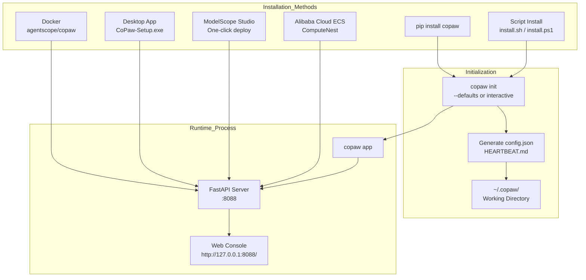
```mermaid
graph TB
    subgraph "Installation_Methods"
        PipInstall["pip install copaw"]
        ScriptInstall["Script Install<br/>install.sh / install.ps1"]
        Docker["Docker<br/>agentscope/copaw"]
        Desktop["Desktop App<br/>CoPaw-Setup.exe"]
        ModelScope["ModelScope Studio<br/>One-click deploy"]
        AliCloud["Alibaba Cloud ECS<br/>ComputeNest"]
    end
    
    subgraph "Initialization"
        InitCmd["copaw init<br/>--defaults or interactive"]
        ConfigGen["Generate config.json<br/>HEARTBEAT.md"]
        WorkingDir["~/.copaw/<br/>Working Directory"]
    end
    
    subgraph "Runtime_Process"
        AppCmd["copaw app"]
        Server["FastAPI Server<br/>:8088"]
        Console["Web Console<br/>http://127.0.0.1:8088/"]
    end
    
    PipInstall --> InitCmd
    ScriptInstall --> InitCmd
    Docker --> Server
    Desktop --> Server
    ModelScope --> Server
    AliCloud --> Server
    
    InitCmd --> ConfigGen
    ConfigGen --> WorkingDir
    InitCmd --> AppCmd
    AppCmd --> Server
    Server --> Console
```

**Installation details:**

| Method | Python Required | Use Case | Primary Command |
|--------|-----------------|----------|-----------------|
| **pip** | Yes (3.10-3.13) | Users managing Python | `pip install copaw` [website/public/docs/quickstart.en.md:145-145]() |
| **Script** | No (auto via uv) | No manual Python setup | `curl ... \| bash` [website/public/docs/quickstart.en.md:27-27]() |
| **Docker** | No | Containerized deployment | `docker run agentscope/copaw` [website/public/docs/quickstart.en.md:206-210]() |
| **Desktop** | No (bundled) | GUI users, no CLI | Run `CoPaw.exe` [website/public/docs/quickstart.zh.md:170-170]() |
| **ModelScope** | No | Cloud deployment | Fork Studio [website/public/docs/quickstart.en.md:192-192]() |
| **Alibaba Cloud** | No | Production cloud | ComputeNest deploy [website/public/docs/quickstart.en.md:218-218]() |

**Sources:** [README.md:95-150](), [website/public/docs/quickstart.en.md:1-210](), [website/public/docs/faq.en.md:12-46]()

## High-Level Architecture

Title: CoPaw System Architecture Mapping
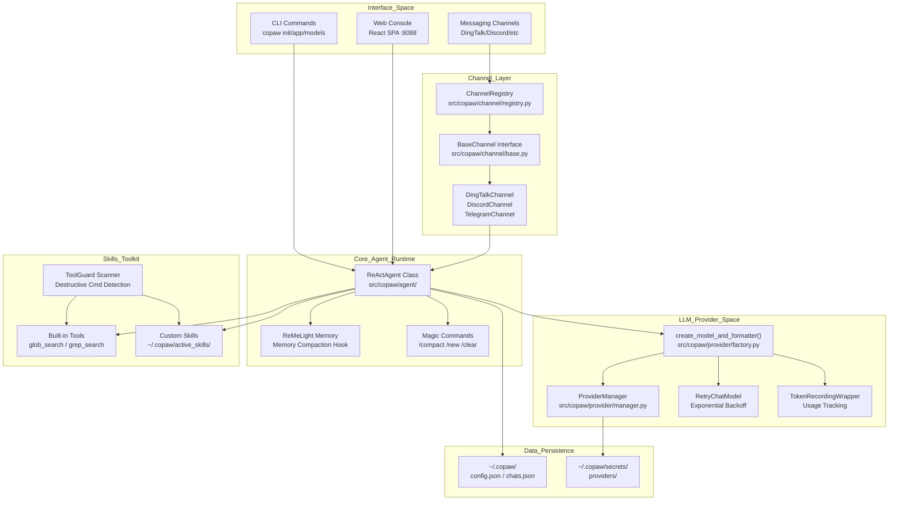
```mermaid
graph TB
    subgraph "Interface_Space"
        CLI["CLI Commands<br/>copaw init/app/models"]
        WebConsole["Web Console<br/>React SPA :8088"]
        Channels["Messaging Channels<br/>DingTalk/Discord/etc"]
    end
    
    subgraph "Core_Agent_Runtime"
        ReActAgent["ReActAgent Class<br/>src/copaw/agent/"]
        MemoryMgr["ReMeLight Memory<br/>Memory Compaction Hook"]
        CmdHandler["Magic Commands<br/>/compact /new /clear"]
    end
    
    subgraph "LLM_Provider_Space"
        ModelFactory["create_model_and_formatter()<br/>src/copaw/provider/factory.py"]
        ProviderMgr["ProviderManager<br/>src/copaw/provider/manager.py"]
        RetryWrapper["RetryChatModel<br/>Exponential Backoff"]
        TokenRecord["TokenRecordingWrapper<br/>Usage Tracking"]
    end
    
    subgraph "Channel_Layer"
        ChannelRegistry["ChannelRegistry<br/>src/copaw/channel/registry.py"]
        BaseChannel["BaseChannel Interface<br/>src/copaw/channel/base.py"]
        Impls["DingTalkChannel<br/>DiscordChannel<br/>TelegramChannel"]
    end
    
    subgraph "Skills_Toolkit"
        BuiltInTools["Built-in Tools<br/>glob_search / grep_search"]
        CustomSkills["Custom Skills<br/>~/.copaw/active_skills/"]
        ToolGuard["ToolGuard Scanner<br/>Destructive Cmd Detection"]
    end
    
    subgraph "Data_Persistence"
        WorkingDir["~/.copaw/<br/>config.json / chats.json"]
        SecretDir["~/.copaw/secrets/<br/>providers/"]
    end
    
    CLI --> ReActAgent
    WebConsole --> ReActAgent
    Channels --> ChannelRegistry
    
    ChannelRegistry --> BaseChannel
    BaseChannel --> Impls
    Impls --> ReActAgent
    
    ReActAgent --> MemoryMgr
    ReActAgent --> CmdHandler
    ReActAgent --> ModelFactory
    ReActAgent --> BuiltInTools
    ReActAgent --> CustomSkills
    
    ModelFactory --> ProviderMgr
    ModelFactory --> RetryWrapper
    ModelFactory --> TokenRecord
    
    ToolGuard --> BuiltInTools
    ToolGuard --> CustomSkills
    
    ReActAgent --> WorkingDir
    ProviderMgr --> SecretDir
```

**Sources:** [README.md:59-61](), [website/public/docs/quickstart.en.md:107-135](), [website/public/docs/faq.en.md:194-201]()

## Core Subsystems

### Agent System
The agent system implements a ReAct (Reasoning + Acting) pattern. It supports multi-workspace architecture and dynamic agent selection [README.md:59-59](). The `ReActAgent` in `src/copaw/agent/` handles the reasoning loop, parsing LLM output into actions or final answers.

### Channel System
The channel system provides an abstraction layer via the `BaseChannel` interface [README_ja.md:59-61](). It supports multimodal content, message debouncing, and platform-specific features like DingTalk AI Cards or Feishu rich text [README.md:59-60]().

### Model Provider System
The provider system abstracts LLM API differences through a `ProviderManager` singleton. It handles cloud providers (e.g., Gemini, DeepSeek) and local inference engines (e.g., Ollama, LM Studio) [README.md:59-61](). It also includes automatic retry logic and token usage recording [README.md:60-60]().

### Memory and Context Management
Memory management uses ReMeLight for long-term storage and implements automatic compaction to stay within model context limits [README.md:60-60](). Users can manage sessions via magic commands like `/new` or `/compact` [website/public/docs/faq.en.md:203-224]().

### Skills and Security
The skills system allows loading custom capabilities from the workspace. A critical component is the **Tool Guard** security layer, which performs destructive shell command detection and requires user approval for risky operations [README.md:59-59]().

## Web Console Architecture

The console is a React-based single-page application (SPA) that communicates with a FastAPI backend [README.md:60-60]().

Title: Console Frontend to Backend Mapping
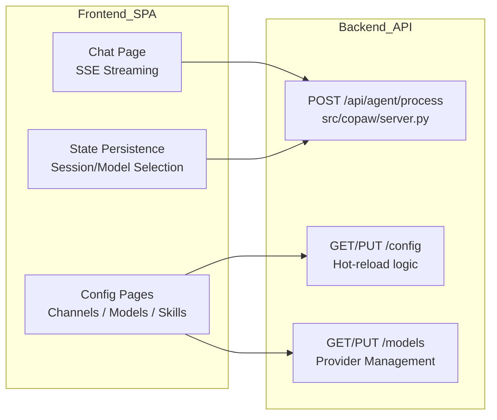
```mermaid
graph LR
    subgraph "Frontend_SPA"
        ChatUI["Chat Page<br/>SSE Streaming"]
        ConfigUI["Config Pages<br/>Channels / Models / Skills"]
        StateMgr["State Persistence<br/>Session/Model Selection"]
    end
    
    subgraph "Backend_API"
        AgentAPI["POST /api/agent/process<br/>src/copaw/server.py"]
        ConfigAPI["GET/PUT /config<br/>Hot-reload logic"]
        ModelAPI["GET/PUT /models<br/>Provider Management"]
    end
    
    ChatUI --> AgentAPI
    ConfigUI --> ConfigAPI
    ConfigUI --> ModelAPI
    StateMgr --> AgentAPI
```

**Sources:** [README.md:59-60](), [website/public/docs/quickstart.en.md:228-235]()

## Working Directory Structure

All persistent data resides in the working directory (default: `~/.copaw/`) [website/public/docs/quickstart.en.md:109-110]():

| File/Directory | Purpose |
|----------------|---------|
| `config.json` | Main configuration (channels, agent, security) [website/public/docs/quickstart.en.md:109-109]() |
| `HEARTBEAT.md` | Scheduled check-in template [website/public/docs/quickstart.en.md:109-109]() |
| `SOUL.md` | Default agent personality |
| `AGENTS.md` | Multi-agent definitions [README.md:59-59]() |
| `chats.json` | Session history |
| `active_skills/` | Enabled skills [README.md:37-37]() |
| `secrets/` | Sensitive data (API keys, provider configs) [website/public/docs/quickstart.zh.md:212-212]() |

**Sources:** [README.md:59-60](), [website/public/docs/quickstart.en.md:107-124]()

---

# Page: Key Concepts

# Key Concepts

<details>
<summary>Relevant source files</summary>

The following files were used as context for generating this wiki page:

- [README.md](README.md)
- [README_ja.md](README_ja.md)
- [README_zh.md](README_zh.md)
- [console/src/locales/en.json](console/src/locales/en.json)
- [console/src/locales/ja.json](console/src/locales/ja.json)
- [console/src/locales/ru.json](console/src/locales/ru.json)
- [console/src/locales/zh.json](console/src/locales/zh.json)
- [src/copaw/app/_app.py](src/copaw/app/_app.py)
- [src/copaw/app/migration.py](src/copaw/app/migration.py)
- [src/copaw/cli/clean_cmd.py](src/copaw/cli/clean_cmd.py)
- [src/copaw/cli/init_cmd.py](src/copaw/cli/init_cmd.py)
- [src/copaw/config/config.py](src/copaw/config/config.py)
- [src/copaw/constant.py](src/copaw/constant.py)
- [src/copaw/security/skill_scanner/__init__.py](src/copaw/security/skill_scanner/__init__.py)
- [src/copaw/tunnel/binary_manager.py](src/copaw/tunnel/binary_manager.py)
- [src/copaw/utils/telemetry.py](src/copaw/utils/telemetry.py)
- [website/public/docs/faq.en.md](website/public/docs/faq.en.md)
- [website/public/docs/faq.zh.md](website/public/docs/faq.zh.md)
- [website/public/docs/quickstart.en.md](website/public/docs/quickstart.en.md)
- [website/public/docs/quickstart.zh.md](website/public/docs/quickstart.zh.md)

</details>


This page defines the core terminology and architectural concepts in CoPaw. Understanding these concepts is essential for configuring, extending, and troubleshooting the system. CoPaw is designed as a multi-agent system where each **Agent** operates within its own **Workspace**, communicating through various **Channels** and utilizing **Skills** powered by diverse **Providers**.

---

## Core Entities

### Agent and Multi-Agent Management

The **Agent** is the central AI assistant in CoPaw, implemented as the `CoPawAgent` class. It extends AgentScope's `ReActAgent` with integrated tools, skills, memory management, and multi-channel support.

As of v0.1.0, CoPaw supports multiple agents. The `MultiAgentManager` handles the lifecycle of these agents, including starting and reloading them without downtime [src/copaw/app/_app.py:182-187](). A `DynamicMultiAgentRunner` acts as a proxy, routing requests to the specific agent identified by the `X-Agent-Id` header [src/copaw/app/_app.py:49-136]().

**Key characteristics:**
- **ReAct Pattern**: Iteratively reasons about the task and acts by calling tools until reaching a conclusion.
- **Persona & Identity**: Behavior is defined by core files in the workspace like `SOUL.md` and `AGENTS.md` [console/src/locales/en.json:88-89]().
- **Tool Guard**: A security layer that intercepts dangerous tool calls (like destructive shell commands) for user approval [src/copaw/constant.py:191-200]().
- **Agent ID**: A unique identifier (often a 6-character short UUID) used to route messages and locate workspace files [src/copaw/config/config.py:19-25]().

**Diagram: Multi-Agent Request Routing**

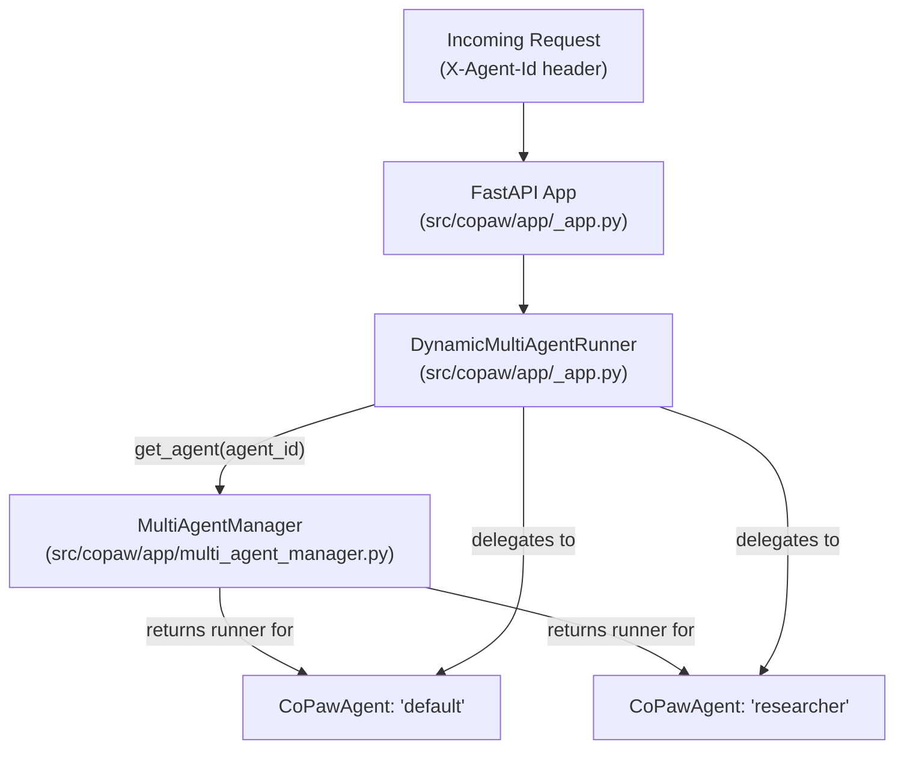
```mermaid
graph TB
    UserRequest["Incoming Request<br/>(X-Agent-Id header)"]
    FastAPI["FastAPI App<br/>(src/copaw/app/_app.py)"]
    DynamicRunner["DynamicMultiAgentRunner<br/>(src/copaw/app/_app.py)"]
    MAManager["MultiAgentManager<br/>(src/copaw/app/multi_agent_manager.py)"]
    
    AgentA["CoPawAgent: 'default'"]
    AgentB["CoPawAgent: 'researcher'"]
    
    UserRequest --> FastAPI
    FastAPI --> DynamicRunner
    DynamicRunner -->|"get_agent(agent_id)"| MAManager
    MAManager -->|"returns runner for"| AgentA
    MAManager -->|"returns runner for"| AgentB
    DynamicRunner -->|"delegates to"| AgentA
    DynamicRunner -->|"delegates to"| AgentB
```
**Sources:** [src/copaw/app/_app.py:49-145](), [src/copaw/app/multi_agent_manager.py:20-80]()

---

### Channels

**Channels** define *where* CoPaw communicates with users. Each channel is a messaging platform integration with its own protocol and configuration schema.

**Key characteristics:**
- **BaseChannel Interface**: Standardized base for channel configuration, including common fields like `enabled`, `bot_prefix`, and `allow_from` [src/copaw/config/config.py:28-41]().
- **Diverse Support**: Built-in support for iMessage, Discord, DingTalk, Feishu, QQ, Telegram, Mattermost, MQTT, Matrix, WeCom, and XiaoYi [src/copaw/config/config.py:169-187]().
- **Voice Transcription**: Capability to handle voice messages via **Auto** (transcription) or **Native Audio** modes. Transcription can use the **Whisper API** from a provider or a **Local Whisper** library [console/src/locales/en.json:50-83]().

**Diagram: Channel Entity Mapping**

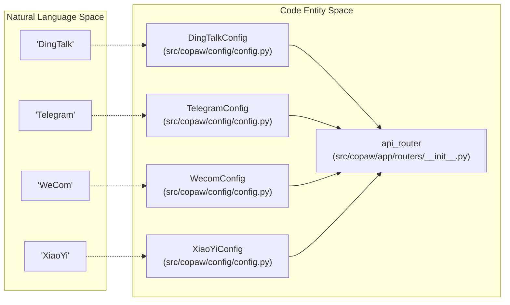
```mermaid
graph LR
    subgraph "Natural Language Space"
        DT["'DingTalk'"]
        TG["'Telegram'"]
        WC["'WeCom'"]
        XY["'XiaoYi'"]
    end

    subgraph "Code Entity Space"
        DTConfig["DingTalkConfig<br/>(src/copaw/config/config.py)"]
        TGConfig["TelegramConfig<br/>(src/copaw/config/config.py)"]
        WCConfig["WecomConfig<br/>(src/copaw/config/config.py)"]
        XYConfig["XiaoYiConfig<br/>(src/copaw/config/config.py)"]
        AppRouter["api_router<br/>(src/copaw/app/routers/__init__.py)"]
    end

    DT -.-> DTConfig
    TG -.-> TGConfig
    WC -.-> WCConfig
    XY -.-> XYConfig
    DTConfig --> AppRouter
    TGConfig --> AppRouter
    WCConfig --> AppRouter
    XYConfig --> AppRouter
```
**Sources:** [src/copaw/config/config.py:57-186](), [console/src/locales/en.json:50-83]()

---

### Providers and Models

**Providers** are the LLM backends that power the agent's reasoning. CoPaw supports a wide range of cloud APIs and local inference engines.

**Key characteristics:**
- **ModelSlotConfig**: Configuration for a specific model "slot," linking a model name to a provider [src/copaw/config/config.py:16-17]().
- **ProviderManager**: A singleton that manages the lifecycle and availability of LLM providers [src/copaw/app/_app.py:190]().
- **Retry Logic**: Configurable exponential backoff for LLM API calls to handle rate limits or transient errors [src/copaw/constant.py:172-189]().
- **Token Tracking**: Records usage per agent to monitor costs and inform memory compaction [src/copaw/constant.py:95-98]().

**Sources:** [src/copaw/constant.py:172-189](), [console/src/locales/en.json:206-224]()

---

### Skills and MCP

**Skills** and **MCP (Model Context Protocol)** are the primary mechanisms for extending the agent's functional capabilities.

- **Skills**: Markdown-formatted files containing frontmatter (YAML-like metadata) with `name` and `description` fields. These define tools the agent can invoke [console/src/locales/en.json:124-139]().
- **MCP Clients**: Implementation of the Model Context Protocol, allowing the agent to connect to external tool servers via `stdio` or `http/sse` transports [console/src/locales/en.json:158-175]().

**Sources:** [console/src/locales/en.json:107-175]()

---

## Runtime Concepts

### Memory and Compaction

CoPaw manages conversation context through a multi-tier memory system designed to handle long-running interactions.

- **Short-term Memory**: The active window of messages sent to the LLM.
- **Long-term Memory**: Persisted summaries and history stored in the `memory/` directory [src/copaw/constant.py:139]().
- **Compaction**: A process triggered when the conversation history consumes a specific ratio of the model's context window (default 0.7). It retains a set number of recent messages (`MEMORY_COMPACT_KEEP_RECENT`) and summarizes older messages to free up context space [src/copaw/constant.py:148-160]().

**Sources:** [src/copaw/constant.py:139-160]()

### Heartbeat and Cron Jobs

CoPaw supports scheduled execution to make the assistant proactive rather than purely reactive.

- **Heartbeat**: A specialized task that runs at fixed intervals (default 6h). It uses the contents of `HEARTBEAT.md` as a prompt to perform self-checks or periodic summaries. It can run in **Silent Mode** or post to the **Last Active Channel** [src/copaw/config/config.py:201-212](), [console/src/locales/en.json:176-187]().
- **Cron Jobs**: User-defined scheduled tasks using standard Cron syntax. These allow the agent to execute specific commands or "Skills" at designated times [console/src/locales/en.json:195-216]().

**Sources:** [src/copaw/config/config.py:199-211](), [console/src/locales/en.json:176-216]()

---

## Working Directory Structure

The **Working Directory** (default `~/.copaw/`) is the root for all persistence and configuration [src/copaw/constant.py:72-76]().

| Path | Purpose |
| :--- | :--- |
| `config.json` | Main system configuration including channel settings and security policies [src/copaw/constant.py:100]() |
| `workspaces/` | Sub-directories for each agent containing their identity files (`SOUL.md`, `AGENTS.md`) and persistent memory |
| `memory/` | Directory for vector and full-text search indices [src/copaw/constant.py:139]() |
| `media/` | Temporary storage for images and audio received from messaging channels [src/copaw/constant.py:89]() |
| `custom_channels/` | Directory for dynamically loaded plugin channels [src/copaw/constant.py:143]() |
| `models/` | Storage for local model weights (e.g., GGUF files) [src/copaw/constant.py:146]() |
| `token_usage.json` | Persisted record of LLM token consumption [src/copaw/constant.py:95-98]() |

**Sources:** [src/copaw/constant.py:72-150](), [console/src/locales/en.json:84-110]()

---

# Page: Getting Started

# Getting Started

<details>
<summary>Relevant source files</summary>

The following files were used as context for generating this wiki page:

- [.gitattributes](.gitattributes)
- [README.md](README.md)
- [README_ja.md](README_ja.md)
- [README_zh.md](README_zh.md)
- [scripts/install.bat](scripts/install.bat)
- [scripts/install.ps1](scripts/install.ps1)
- [scripts/install.sh](scripts/install.sh)
- [website/public/docs/faq.en.md](website/public/docs/faq.en.md)
- [website/public/docs/faq.zh.md](website/public/docs/faq.zh.md)
- [website/public/docs/quickstart.en.md](website/public/docs/quickstart.en.md)
- [website/public/docs/quickstart.zh.md](website/public/docs/quickstart.zh.md)

</details>


This section provides an overview of the initial setup process for CoPaw, covering installation methods, first-time initialization, and accessing the system. For detailed installation instructions, see [Installation](#2.1). For a step-by-step tutorial, see [Quick Start Tutorial](#2.2). For configuration details, see [Basic Configuration](#2.3).

CoPaw offers multiple installation pathways that converge at a common initialization step, followed by server startup and console access. The entire process can be completed in minutes.

---

## Installation and Setup Overview

The following diagram illustrates how different installation methods lead to the same initialization and startup flow, bridging the gap between installation scripts and the resulting code entities like the FastAPI server and configuration files.

**Installation to Runtime Flow**
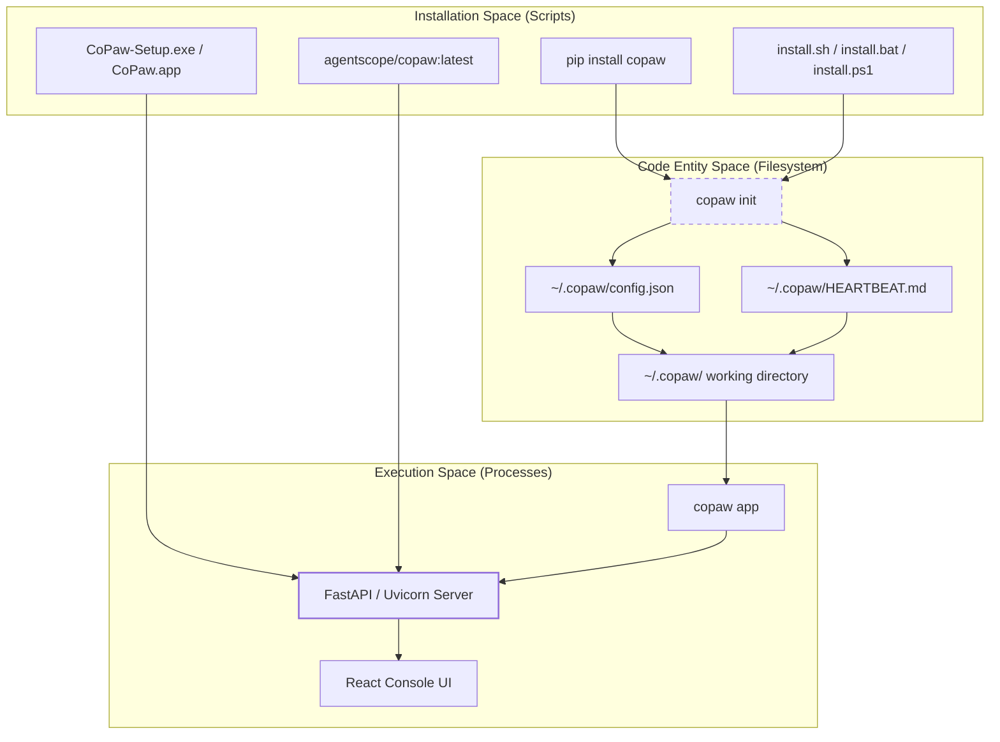
```mermaid
graph TB
    subgraph "Installation Space (Scripts)"
        PipInstall["pip install copaw"]
        ScriptInstall["install.sh / install.bat / install.ps1"]
        DesktopApp["CoPaw-Setup.exe / CoPaw.app"]
        Docker["agentscope/copaw:latest"]
    end
    
    subgraph "Code Entity Space (Filesystem)"
        InitCmd["copaw init"]
        ConfigJSON["~/.copaw/config.json"]
        HeartbeatMD["~/.copaw/HEARTBEAT.md"]
        WorkDir["~/.copaw/ working directory"]
    end
    
    subgraph "Execution Space (Processes)"
        AppCmd["copaw app"]
        FastAPI["FastAPI / Uvicorn Server"]
        Console["React Console UI"]
    end
    
    PipInstall --> InitCmd
    ScriptInstall --> InitCmd
    DesktopApp --> FastAPI
    Docker --> FastAPI
    
    InitCmd --> ConfigJSON
    InitCmd --> HeartbeatMD
    ConfigJSON --> WorkDir
    HeartbeatMD --> WorkDir
    
    WorkDir --> AppCmd
    AppCmd --> FastAPI
    FastAPI --> Console
    
    style InitCmd stroke-dasharray: 5 5
    style FastAPI stroke-width:2px
```

**Key workflow:** Installation → Initialization (`copaw init`) → Server start (`copaw app`) → Console access (browser).

Sources: [README.md:95-176](), [website/public/docs/quickstart.en.md:1-210](), [scripts/install.sh:27-32]()

---

## Installation Methods Comparison

CoPaw supports six installation methods, each suited to different user preferences and deployment scenarios:

| Method | Command / Action | Prerequisites | Best For |
|--------|---------|---------------|----------|
| **pip** | `pip install copaw` | Python 3.10 ~ 3.13 | Users managing their own Python environment |
| **Script** | `curl -fsSL .../install.sh \| bash` | None (auto-installs `uv`) | Users who want automated Python setup via `uv` |
| **Desktop** | Download `.exe` or `.app` | None | Users uncomfortable with CLI; zero-config |
| **Docker** | `docker run agentscope/copaw:latest` | Docker installed | Containerized deployments, isolated environments |
| **ModelScope** | One-click fork at `modelscope.cn` | ModelScope account | Cloud deployment without local install |
| **Alibaba Cloud** | ComputeNest deployment | Alibaba Cloud account | Production cloud deployment |

All methods result in the same CoPaw functionality. Script and pip installations require `copaw init` before first use; Desktop, Docker, and cloud methods handle initialization automatically or provide web-based configuration.

For detailed instructions on each method, see [Installation](#2.1).

Sources: [README.md:95-320](), [website/public/docs/quickstart.en.md:3-223](), [website/public/docs/faq.en.md:12-46]()

---

## Initialization Process

The `copaw init` command creates the working directory structure and configuration files required for CoPaw to operate. It populates the directory specified by `COPAW_HOME` (defaulting to `~/.copaw/`).

**Initialization Entity Mapping**
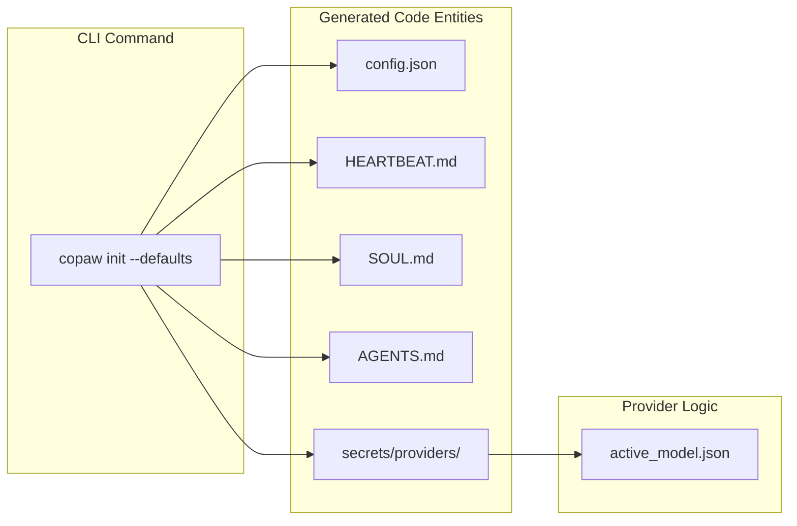
```mermaid
graph LR
    subgraph "CLI Command"
        Init["copaw init --defaults"]
    end

    subgraph "Generated Code Entities"
        Config["config.json"]
        HB["HEARTBEAT.md"]
        Soul["SOUL.md"]
        Agents["AGENTS.md"]
        Secrets["secrets/providers/"]
    end

    Init --> Config
    Init --> HB
    Init --> Soul
    Init --> Agents
    Init --> Secrets

    subgraph "Provider Logic"
        ActiveModel["active_model.json"]
    end

    Secrets --> ActiveModel
```

**Two initialization modes:**

1. **Non-interactive** (quick start):
   ```bash
   copaw init --defaults
   ```
   Creates minimal configuration with default settings. [website/public/docs/quickstart.en.md:112-116]()

2. **Interactive** (guided setup):
   ```bash
   copaw init
   ```
   Prompts for heartbeat interval, target channels, active hours, and optional skills activation. [website/public/docs/quickstart.en.md:117-122]()

Sources: [website/public/docs/quickstart.en.md:107-127](), [README.md:100-106](), [scripts/install.ps1:30-34]()

---

## Server Startup and Console Access

After initialization, the `copaw app` command starts the FastAPI server. By default, it listens on `127.0.0.1:8088`.

**Key server components:**

- **Port**: Default is `8088`, configurable via `copaw app --port <PORT>`. [website/public/docs/faq.en.md:150-151]()
- **Web Console**: A React-based interface accessible at the server URL. It provides chat, model settings, and channel management. [README.md:107-111]()
- **API Endpoint**: The core interaction point is the `POST /api/agent/process` route, which supports SSE (Server-Sent Events) for streaming responses. [website/public/docs/quickstart.en.md:232-235]()

The console is the primary interface for users to interact with the agent and manage its underlying configuration without manually editing JSON files.

Sources: [website/public/docs/quickstart.en.md:128-136](), [README.md:107-109](), [website/public/docs/faq.en.md:125-154]()

---

## Essential First Configuration

Before CoPaw can process requests, at least one LLM provider must be configured.

1. **Model Providers**: Navigate to **Settings → Models** in the console. You can add cloud providers (e.g., DashScope, OpenAI) by entering API keys, or connect to local providers like **Ollama** or **LM Studio**. [website/public/docs/faq.en.md:194-201]()
2. **Active Model**: Once a provider is added, you must select an "Active Model" which the agent will use for reasoning. This selection is persisted in `secrets/providers/active_model.json`. [website/public/docs/faq.en.md:198-200]()
3. **Channels**: To use CoPaw outside the console (e.g., DingTalk, Discord), you must configure a channel. For details, see [Basic Configuration](#2.3).

Sources: [README.md:322-335](), [website/public/docs/quickstart.en.md:14](), [website/public/docs/faq.zh.md:194-202]()

---

## Next Steps

After completing initial setup:

- **Chat with CoPaw**: Use the built-in console or connect a messaging app (see [Configuring Communication Channels](#3.2)).
- **Set up Heartbeat**: Configure `HEARTBEAT.md` for scheduled tasks and digests (see [Scheduling Tasks and Heartbeat](#3.5)).
- **Customize Persona**: Edit `SOUL.md` to change the agent's behavior and personality (see [Workspace and Agent Persona](#3.8)).

For details on each sub-topic, refer to the child pages:
- [Installation](#2.1)
- [Quick Start Tutorial](#2.2)
- [Basic Configuration](#2.3)

Sources: [website/public/docs/quickstart.en.md:241-247]()

---

# Page: Installation

# Installation

<details>
<summary>Relevant source files</summary>

The following files were used as context for generating this wiki page:

- [.gitattributes](.gitattributes)
- [.github/workflows/docker-release.yml](.github/workflows/docker-release.yml)
- [console/src/vite-env.d.ts](console/src/vite-env.d.ts)
- [deploy/Dockerfile](deploy/Dockerfile)
- [deploy/config/supervisord.conf.template](deploy/config/supervisord.conf.template)
- [deploy/entrypoint.sh](deploy/entrypoint.sh)
- [scripts/docker_build.sh](scripts/docker_build.sh)
- [scripts/install.bat](scripts/install.bat)
- [scripts/install.ps1](scripts/install.ps1)
- [scripts/install.sh](scripts/install.sh)
- [scripts/pack/README.md](scripts/pack/README.md)
- [scripts/pack/build_common.py](scripts/pack/build_common.py)
- [scripts/pack/build_macos.sh](scripts/pack/build_macos.sh)
- [scripts/pack/build_win.ps1](scripts/pack/build_win.ps1)
- [scripts/pack/copaw_desktop.nsi](scripts/pack/copaw_desktop.nsi)
- [src/copaw/app/channels/manager.py](src/copaw/app/channels/manager.py)
- [src/copaw/cli/channels_cmd.py](src/copaw/cli/channels_cmd.py)
- [src/copaw/cli/desktop_cmd.py](src/copaw/cli/desktop_cmd.py)
- [src/copaw/utils/logging.py](src/copaw/utils/logging.py)

</details>


This page covers all methods for installing CoPaw: standard `pip` install, the one-line installer scripts (which handle Python environments via `uv`), Docker, desktop app builds, and cloud deployment options like ModelScope Studio.

For initial configuration after installation, see [Quick Start Tutorial](2.2). For the overall deployment architecture, see [Architecture](5).

---

## Installation Paths Overview

**Installation paths and their entry points:**

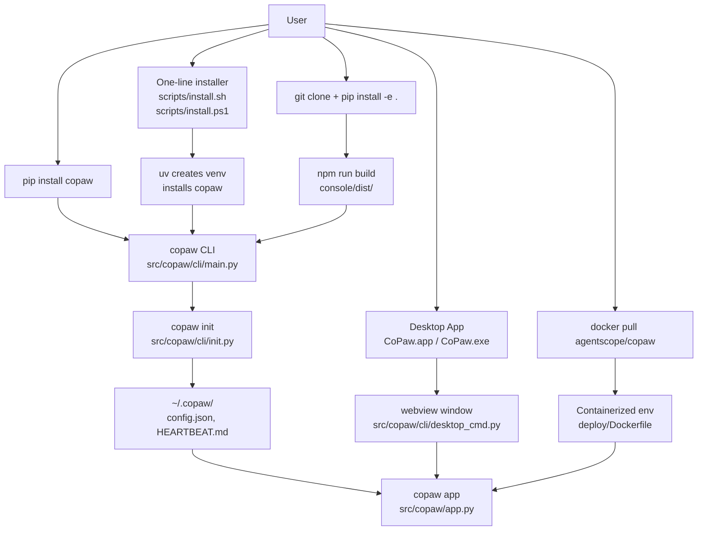
```mermaid
flowchart TD
    USER["User"] --> PIP["pip install copaw"]
    USER --> SCRIPT["One-line installer\nscripts/install.sh\nscripts/install.ps1"]
    USER --> DOCKER["docker pull agentscope/copaw"]
    USER --> DESKTOP["Desktop App\nCoPaw.app / CoPaw.exe"]
    USER --> SRC["git clone + pip install -e ."]

    PIP --> CLI["copaw CLI\nsrc/copaw/cli/main.py"]
    SCRIPT --> UV["uv creates venv\ninstalls copaw"] --> CLI
    SRC --> BUILD["npm run build\nconsole/dist/"] --> CLI

    CLI --> INIT["copaw init\nsrc/copaw/cli/init.py"]
    INIT --> WORKDIR["~/.copaw/\nconfig.json, HEARTBEAT.md"]
    WORKDIR --> APP["copaw app\nsrc/copaw/app.py"]
    
    DESKTOP --> WEBVIEW["webview window\nsrc/copaw/cli/desktop_cmd.py"]
    WEBVIEW --> APP
    
    DOCKER --> CONTAINER["Containerized env\ndeploy/Dockerfile"]
    CONTAINER --> APP
```

**Key code entities:**
- CLI entry: [src/copaw/cli/main.py:1-20]()
- Desktop Command: [src/copaw/cli/desktop_cmd.py:82-102]()
- Docker logic: [deploy/Dockerfile:1-40]()
- Installation Logic: [scripts/install.sh:1-50](), [scripts/install.ps1:1-50]()

Sources: [src/copaw/cli/main.py](), [src/copaw/cli/desktop_cmd.py](), [deploy/Dockerfile](), [scripts/install.sh](), [scripts/install.ps1]()

---

## Method 1: pip install

**Requirements:** Python 3.10 ≤ version < 3.14.

```bash
pip install copaw
copaw init --defaults
copaw app
```

The `copaw` command is the main entry point. The `copaw app` command launches a FastAPI server (using `uvicorn`) that serves the web Console and the Agent API.

### Local Model Extras

To run LLMs entirely on-device, install the appropriate extra:

| Extra | Backend | Best for | Command |
|---|---|---|---|
| `llamacpp` | llama.cpp | macOS / Linux / Windows | `pip install 'copaw[llamacpp]'` |
| `mlx` | MLX | Apple Silicon (M1-M4) | `pip install 'copaw[mlx]'` |
| `ollama` | Ollama | All (via external service) | `pip install 'copaw[ollama]'` |

The `ollama` extra is specifically included in the production Docker build [deploy/Dockerfile:89-89]().

Sources: [deploy/Dockerfile:89-89]()

---

## Method 2: One-Line Installer Script

The installer scripts ([scripts/install.sh]() and [scripts/install.ps1]()) automate the setup of an isolated Python environment using `uv`. Users do not need Python pre-installed.

**macOS / Linux:**
```bash
curl -fsSL https://copaw.agentscope.io/install.sh | bash
```

**Windows (PowerShell):**
```powershell
irm https://copaw.agentscope.io/install.ps1 | iex
```

### Technical Implementation of Installers
1. **uv Detection:** The scripts check for `uv` in common paths or install it via `astral.sh`. In restricted networks, [scripts/install.ps1:87-119]() falls back to downloading `uv` directly from GitHub Releases.
2. **Environment Creation:** A virtual environment is created at `~/.copaw/venv` using `uv venv` [scripts/install.sh:143-147]().
3. **Console Build:** For source installs, the script attempts to build the frontend using `npm ci && npm run build` [scripts/install.sh:194-206]().
4. **Mirror Selection:** The script intelligently selects the official PyPI source or an Alibaba Cloud mirror based on network connectivity [scripts/install.sh:34-44]().
5. **Bytecode Compilation:** On Windows, the installer pre-compiles `.py` files to `.pyc` using `compileall` to reduce cold-start latency [scripts/pack/build_win.ps1:128-150]().

Sources: [scripts/install.sh](), [scripts/install.ps1](), [scripts/pack/build_win.ps1]()

---

## Method 3: Docker

The Docker image provides a multi-arch (`amd64`/`arm64`) environment with Chromium pre-installed for web-browsing skills.

```bash
docker run -p 8088:8088 -v copaw-data:/app/working agentscope/copaw:latest
```

### Docker Image Composition

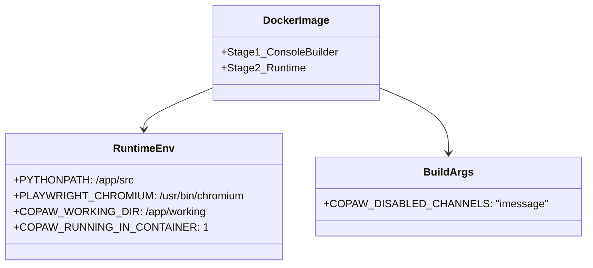
```mermaid
classDiagram
    class DockerImage {
        +Stage1_ConsoleBuilder
        +Stage2_Runtime
    }
    class RuntimeEnv {
        +PYTHONPATH: /app/src
        +PLAYWRIGHT_CHROMIUM: /usr/bin/chromium
        +COPAW_WORKING_DIR: /app/working
        +COPAW_RUNNING_IN_CONTAINER: 1
    }
    class BuildArgs {
        +COPAW_DISABLED_CHANNELS: "imessage"
    }
    DockerImage --> RuntimeEnv
    DockerImage --> BuildArgs
```

**Key Configurations in [deploy/Dockerfile]():**
- **Chromium:** Uses system Chromium to avoid Playwright downloads and sets `PLAYWRIGHT_SKIP_BROWSER_DOWNLOAD=1` [deploy/Dockerfile:73-76]().
- **Sandbox:** Disables Chromium sandbox for container compatibility [deploy/Dockerfile:71-71]().
- **Persistence:** Mounts `/app/working` for `config.json` and memory [deploy/Dockerfile:17-17]().
- **Process Management:** Uses `supervisor` and a custom `entrypoint.sh` to manage the app lifecycle [deploy/Dockerfile:97-98]().

Sources: [deploy/Dockerfile](), [scripts/docker_build.sh](), [.github/workflows/docker-release.yml]()

---

## Method 4: Desktop Apps

CoPaw can be packaged as a standalone desktop application using `conda-pack` and native wrappers.

### macOS (.app)
The build script [scripts/pack/build_macos.sh]() creates a standard macOS App bundle.
- **Bundled Env:** Includes a Python environment in `Contents/Resources/env` [scripts/pack/build_macos.sh:51-52]().
- **Launcher Logic:** A launcher script unsets `PYTHONPATH` and sets `SSL_CERT_FILE` by querying the packaged `certifi` [scripts/pack/build_macos.sh:60-82]().
- **Native Integration:** Configures `Info.plist` with high-resolution support and icon files [scripts/pack/build_macos.sh:159-175]().

### Windows (.exe)
The Windows build [scripts/pack/build_win.ps1]() uses `NSIS` to create an installer.
- **Path Fixes:** It runs `conda-unpack` and fixes a known bug where `huggingface_hub` string literals are corrupted during prefix replacement by reinstalling affected packages [scripts/pack/build_win.ps1:96-119]().
- **WebView:** The app can be launched in a native window using `pywebview`, triggered by `copaw desktop` [src/copaw/cli/desktop_cmd.py:172-188]().
- **Port Selection:** `desktop_cmd` automatically finds a free port to avoid conflicts with existing instances [src/copaw/cli/desktop_cmd.py:39-44]().

Sources: [scripts/pack/build_macos.sh](), [scripts/pack/build_win.ps1](), [src/copaw/cli/desktop_cmd.py]()

---

## Method 5: Cloud Deployment

### ModelScope Studio
CoPaw supports one-click deployment on ModelScope. This uses a containerized environment optimized for the platform's studio environment.

### Alibaba Cloud ECS
A specialized deployment path for ECS instances is provided via Compute Nest, automating resource provisioning and security group configuration.

---

## Implementation Details: Logging and Initialization

When CoPaw starts, it sets up logging to both the console and a file for daemonized environments.

- **Rotating Logs:** On macOS, it uses `RotatingFileHandler` for automatic rotation [src/copaw/utils/logging.py:171-176]().
- **Windows/Linux Logs:** Uses a standard `FileHandler` to avoid locking issues [src/copaw/utils/logging.py:164-169]().
- **ANSI Support:** Automatically enables ANSI escape code support on Windows 10+ for colored terminal output [src/copaw/utils/logging.py:28-41]().

Sources: [src/copaw/utils/logging.py]()

---

# Page: Quick Start Tutorial

# Quick Start Tutorial

<details>
<summary>Relevant source files</summary>

The following files were used as context for generating this wiki page:

- [README.md](README.md)
- [README_ja.md](README_ja.md)
- [README_zh.md](README_zh.md)
- [console/vite.config.ts](console/vite.config.ts)
- [src/copaw/app/_app.py](src/copaw/app/_app.py)
- [src/copaw/app/migration.py](src/copaw/app/migration.py)
- [src/copaw/cli/clean_cmd.py](src/copaw/cli/clean_cmd.py)
- [src/copaw/cli/init_cmd.py](src/copaw/cli/init_cmd.py)
- [src/copaw/constant.py](src/copaw/constant.py)
- [src/copaw/security/skill_scanner/__init__.py](src/copaw/security/skill_scanner/__init__.py)
- [src/copaw/tunnel/binary_manager.py](src/copaw/tunnel/binary_manager.py)
- [src/copaw/utils/telemetry.py](src/copaw/utils/telemetry.py)
- [website/public/docs/cli.en.md](website/public/docs/cli.en.md)
- [website/public/docs/cli.zh.md](website/public/docs/cli.zh.md)
- [website/public/docs/console.en.md](website/public/docs/console.en.md)
- [website/public/docs/console.zh.md](website/public/docs/console.zh.md)
- [website/public/docs/faq.en.md](website/public/docs/faq.en.md)
- [website/public/docs/faq.zh.md](website/public/docs/faq.zh.md)
- [website/public/docs/quickstart.en.md](website/public/docs/quickstart.en.md)
- [website/public/docs/quickstart.zh.md](website/public/docs/quickstart.zh.md)

</details>


This page walks through your first interaction with CoPaw after installation: running `copaw init` to set up your working directory, starting the server with `copaw app`, and navigating the Console web interface.

**Prerequisites:** CoPaw must be installed on your system (Python 3.10 ~ 3.13). For installation instructions, see [Installation](#2.1).

**What this covers:**
- Initializing CoPaw's working directory with `copaw init` [website/public/docs/cli.en.md:16-38]()
- Starting the application server with `copaw app` [src/copaw/app/_app.py:148-152]()
- Navigating the Console web interface [website/public/docs/console.en.md:3-22]()
- Sending your first message to CoPaw [src/copaw/app/_app.py:95-118]()

---

## First-Time Initialization

After installing CoPaw, you must initialize the working directory before starting the server. The `copaw init` command creates configuration files and directory structure in `~/.copaw/` (or the path specified by `COPAW_WORKING_DIR`) [src/copaw/constant.py:72-76]().

### Initialization Modes

CoPaw offers two initialization modes in the CLI [website/public/docs/cli.en.md:20-24]():

| Mode | Command | Description | Use Case |
|------|---------|-------------|----------|
| **Defaults** | `copaw init --defaults` | Non-interactive; uses default values for all settings [website/public/docs/cli.en.md:22]() | Quick setup; customize later via Console |
| **Interactive** | `copaw init` | Prompts for heartbeat interval, target channel, active hours, and optional channel/skill setup [website/public/docs/cli.en.md:21]() | Guided setup with immediate customization |

**Recommended for first-time users:** Start with `--defaults` to get CoPaw running quickly, then customize settings in the Console.

### What Gets Created

The initialization process creates the following structure in `WORKING_DIR` [src/copaw/constant.py:72-102]():

```
~/.copaw/                          # Working directory (COPAW_WORKING_DIR)
├── config.json                    # Main configuration file [src/copaw/constant.py:100]()
├── HEARTBEAT.md                   # Heartbeat digest template [src/copaw/constant.py:102]()
├── chats.json                     # Session history storage [src/copaw/constant.py:93]()
├── jobs.json                      # Scheduled task definitions [src/copaw/constant.py:91]()
├── token_usage.json               # LLM token consumption tracking [src/copaw/constant.py:95]()
├── workspaces/                    # Multi-agent workspaces [src/copaw/app/migration.py:94]()
│   └── default/                   # Default agent workspace
│       ├── agent.json             # Agent-specific config [src/copaw/app/migration.py:133]()
│       ├── AGENTS.md              # System prompt component [src/copaw/app/migration.py:36]()
│       └── SOUL.md                # Agent persona definition [src/copaw/app/migration.py:37]()
└── .secret/                       # Credentials storage (COPAW_SECRET_DIR) [src/copaw/constant.py:77-86]()
```

### Initialization Flow Diagram

This diagram maps the CLI initialization logic to the filesystem entities.

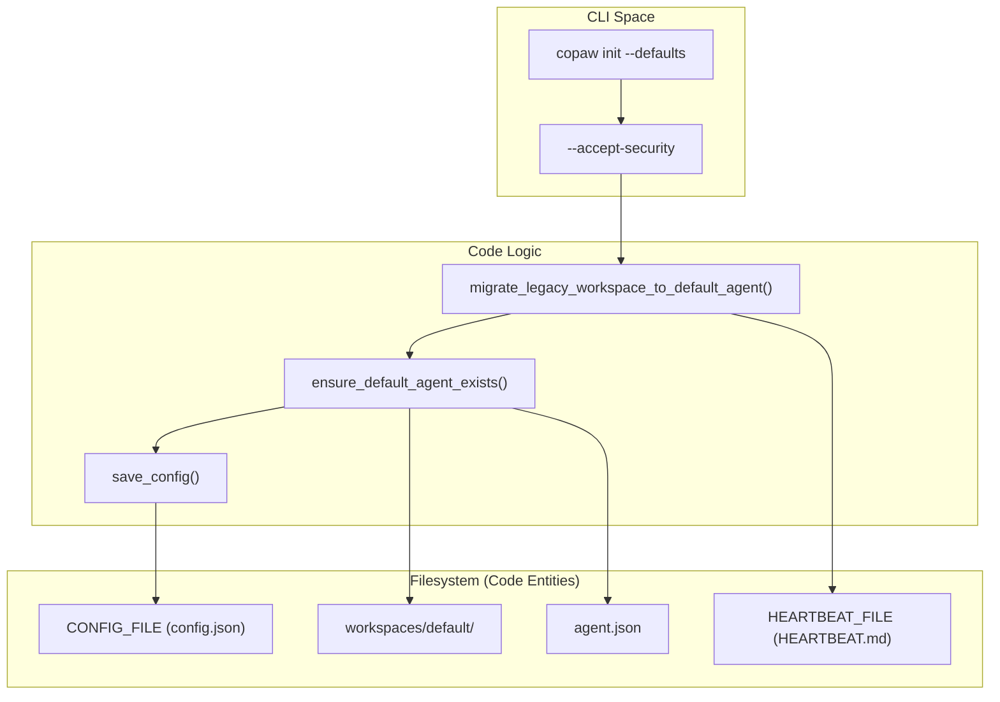
```mermaid
flowchart TD
    subgraph "CLI Space"
        Start["copaw init --defaults"]
        AcceptSec["--accept-security"]
    end

    subgraph "Code Logic"
        EnsureAgent["ensure_default_agent_exists()"]
        MigrateLegacy["migrate_legacy_workspace_to_default_agent()"]
        SaveRoot["save_config()"]
    end

    subgraph "Filesystem (Code Entities)"
        ConfigJSON["CONFIG_FILE (config.json)"]
        WorkspacesDir["workspaces/default/"]
        AgentJSON["agent.json"]
        HeartbeatMD["HEARTBEAT_FILE (HEARTBEAT.md)"]
    end

    Start --> AcceptSec
    AcceptSec --> MigrateLegacy
    MigrateLegacy --> EnsureAgent
    EnsureAgent --> SaveRoot
    
    SaveRoot --> ConfigJSON
    EnsureAgent --> WorkspacesDir
    EnsureAgent --> AgentJSON
    MigrateLegacy --> HeartbeatMD
```
**Sources:** [website/public/docs/cli.en.md:16-38](), [src/copaw/app/migration.py:45-189](), [src/copaw/constant.py:72-102]()

---

## Starting the Application Server

Once initialized, start the CoPaw server with:

```bash
copaw app
```

This launches a FastAPI application [src/copaw/app/_app.py:141-145]() serving both the REST API and the React-based Console web interface. By default, it runs on port 8088 [website/public/docs/faq.en.md:130-134]().

### Server Startup Flow

The server uses a `lifespan` context manager to handle initialization tasks like loading environment variables and starting agents [src/copaw/app/_app.py:148-188]().

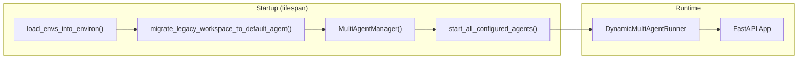
```mermaid
flowchart LR
    subgraph "Startup (lifespan)"
        LoadEnv["load_envs_into_environ()"]
        Migrate["migrate_legacy_workspace_to_default_agent()"]
        InitManager["MultiAgentManager()"]
        StartAgents["start_all_configured_agents()"]
    end

    subgraph "Runtime"
        FastAPI["FastAPI App"]
        DynamicRunner["DynamicMultiAgentRunner"]
    end

    LoadEnv --> Migrate
    Migrate --> InitManager
    InitManager --> StartAgents
    StartAgents --> DynamicRunner
    DynamicRunner --> FastAPI
```
**Sources:** [src/copaw/app/_app.py:43-45](), [src/copaw/app/_app.py:148-196](), [src/copaw/app/multi_agent_manager.py:184-187]()

### Server Architecture

The CoPaw application server implements a multi-agent routing architecture using `DynamicMultiAgentRunner` [src/copaw/app/_app.py:49-58]().

| Component | Code Entity | Role |
|---------|-------|---------|
| **Entry Point** | `agent_app` | The `AgentApp` instance managing the lifecycle [src/copaw/app/_app.py:141]() |
| **Router** | `DynamicMultiAgentRunner` | Inspects `X-Agent-Id` to route requests to the correct agent [src/copaw/app/_app.py:64-84]() |
| **Manager** | `MultiAgentManager` | Handles starting, stopping, and reloading individual agent instances [src/copaw/app/multi_agent_manager.py:184]() |
| **Provider Logic** | `ProviderManager` | Singleton managing LLM API connections and models [src/copaw/app/_app.py:190]() |

**Sources:** [src/copaw/app/_app.py:49-145](), [src/copaw/app/multi_agent_manager.py:184-193]()

---

## Accessing the Console

With the server running, open your browser to `http://127.0.0.1:8088/`. The Console is a React-based web interface [website/public/docs/console.en.md:3-4]() that communicates with the backend via REST and SSE (Server-Sent Events) for streaming chat [src/copaw/app/_app.py:95-107]().

### Console Navigation

The Console is organized into sections [website/public/docs/console.en.md:20-22]():

| Section | Purpose |
|---------|---------|
| **Chat** | Real-time conversation with the active agent via `stream_query` [src/copaw/app/_app.py:95]() |
| **Control** | Manage `channels`, `sessions`, and `cron jobs` [website/public/docs/console.en.md:54-155]() |
| **Agent** | Edit `SOUL.md`/`AGENTS.md` in the Workspace and manage `skills` [website/public/docs/console.en.md:158-221]() |
| **Settings** | Configure LLM `providers` and `models` [website/public/docs/console.en.md:246-302]() |

---

## First Interaction: Sending a Message

The Chat page allows you to interact with the default agent. When you send a message, the following sequence occurs:

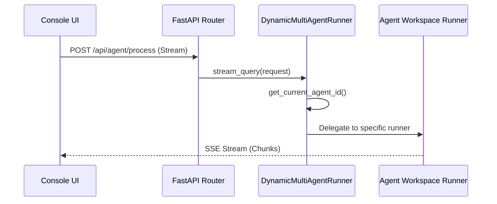
```mermaid
sequenceDiagram
    participant UI as Console UI
    participant API as FastAPI Router
    participant Dynamic as DynamicMultiAgentRunner
    participant Agent as Agent Workspace Runner
    
    UI->>API: POST /api/agent/process (Stream)
    API->>Dynamic: stream_query(request)
    Dynamic->>Dynamic: get_current_agent_id()
    Dynamic->>Agent: Delegate to specific runner
    Agent-->>UI: SSE Stream (Chunks)
```
**Sources:** [src/copaw/app/_app.py:95-118](), [src/copaw/app/routers/agent_scoped.py:22]()

### Useful Status Queries
Try asking CoPaw the following to verify your setup:
- `"What model are you using?"` (Verifies `ProviderManager` configuration)
- `"What skills do you have?"` (Verifies `active_skills` loading)
- `"Show me my token usage"` (Verifies `TOKEN_USAGE_FILE` access [src/copaw/constant.py:95]())

---

## Troubleshooting Common Setup Issues

| Issue | Cause | Solution |
|-------|-------|----------|
| **Port 8088 Conflict** | Hyper-V/WSL2 or other apps using the port | Run `copaw app --port 8090` [website/public/docs/faq.en.md:145-153]() |
| **Command Not Found** | Environment variables not updated | Add `%USERPROFILE%\.copaw\bin` to your `Path` [website/public/docs/faq.en.md:52-64]() |
| **Context Errors** | Local model context length too small | Set context length to **32K+** in Ollama/LM Studio [website/public/docs/faq.en.md:203-224]() |

**Sources:** [website/public/docs/faq.en.md:48-224]()

---

# Page: Basic Configuration

# Basic Configuration

<details>
<summary>Relevant source files</summary>

The following files were used as context for generating this wiki page:

- [console/src/locales/en.json](console/src/locales/en.json)
- [console/src/locales/ja.json](console/src/locales/ja.json)
- [console/src/locales/ru.json](console/src/locales/ru.json)
- [console/src/locales/zh.json](console/src/locales/zh.json)
- [src/copaw/cli/providers_cmd.py](src/copaw/cli/providers_cmd.py)
- [src/copaw/config/config.py](src/copaw/config/config.py)
- [src/copaw/providers/ollama_provider.py](src/copaw/providers/ollama_provider.py)
- [src/copaw/providers/provider_manager.py](src/copaw/providers/provider_manager.py)
- [tests/unit/providers/test_kimi_provider.py](tests/unit/providers/test_kimi_provider.py)
- [tests/unit/providers/test_ollama_provider.py](tests/unit/providers/test_ollama_provider.py)
- [tests/unit/providers/test_provider_manager.py](tests/unit/providers/test_provider_manager.py)
- [website/public/docs/config.en.md](website/public/docs/config.en.md)
- [website/public/docs/config.zh.md](website/public/docs/config.zh.md)
- [website/public/docs/memory.en.md](website/public/docs/memory.en.md)
- [website/public/docs/memory.zh.md](website/public/docs/memory.zh.md)

</details>


This page explains the essential configuration steps for CoPaw, focusing on the multi-agent workspace structure introduced in v0.1.0, setting up your first LLM provider, and configuring communication channels.

---

## Working Directory and Multi-Agent Structure

Starting from **v0.1.0**, CoPaw uses a hierarchical configuration system. Global settings (like model providers) are stored centrally, while agent-specific settings (like channels and skills) are stored within individual agent workspaces.

### Directory Layout

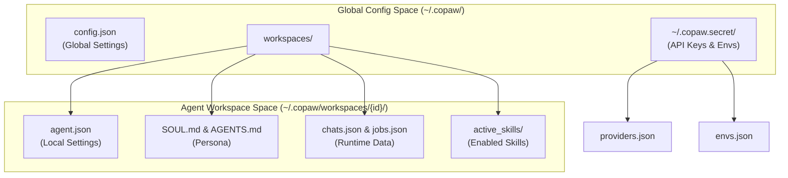
```mermaid
graph TD
    subgraph "Global Config Space (~/.copaw/)"
        G_CONFIG["config.json<br/>(Global Settings)"]
        G_SECRET["~/.copaw.secret/<br/>(API Keys & Envs)"]
        G_WORKSPACES["workspaces/"]
    end

    subgraph "Agent Workspace Space (~/.copaw/workspaces/{id}/)"
        A_CONFIG["agent.json<br/>(Local Settings)"]
        A_PROMPT["SOUL.md & AGENTS.md<br/>(Persona)"]
        A_DATA["chats.json & jobs.json<br/>(Runtime Data)"]
        A_SKILLS["active_skills/<br/>(Enabled Skills)"]
    end

    G_WORKSPACES --> A_CONFIG
    G_WORKSPACES --> A_PROMPT
    G_WORKSPACES --> A_DATA
    G_WORKSPACES --> A_SKILLS

    G_SECRET --> P_JSON["providers.json"]
    G_SECRET --> E_JSON["envs.json"]
```

**Key Configuration Files:**

| File Path | Purpose | Scope |
|---|---|---|
| `~/.copaw/config.json` | Global agent list and active agent selection. | Global |
| `~/.copaw.secret/providers.json` | API keys, base URLs, and active LLM selection. | Global |
| `~/.copaw/workspaces/{id}/agent.json` | Channel settings, heartbeat, and iteration limits for a specific agent. | Per-Agent |
| `SOUL.md` / `AGENTS.md` | Core identity and workflow rules (System Prompt). | Per-Agent |

Sources: [website/public/docs/config.en.md:19-67](), [src/copaw/config/config.py:167-216]()

---

## Setting Up LLM Providers

CoPaw supports a wide range of providers including OpenAI, Anthropic, DashScope, and local options like Ollama.

### Configuration via Console
The easiest way to configure providers is through the Web Console (**Settings → Models**).

1.  **Select Provider:** Choose from built-in providers like `openai` or `anthropic`.
2.  **Enter Credentials:** Provide the `api_key` and optionally a `base_url`.
3.  **Model Discovery:** For OpenAI-compatible providers, use the **Discover Models** button to automatically fetch available models from the API.

### Configuration via CLI
You can interactively configure providers using the CLI:
```bash
copaw models config-key <provider_id>
```
The `configure_provider_api_key_interactive` function handles the prompting logic, while `ProviderManager.update_provider` persists the changes to the filesystem.

Sources: [src/copaw/cli/providers_cmd.py:95-176](), [src/copaw/providers/provider_manager.py:441-450]()

### Implementation Detail: Provider Classes
Each provider type is handled by a specific class that manages connection testing and model fetching:

*   **`OpenAIProvider`**: Handles OpenAI and compatible endpoints (e.g., DashScope, DeepSeek). [src/copaw/providers/provider_manager.py:181-188]()
*   **`AnthropicProvider`**: Handles Anthropic's native API. [src/copaw/providers/provider_manager.py:197-204]()
*   **`OllamaProvider`**: Integrates with local Ollama instances via the `ollama` Python SDK. [src/copaw/providers/ollama_provider.py:19-40]()

**Data Flow: Model Discovery**
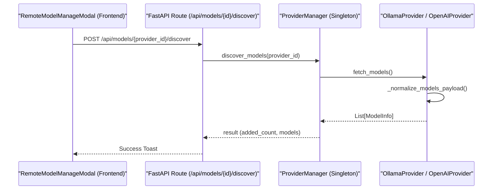
```mermaid
sequenceDiagram
    participant UI as "RemoteModelManageModal (Frontend)"
    participant API as "FastAPI Route (/api/models/{id}/discover)"
    participant PM as "ProviderManager (Singleton)"
    participant P as "OllamaProvider / OpenAIProvider"
    
    UI->>API: POST /api/models/{provider_id}/discover
    API->>PM: discover_models(provider_id)
    PM->>P: fetch_models()
    P->>P: _normalize_models_payload()
    P-->>PM: List[ModelInfo]
    PM-->>API: result (added_count, models)
    API-->>UI: Success Toast
```
Sources: [src/copaw/providers/ollama_provider.py:85-91](), [src/copaw/providers/provider_manager.py:488-510]()

---

## Configuring Communication Channels

Channels allow your agent to communicate on platforms like Discord, Telegram, or DingTalk. These are configured in the `agent.json` of the active workspace.

### Common Channel Parameters
All channels share a set of base configuration fields defined in `BaseChannelConfig`:

| Field | Type | Default | Description |
|---|---|---|---|
| `enabled` | bool | `false` | Whether the channel is active. |
| `bot_prefix` | str | `""` | Command prefix (e.g., `!`). |
| `require_mention` | bool | `false` | If true, agent only responds when @mentioned. |
| `dm_policy` | str | `"open"` | Access control for Direct Messages (`open` or `allowlist`). |

Sources: [src/copaw/config/config.py:28-40](), [website/public/docs/config.en.md:195-202]()

### Channel-Specific Examples

#### 1. Discord
Requires a `bot_token`.
```json
"discord": {
  "enabled": true,
  "bot_token": "YOUR_DISCORD_TOKEN",
  "require_mention": true
}
```
Sources: [src/copaw/config/config.py:51-55]()

#### 2. Telegram
Requires a `bot_token`.
```json
"telegram": {
  "enabled": true,
  "bot_token": "YOUR_TELEGRAM_TOKEN",
  "show_typing": true
}
```
Sources: [src/copaw/config/config.py:87-92]()

---

## Environment Variables

For tools that require external API keys (e.g., Google Search, Tavily), CoPaw uses an environment variable management system. These are stored in `~/.copaw.secret/envs.json`.

**Managing Envs:**
*   **Console:** Navigate to **Settings → Environments**.
*   **CLI:** Use `copaw env set KEY VALUE`.

At startup, the application loads these into `os.environ` so that the agent's skills can access them during tool execution.

Sources: [website/public/docs/config.en.md:76-90](), [console/src/locales/en.json:45-45]()

---

## Initializing with `copaw init`

The `copaw init` command is the recommended way to perform the first-time setup. It interactively guides you through:
1.  Selecting the system language (sets up `SOUL.md` and `AGENTS.md`).
2.  Configuring the primary LLM provider.
3.  Setting the Heartbeat interval (default `30m`).

### Implementation: Persona Setup
When `copaw init` runs, it copies localized Markdown templates into the `default` workspace:
*   **English:** `en` [console/src/locales/en.json:84-106]()
*   **Chinese:** `zh` [console/src/locales/zh.json:50-72]()
*   **Russian:** `ru` [console/src/locales/ru.json:84-104]()
*   **Japanese:** `ja` [console/src/locales/ja.json:84-104]()

Sources: [website/public/docs/config.en.md:61-65]()

---

# Page: User Guide

# User Guide

<details>
<summary>Relevant source files</summary>

The following files were used as context for generating this wiki page:

- [README.md](README.md)
- [README_ja.md](README_ja.md)
- [README_zh.md](README_zh.md)
- [console/vite.config.ts](console/vite.config.ts)
- [website/public/docs/cli.en.md](website/public/docs/cli.en.md)
- [website/public/docs/cli.zh.md](website/public/docs/cli.zh.md)
- [website/public/docs/console.en.md](website/public/docs/console.en.md)
- [website/public/docs/console.zh.md](website/public/docs/console.zh.md)
- [website/public/docs/faq.en.md](website/public/docs/faq.en.md)
- [website/public/docs/faq.zh.md](website/public/docs/faq.zh.md)
- [website/public/docs/quickstart.en.md](website/public/docs/quickstart.en.md)
- [website/public/docs/quickstart.zh.md](website/public/docs/quickstart.zh.md)

</details>


## Purpose and Scope

This User Guide provides comprehensive instructions for end-users on configuring and using CoPaw's features. It covers all aspects of daily CoPaw usage, from initial setup through advanced configuration of channels, models, skills, and automation.

This guide is intended for users who have already installed CoPaw. For installation instructions, see [Getting Started](#2). For developer documentation on extending CoPaw or contributing code, see [Development Guide](#10). For CLI command reference, see [CLI Reference](#4).

## Overview of CoPaw User Experience

CoPaw operates as a personal AI assistant with multiple interaction modes. After installation, users interact with CoPaw through three primary interfaces:

1.  **Console Web UI** - Browser-based interface at `http://127.0.0.1:8088/` for chat, configuration, and system management. [website/public/docs/console.en.md:3-5]()
2.  **Command Line Interface** - `copaw` CLI commands for initialization, server control, and advanced management. [website/public/docs/cli.en.md:3-5]()
3.  **Communication Channels** - Integration with platforms like DingTalk, Feishu, QQ, Discord, iMessage, and Telegram. [README.md:33-33]()

All three interfaces connect to the same underlying CoPaw instance, sharing configuration, memory, and agent state.

### User Interaction Architecture

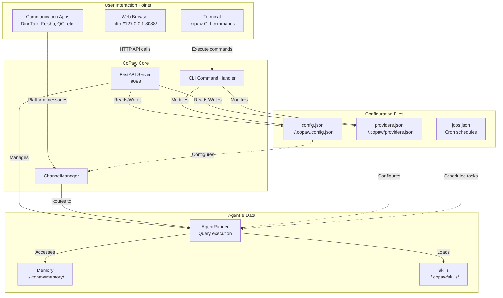
```mermaid
graph TB
    subgraph "User Interaction Points"
        Browser["Web Browser<br/>http://127.0.0.1:8088/"]
        Terminal["Terminal<br/>copaw CLI commands"]
        Apps["Communication Apps<br/>DingTalk, Feishu, QQ, etc."]
    end
    
    subgraph "CoPaw Core"
        FastAPI["FastAPI Server<br/>:8088"]
        CLIHandler["CLI Command Handler"]
        ChannelMgr["ChannelManager"]
    end
    
    subgraph "Configuration Files"
        ConfigJSON["config.json<br/>~/.copaw/config.json"]
        ProvidersJSON["providers.json<br/>~/.copaw/providers.json"]
        JobsJSON["jobs.json<br/>Cron schedules"]
    end
    
    subgraph "Agent & Data"
        AgentRunner["AgentRunner<br/>Query execution"]
        Memory["Memory<br/>~/.copaw/memory/"]
        Skills["Skills<br/>~/.copaw/skills/"]
    end
    
    Browser -->|"HTTP API calls"| FastAPI
    Terminal -->|"Execute commands"| CLIHandler
    Apps -->|"Platform messages"| ChannelMgr
    
    FastAPI -->|"Reads/Writes"| ConfigJSON
    FastAPI -->|"Reads/Writes"| ProvidersJSON
    CLIHandler -->|"Modifies"| ConfigJSON
    CLIHandler -->|"Modifies"| ProvidersJSON
    
    FastAPI -->|"Manages"| AgentRunner
    ChannelMgr -->|"Routes to"| AgentRunner
    
    AgentRunner -->|"Accesses"| Memory
    AgentRunner -->|"Loads"| Skills
    
    ConfigJSON -.->|"Configures"| ChannelMgr
    ProvidersJSON -.->|"Configures"| AgentRunner
    JobsJSON -.->|"Scheduled tasks"| AgentRunner
```

**Sources**: [README.md:31-51](), [website/public/docs/console.en.md:6-18](), [website/public/docs/cli.en.md:3-10]()

## Configuration Areas

CoPaw requires configuration in several key areas before it can function effectively. The configuration system uses JSON files stored in the working directory (`~/.copaw/` by default) and can be modified through multiple interfaces:

| Configuration Area | File | Console UI Path | CLI Command | Purpose |
| :--- | :--- | :--- | :--- | :--- |
| **Model Providers** | `providers.json` | Settings → Models | `copaw models` | Configure cloud/local LLM providers and API keys |
| **Communication Channels** | `config.json` | Control → Channels | `copaw channels` | Set up DingTalk, Feishu, QQ, Discord, etc. |
| **Agent Settings** | `config.json` | Agent → Workspace | Manual edit | System prompt (SOUL.md), behavior, and persona |
| **Skills** | `config.json` | Agent → Skills | `copaw skills` | Enable/disable built-in and custom skills |
| **MCP Clients** | `config.json` | Agent → MCP | Manual edit | External tool protocol integration |
| **Scheduled Tasks** | `jobs.json` | Control → Cron Jobs | `copaw cron` | Automated reminders and recurring tasks |
| **Environment Variables**| `.env` / Config | Settings → Environment | `copaw env` | API keys for tools (TAVILY_API_KEY, etc.) |

**Sources**: [website/public/docs/console.en.md:20-22](), [website/public/docs/cli.en.md:103-211]()

### Configuration File Locations

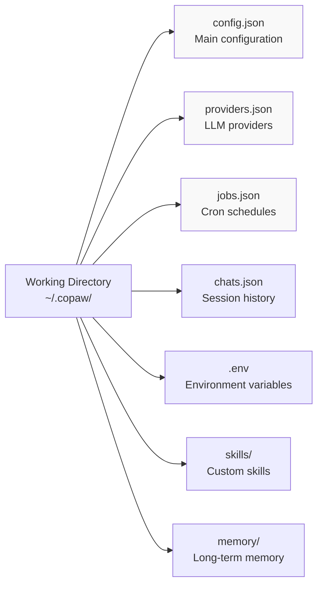
```mermaid
graph LR
    WorkingDir["Working Directory<br/>~/.copaw/"]
    
    WorkingDir --> ConfigJSON["config.json<br/>Main configuration"]
    WorkingDir --> ProvidersJSON["providers.json<br/>LLM providers"]
    WorkingDir --> JobsJSON["jobs.json<br/>Cron schedules"]
    WorkingDir --> ChatsJSON["chats.json<br/>Session history"]
    WorkingDir --> EnvFile[".env<br/>Environment variables"]
    
    WorkingDir --> SkillsDir["skills/<br/>Custom skills"]
    WorkingDir --> MemoryDir["memory/<br/>Long-term memory"]
    
    style ConfigJSON fill:#f9f9f9
    style ProvidersJSON fill:#f9f9f9
    style JobsJSON fill:#f9f9f9
```

**Sources**: [website/public/docs/quickstart.en.md:109-110](), [website/public/docs/faq.en.md:212-212]()

## Basic User Workflow

A typical user workflow progresses from initial setup through daily usage:

### First-Time Setup

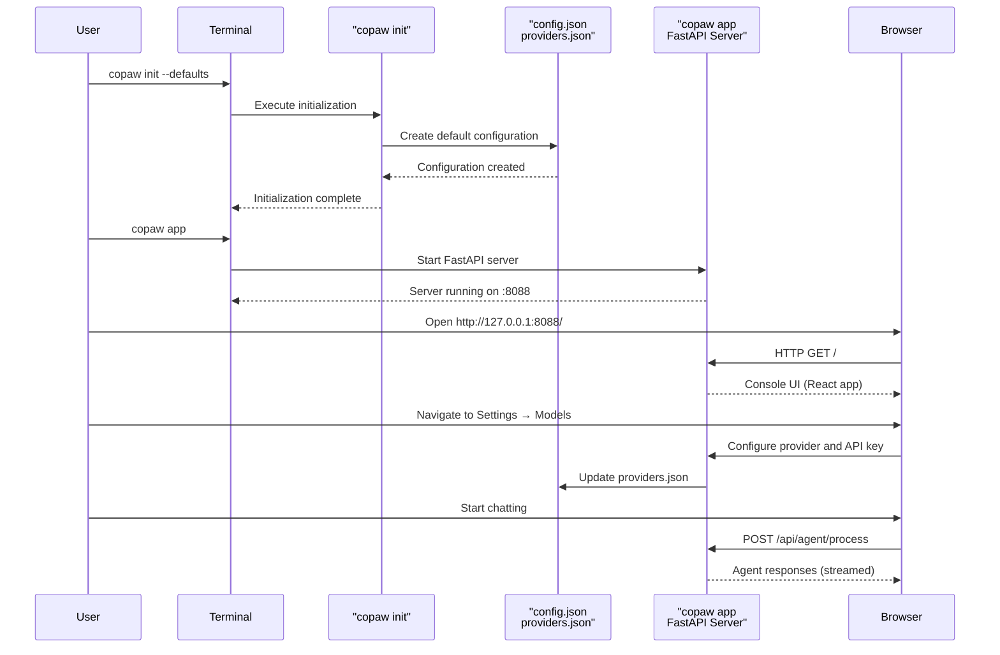
```mermaid
sequenceDiagram
    participant User
    participant Terminal
    participant CopawInit as "copaw init"
    participant ConfigFiles as "config.json<br/>providers.json"
    participant CopawApp as "copaw app<br/>FastAPI Server"
    participant Browser
    
    User->>Terminal: copaw init --defaults
    Terminal->>CopawInit: Execute initialization
    CopawInit->>ConfigFiles: Create default configuration
    ConfigFiles-->>CopawInit: Configuration created
    CopawInit-->>Terminal: Initialization complete
    
    User->>Terminal: copaw app
    Terminal->>CopawApp: Start FastAPI server
    CopawApp-->>Terminal: Server running on :8088
    
    User->>Browser: Open http://127.0.0.1:8088/
    Browser->>CopawApp: HTTP GET /
    CopawApp-->>Browser: Console UI (React app)
    
    User->>Browser: Navigate to Settings → Models
    Browser->>CopawApp: Configure provider and API key
    CopawApp->>ConfigFiles: Update providers.json
    
    User->>Browser: Start chatting
    Browser->>CopawApp: POST /api/agent/process
    CopawApp-->>Browser: Agent responses (streamed)
```

**Sources**: [website/public/docs/quickstart.en.md:107-136](), [website/public/docs/cli.en.md:16-50]()

### Daily Usage Pattern

Once configured, users interact with CoPaw in one of three ways:

1.  **Console Chat** - Open browser to `http://127.0.0.1:8088/`, type messages in the chat interface. [website/public/docs/console.en.md:29-44]()
2.  **Channel Messages** - Send messages through configured channels (DingTalk, Feishu, etc.). [README.md:33-33]()
3.  **Scheduled Tasks** - CoPaw proactively sends messages based on `jobs.json` cron schedules. [website/public/docs/console.en.md:113-125]()

All interactions share the same agent memory and configuration, creating a unified experience across platforms.

## Key User-Facing Concepts

### The Console Interface

The Console is a React-based web application served by the FastAPI backend. It provides:

*   **Chat Page** - Main conversation interface with the CoPaw agent. [website/public/docs/console.en.md:29-32]()
*   **Settings Pages** - Configuration panels for Models and Environment Variables. [website/public/docs/console.en.md:248-253]()
*   **Control Pages** - Management for Channels, Sessions, and Cron Jobs. [website/public/docs/console.en.md:54-119]()
*   **Agent Pages** - Workspace file editor (SOUL.md), Skills management, and MCP configuration. [website/public/docs/console.en.md:158-193]()

For details, see [Using the Console Interface](#3.1).

**Sources**: [website/public/docs/console.en.md:1-22]()

### Communication Channels

Channels enable CoPaw to receive and send messages through external platforms. Each channel requires:

1.  Platform-specific credentials (API keys, webhooks, app IDs). [website/public/docs/console.en.md:72-79]()
2.  Configuration via the Console **Control → Channels** page. [website/public/docs/console.en.md:54-56]()
3.  Platform-side setup (creating bots, registering webhooks). [website/public/docs/console.en.md:86-86]()

For details, see [Configuring Communication Channels](#3.2).

**Sources**: [website/public/docs/console.en.md:54-86]()

### Model Providers

CoPaw supports multiple LLM providers:

*   **Cloud Providers** - ModelScope, DashScope, Gemini, DeepSeek, MiniMax, and Kimi (require API keys). [README.md:59-59](), [website/public/docs/console.en.md:255-264]()
*   **Local Providers** - `llama.cpp`, `MLX`, and `Ollama` (no API keys needed for local execution). [website/public/docs/console.en.md:270-274]()

Users must configure at least one provider before CoPaw can respond to queries. For details, see [Managing Model Providers](#3.3).

**Sources**: [website/public/docs/console.en.md:246-302]()

### Skills System

Skills extend CoPaw's capabilities by adding tools the agent can invoke. Skills can be:

*   **Built-in** - File operations, web search (`glob_search`, `grep_search`), and `view_image`. [README.md:59-59]()
*   **Custom** - Created via the Console or imported from the Skills Hub (LobeHub, ModelScope, zip archives). [README.md:59-59](), [website/public/docs/console.en.md:201-216]()

For details, see [Working with Skills](#3.4).

**Sources**: [website/public/docs/console.en.md:193-221]()

### Memory and Sessions

CoPaw maintains conversation context through:

*   **Session Persistence** - Conversations are saved and can be switched or deleted. [website/public/docs/console.en.md:42-50]()
*   **Long-term Memory** - Persistent storage in the workspace (e.g., `MEMORY.md`). [website/public/docs/console.en.md:180-182]()

For details, see [Memory and Session Management](#3.7).

**Sources**: [website/public/docs/console.en.md:90-109](), [website/public/docs/console.en.md:180-182]()

### Scheduled Tasks (Cron Jobs)

CoPaw can execute tasks on a schedule using cron expressions. Users can create tasks by chatting with CoPaw (e.g., "remind me to drink water every 5 minutes") or via the UI. [website/public/docs/console.en.md:118-125]()

For details, see [Scheduling Tasks and Heartbeat](#3.5).

**Sources**: [website/public/docs/console.en.md:113-142]()

### MCP Clients

Model Context Protocol (MCP) clients allow CoPaw to integrate with external tool servers. Clients can be created and managed via the **Agent → MCP** page. [website/public/docs/console.en.md:227-234]()

For details, see [MCP (Model Context Protocol) Clients](#3.6).

**Sources**: [website/public/docs/console.en.md:225-234]()

## Navigating This Guide

The following subsections provide detailed instructions for each major feature area:

*   **[Using the Console Interface](#3.1)** — Detailed walkthrough of the web console UI, navigation, and core pages (Chat, Control, Agent, Settings)
*   **[Configuring Communication Channels](#3.2)** — Guide to setting up and managing messaging platform integrations (DingTalk, Discord, Telegram, etc.)
*   **[Managing Model Providers](#3.3)** — Instructions for configuring cloud and local LLM providers, managing API keys, and selecting active models
*   **[Working with Skills](#3.4)** — How to enable/disable built-in skills, create custom skills, and import from the Skills Hub
*   **[Scheduling Tasks and Heartbeat](#3.5)** — Guide to creating cron jobs, configuring heartbeat digest, and managing scheduled tasks
*   **[MCP (Model Context Protocol) Clients](#3.6)** — Configuring and managing MCP clients for external tool integrations
*   **[Memory and Session Management](#3.7)** — Understanding conversation memory, session persistence, memory commands (/compact, /new, /clear), and token usage
*   **[Workspace and Agent Persona](#3.8)** — Editing SOUL.md, AGENTS.md, and other workspace files to customize agent behavior and personality
*   **[Security and Tool Guard](#3.9)** — Configuring Tool Guard security policies, managing approval workflows, and understanding access control

**Sources**: [website/public/docs/console.en.md:20-22]()

---

# Page: Using the Console Interface

# Using the Console Interface

<details>
<summary>Relevant source files</summary>

The following files were used as context for generating this wiki page:

- [.github/workflows/publish-pypi.yml](.github/workflows/publish-pypi.yml)
- [console/src/api/index.ts](console/src/api/index.ts)
- [console/src/api/modules/auth.ts](console/src/api/modules/auth.ts)
- [console/src/layouts/Header.tsx](console/src/layouts/Header.tsx)
- [console/src/layouts/MainLayout/index.tsx](console/src/layouts/MainLayout/index.tsx)
- [console/src/layouts/Sidebar.tsx](console/src/layouts/Sidebar.tsx)
- [console/src/layouts/index.module.less](console/src/layouts/index.module.less)
- [console/src/pages/Chat/index.module.less](console/src/pages/Chat/index.module.less)
- [console/src/pages/Chat/index.tsx](console/src/pages/Chat/index.tsx)
- [console/src/pages/Chat/sessionApi/index.ts](console/src/pages/Chat/sessionApi/index.ts)
- [console/src/pages/Login/index.tsx](console/src/pages/Login/index.tsx)
- [console/vite.config.ts](console/vite.config.ts)
- [src/copaw/app/auth.py](src/copaw/app/auth.py)
- [src/copaw/app/channels/console/channel.py](src/copaw/app/channels/console/channel.py)
- [src/copaw/app/routers/agent_scoped.py](src/copaw/app/routers/agent_scoped.py)
- [src/copaw/app/routers/auth.py](src/copaw/app/routers/auth.py)
- [src/copaw/app/routers/console.py](src/copaw/app/routers/console.py)
- [src/copaw/app/runner/models.py](src/copaw/app/runner/models.py)
- [website/public/docs/cli.en.md](website/public/docs/cli.en.md)
- [website/public/docs/cli.zh.md](website/public/docs/cli.zh.md)
- [website/public/docs/console.en.md](website/public/docs/console.en.md)
- [website/public/docs/console.zh.md](website/public/docs/console.zh.md)

</details>


## Purpose and Scope

This page explains how to use CoPaw's web-based Console interface—the primary graphical interface for interacting with CoPaw, managing configuration, and monitoring system state. The Console is a single-page React application served by the FastAPI backend that provides a unified UI for chat, channel management, session management, cron jobs, skills, MCP clients, model configuration, and environment variables.

**What this page covers:**
- Accessing the Console and understanding its layout
- Navigating between different Console pages
- Overview of each major feature area and what you can do there
- Technical implementation of core UI components like the Chat page and Session API

**Sources:** [website/public/docs/console.en.md:1-22](), [console/src/layouts/MainLayout/index.tsx:7-22]()

---

## Accessing the Console

The Console is served by the CoPaw FastAPI application at `http://127.0.0.1:8088/` by default.

**Starting the Console:**

1. Start the CoPaw server:
   ```bash
   copaw app
   ```

2. Open a web browser and navigate to `http://127.0.0.1:8088/`

3. The Console loads automatically if the frontend is built. If not built, the root path returns a JSON message like `{"message": "CoPaw Web Console is not available."}`, but API endpoints remain functional.

**Console Availability:**

The Console frontend is bundled with:
- PyPI package installations (`pip install copaw`)
- Docker images (`agentscope/copaw:latest`)
- One-click installer scripts

**Sources:** [website/public/docs/console.en.md:1-5](), [website/public/docs/cli.en.md:39-65]()

---

## Console Architecture Overview

The Console is a React single-page application (SPA) built with Vite, using Ant Design components and React Router for navigation. It communicates with the CoPaw backend via HTTP API endpoints.

### System Mapping: UI to Code Entities

The following diagram bridges the visual components seen by the user to the underlying code entities and API routes.

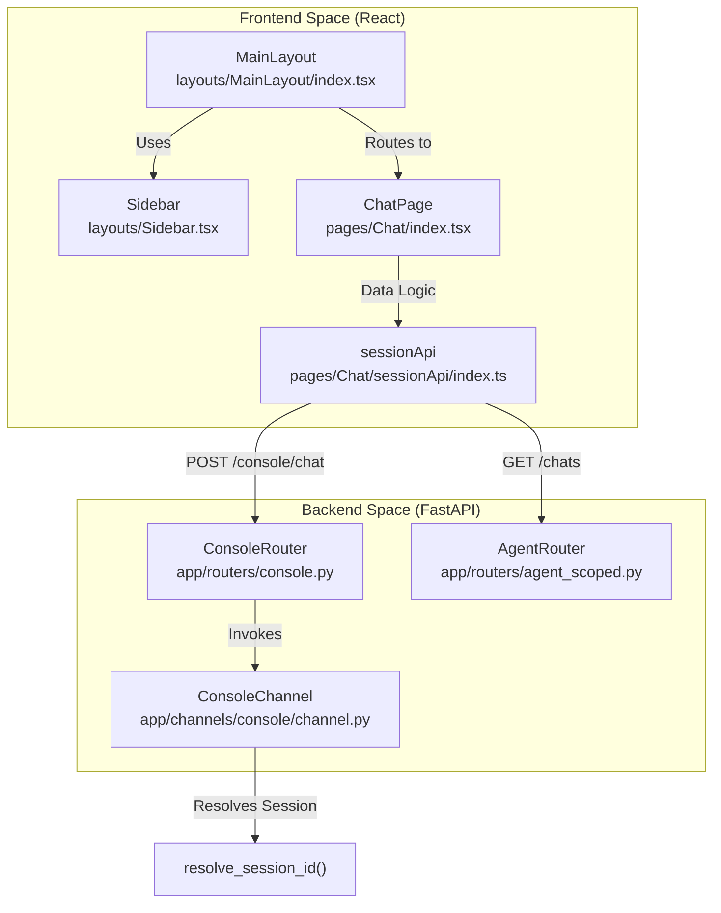
```mermaid
graph TB
    subgraph "Frontend Space (React)"
        MainLayout["MainLayout<br/>layouts/MainLayout/index.tsx"]
        Sidebar["Sidebar<br/>layouts/Sidebar.tsx"]
        ChatPage["ChatPage<br/>pages/Chat/index.tsx"]
        SessionAPI["sessionApi<br/>pages/Chat/sessionApi/index.ts"]
    end
    
    subgraph "Backend Space (FastAPI)"
        ConsoleRouter["ConsoleRouter<br/>app/routers/console.py"]
        ConsoleChannel["ConsoleChannel<br/>app/channels/console/channel.py"]
        AgentRouter["AgentRouter<br/>app/routers/agent_scoped.py"]
    end

    MainLayout -->|"Uses"| Sidebar
    MainLayout -->|"Routes to"| ChatPage
    ChatPage -->|"Data Logic"| SessionAPI
    
    SessionAPI -->|"POST /console/chat"| ConsoleRouter
    SessionAPI -->|"GET /chats"| AgentRouter
    
    ConsoleRouter -->|"Invokes"| ConsoleChannel
    ConsoleChannel -->|"Resolves Session"| ResolveSession["resolve_session_id()"]
```

**Key Components:**

| Component | File Path | Purpose |
|-----------|-----------|---------|
| **MainLayout** | [console/src/layouts/MainLayout/index.tsx]() | Root layout wrapper, routing logic using `Routes` and `Route`. |
| **Sidebar** | [console/src/layouts/Sidebar.tsx]() | Left navigation panel, handles version checks via `PYPI_URL`. |
| **sessionApi** | [console/src/pages/Chat/sessionApi/index.ts]() | Bridge between backend flat messages and card-based UI format. |
| **ConsoleChannel** | [src/copaw/app/channels/console/channel.py]() | Server-side implementation of the web chat channel. |

**Sources:** [console/src/layouts/MainLayout/index.tsx:45-85](), [console/src/layouts/Sidebar.tsx:104-118](), [src/copaw/app/channels/console/channel.py:57-70]()

---

## Navigation Structure

The Console uses a three-level navigation hierarchy: **Sidebar → Page → Content**. The sidebar groups features into four categories: Chat, Control, Agent, and Settings.

**Navigation Implementation:**

The sidebar menu structure is defined in `Sidebar.tsx`. Route resolution happens through mapping constants:

- **pathToKey**: Maps route paths to sidebar keys used for highlighting the active menu item [console/src/layouts/MainLayout/index.tsx:26-43]().
- **SiderDark Style**: The sidebar supports a dark mode theme with specific overrides for menu items [console/src/layouts/index.module.less:44-73]().

**Sources:** [console/src/layouts/MainLayout/index.tsx:26-43](), [console/src/layouts/index.module.less:44-73]()

---

## Main Interface Components

### Chat Page and Session Management

The Chat page ([console/src/pages/Chat/index.tsx]()) is the primary interface. It relies on a complex conversion layer to transform backend message formats into the card-based format required by the `@agentscope-ai/chat` library.

**Message Conversion Logic:**
- **User Messages**: Converted into `AgentScopeRuntimeRequestCard` [console/src/pages/Chat/sessionApi/index.ts:160-180]().
- **Assistant Responses**: Consecutive non-user messages (assistant, system, tool) are grouped into a single `AgentScopeRuntimeResponseCard` [console/src/pages/Chat/sessionApi/index.ts:186-215]().
- **Media Handling**: Content items like images, audio, and files are converted to display URLs via `toDisplayUrl` [console/src/pages/Chat/sessionApi/index.ts:82-86]().

**Backend Integration:**
The frontend communicates with `/console/chat` for streaming responses [src/copaw/app/routers/console.py:68-78](). This endpoint uses a `StreamingResponse` to deliver real-time events [src/copaw/app/routers/console.py:144-151]().

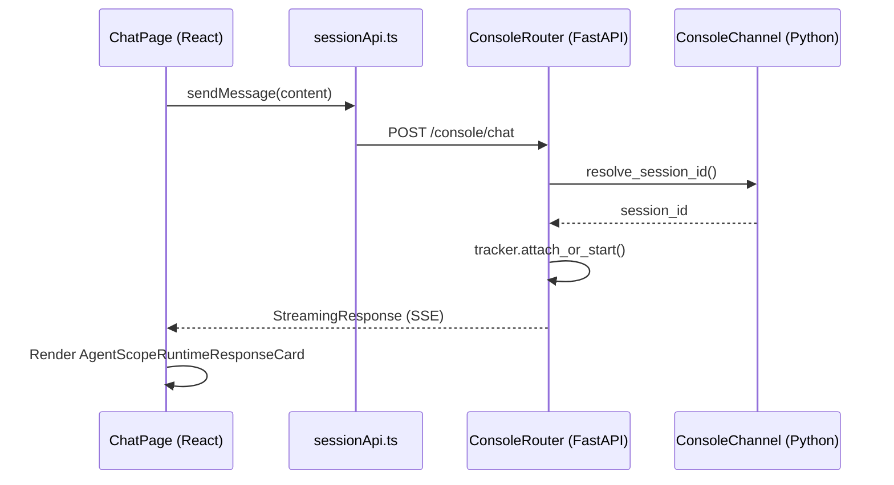
```mermaid
sequenceDiagram
    participant UI as ChatPage (React)
    participant SAPI as sessionApi.ts
    participant BE as ConsoleRouter (FastAPI)
    participant CH as ConsoleChannel (Python)

    UI->>SAPI: sendMessage(content)
    SAPI->>BE: POST /console/chat
    BE->>CH: resolve_session_id()
    CH-->>BE: session_id
    BE->>BE: tracker.attach_or_start()
    BE-->>UI: StreamingResponse (SSE)
    UI->>UI: Render AgentScopeRuntimeResponseCard
```

**Sources:** [console/src/pages/Chat/sessionApi/index.ts:186-215](), [src/copaw/app/routers/console.py:68-151](), [src/copaw/app/channels/console/channel.py:186-197]()

---

## Core Pages Overview

### Control: Channels and Sessions
- **Channels**: Manage messaging platform integrations (DingTalk, Discord, etc.). Enabling a channel involves filling in credentials in a slide-out panel [website/public/docs/console.en.md:54-81]().
- **Sessions**: A table view for managing conversation history across all channels. Supports searching by user and batch deletion [website/public/docs/console.en.md:90-109]().

### Agent: Workspace and Skills
- **Workspace**: A browser-based editor for persona files like `SOUL.md` and `AGENTS.md`. Supports multi-agent switching via the header [website/public/docs/console.en.md:158-189]().
- **Skills**: Interface to enable/disable tool capabilities. Supports importing from Skill Hub via URL or creating custom skills in Markdown [website/public/docs/console.en.md:193-216]().

### Settings: Models and Security
- **Models**: Configure cloud providers (API keys) or manage local models (llama.cpp, MLX, Ollama). Local models can be downloaded directly from the UI [website/public/docs/console.en.md:250-302]().
- **Security**: Manage Tool Guard policies and approval workflows for sensitive operations.

**Sources:** [website/public/docs/console.en.md:54-302](), [console/src/layouts/MainLayout/index.tsx:61-78]()

---

## Technical Reference: Route Mapping

| Path | Component | Purpose |
| :--- | :--- | :--- |
| `/chat/*` | `Chat` | Main conversation interface [console/src/layouts/MainLayout/index.tsx:60]() |
| `/channels` | `ChannelsPage` | Messaging platform configuration [console/src/layouts/MainLayout/index.tsx:61]() |
| `/cron-jobs` | `CronJobsPage` | Scheduled task management [console/src/layouts/MainLayout/index.tsx:63]() |
| `/workspace` | `WorkspacePage` | Persona and file editing [console/src/layouts/MainLayout/index.tsx:68]() |
| `/models` | `ModelsPage` | LLM provider and model setup [console/src/layouts/MainLayout/index.tsx:70]() |
| `/security` | `SecurityPage` | Access control and tool safety [console/src/layouts/MainLayout/index.tsx:73]() |

**Sources:** [console/src/layouts/MainLayout/index.tsx:58-80]()

---

# Page: Configuring Communication Channels

# Configuring Communication Channels

<details>
<summary>Relevant source files</summary>

The following files were used as context for generating this wiki page:

- [console/src/api/types/channel.ts](console/src/api/types/channel.ts)
- [console/src/pages/Control/Channels/components/ChannelDrawer.tsx](console/src/pages/Control/Channels/components/ChannelDrawer.tsx)
- [console/src/pages/Control/Channels/components/constants.ts](console/src/pages/Control/Channels/components/constants.ts)
- [src/copaw/app/channels/base.py](src/copaw/app/channels/base.py)
- [src/copaw/app/channels/dingtalk/channel.py](src/copaw/app/channels/dingtalk/channel.py)
- [src/copaw/app/channels/dingtalk/handler.py](src/copaw/app/channels/dingtalk/handler.py)
- [src/copaw/app/channels/discord_/channel.py](src/copaw/app/channels/discord_/channel.py)
- [src/copaw/app/channels/feishu/channel.py](src/copaw/app/channels/feishu/channel.py)
- [src/copaw/app/channels/feishu/utils.py](src/copaw/app/channels/feishu/utils.py)
- [src/copaw/app/channels/imessage/channel.py](src/copaw/app/channels/imessage/channel.py)
- [src/copaw/app/channels/qq/channel.py](src/copaw/app/channels/qq/channel.py)
- [src/copaw/app/channels/registry.py](src/copaw/app/channels/registry.py)
- [src/copaw/app/channels/schema.py](src/copaw/app/channels/schema.py)
- [src/copaw/app/channels/telegram/channel.py](src/copaw/app/channels/telegram/channel.py)
- [src/copaw/app/channels/utils.py](src/copaw/app/channels/utils.py)
- [src/copaw/app/channels/wecom/channel.py](src/copaw/app/channels/wecom/channel.py)
- [src/copaw/app/runner/api.py](src/copaw/app/runner/api.py)
- [src/copaw/app/runner/session.py](src/copaw/app/runner/session.py)
- [src/copaw/token_usage/manager.py](src/copaw/token_usage/manager.py)
- [tests/unit/channels/__init__.py](tests/unit/channels/__init__.py)
- [tests/unit/channels/test_qq_channel.py](tests/unit/channels/test_qq_channel.py)
- [website/public/docs/channels.en.md](website/public/docs/channels.en.md)
- [website/public/docs/channels.zh.md](website/public/docs/channels.zh.md)

</details>


This page provides detailed instructions for configuring communication channels in CoPaw. Channels define where your agent interacts with users—DingTalk, Discord, iMessage, etc. Each channel requires platform-specific credentials and supports different message types (text, images, files, etc.).

---

## Configuration Methods

CoPaw offers three ways to configure channels, all of which modify the same underlying `config.json` file:

```mermaid
graph LR
    subgraph "Configuration Sources"
        Console["Web Console<br/>/channels UI"]
        CLI["CLI Commands<br/>copaw channels config"]
        Manual["Direct Edit<br/>~/.copaw/config.json"]
    end
    
    subgraph "Configuration File"
        ConfigJSON["config.json<br/>channels section"]
    end
    
    subgraph "Application Layer"
        ConfigWatcher["ConfigWatcher<br/>File Monitor"]
        LoadConfig["load_config()<br/>Pydantic Validation"]
    end
    
    subgraph "Channel System"
        ChannelManager["ChannelManager<br/>from_config()"]
        Registry["get_channel_registry()<br/>Built-in + Custom"]
    end
    
    subgraph "Channel Instances"
        DingTalkChannel["DingTalkChannel"]
        FeishuChannel["FeishuChannel"]
        OtherChannels["Discord, QQ, Telegram<br/>iMessage, Console"]
    end
    
    Console -->|HTTP PUT /config/channels| ConfigJSON
    CLI -->|save_config()| ConfigJSON
    Manual -->|Edit| ConfigJSON
    
    ConfigJSON -->|File Change| ConfigWatcher
    ConfigWatcher -->|Trigger reload| LoadConfig
    LoadConfig -->|Validated Config| ChannelManager
    
    ChannelManager -->|get_channel_registry()| Registry
    ChannelManager -->|.from_config()| DingTalkChannel
    ChannelManager -->|.from_config()| FeishuChannel
    ChannelManager -->|.from_config()| OtherChannels
```

**Sources**: [src/copaw/app/channels/registry.py:132-137](), [website/public/docs/channels.en.md:6-10]()

### Method 1: Web Console (Recommended)

Navigate to **Control → Channels** in the web console. Each channel displays as a card. Click to open a drawer where you can:
- Toggle `enabled` on/off.
- Fill in platform credentials (API keys, tokens, etc.).
- Adjust bot prefix and filtering options.
- Save changes (triggers automatic reload).

The console frontend uses the `ChannelDrawer` component to render fields based on the channel type. For example, it includes specialized logic for **WeCom** authorization via a scan-to-authorize SDK.

**Sources**: [console/src/pages/Control/Channels/components/ChannelDrawer.tsx:115-125](), [console/src/pages/Control/Channels/components/ChannelDrawer.tsx:152-189](), [website/public/docs/channels.en.md:8-8]()

### Method 2: CLI Interactive Configuration

Run `copaw channels config` for interactive prompts. You can also list all channels to see their status:

```bash
copaw channels list
```

**Sources**: [website/public/docs/channels.en.md:23-23]()

### Method 3: Direct `config.json` Editing

Edit `~/.copaw/config.json` (default location) directly. Changes are detected and applied automatically without restarting the server.

**Sources**: [website/public/docs/channels.en.md:9-9](), [website/public/docs/channels.zh.md:8-9]()

---

## Common Configuration Fields

All channels share base fields defined in `BaseChannelConfig`:

| Field | Type | Default | Description |
| :--- | :--- | :--- | :--- |
| `enabled` | `boolean` | `false` | Whether the channel is active |
| `bot_prefix` | `string` | `""` | Prefix for bot replies (e.g. `[BOT] `) |
| `filter_tool_messages` | `boolean` | `false` | Hide tool call/result details from user |
| `filter_thinking` | `boolean` | `false` | Hide model reasoning/thinking blocks |
| `dm_policy` | `"open"` \| `"allowlist"` | `"open"` | Direct message acceptance policy |
| `group_policy` | `"open"` \| `"allowlist"` | `"open"` | Group message acceptance policy |
| `allow_from` | `string[]` | `[]` | User IDs allowed when policy is `"allowlist"` |
| `require_mention` | `boolean` | `false` | In groups, only respond when bot is @mentioned |
| `deny_message` | `string` | `""` | Custom message shown when access is denied |

**Sources**: [console/src/api/types/channel.ts:1-10](), [website/public/docs/channels.en.md:11-21](), [src/copaw/app/channels/base.py:80-91]()

---

## Access Control Policies

Channels including DingTalk, Discord, Feishu, Telegram, and others support restricted interaction via policies implemented in the `BaseChannel` class.

### Policy Behavior
- **`"open"`**: Allows all users to interact with the bot.
- **`"allowlist"`**: Restricts interaction to users whose IDs are listed in `allow_from`.
- **`require_mention`**: If `true`, the bot ignores group messages unless @mentioned. This check happens *after* the allowlist check.

The logic for these checks is centralized in `BaseChannel._check_allowlist`.

**Sources**: [console/src/pages/Control/Channels/components/ChannelDrawer.tsx:48-56](), [website/public/docs/channels.en.md:17-21](), [src/copaw/app/channels/base.py:200-210]()

---

## Channel-Specific Configuration

### DingTalk (Recommended)

**Purpose**: Enterprise chat integration using **Stream Mode** (no public IP/webhook needed for receiving).

#### Configuration Details
- **`client_id`**: Your AppKey.
- **`client_secret`**: Your AppSecret.
- **`message_type`**: `"markdown"` (default) or `"card"` (AI Card mode).
- **`robot_code`**: Recommended for group scenarios; defaults to `client_id` if empty.

The `DingTalkChannel` handles rich content parsing (images, files) via `DingTalkChannelHandler` which converts platform-specific payloads into `TextContent`, `ImageContent`, etc.

**Sources**: [src/copaw/app/channels/dingtalk/channel.py:97-119](), [src/copaw/app/channels/dingtalk/handler.py:39-56](), [website/public/docs/channels.en.md:80-98]()

### Feishu (Lark)

**Purpose**: Integration via **WebSocket long connection**.

#### Configuration Details
- **`app_id`**: Found in "Credentials & Basic Info".
- **`app_secret`**: Found in "Credentials & Basic Info".
- **`domain`**: Either `"feishu"` or `"lark"`.

**Sources**: [src/copaw/app/channels/feishu/channel.py:156-176](), [console/src/api/types/channel.ts:32-39](), [website/public/docs/channels.en.md:205-214]()

### Telegram

**Purpose**: Bot API integration using polling.

#### Configuration Details
- **`bot_token`**: Obtained from [@BotFather](https://t.me/BotFather).
- **`http_proxy`**: Optional proxy URL.
- **`show_typing`**: If `true`, shows "typing..." status during processing.

**Sources**: [src/copaw/app/channels/telegram/channel.py:3-45](), [console/src/api/types/channel.ts:45-50]()

### QQ

**Purpose**: Integration via WebSocket for incoming events and HTTP API for replies.

#### Configuration Details
- **`app_id`**: QQ Bot AppID.
- **`client_secret`**: QQ Bot ClientSecret.

The `QQChannel` includes aggressive sanitization to remove URLs from bot replies, as the QQ API often rejects messages containing links.

**Sources**: [src/copaw/app/channels/qq/channel.py:3-10](), [src/copaw/app/channels/qq/channel.py:204-224](), [console/src/api/types/channel.ts:41-44]()

### WeCom (Enterprise WeChat)

**Purpose**: Integration via the `aibot` WebSocket SDK.

#### Configuration Details
- **`bot_id`**: The ID of the AI Bot.
- **`secret`**: The secret for the AI Bot.

WeCom supports mixed messages and handles session identification for both single chats and group chats.

**Sources**: [src/copaw/app/channels/wecom/channel.py:49-77](), [src/copaw/app/channels/wecom/channel.py:174-187](), [console/src/api/types/channel.ts:83-89]()

---

## Data Flow: Platform to Code Entity

The following diagram bridges the "Natural Language Space" (User Messages) to the "Code Entity Space" (Classes and Functions).

```mermaid
sequenceDiagram
    participant U as "User on Platform"
    participant C as "Channel Class (e.g., FeishuChannel)"
    participant B as "BaseChannel (base.py)"
    participant M as "ChannelManager"
    participant A as "Agent Execution"

    U->>C: "Sends Message"
    C->>C: "FeishuChannel._handle_message()"
    C->>B: "BaseChannel._enqueue(native_payload)"
    B->>M: "Puts in queue"
    M->>B: "Calls consume_one()"
    B->>C: "C.build_agent_request_from_native()"
    C-->>B: "AgentRequest"
    B->>A: "BaseChannel.process(AgentRequest)"
    A-->>B: "AsyncIterator[Event]"
    B->>C: "C.send(to_handle, text)"
    C->>U: "Platform API Reply"
```

**Sources**: [src/copaw/app/channels/base.py:126-143](), [src/copaw/app/channels/feishu/channel.py:145-154](), [src/copaw/app/channels/dingtalk/channel.py:81-95]()

---

## Channel Registry and Custom Channels

CoPaw discovers channels at startup through the `get_channel_registry` function.

1. **Built-in Channels**: Pre-defined in `_BUILT_SPECS` (DingTalk, Feishu, Discord, etc.).
2. **Custom Channels**: Loaded from the `CUSTOM_CHANNELS_DIR`. Any `.py` file in that directory containing a class inheriting from `BaseChannel` and defining a `channel` attribute is automatically registered.

```mermaid
graph TD
    Registry["get_channel_registry()"]
    Builtin["_load_builtin_channels()"]
    Custom["_discover_custom_channels()"]
    Cache["_BUILTIN_CHANNEL_CACHE"]

    Registry --> Builtin
    Registry --> Custom
    Builtin --> Cache
    Custom --> Path["CUSTOM_CHANNELS_DIR (~/.copaw/custom_channels)"]
```

**Sources**: [src/copaw/app/channels/registry.py:19-33](), [src/copaw/app/channels/registry.py:94-126](), [src/copaw/app/channels/registry.py:132-137]()

---

# Page: Managing Model Providers

# Managing Model Providers

<details>
<summary>Relevant source files</summary>

The following files were used as context for generating this wiki page:

- [console/src/api/modules/provider.ts](console/src/api/modules/provider.ts)
- [console/src/api/types/provider.ts](console/src/api/types/provider.ts)
- [console/src/pages/Settings/Models/components/cards/RemoteProviderCard.tsx](console/src/pages/Settings/Models/components/cards/RemoteProviderCard.tsx)
- [console/src/pages/Settings/Models/components/modals/CustomProviderModal.tsx](console/src/pages/Settings/Models/components/modals/CustomProviderModal.tsx)
- [console/src/pages/Settings/Models/components/modals/ProviderConfigModal.tsx](console/src/pages/Settings/Models/components/modals/ProviderConfigModal.tsx)
- [console/src/pages/Settings/Models/components/modals/RemoteModelManageModal.tsx](console/src/pages/Settings/Models/components/modals/RemoteModelManageModal.tsx)
- [console/src/pages/Settings/Models/components/sections/ModelsSection.tsx](console/src/pages/Settings/Models/components/sections/ModelsSection.tsx)
- [console/src/pages/Settings/Models/index.module.less](console/src/pages/Settings/Models/index.module.less)
- [console/src/pages/Settings/Models/index.tsx](console/src/pages/Settings/Models/index.tsx)
- [src/copaw/app/routers/providers.py](src/copaw/app/routers/providers.py)
- [src/copaw/cli/providers_cmd.py](src/copaw/cli/providers_cmd.py)
- [src/copaw/providers/__init__.py](src/copaw/providers/__init__.py)
- [src/copaw/providers/gemini_provider.py](src/copaw/providers/gemini_provider.py)
- [src/copaw/providers/models.py](src/copaw/providers/models.py)
- [src/copaw/providers/ollama_provider.py](src/copaw/providers/ollama_provider.py)
- [src/copaw/providers/provider_manager.py](src/copaw/providers/provider_manager.py)
- [tests/unit/providers/test_gemini_provider.py](tests/unit/providers/test_gemini_provider.py)
- [tests/unit/providers/test_kimi_provider.py](tests/unit/providers/test_kimi_provider.py)
- [tests/unit/providers/test_ollama_provider.py](tests/unit/providers/test_ollama_provider.py)
- [tests/unit/providers/test_provider_manager.py](tests/unit/providers/test_provider_manager.py)
- [website/public/docs/models.en.md](website/public/docs/models.en.md)
- [website/public/docs/models.zh.md](website/public/docs/models.zh.md)

</details>


This page explains how to configure and manage Large Language Model (LLM) providers in CoPaw. Providers supply the models that power CoPaw's conversational capabilities, including cloud-based APIs, local inference backends, and Ollama integration.

**Scope:** This page covers provider configuration, API key management, model discovery, and model selection via the Console UI and CLI. For internal implementation details, see [Model Provider System (5.4)]().

---

## Provider Architecture and Registry

CoPaw uses a centralized `ProviderManager` to handle all model-related operations. It manages a registry of built-in providers and user-defined custom providers.

### Provider Class Hierarchy
```mermaid
graph TB
    subgraph "Data Storage"
        SEC["SECRET_DIR (~/.copaw/.secret/)"]
        P_JSON["providers.json"]
        A_JSON["active_model.json"]
    end

    subgraph "Code Entity Space: Provider System"
        PM["ProviderManager (Singleton)"]
        BASE["Provider (Base Class)"]
        OAI["OpenAIProvider"]
        ANT["AnthropicProvider"]
        OLA["OllamaProvider"]
        GEM["GeminiProvider"]
    end

    subgraph "Natural Language Space: Provider Types"
        Cloud["Cloud Providers (OpenAI, DashScope, etc.)"]
        Local["Local Backends (llama.cpp, MLX)"]
        Daemon["Daemon-based (Ollama)"]
        Google["Google Gemini Native"]
    end

    SEC --> PM
    PM --> P_JSON
    PM --> A_JSON
    
    PM o-- OAI
    PM o-- ANT
    PM o-- OLA
    PM o-- GEM
    
    OAI --|> BASE
    ANT --|> BASE
    OLA --|> BASE
    GEM --|> BASE

    OAI -.-> Cloud
    ANT -.-> Cloud
    OLA -.-> Daemon
    GEM -.-> Google
```
Sources: [src/copaw/providers/provider_manager.py:1-30](), [src/copaw/providers/provider.py:1-20](), [src/copaw/providers/gemini_provider.py:19]()

---

## Provider Types

CoPaw categorizes providers based on their connection protocol and hosting method:

| Category | Implementation Class | Key Characteristics |
| :--- | :--- | :--- |
| **OpenAI Compatible** | `OpenAIProvider` | Uses `AsyncOpenAI` client. Supports ModelScope, DashScope, DeepSeek, etc. [src/copaw/providers/openai_provider.py:18]() |
| **Anthropic** | `AnthropicProvider` | Uses `AsyncAnthropic` client. Supports Claude and MiniMax. [src/copaw/providers/anthropic_provider.py:18]() |
| **Ollama** | `OllamaProvider` | Interfaces with local Ollama daemon via `ollama.AsyncClient`. [src/copaw/providers/ollama_provider.py:19]() |
| **Google Gemini** | `GeminiProvider` | Uses native `google-genai` SDK for Gemini models. [src/copaw/providers/gemini_provider.py:19]() |
| **Local** | `DefaultProvider` | Placeholder for `llamacpp` and `mlx` backends. [src/copaw/providers/provider_manager.py:167-180]() |

### Built-in Providers
CoPaw includes pre-defined configurations for major services:
- **ModelScope/DashScope:** Optimized for Chinese users [src/copaw/providers/provider_manager.py:138-154]().
- **OpenAI/Azure OpenAI:** Standard global providers [src/copaw/providers/provider_manager.py:181-195]().
- **DeepSeek:** Cost-efficient reasoning models [src/copaw/providers/provider_manager.py:229-236]().
- **Gemini:** Google's multimodal models with thinking support [src/copaw/providers/provider_manager.py:245-252]().

---

## Configuration Management

### Storage Logic
Configuration is persisted in the `SECRET_DIR` (typically `~/.copaw/.secret/`).
- **`providers.json`**: Stores API keys, base URLs, and custom model lists for each provider.
- **`active_model.json`**: Stores the currently selected `provider_id` and `model` name.
- **Custom Providers**: Individual JSON files in the `custom/` subdirectory [src/copaw/providers/provider_manager.py:1085-1100]().

### Configuring via Console
The Console provides a specialized modal `ProviderConfigModal` for configuring providers:
1. **API Key:** Masked for security [src/copaw/cli/providers_cmd.py:20-25]().
2. **Base URL:** Can be frozen for built-in providers (e.g., `freeze_url: true`) to prevent misconfiguration [src/copaw/providers/provider_manager.py:144]().
3. **Generate Kwargs:** A specialized `JsonCodeEditor` allows passing specific parameters like `temperature` or `max_tokens` directly to the underlying model [console/src/pages/Settings/Models/components/modals/ProviderConfigModal.tsx:103-242]().

### Configuring via CLI
Use the `copaw models` command group for interactive setup:
```bash
# Interactively configure a provider's API key and URL
copaw models config-key <provider_id>
```
Sources: [src/copaw/cli/providers_cmd.py:95-176]()

---

## Model Lifecycle Operations

### Connection Testing
CoPaw supports two levels of connectivity checks via the `check_connection` and `check_model_connection` methods:
1. **Provider Check:** Verifies if the API endpoint is reachable and the API key is valid (usually via a `models.list` call) [src/copaw/providers/openai_provider.py:50-64]().
2. **Model Check:** Performs a minimal "ping" chat completion (setting `max_tokens: 1` or `num_predict: 1`) to ensure a specific model is deployed and responsive [src/copaw/providers/openai_provider.py:78-117](), [src/copaw/providers/ollama_provider.py:95-117]().

### Model Discovery
For providers like Ollama, Gemini, or OpenAI-compatible endpoints, CoPaw can fetch the list of available models directly from the remote API:
```python
# Implementation in OpenAIProvider
async def fetch_models(self, timeout: float = 5) -> List[ModelInfo]:
    client = self._client(timeout=timeout)
    payload = await client.models.list(timeout=timeout)
    return self._normalize_models_payload(payload)
```
Sources: [src/copaw/providers/openai_provider.py:66-76](), [src/copaw/providers/ollama_provider.py:85-93](), [src/copaw/providers/gemini_provider.py:100-110]()

### Adding/Removing Models
- **Built-in Models:** Hardcoded in `provider_manager.py`.
- **Extra Models:** User-added models stored in the provider's configuration.
- **Ollama Pull:** Specifically for Ollama, CoPaw can trigger a `pull` command via the `ollama.AsyncClient` to download models from the Ollama library [src/copaw/providers/ollama_provider.py:119-144]().

---

## Selecting the Active Model

The active model is the LLM used by the CoPaw agent for all reasoning and tool-calling tasks.

```mermaid
sequenceDiagram
    participant User
    participant UI as Console/CLI
    participant Router as providers.py
    participant PM as ProviderManager
    participant Disk as active_model.json

    User->>UI: Select Provider (e.g., "openai")
    User->>UI: Select Model (e.g., "gpt-4o")
    UI->>Router: PUT /models/active-llm
    Router->>PM: activate_model("openai", "gpt-4o")
    PM->>PM: Validate model existence
    PM->>Disk: Save to active_model.json
    PM-->>Router: Success
    Router-->>UI: 200 OK
    Note over PM, Disk: Next agent request uses new config
```

**Implementation Detail:**
The `activate_model` function updates the in-memory state and persists it to disk immediately to ensure that even after a server restart, the selection remains [src/copaw/providers/provider_manager.py:1016-1040]().

Sources: [src/copaw/app/routers/providers.py:237-254](), [src/copaw/providers/provider_manager.py:1016-1040]()

---

## Custom Providers

Users can add their own OpenAI-compatible or Anthropic-compatible providers.

1. **Protocol Selection:** Choose between `OpenAIChatModel`, `AnthropicChatModel`, or `GeminiChatModel` [src/copaw/app/routers/providers.py:24-28]().
2. **API Key Prefix:** Define a prefix (like `sk-` or `ms`) to help the UI validate input [src/copaw/providers/provider_manager.py:142]().
3. **Storage:** Custom providers are saved as individual JSON files in the working directory to prevent loss during CoPaw updates [src/copaw/providers/provider_manager.py:1085-1100]().

Sources: [src/copaw/app/routers/providers.py:65-72](), [src/copaw/providers/provider_manager.py:1042-1083]()

---

# Page: Working with Skills

# Working with Skills

<details>
<summary>Relevant source files</summary>

The following files were used as context for generating this wiki page:

- [console/src/pages/Agent/Skills/index.tsx](console/src/pages/Agent/Skills/index.tsx)
- [console/src/pages/Agent/Skills/useSkills.ts](console/src/pages/Agent/Skills/useSkills.ts)
- [src/copaw/agents/skills/browser_visible/SKILL.md](src/copaw/agents/skills/browser_visible/SKILL.md)
- [src/copaw/agents/skills/dingtalk_channel/SKILL.md](src/copaw/agents/skills/dingtalk_channel/SKILL.md)
- [src/copaw/agents/skills/docx/SKILL.md](src/copaw/agents/skills/docx/SKILL.md)
- [src/copaw/agents/skills/file_reader/SKILL.md](src/copaw/agents/skills/file_reader/SKILL.md)
- [src/copaw/agents/skills/guidance/SKILL.md](src/copaw/agents/skills/guidance/SKILL.md)
- [src/copaw/agents/skills/himalaya/SKILL.md](src/copaw/agents/skills/himalaya/SKILL.md)
- [src/copaw/agents/skills/news/SKILL.md](src/copaw/agents/skills/news/SKILL.md)
- [src/copaw/agents/skills/pdf/SKILL.md](src/copaw/agents/skills/pdf/SKILL.md)
- [src/copaw/agents/skills/pptx/SKILL.md](src/copaw/agents/skills/pptx/SKILL.md)
- [src/copaw/agents/skills/xlsx/SKILL.md](src/copaw/agents/skills/xlsx/SKILL.md)
- [src/copaw/agents/skills_hub.py](src/copaw/agents/skills_hub.py)
- [src/copaw/agents/skills_manager.py](src/copaw/agents/skills_manager.py)
- [src/copaw/app/routers/skills.py](src/copaw/app/routers/skills.py)
- [website/public/docs/skills.en.md](website/public/docs/skills.en.md)
- [website/public/docs/skills.zh.md](website/public/docs/skills.zh.md)
- [website/src/components/MermaidBlock.tsx](website/src/components/MermaidBlock.tsx)
- [website/src/pages/Docs.tsx](website/src/pages/Docs.tsx)

</details>


**Skills** are CoPaw's primary extensibility mechanism, allowing you to add new capabilities to the agent without modifying core code. This page covers using built-in skills, enabling/disabling skills, creating custom skills, and importing from the Skills Hub.

> **Architecture details:** For internal implementation of skill loading and the toolkit system, see [Skills and Toolkit System](#5.5).  
> **CLI reference:** For command-line skill management, see [Skills Management Commands](#4.5).  
> **Development guide:** For detailed custom skill authoring, see [Creating Custom Skills](#10.4).

---

## What are Skills?

Skills are packaged capabilities that extend the agent's functionality. In CoPaw, a skill is a directory containing at least a `SKILL.md` file. This file contains metadata (name, description, version) and documentation that the agent uses to understand how to use the skill. Skills can also include supporting `scripts/` and `references/` [src/copaw/agents/skills_manager.py:28-60]().

**Key characteristics:**

| Aspect | Description |
|--------|-------------|
| **Format** | Directory containing `SKILL.md` (Markdown with YAML front matter) [src/copaw/agents/skills_manager.py:137-140]() |
| **Location** | `~/.copaw/active_skills/` for enabled skills; `~/.copaw/customized_skills/` for user skills [src/copaw/agents/skills_manager.py:68-75]() |
| **Source** | Can be `builtin`, `customized`, or `active` [src/copaw/agents/skills_manager.py:57-58]() |
| **Syncing** | CoPaw merges built-in and customized skills into the `active_skills` directory [src/copaw/agents/skills_manager.py:183-201]() |

**Skill implementation and data flow:**

Title: Skill System Data Flow
```mermaid
graph TD
    subgraph "Storage Space"
        Builtin["Built-in Skills<br/>(Package Internal)"]
        Custom["Customized Skills<br/>(~/.copaw/customized_skills/)"]
        Active["Active Skills<br/>(~/.copaw/active_skills/)"]
    end

    subgraph "Code Entity Space"
        Manager["SkillService<br/>(skills_manager.py)"]
        Router["SkillsRouter<br/>(routers/skills.py)"]
        Agent["CoPawAgent<br/>(react_agent.py)"]
    end

    Builtin -->|"sync_skills_to_working_dir()"| Active
    Custom -->|"Override Built-in"| Active
    Active -->|"list_available_skills()"| Manager
    Manager -->|"get_available_skills"| Router
    Active -->|"register_agent_skill()"| Agent
```
**Sources:** [src/copaw/agents/skills_manager.py:183-215](), [src/copaw/app/routers/skills.py:164-173]()

---

## Built-in Skills

CoPaw ships with several high-quality built-in skills. These are automatically synced to your workspace when the application starts [src/copaw/agents/skills_manager.py:183-187]().

| Skill Name | Description | Source |
|------------|-------------|--------|
| **cron** | Manage scheduled jobs and send results to channels [website/public/docs/skills.en.md:25-25]() | Built-in |
| **pdf** | Operations like reading, OCR, merging, and splitting PDFs [src/copaw/agents/skills/pdf/SKILL.md:1-5]() | Built-in |
| **pptx** | Create, edit, and extract text from PowerPoint decks [src/copaw/agents/skills/pptx/SKILL.md:1-5]() | Built-in |
| **himalaya** | CLI-based email management (IMAP/SMTP) [src/copaw/agents/skills/himalaya/SKILL.md:1-3]() | Built-in |
| **news** | Fetch and summarize news from configured sites [website/public/docs/skills.en.md:29-29]() | Built-in |
| **browser_visible** | Launch a headed browser for human interaction (CAPTCHA, etc.) [website/public/docs/skills.en.md:34-34]() | Built-in |

**Sources:** [website/public/docs/skills.en.md:23-34](), [src/copaw/agents/skills/pdf/SKILL.md:1-5]()

---

## Managing Skills

### Via Console

The Console provides a visual interface under **Agent → Skills** to manage the lifecycle of your agent's capabilities [console/src/pages/Agent/Skills/index.tsx:159-163]().

*   **Enable/Disable:** Toggle the switch on a skill card. This updates the `active_skills` directory status [src/copaw/app/routers/skills.py:136-145]().
*   **Create:** Click "Create Skill" to open an editor for `SKILL.md`. This creates a new directory in `customized_skills` [console/src/pages/Agent/Skills/index.tsx:189-191]().
*   **Upload:** Users can upload a `.zip` file containing a skill structure [console/src/pages/Agent/Skills/index.tsx:43-64]().

### Security Scanning
When importing or creating skills, CoPaw performs a security scan. If a skill contains potentially malicious code or suspicious patterns, the `SkillService` raises a `SkillScanError` [src/copaw/app/routers/skills.py:22-28](). The Console displays these findings in a dedicated modal [console/src/pages/Agent/Skills/useSkills.ts:36-60]().

**Sources:** [src/copaw/app/routers/skills.py:28-50](), [console/src/pages/Agent/Skills/index.tsx:126-140](), [console/src/pages/Agent/Skills/useSkills.ts:103-117]()

---

## Creating Custom Skills

Custom skills allow you to define specialized behaviors or provide the agent with domain-specific tools.

### 1. Manual Creation (Working Directory)
1. Navigate to `~/.copaw/customized_skills/`.
2. Create a new folder (e.g., `my_custom_tool`).
3. Create a `SKILL.md` file inside that folder [website/public/docs/skills.zh.md:115-121]().

**Example `SKILL.md` structure:**
```markdown
---
name: my_custom_tool
description: "A description of what this tool does for the agent"
metadata:
  builtin_skill_version: "1.0"
---
# Instructions
You can use the scripts in the scripts/ folder to perform tasks...
```
[src/copaw/agents/skills/guidance/SKILL.md:1-13]()

### 2. Precedence and Syncing
CoPaw uses a specific precedence when loading skills. If a skill with the same name exists in both the built-in directory and `customized_skills`, the version in `customized_skills` takes precedence [src/copaw/agents/skills_manager.py:20-25](). The `sync_skills_to_working_dir` function handles the physical copying to the `active_skills` directory [src/copaw/agents/skills_manager.py:183-215]().

**Sources:** [src/copaw/agents/skills_manager.py:183-215](), [website/public/docs/skills.zh.md:149-150]()

---

## Importing from Skills Hub

The **Skills Hub** integration allows you to pull skills from community marketplaces or GitHub repositories directly into CoPaw.

### Supported Sources
CoPaw supports importing from several platforms [console/src/pages/Agent/Skills/index.tsx:66-74]():
*   `skills.sh`, `clawhub.ai`, `skillsmp.com`
*   `lobehub.com` / `market.lobehub.com`
*   `github.com` (Direct folder links containing `SKILL.md`)
*   `modelscope.cn`

### Import Process (Data Flow)
The import process is handled asynchronously via `HubInstallTask` to manage network latency [src/copaw/app/routers/skills.py:92-112]().

Title: Skills Hub Import Sequence
```mermaid
sequenceDiagram
    participant UI as "Console UI (useSkills.ts)"
    participant API as "SkillsRouter (routers/skills.py)"
    participant Hub as "SkillsHub (skills_hub.py)"
    participant Disk as "Local Storage (~/.copaw/)"

    UI->>API: POST /skills/hub/install/start (bundle_url)
    API->>API: "Create HubInstallTask (UUID)"
    API-->>UI: task_id
    
    loop Status Polling
        UI->>API: GET /skills/hub/install/status/{task_id}
        API->>Hub: "install_skill_from_hub()"
        Hub->>Hub: "_http_fetch (Download ZIP/Files)"
        Hub->>Disk: "Write to customized_skills/"
        Hub-->>API: Success/Fail
        API-->>UI: status: "completed"
    end
```
**Sources:** [src/copaw/app/routers/skills.py:245-280](), [src/copaw/agents/skills_hub.py:226-250]()

### Configuration
You can tune the hub client via environment variables [src/copaw/agents/skills_hub.py:70-100]():
*   `COPAW_SKILLS_HUB_HTTP_TIMEOUT`: Default 15s.
*   `COPAW_SKILLS_HUB_HTTP_RETRIES`: Default 3 retries.
*   `GITHUB_TOKEN`: Recommended to avoid rate-limiting when importing from GitHub [src/copaw/agents/skills_hub.py:177-180]().

**Sources:** [src/copaw/agents/skills_hub.py:70-100](), [src/copaw/agents/skills_hub.py:177-180]()

---

# Page: Scheduling Tasks and Heartbeat

# Scheduling Tasks and Heartbeat

<details>
<summary>Relevant source files</summary>

The following files were used as context for generating this wiki page:

- [console/src/App.tsx](console/src/App.tsx)
- [console/src/api/config.ts](console/src/api/config.ts)
- [console/src/api/modules/agent.ts](console/src/api/modules/agent.ts)
- [console/src/api/modules/heartbeat.ts](console/src/api/modules/heartbeat.ts)
- [console/src/api/types/heartbeat.ts](console/src/api/types/heartbeat.ts)
- [console/src/api/types/index.ts](console/src/api/types/index.ts)
- [console/src/pages/Control/CronJobs/components/JobDrawer.tsx](console/src/pages/Control/CronJobs/components/JobDrawer.tsx)
- [console/src/pages/Control/CronJobs/components/columns.tsx](console/src/pages/Control/CronJobs/components/columns.tsx)
- [console/src/pages/Control/CronJobs/components/parseCron.ts](console/src/pages/Control/CronJobs/components/parseCron.ts)
- [console/src/pages/Control/CronJobs/index.tsx](console/src/pages/Control/CronJobs/index.tsx)
- [console/src/pages/Control/Heartbeat/index.module.less](console/src/pages/Control/Heartbeat/index.module.less)
- [console/src/pages/Control/Heartbeat/index.tsx](console/src/pages/Control/Heartbeat/index.tsx)
- [console/src/pages/Settings/VoiceTranscription/index.tsx](console/src/pages/Settings/VoiceTranscription/index.tsx)
- [src/copaw/agents/skills/agent_message/SKILL.md](src/copaw/agents/skills/agent_message/SKILL.md)
- [src/copaw/agents/skills/cron/SKILL.md](src/copaw/agents/skills/cron/SKILL.md)
- [src/copaw/agents/utils/audio_transcription.py](src/copaw/agents/utils/audio_transcription.py)
- [src/copaw/app/crons/executor.py](src/copaw/app/crons/executor.py)
- [src/copaw/app/crons/heartbeat.py](src/copaw/app/crons/heartbeat.py)
- [src/copaw/app/crons/manager.py](src/copaw/app/crons/manager.py)
- [src/copaw/app/crons/models.py](src/copaw/app/crons/models.py)
- [src/copaw/app/routers/__init__.py](src/copaw/app/routers/__init__.py)
- [src/copaw/app/routers/agent.py](src/copaw/app/routers/agent.py)
- [src/copaw/app/routers/messages.py](src/copaw/app/routers/messages.py)
- [src/copaw/cli/agents_cmd.py](src/copaw/cli/agents_cmd.py)
- [src/copaw/cli/main.py](src/copaw/cli/main.py)
- [src/copaw/cli/message_cmd.py](src/copaw/cli/message_cmd.py)

</details>


This page covers CoPaw's time-based automation features: **Cron Jobs** for scheduled task execution and **Heartbeat** for periodic self-checks. Both features enable CoPaw to perform actions automatically without user intervention.

For real-time message handling through channels, see [3.2 Configuring Communication Channels](). For agent execution flow, see [5.2 Agent Execution System]().

---

## Overview

CoPaw provides two complementary mechanisms for time-based automation managed by the `CronManager` [src/copaw/app/crons/manager.py:32-51]():

| Feature | Purpose | Configuration | Execution Target |
|---------|---------|---------------|------------------|
| **Cron Jobs** | Execute arbitrary tasks at specified times | Multiple jobs in `jobs.json` | Any channel + user + session |
| **Heartbeat** | Periodic self-check or proactive messaging | Global config in `config.json` | Silent or last chat channel |

Both features operate independently of active user sessions and persist across application restarts using the `AsyncIOScheduler` [src/copaw/app/crons/manager.py:46]().

**Sources:** [src/copaw/app/crons/manager.py:32-103](), [src/copaw/app/crons/models.py:123-135]()

---

## Cron Jobs

### Purpose and Use Cases

Cron jobs enable scheduled execution of agent tasks. The system supports two primary `TaskType` values [src/copaw/app/crons/models.py:120]():
- **text**: 定时向频道发送固定消息 (Sends a fixed message to a channel) [src/copaw/agents/skills/cron/SKILL.md:42]().
- **agent**: 定时向 Agent 提问并发送回复到频道 (Asks the Agent a question and sends the AI response to a channel) [src/copaw/agents/skills/cron/SKILL.md:43]().

**Sources:** [src/copaw/agents/skills/cron/SKILL.md:41-44](), [src/copaw/app/crons/models.py:120-135]()

### Job Configuration Structure

The following diagram maps the `CronJobSpec` [src/copaw/app/crons/models.py:123-135]() and related Pydantic models to their logical roles.

```mermaid
graph TB
    subgraph "CronJobSpec_[src/copaw/app/crons/models.py]"
        JobID["id: str<br/>(Unique Identifier)"]
        JobName["name: str<br/>(Friendly Name)"]
        Enabled["enabled: bool"]
        
        subgraph "ScheduleSpec"
            ScheduleCron["cron: str<br/>(e.g. '0 9 * * *')"]
            ScheduleTZ["timezone: str"]
        end
        
        subgraph "TaskDefinition"
            TType["task_type: TaskType<br/>('text' | 'agent')"]
            TText["text: Optional[str]<br/>(For 'text' tasks)"]
            TReq["request: CronJobRequest<br/>(For 'agent' tasks)"]
        end
        
        subgraph "DispatchSpec"
            DChannel["channel: str"]
            DTarget["target: DispatchTarget<br/>(user_id, session_id)"]
        end
        
        subgraph "JobRuntimeSpec"
            MaxConc["max_concurrency: int"]
            Timeout["timeout_seconds: int"]
        end
    end
    
    JobID --- ScheduleSpec
    JobName --- TaskDefinition
    TaskDefinition --- DispatchSpec
    DispatchSpec --- JobRuntimeSpec
```

**Diagram 1: Cron Job Code Entity Mapping**

**Sources:** [src/copaw/app/crons/models.py:58-135]()

### Creation and Management

#### Method 1: Skill-based CLI/Chat Creation
Agents can manage tasks using the `cron` skill. This involves executing `copaw cron` commands [src/copaw/agents/skills/cron/SKILL.md:9-35](). 

**Important**: All commands must specify `--agent-id` to ensure tasks are created in the correct workspace [src/copaw/agents/skills/cron/SKILL.md:37]().

```bash
# Example: Create agent task via CLI
copaw cron create \
  --agent-id abc123 \
  --type agent \
  --name "Daily Check" \
  --cron "0 9 * * *" \
  --channel dingtalk \
  --target-user "USER_ID" \
  --target-session "SESSION_ID" \
  --text "What are my tasks for today?"
```

**Sources:** [src/copaw/agents/skills/cron/SKILL.md:37-68]()

#### Method 2: Console UI
The React frontend provides a `JobDrawer` [console/src/pages/Control/CronJobs/components/JobDrawer.tsx:29]() for visual configuration. It uses `parseCron` and `serializeCron` utilities [console/src/pages/Control/CronJobs/components/parseCron.ts:55-148]() to handle the conversion between user-friendly dropdowns (Hourly, Daily, Weekly) and raw cron strings.

**Sources:** [console/src/pages/Control/CronJobs/components/JobDrawer.tsx:97-214](), [console/src/pages/Control/CronJobs/components/parseCron.ts:124-148]()

### Execution Flow

When a trigger fires, the `CronExecutor` [src/copaw/app/crons/executor.py:17]() handles the logic.

```mermaid
sequenceDiagram
    participant S as "AsyncIOScheduler_[APScheduler]"
    participant M as "CronManager_[src/copaw/app/crons/manager.py]"
    participant E as "CronExecutor_[src/copaw/app/crons/executor.py]"
    participant R as "Runner_[AgentScope]"
    participant C as "ChannelManager"

    S->>M: Trigger fired for JobID
    M->>E: execute(job_spec)
    
    alt task_type == "text"
        E->>C: send_text(channel, user_id, session_id, text)
    else task_type == "agent"
        E->>R: stream_query(request)
        loop For each event in stream
            R-->>E: event
            E->>C: send_event(channel, user_id, session_id, event)
        end
    end
    
    E-->>M: Execution Complete
    M->>M: Update CronJobState (last_run_at, last_status)
```

**Diagram 2: Cron Execution Logic Flow**

**Sources:** [src/copaw/app/crons/executor.py:17-50](), [src/copaw/app/crons/manager.py:184-210]()

---

## Heartbeat

### Purpose and Configuration
The Heartbeat system runs a single recurring job (ID: `_heartbeat`) [src/copaw/app/crons/manager.py:22]() that processes periodic agent logic. 

The configuration is loaded via `get_heartbeat_config(agent_id)` [src/copaw/app/crons/manager.py:89](). If enabled, it schedules an `IntervalTrigger` based on the `every` parameter [src/copaw/app/crons/manager.py:91-97]().

### Heartbeat Logic
The heartbeat callback `run_heartbeat_once` [src/copaw/app/crons/heartbeat.py:18]() performs periodic check-ins. If the heartbeat configuration is updated, the `reschedule_heartbeat` method reloads the configuration and updates the scheduler [src/copaw/app/crons/manager.py:147-183]().

**Sources:** [src/copaw/app/crons/manager.py:147-183](), [src/copaw/app/crons/heartbeat.py:18]()

---

## Implementation Details

### Timezone Handling
The system defaults to "UTC" [src/copaw/app/crons/manager.py:39]().
In the UI, `serializeCron` and `parseCron` handle three-letter English abbreviations (`mon`, `tue`, etc.) [console/src/pages/Control/CronJobs/components/parseCron.ts:5-8](). This is because APScheduler v3 uses ISO 8601 numbering (0=Mon), while standard crontab uses (0=Sun). Abbreviations remain unambiguous across both systems [src/copaw/app/crons/models.py:18-23]().

### Persistence
Jobs are persisted via a `BaseJobRepository` [src/copaw/app/crons/repo/base.py:20](). The `CronManager` loads these jobs during `start()` and registers them with the scheduler [src/copaw/app/crons/manager.py:61-66](). If a job is found to be invalid during startup, it is automatically disabled and updated in the repository to prevent crash loops [src/copaw/app/crons/manager.py:67-86]().

### API and Frontend
The console interacts with agent files through the `/api/agent/files` endpoints [src/copaw/app/routers/agent.py:39-107]().
- **GET `/api/agent/files`**: Lists available markdown files in the workspace [src/copaw/app/routers/agent.py:45-58]().
- **PUT `/api/agent/files/{md_name}`**: Updates the content of a specific file [src/copaw/app/routers/agent.py:93-105]().

**Sources:** [src/copaw/app/crons/manager.py:61-86](), [src/copaw/app/crons/models.py:25-34](), [src/copaw/app/routers/agent.py:39-107]()

---

# Page: MCP (Model Context Protocol) Clients

# MCP (Model Context Protocol) Clients

<details>
<summary>Relevant source files</summary>

The following files were used as context for generating this wiki page:

- [console/src/api/types/mcp.ts](console/src/api/types/mcp.ts)
- [console/src/pages/Agent/MCP/components/MCPClientCard.tsx](console/src/pages/Agent/MCP/components/MCPClientCard.tsx)
- [console/src/pages/Agent/MCP/components/MCPClientDrawer.tsx](console/src/pages/Agent/MCP/components/MCPClientDrawer.tsx)
- [console/src/pages/Agent/MCP/index.module.less](console/src/pages/Agent/MCP/index.module.less)
- [console/src/pages/Agent/MCP/index.tsx](console/src/pages/Agent/MCP/index.tsx)
- [console/src/pages/Agent/MCP/useMCP.ts](console/src/pages/Agent/MCP/useMCP.ts)
- [console/src/pages/Chat/ModelSelector/index.module.less](console/src/pages/Chat/ModelSelector/index.module.less)
- [console/src/pages/Chat/ModelSelector/index.tsx](console/src/pages/Chat/ModelSelector/index.tsx)
- [src/copaw/app/mcp/manager.py](src/copaw/app/mcp/manager.py)
- [src/copaw/app/routers/agents.py](src/copaw/app/routers/agents.py)
- [src/copaw/app/routers/mcp.py](src/copaw/app/routers/mcp.py)
- [src/copaw/app/routers/tools.py](src/copaw/app/routers/tools.py)
- [website/public/docs/mcp.en.md](website/public/docs/mcp.en.md)
- [website/public/docs/mcp.zh.md](website/public/docs/mcp.zh.md)

</details>


MCP (Model Context Protocol) clients enable CoPaw to integrate with external tools and services beyond its built-in toolkit. By configuring MCP clients, users can extend the agent's capabilities with specialized tools such as web search, database access, file system operations, or custom APIs, all through a standardized protocol interface.

This page covers MCP client configuration, transport protocols, lifecycle management, and integration with the agent system. For managing built-in tools, see [3.4](). For the architectural details of how MCP integrates with the agent execution system, see [5.6]().

---

## MCP Client Configuration Model

Each MCP client is defined by an `MCPClientConfig` instance in the configuration system. The configuration schema supports three transport protocols with protocol-specific validation.

```mermaid
classDiagram
    class MCPClientConfig {
        +str name
        +str description
        +bool enabled
        +Literal transport
        +str url
        +Dict headers
        +str command
        +List args
        +Dict env
        +str cwd
    }
    
    class MCPConfig {
        +Dict[str, MCPClientConfig] clients
    }
    
    class AgentProfileConfig {
        +MCPConfig mcp
    }
    
    AgentProfileConfig --> MCPConfig
    MCPConfig --> MCPClientConfig
    
    note for MCPClientConfig "Supports transport types:\nstdio, streamable_http, sse"
```

**Sources:** `[src/copaw/config/config.py:290-359]()`, `[src/copaw/app/routers/mcp.py:11-51]()`

### Core Fields

| Field | Type | Required | Purpose |
|-------|------|----------|---------|
| `name` | `str` | Yes | Unique identifier for the client |
| `description` | `str` | No | Human-readable description |
| `enabled` | `bool` | No (default: `True`) | Whether client is active |
| `transport` | `Literal["stdio", "streamable_http", "sse"]` | Yes | Protocol type |
| `url` | `str` | For HTTP/SSE | Service endpoint URL |
| `headers` | `Dict[str, str]` | No | HTTP headers for HTTP/SSE transports |
| `command` | `str` | For stdio | Executable command |
| `args` | `List[str]` | No | Command-line arguments for stdio |
| `env` | `Dict[str, str]` | No | Environment variables |
| `cwd` | `str` | No | Working directory for stdio processes |

**Sources:** `[src/copaw/app/routers/mcp.py:16-51]()`, `[src/copaw/config/config.py:290-305]()`

### Field Normalization

The frontend and backend both perform normalization to ensure compatibility with standard MCP configuration formats (like those used by Claude Desktop):

| Legacy/Alternative Field | Normalized To |
|--------------|---------------|
| `isActive` | `enabled` |
| `baseUrl` | `url` |
| `type` | `transport` |

The `normalizeTransport` function in the console handles various string variations (e.g., `"streamablehttp"`, `"http"` → `"streamable_http"`) to ensure the correct protocol is selected.

**Sources:** `[console/src/pages/Agent/MCP/index.tsx:10-50]()`, `[src/copaw/config/config.py:306-345]()`

---

## Transport Protocols

MCP clients communicate with external services through three transport mechanisms. CoPaw leverages `agentscope.mcp` clients for the underlying connection logic.

```mermaid
graph TB
    subgraph "stdio_Transport"
        StdioClient["StdIOStatefulClient"]
        StdioClient -->|"subprocess.Popen"| Process["MCP_Service_Process"]
        Process -->|"stdin/stdout"| JSONRPC["JSON-RPC_Protocol"]
    end
    
    subgraph "Remote_Transport"
        HttpClient["HttpStatefulClient"]
        HttpClient -->|"POST / SSE"| RemoteServer["MCP_HTTP_Server"]
    end
    
    MCPClientManager["MCPClientManager"] --> StdioClient
    MCPClientManager --> HttpClient
```

**Sources:** `[src/copaw/app/mcp/manager.py:15-16]()`, `[src/copaw/app/mcp/manager.py:202-210]()`

### stdio Transport
Used for local executable MCP servers. CoPaw spawns these as child processes and communicates via standard I/O.
- **Implementation**: Uses `StdIOStatefulClient`.
- **Security**: Environment variables are passed to the child process via the `env` dictionary.

### streamable_http and sse Transport
Used for remote MCP servers. 
- **Implementation**: Uses `HttpStatefulClient`.
- **SSE**: Provides a persistent event stream for asynchronous tool updates.

**Sources:** `[src/copaw/app/mcp/manager.py:15-16]()`, `[src/copaw/app/routers/mcp.py:23-30]()`

---

## MCP Client Lifecycle Management

The `MCPClientManager` class handles the lifecycle of MCP clients, including initialization, hot-reloading, and graceful shutdown.

### Key Lifecycle Functions

- `init_from_config(config)`: Iterates through defined clients and attempts to `connect()` to each enabled one. `[src/copaw/app/mcp/manager.py:39-60]()`
- `get_clients()`: Returns a list of all currently connected client instances. This is used by the agent runner to discover available tools. `[src/copaw/app/mcp/manager.py:62-76]()`
- `replace_client(key, client_config)`: Implements a "connect-then-swap" pattern. A new client is built and connected *before* the manager's internal lock is acquired to replace the old client, ensuring minimal disruption to active sessions. `[src/copaw/app/mcp/manager.py:78-132]()`
- `close_all()`: Invoked during application shutdown to close all active connections and terminate child processes. `[src/copaw/app/mcp/manager.py:137-153]()`

### Security: Masking Sensitive Data
When returning MCP client information via the API, sensitive values in `env` and `headers` (like API keys) are masked using `_mask_env_value`. This function preserves the first 2-3 characters and last 4 characters while obscuring the middle.

**Sources:** `[src/copaw/app/routers/mcp.py:131-188]()`

---

## Console UI Integration

The web console provides a dedicated management interface at **Agent → MCP**.

```mermaid
graph LR
    subgraph "Frontend_Entities"
        MCPPage["MCPPage"]
        useMCP["useMCP_Hook"]
        MCPClientCard["MCPClientCard"]
    end
    
    subgraph "Backend_Entities"
        MCPRouter["src/copaw/app/routers/mcp.py"]
        MCPClientManager["MCPClientManager"]
    end
    
    MCPPage --> useMCP
    useMCP -->|"GET /api/mcp"| MCPRouter
    MCPRouter --> MCPClientManager
    MCPPage --> MCPClientCard
```

**Sources:** `[console/src/pages/Agent/MCP/index.tsx:52-61]()`, `[src/copaw/app/routers/mcp.py:13-196]()`

### Managing Clients via UI

1.  **Creation**: Users can paste JSON configurations. The UI supports standard `mcpServers` nesting or direct client objects. `[console/src/pages/Agent/MCP/index.tsx:89-159]()`
2.  **Toggle Status**: Users can enable or disable clients without deleting them. Toggling triggers an asynchronous reload of the agent configuration. `[console/src/pages/Agent/MCP/useMCP.ts:94-107]()`, `[src/copaw/app/routers/mcp.py:254-282]()`
3.  **JSON Editing**: Clicking a card allows users to edit the raw JSON configuration of the client. `[console/src/pages/Agent/MCP/components/MCPClientCard.tsx:56-77]()`

---

## Default MCP Client: tavily_search

CoPaw includes a pre-configured MCP client for web search using the Tavily API. This client is automatically enabled if the `TAVILY_API_KEY` environment variable is detected during configuration loading.

**Sources:** `[src/copaw/config/config.py:369-379]()`

---

## Related Documentation

- **[3.4]() Working with Skills** — Managing built-in and custom skills
- **[3.9]() Security and Tool Guard** — Configuring security policies for tool execution
- **[5.6]() MCP Integration Architecture** — Technical architecture of MCP client lifecycle and transport implementation
- **[7.1]() config.json Schema** — Complete configuration file reference

**Sources:** `[website/public/docs/mcp.en.md:1-109]()`

---

# Page: Memory and Session Management

# Memory and Session Management

<details>
<summary>Relevant source files</summary>

The following files were used as context for generating this wiki page:

- [pyproject.toml](pyproject.toml)
- [src/copaw/agents/command_handler.py](src/copaw/agents/command_handler.py)
- [src/copaw/agents/hooks/memory_compaction.py](src/copaw/agents/hooks/memory_compaction.py)
- [src/copaw/agents/memory/__init__.py](src/copaw/agents/memory/__init__.py)
- [src/copaw/agents/memory/memory_manager.py](src/copaw/agents/memory/memory_manager.py)
- [src/copaw/agents/react_agent.py](src/copaw/agents/react_agent.py)
- [website/public/docs/config.en.md](website/public/docs/config.en.md)
- [website/public/docs/config.zh.md](website/public/docs/config.zh.md)
- [website/public/docs/memory.en.md](website/public/docs/memory.en.md)
- [website/public/docs/memory.zh.md](website/public/docs/memory.zh.md)

</details>


This page documents CoPaw's conversation persistence and memory management systems. It covers how chat sessions are created, stored, and retrieved, as well as how the agent manages conversation memory through compaction, summarization, and long-term storage to stay within LLM context limits.

**Scope**: This page focuses on session lifecycle, message persistence, and memory management strategies. For related topics, see **Agent Execution System (5.2)** for how memory integrates with the ReAct agent, and **Configuration Reference (7)** for detailed configuration options.

---

## Session Management

### Session Lifecycle and ID Resolution

CoPaw uses a dual-ID system for sessions to enable immediate UI responsiveness while background processes persist data to the backend. When a user creates a new chat, the frontend assigns a **temporary timestamp ID** and immediately renders the chat UI. Upon the first message submission, the backend creates a permanent **UUID** and associates it with a `session_id` field.

**Session ID Resolution Flow**

```mermaid
sequenceDiagram
    participant User
    participant ChatPage as "ChatPage Component"
    participant SessionApi as "SessionApi"
    participant Backend as "FastAPI /api/agent/process"
    participant Storage as "chats.json"

    User->>ChatPage: Click "New Chat"
    ChatPage->>SessionApi: createSession()
    SessionApi->>SessionApi: "Generate timestamp ID"
    SessionApi->>ChatPage: "Return session with tempId"
    ChatPage->>ChatPage: "Navigate to /chat/1740000000000"
    
    User->>ChatPage: "Send first message"
    ChatPage->>Backend: "POST /api/agent/process {session_id: '1740000000000'}"
    Backend->>Storage: "Create chat entry with UUID"
    Backend-->>ChatPage: "Stream response via SSE"
    
    ChatPage->>SessionApi: "updateSession()"
    SessionApi->>Backend: "GET /chats (refresh list)"
    Backend-->>SessionApi: "Return chats with permanent UUIDs"
    SessionApi->>SessionApi: "resolveRealId() Match tempId → UUID"
    SessionApi->>ChatPage: "onSessionIdResolved(tempId, realUUID)"
    ChatPage->>ChatPage: "Navigate to /chat/<UUID>"
```

**Sources**: [website/public/docs/config.en.md:83-84](), [src/copaw/agents/react_agent.py:106-107]()

### Session Persistence and Storage

Sessions are persisted to the agent's workspace directory. Each session stores the complete message history, including user inputs, assistant responses, and tool call outputs.

**Storage Locations**:
- **Global Config**: `~/.copaw/config.json` [website/public/docs/config.en.md:23-23]()
- **Agent History**: `~/.copaw/workspaces/{agent_id}/chats.json` [website/public/docs/config.en.md:27-27]()
- **Token Usage**: `~/.copaw/workspaces/{agent_id}/token_usage.json` [website/public/docs/config.en.md:54-54]()

---

## Memory Management

### Memory Architecture

CoPaw's memory system integrates `ReMeLight` from the `reme-ai` package [pyproject.toml:19-19](), providing automatic memory compaction and summarization. The `MemoryManager` class [src/copaw/agents/memory/memory_manager.py:47-47]() handles the lifecycle of conversation history, including vector search and full-text search (FTS).

**Memory Manager Architecture**

```mermaid
graph TB
    subgraph "Core Components"
        MemoryManager["MemoryManager (extends ReMeLight)"]
        InMemory["InMemoryMemory (AgentScope)"]
        TokenCounter["get_copaw_token_counter()"]
        SummaryToolkit["Toolkit (read_file, write_file, edit_file)"]
    end
    
    subgraph "Configuration Sources"
        EnvVars["Env: EMBEDDING_API_KEY, FTS_ENABLED, MEMORY_STORE_BACKEND"]
        AgentJson["agent.json: running.embedding_config"]
    end
    
    subgraph "Memory Operations"
        CompactMemory["compact_memory()"]
        SummaryMemory["summary_memory()"]
        CheckContext["check_context()"]
        CompactTool["compact_tool_result()"]
    end
    
    subgraph "Storage Backends"
        Chroma["ChromaDB (Default Non-Windows)"]
        Local["Local File Store (Default Windows)"]
    end
    
    MemoryManager-->InMemory
    MemoryManager-->TokenCounter
    MemoryManager-->SummaryToolkit
    
    EnvVars-->MemoryManager
    AgentJson-->MemoryManager
    
    MemoryManager-->CompactMemory
    MemoryManager-->SummaryMemory
    MemoryManager-->CheckContext
    MemoryManager-->CompactTool
    
    MemoryManager-->Chroma
    MemoryManager-->Local
```

**Sources**: [src/copaw/agents/memory/memory_manager.py:47-143](), [src/copaw/agents/hooks/memory_compaction.py:118-128]()

The `MemoryManager` determines the storage backend based on the platform: Windows defaults to `local`, while other systems use `chroma` [src/copaw/agents/memory/memory_manager.py:116-122]().

### Memory Compaction Workflow

Compaction is triggered by the `MemoryCompactionHook` [src/copaw/agents/hooks/memory_compaction.py:28-28]() before the agent performs reasoning. It monitors token usage against the `memory_compact_threshold` (default 100,000 characters) [website/public/docs/config.en.md:87-87]().

**Compaction Workflow Logic**:
1. **Token Counting**: Calculates current context tokens using `get_copaw_token_counter` [src/copaw/agents/hooks/memory_compaction.py:88-97]().
2. **Threshold Check**: If tokens exceed the threshold, it identifies `messages_to_compact` while preserving the system prompt and recent messages [src/copaw/agents/hooks/memory_compaction.py:131-140]().
3. **Tool Result Cleanup**: Older tool outputs are stripped or summarized based on `tool_result_compact_retention_days` and `tool_result_compact_recent_n` [src/copaw/agents/hooks/memory_compaction.py:122-128]().
4. **Summarization**: Triggers `compact_memory` to condense history into a "Compressed Summary" [src/copaw/agents/hooks/memory_compaction.py:177-180]().
5. **Persistence**: Updates the agent's memory state with the new summary and clears the uncompressed message buffer [src/copaw/agents/hooks/memory_compaction.py:191-200]().

**Sources**: [src/copaw/agents/hooks/memory_compaction.py:62-200](), [src/copaw/agents/memory/memory_manager.py:51-54]()

### Memory Commands

CoPaw provides "Magic Commands" for manual memory control via the `CommandHandler` [src/copaw/agents/command_handler.py:59-60]().

| Command | Function | Description |
|---------|----------|-------------|
| `/compact` | `_process_compact` | Manually triggers compaction of all current messages into a summary [src/copaw/agents/command_handler.py:113-156](). |
| `/new` | `_process_new` | Clears current context and starts a new conversation while triggering a background summary task [src/copaw/agents/command_handler.py:157-182](). |
| `/clear` | `_process_clear` | Hard reset: clears both message context and the compressed summary [src/copaw/agents/command_handler.py:184-196](). |
| `/history` | `_process_history` | Shows uncompressed messages and current token statistics [src/copaw/agents/command_handler.py:36-36](). |
| `/compact_str`| `_process_compact_str`| Displays the current compressed summary string [src/copaw/agents/command_handler.py:198-210](). |
| `/dump_history`| `_process_dump_history`| Exports conversation history to a JSONL file for debugging [src/copaw/agents/command_handler.py:40-40](). |

**Sources**: [src/copaw/agents/command_handler.py:31-43](), [src/copaw/agents/command_handler.py:113-210]()

### Long-term Memory and Search

Long-term memory allows CoPaw to persist information across different sessions using Markdown files (`MEMORY.md` and `memory/YYYY-MM-DD.md`) [website/public/docs/memory.en.md:42-49]().

**Search Capabilities**:
- **Semantic Search**: Uses vector embeddings to recall relevant memories based on meaning [website/public/docs/memory.en.md:158-167]().
- **Full-text Search (FTS)**: Uses BM25 for exact keyword matching [website/public/docs/memory.en.md:172-180]().
- **Hybrid Retrieval**: Combines both methods with a weighted scoring system (default: 0.7 vector, 0.3 BM25) [website/public/docs/memory.en.md:192-202]().

**Embedding Configuration**:
Embedding is configured in `agent.json` under `running.embedding_config` [src/copaw/agents/memory/memory_manager.py:155-155]().

| Setting | Env Var Fallback | Description |
|---------|---------|-------------|
| `base_url` | `EMBEDDING_BASE_URL` | API endpoint for the embedding service [src/copaw/agents/memory/memory_manager.py:162-162](). |
| `api_key` | `EMBEDDING_API_KEY` | API key for the embedding service [src/copaw/agents/memory/memory_manager.py:161-161](). |
| `model_name`| `EMBEDDING_MODEL_NAME`| Model used for vectorization [src/copaw/agents/memory/memory_manager.py:163-164](). |

**Sources**: [src/copaw/agents/memory/memory_manager.py:153-171](), [website/public/docs/memory.en.md:80-112]()

---

# Page: Workspace and Agent Persona

# Workspace and Agent Persona

<details>
<summary>Relevant source files</summary>

The following files were used as context for generating this wiki page:

- [console/src/api/types/skill.ts](console/src/api/types/skill.ts)
- [console/src/api/types/workspace.ts](console/src/api/types/workspace.ts)
- [console/src/pages/Agent/Skills/components/SkillCard.tsx](console/src/pages/Agent/Skills/components/SkillCard.tsx)
- [console/src/pages/Agent/Skills/index.module.less](console/src/pages/Agent/Skills/index.module.less)
- [console/src/pages/Agent/Workspace/components/FileItem.tsx](console/src/pages/Agent/Workspace/components/FileItem.tsx)
- [console/src/pages/Agent/Workspace/components/FileListPanel.tsx](console/src/pages/Agent/Workspace/components/FileListPanel.tsx)
- [console/src/pages/Agent/Workspace/components/useAgentsData.ts](console/src/pages/Agent/Workspace/components/useAgentsData.ts)
- [console/src/pages/Agent/Workspace/index.module.less](console/src/pages/Agent/Workspace/index.module.less)
- [src/copaw/agents/md_files/en/AGENTS.md](src/copaw/agents/md_files/en/AGENTS.md)
- [src/copaw/agents/md_files/ru/AGENTS.md](src/copaw/agents/md_files/ru/AGENTS.md)
- [src/copaw/agents/md_files/ru/BOOTSTRAP.md](src/copaw/agents/md_files/ru/BOOTSTRAP.md)
- [src/copaw/agents/md_files/ru/HEARTBEAT.md](src/copaw/agents/md_files/ru/HEARTBEAT.md)
- [src/copaw/agents/md_files/ru/MEMORY.md](src/copaw/agents/md_files/ru/MEMORY.md)
- [src/copaw/agents/md_files/ru/PROFILE.md](src/copaw/agents/md_files/ru/PROFILE.md)
- [src/copaw/agents/md_files/ru/SOUL.md](src/copaw/agents/md_files/ru/SOUL.md)
- [src/copaw/agents/md_files/zh/AGENTS.md](src/copaw/agents/md_files/zh/AGENTS.md)
- [src/copaw/agents/prompt.py](src/copaw/agents/prompt.py)
- [tests/unit/workspace/test_prompt.py](tests/unit/workspace/test_prompt.py)

</details>


This page explains how to customize CoPaw's behavior and personality through workspace files. The workspace contains markdown documents (such as `SOUL.md`, `AGENTS.md`, and `PROFILE.md`) that define the agent's persona, identity, capabilities, and guidelines. These files are directly editable via the Console and influence the agent's system prompt and memory continuity.

**Scope:** This page covers workspace file structure, persona file templates, editing workflows via the React-based Console, and the logic for system prompt assembly.

---

## Workspace Directory Structure

The workspace is located in the user's home directory (typically `~/.copaw/`). This directory acts as the agent's "working directory" where all personality, memory, and configuration files reside.

Title: Workspace File Hierarchy
```mermaid
graph TB
    subgraph "Workspace Root (~/.copaw/)"
        direction TB
        Core["Core Persona Files"]
        MemDir["memory/ (Daily Logs)"]
        Config["Configuration Files"]
    end

    subgraph "Core Persona Files"
        SOUL["SOUL.md (Personality)"]
        AGENTS["AGENTS.md (Capabilities)"]
        PROFILE["PROFILE.md (User Context)"]
        MEMORY["MEMORY.md (Curated Long-term)"]
        HEARTBEAT["HEARTBEAT.md (Scheduled)"]
    end

    subgraph "Configuration Files"
        ConfJSON["config.json"]
        ActiveModel["active_model.json"]
    end

    Core --- SOUL & AGENTS & PROFILE & MEMORY & HEARTBEAT
    MemDir --- Day1["YYYY-MM-DD.md"]
```

**Sources:** [src/copaw/agents/md_files/en/AGENTS.md:9-12](), [console/src/pages/Agent/Workspace/components/useAgentsData.ts:137-142]()

---

## Core Persona Files

The agent's behavior is governed by a set of standard Markdown files. These files are loaded into the system prompt or queried via tools to provide context.

### AGENTS.md — Capabilities and Guidelines
This file defines the agent's operational logic, memory handling rules, and safety boundaries. It serves as the primary manual for the agent's internal reasoning.
- **Memory Continuity:** Instructions on using `memory/` for raw logs and `MEMORY.md` for curated insights [src/copaw/agents/md_files/en/AGENTS.md:7-13]().
- **Proactive Recording:** Guidelines for recording user preferences in `PROFILE.md` and technical details in `MEMORY.md` without being asked [src/copaw/agents/md_files/en/AGENTS.md:34-45]().
- **Safety & External Actions:** Rules for data exfiltration and running destructive commands [src/copaw/agents/md_files/en/AGENTS.md:52-72]().

### SOUL.md — Personality and Style
Defines the "vibe" and character of the agent. Users define the agent's name, nature (e.g., AI, robot, spirit), and communication style (e.g., proactivity, emoji usage) [src/copaw/agents/md_files/ru/PROFILE.md:7-15]().

### MEMORY.md — Long-Term Memory
Unlike raw session logs, `MEMORY.md` contains the "distilled essence" of the agent's experiences. It includes significant events, thoughts, decisions, and tool-related local configurations (e.g., SSH details, camera names) [src/copaw/agents/md_files/en/AGENTS.md:17-23]().

### PROFILE.md — User Identity
Stores information about the human user, including their name, how they wish to be addressed, habits, and frustrations [src/copaw/agents/md_files/en/AGENTS.md:38-41]().

**Sources:** [src/copaw/agents/md_files/en/AGENTS.md:7-140](), [src/copaw/agents/md_files/ru/PROFILE.md:1-31]()

---

## System Prompt Construction

The `PromptBuilder` class in `src/copaw/agents/prompt.py` is responsible for aggregating workspace files into a single system prompt string used by the LLM.

### Assembly Logic
The builder follows a specific sequence to construct the prompt:
1. **Agent Identity:** If an `agent_id` is provided, a header is added so the agent knows its own identifier [src/copaw/agents/prompt.py:180-182]().
2. **File Loading:** It iterates through `DEFAULT_FILES` (`AGENTS.md`, `SOUL.md`, `PROFILE.md`) or a user-defined list [src/copaw/agents/prompt.py:28-32]().
3. **Content Processing:** 
    - **YAML Frontmatter:** Automatically stripped if present [src/copaw/agents/prompt.py:82-85]().
    - **Heartbeat Filtering:** If heartbeats are disabled, the `<!-- heartbeat:start -->` section in `AGENTS.md` is removed to prevent the agent from attempting proactive tasks it cannot complete [src/copaw/agents/prompt.py:115-141]().
4. **Fallback:** If no files exist, it returns `DEFAULT_SYS_PROMPT` ("You are a helpful assistant") [src/copaw/agents/prompt.py:15-17]().

Title: System Prompt Assembly Flow
```mermaid
graph LR
    subgraph "Workspace Files"
        A["AGENTS.md"]
        S["SOUL.md"]
        P["PROFILE.md"]
    end

    subgraph "Logic: PromptBuilder"
        PB["PromptBuilder.build()"]
        Filter["_process_heartbeat_section()"]
        Strip["Strip YAML Frontmatter"]
    end

    A & S & P --> PB
    PB --> Filter
    Filter --> Strip
    Strip --> Final["Final System Prompt String"]
    
    style Final stroke-width:2px
```

**Sources:** [src/copaw/agents/prompt.py:23-174](), [src/copaw/agents/prompt.py:177-208]()

---

## Workspace Management via Console

The CoPaw Console provides a specialized interface for managing these files, located in the `WorkspacePage` component.

### File Interaction Flow
The frontend interacts with the backend via the `workspaceApi` and `agentsApi` to list, read, and write files.

Title: Console to Backend File Operations
```mermaid
sequenceDiagram
    participant User
    participant UI as "WorkspacePage (React)"
    participant Hook as "useAgentsData.ts"
    participant API as "agentsApi (Python)"
    participant FS as "Filesystem (~/.copaw/)"

    User->>UI: Selects AGENTS.md
    UI->>Hook: handleFileClick("AGENTS.md")
    Hook->>API: listAgentFiles(selectedAgent)
    API->>FS: Read directory
    Hook->>API: readAgentFile(selectedAgent, "AGENTS.md")
    API->>FS: Read file content
    FS-->>API: Markdown Content
    API-->>Hook: {content: "..."}
    Hook->>UI: Update FileEditor State
    User->>UI: Edits & Clicks Save
    UI->>Hook: handleSave()
    Hook->>API: saveAgentFile(selectedAgent, "AGENTS.md", content)
```

### Configuration and Reordering
Users can customize which files contribute to the system prompt:
- **Toggling:** The `FileItem` component includes a `Switch` to enable/disable files [console/src/pages/Agent/Workspace/components/FileItem.tsx:100-105]().
- **Drag-and-Drop:** Using `DndContext` and `SortableContext`, users can reorder enabled files [console/src/pages/Agent/Workspace/components/FileListPanel.tsx:94-119](). The order in the UI directly determines the order of sections in the generated system prompt [console/src/pages/Agent/Workspace/components/useAgentsData.ts:109-122]().

**Sources:** [console/src/pages/Agent/Workspace/components/useAgentsData.ts:16-183](), [console/src/pages/Agent/Workspace/components/FileListPanel.tsx:58-68](), [console/src/pages/Agent/Workspace/components/FileItem.tsx:40-58]()

---

## Memory and Heartbeat Files

The workspace includes specialized handling for memory and proactive tasks.

### Daily Memories
Raw logs are stored in `memory/YYYY-MM-DD.md`. The Console automatically detects these and provides a nested list under the `MEMORY.md` entry when expanded [console/src/pages/Agent/Workspace/components/FileItem.tsx:119-141]().
- **Loading:** The `useAgentsData` hook fetches these via `api.listDailyMemory()` [console/src/pages/Agent/Workspace/components/useAgentsData.ts:149-157]().

### HEARTBEAT.md
This file provides context for periodic check-ins. The agent is instructed to follow `HEARTBEAT.md` strictly when it receives a heartbeat poll [src/copaw/agents/md_files/en/AGENTS.md:99-105]().
- **Batching:** It is recommended to batch similar periodic checks (e.g., inbox + calendar) into this file rather than creating multiple cron jobs [src/copaw/agents/md_files/en/AGENTS.md:108-121]().

**Sources:** [console/src/pages/Agent/Workspace/components/useAgentsData.ts:185-205](), [src/copaw/agents/md_files/en/AGENTS.md:96-135]()

---

# Page: Security and Tool Guard

# Security and Tool Guard

<details>
<summary>Relevant source files</summary>

The following files were used as context for generating this wiki page:

- [console/src/api/modules/security.ts](console/src/api/modules/security.ts)
- [console/src/pages/Control/Sessions/useSessions.ts](console/src/pages/Control/Sessions/useSessions.ts)
- [console/src/pages/Settings/Security/components/PreviewModal.tsx](console/src/pages/Settings/Security/components/PreviewModal.tsx)
- [console/src/pages/Settings/Security/components/RuleTable.tsx](console/src/pages/Settings/Security/components/RuleTable.tsx)
- [console/src/pages/Settings/Security/components/SkillScannerSection.tsx](console/src/pages/Settings/Security/components/SkillScannerSection.tsx)
- [console/src/pages/Settings/Security/components/index.ts](console/src/pages/Settings/Security/components/index.ts)
- [console/src/pages/Settings/Security/index.module.less](console/src/pages/Settings/Security/index.module.less)
- [console/src/pages/Settings/Security/index.tsx](console/src/pages/Settings/Security/index.tsx)
- [console/src/pages/Settings/VoiceTranscription/index.module.less](console/src/pages/Settings/VoiceTranscription/index.module.less)
- [console/src/styles/layout.css](console/src/styles/layout.css)
- [src/copaw/app/routers/config.py](src/copaw/app/routers/config.py)
- [src/copaw/config/__init__.py](src/copaw/config/__init__.py)
- [src/copaw/security/tool_guard/__init__.py](src/copaw/security/tool_guard/__init__.py)
- [src/copaw/security/tool_guard/engine.py](src/copaw/security/tool_guard/engine.py)
- [src/copaw/security/tool_guard/rules/dangerous_shell_commands.yaml](src/copaw/security/tool_guard/rules/dangerous_shell_commands.yaml)
- [website/public/docs/security.en.md](website/public/docs/security.en.md)
- [website/public/docs/security.zh.md](website/public/docs/security.zh.md)

</details>


CoPaw includes built-in security features to protect your agent from malicious inputs and unsafe skills. These features include **Tool Guard** for pre-execution parameter scanning, **File Guard** for protecting sensitive paths, a **Skill Scanner** for static analysis of custom skills, and **Web Authentication** to secure the management console.

---

## Tool Guard

The **Tool Guard** scans tool execution parameters **before** the agent invokes a tool, detecting dangerous patterns such as command injection, path traversal, or data exfiltration attempts.

### How it works

1.  **Interception**: When the agent attempts to call a tool, the Tool Guard engine intercepts the call to inspect parameters [src/copaw/security/tool_guard/__init__.py:5-7]().
2.  **Denied Check**: If the tool is in the `denied_tools` list, it is blocked regardless of parameters [website/public/docs/security.en.md:39-39]().
3.  **Pattern Scanning**: The `RuleBasedToolGuardian` runs YAML-defined regex signatures against parameter values [src/copaw/security/tool_guard/guardians/rule_guardian.py:15-17]().
4.  **Enforcement**: If a `CRITICAL` or `HIGH` finding is detected, the tool call is blocked and the agent receives a denial message [website/public/docs/security.en.md:15-15]().

### Configuration

Tool Guard is configured in `config.json` under `security.tool_guard` or via the Console **Settings → Security** [website/public/docs/security.en.md:3-3]().

| Field | Description |
| :--- | :--- |
| `enabled` | Enable or disable Tool Guard entirely [src/copaw/config/config.py:475-475](). |
| `guarded_tools` | `null` = guard all built-in tools; `[]` = guard nothing; `["tool_a"]` = guard only listed tools [src/copaw/config/config.py:476-476](). |
| `denied_tools` | Tools that are always blocked regardless of parameters [src/copaw/config/config.py:477-477](). |
| `custom_rules` | Additional regex rules defined by the user [src/copaw/config/config.py:478-478](). |
| `disabled_rules` | Built-in rule IDs to ignore [src/copaw/config/config.py:479-479](). |

**Sources**: [src/copaw/config/config.py:474-480](), [website/public/docs/security.en.md:8-41](), [src/copaw/security/tool_guard/__init__.py:1-33]()

---

## File Guard

The **File Guard** blocks agent tools from accessing sensitive files and directories. Unlike Tool Guard, it runs on **every tool call** to enforce a deny list of protected paths [website/public/docs/security.en.md:57-57]().

### Implementation Details
*   **Path Extraction**: For `execute_shell_command`, it extracts paths from the command string, including redirection targets like `>` or `>>` [website/public/docs/security.en.md:63-63]().
*   **Parameter Scanning**: For all other tools, it scans every string parameter that resembles a file path [website/public/docs/security.en.md:64-64]().
*   **Recursive Protection**: Paths ending with `/` are treated as directory guards, recursively blocking all subdirectories [website/public/docs/security.en.md:89-89]().
*   **Default Protection**: The `.copaw.secret` directory is protected by default to prevent API key leakage [website/public/docs/security.en.md:67-67]().

**Sources**: [website/public/docs/security.en.md:55-89](), [src/copaw/config/config.py:483-487]()

---

## Skill Scanner

The **Skill Scanner** automatically performs static analysis on skills before they are enabled or imported from the Skills Hub [website/public/docs/security.en.md:103-105]().

### Scanner Modes
The behavior is determined by the `mode` setting in `config.json` or the `COPAW_SKILL_SCAN_MODE` environment variable [website/public/docs/security.en.md:121-121]().

| Mode | Behavior |
| :--- | :--- |
| **Block** | Scan and block unsafe skills. Operation fails with error [website/public/docs/security.en.md:117-117](). |
| **Warn** (default) | Scan and record findings, but allow activation with a warning [website/public/docs/security.en.md:118-118](). |
| **Off** | Disable scanning entirely [website/public/docs/security.en.md:119-119](). |

### Whitelist and Caching
*   **Whitelist**: Whitelisted skills bypass scans. Entries use a SHA-256 content hash; if the skill file changes, it must be re-scanned [website/public/docs/security.en.md:131-133]().
*   **Caching**: Results are cached based on file modification time (`mtime`) to prevent redundant processing [website/public/docs/security.en.md:110-110]().

**Sources**: [website/public/docs/security.en.md:102-161](), [src/copaw/config/config.py:490-496]()

---

## Web Authentication

CoPaw supports optional web login authentication. It is **disabled by default** and must be explicitly enabled via the `COPAW_AUTH_ENABLED` environment variable [website/public/docs/security.en.md:166-167]().

### Implementation Details
*   **Single-User Model**: Designed for personal use; only one account can be registered per deployment [website/public/docs/security.en.md:174-174]().
*   **Registration**: On the first visit with auth enabled, the console shows a registration page to create the admin account [website/public/docs/security.en.md:171-171]().
*   **Local Bypass**: Requests from `127.0.0.1` or `::1` automatically skip authentication to allow CLI commands to function without tokens [website/public/docs/security.en.md:176-176]().
*   **Auto-Registration**: Setting `COPAW_AUTH_USERNAME` and `COPAW_AUTH_PASSWORD` allows for headless deployment in Docker environments [website/public/docs/security.en.md:187-187]().

**Sources**: [website/public/docs/security.en.md:165-207](), [src/copaw/app/routers/config.py:43-56]()

---

## Data Flow and Architecture

### Tool Guard Execution Flow
This diagram illustrates the sequence of checks performed when an agent attempts to execute a tool.

```mermaid
sequenceDiagram
    participant Agent as "CoPawAgent<br/>(ToolGuardMixin)"
    participant Engine as "ToolGuardEngine<br/>(engine.py)"
    participant Guard as "RuleBasedToolGuardian<br/>(guardians/rule_guardian.py)"
    participant Tool as "Tool Implementation"

    Agent->>Engine: engine.guard(tool_name, tool_params)
    Engine->>Engine: check denied_tools list
    alt is denied
        Engine-->>Agent: ToolGuardResult(is_safe=False, findings=[...])
    else not denied
        Engine->>Guard: guardian.guard(tool_name, tool_params)
        Guard->>Guard: match regex patterns in dangerous_shell_commands.yaml
        Guard-->>Engine: GuardFinding list
        Engine-->>Agent: ToolGuardResult
    end
    
    alt result.is_safe
        Agent->>Tool: execute()
    else blocked
        Agent-->>Agent: notify user of security block
    end
```
**Sources**: [src/copaw/security/tool_guard/engine.py:10-40](), [src/copaw/security/tool_guard/guardians/rule_guardian.py:15-30](), [website/public/docs/security.en.md:11-15]()

### Security Entity Mapping
Mapping between Natural Language security concepts and the Code Entities that implement them.

```mermaid
graph TD
    subgraph "Natural Language Space"
        P1["Security Policy"]
        P2["Rule Definition"]
        P3["User Auth"]
        P4["File Access Control"]
    end

    subgraph "Code Entity Space"
        C1["ToolGuardConfig<br/>(src/copaw/config/config.py)"]
        C2["dangerous_shell_commands.yaml<br/>(Rule Definitions)"]
        C3["RuleBasedToolGuardian<br/>(src/copaw/security/tool_guard/guardians/rule_guardian.py)"]
        C4["securityApi<br/>(console/src/api/modules/security.ts)"]
        C5["FilePathToolGuardian<br/>(src/copaw/security/tool_guard/guardians/file_guardian.py)"]
    end

    P1 --> C1
    P2 --> C2
    P2 --> C3
    P3 --> C4
    P4 --> C5
```
**Sources**: [src/copaw/config/config.py:474-480](), [console/src/api/modules/security.ts:77-148](), [src/copaw/security/tool_guard/__init__.py:45-46]()

---

## Detection Rule Reference

Rules are defined using regex signatures to identify threats across different categories.

### Common Rule Categories
*   **command_injection**: Detects patterns like `rm -rf`, shell piping, or sensitive file access via shell [website/public/docs/security.en.md:14-14]().
*   **path_traversal**: Detects attempts to use `../` to escape the working directory [website/public/docs/security.en.md:14-14]().
*   **skill_threats**: Skill Scanner detects hardcoded secrets or data exfiltration patterns in Python skill files [website/public/docs/security.en.md:104-104]().

**Sources**: [website/public/docs/security.en.md:9-15](), [website/public/docs/security.en.md:103-109](), [console/src/api/modules/security.ts:3-13]()

---

# Page: CLI Reference

# CLI Reference

<details>
<summary>Relevant source files</summary>

The following files were used as context for generating this wiki page:

- [README.md](README.md)
- [README_ja.md](README_ja.md)
- [README_zh.md](README_zh.md)
- [console/vite.config.ts](console/vite.config.ts)
- [website/public/docs/cli.en.md](website/public/docs/cli.en.md)
- [website/public/docs/cli.zh.md](website/public/docs/cli.zh.md)
- [website/public/docs/console.en.md](website/public/docs/console.en.md)
- [website/public/docs/console.zh.md](website/public/docs/console.zh.md)
- [website/public/docs/faq.en.md](website/public/docs/faq.en.md)
- [website/public/docs/faq.zh.md](website/public/docs/faq.zh.md)
- [website/public/docs/quickstart.en.md](website/public/docs/quickstart.en.md)
- [website/public/docs/quickstart.zh.md](website/public/docs/quickstart.zh.md)

</details>


This document provides a complete reference for the `copaw` command-line interface. It covers the CLI tool's architecture, global options, working directory structure, and an overview of all command categories. For detailed documentation of individual commands and their options, see the child pages:

- [Setup and Control Commands](#4.1) — Initialization (`copaw init`), starting/stopping the server (`copaw app`), and system control (`copaw daemon`, `copaw env`)
- [Model Management Commands](#4.2) — Provider configuration, model selection, and local model management (`copaw models`)
- [Channel Management Commands](#4.3) — CLI commands for channel configuration and management (`copaw channels`)
- [Session and Cron Commands](#4.4) — Commands for session cleanup (`copaw chats`) and cron job management (`copaw cron`)
- [Skills Management Commands](#4.5) — CLI commands for skill management (`copaw skills`)

For information about using the web-based Console interface, see [Console Frontend](#6). For configuration file schemas, see [Configuration Reference](#7).

---

## CLI Tool Overview

The `copaw` command-line tool is the primary interface for managing the AI assistant. It is built using the `click` library [src/copaw/cli/main.py:8-8]() and provides direct access to all CoPaw functionality. It operates in two primary modes:

1.  **Standalone mode**: Commands that interact directly with local configuration files and the working directory (e.g., `copaw init`, `copaw models`, `copaw channels`).
2.  **API mode**: Commands that require the CoPaw server to be running and communicate via HTTP API (e.g., `copaw cron`, `copaw chats`). These commands automatically detect the server address from the last `copaw app` run [src/copaw/cli/main.py:143-151]().

Sources: [website/public/docs/cli.en.md:3-5](), [src/copaw/cli/main.py:130-172]()

---

## CLI Architecture

### Command Organization Diagram

```mermaid
graph TB
    CLI["copaw CLI Entry Point"]
    
    subgraph "Standalone Commands"
        Init["copaw init<br/>Interactive setup"]
        App["copaw app<br/>Start server"]
        Models["copaw models<br/>Provider & model management"]
        Env["copaw env<br/>Environment variables"]
        Channels["copaw channels<br/>Channel configuration"]
        Skills["copaw skills<br/>Skill management"]
        Daemon["copaw daemon<br/>Status & logs"]
        Clean["copaw clean<br/>Working directory cleanup"]
        Update["copaw update<br/>Self-upgrade command"]
    end
    
    subgraph "API-Dependent Commands"
        Cron["copaw cron<br/>Scheduled tasks"]
        Chats["copaw chats<br/>Session management"]
    end
    
    subgraph "Backend Systems"
        ConfigFiles["config.json<br/>providers.json<br/>~/.copaw/"]
        FastAPIServer["FastAPI Server<br/>:8088"]
    end
    
    CLI --> Init
    CLI --> App
    CLI --> Models
    CLI --> Env
    CLI --> Channels
    CLI --> Skills
    CLI --> Daemon
    CLI --> Clean
    CLI --> Update
    CLI --> Cron
    CLI --> Chats
    
    Init --> ConfigFiles
    Models --> ConfigFiles
    Env --> ConfigFiles
    Channels --> ConfigFiles
    Skills --> ConfigFiles
    Daemon --> ConfigFiles
    Clean --> ConfigFiles
    
    App --> FastAPIServer
    Cron --> FastAPIServer
    Chats --> FastAPIServer
    
    FastAPIServer --> ConfigFiles
```

**Description**: This diagram illustrates the architecture of the CoPaw CLI. Standalone commands directly manipulate configuration files in the working directory (`~/.copaw/` by default), while API-dependent commands send HTTP requests to the running FastAPI server. The `copaw app` command bridges these tiers by starting the server.

Sources: [src/copaw/cli/main.py:158-172](), [website/public/docs/cli.en.md:432-445](), [README.md:59-59]()

---

### Command Execution Flow

```mermaid
sequenceDiagram
    participant User
    participant CLI["copaw CLI"]
    participant Click["Click Parser"]
    participant Config["Config Utils"]
    participant API["API Client"]
    participant Server["FastAPI Server"]
    participant Files["Working Dir<br/>config.json"]
    
    User->>CLI: copaw models config
    CLI->>Click: Parse 'models' group
    Click->>Config: read_last_api()
    Config-->>Click: Return host/port
    Click->>Files: Read/Write providers.json
    Files-->>User: Interactive Prompts
    
    User->>CLI: copaw cron list
    CLI->>Click: Parse 'cron' group
    Click->>API: Detect server address
    API->>Server: GET /api/cron/jobs
    Server-->>API: JSON Job List
    API-->>User: Display Table
```

**Description**: This sequence diagram shows the two execution paths. Standalone commands (like `copaw models config`) interact with local files via utility functions like `read_last_api` [src/copaw/cli/main.py:35-35](). API-dependent commands (like `copaw cron list`) utilize the `host` and `port` context established in the main CLI entry [src/copaw/cli/main.py:140-156]() to communicate with the FastAPI backend.

Sources: [src/copaw/cli/main.py:140-156](), [website/public/docs/cli.en.md:400-415]()

---

## Global Options

The `copaw` command supports global options that set the context for all subcommands. These are particularly important for commands that need to talk to a remote or custom-port server.

| Option | Default | Description |
| :--- | :--- | :--- |
| `--host` | `127.0.0.1` | API Host. If not provided, defaults to the address used in the last `copaw app` run [src/copaw/cli/main.py:143-151](). |
| `--port` | `8088` | API Port. If not provided, defaults to the port used in the last `copaw app` run [src/copaw/cli/main.py:143-151](). |
| `--agent-id` | `default` | Specify the target agent ID for multi-agent operations [website/public/docs/cli.en.md:87-87](). |
| `-h`, `--help` | - | Show the help message and exit. |
| `--version` | - | Show the version and exit [src/copaw/cli/main.py:131-131](). |

### Usage Examples

```bash
# Use default host and port
copaw cron list

# Override for a server running on a specific IP
copaw --host 192.168.1.100 cron list

# Check status for a specific agent in a multi-workspace setup
copaw daemon status --agent-id my-agent-001
```

Sources: [src/copaw/cli/main.py:130-156](), [website/public/docs/cli.en.md:87-94](), [website/public/docs/cli.en.md:401-415]()

---

## Working Directory Structure

The CLI operates on a **working directory** that stores all CoPaw configuration, data, and runtime state. By default, this directory is `~/.copaw/`.

### Directory Layout

| File/Folder | Purpose |
| :--- | :--- |
| `config.json` | Main configuration (channels, agent, MCP) |
| `providers.json` | LLM provider credentials and active model |
| `jobs.json` | Cron job specifications |
| `chats.json` | Chat session persistence |
| `env_vars.json` | Environment variables for tools |
| `copaw.log` | Application log file |
| `SOUL.md` | Agent persona definition |
| `AGENTS.md` | Multi-agent configuration [README.md:59-59]() |
| `HEARTBEAT.md` | Heartbeat checklist and scheduled tasks [website/public/docs/cli.en.md:37-37]() |
| `skills/` | Custom skill definitions |

### Environment Variable Overrides

- `COPAW_WORKING_DIR`: Override the entire working directory path.
- `COPAW_CONFIG_FILE`: Override only the main config file path.

Sources: [website/public/docs/cli.en.md:417-428](), [website/public/docs/cli.zh.md:404-415]()

---

## Command Categories

### Command Summary Table

| Command | Purpose | Requires Server? | Details |
| :--- | :--- | :--- | :--- |
| `copaw init` | Interactive first-time setup | No | [Setup and Control Commands](#4.1) |
| `copaw app` | Start the CoPaw server | - | [Setup and Control Commands](#4.1) |
| `copaw daemon` | Inspect status, version, and logs | No | [Setup and Control Commands](#4.1) |
| `copaw models` | Manage LLM providers and models | No | [Model Management Commands](#4.2) |
| `copaw env` | Manage tool environment variables | No | [Setup and Control Commands](#4.1) |
| `copaw channels` | Manage messaging platform integrations | No | [Channel Management Commands](#4.3) |
| `copaw cron` | Manage scheduled tasks | **Yes** | [Session and Cron Commands](#4.4) |
| `copaw chats` | Manage chat sessions and history | **Yes** | [Session and Cron Commands](#4.4) |
| `copaw skills` | Enable/disable agent skills | No | [Skills Management Commands](#4.5) |
| `copaw update` | Upgrade CoPaw to the latest version | No | [Setup and Control Commands](#4.1) |
| `copaw clean` | Wipe the working directory | No | [Setup and Control Commands](#4.1) |

Sources: [src/copaw/cli/main.py:158-172](), [website/public/docs/cli.en.md:432-445](), [README.md:59-59]()

---

## Command Overview by Category

### 1. Setup and Control Commands
For details, see [Setup and Control Commands](#4.1).
- **`copaw init`**: Walks through heartbeat, language, channels, and LLM setup [website/public/docs/cli.en.md:16-38]().
- **`copaw app`**: Starts the FastAPI server with options for `--host`, `--port`, and `--workers` [website/public/docs/cli.en.md:39-58]().
- **`copaw daemon`**: Provides commands like `status`, `restart`, and `logs` to monitor the system [website/public/docs/cli.en.md:73-86]().
- **`copaw update`**: A new command introduced in v0.1.0 for easy self-upgrading [README.md:59-59]().

### 2. Model Management Commands
For details, see [Model Management Commands](#4.2).
- **`copaw models`**: Handles cloud providers (Gemini, DeepSeek, MiniMax, Kimi, etc.) and local backends (llama.cpp, MLX, Ollama) [README.md:59-59](), [website/public/docs/cli.en.md:103-118]().
- **Local Models**: Supports downloading GGUF/MLX models directly from HuggingFace or ModelScope [website/public/docs/cli.en.md:131-152]().

### 3. Channel Management Commands
For details, see [Channel Management Commands](#4.3).
- **`copaw channels`**: Used to `list`, `add`, `remove`, or `config` integrations like DingTalk, Discord, Feishu, WeCom, and XiaoYi [README.md:59-59](), [website/public/docs/cli.en.md:210-252]().

### 4. Session and Cron Commands
For details, see [Session and Cron Commands](#4.4).
- **`copaw cron`**: Manages the lifecycle of scheduled jobs, including `pause`, `resume`, and immediate execution (`run`) [website/public/docs/cli.en.md:254-315]().
- **`copaw chats`**: Allows listing and deleting chat sessions across different channels [website/public/docs/cli.en.md:317-360]().

### 5. Skills Management Commands
For details, see [Skills Management Commands](#4.5).
- **`copaw skills`**: Provides management for the toolkit, including importing from LobeHub, ModelScope, or zip archives [README.md:59-59](), [website/public/docs/cli.en.md:362-384]().

---

## Related Pages
- [Setup and Control Commands](#4.1)
- [Model Management Commands](#4.2)
- [Channel Management Commands](#4.3)
- [Session and Cron Commands](#4.4)
- [Skills Management Commands](#4.5)
- [Configuration Reference](#7)
- [Console Frontend](#6)

---

# Page: Setup and Control Commands

# Setup and Control Commands

<details>
<summary>Relevant source files</summary>

The following files were used as context for generating this wiki page:

- [src/copaw/agents/tools/browser_control.py](src/copaw/agents/tools/browser_control.py)
- [src/copaw/app/_app.py](src/copaw/app/_app.py)
- [src/copaw/app/migration.py](src/copaw/app/migration.py)
- [src/copaw/cli/app_cmd.py](src/copaw/cli/app_cmd.py)
- [src/copaw/cli/clean_cmd.py](src/copaw/cli/clean_cmd.py)
- [src/copaw/cli/init_cmd.py](src/copaw/cli/init_cmd.py)
- [src/copaw/cli/process_utils.py](src/copaw/cli/process_utils.py)
- [src/copaw/cli/shutdown_cmd.py](src/copaw/cli/shutdown_cmd.py)
- [src/copaw/cli/update_cmd.py](src/copaw/cli/update_cmd.py)
- [src/copaw/config/utils.py](src/copaw/config/utils.py)
- [src/copaw/constant.py](src/copaw/constant.py)
- [src/copaw/security/skill_scanner/__init__.py](src/copaw/security/skill_scanner/__init__.py)
- [src/copaw/tunnel/binary_manager.py](src/copaw/tunnel/binary_manager.py)
- [src/copaw/utils/telemetry.py](src/copaw/utils/telemetry.py)
- [tests/unit/cli/test_cli_shutdown.py](tests/unit/cli/test_cli_shutdown.py)
- [tests/unit/cli/test_cli_update.py](tests/unit/cli/test_cli_update.py)
- [tests/unit/cli/test_cli_version.py](tests/unit/cli/test_cli_version.py)

</details>


## Purpose and Scope

This page documents the core setup and control commands for CoPaw: `copaw init`, `copaw app`, and lifecycle management utilities. These commands handle workspace initialization, server execution, and system-level operations like updates and shutdowns.

---

## Command Overview

CoPaw provides a suite of CLI commands for system management, primarily defined in `src/copaw/cli/main.py`.

| Command | Purpose | Implementation |
|---------|---------|----------------|
| `copaw init` | Initialize working directory and generate configuration | [src/copaw/cli/init_cmd.py:119-142]() |
| `copaw app` | Start the FastAPI server and web console | [src/copaw/app/_app.py:141-145]() |
| `copaw shutdown` | Stop running CoPaw processes and dev servers | [src/copaw/cli/shutdown_cmd.py:27-31]() |
| `copaw update` | Check for and install the latest version from PyPI | [src/copaw/cli/update_cmd.py:93-117]() |
| `copaw uninstall` | Remove CoPaw installation and optionally purge data | [src/copaw/cli/uninstall_cmd.py:1-10]() |

---

## Initialization Flow

### copaw init

The `copaw init` command sets up the CoPaw working directory (default `~/.copaw`). It performs a security check, telemetry opt-in, and interactive configuration of providers, channels, and skills.

**Key Logic**:
1. **Security Warning**: Displays a mandatory security notice explaining the risks of tool execution and multi-user access [src/copaw/cli/init_cmd.py:30-55]().
2. **Telemetry**: Prompts for anonymous usage data collection (OS, Python version, install method) [src/copaw/cli/init_cmd.py:171-193]().
3. **Migration/Default Workspace**: Ensures the `workspaces/default` directory exists [src/copaw/cli/init_cmd.py:194-197]().
4. **Interactive Setup**: Chains to sub-configurators for providers [src/copaw/cli/providers_cmd.py](), channels [src/copaw/cli/channels_cmd.py](), and skills [src/copaw/cli/skills_cmd.py]().

### Initialization Data Flow

```mermaid
graph TD
    "CLI_init_cmd"["copaw init"] --> "SecurityCheck"["_echo_security_warning_box()"]
    "SecurityCheck" --> "Telemetry"["collect_and_upload_telemetry()"]
    "Telemetry" --> "AgentInit"["ensure_default_agent_exists()"]
    "AgentInit" --> "Interactive"{"Interactive?"}
    
    "Interactive" -- "Yes" --> "ProvConfig"["configure_providers_interactive()"]
    "ProvConfig" --> "ChanConfig"["configure_channels_interactive()"]
    "ChanConfig" --> "SkillConfig"["configure_skills_interactive()"]
    "SkillConfig" --> "SaveConfig"["save_config()"]
    
    "Interactive" -- "No (--defaults)" --> "SaveConfig"
    
    "SaveConfig" --> "Files"["Generate config.json & HEARTBEAT.md"]
```
**Sources**: [src/copaw/cli/init_cmd.py:153-210](), [src/copaw/app/migration.py:180-181]()

---

## Server Control

### copaw app

The `copaw app` command launches the FastAPI application. It utilizes a `DynamicMultiAgentRunner` to support multiple agent workspaces within a single server instance.

**Implementation Details**:
- **Lifespan**: The `lifespan` context manager handles startup tasks, including telemetry, legacy migration, and starting all configured agents via `multi_agent_manager.start_all_configured_agents()` [src/copaw/app/_app.py:148-188]().
- **Dynamic Routing**: The `DynamicMultiAgentRunner` intercepts requests and routes them to the correct agent by inspecting the `X-Agent-Id` header [src/copaw/app/_app.py:49-58]().
- **MIME Types**: Explicitly initializes MIME types for `.js`, `.mjs`, and `.wasm` to ensure the React frontend loads correctly across platforms [src/copaw/app/_app.py:35-41]().
- **Browser Compatibility**: Detects local Chromium/Edge/Chrome paths to avoid unnecessary Playwright downloads [src/copaw/config/utils.py:67-105]().

### Server Architecture & Entity Mapping

```mermaid
flowchart LR
    subgraph "Natural Language Space"
        "UserRequest"["User sends message"]
        "SystemStartup"["Server starts up"]
    end

    subgraph "Code Entity Space"
        "FastAPI"["FastAPI (agent_app)"]
        "Lifespan"["lifespan() in _app.py"]
        "Runner"["DynamicMultiAgentRunner"]
        "MAM"["MultiAgentManager"]
        "PM"["ProviderManager"]
    end

    "SystemStartup" --> "Lifespan"
    "Lifespan" --> "MAM"
    "Lifespan" --> "PM"
    "UserRequest" --> "FastAPI"
    "FastAPI" --> "Runner"
    "Runner" -- "get_current_agent_id()" --> "MAM"
```
**Sources**: [src/copaw/app/_app.py:139-145](), [src/copaw/app/_app.py:183-193](), [src/copaw/app/_app.py:64-71]()

---

## System Control Commands

### copaw shutdown

The `shutdown` command performs a comprehensive cleanup of CoPaw-related processes. It targets the backend server, Vite dev servers (for frontend development), and desktop wrappers.

- **Process Discovery**: Uses `_process_table()` to find PIDs and command lines, matching them against known CoPaw CLI patterns [src/copaw/cli/process_utils.py:131-164]().
- **Tree Termination**: Recursively kills child processes to ensure no orphaned "zombie" workers remain [src/copaw/cli/shutdown_cmd.py:209-221]().

### copaw update

The `update` command automates the upgrade process by checking PyPI for newer versions.

- **Detection**: Inspects the current environment via `_detect_installation()` to determine if it's a `pip`, `uv`, or `editable` installation [src/copaw/cli/update_cmd.py:138-168]().
- **Version Comparison**: Uses `_is_newer_version()` to safely compare the local version against the PyPI JSON API [src/copaw/cli/update_cmd.py:79-91]().
- **Detached Worker**: On Windows, it spawns a detached process using `_run_update_worker_detached()` to perform the update, allowing the current process to exit so binaries aren't locked during overwrite [src/copaw/cli/update_cmd.py:24-30]().

---

## Environment Configuration

CoPaw uses a robust environment variable loader with type safety via `EnvVarLoader`.

| Variable | Code Reference | Purpose |
|----------|----------------|---------|
| `COPAW_WORKING_DIR` | [src/copaw/constant.py:72-76]() | Root directory for all data (default: `~/.copaw`). |
| `COPAW_LOG_LEVEL` | [src/copaw/constant.py:115]() | Sets the verbosity of system logs. |
| `COPAW_RUNNING_IN_CONTAINER` | [src/copaw/constant.py:118-121]() | Adjusts behavior for Docker/Container environments. |
| `COPAW_OPENAPI_DOCS` | [src/copaw/constant.py:136]() | Toggles FastAPI Swagger/ReDoc endpoints. |
| `COPAW_RELOAD_MODE` | [src/copaw/cli/app_cmd.py:69-72]() | Signals sync Playwright usage on Windows during dev reload. |

**Sources**: [src/copaw/constant.py:12-70](), [src/copaw/cli/app_cmd.py:65-72]()

---

## Migration Logic

Upon startup (`copaw app`), the system checks for legacy (v0.x) configurations via `migrate_legacy_workspace_to_default_agent()`.

1. **Legacy Detection**: Checks if `config.json` uses the old single-agent structure by counting profiles [src/copaw/app/migration.py:68-73]().
2. **Workspace Relocation**: Moves legacy items (e.g., `sessions/`, `memory/`, `chats.json`, `SOUL.md`) into `workspaces/default/` [src/copaw/app/migration.py:24-42]().
3. **Compatibility**: Updates the root `config.json` to point to the new `AgentProfileRef` while preserving original fields for backward compatibility [src/copaw/app/migration.py:154-171]().

**Sources**: [src/copaw/app/migration.py:45-57](), [src/copaw/app/migration.py:172-181]()

---

# Page: Model Management Commands

# Model Management Commands

<details>
<summary>Relevant source files</summary>

The following files were used as context for generating this wiki page:

- [src/copaw/app/routers/ollama_models.py](src/copaw/app/routers/ollama_models.py)
- [src/copaw/cli/providers_cmd.py](src/copaw/cli/providers_cmd.py)
- [src/copaw/providers/ollama_manager.py](src/copaw/providers/ollama_manager.py)
- [src/copaw/providers/ollama_provider.py](src/copaw/providers/ollama_provider.py)
- [src/copaw/providers/provider_manager.py](src/copaw/providers/provider_manager.py)
- [tests/unit/providers/test_kimi_provider.py](tests/unit/providers/test_kimi_provider.py)
- [tests/unit/providers/test_ollama_provider.py](tests/unit/providers/test_ollama_provider.py)
- [tests/unit/providers/test_provider_manager.py](tests/unit/providers/test_provider_manager.py)

</details>


This page documents the `copaw models` CLI command group for managing LLM model providers, configuring API credentials, and downloading/managing local models. These commands allow you to configure which AI models CoPaw uses for agent reasoning and tool execution.

## Purpose and Scope

The `copaw models` command group provides CLI tools for:

- **Provider Management**: Configuring API keys and endpoints for cloud model providers (OpenAI, Anthropic, Azure, DashScope, etc.).
- **Custom Providers**: Creating and managing custom OpenAI-compatible providers.
- **Active LLM Selection**: Setting which provider and model CoPaw uses for agent execution.
- **Local Models**: Downloading and managing models for local inference via llama.cpp or MLX.
- **Ollama Integration**: Managing models served by the Ollama daemon.

All commands interact with the `ProviderManager` singleton [src/copaw/cli/providers_cmd.py:16-17](), which persists configurations to the local workspace.

**Sources**: [src/copaw/cli/providers_cmd.py:1-12](), [src/copaw/providers/provider_manager.py:2-4]()

## Model Management Architecture

The following diagram shows the data flow from CLI commands through the `ProviderManager` to specific provider implementations like `OpenAIProvider`, `AnthropicProvider`, or `OllamaProvider`.

### Code Entity Space Mapping

| CLI Function | Core Class/Method | Provider Implementation |
|--------------|-------------------|-------------------------|
| `configure_provider_api_key_interactive` | `ProviderManager.update_provider` | `Provider.update_config` |
| `_add_models_interactive` | `Provider.add_model` | `OllamaProvider.add_model` |
| `ollama_list` | `OllamaModelManager.list_models` | `OllamaProvider.fetch_models` |

```mermaid
graph TD
    subgraph "CLI_Layer_[src/copaw/cli/providers_cmd.py]"
        CMD_CONFIG["configure_provider_api_key_interactive"]
        CMD_ADD_MODEL["_add_models_interactive"]
        CMD_OLLAMA["ollama_list"]
    end

    subgraph "Logic_Layer_[src/copaw/providers/]"
        PM["ProviderManager_singleton"]
        OMM["OllamaModelManager"]
    end

    subgraph "Provider_Implementations_[src/copaw/providers/]"
        BASE["Provider_ABC"]
        OAI["OpenAIProvider"]
        ANT["AnthropicProvider"]
        OLL["OllamaProvider"]
    end

    CMD_CONFIG --> PM
    CMD_ADD_MODEL --> BASE
    CMD_OLLAMA --> OMM
    
    PM --> OAI
    PM --> ANT
    PM --> OLL
    
    OMM --> OLL
    
    OAI -- "inherits" --> BASE
    ANT -- "inherits" --> BASE
    OLL -- "inherits" --> BASE
```

**Sources**: [src/copaw/cli/providers_cmd.py:16-17](), [src/copaw/cli/providers_cmd.py:95-98](), [src/copaw/providers/provider.py:19-20](), [src/copaw/providers/ollama_manager.py:75-84]()

## Provider Configuration Commands

### `copaw models config`

Interactive wizard for comprehensive provider configuration. It uses `_select_provider_interactive` [src/copaw/cli/providers_cmd.py:67-92]() to let users pick a provider and then calls `configure_provider_api_key_interactive` [src/copaw/cli/providers_cmd.py:95-176]() to set credentials.

**Workflow**:
1. **Selection**: Lists providers with a "✓" or "✗" mark indicating if they are already configured based on `_is_configured` logic [src/copaw/cli/providers_cmd.py:28-37]().
2. **API Key**: Prompts for `base_url` and `api_key`. It masks the API key in the summary output using `_mask_api_key` [src/copaw/cli/providers_cmd.py:20-25]().
3. **Model Discovery**: For providers supporting it, it can fetch available models from the API via `Provider.fetch_models` [src/copaw/providers/ollama_provider.py:85-91]().

**Sources**: [src/copaw/cli/providers_cmd.py:55-176](), [src/copaw/providers/ollama_provider.py:85-94]()

---

### `copaw models config-key [PROVIDER_ID]`

Directly configures the API key for a specific provider. 
- For **Azure OpenAI**, it specifically prompts for the endpoint URL [src/copaw/cli/providers_cmd.py:126-130]().
- For **Custom Providers**, it always prompts for the `base_url` [src/copaw/cli/providers_cmd.py:126-134]().
- If the provider does not require an API key (e.g., local providers or Ollama), the command skips configuration [src/copaw/cli/providers_cmd.py:115-119]().

**Sources**: [src/copaw/cli/providers_cmd.py:95-176]()

## Ollama Model Management

Ollama models are managed differently because the source of truth is the Ollama daemon rather than a local manifest file [src/copaw/providers/ollama_manager.py:1-7]().

### Local vs. Daemon Data Flow

```mermaid
graph LR
    subgraph "CoPaw_CLI"
        OCLI["copaw_models_ollama-*"]
    end

    subgraph "CoPaw_Backend"
        OP["OllamaProvider"]
        OMM["OllamaModelManager"]
    end

    subgraph "External_Service"
        OD["Ollama_Daemon_11434"]
        OR["Ollama_Registry"]
    end

    OCLI --> OMM
    OMM --> OD
    OD <--> OR
    OP -- "uses_SDK" --> OD
```

**Sources**: [src/copaw/providers/ollama_manager.py:75-84](), [src/copaw/providers/ollama_provider.py:19-20]()

### `copaw models ollama-pull [MODEL_NAME]`

Downloads a model from the Ollama registry. 
- Implementation: `OllamaModelManager.pull_model(name, host)` [src/copaw/providers/ollama_manager.py:113-131]().
- It uses the `ollama` Python SDK to communicate with the daemon via `_make_client` [src/copaw/providers/ollama_manager.py:87-93]().
- The `base_url` from the provider config is converted to a host string for the SDK via `_base_url_to_host` [src/copaw/providers/ollama_manager.py:61-72]().

### `copaw models ollama-list`

Lists models currently available in the local Ollama instance.
- Implementation: `OllamaModelManager.list_models(host)` [src/copaw/providers/ollama_manager.py:96-110]().
- Returns `OllamaModelInfo` containing `name`, `size`, `digest`, and `modified_at` [src/copaw/providers/ollama_manager.py:21-30]().

### `copaw models ollama-remove [MODEL_NAME]`

Deletes a model from the Ollama daemon.
- Implementation: `OllamaModelManager.delete_model(name, host)` [src/copaw/providers/ollama_manager.py:134-140]().

**Sources**: [src/copaw/providers/ollama_manager.py:1-140](), [src/copaw/providers/ollama_provider.py:146-161]()

## Implementation Details

### Provider Abstraction
All providers inherit from the `Provider` base class [src/copaw/providers/provider.py:19-20](), which defines abstract methods for:
- `check_connection`: Verifies API reachability [src/copaw/providers/ollama_provider.py:69-83]().
- `fetch_models`: Retrieves model lists from the provider [src/copaw/providers/ollama_provider.py:85-91]().
- `check_model_connection`: Pings a specific model (e.g., using a "ping" message) to verify usability [src/copaw/providers/ollama_provider.py:95-117]().

### Provider-Specific Logic
- **Built-in Definitions**: `ProviderManager` maintains lists of default models for providers like ModelScope, DashScope, OpenAI, and Kimi [src/copaw/providers/provider_manager.py:37-136]().
- **Kimi**: Specifically configured with `PROVIDER_KIMI_CN` and `PROVIDER_KIMI_INTL` pointing to Moonshot AI endpoints [src/copaw/providers/provider_manager.py:217-233]().
- **Ollama**: Uses `ollama.AsyncClient`. For OpenAI compatibility, it appends `/v1` to the `base_url` when providing a chat model instance via `OpenAIChatModelCompat` [src/copaw/providers/ollama_provider.py:163-178]().

### Background Tasks
For the web console, Ollama model pulls are handled as background tasks using `asyncio.create_task` [src/copaw/app/routers/ollama_models.py:219-227](). The status of these downloads is tracked in a `DownloadTaskStore` using `create_task` and `update_status` [src/copaw/app/routers/ollama_models.py:18-27]().

**Sources**: [src/copaw/providers/provider_manager.py:138-233](), [src/copaw/providers/ollama_provider.py:19-178](), [src/copaw/app/routers/ollama_models.py:94-150]()

---

# Page: Channel Management Commands

# Channel Management Commands

<details>
<summary>Relevant source files</summary>

The following files were used as context for generating this wiki page:

- [.github/workflows/docker-release.yml](.github/workflows/docker-release.yml)
- [console/src/api/types/channel.ts](console/src/api/types/channel.ts)
- [console/src/pages/Control/Channels/components/ChannelDrawer.tsx](console/src/pages/Control/Channels/components/ChannelDrawer.tsx)
- [console/src/pages/Control/Channels/components/constants.ts](console/src/pages/Control/Channels/components/constants.ts)
- [deploy/Dockerfile](deploy/Dockerfile)
- [deploy/config/supervisord.conf.template](deploy/config/supervisord.conf.template)
- [deploy/entrypoint.sh](deploy/entrypoint.sh)
- [scripts/docker_build.sh](scripts/docker_build.sh)
- [src/copaw/app/channels/manager.py](src/copaw/app/channels/manager.py)
- [src/copaw/app/channels/registry.py](src/copaw/app/channels/registry.py)
- [src/copaw/app/channels/schema.py](src/copaw/app/channels/schema.py)
- [src/copaw/cli/channels_cmd.py](src/copaw/cli/channels_cmd.py)
- [website/public/docs/channels.en.md](website/public/docs/channels.en.md)
- [website/public/docs/channels.zh.md](website/public/docs/channels.zh.md)

</details>


This page documents the `copaw channels` CLI commands for managing channel configuration and custom channel implementations. These commands manipulate the `config.json` file and the `custom_channels/` directory to control which messaging platforms CoPaw connects to.

For channel architecture and `BaseChannel` interface details, see page 5.3. For platform-specific credential setup, see page 3.2.

---

## Overview

The `copaw channels` command group (defined at [src/copaw/cli/channels_cmd.py:782]()) provides five subcommands for lifecycle management of communication integrations.

| Command | Purpose | Requires Server | File System Target |
|---------|---------|-----------------|-------------------|
| `list` | Display channels with status and masked credentials | No | Reads `config.json` |
| `install <key>` | Install custom channel module stub | No | Creates in `CUSTOM_CHANNELS_DIR` |
| `add <key>` | Install module and add config entry | No | Creates module + writes `config.json` |
| `remove <key>` | Delete custom channel module | No | Deletes from `CUSTOM_CHANNELS_DIR` |
| `config` | Interactive credential configuration | No | Writes `config.json` |

**Channel Storage Locations:**
- **Configuration:** `~/.copaw/config.json` under the `channels` key [src/copaw/cli/channels_cmd.py:100-113]().
- **Custom modules:** `~/.copaw/custom_channels/` (defined by `CUSTOM_CHANNELS_DIR` [src/copaw/constant.py:30]()).
- **Built-in modules:** Located within the `src/copaw/app/channels/` package and mapped in `_BUILTIN_SPECS` [src/copaw/app/channels/registry.py:19-33]().

**Sources:** [src/copaw/cli/channels_cmd.py:782-786](), [src/copaw/constant.py:30](), [src/copaw/app/channels/registry.py:19-33]()

---

## Command Flow and File System Interaction

The following diagram maps CLI commands to the underlying configuration and registry logic.

**CLI-to-Runtime Data Flow**
```mermaid
graph TB
    subgraph "CLI_Entry_Points"
        ListCmd["list_cmd() [src/copaw/cli/channels_cmd.py:818]"]
        InstallCmd["install_cmd() [src/copaw/cli/channels_cmd.py:926]"]
        AddCmd["add_cmd() [src/copaw/cli/channels_cmd.py:948]"]
        RemoveCmd["remove_cmd() [src/copaw/cli/channels_cmd.py:1032]"]
        ConfigCmd["configure_channels_interactive() [src/copaw/cli/channels_cmd.py:719]"]
    end
    
    subgraph "File_System_Entities"
        ConfigPath["get_config_path() -> config.json"]
        CustomDir["CUSTOM_CHANNELS_DIR [src/copaw/constant.py:30]"]
    end
    
    subgraph "Logic_Helpers"
        LoadCfg["load_config() [src/copaw/config/__init__.py:12]"]
        SaveCfg["save_config() [src/copaw/config/__init__.py:13]"]
        InstallHelper["_install_channel_to_dir() [src/copaw/cli/channels_cmd.py:856]"]
    end
    
    subgraph "Code_Entity_Space"
        Registry["get_channel_registry() [src/copaw/app/channels/registry.py:132]"]
        ChannelMgr["ChannelManager.from_config() [src/copaw/app/channels/manager.py:159]"]
    end
    
    ListCmd -->|Reads| ConfigPath
    ListCmd -->|Queries| Registry
    
    InstallCmd -->|Calls| InstallHelper
    InstallHelper -->|Writes_to| CustomDir
    
    AddCmd -->|Calls| InstallHelper
    AddCmd -->|Calls| SaveCfg
    SaveCfg -->|Writes_to| ConfigPath
    
    RemoveCmd -->|Deletes_from| CustomDir
    RemoveCmd -->|Updates| ConfigPath
    
    ConfigCmd -->|Interactive_loop| SaveCfg
    
    ChannelMgr -->|Loads_Config| ConfigPath
    ChannelMgr -->|Loads_Modules| CustomDir
```

**Sources:** [src/copaw/cli/channels_cmd.py:782-1127](), [src/copaw/app/channels/manager.py:159-175](), [src/copaw/app/channels/registry.py:19-33](), [src/copaw/constant.py:30]()

---

## copaw channels list

Displays all configured channels with their current status. Sensitive fields defined in `_SECRET_FIELDS` are masked for security.

### Implementation Details
- **Entry Point:** `list_cmd` [src/copaw/cli/channels_cmd.py:818-853]().
- **Secret Masking:** Uses `_mask()` [src/copaw/cli/channels_cmd.py:177-183]() to hide values in `_SECRET_FIELDS` (e.g., `bot_token`, `client_secret`, `app_secret`) [src/copaw/cli/channels_cmd.py:38-44]().
- **Discovery:** Combines built-in keys from `BUILTIN_CHANNEL_KEYS` [src/copaw/app/channels/registry.py:129]() with any custom channels found via `get_channel_registry()` [src/copaw/app/channels/registry.py:132]().

**Sources:** [src/copaw/cli/channels_cmd.py:818-853](), [src/copaw/cli/channels_cmd.py:38-44](), [src/copaw/app/channels/registry.py:129-132]()

---

## copaw channels install &lt;key&gt;

Installs a custom channel module stub into the `CUSTOM_CHANNELS_DIR`. This command focuses on the filesystem and does not modify `config.json`.

### Implementation Details
- **Entry Point:** `install_cmd` [src/copaw/cli/channels_cmd.py:926-945]().
- **Source Handling:** Can install from a local `--path` or a remote `--url`. If neither is provided, it generates a boilerplate file using `CHANNEL_TEMPLATE` [src/copaw/cli/channels_cmd.py:60-156]().
- **Template Structure:** The generated `CustomChannel` class inherits from `BaseChannel` [src/copaw/app/channels/base.py:23]() and provides required stubs like `build_agent_request_from_native` and `send` [src/copaw/cli/channels_cmd.py:129-155]().

**Sources:** [src/copaw/cli/channels_cmd.py:926-945](), [src/copaw/cli/channels_cmd.py:60-156](), [src/copaw/app/channels/base.py:23]()

---

## copaw channels add &lt;key&gt;

A high-level command that ensures a channel module is present and adds its configuration entry to `config.json`.

### Logic Flow
1. **Built-in Check:** Verifies if the key is in `BUILTIN_CHANNEL_KEYS` [src/copaw/app/channels/registry.py:129]().
2. **Custom Installation:** If the key is custom and missing, it calls `_install_channel_to_dir` [src/copaw/cli/channels_cmd.py:856-923]().
3. **Configuration Injection:** Loads `config.json`, creates a new configuration entry (defaulting to `enabled=False`), and saves the file [src/copaw/cli/channels_cmd.py:948-1029]().
4. **Interactive Setup:** By default, launches the interactive configurator unless `--no-configure` is passed [src/copaw/cli/channels_cmd.py:1022-1026]().

**Sources:** [src/copaw/cli/channels_cmd.py:948-1029](), [src/copaw/cli/channels_cmd.py:856-923](), [src/copaw/app/channels/registry.py:129]()

---

## copaw channels remove &lt;key&gt;

Deletes a custom channel module and optionally cleans up its configuration.

### Safety Constraints
- **Protection:** Built-in channels (e.g., `discord`, `dingtalk`) cannot be removed; the command will exit with an error [src/copaw/cli/channels_cmd.py:1037-1040]().
- **Config Persistence:** Use `--keep-config` to delete the module file while retaining the settings in `config.json` [src/copaw/cli/channels_cmd.py:1032-1035]().

**Sources:** [src/copaw/cli/channels_cmd.py:1032-1127](), [src/copaw/cli/channels_cmd.py:1037-1040]()

---

## copaw channels config

Launches an interactive text-based menu to configure channel credentials and settings.

### Configurator Mapping
The CLI uses specific functions to prompt for channel-specific fields:
- **iMessage:** `configure_imessage` [src/copaw/cli/channels_cmd.py:189-226]()
- **Discord:** `configure_discord` [src/copaw/cli/channels_cmd.py:229-270]()
- **DingTalk:** `configure_dingtalk` [src/copaw/cli/channels_cmd.py:273-316]()
- **Feishu:** `configure_feishu` [src/copaw/cli/channels_cmd.py:319-359]()
- **QQ:** `configure_qq` [src/copaw/cli/channels_cmd.py:362-411]()
- **Telegram:** `configure_telegram` [src/copaw/cli/channels_cmd.py:414-467]()
- **Voice (Twilio):** `configure_voice` [src/copaw/cli/channels_cmd.py:497-602]()

### Configuration Data Flow

**Interactive Configuration Flow**
```mermaid
graph LR
    subgraph "Natural_Language_Space"
        Prompt["User Input (CLI Prompts)"]
    end

    subgraph "Code_Entity_Space"
        Func["configure_channels_interactive() [src/copaw/cli/channels_cmd.py:719]"]
        Model["BaseChannelConfig [console/src/api/types/channel.ts:1]"]
        Save["save_config() [src/copaw/config/__init__.py:13]"]
    end

    Prompt -->|Validates| Func
    Func -->|Updates| Model
    Model -->|Persists| Save
```

**Sources:** [src/copaw/cli/channels_cmd.py:719-777](), [console/src/api/types/channel.ts:1-10](), [src/copaw/cli/channels_cmd.py:189-602]()

---

## Runtime Integration: ChannelManager

The `ChannelManager` is the core class responsible for orchestrating channel lifecycles based on the configuration managed by these CLI commands.

### Key Functions
- **`from_config`**: Instantiates enabled channels by looking up their classes in the registry and passing configuration objects [src/copaw/app/channels/manager.py:159-205]().
- **Queue Management**: Maintains per-channel queues and handles message debouncing/merging via `_process_batch` [src/copaw/app/channels/manager.py:65-91]().
- **Registry Lookup**: Dynamically loads custom channels from `CUSTOM_CHANNELS_DIR` during initialization [src/copaw/app/channels/registry.py:94-126]().

**Sources:** [src/copaw/app/channels/manager.py:114-133](), [src/copaw/app/channels/manager.py:159-205](), [src/copaw/app/channels/manager.py:65-91](), [src/copaw/app/channels/registry.py:94-126]()

---

# Page: Session and Cron Commands

# Session and Cron Commands

<details>
<summary>Relevant source files</summary>

The following files were used as context for generating this wiki page:

- [console/src/api/modules/agent.ts](console/src/api/modules/agent.ts)
- [console/src/pages/Settings/VoiceTranscription/index.tsx](console/src/pages/Settings/VoiceTranscription/index.tsx)
- [src/copaw/__main__.py](src/copaw/__main__.py)
- [src/copaw/agents/skills/agent_message/SKILL.md](src/copaw/agents/skills/agent_message/SKILL.md)
- [src/copaw/agents/skills/cron/SKILL.md](src/copaw/agents/skills/cron/SKILL.md)
- [src/copaw/agents/utils/audio_transcription.py](src/copaw/agents/utils/audio_transcription.py)
- [src/copaw/app/crons/executor.py](src/copaw/app/crons/executor.py)
- [src/copaw/app/crons/heartbeat.py](src/copaw/app/crons/heartbeat.py)
- [src/copaw/app/crons/manager.py](src/copaw/app/crons/manager.py)
- [src/copaw/app/routers/__init__.py](src/copaw/app/routers/__init__.py)
- [src/copaw/app/routers/agent.py](src/copaw/app/routers/agent.py)
- [src/copaw/app/routers/messages.py](src/copaw/app/routers/messages.py)
- [src/copaw/cli/agents_cmd.py](src/copaw/cli/agents_cmd.py)
- [src/copaw/cli/chats_cmd.py](src/copaw/cli/chats_cmd.py)
- [src/copaw/cli/http.py](src/copaw/cli/http.py)
- [src/copaw/cli/main.py](src/copaw/cli/main.py)
- [src/copaw/cli/message_cmd.py](src/copaw/cli/message_cmd.py)
- [src/copaw/cli/uninstall_cmd.py](src/copaw/cli/uninstall_cmd.py)
- [src/copaw/local_models/chat_model.py](src/copaw/local_models/chat_model.py)
- [src/copaw/local_models/tag_parser.py](src/copaw/local_models/tag_parser.py)

</details>


This page documents the CLI commands and internal systems for managing **chat sessions** (`copaw chats`), **scheduled tasks** (`copaw cron`), and **agent messaging** (`copaw message`). These commands interact with CoPaw's FastAPI server to manage persistent data and inter-agent communication.

**Prerequisites:** All command groups require the server (started via `copaw app`) to be running, as they communicate with the server's HTTP API using `httpx.Client` [src/copaw/cli/http.py:14-20]().

---

## Architecture Overview

### Command and System Mapping

The following diagram bridges the CLI command groups to their corresponding server-side managers and storage entities.

```mermaid
graph TB
    subgraph "CLI Layer (Click)"
        ChatsCmd["copaw chats"]
        CronCmd["copaw cron"]
        MsgCmd["copaw message"]
    end
    
    subgraph "Code Entity Space"
        CM["CronManager<br/>(app/crons/manager.py)"]
        CE["CronExecutor<br/>(app/crons/executor.py)"]
        MAM["MultiAgentManager<br/>(app/agent_context.py)"]
        JCR["JsonChatRepository<br/>(runner/repo/json_repo.py)"]
    end
    
    subgraph "Physical Storage"
        ChatsJSON["chats.json"]
        JobsJSON["jobs.json"]
        HB_MD["HEARTBEAT.md"]
    end
    
    ChatsCmd -.->|"Query/List"| JCR
    CronCmd -.->|"Manage"| CM
    MsgCmd -.->|"Route via"| MAM
    
    CM -->|"Execute via"| CE
    CM -->|"Load/Save"| JobsJSON
    CM -.->|"Optional Query"| HB_MD
    JCR <-->|"Atomic Write"| ChatsJSON
```

Sources: [src/copaw/app/crons/manager.py:32-55](), [src/copaw/app/crons/executor.py:13-16](), [src/copaw/cli/main.py:168-184]()

---

## Cron Job Management: `copaw cron`

The `copaw cron` group manages scheduled operations. The `CronManager` uses `apscheduler`'s `AsyncIOScheduler` to trigger tasks [src/copaw/app/crons/manager.py:46-47]().

### Job Types and Execution
The `CronExecutor` handles two primary task types [src/copaw/app/crons/executor.py:18-24]():
1.  **`text`**: Sends a static string to a specific channel/user [src/copaw/app/crons/executor.py:38-52]().
2.  **`agent`**: Triggers an LLM reasoning loop (`stream_query`) and pipes the resulting events to the target channel [src/copaw/app/crons/executor.py:54-74]().

### Command Summary
| Command | Description | Key Argument |
| :--- | :--- | :--- |
| `list` | List all scheduled jobs | `--agent-id` (Required) |
| `create` | Add a new scheduled task | `--type` (text/agent), `--cron` |
| `pause`/`resume` | Toggle job execution state | `job_id` |
| `run` | Manually trigger a job once | `job_id` |
| `delete` | Remove a job and its config | `job_id` |

**Important**: When using `copaw cron`, the `--agent-id` parameter must be explicitly provided to ensure the job is associated with the correct workspace [src/copaw/agents/skills/cron/SKILL.md:37-38]().

### Heartbeat Mechanism
CoPaw includes a special "Heartbeat" cron job (`_heartbeat`) [src/copaw/app/crons/manager.py:22](). 
- It reads instructions from `HEARTBEAT.md` [src/copaw/app/crons/heartbeat.py:123]().
- It runs at intervals defined in `config.json` (e.g., "30m", "1h") [src/copaw/app/crons/heartbeat.py:33-48]().
- It respects `active_hours` to avoid sending notifications during quiet times [src/copaw/app/crons/heartbeat.py:51-86]().

Sources: [src/copaw/app/crons/manager.py:88-101](), [src/copaw/app/crons/executor.py:18-74](), [src/copaw/agents/skills/cron/SKILL.md:13-35]()

---

## Agent Messaging: `copaw message`

The `copaw message` group facilitates communication between agents and proactive delivery to users.

### Message Flow Architecture

```mermaid
sequenceDiagram
    participant CLI as copaw message ask-agent
    participant API as /api/messages/send
    participant MAM as MultiAgentManager
    participant CM as ChannelManager
    participant User as Target Channel

    CLI->>API: POST (from_agent, to_agent, text)
    API->>MAM: get_agent(agent_id)
    MAM->>CM: send_text(...)
    CM->>User: Delivery (DingTalk/Discord/etc)
    Note over CLI, User: ask-agent generates unique session IDs for context
```

Sources: [src/copaw/app/routers/messages.py:75-114](), [src/copaw/cli/message_cmd.py:42-59]()

### Core Messaging Commands
- **`list-agents`**: Discovers available agents in the system [src/copaw/cli/message_cmd.py:65-101]().
- **`list-sessions`**: Queries existing conversation history to find `target_user` and `target_session` IDs [src/copaw/cli/message_cmd.py:103-199]().
- **`send`**: A one-way push to a user. No response is expected [src/copaw/cli/message_cmd.py:270-344]().
- **`ask-agent`**: A two-way interaction. It generates a unique `session_id` to maintain context between agents [src/copaw/cli/message_cmd.py:347-446]().

### Session Persistence
Inter-agent sessions use a specific naming convention: `{from_agent}:to:{to_agent}:{timestamp}:{uuid}` [src/copaw/cli/message_cmd.py:28-39](). This allows the `list-sessions` command to parse and display active collaborations [src/copaw/cli/message_cmd.py:228-244]().

Sources: [src/copaw/cli/message_cmd.py:1-446](), [src/copaw/agents/skills/agent_message/SKILL.md:1-15]()

---

## Session Management: `copaw chats`

The `copaw chats` command group manages standard chat sessions via the `/api/chats` endpoints [src/copaw/cli/chats_cmd.py:28-39]().

### Operations
- **Listing**: Filter sessions by `user_id` or `channel` [src/copaw/cli/chats_cmd.py:81-85]().
- **Cleanup**: Sessions can be deleted individually using `copaw chats delete <id>` [src/copaw/cli/chats_cmd.py:270-291]().
- **Purge**: To wipe all local data including sessions and cron jobs, use `copaw uninstall --purge` [src/copaw/cli/uninstall_cmd.py:53-82]().

### Atomic Persistence
The `JsonChatRepository` ensures data integrity by writing to a `.tmp` file before moving it to the final `chats.json` location [src/copaw/app/runner/repo/json_repo.py:61-70]().

Sources: [src/copaw/cli/chats_cmd.py:64-291](), [src/copaw/app/runner/repo/json_repo.py:51-71]()

---

# Page: Skills Management Commands

# Skills Management Commands

<details>
<summary>Relevant source files</summary>

The following files were used as context for generating this wiki page:

- [console/src/pages/Agent/Skills/index.tsx](console/src/pages/Agent/Skills/index.tsx)
- [console/src/pages/Agent/Skills/useSkills.ts](console/src/pages/Agent/Skills/useSkills.ts)
- [src/copaw/agents/skills_hub.py](src/copaw/agents/skills_hub.py)
- [src/copaw/agents/skills_manager.py](src/copaw/agents/skills_manager.py)
- [src/copaw/app/routers/skills.py](src/copaw/app/routers/skills.py)

</details>


This page documents the CLI and API-driven management of skills in CoPaw. Skills extend the agent's capabilities by providing tools for tasks like web search, document processing, and API integrations.

## Overview

Skills in CoPaw are managed through a combination of workspace directories and API endpoints. While basic CLI commands like `copaw skills list` exist for configuration, the system primarily operates by synchronizing files between built-in resources and the user's workspace.

| Component | Role | File Path |
| :--- | :--- | :--- |
| **Built-in Skills** | Default skills shipped with the package | `src/copaw/agents/skills/` |
| **Customized Skills** | User-defined or imported skills | `~/.copaw/customized_skills/` |
| **Active Skills** | Skills currently loaded into the agent | `~/.copaw/active_skills/` |

**Sources:** [src/copaw/agents/skills_manager.py:63-76]()

---

## Skill Service Implementation

The `SkillService` class is the core engine for managing skill lifecycle. It handles the discovery, creation, and synchronization of skill assets.

### Key Functions
- `list_all_skills()`: Merges built-in and customized skills, preferring customized versions if names collide [src/copaw/agents/skills_manager.py:382-411]().
- `create_skill()`: Writes a new skill to the `customized_skills` directory, including its `SKILL.md`, scripts, and references [src/copaw/agents/skills_manager.py:444-492]().
- `sync_skills_to_working_dir()`: Synchronizes selected skills from source directories to the `active_skills` folder used by the agent runtime [src/copaw/agents/skills_manager.py:183-233]().

### Data Flow: Skill Synchronization
This diagram shows how the `SkillService` bridges the "Code Entity Space" (Python classes and paths) to the "Natural Language Space" (Skill definitions in Markdown).

```mermaid
graph TD
    subgraph "Code Entity Space"
        SS["SkillService (Class)"]
        SI["SkillInfo (BaseModel)"]
        S_Sync["sync_skills_to_working_dir()"]
    end

    subgraph "Workspace Storage"
        B_Dir["Built-in Skills Dir"]
        C_Dir["customized_skills/"]
        A_Dir["active_skills/"]
    end

    subgraph "Natural Language Space"
        SMD["SKILL.md (Content)"]
        Desc["Skill Description"]
    end

    SS -->|"Uses"| SI
    SI -->|"Contains"| SMD
    SI -->|"Contains"| Desc
    
    S_Sync -->|"Reads"| B_Dir
    S_Sync -->|"Reads"| C_Dir
    S_Sync -->|"Writes"| A_Dir
    
    A_Dir -->|"Loaded by"| Agent["ReAct Agent"]
```

**Sources:** [src/copaw/agents/skills_manager.py:28-61](), [src/copaw/agents/skills_manager.py:183-201]()

---

## Skills Hub Integration

CoPaw supports importing skills from external hubs (e.g., ClawHub, LobeHub). This is handled by the `skills_hub.py` module and exposed via the `/skills/hub` API routes.

### Import Process
1. **Search**: `search_hub_skills` queries the configured hub URL (default: `https://clawhub.ai`) [src/copaw/agents/skills_hub.py:131-140]().
2. **Installation**: `install_skill_from_hub` downloads a skill bundle (ZIP or JSON), extracts it, and saves it to the workspace [src/copaw/agents/skills_hub.py:643-690]().
3. **Security Scan**: Before activation, skills may be scanned for malicious patterns. If the scan fails, the API returns a structured error [src/copaw/app/routers/skills.py:28-50]().

### Hub Installation Task Flow
The installation is an asynchronous process managed via task IDs and background `asyncio` tasks.

```mermaid
sequenceDiagram
    participant UI as "React: useSkills.ts"
    participant API as "FastAPI: skills.py"
    participant Hub as "Skills Hub (ClawHub)"
    participant Mgr as "SkillService"

    UI->>API: POST /hub/install/start {bundle_url}
    API->>API: Create HubInstallTask (PENDING)
    API->>API: _hub_task_register_runtime(task_id, task)
    API-->>UI: {task_id}
    
    loop Background Task
        API->>Hub: GET bundle_url
        Hub-->>API: ZIP Data
        API->>Mgr: create_skill()
        API->>API: _hub_task_set_status(COMPLETED)
    end

    UI->>API: GET /hub/install/status/{task_id}
    API-->>UI: {status: "completed", result: {...}}
```

**Sources:** [src/copaw/app/routers/skills.py:100-116](), [src/copaw/app/routers/skills.py:214-241](), [src/copaw/agents/skills_hub.py:643-655]()

---

## CLI Command: `copaw skills`

While the web console is the primary interface, the CLI provides essential management utilities.

### `copaw skills list`
Lists all skills available to the active agent.
- **Implementation**: Calls `list_skills` route logic which utilizes `SkillService.list_all_skills()` [src/copaw/app/routers/skills.py:122-161]().
- **Output**: Displays skill name, source (builtin/customized), and enabled status by checking the `active_skills` directory [src/copaw/app/routers/skills.py:137-144]().

### `copaw skills config`
An interactive command to toggle skill availability.
- **Logic**: It modifies the `active_skills` directory by adding or removing folders from the `customized_skills` or `builtin` sources [src/copaw/agents/skills_manager.py:183-217]().

**Sources:** [src/copaw/app/routers/skills.py:122-134](), [src/copaw/agents/skills_manager.py:183-195]()

---

## Security and Scanning

Imported skills undergo a security check to prevent unauthorized code execution.

- **Scan Findings**: If a skill fails a scan, the API returns a `422 Unprocessable Entity` with a `security_scan_failed` type and a list of `findings` [src/copaw/app/routers/skills.py:28-50]().
- **UI Handling**: The frontend `useSkills.ts` hook parses these errors using `tryParseScanError` and displays a detailed modal with severity levels and line numbers [console/src/pages/Agent/Skills/useSkills.ts:10-24](), [console/src/pages/Agent/Skills/useSkills.ts:36-98]().

### Security Scan Response Structure
| Field | Description |
| :--- | :--- |
| `max_severity` | Highest risk level found (e.g., "high", "critical") |
| `findings` | Array of specific issues including `file_path`, `line_number`, and `rule_id` |

**Sources:** [src/copaw/app/routers/skills.py:38-49](), [console/src/pages/Agent/Skills/useSkills.ts:59-95]()

---

## Advanced Management: Import and Upload

CoPaw allows adding skills via manual creation, ZIP upload, or URL import.

- **ZIP Upload**: The `uploadSkill` function in the frontend sends a `POST /skills/upload` request with a `.zip` file [console/src/pages/Agent/Skills/index.tsx:43-64]().
- **URL Import**: Supports various sources including GitHub, ModelScope, and ClawHub [console/src/pages/Agent/Skills/index.tsx:66-74]().
- **AI Optimization**: The system can use an LLM to "optimize" skill definitions (`SKILL.md` content) via a streaming SSE endpoint.

**Sources:** [console/src/pages/Agent/Skills/index.tsx:66-74](), [src/copaw/app/routers/skills.py:57-71]()

---

# Page: Architecture

# Architecture

<details>
<summary>Relevant source files</summary>

The following files were used as context for generating this wiki page:

- [README.md](README.md)
- [README_ja.md](README_ja.md)
- [README_zh.md](README_zh.md)
- [src/copaw/app/_app.py](src/copaw/app/_app.py)
- [src/copaw/app/migration.py](src/copaw/app/migration.py)
- [src/copaw/cli/clean_cmd.py](src/copaw/cli/clean_cmd.py)
- [src/copaw/cli/init_cmd.py](src/copaw/cli/init_cmd.py)
- [src/copaw/constant.py](src/copaw/constant.py)
- [src/copaw/security/skill_scanner/__init__.py](src/copaw/security/skill_scanner/__init__.py)
- [src/copaw/tunnel/binary_manager.py](src/copaw/tunnel/binary_manager.py)
- [src/copaw/utils/telemetry.py](src/copaw/utils/telemetry.py)
- [website/public/docs/faq.en.md](website/public/docs/faq.en.md)
- [website/public/docs/faq.zh.md](website/public/docs/faq.zh.md)
- [website/public/docs/quickstart.en.md](website/public/docs/quickstart.en.md)
- [website/public/docs/quickstart.zh.md](website/public/docs/quickstart.zh.md)

</details>


This page provides a comprehensive overview of CoPaw's internal architecture, explaining how major subsystems interact and how the application is structured at runtime. It covers the layered design, core components, initialization sequence, data flow patterns, and hot-reload mechanisms.

For implementation details of individual subsystems, see:
- Application startup and lifecycle: [Core Application and Lifecycle](#5.1)
- Agent reasoning and loops: [Agent Execution System](#5.2)
- Messaging platform abstractions: [Channel System Architecture](#5.3)
- LLM connectivity: [Model Provider System](#5.4)
- Tool and skill management: [Skills and Toolkit System](#5.5)
- External tool integration: [MCP Integration Architecture](#5.6)
- Context and RAG: [Memory Management](#5.7)
- Dynamic configuration: [Configuration and Hot-Reload System](#5.8)

---

## System Overview

CoPaw is built as a **layered personal AI assistant system** with three primary architectural layers:

**Presentation Layer**: Multiple entry points including CLI commands, the React-based Web Console, and messaging platform channels (DingTalk, Discord, Telegram, etc.) that provide different interfaces to the same underlying agent.

**Application Layer**: A FastAPI server (`copaw app`) that coordinates all runtime services through manager objects. This layer orchestrates multi-agent workspaces, channels, cron jobs, and MCP clients.

**Agent Layer**: The core AI agent (`CoPawAgent`) built on `ReActAgent`, with extensible capabilities through skills, MCP tools, and memory. This layer executes user queries and generates responses.

The architecture emphasizes **modularity** (each subsystem can be replaced), **hot-reload** (configuration changes apply without process restart), and **multi-agent support** (isolated workspaces for different personas).

---

## Layered Architecture

The following diagram bridges the high-level system concepts to the specific code entities that implement them.

**System to Code Mapping**

```mermaid
graph TB
    subgraph "Presentation Layer"
        CLI["CLI Commands<br/>(src/copaw/cli/main.py)"]
        Console["Web Console UI<br/>(React SPA)"]
        Channels["Messaging Channels<br/>(src/copaw/app/channels/)"]
    end
    
    subgraph "Application Layer - FastAPI"
        FastAPI["FastAPI App<br/>(src/copaw/app/_app.py)"]
        MAMgr["MultiAgentManager<br/>(src/copaw/app/multi_agent_manager.py)"]
        ProvMgr["ProviderManager<br/>(src/copaw/providers/provider_manager.py)"]
        DMAR["DynamicMultiAgentRunner<br/>(src/copaw/app/_app.py)"]
    end
    
    subgraph "Agent Layer (Per Workspace)"
        Agent["CoPawAgent<br/>(src/copaw/agents/react_agent.py)"]
        MemMgr["MemoryManager<br/>(src/copaw/agents/memory/memory_manager.py)"]
        CmdHdlr["CommandHandler<br/>(src/copaw/agents/command_handler.py)"]
        Toolkit["Toolkit<br/>(agentscope.tool.Toolkit)"]
    end
    
    subgraph "Data & Configuration"
        ConfigJSON["config.json<br/>(Global Config)"]
        AgentJSON["agent.json<br/>(Workspace Config)"]
        WorkingDir["WORKING_DIR<br/>(~/.copaw)"]
    end
    
    CLI -->|"Initializes"| WorkingDir
    CLI -->|"Starts"| FastAPI
    
    Console -->|"API Requests"| FastAPI
    Channels -->|"Routes to"| DMAR
    
    FastAPI -->|"Manages"| MAMgr
    FastAPI -->|"Uses"| ProvMgr
    MAMgr -->|"Loads"| AgentJSON
    
    DMAR -->|"Dispatches to"| Agent
    Agent -->|"Uses"| MemMgr
    Agent -->|"Handles /cmds"| CmdHdlr
    Agent -->|"Calls"| Toolkit
    
    Toolkit -->|"Includes"| BuiltIn["Built-in Tools<br/>(src/copaw/agents/tools.py)"]
```

**Sources**: [src/copaw/app/_app.py:49-145](), [src/copaw/app/migration.py:45-130](), [src/copaw/constant.py:72-100]()

---

## Core Components

### FastAPI Application (`agent_app`)

The central orchestrator defined in [src/copaw/app/_app.py:141-145](). This instance:
- Manages the application lifecycle via the `lifespan` context manager [src/copaw/app/_app.py:149-215]().
- Uses a `DynamicMultiAgentRunner` [src/copaw/app/_app.py:49-139]() to route requests to the correct agent workspace based on the `X-Agent-Id` header [src/copaw/app/_app.py:53-54]().
- Handles legacy configuration migration to the new multi-agent structure during startup [src/copaw/app/migration.py:45-189]().

### Multi-Agent Manager (`MultiAgentManager`)

Initialized during the lifespan [src/copaw/app/_app.py:183-187](), this component:
- Discovers and starts all configured agents from the `workspaces/` directory.
- Manages the isolation between different agent personas, each with its own `agent.json`, memory, and skills.

### CoPaw Agent (`CoPawAgent`)

The primary implementation of the assistant. It extends `ReActAgent` from AgentScope and integrates:
- **Built-in Tools**: Shell execution, file operations, and browser capabilities.
- **Memory Management**: Uses a `MemoryManager` for long-term storage and a `MemoryCompactionHook` to manage the LLM context window.
- **Command Handling**: Processes system commands like `/compact`, `/clear`, and `/history` via the `CommandHandler`.

**Sources**: [src/copaw/app/_app.py:49-145](), [src/copaw/app/migration.py:45-189](), [src/copaw/constant.py:72-145]()

---

## Application Lifecycle

### Initialization Sequence

```mermaid
sequenceDiagram
    participant CLI as "CLI (copaw app)"
    participant App as "FastAPI (lifespan)"
    participant Mig as "Migration Utility"
    participant MAM as "MultiAgentManager"
    participant PM as "ProviderManager"

    CLI->>App: Start Server
    App->>App: load_envs_into_environ()
    App->>Mig: migrate_legacy_workspace_to_default_agent()
    Mig-->>App: Config Updated
    App->>MAM: start_all_configured_agents()
    MAM->>MAM: Load agent.json for each workspace
    App->>PM: ProviderManager.get_instance()
    App-->>CLI: Server Ready
```

**Sources**: [src/copaw/app/_app.py:149-190](), [src/copaw/app/migration.py:45-57](), [src/copaw/app/migration.py:177-182]()

---

## Agent Execution Flow

When a message arrives (via the Console or a Channel), the system follows this execution path:

1. **Routing**: `DynamicMultiAgentRunner` identifies the target `agent_id` [src/copaw/app/_app.py:64-84]().
2. **Context Setup**: The `AgentContextMiddleware` ensures the request is scoped to the correct workspace [src/copaw/app/_app.py:21-22]().
3. **Reasoning**: The `CoPawAgent` enters its reasoning loop. Before each step, memory hooks check if token counts exceed defined thresholds.
4. **Tool Execution**: If the agent decides to use a tool, it is intercepted by security layers to ensure policies are met.
5. **Response**: The final answer is streamed back to the user via SSE [src/copaw/app/_app.py:95-118](), and the interaction is saved to the session memory.

**Sources**: [src/copaw/app/_app.py:49-145](), [src/copaw/app/migration.py:45-189]()

---

## Data and Configuration Persistence

CoPaw maintains a strict directory structure within `WORKING_DIR` (defaulting to `~/.copaw` [src/copaw/constant.py:72-76]()):

| Path | Purpose |
|---|---|
| `config.json` | Global settings (active agent, UI settings) [src/copaw/constant.py:100]() |
| `workspaces/{id}/agent.json` | Workspace-specific agent configuration [src/copaw/app/migration.py:132-140]() |
| `workspaces/{id}/memory/` | Vector and full-text search indices [src/copaw/constant.py:139]() |
| `workspaces/{id}/chats.json` | Local history of chat sessions [src/copaw/constant.py:93]() |
| `.secret/` | Sensitive LLM provider credentials [src/copaw/constant.py:77-86]() |

**Sources**: [src/copaw/constant.py:72-145](), [src/copaw/app/migration.py:93-104]()

---

## Security Architecture

Security is integrated at multiple levels:
- **Skill Scanning**: Before a skill is activated, the `SkillScanner` runs pattern analysis to detect malicious regex patterns [src/copaw/security/skill_scanner/__init__.py:7-29]().
- **Tool Guard**: Intercepts tool calls in the agent's reasoning loop to enforce user-defined safety rules.
- **Telemetry**: Optional, anonymous usage data collection (version, install method, OS) that can be opted out of during `copaw init` [src/copaw/cli/init_cmd.py:171-192](), [src/copaw/utils/telemetry.py:48-75]().

**Sources**: [src/copaw/security/skill_scanner/__init__.py:7-29](), [src/copaw/cli/init_cmd.py:154-168](), [src/copaw/utils/telemetry.py:48-75]()

---

# Page: Core Application and Lifecycle

# Core Application and Lifecycle

<details>
<summary>Relevant source files</summary>

The following files were used as context for generating this wiki page:

- [src/copaw/agents/tool_guard_mixin.py](src/copaw/agents/tool_guard_mixin.py)
- [src/copaw/app/_app.py](src/copaw/app/_app.py)
- [src/copaw/app/approvals/service.py](src/copaw/app/approvals/service.py)
- [src/copaw/app/migration.py](src/copaw/app/migration.py)
- [src/copaw/app/multi_agent_manager.py](src/copaw/app/multi_agent_manager.py)
- [src/copaw/app/runner/daemon_commands.py](src/copaw/app/runner/daemon_commands.py)
- [src/copaw/app/runner/runner.py](src/copaw/app/runner/runner.py)
- [src/copaw/app/runner/task_tracker.py](src/copaw/app/runner/task_tracker.py)
- [src/copaw/app/workspace/__init__.py](src/copaw/app/workspace/__init__.py)
- [src/copaw/app/workspace/service_factories.py](src/copaw/app/workspace/service_factories.py)
- [src/copaw/app/workspace/service_manager.py](src/copaw/app/workspace/service_manager.py)
- [src/copaw/app/workspace/workspace.py](src/copaw/app/workspace/workspace.py)
- [src/copaw/cli/clean_cmd.py](src/copaw/cli/clean_cmd.py)
- [src/copaw/cli/daemon_cmd.py](src/copaw/cli/daemon_cmd.py)
- [src/copaw/cli/init_cmd.py](src/copaw/cli/init_cmd.py)
- [src/copaw/constant.py](src/copaw/constant.py)
- [src/copaw/security/skill_scanner/__init__.py](src/copaw/security/skill_scanner/__init__.py)
- [src/copaw/tunnel/binary_manager.py](src/copaw/tunnel/binary_manager.py)
- [src/copaw/utils/telemetry.py](src/copaw/utils/telemetry.py)

</details>


## Purpose and Scope

This page documents the FastAPI application that serves as CoPaw's runtime core. It covers:

- FastAPI application initialization and multi-agent architecture.
- Lifespan management and service orchestration via `MultiAgentManager`.
- Workspace isolation and component lifecycle (Runner, ChannelManager, etc.).
- Configuration migration from legacy single-agent structures.
- In-process restart and zero-downtime reload mechanisms.
- HTTP API routing and static file serving.

For details on individual systems managed by the core application, see:
- Agent execution and request processing: [Agent Execution System]() (5.2)
- Channel implementations and message handling: [Channel System Architecture]() (5.3)
- Model provider configuration: [Model Provider System]() (5.4)

---

## Application Structure

The core application is defined in [src/copaw/app/_app.py]() and built on FastAPI. It utilizes a `DynamicMultiAgentRunner` to route requests to specific agent workspaces based on request context.

### Key Application Objects

The application instantiates several primary objects at the module level to manage multi-tenancy:

| Object | Type | Purpose | Definition |
|--------|------|---------|------------|
| `runner` | `DynamicMultiAgentRunner` | Routes requests to the correct `Workspace` runner based on `agent_id` | [src/copaw/app/_app.py:49-54]() |
| `agent_app` | `AgentApp` | AgentScope runtime wrapper for the dynamic runner | [src/copaw/app/_app.py:141-145]() |
| `app` | `FastAPI` | Main application instance with lifespan management | [src/copaw/app/_app.py:149-151]() |

**Sources:** [src/copaw/app/_app.py:49-145]()

---

## Initialization and Migration Flow

Before the server starts serving requests, it performs critical setup including telemetry, legacy configuration migration, and multi-agent initialization.

### Startup Sequence

Title: CoPaw Startup and Initialization Flow
```mermaid
graph TB
    Start["lifespan context entry"]
    LogSetup["Add file handler<br/>WORKING_DIR/copaw.log"]
    Telemetry["Telemetry Collection<br/>(if not opted out)"]
    
    subgraph Migration ["Migration & Init"]
        Migrate["migrate_legacy_workspace_to_default_agent()"]
        EnsureDefault["ensure_default_agent_exists()"]
        MAMInit["MultiAgentManager()"]
    end

    subgraph ServiceInit ["Service Startup"]
        StartAgents["multi_agent_manager.start_all_configured_agents()"]
        ProviderInit["ProviderManager.get_instance()"]
    end
    
    StateExpose["Expose to app.state:<br/>multi_agent_manager"]
    RunnerLink["runner.set_multi_agent_manager()"]
    
    Yield["yield (app running)"]

    Start --> LogSetup
    LogSetup --> Telemetry
    Telemetry --> Migrate
    Migrate --> EnsureDefault
    EnsureDefault --> MAMInit
    MAMInit --> StartAgents
    StartAgents --> ProviderInit
    ProviderInit --> StateExpose
    StateExpose --> RunnerLink
    RunnerLink --> Yield
```

**Migration Logic:**
The application automatically detects legacy single-agent configurations and migrates them to a `workspaces/default` directory. It creates an `agent.json` file and moves items like `sessions`, `memory`, and `chats.json` into the new scoped workspace.

**Sources:** [src/copaw/app/_app.py:149-197](), [src/copaw/app/migration.py:45-57](), [src/copaw/app/migration.py:94-141]()

---

## Multi-Agent Architecture

CoPaw uses a hierarchical management system where a central manager coordinates independent workspaces.

### MultiAgentManager
The `MultiAgentManager` acts as a registry and lifecycle controller for all agents. It supports **Lazy Loading**, where workspaces are only created and started when first requested via `get_agent(agent_id)`.

**Sources:** [src/copaw/app/multi_agent_manager.py:17-32](), [src/copaw/app/multi_agent_manager.py:34-48]()

### Workspace and ServiceManager
Each `Workspace` represents an isolated agent instance. It uses a `ServiceManager` to handle the dependency-ordered startup of its internal components via `ServiceDescriptor` objects.

**Component Startup Priorities in `Workspace`:**
1. **Priority 10**: `AgentRunner` (Core processing) [src/copaw/app/workspace/workspace.py:146-158]()
2. **Priority 20**: `MemoryManager`, `MCPClientManager`, `ChatManager` (Data & Tools) [src/copaw/app/workspace/workspace.py:161-202]()
3. **Priority 25**: `runner.start()` (Engine activation) [src/copaw/app/workspace/workspace.py:205-215]()
4. **Priority 30**: `ChannelManager`, `CronManager` (External I/O) [src/copaw/app/workspace/workspace.py:217-230]()

**Sources:** [src/copaw/app/workspace/workspace.py:39-50](), [src/copaw/app/workspace/service_manager.py:31-72]()

---

## Zero-Downtime Reload Mechanism

CoPaw implements a "Zero-Downtime" reload strategy. When an agent is reloaded (e.g., via `/daemon restart`), the system creates a new `Workspace` instance while allowing the old one to finish its active tasks.

### Reload Flow

Title: Zero-Downtime Agent Reload Flow
```mermaid
graph TB
    Req["MultiAgentManager.reload_agent(agent_id)"]
    Lock["Acquire MultiAgentManager._lock"]
    
    OldInstance["Get old_instance<br/>from MultiAgentManager.agents"]
    NewInstance["Create new_instance<br/>(Workspace)"]
    StartNew["await new_instance.start()"]
    
    Swap["Swap MultiAgentManager.agents[agent_id]<br/>to new_instance"]
    
    CheckTasks{"old_instance.task_tracker<br/>has active tasks?"}
    
    StopImm["Stop old_instance<br/>immediately"]
    Delayed["Schedule background<br/>_graceful_stop_old_instance()"]
    
    Req --> Lock
    Lock --> OldInstance
    OldInstance --> NewInstance
    NewInstance --> StartNew
    StartNew --> Swap
    Swap --> CheckTasks
    CheckTasks -->|No| StopImm
    CheckTasks -->|Yes| Delayed
```

**Task Tracking:**
The `TaskTracker` monitors in-flight agent requests. If a reload occurs while the agent is processing a query, the `MultiAgentManager` schedules a background task to wait up to 60 seconds for completion before forcing the old instance to stop.

**Sources:** [src/copaw/app/multi_agent_manager.py:83-106](), [src/copaw/app/runner/task_tracker.py:54-64](), [src/copaw/app/multi_agent_manager.py:108-136]()

---

## HTTP API and Static Files

### Router Configuration
The application mounts scoped and global routers. API endpoints are generally grouped under `/api`, while agent-specific interactions use `/api/agent`.

| Router | Prefix | Purpose | Definition |
|--------|--------|---------|------------|
| `api_router` | `/api` | Global config, providers, and multi-agent management | [src/copaw/app/_app.py:21]() |
| `agent_app.router` | `/api/agent` | Legacy/Single-agent interaction (routed by dynamic runner) | [src/copaw/app/_app.py:141-145]() |
| `AgentScopedRouter`| `/agents/{agentId}/` | Scoped access to an agent's specific channels, skills, and memory | [src/copaw/app/_app.py:21]() |

**Sources:** [src/copaw/app/_app.py:818-828](), [src/copaw/app/routers/__init__.py:23-41]()

### Static File Resolution
The React-based console is served directly by the FastAPI app. It attempts to resolve the static directory from `COPAW_CONSOLE_STATIC_DIR` or the package's internal `console/` directory. Browser-compatible MIME types for `.js`, `.mjs`, `.css`, and `.wasm` are initialized to ensure cross-platform compatibility.

**Sources:** [src/copaw/app/_app.py:35-41](), [src/copaw/app/_app.py:454-473]()

---

## Summary of Lifecycle Events

| Event | Logic Location | Key Action |
|-------|----------------|------------|
| **App Startup** | `lifespan` | Migrates legacy data, starts configured agents. |
| **Agent Request** | `DynamicMultiAgentRunner` | Looks up workspace by header; lazy-loads if missing. |
| **Workspace Start** | `ServiceManager.start_all` | Initializes services in priority order (10 -> 30). |
| **Agent Reload** | `MultiAgentManager.reload_agent` | Starts new stack, hands off tasks from old stack. |
| **App Shutdown** | `lifespan` (finally) | Stops all managers and closes model provider connections. |

**Sources:** [src/copaw/app/_app.py:149-197](), [src/copaw/app/workspace/service_manager.py:171-180](), [src/copaw/app/multi_agent_manager.py:34-48]()

---

# Page: Agent Execution System

# Agent Execution System

<details>
<summary>Relevant source files</summary>

The following files were used as context for generating this wiki page:

- [pyproject.toml](pyproject.toml)
- [src/copaw/agents/command_handler.py](src/copaw/agents/command_handler.py)
- [src/copaw/agents/hooks/memory_compaction.py](src/copaw/agents/hooks/memory_compaction.py)
- [src/copaw/agents/memory/agent_md_manager.py](src/copaw/agents/memory/agent_md_manager.py)
- [src/copaw/agents/memory/memory_manager.py](src/copaw/agents/memory/memory_manager.py)
- [src/copaw/agents/react_agent.py](src/copaw/agents/react_agent.py)
- [src/copaw/agents/tool_guard_mixin.py](src/copaw/agents/tool_guard_mixin.py)
- [src/copaw/agents/utils/__init__.py](src/copaw/agents/utils/__init__.py)
- [src/copaw/agents/utils/copaw_token_counter.py](src/copaw/agents/utils/copaw_token_counter.py)
- [src/copaw/agents/utils/tool_message_utils.py](src/copaw/agents/utils/tool_message_utils.py)
- [src/copaw/app/approvals/service.py](src/copaw/app/approvals/service.py)
- [src/copaw/app/runner/command_dispatch.py](src/copaw/app/runner/command_dispatch.py)
- [src/copaw/app/runner/daemon_commands.py](src/copaw/app/runner/daemon_commands.py)
- [src/copaw/app/runner/runner.py](src/copaw/app/runner/runner.py)
- [tests/unit/memory/test_copaw_token_counter.py](tests/unit/memory/test_copaw_token_counter.py)
- [website/public/docs/commands.en.md](website/public/docs/commands.en.md)
- [website/public/docs/commands.zh.md](website/public/docs/commands.zh.md)

</details>


This document describes the agent execution system in CoPaw: how agents are created, initialized, and execute user queries. It covers the `CoPawAgent` class (which extends AgentScope's `ReActAgent`), the toolkit system for tool registration, dynamic skills loading, MCP client integration, memory management, and the complete execution flow from user input to response.

For information about the model provider system and how models are configured, see [Model Provider System](). For memory management architecture details, see [Memory Management](). For MCP protocol architecture, see [MCP Integration]().

---

## Agent Creation Flow

The `AgentRunner` creates a new `CoPawAgent` instance for each query, initializing it with the complete toolkit, loaded skills, MCP clients, and memory manager.

**Agent Instantiation Flow**

```mermaid
sequenceDiagram
    participant Runner as "AgentRunner.query_handler"
    participant Factory as "model_factory"
    participant Agent as "CoPawAgent.__init__"
    participant Toolkit as "Toolkit"
    participant MCPMgr as "MCPClientManager"
    participant Memory as "MemoryManager"
    
    Runner->>Factory: "create_model_and_formatter()"
    Factory-->>Runner: "model, formatter"
    
    Runner->>Memory: "memory_manager.start()"
    Memory-->>Runner: "memory_manager"
    
    Runner->>MCPMgr: "mcp_manager.get_clients()"
    MCPMgr-->>Runner: "mcp_clients[]"
    
    Runner->>Agent: "CoPawAgent(env_context, mcp_clients, memory_manager)"
    
    Agent->>Agent: "_create_toolkit(namesake_strategy)"
    Note over Agent: "toolkit.register_tool_function:<br/>execute_shell_command,<br/>read_file, write_file, edit_file,<br/>browser_use, desktop_screenshot,<br/>send_file_to_user, get_current_time"
    
    Agent->>Agent: "_register_skills(toolkit)"
    Note over Agent: "ensure_skills_initialized()<br/>list_available_skills()<br/>toolkit.register_agent_skill"
    
    Agent->>Agent: "_build_sys_prompt()"
    Note over Agent: "build_system_prompt_from_working_dir()<br/>AGENTS.md + SOUL.md + PROFILE.md"
    
    Agent->>Factory: "create_model_and_formatter()"
    Factory-->>Agent: "model, formatter"
    
    Agent->>Agent: "super().__init__()"
    Note over Agent: "ReActAgent(name='Friday',<br/>model, sys_prompt,<br/>toolkit, memory, formatter)"
    
    Agent->>Agent: "_setup_memory_manager()"
    Note over Agent: "memory_manager.chat_model = model<br/>memory = memory_manager.get_in_memory_memory()<br/>toolkit.register_tool_function(memory_search)"
    
    Agent->>Agent: "_register_hooks()"
    Note over Agent: "register_instance_hook:<br/>bootstrap_hook, memory_compact_hook"
    
    Runner->>Agent: "agent.register_mcp_clients()"
    Note over Agent: "toolkit.register_mcp_client<br/>with recovery on ClosedResourceError"
    
    Runner->>Agent: "agent.reply(msgs)"
    Note over Agent: "Begin ReAct reasoning loop"
```

Sources:
- [src/copaw/app/runner/runner.py:175-223]()
- [src/copaw/agents/react_agent.py:83-164]()
- [src/copaw/agents/model_factory.py:19-21]()

---

## CoPawAgent Architecture

The `CoPawAgent` class extends AgentScope's `ReActAgent` with CoPaw-specific functionality, including security interception via `ToolGuardMixin`.

**CoPawAgent Class Structure**

```mermaid
classDiagram
    class ReActAgent {
        <<agentscope>>
        +model: ChatModelBase
        +toolkit: Toolkit
        +memory: InMemoryMemory
        +formatter: FormatterBase
        +max_iters: int
        +reply(msg) Msg
        #_reasoning() Msg
        #_acting(tool_calls) List~Msg~
    }
    
    class ToolGuardMixin {
        #_tool_guard_engine: GuardEngine
        #_tool_guard_approval_service: ApprovalService
        #_acting(tool_calls) List~Msg~
        #_reasoning(tool_choice) Msg
    }
    
    class CoPawAgent {
        -_agent_config: AgentProfileConfig
        -_env_context: str
        -_mcp_clients: List
        -_namesake_strategy: str
        -_language: str
        +memory_manager: MemoryManager
        +command_handler: CommandHandler
        +__init__(agent_config, env_context, memory_manager)
        +register_mcp_clients() async
        +rebuild_sys_prompt() void
        +reply(msg, structured_model) Msg
        -_create_toolkit() Toolkit
        -_register_skills(toolkit) void
        -_build_sys_prompt() str
        -_setup_memory_manager() void
        -_register_hooks() void
        -_recover_mcp_client(client) Any
    }
    
    class Toolkit {
        <<agentscope>>
        +register_tool_function(func)
        +register_agent_skill(skill_dir)
        +register_mcp_client(client) async
        +get_json_schemas() List
    }
    
    class MemoryManager {
        +chat_model: ChatModelBase
        +formatter: FormatterBase
        +summary_toolkit: Toolkit
        +get_in_memory_memory() ReMeInMemoryMemory
        +compact_memory() async
        +compact_tool_result() async
    }
    
    class CommandHandler {
        +agent_name: str
        +memory: ReMeInMemoryMemory
        +memory_manager: MemoryManager
        +is_command(query) bool
        +handle_conversation_command(query) Msg
    }
    
    ReActAgent <|-- CoPawAgent : "extends"
    ToolGuardMixin <|-- CoPawAgent : "mixin"
    CoPawAgent --> Toolkit : "uses"
    CoPawAgent --> MemoryManager : "uses"
    CoPawAgent --> CommandHandler : "uses"
```

Sources:
- [src/copaw/agents/react_agent.py:63-165]()
- [src/copaw/agents/tool_guard_mixin.py:45-51]()
- [src/copaw/agents/command_handler.py:59-80]()
- [src/copaw/agents/memory/memory_manager.py:47-139]()

---

## Toolkit System

The toolkit aggregates all available tools: built-in functions, dynamically-loaded skills, MCP client tools, and memory search.

**Toolkit Composition**

```mermaid
graph TB
    subgraph CoPawAgent["CoPawAgent._create_toolkit()"]
        Toolkit["Toolkit instance"]
    end
    
    subgraph BuiltIn["Built-in Tools<br/>(register_tool_function)"]
        ShellTool["execute_shell_command"]
        ReadFile["read_file"]
        WriteFile["write_file"]
        EditFile["edit_file"]
        Browser["browser_use"]
        Screenshot["desktop_screenshot"]
        SendFile["send_file_to_user"]
        GetTime["get_current_time"]
    end
    
    subgraph Skills["Skills<br/>(_register_skills)"]
        SkillLoader["list_available_skills()"]
        SkillDir["working_dir/skills/*"]
        RegisterSkill["toolkit.register_agent_skill(skill_dir)"]
    end
    
    subgraph MCP["MCP Client Tools<br/>(register_mcp_clients)"]
        MCPClients["mcp_clients[]"]
        MCPRegister["toolkit.register_mcp_client(client)"]
    end
    
    subgraph Memory["Memory Manager Tools<br/>(_setup_memory_manager)"]
        MemSearch["memory_search"]
        MemManager["MemoryManager.get_in_memory_memory()"]
    end
    
    Toolkit --> ShellTool
    Toolkit --> ReadFile
    Toolkit --> WriteFile
    Toolkit --> EditFile
    Toolkit --> Browser
    Toolkit --> Screenshot
    Toolkit --> SendFile
    Toolkit --> GetTime
    
    SkillLoader --> SkillDir
    SkillDir --> RegisterSkill
    RegisterSkill --> Toolkit
    
    MCPClients --> MCPRegister
    MCPRegister --> Toolkit
    
    MemManager --> MemSearch
    MemSearch --> Toolkit
```

**Namesake Strategy**

The toolkit uses a `namesake_strategy` parameter to handle duplicate tool names [src/copaw/agents/react_agent.py:108-110]():

| Strategy | Behavior |
|----------|----------|
| `"skip"` | Skip registration if name already exists (default) |
| `"override"` | Replace existing tool with new one |
| `"raise"` | Raise exception on name conflict |
| `"rename"` | Auto-rename tool with suffix (e.g., `tool_name_2`) |

Sources:
- [src/copaw/agents/react_agent.py:166-204]()
- [src/copaw/agents/react_agent.py:206-230]()

---

## Skills Loading and Registration

Skills are dynamically loaded from the `skills` directory within the working directory during agent initialization.

**Skills Loading Flow**

```mermaid
sequenceDiagram
    participant Agent as "CoPawAgent"
    participant SkillMgr as "skills_manager"
    participant Toolkit as "Toolkit"
    participant SkillDir as "~/.copaw/skills"
    
    Agent->>SkillMgr: "ensure_skills_initialized()"
    Note over SkillMgr: "Check if skills need to be copied"
    
    Agent->>SkillMgr: "get_working_skills_dir()"
    SkillMgr-->>Agent: "Path('~/.copaw/skills')"
    
    Agent->>SkillMgr: "list_available_skills()"
    SkillMgr->>SkillDir: "Read directory listing"
    SkillDir-->>SkillMgr: "['skill1', 'skill2', ...]"
    SkillMgr-->>Agent: "available_skills[]"
    
    loop For each skill
        Agent->>Toolkit: "register_agent_skill(skill_dir)"
        Note over Toolkit: "Parse skill file<br/>Register tool functions"
        Toolkit-->>Agent: "success/failure"
    end
```

Sources:
- [src/copaw/agents/react_agent.py:206-230]()
- [src/copaw/agents/skills_manager.py:26-30]()

---

## MCP Client Integration

MCP (Model Context Protocol) clients provide external tools that are registered to the agent's toolkit. The `AgentRunner` provides these clients to the agent during initialization [src/copaw/app/runner/runner.py:74-75]().

**MCP Client Registration with Resilience**

```mermaid
sequenceDiagram
    participant Runner as "AgentRunner"
    participant Agent as "CoPawAgent"
    participant Toolkit as "Toolkit"
    
    Runner->>Agent: "CoPawAgent(mcp_clients=clients)"
    
    Runner->>Agent: "register_mcp_clients()"
    
    loop For each client
        Agent->>Toolkit: "register_mcp_client(client)"
        
        alt Registration successful
            Toolkit-->>Agent: "success"
        else ClosedResourceError
            Note over Agent: "Try recovery logic"
            Agent->>Agent: "_recover_mcp_client(client)"
        end
    end
```

Sources:
- [src/copaw/app/runner/runner.py:74-75]()
- [src/copaw/agents/react_agent.py:338-402]()

---

## Memory Manager Integration

The memory manager provides long-term memory capabilities and automatic compaction. It extends `ReMeLight` to integrate vector and full-text search [src/copaw/agents/memory/memory_manager.py:47-51]().

**Memory Manager Setup**

```mermaid
graph TB
    Agent["CoPawAgent.__init__()"]
    
    Agent --> Setup["_setup_memory_manager()"]
    
    Setup --> Enabled{enable_memory_manager?}
    
    Enabled -->|true| UpdateMgr["memory_manager.chat_model = model<br/>memory_manager.formatter = formatter"]
    
    UpdateMgr --> GetMemory["memory = memory_manager.get_in_memory_memory()"]
    
    GetMemory --> RegisterTool["toolkit.register_tool_function(<br/>create_memory_search_tool(memory_manager)<br/>)"]
```

Sources:
- [src/copaw/agents/react_agent.py:242-291]()
- [src/copaw/agents/memory/memory_manager.py:173-191]()

---

## Memory Compaction Hook

The `MemoryCompactionHook` manages the context window by monitoring token usage and triggering summarization when thresholds are met [src/copaw/agents/hooks/memory_compaction.py:28-34]().

**Memory Compaction Flow**

```mermaid
flowchart TB
    PreReason["Pre-reasoning hook execution"]
    
    PreReason --> Hook["MemoryCompactionHook.__call__(agent, kwargs)"]
    
    Hook --> GetPrompt["Get system_prompt and compressed_summary"]
    
    GetPrompt --> CountBase["Count tokens for base context"]
    
    CountBase --> CalcLeft["left_compact_threshold =<br/>memory_compact_threshold - base_tokens"]
    
    CalcLeft --> CheckLeft{left_compact_threshold > 0?}
    
    CheckLeft -->|Yes| CheckContext["memory_manager.check_context()"]
    
    CheckContext --> Result["messages_to_compact"]
    
    Result --> HasMsgs{messages_to_compact exists?}
    
    HasMsgs -->|Yes| Compact["compact_memory() via MemoryManager"]
    
    Compact --> Update["Update compressed summary in memory"]
```

The hook also performs tool result compaction to reduce the size of large tool outputs before summarization [src/copaw/agents/hooks/memory_compaction.py:117-128]().

Sources:
- [src/copaw/agents/hooks/memory_compaction.py:62-192]()
- [src/copaw/agents/memory/memory_manager.py:47-51]()

---

## Command Handling

System commands (prefixed with `/`) are intercepted before the normal reasoning loop. The `CommandHandler` class handles conversation-specific commands [src/copaw/agents/command_handler.py:59-60]().

**Command Dispatch Flow**

```mermaid
flowchart TB
    Reply["AgentRunner.query_handler"]
    
    Reply --> CheckCmd{"_is_command(query)?"}
    
    CheckCmd -->|Yes| Dispatch["run_command_path()"]
    
    Dispatch --> ParseType{Daemon or Conversation?}
    
    ParseType -->|Daemon| Daemon["handle_daemon_command()"]
    ParseType -->|Conversation| Conv["handle_conversation_command()"]
    
    Conv --> DispatchConv{Command type}
    
    DispatchConv -->|"/compact"| Compact["_process_compact()"]
    DispatchConv -->|"/new"| New["_process_new()"]
    DispatchConv -->|"/clear"| Clear["_process_clear()"]
    DispatchConv -->|"/history"| History["_process_history()"]
```

**Supported Commands**

| Command | Description | Source |
|---------|-------------|--------|
| `/compact` | Manually trigger memory compaction | [src/copaw/agents/command_handler.py:113-156]() |
| `/new` | Start new conversation, saving current history to background summary | [src/copaw/agents/command_handler.py:157-182]() |
| `/clear` | Wipe all history and compressed summaries | [src/copaw/agents/command_handler.py:184-197]() |
| `/history` | Show message list and token statistics | [src/copaw/agents/command_handler.py:213-233]() |
| `/compact_str` | Display the current compressed summary string | [src/copaw/agents/command_handler.py:198-211]() |

Sources:
- [src/copaw/app/runner/command_dispatch.py:63-123]()
- [src/copaw/agents/command_handler.py:31-43]()
- [src/copaw/agents/command_handler.py:59-80]()

---

## Token Counting System

CoPaw uses a specialized `CopawTokenCounter` that supports dynamic tokenizer loading and fallback estimation [src/copaw/agents/utils/copaw_token_counter.py:20-33]().

**Token Counting Architecture**

```mermaid
graph LR
    Config["AgentProfileConfig"] --> GetCounter["get_copaw_token_counter()"]
    GetCounter --> Cache{"In Cache?"}
    Cache -->|No| Create["CopawTokenCounter(model, mirror)"]
    Cache -->|Yes| Return["Return Cached Instance"]
    
    Create --> InitHF["HuggingFaceTokenCounter.__init__"]
    InitHF --> Mirror{"Use Mirror?"}
    Mirror -->|Yes| SetEnv["HF_ENDPOINT = hf-mirror.com"]
```

| Feature | Implementation | Source |
|---------|----------------|--------|
| Local Tokenizer | Uses bundled tokenizer in `copaw/tokenizer` | [src/copaw/agents/utils/copaw_token_counter.py:78-81]() |
| Remote Tokenizer | Downloads from HuggingFace Hub | [src/copaw/agents/utils/copaw_token_counter.py:83]() |
| Estimation | Character-based fallback using `token_count_estimate_divisor` | [src/copaw/agents/utils/copaw_token_counter.py:138-153]() |
| Global Cache | Instances cached by configuration tuple | [src/copaw/agents/utils/copaw_token_counter.py:157-187]() |

Sources:
- [src/copaw/agents/utils/copaw_token_counter.py:20-154]()
- [src/copaw/agents/utils/copaw_token_counter.py:160-196]()
- [tests/unit/memory/test_copaw_token_counter.py:44-55]()

---

# Page: Channel System Architecture

# Channel System Architecture

<details>
<summary>Relevant source files</summary>

The following files were used as context for generating this wiki page:

- [.github/workflows/docker-release.yml](.github/workflows/docker-release.yml)
- [console/src/api/types/channel.ts](console/src/api/types/channel.ts)
- [console/src/pages/Control/Channels/components/ChannelDrawer.tsx](console/src/pages/Control/Channels/components/ChannelDrawer.tsx)
- [console/src/pages/Control/Channels/components/constants.ts](console/src/pages/Control/Channels/components/constants.ts)
- [console/src/pages/Settings/Security/components/RuleModal.tsx](console/src/pages/Settings/Security/components/RuleModal.tsx)
- [deploy/Dockerfile](deploy/Dockerfile)
- [deploy/config/supervisord.conf.template](deploy/config/supervisord.conf.template)
- [deploy/entrypoint.sh](deploy/entrypoint.sh)
- [scripts/docker_build.sh](scripts/docker_build.sh)
- [src/copaw/agents/tools/__init__.py](src/copaw/agents/tools/__init__.py)
- [src/copaw/agents/tools/view_image.py](src/copaw/agents/tools/view_image.py)
- [src/copaw/app/channels/base.py](src/copaw/app/channels/base.py)
- [src/copaw/app/channels/dingtalk/channel.py](src/copaw/app/channels/dingtalk/channel.py)
- [src/copaw/app/channels/dingtalk/handler.py](src/copaw/app/channels/dingtalk/handler.py)
- [src/copaw/app/channels/discord_/channel.py](src/copaw/app/channels/discord_/channel.py)
- [src/copaw/app/channels/imessage/channel.py](src/copaw/app/channels/imessage/channel.py)
- [src/copaw/app/channels/manager.py](src/copaw/app/channels/manager.py)
- [src/copaw/app/channels/registry.py](src/copaw/app/channels/registry.py)
- [src/copaw/app/channels/renderer.py](src/copaw/app/channels/renderer.py)
- [src/copaw/app/channels/schema.py](src/copaw/app/channels/schema.py)
- [src/copaw/app/channels/telegram/channel.py](src/copaw/app/channels/telegram/channel.py)
- [src/copaw/cli/channels_cmd.py](src/copaw/cli/channels_cmd.py)
- [website/public/docs/channels.en.md](website/public/docs/channels.en.md)
- [website/public/docs/channels.zh.md](website/public/docs/channels.zh.md)

</details>


This document describes the architecture of CoPaw's channel system, which enables communication between the AI agent and external messaging platforms. Channels are bidirectional adapters that receive messages from platforms (DingTalk, Telegram, Discord, etc.), convert them to a unified `AgentRequest` format, stream the agent's response, and send replies back to the originating platform.

For information about the agent execution logic that processes channel requests, see [5.2 Agent Execution System](). For details on how channel configuration is managed and hot-reloaded, see [5.8 Configuration and Hot-Reload System]().

---

## Overview

The channel system consists of four main components:

1.  **BaseChannel Abstraction** — An abstract base class defining the interface all channels must implement.
2.  **Channel Registry** — Discovery and registration of built-in and custom channels.
3.  **Channel Manager** — Queue management, message debouncing, and consumption orchestration.
4.  **Message Renderer** — Conversion of agent responses to platform-appropriate formats.

### System Components Diagram

```mermaid
graph TB
    subgraph "External Platforms"
        DingTalk["DingTalk<br/>(Stream)"]
        Feishu["Feishu<br/>(WebSocket)"]
        Telegram["Telegram<br/>(Polling)"]
        Discord["Discord<br/>(discord.py)"]
        Console["Web Console<br/>(SSE)"]
    end
    
    subgraph "Channel Layer"
        DingTalkChan["DingTalkChannel"]
        FeishuChan["FeishuChannel"]
        TelegramChan["TelegramChannel"]
        DiscordChan["DiscordChannel"]
        ConsoleChan["ConsoleChannel"]
    end
    
    subgraph "Channel Infrastructure"
        Registry["ChannelRegistry<br/>get_channel_registry()"]
        Manager["ChannelManager<br/>Queue + Consumer Loop"]
        BaseChannel["BaseChannel<br/>Abstract Interface"]
    end
    
    subgraph "Core Processing"
        Process["ProcessHandler<br/>async iterator[Event]"]
        Renderer["MessageRenderer<br/>message_to_parts()"]
    end
    
    DingTalk --> DingTalkChan
    Feishu --> FeishuChan
    Telegram --> TelegramChan
    Discord --> DiscordChan
    Console --> ConsoleChan
    
    DingTalkChan --> Manager
    FeishuChan --> Manager
    TelegramChan --> Manager
    DiscordChan --> Manager
    ConsoleChan --> Manager
    
    Manager --> BaseChannel
    Registry --> BaseChannel
    
    Manager --> Process
    BaseChannel --> Renderer
```

**Sources:** [src/copaw/app/channels/base.py:69-116](), [src/copaw/app/channels/registry.py:19-134](), [src/copaw/app/channels/manager.py:114-155]()

---

## BaseChannel Abstraction

The `BaseChannel` class ([src/copaw/app/channels/base.py:69-700]()) defines the contract all channels must implement. Channels receive platform-specific events, convert them to unified `AgentRequest` objects, process them through the agent, and send responses back.

### Core Class Hierarchy

```mermaid
classDiagram
    class BaseChannel {
        <<abstract>>
        +channel: ChannelType
        +uses_manager_queue: bool
        +_process: ProcessHandler
        +_enqueue: EnqueueCallback
        +_renderer: MessageRenderer
        +build_agent_request_from_native(payload) AgentRequest
        +consume_one(payload) None
        +send_content_parts(parts, to_handle, meta) None
        +to_handle_from_target(user_id, session_id) str
        +resolve_session_id(sender_id, meta) str
        +merge_native_items(items) Any
        +_check_allowlist(sender_id, is_group) tuple
        +_check_group_mention(is_group, meta) bool
    }
    
    class FeishuChannel {
        +channel = "feishu"
        +_client: Any
        +_ws_client: Any
        +_on_message(data) None
        +_send_content_parts_impl(...) None
    }
    
    class DingTalkChannel {
        +channel = "dingtalk"
        +_client: DingTalkStreamClient
        +_session_webhook_store: dict
        +_send_via_session_webhook(...) bool
    }
    
    class TelegramChannel {
        +channel = "telegram"
        +_bot: Bot
        +_show_typing: bool
        +_send_telegram_message(...) None
    }
    
    BaseChannel <|-- FeishuChannel
    BaseChannel <|-- DingTalkChannel
    BaseChannel <|-- TelegramChannel
```

### Key Methods and Roles

| Method | Purpose | Implementation Detail |
| :--- | :--- | :--- |
| `build_agent_request_from_native` | Convert platform payload to `AgentRequest` | Abstract; required by all subclasses. |
| `consume_one` | Process one queued payload | Orchestrates `_process` call and response streaming [src/copaw/app/channels/base.py:301-450](). |
| `send_content_parts` | Entry point for sending outgoing parts | Applies `bot_prefix` and calls `_send_content_parts_impl` [src/copaw/app/channels/base.py:532-550](). |
| `resolve_session_id` | Derive session ID from metadata | Used for session isolation and file naming [src/copaw/app/channels/base.py:130-143](). |
| `merge_native_items` | Concatenate content for debouncing | Merges multiple native dicts into one [src/copaw/app/channels/base.py:145-174](). |

**Sources:** [src/copaw/app/channels/base.py:69-233](), [src/copaw/app/channels/dingtalk/channel.py:81-181]()

---

## Channel Registry

The channel registry ([src/copaw/app/channels/registry.py:19-134]()) manages discovery of both built-in and custom channels.

### Registry Discovery Logic

```mermaid
graph LR
    subgraph "Built-in Discovery"
        Specs["_BUILTIN_SPECS<br/>dict[str, tuple[module, class]]"]
        Loader["_load_builtin_channels()"]
        Cache["_BUILTIN_CHANNEL_CACHE"]
    end
    
    subgraph "Custom Discovery"
        CustomDir["~/.copaw/custom_channels/"]
        ModuleLoad["importlib.import_module"]
        Introspect["Find BaseChannel subclasses"]
    end
    
    subgraph "Registry Access"
        GetRegistry["get_channel_registry()"]
        Combined["dict[str, type[BaseChannel]]"]
    end
    
    Specs --> Loader
    Loader --> Cache
    
    CustomDir --> ModuleLoad
    ModuleLoad --> Introspect
    
    Cache --> GetRegistry
    Introspect --> GetRegistry
    GetRegistry --> Combined
```

**Built-in Channels:**
The system includes `dingtalk`, `feishu`, `telegram`, `discord`, `imessage`, `qq`, `mattermost`, `mqtt`, `matrix`, `console`, `voice`, and `xiaoyi` [src/copaw/app/channels/registry.py:23-50]().

**Sources:** [src/copaw/app/channels/registry.py:19-134]()

---

## Message Flow

### Inbound Pipeline

Messages move from platform-specific events to a unified `AgentRequest`.

```mermaid
sequenceDiagram
    participant Platform as "External Platform<br/>(e.g. Telegram)"
    participant Native as "Channel Native Handler<br/>(on_message/process)"
    participant Queue as "ChannelManager Queue<br/>asyncio.Queue"
    participant Consumer as "consume_one<br/>(BaseChannel)"
    participant Agent as "Agent Execution System"
    
    Platform->>Native: Incoming event (Webhook/WS)
    Native->>Native: Parse text/media parts
    Native->>Queue: _enqueue(native_payload)
    Note over Queue: Decouples ingestion<br/>from processing
    Queue->>Consumer: Manager drains batch
    Consumer->>Consumer: Access control & Mention check
    Consumer->>Agent: _process(AgentRequest)
    Agent-->>Consumer: yield Event stream
```

**Native Payload Format:**
Native payloads are dictionaries containing `channel_id`, `sender_id`, `content_parts` (list of `TextContent`, `ImageContent`, etc.), and a `meta` dict for platform-specific routing data [src/copaw/app/channels/base.py:126-128]().

**Sources:** [src/copaw/app/channels/base.py:301-450](), [src/copaw/app/channels/manager.py:42-91](), [src/copaw/app/channels/dingtalk/handler.py:189-287]()

### Outbound Pipeline

Agent responses are rendered into platform-appropriate formats.

```mermaid
sequenceDiagram
    participant Agent as "Agent Execution System"
    participant Consumer as "consume_one"
    participant Renderer as "MessageRenderer"
    participant SendImpl as "_send_content_parts_impl"
    participant Platform as "Platform API"
    
    Agent-->>Consumer: yield Event (completed)
    Consumer->>Renderer: message_to_parts(message)
    Renderer-->>Consumer: List[OutgoingContentPart]
    Consumer->>SendImpl: Send to platform
    SendImpl->>Platform: API Call (HTTP/WS)
```

**Sources:** [src/copaw/app/channels/base.py:451-600](), [src/copaw/app/channels/renderer.py:77-250]()

---

## Queue Management and Debouncing

`ChannelManager` ([src/copaw/app/channels/manager.py:114-155]()) orchestrates the lifecycle of channel consumers and handles message debouncing.

### Debouncing Strategies

1.  **Time-Based Debouncing:** If `_debounce_seconds > 0`, messages within a window are merged before processing [src/copaw/app/channels/base.py:122-125]().
2.  **No-Text Debouncing:** Media messages without text are buffered in `_pending_content_by_session` until a text message arrives for the same session [src/copaw/app/channels/base.py:119-120]().
3.  **Manager Draining:** The manager drains all messages with the same session key from the queue in one batch using `_drain_same_key` [src/copaw/app/channels/manager.py:42-62]().

**Sources:** [src/copaw/app/channels/manager.py:42-112](), [src/copaw/app/channels/base.py:117-230]()

---

## Access Control

The channel system implements a dual-layer access control mechanism [src/copaw/app/channels/base.py:601-650]().

### Policy Logic

*   **DM Policy:** `dm_policy` can be `"open"` or `"allowlist"`.
*   **Group Policy:** `group_policy` can be `"open"` or `"allowlist"`.
*   **Allowlist:** Checked via `allow_from` (list of user IDs) [src/copaw/app/channels/base.py:99]().
*   **Mention Requirement:** In groups, `require_mention` ensures the bot only responds when @mentioned [src/copaw/app/channels/base.py:101]().

**Platform Implementation:**
- **DingTalk:** Checks `isInAtList` [src/copaw/app/channels/dingtalk/handler.py:214]().
- **Telegram:** Checks `entities` for `mention` or `text_mention` [src/copaw/app/channels/telegram/channel.py:171-188]().
- **Discord:** Checks `message.mentions` or `mention_everyone` [src/copaw/app/channels/discord_/channel.py:110-114]().

**Sources:** [src/copaw/app/channels/base.py:601-650](), [website/public/docs/channels.en.md:11-21]()

---

## Multi-modal Content Support

CoPaw supports unified handling of text, images, videos, audio, and files.

### Content Types

| Class | Content Type | Key Field |
| :--- | :--- | :--- |
| `TextContent` | `text` | `text` |
| `ImageContent` | `image` | `image_url` |
| `VideoContent` | `video` | `video_url` |
| `AudioContent` | `audio` | `data` |
| `FileContent` | `file` | `file_url` |

**Media Handling:**
Channels often download remote media to a local `media_dir` before passing them to the agent [src/copaw/app/channels/telegram/channel.py:78-112](). Conversely, outgoing media are uploaded to platform APIs (e.g., DingTalk's `media/upload`) to obtain platform-specific media IDs [src/copaw/app/channels/dingtalk/channel.py:577-659]().

**Sources:** [src/copaw/app/channels/base.py:23-33](), [src/copaw/app/channels/telegram/channel.py:26-33]()

---

## Configuration and Access Control in Console

The `ChannelDrawer` component in the frontend provides the UI for managing these settings.

```mermaid
graph TB
    subgraph "Frontend UI"
        Drawer["ChannelDrawer.tsx"]
        AccessFields["renderAccessControlFields"]
    end
    
    subgraph "Backend Config"
        Config["config.json"]
        Manager["ChannelManager"]
    end
    
    Drawer -->|"onSubmit"| PutConfig["PUT /api/config"]
    PutConfig --> Config
    Config -->|"Hot-Reload"| Manager
    AccessFields -->|"Sets"| Policy["dm_policy / group_policy"]
```

**Sources:** [console/src/pages/Control/Channels/components/ChannelDrawer.tsx:115-220](), [website/public/docs/channels.en.md:6-21]()

---

# Page: Model Provider System

# Model Provider System

<details>
<summary>Relevant source files</summary>

The following files were used as context for generating this wiki page:

- [src/copaw/agents/model_factory.py](src/copaw/agents/model_factory.py)
- [src/copaw/app/routers/ollama_models.py](src/copaw/app/routers/ollama_models.py)
- [src/copaw/cli/providers_cmd.py](src/copaw/cli/providers_cmd.py)
- [src/copaw/providers/anthropic_provider.py](src/copaw/providers/anthropic_provider.py)
- [src/copaw/providers/ollama_manager.py](src/copaw/providers/ollama_manager.py)
- [src/copaw/providers/ollama_provider.py](src/copaw/providers/ollama_provider.py)
- [src/copaw/providers/openai_chat_model_compat.py](src/copaw/providers/openai_chat_model_compat.py)
- [src/copaw/providers/openai_provider.py](src/copaw/providers/openai_provider.py)
- [src/copaw/providers/provider.py](src/copaw/providers/provider.py)
- [src/copaw/providers/provider_manager.py](src/copaw/providers/provider_manager.py)
- [src/copaw/providers/retry_chat_model.py](src/copaw/providers/retry_chat_model.py)
- [tests/unit/providers/test_anthropic_provider.py](tests/unit/providers/test_anthropic_provider.py)
- [tests/unit/providers/test_kimi_provider.py](tests/unit/providers/test_kimi_provider.py)
- [tests/unit/providers/test_ollama_provider.py](tests/unit/providers/test_ollama_provider.py)
- [tests/unit/providers/test_openai_provider.py](tests/unit/providers/test_openai_provider.py)
- [tests/unit/providers/test_provider_manager.py](tests/unit/providers/test_provider_manager.py)
- [website/public/docs/intro.en.md](website/public/docs/intro.en.md)
- [website/public/docs/intro.zh.md](website/public/docs/intro.zh.md)

</details>


The Model Provider System manages LLM provider configurations, model instantiation, and message formatting. It provides a unified interface for both cloud-based providers (OpenAI, Anthropic, DashScope, etc.) and local inference engines (llama.cpp, MLX, Ollama), with hot-reload support for configuration changes and robust handling of streaming responses.

For agent execution that uses these models, see [Agent Execution System](src/copaw/agents/agent_runner.py). For configuration persistence and watchers, see [Configuration and Hot-Reload System](src/copaw/app/hot_reload.py).

---

## ProviderManager Singleton

The `ProviderManager` class is a singleton that manages all LLM providers, both built-in and custom. It maintains provider configurations in memory and persists them to individual JSON files in the secret directory [src/copaw/providers/provider_manager.py:4-12]().

### Built-in Provider Definitions

The system includes several built-in providers defined in [src/copaw/providers/provider_manager.py:138-242]():

| Provider ID | Name | Type | Base URL | API Key Prefix |
|------------|------|------|----------|----------------|
| `modelscope` | ModelScope | Cloud | `https://api-inference.modelscope.cn/v1` | `ms` |
| `dashscope` | DashScope | Cloud | `https://dashscope.aliyuncs.com/compatible-mode/v1` | `sk` |
| `aliyun-codingplan` | Aliyun Coding Plan | Cloud | `https://coding.dashscope.aliyuncs.com/v1` | `sk-sp` |
| `openai` | OpenAI | Cloud | `https://api.openai.com/v1` | `sk-` |
| `azure-openai` | Azure OpenAI | Cloud | (user-provided) | (none) |
| `minimax` | MiniMax | Cloud | `https://api.minimax.io/anthropic` | (none) |
| `anthropic` | Anthropic | Cloud | `https://api.anthropic.com` | `sk-ant-` |
| `ollama` | Ollama | Local | `http://localhost:11434` | (none) |
| `llamacpp` | llama.cpp | Local | (none) | (none) |
| `mlx` | MLX | Local | (none) | (none) |

Each provider is represented by an instance of `Provider`, `OpenAIProvider`, `AnthropicProvider`, `OllamaProvider`, or `DefaultProvider` containing provider metadata, model lists, and configuration [src/copaw/providers/provider_manager.py:16-26]().

**Sources:** [src/copaw/providers/provider_manager.py:138-242](), [src/copaw/providers/provider_manager.py:16-26]()

### ProviderManager Architecture

```mermaid
graph TB
    subgraph "Singleton Instance"
        PM["ProviderManager._instance"]
        GetInstance["ProviderManager.get_instance()"]
    end
    
    subgraph "In-Memory Storage"
        BuiltinProviders["builtin_providers:<br/>Dict[str, Provider]"]
        CustomProviders["custom_providers:<br/>Dict[str, Provider]"]
        ActiveModel["active_model:<br/>ModelSlotConfig | None"]
    end
    
    subgraph "Disk Storage Structure"
        SecretDir["SECRET_DIR"]
        BuiltinDir["builtin/*.json"]
        CustomDir["custom/*.json"]
        ActiveFile["active_model.json"]
    end
    
    subgraph "Provider Classes"
        BaseProvider["Provider"]
        OpenAIProvider["OpenAIProvider"]
        AnthropicProvider["AnthropicProvider"]
        OllamaProvider["OllamaProvider"]
        DefaultProvider["DefaultProvider"]
    end
    
    GetInstance --> PM
    PM --> BuiltinProviders
    PM --> CustomProviders
    PM --> ActiveModel
    
    BuiltinProviders --> BuiltinDir
    CustomProviders --> CustomDir
    ActiveModel --> ActiveFile
    
    BaseProvider --> OpenAIProvider
    BaseProvider --> AnthropicProvider
    BaseProvider --> OllamaProvider
    BaseProvider --> DefaultProvider
```

**Sources:** [src/copaw/providers/provider_manager.py:206-250](), [src/copaw/providers/provider_manager.py:409-426]()

### Storage Structure

Provider configurations are persisted to individual JSON files in the secret directory defined by `SECRET_DIR` [src/copaw/providers/provider_manager.py:27](), [src/copaw/providers/provider_manager.py:218-221]().

**Directory Layout:**
```
~/.copaw/.secret/providers/
├── builtin/
│   ├── openai.json
│   └── ...
├── custom/
│   ├── my-provider.json
│   └── ...
└── active_model.json
```

**Sources:** [src/copaw/providers/provider_manager.py:218-221](), [src/copaw/providers/provider_manager.py:409-426]()

---

## Model Factory

The model factory creates chat model instances and their corresponding formatters. It uses the `ProviderManager` singleton to access active model configuration [src/copaw/agents/model_factory.py:2-10]().

### Model Creation Flow

The factory delegates to `ProviderManager` for model instantiation [src/copaw/agents/model_factory.py:276-303]():

**1. Get Active Model Configuration:**
`ProviderManager.get_active_chat_model()` retrieves the singleton instance, identifies the `active_model` (provider_id + model_id), and calls the provider's `get_chat_model_instance()` [src/copaw/providers/provider_manager.py:604-622]().

**2. Create Formatter:**
`_get_formatter_for_chat_model()` maps the model's class to the appropriate formatter type, such as `OpenAIChatFormatter` or `AnthropicChatFormatter` [src/copaw/agents/model_factory.py:64-79]().

**3. Apply Wrappers:**
The factory applies `TokenRecordingModelWrapper` for usage tracking and `RetryChatModel` for transient error handling [src/copaw/agents/model_factory.py:35-36]().

**Sources:** [src/copaw/agents/model_factory.py:276-303](), [src/copaw/providers/provider_manager.py:604-622](), [src/copaw/agents/model_factory.py:64-79]()

---

## Formatter System

Formatters convert AgentScope `Msg` objects into provider-specific API formats. The system enhances base formatters with file block support and tool message sanitization [src/copaw/agents/model_factory.py:82-95]().

### Enhanced Formatting Pipeline

The `FileBlockSupportFormatter` adds several critical enhancements to standard formatters [src/copaw/agents/model_factory.py:97-110]():

1.  **Tool Message Sanitization**: Calls `_sanitize_tool_messages()` to fix improperly paired tool messages [src/copaw/agents/model_factory.py:111]().
2.  **Thinking Block Preservation**: Extracts `reasoning_content` from assistant "thinking" blocks and re-injects them into formatted output [src/copaw/agents/model_factory.py:113-123]().
3.  **Extra Content Relay**: Captures `extra_content` (e.g., Gemini `thought_signature`) from tool_use blocks and re-attaches them to tool_calls [src/copaw/agents/model_factory.py:124-129]().
4.  **File Block Support**: Extends `convert_tool_result_to_string()` to handle `file` type blocks in tool results, converting them to textual paths for the LLM [src/copaw/agents/model_factory.py:194-262]().

**Sources:** [src/copaw/agents/model_factory.py:97-129](), [src/copaw/agents/model_factory.py:194-262]()

---

## Token Recording and Retry Wrappers

### TokenRecordingModelWrapper
The `TokenRecordingModelWrapper` intercepts model calls to record usage statistics [src/copaw/token_usage.py:1-200](). It organizes data by `provider_id` and date, enabling the token usage dashboard.

### RetryChatModel
The `RetryChatModel` wrapper adds exponential backoff retry logic for transient LLM API errors [src/copaw/providers/retry_chat_model.py:82-93]().

**Retryable Exceptions**:
- OpenAI/Anthropic: `RateLimitError`, `APITimeoutError`, `APIConnectionError` [src/copaw/providers/retry_chat_model.py:32-61]().
- HTTP status codes: 429, 500, 502, 503, 504, 529 [src/copaw/providers/retry_chat_model.py:26]().

**Backoff Formula**:
`min(LLM_BACKOFF_CAP, LLM_BACKOFF_BASE * (2 ** (attempt - 1)))` [src/copaw/providers/retry_chat_model.py:77-79]().

**Sources:** [src/copaw/providers/retry_chat_model.py:26-93](), [src/copaw/constant.py:163-179]()

---

## OpenAI Compatibility Layer

The `OpenAIChatModelCompat` class extends AgentScope's `OpenAIChatModel` with robust parsing for malformed streaming responses [src/copaw/providers/openai_chat_model_compat.py:186-189]().

### Stream Sanitization
The `_SanitizedStream` proxy captures `extra_content` from tool-call chunks and normalizes malformed tool calls [src/copaw/providers/openai_chat_model_compat.py:133-164]().

**Normalization Steps**:
- **None/Missing Attributes**: Converts `None` or missing `name`/`arguments` to empty strings [src/copaw/providers/openai_chat_model_compat.py:35-52]().
- **Type Conversion**: Converts dictionary arguments to JSON strings for parser safety [src/copaw/providers/openai_chat_model_compat.py:49-51]().
- **Extra Content Capture**: Stores `thought_signature` keyed by tool-call ID [src/copaw/providers/openai_chat_model_compat.py:165-184]().

**Sources:** [src/copaw/providers/openai_chat_model_compat.py:23-70](), [src/copaw/providers/openai_chat_model_compat.py:133-184]()

---

## Ollama Integration

Ollama support is implemented via `OllamaProvider`, which integrates with the Ollama daemon for model discovery and management [src/copaw/providers/ollama_provider.py:19-21]().

### Ollama Lifecycle Management

The `OllamaModelManager` delegates lifecycle operations to the Ollama SDK [src/copaw/providers/ollama_manager.py:75-84]():

-   **List**: `list_models()` returns metadata for all models available in the local Ollama instance [src/copaw/providers/ollama_manager.py:96-110]().
-   **Pull**: `pull_model()` downloads a model from the registry. This is a blocking operation intended for thread executors [src/copaw/providers/ollama_manager.py:113-131]().
-   **Delete**: `delete_model()` removes a model from the local daemon [src/copaw/providers/ollama_manager.py:134-140]().

**Sources:** [src/copaw/providers/ollama_manager.py:75-140](), [src/copaw/providers/ollama_provider.py:119-162]()

### Model Discovery Flow

```mermaid
sequenceDiagram
    participant User as CLI/Web Console
    participant PM as ProviderManager
    participant OP as OllamaProvider
    participant SDK as Ollama SDK Client
    participant Daemon as Ollama Daemon
    
    User->>PM: get_provider("ollama")
    PM->>OP: fetch_models()
    OP->>OP: _client(timeout)
    OP->>SDK: list()
    SDK->>Daemon: GET /api/tags
    Daemon-->>SDK: JSON model list
    SDK-->>OP: raw payload
    OP->>OP: _normalize_models_payload()
    OP-->>PM: List[ModelInfo]
    PM-->>User: Display Models
```

**Sources:** [src/copaw/providers/ollama_provider.py:85-93](), [src/copaw/providers/ollama_manager.py:96-110]()

---

## CLI Management

The `copaw models` command group provides interactive and direct management of providers [src/copaw/cli/providers_cmd.py:2-12]().

-   **Interactive Config**: `configure_provider_api_key_interactive()` prompts for `base_url` and `api_key`, masking sensitive input [src/copaw/cli/providers_cmd.py:95-177]().
-   **Model Management**: `_add_models_interactive()` allows users to manually add model identifiers to a provider's `extra_models` list [src/copaw/cli/providers_cmd.py:179-226]().
-   **Ollama Commands**: Specific commands interface with the `OllamaModelManager` [src/copaw/cli/providers_cmd.py:794-888]().

**Sources:** [src/copaw/cli/providers_cmd.py:95-226](), [src/copaw/cli/providers_cmd.py:794-888]()

---

# Page: Skills and Toolkit System

# Skills and Toolkit System

<details>
<summary>Relevant source files</summary>

The following files were used as context for generating this wiki page:

- [console/src/pages/Agent/Skills/index.tsx](console/src/pages/Agent/Skills/index.tsx)
- [console/src/pages/Agent/Skills/useSkills.ts](console/src/pages/Agent/Skills/useSkills.ts)
- [src/copaw/agents/skills/browser_visible/SKILL.md](src/copaw/agents/skills/browser_visible/SKILL.md)
- [src/copaw/agents/skills/dingtalk_channel/SKILL.md](src/copaw/agents/skills/dingtalk_channel/SKILL.md)
- [src/copaw/agents/skills/docx/SKILL.md](src/copaw/agents/skills/docx/SKILL.md)
- [src/copaw/agents/skills/file_reader/SKILL.md](src/copaw/agents/skills/file_reader/SKILL.md)
- [src/copaw/agents/skills/guidance/SKILL.md](src/copaw/agents/skills/guidance/SKILL.md)
- [src/copaw/agents/skills/himalaya/SKILL.md](src/copaw/agents/skills/himalaya/SKILL.md)
- [src/copaw/agents/skills/news/SKILL.md](src/copaw/agents/skills/news/SKILL.md)
- [src/copaw/agents/skills/pdf/SKILL.md](src/copaw/agents/skills/pdf/SKILL.md)
- [src/copaw/agents/skills/pdf/forms.md](src/copaw/agents/skills/pdf/forms.md)
- [src/copaw/agents/skills/pptx/SKILL.md](src/copaw/agents/skills/pptx/SKILL.md)
- [src/copaw/agents/skills/pptx/editing.md](src/copaw/agents/skills/pptx/editing.md)
- [src/copaw/agents/skills/xlsx/SKILL.md](src/copaw/agents/skills/xlsx/SKILL.md)
- [src/copaw/agents/skills_hub.py](src/copaw/agents/skills_hub.py)
- [src/copaw/agents/skills_manager.py](src/copaw/agents/skills_manager.py)
- [src/copaw/agents/tools/file_io.py](src/copaw/agents/tools/file_io.py)
- [src/copaw/agents/tools/get_current_time.py](src/copaw/agents/tools/get_current_time.py)
- [src/copaw/agents/tools/send_file.py](src/copaw/agents/tools/send_file.py)
- [src/copaw/agents/tools/shell.py](src/copaw/agents/tools/shell.py)
- [src/copaw/agents/utils/message_processing.py](src/copaw/agents/utils/message_processing.py)
- [src/copaw/app/channels/dingtalk/content_utils.py](src/copaw/app/channels/dingtalk/content_utils.py)
- [src/copaw/app/routers/skills.py](src/copaw/app/routers/skills.py)
- [src/copaw/app/runner/utils.py](src/copaw/app/runner/utils.py)

</details>


This document describes CoPaw's toolkit architecture, including built-in tools, skill loading and registration mechanisms, security scanning, and output truncation strategies. For information about MCP client lifecycle management, see [MCP Integration Architecture](#5.6). For details on how tools are executed within the ReAct reasoning loop, see [Agent Execution System](#5.2).

## Purpose and Scope

The Skills and Toolkit System provides the agent with executable capabilities through three sources:

1.  **Built-in Tools**: Core functionality for shell commands, file operations, and system interaction.
2.  **Skills**: Modular Python/Markdown bundles loaded from the workspace, including support for third-party imports from the Skills Hub.
3.  **MCP Tools**: External tools provided by Model Context Protocol clients.

This page covers tool implementation details, the `SkillService` management layer, security scanning of custom skills, and how tool outputs are managed to prevent context overflow.

## Toolkit Architecture

The `Toolkit` class (from `agentscope.tool`) serves as the central registry. The CoPaw agent initializes and populates the toolkit during construction.

Title: Toolkit Population and Data Flow
```mermaid
graph TB
    subgraph "CoPawAgent Initialization"
        Constructor["CoPawAgent.__init__()"]
        CreateToolkit["_create_toolkit()"]
        RegisterSkills["_register_skills()"]
    end
    
    subgraph "Tool Sources"
        CoreTools["copaw.agents.tools<br/>execute_shell_command<br/>read_file, write_file<br/>edit_file, send_file_to_user<br/>get_token_usage"]
        SkillService["SkillService.list_available_skills()"]
        ActiveSkills["~/.copaw/active_skills/"]
    end
    
    subgraph "Code Entities"
        Shell["shell.py:execute_shell_command"]
        FileIO["file_io.py:read_file/write_file"]
        SendFile["send_file.py:send_file_to_user"]
        TokenTool["get_token_usage.py:get_token_usage"]
    end

    Constructor --> CreateToolkit
    Constructor --> RegisterSkills
    
    CreateToolkit --> CoreTools
    CoreTools --> Shell
    CoreTools --> FileIO
    CoreTools --> SendFile
    CoreTools --> TokenTool
    
    RegisterSkills --> SkillService
    SkillService --> ActiveSkills
```
**Sources**: [src/copaw/agents/skills_manager.py:183-201]()

## Built-in Tools

CoPaw provides a set of high-performance built-in tools. Many of these include specialized logic for cross-platform compatibility and output management.

### Shell Execution (`execute_shell_command`)
Implemented in `src/copaw/agents/tools/shell.py`, this tool handles command execution with timeouts and process tree cleanup. On Windows, it uses a specialized `_kill_process_tree_win32` function [src/copaw/agents/tools/shell.py:23-37]() and executes via a synchronous subprocess wrapper in a separate thread to avoid Windows `asyncio` limitations [src/copaw/agents/tools/shell.py:63-97](). It also sanitizes common LLM escaping artifacts for `cmd.exe` [src/copaw/agents/tools/shell.py:40-50]().

### File Operations (`file_io.py`)
- **`read_file`**: Supports partial reading via `start_line` and `end_line` [src/copaw/agents/tools/file_io.py:35-52](). It uses `truncate_file_output` to ensure large files don't exhaust the LLM context [src/copaw/agents/tools/file_io.py:136-141]().
- **`edit_file`**: Implements a find-and-replace mechanism for precise modifications [src/copaw/agents/tools/file_io.py:213-228]().
- **Path Resolution**: Relative paths are resolved against the current workspace directory or the global `WORKING_DIR` [src/copaw/agents/tools/file_io.py:16-32]().

### Media and File Delivery
- **`send_file_to_user`**: Detects MIME types and wraps files in `ImageBlock`, `AudioBlock`, or `VideoBlock` for the UI [src/copaw/agents/tools/send_file.py:81-112]().
- **Audio Processing**: The system can automatically convert audio to `.wav` using `ffmpeg` if the LLM provider doesn't natively support the uploaded format [src/copaw/agents/utils/message_processing.py:114-142]().

**Sources**: [src/copaw/agents/tools/shell.py:63-121](), [src/copaw/agents/tools/file_io.py:35-152](), [src/copaw/agents/tools/send_file.py:29-112]()

## Skills Management System

Skills are managed by the `SkillService`, which handles the lifecycle of skills across three directories:
1.  **Built-in**: Located in the package source [src/copaw/agents/skills_manager.py:63-65]().
2.  **Customized**: User-created or modified skills in the workspace [src/copaw/agents/skills_manager.py:68-70]().
3.  **Active**: The subset of skills currently enabled for the agent [src/copaw/agents/skills_manager.py:73-75]().

### Skill Discovery and Sync
The `sync_skills_to_working_dir` function orchestrates moving skills from built-in/customized storage into the `active_skills` directory [src/copaw/agents/skills_manager.py:183-204](). Customized skills override built-in versions of the same name [src/copaw/agents/skills_manager.py:214-215]().

### Skills Hub Integration
CoPaw supports importing skills from external sources like `clawhub.ai` or GitHub.
- **Search**: `search_hub_skills` queries the configured hub API [src/copaw/agents/skills_hub.py:304-315]().
- **Installation**: `install_skill_from_hub` downloads bundles (ZIP), validates contents, and installs them into the workspace [src/copaw/agents/skills_hub.py:441-470]().
- **Cancellation**: Long-running imports can be cancelled via `_cancel_checker_ctx` [src/copaw/agents/skills_hub.py:29-31]().

Title: Skill Hub Import Flow
```mermaid
sequenceDiagram
    participant UI as "SkillsPage (React)"
    participant API as "skills.py (FastAPI)"
    participant Hub as "skills_hub.py"
    participant Svc as "SkillService"

    UI->>API: POST /skills/hub/install/start
    API->>Hub: install_skill_from_hub()
    Hub->>Hub: _http_fetch(bundle_url)
    Hub->>Hub: _ensure_not_cancelled()
    Hub->>Svc: create_skill()
    Svc-->>API: Skill Files Written
    API-->>UI: task_id (Status: PENDING)
    
    loop Status Check
        UI->>API: GET /skills/hub/install/status/{id}
        API-->>UI: status: COMPLETED
    end
```
**Sources**: [src/copaw/app/routers/skills.py:113-116](), [src/copaw/agents/skills_hub.py:441-500](), [src/copaw/agents/skills_manager.py:183-215]()

## Security and Tool Guard

To protect the host system, CoPaw implements a multi-layered security approach for skills.

### Skill Scanning
Before a skill is enabled or imported, it can be scanned for malicious patterns.
- **Scan Errors**: If a scan fails, the API returns a `422 Unprocessable Entity` with structured findings [src/copaw/app/routers/skills.py:28-50]().
- **Frontend Validation**: The React UI uses `useSkills` to catch these errors and display a security modal to the user [console/src/pages/Agent/Skills/useSkills.ts:36-101]().
- **Findings Display**: The UI displays the title, file path, and line number for each security finding [console/src/pages/Agent/Skills/useSkills.ts:72-94]().

### Process Isolation
The `execute_shell_command` tool enforces a working directory context, resolving relative paths against the current workspace [src/copaw/agents/tools/shell.py:209-215](). It uses `tempfile.mkstemp` to redirect `stdout` and `stderr` to temporary files, preventing child processes from hanging on pipe handles [src/copaw/agents/tools/shell.py:74-80]().

**Sources**: [src/copaw/app/routers/skills.py:28-50](), [src/copaw/agents/tools/shell.py:107-110](), [console/src/pages/Agent/Skills/useSkills.ts:36-117]()

## Output Truncation Strategies

To prevent the agent from being overwhelmed by large tool outputs (e.g., reading a 10,000-line log file), CoPaw employs smart truncation.

### Smart Truncation Logic
The `truncate_file_output` utility (used in `read_file` and `execute_shell_command`) applies the following rules:
1.  **Contextual Hints**: Adds a message indicating how many lines were omitted and how to read the rest [src/copaw/agents/tools/file_io.py:143-149]().
2.  **Range Reporting**: Includes metadata about the specific line range and total lines in the file [src/copaw/agents/tools/file_io.py:145-148]().
3.  **Subprocess Timeouts**: Commands that exceed the defined timeout (default 60s) are forcefully terminated and report a -1 return code [src/copaw/agents/tools/shell.py:133-156]().

**Sources**: [src/copaw/agents/tools/file_io.py:136-152](), [src/copaw/agents/tools/shell.py:148-156]()

---

# Page: MCP Integration Architecture

# MCP Integration Architecture

<details>
<summary>Relevant source files</summary>

The following files were used as context for generating this wiki page:

- [console/src/api/types/mcp.ts](console/src/api/types/mcp.ts)
- [console/src/locales/en.json](console/src/locales/en.json)
- [console/src/locales/ja.json](console/src/locales/ja.json)
- [console/src/locales/ru.json](console/src/locales/ru.json)
- [console/src/locales/zh.json](console/src/locales/zh.json)
- [console/src/pages/Agent/MCP/components/MCPClientDrawer.tsx](console/src/pages/Agent/MCP/components/MCPClientDrawer.tsx)
- [console/src/pages/Agent/MCP/useMCP.ts](console/src/pages/Agent/MCP/useMCP.ts)
- [src/copaw/app/mcp/manager.py](src/copaw/app/mcp/manager.py)
- [src/copaw/app/routers/agents.py](src/copaw/app/routers/agents.py)
- [src/copaw/app/routers/mcp.py](src/copaw/app/routers/mcp.py)
- [src/copaw/app/routers/tools.py](src/copaw/app/routers/tools.py)
- [src/copaw/config/config.py](src/copaw/config/config.py)

</details>


This page documents CoPaw's MCP (Model Context Protocol) integration architecture, including client lifecycle management, transport types (stdio, HTTP, SSE), and the resilience mechanisms for handling connection failures and hot-reloads.

## Purpose and Scope

The MCP integration system enables CoPaw to extend its tool capabilities by connecting to external MCP servers. This architecture provides:

- Centralized MCP client lifecycle management via `MCPClientManager` [src/copaw/app/mcp/manager.py:23-32]().
- Support for multiple transport types: `stdio`, `streamable_http`, and `sse` [src/copaw/app/mcp/manager.py:188-219]().
- Hot-reload support for runtime configuration changes via `MultiAgentManager` [src/copaw/app/routers/agents.py:247-260]().
- Resilience mechanisms for automatic recovery from connection failures during agent execution [src/copaw/app/mcp/manager.py:179-192]().

## Overview

The following diagram illustrates the relationship between the configuration, the manager, and the execution runner.

**Figure 1: MCP System Architecture**
```mermaid
graph TB
    subgraph "Configuration Space"
        AgentConfig["AgentProfileConfig"]
        MCPConfig["MCPConfig"]
        ClientConfig["MCPClientConfig"]
    end
    
    subgraph "Code Entity Space"
        MAM["MultiAgentManager"]
        MCPMan["MCPClientManager"]
        Runner["AgentRunner"]
        Agent["CoPawAgent"]
    end

    subgraph "Transport Layer (AgentScope)"
        StdIO["StdIOStatefulClient"]
        HTTP["HttpStatefulClient (HTTP/SSE)"]
    end
    
    AgentConfig -->|"contains"| MCPConfig
    MCPConfig -->|"defines"| ClientConfig
    
    MAM -->|"manages lifecycle of"| MCPMan
    MCPMan -->|"stores instances of"| StdIO
    MCPMan -->|"stores instances of"| HTTP
    
    Runner -->|"requests clients from"| MCPMan
    Runner -->|"injects clients into"| Agent
    Agent -->|"registers tools from"| StdIO
    Agent -->|"registers tools from"| HTTP
```

**Sources:** [src/copaw/app/mcp/manager.py:23-32](), [src/copaw/app/mcp/manager.py:15-15](), [src/copaw/config/config.py:284-360]()

## MCPClientManager

The `MCPClientManager` class handles the lifecycle of MCP clients, including initial loading, runtime replacement, and cleanup [src/copaw/app/mcp/manager.py:23-32](). It mirrors the `ChannelManager` pattern for consistency.

### Client Lifecycle Management

The manager maintains an internal dictionary of active clients protected by an `asyncio.Lock` to ensure thread-safe access during hot-reloads [src/copaw/app/mcp/manager.py:36-37]().

| Method | Role | Logic |
| :--- | :--- | :--- |
| `init_from_config` | Initialization | Iterates through `MCPConfig.clients`, building and connecting enabled clients [src/copaw/app/mcp/manager.py:39-61](). |
| `get_clients` | Retrieval | Returns a list of all active connected client instances [src/copaw/app/mcp/manager.py:62-76](). |
| `replace_client` | Hot-Swap | Connects a new client outside the lock, then swaps it with the old one inside the lock [src/copaw/app/mcp/manager.py:78-120](). |
| `remove_client` | Deletion | Removes the client from the registry and calls `close()` [src/copaw/app/mcp/manager.py:121-136](). |
| `close_all` | Shutdown | Closes all active connections; called during application shutdown [src/copaw/app/mcp/manager.py:137-153](). |

**Sources:** [src/copaw/app/mcp/manager.py:23-153]()

### Transport Implementation

The manager uses `_build_client` to instantiate the appropriate client class based on the `transport` field in the configuration [src/copaw/app/mcp/manager.py:188-219]().

**Figure 2: Transport Layer Mapping**
```mermaid
graph LR
    subgraph "Transport Selection (_build_client)"
        Config["MCPClientConfig.transport"]
        
        Config -->|"stdio"| StdIO["StdIOStatefulClient"]
        Config -->|"streamable_http"| HTTP["HttpStatefulClient"]
        Config -->|"sse"| SSE["HttpStatefulClient"]
    end
    
    StdIO -->|"Needs"| C1["command, args, env, cwd"]
    HTTP -->|"Needs"| C2["url, headers"]
    SSE -->|"Needs"| C3["url, headers"]
```

**Sources:** [src/copaw/app/mcp/manager.py:188-219](), [src/copaw/app/routers/mcp.py:23-26]()

## Client Configuration and API

MCP clients are configured per-agent. The frontend console provides a dedicated interface for managing these connections via the `useMCP` hook [console/src/pages/Agent/MCP/useMCP.ts:8-130]().

### Configuration Schema (`MCPClientConfig`)

| Field | Type | Description |
| :--- | :--- | :--- |
| `name` | `str` | Display name of the MCP server [src/copaw/app/routers/mcp.py:20-20](). |
| `transport` | `Literal` | `stdio`, `streamable_http`, or `sse` [src/copaw/app/routers/mcp.py:23-26](). |
| `command` | `str` | (StdIO only) The executable to run [src/copaw/app/routers/mcp.py:35-38](). |
| `args` | `List[str]` | (StdIO only) Command line arguments [src/copaw/app/routers/mcp.py:39-42](). |
| `url` | `str` | (HTTP/SSE only) The remote endpoint URL [src/copaw/app/routers/mcp.py:27-30](). |
| `enabled` | `bool` | Whether the client is active for the agent [src/copaw/app/routers/mcp.py:22-22](). |

**Sources:** [src/copaw/app/routers/mcp.py:16-50](), [console/src/api/types/mcp.ts:5-28]()

### Management APIs

The `mcp` router provides endpoints for the frontend to interact with the `MCPClientManager` via the active agent's context [src/copaw/app/routers/mcp.py:13-13]().

- `GET /api/mcp`: Lists all clients for the current agent, masking sensitive environment variables [src/copaw/app/routers/mcp.py:191-208]().
- `POST /api/mcp`: Adds a new client configuration and triggers a manager update [src/copaw/app/routers/mcp.py:236-285]().
- `PATCH /api/mcp/{client_key}`: Updates specific fields and reloads the client [src/copaw/app/routers/mcp.py:287-337]().
- `DELETE /api/mcp/{client_key}`: Removes the client and closes the connection [src/copaw/app/routers/mcp.py:339-373]().

**Sources:** [src/copaw/app/routers/mcp.py:191-373]()

## Client Lifecycle in Agent Execution

When an agent's configuration is updated via the API (e.g., `update_agent` [src/copaw/app/routers/agents.py:218-265]() or `toggle_tool` [src/copaw/app/routers/tools.py:68-132]()), the `MultiAgentManager` triggers a reload.

### Hot-Reload Integration

The hot-reload ensures that the `MCPClientManager` for that specific agent is re-initialized with the latest client definitions without restarting the entire application.

**Figure 3: Hot-Reload Data Flow**
```mermaid
sequenceDiagram
    participant UI as Console Frontend
    participant API as MCP Router
    participant MAM as MultiAgentManager
    participant MCPM as MCPClientManager

    UI->>API: PATCH /api/mcp/{key}
    API->>API: Update agent.json config
    API->>MAM: reload_agent(agent_id)
    MAM->>MCPM: replace_client(key, new_config)
    MCPM->>MCPM: connect() new client
    MCPM->>MCPM: Swap inside lock
    MCPM->>MCPM: close() old client
```

**Sources:** [src/copaw/app/routers/mcp.py:287-337](), [src/copaw/app/mcp/manager.py:78-120](), [src/copaw/app/routers/agents.py:247-260]()

## Security and Masking

To protect sensitive information such as API keys stored in environment variables or HTTP headers, the API layer implements a masking utility [src/copaw/app/routers/mcp.py:131-159]().

- **Function**: `_mask_env_value` [src/copaw/app/routers/mcp.py:131-159]().
- **Logic**: Shows the first 2-3 characters and last 4 characters, replacing the middle with asterisks. If the value is 8 characters or shorter, it is fully masked [src/copaw/app/routers/mcp.py:144-159]().
- **Application**: Applied to `env` and `headers` fields in `list_mcp_clients` and `get_mcp_client` responses [src/copaw/app/routers/mcp.py:162-188]().

**Sources:** [src/copaw/app/routers/mcp.py:131-188]()

## Resilience and Error Handling

The system handles MCP connection failures gracefully:
1. **Timeout Control**: The manager uses `asyncio.wait_for` with a default 60-second timeout during client connection to prevent the application from hanging [src/copaw/app/mcp/manager.py:99-100]().
2. **Isolation**: If one MCP client fails to initialize, the error is logged, but the manager continues to initialize other enabled clients [src/copaw/app/mcp/manager.py:57-60]().
3. **Cleanup**: On any connection failure during `replace_client`, the manager ensures the partial client is closed via `_force_cleanup_client` to prevent resource leaks [src/copaw/app/mcp/manager.py:101-103]().
4. **Force Cleanup**: `_force_cleanup_client` bypasses standard connection guards by closing the `AsyncExitStack` directly [src/copaw/app/mcp/manager.py:179-192]().

**Sources:** [src/copaw/app/mcp/manager.py:46-60](), [src/copaw/app/mcp/manager.py:98-116](), [src/copaw/app/mcp/manager.py:179-192]()

---

# Page: Memory Management

# Memory Management

<details>
<summary>Relevant source files</summary>

The following files were used as context for generating this wiki page:

- [pyproject.toml](pyproject.toml)
- [src/copaw/agents/command_handler.py](src/copaw/agents/command_handler.py)
- [src/copaw/agents/hooks/memory_compaction.py](src/copaw/agents/hooks/memory_compaction.py)
- [src/copaw/agents/memory/__init__.py](src/copaw/agents/memory/__init__.py)
- [src/copaw/agents/memory/agent_md_manager.py](src/copaw/agents/memory/agent_md_manager.py)
- [src/copaw/agents/memory/memory_manager.py](src/copaw/agents/memory/memory_manager.py)
- [src/copaw/agents/react_agent.py](src/copaw/agents/react_agent.py)
- [src/copaw/agents/utils/__init__.py](src/copaw/agents/utils/__init__.py)
- [src/copaw/agents/utils/copaw_token_counter.py](src/copaw/agents/utils/copaw_token_counter.py)
- [src/copaw/agents/utils/tool_message_utils.py](src/copaw/agents/utils/tool_message_utils.py)
- [src/copaw/app/runner/command_dispatch.py](src/copaw/app/runner/command_dispatch.py)
- [tests/unit/memory/test_copaw_token_counter.py](tests/unit/memory/test_copaw_token_counter.py)
- [website/public/docs/commands.en.md](website/public/docs/commands.en.md)
- [website/public/docs/commands.zh.md](website/public/docs/commands.zh.md)

</details>


This document describes CoPaw's memory management system, which provides conversation context management for AI agents. The system integrates the **ReMeLight** framework to implement automatic memory compaction, vector/full-text search, and token budget management to prevent context window overflow.

---

## System Overview

CoPaw's memory management system serves three primary functions:

1.  **Context Window Management**: Automatically compacts older messages when token limits are approached via a pre-reasoning hook [src/copaw/agents/hooks/memory_compaction.py:2-6]().
2.  **Long-term Memory**: Maintains searchable conversation history using Markdown files (`MEMORY.md` and daily logs) combined with vector and full-text search backends [src/copaw/agents/memory/memory_manager.py:5-10]().
3.  **User Control**: Provides "Magic Commands" (`/compact`, `/new`, `/clear`) for manual memory manipulation without AI intervention [src/copaw/agents/command_handler.py:3-5]().

The system is centered around the `MemoryManager` class [src/copaw/agents/memory/memory_manager.py:47-55](), which extends `ReMeLight` from the `reme-ai` package [pyproject.toml:19-19]().

**Key Components:**
*   `MemoryManager`: Main interface for compaction, summarization, and search configuration [src/copaw/agents/memory/memory_manager.py:47-55]().
*   `MemoryCompactionHook`: A hook that monitors token usage and triggers background summarization [src/copaw/agents/hooks/memory_compaction.py:28-34]().
*   `CommandHandler`: Processes system commands to modify the agent's `ReMeInMemoryMemory` [src/copaw/agents/command_handler.py:59-60]().
*   `ReMeInMemoryMemory`: The underlying message storage that tracks which messages are "compressed" versus "active" [src/copaw/agents/hooks/memory_compaction.py:90-93]().

**Sources:** [src/copaw/agents/memory/memory_manager.py:47-140](), [src/copaw/agents/hooks/memory_compaction.py:28-42](), [src/copaw/agents/command_handler.py:59-81](), [website/public/docs/commands.en.md:1-21]()

---

## Architecture

### Memory Entity Space Mapping

This diagram maps high-level memory concepts to specific code entities within the CoPaw architecture.

```mermaid
graph TD
    subgraph "Natural Language Space (User/Docs)"
        LTM["Long-term Memory"]
        CompactCmd["/compact command"]
        AutoCompact["Auto Compaction"]
        TokenUsage["Token Usage Stats"]
    end

    subgraph "Code Entity Space (System)"
        MM["MemoryManager class<br/>(memory_manager.py)"]
        CH["CommandHandler class<br/>(command_handler.py)"]
        MCH["MemoryCompactionHook class<br/>(memory_compaction.py)"]
        TC["CopawTokenCounter<br/>(copaw_token_counter.py)"]
        RIMM["ReMeInMemoryMemory<br/>(Agent.memory)"]
    end

    LTM --> MM
    CompactCmd --> CH
    AutoCompact --> MCH
    TokenUsage --> TC
    
    CH -- "clears/updates" --> RIMM
    MCH -- "checks tokens via" --> TC
    MCH -- "triggers" --> MM
    MM -- "updates" --> RIMM
```

**Sources:** [src/copaw/agents/memory/memory_manager.py:47-55](), [src/copaw/agents/command_handler.py:59-81](), [src/copaw/agents/hooks/memory_compaction.py:28-42](), [src/copaw/agents/react_agent.py:148-153]()

### Memory Storage Hierarchy

CoPaw uses a multi-layered approach to storage, moving from volatile RAM to persistent Markdown files.

```mermaid
graph TB
    subgraph "Working Memory (RAM)"
        ActiveMsgs["Active Messages<br/>(Uncompressed)"]
        Summary["Compressed Summary<br/>(Context context)"]
    end
    
    subgraph "Search Index (DB)"
        VectorIdx["Vector Index<br/>(Chroma/Local)"]
        FTSIdx["Full-Text Index<br/>(BM25)"]
    end
    
    subgraph "Persistence (Disk)"
        DailyLog["memory/YYYY-MM-DD.md<br/>(Daily Logs)"]
        Permanent["MEMORY.md<br/>(Core Facts)"]
    end

    ActiveMsgs -- "Compaction Hook" --> Summary
    ActiveMsgs -- "MemoryManager.summary_memory()" --> DailyLog
    DailyLog -- "File Watcher" --> VectorIdx
    DailyLog -- "File Watcher" --> FTSIdx
```

**Sources:** [src/copaw/agents/memory/memory_manager.py:51-55](), [src/copaw/agents/memory/memory_manager.py:121-134](), [website/public/docs/commands.en.md:7-11]()

---

## Token Management

### Token Counting Logic
CoPaw employs a specialized `CopawTokenCounter` that handles complex message structures (including tool calls and multi-modal blocks) [src/copaw/agents/utils/copaw_token_counter.py:20-33]().

*   **Counter Initialization**: The system attempts to load a local tokenizer from the bundled directory or a custom HuggingFace path [src/copaw/agents/utils/copaw_token_counter.py:78-84]().
*   **Agent Integration**: The `CoPawAgent` uses `get_copaw_token_counter` to initialize its internal budget monitoring via the `MemoryCompactionHook` [src/copaw/agents/hooks/memory_compaction.py:88-88]().
*   **Command Visibility**: Users can view estimated token counts and context usage percentage via the `/history` command [website/public/docs/commands.en.md:25-42]().

### Context Thresholds
The behavior of the memory system is governed by thresholds defined in the agent configuration [src/copaw/agents/hooks/memory_compaction.py:86-88]():
*   `max_input_length`: The total token limit for the model [src/copaw/agents/utils/copaw_token_counter.py:169-172]().
*   `memory_compact_threshold`: The token count that triggers automatic compaction [src/copaw/agents/hooks/memory_compaction.py:101-102]().
*   `memory_compact_reserve`: Tokens reserved to ensure the agent has room to respond after compaction [src/copaw/agents/hooks/memory_compaction.py:138-138]().

**Sources:** [src/copaw/agents/hooks/memory_compaction.py:85-103](), [src/copaw/agents/utils/copaw_token_counter.py:99-136](), [website/public/docs/commands.en.md:25-42]()

---

## Memory Compaction Algorithms

### Automatic Compaction Flow
The `MemoryCompactionHook` implements a "check-and-summarize" logic before every reasoning step [src/copaw/agents/hooks/memory_compaction.py:62-66]():

1.  **Calculate Occupancy**: Sums tokens of `system_prompt`, `compressed_summary`, and active `messages` [src/copaw/agents/hooks/memory_compaction.py:92-97]().
2.  **Identify Candidates**: If the threshold is exceeded, `MemoryManager.check_context` identifies which messages to move to long-term storage [src/copaw/agents/hooks/memory_compaction.py:135-140]().
3.  **Background Summarization**:
    *   **Fast Path**: `compact_memory()` generates a short string for the immediate context window [src/copaw/agents/hooks/memory_compaction.py:177-180]().
    *   **Deep Path**: `add_async_summary_task()` triggers a background job that uses tools (`read_file`, `write_file`) to update persistent Markdown logs [src/copaw/agents/hooks/memory_compaction.py:169-171]().

### Tool Result Compaction
CoPaw includes a specialized algorithm to prune large tool outputs while keeping recent ones intact [src/copaw/agents/hooks/memory_compaction.py:117-128](). It uses parameters like `tool_result_compact_recent_n` and `tool_result_compact_retention_days` [src/copaw/agents/hooks/memory_compaction.py:122-127]().

**Sources:** [src/copaw/agents/hooks/memory_compaction.py:62-191](), [src/copaw/agents/memory/memory_manager.py:132-135]()

---

## Search and Retrieval

### Hybrid Search Integration
The `MemoryManager` configures `ReMeLight` to perform hybrid retrieval [src/copaw/agents/memory/memory_manager.py:51-55]():

*   **Vector Search**: Enabled if `base_url` and `model_name` are provided in `embedding_config` [src/copaw/agents/memory/memory_manager.py:97-99]().
*   **Full-Text Search (FTS)**: Uses BM25 to match exact keywords. Controlled by `FTS_ENABLED` environment variable [src/copaw/agents/memory/memory_manager.py:111-111]().

### Storage Backends
Configured via `MEMORY_STORE_BACKEND` [src/copaw/agents/memory/memory_manager.py:116-116]():
*   **local**: Standard file-based storage, default for Windows [src/copaw/agents/memory/memory_manager.py:117-120]().
*   **chroma**: Vector database, default for Linux/macOS [src/copaw/agents/memory/memory_manager.py:117-120]().

**Sources:** [src/copaw/agents/memory/memory_manager.py:83-134](), [src/copaw/agents/react_agent.py:46-47]()

---

## System Commands Reference

Commands are handled by `CommandHandler` and can be issued directly in the chat interface [src/copaw/agents/command_handler.py:31-43]().

| Command | Function | Impact on `ReMeInMemoryMemory` |
| :--- | :--- | :--- |
| `/compact` | Manual compaction | Summarizes all current messages and clears active history [src/copaw/agents/command_handler.py:113-136](). |
| `/new` | New session | Clears summary and active history; starts background summarization [src/copaw/agents/command_handler.py:157-182](). |
| `/clear` | Hard reset | Wipes messages and summary without saving to long-term memory [src/copaw/agents/command_handler.py:184-196](). |
| `/history` | Debug stats | Displays message indices and token usage [src/copaw/agents/command_handler.py:205-210](). |
| `/dump_history` | Export | Saves current state to `debug_history.jsonl` in workspace [src/copaw/agents/command_handler.py:236-258](). |

**Sources:** [src/copaw/agents/command_handler.py:113-258](), [website/public/docs/commands.en.md:7-21]()

---

# Page: Configuration and Hot-Reload System

# Configuration and Hot-Reload System

<details>
<summary>Relevant source files</summary>

The following files were used as context for generating this wiki page:

- [console/src/api/modules/security.ts](console/src/api/modules/security.ts)
- [console/src/locales/en.json](console/src/locales/en.json)
- [console/src/locales/ja.json](console/src/locales/ja.json)
- [console/src/locales/ru.json](console/src/locales/ru.json)
- [console/src/locales/zh.json](console/src/locales/zh.json)
- [console/src/pages/Settings/Security/components/index.ts](console/src/pages/Settings/Security/components/index.ts)
- [console/src/pages/Settings/Security/index.tsx](console/src/pages/Settings/Security/index.tsx)
- [src/copaw/agents/tools/browser_control.py](src/copaw/agents/tools/browser_control.py)
- [src/copaw/app/routers/config.py](src/copaw/app/routers/config.py)
- [src/copaw/cli/app_cmd.py](src/copaw/cli/app_cmd.py)
- [src/copaw/config/__init__.py](src/copaw/config/__init__.py)
- [src/copaw/config/config.py](src/copaw/config/config.py)
- [src/copaw/config/utils.py](src/copaw/config/utils.py)
- [src/copaw/security/tool_guard/__init__.py](src/copaw/security/tool_guard/__init__.py)
- [website/public/docs/config.en.md](website/public/docs/config.en.md)
- [website/public/docs/config.zh.md](website/public/docs/config.zh.md)
- [website/public/docs/memory.en.md](website/public/docs/memory.en.md)
- [website/public/docs/memory.zh.md](website/public/docs/memory.zh.md)
- [website/public/docs/security.en.md](website/public/docs/security.en.md)
- [website/public/docs/security.zh.md](website/public/docs/security.zh.md)

</details>


## Purpose and Scope

The Configuration and Hot-Reload System enables CoPaw to apply configuration changes without restarting the application process. This system monitors configuration files, detects changes via dedicated watchers, and performs atomic service restarts to apply new settings while minimizing disruption to in-flight operations. It leverages Pydantic models for strict validation of the `config.json` structure and provides specialized hot-reload logic for messaging channels and Model Context Protocol (MCP) clients.

**Sources:** [src/copaw/config/config.py:1-304](), [src/copaw/app/routers/config.py:1-58]()

---

## Configuration Files and Structure

CoPaw centralizes its runtime state and settings in the working directory (`~/.copaw/` by default). The system uses Pydantic models to define the schema for these files, ensuring type safety and validation during both manual edits and API updates.

### config.json Structure

The configuration is split into two layers: **Global Config** (`config.json`) and **Agent Config** (`agent.json`). The primary configuration is managed by the `Config` class [src/copaw/config/config.py:282-304](). Key components include:

| Component | Pydantic Model | Description |
| :--- | :--- | :--- |
| `channels` | `ChannelConfig` | Settings for built-in (Discord, Telegram, iMessage, etc.) and plugin channels [src/copaw/config/config.py:169-187](). |
| `agents` | `AgentsConfig` | Management of multiple agent profiles and the `active_agent` pointer [src/copaw/config/config.py:272-280](). |
| `heartbeat` | `HeartbeatConfig` | Schedule and target for the agent's self-check loop using `HEARTBEAT.md` [src/copaw/config/config.py:201-213](). |
| `security` | `SecurityConfig` | Policies for `tool_guard`, `file_guard`, and `skill_scanner` [src/copaw/config/config.py:292-296](). |
| `embedding` | `EmbeddingConfig` | Backend settings for vector memory (OpenAI, etc.) [src/copaw/config/config.py:219-242](). |

### Channel Configuration

The `ChannelConfig` model allows for both built-in fields and extra keys to support dynamic plugin channels via `model_config = ConfigDict(extra="allow")` [src/copaw/config/config.py:172](). Built-in channels inherit from `BaseChannelConfig`, which defines standard fields like `enabled`, `bot_prefix`, and access control policies (`dm_policy`, `allow_from`) [src/copaw/config/config.py:28-40]().

**Sources:** [src/copaw/config/config.py:28-304](), [src/copaw/app/routers/config.py:43-56]()

---

## Configuration Data Flow

The following diagram illustrates how configuration moves from user input (Natural Language/UI) into the Code Entity Space.

**Configuration Update Path**
```mermaid
graph TB
    subgraph "Natural Language & UI Space"
        User["User via Console UI (Settings Page)"]
        CLI["User via 'copaw channels config'"]
    end

    subgraph "Code Entity Space"
        API["PUT /api/config/channels<br/>(app/routers/config.py)"]
        SaveFunc["save_agent_config()<br/>(config/config.py)"]
        ConfigModel["ChannelConfig Model<br/>(config/config.py)"]
        AgentConfigJSON["agent.json file<br/>(~/.copaw/workspaces/ID/agent.json)"]
        Reload["reload_agent(agent_id)<br/>(Background Task)"]
        MultiManager["multi_agent_manager<br/>(app/routers/config.py)"]
    end

    User --> API
    CLI --> SaveFunc
    API --> ConfigModel
    ConfigModel --> SaveFunc
    SaveFunc --> AgentConfigJSON
    API --> Reload
    Reload --> MultiManager
    MultiManager -.->|"Triggers Hot-Reload"| AgentConfigJSON
```

**Sources:** [src/copaw/app/routers/config.py:111-152](), [src/copaw/config/config.py:169-187]()

---

## Hot-Reload Mechanisms

CoPaw implements two primary layers of hot-reloading: a global service restart for structural changes and fine-grained replacement for background tasks.

### Global Service Restart

When a structural change is detected in `agent.json` (e.g., enabling a new channel like Telegram), the system triggers a background reload. In the FastAPI router `put_channels`, this is handled by `reload_agent` within an asynchronous background task using `asyncio.create_task` to avoid blocking the HTTP response [src/copaw/app/routers/config.py:135-150]().

### Heartbeat Hot-Reload

The heartbeat system is designed to respond immediately to configuration updates. When the user saves heartbeat settings in the UI, the console locale indicates that the "heartbeat has been hot-reloaded" [console/src/locales/zh.json:192](). This allows users to adjust the `every` interval or `active_hours` window without interrupting the main agent loop [src/copaw/config/config.py:194-213]().

**Hot-Reload Sequence**
```mermaid
sequenceDiagram
    participant UI as "Console UI"
    participant Router as "config.py (FastAPI)"
    participant Manager as "MultiAgentManager"
    participant Agent as "AgentInstance"

    UI->>Router: PUT /api/config/channels
    Router->>Router: save_agent_config()
    Router->>Router: asyncio.create_task(reload_in_background)
    Router-->>UI: 200 OK
    Note over Router, Manager: Background Task Starts
    Router->>Manager: reload_agent(agent_id)
    Manager->>Agent: Shutdown existing channels/cron
    Manager->>Agent: Load new agent.json
    Manager->>Agent: Startup enabled channels
```

**Sources:** [src/copaw/app/routers/config.py:125-152](), [src/copaw/config/config.py:201-213](), [console/src/locales/zh.json:192]()

---

## Persistence and Normalization Strategies

### Path Normalization
CoPaw includes a utility `_normalize_working_dir_bound_paths` to handle legacy path references. It automatically rewrites paths starting with `~/.copaw` to the current `WORKING_DIR` [src/copaw/config/utils.py:31-64](). This ensures that configuration remains portable even if the working directory is moved or mapped differently in a container [src/copaw/config/utils.py:38-50]().

### Browser Path Discovery
For tools like `browser_control`, the configuration system dynamically discovers browser executables (Chrome, Edge, Chromium) across Windows, macOS, and Linux [src/copaw/config/utils.py:67-105](). It prioritizes environment variables like `PLAYWRIGHT_CHROMIUM_EXECUTABLE_PATH_ENV` before falling back to system-wide scans [src/copaw/config/utils.py:108-127]().

### Localization
Configuration labels and UI strings are persisted in JSON locale files (e.g., `en.json`, `zh.json`, `ru.json`, `ja.json`). These files map system keys like `nav.channels` or `agent.workspace` to localized strings used in the Console [console/src/locales/en.json:29-49](), [console/src/locales/zh.json:29-49]().

**Sources:** [src/copaw/config/utils.py:31-127](), [console/src/locales/en.json:1-134](), [console/src/locales/zh.json:1-109]()

---

## Service Initialization Lifecycle

When the application starts, it follows a strict initialization order:

1.  **Environment Loading**: Loads variables from `envs.json` into `os.environ`.
2.  **Config Discovery**: Locates the global `config.json` in `WORKING_DIR` [src/copaw/config/utils.py:13-28]().
3.  **Path Resolution**: Resolves `WORKING_DIR` and `media_dir` for channels, ensuring they are absolute paths [src/copaw/config/utils.py:60-61]().
4.  **Channel Registry**: Discovers available channels using `get_available_channels()` [src/copaw/app/routers/config.py:101-108]().
5.  **Agent Profile Loading**: Iterates through `agents.profiles` in the global config to initialize individual workspaces [src/copaw/config/config.py:272-280]().

**Sources:** [src/copaw/config/config.py:282-304](), [src/copaw/config/utils.py:31-64](), [src/copaw/app/routers/config.py:59-98]()

---

# Page: Console Frontend

# Console Frontend

<details>
<summary>Relevant source files</summary>

The following files were used as context for generating this wiki page:

- [console/package-lock.json](console/package-lock.json)
- [console/package.json](console/package.json)
- [console/src/api/authHeaders.ts](console/src/api/authHeaders.ts)
- [console/src/api/index.ts](console/src/api/index.ts)
- [console/src/api/modules/auth.ts](console/src/api/modules/auth.ts)
- [console/src/api/modules/chat.ts](console/src/api/modules/chat.ts)
- [console/src/api/modules/skill.ts](console/src/api/modules/skill.ts)
- [console/src/api/modules/workspace.ts](console/src/api/modules/workspace.ts)
- [console/src/api/request.ts](console/src/api/request.ts)
- [console/src/layouts/Header.tsx](console/src/layouts/Header.tsx)
- [console/src/layouts/MainLayout/index.tsx](console/src/layouts/MainLayout/index.tsx)
- [console/src/layouts/Sidebar.tsx](console/src/layouts/Sidebar.tsx)
- [console/src/layouts/index.module.less](console/src/layouts/index.module.less)
- [console/src/pages/Agent/Workspace/index.tsx](console/src/pages/Agent/Workspace/index.tsx)
- [console/src/pages/Login/index.tsx](console/src/pages/Login/index.tsx)
- [src/copaw/app/auth.py](src/copaw/app/auth.py)
- [src/copaw/app/routers/auth.py](src/copaw/app/routers/auth.py)

</details>


The Console Frontend is a React-based single-page application (SPA) that provides the web-based user interface for CoPaw. It serves as the primary interactive environment for configuring the system, managing channels, scheduling tasks, and chatting with the agent. The frontend is built with modern web technologies including React 18, TypeScript, Vite, and Ant Design, with specialized AgentScope UI libraries for chat functionality.

For detailed information about specific aspects of the frontend:
- **Application structure and routing**: see [Application Structure and Routing](#6.1)
- **UI components and major pages**: see [UI Components and Pages](#6.2)
- **API client and state management**: see [API Client and State Management](#6.3)
- **Internationalization and localization**: see [Internationalization](#6.4)

## Technology Stack

The console is built with the following core technologies:

| Technology | Version | Purpose |
|------------|---------|---------|
| React | ^18 | UI framework |
| TypeScript | ~5.8.3 | Type safety |
| Vite | ^6.3.5 | Build tool and dev server |
| React Router DOM | ^7.13.0 | Client-side routing |
| Ant Design | ^5.29.1 | Base component library |
| i18next | ^25.8.4 | Internationalization |
| @agentscope-ai/chat | ^1.1.54 | Chat interface components |
| @agentscope-ai/design | ^1.0.14 | Extended UI components |

Sources: [console/package.json:18-39](), [console/package-lock.json:7-32]()

## Application Entry Point and Configuration

The application initializes through a hierarchical component structure. It establishes the foundational configuration for the entire SPA:

**Theme Configuration**: The application uses a custom theme with a primary color of `#615CED` (purple). It utilizes the `ConfigProvider` from Ant Design with a custom prefix `copaw` to scope component classes, preventing style conflicts with other libraries.

**Authentication**: Login and registration are handled via `LoginPage`. The system supports a single-user design where credentials are created through a web-based registration flow [src/copaw/app/auth.py:4-12](). Authentication is enabled when the environment variable `COPAW_AUTH_ENABLED` is set to `true` [src/copaw/app/auth.py:191-200]().

**Routing**: `BrowserRouter` enables client-side navigation, mapping URLs to specific page components within the `MainLayout` [console/src/layouts/MainLayout/index.tsx:26-43]().

Sources: [console/src/pages/Login/index.tsx:10-70](), [src/copaw/app/auth.py:191-200](), [console/src/layouts/MainLayout/index.tsx:58-79]()

## Layout Architecture

The console uses a standard two-panel layout with a collapsible sidebar and top header.

### Main Layout and Routing

The `MainLayout` component acts as the structural shell for the application, coordinating the `Sidebar`, `Header`, and the main `Content` area where page-specific routes are rendered.

```mermaid
graph TD
    subgraph "Code Entity Space"
        MainLayout["MainLayout.tsx"]
        Sidebar["Sidebar.tsx"]
        Header["Header.tsx"]
        Routes["Routes (React Router)"]
        Chat["Chat Page"]
        Channels["ChannelsPage"]
        Workspace["WorkspacePage"]
    end

    subgraph "Natural Language Space"
        Layout["Application Shell"]
        Nav["Navigation Menu"]
        TopBar["Utility Header"]
        PageArea["Dynamic Content Area"]
    end

    MainLayout --- Layout
    Sidebar --- Nav
    Header --- TopBar
    Routes --- PageArea
    
    MainLayout --> Sidebar
    MainLayout --> Header
    MainLayout --> Routes
    Routes --> Chat
    Routes --> Channels
    Routes --> Workspace
```

Sources: [console/src/layouts/MainLayout/index.tsx:45-85](), [console/src/layouts/Sidebar.tsx:104-118]()

### Sidebar Navigation

The `Sidebar` component provides hierarchical navigation organized into functional groups. It also handles system-level features like version checking and update notifications.

**Navigation Groups**:
- **Chat**: Access to the main agent interaction interface.
- **Control**: Management of `channels`, `sessions`, `cron-jobs`, and `heartbeat`.
- **Agent**: Configuration of `skills`, `tools`, `mcp` (Model Context Protocol), and the `workspace`.
- **Settings**: System-wide settings including `models`, `environments`, and `security`.

**Version Management**: The sidebar fetches the current version via `api.getVersion()` [console/src/layouts/Sidebar.tsx:133-137]() and compares it against the latest release on PyPI [console/src/layouts/Sidebar.tsx:140-186](). If an update is available, a notification badge is displayed.

Sources: [console/src/layouts/Sidebar.tsx:121-186](), [console/src/layouts/MainLayout/index.tsx:26-43]()

### Header Components

The `Header` component provides page titles and global utilities. It includes:
- **AgentSelector**: Allows switching between different agent personas [console/src/layouts/Header.tsx:48]().
- **Utility Links**: Links to GitHub, Documentation, FAQ, and Changelog [console/src/layouts/Header.tsx:49-84]().
- **LanguageSwitcher**: Toggles between supported locales [console/src/layouts/Header.tsx:85]().
- **ThemeToggleButton**: Switches between Light and Dark modes [console/src/layouts/Header.tsx:86]().

Sources: [console/src/layouts/Header.tsx:28-90]()

## Component Communication and State

The frontend interacts with the CoPaw backend through a modular API client located in `console/src/api`.

```mermaid
graph LR
    subgraph "Frontend Components"
        UI["React Pages (Workspace, Skills, etc.)"]
        ApiModule["api/modules/workspace.ts"]
        ApiClient["api/request.ts"]
    end

    subgraph "Backend Services"
        FastAPI["FastAPI Server"]
        AuthRouter["routers/auth.py"]
        SkillRouter["routers/skill.py"]
    end

    UI -->|"calls"| ApiModule
    ApiModule -->|"uses"| ApiClient
    ApiClient -->|"HTTP fetch"| FastAPI
    FastAPI --> AuthRouter
    FastAPI --> SkillRouter
```

Sources: [console/src/api/request.ts:23-64](), [console/src/api/modules/workspace.ts:39-148](), [console/src/api/modules/skill.ts:15-125]()

### Workspace and File Management

The `WorkspacePage` allows users to manage agent files (like `SOUL.md`) and daily memories. It uses `workspaceApi` to perform operations like downloading the workspace as a ZIP or uploading new configuration files [console/src/pages/Agent/Workspace/index.tsx:33-98]().

Sources: [console/src/pages/Agent/Workspace/index.tsx:9-180](), [console/src/api/modules/workspace.ts:39-148]()

## Build and Development

The project uses **Vite** for a fast development experience and optimized production builds.

- **Dev Server**: `npm run dev` (runs `vite --host`) [console/package.json:7]()
- **Production Build**: `npm run build` (runs `tsc -b && vite build`) [console/package.json:8]()
- **Linting**: `eslint .` is used to maintain code quality across the React codebase [console/package.json:13]().

Sources: [console/package.json:6-17]()

---

# Page: Application Structure and Routing

# Application Structure and Routing

<details>
<summary>Relevant source files</summary>

The following files were used as context for generating this wiki page:

- [console/src/App.tsx](console/src/App.tsx)
- [console/src/api/config.ts](console/src/api/config.ts)
- [console/src/api/index.ts](console/src/api/index.ts)
- [console/src/api/modules/auth.ts](console/src/api/modules/auth.ts)
- [console/src/layouts/Header.tsx](console/src/layouts/Header.tsx)
- [console/src/layouts/MainLayout/index.tsx](console/src/layouts/MainLayout/index.tsx)
- [console/src/layouts/Sidebar.tsx](console/src/layouts/Sidebar.tsx)
- [console/src/layouts/index.module.less](console/src/layouts/index.module.less)
- [console/src/pages/Control/CronJobs/components/JobDrawer.tsx](console/src/pages/Control/CronJobs/components/JobDrawer.tsx)
- [console/src/pages/Control/CronJobs/components/columns.tsx](console/src/pages/Control/CronJobs/components/columns.tsx)
- [console/src/pages/Control/CronJobs/components/parseCron.ts](console/src/pages/Control/CronJobs/components/parseCron.ts)
- [console/src/pages/Control/CronJobs/index.tsx](console/src/pages/Control/CronJobs/index.tsx)
- [console/src/pages/Login/index.tsx](console/src/pages/Login/index.tsx)
- [console/src/pages/Settings/Agents/index.tsx](console/src/pages/Settings/Agents/index.tsx)
- [src/copaw/app/auth.py](src/copaw/app/auth.py)
- [src/copaw/app/crons/models.py](src/copaw/app/crons/models.py)
- [src/copaw/app/routers/auth.py](src/copaw/app/routers/auth.py)

</details>


This page describes the React application structure of the CoPaw Console, including the main layout component, routing system, sidebar navigation, authentication guards, and page organization.

---

## Application Bootstrap

The application starts from a minimal HTML shell in `console/index.html` that declares `<div id="root">` as the React mounting target and loads `src/main.tsx` as an ES module.

`src/main.tsx` initializes React via `ReactDOM.createRoot` and renders the `<App />` component. The `App` component ([console/src/App.tsx:162-168]()) composes several layers including `BrowserRouter` for routing and `ConfigProvider` for theme application.

**Bootstrap chain:**

```mermaid
graph LR
    indexHtml["index.html"] --> mainTsx["main.tsx"]
    mainTsx --> AppTsx["App.tsx"]
    AppTsx --> ThemeProvider["ThemeProvider\n(ThemeContext.tsx)"]
    ThemeProvider --> BrowserRouter["BrowserRouter\n(react-router-dom)"]
    BrowserRouter --> ConfigProvider["ConfigProvider\n(Ant Design)"]
    ConfigProvider --> AuthGuard["AuthGuard\n(App.tsx)"]
    AuthGuard --> MainLayout["MainLayout\n(layouts/MainLayout/index.tsx)"]
```

Sources: [console/src/App.tsx:132-168](), [console/src/contexts/ThemeContext.tsx:1-105]()

---

## Authentication and Guards

CoPaw implements an optional authentication layer that is enabled via the `COPAW_AUTH_ENABLED` environment variable [src/copaw/app/auth.py:191-201]().

### AuthGuard Component
The `AuthGuard` ([console/src/App.tsx:45-100]()) wraps the main application routes. It performs the following logic:
1.  **Status Check**: Calls `authApi.getStatus()` to determine if authentication is enabled globally [console/src/App.tsx:54-59]().
2.  **Token Validation**: If enabled, it retrieves the token from local storage and verifies it against the `/auth/verify` endpoint [console/src/App.tsx:60-72]().
3.  **Redirection**: If authentication is required but missing or invalid, it redirects the user to `/login` with a `redirect` query parameter [console/src/App.tsx:92-98]().

### Login and Registration
The `LoginPage` ([console/src/pages/Login/index.tsx:10-173]()) handles both sign-in and initial user registration.
- **Single-User Registration**: If the system has no registered users, the page switches to "Register" mode automatically [console/src/pages/Login/index.tsx:28-30]().
- **Persistence**: Upon successful authentication, the JWT token is stored via `setAuthToken` [console/src/pages/Login/index.tsx:45-53]().

Sources: [console/src/App.tsx:45-100](), [console/src/pages/Login/index.tsx:10-173](), [src/copaw/app/auth.py:191-218]()

---

## Main Layout and Routing

The `MainLayout` component ([console/src/layouts/MainLayout/index.tsx:45-85]()) serves as the primary structural shell. It uses Ant Design's `Layout` system to arrange the `Sidebar`, `Header`, and the main `Content` area.

### Route Configuration
Routing is handled by `react-router-dom`. The application maps URL paths to specific page components within the `Content` area [console/src/layouts/MainLayout/index.tsx:58-79]().

| Path | Component | Key |
|---|---|---|
| `/` | `Navigate` to `/chat` | - |
| `/chat/*` | `Chat` | `chat` |
| `/channels` | `ChannelsPage` | `channels` |
| `/sessions` | `SessionsPage` | `sessions` |
| `/cron-jobs` | `CronJobsPage` | `cron-jobs` |
| `/heartbeat` | `HeartbeatPage` | `heartbeat` |
| `/skills` | `SkillsPage` | `skills` |
| `/mcp` | `MCPPage` | `mcp` |
| `/workspace` | `WorkspacePage` | `workspace` |
| `/agents` | `AgentsPage` | `agents` |
| `/models` | `ModelsPage` | `models` |
| `/agent-config` | `AgentConfigPage` | `agent-config` |
| `/security` | `SecurityPage` | `security` |
| `/token-usage` | `TokenUsagePage` | `token-usage` |
| `/voice-transcription`| `VoiceTranscriptionPage`| `voice-transcription` |

**Routing Entity Mapping:**

```mermaid
graph TD
    subgraph "URL Space"
        url_chat["/chat"]
        url_cron["/cron-jobs"]
        url_agents["/agents"]
        url_login["/login"]
    end

    subgraph "Code Entity Space"
        App["App (App.tsx)"]
        LoginPage["LoginPage (pages/Login/index.tsx)"]
        MainLayout["MainLayout (layouts/MainLayout/index.tsx)"]
        ChatComp["Chat (pages/Chat/index.tsx)"]
        CronComp["CronJobsPage (pages/Control/CronJobs/index.tsx)"]
        AgentsComp["AgentsPage (pages/Settings/Agents/index.tsx)"]
        Sidebar["Sidebar (layouts/Sidebar.tsx)"]
    end

    App -- "Route" --> LoginPage
    App -- "AuthGuard" --> MainLayout
    MainLayout --> Sidebar
    MainLayout -- "Routes" --> ChatComp
    MainLayout -- "Routes" --> CronComp
    MainLayout -- "Routes" --> AgentsComp

    url_login -.-> LoginPage
    url_chat -.-> ChatComp
    url_cron -.-> CronComp
    url_agents -.-> AgentsComp
```

Sources: [console/src/layouts/MainLayout/index.tsx:26-85](), [console/src/App.tsx:146-157]()

---

## Navigation Components

### Sidebar
The `Sidebar` ([console/src/layouts/Sidebar.tsx:104-222]()) manages navigation links, version checking, and user account actions.
- **Menu Generation**: It uses the `selectedKey` prop to highlight the active menu item [console/src/layouts/Sidebar.tsx:104]().
- **Version Check**: It fetches the current version from the backend [console/src/layouts/Sidebar.tsx:133-137]() and compares it with the latest version from PyPI [console/src/layouts/Sidebar.tsx:140-186]().
- **Account Management**: Provides a "Profile" modal for updating the username or password if authentication is enabled [console/src/layouts/Sidebar.tsx:225-232]().

### Header
The `Header` ([console/src/layouts/Header.tsx:28-90]()) provides global controls and external resources:
- **Contextual Title**: Displays the current page title based on `KEY_TO_LABEL[selectedKey]` [console/src/layouts/Header.tsx:44-46]().
- **External Navigation**: `handleNavClick` manages opening documentation and GitHub links, supporting both standard browsers and `pywebview` environments [console/src/layouts/Header.tsx:31-40]().
- **Global Components**: Includes the `AgentSelector`, `LanguageSwitcher`, and `ThemeToggleButton` [console/src/layouts/Header.tsx:48-86]().

Sources: [console/src/layouts/Sidebar.tsx:104-232](), [console/src/layouts/Header.tsx:28-90]()

---

## Theme and Styling

The application supports Light and Dark modes using a centralized `ThemeContext` and CSS variables.

### Theme Resolution
The `ThemeProvider` ([console/src/contexts/ThemeContext.tsx:51-100]()) resolves the theme in order of priority:
1.  Stored preference in `localStorage` (`copaw-theme`).
2.  System preference (`window.matchMedia`).

### CSS Modules and Global Styles
- **Main Layout Styles**: `console/src/layouts/index.module.less` defines the structural constraints, such as the 100vh height for the `.mainLayout` [console/src/layouts/index.module.less:2-4]() and the 64px header height [console/src/layouts/index.module.less:12]().
- **Dark Mode Overrides**: The `.siderDark` class provides specific background and text colors for the sidebar when dark mode is active [console/src/layouts/index.module.less:44-73]().
- **Ant Design Integration**: The `ConfigProvider` in `App.tsx` dynamically switches between `antdTheme.darkAlgorithm` and `antdTheme.defaultAlgorithm` [console/src/App.tsx:139-144]().

Sources: [console/src/App.tsx:134-145](), [console/src/layouts/index.module.less:1-282](), [console/src/contexts/ThemeContext.tsx:51-100]()

---

# Page: UI Components and Pages

# UI Components and Pages

<details>
<summary>Relevant source files</summary>

The following files were used as context for generating this wiki page:

- [.github/workflows/publish-pypi.yml](.github/workflows/publish-pypi.yml)
- [console/src/api/types/skill.ts](console/src/api/types/skill.ts)
- [console/src/api/types/workspace.ts](console/src/api/types/workspace.ts)
- [console/src/components/MarkdownCopy/index.module.less](console/src/components/MarkdownCopy/index.module.less)
- [console/src/layouts/constants.ts](console/src/layouts/constants.ts)
- [console/src/pages/Agent/Config/index.module.less](console/src/pages/Agent/Config/index.module.less)
- [console/src/pages/Agent/Skills/components/SkillCard.tsx](console/src/pages/Agent/Skills/components/SkillCard.tsx)
- [console/src/pages/Agent/Skills/components/SkillDrawer.tsx](console/src/pages/Agent/Skills/components/SkillDrawer.tsx)
- [console/src/pages/Agent/Skills/index.module.less](console/src/pages/Agent/Skills/index.module.less)
- [console/src/pages/Agent/Workspace/components/FileItem.tsx](console/src/pages/Agent/Workspace/components/FileItem.tsx)
- [console/src/pages/Agent/Workspace/components/FileListPanel.tsx](console/src/pages/Agent/Workspace/components/FileListPanel.tsx)
- [console/src/pages/Agent/Workspace/components/useAgentsData.ts](console/src/pages/Agent/Workspace/components/useAgentsData.ts)
- [console/src/pages/Agent/Workspace/index.module.less](console/src/pages/Agent/Workspace/index.module.less)
- [console/src/pages/Chat/index.module.less](console/src/pages/Chat/index.module.less)
- [console/src/pages/Chat/index.tsx](console/src/pages/Chat/index.tsx)
- [console/src/pages/Chat/sessionApi/index.ts](console/src/pages/Chat/sessionApi/index.ts)
- [console/src/pages/Control/Channels/components/ChannelCard.tsx](console/src/pages/Control/Channels/components/ChannelCard.tsx)
- [console/src/pages/Control/Channels/index.module.less](console/src/pages/Control/Channels/index.module.less)
- [console/src/pages/Control/CronJobs/index.module.less](console/src/pages/Control/CronJobs/index.module.less)
- [console/src/pages/Control/Sessions/index.module.less](console/src/pages/Control/Sessions/index.module.less)
- [console/src/pages/Control/Sessions/useSessions.ts](console/src/pages/Control/Sessions/useSessions.ts)
- [console/src/pages/Settings/Security/components/PreviewModal.tsx](console/src/pages/Settings/Security/components/PreviewModal.tsx)
- [console/src/pages/Settings/Security/components/RuleTable.tsx](console/src/pages/Settings/Security/components/RuleTable.tsx)
- [console/src/pages/Settings/Security/components/SkillScannerSection.tsx](console/src/pages/Settings/Security/components/SkillScannerSection.tsx)
- [console/src/pages/Settings/Security/index.module.less](console/src/pages/Settings/Security/index.module.less)
- [console/src/pages/Settings/VoiceTranscription/index.module.less](console/src/pages/Settings/VoiceTranscription/index.module.less)
- [console/src/styles/layout.css](console/src/styles/layout.css)
- [src/copaw/app/channels/console/channel.py](src/copaw/app/channels/console/channel.py)
- [src/copaw/app/routers/agent_scoped.py](src/copaw/app/routers/agent_scoped.py)
- [src/copaw/app/routers/console.py](src/copaw/app/routers/console.py)
- [src/copaw/app/runner/models.py](src/copaw/app/runner/models.py)

</details>


This page documents the React-based web console's UI component architecture, focusing on major page components, reusable modal patterns, and form handling strategies. The console provides user interfaces for chat interactions, model configuration, channel management, and system settings.

For information about the console's routing structure and navigation, see [Application Structure and Routing](#6.1). For details on API client implementation and state management, see [API Client and State Management](#6.3).

---

## Overview

The CoPaw web console is built with React and organized into page-level components that correspond to major functional areas. Each page typically combines presentational components, modal dialogs, and API integration logic to provide complete user workflows.

**Key Page Components:**

| Page | Route | Primary Purpose | Key Components |
|------|-------|-----------------|----------------|
| Chat | `/chat/:id` | Agent interaction interface | `AgentScopeRuntimeWebUI`, `ModelSelector`, `sessionApi` |
| Workspace | `/workspace` | File editing (SOUL.md, MEMORY.md) | `FileListPanel`, `FileEditor`, `useAgentsData` |
| Channels | `/control/channels` | Messaging platform setup | `ChannelCard`, `ChannelConfigModal` |
| Skills | `/skills` | Skill management and import | `SkillCard`, `SkillDrawer`, `SkillDrawer` |
| Security | `/settings/security` | Tool Guard & Skill Scanning | `RuleTable`, `SkillScannerSection` |

Sources: [console/src/pages/Chat/index.tsx:158-166](), [console/src/pages/Agent/Workspace/index.module.less:1-7](), [console/src/pages/Agent/Skills/index.module.less:1-3]()

---

## Chat Page Architecture

### Component Structure

The Chat page serves as the primary user interaction surface, wrapping the `@agentscope-ai/chat` library component with CoPaw-specific configuration and state management. It handles complex input scenarios like IME (Input Method Editor) suppression for Safari to prevent accidental message sends [console/src/pages/Chat/index.tsx:185-212]().

```mermaid
graph TB
    ChatPage["ChatPage (pages/Chat/index.tsx)"]
    AgentScopeUI["AgentScopeRuntimeWebUI (@agentscope-ai/chat)"]
    ModelSelector["ModelSelector (Chat/ModelSelector)"]
    SessionApi["sessionApi (Chat/sessionApi)"]
    
    subgraph "Backend Services"
        ConsoleRouter["ConsoleRouter (routers/console.py)"]
        ConsoleChannel["ConsoleChannel (channels/console/channel.py)"]
    end
    
    ChatPage --> AgentScopeUI
    ChatPage --> ModelSelector
    ChatPage --> SessionApi
    
    SessionApi --> |"POST /console/chat"| ConsoleRouter
    ConsoleRouter --> |"stream_one"| ConsoleChannel
```

### Session API and Message Normalization

The `sessionApi` bridges the backend's flat message structure with the card-based UI format required by the chat component [console/src/pages/Chat/sessionApi/index.ts:218-224]().

*   **Message Conversion**: User messages are wrapped in `AgentScopeRuntimeRequestCard` [console/src/pages/Chat/sessionApi/index.ts:159-160](). Consecutive non-user messages (assistant, system, or tool outputs) are grouped into a single `AgentScopeRuntimeResponseCard` [console/src/pages/Chat/sessionApi/index.ts:186-188]().
*   **Role Mapping**: Backend roles like `system` with type `plugin_call_output` are normalized to the `tool` role for the UI [console/src/pages/Chat/sessionApi/index.ts:150-157]().
*   **Media Handling**: Content parts (images, audio, video, files) are resolved to displayable URLs using `toDisplayUrl` [console/src/pages/Chat/sessionApi/index.ts:82-86]().

Sources: [console/src/pages/Chat/index.tsx:1-212](), [console/src/pages/Chat/sessionApi/index.ts:1-215](), [src/copaw/app/routers/console.py:68-81](), [src/copaw/app/channels/console/channel.py:57-70]()

---

## Workspace and File Management

The Workspace page provides a dual-pane interface for managing the agent's core files (SOUL.md, AGENTS.md, etc.) and conversation memories.

### Data Flow and State

The `useAgentsData` hook centralizes logic for file operations, supporting both standard workspace files and "Daily Memories" stored under `MEMORY.md` [console/src/pages/Agent/Workspace/components/useAgentsData.ts:16-28]().

```mermaid
graph LR
    subgraph "Frontend"
        FLP["FileListPanel (Workspace/components)"]
        FE["FileEditor (Workspace/components)"]
        UAD["useAgentsData (Hook)"]
    end
    
    subgraph "Code Entities"
        AgentsApi["agentsApi (api/modules/agents)"]
        WorkspaceApi["workspaceApi (api/modules/workspace)"]
    end
    
    UAD --> FLP
    UAD --> FE
    UAD --> |"listAgentFiles"| AgentsApi
    UAD --> |"getSystemPromptFiles"| WorkspaceApi
    FLP --> |"onReorder"| UAD
```

**Key Features:**

*   **File Reordering**: Uses `@dnd-kit` to allow users to reorder system prompt files [console/src/pages/Agent/Workspace/components/FileListPanel.tsx:5-16](). The order determines the priority and concatenation sequence of prompts sent to the LLM [console/src/pages/Agent/Workspace/components/FileListPanel.tsx:58-68]().
*   **Memory Exploration**: When `MEMORY.md` is selected, the UI expands to show a list of daily memory files fetched via `listDailyMemory` [console/src/pages/Agent/Workspace/components/useAgentsData.ts:149-157]().
*   **Status Badges**: Files currently active in the agent's prompt are marked with an `enabled` badge [console/src/pages/Agent/Workspace/index.module.less:332-338]().

Sources: [console/src/pages/Agent/Workspace/components/useAgentsData.ts:1-209](), [console/src/pages/Agent/Workspace/components/FileListPanel.tsx:1-128](), [console/src/pages/Agent/Workspace/index.module.less:1-338]()

---

## Skills and Security Components

### Skill Management

Skills are displayed as cards with rich metadata and interaction states [console/src/pages/Agent/Skills/index.module.less:87-91]().

*   **Interaction States**: Cards use `.enabledCard` for active skills, featuring a green status dot and purple border [console/src/pages/Agent/Skills/index.module.less:97-108]().
*   **Skill Drawer**: Detailed skill information and source code viewing are handled in `SkillDrawer`.
*   **Import Flow**: A specialized input allows importing skills from external URLs (e.g., the CoPaw Skills Hub) [console/src/pages/Agent/Skills/index.module.less:55-67]().

### Security and Tool Guard

The Security page [console/src/pages/Settings/Security/index.module.less:1-6]() manages the safety layers between the agent and its tools.

*   **Rule Table**: Displays Tool Guard policies, including matching patterns and required actions (allow/deny/approve) [console/src/pages/Settings/Security/index.module.less:282-311]().
*   **Skill Scanner**: Provides a specialized section for managing the static analysis of custom skill code [console/src/pages/Settings/Security/index.module.less:314-332]().
*   **Dark Mode Integration**: The security UI heavily utilizes global dark mode token overrides to maintain high contrast for code hashes and rule patterns [console/src/pages/Settings/Security/index.module.less:26-34]().

Sources: [console/src/pages/Agent/Skills/index.module.less:1-260](), [console/src/pages/Settings/Security/index.module.less:1-360]()

---

## UI Patterns and Styling

### Global Layout and Theming

The application uses a hybrid of Ant Design tokens and custom CSS variables for theming, specifically for dark mode support [console/src/styles/layout.css:9-17]().

| Element Type | Light Mode Class | Dark Mode Override |
|--------------|------------------|--------------------|
| Background | Default | `html.dark-mode body { background: #141414; }` |
| Cards | `.ant-card` | `background: #1f1f1f; border-color: rgba(255,255,255,0.1);` |
| Inputs | `.ant-input` | `background: #2a2a2a; color: rgba(255,255,255,0.85);` |
| Tables | `.ant-table` | `thead { background: #262626; }` |

Sources: [console/src/styles/layout.css:1-231]()

### Shared Component Behaviors

*   **Scroll Areas**: Custom scrollbars are implemented for chat and workspace areas to match the theme, using `-webkit-scrollbar` pseudo-elements [console/src/pages/Chat/index.module.less:35-50]().
*   **Disabled Overlays**: A standardized `.chatDisabledOverlay` is used to prevent interaction with the chat input during generation or when the model is unconfigured [console/src/pages/Chat/index.module.less:2-16]().
*   **Empty States**: Consistent `.emptyState` styling across Workspace, Skills, and Security pages for zero-data scenarios [console/src/pages/Agent/Workspace/index.module.less:249-256]().

Sources: [console/src/pages/Chat/index.module.less:1-70](), [console/src/pages/Agent/Workspace/index.module.less:249-256]()

---

# Page: API Client and State Management

# API Client and State Management

<details>
<summary>Relevant source files</summary>

The following files were used as context for generating this wiki page:

- [.github/workflows/publish-pypi.yml](.github/workflows/publish-pypi.yml)
- [console/package-lock.json](console/package-lock.json)
- [console/package.json](console/package.json)
- [console/src/api/authHeaders.ts](console/src/api/authHeaders.ts)
- [console/src/api/modules/chat.ts](console/src/api/modules/chat.ts)
- [console/src/api/modules/skill.ts](console/src/api/modules/skill.ts)
- [console/src/api/modules/workspace.ts](console/src/api/modules/workspace.ts)
- [console/src/api/request.ts](console/src/api/request.ts)
- [console/src/api/types/provider.ts](console/src/api/types/provider.ts)
- [console/src/pages/Agent/Workspace/index.tsx](console/src/pages/Agent/Workspace/index.tsx)
- [console/src/pages/Chat/index.module.less](console/src/pages/Chat/index.module.less)
- [console/src/pages/Chat/index.tsx](console/src/pages/Chat/index.tsx)
- [console/src/pages/Chat/sessionApi/index.ts](console/src/pages/Chat/sessionApi/index.ts)
- [console/src/pages/Settings/Models/components/cards/RemoteProviderCard.tsx](console/src/pages/Settings/Models/components/cards/RemoteProviderCard.tsx)
- [console/src/pages/Settings/Models/components/modals/CustomProviderModal.tsx](console/src/pages/Settings/Models/components/modals/CustomProviderModal.tsx)
- [console/src/pages/Settings/Models/components/modals/ProviderConfigModal.tsx](console/src/pages/Settings/Models/components/modals/ProviderConfigModal.tsx)
- [console/src/pages/Settings/Models/components/modals/RemoteModelManageModal.tsx](console/src/pages/Settings/Models/components/modals/RemoteModelManageModal.tsx)
- [console/src/pages/Settings/Models/components/sections/ModelsSection.tsx](console/src/pages/Settings/Models/components/sections/ModelsSection.tsx)
- [src/copaw/app/channels/console/channel.py](src/copaw/app/channels/console/channel.py)
- [src/copaw/app/routers/agent_scoped.py](src/copaw/app/routers/agent_scoped.py)
- [src/copaw/app/routers/console.py](src/copaw/app/routers/console.py)
- [src/copaw/app/routers/providers.py](src/copaw/app/routers/providers.py)
- [src/copaw/app/runner/models.py](src/copaw/app/runner/models.py)
- [src/copaw/providers/models.py](src/copaw/providers/models.py)

</details>


## Purpose and Scope

This page documents the implementation of the frontend-to-backend communication layer in the CoPaw console. It covers the session API implementation, model provider management, the `customFetch` pattern for streaming chat interactions, and the synchronization of state between the React frontend and the FastAPI backend.

---

## API Client Architecture

The console uses a centralized request utility and modular API definitions to interact with the backend.

### Request Utility and Middleware

The core communication logic resides in `console/src/api/request.ts`. It wraps the native `fetch` API to provide consistent header management and error handling.

*   **Authentication**: Automatically injects the `Authorization: Bearer <token>` header if a token exists in local storage [console/src/api/request.ts:15-19]().
*   **Agent Context**: Injects the `X-Agent-Id` header into every request. This allows the backend `AgentContextMiddleware` to route requests to the correct agent workspace in multi-agent deployments [console/src/api/request.ts:21-34]().
*   **Error Handling**: Intercepts `401 Unauthorized` responses to clear local auth tokens and redirect users to the `/login` page [console/src/api/request.ts:52-60]().

### API Module Organization

APIs are grouped by functional area in `console/src/api/modules/`. The main `api` object aggregates these modules for easy access across components [console/src/api/index.ts:26-81]().

| Module | Purpose | Key Endpoints |
| :--- | :--- | :--- |
| `authApi` | User authentication and registration | `/auth/login`, `/auth/register`, `/auth/status` [console/src/api/modules/auth.ts:14-49]() |
| `chatApi` | Conversation management and file uploads | `/chats`, `/console/upload`, `/console/chat/stop` [console/src/api/modules/chat.ts:50-126]() |
| `providerApi` | LLM provider and model configuration | `/models`, `/models/{id}/test`, `/models/custom-providers` [console/src/api/modules/provider.ts:10-100]() |
| `skillApi` | Skill management and AI optimization | `/skills`, `/skills/hub/install`, `/skills/ai/optimize/stream` [console/src/api/modules/skill.ts:15-130]() |
| `workspaceApi` | Workspace file management and SOUL.md | `/agent/files`, `/workspace/download`, `/agent/memory` [console/src/api/modules/workspace.ts:39-148]() |

**Sources:** [console/src/api/index.ts:26-81](), [console/src/api/modules/provider.ts:1-100](), [console/src/api/modules/skill.ts:1-130](), [console/src/api/modules/workspace.ts:1-148]()

---

## Chat Session Management

CoPaw distinguishes between "Sessions" (low-level conversation state) and "Chats" (high-level UI entities).

### Session API Implementation

The frontend implements the `IAgentScopeRuntimeWebUISessionAPI` interface in `console/src/pages/Chat/sessionApi/index.ts` to bridge the `@agentscope-ai/chat` library with the CoPaw backend [console/src/pages/Chat/sessionApi/index.ts:1-10]().

```mermaid
graph TD
    subgraph "Frontend: console/src/pages/Chat"
        UI["ChatPage (index.tsx)"]
        S_API["sessionApi (sessionApi/index.ts)"]
    end

    subgraph "Backend: src/copaw/app/routers"
        C_Router["console.py (router)"]
        A_Router["agent_scoped.py (router)"]
    end

    UI -->|"listSessions()"| S_API
    S_API -->|"GET /api/chats"| A_Router
    
    UI -->|"getSession(id)"| S_API
    S_API -->|"GET /api/chats/{id}"| A_Router
    
    UI -->|"process(request)"| S_API
    S_API -->|"POST /api/console/chat"| C_Router
```
**Sources:** [console/src/pages/Chat/sessionApi/index.ts:1-10](), [console/src/pages/Chat/index.tsx:158-183](), [src/copaw/app/routers/console.py:68-78]()

### Data Flow: Message Normalization

When fetching chat history, the frontend performs normalization to map backend roles and content types to the UI format.

*   **Role Normalization**: Maps backend `system` messages with `plugin_call_output` type to the `tool` role for the UI [console/src/pages/Chat/sessionApi/index.ts:150-157]().
*   **Card Grouping**: Consecutive non-user messages (assistant, system, tool) are grouped into a single `AgentScopeRuntimeResponseCard` [console/src/pages/Chat/sessionApi/index.ts:186-215]().
*   **Content Conversion**: Backend content parts (text, image, audio, video, file) are converted into `AgentScopeRuntimeRequestCard` inputs [console/src/pages/Chat/sessionApi/index.ts:100-144]().

---

## Provider and Model Management

The provider API handles the complex state of LLM configurations, including testing connections and discovering models.

### Provider Configuration Flow

The console allows users to configure built-in providers (OpenAI, Anthropic, etc.) or create custom ones via `CreateCustomProviderRequest` [src/copaw/app/routers/providers.py:65-72]().

1.  **Validation**: Before saving, the UI can trigger `api.testModelConnection` [console/src/pages/Settings/Models/components/modals/RemoteModelManageModal.tsx:64-66]().
2.  **Discovery**: For supported providers, `api.discoverModels` fetches available models directly from the provider's API [console/src/pages/Settings/Models/components/modals/RemoteModelManageModal.tsx:162-165]().
3.  **Persistence**: Configurations are updated via `PUT /models/{provider_id}/config` [src/copaw/app/routers/providers.py:90-99]().

---

## Streaming and SSE Implementation

CoPaw uses Server-Sent Events (SSE) for real-time streaming in two primary areas: Chat and Skill Optimization.

### Chat Streaming (`/console/chat`)

The chat stream is managed by a `TaskTracker` on the backend, which allows the agent loop to continue even if the frontend disconnects [src/copaw/app/routers/console.py:75-81]().

*   **Reconnection**: Clients can send `reconnect: true` in the request body to attach to an existing task queue [src/copaw/app/routers/console.py:112-117]().
*   **Event Generation**: The `event_generator` yields JSON-encoded strings over the SSE connection [src/copaw/app/routers/console.py:130-143]().

### Skill Optimization Streaming

The `skillApi.streamOptimizeSkill` function implements a manual SSE consumer using `ReadableStreamDefaultReader` [console/src/api/modules/skill.ts:128-152](). It parses lines starting with `data: ` and executes an `onChunk` callback for each piece of text received [console/src/api/modules/skill.ts:167-177]().

---

## State Synchronization and Persistence

### Local and Global State

| State Type | Management Entity | Persistence |
| :--- | :--- | :--- |
| **Agent Selection** | `useAgentStore` | `localStorage` (`copaw-agent-storage`) [console/src/api/modules/workspace.ts:6-15]() |
| **Theme** | `ThemeContext` | `localStorage` |
| **Chat History** | `sessionApi` | Backend `chats.json` and `sessions/` |
| **Provider Config** | `ProviderManager` | Backend `config.json` and `providers/` [src/copaw/app/routers/providers.py:100-108]() |

### File and Media Synchronization

When files are uploaded for chat, they are stored in a provider-specific `media_dir` [src/copaw/app/routers/console.py:170-184]().

```mermaid
sequenceDiagram
    participant UI as ChatPage (index.tsx)
    participant API as chatApi.ts
    participant Router as console.py (post_console_upload)
    participant FS as Local Filesystem

    UI->>API: uploadFile(file)
    API->>Router: POST /api/console/upload
    Router->>FS: Save to console_channel.media_dir
    Router-->>API: {url: "uuid_filename", file_name: "orig.png"}
    API-->>UI: Return file metadata
    
    Note over UI, FS: Rendering Message
    UI->>API: fileUrl("uuid_filename")
    API-->>UI: "/api/console/files/{agent_id}/uuid_filename"
```
**Sources:** [console/src/api/modules/chat.ts:50-82](), [src/copaw/app/routers/console.py:169-199](), [src/copaw/app/routers/console.py:202-208]()

---

## Error Handling and Validation

*   **JSON Editor Validation**: The `ProviderConfigModal` includes a `JsonCodeEditor` that performs basic syntax highlighting and provides a structured interface for `generate_kwargs` [console/src/pages/Settings/Models/components/modals/ProviderConfigModal.tsx:103-111]().
*   **Upload Limits**: The backend enforces a `MAX_UPLOAD_BYTES` limit (10MB) on chat file uploads [src/copaw/app/routers/console.py:23, 186-191]().
*   **Safe Filenames**: Uploaded files are sanitized via `_safe_filename` to prevent path traversal and ensure compatibility [src/copaw/app/routers/console.py:26-30, 192-194]().

**Sources:** [console/src/api/request.ts:1-80](), [console/src/pages/Chat/sessionApi/index.ts:1-230](), [src/copaw/app/routers/console.py:1-208](), [src/copaw/app/routers/providers.py:43-148]()

---

# Page: Internationalization

# Internationalization

<details>
<summary>Relevant source files</summary>

The following files were used as context for generating this wiki page:

- [console/src/components/LanguageSwitcher.tsx](console/src/components/LanguageSwitcher.tsx)
- [console/src/i18n.ts](console/src/i18n.ts)
- [console/src/locales/en.json](console/src/locales/en.json)
- [console/src/locales/ja.json](console/src/locales/ja.json)
- [console/src/locales/ru.json](console/src/locales/ru.json)
- [console/src/locales/zh.json](console/src/locales/zh.json)
- [src/copaw/config/config.py](src/copaw/config/config.py)

</details>


This document covers CoPaw's internationalization (i18n) system across three main areas:
- **Console web UI** — React-based frontend using `i18next` with JSON locale files for English, Chinese, Russian, and Japanese.
- **Agent persona files** — Markdown instruction files (`SOUL.md`, `AGENTS.md`, etc.) available in multiple language variants.
- **Documentation** — Multilingual READMEs and user-facing guides.

---

## Console Frontend i18n

### Locale File Structure

The console web UI uses JSON-based locale files located in `console/src/locales/`. These files are initialized and managed by `i18next` in the frontend entry point [console/src/i18n.ts:1-29]().

| File | Language | Locale Code |
|------|----------|-------------|
| `en.json` | English (default) | `en` |
| `zh.json` | Simplified Chinese | `zh` |
| `ru.json` | Russian | `ru` |
| `ja.json` | Japanese | `ja` |

Each locale file follows a hierarchical structure with top-level keys corresponding to UI sections:

| Section Key | Purpose | Example Keys |
|------------|---------|--------------|
| `common` | Shared UI elements | `save`, `cancel`, `delete`, `loading` |
| `nav` | Navigation menu items | `chat`, `channels`, `models`, `settings` |
| `workspace` | Workspace page | `title`, `uploadSuccess`, `systemPromptToggleTooltip` |
| `skills` | Skills management | `createSkill`, `importSkills`, `optimizeWithAI` |
| `mcp` | MCP configuration | `title`, `createSuccess`, `formatSupport` |
| `voiceTranscription` | Audio settings | `audioModeLabel`, `ffmpegMissing`, `providerTypeWhisperApi` |
| `heartbeat` | Heartbeat config | `title`, `unitMinutes`, `targetMain` |

**Sources:** [console/src/locales/en.json:1-83](), [console/src/locales/zh.json:1-225](), [console/src/locales/ru.json:1-145](), [console/src/locales/ja.json:1-189]()

---

### Language Switching Logic

The `LanguageSwitcher` component provides the UI for changing the interface language. It persists the selection in `localStorage` to ensure the preference survives page reloads.

**Language Switching Flow:**
1. User selects a language from the `Dropdown` menu in `LanguageSwitcher.tsx` [console/src/components/LanguageSwitcher.tsx:49-57]().
2. The `changeLanguage` function calls `i18n.changeLanguage(lang)` and updates `localStorage.setItem("language", lang)` [console/src/components/LanguageSwitcher.tsx:11-14]().
3. `i18next` reactively updates all components using the `useTranslation` hook [console/src/i18n.ts:22-29]().

**Locale Initialization Diagram:**
This diagram bridges the browser environment to the `i18next` configuration.

```mermaid
graph TD
    subgraph "Natural Language Space"
        UserPref["User Choice: 'Русский'"]
        BrowserLang["navigator.language: 'zh-CN'"]
    end

    subgraph "Code Entity Space (console/src/i18n.ts)"
        LS["localStorage.getItem('language')"]
        Init["i18n.init()"]
        Resources["resources object"]
        Fallback["fallbackLng: 'en'"]
    end

    UserPref -->|"Persisted in"| LS
    LS -->|"Used as 'lng'"| Init
    BrowserLang -->|"Used if LS empty"| Init
    Fallback -->|"Used if key missing"| Init
    Resources -->|"Contains en, zh, ru, ja"| Init
```

**Sources:** [console/src/i18n.ts:7-29](), [console/src/components/LanguageSwitcher.tsx:6-46]()

---

## Agent Language Configuration

### System Prompt Localization

CoPaw allows users to configure the language of the agent's core instruction files. This is managed via the `AgentsConfig` class in the backend.

| Field | Type | Purpose |
|-------|------|---------|
| `language` | `str` | The target language for the agent (default: "zh") |
| `installed_md_files_language` | `Optional[str]` | Tracks which language version of MD files is currently in the workspace |

**Data Flow for Agent Localization:**
This diagram shows how the `language` setting in `config.json` affects the physical files in the working directory.

```mermaid
graph LR
    subgraph "Natural Language Space"
        LangChoice["Selected Language: 'en'"]
    end

    subgraph "Code Entity Space (src/copaw/config/config.py)"
        Config["AgentsConfig class"]
        LangField["AgentsConfig.language"]
        MDField["AgentsConfig.installed_md_files_language"]
        PromptFiles["AgentsConfig.system_prompt_files"]
    end

    subgraph "File System (~/.copaw/)"
        SOUL["SOUL.md"]
        AGENTS["AGENTS.md"]
        PROFILE["PROFILE.md"]
    end

    LangChoice --> LangField
    LangField -->|"Triggers file copy if"| MDField
    MDField -.->|"Syncs with"| SOUL
    PromptFiles -->|"Specifies loading"| SOUL
    PromptFiles -->|"Specifies loading"| AGENTS
```

**Sources:** [src/copaw/config/config.py:268-283]()

---

## Documentation and READMEs

CoPaw maintains localized versions of the project README to facilitate onboarding for international developers.

### README Variants

| File | Language | Purpose |
|------|----------|---------|
| `README.md` | English | Primary project landing page |
| `README_zh.md` | Chinese | Localized features and installation for Chinese users |
| `README_ja.md` | Japanese | Localized features and installation for Japanese users |

Each README contains cross-links at the top to allow users to switch between languages easily.

---

## Translation Features and Patterns

### Variable Interpolation
Many strings use `{{variable}}` syntax to inject dynamic data at runtime.
- **Example:** `"total": "共 {{count}} 条"` [console/src/locales/zh.json:27]()
- **Example:** `"fileSizeLimit": "File size exceeds 100MB limit. Current file: {{size}}MB"` [console/src/locales/en.json:98]()
- **Example:** `"localWhisperMissingDesc": "ffmpeg: {{ffmpeg}} | openai-whisper: {{whisper}}"` [console/src/locales/en.json:75]()

### Feature-Specific Locales
The `voiceTranscription` section provides detailed localized explanations for complex technical requirements like `ffmpeg` and `openai-whisper` dependencies across all languages. It explains the difference between "Auto" (transcription-based) and "Native Audio" modes [console/src/locales/en.json:58-61]().

**Sources:** [console/src/locales/en.json:50-83](), [console/src/locales/zh.json:48]() (nav reference)

### Formatting Differences
- **Russian (ru):** Uses Cyrillic characters and generally requires longer strings for technical descriptions [console/src/locales/ru.json:49]().
- **Japanese (ja):** Uses Katakana for technical terms like "エージェント" (Agent) [console/src/locales/ja.json:48]() and "ハートビート" (Heartbeat) [console/src/locales/ja.json:167]().
- **Chinese (zh):** Uses concise character-based labels such as "智能体" for Agent [console/src/locales/zh.json:74]().

**Sources:** [console/src/locales/ru.json:1-145](), [console/src/locales/ja.json:1-189](), [console/src/locales/zh.json:1-225]()

---

# Page: Configuration Reference

# Configuration Reference

<details>
<summary>Relevant source files</summary>

The following files were used as context for generating this wiki page:

- [console/src/locales/en.json](console/src/locales/en.json)
- [console/src/locales/ja.json](console/src/locales/ja.json)
- [console/src/locales/ru.json](console/src/locales/ru.json)
- [console/src/locales/zh.json](console/src/locales/zh.json)
- [src/copaw/config/config.py](src/copaw/config/config.py)
- [website/public/docs/config.en.md](website/public/docs/config.en.md)
- [website/public/docs/config.zh.md](website/public/docs/config.zh.md)
- [website/public/docs/memory.en.md](website/public/docs/memory.en.md)
- [website/public/docs/memory.zh.md](website/public/docs/memory.zh.md)

</details>


This page provides a comprehensive reference for configuring CoPaw through configuration files and environment variables. CoPaw uses a file-based configuration system with support for hot-reloading, allowing changes to take effect without restarting the application in most cases.

**Scope of this document:**
- Overview of the configuration file hierarchy and storage locations.
- Environment variables that control CoPaw behavior and paths.
- Configuration file formats and hot-reload mechanisms.
- High-level relationship between global settings and per-agent workspaces.

For detailed schema documentation, see the child pages linked in each section.

---

## Configuration Storage Architecture

CoPaw utilizes a split storage strategy: a **Working Directory** (default `~/.copaw`) for application data and a **Secret Directory** (default `~/.copaw.secret`) for sensitive credentials. Starting from **v0.1.0**, CoPaw supports a multi-agent structure where global configurations reside in the root and agent-specific logic lives in subdirectories.

### System Mapping: Natural Language to Code Entities

The following diagram bridges user-facing configuration concepts to their corresponding Python classes and file system entities.

```mermaid
graph TD
    subgraph "User Space (Natural Language)"
        GlobalCfg["Global Settings"]
        AgentCfg["Agent Persona & Rules"]
        LTM["Long-term Memory"]
        LLMProv["Model Providers"]
    end

    subgraph "Code Entity Space (System Names)"
        ConfigClass["copaw.config.config.Config<br/>(config.json)"]
        AgentProfile["copaw.config.config.AgentProfile<br/>(profiles in config.json)"]
        AgentConfigClass["copaw.config.config.AgentConfig<br/>(agent.json)"]
        ProvidersStore["copaw.providers.store.ProvidersData<br/>(providers.json)"]
        MemoryFiles["MEMORY.md / memory/*.md"]
    end

    GlobalCfg --> ConfigClass
    AgentCfg --> AgentConfigClass
    AgentCfg --> AgentProfile
    LTM --> MemoryFiles
    LLMProv --> ProvidersStore

    ConfigClass -.->|"references"| AgentProfile
    AgentProfile -.->|"points to"| AgentConfigClass
```
Sources: [src/copaw/config/config.py:112-186](), [website/public/docs/config.en.md:19-36]()

### Directory Structure Details

| Path | Purpose | Code Reference |
|------|---------|----------------|
| `~/.copaw/config.json` | Global configuration (providers, env vars, agent list) | [website/public/docs/config.en.md:42-45]() |
| `~/.copaw/workspaces/{id}/` | Isolated directory for a specific agent's data | [website/public/docs/config.en.md:47-59]() |
| `~/.copaw/workspaces/{id}/agent.json` | Per-agent configuration (channels, heartbeat, tools) | [src/copaw/config/config.py:256-300]() |
| `~/.copaw.secret/providers.json` | Sensitive LLM provider settings and API keys | [website/public/docs/config.en.md:79-79]() |

Sources: [src/copaw/config/config.py:14-16](), [website/public/docs/config.en.md:21-36]()

---

## Configuration File Hierarchy

The following diagram illustrates the initialization flow and how different configuration layers are merged at runtime.

```mermaid
graph TB
    subgraph "Configuration Loading Flow"
        ENV["os.environ<br/>(System Env Vars)"]
        DOTENV[".env file<br/>(SECRET_DIR/.env)"]
        GLOBAL_JSON["config.json<br/>(Global Settings)"]
        AGENT_JSON["agent.json<br/>(Per-Agent Settings)"]
        
        LOAD_ENV["load_envs_into_environ()"]
        LOAD_GLOBAL["load_config()"]
        LOAD_AGENT["load_agent_config()"]
    end

    DOTENV --> LOAD_ENV
    ENV --> LOAD_ENV
    LOAD_ENV --> LOAD_GLOBAL
    GLOBAL_JSON --> LOAD_GLOBAL
    LOAD_GLOBAL --> LOAD_AGENT
    AGENT_JSON --> LOAD_AGENT

    LOAD_AGENT --> RUNTIME["AgentRuntimeInstance"]

    subgraph "Watchers (Hot-Reload)"
        CW["ConfigWatcher<br/>(Monitors config.json)"]
        AW["AgentConfigWatcher<br/>(Monitors agent.json)"]
    end

    GLOBAL_JSON -.-> CW
    AGENT_JSON -.-> AW
```
Sources: [src/copaw/config/config.py:330-380](), [website/public/docs/config.en.md:103-107]()

### Detailed Configuration Areas

- **[config.json Schema](#7.1)**: Full documentation for the global configuration file. Includes the `agents` profile list, `last_api` settings, and system-wide UI flags. [src/copaw/config/config.py:334-360]()
- **[Provider Configuration](#7.2)**: Reference for `providers.json`. Covers how to define `active_llm`, manage multiple API keys for OpenAI, DashScope, and Ollama, and configure `custom_providers`. [website/public/docs/config.en.md:79-79]()
- **[Environment Variables](#7.3)**: Comprehensive list of variables like `COPAW_WORKING_DIR`, `COPAW_LOG_LEVEL`, and memory thresholds like `COPAW_MEMORY_COMPACT_THRESHOLD`. [website/public/docs/config.en.md:76-90]()
- **[Working Directory Structure](#7.4)**: Detailed layout of the `workspaces/` directory, explaining the role of `SOUL.md` (identity), `AGENTS.md` (workflow), and the `memory/` folder. [website/public/docs/config.en.md:47-59]()
- **[HEARTBEAT.md and Scheduled Digests](#7.5)**: Reference for the heartbeat mechanism, including the `every` interval string format (e.g., "30m", "1h") and the `target` reply logic. [src/copaw/config/config.py:201-213]()

---

## Hot-Reload Behavior

CoPaw supports "hot-reloading" for many settings, allowing the system to update without a full restart.

| File | Section | Hot-Reload Support | Mechanism |
|------|---------|-------------------|-----------|
| `config.json` | `channels` | Yes | `ConfigWatcher` triggers `ChannelManager` update |
| `agent.json` | `heartbeat` | Yes | `CronManager` reschedules tasks |
| `agent.json` | `running` | Partial | Applied to new reasoning loops |
| `providers.json` | All | Manual/API | UI updates immediately; models re-init on next request |
| `.env` | All | No | Requires application restart |

Sources: [src/copaw/config/config.py:330-380](), [console/src/locales/en.json:192-192]()

---

## Memory and Search Configuration

CoPaw memory relies on a hybrid search architecture (Vector + BM25) which is configured primarily through environment variables and the `running.embedding_config` section of `agent.json`.

| Setting | Purpose | Default |
|---------|---------|---------|
| `MEMORY_STORE_BACKEND` | Backend for memory (auto, local, chroma, sqlite) | `auto` |
| `FTS_ENABLED` | Toggle BM25 Full-text search | `true` |
| `embedding_config.backend` | Provider for vector embeddings (e.g., `openai`) | `openai` |

For details on configuring memory persistence and search weights, see [Memory and Session Management](#3.7) and the [Environment Variables](#7.3) reference.

Sources: [website/public/docs/memory.en.md:78-131](), [src/copaw/config/config.py:219-240]()

---

# Page: config.json Schema

# config.json Schema

<details>
<summary>Relevant source files</summary>

The following files were used as context for generating this wiki page:

- [console/src/api/modules/security.ts](console/src/api/modules/security.ts)
- [console/src/locales/en.json](console/src/locales/en.json)
- [console/src/locales/ja.json](console/src/locales/ja.json)
- [console/src/locales/ru.json](console/src/locales/ru.json)
- [console/src/locales/zh.json](console/src/locales/zh.json)
- [console/src/pages/Settings/Security/components/index.ts](console/src/pages/Settings/Security/components/index.ts)
- [console/src/pages/Settings/Security/index.tsx](console/src/pages/Settings/Security/index.tsx)
- [src/copaw/app/routers/config.py](src/copaw/app/routers/config.py)
- [src/copaw/config/__init__.py](src/copaw/config/__init__.py)
- [src/copaw/config/config.py](src/copaw/config/config.py)
- [src/copaw/security/tool_guard/__init__.py](src/copaw/security/tool_guard/__init__.py)
- [website/public/docs/config.en.md](website/public/docs/config.en.md)
- [website/public/docs/config.zh.md](website/public/docs/config.zh.md)
- [website/public/docs/memory.en.md](website/public/docs/memory.en.md)
- [website/public/docs/memory.zh.md](website/public/docs/memory.zh.md)
- [website/public/docs/security.en.md](website/public/docs/security.en.md)
- [website/public/docs/security.zh.md](website/public/docs/security.zh.md)

</details>


This page documents the complete schema of `config.json`, CoPaw's main configuration file. Since **v0.1.0**, CoPaw uses a hierarchical configuration structure: a global `config.json` for system-wide settings and an `agent.json` for each specific agent workspace.

---

## Configuration Hierarchy

CoPaw splits configuration into two levels to support multi-agent environments.

1.  **Global Configuration (`~/.copaw/config.json`)**: Manages model providers, environment variables, and the list of available agents. [website/public/docs/config.en.md:103-108]()
2.  **Agent Configuration (`~/.copaw/workspaces/{agent_id}/agent.json`)**: Manages per-agent settings including communication channels, heartbeat schedules, and runtime limits. [website/public/docs/config.en.md:137-140]()

### Directory Structure

```mermaid
graph TD
    Root["~/.copaw/"]
    Root --> GlobalConfig["config.json (Global)"]
    Root --> Workspaces["workspaces/"]
    Workspaces --> AgentA["default/"]
    Workspaces --> AgentB["abc123/"]
    AgentA --> AgentConfigA["agent.json (Agent-specific)"]
    AgentB --> AgentConfigB["agent.json (Agent-specific)"]

    subgraph "Global_Config_Scope"
    GlobalConfig
    end

    subgraph "Agent_Config_Scope"
    AgentConfigA
    AgentConfigB
    end
```

**Sources:** [website/public/docs/config.en.md:22-36](), [website/public/docs/config.zh.md:22-36]()

---

## Global config.json Schema

The global configuration file is defined by the `GlobalConfig` model in `src/copaw/config/config.py`.

| Field | Type | Description |
| :--- | :--- | :--- |
| `agents` | `AgentsProfilesConfig` | Contains the `active_agent` ID and a map of `profiles`. |
| `last_api` | `LastApiConfig` | Stores the last used `host` and `port` for the FastAPI server. |
| `show_tool_details` | `bool` | Global toggle for displaying tool execution details. |

### Agents Profiles

The `agents` object tracks which agent is currently active and defines the metadata for all agents.

| Field | Type | Description |
| :--- | :--- | :--- |
| `active_agent` | `str` | The ID of the agent currently in use. |
| `profiles` | `Dict[str, AgentProfile]` | A map where keys are agent IDs and values contain `name`, `description`, and `enabled` status. |

**Sources:** [src/copaw/config/config.py:243-259](), [website/public/docs/config.zh.md:108-135]()

---

## Agent agent.json Schema

Each agent has its own `agent.json` located in its workspace. This file is defined by the `AgentConfig` model.

### Schema Hierarchy

```mermaid
graph TB
    AgentConfig["AgentConfig<br/>(agent.json)"]
    
    AgentConfig --> Channels["channels: ChannelConfig"]
    AgentConfig --> Heartbeat["heartbeat: HeartbeatConfig"]
    AgentConfig --> Running["running: AgentsRunningConfig"]
    AgentConfig --> Security["security: SecurityConfig"]
    
    Channels --> Discord["discord: DiscordConfig"]
    Channels --> Telegram["telegram: TelegramConfig"]
    Channels --> DingTalk["dingtalk: DingTalkConfig"]
    Channels --> Feishu["feishu: FeishuConfig"]
    
    Heartbeat --> Every["every: str (e.g. '30m')"]
    Heartbeat --> Target["target: str ('main' | 'last')"]
    
    Running --> MaxIters["max_iters: int"]
    Running --> Embedding["embedding_config: EmbeddingConfig"]
    
    Security --> ToolGuard["tool_guard: ToolGuardConfig"]
    Security --> FileGuard["file_guard: FileGuardConfig"]
```

**Sources:** [src/copaw/config/config.py:261-285](), [src/copaw/config/config.py:287-316]()

### 1. Channels Configuration

The `channels` object defines how the agent connects to messaging platforms. All channels inherit from `BaseChannelConfig`.

| Common Field | Type | Default | Description |
| :--- | :--- | :--- | :--- |
| `enabled` | `bool` | `false` | Whether the channel is active. |
| `bot_prefix` | `str` | `""` | Command prefix (e.g., `/ai `). |
| `filter_thinking` | `bool` | `false` | If true, reasoning/thinking blocks are stripped before sending. |
| `dm_policy` | `str` | `"open"` | Access control for DMs (`open` or `allowlist`). |

#### Platform Specifics

*   **Discord**: Requires `bot_token`. Supports `http_proxy`. [src/copaw/config/config.py:51-55]()
*   **Telegram**: Requires `bot_token`. Supports `show_typing` indicator. [src/copaw/config/config.py:87-92]()
*   **DingTalk**: Requires `client_id` and `client_secret`. Supports `markdown` message types. [src/copaw/config/config.py:57-65]()
*   **Feishu/Lark**: Requires `app_id` and `app_secret`. Supports `domain` switching between 'feishu' and 'lark'. [src/copaw/config/config.py:67-79]()
*   **iMessage**: Requires `db_path` (defaults to `~/Library/Messages/chat.db`). [src/copaw/config/config.py:42-49]()

**Sources:** [src/copaw/config/config.py:28-186]()

### 2. Heartbeat Configuration

Heartbeat allows the agent to perform periodic self-checks or tasks using the `HEARTBEAT.md` file as a prompt.

| Field | Type | Default | Description |
| :--- | :--- | :--- | :--- |
| `enabled` | `bool` | `false` | Toggle heartbeat tasks. |
| `every` | `str` | `"30m"` | Frequency (e.g., `1h`, `10m`). |
| `target` | `str` | `"main"` | Where to send output: `main` (silent/console) or `last` (last active channel). |
| `active_hours` | `ActiveHoursConfig` | `null` | Optional `start` and `end` times (e.g., `"08:00"` to `"22:00"`). |

**Sources:** [src/copaw/config/config.py:194-214](), [console/src/locales/en.json:166-183]()

### 3. Running & Embedding Configuration

The `running` section controls the agent's internal logic and memory retrieval.

| Field | Type | Default | Description |
| :--- | :--- | :--- | :--- |
| `max_iters` | `int` | `50` | Maximum steps in a ReAct reasoning loop. |
| `max_input_length`| `int` | `131072` | Maximum context window size in tokens. |
| `embedding_config`| `EmbeddingConfig`| — | Settings for vector search (see below). |

#### EmbeddingConfig
Used for long-term memory retrieval in `MEMORY.md`.

| Field | Type | Default | Description |
| :--- | :--- | :--- | :--- |
| `backend` | `str` | `"openai"` | Provider (e.g., `openai`, `ollama`). |
| `model_name` | `str` | `""` | The specific embedding model ID. |
| `dimensions` | `int` | `1024` | Vector dimensions for the database. |
| `enable_cache` | `bool` | `true` | Cache embedding results to save tokens. |

**Sources:** [src/copaw/config/config.py:219-241](), [website/public/docs/memory.zh.md:81-96]()

---

## Security Configuration

The `security` section in `agent.json` (defined by `SecurityConfig`) manages guards for tools and files.

| Field | Model | Description |
| :--- | :--- | :--- |
| `tool_guard` | `ToolGuardConfig` | Scans tool parameters for dangerous patterns before execution. |
| `file_guard` | `FileGuardConfig` | Blocks access to sensitive files like `.copaw.secret`. |
| `skill_scanner` | `SkillScannerConfig` | Scans skills for security threats before they are enabled. |

### Tool Guard Parameters
*   `enabled`: bool (Default: `true`)
*   `guarded_tools`: List of tool names to monitor (null = all).
*   `denied_tools`: List of tools to block entirely. [website/public/docs/security.en.md:21-33]()

### File Guard Parameters
*   `enabled`: bool (Default: `true`)
*   `sensitive_files`: List of paths to protect (e.g., `~/.ssh/`). [website/public/docs/security.en.md:74-82]()

**Sources:** [src/copaw/config/config.py:287-316](), [website/public/docs/security.en.md:1-161]()

---

## Data Flow: Configuration Loading

The configuration is loaded into the system via the `load_config` function and managed by the `MultiAgentManager` in the FastAPI application.

```mermaid
graph LR
    File["config.json / agent.json"]
    Loader["load_config() / load_agent_config()"]
    Pydantic["Pydantic_Models<br/>(config.py)"]
    Router["Config_Router<br/>(routers/config.py)"]
    UI["Console_Settings_UI"]

    File --> Loader
    Loader --> Pydantic
    Pydantic --> Router
    Router <--> UI
    Router --> File
```

### Key Implementation Details
*   **Validation**: CoPaw uses Pydantic's `BaseModel` to enforce types and default values. [src/copaw/config/config.py:28-316]()
*   **Persistence**: The `save_config` and `save_agent_config` functions serialize models back to JSON. [src/copaw/app/routers/config.py:126-130]()
*   **Hot Reload**: When a configuration is updated via the API (`PUT /config/channels`), the `MultiAgentManager.reload_agent` method is called in the background to apply changes without restarting the server. [src/copaw/app/routers/config.py:140-150]()
*   **Endpoint Mapping**: The API uses `_CHANNEL_CONFIG_CLASS_MAP` to map channel names to their respective Pydantic models for validation. [src/copaw/app/routers/config.py:43-56]()

**Sources:** [src/copaw/app/routers/config.py:111-152](), [src/copaw/config/config.py:1-10]()

---

# Page: Provider Configuration

# Provider Configuration

<details>
<summary>Relevant source files</summary>

The following files were used as context for generating this wiki page:

- [console/src/api/types/provider.ts](console/src/api/types/provider.ts)
- [console/src/pages/Settings/Models/components/cards/RemoteProviderCard.tsx](console/src/pages/Settings/Models/components/cards/RemoteProviderCard.tsx)
- [console/src/pages/Settings/Models/components/modals/CustomProviderModal.tsx](console/src/pages/Settings/Models/components/modals/CustomProviderModal.tsx)
- [console/src/pages/Settings/Models/components/modals/ProviderConfigModal.tsx](console/src/pages/Settings/Models/components/modals/ProviderConfigModal.tsx)
- [console/src/pages/Settings/Models/components/modals/RemoteModelManageModal.tsx](console/src/pages/Settings/Models/components/modals/RemoteModelManageModal.tsx)
- [console/src/pages/Settings/Models/components/sections/ModelsSection.tsx](console/src/pages/Settings/Models/components/sections/ModelsSection.tsx)
- [src/copaw/app/routers/providers.py](src/copaw/app/routers/providers.py)
- [src/copaw/cli/providers_cmd.py](src/copaw/cli/providers_cmd.py)
- [src/copaw/providers/anthropic_provider.py](src/copaw/providers/anthropic_provider.py)
- [src/copaw/providers/models.py](src/copaw/providers/models.py)
- [src/copaw/providers/ollama_provider.py](src/copaw/providers/ollama_provider.py)
- [src/copaw/providers/openai_provider.py](src/copaw/providers/openai_provider.py)
- [src/copaw/providers/provider.py](src/copaw/providers/provider.py)
- [src/copaw/providers/provider_manager.py](src/copaw/providers/provider_manager.py)
- [tests/unit/providers/test_anthropic_provider.py](tests/unit/providers/test_anthropic_provider.py)
- [tests/unit/providers/test_kimi_provider.py](tests/unit/providers/test_kimi_provider.py)
- [tests/unit/providers/test_ollama_provider.py](tests/unit/providers/test_ollama_provider.py)
- [tests/unit/providers/test_openai_provider.py](tests/unit/providers/test_openai_provider.py)
- [tests/unit/providers/test_provider_manager.py](tests/unit/providers/test_provider_manager.py)

</details>


This document describes the file-based storage format for LLM provider configurations in CoPaw. It covers the directory structure, JSON file schemas, credential management, and how provider configurations are persisted to disk.

For information about the provider abstraction and runtime behavior, see [Model Provider System](#5.4). For instructions on configuring providers through the UI or CLI, see [Managing Model Providers](#3.3).

---

## Overview

CoPaw stores provider configurations as individual JSON files within the `~/.copaw/secrets/providers/` directory. This approach enables:

- **Per-provider isolation**: Each provider is stored in a separate file, allowing atomic updates.
- **Security**: Directory and file permissions are restricted to the owner (`0o700` and `0o600` respectively).
- **Built-in vs Custom separation**: Built-in providers (with overrides) and custom providers are stored in separate subdirectories.
- **Active model tracking**: A dedicated `active_model.json` file stores the currently selected provider and model.

Sources: [src/copaw/providers/provider_manager.py:218-238](), [src/copaw/constant.py:27-27]()

---

## Directory Structure

```mermaid
graph TB
    subgraph SecretDir["~/.copaw/secrets/"]
        ProvidersDir["providers/"]
        
        subgraph ProvidersDir
            BuiltinDir["builtin/"]
            CustomDir["custom/"]
            ActiveModelFile["active_model.json"]
            
            subgraph BuiltinDir
                OpenAIFile["openai.json"]
                AnthropicFile["anthropic.json"]
                OllamaFile["ollama.json"]
                LlamaCppFile["llamacpp.json"]
                OtherBuiltin["..."]
            end
            
            subgraph CustomDir
                Custom1["my-provider.json"]
                Custom2["my-dashscope.json"]
                OtherCustom["..."]
            end
        end
    end
    
    ProvidersDir --> BuiltinDir
    ProvidersDir --> CustomDir
    ProvidersDir --> ActiveModelFile
```

**Directory Structure**

| Path | Purpose | Permissions |
|------|---------|-------------|
| `~/.copaw/secrets/providers/` | Root directory for all provider configurations | 0o700 (owner-only) |
| `~/.copaw/secrets/providers/builtin/` | Storage for built-in provider overrides (API keys, extra models) | 0o700 (owner-only) |
| `~/.copaw/secrets/providers/custom/` | Storage for user-created custom providers | 0o700 (owner-only) |
| `~/.copaw/secrets/providers/active_model.json` | Currently selected provider and model | 0o600 (owner-only) |
| `~/.copaw/secrets/providers/builtin/{provider_id}.json` | Per-provider configuration file | 0o600 (owner-only) |

Sources: [src/copaw/providers/provider_manager.py:218-238](), [src/copaw/constant.py:27-27]()

---

## Provider JSON Format

Each provider is serialized to JSON using Pydantic's `model_dump()` method. The structure varies by provider type, but all share common base fields defined in `Provider` and its subclasses.

### Common Provider Fields

```json
{
  "id": "provider-identifier",
  "name": "Human-Readable Name",
  "base_url": "https://api.example.com/v1",
  "api_key": "sk-secret-key",
  "api_key_prefix": "sk-",
  "require_api_key": true,
  "freeze_url": false,
  "is_local": false,
  "is_custom": false,
  "support_model_discovery": false,
  "chat_model": "OpenAIChatModel",
  "models": [],
  "extra_models": [],
  "generate_kwargs": {}
}
```

### Field Descriptions

| Field | Type | Description |
|-------|------|-------------|
| `id` | `str` | Unique identifier for the provider (e.g., `"openai"`, `"ollama"`) |
| `name` | `str` | Display name shown in UI (e.g., `"OpenAI"`, `"Ollama"`) |
| `base_url` | `str` | API endpoint URL. |
| `api_key` | `str` | API authentication key. |
| `api_key_prefix` | `str` | Expected prefix for API keys (e.g., `"sk-"` for OpenAI). |
| `require_api_key` | `bool` | Whether this provider requires an API key. |
| `freeze_url` | `bool` | If `true`, `base_url` cannot be changed by users in the UI. |
| `is_local` | `bool` | Whether this is a local model provider (llama.cpp, MLX). |
| `is_custom` | `bool` | Whether this was user-created vs built-in. |
| `support_model_discovery` | `bool` | Whether provider can dynamically fetch available models via API. |
| `chat_model` | `str` | AgentScope model class name (e.g., `"OpenAIChatModel"`, `"AnthropicChatModel"`). |
| `models` | `List[ModelInfo]` | Default/built-in models for this provider. |
| `extra_models` | `List[ModelInfo]` | User-added or dynamically discovered models. |
| `generate_kwargs` | `Dict` | Default generation parameters passed to the model backend. |

Sources: [src/copaw/providers/provider.py:23-52](), [src/copaw/providers/models.py:16-71](), [src/copaw/providers/provider_manager.py:450-461]()

---

## Provider Type Dispatching

When loading a provider from JSON, `ProviderManager` dispatches to the appropriate provider class based on specific fields:

```mermaid
graph TB
    LoadJSON["Load {provider_id}.json"]
    Dispatch["ProviderManager._provider_from_data()"]
    
    CheckAnthropicID{{"id == 'anthropic'<br/>OR chat_model == 'AnthropicChatModel'"}}
    CheckOllamaID{{"id == 'ollama'"}}
    CheckLocal{{"is_local == true"}}
    
    AnthropicProvider["AnthropicProvider"]
    OllamaProvider["OllamaProvider"]
    DefaultProvider["DefaultProvider<br/>(for local models)"]
    OpenAIProvider["OpenAIProvider<br/>(fallback)"]
    
    LoadJSON --> Dispatch
    Dispatch --> CheckAnthropicID
    CheckAnthropicID -->|"Yes"| AnthropicProvider
    CheckAnthropicID -->|"No"| CheckOllamaID
    CheckOllamaID -->|"Yes"| OllamaProvider
    CheckOllamaID -->|"No"| CheckLocal
    CheckLocal -->|"Yes"| DefaultProvider
    CheckLocal -->|"No"| OpenAIProvider
```

**Provider Type Resolution Logic**

Sources: [src/copaw/providers/provider_manager.py:450-461]()

---

## ModelInfo Structure

Both `models` and `extra_models` arrays contain `ModelInfo` objects:

```json
{
  "id": "gpt-4o",
  "name": "GPT-4o"
}
```

| Field | Type | Description |
|-------|------|-------------|
| `id` | `str` | Model identifier used in API calls (e.g., `gpt-4o`, `qwen2:7b`). |
| `name` | `str` | Human-readable display name shown in the console. |

**Difference between `models` and `extra_models`:**

- `models`: Pre-defined models that ship with the provider definition (cannot be deleted). [src/copaw/providers/provider.py:41-41]()
- `extra_models`: User-added models (via `add_model`) or dynamically discovered models (via `fetch_models`) (can be deleted). [src/copaw/providers/provider.py:43-43]()

Sources: [src/copaw/providers/models.py:11-14](), [src/copaw/providers/provider.py:15-18]()

---

## Built-in Provider Examples

### OpenAI Provider (Cloud)
Built-in providers like OpenAI have `freeze_url: true` to prevent accidental misconfiguration of standard endpoints.

```json
{
  "id": "openai",
  "name": "OpenAI",
  "base_url": "https://api.openai.com/v1",
  "api_key": "sk-proj-...",
  "api_key_prefix": "sk-",
  "freeze_url": true,
  "require_api_key": true,
  "is_local": false,
  "is_custom": false,
  "chat_model": "OpenAIChatModel",
  "models": [
    {"id": "gpt-4o", "name": "GPT-4o"},
    {"id": "gpt-4o-mini", "name": "GPT-4o Mini"}
  ],
  "extra_models": [],
  "generate_kwargs": {}
}
```

### Ollama Provider (Local Service)
The Ollama provider initializes its `base_url` from `OLLAMA_HOST` if not specified. It supports model discovery via the Ollama API.

```json
{
  "id": "ollama",
  "name": "Ollama",
  "base_url": "http://127.0.0.1:11434",
  "api_key": "",
  "require_api_key": false,
  "support_model_discovery": true,
  "is_local": false,
  "is_custom": false,
  "chat_model": "OllamaChatModel",
  "models": [],
  "extra_models": [
    {"id": "qwen2:7b", "name": "qwen2:7b"}
  ],
  "generate_kwargs": {}
}
```

Sources: [src/copaw/providers/provider_manager.py:65-189](), [src/copaw/providers/ollama_provider.py:22-31]()

---

## Custom Provider Format

Custom providers allow users to add OpenAI-compatible endpoints. They always have `is_custom: true`.

```json
{
  "id": "my-custom-endpoint",
  "name": "Local LLM Server",
  "base_url": "http://192.168.1.10:8080/v1",
  "api_key": "optional-key",
  "api_key_prefix": "",
  "freeze_url": false,
  "require_api_key": true,
  "is_local": false,
  "is_custom": true,
  "support_model_discovery": true,
  "chat_model": "OpenAIChatModel",
  "models": [],
  "extra_models": [
    {"id": "custom-model-id", "name": "Custom Model Name"}
  ],
  "generate_kwargs": {}
}
```

**Custom Provider ID Conflict Resolution:**

When adding a custom provider, `ProviderManager` ensures IDs do not conflict with built-in providers by appending `-custom` or `-new` suffixes. [src/copaw/providers/provider_manager.py:321-334]()

Sources: [src/copaw/providers/provider_manager.py:321-334](), [tests/unit/providers/test_provider_manager.py:98-113]()

---

## Active Model Configuration

The `active_model.json` file stores the currently selected provider and model using the `ModelSlotConfig` schema.

```json
{
  "provider_id": "openai",
  "model": "gpt-4o"
}
```

**Schema: `ModelSlotConfig`**

| Field | Type | Description |
|-------|------|-------------|
| `provider_id` | `str` | ID of the provider to use (e.g., `openai`). |
| `model` | `str` | Model ID within that provider (e.g., `gpt-4o`). |

Sources: [src/copaw/providers/models.py:74-77](), [src/copaw/providers/provider_manager.py:191-204](), [src/copaw/providers/provider_manager.py:463-476]()

---

## Configuration Load and Save Flow

```mermaid
sequenceDiagram
    participant App as "Application Startup"
    participant PM as "ProviderManager.__init__"
    participant Disk as "Filesystem"
    
    App->>PM: Initialize
    PM->>PM: _prepare_disk_storage()<br/>Create directories
    PM->>PM: _init_builtins()<br/>Register built-in providers
    PM->>PM: _migrate_legacy_providers()<br/>If providers.json exists
    PM->>PM: _init_from_storage()
    
    PM->>Disk: List builtin/*.json
    Disk-->>PM: [openai.json, ollama.json, ...]
    
    loop For each built-in provider
        PM->>Disk: Read builtin/{id}.json
        Disk-->>PM: Provider config
        PM->>PM: Merge with built-in defaults
    end
    
    PM->>Disk: List custom/*.json
    Disk-->>PM: [my-provider.json, ...]
    
    loop For each custom provider
        PM->>Disk: Read custom/{id}.json
        Disk-->>PM: Provider config
        PM->>PM: _provider_from_data()<br/>Deserialize to concrete type
    end
    
    PM->>Disk: Read active_model.json
    Disk-->>PM: {provider_id, model}
    PM->>PM: Set active_model
    
    PM-->>App: Ready
```

**Configuration Loading Sequence**

**Key Methods:**

- `_prepare_disk_storage()`: Creates directory structure and sets permissions. [src/copaw/providers/provider_manager.py:230-237]()
- `_init_builtins()`: Registers built-in providers from static definitions in `provider_manager.py`. [src/copaw/providers/provider_manager.py:239-250]()
- `_migrate_legacy_providers()`: Migrates old `providers.json` format to the new per-file structure. [src/copaw/providers/provider_manager.py:490-554]()
- `_init_from_storage()`: Loads all providers from disk subdirectories. [src/copaw/providers/provider_manager.py:556-574]()
- `_save_provider()`: Serializes a `Provider` object to disk with `0o600` permissions. [src/copaw/providers/provider_manager.py:409-425]()

Sources: [src/copaw/providers/provider_manager.py:212-228]()

---

## Configuration Update Flow

```mermaid
sequenceDiagram
    participant UI as "Console (React)"
    participant API as "FastAPI (routers/providers.py)"
    participant PM as "ProviderManager"
    participant Disk as "Filesystem"
    
    UI->>API: PUT /api/models/{provider_id}/config
    API->>PM: update_provider(id, config)
    PM->>PM: _save_provider(provider, is_builtin)
    PM->>Disk: Write {id}.json
    PM->>Disk: chmod 0o600
    API-->>UI: 200 OK (ProviderInfo)
    
    Note over UI,Disk: For active model changes
    
    UI->>API: POST /api/models/active
    API->>PM: activate_model(provider_id, model_id)
    PM->>PM: save_active_model()
    PM->>Disk: Write active_model.json
    API-->>UI: 200 OK
```

**Configuration Update Sequence**

Sources: [src/copaw/app/routers/providers.py:90-121](), [src/copaw/providers/provider_manager.py:282-295](), [src/copaw/providers/provider_manager.py:362-377]()

---

## Security and Permissions

CoPaw applies strict file permissions to protect API keys and credentials:

**Directory Permissions (`0o700`):**
- Owner: read, write, execute
- Group: no access
- Others: no access

**File Permissions (`0o600`):**
- Owner: read, write
- Group: no access
- Others: no access

These permissions are applied in:
- `_prepare_disk_storage()` for directories. [src/copaw/providers/provider_manager.py:235-237]()
- `_save_provider()` for provider JSON files. [src/copaw/providers/provider_manager.py:423-425]()
- `save_active_model()` for active model file. [src/copaw/providers/provider_manager.py:474-476]()

Sources: [src/copaw/providers/provider_manager.py:230-237](), [src/copaw/providers/provider_manager.py:409-425]()

---

## Legacy Migration

CoPaw automatically migrates from the legacy `~/.copaw/secrets/providers.json` format to the new per-file structure on first startup.

**Migration Process:**

1. Check if `~/.copaw/secrets/providers.json` exists. [src/copaw/providers/provider_manager.py:495-496]()
2. Iterate through built-in providers and migrate their API keys and base URLs. [src/copaw/providers/provider_manager.py:504-517]()
3. Iterate through custom providers and create individual JSON files in the `custom/` directory. [src/copaw/providers/provider_manager.py:519-541]()
4. Extract the `active_llm` setting and save it to `active_model.json`. [src/copaw/providers/provider_manager.py:543-548]()
5. Delete the legacy `providers.json` file. [src/copaw/providers/provider_manager.py:554-554]()

Sources: [src/copaw/providers/provider_manager.py:490-554](), [tests/unit/providers/test_provider_manager.py:188-225]()

---

## Configuration Access Patterns

**Read Operations:**
- `get_provider(provider_id)`: Returns the in-memory `Provider` instance. [src/copaw/providers/provider_manager.py:265-272]()
- `get_active_model()`: Returns the current `ModelSlotConfig`. [src/copaw/providers/provider_manager.py:278-280]()
- `list_provider_info()`: Returns a list of `ProviderInfo` (Pydantic models for API responses) for all registered providers. [src/copaw/providers/provider_manager.py:255-263]()

**Write Operations:**
- `update_provider(provider_id, config)`: Updates fields in the `Provider` instance and persists to disk. [src/copaw/providers/provider_manager.py:282-295]()
- `activate_model(provider_id, model_id)`: Validates the model existence, sets it as active, and persists to `active_model.json`. [src/copaw/providers/provider_manager.py:362-377]()
- `add_custom_provider(provider_data)`: Creates a new `Provider` instance, saves it to the `custom/` directory, and adds it to the manager. [src/copaw/providers/provider_manager.py:336-349]()

Sources: [src/copaw/providers/provider_manager.py:255-407]()

---

# Page: Environment Variables

# Environment Variables

<details>
<summary>Relevant source files</summary>

The following files were used as context for generating this wiki page:

- [src/copaw/__init__.py](src/copaw/__init__.py)
- [src/copaw/app/_app.py](src/copaw/app/_app.py)
- [src/copaw/app/migration.py](src/copaw/app/migration.py)
- [src/copaw/cli/clean_cmd.py](src/copaw/cli/clean_cmd.py)
- [src/copaw/cli/init_cmd.py](src/copaw/cli/init_cmd.py)
- [src/copaw/constant.py](src/copaw/constant.py)
- [src/copaw/envs/store.py](src/copaw/envs/store.py)
- [src/copaw/security/skill_scanner/__init__.py](src/copaw/security/skill_scanner/__init__.py)
- [src/copaw/tunnel/binary_manager.py](src/copaw/tunnel/binary_manager.py)
- [src/copaw/utils/telemetry.py](src/copaw/utils/telemetry.py)

</details>


Environment variables in CoPaw control system behavior, provide credentials for external services, and configure runtime settings. This page documents all environment variables recognized by CoPaw and how they are loaded and applied.

For configuration via files, see [config.json Schema](). For user-managed environment variables used by tools and skills, see the User-Defined Variables section below.

---

## Overview

CoPaw recognizes three categories of environment variables:

1.  **System environment variables** — Set in the shell before starting CoPaw; control working directory, logging, CORS, and other infrastructure settings.
2.  **Provider API keys** — Credentials for model providers (OpenAI, DashScope, etc.), often read from environment variables as a fallback.
3.  **User-defined variables** — Managed via `copaw env` CLI or Console UI; persisted in `envs.json` and injected into `os.environ` at startup.

All categories are eventually loaded into `os.environ` before the FastAPI application starts, making them available to agents, tools, and skills.

---

## Environment Variable Loading Flow

The system uses a two-layer persistence strategy: `envs.json` acts as the canonical store, which is then injected into `os.environ` so that standard library functions like `os.getenv()` can access them [src/copaw/envs/store.py:4-10]().

**CoPaw Environment Loading Logic**
```mermaid
graph TB
    ShellEnv["Shell Environment<br/>(export VAR=value)"]
    EnvsJSON["envs.json<br/>(Persisted User Variables)"]
    
    LoadEnvs["load_envs_into_environ()<br/>src/copaw/envs/store.py:222"]
    OsEnviron["os.environ<br/>(Process Environment)"]
    
    AppInit["Package Init<br/>src/copaw/__init__.py:15"]
    AppStartup["FastAPI Lifespan<br/>src/copaw/app/_app.py:149"]
    
    ShellEnv -->|"Pre-existing"| OsEnviron
    EnvsJSON -->|"Loaded by"| LoadEnvs
    LoadEnvs -->|"Injected into (no overwrite)"| OsEnviron
    
    OsEnviron --> AppInit
    AppInit --> AppStartup
    
    subgraph "In-Memory Space"
    OsEnviron
    end
```

**Loading sequence:**
1.  **Bootstrap**: `load_envs_into_environ()` is called at the very beginning of package initialization [src/copaw/__init__.py:15-17]() and again during FastAPI setup [src/copaw/app/_app.py:45]().
2.  **Precedence**: It loads variables from `envs.json` but specifically uses `overwrite=False` [src/copaw/envs/store.py:241](), meaning shell-exported variables always take precedence over persisted ones.
3.  **Protection**: Sensitive bootstrap keys like `COPAW_WORKING_DIR` and `COPAW_SECRET_DIR` are excluded from being injected from `envs.json` to prevent circular configuration issues [src/copaw/envs/store.py:95-100]().

**Sources:** [src/copaw/envs/store.py:222-242](), [src/copaw/__init__.py:1-32](), [src/copaw/app/_app.py:43-46]()

---

## System Environment Variables

These variables control CoPaw's infrastructure and must be set in the shell or environment before starting the application.

### Working Directory and Paths
CoPaw uses `EnvVarLoader` to safely parse these strings [src/copaw/constant.py:12-70]().

| Variable | Default | Description |
| :--- | :--- | :--- |
| `COPAW_WORKING_DIR` | `~/.copaw` | Root directory for data, chats, and skills [src/copaw/constant.py:72-76](). |
| `COPAW_SECRET_DIR` | `~/.copaw.secret` | Directory for sensitive files like `envs.json` [src/copaw/constant.py:77-86](). |
| `COPAW_CONFIG_FILE` | `config.json` | Name of the main configuration file [src/copaw/constant.py:100](). |
| `COPAW_JOBS_FILE` | `jobs.json` | Persistence file for scheduled tasks [src/copaw/constant.py:91](). |
| `COPAW_HEARTBEAT_FILE`| `HEARTBEAT.md` | Template for agent scheduled check-ins [src/copaw/constant.py:102](). |

**Sources:** [src/copaw/constant.py:72-111]()

### Logging and Debugging

| Variable | Default | Description |
| :--- | :--- | :--- |
| `COPAW_LOG_LEVEL` | `info` | Sets the verbosity of the system logger [src/copaw/constant.py:115](). |
| `COPAW_OPENAPI_DOCS` | `false` | If `true`, enables `/docs` and `/redoc` endpoints [src/copaw/constant.py:136](). |

The log level is applied immediately during package load [src/copaw/__init__.py:23]() and again in the FastAPI process [src/copaw/app/_app.py:33]().

**Sources:** [src/copaw/constant.py:114-137](), [src/copaw/app/_app.py:32-34]()

---

### Model and API Configuration

| Variable | Default | Description |
| :--- | :--- | :--- |
| `COPAW_MODEL_PROVIDER_CHECK_TIMEOUT` | `5.0` | Timeout in seconds for testing provider connectivity [src/copaw/constant.py:124-129](). |
| `COPAW_LLM_MAX_RETRIES` | `3` | Maximum retry attempts for LLM API calls [src/copaw/constant.py:173-177](). |
| `COPAW_LLM_BACKOFF_BASE` | `1.0` | Base delay for exponential backoff [src/copaw/constant.py:179-183](). |
| `COPAW_LLM_BACKOFF_CAP` | `10.0` | Maximum delay between retries [src/copaw/constant.py:185-189](). |
| `DASHSCOPE_BASE_URL` | `.../v1` | Override for Alibaba DashScope endpoint [src/copaw/constant.py:162-165](). |

**Sources:** [src/copaw/constant.py:123-189]()

---

### Memory and Security Flags

| Variable | Default | Description |
| :--- | :--- | :--- |
| `COPAW_MEMORY_COMPACT_KEEP_RECENT` | `3` | Messages to preserve during history compaction [src/copaw/constant.py:148-152](). |
| `COPAW_MEMORY_COMPACT_RATIO` | `0.7` | Threshold for triggering memory compression [src/copaw/constant.py:155-160](). |
| `COPAW_TOOL_GUARD_APPROVAL_TIMEOUT_SECONDS` | `600.0` | Wait time for user to approve sensitive tool calls [src/copaw/constant.py:192-200](). |
| `COPAW_SKILL_SCAN_MODE` | `block` | Security scanner mode: `block`, `warn`, or `off` [src/copaw/security/skill_scanner/__init__.py:98-107](). |

**Sources:** [src/copaw/constant.py:148-200](), [src/copaw/security/skill_scanner/__init__.py:95-108]()

---

### Container and Web Server

| Variable | Default | Description |
| :--- | :--- | :--- |
| `COPAW_RUNNING_IN_CONTAINER` | `false` | Flag used to adjust paths and telemetry in Docker [src/copaw/constant.py:118-121](). |
| `COPAW_CORS_ORIGINS` | `""` | Comma-separated list of allowed origins for the web console [src/copaw/constant.py:170](). |
| `PLAYWRIGHT_CHROMIUM_EXECUTABLE_PATH` | _None_ | Path to system Chromium for web-browsing skills [src/copaw/constant.py:132](). |

**Sources:** [src/copaw/constant.py:118-171]()

---

## User-Defined Variables

User-defined variables are typically API keys for specific skills (e.g., `TAVILY_API_KEY`, `GITHUB_TOKEN`). These are managed through the `copaw env` CLI command or the Settings page in the Console.

### Management Implementation

The `envs.json` file is stored in the `SECRET_DIR` [src/copaw/envs/store.py:38](). When a variable is set:
1.  The `set_env_var` function loads the current dictionary [src/copaw/envs/store.py:208]().
2.  It updates the value and calls `save_envs` [src/copaw/envs/store.py:210]().
3.  `save_envs` writes the JSON and immediately synchronizes the change into the current process's `os.environ` [src/copaw/envs/store.py:182-200]().

**Variable Persistence and Injection**
```mermaid
sequenceDiagram
    participant CLI as "copaw env set"
    participant Store as "src/copaw/envs/store.py"
    participant File as "envs.json"
    participant Process as "os.environ"

    CLI->>Store: "set_env_var(KEY, VAL)"
    Store->>File: "Write JSON (chmod 0600)"
    Store->>Process: "os.environ[KEY] = VAL"
    Note over Process: "Available to Tools/Skills"
```

**Sources:** [src/copaw/envs/store.py:182-220]()

---

## Telemetry and Installation Flags

CoPaw collects anonymous telemetry unless opted out. This behavior is influenced by environment signals.

| Variable | Description |
| :--- | :--- |
| `COPAW_DESKTOP_APP` | If `true`, identifies the installation as the Desktop client [src/copaw/utils/telemetry.py:39-44](). |
| `COPAW_RUNNING_IN_CONTAINER` | If `true`, identifies the installation as Docker [src/copaw/utils/telemetry.py:33-38](). |

The telemetry system generates a random `install_id` and collects basic OS/Python info [src/copaw/utils/telemetry.py:48-75](). Users are prompted during `copaw init` to opt-in or out [src/copaw/cli/init_cmd.py:186-192]().

**Sources:** [src/copaw/utils/telemetry.py:29-75](), [src/copaw/cli/init_cmd.py:171-193]()

---

## Variable Resolution Precedence

When CoPaw resolves a configuration value, it follows this priority:

1.  **Direct Shell Environment**: Variables exported via `export` or `SET` in the terminal.
2.  **Persisted Environment**: Values stored in `~/.copaw.secret/envs.json`.
3.  **Code Defaults**: Fallback values defined in `src/copaw/constant.py`.

**Example: Resolving `COPAW_LOG_LEVEL`**
1.  The system checks `os.environ.get("COPAW_LOG_LEVEL")` [src/copaw/app/_app.py:33]().
2.  If the shell has it set, that value is returned.
3.  If not, the value injected from `envs.json` by `load_envs_into_environ()` is used.
4.  If neither exists, it defaults to `"info"`.

**Sources:** [src/copaw/app/_app.py:32-34](), [src/copaw/envs/store.py:222-242](), [src/copaw/constant.py:12-70]()

---

# Page: Working Directory Structure

# Working Directory Structure

<details>
<summary>Relevant source files</summary>

The following files were used as context for generating this wiki page:

- [src/copaw/app/_app.py](src/copaw/app/_app.py)
- [src/copaw/app/migration.py](src/copaw/app/migration.py)
- [src/copaw/app/multi_agent_manager.py](src/copaw/app/multi_agent_manager.py)
- [src/copaw/app/runner/task_tracker.py](src/copaw/app/runner/task_tracker.py)
- [src/copaw/app/workspace/__init__.py](src/copaw/app/workspace/__init__.py)
- [src/copaw/app/workspace/service_factories.py](src/copaw/app/workspace/service_factories.py)
- [src/copaw/app/workspace/service_manager.py](src/copaw/app/workspace/service_manager.py)
- [src/copaw/app/workspace/workspace.py](src/copaw/app/workspace/workspace.py)
- [src/copaw/cli/clean_cmd.py](src/copaw/cli/clean_cmd.py)
- [src/copaw/cli/daemon_cmd.py](src/copaw/cli/daemon_cmd.py)
- [src/copaw/cli/init_cmd.py](src/copaw/cli/init_cmd.py)
- [src/copaw/constant.py](src/copaw/constant.py)
- [src/copaw/security/skill_scanner/__init__.py](src/copaw/security/skill_scanner/__init__.py)
- [src/copaw/tunnel/binary_manager.py](src/copaw/tunnel/binary_manager.py)
- [src/copaw/utils/telemetry.py](src/copaw/utils/telemetry.py)

</details>


## Purpose and Scope

This document describes the structure and contents of the CoPaw working directory (typically `~/.copaw/`), which serves as the persistent storage location for all CoPaw configuration, state, and user data. This includes configuration files, custom skills, memory storage, session history, scheduled jobs, and media files.

CoPaw uses a **multi-agent architecture**, where each agent possesses its own independent workspace directory. This structure ensures isolation between different agent personas, their memories, and their specific tool configurations.

Sources: [src/copaw/constant.py:72-76](), [src/copaw/app/workspace/workspace.py:2-12]()

---

## Working Directory Location

The root working directory defaults to `~/.copaw/` but can be customized via the `COPAW_WORKING_DIR` environment variable. This directory is created or verified during initialization (`copaw init`). 

The system also defines a `SECRET_DIR` (defaulting to `~/.copaw.secret/`) for sensitive provider credentials and active model mappings.

Sources: [src/copaw/constant.py:72-86](), [src/copaw/cli/init_cmd.py:147-151]()

---

## Directory Structure Overview

CoPaw maintains a hierarchical structure separating global system configuration from agent-specific runtime data.

### Root Working Directory (`~/.copaw/`)

| File/Folder | Purpose | Manager/Code Entity |
| :--- | :--- | :--- |
| `config.json` | Global config (agent profiles, active agent) | `load_config` / `save_config` |
| `copaw.log` | System-wide application logs | `setup_logger` / `add_copaw_file_handler` |
| `.telemetry_collected` | Marker for anonymous usage analytics | `has_telemetry_been_collected` |
| `custom_channels/` | Global custom channel plugin implementations | `BaseChannel` subclasses |
| `models/` | Local model storage (e.g., GGUF files) | `MODELS_DIR` |
| `bin/` | Downloaded binaries (e.g., `cloudflared`) | `BinaryManager` |
| `workspaces/` | Parent directory for all agent instances | `MultiAgentManager` |

### Agent Workspace (`~/.copaw/workspaces/<agent_id>/`)

| File/Folder | Purpose | Manager/Code Entity |
| :--- | :--- | :--- |
| `agent.json` | Agent-specific config (channels, MCP, security) | `load_agent_config` |
| `chats.json` | Chat session history for this agent | `create_chat_service` |
| `jobs.json` | Cron job definitions for this agent | `CronManager` / `JsonJobRepository` |
| `token_usage.json` | Token tracking for this agent | `TOKEN_USAGE_FILE` |
| `HEARTBEAT.md` | Heartbeat digest configuration | `get_heartbeat_query_path` |
| `SOUL.md` | Agent persona / system prompt | `AgentProfileConfig.system_prompt_files` |
| `memory/` | Vector/FTS index and compaction data | `MemoryManager` |
| `sessions/` | Individual session state files | `AgentRunner` |

### Secrets Directory (`~/.copaw.secret/`)

| Folder | Purpose |
| :--- | :--- |
| `providers/builtin/` | Built-in provider configurations (JSON per provider) |
| `providers/custom/` | User-defined custom providers |
| `active_model.json` | Currently selected model slot configuration |

**System Component Access Diagram**

The following diagram bridges the "Natural Language Space" of directories to the "Code Entity Space" of the managers that handle them.

```mermaid
graph TB
    subgraph RootDir["Root Working Directory (~/.copaw/)"]
        GlobalConfig["config.json"]
        GlobalLog["copaw.log"]
        WorkspacesDir["workspaces/"]
        BinDir["bin/"]
    end
    
    subgraph AgentWorkspace["Agent Workspace (.../workspaces/default/)"]
        AgentConfig["agent.json"]
        ChatsFile["chats.json"]
        JobsFile["jobs.json"]
        MemoryDir["memory/"]
        SoulMD["SOUL.md"]
    end

    subgraph CodeEntities["Code Entity Space"]
        MAM["MultiAgentManager"]
        WS["Workspace Class"]
        ConfigUtil["load_config() / save_config()"]
        MemMgr["MemoryManager"]
        CronMgr["CronManager"]
        ChatSvc["ChatService / ServiceManager"]
        BinMgr["BinaryManager"]
    end

    GlobalConfig -->|"defines profiles"| MAM
    WorkspacesDir -->|"instantiates"| WS
    AgentConfig -->|"loaded by"| WS
    ChatsFile -->|"managed by"| ChatSvc
    JobsFile -->|"managed by"| CronMgr
    MemoryDir -->|"indexed by"| MemMgr
    SoulMD -->|"system prompt source"| WS
    GlobalLog -->|"target for"| GlobalLogHandler["add_copaw_file_handler()"]
    BinDir -->|"stores downloads"| BinMgr

    MAM -->|"creates"| WS
    WS -->|"owns"| MemMgr
    WS -->|"owns"| CronMgr
```

Sources: [src/copaw/constant.py:72-102](), [src/copaw/constant.py:139-147](), [src/copaw/app/workspace/workspace.py:52-78](), [src/copaw/app/_app.py:153-154](), [src/copaw/app/migration.py:93-130](), [src/copaw/tunnel/binary_manager.py:22-38]()

---

## Core Configuration Files

### config.json (Global)
Located at the root of `WORKING_DIR`, this file tracks the `active_agent` and a dictionary of `profiles` (mapping agent IDs to their respective `workspace_dir`). It is used by `MultiAgentManager` to resolve which workspace to load when a request arrives with an `X-Agent-Id` header.

Sources: [src/copaw/app/migration.py:157-170](), [src/copaw/app/multi_agent_manager.py:55-64](), [src/copaw/app/_app.py:49-72]()

### agent.json (Workspace-Specific)
Each agent workspace contains an `agent.json`. This file encapsulates the runtime behavior for that specific agent. It is loaded by `load_agent_config` and watched for changes by `create_agent_config_watcher`.
- **channels**: Messaging platform settings (DingTalk, Discord, etc.).
- **mcp**: MCP client configurations.
- **running**: Runtime limits like `max_input_length`.
- **security**: Tool Guard policies and `skill_scanner` settings.

Sources: [src/copaw/app/migration.py:99-130](), [src/copaw/app/workspace/workspace.py:117-121](), [src/copaw/app/workspace/service_factories.py:22-24]()

### chats.json & jobs.json
- **chats.json**: Stores session metadata and history. Managed via the `ChatService` factory within the workspace's `ServiceManager`.
- **jobs.json**: Stores scheduled tasks. Managed by `CronManager` using `JsonJobRepository`.

Sources: [src/copaw/constant.py:91-93](), [src/copaw/app/workspace/workspace.py:28-29](), [src/copaw/app/workspace/service_factories.py:20-21]()

---

## Workspace Lifecycle and Migration

CoPaw includes a migration utility in `migration.py` to transition legacy single-agent setups into the new structure during application startup.

**Migration Flow: Legacy to Multi-Agent**

```mermaid
sequenceDiagram
    participant App as _app.py (lifespan)
    participant Mig as migration.py
    participant FS as File System
    
    App->>Mig: migrate_legacy_workspace_to_default_agent()
    Mig->>FS: Check if profiles > 1 or agent.json exists
    alt Migration Needed
        Mig->>FS: Create workspaces/default/
        Mig->>FS: Move memory/, sessions/, chats.json, jobs.json
        Mig->>FS: Move SOUL.md, AGENTS.md, HEARTBEAT.md, etc.
        Mig->>FS: Generate agent.json from legacy root fields
        Mig->>FS: Update root config.json with AgentProfileRef
    end
    App->>MAM["MultiAgentManager"]: start_all_configured_agents()
```

Sources: [src/copaw/app/migration.py:45-189](), [src/copaw/app/_app.py:178-188]()

---

## Subdirectories and Data Management

### memory/
Each agent workspace has a `memory/` directory. The `MemoryManager` (registered as a service with priority 20) uses this path to store:
- **Vector Index**: Semantic storage.
- **Compaction Data**: Summaries generated during memory compaction loops.

Sources: [src/copaw/constant.py:139](), [src/copaw/app/workspace/workspace.py:161-180]()

### bin/
Used by `BinaryManager` to store auto-downloaded platform-specific binaries like `cloudflared` for tunneling. It verifies downloads using SHA256 checksums before placing them in `~/.copaw/bin/`.

Sources: [src/copaw/tunnel/binary_manager.py:22-62](), [src/copaw/tunnel/binary_manager.py:143-145]()

### skill_scanner_blocked.json
This file tracks security findings from the `SkillScanner`. It records `BlockedSkillRecord` entries including `max_severity`, `findings`, and `content_hash` to prevent loading unsafe skills.

Sources: [src/copaw/security/skill_scanner/__init__.py:174-206](), [src/copaw/security/skill_scanner/__init__.py:231-237]()

---

## Daemon and Logging

The system log `copaw.log` is located in the root `WORKING_DIR`. It can be inspected via the `/daemon logs` command or CLI.

**Log and Status Flow**

```mermaid
graph LR
    subgraph CLI_Space["CLI / Chat Interface"]
        LogCmd["copaw daemon logs"]
        StatusCmd["/daemon status"]
    end

    subgraph Logic_Space["Daemon Logic (daemon_commands.py)"]
        TailFunc["run_daemon_logs()"]
        StatusFunc["run_daemon_status()"]
    end

    subgraph Disk_Space["File System"]
        LogFile["WORKING_DIR / copaw.log"]
        ConfigFile["agent.json / config.json"]
    end

    LogCmd --> TailFunc
    StatusCmd --> StatusFunc
    TailFunc -->|"reads"| LogFile
    StatusFunc -->|"reads"| ConfigFile
```

Sources: [src/copaw/cli/daemon_cmd.py:53-64](), [src/copaw/cli/daemon_cmd.py:118-124](), [src/copaw/app/_app.py:153-154]()

---

## Persistence and Telemetry

CoPaw tracks installation success via a marker file:
- **.telemetry_collected**: A JSON file in the root `WORKING_DIR` that stores a list of `collected_versions`. This prevents redundant telemetry uploads while ensuring new versions are tracked upon upgrade.

Sources: [src/copaw/utils/telemetry.py:18-19](), [src/copaw/utils/telemetry.py:194-216]()

---

# Page: HEARTBEAT.md and Scheduled Digests

# HEARTBEAT.md and Scheduled Digests

<details>
<summary>Relevant source files</summary>

The following files were used as context for generating this wiki page:

- [console/src/api/modules/agent.ts](console/src/api/modules/agent.ts)
- [console/src/api/modules/heartbeat.ts](console/src/api/modules/heartbeat.ts)
- [console/src/api/types/heartbeat.ts](console/src/api/types/heartbeat.ts)
- [console/src/api/types/index.ts](console/src/api/types/index.ts)
- [console/src/locales/en.json](console/src/locales/en.json)
- [console/src/locales/ja.json](console/src/locales/ja.json)
- [console/src/locales/ru.json](console/src/locales/ru.json)
- [console/src/locales/zh.json](console/src/locales/zh.json)
- [console/src/pages/Control/Heartbeat/index.module.less](console/src/pages/Control/Heartbeat/index.module.less)
- [console/src/pages/Control/Heartbeat/index.tsx](console/src/pages/Control/Heartbeat/index.tsx)
- [console/src/pages/Settings/VoiceTranscription/index.tsx](console/src/pages/Settings/VoiceTranscription/index.tsx)
- [src/copaw/agents/utils/audio_transcription.py](src/copaw/agents/utils/audio_transcription.py)
- [src/copaw/app/crons/executor.py](src/copaw/app/crons/executor.py)
- [src/copaw/app/crons/heartbeat.py](src/copaw/app/crons/heartbeat.py)
- [src/copaw/app/crons/manager.py](src/copaw/app/crons/manager.py)
- [src/copaw/app/routers/agent.py](src/copaw/app/routers/agent.py)
- [src/copaw/config/config.py](src/copaw/config/config.py)

</details>


The heartbeat system enables periodic agent invocations using a prompt template file (`HEARTBEAT.md`) and automatic delivery of responses to configured channel sessions. This system is integrated into the core lifecycle of the application via the `CronManager` and specialized heartbeat logic.

**Scope:** File format, configuration schema, scheduling mechanics, and implementation architecture within the `CronManager`.

---

## Overview

The heartbeat subsystem provides interval-based scheduled prompts with template-driven content and flexible target session resolution. Unlike general cron jobs which use cron expressions, the heartbeat uses a simple duration-based interval (e.g., "30m").

### Implementation Details

| Component | Code Entity | Role |
| :--- | :--- | :--- |
| **Manager** | `CronManager` | Orchestrates the `AsyncIOScheduler` and registers the heartbeat job [src/copaw/app/crons/manager.py:32-50](). |
| **Executor** | `run_heartbeat_once` | Reads the file, builds the agent request, and dispatches to channels [src/copaw/app/crons/heartbeat.py:89-105](). |
| **Config** | `get_heartbeat_config` | Retrieves settings from the agent-specific or global configuration [src/copaw/config/config.py:201-214](). |
| **Job ID** | `_heartbeat` | Reserved internal ID used for the heartbeat task [src/copaw/app/crons/manager.py:22](). |

Sources: [src/copaw/app/crons/manager.py:22-50](), [src/copaw/app/crons/heartbeat.py:1-7](), [src/copaw/config/config.py:201-214]()

---

## HEARTBEAT.md Template File

### File Location and Access
`HEARTBEAT.md` is a Markdown file located in the agent's workspace directory. It is managed by the `AgentMdManager` which handles reading and writing operations for the web console [src/copaw/app/routers/agent.py:51-53]().

### Content and Parsing
The entire content of the file is read as a UTF-8 string and used as the `user` input for the agent [src/copaw/app/crons/heartbeat.py:123-138](). 

**Template Rules:**
- If the file is empty or missing, the heartbeat execution is skipped [src/copaw/app/crons/heartbeat.py:119-126]().
- It supports standard Markdown.
- No variables are substituted; the agent receives the literal text.

Sources: [src/copaw/app/routers/agent.py:75-80](), [src/copaw/app/crons/heartbeat.py:114-126]()

---

## Configuration Schema

The heartbeat behavior is governed by the `HeartbeatConfig` Pydantic model.

### Schema Fields
| Field | Type | Description |
| :--- | :--- | :--- |
| `enabled` | bool | Whether the heartbeat job should be scheduled [src/copaw/config/config.py:206](). |
| `every` | str | Interval string (e.g., "1h", "30m"). Parsed into seconds [src/copaw/app/crons/heartbeat.py:33-48](). |
| `target` | str | Delivery target. If set to `"last"`, it uses the most recent interaction session [src/copaw/app/crons/heartbeat.py:153-156](). |
| `active_hours` | `ActiveHoursConfig` | Optional window (HH:MM) to restrict execution [src/copaw/config/config.py:209-212](). |

### Interval Parsing Logic
The `parse_heartbeat_every` function uses a regex pattern `^(?:(?P<hours>\d+)h)?(?:(?P<minutes>\d+)m)?(?:(?P<seconds>\d+)s)?$` to convert human-readable strings into total seconds for the `IntervalTrigger` [src/copaw/app/crons/heartbeat.py:27-48]().

Sources: [src/copaw/app/crons/heartbeat.py:27-71](), [src/copaw/config/config.py:201-214](), [src/copaw/app/crons/manager.py:89-101]()

---

## Scheduling and Execution Architecture

The `CronManager` initializes the heartbeat during the `start()` sequence.

### Execution Flow
1. **Trigger:** The `AsyncIOScheduler` fires based on the `IntervalTrigger` [src/copaw/app/crons/manager.py:94]().
2. **Callback:** `_heartbeat_callback` invokes `run_heartbeat_once` [src/copaw/app/crons/manager.py:214-222]().
3. **Active Check:** The system checks if the current time (in `user_timezone`) is within `active_hours` [src/copaw/app/crons/heartbeat.py:51-86]().
4. **Agent Processing:** The `AgentRunner` streams the query. If `target` is `"last"`, it uses the `last_dispatch` metadata from the agent config to route the response back to the user's last used channel [src/copaw/app/crons/heartbeat.py:153-172]().

### Data Flow Diagram

Title: Heartbeat Execution and Dispatch Flow
```mermaid
graph TD
    subgraph "Natural Language Space"
        HB_MD["HEARTBEAT.md File"]
        UserTime["User Local Time"]
    end

    subgraph "Code Entity Space"
        CM["CronManager [manager.py]"]
        Sched["AsyncIOScheduler"]
        HB_Func["run_heartbeat_once [heartbeat.py]"]
        Runner["AgentRunner [executor.py]"]
        ChanMgr["ChannelManager"]
        AgentCfg["load_agent_config [config.py]"]
    end

    CM -->|"adds job"| Sched
    Sched -->|"triggers"| HB_Func
    HB_Func -->|"reads"| HB_MD
    HB_Func -->|"checks timezone"| UserTime
    HB_Func -->|"fetches last_dispatch"| AgentCfg
    HB_Func -->|"executes query"| Runner
    Runner -->|"streams events"| ChanMgr
    ChanMgr -->|"sends to"| Target["Last Channel/Session"]
```
Sources: [src/copaw/app/crons/manager.py:88-101](), [src/copaw/app/crons/heartbeat.py:89-172](), [src/copaw/config/config.py:201-214]()

---

## Hot-Reload and Management

The `CronManager` supports rescheduling the heartbeat without restarting the entire application.

### Rescheduling Logic
When the configuration is updated via the API or file watcher, `reschedule_heartbeat()` is called.
1. It acquires an `asyncio.Lock` [src/copaw/app/crons/manager.py:153]().
2. It removes the existing `_heartbeat` job from the scheduler if it exists [src/copaw/app/crons/manager.py:164-165]().
3. It re-reads the config and, if still enabled, adds a new job with the updated interval [src/copaw/app/crons/manager.py:168-182]().

### API Integration
The web console interacts with these files through the `agent` router:
- `GET /api/agent/files/HEARTBEAT.md`: Read the template [src/copaw/app/routers/agent.py:63-80]().
- `PUT /api/agent/files/HEARTBEAT.md`: Update the template [src/copaw/app/routers/agent.py:87-105]().

Title: Configuration Update and Rescheduling
```mermaid
graph LR
    API["PUT /api/agent/files/HEARTBEAT.md"] -->|"AgentMdManager.write_working_md"| File["HEARTBEAT.md"]
    ConfigUpdate["Config Change"] --> CM_Resched["CronManager.reschedule_heartbeat"]
    CM_Resched -->|"scheduler.remove_job"| OldJob["Old Heartbeat Job"]
    CM_Resched -->|"scheduler.add_job"| NewJob["New Heartbeat Job"]
```
Sources: [src/copaw/app/crons/manager.py:147-183](), [src/copaw/app/routers/agent.py:87-105]()

---

## Heartbeat vs. General Cron Jobs

While both are managed by `CronManager`, they serve different purposes:

| Feature | Heartbeat | General Cron Job (`CronJobSpec`) |
| :--- | :--- | :--- |
| **Schedule** | Simple Interval (`every`) | Full Cron Expression (`cron`) |
| **Input Source** | `HEARTBEAT.md` file content | Fixed `text` or `request` object |
| **Targeting** | Dynamic (`last`) or fixed | Explicit `target` (user_id/session_id) |
| **Task Type** | Always Agent Reasoning | `text` (broadcast) or `agent` |
| **ID** | Reserved `_heartbeat` | UUID or User-defined |

Sources: [src/copaw/app/crons/manager.py:22](), [src/copaw/app/crons/executor.py:18-52](), [src/copaw/app/crons/heartbeat.py:153-156](), [src/copaw/config/config.py:201-214]()

---

# Page: Deployment

# Deployment

<details>
<summary>Relevant source files</summary>

The following files were used as context for generating this wiki page:

- [.github/workflows/docker-release.yml](.github/workflows/docker-release.yml)
- [deploy/Dockerfile](deploy/Dockerfile)
- [deploy/config/supervisord.conf.template](deploy/config/supervisord.conf.template)
- [deploy/entrypoint.sh](deploy/entrypoint.sh)
- [docker-compose.yml](docker-compose.yml)
- [scripts/docker_build.sh](scripts/docker_build.sh)
- [src/copaw/app/channels/manager.py](src/copaw/app/channels/manager.py)
- [src/copaw/cli/channels_cmd.py](src/copaw/cli/channels_cmd.py)

</details>


This page describes production deployment strategies for CoPaw, including Docker containers, cloud platforms (ModelScope Studio, Alibaba Cloud ECS), and general deployment architecture. It covers image distribution, volume persistence, networking configuration, and environment setup.

For initial installation and quick start instructions, see [Quick Start Tutorial](#2.2). For detailed configuration of the working directory and configuration files, see [Working Directory Structure](#7.4). For production security, monitoring, and backup strategies, see [Production Considerations](#8.2).

---

## Deployment Methods Overview

CoPaw supports several deployment methods, ranging from local development to containerized production environments.

| Method | Use Case | Requirements | Production Readiness |
|--------|----------|--------------|---------------------|
| **pip install** | Development, local use | Python 3.10-3.13 | Medium |
| **Script install** | Quick local setup | None (downloads `uv`) | Medium |
| **Docker** | Production, containerized | Docker | High |
| **Desktop App** | Non-technical users | None | Low (Beta) |
| **ModelScope Studio** | Cloud, no local install | ModelScope account | Medium |
| **Alibaba Cloud ECS** | Cloud production | Alibaba Cloud account | High |

**Deployment Method Decision Tree**

```mermaid
graph TD
    [Start] --> Q1{"Production or<br/>Development?"}
    
    Q1 -- "Development" --> Q2{"Familiar with<br/>Python?"}
    Q1 -- "Production" --> Q3{"Infrastructure<br/>preference?"}
    
    Q2 -- "Yes" --> Pip["pip install"]
    Q2 -- "No" --> Q4{"Comfortable with<br/>command line?"}
    
    Q4 -- "Yes" --> Script["Script install"]
    Q4 -- "No" --> Desktop["Desktop App<br/>(Beta)"]
    
    Q3 -- "Containerized" --> Docker["Docker deployment"]
    Q3 -- "Cloud-native" --> Q5{"Cloud provider?"}
    
    Q5 -- "Alibaba Cloud" --> ECS["Alibaba Cloud ECS"]
    Q5 -- "Other/Agnostic" --> Q6{"Need managed<br/>infrastructure?"}
    
    Q6 -- "Yes" --> ModelScope["ModelScope Studio"]
    Q6 -- "No" --> Docker
    
    Pip --> WorkingDir["Working directory:<br/>~/.copaw/"]
    Script --> WorkingDir
    Desktop --> WorkingDir
    Docker --> Volumes["Docker volumes:<br/>copaw-data<br/>copaw-secrets"]
```

Sources: [deploy/Dockerfile:14-25](), [docker-compose.yml:1-23]()

---

## Docker Deployment Architecture

Docker is the recommended deployment method for production. CoPaw provides multi-arch images (`linux/amd64`, `linux/arm64`) built via a multi-stage process that includes the React frontend [deploy/Dockerfile:1-103]().

### Image Registries and Tags

Official images are pushed to Docker Hub and Alibaba Cloud ACR upon release [.github/workflows/docker-release.yml:4-24]().

| Registry | Image Name |
|----------|------------|
| Docker Hub | `docker.io/agentscope/copaw` |
| Aliyun ACR | `agentscope-registry.ap-southeast-1.cr.aliyuncs.com/agentscope/copaw` |

**Docker Build and Execution Flow**

```mermaid
graph LR
    subgraph "Build Phase (Multi-stage)"
        CB["console-builder<br/>(Node.js)"]
        RT["Runtime Image<br/>(Python + Chromium)"]
        CB -- "npm run build" --> RT
    end
    
    subgraph "Host Environment"
        D_VOL["copaw-data<br/>(/app/working)"]
        S_VOL["copaw-secrets<br/>(/app/working.secret)"]
        ENV["Env Vars<br/>(COPAW_PORT, etc.)"]
    end
    
    subgraph "Container Runtime"
        EP["entrypoint.sh"]
        SUP["supervisord"]
        APP["copaw app"]
        XVFB["Xvfb :1"]
        
        EP --> SUP
        SUP --> APP
        SUP --> XVFB
    end
    
    RT --> EP
    D_VOL -.-> APP
    S_VOL -.-> APP
    ENV --> EP
```

Sources: [deploy/Dockerfile:1-103](), [deploy/entrypoint.sh:1-10](), [deploy/config/supervisord.conf.template:1-40](), [.github/workflows/docker-release.yml:74-88]()

### Volume and Persistence

CoPaw separates general application data from sensitive credentials using two primary directories [deploy/Dockerfile:17-18]():

1.  **`COPAW_WORKING_DIR` (`/app/working`)**: Stores `config.json`, chat history, and skill data.
2.  **`COPAW_SECRET_DIR` (`/app/working.secret`)**: Stores provider API keys and sensitive configurations.

In `docker-compose.yml`, these are mapped to named volumes `copaw-data` and `copaw-secrets` [docker-compose.yml:3-23]().

---

## Application Server Architecture

The deployment environment utilizes `supervisord` to manage multiple background processes required for full functionality, including the FastAPI application and a virtual frame buffer for browser-based tools [deploy/config/supervisord.conf.template:1-40]().

**Container Component Stack**

| Component | Code Entity / Command | Role |
|-----------|-----------------------|------|
| **Process Manager** | `supervisord` | Manages lifecycle of app, xvfb, and dbus [deploy/config/supervisord.conf.template:1-5]() |
| **Web Server** | `copaw app` | FastAPI server running on `COPAW_PORT` (default 8088) [deploy/config/supervisord.conf.template:15]() |
| **Display Server** | `Xvfb` | Virtual display for tools requiring a browser [deploy/config/supervisord.conf.template:24]() |
| **Browser** | `chromium` | System-installed browser used by Playwright [deploy/Dockerfile:50-71]() |

### Channel Filtering at Build/Runtime

The Docker image allows excluding specific channels (like `imessage`, which requires macOS) via build arguments or environment variables [deploy/Dockerfile:20-25]():
- `COPAW_DISABLED_CHANNELS`: A comma-separated list of channels to disable (e.g., `imessage`).
- `COPAW_ENABLED_CHANNELS`: A whitelist of channels to enable.

Sources: [deploy/Dockerfile:22-25](), [scripts/docker_build.sh:20-27]()

---

## Cloud Deployment Options

For users preferring managed infrastructure, CoPaw supports one-click deployment options.

### ModelScope Studio
Provides a serverless-style environment for running CoPaw instances. Users can fork the official studio and configure their own API keys.

### Alibaba Cloud ECS
A ComputeNest-based deployment that provisions an Elastic Compute Service instance pre-configured with the CoPaw Docker environment.

---

## Summary

CoPaw's deployment strategy emphasizes isolation and portability:
- **Docker-first**: Official images handle complex dependencies like Chromium and Node.js assets [deploy/Dockerfile:4-89]().
- **Process Supervision**: Uses `supervisord` to ensure the FastAPI app and display server remain healthy [deploy/entrypoint.sh:9]().
- **Flexible Networking**: Port configuration is handled via `COPAW_PORT` environment variable substitution [deploy/entrypoint.sh:5-8]().

For detailed Docker instructions, see [Docker Deployment](#8.1). For cloud-specific guides, see [Cloud Deployment Options](#8.3).

---

# Page: Docker Deployment

# Docker Deployment

<details>
<summary>Relevant source files</summary>

The following files were used as context for generating this wiki page:

- [.github/workflows/docker-release.yml](.github/workflows/docker-release.yml)
- [deploy/Dockerfile](deploy/Dockerfile)
- [deploy/config/supervisord.conf.template](deploy/config/supervisord.conf.template)
- [deploy/entrypoint.sh](deploy/entrypoint.sh)
- [docker-compose.yml](docker-compose.yml)
- [scripts/docker_build.sh](scripts/docker_build.sh)
- [src/copaw/app/channels/manager.py](src/copaw/app/channels/manager.py)
- [src/copaw/cli/channels_cmd.py](src/copaw/cli/channels_cmd.py)

</details>


This page covers the Docker-based deployment path for CoPaw: the multi-stage image build process, volume management for persistence, networking configuration, and environment-based security setup.

---

## Image Architecture

The CoPaw Docker image is built using a multi-stage `Dockerfile` to ensure a slim runtime environment while including a fully compiled frontend and necessary system dependencies like Chromium for web-based skills.

### Build Stages

| Stage | Base Image | Purpose |
|---|---|---|
| **console-builder** | `node:slim` | Installs dependencies and runs `npm run build` to generate the React frontend `dist` folder [deploy/Dockerfile:4-7](). |
| **runtime** | `node:slim` | Installs Python 3, system Chromium, and supervisor. Injects the `dist` from the previous stage into the Python package [deploy/Dockerfile:12-88](). |

### System Dependencies
The runtime image includes a full suite of dependencies for headless browser operations and UI automation:
* **Chromium**: Installed via `apt` and configured with `--no-sandbox` for container compatibility [deploy/Dockerfile:51-71]().
* **Playwright Configuration**: The environment is locked to the system Chromium path (`/usr/bin/chromium`) to avoid heavy downloads at runtime [deploy/Dockerfile:74-76]().
* **Xvfb / Xfce4**: Included to support tools requiring a virtual display buffer [deploy/Dockerfile:40-42]().
* **Supervisor**: Manages the lifecycle of the FastAPI application, D-Bus, and the virtual display server [deploy/config/supervisord.conf.template:1-40]().

**Sources:** [deploy/Dockerfile:4-88](), [deploy/config/supervisord.conf.template:1-40]()

---

## Volume Mounts and Persistence

CoPaw follows a "stateless image, stateful volumes" pattern. By default, the container expects two primary mount points to persist data across restarts.

| Container Path | Purpose | Recommended Host Mapping |
|---|---|---|
| `/app/working` | **Data Volume**: Stores `config.json`, `HEARTBEAT.md`, `CHATS.md`, and session memory [deploy/Dockerfile:17](). | `copaw-data` |
| `/app/working.secret` | **Secret Volume**: Stores `auth.json` (encrypted credentials) and sensitive keys [deploy/Dockerfile:18](). | `copaw-secrets` |

### Initialization
During the build process, the image runs `copaw init --defaults --accept-security` to seed the working directory with default configurations [deploy/Dockerfile:92](). At runtime, these are persisted via the volume mounts defined in the deployment configuration [docker-compose.yml:20-22]().

**Sources:** [deploy/Dockerfile:17-18](), [deploy/Dockerfile:92](), [docker-compose.yml:20-22]()

---

## Networking and Ports

The application defaults to port `8088`. This can be overridden at runtime using the `COPAW_PORT` environment variable. The `entrypoint.sh` script uses `envsubst` to inject this port into the `supervisord` configuration before starting the services [deploy/entrypoint.sh:5-9]().

**Diagram: Container Networking and Process Flow**

```mermaid
graph TD
    subgraph "Host_Network"
        USER["User_Browser"]
        PORT["Host_Port_8088"]
    end

    subgraph "CoPaw_Container"
        ENTRY["entrypoint.sh"]
        SUB["envsubst"]
        SUPER["supervisord"]
        APP["copaw_app_FastAPI"]
        CHROME["Chromium_no_sandbox"]
    end

    USER --> PORT
    PORT -->|Port_Mapping| APP
    ENTRY --> SUB
    SUB -->|Inject_COPAW_PORT| SUPER
    SUPER -->|"program:app"| APP
    APP -->|Playwright_Executable| CHROME
```
**Sources:** [deploy/entrypoint.sh:5-9](), [deploy/Dockerfile:95-102](), [deploy/config/supervisord.conf.template:14-21]()

---

## Configuration and Environment Variables

### Channel Filtering
You can restrict which communication channels are available in the Docker image using build arguments or runtime environment variables. This is particularly useful for excluding OS-specific channels like `imessage` in a Linux container [deploy/Dockerfile:22-25]().

| Variable | Default | Description |
|---|---|---|
| `COPAW_DISABLED_CHANNELS` | `"imessage"` | Comma-separated list of channel keys to exclude [deploy/Dockerfile:22](). |
| `COPAW_ENABLED_CHANNELS` | `""` | A whitelist that overrides the disabled list [deploy/Dockerfile:24](). |

### Channel Manager Integration
The `ChannelManager` uses `get_available_channels()` to filter which channels are instantiated from the `config.json` or environment variables [src/copaw/app/channels/manager.py:148-155]().

**Sources:** [deploy/Dockerfile:22-25](), [src/copaw/app/channels/manager.py:148-155](), [scripts/docker_build.sh:20-22]()

---

## Deployment Examples

### Docker Compose
The recommended way to deploy is using `docker-compose.yml` to manage volumes and environment variables together.

```yaml
version: '3.8'
services:
  copaw:
    image: agentscope/copaw:latest
    container_name: copaw
    restart: always
    ports:
      - "127.0.0.1:8088:8088"
    volumes:
      - copaw-data:/app/working
      - copaw-secrets:/app/working.secret

volumes:
  copaw-data:
    name: copaw-data
  copaw-secrets:
    name: copaw-secrets
```
**Sources:** [docker-compose.yml:1-23]()

---

## CI/CD and Multi-Arch Support

Official images are built for both `linux/amd64` and `linux/arm64` using Docker Buildx [scripts/docker_build.sh:24-27](). The release pipeline automatically pushes to DockerHub and Aliyun ACR, tagging versions and managing the `latest` vs `pre` tags based on the release type [.github/workflows/docker-release.yml:74-88]().

**Diagram: Deployment Logic Mapping**

```mermaid
graph LR
    subgraph "Code_Entities"
        CH_MGR["src/copaw/app/channels/manager.py"]
        ENTRY_SH["deploy/entrypoint.sh"]
        DOCKERFILE["deploy/Dockerfile"]
    end

    subgraph "Docker_Runtime_Space"
        ENV_CH_DIS["COPAW_DISABLED_CHANNELS"]
        ENV_PORT["COPAW_PORT"]
        VOL_WORK["COPAW_WORKING_DIR"]
    end

    CH_MGR -->|Filters_via_get_available_channels| ENV_CH_DIS
    ENTRY_SH -->|Substitutes_in_supervisord| ENV_PORT
    DOCKERFILE -->|Sets_Default_Path| VOL_WORK
```
**Sources:** [src/copaw/app/channels/manager.py:148-155](), [deploy/entrypoint.sh:5-6](), [deploy/Dockerfile:17-18]()

---

# Page: Production Considerations

# Production Considerations

<details>
<summary>Relevant source files</summary>

The following files were used as context for generating this wiki page:

- [console/src/api/index.ts](console/src/api/index.ts)
- [console/src/api/modules/auth.ts](console/src/api/modules/auth.ts)
- [console/src/layouts/Header.tsx](console/src/layouts/Header.tsx)
- [console/src/layouts/MainLayout/index.tsx](console/src/layouts/MainLayout/index.tsx)
- [console/src/layouts/Sidebar.tsx](console/src/layouts/Sidebar.tsx)
- [console/src/layouts/index.module.less](console/src/layouts/index.module.less)
- [console/src/pages/Login/index.tsx](console/src/pages/Login/index.tsx)
- [src/copaw/app/_app.py](src/copaw/app/_app.py)
- [src/copaw/app/auth.py](src/copaw/app/auth.py)
- [src/copaw/app/migration.py](src/copaw/app/migration.py)
- [src/copaw/app/routers/auth.py](src/copaw/app/routers/auth.py)
- [src/copaw/cli/clean_cmd.py](src/copaw/cli/clean_cmd.py)
- [src/copaw/cli/init_cmd.py](src/copaw/cli/init_cmd.py)
- [src/copaw/constant.py](src/copaw/constant.py)
- [src/copaw/security/skill_scanner/__init__.py](src/copaw/security/skill_scanner/__init__.py)
- [src/copaw/tunnel/binary_manager.py](src/copaw/tunnel/binary_manager.py)
- [src/copaw/utils/telemetry.py](src/copaw/utils/telemetry.py)

</details>


This page covers technical best practices for deploying CoPaw in production environments, focusing on security hardening, multi-agent management, authentication, data persistence, and performance tuning. CoPaw is designed as a robust personal AI assistant that supports multi-agent execution with strong isolation between configuration and secrets.

---

## Security Hardening

### Web Authentication
By default, the CoPaw Console is accessible without a password for ease of use on localhost. For production deployments, authentication must be enabled to protect the agent's tools and data.

- **Enablement**: Set the environment variable `COPAW_AUTH_ENABLED=true` [src/copaw/app/auth.py:191-201]().
- **Single-User Model**: CoPaw uses a single-user design for simplicity and security. Only one account can be registered. If credentials are lost, the administrator must delete `auth.json` from `SECRET_DIR` to reset [src/copaw/app/auth.py:10-12]().
- **Implementation Details**:
    - **Password Hashing**: Uses salted SHA-256 (via `hashlib` and `hmac`) stored in `auth.json` [src/copaw/app/auth.py:81-95]().
    - **Token Management**: Generates HMAC-SHA256 signed JWT-like tokens valid for 7 days (`TOKEN_EXPIRY_SECONDS = 7 * 24 * 3600`) [src/copaw/app/auth.py:39-132]().
    - **Secret Storage**: Authentication data is stored in `SECRET_DIR` (default `~/.copaw.secret`) with restrictive file permissions (`0o600`) [src/copaw/app/auth.py:183-188]().
- **Automated Deployment**: For Docker or headless setups, use `COPAW_AUTH_USERNAME` and `COPAW_AUTH_PASSWORD` environment variables to auto-register the admin user on startup [src/copaw/app/_app.py:155-158]().

### Tool Guard and Skill Scanner
CoPaw implements security policies to prevent the LLM from executing dangerous commands or installing malicious code.

| Feature | Function | Implementation |
| :--- | :--- | :--- |
| **Tool Guard** | Scans tool parameters *before* execution | Configurable in `agent.json` under the `security` block [src/copaw/app/migration.py:129](). |
| **Skill Scanner** | Inspects skill source code | Scans for dangerous patterns before a skill is loaded into the agent's toolkit [src/copaw/security/skill_scanner/__init__.py](). |
| **Approval Workflow** | Human-in-the-loop for risky tools | Managed by `TOOL_GUARD_APPROVAL_TIMEOUT_SECONDS` (default 600s) [src/copaw/constant.py:192-200](). |

**Sources**: [src/copaw/app/auth.py:1-214](), [src/copaw/constant.py:77-86](), [src/copaw/app/routers/auth.py:42-84]()

---

## Production Architecture

CoPaw utilizes a `MultiAgentManager` to handle concurrent agent lifecycles and a `DynamicMultiAgentRunner` to route incoming requests based on the `X-Agent-Id` header.

### Production Request Flow and Code Entities
Title: Production Request Flow and Code Entities
```mermaid
graph TD
    subgraph "Natural Language Space"
        UserMsg["User Message"]
        AdminAction["Admin Config Change"]
    end

    subgraph "Code Entity Space (Production)"
        FastAPI["FastAPI App (src/copaw/app/_app.py)"]
        AuthMid["AuthMiddleware (src/copaw/app/auth.py)"]
        MAM["MultiAgentManager (src/copaw/app/multi_agent_manager.py)"]
        DMAR["DynamicMultiAgentRunner (src/copaw/app/_app.py)"]
        
        subgraph "Persistence"
            AuthFile["auth.json (SECRET_DIR)"]
            ConfigJSON["config.json (WORKING_DIR)"]
            AgentJSON["agent.json (Workspace Dir)"]
        end
    end

    UserMsg -->|"HTTP Request"| AuthMid
    AuthMid -->|"verify_token()"| AuthFile
    AuthMid --> FastAPI
    FastAPI -->|"query_handler()"| DMAR
    DMAR -->|"get_agent(agent_id)"| MAM
    MAM -->|"Load Profile"| AgentJSON
    
    AdminAction -->|"POST /api/config"| ConfigJSON
    ConfigJSON -->|"migrate_legacy_workspace"| AgentJSON
```
**Sources**: [src/copaw/app/_app.py:49-136](), [src/copaw/app/auth.py:20-30](), [src/copaw/app/migration.py:45-141](), [src/copaw/app/routers/auth.py:96-114]()

---

## Data Persistence & Backups

### Working Directory Structure
CoPaw separates operational data (`WORKING_DIR`) from sensitive credentials (`SECRET_DIR`) [src/copaw/constant.py:72-86]().

| Path | Contents | Backup Priority |
| :--- | :--- | :--- |
| `config.json` | Global system settings and agent registry | **Critical** |
| `workspaces/` | Per-agent `agent.json`, `memory/`, and `sessions/` | **Critical** |
| `custom_channels/` | User-installed channel extensions | High |
| `models/` | Local model weights/binaries | Medium |
| `SECRET_DIR/auth.json` | Hashed passwords and JWT secrets | **Critical** |

### Migration and Integrity
When upgrading to multi-agent versions, CoPaw automatically migrates legacy files (like `chats.json`, `jobs.json`, and `HEARTBEAT.md`) from the root `WORKING_DIR` into the `workspaces/default/` directory [src/copaw/app/migration.py:24-42](). 

**Sources**: [src/copaw/constant.py:72-102](), [src/copaw/app/migration.py:45-153]()

---

## Monitoring and Logging

### Logging
CoPaw uses a structured logging system initialized via `setup_logger`.
- **Log Level**: Controlled by `COPAW_LOG_LEVEL` (default: `info`) [src/copaw/constant.py:115]().
- **Log Files**: The application adds a file handler for `copaw.log` in the `WORKING_DIR` during the lifespan startup [src/copaw/app/_app.py:153]().

### Telemetry
By default, CoPaw collects anonymous usage data (OS version, Python version, install method) to improve the software [src/copaw/cli/init_cmd.py:57-70](). 
- **Opt-out**: Can be disabled during `copaw init` or by setting the opt-out flag in the working directory [src/copaw/cli/init_cmd.py:179-192]().

### Token Usage
Usage is tracked in `token_usage.json` [src/copaw/constant.py:95-98](). In production, this file should be monitored to prevent unexpected API costs from cloud providers.

---

## Performance Tuning

### Memory Compaction
To maintain performance over long conversations, CoPaw uses memory compaction.
- **Ratio**: `COPAW_MEMORY_COMPACT_RATIO` (default `0.7`) determines when compaction triggers [src/copaw/constant.py:155-160]().
- **Retention**: `COPAW_MEMORY_COMPACT_KEEP_RECENT` (default `3`) ensures the most recent messages are always kept in full context [src/copaw/constant.py:148-152]().

### LLM Reliability
- **Retries**: Configured via `COPAW_LLM_MAX_RETRIES` (default `3`) [src/copaw/constant.py:173-177]().
- **Backoff**: Uses exponential backoff controlled by `COPAW_LLM_BACKOFF_BASE` and `COPAW_LLM_BACKOFF_CAP` [src/copaw/constant.py:179-189]().

### Resource Allocation and Code Persistence
Title: Resource Allocation and Code Persistence
```mermaid
graph LR
    subgraph "Hardware/OS"
        CPU["CPU/GPU"]
        Disk["Persistent Storage"]
    end

    subgraph "CoPaw Codebase"
        App["_app.py (FastAPI)"]
        MAM["MultiAgentManager"]
        PM["ProviderManager (src/copaw/providers)"]
    end

    subgraph "Data Entities"
        DB["SQLite (workspaces/*/memory/*.db)"]
        Conf["config.json"]
        Sec["auth.json (SECRET_DIR)"]
    end

    App -->|"Process Requests"| CPU
    MAM -->|"Manage State"| DB
    PM -->|"Sign Requests"| Sec
    App -->|"Load Config"| Conf
    DB --> Disk
    Conf --> Disk
    Sec --> Disk
```
**Sources**: [src/copaw/app/_app.py:183-193](), [src/copaw/constant.py:72-86](), [src/copaw/app/migration.py:94-130]()

---

## Summary Checklist for Production

- [ ] **Authentication**: `COPAW_AUTH_ENABLED` set to `true` [src/copaw/app/auth.py:199]().
- [ ] **Persistence**: `WORKING_DIR` and `SECRET_DIR` mapped to persistent volumes [src/copaw/constant.py:72-86]().
- [ ] **Security**: Review `SECURITY_WARNING` and ensure `auth.json` is protected [src/copaw/cli/init_cmd.py:30-55]().
- [ ] **Logging**: Set `COPAW_LOG_LEVEL=info` or `warn` for production [src/copaw/constant.py:115]().
- [ ] **MIME Types**: Ensure `.js` and `.mjs` types are initialized for the frontend console [src/copaw/app/_app.py:37-41]().

**Sources**: [src/copaw/app/_app.py:1-45](), [src/copaw/app/auth.py:1-190](), [src/copaw/constant.py:1-200]()

---

# Page: Cloud Deployment Options

# Cloud Deployment Options

<details>
<summary>Relevant source files</summary>

The following files were used as context for generating this wiki page:

- [README.md](README.md)
- [README_ja.md](README_ja.md)
- [README_zh.md](README_zh.md)
- [src/copaw/__version__.py](src/copaw/__version__.py)
- [website/public/docs/faq.en.md](website/public/docs/faq.en.md)
- [website/public/docs/faq.zh.md](website/public/docs/faq.zh.md)
- [website/public/docs/quickstart.en.md](website/public/docs/quickstart.en.md)
- [website/public/docs/quickstart.zh.md](website/public/docs/quickstart.zh.md)
- [website/public/release-notes/v0.0.6.md](website/public/release-notes/v0.0.6.md)
- [website/public/release-notes/v0.0.6.zh.md](website/public/release-notes/v0.0.6.zh.md)
- [website/public/release-notes/v0.0.7.md](website/public/release-notes/v0.0.7.md)
- [website/public/release-notes/v0.0.7.zh.md](website/public/release-notes/v0.0.7.zh.md)
- [website/public/release-notes/v0.1.0.md](website/public/release-notes/v0.1.0.md)
- [website/public/release-notes/v0.1.0.zh.md](website/public/release-notes/v0.1.0.zh.md)
- [website/src/pages/ReleaseNotes.tsx](website/src/pages/ReleaseNotes.tsx)

</details>


This page documents cloud deployment methods that enable running CoPaw without local installation. Two primary options are available: **ModelScope Studio** (managed cloud environment) and **Alibaba Cloud ECS** (one-click compute instance). For containerized deployments on your own infrastructure, see [8.1 Docker Deployment](). For production hardening and operational considerations, see [8.2 Production Considerations]().

---

## Overview

CoPaw provides two cloud deployment pathways designed for users who prefer not to manage local Python environments or server infrastructure:

| Deployment Method | Target Users | Infrastructure | Cost |
|-------------------|--------------|----------------|------|
| **ModelScope Studio** | Developers wanting quick testing/demos | Managed compute environment | Free tier available |
| **Alibaba Cloud ECS** | Production deployments in China region | Dedicated ECS instance | Pay-as-you-go or subscription |

Both methods deploy the same CoPaw application stack (`copaw app` + dependencies) but differ in infrastructure management, isolation, and customization capabilities.

**Sources:** [README.md:29-38](), [website/public/docs/quickstart.zh.md:5-10](), [website/public/docs/quickstart.en.md:5-10]()

---

## ModelScope Studio Deployment

### What is ModelScope Studio?

ModelScope Studio is a managed Gradio/Streamlit-style application hosting platform. A "Studio" is a containerized workspace that runs a forked copy of the CoPaw repository with persistent storage for configuration and data. The platform handles Python environment setup and exposes the web interface.

### Deployment Flow

```mermaid
graph TB
    User["User Browser"]
    MSPlatform["ModelScope Platform<br/>modelscope.cn"]
    ForkAction["Fork Studio Action<br/>/studios/fork?target=AgentScope/CoPaw"]
    StudioContainer["Studio Container<br/>Python 3.10+ environment"]
    AppProcess["FastAPI Server<br/>copaw app --port 8088"]
    WorkingVol["Persistent Volume<br/>COPAW_WORKING_DIR"]
    
    User -->|"1. Navigate to fork URL"| ForkAction
    ForkAction -->|"2. Clone repository"| MSPlatform
    MSPlatform -->|"3. Provision container"| StudioContainer
    StudioContainer -->|"4. pip install copaw"| StudioContainer
    StudioContainer -->|"5. copaw init --defaults"| WorkingVol
    StudioContainer -->|"6. copaw app"| AppProcess
    AppProcess -->|"7. Expose on public/private URL"| User
    
    WorkingVol -.->|"Persist config.json<br/>SOUL.md<br/>memory/"| StudioContainer
```

**Deployment Flow for ModelScope Studio**

**Sources:** [README.md:29-38](), [website/public/docs/quickstart.zh.md:187-195](), [website/public/docs/quickstart.en.md:193-201](), [website/public/release-notes/v0.1.0.md:65-66]()

### Step-by-Step Deployment

1. **Register and Login**
   - Navigate to [ModelScope](https://modelscope.cn/register?back=%2Fhome) and complete registration.
2. **Fork the CoPaw Studio**
   - Open [CoPaw Studio Fork](https://modelscope.cn/studios/fork?target=AgentScope/CoPaw).
   - **Critical:** Set visibility to **非公开 (Non-public)** to prevent unauthorized control of your assistant [website/public/docs/quickstart.zh.md:194]().
3. **Studio Initialization**
   - The platform provisions a container, runs `pip install copaw` [website/public/docs/quickstart.zh.md:104](), executes `copaw init --defaults` [website/public/docs/quickstart.zh.md:114](), and starts the server with `copaw app` [website/public/docs/quickstart.zh.md:128]().
4. **Access the Console**
   - Once initialization completes, access the Studio URL. The console defaults to port 8088 [website/public/docs/faq.zh.md:35-38]().

**Sources:** [website/public/docs/quickstart.zh.md:187-195](), [website/public/docs/quickstart.en.md:193-201](), [website/public/docs/faq.zh.md:35-38]()

---

## Alibaba Cloud ECS Deployment

### What is Alibaba Cloud ECS?

Alibaba Cloud Elastic Compute Service (ECS) deployment uses **ComputeNest** to automate resource provisioning (ECS instance, security groups, EIP) via a single-click template.

### Deployment Architecture

```mermaid
graph TB
    subgraph "User Actions"
        User["User"]
        CNConsole["ComputeNest Console"]
    end
    
    subgraph "Alibaba Cloud Infrastructure"
        CNService["ComputeNest Service<br/>service-1ed84201799f40879884"]
        ECSInstance["ECS Instance"]
        SecurityGroup["Security Group<br/>Allow 8088"]
        EIP["Elastic IP"]
    end
    
    subgraph "ECS Instance Software Stack"
        InitScript["Cloud-Init Script"]
        UVInstall["uv package manager"]
        CoPawInstall["copaw install"]
        SystemdService["systemd service<br/>copaw.service"]
        AppServer["FastAPI Server<br/>0.0.0.0:8088"]
    end
    
    User -->|"1. Open deployment link"| CNConsole
    CNConsole -->|"2. Select parameters"| CNService
    CNService -->|"3. Provision resources"| ECSInstance
    CNService -->|"4. Assign security group"| SecurityGroup
    CNService -->|"5. Attach EIP"| EIP
    ECSInstance -->|"6. Execute cloud-init"| InitScript
    InitScript -->|"7. Install uv"| UVInstall
    UVInstall -->|"8. curl install.sh | bash"| CoPawInstall
    CoPawInstall -->|"9. copaw init --defaults"| CoPawInstall
    CoPawInstall -->|"10. Register systemd service"| SystemdService
    SystemdService -->|"11. systemctl start copaw"| AppServer
    AppServer -->|"12. Bind to 0.0.0.0:8088"| EIP
    User -->|"13. Access http://<EIP>:8088"| AppServer
```

**Alibaba Cloud ECS Deployment via ComputeNest**

**Sources:** [website/public/docs/quickstart.zh.md:216-223](), [website/public/docs/quickstart.en.md:20-28]()

### Step-by-Step Deployment

1. **Open ComputeNest Link**
   - Navigate to the [CoPaw ECS Deployment Link](https://computenest.console.aliyun.com/service/instance/create/cn-hangzhou?type=user&ServiceId=service-1ed84201799f40879884) [website/public/docs/quickstart.zh.md:220]().
2. **Configure Parameters**
   - Select Region (e.g., `cn-hangzhou`), Instance Type, and set an SSH password.
3. **Confirm and Deploy**
   - After creation, the system executes a cloud-init script that installs `uv`, runs the `install.sh` script [website/public/docs/quickstart.zh.md:27](), and initializes the app using `copaw init --defaults` [website/public/docs/quickstart.zh.md:114]().
4. **Access the Instance**
   - Use the Public IP provided by the ECS instance to access `http://<Public-IP>:8088` [website/public/docs/quickstart.zh.md:221]().

**Sources:** [website/public/docs/quickstart.zh.md:216-223](), [website/public/docs/quickstart.en.md:223-230](), [website/public/docs/quickstart.zh.md:114]()

---

## Security and Persistence

### Storage Architecture

CoPaw uses a specific directory structure for persistence. In cloud environments, the `COPAW_WORKING_DIR` environment variable should be set to point to persistent storage [website/public/release-notes/v0.1.0.md:65-66]().

| Path | Purpose | Key File / Code Reference |
|------|---------|---------------------------|
| `$COPAW_WORKING_DIR/config.json` | Main system configuration | [website/public/docs/quickstart.zh.md:109]() |
| `$COPAW_WORKING_DIR/working.secret/` | API keys and provider configs | [website/public/release-notes/v0.0.7.md:42]() |
| `$COPAW_WORKING_DIR/HEARTBEAT.md` | Scheduled tasks and digests | [website/public/docs/quickstart.zh.md:109]() |
| `$COPAW_WORKING_DIR/SOUL.md` | Agent personality and rules | [website/public/release-notes/v0.1.0.md:26]() |

**Sources:** [website/public/release-notes/v0.1.0.md:65-66](), [website/public/docs/quickstart.zh.md:109](), [website/public/release-notes/v0.0.7.md:42]()

### Network Configuration

By default, the application listens on port `8088`. This can be overridden using the `--port` flag [website/public/docs/faq.zh.md:150]().

```mermaid
graph LR
    Internet["Internet"]
    subgraph "Cloud VM / Container"
        Port8088["Port 8088"]
        AppServer["copaw app"]
        FastAPI["FastAPI / Uvicorn"]
    end
    
    Internet --> Port8088
    Port8088 --> AppServer
    AppServer --> FastAPI
```

**Network Flow for Cloud Deployment**

**Sources:** [website/public/docs/faq.zh.md:150](), [website/public/docs/quickstart.zh.md:128-130]()

### Hardening Recommendations

1. **Port Conflicts**: On Windows-based cloud instances, port 8088 may conflict with WSL2/Hyper-V. Use `copaw app --port 8090` to resolve [website/public/docs/faq.zh.md:150]().
2. **Restricted Access**: Use security groups or the optional Web Authentication (v0.1.0+) to limit access [website/public/release-notes/v0.1.0.md:12]().
3. **Tool Guard**: Enable the security layer to block or require approval for dangerous shell commands (e.g., `rm`, `mv`) [website/public/release-notes/v0.0.7.md:5]().
4. **Graceful Shutdown**: Use `copaw shutdown` to ensure tasks complete before instance termination [website/public/release-notes/v0.1.0.md:46]().

**Sources:** [website/public/docs/faq.zh.md:150](), [website/public/release-notes/v0.1.0.md:12](), [website/public/release-notes/v0.0.7.md:5](), [website/public/release-notes/v0.1.0.md:46]()

---

## Comparison of Options

| Feature | ModelScope Studio | Alibaba Cloud ECS | Docker (Self-Managed) |
|---------|-------------------|-------------------|------------------------|
| **Ease of Use** | Highest (One-click) | High (Wizard) | Medium (CLI) |
| **Control** | Limited | Full Root Access | Full Container Access |
| **Persistence** | Studio Volume | ECS Disk | Docker Volume [website/public/docs/faq.zh.md:40-41]() |
| **Webhooks** | Difficult (Proxy needed) | Easy (Public IP) | Easy (Public IP/Tunnel) |
| **Updates** | Automatic/Manual | `copaw update` [website/public/release-notes/v0.1.0.md:46]() | `docker pull` [website/public/docs/faq.zh.md:95-98]() |

**Sources:** [website/public/docs/quickstart.zh.md:187-212](), [website/public/release-notes/v0.1.0.md:46](), [website/public/docs/faq.zh.md:40-41](), [website/public/docs/faq.zh.md:95-98]()

---

# Page: Troubleshooting and FAQ

# Troubleshooting and FAQ

<details>
<summary>Relevant source files</summary>

The following files were used as context for generating this wiki page:

- [README.md](README.md)
- [README_ja.md](README_ja.md)
- [README_zh.md](README_zh.md)
- [website/public/docs/faq.en.md](website/public/docs/faq.en.md)
- [website/public/docs/faq.zh.md](website/public/docs/faq.zh.md)
- [website/public/docs/quickstart.en.md](website/public/docs/quickstart.en.md)
- [website/public/docs/quickstart.zh.md](website/public/docs/quickstart.zh.md)

</details>


This page provides guidance for diagnosing and resolving common issues in CoPaw. It covers installation problems, model provider errors, channel configuration issues, and scheduled task failures. For detailed troubleshooting of specific subsystems, see the child pages: [Installation Issues](#9.1), [Model Provider Errors](#9.2), [Channel Configuration Issues](#9.3), and [Scheduled Task Problems](#9.4).

For general usage questions and configuration guidance, see [User Guide](#3). For CLI command reference, see [CLI Reference](#4). For configuration file schemas, see [Configuration Reference](#7).

---

## Common Issues Overview

CoPaw issues typically fall into one of four categories, each with distinct symptoms and resolution paths:

| Issue Category | Common Symptoms | Primary Configuration Files | Module Reference | Quick Check |
|---------------|-----------------|---------------------------|-----------------|-------------|
| **Installation** | Command not found, Python version errors, permission issues | System PATH, `uv` environment | Install scripts in `scripts/` | `copaw --version`, `python --version` |
| **Model Providers** | Error 401/403, `AuthenticationError`, timeout errors | `~/.copaw/secrets/providers/` (per-provider JSON files), `active_model.json` | `src/copaw/model/` | Console → Settings → Models |
| **Channels** | Messages not delivered, webhook failures, access control denials | `config.json` (channels section) | `src/copaw/channel/` | Console → Settings → Channels |
| **Scheduled Tasks** | Cron jobs not executing, wrong dispatch target, session not found | `cron_jobs.json`, `config.json` (dispatch settings) | `src/copaw/cron/` | Console → Control → Cron Jobs |

**CoPaw System Error Flow with Code Entity Mapping**

```mermaid
graph TB
    UserAction["User Action<br/>(CLI, Console, Channel Message)"]
    ErrorOccurs["Error Occurs"]
    ErrorType{"Error Type?"}
    
    InstallError["Installation/Environment Error<br/>PATH not set<br/>Python version mismatch"]
    ModelError["Model Provider Error<br/>src/copaw/model/<br/>AuthenticationError<br/>ModelResponseError"]
    ChannelError["Channel Error<br/>src/copaw/channel/<br/>BaseChannel.consume_one()<br/>send_content_parts()"]
    CronError["Scheduled Task Error<br/>src/copaw/cron/<br/>CronManager<br/>dispatch_message()"]
    
    LogFile["Error Detail File<br/>~/.copaw/copaw_query_error_*.json<br/>Written by exception handler"]
    ConsoleError["Console Error Display<br/>React ErrorBoundary<br/>with file path"]
    
    CheckVersion["Check: copaw --version<br/>src/copaw/__main__.py"]
    CheckConfig["Check: config.json<br/>Loaded by ConfigManager<br/>src/copaw/config/"]
    CheckProviders["Check: secrets/providers/<br/>Loaded by ProviderManager<br/>src/copaw/model/provider_manager.py"]
    CheckJobs["Check: cron_jobs.json<br/>Loaded by CronManager<br/>src/copaw/cron/"]
    
    UserAction --> ErrorOccurs
    ErrorOccurs --> ErrorType
    
    ErrorType -->|"Command not found"| InstallError
    ErrorType -->|"Error 401, 403<br/>AuthenticationError"| ModelError
    ErrorType -->|"Webhook failure<br/>Channel not found"| ChannelError
    ErrorType -->|"Task not executing<br/>Session not found"| CronError
    
    ModelError --> LogFile
    ModelError --> ConsoleError
    LogFile -.->|"Attach to issue"| GitHubIssue["GitHub Issue"]
    
    InstallError --> CheckVersion
    ModelError --> CheckProviders
    ChannelError --> CheckConfig
    CronError --> CheckJobs
    
    CheckProviders -->|"Missing/Invalid API key"| FixProviders["Add API key in Console<br/>Writes to providers/<provider_id>.json"]
    CheckConfig -->|"Invalid channel config"| FixChannels["Reconfigure channel<br/>Updates config.json.channels[]"]
    CheckJobs -->|"Wrong dispatch settings"| FixCron["Update dispatch target<br/>Updates cron_jobs.json"]
    
    style ErrorOccurs fill:#fff,stroke:#333
    style LogFile fill:#fff,stroke:#333
    style GitHubIssue fill:#fff,stroke:#333
```

Sources: [src/copaw/model/](src/copaw/model/), [src/copaw/channel/](src/copaw/channel/), [src/copaw/cron/](src/copaw/cron/), [website/public/docs/faq.en.md:1-230](), [website/public/docs/faq.zh.md:1-208]()

---

## Quick Diagnostic Steps

When encountering any issue in CoPaw, follow this systematic diagnostic approach:

### 1. Verify Service Status

Check that the CoPaw service is running:

```bash
# Check if copaw command is available
copaw --version

# Verify service is running (should respond)
curl http://127.0.0.1:8088/api/health
```

If the service is not running, start it with:

```bash
copaw app
```

### 2. Check Configuration Files

CoPaw's configuration is stored in the working directory (default: `~/.copaw/`). Verify key files exist and are valid JSON:

| File | Purpose | Location |
|------|---------|----------|
| `config.json` | Channels, agent settings, MCP clients, security policies | `~/.copaw/config.json` |
| `secrets/providers/<provider_id>.json` | Individual provider API keys and settings | `~/.copaw/secrets/providers/` |
| `secrets/active_model.json` | Currently selected LLM provider and model | `~/.copaw/secrets/active_model.json` |
| `cron_jobs.json` | Cron job definitions and schedules | `~/.copaw/cron_jobs.json` |

**Configuration Loading and Validation Flow with Code Entities**

```mermaid
graph TB
    Start["copaw app start<br/>src/copaw/__main__.py"]
    
    LoadEnv["Load Environment Variables<br/>COPAW_WORKING_DIR<br/>DASHSCOPE_API_KEY, etc.<br/>os.getenv()"]
    
    WorkingDir["Determine Working Directory<br/>Default: ~/.copaw/<br/>get_working_dir()"]
    
    LoadConfig["Load config.json<br/>ConfigManager.__init__()"]
    LoadProviders["Load providers/<provider_id>.json<br/>ProviderManager.load_provider()"]
    
    ValidateConfig{"Validate config.json<br/>Pydantic BaseModel<br/>CopawConfig schema"}
    ValidateProviders{"Validate provider settings<br/>Provider-specific schema<br/>e.g., DashScopeProvider"}
    
    ConfigError["ValidationError:<br/>Pydantic validation failed<br/>Invalid JSON or missing fields"]
    ProvidersError["ProviderConfigError:<br/>Invalid provider settings<br/>Missing required fields"]
    
    CheckActiveModel{"Check active_model.json<br/>ProviderManager.get_active_model()"}
    NoActiveModel["Warning: No active model<br/>Agent queries will fail<br/>401/403 errors expected"]
    
    CheckAPIKey{"Check API key for<br/>active provider<br/>provider_config.api_key"}
    NoAPIKey["Warning: No API key<br/>AuthenticationError<br/>will occur on first call"]
    
    InitChannels["Initialize ChannelManager<br/>from config.channels[]<br/>BaseChannel subclasses"]
    InitMCP["Initialize MCPClientManager<br/>from config.mcp_clients[]<br/>stdio/http/sse transports"]
    InitCron["Initialize CronManager<br/>from cron_jobs.json<br/>apscheduler.schedulers"]
    
    ChannelError["ChannelConfigError:<br/>Invalid channel type<br/>Missing required credentials"]
    MCPError["MCPClientError:<br/>Invalid transport config<br/>Connection failure"]
    
    StartServer["Start FastAPI Server<br/>uvicorn.run()<br/>Port 8088 (default)"]
    Ready["CoPaw Ready<br/>Console available at<br/>http://127.0.0.1:8088/"]
    
    Start --> LoadEnv
    LoadEnv --> WorkingDir
    WorkingDir --> LoadConfig
    WorkingDir --> LoadProviders
    
    LoadConfig --> ValidateConfig
    ValidateConfig -->|"Valid"| InitChannels
    ValidateConfig -->|"Invalid"| ConfigError
    
    LoadProviders --> ValidateProviders
    ValidateProviders -->|"Valid"| CheckActiveModel
    ValidateProviders -->|"Invalid"| ProvidersError
    
    CheckActiveModel -->|"Set"| CheckAPIKey
    CheckActiveModel -->|"Not set"| NoActiveModel
    
    CheckAPIKey -->|"Present"| InitChannels
    CheckAPIKey -->|"Missing"| NoAPIKey
    
    NoActiveModel --> InitChannels
    NoAPIKey --> InitChannels
    
    InitChannels -->|"Success"| InitMCP
    InitChannels -->|"Failure"| ChannelError
    
    InitMCP -->|"Success"| InitCron
    InitMCP -->|"Failure"| MCPError
    
    InitCron --> StartServer
    StartServer --> Ready
    
    ConfigError -.->|"Fix config.json"| LoadConfig
    ProvidersError -.->|"Fix provider/<id>.json"| LoadProviders
    ChannelError -.->|"Fix channel config"| InitChannels
    MCPError -.->|"Fix MCP config"| InitMCP
    
    style ConfigError fill:#fff,stroke:#333
    style ProvidersError fill:#fff,stroke:#333
    style ChannelError fill:#fff,stroke:#333
    style MCPError fill:#fff,stroke:#333
    style NoActiveModel fill:#fff,stroke:#333
    style NoAPIKey fill:#fff,stroke:#333
```

Sources: [src/copaw/__main__.py](src/copaw/__main__.py), [src/copaw/config/](src/copaw/config/), [src/copaw/model/provider_manager.py](src/copaw/model/provider_manager.py), [src/copaw/channel/](src/copaw/channel/), [src/copaw/cron/](src/copaw/cron/), [website/public/docs/faq.en.md:129-141]()

### 3. Review Error Detail Files

When errors occur during agent queries, CoPaw writes detailed error information to temporary files. Console error messages include the file path:
`Error: Unknown agent error: AuthenticationError: ... (Details: ~/.copaw/copaw_query_error_qzbx1mv1.json)`

**Always attach these error detail files when reporting issues on GitHub.**

Sources: [website/public/docs/faq.en.md:101-117](), [website/public/docs/faq.zh.md:98-112]()

---

## Error Pattern Reference

| Error Pattern | Code Location | Cause | Resolution |
|--------------|---------------|-------|------------|
| `Address already in use` | `uvicorn.run()` | Port 8088 occupied by Hyper-V/WSL2 | Run `copaw app --port 8090` [website/public/docs/faq.en.md:150-151]() |
| `AuthenticationError` | `src/copaw/model/` | Invalid/missing API key | Configure key in Console → Models |
| `ValidationError` | `ConfigManager` | Invalid config.json schema | Check Pydantic error details |
| `DispatchChannel not found` | `CronManager` | Invalid channel in cron_jobs.json | Use valid channel name from config |
| `ToolGuardError` | Tool execution | Security policy blocked tool | Approve tool with `/approve` command |
| `Context Length Problems` | Local Models | `context length` set too low | Set `context length` to at least 32K in Ollama/LM Studio [website/public/docs/faq.zh.md:216-219]() |

Sources: [website/public/docs/faq.en.md:130-153](), [website/public/docs/faq.zh.md:125-153](), [website/public/docs/faq.zh.md:203-224]()

---

## Diagnostic Decision Tree

**Issue Classification Decision Tree**

```mermaid
graph TD
    Start["Issue Encountered"]
    
    Q1{"Can you run<br/>'copaw --version'?"}
    Q2{"Does Console<br/>load at<br/>127.0.0.1:8088?"}
    Q3{"Error mentions<br/>'API key' or<br/>'401'?"}
    Q4{"Issue with<br/>channel message<br/>delivery?"}
    Q5{"Issue with<br/>scheduled task<br/>execution?"}
    
    Install["Installation Issue<br/>→ See page 9.1"]
    Service["Service Not Running<br/>Run: copaw app"]
    Model["Model Provider Error<br/>→ See page 9.2"]
    Channel["Channel Configuration<br/>→ See page 9.3"]
    Cron["Scheduled Task Issue<br/>→ See page 9.4"]
    Other["Other Issue<br/>Check GitHub Issues"]
    
    Start --> Q1
    
    Q1 -->|"No"| Install
    Q1 -->|"Yes"| Q2
    
    Q2 -->|"No"| Service
    Q2 -->|"Yes"| Q3
    
    Q3 -->|"Yes"| Model
    Q3 -->|"No"| Q4
    
    Q4 -->|"Yes"| Channel
    Q4 -->|"No"| Q5
    
    Q5 -->|"Yes"| Cron
    Q5 -->|"No"| Other
    
    Install -.->|"Check PATH,<br/>Python version"| CheckInstall["Verify Installation"]
    Model -.->|"Check providers.json,<br/>API keys"| CheckModel["Verify Provider Config"]
    Channel -.->|"Check config.json,<br/>webhook setup"| CheckChannel["Verify Channel Config"]
    Cron -.->|"Check jobs.json,<br/>dispatch settings"| CheckCron["Verify Cron Config"]
    
    style Install fill:#fff,stroke:#333
    style Service fill:#fff,stroke:#333
    style Model fill:#fff,stroke:#333
    style Channel fill:#fff,stroke:#333
    style Cron fill:#fff,stroke:#333
    style Other fill:#fff,stroke:#333
```

Sources: [website/public/docs/faq.en.md:143-177](), [website/public/docs/faq.zh.md:133-167]()

---

## Platform-Specific Issues

### Windows Issues
*   **Windows LTSC and Constrained Language Mode**: PowerShell may prevent automatic PATH updates during script installation [website/public/docs/faq.en.md:48-54]().
    *   **Solution**: Manually add `%USERPROFILE%\.copaw\bin` and `%USERPROFILE%\.local\bin` to system PATH [website/public/docs/faq.en.md:56-64]().
*   **Port 8088 Conflict**: Hyper-V or WSL2 often reserve port 8088 [website/public/docs/faq.en.md:130-134]().
    *   **Solution**: Use `copaw app --port 8090` or exclude the port using `netsh` [website/public/docs/faq.en.md:145-181]().

### macOS Issues
*   **Desktop App Security**: macOS may block the app because it's not notarized [website/public/docs/quickstart.zh.md:171]().
    *   **Solution**: Right-click the app and select **Open**, or use `xattr -cr /Applications/CoPaw.app` [website/public/docs/quickstart.zh.md:181]().

Sources: [website/public/docs/faq.en.md:48-74](), [website/public/docs/quickstart.zh.md:171-184](), [website/public/docs/faq.en.md:130-181]()

---

## Additional Resources
- **Installation troubleshooting**: [Installation Issues](#9.1)
- **Model provider debugging**: [Model Provider Errors](#9.2)
- **Channel setup help**: [Channel Configuration Issues](#9.3)
- **Cron job debugging**: [Scheduled Task Problems](#9.4)
- **Community Support**: [Discord](https://discord.gg/eYMpfnkG8h) | [GitHub Discussions](https://github.com/agentscope-ai/CoPaw/discussions)

Sources: [README.md:15](), [website/public/docs/faq.en.md:1-230]()

---

# Page: Installation Issues

# Installation Issues

<details>
<summary>Relevant source files</summary>

The following files were used as context for generating this wiki page:

- [.gitattributes](.gitattributes)
- [console/src/vite-env.d.ts](console/src/vite-env.d.ts)
- [scripts/install.bat](scripts/install.bat)
- [scripts/install.ps1](scripts/install.ps1)
- [scripts/install.sh](scripts/install.sh)
- [scripts/pack/README.md](scripts/pack/README.md)
- [scripts/pack/build_common.py](scripts/pack/build_common.py)
- [scripts/pack/build_macos.sh](scripts/pack/build_macos.sh)
- [scripts/pack/build_win.ps1](scripts/pack/build_win.ps1)
- [scripts/pack/copaw_desktop.nsi](scripts/pack/copaw_desktop.nsi)
- [src/copaw/cli/desktop_cmd.py](src/copaw/cli/desktop_cmd.py)
- [src/copaw/utils/logging.py](src/copaw/utils/logging.py)

</details>


This page documents common installation failures, dependency conflicts, and platform-specific problems when setting up CoPaw. It covers diagnostic procedures and recovery steps for all supported installation methods, including script-based, manual `pip`, and desktop application packaging.

**Scope**: This page focuses on problems that occur *during* installation. For runtime configuration issues (API keys, model providers, channels), see [Model Provider Errors](). For issues with the desktop application after successful installation, see the Desktop Application section in [Quick Start Tutorial]().

---

## Installation Method Overview

CoPaw supports several installation pathways. The automated scripts (`install.sh`, `install.ps1`, `install.bat`) leverage `uv` to manage a dedicated Python 3.12 environment in `~/.copaw/venv`.

**Installation Method Decision Flow**

```mermaid
flowchart TB
    Start["User wants to install CoPaw"]
    
    Start --> Q1{"Comfortable with<br/>command line?"}
    
    Q1 -->|No| Desktop["Desktop App<br/>CoPaw-Setup-*.exe / .app"]
    Q1 -->|Yes| Q2{"Manage Python<br/>yourself?"}
    
    Q2 -->|No| Q3{"Platform?"}
    Q2 -->|Yes| Pip["pip install copaw"]
    
    Q3 -->|macOS/Linux| ScriptUnix["curl install.sh | bash"]
    Q3 -->|Windows| ScriptWin["install.bat or install.ps1"]
    
    Desktop --> Init["copaw init"]
    Pip --> Init
    ScriptUnix --> Init
    ScriptWin --> Init
    
    Init --> App["copaw app"]
```

**Sources**: [scripts/install.sh:6-8](), [scripts/install.ps1:6-12](), [scripts/install.bat:8-14]()

---

## Script Installation Failures

Script installation uses [uv](https://docs.astral.sh/uv/) to manage Python automatically. The installer creates a virtual environment at `~/.copaw/venv` [scripts/install.sh:28]() [scripts/install.ps1:31]() and attempts to link binaries to `~/.copaw/bin`.

### uv Installation Failures

The installers attempt to find `uv` on the system `PATH` or in common locations like `~/.local/bin/uv` or `~/.cargo/bin/uv` [scripts/install.sh:112-118]() [scripts/install.ps1:137-148](). If not found, they attempt to download it.

| Platform | Failure Mode | Root Cause | Solution |
|----------|-------------|------------|----------|
| **macOS/Linux** | `curl` fails | Network/DNS failure | Script attempts to auto-select Aliyun mirror if `pypi.org` is unreachable [scripts/install.sh:34-44](). |
| **Windows PowerShell** | `Invoke-WebRequest` fails | GitHub/Astral.sh blocked | Script falls back to downloading from GitHub Releases if `astral.sh` is unreachable [scripts/install.ps1:159-161](). |
| **Windows** | `ExecutionPolicy` error | PowerShell restricted | Script attempts to set `RemoteSigned` for current user [scripts/install.ps1:70-83](). |

**Diagnostic Command**:
```powershell
# Check uv availability (Windows)
Get-Command uv

# Check uv availability (Unix)
command -v uv
```

**Sources**: [scripts/install.sh:105-132](), [scripts/install.ps1:121-179](), [scripts/install.bat:163-207]()

---

## Desktop Application & Packaging Issues

CoPaw desktop applications are built using `conda-pack` and platform-specific wrappers.

### Windows: conda-unpack Corruption

A known issue exists where `conda-unpack` (used to make the environment portable) corrupts Python string escaping in certain packages on Windows, notably `huggingface_hub` [scripts/pack/build_common.py:23-32](). This typically results in a `SyntaxError` during startup because of corrupted backslash escapes in string literals (e.g., Windows long path prefixes like `\\?\`) [scripts/pack/build_common.py:26-27]().

**Implementation Detail**:
The build script `build_win.ps1` identifies affected packages and performs a `--force-reinstall` using cached wheels after the unpack phase to restore file integrity [scripts/pack/build_win.ps1:98-119]().

**Desktop Build Data Flow**

```mermaid
graph TD
    "SourceCode" -->|"wheel_build.ps1"| "WheelFile[.whl]"
    "WheelFile[.whl]" -->|"build_common.py"| "CondaEnv[Temp Env]"
    "CondaEnv[Temp Env]" -->|"conda-pack"| "Archive[.zip]"
    "Archive[.zip]" -->|"Expand-Archive"| "UnpackedDir[win-unpacked]"
    "UnpackedDir[win-unpacked]" -->|"conda-unpack.exe"| "CorruptedFiles"
    "CorruptedFiles" -->|"pip install --force-reinstall"| "FixedEnv"
    "FixedEnv" -->|"makensis"| "Installer[.exe]"
```

**Sources**: [scripts/pack/build_common.py:23-32](), [scripts/pack/build_win.ps1:14-21](), [scripts/pack/build_win.ps1:98-119]()

### macOS: Gatekeeper and SSL Certificates

On macOS, the `.app` bundle is created by unpacking a conda environment into `Contents/Resources/env` [scripts/pack/build_macos.sh:50-52]().

**SSL Issues**:
Packaged environments often lose track of system CA certificates. The macOS launcher script explicitly queries `certifi.where()` from the internal Python and exports `SSL_CERT_FILE`, `REQUESTS_CA_BUNDLE`, and `CURL_CA_BUNDLE` to ensure network requests (like downloading models) succeed [scripts/pack/build_macos.sh:74-82]().

**Gatekeeper**:
Since the app is often unsigned, users must right-click and select "Open" to bypass the "Apple cannot verify" warning [scripts/pack/README.md:61-72]().

**Sources**: [scripts/pack/build_macos.sh:74-82](), [scripts/pack/README.md:61-72]()

---

## Subprocess and Terminal Issues

When running in "Desktop" mode via `copaw desktop`, the application starts the FastAPI server as a subprocess [src/copaw/cli/desktop_cmd.py:137-156]().

### Windows Buffer Blocking
On Windows, subprocesses can hang if their `stdout`/`stderr` buffers fill up. CoPaw uses a background `_stream_reader` thread to continuously drain these pipes and flush them to the main terminal [src/copaw/cli/desktop_cmd.py:61-80]().

### ANSI Color Support
CoPaw uses ANSI escape codes for colored logging. On Windows 10+, these are not enabled by default. The utility `_enable_windows_ansi` uses `ctypes` to call `kernel32.SetConsoleMode` with `ENABLE_VIRTUAL_TERMINAL_PROCESSING` (0x0004) to enable support [src/copaw/utils/logging.py:28-42]().

**Subprocess Management Diagram**

```mermaid
sequenceDiagram
    participant CLI as "copaw desktop"
    participant Sub as "copaw app (Subprocess)"
    participant Win as "webview Window"
    
    CLI->>Sub: subprocess.Popen (stdin=DEVNULL)
    loop Stream Reading (Windows)
        CLI->>Sub: _stream_reader reads pipe
        Sub-->>CLI: log lines
        CLI->>CLI: sys.stdout.flush()
    end
    CLI->>CLI: _wait_for_http(host, port)
    Sub-->>CLI: TCP Accept
    CLI->>Win: webview.create_window(url)
    CLI->>Win: webview.start()
    Note over Win: User closes window
    CLI->>Sub: proc.terminate()
```

**Sources**: [src/copaw/cli/desktop_cmd.py:61-80](), [src/copaw/cli/desktop_cmd.py:158-170](), [src/copaw/utils/logging.py:28-42]()

---

## Common Dependency Conflicts

| Package | Requirement | Conflict Source |
|---------|-------------|-----------------|
| `llama-cpp-python` | CPU/Metal specific | Build scripts attempt to install pre-built wheels from `abetlen.github.io` to avoid complex local compilation. macOS uses Metal-enabled wheels; Windows/Linux use CPU wheels [scripts/pack/build_common.py:155-210](). |
| `webview` | Optional | Required only for `copaw desktop`. If missing, the command will fail with an `ImportError` [src/copaw/cli/desktop_cmd.py:21-24](). |
| `huggingface_hub` | Path length support | Subject to `conda-unpack` corruption on Windows; requires reinstall to fix `SyntaxError` [scripts/pack/build_common.py:30-32](). |

**Sources**: [scripts/pack/build_common.py:155-210](), [src/copaw/cli/desktop_cmd.py:21-24](), [scripts/pack/build_common.py:30-32]()

---

## Diagnostic Logs

If installation or startup fails, check the following logs:

1.  **Desktop App (Windows/macOS)**: Stderr/Stdout are redirected to `~/.copaw/desktop.log` when running without a TTY [scripts/pack/build_macos.sh:63]().
2.  **Installer (Unix)**: Run with `bash -x install.sh` to see execution trace.
3.  **Installer (Windows)**: Use the "Debug" launcher `.bat` file which keeps the console window open to show Python tracebacks [scripts/pack/README.md:41]().
4.  **Bytecode Compilation**: The Windows build process attempts to pre-compile all `.py` files to `.pyc` for faster startup. Failures here are usually non-critical but logged during build [scripts/pack/build_win.ps1:128-150]().

**Sources**: [scripts/pack/build_macos.sh:63](), [scripts/pack/README.md:41](), [scripts/pack/build_win.ps1:128-150]()

---

# Page: Model Provider Errors

# Model Provider Errors

<details>
<summary>Relevant source files</summary>

The following files were used as context for generating this wiki page:

- [src/copaw/agents/model_factory.py](src/copaw/agents/model_factory.py)
- [src/copaw/cli/providers_cmd.py](src/copaw/cli/providers_cmd.py)
- [src/copaw/providers/ollama_provider.py](src/copaw/providers/ollama_provider.py)
- [src/copaw/providers/openai_chat_model_compat.py](src/copaw/providers/openai_chat_model_compat.py)
- [src/copaw/providers/provider_manager.py](src/copaw/providers/provider_manager.py)
- [src/copaw/providers/retry_chat_model.py](src/copaw/providers/retry_chat_model.py)
- [tests/unit/providers/test_kimi_provider.py](tests/unit/providers/test_kimi_provider.py)
- [tests/unit/providers/test_ollama_provider.py](tests/unit/providers/test_ollama_provider.py)
- [tests/unit/providers/test_provider_manager.py](tests/unit/providers/test_provider_manager.py)
- [website/public/docs/intro.en.md](website/public/docs/intro.en.md)
- [website/public/docs/intro.zh.md](website/public/docs/intro.zh.md)

</details>


This page documents common errors encountered when configuring and using LLM providers in CoPaw, including authentication failures, connection issues, model name mismatches, and context length problems.

---

## Overview of Provider Error Sources

Provider errors in CoPaw typically originate from the `ProviderManager` singleton, which handles provider lifecycle and configuration, or the `RetryChatModel` wrapper, which manages transient API failures.

```mermaid
graph TB
    subgraph "Application Layer"
        Agent["Agent Execution Loop<br/>src/copaw/agents/agent.py"]
        ModelFactory["model_factory.py<br/>create_model_and_formatter()"]
    end

    subgraph "Provider Management"
        PM["ProviderManager<br/>src/copaw/providers/provider_manager.py"]
        RetryWrapper["RetryChatModel<br/>src/copaw/providers/retry_chat_model.py"]
        TokenWrapper["TokenRecordingModelWrapper<br/>src/copaw/token_usage.py"]
    end

    subgraph "External Errors"
        AuthErr["401 Authentication<br/>Invalid API Key"]
        ConnErr["Connection Failure<br/>DNS/Proxy/Timeout"]
        RateErr["429 Rate Limit<br/>Too many requests"]
        ContextErr["Context Length<br/>Prompt too long"]
    end

    Agent --> ModelFactory
    ModelFactory --> PM
    PM -->|"Initialize Model"| RetryWrapper
    RetryWrapper --> TokenWrapper
    TokenWrapper -->|"API Call"| AuthErr
    TokenWrapper -->|"API Call"| ConnErr
    TokenWrapper -->|"API Call"| RateErr
    TokenWrapper -->|"API Call"| ContextErr

    RateErr -->|"Triggers Retry"| RetryWrapper
    ConnErr -->|"Triggers Retry"| RetryWrapper
```

**System Error Flow**

Sources: [src/copaw/agents/model_factory.py:34-37](), [src/copaw/providers/provider_manager.py:330-360](), [src/copaw/providers/retry_chat_model.py:82-100]()

---

## Authentication and API Key Issues

Authentication errors (HTTP 401) occur when the `api_key` provided to the model instance is invalid or missing.

### Common Authentication Root Causes

| Cause | Code Impact | Resolution |
| :--- | :--- | :--- |
| **Missing Key** | `require_api_key=True` in `Provider` definition [src/copaw/providers/provider.py:64-75]() | Set key via `copaw models config-key <id>` |
| **Incorrect Prefix** | `api_key_prefix` mismatch (e.g., `sk-` for OpenAI) [src/copaw/providers/provider_manager.py:181-188]() | Verify key matches provider requirements |
| **Environment Override** | `COPAW_OPENAI_API_KEY` shadowing config [src/copaw/providers/openai_provider.py:1-50]() | Check environment variables |

### Key Validation Implementation
The `ProviderManager` persists keys in the `SECRET_DIR` (typically `~/.copaw/.secret/`). The CLI utility `configure_provider_api_key_interactive` masks keys during configuration to ensure security.

```python
# src/copaw/cli/providers_cmd.py:20-25
def _mask_api_key(api_key: str) -> str:
    if not api_key:
        return ""
    if len(api_key) <= 8:
        return "*" * len(api_key)
    return f"{api_key[:4]}...{api_key[-2:]}"
```

Sources: [src/copaw/providers/provider_manager.py:27-30](), [src/copaw/providers/provider_manager.py:465-480](), [src/copaw/cli/providers_cmd.py:20-25]()

---

## Connection and Timeout Failures

Connection failures often manifest as `openai.APIConnectionError` or `anthropic.APIConnectionError`. CoPaw uses a transparent retry mechanism to handle these transient issues.

### Retry Logic Implementation
The `RetryChatModel` class wraps the underlying `ChatModelBase` to provide exponential back-off. It specifically identifies retryable status codes such as 429 (Rate Limit) and 5xx (Server Errors).

```mermaid
graph TD
    Start["Model Call"]
    Attempt["Execute _inner()"]
    CheckErr{"Is Retryable?"}
    Backoff["Compute Backoff<br/>base * 2^(attempt-1)"]
    MaxRetries{"Max Retries<br/>Reached?"}
    Success["Return Response"]
    Fail["Raise Exception"]

    Start --> Attempt
    Attempt --> Success
    Attempt --"Exception"--> CheckErr
    CheckErr --"Yes"--> MaxRetries
    CheckErr --"No"--> Fail
    MaxRetries --"No"--> Backoff
    MaxRetries --"Yes"--> Fail
    Backoff --> Attempt
```

**Retry Mechanism Logic**

Sources: [src/copaw/providers/retry_chat_model.py:26-26](), [src/copaw/providers/retry_chat_model.py:64-80](), [src/copaw/providers/retry_chat_model.py:101-140]()

### Configurable Parameters
Retries are controlled by environment variables defined in `constant.py`:
- `COPAW_LLM_MAX_RETRIES`: Default 3 [src/copaw/providers/retry_chat_model.py:8-11]()
- `COPAW_LLM_BACKOFF_BASE`: Default 1.0s [src/copaw/providers/retry_chat_model.py:8-11]()
- `COPAW_LLM_BACKOFF_CAP`: Default 10.0s [src/copaw/providers/retry_chat_model.py:8-11]()

---

## Model Not Found (404)

This error occurs when the `model_id` passed to the provider is not recognized by the remote endpoint.

### Model Discovery Flow
CoPaw supports "Model Discovery" for specific providers like Gemini and Ollama to prevent 404 errors. For Ollama, the provider communicates with the local daemon to fetch the current model list.

```python
# src/copaw/providers/ollama_provider.py:85-91
async def fetch_models(self, timeout: float = 5) -> List[ModelInfo]:
    """Fetch available models and cache them on this provider instance."""
    try:
        client = self._client(timeout=timeout)
        payload = await client.list()
        models = self._normalize_models_payload(payload)
        return models
    except (ImportError, ConnectionError, OSError, RuntimeError):
        return []
```

**Ollama Discovery**: Syncs with the local Ollama daemon via the `OllamaProvider` [src/copaw/providers/ollama_provider.py:85-91]().
**Gemini Discovery**: Uses the `google-genai` SDK to list available models [src/copaw/providers/gemini_provider.py:1-50]().

Sources: [src/copaw/providers/provider_manager.py:534-545](), [src/copaw/providers/ollama_provider.py:85-91]()

---

## Context Length and Token Errors

Context length errors occur when the combined length of system prompts, conversation history, and tool definitions exceeds the model's limit.

### Context Issues in LM Studio
LM Studio often defaults to a context length of 2048 or 4096 tokens. CoPaw's complex system prompts (including `AGENTS.md` and `SOUL.md`) can easily exceed this.

**Error Message**: `The number of tokens to keep from the initial prompt is greater than the context length.`

**Resolution**:
1. Unload the model in LM Studio.
2. Reload with a larger context (e.g., 16384) [website/public/docs/models.en.md:167-169]().

### Token Recording
CoPaw tracks token usage via the `TokenRecordingModelWrapper`, which intercepts responses and logs usage to the system database [src/copaw/agents/model_factory.py:36-36]().

Sources: [website/public/docs/models.en.md:167-169](), [src/copaw/agents/model_factory.py:36-36]()

---

## Gemini and Thinking Model Specifics

When using Gemini thinking models or models that produce reasoning blocks, the provider returns a `thought_signature` or "thinking blocks" that standard OpenAI-compatible parsers might reject or skip.

### Handling Logic
CoPaw implements `OpenAIChatModelCompat` and `FileBlockSupportFormatter` to handle these non-standard blocks and ensure reasoning is preserved.

1. **`OpenAIChatModelCompat`**: Captures `extra_content` (like Gemini's `thought_signature`) from streaming chunks [src/copaw/providers/openai_chat_model_compat.py:186-212]().
2. **`FileBlockSupportFormatter`**: Sanitizes tool messages and preserves reasoning content from "thinking" blocks that the base AgentScope formatter might skip [src/copaw/agents/model_factory.py:97-130]().

Sources: [src/copaw/providers/openai_chat_model_compat.py:186-212](), [src/copaw/agents/model_factory.py:97-130]()

---

## Quick Troubleshooting Guide

| Symptom | Code Entity to Inspect | Likely Cause |
| :--- | :--- | :--- |
| **Immediate 401 Error** | `Provider.api_key` | Missing or malformed API key in `SECRET_DIR`. |
| **Hanging / Timeout** | `RetryChatModel._compute_backoff` | Network connectivity or proxy issues; check `LLM_BACKOFF_CAP`. |
| **Model list empty** | `ProviderManager.fetch_provider_models` | Provider API is unreachable or discovery is not supported. |
| **Streaming fails mid-way** | `RetryChatModel._wrap_stream` | Transient network drop; CoPaw will retry the entire request [src/copaw/providers/retry_chat_model.py:150-160](). |
| **Local model 404** | `create_local_chat_model` | Model file missing in `~/.copaw/models/` [src/copaw/providers/provider_manager.py:28-28](). |

Sources: [src/copaw/providers/retry_chat_model.py:150-160](), [src/copaw/providers/provider_manager.py:28-28](), [src/copaw/providers/provider.py:64-75]()

---

# Page: Channel Configuration Issues

# Channel Configuration Issues

<details>
<summary>Relevant source files</summary>

The following files were used as context for generating this wiki page:

- [console/src/api/types/channel.ts](console/src/api/types/channel.ts)
- [console/src/pages/Control/Channels/components/ChannelDrawer.tsx](console/src/pages/Control/Channels/components/ChannelDrawer.tsx)
- [console/src/pages/Control/Channels/components/constants.ts](console/src/pages/Control/Channels/components/constants.ts)
- [src/copaw/app/channels/base.py](src/copaw/app/channels/base.py)
- [src/copaw/app/channels/dingtalk/channel.py](src/copaw/app/channels/dingtalk/channel.py)
- [src/copaw/app/channels/dingtalk/handler.py](src/copaw/app/channels/dingtalk/handler.py)
- [src/copaw/app/channels/discord_/channel.py](src/copaw/app/channels/discord_/channel.py)
- [src/copaw/app/channels/imessage/channel.py](src/copaw/app/channels/imessage/channel.py)
- [src/copaw/app/channels/registry.py](src/copaw/app/channels/registry.py)
- [src/copaw/app/channels/schema.py](src/copaw/app/channels/schema.py)
- [src/copaw/app/channels/telegram/channel.py](src/copaw/app/channels/telegram/channel.py)
- [website/public/docs/channels.en.md](website/public/docs/channels.en.md)
- [website/public/docs/channels.zh.md](website/public/docs/channels.zh.md)

</details>


## Purpose and Scope

This page provides troubleshooting guidance for communication channel configuration problems in CoPaw. It covers credential validation failures, platform-specific restrictions, network connectivity issues, and permission errors that prevent channels from functioning correctly.

For initial channel setup instructions, see [Configuring Communication Channels](#3.2). For the underlying channel system architecture, see [Channel System Architecture](#5.3).

---

## Channel Configuration System Overview

The following diagram illustrates the configuration flow and key components involved in channel initialization, bridging the gap between user-facing configuration and the internal `BaseChannel` implementation.

```mermaid
graph TB
    subgraph "Natural Language Space"
        ConfigDoc["Channel Config<br/>Credentials & Policies"]
        ConsoleDrawer["Channel Drawer UI<br/>Settings Panel"]
    end

    subgraph "Code Entity Space"
        ConfigFile["config.json<br/>~/.copaw/config.json"]
        DrawerTSX["ChannelDrawer.tsx<br/>React Component"]
        ChannelTypes["channel.ts<br/>TypeScript Interfaces"]
        
        Registry["registry.py<br/>get_channel_registry()"]
        BaseChannel["BaseChannel<br/>base.py"]
        
        DingTalk["DingTalkChannel<br/>dingtalk/channel.py"]
        Feishu["FeishuChannel<br/>feishu/channel.py"]
        Telegram["TelegramChannel<br/>telegram/channel.py"]
    end

    ConfigDoc -.->|"Stored in"| ConfigFile
    ConsoleDrawer -.->|"Implemented by"| DrawerTSX
    
    DrawerTSX -->|"Uses types from"| ChannelTypes
    ConfigFile -->|"Parsed into"| BaseChannel
    
    Registry -->|"Instantiates"| DingTalk
    Registry -->|"Instantiates"| Feishu
    Registry -->|"Instantiates"| Telegram
    
    DingTalk --|> BaseChannel
    Feishu --|> BaseChannel
    Telegram --|> BaseChannel
```

**Sources:**
- [src/copaw/app/channels/base.py:69-125]()
- [src/copaw/app/channels/registry.py:19-33]()
- [console/src/pages/Control/Channels/components/ChannelDrawer.tsx:115-125]()
- [console/src/api/types/channel.ts:1-127]()

---

## Common Configuration Failure Patterns

The diagram below maps typical configuration errors to their root causes and diagnostic indicators within the codebase.

```mermaid
graph TB
    subgraph Symptoms["Symptom Layer"]
        NoReply["Channel does not reply<br/>to messages"]
        StartupError["Channel fails to start<br/>Error in logs"]
        Auth401["HTTP 401/403<br/>Token error"]
        AllowlistBlock["Message received<br/>but ignored"]
    end
    
    subgraph RootCauses["Root Cause Layer"]
        MissingCreds["enabled: true<br/>but credentials empty"]
        WrongCreds["Invalid app_id/secret<br/>bot_token incorrect"]
        IPWhitelist["Server IP not whitelisted<br/>DingTalk/Feishu media API"]
        AllowlistMissing["User not in allow_from<br/>dm_policy: allowlist"]
        NoMention["require_mention: true<br/>but bot not mentioned"]
    end
    
    subgraph CodeValidation["Code Validation Points"]
        CheckAllowlist["BaseChannel._check_allowlist()<br/>base.py:254"]
        CheckMention["BaseChannel._check_group_mention()<br/>base.py:278"]
        GetToken["DingTalkChannel._get_access_token()<br/>dingtalk/channel.py:661"]
        DownloadMedia["DingTalkChannel._fetch_download_url_and_content()<br/>dingtalk/handler.py:65"]
    end
    
    NoReply --> StartupError
    NoReply --> AllowlistBlock
    
    StartupError --> Auth401
    StartupError --> MissingCreds
    
    Auth401 --> WrongCreds
    Auth401 --> GetToken
    Auth401 --> IPWhitelist
    
    AllowlistBlock --> AllowlistMissing
    AllowlistBlock --> NoMention
    AllowlistBlock --> CheckAllowlist
    AllowlistBlock --> CheckMention
    
    MissingCreds --> CheckAllowlist
    IPWhitelist --> DownloadMedia
```

**Sources:**
- [src/copaw/app/channels/base.py:254-288]()
- [src/copaw/app/channels/dingtalk/channel.py:661-703]()
- [src/copaw/app/channels/dingtalk/handler.py:65-90]()

---

## DingTalk Configuration Issues

### Missing Stream Mode Configuration
**Problem:** Bot created but configured with HTTP webhook instead of Stream mode.
**Symptoms:** Channel appears enabled in `config.json` but never receives messages.
**Solution:** Ensure **Stream mode** (流式接收) is selected in the DingTalk portal. CoPaw uses `dingtalk_stream.DingTalkStreamClient` [src/copaw/app/channels/dingtalk/channel.py:158]() which requires this mode.

### IP Whitelist Errors
**Problem:** Images fail to download with `Forbidden.AccessDenied.IpNotInWhiteList`.
**Cause:** DingTalk requires the server IP for media download operations.
**Solution:** Add your server's public IP to **Security Settings → Server Outbound IP** in the DingTalk portal.

### AI Card Template Mismatch
**Problem:** AI Card replies fail to render or show empty content.
**Technical Detail:** When `message_type` is set to `card`, the `card_template_key` must match the variable name in the DingTalk template [src/copaw/app/channels/dingtalk/channel.py:138]().

**Sources:**
- [website/public/docs/channels.en.md:47-66]()
- [src/copaw/app/channels/dingtalk/channel.py:132-156]()
- [src/copaw/app/channels/dingtalk/channel.py:138-139]()

---

## Access Control Configuration Issues

### Allowlist Policy Enforcement
**Problem:** Bot ignores specific users.
**Cause:** `dm_policy` or `group_policy` set to `"allowlist"` but sender not in `allow_from`.
**Code Flow:** `BaseChannel._check_allowlist()` [src/copaw/app/channels/base.py:254-276]() validates the sender ID against the `allow_from` set. If denied, the channel logs: `{channel} allowlist blocked: sender={sender_id}`.

### Group Mention Requirement
**Problem:** Bot in group chat doesn't respond.
**Cause:** `require_mention: true` is enabled.
**Code Flow:** `BaseChannel._check_group_mention()` [src/copaw/app/channels/base.py:278-288]() runs. It looks for `bot_mentioned` in the message metadata.
- **Telegram:** `_build_content_parts_from_message` [src/copaw/app/channels/telegram/channel.py:140-196]() parses entities for `bot_command` or `mention` to set `is_bot_mentioned`.
- **Discord:** `on_message` [src/copaw/app/channels/discord_/channel.py:110-121]() checks `message.mentions` and sets `is_bot_mentioned`.

**Sources:**
- [src/copaw/app/channels/base.py:254-288]()
- [src/copaw/app/channels/telegram/channel.py:140-196]()
- [src/copaw/app/channels/discord_/channel.py:110-121]()

---

## Universal Configuration Reference

All channels inherit common fields from `BaseChannelConfig` [console/src/api/types/channel.ts:1-10]().

| Key | Type | Default | Description |
| :--- | :--- | :--- | :--- |
| `enabled` | boolean | - | Toggle channel on/off |
| `bot_prefix` | string | - | Prefix for bot replies (e.g., `[BOT]`) |
| `filter_tool_messages` | boolean | `false` | Hide tool execution details from users |
| `filter_thinking` | boolean | `false` | Hide model reasoning blocks |
| `dm_policy` | string | `"open"` | `"open"` or `"allowlist"` for DMs |
| `group_policy` | string | `"open"` | `"open"` or `"allowlist"` for groups |
| `allow_from` | string[] | `[]` | List of allowed User IDs |
| `require_mention` | boolean | `false` | Only respond to @mentions in groups |

**Sources:**
- [console/src/api/types/channel.ts:1-10]()
- [src/copaw/app/channels/base.py:80-101]()

---

# Page: Scheduled Task Problems

# Scheduled Task Problems

<details>
<summary>Relevant source files</summary>

The following files were used as context for generating this wiki page:

- [console/src/App.tsx](console/src/App.tsx)
- [console/src/api/config.ts](console/src/api/config.ts)
- [console/src/api/modules/agent.ts](console/src/api/modules/agent.ts)
- [console/src/pages/Control/CronJobs/components/JobDrawer.tsx](console/src/pages/Control/CronJobs/components/JobDrawer.tsx)
- [console/src/pages/Control/CronJobs/components/columns.tsx](console/src/pages/Control/CronJobs/components/columns.tsx)
- [console/src/pages/Control/CronJobs/components/parseCron.ts](console/src/pages/Control/CronJobs/components/parseCron.ts)
- [console/src/pages/Control/CronJobs/index.tsx](console/src/pages/Control/CronJobs/index.tsx)
- [console/src/pages/Settings/VoiceTranscription/index.tsx](console/src/pages/Settings/VoiceTranscription/index.tsx)
- [src/copaw/agents/utils/audio_transcription.py](src/copaw/agents/utils/audio_transcription.py)
- [src/copaw/app/crons/executor.py](src/copaw/app/crons/executor.py)
- [src/copaw/app/crons/heartbeat.py](src/copaw/app/crons/heartbeat.py)
- [src/copaw/app/crons/manager.py](src/copaw/app/crons/manager.py)
- [src/copaw/app/crons/models.py](src/copaw/app/crons/models.py)
- [src/copaw/app/routers/agent.py](src/copaw/app/routers/agent.py)

</details>


This page provides technical troubleshooting guidance for diagnosing and resolving issues with CoPaw's scheduled task system, including custom cron jobs and the system heartbeat. It covers implementation details of the scheduler, common failure modes in dispatching, and how to debug delivery problems between the `CronManager` and communication channels.

---

## Technical Architecture of Scheduled Tasks

Scheduled tasks in CoPaw are powered by `APScheduler` (AsyncIOScheduler) and managed by the `CronManager` class. The system distinguishes between two types of tasks: user-defined **Cron Jobs** (stored in `jobs.json`) and the **System Heartbeat** (configured via `HEARTBEAT.md`).

### Task Management and Execution Flow

The `CronManager` acts as the central orchestrator, while the `CronExecutor` handles the actual logic of sending text or running agent queries.

**Scheduled Task Component Interaction**

```mermaid
graph TD
    subgraph "Storage Layer"
        JobsFile["jobs.json (JobsFile)"]
        Repo["BaseJobRepository"]
    end

    subgraph "Core Logic (src/copaw/app/crons/)"
        Manager["CronManager"]
        Scheduler["AsyncIOScheduler (APScheduler)"]
        Executor["CronExecutor"]
        HB["heartbeat.py"]
    end

    subgraph "Execution Context"
        Runner["Agent Runner"]
        ChanMgr["ChannelManager"]
    end

    JobsFile <--> Repo
    Repo <--> Manager
    Manager --> Scheduler
    Scheduler --> Executor
    Executor --> Runner
    Executor --> ChanMgr
    Manager -.-> HB
    
    style Manager stroke-width:2px
    style Executor stroke-width:2px
```
Sources: [src/copaw/app/crons/manager.py:32-54](), [src/copaw/app/crons/executor.py:13-16](), [src/copaw/app/crons/models.py:156-158]()

### Data Flow: From Trigger to Delivery

When a schedule matches, the `CronExecutor` determines the `task_type` (`text` or `agent`). For `agent` tasks, it simulates a user request by calling `runner.stream_query` and pipes the resulting events to the `ChannelManager`.

**Execution Sequence**

```mermaid
sequenceDiagram
    participant S as "APScheduler"
    participant E as "CronExecutor"
    participant R as "Agent Runner"
    participant C as "ChannelManager"
    
    S->>E: execute(job: CronJobSpec)
    alt task_type == "text"
        E->>C: send_text(channel, user_id, session_id, text)
    else task_type == "agent"
        E->>R: stream_query(AgentRequest)
        loop For each event
            R-->>E: event
            E->>C: send_event(channel, user_id, session_id, event)
        end
    end
```
Sources: [src/copaw/app/crons/executor.py:18-74]()

---

## Common Problems and Debugging

### 1. Task Fails to Start or Auto-Disables
The `CronManager` validates all jobs during startup. If a job's configuration is invalid (e.g., malformed cron expression or missing required fields), it will be automatically disabled to prevent system instability.

**Diagnostic Steps:**
- Check logs for: `Skipping invalid cron job during startup`.
- Verify the `jobs.json` file. If a job was auto-disabled, its `enabled` field will be set to `false` in the file.
- **Validation Logic**: `CronJobSpec` requires `text` if `task_type` is `text`, and a `request` object if `task_type` is `agent`.

Sources: [src/copaw/app/crons/manager.py:64-86](), [src/copaw/app/crons/models.py:137-153]()

### 2. Cron Expression Mismatches (Crontab vs. APScheduler)
A frequent source of timing issues is the difference in day-of-week (DoW) numbering. Standard crontab often uses `0=Sun`, while `APScheduler v3` uses `0=Mon`. 

**CoPaw Solution:**
CoPaw normalizes all cron expressions to use three-letter English abbreviations (`mon`, `tue`, etc.) to ensure ambiguity is removed before the job reaches the scheduler.

| Format | Example | Normalization Behavior |
| :--- | :--- | :--- |
| **5 Fields** | `0 9 * * 1` | Becomes `0 9 * * mon` |
| **4 Fields** | `9 * * 1` | Becomes `0 9 * * mon` (assumes hour/dom/month/dow) |
| **3 Fields** | `* * 1` | Becomes `0 0 * * mon` (assumes dom/month/dow) |

Sources: [src/copaw/app/crons/models.py:18-34](), [src/copaw/app/crons/models.py:63-85](), [console/src/pages/Control/CronJobs/components/parseCron.ts:24-39]()

### 3. Heartbeat Not Triggering
The heartbeat runs a query based on `HEARTBEAT.md` at fixed intervals. Failures usually stem from:
- **Active Hours**: Heartbeat respects `active_hours` in the config. If the current server time is outside `[start, end]`, it skips execution.
- **Empty Query**: If `HEARTBEAT.md` is missing or empty, the task is skipped.
- **Target Mismatch**: If `target` is set to `last` but no previous interaction has occurred (no `last_dispatch` recorded in `load_agent_config`), it may run "silently" without outputting to a channel.

Sources: [src/copaw/app/crons/heartbeat.py:51-86](), [src/copaw/app/crons/heartbeat.py:109-126](), [src/copaw/app/crons/heartbeat.py:141-174]()

### 4. Dispatch and Session ID Errors
Scheduled tasks require a valid `DispatchSpec`. If the `user_id` or `session_id` in the job spec does not match an existing session in the target channel, the message may be rejected by the platform (e.g., DingTalk/Discord).

**Verification Table:**
| Field | Requirement | Code Entity |
| :--- | :--- | :--- |
| `channel` | Must match a registered channel ID | `job.dispatch.channel` |
| `user_id` | Must be the platform-specific ID | `job.dispatch.target.user_id` |
| `session_id` | Must match the active conversation ID | `job.dispatch.target.session_id` |

Sources: [src/copaw/app/crons/models.py:88-99](), [src/copaw/app/crons/executor.py:25-36]()

---

## Frontend Troubleshooting: Cron UI

The Console UI provides a friendly way to manage these tasks, but issues can arise during the parsing of complex cron strings.

### UI Field Mapping
The `JobDrawer` in the console uses a helper `parseCron` to map raw cron strings to UI components (TimePicker, CheckboxGroup).

**Code Entity Mapping**
```mermaid
graph LR
    subgraph "Frontend (React)"
        UI_Type["Select (cronType)"]
        UI_Time["TimePicker (cronTime)"]
        UI_Days["Checkbox (cronDaysOfWeek)"]
    end

    subgraph "API / Backend"
        Spec["CronJobSpec"]
        CronStr["schedule.cron (string)"]
    end

    UI_Type -- "serializeCron" --> CronStr
    UI_Time -- "serializeCron" --> CronStr
    UI_Days -- "serializeCron" --> CronStr
    CronStr -- "parseCron" --> UI_Type
    CronStr -- "parseCron" --> UI_Time
    CronStr -- "parseCron" --> UI_Days
```
Sources: [console/src/pages/Control/CronJobs/components/JobDrawer.tsx:97-172](), [console/src/pages/Control/CronJobs/components/parseCron.ts:55-102](), [console/src/pages/Control/CronJobs/index.tsx:130-151]()

### Manual Execution ("Execute Now")
If a task is not running on schedule, use the **Execute Now** button in the UI. This triggers `CronManager.run_job(job_id)`, which executes the task immediately in the background regardless of the cron schedule. If this fails, the issue is likely in the `Executor` or `ChannelManager` rather than the `Scheduler`.

Sources: [console/src/pages/Control/CronJobs/index.tsx:112-123](), [src/copaw/app/crons/manager.py:184-205]()

---

# Page: Development Guide

# Development Guide

<details>
<summary>Relevant source files</summary>

The following files were used as context for generating this wiki page:

- [.github/PULL_REQUEST_TEMPLATE.md](.github/PULL_REQUEST_TEMPLATE.md)
- [.github/workflows/pre-commit.yml](.github/workflows/pre-commit.yml)
- [CONTRIBUTING.md](CONTRIBUTING.md)
- [CONTRIBUTING_zh.md](CONTRIBUTING_zh.md)
- [README.md](README.md)
- [README_ja.md](README_ja.md)
- [README_zh.md](README_zh.md)
- [SECURITY.md](SECURITY.md)
- [website/public/docs/faq.en.md](website/public/docs/faq.en.md)
- [website/public/docs/faq.zh.md](website/public/docs/faq.zh.md)
- [website/public/docs/quickstart.en.md](website/public/docs/quickstart.en.md)
- [website/public/docs/quickstart.zh.md](website/public/docs/quickstart.zh.md)

</details>


This guide is for developers who want to contribute to CoPaw or extend it with custom functionality. It covers the development environment setup, project architecture, extension points, and contribution workflow.

**Audience**: Software developers familiar with Python and web development who want to:
- Fix bugs or add features to CoPaw core
- Create custom channels for new communication platforms
- Develop custom skills to extend agent capabilities
- Contribute to the frontend console
- Understand the codebase architecture

**Scope**: This page provides an overview of the development process and architecture. For detailed instructions on specific tasks, see:
- [Development Setup](#10.1) — Setting up local development environment, installing dependencies, and running from source
- [Project Structure](#10.2) — Overview of repository layout, key directories, and module organization
- [Creating Custom Channels](#10.3) — Implementing `BaseChannel` interface, handling platform-specific protocols, and channel registration
- [Creating Custom Skills](#10.4) — Skill file format, skill metadata, and loading custom skills from workspace
- [Frontend Development](#10.5) — Working with the React codebase, component patterns, and adding new console pages
- [Testing](#10.6) — Running tests, writing new tests, and testing strategies for providers and channels

For general contribution guidelines, code standards, and the PR process, see [Contributing](#11).

---

## Development Workflow Overview

The typical development workflow for CoPaw follows this pattern:

```mermaid
graph LR
    A["Fork Repository"] --> B["Clone Fork"]
    B --> C["Setup Environment"]
    C --> D["Create Feature Branch"]
    D --> E["Make Changes"]
    E --> F["Run Tests"]
    F --> G{"Tests Pass?"}
    G -->|No| E
    G -->|Yes| H["Commit Changes"]
    H --> I["Push to Fork"]
    I --> J["Create Pull Request"]
    J --> K["Code Review"]
    K --> L{"Approved?"}
    L -->|Changes Requested| E
    L -->|Yes| M["Merge to Main"]
```

**Development workflow for CoPaw contributions**

The process begins with forking the repository and setting up the development environment. We follow the [Conventional Commits](https://www.conventionalcommits.org/) specification for clear history.

Sources: [CONTRIBUTING.md:15-51](), [CONTRIBUTING.md:70-76]()

---

## Technology Stack

CoPaw is built on the following core technologies:

| Layer | Technology | Purpose |
|-------|-----------|---------|
| **Backend Framework** | FastAPI | HTTP server and API endpoints |
| **Agent Framework** | AgentScope | Multi-agent orchestration and tool integration [pyproject.toml:8-9]() |
| **LLM Integration** | Multiple providers | OpenAI, Anthropic, local models (llama.cpp, MLX, Ollama) |
| **Frontend Framework** | React + TypeScript | Web-based console UI |
| **Memory System** | ReMeLight | Memory management and compaction [pyproject.toml:19]() |
| **Package Management** | setuptools (backend) | Dependency management [pyproject.toml:41-42]() |
| **Testing** | pytest (backend) | Unit and integration tests [pyproject.toml:66-70]() |

Understanding this stack is essential for effective development. The backend is primarily Python 3.10+, while the frontend uses modern React with TypeScript.

Sources: [pyproject.toml:6-36](), [CONTRIBUTING.md:96-118]()

---

## Repository Structure

```mermaid
graph TB
    subgraph "CoPaw Repository Root"
        src["src/copaw/<br/>Python Backend Package"]
        console["console/<br/>React Frontend"]
        website["website/<br/>Documentation Site"]
        tests["tests/<br/>Test Suite"]
    end
    
    subgraph "src/copaw/ Contents"
        app["app.py<br/>FastAPI application"]
        agent["agents/<br/>CoPaw agent logic"]
        channels["app/channels/<br/>Channel implementations"]
        providers["providers/<br/>Provider integrations"]
        skills["agents/skills/<br/>Built-in skills"]
        memory["agents/memory/<br/>Memory system"]
        config["config/<br/>Configuration management"]
        cli["cli/<br/>Command-line interface"]
    end
    
    src --> app
    src --> agent
    src --> channels
    src --> providers
    src --> skills
    src --> memory
    src --> config
    src --> cli
```

**Repository organization showing main directories and their relationships**

The repository is organized into distinct areas:
- `src/copaw/` contains all Python backend code.
- `src/copaw/console/` serves as the destination for bundled static files [pyproject.toml:46-48]().
- `src/copaw/agents/skills/` houses built-in agent capabilities [pyproject.toml:50]().
- `src/copaw/cli/main.py` is the entry point for the `copaw` command [pyproject.toml:62]().

Sources: [pyproject.toml:41-62](), [CONTRIBUTING.md:127-131](), [CONTRIBUTING.md:150-151]()

---

## Extension Points

CoPaw is designed with extensibility in mind. There are three primary extension points where developers can add new functionality:

```mermaid
graph TB
    subgraph "Extension Architecture"
        Core["CoPawAgent<br/>src/copaw/agents/react_agent.py"]
        
        subgraph "Channel System"
            BaseChannel["BaseChannel<br/>src/copaw/app/channels/base.py"]
            BuiltInChan["Built-in (DingTalk, Discord, etc.)"]
            CustomChan["Custom (from working dir)"]
        end
        
        subgraph "Skills System"
            Toolkit["Toolkit<br/>agentscope.tool"]
            BuiltInSkills["src/copaw/agents/skills/"]
            CustomSkills["customized_skills/"]
        end
        
        subgraph "Model Providers"
            Registry["ProviderRegistry<br/>src/copaw/providers/registry.py"]
            ChatModel["ChatModelBase<br/>agentscope.model"]
        end
        
        Core --> BaseChannel
        Core --> Toolkit
        Core --> Registry
        
        BaseChannel --> BuiltInChan
        BaseChannel --> CustomChan
        
        Toolkit --> BuiltInSkills
        Toolkit --> CustomSkills
        
        Registry --> ChatModel
    end
```

**Primary extension points in CoPaw architecture**

### 1. Channels (`BaseChannel`)
Channels enable CoPaw to integrate with communication platforms. Custom channels extend the `BaseChannel` abstract class and implement native payload conversion to `content_parts`.
- **Key class**: `BaseChannel` in `src/copaw/app/channels/base.py`.
- **Discovery**: Custom channels are loaded from the `custom_channels/` directory in the workspace.

Sources: [CONTRIBUTING.md:127-131](), [CONTRIBUTING.md:131-136]()

### 2. Skills (Toolkit System)
Skills are Python functions that the agent can invoke. The `CoPawAgent` uses a `Toolkit` to register both built-in and custom skills.
- **Implementation**: A directory containing a `SKILL.md` with YAML front matter.
- **Registration**: Managed via `_register_skills` in the agent lifecycle.

Sources: [src/copaw/agents/react_agent.py:128-129](), [CONTRIBUTING.md:146-151]()

### 3. Model Providers
New LLM backends can be added by implementing a `ChatModelBase` subclass and registering it in the provider registry.
- **Key file**: `src/copaw/providers/registry.py`.

Sources: [CONTRIBUTING.md:107-114]()

---

## Development Environment Setup

To set up a development environment:

```bash
# Clone the repository
git clone https://github.com/agentscope-ai/CoPaw.git
cd CoPaw

# Install Python package in editable mode with dev dependencies
pip install -e ".[dev,full]"

# Setup pre-commit hooks
pre-commit install
```

After setup, run `pytest` to ensure the environment is correctly configured. For detailed environment setup, see [Development Setup](#10.1).

Sources: [CONTRIBUTING.md:70-76](), [pyproject.toml:64-91]()

---

## Core Development Areas

### Backend Development
The backend is built on FastAPI and AgentScope:
- **`CoPawAgent`**: Extends `ReActAgent` with `ToolGuardMixin` for security [src/copaw/agents/react_agent.py:63-81]().
- **`MemoryManager`**: Extends `ReMeLight` to provide compaction and vector search [src/copaw/agents/memory/memory_manager.py:43-51]().
- **`MemoryCompactionHook`**: Automatically triggers summarization when context thresholds are met [src/copaw/agents/hooks/memory_compaction.py:28-34]().

### Frontend Development
The frontend is a React application located in the `console/` directory. Changes to the frontend require a rebuild and copying the `dist` folder to the Python package path [pyproject.toml:46-48]().

### CLI Development
The CLI is managed via `click` or similar frameworks, defined in `src/copaw/cli/main.py`. It provides commands for initialization, app control, and model management [pyproject.toml:61-62]().

---

## Testing Strategy

CoPaw uses `pytest` for its test suite. Developers must run local gates before submitting PRs:

```bash
# Run all tests
pytest

# Run pre-commit checks
pre-commit run --all-files
```

Sources: [CONTRIBUTING.md:70-76](), [pyproject.toml:93-98]()

---

## Code Quality and Security

CoPaw enforces strict code quality and security standards:
- **Linting**: Handled by `pre-commit` hooks.
- **Security**: The `ToolGuardMixin` intercepts tool execution for security approval [src/copaw/agents/react_agent.py:72-81]().
- **Reporting**: Security vulnerabilities should be reported via the Alibaba Security Response Center [SECURITY.md:7-10]().

---

## Next Steps

- **[Development Setup](#10.1)** — Setting up your environment
- **[Project Structure](#10.2)** — Understanding the layout
- **[Creating Custom Skills](#10.4)** — Extending agent logic
- **[Contributing](#11)** — PR process and guidelines

---

# Page: Development Setup

# Development Setup

<details>
<summary>Relevant source files</summary>

The following files were used as context for generating this wiki page:

- [.github/PULL_REQUEST_TEMPLATE.md](.github/PULL_REQUEST_TEMPLATE.md)
- [.github/workflows/pre-commit.yml](.github/workflows/pre-commit.yml)
- [.github/workflows/tests.yml](.github/workflows/tests.yml)
- [CONTRIBUTING.md](CONTRIBUTING.md)
- [CONTRIBUTING_zh.md](CONTRIBUTING_zh.md)
- [SECURITY.md](SECURITY.md)
- [scripts/README.md](scripts/README.md)
- [scripts/run_tests.py](scripts/run_tests.py)
- [tests/integrated/test_app_startup.py](tests/integrated/test_app_startup.py)
- [tests/integrated/test_version.py](tests/integrated/test_version.py)

</details>


This page describes how to set up a local development environment for contributing to CoPaw. It covers cloning the repository, installing dependencies, building frontend assets, and running the application from source.

**Scope**: This guide is for developers who want to contribute code, fix bugs, or customize CoPaw. For production deployment, see [Installation](2.1). For understanding the overall project structure, see [Project Structure](10.2).

---

## Prerequisites

Before setting up the development environment, ensure you have the following tools installed:

| Tool | Version | Purpose |
|------|---------|---------|
| **Python** | 3.10+ | Core runtime for CoPaw backend |
| **Node.js** | 20+ | Building React frontend console |
| **npm** | Bundled with Node.js | Frontend package management |
| **Git** | Any recent version | Cloning repository |
| **pip** | Latest | Python package management |

Sources: [CONTRIBUTING.md:12-19](), [.github/workflows/tests.yml:41-42](), [.github/workflows/tests.yml:52-55](), [.github/workflows/pre-commit.yml:16-19]()

---

## Development Workflow Overview

### Workflow Diagram

Title: "Development Workflow from Clone to Running"
```mermaid
graph TB
    Clone["git clone<br/>agentscope-ai/CoPaw"]
    Frontend["cd console<br/>npm ci && npm run build"]
    CopyDist["mkdir -p src/copaw/console<br/>cp -R console/dist/* src/copaw/console/"]
    InstallPkg["pip install -e '.[dev,full]'"]
    PreCommit["pre-commit install"]
    Init["copaw init"]
    Run["copaw app"]
    Browser["http://127.0.0.1:8088/console/"]
    
    Clone --> Frontend
    Frontend --> CopyDist
    CopyDist --> InstallPkg
    InstallPkg --> PreCommit
    PreCommit --> Init
    Init --> Run
    Run --> Browser
```

This diagram shows the complete setup sequence: clone repository, build frontend assets, install the Python package in editable mode, initialize configuration, and start the development server.

Sources: [CONTRIBUTING.md:70-76](), [.github/workflows/tests.yml:61-69](), [tests/integrated/test_app_startup.py:106-109]()

---

## Clone the Repository

Clone the CoPaw repository from GitHub:

```bash
git clone https://github.com/agentscope-ai/CoPaw.git
cd CoPaw
```

The repository structure includes:

| Directory | Purpose |
|-----------|---------|
| `src/copaw/` | Python package source code |
| `console/` | React frontend source (Vite + Ant Design) |
| `scripts/` | Build and testing scripts |
| `tests/` | Unit and integrated test suites |

Sources: [CONTRIBUTING.md:80-85](), [scripts/README.md:1-4](), [.github/workflows/tests.yml:7-8]()

---

## Build Frontend Console

The web console is a React application that must be built before the Python package can serve it. The build output is copied into the Python package directory so it can be bundled as package data.

### Build Steps

```bash
cd console
npm ci              # Install dependencies from package-lock.json
npm run build       # Build production bundle using Vite
cd ..
```

### Copy Build Output

```bash
rm -rf src/copaw/console/*
mkdir -p src/copaw/console
cp -R console/dist/* src/copaw/console/
```

**Why this step is needed**: The Python package expects the frontend assets to exist within the `src/copaw/console/` directory to serve them via the FastAPI backend. During testing, the CI environment explicitly clears and repopulates this directory to ensure the latest frontend is used.

### Frontend Entity Mapping

Title: "Frontend to Backend Integration Map"
```mermaid
graph LR
    subgraph "React Space (console/)"
        Vite["vite build"]
        Package["package.json"]
    end

    subgraph "Code Entity Space (src/copaw/)"
        DistDir["src/copaw/console/ (Static Assets)"]
        Startup["tests/integrated/test_app_startup.py"]
    end

    Package -- "npm run build" --> Vite
    Vite -- "outputs to console/dist/" --> DistDir
    DistDir -- "verified by" --> Startup
```

Sources: [.github/workflows/tests.yml:61-69](), [tests/integrated/test_app_startup.py:106-121]()

---

## Install Python Package

Install CoPaw in editable mode with development and full feature dependencies:

```bash
pip install -e ".[dev,full]"
```

### Installation Options

| Install Command | Includes |
|----------------|----------|
| `pip install -e .` | Core dependencies |
| `pip install -e ".[dev]"` | Testing and linting tools (`pytest`, `pre-commit`) |
| `pip install -e ".[full]"` | All channel adapters and optional features |
| `pip install -e ".[local,ollama]"` | Specific local model and Ollama support (macOS optimized) |

**Editable mode** (`-e` flag): Changes to source code in `src/` are immediately reflected without reinstalling.

Sources: [CONTRIBUTING.md:72](), [.github/workflows/tests.yml:81-88](), [.github/workflows/pre-commit.yml:25-27]()

---

## Initialize Configuration

After installation, initialize the working directory and configuration:

```bash
copaw init
```

This creates the necessary directory structure and default configuration files (usually in `~/.copaw/`).

Sources: [CONTRIBUTING.md:132-137](), [CONTRIBUTING.md:200-202](), [SECURITY.md:53-57]()

---

## Development Quality Gate

CoPaw uses `pre-commit` to ensure code quality. You must install and run it before submitting any Pull Requests.

```bash
# Install the git hooks
pre-commit install

# Run all checks manually
pre-commit run --all-files
```

### CI Enforcement
The CI pipeline runs these checks on every push and pull request. If `pre-commit` modifies files automatically, you must commit those changes and rerun the checks until they pass cleanly.

Sources: [CONTRIBUTING.md:70-79](), [.github/workflows/pre-commit.yml:1-42](), [.github/PULL_REQUEST_TEMPLATE.md:29-36]()

---

## Running from Source

Start the application using the CLI:

```bash
copaw app --host 127.0.0.1 --port 8088 --log-level info
```

The server typically starts on `http://127.0.0.1:8088`. You can verify the backend is ready by checking the version endpoint at `/api/version`.

Sources: [CONTRIBUTING.md:200-202](), [tests/integrated/test_app_startup.py:39-56](), [tests/integrated/test_app_startup.py:87-93]()

---

## Testing

CoPaw provides a test runner script to simplify local testing.

```bash
# Run all tests (unit and integrated)
python scripts/run_tests.py

# Run only unit tests for a specific module
python scripts/run_tests.py -u providers

# Run all tests with coverage report
python scripts/run_tests.py -a -c
```

### Test Categories
- **Unit Tests**: Located in `tests/unit/`, testing individual components in isolation.
- **Integrated Tests**: Located in `tests/integrated/`, testing end-to-end flows like app startup and version reporting.

Sources: [scripts/run_tests.py:6-24](), [scripts/run_tests.py:175-214](), [tests/integrated/test_app_startup.py:33-34](), [tests/integrated/test_version.py:12-13]()

---

## Contribution Guidelines

### Commit Message Format
CoPaw follows the **Conventional Commits** specification: `<type>(<scope>): <subject>`.

Common types include:
- `feat`: New features (e.g., `feat(channels): add Telegram`)
- `fix`: Bug fixes
- `docs`: Documentation updates
- `test`: Adding or updating tests

Sources: [CONTRIBUTING.md:23-49]()

### Adding Components

Title: "Extensibility Architecture Map"
```mermaid
graph TD
    subgraph "Natural Language Concepts"
        Channel["Communication Channel"]
        Skill["AI Capability"]
        Model["LLM Provider"]
    end

    subgraph "Code Implementation"
        BaseChannel["src/copaw/app/channels/base.py"]
        SkillMD["src/copaw/agents/skills/<name>/SKILL.md"]
        Registry["src/copaw/providers/registry.py"]
    end

    Channel -- "implements subclass of" --> BaseChannel
    Skill -- "defined by" --> SkillMD
    Model -- "registered in" --> Registry
```

Sources: [CONTRIBUTING.md:107-114](), [CONTRIBUTING.md:127-131](), [CONTRIBUTING.md:146-152]()

---

# Page: Project Structure

# Project Structure

<details>
<summary>Relevant source files</summary>

The following files were used as context for generating this wiki page:

- [console/package-lock.json](console/package-lock.json)
- [console/package.json](console/package.json)
- [console/src/api/authHeaders.ts](console/src/api/authHeaders.ts)
- [console/src/api/modules/chat.ts](console/src/api/modules/chat.ts)
- [console/src/api/modules/skill.ts](console/src/api/modules/skill.ts)
- [console/src/api/modules/workspace.ts](console/src/api/modules/workspace.ts)
- [console/src/api/request.ts](console/src/api/request.ts)
- [console/src/pages/Agent/Workspace/index.tsx](console/src/pages/Agent/Workspace/index.tsx)
- [src/copaw/app/_app.py](src/copaw/app/_app.py)
- [src/copaw/app/migration.py](src/copaw/app/migration.py)
- [src/copaw/cli/clean_cmd.py](src/copaw/cli/clean_cmd.py)
- [src/copaw/cli/init_cmd.py](src/copaw/cli/init_cmd.py)
- [src/copaw/constant.py](src/copaw/constant.py)
- [src/copaw/security/skill_scanner/__init__.py](src/copaw/security/skill_scanner/__init__.py)
- [src/copaw/tunnel/binary_manager.py](src/copaw/tunnel/binary_manager.py)
- [src/copaw/utils/telemetry.py](src/copaw/utils/telemetry.py)

</details>


This page provides an overview of the CoPaw repository structure, mapping directories and key files to their functional roles. It is intended for developers who need to understand where specific functionality lives in the codebase.

---

## Repository Layout

The CoPaw repository follows a modular structure separating backend Python code, frontend React code, and configuration.

```mermaid
graph TB
    Root["CoPaw Repository Root"]
    
    Root --> SrcDir["src/copaw/<br/>(Backend Python package)"]
    Root --> ConsoleDir["console/<br/>(React frontend source)"]
    Root --> ConfigFiles["Configuration Files<br/>(pyproject.toml, Dockerfile)"]
    
    SrcDir --> AppModule["app/<br/>(FastAPI application)"]
    SrcDir --> CLIModule["cli/<br/>(Command-line interface)"]
    SrcDir --> ProvidersModule["providers/<br/>(Model providers)"]
    SrcDir --> ConfigModule["config/<br/>(Configuration management)"]
    SrcDir --> ConstantPy["constant.py<br/>(Global constants)"]
    
    ConsoleDir --> ConsoleSrc["src/<br/>(React components)"]
    ConsoleDir --> ConsoleAPI["src/api/<br/>(API client modules)"]
    
    style SrcDir fill:#f9f9f9
    style ConsoleDir fill:#f9f9f9
```

**Sources:** [src/copaw/constant.py:1-171](), [console/package.json:1-59]()

---

## Backend Structure (`src/copaw/`)

The Python backend is organized into functional modules. The package entry point is defined as `copaw = "copaw.cli.main:cli"`.

### Top-Level Backend Modules

| Module/File | Purpose |
|-----------|---------|
| `app/` | FastAPI application, routers, multi-agent management, and migration utilities. |
| `cli/` | Command-line interface implementation using `click` for init, models, and app control. |
| `providers/` | LLM provider abstraction and `ProviderManager` singleton for model lifecycle. |
| `config/` | Pydantic-based configuration loading, validation, and persistence. |
| `constant.py` | Centralized environment variable loading and directory path definitions. |
| `utils/` | Shared utilities including telemetry, logging, and system info. |

**Sources:** [src/copaw/app/_app.py:1-33](), [src/copaw/constant.py:72-115](), [src/copaw/cli/init_cmd.py:1-29]()

---

## Application Runtime and Lifecycle

The FastAPI application in `src/copaw/app/_app.py` orchestrates multi-agent support. The `lifespan` context manager handles startup procedures, including legacy migration and manager instantiation.

```mermaid
graph TD
    subgraph "Lifespan Startup Flow"
        Migrate["migrate_legacy_workspace_to_default_agent()<br/>Migration check"]
        Ensure["ensure_default_agent_exists()<br/>Workspace init"]
        MultiAgent["MultiAgentManager()<br/>Agent lifecycle control"]
        StartAgents["start_all_configured_agents()<br/>Init runners"]
        ProviderInit["ProviderManager.get_instance()<br/>Model registry"]
    end

    subgraph "Code Entities"
        app["FastAPI app"]
        runner["DynamicMultiAgentRunner"]
        manager["MultiAgentManager"]
    end

    Migrate --> Ensure
    Ensure --> MultiAgent
    MultiAgent --> StartAgents
    StartAgents --> ProviderInit
    
    app -- "app.state.multi_agent_manager" --> manager
    runner -- "routes via X-Agent-Id" --> manager
```

**Key Lifecycle Components:**
- **Migration**: `migrate_legacy_workspace_to_default_agent` handles the transition from single-agent to multi-agent directory structures [src/copaw/app/migration.py:45-57]().
- **Dynamic Routing**: `DynamicMultiAgentRunner` allows a single FastAPI instance to route requests to different agent workspaces based on the `X-Agent-Id` header [src/copaw/app/_app.py:49-136]().
- **Working Directory**: Constants define the default location as `~/.copaw` [src/copaw/constant.py:72-76]().

**Sources:** [src/copaw/app/_app.py:148-200](), [src/copaw/app/migration.py:45-189](), [src/copaw/constant.py:72-86]()

---

## Frontend Structure (`console/`)

The frontend is a React application built with Vite, using Ant Design and specialized AgentScope UI components.

### Module Organization

| Directory | Purpose |
|-----------|---------|
| `src/api/` | API communication layer. Contains modules like `chat.ts`, `skill.ts`, and `workspace.ts`. |
| `src/pages/` | React page components (Chat, Agent, Models, Skills). |
| `src/store/` | Global state management using `zustand`. |

### Frontend Data Flow

```mermaid
graph LR
    subgraph "Code Entity Space (Frontend)"
        UI["WorkspacePage<br/>(pages/Agent/Workspace)"]
        API["workspaceApi<br/>(api/modules/workspace.ts)"]
        Req["request.ts<br/>(Base fetch wrapper)"]
    end

    subgraph "Natural Language Space (Backend)"
        EP["/api/agent/files<br/>(FastAPI Endpoint)"]
    end

    UI -- "listFiles()" --> API
    API -- "request()" --> Req
    Req -- "HTTP GET" --> EP
```

**Key Frontend Entities:**
- **workspaceApi**: Manages file operations, memory listing, and system prompt configuration [console/src/api/modules/workspace.ts:39-148]().
- **skillApi**: Handles skill creation, batch enabling, and AI-powered skill optimization via SSE [console/src/api/modules/skill.ts:15-189]().
- **chatApi / sessionApi**: Manages conversation history, file uploads for attachments, and session lifecycle [console/src/api/modules/chat.ts:34-147]().

**Sources:** [console/src/api/modules/workspace.ts:1-148](), [console/src/api/modules/skill.ts:1-225](), [console/src/api/request.ts:23-64]()

---

## CLI and Configuration

The CLI provides interactive setup and management.

| Command | File | Description |
|---------|------|-------------|
| `copaw init` | `cli/init_cmd.py` | Interactive setup for working directory, providers, and channels [src/copaw/cli/init_cmd.py:119-142](). |
| `copaw app` | `app/_app.py` | Implementation of the core FastAPI server. |

**Configuration Persistence:**
- **Migration Logic**: Moves items like `sessions`, `memory`, and `active_skills` into agent-specific workspaces [src/copaw/app/migration.py:24-42]().
- **Telemetry**: Collects anonymized system info (OS, Python version, GPU presence) during `init` unless opted out [src/copaw/utils/telemetry.py:48-75]().

**Sources:** [src/copaw/cli/init_cmd.py:119-215](), [src/copaw/app/migration.py:23-42](), [src/copaw/utils/telemetry.py:48-75]()

---

# Page: Creating Custom Channels

# Creating Custom Channels

<details>
<summary>Relevant source files</summary>

The following files were used as context for generating this wiki page:

- [console/src/api/types/channel.ts](console/src/api/types/channel.ts)
- [console/src/pages/Control/Channels/components/ChannelDrawer.tsx](console/src/pages/Control/Channels/components/ChannelDrawer.tsx)
- [console/src/pages/Control/Channels/components/constants.ts](console/src/pages/Control/Channels/components/constants.ts)
- [src/copaw/app/channels/base.py](src/copaw/app/channels/base.py)
- [src/copaw/app/channels/dingtalk/channel.py](src/copaw/app/channels/dingtalk/channel.py)
- [src/copaw/app/channels/dingtalk/handler.py](src/copaw/app/channels/dingtalk/handler.py)
- [src/copaw/app/channels/discord_/channel.py](src/copaw/app/channels/discord_/channel.py)
- [src/copaw/app/channels/imessage/channel.py](src/copaw/app/channels/imessage/channel.py)
- [src/copaw/app/channels/registry.py](src/copaw/app/channels/registry.py)
- [src/copaw/app/channels/schema.py](src/copaw/app/channels/schema.py)
- [src/copaw/app/channels/telegram/channel.py](src/copaw/app/channels/telegram/channel.py)
- [website/public/docs/channels.en.md](website/public/docs/channels.en.md)
- [website/public/docs/channels.zh.md](website/public/docs/channels.zh.md)

</details>


## Purpose and Scope

This page guides developers through implementing custom channels to integrate CoPaw with new messaging platforms. A **channel** is the bridge between a messaging platform (like Slack, WeChat, etc.) and CoPaw's agent system, handling bidirectional message translation and delivery.

For configuration and usage of built-in channels, see [3.2 Configuring Communication Channels](). For the overall channel system architecture, see [5.3 Channel System Architecture]().

---

## Architecture Overview

Custom channels extend the `BaseChannel` abstract class and are automatically discovered from the `~/.copaw/custom_channels/` directory. Channels translate platform-specific messages into `AgentRequest` objects, stream responses from the agent, and convert `OutgoingContentPart` objects back to platform-native format.

### Channel Discovery and Registration

```mermaid
graph TB
    CustomDir["~/.copaw/custom_channels/<br/>(CUSTOM_CHANNELS_DIR)"]
    Registry["get_channel_registry()<br/>src/copaw/app/channels/registry.py"]
    BuiltinCache["_BUILTIN_CHANNEL_CACHE<br/>(loaded once)"]
    Discovery["_discover_custom_channels()<br/>Dynamic import"]
    
    Manager["ChannelManager<br/>(creates instances)"]
    
    CustomDir --> Discovery
    Discovery -->|"finds classes with<br/>'channel' attribute"| Registry
    BuiltinCache -->|"console, dingtalk,<br/>feishu, etc."| Registry
    
    Registry --> Manager
    
    subgraph "Custom Channel File"
        PyFile["my_channel.py or<br/>my_channel/__init__.py"]
        CustomClass["class MyChannel(BaseChannel):<br/>    channel = 'my_channel'"]
        PyFile --> CustomClass
    end
    
    PyFile -.->|"sys.path.insert(0)"| Discovery
```

**Sources:** [src/copaw/app/channels/registry.py:94-126](), [src/copaw/constant.py:1-50]()

The registry caches built-in channels and scans `CUSTOM_CHANNELS_DIR` for Python files or packages containing `BaseChannel` subclasses [src/copaw/app/channels/registry.py:94-126]().

---

## BaseChannel Interface

### Core Class Attributes

| Attribute | Type | Required | Description |
|-----------|------|----------|-------------|
| `channel` | `str` | **Yes** | Unique channel identifier (e.g. `"slack"`, `"wechat"`) |
| `uses_manager_queue` | `bool` | No | Whether to use manager queue (default `True`) |

**Sources:** [src/copaw/app/channels/base.py:69-77](), [src/copaw/app/channels/discord_/channel.py:40-41](), [src/copaw/app/channels/imessage/channel.py:38-39]()

### Constructor Parameters

All channels receive these parameters in `__init__`, which are passed to the `BaseChannel` superclass to handle shared logic like filtering and access control policies:

```python
def __init__(
    self,
    process: ProcessHandler,
    on_reply_sent: OnReplySent = None,
    show_tool_details: bool = True,
    filter_tool_messages: bool = False,
    filter_thinking: bool = False,
    dm_policy: str = "open",
    group_policy: str = "open",
    allow_from: Optional[list] = None,
    deny_message: str = "",
    require_mention: bool = False,
):
```

**Sources:** [src/copaw/app/channels/base.py:79-91](), [src/copaw/app/channels/dingtalk/channel.py:97-131]()

### Required Methods

#### 1. `build_agent_request_from_native(native_payload: Any) -> AgentRequest`

Converts platform-specific message format (usually a dictionary containing `content_parts` and `meta`) to a standardized `AgentRequest`.

**Sources:** [src/copaw/app/channels/base.py:236-250](), [src/copaw/app/channels/dingtalk/channel.py:387-414]()

#### 2. `send_content_parts(to_handle: str, parts: List[OutgoingContentPart], meta: Optional[Dict[str, Any]]) -> None`

Sends response parts back to the platform. This method is responsible for translating `OutgoingContentPart` (Text, Image, etc.) into platform-specific API calls.

**Sources:** [src/copaw/app/channels/base.py:447-493](), [src/copaw/app/channels/telegram/channel.py:399-519]()

### Optional Methods to Override

| Method | Purpose | Default Behavior |
|--------|---------|------------------|
| `resolve_session_id()` | Map sender/chat to session | Returns `f"{channel}:{sender_id}"` |
| `to_handle_from_target()` | Create routing handle | Returns `f"{channel}:{user_id}"` |
| `merge_native_items()` | Merge queued native dicts | Concatenates `content_parts`, merges `meta` |
| `get_debounce_key()` | Key for time-based debouncing | Returns `session_id` |
| `consume_one()` | Process single message | Calls `_process()` and streams responses |

**Sources:** [src/copaw/app/channels/base.py:126-144](), [src/copaw/app/channels/base.py:276-352]()

---

## Message Flow

### Complete Lifecycle Diagram

The `ChannelManager` acts as the orchestrator, managing workers that drain queues and call the channel's consumption logic.

```mermaid
sequenceDiagram
    participant Platform as "Messaging Platform"
    participant Channel as "Custom Channel Instance"
    participant Queue as "Manager Queue"
    participant Base as "BaseChannel.consume_one()"
    participant Agent as "Agent Process"
    participant LLM as "LLM Provider"
    
    Platform->>Channel: Native message event<br/>(webhook/polling/websocket)
    Channel->>Channel: Parse to content_parts<br/>(text, images, files)
    Channel->>Channel: _check_allowlist()<br/>Access control
    
    Channel->>Channel: Build native_payload dict:<br/>{channel_id, sender_id,<br/>content_parts, meta}
    Channel->>Queue: self._enqueue(native_payload)
    
    Note over Queue: Manager drains queue<br/>may merge same-session
    
    Queue->>Channel: consume_one(payload)
    Channel->>Channel: build_agent_request_from_native()
    Channel->>Agent: _process(AgentRequest)
    
    loop Message streaming
        Agent->>LLM: Generate response
        LLM-->>Agent: Token stream
        Agent-->>Channel: Event (status=IN_PROGRESS)
        
        alt Message complete
            Agent-->>Channel: Event (status=COMPLETED,<br/>message with content_parts)
            Channel->>Channel: Filter by render_style
            Channel->>Platform: send_content_parts()<br/>(platform API)
        end
    end
    
    Channel->>Channel: on_reply_sent callback
```

**Sources:** [src/copaw/app/channels/base.py:354-444](), [src/copaw/app/channels/dingtalk/channel.py:81-93]()

### Content Type Mapping

Channels must handle translation between runtime content types and platform formats. The `agentscope_runtime` provides the standard schemas.

| Runtime Type | Class | Fields | Platform Examples |
|--------------|-------|--------|-------------------|
| `TEXT` | `TextContent` | `text: str` | Plain text, markdown |
| `IMAGE` | `ImageContent` | `image_url: str` | URL, file path, data URL |
| `VIDEO` | `VideoContent` | `video_url: str` | Video URL or local path |
| `AUDIO` | `AudioContent` | `data: str` | Audio data or URL |
| `FILE` | `FileContent` | `file_url: str` | Document, attachment |

**Sources:** [src/copaw/app/channels/base.py:23-33](), [src/copaw/app/channels/telegram/channel.py:26-33](), [src/copaw/app/channels/discord_/channel.py:15-22]()

---

## Implementation Steps

### Step 1: Create Channel File

Channels should be placed in the `custom_channels` directory. They must inherit from `BaseChannel` and define a unique `channel` string [src/copaw/app/channels/registry.py:94-126]().

**Sources:** [src/copaw/app/channels/registry.py:94-126](), [src/copaw/app/channels/discord_/channel.py:39-41]()

### Step 2: Implement Configuration Loading

Channels typically implement a `from_config` class method to initialize themselves from the `config.json` data [src/copaw/app/channels/imessage/channel.py:102-124]().

**Sources:** [src/copaw/app/channels/imessage/channel.py:102-124](), [src/copaw/app/channels/dingtalk/channel.py:182-208]()

### Step 3: Implement Message Reception

Channels are responsible for their own lifecycle. For example, the Telegram channel uses a polling loop [src/copaw/app/channels/telegram/channel.py:521-610](), while DingTalk uses a Stream Client [src/copaw/app/channels/dingtalk/channel.py:263-311]().

**Sources:** [src/copaw/app/channels/telegram/channel.py:521-610](), [src/copaw/app/channels/dingtalk/channel.py:263-311]()

When a message is received:
1. Parse the platform message into `TextContent`, `ImageContent`, etc. [src/copaw/app/channels/discord_/channel.py:122-185]()
2. Call `self._check_allowlist(sender_id, is_group)` to enforce security policies [src/copaw/app/channels/discord_/channel.py:200-210]().
3. Call `self._enqueue(native_payload)` to pass the message to the system [src/copaw/app/channels/imessage/channel.py:169-173]().

**Sources:** [src/copaw/app/channels/base.py:505-565](), [src/copaw/app/channels/discord_/channel.py:199-226]()

### Step 4: Implement Response Sending

Override `send_content_parts` to convert CoPaw's `OutgoingContentPart` objects into platform-specific messages [src/copaw/app/channels/telegram/channel.py:399-519]().

**Sources:** [src/copaw/app/channels/telegram/channel.py:399-519](), [src/copaw/app/channels/discord_/channel.py:246-324]()

### Step 5: Implement Session Resolution

Override `resolve_session_id` to ensure conversation continuity. Usually, this involves combining the channel name with a user ID or group chat ID [src/copaw/app/channels/base.py:126-135]().

**Sources:** [src/copaw/app/channels/base.py:126-135](), [src/copaw/app/channels/dingtalk/channel.py:200-257]()

---

## Advanced Topics

### Time-Based Debouncing

If a platform sends multiple events for a single user action (e.g., an image followed by a caption), set `self._debounce_seconds` > 0. The system will group these payloads using the key from `get_debounce_key` [src/copaw/app/channels/base.py:113-125]().

**Sources:** [src/copaw/app/channels/base.py:113-125](), [src/copaw/app/channels/dingtalk/channel.py:170-171]()

### Multi-Modal Content Handling

CoPaw provides utility functions for handling media. Channels should download remote media to a local directory to ensure the agent can process them [src/copaw/app/channels/telegram/channel.py:78-111]().

**Sources:** [src/copaw/app/channels/telegram/channel.py:78-111](), [src/copaw/app/channels/imessage/channel.py:67-71]()

---

## Testing and Deployment

### Local Testing

1. Place the Python file in `~/.copaw/custom_channels/` [src/copaw/app/channels/registry.py:94-105]().
2. Add the configuration to `~/.copaw/config.json` under the `channels` key.
3. Start the application using `copaw app`.

### Frontend Integration

The Console UI dynamically renders configuration forms for channels. It uses `getChannelLabel` and `BASE_FIELDS` to determine how to display the channel drawer [console/src/pages/Control/Channels/components/ChannelDrawer.tsx:95-101]().

**Sources:** [console/src/pages/Control/Channels/components/ChannelDrawer.tsx:95-101](), [console/src/pages/Control/Channels/components/constants.ts:22-31]()

### Debugging Tips

| Issue | Diagnostic | Solution |
|-------|------------|----------|
| Channel not found | Check registry logs | Ensure class has `channel` attribute and inherits `BaseChannel` |
| Blocked messages | Check `_check_allowlist` logs | Verify `dm_policy` and `allow_from` in config |
| Missing media | Check `media_dir` permissions | Ensure `media_dir` is created during `__init__` |

**Sources:** [src/copaw/app/channels/base.py:205-207](), [src/copaw/app/channels/registry.py:94-126]()

---

# Page: Creating Custom Skills

# Creating Custom Skills

<details>
<summary>Relevant source files</summary>

The following files were used as context for generating this wiki page:

- [console/src/pages/Agent/Skills/index.tsx](console/src/pages/Agent/Skills/index.tsx)
- [console/src/pages/Agent/Skills/useSkills.ts](console/src/pages/Agent/Skills/useSkills.ts)
- [src/copaw/agents/skills/browser_visible/SKILL.md](src/copaw/agents/skills/browser_visible/SKILL.md)
- [src/copaw/agents/skills/dingtalk_channel/SKILL.md](src/copaw/agents/skills/dingtalk_channel/SKILL.md)
- [src/copaw/agents/skills/docx/SKILL.md](src/copaw/agents/skills/docx/SKILL.md)
- [src/copaw/agents/skills/file_reader/SKILL.md](src/copaw/agents/skills/file_reader/SKILL.md)
- [src/copaw/agents/skills/guidance/SKILL.md](src/copaw/agents/skills/guidance/SKILL.md)
- [src/copaw/agents/skills/himalaya/SKILL.md](src/copaw/agents/skills/himalaya/SKILL.md)
- [src/copaw/agents/skills/news/SKILL.md](src/copaw/agents/skills/news/SKILL.md)
- [src/copaw/agents/skills/pdf/SKILL.md](src/copaw/agents/skills/pdf/SKILL.md)
- [src/copaw/agents/skills/pptx/SKILL.md](src/copaw/agents/skills/pptx/SKILL.md)
- [src/copaw/agents/skills/xlsx/SKILL.md](src/copaw/agents/skills/xlsx/SKILL.md)
- [src/copaw/agents/skills_hub.py](src/copaw/agents/skills_hub.py)
- [src/copaw/agents/skills_manager.py](src/copaw/agents/skills_manager.py)
- [src/copaw/app/routers/skills.py](src/copaw/app/routers/skills.py)
- [website/public/docs/skills.en.md](website/public/docs/skills.en.md)
- [website/public/docs/skills.zh.md](website/public/docs/skills.zh.md)
- [website/src/components/MermaidBlock.tsx](website/src/components/MermaidBlock.tsx)
- [website/src/pages/Docs.tsx](website/src/pages/Docs.tsx)

</details>


This page provides technical documentation for developers creating custom skills for CoPaw. In CoPaw, a **Skill** is a directory-based entity containing a `SKILL.md` file (with mandatory YAML frontmatter) and optional supporting scripts or reference documents. These skills are loaded from the workspace and integrated into the agent's reasoning loop.

---

## Skill Architecture and Data Flow

CoPaw manages skills through the `SkillService`, which synchronizes skills between built-in resources and the user's workspace.

### Skill Synchronization and Loading Flow
```mermaid
graph TD
    subgraph "Storage_Layers"
        Builtin["Built-in Skills<br/>(src/copaw/agents/skills/)"]
        Customized["Customized Skills<br/>(~/.copaw/customized_skills/)"]
        Active["Active Skills<br/>(~/.copaw/active_skills/)"]
    end

    subgraph "Code_Entities"
        SS["SkillService"]
        SM["Skills_Manager.py"]
        SR["Skills_Router (FastAPI)"]
    end

    SR -->|Request| SS
    SS -->|Logic| SM
    
    Builtin -->|Sync| Active
    Customized -->|Override & Sync| Active
    Active -->|Load into| Agent["ReAct Agent Loop"]

    style Customized stroke-dasharray: 5 5
```

Sources: [src/copaw/agents/skills_manager.py:63-75](), [src/copaw/agents/skills_manager.py:183-215](), [src/copaw/app/routers/skills.py:122-132]()

### Skill File Structure
A valid skill must follow this directory structure within the workspace:
- **`SKILL.md`**: Required. Contains metadata and natural language instructions for the agent [src/copaw/agents/skills_manager.py:136-138]().
- **`scripts/`**: Optional. Executable scripts (Python, Bash) that the agent can invoke via shell commands [src/copaw/agents/skills_manager.py:59-60]().
- **`references/`**: Optional. Additional documentation or configuration templates [src/copaw/agents/skills_manager.py:59-60]().

---

## Skill Metadata (SKILL.md)

The `SKILL.md` file uses YAML frontmatter to define the skill's identity. This metadata is parsed by `frontmatter.loads` within the `SkillService` [src/copaw/agents/skills_manager.py:142-154]().

### Frontmatter Fields

| Field | Type | Description |
| :--- | :--- | :--- |
| `name` | string | Unique identifier for the skill used in internal routing [src/copaw/agents/skills_manager.py:54](). |
| `description` | string | Brief summary of capabilities for the LLM and UI [src/copaw/agents/skills_manager.py:55](). |
| `metadata` | dict | Extended properties, such as `builtin_skill_version` or custom UI emojis [src/copaw/agents/skills/guidance/SKILL.md:1-12](). |

### Example SKILL.md
```markdown
---
name: my_custom_tool
description: "A skill to process local logs and generate summaries."
metadata:
  builtin_skill_version: "1.0"
---
# Instructions
When the user asks to analyze logs, use the scripts in this skill to...
```
Sources: [src/copaw/agents/skills_manager.py:142-154](), [src/copaw/app/routers/skills.py:57-65]()

---

## Custom Skill Implementation

### Creating via Workspace
To create a skill manually, place a folder in `~/.copaw/customized_skills/`. On startup or manual sync, the `SkillService` detects the `SKILL.md` and synchronizes it to `active_skills/` [src/copaw/agents/skills_manager.py:183-205]().

### Creating via API/Console
The `CreateSkillRequest` model defines how skills are submitted via the FastAPI router [src/copaw/app/routers/skills.py:57-71]().

### API-Driven Skill Creation Flow
```mermaid
sequenceDiagram
    participant UI as "Console UI (Skills/index.tsx)"
    participant API as "skills.py (APIRouter)"
    participant SS as "SkillService (skills_manager.py)"
    participant FS as "File System (~/.copaw/)"

    UI->>API: POST /api/skills (CreateSkillRequest)
    API->>SS: create_skill(name, content, scripts)
    SS->>FS: Create dir in customized_skills/
    SS->>FS: Write SKILL.md
    SS->>FS: Recursively write scripts/
    SS->>SS: sync_skills_to_working_dir()
    SS-->>UI: 200 OK (Skill Created & Active)
```

Sources: [src/copaw/app/routers/skills.py:57-71](), [src/copaw/agents/skills_manager.py:321-340](), [console/src/pages/Agent/Skills/index.tsx:147-156]()

---

## Importing from Skills Hub

CoPaw supports importing skills from external sources via the `skills_hub.py` module [src/copaw/agents/skills_hub.py:1-25]().

### Supported Sources
The system validates URLs against a whitelist of supported prefixes:
- `https://skills.sh/`
- `https://clawhub.ai/`
- `https://lobehub.com/`
- `https://github.com/`
- `https://modelscope.cn/skills/`

Sources: [console/src/pages/Agent/Skills/index.tsx:66-74]()

### The Import Process
1. **Fetch**: `_http_fetch` retrieves the content (often a ZIP or raw MD) [src/copaw/agents/skills_hub.py:226-240]().
2. **Security Scan**: `SkillService` runs a security scan. If it fails, a `SkillScanError` is raised [src/copaw/app/routers/skills.py:22-30]().
3. **Extraction**: ZIP files are extracted with limits (e.g., `LOBEHUB_MAX_ZIP_BYTES` of 5MB) [src/copaw/agents/skills_hub.py:65-66]().
4. **Persistence**: The skill is saved to `customized_skills/` and synced to `active_skills/` [src/copaw/agents/skills_manager.py:183-198]().

---

## Security and Validation

Before a skill is activated, it undergoes a security scan to prevent malicious code execution.

### Skill Scanner Integration
The `SkillService` utilizes a `skill_scanner` during creation and import. If findings are detected, the API returns a `422 Unprocessable Entity` with structured findings [src/copaw/app/routers/skills.py:28-50]().

### Scan Error Handling
The Frontend captures these errors in `useSkills.ts` and displays a modal to the user [console/src/pages/Agent/Skills/useSkills.ts:36-50]().

```python
# From src/copaw/app/routers/skills.py
def _scan_error_response(exc: SkillScanError) -> JSONResponse:
    """Build a 422 response with structured scan findings."""
    result = exc.result
    return JSONResponse(
        status_code=422,
        content={
            "type": "security_scan_failed",
            "findings": [
                {
                    "severity": f.severity.value,
                    "title": f.title,
                    "file_path": f.file_path
                } for f in result.findings
            ],
        },
    )
```

Sources: [src/copaw/app/routers/skills.py:28-50](), [console/src/pages/Agent/Skills/useSkills.ts:10-24]()

---

## Technical Reference: SkillService Methods

The `SkillService` class in `src/copaw/agents/skills_manager.py` is the primary interface for skill operations.

| Method | Role |
| :--- | :--- |
| `list_all_skills()` | Returns a merged list of built-in and customized skills [src/copaw/agents/skills_manager.py:20-25](). |
| `sync_skills_to_working_dir()` | Core logic for moving skills from source to `active_skills/` [src/copaw/agents/skills_manager.py:183-198](). |
| `create_skill()` | Programmatically creates the directory structure and files [src/copaw/agents/skills_manager.py:321-325](). |
| `list_available_skills()` | Lists skills currently in the `active_skills` directory [src/copaw/app/routers/skills.py:176-193](). |

Sources: [src/copaw/agents/skills_manager.py:20-25](), [src/copaw/agents/skills_manager.py:183-198](), [src/copaw/app/routers/skills.py:176-193]()

---

# Page: Frontend Development

# Frontend Development

<details>
<summary>Relevant source files</summary>

The following files were used as context for generating this wiki page:

- [console/package-lock.json](console/package-lock.json)
- [console/package.json](console/package.json)
- [console/src/api/authHeaders.ts](console/src/api/authHeaders.ts)
- [console/src/api/index.ts](console/src/api/index.ts)
- [console/src/api/modules/auth.ts](console/src/api/modules/auth.ts)
- [console/src/api/modules/chat.ts](console/src/api/modules/chat.ts)
- [console/src/api/modules/skill.ts](console/src/api/modules/skill.ts)
- [console/src/api/modules/workspace.ts](console/src/api/modules/workspace.ts)
- [console/src/api/request.ts](console/src/api/request.ts)
- [console/src/layouts/Header.tsx](console/src/layouts/Header.tsx)
- [console/src/layouts/MainLayout/index.tsx](console/src/layouts/MainLayout/index.tsx)
- [console/src/layouts/Sidebar.tsx](console/src/layouts/Sidebar.tsx)
- [console/src/layouts/index.module.less](console/src/layouts/index.module.less)
- [console/src/pages/Agent/Workspace/index.tsx](console/src/pages/Agent/Workspace/index.tsx)
- [console/src/pages/Control/Sessions/useSessions.ts](console/src/pages/Control/Sessions/useSessions.ts)
- [console/src/pages/Login/index.tsx](console/src/pages/Login/index.tsx)
- [console/src/pages/Settings/Security/components/PreviewModal.tsx](console/src/pages/Settings/Security/components/PreviewModal.tsx)
- [console/src/pages/Settings/Security/components/RuleTable.tsx](console/src/pages/Settings/Security/components/RuleTable.tsx)
- [console/src/pages/Settings/Security/components/SkillScannerSection.tsx](console/src/pages/Settings/Security/components/SkillScannerSection.tsx)
- [console/src/pages/Settings/Security/index.module.less](console/src/pages/Settings/Security/index.module.less)
- [console/src/pages/Settings/VoiceTranscription/index.module.less](console/src/pages/Settings/VoiceTranscription/index.module.less)
- [console/src/styles/layout.css](console/src/styles/layout.css)
- [src/copaw/app/auth.py](src/copaw/app/auth.py)
- [src/copaw/app/routers/auth.py](src/copaw/app/routers/auth.py)

</details>


This page covers the React-based web console frontend in CoPaw. It explains the project structure, build system, component architecture, routing, API integration, and internationalization. For information about the Console's features and user interface, see [Console Frontend](#6). For backend API endpoint definitions, see [API Reference](#12).

---

## Purpose and Scope

The CoPaw Console is a single-page React application located in the `console/` directory. It provides a web-based interface for:

- Real-time chat with the CoPaw agent
- Channel configuration and management
- Session and cron job management
- Skills, MCP, and workspace configuration
- Model provider and environment variable management

This document targets developers who want to:
- Set up a local frontend development environment
- Understand the component architecture
- Add new pages or features
- Modify styling or internationalization
- Build and deploy the frontend

---

## Technology Stack

The frontend uses the following core technologies:

| Technology | Version Range | Purpose |
|------------|---------------|---------|
| **React** | ^18 | UI framework |
| **TypeScript** | ~5.8.3 | Type-safe JavaScript |
| **Vite** | ^6.3.5 | Build tool and dev server |
| **React Router** | ^7.13.0 | Client-side routing |
| **Ant Design** | ^5.29.1 | Component library |
| **i18next** | ^25.8.4 | Internationalization |
| **Less** | ^4.5.1 | CSS preprocessing |
| **Lucide React** | ^0.562.0 | Icon library |
| **Zustand** | ^5.0.3 | State management |

**Sources:** [console/package.json:18-53](), [console/src/layouts/Sidebar.tsx:1-46]()

---

## Project Structure

The frontend code is organized within the `console/` directory:

```
console/
├── src/
│   ├── api/              # API client for backend communication
│   │   ├── modules/      # Feature-specific API definitions (auth, skill, workspace)
│   │   ├── request.ts    # Centralized fetch wrapper
│   │   └── config.ts     # API base URL and token management
│   ├── components/       # Reusable UI components (Theme, Language, etc.)
│   ├── contexts/         # React Contexts (ThemeContext)
│   ├── layouts/          # Layout components (Sidebar, Header, MainLayout)
│   ├── pages/            # Page components organized by feature
│   │   ├── Chat/         # Main agent interaction page
│   │   ├── Control/      # Channels, Sessions, CronJobs, Heartbeat
│   │   ├── Agent/        # Skills, MCP, Workspace, Config
│   │   └── Settings/     # Models, Environments, Security, Agents
│   ├── locales/          # i18n translation files (en, zh, ru, ja)
│   ├── styles/           # Global CSS and layout overrides
│   ├── i18n.ts           # i18next initialization
│   └── main.tsx          # Application entry point
├── package.json          # Dependencies and scripts
└── tsconfig.json         # TypeScript configuration
```

**Sources:** [console/src/layouts/MainLayout/index.tsx:7-22](), [console/src/api/request.ts:23-64](), [console/src/api/modules/skill.ts:15-225]()

---

## Development Setup

### Build Commands

From the `console/` directory:

```bash
# Install dependencies
npm install

# Start development server with HMR
npm run dev

# Production build
npm run build

# Linting and formatting
npm run lint
npm run format
```

The build output is placed in `console/dist/`.

**Sources:** [console/package.json:6-17]()

---

## Application Architecture

### Component Hierarchy

```mermaid
graph TB
    subgraph "Root"
        App["App.tsx"]
    end

    subgraph "Layout System"
        MainLayout["MainLayout<br/>layouts/MainLayout/index.tsx"]
        Sidebar["Sidebar<br/>layouts/Sidebar.tsx"]
        Header["Header<br/>layouts/Header.tsx"]
        Content["Content<br/>Ant Design Layout.Content"]
    end
    
    subgraph "Routing"
        Routes["React Router Routes"]
    end
    
    subgraph "Feature Pages"
        Chat["Chat<br/>pages/Chat"]
        Channels["ChannelsPage<br/>pages/Control/Channels"]
        Workspace["WorkspacePage<br/>pages/Agent/Workspace"]
        Skills["SkillsPage<br/>pages/Agent/Skills"]
        Security["SecurityPage<br/>pages/Settings/Security"]
        Login["LoginPage<br/>pages/Login"]
    end
    
    App --> MainLayout
    MainLayout --> Sidebar
    MainLayout --> Header
    MainLayout --> Content
    
    Content --> Routes
    
    Routes --> Chat
    Routes --> Channels
    Routes --> Workspace
    Routes --> Skills
    Routes --> Security
    Routes --> Login
```

**Diagram: Component Hierarchy and Page Organization**

**Sources:** [console/src/layouts/MainLayout/index.tsx:1-85](), [console/src/layouts/Sidebar.tsx:104-230](), [console/src/pages/Login/index.tsx:10-173]()

### Layout Components

#### MainLayout

The root layout component orchestrates the overall page structure and defines the application's routing table. It maps URL paths to internal selection keys used by the Sidebar and Header.

**Key implementation details:**
- Uses `pathToKey` to sync URL state with UI selection [console/src/layouts/MainLayout/index.tsx:26-43]().
- Renders `ConsoleCronBubble` globally to provide persistent task notifications [console/src/layouts/MainLayout/index.tsx:56]().

#### Sidebar

The Sidebar handles primary navigation, version checking, and authentication status.

- **Navigation Groups:** Items are grouped into Chat, Control, Agent, and Settings [console/src/layouts/Sidebar.tsx:109-113]().
- **Version Checking:** It fetches the local version via `api.getVersion()` [console/src/layouts/Sidebar.tsx:133-137]() and compares it against PyPI releases using `PYPI_URL` [console/src/layouts/Sidebar.tsx:140-186]().
- **Authentication:** Checks if auth is enabled via `authApi.getStatus()` [console/src/layouts/Sidebar.tsx:121-126]().

#### Header

The Header provides page-level context and utility actions.

- **Dynamic Title:** Displays the localized title of the current page based on `selectedKey` [console/src/layouts/Header.tsx:44-46]().
- **External Links:** Provides links to GitHub, Documentation, FAQ, and Changelog via `handleNavClick` [console/src/layouts/Header.tsx:31-40]().
- **Integrations:** Hosts the `AgentSelector`, `LanguageSwitcher`, and `ThemeToggleButton` [console/src/layouts/Header.tsx:48-86]().

**Sources:** [console/src/layouts/Header.tsx:28-90](), [console/src/layouts/Sidebar.tsx:104-210]()

---

## Data Flow and API Integration

The frontend communicates with the FastAPI backend using a modular API client.

```mermaid
graph LR
    subgraph "UI Layer"
        Component["React Component<br/>e.g., WorkspacePage"]
    end

    subgraph "API Client Layer"
        FeatureAPI["Feature API Module<br/>api/modules/workspace.ts"]
        RequestWrapper["Request Wrapper<br/>api/request.ts"]
    end

    subgraph "Backend"
        FastAPI["FastAPI Server<br/>/api/*"]
    end

    Component -- "Calls" --> FeatureAPI
    FeatureAPI -- "Uses" --> RequestWrapper
    RequestWrapper -- "fetch()" --> FastAPI
```

**Diagram: Data Flow from UI to Backend**

### API Implementation Patterns

- **Standard Requests:** The `request` function in `api/request.ts` handles JSON serialization, error management, and 401 redirects [console/src/api/request.ts:23-64]().
- **Authentication Headers:** `buildAuthHeaders` automatically attaches JWT tokens from storage to every outgoing request [console/src/api/request.ts:16-18]().
- **File Transfers:** Feature modules like `workspaceApi` handle `FormData` for uploads [console/src/api/modules/workspace.ts:94-114]() and `Blob` processing for downloads [console/src/api/modules/workspace.ts:61-91]().
- **Streaming (SSE):** The `skillApi.streamOptimizeSkill` uses `fetch` with `AbortSignal` and a `TextDecoder` to process Server-Sent Events for AI-assisted skill optimization [console/src/api/modules/skill.ts:128-189]().

**Sources:** [console/src/api/request.ts:1-64](), [console/src/api/modules/workspace.ts:1-148](), [console/src/api/modules/skill.ts:128-225]()

---

## Internationalization (i18n)

CoPaw supports multi-language interfaces using `i18next`.

- **Supported Languages:** English (`en`), Russian (`ru`), Chinese (`zh`), and Japanese (`ja`).
- **Persistence:** The selected language choice is maintained across sessions.
- **Implementation:** Components use the `useTranslation` hook to access the `t` function for localized strings [console/src/layouts/Header.tsx:29-45]().

**Sources:** [console/src/layouts/Header.tsx:29-45](), [console/src/layouts/Sidebar.tsx:106]()

---

## Styling and Theme

### Theme Management

The application supports Light and Dark modes.
- **Dark Mode Implementation:** Applied by adding the `dark-mode` class to the `html` element [console/src/styles/layout.css:10-12]().
- **Global Overrides:** `console/src/styles/layout.css` contains extensive overrides for Ant Design and `@agentscope-ai/design` components to ensure accessibility in dark mode [console/src/styles/layout.css:20-113]().
- **CSS Modules:** Feature-specific styling is isolated using Less modules [console/src/layouts/index.module.less:1-282]().

**Sources:** [console/src/styles/layout.css:1-282](), [console/src/layouts/index.module.less:1-282]()

---

## Adding New Console Pages

To add a new page to the CoPaw console, follow this implementation pattern:

```mermaid
sequenceDiagram
    participant Dev as Developer
    participant ML as MainLayout.tsx
    participant SB as Sidebar.tsx
    participant API as api/modules/
    
    Dev->>API: Create API module for feature
    Dev->>ML: Import and register <Route>
    Dev->>ML: Add path to pathToKey mapping
    Dev->>SB: Add entry to Menu items
```

**Implementation Steps:**
1. **Define the Page:** Create a new directory in `console/src/pages/` (e.g., `pages/NewFeature/index.tsx`).
2. **Register Route:** In `console/src/layouts/MainLayout/index.tsx`, add the component to the `Routes` block [console/src/layouts/MainLayout/index.tsx:58-79]() and update the `pathToKey` record [console/src/layouts/MainLayout/index.tsx:26-43]().
3. **Sidebar Entry:** In `console/src/layouts/Sidebar.tsx`, add a new `Menu.Item` or `Menu.SubMenu` entry using `lucide-react` icons [console/src/layouts/Sidebar.tsx:20-46]().
4. **Translations:** Add the navigation label to the localization JSON files under the `nav` namespace.

**Sources:** [console/src/layouts/MainLayout/index.tsx:26-79](), [console/src/layouts/Sidebar.tsx:1-46]()

---

# Page: Testing

# Testing

<details>
<summary>Relevant source files</summary>

The following files were used as context for generating this wiki page:

- [.github/workflows/tests.yml](.github/workflows/tests.yml)
- [scripts/README.md](scripts/README.md)
- [scripts/run_tests.py](scripts/run_tests.py)
- [src/copaw/cli/providers_cmd.py](src/copaw/cli/providers_cmd.py)
- [src/copaw/providers/ollama_provider.py](src/copaw/providers/ollama_provider.py)
- [src/copaw/providers/provider_manager.py](src/copaw/providers/provider_manager.py)
- [tests/integrated/test_app_startup.py](tests/integrated/test_app_startup.py)
- [tests/integrated/test_version.py](tests/integrated/test_version.py)
- [tests/unit/providers/test_kimi_provider.py](tests/unit/providers/test_kimi_provider.py)
- [tests/unit/providers/test_ollama_provider.py](tests/unit/providers/test_ollama_provider.py)
- [tests/unit/providers/test_provider_manager.py](tests/unit/providers/test_provider_manager.py)

</details>


This document covers testing infrastructure, strategies, and conventions for the CoPaw project. It explains how to run existing tests, write new tests, and understand the testing patterns used throughout the codebase.

## Testing Overview

CoPaw uses `pytest` as its primary testing framework. The test suite is divided into unit tests and integrated tests, emphasizing isolation and comprehensive coverage of core components like model providers and application startup.

- **Isolation**: Tests use fixtures and temporary directories to avoid side effects [tests/unit/providers/test_provider_manager.py:78-82]().
- **Mocking**: External dependencies (APIs, network calls) are mocked using `monkeypatch` and custom mock classes [tests/unit/providers/test_provider_manager.py:132-144]().
- **Async Support**: Async operations are tested using `pytest-asyncio` [tests/unit/providers/test_provider_manager.py:85-124]().
- **Integration**: End-to-end tests verify the full application stack, including the FastAPI backend and React frontend [tests/integrated/test_app_startup.py:33-133]().

**Sources**: [tests/unit/providers/test_provider_manager.py:1-247](), [tests/integrated/test_app_startup.py:1-133](), [scripts/run_tests.py:1-245]()

## Test Organization

### Directory Structure

```text
tests/
├── unit/                 # Isolated component tests
│   ├── providers/        # Model provider logic
│   │   ├── test_provider_manager.py
│   │   ├── test_kimi_provider.py
│   │   ├── test_ollama_provider.py
│   │   └── ...
│   └── ...
└── integrated/           # End-to-end and system tests
    ├── test_app_startup.py
    └── test_version.py
```

### CI/CD Workflow
Tests are automatically executed via GitHub Actions on every push to major branches. The workflow builds the console frontend before running Python tests to ensure the integrated app tests have access to the static assets [.github/workflows/tests.yml:59-70](). The pipeline includes:
- **Unit Tests**: Runs on multiple Python versions (3.10, 3.13) and OS platforms (Ubuntu, macOS, Windows) [.github/workflows/tests.yml:31-93]().
- **Integrated Tests**: Validates system-level interactions [.github/workflows/tests.yml:95-168]().
- **Coverage**: Generates HTML and XML reports, posting comments on PRs [.github/workflows/tests.yml:170-233]().

**Sources**: [.github/workflows/tests.yml:1-170](), [tests/integrated/test_app_startup.py:1-133]()

## Provider Testing Architecture

The following diagram illustrates how provider tests interact with the `ProviderManager` and mocked external services.

### Test Entity Mapping
```mermaid
graph TB
    subgraph "Test Space (tests/unit/providers/)"
        TestKimi["test_kimi_provider.py"]
        TestManager["test_provider_manager.py"]
        TestOllama["test_ollama_provider.py"]
        IsolatedFixture["isolated_secret_dir fixture"]
        FakeClient["FakeClient / SimpleNamespace"]
    end
    
    subgraph "Code Entity Space (src/copaw/providers/)"
        ProviderManager["ProviderManager class"]
        OpenAIProvider["OpenAIProvider class"]
        OllamaProvider["OllamaProvider class"]
        KimiCN["PROVIDER_KIMI_CN instance"]
        SecretDir["SECRET_DIR constant"]
    end

    TestManager -- "instantiates" --> ProviderManager
    TestKimi -- "verifies" --> KimiCN
    TestOllama -- "mocks _client" --> OllamaProvider
    IsolatedFixture -- "monkeypatch.setattr" --> SecretDir
    FakeClient -- "mocks _client method" --> OpenAIProvider
    ProviderManager -- "manages" --> OpenAIProvider
```

**Sources**: [tests/unit/providers/test_provider_manager.py:78-82](), [tests/unit/providers/test_kimi_provider.py:58-72](), [src/copaw/providers/provider_manager.py:138-229](), [tests/unit/providers/test_ollama_provider.py:11-18]()

## Integrated Testing Strategy

Integrated tests verify that the `copaw app` command correctly initializes the environment and serves both the API and the UI.

### App Startup Flow
The `test_app_startup_and_console` function performs the following steps:
1. Finds a free OS port using `socket.bind` [tests/integrated/test_app_startup.py:15-20]().
2. Spawns `python -m copaw app` as a subprocess with `subprocess.Popen` [tests/integrated/test_app_startup.py:39-56]().
3. Polls the `/api/version` endpoint using `httpx.Client` until the backend is ready [tests/integrated/test_app_startup.py:87-93]().
4. Verifies the `/console/` endpoint returns valid HTML content [tests/integrated/test_app_startup.py:106-121]().

```mermaid
sequenceDiagram
    participant Test as test_app_startup_and_console
    participant Subprocess as "copaw app (Subprocess)"
    participant API as "FastAPI Backend"
    participant FS as "Frontend Static Files"

    Test->>Subprocess: Popen([sys.executable, "-m", "copaw", "app", ...])
    loop Health Check
        Test->>API: GET /api/version
        API-->>Test: 200 OK {"version": "..."}
    end
    Test->>API: GET /console/
    API->>FS: Serve index.html
    FS-->>Test: HTML Content
    Test->>Subprocess: terminate()
```

**Sources**: [tests/integrated/test_app_startup.py:33-133]()

## Key Test Patterns

### Persistence and Migration
Tests verify that the system can migrate from legacy `providers.json` files to the modern directory-based storage [tests/unit/providers/test_provider_manager.py:188-225]().

```python
def test_migrate_legacy_file_and_persist_active_model(isolated_secret_dir):
    # Setup legacy file structure
    legacy_file = isolated_secret_dir / "providers.json"
    legacy_file.write_text(json.dumps(LEGACY_PROVIDER))
    
    # Initialization triggers migration logic
    manager = ProviderManager()
    
    # Assertions on migrated state
    assert legacy_file.exists() is False
    assert manager.active_model.provider_id == "dashscope"
```
**Sources**: [tests/unit/providers/test_provider_manager.py:188-207](), [src/copaw/providers/provider_manager.py:490-554]()

### Ollama Provider Testing
Testing for local providers like `OllamaProvider` involves mocking the `ollama` Python SDK. Tests cover connection checks, model fetching, and deduplication logic [tests/unit/providers/test_ollama_provider.py:33-105]().

```python
async def test_fetch_models_normalizes_and_deduplicates(monkeypatch):
    provider = _make_provider()
    class FakeClient:
        async def list(self):
            return {"models": [SimpleNamespace(model="qwen2:7b"), SimpleNamespace(model="qwen2:7b")]}
    monkeypatch.setattr(provider, "_client", lambda timeout=5: FakeClient())
    models = await provider.fetch_models()
    assert len(models) == 1
```
**Sources**: [tests/unit/providers/test_ollama_provider.py:85-105](), [src/copaw/providers/ollama_provider.py:85-94]()

## Running Tests

CoPaw provides a convenience script `scripts/run_tests.py` to simplify test execution.

### Command Reference

| Command | Description |
| :--- | :--- |
| `python scripts/run_tests.py -u` | Run all unit tests [scripts/run_tests.py:189-190]() |
| `python scripts/run_tests.py -u providers` | Run unit tests for a specific module [scripts/run_tests.py:20]() |
| `python scripts/run_tests.py -i` | Run integrated tests [scripts/run_tests.py:191-195]() |
| `python scripts/run_tests.py -a -c` | Run all tests with coverage report [scripts/run_tests.py:202-207]() |
| `python scripts/run_tests.py -p` | Run tests in parallel (requires `pytest-xdist`) [scripts/run_tests.py:208-213]() |

### Manual Execution
You can also run `pytest` directly from the repository root:
```bash
pytest tests/unit -v
pytest tests/integrated -v
```

**Sources**: [scripts/run_tests.py:1-245](), [scripts/README.md:30-53]()

## Writing New Tests

### Unit Tests
When adding a new provider or core module:
1. Create a file in `tests/unit/<module>/test_<name>.py`.
2. Use the `isolated_secret_dir` fixture to ensure the test does not touch `~/.copaw` [tests/unit/providers/test_provider_manager.py:78-82]().
3. Mock external network calls using `monkeypatch` to replace the `_client` method of the provider [tests/unit/providers/test_ollama_provider.py:42]().

### Integrated Tests
When adding a new CLI command or major API feature:
1. Create a file in `tests/integrated/test_<feature>.py`.
2. Use `subprocess.Popen` to run the actual `copaw` CLI, typically via `sys.executable -m copaw` [tests/integrated/test_app_startup.py:39-56]().
3. Use `httpx` to verify HTTP responses and ensure the backend is responsive [tests/integrated/test_app_startup.py:73-96]().

**Sources**: [tests/unit/providers/test_provider_manager.py:78-82](), [tests/integrated/test_app_startup.py:33-133](), [tests/unit/providers/test_ollama_provider.py:42]()

---

# Page: Contributing

# Contributing

<details>
<summary>Relevant source files</summary>

The following files were used as context for generating this wiki page:

- [.github/PULL_REQUEST_TEMPLATE.md](.github/PULL_REQUEST_TEMPLATE.md)
- [.github/workflows/pre-commit.yml](.github/workflows/pre-commit.yml)
- [CONTRIBUTING.md](CONTRIBUTING.md)
- [CONTRIBUTING_zh.md](CONTRIBUTING_zh.md)
- [SECURITY.md](SECURITY.md)

</details>


CoPaw is an open-source personal AI assistant built in the open, and we welcome contributions from the community. This page provides high-level guidelines for participating in the project, whether by adding new channels, model providers, skills, or improving the core engine and documentation.

**Official Contribution Guide**: For the most up-to-date contribution policies and workflow, see `CONTRIBUTING.md` [CONTRIBUTING.md:1-5]() and the Chinese version `CONTRIBUTING_zh.md` [CONTRIBUTING_zh.md:1-5]().

For detailed information about specific aspects of contributing, see the child pages:
- [Contribution Guidelines](#11.1) — How to report issues, submit feature requests, and contribute code.
- [Code Style and Standards](#11.2) — Coding conventions, linting rules, and documentation standards.
- [Pull Request Process](#11.3) — PR submission workflow, review process, and CI/CD checks.
- [Release Process](#11.4) — Versioning strategy, release notes format, and deployment procedures.

## Types of Contributions

CoPaw is designed to be extensible across several dimensions. The following table maps contribution types to their primary code locations:

| Contribution Type | Code Entity / Location | Interface / Base Class |
|------------------|------------------------|------------------------|
| **Channels** | `src/copaw/app/channels/` | `BaseChannel` [CONTRIBUTING.md:127-131]() |
| **Model Providers** | `src/copaw/providers/` | `ProviderDefinition` & `ChatModelBase` [CONTRIBUTING.md:103-114]() |
| **Skills** | `src/copaw/agents/skills/` | `SKILL.md` (Markdown + YAML) [CONTRIBUTING.md:146-150]() |
| **Console Frontend** | `console/src/` | React Components & `npm run format` [CONTRIBUTING.md:80-84]() |
| **Documentation** | `website/public/docs/` | Markdown files [CONTRIBUTING.md:85-85]() |

### Bridging Natural Language to Code Entities

The following diagrams illustrate how conceptual contributions map to specific code structures and registration points.

**Model Provider Integration Flow**
```mermaid
graph LR
    subgraph "Natural Language Space"
        Req["'I want to add support for<br/>a new Cloud LLM API'"]
    end

    subgraph "Code Entity Space"
        Def["ProviderDefinition<br/>(id, name, base_url)"]
        Registry["_CHAT_MODEL_MAP<br/>in registry.py"]
        Base["ChatModelBase<br/>(Model implementation)"]
    end

    Req -->|"Define metadata"| Def
    Def -->|"Register in"| Registry
    Registry -->|"Instantiates"| Base
```
Sources: [CONTRIBUTING.md:103-114]()

**Channel Message Flow Integration**
```mermaid
graph TD
    subgraph "Natural Language Space"
        Platform["'Connect CoPaw to<br/>a new IM platform'"]
    end

    subgraph "Code Entity Space"
        Sub["Subclass of BaseChannel<br/>(in channels/base.py)"]
        Payload["content_parts<br/>(TextContent, ImageContent)"]
        Reg["Channel Registry<br/>(in channels/registry.py)"]
    end

    Platform -->|"Implement"| Sub
    Sub -->|"Convert native to"| Payload
    Sub -->|"Register in"| Reg
```
Sources: [CONTRIBUTING.md:126-131]()

## Contribution Workflow

Before starting work, contributors are encouraged to check [Open Issues](https://github.com/agentscope-ai/CoPaw/issues) to avoid duplicate efforts [CONTRIBUTING.md:19-21]().

### 1. Development Setup
To contribute code, you must set up a local development environment with the required quality gates:
```bash
# Install with dev and full extras
pip install -e ".[dev,full]"
# Install pre-commit hooks
pre-commit install
```
Sources: [CONTRIBUTING.md:70-73]()

### 2. Commit and PR Standards
CoPaw enforces [Conventional Commits](https://www.conventionalcommits.org/) to maintain a clear history.
- **Format**: `<type>(<scope>): <subject>` [CONTRIBUTING.md:23-30]()
- **Types**: `feat`, `fix`, `docs`, `style`, `refactor`, `perf`, `test`, `chore` [CONTRIBUTING.md:32-40]()
- **PR Template**: Contributors should fill out the provided template including description, type of change, and testing evidence [.github/PULL_REQUEST_TEMPLATE.md:1-54]().

### 3. Quality Gates
All contributions must pass the local and CI gates:
- **Python**: `pre-commit run --all-files` and `pytest` [CONTRIBUTING.md:74-75]().
- **CI/CD**: GitHub Actions run `pre-commit` checks on every push and pull request [.github/workflows/pre-commit.yml:1-42]().
- **Frontend**: `npm run format` within `console/` or `website/` directories [CONTRIBUTING.md:80-84]().

## Security and Trust Model
Contributors working on sensitive areas (like Skills or Channel authentication) must adhere to the **Operator Trust Model**. CoPaw treats authenticated callers as trusted operators and does not model multi-tenant adversarial boundaries within a single instance [SECURITY.md:65-74]().

- **Vulnerability Reporting**: Report security issues via the [Alibaba Security Response Center (ASRC)](https://security.alibaba.com/) [SECURITY.md:7-10]().
- **Boundary Bypass**: Valid security reports must demonstrate a boundary bypass, not just malicious behavior from an explicitly enabled skill [SECURITY.md:81-84]().
- **Security Considerations**: PRs should explicitly mention security implications, especially regarding channel auth and config handling [.github/PULL_REQUEST_TEMPLATE.md:7-8]().

Sources: [SECURITY.md:65-84](), [.github/PULL_REQUEST_TEMPLATE.md:1-10]()

## Versioning and Releases
CoPaw follows a semantic versioning strategy. Releases involve updating the version and documenting changes in release notes [CONTRIBUTING.md:85-85](). For details, see [Release Process](#11.4).

Sources: [CONTRIBUTING.md:1-140](), [SECURITY.md:1-110](), [.github/PULL_REQUEST_TEMPLATE.md:1-54]()

---

# Page: Contribution Guidelines

# Contribution Guidelines

<details>
<summary>Relevant source files</summary>

The following files were used as context for generating this wiki page:

- [.github/ISSUE_TEMPLATE/2-feature_request.md](.github/ISSUE_TEMPLATE/2-feature_request.md)
- [.github/ISSUE_TEMPLATE/3-documentation.md](.github/ISSUE_TEMPLATE/3-documentation.md)
- [.github/ISSUE_TEMPLATE/5-support_environment.md](.github/ISSUE_TEMPLATE/5-support_environment.md)
- [.github/ISSUE_TEMPLATE/config.yml](.github/ISSUE_TEMPLATE/config.yml)
- [.github/PULL_REQUEST_TEMPLATE.md](.github/PULL_REQUEST_TEMPLATE.md)
- [.github/workflows/pre-commit.yml](.github/workflows/pre-commit.yml)
- [CONTRIBUTING.md](CONTRIBUTING.md)
- [CONTRIBUTING_zh.md](CONTRIBUTING_zh.md)
- [SECURITY.md](SECURITY.md)
- [scripts/docker_sync_latest.sh](scripts/docker_sync_latest.sh)

</details>


This document describes how to contribute to the CoPaw project, including community standards, issue reporting procedures, feature request processes, and technical contribution paths. CoPaw is an open-source **personal AI assistant** designed to be extensible through new channels, model providers, and skills.

---

## How to Contribute

To maintain high quality and smooth collaboration, please follow the structured contribution workflow.

### 1. Check Existing Plans and Issues
Before starting any work:
- **Search [Open Issues](https://github.com/agentscope-ai/CoPaw/issues)** to see if the bug or feature is already being addressed [CONTRIBUTING.md:15-19]().
- **Comment on an existing issue** if you wish to work on it to avoid duplicate efforts [CONTRIBUTING.md:20-20]().
- **Open a new issue** if no related entry exists to discuss your proposal with maintainers [CONTRIBUTING.md:21-21]().

### 2. Commit and PR Format
CoPaw follows the [Conventional Commits](https://www.conventionalcommits.org/) specification [CONTRIBUTING.md:23-25]().

**Format:** `<type>(<scope>): <subject>`

| Type | Description |
| :--- | :--- |
| `feat` | New feature |
| `fix` | Bug fix |
| `docs` | Documentation only |
| `refactor` | Code change that neither fixes a bug nor adds a feature |
| `test` | Adding or updating tests |
| `chore` | Build, tooling, or maintenance |

**Example:** `feat(channels): add Telegram channel stub` [CONTRIBUTING.md:44-44]()

### 3. Local Quality Gate
Before submitting a Pull Request, you must pass the local validation suite:
```bash
pip install -e ".[dev,full]"
pre-commit install
pre-commit run --all-files
pytest
```
Sources: [CONTRIBUTING.md:70-76](), [.github/workflows/pre-commit.yml:25-42]()

---

## Reporting Issues

### Bug Reports and Feature Requests
When reporting issues or requesting enhancements, use the provided GitHub templates to ensure all necessary context is captured.

**Issue Templates:**
- **Bug Report**: Provide environment details and reproduction steps.
- **Feature Request**: Describe the summary, motivation, and proposed solution [.github/ISSUE_TEMPLATE/2-feature_request.md:1-44]().
- **Support / Environment**: For issues with installation, Docker, or platform-specific runtime problems [.github/ISSUE_TEMPLATE/5-support_environment.md:1-41]().
- **Documentation**: Suggest improvements or report typos in the website or README [.github/ISSUE_TEMPLATE/3-documentation.md:1-37]().

### Security Vulnerabilities
Do **not** report security issues via public GitHub issues. Report vulnerabilities privately through the **Alibaba Security Response Center (ASRC)** [SECURITY.md:3-9]().

**Out of Scope for Security Reports:**
- Prompt injection without boundary bypass [SECURITY.md:89-90]().
- Malicious behavior from a skill that was explicitly installed/trusted by the operator [SECURITY.md:81-83]().
- Multi-tenant isolation claims (CoPaw assumes a single-operator trust model) [SECURITY.md:67-74]().

---

## Technical Contribution Areas

CoPaw is built to be extensible. Below are the primary code-level contribution paths.

### Adding New Model Providers
You can contribute OpenAI-compatible providers via configuration, but new protocols require code changes.

1.  **Provider Definition**: Add a `ProviderDefinition` in `src/copaw/providers/registry.py` [CONTRIBUTING.md:107-109]().
2.  **ChatModel Class**: If the API is non-standard, implement a class inheriting from `agentscope.model.ChatModelBase` [CONTRIBUTING.md:111-113]().
3.  **Registration**: Map the class in `_CHAT_MODEL_MAP` within the registry [CONTRIBUTING.md:114-114]().

### Adding New Channels
Channels allow CoPaw to communicate with platforms like Telegram or Slack.

- **Interface**: Subclass `BaseChannel` in `src/copaw/app/channels/base.py` [CONTRIBUTING.md:127-127]().
- **Data Flow**: Convert native platform payloads into `content_parts` (e.g., `TextContent`, `ImageContent`) for the agent to process [CONTRIBUTING.md:126-126]().
- **Registration**: Add built-in channels to `src/copaw/app/channels/registry.py` [CONTRIBUTING.md:131-131]().

### Creating Base Skills
Skills are directories containing logic and instructions for the agent.

- **Location**: Built-in skills reside in `src/copaw/agents/skills/<skill_name>/` [CONTRIBUTING.md:150-150]().
- **Structure**: Must contain a `SKILL.md` with YAML front matter (name, description) [CONTRIBUTING.md:146-147]().
- **Description Guidelines**: Use clear trigger words. For example: *"Trigger especially when user mentions: 'call', 'dial', 'phone'"* [CONTRIBUTING.md:168-170]().

---

## Contribution Architecture Diagrams

### From Proposal to Code Entity
This diagram bridges the gap between a contributor's natural language intent and the specific code entities they need to interact with.

```mermaid
flowchart TD
    subgraph "Intent" ["Contributor Intent (Natural Language)"]
        "NewIM"["'I want CoPaw to support Slack'"]
        "NewLLM"["'I want to use a new proprietary LLM'"]
        "NewTool"["'I want CoPaw to read my calendar'"]
    end

    subgraph "CodeSpace" ["Code Entity Space"]
        "BC"["BaseChannel [src/copaw/app/channels/base.py]"]
        "CR"["Channel Registry [src/copaw/app/channels/registry.py]"]
        
        "CMB"["ChatModelBase [agentscope.model]"]
        "PR"["Provider Registry [src/copaw/providers/registry.py]"]
        
        "SMD"["SKILL.md [src/copaw/agents/skills/]"]
        "AG"["Agent Execution [src/copaw/agent/]"]
    end

    "NewIM" -->|"Implement subclass"| "BC"
    "BC" -->|"Register key"| "CR"
    
    "NewLLM" -->|"Inherit from"| "CMB"
    "CMB" -->|"Add to _CHAT_MODEL_MAP"| "PR"
    
    "NewTool" -->|"Define YAML/Markdown"| "SMD"
    "SMD" -->|"Loaded by"| "AG"
```
Sources: [CONTRIBUTING.md:103-114](), [CONTRIBUTING.md:127-131](), [CONTRIBUTING.md:146-150]()

### PR Validation Workflow
This diagram maps the PR submission process to the CI/CD entities defined in the repository.

```mermaid
flowchart TD
    subgraph "Local" ["Contributor Local Environment"]
        "DevInstall"["pip install -e '.[dev]'"]
        "PreCommit"["pre-commit run --all-files"]
        "Tests"["pytest"]
    end

    subgraph "GitHub" ["GitHub CI/CD"]
        "Workflow"["Pre-commit Checks [.github/workflows/pre-commit.yml]"]
        "PR_Template"["PR Template [.github/PULL_REQUEST_TEMPLATE.md]"]
        "Labeler"["PR Labeler [.github/workflows/pr-label.yml]"]
    end

    "DevInstall" --> "PreCommit"
    "PreCommit" --> "Tests"
    "Tests" -->|"Submit PR"| "PR_Template"
    "PR_Template" --> "Workflow"
    "Workflow" -->|"If first PR"| "Labeler"
```
Sources: [CONTRIBUTING.md:70-76](), [.github/workflows/pre-commit.yml:1-42](), [.github/PULL_REQUEST_TEMPLATE.md:1-54]()

---

## Discussion Channels

| Channel | Purpose |
| :--- | :--- |
| **GitHub Issues** | Bug reports, feature requests, and technical tasks. |
| **GitHub Discussions** | General questions, ideas, and open-ended topics [.github/ISSUE_TEMPLATE/config.yml:7-9](). |
| **Documentation** | Official guides and reference [https://copaw.agentscope.io/](https://copaw.agentscope.io/) [.github/ISSUE_TEMPLATE/config.yml:10-12](). |

Sources: [.github/ISSUE_TEMPLATE/config.yml:1-13](), [CONTRIBUTING.md:7-7]()

---

# Page: Code Style and Standards

# Code Style and Standards

<details>
<summary>Relevant source files</summary>

The following files were used as context for generating this wiki page:

- [.github/PULL_REQUEST_TEMPLATE.md](.github/PULL_REQUEST_TEMPLATE.md)
- [.github/condarc](.github/condarc)
- [.github/workflows/desktop-release.yml](.github/workflows/desktop-release.yml)
- [.github/workflows/pre-commit.yml](.github/workflows/pre-commit.yml)
- [.gitignore](.gitignore)
- [.pre-commit-config.yaml](.pre-commit-config.yaml)
- [CONTRIBUTING.md](CONTRIBUTING.md)
- [CONTRIBUTING_zh.md](CONTRIBUTING_zh.md)
- [SECURITY.md](SECURITY.md)
- [scripts/pack/README_zh.md](scripts/pack/README_zh.md)
- [scripts/pack/assets/icon.icns](scripts/pack/assets/icon.icns)
- [scripts/pack/assets/icon.ico](scripts/pack/assets/icon.ico)
- [scripts/pack/assets/icon.svg](scripts/pack/assets/icon.svg)

</details>


This document defines the coding conventions, documentation standards, and quality guidelines for contributing to the CoPaw project. It covers Python style requirements, commit message formats, code organization patterns, type hinting conventions, and automated quality checks.

---

## 1. Development Workflow and Quality Gate

CoPaw enforces strict quality standards through a local pre-commit gate and CI checks. Contributors must ensure all checks pass before submitting a Pull Request.

### 1.1. Local Quality Gate
Before pushing code, the following commands must be executed and pass:

[CONTRIBUTING.md:70-76]()
```bash
pip install -e ".[dev,full]"
pre-commit install
pre-commit run --all-files
pytest
```

If `pre-commit` automatically modifies files (e.g., via `black` or `add-trailing-comma`), those changes must be committed and the check rerun until it passes cleanly [CONTRIBUTING.md:77-78]().

### 1.2. Frontend Formatting
Changes involving the `console` or `website` directories require specific formatting:

[CONTRIBUTING.md:80-84]()
```bash
cd console && npm run format
cd website && npm run format
```

### 1.3. CI Policy
The GitHub Actions workflow `Pre-commit Checks` runs on every push and pull request [.github/workflows/pre-commit.yml:3](). Pull requests with failing pre-commit checks are considered "not merge-ready" [CONTRIBUTING.md:79]().

**Sources:** [CONTRIBUTING.md:70-84](), [.github/workflows/pre-commit.yml:1-42]()

---

## 2. Python Style Guidelines

CoPaw follows standard Python conventions with specific requirements for maintainability and consistency.

### 2.1. Version and Compatibility
- **Target:** Python 3.10 [.github/workflows/pre-commit.yml:12]()
- **Environment:** Conda-based builds for desktop packaging [scripts/pack/README_zh.md:4]()

### 2.2. Automated Linting and Formatting
The project uses several tools configured via `.pre-commit-config.yaml`:

| Tool | Purpose | Configuration |
| :--- | :--- | :--- |
| `black` | Code formatting | Line length: 79 [.pre-commit-config.yaml:58]() |
| `flake8` | Style linting | Ignores E203 [.pre-commit-config.yaml:64]() |
| `pylint` | Static analysis | Multiple disabled codes for dev speed [.pre-commit-config.yaml:81-113]() |
| `mypy` | Type checking | Ignores missing imports and specific error codes [.pre-commit-config.yaml:43-53]() |

**Exclusion Rules:** Skills directories and packaging scripts are often excluded from strict AST and docstring checks to allow for flexible prompt engineering and build logic [.pre-commit-config.yaml:6-25]().

**Sources:** [.github/workflows/pre-commit.yml:12](), [.pre-commit-config.yaml:1-120](), [scripts/pack/README_zh.md:4-5]()

---

## 3. Naming and Organization Patterns

### 3.1. Naming Conventions
| Element | Convention | Example |
| :--- | :--- | :--- |
| Classes | PascalCase | `BaseChannel`, `ChatModelBase` |
| Functions/Methods | snake_case | `process()`, `receive()` |
| Private members | `_` prefix | `_CHAT_MODEL_MAP` |
| Constants | UPPER_SNAKE_CASE | `CREATE_ZIP` |
| Channel Keys | lowercase | `"telegram"`, `"dingtalk"` |

**Channel Identity:** All channel classes must set a unique `channel` class attribute [CONTRIBUTING.md:128]().

### 3.2. Module Layout
The following diagram illustrates the standard module layout for backend components.

**Backend Module Structure**
```mermaid
graph TB
    subgraph "File: src/copaw/app/channels/base.py"
        Header["Shebang & Encoding<br/># -*- coding: utf-8 -*-"]
        Pylint["Pylint Directives<br/># pylint: disable=..."]
        Doc["Module Docstring<br/>Triple-quoted"]
        Imports["Imports<br/>stdlib, 3rd-party, local"]
        Logger["Logger Init<br/>logger = logging.getLogger(__name__)"]
        BaseClass["Class: BaseChannel"]
    end
    
    Header --> Pylint --> Doc --> Imports --> Logger --> BaseClass
```

**Sources:** [CONTRIBUTING.md:128-131](), [.pre-commit-config.yaml:81-113]()

---

## 4. Commit and PR Standards

CoPaw follows the [Conventional Commits](https://www.conventionalcommits.org/) specification to maintain a clear history.

### 4.1. Commit Message Format
**Format:** `<type>(<scope>): <subject>` [CONTRIBUTING.md:27-30]()

**Supported Types:**
- `feat`: New feature
- `fix`: Bug fix
- `docs`: Documentation only
- `style`: Formatting/whitespace
- `refactor`: Code change (no bug fix/feature)
- `perf`: Performance improvement
- `test`: Adding/updating tests
- `chore`: Build/tooling maintenance

**Example:** `feat(channels): add Telegram channel stub` [CONTRIBUTING.md:44]()

### 4.2. Pull Request Template
Every PR must fill out the template located at `.github/PULL_REQUEST_TEMPLATE.md`, which includes:
- **Description** of changes and related issues [.github/PULL_REQUEST_TEMPLATE.md:1-5]().
- **Security Considerations** (e.g., channel auth, env handling) [.github/PULL_REQUEST_TEMPLATE.md:7]().
- **Component Checklist** (Core, Console, Channels, Skills, etc.) [.github/PULL_REQUEST_TEMPLATE.md:17-28]().
- **Verification Evidence** (Output of `pre-commit` and `pytest`) [.github/PULL_REQUEST_TEMPLATE.md:41-49]().

**Sources:** [CONTRIBUTING.md:23-67](), [.github/PULL_REQUEST_TEMPLATE.md:1-54]()

---

## 5. Documentation Standards

### 5.1. Skill Documentation (SKILL.md)
Skills require a `SKILL.md` file with YAML front matter [CONTRIBUTING.md:147](). The `description` field is critical for model identification and must follow specific best practices:
- **Trigger Timing:** Use "Use this skill whenever user wants to..." [CONTRIBUTING.md:168]().
- **Keywords:** Explicitly list trigger words (e.g., "call", "dial") [CONTRIBUTING.md:169-170]().
- **Scope:** Clearly define what is in and out of scope (e.g., "PDFs are out of scope") [CONTRIBUTING.md:187]().

### 5.2. Technical Documentation
Documentation for users lives under `website/public/docs/` [CONTRIBUTING.md:85](). New features or changes to user-facing behavior must be reflected in these files.

**Sources:** [CONTRIBUTING.md:147-188](), [CONTRIBUTING.md:85]()

---

## 6. Code Entity to Natural Language Mapping

The following diagrams bridge system concepts to their corresponding code entities to assist developers in navigating the codebase.

**System Concept Mapping**
```mermaid
graph TD
    subgraph "Natural Language Concepts"
        MsgPlatform["Messaging Platforms"]
        AIModels["AI Model Providers"]
        Capabilities["Agent Skills"]
        DesktopApp["Desktop Packaging"]
    end

    subgraph "Code Entity Space"
        BaseChannel["src/copaw/app/channels/base.py<br/>Class: BaseChannel"]
        ProviderReg["src/copaw/providers/registry.py<br/>_CHAT_MODEL_MAP"]
        SkillMD["src/copaw/agents/skills/*/SKILL.md<br/>YAML Metadata"]
        CondaPack["scripts/pack/build_common.py<br/>conda-pack logic"]
    end

    MsgPlatform --- BaseChannel
    AIModels --- ProviderReg
    Capabilities --- SkillMD
    DesktopApp --- CondaPack
```

**Development Workflow Mapping**
```mermaid
graph LR
    subgraph "Developer Intent"
        Lint["Linting/Formatting"]
        Testing["Unit Testing"]
        Releasing["Desktop Release"]
    end

    subgraph "Code Implementation"
        PreCommit[".pre-commit-config.yaml"]
        Pytest["pytest"]
        GHAction[".github/workflows/desktop-release.yml"]
    end

    Lint --> PreCommit
    Testing --> Pytest
    Releasing --> GHAction
```

**Sources:** [CONTRIBUTING.md:103-131](), [CONTRIBUTING.md:147-150](), [scripts/pack/README_zh.md:81-91](), [.github/workflows/desktop-release.yml:1-151]()

---

## 7. Packaging and Build Standards

### 7.1. Desktop Builds
CoPaw uses a multi-stage build process for desktop applications:
1. **Wheel Build:** Generates a Python wheel including console frontend assets [scripts/pack/README_zh.md:3]().
2. **Conda Environment:** Uses a temporary conda environment to ensure isolation [scripts/pack/README_zh.md:4]().
3. **Conda-Pack:** Archives the environment for distribution [scripts/pack/README_zh.md:85]().

### 7.2. Platform Specifics
- **Windows:** Uses NSIS (`makensis`) to create `.exe` installers [scripts/pack/README_zh.md:7]().
- **macOS:** Packages into `.app` bundles and optionally `.zip` archives [scripts/pack/README_zh.md:8]().

**Sources:** [scripts/pack/README_zh.md:1-91](), [.github/workflows/desktop-release.yml:1-151]()

---

# Page: Pull Request Process

# Pull Request Process

<details>
<summary>Relevant source files</summary>

The following files were used as context for generating this wiki page:

- [.github/PULL_REQUEST_TEMPLATE.md](.github/PULL_REQUEST_TEMPLATE.md)
- [.github/workflows/pre-commit.yml](.github/workflows/pre-commit.yml)
- [.github/workflows/tests.yml](.github/workflows/tests.yml)
- [CONTRIBUTING.md](CONTRIBUTING.md)
- [CONTRIBUTING_zh.md](CONTRIBUTING_zh.md)
- [SECURITY.md](SECURITY.md)
- [scripts/README.md](scripts/README.md)
- [scripts/run_tests.py](scripts/run_tests.py)
- [tests/integrated/test_app_startup.py](tests/integrated/test_app_startup.py)
- [tests/integrated/test_version.py](tests/integrated/test_version.py)

</details>


This document describes the process for submitting, reviewing, and merging pull requests (PRs) to the CoPaw repository. It covers the mandatory local checks, commit message standards, and the automated CI/CD pipeline.

---

## PR Submission Workflow

CoPaw follows a structured workflow to ensure code quality and maintainability across its Python backend and React frontend.

```mermaid
graph TB
    subgraph "Local Development"
        [Fork] --> [Branch]
        [Branch] --> [Code]
        [Code] --> [PreCommit]
        [PreCommit] --> [LocalTest]
    end

    subgraph "GitHub Submission"
        [Push] --> [OpenPR]
        [OpenPR] --> [Checklist]
    end

    subgraph "CI/CD Pipeline"
        [LintGate] --> [UnitTest]
        [UnitTest] --> [IntegTest]
        [IntegTest] --> [Coverage]
    end

    [PreCommit] -- "Fail" --> [Code]
    [LocalTest] --> [Push]
    [Checklist] --> [LintGate]
    [Coverage] --> [Approval]

    style [PreCommit] stroke-dasharray: 5 5
    style [UnitTest] stroke-dasharray: 5 5
```

**PR Lifecycle and Validation Flow**

Sources: [CONTRIBUTING.md:11-86](), [CONTRIBUTING_zh.md:11-86](), [.github/workflows/tests.yml:1-100]()

---

## Commit and PR Conventions

CoPaw uses [Conventional Commits](https://www.conventionalcommits.org/) to maintain a clean and searchable history.

### Format and Types
The format must be `<type>(<scope>): <subject>`. Valid types include:
- `feat`: New functionality.
- `fix`: Bug fixes.
- `docs`: Documentation updates.
- `refactor`: Code changes that neither fix bugs nor add features.
- `test`: Adding or updating tests.
- `chore`: Maintenance or tooling.
- `perf`: Performance improvements.
- `style`: Code style (whitespace, formatting).

### PR Template Requirements
When opening a PR, contributors must fill out the `.github/PULL_REQUEST_TEMPLATE.md`, which includes:
- **Security Considerations**: Explicitly noting impacts on channel auth or secret handling [ .github/PULL_REQUEST_TEMPLATE.md:7-8]().
- **Component Affected**: Identifying affected areas like `Core`, `Console`, `Channels`, or `Skills` [ .github/PULL_REQUEST_TEMPLATE.md:17-27]().
- **Verification Evidence**: Pasting the output of local `pre-commit` and `pytest` runs [ .github/PULL_REQUEST_TEMPLATE.md:41-49]().

Sources: [CONTRIBUTING.md:23-67](), [CONTRIBUTING_zh.md:23-67](), [.github/PULL_REQUEST_TEMPLATE.md:1-54]()

---

## Local Validation Gates

Before pushing code, contributors are required to run a suite of local checks.

### Mandatory Local Commands
| Command | Purpose | Context |
|:---|:---|:---|
| `pip install -e ".[dev,full]"` | Install development dependencies | Environment Setup |
| `pre-commit install` | Install git hooks | Setup |
| `pre-commit run --all-files` | Runs linting and formatting hooks | Code Quality |
| `pytest` or `python scripts/run_tests.py` | Executes Python test suite | Backend Testing |
| `npm run format` | Formats frontend code | `console/` or `website/` |

Sources: [CONTRIBUTING.md:70-84](), [CONTRIBUTING_zh.md:70-84](), [scripts/run_tests.py:148-173](), [scripts/README.md:30-53]()

---

## CI/CD Pipeline Implementation

The repository uses GitHub Actions defined in `.github/workflows/tests.yml` to validate every PR across multiple Operating Systems (Ubuntu, macOS, Windows) and Python versions (3.10, 3.13).

### Automated Check Sequence
1. **Pre-commit Checks**: Runs the same hooks used locally via `.github/workflows/pre-commit.yml` to ensure style compliance [ .github/workflows/pre-commit.yml:1-42]().
2. **Maintainer Approval Gate**: A manual environment gate (`maintainer-approved`) is required before expensive test runners start [ .github/workflows/tests.yml:23-30]().
3. **Frontend Build**: The React console is built using `npm ci && npm run build` and copied into `src/copaw/console/` to ensure the backend can serve it [ .github/workflows/tests.yml:59-70]().
4. **Unit & Integrated Tests**:
    - **Unit Tests**: Isolated tests for providers, agents, and utils [ .github/workflows/tests.yml:31-94]().
    - **Integrated Tests**: End-to-end tests like `tests/integrated/test_app_startup.py` which spawns the `copaw app` process via `subprocess.Popen` and verifies API availability at `/api/version` [ tests/integrated/test_app_startup.py:33-114]().
5. **Coverage Reporting**: Generates a Cobertura XML report and posts a summary comment on the PR if coverage thresholds are met [ .github/workflows/tests.yml:170-233]().

### Code to Pipeline Mapping
```mermaid
graph LR
    subgraph "Repository Structure"
        [src/copaw/] --> [BackendCode]
        [tests/unit/] --> [UnitTestFiles]
        [tests/integrated/] --> [IntegTestFiles]
        [console/src/] --> [FrontendCode]
    end

    subgraph "GitHub Actions Jobs"
        [BuildJob] -- "npm run build" --> [dist/]
        [UnitTestJob] -- "pytest tests/unit" --> [UnitResults]
        [IntegJob] -- "pytest tests/integrated" --> [IntegResults]
        [CovJob] -- "pytest --cov" --> [CoverageXML]
    end

    [FrontendCode] -.-> [BuildJob]
    [BackendCode] -.-> [UnitTestJob]
    [UnitTestFiles] -.-> [UnitTestJob]
    [IntegTestFiles] -.-> [IntegJob]
    [BackendCode] -.-> [CovJob]
```

**Relationship between Code Entities and CI Jobs**

Sources: [.github/workflows/tests.yml:22-234](), [.github/workflows/pre-commit.yml:1-42](), [tests/integrated/test_app_startup.py:33-56]()

---

## Security Review and Trust Model

PRs are reviewed against the **Operator Trust Model**. Contributors must ensure their changes do not bypass established security boundaries.

### Review Criteria for Contributors
- **Sandbox Boundaries**: Skills must not execute unauthenticated loads or path-safety bypasses [ SECURITY.md:77-83]().
- **Secret Handling**: Credentials must stay out of the working directory and follow the established trust boundaries [ SECURITY.md:53-57]().
- **Channel Auth**: Changes to channel adapters must not expose user tokens or bypass allowlists [ SECURITY.md:101-106]().

### Reporting Vulnerabilities
If a PR or existing code is found to have a security flaw, it should be reported privately via the **Alibaba Security Response Center (ASRC)** rather than through a public PR comment [ SECURITY.md:7-10]().

Sources: [SECURITY.md:1-106](), [.github/PULL_REQUEST_TEMPLATE.md:7-8]()

---

## Versioning and Release

Once a PR is approved and merged:
1. The version in `src/copaw/__version__.py` is checked for compliance with PEP 440 [ tests/integrated/test_version.py:21-29]().
2. The `integrated-tests` verify that the version is accessible via a subprocess call importing `copaw.__version__` [ tests/integrated/test_version.py:32-49]().
3. Documentation updates are expected in `website/public/docs/` when user-facing behavior changes [ CONTRIBUTING.md:85]().

Sources: [tests/integrated/test_version.py:1-49](), [CONTRIBUTING.md:85](), [CONTRIBUTING_zh.md:85]()

---

# Page: Release Process

# Release Process

<details>
<summary>Relevant source files</summary>

The following files were used as context for generating this wiki page:

- [.github/workflows/docker-release.yml](.github/workflows/docker-release.yml)
- [deploy/Dockerfile](deploy/Dockerfile)
- [deploy/config/supervisord.conf.template](deploy/config/supervisord.conf.template)
- [deploy/entrypoint.sh](deploy/entrypoint.sh)
- [scripts/docker_build.sh](scripts/docker_build.sh)
- [src/copaw/__version__.py](src/copaw/__version__.py)
- [src/copaw/app/channels/manager.py](src/copaw/app/channels/manager.py)
- [src/copaw/cli/channels_cmd.py](src/copaw/cli/channels_cmd.py)
- [website/public/release-notes/v0.0.6.md](website/public/release-notes/v0.0.6.md)
- [website/public/release-notes/v0.0.6.zh.md](website/public/release-notes/v0.0.6.zh.md)
- [website/public/release-notes/v0.0.7.md](website/public/release-notes/v0.0.7.md)
- [website/public/release-notes/v0.0.7.zh.md](website/public/release-notes/v0.0.7.zh.md)
- [website/public/release-notes/v0.1.0.md](website/public/release-notes/v0.1.0.md)
- [website/public/release-notes/v0.1.0.zh.md](website/public/release-notes/v0.1.0.zh.md)
- [website/src/pages/ReleaseNotes.tsx](website/src/pages/ReleaseNotes.tsx)

</details>


This document describes how CoPaw releases are created, versioned, packaged, and published. It covers version management, changelog generation, PyPI publishing, Docker image building, and documentation updates.

For information about contributing code changes, see [Pull Request Process](#11.3). For deployment of published releases, see [Deployment](#8).

---

## Versioning Scheme

CoPaw follows **semantic versioning** (SemVer) with the format `MAJOR.MINOR.PATCH[.postN][-beta.N]`:

| Component | Purpose | Example |
|-----------|---------|---------|
| `MAJOR` | Incompatible API changes | `1.0.0` |
| `MINOR` | Backwards-compatible features | `0.1.0` |
| `PATCH` | Backwards-compatible bug fixes | `0.0.7` |
| `.postN` | Post-release patches (updates `latest`) | `0.1.0.post1` |
| `-beta.N` | Pre-release versions (no `latest` update) | `0.0.5-beta.3` |

**Current Version**: As of the current repository state, the version is defined in [src/copaw/__version__.py:2]() as `"0.1.0.post1"`.

### Release Tagging Logic
The release process distinguishes between pre-releases and formal releases based on the version string in the GitHub Action workflow:
- **Pre-releases**: Versions containing `beta`, `alpha`, `rc`, or `dev`. These update the version tag and the `pre` tag but **not** the `latest` tag [[.github/workflows/docker-release.yml:60-62]]().
- **Formal Releases**: Stable versions. These update the version tag, the `pre` tag, and the `latest` tag [[.github/workflows/docker-release.yml:65-68]]().
- **Post-releases**: Versions containing `post`. These are treated as formal release patches and **do** update the `latest` tag [[.github/workflows/docker-release.yml:62-64]]().

**Sources**: [src/copaw/__version__.py:1-3](), [.github/workflows/docker-release.yml:51-72]()

---

## Version Management

### Version File Location
The single source of truth for CoPaw's version is [src/copaw/__version__.py:2](). This string is used for PyPI metadata, Docker image tagging, and UI display.

### Version Update Notification System

```mermaid
graph TB
    subgraph "Code Entity Space"
        VersionFile["src/copaw/__version__.py<br/>__version__"]
        DockerWorkflow[".github/workflows/docker-release.yml"]
        ReleaseNotesData["website/src/pages/ReleaseNotes.tsx<br/>RELEASE_NOTES_DATA"]
    end

    subgraph "External Registries"
        PyPI["PyPI Registry<br/>copaw package"]
        DockerHub["DockerHub / Aliyun ACR<br/>agentscope/copaw"]
    end

    subgraph "User Interface"
        VersionBadge["Console Sidebar<br/>Version Display"]
        WebsiteNotes["copaw.agentscope.io<br/>Release Notes Page"]
    end
    
    VersionFile -->|"Source for build"| PyPI
    VersionFile -->|"Parsed by GHA"| DockerWorkflow
    DockerWorkflow -->|"Push tags"| DockerHub
    VersionFile -->|"Imported by app"| VersionBadge
    ReleaseNotesData -->|"Fetch .md files"| WebsiteNotes
```

**Sources**: [src/copaw/__version__.py:1-3](), [.github/workflows/docker-release.yml:54-56](), [website/src/pages/ReleaseNotes.tsx:24-33]()

---

## Release Workflow

The release process is triggered primarily by publishing a GitHub Release or manually via `workflow_dispatch` [[.github/workflows/docker-release.yml:7-10]]().

### Docker Build and Push
The `Docker Build and Push on Release` workflow automates the multi-arch image generation:
1. **Trigger**: A release is published or manually triggered with a version input [[.github/workflows/docker-release.yml:7-11]]().
2. **Multi-Arch Build**: Uses `docker/setup-buildx-action` to build for `linux/amd64` and `linux/arm64` [[.github/workflows/docker-release.yml:34-36]](), [[.github/workflows/docker-release.yml:85]]().
3. **Registry Push**: Images are pushed to both DockerHub and Aliyun ACR [[.github/workflows/docker-release.yml:40-49]]().
4. **Tagging**:
    - Always: `${VERSION}` and `pre` [[.github/workflows/docker-release.yml:80-81]]().
    - If not pre-release: `latest` [[.github/workflows/docker-release.yml:82-84]]().

### Website Deployment
The website deployment handles the documentation and release notes update:
1. **Trigger**: Published release.
2. **Build**: Runs the React build process for the website.
3. **Asset Sync**: Synchronizes documentation assets and release note Markdown files.
4. **Publish**: Deploys to `copaw.agentscope.io`.

**Sources**: [.github/workflows/docker-release.yml:1-89](), [website/src/pages/ReleaseNotes.tsx:46-85]()

---

## Changelog Format and Structure

Release notes are stored as Markdown files in `website/public/release-notes/` with standardized sections.

### File Naming and Language Support
The frontend component `ReleaseNotes.tsx` implements a language fallback mechanism:
- **Chinese (`zh`)**: Attempts to fetch `vX.Y.Z.zh.md`. If unavailable, falls back to `vX.Y.Z.md` [[website/src/pages/ReleaseNotes.tsx:56-60]]().
- **English/Other**: Fetches `vX.Y.Z.md` [[website/src/pages/ReleaseNotes.tsx:63]]().

### Standard Categories
Release notes (e.g., `v0.1.0.md` or `v0.0.7.md`) use consistent headings to group changes:
- **✨ Added**: New features (e.g., Multi-Agent architecture, Gemini provider, Tool Guard) [[website/public/release-notes/v0.1.0.md:1-58]](), [[website/public/release-notes/v0.0.7.md:1-42]]().
- **🔄 Changed**: Optimizations and lifecycle updates (e.g., Graceful lifecycle management, Async operations) [[website/public/release-notes/v0.1.0.md:60-81]](), [[website/public/release-notes/v0.0.7.md:44-67]]().
- **🐛 Fixed**: Bug fixes per channel or platform (e.g., Telegram reconnection, Windows Shell encoding) [[website/public/release-notes/v0.1.0.md:83-111]](), [[website/public/release-notes/v0.0.7.md:68-89]]().

**Sources**: [website/src/pages/ReleaseNotes.tsx:46-85](), [website/public/release-notes/v0.1.0.md:1-111](), [website/public/release-notes/v0.0.7.md:1-100]()

---

## Release Notes Display System

```mermaid
graph TD
    subgraph "Storage: website/public/release-notes/"
        MD_EN["v0.1.0.md"]
        MD_ZH["v0.1.0.zh.md"]
    end

    subgraph "Logic: website/src/pages/ReleaseNotes.tsx"
        DataArray["RELEASE_NOTES_DATA<br/>(Hardcoded List)"]
        Effect["useEffect (fetch)"]
        LangLogic{"Language == 'zh'?"}
        Fallback["Try .zh.md -> .md"]
        Direct["Try .md"]
    end

    subgraph "Rendering"
        RMarkdown["ReactMarkdown"]
        Highlight["rehype-highlight"]
        UI["ReleaseNotes Component"]
    end

    DataArray --> Effect
    Effect --> LangLogic
    LangLogic -->|Yes| Fallback
    LangLogic -->|No| Direct
    Fallback --> MD_ZH
    Fallback -.->|Fallback| MD_EN
    Direct --> MD_EN
    MD_ZH --> RMarkdown
    MD_EN --> RMarkdown
    RMarkdown --> Highlight
    Highlight --> UI
```

**Sources**: [website/src/pages/ReleaseNotes.tsx:24-85](), [website/src/pages/ReleaseNotes.tsx:1-15]()

---

## Docker Image Building (Manual)

For local testing or manual builds, the `scripts/docker_build.sh` script wraps the `deploy/Dockerfile`.

### Build Arguments
- `COPAW_DISABLED_CHANNELS`: Defaults to `imessage` (macOS only) [[scripts/docker_build.sh:21]]().
- `COPAW_ENABLED_CHANNELS`: Optional whitelist [[scripts/docker_build.sh:26]]().

### Dockerfile Stages
1. **console-builder**: Builds the React frontend using `npm run build` [[deploy/Dockerfile:4-7]]().
2. **Runtime**: 
    - Installs system dependencies (Python, Chromium, Supervisor) [[deploy/Dockerfile:29-68]]().
    - Injects the built console assets into `src/copaw/console/` [[deploy/Dockerfile:88]]().
    - Runs `copaw init` to prepare the default workspace [[deploy/Dockerfile:92]]().

**Sources**: [scripts/docker_build.sh:1-32](), [deploy/Dockerfile:1-103]()

---

## Release Checklist

### Pre-Release
- [ ] Update version in [src/copaw/__version__.py:2]().
- [ ] Create release notes in `website/public/release-notes/` (EN and ZH).
- [ ] Append new version to `RELEASE_NOTES_DATA` in [website/src/pages/ReleaseNotes.tsx:24-33]().
- [ ] Ensure `pyproject.toml` and `setup.py` reflect the new version.

### Execution
- [ ] Tag the commit: `git tag vX.Y.Z && git push origin vX.Y.Z`.
- [ ] Monitor GitHub Action `Docker Build and Push on Release`.
- [ ] Verify PyPI availability: `pip install copaw --upgrade`.

### Verification
- [ ] Run `docker pull agentscope/copaw:latest` and verify version.
- [ ] Check `copaw.agentscope.io/release-notes` for the new entry.
- [ ] Verify `copaw update` command works as expected [[website/public/release-notes/v0.1.0.md:46]]().

**Sources**: [.github/workflows/docker-release.yml:1-89](), [website/src/pages/ReleaseNotes.tsx:24-33](), [deploy/Dockerfile:85-92]()

---

# Page: API Reference

# API Reference

<details>
<summary>Relevant source files</summary>

The following files were used as context for generating this wiki page:

- [console/src/api/modules/security.ts](console/src/api/modules/security.ts)
- [console/src/pages/Settings/Security/components/index.ts](console/src/pages/Settings/Security/components/index.ts)
- [console/src/pages/Settings/Security/index.tsx](console/src/pages/Settings/Security/index.tsx)
- [src/copaw/app/_app.py](src/copaw/app/_app.py)
- [src/copaw/app/migration.py](src/copaw/app/migration.py)
- [src/copaw/app/routers/config.py](src/copaw/app/routers/config.py)
- [src/copaw/cli/clean_cmd.py](src/copaw/cli/clean_cmd.py)
- [src/copaw/cli/init_cmd.py](src/copaw/cli/init_cmd.py)
- [src/copaw/config/__init__.py](src/copaw/config/__init__.py)
- [src/copaw/constant.py](src/copaw/constant.py)
- [src/copaw/security/skill_scanner/__init__.py](src/copaw/security/skill_scanner/__init__.py)
- [src/copaw/security/tool_guard/__init__.py](src/copaw/security/tool_guard/__init__.py)
- [src/copaw/tunnel/binary_manager.py](src/copaw/tunnel/binary_manager.py)
- [src/copaw/utils/telemetry.py](src/copaw/utils/telemetry.py)
- [website/public/docs/security.en.md](website/public/docs/security.en.md)
- [website/public/docs/security.zh.md](website/public/docs/security.zh.md)

</details>


This page documents the HTTP API provided by CoPaw's FastAPI backend server. The API enables programmatic interaction with CoPaw's core functionality, including agent queries, model configuration, channel management, and multi-agent workspace control.

**Scope**: This page provides a high-level overview of the API structure, conventions, and common patterns. Detailed endpoint specifications are organized into child pages:
- [Agent Endpoints](#12.1) — POST `/api/agent/process` for chat interactions, SSE streaming, and session management.
- [Model Provider Endpoints](#12.2) — GET/PUT `/models` endpoints for provider and model management, testing, and discovery.
- [Configuration Endpoints](#12.3) — GET/PUT `/config` endpoints for channels, skills, workspace, and system configuration.

For information about the CLI commands that provide similar functionality, see [CLI Reference](#4).

---

## API Structure

CoPaw's API is built on FastAPI and follows RESTful conventions. All API endpoints are organized through a central router [src/copaw/app/routers/__init__.py:23-41]().

### Base URL

The default server runs at:
```
http://127.0.0.1:8088
```

The console frontend is served at the root path `/`, with API endpoints mounted under `/api` [src/copaw/app/_app.py:11-12]().

### Router Organization

The application mounts multiple routers to organize endpoints by functionality. A key feature is the **Agent-Scoped Router**, which allows prefixing standard management routes with `/agents/{agentId}/` to target specific agent workspaces [src/copaw/app/routers/__init__.py:44-52]().

**API Router Structure**
```mermaid
graph TB
    Root["/"]
    API["/api"]
    AgentScoped["/agents/{agentId}"]
    
    Root --> Console["Console Frontend<br/>(SPA)"]
    API --> APIRouter["api_router<br/>Global Configuration"]
    API --> AgentScoped
    
    AgentScoped --> AgentProc["/process<br/>Chat Execution"]
    AgentScoped --> AgentConfig["/config<br/>Agent-specific Config"]
    AgentScoped --> AgentSkills["/skills<br/>Skill Management"]
    AgentScoped --> AgentWorkspace["/workspace<br/>File Explorer"]
    
    APIRouter --> Models["/models<br/>Global Providers"]
    APIRouter --> Envs["/envs<br/>Env Variables"]
    APIRouter --> Auth["/auth<br/>User Management"]
```
Sources: [src/copaw/app/routers/__init__.py:23-52](), [src/copaw/app/_app.py:21-23]()

### Versioning

The application version is defined in the package metadata and is used for telemetry and internal checks [src/copaw/__version__.py]().
```json
{
  "version": "0.1.0"
}
```
Sources: [src/copaw/app/_app.py:18](), [src/copaw/utils/telemetry.py:184-192]()

---

## Request/Response Format

### Content Types

- **Standard**: `application/json` for most management tasks.
- **Streaming**: `text/event-stream` (SSE) for agent chat responses [src/copaw/app/_app.py:95-118]().
- **Uploads**: `multipart/form-data` for workspace file management.

### Multi-Agent Context

For non-scoped requests, the API identifies the target agent via the `X-Agent-Id` header. The `DynamicMultiAgentRunner` uses this to route requests to the correct workspace instance [src/copaw/app/_app.py:49-75]().

---

## Authentication and Security

### Authentication Middleware

CoPaw includes an `AuthMiddleware` and an `/api/auth` router for user management [src/copaw/app/_app.py:20-21](). It supports auto-registration of admin users from environment variables like `COPAW_AUTH_USERNAME` and `COPAW_AUTH_PASSWORD` for automated deployments [src/copaw/app/_app.py:155-158]().

### Security Endpoints

Security policies for the agent are managed via the `/config/security` endpoints [console/src/api/modules/security.ts:77-80](). This includes:
- **Tool Guard**: Prevents dangerous tool calls [console/src/pages/Settings/Security/index.tsx:237-247]().
- **File Guard**: Restricts access to sensitive paths [console/src/api/modules/security.ts:93-99]().
- **Skill Scanner**: Scans skills for malicious patterns [console/src/api/modules/security.ts:103-110]().

### CORS Configuration

CORS is configurable via the `COPAW_CORS_ORIGINS` environment variable [src/copaw/constant.py:167-170](). If set, the `CORSMiddleware` is applied to allow cross-origin requests from specified dev environments (e.g., a standalone React dev server) [src/copaw/app/_app.py:10]().

---

## Endpoint Categories

| Category | Base Path | Purpose | Details |
|----------|-----------|---------|---------|
| **Agent** | `/api/agent` | Execute chat queries and process logic | [Agent Endpoints](#12.1) |
| **Models** | `/api/providers` | Global LLM provider settings | [Model Provider Endpoints](#12.2) |
| **Config** | `/api/config` | Channel and system settings | [Configuration Endpoints](#12.3) |
| **Security** | `/api/config/security` | Manage Tool Guard, File Guard, and Scanner | [Configuration Endpoints](#12.3) |
| **Workspace** | `/api/workspace`| Manage files like `SOUL.md` | [Configuration Endpoints](#12.3) |
| **Crons** | `/api/crons` | Manage scheduled tasks | [Configuration Endpoints](#12.3) |

Sources: [src/copaw/app/routers/__init__.py:5-21](), [src/copaw/app/routers/config.py:40](), [console/src/api/modules/security.ts:77-148]()

---

## Request Flow Architecture

The diagram below bridges the HTTP request space to the internal code entities that handle the execution.

**Agent Request Pipeline**
```mermaid
graph TD
    Client["HTTP Client"]
    Header["X-Agent-Id Header"]
    App["FastAPI (agent_app)"]
    DynamicRunner["DynamicMultiAgentRunner"]
    MAM["MultiAgentManager"]
    Workspace["AgentWorkspace / Runner"]
    AgentContext["AgentContextMiddleware"]

    Client -->|POST /api/agent/process| Header
    Header --> App
    App --> AgentContext
    AgentContext -->|Sets context| DynamicRunner
    DynamicRunner -->|get_agent(id)| MAM
    MAM -->|Returns| Workspace
    Workspace -->|Execute| LLM["LLM Provider"]
```
Sources: [src/copaw/app/_app.py:49-125](), [src/copaw/app/_app.py:183-197](), [src/copaw/app/routers/agent_scoped.py:22]()

---

## Data Persistence

The API interacts with the filesystem under the `WORKING_DIR` (default `~/.copaw`) [src/copaw/constant.py:72-76]().

| Data Type | File Location | Informed By |
|-----------|---------------|-------------|
| **Global Config** | `config.json` | [src/copaw/constant.py:100]() |
| **Agent Config** | `workspaces/{id}/agent.json` | [src/copaw/app/migration.py:132-140]() |
| **Scheduled Jobs**| `jobs.json` | [src/copaw/constant.py:91]() |
| **Chat History** | `chats.json` | [src/copaw/constant.py:93]() |
| **Telemetry** | `.telemetry_collected` | [src/copaw/utils/telemetry.py:18]() |

---

## API Testing

### Interactive Documentation

If enabled via `COPAW_OPENAPI_DOCS=true`, the following documentation is available [src/copaw/constant.py:134-136]():

- **Swagger UI**: `/docs`
- **ReDoc**: `/redoc`

### API Client (Frontend)

The React console uses a centralized `api` object mapping to these endpoints. Security-related endpoints are defined in the `securityApi` module [console/src/api/modules/security.ts:77-148]().

---

## Next Steps

For detailed endpoint specifications, request/response schemas, and usage examples, see:
- [Agent Endpoints](#12.1) — Chat processing and session management.
- [Model Provider Endpoints](#12.2) — LLM backend configuration.
- [Configuration Endpoints](#12.3) — System-wide, security, and agent-specific settings.

---

# Page: Agent Endpoints

# Agent Endpoints

<details>
<summary>Relevant source files</summary>

The following files were used as context for generating this wiki page:

- [.github/workflows/publish-pypi.yml](.github/workflows/publish-pypi.yml)
- [console/src/api/modules/agent.ts](console/src/api/modules/agent.ts)
- [console/src/pages/Chat/index.module.less](console/src/pages/Chat/index.module.less)
- [console/src/pages/Chat/index.tsx](console/src/pages/Chat/index.tsx)
- [console/src/pages/Chat/sessionApi/index.ts](console/src/pages/Chat/sessionApi/index.ts)
- [console/src/pages/Settings/VoiceTranscription/index.tsx](console/src/pages/Settings/VoiceTranscription/index.tsx)
- [src/copaw/agents/tool_guard_mixin.py](src/copaw/agents/tool_guard_mixin.py)
- [src/copaw/agents/utils/audio_transcription.py](src/copaw/agents/utils/audio_transcription.py)
- [src/copaw/app/approvals/service.py](src/copaw/app/approvals/service.py)
- [src/copaw/app/channels/console/channel.py](src/copaw/app/channels/console/channel.py)
- [src/copaw/app/crons/executor.py](src/copaw/app/crons/executor.py)
- [src/copaw/app/crons/heartbeat.py](src/copaw/app/crons/heartbeat.py)
- [src/copaw/app/crons/manager.py](src/copaw/app/crons/manager.py)
- [src/copaw/app/routers/agent.py](src/copaw/app/routers/agent.py)
- [src/copaw/app/routers/agent_scoped.py](src/copaw/app/routers/agent_scoped.py)
- [src/copaw/app/routers/console.py](src/copaw/app/routers/console.py)
- [src/copaw/app/runner/daemon_commands.py](src/copaw/app/runner/daemon_commands.py)
- [src/copaw/app/runner/models.py](src/copaw/app/runner/models.py)
- [src/copaw/app/runner/runner.py](src/copaw/app/runner/runner.py)

</details>


This page documents the HTTP API endpoints used for agent chat interactions, session management, and media handling. The primary interaction flow occurs through the agent-scoped routers, which provide isolation by injecting `agentId` into the request context. While the core reasoning logic is handled by the `AgentRunner`, the API layer manages session persistence, Server-Sent Events (SSE) streaming, and file uploads for the web console.

---

## Endpoint Overview

CoPaw uses an agent-scoped routing system where endpoints are typically prefixed with `/api/agents/{agentId}`. This allows the system to support multiple independent agent instances simultaneously.

| Property | Value |
|----------|-------|
| **Base Path** | `/api/agents/{agentId}` |
| **Primary Chat Path** | `/console/chat` |
| **Legacy/Internal Path** | `/api/agent/process` |
| **Response Type** | `text/event-stream` (SSE) |

Sources: [src/copaw/app/routers/agent_scoped.py:20-20](), [src/copaw/app/routers/console.py:21-21]()

---

## Core Chat Endpoints

### POST /console/chat
This is the primary endpoint used by the web console for streaming interactions. It supports background execution and reconnection.

**Request Body (JSON):**
```json
{
  "input": [
    {
      "role": "user",
      "content": [{"type": "text", "text": "Hello!"}]
    }
  ],
  "session_id": "session-uuid",
  "user_id": "user-123",
  "channel": "console",
  "reconnect": false
}
```

**Behavior:**
1. **Context Extraction**: Extracts `session_id`, `user_id`, and `content_parts` using `_extract_session_and_payload` [src/copaw/app/routers/console.py:32-65]().
2. **Session Resolution**: Resolves the session ID via the `ConsoleChannel.resolve_session_id` method [src/copaw/app/routers/console.py:93-96]().
3. **Task Tracking**: Attaches to an existing task if `reconnect` is true, or starts a new reasoning loop via the `task_tracker` using `console_channel.stream_one` as the entry point [src/copaw/app/routers/console.py:112-128]().
4. **Streaming**: Returns a `StreamingResponse` using an `event_generator` that yields data from the task queue [src/copaw/app/routers/console.py:130-151]().

Sources: [src/copaw/app/routers/console.py:68-151]()

### POST /console/chat/stop
Stops a running agent execution for a specific chat.

**Query Parameters:**
- `chat_id`: The unique ID of the chat (UUID) to stop.

Sources: [src/copaw/app/routers/console.py:154-166]()

---

## Agent File and Workspace Management

The `agent` router (mounted at `/api/agent`) manages the markdown files that define the agent's persona (`SOUL.md`, `AGENTS.md`) and its memory.

### GET /agent/files
Lists all markdown files in the agent's working directory. It uses the `AgentMdManager` to scan the workspace [src/copaw/app/routers/agent.py:45-60]().

### GET /agent/memory
Lists markdown files specifically in the agent's memory subdirectory [src/copaw/app/routers/agent.py:116-131]().

### PUT /agent/language
Updates the agent's language setting (supports `zh`, `en`, `ru`) and optionally re-copies the system markdown templates to the workspace [src/copaw/app/routers/agent.py:196-213]().

Sources: [src/copaw/app/routers/agent.py:20-213]()

---

## File and Media Endpoints

The console channel supports uploading files (images, documents) to be used as context in chat.

### POST /console/upload
Uploads a file to the agent's specific media directory.
- **Max Size**: 10 MB [src/copaw/app/routers/console.py:23-23]().
- **Storage**: Files are saved with a UUID prefix to prevent collisions [src/copaw/app/routers/console.py:192-194]().
- **Directory**: Saved to the `media_dir` resolved by `ConsoleChannel` [src/copaw/app/routers/console.py:183-184]().

Sources: [src/copaw/app/routers/console.py:169-199]()

### GET /console/files/{agent_id}/{filename}
Serves uploaded media files from the agent's workspace.

Sources: [src/copaw/app/routers/console.py:202-209]()

---

## System Interaction Diagrams

### Agent Request Routing and Context
This diagram illustrates how the `AgentContextMiddleware` and `get_agent_for_request` bridge the HTTP request to the internal `AgentRunner`.

```mermaid
sequenceDiagram
    participant Client as "Web Console"
    participant Router as "src/copaw/app/routers/console.py"
    participant Context as "src/copaw/app/routers/agent_scoped.py"
    participant Runner as "src/copaw/app/runner/runner.py"

    Client->>Router: "POST /console/chat"
    Router->>Context: "get_agent_for_request(request)"
    Context-->>Router: "Return Workspace (MultiAgentManager)"
    Router->>Runner: "task_tracker.attach_or_start(chat.id, ...)"
    Runner->>Runner: "query_handler(msgs, request)"
```

Sources: [src/copaw/app/routers/console.py:82-82](), [src/copaw/app/routers/agent_scoped.py:15-18](), [src/copaw/app/runner/runner.py:188-203]()

### Tool Guard Approval Flow
Sensitive tools trigger a pause in `AgentRunner`. The user must send an approval command which is resolved by the `ApprovalService`.

```mermaid
sequenceDiagram
    participant Runner as "AgentRunner"
    participant AppSvc as "ApprovalService"
    participant Client as "Web Console"
    participant Daemon as "daemon_commands.py"

    Runner->>AppSvc: "create_pending(tool_name, session_id)"
    Runner-->>Client: "SSE: Tool execution pending approval"
    
    Note over Client: "User types '/approve' or '/daemon approve'"
    
    Client->>Runner: "POST /console/chat"
    Runner->>Runner: "_resolve_pending_approval(session_id, query)"
    Runner->>AppSvc: "resolve_request(request_id, APPROVED)"
    AppSvc-->>Runner: "Return approved_tool_call"
    Runner->>Daemon: "run_daemon_approve() [Fallback]"
```

Sources: [src/copaw/app/runner/runner.py:95-164](), [src/copaw/app/approvals/service.py:80-135](), [src/copaw/app/runner/daemon_commands.py:185-203]()

---

## Frontend Message Conversion

The React frontend `sessionApi` transforms backend `Message` objects into UI-specific cards.

| Backend Structure | Frontend Component/Card | Code Reference |
|-------------------|-------------------------|----------------|
| `role: user` | `AgentScopeRuntimeRequestCard` | [console/src/pages/Chat/sessionApi/index.ts:159-180]() |
| `role: assistant` | `AgentScopeRuntimeResponseCard` | [console/src/pages/Chat/sessionApi/index.ts:186-215]() |
| `type: plugin_call_output` | `role: tool` | [console/src/pages/Chat/sessionApi/index.ts:150-157]() |

### Conversion Logic
- **Request Card**: Maps `content` (text, image, audio, video) to request parts [console/src/pages/Chat/sessionApi/index.ts:100-144]().
- **Response Card**: Groups consecutive assistant, system, and tool messages into a single card [console/src/pages/Chat/sessionApi/index.ts:186-215]().
- **URL Resolution**: Converts relative backend paths to absolute URLs using `chatApi.fileUrl` [console/src/pages/Chat/sessionApi/index.ts:82-86]().

Sources: [console/src/pages/Chat/sessionApi/index.ts:1-215]()

---

# Page: Model Provider Endpoints

# Model Provider Endpoints

<details>
<summary>Relevant source files</summary>

The following files were used as context for generating this wiki page:

- [console/src/api/types/provider.ts](console/src/api/types/provider.ts)
- [console/src/pages/Settings/Models/components/cards/RemoteProviderCard.tsx](console/src/pages/Settings/Models/components/cards/RemoteProviderCard.tsx)
- [console/src/pages/Settings/Models/components/modals/CustomProviderModal.tsx](console/src/pages/Settings/Models/components/modals/CustomProviderModal.tsx)
- [console/src/pages/Settings/Models/components/modals/ProviderConfigModal.tsx](console/src/pages/Settings/Models/components/modals/ProviderConfigModal.tsx)
- [console/src/pages/Settings/Models/components/modals/RemoteModelManageModal.tsx](console/src/pages/Settings/Models/components/modals/RemoteModelManageModal.tsx)
- [console/src/pages/Settings/Models/components/sections/ModelsSection.tsx](console/src/pages/Settings/Models/components/sections/ModelsSection.tsx)
- [src/copaw/app/routers/providers.py](src/copaw/app/routers/providers.py)
- [src/copaw/cli/providers_cmd.py](src/copaw/cli/providers_cmd.py)
- [src/copaw/providers/models.py](src/copaw/providers/models.py)
- [src/copaw/providers/ollama_provider.py](src/copaw/providers/ollama_provider.py)
- [src/copaw/providers/provider_manager.py](src/copaw/providers/provider_manager.py)
- [tests/unit/providers/test_kimi_provider.py](tests/unit/providers/test_kimi_provider.py)
- [tests/unit/providers/test_ollama_provider.py](tests/unit/providers/test_ollama_provider.py)
- [tests/unit/providers/test_provider_manager.py](tests/unit/providers/test_provider_manager.py)

</details>


This page documents the HTTP API endpoints for managing LLM provider configuration, model discovery, and connection testing. These endpoints are used by the web console and CLI to configure cloud providers (OpenAI, Anthropic, Gemini, etc.), local inference engines (llama.cpp, MLX, Ollama), and custom provider integrations.

The backend implementation relies on the `ProviderManager` singleton to handle provider lifecycle, credential persistence in the `SECRET_DIR`, and model communication protocols.

**Sources:** [src/copaw/app/routers/providers.py:1-22](), [src/copaw/providers/provider_manager.py:1-30]()

---

## Endpoint Overview

All endpoints are mounted under the `/models` prefix. The router is defined in `src/copaw/app/routers/providers.py`.

| HTTP Method | Endpoint | Purpose |
|------------|----------|---------|
| `GET` | `/models` | List all providers (built-in and custom) with their metadata |
| `PUT` | `/models/{provider_id}/config` | Update provider credentials (API key, base URL, kwargs) |
| `POST` | `/models/custom-providers` | Register a new custom provider definition |
| `DELETE` | `/models/custom-providers/{provider_id}` | Remove a custom provider and its configuration |
| `POST` | `/models/{provider_id}/test` | Test connectivity and auth for a provider |
| `POST` | `/models/{provider_id}/discover` | Fetch available models from a provider's API |
| `POST` | `/models/{provider_id}/models` | Manually add a model ID to a provider |
| `POST` | `/models/{provider_id}/models/test` | Test a specific model by attempting instantiation |
| `DELETE` | `/models/{provider_id}/models/{model_id}` | Remove a user-added model from a provider |
| `GET` | `/models/active` | Get currently selected LLM provider and model |
| `PUT` | `/models/active` | Set the active LLM for the agent |

**Sources:** [src/copaw/app/routers/providers.py:79-403]()

---

## Provider Management

### List All Providers
```
GET /models
```
Returns a list of `ProviderInfo` objects. This includes built-in providers defined in `provider_manager.py` (e.g., `PROVIDER_OPENAI`, `PROVIDER_DASHSCOPE`, `PROVIDER_KIMI_CN`) and any user-created custom providers.

**Implementation:** [src/copaw/app/routers/providers.py:79-87]() calls `manager.list_provider_info()`.

**Sources:** [src/copaw/providers/provider_manager.py:181-235](), [src/copaw/providers/provider_manager.py:138-180]()

### Configure Provider
```
PUT /models/{provider_id}/config
```
Updates the runtime configuration for a specific provider. 

**Request Body (`ProviderConfigRequest`):**
- `api_key`: (Optional) API key for the provider.
- `base_url`: (Optional) Custom endpoint URL.
- `chat_model`: (Optional) Protocol class, e.g., `"OpenAIChatModel"`.
- `generate_kwargs`: (Optional) JSON object passed to the model's generation calls.

**Implementation:** [src/copaw/app/routers/providers.py:90-121]() calls `manager.update_provider()`. This method updates the provider instance and persists changes to JSON files in the `SECRET_DIR`.

**Sources:** [src/copaw/app/routers/providers.py:43-58](), [src/copaw/providers/provider_manager.py:307-350]()

---

## Custom Provider Operations

### Create Custom Provider
```
POST /models/custom-providers
```
Registers a new provider that is not built into the codebase.

**Request Body (`CreateCustomProviderRequest`):**
- `id`: Unique identifier (e.g., `"my-local-vllm"`).
- `name`: Display name.
- `default_base_url`: Initial URL.
- `chat_model`: Protocol selection (`"OpenAIChatModel"`, `"AnthropicChatModel"`, or `"GeminiChatModel"`).
- `models`: Initial list of `ModelInfo` objects.

**Implementation:** [src/copaw/app/routers/providers.py:124-148]() calls `manager.add_custom_provider()`. Custom providers are saved as individual JSON files in `SECRET_DIR/custom_providers/`.

**Sources:** [src/copaw/app/routers/providers.py:65-72](), [src/copaw/providers/provider_manager.py:352-414]()

---

## Testing and Discovery

### Test Provider Connection
```
POST /models/{provider_id}/test
```
Validates if the provided (or saved) credentials can reach the provider's service.

**Logic:**
1. The router clones the provider instance to avoid side effects during testing [src/copaw/app/routers/providers.py:222]().
2. It calls `tmp_provider.check_connection()` [src/copaw/app/routers/providers.py:227]().
3. For `OllamaProvider`, this checks the host via `ollama.AsyncClient.list()` [src/copaw/providers/ollama_provider.py:69-83]().

**Sources:** [src/copaw/app/routers/providers.py:206-235](), [src/copaw/providers/ollama_provider.py:69-83]()

### Discover Models
```
POST /models/{provider_id}/discover
```
Automatically populates the model list by querying the provider's API.

**Logic:**
1. Calls `provider.discover_models()` [src/copaw/app/routers/providers.py:263]().
2. For `OllamaProvider`, it fetches models via the Ollama SDK and normalizes the payload [src/copaw/providers/ollama_provider.py:85-93]().
3. Discovered models are merged into the provider's configuration and persisted.

**Sources:** [src/copaw/app/routers/providers.py:254-272](), [src/copaw/providers/ollama_provider.py:85-93]()

---

## Active Model Configuration

### Set Active LLM
```
PUT /models/active
```
Sets the global active model for the CoPaw agent.

**Request Body (`ModelSlotRequest`):**
- `provider_id`: The ID of the provider to use.
- `model`: The model ID (e.g., `"gpt-4o"`).

**Implementation:** [src/copaw/app/routers/providers.py:354-403]() calls `manager.activate_model()`. This updates the `active_model.json` file in `SECRET_DIR` and re-initializes the agent's LLM configuration.

**Sources:** [src/copaw/providers/provider_manager.py:476-523]()

---

## Data Flow and Persistence

The `ProviderManager` acts as the orchestrator between the API layer and the file system.

**Provider Configuration and Testing Flow**

```mermaid
sequenceDiagram
    participant UI as "Console UI"
    participant Router as "routers/providers.py"
    participant Manager as "ProviderManager"
    participant Provider as "Provider Instance"
    participant FS as "File System (SECRET_DIR)"

    Note over UI,FS: Test Connection Flow
    UI->>Router: POST /models/{id}/test {api_key, base_url}
    Router->>Manager: get_provider(id)
    Manager-->>Router: provider_instance
    Router->>Provider: check_connection()
    Provider-->>Router: (success, message)
    Router-->>UI: TestConnectionResponse

    Note over UI,FS: Save Configuration Flow
    UI->>Router: PUT /models/{id}/config {api_key, ...}
    Router->>Manager: update_provider(id, config)
    Manager->>Provider: update_config(config)
    Manager->>FS: Save to providers.json / custom_providers/*.json
    Manager-->>Router: success
    Router-->>UI: ProviderInfo
```

**Sources:** [src/copaw/app/routers/providers.py:90-121](), [src/copaw/app/routers/providers.py:206-235](), [src/copaw/providers/provider_manager.py:307-350]()

---

## Entity Mapping: API to Code

This diagram maps the REST endpoints to the specific internal classes and methods that handle the logic.

**API to Implementation Mapping**

```mermaid
graph TD
    subgraph "API Layer (routers/providers.py)"
        EP_List["GET /models"]
        EP_Config["PUT /models/{id}/config"]
        EP_Test["POST /models/{id}/test"]
        EP_Active["PUT /models/active"]
    end

    subgraph "Logic Layer (ProviderManager)"
        PM_List["list_provider_info()"]
        PM_Update["update_provider()"]
        PM_Activate["activate_model()"]
    end

    subgraph "Provider Implementation"
        P_Base["Provider (Abstract)"]
        P_OpenAI["OpenAIProvider"]
        P_Ollama["OllamaProvider"]
        P_Check["check_connection()"]
        P_Disc["fetch_models()"]
    end

    EP_List --> PM_List
    EP_Config --> PM_Update
    EP_Active --> PM_Activate
    EP_Test --> P_Check
    
    PM_Update --> P_Base
    PM_Activate --> PM_Update
    
    P_OpenAI --|> P_Base
    P_Ollama --|> P_Base
    
    P_Base --> P_Check
    P_Base --> P_Disc
```

**Sources:** [src/copaw/app/routers/providers.py:22-403](), [src/copaw/providers/provider_manager.py:14-28](), [src/copaw/providers/provider.py:113-196](), [src/copaw/providers/ollama_provider.py:19-40]()

---

## Frontend Integration

The React console uses these endpoints primarily in the **Settings > Models** section.

- **`RemoteProviderCard`**: Displays provider status (Available, No Models, or Not Configured) and provides links to configuration and model management [console/src/pages/Settings/Models/components/cards/RemoteProviderCard.tsx:87-230]().
- **`ProviderConfigModal`**: Handles the form for updating `api_key`, `base_url`, and `generate_kwargs` using a custom JSON editor [console/src/pages/Settings/Models/components/modals/ProviderConfigModal.tsx:244-388]().
- **`RemoteModelManageModal`**: Facilitates model discovery and testing of specific model IDs [console/src/pages/Settings/Models/components/modals/RemoteModelManageModal.tsx:108-201]().
- **`ModelsSection`**: Allows the user to select the `active_llm` via the `PUT /models/active` endpoint [console/src/pages/Settings/Models/components/sections/ModelsSection.tsx:88-109]().

**Sources:** [console/src/pages/Settings/Models/components/cards/RemoteProviderCard.tsx](), [console/src/pages/Settings/Models/components/sections/ModelsSection.tsx](), [console/src/pages/Settings/Models/components/modals/RemoteModelManageModal.tsx]()

---

# Page: Configuration Endpoints

# Configuration Endpoints

<details>
<summary>Relevant source files</summary>

The following files were used as context for generating this wiki page:

- [console/src/api/modules/security.ts](console/src/api/modules/security.ts)
- [console/src/pages/Agent/Skills/index.tsx](console/src/pages/Agent/Skills/index.tsx)
- [console/src/pages/Agent/Skills/useSkills.ts](console/src/pages/Agent/Skills/useSkills.ts)
- [console/src/pages/Settings/Security/components/index.ts](console/src/pages/Settings/Security/components/index.ts)
- [console/src/pages/Settings/Security/index.tsx](console/src/pages/Settings/Security/index.tsx)
- [src/copaw/agents/skills_hub.py](src/copaw/agents/skills_hub.py)
- [src/copaw/agents/skills_manager.py](src/copaw/agents/skills_manager.py)
- [src/copaw/app/routers/config.py](src/copaw/app/routers/config.py)
- [src/copaw/app/routers/skills.py](src/copaw/app/routers/skills.py)
- [src/copaw/app/routers/workspace.py](src/copaw/app/routers/workspace.py)
- [src/copaw/config/__init__.py](src/copaw/config/__init__.py)
- [src/copaw/security/tool_guard/__init__.py](src/copaw/security/tool_guard/__init__.py)
- [website/public/docs/security.en.md](website/public/docs/security.en.md)
- [website/public/docs/security.zh.md](website/public/docs/security.zh.md)

</details>


This page documents the HTTP API endpoints for reading and modifying CoPaw's runtime configuration. These endpoints allow programmatic access to channel settings, skill management, workspace files, and system-wide parameters. Changes made through these endpoints often trigger the hot-reload mechanism, which atomically restarts affected services to apply new settings.

For information about querying the agent or managing sessions, see [Agent Endpoints](). For model provider discovery and testing, see [Model Provider Endpoints]().

---

## Overview

CoPaw's configuration API provides RESTful endpoints for manipulating the application's configuration state. The primary entities managed through these endpoints are:

- **Channels** — Messaging platform integrations (DingTalk, Discord, etc.) managed in `config.json`.
- **Skills** — Executable agent capabilities (tools) stored in the workspace, including support for importing from the Skills Hub.
- **Workspace** — The entire `WORKING_DIR` containing logs, memory, and configurations.
- **System Config** — Heartbeat settings and security rules (Tool Guard, File Guard, and Skill Scanner).

**Sources:** [src/copaw/app/routers/config.py:40-41](), [src/copaw/app/routers/skills.py:119-120](), [src/copaw/app/routers/workspace.py:18-19]()

---

## Channel Configuration Endpoints

Channel endpoints manage the `channels` section of the agent's configuration. Supported types include `telegram`, `dingtalk`, `discord`, `feishu`, `qq`, `imessage`, `console`, `voice`, `mattermost`, `mqtt`, `matrix`, and `wecom`.

### Data Flow: Channel Configuration Update

The following diagram illustrates how a configuration change travels from the API to a running channel instance.

```mermaid
sequenceDiagram
    participant Client as "API Client / Console"
    participant Router as "config.py (put_channel)"
    participant Context as "agent_context.py"
    participant Store as "config.json"
    participant Manager as "MultiAgentManager"
    participant Channel as "BaseChannel Instance"

    Client->>Router: PUT /api/config/channels/{name}
    Router->>Context: "get_agent_for_request(request)"
    Context-->>Router: "Agent Object"
    Router->>Router: "Validate against _CHANNEL_CONFIG_CLASS_MAP"
    Router->>Store: "save_agent_config(agent_id, config)"
    Router->>Manager: "reload_agent(agent_id) (Background Task)"
    Manager->>Channel: "stop() old instance"
    Manager->>Channel: "start() new instance with new config"
    Router-->>Client: "200 OK (Updated Config)"
```

**Sources:** [src/copaw/app/routers/config.py:43-56](), [src/copaw/app/routers/config.py:199-255](), [src/copaw/app/routers/config.py:137-150]()

### Key Endpoints

| Method | Endpoint | Description |
|:---:|:---|:---|
| `GET` | `/config/channels` | List all channel configs for the active agent, including builtin status. |
| `GET` | `/config/channels/types` | List available channel type identifiers (filtered by environment). |
| `PUT` | `/config/channels` | Update all channel configurations at once. |
| `GET` | `/config/channels/{name}` | Retrieve configuration for a specific channel. |
| `PUT` | `/config/channels/{name}` | Update a specific channel's settings (triggers hot-reload). |

**Sources:** [src/copaw/app/routers/config.py:59-98](), [src/copaw/app/routers/config.py:101-108](), [src/copaw/app/routers/config.py:111-152](), [src/copaw/app/routers/config.py:155-196](), [src/copaw/app/routers/config.py:199-255]()

---

## Skill Management Endpoints

Skills are managed via the `SkillService`, which coordinates between built-in skills, customized skills in the workspace, and active skills currently available to the agent.

### Skill Entity Space Mapping

This diagram maps the API concepts to the underlying file system and class structures.

```mermaid
graph TD
    subgraph "API Space"
        Req["CreateSkillRequest"]
        Spec["SkillSpec"]
        HubReq["HubInstallRequest"]
    end

    subgraph "Code Entity Space"
        SS["SkillService"]
        SI["SkillInfo"]
        SH["skills_hub.py"]
    end

    subgraph "Storage Space"
        BI["Builtin Dir: get_builtin_skills_dir()"]
        CS["Customized Dir: get_customized_skills_dir()"]
        AS["Active Dir: get_active_skills_dir()"]
    end

    Req --> SS
    SS --> SI
    SI --> CS
    SS -- "sync_skills_to_working_dir" --> AS
    HubReq --> SH
    SH --> CS
```

**Sources:** [src/copaw/agents/skills_manager.py:28-60](), [src/copaw/agents/skills_manager.py:63-76](), [src/copaw/app/routers/skills.py:53-71](), [src/copaw/agents/skills_hub.py:1-48]()

### Key Endpoints

- **`GET /skills`**: Lists all skills (builtin + customized) and their `enabled` status based on presence in the `active_skills` directory. [src/copaw/app/routers/skills.py:122-161]()
- **`POST /skills`**: Creates a new skill. It writes `SKILL.md` and optional reference/script files to the `customized_skills` directory. [src/copaw/app/routers/skills.py:246-281]()
- **`POST /skills/{name}/enable`**: Enables a skill by syncing it to the `active_skills` directory via `sync_skills_to_working_dir`. [src/copaw/app/routers/skills.py:328-348]()
- **`POST /skills/hub/install/start`**: Initiates an asynchronous task to download and install a skill from a remote hub (e.g., `clawhub.ai`). [src/copaw/app/routers/skills.py:534-573]()
- **`GET /skills/hub/search`**: Queries the remote Skills Hub for available skills using the `search_hub_skills` utility. [src/copaw/app/routers/skills.py:196-211]()

**Sources:** [src/copaw/app/routers/skills.py:119-211](), [src/copaw/agents/skills_manager.py:183-201]()

---

## Workspace Endpoints

The workspace endpoints allow for bulk data operations, enabling users to backup or restore their entire agent environment.

- **`GET /workspace/download`**: Packages the entire `workspace_dir` into a ZIP archive and streams it to the client. It uses `asyncio.to_thread` to run the blocking ZIP operation. [src/copaw/app/routers/workspace.py:126-150]()
- **`POST /workspace/upload`**: Accepts a ZIP file and merges its contents into the current `workspace_dir`. It includes safety checks to prevent path-traversal attacks. [src/copaw/app/routers/workspace.py:165-202]()

**Sources:** [src/copaw/app/routers/workspace.py:33-48](), [src/copaw/app/routers/workspace.py:56-71]()

---

## System & Security Configuration

CoPaw provides a suite of security configurations accessible via the API, including Tool Guard, File Guard, and Skill Scanner.

### Security Code Entity Mapping

This diagram bridges the security configuration concepts to the underlying code identifiers.

```mermaid
graph LR
    subgraph "API Routes"
        TG_R["/config/security/tool-guard"]
        FG_R["/config/security/file-guard"]
        SS_R["/config/security/skill-scanner"]
    end

    subgraph "Config Models"
        TG_C["ToolGuardConfig"]
        FG_C["FileGuardConfig"]
        SS_C["SkillScannerConfig"]
    end

    subgraph "Persistence"
        S_C["save_config()"]
        L_C["load_config()"]
    end

    TG_R --> TG_C
    FG_R --> FG_C
    SS_R --> SS_C
    TG_C & FG_C & SS_C --> S_C
```

**Sources:** [src/copaw/app/routers/config.py:441-476](), [src/copaw/config/config.py:9-12](), [src/copaw/api/modules/security.ts:15-49]()

### Key Endpoints

- **`GET /config/heartbeat`**: Retrieves the heartbeat configuration, including the cron schedule and target channel. [src/copaw/app/routers/config.py:355-368]()
- **`PUT /config/heartbeat`**: Updates heartbeat settings. It validates the cron expression and triggers a `CronManager` reload. [src/copaw/app/routers/config.py:371-410]()
- **`GET /config/security/tool-guard`**: Retrieves the Tool Guard configuration, defining which tools are monitored and which patterns are blocked. [src/copaw/app/routers/config.py:441-452]()
- **`PUT /config/security/tool-guard`**: Updates Tool Guard rules and guarded tools. [src/copaw/app/routers/config.py:455-476]()
- **`GET /config/security/skill-scanner`**: Retrieves the current Skill Scanner mode (`block`, `warn`, or `off`) and the whitelist of trusted skills. [src/copaw/api/modules/security.ts:103-104]()
- **`POST /config/security/skill-scanner/whitelist`**: Adds a skill to the whitelist by name and content hash to bypass future security scans. [src/copaw/api/modules/security.ts:129-140]()

**Sources:** [src/copaw/app/routers/config.py:355-410](), [src/copaw/api/modules/security.ts:77-148]()

---

## Implementation Details

### Hot-Reload Mechanism
When sensitive configurations (like channels or heartbeat) are updated via `PUT` requests, the router invokes `manager.reload_agent(agent_id)`. This is typically wrapped in an `asyncio.create_task` to ensure the API response is returned immediately while the agent services restart in the background.

**Sources:** [src/copaw/app/routers/config.py:137-150](), [src/copaw/app/routers/config.py:401-408]()

### Security Scanning
When creating or importing skills, the system may perform a security scan. If the scan finds high-severity issues, the API returns a `422 Unprocessable Entity` status with a structured list of findings (rule ID, severity, file path, and line number) via the `_scan_error_response` helper.

**Sources:** [src/copaw/app/routers/skills.py:28-50](), [src/copaw/app/routers/skills.py:265-273]()

---

# Page: License and Credits

# License and Credits

<details>
<summary>Relevant source files</summary>

The following files were used as context for generating this wiki page:

- [README.md](README.md)
- [README_ja.md](README_ja.md)
- [README_zh.md](README_zh.md)
- [src/copaw/__version__.py](src/copaw/__version__.py)
- [website/public/docs/faq.en.md](website/public/docs/faq.en.md)
- [website/public/docs/faq.zh.md](website/public/docs/faq.zh.md)
- [website/public/docs/quickstart.en.md](website/public/docs/quickstart.en.md)
- [website/public/docs/quickstart.zh.md](website/public/docs/quickstart.zh.md)
- [website/public/release-notes/v0.0.6.md](website/public/release-notes/v0.0.6.md)
- [website/public/release-notes/v0.0.6.zh.md](website/public/release-notes/v0.0.6.zh.md)
- [website/public/release-notes/v0.0.7.md](website/public/release-notes/v0.0.7.md)
- [website/public/release-notes/v0.0.7.zh.md](website/public/release-notes/v0.0.7.zh.md)
- [website/public/release-notes/v0.1.0.md](website/public/release-notes/v0.1.0.md)
- [website/public/release-notes/v0.1.0.zh.md](website/public/release-notes/v0.1.0.zh.md)
- [website/src/pages/ReleaseNotes.tsx](website/src/pages/ReleaseNotes.tsx)

</details>


This page covers the license terms that govern use, reproduction, modification, and distribution of the CoPaw codebase, credits to the development team and contributors, and acknowledgments of dependencies and inspiration sources. The full license text is located at `LICENSE` [README.md:10-10]().

---

## Summary

CoPaw is distributed under the **Apache License, Version 2.0**, copyright **2025 The CoPaw Authors**.

| Field | Value |
|---|---|
| SPDX identifier | `Apache-2.0` |
| Copyright holder | The CoPaw Authors |
| Copyright year | 2025 |
| Full text location | `LICENSE` (repository root) |
| Canonical text URL | `http://www.apache.org/licenses/` |

Sources: [README.md:10-10](), [README_zh.md:10-10]()

---

## Key Term Definitions

The following terms apply to the CoPaw codebase and all associated files.

| Term | Definition |
|---|---|
| **License** | The terms and conditions for use, reproduction, and distribution. |
| **Licensor** | The copyright owner or entity authorized by the copyright owner granting the License — in this case, The CoPaw Authors. |
| **Work** | The work of authorship (Source or Object) made available under the License — i.e., the CoPaw codebase. |
| **Derivative Works** | Any work based on or derived from the Work where the modifications constitute an original work of authorship. |
| **Contribution** | Any work of authorship intentionally submitted to The CoPaw Authors for inclusion in the Work. |

**Diagram: License Term Relationships**

```mermaid
graph TD
    L["Licensor\n(The CoPaw Authors)"] -->|"grants License to"| Y["You\n(user/distributor)"]
    L -->|"defines"| W["Work\n(CoPaw repository)"]
    C["Contributor"] -->|"submits Contribution to"| L
    C -->|"Contribution incorporated into"| W
    Y -->|"may create"| DW["Derivative Works"]
    DW -->|"derived from"| W
    W -->|"Source form"| S["/src/copaw/\n/website/"]
    W -->|"Object form"| O["PyPI package\nDocker image"]
```

Sources: [README.md:5-17](), [README_zh.md:5-17]()

---

## Credits and Contributors

CoPaw is built by the community. We acknowledge the significant contributions of individuals who have improved the system, fixed bugs, and added features.

### Version v0.1.0 Contributors
The following contributors provided key updates for the v0.1.0 release, including multi-workspace architecture, security scanners, and new model providers [README.md:57-62]():

- @dipeshbabu, @sljeff, @octo-patch, @Alexxigang, @howyoungchen, @nphenix, @skyfaker, @hh0592821, @futuremeng, @toby1123yjh, @hiyuchang, @hanson-hex, @JackyMao1999, @mvanhorn, @yuanxs21, @aissac, @lcq225, @Justin-lu, @rowanchen-com, @pzlav, @mautops, @hikariming, @Vanlee0129, @JiwaniZakir, @EuanTop.

### Version v0.0.7 Contributors
Contributors for v0.0.7, focusing on Tool Guard security, Matrix/Mattermost channels, and UI improvements [website/public/release-notes/v0.0.7.md:62-62]():

- @2catycm, @2niuhe, @yingdachen, @Atletico1999, @buecker, @Cirilla-zmh, @gnipping, @Nufe-muzi, @FuKunZ, @JasonBuildAI, @StarMoonCity, @walker83, @lllcy.

Sources: [README.md:57-62](), [website/public/release-notes/v0.0.7.md:62-62]()

---

## Third-Party Dependencies

CoPaw leverages several core frameworks and libraries to provide its agentic capabilities.

| Dependency | Purpose | License |
|---|---|---|
| **AgentScope** | Core agent framework engine [README.md:5-5]() | Apache-2.0 |
| **ReMeLight** | Integration for memory management [README.md:60-60]() | Apache-2.0 |
| **FastAPI** | Web console and API backend | MIT |
| **uv** | Automated dependency and environment management [website/public/docs/quickstart.en.md:20-20]() | Apache-2.0/MIT |

### Local Model Support
Optional integrations for local inference [website/public/docs/quickstart.en.md:84-88]():
- `llamacpp` (Cross-platform)
- `mlx` (Apple Silicon)
- `ollama` (Cross-platform service)

### Channel Integrations
CoPaw supports various messaging platforms [README.md:33-33]():
- DingTalk, Feishu, QQ, Discord, Telegram, iMessage, Mattermost, Matrix, WeCom, XiaoYi.

**Diagram: System Component to Code Entity Mapping**

```mermaid
graph LR
    subgraph "Natural Language Space"
        Agent["Personal AI Assistant"]
        Mem["Long-term Memory"]
        UI["Web Console"]
    end

    subgraph "Code Entity Space"
        AS["agentscope-ai/agentscope"]
        RM["ReMeLight /src/copaw/"]
        FAST["FastAPI /src/copaw/app.py"]
        UV["uv /install.sh"]
    end

    Agent --> AS
    Mem --> RM
    UI --> FAST
    Agent -.-> UV
```

Sources: [website/public/docs/quickstart.en.md:18-20](), [README.md:31-37](), [README.md:59-61]()

---

## Warranty and Liability Disclaimer

**Disclaimer of Warranty**: The Work is provided "AS IS", without warranties of any kind, including title, non-infringement, merchantability, or fitness for a particular purpose.

**Limitation of Liability**: No Contributor shall be liable for any damages (direct, indirect, special, incidental, or consequential) arising out of the use or inability to use the Work.

Sources: [README.md:10-10](), [website/public/release-notes/v0.0.7.md:5-5]()

---

# Page: Glossary

# Glossary

<details>
<summary>Relevant source files</summary>

The following files were used as context for generating this wiki page:

- [README.md](README.md)
- [README_ja.md](README_ja.md)
- [README_zh.md](README_zh.md)
- [console/src/api/types/channel.ts](console/src/api/types/channel.ts)
- [console/src/locales/en.json](console/src/locales/en.json)
- [console/src/locales/ja.json](console/src/locales/ja.json)
- [console/src/locales/ru.json](console/src/locales/ru.json)
- [console/src/locales/zh.json](console/src/locales/zh.json)
- [console/src/pages/Control/Channels/components/ChannelDrawer.tsx](console/src/pages/Control/Channels/components/ChannelDrawer.tsx)
- [console/src/pages/Control/Channels/components/constants.ts](console/src/pages/Control/Channels/components/constants.ts)
- [pyproject.toml](pyproject.toml)
- [src/copaw/agents/command_handler.py](src/copaw/agents/command_handler.py)
- [src/copaw/agents/hooks/memory_compaction.py](src/copaw/agents/hooks/memory_compaction.py)
- [src/copaw/agents/memory/memory_manager.py](src/copaw/agents/memory/memory_manager.py)
- [src/copaw/agents/model_factory.py](src/copaw/agents/model_factory.py)
- [src/copaw/agents/react_agent.py](src/copaw/agents/react_agent.py)
- [src/copaw/app/_app.py](src/copaw/app/_app.py)
- [src/copaw/app/channels/registry.py](src/copaw/app/channels/registry.py)
- [src/copaw/app/channels/schema.py](src/copaw/app/channels/schema.py)
- [src/copaw/app/migration.py](src/copaw/app/migration.py)
- [src/copaw/cli/clean_cmd.py](src/copaw/cli/clean_cmd.py)
- [src/copaw/cli/init_cmd.py](src/copaw/cli/init_cmd.py)
- [src/copaw/config/config.py](src/copaw/config/config.py)
- [src/copaw/constant.py](src/copaw/constant.py)
- [src/copaw/providers/openai_chat_model_compat.py](src/copaw/providers/openai_chat_model_compat.py)
- [src/copaw/providers/retry_chat_model.py](src/copaw/providers/retry_chat_model.py)
- [src/copaw/security/skill_scanner/__init__.py](src/copaw/security/skill_scanner/__init__.py)
- [src/copaw/tunnel/binary_manager.py](src/copaw/tunnel/binary_manager.py)
- [src/copaw/utils/telemetry.py](src/copaw/utils/telemetry.py)
- [website/public/docs/channels.en.md](website/public/docs/channels.en.md)
- [website/public/docs/channels.zh.md](website/public/docs/channels.zh.md)
- [website/public/docs/faq.en.md](website/public/docs/faq.en.md)
- [website/public/docs/faq.zh.md](website/public/docs/faq.zh.md)
- [website/public/docs/intro.en.md](website/public/docs/intro.en.md)
- [website/public/docs/intro.zh.md](website/public/docs/intro.zh.md)
- [website/public/docs/quickstart.en.md](website/public/docs/quickstart.en.md)
- [website/public/docs/quickstart.zh.md](website/public/docs/quickstart.zh.md)

</details>


This page provides definitions for codebase-specific terms, jargon, and abbreviations used throughout the CoPaw project. It serves as a technical reference for onboarding engineers to understand the underlying implementation and data flow.

## Core Concepts

### Agent
In CoPaw, an **Agent** is a specialized instance of `CoPawAgent` [src/copaw/agents/react_agent.py:63-81](). It extends the `ReActAgent` class from the `agentscope` library. An agent is characterized by its **Persona** (defined in `SOUL.md`), its **Identity** (`AGENTS.md`), and the set of **Skills** it can access. CoPaw supports a multi-agent architecture where different agents can have isolated workspaces and configurations, managed by `MultiAgentManager` [src/copaw/app/multi_agent_manager.py:23-45]().

### Channel
A **Channel** represents a communication medium through which a user interacts with an agent. Examples include DingTalk, Feishu, Discord, and Telegram [src/copaw/config/config.py:167-186](). Every channel implementation inherits from a base abstraction that handles message normalization and delivery. Configuration for these is defined in `ChannelConfig` [src/copaw/config/config.py:169-187]().
- **Sources**: [website/public/docs/channels.zh.md:1-20](), [src/copaw/config/config.py:28-40]()

### Skill
A **Skill** is a modular capability that an agent can invoke. Skills are defined as Markdown files with a specific YAML frontmatter (containing `name` and `description`) followed by implementation logic [console/src/locales/en.json:124-135](). Skills are dynamically loaded from the `skills/` directory within an agent's workspace by the `SkillsManager` [src/copaw/agents/react_agent.py:26-30]().

### Workspace
The **Workspace** is a dedicated directory (usually under `~/.copaw/workspaces/<agent_id>/`) containing the files that define an agent's behavior and persistent data [src/copaw/config/config.py:284-300](). Key files include:
- `SOUL.md`: The core personality and behavioral guidelines.
- `AGENTS.md`: Identity details.
- `MEMORY.md`: Long-term memory storage, queried on-demand [console/src/locales/en.json:100-100]().
- `HEARTBEAT.md`: Instructions for scheduled self-checks.

## Technical Terms & Jargon

| Term | Definition | Code Pointer |
| :--- | :--- | :--- |
| **Heartbeat** | A scheduled task that runs the agent with `HEARTBEAT.md` as input to perform self-maintenance or digests. | [src/copaw/config/config.py:201-213]() |
| **Tool Guard** | A security layer implemented via `ToolGuardMixin` that intercepts tool calls to prevent destructive actions. | [src/copaw/agents/react_agent.py:63-81]() |
| **MCP** | Model Context Protocol. A standard for connecting AI models to external tools, handled by `HttpStatefulClient` or `StdIOStatefulClient`. | [src/copaw/agents/react_agent.py:15-15]() |
| **ReMeLight** | The underlying lightweight memory management engine (`reme-ai`) used for long-term persistence and search. | [pyproject.toml:19-19]() |
| **Compaction** | The process of summarizing conversation history via `MemoryCompactionHook` to fit within LLM context limits. | [src/copaw/agents/hooks/memory_compaction.py:1-20]() |
| **Voice Transcription** | Converting incoming audio messages to text using Whisper API or local Whisper models. | [console/src/locales/en.json:50-83]() |

## System Architecture Mapping

The following diagrams bridge the "Natural Language Space" (user concepts) to the "Code Entity Space" (classes and files).

### Agent Execution Flow
This diagram shows how a user message moves from a Channel into the Agent logic.

```mermaid
graph TD
    User["User Message"] -- "HTTP/WebSocket" --> Channel["BaseChannel Implementation"]
    Channel -- "Normalized Msg" --> Router["AgentScopedRouter"]
    Router -- "X-Agent-Id" --> MultiManager["MultiAgentManager"]
    MultiManager -- "Retrieve" --> AgentInstance["CoPawAgent"]
    
    subgraph "CoPawAgent Logic [src/copaw/agents/react_agent.py]"
        AgentInstance -- "Reasoning" --> LLM["ChatModelBase / RetryChatModel"]
        AgentInstance -- "Action" --> Toolkit["Toolkit"]
        Toolkit -- "Invokes" --> Skill["SkillsManager / Custom Skills"]
        AgentInstance -- "Memory" --> MemMgr["MemoryManager"]
        AgentInstance -- "Guard" --> Guard["ToolGuardMixin"]
    end
    
    AgentInstance -- "Response" --> Channel
    Channel -- "Platform API" --> User
```
**Sources**: [src/copaw/app/_app.py:49-118](), [src/copaw/agents/react_agent.py:125-165](), [src/copaw/app/multi_agent_manager.py:150-180]()

### Configuration & Persistence
This diagram maps system settings to their respective code structures and file locations.

```mermaid
graph LR
    ConfigJSON["~/.copaw/config.json"] -- "Parses into" --> GlobalConfig["Config Class [src/copaw/config/config.py]"]
    GlobalConfig -- "Contains" --> ChanCfg["ChannelConfig"]
    GlobalConfig -- "Contains" --> AgentCfg["AgentProfileConfig"]
    
    AgentCfg -- "Points to" --> WorkDir["Workspace Directory"]
    WorkDir -- "Includes" --> Soul["SOUL.md"]
    WorkDir -- "Includes" --> Mem["MEMORY.md"]
    
    ProviderJSON["~/.copaw/providers/*.json"] -- "Managed by" --> ProvMgr["ProviderManager [src/copaw/providers/provider_manager.py]"]
```
**Sources**: [src/copaw/config/config.py:302-350](), [src/copaw/app/_app.py:183-200]()

## Key Classes Reference

### `CoPawAgent`
- **Location**: [src/copaw/agents/react_agent.py:63-81]()
- **Role**: The central processing unit for an AI persona. It coordinates the `Toolkit`, `MemoryManager`, and `CommandHandler`. It uses a `ToolGuardMixin` to ensure safety during execution.

### `ProviderManager`
- **Location**: [src/copaw/providers/provider_manager.py]()
- **Role**: A singleton that manages LLM providers (OpenAI, Anthropic, Gemini, etc.). It handles API key retrieval and model availability via `ModelSlotConfig` [src/copaw/config/config.py:16-16]().

### `MultiAgentManager`
- **Location**: [src/copaw/app/multi_agent_manager.py:23-45]()
- **Role**: Manages the lifecycle of multiple agents. It handles agent creation, deletion, and switching, ensuring each agent has its own isolated runtime environment and `workspace_dir` [src/copaw/agents/react_agent.py:119-119]().

### `BaseChannelConfig`
- **Location**: [src/copaw/config/config.py:28-40]()
- **Role**: The Pydantic model defining common configuration for all communication channels, such as `enabled`, `allow_from` (whitelist), and `bot_prefix`.

### `DynamicMultiAgentRunner`
- **Location**: [src/copaw/app/_app.py:49-136]()
- **Role**: A wrapper used by `AgentApp` to dynamically route incoming requests to the specific `CoPawAgent` instance based on the `X-Agent-Id` header.

## Abbreviations

- **CLI**: Command Line Interface (implemented in `copaw.cli.main` [pyproject.toml:62-62]()).
- **SSE**: Server-Sent Events (used for streaming agent responses in `stream_query` [src/copaw/app/_app.py:95-118]()).
- **MRO**: Method Resolution Order (relevant for the `ToolGuardMixin` implementation where it intercepts `_acting` and `_reasoning` [src/copaw/agents/react_agent.py:74-80]()).
- **TTS/STT**: Text-to-Speech and Speech-to-Text (configured in `VoiceChannelConfig` [src/copaw/config/config.py:145-157]()).

**Sources**:
- [src/copaw/agents/react_agent.py:1-210]()
- [src/copaw/config/config.py:1-350]()
- [src/copaw/app/_app.py:1-200]()
- [console/src/locales/en.json:1-200]()
- [pyproject.toml:1-99]()