# Page: Overview

# Overview

<details>
<summary>Relevant source files</summary>

The following files were used as context for generating this wiki page:

- [CHANGES.txt](CHANGES.txt)
- [README.md](README.md)
- [pyautogui/__init__.py](pyautogui/__init__.py)

</details>


PyAutoGUI is a cross-platform GUI automation Python module that provides programmatic control of the mouse and keyboard. It enables developers to create scripts that can interact with graphical user interfaces automatically, simulating human input for testing, automation, or other purposes. This page provides a comprehensive overview of the PyAutoGUI system, its architecture, and core functionalities.

For specific implementation details of cross-platform capabilities, see [Cross-Platform Implementation](#2.1). For installation and dependencies information, see [Dependencies and Installation](#2.2).

## What is PyAutoGUI?

PyAutoGUI allows Python programs to control the mouse and keyboard to automate interactions with applications. It works across Windows, macOS, and Linux operating systems, providing a consistent API that abstracts away platform-specific differences. The library can perform actions like:

- Moving the mouse cursor and simulating mouse clicks
- Typing text and executing keyboard shortcuts
- Taking screenshots and finding images on the screen
- Displaying alert and interactive message boxes

Sources: [pyautogui/__init__.py:1-4](), [README.md:1-4]()

## System Architecture

PyAutoGUI is designed with a layered architecture that separates the user-facing API from the platform-specific implementations.

### High-Level Architecture

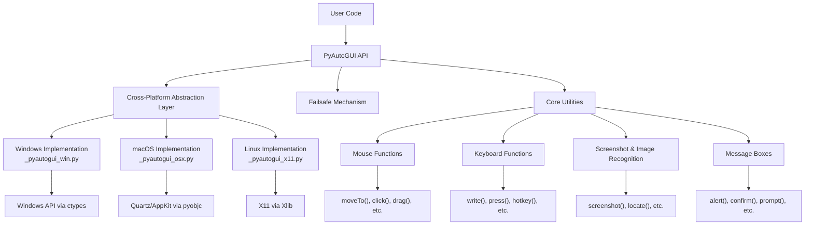
```mermaid
flowchart TD
    User["User Code"] --> PyAutoGUI["PyAutoGUI API"]
    
    PyAutoGUI --> CrossPlatform["Cross-Platform Abstraction Layer"]
    PyAutoGUI --> FailSafe["Failsafe Mechanism"]
    PyAutoGUI --> CoreUtils["Core Utilities"]
    
    CrossPlatform --> Win["Windows Implementation\n_pyautogui_win.py"]
    CrossPlatform --> Mac["macOS Implementation\n_pyautogui_osx.py"]
    CrossPlatform --> Linux["Linux Implementation\n_pyautogui_x11.py"]
    
    CoreUtils --> Mouse["Mouse Functions"]
    CoreUtils --> Keyboard["Keyboard Functions"]
    CoreUtils --> Screenshot["Screenshot & Image Recognition"]
    CoreUtils --> MsgBox["Message Boxes"]
    
    Mouse --> MouseOps["moveTo(), click(), drag(), etc."]
    Keyboard --> KeyOps["write(), press(), hotkey(), etc."]
    Screenshot --> ScreenOps["screenshot(), locate(), etc."]
    MsgBox --> BoxOps["alert(), confirm(), prompt(), etc."]
    
    Win --> WinAPI["Windows API via ctypes"]
    Mac --> CocoaAPI["Quartz/AppKit via pyobjc"]
    Linux --> X11["X11 via Xlib"]
```

Sources: [pyautogui/__init__.py:535-546](), [README.md:115-124]()

PyAutoGUI detects the current operating system at runtime and loads the appropriate platform-specific implementation module. This architecture ensures that the user-facing API remains consistent regardless of the underlying operating system.

## Core Components

PyAutoGUI consists of several key components that provide different functionalities:

### 1. Mouse Control

The mouse control functions allow moving the cursor, clicking, dragging, and scrolling. These functions include:

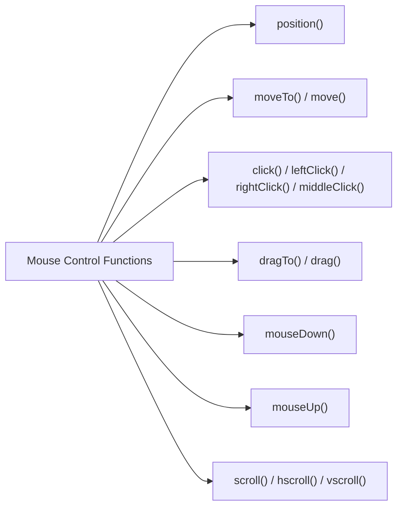
```mermaid
flowchart LR
    MouseFunctions["Mouse Control Functions"] --> Position["position()"]
    MouseFunctions --> Move["moveTo() / move()"]
    MouseFunctions --> Click["click() / leftClick() / rightClick() / middleClick()"]
    MouseFunctions --> Drag["dragTo() / drag()"]
    MouseFunctions --> MouseDown["mouseDown()"]
    MouseFunctions --> MouseUp["mouseUp()"]
    MouseFunctions --> Scroll["scroll() / hscroll() / vscroll()"]
```

- `position()`: Returns the current mouse position
- `moveTo()`: Moves mouse to absolute coordinates
- `move()`: Moves mouse relative to current position
- `click()`: Clicks the mouse at a location
- `dragTo()` and `drag()`: Click and drag operations
- `scroll()`: Scrolls the mouse wheel

Sources: [pyautogui/__init__.py:752-775](), [pyautogui/__init__.py:813-1261](), [pyautogui/__init__.py:1324-1414]()

### 2. Keyboard Control

The keyboard control functions enable typing, pressing keys, and executing keyboard shortcuts:

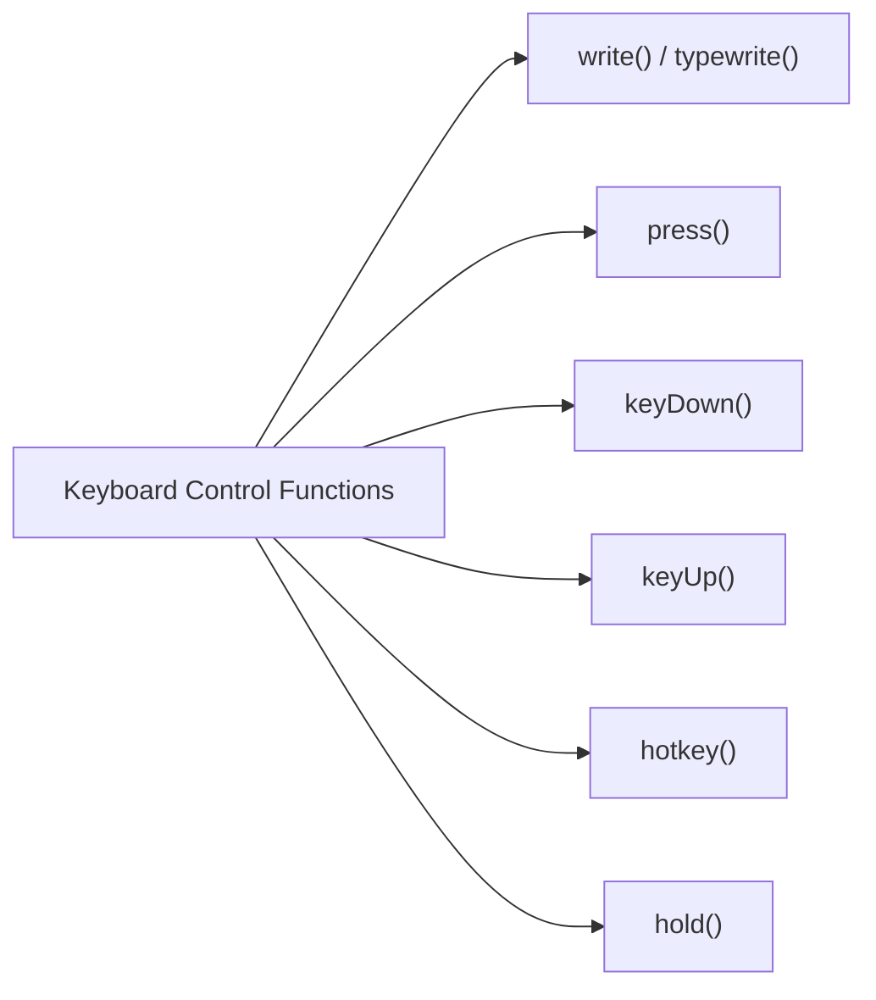
```mermaid
flowchart LR
    KeyboardFunctions["Keyboard Control Functions"] --> Write["write() / typewrite()"]
    KeyboardFunctions --> Press["press()"]
    KeyboardFunctions --> KeyDown["keyDown()"]
    KeyboardFunctions --> KeyUp["keyUp()"]
    KeyboardFunctions --> Hotkey["hotkey()"]
    KeyboardFunctions --> Hold["hold()"]
```

- `write()`: Types text with the keyboard
- `press()`: Presses and releases a key
- `keyDown()` and `keyUp()`: Holds down or releases a key
- `hotkey()`: Performs keyboard shortcuts
- `hold()`: Context manager for holding keys

Sources: [pyautogui/__init__.py:1517-1690](), [pyautogui/__init__.py:314-510]()

### 3. Screenshot & Image Recognition

PyAutoGUI can take screenshots and locate images on the screen:

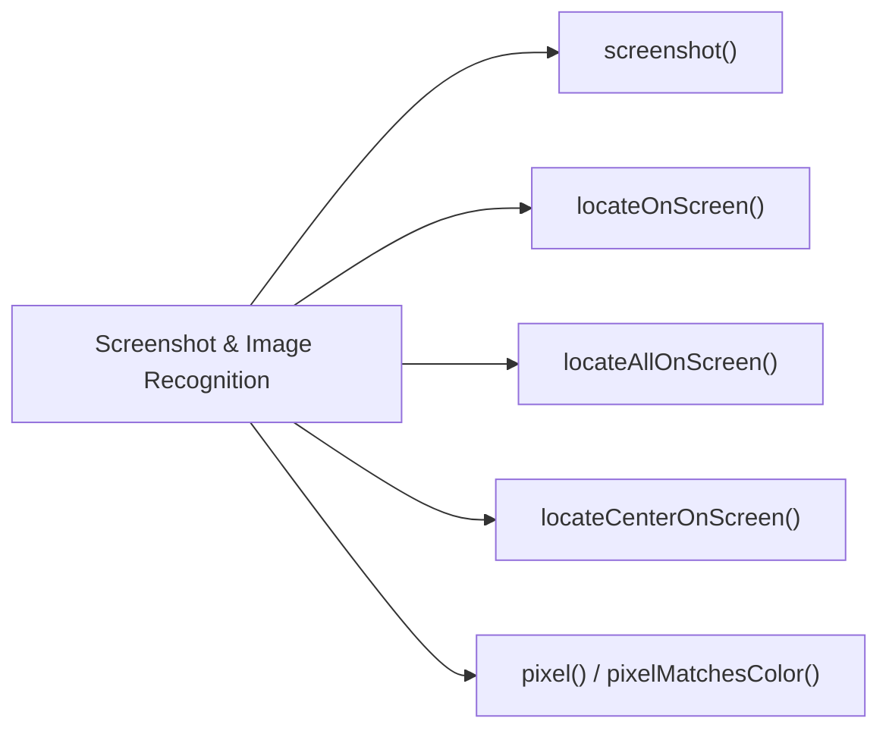
```mermaid
flowchart LR
    ScreenshotFunctions["Screenshot & Image Recognition"] --> Screenshot["screenshot()"]
    ScreenshotFunctions --> Locate["locateOnScreen()"]
    ScreenshotFunctions --> LocateAll["locateAllOnScreen()"]
    ScreenshotFunctions --> LocateCenter["locateCenterOnScreen()"]
    ScreenshotFunctions --> Pixel["pixel() / pixelMatchesColor()"]
```

- `screenshot()`: Captures the screen
- `locateOnScreen()`: Finds an image on the screen
- `locateCenterOnScreen()`: Finds the center of an image on the screen
- `pixel()`: Gets the color of a pixel

Sources: [pyautogui/__init__.py:179-242]()

### 4. Message Boxes

PyAutoGUI provides functions for displaying interactive dialogs:

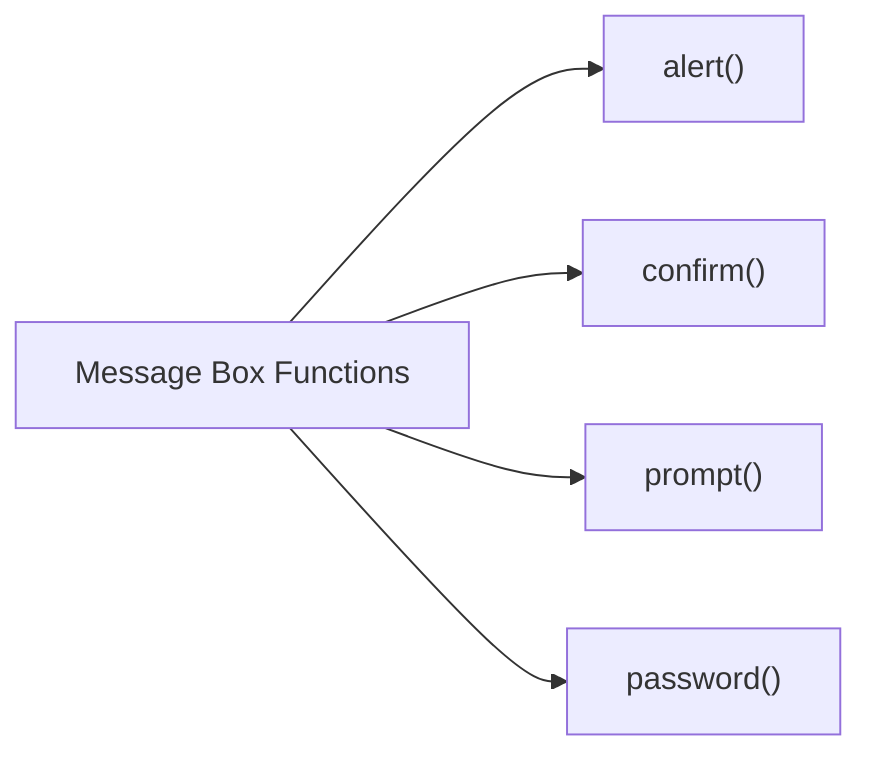
```mermaid
flowchart LR
    MessageBoxFunctions["Message Box Functions"] --> Alert["alert()"]
    MessageBoxFunctions --> Confirm["confirm()"]
    MessageBoxFunctions --> Prompt["prompt()"]
    MessageBoxFunctions --> Password["password()"]
```

- `alert()`: Displays an information message
- `confirm()`: Displays a yes/no dialog
- `prompt()`: Requests text input
- `password()`: Requests password input with masked text

Sources: [pyautogui/__init__.py:146-159]()

## Cross-Platform Implementation

PyAutoGUI detects the operating system at runtime and loads the appropriate platform-specific module:

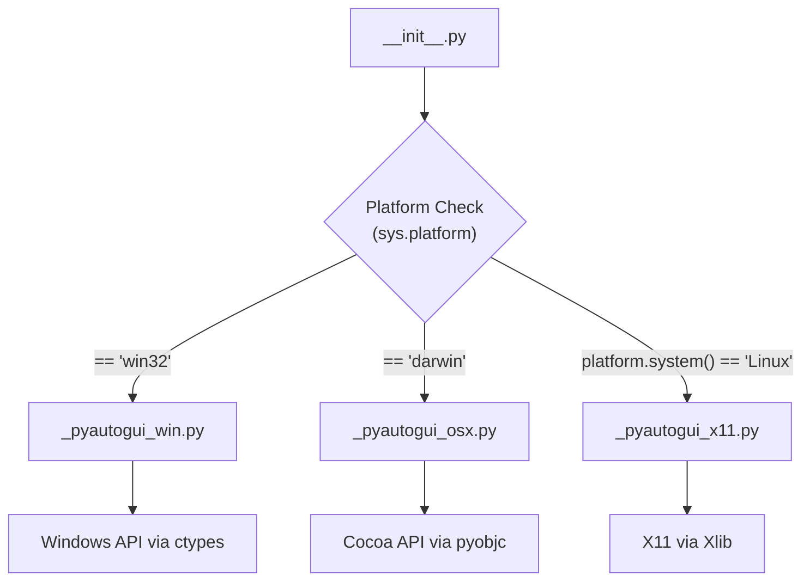
```mermaid
flowchart TD
    Init["__init__.py"] --> PlatformCheck{"Platform Check\n(sys.platform)"}
    
    PlatformCheck -->|"== 'win32'"| Windows["_pyautogui_win.py"]
    PlatformCheck -->|"== 'darwin'"| macOS["_pyautogui_osx.py"]
    PlatformCheck -->|"platform.system() == 'Linux'"| Linux["_pyautogui_x11.py"]
    
    Windows --> WinAPI["Windows API via ctypes"]
    macOS --> CocoaAPI["Cocoa API via pyobjc"]
    Linux --> XlibAPI["X11 via Xlib"]
```

Each platform module implements the same interface, using platform-specific technologies:
- Windows: Uses the Windows API through `ctypes`
- macOS: Uses the Cocoa API through `pyobjc`
- Linux: Uses X11 through the `Xlib` module

Sources: [pyautogui/__init__.py:535-546](), [README.md:115-124]()

## Dependencies

PyAutoGUI has several dependencies that provide specialized functionality:

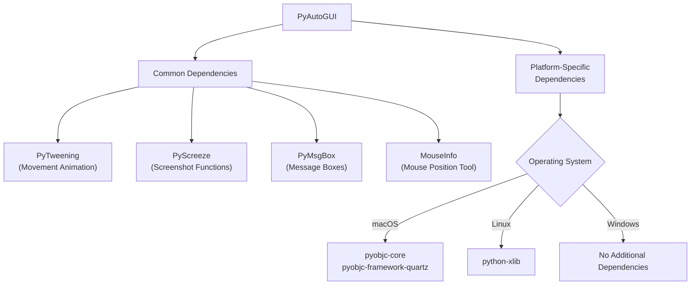
```mermaid
flowchart TD
    PyAutoGUI --> CommonDeps["Common Dependencies"]
    PyAutoGUI --> PlatformDeps["Platform-Specific\nDependencies"]
    
    CommonDeps --> PyTweening["PyTweening\n(Movement Animation)"]
    CommonDeps --> PyScreeze["PyScreeze\n(Screenshot Functions)"]
    CommonDeps --> PyMsgBox["PyMsgBox\n(Message Boxes)"]
    CommonDeps --> MouseInfo["MouseInfo\n(Mouse Position Tool)"]
    
    PlatformDeps --> OSCheck{"Operating System"}
    
    OSCheck -->|"macOS"| PyObjC["pyobjc-core\npyobjc-framework-quartz"]
    OSCheck -->|"Linux"| Xlib["python-xlib"]
    OSCheck -->|"Windows"| NoDeps["No Additional Dependencies"]
```

- PyTweening: Provides easing functions for smooth mouse movements
- PyScreeze: Handles screenshot and image recognition capabilities
- PyMsgBox: Provides message box functionality
- MouseInfo: Offers a GUI tool for obtaining mouse coordinates

Sources: [pyautogui/__init__.py:66-143](), [pyautogui/__init__.py:146-159](), [pyautogui/__init__.py:179-242](), [README.md:16-38]()

## Safety Features

PyAutoGUI includes built-in safety features to help prevent uncontrolled automation:

### Failsafe Mechanism

The failsafe mechanism stops script execution when the mouse cursor is moved to a corner of the screen, allowing users to regain control if an automation script goes wrong.

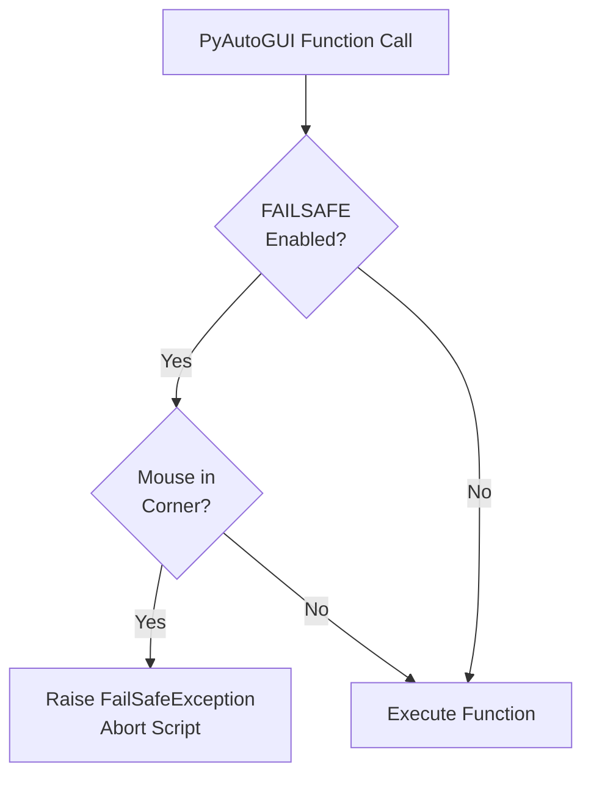
```mermaid
flowchart TD
    Function["PyAutoGUI Function Call"] --> FailsafeCheck{"FAILSAFE\nEnabled?"}
    
    FailsafeCheck -->|"Yes"| CheckPosition{"Mouse in\nCorner?"}
    FailsafeCheck -->|"No"| ExecuteFunction["Execute Function"]
    
    CheckPosition -->|"Yes"| RaiseException["Raise FailSafeException\nAbort Script"]
    CheckPosition -->|"No"| ExecuteFunction
```

The failsafe is enabled by default and can be controlled with the `FAILSAFE` constant.

Sources: [pyautogui/__init__.py:39-46](), [pyautogui/__init__.py:569-573](), [pyautogui/__init__.py:585-598]()

### Pause Functionality

PyAutoGUI can add automatic pauses between actions to slow down automation, which can be useful for debugging or when interacting with slow-responding applications.

```python
pyautogui.PAUSE = 1.0  # Add a 1-second pause after each PyAutoGUI function call
```

Sources: [pyautogui/__init__.py:562]()

## Coordinate System

PyAutoGUI uses a screen coordinate system with the origin (0,0) at the top-left corner of the screen:

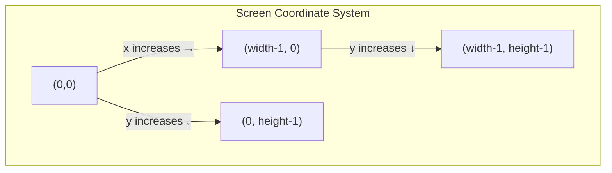
```mermaid
flowchart TD
    subgraph "Screen Coordinate System"
        Origin["(0,0)"] -->|"x increases →"| RightEdge["(width-1, 0)"]
        Origin -->|"y increases ↓"| BottomLeft["(0, height-1)"]
        RightEdge -->|"y increases ↓"| BottomRight["(width-1, height-1)"]
    end
```

The `size()` function returns the width and height of the screen, and `position()` returns the current mouse position.

Sources: [pyautogui/__init__.py:777-782](), [README.md:45-46]()

## Usage Examples

For detailed information on using PyAutoGUI, refer to the [Core API](#3) section. Here are a few basic examples:

### Mouse Control
```python
import pyautogui

# Get screen size
width, height = pyautogui.size()

# Move mouse to coordinates
pyautogui.moveTo(100, 100)

# Click at current position
pyautogui.click()

# Right-click at specific coordinates
pyautogui.rightClick(200, 200)
```

### Keyboard Control
```python
# Type text
pyautogui.write('Hello world!')

# Press a key
pyautogui.press('enter')

# Press a key combination
pyautogui.hotkey('ctrl', 'c')  # Copy
```

### Screenshots
```python
# Take a screenshot
screenshot = pyautogui.screenshot()

# Find an image on screen
location = pyautogui.locateOnScreen('button.png')
```

Sources: [README.md:51-67](), [README.md:87-113]()

---

# Page: Architecture

# Architecture

<details>
<summary>Relevant source files</summary>

The following files were used as context for generating this wiki page:

- [README.md](README.md)
- [pyautogui/__init__.py](pyautogui/__init__.py)

</details>


This document describes the high-level architecture and system design of PyAutoGUI. It explains how the library is structured to achieve cross-platform GUI automation, covering the main components, their relationships, and the design patterns used throughout the codebase.

For information about specific API usage, see [Core API](#3). For details on installation requirements, see [Dependencies and Installation](#2.2).

## Overview

PyAutoGUI is designed as a cross-platform GUI automation library that provides a consistent interface for controlling the mouse and keyboard across Windows, macOS, and Linux operating systems. The architecture follows a platform abstraction pattern where a common API is exposed to users while internally delegating to platform-specific implementations.

### High-Level Architecture

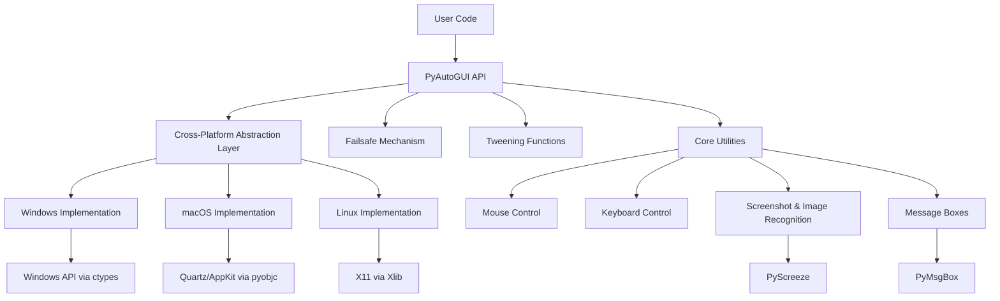
```mermaid
graph TD
    User["User Code"] --> PyAutoGUI["PyAutoGUI API"]
    
    PyAutoGUI --> CrossPlatform["Cross-Platform Abstraction Layer"]
    PyAutoGUI --> FailSafe["Failsafe Mechanism"]
    PyAutoGUI --> Tweening["Tweening Functions"]
    
    CrossPlatform --> Win["Windows Implementation"]
    CrossPlatform --> Mac["macOS Implementation"]
    CrossPlatform --> Linux["Linux Implementation"]
    
    Win --> WinAPI["Windows API via ctypes"]
    Mac --> CocoaAPI["Quartz/AppKit via pyobjc"]
    Linux --> X11["X11 via Xlib"]
    
    PyAutoGUI --> CoreUtils["Core Utilities"]
    CoreUtils --> Mouse["Mouse Control"]
    CoreUtils --> Keyboard["Keyboard Control"]
    CoreUtils --> Screenshot["Screenshot & Image Recognition"]
    CoreUtils --> MsgBox["Message Boxes"]
    
    Screenshot --> PyScreeze["PyScreeze"]
    MsgBox --> PyMsgBox["PyMsgBox"]
```

Sources: [pyautogui/__init__.py:535-546](). [README.md:115-125]()

## Platform Abstraction Layer

The platform abstraction layer is the core architectural component that enables PyAutoGUI to work across different operating systems. The library detects the running platform and loads the appropriate platform-specific module.

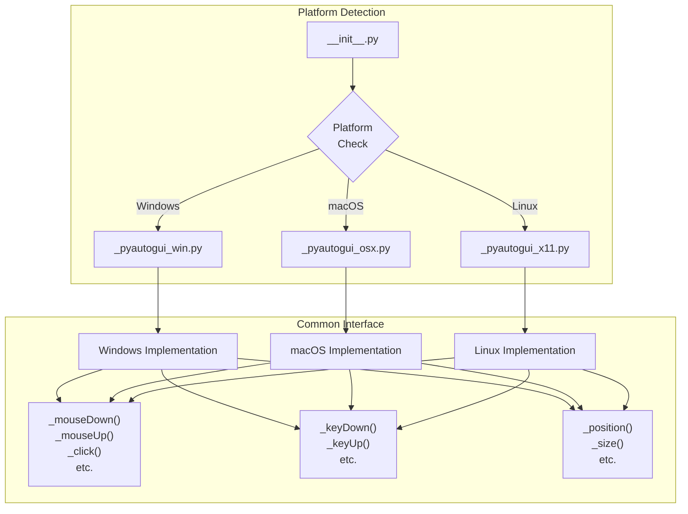
```mermaid
graph TD
    subgraph "Platform Detection"
        Init["__init__.py"] --> PlatformCheck{"Platform\nCheck"}
        PlatformCheck -->|"Windows"| WinModule["_pyautogui_win.py"]
        PlatformCheck -->|"macOS"| MacModule["_pyautogui_osx.py"]
        PlatformCheck -->|"Linux"| LinuxModule["_pyautogui_x11.py"]
    end
    
    subgraph "Common Interface"
        WinModule --> WinImpl["Windows Implementation"]
        MacModule --> MacImpl["macOS Implementation"]
        LinuxModule --> LinuxImpl["Linux Implementation"]
        
        WinImpl --> CommonMouse["_mouseDown()\n_mouseUp()\n_click()\netc."]
        MacImpl --> CommonMouse
        LinuxImpl --> CommonMouse
        
        WinImpl --> CommonKeyboard["_keyDown()\n_keyUp()\netc."]
        MacImpl --> CommonKeyboard
        LinuxImpl --> CommonKeyboard
        
        WinImpl --> CommonScreen["_position()\n_size()\netc."]
        MacImpl --> CommonScreen
        LinuxImpl --> CommonScreen
    end
```

Sources: [pyautogui/__init__.py:535-546]()

The platform-specific module is selected at runtime through conditional imports:

```python
if sys.platform.startswith("java"):
    raise NotImplementedError("Jython is not yet supported by PyAutoGUI.")
elif sys.platform == "darwin":
    from . import _pyautogui_osx as platformModule
elif sys.platform == "win32":
    from . import _pyautogui_win as platformModule
elif platform.system() == "Linux":
    from . import _pyautogui_x11 as platformModule
else:
    raise NotImplementedError("Your platform (%s) is not supported by PyAutoGUI." % (platform.system()))
```

This design allows PyAutoGUI to maintain a single public API while delegating platform-specific operations to the appropriate backend. Each platform-specific module implements the same interface functions such as `_mouseDown()`, `_mouseUp()`, `_keyDown()`, etc., which are called by the cross-platform wrappers.

Sources: [pyautogui/__init__.py:535-546]()

## Core Components

PyAutoGUI's functionality is organized into several core components:

### Mouse Control

The mouse control module provides functions for moving the mouse cursor, clicking, dragging, and scrolling. These operations are implemented through platform-specific calls but exposed through a consistent API.

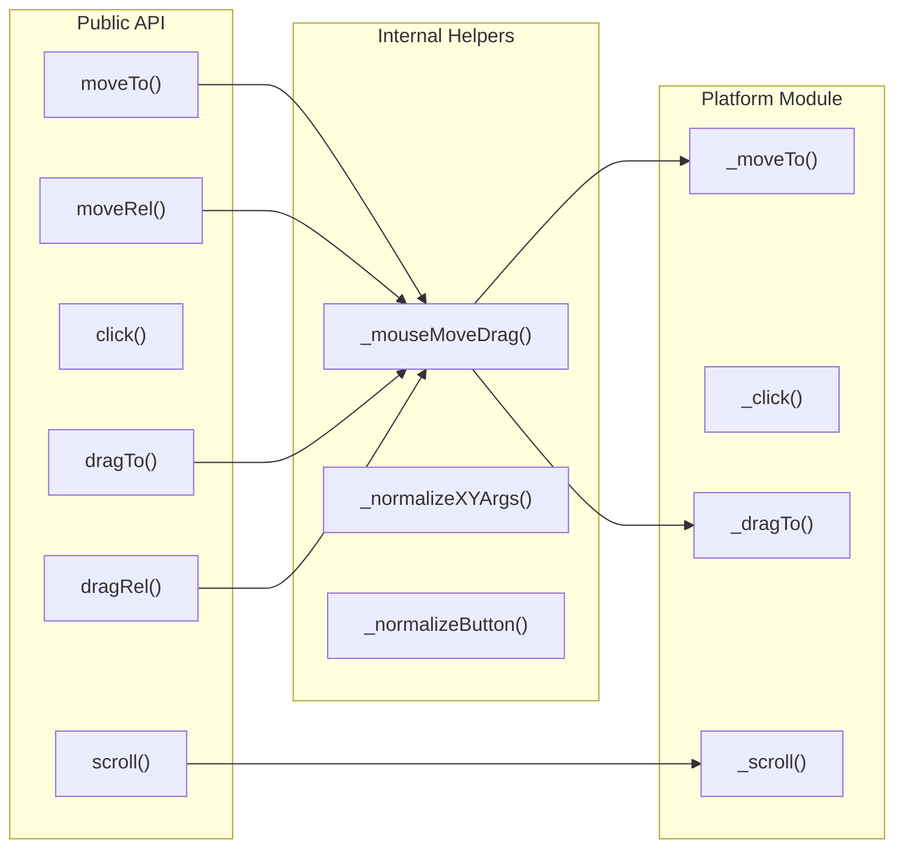
```mermaid
graph LR
    subgraph "Public API"
        moveTo["moveTo()"]
        moveRel["moveRel()"]
        click["click()"]
        dragTo["dragTo()"]
        dragRel["dragRel()"]
        scroll["scroll()"]
    end
    
    subgraph "Internal Helpers"
        _mouseMoveDrag["_mouseMoveDrag()"]
        _normalizeXYArgs["_normalizeXYArgs()"]
        _normalizeButton["_normalizeButton()"]
    end
    
    subgraph "Platform Module"
        _moveTo["_moveTo()"]
        _click["_click()"]
        _dragTo["_dragTo()"]
        _scroll["_scroll()"]
    end
    
    moveTo --> _mouseMoveDrag
    moveRel --> _mouseMoveDrag
    click --> _normalizeButton
    click --> _mouseMoveDrag
    click --> _click
    dragTo --> _mouseMoveDrag
    dragRel --> _mouseMoveDrag
    scroll --> _scroll
    
    _mouseMoveDrag --> _moveTo
    _mouseMoveDrag --> _dragTo
```

Sources: [pyautogui/__init__.py:812-1414](), [pyautogui/__init__.py:1417-1515]()

### Keyboard Control

The keyboard control module provides functions for pressing keys, typing text, and performing hotkey combinations. Like mouse control, these operations are implemented through platform-specific interfaces.

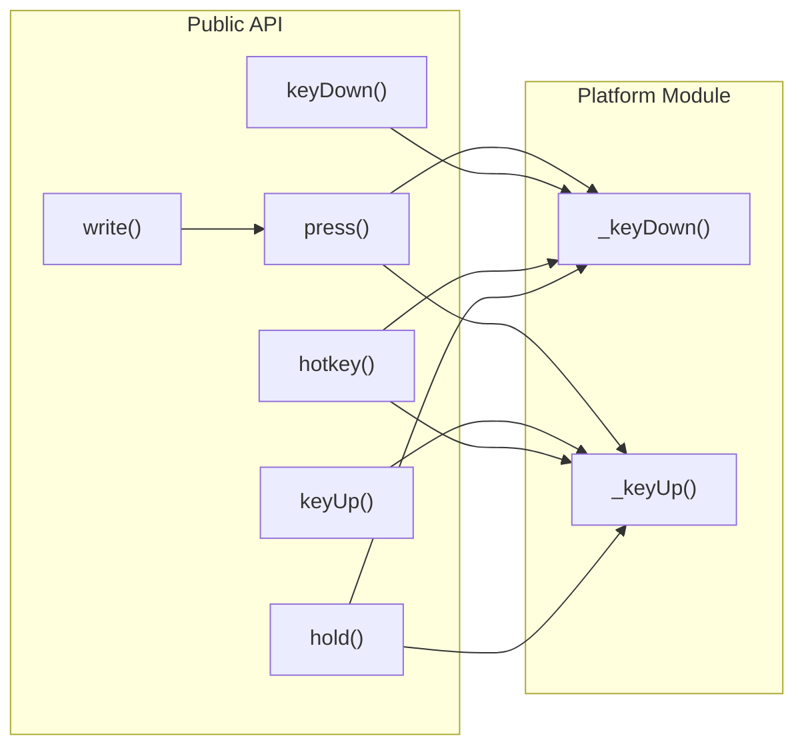
```mermaid
graph LR
    subgraph "Public API"
        press["press()"]
        keyDown["keyDown()"]
        keyUp["keyUp()"]
        write["write()"]
        hotkey["hotkey()"]
        hold["hold()"]
    end
    
    subgraph "Platform Module"
        _keyDown["_keyDown()"]
        _keyUp["_keyUp()"]
    end
    
    press --> _keyDown
    press --> _keyUp
    keyDown --> _keyDown
    keyUp --> _keyUp
    write --> press
    hotkey --> _keyDown
    hotkey --> _keyUp
    hold --> _keyDown
    hold --> _keyUp
```

Sources: [pyautogui/__init__.py:1517-1728]()

### Screenshot and Image Recognition

The screenshot and image recognition module leverages the PyScreeze library to capture screen content and locate images on the screen.

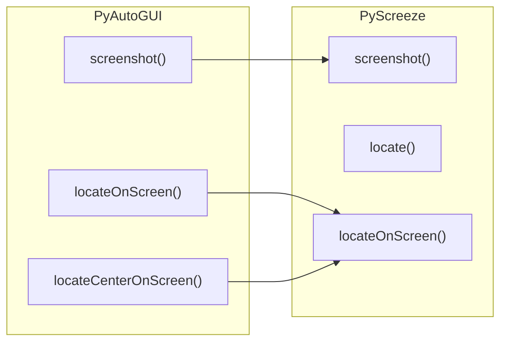
```mermaid
graph LR
    subgraph "PyAutoGUI"
        screenshot["screenshot()"]
        locateOnScreen["locateOnScreen()"]
        locateCenterOnScreen["locateCenterOnScreen()"]
    end
    
    subgraph "PyScreeze"
        pyScreezeScreenshot["screenshot()"]
        pyScreezeLocate["locate()"]
        pyScreezeLocateOnScreen["locateOnScreen()"]
    end
    
    screenshot --> pyScreezeScreenshot
    locateOnScreen --> pyScreezeLocateOnScreen
    locateCenterOnScreen --> pyScreezeLocateOnScreen
```

Sources: [pyautogui/__init__.py:179-242]()

### Message Boxes

The message box functionality is provided by the PyMsgBox library, which PyAutoGUI exposes through its API.

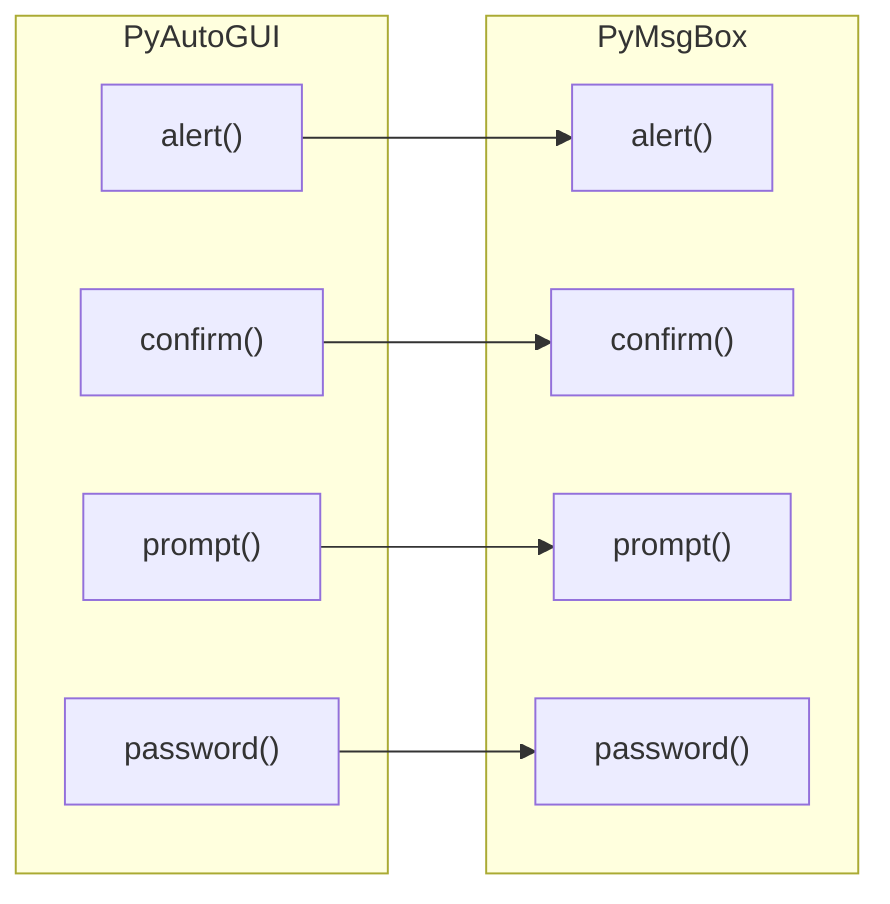
```mermaid
graph LR
    subgraph "PyAutoGUI"
        alert["alert()"]
        confirm["confirm()"]
        prompt["prompt()"]
        password["password()"]
    end
    
    subgraph "PyMsgBox"
        pyMsgBoxAlert["alert()"]
        pyMsgBoxConfirm["confirm()"]
        pyMsgBoxPrompt["prompt()"]
        pyMsgBoxPassword["password()"]
    end
    
    alert --> pyMsgBoxAlert
    confirm --> pyMsgBoxConfirm
    prompt --> pyMsgBoxPrompt
    password --> pyMsgBoxPassword
```

Sources: [pyautogui/__init__.py:146-159]()

## Dependency Management

PyAutoGUI employs a robust dependency management strategy to handle platform-specific dependencies and optional features. The library attempts to import required dependencies but gracefully degrades functionality if dependencies are missing.

### Required and Optional Dependencies

| Dependency | Purpose | Platform | Status |
|------------|---------|----------|--------|
| PyTweening | Provides easing functions for mouse movements | All | Optional |
| PyMsgBox | Provides message box functionality | All | Optional |
| PyScreeze | Provides screenshot and image recognition | All | Optional |
| MouseInfo | Provides utility for getting mouse position | All | Optional |
| PyGetWindow | Provides window management features | Windows | Optional |
| pyobjc | Provides access to macOS native APIs | macOS | Required |
| python3-xlib | Provides access to X11 APIs | Linux | Required |
| Pillow | Provides image processing | All | Required for screenshots |

For each optional dependency, PyAutoGUI attempts to import it and if the import fails, it creates placeholder functions that raise informative exceptions when called:

```python
try:
    from pymsgbox import alert, confirm, prompt, password
except ImportError:
    # If pymsgbox module is not found, those methods will not be available.
    def _couldNotImportPyMsgBox(*unused_args, **unused_kwargs):
        raise PyAutoGUIException(
            "PyAutoGUI was unable to import pymsgbox. Please install this module to enable the function you tried to call."
        )

    alert = confirm = prompt = password = _couldNotImportPyMsgBox
```

Sources: [pyautogui/__init__.py:66-143](), [pyautogui/__init__.py:146-159](), [pyautogui/__init__.py:179-242](), [pyautogui/__init__.py:245-265](), [pyautogui/__init__.py:284-312]()

## Failsafe Mechanism

PyAutoGUI includes a failsafe mechanism to prevent runaway automation scripts. If the mouse cursor is moved to one of the screen corners (a "failsafe point"), PyAutoGUI will raise a `FailSafeException`, which allows users to regain control of their computer.

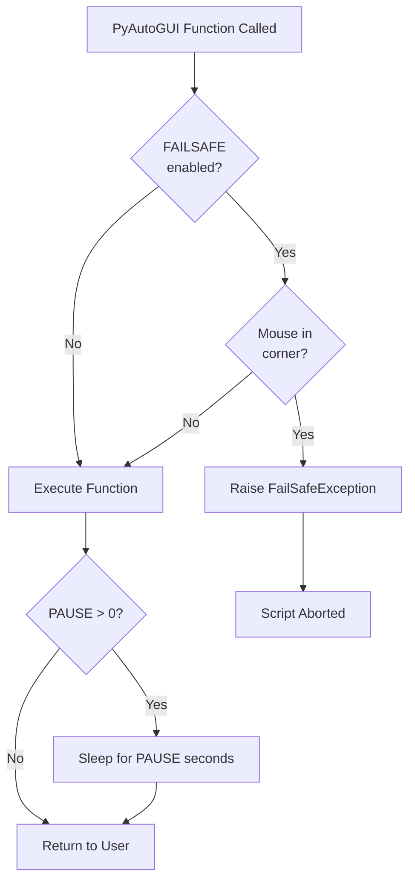
```mermaid
flowchart TD
    Start["PyAutoGUI Function Called"] --> CheckFailsafe{"FAILSAFE\nenabled?"}
    
    CheckFailsafe -->|"Yes"| CheckPosition{"Mouse in\ncorner?"}
    CheckFailsafe -->|"No"| Execute["Execute Function"]
    
    CheckPosition -->|"Yes"| RaiseException["Raise FailSafeException"]
    CheckPosition -->|"No"| Execute
    
    Execute --> AddPause{"PAUSE > 0?"}
    
    AddPause -->|"Yes"| Sleep["Sleep for PAUSE seconds"]
    AddPause -->|"No"| End["Return to User"]
    
    Sleep --> End
    RaiseException --> Abort["Script Aborted"]
```

The failsafe mechanism is implemented through a decorator function that wraps all PyAutoGUI functions exposed to users:

```python
def _genericPyAutoGUIChecks(wrappedFunction):
    @functools.wraps(wrappedFunction)
    def wrapper(*args, **kwargs):
        failSafeCheck()
        returnVal = wrappedFunction(*args, **kwargs)
        _handlePause(kwargs.get("_pause", True))
        return returnVal
    return wrapper
```

Sources: [pyautogui/__init__.py:569-573](), [pyautogui/__init__.py:585-598](), [pyautogui/__init__.py:1732-1736]()

## Component Relationships and Data Flow

To understand how the different components of PyAutoGUI interact, let's examine the flow of data through the system for common operations:

### Mouse Click Flow

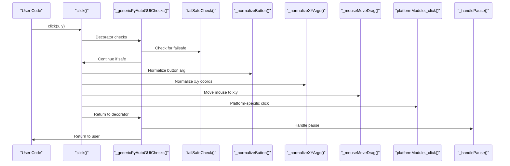
```mermaid
sequenceDiagram
    participant User as "User Code"
    participant Click as "click()"
    participant GenChecks as "_genericPyAutoGUIChecks()"
    participant FSCheck as "failSafeCheck()"
    participant NormButton as "_normalizeButton()"
    participant NormXY as "_normalizeXYArgs()"
    participant MouseDrag as "_mouseMoveDrag()"
    participant PlatClick as "platformModule._click()"
    participant Pause as "_handlePause()"
    
    User->>Click: click(x, y)
    Click->>GenChecks: Decorator checks
    GenChecks->>FSCheck: Check for failsafe
    GenChecks->>Click: Continue if safe
    Click->>NormButton: Normalize button arg
    Click->>NormXY: Normalize x,y coords
    Click->>MouseDrag: Move mouse to x,y
    Click->>PlatClick: Platform-specific click
    Click->>GenChecks: Return to decorator
    GenChecks->>Pause: Handle pause
    GenChecks->>User: Return to user
```

Sources: [pyautogui/__init__.py:883-1004](), [pyautogui/__init__.py:585-598](), [pyautogui/__init__.py:825-880](), [pyautogui/__init__.py:642-703](), [pyautogui/__init__.py:1417-1515]()

### Keyboard Input Flow

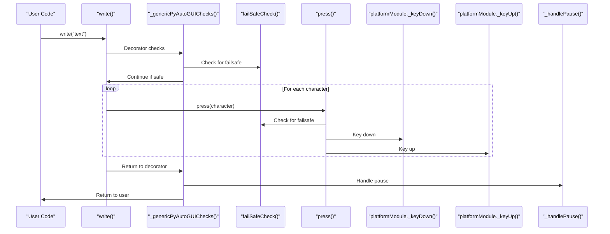
```mermaid
sequenceDiagram
    participant User as "User Code"
    participant Write as "write()"
    participant GenChecks as "_genericPyAutoGUIChecks()"
    participant FSCheck as "failSafeCheck()"
    participant Press as "press()"
    participant KeyDown as "platformModule._keyDown()"
    participant KeyUp as "platformModule._keyUp()"
    participant Pause as "_handlePause()"
    
    User->>Write: write("text")
    Write->>GenChecks: Decorator checks
    GenChecks->>FSCheck: Check for failsafe
    GenChecks->>Write: Continue if safe
    loop For each character
        Write->>Press: press(character)
        Press->>FSCheck: Check for failsafe
        Press->>KeyDown: Key down
        Press->>KeyUp: Key up
    end
    Write->>GenChecks: Return to decorator
    GenChecks->>Pause: Handle pause
    GenChecks->>User: Return to user
```

Sources: [pyautogui/__init__.py:1658-1690](), [pyautogui/__init__.py:585-598](), [pyautogui/__init__.py:1582-1616](), [pyautogui/__init__.py:1732-1736]()

## Conclusion

PyAutoGUI's architecture is designed for cross-platform compatibility, ease of use, and robustness. The library achieves these goals through:

1. A platform abstraction layer that detects the operating system and loads the appropriate implementation
2. A common API that hides platform-specific details from users
3. Graceful handling of optional dependencies
4. Safety mechanisms like the failsafe feature
5. Helper functions that normalize inputs and handle common operations

This architecture allows PyAutoGUI to provide a simple, consistent interface for GUI automation across different operating systems while handling the complex platform-specific details internally.

Sources: [pyautogui/__init__.py:1-1777](), [README.md:115-125]()

---

# Page: Cross-Platform Implementation

# Cross-Platform Implementation

<details>
<summary>Relevant source files</summary>

The following files were used as context for generating this wiki page:

- [pyautogui/__init__.py](pyautogui/__init__.py)
- [pyautogui/_pyautogui_osx.py](pyautogui/_pyautogui_osx.py)
- [pyautogui/_pyautogui_win.py](pyautogui/_pyautogui_win.py)
- [pyautogui/_pyautogui_x11.py](pyautogui/_pyautogui_x11.py)

</details>


This page documents how PyAutoGUI achieves consistent functionality across Windows, macOS, and Linux operating systems while using platform-specific automation technologies. It explains the architecture that allows identical PyAutoGUI code to run on different platforms with consistent behavior.

For information about installing the platform-specific dependencies, see [Dependencies and Installation](#2.2).

## Overview

PyAutoGUI implements a platform abstraction layer that determines the operating system at runtime and loads the appropriate platform-specific module. Each platform module implements the same interface, but uses different underlying technologies:

- **Windows**: Uses the Win32 API via ctypes
- **macOS**: Uses Quartz/AppKit via PyObjC
- **Linux**: Uses X11 via Python-Xlib

This abstraction enables users to write platform-independent automation code while PyAutoGUI handles the platform-specific details.

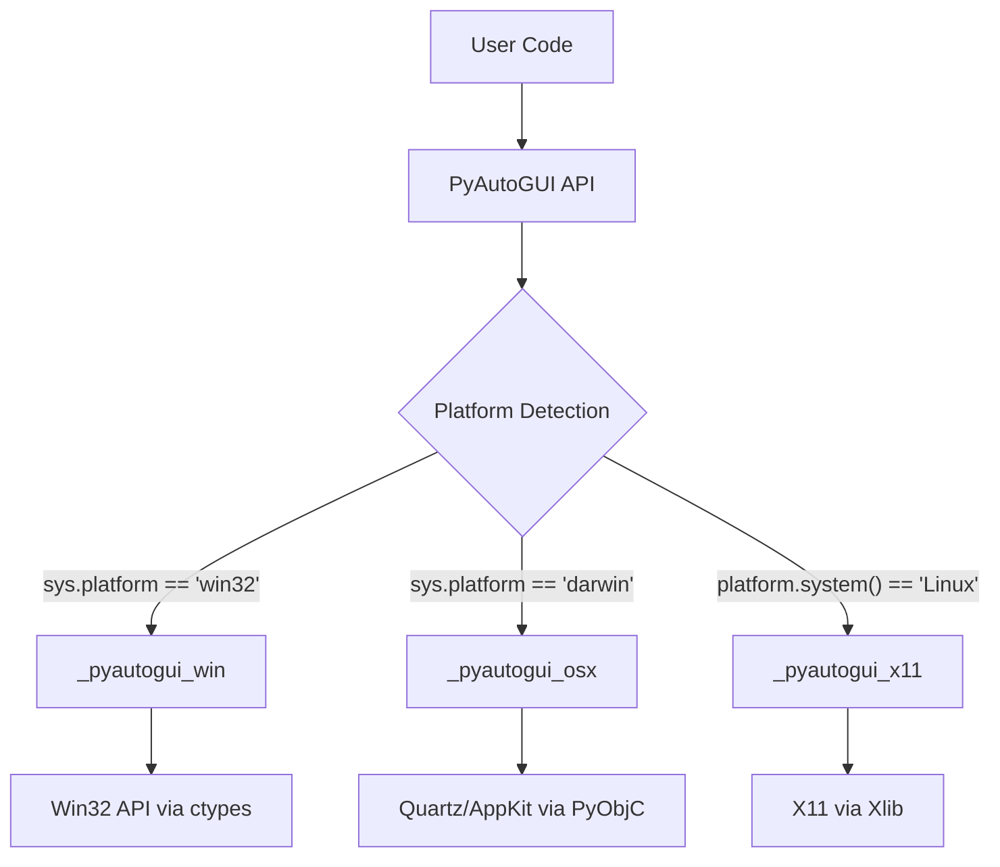
```mermaid
flowchart TD
    User["User Code"] --> PyAutoGUI["PyAutoGUI API"]
    PyAutoGUI --> PlatformCheck{"Platform Detection"}
    
    PlatformCheck -->|"sys.platform == 'win32'"| WinModule["_pyautogui_win"]
    PlatformCheck -->|"sys.platform == 'darwin'"| MacModule["_pyautogui_osx"]
    PlatformCheck -->|"platform.system() == 'Linux'"| LinuxModule["_pyautogui_x11"]
    
    WinModule --> Win32["Win32 API via ctypes"]
    MacModule --> Quartz["Quartz/AppKit via PyObjC"]
    LinuxModule --> X11["X11 via Xlib"]
```

Sources: [pyautogui/__init__.py:535-546]()

## Platform Detection Mechanism

PyAutoGUI uses the `sys.platform` and `platform.system()` variables to detect the operating system and load the appropriate platform module:

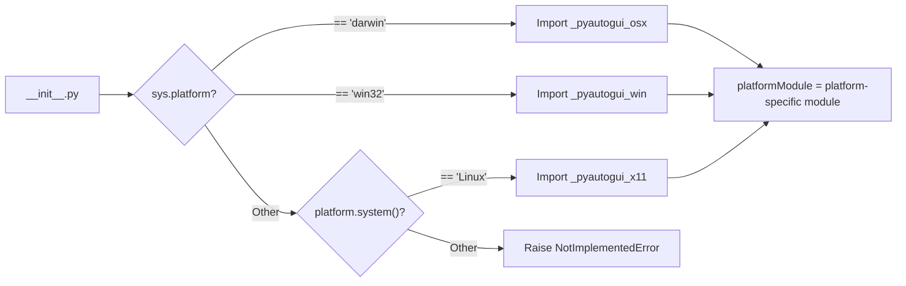
```mermaid
flowchart LR
    Start["__init__.py"] --> Check{"sys.platform?"}
    Check -->|"== 'darwin'"| Mac["Import _pyautogui_osx"]
    Check -->|"== 'win32'"| Win["Import _pyautogui_win"]
    Check -->|"Other"| SubCheck{"platform.system()?"}
    SubCheck -->|"== 'Linux'"| Linux["Import _pyautogui_x11"]
    SubCheck -->|"Other"| NotSupported["Raise NotImplementedError"]
    
    Mac --> SetPlatformModule["platformModule = platform-specific module"]
    Win --> SetPlatformModule
    Linux --> SetPlatformModule
```

Sources: [pyautogui/__init__.py:535-546]()

The detection code is straightforward:

```
if sys.platform.startswith("java"):
    raise NotImplementedError("Jython is not yet supported by PyAutoGUI.")
elif sys.platform == "darwin":
    from . import _pyautogui_osx as platformModule
elif sys.platform == "win32":
    from . import _pyautogui_win as platformModule
elif platform.system() == "Linux":
    from . import _pyautogui_x11 as platformModule
else:
    raise NotImplementedError("Your platform (%s) is not supported by PyAutoGUI." % (platform.system()))
```

## Interface Implementation

Each platform module implements the same core functions, providing a consistent interface across platforms:

| Function Category | Core Functions | Purpose |
|-------------------|----------------|---------|
| Mouse Position | `_position()`, `_size()` | Get cursor position and screen size |
| Mouse Movement | `_moveTo()` | Move mouse to absolute coordinates |
| Mouse Actions | `_click()`, `_mouseDown()`, `_mouseUp()` | Perform mouse button actions |
| Mouse Scrolling | `_scroll()`, `_hscroll()`, `_vscroll()` | Perform scrolling operations |
| Keyboard | `_keyDown()`, `_keyUp()` | Perform keyboard key press/release |

PyAutoGUI's public API calls these internal platform-specific functions, maintaining a consistent interface for users regardless of operating system.

```mermaid
flowchart TD
    APIFunctions["PyAutoGUI Public API Functions"]
    
    subgraph "Platform-Specific Implementation"
        WinImpl["_pyautogui_win.py Functions"]
        MacImpl["_pyautogui_osx.py Functions"]
        LinuxImpl["_pyautogui_x11.py Functions"]
    end
    
    APIFunctions -->|"Call through\nplatformModule"| PlatformImpl["Platform Implementation"]
    PlatformImpl --> WinImpl
    PlatformImpl --> MacImpl
    PlatformImpl --> LinuxImpl
```

Sources: [pyautogui/__init__.py:751-752](), [pyautogui/__init__.py:782-783](), [pyautogui/__init__.py:882-912](), [pyautogui/__init__.py:916-945]()

## Platform-Specific Implementations

### Windows Implementation

The Windows implementation uses the Win32 API via Python's ctypes module:

```mermaid
flowchart TD
    WinModule["_pyautogui_win.py"]
    
    subgraph "Mouse Functions"
        Win_Position["_position()"]
        Win_Size["_size()"]
        Win_MoveTo["_moveTo()"]
        Win_Click["_click()"]
        Win_MouseDown["_mouseDown()"] 
        Win_MouseUp["_mouseUp()"]
        Win_Scroll["_scroll()"]
    end
    
    subgraph "Keyboard Functions"
        Win_KeyDown["_keyDown()"]
        Win_KeyUp["_keyUp()"]
    end
    
    WinModule --> Win_Position & Win_Size & Win_MoveTo & Win_Click & Win_MouseDown & Win_MouseUp & Win_Scroll
    WinModule --> Win_KeyDown & Win_KeyUp
    
    Win_Position -->|"Uses"| GetCursorPos["GetCursorPos()"]
    Win_Size -->|"Uses"| GetSystemMetrics["GetSystemMetrics()"]
    Win_MoveTo -->|"Uses"| SetCursorPos["SetCursorPos()"]
    Win_Click & Win_MouseDown & Win_MouseUp -->|"Use"| Mouse_Event["mouse_event()"]
    Win_KeyDown & Win_KeyUp -->|"Use"| Keybd_Event["keybd_event()"]
```

Sources: [pyautogui/_pyautogui_win.py:335-345](), [pyautogui/_pyautogui_win.py:348-353](), [pyautogui/_pyautogui_win.py:357-369](), [pyautogui/_pyautogui_win.py:375-401](), [pyautogui/_pyautogui_win.py:404-429](), [pyautogui/_pyautogui_win.py:432-458](), [pyautogui/_pyautogui_win.py:507-541](), [pyautogui/_pyautogui_win.py:250-292](), [pyautogui/_pyautogui_win.py:295-332]()

Key aspects of the Windows implementation:
- Uses `ctypes` to access Win32 API functions
- Maps PyAutoGUI's keyboard keys to Windows virtual key codes
- Uses `mouse_event()` for mouse actions
- Uses `keybd_event()` for keyboard actions

### macOS Implementation

The macOS implementation uses Apple's Quartz and AppKit frameworks via PyObjC:

```mermaid
flowchart TD
    MacModule["_pyautogui_osx.py"]
    
    subgraph "Mouse Functions"
        Mac_Position["_position()"]
        Mac_Size["_size()"]
        Mac_MoveTo["_moveTo()"]
        Mac_Click["_click()"]
        Mac_MouseDown["_mouseDown()"]
        Mac_MouseUp["_mouseUp()"]
        Mac_Scroll["_scroll()"]
        Mac_MultiClick["_multiClick()"]
    end
    
    subgraph "Keyboard Functions"
        Mac_KeyDown["_keyDown()"]
        Mac_KeyUp["_keyUp()"]
        Mac_NormalKeyEvent["_normalKeyEvent()"]
        Mac_SpecialKeyEvent["_specialKeyEvent()"]
    end
    
    MacModule --> Mac_Position & Mac_Size & Mac_MoveTo & Mac_Click & Mac_MouseDown & Mac_MouseUp & Mac_Scroll & Mac_MultiClick
    MacModule --> Mac_KeyDown & Mac_KeyUp
    
    Mac_KeyDown & Mac_KeyUp --> Mac_NormalKeyEvent & Mac_SpecialKeyEvent
    
    Mac_Position -->|"Uses"| NSEvent["NSEvent.mouseLocation()"]
    Mac_Size -->|"Uses"| CGDisplayPixels["CGDisplayPixelsHigh()/Wide()"]
    Mac_MoveTo & Mac_Click & Mac_MouseDown & Mac_MouseUp & Mac_Scroll -->|"Use"| CGEventPost["CGEventPost()"]
    Mac_NormalKeyEvent & Mac_SpecialKeyEvent -->|"Use"| CGEventCreateKeyboardEvent["CGEventCreateKeyboardEvent()"]
```

Sources: [pyautogui/_pyautogui_osx.py:295-297](), [pyautogui/_pyautogui_osx.py:300-301](), [pyautogui/_pyautogui_osx.py:446-448](), [pyautogui/_pyautogui_osx.py:377-388](), [pyautogui/_pyautogui_osx.py:355-363](), [pyautogui/_pyautogui_osx.py:366-374](), [pyautogui/_pyautogui_osx.py:305-331](), [pyautogui/_pyautogui_osx.py:404-427](), [pyautogui/_pyautogui_osx.py:219-235](), [pyautogui/_pyautogui_osx.py:238-262](), [pyautogui/_pyautogui_osx.py:264-285]()

Key aspects of the macOS implementation:
- Requires PyObjC to interface with Quartz and AppKit
- Maps PyAutoGUI's keyboard keys to macOS key codes
- Uses `CGEventCreateMouseEvent` and `CGEventPost` for mouse actions
- Uses `CGEventCreateKeyboardEvent` for keyboard actions
- Special handling for multi-click operations

### Linux Implementation

The Linux implementation uses X11 via Python-Xlib:

```mermaid
flowchart TD
    LinuxModule["_pyautogui_x11.py"]
    
    subgraph "Mouse Functions"
        Linux_Position["_position()"]
        Linux_Size["_size()"]
        Linux_MoveTo["_moveTo()"]
        Linux_Click["_click()"]
        Linux_MouseDown["_mouseDown()"]
        Linux_MouseUp["_mouseUp()"]
        Linux_Scroll["_scroll()"]
        Linux_HScroll["_hscroll()"]
        Linux_VScroll["_vscroll()"]
    end
    
    subgraph "Keyboard Functions"
        Linux_KeyDown["_keyDown()"]
        Linux_KeyUp["_keyUp()"]
    end
    
    LinuxModule --> Linux_Position & Linux_Size & Linux_MoveTo & Linux_Click & Linux_MouseDown & Linux_MouseUp & Linux_Scroll & Linux_HScroll & Linux_VScroll
    LinuxModule --> Linux_KeyDown & Linux_KeyUp
    
    Linux_Position -->|"Uses"| QueryPointer["root.query_pointer()"]
    Linux_Size -->|"Uses"| ScreenSize["screen().width/height_in_pixels"]
    Linux_MoveTo & Linux_Click & Linux_MouseDown & Linux_MouseUp -->|"Use"| FakeInput["fake_input()"]
    Linux_KeyDown & Linux_KeyUp -->|"Use"| FakeInput
```

Sources: [pyautogui/_pyautogui_x11.py:26-34](), [pyautogui/_pyautogui_x11.py:37-38](), [pyautogui/_pyautogui_x11.py:100-102](), [pyautogui/_pyautogui_x11.py:72-77](), [pyautogui/_pyautogui_x11.py:105-110](), [pyautogui/_pyautogui_x11.py:113-118](), [pyautogui/_pyautogui_x11.py:42-69](), [pyautogui/_pyautogui_x11.py:134-178](), [pyautogui/_pyautogui_x11.py:153-178]()

Key aspects of the Linux implementation:
- Uses Python-Xlib to interface with X11
- Maps PyAutoGUI's keyboard keys to X11 keysyms and keycodes
- Uses `fake_input()` for both mouse and keyboard events
- Special handling for horizontal and vertical scrolling
- Additional handling for shift characters

## Function Mapping Details

The following table illustrates how key PyAutoGUI functions map to platform-specific implementations:

| PyAutoGUI Function | Windows | macOS | Linux (X11) |
|--------------------|---------|-------|-------------|
| `position()` | `GetCursorPos()` | `NSEvent.mouseLocation()` | `root.query_pointer()` |
| `size()` | `GetSystemMetrics()` | `CGDisplayPixelsWide/High()` | `screen().width/height_in_pixels` |
| `moveTo()` | `SetCursorPos()` | `CGEventPost()` + `kCGEventMouseMoved` | `fake_input()` + `X.MotionNotify` |
| `click()` | `mouse_event()` + `MOUSEEVENTF_*CLICK` | `CGEventPost()` + `kCGEvent*MouseDown/Up` | `fake_input()` + `X.ButtonPress/Release` |
| `keyDown()` | `keybd_event()` + `KEYEVENTF_KEYDOWN` | `CGEventCreateKeyboardEvent()` | `fake_input()` + `X.KeyPress` |

## Key Data Structures

### Keyboard Mapping

Each platform module defines a `keyboardMapping` dictionary that maps PyAutoGUI's keyboard key names to platform-specific key codes:

```mermaid
flowchart LR
    KeyNames["KEY_NAMES List<br>(Common API)"] --> WinMapping["Windows<br>keyboardMapping"]
    KeyNames --> MacMapping["macOS<br>keyboardMapping"]
    KeyNames --> LinuxMapping["Linux<br>keyboardMapping"]
    
    WinMapping -->|"Maps to"| VirtualKeyCodes["Windows Virtual Key Codes"]
    MacMapping -->|"Maps to"| MacKeyCodes["macOS Key Codes"]
    LinuxMapping -->|"Maps to"| X11KeyCodes["X11 KeyCodes"]
```

Sources: [pyautogui/_pyautogui_win.py:112-246](), [pyautogui/_pyautogui_osx.py:25-162](), [pyautogui/_pyautogui_x11.py:191-317]()

### Mouse Button Constants

PyAutoGUI uses consistent button names (LEFT, MIDDLE, RIGHT) across platforms but maps them to platform-specific values:

```mermaid
flowchart LR
    ButtonNames["PyAutoGUI Button Constants<br>LEFT, MIDDLE, RIGHT"] --> WinButtons["Windows<br>Mouse Event Constants"]
    ButtonNames --> MacButtons["macOS<br>CGMouseButton Constants"]
    ButtonNames --> LinuxButtons["Linux<br>X11 Button Numbers"]
    
    WinButtons -->|"Maps to"| WinEvents["MOUSEEVENTF_LEFTDOWN, etc."]
    MacButtons -->|"Maps to"| MacEvents["kCGMouseButtonLeft, etc."]
    LinuxButtons -->|"Maps to"| X11Buttons["Button 1, 2, 3"]
```

Sources: [pyautogui/_pyautogui_win.py:35-48](), [pyautogui/_pyautogui_osx.py:357-361](), [pyautogui/_pyautogui_x11.py:14]()

## Error Handling

PyAutoGUI implements platform-specific error handling:

- Windows: Catches `PermissionError` and `OSError` for mouse events
- macOS: Uses try-except blocks for keyboard mapping errors
- Linux: Checks for valid button arguments and keyboard keys

All platform modules ensure that invalid button arguments or unsupported keys are properly handled.

## Extending to New Platforms

To add support for a new platform, you would need to:

1. Create a new `_pyautogui_<platform>.py` module
2. Implement all the required interface functions (`_position()`, `_size()`, etc.)
3. Add platform detection code in `__init__.py`
4. Create a keyboard mapping for the platform
5. Implement the mouse and keyboard event functions using platform-specific APIs

## Platform-Specific Notes

### Windows
- Uses DPI awareness setting to handle scaling issues
- Implements mouse button swap detection
- Handles various keyboard modifiers

### macOS
- Requires PyObjC to be installed
- Uses a small delay (DARWIN_CATCH_UP_TIME) to allow the OS to catch up
- Special handling for multi-click operations
- Separate implementations for normal and special key events

### Linux
- Uses X11 via Python-Xlib
- Mouse button swap detection via GNOME settings (if available)
- Handles both vertical and horizontal scrolling separately

Sources: [pyautogui/__init__.py:535-546](), [pyautogui/_pyautogui_win.py:15-19](), [pyautogui/_pyautogui_osx.py:4-7](), [pyautogui/_pyautogui_x11.py:9-12]()

---

# Page: Dependencies and Installation

# Dependencies and Installation

<details>
<summary>Relevant source files</summary>

The following files were used as context for generating this wiki page:

- [.gitignore](.gitignore)
- [LICENSE.txt](LICENSE.txt)
- [MANIFEST.in](MANIFEST.in)
- [Pipfile](Pipfile)
- [docs/install.rst](docs/install.rst)
- [setup.py](setup.py)

</details>


This document provides detailed information about PyAutoGUI's dependencies and the installation process across different operating systems. For information about the cross-platform implementation of PyAutoGUI, see [Cross-Platform Implementation](#2.1).

## 1. Dependency Overview

PyAutoGUI relies on several libraries to provide its functionality across different operating systems. These dependencies are automatically installed when you install PyAutoGUI using pip.

```mermaid
graph TD
    subgraph "PyAutoGUI Dependencies"
        PyAutoGUI["PyAutoGUI"] --> CommonDeps["Common Dependencies"]
        PyAutoGUI --> PlatformDeps["Platform-Specific Dependencies"]
        
        CommonDeps --> PyTweening["PyTweening (≥1.0.4)"]
        CommonDeps --> PyScreeze["PyScreeze (≥0.1.21)"]
        CommonDeps --> PyMsgBox["PyMsgBox"]
        CommonDeps --> PyGetWindow["PyGetWindow (≥0.0.5)"]
        CommonDeps --> MouseInfo["MouseInfo"]
        
        PlatformDeps --> MacOS{"macOS?"}
        PlatformDeps --> Linux{"Linux?"}
        
        MacOS -->|"Yes"| PyObjC["pyobjc-core & pyobjc-framework-quartz"]
        MacOS -->|"No"| None1["None"]
        
        Linux -->|"Yes"| Xlib["python3-Xlib (Python 3) or python-xlib (Python < 3)"]
        Linux -->|"No"| None2["None"]
    end
```

Sources: [setup.py:30-38]()

### 1.1 Common Dependencies

All PyAutoGUI installations require the following dependencies regardless of platform:

| Dependency | Minimum Version | Purpose |
|------------|----------------|---------|
| PyTweening | 1.0.4 | Provides tweening/easing functions for smooth mouse movements |
| PyScreeze | 0.1.21 | Handles screenshot and image recognition functionality |
| PyMsgBox | - | Provides cross-platform message box functions |
| PyGetWindow | 0.0.5 | Allows for window management operations |
| MouseInfo | - | Provides tools for getting mouse position information |

Sources: [setup.py:34-38]()

### 1.2 Platform-Specific Dependencies

Depending on your operating system, PyAutoGUI requires additional dependencies:

#### For macOS:
- `pyobjc-core`: Objective-C bridge for Python
- `pyobjc-framework-quartz`: Interface to the Quartz framework for screen control

#### For Linux:
- `python3-Xlib` (Python 3) or `python-xlib` (Python < 3): Interface to the X Window System
- Additional system packages: `scrot`, `python3-tk`, `python3-dev`

#### For Windows:
- No additional Python packages required

Sources: [setup.py:30-33](), [docs/install.rst:42-48]()

## 2. Installation Process

The installation process varies slightly depending on your operating system.

```mermaid
flowchart TD
    subgraph "Installation Process"
        Start["Start Installation"] --> CheckOS{"Operating System?"}
        
        CheckOS -->|"Windows"| WinInstall["pip install pyautogui\n or \npy -m pip install pyautogui"]
        CheckOS -->|"macOS"| MacInstall["python3 -m pip install pyautogui"]
        CheckOS -->|"Linux"| LinuxSysDeps["Install System Dependencies"]
        
        LinuxSysDeps --> Scrot["sudo apt-get install scrot"]
        LinuxSysDeps --> Tk["sudo apt-get install python3-tk"]
        LinuxSysDeps --> Dev["sudo apt-get install python3-dev"]
        
        Scrot & Tk & Dev --> LinuxInstall["python3 -m pip install pyautogui"]
        
        WinInstall & MacInstall & LinuxInstall --> Complete["Installation Complete"]
    end
```

Sources: [docs/install.rst:7-50]()

### 2.1 Installing on Windows

On Windows, you can install PyAutoGUI using pip:

```
pip install pyautogui
```

If you have multiple Python versions installed, you can use the `py` command with the specific Python version:

```
py -m pip install pyautogui
```

Or specify a particular Python version:

```
py -3.8 -m pip install pyautogui
```

Sources: [docs/install.rst:11-22]()

### 2.2 Installing on macOS

On macOS, you should use Python 3:

```
python3 -m pip install pyautogui
```

If you're running macOS El Capitan and encounter issues with pyobjc installation, try:

```
MACOSX_DEPLOYMENT_TARGET=10.11 pip install pyobjc
```

Sources: [docs/install.rst:24-34]()

### 2.3 Installing on Linux

Linux installation requires additional system packages before installing PyAutoGUI:

1. Install required system packages:
   ```
   sudo apt-get install scrot
   sudo apt-get install python3-tk
   sudo apt-get install python3-dev
   ```

2. Install PyAutoGUI using pip:
   ```
   python3 -m pip install pyautogui
   ```

Sources: [docs/install.rst:35-50]()

## 3. Dependency Management Strategy

PyAutoGUI uses conditional dependencies based on the operating system to minimize unnecessary package installations. This is implemented in the `setup.py` file using platform-specific qualifiers.

```mermaid
graph TD
    subgraph "Dependency Management"
        Setup["setup.py"] --> InstallReqs["install_requires"]
        InstallReqs --> ConditionalDeps["Conditional Dependencies"]
        InstallReqs --> StandardDeps["Standard Dependencies"]
        
        ConditionalDeps --> MacCond["platform_system=='Darwin'"]
        ConditionalDeps --> LinuxCond["platform_system=='Linux'"]
        
        MacCond --> PyObjC["pyobjc-core & pyobjc-framework-quartz"]
        LinuxCond --> PythonVersion{"Python Version?"}
        
        PythonVersion -->|"≥ 3.0"| Xlib3["python3-Xlib"]
        PythonVersion -->|"< 3.0"| Xlib["python-xlib"]
        
        StandardDeps --> RegularDeps["pymsgbox, pytweening,\npyscreeze, pygetwindow,\nmouseinfo"]
    end
```

Sources: [setup.py:30-38]()

The conditional dependencies are specified in the `install_requires` parameter of the `setup()` function, using the following syntax:

- `'pyobjc-core;platform_system=="Darwin"'`: Only installed on macOS
- `'pyobjc-framework-quartz;platform_system=="Darwin"'`: Only installed on macOS
- `'python3-Xlib;platform_system=="Linux" and python_version>="3.0"'`: Only installed on Linux with Python 3+
- `'python-xlib;platform_system=="Linux" and python_version<"3.0"'`: Only installed on Linux with Python < 3

This approach ensures that users only install what they need for their specific operating system, improving installation efficiency.

Sources: [setup.py:30-34]()

## 4. Troubleshooting Installation Issues

### 4.1 macOS-Specific Issues

- **El Capitan Issues**: If you encounter problems installing pyobjc on macOS El Capitan, set the deployment target before installation:
  ```
  MACOSX_DEPLOYMENT_TARGET=10.11 pip install pyobjc
  ```

Sources: [docs/install.rst:31-33]()

### 4.2 Linux-Specific Issues

- **Missing Screenshot Functionality**: If screenshots don't work, ensure you have installed `scrot`:
  ```
  sudo apt-get install scrot
  ```

- **Tkinter Issues**: If you encounter GUI-related errors, ensure you have installed the Python Tkinter package:
  ```
  sudo apt-get install python3-tk
  ```

Sources: [docs/install.rst:42-46]()

## 5. Version Compatibility

PyAutoGUI is designed to work with multiple Python versions, including Python 3.1 through 3.11.

| Python Version | Compatibility |
|----------------|--------------|
| Python 3.1-3.11 | ✓ Supported |
| Python 2.x | Limited support, will be deprecated |

Sources: [setup.py:48-61]()

For the latest information on dependency requirements and installation procedures, refer to the project's GitHub repository at https://github.com/asweigart/pyautogui.

---

# Page: Core API

# Core API

<details>
<summary>Relevant source files</summary>

The following files were used as context for generating this wiki page:

- [docs/index.rst](docs/index.rst)
- [pyautogui/__init__.py](pyautogui/__init__.py)

</details>


The Core API of PyAutoGUI provides the fundamental functions and features that enable automation of mouse and keyboard actions, screenshot capabilities, and user interaction via message boxes. This document provides an overview of the main components and explains how they work together to enable cross-platform GUI automation.

For details about cross-platform implementation specifics, see [Cross-Platform Implementation](#2.1).

## Overview

PyAutoGUI's API is designed with simplicity in mind, offering intuitive functions that allow Python scripts to control the mouse and keyboard, take screenshots, and display message boxes. The library works consistently across Windows, macOS, and Linux platforms.

The Core API consists of four main functional areas:

1. **Mouse Control** - Functions for controlling mouse movement, clicking, and scrolling
2. **Keyboard Control** - Functions for typing text and pressing keyboard keys
3. **Screenshot & Image Recognition** - Functions for taking screenshots and finding images on screen
4. **Message Boxes** - Functions for displaying alert boxes and getting user input

### Core API Architecture

```mermaid
flowchart TD
    subgraph "PyAutoGUI Core API"
        MouseAPI["Mouse Control API"]
        KeyboardAPI["Keyboard Control API"]
        ScreenshotAPI["Screenshot API"]
        MessageBoxAPI["MessageBox API"]
        UtilityAPI["Utility Functions"]
    end

    subgraph "Platform Layer"
        CrossPlatform["Cross-Platform Abstraction"]
    end

    subgraph "Safety Features"
        FailSafe["FailSafe Mechanism"]
        Pause["Pause Mechanism"]
    end

    User["User Code"] --> MouseAPI
    User --> KeyboardAPI
    User --> ScreenshotAPI
    User --> MessageBoxAPI
    User --> UtilityAPI
    
    MouseAPI --> CrossPlatform
    KeyboardAPI --> CrossPlatform
    ScreenshotAPI --> CrossPlatform
    
    FailSafe -.-> MouseAPI
    FailSafe -.-> KeyboardAPI
    Pause -.-> MouseAPI
    Pause -.-> KeyboardAPI
```

Sources: [pyautogui/__init__.py:584-598](), [pyautogui/__init__.py:753-784](), [pyautogui/__init__.py:1517-1731](), [pyautogui/__init__.py:179-218](), [pyautogui/__init__.py:146-159]()

## Core Components

PyAutoGUI's core API is built around its four main functional areas. Each provides a consistent interface that abstracts away platform-specific implementations.

### Core Function Groups

```mermaid
flowchart TB
    subgraph "Mouse Functions"
        moveTo["moveTo()"]
        moveRel["moveRel()/move()"]
        position["position()"]
        click["click()"]
        doubleClick["doubleClick()"]
        drag["drag()/dragTo()"]
        scroll["scroll()"]
        mouseDown["mouseDown()"]
        mouseUp["mouseUp()"]
    end
    
    subgraph "Keyboard Functions"
        write["write()/typewrite()"]
        press["press()"]
        keyDown["keyDown()"]
        keyUp["keyUp()"]
        hotkey["hotkey()"]
        hold["hold()"]
    end
    
    subgraph "Screenshot Functions"
        screenshot["screenshot()"]
        locateOnScreen["locateOnScreen()"]
        locateAll["locateAllOnScreen()"]
        locateCenter["locateCenterOnScreen()"]
        pixel["pixel()"]
    end
    
    subgraph "Message Box Functions"
        alert["alert()"]
        confirm["confirm()"]
        prompt["prompt()"]
        password["password()"]
    end
    
    subgraph "Utility Functions"
        size["size()/resolution()"]
        onScreen["onScreen()"]
        sleep["sleep()"]
        run["run()"]
    end
```

Sources: [pyautogui/__init__.py:753-1415](), [pyautogui/__init__.py:1518-1731](), [pyautogui/__init__.py:179-218](), [pyautogui/__init__.py:146-159]()

## Mouse Control Functions

The mouse functions allow control of mouse cursor movement, clicking, dragging, and scrolling operations.

### Key Mouse Functions

| Function | Description | Example Usage |
|----------|-------------|---------------|
| `position()` | Gets current mouse position | `x, y = pyautogui.position()` |
| `moveTo(x, y)` | Moves mouse to absolute position | `pyautogui.moveTo(100, 100)` |
| `moveRel(x, y)` / `move(x, y)` | Moves mouse relative to current position | `pyautogui.move(50, 0)` |
| `click()` | Clicks mouse at current position | `pyautogui.click()` |
| `doubleClick()` | Double-clicks mouse | `pyautogui.doubleClick()` |
| `rightClick()` | Right-clicks mouse | `pyautogui.rightClick()` |
| `mouseDown()` | Presses mouse button down | `pyautogui.mouseDown(button='left')` |
| `mouseUp()` | Releases mouse button | `pyautogui.mouseUp(button='left')` |
| `dragTo(x, y)` | Drags mouse to absolute position | `pyautogui.dragTo(300, 300)` |
| `dragRel(x, y)` / `drag(x, y)` | Drags mouse relative to current position | `pyautogui.drag(50, 50)` |
| `scroll(amount)` | Scrolls mouse wheel | `pyautogui.scroll(10)` |

Sources: [pyautogui/__init__.py:753-1415]()

### Mouse Movement API Design

```mermaid
flowchart LR
    subgraph "Public API"
        moveTo["moveTo()"]
        moveRel["moveRel()/move()"]
        dragTo["dragTo()"]
        dragRel["dragRel()/drag()"]
    end
    
    subgraph "Internal Implementation"
        _mouseMoveDrag["_mouseMoveDrag()"]
        Platform["Platform-specific implementation"]
    end
    
    moveTo --> _mouseMoveDrag
    moveRel --> _mouseMoveDrag
    dragTo --> _mouseMoveDrag
    dragRel --> _mouseMoveDrag
    
    _mouseMoveDrag --> Platform
```

Sources: [pyautogui/__init__.py:1260-1415](), [pyautogui/__init__.py:1417-1515]()

The internal `_mouseMoveDrag` function handles both mouse movement and dragging with tweening (smooth movement) capabilities.

## Keyboard Control Functions

The keyboard functions enable typing text, pressing individual keys, and using key combinations.

### Key Keyboard Functions

| Function | Description | Example Usage |
|----------|-------------|---------------|
| `write(text)` / `typewrite(text)` | Types text | `pyautogui.write('Hello world')` |
| `press(key)` | Presses and releases a key | `pyautogui.press('enter')` |
| `keyDown(key)` | Presses a key down | `pyautogui.keyDown('shift')` |
| `keyUp(key)` | Releases a key | `pyautogui.keyUp('shift')` |
| `hotkey(key1, key2, ...)` | Presses a combination of keys | `pyautogui.hotkey('ctrl', 'c')` |
| `hold(keys)` | Context manager for holding keys | `with pyautogui.hold('shift'): pyautogui.press('left')` |

Sources: [pyautogui/__init__.py:1518-1731]()

PyAutoGUI supports a wide range of keyboard keys defined in `KEY_NAMES` [pyautogui/__init__.py:314-510]().

## Screenshot and Image Recognition

These functions allow taking screenshots and locating images on the screen for image-based automation.

### Key Screenshot Functions

| Function | Description | Example Usage |
|----------|-------------|---------------|
| `screenshot()` | Takes a screenshot | `img = pyautogui.screenshot()` |
| `locateOnScreen(image)` | Finds an image on screen | `pos = pyautogui.locateOnScreen('button.png')` |
| `locateCenterOnScreen(image)` | Finds image and returns center | `x, y = pyautogui.locateCenterOnScreen('button.png')` |
| `locateAllOnScreen(image)` | Finds all instances of image | `for pos in pyautogui.locateAllOnScreen('button.png'): ...` |
| `pixel(x, y)` | Gets color of pixel at position | `color = pyautogui.pixel(100, 200)` |
| `pixelMatchesColor(x, y, color)` | Checks if pixel matches color | `if pyautogui.pixelMatchesColor(100, 200, (255, 255, 255)): ...` |

Sources: [pyautogui/__init__.py:179-218]()

These functions rely on the PyScreeze module which is imported and wrapped to provide a consistent interface.

## Message Box Functions

Message box functions display popup dialogs for alerts and user input.

### Key Message Box Functions

| Function | Description | Example Usage |
|----------|-------------|---------------|
| `alert(text)` | Displays an alert box | `pyautogui.alert('Warning!')` |
| `confirm(text)` | Displays a yes/no confirmation box | `if pyautogui.confirm('Proceed?') == 'OK': ...` |
| `prompt(text)` | Displays an input box | `name = pyautogui.prompt('Enter your name:')` |
| `password(text)` | Displays a password input box | `pwd = pyautogui.password('Enter password:')` |

Sources: [pyautogui/__init__.py:146-159]()

These functions are provided by the PyMsgBox module, which is imported by PyAutoGUI.

## Utility Functions

PyAutoGUI provides several utility functions for common operations.

| Function | Description | Example Usage |
|----------|-------------|---------------|
| `size()` / `resolution()` | Gets screen size | `width, height = pyautogui.size()` |
| `onScreen(x, y)` | Checks if point is on screen | `if pyautogui.onScreen(x, y): ...` |
| `sleep(seconds)` | Pauses execution | `pyautogui.sleep(2)` |
| `countdown(seconds)` | Counts down before execution | `pyautogui.countdown(3)` |
| `run(commandStr)` | Runs PyAutoGUI commands from string | `pyautogui.run('c g+10,+10 c')` |

Sources: [pyautogui/__init__.py:784-809](), [pyautogui/__init__.py:1805-1813](), [pyautogui/__init__.py:2089-2147]()

## Safety Features

PyAutoGUI includes built-in safety features to prevent automation scripts from going out of control.

### FailSafe Mechanism

```mermaid
flowchart TD
    Start["Function call"] --> Check{"FAILSAFE enabled?"}
    Check -->|Yes| Position{"Mouse in corner?"}
    Check -->|No| Execute["Execute function"]
    
    Position -->|Yes| Raise["Raise FailSafeException"]
    Position -->|No| Execute
    
    Execute --> PauseCheck{"PAUSE > 0?"}
    PauseCheck -->|Yes| Wait["Wait for PAUSE seconds"]
    PauseCheck -->|No| End["Return to user"]
    
    Wait --> End
    Raise --> Abort["Script aborted"]
```

Sources: [pyautogui/__init__.py:1732-1736](), [pyautogui/__init__.py:584-598](), [pyautogui/__init__.py:631-639]()

The failsafe feature is implemented using the `_genericPyAutoGUIChecks` decorator [pyautogui/__init__.py:584-598]() which calls `failSafeCheck()` before executing any function. If the mouse cursor is in one of the screen corners (defined in `FAILSAFE_POINTS`), a `FailSafeException` is raised.

### Pause Mechanism

PyAutoGUI uses a configurable `PAUSE` value (default: 0.1 seconds) to add a delay after each function call, which:

1. Gives the operating system time to process events
2. Provides time to move the mouse to a corner and trigger the failsafe
3. Makes automation scripts run at a more controlled pace

Set `PAUSE` to 0 for no delay: `pyautogui.PAUSE = 0`

Sources: [pyautogui/__init__.py:562-567](), [pyautogui/__init__.py:631-639]()

## Cross-Platform Architecture

PyAutoGUI abstracts away platform-specific implementations to provide a consistent API across Windows, macOS, and Linux.

```mermaid
flowchart TD
    User["User code"] --> PyAutoGUI["PyAutoGUI API"]
    
    PyAutoGUI --> PlatformCheck{"Detect OS"}
    
    PlatformCheck -->|Windows| Win["_pyautogui_win module"]
    PlatformCheck -->|macOS| Mac["_pyautogui_osx module"]
    PlatformCheck -->|Linux| Linux["_pyautogui_x11 module"]
    
    Win --> WinImpl["Windows implementation\n(using ctypes)"]
    Mac --> MacImpl["macOS implementation\n(using Quartz/AppKit)"]
    Linux --> LinuxImpl["Linux implementation\n(using Xlib)"]
    
    PyAutoGUI --> Dependencies["Optional Dependencies"]
    Dependencies --> PyScreeze["PyScreeze\n(screenshot)"]
    Dependencies --> PyMsgBox["PyMsgBox\n(message boxes)"]
    Dependencies --> PyTweening["PyTweening\n(movement easing)"]
    Dependencies --> MouseInfo["MouseInfo\n(mouse position tool)"]
```

Sources: [pyautogui/__init__.py:535-546](), [pyautogui/__init__.py:179-242](), [pyautogui/__init__.py:146-159](), [pyautogui/__init__.py:66-143]()

When a PyAutoGUI function is called, it:

1. Determines the operating system
2. Routes the call to the appropriate platform-specific module
3. The platform module implements the actual functionality using the platform's native APIs
4. Results are normalized and returned to the user

## Error Handling

PyAutoGUI defines several custom exception types for error handling:

| Exception | Description |
|-----------|-------------|
| `PyAutoGUIException` | Base exception for all PyAutoGUI errors |
| `FailSafeException` | Raised when failsafe is triggered |
| `ImageNotFoundException` | Raised when an image can't be found on screen |

Sources: [pyautogui/__init__.py:29-57]()

## Usage Example

Here's a simple example showing how to use the core API to automate a mouse click:

```python
import pyautogui

# Get screen size
width, height = pyautogui.size()

# Move mouse to center of screen with smooth motion
pyautogui.moveTo(width/2, height/2, duration=1.0)

# Click the mouse
pyautogui.click()

# Type some text
pyautogui.write('Hello, world!')

# Press Enter
pyautogui.press('enter')
```

This example demonstrates the fundamental operations of PyAutoGUI: getting screen information, moving the mouse, clicking, typing text, and pressing keys.

---

# Page: Mouse Control

# Mouse Control

<details>
<summary>Relevant source files</summary>

The following files were used as context for generating this wiki page:

- [docs/index.rst](docs/index.rst)
- [docs/mouse.rst](docs/mouse.rst)
- [pyautogui/__init__.py](pyautogui/__init__.py)
- [tox.ini](tox.ini)

</details>


This page documents the mouse control capabilities in PyAutoGUI, focusing on functions for monitoring and manipulating the mouse cursor. For keyboard-related functionality, see [Keyboard Control](#3.2), and for screenshot and image recognition, see [Screenshot & Image Recognition](#3.3).

## Overview of Mouse Control Functions

PyAutoGUI provides comprehensive mouse control functionality through several function categories:

```mermaid
flowchart LR
    subgraph "PyAutoGUI Mouse Control"
        position["Position Tracking"]
        movement["Movement Functions"]
        clicks["Click Functions"]
        drags["Drag Functions"]
        scroll["Scroll Functions"]
        buttons["Button State Control"]
    end

    position --> |"get position"| pos["position()"]
    position --> |"check boundaries"| onScreen["onScreen()"]
    position --> |"get dimensions"| size["size()"]

    movement --> |"absolute"| moveTo["moveTo()"]
    movement --> |"relative"| move["move()/moveRel()"]

    clicks --> |"standard"| click["click()"]
    clicks --> |"shortcuts"| shortcuts["leftClick()\nrightClick()\nmiddleClick()"]
    clicks --> |"multiple"| multi["doubleClick()\ntripleClick()"]

    drags --> |"absolute"| dragTo["dragTo()"]
    drags --> |"relative"| drag["drag()"]

    scroll --> |"vertical"| vscroll["scroll()/vscroll()"]
    scroll --> |"horizontal"| hscroll["hscroll()"]

    buttons --> |"press"| mouseDown["mouseDown()"]
    buttons --> |"release"| mouseUp["mouseUp()"]
```

Sources: [pyautogui/__init__.py:752-1257]()

## Screen Coordinate System

PyAutoGUI uses a coordinate system where (0,0) is at the **top-left** corner of the screen. X-coordinates increase going right, and Y-coordinates increase going down.

```mermaid
graph TD
    subgraph "Screen Coordinate System"
        origin["(0,0)"] -->|"X increases →"| right["(width-1, 0)"]
        origin -->|"Y increases ↓"| bottom["(0, height-1)"]
        right --> bottomRight["(width-1, height-1)"]
        bottom --> bottomRight
    end
```

Sources: [docs/mouse.rst:9-26]()

## Position Tracking and Screen Information

### Getting Screen Size

```python
width, height = pyautogui.size()  # Returns screen dimensions as (width, height) tuple
```

The `resolution()` function is an alias for `size()`.

### Tracking Mouse Position

```python
x, y = pyautogui.position()  # Returns current mouse coordinates as a tuple
```

You can also specify values to override the returned coordinates:

```python
x, y = pyautogui.position(x=100)  # Returns (100, current_y)
x, y = pyautogui.position(y=200)  # Returns (current_x, 200)
```

### Validating Screen Coordinates

```python
if pyautogui.onScreen(x, y):  # Returns True if coordinates are within screen bounds
    # Do something with these coordinates
```

Sources: [pyautogui/__init__.py:752-809](), [docs/mouse.rst:10-86]()

## Mouse Movement

PyAutoGUI offers two primary ways to move the mouse cursor:

1. **Absolute movements** - Move to specific coordinates
2. **Relative movements** - Move relative to current position

### Moving to Absolute Coordinates

```python
pyautogui.moveTo(100, 200)  # Move cursor to X=100, Y=200
pyautogui.moveTo(None, 500)  # Move to current X, but Y=500
pyautogui.moveTo(600, None)  # Move to X=600, keeping current Y
```

### Moving Relative to Current Position

```python
pyautogui.move(50, 0)  # Move 50 pixels right from current position
pyautogui.move(-30, 10)  # Move 30 pixels left and 10 pixels down
```

`moveRel()` is an alias for `move()`.

### Controlled Movement with Duration

Both movement functions accept a `duration` parameter to specify how long the movement should take:

```python
pyautogui.moveTo(100, 200, duration=2)  # Move to position over 2 seconds
pyautogui.move(50, 50, duration=1.5)  # Relative move over 1.5 seconds
```

Sources: [pyautogui/__init__.py:1260-1341](), [docs/mouse.rst:87-114]()

## Mouse Clicking

### Basic Click Function

The `click()` function is the core function that simulates mouse clicks:

```python
pyautogui.click()  # Click at current position with left button
pyautogui.click(100, 200)  # Move to coordinates then click
pyautogui.click(button='right')  # Right-click at current position
pyautogui.click(clicks=2, interval=0.25)  # Double-click with 0.25s between clicks
```

### Convenience Click Functions

PyAutoGUI provides shortcut functions for common click operations:

| Function | Description |
|----------|-------------|
| `leftClick(x=None, y=None)` | Left-click at specified or current position |
| `rightClick(x=None, y=None)` | Right-click at specified or current position |
| `middleClick(x=None, y=None)` | Middle-click at specified or current position |
| `doubleClick(x=None, y=None)` | Double-click with left button |
| `tripleClick(x=None, y=None)` | Triple-click with left button |

### Mouse Button State Control

For more precise control, PyAutoGUI lets you separate button press and release actions:

```python
pyautogui.mouseDown(button='left')  # Press left button down
# Do something while button is held...
pyautogui.mouseUp(button='left')  # Release left button

# You can also specify coordinates
pyautogui.mouseDown(100, 200, button='right')  # Move to position and press
pyautogui.mouseUp(300, 400, button='right')  # Move to new position and release
```

Sources: [pyautogui/__init__.py:882-1170](), [docs/mouse.rst:150-199]()

## Mouse Dragging

Dragging combines movement with holding a mouse button down. There are two main dragging functions:

```mermaid
flowchart TD
    subgraph "Mouse Drag Operations"
        startPos["Starting Position"]
        dragTo["dragTo(x, y, button='left')"]
        drag["drag(xOffset, yOffset, button='left')"]
        endPos["Ending Position"]
    end
    
    startPos --> dragTo
    startPos --> drag
    dragTo -->|"Absolute target"| endPos
    drag -->|"Relative offset"| endPos
```

### Dragging Examples

```python
# Drag to absolute position
pyautogui.dragTo(100, 200, button='left')  # Drag to X=100, Y=200 with left button

# Drag with duration for slower movement
pyautogui.dragTo(300, 400, duration=2, button='left')  

# Drag relative to current position
pyautogui.drag(30, 0, button='right')  # Drag 30 pixels right with right button
```

Sources: [docs/mouse.rst:115-125]()

## Mouse Scrolling

PyAutoGUI provides functions to simulate mouse wheel scrolling:

### Vertical Scrolling

```python
pyautogui.scroll(10)  # Scroll up 10 "clicks"
pyautogui.scroll(-5)  # Scroll down 5 "clicks"
pyautogui.scroll(10, x=100, y=100)  # Move to position then scroll up
```

### Horizontal Scrolling

On macOS and Linux (not supported on Windows):

```python
pyautogui.hscroll(10)  # Scroll right 10 "clicks"
pyautogui.hscroll(-5)  # Scroll left 5 "clicks"
```

The `vscroll()` function is available for explicit vertical scrolling and is an alias for `scroll()`.

Sources: [pyautogui/__init__.py:1175-1257](), [docs/mouse.rst:202-219]()

## Advanced Features

### Mouse Button Constants

PyAutoGUI defines constants for specifying mouse buttons:

| Constant | Description |
|----------|-------------|
| `LEFT` (or `'left'` or `1`) | Left mouse button |
| `MIDDLE` (or `'middle'` or `2`) | Middle mouse button |
| `RIGHT` (or `'right'` or `3`) | Right mouse button |
| `PRIMARY` | Primary button (usually left, follows OS settings) |
| `SECONDARY` | Secondary button (usually right, follows OS settings) |

Sources: [pyautogui/__init__.py:512-517](), [pyautogui/__init__.py:825-880]()

### Tweening/Easing Functions

When using movement or drag functions with a duration, you can specify a tweening function to control the movement pattern:

```python
pyautogui.moveTo(100, 100, duration=2, tween=pyautogui.easeInQuad)  # Start slow, end fast
pyautogui.moveTo(100, 100, duration=2, tween=pyautogui.easeOutQuad)  # Start fast, end slow
pyautogui.moveTo(100, 100, duration=2, tween=pyautogui.easeInOutQuad)  # Slow in middle
pyautogui.moveTo(100, 100, duration=2, tween=pyautogui.easeInElastic)  # Elastic effect at end
```

```mermaid
flowchart LR
    subgraph "Common Tweening Functions"
        linear["linear() - Constant speed"]
        easeIn["easeInQuad() - Start slow, end fast"]
        easeOut["easeOutQuad() - Start fast, end slow"]
        easeInOut["easeInOutQuad() - Slow in middle"]
        elastic["easeInElastic() - Elastic effect"]
    end
    
    linear --> movement["Movement Pattern"]
    easeIn --> movement
    easeOut --> movement
    easeInOut --> movement
    elastic --> movement
```

Sources: [docs/mouse.rst:127-149](), [pyautogui/__init__.py:67-143]()

### Timing Settings

PyAutoGUI includes several global settings that affect timing of mouse operations:

| Setting | Default | Description |
|---------|---------|-------------|
| `MINIMUM_DURATION` | 0.1 | Movements shorter than this are instant |
| `PAUSE` | 0.1 | Global pause after each PyAutoGUI function |
| `DARWIN_CATCH_UP_TIME` | 0.01 | Extra delay for macOS operations |

Example:
```python
pyautogui.PAUSE = 0.5  # Make all functions pause for half a second after execution
```

Sources: [pyautogui/__init__.py:554-567]()

### Failsafe Mechanism

PyAutoGUI includes a critical safety feature: moving the mouse cursor to any corner of the screen will raise a `FailSafeException` and terminate the script. This provides an emergency stop mechanism if automated mouse movements behave unexpectedly.

```python
pyautogui.FAILSAFE = True  # Enable failsafe (default setting)
```

**Note:** It is strongly recommended to keep this feature enabled to prevent loss of control of your computer during automation.

For more details on safety features, see [Safety Features](#4).

Sources: [pyautogui/__init__.py:569-573](), [docs/index.rst:101-112]()

---

# Page: Keyboard Control

# Keyboard Control

<details>
<summary>Relevant source files</summary>

The following files were used as context for generating this wiki page:

- [docs/index.rst](docs/index.rst)
- [docs/keyboard.rst](docs/keyboard.rst)
- [pyautogui/__init__.py](pyautogui/__init__.py)

</details>


This page documents PyAutoGUI's keyboard-related functionality, which allows Python scripts to simulate keyboard interactions with applications by programmatically sending keystrokes. This includes typing text, pressing specific keys, and performing keyboard shortcuts. For mouse control functionality, see [Mouse Control](#3.1).

## Overview

PyAutoGUI provides a comprehensive set of functions for keyboard automation across Windows, macOS, and Linux. These functions allow you to:

- Type text as if it were entered from a keyboard
- Press and release individual keys
- Press multiple keys simultaneously (keyboard shortcuts)
- Hold keys down while performing other actions

All keyboard functions include PyAutoGUI's built-in failsafe mechanism, which allows you to abort automation by moving the mouse cursor to a corner of the screen.

Sources: [pyautogui/__init__.py:1517-1735](), [docs/keyboard.rst:1-6]()

## Core Keyboard Functions

### Function Hierarchy

The keyboard functions in PyAutoGUI are organized in a hierarchy, with lower-level functions providing the foundation for higher-level convenience functions:

```mermaid
graph TD
    write["write()/typewrite()"] --> press["press()"]
    hotkey["hotkey()"] --> keyDown["keyDown()"]
    hotkey --> keyUp["keyUp()"]
    press --> keyDown
    press --> keyUp
    hold["hold()"] --> keyDown
    hold --> keyUp
```

Sources: [pyautogui/__init__.py:1542-1735]()

### write() / typewrite()

The `write()` function (also available as `typewrite()` for backward compatibility) types out a string of characters:

```python
pyautogui.write('Hello world!')  # Types the text instantly
pyautogui.write('Hello world!', interval=0.25)  # Types with 0.25s delay between characters
```

This function can only type characters, not special keys like F1 or Shift. For special keys, use the `press()` function.

Sources: [pyautogui/__init__.py:1658-1690](), [docs/keyboard.rst:7-19]()

### press()

The `press()` function simulates pressing and releasing a key:

```python
pyautogui.press('enter')  # Press the Enter key
pyautogui.press('f1')     # Press the F1 key
pyautogui.press('left')   # Press the left arrow key
```

You can press multiple keys by passing a list:

```python
pyautogui.press(['left', 'left', 'left'])  # Press left arrow three times
```

Or specify the number of presses and timing between them:

```python
pyautogui.press('left', presses=3, interval=0.25)  # Press left arrow three times with delay
```

Sources: [pyautogui/__init__.py:1582-1616](), [docs/keyboard.rst:21-56]()

### keyDown() and keyUp()

These functions simulate pressing a key down and releasing a key, allowing you to hold down keys:

```python
pyautogui.keyDown('shift')  # Hold down the shift key
pyautogui.press('left')     # Press left arrow key (while shift is held down)
pyautogui.keyUp('shift')    # Release the shift key
```

Sources: [pyautogui/__init__.py:1542-1578](), [docs/keyboard.rst:21-43]()

### hold()

The `hold()` function is a context manager that holds keys down for the duration of a code block:

```python
with pyautogui.hold('shift'):
    pyautogui.press(['left', 'left', 'left'])  # Press left arrow three times while shift is held
```

This is equivalent to the keyDown/keyUp example above but provides a cleaner syntax.

Sources: [pyautogui/__init__.py:1619-1654](), [docs/keyboard.rst:58-77]()

### hotkey()

The `hotkey()` function simulates pressing a keyboard shortcut by pressing keys in sequence and releasing them in reverse order:

```python
pyautogui.hotkey('ctrl', 'c')  # Press Ctrl+C (copy)
pyautogui.hotkey('ctrl', 'v')  # Press Ctrl+V (paste)
pyautogui.hotkey('ctrl', 'shift', 'esc')  # Press Ctrl+Shift+Esc (Task Manager on Windows)
```

Sources: [pyautogui/__init__.py:1694-1735](), [docs/keyboard.rst:78-98]()

## Cross-Platform Implementation

PyAutoGUI abstracts away platform differences in keyboard input by routing calls through platform-specific modules:

```mermaid
graph TD
    User["User Code"] --> PyAutoGUI["PyAutoGUI API"]
    PyAutoGUI --> KeyboardFunctions["Keyboard Functions"]
    KeyboardFunctions --> Write["write()/typewrite()"]
    KeyboardFunctions --> Press["press()"]
    KeyboardFunctions --> KeyDown["keyDown()"]
    KeyboardFunctions --> KeyUp["keyUp()"]
    KeyboardFunctions --> Hold["hold()"]
    KeyboardFunctions --> Hotkey["hotkey()"]
    
    KeyboardFunctions --> PlatformCheck{"Platform Check"}
    PlatformCheck -->|"Windows"| WinImpl["_pyautogui_win._keyDown()/_keyUp()"]
    PlatformCheck -->|"macOS"| MacImpl["_pyautogui_osx._keyDown()/_keyUp()"]
    PlatformCheck -->|"Linux"| LinuxImpl["_pyautogui_x11._keyDown()/_keyUp()"]
    
    WinImpl --> WinAPI["Windows API (via ctypes)"]
    MacImpl --> MacAPI["Quartz/AppKit (via PyObjC)"]
    LinuxImpl --> X11API["X11 (via Xlib)"]
```

The platform-specific modules implement the same interface but use different system APIs to perform the actual keyboard operations.

Sources: [pyautogui/__init__.py:535-546]()

## Keyboard Function Call Flow

Every keyboard function follows this execution flow, which includes failsafe checks and pause functionality:

```mermaid
sequenceDiagram
    participant User as "User Code"
    participant API as "PyAutoGUI Functions"
    participant Check as "Failsafe Check"
    participant Platform as "Platform Module"
    
    User->>API: press('a')
    API->>Check: failSafeCheck()
    Check-->>API: Continue if safe
    API->>Platform: _keyDown('a')
    API->>Platform: _keyUp('a')
    API->>API: _handlePause()
    API-->>User: Return to user code
```

This ensures consistent behavior across all keyboard functions and maintains the safety mechanisms that prevent runaway automation scripts.

Sources: [pyautogui/__init__.py:585-597]()

## Supported Keys

PyAutoGUI supports a wide range of keyboard keys, which are defined in the `KEY_NAMES` constant (also available as `KEYBOARD_KEYS`):

### Key Categories

```mermaid
graph TD
    Keys["PyAutoGUI Keyboard Keys"] --> Characters["Character Keys"]
    Characters --> Alphanumeric["Alphanumeric<br/>'a'-'z', '0'-'9'"]
    Characters --> Symbols["Symbols<br/>'!', '@', '#', etc."]
    
    Keys --> SpecialKeys["Special Keys"]
    SpecialKeys --> NavKeys["Navigation Keys<br/>'up', 'down', 'home', 'end'"]
    SpecialKeys --> FuncKeys["Function Keys<br/>'f1' to 'f24'"]
    SpecialKeys --> ModKeys["Modifier Keys<br/>'shift', 'ctrl', 'alt'"]
    SpecialKeys --> MediaKeys["Media Keys<br/>'volumeup', 'volumedown'"]
    SpecialKeys --> Editing["Editing Keys<br/>'backspace', 'delete', 'insert'"]
```

The complete list includes over 100 different key names that can be used with any of the keyboard functions.

Sources: [pyautogui/__init__.py:314-509](), [docs/keyboard.rst:100-128]()

### Key Name Validation

The `isValidKey()` function can be used to check if a key name is valid for the current platform:

```python
pyautogui.isValidKey('enter')  # Returns True
pyautogui.isValidKey('nonexistentkey')  # Returns False
```

Sources: [pyautogui/__init__.py:1521-1538]()

## Common Use Cases

### Typing Text

```python
pyautogui.write('Hello world!')
```

### Pressing Special Keys

```python
pyautogui.press('enter')
pyautogui.press('tab')
pyautogui.press('esc')
```

### Keyboard Shortcuts

```python
# Copy text
pyautogui.hotkey('ctrl', 'c')  

# Paste text
pyautogui.hotkey('ctrl', 'v')  

# Save file (Windows/Linux)
pyautogui.hotkey('ctrl', 's')  

# Save file (macOS)
pyautogui.hotkey('command', 's')  
```

### Text Selection

```python
# Select all text (Windows/Linux)
pyautogui.hotkey('ctrl', 'a')  

# Select word by word
with pyautogui.hold('shift'):
    pyautogui.press('right', presses=5)
```

## Platform-Specific Considerations

- On macOS, 'command' is available as an alias for the Command (⌘) key
- On macOS, 'option' is available as an alias for the Option/Alt key
- Some special keys may only be available on certain platforms (e.g., 'browserback' on Windows)
- The `isValidKey()` function can be used to check if a key is supported on the current platform

Sources: [pyautogui/__init__.py:504-509]()

---

# Page: Screenshot & Image Recognition

# Screenshot & Image Recognition

<details>
<summary>Relevant source files</summary>

The following files were used as context for generating this wiki page:

- [docs/index.rst](docs/index.rst)
- [docs/screenshot.rst](docs/screenshot.rst)
- [pyautogui/__init__.py](pyautogui/__init__.py)

</details>


This page documents PyAutoGUI's capabilities for taking screenshots and performing image recognition. These features enable automation scripts to capture screen contents, locate visual elements on screen, and perform pixel-level operations. For mouse control, see [Mouse Control](#3.1), and for keyboard interactions, see [Keyboard Control](#3.2).

## Overview

PyAutoGUI's screenshot and image recognition functionality is built on top of the PyScreeze module. These capabilities allow automation scripts to:

1. Capture screenshots of the entire screen or specific regions
2. Locate images on the screen (for clicking buttons, icons, etc.)
3. Get pixel color information
4. Match colors at specific screen coordinates

```mermaid
graph TD
    subgraph "PyAutoGUI Screenshot & Image Recognition"
        Screenshot["Screenshot Functions"]
        Locate["Image Location Functions"]
        Pixel["Pixel Operations"]
    end
    
    Screenshot --> SS["screenshot()"]
    
    Locate --> LSC["locateCenterOnScreen()"]
    Locate --> LOS["locateOnScreen()"]
    Locate --> LAOS["locateAllOnScreen()"]
    Locate --> L["locate()"]
    Locate --> LA["locateAll()"]
    
    Pixel --> P["pixel()"]
    Pixel --> PMC["pixelMatchesColor()"]
    
    SS --> "Image object"
    SS --> "Save to file"
    
    LSC --> "Returns (x,y) coordinates"
    LOS --> "Returns (left,top,width,height)"
    LAOS --> "Returns generator of locations"
    
    PyScreeze["PyScreeze Module"] --> Screenshot
    PyScreeze --> Locate
    PyScreeze --> Pixel
    
    classDef node stroke:#333,stroke-width:1px;
```

Sources: [pyautogui/__init__.py:179-242](). [docs/screenshot.rst:6-12]().

## Screenshot Functions

PyAutoGUI allows taking screenshots of the entire screen or specific regions, returning them as Pillow Image objects.

### The screenshot() Function

The most basic function is `screenshot()`, which captures the current screen contents:

```python
import pyautogui
# Take a screenshot and return as Image object
img = pyautogui.screenshot()
# Take a screenshot and save to file
img = pyautogui.screenshot('my_screenshot.png')
```

You can capture only a specific region of the screen by providing a `region` parameter with a tuple of (left, top, width, height) coordinates:

```python
# Capture only a 300x400 pixel region from the top-left corner
img = pyautogui.screenshot(region=(0, 0, 300, 400))
```

Sources: [docs/screenshot.rst:12-28](). [pyautogui/__init__.py:180-181]().

## Image Recognition Functions

PyAutoGUI provides several functions for locating images on the screen. These functions are useful for detecting buttons, icons, or other visual elements that your automation script needs to interact with.

```mermaid
flowchart TD
    Start["Start Image Recognition"] --> Input["Input: Image to find"]
    Input --> Decision{"Which locate function?"}
    
    Decision -->|"Find first instance"| LOS["locateOnScreen()"]
    Decision -->|"Find center of first instance"| LSC["locateCenterOnScreen()"]
    Decision -->|"Find all instances"| LAOS["locateAllOnScreen()"]
    
    LOS --> Box["Returns Box(left, top, width, height)"]
    LSC --> Point["Returns Point(x, y)"]
    LAOS --> Gen["Returns generator of Box objects"]
    
    Box --> Center["Optional: Find center with center()"]
    Box --> Action1["Interact with found element"]
    Point --> Action2["Interact with found element"]
    Gen --> Loop["Iterate through all matches"]
    
    Center --> Action3["Interact with found element"]
    Loop --> Action4["Interact with each found element"]
    
    Action1 --> End["End"]
    Action2 --> End
    Action3 --> End
    Action4 --> End
    
    classDef node stroke:#333,stroke-width:1px;
```

Sources: [docs/screenshot.rst:30-105](). [pyautogui/__init__.py:183-218]().

### Basic Locate Functions

PyAutoGUI offers several functions to locate images on screen:

1. **locateOnScreen(image)** - Returns the first instance of the image on screen as a Box object with attributes: left, top, width, height.

2. **locateCenterOnScreen(image)** - Returns the center coordinates (x, y) of the first instance of the image on screen.

3. **locateAllOnScreen(image)** - Returns a generator that yields Box objects for all instances of the image on screen.

4. **locate(needleImage, haystackImage)** - Like locateOnScreen(), but looks for needleImage within the haystackImage instead of the screen.

5. **locateAll(needleImage, haystackImage)** - Like locateAllOnScreen(), but looks for needleImage within the haystackImage.

All these functions will raise `ImageNotFoundException` if the image cannot be found (as of PyAutoGUI 0.9.41).

Example usage:

```python
import pyautogui

# Find button on screen and click it
button_location = pyautogui.locateOnScreen('button.png')
pyautogui.click(button_location)

# Or use the shorthand
pyautogui.click('button.png')

# Find center of an image directly
x, y = pyautogui.locateCenterOnScreen('icon.png')
pyautogui.click(x, y)

# Find all instances of an image
for position in pyautogui.locateAllOnScreen('checkbox.png'):
    pyautogui.click(position)
```

Sources: [docs/screenshot.rst:30-104](). [pyautogui/__init__.py:183-218]().

### Performance Optimization

Image recognition operations can be resource-intensive. Here are methods to improve performance:

#### Region Parameter

Limit the search to a specific region of the screen to improve speed:

```python
# Only search in a 300x400 pixel region
button = pyautogui.locateOnScreen('button.png', region=(0, 0, 300, 400))
```

#### Grayscale Matching

Use grayscale matching to speed up the search (about 30% faster):

```python
button = pyautogui.locateOnScreen('button.png', grayscale=True)
```

This converts images to grayscale before comparison, which is faster but may cause false-positive matches.

#### Confidence Parameter

When exact matching fails, you can use the `confidence` parameter to allow for slight variations in the image (requires OpenCV):

```python
button = pyautogui.locateOnScreen('button.png', confidence=0.9)
```

Lower confidence values (0.0-1.0) allow more variation but may increase false positives.

Sources: [docs/screenshot.rst:105-119](). [docs/screenshot.rst:63-70]().

## Pixel Operations

PyAutoGUI provides functions to work with individual pixels on the screen.

### Getting Pixel Colors

To get the RGB color of a pixel at specific coordinates:

```python
# Get RGB tuple from an Image object
import pyautogui
img = pyautogui.screenshot()
rgb = img.getpixel((100, 200))  # Returns (R, G, B) tuple

# Or use the convenient pixel() function
rgb = pyautogui.pixel(100, 200)  # Returns RGB object with red, green, blue attributes
print(rgb)          # RGB(red=130, green=135, blue=144)
print(rgb[0])       # 130 (red component)
print(rgb.red)      # 130 (red component)
```

### Matching Pixel Colors

To check if a pixel at specific coordinates matches a given color:

```python
# Check if pixel at (100, 200) is RGB(130, 135, 144)
if pyautogui.pixelMatchesColor(100, 200, (130, 135, 144)):
    print("Pixel matches exactly!")

# Check with tolerance for slight color variations
if pyautogui.pixelMatchesColor(100, 200, (140, 125, 134), tolerance=10):
    print("Pixel matches within tolerance!")
```

The `tolerance` parameter specifies how much each RGB value can differ from the target.

Sources: [docs/screenshot.rst:121-157](). [pyautogui/__init__.py:181-182]().

## Error Handling

Since version 0.9.41, PyAutoGUI's locate functions raise `ImageNotFoundException` if they can't find the specified image, instead of returning `None`. The exception is defined in [pyautogui/__init__.py:49-55]().

```python
try:
    position = pyautogui.locateOnScreen('button.png')
    pyautogui.click(position)
except pyautogui.ImageNotFoundException:
    print("Could not find the button on screen")
```

To revert to the old behavior (returning `None` instead of raising exceptions):

```python
pyautogui.useImageNotFoundException(False)
```

Sources: [pyautogui/__init__.py:49-55](). [pyautogui/__init__.py:162-181](). [pyautogui/__init__.py:267-281](). [docs/screenshot.rst:32-33]().

## Implementation Details

PyAutoGUI wraps the PyScreeze module's functions to implement screenshot and image recognition capabilities. If PyScreeze can't be imported, PyAutoGUI provides stub functions that raise exceptions when called.

```mermaid
flowchart TD
    User["User Code"] --> PyAutoGUI["PyAutoGUI Screenshot\nFunctions"]
    
    PyAutoGUI --> Wrapper["Exception Wrapper Layer"]
    Wrapper --> PyScreeze["PyScreeze Module"]
    
    PyScreeze --> Pillow["Pillow/PIL Library"]
    PyScreeze -.-> OpenCV["OpenCV Library\n(optional)"]
    
    Pillow --> OS["OS-Specific Implementation"]
    
    OS -->|"macOS"| ScreenCapture["screencapture command"]
    OS -->|"Linux"| Scrot["scrot command"]
    OS -->|"Windows"| Win32["win32 API"]
    
    PyAutoGUI --> FS["PyAutoGUI's\nFailsafe Mechanism"]
    
    subgraph "Function Mapping"
        PAG1["pyautogui.screenshot()"] --> PS1["pyscreeze.screenshot()"]
        PAG2["pyautogui.locateOnScreen()"] --> PS2["pyscreeze.locateOnScreen()"]
        PAG3["pyautogui.locate()"] --> PS3["pyscreeze.locate()"]
        PAG4["pyautogui.pixel()"] --> PS4["pyscreeze.pixel()"]
    end
    
    classDef node stroke:#333,stroke-width:1px;
```

Sources: [pyautogui/__init__.py:145-242](). [docs/screenshot.rst:9-9]().

## Platform-Specific Considerations

The screenshot functionality has different dependencies across platforms:

- **Windows**: Uses Pillow directly
- **macOS**: Uses the built-in `screencapture` command
- **Linux**: Uses the `scrot` command (must be installed via `sudo apt-get install scrot`)

All platforms require the Pillow module for image processing. For the `confidence` parameter in locate functions, OpenCV must be installed.

Sources: [docs/screenshot.rst:9-9]().

---

# Page: Message Boxes

# Message Boxes

<details>
<summary>Relevant source files</summary>

The following files were used as context for generating this wiki page:

- [docs/msgbox.rst](docs/msgbox.rst)
- [docs/sorcerers_apprentice_brooms.png](docs/sorcerers_apprentice_brooms.png)
- [docs/tests.rst](docs/tests.rst)
- [pyautogui/__init__.py](pyautogui/__init__.py)

</details>


This document describes the message box functions provided by PyAutoGUI, which allow scripts to display simple dialog boxes for user interaction and feedback. Message boxes provide a cross-platform way to incorporate user input into your automation workflows.

## Overview

PyAutoGUI provides four types of message box functions, each designed for different types of user interaction. These functions are wrappers around the PyMsgBox library, which handles the actual implementation across different operating systems.

```mermaid
flowchart TD
    PyAutoGUI["PyAutoGUI Message Boxes"]
    PyMsgBox["PyMsgBox Library"]
    
    PyAutoGUI --> alert["alert()"]
    PyAutoGUI --> confirm["confirm()"] 
    PyAutoGUI --> prompt["prompt()"]
    PyAutoGUI --> password["password()"]
    
    alert --> PyMsgBox
    confirm --> PyMsgBox
    prompt --> PyMsgBox
    password --> PyMsgBox
    
    ImportCheck{"PyMsgBox\nAvailable?"}
    PyAutoGUI --> ImportCheck
    ImportCheck -->|"Yes"| PyMsgBox
    ImportCheck -->|"No"| Exception["Raise PyAutoGUIException"]
```

Sources: [pyautogui/__init__.py:146-159]()

## Message Box Functions

PyAutoGUI provides the following message box functions:

### alert()

```
alert(text='', title='', button='OK')
```

Displays a simple message box with text and a single OK button. This is useful for displaying information to the user or pausing a script until user acknowledgment.

**Parameters:**
- `text`: The message to display in the box
- `title`: The title of the message box
- `button`: The text for the button (default is 'OK')

**Returns:** The text of the button clicked (typically 'OK')

### confirm()

```
confirm(text='', title='', buttons=['OK', 'Cancel'])
```

Displays a message box with OK and Cancel buttons (by default). This allows asking the user a yes/no or OK/cancel question.

**Parameters:**
- `text`: The message to display in the box
- `title`: The title of the message box
- `buttons`: A list of strings for button labels

**Returns:** The text of the button that was clicked

### prompt()

```
prompt(text='', title='', default='')
```

Displays a message box with text input field, and OK & Cancel buttons. This allows collecting text input from the user.

**Parameters:**
- `text`: The message to display in the box
- `title`: The title of the message box
- `default`: Default text to pre-fill in the input field

**Returns:** The text entered by the user, or `None` if Cancel was clicked

### password()

```
password(text='', title='', default='', mask='*')
```

Displays a message box with password input field (characters masked), and OK & Cancel buttons. This is similar to prompt() but hides the characters typed.

**Parameters:**
- `text`: The message to display in the box
- `title`: The title of the message box
- `default`: Default text to pre-fill in the input field
- `mask`: Character to show instead of the actual characters typed (default is '*')

**Returns:** The text entered by the user, or `None` if Cancel was clicked

Sources: [docs/msgbox.rst:9-36]()

## Message Box Types and User Interaction Flow

```mermaid
flowchart LR
    subgraph "User Interaction Flow"
        UserSees["User sees\nmessage box"]
        UserAction["User takes action"]
        ScriptContinues["Script continues\nwith return value"]
        
        UserSees --> UserAction
        UserAction --> ScriptContinues
    end
    
    subgraph "Message Box Types"
        Alert["alert()\nInformation only"]
        Confirm["confirm()\nYes/No decision"]
        Prompt["prompt()\nText input"]
        Password["password()\nSecure text input"]
        
        Alert -.- InfoReturn["Returns: button text"]
        Confirm -.- ConfirmReturn["Returns: button clicked"]
        Prompt -.- PromptReturn["Returns: text or None"]
        Password -.- PasswordReturn["Returns: text or None"] 
    end
    
    Alert --> UserSees
    Confirm --> UserSees
    Prompt --> UserSees
    Password --> UserSees
```

Sources: [docs/msgbox.rst:9-36]()

## Implementation Details

PyAutoGUI imports these message box functions from the PyMsgBox library. If PyMsgBox is not installed, PyAutoGUI provides fallback functions that raise a `PyAutoGUIException` with an informative error message.

```mermaid
sequenceDiagram
    participant Script as "User Script"
    participant PyAutoGUI as "PyAutoGUI"
    participant PyMsgBox as "PyMsgBox Library"
    participant OS as "Operating System"
    
    Script->>PyAutoGUI: Call message box function
    
    alt PyMsgBox is installed
        PyAutoGUI->>PyMsgBox: Forward function call
        PyMsgBox->>OS: Create native or simulated dialog
        OS-->>Script: User interacts with dialog
        OS-->>PyMsgBox: Return user response
        PyMsgBox-->>PyAutoGUI: Return value
        PyAutoGUI-->>Script: Return value from dialog
    else PyMsgBox is not installed
        PyAutoGUI-->>Script: Raise PyAutoGUIException
    end
```

Sources: [pyautogui/__init__.py:146-159]()

## Example Usage

Here are some common usage examples:

1. **Simple notification:**
   ```python
   import pyautogui
   pyautogui.alert('Process completed successfully!')
   ```

2. **Confirmation before proceeding:**
   ```python
   import pyautogui
   response = pyautogui.confirm('Do you want to continue?', buttons=['Yes', 'No'])
   if response == 'Yes':
       # Proceed with operation
   else:
       # Cancel operation
   ```

3. **Getting user input:**
   ```python
   import pyautogui
   name = pyautogui.prompt('Please enter your name:')
   if name is not None:
       # Use the name
   ```

4. **Secure password entry:**
   ```python
   import pyautogui
   password = pyautogui.password('Enter your password:')
   if password is not None:
       # Authenticate with password
   ```

## Integration with Automation Workflows

Message boxes are particularly useful in automation scripts where:

1. You need to notify the user of important events
2. You want user confirmation before critical operations
3. You need to collect input to customize automation behavior
4. You want to implement simple authentication

Keep in mind that when using message boxes, your automation script will pause and wait for user input, which may not be desirable for fully automated processes that run unattended.

## Error Handling

If PyMsgBox is not installed, attempting to use message box functions will raise a `PyAutoGUIException`. To handle this gracefully:

```python
import pyautogui

try:
    response = pyautogui.alert('This is an alert')
except pyautogui.PyAutoGUIException as e:
    print(f"Error displaying message box: {e}")
    # Provide alternative feedback mechanism
```

Sources: [pyautogui/__init__.py:146-159]()

---

# Page: Safety Features

# Safety Features

<details>
<summary>Relevant source files</summary>

The following files were used as context for generating this wiki page:

- [docs/index.rst](docs/index.rst)
- [pyautogui/__init__.py](pyautogui/__init__.py)
- [tests/test_pyautogui.py](tests/test_pyautogui.py)

</details>


## Purpose and Scope

This document details the built-in safety mechanisms in PyAutoGUI designed to prevent uncontrolled automation and provide users with ways to regain control of their systems. These features help prevent situations where automated mouse and keyboard actions might run amok and become difficult to stop.

## Overview of Safety Features

PyAutoGUI implements several safety mechanisms to ensure users can maintain control over automated scripts. The primary safety features include:

1. **Failsafe mechanism** - Automatically stops script execution when the mouse cursor is moved to a corner of the screen
2. **Pause functionality** - Introduces delays between commands to slow down execution
3. **Custom exceptions** - Provides specific exception types for error handling
4. **Screenshot logging** - Optional feature to record script actions for debugging

### Failsafe Mechanism

The most important safety feature in PyAutoGUI is the failsafe mechanism. By default, moving your mouse cursor to any corner of the primary monitor will trigger the failsafe, raising a `FailSafeException` that terminates the script.

**Failsafe Mechanism Flow**

```mermaid
flowchart TD
    A["PyAutoGUI Function Called"] --> B{"Is FAILSAFE enabled?"}
    B -->|"Yes"| C{"Is mouse in screen corner?"}
    B -->|"No"| D["Execute Function"]
    C -->|"Yes"| E["Raise FailSafeException"]
    C -->|"No"| D
    D --> F{"Is PAUSE > 0?"}
    F -->|"Yes"| G["Sleep for PAUSE seconds"]
    F -->|"No"| H["Return to User"]
    G --> H
    E --> I["Script Aborted"]
```

The failsafe mechanism is implemented via the `_genericPyAutoGUIChecks` decorator, which wraps most PyAutoGUI functions and calls the `failSafeCheck()` function before executing the wrapped function.

Sources: [pyautogui/__init__.py:584-598](), [pyautogui/__init__.py:38-46]()

### Configuring the Failsafe

The failsafe is enabled by default but can be disabled by setting `pyautogui.FAILSAFE = False`. However, **this is strongly discouraged** as it removes your emergency brake for stopping runaway automation.

```python
# Default (recommended):
pyautogui.FAILSAFE = True  # Enabled

# Not recommended:
pyautogui.FAILSAFE = False  # Disabled
```

The failsafe points (screen corners that trigger the failsafe) are defined in `FAILSAFE_POINTS`.

Sources: [pyautogui/__init__.py:569-573]()

### Pause Functionality

PyAutoGUI introduces small delays between commands as another safety measure. This slows down automation to give users time to react if something goes wrong.

**PyAutoGUI Pause System**

```mermaid
flowchart TD
    A["Call PyAutoGUI Function"] --> B["Execute Function Logic"]
    B --> C{"_pause parameter\nset to True?"}
    C -->|"Yes"| D{"PAUSE > 0?"}
    C -->|"No"| F["Return to User"]
    D -->|"Yes"| E["Sleep for PAUSE seconds"]
    D -->|"No"| F
    E --> F
```

The pause system is also implemented via the `_genericPyAutoGUIChecks` decorator, which calls the `_handlePause()` function after executing the wrapped function.

Sources: [pyautogui/__init__.py:584-598](), [pyautogui/__init__.py:631-639]()

### Safety Configuration Variables

PyAutoGUI provides several configuration variables that control its safety features:

| Variable | Default Value | Description |
|----------|---------------|-------------|
| `FAILSAFE` | `True` | When True, moving the mouse to a corner of the screen will abort the program |
| `FAILSAFE_POINTS` | `[(0, 0)]` | List of screen coordinates that trigger the failsafe |
| `PAUSE` | `0.1` | Seconds to pause after each PyAutoGUI function call |
| `MINIMUM_DURATION` | `0.1` | Minimum number of seconds for mouse movements |
| `MINIMUM_SLEEP` | `0.05` | Minimum sleep time between mouse movement steps |
| `DARWIN_CATCH_UP_TIME` | `0.01` | Extra delay for macOS to process events |

Sources: [pyautogui/__init__.py:554-573]()

## Safety Architecture

The following diagram shows how safety features are integrated into PyAutoGUI's architecture:

```mermaid
graph TD
    subgraph "PyAutoGUI API"
        A["User Functions\n(click, moveTo, press, etc.)"]
    end

    subgraph "Safety Layer"
        B["_genericPyAutoGUIChecks Decorator"]
        C["failSafeCheck()"]
        D["_handlePause()"]
        E["FailSafeException"]
    end

    subgraph "Platform Implementation"
        F["Windows/_pyautogui_win.py"]
        G["macOS/_pyautogui_osx.py"]
        H["Linux/_pyautogui_x11.py"]
    end

    A -->|"Wrapped by"| B
    B -->|"Calls before function"| C
    B -->|"Calls after function"| D
    C -->|"Can raise"| E
    B --> F
    B --> G
    B --> H
```

Sources: [pyautogui/__init__.py:584-598](), [pyautogui/__init__.py:631-639]()

## Exception Handling

PyAutoGUI defines several exception classes for different error scenarios:

```mermaid
classDiagram
    Exception <|-- PyAutoGUIException
    PyAutoGUIException <|-- FailSafeException
    PyAutoGUIException <|-- ImageNotFoundException
    
    class Exception {
        Built-in Python Exception
    }
    
    class PyAutoGUIException {
        Base exception for PyAutoGUI
    }
    
    class FailSafeException {
        Raised when mouse in failsafe position
    }
    
    class ImageNotFoundException {
        Raised when image not found on screen
    }
```

The `FailSafeException` is the core exception for the failsafe mechanism. It is raised when the mouse cursor is in one of the failsafe positions and a PyAutoGUI function is called.

Sources: [pyautogui/__init__.py:29-57]()

## Implementation Details

### Failsafe Check Function

PyAutoGUI checks for failsafe conditions using the `failSafeCheck()` function, which is called by the `_genericPyAutoGUIChecks` decorator that wraps most PyAutoGUI functions:

```python
def failSafeCheck():
    if FAILSAFE and tuple(position()) in FAILSAFE_POINTS:
        raise FailSafeException(
            "PyAutoGUI fail-safe triggered from mouse moving to a corner of the screen. To disable this fail-safe, set pyautogui.FAILSAFE = False. DISABLING FAIL-SAFE IS NOT RECOMMENDED."
        )
```

This function checks if the failsafe is enabled (`FAILSAFE` is `True`) and if the current mouse position is in one of the failsafe points.

### Function Decorator

Most PyAutoGUI functions are wrapped with the `_genericPyAutoGUIChecks` decorator, which calls `failSafeCheck()` before executing the function and `_handlePause()` after:

```python
def _genericPyAutoGUIChecks(wrappedFunction):
    @functools.wraps(wrappedFunction)
    def wrapper(*args, **kwargs):
        failSafeCheck()
        returnVal = wrappedFunction(*args, **kwargs)
        _handlePause(kwargs.get("_pause", True))
        return returnVal
    return wrapper
```

### Pause Handler

The `_handlePause()` function is responsible for implementing the pause after PyAutoGUI function calls:

```python
def _handlePause(_pause):
    if _pause:
        assert isinstance(PAUSE, int) or isinstance(PAUSE, float)
        time.sleep(PAUSE)
```

## Usage Examples

### Working with the Failsafe

```python
# To temporarily disable the failsafe (not recommended):
pyautogui.FAILSAFE = False
try:
    # Perform operations
    pyautogui.moveTo(100, 100)
    pyautogui.click()
finally:
    # Re-enable the failsafe
    pyautogui.FAILSAFE = True
```

### Adjusting Pause Duration

```python
# Default pause is 0.1 seconds
pyautogui.PAUSE = 0.5  # Set to 0.5 seconds for slower execution
pyautogui.click()  # Will pause for 0.5 seconds after clicking
pyautogui.moveTo(100, 100)  # Will pause for 0.5 seconds after moving

# Restore default
pyautogui.PAUSE = 0.1
```

### Handling FailSafeException

```python
try:
    pyautogui.moveTo(100, 100)
    pyautogui.click()
except pyautogui.FailSafeException:
    print("Failsafe activated - script aborted")
    # Perform cleanup operations
```

## Safety Best Practices

1. **Never disable the failsafe**: Always keep `pyautogui.FAILSAFE = True` to maintain an emergency brake
2. **Start with longer pauses**: Use longer pause durations when testing new automation scripts
3. **Implement additional safeguards**: Add your own timeouts and escape conditions for complex scripts
4. **Test in controlled environments**: Test automation scripts in environments where unintended actions won't cause harm
5. **Handle exceptions**: Always include exception handling for PyAutoGUI operations

Sources: [pyautogui/__init__.py:584-598](), [docs/index.rst:101-112]()

## Related Pages

For more information about other PyAutoGUI features:
- For basic usage and API information, see [Core API](#3)
- For detailed mouse control documentation, see [Mouse Control](#3.1)
- For keyboard control information, see [Keyboard Control](#3.2)

---

# Page: Advanced Usage

# Advanced Usage

<details>
<summary>Relevant source files</summary>

The following files were used as context for generating this wiki page:

- [docs/quickstart.rst](docs/quickstart.rst)
- [pyautogui/__init__.py](pyautogui/__init__.py)
- [tests/test_pyautogui.py](tests/test_pyautogui.py)

</details>


This page details the advanced features and techniques available in PyAutoGUI that go beyond basic mouse and keyboard control. For beginners looking for basic functionality, please refer to the [Core API](#3) page. This document assumes you're already familiar with PyAutoGUI's fundamental operations and are ready to leverage its more sophisticated capabilities for complex automation scenarios.

## Advanced Mouse Movement with Tweening Functions

PyAutoGUI can create natural-looking mouse movements by using tweening functions (also known as easing functions). These functions control the acceleration and deceleration of the mouse pointer, making automated movements appear more human-like.

```mermaid
flowchart LR
    Start["Start Position"] --> Movement["Mouse Movement"]
    Movement --> End["End Position"]
    
    subgraph "Tweening Functions"
        Linear["linear()"] 
        Quads["easeInQuad()\neaseOutQuad()\neaseInOutQuad()"]
        Cubics["easeInCubic()\neaseOutCubic()\neaseInOutCubic()"]
        Elastic["easeInElastic()\neaseOutElastic()\neaseInOutElastic()"]
        Bounce["easeInBounce()\neaseOutBounce()\neaseInOutBounce()"]
    end
    
    Movement --> Linear & Quads & Cubics & Elastic & Bounce
```

Tweening functions are used with the `moveTo()`, `moveRel()`, `dragTo()`, and `dragRel()` functions through the `tween` parameter. By default, PyAutoGUI uses the `linear` tweening function, but you can specify any of the imported functions from the PyTweening module.

Examples of tweening usage:
- `easeInQuad`: Starts slow, ends fast
- `easeOutQuad`: Starts fast, ends slow
- `easeInOutQuad`: Starts slow, speeds up, then ends slow
- `easeInElastic`: Overshoots and then comes back with an elastic effect

To use a tweening function, pass it as the `tween` parameter:

```python
# Move to coordinates (100, 100) over 2 seconds with elastic movement
pyautogui.moveTo(100, 100, duration=2.0, tween=pyautogui.easeInOutElastic)
```

The full list of tweening functions is available in [pyautogui/__init__.py:67-97]().

Sources: [pyautogui/__init__.py:67-97](), [tests/test_pyautogui.py:281-289]()

## Fail-Safe and Pause Mechanisms

PyAutoGUI includes robust safety features to help you maintain control of your automation scripts.

### Fail-Safe Mechanism

The fail-safe feature stops all PyAutoGUI functions when the mouse cursor is moved to any corner of the screen. This provides an emergency stop for your automation scripts.

```mermaid
flowchart TD
    Start["PyAutoGUI Function Called"] --> CheckFailsafe{"FAILSAFE enabled?"}
    
    CheckFailsafe -->|"Yes"| CheckPosition{"Mouse in corner?"}
    CheckFailsafe -->|"No"| Execute["Execute Function"]
    
    CheckPosition -->|"Yes"| RaiseException["Raise FailSafeException"]
    CheckPosition -->|"No"| Execute
    
    Execute --> AddPause{"PAUSE > 0?"}
    
    AddPause -->|"Yes"| Sleep["Sleep for PAUSE seconds"]
    AddPause -->|"No"| End["Return to User"]
    
    Sleep --> End
    RaiseException --> Abort["Script Aborted"]
```

The fail-safe is enabled by default. If you need to disable it (not recommended), you can set:

```python
pyautogui.FAILSAFE = False
```

The fail-safe feature is implemented via a decorator `_genericPyAutoGUIChecks()` that wraps most PyAutoGUI functions.

Sources: [pyautogui/__init__.py:39-46](), [pyautogui/__init__.py:569-573](), [pyautogui/__init__.py:585-598](), [tests/test_pyautogui.py:810-844]()

### PAUSE Setting

To prevent your scripts from running too quickly, you can add a pause after each function call:

```python
pyautogui.PAUSE = 1.0  # Sets a 1-second pause after each PyAutoGUI function call
```

This is useful for giving GUI applications time to update between commands. The pause is implemented in the same decorator that handles the fail-safe check.

Sources: [pyautogui/__init__.py:562](), [pyautogui/__init__.py:631-639](), [tests/test_pyautogui.py:244-256]()

## Image Recognition Handling

PyAutoGUI provides advanced image recognition capabilities through the PyScreeze module.

### Exception Handling for Image Recognition

By default, image recognition functions like `locateOnScreen()` return `None` when an image isn't found. However, you can configure PyAutoGUI to raise an exception instead:

```python
# Enable raising exceptions when images aren't found
pyautogui.useImageNotFoundException()

# Later, if you want to disable it:
pyautogui.useImageNotFoundException(False)
```

This makes error handling more straightforward in scenarios where an image must be found for the script to continue.

PyAutoGUI provides its own `ImageNotFoundException` that wraps the PyScreeze exception, ensuring that users don't need to directly interact with the PyScreeze module.

Sources: [pyautogui/__init__.py:162-176](), [pyautogui/__init__.py:267-281](), [tests/test_pyautogui.py:848-878]()

### Screenshot Logging

For debugging complex automation scripts, you can enable screenshot logging:

```python
pyautogui.LOG_SCREENSHOTS = True  # Take screenshots for calls
pyautogui.LOG_SCREENSHOTS_LIMIT = 10  # Keep only the 10 most recent screenshots
```

When enabled, PyAutoGUI will take screenshots before certain operations (like clicking or typing), which can help you understand what's happening if a script fails.

Sources: [pyautogui/__init__.py:575-579](), [pyautogui/__init__.py:706-749]()

## Advanced Keyboard Control

PyAutoGUI offers sophisticated keyboard control features beyond basic typing.

### The `hold()` Context Manager

The `hold()` function is a context manager that allows you to hold down keys while performing other actions:

```mermaid
flowchart LR
    Start["Begin hold() context"] --> KeyDown["Keys pressed down"]
    KeyDown --> Action["Actions performed inside context"]
    Action --> KeyUp["Keys released"]
    KeyUp --> End["Context ends"]
```

This is useful for complex keyboard interactions like:

```python
# Select text by holding shift while pressing arrow keys
with pyautogui.hold('shift'):
    pyautogui.press(['left', 'left', 'left'])
```

The `hold()` function ensures that keys are always released, even if an exception occurs inside the context.

Sources: [pyautogui/__init__.py:1619-1654](), [tests/test_pyautogui.py:644-657](), [tests/test_pyautogui.py:777-794]()

### Handling Special Characters

PyAutoGUI can work with a wide range of keyboard keys, including special characters and modifier keys. For a complete list, see `KEYBOARD_KEYS` in the source code.

For shift-character detection, PyAutoGUI provides the `isShiftCharacter()` function which returns `True` if the character requires the shift key to be held down:

```python
pyautogui.isShiftCharacter('A')  # Returns True
pyautogui.isShiftCharacter('a')  # Returns False
```

This is useful when you need to programmatically determine if a character requires the shift key.

Sources: [pyautogui/__init__.py:314-510](), [pyautogui/__init__.py:526-532](), [tests/test_pyautogui.py:803-807]()

## Window Management (Windows Only)

PyAutoGUI provides window management features on Windows through integration with PyGetWindow. These functions allow your scripts to interact with application windows.

```mermaid
flowchart TD
    PyAutoGUI["PyAutoGUI"] --> PyGetWindow["PyGetWindow Integration"]
    
    PyGetWindow --> GetFunctions["Window Retrieval Functions"]
    PyGetWindow --> ManipulateFunctions["Window Manipulation Functions"]
    
    GetFunctions --> GetActiveWindow["getActiveWindow()"]
    GetFunctions --> GetWindowsWithTitle["getWindowsWithTitle()"]
    GetFunctions --> GetAllWindows["getAllWindows()"]
    
    ManipulateFunctions --> WindowObject["Window Object"]
    
    WindowObject --> Methods["Methods:
    - move()
    - resize()
    - minimize()
    - maximize()
    - activate()
    - close()"]
```

To use window management features:

1. Get a window object:
   ```python
   active_window = pyautogui.getActiveWindow()
   notepad_windows = pyautogui.getWindowsWithTitle('Notepad')
   ```

2. Manipulate the window:
   ```python
   # Assuming we have a window object
   window.move(100, 100)
   window.resize(800, 600)
   window.activate()
   ```

Note that these features are only available on Windows systems. On other platforms, attempting to use these functions will raise a `PyAutoGUIException`.

Sources: [pyautogui/__init__.py:284-312]()

## Customizing PyAutoGUI Behavior

### Minimum Duration and Sleep Times

PyAutoGUI provides several constants that control its behavior:

- `MINIMUM_DURATION`: Any duration less than this is rounded to 0.0 to instantly move the mouse.
- `MINIMUM_SLEEP`: If a sleep amount is less than this value, no sleep occurs.
- `DARWIN_CATCH_UP_TIME`: On macOS systems, this value affects mouse movement and key event durations.

```python
# The default values are:
pyautogui.MINIMUM_DURATION = 0.1
pyautogui.MINIMUM_SLEEP = 0.05
pyautogui.DARWIN_CATCH_UP_TIME = 0.01
```

These constants help fine-tune the performance of your automation scripts for different platforms and use cases.

Sources: [pyautogui/__init__.py:554-567]()

### Platform-Specific Behavior

PyAutoGUI automatically detects the operating system and uses the appropriate backend:

- Windows: Uses `_pyautogui_win.py` and interfaces with the Windows API via ctypes
- macOS: Uses `_pyautogui_osx.py` and interfaces with Quartz/AppKit via PyObjC
- Linux: Uses `_pyautogui_x11.py` and interfaces with X11 via Xlib

This abstraction layer ensures consistent behavior across platforms while leveraging platform-specific APIs for performance.

Sources: [pyautogui/__init__.py:535-546]()

## Practical Advanced Use Cases

### Combining Techniques for Complex Automation

For complex automation tasks, combining multiple PyAutoGUI features often yields the best results:

1. Use image recognition to locate UI elements
2. Use tweening functions for natural mouse movements
3. Use the `hold()` context manager for complex keyboard interactions
4. Add strategic pauses to ensure the application keeps up with automation

### Error Handling and Robustness

For production automation scripts, implement comprehensive error handling:

```python
# Enable exceptions for image searches
pyautogui.useImageNotFoundException()

try:
    # Attempt to locate and click a button
    button_location = pyautogui.locateOnScreen('submit_button.png')
    pyautogui.click(button_location)
except pyautogui.ImageNotFoundException:
    # Take alternative action if button isn't found
    print("Button not found - trying alternative action")
    pyautogui.press('enter')
except pyautogui.FailSafeException:
    # Handle fail-safe trigger
    print("Script terminated by fail-safe")
```

Remember to always keep the fail-safe feature enabled during development and testing to maintain control over your automation scripts.

Sources: [pyautogui/__init__.py:162-176](), [pyautogui/__init__.py:29-46]()

---

# Page: Tweening Functions

# Tweening Functions

<details>
<summary>Relevant source files</summary>

The following files were used as context for generating this wiki page:

- [docs/mouse.rst](docs/mouse.rst)
- [pyautogui/__init__.py](pyautogui/__init__.py)
- [tox.ini](tox.ini)

</details>


This document explains the tweening (also known as easing) functions in PyAutoGUI, which control how the mouse cursor moves between coordinates. Tweening functions create natural, visually pleasing motion patterns instead of constant-speed linear movements.

For information about the general mouse control functions that use these tweening functions, see [Mouse Control Functions](#3.1).

## What Are Tweening Functions?

Tweening functions mathematically control the progression of movement over time. In PyAutoGUI, they determine how the mouse cursor accelerates and decelerates when moving from one point to another.

When you move the mouse cursor using functions like `moveTo()` or `dragTo()` with a duration parameter, PyAutoGUI uses a tweening function to calculate the intermediate positions. The default is linear movement (constant speed), but using alternative tweening functions can create more natural, human-like mouse movements.

```mermaid
flowchart LR
    start["Start Point"] --> tween["Tweening Function"] --> end["End Point"]
    
    subgraph "Motion Over Time"
        tween -.- linear["Linear (Default)"]
        tween -.- easeIn["Ease In (Accelerating)"]
        tween -.- easeOut["Ease Out (Decelerating)"]
        tween -.- easeInOut["Ease In-Out (Both)"]
        tween -.- elastic["Elastic/Bounce Effects"]
    end
```

Sources: [pyautogui/__init__.py:67-143](), [docs/mouse.rst:127-148]()

## How Tweening Works in PyAutoGUI

When you specify a duration for mouse movement, PyAutoGUI:

1. Calculates the number of steps based on screen size and duration
2. For each step, applies the tweening function to determine the position
3. Moves the mouse to each intermediate position with appropriate timing

The tweening function itself takes a value between 0.0 (start of movement) and 1.0 (end of movement) and returns another value between 0.0 and 1.0 that represents the progress along the path.

```mermaid
sequenceDiagram
    participant User as "User Code"
    participant PAG as "PyAutoGUI"
    participant Tween as "Tweening Function"
    
    User->>PAG: moveTo(x, y, duration, tweenFunc)
    activate PAG
    PAG->>PAG: Calculate steps based on duration
    
    loop For each step
        PAG->>Tween: Calculate progress (time/duration)
        activate Tween
        Tween-->>PAG: Return adjusted progress
        deactivate Tween
        PAG->>PAG: Calculate position using getPointOnLine()
        PAG->>PAG: Move mouse to position
        PAG->>PAG: Sleep for calculated time
    end
    
    PAG-->>User: Return
    deactivate PAG
```

Sources: [pyautogui/__init__.py:1417-1516](), [pyautogui/__init__.py:605-614]()

## Available Tweening Functions

PyAutoGUI imports tweening functions from the PyTweening library. The functions fall into several families with different motion characteristics:

| Family | Description | Functions |
|--------|-------------|-----------|
| Linear | Constant speed (default) | `linear` |
| Quadratic | Based on t² | `easeInQuad`, `easeOutQuad`, `easeInOutQuad` |
| Cubic | Based on t³ | `easeInCubic`, `easeOutCubic`, `easeInOutCubic` |
| Quartic | Based on t⁴ | `easeInQuart`, `easeOutQuart`, `easeInOutQuart` |
| Quintic | Based on t⁵ | `easeInQuint`, `easeOutQuint`, `easeInOutQuint` |
| Sinusoidal | Based on sin() | `easeInSine`, `easeOutSine`, `easeInOutSine` |
| Exponential | Based on powers | `easeInExpo`, `easeOutExpo`, `easeInOutExpo` |
| Circular | Based on circular function | `easeInCirc`, `easeOutCirc`, `easeInOutCirc` |
| Elastic | Elasticity effects | `easeInElastic`, `easeOutElastic`, `easeInOutElastic` |
| Back | Overshooting effects | `easeInBack`, `easeOutBack`, `easeInOutBack` |
| Bounce | Bouncing effects | `easeInBounce`, `easeOutBounce`, `easeInOutBounce` |

Each function follows a naming pattern based on its behavior:
- `easeIn*`: Starts slowly and accelerates
- `easeOut*`: Starts quickly and decelerates
- `easeInOut*`: Combines both patterns (slow start, fast middle, slow end)

```mermaid
graph TD
    subgraph "Tweening Function Patterns"
        linear["Linear\n(Constant Speed)"]
        
        subgraph "Ease In (Accelerating)"
            easeIn1["easeInQuad"]
            easeIn2["easeInCubic"]
            easeIn3["easeInExpo"]
            easeIn4["...others"]
        end
        
        subgraph "Ease Out (Decelerating)"
            easeOut1["easeOutQuad"]
            easeOut2["easeOutCubic"]
            easeOut3["easeOutExpo"]
            easeOut4["...others"]
        end
        
        subgraph "Ease In-Out (Combined)"
            easeInOut1["easeInOutQuad"]
            easeInOut2["easeInOutCubic"]
            easeInOut3["easeInOutExpo"]
            easeInOut4["...others"]
        end
        
        subgraph "Special Effects"
            elastic["Elastic Functions"]
            back["Back Functions"]
            bounce["Bounce Functions"]
        end
    end
```

Sources: [pyautogui/__init__.py:67-143]()

## Tweening Function Behavior Visualization

```mermaid
graph LR
    subgraph "Time Progress (0.0 to 1.0)"
        t0["0.0"] --- t25["0.25"] --- t50["0.5"] --- t75["0.75"] --- t100["1.0"]
    end
    
    subgraph "Position Progress by Function Type"
        linear["Linear\n(0.0, 0.25, 0.5, 0.75, 1.0)"]
        easeIn["easeInQuad\n(0.0, 0.06, 0.25, 0.56, 1.0)"]
        easeOut["easeOutQuad\n(0.0, 0.44, 0.75, 0.94, 1.0)"]
        easeInOut["easeInOutQuad\n(0.0, 0.13, 0.5, 0.87, 1.0)"]
        bounce["easeOutBounce\n(0.0, 0.76, 0.96, 0.96, 1.0)"]
    end
```

Sources: [pyautogui/__init__.py:67-143](), [docs/mouse.rst:132-145]()

## Implementation Details

PyAutoGUI primarily imports tweening functions from the PyTweening module, but also implements a few core functions itself to reduce dependencies:

1. `linear(n)`: The simplest tweening function that returns the input value unchanged
2. `getPointOnLine(x1, y1, x2, y2, n)`: Calculates a point at position `n` (0.0 to 1.0) along a line

If the PyTweening module is not installed, PyAutoGUI provides fallback functions that raise exceptions when called.

```mermaid
flowchart TD
    subgraph "PyAutoGUI Tweening Implementation"
        check["Import Check"]
        check -->|"PyTweening available"| import["Import all tweening functions"]
        check -->|"PyTweening not found"| fallback["Create fallback functions"]
        
        subgraph "Internal Implementation"
            internal1["linear()"]
            internal2["getPointOnLine()"]
        end
        
        moveTo["moveTo()/dragTo() functions"]
        moveTo -->|"Use"| mouseMoveDrag["_mouseMoveDrag() function"]
        mouseMoveDrag -->|"Calculate points using"| getPointOnLine
        mouseMoveDrag -->|"Apply"| tweenFunc["Selected tweening function"]
    end
```

Sources: [pyautogui/__init__.py:67-143](), [pyautogui/__init__.py:605-628](), [pyautogui/__init__.py:1417-1516]()

## Using Tweening Functions in Code

To use a tweening function, pass it as the `tween` parameter to mouse movement functions:

```python
# Linear movement (default)
pyautogui.moveTo(100, 100, duration=1.0)

# Quad easing - start slow, end fast
pyautogui.moveTo(100, 100, duration=1.0, tween=pyautogui.easeInQuad)

# Bouncing effect
pyautogui.moveTo(100, 100, duration=1.0, tween=pyautogui.easeOutBounce)
```

These functions can be used with any mouse movement or drag operation:
- `moveTo()` - Move mouse to absolute coordinates
- `move()` - Move mouse relative to current position
- `dragTo()` - Drag mouse to absolute coordinates
- `drag()` - Drag mouse relative to current position

Sources: [pyautogui/__init__.py:1260-1288](), [pyautogui/__init__.py:1325-1363](), [docs/mouse.rst:138-145]()

## Creating Custom Tweening Functions

You can create your own tweening function by defining a function that:
1. Accepts a single float parameter between 0.0 and 1.0
2. Returns a float between 0.0 and 1.0
3. Satisfies f(0.0) = 0.0 and f(1.0) = 1.0

For example:

```python
def myCustomTween(n):
    # Must handle input between 0.0 and 1.0
    # Must return value between 0.0 and 1.0
    # Here's a simple custom curve (n²)
    return n * n

# Use your custom function
pyautogui.moveTo(100, 100, duration=2.0, tween=myCustomTween)
```

Sources: [docs/mouse.rst:146-148](), [pyautogui/__init__.py:617-628]()

## How Tweening Works with PyAutoGUI's Mouse Movement

When you use a tweening function with mouse movement, PyAutoGUI:

1. Calculates the total number of steps based on screen size and duration
2. Divides the duration by the number of steps to get the sleep time between steps
3. For each step, calculates the position using the tweening function and `getPointOnLine()`
4. Moves the mouse to each position and sleeps for the appropriate time

```mermaid
flowchart LR
    subgraph "Mouse Movement with Tweening"
        start["Start Point (x1,y1)"] --> calc["Calculate # of Steps"]
        calc --> loop["For each step (i)"]
        loop --> progress["Calculate progress\n(i/steps)"]
        progress --> apply["Apply tweening function\nn' = tween(n)"]
        apply --> position["Calculate position\n(x,y) = getPointOnLine(x1,y1,x2,y2,n')"]
        position --> move["Move mouse to (x,y)"]
        move --> sleep["Sleep for (duration/steps)"]
        sleep --> |"Next step"| loop
        loop --> |"Done"| end["End Point (x2,y2)"]
    end
```

Sources: [pyautogui/__init__.py:1417-1516](), [pyautogui/__init__.py:605-614]()

## Common Use Cases

Tweening functions are particularly useful for:

1. **Creating natural-looking automation**: Using easing functions makes automated mouse movements look more human and less robotic.

2. **Precision movements**: Some tweening functions (like `easeOutQuad`) slow down as they approach the target, making it easier to stop at an exact point.

3. **Visual feedback**: Functions like `easeOutElastic` or `easeOutBounce` provide visual feedback when reaching a destination.

4. **Testing UI animations**: Different easing functions can be used to test how UI elements respond to various mouse movement patterns.

Sources: [docs/mouse.rst:127-148]()

## Troubleshooting

If you encounter errors when using tweening functions, check that:

1. **PyTweening is installed**: PyAutoGUI requires the PyTweening module for most tweening functions. Install it with `pip install pytweening`.

2. **Duration is sufficient**: If the duration is too short (less than `MINIMUM_DURATION`, which is 0.1 seconds by default), the movement will be instant regardless of the tweening function.

3. **Values are normalized**: Custom tweening functions must handle and return values between 0.0 and 1.0.

Sources: [pyautogui/__init__.py:104-143](), [pyautogui/__init__.py:556-559]()

---

# Page: Window Management

# Window Management

<details>
<summary>Relevant source files</summary>

The following files were used as context for generating this wiki page:

- [docs/roadmap.rst](docs/roadmap.rst)
- [docs/square_spiral.png](docs/square_spiral.png)

</details>


This document outlines the planned window handling capabilities in PyAutoGUI that allow scripts to interact with operating system windows. These features enable programmatic control of window operations such as moving, resizing, minimizing, and closing windows, as well as performing actions relative to window coordinates. 

Note that many of these features are still under development as outlined in the roadmap. For mouse control functionality, see [Mouse Control](#3.1). For keyboard control, see [Keyboard Control](#3.2).

## Overview of Window Management

Window management capabilities aim to extend PyAutoGUI's automation functionality beyond screen-level operations to window-level operations. This allows for more precise control when automating applications, especially in multi-window environments.

With window management features, scripts can:
- Identify and select specific application windows
- Manipulate window properties (position, size, state)
- Perform mouse actions relative to window coordinates instead of screen coordinates
- Capture screenshots of specific windows

### Current Status

The window management features described in this document are planned for future PyAutoGUI releases. While some functionality may be partially implemented, the complete API is still under development as outlined in the project roadmap.

Sources: [docs/roadmap.rst:28-40]()

## Architecture

Window management integrates with PyAutoGUI's cross-platform architecture to provide consistent window handling across different operating systems.

```mermaid
graph TD
    subgraph "PyAutoGUI"
        PG["PyAutoGUI API"]
        WM["Window Management"]
        MC["Mouse Control"]
        KC["Keyboard Control"]
        SC["Screenshot"]
    end
    
    PG --> WM
    PG --> MC
    PG --> KC
    PG --> SC
    
    WM --> PGW["PyGetWindow"]
    MC -.-> WM
    SC -.-> WM
    
    PGW --> Win["Windows Implementation"]
    PGW --> Mac["macOS Implementation"]
    PGW --> Linux["Linux Implementation"]
    
    Win --> WinAPI["Win32 API"]
    Mac --> MacAPI["Quartz/AppKit"]
    Linux --> X11["X11/Xlib"]
    
    subgraph "Window Functions"
        WM --> ListWindows["getWindows()"]
        WM --> GetWindow["getWindow()"]
        WM --> WindowOps["Window Operations"]
        WM --> RelativeOps["Window-Relative Operations"]
        WM --> WindowScreenshot["Window Screenshots"]
    end
    
    class PG,WM primary
    classDef primary stroke-width:2px
```

The window management functionality in PyAutoGUI is designed to be implemented through integration with PyGetWindow, a separate but related library that handles the platform-specific details of window manipulation.

Sources: [docs/roadmap.rst:28-40]()

## Planned API

The following sections detail the planned window management API for PyAutoGUI.

### Window Identification

```mermaid
graph LR
    subgraph "Window Identification API"
        getWindows["getWindows()"]
        getWindow["getWindow(str_title_or_int_id)"]
    end
    
    getWindows --> WindowDict["Dictionary of window titles to IDs"]
    getWindow --> WinObject["Win object instance"]
    
    class getWindows,getWindow primary
    classDef primary stroke-width:2px
```

- `pyautogui.getWindows()` - Returns a dictionary mapping window titles to window IDs
- `pyautogui.getWindow(str_title_or_int_id)` - Returns a "Win" object representing a specific window

Sources: [docs/roadmap.rst:29-30]()

### Window Manipulation

Once a window is obtained via `getWindow()`, the following methods will be available on the resulting "Win" object:

| Method | Description |
|--------|-------------|
| `win.move(x, y)` | Moves the window to the specified coordinates |
| `win.resize(width, height)` | Resizes the window to the specified dimensions |
| `win.maximize()` | Maximizes the window |
| `win.minimize()` | Minimizes the window |
| `win.restore()` | Restores a minimized or maximized window to its normal state |
| `win.close()` | Closes the window |
| `win.position()` | Returns the (x, y) coordinates of the top-left corner of the window |

Sources: [docs/roadmap.rst:31-37]()

### Window-Relative Operations

These methods enable interactions relative to the window's position, rather than relative to the screen:

| Method | Description |
|--------|-------------|
| `win.moveRel(x=0, y=0)` | Moves the window relative to its current position |
| `win.clickRel(x=0, y=0, clicks=1, interval=0.0, button='left')` | Clicks at coordinates relative to the window's top-left corner |

Sources: [docs/roadmap.rst:38-39]()

### Window Screenshots

Additionally, there are plans to extend the screenshot functionality to capture specific windows:

```mermaid
flowchart TD
    subgraph "Current Screenshot API"
        ss1["screenshot()"] --> fullScreen["Captures full screen"]
    end
    
    subgraph "Planned Window Screenshot API"
        ss2["screenshot(window=win)"] --> winCapture["Captures specific window"]
    end
    
    class ss2 primary
    classDef primary stroke-width:2px
```

This capability would allow taking screenshots of a specific window instead of the entire screen, which is particularly useful for automating applications in multi-window environments.

Sources: [docs/roadmap.rst:40]()

## Implementation Approach

### Cross-Platform Considerations

Like other PyAutoGUI functionality, window management will need to work across Windows, macOS, and Linux. This presents implementation challenges due to the different window management systems:

- Windows: Uses Win32 API
- macOS: Uses Quartz/AppKit
- Linux: Uses X11/Xlib (or Wayland in some distributions)

The implementation will likely follow PyAutoGUI's existing pattern of abstracting platform-specific code behind a consistent API, possibly through the PyGetWindow library.

### Integration with Existing Functionality

Window management will integrate with existing PyAutoGUI functionality:

1. **Mouse Control**: Allowing clicks relative to window positions
2. **Screenshot**: Enabling capture of specific windows
3. **Multiple Monitor Support**: Improving handling of applications across multiple screens

## Example Usage (Planned)

While these features are still planned and not yet fully implemented, here's how the API might be used:

```python
# Get dictionary of all visible windows
windows = pyautogui.getWindows()

# Get a specific window by title
notepad = pyautogui.getWindow('Untitled - Notepad')

# Move the window to position (100, 100)
notepad.move(100, 100)

# Resize the window
notepad.resize(800, 600)

# Get the position of the window
position = notepad.position()
print(f"Notepad is at position {position}")

# Click at position (10, 10) relative to the window
notepad.clickRel(10, 10)

# Take a screenshot of just the Notepad window
notepad_screenshot = pyautogui.screenshot(window=notepad)

# Maximize the window
notepad.maximize()

# Close the window
notepad.close()
```

## Future Development

The window management capabilities outlined in this document are part of PyAutoGUI's roadmap for future development. As these features are implemented, they will provide powerful tools for automating window-based operations across different platforms.

Key areas of focus for the implementation include:
- Ensuring consistent behavior across Windows, macOS, and Linux
- Integration with existing PyAutoGUI functionality
- Supporting multi-monitor setups
- Handling various window states and special cases

Sources: [docs/roadmap.rst:17-18]()

## See Also

- [Mouse Control](#3.1)
- [Keyboard Control](#3.2)
- [Screenshot & Image Recognition](#3.3)

---

# Page: Development

# Development

<details>
<summary>Relevant source files</summary>

The following files were used as context for generating this wiki page:

- [AUTHORS.txt](AUTHORS.txt)
- [tests/test_pyautogui.py](tests/test_pyautogui.py)

</details>


This page provides information for developers who want to contribute to PyAutoGUI. It covers development environment setup, project structure, contribution guidelines, and testing procedures. For specifics on how to run and write tests, see [Testing](#6.1). For information about planned features and future directions, see [Future Development](#6.2).

## Development Environment Setup

To set up a development environment for PyAutoGUI, you'll need to install the required dependencies and configure your system for cross-platform automation development.

```mermaid
graph TD
    subgraph "Development Environment"
        Clone["Clone Repository"] --> Install["Install Dependencies"]
        Install --> Setup["Configure Platform-Specific Requirements"]
        Setup --> Test["Run Tests"]
    end
    
    subgraph "Dependencies"
        CommonDeps["Common Dependencies"] --> PyTweening["PyTweening"]
        CommonDeps --> PyScreeze["PyScreeze"]
        CommonDeps --> PyMsgBox["PyMsgBox"]
        CommonDeps --> PyGetWindow["PyGetWindow"]
        CommonDeps --> MouseInfo["MouseInfo"]
        
        PlatformDeps["Platform-Specific"] --> Win["Windows: None"]
        PlatformDeps --> Mac["macOS: pyobjc"]
        PlatformDeps --> Linux["Linux: python-xlib"]
    end
    
    Install --> CommonDeps
    Install --> PlatformDeps
```

Sources: [tests/test_pyautogui.py:26-42]()

### Requirements

1. Python 3.x (recommended) or Python 2.7+
2. Common dependencies:
   - `pytweening`: For easing functions
   - `pyscreeze`: For screenshot functionality
   - `pymsgbox`: For message box displays
   - `mouseinfo`: For mouse position tracking

3. Platform-specific dependencies:
   - Windows: No additional dependencies
   - macOS: `pyobjc-core` and `pyobjc-framework-quartz`
   - Linux: `python-xlib` (Python 2) or `python3-xlib` (Python 3)

### Development Installation

For development purposes, it's recommended to install PyAutoGUI in editable mode:

```
git clone https://github.com/asweigart/pyautogui
cd pyautogui
pip install -e .
```

This allows you to modify the code and immediately test your changes without reinstalling.

Sources: [tests/test_pyautogui.py:15-17]()

## Project Structure

PyAutoGUI is structured to provide a unified API while handling platform-specific implementations behind the scenes.

```mermaid
graph TD
    subgraph "Project Structure"
        Init["__init__.py<br>Main API"]
        PlatformModules["Platform-Specific Modules"]
        TestSuite["Test Suite"]
        Utils["Utility Modules"]
    end
    
    Init --> PlatformModules
    Init --> Utils
    
    subgraph "Platform-Specific Modules"
        Win["_pyautogui_win.py<br>Windows Implementation"]
        Mac["_pyautogui_osx.py<br>macOS Implementation"]
        Linux["_pyautogui_x11.py<br>Linux Implementation"]
    end
    
    PlatformModules --> Win
    PlatformModules --> Mac
    PlatformModules --> Linux
    
    subgraph "Test Suite"
        UnitTests["test_pyautogui.py<br>Unit Tests"]
        TestImages["Test Images"]
    end
    
    TestSuite --> UnitTests
    TestSuite --> TestImages
```

Sources: [tests/test_pyautogui.py:1-45]()

### Core Components

The main components of PyAutoGUI that developers should be familiar with:

| Component | Description | File Location |
|-----------|-------------|---------------|
| Main API | Defines the public API and coordinates platform-specific implementations | __init__.py |
| Windows Implementation | Implements PyAutoGUI functions for Windows using ctypes | _pyautogui_win.py |
| macOS Implementation | Implements PyAutoGUI functions for macOS using Quartz/AppKit | _pyautogui_osx.py |
| Linux Implementation | Implements PyAutoGUI functions for Linux using X11 | _pyautogui_x11.py |
| Test Suite | Unit tests for PyAutoGUI functionality | tests/test_pyautogui.py |

Sources: [tests/test_pyautogui.py:92-142]()

## Testing Framework

PyAutoGUI uses Python's standard `unittest` framework for testing. The test suite includes tests for core functionality across platforms.

```mermaid
flowchart TD
    subgraph "PyAutoGUI Testing Framework"
        TestSuite["Test Suite"] --> GeneralTests["General Tests"]
        TestSuite --> MouseTests["Mouse Tests"]
        TestSuite --> KeyboardTests["Keyboard Tests"]
        TestSuite --> FailSafeTests["FailSafe Tests"]
        TestSuite --> ScreenshotTests["Screenshot Tests"]
    end
    
    subgraph "Test Classes"
        GeneralTests --> TestGeneral["TestGeneral"]
        GeneralTests --> TestHelperFunctions["TestHelperFunctions"]
        GeneralTests --> TestDoctests["TestDoctests"]
        
        MouseTests --> TestMouse["TestMouse"]
        
        KeyboardTests --> TestKeyboard["TestKeyboard"]
        
        FailSafeTests --> TestFailSafe["TestFailSafe"]
        
        ScreenshotTests --> TestPyScreezeFunctions["TestPyScreezeFunctions"]
    end
    
    TestSuite --> RunMethod["if __name__ == '__main__':<br>unittest.main()"]
```

Sources: [tests/test_pyautogui.py:92-880]()

### Running Tests

Tests can be run from the command line by navigating to the repository root and running:

```
python tests/test_pyautogui.py
```

**Important Notes for Testing:**
1. The terminal window running the tests must be in focus during keyboard tests
2. Tests cannot be run as a scheduled task or remotely
3. Mouse movement during tests may cause failures
4. Some screenshot-related tests may fail if certain images appear on screen

Sources: [tests/test_pyautogui.py:661-664](), [tests/test_pyautogui.py:278-279]()

### Test Classes and Coverage

| Test Class | Coverage Area | Notes |
|------------|--------------|-------|
| TestGeneral | Basic functionality, API completeness | Checks that all functions are properly defined and accessible |
| TestHelperFunctions | Internal helper functions | Tests functions like `_normalizeXYArgs` |
| TestDoctests | Documentation examples | Tests code examples in docstrings |
| TestMouse | Mouse movement and control | Tests moveTo, moveRel, scroll functions |
| TestKeyboard | Keyboard input | Tests typewrite, press, hold functions |
| TestFailSafe | Failsafe mechanism | Tests if failsafe triggers appropriately |
| TestPyScreezeFunctions | Image recognition | Tests locateOnScreen and related functions |

Sources: [tests/test_pyautogui.py:92-879]()

## Contribution Process

PyAutoGUI welcomes contributions from developers of all experience levels. The project maintains a list of contributors in the AUTHORS.txt file.

```mermaid
flowchart TD
    subgraph "Contribution Workflow"
        Issue["Identify Issue/Feature"] --> Fork["Fork Repository"]
        Fork --> Branch["Create Branch"]
        Branch --> Develop["Implement Changes"]
        Develop --> Test["Run Tests"]
        Test --> PR["Submit Pull Request"]
        PR --> Review["Code Review"]
        Review --> Merge["Merge to Main"]
    end
    
    subgraph "Testing Guidelines"
        RunLocalTests["Run Local Tests"] --> VerifyPlatform["Test on Your Platform"]
        VerifyPlatform --> CrossPlatform["Consider Cross-Platform Impact"]
    end
    
    Test --> RunLocalTests
```

Sources: [AUTHORS.txt:1-68]()

### Contributor Guidelines

1. **Testing**: Always run tests before submitting a pull request
2. **Cross-Platform**: Consider implications of your changes across all supported platforms
3. **Documentation**: Update documentation to reflect changes
4. **Code Style**: Follow the existing code style
5. **Versioning**: Be aware of semantic versioning for backward compatibility

### Cross-Platform Development Considerations

When developing for PyAutoGUI, it's important to understand how the cross-platform architecture works:

```mermaid
flowchart TD
    subgraph "Cross-Platform Development"
        API["Define Common API"] --> Detect["Detect Platform"]
        Detect --> Implement["Implement Platform-Specific Code"]
        Implement --> Test["Test on Multiple Platforms"]
    end
    
    subgraph "Platform Detection Logic"
        PyAutoGUI["PyAutoGUI __init__.py"] --> Platform["Platform Check"]
        Platform -->|"Windows"| WinImpl["Import _pyautogui_win"]
        Platform -->|"macOS"| MacImpl["Import _pyautogui_osx"]
        Platform -->|"Linux"| LinuxImpl["Import _pyautogui_x11"]
    end
```

When contributing platform-specific code:

1. Isolate platform-specific implementations in the appropriate module
2. Maintain consistent function signatures across platforms
3. Handle platform-specific exceptions and edge cases
4. Document platform-specific behaviors or limitations

Sources: [tests/test_pyautogui.py:125-131]()

## Development Tools and Resources

The PyAutoGUI project uses several tools and libraries to facilitate development:

| Tool/Resource | Purpose |
|---------------|---------|
| unittest | Standard Python testing framework |
| pytweening | Provides easing functions for mouse movements |
| pyscreeze | Handles screenshot and image recognition functionality |
| pymsgbox | Implements platform-independent message boxes |
| pygetwindow | Handles window management (Windows-only currently) |

Sources: [tests/test_pyautogui.py:26-42]()

## Community and Support

PyAutoGUI has a growing community of contributors. The AUTHORS.txt file lists all contributors who have helped improve the library.

For development questions or issues:
- Check existing issues on GitHub before creating new ones
- Be specific about your platform and Python version when reporting bugs
- Include steps to reproduce any issues you encounter

Sources: [AUTHORS.txt:1-68]()

---

# Page: Testing

# Testing

<details>
<summary>Relevant source files</summary>

The following files were used as context for generating this wiki page:

- [docs/msgbox.rst](docs/msgbox.rst)
- [docs/sorcerers_apprentice_brooms.png](docs/sorcerers_apprentice_brooms.png)
- [docs/tests.rst](docs/tests.rst)
- [tests/test_pyautogui.py](tests/test_pyautogui.py)

</details>


This document explains the testing system for PyAutoGUI, covering how tests are organized, implemented, and executed. For information about developing new PyAutoGUI features, see [Future Development](#6.2).

## Overview

PyAutoGUI uses Python's standard `unittest` framework for testing. The main test file is `tests/test_pyautogui.py`, which contains several test classes that verify functionality across mouse control, keyboard control, screenshot capabilities, and safety features.

Sources: [tests/test_pyautogui.py:1-12]()

## Test Architecture

The testing architecture is organized around specialized test classes, each targeting a specific area of PyAutoGUI functionality.

### Test Class Hierarchy

```mermaid
graph TD
    TestCase["unittest.TestCase"] --> TestGeneral["TestGeneral"]
    TestCase --> TestHelperFunctions["TestHelperFunctions"]
    TestCase --> TestDoctests["TestDoctests"]
    TestCase --> TestMouse["TestMouse"]
    TestCase --> TestRun["TestRun"]
    TestCase --> TestKeyboard["TestKeyboard"]
    TestCase --> TestFailSafe["TestFailSafe"]
    TestCase --> TestPyScreezeFunctions["TestPyScreezeFunctions"]
```

Sources: [tests/test_pyautogui.py:92-878]()

### Testing Components and Dependencies

Each test class is designed to verify a specific component of PyAutoGUI. The tests ensure proper implementation of cross-platform functionality and API consistency.

```mermaid
graph TD
    TestFile["tests/test_pyautogui.py"] --> TestGeneral["TestGeneral Class"]
    TestFile --> TestMouse["TestMouse Class"]
    TestFile --> TestKeyboard["TestKeyboard Class"] 
    TestFile --> TestFailSafe["TestFailSafe Class"]
    TestFile --> TestPyScreeze["TestPyScreezeFunctions Class"]
    
    TestGeneral --> GeneralFuncs["Core Functions\nsize(), position(), onScreen()"]
    TestMouse --> MouseFuncs["Mouse Control\nmoveTo(), moveRel(), scroll()"]
    TestKeyboard --> KeyboardFuncs["Keyboard Control\ntypewrite(), press(), hold()"]
    TestFailSafe --> FailSafeFuncs["Safety Features\nFAILSAFE setting, FAILSAFE_POINTS"]
    TestPyScreeze --> ScreenFuncs["Image Recognition\nlocate(), screenshot()"]
    
    subgraph "Dependencies"
    TestFile -.-> PyTweening["PyTweening"]
    TestFile -.-> PyScreeze["PyScreeze"]
    end
```

Sources: [tests/test_pyautogui.py:25-35]()

## Test Classes and Their Functionality

| Test Class | Purpose | Key Methods |
|------------|---------|-------------|
| `TestGeneral` | Verifies basic PyAutoGUI functionality | `test_accessibleNames`, `test_size`, `test_position`, `test_onScreen`, `test_pause` |
| `TestHelperFunctions` | Tests internal helper functions | `test__normalizeXYArgs` |
| `TestDoctests` | Runs doctests from docstrings | `test_doctests` |
| `TestMouse` | Tests mouse manipulation | `test_moveTo`, `test_moveRel`, `test_scroll` |
| `TestRun` | Tests command string parsing | `test_getNumberToken`, `test_tokenizeCommandStr` |
| `TestKeyboard` | Tests keyboard functions | `test_typewrite`, `test_press`, `test_hold` |
| `TestFailSafe` | Tests failsafe mechanism | `test_failsafe` |
| `TestPyScreezeFunctions` | Tests screenshot functions | `test_locateFunctions` |

Sources: [tests/test_pyautogui.py:92-878]()

## Helper Classes for Testing

### Point Class

The `P` class is a simple 2D point/vector implementation used throughout the tests for coordinate operations.

```python
class P(namedtuple("P", ["x", "y"])):
    # Methods for arithmetic operations, equality testing, etc.
```

Sources: [tests/test_pyautogui.py:47-91]()

### Threaded Testing for Keyboard Functions

Keyboard tests use specialized thread classes to handle input/output operations, since the test needs to both generate keyboard input and capture the results.

```mermaid
classDiagram
    class ThreadingThread {
        +run()
    }
    
    class TypewriteThread {
        +msg: str
        +interval: float
        +run()
    }
    
    class PressThread {
        +keysArg: list/str
        +run()
    }
    
    class HoldThread {
        +holdKeysArg: list/str
        +pressKeysArg: list/str
        +run()
    }
    
    ThreadingThread <|-- TypewriteThread
    ThreadingThread <|-- PressThread
    ThreadingThread <|-- HoldThread
```

Sources: [tests/test_pyautogui.py:623-658]()

## Test Process Flows

### Mouse Test Flow

```mermaid
sequenceDiagram
    participant TestMouse as "TestMouse"
    participant PyAutoGUI as "PyAutoGUI"
    participant Platform as "Platform_Implementation"
    
    TestMouse->>TestMouse: setUp() - Save FAILSAFE, set to False
    TestMouse->>PyAutoGUI: moveTo(center)
    TestMouse->>TestMouse: test_moveTo()
    TestMouse->>PyAutoGUI: moveTo(x, y)
    PyAutoGUI->>Platform: _moveTo(x, y)
    TestMouse->>PyAutoGUI: position()
    PyAutoGUI->>Platform: _position()
    Platform-->>PyAutoGUI: return (x, y)
    PyAutoGUI-->>TestMouse: return (x, y)
    TestMouse->>TestMouse: Assert position matches expected
    TestMouse->>TestMouse: tearDown() - Restore FAILSAFE
```

Sources: [tests/test_pyautogui.py:277-454]()

### Keyboard Test Flow

```mermaid
sequenceDiagram
    participant TestKeyboard as "TestKeyboard"
    participant Thread as "TypewriteThread"
    participant PyAutoGUI as "PyAutoGUI"
    participant Input as "INPUT_FUNC"
    
    TestKeyboard->>TestKeyboard: setUp()
    TestKeyboard->>Thread: Create thread with message
    TestKeyboard->>Thread: start()
    Thread->>Thread: Sleep for 0.25s
    Thread->>PyAutoGUI: typewrite(message)
    TestKeyboard->>Input: Wait for input()
    Input-->>TestKeyboard: Return typed text
    TestKeyboard->>TestKeyboard: Assert input matches expected
    TestKeyboard->>TestKeyboard: tearDown()
```

Sources: [tests/test_pyautogui.py:623-658](), [tests/test_pyautogui.py:660-802]()

## Running the Tests

To run the tests:

1. Clone the PyAutoGUI repository:
   ```
   git clone https://github.com/asweigart/pyautogui.git
   ```

2. Install PyAutoGUI and its dependencies:
   ```
   pip install -e .
   pip install pytweening pyscreeze
   ```

3. Navigate to the repository directory and run:
   ```
   python tests/test_pyautogui.py
   ```

Note: The keyboard tests require the terminal window to be in focus as they simulate keyboard input and capture the results.

Sources: [tests/test_pyautogui.py:881-882]()

## Platform Compatibility

Tests are designed to run across all platforms supported by PyAutoGUI:

| Platform | Status | Notes |
|----------|--------|-------|
| Windows | Supported | Full test coverage |
| macOS | Supported | Some tests adjusted for platform differences |
| Linux (X11) | Supported | Including Raspberry Pi |

Some tests include platform-specific accommodations:

```python
# Example of platform-specific test adjustment
if sys.platform != "darwin":
    # Arrow key test
    t = TypewriteThread(["a", "b", "c", "left", "left", "right", "x", "\n"])
    t.start()
    response = INPUT_FUNC()
    self.assertEqual(response, "abxc")
```

Sources: [tests/test_pyautogui.py:719-725]()

## Special Testing Considerations

### Failsafe Testing

Tests for the failsafe mechanism verify that PyAutoGUI correctly detects when the mouse is in a failsafe position and raises the appropriate exception.

```python
# In the TestFailSafe class
pyautogui.FAILSAFE = True
pyautogui.moveTo(x, y)  # Move to failsafe position
self.assertRaises(pyautogui.FailSafeException, pyautogui.press, "esc")
```

Sources: [tests/test_pyautogui.py:810-845]()

### Image Recognition Testing

Tests for the image recognition functions verify both the return value behavior and exception handling:

```python
pyautogui.useImageNotFoundException()
with self.assertRaises(pyautogui.ImageNotFoundException):
    pyautogui.locateOnScreen("100x100blueimage.png")
    
pyautogui.useImageNotFoundException(False)
self.assertEqual(pyautogui.locateOnScreen("100x100blueimage.png"), None)
```

Sources: [tests/test_pyautogui.py:847-878]()

## Test Dependencies

The tests require the following dependencies:

- `pytweening` - For easing functions in mouse movement tests
- `pyscreeze` - For screenshot and image recognition tests

Sources: [tests/test_pyautogui.py:25-35]()

---

# Page: Future Development

# Future Development

<details>
<summary>Relevant source files</summary>

The following files were used as context for generating this wiki page:

- [CHANGES.txt](CHANGES.txt)
- [docs/roadmap.rst](docs/roadmap.rst)

</details>


## Purpose and Scope

This document outlines the planned future enhancements and roadmap for PyAutoGUI. It covers upcoming features, improvements to existing functionality, and long-term development goals. For information about current functionality and implementation details, see [Core API](#3) and [Architecture](#2).

## Roadmap Overview

PyAutoGUI began as a cross-platform mouse and keyboard control library with a simple API, and its development continues to expand both its core functionality and platform compatibility. The project aims to eventually offer features similar to those found in Sikuli, a visual automation tool.

```mermaid
graph TD
    subgraph "Current PyAutoGUI"
        Mouse["Mouse Control"]
        Keyboard["Keyboard Control"]
        Screenshot["Screenshot & Image Recognition"]
        MsgBox["Message Boxes"]
        Safety["Safety Features"]
    end
    
    subgraph "Planned Features"
        WindowHandling["Window Management"]
        ImageTools["Enhanced Image Tools"]
        PlatformSupport["Additional Platform Support"]
        UserExp["User Experience Improvements"]
        AdvancedFunctionality["Advanced Functionality"]
    end
    
    Mouse --> WindowHandling
    Screenshot --> ImageTools
    Safety --> AdvancedFunctionality
    
    WindowHandling --> WindowObjects["Window Objects API"]
    WindowHandling --> RelativeControl["Window-Relative Controls"]
    
    ImageTools --> ImageDebug["Image Debugging Tools"]
    ImageTools --> ImageConversion["Image-to-Source Conversion"]
    ImageTools --> ImageComparison["Image Comparison Tools"]
    
    PlatformSupport --> RaspberryPi["Raspberry Pi Support"]
    PlatformSupport --> MultiMonitor["Multi-Monitor Support"]
    PlatformSupport --> VMSupport["Virtual Machine Testing"]
    
    UserExp --> WaveFunction["Mouse 'Wave' Function"]
    UserExp --> FailsafeEnhance["Enhanced Failsafe Options"]
    
    AdvancedFunctionality --> NonblockingCalls["Nonblocking Calls"]
    AdvancedFunctionality --> StrictMode["Keyboard Strict Mode"]
    AdvancedFunctionality --> GlobalHotkey["Cross-Platform Global Hotkeys"]
```

Sources: [docs/roadmap.rst:6-42]()

## Window Management Features

A significant planned enhancement is the addition of window management capabilities, allowing PyAutoGUI to interact with specific application windows rather than just the overall screen.

### Planned Window API

The window handling API will add functionality to identify, manipulate, and interact with specific application windows:

```mermaid
classDiagram
    class Window {
        +title: str
        +id: int
        +move(x, y)
        +resize(width, height)
        +maximize()
        +minimize()
        +restore()
        +close()
        +position() tuple
        +moveRel(x, y)
        +clickRel(x, y, clicks, interval, button)
    }
    
    class PyAutoGUI {
        +getWindows() dict
        +getWindow(title_or_id) Window
        +screenshot(window) Image
    }
    
    PyAutoGUI --> Window : creates
```

This API will enable:
- Getting information about all windows or specific windows
- Moving, resizing, minimizing, or closing windows
- Performing actions (clicks, etc.) relative to a window's position
- Capturing screenshots of specific windows 

Sources: [docs/roadmap.rst:28-40]()

## Enhanced Image Recognition

Several improvements are planned for the image recognition and screen reading capabilities:

### Debugging Tools

A common challenge for users is understanding why image recognition fails. A planned debugging tool will help analyze why an image can't be found in a screenshot, improving the troubleshooting experience.

### Localization Improvements

New location-based functions are planned:
- `locateNear()`: Find the first instance of an image near a specific XY point on the screen
- Image comparison tools to highlight differences between two images (useful for detecting UI changes)

### Image-to-Source Conversion

A utility to convert image files into strings that can be embedded directly in source code will make it easier to share complete PyAutoGUI scripts without needing separate image files.

Sources: [docs/roadmap.rst:12-13](), [docs/roadmap.rst:15](), [docs/roadmap.rst:24](), [docs/roadmap.rst:26]()

## Platform and Hardware Support

```mermaid
flowchart LR
    subgraph "Current Platform Support"
        Windows["Windows"]
        macOS["macOS"]
        Linux["Linux"]
    end
    
    subgraph "Planned Support"
        RaspberryPi["Raspberry Pi"]
        MultiMonitor["Multi-Monitor Systems"]
        VMs["Virtual Machines"]
    end
    
    CurrentImplementation["PyAutoGUI Cross-Platform Layer"] --> Windows
    CurrentImplementation --> macOS
    CurrentImplementation --> Linux
    
    FutureImplementation["Enhanced Platform Support"] --> RaspberryPi
    FutureImplementation --> MultiMonitor
    FutureImplementation --> VMs
    
    Windows --> VMs
    macOS --> VMs
    Linux --> VMs
```

The roadmap includes:
- Full compatibility with Raspberry Pi systems
- Improved support for multi-monitor setups
- Testing and verification in virtual machine environments

Sources: [docs/roadmap.rst:13](), [docs/roadmap.rst:18](), [docs/roadmap.rst:25]()

## User Experience Improvements

Several features are planned to enhance usability:

### Mouse Visibility
- A "wave" function to temporarily shake the mouse cursor, making it easier to locate

### Keyboard Enhancements
- "Strict" mode for keyboard input that raises exceptions for invalid keys instead of silently ignoring them
- Ability to check key states (similar to Windows GetKeyState())
- Standardized naming conventions (renaming `keyboardMapping` to `KEYBOARD_MAPPING`)

### Safety Features
- Cross-platform global hotkey support to provide an easy "kill switch" for automation scripts
- Optional nonblocking PyAutoGUI calls

Sources: [docs/roadmap.rst:14](), [docs/roadmap.rst:19-22](), [docs/roadmap.rst:23]()

## Implementation Status and Evolution

Looking at the change history, we can see that PyAutoGUI has been actively developed with regular updates since its initial release in 2014. Recent changes have focused on:

- Adding the `hold()` context manager (v0.9.51, 2020)
- Fixing compatibility issues with other modules (v0.9.53, 2021)
- Adding new mouse functionality and safety features (v0.9.45, 2019)
- Integration with PyGetWindow for window management (v0.9.40, 2018)

```mermaid
timeline
    title PyAutoGUI Version History and Feature Evolution
    section Initial Release
        2014 : v0.9.0 : Initial release
        2014 : v0.9.13 : Added screenshot features
        2014 : v0.9.15 : Added fail-safe feature
    section Core Improvements
        2015 : v0.9.26 : Added 'super' key to Windows
        2015 : v0.9.31 : Many fixes and changes
        2017 : v0.9.35 : Fixed Windows DPI scaling issue
    section Recent Features
        2018 : v0.9.40 : Added PyGetWindow integration
        2019 : v0.9.45 : Enhanced mouse buttons and failsafe
        2019 : v0.9.46 : Added mouseinfo module
        2020 : v0.9.51 : Added hold() context manager
```

This timeline shows the gradual expansion of PyAutoGUI's capabilities, with the development trajectory moving toward the planned features outlined in the roadmap.

Sources: [CHANGES.txt:1-49]()

## Window Management Implementation Progress

While the full window management API described in the roadmap is still under development, initial integration with PyGetWindow has already begun, as indicated by changes in versions 0.9.40 and 0.9.43:

```mermaid
graph TD
    subgraph "Current Implementation"
        PyGetWindow["PyGetWindow Library"]
        GetActiveWindow["getActiveWindow()"]
    end
    
    subgraph "Planned Implementation"
        WindowObjects["Window Objects"]
        WindowRelativeFunctions["Window-Relative Functions"]
        WindowScreenshots["Window Screenshots"]
    end
    
    PyGetWindow --> WindowObjects
    GetActiveWindow --> WindowRelativeFunctions
    
    WindowObjects --> MoveMethods["move(), resize(), etc."]
    WindowRelativeFunctions --> ClickRelMethods["clickRel(), moveRel(), etc."]
    WindowObjects --> WindowScreenshots
```

Sources: [CHANGES.txt:9-10](), [docs/roadmap.rst:28-40]()

## Contributing to Future Development

PyAutoGUI is an open-source project that welcomes contributions. For developers interested in contributing to these planned features, the following areas would be particularly valuable:

1. Window handling API implementation
2. Image recognition debugging tools
3. Platform-specific improvements (especially for Raspberry Pi)
4. Multi-monitor support enhancements

For more information on contributing to PyAutoGUI development, see the [Development](#6) section.

## Conclusion

The future development of PyAutoGUI focuses on expanding its capabilities while maintaining its core philosophy of providing a simple, cross-platform API for GUI automation. The planned features address common user needs and pain points while moving toward a more comprehensive automation toolkit.

As development continues, these features will be implemented based on community needs and contributor availability. The changes will maintain backward compatibility while adding new capabilities to make PyAutoGUI an even more powerful tool for GUI automation tasks.

---

# Page: Appendix

# Appendix

<details>
<summary>Relevant source files</summary>

The following files were used as context for generating this wiki page:

- [AUTHORS.txt](AUTHORS.txt)
- [CHANGES.txt](CHANGES.txt)
- [LICENSE.txt](LICENSE.txt)
- [MANIFEST.in](MANIFEST.in)

</details>


This appendix provides supplementary reference information for PyAutoGUI users. It includes version history, keyboard reference, contributors list, configuration constants, and other details that complement the main documentation. For core functionality details, see [Core API](#3).

## Version History and Changelog

Below is a timeline of significant releases and feature additions to PyAutoGUI since its initial release.

```mermaid
timeline
    title PyAutoGUI Version History Timeline
    section Early Releases
        2014-07-28 : v0.9.0 : Initial release
        2014-09-03 : v0.9.6 : Added PyMsgBox & PyTweening dependencies
        2014-09-11 : v0.9.13 : Fixed OS X scrolling bug
        2014-09-11 : v0.9.13 : Added screenshot features
        2014-09-15 : v0.9.15 : Added fail-safe feature
    section Feature Enhancement
        2014-09-16 : v0.9.18 : Moved screenshot features to separate "PyScreeze" module
        2014-09-24 : v0.9.19 : Enabled fail-safe and pause features by default
        2015-01-06 : v0.9.22 : Added "pause" keyword argument to functions
        2015-05-05 : v0.9.29 : Fixed press('enter') on Linux
    section Recent Improvements
        2017-03-19 : v0.9.35 : Fixed Windows DPI scaling issue
        2018-12-26 : v0.9.40 : Added PyGetWindow integration
        2019-05-30 : v0.9.44 : Added support for 4-integer box tuples in click()
        2019-06-18 : v0.9.45 : Added screenshot logging
        2020-10-04 : v0.9.51 : Added hold() context manager
```

Sources: [CHANGES.txt:1-49]()

## Keyboard Key Reference

The table below lists all keyboard key names that can be used with PyAutoGUI's keyboard functions such as `press()`, `keyDown()`, `keyUp()`, and `hotkey()`.

### Basic Keys

| Category | Key Names |
|----------|-----------|
| Letters | 'a', 'b', 'c', ..., 'z' (lowercase only) |
| Numbers | '0', '1', '2', ..., '9' |
| Function Keys | 'f1', 'f2', ..., 'f24' |
| Whitespace | 'space', 'tab', 'enter', 'return' |
| Editing | 'backspace', 'delete', 'insert' |
| Navigation | 'home', 'end', 'pageup', 'pagedown', 'up', 'down', 'left', 'right' |

### Special Keys

| Category | Windows/Linux | macOS |
|----------|---------------|-------|
| Modifier Keys | 'shift', 'ctrl', 'alt', 'win' | 'shift', 'ctrl', 'alt', 'command', 'option' |
| Lock Keys | 'capslock', 'numlock', 'scrolllock' | 'capslock' |
| Misc | 'escape' (or 'esc'), 'printscreen', 'pause', 'volumeup', 'volumedown', 'volumemute' | 'escape' (or 'esc') |

### Symbols

| Symbol | Key Name |
|--------|----------|
| ` | 'backtick' or '`' |
| - | 'minus' or '-' |
| = | 'equal' or '=' |
| [ | 'leftbracket' or '[' |
| ] | 'rightbracket' or ']' |
| \ | 'backslash' or '\\' |
| ; | 'semicolon' or ';' |
| ' | 'apostrophe' or '\'' |
| , | 'comma' or ',' |
| . | 'period' or '.' |
| / | 'slash' or '/' |

Note: When using symbols directly (like '+' instead of 'plus'), ensure proper escaping if needed.

## Configuration Constants Reference

PyAutoGUI provides several constants that control its behavior. These can be modified at runtime to change how the library operates.

```mermaid
graph TD
    subgraph "PyAutoGUI Constants"
        PAUSE["PAUSE: float\nDelay after each function call"]
        FAILSAFE["FAILSAFE: bool\nEnable/disable the failsafe feature"]
        FAILSAFE_POINTS["FAILSAFE_POINTS: list\nScreen corners that trigger failsafe"]
        MINIMUM_DURATION["MINIMUM_DURATION: float\nMinimum duration for mouse movements"]
        MINIMUM_SLEEP["MINIMUM_SLEEP: float\nMinimum sleep between events"]
        LOG_SCREENSHOTS["LOG_SCREENSHOTS: bool\nEnable/disable screenshot logging"]
    end

    PAUSE --> PyAutoFunc["All PyAutoGUI Functions"]
    FAILSAFE --> MouseKeyFuncs["Mouse & Keyboard Functions"]
    FAILSAFE_POINTS --> FailsafeCheck["Failsafe Checking Mechanism"]
    MINIMUM_DURATION --> MouseMoveFuncs["Mouse Movement Functions"]
    MINIMUM_SLEEP --> EventFuncs["Functions that generate events"]
    LOG_SCREENSHOTS --> ScreenshotFuncs["Screenshot Functions"]
```

### Important Constants

| Constant | Default Value | Description |
|----------|---------------|-------------|
| `PAUSE` | 0.1 | Time to pause after each PyAutoGUI function call (in seconds) |
| `FAILSAFE` | True | When True, moving mouse to corner of screen will abort program |
| `FAILSAFE_POINTS` | [(0, 0), (0, screen_height-1), (screen_width-1, 0), (screen_width-1, screen_height-1)] | Screen coordinates that trigger failsafe |
| `MINIMUM_DURATION` | 0.1 | Minimum duration for mouse movements (in seconds) |
| `MINIMUM_SLEEP` | 0.05 | Minimum time between mouse/keyboard events (in seconds) |
| `LOG_SCREENSHOTS` | False | When True, screenshots are saved on locateOnScreen functions |

To modify these constants:

```python
import pyautogui

pyautogui.PAUSE = 0.5  # Set pause to half a second
pyautogui.FAILSAFE = False  # Disable failsafe feature (not recommended)
```

## Platform Compatibility Matrix

PyAutoGUI aims to provide consistent functionality across platforms, but there are some platform-specific differences and limitations.

```mermaid
graph TD
    PyAutoGUI["PyAutoGUI API"] --> Implementation["Platform-Specific Implementation"]
    
    Implementation --> Windows["Windows\n(_pyautogui_win.py)"]
    Implementation --> macOS["macOS\n(_pyautogui_osx.py)"]
    Implementation --> Linux["Linux\n(_pyautogui_x11.py)"]
    
    Windows --> WinAPI["Windows API\n(via ctypes)"]
    macOS --> QuartzAPI["Quartz/AppKit\n(via pyobjc)"]
    Linux --> X11API["X11\n(via Xlib)"]
```

### Feature Support by Platform

| Feature | Windows | macOS | Linux (X11) |
|---------|---------|-------|-------------|
| Mouse Movement | ✓ | ✓ | ✓ |
| Mouse Click | ✓ | ✓ | ✓ |
| Mouse Drag | ✓ | ✓ | ✓ |
| Keyboard Input | ✓ | ✓ | ✓ |
| Screenshots | ✓ | ✓ | ✓ |
| Image Recognition | ✓ | ✓ | ✓ |
| Message Boxes | ✓ | ✓ | ✓ |
| Window Management | ✓ | ✓ | Limited |
| Display Scaling Support | ✓ | ✓ | Limited |

### Platform-Specific Dependencies

| Platform | Dependencies |
|----------|--------------|
| All Platforms | PyTweening, PyScreeze, PyMsgBox, PyGetWindow, MouseInfo |
| Windows | None (uses built-in ctypes) |
| macOS | pyobjc-core, pyobjc-framework-Quartz |
| Linux | python3-Xlib or python-xlib |

Sources: [MANIFEST.in:1-9]()

## Contributors 

PyAutoGUI is the result of contributions from many developers. Below is a recognition of some key contributors who have helped improve the library.

```mermaid
mindmap
    root("PyAutoGUI Contributors")
        ("Core Development")
            ("Al Sweigart\n(Creator)")
            ("Denilson Figueiredo de Sá")
            ("Daniel D. Beck")
        ("Platform Support")
            ("Windows")
            ("macOS")
            ("Linux")
        ("Feature Contributors")
            ("Screenshot Features")
            ("Mouse Functions")
            ("Keyboard Functions")
            ("Bug Fixes")
        ("Documentation")
        ("Testing")
```

The complete list of contributors can be found in the AUTHORS.txt file in the repository. PyAutoGUI welcomes contributions from the community.

Sources: [AUTHORS.txt:1-68]()

## License Information

PyAutoGUI is distributed under the BSD 3-Clause License, which allows for free use, modification, and distribution with minimal restrictions.

### License Summary

- You can use, modify, and distribute the software for any purpose
- You must include the copyright notice, the list of conditions, and the disclaimer in any copy of the software
- You cannot use contributors' names to endorse or promote products derived from the software without permission

The full license text can be found in the LICENSE.txt file in the repository.

Sources: [LICENSE.txt:1-28]()

## Troubleshooting Common Issues

Below is a reference for common issues and their solutions when working with PyAutoGUI.

| Issue | Possible Cause | Solution |
|-------|---------------|----------|
| Functions don't work on macOS | Permission issues | Grant Accessibility permissions to Terminal/Python in System Preferences > Security & Privacy > Privacy > Accessibility |
| Image recognition not working | Resolution differences | Use higher confidence values or try using the grayscale parameter |
| Mouse moves to wrong position | Display scaling | Check for OS display scaling settings and adjust accordingly |
| Script doesn't stop on failsafe | FAILSAFE disabled | Ensure pyautogui.FAILSAFE = True |
| Keyboard input works incorrectly | Incorrect key names | Refer to the Keyboard Key Reference section above |
| Functions too fast/slow | Default timing | Adjust pyautogui.PAUSE or use the pause parameter in function calls |

If these solutions don't resolve your issue, consult the PyAutoGUI GitHub repository for more specific troubleshooting.

## Related Tools and Extensions

PyAutoGUI works with several related packages that enhance its functionality:

| Package | Purpose | Relation to PyAutoGUI |
|---------|---------|------------------------|
| PyScreeze | Screenshot and image recognition | Used by PyAutoGUI for all screenshot-related functions |
| PyMsgBox | Message box display | Used by PyAutoGUI for alert(), confirm(), and prompt() functions |
| PyTweening | Easing functions | Used for mouse movement tweening/easing |
| PyGetWindow | Window management | Used for window-related functions |
| MouseInfo | Mouse position information tool | Complementary tool for getting screen coordinates |

For more detailed information about these dependencies, see [Dependencies and Installation](#2.2).