# Page: Overview

# Overview

<details>
<summary>Relevant source files</summary>

The following files were used as context for generating this wiki page:

- [Example.ipynb](Example.ipynb)
- [README.md](README.md)

</details>


This document provides a technical overview of the Chinese AI Dungeon ChatGPT system, a text-based interactive storytelling platform leveraging OpenAI's ChatGPT API to generate dynamic narratives in Chinese. For details on setup and installation, see [Getting Started](#1.1), and for more in-depth technical information, see [System Architecture](#1.2).

## System Purpose

Chinese AI Dungeon ChatGPT is an interactive fiction generator that allows users to engage in dynamic text adventures where they input actions and receive AI-generated story continuations. The system provides:

1. A storytelling engine powered by ChatGPT
2. Both command-line and graphical user interfaces
3. Flexible authentication options for OpenAI's services
4. Story persistence for session resumption
5. Customizable story backgrounds and settings

According to the README, this implementation significantly outperforms previous models like the original ChineseAiDungeon and Tsinghua's CPM models.

Sources: [README.md:8-14]()

## Technical Architecture

### High-Level Architecture

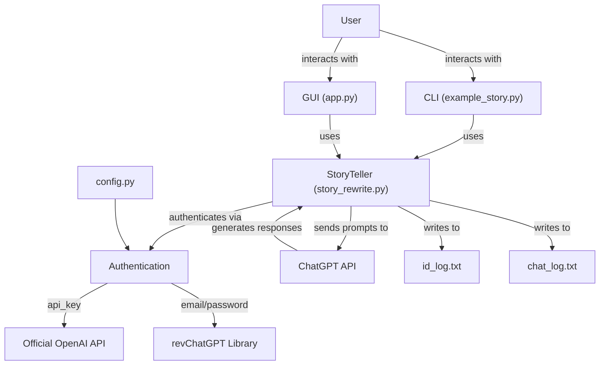
```mermaid
graph TD
    User["User"] -->|"interacts with"| CLI["CLI (example_story.py)"]
    User -->|"interacts with"| GUI["GUI (app.py)"]
    
    CLI -->|"uses"| StoryTeller["StoryTeller (story_rewrite.py)"]
    GUI -->|"uses"| StoryTeller
    
    StoryTeller -->|"authenticates via"| Auth["Authentication"]
    Auth -->|"api_key"| OfficialAPI["Official OpenAI API"]
    Auth -->|"email/password"| RevChatGPT["revChatGPT Library"]
    
    StoryTeller -->|"sends prompts to"| ChatGPT["ChatGPT API"]
    ChatGPT -->|"generates responses"| StoryTeller
    
    StoryTeller -->|"writes to"| IDLog["id_log.txt"]
    StoryTeller -->|"writes to"| ChatLog["chat_log.txt"]
    
    Config["config.py"] --> Auth
```

Sources: [README.md:16-42]()

### Core Components

| Component | Implementation | Purpose |
|-----------|----------------|---------|
| CLI Interface | `example_story.py` | Command-line interface for story interaction |
| GUI Interface | `app.py` | Graphical interface built with tkinter |
| Story Engine | `StoryTeller` class | Handles story generation and API communication |
| Configuration | `config.py` | Contains authentication settings and API preferences |
| Persistence Files | `id_log.txt`, `chat_log.txt` | Store conversation IDs and history |

Sources: [README.md:16-42](), [Example.ipynb:22-40]()

## Story Generation Process

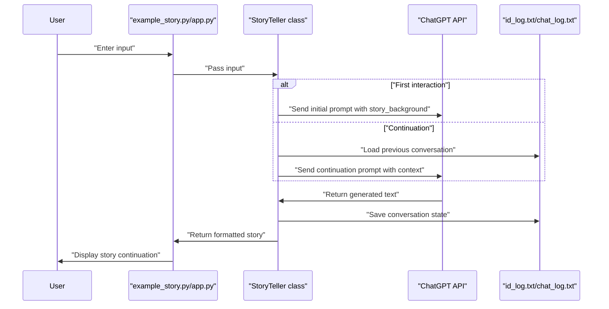
```mermaid
sequenceDiagram
    participant User
    participant Interface as "example_story.py/app.py"
    participant StoryTeller as "StoryTeller class"
    participant API as "ChatGPT API"
    participant Files as "id_log.txt/chat_log.txt"
    
    User->>Interface: "Enter input"
    Interface->>StoryTeller: "Pass input"
    
    alt "First interaction"
        StoryTeller->>API: "Send initial prompt with story_background"
    else "Continuation"
        StoryTeller->>Files: "Load previous conversation"
        StoryTeller->>API: "Send continuation prompt with context"
    end
    
    API->>StoryTeller: "Return generated text"
    StoryTeller->>Files: "Save conversation state"
    StoryTeller->>Interface: "Return formatted story"
    Interface->>User: "Display story continuation"
```

Sources: [README.md:85-140](), [Example.ipynb:22-40]()

## User Interfaces

The system offers two interface options:

### 1. Command-Line Interface (CLI)

The CLI is implemented in `example_story.py` and provides:
- Text-based interaction through the terminal
- Automatic saving and loading of story states
- Simple prompt-response interaction loop

Usage:
```
python3 example_story.py
```

Sources: [README.md:28-32]()

### 2. Graphical User Interface (GUI)

The GUI is implemented in `app.py` and offers:
- Visual interaction built with tkinter
- Text input areas and story display panels
- Configuration options within the interface

Usage:
```
python3 app.py
```

Sources: [README.md:34-42]()

## Authentication Methods

The system supports two authentication approaches to connect with OpenAI's services:

| Method | Configuration | Characteristics |
|--------|--------------|-----------------|
| Official API Key | `api_key` in `config.py` | More reliable, faster responses, requires payment |
| Reverse-Engineered API | Email/password in `config.py` | No direct payment, potential reliability issues |

**Note:** According to the README, using the reverse-engineered API could potentially lead to account suspension as OpenAI may block unofficial API usage.

Sources: [README.md:45-54](), [README.md:57-62]()

## Story Persistence

The system maintains story continuity across sessions by persisting data to:

- `id_log.txt`: Stores conversation IDs for resuming sessions
- `chat_log.txt`: Stores conversation history and context

This persistence mechanism allows users to save progress and continue stories later, maintaining the contextual understanding that makes the narrative coherent.

Sources: [README.md:64-67]()

## Dependencies

The primary external dependency is the `revChatGPT` library, which provides the interface to ChatGPT. Version compatibility is important, and users may need to upgrade this package to resolve certain issues:

```
pip3 install --upgrade revChatGPT
```

Sources: [README.md:50-53](), [README.md:142-146]()

## Getting Started

For installation, configuration, and basic usage instructions, see [Getting Started](#1.1).

For detailed information about the system architecture, see [System Architecture](#1.2).

For documentation on the available user interfaces, see [User Interfaces](#2).

---

# Page: Getting Started

# Getting Started

<details>
<summary>Relevant source files</summary>

The following files were used as context for generating this wiki page:

- [README.md](README.md)
- [requirements.txt](requirements.txt)

</details>


This document provides step-by-step instructions for installing, configuring, and running the Chinese AI Dungeon ChatGPT system. It covers the initial setup process and basic usage to help you start creating interactive stories with ChatGPT. For a broader introduction to the system, see [Overview](#1), and for details on the system architecture, see [System Architecture](#1.2).

## Prerequisites

Before setting up Chinese AI Dungeon ChatGPT, ensure you have:

- Python 3.9+ (required for GUI version)
- Python 3.6+ (minimum for CLI version)
- pip package manager
- OpenAI account or API key (for authentication)

Sources: [README.md:16-32]()

## Installation

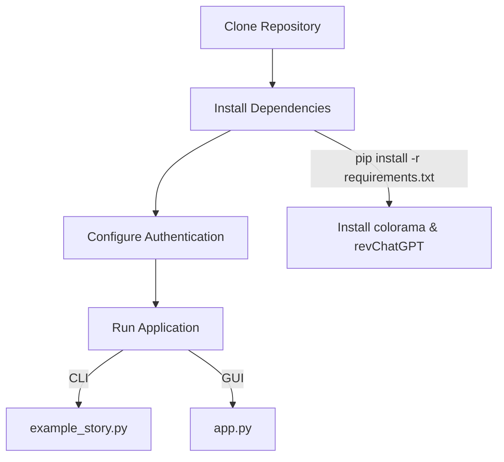
```mermaid
flowchart TD
    A["Clone Repository"] --> B["Install Dependencies"]
    B --> C["Configure Authentication"]
    C --> D["Run Application"]
    
    B --> |"pip install -r requirements.txt"| B1["Install colorama & revChatGPT"]
    D --> |"CLI"| D1["example_story.py"]
    D --> |"GUI"| D2["app.py"]
```

### Step 1: Clone the Repository

```
git clone https://github.com/bupticybee/ChineseAiDungeonChatGPT.git
cd ChineseAiDungeonChatGPT
```

### Step 2: Install Dependencies

Install the required packages using pip:

```
pip3 install -r requirements.txt
```

This installs:
- `colorama`: For formatted terminal output in the CLI
- `revChatGPT`: Client library for ChatGPT interaction

If you encounter issues related to `revChatGPT`, update it to the latest version:

```
pip3 install revChatGPT --upgrade
```

Sources: [requirements.txt:1-2](), [README.md:20-24]()

## Authentication Configuration

The system supports two methods for authenticating with ChatGPT:

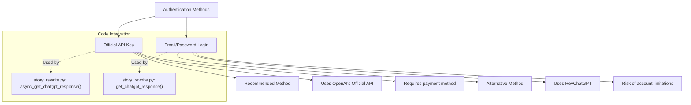
```mermaid
flowchart TD
    A["Authentication Methods"] --> B["Official API Key"]
    A --> C["Email/Password Login"]
    
    B --> D["Recommended Method"]
    B --> E["Uses OpenAI's Official API"]
    B --> F["Requires payment method"]
    
    C --> G["Alternative Method"]
    C --> H["Uses RevChatGPT"]
    C --> I["Risk of account limitations"]
    
    subgraph "Code Integration"
        B -.-> |"Used by"| J["story_rewrite.py: async_get_chatgpt_response()"]
        C -.-> |"Used by"| K["story_rewrite.py: get_chatgpt_response()"]
    end
```

### Creating a Configuration File

Create a file named `config.py` in the project root directory with one of the following configurations:

#### Option 1: Official API Key (Recommended)

```python
config = {
    "api_key": "your-api-key-here"
}
```

Get your API key from: [OpenAI API Keys](https://platform.openai.com/account/api-keys)

#### Option 2: Email/Password (Not Recommended)

```python
config = {
    "email": "your-openai-email",
    "password": "your-openai-password"
}
```

**Note:** Using this method may risk account limitations from OpenAI.

If you don't create a configuration file, the application will prompt for credentials when launched.

Sources: [README.md:44-54](), [README.md:57-63]()

## Running the Application

You can run Chinese AI Dungeon ChatGPT in two ways:

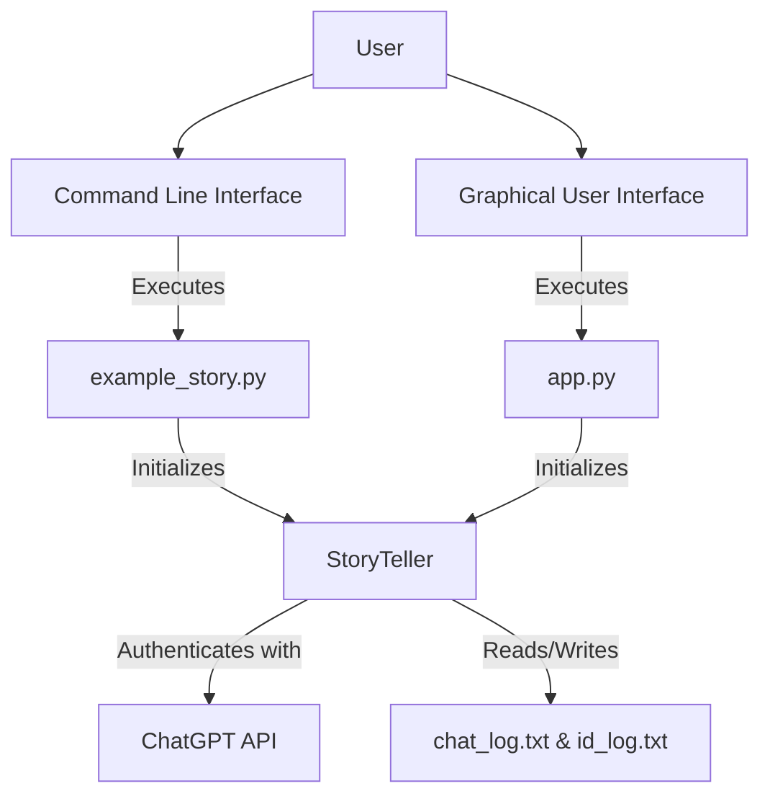
```mermaid
flowchart TD
    A["User"] --> B["Command Line Interface"]
    A --> C["Graphical User Interface"]
    
    B --> |"Executes"| D["example_story.py"]
    C --> |"Executes"| E["app.py"]
    
    D --> |"Initializes"| F["StoryTeller"]
    E --> |"Initializes"| F
    
    F --> |"Authenticates with"| G["ChatGPT API"]
    F --> |"Reads/Writes"| H["chat_log.txt & id_log.txt"]
```

### Command Line Interface

To run the CLI version:

```
python3 example_story.py
```

This launches a text-based interactive storytelling experience in your terminal.

### Graphical User Interface

To run the GUI version (requires Python 3.9+):

```
python3 app.py
```

This opens a window with a more visual storytelling interface.

Sources: [README.md:28-42]()

## Basic Usage Workflow

Once you've launched either interface, the system follows this workflow:

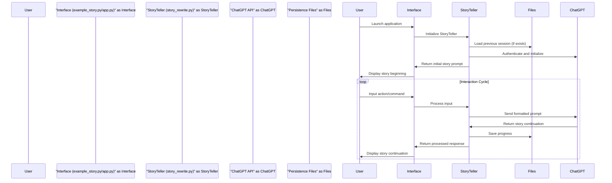
```mermaid
sequenceDiagram
    participant "User" as User
    participant "Interface (example_story.py/app.py)" as Interface
    participant "StoryTeller (story_rewrite.py)" as StoryTeller
    participant "ChatGPT API" as ChatGPT
    participant "Persistence Files" as Files
    
    User->>Interface: Launch application
    Interface->>StoryTeller: Initialize StoryTeller
    StoryTeller->>Files: Load previous session (if exists)
    StoryTeller->>ChatGPT: Authenticate and initialize
    StoryTeller->>Interface: Return initial story prompt
    Interface->>User: Display story beginning
    
    loop Interaction Cycle
        User->>Interface: Input action/command
        Interface->>StoryTeller: Process input
        StoryTeller->>ChatGPT: Send formatted prompt
        ChatGPT->>StoryTeller: Return story continuation
        StoryTeller->>Files: Save progress
        StoryTeller->>Interface: Return processed response
        Interface->>User: Display story continuation
    end
```

### Story Persistence

The system automatically saves your progress through two files:

- `chat_log.txt`: Contains the conversation history
- `id_log.txt`: Stores conversation IDs for session resumption

When you restart the application, it automatically loads your previous session if these files exist.

### Sample Interaction

Here's a simplified example of what to expect:

1. System presents an initial story setting
2. You type what action you want to take
3. The AI responds with story continuation
4. Repeat steps 2-3 to continue the adventure

Example from the README:

```
你在树林里冒险，指不定会从哪里蹦出来一些奇怪的东西，你握紧手上的手枪，希望这次冒险能够找到一些值钱的东西，你往树林深处走去。

> 你穿好伪装衣，这样敌人很难发现自己

你走了几步之后，感觉身后有什么东西在跟着你。你转身一看，发现是一只巨大的熊。你立刻拔出手枪，准备向它开枪。但是你发现，这只熊似乎并不想攻击你，反而好像在寻找什么东西...
```

Sources: [README.md:85-140]()

## Troubleshooting

Common issues and their solutions:

| Problem | Error Message | Solution |
|---------|---------------|----------|
| Outdated RevChatGPT | `TypeError: 'generator' object is not subscriptable` | Update: `pip3 install revChatGPT --upgrade` |
| API changes | `IndexError: list index out of range` | API may be temporarily unavailable. Update RevChatGPT. |
| Authentication failure | `ValueError: Error refreshing session: No email and password provided` | Your token may have expired. Reconfigure auth in config.py. |

For more detailed information about authentication options, see [Authentication](#3.2). For in-depth usage of the interfaces, see [Command Line Interface](#2.2) or [Graphical User Interface](#2.1).

Sources: [README.md:142-154]()

## Next Steps

Once you have the system running:

1. Experiment with different story prompts and scenarios
2. Try both the CLI and GUI interfaces to see which you prefer
3. Learn about advanced configuration options in [Configuration](#4)
4. Explore story customization in [Story Parameters](#4.2)

For developers interested in extending the system, see [Development](#5).

---

# Page: System Architecture

# System Architecture

<details>
<summary>Relevant source files</summary>

The following files were used as context for generating this wiki page:

- [README.md](README.md)
- [app.py](app.py)
- [story_rewrite.py](story_rewrite.py)

</details>


## Purpose and Scope

This document provides a technical overview of the system architecture for the Chinese AI Dungeon ChatGPT project. It details the main components of the system, their interactions, and data flows. The focus is on understanding how the various parts work together to enable interactive storytelling experiences powered by OpenAI's ChatGPT.

For information about setting up and using the system, see [Getting Started](#1.1). For detailed information about the available user interfaces, see [User Interfaces](#2).

## High-Level Architecture Overview

### Component Interaction Diagram

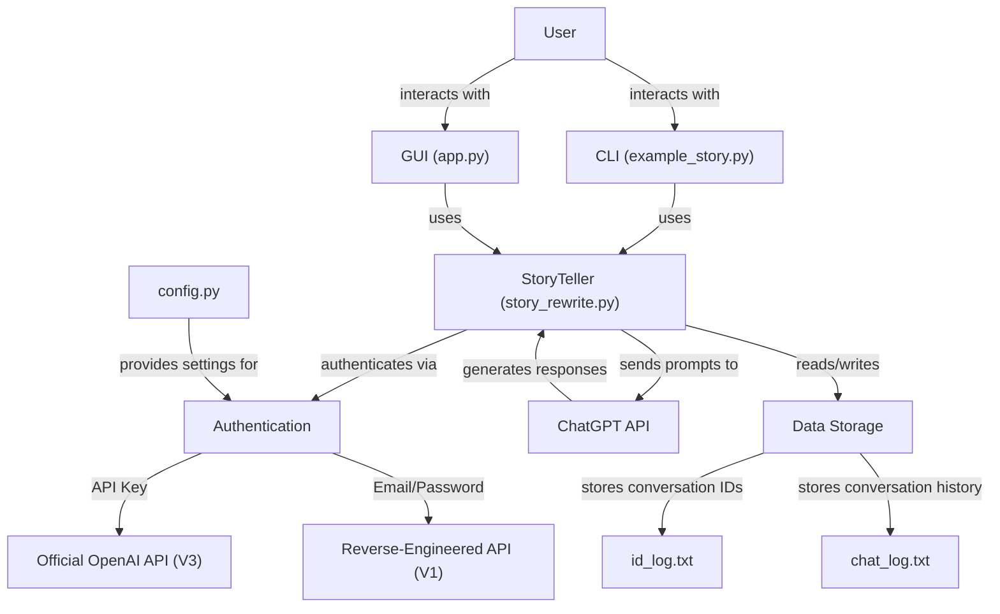
```mermaid
graph TD
    User["User"] --> |"interacts with"| CLI["CLI (example_story.py)"]
    User --> |"interacts with"| GUI["GUI (app.py)"]
    
    CLI --> |"uses"| StoryTeller["StoryTeller (story_rewrite.py)"]
    GUI --> |"uses"| StoryTeller
    
    StoryTeller --> |"authenticates via"| AuthSystem["Authentication"]
    AuthSystem --> |"API Key"| OfficialAPI["Official OpenAI API (V3)"]
    AuthSystem --> |"Email/Password"| ReverseAPI["Reverse-Engineered API (V1)"]
    
    StoryTeller --> |"sends prompts to"| ChatGPT["ChatGPT API"]
    ChatGPT --> |"generates responses"| StoryTeller
    
    StoryTeller --> |"reads/writes"| DataStorage["Data Storage"]
    DataStorage --> |"stores conversation IDs"| IDLog["id_log.txt"]
    DataStorage --> |"stores conversation history"| ChatLog["chat_log.txt"]
    
    Config["config.py"] --> |"provides settings for"| AuthSystem
```

The system consists of several key components:

1. **User Interfaces** - Both CLI and GUI options for user interaction
2. **StoryTeller** - Core component that handles story generation and ChatGPT communication
3. **Authentication** - Manages API access through multiple methods
4. **API Integration** - Connects to either official or reverse-engineered OpenAI APIs
5. **Data Storage** - Persists conversation data and IDs
6. **Configuration** - Manages system settings and authentication details

Sources: [app.py:1-371](), [story_rewrite.py:1-170](), [README.md:1-155]()

## User Interface Layer

The system provides two distinct user interfaces, giving users flexibility in how they interact with the AI storytelling engine.

### Interface Implementation Diagram

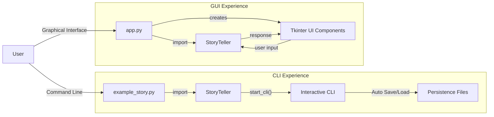
```mermaid
graph LR
    User["User"] --> |"Command Line"| CLI["example_story.py"]
    User --> |"Graphical Interface"| GUI["app.py"]
    
    subgraph "CLI Experience"
        CLI --> |"import"| StoryRewrite["StoryTeller"]
        StoryRewrite --> |"start_cli()"| CLIInteraction["Interactive CLI"]
        CLIInteraction --> |"Auto Save/Load"| FileSystem["Persistence Files"]
    end
    
    subgraph "GUI Experience"
        GUI --> |"import"| StoryTeller["StoryTeller"]
        GUI --> |"creates"| UIComponents["Tkinter UI Components"]
        UIComponents --> |"user input"| StoryTeller
        StoryTeller --> |"response"| UIComponents
    end
```

### Command Line Interface

The CLI is implemented in `example_story.py` and provides a text-based interface with:
- Simple text input for user actions
- Colored text output via the `colorama` library
- Automatic saving and loading of conversation history

### Graphical User Interface

The GUI is implemented in `app.py` using Python's Tkinter library and offers:
- Text entry field for user actions
- Scrollable text display for story output
- Authentication dialogs for login credentials
- Progress indicators during API communication
- Background story configuration options

Sources: [app.py:11-168](), [app.py:325-365](), [story_rewrite.py:123-127](), [story_rewrite.py:164-169]()

## StoryTeller Component

The `StoryTeller` class is the central component of the system, acting as an intermediary between user interfaces and the ChatGPT API.

### StoryTeller Class Diagram

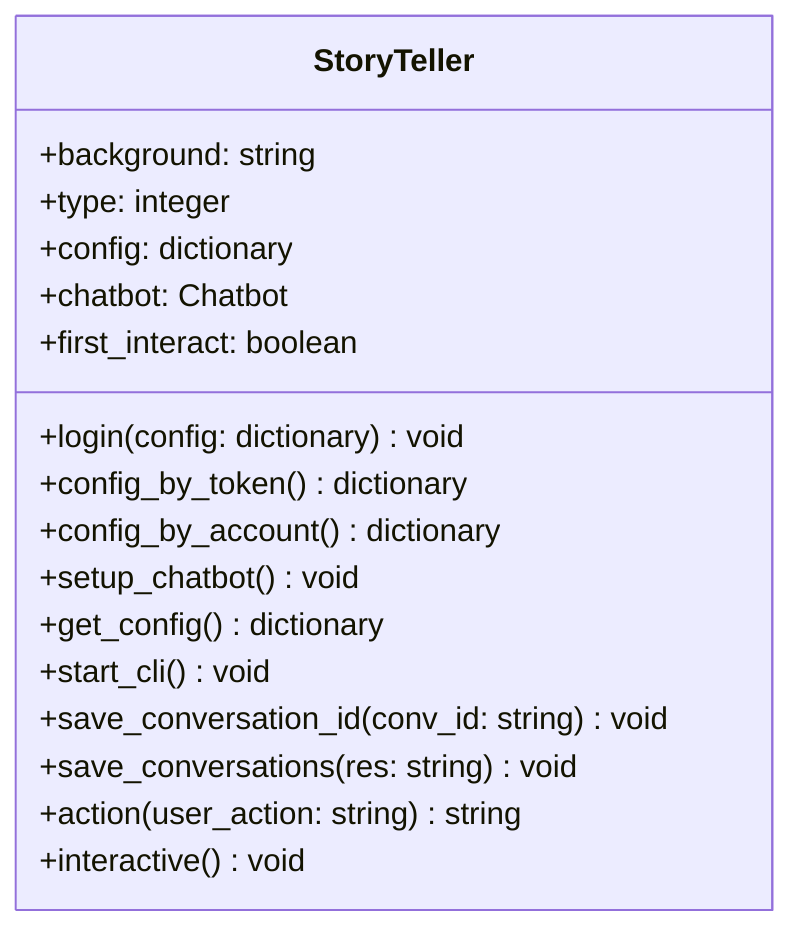
```mermaid
classDiagram
    class StoryTeller {
        +background: string
        +type: integer
        +config: dictionary
        +chatbot: Chatbot
        +first_interact: boolean
        +login(config: dictionary) void
        +config_by_token() dictionary
        +config_by_account() dictionary
        +setup_chatbot() void
        +get_config() dictionary
        +start_cli() void
        +save_conversation_id(conv_id: string) void
        +save_conversations(res: string) void
        +action(user_action: string) string
        +interactive() void
    }
```

The `StoryTeller` class is responsible for:
1. Managing authentication with ChatGPT API
2. Formatting user inputs into effective prompts
3. Processing ChatGPT responses
4. Saving and loading conversation history
5. Providing methods for both CLI and GUI interfaces

### Key Methods

| Method | Purpose | Used By |
|--------|---------|---------|
| `login(config)` | Authenticates with the ChatGPT API | Both interfaces during initialization |
| `action(user_action)` | Processes user input and gets AI response | Both interfaces for story generation |
| `interactive()` | Starts an interactive CLI session | CLI interface |
| `save_conversation_id(conv_id)` | Saves conversation ID to file | Used during conversations with reverse-engineered API |
| `save_conversations(res)` | Saves conversation history to file | Used during conversations with reverse-engineered API |

Sources: [story_rewrite.py:15-36](), [story_rewrite.py:140-162]()

## Authentication System

The system supports two distinct authentication methods for accessing ChatGPT:

### Authentication Flow Diagram

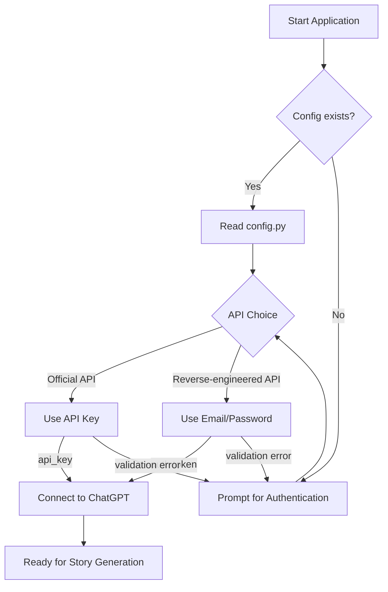
```mermaid
flowchart TD
    Start["Start Application"] --> CheckConfig{"Config exists?"}
    CheckConfig -->|"Yes"| ReadConfig["Read config.py"]
    CheckConfig -->|"No"| PromptAuth["Prompt for Authentication"]
    
    ReadConfig --> CheckAPIType{"API Choice"}
    PromptAuth --> CheckAPIType
    
    CheckAPIType -->|"Official API"| APIKeyAuth["Use API Key"]
    CheckAPIType -->|"Reverse-engineered API"| EmailAuth["Use Email/Password"]
    
    APIKeyAuth --> |"api_key"| ChatGPT["Connect to ChatGPT"]
    EmailAuth --> |"auth token"| ChatGPT
    
    APIKeyAuth --> |"validation error"| PromptAuth
    EmailAuth --> |"validation error"| PromptAuth
    
    ChatGPT --> Ready["Ready for Story Generation"]
```

### Authentication Methods

1. **Official OpenAI API (type=0)**
   - Uses `ofChatbot` class from `revChatGPT.V3`
   - Requires API key
   - More reliable but requires payment
   
2. **Reverse-engineered API (type=1)**
   - Uses `Chatbot` class from `revChatGPT.V1`
   - Requires email and password
   - Free but has potential account ban risk

The system configures the appropriate authentication method based on user selection in both interfaces.

Sources: [story_rewrite.py:36-41](), [story_rewrite.py:42-52](), [story_rewrite.py:53-87](), [app.py:186-205]()

## API Integration

The system integrates with two different ChatGPT APIs through the `revChatGPT` library:

| API Type | Class | Source | Authentication | Pros | Cons |
|----------|-------|--------|---------------|------|------|
| Official API | `ofChatbot` | `revChatGPT.V3` | API Key | Stable, reliable | Requires payment |
| Reverse-engineered API | `Chatbot` | `revChatGPT.V1` | Email/Password | Free | Risk of account ban |

These API connections are established in the `login` method of the `StoryTeller` class, where the appropriate chatbot instance is created based on the selected authentication type.

Sources: [story_rewrite.py:6-12](), [story_rewrite.py:36-41]()

## Story Generation Process

### Story Generation Sequence Diagram

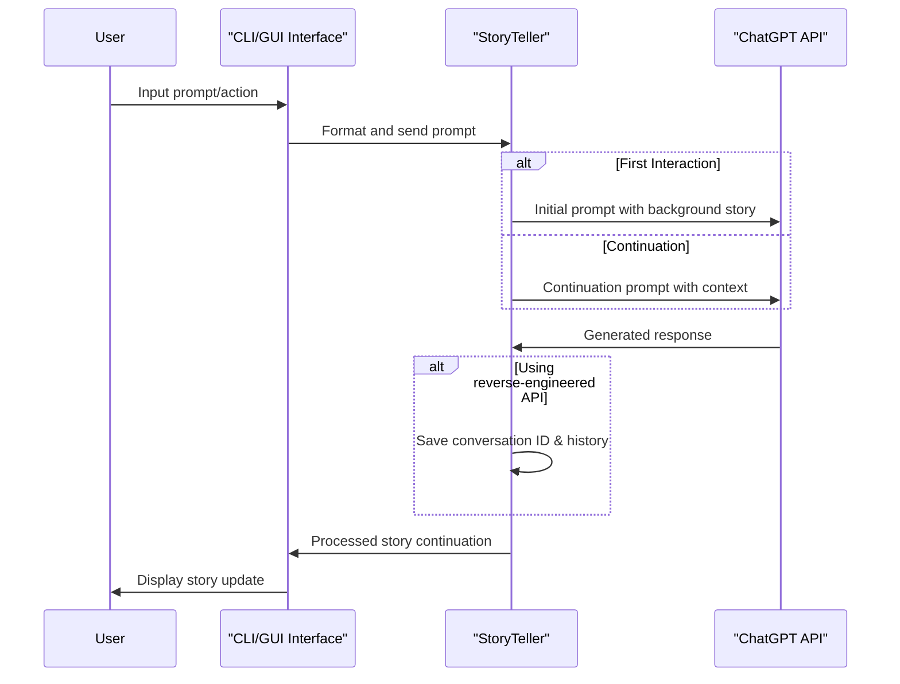
```mermaid
sequenceDiagram
    participant User
    participant Interface as "CLI/GUI Interface"
    participant StoryTeller as "StoryTeller"
    participant ChatGPT as "ChatGPT API"
    
    User->>Interface: Input prompt/action
    Interface->>StoryTeller: Format and send prompt
    
    alt First Interaction
        StoryTeller->>ChatGPT: Initial prompt with background story
    else Continuation
        StoryTeller->>ChatGPT: Continuation prompt with context
    end
    
    ChatGPT->>StoryTeller: Generated response
    
    alt Using reverse-engineered API
        StoryTeller->>StoryTeller: Save conversation ID & history
    end
    
    StoryTeller->>Interface: Processed story continuation
    Interface->>User: Display story update
```

### Prompt Templates

The system uses two different prompt templates depending on whether it's the first interaction or a continuation:

1. **Initial Prompt** (first interaction):
   ```
   现在来充当一个冒险文字游戏，描述时候注意节奏，不要太快，仔细描述各个人物的心情和周边环境。一次只需写四到六句话。
   开头是，{background} 你{user_action}
   ```

2. **Continuation Prompt** (subsequent interactions):
   ```
   继续，一次只需要续写四到六句话，总共就只讲5分钟内发生的事情。
   你{user_action}
   ```

These carefully crafted prompts guide ChatGPT to generate appropriate story continuations with the right level of detail.

Sources: [story_rewrite.py:140-162]()

## Data Persistence Model

### Persistence Layer Diagram

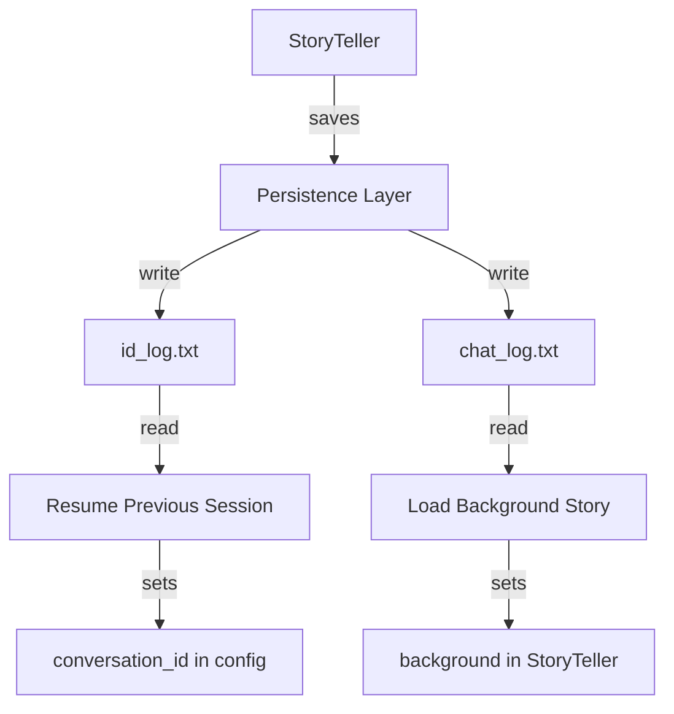
```mermaid
graph TD
    StoryTeller -->|"saves"| Persistence["Persistence Layer"]
    
    Persistence -->|"write"| IDLog["id_log.txt"]
    Persistence -->|"write"| ChatLog["chat_log.txt"]
    
    IDLog -->|"read"| ResumePrevious["Resume Previous Session"]
    ChatLog -->|"read"| LoadBackground["Load Background Story"]
    
    ResumePrevious -->|"sets"| ConversationID["conversation_id in config"]
    LoadBackground -->|"sets"| Background["background in StoryTeller"]
```

The system uses a simple but effective file-based persistence mechanism:

| File | Purpose | Methods | Data Stored |
|------|---------|---------|-------------|
| `id_log.txt` | Stores conversation IDs | `save_conversation_id()` | Conversation ID for session resumption |
| `chat_log.txt` | Stores conversation history | `save_conversations()` | Story text for context preservation |

This persistence allows users to:
1. Resume previous story sessions
2. Maintain story continuity across application restarts
3. Avoid losing progress due to application crashes or closures

Sources: [story_rewrite.py:132-138](), [story_rewrite.py:76-86](), [story_rewrite.py:98-106]()

## Code and Data Flow

### Complete System Data Flow

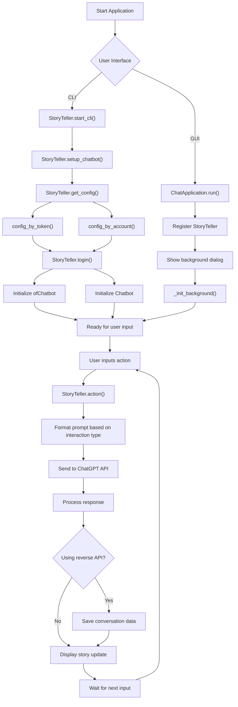
```mermaid
flowchart TD
    Start["Start Application"] --> Interface{"User Interface"}
    
    Interface -->|"CLI"| StartCLI["StoryTeller.start_cli()"]
    Interface -->|"GUI"| StartGUI["ChatApplication.run()"]
    
    StartCLI --> SetupChatbot["StoryTeller.setup_chatbot()"]
    StartGUI --> Register["Register StoryTeller"]
    
    SetupChatbot --> GetConfig["StoryTeller.get_config()"]
    Register --> ShowBackground["Show background dialog"]
    
    GetConfig --> ConfigToken["config_by_token()"]
    GetConfig --> ConfigAccount["config_by_account()"]
    
    ConfigToken --> Login["StoryTeller.login()"]
    ConfigAccount --> Login
    ShowBackground --> InitBackground["_init_background()"]
    
    Login --> OfficialInit["Initialize ofChatbot"]
    Login --> ReverseInit["Initialize Chatbot"]
    
    OfficialInit --> Ready["Ready for user input"]
    ReverseInit --> Ready
    InitBackground --> Ready
    
    Ready --> UserInput["User inputs action"]
    
    UserInput --> Action["StoryTeller.action()"]
    
    Action --> FormatPrompt["Format prompt based on interaction type"]
    
    FormatPrompt --> SendAPI["Send to ChatGPT API"]
    
    SendAPI --> ProcessResponse["Process response"]
    
    ProcessResponse --> SaveIfNeeded{"Using reverse API?"}
    
    SaveIfNeeded -->|"Yes"| SaveData["Save conversation data"]
    SaveIfNeeded -->|"No"| DisplayStory["Display story update"]
    
    SaveData --> DisplayStory
    
    DisplayStory --> WaitInput["Wait for next input"]
    
    WaitInput --> UserInput
```

This comprehensive flow diagram illustrates the complete code and data flow through the system from startup to interactive storytelling, showing how user input is transformed into storytelling output through the various system components.

Sources: [app.py:47-371](), [story_rewrite.py:15-170]()

## Summary

The Chinese AI Dungeon ChatGPT system employs a straightforward but effective architecture centered around the `StoryTeller` class that bridges user interfaces with the ChatGPT API. The system provides both CLI and GUI options for user interaction and supports two authentication methods for API access.

Key architectural features include:
1. Dual user interfaces for different user preferences
2. Flexible API integration supporting both official and reverse-engineered methods
3. Simple file-based persistence for saving conversation state
4. Carefully crafted prompts for guiding story generation
5. Support for session resumption and continuity

This architecture delivers an engaging interactive storytelling experience accessible through multiple interfaces while managing the underlying complexity of API authentication and story generation.

---

# Page: User Interfaces

# User Interfaces

<details>
<summary>Relevant source files</summary>

The following files were used as context for generating this wiki page:

- [README.md](README.md)
- [app.py](app.py)
- [example_story.py](example_story.py)

</details>


This page provides an overview of the user interfaces available in the ChineseAiDungeonChatGPT system. The system offers two primary interfaces for interacting with the AI storyteller: a Command Line Interface (CLI) and a Graphical User Interface (GUI). Both interfaces connect to the same underlying story generation engine but provide different user experiences.

For details about the specific graphical interface components, see [Graphical User Interface](#2.1). For information about command-line operation, see [Command Line Interface](#2.2).

## User Interface Architecture

Both interfaces act as presentation layers that connect to the `StoryTeller` class, which serves as the core component handling communication with ChatGPT's API.

### Interface Relationship Diagram

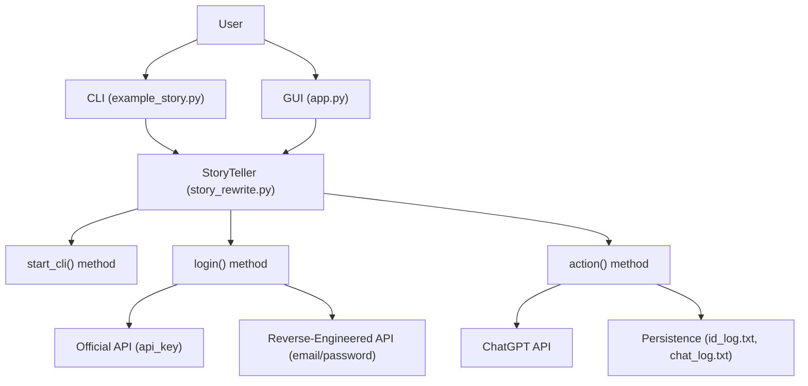
```mermaid
graph TD
    User["User"] --> CLI["CLI (example_story.py)"]
    User --> GUI["GUI (app.py)"]
    
    CLI --> StoryTeller["StoryTeller (story_rewrite.py)"]
    GUI --> StoryTeller
    
    StoryTeller --> StartCLI["start_cli() method"]
    StoryTeller --> LoginMethod["login() method"]
    StoryTeller --> ActionMethod["action() method"]
    
    LoginMethod --> OfficialAPI["Official API (api_key)"]
    LoginMethod --> ReverseAPI["Reverse-Engineered API (email/password)"]
    
    ActionMethod --> ChatGPT["ChatGPT API"]
    ActionMethod --> Persistence["Persistence (id_log.txt, chat_log.txt)"]
```

Sources: [example_story.py:1-8](), [app.py:8-11]()

## Command Line Interface (CLI)

The CLI provides a simple text-based interface for interacting with the storytelling system. It's implemented through the `example_story.py` script which initializes a `StoryTeller` instance and calls its `start_cli()` method.

### CLI Usage

To start the CLI version:

```shell
python3 example_story.py
```

The CLI mode initializes with a predefined background story that sets the context for your adventure:

```python
story_background = "你在树林里冒险，指不定会从哪里蹦出来一些奇怪的东西，你握紧手上的手枪，希望这次冒险能够找到一些值钱的东西，你往树林深处走去。"
```

Which translates to: "You're adventuring in the forest, strange things might appear from anywhere. You grip your gun tightly, hoping to find something valuable on this adventure. You head deeper into the forest."

### CLI Implementation Details

The CLI implementation is minimalistic, consisting of just a few lines of code:

```python
chatter = StoryTeller(story_background)
chatter.start_cli()
```

The CLI automatically saves and loads story progress between sessions, enabling you to continue your adventure where you left off.

Sources: [example_story.py:1-8](), [README.md:17-32]()

## Graphical User Interface (GUI)

The GUI provides a more visual and user-friendly experience built with Tkinter. It's implemented in `app.py` and offers several features not available in the CLI version, such as customizable background stories and a more intuitive authentication flow.

### GUI Requirements

The GUI requires Python 3.9 or higher to run properly.

### GUI Usage

To start the GUI version:

```shell
python3 app.py
```

### GUI Components Structure

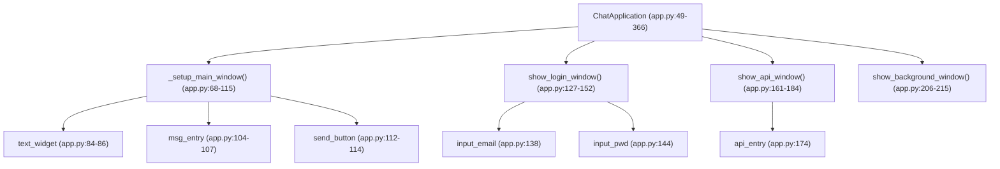
```mermaid
graph TD
    ChatApplication["ChatApplication (app.py:49-366)"]
    
    ChatApplication --> Setup["_setup_main_window() (app.py:68-115)"]
    ChatApplication --> LoginWindow["show_login_window() (app.py:127-152)"]
    ChatApplication --> APIWindow["show_api_window() (app.py:161-184)"]
    ChatApplication --> BackgroundWindow["show_background_window() (app.py:206-215)"]
    
    Setup --> TextWidget["text_widget (app.py:84-86)"]
    Setup --> MsgEntry["msg_entry (app.py:104-107)"]
    Setup --> SendButton["send_button (app.py:112-114)"]
    
    LoginWindow --> EmailInput["input_email (app.py:138)"]
    LoginWindow --> PasswordInput["input_pwd (app.py:144)"]
    
    APIWindow --> ApiEntry["api_entry (app.py:174)"]
```

Sources: [app.py:49-366](), [app.py:1-48]()

### Authentication Flow

The GUI supports authentication through both OpenAI's official API key and a reverse-engineered API using email/password:

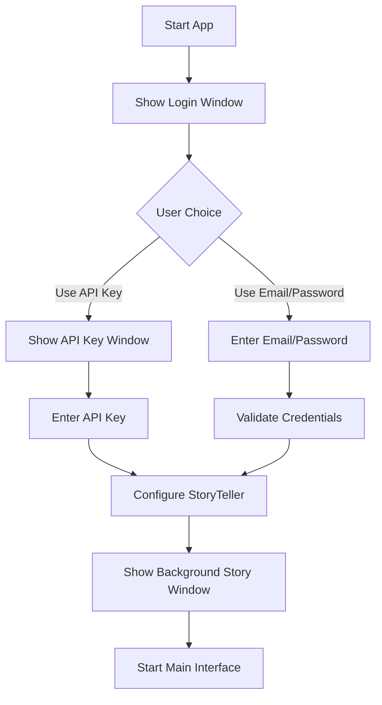
```mermaid
flowchart TD
    Start["Start App"] --> ShowLogin["Show Login Window"]
    ShowLogin --> UserChoice{"User Choice"}
    
    UserChoice -->|"Use API Key"| ShowAPIWindow["Show API Key Window"]
    UserChoice -->|"Use Email/Password"| EnterCredentials["Enter Email/Password"]
    
    ShowAPIWindow --> EnterAPIKey["Enter API Key"]
    EnterAPIKey --> ConfigureStoryTeller["Configure StoryTeller"]
    
    EnterCredentials --> ValidateCredentials["Validate Credentials"]
    ValidateCredentials --> ConfigureStoryTeller
    
    ConfigureStoryTeller --> ShowBackgroundWindow["Show Background Story Window"]
    ShowBackgroundWindow --> StartInterface["Start Main Interface"]
```

Sources: [app.py:127-152](), [app.py:161-184](), [app.py:226-235](), [app.py:273-296]()

### Story Background Customization

The GUI allows users to customize the background story through a dialog window. A default background is provided, but users can modify it to create their own adventure context:

```
辛迪加大陆分为托雷省，尼莱省和穆拉省，其中生活着矮人，精灵，人类三个种族以及无数的怪物。你是一个来自托雷的人类男性魔法师，今年21岁。你左手持着火焰法杖，右手拿着魔法书，背包里装着能支撑一周的口粮，进入了莱肯斯雨林进行冒险。
```

This default background describes a fantasy setting with dwarves, elves, and humans, where you are a 21-year-old human male mage from the Tore province, entering a rainforest for adventure.

Sources: [app.py:21](), [app.py:206-215]()

### User Interaction Flow

Once authenticated and configured, the GUI enables a chat-like interaction pattern with the AI:

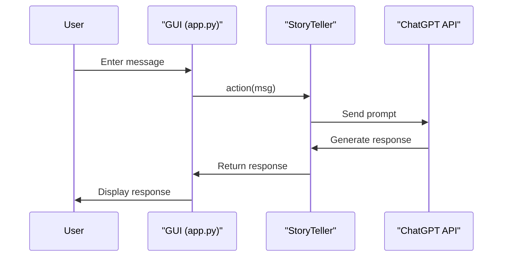
```mermaid
sequenceDiagram
    participant User
    participant GUI as "GUI (app.py)"
    participant StoryTeller as "StoryTeller"
    participant ChatGPT as "ChatGPT API"
    
    User->>GUI: Enter message
    GUI->>StoryTeller: action(msg)
    StoryTeller->>ChatGPT: Send prompt
    ChatGPT->>StoryTeller: Generate response
    StoryTeller->>GUI: Return response
    GUI->>User: Display response
```

The user's input is processed through `_on_enter_pressed()` and `_insert_message()` methods, which manage sending the prompt to the StoryTeller and displaying the response.

Sources: [app.py:338-345](), [app.py:347-365]()

## Interface Comparison

The following table compares the two interfaces to help you choose which is most appropriate for your needs:

| Feature | CLI | GUI |
|---------|-----|-----|
| Ease of use | Basic | User-friendly |
| Visual presentation | Text only | Styled chat interface |
| Authentication options | Limited | Full (API key or email/password) |
| System requirements | Minimal | Requires Python 3.9+ |
| Background customization | No | Yes |
| Auto-save | Yes | Yes |
| Progress indicators | No | Yes (loading bars) |
| Startup speed | Fast | Slightly slower |

For quick testing or server environments, the CLI offers a lightweight solution. For more regular usage, the GUI provides a richer experience with visual feedback and more configuration options.

Sources: [README.md:17-42](), [app.py:1-10](), [example_story.py:1-8]()

---

# Page: Graphical User Interface

# Graphical User Interface

<details>
<summary>Relevant source files</summary>

The following files were used as context for generating this wiki page:

- [app.py](app.py)
- [outputs/example_chatgpt_app.png](outputs/example_chatgpt_app.png)

</details>


## Overview
This document provides a comprehensive guide to the Graphical User Interface (GUI) of the Chinese AI Dungeon ChatGPT system. The GUI provides an easy-to-use visual interface for interacting with the AI storytelling engine. For information about the command-line alternative, see [Command Line Interface](#2.2).

The GUI allows users to:
- Log in using either OpenAI API keys or email/password credentials
- Customize the background story for their adventure
- Send actions/commands to the AI storyteller
- View the ongoing narrative in a scrollable text window

## GUI Components and Layout

The interface is built using Python's Tkinter library and consists of several key components arranged in a clean, focused layout.

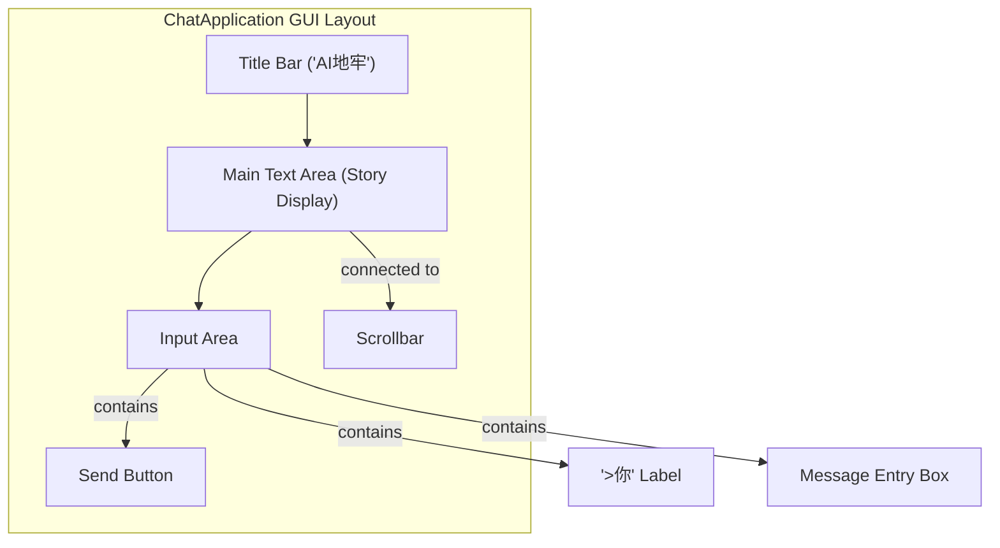
```mermaid
graph TD
    subgraph "ChatApplication GUI Layout"
        TitleBar["Title Bar ('AI地牢')"]
        MainTextArea["Main Text Area (Story Display)"]
        InputArea["Input Area"]
        SendButton["Send Button"]
        Scrollbar["Scrollbar"]
    end

    TitleBar --> MainTextArea
    MainTextArea --> InputArea
    InputArea --> |contains| PreText["'>你' Label"]
    InputArea --> |contains| TextEntry["Message Entry Box"]
    InputArea --> |contains| SendButton
    MainTextArea --> |connected to| Scrollbar
```

Sources: [app.py:74-95](), [app.py:98-114]()

### Window Setup and Configuration
The main application window is configured with a fixed size of 470×550 pixels and positioned in the center of the screen. The window uses a dark color scheme with gray text on a dark background for better readability during extended storytelling sessions.

Key configuration details:
- Window title: "AI地牢" (AI Dungeon)
- Non-resizable window
- Dark theme with text colors defined as constants

Sources: [app.py:14-19](), [app.py:68-73]()

### Text Display Area
The main text display area occupies most of the window and shows:
- The background story (initially)
- User inputs prefixed with ">你" (">you" in Chinese)
- AI-generated story responses

The text widget is configured with:
- Scrollbar for navigation through longer stories
- Read-only state (DISABLED) except when new text is being inserted
- Automatic scrolling to show the most recent content

Sources: [app.py:83-92](), [app.py:353-365]()

### User Input Section
Located at the bottom of the window, the input section consists of:
- A prefix label ">你" indicating user input
- A text entry field where users type their actions
- A "发送" (Send) button to submit the input

The input field supports keyboard interaction, allowing users to press Enter to submit their text instead of clicking the button.

Sources: [app.py:94-114](), [app.py:117-121]()

## User Authentication

Before using the GUI, users must authenticate. The system supports two authentication methods, with a preference for the API key method for safety reasons.

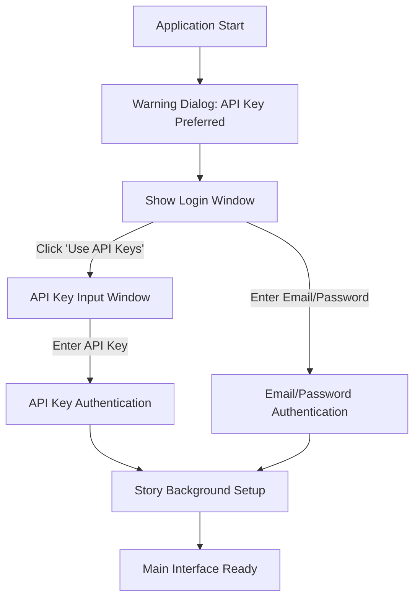
```mermaid
flowchart TD
    Start["Application Start"] --> WarningDialog["Warning Dialog: API Key Preferred"]
    WarningDialog --> LoginWindow["Show Login Window"]
    
    LoginWindow --> |"Click 'Use API Keys'"| APIWindow["API Key Input Window"]
    LoginWindow --> |"Enter Email/Password"| EmailAuth["Email/Password Authentication"]
    
    APIWindow --> |"Enter API Key"| APIKeyAuth["API Key Authentication"]
    
    APIKeyAuth --> StoryBG["Story Background Setup"]
    EmailAuth --> StoryBG
    
    StoryBG --> MainInterface["Main Interface Ready"]
```

Sources: [app.py:123-196](), [app.py:217-225](), [app.py:273-295]()

### API Key Authentication
When choosing the API key method:
1. A dialog prompts the user to enter their OpenAI API key
2. Upon confirmation, the key is stored and used for all subsequent API calls
3. This is the recommended method as noted by the warning dialog

Sources: [app.py:162-194](), [app.py:186-189]()

### Email/Password Authentication
Alternatively, users can authenticate with their OpenAI account credentials:
1. The login window requests email and password
2. These credentials are used to obtain authorization tokens
3. The system displays a warning that this method carries account suspension risks

Sources: [app.py:123-152](), [app.py:226-248]()

## Story Background Setup

After authentication, users can customize their adventure's background story.

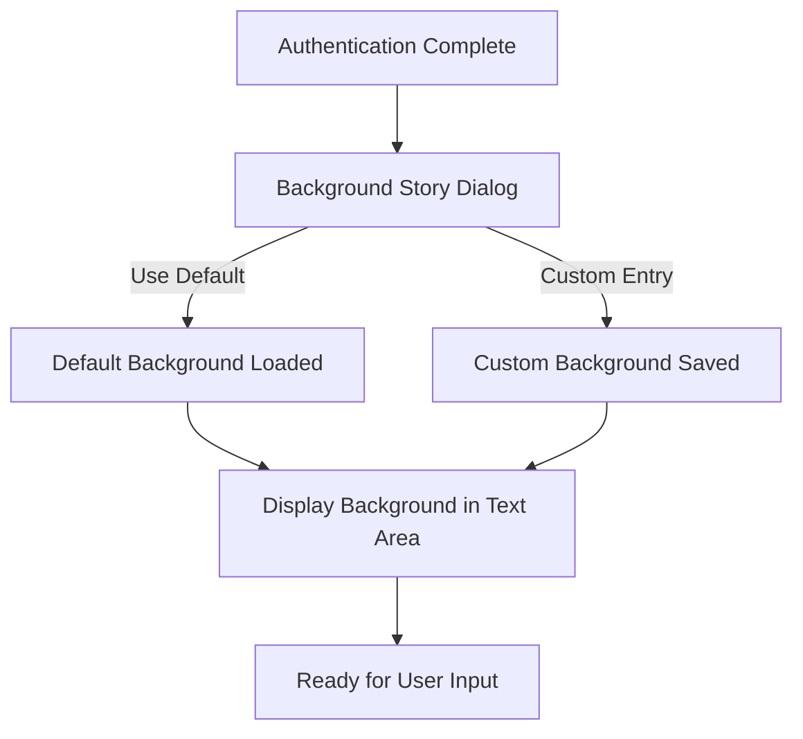
```mermaid
graph TD
    Auth["Authentication Complete"] --> BGPrompt["Background Story Dialog"]
    BGPrompt --> |"Use Default"| DefaultBG["Default Background Loaded"]
    BGPrompt --> |"Custom Entry"| CustomBG["Custom Background Saved"]
    DefaultBG --> DisplayBG["Display Background in Text Area"]
    CustomBG --> DisplayBG
    DisplayBG --> Ready["Ready for User Input"]
```

Sources: [app.py:206-216](), [app.py:326-336]()

### Background Story Dialog
- A dialog window appears with a pre-filled default background story
- Users can edit this text or accept the default
- The background story sets the initial context for the AI to generate appropriate responses

The default background story is set in [app.py:21]() and describes a fantasy setting with a human mage character embarking on an adventure.

Sources: [app.py:21](), [app.py:206-216]()

## User Interaction Flow

Once setup is complete, the user can begin interacting with the AI storyteller through a simple turn-based interaction model.

```mermaid
sequenceDiagram
    participant User
    participant GUI as "ChatApplication GUI"
    participant ST as "StoryTeller"
    participant API as "ChatGPT API"
    
    User->>GUI: Type action and press Enter/Send
    GUI->>GUI: Display user input with ">你" prefix
    GUI->>ST: Send action to StoryTeller
    GUI->>GUI: Show "Getting ChatGPT reply" dialog
    ST->>API: Forward formatted prompt
    API->>ST: Return generated story continuation
    ST->>GUI: Return processed response
    GUI->>GUI: Close loading dialog
    GUI->>GUI: Display AI response in text area
    GUI->>GUI: Auto-scroll to latest content
```

Sources: [app.py:338-365]()

### Processing User Input
When a user submits an action:
1. The input is captured from the entry field
2. A loading dialog appears to indicate network activity
3. The user's text is displayed in the main text area with a ">你" prefix
4. The input is passed to the `StoryTeller.action()` method
5. The AI response is displayed in the main text area
6. The display automatically scrolls to show the latest content

Sources: [app.py:338-365](), [app.py:297-324]()

## Internal Architecture

The GUI code follows a clean object-oriented design pattern with clear separation of concerns.

```mermaid
classDiagram
    class ChatApplication {
        -window: Tk
        -text_widget: Text
        -msg_entry: Entry
        -story_teller: StoryTeller
        -background: str
        -type: int
        +__init__(background)
        +run()
        +register_storyteller(use_default)
        +_insert_message(msg, sender)
    }
    
    class StoryTeller {
        +action(msg)
        +login(config)
    }
    
    ChatApplication --> StoryTeller : uses
```

Sources: [app.py:49-366]()

### Key Methods
- `__init__(background)`: Initializes the GUI and sets up the main window
- `_setup_main_window()`: Configures GUI components and layout
- `show_login_window()` & `show_api_window()`: Display authentication dialogs
- `register_storyteller(use_default)`: Creates and configures the StoryTeller instance
- `_insert_message(msg, sender)`: Handles formatting and displaying messages in the text area
- `_on_enter_pressed(event)`: Event handler for when the user submits input

Sources: [app.py:51-62](), [app.py:68-115](), [app.py:123-152](), [app.py:162-194](), [app.py:273-295](), [app.py:338-365]()

### Threading Implementation
To prevent the UI from freezing during network operations, the application uses threading:
- `thread_it(func, *args)`: A utility function that runs a given function in a separate thread
- Network requests (like fetching responses from ChatGPT) run in background threads
- Progress indicators display during background operations

Sources: [app.py:24-32](), [app.py:253-270](), [app.py:297-324]()

## Using the GUI

### Starting the Application
To launch the GUI, run the `app.py` script:

```
python app.py
```

The application starts with a default background story but requires authentication before it becomes fully functional.

Sources: [app.py:368-370]()

### Authentication Process
1. When the application starts, a warning dialog informs you that API key authentication is preferred
2. Choose between:
   - Using API key (recommended)
   - Using email/password (has account risk)
3. Enter the required credentials
4. After successful authentication, the background story dialog appears

Sources: [app.py:217-225](), [app.py:273-295]()

### Interacting with the Story
1. Type your action/command in the text entry field at the bottom
2. Press Enter or click the Send button
3. Wait for the AI to respond (a progress dialog will appear)
4. Read the AI's response in the main text area
5. Continue the interaction with further actions

Sources: [app.py:338-365]()

## Integration with Core Systems

The GUI is primarily a frontend for the `StoryTeller` class, which handles all interactions with the ChatGPT API. For more details about how the StoryTeller system works, see [StoryTeller System](#3.1).

```mermaid
graph TD
    subgraph "GUI Components"
        ChatApp["ChatApplication Class"]
        AuthDialogs["Authentication Dialogs"]
        TextDisplay["Text Display"]
        InputArea["Input Area"]
    end
    
    subgraph "Core Systems"
        StoryTeller["StoryTeller Class"]
        AuthSystem["Authentication System"]
        ChatGPT["ChatGPT API"]
    end
    
    ChatApp --> StoryTeller
    AuthDialogs --> AuthSystem
    InputArea --> |"action(msg)"| StoryTeller
    StoryTeller --> |"response"| TextDisplay
    StoryTeller --> ChatGPT
    AuthSystem --> ChatGPT
```

Sources: [app.py:8-9](), [app.py:273-295](), [app.py:359]()

## Conclusion

The Graphical User Interface provides an accessible way to interact with the Chinese AI Dungeon system. It handles authentication, manages the conversation flow, and presents the AI-generated story in a clean, readable format. The interface is designed to be simple and focused, keeping the user's attention on the evolving narrative rather than complex controls.

For more advanced usage or programmatic access, consider using the [Command Line Interface](#2.2) instead.

---

# Page: Command Line Interface

# Command Line Interface

<details>
<summary>Relevant source files</summary>

The following files were used as context for generating this wiki page:

- [example_story.py](example_story.py)
- [outputs/story.gif](outputs/story.gif)
- [story.py](story.py)

</details>


The Command Line Interface (CLI) provides a text-based way to interact with the Chinese AI Dungeon ChatGPT system. This document explains how to use and customize the CLI version of the application. For information about the graphical interface alternative, see [Graphical User Interface](#2.1).

## Overview

The CLI offers a lightweight, terminal-based experience for creating and participating in AI-generated interactive stories. It processes your text inputs as character actions and uses ChatGPT to generate appropriate narrative continuations.

```mermaid
flowchart TD
    subgraph "CLI Workflow"
        A["Run example_story.py"] --> B["StoryTeller initializes"]
        B --> C["Display background story"]
        C --> D["Wait for user input"]
        D --> E["Process action through ChatGPT"]
        E --> F["Display story continuation"]
        F --> D
    end
```

Sources: [example_story.py:5-7]()

## Getting Started

### Running the CLI

The main entry point for the CLI is the `example_story.py` file. To start a new story session:

1. Open a terminal or command prompt
2. Navigate to the project directory
3. Run the following command:

```bash
python example_story.py
```

This launches the CLI with a default adventure background story about exploring a forest.

Sources: [example_story.py:1-7]()

### First-Time Setup

When you first run the CLI, the StoryTeller component will handle authentication with OpenAI's services automatically as necessary. If no valid session exists, you may be prompted to provide authentication details.

```mermaid
sequenceDiagram
    participant User
    participant CLI as "example_story.py"
    participant StoryTeller as "StoryTeller class"
    participant ChatGPT as "ChatGPT API"
    
    User->>CLI: Run script
    CLI->>StoryTeller: Initialize with background
    StoryTeller->>StoryTeller: Check authentication
    alt First run or expired session
        StoryTeller->>User: Prompt for credentials
        User->>StoryTeller: Provide authentication
    end
    StoryTeller->>ChatGPT: Establish connection
    StoryTeller->>User: Display background story
    
    loop Story Interaction
        User->>CLI: Input action
        CLI->>StoryTeller: Process action
        StoryTeller->>ChatGPT: Send formatted prompt
        ChatGPT->>StoryTeller: Return story continuation
        StoryTeller->>User: Display response
    end
```

Sources: [story.py:14-42]()

## Interacting with the Story

### Basic Interaction Pattern

The CLI interaction follows this simple pattern:

1. The system displays the initial story background
2. You are prompted with `>` to enter your action
3. Type your character's action in Chinese (preferably ending with a period)
4. The system processes your action and generates a continuation
5. Repeat steps 2-4 to progress the story

### Example Session

Here's an example of what a CLI session might look like:

```
你在树林里冒险，指不定会从哪里蹦出来一些奇怪的东西，你握紧手上的手枪，希望这次冒险能够找到一些值钱的东西，你往树林深处走去。

> 你仔细观察周围的环境

树林里光线昏暗，只有零星的阳光透过茂密的树叶洒落下来。你能听到远处有水流的声音，还有一些鸟类的叫声。空气中弥漫着潮湿的泥土气息和植物的芬芳。突然，你注意到左前方的灌木丛有轻微的晃动，似乎有什么东西在那里。

> 你握紧手枪，慢慢接近灌木丛

[System would generate and display the next part of the story]
```

Sources: [story.py:71-76]()

### Input Guidelines

When entering actions:
- Write in the first person about what your character does
- Inputs typically start with "你" (you) automatically
- It's recommended to end sentences with "。" (Chinese period)
- Keep inputs concise but descriptive
- The system will format long outputs to fit your terminal window

Sources: [story.py:9-11](), [story.py:58-67]()

## Customizing the Story Background

You can create different adventures by customizing the starting scenario. This is done by modifying the `story_background` variable in `example_story.py`:

```python
# Default background story
story_background = "你在树林里冒险，指不定会从哪里蹦出来一些奇怪的东西，你握紧手上的手枪，希望这次冒险能够找到一些值钱的东西，你往树林深处走去。"
```

Examples of alternative backgrounds you might try:

| Setting | Example Background Text |
|---------|-------------------------|
| Space Adventure | "你是一艘星际飞船的船长，刚刚收到一个未知星球的求救信号。你决定带领小队前往调查，降落在这颗星球表面后..." |
| Fantasy Kingdom | "你是王国的一名年轻骑士，国王委派你去调查边境村庄发生的神秘事件。传说有一条龙在附近出没..." |
| Mystery | "你是一名私家侦探，受雇调查一座古老庄园中发生的奇怪事件。据说夜晚总有奇怪的声音..." |

After modifying the background, save the file and run it as usual to start a new adventure with your custom setting.

Sources: [example_story.py:3-4]()

## CLI Implementation Components

The CLI is implemented through several key components working together:

```mermaid
graph TD
    A["example_story.py"] -->|"Creates"| B["StoryTeller instance"]
    B -->|"Calls"| C["start_cli() method"]
    C -->|"Uses"| D["ChatGPT API"]
    D -->|"Generates"| E["Story responses"]
    
    subgraph "StoryTeller Components"
        B -->|"Contains"| F["Background story"]
        B -->|"Manages"| G["Session state"]
        B -->|"Formats"| H["Prompts for ChatGPT"]
    end
    
    subgraph "I/O Processing"
        C -->|"Shows"| I["Text output"]
        C -->|"Reads"| J["User input"]
        I -->|"Uses"| K["Text wrapping"]
    end
```

Sources: [example_story.py:1-7](), [story.py:46-76]()

## Behind the Scenes

When you interact with the CLI, each action you enter is processed by the StoryTeller system, which:

1. Determines if this is the first interaction or a continuation
2. Formats your action into an appropriate prompt for ChatGPT
3. Sends the formatted prompt to the ChatGPT API
4. Receives the generated response
5. Displays the response back to you

For first interactions, the system includes the background story and special instructions for ChatGPT. For continuations, it instructs ChatGPT to write 4-6 sentences covering about 5 minutes of in-story time.

The CLI version may automatically save your conversation history to allow you to resume sessions later. For more details on how story data is persisted, see [Story Persistence](#3.3).

Sources: [story.py:58-69]()

---

# Page: Core Components

# Core Components

<details>
<summary>Relevant source files</summary>

The following files were used as context for generating this wiki page:

- [README.md](README.md)
- [story.py](story.py)
- [story_rewrite.py](story_rewrite.py)

</details>


This document provides an in-depth examination of the fundamental components that power the ChineseAiDungeonChatGPT system. It focuses on the internal architecture, key classes, and mechanisms that enable the interactive storytelling experience. For information about using the interfaces, see [User Interfaces](#2), and for configuration details, see [Configuration](#4).

## System Architecture Overview

The ChineseAiDungeonChatGPT system consists of several interconnected components that work together to deliver an interactive storytelling experience. The diagram below illustrates these core components and their relationships:

```mermaid
graph TD
    User["User"] --> |"interacts with"| Interfaces["CLI/GUI Interfaces"]
    Interfaces --> |"uses"| StoryTeller["StoryTeller Class"]
    
    subgraph "Core Components"
        StoryTeller --> |"authenticates with"| AuthSystem["Authentication System"]
        StoryTeller --> |"formats prompts for"| PromptEngine["Prompt Engineering"]
        StoryTeller --> |"communicates with"| ChatGPTAPI["ChatGPT API"]
        StoryTeller --> |"stores/retrieves"| Persistence["Persistence System"]
    end
    
    AuthSystem --> |"configures"| OfficialAPI["Official API (api_key)"]
    AuthSystem --> |"configures"| ReverseAPI["Reverse-engineered API (email/password)"]
    
    ChatGPTAPI --> |"generates responses"| StoryTeller
    
    Persistence --> |"saves to"| Files["File Storage (id_log.txt, chat_log.txt)"]
```

Sources: [story_rewrite.py:1-170](), [README.md:1-155]()

## StoryTeller Class

The `StoryTeller` class is the central component that orchestrates the entire system. It manages authentication, prompt formatting, communication with ChatGPT APIs, and persistence of story data.

```mermaid
classDiagram
    class StoryTeller {
        +String background
        +Int type
        +Dict config
        +Object chatbot
        +Boolean first_interact
        +login(config)
        +config_by_token()
        +config_by_account()
        +setup_chatbot()
        +get_config()
        +start_cli()
        +save_conversation_id(conv_id)
        +save_conversations(res)
        +action(user_action)
        +interactive()
    }
```

### Key Attributes:
- `background`: The story background/context
- `type`: Authentication type (0 for official API, 1 for reverse-engineered API)
- `first_interact`: Boolean flag indicating if this is the first interaction
- `chatbot`: The underlying ChatGPT interface object

### Key Methods:
- `login()`: Initializes the appropriate chatbot object based on configuration
- `setup_chatbot()`: Sets up authentication and configures the chatbot
- `action()`: Processes user actions and gets responses from ChatGPT
- `save_conversation_id()` & `save_conversations()`: Handle story persistence
- `interactive()`: Manages the CLI interaction loop

Sources: [story_rewrite.py:15-170]()

## Authentication System

The authentication system supports two methods of connecting to ChatGPT:

| Authentication Type | Description | Implementation | Pros | Cons |
|---------------------|-------------|---------------|------|------|
| Official API (type=0) | Uses OpenAI's official API | Via `ofChatbot` from `revChatGPT.V3` | More stable, faster | Requires paid account |
| Reverse-engineered API (type=1) | Uses unofficial API via account credentials | Via `Chatbot` from `revChatGPT.V1` | Free to use | Risk of account ban, less stable |

### Authentication Flow

```mermaid
flowchart TD
    Start["Start StoryTeller"] --> GetConfig["get_config()"]
    GetConfig --> ChooseType{"Choose Auth Type"}
    
    ChooseType --> |"Official API"| ConfigToken["config_by_token()"]
    ChooseType --> |"Reverse-engineered API"| ConfigAccount["config_by_account()"]
    
    ConfigToken --> |"api_key"| Login["login()"]
    ConfigAccount --> |"email/password"| Login
    
    Login --> |"type=0"| CreateOfChatbot["Create Official Chatbot"]
    Login --> |"type=1"| CreateRevChatbot["Create Reverse-engineered Chatbot"]
    
    CreateOfChatbot --> Ready["Ready for Interaction"]
    CreateRevChatbot --> Ready
```

Configuration is handled through:
- `config_by_token()`: Configures the official API with an API key
- `config_by_account()`: Configures the reverse-engineered API with email and password

Sources: [story_rewrite.py:36-121]()

## Prompt Engineering

The system uses carefully crafted prompts to guide ChatGPT in generating appropriate story content. This is implemented in the `action()` method of the `StoryTeller` class.

### Prompt Types:

1. **Initial Prompt** (first interaction):
   ```
   现在来充当一个冒险文字游戏，描述时候注意节奏，不要太快，仔细描述各个人物的心情和周边环境。
   一次只需写四到六句话。开头是，[background] 你[user_action]
   ```

2. **Continuation Prompt** (subsequent interactions):
   ```
   继续，一次只需要续写四到六句话，总共就只讲5分钟内发生的事情。你[user_action]
   ```

These prompts are designed to:
- Maintain consistent pacing and scope
- Focus on character emotions and environmental details
- Keep responses concise (4-6 sentences)
- Create a continuous narrative experience

Sources: [story_rewrite.py:140-162]()

## ChatGPT API Integration

The system integrates with two different ChatGPT API implementations:

```mermaid
graph TD
    StoryTeller["StoryTeller"] --> |"type=0"| OfficialChatbot["ofChatbot (V3)"]
    StoryTeller --> |"type=1"| ReverseChatbot["Chatbot (V1)"]
    
    OfficialChatbot --> |"api_key"| OfficialAPI["OpenAI Official API"]
    ReverseChatbot --> |"email/password"| ReverseAPI["Reverse-engineered API"]
    
    OfficialAPI --> |"response"| StoryTeller
    ReverseAPI --> |"response"| StoryTeller
```

The integration is managed through:
- For official API: `ofChatbot` from `revChatGPT.V3` using `api_key`
- For reverse-engineered API: `Chatbot` from `revChatGPT.V1` using account credentials

Different handling logic is implemented in the `action()` method based on the API type being used.

Sources: [story_rewrite.py:7-12](), [story_rewrite.py:150-162]()

## Persistence System

The system maintains state between sessions through two key files:

1. **id_log.txt**: Stores conversation IDs for resuming previous sessions
2. **chat_log.txt**: Stores conversation history/content

### Persistence Workflow

```mermaid
flowchart TD
    Setup["setup_chatbot()"] --> CheckIdLog{"Check id_log.txt"}
    CheckIdLog --> |"exists"| AskResume{"Ask to resume?"}
    AskResume --> |"yes"| LoadConvId["Load conversation ID"]
    AskResume --> |"no"| NewSession["Start new session"]
    
    CheckChatLog{"Check chat_log.txt"} --> |"exists"| LoadHistory["Load chat history"]
    
    Action["action()"] --> SaveResponse["save_conversations()"]
    SaveResponse --> WriteChatLog["Write to chat_log.txt"]
    
    FirstInteraction{"first_interact?"} --> |"yes"| SaveId["save_conversation_id()"]
    SaveId --> WriteIdLog["Write to id_log.txt"]
```

Key persistence methods:
- `save_conversation_id()`: Writes conversation ID to id_log.txt
- `save_conversations()`: Writes conversation content to chat_log.txt
- ID and history loading in `setup_chatbot()`

Sources: [story_rewrite.py:93-106](), [story_rewrite.py:132-139](), [story_rewrite.py:156-159]()

## User Interaction Flow

The following sequence diagram illustrates how a user interacts with the system:

```mermaid
sequenceDiagram
    participant User
    participant Interface as "CLI/GUI Interface"
    participant StoryTeller
    participant ChatGPT as "ChatGPT API"
    participant Files as "Persistence Files"
    
    User->>Interface: Start application
    Interface->>StoryTeller: Initialize
    StoryTeller->>Files: Check for previous sessions
    Files-->>StoryTeller: Return saved data (if exists)
    StoryTeller->>User: Prompt for authentication
    User->>StoryTeller: Provide credentials
    StoryTeller->>ChatGPT: Authenticate
    ChatGPT-->>StoryTeller: Authentication response
    
    loop Interactive Storytelling
        User->>Interface: Input action
        Interface->>StoryTeller: Pass action to action()
        StoryTeller->>StoryTeller: Format prompt
        StoryTeller->>ChatGPT: Send prompt
        ChatGPT-->>StoryTeller: Generate response
        StoryTeller->>Files: Save response & conversation ID
        StoryTeller->>Interface: Return formatted response
        Interface->>User: Display story continuation
    end
```

The interaction loop is implemented in the `interactive()` method of the `StoryTeller` class, which continuously:
1. Receives user input
2. Processes it through `action()`
3. Displays the response
4. Waits for next input

Sources: [story_rewrite.py:164-170]()

## System Initialization

When the system starts, it follows this initialization process:

```mermaid
flowchart TD
    Start["start_cli()"] --> PrintLogo["print_logo()"]
    PrintLogo --> SetupChatbot["setup_chatbot()"]
    SetupChatbot --> GetConfig["get_config()"]
    GetConfig --> ChooseAPI{"Choose API type"}
    ChooseAPI --> |"Official API"| ConfigToken["config_by_token()"]
    ChooseAPI --> |"Reverse API"| ConfigAccount["config_by_account()"]
    ConfigToken --> Login["login()"]
    ConfigAccount --> Login
    Login --> SetBackground["Set background story"]
    SetBackground --> Interactive["interactive()"]
```

The initialization process:
1. Displays the welcome logo
2. Sets up authentication
3. Configures the chatbot
4. Sets the background story
5. Enters the interactive loop

Sources: [story_rewrite.py:123-127]()

This overview covers the main components of the ChineseAiDungeonChatGPT system. For more detailed information on specific topics, refer to the related wiki pages referenced throughout this document.

---

# Page: StoryTeller System

# StoryTeller System

<details>
<summary>Relevant source files</summary>

The following files were used as context for generating this wiki page:

- [story.py](story.py)
- [story_rewrite.py](story_rewrite.py)

</details>


## Introduction

The StoryTeller system is the core engine of the Chinese AI Dungeon ChatGPT project. It manages all interactions between users and the ChatGPT API, handling authentication, prompt formatting, context management, and conversation persistence to create interactive storytelling experiences.

The StoryTeller serves as the bridge between user interfaces (both CLI and GUI) and the underlying ChatGPT APIs, abstracting away the technical details to create immersive text adventures. For user interface implementations, see [User Interfaces](#2). For authentication specifics, see [Authentication](#3.2). For details on how stories are saved and loaded, see [Story Persistence](#3.3).

Sources: [story_rewrite.py:15-170]()

## StoryTeller Class Overview

The `StoryTeller` class is implemented in `story_rewrite.py` and serves as the central component for generating interactive narratives.

### Class Diagram: StoryTeller Structure

```mermaid
classDiagram
    class StoryTeller {
        +String background
        +Int type
        +Dict config
        +Object chatbot
        +Boolean first_interact
        +login(config)
        +config_by_token()
        +config_by_account()
        +setup_chatbot()
        +get_config()
        +start_cli()
        +save_conversation_id(conv_id)
        +save_conversations(res)
        +action(user_action)
        +interactive()
    }
```

### Key Properties

| Property | Type | Description |
|----------|------|-------------|
| `background` | String | Background story/setting for the adventure |
| `type` | Integer | API type (0 for official API, 1 for reverse-engineered API) |
| `config` | Dictionary | Configuration for API authentication |
| `chatbot` | Object | Instance of ChatGPT API client |
| `first_interact` | Boolean | Flag indicating if this is the first interaction |

### Primary Methods

| Method | Purpose |
|--------|---------|
| `login(config)` | Authenticates with the appropriate ChatGPT API |
| `setup_chatbot()` | Configures and authenticates the chatbot |
| `action(user_action)` | Processes user input and returns story continuation |
| `interactive()` | Provides CLI-based interaction loop |
| `save_conversation_id(conv_id)` | Saves conversation ID for session resumption |
| `save_conversations(res)` | Saves conversation history |

Sources: [story_rewrite.py:15-34](), [story_rewrite.py:36-170]()

## Authentication Flow

The StoryTeller supports two authentication methods:

1. **Official API** using an API key
2. **Reverse-engineered API** using email/password credentials

### Authentication Flow Diagram

```mermaid
flowchart TD
    A["start_cli()"] --> B["setup_chatbot()"]
    B --> C["get_config()"]
    C --> D{"PYCHATGPT_AVAILABLE?"}
    D -->|"Yes"| E{"User choice"}
    D -->|"No"| F["Use config from config.py"]
    E -->|"y: reverse-engineered API"| G["config_by_account()"]
    E -->|"n: official API"| H["config_by_token()"]
    G --> I["login(config)"]
    H --> I
    F --> I
    I --> J{"type?"}
    J -->|"0"| K["ofChatbot(api_key)"]
    J -->|"1"| L["Chatbot(config)"]
```

### Authentication Methods

#### Official API Authentication

The `config_by_token()` method prompts the user for an OpenAI API key and configures the system to use the official API. This method sets `type` to `0` and creates a configuration with the API key.

```python
def config_by_token(self):
    self.type = 0
    api_key = input("请输入api_key(获取方式: https://platform.openai.com/account/api-keys):")
    _config = {'api_key': api_key}
    return _config
```

#### Reverse-engineered API Authentication

The `config_by_account()` method collects email, password, and other configuration options for the reverse-engineered API. It sets `type` to `1`, and also checks for existing conversation IDs to potentially resume previous adventures.

Sources: [story_rewrite.py:36-41](), [story_rewrite.py:42-50](), [story_rewrite.py:52-87](), [story_rewrite.py:109-121]()

## Story Generation Process

The core of the StoryTeller system is the `action()` method, which transforms user input into narrative continuations.

### Story Generation Flow

```mermaid
sequenceDiagram
    participant User
    participant StoryTeller
    participant ChatGPT as "ChatGPT API"
    
    User->>StoryTeller: action(user_input)
    
    alt "first_interact is True"
        StoryTeller->>ChatGPT: Send initial prompt with background
        StoryTeller->>StoryTeller: Set first_interact to False
    else "first_interact is False"
        StoryTeller->>ChatGPT: Send continuation prompt
    end
    
    ChatGPT->>StoryTeller: Return response
    
    alt "type is 1 (reverse-engineered API)"
        StoryTeller->>StoryTeller: Save conversation ID and history
    end
    
    StoryTeller->>User: Return formatted response
```

### Prompt Engineering

The StoryTeller uses carefully crafted prompts to guide ChatGPT in generating appropriate story content:

1. **Initial Prompt** (first interaction)
   ```
   现在来充当一个冒险文字游戏，描述时候注意节奏，不要太快，仔细描述各个人物的心情和周边环境。一次只需写四到六句话。
   开头是，[background] 你[user_action]
   ```

2. **Continuation Prompt** (subsequent interactions)
   ```
   继续，一次只需要续写四到六句话，总共就只讲5分钟内发生的事情。
   你[user_action]
   ```

These prompts instruct ChatGPT to:
- Act as an adventure game
- Control pacing
- Describe emotions and environments
- Keep responses concise (4-6 sentences)
- Focus on short timeframes (5 minutes of story time)

Sources: [story_rewrite.py:140-162]()

## Command Line Interface Integration

StoryTeller provides a built-in CLI through the `start_cli()` and `interactive()` methods.

### CLI Interaction Flow

```mermaid
flowchart TD
    A["start_cli()"] --> B["print_logo()"]
    B --> C["setup_chatbot()"]
    C --> D["interactive()"]
    D --> E["print_warp(background)"]
    E --> F["input user action"]
    F --> G["action(user_action)"]
    G --> H["print_warp(response)"]
    H --> F
```

The CLI interface:
1. Displays the project logo
2. Sets up the chatbot with authentication
3. Prints the background story
4. Enters an interaction loop where:
   - User inputs an action
   - Action is processed by the `action()` method
   - Response is displayed
   - Loop continues

Sources: [story_rewrite.py:123-126](), [story_rewrite.py:164-169]()

## Persistence Model

StoryTeller includes functionality to save and load conversation state, enabling users to resume adventures across sessions.

### Persistence Flow

```mermaid
flowchart TD
    ST["StoryTeller"] -->|"saves"| Save["save_conversation_id()
    save_conversations()"]
    
    Save -->|"writes"| IDLog["id_log.txt"]
    Save -->|"writes"| ChatLog["chat_log.txt"]
    
    Setup["setup_chatbot()"] -->|"reads"| Check["Check for existing logs"]
    Check -->|"finds"| IDLog
    Check -->|"finds"| ChatLog
    
    IDLog -->|"provides"| Resume["Resume conversation"]
    ChatLog -->|"provides"| Context["Load conversation context"]
```

### Persistence Methods

| Method | Purpose |
|--------|---------|
| `save_conversation_id(conv_id)` | Writes conversation ID to `id_log.txt` |
| `save_conversations(res)` | Writes conversation history to `chat_log.txt` |

During initialization, StoryTeller checks these files to detect previous adventures and offers the option to resume them.

Sources: [story_rewrite.py:132-138](), [story_rewrite.py:76-84](), [story_rewrite.py:99-106]()

## System Architecture Integration

StoryTeller is a central component in the Chinese AI Dungeon system, connecting user interfaces with ChatGPT APIs.

### System Architecture Diagram

```mermaid
flowchart TD
    CLI["CLI (example_story.py)"] --> |"uses"| ST["StoryTeller"]
    GUI["GUI (app.py)"] --> |"uses"| ST
    
    ST --> |"authenticates with"| Auth["Authentication"]
    Auth --> |"Official API"| OA["ofChatbot"]
    Auth --> |"Reverse-engineered API"| RA["Chatbot"]
    
    ST --> |"generates prompts for"| GP["Story Generation"]
    GP --> |"sends to"| API["ChatGPT API"]
    API --> |"returns responses to"| GP
    
    ST --> |"saves state in"| Persist["Persistence"]
    Persist --> |"conversation IDs"| IDLog["id_log.txt"]
    Persist --> |"conversation history"| ChatLog["chat_log.txt"]
```

Sources: System architecture from provided context

## Technical Implementation Details

### Dependencies

StoryTeller relies on the following key dependencies:
- `revChatGPT.V1.Chatbot` - For reverse-engineered API access
- `revChatGPT.V3.Chatbot` - For official API access (named `ofChatbot`)
- `colorama` - For colored terminal output
- Standard Python libraries for file I/O

### Error Handling

The StoryTeller includes error handling mechanisms:
- Checks if required libraries are installed
- Provides fallback options if authentication fails
- Uses appropriate error handling in API interactions

Sources: [story_rewrite.py:6-12]()

## Summary

The StoryTeller system is the engine that powers the Chinese AI Dungeon ChatGPT experience. It provides:

1. A flexible authentication system supporting both official and reverse-engineered APIs
2. Sophisticated prompt engineering to create engaging narratives
3. State persistence for resuming adventures
4. Both CLI and programmatic interfaces for integration with different user experiences

The system abstracts away the complexities of API communication and prompt engineering, allowing users to focus on the creative storytelling experience.

---

# Page: Authentication

# Authentication

<details>
<summary>Relevant source files</summary>

The following files were used as context for generating this wiki page:

- [README.md](README.md)
- [config.py](config.py)
- [story_rewrite.py](story_rewrite.py)

</details>


This page explains the authentication options available in the Chinese AI Dungeon ChatGPT system and how to configure them. The system supports two methods for authenticating with OpenAI's services, each with different tradeoffs in terms of cost, reliability, and potential risks.

For information about configuring specific parameters like API keys and tokens, see [API Keys and Tokens](#4.1).

## Authentication Methods Overview

The system provides two distinct authentication methods:

| Authentication Method | Description | Cost | Risk |
|----------------------|-------------|------|------|
| Official OpenAI API | Uses API key to access official API | Paid service | Low risk |
| Reverse-engineered API | Uses email/password to access ChatGPT | Free | Risk of account ban |

### Authentication Methods Comparison

```mermaid
flowchart LR
    User["User"] --> Authentication["Authentication Options"]
    
    Authentication --> OfficialAPI["Official API (type=0)"]
    Authentication --> ReverseAPI["Reverse-engineered API (type=1)"]
    
    OfficialAPI --> OfficialConfig["Required:
    - API Key"]
    ReverseAPI --> ReverseConfig["Required:
    - Email
    - Password
    Optional:
    - Proxy
    - Paid status"]
    
    OfficialConfig --> OfficialPros["Pros:
    - More reliable
    - Better performance
    - Officially supported"]
    ReverseConfig --> ReversePros["Pros:
    - Free to use
    - No billing required"]
    
    OfficialConfig --> OfficialCons["Cons:
    - Requires payment
    - Billing setup needed"]
    ReverseConfig --> ReverseCons["Cons:
    - Risk of account ban
    - Less reliable
    - May break with updates"]
```

Sources: [README.md:44-48](), [story_rewrite.py:109-117]()

## Authentication Implementation

The authentication process is implemented in the `StoryTeller` class in `story_rewrite.py`. When a user starts the application, they are prompted to choose an authentication method and provide the necessary credentials.

### Authentication Flow

```mermaid
flowchart TD
    Start["User starts application"] --> StartCLI["start_cli()"]
    StartCLI --> SetupChatbot["setup_chatbot()"]
    SetupChatbot --> GetConfig["get_config()"]
    GetConfig --> ChooseAPI{"Choose API type"}
    ChooseAPI -->|"n (Official API)"| ConfigByToken["config_by_token()"]
    ChooseAPI -->|"y (Reverse-engineered API)"| ConfigByAccount["config_by_account()"]
    ConfigByToken --> APIKey["api_key input"]
    ConfigByAccount --> EmailPass["email/password input"]
    APIKey --> ConfigObj["_config object"]
    EmailPass --> ConfigObj
    ConfigObj --> Login["login(_config)"]
    Login -->|"type==0"| OfChatbot["ofChatbot(api_key=_config['api_key'])"]
    Login -->|"type==1"| RevChatbot["Chatbot(_config)"]
```

The authentication flow begins when the user starts the application, which calls:
1. `start_cli()` method [story_rewrite.py:123-126]()
2. `setup_chatbot()` [story_rewrite.py:89-107]()
3. `get_config()` [story_rewrite.py:109-120]() to determine which authentication method to use

Based on the user's choice, either:
- `config_by_token()` [story_rewrite.py:42-50]() for official API 
- `config_by_account()` [story_rewrite.py:52-87]() for reverse-engineered API

Finally, the `login()` method [story_rewrite.py:36-40]() initializes the appropriate chatbot object.

Sources: [story_rewrite.py:15-170]()

### Authentication Data Flow

```mermaid
flowchart TD
    UserInput["User Authentication Input"] --> |"Official API"| APIKey["API Key"]
    UserInput --> |"Reverse-engineered API"| Credentials["Email/Password"]
    
    APIKey --> OfConfig["Official Config Object
    {
      api_key: string
    }"]
    
    Credentials --> RevConfig["Reverse-engineered Config Object
    {
      email: string,
      password: string,
      proxy: string (optional),
      paid: boolean
    }"]
    
    OfConfig --> Login["login() method"]
    RevConfig --> Login
    
    Login --> |"type==0"| OfChatbot["ofChatbot Instance"]
    Login --> |"type==1"| RevChatbot["Chatbot Instance"]
    
    OfChatbot --> ChatGPT["ChatGPT API"]
    RevChatbot --> ChatGPT
```

Sources: [story_rewrite.py:36-40](), [story_rewrite.py:42-50](), [story_rewrite.py:52-87]()

### StoryTeller Class Structure

```mermaid
classDiagram
    class StoryTeller {
        -background: string
        -type: int (0:official, 1:reverse)
        -config: dict
        -chatbot: Chatbot or ofChatbot
        -first_interact: bool
        +login(_config)
        +config_by_token() : dict
        +config_by_account() : dict
        +setup_chatbot()
        +get_config() : dict
        +start_cli()
        +action(user_action) : string
        +interactive()
    }
    
    class ofChatbot {
        +ask(prompt) : string
    }
    
    class Chatbot {
        +ask(prompt) : string
        +get_conversations() : list
    }
    
    StoryTeller --> ofChatbot : "creates if type=0"
    StoryTeller --> Chatbot : "creates if type=1"
```

The `StoryTeller` class manages all authentication and interaction with the ChatGPT API. It maintains a `type` attribute that determines which authentication method is being used:
- `type = 0`: Official API (using API key)
- `type = 1`: Reverse-engineered API (using email/password)

Sources: [story_rewrite.py:15-34](), [story_rewrite.py:36-40]()

## Official API Authentication

The official API authentication method is implemented in the `config_by_token()` method [story_rewrite.py:42-50](). This method:

1. Sets `type = 0` to indicate official API usage
2. Prompts the user for an API key
3. Creates a configuration object with the API key
4. Returns the configuration object to be used by the `login()` method

When the `login()` method is called with this configuration, it initializes an `ofChatbot` instance from the `revChatGPT.V3` module [story_rewrite.py:9]().

### How to Get an API Key

To use the official API authentication method, you need to:

1. Visit [OpenAI API](https://platform.openai.com/account/api-keys)
2. Sign in with your OpenAI account
3. Set up billing if you haven't already
4. Create a new API key
5. Copy the API key for use in the application

Sources: [story_rewrite.py:42-50](), [story_rewrite.py:9](), [README.md:46]()

## Reverse-Engineered API Authentication

The reverse-engineered API authentication method is implemented in the `config_by_account()` method [story_rewrite.py:52-87](). This method:

1. Sets `type = 1` to indicate reverse-engineered API usage
2. Prompts the user for email and password
3. Optionally collects proxy URL
4. Asks if the user has a paid account
5. Checks for previous conversation IDs in `id_log.txt`
6. Creates a configuration object with all collected information
7. Returns the configuration object to be used by the `login()` method

When the `login()` method is called with this configuration, it initializes a `Chatbot` instance from the `revChatGPT.V1` module [story_rewrite.py:8]().

**Warning**: As noted in the README [README.md:47-48](), using this method may lead to account banning as OpenAI has been increasing security measures against unofficial API access.

Sources: [story_rewrite.py:52-87](), [story_rewrite.py:8](), [README.md:47-48]()

## Default Configuration

The system includes a default configuration in `config.py` [config.py:1-3]() that contains a session token. This token is used as a fallback if the user doesn't want to enter their own credentials or if the `revChatGPT` package is not available.

However, as mentioned in the README [README.md:72-83](), the provided token may not work for various reasons, such as:
1. Too many people using it causing the account to be banned
2. The token being compromised
3. The token expiring
4. OpenAI changing their API policies

In such cases, you'll need to configure your own credentials as described above.

Sources: [config.py:1-3](), [README.md:72-83]()

## Troubleshooting Authentication Issues

Common authentication issues include:

1. **Error: No email and password provided**
   - Cause: Token expired or invalid
   - Solution: Use your own email/password or API key

2. **Error: Incorrect API key provided**
   - Cause: Invalid API key or API key doesn't have sufficient permissions
   - Solution: Generate a new API key from the OpenAI dashboard

3. **Error: Account has been disabled**
   - Cause: OpenAI has banned the account
   - Solution: Use a different account or switch to the official API method

Sources: [README.md:142-154]()

---

# Page: Story Persistence

# Story Persistence

<details>
<summary>Relevant source files</summary>

The following files were used as context for generating this wiki page:

- [outputs/story1.txt](outputs/story1.txt)
- [outputs/story2.txt](outputs/story2.txt)
- [outputs/story3.txt](outputs/story3.txt)
- [story_rewrite.py](story_rewrite.py)

</details>


This document explains how the Chinese AI Dungeon ChatGPT system implements story persistence, allowing users to save their adventures and resume them later. The system uses a simple file-based persistence mechanism that stores conversation IDs and story content, enabling seamless continuity between gaming sessions.

## Overview of Persistence Mechanism

The Story Persistence system is responsible for:
1. Saving conversation IDs and story content to local files
2. Loading previous adventures when the user wants to resume
3. Managing the continuity of storytelling between sessions

### Persistence Model Diagram

```mermaid
graph TD
    User["User inputs action"] --> StoryTeller["StoryTeller processes action"]
    StoryTeller --> ChatGPT["ChatGPT generates response"]
    ChatGPT --> Response["System displays response"]
    
    StoryTeller -..-> Persistence["Persistence Mechanism"]
    Persistence --> IDLog["id_log.txt (Conversation IDs)"]
    Persistence --> ChatLog["chat_log.txt (Story Content)"]
    
    IDLog --> Resume["Resume Previous Adventure"]
    ChatLog --> Resume
    Resume --> StoryTeller
```

Sources: [story_rewrite.py:132-138]()

## Persistence Files

The system uses two simple text files to maintain persistence:

| File | Purpose | Used By |
|------|---------|---------|
| `id_log.txt` | Stores the conversation ID from ChatGPT API | Used to resume conversations with the ChatGPT API |
| `chat_log.txt` | Stores the actual story content | Used to set the background context when resuming |

These files are created in the root directory of the project and are accessed directly by the `StoryTeller` class. The files use a simple format:
- `id_log.txt` contains a single line with the conversation ID
- `chat_log.txt` contains the latest story response

Sources: [story_rewrite.py:76-86](), [story_rewrite.py:100-106]()

### File Structure and Usage

```mermaid
graph TD
    subgraph "PersistenceFiles"
        IDLog["id_log.txt"]
        ChatLog["chat_log.txt"]
    end
    
    IDLog --- ConvID["Conversation ID (Used for resuming with ChatGPT API)"]
    ChatLog --- Content["Story Content (Used for background context)"]
    
    SaveID["save_conversation_id(conv_id)"] --> IDLog
    SaveChat["save_conversations(res)"] --> ChatLog
    IDLog --> CheckID["config_by_account() - Checks for previous ID"]
    ChatLog --> LoadChat["setup_chatbot() - Loads previous content"]
```

Sources: [story_rewrite.py:132-138](), [story_rewrite.py:76-86](), [story_rewrite.py:100-106]()

## Persistence Implementation

The `StoryTeller` class in `story_rewrite.py` implements two key methods for persistence:

1. `save_conversation_id(conv_id)` - Saves the conversation ID to `id_log.txt`
2. `save_conversations(res)` - Saves the story content to `chat_log.txt`

These methods are simple file operations that overwrite the files with the latest data:

Sources: [story_rewrite.py:132-138]()

## API-Dependent Persistence

An important aspect of the persistence system is that it works differently depending on which API is being used:

```mermaid
graph TD
    subgraph "StoryTeller"
        Action["action(user_action)"]
    end
    
    Action --> ApiCheck{"API Type?"}
    
    ApiCheck -->|"type=0 (Official API)"| OfcAPIFlow["No persistence (Just displays response)"]
    ApiCheck -->|"type=1 (Reverse-engineered API)"| RevAPIFlow["Save conversation ID & content"]
    
    RevAPIFlow --> SaveID["save_conversation_id(conv_id)"]
    RevAPIFlow --> SaveChat["save_conversations(res)"]
    
    SaveID --> IDLog["id_log.txt"]
    SaveChat --> ChatLog["chat_log.txt"]
    
    IDLog --> Resume["Resume in future sessions"]
    ChatLog --> Resume
```

- **Official API (type=0)**: No persistence is implemented for the official API
- **Reverse-engineered API (type=1)**: Full persistence is implemented, saving both conversation ID and content

Sources: [story_rewrite.py:151-161]()

## Resume Flow

When a user starts the system, the `StoryTeller` class checks for previous adventures and offers to resume them:

```mermaid
sequenceDiagram
    participant User as "User"
    participant StoryTeller as "StoryTeller"
    participant ChatGPT as "ChatGPT API"
    participant IDLog as "id_log.txt"
    participant ChatLog as "chat_log.txt"
    
    Note over StoryTeller: Initialize with setup_chatbot()
    
    alt Check for previous adventure
        StoryTeller->>IDLog: Try to read last line
        
        alt Previous adventure exists
            IDLog->>StoryTeller: Return previous conversation ID
            StoryTeller->>User: Ask if user wants to resume
            
            alt User chooses to resume
                User->>StoryTeller: Yes, resume
                StoryTeller->>StoryTeller: Set first_interact = False
                StoryTeller->>ChatLog: Try to read last line
                ChatLog->>StoryTeller: Return previous story content
                StoryTeller->>StoryTeller: Set background = story content
            else User chooses not to resume
                User->>StoryTeller: No, new adventure
                StoryTeller->>StoryTeller: Set first_interact = True
            end
        end
    end
    
    User->>StoryTeller: Input action
    
    alt First interaction
        StoryTeller->>ChatGPT: Send initial prompt with background
    else Continuation
        StoryTeller->>ChatGPT: Send continuation prompt
    end
    
    ChatGPT->>StoryTeller: Generate response
    
    alt Using reverse-engineered API (type=1)
        StoryTeller->>ChatLog: save_conversations(response)
        
        alt First interaction
            StoryTeller->>StoryTeller: Set first_interact = False
            StoryTeller->>IDLog: save_conversation_id(conversation_id)
        end
    end
    
    StoryTeller->>User: Display response
```

Sources: [story_rewrite.py:76-86](), [story_rewrite.py:100-106](), [story_rewrite.py:151-161]()

## StoryTeller Class Persistence Components

The `StoryTeller` class has several components dedicated to persistence:

```mermaid
classDiagram
    class StoryTeller {
        +String background
        +int type
        +dict config
        +object chatbot
        +bool first_interact
        +login(config)
        +config_by_token()
        +config_by_account()
        +setup_chatbot()
        +get_config()
        +start_cli()
        +save_conversation_id(conv_id)
        +save_conversations(res)
        +action(user_action)
        +interactive()
    }
    
    class Persistence {
        +id_log.txt
        +chat_log.txt
    }
    
    StoryTeller --> Persistence: "save_conversation_id(), save_conversations()"
```

Key persistence-related properties:
- `first_interact`: Boolean flag indicating if this is the first interaction in a session
- `background`: The story background, which can be loaded from previous sessions

Key persistence-related methods:
- `save_conversation_id(conv_id)`: Saves conversation ID to `id_log.txt`
- `save_conversations(res)`: Saves story content to `chat_log.txt`
- `config_by_account()`: Checks for previous adventures and offers to resume
- `setup_chatbot()`: Loads previous story content if resuming

Sources: [story_rewrite.py:15-165]()

## Persistence Flow in Action Method

The persistence mechanism is triggered from the `action()` method of the `StoryTeller` class, which is called whenever the user inputs an action:

1. User inputs an action
2. `action()` method processes the input and sends it to ChatGPT
3. ChatGPT generates a response
4. If using the reverse-engineered API, the response is saved:
   - Story content is saved to `chat_log.txt`
   - If this is the first interaction, the conversation ID is saved to `id_log.txt`
5. The response is returned to the user

Sources: [story_rewrite.py:140-162]()

## Limitations

The persistence system has some limitations:

1. **API-Dependent**: Only works with the reverse-engineered API (type=1), not with the official API
2. **Simple File Storage**: Uses simple text files rather than a database, which may not scale well
3. **Overwriting**: Each file is overwritten entirely, not appended to, so only the latest state is preserved
4. **No Error Handling**: Limited error handling for file operations

## Example Output Files

The persistence system creates these files with content similar to these examples:

Example `id_log.txt`:
```
c877c786-12b5-4a1c-bda0-3d2595ae3264
```

Example `chat_log.txt` (excerpt):
```
你快速地拿起手枪，向那个人开枪。你的心被贪念和欲望所控制，你决定不顾一切地杀掉他，抢夺他的宝藏。
你扣动了扳机，枪声响彻了洞穴。那个人惊恐地看着你，没有反抗的能力。你把他杀死了，得手了宝藏。  你拿
起了宝藏，欢欣鼓舞。但是你突然感到内疚和痛苦，你意识到自己的错误。你后悔不已，知道自己已经犯下了一个
严重的错误。  你决定离开这里，找到一个安静的地方默默反省。你知道自己需要改变，需要重新找回道德的准
则。你离开了洞穴，走向新的人生。
```

Sources: [outputs/story1.txt:1-31](), [outputs/story2.txt:1-26](), [outputs/story3.txt:1-50]()

## Related Components

The story persistence system interacts with several other components of the Chinese AI Dungeon ChatGPT system:

- **StoryTeller System**: For details on how stories are generated, see [StoryTeller System](#3.1)
- **Authentication**: The persistence behavior depends on the authentication method, see [Authentication](#3.2)
- **Configuration**: For information on API configuration, see [Configuration](#4)

---

# Page: Configuration

# Configuration

<details>
<summary>Relevant source files</summary>

The following files were used as context for generating this wiki page:

- [README.md](README.md)
- [config.py](config.py)

</details>


This page provides an overview of the configuration system for Chinese AI Dungeon ChatGPT. It covers how to set up and modify the configuration for different authentication methods and use cases. For detailed information on obtaining and configuring API keys and session tokens specifically, see [API Keys and Tokens](#4.1). For customizing story parameters, see [Story Parameters](#4.2).

## Configuration Overview

The Chinese AI Dungeon ChatGPT system uses a Python-based configuration file to store authentication credentials and system settings. This configuration is essential for connecting to OpenAI's services, which power the story generation capabilities.

The configuration supports two primary authentication methods:
1. Official OpenAI API (using an API key)
2. Reverse-engineered API (using email/password or session token)

The choice between these methods affects reliability, cost, and potential account security.

Sources: [README.md:45-53](), [config.py:1-3]()

## Configuration File Structure

The configuration is stored in `config.py` at the root of the project. This file contains a Python dictionary with key-value pairs for various settings.

```python
# Basic structure of config.py
config = {
    "api_key": "your_openai_api_key",  # For official API
    # OR
    "email": "your_openai_email",      # For reverse-engineered API
    "password": "your_openai_password",
    # OR
    "session_token": "your_session_token"  # Alternative for reverse-engineered API
}
```

The file uses a simple Python dictionary structure, making it easy to modify. Only one authentication method needs to be configured at a time.

Sources: [config.py:1-3]()

## Configuration Options

The following diagram illustrates the configuration options and how they relate to the authentication methods:

```mermaid
flowchart TD
    subgraph "config.py"
        Config["config dictionary"]
        Config --> |Option 1| APIKey["api_key"]
        Config --> |Option 2| EmailPass["email + password"]
        Config --> |Option 3| SessionToken["session_token"]
    end
    
    APIKey --> |Authenticates with| OfficialAPI["Official OpenAI API"]
    EmailPass --> |Authenticates with| ReverseAPI["Reverse-Engineered API"]
    SessionToken --> |Authenticates with| ReverseAPI
    
    OfficialAPI --> |Provides| GPTAccess["ChatGPT Access"]
    ReverseAPI --> |Provides| GPTAccess
    
    subgraph "Authentication Notes"
        OfficialNote["Requires payment\nFastest and most reliable\nLower risk of account issues"]
        ReverseNote["Free but may violate ToS\nMay lead to account suspension\nLess reliable"]
    end
    
    OfficialAPI --- OfficialNote
    ReverseAPI --- ReverseNote
```

Sources: [README.md:45-53](), [README.md:81-83]()

## Authentication Methods

### Official API Key Method

The official API key method is recommended for reliability and safety:

1. Requires an OpenAI account with payment method attached
2. Incurs usage charges but provides better performance
3. Less likely to experience disruptions or account issues

To configure the system to use an official API key:

1. Obtain an API key from the [OpenAI Platform](https://platform.openai.com/account/api-keys)
2. Add only the `api_key` parameter to your config.py file

### Reverse-engineered API Method

The reverse-engineered API method uses unofficial access to ChatGPT:

1. Can be configured with either email/password or a session token
2. Does not require payment but may violate OpenAI's terms of service
3. Higher risk of account suspension or service disruptions

To configure with email and password:
1. Add `email` and `password` parameters to your config.py file

To configure with a session token:
1. Follow the instructions from the [revChatGPT project](https://github.com/acheong08/ChatGPT) to obtain a session token
2. Add the `session_token` parameter to your config.py file

Sources: [README.md:45-53](), [README.md:81-83]()

## Configuration Flow in System Architecture

The following diagram shows how configuration data flows through the Chinese AI Dungeon ChatGPT system:

```mermaid
sequenceDiagram
    participant "User" as User
    participant "Interface (CLI/GUI)" as Interface
    participant "StoryTeller" as StoryTeller
    participant "config.py" as Config
    participant "Authentication" as Auth
    participant "OpenAI API" as API
    
    User->>Interface: Launch application
    Interface->>StoryTeller: Initialize StoryTeller
    StoryTeller->>Config: Read configuration
    
    alt Configuration exists
        Config->>StoryTeller: Return auth credentials
    else First run or missing config
        StoryTeller->>User: Prompt for credentials
        User->>StoryTeller: Provide credentials
        StoryTeller->>Config: Write to config.py
    end
    
    StoryTeller->>Auth: Attempt authentication
    
    alt Using API Key
        Auth->>API: Authenticate with API key
    else Using Email/Password
        Auth->>API: Authenticate with email/password
    else Using Session Token
        Auth->>API: Authenticate with session token
    end
    
    API->>Auth: Return authentication result
    Auth->>StoryTeller: Forward authentication result
    
    alt Authentication successful
        StoryTeller->>Interface: Ready for story generation
    else Authentication failed
        StoryTeller->>User: Request new credentials
    end
```

Sources: [README.md:70-80]()

## Configuration in Code Structure

The configuration system connects to various components of the Chinese AI Dungeon ChatGPT codebase:

```mermaid
graph TD
    subgraph "Configuration Components"
        config["config.py"]
    end
    
    subgraph "User Interfaces"
        cli["example_story.py"]
        gui["app.py"]
    end
    
    subgraph "Core Components"
        storyteller["story_rewrite.py\n(StoryTeller class)"]
    end
    
    subgraph "Authentication"
        auth["Authentication Logic"]
    end
    
    subgraph "External APIs"
        officialAPI["OpenAI Official API"]
        reverseAPI["Reverse-engineered API"]
    end
    
    config --> storyteller
    storyteller --> auth
    auth --> officialAPI
    auth --> reverseAPI
    cli --> storyteller
    gui --> storyteller
```

Sources: [README.md:81-83]()

## Updating Configuration

As OpenAI frequently updates their APIs and authentication methods, configuration may need to be updated periodically:

1. For official API key users:
   - API key typically remains valid unless manually revoked
   - Simply update the API key in config.py if needed

2. For reverse-engineered API users:
   - Session tokens and authentication methods may change frequently
   - Follow the latest instructions from the [revChatGPT project](https://github.com/acheong08/ChatGPT/wiki/Setup)
   - Update your config.py file according to their guidance

Issues with authentication often manifest as errors like:
- `TypeError: 'generator' object is not subscriptable`
- `IndexError: list index out of range`
- `ValueError: Error refreshing session: No email and password provided`

When encountering these errors, updating the revChatGPT package and refreshing your configuration are recommended troubleshooting steps.

Sources: [README.md:142-154](), [README.md:81-83]()

## Persistence of Configuration

The configuration file is created during the first run or when authentication details are provided. The system will:

1. Check if `config.py` exists
2. If not, prompt the user for authentication details
3. Save the provided details to create a new `config.py` file
4. For subsequent runs, load the existing configuration 

The configuration persists between sessions, allowing for seamless continuation of story generation.

Sources: [README.md:81-83]()

## Relationship with Story Persistence

Configuration also relates to story persistence:

1. When using the reverse-engineered API, conversation IDs and history are saved
2. These IDs enable resuming previous sessions and maintaining story continuity
3. The configuration ensures that the correct account and session are used when resuming stories

For more details on story persistence, see [Story Persistence](#3.3).

Sources: [README.md:64-66]()

---

# Page: API Keys and Tokens

# API Keys and Tokens

<details>
<summary>Relevant source files</summary>

The following files were used as context for generating this wiki page:

- [README.md](README.md)
- [config.py](config.py)

</details>


This document provides detailed information about the authentication options available in the Chinese AI Dungeon ChatGPT system, including how to obtain and configure API keys and session tokens. For information about customizing story parameters, see [Story Parameters](#4.2).

## Introduction

The Chinese AI Dungeon ChatGPT system offers two authentication methods to connect with OpenAI's services:

1. **Official OpenAI API Key** - A paid, officially supported method that provides better stability and reliability
2. **Reverse-engineered API** - A method using email/password credentials that may pose account suspension risks

Choosing the appropriate authentication method is crucial for a smooth experience with the system.

Sources: [README.md:46-48]()

## Authentication Methods Comparison

| Feature | Official API Key | Reverse-engineered API |
|---------|-----------------|------------------------|
| Cost | Requires payment | Free |
| Stability | High | Variable |
| Risk | Low | May result in account suspension |
| Setup complexity | Simple | May require frequent updates |
| Speed | Faster | May be slower or rate-limited |

Sources: [README.md:46-48]()

## Authentication Flow

```mermaid
flowchart TD
    Start["Start Application"] --> CheckConfig{"Config exists?"}
    CheckConfig -->|"Yes"| ReadConfig["Read config.py"]
    CheckConfig -->|"No"| PromptAuth["Prompt for Authentication"]
    
    ReadConfig --> CheckAPIType{"API Choice"}
    PromptAuth --> CheckAPIType
    
    CheckAPIType -->|"Official API"| APIKeyAuth["Use API Key"]
    CheckAPIType -->|"Reverse-engineered API"| EmailAuth["Use Email/Password"]
    
    APIKeyAuth --> |"api_key"| ChatGPT["Connect to ChatGPT"]
    EmailAuth --> |"auth token"| ChatGPT
    
    APIKeyAuth --> |"validation error"| PromptAuth
    EmailAuth --> |"validation error"| PromptAuth
    
    ChatGPT --> Ready["Ready for Story Generation"]
```

The diagram above shows how the system authenticates with OpenAI's services. The process begins by checking for an existing configuration, then proceeds with either official API key authentication or email/password authentication.

Sources: [README.md:62-63](), [README.md:46-48]()

## Obtaining Authentication Credentials

### Official API Key

1. Visit [OpenAI API Keys](https://platform.openai.com/account/api-keys)
2. Create an account or sign in to your existing OpenAI account
3. Add a payment method (required for API access)
4. Generate a new API key
5. Copy the key to use in your configuration

**Important**: The official API method requires payment but provides more reliable and stable access.

Sources: [README.md:46-47]()

### Email/Password for Reverse-engineered API

This method uses your OpenAI account credentials with the revChatGPT library to authenticate.

**⚠️ Warning**: OpenAI may suspend accounts using unofficial access methods. Use at your own risk.

Sources: [README.md:48](), [README.md:62-63]()

## Configuration Structure

```mermaid
classDiagram
    class "config.py" {
        api_key: String
        email: String
        password: String
        session_token: String
    }
    
    class "StoryTeller" {
        authenticate()
        connect_to_api()
        generate_story()
    }
    
    "config.py" --> "StoryTeller": provides authentication
```

The configuration file `config.py` contains the authentication credentials that the StoryTeller class uses to connect to OpenAI's services.

Sources: [config.py:1-3]()

## Configuring Authentication

### Using Official API Key

Create or edit `config.py` with the following structure:

```python
config = {
    "api_key": "your-openai-api-key-here"
}
```

### Using Email/Password Authentication

Create or edit `config.py` with the following structure:

```python
config = {
    "email": "your-openai-account-email",
    "password": "your-openai-account-password"
}
```

### Using Session Token (Legacy Method)

While the README indicates this method has been abandoned, the repository still contains a `config.py` file with a session token. This method is not recommended but is shown for completeness:

```python
config = {
    "session_token": "your-session-token-here"
}
```

Sources: [config.py:1-3](), [README.md:62-63]()

## Authentication Process Flow

```mermaid
sequenceDiagram
    participant "User" as User
    participant "Chinese AI Dungeon" as System
    participant "Authentication" as Auth
    participant "OpenAI API" as OpenAI
    
    User->>System: Start application
    System->>Auth: Check credentials in config.py
    
    alt Has Official API Key
        Auth->>OpenAI: Authenticate with API key
        OpenAI->>Auth: Validation response
    else Has Email/Password
        Auth->>OpenAI: Authenticate with credentials
        OpenAI->>Auth: Generate session token
    end
    
    alt Authentication Successful
        Auth->>System: Authentication confirmed
        System->>User: Ready for story generation
    else Authentication Failed
        Auth->>System: Authentication error
        System->>User: Prompt for new credentials
    end
```

This diagram illustrates the authentication process between the system and OpenAI's services, showing the different paths for API key and email/password authentication.

Sources: [README.md:46-48](), [README.md:62-63]()

## Keeping Authentication Up to Date

OpenAI frequently updates its authentication methods, which can affect system stability, especially when using the reverse-engineered API. To maintain access:

1. Regularly update the revChatGPT library:
   ```
   pip3 install --upgrade revChatGPT
   ```

2. Check the [revChatGPT documentation](https://github.com/acheong08/ChatGPT/wiki/Setup) for configuration changes

3. Update your `config.py` file accordingly

Sources: [README.md:50-53](), [README.md:81-83]()

## Troubleshooting Authentication Issues

### Common Errors and Solutions

| Error | Likely Cause | Solution |
|-------|--------------|----------|
| `ValueError: Error refreshing session: No email and password provided` | Token expired | Update credentials in config.py |
| `TypeError: 'generator' object is not subscriptable` | Outdated revChatGPT | Run `pip3 install revChatGPT --upgrade` |
| `response = response.text.splitlines()[-4] IndexError: list index out of range` | API overloaded or changed | Wait and try again or update revChatGPT |

Sources: [README.md:142-154]()

## Security Considerations

1. **Never share your API keys** or authentication credentials publicly
2. **Do not commit your `config.py` file** to public repositories
3. Consider using environment variables instead of hardcoding credentials
4. Rotate API keys periodically for better security

Sources: [README.md:71-75]()

---

# Page: Story Parameters

# Story Parameters

<details>
<summary>Relevant source files</summary>

The following files were used as context for generating this wiki page:

- [example_story.py](example_story.py)
- [story_rewrite.py](story_rewrite.py)

</details>


This document explains how to customize and control storytelling aspects in the Chinese AI Dungeon ChatGPT system. It covers background story configuration, prompt formatting, and story state management that together determine how narratives are generated and maintained across sessions.

For information about API configuration, see [API Keys and Tokens](#4.1).

## Background Story Parameter

The background story is the foundation of every adventure, establishing the initial setting and situation. In code, this is represented by the `background` parameter in the `StoryTeller` class.

### Default and Custom Backgrounds

The system comes with a default background story defined in `example_story.py`:

```
story_background = "你在树林里冒险，指不定会从哪里蹦出来一些奇怪的东西，你握紧手上的手枪，希望这次冒险能够找到一些值钱的东西，你往树林深处走去。"
```

This translates to: "You're adventuring in a forest, where strange things might jump out at any moment. You grip your gun tightly, hoping to find something valuable on this adventure. You head deeper into the forest."

Users can provide a custom background during system setup when prompted:

```
请输入背景故事。置空则使用默认背景故事。
```
(Please enter a background story. Leave empty to use the default background story.)

Sources: [story_rewrite.py:16-17](), [story_rewrite.py:94-97](), [example_story.py:3]()

### Background Story Flow

The diagram below shows how the background story parameter is processed through the system:

```mermaid
graph TD
    A["StoryTeller.__init__(background)"] -->|"Initialization"| B["self.background = background"]
    B -->|"Also Initialize"| C["self.first_interact = True"]
    D["setup_chatbot()"] -->|"Background customization"| E{"User input background?"}
    E -->|"Yes"| F["self.background = background"]
    E -->|"No"| G["Keep default background"]
    H["action(user_action)"] -->|"Check interaction state"| I{"self.first_interact?"}
    I -->|"True"| J["Build prompt with self.background"]
    I -->|"False"| K["Build continuation prompt"]
    J --> L["ChatGPT API request"]
    K --> L
```

Sources: [story_rewrite.py:16-30](), [story_rewrite.py:94-97](), [story_rewrite.py:140-148]()

## Prompt Formatting Parameters

The system uses different prompt structures based on whether it's the first interaction or a continuation, and includes specific parameters to control narrative style.

### First Interaction vs. Continuation

For the first interaction with ChatGPT, the system includes the background story and detailed instructions:

```python
prompt = """现在来充当一个冒险文字游戏，描述时候注意节奏，不要太快，仔细描述各个人物的心情和周边环境。一次只需写四到六句话。
开头是，""" + self.background + """ 你""" + user_action
```

For continuation prompts, it uses a simpler format:

```python
prompt = """继续，一次只需要续写四到六句话，总共就只讲5分钟内发生的事情。
你""" + user_action
```

The `first_interact` boolean in `StoryTeller` determines which format is used.

Sources: [story_rewrite.py:34](), [story_rewrite.py:140-148](), [story_rewrite.py:158]()

### Prompt Parameters Table

| Parameter | Description | Implementation |
|-----------|-------------|----------------|
| Narrative Style | Detailed descriptions of mood and environment | Included in prompt text |
| Response Length | 4-6 sentences per response | Included in prompt text |
| Time Span | ~5 minutes of story time | Included in continuation prompt |
| Action Formatting | Adds period to user actions if missing | `action()` method logic |

Sources: [story_rewrite.py:140-148](), [story_rewrite.py:141-142]()

## User Action Processing

The `action()` method in `StoryTeller` is responsible for processing user inputs and transforming them into properly formatted prompts for ChatGPT.

```mermaid
flowchart TD
    A["action(user_action)"] --> B{"Does action end with '。'?"}
    B -->|"No"| C["Add period: user_action + '。'"]
    B -->|"Yes"| D["Keep action as-is"]
    C --> E{"self.first_interact?"}
    D --> E
    E -->|"True"| F["Build first-time prompt with background"]
    E -->|"False"| G["Build continuation prompt"]
    F --> H["Send to ChatGPT via self.chatbot.ask()"]
    G --> H
    H --> I["Process response"]
    I --> J{"self.type == 1?"}
    J -->|"Yes"| K["Save conversation state"]
    J -->|"No"| L["Return response only"]
    K --> M{"self.first_interact?"}
    M -->|"True"| N["Set first_interact = False\nSave conversation ID"]
    M -->|"False"| O["Just save response"]
    N --> P["Return response"]
    O --> P
    L --> P
```

Sources: [story_rewrite.py:140-162]()

## Story State Persistence

The system supports saving and loading story progress to maintain continuity across user sessions.

### Conversation ID and History

For the reverse-engineered API (type 1), the system:
1. Saves the conversation ID to `id_log.txt` after the first interaction
2. Saves conversation responses to `chat_log.txt`
3. Detects and offers to resume previous adventures on startup

When resuming a previous session:
1. It loads the conversation ID from `id_log.txt`
2. Sets `first_interact` to `False`
3. Loads the last response from `chat_log.txt` as the current background

Sources: [story_rewrite.py:75-85](), [story_rewrite.py:98-106](), [story_rewrite.py:132-138](), [story_rewrite.py:156-159]()

## Story Parameters in Code Structure

The following diagram shows how story parameters are represented and manipulated in the code:

```mermaid
classDiagram
    class StoryTeller {
        +String background
        +Boolean first_interact
        +Int type
        +Dict config
        +Object chatbot
        +action(user_action)
        +save_conversation_id(conv_id)
        +save_conversations(res)
        +setup_chatbot()
        +interactive()
    }
    
    class example_story {
        +String story_background
        +main()
    }
    
    example_story --> StoryTeller : "Creates with story_background"
    StoryTeller --> "action()" : "Uses background in prompt"
    StoryTeller --> "save_conversation_id()" : "Stores conversation ID"
    StoryTeller --> "save_conversations()" : "Stores responses"
```

Sources: [story_rewrite.py:15-34](), [example_story.py:3-7]()

## Story Parameter Setup and Usage Flow

The following sequence diagram illustrates how story parameters are initialized and used during a typical interaction:

```mermaid
sequenceDiagram
    participant User
    participant ST as "StoryTeller"
    participant ChatGPT as "self.chatbot"
    participant FS as "File System (id_log.txt, chat_log.txt)"
    
    User->>ST: Create with story_background
    ST->>ST: __init__(background)
    ST->>ST: self.background = background
    ST->>ST: self.first_interact = True
    
    User->>ST: start_cli()
    ST->>ST: setup_chatbot()
    ST->>FS: Check for id_log.txt
    
    alt "Resume Previous Session"
        FS-->>ST: Load conversation ID
        ST->>ST: self.first_interact = False
        ST->>FS: Load chat_log.txt
        FS-->>ST: last_line as background
    else "New Session"
        ST->>User: Prompt for custom background
        User-->>ST: Input background (optional)
        alt "Custom Background Provided"
            ST->>ST: self.background = user_input
        end
    end
    
    User->>ST: action input
    ST->>ST: action(user_action)
    
    alt "self.first_interact == True"
        ST->>ChatGPT: ask(prompt with self.background)
        ChatGPT-->>ST: response
        ST->>FS: save_conversation_id()
        ST->>ST: self.first_interact = False
    else "self.first_interact == False"
        ST->>ChatGPT: ask(continuation prompt)
        ChatGPT-->>ST: response
    end
    
    ST->>FS: save_conversations(response)
    ST-->>User: Display response
```

Sources: [story_rewrite.py:16-34](), [story_rewrite.py:75-85](), [story_rewrite.py:98-106](), [story_rewrite.py:140-162]()

## Creating Custom Adventures

To create a custom adventure, define your background story and initialize the `StoryTeller` with it:

```python
from story_rewrite import StoryTeller

# Define a custom background
my_background = "你站在一座古老神庙的入口，四周是茂密的丛林。神庙的石墙上雕刻着神秘的符文，入口处有两尊守卫石像。你背包里有火把、笔记本和一把小刀。"

# Create a StoryTeller instance with this background
story = StoryTeller(my_background)

# Start the CLI interface
story.start_cli()
```

This creates an adventure starting at an ancient temple surrounded by jungle, with mysterious runes and guardian statues.

Sources: [story_rewrite.py:16-17](), [example_story.py:3-7]()

## Background Story Impact on Narrative Generation

The background story significantly influences how ChatGPT generates the narrative. It establishes:

1. **Setting**: The physical environment where the adventure takes place
2. **Character Status**: The player's initial condition, equipment, and goals
3. **Tone**: The overall mood and genre of the adventure (horror, fantasy, sci-fi, etc.)
4. **Initial Context**: The situation that motivates player actions

A well-crafted background serves as the foundation that ChatGPT builds upon when responding to player actions, ensuring narrative coherence throughout the adventure.

Sources: [story_rewrite.py:140-146]()

---

# Page: Development

# Development

<details>
<summary>Relevant source files</summary>

The following files were used as context for generating this wiki page:

- [.gitignore](.gitignore)
- [requirements.txt](requirements.txt)

</details>


This page provides information for developers who want to extend or modify the Chinese AI Dungeon ChatGPT system. It covers the development environment setup, project structure, and guidelines for code contributions. For specific information about dependencies, see [Dependencies](#5.1), and for details about utility functions, see [Utilities](#5.2).

## Development Environment Setup

Setting up a development environment for the Chinese AI Dungeon ChatGPT system involves the following steps:

1. Clone the repository
   ```bash
   git clone https://github.com/bupticybee/ChineseAiDungeonChatGPT.git
   cd ChineseAiDungeonChatGPT
   ```

2. Install the required dependencies
   ```bash
   pip install -r requirements.txt
   ```

3. Configure your development environment with appropriate API keys or authentication details

### Development Dependencies

The project has minimal external dependencies, as shown in the requirements.txt file:

```mermaid
graph LR
    Project["ChineseAiDungeonChatGPT"] --> Colorama["colorama~=0.4.6"]
    Project --> RevChatGPT["revChatGPT"]
```

Sources: [requirements.txt:1-2]()

## Project Structure

The repository is organized around several key components that work together to provide the story generation experience:

```mermaid
graph TD
    subgraph "Code Structure"
        App["app.py (GUI Interface)"] --> StoryTeller["story_rewrite.py (StoryTeller)"]
        ExampleStory["example_story.py (CLI Interface)"] --> StoryTeller
        
        StoryTeller --> Config["config.py (Configuration)"]
        StoryTeller --> Utils["utils.py (Utilities)"]
        
        Config --> AuthSystem["Authentication System"]
        
        AuthSystem --> OfficialAPI["Official OpenAI API"]
        AuthSystem --> ReverseAPI["Reverse-Engineered API"]
    end
```

Sources: System Architecture diagrams provided in the context

### Key Files and Their Purposes

| Filename | Purpose |
|----------|---------|
| `app.py` | Implements the graphical user interface using tkinter |
| `example_story.py` | Provides the command line interface for story interaction |
| `story_rewrite.py` | Contains the `StoryTeller` class, the core of story generation logic |
| `config.py` | Manages configuration settings including API credentials |
| `utils.py` | Contains utility functions used throughout the codebase |

## Development Workflow

The diagram below illustrates the typical development workflow for extending or modifying the Chinese AI Dungeon ChatGPT system:

```mermaid
flowchart TD
    Start["Start Development"] --> FeatureBranch["Create Feature Branch"]
    FeatureBranch --> Implement["Implement Changes"]
    Implement --> Test["Test Changes"]
    Test --> PassTests{Tests Pass?}
    
    PassTests -->|No| Implement
    PassTests -->|Yes| PR["Create Pull Request"]
    
    PR --> Review["Code Review"]
    Review --> ApproveChanges{Changes Approved?}
    
    ApproveChanges -->|No| FixIssues["Fix Issues"]
    FixIssues --> Test
    
    ApproveChanges -->|Yes| Merge["Merge to Main Branch"]
    Merge --> End["End Development Cycle"]
```

## Extension Points

The system provides several extension points for developers who want to add new functionality:

```mermaid
graph TD
    subgraph "Extension Points"
        Interface["User Interfaces"] --> NewUI["New UI Implementation"]
        Authentication["Authentication Methods"] --> NewAuth["New Auth Provider"]
        StoryGeneration["Story Generation Logic"] --> CustomPrompts["Custom Prompting Strategies"]
        Persistence["Persistence Layer"] --> NewStorage["New Storage Methods"]
    end
    
    NewUI --> Code["Create new file importing StoryTeller"]
    NewAuth --> ConfigMod["Modify Authentication in config.py"]
    CustomPrompts --> StoryTellerMod["Modify StoryTeller class"]
    NewStorage --> PersistenceMod["Modify Persistence Functions"]
```

Sources: System Architecture diagrams provided in the context

### Adding a New User Interface

To create a new user interface, developers need to import the `StoryTeller` class from `story_rewrite.py` and implement the interface logic around it. The interface should handle user input, pass it to the `StoryTeller` instance, and display the generated story responses.

### Customizing Story Generation

To customize how stories are generated, developers can modify the prompt engineering logic within the `StoryTeller` class. This includes:

1. Adjusting the initial prompt format
2. Changing how the story context is maintained
3. Modifying how user inputs are integrated into the story

### Implementing New Authentication Methods

Additional authentication methods can be added by extending the authentication logic in the configuration module.

## Code Component Relationships

The following diagram shows the relationship between key code entities and their roles in the system:

```mermaid
classDiagram
    class StoryTeller {
        -conversation_id
        -parent_id
        -background
        +start_cli()
        +get_story_continuation()
        +save_conversation()
        +load_conversation()
    }
    
    class GUIApp {
        -story_teller: StoryTeller
        +handle_input()
        +display_story()
    }
    
    class CLIInterface {
        -story_teller: StoryTeller
        +run_interactive_mode()
    }
    
    class Authentication {
        +get_chatgpt_api()
        +validate_credentials()
    }
    
    class DataPersistence {
        +save_id_log()
        +save_chat_log()
        +load_id_log()
        +load_chat_log()
    }
    
    StoryTeller --> Authentication: uses
    StoryTeller --> DataPersistence: uses
    GUIApp --> StoryTeller: creates and calls
    CLIInterface --> StoryTeller: creates and calls
```

Sources: System Architecture diagrams provided in the context

## Testing Guidelines

When developing new features or modifications, follow these testing guidelines:

1. Test both CLI and GUI interfaces if your changes affect both
2. Verify story generation works properly with both authentication methods
3. Test conversation persistence by verifying that saved stories can be properly resumed
4. For UI changes, test with various input scenarios including empty inputs and special characters

## Best Practices

When developing for this project, consider these best practices:

1. Maintain separation between core story generation logic and interface code
2. Use consistent error handling throughout the application
3. Document any prompt engineering changes thoroughly, as they can significantly affect story generation
4. Keep authentication and API interaction code modular to support future API changes
5. Follow the existing code style for consistency

## Contribution Process

1. Fork the repository on GitHub
2. Create a new branch for your feature
3. Implement your changes
4. Test thoroughly
5. Create a pull request with a detailed description of your changes

By following these guidelines, you can effectively extend and modify the Chinese AI Dungeon ChatGPT system while maintaining compatibility with the existing codebase.

---

# Page: Dependencies

# Dependencies

<details>
<summary>Relevant source files</summary>

The following files were used as context for generating this wiki page:

- [README.md](README.md)
- [requirements.txt](requirements.txt)

</details>


This page documents the external libraries and dependencies required by the Chinese AI Dungeon ChatGPT system. For information on how to install these dependencies, see [Getting Started](#1.1).

## Core Dependencies

The Chinese AI Dungeon ChatGPT system relies on a minimal set of external libraries:

| Dependency | Version | Purpose |
|------------|---------|---------|
| Python | 3.9+ | Base runtime environment (especially required for the GUI version) |
| revChatGPT | Latest | Interface to OpenAI's ChatGPT API (both official and reverse-engineered endpoints) |
| colorama | ~=0.4.6 | Terminal text formatting for the CLI interface |
| tkinter | Standard library | GUI framework used by the app.py interface |

Sources: [requirements.txt:1-2](), [README.md:4](), [README.md:40]()

### Dependency Structure Diagram

```mermaid
graph TD
    ChineseAiDungeon["Chinese AI Dungeon ChatGPT"]
    Python["Python 3.9+"]
    RevChatGPT["revChatGPT"]
    Colorama["colorama"]
    Tkinter["tkinter (standard library)"]
    
    ChineseAiDungeon -->|"runs on"| Python
    ChineseAiDungeon -->|"uses for ChatGPT API"| RevChatGPT
    ChineseAiDungeon -->|"uses for CLI formatting"| Colorama
    
    subgraph "InterfaceOptions"
        CLI["example_story.py (CLI)"]
        GUI["app.py (GUI)"]
    end
    
    ChineseAiDungeon --> CLI
    ChineseAiDungeon --> GUI
    GUI -->|"requires"| Tkinter
    CLI -->|"uses"| Colorama
    
    RevChatGPT -->|"provides"| OfficialAPI["Official OpenAI API Access"]
    RevChatGPT -->|"provides"| UnofficialAPI["Reverse-Engineered API Access"]
```

Sources: [requirements.txt:1-2](), [README.md:29-32](), [README.md:36-40]()

## Installation

Dependencies are managed through `requirements.txt` and can be installed with a single command:

```bash
pip3 install -r requirements.txt
```

Sources: [README.md:20-24]()

### Interface-Specific Dependencies

The project offers two interfaces, each with slightly different dependency requirements:

| Interface | Key Dependencies |
|-----------|------------------|
| CLI (`example_story.py`) | revChatGPT, colorama |
| GUI (`app.py`) | revChatGPT, tkinter (requires Python 3.9+) |

Sources: [README.md:29-32](), [README.md:36-40]()

### Updating Dependencies

If you encounter errors related to the ChatGPT API integration, updating the revChatGPT package often resolves the issue:

```bash
pip3 install --upgrade revChatGPT
```

Sources: [README.md:50-53]()

## revChatGPT Integration

The revChatGPT library is the most critical dependency for this system, serving as the bridge between the application and OpenAI's services.

### ChatGPT API Integration Diagram

```mermaid
graph LR
    StoryTeller["StoryTeller (story_rewrite.py)"]
    RevChatGPT["revChatGPT"]
    Config["config.py"]
    
    subgraph "ChineseAIDungeonSystem"
        StoryTeller -->|"sends prompts to"| RevChatGPT
        RevChatGPT -->|"returns story continuations"| StoryTeller
        Config -->|"provides authentication"| RevChatGPT
    end
    
    subgraph "ExternalServices"
        RevChatGPT -->|"connects to"| OfficialAPI["Official OpenAI API"]
        RevChatGPT -->|"connects to"| UnofficialAPI["Reverse-Engineered API"]
        OfficialAPI -->|"requires"| APIKey["API Key"]
        UnofficialAPI -->|"requires"| LoginCredentials["Email/Password"]
    end
```

Sources: [README.md:46-48](), [README.md:57-62]()

### Authentication Methods

The revChatGPT library supports two authentication methods:

1. **Official API** (recommended)
   - Requires an OpenAI API key
   - More stable and faster performance
   - Incurs usage charges
   - Obtainable from the [OpenAI API portal](https://platform.openai.com/account/api-keys)

2. **Reverse-Engineered API** (legacy)
   - Uses email/password authentication
   - May lead to account restrictions as per OpenAI's terms
   - Less stable but free to use
   - Configuration needs to follow [revChatGPT documentation](https://github.com/acheong08/ChatGPT/wiki/Setup)

Sources: [README.md:46-48](), [README.md:57-62](), [README.md:81-83]()

## Component-Specific Dependencies

### CLI Interface

The command-line interface (`example_story.py`) uses:
- `colorama`: For formatted, colored text output in the terminal
- `revChatGPT`: To communicate with ChatGPT APIs

Sources: [README.md:29-32](), [requirements.txt:1-2]()

### GUI Interface

The graphical user interface (`app.py`) uses:
- `tkinter`: For creating the graphical user interface components
- `revChatGPT`: To communicate with ChatGPT APIs

Sources: [README.md:36-40]()

## Common Dependency-Related Issues

Users may encounter the following issues related to dependencies:

1. **TypeError: 'generator' object is not subscriptable**
   - Solution: Update revChatGPT using `pip3 install revChatGPT --upgrade`

2. **IndexError: list index out of range**
   - Cause: API changes or high traffic on OpenAI's services
   - Solution: Update revChatGPT or wait for the service to stabilize

3. **ValueError: Error refreshing session: No email and password provided**
   - Cause: Expired authentication token
   - Solution: Update authentication configuration in `config.py`

Sources: [README.md:142-154]()

## Version Compatibility

The system has the following version requirements:
- Python 3.9 or higher (especially for the GUI interface)
- Latest version of revChatGPT is recommended for compatibility with OpenAI's API changes
- colorama ~= 0.4.6

Sources: [README.md:4](), [README.md:40](), [requirements.txt:1]()

---

# Page: Utilities

# Utilities

<details>
<summary>Relevant source files</summary>

The following files were used as context for generating this wiki page:

- [utils.py](utils.py)

</details>


This page documents the utility functions in the ChineseAiDungeonChatGPT system that provide common functionality across the application interfaces. These utilities primarily support text formatting, user interaction, and visual presentation aspects of both the CLI and GUI interfaces.

For information about the core story generation system, see [StoryTeller System](#3.1). For configuration utilities, see [Configuration](#4).

## Overview of Utility Functions

The system includes several utility functions that provide consistent text formatting, error handling, and user interface enhancements. These are primarily defined in the `utils.py` file and imported by both CLI and GUI components.

```mermaid
graph TD
    subgraph "Utilities Module"
        printWarp["print_warp()"] -->|"Formats text with\nwrapping"| TextDisplay["Text Display"]
        error["error()"] -->|"Displays error\nmessages"| ErrorHandling["Error Handling"]
        inputOption["input_option()"] -->|"Processes binary\nchoice inputs"| UserInput["User Input Processing"]
        printLogo["print_logo()"] -->|"Displays ASCII art\napplication logo"| BrandingDisplay["Application Branding"]
    end

    TextDisplay -->|"Used by"| CLI["CLI Interface"]
    ErrorHandling -->|"Used by"| CLI
    UserInput -->|"Used by"| CLI
    BrandingDisplay -->|"Used by"| CLI
    
    TextDisplay -->|"Used by"| GUI["GUI Interface"]
    ErrorHandling -->|"Used by"| GUI
```

Diagram: Utility Functions and Their Relationships to UI Components

Sources: [utils.py:1-56]()

## Text Formatting Utilities

### Print Wrapping

The `print_warp` function formats and displays text with appropriate wrapping to ensure readability in the terminal interface.

```mermaid
flowchart TD
    Input["Input Text"] --> printWarp["print_warp()"]
    printWarp -->|"Wraps at 50 chars"| textwrap["textwrap.wrap()"]
    textwrap --> FormatLine["Format with Bright Style"]
    FormatLine --> PrintLine["Print Line"]
```

Diagram: Text Wrapping Process Flow

Sources: [utils.py:5-7]()

**Implementation Details:**
- Wraps text at 50 characters width
- Applies bright styling to all output
- Primarily used in the CLI interface for consistent text presentation

### Error Messaging

The `error` function provides standardized error message formatting with distinctive color coding.

```mermaid
flowchart LR
    ErrorMsg["Error Message"] --> errorFunc["error()"]
    errorFunc -->|"Apply Red + Bright styling"| Display["Display to User"]
    errorFunc -->|"Reset styling"| ResetStyles["Reset Terminal Styling"]
```

Diagram: Error Message Formatting Process

Sources: [utils.py:10-12]()

**Implementation Details:**
- Formats error messages in bright red text for high visibility
- Automatically resets terminal styling after displaying the error
- Used throughout the application for consistent error presentation

## User Interaction Utilities

### User Input Options

The `input_option` function streamlines binary (yes/no) decision inputs from users.

```mermaid
sequenceDiagram
    participant User
    participant inputOption as "input_option()"
    participant System

    System->>inputOption: Call with prompt and options
    inputOption->>User: Display prompt with options
    User->>inputOption: Enter selection
    
    alt User selects true_option
        inputOption->>System: Return true
    else User selects false_option
        inputOption->>System: Return false
    else User enters invalid/empty
        inputOption->>System: Return default value
    end
```

Diagram: Binary Input Option Processing Flow

Sources: [utils.py:15-25]()

**Function Signature:**
```
input_option(prompt, true_option, false_option, default_option)
```

**Parameters:**
- `prompt`: The text prompt to display to the user
- `true_option`: The input that will return `True`
- `false_option`: The input that will return `False`
- `default_option`: The default option if user input is empty or invalid

**Example Usage:**
```python
continue_story = input_option("Continue story?", "y", "n", "y")
```

## Visual Presentation Utilities

### Application Logo

The `print_logo` function displays the ASCII art logo and welcome message for the Chinese AI Dungeon application.

```mermaid
flowchart TD
    printLogo["print_logo()"] -->|"Display"| ASCIILogo["ASCII Art Logo\n(Green Color)"]
    printLogo -->|"Display"| Welcome["Welcome Message\n(Bright Style)"]
    printLogo -->|"Reset"| ResetStyles["Reset Terminal Styling"]
```

Diagram: Logo Display Process

Sources: [utils.py:28-56]()

**Implementation Details:**
- Displays a large ASCII art logo in green text
- Includes a welcome message in Chinese indicating the purpose of the application
- Resets terminal styling after displaying the logo
- Typically used at the start of the CLI application

## Dependencies

The utility functions rely on the following external packages:

| Package | Purpose | Functions Using It |
|---------|---------|-------------------|
| `colorama` | Terminal text coloring | `error()`, `print_logo()` |
| `textwrap` | Text wrapping for terminal display | `print_warp()` |

Sources: [utils.py:1-2]()

## Integration with System Components

The utility functions serve as building blocks for the user interfaces, providing consistent formatting and interaction patterns throughout the application.

```mermaid
graph TD
    subgraph "Core System"
        StoryTeller["StoryTeller"] -->|"Generates narrative"| Content["Story Content"]
    end
    
    subgraph "User Interfaces"
        CLI["CLI Interface"]
        GUI["GUI Interface"]
    end
    
    subgraph "Utility Functions"
        printWarp["print_warp()"]
        error["error()"]
        inputOption["input_option()"]
        printLogo["print_logo()"]
    end
    
    Content -->|"Formatted via"| printWarp
    CLI -->|"Uses"| printWarp
    CLI -->|"Uses"| error
    CLI -->|"Uses"| inputOption
    CLI -->|"Uses"| printLogo
    
    GUI -->|"May adapt patterns from"| printWarp
    GUI -->|"May adapt patterns from"| error
```

Diagram: Utility Functions in System Context

Sources: [utils.py:1-56]()

The utility functions provide consistent handling of text display, error reporting, and user interaction across the application, enhancing usability while reducing code duplication. They primarily support the command-line interface but establish patterns that may be adapted in the GUI implementation as well.

---

# Page: Examples

# Examples

<details>
<summary>Relevant source files</summary>

The following files were used as context for generating this wiki page:

- [outputs/story1.txt](outputs/story1.txt)
- [outputs/story2.txt](outputs/story2.txt)
- [outputs/story3.txt](outputs/story3.txt)

</details>


This page provides sample stories and interactions that demonstrate Chinese AI Dungeon ChatGPT's capabilities. These examples illustrate how users can engage with the system through both command-line and graphical interfaces, showcasing the interactive storytelling experience. For information about the system architecture, see [System Architecture](#1.2).

## Example Interaction Flow

The following diagram illustrates how a typical user interaction with Chinese AI Dungeon ChatGPT works, from the initial prompt to the AI-generated response:

```mermaid
sequenceDiagram
    participant "User" as User
    participant "Interface" as Interface
    participant "StoryTeller" as StoryTeller
    participant "ChatGPT API" as ChatGPT

    User->>Interface: "Enter adventure prompt"
    Interface->>StoryTeller: "Format prompt for AI"
    StoryTeller->>ChatGPT: "Send formatted prompt"
    Note over ChatGPT: "Generate story continuation"
    ChatGPT->>StoryTeller: "Return story response"
    StoryTeller->>Interface: "Process and format response"
    Interface->>User: "Display formatted story"
    User->>Interface: "Input next action"
    
    Note over User,ChatGPT: "This cycle continues for the duration of the story"
```

Sources: story1.txt, story2.txt, story3.txt

## Sample Adventures

The system supports a variety of adventure types and scenarios. Below are excerpts from actual story sessions generated by the Chinese AI Dungeon ChatGPT system.

### Adventure in the Forest

This example shows a user exploring a forest, encountering a cave, and making moral decisions:

```
你在树林里冒险，指不定会从哪里蹦出来一些奇怪的东西，你握紧手上的手枪，希望这次冒险能够找到一些值钱的
东西，你往树林深处走去。
> 你拿出手枪，并且上膛
你进入了树林，树林里寂静无声。你心里充满了期待，希望这次冒险能够成功。你小心翼翼地向前走，手枪握在手
中。  你走了一会儿，突然听到了一个声音，它来自于你的前方。你按住了扳机，小心地向前走。  你走到了
一片清澈的小溪边，看到了一个小村庄，村庄里的人们都在进行着日常的活动。你觉得这里很安全，松了一口气。
```

Sources: [outputs/story1.txt:1-7]()

### Rescue Mission

This example demonstrates how the system handles combat scenarios and character interactions:

```
> 你瞄准敌人的头部，开枪爆他头
你的枪击命中了敌人的头部，让他立刻倒在了地上。女孩也因为长时间的恐惧而晕倒在了地上。
你快速地跑到女孩身边，看到她还活着。你感到了一丝欣慰。
你决定带女孩离开这里，等她醒来后再决定下一步的行动。你带着女孩快速离开了城堡，进入了附近的森林。
```

Sources: [outputs/story2.txt:10-14]()

### Fantasy Elements

This example shows how the system incorporates fantasy elements like magical items:

```
> 你突然想到， 口袋里有回城符文，可以直接传送回村子
你突然想起，自己口袋里有一块回城符文。这块符文可以让你直接传送回村子，不用再走回去。你拿出这块符文，
准备使用它。你觉得自己非常幸运，终于有一个办法脱身了。你手心里把符文捏碎，准备传送回村子。你感到欣慰
和感恩，感谢这次冒险的机会。
```

Sources: [outputs/story3.txt:43-46]()

## Story Decision Tree

The following diagram illustrates how user choices branch into different story paths, based on decisions made during the adventure:

```mermaid
graph TD
    A["森林冒险开始<br>(Forest Adventure Begins)"] --> B["发现洞穴<br>(Cave Discovery)"]
    B --> C["观察动静<br>(Observe Movement)"]
    C --> D["发现有人在寻宝<br>(Person Finding Treasure)"]
    
    D --> E["决定合作<br>(Choose to Cooperate)"]
    D --> F["决定杀人夺宝<br>(Choose to Kill for Treasure)"]
    
    F --> G["AI尝试引导道德选择<br>(AI Guides Moral Choice)"]
    G --> H["坚持杀人<br>(Persist with Violence)"]
    G --> I["放弃暴力计划<br>(Abandon Violent Plan)"]
    
    H --> J["完成暴力行为<br>(Complete Violent Act)"]
    J --> K["获得宝藏但感到内疚<br>(Gain Treasure but Feel Guilty)"]
    
    I --> L["与陌生人合作<br>(Cooperate with Stranger)"]
    L --> M["分享宝藏返回<br>(Share Treasure and Return)"]
```

Sources: [outputs/story1.txt:1-31]()

## System Components in Story Generation

This diagram maps how different system components interact to generate the examples seen above:

```mermaid
graph TD
    User["User"] --> |"inputs action"| Interface["Interface (CLI/GUI)"]
    Interface --> |"formats prompt"| StoryTeller["StoryTeller class"]
    
    StoryTeller --> |"initial prompt"| BackgroundStory["Background Story<br>设定初始场景"]
    StoryTeller --> |"continuation prompt"| ActionContext["Action Context<br>用户行动处理"]
    
    BackgroundStory --> ChatGPT["ChatGPT API"]
    ActionContext --> ChatGPT
    
    ChatGPT --> |"generates response"| ResponseHandler["Response Handler"]
    ResponseHandler --> |"formats output"| Interface
    Interface --> |"displays story"| User
    
    StoryTeller --> |"saves state"| PersistenceSystem["Persistence System<br>id_log.txt/chat_log.txt"]
    PersistenceSystem --> |"loads state"| StoryTeller
```

Sources: outputs/story1.txt, outputs/story2.txt, outputs/story3.txt

## Example Usage Patterns

The following table outlines common usage patterns demonstrated in the example stories:

| Usage Pattern | Description | Example |
|---------------|-------------|---------|
| Exploration | User explores environments like forests, caves, or castles | "你往树林深处走去" (You walk deeper into the forest) |
| Combat | User engages in combat with enemies | "你瞄准敌人的头部，开枪" (You aim at the enemy's head and shoot) |
| Character Interaction | User converses with story characters | "你等待女孩醒过来，询问她的姓名" (You wait for the girl to wake up and ask her name) |
| Moral Choices | System presents ethical dilemmas | "你把手气，决定杀掉那个人，抢走他的宝藏" (You raise your gun, deciding to kill the person and steal his treasure) |
| Item Usage | User employs items in creative ways | "你突然想到，口袋里有回城符文" (You suddenly remember you have a return rune in your pocket) |
| Problem Solving | User devises solutions to obstacles | "你顺着水流走，水流的上游就是洞口" (You follow the water flow, as upstream should lead to the cave entrance) |

Sources: outputs/story1.txt, outputs/story2.txt, outputs/story3.txt

## Story Elements and AI Response Patterns

The examples demonstrate several consistent patterns in how the AI responds to user inputs:

### Response Patterns

1. **Narrative Continuity**: The AI maintains story coherence across multiple exchanges
2. **Detail Enrichment**: The AI adds sensory details and environmental descriptions
3. **Character Development**: The AI gives NPCs personalities and motivations
4. **Moral Guidance**: The AI sometimes attempts to guide users toward ethical choices
5. **Adaptive Storytelling**: The AI adjusts to user decisions, even unexpected ones

```mermaid
flowchart TD
    subgraph "用户输入模式 (User Input Patterns)"
        UIP1["探索类<br>(Exploration)"]
        UIP2["战斗类<br>(Combat)"]
        UIP3["交互类<br>(Interaction)"]
        UIP4["决策类<br>(Decision-making)"]
    end
    
    subgraph "AI回应模式 (AI Response Patterns)"
        ARP1["叙事延续<br>(Narrative Continuity)"]
        ARP2["细节丰富<br>(Detail Enrichment)"]
        ARP3["角色塑造<br>(Character Development)"]
        ARP4["道德引导<br>(Moral Guidance)"]
        ARP5["故事调整<br>(Story Adaptation)"]
    end
    
    UIP1 --> ARP1
    UIP1 --> ARP2
    UIP2 --> ARP2
    UIP2 --> ARP5
    UIP3 --> ARP3
    UIP3 --> ARP1
    UIP4 --> ARP4
    UIP4 --> ARP5
```

Sources: outputs/story1.txt, outputs/story2.txt, outputs/story3.txt

## Using Examples For Development and Testing

The example stories provided can serve multiple purposes for developers:

1. **Testing Prompt Engineering**: Analyze how different prompts elicit different AI responses
2. **Understanding Response Patterns**: Study how the AI handles various scenarios
3. **Identifying Limitations**: Discover areas where the AI's responses could be improved
4. **Demonstrating Features**: Show new users what the system is capable of

Developers can use these examples to refine the system's prompts and improve the storytelling capabilities of the Chinese AI Dungeon ChatGPT.