# Page: Overview

# Overview

<details>
<summary>Relevant source files</summary>

The following files were used as context for generating this wiki page:

- [README.md](README.md)
- [package.json](package.json)
- [skills/agent-device/SKILL.md](skills/agent-device/SKILL.md)
- [skills/agent-device/references/coordinate-system.md](skills/agent-device/references/coordinate-system.md)

</details>


This document provides a comprehensive overview of the **agent-device** system, explaining its purpose, architecture, and core components. agent-device is a unified CLI tool designed to control iOS and Android devices for AI agent automation.

For installation and first steps, see [Getting Started](#1.1). For foundational concepts like sessions and platforms, see [Key Concepts](#1.2). For detailed architecture documentation, see [Architecture](#4).

**Sources:** [README.md:1-542](), [package.json:1-70]()

---

## Purpose and Scope

agent-device provides a **command-line interface for programmatic control of mobile devices** across iOS and Android platforms. It abstracts platform-specific tooling (XCUITest, simctl, devicectl, ADB, UIAutomator) behind a unified API, enabling AI agents and automation scripts to interact with mobile apps through consistent commands regardless of the underlying platform.

The system operates as a **persistent daemon with lightweight CLI clients**, supporting both local development workflows and remote multi-tenant CI/CD environments. It handles session management, device resource allocation, UI inspection, gesture simulation, app lifecycle control, and debugging utilities.

**Key Design Goals:**
- **Platform abstraction**: Unified command set across iOS simulators, iOS physical devices, Android emulators, and Android physical devices
- **Agent-optimized**: Structured output formats, snapshot-based refs, selector-based targeting, and token-efficient logging
- **Session-based**: Stateful sessions track device context, app state, action history, and artifacts
- **Multi-tenant capable**: Resource isolation, lease management, and tenant-scoped namespaces for shared daemon infrastructure

**Sources:** [README.md:9-24](), [package.json:2-4](), [skills/agent-device/SKILL.md:1-11]()

---

## System Architecture

### High-Level Architecture Diagram

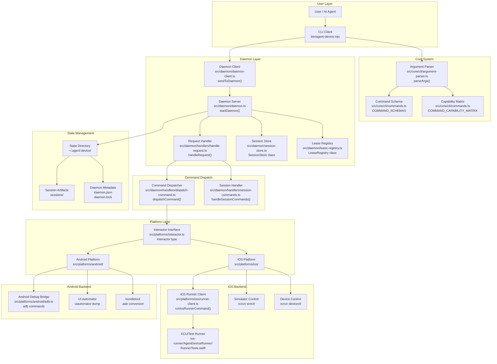
```mermaid
graph TB
    subgraph "User Layer"
        User["User / AI Agent"]
        CLI["CLI Client<br/>bin/agent-device.mjs"]
    end
    
    subgraph "Core System"
        ArgParser["Argument Parser<br/>src/core/cli/argument-parser.ts<br/>parseArgs()"]
        CommandSchema["Command Schema<br/>src/core/cli/commands.ts<br/>COMMAND_SCHEMAS"]
        Capabilities["Capability Matrix<br/>src/core/cli/commands.ts<br/>COMMAND_CAPABILITY_MATRIX"]
    end
    
    subgraph "Daemon Layer"
        DaemonClient["Daemon Client<br/>src/daemon/daemon-client.ts<br/>sendToDaemon()"]
        DaemonServer["Daemon Server<br/>src/daemon/daemon.ts<br/>startDaemon()"]
        RequestHandler["Request Handler<br/>src/daemon/handlers/handle-request.ts<br/>handleRequest()"]
        SessionStore["Session Store<br/>src/daemon/session-store.ts<br/>SessionStore class"]
        LeaseRegistry["Lease Registry<br/>src/daemon/lease-registry.ts<br/>LeaseRegistry class"]
    end
    
    subgraph "Command Dispatch"
        DispatchCommand["Command Dispatcher<br/>src/daemon/handlers/dispatch-command.ts<br/>dispatchCommand()"]
        SessionHandler["Session Handler<br/>src/daemon/handlers/session-commands.ts<br/>handleSessionCommands()"]
    end
    
    subgraph "Platform Layer"
        Interactor["Interactor Interface<br/>src/platforms/interactor.ts<br/>Interactor type"]
        IOSPlatform["iOS Platform<br/>src/platforms/ios/"]
        AndroidPlatform["Android Platform<br/>src/platforms/android/"]
    end
    
    subgraph "iOS Backend"
        IOSRunner["iOS Runner Client<br/>src/platforms/ios/runner-client.ts<br/>runIosRunnerCommand()"]
        XCTest["XCUITest Runner<br/>ios-runner/AgentDeviceRunner/<br/>RunnerTests.swift"]
        Simctl["Simulator Control<br/>xcrun simctl"]
        Devicectl["Device Control<br/>xcrun devicectl"]
    end
    
    subgraph "Android Backend"
        ADB["Android Debug Bridge<br/>src/platforms/android/adb.ts<br/>adb commands"]
        UIAutomator["UI Automator<br/>uiautomator dump"]
        Bundletool["bundletool<br/>.aab conversion"]
    end
    
    subgraph "State Management"
        StateDir["State Directory<br/>~/.agent-device/"]
        SessionFiles["Session Artifacts<br/>sessions/"]
        DaemonMeta["Daemon Metadata<br/>daemon.json<br/>daemon.lock"]
    end
    
    User --> CLI
    CLI --> ArgParser
    ArgParser --> CommandSchema
    ArgParser --> Capabilities
    CLI --> DaemonClient
    
    DaemonClient --> DaemonServer
    DaemonServer --> RequestHandler
    RequestHandler --> SessionHandler
    RequestHandler --> DispatchCommand
    
    DaemonServer --> SessionStore
    DaemonServer --> LeaseRegistry
    
    DispatchCommand --> Interactor
    Interactor --> IOSPlatform
    Interactor --> AndroidPlatform
    
    IOSPlatform --> IOSRunner
    IOSPlatform --> Simctl
    IOSPlatform --> Devicectl
    IOSRunner --> XCTest
    
    AndroidPlatform --> ADB
    AndroidPlatform --> UIAutomator
    AndroidPlatform --> Bundletool
    
    DaemonServer --> StateDir
    StateDir --> SessionFiles
    StateDir --> DaemonMeta
```

**Sources:** [bin/agent-device.mjs:1-6](), [src/daemon/daemon.ts](), [src/daemon/session-store.ts](), [src/platforms/ios/runner-client.ts](), [src/platforms/android/adb.ts]()

---

## Core Components

### CLI Entry Point

The CLI entry point is defined in [bin/agent-device.mjs:1-6](). It loads the main CLI runner from the compiled `dist/` output and executes commands by:

1. **Parsing arguments** via `parseArgs()` in [src/core/cli/argument-parser.ts]()
2. **Validating against command schemas** defined in [src/core/cli/commands.ts]()
3. **Checking platform capabilities** using `COMMAND_CAPABILITY_MATRIX`
4. **Sending requests to daemon** via `sendToDaemon()` in [src/daemon/daemon-client.ts]()
5. **Formatting output** as human-readable or JSON based on `--json` flag

**Command Validation Pipeline:**

| Stage | Module | Function | Purpose |
|-------|--------|----------|---------|
| Argument Parsing | `argument-parser.ts` | `parseArgs()` | Extract command, positionals, flags |
| Schema Lookup | `commands.ts` | `getCommandSchema()` | Retrieve command metadata |
| Flag Validation | `commands.ts` | Flag definitions | Validate allowed flags, types, ranges |
| Capability Check | `commands.ts` | `isCommandSupportedOnDevice()` | Verify platform/kind support |

**Sources:** [bin/agent-device.mjs:1-6](), [package.json:11-13]()

---

### Daemon Architecture

The daemon is a **persistent background service** that manages device sessions, enforces resource constraints, and routes commands to platform backends. It supports three server modes:

- **`socket`**: Unix domain socket (local-only, default)
- **`http`**: HTTP JSON-RPC server (remote access)
- **`dual`**: Both transports simultaneously

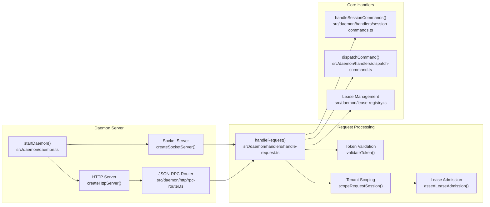
```mermaid
graph LR
    subgraph "Daemon Server"
        StartDaemon["startDaemon()<br/>src/daemon/daemon.ts"]
        SocketServer["Socket Server<br/>createSocketServer()"]
        HTTPServer["HTTP Server<br/>createHttpServer()"]
        RPCRouter["JSON-RPC Router<br/>src/daemon/http/rpc-router.ts"]
    end
    
    subgraph "Request Processing"
        HandleRequest["handleRequest()<br/>src/daemon/handlers/handle-request.ts"]
        TokenValidation["Token Validation<br/>validateToken()"]
        TenantScoping["Tenant Scoping<br/>scopeRequestSession()"]
        LeaseAdmission["Lease Admission<br/>assertLeaseAdmission()"]
    end
    
    subgraph "Core Handlers"
        SessionCmds["handleSessionCommands()<br/>src/daemon/handlers/session-commands.ts"]
        DispatchCmd["dispatchCommand()<br/>src/daemon/handlers/dispatch-command.ts"]
        LeaseMgmt["Lease Management<br/>src/daemon/lease-registry.ts"]
    end
    
    StartDaemon --> SocketServer
    StartDaemon --> HTTPServer
    HTTPServer --> RPCRouter
    
    SocketServer --> HandleRequest
    RPCRouter --> HandleRequest
    
    HandleRequest --> TokenValidation
    HandleRequest --> TenantScoping
    TenantScoping --> LeaseAdmission
    
    HandleRequest --> SessionCmds
    HandleRequest --> DispatchCmd
    HandleRequest --> LeaseMgmt
```

**Daemon Lifecycle:**

1. **Startup**: `startDaemon()` initializes server(s), loads session store, starts lease expiration monitor
2. **Request Handling**: `handleRequest()` validates tokens, applies tenant scoping, routes to specialized handlers
3. **Command Dispatch**: `dispatchCommand()` switches on command type, invokes platform implementations
4. **State Persistence**: Session artifacts written to `~/.agent-device/sessions/`
5. **Shutdown**: Graceful cleanup, session closure, lease release

**Sources:** [src/daemon/daemon.ts](), [src/daemon/handlers/handle-request.ts](), [src/daemon/handlers/dispatch-command.ts](), [README.md:236-257]()

---

### Platform Abstraction Layer

The `Interactor` interface in [src/platforms/interactor.ts]() defines a **platform-agnostic API** for common device operations:

**Interactor Operations:**

| Operation | iOS Implementation | Android Implementation | Notes |
|-----------|-------------------|----------------------|-------|
| `tap(x, y)` | XCUITest runner `tap` command | `adb shell input tap` | Coordinate-based |
| `swipe(x1, y1, x2, y2, duration)` | XCUITest runner `drag` | `adb shell input swipe` | Duration handling differs |
| `type(text)` | XCUITest runner `type` | `adb shell input text` | Android has ASCII/Unicode split |
| `snapshot()` | XCUITest runner `snapshot` | `uiautomator dump` | Format differs |
| `screenshot(path)` | XCUITest runner `screenshot` | `adb exec-out screencap` | |

Platform selection logic in `dispatchCommand()`:

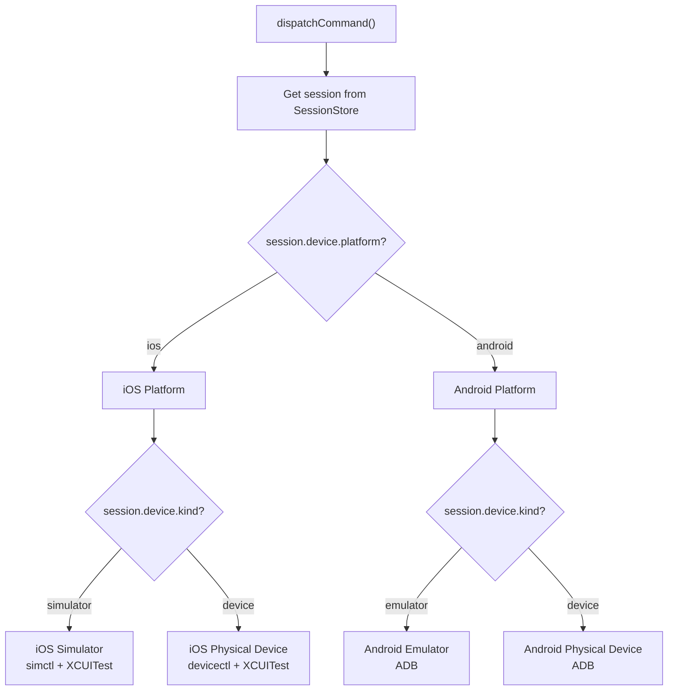
```mermaid
graph TB
    Start["dispatchCommand()"]
    GetSession["Get session from SessionStore"]
    CheckPlatform{"session.device.platform?"}
    
    IOSPath["iOS Platform"]
    IOSKindCheck{"session.device.kind?"}
    IOSSimulator["iOS Simulator<br/>simctl + XCUITest"]
    IOSDevice["iOS Physical Device<br/>devicectl + XCUITest"]
    
    AndroidPath["Android Platform"]
    AndroidKindCheck{"session.device.kind?"}
    AndroidEmulator["Android Emulator<br/>ADB"]
    AndroidDevice["Android Physical Device<br/>ADB"]
    
    Start --> GetSession
    GetSession --> CheckPlatform
    
    CheckPlatform -->|"ios"| IOSPath
    CheckPlatform -->|"android"| AndroidPath
    
    IOSPath --> IOSKindCheck
    IOSKindCheck -->|"simulator"| IOSSimulator
    IOSKindCheck -->|"device"| IOSDevice
    
    AndroidPath --> AndroidKindCheck
    AndroidKindCheck -->|"emulator"| AndroidEmulator
    AndroidKindCheck -->|"device"| AndroidDevice
```

**Sources:** [src/platforms/interactor.ts](), [src/daemon/handlers/dispatch-command.ts](), [src/platforms/ios/](), [src/platforms/android/]()

---

## Key Features

### Session Management

Sessions are the core abstraction for device interaction. A `SessionState` object tracks:

- **Device context**: `platform`, `kind` (simulator/emulator/device), `id`, `udid`/`serial`
- **App context**: `appBundleId`, `appName`
- **Action history**: Array of `SessionAction` objects for replay/debugging
- **UI snapshots**: Last captured snapshot cached in `snapshot` field
- **Log streaming**: Active log stream state in `appLog` field
- **Recording state**: `recordSession` flag for `.ad` script generation

For detailed session documentation, see [Session Management](#3).

**Sources:** [src/daemon/session-store.ts](), [README.md:295-305]()

---

### Platform Support Matrix

| Feature | iOS Simulator | iOS Physical Device | Android Emulator | Android Physical Device |
|---------|--------------|-------------------|------------------|------------------------|
| **Core Interaction** | ✓ | ✓ | ✓ | ✓ |
| `open`, `close`, `press`, `swipe`, `type`, `fill` | ✓ | ✓ | ✓ | ✓ |
| **UI Inspection** | ✓ | ✓ | ✓ | ✓ |
| `snapshot`, `find`, `get`, `is`, `wait` | ✓ | ✓ | ✓ | ✓ |
| **App Management** | ✓ | ✓ | ✓ | ✓ |
| `install`, `reinstall`, `apps`, `appstate` | ✓ | ✓ | ✓ | ✓ |
| **Utilities** | | | | |
| `screenshot` | ✓ | ✓ | ✓ | ✓ |
| `clipboard read/write` | ✓ | ✗ | ✓ | ✓ |
| `keyboard` commands | N/A | N/A | ✓ | ✓ |
| **Simulator/Emulator Only** | | | | |
| `alert` accept/dismiss | ✓ | ✗ | ✗ | ✗ |
| `pinch` gesture | ✓ | ✗ | ✗ | ✗ |
| `settings` helpers | ✓ | ✗ | ✓ | ✓ |
| `push` notifications | ✓ | ✗ | ✓ | ✓ |
| **Recording** | ✓ (native) | ✓ (screenshot-based) | ✓ (native) | ✓ (native) |

The capability matrix is defined in `COMMAND_CAPABILITY_MATRIX` in [src/core/cli/commands.ts](). The `isCommandSupportedOnDevice()` function validates commands against device type before execution.

**Sources:** [src/core/cli/commands.ts](), [README.md:15-24](), [README.md:473-485]()

---

### Command Categories

Commands are organized into functional categories:

#### Device and Session Commands
- **Device management**: `boot`, `devices`, `ensure-simulator`
- **Session lifecycle**: `open`, `close`, `session list`
- **Navigation**: `back`, `home`, `app-switcher`

For details, see [Device and Session Commands](#2.1).

#### Interaction Commands
- **Gestures**: `press` (alias: `click`), `longpress`, `swipe`, `scroll`, `scrollintoview`, `pinch`
- **Input**: `type`, `fill`, `focus`

For details, see [Interaction Commands](#2.2).

#### Inspection Commands
- **Snapshots**: `snapshot`, `diff snapshot`
- **Queries**: `find`, `get`, `is`, `wait`

For details, see [Snapshot and Inspection Commands](#2.3).

#### Application Management
- **Installation**: `install`, `reinstall`
- **Queries**: `apps`, `appstate`

For details, see [Application Management](#2.4).

#### Utility Commands
- **System**: `clipboard`, `keyboard`, `settings`, `push`, `trigger-app-event`
- **Debugging**: `screenshot`, `logs`, `network dump`, `trace`
- **Performance**: `perf` (alias: `metrics`)

For details, see [Utility Commands](#2.5).

#### Batch Operations
- **`batch`**: Execute multiple commands in a single daemon request with `--steps` or `--steps-file`

For details, see [Batch Operations](#9.1).

**Sources:** [README.md:145-166](), [src/core/cli/commands.ts]()

---

## iOS XCUITest Runner

The iOS platform relies on a **persistent XCUITest runner** for UI automation on both simulators and physical devices. This is a critical architectural component.

### Runner Architecture

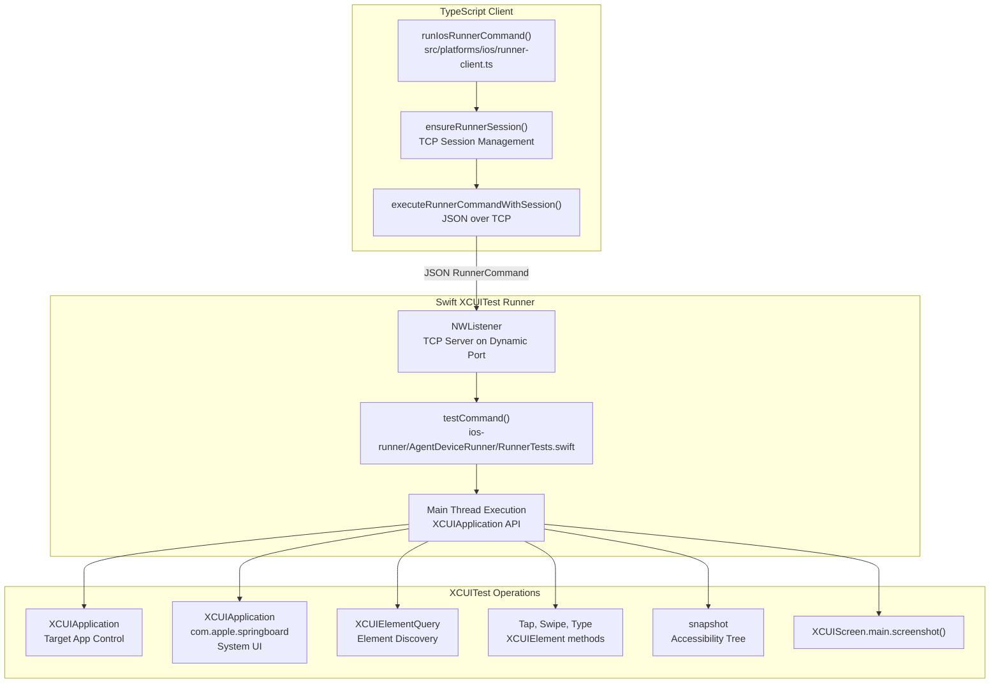
```mermaid
graph TB
    subgraph "TypeScript Client"
        RunnerClient["runIosRunnerCommand()<br/>src/platforms/ios/runner-client.ts"]
        SessionMgr["ensureRunnerSession()<br/>TCP Session Management"]
        CommandExec["executeRunnerCommandWithSession()<br/>JSON over TCP"]
    end
    
    subgraph "Swift XCUITest Runner"
        TestEntry["testCommand()<br/>ios-runner/AgentDeviceRunner/RunnerTests.swift"]
        NWListener["NWListener<br/>TCP Server on Dynamic Port"]
        MainThread["Main Thread Execution<br/>XCUIApplication API"]
    end
    
    subgraph "XCUITest Operations"
        App["XCUIApplication<br/>Target App Control"]
        Springboard["XCUIApplication<br/>com.apple.springboard<br/>System UI"]
        ElementQuery["XCUIElementQuery<br/>Element Discovery"]
        Gestures["Tap, Swipe, Type<br/>XCUIElement methods"]
        SnapshotAPI["snapshot<br/>Accessibility Tree"]
        ScreenshotAPI["XCUIScreen.main.screenshot()"]
    end
    
    RunnerClient --> SessionMgr
    SessionMgr --> CommandExec
    CommandExec -->|"JSON RunnerCommand"| NWListener
    
    NWListener --> TestEntry
    TestEntry --> MainThread
    
    MainThread --> App
    MainThread --> Springboard
    MainThread --> ElementQuery
    MainThread --> Gestures
    MainThread --> SnapshotAPI
    MainThread --> ScreenshotAPI
```

**Key Runner Commands:**

| Command | Purpose | iOS Implementation |
|---------|---------|-------------------|
| `tap` | Coordinate-based tap | `XCUIElement.coordinate(withNormalizedOffset:).tap()` |
| `tapSeries` | Multi-tap, double-tap | Custom tap loop with timing |
| `drag` | Swipe/drag gesture | `coordinate.press(forDuration:thenDragTo:)` |
| `type` | Text input | `XCUIElement.typeText()` |
| `snapshot` | UI hierarchy | `XCUIElement.snapshot()` recursive traversal |
| `screenshot` | Screen capture | `XCUIScreen.main.screenshot()` |
| `back`, `home`, `app-switcher` | System navigation | Springboard app control |

**Runner Session Management:**
- Runner sessions persist across commands for efficiency
- TCP port is dynamically allocated and stored in environment variable
- Retry logic handles transient connection failures for read-only commands
- `isRetryableRunnerError()` classifies errors (timeouts, connection refused)

For detailed runner documentation, see [XCUITest Runner](#5.1) and [Runner Client](#5.2).

**Sources:** [src/platforms/ios/runner-client.ts](), [ios-runner/AgentDeviceRunner/RunnerTests.swift](), [README.md:209-213]()

---

## Android ADB Backend

Android automation uses **Android Debug Bridge (ADB)** for both emulators and physical devices:

### ADB Operations

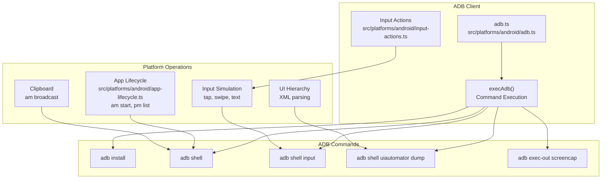
```mermaid
graph TB
    subgraph "ADB Client"
        ADBModule["adb.ts<br/>src/platforms/android/adb.ts"]
        ShellExec["execAdb()<br/>Command Execution"]
        InputActions["Input Actions<br/>src/platforms/android/input-actions.ts"]
    end
    
    subgraph "ADB Commands"
        InstallCmd["adb install"]
        ShellCmd["adb shell"]
        InputCmd["adb shell input"]
        UIAutomatorCmd["adb shell uiautomator dump"]
        ScreencapCmd["adb exec-out screencap"]
    end
    
    subgraph "Platform Operations"
        AppLifecycle["App Lifecycle<br/>src/platforms/android/app-lifecycle.ts<br/>am start, pm list"]
        InputSimulation["Input Simulation<br/>tap, swipe, text"]
        UIHierarchy["UI Hierarchy<br/>XML parsing"]
        ClipboardOps["Clipboard<br/>am broadcast"]
    end
    
    ADBModule --> ShellExec
    ShellExec --> InstallCmd
    ShellExec --> ShellCmd
    ShellExec --> InputCmd
    ShellExec --> UIAutomatorCmd
    ShellExec --> ScreencapCmd
    
    InputActions --> InputSimulation
    
    AppLifecycle --> ShellCmd
    InputSimulation --> InputCmd
    UIHierarchy --> UIAutomatorCmd
    ClipboardOps --> ShellCmd
```

**Android Text Input Strategy:**
- **ASCII text**: Direct injection via `adb shell input text`
- **Unicode text**: Requires ADB keyboard IME (see [README.md:396-401]())
- **Fill verification**: Automatic retry with slower typing on mismatch

For detailed Android documentation, see [Android Platform](#6), [ADB Operations](#6.1), and [UI Automation](#6.3).

**Sources:** [src/platforms/android/adb.ts](), [src/platforms/android/input-actions.ts](), [src/platforms/android/app-lifecycle.ts](), [README.md:389-401]()

---

## Multi-Tenant Isolation

agent-device supports **multi-tenant CI/CD environments** with:

### Isolation Mechanisms

| Mechanism | Purpose | Configuration |
|-----------|---------|---------------|
| **Session Isolation** | Namespace separation | `--session-isolation tenant` |
| **Tenant Prefixing** | Session namespacing | Sessions named `<tenantId>:<sessionName>` |
| **Lease Management** | Resource allocation | HTTP JSON-RPC lease API |
| **Device Scoping** | Discovery constraints | `--ios-simulator-device-set`, `--android-device-allowlist` |

### Lease Workflow

```mermaid
sequenceDiagram
    participant Client
    participant HTTP["HTTP JSON-RPC<br/>/rpc endpoint"]
    participant LeaseRegistry["LeaseRegistry<br/>src/daemon/lease-registry.ts"]
    participant Daemon["Daemon<br/>handleRequest()"]
    
    Client->>HTTP: agent_device.lease.allocate<br/>{tenantId, runId, ttlMs}
    HTTP->>LeaseRegistry: allocateLease()
    LeaseRegistry-->>HTTP: {leaseId, deviceId, expiresAt}
    HTTP-->>Client: Lease allocated
    
    loop Work execution
        Client->>Daemon: Commands with<br/>--tenant --run-id --lease-id
        Daemon->>LeaseRegistry: assertLeaseAdmission()
        LeaseRegistry-->>Daemon: Admission granted
        Daemon-->>Client: Command result
        
        Client->>HTTP: agent_device.lease.heartbeat<br/>{leaseId, ttlMs}
        HTTP->>LeaseRegistry: extendLease()
        LeaseRegistry-->>HTTP: {expiresAt}
    end
    
    Client->>HTTP: agent_device.lease.release<br/>{leaseId}
    HTTP->>LeaseRegistry: releaseLease()
    LeaseRegistry-->>HTTP: Released
```

**Lease Configuration:**
- `AGENT_DEVICE_MAX_SIMULATOR_LEASES`: Concurrent lease limit
- `AGENT_DEVICE_LEASE_TTL_MS`: Default TTL (60s)
- `AGENT_DEVICE_LEASE_MIN_TTL_MS`: Minimum TTL (5s)
- `AGENT_DEVICE_LEASE_MAX_TTL_MS`: Maximum TTL (600s)

For detailed multi-tenant documentation, see [Multi-Tenant Isolation](#4.4).

**Sources:** [src/daemon/lease-registry.ts](), [README.md:236-257](), [README.md:519-530](), [skills/agent-device/SKILL.md:62-88]()

---

## State Management

### State Directory Structure

All persistent state is stored in `~/.agent-device/` (configurable via `AGENT_DEVICE_STATE_DIR`):

```
~/.agent-device/
├── daemon.json          # Daemon metadata (port, PID, timestamp)
├── daemon.lock          # Daemon lock file
├── sessions/
│   ├── default/         # Session artifacts
│   │   ├── app.log      # Application logs (5MB rotation)
│   │   ├── app.log.1    # Rotated logs
│   │   └── *.ad         # Replay scripts
│   └── <tenant>:<session>/  # Tenant-scoped sessions
├── logs/
│   └── <session>/       # Diagnostic logs
│       └── <date>/
│           └── <timestamp>-<id>.ndjson
└── ios-runner/
    └── derived/         # XCUITest build artifacts
        ├── device/      # Physical device builds
        └── ...          # Simulator builds
```

**Session Artifacts:**
- **`app.log`**: Application log stream (rotated at 5MB)
- **`*.ad` files**: Replay scripts when `--save-script` is used
- **Screenshots**: Stored with timestamp/ID naming

**Daemon Metadata:**
- **`daemon.json`**: `{ port, pid, timestamp, serverMode, httpPort }`
- **`daemon.lock`**: Lock file for single-daemon enforcement

For state management details, see [Session Management](#3).

**Sources:** [README.md:301-303](), [README.md:436-450](), [README.md:462-465](), [README.md:516-517]()

---

## Command Validation and Capabilities

### Capability Matrix

The `COMMAND_CAPABILITY_MATRIX` in [src/core/cli/commands.ts]() defines a three-dimensional support matrix:

**Dimensions:**
1. **Command**: 40+ commands (`open`, `press`, `snapshot`, etc.)
2. **Platform**: `ios`, `android`
3. **Kind**: `simulator`, `emulator`, `device`

**Example Capability Entries:**

| Command | iOS Simulator | iOS Device | Android Emulator | Android Device |
|---------|--------------|------------|------------------|----------------|
| `press` | ✓ | ✓ | ✓ | ✓ |
| `alert` | ✓ | ✗ | ✗ | ✗ |
| `pinch` | ✓ | ✗ | ✗ | ✗ |
| `clipboard` | ✓ | ✗ | ✓ | ✓ |
| `keyboard` | N/A | N/A | ✓ | ✓ |
| `settings` | ✓ | ✗ | ✓ | ✓ |
| `push` | ✓ | ✗ | ✓ | ✓ |

The system uses `isCommandSupportedOnDevice()` to validate commands before execution, returning clear error messages for unsupported operations.

For detailed capability documentation, see [Command Capabilities](#7).

**Sources:** [src/core/cli/commands.ts](), [README.md:16-17](), [README.md:275-280]()

---

## Coordinate System

All coordinate-based commands use **device screen coordinates**:

- **Origin**: Top-left corner of device screen
- **Units**: Device points (iOS) or pixels (Android)
- **Axes**: X increases right, Y increases downward

**Coordinate-Based Commands:**
- `press x y`
- `longpress x y`
- `swipe x1 y1 x2 y2 [durationMs]`
- `focus x y`
- `fill x y "text"`

For coordinate system details, see [Coordinate System](#3.1).

**Sources:** [skills/agent-device/references/coordinate-system.md:1-9](), [README.md:128-133]()

---

## Build System

### Build Targets

The build system uses **rslib** for Node.js compilation and **xcodebuild** for iOS runner artifacts:

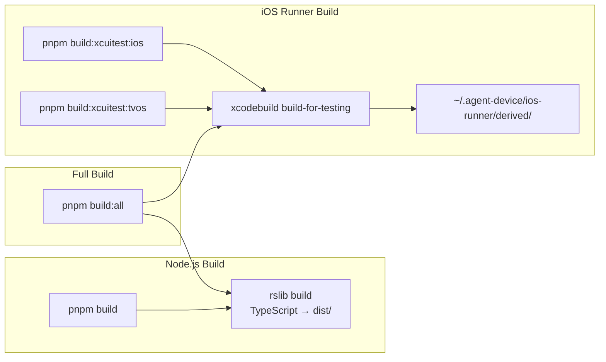
```mermaid
graph LR
    subgraph "Node.js Build"
        NPM["pnpm build"]
        Rslib["rslib build<br/>TypeScript → dist/"]
    end
    
    subgraph "iOS Runner Build"
        XCBuild["pnpm build:xcuitest:ios"]
        XCBuildTV["pnpm build:xcuitest:tvos"]
        XcodeCmd["xcodebuild build-for-testing"]
        DerivedData["~/.agent-device/ios-runner/derived/"]
    end
    
    subgraph "Full Build"
        BuildAll["pnpm build:all"]
    end
    
    NPM --> Rslib
    
    XCBuild --> XcodeCmd
    XCBuildTV --> XcodeCmd
    XcodeCmd --> DerivedData
    
    BuildAll --> Rslib
    BuildAll --> XcodeCmd
```

**Build Scripts:**
- `pnpm build`: Compile TypeScript to `dist/`
- `pnpm build:xcuitest:ios`: Build iOS simulator runner
- `pnpm build:xcuitest:tvos`: Build tvOS simulator runner
- `pnpm build:all`: Build all artifacts
- `pnpm prepublishOnly`: Pre-publish hook (builds all)

For build system documentation, see [Build System](#8.1).

**Sources:** [package.json:14-32](), [README.md:500-504]()

---

## Next Steps

- **Quick start**: See [Getting Started](#1.1) for installation and first commands
- **Core concepts**: Review [Key Concepts](#1.2) for sessions, platforms, and selectors
- **Command reference**: Browse [Command Reference](#2) for detailed command documentation
- **Architecture deep dive**: Explore [Architecture](#4) for system internals
- **Platform specifics**: See [iOS Platform](#5) or [Android Platform](#6) for platform details

---

# Page: Getting Started

# Getting Started

<details>
<summary>Relevant source files</summary>

The following files were used as context for generating this wiki page:

- [README.md](README.md)
- [skills/agent-device/SKILL.md](skills/agent-device/SKILL.md)
- [website/docs/docs/commands.md](website/docs/docs/commands.md)

</details>


This page covers installation prerequisites, setup procedures, and a tutorial demonstrating basic CLI usage. It walks through the process from installation to executing your first automation workflow on iOS or Android devices.

For conceptual explanations of sessions, snapshots, and refs, see [Key Concepts](#1.2). For comprehensive command documentation, see [Command Reference](#2).

---

## Prerequisites

The `agent-device` system requires different tools depending on target platform and usage mode:

### Universal Requirements

| Requirement | Minimum Version | Purpose | Verification Command |
|------------|----------------|---------|---------------------|
| Node.js | 22.0.0+ | Runtime for CLI and daemon | `node --version` |
| npm | 8.0.0+ | Package installation | `npm --version` |

The Node.js version constraint is enforced in [package.json:8-10]().

### Android Requirements

| Tool | Purpose | Verification Command |
|------|---------|---------------------|
| adb | Android Debug Bridge for device communication | `adb version` |
| Android SDK | Emulator management and tools | `adb devices` |

The `adb` binary must be accessible in `PATH`. All Android operations route through `adb` commands as implemented in [src/platforms/android/index.ts:13-15]().

### iOS Requirements

| Tool | Purpose | Verification Command |
|------|---------|---------------------|
| Xcode | iOS development toolchain | `xcodebuild -version` |
| Command Line Tools | Build utilities | `xcode-select -p` |
| macOS | Host operating system | iOS automation requires macOS |

**iOS simulator operations** require:
- Xcode 14+ (recommended: latest stable version)
- macOS Accessibility permissions for the terminal application (System Settings → Privacy & Security → Accessibility)

The accessibility permission is required for the default `hybrid` snapshot backend, which uses the `axsnapshot` tool [ios-runner/AXSnapshot/Sources/AXSnapshot/main.swift:1-230]().

**iOS physical device operations** (limited v1 support):
- Xcode-managed provisioning for the target device
- Device connected via USB or network

**Sources:** [package.json:8-10](), [README.md:14-24](), [src/platforms/android/index.ts:13-15]()

---

## Installation

### Global Installation

Install `agent-device` globally to use the `agent-device` command from any directory:

```bash
npm install -g agent-device
```

Verify installation:

```bash
agent-device --help
```

The CLI entry point is [bin/agent-device.mjs:1](), which loads the compiled TypeScript modules from `dist/`.

### npx Usage (No Installation)

Run commands without installing:

```bash
npx agent-device devices
npx agent-device open Settings --platform ios
```

This approach downloads and caches the package on first use.

### Build from Source

For development or customization:

```bash
git clone https://github.com/callstackincubator/agent-device
cd agent-device
npm install
npm run build:clis
```

The `build:clis` script executes [package.json:21]():
1. `pnpm build:node` - Compiles TypeScript to `dist/` using `rslib`
2. `pnpm build:axsnapshot` - Builds Swift `axsnapshot` binary to `dist/bin/axsnapshot`

Run locally without installing:

```bash
node bin/agent-device.mjs <command>
```

Or create an alias:

```bash
alias ad='node bin/agent-device.mjs'
ad devices
```

**Note:** The XCTest runner (`build:xcuitest` [package.json:20]()) is built on-demand during first iOS simulator interaction, not during `build:clis`. This caching strategy optimizes for fast installation.

**Sources:** [package.json:12-26](), [bin/agent-device.mjs:1](), [README.md:14-24]()

---

## Verification

After installation, verify that all components are accessible:

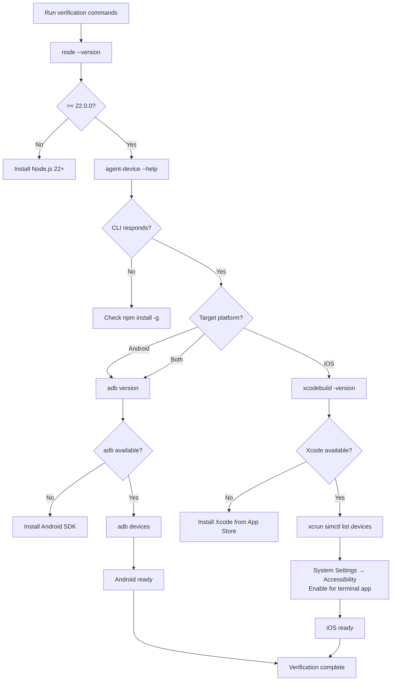
```mermaid
flowchart TD
    Start["Run verification commands"] --> CheckNode["node --version"]
    CheckNode --> NodeOK{">= 22.0.0?"}
    NodeOK -->|No| NodeFail["Install Node.js 22+"]
    NodeOK -->|Yes| CheckCLI["agent-device --help"]
    
    CheckCLI --> CLIOK{"CLI responds?"}
    CLIOK -->|No| CLIFail["Check npm install -g"]
    CLIOK -->|Yes| PlatformChoice{"Target platform?"}
    
    PlatformChoice -->|Android| CheckADB["adb version"]
    PlatformChoice -->|iOS| CheckXcode["xcodebuild -version"]
    PlatformChoice -->|Both| CheckADB
    
    CheckADB --> ADBOKQ{"adb available?"}
    ADBOKQ -->|No| ADBFail["Install Android SDK"]
    ADBOKQ -->|Yes| CheckDevicesA["adb devices"]
    CheckDevicesA --> AndroidReady["Android ready"]
    
    CheckXcode --> XcodeOKQ{"Xcode available?"}
    XcodeOKQ -->|No| XcodeFail["Install Xcode from App Store"]
    XcodeOKQ -->|Yes| CheckSimctl["xcrun simctl list devices"]
    CheckSimctl --> CheckPerms["System Settings → Accessibility<br/>Enable for terminal app"]
    CheckPerms --> IOSReady["iOS ready"]
    
    AndroidReady --> Complete["Verification complete"]
    IOSReady --> Complete
```

**Verification commands:**

```bash
# Core system
node --version          # Should show >= 22.0.0
agent-device --help     # Should display command list

# Android
adb version            # Should show ADB version
adb devices            # Should list connected devices/emulators

# iOS
xcodebuild -version    # Should show Xcode version
xcrun simctl list devices available  # Should list simulators
```

**Sources:** [package.json:8-10](), [README.md:14-24]()

---

## First Run: Basic Workflow

The following diagram shows what happens during a typical first execution:

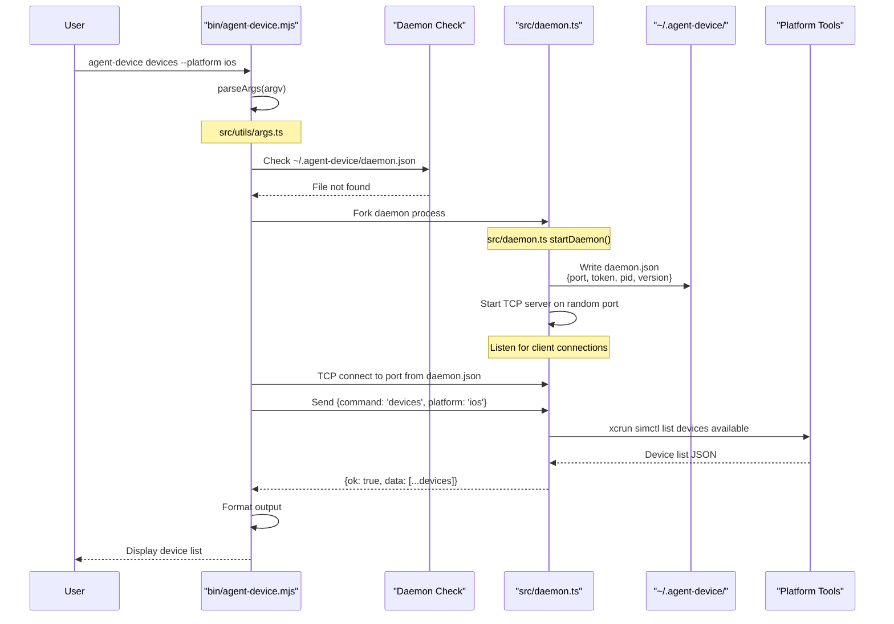
```mermaid
sequenceDiagram
    participant User
    participant CLI as "bin/agent-device.mjs"
    participant DaemonCheck as "Daemon Check"
    participant Daemon as "src/daemon.ts"
    participant FS as "~/.agent-device/"
    participant Platform as "Platform Tools"
    
    User->>CLI: agent-device devices --platform ios
    
    CLI->>CLI: parseArgs(argv)
    Note over CLI: src/utils/args.ts
    
    CLI->>DaemonCheck: Check ~/.agent-device/daemon.json
    DaemonCheck-->>CLI: File not found
    
    CLI->>Daemon: Fork daemon process
    Note over Daemon: src/daemon.ts startDaemon()
    
    Daemon->>FS: Write daemon.json<br/>{port, token, pid, version}
    Daemon->>Daemon: Start TCP server on random port
    Note over Daemon: Listen for client connections
    
    CLI->>Daemon: TCP connect to port from daemon.json
    CLI->>Daemon: Send {command: 'devices', platform: 'ios'}
    
    Daemon->>Platform: xcrun simctl list devices available
    Platform-->>Daemon: Device list JSON
    
    Daemon-->>CLI: {ok: true, data: [...devices]}
    CLI->>CLI: Format output
    CLI-->>User: Display device list
```

**Key files created on first run:**

| Path | Purpose | Content Example |
|------|---------|----------------|
| `~/.agent-device/daemon.json` | Daemon connection info | `{"port": 54321, "token": "abc123...", "pid": 12345}` |
| `~/.agent-device/daemon.log` | Daemon output (with `--verbose`) | Request/response logs |
| `~/.agent-device/sessions/` | Session recordings | `.ad` and `.json` files |

The daemon process lifecycle is managed in [src/daemon.ts:1208-1267](). The client connection logic is in [src/daemon-client.ts:1-100]() (referenced from [src/cli.ts:5]()).

**Sources:** [src/daemon.ts:1208-1267](), [src/cli.ts:5](), [README.md:26-30]()

---

## Quick Tutorial: iOS Settings App

This tutorial demonstrates a complete workflow: launching an app, inspecting its UI, interacting with elements, and closing the session.

### Step 1: List Available Devices

Check which devices are available for automation:

```bash
agent-device devices --platform ios
```

**Expected output:**
```
Available iOS devices:
- iPhone 16 Pro (Booted) [UUID: 12345678-1234-1234-1234-123456789ABC]
- iPad Air (11-inch) [UUID: ABCDEF12-3456-7890-ABCD-EF1234567890]
```

The `devices` command queries `xcrun simctl list devices available` for iOS [src/core/dispatch.ts:105-110]() or `adb devices` for Android [src/platforms/android/index.ts:299-311]().

### Step 2: Open an App

Start a session and launch the Settings app on iOS:

```bash
agent-device open Settings --platform ios --session tutorial
```

**What happens:**
1. Daemon creates session named `tutorial`
2. Session reserves the first available iOS device
3. If device is shutdown, it boots via `xcrun simctl boot`
4. App resolves to `com.apple.Preferences` via `resolveApp()` [src/core/dispatch.ts:439-479]()
5. App launches via `xcrun simctl launch`

**Expected output:**
```
Opened Settings on iPhone 16 Pro
Session: tutorial
Device: iPhone 16 Pro (12345678-1234-1234-1234-123456789ABC)
```

Session state is tracked in [src/daemon.ts:240-326]().

### Step 3: Capture UI Snapshot

Inspect the current UI tree with interactive elements only:

```bash
agent-device snapshot -i --session tutorial
```

**Flags used:**
- `-i` / `--interactive-only`: Shows only tappable/typeable elements
- `--session tutorial`: Targets the specific session

**Expected output (abbreviated):**
```
@e1 button "Airplane Mode" at (0, 88) size 392x44
@e2 button "Wi‑Fi" at (0, 132) size 392x44
@e3 button "Bluetooth" at (0, 176) size 392x44
@e4 button "Cellular" at (0, 220) size 392x44
@e5 text-field "Search" at (16, 62) size 361x36
```

The `@e1`, `@e2`, etc. are **refs** - stable identifiers for UI elements generated by `attachRefs()` [src/daemon.ts:413-476](). The default `hybrid` backend is used [README.md:54-59]().

### Step 4: Interact with an Element

Tap the "Wi‑Fi" button using its ref:

```bash
agent-device click @e2 --session tutorial
```

**What happens:**
1. Daemon looks up `@e2` in session's cached snapshot
2. Retrieves element coordinates and properties
3. Dispatches `tap` command to iOS platform [src/core/dispatch.ts:142-152]()
4. iOS uses XCTest runner to execute tap via XCUIApplication [ios-runner/AgentDeviceRunner/AgentDeviceRunnerUITests/RunnerTests.swift:147-180]()

**Note:** On first interaction, the XCTest runner is built automatically if not cached. This takes 10-30 seconds. Subsequent interactions use the cached runner in `~/.agent-device/ios-runner/derived/`.

### Step 5: Verify Navigation

Take another snapshot to confirm the Wi‑Fi settings screen:

```bash
agent-device snapshot -i --session tutorial
```

**Expected output:**
```
@e1 button "Back" at (8, 88)
@e2 switch "Wi‑Fi" at (336, 94)
@e3 button "Ask to Join Networks" at (0, 200) size 392x44
...
```

The ref numbers reset because this is a new snapshot. Refs are **ephemeral** - they only remain valid until the next snapshot [README.md:47-48]().

### Step 6: Use Find for Semantic Interaction

Instead of refs, find and tap elements by text:

```bash
agent-device find "Ask to Join Networks" click --session tutorial
```

The `find` command [src/core/dispatch.ts:371-437]():
1. Runs a scoped snapshot to search for the text
2. Returns the first matching element
3. Executes the specified action (`click`)

This approach avoids the need to manually snapshot and identify refs.

### Step 7: Close the Session

End the session and return the device to idle state:

```bash
agent-device close --session tutorial
```

**What happens:**
1. Session records all actions to `~/.agent-device/sessions/tutorial-<timestamp>.ad` [src/daemon.ts:1441-1467]()
2. Device is released from session exclusivity
3. Session state is cleared from daemon memory

**Sources:** [src/core/dispatch.ts:105-110](), [src/core/dispatch.ts:142-152](), [src/core/dispatch.ts:371-437](), [src/core/dispatch.ts:439-479](), [src/daemon.ts:240-326](), [src/daemon.ts:413-476](), [src/daemon.ts:1441-1467](), [README.md:27-45](), [README.md:47-48](), [README.md:54-59]()

---

## Quick Tutorial: Android Calculator

This tutorial demonstrates the same workflow on Android:

### Step 1: List Android Devices

```bash
agent-device devices --platform android
```

### Step 2: Open Calculator

```bash
agent-device open Calculator --platform android --session calc
```

Android resolves `Calculator` to `com.google.android.calculator` or similar package via fuzzy matching [src/platforms/android/index.ts:20-42]().

### Step 3: Snapshot with Compact Mode

```bash
agent-device snapshot -i -c --session calc
```

Flags:
- `-i`: Interactive elements only
- `-c`: Compact output (single-line per element)

**Expected output:**
```
@e1 button "7" clickable (75, 450) 100x100
@e2 button "8" clickable (200, 450) 100x100
@e3 button "9" clickable (325, 450) 100x100
@e4 button "+" clickable (450, 450) 100x100
```

Android snapshots use `adb shell uiautomator dump` [src/platforms/android/index.ts:323-335]().

### Step 4: Perform Calculation

```bash
agent-device click @e1 --session calc  # Press 7
agent-device click @e4 --session calc  # Press +
agent-device click @e2 --session calc  # Press 8
```

Android interactions use `adb shell input tap x y` [src/platforms/android/index.ts:162-164]().

### Step 5: Close Session

```bash
agent-device close --session calc
```

**Sources:** [src/platforms/android/index.ts:20-42](), [src/platforms/android/index.ts:162-164](), [src/platforms/android/index.ts:323-335]()

---

## Command Structure Reference

All `agent-device` commands follow this structure:

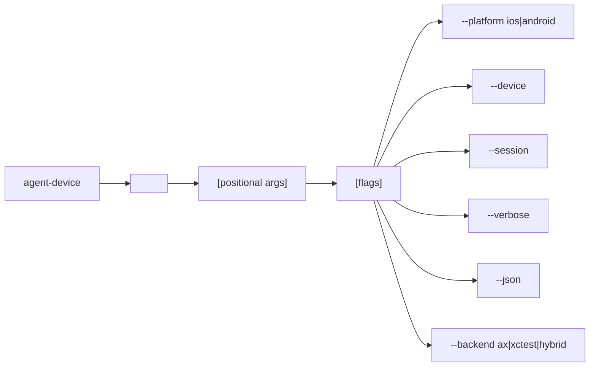
```mermaid
flowchart LR
    Binary["agent-device"] --> Command["<command>"]
    Command --> Positional["[positional args]"]
    Positional --> Flags["[flags]"]
    
    Flags --> Platform["--platform ios|android"]
    Flags --> Device["--device <name>"]
    Flags --> Session["--session <name>"]
    Flags --> Verbose["--verbose"]
    Flags --> JSON["--json"]
    Flags --> Backend["--backend ax|xctest|hybrid"]
```

**Common flag patterns:**

| Flag | Purpose | Example |
|------|---------|---------|
| `--platform ios\|android` | Target platform selection | `--platform ios` |
| `--device <name>` | Device selection by name | `--device "iPhone 16 Pro"` |
| `--udid <uuid>` | iOS device selection by UUID | `--udid 12345678-...` |
| `--serial <serial>` | Android device selection | `--serial emulator-5554` |
| `--session <name>` | Session identifier | `--session auth-flow` |
| `--verbose` | Enable daemon and runner logs | `--verbose` |
| `--json` | JSON output format | `--json` |

Argument parsing is handled by [src/utils/args.ts:1-110]().

**Sources:** [src/utils/args.ts:1-110](), [README.md:61-70]()

---

## Next Steps

After completing these tutorials, explore:

- **[Key Concepts](#1.2)** - Understand sessions, snapshots, refs, and backends
- **[Command Reference](#2)** - Complete documentation of all commands and flags
- **[Session Management](#3)** - Parallel sessions, session logs, and replay
- **[iOS Platform](#5)** - iOS-specific automation details and backend strategies
- **[Android Platform](#6)** - Android automation via ADB
- **[Troubleshooting](#8.4)** - Common issues and solutions

**Common next actions:**

1. **Explore snapshot backends** on iOS:
   ```bash
   agent-device snapshot --backend ax      # Fast, requires permissions
   agent-device snapshot --backend xctest  # Slower, no permissions
   agent-device snapshot --backend hybrid  # Default: best of both
   ```

2. **Use find for semantic interactions**:
   ```bash
   agent-device find "Sign In" click
   agent-device find label "Password" fill "secret123"
   agent-device find role button click
   ```

3. **Manage multiple sessions**:
   ```bash
   agent-device open App1 --session flow1
   agent-device open App2 --session flow2 --device "iPhone 16"
   agent-device session list
   ```

4. **Enable verbose logging** for debugging:
   ```bash
   agent-device snapshot --verbose --session debug
   # Check ~/.agent-device/daemon.log
   ```

**Sources:** [README.md:47-70](), [README.md:85-98]()

---

# Page: Key Concepts

# Key Concepts

<details>
<summary>Relevant source files</summary>

The following files were used as context for generating this wiki page:

- [package.json](package.json)
- [skills/agent-device/SKILL.md](skills/agent-device/SKILL.md)
- [skills/agent-device/references/coordinate-system.md](skills/agent-device/references/coordinate-system.md)
- [src/core/__tests__/capabilities.test.ts](src/core/__tests__/capabilities.test.ts)
- [src/core/capabilities.ts](src/core/capabilities.ts)
- [src/daemon/handlers/__tests__/session.test.ts](src/daemon/handlers/__tests__/session.test.ts)
- [src/daemon/handlers/session.ts](src/daemon/handlers/session.ts)
- [website/docs/docs/introduction.md](website/docs/docs/introduction.md)

</details>


This page explains the fundamental concepts that drive agent-device's architecture: **daemon architecture**, **sessions**, **platforms**, **device kinds**, **selectors**, **snapshots**, and **refs**. Understanding these concepts is essential for effective mobile device automation.

---

## Daemon Architecture

Agent-device operates as a **client-daemon architecture** where the CLI is a thin client that sends JSON-RPC requests to a persistent daemon process.

### Client-Daemon Communication

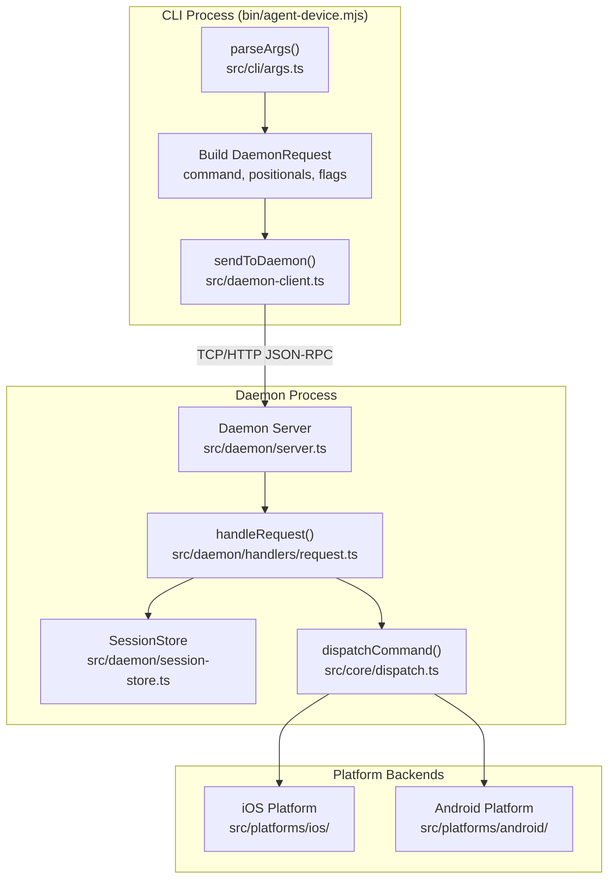
```mermaid
graph TB
    subgraph "CLI Process (bin/agent-device.mjs)"
        ParseArgs["parseArgs()<br/>src/cli/args.ts"]
        BuildRequest["Build DaemonRequest<br/>command, positionals, flags"]
        SendRequest["sendToDaemon()<br/>src/daemon-client.ts"]
    end
    
    subgraph "Daemon Process"
        DaemonServer["Daemon Server<br/>src/daemon/server.ts"]
        HandleRequest["handleRequest()<br/>src/daemon/handlers/request.ts"]
        SessionStore["SessionStore<br/>src/daemon/session-store.ts"]
        DispatchCommand["dispatchCommand()<br/>src/core/dispatch.ts"]
    end
    
    subgraph "Platform Backends"
        IOSPlatform["iOS Platform<br/>src/platforms/ios/"]
        AndroidPlatform["Android Platform<br/>src/platforms/android/"]
    end
    
    ParseArgs --> BuildRequest
    BuildRequest --> SendRequest
    SendRequest -->|"TCP/HTTP JSON-RPC"| DaemonServer
    DaemonServer --> HandleRequest
    HandleRequest --> SessionStore
    HandleRequest --> DispatchCommand
    DispatchCommand --> IOSPlatform
    DispatchCommand --> AndroidPlatform
```

**Sources:** [package.json:12](), [src/daemon/handlers/session.ts:1-40]()

### Daemon Server Modes

The daemon supports three transport modes:

| Mode | Transport | Use Case |
|------|-----------|----------|
| `socket` (default) | Unix domain socket | Local CLI access only |
| `http` | HTTP JSON-RPC on TCP port | Remote access, multi-tenant CI/CD |
| `dual` | Both socket and HTTP | Mixed local + remote access |

**Configuration:**
- `AGENT_DEVICE_DAEMON_SERVER_MODE` environment variable
- `--daemon-transport` CLI flag for client-side transport selection

**Sources:** [src/daemon/handlers/session.ts:1-40](), [skills/agent-device/SKILL.md:62-88]()

---

## Sessions

A **session** represents an isolated automation context bound to a single device. Sessions track device state, app context, command history, and snapshots.

### SessionState Structure

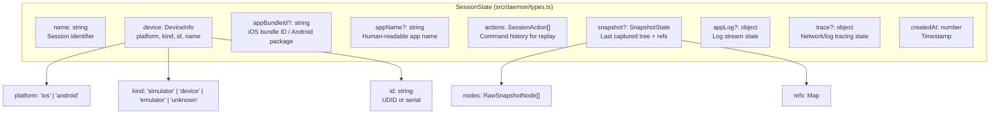
```mermaid
graph TB
    subgraph "SessionState (src/daemon/types.ts)"
        Name["name: string<br/>Session identifier"]
        Device["device: DeviceInfo<br/>platform, kind, id, name"]
        AppBundleId["appBundleId?: string<br/>iOS bundle ID / Android package"]
        AppName["appName?: string<br/>Human-readable app name"]
        Actions["actions: SessionAction[]<br/>Command history for replay"]
        Snapshot["snapshot?: SnapshotState<br/>Last captured tree + refs"]
        AppLog["appLog?: object<br/>Log stream state"]
        Trace["trace?: object<br/>Network/log tracing state"]
        CreatedAt["createdAt: number<br/>Timestamp"]
    end
    
    Device --> Platform["platform: 'ios' | 'android'"]
    Device --> Kind["kind: 'simulator' | 'device' | 'emulator' | 'unknown'"]
    Device --> Id["id: string<br/>UDID or serial"]
    
    Snapshot --> Nodes["nodes: RawSnapshotNode[]"]
    Snapshot --> Refs["refs: Map<string, node>"]
```

**Sources:** [src/daemon/handlers/session.ts:1-50](), [src/daemon/session-store.ts:1-50]()

### Session Lifecycle

Sessions are created by the `open` command and closed explicitly via `close`:

```bash
# Create session and open app
agent-device open Settings --platform ios

# Commands execute in the session context
agent-device snapshot -i
agent-device press @e1

# Close session
agent-device close
```

**Device Exclusivity:** A device can only be held by one session at a time. `SessionStore` enforces this constraint.

### Named Sessions

Sessions are identified by name (default: `"default"`). Use `--session <name>` to manage multiple parallel sessions:

```bash
agent-device --session ios-sim open Settings --platform ios --device "iPhone 16"
agent-device --session android-emu open MyApp --platform android --serial emulator-5554
agent-device --session ios-sim snapshot -i
agent-device --session android-emu snapshot -i
```

**Sources:** [src/daemon/handlers/session.ts:694-799](), [skills/agent-device/SKILL.md:93-106]()

---

## Platforms

Agent-device supports two platforms: **iOS** and **Android**. Each platform has distinct implementation backends and capabilities.

### Platform Differences

| Aspect | iOS | Android |
|--------|-----|---------|
| **Backend** | XCUITest runner + simctl/devicectl | ADB + UIAutomator |
| **Snapshot** | XCUITest accessibility tree or AXSnapshot tool | `uiautomator dump` XML parsing |
| **Interaction** | XCUITest gesture APIs | `adb shell input` commands |
| **App Management** | `simctl install`, `devicectl device install` | `adb install`, `bundletool` for `.aab` |
| **Device Control** | `simctl boot/shutdown` | `emulator -avd <name>` |

**Platform-Specific Commands:**

iOS-only commands:
- `alert` - Interact with system alerts (simulator only)
- `pinch` - Pinch gesture (simulator only)

Android-only commands:
- `keyboard` - Keyboard visibility control

**Sources:** [src/core/capabilities.ts:1-67](), [skills/agent-device/SKILL.md:1-50]()

### Platform Detection

Commands target a specific platform via:
1. Active session's device platform
2. Explicit `--platform ios|android` flag
3. Device-specific selectors (`--udid` for iOS, `--serial` for Android)

**Sources:** [src/daemon/handlers/session.ts:200-268]()

---

## Device Kinds

Devices are classified by **kind**: `simulator`, `device`, `emulator`, or `unknown`. The `kind` determines available capabilities.

### Device Kind Matrix

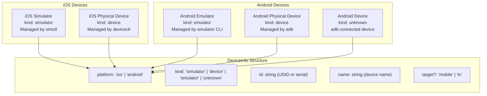
```mermaid
graph TB
    subgraph "iOS Devices"
        IOSSim["iOS Simulator<br/>kind: simulator<br/>Managed by simctl"]
        IOSDev["iOS Physical Device<br/>kind: device<br/>Managed by devicectl"]
    end
    
    subgraph "Android Devices"
        AndroidEmu["Android Emulator<br/>kind: emulator<br/>Managed by emulator CLI"]
        AndroidDev["Android Physical Device<br/>kind: device<br/>Managed by adb"]
        AndroidUnknown["Android Device<br/>kind: unknown<br/>adb-connected device"]
    end
    
    subgraph "DeviceInfo Structure"
        Platform["platform: 'ios' | 'android'"]
        Kind["kind: 'simulator' | 'device' | 'emulator' | 'unknown'"]
        Id["id: string (UDID or serial)"]
        Name["name: string (device name)"]
        Target["target?: 'mobile' | 'tv'"]
    end
    
    IOSSim --> Platform
    IOSDev --> Platform
    AndroidEmu --> Platform
    AndroidDev --> Platform
    AndroidUnknown --> Platform
```

**Sources:** [src/core/capabilities.ts:1-67](), [src/utils/device.ts:1-50]()

### Command Capability Matrix

Commands support specific platform-kind combinations. See [Command Capabilities](#7) for the full matrix.

**Example:**
- `clipboard` works on iOS simulators and all Android devices, but not iOS physical devices
- `settings` works on iOS simulators and all Android devices, but not iOS physical devices
- `keyboard` works only on Android devices (all kinds)

**Sources:** [src/core/capabilities.ts:15-62]()

---

## Device Selectors

**Device selectors** are flags that specify which device to target. Selectors are resolved by `resolveTargetDevice()` in [src/core/dispatch.ts:1-50]().

### Selector Flags

| Flag | Description | Example |
|------|-------------|---------|
| `--platform` | Filter by platform (`ios` or `android`) | `--platform ios` |
| `--device` | Device name (substring match) | `--device "iPhone 16 Pro"` |
| `--udid` | Exact iOS device UDID | `--udid A1B2C3D4-E5F6-...` |
| `--serial` | Exact Android device serial | `--serial emulator-5554` |
| `--target` | Device target type (`mobile` or `tv`) | `--target tv` |
| `--ios-simulator-device-set` | iOS simulator set path (scoping) | `--ios-simulator-device-set /tmp/sims` |
| `--android-device-allowlist` | Android device allowlist (scoping) | `--android-device-allowlist emulator-5554` |

### Selector Resolution Process

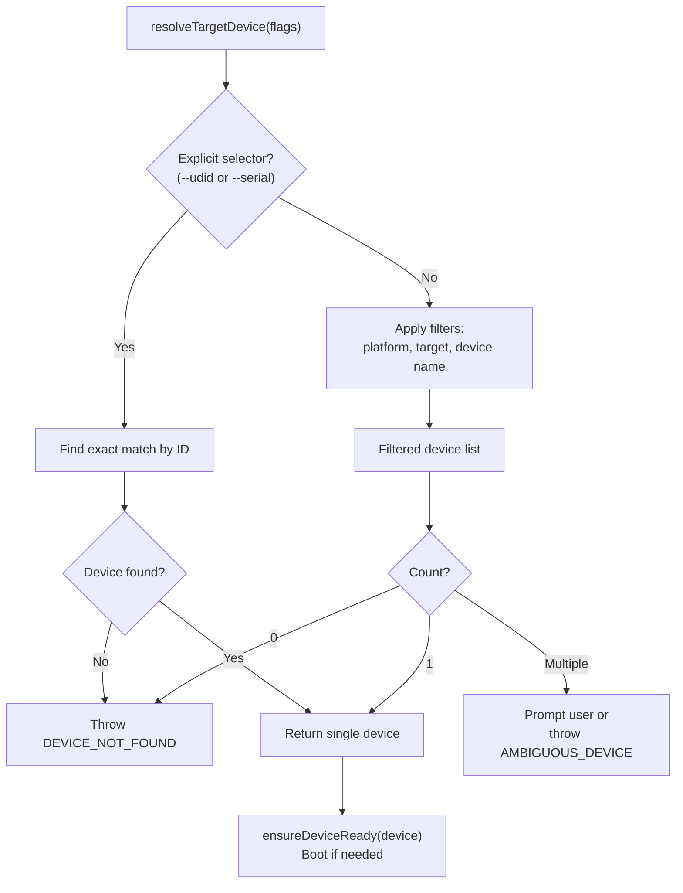
```mermaid
graph TB
    Start["resolveTargetDevice(flags)"]
    
    Start --> CheckExplicit{"Explicit selector?<br/>(--udid or --serial)"}
    
    CheckExplicit -->|Yes| FindExact["Find exact match by ID"]
    CheckExplicit -->|No| ApplyFilters["Apply filters:<br/>platform, target, device name"]
    
    FindExact --> Found{"Device found?"}
    ApplyFilters --> Filtered["Filtered device list"]
    
    Filtered --> Count{"Count?"}
    Count -->|0| NotFound["Throw DEVICE_NOT_FOUND"]
    Count -->|1| Return["Return single device"]
    Count -->|Multiple| Prompt["Prompt user or<br/>throw AMBIGUOUS_DEVICE"]
    
    Found -->|Yes| Return
    Found -->|No| NotFound
    
    Return --> EnsureReady["ensureDeviceReady(device)<br/>Boot if needed"]
```

**Sources:** [src/core/dispatch.ts:1-100](), [src/daemon/handlers/session.ts:270-286]()

### Device Isolation

Selector flags can **scope device discovery** for multi-tenant environments:

- `--ios-simulator-device-set <path>`: Only discover iOS simulators in the specified device set
- `--android-device-allowlist <serials>`: Only discover Android devices in the allowlist

When scoping is active:
- `devices` command returns only scoped devices
- Device selection fails if target is out of scope
- iOS physical devices are hidden when iOS simulator set is scoped

**Sources:** [skills/agent-device/SKILL.md:113-118](), [src/daemon/handlers/session.ts:801-836]()

---

## Snapshots

A **snapshot** captures the current **accessibility tree** of the device's foreground app. The accessibility tree is a hierarchical representation of UI elements with their properties: roles, labels, values, positions, and interaction capabilities.

### Snapshot Data Structure

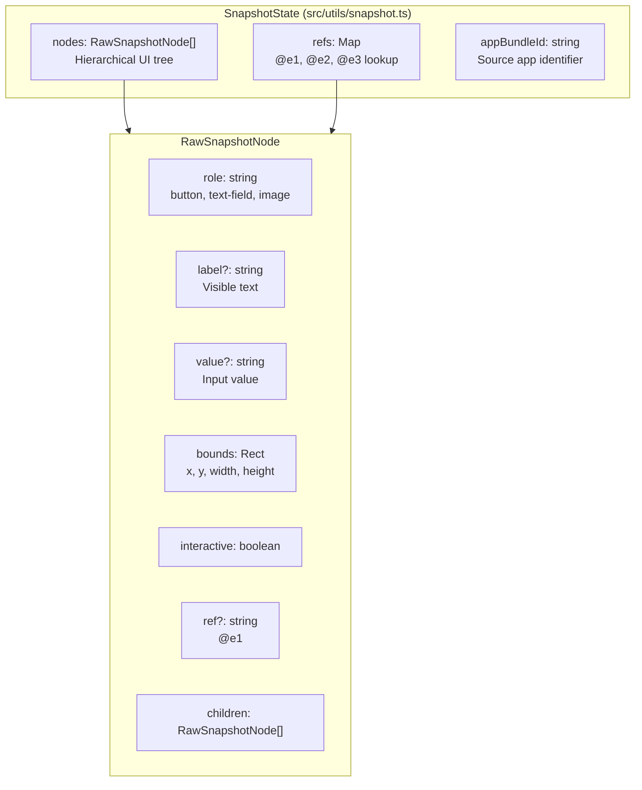
```mermaid
graph TB
    subgraph "SnapshotState (src/utils/snapshot.ts)"
        Nodes["nodes: RawSnapshotNode[]<br/>Hierarchical UI tree"]
        Refs["refs: Map<string, node><br/>@e1, @e2, @e3 lookup"]
        AppBundleId["appBundleId: string<br/>Source app identifier"]
    end
    
    subgraph "RawSnapshotNode"
        Role["role: string<br/>button, text-field, image"]
        Label["label?: string<br/>Visible text"]
        Value["value?: string<br/>Input value"]
        Bounds["bounds: Rect<br/>x, y, width, height"]
        Interactive["interactive: boolean"]
        Ref["ref?: string<br/>@e1"]
        Children["children: RawSnapshotNode[]"]
    end
    
    Nodes --> RawSnapshotNode
    Refs --> RawSnapshotNode
```

**Sources:** [src/utils/snapshot.ts:1-100](), [src/daemon/handlers/session.ts:1-50]()

### Snapshot Command Flags

| Flag | Effect | Use Case |
|------|--------|----------|
| `-i, --interactive` | Filter to interactive elements only | Reduce output size for AI agents |
| `-c, --compact` | Omit bounds and non-essential fields | Further reduce token usage |
| `-d, --depth N` | Limit tree traversal to N levels | Avoid deep nesting |
| `-s, --scope "label"` | Capture only subtree matching label | Focus on specific UI region |

**Sources:** [skills/agent-device/SKILL.md:134-140]()

### Example Snapshot Output

```
Role: application "Settings"
Bounds: (0.0, 0.0, 393.0, 852.0)

  @e1 button "Bluetooth" at (20, 120, 353, 44)
  @e2 button "Wi-Fi" at (20, 164, 353, 44)
  @e3 text-field "Search" at (20, 208, 353, 36)
    value: ""
  group "General Section"
    @e4 button "General" at (20, 260, 353, 44)
    @e5 button "Control Center" at (20, 304, 353, 44)
```

**Sources:** [skills/agent-device/SKILL.md:46-60]()

---

## Refs

**Refs** (references) are short identifiers like `@e1`, `@e2`, `@e3` that point to specific UI elements captured in the last snapshot. They provide a stable, platform-agnostic way to target elements for interactions.

### Ref Generation and Resolution


```mermaid
graph LR
    SnapshotCmd["snapshot command"]
    CaptureTree["Capture accessibility tree<br/>Platform backend"]
    AttachRefs["attachRefs(nodes)<br/>src/utils/snapshot.ts"]
    StoreSession["Store in session.snapshot<br/>SessionStore"]
    InteractionCmd["Interaction: press @e2"]
    ResolveRef["Resolve @e2 from refs map"]
    ExtractBounds["Extract bounds (x, y, w, h)"]
    ExecuteAction["Execute tap at coordinates"]
    
    SnapshotCmd --> CaptureTree
    CaptureTree --> AttachRefs
    AttachRefs --> StoreSession
    StoreSession --> InteractionCmd
    InteractionCmd --> ResolveRef
    ResolveRef --> ExtractBounds
    ExtractBounds --> ExecuteAction
```

**Sources:** [src/utils/snapshot.ts:1-100](), [src/daemon/handlers/session.ts:1-50]()

### Why Refs Exist

| Problem | Solution with Refs |
|---------|-------------------|
| Coordinates are fragile (window moves, UI shifts) | Refs store bounds internally, resolved at interaction time |
| Element identifiers vary by platform (iOS uses XCUIElement paths, Android uses resource IDs) | Refs provide uniform `@eN` syntax across platforms |
| Long identifiers are hard to type/read | `@e3` is shorter than `id="android:id/search_bar"` |
| AI agents need reliable targeting | Refs are stable within a snapshot; explicitly invalidate on UI change |

**Sources:** [skills/agent-device/SKILL.md:134-182]()

### Ref Lifecycle

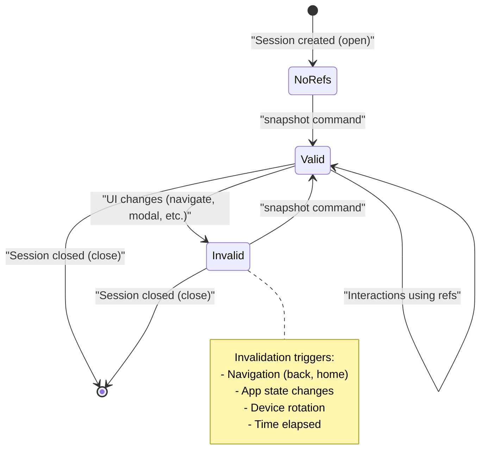
```mermaid
stateDiagram-v2
    [*] --> NoRefs: "Session created (open)"
    NoRefs --> Valid: "snapshot command"
    Valid --> Valid: "Interactions using refs"
    Valid --> Invalid: "UI changes (navigate, modal, etc.)"
    Invalid --> Valid: "snapshot command"
    Valid --> [*]: "Session closed (close)"
    Invalid --> [*]: "Session closed (close)"
    
    note right of Invalid
        Invalidation triggers:
        - Navigation (back, home)
        - App state changes
        - Device rotation
        - Time elapsed
    end note
```

**Best Practice:** Always run `snapshot` immediately after UI changes to refresh refs.

**Sources:** [skills/agent-device/SKILL.md:178-180]()

---

## Coordinate System

When refs are not available or practical, commands accept raw coordinates. The coordinate system is consistent across platforms but uses different units.

### Coordinate Conventions

| Platform | Origin | X-axis | Y-axis | Units |
|----------|--------|--------|--------|-------|
| iOS | Top-left | Increases right | Increases down | Device points (logical pixels) |
| Android | Top-left | Increases right | Increases down | Physical pixels |

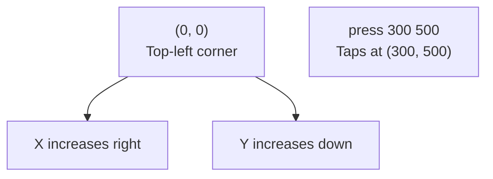
```mermaid
graph TD
    Origin["(0, 0)<br/>Top-left corner"]
    XRight["X increases right"]
    YDown["Y increases down"]
    
    Origin --> XRight
    Origin --> YDown
    
    Example["press 300 500<br/>Taps at (300, 500)"]
```

**Sources:** [skills/agent-device/references/coordinate-system.md:3-7]()

### Coordinate-Based Commands

- `press x y` - Tap at absolute coordinates
- `longpress x y [duration]` - Long press at coordinates
- `focus x y` - Focus element at coordinates (iOS)

**Best Practice:** Use refs (`@e1`) instead of coordinates whenever possible. Coordinates are fragile to:
- Device window position changes
- Device rotation
- Dynamic content (scrolling lists, etc.)

**Sources:** [skills/agent-device/SKILL.md:134-182]()

---

## Snapshot-Then-Interact Workflow

Agent-device follows a **snapshot-then-interact** pattern where snapshots must precede interactions. This design ensures reliability at the cost of verbosity.

### Workflow Pattern

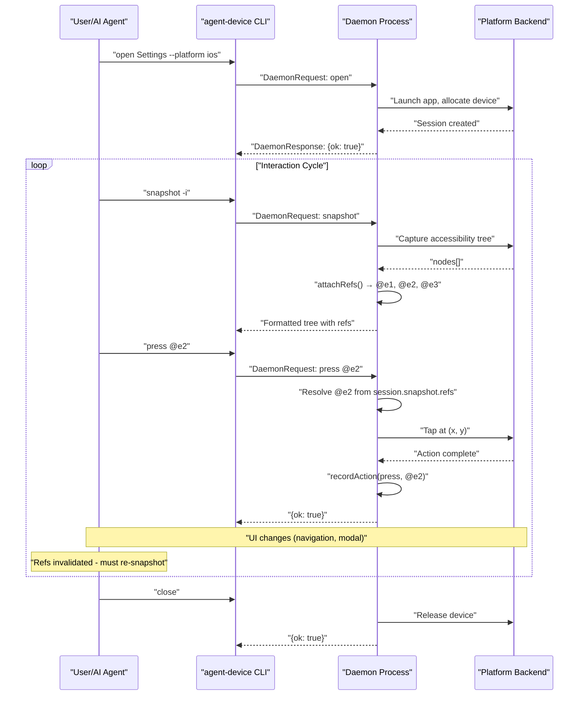
```mermaid
sequenceDiagram
    participant User as "User/AI Agent"
    participant CLI as "agent-device CLI"
    participant Daemon as "Daemon Process"
    participant Backend as "Platform Backend"
    
    User->>CLI: "open Settings --platform ios"
    CLI->>Daemon: "DaemonRequest: open"
    Daemon->>Backend: "Launch app, allocate device"
    Backend-->>Daemon: "Session created"
    Daemon-->>CLI: "DaemonResponse: {ok: true}"
    
    loop "Interaction Cycle"
        User->>CLI: "snapshot -i"
        CLI->>Daemon: "DaemonRequest: snapshot"
        Daemon->>Backend: "Capture accessibility tree"
        Backend-->>Daemon: "nodes[]"
        Daemon->>Daemon: "attachRefs() → @e1, @e2, @e3"
        Daemon-->>CLI: "Formatted tree with refs"
        
        User->>CLI: "press @e2"
        CLI->>Daemon: "DaemonRequest: press @e2"
        Daemon->>Daemon: "Resolve @e2 from session.snapshot.refs"
        Daemon->>Backend: "Tap at (x, y)"
        Backend-->>Daemon: "Action complete"
        Daemon->>Daemon: "recordAction(press, @e2)"
        Daemon-->>CLI: "{ok: true}"
        
        Note over User,Backend: "UI changes (navigation, modal)"
        Note over User: "Refs invalidated - must re-snapshot"
    end
    
    User->>CLI: "close"
    Daemon->>Backend: "Release device"
    Daemon-->>CLI: "{ok: true}"
```

**Sources:** [src/daemon/handlers/session.ts:1-1600](), [skills/agent-device/SKILL.md:32-42]()

### Design Rationale

| Alternative Approach | Why Not Used |
|---------------------|-------------|
| **Persistent element handles** (like Selenium) | Mobile UI changes frequently; stale element exceptions are common |
| **XPath/CSS selectors** | Platform-dependent; iOS and Android use different query languages |
| **Computer vision** (OCR) | Slow, brittle, high token cost |
| **Direct coordinates** | Fragile to window position, rotation, resolution |

**Snapshot-then-interact tradeoffs:**
- ✅ **Reliability:** Never interact with stale elements
- ✅ **Simplicity:** No complex query language; uniform `@eN` syntax
- ✅ **Debuggability:** Snapshot shows exact device state
- ❌ **Verbosity:** Must snapshot after UI changes

**Sources:** [skills/agent-device/SKILL.md:178-227]()

---

## Coordinate System

When refs are not available or practical, commands accept raw coordinates. The coordinate system is consistent across platforms but uses different units.

### Coordinate Conventions

| Platform | Origin | X-axis | Y-axis | Units |
|----------|--------|--------|--------|-------|
| iOS | Top-left | Increases right | Increases down | Device points (logical pixels) |
| Android | Top-left | Increases right | Increases down | Physical pixels |

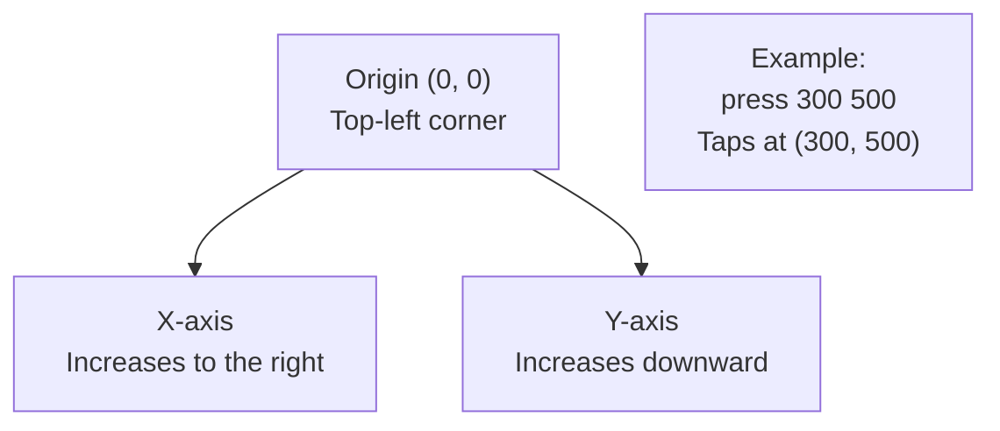
```mermaid
graph TD
    Origin["Origin (0, 0)<br/>Top-left corner"]
    XAxis["X-axis<br/>Increases to the right"]
    YAxis["Y-axis<br/>Increases downward"]
    
    Origin --> XAxis
    Origin --> YAxis
    
    Example["Example:<br/>press 300 500<br/>Taps at (300, 500)"]
```

**Sources:** [README.md:50-52](), [skills/agent-device/references/coordinate-system.md:3-7]()

### Commands Using Coordinates

- `press x y` - Tap at absolute coordinates
- `long-press x y [duration]` - Long press at coordinates
- `focus x y` - Focus element at coordinates (iOS)

**Best Practice:** Use refs (`@e1`) instead of coordinates whenever possible. Coordinates are fragile to:
- Simulator/emulator window position changes
- Device rotation
- Dynamic content (scrolling lists, etc.)

**Sources:** [README.md:50-52](), [skills/agent-device/SKILL.md:100-101]()

---

## Summary Table: Key Concepts

| Concept | Definition | Code Representation | Primary Use |
|---------|------------|-------------------|-------------|
| **Session** | Isolated automation context bound to one device | `SessionState` in [src/daemon.ts:240-326]() | Device management, state isolation |
| **Snapshot** | Captured accessibility tree with element hierarchy | `UINode[]` in [src/daemon.ts:413-476]() | UI inspection, element discovery |
| **Ref** | Short identifier (`@e1`) pointing to snapshot element | `string` keys in `session.snapshot.refs` | Stable element targeting |
| **Backend** | Snapshot capture method (AX, XCTest, Hybrid) | `--backend` flag, [src/core/dispatch.ts:232-287]() | iOS snapshot strategy |
| **Coordinate** | Absolute (x, y) position on device screen | `(number, number)` | Direct position-based interaction |

**Sources:** [README.md:1-145](), [skills/agent-device/SKILL.md:1-157](), [src/daemon.ts:240-476](), [src/core/dispatch.ts:232-287]()

---

# Page: Command Reference

# Command Reference

<details>
<summary>Relevant source files</summary>

The following files were used as context for generating this wiki page:

- [README.md](README.md)
- [src/utils/command-schema.ts](src/utils/command-schema.ts)
- [website/docs/docs/commands.md](website/docs/docs/commands.md)

</details>


This page provides a comprehensive reference for all CLI commands supported by agent-device. Commands are organized into five functional categories, with detailed documentation in dedicated sub-pages. All commands follow a consistent syntax pattern and are validated against command schemas defined in [src/utils/command-schema.ts:501-754]().

For information about how commands are routed to platform-specific implementations, see [Command Dispatch System](#4.2). For details on platform support for each command, see [Command Capabilities](#7).

## Overview

agent-device exposes 40+ commands through its CLI. Each command is defined by a `CommandSchema` structure that specifies:
- Positional arguments (required and optional)
- Allowed flags (command-specific and global)
- Default flag values
- Platform capability requirements

Commands are parsed by `parseArgs()` in [src/utils/args.ts](), validated against schemas, and dispatched through the daemon to platform-specific implementations.

**Command Processing Pipeline**

```mermaid
graph LR
    Input["CLI Input<br/>argv[]"]
    ParseArgs["parseArgs()<br/>src/utils/args.ts"]
    
    subgraph "Parsed Structure"
        Cmd["command: string"]
        Pos["positionals: string[]"]
        Flags["flags: CliFlags"]
    end
    
    Schema["CommandSchema<br/>COMMAND_SCHEMAS"]
    Validate["Schema Validation<br/>getCommandSchema()"]
    Capability["Capability Check<br/>isCommandSupportedOnDevice()"]
    
    Daemon["Daemon<br/>handleRequest()"]
    Dispatch["dispatchCommand()<br/>src/core/dispatch.ts"]
    
    Input --> ParseArgs
    ParseArgs --> Cmd
    ParseArgs --> Pos
    ParseArgs --> Flags
    
    Cmd --> Schema
    Schema --> Validate
    Validate --> Capability
    
    Capability --> Daemon
    Daemon --> Dispatch
```

**Sources:** [src/utils/command-schema.ts:1-886](), [src/utils/args.ts](), [src/core/dispatch.ts]()

## Command Categories

agent-device commands are organized into five categories based on their functional role:

| Category | Commands | Purpose | Details |
|----------|----------|---------|---------|
| **Device and Session** | `boot`, `devices`, `ensure-simulator`, `open`, `close`, `session`, `back`, `home`, `app-switcher` | Device management, session lifecycle, and navigation helpers | [#2.1](#2.1) |
| **Interaction** | `click`, `press`, `longpress`, `swipe`, `focus`, `type`, `fill`, `scroll`, `scrollintoview`, `pinch` | UI element interaction and gesture automation | [#2.2](#2.2) |
| **Snapshot and Inspection** | `snapshot`, `diff`, `find`, `get`, `is`, `wait` | UI hierarchy capture, element queries, and assertions | [#2.3](#2.3) |
| **Application Management** | `install`, `reinstall`, `apps`, `appstate` | App lifecycle operations and app state queries | [#2.4](#2.4) |
| **Utility** | `clipboard`, `keyboard`, `settings`, `push`, `trigger-app-event`, `screenshot`, `record`, `logs`, `network`, `perf`, `trace`, `batch`, `replay` | Device settings, debugging tools, and workflow utilities | [#2.5](#2.5) |

**Command Category Architecture**

```mermaid
graph TB
    subgraph "Device & Session (2.1)"
        Boot["boot"]
        Devices["devices"]
        EnsureSim["ensure-simulator"]
        Open["open"]
        Close["close"]
        Session["session"]
        Nav["back/home/app-switcher"]
    end
    
    subgraph "Interaction (2.2)"
        Click["click/press"]
        Longpress["longpress"]
        Swipe["swipe"]
        Focus["focus"]
        Type["type"]
        Fill["fill"]
        Scroll["scroll/scrollintoview"]
        Pinch["pinch"]
    end
    
    subgraph "Snapshot & Inspection (2.3)"
        Snapshot["snapshot"]
        Diff["diff snapshot"]
        Find["find"]
        Get["get"]
        Is["is"]
        Wait["wait"]
    end
    
    subgraph "App Management (2.4)"
        Install["install"]
        Reinstall["reinstall"]
        Apps["apps"]
        Appstate["appstate"]
    end
    
    subgraph "Utility (2.5)"
        Clipboard["clipboard"]
        Keyboard["keyboard"]
        Settings["settings"]
        Push["push"]
        TriggerEvent["trigger-app-event"]
        Screenshot["screenshot"]
        Record["record"]
        Logs["logs"]
        Network["network"]
        Perf["perf/metrics"]
        Trace["trace"]
        Batch["batch"]
        Replay["replay"]
    end
```

**Sources:** [src/utils/command-schema.ts:501-754](), [README.md:145-165](), [website/docs/docs/commands.md:1-398]()

## Command Syntax

All commands follow a consistent syntax pattern:

```bash
agent-device <command> [positionals...] [--flag value] [--flag]
```

**Syntax Components:**
- **Command**: First positional argument (e.g., `snapshot`, `press`, `open`)
- **Positionals**: Ordered arguments defined by the command schema (e.g., `press 100 200`)
- **Flags**: Named options with `--` prefix; can be boolean (`--json`) or value-accepting (`--device "iPhone 16"`)
- **Short flags**: Single-character aliases prefixed with `-` (e.g., `-i`, `-c`, `-d`)

### Command Schema Structure

Each command is defined by a `CommandSchema` object in [src/utils/command-schema.ts:501-754]():

```typescript
type CommandSchema = {
  description: string;
  positionalArgs: readonly string[];      // e.g., ['x', 'y'] for press
  allowsExtraPositionals?: boolean;       // true for type, fill
  allowedFlags: readonly FlagKey[];       // command-specific flags
  defaults?: Partial<CliFlags>;           // default flag values
  skipCapabilityCheck?: boolean;          // true for replay, session
  usageOverride?: string;                 // custom usage string
}
```

**Command Schema Resolution**

```mermaid
graph TB
    Input["CLI Arguments"]
    ParseArgs["parseArgs()<br/>src/utils/args.ts"]
    
    Command["command: string"]
    Positionals["positionals: string[]"]
    Flags["flags: CliFlags"]
    
    GetSchema["getCommandSchema(command)<br/>src/utils/command-schema.ts:771-774"]
    SchemaMap["COMMAND_SCHEMAS<br/>Record<string, CommandSchema>"]
    
    Validate["Validation Checks"]
    
    subgraph "Validation"
        FlagCheck["allowedFlags check<br/>GLOBAL_FLAG_KEYS"]
        PosCheck["positionalArgs check"]
        CapCheck["isCommandSupportedOnDevice()"]
    end
    
    Result["Validated Command"]
    
    Input --> ParseArgs
    ParseArgs --> Command
    ParseArgs --> Positionals
    ParseArgs --> Flags
    
    Command --> GetSchema
    GetSchema --> SchemaMap
    SchemaMap --> Validate
    
    Validate --> FlagCheck
    Validate --> PosCheck
    Validate --> CapCheck
    
    FlagCheck --> Result
    PosCheck --> Result
    CapCheck --> Result
```

**Sources:** [src/utils/command-schema.ts:75-83](), [src/utils/command-schema.ts:501-754](), [src/utils/command-schema.ts:771-774]()

## Global Flags

Global flags are defined in `GLOBAL_FLAG_KEYS` ([src/utils/command-schema.ts:478-499]()) and can be used with any command. These flags control daemon communication, device selection, session management, and output formatting.

### Core Global Flags

| Flag | Type | Description |
|------|------|-------------|
| `--json` | boolean | Output structured JSON instead of human-readable text |
| `--verbose`, `--debug`, `-v` | boolean | Enable debug diagnostics; stream daemon and runner logs to stderr |
| `--help`, `-h` | boolean | Print command help and exit |
| `--version`, `-V` | boolean | Print version and exit |

### Daemon Configuration Flags

| Flag | Type | Values | Description |
|------|------|--------|-------------|
| `--state-dir` | string | path | Override daemon state directory (default: `~/.agent-device`) |
| `--daemon-transport` | enum | `auto`, `socket`, `http` | Daemon client transport preference |
| `--daemon-server-mode` | enum | `socket`, `http`, `dual` | Daemon server mode when spawning daemon |

### Multi-Tenant Isolation Flags

| Flag | Type | Description |
|------|------|-------------|
| `--tenant` | string | Tenant identifier for session isolation |
| `--session-isolation` | enum (`none`, `tenant`) | Session isolation mode; `tenant` prefixes sessions as `<tenant>:<session>` |
| `--run-id` | string | Run identifier for tenant lease admission |
| `--lease-id` | string | Lease identifier bound to tenant/run scope |

### Device Selection Flags

| Flag | Type | Values | Description |
|------|------|--------|-------------|
| `--platform` | enum | `ios`, `android`, `apple` | Target platform (`apple` aliases iOS/tvOS backend) |
| `--target` | enum | `mobile`, `tv` | Device class (for AndroidTV/tvOS) |
| `--device` | string | name | Device name to target (e.g., `"iPhone 16 Pro"`) |
| `--udid` | string | udid | iOS device UDID |
| `--serial` | string | serial | Android device serial |
| `--ios-simulator-device-set` | string | path | Scope iOS simulator commands to this device set |
| `--android-device-allowlist` | string | serials | Comma/space-separated Android serial allowlist |

### Session Management Flags

| Flag | Type | Description |
|------|------|-------------|
| `--session` | string | Named session identifier (default: `"default"`) |
| `--no-record` | boolean | Skip recording this action in session history |

**Sources:** [src/utils/command-schema.ts:101-476](), [src/utils/command-schema.ts:478-499](), [README.md:228-258]()

## Command-Specific Flag Groups

Commands accept flags from their `allowedFlags` list defined in the command schema. Common flag groups are reused across multiple commands.

### Snapshot Flags

Used by: `snapshot`, `diff`, `wait`, `click`, `press`, `fill`, `get`, `is`, `find`

| Flag | Short | Type | Range/Values | Description |
|------|-------|------|--------------|-------------|
| `-i` | - | boolean | - | `snapshotInteractiveOnly`: Filter to interactive elements only |
| `-c` | - | boolean | - | `snapshotCompact`: Omit empty structural elements |
| `--depth`, `-d` | `-d` | int | 0+ | `snapshotDepth`: Limit snapshot tree depth (0 = unlimited) |
| `--scope`, `-s` | `-s` | string | - | `snapshotScope`: Scope snapshot to label/identifier or `@ref` |
| `--raw` | - | boolean | - | `snapshotRaw`: Output raw node structure without transformation |

**Flag Group Constants:**
- `SNAPSHOT_FLAGS`: All five flags ([src/utils/command-schema.ts:85-91]())
- `SELECTOR_SNAPSHOT_FLAGS`: `depth`, `scope`, `raw` ([src/utils/command-schema.ts:93-97]())
- `FIND_SNAPSHOT_FLAGS`: `depth`, `raw` ([src/utils/command-schema.ts:99]())

### Press/Swipe Series Flags

Used by: `press`, `click`, `swipe`

| Flag | Type | Range | Description |
|------|------|-------|-------------|
| `--count` | int | 1-200 | Repeat count for press/swipe iterations |
| `--interval-ms` | int | 0-10000 | Delay between press iterations (ms) |
| `--hold-ms` | int | 0-10000 | Press hold duration per iteration (ms) |
| `--jitter-px` | int | 0-100 | Deterministic coordinate jitter radius for press |
| `--double-tap` | boolean | - | Use double-tap gesture per press iteration |
| `--pause-ms` | int | 0-10000 | Delay between swipe iterations (ms) |
| `--pattern` | enum | `one-way`, `ping-pong` | Swipe repeat pattern |

### Session Recording Flags

Used by: `open`, `close`

| Flag | Type | Description |
|------|------|-------------|
| `--save-script` | boolean \| string | Save session script (`.ad`) on close; optional custom path |
| `--shutdown` | boolean | (`close` only) Shutdown iOS simulator after ending session |
| `--relaunch` | boolean | (`open` only) Terminate app process before launching |

### App Management Flags

Used by: `apps`

| Flag | Type | Set Value | Description |
|------|------|-----------|-------------|
| `--user-installed` | enum | `'user-installed'` | `appsFilter`: List only user-installed apps |
| `--all` | enum | `'all'` | `appsFilter`: List all apps including system defaults |

### Batch Execution Flags

Used by: `batch`

| Flag | Type | Range | Description |
|------|------|-------|-------------|
| `--steps` | string | - | JSON array of batch steps |
| `--steps-file` | string | - | Path to JSON file containing batch steps |
| `--on-error` | enum | `stop` | Stop batch execution when a step fails |
| `--max-steps` | int | 1-1000 | Maximum allowed steps per batch request |

### Miscellaneous Flags

| Command | Flag | Type | Description |
|---------|------|------|-------------|
| `boot` | `--headless` | boolean | Boot Android emulator without GUI window |
| `ensure-simulator` | `--runtime` | string | CoreSimulator runtime ID (e.g., `com.apple.CoreSimulator.SimRuntime.iOS-18-4`) |
| `ensure-simulator` | `--boot` | boolean | Boot simulator after ensuring it exists |
| `ensure-simulator` | `--reuse-existing` | boolean | Reuse existing simulator (default: true) |
| `open` | `--activity` | string | Android launch activity (`package/Activity`); not for URL opens |
| `record` | `--fps` | int (1-120) | Target FPS for iOS physical device runner recording |
| `logs` | `--restart` | boolean | (`logs clear` only) Stop stream, clear logs, then restart |
| `replay` | `--update`, `-u` | boolean | Update selectors and rewrite replay file in place |
| `screenshot` | `--out` | string | Output path for screenshot file |

**Sources:** [src/utils/command-schema.ts:85-476](), [src/utils/command-schema.ts:501-754]()

## Command Execution Flow

Commands follow a client-daemon-platform architecture. The CLI parses arguments, validates against schemas, sends a request to the daemon, which resolves session context and dispatches to platform implementations.

**Complete Command Execution Pipeline**

```mermaid
sequenceDiagram
    participant User
    participant CLI as "CLI<br/>bin/agent-device.mjs"
    participant parseArgs as "parseArgs()<br/>src/utils/args.ts"
    participant Schema as "getCommandSchema()<br/>COMMAND_SCHEMAS"
    participant Client as "sendToDaemon()<br/>src/daemon-client.ts"
    participant Daemon as "handleRequest()<br/>src/daemon.ts"
    participant SessionStore as "SessionStore<br/>src/core/session.ts"
    participant Dispatch as "dispatchCommand()<br/>src/core/dispatch.ts"
    participant Platform as "Platform Backend<br/>ios/ or android/"

    User->>CLI: "agent-device snapshot -i --session test"
    CLI->>parseArgs: "Parse argv"
    parseArgs->>Schema: "Validate 'snapshot' command"
    Schema-->>parseArgs: "CommandSchema + allowed flags"
    parseArgs-->>CLI: "{command, positionals, flags}"
    
    CLI->>Client: "DaemonRequest"
    Client->>Daemon: "TCP/HTTP JSON-RPC"
    
    Daemon->>Daemon: "Validate token, tenant scope"
    Daemon->>SessionStore: "Get/create session 'test'"
    SessionStore-->>Daemon: "SessionState"
    
    Daemon->>Dispatch: "dispatchCommand(device, 'snapshot', [], options)"
    Dispatch->>Dispatch: "Switch on command type"
    Dispatch->>Platform: "Platform-specific snapshot()"
    Platform-->>Dispatch: "UI hierarchy data"
    
    Dispatch-->>Daemon: "Command result"
    Daemon->>SessionStore: "recordAction() in session"
    Daemon-->>Client: "DaemonResponse JSON"
    Client-->>CLI: "Parse response"
    CLI-->>User: "Formatted output (text or JSON)"
```

**Key Execution Steps:**

1. **Parsing**: `parseArgs()` extracts command, positionals, and flags from `argv`
2. **Schema Validation**: `getCommandSchema()` validates positionals and flags against `COMMAND_SCHEMAS`
3. **Capability Check**: `isCommandSupportedOnDevice()` verifies platform/kind support
4. **Daemon Communication**: `sendToDaemon()` sends JSON-RPC request over TCP or HTTP
5. **Session Resolution**: `handleRequest()` looks up or creates `SessionState` for the named session
6. **Command Dispatch**: `dispatchCommand()` routes to platform-specific implementation
7. **Action Recording**: Session actions are logged for replay via `recordAction()`
8. **Response Formatting**: Results formatted as text or JSON based on `--json` flag

**Sources:** [src/utils/args.ts](), [src/utils/command-schema.ts:501-754](), [src/daemon-client.ts](), [src/daemon.ts](), [src/core/dispatch.ts](), [src/core/session.ts]()

## Complete Command List

All 40+ commands are listed below with their primary purpose and category. For detailed syntax, arguments, and examples, see the category-specific pages.

### Device and Session Commands ([#2.1](#2.1))

| Command | Positionals | Purpose |
|---------|-------------|---------|
| `boot` | - | Ensure target device/simulator is booted and ready |
| `devices` | - | List available devices |
| `ensure-simulator` | - | Ensure iOS simulator exists in device set (create if missing) |
| `open` | `[appOrUrl]`, `[url]` | Boot device; optionally launch app or open deep link URL |
| `close` | `[app]` | Close app or end session |
| `session` | `[list]` | List active sessions |
| `back` | - | Navigate back (where supported) |
| `home` | - | Go to home screen |
| `app-switcher` | - | Open app switcher/recents screen |

### Interaction Commands ([#2.2](#2.2))

| Command | Positionals | Purpose |
|---------|-------------|---------|
| `click` | `<target>` | Tap by coordinates, `@ref`, or selector |
| `press` | `<targetOrX>`, `[y]` | Tap by coordinates, `@ref`, or selector (supports series) |
| `longpress` | `<x>`, `<y>`, `[durationMs]` | Long press at coordinates |
| `swipe` | `<x1>`, `<y1>`, `<x2>`, `<y2>`, `[durationMs]` | Swipe gesture with optional repeat pattern |
| `focus` | `<x>`, `<y>` | Focus input field at coordinates |
| `type` | `<text>` | Type text into focused field |
| `fill` | `<targetOrX>`, `<yOrText>`, `[text]` | Tap then type (clears field first) |
| `scroll` | `<direction>`, `[amount]` | Scroll in direction (0-1 amount) |
| `scrollintoview` | `<target>` | Scroll until text or `@ref` is visible |
| `pinch` | `<scale>`, `[x]`, `[y]` | Pinch/zoom gesture (iOS simulator only) |

### Snapshot and Inspection Commands ([#2.3](#2.3))

| Command | Positionals | Purpose |
|---------|-------------|---------|
| `snapshot` | - | Capture accessibility tree |
| `diff` | `<kind>` | Diff current snapshot against baseline |
| `find` | `<query>`, `<action>`, `[value]` | Find element by text/label/value/role/id and execute action |
| `get` | `<subcommand>`, `<target>` | Return element text or attributes by `@ref`/selector |
| `is` | `<predicate>`, `<selector>`, `[value]` | Assert UI state (visible/hidden/exists/editable/selected/text) |
| `wait` | `<durationOrSelector>`, `[timeoutMs]` | Wait for duration, text, `@ref`, or selector |
| `alert` | `[action]`, `[timeout]` | Inspect or handle alert (iOS simulator) |

### Application Management Commands ([#2.4](#2.4))

| Command | Positionals | Purpose |
|---------|-------------|---------|
| `install` | `<app>`, `<path>` | Install app from binary path without uninstalling |
| `reinstall` | `<app>`, `<path>` | Uninstall then install app from binary path |
| `apps` | - | List installed apps |
| `appstate` | - | Show foreground app/activity |

### Utility Commands ([#2.5](#2.5))

| Command | Positionals | Purpose |
|---------|-------------|---------|
| `clipboard` | `<read\|write>`, `[text]` | Read or write device clipboard |
| `keyboard` | `[action]` | Inspect Android keyboard visibility/type or dismiss |
| `settings` | `<setting>`, `<state>`, `[target]`, `[mode]` | Toggle OS settings, appearance, and app permissions |
| `push` | `<bundleOrPackage>`, `<payloadOrJson>` | Simulate push notification delivery |
| `trigger-app-event` | `<event>`, `[payloadJson]` | Trigger app-defined event via deep link template |
| `screenshot` | `[path]` | Capture screenshot |
| `record` | `<start\|stop>`, `[path]` | Start/stop screen recording |
| `logs` | `<action>`, `[message]` | Session app log info, streaming, markers |
| `network` | `<dump\|log>`, `[limit]`, `[include]` | Dump recent HTTP(s) traffic from session logs |
| `perf` | - | Show session performance metrics (startup timing) |
| `trace` | `<start\|stop>`, `[path]` | Start/stop trace log capture |
| `batch` | - | Execute multiple commands in one daemon request |
| `replay` | `<path>` | Replay a recorded `.ad` session script |

**Note:** `press` is an alias for `click` with identical behavior. `metrics` is an alias for `perf`.

**Sources:** [src/utils/command-schema.ts:501-754](), [README.md:145-165](), [website/docs/docs/commands.md:9-398]()

## Command Reference Sub-Pages

This command reference is organized into sub-pages for detailed documentation:

- **[Device and Session Commands](#2.1)**: Session lifecycle (`open`, `close`, `session`), device management (`boot`, `devices`, `ensure-simulator`), and navigation helpers (`back`, `home`, `app-switcher`). These commands establish automation context and query device state.

- **[Interaction Commands](#2.2)**: UI interaction via taps (`click`, `press`, `longpress`), text input (`type`, `fill`, `focus`), gestures (`swipe`, `pinch`), and scrolling (`scroll`, `scrollintoview`). Supports coordinate-based, ref-based, and selector-based targeting.

- **[Snapshot and Inspection Commands](#2.3)**: Accessibility tree capture (`snapshot`, `diff`), element finding (`find`), element queries (`get`), assertions (`is`), and wait conditions (`wait`, `alert`). Foundation of the ref-based interaction model.

- **[Application Management](#2.4)**: App installation (`install`, `reinstall`), app listing (`apps`), and foreground app queries (`appstate`).

- **[Utility Commands](#2.5)**: Device settings (`clipboard`, `keyboard`, `settings`), notifications (`push`, `trigger-app-event`), media capture (`screenshot`, `record`), debugging tools (`logs`, `network`, `trace`), performance metrics (`perf`), and workflow utilities (`batch`, `replay`).

## Usage Patterns

agent-device follows a **snapshot-then-interact** workflow:

1. **Open** a session: `agent-device open MyApp --session test`
2. **Snapshot** to inspect UI: `agent-device snapshot -i --session test`
3. **Interact** using refs: `agent-device click @e5 --session test`
4. **Re-snapshot** after UI changes
5. **Close** when done: `agent-device close --session test`

**Refs Invalidation**: Element refs (`@e1`, `@e2`, etc.) are ephemeral identifiers tied to the current snapshot. Any UI change invalidates previous refs, requiring a new snapshot before further interactions.

**JSON Output**: Use `--json` to receive structured output suitable for programmatic parsing. All commands support JSON mode.

**Sessions**: Use `--session <name>` to manage multiple parallel automation workflows. Each session maintains independent device context, snapshot state, and action history. See [Session Management](#3) for details.

**Sources:** [README.md:26-48](), [skills/agent-device/SKILL.md:21-27](), [skills/agent-device/SKILL.md:138-144]()

## Help Text

The CLI provides built-in help accessible via:

```bash
agent-device --help
agent-device -h
```

The help text is generated by `usage()` and includes all commands, flags, and brief descriptions.

**Sources:** [src/utils/args.ts:156-221](), [src/utils/args.ts:39-42]()

---

# Page: Device and Session Commands

# Device and Session Commands

<details>
<summary>Relevant source files</summary>

The following files were used as context for generating this wiki page:

- [src/daemon/handlers/__tests__/session.test.ts](src/daemon/handlers/__tests__/session.test.ts)
- [src/daemon/handlers/session.ts](src/daemon/handlers/session.ts)
- [src/utils/command-schema.ts](src/utils/command-schema.ts)
- [website/docs/docs/commands.md](website/docs/docs/commands.md)

</details>


## Purpose and Scope

This page documents commands for **device enumeration**, **app introspection**, and **session lifecycle management**. These commands form the foundation for all device automation workflows by establishing which device to control and maintaining isolated execution contexts.

For commands that perform UI interactions, see [Interaction Commands](#2.3). For snapshot capture and inspection, see [Snapshot Commands](#2.2). For session state persistence and replay, see [Action Recording and Replay](#8.2).

---

## Command Overview

Device and session commands fall into two categories:

| Category | Commands | Requires Session | Purpose |
|----------|----------|------------------|---------|
| **Device Management** | `devices`, `apps`, `appstate` | No* | Enumerate available devices and inspect installed applications |
| **Session Lifecycle** | `open`, `close`, `session list` | Managed | Create/destroy isolated device contexts |

\*Note: `apps` and `appstate` can operate without a session by providing explicit device selectors (`--platform`, `--device`, `--udid`, `--serial`).

**Sources:** [README.md:28-82](), [src/utils/args.ts:156-220]()

---

## Device Management Commands

### devices

Lists all available iOS and Android devices detected on the system.

```bash
agent-device devices [--json]
agent-device devices --platform ios
agent-device devices --platform android
```

**Platform Detection:**
- **Android:** Uses `adb devices` via `listAndroidDevices()`
- **iOS:** Uses `xcrun simctl list` and `xcrun devicectl list` via `listIosDevices()`
- **No platform flag:** Attempts both, ignoring failures from missing tools

**Output Format:**

```json
{
  "devices": [
    {
      "platform": "ios",
      "kind": "simulator",
      "name": "iPhone 15 Pro",
      "id": "A1B2C3D4-E5F6-7890-ABCD-EF1234567890",
      "state": "Booted"
    },
    {
      "platform": "android",
      "kind": "emulator",
      "name": "Pixel_9_Pro_XL",
      "id": "emulator-5554",
      "state": "device"
    }
  ]
}
```

**Implementation Flow:**

```mermaid
graph TB
    CLI["CLI: agent-device devices"] --> Daemon["daemon.ts handleRequest()"]
    Daemon --> CheckPlatform{"flags.platform?"}
    
    CheckPlatform -->|"ios"| ImportIos["import listIosDevices()"]
    CheckPlatform -->|"android"| ImportAndroid["import listAndroidDevices()"]
    CheckPlatform -->|"undefined"| ImportBoth["import both platforms"]
    
    ImportIos --> CallIos["listIosDevices()"]
    ImportAndroid --> CallAndroid["listAndroidDevices()"]
    ImportBoth --> TryBoth["try both, ignore errors"]
    
    CallIos --> ParseSimctl["Parse simctl list<br/>Parse devicectl list"]
    CallAndroid --> ParseAdb["Parse adb devices -l"]
    TryBoth --> ParseSimctl
    TryBoth --> ParseAdb
    
    ParseSimctl --> DeviceInfo["DeviceInfo[]"]
    ParseAdb --> DeviceInfo
    
    DeviceInfo --> Response["DaemonResponse:<br/>{devices: DeviceInfo[]}"]
```

**DeviceInfo Type:**

The system uses a unified `DeviceInfo` interface for both platforms:

```typescript
type DeviceInfo = {
  platform: 'ios' | 'android';
  kind: 'simulator' | 'emulator' | 'device';
  name: string;        // Human-readable name
  id: string;          // UDID (iOS) or serial (Android)
  state: string;       // "Booted" / "Shutdown" (iOS) or "device" / "offline" (Android)
}
```

**Sources:** [src/daemon.ts:132-160](), [src/platforms/ios/devices.ts](), [src/platforms/android/devices.ts]()

---

### apps

Lists installed applications on a target device. Requires either an active session or explicit device selectors.

```bash
# With active session
agent-device --session auth apps

# Without session (explicit device)
agent-device --platform ios --device "iPhone 15 Pro" apps

# Filter options (Android only)
agent-device apps --user-installed
agent-device apps --all
agent-device apps --metadata
```

**Platform Differences:**

| Platform | Default Behavior | Implementation |
|----------|------------------|----------------|
| **iOS** | Lists all simulator apps (device apps unsupported in v1) | Uses `simctl listapps` to parse plist files |
| **Android** | Lists **launchable** apps only | Uses `pm list packages` or `cmd package query-activities` (API 33+) |

**Filter Flags (Android only):**

- `--user-installed`: Only apps installed by user (excludes system apps)
- `--all`: Include system apps
- `--metadata`: Return structured app objects with icons, labels, package names

**Output Format:**

Without `--metadata`:
```json
{
  "apps": [
    "Settings",
    "Safari (com.apple.mobilesafari)",
    "Camera (com.apple.camera)"
  ]
}
```

With `--metadata`:
```json
{
  "apps": [
    {
      "name": "Settings",
      "bundleId": "com.apple.Preferences",
      "icon": "data:image/png;base64,..."
    }
  ]
}
```

**Session vs. Session-less Execution:**

```mermaid
graph TB
    CLI["CLI: agent-device apps"] --> CheckSession{"Active session?"}
    
    CheckSession -->|"Yes"| UseSessionDevice["device = session.device"]
    CheckSession -->|"No"| CheckFlags{"Explicit device flags?"}
    
    CheckFlags -->|"Yes"| ResolveTarget["resolveTargetDevice(flags)"]
    CheckFlags -->|"No"| ErrorNoDevice["Error: INVALID_ARGS<br/>requires session or device selector"]
    
    UseSessionDevice --> EnsureReady["ensureDeviceReady(device)"]
    ResolveTarget --> EnsureReady
    
    EnsureReady --> CheckPlatform{"device.platform?"}
    
    CheckPlatform -->|"ios"| CheckKind{"device.kind?"}
    CheckPlatform -->|"android"| CallAndroid["listAndroidApps()<br/>or listAndroidAppsMetadata()"]
    
    CheckKind -->|"simulator"| CallIos["listSimulatorApps(device)"]
    CheckKind -->|"device"| ErrorUnsupported["Error: UNSUPPORTED_OPERATION<br/>iOS devices not supported in v1"]
    
    CallIos --> ParsePlist["Parse .app plist files"]
    CallAndroid --> ParsePm["Parse pm list or<br/>cmd package query"]
    
    ParsePlist --> Response["DaemonResponse:<br/>{apps: string[] | AppMetadata[]}"]
    ParsePm --> Response
```

**App Resolution Aliases:**

The system includes built-in aliases for common apps:
- `Settings` → `com.apple.Preferences` (iOS) or `com.android.settings` (Android)
- Human-readable names are fuzzy-matched against installed apps when possible

**Sources:** [src/daemon.ts:162-203](), [src/platforms/ios/index.ts](), [src/platforms/android/index.ts:44-79]()

---

### appstate

Queries the currently active (foreground) application. This command is primarily useful for Android, where multiple apps can have activities in the foreground stack. For iOS, it returns the session's app or attempts to guess from a snapshot.

```bash
agent-device appstate [--json]
agent-device --platform android appstate
```

**Platform Strategies:**

| Platform | Strategy | Source |
|----------|----------|--------|
| **iOS** | 1. Return `session.appBundleId` if available<br/>2. Fall back to snapshot-based detection (AX first, XCTest if AX fails) | Session state or `resolveIosAppStateFromSnapshots()` |
| **Android** | Query `dumpsys window` for focused window package | `getAndroidAppState()` via `adb shell` |

**iOS Snapshot-Based Detection:**

When no session app is available, iOS uses a two-stage snapshot approach:

```mermaid
graph LR
    Start["No session.appBundleId"] --> TryAx["snapshot --backend ax<br/>--depth 1 --compact"]
    
    TryAx --> ExtractAx["Extract root Application node"]
    ExtractAx --> CheckAx{"Valid app info?"}
    
    CheckAx -->|"Yes"| ReturnAx["Return appName, appBundleId<br/>source: 'snapshot-ax'"]
    CheckAx -->|"No"| TryXctest["snapshot --backend xctest<br/>--depth 1 --compact"]
    
    TryXctest --> ExtractXc["Extract root Application node"]
    ExtractXc --> ReturnXc["Return appName, appBundleId<br/>source: 'snapshot-xctest'"]
```

**Output Format:**

iOS:
```json
{
  "platform": "ios",
  "appName": "Settings",
  "appBundleId": "com.apple.Preferences",
  "source": "session"
}
```

Android:
```json
{
  "platform": "android",
  "package": "com.google.android.youtube",
  "activity": "com.google.android.apps.youtube.app.watchwhile.MainActivity"
}
```

**Sources:** [src/daemon.ts:205-243](), [src/daemon.ts:1367-1423](), [src/platforms/android/index.ts]()

---

## Session Lifecycle Commands

### open

Creates a new session, reserves a device exclusively, and optionally launches an application. Sessions provide isolated execution contexts with independent state tracking.

```bash
# Boot device/simulator without launching app
agent-device open

# Launch specific app
agent-device open Settings
agent-device open com.apple.mobilesafari

# Named sessions for parallel workflows
agent-device --session checkout open "Shopping App"
agent-device --session auth open "Auth App"

# Explicit device targeting
agent-device --platform ios --device "iPhone 15 Pro" open
agent-device --udid A1B2C3D4-E5F6-7890-ABCD-EF1234567890 open
```

**Session Creation Flow:**

```mermaid
graph TB
    CLI["CLI: agent-device open MyApp"] --> ParseArgs["parseArgs(argv)"]
    ParseArgs --> SendDaemon["Send to daemon via TCP"]
    
    SendDaemon --> ValidateToken["Validate token"]
    ValidateToken --> CheckExists{"Session exists?"}
    
    CheckExists -->|"Yes"| ErrorExists["Error: INVALID_ARGS<br/>'Session already active'"]
    CheckExists -->|"No"| ResolveDevice["resolveTargetDevice(flags)"]
    
    ResolveDevice --> EnsureReady["ensureDeviceReady(device)<br/>Boot if needed"]
    EnsureReady --> CheckInUse{"Device in use by<br/>another session?"}
    
    CheckInUse -->|"Yes"| ErrorInUse["Error: DEVICE_IN_USE<br/>Device locked by session X"]
    CheckInUse -->|"No"| ResolveApp{"App name provided?"}
    
    ResolveApp -->|"Yes (iOS)"| ResolveIosApp["resolveIosApp(device, name)<br/>Fuzzy match to bundleId"]
    ResolveApp -->|"Yes (Android)"| UseAsPackage["Use name as package"]
    ResolveApp -->|"No"| SkipApp["appBundleId = undefined"]
    
    ResolveIosApp --> DispatchOpen["dispatchCommand('open', [name])"]
    UseAsPackage --> DispatchOpen
    SkipApp --> DispatchOpen
    
    DispatchOpen --> CreateSession["SessionState:<br/>- name<br/>- device<br/>- appBundleId<br/>- createdAt<br/>- actions: []"]
    
    CreateSession --> RecordAction["recordAction(session, {<br/>  command: 'open',<br/>  positionals: [name],<br/>  flags: {...}<br/>})"]
    
    RecordAction --> StoreSession["sessions.set(sessionName, session)"]
    StoreSession --> Response["DaemonResponse:<br/>{session: 'default'}"]
```

**SessionState Type:**

```typescript
type SessionState = {
  name: string;                  // Session identifier
  device: DeviceInfo;            // Locked device
  createdAt: number;             // Timestamp
  appBundleId?: string;          // Target app (if specified)
  appName?: string;              // Human-readable app name
  snapshot?: SnapshotState;      // Most recent snapshot
  trace?: {                      // Active trace capture
    outPath: string;
    startedAt: number;
  };
  actions: SessionAction[];      // Command history
  recording?: {                  // Active screen recording
    platform: 'ios' | 'android';
    outPath: string;
    remotePath?: string;
    child: ChildProcess;
    wait: Promise<ExecResult>;
  };
};
```

**Device Exclusivity:**

Sessions enforce a **one-session-per-device** constraint to prevent race conditions. If a device is already locked by another session, `open` fails with `DEVICE_IN_USE`.

**Sources:** [src/daemon.ts:245-297](), [src/daemon.ts:35-54](), [src/core/dispatch.ts:52-290]()

---

### close

Ends a session, releases the device lock, and optionally closes a specific application. All session actions are written to a log file in `~/.agent-device/sessions/`.

```bash
# End session without closing app
agent-device close

# Close specific app and end session
agent-device close Settings
agent-device close com.apple.mobilesafari

# Named session cleanup
agent-device --session checkout close
```

**Close Flow:**

```mermaid
graph TB
    CLI["CLI: agent-device close"] --> CheckSession{"Active session?"}
    
    CheckSession -->|"No"| ErrorNotFound["Error: SESSION_NOT_FOUND<br/>'No active session'"]
    CheckSession -->|"Yes"| CheckApp{"App name provided<br/>in positionals?"}
    
    CheckApp -->|"Yes"| DispatchClose["dispatchCommand('close', [appName])"]
    CheckApp -->|"No"| SkipDispatch["Skip app close"]
    
    DispatchClose --> CheckPlatform{"device.platform?"}
    SkipDispatch --> CheckPlatform
    
    CheckPlatform -->|"ios simulator"| StopRunner["stopIosRunnerSession(device.id)<br/>Shutdown XCTest runner HTTP server"]
    CheckPlatform -->|"android"| SkipCleanup["No cleanup needed"]
    
    StopRunner --> RecordAction["recordAction(session, {<br/>  command: 'close',<br/>  positionals: [appName],<br/>  flags: {...}<br/>})"]
    SkipCleanup --> RecordAction
    
    RecordAction --> WriteLog["writeSessionLog(session)<br/>Generate .ad and .json files"]
    
    WriteLog --> BuildOptimized["buildOptimizedActions(session)<br/>Inject scoped snapshots before refs"]
    BuildOptimized --> FormatScript["formatScript(session, optimized)<br/>Create .ad replay script"]
    
    FormatScript --> WriteToDisk["Write to ~/.agent-device/sessions/<br/>sessionName-timestamp.ad<br/>sessionName-timestamp.json (if --record-json)"]
    
    WriteToDisk --> DeleteSession["sessions.delete(sessionName)"]
    DeleteSession --> Response["DaemonResponse:<br/>{session: 'default'}"]
```

**Session Log Files:**

When a session closes, two files are written:

1. **`.ad` file (always):** Human-readable replay script
   ```
   context platform=ios device="iPhone 15 Pro" kind=simulator theme=unknown
   open "Settings"
   snapshot -i -c -s "General"
   click @e5 "General"
   snapshot -i -c -s "About"
   click @e12 "About"
   close
   ```

2. **`.json` file (if `--record-json`):** Full action history with metadata
   ```json
   {
     "name": "default",
     "device": { "platform": "ios", ... },
     "createdAt": 1704844800000,
     "appBundleId": "com.apple.Preferences",
     "actions": [...],
     "optimizedActions": [...]
   }
   ```

**Optimized Actions:**

The system generates an optimized replay script that inserts **scoped snapshots** before ref-based interactions:

```mermaid
graph LR
    Original["Original actions:<br/>1. open Settings<br/>2. snapshot<br/>3. click @e5<br/>4. snapshot<br/>5. fill @e12 'text'"] --> Process["buildOptimizedActions()"]
    
    Process --> Optimized["Optimized actions:<br/>1. open Settings<br/>2. snapshot -s 'General' -i -c<br/>3. click @e5 'General'<br/>4. snapshot -s 'Name' -i -c<br/>5. fill @e12 'Name' 'text'"]
    
    Optimized --> Explanation["Snapshots are scoped to<br/>refLabel from original action<br/>for faster replay"]
```

**Sources:** [src/daemon.ts:328-350](), [src/daemon.ts:1425-1502](), [src/daemon.ts:1463-1489]()

---

### session list

Lists all active sessions managed by the current daemon instance.

```bash
agent-device session list [--json]
```

**Output Format:**

```json
{
  "sessions": [
    {
      "name": "default",
      "platform": "ios",
      "device": "iPhone 15 Pro",
      "id": "A1B2C3D4-E5F6-7890-ABCD-EF1234567890",
      "createdAt": 1704844800000
    },
    {
      "name": "checkout",
      "platform": "android",
      "device": "Pixel_9_Pro_XL",
      "id": "emulator-5554",
      "createdAt": 1704845100000
    }
  ]
}
```

**Use Case:**

Use `session list` to verify which devices are currently locked by sessions, especially when managing parallel workflows or debugging `DEVICE_IN_USE` errors.

**Sources:** [src/daemon.ts:119-130]()

---

## Session State Model

Sessions maintain **stateful context** across multiple commands. This enables ref-based interactions, action recording, and trace capture.

### State Components

```mermaid
graph TB
    subgraph SessionState["SessionState (in-memory)"]
        Name["name: string"]
        Device["device: DeviceInfo"]
        App["appBundleId?: string"]
        Snapshot["snapshot?: SnapshotState"]
        Actions["actions: SessionAction[]"]
        Trace["trace?: {outPath, startedAt}"]
        Recording["recording?: {platform, outPath, child}"]
    end
    
    subgraph SnapshotState["SnapshotState"]
        Nodes["nodes: RawSnapshotNode[]<br/>with refs attached (@e1, @e2, ...)"]
        Truncated["truncated: boolean"]
        Backend["backend: 'ax' | 'xctest' | 'hybrid'"]
        SnapshotCreated["createdAt: number"]
    end
    
    subgraph SessionAction["SessionAction (recorded command)"]
        Ts["ts: number"]
        Command["command: string"]
        Positionals["positionals: string[]"]
        Flags["flags: CommandFlags"]
        Result["result?: Record<string, unknown>"]
    end
    
    Snapshot --> SnapshotState
    Actions --> SessionAction
```

### State Lifecycle

| Event | State Changes |
|-------|---------------|
| **open** | Create `SessionState`, set `device`, `appBundleId`, initialize empty `actions[]` |
| **snapshot** | Update `snapshot` field with new nodes and refs |
| **click / fill / type** | Append to `actions[]`, use refs from `snapshot.nodes` |
| **trace start** | Set `trace` field with output path |
| **record start** | Set `recording` field with child process handle |
| **close** | Write `actions[]` to disk, delete session from memory |

**Session Persistence:**

Sessions exist only in daemon memory (`Map<string, SessionState>`) and are lost when the daemon restarts. However, all actions are **persisted to disk** on close in `~/.agent-device/sessions/`.

**Sources:** [src/daemon.ts:35-72](), [src/daemon.ts:1239-1256]()

---

## Device Resolution Strategy

When a command requires a device, the system uses `resolveTargetDevice(flags)` to select which device to use based on CLI flags and environment variables.

### Resolution Priority

```mermaid
graph TB
    Start["resolveTargetDevice(flags)"] --> CheckUdid{"flags.udid?"}
    
    CheckUdid -->|"Yes"| FindByUdid["Find iOS device with<br/>matching UDID"]
    CheckUdid -->|"No"| CheckSerial{"flags.serial?"}
    
    CheckSerial -->|"Yes"| FindBySerial["Find Android device with<br/>matching serial"]
    CheckSerial -->|"No"| CheckDevice{"flags.device?"}
    
    CheckDevice -->|"Yes"| FuzzyMatch["Fuzzy match device name<br/>across all devices"]
    CheckDevice -->|"No"| CheckPlatform{"flags.platform?"}
    
    CheckPlatform -->|"ios"| UseDefaultIos["Use IOS_DEVICE or IOS_UDID env<br/>or first booted iOS simulator"]
    CheckPlatform -->|"android"| UseDefaultAndroid["Use ANDROID_DEVICE or ANDROID_SERIAL env<br/>or first online Android device"]
    CheckPlatform -->|"undefined"| UseAnyDefault["First online device<br/>(iOS simulator preferred)"]
    
    FindByUdid --> EnsureReady["ensureDeviceReady(device)"]
    FindBySerial --> EnsureReady
    FuzzyMatch --> EnsureReady
    UseDefaultIos --> EnsureReady
    UseDefaultAndroid --> EnsureReady
    UseAnyDefault --> EnsureReady
    
    EnsureReady --> CheckNeedsBoot{"Needs boot?"}
    CheckNeedsBoot -->|"iOS simulator (Shutdown)"| BootSimulator["simctl boot device.id"]
    CheckNeedsBoot -->|"Android (offline)"| WaitBoot["waitForAndroidBoot(device.id)<br/>Poll boot_completed property"]
    CheckNeedsBoot -->|"Already ready"| Return["return DeviceInfo"]
    
    BootSimulator --> Return
    WaitBoot --> Return
```

### Environment Variables

| Variable | Platform | Purpose |
|----------|----------|---------|
| `IOS_DEVICE` | iOS | Default device name |
| `IOS_UDID` | iOS | Default device UDID |
| `ANDROID_DEVICE` | Android | Default emulator/device name |
| `ANDROID_SERIAL` | Android | Default device serial |

**Example:**
```bash
export IOS_DEVICE="iPhone 15 Pro"
agent-device open Settings  # Uses iPhone 15 Pro

agent-device --device "iPad Pro" open Safari  # Override with flag
```

**Sources:** [src/core/dispatch.ts:52-178](), [src/daemon.ts:1627-1637]()

---

## Parallel Sessions

Sessions enable **concurrent device control** by isolating state and enforcing device exclusivity.

### Parallel Session Example

```bash
# Terminal 1: Auth flow on iOS
agent-device --session auth --platform ios open "Auth App"
agent-device --session auth snapshot
agent-device --session auth click @e5
agent-device --session auth close

# Terminal 2: Checkout flow on Android (simultaneously)
agent-device --session checkout --platform android open "Shopping App"
agent-device --session checkout snapshot
agent-device --session checkout click @e12
agent-device --session checkout close
```

### Session Isolation Guarantees

```mermaid
graph TB
    subgraph Session1["Session: auth"]
        Device1["Device: iPhone 15 Pro<br/>(locked)"]
        Snapshot1["snapshot: iOS UI tree"]
        Actions1["actions: [open, snapshot, click]"]
    end
    
    subgraph Session2["Session: checkout"]
        Device2["Device: Pixel 9 Pro<br/>(locked)"]
        Snapshot2["snapshot: Android UI tree"]
        Actions2["actions: [open, snapshot, fill]"]
    end
    
    subgraph Daemon["Daemon State"]
        Sessions["sessions: Map<string, SessionState>"]
    end
    
    Sessions --> Session1
    Sessions --> Session2
    
    Device1 -.->|"DEVICE_IN_USE if attempted"| Device2
    Device2 -.->|"DEVICE_IN_USE if attempted"| Device1
```

**Key Properties:**
- Each session has its own `snapshot` state → refs (`@e1`, `@e2`) are session-scoped
- Device locks prevent race conditions
- Action histories are independent
- Sessions persist until explicit `close` or daemon shutdown

**Sources:** [src/daemon.ts:73](), [src/daemon.ts:246-267]()

---

## Error Handling

### Common Errors

| Error Code | Scenario | Resolution |
|------------|----------|------------|
| `INVALID_ARGS` | `apps` without session or device selector | Provide `--platform` or open a session first |
| `SESSION_NOT_FOUND` | Command requires session but none exists | Run `open` first |
| `DEVICE_IN_USE` | Target device locked by another session | Close other session or use different device |
| `UNSUPPORTED_OPERATION` | iOS device apps list (v1 limitation) | Use simulator instead |

### Error Response Format

```json
{
  "ok": false,
  "error": {
    "code": "DEVICE_IN_USE",
    "message": "Device is already in use by session \"auth\".",
    "details": {
      "session": "auth",
      "deviceId": "A1B2C3D4-E5F6-7890-ABCD-EF1234567890",
      "deviceName": "iPhone 15 Pro"
    }
  }
}
```

**Sources:** [src/daemon.ts:31-33](), [src/daemon.ts:246-267](), [src/utils/errors.ts]()

---

# Page: Interaction Commands

# Interaction Commands

<details>
<summary>Relevant source files</summary>

The following files were used as context for generating this wiki page:

- [src/cli.ts](src/cli.ts)
- [src/core/dispatch.ts](src/core/dispatch.ts)
- [src/daemon.ts](src/daemon.ts)
- [src/platforms/ios/index.ts](src/platforms/ios/index.ts)
- [src/utils/args.ts](src/utils/args.ts)
- [src/utils/command-schema.ts](src/utils/command-schema.ts)
- [website/docs/docs/commands.md](website/docs/docs/commands.md)

</details>


Interaction commands manipulate the UI of iOS and Android devices after a snapshot has been captured. These commands include clicking elements, typing text, scrolling, navigating with system gestures, and handling alerts. All interaction commands require an active session opened with the `open` command.

For information about capturing UI snapshots to identify elements, see [Snapshot Commands](#2.2). For semantic element finding using text or attributes, see [Find Commands](#2.4). For details on the coordinate system used by position-based commands, see [Coordinate System](#3.1).

**Sources:** [README.md:9-10](), [src/utils/args.ts:157-221]()

## Command Categories

Interaction commands fall into seven functional categories:

| Category | Commands | Purpose |
|----------|----------|---------|
| Click/Tap | `click`, `press`, `long-press` | Tap UI elements by ref or coordinates |
| Text Input | `type`, `fill`, `focus` | Enter text into input fields |
| Scroll | `scroll`, `scrollintoview` | Navigate scrollable content |
| Navigation | `back`, `home`, `app-switcher` | System-level navigation gestures |
| Wait | `wait` | Pause or wait for UI conditions |
| Alert | `alert` | Inspect and handle alert dialogs (iOS) |
| Info Retrieval | `get text`, `get attrs` | Extract element properties |

**Sources:** [README.md:9-10](), [src/utils/args.ts:180-204]()

## Command Reference

### Click and Tap Commands

#### `click <@ref>`

Clicks an element identified by a snapshot ref. The ref must be obtained from a recent snapshot (see [Snapshot Commands](#2.2)). Refs become stale when the UI changes.

```bash
agent-device snapshot -i
# Output: @e7 button "Submit"
agent-device click @e7
```

**Platform mapping:**
- iOS simulator: XCTest runner `tap` command via HTTP
- Android: `adb shell input tap <x> <y>` using element bounds

**Sources:** [README.md:38](), [README.md:182]()

#### `press <x> <y>`

Taps at the specified device coordinates. Coordinates use the device coordinate system with origin at top-left, X increasing right, Y increasing down.

```bash
agent-device press 300 500
```

**Platform mapping:**
- iOS simulator: XCTest runner `tap` command or `simctl` (when supported)
- Android: `adb shell input tap <x> <y>`

**Sources:** [README.md:51-52](), [README.md:186]()

#### `long-press <x> <y> [durationMs]`

Performs a long press gesture at coordinates. Duration defaults to platform standard (typically 500-800ms).

```bash
agent-device long-press 300 500 800
```

**Platform mapping:**
- iOS simulator: XCTest runner `press` command with duration
- Android: `adb shell input swipe <x> <y> <x> <y> <duration>` (swipe to same point)

**Sources:** [README.md:9](), [README.md:187]()

### Text Input Commands

#### `type <text>`

Types text into the currently focused input field. Text must be pre-focused using `focus` or `fill`.

```bash
agent-device focus @e5
agent-device type "hello world"
```

**Platform mapping:**
- iOS simulator: XCTest runner `type` command
- Android: `adb shell input text` with space encoding

**Sources:** [README.md:42](), [README.md:189]()

#### `fill <x> <y> <text>` or `fill <@ref> <text>`

Combined tap-and-type operation. Taps the element or coordinates, then types the specified text.

```bash
agent-device fill @e5 "test@example.com"
agent-device fill 300 500 "hello"
```

**Platform mapping:**
- iOS simulator: XCTest runner `tap` + `type` sequence
- Android: `adb shell input tap` + `adb shell input text` sequence

**Sources:** [README.md:190](), [skills/agent-device/SKILL.md:98]()

#### `focus <x> <y>`

Taps at coordinates to focus an input field without typing. Used when text input will follow in a separate command.

```bash
agent-device focus 300 500
agent-device type "hello"
```

**Platform mapping:**
- iOS simulator: XCTest runner `tap` command
- Android: `adb shell input tap <x> <y>`

**Sources:** [README.md:188]()

### Scroll Commands

#### `scroll <direction> [amount]`

Scrolls in the specified direction by a fractional amount (0-1 range, default 0.5).

**Directions:** `up`, `down`, `left`, `right`

```bash
agent-device scroll down 0.5
agent-device scroll up 0.3
```

**Platform mapping:**
- iOS simulator: XCTest runner `swipe` command with calculated start/end coordinates
- Android: `adb shell input swipe <x1> <y1> <x2> <y2>` with calculated coordinates

**Sources:** [README.md:191](), [skills/agent-device/SKILL.md:102]()

#### `scrollintoview <text>`

Scrolls until the specified text becomes visible in the UI. Repeatedly scrolls and snapshots until text appears or timeout.

```bash
agent-device scrollintoview "Camera"
```

**Platform support:** Android only in v1. Uses repeated scroll-and-snapshot cycles.

**Sources:** [README.md:192]()

### Navigation Commands

#### `back`

Navigates back using the platform's back gesture.

```bash
agent-device back
```

**Platform mapping:**
- iOS simulator: `simctl` status bar tap or XCTest swipe gesture
- Android: `adb shell input keyevent 4` (KEYCODE_BACK)

**Sources:** [README.md:41](), [README.md:177]()

#### `home`

Returns to the home screen.

```bash
agent-device home
```

**Platform mapping:**
- iOS simulator: `simctl` home button press
- Android: `adb shell input keyevent 3` (KEYCODE_HOME)

**Sources:** [README.md:178]()

#### `app-switcher`

Opens the system app switcher (recent apps).

```bash
agent-device app-switcher
```

**Platform mapping:**
- iOS simulator: `simctl` or XCTest runner gesture
- Android: `adb shell input keyevent 187` (KEYCODE_APP_SWITCH)

**Sources:** [README.md:179]()

### Wait Commands

#### `wait <ms>`

Pauses execution for the specified milliseconds.

```bash
agent-device wait 1000
```

#### `wait text <text> [timeoutMs]`

Waits for the specified text to appear in the UI. Repeatedly snapshots until text is found or timeout (default 10000ms).

```bash
agent-device wait text "Camera" 5000
```

#### `wait @ref [timeoutMs]`

Waits for an element ref to appear. Requires a prior snapshot to establish the ref.

```bash
agent-device snapshot -i
agent-device wait @e7 5000
```

**Sources:** [README.md:39](), [README.md:180]()

### Alert Commands (iOS Only)

Alert commands interact with system alert dialogs on iOS simulators.

#### `alert get`

Returns the current alert text and available buttons.

```bash
agent-device alert get
# Output: {text: "Allow notifications?", buttons: ["Don't Allow", "Allow"]}
```

#### `alert accept`

Taps the default/accept button on the alert.

```bash
agent-device alert accept
```

#### `alert dismiss`

Taps the cancel/dismiss button on the alert.

```bash
agent-device alert dismiss
```

#### `alert wait [timeoutMs]`

Waits for an alert to appear, up to the specified timeout (default 10000ms).

```bash
agent-device alert wait 5000
```

**Platform mapping:**
- iOS simulator: XCTest runner `alert` command
- Android: Not supported (alerts are part of normal UI hierarchy)

**Sources:** [README.md:40](), [README.md:181](), [README.md:116]()

### Info Retrieval Commands

#### `get text <@ref>`

Retrieves the text content of an element by ref.

```bash
agent-device get text @e7
# Output: "Submit"
```

#### `get attrs <@ref>`

Retrieves all attributes of an element by ref (label, value, role, bounds, etc.).

```bash
agent-device get attrs @e7
# Output: {label: "Submit", role: "button", bounds: {...}, ...}
```

**Sources:** [README.md:183-184]()

## Command Dispatch Flow

The following diagram shows how interaction commands flow from the CLI through the daemon to platform-specific implementations:

```mermaid
graph TB
    CLI["CLI: parseArgs()<br/>src/utils/args.ts"]
    DaemonClient["Daemon Client<br/>sendToDaemon()"]
    Daemon["Daemon: handleRequest()<br/>src/daemon.ts"]
    Dispatcher["dispatchCommand()<br/>src/core/dispatch.ts"]
    
    subgraph "iOS Execution Path"
        IOSCheck{"Device Type?"}
        Simctl["simctl commands<br/>(home, back)"]
        XCTestRunner["runIosRunnerCommand()<br/>HTTP to XCTest runner"]
        XCTestHTTP["XCTest Runner<br/>HTTP server in UI test"]
    end
    
    subgraph "Android Execution Path"
        AndroidExec["Android interactor<br/>src/platforms/android/"]
        ADB["adb shell commands<br/>input tap/text/keyevent"]
    end
    
    CLI --> DaemonClient
    DaemonClient --> Daemon
    Daemon --> Dispatcher
    
    Dispatcher --> IOSCheck
    IOSCheck -->|"Simulator & simctl supports"| Simctl
    IOSCheck -->|"Otherwise"| XCTestRunner
    XCTestRunner --> XCTestHTTP
    
    Dispatcher --> AndroidExec
    AndroidExec --> ADB
```

**Dispatch logic:** The dispatcher routes commands based on platform and command type. For iOS simulators, simple commands like `home` and `back` may use direct `simctl` commands when supported, while complex interactions like `click @ref`, `type`, and `scroll` require the XCTest runner. For Android, all commands use ADB shell commands.

**Sources:** [src/core/dispatch.ts:52-290](), [README.md:115]()

## iOS Implementation Strategy

iOS interaction commands use two backend paths depending on command capabilities:

```mermaid
graph TB
    Command["Interaction Command"]
    Decision{"Command Type?"}
    
    subgraph "Simple Path: simctl"
        SimctlSupport{"simctl supports?"}
        SimctlCmd["simctl io <udid> <command><br/>Direct simulator control"]
        SimctlOps["Supported:<br/>- home<br/>- partial back support"]
    end
    
    subgraph "Complex Path: XCTest Runner"
        XCTestBuild["Ensure runner built<br/>xcodebuild build-for-testing"]
        XCTestLaunch["Launch runner if needed<br/>xcodebuild test-without-building"]
        HTTPRequest["HTTP POST to runner<br/>127.0.0.1:dynamic-port"]
        XCUIApp["XCUIApplication operations<br/>tap, type, swipe, press"]
        MainThread["Main thread execution<br/>DispatchQueue.main.async"]
    end
    
    Command --> Decision
    Decision -->|"home, back"| SimctlSupport
    Decision -->|"click, type, fill, scroll, alert"| XCTestBuild
    
    SimctlSupport -->|Yes| SimctlCmd
    SimctlSupport -->|No| XCTestBuild
    SimctlCmd --> SimctlOps
    
    XCTestBuild --> XCTestLaunch
    XCTestLaunch --> HTTPRequest
    HTTPRequest --> XCUIApp
    XCUIApp --> MainThread
```

**XCTest Runner Protocol:** The runner accepts JSON commands via HTTP with the following structure:

```
POST http://127.0.0.1:<port>/command
{
  "action": "tap" | "type" | "swipe" | "press" | "alert" | ...,
  "data": { ... command-specific parameters ... }
}
```

**Supported actions:**
- `tap`: Tap element by coordinates or text query
- `type`: Type text into focused field
- `swipe`: Swipe gesture with start/end coordinates
- `press`: Long press with duration
- `findText`: Query element by text
- `alert`: Inspect or handle alerts
- `snapshot`: Capture XCTest accessibility tree

**Main thread constraint:** All XCUIApplication operations must execute on the main thread. The runner uses `DispatchQueue.main.async` to ensure thread safety.

**Sources:** [README.md:115-117](), [docs/ios-runner-protocol.md:6-22](), [ios-runner/AgentDeviceRunner/AgentDeviceRunnerUITests/RunnerTests.swift:23-80](), [AGENTS.md:81]()

## Android Implementation Strategy

Android interaction commands map directly to ADB shell commands:

```mermaid
graph TB
    Command["Interaction Command"]
    AndroidModule["src/platforms/android/index.ts"]
    AdbArgs["adbArgs(device, args)<br/>Prepends -s device.id"]
    RunCmd["runCmd/runCmdSync()<br/>src/utils/exec.ts"]
    
    subgraph "ADB Command Mapping"
        Tap["click/press<br/>→ input tap x y"]
        Type["type/fill<br/>→ input text 'encoded'"]
        LongPress["long-press<br/>→ input swipe x y x y duration"]
        Scroll["scroll<br/>→ input swipe x1 y1 x2 y2"]
        Back["back<br/>→ input keyevent 4"]
        Home["home<br/>→ input keyevent 3"]
        AppSwitch["app-switcher<br/>→ input keyevent 187"]
    end
    
    Command --> AndroidModule
    AndroidModule --> AdbArgs
    AdbArgs --> RunCmd
    
    RunCmd --> Tap
    RunCmd --> Type
    RunCmd --> LongPress
    RunCmd --> Scroll
    RunCmd --> Back
    RunCmd --> Home
    RunCmd --> AppSwitch
```

**Key implementation details:**

**Text encoding:** The `input text` command requires spaces to be encoded as `%s` or replaced with `\\ ` (escaped space).

**Long press:** Implemented as a swipe from coordinates to the same coordinates with duration (e.g., `input swipe 300 500 300 500 800` for 800ms press at 300,500).

**Coordinate calculation:** Scroll commands calculate start/end coordinates based on direction and amount, using device screen dimensions.

**Retry logic:** ADB commands are wrapped with retry logic for transient connection errors (device offline, transport error, connection reset, broken pipe, timeout). See [Error Handling and Retries](#8.1).

**Sources:** [src/platforms/android/index.ts:162-295]()

## Ref-Based vs Coordinate-Based Interactions

Interaction commands accept two input modes:

| Mode | Syntax | Example | When to Use |
|------|--------|---------|-------------|
| **Ref-based** | `@eN` | `click @e7` | Preferred for reliability. Refs are stable identifiers from snapshots. |
| **Coordinate-based** | `x y` | `press 300 500` | When exact position is known or ref not available. |

**Ref advantages:**
- Stable across simulator window moves
- More readable and maintainable scripts
- Automatic coordinate translation

**Ref limitations:**
- Require recent snapshot (refs invalidate on UI changes)
- Add snapshot overhead before each interaction
- Not all elements may have refs (e.g., decorative elements)

**Best practice:** Always run `snapshot` immediately before interactions to ensure refs are valid. Refs become stale when:
- UI layout changes
- App navigates to new screen
- Element is hidden/removed
- Simulator window moves (coordinate-based interactions also affected)

**Sources:** [README.md:47-48](), [skills/agent-device/SKILL.md:140]()

## Platform Support Matrix

| Command | iOS Simulator | iOS Device (v1) | Android Emulator | Android Device |
|---------|---------------|-----------------|------------------|----------------|
| `click` | ✅ XCTest | ❌ Limited | ✅ ADB | ✅ ADB |
| `press` | ✅ simctl/XCTest | ❌ Limited | ✅ ADB | ✅ ADB |
| `long-press` | ✅ XCTest | ❌ | ✅ ADB | ✅ ADB |
| `type` | ✅ XCTest | ❌ | ✅ ADB | ✅ ADB |
| `fill` | ✅ XCTest | ❌ | ✅ ADB | ✅ ADB |
| `focus` | ✅ XCTest | ❌ | ✅ ADB | ✅ ADB |
| `scroll` | ✅ XCTest | ❌ | ✅ ADB | ✅ ADB |
| `scrollintoview` | ❌ | ❌ | ✅ ADB | ✅ ADB |
| `back` | ✅ simctl | ❌ Limited | ✅ ADB | ✅ ADB |
| `home` | ✅ simctl | ❌ Limited | ✅ ADB | ✅ ADB |
| `app-switcher` | ✅ simctl/XCTest | ❌ | ✅ ADB | ✅ ADB |
| `wait` | ✅ | ✅ | ✅ | ✅ |
| `alert` | ✅ XCTest | ❌ | N/A | N/A |
| `get text` | ✅ | ✅ Snapshot | ✅ | ✅ |
| `get attrs` | ✅ | ✅ Snapshot | ✅ | ✅ |

**iOS device limitations:** Physical device support in v1 is limited to snapshot-based operations. Input commands (`type`, `scroll`, etc.) require the XCTest runner, which is simulator-only in v1. Physical device support is on the roadmap.

**Sources:** [README.md:8](), [README.md:115-117]()

## Requirements and Constraints

### iOS Simulator Requirements

**Permissions:** If using the hybrid or AX snapshot backend, the terminal running agent-device must have Accessibility permission in System Settings → Privacy & Security → Accessibility. See [Troubleshooting](#8.4).

**XCTest runner:** Commands requiring XCTest (`type`, `scroll`, `alert`, etc.) need the runner to be built once per Xcode/runtime version. First run executes `xcodebuild build-for-testing`, which caches to `~/.agent-device/ios-runner/derived/`.

**Main thread constraint:** All XCUIApplication operations execute on the main thread. Concurrent interactions on the same device are serialized by the daemon's session system (one session per device).

**Sources:** [README.md:56](), [README.md:98](), [AGENTS.md:81]()

### Android Requirements

**ADB availability:** Android Debug Bridge (`adb`) must be in PATH. Typically installed via Android SDK.

**Device connection:** Device or emulator must be connected and visible in `adb devices`. USB debugging must be enabled for physical devices.

**Retry handling:** ADB commands may fail transiently due to connection issues. The platform layer automatically retries on errors like "device offline", "transport error", "connection reset", "broken pipe", and "timed out".

**Sources:** [src/platforms/android/index.ts:337-349]()

### Session Requirements

**Active session:** All interaction commands require an active session opened with `open [app]`. The session maintains device context and action history.

**Device exclusivity:** Each session locks to a single device. Parallel sessions must target different devices. See [Session Management](#3).

**Sources:** [README.md:77-81](), [skills/agent-device/references/session-management.md:8]()

## Performance Characteristics

Typical command latencies:

| Command | iOS Simulator | Android |
|---------|---------------|---------|
| `click` (ref) | 100-300ms | 50-150ms |
| `press` (coords) | 50-150ms | 50-150ms |
| `type` | 100-200ms | 100-200ms |
| `scroll` | 200-400ms | 150-300ms |
| `back`/`home` (simctl) | 50-100ms | 50-100ms |
| `alert` | 100-300ms | N/A |
| `wait text` | Variable (snapshot + match) | Variable (snapshot + match) |

**Factors affecting latency:**
- **iOS XCTest overhead:** Commands routed through XCTest runner add HTTP request latency and XCUIApplication execution time
- **Snapshot for refs:** Ref-based interactions require a recent snapshot, adding 50-800ms depending on backend
- **ADB stability:** Android commands may retry on transient failures, adding latency
- **Device performance:** Slower devices/simulators increase interaction response time

**Sources:** [README.md:47]()

---

# Page: Snapshot and Inspection Commands

# Snapshot and Inspection Commands

<details>
<summary>Relevant source files</summary>

The following files were used as context for generating this wiki page:

- [README.md](README.md)
- [src/utils/command-schema.ts](src/utils/command-schema.ts)
- [website/docs/docs/commands.md](website/docs/docs/commands.md)

</details>


This page documents commands that capture UI state, query elements, and perform assertions. These commands enable AI agents to understand the current screen state and verify expected conditions.

For interaction commands that manipulate UI elements, see [Interaction Commands](#2.2). For session lifecycle management, see [Device and Session Commands](#2.1).

## Overview

The snapshot and inspection command group provides:

| Command | Purpose |
|---------|---------|
| `snapshot` | Capture accessibility tree of current screen |
| `diff snapshot` | Compare current tree against previous baseline |
| `find` | Query elements by text/label/role and execute actions |
| `get` | Retrieve element attributes or text by ref or selector |
| `is` | Assert element state predicates |
| `wait` | Wait for duration or element to appear |

All inspection commands operate on the active session and require a booted device with an open session context.

Sources: [README.md:17-18](), [website/docs/docs/commands.md:88-98](), [src/utils/command-schema.ts:532-740]()

## Snapshot Command

### Purpose

The `snapshot` command captures the accessibility tree of the current screen, returning a hierarchical representation of UI elements with their properties (label, value, role, bounds, interactivity).

### Command Syntax

```bash
agent-device snapshot [flags]
```

### Snapshot Flags

| Flag | Type | Description |
|------|------|-------------|
| `-i`, `--interactive-only` | boolean | Filter to interactive elements only |
| `-c`, `--compact` | boolean | Drop empty structure nodes for smaller output |
| `-d`, `--depth <n>` | integer | Limit tree traversal depth (0 = unlimited) |
| `-s`, `--scope <label\|@ref>` | string | Scope snapshot to subtree matching label or ref |
| `--raw` | boolean | Return unprocessed accessibility nodes |

### Snapshot Output Format

Snapshots return a tree with nodes containing:

- `ref`: Reference identifier (e.g., `@e1`, `@e2`) for use in subsequent commands
- `label`: Accessibility label text
- `value`: Current value (for inputs, toggles, etc.)
- `role`: Element role (button, textField, etc.)
- `bounds`: `{x, y, width, height}` in device coordinates
- `traits`: Platform-specific traits (e.g., `isButton`, `isEditable`)
- `children`: Nested elements

**Example output:**

```
@e1 Other "Menu"
  @e2 Button "Settings"
  @e3 Button "Profile"
@e4 TextField "Search" value=""
```

Sources: [README.md:208-226](), [src/utils/command-schema.ts:532-536](), [src/utils/command-schema.ts:85-97]()

### Snapshot Command Flow

```mermaid
graph TB
    CLI["CLI: snapshot command"]
    ParseFlags["parseArgs<br/>Parse snapshot flags"]
    Daemon["Daemon:<br/>handleRequest"]
    Dispatch["dispatchCommand<br/>Route to platform"]
    
    subgraph "iOS Platform"
        IOSRunner["runIosRunnerCommand<br/>src/platforms/ios/runner-client.ts"]
        XCTest["XCUITest Runner<br/>RunnerTests.swift<br/>snapshot command"]
        XCUIApp["XCUIApplication<br/>Target app or scope"]
        Hierarchy["Element hierarchy<br/>XCUIElementQuery"]
    end
    
    subgraph "Android Platform"
        ADB["execAdbCommand<br/>adb shell uiautomator dump"]
        XMLParse["Parse XML hierarchy<br/>src/platforms/android/"]
    end
    
    Formatter["Format output:<br/>• assignRefs<br/>• filterInteractive<br/>• pruneCompact<br/>• limitDepth"]
    Output["Return formatted tree<br/>with @ref annotations"]
    
    CLI --> ParseFlags
    ParseFlags --> Daemon
    Daemon --> Dispatch
    
    Dispatch -->|platform: ios| IOSRunner
    Dispatch -->|platform: android| ADB
    
    IOSRunner --> XCTest
    XCTest --> XCUIApp
    XCUIApp --> Hierarchy
    Hierarchy --> Formatter
    
    ADB --> XMLParse
    XMLParse --> Formatter
    
    Formatter --> Output
    Output --> CLI
```

Sources: [src/utils/command-schema.ts:532-536](), [README.md:208-213]()

### Scoped Snapshots

The `-s` / `--scope` flag limits snapshot capture to a subtree:

```bash
# Scope to elements under "Settings" label
agent-device snapshot -s "Settings"

# Scope to subtree at ref @e5
agent-device snapshot -s @e5
```

Scoped snapshots reduce payload size and focus on screen-local regions. On iOS, the runner queries the specified element as the root; on Android, the full hierarchy is filtered post-capture.

**Efficient usage patterns:**

```bash
# Default: full tree, interactive elements only
agent-device snapshot -i

# Compact: drop empty structure nodes
agent-device snapshot -i -c

# Limited depth: reduce nested levels
agent-device snapshot -i -c -d 3

# Screen-local work: scope to modal or section
agent-device snapshot -i -c -s "Sign In"
```

Sources: [README.md:219-224](), [src/utils/command-schema.ts:85-91]()

### Platform-Specific Snapshot Implementation

**iOS Snapshot Path:**

1. Client sends `snapshot` command via TCP to XCUITest runner
2. Runner executes on main thread with 30s timeout
3. `XCUIApplication` queries element hierarchy
4. Returns JSON tree with `label`, `value`, `elementType`, `frame`, `traits`
5. Client assigns `@ref` annotations and applies filters

**Android Snapshot Path:**

1. Client executes `adb shell uiautomator dump`
2. Parses XML output from `/sdcard/window_dump.xml`
3. Maps XML attributes to normalized node structure
4. Assigns `@ref` annotations and applies filters

Sources: [src/platforms/ios/runner-client.ts](), [src/platforms/android/]()

## Diff Snapshot Command

### Purpose

The `diff snapshot` command compares the current accessibility tree against the previous session baseline, displaying added/removed/unchanged nodes in unified diff format.

### Command Syntax

```bash
agent-device diff snapshot [flags]
```

Accepts the same flags as `snapshot`: `-i`, `-c`, `-d`, `-s`, `--raw`.

### Diff Workflow

```mermaid
sequenceDiagram
    autonumber
    participant User
    participant CLI
    participant Daemon
    participant SessionStore
    participant Platform
    
    User->>CLI: diff snapshot
    CLI->>Daemon: DiffSnapshotRequest
    Daemon->>SessionStore: Get baseline snapshot
    
    alt No baseline exists
        SessionStore-->>Daemon: null
        Daemon->>Platform: Capture snapshot
        Platform-->>Daemon: Current tree
        Daemon->>SessionStore: Store as baseline
        Daemon-->>CLI: "Baseline initialized"
    else Baseline exists
        SessionStore-->>Daemon: Previous tree
        Daemon->>Platform: Capture snapshot
        Platform-->>Daemon: Current tree
        Daemon->>Daemon: Generate unified diff<br/>(-removed, +added, unchanged)
        Daemon->>SessionStore: Update baseline
        Daemon-->>CLI: Diff lines + summary
    end
    
    CLI-->>User: Display diff or baseline status
```

Sources: [README.md:213-217](), [src/utils/command-schema.ts:537-542]()

### Diff Output Format

**First run (baseline initialization):**

```json
{
  "mode": "init",
  "baselineInitialized": true,
  "message": "Baseline snapshot initialized for session"
}
```

**Subsequent runs (diff comparison):**

```
- @e1 Button "Submit"
+ @e1 Button "Submit" disabled
  @e2 TextField "Email"
+ @e3 Text "Loading..."
```

**JSON format:**

```json
{
  "mode": "diff",
  "summary": {
    "added": 2,
    "removed": 1,
    "unchanged": 15
  },
  "lines": [
    "- @e1 Button \"Submit\"",
    "+ @e1 Button \"Submit\" disabled",
    "  @e2 TextField \"Email\"",
    "+ @e3 Text \"Loading...\""
  ]
}
```

Sources: [README.md:213-217](), [website/docs/docs/commands.md:98]()

### Use Cases

| Scenario | Benefit |
|----------|---------|
| State transitions | Verify button state changes (enabled → disabled) |
| Form validation | Confirm error messages appear |
| Navigation | Detect screen content changes |
| Token-efficient inspection | Low-noise diff instead of full snapshots |

Sources: [README.md:224]()

## Element Query Commands

### Find Command

The `find` command locates elements by text/label/value/role/id and executes an action on the matched element.

**Command syntax:**

```bash
find <locator> <action> [value]
```

**Locator types:**

| Locator | Syntax | Description |
|---------|--------|-------------|
| Any text | `find "Sign In" <action>` | Match any text (label/value/identifier) |
| Label | `find label "Email" <action>` | Match accessibility label |
| Value | `find value "user@example.com" <action>` | Match element value |
| Role | `find role button <action>` | Match element role/type |
| ID | `find id "submit_btn" <action>` | Match element identifier |

**Actions:**

| Action | Syntax | Description |
|--------|--------|-------------|
| `click` | `find "Submit" click` | Tap element (default action) |
| `fill` | `find label "Email" fill "user@example.com"` | Clear and type text |
| `type` | `find id "search" type "query"` | Type without clearing |
| `focus` | `find "Input" focus` | Focus element |
| `get text` | `find "Title" get text` | Return element text |
| `get attrs` | `find @e5 get attrs` | Return element attributes |
| `wait` | `find "Loading" wait 5000` | Wait for element (timeout in ms) |
| `exists` | `find "Error" exists` | Check element presence |

**Examples:**

```bash
# Click button by any text
agent-device find "Sign In" click

# Fill input by label
agent-device find label "Email" fill "user@example.com"

# Wait for element to appear
agent-device find "Welcome" wait 3000

# Check if error exists
agent-device find "Invalid password" exists
```

Sources: [README.md:334-341](), [website/docs/docs/commands.md:129-135](), [src/utils/command-schema.ts:728-734]()

### Get Command

The `get` command retrieves element properties by snapshot ref or selector.

**Command syntax:**

```bash
get text|attrs <@ref|selector>
```

**Subcommands:**

| Subcommand | Returns |
|------------|---------|
| `get text @e5` | Element text/label/value as string |
| `get attrs @e5` | Full element attributes as JSON |

**Selector syntax:**

```bash
# By ref
agent-device get text @e5

# By selector (multiple conditions with ||)
agent-device get text "label=\"Email\" || id=\"email_field\""
agent-device get attrs "role=button && label=\"Submit\""
```

**Output formats:**

```bash
# Text output (human-readable)
$ agent-device get text @e5
Email Address

# JSON output (structured)
$ agent-device get attrs @e5 --json
{
  "ref": "@e5",
  "label": "Email Address",
  "value": "user@example.com",
  "role": "textField",
  "bounds": {"x": 20, "y": 150, "width": 280, "height": 44},
  "traits": ["isEditable"]
}
```

Sources: [src/utils/command-schema.ts:620-625](), [README.md:48-50]()

### Find and Get Implementation Flow

```mermaid
graph TB
    FindCmd["find command<br/>Parse locator + action"]
    GetCmd["get command<br/>Parse subcommand + target"]
    
    Snapshot["Capture scoped snapshot<br/>Apply --depth, --scope flags"]
    
    Matcher["Element Matcher<br/>matchSelector function"]
    
    subgraph "Selector Evaluation"
        ParseSel["Parse selector string<br/>Split by || (OR) and && (AND)"]
        MatchLabel["Match label=value"]
        MatchValue["Match value=value"]
        MatchRole["Match role=value"]
        MatchID["Match id=value"]
        MatchText["Match any text"]
    end
    
    ResolveRef["Resolve @ref or selector<br/>to element"]
    
    ExecuteAction["Execute action:<br/>• click: tap coordinates<br/>• fill: clear + type<br/>• type: enter text<br/>• wait: poll until visible<br/>• get: return property"]
    
    FindCmd --> Snapshot
    GetCmd --> Snapshot
    
    Snapshot --> Matcher
    
    Matcher --> ParseSel
    ParseSel --> MatchLabel
    ParseSel --> MatchValue
    ParseSel --> MatchRole
    ParseSel --> MatchID
    ParseSel --> MatchText
    
    MatchLabel --> ResolveRef
    MatchValue --> ResolveRef
    MatchRole --> ResolveRef
    MatchID --> ResolveRef
    MatchText --> ResolveRef
    
    ResolveRef --> ExecuteAction
    
    ExecuteAction --> Result["Return result<br/>or execute interaction"]
```

Sources: [src/utils/command-schema.ts:620-625](), [src/utils/command-schema.ts:728-734]()

## Assertion Command

### Is Command

The `is` command performs boolean assertions on element state.

**Command syntax:**

```bash
is <predicate> <@ref|selector> [value]
```

**Predicates:**

| Predicate | Description | Example |
|-----------|-------------|---------|
| `visible` | Element is visible on screen | `is visible @e5` |
| `hidden` | Element is not visible | `is hidden "Error message"` |
| `exists` | Element exists in tree | `is exists "label=\"Submit\""` |
| `editable` | Element is editable/focusable | `is editable @e3` |
| `selected` | Element is selected/checked | `is selected "role=checkbox"` |
| `text` | Element text equals value (exact) | `is text @e5 "Welcome"` |

**Output formats:**

```bash
# Human-readable (exit code 0 = true, 1 = false)
$ agent-device is visible @e5
Element @e5 is visible

# JSON
$ agent-device is visible @e5 --json
{
  "predicate": "visible",
  "selector": "@e5",
  "result": true
}
```

**Examples:**

```bash
# Check visibility
agent-device is visible "label=\"Submit\""

# Verify text content
agent-device is text @e7 "Loading..."

# Assert element exists
agent-device is exists "role=button && label=\"Continue\""
```

Sources: [README.md:339-341](), [src/utils/command-schema.ts:735-740]()

## Wait Command

### Purpose

The `wait` command pauses execution until a condition is met or a timeout expires.

**Command syntax:**

```bash
wait <durationMs>
wait <text|@ref|selector> [timeoutMs]
```

### Wait Modes

| Mode | Syntax | Description |
|------|--------|-------------|
| Duration | `wait 2000` | Wait fixed duration in milliseconds |
| Text | `wait "Loading..." 5000` | Wait for text to appear (5s timeout) |
| Ref | `wait @e5 3000` | Wait for ref to be visible |
| Selector | `wait "label=\"Submit\"" 8000` | Wait for selector match |

### Wait Implementation

```mermaid
graph TB
    WaitCmd["wait command"]
    ParseTarget["Parse target:<br/>• number → duration<br/>• text/ref/selector → element"]
    
    DurationWait["Duration Wait<br/>setTimeout(ms)"]
    
    ElementWait["Element Wait<br/>Poll with exponential backoff"]
    
    subgraph "Polling Loop"
        Snapshot["Capture snapshot<br/>Apply --scope, --depth"]
        Match["Match selector"]
        CheckVis["Check visibility"]
        Found{"Element<br/>found?"}
        TimeoutCheck{"Timeout<br/>exceeded?"}
        Backoff["Backoff delay<br/>100ms → 500ms → 1000ms"]
    end
    
    Success["Return success"]
    Timeout["Throw timeout error"]
    
    WaitCmd --> ParseTarget
    
    ParseTarget -->|duration| DurationWait
    ParseTarget -->|element| ElementWait
    
    DurationWait --> Success
    
    ElementWait --> Snapshot
    Snapshot --> Match
    Match --> CheckVis
    CheckVis --> Found
    
    Found -->|yes| Success
    Found -->|no| TimeoutCheck
    
    TimeoutCheck -->|no| Backoff
    Backoff --> Snapshot
    
    TimeoutCheck -->|yes| Timeout
```

Sources: [src/utils/command-schema.ts:600-606](), [README.md:98]()

### Wait Flags

The `wait` command accepts snapshot scoping flags:

- `--depth <n>`: Limit snapshot depth during polling
- `--scope <label|@ref>`: Scope polling to subtree
- `--raw`: Use raw snapshot nodes

**Examples:**

```bash
# Wait fixed duration
agent-device wait 2000

# Wait for text with timeout
agent-device wait "Welcome" 5000

# Wait for scoped element
agent-device wait "Submit" 3000 --scope "Modal"

# Wait for ref
agent-device wait @e5 8000
```

Sources: [src/utils/command-schema.ts:600-606]()

## Selector Syntax Reference

Selectors enable flexible element matching across commands (`find`, `get`, `is`, `wait`, `click`, `fill`).

### Selector Grammar

```
selector     = orClause ('||' orClause)*
orClause     = andClause ('&&' andClause)*
andClause    = attribute '=' value

attribute    = 'label' | 'value' | 'role' | 'id' | 'text'
value        = '"' [^"]* '"'
```

### Selector Examples

| Selector | Matches |
|----------|---------|
| `label="Submit"` | Elements with label "Submit" |
| `role=button` | Button role elements |
| `id="email_input"` | Element with identifier "email_input" |
| `label="Email" && role=textField` | Text field with label "Email" |
| `label="Continue" \|\| label="Next"` | Either "Continue" or "Next" label |
| `value="user@example.com"` | Element with value "user@example.com" |

**Bareword text matching:**

```bash
# Implicit "any text" match (label/value/id)
agent-device find "Sign In" click

# Explicit label match
agent-device find label "Sign In" click
```

Sources: [README.md:334-341](), [README.md:98]()

## Snapshot Refs and Action Recording

### Ref Assignment

The snapshot formatter assigns sequential refs (`@e1`, `@e2`, ..., `@eN`) to interactive elements. Refs are session-scoped and stable until the next snapshot.

**Ref lifecycle:**

1. `snapshot` captures tree → assigns refs
2. User references `@e5` in subsequent commands (`click`, `fill`, `get`)
3. Next `snapshot` reassigns refs based on new tree structure
4. Previous refs become stale

**Best practice:**

- Re-snapshot after UI mutations before reusing refs
- Use selectors (`label="Submit"`) for replay stability
- Use `replay -u` to heal stale refs in recorded scripts

Sources: [README.md:48-50](), [README.md:223]()

### Snapshot Flags Matrix

| Flag | `-i` | `-c` | `-d` | `-s` | `--raw` |
|------|------|------|------|------|---------|
| **Purpose** | Interactive only | Compact | Depth limit | Scope subtree | Unprocessed nodes |
| **snapshot** | ✓ | ✓ | ✓ | ✓ | ✓ |
| **diff snapshot** | ✓ | ✓ | ✓ | ✓ | ✓ |
| **find** | — | — | ✓ | — | ✓ |
| **get** | — | — | ✓ | ✓ | ✓ |
| **is** | — | — | ✓ | ✓ | ✓ |
| **wait** | — | — | ✓ | ✓ | ✓ |
| **click** (selector) | — | — | ✓ | ✓ | ✓ |
| **fill** (selector) | — | — | ✓ | ✓ | ✓ |

Sources: [src/utils/command-schema.ts:85-99](), [src/utils/command-schema.ts:600-740]()

## Command Capability Matrix

| Command | iOS Simulator | iOS Device | Android Emulator | Android Device |
|---------|---------------|------------|------------------|----------------|
| `snapshot` | ✓ | ✓ | ✓ | ✓ |
| `diff snapshot` | ✓ | ✓ | ✓ | ✓ |
| `find` | ✓ | ✓ | ✓ | ✓ |
| `get` | ✓ | ✓ | ✓ | ✓ |
| `is` | ✓ | ✓ | ✓ | ✓ |
| `wait` | ✓ | ✓ | ✓ | ✓ |

All inspection commands support all platform/kind combinations (universal support).

Sources: [README.md:16](), [website/docs/docs/commands.md:88-98]()

---

# Page: Application Management

# Application Management

<details>
<summary>Relevant source files</summary>

The following files were used as context for generating this wiki page:

- [src/platforms/android/__tests__/index.test.ts](src/platforms/android/__tests__/index.test.ts)
- [src/platforms/android/index.ts](src/platforms/android/index.ts)
- [src/platforms/ios/__tests__/index.test.ts](src/platforms/ios/__tests__/index.test.ts)
- [src/platforms/ios/apps.ts](src/platforms/ios/apps.ts)
- [src/utils/command-schema.ts](src/utils/command-schema.ts)
- [website/docs/docs/commands.md](website/docs/docs/commands.md)

</details>


This page documents the application lifecycle commands: `install`, `reinstall`, `apps`, and `appstate`. These commands enable app binary deployment, fresh installation workflows, app discovery, and foreground app inspection across iOS and Android platforms.

For app launching and opening URLs, see [Device and Session Commands](#2.1). For app-related settings and permissions, see [Utility Commands](#2.5).

---

## Overview

The application management subsystem provides four primary commands:

| Command | Description | Positional Arguments | Flags |
|---------|-------------|---------------------|-------|
| `install` | Install app binary without uninstalling | `<app>` `<path>` | none |
| `reinstall` | Uninstall then install app binary | `<app>` `<path>` | none |
| `apps` | List installed applications | none | `--user-installed`, `--all` |
| `appstate` | Show foreground app/activity | none | none |

All commands support explicit device selectors (`--platform`, `--device`, `--udid`, `--serial`) or operate on the active session device.

**Sources:** [src/utils/command-schema.ts:517-566]()

---

## Command Flow Architecture

```mermaid
graph TB
    CLI["CLI Entry<br/>runCli"]
    ParseArgs["parseArgs<br/>command-schema.ts"]
    Daemon["Daemon<br/>handleRequest"]
    Dispatch["dispatchCommand"]
    
    subgraph "Platform Routing"
        ResolveDevice["resolveDeviceForCommand"]
        PlatformCheck{"device.platform?"}
    end
    
    subgraph "iOS Implementation"
        InstallIos["installIosApp<br/>apps.ts"]
        ReinstallIos["reinstallIosApp<br/>apps.ts"]
        ListIos["listIosApps<br/>apps.ts"]
        UninstallIos["uninstallIosApp<br/>apps.ts"]
        
        subgraph "iOS Tools"
            Simctl["xcrun simctl<br/>install/uninstall/listapps"]
            Devicectl["xcrun devicectl<br/>device install/uninstall app"]
        end
    end
    
    subgraph "Android Implementation"
        InstallAndroid["installAndroidApp<br/>app-lifecycle.ts"]
        ReinstallAndroid["reinstallAndroidApp<br/>app-lifecycle.ts"]
        ListAndroid["listAndroidApps<br/>app-lifecycle.ts"]
        GetStateAndroid["getAndroidAppState<br/>app-lifecycle.ts"]
        
        subgraph "Android Tools"
            ADB["adb install<br/>adb shell pm/cmd"]
            Bundletool["bundletool<br/>build-apks + install-apks"]
        end
    end
    
    CLI --> ParseArgs
    ParseArgs --> Daemon
    Daemon --> Dispatch
    Dispatch --> ResolveDevice
    ResolveDevice --> PlatformCheck
    
    PlatformCheck -->|"ios"| InstallIos
    PlatformCheck -->|"ios"| ReinstallIos
    PlatformCheck -->|"ios"| ListIos
    
    PlatformCheck -->|"android"| InstallAndroid
    PlatformCheck -->|"android"| ReinstallAndroid
    PlatformCheck -->|"android"| ListAndroid
    PlatformCheck -->|"android"| GetStateAndroid
    
    InstallIos --> Simctl
    InstallIos --> Devicectl
    ReinstallIos --> UninstallIos
    UninstallIos --> Simctl
    UninstallIos --> Devicectl
    ListIos --> Simctl
    ListIos --> Devicectl
    
    InstallAndroid --> ADB
    InstallAndroid --> Bundletool
    ReinstallAndroid --> ADB
    ReinstallAndroid --> Bundletool
    ListAndroid --> ADB
    GetStateAndroid --> ADB
```

**Sources:** [src/utils/command-schema.ts:517-566](), [src/core/dispatch-command.ts](), [src/platforms/ios/apps.ts:328-358](), [src/platforms/android/app-lifecycle.ts]()

---

## Install Command

The `install` command installs an app binary without uninstalling existing versions. This enables upgrade flows where app data persistence is supported by the platform.

### Usage

```bash
agent-device install <app> <path> --platform <ios|android>
```

- `<app>`: App identifier (bundle ID or package name) used as a hint for multi-bundle archives
- `<path>`: File path to app binary (`.app`, `.ipa`, `.apk`, `.aab`)

### Supported Binary Formats

| Platform | Formats | Notes |
|----------|---------|-------|
| iOS Simulator | `.app` | Direct installation |
| iOS Physical Device | `.app`, `.ipa` | `.ipa` extracts `Payload/*.app` |
| Android Emulator/Device | `.apk`, `.aab` | `.aab` requires bundletool |

### iOS Installation Flow

```mermaid
graph TB
    InstallCmd["install command"]
    ResolveIpa["resolveIosInstallableAppPath<br/>apps.ts:99-167"]
    CheckIpa{"isIpaPath?"}
    ExtractIpa["Extract .ipa<br/>ditto -x -k"]
    ScanPayload["Scan Payload/*.app"]
    BundleCount{".app count?"}
    SelectBundle["Select bundle<br/>using appIdentifierHint"]
    DeviceKind{"device.kind?"}
    
    SimctlInstall["xcrun simctl install<br/>device.id path"]
    DevicectlInstall["xcrun devicectl device install app<br/>--device device.id path"]
    
    Cleanup["Cleanup temp directory"]
    
    InstallCmd --> ResolveIpa
    ResolveIpa --> CheckIpa
    CheckIpa -->|".app"| DeviceKind
    CheckIpa -->|".ipa"| ExtractIpa
    ExtractIpa --> ScanPayload
    ScanPayload --> BundleCount
    BundleCount -->|"1"| DeviceKind
    BundleCount -->|"> 1"| SelectBundle
    SelectBundle --> DeviceKind
    
    DeviceKind -->|"simulator"| SimctlInstall
    DeviceKind -->|"device"| DevicectlInstall
    
    SimctlInstall --> Cleanup
    DevicectlInstall --> Cleanup
```

**Sources:** [src/platforms/ios/apps.ts:328-348](), [src/platforms/ios/apps.ts:99-167]()

#### Multi-Bundle IPA Handling

When a `.ipa` contains multiple `.app` bundles in its `Payload/` directory, the `<app>` argument is used as a selection hint:

1. **Direct name match**: If `<app>` matches a bundle name (case-insensitive), that bundle is selected
2. **Bundle ID match**: If `<app>` contains a `.` and matches a bundle identifier, that bundle is selected
3. **Error if ambiguous**: If no hint provided or no match found, installation fails with available bundle details

**Example:**
```bash
# Multi-bundle IPA with Sample.app (com.example.sample) and Companion.app (com.example.companion)
agent-device install com.example.sample ./Archive.ipa --platform ios
```

**Sources:** [src/platforms/ios/apps.ts:99-167](), [src/platforms/ios/__tests__/index.test.ts:657-723]()

### Android Installation Flow

```mermaid
graph TB
    InstallCmd["install command"]
    CheckExt{"File extension?"}
    
    ApkFlow["Install .apk"]
    AdbInstall["adb -s <serial> install -r <path>"]
    
    AabFlow["Install .aab"]
    CheckBundletool{"Bundletool<br/>available?"}
    BuildApks["bundletool build-apks<br/>--bundle <path> --output <temp.apks><br/>--mode <universal|default>"]
    InstallApks["bundletool install-apks<br/>--apks <temp.apks><br/>--device-id <serial>"]
    
    InstallCmd --> CheckExt
    CheckExt -->|".apk"| ApkFlow
    CheckExt -->|".aab"| AabFlow
    
    ApkFlow --> AdbInstall
    
    AabFlow --> CheckBundletool
    CheckBundletool -->|"Not found"| Error["AppError<br/>TOOL_MISSING"]
    CheckBundletool -->|"Found"| BuildApks
    BuildApks --> InstallApks
```

**Sources:** [src/platforms/android/app-lifecycle.ts]()

#### Bundletool Configuration

`.aab` installation requires `bundletool` in `PATH` or configured via environment variables:

| Environment Variable | Purpose | Default |
|---------------------|---------|---------|
| `AGENT_DEVICE_BUNDLETOOL_JAR` | Path to `bundletool-all.jar` | Uses `bundletool` in PATH |
| `AGENT_DEVICE_ANDROID_BUNDLETOOL_MODE` | `build-apks --mode` argument | `universal` |

**Mode options:**
- `universal`: Single APK compatible with all devices (default)
- `default`: Split APKs optimized for target device

**Sources:** [src/platforms/android/app-lifecycle.ts](), [website/docs/docs/commands.md:176-178](), [src/platforms/android/__tests__/index.test.ts:372-450]()

---

## Reinstall Command

The `reinstall` command uninstalls and installs an app in a single operation, ensuring fresh app state.

### Usage

```bash
agent-device reinstall <app> <path> --platform <ios|android>
```

### Workflow

```mermaid
sequenceDiagram
    participant CLI
    participant Dispatch as dispatchCommand
    participant ReinstallIos as reinstallIosApp<br/>or<br/>reinstallAndroidApp
    participant Uninstall as uninstallIosApp<br/>or<br/>adb uninstall
    participant Install as installIosApp<br/>or<br/>installAndroidApp
    
    CLI->>Dispatch: reinstall <app> <path>
    Dispatch->>ReinstallIos: Execute reinstall
    ReinstallIos->>Uninstall: Step 1: Uninstall
    
    alt App not installed (iOS/Android)
        Uninstall-->>ReinstallIos: Error: app not installed
        Note over ReinstallIos: Suppress error, continue
    else App installed
        Uninstall-->>ReinstallIos: Success
    end
    
    ReinstallIos->>Install: Step 2: Install
    Install-->>ReinstallIos: Success
    ReinstallIos-->>Dispatch: {bundleId or package}
    Dispatch-->>CLI: Result
```

**Sources:** [src/platforms/ios/apps.ts:350-358](), [src/platforms/android/app-lifecycle.ts]()

### iOS Reinstall Details

iOS `reinstall` resolves the bundle ID via `resolveIosApp` before uninstalling:

```typescript
// Workflow: resolveIosApp → uninstallIosApp → installIosApp
const { bundleId } = await uninstallIosApp(device, app);
await installIosApp(device, appPath, { appIdentifierHint: app });
return { bundleId };
```

Uninstall errors indicating "not installed" are suppressed to allow idempotent reinstalls.

**Sources:** [src/platforms/ios/apps.ts:350-358](), [src/platforms/ios/__tests__/index.test.ts:495-552]()

### Android Reinstall Details

Android `reinstall` follows the same pattern but uses `adb uninstall` followed by `installAndroidApp`.

**Sources:** [src/platforms/android/app-lifecycle.ts]()

---

## Apps Command

The `apps` command lists installed applications on the target device.

### Usage

```bash
agent-device apps --platform <ios|android>
agent-device apps --platform <ios|android> --user-installed
agent-device apps --platform <ios|android> --all
```

### Filter Modes

| Flag | Behavior |
|------|----------|
| `--all` (default) | Include system/default apps |
| `--user-installed` | Exclude system apps (filter by bundle/package prefix) |

**Sources:** [src/utils/command-schema.ts:555-560](), [website/docs/docs/commands.md:269-279]()

### Platform-Specific Listing

#### iOS Apps Listing

```mermaid
graph TB
    AppsCmd["apps command"]
    DeviceKind{"device.kind?"}
    
    subgraph "iOS Simulator"
        SimctlList["xcrun simctl listapps <device.id>"]
        ParseJson["Parse JSON/plist output"]
        ExtractSim["Extract CFBundleDisplayName<br/>CFBundleName, bundleId"]
    end
    
    subgraph "iOS Physical Device"
        DevicectlList["xcrun devicectl device info apps<br/>--device <device.id><br/>--json-output <temp.json>"]
        ParseDevicectl["Parse devicectl JSON"]
        ExtractDevice["Extract bundleIdentifier, name"]
    end
    
    ApplyFilter["Apply filter"]
    FilterLogic{"filter mode?"}
    
    AppsCmd --> DeviceKind
    DeviceKind -->|"simulator"| SimctlList
    DeviceKind -->|"device"| DevicectlList
    
    SimctlList --> ParseJson
    ParseJson --> ExtractSim
    ExtractSim --> ApplyFilter
    
    DevicectlList --> ParseDevicectl
    ParseDevicectl --> ExtractDevice
    ExtractDevice --> ApplyFilter
    
    ApplyFilter --> FilterLogic
    FilterLogic -->|"user-installed"| FilterPrefix["Exclude com.apple.* bundles"]
    FilterLogic -->|"all"| Return["Return all apps"]
    
    FilterPrefix --> Return
```

**iOS Simulator Output Format:**
- JSON/plist dictionary: `{ "bundleId": { "CFBundleDisplayName": "...", "CFBundleName": "..." } }`
- Falls back to `plutil -convert json` if native JSON parsing fails

**iOS Device Output Format:**
- JSON: `{ "result": { "apps": [{ "bundleIdentifier": "...", "name": "..." }] } }`

**Sources:** [src/platforms/ios/apps.ts:493-541](), [src/platforms/ios/devicectl.ts](), [src/platforms/ios/__tests__/index.test.ts:1012-1051]()

#### Android Apps Listing

```mermaid
graph TB
    AppsCmd["apps command"]
    FilterMode{"filter mode?"}
    
    subgraph "All Apps (default)"
        QueryActivities["adb shell cmd package<br/>query-activities<br/>-a android.intent.action.MAIN<br/>-c LAUNCHER or LEANBACK_LAUNCHER"]
        ParseActivities["Parse launchable activities"]
    end
    
    subgraph "User-Installed Filter"
        ListUserPkgs["adb shell pm list packages -3"]
        IntersectPkgs["Intersect with launchable apps"]
    end
    
    InferNames["inferAndroidAppName<br/>Derive readable names"]
    Return["Return app list"]
    
    AppsCmd --> FilterMode
    FilterMode -->|"all"| QueryActivities
    FilterMode -->|"user-installed"| ListUserPkgs
    
    QueryActivities --> ParseActivities
    ParseActivities --> InferNames
    
    ListUserPkgs --> IntersectPkgs
    IntersectPkgs --> InferNames
    
    InferNames --> Return
```

**Android package name inference:**

The `inferAndroidAppName` function derives human-readable app names from package identifiers:

| Package ID | Inferred Name |
|-----------|---------------|
| `com.android.settings` | `Settings` |
| `com.google.android.apps.maps` | `Maps` |
| `org.mozilla.firefox` | `Firefox` |
| `com.example.app.services` | `Services` |

Logic: Take the last component after the last dot, capitalize first letter.

**Sources:** [src/platforms/android/app-lifecycle.ts](), [src/platforms/android/__tests__/index.test.ts:168-230]()

---

## Appstate Command

The `appstate` command shows the currently foreground app or activity.

### Usage

```bash
agent-device appstate --platform <ios|android>
```

### Platform Behavior

| Platform | Behavior | Output |
|----------|----------|--------|
| iOS | Session-scoped | Reports app tracked by active session on target device |
| Android | Live query | Reports current foreground package and activity |

**Android Implementation:**

Uses `adb shell dumpsys activity activities` to extract the current foreground activity component.

**iOS Implementation:**

Returns the `appBundleId` and `appName` from the active session state, not a live query. To get live iOS foreground app state, use platform-specific tools outside of this command.

**Sources:** [website/docs/docs/commands.md:269-279](), [src/platforms/android/app-lifecycle.ts]()

---

## App Resolution

Both platforms provide app resolution helpers to convert friendly names to bundle/package identifiers.

### iOS App Resolution

```mermaid
graph TB
    ResolveApp["resolveIosApp<br/>apps.ts:169-187"]
    CheckDot{"Contains '.'?"}
    CheckAlias{"In ALIASES map?"}
    ListApps["listSimulatorApps or<br/>listIosDeviceApps"]
    MatchName["Filter by name<br/>(case-insensitive)"]
    ResultCount{Match count?}
    
    ResolveApp --> CheckDot
    CheckDot -->|"Yes"| Return1["Return as-is<br/>(bundle ID)"]
    CheckDot -->|"No"| CheckAlias
    CheckAlias -->|"Found"| Return2["Return alias value"]
    CheckAlias -->|"Not found"| ListApps
    ListApps --> MatchName
    MatchName --> ResultCount
    ResultCount -->|"1"| Return3["Return matched bundle ID"]
    ResultCount -->|"> 1"| Error1["AppError: Multiple matches"]
    ResultCount -->|"0"| Error2["AppError: APP_NOT_INSTALLED"]
```

**Aliases:**
- `settings` → `com.apple.Preferences`

**Sources:** [src/platforms/ios/apps.ts:169-187](), [src/platforms/ios/apps.ts:33-36]()

### Android App Resolution

Android commands typically accept package identifiers directly. The `openAndroidApp` function performs package verification via `adb shell pm list packages`.

**Sources:** [src/platforms/android/app-lifecycle.ts]()

---

## Error Handling

### Common Error Codes

| Error Code | Scenario | Example |
|-----------|----------|---------|
| `APP_NOT_INSTALLED` | App not found during resolution | Uninstalling non-existent app |
| `INVALID_ARGS` | Invalid binary format or multi-bundle ambiguity | `.ipa` with multiple bundles, no hint |
| `TOOL_MISSING` | Required tool not available | bundletool not in PATH for `.aab` |
| `COMMAND_FAILED` | Platform tool execution failure | `xcrun devicectl` fails |

**Sources:** [src/platforms/ios/apps.ts:115-162](), [src/platforms/android/__tests__/index.test.ts:452-492]()

---

## Environment Variables

### iOS

| Variable | Purpose | Default |
|----------|---------|---------|
| `AGENT_DEVICE_IOS_TEAM_ID` | Code signing team ID | Automatic Signing |
| `AGENT_DEVICE_IOS_SIGNING_IDENTITY` | Signing identity | Automatic |
| `AGENT_DEVICE_IOS_PROVISIONING_PROFILE` | Provisioning profile | Automatic |
| `AGENT_DEVICE_IOS_BUNDLE_ID` | Runner bundle ID base | Automatic |

**Sources:** [website/docs/docs/commands.md:386-393]()

### Android

| Variable | Purpose | Default |
|----------|---------|---------|
| `AGENT_DEVICE_BUNDLETOOL_JAR` | Path to bundletool JAR | `bundletool` in PATH |
| `AGENT_DEVICE_ANDROID_BUNDLETOOL_MODE` | build-apks mode | `universal` |

**Sources:** [website/docs/docs/commands.md:176-178]()

---

## File Path Reference

### iOS Implementation

- **Core**: [src/platforms/ios/apps.ts:328-541]()
- **IPA extraction**: [src/platforms/ios/apps.ts:99-167]()
- **devicectl operations**: [src/platforms/ios/devicectl.ts]()
- **Tests**: [src/platforms/ios/__tests__/index.test.ts:495-1051]()

### Android Implementation

- **Core**: [src/platforms/android/app-lifecycle.ts]()
- **Exports**: [src/platforms/android/index.ts:3-15]()
- **Tests**: [src/platforms/android/__tests__/index.test.ts:168-370]()

### Command Schema

- **Definitions**: [src/utils/command-schema.ts:517-566]()

---

# Page: Utility Commands

# Utility Commands

<details>
<summary>Relevant source files</summary>

The following files were used as context for generating this wiki page:

- [src/daemon/handlers/__tests__/session.test.ts](src/daemon/handlers/__tests__/session.test.ts)
- [src/daemon/handlers/session.ts](src/daemon/handlers/session.ts)
- [src/platforms/android/__tests__/index.test.ts](src/platforms/android/__tests__/index.test.ts)
- [src/platforms/android/index.ts](src/platforms/android/index.ts)
- [src/platforms/ios/__tests__/index.test.ts](src/platforms/ios/__tests__/index.test.ts)
- [src/platforms/ios/apps.ts](src/platforms/ios/apps.ts)
- [website/docs/docs/commands.md](website/docs/docs/commands.md)

</details>


This page documents utility commands for device state manipulation, content inspection, and debugging. These commands provide platform-agnostic interfaces for clipboard access, device settings, push notification simulation, logging, and performance monitoring.

For UI interaction commands, see [Interaction Commands](#2.2). For snapshot and inspection, see [Snapshot and Inspection Commands](#2.3). For application management, see [Application Management](#2.4).

---

## Overview

Utility commands fall into several categories:

| Category | Commands | Primary Use Case |
|----------|----------|------------------|
| **Content Exchange** | `clipboard` | Read/write device clipboard for OTP, paste validation |
| **Input State** | `keyboard` | Query/dismiss Android keyboard state |
| **Device Settings** | `settings` | Simulate wifi, appearance, biometrics, permissions |
| **Messaging** | `push`, `trigger-app-event` | Deliver notifications and custom app events |
| **Media Capture** | `screenshot`, `record` | Capture visual artifacts |
| **Debugging** | `logs`, `network dump` | Token-efficient log inspection |
| **Monitoring** | `perf`, `metrics` | Collect performance data |

All utility commands support both active session devices and explicit device selectors (`--platform`, `--device`, `--udid`, `--serial`).

**Sources:** [src/daemon/handlers/session.ts:636-1020](), [website/docs/docs/commands.md:281-376]()

---

## Command Dispatch Architecture

```mermaid
graph TB
    subgraph "CLI Request"
        User["User: agent-device clipboard read"]
        ParsedReq["DaemonRequest<br/>{command:'clipboard',<br/>positionals:['read']}"]
    end
    
    subgraph "Session Handler (session.ts)"
        HandleSessionCmds["handleSessionCommands"]
        SessionStore["SessionStore<br/>get(sessionName)"]
        CommandSwitch{"Switch on<br/>command"}
        
        HandleClipboard["handleClipboardCommand<br/>:636-692"]
        HandleKeyboard["runSessionOrSelectorDispatch<br/>keyboard :1008-1020"]
        HandlePerf["perf handler<br/>:1022-1037"]
    end
    
    subgraph "Device Resolution"
        ResolveDevice["resolveCommandDevice<br/>:270-286"]
        RequireSession["requireSessionOrExplicitSelector<br/>:202-217"]
        EnsureReady["ensureDeviceReady"]
    end
    
    subgraph "Platform Dispatch"
        DispatchCommand["dispatchCommand<br/>(core/dispatch.ts)"]
        IOSClipboard["readIosClipboardText<br/>writeIosClipboardText<br/>(ios/apps.ts)"]
        AndroidClipboard["readAndroidClipboardText<br/>writeAndroidClipboardText<br/>(android/device-input-state.ts)"]
        AndroidKeyboard["getAndroidKeyboardState<br/>dismissAndroidKeyboard<br/>(android/device-input-state.ts)"]
    end
    
    subgraph "Platform Tools"
        Simctl["xcrun simctl<br/>pbcopy / pbpaste"]
        ADB["adb shell<br/>cmd clipboard<br/>input keyevent"]
    end
    
    User --> ParsedReq
    ParsedReq --> HandleSessionCmds
    HandleSessionCmds --> SessionStore
    HandleSessionCmds --> CommandSwitch
    
    CommandSwitch -->|clipboard| HandleClipboard
    CommandSwitch -->|keyboard| HandleKeyboard
    CommandSwitch -->|perf| HandlePerf
    
    HandleClipboard --> RequireSession
    HandleKeyboard --> RequireSession
    RequireSession --> ResolveDevice
    ResolveDevice --> EnsureReady
    
    HandleClipboard --> DispatchCommand
    HandleKeyboard --> DispatchCommand
    DispatchCommand --> IOSClipboard
    DispatchCommand --> AndroidClipboard
    DispatchCommand --> AndroidKeyboard
    
    IOSClipboard --> Simctl
    AndroidClipboard --> ADB
    AndroidKeyboard --> ADB
```

**Sources:** [src/daemon/handlers/session.ts:694-1037](), [src/core/dispatch.ts]()

---

## Clipboard Operations

### Command Interface

The `clipboard` command supports `read` and `write` actions:

```bash
agent-device clipboard read              # Returns clipboard text
agent-device clipboard write "text"      # Updates clipboard text
agent-device clipboard write ""          # Clears clipboard
```

### Implementation Routing

[src/daemon/handlers/session.ts:636-692]() implements `handleClipboardCommand`, which:

1. Validates action is `read` or `write` [session.ts:651-660]()
2. Resolves device via session or explicit selector [session.ts:662-668]()
3. Checks platform capability [session.ts:670-678]()
4. Dispatches to platform-specific implementation [session.ts:680-682]()

### Platform Implementations

| Platform | Read Implementation | Write Implementation | Notes |
|----------|-------------------|---------------------|-------|
| **iOS Simulator** | [ios/apps.ts:360-372]() `readIosClipboardText` | [ios/apps.ts:374-388]() `writeIosClipboardText` | Uses `xcrun simctl pbpaste/pbcopy` |
| **iOS Device** | Not supported | Not supported | Returns `UNSUPPORTED_OPERATION` |
| **Android** | [android/device-input-state.ts]() `readAndroidClipboardText` | [android/device-input-state.ts]() `writeAndroidClipboardText` | Uses `adb shell cmd clipboard` |

**iOS Simulator Implementation:**

[src/platforms/ios/apps.ts:360-372]() reads clipboard via `simctl pbcopy` with stdin:

```typescript
// Simplified flow
await runSimctl(device, ['pbcopy', device.id], { stdin: text });
```

[src/platforms/ios/apps.ts:374-388]() writes clipboard via `simctl pbpaste`:

```typescript
const result = await runSimctl(device, ['pbpaste', device.id]);
return result.stdout.replace(/\r\n/g, '\n').replace(/\n$/, '');
```

**Android Implementation:**

[src/platforms/android/device-input-state.ts]() uses `adb shell cmd clipboard set text <content>` for writes and `cmd clipboard get-text` for reads.

**Sources:** [src/daemon/handlers/session.ts:636-692](), [src/platforms/ios/apps.ts:360-388](), [src/platforms/android/device-input-state.ts]()

---

## Keyboard Management (Android)

### Command Interface

The `keyboard` command provides Android keyboard state inspection and dismissal:

```bash
agent-device keyboard status     # Returns visibility + input type
agent-device keyboard get        # Alias for status
agent-device keyboard dismiss    # Dismisses keyboard if visible
```

### Implementation

[src/daemon/handlers/session.ts:1008-1020]() routes `keyboard` through `runSessionOrSelectorDispatch`, which dispatches to [src/platforms/android/device-input-state.ts]().

**Key Functions:**

- `getAndroidKeyboardState` - Returns `{ visible: boolean, inputType?: string }`
- `dismissAndroidKeyboard` - Issues `adb shell input keyevent KEYCODE_BACK` only if keyboard is visible, then verifies hidden state

**Platform Support:**

The command is rejected for iOS devices via capability check [src/core/capabilities.ts]() returning `UNSUPPORTED_OPERATION` for `keyboard` on iOS platform.

**Sources:** [src/daemon/handlers/session.ts:1008-1020](), [src/platforms/android/device-input-state.ts](), [src/platforms/android/__tests__/index.test.ts:869-949]()

---

## Settings Helpers

### Supported Settings

The `settings` command provides platform-specific device configuration:

```mermaid
graph LR
    subgraph "Settings Categories"
        Network["Network<br/>wifi, airplane"]
        Location["Location<br/>location"]
        UI["UI<br/>appearance"]
        Biometric["Biometric<br/>faceid, touchid<br/>fingerprint"]
        Permission["Permission<br/>camera, microphone<br/>photos, etc."]
    end
    
    subgraph "Platform Support Matrix"
        IOSSim["iOS Simulator<br/>All categories"]
        IOSDev["iOS Device<br/>None"]
        Android["Android<br/>appearance,<br/>fingerprint,<br/>permission subset"]
    end
    
    Network --> IOSSim
    Location --> IOSSim
    UI --> IOSSim
    UI --> Android
    Biometric --> IOSSim
    Biometric --> Android
    Permission --> IOSSim
    Permission --> Android
```

**Sources:** [src/platforms/ios/apps.ts:407-491](), [src/platforms/android/settings.ts](), [website/docs/docs/commands.md:227-266]()

### iOS Settings Implementation

[src/platforms/ios/apps.ts:407-491]() implements `setIosSetting` with platform checks via `ensureSimulator` [ios/apps.ts:361,375,395,414]().

**Settings Implementations:**

| Setting | Implementation | Tool |
|---------|---------------|------|
| `wifi` | [apps.ts:419-424]() | `simctl status_bar override --wifiMode active\|failed` |
| `airplane` | [apps.ts:425-448]() | `simctl status_bar override` (multiple flags) or `clear` |
| `location` | [apps.ts:449-458]() | `simctl privacy grant\|revoke location <bundleId>` |
| `faceid`, `touchid` | [apps.ts:459-469]() | `runIosBiometricSimctlCommand` [apps.ts:764-810]() |
| `appearance` | [apps.ts:471-475]() | `simctl ui appearance light\|dark` [apps.ts:550-572]() |
| `permission` | [apps.ts:476-487]() | `runIosPrivacyCommand` [apps.ts:594-663]() |

**Biometric Simulation:**

[src/platforms/ios/apps.ts:764-810]() implements `runIosBiometricSimctlCommand` with retry logic across multiple `simctl` argument orderings:

```typescript
// Example attempts for faceid match:
['biometric', deviceId, 'match', 'face']
['biometric', 'match', deviceId, 'face']
```

This handles iOS SDK version differences in `simctl biometric` subcommand syntax [apps.ts:812-846]().

**Permission Management:**

[src/platforms/ios/apps.ts:594-663]() implements `runIosPrivacyCommand` with service validation. It queries supported services via `simctl privacy help` [apps.ts:676-695]() and caches the result [apps.ts:678-681]().

For `notifications` permission, it includes fallback logic from `reset notifications` to `reset all` when direct notification reset fails with "operation not permitted" [apps.ts:639-663]().

**Sources:** [src/platforms/ios/apps.ts:407-810](), [src/platforms/ios/__tests__/index.test.ts:1053-1400]()

### Android Settings Implementation

[src/platforms/android/settings.ts]() implements `setAndroidSetting` for:

| Setting | Action | Implementation |
|---------|--------|---------------|
| `appearance` | `dark`, `light`, `toggle` | `adb shell cmd uimode night yes\|no` |
| `fingerprint` | `match`, `nonmatch` | `adb shell cmd fingerprint touch 1\|2` with fallback to `adb emu finger touch` for emulators |
| `permission` | `grant`, `deny`, `reset` | `adb shell pm grant\|revoke` and `adb shell cmd appops` for notifications |

**Appearance Toggle:**

[src/platforms/android/settings.ts]() implements toggle by querying current state via `cmd uimode night` and inverting. If current mode is `auto`, defaults to `dark` [android/__tests__/index.test.ts:556-580]().

**Fingerprint Simulation:**

Attempts `adb shell cmd fingerprint touch <sensorId>` first, then falls back to `adb emu finger touch <fingerId>` for emulators [android/__tests__/index.test.ts:620-650](). Physical devices only attempt `cmd fingerprint` [android/__tests__/index.test.ts:694-731]().

**Sources:** [src/platforms/android/settings.ts](), [src/platforms/android/__tests__/index.test.ts:513-731]()

---

## Push Notifications

### iOS Push Simulation

[src/platforms/ios/apps.ts:390-405]() implements `pushIosNotification` for **iOS simulators only**:

1. Writes payload JSON to temporary `.apns` file [apps.ts:397-400]()
2. Executes `simctl push <deviceId> <bundleId> <payloadPath>` [apps.ts:401]()
3. Cleans up temporary directory [apps.ts:403]()

**Payload Format:**

APNs-style JSON object with `aps` key:

```json
{
  "aps": {
    "alert": "Welcome",
    "badge": 1,
    "sound": "default"
  }
}
```

**Sources:** [src/platforms/ios/apps.ts:390-405](), [src/platforms/ios/__tests__/index.test.ts:862-922](), [website/docs/docs/commands.md:194-208]()

### Android Push Simulation

[src/platforms/android/notifications.ts]() implements `pushAndroidNotification` using `adb shell am broadcast`:

```bash
adb shell am broadcast \
  -a <action> \
  -n <receiver_component> \
  --es key "value" \
  --ez flag true \
  --ei count 3
```

**Payload Shape:**

```json
{
  "action": "com.example.app.PUSH",
  "receiver": "com.example.app/.PushReceiver",
  "extras": {
    "title": "string",
    "unread": 3,
    "promo": true
  }
}
```

Extras support `string`, `boolean`, and `number` types, mapped to `--es`, `--ez`, `--ei` respectively.

**Sources:** [src/platforms/android/notifications.ts](), [website/docs/docs/commands.md:194-208]()

---

## App Event Triggers

### Implementation

The `trigger-app-event` command dispatches custom events via deep links configured through environment variables:

```bash
agent-device trigger-app-event screenshot_taken '{"source":"qa"}'
```

**Template Configuration:**

Set one of:
- `AGENT_DEVICE_APP_EVENT_URL_TEMPLATE`
- `AGENT_DEVICE_IOS_APP_EVENT_URL_TEMPLATE`
- `AGENT_DEVICE_ANDROID_APP_EVENT_URL_TEMPLATE`

**Template Placeholders:**

- `{event}` - Event name from first positional
- `{payload}` - URL-encoded JSON payload
- `{platform}` - `ios` or `android`

**Example:**

```bash
export AGENT_DEVICE_APP_EVENT_URL_TEMPLATE="myapp://agent-device/event?name={event}&payload={payload}"
agent-device trigger-app-event user_action '{"action":"submit"}'
# Opens: myapp://agent-device/event?name=user_action&payload=%7B%22action%22%3A%22submit%22%7D
```

**Platform Behavior:**

- **iOS Simulator:** Uses `simctl openurl` [daemon/handlers/session.ts]()
- **iOS Device:** Requires active app context (non-http(s) schemes) [daemon/handlers/session.ts]()
- **Android:** Uses `am start` with intent data [daemon/handlers/session.ts]()

**Sources:** [src/daemon/handlers/session.ts](), [website/docs/docs/commands.md:209-226]()

---

## Screenshot Capture

### Implementation Overview

```mermaid
graph TB
    subgraph "Screenshot Command"
        CLI["agent-device screenshot<br/>[optional-path.png]"]
        ResolveOutPath["Resolve output path<br/>Auto or explicit"]
    end
    
    subgraph "iOS Simulator"
        SimctlScreenshot["xcrun simctl io<br/>screenshot"]
        RetryLogic["Retry on timeout<br/>shouldRetryIosSimulatorScreenshot"]
        RunnerFallback["Runner screenshot<br/>XCUIScreen.main.screenshot()"]
    end
    
    subgraph "iOS Device"
        DevicectlCheck["Try xcrun devicectl<br/>device screenshot"]
        DevicectlFallback["Fallback on unknown option<br/>shouldFallbackToRunnerForIosScreenshot"]
        RunnerCapture["Runner screenshot<br/>Repeated frame capture"]
    end
    
    subgraph "Android"
        ADBScreencap["adb shell screencap<br/>-p /sdcard/out.png"]
        ADBPull["adb pull"]
    end
    
    CLI --> ResolveOutPath
    
    ResolveOutPath -->|iOS Sim| SimctlScreenshot
    SimctlScreenshot --> RetryLogic
    RetryLogic -->|Timeout| SimctlScreenshot
    RetryLogic -->|Exhausted| RunnerFallback
    
    ResolveOutPath -->|iOS Device| DevicectlCheck
    DevicectlCheck --> DevicectlFallback
    DevicectlFallback -->|Unknown option| RunnerCapture
    DevicectlFallback -->|Success| CLI
    
    ResolveOutPath -->|Android| ADBScreencap
    ADBScreencap --> ADBPull
```

**Sources:** [src/platforms/ios/screenshot.ts](), [src/platforms/android/snapshot.ts]()

### iOS Simulator Screenshots

[src/platforms/ios/screenshot.ts:1-120]() implements `captureSimulatorScreenshotWithFallback`:

1. **Primary Path:** `xcrun simctl io <deviceId> screenshot <outPath>` [screenshot.ts:68-88]()
2. **Retry Logic:** Retries on "Timeout waiting for screen surfaces" (exit code 60) [screenshot.ts:90-102]()
3. **Runner Fallback:** Falls back to runner-based capture after retry exhaustion [screenshot.ts:47-66]()

**Retry Detection:**

[src/platforms/ios/apps.ts:28-31]() `shouldRetryIosSimulatorScreenshot` checks for:
- `stderr` contains "timeout waiting for screen surfaces" (case-insensitive)
- Exit code 60

**Sources:** [src/platforms/ios/screenshot.ts:1-120](), [src/platforms/ios/apps.ts:28-31](), [src/platforms/ios/__tests__/index.test.ts:141-277]()

### iOS Device Screenshots

[src/platforms/ios/screenshot.ts:122-189]() implements `screenshotIosDevice`:

1. **Attempt devicectl:** `xcrun devicectl device screenshot --device <id> <outPath>` [screenshot.ts:136-157]()
2. **Fallback Detection:** Checks for "Unknown option '--device'" in stderr [apps.ts:26-31]()
3. **Runner Capture:** Falls back to runner-based screenshot [screenshot.ts:159-187]()

**Runner-Based Capture:**

Uses [src/platforms/ios/runner-client.ts]() to execute `screenshot` command, which captures via `XCUIScreen.main.screenshot()` in Swift. The runner saves to device path, which is then pulled to host via container path resolution [screenshot.ts:66-120]().

**Sources:** [src/platforms/ios/screenshot.ts:122-189](), [src/platforms/ios/apps.ts:19-31](), [src/platforms/ios/runner-client.ts]()

### Android Screenshots

[src/platforms/android/snapshot.ts]() implements `screenshotAndroid`:

1. Generates temporary device path: `/sdcard/agent-device-screenshot-<timestamp>.png`
2. Executes `adb shell screencap -p <devicePath>`
3. Pulls file via `adb pull <devicePath> <hostPath>`
4. Cleans up device file via `adb shell rm <devicePath>`

**Sources:** [src/platforms/android/snapshot.ts]()

---

## Logging and Network Inspection

### Log Management Architecture

```mermaid
graph TB
    subgraph "Log Commands"
        LogsPath["logs path"]
        LogsStart["logs start"]
        LogsStop["logs stop"]
        LogsClear["logs clear<br/>--restart"]
        LogsMark["logs mark 'message'"]
        LogsDoctor["logs doctor"]
    end
    
    subgraph "Session State"
        SessionAppLog["SessionState.appLog<br/>{streaming:boolean,<br/>streamHandle:object}"]
        LogFilePath["~/.agent-device/sessions/<name>/app.log"]
        RotatedLogs["app.log.1<br/>app.log.2<br/>(5MB rotation)"]
    end
    
    subgraph "Platform Streaming"
        IOSLogStream["iOS: Device+Simulator<br/>Unified Logging predicate"]
        AndroidLogStream["Android: adb logcat<br/>PID rebind on restart"]
    end
    
    subgraph "Network Inspection"
        NetworkDump["network dump [limit] [mode]"]
        ParseLogFile["readRecentNetworkTraffic<br/>network-log.ts"]
        NetworkEntries["HTTP(s) method/url/status<br/>with optional headers/body"]
    end
    
    LogsPath --> LogFilePath
    LogsStart --> SessionAppLog
    LogsStop --> SessionAppLog
    LogsClear --> LogFilePath
    LogsClear --> RotatedLogs
    LogsMark --> LogFilePath
    LogsDoctor --> SessionAppLog
    
    SessionAppLog --> IOSLogStream
    SessionAppLog --> AndroidLogStream
    
    IOSLogStream --> LogFilePath
    AndroidLogStream --> LogFilePath
    
    NetworkDump --> ParseLogFile
    ParseLogFile --> LogFilePath
    ParseLogFile --> NetworkEntries
```

**Sources:** [src/daemon/handlers/session.ts:1180-1289](), [src/daemon/app-log.ts](), [src/daemon/network-log.ts]()

### Log Command Implementation

[src/daemon/handlers/session.ts:1180-1289]() implements log commands:

| Command | Action | Implementation |
|---------|--------|---------------|
| `logs path` | Returns session log file path | [session.ts:1183-1186]() |
| `logs start` | Starts log streaming | [session.ts:1187-1214]() via `startAppLog` |
| `logs stop` | Stops log streaming | [session.ts:1215-1242]() via `stopAppLog` |
| `logs clear` | Truncates log files | [session.ts:1243-1265]() via `clearAppLogFiles` |
| `logs mark` | Inserts timeline marker | [session.ts:1266-1274]() via `appendAppLogMarker` |
| `logs doctor` | Checks backend readiness | [session.ts:1275-1289]() via `runAppLogDoctor` |

### Log Streaming

[src/daemon/app-log.ts]() implements platform-specific streaming:

**iOS (Simulator + Device):**

Uses Unified Logging with predicate filter for app bundle ID. Streams via long-running `log stream` process [app-log.ts]().

**Android:**

Uses `adb logcat --pid=<pid>` with automatic PID rebinding when app restarts. Monitors process lifecycle and reconnects streaming [app-log.ts]().

### Log Rotation

[src/daemon/app-log.ts]() implements automatic rotation:

- Rotates when `app.log` exceeds 5MB (configurable via `AGENT_DEVICE_APP_LOG_MAX_BYTES`)
- Keeps up to 10 rotated files (configurable via `AGENT_DEVICE_APP_LOG_MAX_FILES`)
- Rotation sequence: `app.log` → `app.log.1` → `app.log.2` → ...

### Network Dump

[src/daemon/network-log.ts]() implements `readRecentNetworkTraffic`:

1. Scans last 4000 lines of `app.log` [network-log.ts]()
2. Parses HTTP(s) entries (method, URL, status, headers, body)
3. Returns up to 200 entries [network-log.ts]()
4. Truncates fields at 2048 characters [network-log.ts]()

**Include Modes:**

- `summary` - Method, URL, status only
- `headers` - Includes parsed headers
- `body` - Includes request/response bodies (truncated)
- `all` - Headers + bodies

**Sources:** [src/daemon/app-log.ts](), [src/daemon/network-log.ts](), [src/daemon/handlers/session.ts:1180-1289](), [website/docs/docs/commands.md:336-375]()

---

## Performance Metrics

### Startup Sampling

[src/daemon/handlers/session.ts:1022-1037]() implements the `perf` (alias: `metrics`) command, which returns session-scoped performance data.

**Current Implementation:**

Tracks startup performance via `open-command-roundtrip` sampling method [session.ts:74-76]():

```typescript
const STARTUP_SAMPLE_METHOD = 'open-command-roundtrip';
const STARTUP_SAMPLE_DESCRIPTION = 
  'Elapsed wall-clock time around dispatching the open command for the active session app target.';
```

### Sampling Flow

```mermaid
graph TB
    subgraph "Startup Sample Capture"
        OpenCommand["open command<br/>dispatched"]
        StartTimer["Record startedAtMs"]
        DispatchOpen["dispatchCommand<br/>(device, 'open', ...)"]
        EndTimer["Calculate<br/>Date.now() - startedAtMs"]
        BuildSample["buildStartupPerfSample<br/>:118-130"]
    end
    
    subgraph "Sample Storage"
        SessionAction["SessionAction<br/>{command:'open',<br/>result:{startup:{...}}}"]
        SessionStore["SessionStore<br/>recordAction"]
        SampleHistory["Last 20 samples<br/>PERF_STARTUP_SAMPLE_LIMIT"]
    end
    
    subgraph "Metrics Response"
        PerfCommand["perf command"]
        ReadSamples["readStartupPerfSamples<br/>:132-157"]
        BuildResponse["buildPerfResponseData<br/>:159-195"]
        MetricsJSON["JSON output:<br/>{metrics:{startup:{...}}}<br/>fps/memory/cpu<br/>unavailable"]
    end
    
    OpenCommand --> StartTimer
    StartTimer --> DispatchOpen
    DispatchOpen --> EndTimer
    EndTimer --> BuildSample
    BuildSample --> SessionAction
    SessionAction --> SessionStore
    SessionStore --> SampleHistory
    
    PerfCommand --> ReadSamples
    ReadSamples --> SampleHistory
    ReadSamples --> BuildResponse
    BuildResponse --> MetricsJSON
```

**Sources:** [src/daemon/handlers/session.ts:91-195](), [src/daemon/handlers/session.ts:1022-1037]()

### Sample Structure

[src/daemon/handlers/session.ts:91-97]() defines `StartupPerfSample`:

```typescript
type StartupPerfSample = {
  durationMs: number;
  measuredAt: string;       // ISO 8601 timestamp
  method: typeof STARTUP_SAMPLE_METHOD;
  appTarget?: string;       // open command first positional
  appBundleId?: string;     // Resolved bundle/package ID
};
```

### Sample History

[src/daemon/handlers/session.ts:132-157]() `readStartupPerfSamples` extracts samples from `SessionState.actions`:

- Filters actions where `command === 'open'`
- Validates sample structure [session.ts:139-146]()
- Returns last 20 samples via `PERF_STARTUP_SAMPLE_LIMIT` [session.ts:77,156]()

### Response Format

[src/daemon/handlers/session.ts:159-195]() `buildPerfResponseData` returns:

```json
{
  "session": "default",
  "platform": "ios",
  "device": "iPhone 16",
  "deviceId": "sim-1",
  "metrics": {
    "startup": {
      "available": true,
      "lastDurationMs": 184,
      "lastMeasuredAt": "2026-02-24T10:00:00.000Z",
      "method": "open-command-roundtrip",
      "sampleCount": 5,
      "samples": [...]
    },
    "fps": { "available": false, "reason": "Not implemented for this platform in this release." },
    "memory": { "available": false, "reason": "Not implemented for this platform in this release." },
    "cpu": { "available": false, "reason": "Not implemented for this platform in this release." }
  },
  "sampling": {
    "startup": {
      "method": "open-command-roundtrip",
      "description": "Elapsed wall-clock time around dispatching the open command...",
      "unit": "ms"
    }
  }
}
```

**Unavailable Metrics:**

[src/daemon/handlers/session.ts:73,183-186]() defines `PERF_UNAVAILABLE_REASON = 'Not implemented for this platform in this release.'` for fps, memory, and cpu metrics.

**Sources:** [src/daemon/handlers/session.ts:91-195,1022-1037](), [src/daemon/handlers/__tests__/session.test.ts:1079-1186](), [website/docs/docs/commands.md:308-323]()

---

# Page: Session Management

# Session Management

<details>
<summary>Relevant source files</summary>

The following files were used as context for generating this wiki page:

- [skills/agent-device/SKILL.md](skills/agent-device/SKILL.md)
- [src/cli.ts](src/cli.ts)
- [src/core/dispatch.ts](src/core/dispatch.ts)
- [src/daemon.ts](src/daemon.ts)
- [src/daemon/handlers/__tests__/session.test.ts](src/daemon/handlers/__tests__/session.test.ts)
- [src/daemon/handlers/session.ts](src/daemon/handlers/session.ts)
- [src/platforms/ios/index.ts](src/platforms/ios/index.ts)
- [src/utils/args.ts](src/utils/args.ts)

</details>


## Purpose and Scope

This document explains session lifecycle, state management, action recording, session storage, and session isolation modes in agent-device. Sessions are the primary abstraction for tracking device interactions and maintaining command history. 

For command reference related to sessions (e.g., `open`, `close`, `session list`), see [Device and Session Commands](#2.1). For multi-tenant lease management and HTTP JSON-RPC lease APIs, see [Multi-Tenant Isolation](#4.4). For session recording and replay scripts, see [Recording and Replay](#3.2).

---

## Session Lifecycle

Sessions follow a well-defined lifecycle from creation through active usage to termination:

```mermaid
stateDiagram-v2
    [*] --> NoSession: "Initial state"
    NoSession --> Active: "open command"
    NoSession --> DeviceReady: "boot command"
    DeviceReady --> Active: "open command"
    Active --> Active: "Interaction commands\n(press, fill, snapshot, etc.)"
    Active --> Closed: "close command"
    Closed --> [*]
    
    note right of NoSession
        No session exists for
        the session name
    end note
    
    note right of Active
        Session tracks:
        - Device info
        - App bundle ID
        - Action history
        - Last snapshot
        - Log streams
    end note
```

**Sources:** [src/daemon/handlers/session.ts:694-1496]()

### Session Creation

Sessions are created implicitly by the `open` command or explicitly when a device is booted and an app is opened. The daemon's `handleSessionCommands` function manages session lifecycle transitions.

**Key Creation Paths:**

| Path | Trigger | Session State |
|------|---------|---------------|
| `open <app>` | Opens app on device, creates session | Active session with `appBundleId`, `appName`, `device` |
| `open <url>` | Opens URL (deep link) | Active session, may preserve previous app context |
| `boot` then `open` | Device ready, then app opened | Two-step creation for manual device control |

**Sources:** [src/daemon/handlers/session.ts:973-1204]()

### Session Termination

Sessions are terminated via the `close` command, which:
1. Stops iOS runner sessions if active [src/daemon/handlers/session.ts:1350-1357]()
2. Closes the target app via platform dispatch
3. Writes session log to disk [src/daemon/session-store.ts]()
4. Removes session from in-memory store
5. On iOS simulators, waits for a settle period (default 300ms) to avoid SpringBoard races

**Sources:** [src/daemon/handlers/session.ts:1338-1496](), [src/daemon/handlers/session.ts:79-89]()

---

## Session State Structure

The `SessionState` object tracks all session-scoped data. This is the central data structure for an active session.

```mermaid
classDiagram
    class SessionState {
        +string name
        +DeviceInfo device
        +number createdAt
        +SessionAction[] actions
        +string? appBundleId
        +string? appName
        +SnapshotState? snapshot
        +TraceState? trace
        +AppLogState? appLog
        +boolean? recordSession
    }
    
    class DeviceInfo {
        +string platform
        +string id
        +string name
        +string kind
        +string? target
        +boolean? booted
        +string? simulatorSetPath
    }
    
    class SessionAction {
        +string command
        +string[] positionals
        +CommandFlags flags
        +Record result
        +number? timestamp
    }
    
    class SnapshotState {
        +RawSnapshotNode[] nodes
        +boolean? truncated
        +string? backend
    }
    
    class TraceState {
        +string outPath
        +boolean active
    }
    
    class AppLogState {
        +boolean active
        +string? backend
        +string? path
    }
    
    SessionState --> DeviceInfo: "device"
    SessionState --> SessionAction: "actions[]"
    SessionState --> SnapshotState: "snapshot?"
    SessionState --> TraceState: "trace?"
    SessionState --> AppLogState: "appLog?"
```

**Field Descriptions:**

| Field | Type | Purpose |
|-------|------|---------|
| `name` | `string` | Session identifier (default: `"default"`, tenant mode: `"<tenantId>:<name>"`) |
| `device` | `DeviceInfo` | Device platform, kind, id, booted state, simulator set path |
| `createdAt` | `number` | Unix timestamp (milliseconds) of session creation |
| `actions` | `SessionAction[]` | Command history for replay and debugging |
| `appBundleId` | `string?` | iOS bundle ID or Android package name of active app |
| `appName` | `string?` | Human-readable app name (fallback if bundle ID unavailable) |
| `snapshot` | `SnapshotState?` | Last captured UI hierarchy (used for reference-based interactions) |
| `trace` | `TraceState?` | Network/log tracing configuration and output path |
| `appLog` | `AppLogState?` | App log streaming state and file path |
| `recordSession` | `boolean?` | Whether to generate replay script (`.ad` files) |

**Sources:** [src/daemon/types.ts](), [src/daemon/handlers/session.ts:99-116]()

---

## Session Store

The `SessionStore` class manages the in-memory session registry and persistent file storage.

```mermaid
graph TB
    subgraph "SessionStore (In-Memory)"
        SessionMap["Map&lt;string, SessionState&gt;<br/>sessions"]
    end
    
    subgraph "File System (~/.agent-device/sessions/)"
        SessionFiles["Session Metadata<br/>(session state, actions)"]
        LogFiles["app.log<br/>app.log.1, app.log.2<br/>(5MB rotation)"]
        ReplayScripts["*.ad files<br/>(replay scripts)"]
        Screenshots["Screenshots<br/>(screenshot-*.png)"]
    end
    
    SessionMap -->|"writeSessionLog()"| SessionFiles
    SessionMap -->|"recordAction()"| SessionFiles
    SessionStore["SessionStore<br/>(sessionsDir)"] --> SessionMap
    SessionStore --> SessionFiles
    SessionFiles --> LogFiles
    SessionFiles --> ReplayScripts
    SessionFiles --> Screenshots
    
    DaemonProcess["Daemon Process"] --> SessionStore
```

**Sources:** [src/daemon/session-store.ts](), [src/daemon.ts:43]()

### Core Operations

The `SessionStore` provides these key methods:

| Method | Purpose | File Reference |
|--------|---------|----------------|
| `get(name: string)` | Retrieve session by name, returns `undefined` if not found | [src/daemon/session-store.ts]() |
| `set(name: string, session: SessionState)` | Create or update session in memory | [src/daemon/session-store.ts]() |
| `delete(name: string)` | Remove session from memory and stop associated processes | [src/daemon/session-store.ts]() |
| `recordAction(session, action)` | Append action to session history | [src/daemon/session-store.ts]() |
| `writeSessionLog(session)` | Persist session state and action history to disk | [src/daemon/session-store.ts]() |
| `toArray()` | Get all active sessions (used by `session list` command) | [src/daemon/session-store.ts]() |

**Sources:** [src/daemon/session-store.ts]()

### File Persistence

Session artifacts are written to `~/.agent-device/sessions/<session-name>/`:

- **Action History**: Command sequence for replay and debugging
- **App Logs**: Rotating log files (5MB limit per file) from app stdout/stderr
- **Replay Scripts**: `.ad` files when `--save-script` is enabled
- **Screenshots**: Timestamped PNG files from `screenshot` commands

**Sources:** [src/daemon/handlers/session.ts:31-39](), [src/daemon/session-store.ts]()

---

## Session Naming and Routing

### Default Session Resolution

The daemon resolves the effective session name using this priority order:

```mermaid
graph LR
    RequestSession["Request.session<br/>(from --session flag)"] --> Check1{null or<br/>undefined?}
    Check1 -->|No| UseLiteral["Use request.session"]
    Check1 -->|Yes| CheckEnv{AGENT_DEVICE_SESSION<br/>env set?}
    CheckEnv -->|Yes| UseEnv["Use env value"]
    CheckEnv -->|No| UseDefault["Use 'default'"]
    
    UseLiteral --> Apply["Apply isolation<br/>scoping"]
    UseEnv --> Apply
    UseDefault --> Apply
    
    Apply --> Isolation{sessionIsolation<br/>mode?}
    Isolation -->|"none"| GlobalNS["sessionName"]
    Isolation -->|"tenant"| TenantNS["tenantId:sessionName"]
```

**Sources:** [src/daemon/session-routing.ts](), [src/daemon.ts:86-109]()

### Session Isolation Modes

Agent-device supports two session isolation modes to enable multi-tenant deployments:

| Mode | Namespace Format | Use Case | Lease Required? |
|------|------------------|----------|-----------------|
| `none` | `<session-name>` | Single-tenant, local development | No |
| `tenant` | `<tenantId>:<session-name>` | Multi-tenant CI/CD, remote execution | Yes (with `runId`, `leaseId`) |

**Environment Configuration:**

```bash
# Global namespace (default)
AGENT_DEVICE_SESSION_ISOLATION=none

# Tenant-scoped namespace
AGENT_DEVICE_SESSION_ISOLATION=tenant
```

**Sources:** [src/daemon/config.ts:27-50](), [src/daemon.ts:86-109]()

### Tenant-Scoped Sessions

When `sessionIsolation=tenant`, the daemon prefixes session names with `tenantId`:

```mermaid
sequenceDiagram
    participant Client
    participant Daemon
    participant SessionStore
    participant LeaseRegistry
    
    Client->>Daemon: Request<br/>session="my-session"<br/>tenantId="acme"<br/>isolation="tenant"
    Daemon->>Daemon: scopeRequestSession()
    Note over Daemon: Prefix: "acme:my-session"
    
    Daemon->>LeaseRegistry: assertLeaseAdmission(<br/>tenantId, runId, leaseId)
    LeaseRegistry-->>Daemon: Admission OK
    
    Daemon->>SessionStore: get("acme:my-session")
    SessionStore-->>Daemon: SessionState or undefined
    
    Daemon->>Daemon: Execute command
    Daemon->>SessionStore: recordAction(session, action)
```

**Tenant Isolation Guarantees:**

1. **Namespace Separation**: Sessions with different `tenantId` cannot access each other's state
2. **Lease Admission**: All commands (except `session_list`, `devices`, `ensure-simulator`) require valid lease credentials
3. **Device Allocation**: Lease registry enforces per-tenant device limits (e.g., `maxActiveSimulatorLeases`)

**Sources:** [src/daemon.ts:86-109](), [src/daemon/handlers/lease.ts](), [src/daemon/lease-registry.ts]()

---

## Action Recording

Every command executed within a session is recorded as a `SessionAction`. This enables replay, debugging, and audit trails.

### SessionAction Structure

```mermaid
classDiagram
    class SessionAction {
        +string command
        +string[] positionals
        +CommandFlags flags
        +Record~string,unknown~ result
        +number? timestamp
    }
    
    class CommandFlags {
        +string? platform
        +string? device
        +string? udid
        +string? serial
        +boolean? verbose
        +string? out
        +number? snapshotDepth
        +boolean? snapshotInteractiveOnly
    }
    
    SessionAction --> CommandFlags: "flags"
```

**Example Action:**

```json
{
  "command": "press",
  "positionals": ["150", "300"],
  "flags": {
    "platform": "ios",
    "device": "iPhone 16"
  },
  "result": {
    "x": 150,
    "y": 300
  },
  "timestamp": 1704067200000
}
```

**Sources:** [src/daemon/types.ts](), [src/daemon/handlers/session.ts:364-376]()

### Recording Lifecycle

```mermaid
sequenceDiagram
    participant Handler as "handleSessionCommands"
    participant Dispatch as "dispatchCommand"
    participant SessionStore
    participant FileSystem as "~/.agent-device/sessions/"
    
    Handler->>SessionStore: get(sessionName)
    SessionStore-->>Handler: SessionState
    
    Handler->>Dispatch: Execute command
    Dispatch-->>Handler: Command result
    
    Handler->>SessionStore: recordAction(session, {<br/>  command,<br/>  positionals,<br/>  flags,<br/>  result<br/>})
    
    SessionStore->>SessionStore: Append to session.actions[]
    
    alt Replay script enabled
        SessionStore->>FileSystem: Write to session.ad
    end
    
    alt Session closed or max actions
        SessionStore->>FileSystem: writeSessionLog()
    end
```

**Action Recording Rules:**

1. **All Session Commands**: Recorded after successful execution
2. **Failures Excluded**: Failed commands are not added to action history (to prevent replay of errors)
3. **Startup Performance**: `open` commands include `startup` timing sample [src/daemon/handlers/session.ts:118-130]()
4. **Replay Scripts**: When `recordSession=true`, actions are written to `.ad` files in real-time

**Sources:** [src/daemon/handlers/session.ts:364-376](), [src/daemon/session-store.ts]()

---

## Session-Based Commands

Commands fall into three categories based on session requirements:

### Category 1: Always Require Active Session

These commands cannot execute without a session on the target device:

| Command | Reason | File Reference |
|---------|--------|----------------|
| `snapshot`, `diff snapshot` | Requires app context and cached snapshot state | [src/daemon/handlers/snapshot.ts]() |
| `wait` | Uses session snapshot for element queries | [src/daemon/handlers/find.ts]() |
| `find`, `get`, `is` | Requires snapshot and selector resolution | [src/daemon/handlers/find.ts]() |
| iOS `appstate` | iOS app state is session-scoped (unlike Android live query) | [src/daemon/handlers/session.ts:547-634]() |

**Sources:** [src/daemon/handlers/session.ts:202-217]()

### Category 2: Session or Explicit Device Selector

These commands support both session-based execution and explicit device targeting:

| Command | Session Behavior | Explicit Selector Behavior |
|---------|------------------|----------------------------|
| `press`, `swipe`, `type`, `fill` | Use session device and app context | Resolve device, no session required |
| `clipboard`, `keyboard` | Use session device | Resolve device by `--platform`, `--udid`, etc. |
| `boot` | Boot session device | Boot selected device |
| `apps` | List apps on session device | List apps on selected device |
| `install`, `reinstall` | Install to session device | Install to selected device |

**Implementation Pattern:**

```typescript
// Pseudo-code from handleSessionCommands
const session = sessionStore.get(sessionName);
const guard = requireSessionOrExplicitSelector(command, session, flags);
if (guard) return guard; // Error if neither present

const device = await resolveCommandDevice({
  session,
  flags,
  ensureReadyFn: ensureReady,
  resolveTargetDeviceFn: resolveDevice,
});
```

**Sources:** [src/daemon/handlers/session.ts:202-221](), [src/daemon/handlers/session.ts:270-286]()

### Category 3: No Session Required

These commands operate independently of sessions:

| Command | Purpose |
|---------|---------|
| `devices` | Enumerate available devices |
| `session list` | List all active sessions |
| `ensure-simulator` | Provision iOS simulator (may not have session yet) |
| Lease commands | Allocate, heartbeat, release, status |

**Sources:** [src/daemon.ts:52-60]()

---

## Session Selector Matching

When a command provides explicit device selectors (e.g., `--platform ios --device "iPhone 16"`), the daemon validates that these selectors match the session's device (if a session exists).

```mermaid
graph TD
    Command["Command with flags<br/>--platform ios<br/>--device iPhone 16"] --> CheckSession{Active<br/>session?}
    
    CheckSession -->|No| ResolveDevice["resolveTargetDevice()"]
    CheckSession -->|Yes| CheckExempt{Command in<br/>selectorValidation<br/>ExemptCommands?}
    
    CheckExempt -->|Yes| Skip["Skip validation"]
    CheckExempt -->|No| Validate["assertSessionSelectorMatches()"]
    
    Validate --> Match{Selectors match<br/>session device?}
    Match -->|Yes| UseSession["Use session device"]
    Match -->|No| Error["Error: INVALID_ARGS<br/>Selector mismatch"]
    
    Skip --> Execute["Execute command"]
    UseSession --> Execute
    ResolveDevice --> Execute
```

**Exempt Commands** (skip validation):
- `session_list`
- `devices`
- `ensure-simulator`

**Matching Logic** [src/daemon/session-selector.ts]():

| Selector Flag | Matching Rule |
|---------------|---------------|
| `--platform` | Must equal `session.device.platform` |
| `--target` | Must equal `session.device.target ?? 'mobile'` |
| `--udid` | Must equal `session.device.id` |
| `--serial` | Must equal `session.device.id` |
| `--device` | Case-insensitive name match with `session.device.name` |

**Sources:** [src/daemon.ts:151-155](), [src/daemon/session-selector.ts](), [src/daemon/handlers/session.ts:253-268]()

---

## iOS Simulator Post-Operation Settle Periods

To avoid race conditions with SpringBoard and XCTest attach operations, the daemon enforces settle delays on iOS simulators:

| Operation | Delay (ms) | Environment Variable | Purpose |
|-----------|------------|----------------------|---------|
| Post-close | 300 | `AGENT_DEVICE_IOS_SIMULATOR_POST_CLOSE_SETTLE_MS` | Prevent SpringBoard state conflicts after app termination |
| Post-open | 300 | `AGENT_DEVICE_IOS_SIMULATOR_POST_OPEN_SETTLE_MS` | Ensure app fully launched before follow-up interactions |

**Implementation:**

```typescript
// After close
await settleIosSimulator(device, IOS_SIMULATOR_POST_CLOSE_SETTLE_MS);

// After open
await settleIosSimulator(device, IOS_SIMULATOR_POST_OPEN_SETTLE_MS);
```

**Sources:** [src/daemon/handlers/session.ts:79-89](), [src/daemon/handlers/session.ts:231-234]()

---

## Session Performance Metrics

Sessions track startup performance samples for the active app. The `perf` command (alias: `metrics`) returns session-scoped metrics.

### Startup Metric Sampling

```mermaid
sequenceDiagram
    participant Client
    participant Handler as "handleSessionCommands"
    participant Dispatch as "dispatchCommand"
    participant Session as "SessionState"
    
    Client->>Handler: open <app>
    Note over Handler: Record start time
    Handler->>Dispatch: Execute open
    Dispatch-->>Handler: Success
    Note over Handler: Compute elapsed time
    
    Handler->>Session: recordAction(session, {<br/>  command: "open",<br/>  result: {<br/>    startup: {<br/>      durationMs: 1234,<br/>      measuredAt: "2024-01-01T...",<br/>      method: "open-command-roundtrip",<br/>      appTarget: "Settings",<br/>      appBundleId: "com.apple.Preferences"<br/>    }<br/>  }<br/>})
    
    Client->>Handler: perf --json
    Handler->>Session: Read actions[]
    Handler->>Handler: Extract startup samples<br/>(last 20)
    Handler-->>Client: {<br/>  metrics: {<br/>    startup: {<br/>      lastDurationMs: 1234,<br/>      sampleCount: 5,<br/>      samples: [...]<br/>    }<br/>  }<br/>}
```

**Startup Sample Fields:**

| Field | Description |
|-------|-------------|
| `durationMs` | Wall-clock time from open dispatch start to completion |
| `measuredAt` | ISO 8601 timestamp of measurement |
| `method` | Always `"open-command-roundtrip"` |
| `appTarget` | User-provided app target (may be name, bundle ID, or URL) |
| `appBundleId` | Resolved bundle ID/package name (if available) |

**Limitations:**
- **Sample Window**: Last 20 `open` commands per session
- **Not Implemented**: FPS, memory, CPU metrics (return `available: false`)

**Sources:** [src/daemon/handlers/session.ts:91-195]()

---

# Page: Coordinate System

# Coordinate System

<details>
<summary>Relevant source files</summary>

The following files were used as context for generating this wiki page:

- [README.md](README.md)
- [package.json](package.json)
- [skills/agent-device/SKILL.md](skills/agent-device/SKILL.md)
- [skills/agent-device/references/coordinate-system.md](skills/agent-device/references/coordinate-system.md)

</details>


This document explains the coordinate system used by agent-device for all spatial operations on iOS and Android devices. It covers the coordinate space definition, commands that use coordinates, how coordinates are extracted from snapshot nodes, and platform-specific differences.

For information about snapshot capture and the structure of UI elements, see [Snapshot Processing](#4.3). For interaction commands that use these coordinates, see [Interaction Commands](#2.3).

---

## Coordinate Space Definition

agent-device uses a standard screen coordinate system consistent across both iOS and Android platforms:

| Property | Value |
|----------|-------|
| **Origin** | Top-left corner of device screen `(0, 0)` |
| **X-axis** | Increases from left to right |
| **Y-axis** | Increases from top to bottom |
| **Units (iOS)** | Device points (logical coordinates) |
| **Units (Android)** | Pixels (physical coordinates) |

```mermaid
graph LR
    subgraph DeviceScreen["Device Screen Coordinate Space"]
        Origin["(0, 0)<br/>Top-Left Origin"]
        XAxis["X-axis →<br/>Increases Right"]
        YAxis["Y-axis ↓<br/>Increases Down"]
        Example["Example Point:<br/>(300, 500)"]
    end
    
    Origin -.-> XAxis
    Origin -.-> YAxis
    XAxis -.-> Example
    YAxis -.-> Example
```

**Sources:**
- [README.md:50-52]()
- [skills/agent-device/references/coordinate-system.md:1-9]()

---

## Commands Using Coordinates

agent-device provides two categories of coordinate-based commands: **direct coordinate commands** that accept explicit `x y` values, and **ref-based commands** that resolve element references to coordinates internally.

### Direct Coordinate Commands

These commands accept explicit coordinate pairs as arguments:

| Command | Syntax | Description |
|---------|--------|-------------|
| `press` | `press <x> <y>` | Tap at the specified coordinates |
| `long-press` | `long-press <x> <y> [duration]` | Long press at coordinates (duration in ms, default varies by platform) |

```bash
# Tap at coordinates (300, 500)
agent-device press 300 500

# Long press at coordinates (300, 500) for 800ms
agent-device long-press 300 500 800
```

**Sources:**
- [README.md:50-52]()
- [skills/agent-device/SKILL.md:100-101]()

### Ref-Based Commands

These commands accept element references (`@eN`) and internally resolve them to coordinates using the element's bounds:

| Command | Syntax | Coordinate Usage |
|---------|--------|------------------|
| `click` | `click @eN` | Taps at element's center point |
| `focus` | `focus @eN` | Taps at element's center to focus |
| `fill` | `fill @eN <text>` | Taps at element's center, then types |
| `scrollintoview` | `scrollintoview @eN` | Calculates scroll coordinates to bring element into view |

The center point is calculated from the element's bounds as:
```
centerX = bounds.x + (bounds.width / 2)
centerY = bounds.y + (bounds.height / 2)
```

```bash
# Click element @e7 (internally resolves to its center coordinates)
agent-device click @e7

# Focus element @e2 and fill with text
agent-device fill @e2 "test@example.com"
```

**Sources:**
- [README.md:38]()
- [README.md:47-48]()
- [skills/agent-device/SKILL.md:96-99]()

### Scroll Commands

The `scroll` command uses directional parameters and internally calculates coordinate ranges:

```bash
agent-device scroll <direction> <amount>
```

Where `direction` is `up`, `down`, `left`, or `right`, and `amount` is a float (e.g., `0.5` for half-screen).

**Platform-specific coordinate calculation:**
- **iOS**: Uses XCTest runner's swipe gesture with calculated start/end coordinates
- **Android**: Uses `input swipe x1 y1 x2 y2 duration` with screen-relative coordinates

**Sources:**
- [README.md:42]()
- [skills/agent-device/SKILL.md:102]()

---

## Bounds in Snapshot Nodes

Every interactive element in a snapshot contains a `bounds` property that defines its spatial extent in device coordinates.

### Bounds Structure

```typescript
interface Bounds {
  x: number;      // Left edge coordinate
  y: number;      // Top edge coordinate
  width: number;  // Horizontal extent
  height: number; // Vertical extent
}
```

### Example Snapshot Node with Bounds

```json
{
  "ref": "@e7",
  "role": "button",
  "label": "Submit",
  "bounds": {
    "x": 250,
    "y": 480,
    "width": 100,
    "height": 44
  }
}
```

This button occupies:
- Horizontal range: `[250, 350]` (x to x+width)
- Vertical range: `[480, 524]` (y to y+height)
- Center point: `(300, 502)`

```mermaid
graph TB
    subgraph BoundsVisualization["Element Bounds Visualization"]
        TopLeft["(x, y)<br/>(250, 480)<br/>Top-Left Corner"]
        TopRight["(x+width, y)<br/>(350, 480)<br/>Top-Right Corner"]
        BottomLeft["(x, y+height)<br/>(250, 524)<br/>Bottom-Left Corner"]
        BottomRight["(x+width, y+height)<br/>(350, 524)<br/>Bottom-Right Corner"]
        Center["Center Point<br/>(x+width/2, y+height/2)<br/>(300, 502)<br/>Used for tap"]
    end
    
    TopLeft -.width=100.-> TopRight
    TopLeft -.height=44.-> BottomLeft
    TopRight -.height=44.-> BottomRight
    BottomLeft -.width=100.-> BottomRight
    TopLeft -.-> Center
    TopRight -.-> Center
    BottomLeft -.-> Center
    BottomRight -.-> Center
```

**Sources:**
- [README.md:47-48]()

---

## Platform Differences

While the coordinate space definition is consistent, the units and scaling differ between platforms:

### iOS: Device Points

iOS uses **device points** (also called "logical coordinates" or "points"), which abstract away the actual pixel density of the display. This matches the coordinate system used by:
- UIKit and SwiftUI frameworks
- Xcode Interface Builder
- iOS Simulator window coordinates
- XCUITest framework
- macOS Accessibility API

**Relationship to pixels:**
```
Physical pixels = Device points × Scale factor

iPhone SE (1st gen): 1× scale (points = pixels)
iPhone 14: 3× scale (1 point = 3×3 pixels)
iPad Pro: 2× scale (1 point = 2×2 pixels)
```

agent-device always works in device points, never physical pixels. The scale factor is handled automatically by the iOS automation tools.

### Android: Pixels

Android uses **pixels** directly, corresponding to the actual display buffer. This matches:
- Android Debug Bridge (`adb shell input`) coordinate system
- `uiautomator dump` XML bounds attributes
- `screencap` image coordinates

Android devices have varying pixel densities (ldpi, mdpi, hdpi, xhdpi, xxhdpi, xxxhdpi), but agent-device always works in raw pixels regardless of density. There is no automatic scaling.

### Coordinate System Stability

| Scenario | iOS | Android |
|----------|-----|---------|
| **Simulator/Emulator window moves** | Coordinates unchanged | Coordinates unchanged |
| **Simulator/Emulator zoom changes** | Coordinates unchanged | Coordinates unchanged |
| **Device rotation** | Coordinates change (width/height swap) | Coordinates change (width/height swap) |
| **Keyboard appears** | Element coordinates may shift | Element coordinates may shift |
| **Dialog appears** | Background element coordinates unchanged | Background element coordinates unchanged |

Device coordinates are **screen-relative**, not window-relative. Moving the Simulator/Emulator window on your Mac/PC does not affect device coordinates.

**Sources:**
- [skills/agent-device/references/coordinate-system.md:5-6]()
- [README.md:50-52]()

---

## Coordinate Resolution Flow

The following diagram shows how coordinates flow from snapshot capture through to device interaction:

```mermaid
sequenceDiagram
    participant User
    participant CLI["CLI<br/>src/cli.ts"]
    participant Daemon["Daemon<br/>src/daemon.ts"]
    participant Dispatcher["Dispatcher<br/>src/core/dispatch.ts"]
    participant Platform["Platform Interactor<br/>(iOS/Android)"]
    participant Device["Device/Simulator"]
    
    User->>CLI: agent-device snapshot -i
    CLI->>Daemon: snapshot command
    Daemon->>Dispatcher: dispatchCommand('snapshot')
    Dispatcher->>Platform: snapshotAx() or snapshotAndroid()
    Platform->>Device: Query UI hierarchy
    Device-->>Platform: Raw element data
    Platform-->>Dispatcher: nodes with bounds {x,y,width,height}
    Dispatcher-->>Daemon: snapshot result
    Daemon->>Daemon: attachRefs(nodes)<br/>Generate @e1, @e2, ...
    Daemon-->>CLI: nodes with refs + bounds
    CLI-->>User: @e7 button "Submit" (250,480) 100x44
    
    Note over User: User sees @e7 at (250,480)
    
    User->>CLI: agent-device click @e7
    CLI->>Daemon: click command with ref=@e7
    Daemon->>Daemon: resolveRef(@e7)<br/>Lookup in session.snapshot
    Daemon->>Daemon: Calculate center:<br/>x=250+100/2=300<br/>y=480+44/2=502
    Daemon->>Dispatcher: dispatchCommand('press', [300, 502])
    Dispatcher->>Platform: tapAtCoordinates(300, 502)
    
    alt iOS
        Platform->>Device: XCTest: tap(coord: CGPoint(x:300, y:502))
    else Android
        Platform->>Device: adb shell input tap 300 502
    end
```

**Key steps:**

1. **Snapshot capture**: Platform tools return raw bounds in their native coordinate system
2. **Ref attachment**: Daemon assigns `@eN` refs to interactive elements
3. **Ref resolution**: When user clicks `@e7`, daemon looks up bounds from last snapshot
4. **Center calculation**: Computes tap point from bounds
5. **Platform dispatch**: Routes tap command to appropriate tool with resolved coordinates

**Sources:**
- [README.md:47-48]()
- [README.md:38]()

---

## Best Practices

### Prefer Refs Over Raw Coordinates

```bash
# ✅ Recommended: Use refs for stable, semantic targeting
agent-device snapshot -i
agent-device click @e7

# ⚠️ Avoid: Raw coordinates are fragile
agent-device press 300 502  # Breaks if UI layout changes
```

Refs provide:
- **Semantic stability**: Tied to element identity, not just position
- **Automatic centering**: No manual calculation needed
- **Validation**: Daemon verifies ref exists before interaction

**Sources:**
- [README.md:47-48]()

### Snapshot Freshness

Coordinates become stale when UI changes. Always take a fresh snapshot immediately before coordinate-based interactions:

```bash
# ✅ Correct: Fresh snapshot before interaction
agent-device snapshot -i
agent-device click @e7
agent-device scroll down 0.5
agent-device snapshot -i    # Re-snapshot after scroll
agent-device click @e12     # Use new refs

# ❌ Incorrect: Stale refs after UI change
agent-device snapshot -i
agent-device click @e7
agent-device scroll down 0.5
agent-device click @e12     # @e12 may not exist or be at different position
```

Coordinates can become stale due to:
- Scrolling
- Keyboard appearance/dismissal
- Dialogs/alerts opening
- Screen rotation
- Animations completing

**Sources:**
- [README.md:47]()
- [skills/agent-device/SKILL.md:140]()

### Use Screenshots for Coordinate Debugging

When coordinates aren't working as expected, take a screenshot to verify element positions:

```bash
agent-device screenshot --out debug.png
agent-device snapshot --raw --json > debug.json
```

Compare the screenshot pixel coordinates with the bounds in the snapshot JSON to identify mismatches.

**Sources:**
- [skills/agent-device/references/coordinate-system.md:8]()
- [README.md:43]()
- [README.md:66]()

### Handle Coordinate Edge Cases

| Scenario | Recommendation |
|----------|----------------|
| **Element partially off-screen** | Scroll element into view first, then re-snapshot |
| **Overlapping elements** | Use scoped snapshot (`-s`) to get specific region |
| **Keyboard covers element** | Dismiss keyboard with `back` (Android) or tap background (iOS) |
| **Dynamic animations** | Use `wait` command to let animation complete |

**Sources:**
- [README.md:47]()
- [skills/agent-device/SKILL.md:106]()

---

## Coordinate-Related Commands Reference

### Commands That Accept Coordinates

| Command | Syntax | Platform Support |
|---------|--------|------------------|
| `press` | `press <x> <y>` | iOS (simulator), Android (all) |
| `long-press` | `long-press <x> <y> [duration]` | iOS (simulator), Android (all) |

### Commands That Resolve Refs to Coordinates

| Command | Syntax | Internal Coordinate Use |
|---------|--------|-------------------------|
| `click` | `click @ref` | Taps at element center |
| `focus` | `focus @ref` | Taps at element center |
| `fill` | `fill @ref <text>` | Taps at element center, then types |
| `scrollintoview` | `scrollintoview @ref` | Calculates scroll vector to reveal element |

### Commands That Use Calculated Coordinates

| Command | Syntax | Coordinate Calculation |
|---------|--------|------------------------|
| `scroll` | `scroll <direction> <amount>` | Calculates start/end points based on screen size and direction |

**Sources:**
- [README.md:9]()
- [README.md:50-52]()
- [skills/agent-device/SKILL.md:93-109]()

---

## Platform-Specific Command Mapping

### iOS Coordinate Commands

```mermaid
graph LR
    subgraph UserCommands["User Commands"]
        PressCmd["press x y"]
        ClickRef["click @ref"]
        ScrollCmd["scroll direction amount"]
    end
    
    subgraph CoordinateResolution["Coordinate Resolution"]
        DirectCoords["Use x,y directly"]
        ResolveRef["Resolve ref to bounds<br/>Calculate center"]
        CalcScroll["Calculate swipe<br/>start/end coords"]
    end
    
    subgraph iOSTools["iOS Tools"]
        XCTest["XCTest Runner<br/>HTTP POST /tap<br/>{x, y}"]
        Swipe["XCTest Runner<br/>HTTP POST /swipe<br/>{startX, startY, endX, endY}"]
    end
    
    PressCmd --> DirectCoords
    ClickRef --> ResolveRef
    ScrollCmd --> CalcScroll
    
    DirectCoords --> XCTest
    ResolveRef --> XCTest
    CalcScroll --> Swipe
```

**Sources:**
- [README.md:115-116]()

### Android Coordinate Commands

```mermaid
graph LR
    subgraph UserCommands["User Commands"]
        PressCmd["press x y"]
        ClickRef["click @ref"]
        ScrollCmd["scroll direction amount"]
    end
    
    subgraph CoordinateResolution["Coordinate Resolution"]
        DirectCoords["Use x,y directly"]
        ResolveRef["Resolve ref to bounds<br/>Calculate center"]
        CalcScroll["Calculate swipe<br/>start/end coords"]
    end
    
    subgraph ADBCommands["ADB Commands"]
        InputTap["adb shell input tap x y"]
        InputSwipe["adb shell input swipe<br/>x1 y1 x2 y2 duration"]
    end
    
    PressCmd --> DirectCoords
    ClickRef --> ResolveRef
    ScrollCmd --> CalcScroll
    
    DirectCoords --> InputTap
    ResolveRef --> InputTap
    CalcScroll --> InputSwipe
```

**Sources:**
- [README.md:11]()

---

## Summary

| Aspect | Details |
|--------|---------|
| **Origin** | Top-left `(0, 0)` |
| **Axes** | X increases right, Y increases down |
| **iOS Units** | Device points (logical coordinates) |
| **Android Units** | Pixels (physical coordinates) |
| **Ref Resolution** | Center = `(x + width/2, y + height/2)` |
| **Best Practice** | Use refs; take fresh snapshots before interactions |
| **Debugging** | Use screenshots to verify coordinates |

**Sources:**
- [README.md:50-52]()
- [skills/agent-device/references/coordinate-system.md:1-9]()
- [skills/agent-device/SKILL.md:100-102]()
- [skills/agent-device/SKILL.md:140]()

---

# Page: Recording and Replay

# Recording and Replay

<details>
<summary>Relevant source files</summary>

The following files were used as context for generating this wiki page:

- [README.md](README.md)
- [src/daemon/handlers/__tests__/session.test.ts](src/daemon/handlers/__tests__/session.test.ts)
- [src/daemon/handlers/session.ts](src/daemon/handlers/session.ts)
- [website/docs/docs/commands.md](website/docs/docs/commands.md)

</details>


Recording and replay enable deterministic automation by capturing session actions to `.ad` script files and re-executing them. This feature supports end-to-end testing, workflow automation, and selector healing when UI elements change.

For information about session lifecycle and state management, see [Session Management](#3). For batch command execution, see [Batch Operations](#9.1).

---

## Purpose and Scope

This document covers:
- Recording session actions via `--save-script`
- `.ad` replay script file format
- Executing replay scripts with the `replay` command
- Selector healing with `replay -u` (update mode)
- Implementation details of script parsing, execution, and healing

---

## Recording Sessions

### Enabling Recording

Session recording is enabled by passing `--save-script` to the `open` command or any session command. When enabled, the session's `recordSession` flag is set to `true`, and all subsequent actions are captured.

```bash
# Record to default path: <state-dir>/sessions/<session>-<timestamp>.ad
agent-device open Settings --platform ios --session e2e --save-script

# Record to explicit path
agent-device open Settings --platform ios --session e2e --save-script ./workflows/my-flow.ad

# Explicit form for ambiguous bare values
agent-device open Settings --session e2e --save-script=workflow.ad
```

**Sources:** [README.md:301-305](), [website/docs/docs/commands.md:140-147]()

### What Gets Recorded

The `SessionStore.recordAction` method captures each command with its positionals, flags, and result. Actions are appended to the session's `actions` array in `SessionState`.

| Field | Description |
|-------|-------------|
| `command` | Command name (e.g., `open`, `click`, `fill`) |
| `positionals` | Positional arguments (e.g., `['@e5']`, `['Settings']`) |
| `flags` | Command flags (e.g., `{ platform: 'ios' }`) |
| `result` | Command result object |
| `ts` | Timestamp of action |

When the session closes, if `recordSession` is true, the accumulated actions are serialized to an `.ad` file using `writeReplayScript`.

**Sources:** [src/daemon/session-store.ts:148-168](), [src/daemon/handlers/session.ts:1366-1376]()

---

## Replay Script Format

### .ad File Structure

Replay scripts use a line-based format where each line represents one command. The format is designed to be human-readable and easily editable.

```
# Comments start with #
open "Settings" --platform ios
wait 1000
snapshot -i -c
click @e5 "Sign In"
fill @e6 "user@example.com"
press 300 500 --count 3 --interval-ms 50
```

**Syntax rules:**
- One command per line
- Positional arguments and flags follow the CLI syntax
- Quoted strings support escaping (`\"`, `\\`)
- Flag values: strings, booleans (`--flag` or `--flag true`), numbers
- Comments and blank lines are ignored

**Sources:** [src/daemon/handlers/session-replay-script.ts:1-214]()

### Script Metadata

When `writeReplayScript` generates a script, it includes a header with session metadata:

```
# agent-device replay script
# session: e2e
# platform: ios
# device: iPhone 16 Pro (ABC-123-DEF-456)
# recorded: 2026-02-24T10:30:00.000Z
```

**Sources:** [src/daemon/handlers/session-replay-script.ts:141-162]()

---

## Recording Flow

```mermaid
flowchart TB
    OpenCmd["open command with --save-script"]
    SessionState["SessionState.recordSession = true"]
    Actions["SessionState.actions = []"]
    
    subgraph "Command Execution"
        Command["execute command"]
        RecordAction["SessionStore.recordAction()"]
        Append["append SessionAction to actions[]"]
    end
    
    CloseCmd["close command"]
    WriteScript["writeReplayScript()"]
    FormatActions["formatScriptActionSummary()"]
    AdFile[".ad file"]
    
    OpenCmd --> SessionState
    SessionState --> Actions
    Actions --> Command
    Command --> RecordAction
    RecordAction --> Append
    Append --> Command
    Command --> CloseCmd
    CloseCmd --> WriteScript
    WriteScript --> FormatActions
    FormatActions --> AdFile
    
    style OpenCmd fill:#e1f5ff
    style AdFile fill:#fff4e1
    style RecordAction fill:#ffe1e1
```

**Key code entities:**
- `SessionState.recordSession`: Boolean flag enabling recording
- `SessionStore.recordAction()`: Appends action to session history
- `writeReplayScript()`: Serializes actions to `.ad` file
- `formatScriptActionSummary()`: Formats each action as a script line

**Sources:** [src/daemon/handlers/session.ts:1248-1270](), [src/daemon/session-store.ts:148-168](), [src/daemon/handlers/session-replay-script.ts:141-214]()

---

## Replay Execution

### Basic Replay

The `replay` command parses an `.ad` script and executes each action sequentially. Execution stops on the first failure unless `--update` mode is enabled.

```bash
agent-device replay ./workflows/login-flow.ad
agent-device replay ~/scripts/onboarding.ad --platform ios --session test
```

Parent flags (platform, device selectors) are inherited by each replayed step, but step-level flags override them.

**Sources:** [README.md:362-368](), [src/daemon/handlers/session.ts:1273-1342]()

### Replay Process

```mermaid
flowchart TB
    ReplayCmd["replay command"]
    ParseScript["parseReplayScript()"]
    ActionArray["Array<ReplayAction>"]
    
    subgraph "Sequential Execution"
        Loop["for each action"]
        BuildReq["build DaemonRequest"]
        InheritFlags["inherit parent flags"]
        Invoke["invoke(req)"]
        CheckResult{"response.ok?"}
        Continue["continue"]
        Fail["return failure"]
    end
    
    Success["return success"]
    
    ReplayCmd --> ParseScript
    ParseScript --> ActionArray
    ActionArray --> Loop
    Loop --> BuildReq
    BuildReq --> InheritFlags
    InheritFlags --> Invoke
    Invoke --> CheckResult
    CheckResult -->|yes| Continue
    CheckResult -->|no| Fail
    Continue --> Loop
    Loop --> Success
    
    style ReplayCmd fill:#e1f5ff
    style Invoke fill:#ffe1e1
    style Fail fill:#ffcccc
```

**Key code entities:**
- `parseReplayScript()`: Parses `.ad` file into `ReplayAction[]`
- `buildReplayActionFlags()`: Merges parent and step-level flags
- `invoke()`: Executes each step as a `DaemonRequest`

**Sources:** [src/daemon/handlers/session.ts:1273-1342](), [src/daemon/handlers/session-replay-script.ts:11-139]()

---

## Selector Healing

### Update Mode (`replay -u`)

When replay fails on selector-based commands (`click`, `fill`, `get`, `is`, `wait`), update mode attempts to heal the selector by:
1. Capturing a fresh snapshot
2. Resolving a new selector chain that matches the original element
3. Rewriting the failed line in the `.ad` file
4. Retrying the command with the healed selector

```bash
# Run replay with healing
agent-device replay -u ./workflows/login-flow.ad
```

**Before (stale selector):**
```
click "id=\"old_continue\" || label=\"Continue\""
```

**After healing:**
```
click "id=\"auth_continue\" || label=\"Continue\""
```

**Sources:** [README.md:362-388](), [src/daemon/handlers/session.ts:1306-1336]()

### Healing Process

```mermaid
flowchart TB
    FailedCmd["command fails"]
    UpdateMode{"--update mode?"}
    ReturnFail["return failure"]
    
    subgraph "Healing Logic"
        HealAction["healReplayAction()"]
        Snapshot["capture snapshot"]
        IsClickLike{"click-like command?"}
        CollectCandidates["collectReplaySelectorCandidates()"]
        BuildSelector["buildSelectorChainForNode()"]
        IsGet{"get text command?"}
        HealNumeric["healNumericGetTextDrift()"]
        IsWait{"wait command?"}
        ParseWait["parseSelectorWaitPositionals()"]
        ResolveWait["resolveSelectorChain()"]
        UpdateAction["update ReplayAction"]
    end
    
    WriteScript["writeReplayScript()"]
    RetryCmd["retry with healed selector"]
    
    FailedCmd --> UpdateMode
    UpdateMode -->|no| ReturnFail
    UpdateMode -->|yes| HealAction
    HealAction --> Snapshot
    Snapshot --> IsClickLike
    IsClickLike -->|yes| CollectCandidates
    CollectCandidates --> BuildSelector
    IsClickLike -->|no| IsGet
    IsGet -->|yes| HealNumeric
    IsGet -->|no| IsWait
    IsWait -->|yes| ParseWait
    ParseWait --> ResolveWait
    BuildSelector --> UpdateAction
    HealNumeric --> UpdateAction
    ResolveWait --> UpdateAction
    UpdateAction --> WriteScript
    WriteScript --> RetryCmd
    
    style HealAction fill:#e1f5ff
    style WriteScript fill:#fff4e1
    style RetryCmd fill:#ffe1e1
```

**Key code entities:**
- `healReplayAction()`: Main healing orchestrator
- `collectReplaySelectorCandidates()`: Finds matching nodes in snapshot
- `buildSelectorChainForNode()`: Generates selector chain from node
- `healNumericGetTextDrift()`: Handles `get text` numeric value drift
- `parseSelectorWaitPositionals()`: Parses `wait` selector arguments

**Sources:** [src/daemon/handlers/session.ts:1306-1336](), [src/daemon/handlers/session-replay-heal.ts:1-305]()

### Healable Commands

| Command | Healing Strategy |
|---------|------------------|
| `click` | Match by label, resolve new selector chain |
| `fill` | Match by label, resolve new selector chain |
| `get` | Numeric text drift detection and update |
| `is` | Match by label, resolve new selector chain |
| `wait` | Parse selector, resolve new chain |

**Sources:** [src/daemon/handlers/session-replay-heal.ts:48-305]()

---

## Ref-to-Selector Upgrade

Replay update mode can upgrade ref-based actions (e.g., `click @e13`) to selector-based actions for better stability across sessions.

**Before (ref-based):**
```
snapshot -i -c -s "Continue"
click @e13 "Continue"
```

**After healing (selector-based):**
```
snapshot -i -c -s "Continue"
click "id=\"auth_continue\" || label=\"Continue\""
```

This upgrade happens when:
1. The ref target fails to resolve
2. The original action includes a label hint (second positional)
3. A matching node is found in the fresh snapshot

**Sources:** [README.md:379-388](), [src/daemon/handlers/session-replay-heal.ts:80-127]()

---

## Implementation Architecture

### Script Parsing

```mermaid
flowchart LR
    AdFile[".ad file content"]
    Lines["split by newlines"]
    Filter["filter comments/blanks"]
    
    subgraph "Line Parsing"
        ParseLine["parseReplayLine()"]
        TokenizeFlags["tokenizeLineFlags()"]
        ExtractCmd["extract command"]
        ExtractPos["extract positionals"]
        ExtractFlags["extract flags"]
        ReplayAction["ReplayAction"]
    end
    
    ActionArray["Array<ReplayAction>"]
    
    AdFile --> Lines
    Lines --> Filter
    Filter --> ParseLine
    ParseLine --> TokenizeFlags
    TokenizeFlags --> ExtractCmd
    ExtractCmd --> ExtractPos
    ExtractPos --> ExtractFlags
    ExtractFlags --> ReplayAction
    ReplayAction --> ActionArray
    
    style AdFile fill:#e1f5ff
    style ReplayAction fill:#fff4e1
```

**Key parsing functions:**

| Function | Purpose |
|----------|---------|
| `parseReplayScript()` | Entry point: parses entire `.ad` file |
| `parseReplayLine()` | Parses single line to `ReplayAction` |
| `tokenizeLineFlags()` | Tokenizes flag portion of line |
| `parseFlagValue()` | Parses flag value (string/boolean/number) |

**Sources:** [src/daemon/handlers/session-replay-script.ts:11-139]()

### Script Writing

```mermaid
flowchart LR
    Actions["SessionAction[]"]
    Header["writeReplayHeader()"]
    
    subgraph "Action Formatting"
        FormatLoop["for each action"]
        FormatSummary["formatScriptActionSummary()"]
        FormatCommand["format command name"]
        FormatPositionals["format positionals"]
        FormatFlags["formatReplayFlags()"]
        ScriptLine["script line"]
    end
    
    Combine["combine lines"]
    AdFile[".ad file"]
    
    Actions --> Header
    Header --> FormatLoop
    FormatLoop --> FormatSummary
    FormatSummary --> FormatCommand
    FormatCommand --> FormatPositionals
    FormatPositionals --> FormatFlags
    FormatFlags --> ScriptLine
    ScriptLine --> FormatLoop
    FormatLoop --> Combine
    Combine --> AdFile
    
    style Actions fill:#e1f5ff
    style AdFile fill:#fff4e1
```

**Key writing functions:**

| Function | Purpose |
|----------|---------|
| `writeReplayScript()` | Entry point: writes actions to `.ad` file |
| `writeReplayHeader()` | Generates metadata comment header |
| `formatScriptActionSummary()` | Formats single action as script line |
| `formatReplayFlags()` | Formats flags portion of line |
| `escapeScriptString()` | Escapes quotes and backslashes |

**Sources:** [src/daemon/handlers/session-replay-script.ts:141-214]()

---

## Replay Command Handler

The `replay` command is handled in `handleSessionCommands` with the following flow:

1. **Read script file**: Resolve path (supports `~` and cwd-relative paths)
2. **Validate format**: Reject JSON payloads (legacy format no longer supported)
3. **Parse actions**: Call `parseReplayScript()`
4. **Execute sequentially**: For each action:
   - Build `DaemonRequest` with merged flags
   - Invoke command
   - If failure and `--update` mode: heal and retry
   - If failure without `--update` mode: return failure with context
5. **Write healed script**: If any actions were healed, atomically rewrite file
6. **Return summary**: Report `replayed`, `healed`, and session name

**Sources:** [src/daemon/handlers/session.ts:1273-1342]()

---

## Flag Inheritance

Parent flags from the `replay` command are inherited by each step, but step-level flags take precedence. The inheritance list is defined in `REPLAY_PARENT_FLAG_KEYS`:

```typescript
const REPLAY_PARENT_FLAG_KEYS: Array<keyof CommandFlags> = [
  'platform', 'target', 'device', 'udid', 'serial', 'verbose', 'out'
];
```

**Example:**
```bash
# Parent flags applied to all steps
agent-device replay flow.ad --platform ios --device "iPhone 16" --udid ABC-123
```

Each step inherits these flags unless it specifies its own override in the script.

**Sources:** [src/daemon/handlers/session.ts:70](), [src/daemon/handlers/session.ts:1302-1304]()

---

## Error Handling

### Replay Failure Context

When a step fails, `withReplayFailureContext` enriches the error response with:
- Step index (1-based)
- File path
- Failing action command and positionals
- Original error code, message, hint, diagnosticId, logPath

**Response structure:**
```typescript
{
  ok: false,
  error: {
    code: "COMMAND_FAILED",
    message: "Batch failed at step 2 of 5",
    details: {
      step: 2,
      action: { command: "click", positionals: ["@e5"] },
      filePath: "/path/to/script.ad"
    },
    hint: "refresh selector",
    diagnosticId: "diag-abc-123",
    logPath: "/path/to/diag.ndjson"
  }
}
```

**Sources:** [src/daemon/handlers/session.ts:1307](), [src/daemon/handlers/session-replay-heal.ts:22-46]()

---

## Healing Limitations

Selector healing has constraints:
- Only applies to commands: `click`, `fill`, `get`, `is`, `wait`
- Requires `--update` mode (`-u` flag)
- `click`/`fill`/`is` healing requires a label hint (second positional or selector with label)
- `get text` healing only handles numeric value drift
- Healing may fail if UI structure changed significantly
- Nested `replay` or `batch` commands are not healed

**Sources:** [src/daemon/handlers/session-replay-heal.ts:48-305](), [src/daemon/handlers/session.ts:1296-1297]()

---

## Testing

Unit tests for recording and replay are in [src/daemon/handlers/__tests__/session.test.ts:1873-2011](). Key test cases:

| Test | Coverage |
|------|----------|
| `replay parses open --relaunch flag` | Flag parsing and inheritance |
| `replay resolves relative script path against request cwd` | Path resolution |
| `replay parses press series flags` | Complex flag parsing |
| `replay inherits parent device selectors` | Flag inheritance |

**Sources:** [src/daemon/handlers/__tests__/session.test.ts:1873-2011]()

---

# Page: Architecture

# Architecture

<details>
<summary>Relevant source files</summary>

The following files were used as context for generating this wiki page:

- [package.json](package.json)
- [skills/agent-device/references/coordinate-system.md](skills/agent-device/references/coordinate-system.md)
- [src/cli.ts](src/cli.ts)
- [src/core/dispatch.ts](src/core/dispatch.ts)
- [src/daemon.ts](src/daemon.ts)
- [src/daemon/handlers/__tests__/session.test.ts](src/daemon/handlers/__tests__/session.test.ts)
- [src/daemon/handlers/session.ts](src/daemon/handlers/session.ts)
- [src/platforms/ios/index.ts](src/platforms/ios/index.ts)
- [src/utils/args.ts](src/utils/args.ts)

</details>


This document provides a high-level overview of the agent-device system architecture, explaining the client-daemon model, request flow, major components, and state management patterns. For detailed information about specific subsystems, see:
- CLI and daemon communication: [CLI and Daemon](#4.1)
- Command routing and dispatch: [Command Dispatch System](#4.2)
- Platform-specific implementations: [Platform Abstraction](#4.3)
- Multi-tenant resource isolation: [Multi-Tenant Isolation](#4.4)

## System Overview

Agent-device is a unified control plane for iOS and Android devices built on a **persistent daemon architecture**. The system separates client-side command parsing and formatting from server-side execution and state management, enabling efficient reuse of expensive resources like XCUITest runner sessions and device connections.

### Core Design Principles

| Principle | Implementation |
|-----------|---------------|
| **Client-Daemon Separation** | Thin CLI client communicates with persistent background daemon via TCP/HTTP JSON-RPC |
| **Session-Based State** | Device interactions are scoped to sessions that track device, app, snapshots, and action history |
| **Platform Abstraction** | Unified `Interactor` interface and `dispatchCommand` routing hide platform differences |
| **Multi-Tenant Isolation** | Optional tenant-scoped sessions with lease-based admission control for shared environments |
| **Persistent State** | Sessions, logs, scripts, and metadata stored in `~/.agent-device/` directory |

Sources: [src/daemon.ts:1-595](), [src/cli.ts:1-592](), [package.json:1-71]()

## System Components

```mermaid
graph TB
    subgraph "Client Layer"
        CLI["bin/agent-device.mjs<br/>CLI Entry Point"]
        ArgParser["parseArgs()<br/>src/utils/args.ts"]
        DaemonClient["sendToDaemon()<br/>src/daemon-client.ts"]
    end
    
    subgraph "Daemon Layer"
        DaemonServer["daemon.ts<br/>TCP/HTTP Server"]
        RequestHandler["handleRequest()<br/>Token Validation<br/>Session Scoping"]
        SessionStore["SessionStore<br/>src/daemon/session-store.ts"]
        LeaseRegistry["LeaseRegistry<br/>src/daemon/lease-registry.ts"]
    end
    
    subgraph "Command Processing"
        HandlersSession["handleSessionCommands()<br/>src/daemon/handlers/session.ts"]
        HandlersSnapshot["handleSnapshotCommands()<br/>src/daemon/handlers/snapshot.ts"]
        HandlersFind["handleFindCommands()<br/>src/daemon/handlers/find.ts"]
        HandlersInteraction["handleInteractionCommands()<br/>src/daemon/handlers/interaction.ts"]
        HandlersLease["handleLeaseCommands()<br/>src/daemon/handlers/lease.ts"]
        DispatchCmd["dispatchCommand()<br/>src/core/dispatch.ts"]
    end
    
    subgraph "Platform Layer"
        Interactor["getInteractor()<br/>src/utils/interactors.ts"]
        IOSPlatform["src/platforms/ios/"]
        AndroidPlatform["src/platforms/android/"]
    end
    
    subgraph "State Storage"
        StateDir["~/.agent-device/<br/>baseDir"]
        DaemonInfo["daemon.json<br/>daemon.lock"]
        SessionsDir["sessions/<br/>Session Files"]
        LogFiles["*.log<br/>*.ndjson"]
    end
    
    CLI --> ArgParser
    ArgParser --> DaemonClient
    DaemonClient -->|"JSON-RPC"| DaemonServer
    
    DaemonServer --> RequestHandler
    RequestHandler --> SessionStore
    RequestHandler --> LeaseRegistry
    RequestHandler --> HandlersSession
    RequestHandler --> HandlersSnapshot
    RequestHandler --> HandlersFind
    RequestHandler --> HandlersInteraction
    RequestHandler --> HandlersLease
    
    HandlersSession --> DispatchCmd
    HandlersSnapshot --> DispatchCmd
    HandlersFind --> DispatchCmd
    HandlersInteraction --> DispatchCmd
    
    DispatchCmd --> Interactor
    Interactor --> IOSPlatform
    Interactor --> AndroidPlatform
    
    SessionStore --> SessionsDir
    DaemonServer --> DaemonInfo
    SessionStore --> LogFiles
    StateDir --> DaemonInfo
    StateDir --> SessionsDir
    StateDir --> LogFiles
```

**System Components Diagram**: Shows the layered architecture from CLI entry point through daemon request processing to platform-specific backends, with persistent state storage.

Sources: [src/cli.ts:1-592](), [src/daemon.ts:1-595](), [src/core/dispatch.ts:1-565](), [src/daemon/handlers/session.ts:1-2828]()

## Client-Daemon Model

The system uses a **persistent daemon** pattern where the CLI acts as a thin client that delegates execution to a long-running background process.

### Daemon Lifecycle

```mermaid
graph TB
    Start["CLI Execution Starts"]
    CheckInfo["Read daemon.json<br/>src/daemon-client.ts"]
    InfoExists{daemon.json<br/>exists?}
    CheckProcess{Process<br/>alive?}
    StartDaemon["Fork daemon<br/>spawn node daemon.ts"]
    AcquireLock["acquireDaemonLock()<br/>Write daemon.lock"]
    LockSuccess{Lock<br/>acquired?}
    StartServers["Start TCP/HTTP servers<br/>listenNetServer()<br/>listenHttpServer()"]
    WriteInfo["writeInfo()<br/>Write daemon.json"]
    Connect["sendToDaemon()<br/>Connect to port"]
    Execute["Execute Command"]
    
    Start --> CheckInfo
    CheckInfo --> InfoExists
    InfoExists -->|No| StartDaemon
    InfoExists -->|Yes| CheckProcess
    CheckProcess -->|Dead| StartDaemon
    CheckProcess -->|Alive| Connect
    
    StartDaemon --> AcquireLock
    AcquireLock --> LockSuccess
    LockSuccess -->|No| Exit["Exit: Lock held by<br/>another daemon"]
    LockSuccess -->|Yes| StartServers
    StartServers --> WriteInfo
    WriteInfo --> Connect
    Connect --> Execute
```

**Daemon Lifecycle Diagram**: Shows how the CLI starts and connects to the daemon, including lock acquisition and server initialization.

The daemon persists across CLI invocations, maintaining:
- **Active Sessions**: Device state, app context, snapshots, action history
- **iOS Runner Connections**: Persistent TCP connections to XCUITest runners
- **Lease Registry**: Multi-tenant resource allocation state

Sources: [src/daemon.ts:39-595](), [src/daemon/config.ts:1-100]()

### Communication Protocol

The daemon supports three server modes configured via `AGENT_DEVICE_DAEMON_SERVER_MODE`:

| Mode | Transport | Use Case |
|------|-----------|----------|
| `socket` | Unix Domain Socket (TCP on `127.0.0.1`) | Local development (default) |
| `http` | HTTP JSON-RPC on `127.0.0.1` | Remote access, multi-tenant CI/CD |
| `dual` | Both socket and HTTP | Hybrid environments |

All requests use the `DaemonRequest` schema:
```typescript
{
  token: string,           // Security token from daemon.json
  session: string,         // Session name (scoped by tenant in isolation mode)
  command: string,         // Command name
  positionals: string[],   // Positional arguments
  flags: CommandFlags,     // Flag values
  meta: {
    requestId: string,     // Diagnostic correlation ID
    tenantId?: string,     // Multi-tenant identifier
    runId?: string,        // Lease run identifier
    leaseId?: string,      // Lease ID for admission control
    sessionIsolation?: 'none' | 'tenant'
  }
}
```

Sources: [src/daemon.ts:288-317](), [src/daemon/types.ts:1-100](), [src/daemon-client.ts:1-200]()

## Request Flow

```mermaid
sequenceDiagram
    participant CLI as "CLI<br/>runCli()"
    participant Parser as "parseArgs()"
    participant Client as "sendToDaemon()"
    participant Daemon as "daemon.ts<br/>handleRequest()"
    participant Scope as "scopeRequestSession()"
    participant Handlers as "Specialized Handlers"
    participant Dispatch as "dispatchCommand()"
    participant Store as "SessionStore"
    
    CLI->>Parser: argv[]
    Parser-->>CLI: {command, positionals, flags}
    CLI->>Client: DaemonRequest
    Client->>Daemon: TCP/HTTP JSON-RPC
    
    Daemon->>Daemon: Validate token
    Daemon->>Scope: Apply tenant scoping
    Scope-->>Daemon: Scoped session name
    
    Daemon->>Handlers: Route to specialized handler
    alt Session Commands
        Handlers->>Handlers: handleSessionCommands()
    else Snapshot Commands
        Handlers->>Handlers: handleSnapshotCommands()
    else Find Commands
        Handlers->>Handlers: handleFindCommands()
    else Interaction Commands
        Handlers->>Handlers: handleInteractionCommands()
    else Lease Commands
        Handlers->>Handlers: handleLeaseCommands()
    else Platform Commands
        Handlers->>Dispatch: dispatchCommand()
    end
    
    Handlers->>Store: recordAction()
    Handlers-->>Daemon: DaemonResponse
    Daemon-->>Client: JSON response
    Client-->>CLI: Result
    CLI->>CLI: Format output
```

**Request Flow Sequence Diagram**: Traces a command from CLI parsing through daemon routing to execution and response.

### Request Processing Pipeline

The daemon processes requests through a layered handler architecture:

1. **Security Layer** ([src/daemon.ts:123-126]()): Token validation against `daemon.json` token
2. **Session Scoping** ([src/daemon.ts:86-109]()): Apply tenant prefix if `sessionIsolation` is `tenant`
3. **Lease Admission** ([src/daemon.ts:143-150]()): Validate lease credentials for tenant-isolated sessions
4. **Handler Routing** ([src/daemon.ts:157-203]()): Route to specialized handlers
5. **Command Dispatch** ([src/daemon.ts:220-222]()): Execute platform-specific implementation
6. **Action Recording** ([src/daemon.ts:223-228]()): Record command in session history

Sources: [src/daemon.ts:111-248](), [src/daemon/handlers/session.ts:694-1028]()

## State Management

### Session State Schema

Sessions are the primary state abstraction, represented by the `SessionState` type:

```typescript
type SessionState = {
  name: string;                    // Session identifier (tenant-scoped in isolation mode)
  device: DeviceInfo;              // Target device metadata
  createdAt: number;               // Creation timestamp
  actions: SessionAction[];        // Command history
  appBundleId?: string;            // Active app identifier (iOS/Android)
  appName?: string;                // App display name
  snapshot?: SnapshotState;        // Last captured UI hierarchy
  appLog?: {                       // App log streaming state
    active: boolean;
    outPath: string;
    backend: 'xcrun' | 'adb';
  };
  trace?: {                        // Network trace state
    active: boolean;
    outPath: string;
  };
  recordSession?: boolean;         // Script recording enabled
};
```

Sources: [src/daemon/types.ts:1-100](), [src/daemon/session-store.ts:1-400]()

### State Storage Layout

```
~/.agent-device/                   # State directory (AGENT_DEVICE_STATE_DIR)
├── daemon.json                    # Daemon connection info + token
├── daemon.lock                    # Daemon process lock
├── daemon.log                     # Daemon diagnostic log
└── sessions/                      # Session-specific state
    ├── <session-name>/
    │   ├── app.log                # Current app log file
    │   ├── app.log.1              # Rotated log (5MB rotation)
    │   ├── app.log.2
    │   ├── screenshot_*.png       # Screenshot artifacts
    │   ├── replay_*.ad            # Replay scripts
    │   └── diagnostics_*.ndjson   # Diagnostic logs
    └── <tenant>:<session>/        # Tenant-scoped session (isolation mode)
        └── ...
```

The `SessionStore` class manages in-memory sessions with lazy file I/O:
- **In-Memory Map**: Active sessions keyed by name ([src/daemon/session-store.ts:20-50]())
- **Lazy Persistence**: Log files written on rotation or session close ([src/daemon/session-store.ts:100-200]())
- **Atomic Updates**: Session state updates via `sessionStore.set()` ([src/daemon/session-store.ts:60-80]())

Sources: [src/daemon/session-store.ts:1-400](), [src/daemon/config.ts:10-50]()

## Platform Abstraction

The system abstracts iOS and Android differences through two mechanisms:

### 1. Interactor Interface

The `Interactor` interface provides a unified API for common operations:

```typescript
interface Interactor {
  open(target: string, options?: OpenOptions): Promise<void>;
  close(target: string): Promise<void>;
  tap(x: number, y: number): Promise<void>;
  doubleTap(x: number, y: number): Promise<void>;
  longPress(x: number, y: number, durationMs?: number): Promise<void>;
  swipe(x1: number, y1: number, x2: number, y2: number, durationMs: number): Promise<void>;
  type(text: string): Promise<void>;
  fill(x: number, y: number, text: string): Promise<void>;
  scroll(direction: string, amount?: number): Promise<void>;
  scrollIntoView(text: string): Promise<{ attempts?: number }>;
  screenshot(outPath: string, appBundleId?: string): Promise<void>;
  focus(x: number, y: number): Promise<void>;
  openDevice(): Promise<void>;
}
```

Platform selection is automatic based on `DeviceInfo.platform`:

```typescript
function getInteractor(device: DeviceInfo, context: RunnerContext): Interactor {
  if (device.platform === 'ios') {
    return createIosInteractor(device, context);
  }
  return createAndroidInteractor(device, context);
}
```

Sources: [src/utils/interactors.ts:1-300]()

### 2. Command Dispatch Router

The `dispatchCommand` function routes commands with platform-specific implementations:

```typescript
async function dispatchCommand(
  device: DeviceInfo,
  command: string,
  positionals: string[],
  outPath?: string,
  context?: CommandContext
): Promise<Record<string, unknown> | void> {
  const interactor = getInteractor(device, context);
  
  switch (command) {
    case 'press':
      // Uses interactor for basic tap
      await interactor.tap(x, y);
      break;
      
    case 'back':
      // Platform-specific implementations
      if (device.platform === 'ios') {
        await runIosRunnerCommand(device, { command: 'back' });
      } else {
        await backAndroid(device);
      }
      break;
      
    case 'snapshot':
      // Platform-specific snapshot backends
      if (device.platform === 'ios') {
        return await runIosRunnerCommand(device, { command: 'snapshot' });
      }
      return await snapshotAndroid(device);
  }
}
```

Sources: [src/core/dispatch.ts:53-564]()

### Platform Implementation Overview

| Platform | Backend | Key Operations | Source |
|----------|---------|----------------|--------|
| **iOS Simulator** | `xcrun simctl` + XCUITest | Boot, install apps, settings, permissions, biometrics | [src/platforms/ios/]() |
| **iOS Device** | `xcrun devicectl` + XCUITest | App installation, limited settings | [src/platforms/ios/]() |
| **Android Emulator** | `adb` + UIAutomator | Full automation, keyboard control | [src/platforms/android/]() |
| **Android Device** | `adb` + UIAutomator | Full automation, keyboard control | [src/platforms/android/]() |

The iOS platform uses a sophisticated **XCUITest runner** for UI automation, requiring persistent TCP connections to Swift test processes. See [XCUITest Runner](#5.1) for details.

Sources: [src/platforms/ios/index.ts:1-24](), [src/platforms/android/index.ts:1-50]()

## Command Validation and Capabilities

The system validates commands before execution using a capability matrix that defines which commands work on which device types:

```mermaid
graph TB
    UserCmd["User Command"]
    ParseArgs["parseArgs()<br/>Schema Validation"]
    Schema["COMMAND_SCHEMAS<br/>FLAG_DEFINITIONS"]
    CapCheck["isCommandSupportedOnDevice()<br/>COMMAND_CAPABILITY_MATRIX"]
    Matrix["Platform × Kind Matrix"]
    
    UserCmd --> ParseArgs
    ParseArgs --> Schema
    Schema --> CapCheck
    CapCheck --> Matrix
    
    Matrix --> Universal["Universal Commands<br/>27+ commands<br/>All platforms/kinds"]
    Matrix --> IOSSimOnly["iOS Simulator Only<br/>alert, pinch<br/>Hardware features"]
    Matrix --> SimEmulatorOnly["Simulator/Emulator<br/>settings, push, clipboard"]
    Matrix --> AndroidOnly["Android Only<br/>keyboard"]
```

**Command Capability Validation**: Shows how commands are validated against platform/kind support matrix before dispatch.

The `COMMAND_CAPABILITY_MATRIX` defines support as a three-dimensional lookup:

```typescript
const COMMAND_CAPABILITY_MATRIX = {
  press: { ios: { simulator: true, device: true }, android: { emulator: true, device: true } },
  alert: { ios: { simulator: true, device: false }, android: { emulator: false, device: false } },
  keyboard: { ios: { simulator: false, device: false }, android: { emulator: true, device: true } },
  // ... 40+ commands
};
```

This enables early rejection of unsupported operations (e.g., `alert` on iOS physical devices) with clear error messages.

Sources: [src/core/capabilities.ts:1-300](), [src/utils/command-schema.ts:1-500](), [src/utils/args.ts:1-257]()

## Diagnostic and Observability

The system includes comprehensive diagnostic tracking for debugging and monitoring:

### Diagnostic Metadata

Every request is tagged with a unique `requestId` and tracked through the execution pipeline:

```typescript
// CLI creates request ID
const requestId = createRequestId();  // UUID

// Propagated through daemon request
const req: DaemonRequest = {
  // ... command fields
  meta: { requestId, debug: verbose, ... }
};

// Emitted at key lifecycle points
emitDiagnostic({
  level: 'info',
  phase: 'request_start',
  data: { session, command, tenant, isolation }
});
```

Diagnostic events are written to NDJSON log files in the session directory, enabling post-mortem analysis:

```
~/.agent-device/sessions/<session>/diagnostics_<date>.ndjson
```

Sources: [src/utils/diagnostics.ts:1-400](), [src/cli.ts:11-60](), [src/daemon.ts:114-247]()

### Error Handling

All errors are normalized to the `AppError` schema with rich metadata:

```typescript
type NormalizedError = {
  code: ErrorCode;              // INVALID_ARGS, DEVICE_NOT_FOUND, COMMAND_FAILED, etc.
  message: string;              // Human-readable error
  details?: Record<string, unknown>;  // Structured error context
  hint?: string;                // Suggested fix
  diagnosticId?: string;        // Correlation ID for logs
  logPath?: string;             // Path to diagnostic log
};
```

This enables structured error handling in both human-readable CLI output and JSON API responses.

Sources: [src/utils/errors.ts:1-200](), [src/daemon.ts:230-248]()

## Summary

The agent-device architecture is built on these key design decisions:

1. **Client-Daemon Separation**: Persistent daemon manages expensive resources (XCUITest runners, device state) across CLI invocations
2. **Session Abstraction**: All device interactions are scoped to sessions that track device, app, snapshots, and history
3. **Platform Abstraction**: Unified `Interactor` interface and capability matrix hide iOS/Android differences
4. **Multi-Tenant Support**: Optional tenant isolation with lease-based admission control for shared environments
5. **Structured State**: All state persisted to `~/.agent-device/` with atomic updates and rotation policies

For implementation details, see the subsections:
- [CLI and Daemon](#4.1) - Communication protocol and daemon lifecycle
- [Command Dispatch System](#4.2) - Request routing and handler architecture
- [Platform Abstraction](#4.3) - Interactor interface and platform implementations
- [Multi-Tenant Isolation](#4.4) - Lease management and tenant scoping

Sources: [src/daemon.ts:1-595](), [src/cli.ts:1-592](), [src/core/dispatch.ts:1-565](), [src/daemon/session-store.ts:1-400]()

---

# Page: CLI and Daemon

# CLI and Daemon

<details>
<summary>Relevant source files</summary>

The following files were used as context for generating this wiki page:

- [src/cli.ts](src/cli.ts)
- [src/core/dispatch.ts](src/core/dispatch.ts)
- [src/daemon.ts](src/daemon.ts)
- [src/platforms/ios/index.ts](src/platforms/ios/index.ts)
- [src/utils/__tests__/args.test.ts](src/utils/__tests__/args.test.ts)
- [src/utils/args.ts](src/utils/args.ts)
- [src/utils/command-schema.ts](src/utils/command-schema.ts)

</details>


This document describes the command-line interface (CLI) and daemon components of agent-device, including how commands are parsed, how the daemon is started and managed, and the communication protocol between them.

For information about how commands are dispatched to platform-specific implementations, see [Command Dispatch System](#4.2). For details on session state and action recording, see [Session Management](#3) and [Action Recording and Replay](#8.2).

---

## Architecture Overview

The agent-device system uses a **client-daemon architecture** where the CLI acts as a thin client that delegates all work to a persistent daemon process. This design provides several benefits:

- **Session isolation**: Multiple concurrent sessions can operate independently
- **State persistence**: Device context, snapshots, and action history are maintained across CLI invocations
- **Performance**: Avoid repeated process initialization and device connection overhead
- **Background operations**: Screen recording and trace logging continue after CLI exits
- **Multi-tenant support**: HTTP mode enables remote access with lease-based resource management

**Client-Daemon Communication Flow**

```mermaid
graph TB
    User["User/Agent"] --> CLI["CLI Process<br/>bin/agent-device.mjs"]
    CLI --> ParseArgs["parseArgs()<br/>src/utils/args.ts"]
    ParseArgs --> DaemonClient["sendToDaemon()<br/>src/daemon-client.ts"]
    
    DaemonClient --> TransportSelect{"daemonTransport?"}
    TransportSelect -->|"auto"| AutoDetect["Read daemon.json<br/>Use available transport"]
    TransportSelect -->|"socket"| SocketTransport["TCP Socket<br/>127.0.0.1:port"]
    TransportSelect -->|"http"| HttpTransport["HTTP JSON-RPC<br/>127.0.0.1:httpPort"]
    
    AutoDetect --> SocketTransport
    AutoDetect --> HttpTransport
    
    SocketTransport -->|"JSON + newline"| Daemon["Daemon Process<br/>src/daemon.ts"]
    HttpTransport -->|"POST /rpc"| Daemon
    
    Daemon --> ServerMode{"daemonServerMode"}
    ServerMode -->|"socket"| SocketServer["net.Server<br/>createSocketServer()"]
    ServerMode -->|"http"| HttpServer["http.Server<br/>createDaemonHttpServer()"]
    ServerMode -->|"dual"| BothServers["Socket + HTTP<br/>Both active"]
    
    SocketServer --> HandleRequest["handleRequest()"]
    HttpServer --> HandleRequest
    BothServers --> HandleRequest
    
    HandleRequest --> Handler["Request routing<br/>handleSessionCommands()<br/>handleSnapshotCommands()<br/>etc."]
    Handler --> Dispatch["dispatchCommand()<br/>src/core/dispatch.ts"]
```

**Sources:** [src/cli.ts:1-500](), [src/daemon.ts:1-595](), [src/utils/command-schema.ts:110-124]()

---

## CLI: Command Parsing and Execution

### Entry Point

The CLI execution begins in `bin/agent-device.mjs`, which imports and calls `runCli()` from [src/cli.ts:10-198](). The function signature is:

```typescript
export async function runCli(argv: string[]): Promise<void>
```

### Argument Parsing

Arguments are parsed by `parseArgs()` in [src/utils/args.ts:30-111](), which returns a structured `ParsedArgs` object:

```typescript
type ParsedArgs = {
  command: string | null;
  positionals: string[];
  flags: CliFlags;
  warnings: string[];
};
```

**Key flag categories** defined in [src/utils/command-schema.ts:3-58]():

| Category | Flags | Purpose |
|----------|-------|---------|
| **Global** | `--json`, `--verbose`, `--help`, `--version` | Output control |
| **Device Selector** | `--platform`, `--device`, `--udid`, `--serial`, `--target` | Target device selection |
| **Daemon Config** | `--state-dir`, `--daemon-transport`, `--daemon-server-mode` | Daemon configuration |
| **Multi-tenant** | `--tenant`, `--session-isolation`, `--run-id`, `--lease-id` | Tenant isolation |
| **Session** | `--session`, `--save-script`, `--relaunch`, `--shutdown` | Session lifecycle |
| **Snapshot** | `-i`, `-c`, `--depth`, `--scope`, `--raw` | Snapshot capture options |
| **Interaction** | `--count`, `--interval-ms`, `--hold-ms`, `--jitter-px`, `--double-tap` | Interaction control |

**Daemon-related flags** [src/utils/command-schema.ts:110-153]():

| Flag | Type | Values | Default | Description |
|------|------|--------|---------|-------------|
| `--daemon-transport` | enum | `auto`, `socket`, `http` | `auto` | Client transport preference |
| `--daemon-server-mode` | enum | `socket`, `http`, `dual` | `socket` | Server mode when spawning daemon |
| `--tenant` | string | - | - | Tenant scope identifier |
| `--session-isolation` | enum | `none`, `tenant` | `none` | Session isolation strategy |
| `--run-id` | string | - | - | Run identifier for lease admission |
| `--lease-id` | string | - | - | Lease identifier for tenant scope |

The parser handles:
- **Short flags**: `-i`, `-c`, `-v`, `-d <depth>`, `-s <scope>`, `-h`
- **Long flags**: `--platform`, `--device`, `--udid`, `--daemon-transport`, etc.
- **Value formats**: `--key=value` or `--key value`
- **Validation**: Enum values, numeric ranges, required arguments
- **Strict mode**: Controlled by `AGENT_DEVICE_STRICT_FLAGS` environment variable

**Parsing Algorithm** [src/utils/args.ts:30-111]():

```mermaid
flowchart TD
    Start["parseArgs(argv)"] --> Loop{"For each token"}
    Loop -->|"--"| DisableFlags["parseFlags = false<br/>Remaining = positionals"]
    Loop -->|"--flag"| LongFlag["splitLongFlag()<br/>Check for --key=value"]
    Loop -->|"-f"| ShortFlag["getFlagDefinition(token)"]
    Loop -->|"other"| CheckPos{"parseFlags?"}
    
    CheckPos -->|"false"| AddPos["positionals.push(token)"]
    CheckPos -->|"true"| CheckNegNum{"Negative number?"}
    CheckNegNum -->|"Yes"| AddPos
    CheckNegNum -->|"No"| SetCommand{"command == null?"}
    SetCommand -->|"Yes"| SetCmd["command = token"]
    SetCommand -->|"No"| AddPos
    
    LongFlag --> GetDef["getFlagDefinition(token)"]
    ShortFlag --> GetDef
    GetDef --> CheckDef{"definition found?"}
    CheckDef -->|"No"| CheckUnknown{"shouldTreat as positional?"}
    CheckUnknown -->|"Yes"| AddPos
    CheckUnknown -->|"No"| Error["throw AppError<br/>Unknown flag"]
    
    CheckDef -->|"Yes"| ParseValue["parseFlagValue()<br/>Boolean/String/Int/Enum"]
    ParseValue --> StoreFlag["flags[key] = value<br/>providedFlags.push({key, token})"]
    StoreFlag --> Loop
    
    DisableFlags --> Loop
    AddPos --> Loop
    SetCmd --> Loop
    
    Loop -->|"Done"| ValidateCmd["getCommandSchema(command)"]
    ValidateCmd --> CheckAllowed{"All flags allowed<br/>for command?"}
    CheckAllowed -->|"No"| StrictMode{"strictFlags?"}
    StrictMode -->|"Yes"| Error
    StrictMode -->|"No"| Warn["warnings.push(message)<br/>Strip disallowed flags"]
    CheckAllowed -->|"Yes"| ApplyDefaults["Apply schema.defaults"]
    Warn --> ApplyDefaults
    ApplyDefaults --> Return["Return ParsedArgs"]
```

**Sources:** [src/utils/args.ts:30-111](), [src/utils/command-schema.ts:101-476]()

### Command Dispatch to Daemon

After parsing, the CLI sends the request to the daemon via `sendToDaemon()` [src/cli.ts:40-45]():

| Parameter | Source | Default |
|-----------|--------|---------|
| `session` | `flags.session` or `AGENT_DEVICE_SESSION` env var | `"default"` |
| `command` | First positional argument | - |
| `positionals` | Remaining positional arguments | `[]` |
| `flags` | Parsed flags object | `{}` |

**Verbose Mode**: If `--verbose` is set, the CLI starts tailing `~/.agent-device/daemon.log` [src/cli.ts:20,209-235]() to stream daemon and runner output to stdout in real-time.

**Sources:** [src/cli.ts:18-45](), [src/cli.ts:209-235]()

### Output Formatting

The CLI formats responses based on command type and output flags:

```mermaid
graph TD
    Response["Daemon Response"] --> Check{"response.ok?"}
    Check -->|"false"| Error["throw AppError"]
    Check -->|"true"| Format{"--json flag?"}
    
    Format -->|"Yes"| JSON["printJson()<br/>{success: true, data}"]
    Format -->|"No"| Command{"command type?"}
    
    Command -->|"snapshot"| SnapFormat["formatSnapshotText()<br/>(tree structure)"]
    Command -->|"devices"| DevFormat["Format device list"]
    Command -->|"apps"| AppFormat["Format app list"]
    Command -->|"click"| ClickFormat["'Clicked @ref (x, y)'"]
    Command -->|"other"| Default["Return silently<br/>or dump JSON"]
    
    JSON --> Exit["Exit 0"]
    SnapFormat --> Exit
    DevFormat --> Exit
    AppFormat --> Exit
    ClickFormat --> Exit
    Default --> Exit
    
    Error --> ErrFormat{"--json flag?"}
    ErrFormat -->|"Yes"| JSONErr["printJson()<br/>{success: false, error}"]
    ErrFormat -->|"No"| HumanErr["printHumanError()"]
    JSONErr --> Exit1["Exit 1"]
    HumanErr --> Exit1
```

**Key formatting functions** [src/cli.ts:53-163]():
- `formatSnapshotText()`: Renders snapshot tree with refs (see [Snapshot Processing](#4.3))
- Device/app formatting: Inline string templates
- Error formatting: `printHumanError()` for human-readable output

**Sources:** [src/cli.ts:47-197](), [src/utils/output.ts]() (referenced in imports)

---

## Daemon: Lifecycle and State Management

### Daemon Startup and Server Modes

The daemon is started **on-demand** by `sendToDaemon()` in [src/daemon-client.ts]() if it's not already running. The daemon supports three server modes, controlled by `--daemon-server-mode` or `AGENT_DEVICE_DAEMON_SERVER_MODE` environment variable.

**Daemon Server Modes** [src/daemon.ts:41,496-537]():

| Mode | Transports | Use Case | Security |
|------|------------|----------|----------|
| `socket` | Unix domain socket or TCP (127.0.0.1) | Local CLI only (default) | Local access only |
| `http` | HTTP JSON-RPC (127.0.0.1) | Remote access, CI/CD | Token-based auth |
| `dual` | Both socket + HTTP | Hybrid environments | Token-based auth |

**Daemon Startup Sequence**

```mermaid
sequenceDiagram
    participant CLI as CLI Process
    participant Client as daemon-client.ts
    participant FS as ~/.agent-device/
    participant Daemon as Daemon Process
    
    CLI->>Client: sendToDaemon(request)
    Client->>FS: Read daemon.json
    
    alt daemon.json exists
        Client->>Client: Parse port, httpPort, token, pid
        Client->>Client: Check process alive<br/>isAgentDeviceDaemonProcess(pid)
        
        alt Process alive + transport available
            Client->>Daemon: Connect via socket or HTTP
        else Process dead or wrong transport
            Client->>Client: Kill stale process
            Client->>Client: spawnDaemon()<br/>Pass --daemon-server-mode
            Client->>FS: Wait for new daemon.json
        end
    else daemon.json missing
        Client->>Client: spawnDaemon()<br/>Use default or env var mode
        Client->>FS: Wait for daemon.json creation
    end
    
    Client->>Daemon: Send request (JSON)
    Daemon->>Client: Return response
```

**Server initialization** [src/daemon.ts:496-537]():

```typescript
async function start(): Promise<void> {
  if (!acquireDaemonLock()) {
    process.exit(0); // Another daemon already running
  }

  const servers = [];
  let socketPort: number | undefined;
  let httpPort: number | undefined;

  // Create socket server if mode is 'socket' or 'dual'
  if (daemonServerMode === 'socket' || daemonServerMode === 'dual') {
    const socketServer = createSocketServer();
    servers.push(socketServer);
    socketPort = await listenNetServer(socketServer);
  }

  // Create HTTP server if mode is 'http' or 'dual'
  if (daemonServerMode === 'http' || daemonServerMode === 'dual') {
    const httpServer = await createDaemonHttpServer({ handleRequest });
    servers.push(httpServer);
    httpPort = await listenHttpServer(httpServer);
  }

  writeInfo({ socketPort, httpPort });
  if (socketPort) process.stdout.write(`AGENT_DEVICE_DAEMON_PORT=${socketPort}\n`);
  if (httpPort) process.stdout.write(`AGENT_DEVICE_DAEMON_HTTP_PORT=${httpPort}\n`);
}
```

**Sources:** [src/daemon.ts:39-42,496-537](), [src/daemon/config.ts:32-38]()

### Daemon State Files

The daemon maintains state across filesystem locations in `~/.agent-device/`:

| File Path | Purpose | Format | Lifecycle |
|-----------|---------|--------|-----------|
| `daemon.json` | Connection info | JSON (see below) | Created on startup, deleted on clean shutdown |
| `daemon.lock` | PID lock file | JSON: `{pid, version, startedAt}` | Prevents multiple daemon instances |
| `daemon.log` | Verbose output | Plain text (append-only) | Created on startup, grows indefinitely |
| `sessions/<name>/*.ad` | Session replay scripts | Custom `.ad` format | Written during session |
| `sessions/<name>/app.log*` | App log streams | Plain text with rotation | 5MB rotation, up to .log.2 |

**daemon.json structure** [src/daemon.ts:288-316]():
```typescript
{
  port?: number,              // TCP socket port (if socket mode)
  httpPort?: number,          // HTTP port (if http mode)
  transport: 'socket' | 'http' | 'dual',
  token: string,              // 48-char hex authentication token
  pid: number,                // Daemon process ID
  version: string,            // Package version
  codeSignature: string,      // Entry script signature
  processStartTime?: string,  // Process start time for validation
  stateDir: string           // State directory path
}
```

**daemon.lock structure** [src/daemon.ts:64-69]():
```typescript
{
  pid: number,
  version: string,
  startedAt: number,          // Unix timestamp
  processStartTime?: string   // Used to validate PID reuse
}
```

**Sources:** [src/daemon.ts:64-69,288-316,347-382]()

### Session State Management

The daemon tracks active sessions in an in-memory `Map<string, SessionState>` [src/daemon.ts:73]():

```typescript
type SessionState = {
  name: string;                    // Session identifier
  device: DeviceInfo;              // Device info (platform, id, name, kind)
  createdAt: number;               // Timestamp
  appBundleId?: string;            // iOS bundle ID or Android package
  appName?: string;                // Human-readable app name
  snapshot?: SnapshotState;        // Last captured snapshot (nodes, refs)
  trace?: {                        // Active trace log
    outPath: string;
    startedAt: number;
  };
  actions: SessionAction[];        // Recorded actions for replay
  recording?: {                    // Active screen recording
    platform: 'ios' | 'android';
    outPath: string;
    remotePath?: string;           // Android remote path
    child: ChildProcess;
    wait: Promise<ExecResult>;
  };
};
```

**Session lifecycle** [src/daemon.ts:245-350]():

```mermaid
stateDiagram-v2
    [*] --> CheckSession: open command
    
    CheckSession --> ErrorExists: Session name exists
    CheckSession --> ResolveDevice: New session
    
    ResolveDevice --> CheckDevice: resolveTargetDevice()
    CheckDevice --> ErrorInUse: Device in use by another session
    CheckDevice --> CreateSession: Device available
    
    CreateSession --> Active: sessions.set(name, state)
    
    Active --> Active: Commands update state<br/>(snapshot, actions, trace)
    Active --> Closing: close command
    
    Closing --> CleanupRunner: iOS simulator: stopIosRunnerSession()
    CleanupRunner --> WriteLog: writeSessionLog()
    WriteLog --> DeleteSession: sessions.delete(name)
    DeleteSession --> [*]
    
    ErrorExists --> [*]
    ErrorInUse --> [*]
```

**Device exclusivity**: Each device can only be used by one session at a time. On session open, the daemon checks all existing sessions for conflicts [src/daemon.ts:257-267]().

**Sources:** [src/daemon.ts:35-54](), [src/daemon.ts:73](), [src/daemon.ts:245-350]()

---

## Communication Protocol

The daemon supports two transport mechanisms: **TCP socket** (default) and **HTTP JSON-RPC** (for remote access). Both use the same request/response format.

### Request and Response Format

**DaemonRequest structure** (from [src/daemon/types.ts]()):

```typescript
type DaemonRequest = {
  token: string;              // Authentication token from daemon.json
  session: string;            // Session name (e.g., "default", "tenant:session")
  command: string;            // Command name (e.g., "snapshot", "press")
  positionals?: string[];     // Positional arguments
  flags?: CommandFlags;       // Optional flags object
  meta?: {                    // Request metadata
    requestId?: string;
    debug?: boolean;
    cwd?: string;
    tenantId?: string;
    runId?: string;
    leaseId?: string;
    sessionIsolation?: 'none' | 'tenant';
  };
};
```

**DaemonResponse structure**:

```typescript
type DaemonResponse =
  | { ok: true; data?: Record<string, unknown> }
  | { 
      ok: false; 
      error: { 
        code: string;           // Error code (e.g., "UNAUTHORIZED", "SESSION_NOT_FOUND")
        message: string;        // Human-readable error message
        details?: Record<string, unknown>;
        hint?: string;          // Additional guidance
        diagnosticId?: string;  // Diagnostic trace ID
        logPath?: string;       // Path to detailed logs
      }
    };
```

### Socket Transport

**Protocol**: TCP with newline-delimited JSON messages (one request/response per line).

**Connection flow** [src/daemon.ts:394-464]():

```mermaid
sequenceDiagram
    participant Client as daemon-client
    participant Socket as TCP Socket
    participant Server as createSocketServer()
    participant Handler as handleRequest()
    
    Client->>Socket: Connect to 127.0.0.1:port
    Socket->>Server: Accept connection
    
    loop For each request
        Client->>Socket: Write JSON + "\n"
        Server->>Server: Buffer until "\n"
        Server->>Server: JSON.parse(line)
        Server->>Handler: handleRequest(req)
        Handler-->>Server: DaemonResponse
        Server->>Socket: Write JSON + "\n"
        Socket-->>Client: Response received
    end
    
    Client->>Socket: Close connection
```

**Implementation details** [src/daemon.ts:394-464]():
- Each connection maintains a text buffer to accumulate incoming data
- Messages are split on newline characters
- Multiple requests can be sent over a single connection
- Client disconnect triggers cancellation of in-flight requests

### HTTP Transport

**Protocol**: HTTP/1.1 with JSON-RPC 2.0-style endpoints (POST only).

**Base URL**: `http://127.0.0.1:${httpPort}`

**Standard command endpoint** [src/daemon/http-server.ts]() (referenced):

| Endpoint | Method | Request Body | Purpose |
|----------|--------|--------------|---------|
| `/rpc` | POST | `{method: "agent_device.command", params: DaemonRequest}` | Execute any command |
| `/health` | GET | - | Liveness check (returns 200 OK) |

**Lease management endpoints** (multi-tenant mode):

| Endpoint | Method | JSON-RPC Method | Purpose |
|----------|--------|-----------------|---------|
| `/rpc` | POST | `agent_device.lease.allocate` | Allocate device lease |
| `/rpc` | POST | `agent_device.lease.heartbeat` | Renew lease TTL |
| `/rpc` | POST | `agent_device.lease.release` | Release device lease |
| `/rpc` | POST | `agent_device.lease.status` | Query lease status |

**HTTP request example**:
```json
POST /rpc HTTP/1.1
Content-Type: application/json

{
  "jsonrpc": "2.0",
  "method": "agent_device.command",
  "params": {
    "token": "abc123...",
    "session": "default",
    "command": "snapshot",
    "positionals": [],
    "flags": {"snapshotCompact": true}
  },
  "id": 1
}
```

**HTTP response example**:
```json
HTTP/1.1 200 OK
Content-Type: application/json

{
  "jsonrpc": "2.0",
  "result": {
    "ok": true,
    "data": {"nodes": [...], "truncated": false}
  },
  "id": 1
}
```

### Authentication

Both transports require the same token-based authentication [src/daemon.ts:123-126]():

```typescript
async function handleRequest(req: DaemonRequest): Promise<DaemonResponse> {
  if (req.token !== token) {
    const unauthorizedError = normalizeError(new AppError('UNAUTHORIZED', 'Invalid token'));
    return { ok: false, error: unauthorizedError };
  }
  // ... process request
}
```

The token is:
- Generated at daemon startup using `crypto.randomBytes(24).toString('hex')` [src/daemon.ts:51]()
- Written to `daemon.json` with mode `0o600` (owner read/write only) [src/daemon.ts:314-315]()
- Required in every request to prevent unauthorized access

### Request Handling Flow

**High-level flow** in `handleRequest()` [src/daemon.ts:111-248]():

```mermaid
flowchart TD
    Start["Request arrives"] --> Scope["withDiagnosticsScope()"]
    Scope --> Auth{"Valid token?"}
    Auth -->|"No"| Unauthorized["Return UNAUTHORIZED"]
    Auth -->|"Yes"| ScopeSession["scopeRequestSession()<br/>Apply tenant prefix if needed"]
    
    ScopeSession --> CheckLease{"tenant isolation?"}
    CheckLease -->|"Yes"| AssertLease["leaseRegistry.assertLeaseAdmission()<br/>Validate tenantId+runId+leaseId"]
    CheckLease -->|"No"| ResolveSession["resolveEffectiveSessionName()"]
    AssertLease --> ResolveSession
    
    ResolveSession --> CheckSelector{"selector validation<br/>required?"}
    CheckSelector -->|"Yes"| ValidateSelector["assertSessionSelectorMatches()<br/>Check platform/device/udid/serial"]
    CheckSelector -->|"No"| RouteCommand["Route to specialized handlers"]
    ValidateSelector --> RouteCommand
    
    RouteCommand --> LeaseHandler{"handleLeaseCommands()?"}
    LeaseHandler -->|"Match"| ReturnLease["Return lease response"]
    LeaseHandler -->|"No match"| SessionHandler{"handleSessionCommands()?"}
    
    SessionHandler -->|"Match"| ReturnSession["Return session response"]
    SessionHandler -->|"No match"| SnapshotHandler{"handleSnapshotCommands()?"}
    
    SnapshotHandler -->|"Match"| ReturnSnapshot["Return snapshot response"]
    SnapshotHandler -->|"No match"| RecordTraceHandler{"handleRecordTraceCommands()?"}
    
    RecordTraceHandler -->|"Match"| ReturnRecordTrace["Return record/trace response"]
    RecordTraceHandler -->|"No match"| FindHandler{"handleFindCommands()?"}
    
    FindHandler -->|"Match"| ReturnFind["Return find response"]
    FindHandler -->|"No match"| InteractionHandler{"handleInteractionCommands()?"}
    
    InteractionHandler -->|"Match"| ReturnInteraction["Return interaction response"]
    InteractionHandler -->|"No match"| RequireSession{"session exists?"}
    
    RequireSession -->|"No"| SessionNotFound["Return SESSION_NOT_FOUND"]
    RequireSession -->|"Yes"| CheckCapability{"isCommandSupportedOnDevice()?"}
    CheckCapability -->|"No"| Unsupported["Return UNSUPPORTED_OPERATION"]
    CheckCapability -->|"Yes"| Dispatch["dispatchCommand()"]
    
    Dispatch --> Record["sessionStore.recordAction()"]
    Record --> Finalize["finalizeDaemonResponse()<br/>Emit diagnostics<br/>Flush logs"]
    
    ReturnLease --> Finalize
    ReturnSession --> Finalize
    ReturnSnapshot --> Finalize
    ReturnRecordTrace --> Finalize
    ReturnFind --> Finalize
    ReturnInteraction --> Finalize
    SessionNotFound --> Finalize
    Unsupported --> Finalize
    Unauthorized --> Finalize
    
    Finalize --> Return["Return response"]
```

**Specialized handlers** [src/daemon.ts:157-203]():

| Handler | File | Commands | Purpose |
|---------|------|----------|---------|
| `handleLeaseCommands` | [src/daemon/handlers/lease.ts]() | `lease_allocate`, `lease_heartbeat`, `lease_release`, `lease_status` | Multi-tenant resource management |
| `handleSessionCommands` | [src/daemon/handlers/session.ts]() | `open`, `close`, `session_list` | Session lifecycle |
| `handleSnapshotCommands` | [src/daemon/handlers/snapshot.ts]() | `snapshot`, `diff` | UI tree capture |
| `handleRecordTraceCommands` | [src/daemon/handlers/record-trace.ts]() | `record`, `trace`, `logs` | Recording and tracing |
| `handleFindCommands` | [src/daemon/handlers/find.ts]() | `find`, `wait`, `is` | Element queries |
| `handleInteractionCommands` | [src/daemon/handlers/interaction.ts]() | `click`, `press`, `fill`, `get` | Ref-based interactions |

**Common patterns**:
1. **Tenant scoping** [src/daemon.ts:86-109](): If `sessionIsolation=tenant`, prefix session name with `tenantId:`
2. **Lease admission** [src/daemon.ts:143-150](): Validate lease credentials for tenant-isolated sessions
3. **Session resolution**: Get from `sessionStore` or resolve device from flags
4. **Capability check** [src/daemon.ts:213-218](): Ensure command is supported on device platform/kind
5. **Action recording** [src/daemon.ts:223-228](): Log command to session history
6. **Diagnostic tracking**: All requests wrapped in `withDiagnosticsScope()` for tracing

**Sources:** [src/daemon.ts:86-248](), [src/daemon/handlers/]() (multiple files)

### Session-Aware vs Sessionless Commands

The daemon handles two categories of commands:

**Session-required commands** (must have active session):
- `close` (with app name), `snapshot`, `click`, `fill`, `wait`, `alert`
- **Behavior**: Return `SESSION_NOT_FOUND` error if no session exists

**Sessionless commands** (create ephemeral context):
- `devices`, `apps`, `appstate`
- **Behavior**: Accept explicit device selectors (`--platform`, `--device`, `--udid`, `--serial`)

**Example: `apps` command** [src/daemon.ts:162-203]():
```typescript
if (command === 'apps') {
  const session = sessions.get(sessionName);
  const flags = req.flags ?? {};
  
  // Require session OR explicit device selector
  if (!session && !flags.platform && !flags.device && !flags.udid && !flags.serial) {
    return { ok: false, error: { code: 'INVALID_ARGS', message: '...' } };
  }
  
  // Use session device or resolve from flags
  const device = session?.device ?? (await resolveTargetDevice(flags));
  // ...
}
```

**Sources:** [src/daemon.ts:162-203](), [src/daemon.ts:352-415]()

---

## Request Handler Details

### Snapshot Command Handler

The snapshot command demonstrates the full session state update pattern [src/daemon.ts:352-415]():

```mermaid
sequenceDiagram
    participant Handler as handleRequest()
    participant Session as Session State
    participant Dispatch as dispatchCommand()
    participant Refs as attachRefs()
    
    Handler->>Session: Get or create session
    Handler->>Handler: Resolve snapshotScope<br/>(convert @ref to label)
    Handler->>Dispatch: dispatchCommand(device, 'snapshot', [], context)
    Dispatch-->>Handler: {nodes, truncated, backend}
    
    Handler->>Handler: pruneGroupNodes(nodes)<br/>(unless --raw)
    Handler->>Refs: attachRefs(nodes)
    Refs-->>Handler: nodes with .ref fields
    
    Handler->>Session: Update session.snapshot = {<br/>  nodes, truncated, backend, createdAt<br/>}
    Handler->>Session: recordAction({<br/>  command: 'snapshot',<br/>  result: {nodes: length, truncated}<br/>})
    Handler->>Session: sessions.set(sessionName, session)
    
    Handler-->>Handler: Return {ok: true, data: {nodes, ...}}
```

**Key steps**:
1. **Scope resolution**: If `snapshotScope` is a ref like `@e5`, look it up in the current snapshot and resolve to its label [src/daemon.ts:359-374]()
2. **Platform dispatch**: Call `dispatchCommand()` with full context (backend, depth, scope, etc.)
3. **Node processing**: Optionally prune empty groups, then attach refs
4. **State update**: Store snapshot in session with metadata (backend used, truncation flag, timestamp)
5. **Action recording**: Log command for replay

**Sources:** [src/daemon.ts:352-415]()

### Find Command Handler

The `find` command implements semantic element search with action chaining [src/daemon.ts:720-945]():

**Syntax**: `find [locator] <query> <action> [value]`

**Supported locators** [src/utils/finders.ts:3]():
- `any` (default): Search label, value, or identifier
- `text`: Search text content
- `label`: Search by label
- `value`: Search by value
- `role`: Search by element type/role
- `id`: Search by identifier/resource-id

**Supported actions**:
- `exists`, `wait`, `get_text`, `get_attrs` (read-only, no session required)
- `click`, `fill`, `focus`, `type` (require active session)

**Handler logic**:

```mermaid
flowchart TD
    Start["Parse find args"] --> Parse["parseFindArgs()<br/>Extract locator, query, action, value"]
    Parse --> ReadOnly{"action is<br/>read-only?"}
    
    ReadOnly -->|"No"| CheckSession{"session exists?"}
    CheckSession -->|"No"| Error["Return SESSION_NOT_FOUND"]
    CheckSession -->|"Yes"| Scope["Determine snapshot scope"]
    
    ReadOnly -->|"Yes"| Scope
    
    Scope --> Fetch["fetchNodes()<br/>(throttled snapshot)"]
    
    Fetch --> Wait{"action == 'wait'?"}
    Wait -->|"Yes"| Loop["Retry loop with timeout"]
    Loop --> Match{"Element found?"}
    Match -->|"No"| Sleep["await 300ms"]
    Sleep --> Loop
    Match -->|"Yes"| Success["Return found=true"]
    
    Wait -->|"No"| SingleFetch["Single fetchNodes()"]
    SingleFetch --> Find["findNodeByLocator()"]
    Find --> NotFound{"Element found?"}
    NotFound -->|"No"| Error2["Return COMMAND_FAILED"]
    NotFound -->|"Yes"| Action{"What action?"}
    
    Action -->|"exists"| Exists["Return found=true"]
    Action -->|"get_text"| GetText["extractNodeText()"]
    Action -->|"get_attrs"| GetAttrs["Return node"]
    Action -->|"click"| Click["handleRequest({<br/>  command: 'click',<br/>  positionals: [ref]<br/>})"]
    Action -->|"fill"| Fill["handleRequest({<br/>  command: 'fill',<br/>  positionals: [ref, value]<br/>})"]
    Action -->|"focus, type"| FocusType["Extract rect.center<br/>dispatchCommand('focus', [x, y])"]
```

**Performance optimization**: The handler uses a throttled `fetchNodes()` function [src/daemon.ts:747-787]() that caches snapshots for 750ms to avoid redundant captures when multiple finds execute in sequence.

**Sources:** [src/daemon.ts:720-945](), [src/utils/finders.ts:1-84]()

### Click Command Handler

The `click` command demonstrates ref resolution and fallback strategies [src/daemon.ts:947-999]():

**Logic**:
1. **Require snapshot**: Return error if `session.snapshot` is undefined
2. **Parse ref**: Normalize input like `@e5` to ref number
3. **Resolve element**: `findNodeByRef(session.snapshot.nodes, ref)`
4. **Fallback**: If ref not found and extra positionals provided, try `findNodeByLabel()` [src/daemon.ts:958-963]()
5. **Strategy selection**:
   - **iOS simulator + unique label**: Use XCTest text-based tap [src/daemon.ts:969-987]()
   - **Otherwise**: Calculate `centerOfRect()` and dispatch `press` command [src/daemon.ts:988-991]()

**Why text-based tap?** XCTest's element queries are more reliable than coordinate taps when elements move or resize between snapshot and interaction.

**Sources:** [src/daemon.ts:947-999]()

---

## File System Layout

The daemon creates and manages files under `~/.agent-device/`:

```
~/.agent-device/
├── daemon.json                      # Connection info (port, token, pid, version)
├── daemon.log                       # Verbose output (appended by daemon + runners)
├── sessions/                        # Session replay logs
│   ├── default-1234567890.ad       # Plain text format
│   └── test-1234567891.json        # JSON format (if --record-json)
└── ios-runner/                      # iOS runner artifacts (see #5.4)
    └── derived/                     # XCTest build cache
```

**Session log formats** [src/daemon.ts:1273-1323]():

**.ad format** (default): Human-readable text format with one command per line:
```
# Session: default
# Device: iPhone 15 Pro (iOS Simulator)
# Created: 2024-01-15 10:30:45

open settings
snapshot -i
click @e5
```

**.json format** (with `--record-json`): Full JSON with raw actions and optimized actions:
```json
{
  "session": "default",
  "device": {...},
  "createdAt": 1234567890,
  "actions": [...],
  "optimizedActions": [...]
}
```

**Log writing** happens on session close [src/daemon.ts:347]():
```typescript
if (command === 'close') {
  // ... cleanup ...
  writeSessionLog(session);
  sessions.delete(sessionName);
}
```

**Sources:** [src/daemon.ts:74-77](), [src/daemon.ts:1273-1323](), [src/daemon.ts:347]()

---

## Error Handling and Logging

### Error Propagation

Errors flow through multiple layers with structured wrapping:

```mermaid
flowchart LR
    Platform["Platform code<br/>(iOS/Android)"] -->|"throw AppError"| Dispatch["dispatchCommand()"]
    Dispatch -->|"throw AppError"| Handler["handleRequest()"]
    Handler -->|"return {ok: false}"| Client["daemon-client"]
    Client -->|"throw AppError"| CLI["runCli()"]
    CLI -->|"printHumanError()"| User["User stderr"]
```

**AppError structure** [src/utils/errors.ts]() (referenced in imports):
```typescript
class AppError extends Error {
  code: string;              // E.g., "DEVICE_NOT_FOUND", "COMMAND_FAILED"
  message: string;           // Human-readable description
  details?: Record<string, unknown>;  // Additional context
}
```

**Common error codes**:
- `UNAUTHORIZED`: Invalid daemon token
- `SESSION_NOT_FOUND`: Command requires active session
- `DEVICE_IN_USE`: Device claimed by another session
- `INVALID_ARGS`: Invalid command syntax or arguments
- `COMMAND_FAILED`: Operation failed (e.g., element not found, timeout)
- `UNSUPPORTED_OPERATION`: Feature not available on platform/device type

**Sources:** [src/daemon.ts:1-12](), [src/utils/errors.ts]() (referenced)

### Logging System

**Daemon log** [src/daemon.ts:76]():
- Path: `~/.agent-device/daemon.log`
- Content: Timestamped entries from daemon, iOS runner HTTP responses, ADB commands
- Growth: Unbounded (user must manually truncate)
- Access: CLI tails in real-time with `--verbose` flag [src/cli.ts:209-235]()

**Verbose mode implementation**:
```typescript
function startDaemonLogTail(): (() => void) | null {
  const logPath = path.join(os.homedir(), '.agent-device', 'daemon.log');
  let offset = 0;
  
  // Poll every 200ms for new content
  const interval = setInterval(() => {
    const stats = fs.statSync(logPath);
    if (stats.size > offset) {
      // Read and print new bytes
      const buffer = /* read from offset */;
      process.stdout.write(buffer.toString('utf8'));
      offset = stats.size;
    }
  }, 200);
  
  return () => clearInterval(interval);
}
```

**Sources:** [src/daemon.ts:76](), [src/cli.ts:209-235]()

---

## Performance Characteristics

### Daemon Overhead

| Operation | Cold Start (no daemon) | Warm Start (daemon running) |
|-----------|------------------------|----------------------------|
| `devices` | ~200-500ms (daemon startup) | ~10-50ms (TCP roundtrip) |
| `snapshot` | ~200-500ms + snapshot time | ~50-200ms + snapshot time |
| `click` | ~200-500ms + interaction | ~50-100ms + interaction |

**Cold start penalty**: Starting the daemon adds 200-500ms due to:
- Process spawn
- Node.js initialization
- File system setup (`~/.agent-device/`)
- TCP server binding

**Amortization**: The daemon remains alive across CLI invocations, so the penalty is only paid once per machine reboot or explicit daemon kill.

### Session State Memory

Sessions are stored **in-memory only** (not persisted to disk until close):

| Session Component | Typical Size | Growth Pattern |
|-------------------|--------------|----------------|
| Device info | ~500 bytes | Fixed |
| Snapshot (100 nodes) | ~50 KB | Replaced on each snapshot |
| Actions (100 entries) | ~10 KB | Grows linearly |
| Recording state | ~1 KB | Fixed |

**Memory limit**: No enforced limit. A session with 1000 actions + large snapshots may use ~1-5 MB.

**Sources:** [src/daemon.ts:35-54](), [src/daemon.ts:73]()

---

## Environment Variables

The daemon and CLI respect several environment variables for configuration:

| Variable | Purpose | Type | Default | Used By |
|----------|---------|------|---------|---------|
| `AGENT_DEVICE_SESSION` | Default session name | string | `"default"` | CLI, daemon-client |
| `AGENT_DEVICE_STATE_DIR` | State directory path | path | `~/.agent-device` | CLI, daemon |
| `AGENT_DEVICE_DAEMON_SERVER_MODE` | Server mode when spawning daemon | `socket\|http\|dual` | `socket` | daemon-client |
| `AGENT_DEVICE_DAEMON_TIMEOUT_MS` | Request timeout | integer | `60000` | daemon-client |
| `AGENT_DEVICE_STRICT_FLAGS` | Enable strict flag validation | `0\|1\|true\|false` | `false` | parseArgs |
| `AGENT_DEVICE_MAX_SIMULATOR_LEASES` | Max concurrent simulator leases | integer | (unlimited) | LeaseRegistry |
| `AGENT_DEVICE_LEASE_TTL_MS` | Default lease TTL | integer | 300000 (5 min) | LeaseRegistry |
| `AGENT_DEVICE_LEASE_MIN_TTL_MS` | Minimum lease TTL | integer | 60000 (1 min) | LeaseRegistry |
| `AGENT_DEVICE_LEASE_MAX_TTL_MS` | Maximum lease TTL | integer | 3600000 (1 hr) | LeaseRegistry |

**Session name resolution** [src/cli.ts:101]():
```typescript
const sessionName = flags.session ?? process.env.AGENT_DEVICE_SESSION ?? 'default';
```

**State directory resolution** [src/daemon/config.ts:7-14]():
```typescript
export function resolveDaemonPaths(stateDir?: string) {
  const baseDir = stateDir || process.env.AGENT_DEVICE_STATE_DIR || 
                  path.join(os.homedir(), '.agent-device');
  return {
    baseDir,
    infoPath: path.join(baseDir, 'daemon.json'),
    lockPath: path.join(baseDir, 'daemon.lock'),
    logPath: path.join(baseDir, 'daemon.log'),
    sessionsDir: path.join(baseDir, 'sessions'),
  };
}
```

**Daemon server mode resolution** [src/daemon/config.ts:32-38]():
```typescript
export function resolveDaemonServerMode(
  envValue: string | undefined
): 'socket' | 'http' | 'dual' {
  if (envValue === 'http' || envValue === 'dual') return envValue;
  return 'socket'; // default
}
```

**Sources:** [src/cli.ts:101](), [src/daemon.ts:39-49](), [src/daemon/config.ts:7-14,32-38](), [src/utils/command-schema.ts:787-791]()

---

## Summary

The CLI and daemon architecture provides:

1. **Thin CLI client**: Parses arguments, connects to daemon, formats output
2. **Persistent daemon**: Manages sessions, device state, and coordinates platform operations
3. **TCP/JSON protocol**: Simple, language-agnostic communication
4. **Session isolation**: Multiple concurrent automations without interference
5. **State persistence**: Snapshots, action history, and recordings maintained across invocations

**Key design choices**:
- **On-demand daemon startup**: No manual daemon management required
- **Token-based authentication**: Prevents cross-user interference
- **Session-device exclusivity**: One session per device to avoid conflicts
- **In-memory sessions**: Fast access, minimal I/O overhead

For details on how commands are routed to iOS or Android implementations, see [Command Dispatch System](#4.2).

**Sources:** [src/cli.ts:1-236](), [src/daemon.ts:1-1642](), [src/utils/args.ts:1-222](), [AGENTS.md:1-84]()

---

# Page: Command Dispatch System

# Command Dispatch System

<details>
<summary>Relevant source files</summary>

The following files were used as context for generating this wiki page:

- [src/cli.ts](src/cli.ts)
- [src/core/__tests__/capabilities.test.ts](src/core/__tests__/capabilities.test.ts)
- [src/core/capabilities.ts](src/core/capabilities.ts)
- [src/core/dispatch.ts](src/core/dispatch.ts)
- [src/daemon.ts](src/daemon.ts)
- [src/daemon/handlers/__tests__/session.test.ts](src/daemon/handlers/__tests__/session.test.ts)
- [src/daemon/handlers/session.ts](src/daemon/handlers/session.ts)
- [src/platforms/ios/index.ts](src/platforms/ios/index.ts)
- [src/utils/args.ts](src/utils/args.ts)
- [website/docs/docs/introduction.md](website/docs/docs/introduction.md)

</details>


The Command Dispatch System is the routing layer between the daemon's session management and platform-specific implementations. It resolves target devices from user selectors, dispatches commands to the appropriate platform interactor, and implements iOS-specific optimizations like the hybrid snapshot strategy.

For session management and state tracking, see [Session Management](#3). For platform-specific implementation details, see [iOS Platform](#5) and [Android Platform](#6).

---

## Architecture Overview

The dispatch system operates as a middleware layer that accepts device-agnostic commands from the daemon and translates them into platform-specific operations.

### System Components

```mermaid
graph TB
    subgraph "Daemon Layer"
        HandleRequest["handleRequest()<br/>src/daemon.ts:111-1150"]
        SessionState["SessionState<br/>device, appBundleId, snapshot"]
    end
    
    subgraph "Dispatch Layer"
        ResolveDevice["resolveTargetDevice()<br/>src/core/dispatch.ts:38-69"]
        DispatchCommand["dispatchCommand()<br/>src/core/dispatch.ts:71-344"]
        ContextFromFlags["contextFromFlags()<br/>src/daemon.ts:81-109"]
    end
    
    subgraph "Device Selection"
        ListIosDevices["listIosDevices()<br/>ios/devices.ts"]
        ListAndroidDevices["listAndroidDevices()<br/>android/devices.ts"]
        SelectDevice["selectDevice()<br/>utils/device.ts"]
    end
    
    subgraph "Platform Routing"
        GetInteractor["getInteractor()<br/>utils/interactors.ts"]
        IosInteractor["iOS Interactor"]
        AndroidInteractor["Android Interactor"]
    end
    
    subgraph "Snapshot Backends"
        SnapshotAx["snapshotAx()<br/>ios/ax-snapshot.ts"]
        RunnerSnapshot["runIosRunnerCommand()<br/>snapshot"]
        HybridLogic["findHybridContainers()<br/>fillHybridContainers()"]
    end
    
    HandleRequest --> ResolveDevice
    HandleRequest --> ContextFromFlags
    ResolveDevice --> ListIosDevices
    ResolveDevice --> ListAndroidDevices
    ListIosDevices --> SelectDevice
    ListAndroidDevices --> SelectDevice
    
    HandleRequest --> DispatchCommand
    SessionState --> DispatchCommand
    ContextFromFlags --> DispatchCommand
    
    DispatchCommand --> GetInteractor
    GetInteractor --> IosInteractor
    GetInteractor --> AndroidInteractor
    
    DispatchCommand --> SnapshotAx
    DispatchCommand --> RunnerSnapshot
    DispatchCommand --> HybridLogic
    HybridLogic --> SnapshotAx
    HybridLogic --> RunnerSnapshot
```

**Sources:**
- [src/daemon.ts:81-109]()
- [src/daemon.ts:111-1150]()
- [src/core/dispatch.ts:38-69]()
- [src/core/dispatch.ts:71-344]()

---

## Device Resolution

The `resolveTargetDevice()` function converts user-provided device selectors into a concrete `DeviceInfo` object. It supports platform-specific listing, cross-platform discovery, and multi-criteria selection.

### Resolution Flow

```mermaid
flowchart TD
    Start["resolveTargetDevice(flags)"]
    BuildSelector["Build selector:<br/>platform, deviceName, udid, serial"]
    
    CheckPlatform{"flags.platform?"}
    
    AndroidPath["platform === 'android'"]
    EnsureAdb["ensureAdb()"]
    ListAndroid["listAndroidDevices()"]
    SelectAndroid["selectDevice(devices, selector)"]
    
    IosPath["platform === 'ios'"]
    ListIos["listIosDevices()"]
    SelectIos["selectDevice(devices, selector)"]
    
    BothPath["No platform specified"]
    TryAndroid["Try listAndroidDevices()"]
    TryIos["Try listIosDevices()"]
    MergeDevices["Merge device lists"]
    SelectBoth["selectDevice(devices, selector)"]
    
    ReturnDevice["Return DeviceInfo"]
    
    Start --> BuildSelector
    BuildSelector --> CheckPlatform
    
    CheckPlatform -->|"'android'"| AndroidPath
    AndroidPath --> EnsureAdb
    EnsureAdb --> ListAndroid
    ListAndroid --> SelectAndroid
    SelectAndroid --> ReturnDevice
    
    CheckPlatform -->|"'ios'"| IosPath
    IosPath --> ListIos
    ListIos --> SelectIos
    SelectIos --> ReturnDevice
    
    CheckPlatform -->|undefined| BothPath
    BothPath --> TryAndroid
    BothPath --> TryIos
    TryAndroid --> MergeDevices
    TryIos --> MergeDevices
    MergeDevices --> SelectBoth
    SelectBoth --> ReturnDevice
```

### Device Selector Structure

The selector object built from command flags supports multiple resolution strategies:

| Selector Field | Source Flag | Purpose |
|---------------|-------------|---------|
| `platform` | `--platform ios\|android` | Constrains device list to single platform |
| `deviceName` | `--device "name"` | Fuzzy matches against device name |
| `udid` | `--udid <uuid>` | Exact match for iOS device/simulator UUID |
| `serial` | `--serial <id>` | Exact match for Android device serial |

**Sources:**
- [src/core/dispatch.ts:38-69]()

### Cross-Platform Discovery

When no platform is specified, the system attempts to list devices from both platforms and merges the results. Failures are silently ignored to handle cases where only one platform's tooling is available:

```
devices = []
try:
  devices.push(...listAndroidDevices())
catch:
  // adb not installed, ignore
try:
  devices.push(...listIosDevices())
catch:
  // simctl not available, ignore
```

This allows commands like `agent-device devices` to show all available devices without requiring both toolchains.

**Sources:**
- [src/core/dispatch.ts:57-68]()

---

## Command Dispatch Flow

The `dispatchCommand()` function routes commands to platform-specific implementations based on device type and command requirements. It accepts a resolved `DeviceInfo`, command name, positionals, and a context object.

### Dispatch Function Signature

```typescript
dispatchCommand(
  device: DeviceInfo,
  command: string,
  positionals: string[],
  outPath?: string,
  context?: {
    appBundleId?: string,
    verbose?: boolean,
    logPath?: string,
    traceLogPath?: string,
    snapshotInteractiveOnly?: boolean,
    snapshotCompact?: boolean,
    snapshotDepth?: number,
    snapshotScope?: string,
    snapshotRaw?: boolean,
    snapshotBackend?: 'ax' | 'xctest' | 'hybrid'
  }
): Promise<Record<string, unknown> | void>
```

**Sources:**
- [src/core/dispatch.ts:71-88]()

### Command Routing Table

```mermaid
graph LR
    subgraph "Commands"
        Open["open"]
        Close["close"]
        Press["press"]
        LongPress["long-press"]
        Focus["focus"]
        Type["type"]
        Fill["fill"]
        Scroll["scroll"]
        ScrollIntoView["scrollintoview"]
        Screenshot["screenshot"]
        Back["back"]
        Home["home"]
        AppSwitcher["app-switcher"]
        Settings["settings"]
        Snapshot["snapshot"]
    end
    
    subgraph "iOS Simulator Path"
        RunnerCommand["runIosRunnerCommand()"]
        AxSnapshot["snapshotAx()"]
        HybridSnapshot["Hybrid Strategy"]
    end
    
    subgraph "Generic Interactor Path"
        GetInteractor["getInteractor(device)"]
        InteractorMethod["interactor.method()"]
    end
    
    subgraph "Platform-Specific Functions"
        BackAndroid["backAndroid()"]
        HomeAndroid["homeAndroid()"]
        SetIosSetting["setIosSetting()"]
        SetAndroidSetting["setAndroidSetting()"]
    end
    
    Open --> GetInteractor
    Close --> GetInteractor
    Screenshot --> GetInteractor
    GetInteractor --> InteractorMethod
    
    Press --> RunnerCommand
    Focus --> RunnerCommand
    Type --> RunnerCommand
    Fill --> RunnerCommand
    Scroll --> RunnerCommand
    ScrollIntoView --> RunnerCommand
    
    Back --> RunnerCommand
    Back --> BackAndroid
    Home --> RunnerCommand
    Home --> HomeAndroid
    AppSwitcher --> RunnerCommand
    
    Settings --> SetIosSetting
    Settings --> SetAndroidSetting
    
    Snapshot --> AxSnapshot
    Snapshot --> HybridSnapshot
    Snapshot --> RunnerCommand
```

**Sources:**
- [src/core/dispatch.ts:89-344]()

### iOS Simulator Special Routing

For iOS simulators, many commands bypass the generic interactor and route directly to `runIosRunnerCommand()` to leverage XCUITest capabilities:

| Command | iOS Simulator Path | Other Platforms |
|---------|-------------------|-----------------|
| `press` | `runIosRunnerCommand('tap')` | `interactor.tap()` |
| `focus` | `runIosRunnerCommand('tap')` | `interactor.focus()` |
| `type` | `runIosRunnerCommand('type')` | `interactor.type()` |
| `fill` | `runIosRunnerCommand('tap')` + `runIosRunnerCommand('type')` | `interactor.fill()` |
| `scroll` | `runIosRunnerCommand('swipe')` with inverted direction | `interactor.scroll()` |
| `back` | `runIosRunnerCommand('back')` | `backAndroid()` |
| `home` | `runIosRunnerCommand('home')` | `homeAndroid()` |

**Scroll Direction Inversion:** iOS scroll commands require direction inversion because XCUITest's swipe direction is opposite to the perceived scroll direction. For example, `scroll down` triggers `swipe('up')` to move content downward.

**Sources:**
- [src/core/dispatch.ts:108-120]()
- [src/core/dispatch.ts:132-144]()
- [src/core/dispatch.ts:146-158]()
- [src/core/dispatch.ts:160-181]()
- [src/core/dispatch.ts:183-200]()
- [src/core/dispatch.ts:456-467]()

---

## Hybrid Snapshot Strategy

The hybrid snapshot strategy combines fast AX accessibility snapshots with selective XCTest queries to achieve both speed and completeness for iOS simulators.

### Backend Selection

```mermaid
flowchart TD
    Start["snapshot command"]
    GetBackend["backend = context.snapshotBackend ?? 'hybrid'"]
    
    CheckBackend{"backend?"}
    
    AxPath["backend === 'ax'"]
    RunAx["snapshotAx(device)"]
    ReturnAx["Return {nodes, backend: 'ax'}"]
    
    XctestPath["backend === 'xctest'"]
    RunXctest["runIosRunnerCommand('snapshot')"]
    ReturnXctest["Return {nodes, backend: 'xctest'}"]
    
    HybridPath["backend === 'hybrid'"]
    RunAxHybrid["1. snapshotAx(device)"]
    FindContainers["2. findHybridContainers(axNodes)"]
    CheckEmpty{"containers.length === 0?"}
    ReturnAxOnly["Return axNodes"]
    FillContainers["3. fillHybridContainers()"]
    ReturnMerged["Return merged nodes"]
    
    Start --> GetBackend
    GetBackend --> CheckBackend
    
    CheckBackend -->|"'ax'"| AxPath
    AxPath --> RunAx
    RunAx --> ReturnAx
    
    CheckBackend -->|"'xctest'"| XctestPath
    XctestPath --> RunXctest
    RunXctest --> ReturnXctest
    
    CheckBackend -->|"'hybrid'"| HybridPath
    HybridPath --> RunAxHybrid
    RunAxHybrid --> FindContainers
    FindContainers --> CheckEmpty
    CheckEmpty -->|Yes| ReturnAxOnly
    CheckEmpty -->|No| FillContainers
    FillContainers --> ReturnMerged
```

**Sources:**
- [src/core/dispatch.ts:285-340]()

### Container Detection Algorithm

The `findHybridContainers()` function identifies empty container nodes in the AX tree that require XCTest filling:

```mermaid
flowchart TD
    Start["findHybridContainers(nodes)"]
    Init["containers = []<br/>hybridTypes = {tabbar, toolbar, group}"]
    Loop["for i in 0..nodes.length"]
    
    GetNode["node = nodes[i]<br/>depth = node.depth<br/>nextDepth = nodes[i+1]?.depth"]
    
    CheckChildren{"nextDepth > depth?"}
    HasChildren["Has children - skip"]
    
    CheckType{"normalize(node.type) in hybridTypes?"}
    NotContainer["Not a container - skip"]
    
    AddContainer["containers.push({<br/>  index: i,<br/>  depth,<br/>  label,<br/>  identifier,<br/>  type<br/>})"]
    
    Continue["Continue loop"]
    ReturnContainers["Return containers"]
    
    Start --> Init
    Init --> Loop
    Loop --> GetNode
    GetNode --> CheckChildren
    CheckChildren -->|Yes| HasChildren
    HasChildren --> Continue
    CheckChildren -->|No| CheckType
    CheckType -->|No| NotContainer
    NotContainer --> Continue
    CheckType -->|Yes| AddContainer
    AddContainer --> Continue
    Continue --> Loop
    Loop -->|Done| ReturnContainers
```

**Container Types:** The algorithm only considers nodes with normalized types of `tabbar`, `toolbar`, or `group` as hybrid containers. These are UI elements that frequently appear empty in AX snapshots but contain interactive children visible in XCTest.

**Empty Detection:** A container is considered empty if the next node in the flattened tree has the same or lesser depth, meaning no children were captured by AX.

**Sources:**
- [src/core/dispatch.ts:354-374]()

### Container Filling Algorithm

The `fillHybridContainers()` function performs scoped XCTest snapshots for each empty container and merges the results:

```mermaid
flowchart TD
    Start["fillHybridContainers(device, axNodes, containers, options)"]
    Init["merged = [...axNodes]<br/>truncated = false<br/>offset = 0"]
    
    Loop["for container in containers"]
    ResolveScope["scope = resolveContainerScope(container)"]
    CheckScope{"scope?"}
    SkipContainer["Skip container"]
    
    RunScoped["runIosRunnerCommand('snapshot', {<br/>  scope,<br/>  interactiveOnly,<br/>  compact,<br/>  depth,<br/>  raw<br/>})"]
    
    FilterResults["filtered = result.nodes.filter(<br/>  type !== 'application' &&<br/>  type !== 'window'<br/>)"]
    
    CheckEmpty{"filtered.length === 0?"}
    SkipMerge["Skip merge"]
    
    AdjustDepths["adjusted = adjustDepths(<br/>  filtered,<br/>  container.depth + 1<br/>)"]
    
    SpliceNodes["merged.splice(<br/>  container.index + 1 + offset,<br/>  0,<br/>  ...adjusted<br/>)"]
    
    UpdateOffset["offset += adjusted.length"]
    Continue["Continue loop"]
    
    ReIndex["merged = merged.map(<br/>  (node, index) => ({...node, index})<br/>)"]
    
    Return["Return {nodes: merged, truncated}"]
    
    Start --> Init
    Init --> Loop
    Loop --> ResolveScope
    ResolveScope --> CheckScope
    CheckScope -->|null| SkipContainer
    SkipContainer --> Continue
    CheckScope -->|string| RunScoped
    RunScoped --> FilterResults
    FilterResults --> CheckEmpty
    CheckEmpty -->|Yes| SkipMerge
    SkipMerge --> Continue
    CheckEmpty -->|No| AdjustDepths
    AdjustDepths --> SpliceNodes
    SpliceNodes --> UpdateOffset
    UpdateOffset --> Continue
    Continue --> Loop
    Loop -->|Done| ReIndex
    ReIndex --> Return
```

**Scope Resolution:** The scope is derived from the container's `label` or `identifier` field. This string is passed to XCTest as the `-s` flag to limit snapshot scope.

**Depth Adjustment:** The `adjustDepths()` function normalizes the depth of XCTest nodes to align with the container's depth in the merged tree. It finds the minimum depth in the XCTest results and rebases all depths to `container.depth + 1`.

**Offset Tracking:** As nodes are inserted into the merged tree, an offset accumulator tracks how many nodes have been added, ensuring subsequent insertions occur at the correct indices.

**Sources:**
- [src/core/dispatch.ts:376-422]()
- [src/core/dispatch.ts:424-435]()
- [src/core/dispatch.ts:446-454]()

### Performance Characteristics

| Metric | AX Only | Hybrid (3 containers) | XCTest Only |
|--------|---------|----------------------|-------------|
| Latency | 50-200ms | 200-800ms | 1000-3000ms |
| Completeness | ~90% | ~99% | 100% |
| Permission Required | Yes (Accessibility) | Yes (Accessibility) | No |

The hybrid strategy achieves 2-5x speedup over pure XCTest while maintaining near-complete UI coverage.

**Sources:**
- High-level diagram analysis from Diagram 3

---

## Context Propagation

The `contextFromFlags()` function in the daemon converts command flags and session state into a context object passed to `dispatchCommand()`:

### Context Building

```mermaid
graph TB
    subgraph "Input Sources"
        Flags["CommandFlags<br/>(from request)"]
        Session["SessionState<br/>(appBundleId, trace)"]
    end
    
    subgraph "contextFromFlags()"
        ExtractFields["Extract fields:<br/>- appBundleId from session<br/>- verbose from flags<br/>- logPath (daemon.log)<br/>- traceLogPath from session<br/>- snapshot* from flags"]
    end
    
    subgraph "Context Object"
        Context["{\n  appBundleId?: string,\n  verbose?: boolean,\n  logPath?: string,\n  traceLogPath?: string,\n  snapshotInteractiveOnly?: boolean,\n  snapshotCompact?: boolean,\n  snapshotDepth?: number,\n  snapshotScope?: string,\n  snapshotRaw?: boolean,\n  snapshotBackend?: 'ax'|'xctest'|'hybrid'\n}"]
    end
    
    subgraph "Consumers"
        DispatchCmd["dispatchCommand()"]
        RunnerClient["runIosRunnerCommand()"]
        SnapshotAx["snapshotAx()"]
    end
    
    Flags --> ExtractFields
    Session --> ExtractFields
    ExtractFields --> Context
    Context --> DispatchCmd
    DispatchCmd --> RunnerClient
    DispatchCmd --> SnapshotAx
```

**Sources:**
- [src/daemon.ts:81-109]()

### Context Fields and Usage

| Context Field | Source | Used By | Purpose |
|--------------|--------|---------|---------|
| `appBundleId` | `session.appBundleId` | iOS Runner | Scopes XCTest queries to target app |
| `verbose` | `flags.verbose` | Runner Client | Enables detailed HTTP logging |
| `logPath` | Static `~/.agent-device/daemon.log` | Runner Client | Appends verbose logs |
| `traceLogPath` | `session.trace?.outPath` | Runner Client, AX Snapshot | Appends trace logs |
| `snapshotInteractiveOnly` | `flags.snapshotInteractiveOnly` | Dispatch | Filters to interactive elements only |
| `snapshotCompact` | `flags.snapshotCompact` | Dispatch | Omits null/empty fields from snapshot |
| `snapshotDepth` | `flags.snapshotDepth` | Dispatch | Limits tree depth |
| `snapshotScope` | `flags.snapshotScope` or resolved ref | Dispatch | Limits snapshot to subtree |
| `snapshotRaw` | `flags.snapshotRaw` | Dispatch | Disables group node pruning |
| `snapshotBackend` | `flags.snapshotBackend` | Dispatch | Selects ax/xctest/hybrid backend |

**Trace Log Propagation:** When a session has an active trace started via `trace start`, the `traceLogPath` is automatically propagated to all dispatched commands. Both the iOS runner and AX snapshot tool append structured logs to this file.

**Sources:**
- [src/daemon.ts:81-109]()
- [src/core/dispatch.ts:76-87]()

---

## Error Handling

The dispatch system propagates errors using the `AppError` class with structured error codes:

### Common Error Codes

| Error Code | Thrown By | Condition |
|-----------|-----------|-----------|
| `INVALID_ARGS` | `dispatchCommand()` | Missing or malformed positionals |
| `UNSUPPORTED_OPERATION` | `dispatchCommand()` | Command not supported on device type (e.g., snapshot on iOS physical device) |
| `DEVICE_NOT_FOUND` | `resolveTargetDevice()` via `selectDevice()` | No device matches selector |
| `COMMAND_FAILED` | Platform interactors | Operation failed (timeout, element not found, etc.) |

**iOS Simulator Constraints:** Many commands throw `UNSUPPORTED_OPERATION` for iOS physical devices with the message "X is only supported on iOS simulators in v1". This includes `snapshot`, `back`, `home`, `app-switcher`, `alert`, and `record`.

**Sources:**
- [src/core/dispatch.ts:110]()
- [src/core/dispatch.ts:127]()
- [src/core/dispatch.ts:289-292]()

---

# Page: Platform Abstraction

# Platform Abstraction

<details>
<summary>Relevant source files</summary>

The following files were used as context for generating this wiki page:

- [ios-runner/AgentDeviceRunner/AgentDeviceRunnerUITests/RunnerTests.swift](ios-runner/AgentDeviceRunner/AgentDeviceRunnerUITests/RunnerTests.swift)
- [src/cli.ts](src/cli.ts)
- [src/core/dispatch.ts](src/core/dispatch.ts)
- [src/daemon.ts](src/daemon.ts)
- [src/platforms/android/__tests__/index.test.ts](src/platforms/android/__tests__/index.test.ts)
- [src/platforms/android/index.ts](src/platforms/android/index.ts)
- [src/platforms/ios/__tests__/index.test.ts](src/platforms/ios/__tests__/index.test.ts)
- [src/platforms/ios/apps.ts](src/platforms/ios/apps.ts)
- [src/platforms/ios/index.ts](src/platforms/ios/index.ts)
- [src/platforms/ios/runner-client.ts](src/platforms/ios/runner-client.ts)
- [src/utils/args.ts](src/utils/args.ts)
- [src/utils/interactors.ts](src/utils/interactors.ts)

</details>


## Purpose and Scope

This document describes the platform abstraction layer in agent-device, which provides a unified interface for device control across iOS and Android platforms. The abstraction layer enables commands to be executed uniformly while routing to platform-specific implementations transparently. For details on iOS-specific implementation mechanisms (XCUITest runner, simctl), see [iOS Platform](#5). For Android-specific implementation details (ADB, UIAutomator), see [Android Platform](#6).

---

## Architecture Overview

The platform abstraction layer consists of three primary components:

1. **Interactor Interface** - Unified API for common UI interactions (tap, swipe, type, etc.)
2. **Command Dispatch System** - Router for commands that don't fit the Interactor model
3. **Platform-Specific Backends** - iOS and Android implementations

```mermaid
graph TB
    CLI["CLI / Daemon Request"]
    HandleRequest["handleRequest<br/>(daemon.ts)"]
    DispatchCommand["dispatchCommand<br/>(dispatch.ts)"]
    GetInteractor["getInteractor<br/>(interactors.ts)"]
    
    subgraph "Unified Abstraction Layer"
        Interactor["Interactor Interface<br/>tap, swipe, type, fill<br/>scroll, screenshot, etc."]
    end
    
    subgraph "iOS Backend"
        IOSRunnerOverrides["iosRunnerOverrides<br/>(interactors.ts)"]
        RunIosRunnerCommand["runIosRunnerCommand<br/>(runner-client.ts)"]
        IOSApps["iOS App Ops<br/>(apps.ts)"]
        XCTest["XCUITest Runner<br/>(RunnerTests.swift)"]
        Simctl["xcrun simctl"]
        Devicectl["xcrun devicectl"]
    end
    
    subgraph "Android Backend"
        AndroidInput["Android Input<br/>(input-actions.ts)"]
        AndroidApps["Android App Ops<br/>(app-lifecycle.ts)"]
        ADB["adb commands"]
        UIAutomator["UI Automator"]
    end
    
    CLI --> HandleRequest
    HandleRequest --> DispatchCommand
    DispatchCommand --> GetInteractor
    GetInteractor -->|platform: ios| IOSRunnerOverrides
    GetInteractor -->|platform: android| AndroidInput
    
    IOSRunnerOverrides --> Interactor
    AndroidInput --> Interactor
    
    DispatchCommand -->|app mgmt| IOSApps
    DispatchCommand -->|app mgmt| AndroidApps
    
    IOSRunnerOverrides --> RunIosRunnerCommand
    RunIosRunnerCommand --> XCTest
    IOSApps --> Simctl
    IOSApps --> Devicectl
    
    AndroidInput --> ADB
    AndroidApps --> ADB
    AndroidApps --> UIAutomator
```

**Sources:** [src/daemon.ts:220-222](), [src/core/dispatch.ts:53-78](), [src/utils/interactors.ts:50-82]()

---

## Interactor Interface

The `Interactor` type defines a platform-agnostic API for common UI interactions. All implementations must provide these methods:

| Method | Parameters | Description |
|--------|-----------|-------------|
| `open` | `app: string, options?` | Open an application or URL |
| `openDevice` | none | Focus/activate the device window |
| `close` | `app: string` | Terminate an application |
| `tap` | `x: number, y: number` | Single tap at coordinates |
| `doubleTap` | `x: number, y: number` | Double tap at coordinates |
| `swipe` | `x1, y1, x2, y2, durationMs?` | Swipe gesture |
| `longPress` | `x, y, durationMs?` | Long press at coordinates |
| `focus` | `x: number, y: number` | Focus element at coordinates |
| `type` | `text: string` | Type text into focused element |
| `fill` | `x, y, text` | Tap coordinates and type text |
| `scroll` | `direction: string, amount?` | Scroll in direction |
| `scrollIntoView` | `text: string` | Scroll until text is visible |
| `screenshot` | `outPath: string, appBundleId?` | Capture screenshot |

**Sources:** [src/utils/interactors.ts:34-48]()

---

## Platform Detection and Routing

The `getInteractor` function detects the device platform and returns the appropriate implementation:

```mermaid
graph LR
    GetInteractor["getInteractor(device, ctx)"]
    PlatformSwitch{"device.platform"}
    
    IOSImpl["iOS Implementation"]
    AndroidImpl["Android Implementation"]
    Error["throw UNSUPPORTED_PLATFORM"]
    
    GetInteractor --> PlatformSwitch
    PlatformSwitch -->|"'ios'"| IOSImpl
    PlatformSwitch -->|"'android'"| AndroidImpl
    PlatformSwitch -->|other| Error
    
    subgraph "iOS Methods"
        IOSOpen["openIosApp"]
        IOSClose["closeIosApp"]
        IOSScreenshot["screenshotIos"]
        IOSRunner["iosRunnerOverrides<br/>tap, swipe, type, etc."]
    end
    
    subgraph "Android Methods"
        AndroidOpen["openAndroidApp"]
        AndroidClose["closeAndroidApp"]
        AndroidScreenshot["screenshotAndroid"]
        AndroidPress["pressAndroid"]
        AndroidSwipe["swipeAndroid"]
        AndroidType["typeAndroid"]
    end
    
    IOSImpl --> IOSOpen
    IOSImpl --> IOSClose
    IOSImpl --> IOSScreenshot
    IOSImpl --> IOSRunner
    
    AndroidImpl --> AndroidOpen
    AndroidImpl --> AndroidClose
    AndroidImpl --> AndroidScreenshot
    AndroidImpl --> AndroidPress
    AndroidImpl --> AndroidSwipe
    AndroidImpl --> AndroidType
```

**Implementation:**

The function is a factory that branches on `device.platform`:

- **iOS:** Returns an implementation that delegates most operations to `iosRunnerOverrides`, which wraps `runIosRunnerCommand`. App lifecycle operations use `openIosApp`, `closeIosApp`, and `screenshotIos` directly.

- **Android:** Returns an implementation that directly maps to Android-specific functions like `pressAndroid`, `swipeAndroid`, `typeAndroid`, etc.

**Sources:** [src/utils/interactors.ts:50-82]()

---

## iOS Runner Context Pattern

iOS interactions use a `RunnerContext` object to pass execution metadata through the abstraction layer:

```typescript
type RunnerContext = {
  requestId?: string;      // For cancellation tracking
  appBundleId?: string;    // Target app context
  verbose?: boolean;       // Logging verbosity
  logPath?: string;        // Session log path
  traceLogPath?: string;   // Network trace log path
}
```

This context flows from `dispatchCommand` → `getInteractor` → `iosRunnerOverrides` → `runIosRunnerCommand`. The `requestId` enables request cancellation for commands that span multiple operations (e.g., `scrollIntoView` with retry logic).

**Sources:** [src/utils/interactors.ts:26-32](), [src/utils/interactors.ts:89-100]()

---

## Command Dispatch System

The `dispatchCommand` function handles commands that don't map cleanly to the Interactor interface. It uses a large switch statement to route commands:

```mermaid
graph TB
    DispatchCommand["dispatchCommand<br/>(command, positionals, context)"]
    
    subgraph "Interactor-Routed Commands"
        Press["'press'"]
        Swipe["'swipe'"]
        Type["'type'"]
        Fill["'fill'"]
        Scroll["'scroll'"]
        ScrollIntoView["'scrollintoview'"]
        LongPress["'longpress'"]
        Focus["'focus'"]
    end
    
    subgraph "Platform-Specific Commands"
        Back["'back'"]
        Home["'home'"]
        AppSwitcher["'app-switcher'"]
        Clipboard["'clipboard'"]
        Settings["'settings'"]
        Push["'push'"]
        Alert["'alert' (iOS only)"]
        Pinch["'pinch' (iOS only)"]
        Keyboard["'keyboard' (Android only)"]
    end
    
    subgraph "Direct Dispatch"
        Open["'open'"]
        Close["'close'"]
        Screenshot["'screenshot'"]
        Snapshot["'snapshot'"]
        TriggerAppEvent["'trigger-app-event'"]
    end
    
    GetInteractorCall["getInteractor(device, runnerCtx)"]
    
    DispatchCommand --> Press
    DispatchCommand --> Swipe
    DispatchCommand --> Back
    DispatchCommand --> Clipboard
    DispatchCommand --> Open
    DispatchCommand --> Screenshot
    
    Press --> GetInteractorCall
    Swipe --> GetInteractorCall
    Type --> GetInteractorCall
    
    Back -->|iOS| RunIosRunnerCmd["runIosRunnerCommand"]
    Back -->|Android| BackAndroid["backAndroid"]
    
    Clipboard -->|iOS| ReadIosClipboard["readIosClipboardText<br/>writeIosClipboardText"]
    Clipboard -->|Android| ReadAndroidClipboard["readAndroidClipboardText<br/>writeAndroidClipboardText"]
```

**Key Patterns:**

1. **Interactor-First:** Commands like `press`, `swipe`, `type` obtain an `Interactor` via `getInteractor` and delegate to it.

2. **Platform Branch:** Commands like `back`, `home`, `clipboard` check `device.platform` and call platform-specific functions directly.

3. **iOS-Only Commands:** `pinch` and `alert` throw `UNSUPPORTED_OPERATION` on Android.

4. **Android-Only Commands:** `keyboard` throws `UNSUPPORTED_OPERATION` on iOS.

**Sources:** [src/core/dispatch.ts:53-564](), [src/core/dispatch.ts:99-556]()

---

## iOS Platform Backend

### Implementation Routing

iOS operations route through two primary mechanisms:

```mermaid
graph TB
    IOSCommand["iOS Command Request"]
    
    KindCheck{"device.kind"}
    
    subgraph "Simulator Path"
        Simctl["xcrun simctl<br/>• boot/shutdown<br/>• install/uninstall<br/>• launch/terminate<br/>• settings/permissions<br/>• clipboard<br/>• notifications"]
        SimRunner["iOS Runner<br/>+ simctl"]
    end
    
    subgraph "Device Path"
        Devicectl["xcrun devicectl<br/>• install/uninstall<br/>• launch/terminate<br/>• app listing"]
        DevRunner["iOS Runner<br/>+ devicectl"]
    end
    
    subgraph "UI Interaction (Both)"
        RunnerClient["runIosRunnerCommand<br/>(runner-client.ts)"]
        RunnerSession["ensureRunnerSession<br/>(runner-session.ts)"]
        TCPTransport["TCP Communication"]
        XCTest["XCUITest Runner<br/>(RunnerTests.swift)"]
    end
    
    IOSCommand --> KindCheck
    KindCheck -->|simulator| Simctl
    KindCheck -->|simulator| SimRunner
    KindCheck -->|device| Devicectl
    KindCheck -->|device| DevRunner
    
    SimRunner --> RunnerClient
    DevRunner --> RunnerClient
    RunnerClient --> RunnerSession
    RunnerSession --> TCPTransport
    TCPTransport --> XCTest
```

**Device Kind Differentiation:**

| Operation | Simulator | Physical Device |
|-----------|-----------|-----------------|
| Boot/Shutdown | `simctl boot/shutdown` | N/A (manual) |
| Install App | `simctl install` | `devicectl device install app` |
| Launch App | `simctl launch` | `devicectl device process launch` |
| UI Interaction | XCUITest Runner | XCUITest Runner |
| Clipboard | `simctl pbcopy/pbpaste` | Not supported |
| Notifications | `simctl push` | Not supported |
| Settings/Permissions | `simctl privacy/status_bar` | Not supported |
| Screenshot | `simctl io screenshot` | `devicectl device screenshot` or Runner |

**Sources:** [src/platforms/ios/apps.ts:39-50](), [src/platforms/ios/apps.ts:169-243](), [src/utils/interactors.ts:72-78]()

### Runner Command Types

The iOS runner accepts a `RunnerCommand` type with a discriminated union:

| Command | Fields | Description |
|---------|--------|-------------|
| `tap` | `x, y, appBundleId?` | Single tap |
| `tapSeries` | `x, y, count, intervalMs, doubleTap?` | Repeated taps or double-tap |
| `longPress` | `x, y, durationMs?` | Press and hold |
| `drag` | `x, y, x2, y2, durationMs?` | Swipe gesture |
| `dragSeries` | `x, y, x2, y2, count, pauseMs, pattern` | Repeated swipes |
| `type` | `text, clearFirst?` | Text input |
| `swipe` | `direction` | Directional scroll |
| `findText` | `text` | Search for text in hierarchy |
| `snapshot` | `depth?, scope?, compact?, raw?` | UI hierarchy capture |
| `screenshot` | `outPath, fps?` | Screenshot or recording |
| `back` | `appBundleId?` | Navigate back |
| `home` | - | Home button |
| `appSwitcher` | - | App switcher |
| `alert` | `action` | Interact with system alert |
| `pinch` | `scale, x?, y?` | Pinch gesture |
| `recordStart` | `fps` | Start screen recording |
| `recordStop` | `outPath` | Stop and save recording |
| `shutdown` | - | Terminate runner |

**Sources:** [src/platforms/ios/runner-client.ts:21-64]()

---

## Android Platform Backend

### Implementation Structure

Android operations use direct command-line tool invocation without a persistent runner:

```mermaid
graph TB
    AndroidCommand["Android Command Request"]
    
    subgraph "Input Actions (input-actions.ts)"
        PressAndroid["pressAndroid<br/>adb shell input tap"]
        SwipeAndroid["swipeAndroid<br/>adb shell input swipe"]
        LongPressAndroid["longPressAndroid<br/>adb shell input swipe (0ms)"]
        TypeAndroid["typeAndroid<br/>ASCII: adb shell input text<br/>Unicode: adb shell input keyboard text"]
        ScrollAndroid["scrollAndroid<br/>computed swipe coordinates"]
    end
    
    subgraph "App Lifecycle (app-lifecycle.ts)"
        InstallAndroid["installAndroidApp<br/>adb install -r (apk)<br/>bundletool + install-apks (aab)"]
        OpenAndroid["openAndroidApp<br/>adb shell am start"]
        CloseAndroid["closeAndroidApp<br/>adb shell am force-stop"]
        ListAndroid["listAndroidApps<br/>adb shell cmd package"]
    end
    
    subgraph "Device State (device-input-state.ts)"
        Clipboard["readAndroidClipboardText<br/>writeAndroidClipboardText<br/>adb shell content"]
        Keyboard["getAndroidKeyboardState<br/>dismissAndroidKeyboard<br/>adb shell input keyevent"]
    end
    
    subgraph "UI Inspection (snapshot.ts)"
        Snapshot["snapshotAndroid<br/>adb exec-out uiautomator dump"]
        ParseHierarchy["parseUiHierarchy<br/>XML parsing"]
    end
    
    AndroidCommand --> PressAndroid
    AndroidCommand --> SwipeAndroid
    AndroidCommand --> InstallAndroid
    AndroidCommand --> Clipboard
    AndroidCommand --> Snapshot
    
    Snapshot --> ParseHierarchy
```

**Key Differences from iOS:**

1. **No Persistent Runner:** Each command invokes `adb` directly via `runCmd`.
2. **Stateless Execution:** No session management at the platform level.
3. **Text Input Strategy:** ASCII text uses `input text`, Unicode uses `input keyboard text` (requires special escaping).
4. **App Installation:** `.aab` files require `bundletool` to generate APKs before installation.

**Sources:** [src/platforms/android/index.ts:1-44](), [src/platforms/android/input-actions.ts](), [src/platforms/android/app-lifecycle.ts]()

### Android Command Mapping

| Interactor Method | ADB Command | Notes |
|-------------------|-------------|-------|
| `tap(x, y)` | `adb shell input tap x y` | Direct coordinate tap |
| `doubleTap(x, y)` | Two `input tap` calls | No native double-tap |
| `swipe(x1, y1, x2, y2, ms)` | `adb shell input swipe x1 y1 x2 y2 [ms]` | Duration optional |
| `longPress(x, y, ms)` | `adb shell input swipe x y x y [ms]` | Zero-distance swipe |
| `type(text)` | `adb shell input text` or `input keyboard text` | Strategy based on char set |
| `scroll(direction)` | Computed swipe coordinates | No direct scroll command |

**Sources:** [src/platforms/android/input-actions.ts](), [src/utils/interactors.ts:53-70]()

---

## Device Kind Abstraction

Both platforms differentiate between emulated and physical devices:

### iOS: Simulator vs Device

```mermaid
graph LR
    IOSDevice["iOS Device"]
    KindCheck{kind}
    
    Simulator["Simulator<br/>kind: 'simulator'"]
    Device["Physical Device<br/>kind: 'device'"]
    
    SimOps["• simctl boot/shutdown<br/>• simctl install/launch<br/>• simctl privacy<br/>• simctl push<br/>• simctl pbcopy/pbpaste<br/>• Runner for UI"]
    
    DevOps["• Manual boot<br/>• devicectl install<br/>• devicectl launch<br/>• No privacy shortcuts<br/>• No push/clipboard<br/>• Runner for UI"]
    
    IOSDevice --> KindCheck
    KindCheck -->|simulator| Simulator
    KindCheck -->|device| Device
    
    Simulator --> SimOps
    Device --> DevOps
```

**Sources:** [src/platforms/ios/apps.ts:236-243](), [src/platforms/ios/apps.ts:254-280]()

### Android: Emulator vs Device

```mermaid
graph LR
    AndroidDevice["Android Device"]
    KindCheck{kind}
    
    Emulator["Emulator<br/>kind: 'emulator'"]
    Device["Physical Device<br/>kind: 'device'"]
    
    EmuOps["• adb emu commands<br/>• Fingerprint fallback:<br/>  adb emu finger touch<br/>• Otherwise identical"]
    
    DevOps["• All adb commands<br/>• No adb emu commands<br/>• Otherwise identical"]
    
    AndroidDevice --> KindCheck
    KindCheck -->|emulator| Emulator
    KindCheck -->|device| Device
    
    Emulator --> EmuOps
    Device --> DevOps
```

**Key Difference:** Android has much less differentiation. The primary distinction is that emulators support `adb emu` commands (e.g., for fingerprint simulation fallback), while physical devices do not.

**Sources:** [src/platforms/android/settings.ts](), [src/platforms/android/__tests__/index.test.ts:694-731]()

---

## Platform Capability Matrix

The abstraction layer respects platform/kind capabilities via `isCommandSupportedOnDevice`:

| Command | iOS Simulator | iOS Device | Android Emulator | Android Device |
|---------|---------------|------------|------------------|----------------|
| `press`, `swipe`, `type` | ✓ | ✓ | ✓ | ✓ |
| `screenshot` | ✓ | ✓ | ✓ | ✓ |
| `clipboard` | ✓ | ✗ | ✓ | ✓ |
| `keyboard` | ✗ | ✗ | ✓ | ✓ |
| `settings` | ✓ | ✗ | ✓ | ✓ |
| `push` | ✓ | ✗ | ✓ | ✓ |
| `alert` | ✓ | ✓ | ✗ | ✗ |
| `pinch` | ✓ | ✓ | ✗ | ✗ |

When an unsupported command is attempted, the daemon returns an error with code `UNSUPPORTED_OPERATION` before attempting execution. For details on the capability checking system, see [Command Capabilities](#7).

**Sources:** [src/daemon.ts:213-218](), [src/core/capabilities.ts]()

---

## Error Handling and Retries

The abstraction layer implements platform-specific retry logic:

### iOS Retry Strategy

`runIosRunnerCommand` wraps read-only commands (e.g., `snapshot`, `screenshot`, `findText`) with retry logic via `withRetry`. Retryable errors include:

- Connection refused (runner not ready)
- Timeout waiting for response
- XCUITest query timeout

Non-retryable errors (writes) fail immediately to avoid duplicate side effects.

**Sources:** [src/platforms/ios/runner-client.ts:66-88](), [src/platforms/ios/runner-errors.ts]()

### Android Retry Strategy

Android operations generally do not retry automatically. Transient ADB failures (e.g., device offline) propagate as `COMMAND_FAILED` immediately. Exception: `setAndroidSetting` for fingerprint has a fallback from `cmd fingerprint` to `emu finger touch` on emulators.

**Sources:** [src/platforms/android/settings.ts](), [src/platforms/android/__tests__/index.test.ts:620-649]()

---

## Extending the Abstraction

To add support for a new platform:

1. **Add platform detection:** Extend `device.platform` type in [src/utils/device.ts]().
2. **Implement Interactor:** Add a new branch in `getInteractor` returning an implementation of the `Interactor` interface.
3. **Update dispatch:** Add platform-specific branches in `dispatchCommand` for commands that don't map to the Interactor.
4. **Define capabilities:** Update `COMMAND_CAPABILITY_MATRIX` in [src/core/capabilities.ts]() to specify which commands are supported.
5. **Implement backend:** Create a new directory under `src/platforms/` with platform-specific command implementations.

**Sources:** [src/utils/interactors.ts:50-82](), [src/core/dispatch.ts:99-556](), [src/core/capabilities.ts]()

---

# Page: Multi-Tenant Isolation

# Multi-Tenant Isolation

<details>
<summary>Relevant source files</summary>

The following files were used as context for generating this wiki page:

- [skills/agent-device/SKILL.md](skills/agent-device/SKILL.md)
- [src/daemon/handlers/__tests__/session.test.ts](src/daemon/handlers/__tests__/session.test.ts)
- [src/daemon/handlers/session.ts](src/daemon/handlers/session.ts)
- [website/docs/docs/commands.md](website/docs/docs/commands.md)

</details>


**Purpose:** This page explains how agent-device supports multi-tenant environments where multiple isolated clients (e.g., different CI/CD jobs, teams, or autonomous agents) share a single daemon instance. Multi-tenant isolation enables safe resource sharing through session namespacing, lease-based admission control, and device scoping.

For details on device isolation scopes (iOS simulator device sets and Android device allowlists), see [Device Isolation](#9.3). For session lifecycle and storage, see [Session Management](#3).

---

## Overview

Multi-tenant isolation allows a daemon to serve multiple clients while preventing interference between them. The system provides three isolation mechanisms:

| Mechanism | Purpose | Scope |
|-----------|---------|-------|
| **Session Isolation** | Namespace sessions by tenant ID | Per-session |
| **Lease Admission** | Control device allocation with TTL-based leases | Per-device |
| **Device Scoping** | Restrict device discovery to allowlists or simulator sets | Per-platform |

These mechanisms work together: device scoping constrains which devices are visible, session isolation prevents session name collisions, and lease admission enforces exclusive device access with automatic timeout.

Sources: [skills/agent-device/SKILL.md:28-29](), [skills/agent-device/SKILL.md:207-209]()

---

## Session Isolation Modes

Session isolation controls how session names are resolved. The mode is configured via the `--session-isolation` flag or `AGENT_DEVICE_SESSION_ISOLATION` environment variable.

### Isolation Modes

```mermaid
graph LR
    subgraph "Session Store"
        Store["SessionStore<br/>In-Memory Map"]
    end
    
    subgraph "none Mode"
        NoneKey["Session Key: 'default'"]
        NoneSession["SessionState<br/>name: 'default'"]
    end
    
    subgraph "tenant Mode"
        TenantKey["Session Key: 'acme:default'"]
        TenantSession["SessionState<br/>name: 'acme:default'"]
        TenantId["Requires:<br/>--tenant acme<br/>--run-id run-123<br/>--lease-id lease-456"]
    end
    
    Store --> NoneKey
    Store --> TenantKey
    NoneKey --> NoneSession
    TenantKey --> TenantSession
    TenantId -.enforces.-> TenantKey
```

**Sources:** [skills/agent-device/SKILL.md:72-77](), [src/daemon/handlers/session.ts:251-268]()

### Mode Comparison

| Mode | Session Key Format | Admission Control | Use Case |
|------|-------------------|-------------------|----------|
| `none` | `{sessionName}` | None | Single-user daemon, local development |
| `tenant` | `{tenantId}:{sessionName}` | Lease validation required | Multi-tenant CI/CD, shared infrastructure |

In `tenant` mode, all commands must include valid lease credentials (`--tenant`, `--run-id`, `--lease-id`) that match an active lease in the `LeaseRegistry`. The daemon validates these credentials via `assertLeaseAdmission` before executing any command.

**Sources:** [skills/agent-device/SKILL.md:207-208]()

---

## Lease Management System

The lease system provides time-bound, exclusive access to device resources. Leases are allocated via HTTP JSON-RPC endpoints and must be kept alive through periodic heartbeats.

### Lease Lifecycle

```mermaid
sequenceDiagram
    participant Client
    participant RPC["HTTP JSON-RPC<br/>/rpc endpoint"]
    participant Registry["LeaseRegistry"]
    participant Admission["assertLeaseAdmission"]
    participant Command["Command Execution"]
    
    Client->>RPC: POST /rpc<br/>agent_device.lease.allocate<br/>{tenantId, runId, ttlMs}
    RPC->>Registry: Create lease entry
    Registry-->>RPC: {leaseId, expiresAt}
    RPC-->>Client: Lease allocated
    
    loop Active Work
        Client->>RPC: POST /rpc<br/>agent_device.lease.heartbeat<br/>{leaseId, ttlMs}
        RPC->>Registry: Extend expiry
        Registry-->>RPC: Updated
        RPC-->>Client: Heartbeat acknowledged
        
        Client->>Command: Execute command<br/>--tenant acme<br/>--run-id run-123<br/>--lease-id lease-456
        Command->>Admission: Validate credentials
        Admission->>Registry: Check lease validity
        Registry-->>Admission: Valid
        Admission-->>Command: Admitted
        Command-->>Client: Result
    end
    
    Client->>RPC: POST /rpc<br/>agent_device.lease.release<br/>{leaseId}
    RPC->>Registry: Delete lease
    Registry-->>RPC: Released
    RPC-->>Client: Lease released
```

**Sources:** [skills/agent-device/SKILL.md:62-88]()

### Lease State Structure

Each lease in the `LeaseRegistry` maintains:

| Field | Type | Purpose |
|-------|------|---------|
| `leaseId` | `string` | Unique lease identifier |
| `tenantId` | `string` | Tenant namespace |
| `runId` | `string` | Execution context identifier |
| `backend` | `'ios' \| 'android'` | Platform backend |
| `deviceId` | `string` | Allocated device ID |
| `expiresAt` | `number` | Timestamp when lease expires |

TTL management prevents resource leaks: if a client crashes or disconnects without releasing a lease, it expires automatically after the configured `ttlMs`.

**Sources:** High-level architecture Diagram 7

---

## HTTP JSON-RPC API

The daemon exposes JSON-RPC 2.0 endpoints when started with `--daemon-server-mode http` or `dual`. This enables remote lease management and command execution.

### Server Modes

```mermaid
graph TB
    subgraph "Daemon Server Modes"
        Mode{--daemon-server-mode}
        Socket["socket<br/>Unix Domain Socket<br/>~/.agent-device/daemon.sock"]
        HTTP["http<br/>TCP Port<br/>AGENT_DEVICE_DAEMON_HTTP_PORT"]
        Dual["dual<br/>Both Transports"]
    end
    
    subgraph "Transport Selection"
        ClientFlag{--daemon-transport}
        ClientSocket["socket<br/>Local IPC"]
        ClientHTTP["http<br/>Network RPC"]
    end
    
    Mode --> Socket
    Mode --> HTTP
    Mode --> Dual
    
    ClientFlag --> ClientSocket
    ClientFlag --> ClientHTTP
    
    Socket -.local only.-> ClientSocket
    HTTP -.remote allowed.-> ClientHTTP
    Dual -.both.-> ClientSocket
    Dual -.both.-> ClientHTTP
```

**Sources:** [skills/agent-device/SKILL.md:218](), [website/docs/docs/commands.md:34]()

### Lease RPC Methods

| Method | Parameters | Returns | Purpose |
|--------|------------|---------|---------|
| `agent_device.lease.allocate` | `{tenantId, runId, ttlMs}` | `{leaseId, expiresAt, ...}` | Allocate exclusive device access |
| `agent_device.lease.heartbeat` | `{leaseId, ttlMs}` | `{expiresAt}` | Extend lease expiry |
| `agent_device.lease.release` | `{leaseId}` | `{released: true}` | Explicitly release lease |
| `agent_device.lease.status` | `{leaseId}` | `{tenantId, expiresAt, ...}` | Query lease state |

All endpoints require `Authorization: Bearer <token>` header when `AGENT_DEVICE_HTTP_AUTH_HOOK` is configured.

**Sources:** [skills/agent-device/SKILL.md:64-87](), High-level architecture Diagram 7

### Example: Lease Allocation

```bash
# Allocate lease
curl -sS http://127.0.0.1:${AGENT_DEVICE_DAEMON_HTTP_PORT}/rpc \
  -H "content-type: application/json" \
  -H "Authorization: Bearer <token>" \
  -d '{
    "jsonrpc": "2.0",
    "id": "alloc-1",
    "method": "agent_device.lease.allocate",
    "params": {
      "runId": "ci-job-789",
      "tenantId": "team-alpha",
      "ttlMs": 60000
    }
  }'

# Response
{
  "jsonrpc": "2.0",
  "id": "alloc-1",
  "result": {
    "leaseId": "lease-abc-123",
    "tenantId": "team-alpha",
    "runId": "ci-job-789",
    "backend": "ios",
    "deviceId": "sim-udid",
    "expiresAt": 1740000060000
  }
}
```

**Sources:** [skills/agent-device/SKILL.md:65-70]()

---

## Tenant-Isolated Command Execution

Commands executed in tenant isolation mode require four flags to pass admission control:

```bash
agent-device --daemon-transport http \
  --tenant team-alpha \
  --session-isolation tenant \
  --run-id ci-job-789 \
  --lease-id lease-abc-123 \
  session list --json
```

### Admission Control Flow

```mermaid
graph TB
    Request["DaemonRequest<br/>token, session, command, flags"]
    
    HandleRequest["handleRequest<br/>src/daemon/handlers/request.ts"]
    
    ValidateToken["Validate Token<br/>AGENT_DEVICE_HTTP_AUTH_HOOK"]
    
    ScopeSession["scopeRequestSession<br/>Apply tenant prefix"]
    
    IsolationCheck{sessionIsolation?}
    
    NoAdmission["none:<br/>No admission check"]
    
    TenantAdmission["tenant:<br/>assertLeaseAdmission"]
    
    CheckCredentials{Valid<br/>tenantId + runId<br/>+ leaseId?}
    
    Reject["Reject:<br/>INVALID_ARGS<br/>or UNAUTHORIZED"]
    
    Dispatch["dispatchCommand<br/>Execute with scoped session"]
    
    Request --> HandleRequest
    HandleRequest --> ValidateToken
    ValidateToken --> ScopeSession
    ScopeSession --> IsolationCheck
    
    IsolationCheck -->|none| NoAdmission
    IsolationCheck -->|tenant| TenantAdmission
    
    TenantAdmission --> CheckCredentials
    CheckCredentials -->|No| Reject
    CheckCredentials -->|Yes| Dispatch
    NoAdmission --> Dispatch
```

**Sources:** [skills/agent-device/SKILL.md:71-77](), High-level architecture Diagram 2

### Required Flags

| Flag | Environment Variable | Purpose |
|------|---------------------|---------|
| `--tenant <id>` | `AGENT_DEVICE_TENANT` | Tenant namespace identifier |
| `--session-isolation tenant` | `AGENT_DEVICE_SESSION_ISOLATION` | Enable tenant-scoped session names |
| `--run-id <id>` | `AGENT_DEVICE_RUN_ID` | Execution context (e.g., CI job ID) |
| `--lease-id <id>` | `AGENT_DEVICE_LEASE_ID` | Active lease identifier |

Missing or invalid credentials result in `INVALID_ARGS` or `UNAUTHORIZED` errors before command dispatch.

**Sources:** [skills/agent-device/SKILL.md:207-209]()

---

## Device Scoping Integration

Device scoping complements tenant isolation by restricting which devices are visible to each tenant. This prevents device enumeration across tenant boundaries.

### Scoping Mechanisms

```mermaid
graph LR
    subgraph "iOS Simulator Isolation"
        IOSFlag["--ios-simulator-device-set<br/>/tmp/tenant-a/simulators"]
        SimctlSet["xcrun simctl --set <path>"]
        IOSDevices["Scoped iOS Simulators"]
    end
    
    subgraph "Android Device Isolation"
        AndroidFlag["--android-device-allowlist<br/>emulator-5554,device-1234"]
        ADBFilter["Filter adb devices"]
        AndroidDevices["Allowed Android Devices"]
    end
    
    subgraph "Device Discovery"
        DevicesCmd["devices command"]
        OpenCmd["open command"]
        BootCmd["boot command"]
    end
    
    IOSFlag --> SimctlSet
    SimctlSet --> IOSDevices
    AndroidFlag --> ADBFilter
    ADBFilter --> AndroidDevices
    
    DevicesCmd --> IOSDevices
    DevicesCmd --> AndroidDevices
    OpenCmd --> IOSDevices
    OpenCmd --> AndroidDevices
    BootCmd --> IOSDevices
    BootCmd --> AndroidDevices
```

**Sources:** [website/docs/docs/commands.md:42-56](), [skills/agent-device/SKILL.md:113-118]()

### Scope Enforcement

Device scoping is applied **before** device selectors (`--device`, `--udid`, `--serial`). If a selector targets an out-of-scope device, the command fails with `DEVICE_NOT_FOUND`.

```bash
# iOS: scope to tenant-specific simulator set
agent-device devices \
  --platform ios \
  --ios-simulator-device-set /tmp/tenant-a/simulators

# Android: scope to allowlisted serials
agent-device devices \
  --platform android \
  --android-device-allowlist emulator-5554,emulator-5556
```

**Environment Variables:**
- `AGENT_DEVICE_IOS_SIMULATOR_DEVICE_SET` (alias: `IOS_SIMULATOR_DEVICE_SET`)
- `AGENT_DEVICE_ANDROID_DEVICE_ALLOWLIST` (alias: `ANDROID_DEVICE_ALLOWLIST`)

CLI flags override environment values.

**Sources:** [website/docs/docs/commands.md:48-55](), [skills/agent-device/SKILL.md:209-211](), [src/daemon/handlers/session.ts:804-805]()

---

## Resource Limits and TTL Configuration

The lease registry enforces configurable limits to prevent resource exhaustion.

### Configuration

| Setting | Environment Variable | Default | Purpose |
|---------|---------------------|---------|---------|
| Max Active Leases | `AGENT_DEVICE_MAX_ACTIVE_SIMULATOR_LEASES` | Platform-dependent | Concurrent device allocation limit |
| Min TTL | `AGENT_DEVICE_LEASE_MIN_TTL_MS` | 5000 | Minimum lease duration |
| Default TTL | `AGENT_DEVICE_LEASE_DEFAULT_TTL_MS` | 60000 | Default lease duration |
| Max TTL | `AGENT_DEVICE_LEASE_MAX_TTL_MS` | 300000 | Maximum lease duration |

Lease allocation fails when `maxActiveSimulatorLeases` is reached. Clients should implement exponential backoff and retry logic.

**Sources:** High-level architecture Diagram 7

### TTL Best Practices

1. **Short TTLs:** Use 30-60 second TTLs for active work periods
2. **Active Heartbeating:** Send heartbeats every 10-20 seconds during work
3. **Explicit Release:** Always call `agent_device.lease.release` on completion or error
4. **Automatic Expiry:** Rely on TTL expiry for crash recovery, not as primary release mechanism

```bash
# Good: 60s TTL with active heartbeat loop
lease_id=$(allocate_lease 60000)
while work_active; do
  sleep 15
  heartbeat_lease "$lease_id" 60000
done
release_lease "$lease_id"
```

**Sources:** [skills/agent-device/SKILL.md:208-209]()

---

## Security Considerations

### Authentication

The daemon supports optional HTTP authentication via `AGENT_DEVICE_HTTP_AUTH_HOOK`:

```bash
export AGENT_DEVICE_HTTP_AUTH_HOOK="/usr/local/bin/validate-token"
```

The hook receives the `Authorization` header value and should exit 0 for valid tokens, non-zero for invalid.

**Sources:** [skills/agent-device/SKILL.md:218]()

### Token Validation Flow

```mermaid
graph TB
    Request["HTTP Request<br/>Authorization: Bearer <token>"]
    
    HandleRequest["handleRequest"]
    
    HookConfigured{AGENT_DEVICE_HTTP_AUTH_HOOK<br/>set?}
    
    NoHook["Skip validation<br/>Trust all requests"]
    
    ExecuteHook["Execute auth hook<br/>Pass token via stdin/env"]
    
    HookResult{Exit code 0?}
    
    Reject["401 Unauthorized<br/>Reject request"]
    
    Proceed["Continue to<br/>command dispatch"]
    
    Request --> HandleRequest
    HandleRequest --> HookConfigured
    
    HookConfigured -->|No| NoHook
    HookConfigured -->|Yes| ExecuteHook
    
    ExecuteHook --> HookResult
    HookResult -->|No| Reject
    HookResult -->|Yes| Proceed
    NoHook --> Proceed
```

**Sources:** [skills/agent-device/SKILL.md:218]()

### Isolation Boundaries

Multi-tenant isolation provides:

| Boundary | Enforced By | Scope |
|----------|-------------|-------|
| Session Namespace | `scopeRequestSession` | Prevents session name collisions |
| Device Access | `assertLeaseAdmission` + `LeaseRegistry` | Exclusive device allocation |
| Device Visibility | Device scoping (iOS/Android) | Restricts device enumeration |
| Command Authorization | Token validation hook | Authenticates API access |

These boundaries do **not** provide:

- Process isolation (daemon runs as single process)
- Filesystem isolation (state dir is shared, sessions use tenant-prefixed paths)
- Network isolation (daemon listens on shared port)

For strong isolation, run separate daemon instances per tenant with isolated state directories and ports.

**Sources:** [skills/agent-device/SKILL.md:218-220]()

---

## Implementation References

### Core Files

| File | Key Constructs | Purpose |
|------|----------------|---------|
| `src/daemon/session-store.ts` | `SessionStore`, session namespacing | In-memory session storage with tenant prefixes |
| `src/daemon/handlers/session.ts` | `handleSessionCommands`, `selectorTargetsSessionDevice` | Session lifecycle and scoping |
| `src/daemon/handlers/request.ts` | `handleRequest`, `scopeRequestSession`, `assertLeaseAdmission` | Request routing and admission control |
| `src/daemon/lease-registry.ts` | `LeaseRegistry`, lease state management | Lease allocation, heartbeat, and expiry |
| `src/utils/device-isolation.ts` | `resolveIosSimulatorDeviceSetPath`, `resolveAndroidSerialAllowlist` | Device scoping resolution |

**Sources:** [src/daemon/handlers/session.ts:1-3](), [src/daemon/handlers/session.ts:251-268]()

### Session Isolation Implementation

The session name scoping logic is applied in `scopeRequestSession`:

```
If sessionIsolation === 'none':
  sessionName = flags.session ?? 'default'
  
If sessionIsolation === 'tenant':
  tenantId = flags.tenant ?? env.AGENT_DEVICE_TENANT
  require(tenantId, '--tenant required')
  sessionName = `${tenantId}:${flags.session ?? 'default'}`
  require admission credentials (runId, leaseId)
```

This ensures that sessions with the same `--session` name from different tenants never collide.

**Sources:** High-level architecture Diagram 4, [skills/agent-device/SKILL.md:72-77]()

---

## Usage Patterns

### CI/CD Multi-Tenant Pipeline

```yaml
# .github/workflows/mobile-test.yml
jobs:
  test:
    runs-on: self-hosted
    steps:
      - name: Allocate device lease
        id: lease
        run: |
          LEASE=$(curl -sS http://localhost:8080/rpc \
            -H "Authorization: Bearer ${{ secrets.DAEMON_TOKEN }}" \
            -H "Content-Type: application/json" \
            -d "{
              \"jsonrpc\": \"2.0\",
              \"id\": \"1\",
              \"method\": \"agent_device.lease.allocate\",
              \"params\": {
                \"tenantId\": \"${{ github.repository }}\",
                \"runId\": \"${{ github.run_id }}\",
                \"ttlMs\": 300000
              }
            }")
          echo "lease_id=$(echo $LEASE | jq -r '.result.leaseId')" >> $GITHUB_OUTPUT
      
      - name: Run tests
        env:
          AGENT_DEVICE_DAEMON_TRANSPORT: http
          AGENT_DEVICE_TENANT: ${{ github.repository }}
          AGENT_DEVICE_SESSION_ISOLATION: tenant
          AGENT_DEVICE_RUN_ID: ${{ github.run_id }}
          AGENT_DEVICE_LEASE_ID: ${{ steps.lease.outputs.lease_id }}
        run: |
          # Heartbeat in background
          (while sleep 15; do
            curl -sS http://localhost:8080/rpc \
              -H "Authorization: Bearer ${{ secrets.DAEMON_TOKEN }}" \
              -H "Content-Type: application/json" \
              -d "{
                \"jsonrpc\": \"2.0\",
                \"id\": \"hb\",
                \"method\": \"agent_device.lease.heartbeat\",
                \"params\": {
                  \"leaseId\": \"${{ steps.lease.outputs.lease_id }}\",
                  \"ttlMs\": 300000
                }
              }"
          done) &
          HEARTBEAT_PID=$!
          
          # Run tests with tenant isolation
          agent-device open MyApp --session test
          agent-device snapshot --json
          agent-device close
          
          kill $HEARTBEAT_PID
      
      - name: Release lease
        if: always()
        run: |
          curl -sS http://localhost:8080/rpc \
            -H "Authorization: Bearer ${{ secrets.DAEMON_TOKEN }}" \
            -H "Content-Type: application/json" \
            -d "{
              \"jsonrpc\": \"2.0\",
              \"id\": \"2\",
              \"method\": \"agent_device.lease.release\",
              \"params\": {
                \"leaseId\": \"${{ steps.lease.outputs.lease_id }}\"
              }
            }"
```

**Sources:** [skills/agent-device/SKILL.md:62-88]()

### Local Development with Device Scoping

```bash
# Terminal 1: Start daemon with HTTP mode
export AGENT_DEVICE_DAEMON_SERVER_MODE=http
export AGENT_DEVICE_DAEMON_HTTP_PORT=8080
agent-device daemon start

# Terminal 2: Team A uses scoped simulator set
export AGENT_DEVICE_IOS_SIMULATOR_DEVICE_SET=/tmp/team-a/simulators
export AGENT_DEVICE_DAEMON_TRANSPORT=http
agent-device ensure-simulator --device "iPhone 16" --boot
agent-device open Settings --session team-a-session

# Terminal 3: Team B uses different simulator set
export AGENT_DEVICE_IOS_SIMULATOR_DEVICE_SET=/tmp/team-b/simulators
export AGENT_DEVICE_DAEMON_TRANSPORT=http
agent-device ensure-simulator --device "iPhone 16 Pro" --boot
agent-device open Settings --session team-b-session
```

Both teams share the daemon but operate on isolated simulator sets and non-colliding sessions.

**Sources:** [skills/agent-device/SKILL.md:113-123](), [website/docs/docs/commands.md:42-56]()

---

# Page: iOS Platform

# iOS Platform

<details>
<summary>Relevant source files</summary>

The following files were used as context for generating this wiki page:

- [ios-runner/AgentDeviceRunner/AgentDeviceRunnerUITests/RunnerTests.swift](ios-runner/AgentDeviceRunner/AgentDeviceRunnerUITests/RunnerTests.swift)
- [package.json](package.json)
- [skills/agent-device/references/coordinate-system.md](skills/agent-device/references/coordinate-system.md)
- [src/platforms/android/__tests__/index.test.ts](src/platforms/android/__tests__/index.test.ts)
- [src/platforms/android/index.ts](src/platforms/android/index.ts)
- [src/platforms/ios/__tests__/index.test.ts](src/platforms/ios/__tests__/index.test.ts)
- [src/platforms/ios/apps.ts](src/platforms/ios/apps.ts)
- [src/platforms/ios/runner-client.ts](src/platforms/ios/runner-client.ts)
- [src/utils/interactors.ts](src/utils/interactors.ts)

</details>


This document provides an overview of the iOS platform implementation in agent-device, covering the XCUITest runner architecture, simctl and devicectl integration, and platform-specific operations for iOS simulators and physical devices.

For detailed subsystem documentation:
- XCUITest runner Swift implementation: see page 5.1
- Runner client TypeScript integration: see page 5.2
- iOS-specific operations (apps, settings, permissions): see page 5.3
- AXSnapshot tool (legacy component): see page 5.4

---

## Overview

iOS automation in agent-device uses a multi-tool strategy that combines Apple's native command-line tools with a custom XCUITest runner:

1. **XCUITest Runner**: A Swift test bundle that runs as a persistent TCP server, providing UI automation capabilities via XCUITest framework APIs
2. **simctl**: Apple's simulator control tool (`xcrun simctl`) for managing simulator lifecycle, app installation, and simulator-specific features
3. **devicectl**: Apple's device control tool (`xcrun devicectl`) for managing physical device operations (app installation, launching)

**Platform Architecture:**

```mermaid
graph TB
    subgraph "Command Layer"
        Dispatch["dispatchCommand()<br/>src/core/dispatch.ts"]
        Interactor["getInteractor()<br/>src/utils/interactors.ts:50-82"]
    end
    
    subgraph "iOS Platform Implementation"
        Apps["iOS Apps Module<br/>src/platforms/ios/apps.ts"]
        RunnerClient["iOS Runner Client<br/>src/platforms/ios/runner-client.ts:66-134"]
        Simctl["simctl operations<br/>src/platforms/ios/apps.ts:39-49"]
        Devicectl["devicectl operations<br/>src/platforms/ios/devicectl.ts"]
    end
    
    subgraph "Native Tools"
        RunnerTests["XCUITest Runner<br/>ios-runner/.../RunnerTests.swift:81-125"]
        XcrunSimctl["xcrun simctl<br/>Xcode CLI"]
        XcrunDevicectl["xcrun devicectl<br/>Xcode CLI"]
    end
    
    subgraph "Target Devices"
        Simulator["iOS Simulator<br/>xcrun simctl list devices"]
        PhysicalDevice["Physical iOS Device<br/>xcrun devicectl list devices"]
    end
    
    Dispatch --> Interactor
    Dispatch --> Apps
    Interactor --> RunnerClient
    
    Apps --> Simctl
    Apps --> Devicectl
    RunnerClient --> RunnerTests
    
    Simctl --> XcrunSimctl
    Devicectl --> XcrunDevicectl
    
    XcrunSimctl --> Simulator
    XcrunDevicectl --> PhysicalDevice
    RunnerTests -.TCP connection.-> Simulator
    RunnerTests -.TCP connection.-> PhysicalDevice
```

**Device Support Matrix:**

| Operation | iOS Simulator | iOS Physical Device |
|-----------|---------------|---------------------|
| UI Interaction (tap, swipe, type) | ✓ XCUITest Runner | ✓ XCUITest Runner |
| Snapshot (UI hierarchy) | ✓ XCUITest Runner | ✓ XCUITest Runner |
| App Installation | ✓ simctl | ✓ devicectl |
| App Launch | ✓ simctl | ✓ devicectl |
| Settings Control | ✓ simctl | ✗ Not available |
| Clipboard Operations | ✓ simctl | ✗ Not available |
| Push Notifications | ✓ simctl | ✗ Not available |
| Biometric Simulation | ✓ simctl | ✗ Not available |

**Sources:**
- src/platforms/ios/apps.ts:1-929
- src/platforms/ios/runner-client.ts:1-158
- src/utils/interactors.ts:50-82
- ios-runner/AgentDeviceRunner/AgentDeviceRunnerUITests/RunnerTests.swift:1-127
- package.json:19-21

---

## Core Components

### XCUITest Runner (Swift)

**Implementation:** The iOS runner is an XCUITest test bundle at [ios-runner/AgentDeviceRunner/]() that runs as a persistent TCP server. The main test class `RunnerTests` implements a custom automation protocol using `NWListener` for network communication.

**Architecture:**

```mermaid
graph TB
    subgraph "XCTest Test Bundle"
        TestEntry["testCommand()<br/>RunnerTests.swift:81"]
        Listener["NWListener<br/>TCP Server<br/>RunnerTests.swift:86-113"]
        Handler["handle(connection)<br/>RunnerTests.swift:109-111"]
        MainThread["Main Thread Execution<br/>30s timeout<br/>RunnerTests.swift:34"]
    end
    
    subgraph "Command Processing"
        Parse["Parse JSON Request<br/>2MB limit<br/>RunnerTests.swift:31"]
        Execute["Execute Command<br/>switch statement"]
        Response["Serialize JSON Response"]
    end
    
    subgraph "XCUITest APIs"
        App["XCUIApplication<br/>Target App<br/>RunnerTests.swift:27"]
        Springboard["XCUIApplication<br/>com.apple.springboard<br/>RunnerTests.swift:28"]
        ElementQuery["XCUIElementQuery<br/>Element lookup"]
        Coordinate["XCUICoordinate<br/>Tap/Drag operations"]
        Screenshot["XCUIScreen.screenshot<br/>Screen capture"]
    end
    
    TestEntry --> Listener
    Listener --> Handler
    Handler --> Parse
    Parse --> MainThread
    MainThread --> Execute
    Execute --> Response
    
    Execute --> App
    Execute --> Springboard
    Execute --> ElementQuery
    Execute --> Coordinate
    Execute --> Screenshot
```

**Command Set:**

| Command | Purpose | Key Parameters |
|---------|---------|----------------|
| `tap` | Tap coordinate | `x`, `y` |
| `tapSeries` | Multi-tap or double-tap | `count`, `doubleTap`, `intervalMs` |
| `longPress` | Press and hold | `x`, `y`, `durationMs` |
| `drag` | Swipe gesture | `x`, `y`, `x2`, `y2`, `durationMs` |
| `type` | Text input | `text`, `clearFirst` |
| `swipe` | Directional swipe | `direction` (up/down/left/right) |
| `findText` | Search for text in hierarchy | `text` |
| `snapshot` | Capture UI hierarchy | `depth`, `scope`, `compact`, `interactiveOnly` |
| `screenshot` | Capture screenshot | `outPath` |
| `back` | Navigate back | - |
| `home` | Press home button | - |
| `appSwitcher` | Open app switcher | - |
| `alert` | Handle alert dialogs | `action` (get/accept/dismiss) |
| `pinch` | Pinch gesture | `scale` |
| `recordStart` | Start screen recording | `fps` |
| `recordStop` | Stop screen recording | `outPath` |
| `shutdown` | Stop runner | - |

**Execution Model:**
- Runner launches via `xcodebuild test-without-building` with `.xctestrun` file
- TCP port is resolved from environment variable `AGENT_DEVICE_RUNNER_PORT`
- Runner logs port via stdout: `AGENT_DEVICE_RUNNER_PORT=<port>`
- Commands execute synchronously on main thread with 30-second timeout [RunnerTests.swift:34]()
- Connection handler runs on dedicated dispatch queue [RunnerTests.swift:85]()

**Sources:**
- ios-runner/AgentDeviceRunner/AgentDeviceRunnerUITests/RunnerTests.swift:1-127
- src/platforms/ios/runner-client.ts:21-64

---

### Runner Client (TypeScript)

**Implementation:** The runner client at [src/platforms/ios/runner-client.ts]() manages runner lifecycle, TCP communication, and error handling.

**Key Functions:**

```mermaid
graph LR
    Entry["runIosRunnerCommand()<br/>runner-client.ts:66"]
    
    Validate["validateRunnerDevice()<br/>Check platform/kind"]
    
    CheckReadOnly{isReadOnlyRunnerCommand()?<br/>runner-client.ts:73}
    
    WithRetry["withRetry()<br/>3 attempts for read-only<br/>runner-client.ts:74-85"]
    
    Direct["executeRunnerCommand()<br/>Direct execution<br/>runner-client.ts:87"]
    
    Session["ensureRunnerSession()<br/>Get or create session<br/>runner-client.ts:98"]
    
    Execute["executeRunnerCommandWithSession()<br/>Send JSON over TCP<br/>runner-client.ts:100-106"]
    
    Entry --> Validate
    Validate --> CheckReadOnly
    CheckReadOnly -->|yes| WithRetry
    CheckReadOnly -->|no| Direct
    WithRetry --> Session
    Direct --> Session
    Session --> Execute
```

**Runner Session Management:**

Sessions are cached connections to runner processes. Each session tracks:
- Device info (`DeviceInfo`)
- TCP port number
- Process PID
- Connection status (`ready: boolean`)
- Start timestamp

**Retry Logic:**
- Read-only commands (`snapshot`, `screenshot`, `findText`) retry up to 3 times on transient failures
- Connection failures trigger runner restart and reconnection
- Errors classified by `isRetryableRunnerError()` and `shouldRetryRunnerConnectError()`

**Timeout Handling:**
- Startup timeout: 120 seconds (defined as `RUNNER_STARTUP_TIMEOUT_MS`)
- Command timeout: 60 seconds (defined as `RUNNER_COMMAND_TIMEOUT_MS`)
- Applied via `executeRunnerCommandWithSession()` [runner-client.ts:99-106]()

**Sources:**
- src/platforms/ios/runner-client.ts:1-158
- src/platforms/ios/runner-session.ts (referenced)
- src/platforms/ios/runner-transport.ts (referenced)
- src/platforms/ios/runner-errors.ts:1-9

---

### simctl Integration

**Implementation:** The iOS platform uses `xcrun simctl` via wrapper functions in [src/platforms/ios/apps.ts]() for simulator-specific operations.

**Core Functions:**

```typescript
// Build simctl command arguments
function simctlArgs(device: DeviceInfo, args: string[]): string[]
// Execute simctl command
function runSimctl(device: DeviceInfo, args: string[], options?)
```
[src/platforms/ios/apps.ts:39-49]()

**Simulator Operations:**

| Operation | simctl Subcommand | Implementation |
|-----------|-------------------|----------------|
| Boot simulator | `boot <udid>` | `ensureBootedSimulator()` |
| Shutdown simulator | `shutdown <udid>` | - |
| Install app | `install <udid> <path>` | `installIosApp()` [apps.ts:343-344]() |
| Uninstall app | `uninstall <udid> <bundle>` | `uninstallIosApp()` [apps.ts:311-313]() |
| Launch app | `launch <udid> <bundle>` | `launchIosSimulatorApp()` [apps.ts:873-908]() |
| Terminate app | `terminate <udid> <bundle>` | `closeIosApp()` [apps.ts:258-262]() |
| Open URL | `openurl <udid> <url>` | `openIosApp()` [apps.ts:202, 222]() |
| Clipboard read | `pbpaste <udid>` | `readIosClipboardText()` [apps.ts:363]() |
| Clipboard write | `pbcopy <udid>` | `writeIosClipboardText()` [apps.ts:377]() |
| Push notification | `push <udid> <bundle> <file>` | `pushIosNotification()` [apps.ts:401]() |
| Privacy permission | `privacy <udid> <action> <service> <bundle>` | `runIosPrivacyCommand()` [apps.ts:599-663]() |
| UI appearance | `ui <udid> appearance <mode>` | `setIosSetting()` [apps.ts:473]() |
| Status bar override | `status_bar <udid> override <flags>` | `setIosSetting()` [apps.ts:422-447]() |
| Biometric simulation | `biometric <udid> <action> <type>` | `runIosBiometricSimctlCommand()` [apps.ts:764-809]() |

**Device Set Support:**

Simulators can be isolated using device sets (via `--set` flag). This enables multi-tenant simulator management. The system resolves device set paths via `resolveIosSimulatorDeviceSetPath()` [apps.ts:7]().

**Sources:**
- src/platforms/ios/apps.ts:39-929
- src/platforms/ios/simctl.ts (referenced in apps.ts:26)
- src/platforms/ios/simulator.ts (referenced)

---

### devicectl Integration

**Implementation:** Physical iOS device operations use `xcrun devicectl` via functions in [src/platforms/ios/devicectl.ts]().

**Device Operations:**

| Operation | devicectl Subcommand | Implementation |
|-----------|---------------------|----------------|
| Install app | `device install app --device <id> <path>` | `installIosApp()` [apps.ts:336-338]() |
| Uninstall app | `device uninstall app --device <id> <bundle>` | `uninstallIosApp()` [apps.ts:286-293]() |
| Launch app | `device process launch --device <id> <bundle>` | `launchIosDeviceProcess()` [apps.ts:911-921]() |
| Terminate app | `device process terminate --device <id> <bundle>` | `closeIosApp()` [apps.ts:276-279]() |
| List apps | `device info apps --device <id> --json-output` | `listIosDeviceApps()` [devicectl.ts]() |

**Error Handling:**

devicectl operations include custom error parsing via `resolveIosDevicectlHint()` [devicectl.ts]() to provide actionable error messages. Common hints include:
- Device pairing issues
- Code signing problems
- App not installed errors

**Timeout Configuration:**

devicectl operations use extended timeout via `IOS_DEVICECTL_TIMEOUT_MS` constant due to longer execution times for physical device operations.

**Sources:**
- src/platforms/ios/devicectl.ts:19-24
- src/platforms/ios/apps.ts:276-347
- src/platforms/ios/config.ts:17

---

## iOS-Specific Operations

### Application Management

**App Resolution:**

The system supports multiple app identifier formats:
- Bundle ID: `com.example.app`
- Display name: `Settings` (resolved via `resolveIosApp()`)
- Alias: `settings` → `com.apple.Preferences`

Resolution logic in `resolveIosApp()` [apps.ts:169-187]():
1. If identifier contains `.`, treat as bundle ID
2. Check predefined aliases (e.g., `settings`)
3. Query installed apps and match by display name
4. Throw `APP_NOT_INSTALLED` if no match found

**App Lifecycle Operations:**

```mermaid
graph LR
    subgraph "Installation"
        InstallPath["App Path<br/>.app or .ipa"]
        ExtractIPA["Extract .ipa<br/>resolveIosInstallableAppPath()<br/>apps.ts:99-167"]
        InstallSim["simctl install<br/>apps.ts:343-344"]
        InstallDev["devicectl install app<br/>apps.ts:336-338"]
    end
    
    subgraph "Launch"
        ResolveBundleId["resolveIosApp()<br/>apps.ts:169-187"]
        LaunchSim["simctl launch<br/>apps.ts:873-908"]
        LaunchDev["devicectl process launch<br/>apps.ts:911-921"]
        DeepLink["Deep Link<br/>simctl openurl / devicectl<br/>apps.ts:202-233"]
    end
    
    subgraph "Termination"
        CloseSim["simctl terminate<br/>apps.ts:258-262"]
        CloseDev["devicectl process terminate<br/>apps.ts:276-279"]
    end
    
    InstallPath --> ExtractIPA
    ExtractIPA --> InstallSim
    ExtractIPA --> InstallDev
    
    ResolveBundleId --> LaunchSim
    ResolveBundleId --> LaunchDev
    ResolveBundleId --> DeepLink
    
    LaunchSim --> CloseSim
    LaunchDev --> CloseDev
```

**IPA Handling:**

Multi-app IPA files (containing multiple `.app` bundles) require an identifier hint:
- Use `--app-identifier <hint>` flag to specify target bundle
- Hint can be bundle name (e.g., `MyApp`) or bundle ID (e.g., `com.example.myapp`)
- System extracts `.ipa` to temp directory, resolves target bundle, and installs [apps.ts:99-167]()

**Deep Link Support:**

Both custom schemes and universal links are supported:
- Simulators: Use `simctl openurl <udid> <url>` [apps.ts:202, 222]()
- Physical devices: Use `devicectl process launch --payload-url <url>` [apps.ts:213, 232]()
- Requires active app context (bundle ID) for custom schemes on physical devices [apps.ts:207-212, 225-230]()

**Sources:**
- src/platforms/ios/apps.ts:169-243 (app opening)
- src/platforms/ios/apps.ts:254-280 (app closing)
- src/platforms/ios/apps.ts:328-347 (app installation)
- src/platforms/ios/apps.ts:99-167 (IPA extraction)

---

### Settings and Permissions

**Settings Control (Simulator Only):**

```typescript
async function setIosSetting(
  device: DeviceInfo,
  setting: string,
  state: string,
  appBundleId?: string,
  options?: PermissionSettingOptions
): Promise<void>
```
[src/platforms/ios/apps.ts:407-491]()

**Supported Settings:**

| Setting | States | simctl Command | Notes |
|---------|--------|----------------|-------|
| `wifi` | on/off | `status_bar <udid> override --wifiMode <mode>` | Visual status bar only |
| `airplane` | on/off | `status_bar <udid> override <flags>` | Overrides multiple status bar elements |
| `location` | on/off | `privacy <udid> grant/revoke location <bundle>` | Requires app bundle ID |
| `faceid` | match/nonmatch/enroll/unenroll | `biometric <udid> <action> face` | Simulates Face ID events |
| `touchid` | match/nonmatch/enroll/unenroll | `biometric <udid> <action> finger` | Simulates Touch ID events |
| `appearance` | light/dark/toggle | `ui <udid> appearance <mode>` | System-wide dark mode |
| `permission` | grant/deny/reset | `privacy <udid> <action> <service> <bundle>` | Requires app bundle ID |

**Permission Management:**

The `permission` setting supports multiple services via `--permission-target` flag:
- `camera`, `microphone`, `contacts`, `notifications`
- `calendar`, `location`, `location-always`
- `photos` (with `--permission-mode full/limited`)
- `media-library`, `motion`, `reminders`, `siri`

Implementation validates available services via `simctl privacy help` and caches results [apps.ts:676-695]().

**Biometric Simulation:**

Face ID and Touch ID support requires simulator capability. The system attempts multiple command variations to handle simctl version differences [apps.ts:812-846]():
- `simctl biometric <udid> match face` (iOS 17+)
- `simctl biometric match <udid> face` (iOS 16)
- Similar patterns for enroll/unenroll actions

**Sources:**
- src/platforms/ios/apps.ts:407-491 (setIosSetting)
- src/platforms/ios/apps.ts:599-663 (privacy commands)
- src/platforms/ios/apps.ts:764-809 (biometric commands)
- src/platforms/permission-utils.ts:1-14 (permission parsing)

---

### Clipboard and Notifications (Simulator Only)

**Clipboard Operations:**

```typescript
// Read clipboard
async function readIosClipboardText(device: DeviceInfo): Promise<string>
// Write clipboard
async function writeIosClipboardText(device: DeviceInfo, text: string): Promise<void>
```
[src/platforms/ios/apps.ts:360-388]()

Implementation uses `simctl pbpaste` and `simctl pbcopy` with direct stdin/stdout piping. Normalizes line endings (`\r\n` → `\n`) and strips trailing newlines.

**Push Notifications:**

```typescript
async function pushIosNotification(
  device: DeviceInfo,
  bundleId: string,
  payload: Record<string, unknown>
): Promise<void>
```
[src/platforms/ios/apps.ts:390-405]()

Notification payload format follows Apple Push Notification Service (APNS) structure:
```json
{
  "aps": {
    "alert": "Message text",
    "badge": 1,
    "sound": "default"
  }
}
```

Implementation writes payload to temporary `.apns` file and invokes `simctl push <udid> <bundle> <file>`.

**Sources:**
- src/platforms/ios/apps.ts:360-405

---

### Screenshot Capture

**Screenshot Strategy:**

```mermaid
graph TB
    Screenshot["screenshotIos()<br/>apps.ts:28-31"]
    
    DeviceType{Device Kind?}
    
    SimctlShot["simctl io screenshot<br/>Fast, reliable"]
    
    RunnerShot["XCUITest Runner<br/>XCUIScreen.screenshot<br/>Fallback for failures"]
    
    Retry["Retry with exponential backoff<br/>Handle 'Timeout waiting for<br/>screen surfaces' error"]
    
    Screenshot --> DeviceType
    DeviceType -->|simulator| SimctlShot
    DeviceType -->|device| RunnerShot
    
    SimctlShot -->|failure| Retry
    Retry -->|max retries| RunnerShot
```

**Error Handling:**

Simulator screenshots may fail with "Timeout waiting for screen surfaces" error [apps.ts:29-31](). The system implements retry logic in `captureSimulatorScreenshotWithFallback()` and eventually falls back to XCUITest runner screenshot command.

**Physical Device Screenshots:**

On physical devices, `devicectl` does not provide a screenshot subcommand. The system falls back to XCUITest runner's `XCUIScreen.screenshot` API, which saves the image to the app's container and requires file copying.

**Sources:**
- src/platforms/ios/apps.ts:28-31 (screenshotIos export)
- src/platforms/ios/screenshot.ts (implementation, referenced)

---

## Device Kind Differences

### Capability Comparison

| Feature Category | Simulator | Physical Device |
|------------------|-----------|-----------------|
| **UI Automation** | XCUITest Runner | XCUITest Runner |
| **App Management** | simctl | devicectl |
| **Clipboard** | ✓ simctl pbcopy/pbpaste | ✗ Not available |
| **Push Notifications** | ✓ simctl push | ✗ Not available |
| **Settings Override** | ✓ simctl ui/status_bar/privacy | ✗ Not available |
| **Biometric Simulation** | ✓ simctl biometric | ✗ Not available |
| **Screenshot** | ✓ simctl io screenshot | ⚠️ Via runner only |
| **Deep Links** | ✓ simctl openurl | ✓ devicectl --payload-url |

### Implementation Routing

```mermaid
graph TB
    Operation["iOS Operation"]
    
    DeviceCheck{device.kind?}
    
    SimPath["Simulator Path"]
    DevPath["Physical Device Path"]
    
    SimPrefer{Prefer simctl?}
    DevPrefer{devicectl available?}
    
    UseSimctl["Use simctl<br/>Fast, direct"]
    UseDevicectl["Use devicectl<br/>Device control"]
    UseRunner["Use XCUITest Runner<br/>UI automation"]
    
    ThrowUnsupported["throw UNSUPPORTED_OPERATION<br/>Feature not available<br/>on physical devices"]
    
    Operation --> DeviceCheck
    DeviceCheck -->|simulator| SimPath
    DeviceCheck -->|device| DevPath
    
    SimPath --> SimPrefer
    SimPrefer -->|yes| UseSimctl
    SimPrefer -->|no| UseRunner
    
    DevPath --> DevPrefer
    DevPrefer -->|yes| UseDevicectl
    DevPrefer -->|no| UseRunner
    DevPrefer -->|unavailable| ThrowUnsupported
```

**Simulator-Only Operations:**

These operations throw `UNSUPPORTED_OPERATION` on physical devices:
- Clipboard read/write [apps.ts:361-362]()
- Push notifications [apps.ts:395]()
- Status bar overrides (wifi, airplane mode) [apps.ts:414-449]()
- Privacy permission control [apps.ts:414]()
- Biometric simulation [apps.ts:414]()
- UI appearance control [apps.ts:414]()

**Validation Check:**

```typescript
function ensureSimulator(device: DeviceInfo, operationName: string): void {
  if (device.kind !== 'simulator') {
    throw new AppError(
      'UNSUPPORTED_OPERATION',
      `${operationName} is only supported on iOS simulators`
    );
  }
}
```

Used throughout [apps.ts]() before simulator-specific simctl operations.

**Sources:**
- src/platforms/ios/apps.ts:360-491 (simulator-only operations)
- src/utils/device.ts (DeviceInfo type)

---

## Build and Caching Strategy

### Build Process

**Three-stage Build:**

1. **AXSnapshot:** Swift binary built via `swift build -c release` [package.json:18]()
2. **XCTest Runner:** Xcode project built via `xcodebuild build-for-testing` [package.json:20]()
3. **Node.js:** TypeScript compiled via `rslib build` [package.json:16]()

**Cache Locations:**
- AXSnapshot binary: `dist/bin/axsnapshot` (checked into repo post-build)
- XCTest artifacts: `~/.agent-device/ios-runner/derived/` (local cache)
- Daemon state: `~/.agent-device/daemon.json`

### XCTest Build Caching

**First Run:**
```bash
xcodebuild build-for-testing \
  -project ios-runner/AgentDeviceRunner/AgentDeviceRunner.xcodeproj \
  -scheme AgentDeviceRunnerUITests \
  -destination 'platform=iOS Simulator,name=iPhone 16' \
  -derivedDataPath ~/.agent-device/ios-runner/derived
```
[package.json:20]()

**Subsequent Runs:**
```bash
xcodebuild test-without-building \
  -xctestrun ~/.agent-device/ios-runner/derived/.../Runner.xctestrun
```

**Cache Key:** Xcode version + runtime version to ensure compatibility [docs/ios-automation.md:28]()

**Cache Invalidation:** Set `AGENT_DEVICE_IOS_CLEAN_DERIVED=1` to force rebuild [package.json:20]()

**Why Caching Matters:**
- Initial build: 20-60 seconds
- Cached run: < 1 second to start test
- Critical for developer iteration speed

**Sources:**
- package.json:16-22 (build scripts)
- docs/ios-automation.md:26-28 (build strategy)
- AGENTS.md:78-79 (cache invalidation)

---

## Performance Characteristics

### Typical Operation Timings

| Operation | Backend | Duration | Notes |
|-----------|---------|----------|-------|
| **Snapshot (AX only)** | `ax` | 50-200ms | Fastest, may miss details |
| **Snapshot (Hybrid)** | `hybrid` | 200-800ms | Default, best balance |
| **Snapshot (XCTest)** | `xctest` | 1000-3000ms | Slowest, most complete |
| **Tap coordinate** | XCTest Runner | 100-300ms | Includes command roundtrip |
| **Type text** | XCTest Runner | 200-500ms | Per-character keyboard simulation |
| **Swipe/Scroll** | XCTest Runner | 300-600ms | Gesture animation duration |
| **App Launch** | simctl | 1000-3000ms | App startup time |
| **Screenshot** | simctl | 100-200ms | Image capture + save |

### Optimization Strategies

1. **Use Hybrid Backend:** Achieves 2-5x speedup vs pure XCTest [src/core/dispatch.ts:298-315]()
2. **Scope Snapshots:** Use `-s "<label>"` to limit tree size when possible [README.md:58]()
3. **Batch Commands:** Open session once, run multiple commands (avoids repeated runner startup)
4. **Cache Awareness:** Keep `~/.agent-device/ios-runner/derived/` intact to avoid rebuilds

**Sources:**
- src/core/dispatch.ts:286-340 (snapshot performance)
- README.md:47-59
- docs/ios-automation.md:36-40

---

## Error Handling

### Common Failure Modes

**XCTest Runner Connection Failures:**
- **Symptom:** "Failed to connect to runner" or timeout errors
- **Cause:** Runner process crashed or port binding failed
- **Resolution:** Retry logic in `runIosRunnerCommand()` [src/platforms/ios/runner-client.ts]() attempts reconnection

**Stale .xctestrun Files:**
- **Symptom:** "Build product not found" or wrong Xcode version errors
- **Cause:** Xcode version changed since last build, cached .xctestrun references old paths
- **Resolution:** Set `AGENT_DEVICE_IOS_CLEAN_DERIVED=1` and rebuild [AGENTS.md:78-79]()

**Accessibility Permission Denied:**
- **Symptom:** AXSnapshot returns empty tree or permission error
- **Cause:** Terminal app lacks Accessibility permission
- **Resolution:** System Settings → Privacy & Security → Accessibility → Add Terminal [README.md:98]()

**Hybrid Snapshot Gaps:**
- **Symptom:** Missing interactive elements in snapshot output
- **Cause:** AX failed to capture container contents, XCTest fill also failed
- **Resolution:** Use `--backend xctest` for authoritative snapshot or file issue with reproduction

### Retry Logic

**Built-in Retries:**
- AXSnapshot failures retry 3 times with exponential backoff [src/platforms/ios/ax-snapshot.ts:40-60]()
- XCTest Runner connection retries up to 5 times [src/platforms/ios/runner-client.ts:80-100]()
- Hybrid container fill retries individual scoped snapshots on failure [src/core/dispatch.ts:397-409]()

**Sources:**
- src/platforms/ios/runner-client.ts:1-200
- src/platforms/ios/ax-snapshot.ts:18-78
- AGENTS.md:78-79
- README.md:98, 102-108

---

# Page: XCUITest Runner

# XCUITest Runner

<details>
<summary>Relevant source files</summary>

The following files were used as context for generating this wiki page:

- [ios-runner/AgentDeviceRunner/AgentDeviceRunnerUITests/RunnerTests.swift](ios-runner/AgentDeviceRunner/AgentDeviceRunnerUITests/RunnerTests.swift)
- [package.json](package.json)
- [skills/agent-device/references/coordinate-system.md](skills/agent-device/references/coordinate-system.md)
- [src/platforms/ios/runner-client.ts](src/platforms/ios/runner-client.ts)
- [src/utils/interactors.ts](src/utils/interactors.ts)

</details>


## Purpose and Scope

The XCUITest Runner is a Swift XCUITest bundle (`RunnerTests.swift`) that runs on iOS simulators and devices to provide UI automation capabilities. It operates as a long-lived test that hosts a TCP server using Apple's `Network.framework`, accepting JSON-encoded commands to perform interactions, capture UI snapshots, and query application state.

This document covers the Swift implementation in `RunnerTests.swift`, the TCP/JSON protocol it exposes, and its internal execution model. For information about how the TypeScript runner client builds and communicates with the runner, see page 5.2 (Runner Client). For iOS-specific operations like app management and simulator control, see page 5.3 (iOS Operations).

**Sources:** [ios-runner/AgentDeviceRunner/AgentDeviceRunnerUITests/RunnerTests.swift:1-127]()

---

## Architecture Overview

The XCTest Runner is implemented as a single XCTest class `RunnerTests` with one test method `testCommand()` that orchestrates all automation activities. Unlike traditional UI tests that execute assertions and terminate, this test launches an HTTP server and waits indefinitely until receiving a `shutdown` command.

### Core Components

| Component | Type | Purpose |
|-----------|------|---------|
| `RunnerTests` | `XCTestCase` subclass | Container for test infrastructure and TCP server |
| `listener` | `NWListener` (Network.framework) | TCP server accepting commands on dynamic port |
| `app` | `XCUIApplication` | Primary UI automation client for target app |
| `springboard` | `XCUIApplication` | Secondary client for system UI (bundle ID: `com.apple.springboard`) |
| `currentApp` | `XCUIApplication?` | Currently active automation target |
| `currentBundleId` | `String?` | Bundle ID of currently active app |
| `doneExpectation` | `XCTestExpectation` | Keeps test alive until shutdown command received |

The runner uses Apple's `Network.framework` (`NWListener`) for TCP server implementation, which provides modern async I/O and clean integration with XCTest's execution model.

**Sources:** [ios-runner/AgentDeviceRunner/AgentDeviceRunnerUITests/RunnerTests.swift:11-29](), [ios-runner/AgentDeviceRunner/AgentDeviceRunnerUITests/RunnerTests.swift:76-126]()

### Lifecycle Flow

**Title: RunnerTests.testCommand() Execution Lifecycle**

```mermaid
sequenceDiagram
    participant xcodebuild as "xcodebuild test-without-building"
    participant testCommand as "testCommand()"
    participant app as "XCUIApplication.app"
    participant listener as "NWListener"
    participant queue as "DispatchQueue('agent-device.runner')"
    participant conn as "NWConnection"
    participant main as "MainActor/DispatchQueue.main"
    
    xcodebuild->>testCommand: "Launch test"
    testCommand->>testCommand: "doneExpectation = expectation(...)"
    testCommand->>app: "app.launch()"
    testCommand->>testCommand: "currentApp = app"
    testCommand->>testCommand: "desiredPort = RunnerEnv.resolvePort()"
    testCommand->>listener: "NWListener(using: .tcp, on: port)"
    
    testCommand->>listener: "listener.stateUpdateHandler = { state in ... }"
    testCommand->>listener: "listener.newConnectionHandler = { conn in ... }"
    testCommand->>queue: "listener.start(queue: queue)"
    
    listener-->>testCommand: "state: .ready"
    Note over testCommand: NSLog("AGENT_DEVICE_RUNNER_LISTENER_READY")<br/>NSLog("AGENT_DEVICE_RUNNER_PORT=%d")
    
    loop "For each incoming connection"
        listener->>conn: "newConnectionHandler(conn)"
        conn->>queue: "conn.start(queue: queue)"
        queue->>queue: "handle(connection: conn)"
        queue->>queue: "receiveRequest/parseRequest"
        queue->>main: "DispatchQueue.main.async { ... }"
        main->>main: "executeOnMain(command:)"
        main->>app: "XCUIApplication operations"
        app-->>main: "Result"
        main-->>queue: "semaphore.signal()"
        queue->>conn: "conn.send(content: jsonResponse)"
        conn-->>queue: "completion"
    end
    
    Note over testCommand: "XCTWaiter.wait(for: [expectation], timeout: 24*60*60)"
    Note over testCommand: "Shutdown command fulfills expectation"
    testCommand->>listener: "listener.cancel()"
    testCommand->>testCommand: "doneExpectation.fulfill()"
```

**Key architectural decisions:**

1. **Background queue for network I/O**: All TCP socket operations occur on `DispatchQueue(label: "agent-device.runner")` to avoid blocking the main thread during I/O.

2. **Main thread for UI operations**: All `XCUIApplication` methods must execute on the main thread per XCUITest requirements. Commands use `DispatchQueue.main.async` with semaphore synchronization to marshal from the network queue to main thread.

3. **Single test method pattern**: `testCommand()` runs for the entire automation session (up to 24 hours) rather than launching a new test per command. This avoids repeated app launch overhead.

4. **Dynamic port allocation**: When `AGENT_DEVICE_RUNNER_PORT` environment variable is 0 or unset, `NWListener` automatically selects an available port, which is logged for the TypeScript client to discover.

**Sources:** [ios-runner/AgentDeviceRunner/AgentDeviceRunnerUITests/RunnerTests.swift:80-126]()

---

## TCP/JSON Protocol

The runner implements a TCP server that accepts JSON-encoded commands and returns JSON responses. Communication occurs over raw TCP sockets without HTTP framing.

### Request Format

Commands are sent as newline-delimited JSON messages over TCP:

```
{"command": "tap", "x": 100, "y": 200, "appBundleId": "com.example.app"}\n
```

The TypeScript client (see page 5.2) establishes persistent TCP connections and sends JSON objects serialized with newline terminators for framing.

### JSON Command Structure

Commands from the TypeScript client conform to the `RunnerCommand` type (see [src/platforms/ios/runner-client.ts:21-64]()):

```typescript
type RunnerCommand = {
  command: 'tap' | 'tapSeries' | 'longPress' | 'drag' | 'dragSeries' | 'type' | 
           'swipe' | 'findText' | 'snapshot' | 'screenshot' | 'back' | 'home' | 
           'appSwitcher' | 'alert' | 'pinch' | 'recordStart' | 'recordStop' | 'shutdown'
  appBundleId?: string      // Target app bundle ID
  text?: string             // For type/findText commands
  action?: 'get' | 'accept' | 'dismiss'  // For alert command
  x?: number                // X coordinate (tap, longPress, drag)
  y?: number                // Y coordinate
  count?: number            // For tapSeries
  intervalMs?: number       // For tapSeries
  doubleTap?: boolean       // For tapSeries
  pauseMs?: number          // For dragSeries
  pattern?: 'one-way' | 'ping-pong'  // For dragSeries
  x2?: number               // End X coordinate (drag)
  y2?: number               // End Y coordinate (drag)
  durationMs?: number       // Gesture duration
  direction?: 'up' | 'down' | 'left' | 'right'  // For swipe
  scale?: number            // For pinch
  outPath?: string          // For screenshot
  fps?: number              // For recordStart
  interactiveOnly?: boolean // For snapshot filtering
  compact?: boolean         // For snapshot filtering
  depth?: number            // For snapshot tree depth limit
  scope?: string            // For scoped snapshot
  raw?: boolean             // For snapshot backend selection
  clearFirst?: boolean      // For type command
}
```

**Sources:** [src/platforms/ios/runner-client.ts:21-64]()

### Response Format

Responses are JSON objects sent over the same TCP connection:

```json
{"ok": true, "data": {"message": "tapped"}}
```

The response structure varies by command but follows a common envelope:

```typescript
type RunnerResponse = {
  ok: boolean
  data?: {
    message?: string       // Success/info message
    found?: boolean        // For findText result
    items?: string[]       // For listTappables result
    nodes?: SnapshotNode[] // For snapshot result
    truncated?: boolean    // Indicates snapshot was truncated
  }
  error?: {
    message: string        // Error description
  }
}
```

The TypeScript client's `parseRunnerResponse()` function (see page 5.2) handles response parsing and error propagation.

**Sources:** [src/platforms/ios/runner-client.ts:66-134]()

### Supported Commands

| Command | Purpose | Key Parameters |
|---------|---------|----------------|
| `tap` | Tap at x,y coordinates | `x`, `y`, `appBundleId` |
| `tapSeries` | Multiple taps with timing control | `x`, `y`, `count`, `intervalMs`, `doubleTap` |
| `longPress` | Long press at coordinates | `x`, `y`, `durationMs` |
| `drag` | Drag from (x,y) to (x2,y2) | `x`, `y`, `x2`, `y2`, `durationMs` |
| `dragSeries` | Repeated drag gestures | `x`, `y`, `x2`, `y2`, `count`, `pauseMs`, `pattern` |
| `type` | Type text into focused element | `text`, `clearFirst` |
| `swipe` | Directional swipe gesture | `direction` ('up', 'down', 'left', 'right') |
| `findText` | Check if text exists in UI | `text` |
| `snapshot` | Capture UI hierarchy tree | `depth`, `scope`, `compact`, `interactiveOnly`, `raw` |
| `screenshot` | Capture screen image | `outPath` |
| `back` | Navigate back (nav bar or gesture) | - |
| `home` | Press home button | - |
| `appSwitcher` | Open app switcher | - |
| `alert` | Interact with system alerts | `action` ('get', 'accept', 'dismiss') |
| `pinch` | Pinch gesture | `x`, `y`, `scale` |
| `recordStart` | Start screen recording | `fps` |
| `recordStop` | Stop screen recording | `outPath` |
| `shutdown` | Terminate runner session | - |

**Sources:** [src/platforms/ios/runner-client.ts:21-64]()

---

## Command Execution Model

All commands follow a consistent execution pattern with main-thread marshaling for UI safety and app activation logic.

**Title: Command Execution Flow in RunnerTests**

```mermaid
flowchart TD
    handle["handle(connection:)"]
    receive["receiveRequest(connection:buffer:)"]
    parse["parseRequest(data:)"]
    decode["JSONDecoder().decode(Command.self)"]
    execute["execute(command:)"]
    threadCheck{"Thread.isMainThread?"}
    executeMain["executeOnMain(command:)"]
    semaphore["DispatchQueue.main.async<br/>semaphore.wait()"]
    bundleCheck{"currentBundleId ==<br/>command.appBundleId?"}
    activate["XCUIApplication(bundleIdentifier:).activate()"]
    switchCmd["switch command.command"]
    tapCmd["case .tap"]
    typeCmd["case .type"]
    snapshotCmd["case .snapshot"]
    shutdownCmd["case .shutdown"]
    response["Response(ok:data:error:)"]
    sendJSON["conn.send(content: jsonResponse)"]
    
    handle-->receive
    receive-->parse
    parse-->decode
    decode-->execute
    execute-->threadCheck
    threadCheck-->|"No"|semaphore
    threadCheck-->|"Yes"|executeMain
    semaphore-->executeMain
    executeMain-->bundleCheck
    bundleCheck-->|"Different app"|activate
    bundleCheck-->|"Same app"|switchCmd
    activate-->switchCmd
    switchCmd-->tapCmd
    switchCmd-->typeCmd
    switchCmd-->snapshotCmd
    switchCmd-->shutdownCmd
    tapCmd-->response
    typeCmd-->response
    snapshotCmd-->response
    shutdownCmd-->response
    response-->sendJSON
```

### Main-Thread Execution

The runner ensures all `XCUIApplication` operations execute on the main thread per XCUITest requirements. Commands received on the network queue are marshaled to the main thread using `DispatchQueue.main.async` with semaphore synchronization:

```
Network Queue (DispatchQueue('agent-device.runner'))
    ↓
Thread.isMainThread check
    ↓
If not main: DispatchQueue.main.async { executeOnMain() }
    ↓
Semaphore blocks network queue until main thread completes
    ↓
Main Thread executes XCUIApplication operations
    ↓
Semaphore.signal() unblocks network queue
    ↓
Response sent over TCP connection
```

This pattern prevents runtime crashes from calling XCUITest APIs on background threads while keeping network I/O off the main thread for responsiveness.

**Sources:** [ios-runner/AgentDeviceRunner/AgentDeviceRunnerUITests/RunnerTests.swift:80-126]()

### Application Switching

The runner maintains state for the currently active automation target:

| State Variable | Type | Purpose |
|----------------|------|---------|
| `app` | `XCUIApplication` | Primary app instance launched in `testCommand()` |
| `springboard` | `XCUIApplication` | System UI instance (bundle ID: `com.apple.springboard`) |
| `currentApp` | `XCUIApplication?` | Currently active automation target |
| `currentBundleId` | `String?` | Bundle ID of `currentApp` |

When a command specifies `appBundleId` different from `currentBundleId`, the runner:
1. Creates `XCUIApplication(bundleIdentifier: newBundleId)`
2. Calls `.activate()` (not `.launch()`) to switch to the app without terminating it
3. Updates `currentApp` and `currentBundleId` state
4. Logs `AGENT_DEVICE_RUNNER_ACTIVATE bundle=<id> state=<state>`

This approach preserves app state across commands and avoids the overhead of repeated launches.

**Sources:** [ios-runner/AgentDeviceRunner/AgentDeviceRunnerUITests/RunnerTests.swift:27-30](), [ios-runner/AgentDeviceRunner/AgentDeviceRunnerUITests/RunnerTests.swift:83-84]()

---

## XCUIApplication Operations

The runner translates JSON commands into `XCUIApplication` and `XCUIElement` method calls. Below are the key integration points with iOS interactor operations (see page 5.3).

### Tap Command

Executed via the `tap` command in `RunnerCommand`, which the TypeScript interactor invokes:

```typescript
// src/utils/interactors.ts
tap: async (x, y) => {
  await runIosRunnerCommand(
    device,
    { command: 'tap', x, y, appBundleId: ctx.appBundleId },
    runnerOpts,
  );
}
```

The Swift runner converts coordinates to `XCUICoordinate` and performs the tap gesture using `XCUIElement.tap()` or coordinate-based tapping.

**Sources:** [src/utils/interactors.ts:102-108]()

### TapSeries Command (Double Tap)

The `tapSeries` command handles double-tap and multi-tap sequences:

```typescript
// src/utils/interactors.ts
doubleTap: async (x, y) => {
  await runIosRunnerCommand(
    device,
    { command: 'tapSeries', x, y, count: 1, intervalMs: 0, doubleTap: true, appBundleId: ctx.appBundleId },
    runnerOpts,
  );
}
```

The Swift implementation recognizes rapid tap sequences and triggers `XCUIElement.doubleTap()` when appropriate timing is detected.

**Sources:** [src/utils/interactors.ts:109-115]()

### Drag Command (Swipe)

The `drag` command implements swipe gestures:

```typescript
// src/utils/interactors.ts
swipe: async (x1, y1, x2, y2, durationMs) => {
  await runIosRunnerCommand(
    device,
    { command: 'drag', x: x1, y: y1, x2, y2, durationMs, appBundleId: ctx.appBundleId },
    runnerOpts,
  );
}
```

The Swift runner uses `XCUICoordinate.press(forDuration:thenDragTo:)` to perform coordinate-based drag gestures.

**Sources:** [src/utils/interactors.ts:116-122]()

### LongPress Command

```typescript
// src/utils/interactors.ts
longPress: async (x, y, durationMs) => {
  await runIosRunnerCommand(
    device,
    { command: 'longPress', x, y, durationMs, appBundleId: ctx.appBundleId },
    runnerOpts,
  );
}
```

Translates to `XCUIElement.press(forDuration:)` with the specified duration.

**Sources:** [src/utils/interactors.ts:123-129]()

### Type Command

```typescript
// src/utils/interactors.ts
type: async (text) => {
  await runIosRunnerCommand(
    device,
    { command: 'type', text, appBundleId: ctx.appBundleId },
    runnerOpts,
  );
}
```

The Swift runner calls `XCUIApplication.typeText()` to input text into the currently focused element. The `clearFirst` parameter triggers field clearing before typing.

**Sources:** [src/utils/interactors.ts:137-143]()

### Fill Command

Combines tap and type operations:

```typescript
// src/utils/interactors.ts
fill: async (x, y, text) => {
  await runIosRunnerCommand(
    device,
    { command: 'tap', x, y, appBundleId: ctx.appBundleId },
    runnerOpts,
  );
  await runIosRunnerCommand(
    device,
    { command: 'type', text, clearFirst: true, appBundleId: ctx.appBundleId },
    runnerOpts,
  );
}
```

First taps the text field to focus it, then types with `clearFirst: true` to replace existing content.

**Sources:** [src/utils/interactors.ts:144-155]()

### Swipe Command (Directional)

The `swipe` command with `direction` parameter:

```typescript
// src/utils/interactors.ts
scroll: async (direction, _amount) => {
  if (!['up', 'down', 'left', 'right'].includes(direction)) {
    throw new AppError('INVALID_ARGS', `Unknown direction: ${direction}`);
  }
  const inverted = invertScrollDirection(direction as 'up' | 'down' | 'left' | 'right');
  await runIosRunnerCommand(
    device,
    { command: 'swipe', direction: inverted, appBundleId: ctx.appBundleId },
    runnerOpts,
  );
}
```

Note that scroll directions are inverted (scrolling "up" swipes down to move content upward). The Swift runner performs normalized coordinate-based drags.

**Sources:** [src/utils/interactors.ts:156-166]()

### FindText Command

Used for element existence checks and scroll-into-view:

```typescript
// src/utils/interactors.ts
const initial = (await runIosRunnerCommand(
  device,
  { command: 'findText', text, appBundleId: ctx.appBundleId },
  runnerOpts,
)) as { found?: boolean };
if (initial?.found) return { attempts: 1 };
```

The Swift runner queries `XCUIApplication.descendants(matching:)` with label/identifier predicates and returns `{found: boolean}`.

**Sources:** [src/utils/interactors.ts:169-174]()

### Navigation Commands

| Command | TypeScript Usage | Swift Implementation |
|---------|------------------|----------------------|
| `back` | Navigation back gesture | Taps nav bar back button or performs edge swipe |
| `home` | System home button | `XCUIDevice.shared.press(.home)` |
| `appSwitcher` | App switcher UI | Bottom-edge swipe-up gesture |

These commands interact with `springboard` (system UI) when appropriate.

**Sources:** [src/platforms/ios/runner-client.ts:21-40]()

---

## Snapshot Implementation

The `snapshot` command captures the iOS accessibility hierarchy as structured data for the TypeScript daemon to process. Two implementations exist: fast mode (default) and raw mode (complete tree).

### Snapshot Command Structure

The TypeScript client invokes snapshots with configurable options:

```typescript
{ 
  command: 'snapshot', 
  interactiveOnly: boolean,  // Filter to interactive elements only
  compact: boolean,          // Hide empty containers
  depth: number,             // Tree depth limit
  scope: string,             // Subtree scope selector
  raw: boolean               // Use complete tree walker vs fast element queries
}
```

The runner selects the implementation based on the `raw` flag.

**Sources:** [src/platforms/ios/runner-client.ts:21-64]()

### Fast Snapshot Mode (Default)

Optimized for speed by querying specific `XCUIElement.ElementType` categories rather than walking the full tree.

**Title: Fast Snapshot Element Collection Strategy**

```mermaid
flowchart TD
    start["snapshotFast(app, options)"]
    root["queryRoot = options.scope ?<br/>findScopeElement() : app"]
    collect["collectFastElements(root)"]
    buttons["root.buttons.allElementsBoundByIndex"]
    links["root.links.allElementsBoundByIndex"]
    cells["root.cells.allElementsBoundByIndex"]
    staticTexts["root.staticTexts.allElementsBoundByIndex"]
    switches["root.switches.allElementsBoundByIndex"]
    textFields["root.textFields.allElementsBoundByIndex"]
    navBars["root.navigationBars.allElementsBoundByIndex"]
    tabBars["root.tabBars.allElementsBoundByIndex"]
    searchFields["root.searchFields.allElementsBoundByIndex"]
    segmented["root.segmentedControls.allElementsBoundByIndex"]
    collections["root.collectionViews.allElementsBoundByIndex"]
    tables["root.tables.allElementsBoundByIndex"]
    flatten["Flatten to [XCUIElement]"]
    filter["Filter loop"]
    viewport{"isVisibleInViewport?"}
    include{"shouldInclude?"}
    limit{"nodes.count >= 300?"}
    node["Create SnapshotNode<br/>(depth: 1)"]
    truncate["Set truncated: true"]
    response["Return DataPayload"]
    
    start-->root
    root-->collect
    collect-->buttons
    collect-->links
    collect-->cells
    collect-->staticTexts
    collect-->switches
    collect-->textFields
    collect-->navBars
    collect-->tabBars
    collect-->searchFields
    collect-->segmented
    collect-->collections
    collect-->tables
    buttons-->flatten
    links-->flatten
    cells-->flatten
    staticTexts-->flatten
    switches-->flatten
    textFields-->flatten
    navBars-->flatten
    tabBars-->flatten
    searchFields-->flatten
    segmented-->flatten
    collections-->flatten
    tables-->flatten
    flatten-->filter
    filter-->limit
    limit-->|"Yes"|truncate
    limit-->|"No"|viewport
    truncate-->response
    viewport-->|"No"|filter
    viewport-->|"Yes"|include
    include-->|"No"|filter
    include-->|"Yes"|node
    node-->filter
    filter-->|"Done"|response
```

**Element type queries**: The runner queries 13 specific element types using `XCUIElementQuery` APIs, which are optimized by XCUITest's internal indexing. This avoids the cost of recursive tree traversal.

**Limits and characteristics**:
- `fastSnapshotLimit = 300` nodes before setting `truncated: true`
- All nodes have `depth: 1` (flat structure, no parent-child relationships)
- Queries are type-specific, may miss elements with uncommon types

**Sources:** [ios-runner/AgentDeviceRunner/AgentDeviceRunnerUITests/RunnerTests.swift:33-39]()

### Raw Snapshot Mode (Complete Tree)

Provides full hierarchy structure by recursively walking `XCUIElement.children(matching: .any)`.

**Title: Raw Snapshot Recursive Tree Walker**

```mermaid
flowchart TD
    start["snapshotRaw(app, options)"]
    root["root = options.scope ?<br/>findScopeElement() : app"]
    walk["walk(element, depth: 0)"]
    countCheck{"nodes.count >=<br/>maxSnapshotElements (600)?"}
    depthCheck{"options.depth &&<br/>depth > options.depth?"}
    viewportCheck{"isVisibleInViewport?"}
    includeCheck{"shouldInclude?"}
    appendNode["nodes.append(SnapshotNode)"]
    getChildren["element.children(matching: .any)"]
    childLoop["For each child"]
    recurse["walk(child, depth + 1)"]
    truncate["truncated = true<br/>return"]
    returnData["Return DataPayload"]
    
    start-->root
    root-->walk
    walk-->countCheck
    countCheck-->|"Yes"|truncate
    countCheck-->|"No"|depthCheck
    depthCheck-->|"Yes"|returnData
    depthCheck-->|"No"|viewportCheck
    viewportCheck-->|"No"|returnData
    viewportCheck-->|"Yes"|includeCheck
    includeCheck-->|"No"|getChildren
    includeCheck-->|"Yes"|appendNode
    appendNode-->getChildren
    getChildren-->childLoop
    childLoop-->recurse
    recurse-->countCheck
    childLoop-->|"Done"|returnData
```

**Characteristics**:
- `maxSnapshotElements = 600` nodes before truncation
- Accurate `depth` values for each node
- Respects `options.depth` for tree depth limit
- Slower but complete coverage of all element types

**Sources:** [ios-runner/AgentDeviceRunner/AgentDeviceRunnerUITests/RunnerTests.swift:32-34]()

### Snapshot Filtering

Both snapshot modes use `shouldInclude()` filtering logic controlled by command options.

| Option | Filtering Behavior |
|--------|-------------------|
| `interactiveOnly: true` | Include only elements in `interactiveTypes` set, hittable elements, or elements with content |
| `compact: true` | Exclude empty "Other" containers with ≤1 child; require content or hittability |
| Default (no flags) | Include all visible elements |

**Interactive types set** (defined in `RunnerTests.swift`):

```
interactiveTypes = [
  .button, .cell, .checkBox, .collectionView, .link, .menuItem,
  .picker, .searchField, .segmentedControl, .slider, .stepper,
  .switch, .tabBar, .textField, .secureTextField, .textView
]
```

**Actionable types set** (used for blocker detection):

```
actionableTypes = [
  .button, .cell, .link, .menuItem, .checkBox, .switch
]
```

These sets are kept narrow to avoid false positives from generic hittable containers.

**Sources:** [ios-runner/AgentDeviceRunner/AgentDeviceRunnerUITests/RunnerTests.swift:46-73]()

### Snapshot Scope Support

Both snapshot modes support scoping to a UI subtree by searching for a matching element:

```
scope: string parameter → findScopeElement(app, scope) → XCUIElement or app
```

The `findScopeElement()` method uses case-insensitive predicate matching on labels and identifiers, returning the first matching element or `nil`. When `scope` is provided, the snapshot captures only descendants of that element rather than the full app hierarchy.

**Use case**: Scoped snapshots are used for hybrid snapshot backends where native snapshots fill gaps in web-based snapshots. By scoping to a specific container, the runner avoids re-capturing already-known elements.

**Sources:** [src/platforms/ios/runner-client.ts:21-64]()

---

## Snapshot Node Structure

Snapshot responses contain an array of `SnapshotNode` objects with the following structure:

| Field | Type | Description |
|-------|------|-------------|
| `index` | `number` | Sequential index in array (used for element refs like `@e0`, `@e1`) |
| `type` | `string` | Normalized element type ("Button", "TextField", "Cell", etc.) |
| `label` | `string?` | Element label or aggregated label from children |
| `identifier` | `string?` | Accessibility identifier |
| `value` | `string?` | Element value (for text fields, switches, sliders) |
| `rect` | `SnapshotRect` | Frame in absolute screen coordinates |
| `enabled` | `boolean` | Whether element is enabled for interaction |
| `hittable` | `boolean` | Whether element can receive tap events |
| `depth` | `number` | Depth in tree (accurate in raw mode, always `1` in fast mode) |

**SnapshotRect structure**:

```typescript
{
  x: number      // Origin X (top-left corner)
  y: number      // Origin Y (top-left corner)
  width: number  // Width in points
  height: number // Height in points
}
```

The `index` field provides stable ordering that the TypeScript daemon uses to attach element references (e.g., `@e0`, `@e1`) for subsequent click/type commands.

**Sources:** [src/platforms/ios/runner-client.ts:21-64]()

---

## Port Discovery and Lifecycle

### Port Resolution via RunnerEnv

The runner calls `RunnerEnv.resolvePort()` to determine the TCP listening port:

```swift
// ios-runner/AgentDeviceRunner/AgentDeviceRunnerUITests/RunnerTests.swift
let desiredPort = RunnerEnv.resolvePort()
NSLog("AGENT_DEVICE_RUNNER_DESIRED_PORT=%d", desiredPort)
if desiredPort > 0, let port = NWEndpoint.Port(rawValue: desiredPort) {
  listener = try NWListener(using: .tcp, on: port)
} else {
  listener = try NWListener(using: .tcp)
}
```

When `desiredPort` is 0 or unset, `NWListener` automatically allocates an available port. The actual port is logged after the listener enters `.ready` state.

**Sources:** [ios-runner/AgentDeviceRunner/AgentDeviceRunnerUITests/RunnerTests.swift:86-92]()

### Readiness Signals

The runner emits structured `NSLog` messages that the TypeScript client (see page 5.2) monitors to detect readiness and extract the listening port:

| Log Message | Meaning |
|------------|---------|
| `AGENT_DEVICE_RUNNER_DESIRED_PORT=<port>` | Requested port from `RunnerEnv.resolvePort()` |
| `AGENT_DEVICE_RUNNER_LISTENER_READY` | `NWListener` entered `.ready` state |
| `AGENT_DEVICE_RUNNER_PORT=<port>` | Actual TCP listening port (from `listener.port.rawValue`) |
| `AGENT_DEVICE_RUNNER_PORT_NOT_SET` | Port resolution failed |
| `AGENT_DEVICE_RUNNER_LISTENER_FAILED=<error>` | Listener encountered error |
| `AGENT_DEVICE_RUNNER_WAITING` | Test entered `XCTWaiter.wait()` |
| `AGENT_DEVICE_RUNNER_WAIT_RESULT=<result>` | Test completed with wait result |
| `AGENT_DEVICE_RUNNER_ACTIVATE bundle=<id> state=<state>` | App activation event |

The TypeScript client parses `xcodebuild test-without-building` stdout to extract the port and establish TCP connections.

**Sources:** [ios-runner/AgentDeviceRunner/AgentDeviceRunnerUITests/RunnerTests.swift:86-121]()

### Shutdown Flow

The `shutdown` command triggers graceful termination by fulfilling `doneExpectation`:

```
TypeScript client sends: {"command": "shutdown"}
    ↓
Runner processes shutdown command
    ↓
Returns success response: {"ok": true, "data": {"message": "shutdown"}}
    ↓
Connection handler detects shutdown flag
    ↓
Calls finish() → listener.cancel() + doneExpectation.fulfill()
    ↓
XCTWaiter.wait() completes
    ↓
testCommand() returns, xcodebuild terminates
```

This ensures the `xcodebuild` process exits cleanly rather than timing out.

**Sources:** [ios-runner/AgentDeviceRunner/AgentDeviceRunnerUITests/RunnerTests.swift:115-125]()

---

## Error Handling

### Request Size Limits

The runner enforces a 2 MB request limit to prevent memory exhaustion:

```swift
private let maxRequestBytes = 2 * 1024 * 1024
```

When exceeded:

```swift
if buffer.count + data.count > self.maxRequestBytes {
  let response = self.jsonResponse(
    status: 413,
    response: Response(ok: false, error: ErrorPayload(message: "request too large")),
  )
  connection.send(content: response, completion: .contentProcessed { [weak self] _ in
    connection.cancel()
    self?.finish()
  })
  return
}
```

**Sources:** [ios-runner/AgentDeviceRunner/AgentDeviceRunnerUITests/RunnerTests.swift:18](), [ios-runner/AgentDeviceRunner/AgentDeviceRunnerUITests/RunnerTests.swift:100-109]()

### Command Validation

Missing required parameters return structured errors:

```swift
case .type:
  guard let text = command.text else {
    return Response(ok: false, error: ErrorPayload(message: "type requires text"))
  }
```

All validation errors use HTTP 200 with `ok: false` rather than HTTP error codes, simplifying client error handling [ios-runner/AgentDeviceRunner/AgentDeviceRunnerUITests/RunnerTests.swift:234-237]().

**Sources:** [ios-runner/AgentDeviceRunner/AgentDeviceRunnerUITests/RunnerTests.swift:234-237]()

### Element Not Found

When element queries fail, the response indicates the specific failure:

```swift
if let element = findElement(app: activeApp, text: text) {
  element.tap()
  return Response(ok: true, data: DataPayload(message: "tapped"))
}
return Response(ok: false, error: ErrorPayload(message: "element not found"))
```

**Sources:** [ios-runner/AgentDeviceRunner/AgentDeviceRunnerUITests/RunnerTests.swift:223-227]()

### Exception Handling

The top-level request handler catches all Swift errors:

```swift
do {
  let command = try JSONDecoder().decode(Command.self, from: data)
  let response = try execute(command: command)
  return (jsonResponse(status: 200, response: response), command.command == .shutdown)
} catch {
  return (
    jsonResponse(status: 500, response: Response(ok: false, error: ErrorPayload(message: "\(error)"))),
    false
  )
}
```

This ensures that decoding errors, XCTest failures, or unexpected exceptions are returned as JSON rather than crashing the runner [ios-runner/AgentDeviceRunner/AgentDeviceRunnerUITests/RunnerTests.swift:168-177]().

**Sources:** [ios-runner/AgentDeviceRunner/AgentDeviceRunnerUITests/RunnerTests.swift:168-177]()

---

## Performance Characteristics

### Snapshot Performance

| Mode | Typical Duration | Node Limit | Use Case |
|------|-----------------|------------|----------|
| Fast | 100-300ms | 300 | Quick element discovery, interactive elements |
| Raw | 500-2000ms | 600 | Complete tree structure, debugging |
| Scoped fast | 50-150ms | 300 | Hybrid backend gap filling |

Fast mode achieves 3-10x speedup by avoiding full tree traversal [ios-runner/AgentDeviceRunner/AgentDeviceRunnerUITests/RunnerTests.swift:419-487]().

### Interaction Latency

| Command | Typical Latency | Notes |
|---------|----------------|-------|
| Tap (coordinate) | 50-100ms | Direct coordinate tap |
| Tap (text) | 100-500ms | Includes element query |
| Type | 50-200ms | Per-character delay varies by keyboard |
| Swipe | 100-200ms | Gesture duration |
| Find Text | 100-400ms | Query-only, no interaction |

All measurements include network round-trip but exclude app response time [ios-runner/AgentDeviceRunner/AgentDeviceRunnerUITests/RunnerTests.swift:221-305]().

**Sources:** [ios-runner/AgentDeviceRunner/AgentDeviceRunnerUITests/RunnerTests.swift:419-487](), [ios-runner/AgentDeviceRunner/AgentDeviceRunnerUITests/RunnerTests.swift:489-540]()

---

## Type Mapping

The runner normalizes XCUIElement types to readable names:

```swift
private func elementTypeName(_ type: XCUIElement.ElementType) -> String {
  switch type {
  case .application: return "Application"
  case .window: return "Window"
  case .button: return "Button"
  case .cell: return "Cell"
  case .staticText: return "StaticText"
  case .textField: return "TextField"
  case .textView: return "TextView"
  case .secureTextField: return "SecureTextField"
  case .switch: return "Switch"
  case .slider: return "Slider"
  case .link: return "Link"
  case .image: return "Image"
  case .navigationBar: return "NavigationBar"
  case .tabBar: return "TabBar"
  case .collectionView: return "CollectionView"
  case .table: return "Table"
  case .scrollView: return "ScrollView"
  case .searchField: return "SearchField"
  case .segmentedControl: return "SegmentedControl"
  case .stepper: return "Stepper"
  case .picker: return "Picker"
  case .checkBox: return "CheckBox"
  case .menuItem: return "MenuItem"
  case .other: return "Other"
  default: return "Element(\(type.rawValue))"
  }
}
```

These type names are further normalized by the Node.js daemon's `formatRole()` function for consistent output [src/utils/output.ts:83-146]().

**Sources:** [ios-runner/AgentDeviceRunner/AgentDeviceRunnerUITests/RunnerTests.swift:389-417](), [src/utils/output.ts:83-146]()

---

# Page: Runner Client

# Runner Client

<details>
<summary>Relevant source files</summary>

The following files were used as context for generating this wiki page:

- [ios-runner/AgentDeviceRunner/AgentDeviceRunnerUITests/RunnerTests.swift](ios-runner/AgentDeviceRunner/AgentDeviceRunnerUITests/RunnerTests.swift)
- [src/platforms/ios/runner-client.ts](src/platforms/ios/runner-client.ts)
- [src/utils/interactors.ts](src/utils/interactors.ts)

</details>


## Purpose and Scope

The Runner Client is the TypeScript/Node.js component that manages communication with iOS XCUITest runners. It provides the client-side interface for sending commands to the XCUITest runner (documented in [XCUITest Runner](#5.1)), managing persistent TCP sessions, handling connection failures with retry logic, and translating high-level command requests into the JSON protocol understood by the Swift runner.

For information about iOS platform operations that use the runner client (app management, device control), see [iOS Operations](#5.3). For the Swift XCUITest implementation that this client communicates with, see [XCUITest Runner](#5.1).

---

## Architecture Overview

The Runner Client operates as a persistent session manager that maintains TCP connections to XCUITest runners running on iOS devices and simulators. Each device has at most one active runner session, which is reused across multiple commands to avoid the startup overhead of launching new XCUITest processes.

```mermaid
graph TB
    subgraph "TypeScript Layer"
        Dispatch["dispatchCommand"]
        Interactor["getInteractor"]
        EntryPoint["runIosRunnerCommand"]
    end
    
    subgraph "Runner Client Core"
        Validate["validateRunnerDevice"]
        RetryWrapper["withRetry"]
        Execute["executeRunnerCommand"]
        SessionMgr["ensureRunnerSession"]
    end
    
    subgraph "Session Layer"
        SessionMap["RunnerSession objects"]
        SessionExec["executeRunnerCommandWithSession"]
        ParseResponse["parseRunnerResponse"]
    end
    
    subgraph "Transport Layer"
        TCPSend["TCP JSON send"]
        TCPRecv["TCP JSON receive"]
        WaitRunner["waitForRunner"]
        TimeoutMgr["Timeout management"]
    end
    
    subgraph "Swift XCUITest Runner"
        NWListener["NWListener TCP Server"]
        CommandHandler["Connection handler"]
        XCUITest["XCUITest operations"]
    end
    
    Dispatch --> Interactor
    Interactor --> EntryPoint
    EntryPoint --> Validate
    EntryPoint --> RetryWrapper
    RetryWrapper --> Execute
    Execute --> SessionMgr
    
    SessionMgr --> SessionMap
    Execute --> SessionExec
    SessionExec --> TCPSend
    TCPSend --> WaitRunner
    WaitRunner --> TimeoutMgr
    TimeoutMgr --> TCPRecv
    TCPRecv --> ParseResponse
    
    TCPSend --> NWListener
    NWListener --> CommandHandler
    CommandHandler --> XCUITest
    XCUITest --> NWListener
    NWListener --> TCPRecv
    
    style EntryPoint fill:#e1f5ff
    style SessionMgr fill:#fff4e1
    style TCPSend fill:#e1ffe1
```

**Sources**: [src/platforms/ios/runner-client.ts:1-158](), [src/utils/interactors.ts:89-199]()

---

## Core API: `runIosRunnerCommand`

The primary entry point for executing iOS runner commands is `runIosRunnerCommand`, which coordinates device validation, retry logic, and command execution.

```mermaid
sequenceDiagram
    participant Caller
    participant runIosRunnerCommand
    participant validateRunnerDevice
    participant assertRunnerRequestActive
    participant isReadOnlyRunnerCommand
    participant withRetry
    participant executeRunnerCommand
    participant Runner as "XCUITest Runner"
    
    Caller->>runIosRunnerCommand: "device, command, options"
    runIosRunnerCommand->>validateRunnerDevice: "device"
    validateRunnerDevice-->>runIosRunnerCommand: "validated"
    runIosRunnerCommand->>assertRunnerRequestActive: "options.requestId"
    assertRunnerRequestActive-->>runIosRunnerCommand: "active"
    
    runIosRunnerCommand->>isReadOnlyRunnerCommand: "command.command"
    
    alt Read-only command (snapshot, screenshot, findText)
        isReadOnlyRunnerCommand-->>runIosRunnerCommand: "true"
        runIosRunnerCommand->>withRetry: "() => executeRunnerCommand(...)"
        loop Retry on retryable errors
            withRetry->>assertRunnerRequestActive: "requestId"
            withRetry->>executeRunnerCommand: "device, command, options"
            executeRunnerCommand->>Runner: "TCP JSON command"
            Runner-->>executeRunnerCommand: "response or error"
            alt Retryable error
                executeRunnerCommand-->>withRetry: "error"
                withRetry->>withRetry: "check isRetryableRunnerError"
            else Success
                executeRunnerCommand-->>withRetry: "result"
                withRetry-->>runIosRunnerCommand: "result"
            end
        end
    else Write command (tap, type, drag)
        isReadOnlyRunnerCommand-->>runIosRunnerCommand: "false"
        runIosRunnerCommand->>executeRunnerCommand: "device, command, options"
        executeRunnerCommand->>Runner: "TCP JSON command"
        Runner-->>executeRunnerCommand: "response"
        executeRunnerCommand-->>runIosRunnerCommand: "result"
    end
    
    runIosRunnerCommand-->>Caller: "result"
```

The function signature and implementation demonstrate the retry strategy:

- [src/platforms/ios/runner-client.ts:66-88]() - Main entry point
- [src/platforms/ios/runner-client.ts:73-85]() - Retry logic for read-only commands
- [src/platforms/ios/runner-client.ts:87]() - Direct execution for write commands

**Key characteristics**:
- **Read-only commands** (`snapshot`, `screenshot`, `findText`) are wrapped in retry logic with `withRetry`
- **Write commands** (`tap`, `type`, `drag`, etc.) execute once without retry to avoid duplicate actions
- Request cancellation is checked via `assertRunnerRequestActive` before each retry attempt
- Errors are classified by `isRetryableRunnerError` to determine retry eligibility

**Sources**: [src/platforms/ios/runner-client.ts:66-88]()

---

## Command Types

The `RunnerCommand` type defines all supported operations. Commands are serialized to JSON and sent over TCP to the XCUITest runner.

| Command Category | Commands | Description |
|-----------------|----------|-------------|
| **Tap/Press** | `tap`, `tapSeries`, `longPress` | Single tap, multi-tap with double-tap detection, long press with duration |
| **Gestures** | `drag`, `dragSeries`, `swipe`, `pinch` | Linear drag, repeating drag patterns, directional swipe, pinch-to-zoom |
| **Text Input** | `type` | Type text with optional field clearing |
| **Query** | `findText`, `snapshot`, `screenshot` | Search for text, capture UI hierarchy, capture screenshot |
| **Navigation** | `back`, `home`, `appSwitcher` | System navigation buttons |
| **Dialogs** | `alert` | Get, accept, or dismiss system alerts |
| **Recording** | `recordStart`, `recordStop` | Start/stop screen recording (repeated screenshots) |
| **Lifecycle** | `shutdown` | Terminate the runner session |

### Command Structure

```mermaid
graph LR
    subgraph "RunnerCommand Structure"
        Base["command: string"]
        
        subgraph "Tap Commands"
            TapX["x: number"]
            TapY["y: number"]
            Count["count?: number"]
            Interval["intervalMs?: number"]
            DoubleTap["doubleTap?: boolean"]
        end
        
        subgraph "Drag Commands"
            X2["x2: number"]
            Y2["y2: number"]
            Duration["durationMs?: number"]
            Pattern["pattern?: 'one-way' | 'ping-pong'"]
        end
        
        subgraph "Swipe Commands"
            Direction["direction: 'up' | 'down' | 'left' | 'right'"]
        end
        
        subgraph "Type Commands"
            Text["text: string"]
            ClearFirst["clearFirst?: boolean"]
        end
        
        subgraph "Snapshot Commands"
            Depth["depth?: number"]
            Scope["scope?: string"]
            Compact["compact?: boolean"]
            InteractiveOnly["interactiveOnly?: boolean"]
            Raw["raw?: boolean"]
        end
        
        subgraph "Screenshot Commands"
            OutPath["outPath: string"]
        end
        
        subgraph "Recording Commands"
            FPS["fps?: number"]
        end
        
        subgraph "Alert Commands"
            Action["action: 'get' | 'accept' | 'dismiss'"]
        end
        
        subgraph "Common"
            AppBundle["appBundleId?: string"]
        end
        
        Base --> TapX
        Base --> X2
        Base --> Direction
        Base --> Text
        Base --> Depth
        Base --> OutPath
        Base --> FPS
        Base --> Action
        Base --> AppBundle
    end
```

**Sources**: [src/platforms/ios/runner-client.ts:21-64]()

---

## Session Management

Runner sessions are persistent TCP connections maintained per device. The session lifecycle avoids the overhead of repeatedly launching XCUITest processes.

```mermaid
stateDiagram-v2
    [*] --> NoSession: "Initial state"
    NoSession --> Starting: "ensureRunnerSession"
    Starting --> Ready: "Runner starts, port advertised"
    Ready --> Executing: "executeRunnerCommandWithSession"
    Executing --> Ready: "Command succeeds"
    Executing --> ConnectionFailed: "Runner disconnected"
    ConnectionFailed --> Starting: "stopRunnerSession + retry"
    Ready --> Shutdown: "shutdown command"
    Shutdown --> [*]: "Session cleaned up"
    
    note right of Starting
        - Launch xcodebuild xctestrun
        - Wait for AGENT_DEVICE_RUNNER_PORT
        - Set session.ready = true
    end note
    
    note right of Executing
        - Send JSON over TCP
        - Timeout: 60s (ready) or 120s (starting)
        - Parse response
    end note
    
    note right of ConnectionFailed
        - Check shouldRetryRunnerConnectError
        - Stop session
        - Recreate session
        - Retry with RUNNER_STARTUP_TIMEOUT_MS
    end note
```

### Session Reuse Strategy

The session manager implements a connection recovery strategy:

1. **Normal execution**: Commands use existing session with `RUNNER_COMMAND_TIMEOUT_MS` (60 seconds)
2. **Connection failure**: If runner rejects connection and `shouldRetryRunnerConnectError` returns true:
   - Stop the existing session via `stopRunnerSession`
   - Create a new session via `ensureRunnerSession`
   - Retry command with extended `RUNNER_STARTUP_TIMEOUT_MS` (120 seconds)
   - Parse response with `parseRunnerResponse`

**Sources**: [src/platforms/ios/runner-client.ts:90-134]()

### Session State

Each `RunnerSession` object tracks:

| Field | Type | Purpose |
|-------|------|---------|
| `device` | `DeviceInfo` | Device being controlled |
| `port` | `number` | TCP port for this runner |
| `pid` | `number` | Process ID of xcodebuild |
| `startedAt` | `number` | Timestamp of session creation |
| `ready` | `boolean` | Whether runner advertised port |

**Sources**: [src/platforms/ios/runner-client.ts:12-19]()

---

## Retry Logic and Error Classification

The retry mechanism distinguishes between transient failures (retryable) and permanent failures (not retryable) to avoid wasting time on unrecoverable errors.

```mermaid
graph TB
    CommandReceived["Command received"]
    IsReadOnly{"isReadOnlyRunnerCommand?"}
    DirectExec["executeRunnerCommand"]
    RetryExec["withRetry(executeRunnerCommand)"]
    
    ExecuteAttempt["Execute command"]
    CheckError{"Error occurred?"}
    ClassifyError["isRetryableRunnerError"]
    
    CheckRetryable{"Retryable?"}
    CheckRequestActive["assertRunnerRequestActive"]
    RetryAttempt["Retry with backoff"]
    ThrowError["Throw error"]
    Success["Return result"]
    
    CommandReceived --> IsReadOnly
    
    IsReadOnly -->|"false (tap, type, drag)"| DirectExec
    IsReadOnly -->|"true (snapshot, screenshot, findText)"| RetryExec
    
    DirectExec --> ExecuteAttempt
    RetryExec --> CheckRequestActive
    CheckRequestActive --> ExecuteAttempt
    
    ExecuteAttempt --> CheckError
    
    CheckError -->|"No error"| Success
    CheckError -->|"Error"| ClassifyError
    
    ClassifyError --> CheckRetryable
    
    CheckRetryable -->|"Not retryable"| ThrowError
    CheckRetryable -->|"Retryable"| CheckRequestActive
    
    CheckRequestActive -->|"Canceled"| ThrowError
    CheckRequestActive -->|"Active"| RetryAttempt
    
    RetryAttempt --> ExecuteAttempt
```

### Error Classification

Errors are classified as retryable if they match specific patterns indicating transient issues:

**Retryable errors** (checked by `isRetryableRunnerError`):
- Connection refused / network errors
- Runner process crashes
- Timeout during snapshot capture
- XCUITest internal errors

**Non-retryable errors**:
- Invalid command syntax
- Element not found (application state issue)
- Permission denied (configuration issue)
- Explicit assertion failures in Swift code

**Connection-specific retry** (checked by `shouldRetryRunnerConnectError`):
- Runner process exists but connection refused
- Indicates runner may need restart

**Sources**: [src/platforms/ios/runner-client.ts:73-85](), [src/platforms/ios/runner-client.ts:108-133]()

---

## TCP Communication Protocol

Commands are sent as JSON objects over TCP. The transport layer manages timeouts, connection pooling, and response parsing.

```mermaid
sequenceDiagram
    participant Client as "executeRunnerCommand"
    participant Session as "ensureRunnerSession"
    participant Execute as "executeRunnerCommandWithSession"
    participant Wait as "waitForRunner"
    participant TCP as "TCP Socket"
    participant Runner as "XCUITest NWListener"
    
    Client->>Session: "Get/create session for device"
    Session-->>Client: "RunnerSession (port, pid, ready)"
    
    Client->>Execute: "session, command, timeout"
    Execute->>Wait: "device, port, command, timeout"
    
    Wait->>TCP: "Connect to port"
    TCP->>Runner: "TCP connection"
    
    Wait->>TCP: "Send JSON command"
    TCP->>Runner: "JSON bytes"
    
    Runner->>Runner: "Parse JSON, execute command"
    Runner->>TCP: "JSON response"
    TCP->>Wait: "Response bytes"
    
    alt Timeout exceeded
        Wait->>TCP: "Close connection"
        Wait-->>Execute: "Timeout error"
    else Response received
        Wait->>Wait: "Parse JSON response"
        Wait-->>Execute: "Parsed object"
    end
    
    Execute->>Execute: "parseRunnerResponse"
    Execute-->>Client: "Command result"
```

### Timeout Strategy

| Scenario | Timeout | Constant | Reason |
|----------|---------|----------|--------|
| **Ready session** | 60 seconds | `RUNNER_COMMAND_TIMEOUT_MS` | Normal command execution |
| **Starting session** | 120 seconds | `RUNNER_STARTUP_TIMEOUT_MS` | XCUITest initialization overhead |
| **Retry after failure** | 120 seconds | `RUNNER_STARTUP_TIMEOUT_MS` | Runner restart may be slow |

**Sources**: [src/platforms/ios/runner-client.ts:99-106](), [src/platforms/ios/runner-client.ts:122-130]()

---

## Integration with Interactor System

The runner client integrates with the platform abstraction layer via `getInteractor`, which returns an `Interactor` object with platform-agnostic methods. For iOS, these methods delegate to `runIosRunnerCommand`.

```mermaid
graph TB
    subgraph "Command Dispatch"
        DispatchCommand["dispatchCommand"]
    end
    
    subgraph "Interactor Factory"
        GetInteractor["getInteractor(device, runnerContext)"]
        AndroidInt["Android Interactor<br/>ADB commands"]
        IOSInt["iOS Interactor<br/>Runner commands"]
    end
    
    subgraph "iOS Runner Overrides"
        TapOverride["tap: (x, y) =>"]
        DoubleTapOverride["doubleTap: (x, y) =>"]
        SwipeOverride["swipe: (x1, y1, x2, y2, ms) =>"]
        LongPressOverride["longPress: (x, y, ms) =>"]
        FocusOverride["focus: (x, y) =>"]
        TypeOverride["type: (text) =>"]
        FillOverride["fill: (x, y, text) =>"]
        ScrollOverride["scroll: (direction, amount) =>"]
        ScrollIntoViewOverride["scrollIntoView: (text) =>"]
    end
    
    subgraph "Runner Commands"
        RunnerTap["runIosRunnerCommand<br/>{ command: 'tap', x, y }"]
        RunnerTapSeries["runIosRunnerCommand<br/>{ command: 'tapSeries', doubleTap: true }"]
        RunnerDrag["runIosRunnerCommand<br/>{ command: 'drag', x, y, x2, y2 }"]
        RunnerLongPress["runIosRunnerCommand<br/>{ command: 'longPress', x, y, durationMs }"]
        RunnerType["runIosRunnerCommand<br/>{ command: 'type', text }"]
        RunnerSwipe["runIosRunnerCommand<br/>{ command: 'swipe', direction }"]
        RunnerFind["runIosRunnerCommand<br/>{ command: 'findText', text }"]
    end
    
    DispatchCommand --> GetInteractor
    GetInteractor -->|"platform: 'android'"| AndroidInt
    GetInteractor -->|"platform: 'ios'"| IOSInt
    
    IOSInt --> TapOverride
    IOSInt --> DoubleTapOverride
    IOSInt --> SwipeOverride
    IOSInt --> LongPressOverride
    IOSInt --> FocusOverride
    IOSInt --> TypeOverride
    IOSInt --> FillOverride
    IOSInt --> ScrollOverride
    IOSInt --> ScrollIntoViewOverride
    
    TapOverride --> RunnerTap
    DoubleTapOverride --> RunnerTapSeries
    SwipeOverride --> RunnerDrag
    LongPressOverride --> RunnerLongPress
    FocusOverride --> RunnerTap
    TypeOverride --> RunnerType
    FillOverride --> RunnerTap
    FillOverride --> RunnerType
    ScrollOverride --> RunnerSwipe
    ScrollIntoViewOverride --> RunnerFind
    ScrollIntoViewOverride --> RunnerSwipe
```

### Runner Context

The `RunnerContext` object passed to `getInteractor` carries request metadata:

| Field | Type | Purpose |
|-------|------|---------|
| `requestId` | `string?` | Request cancellation tracking |
| `appBundleId` | `string?` | Target app for runner commands |
| `verbose` | `boolean?` | Enable verbose logging |
| `logPath` | `string?` | Path for app log streaming |
| `traceLogPath` | `string?` | Path for network trace logs |

These fields are forwarded to `runIosRunnerCommand` as the `options` parameter.

**Sources**: [src/utils/interactors.ts:26-32](), [src/utils/interactors.ts:89-199]()

### Interactor Method Mapping

| Interactor Method | iOS Implementation | Runner Command |
|-------------------|-------------------|----------------|
| `tap(x, y)` | `runIosRunnerCommand` | `{ command: 'tap', x, y }` |
| `doubleTap(x, y)` | `runIosRunnerCommand` | `{ command: 'tapSeries', count: 1, doubleTap: true }` |
| `swipe(x1, y1, x2, y2, ms)` | `runIosRunnerCommand` | `{ command: 'drag', x, y, x2, y2, durationMs }` |
| `longPress(x, y, ms)` | `runIosRunnerCommand` | `{ command: 'longPress', x, y, durationMs }` |
| `focus(x, y)` | `runIosRunnerCommand` | `{ command: 'tap', x, y }` |
| `type(text)` | `runIosRunnerCommand` | `{ command: 'type', text }` |
| `fill(x, y, text)` | Tap then type | `tap` + `{ command: 'type', text, clearFirst: true }` |
| `scroll(direction, amount)` | `runIosRunnerCommand` | `{ command: 'swipe', direction: inverted }` |
| `scrollIntoView(text)` | Find-swipe loop | `findText` loop with `swipe` bursts |

**Special notes**:
- **Double-tap detection**: Uses `tapSeries` with `doubleTap: true` to trigger iOS's double-tap recognizer
- **Fill operation**: Combines tap (to focus) with type (clearFirst to replace content)
- **Scroll direction inversion**: iOS swipe gestures are inverted (swipe down to scroll up)
- **scrollIntoView optimization**: Performs bursts of 4 swipes before checking to avoid slow find-swipe-find cadence

**Sources**: [src/utils/interactors.ts:102-198]()

---

## Request Cancellation

The runner client supports request cancellation to abort long-running operations when the user or daemon cancels a request.

```mermaid
graph LR
    EntryPoint["runIosRunnerCommand<br/>options.requestId"]
    
    CheckBefore["assertRunnerRequestActive<br/>Before execution"]
    CheckRetry["assertRunnerRequestActive<br/>Before each retry"]
    CheckScroll["throwIfCanceled<br/>During scrollIntoView"]
    
    IsRequestCanceled["isRequestCanceled(requestId)"]
    ThrowCanceled["throw AppError('COMMAND_FAILED', 'request canceled')"]
    
    EntryPoint --> CheckBefore
    CheckBefore --> IsRequestCanceled
    
    EntryPoint --> CheckRetry
    CheckRetry --> IsRequestCanceled
    
    EntryPoint --> CheckScroll
    CheckScroll --> IsRequestCanceled
    
    IsRequestCanceled -->|"true"| ThrowCanceled
    IsRequestCanceled -->|"false"| Continue["Continue execution"]
```

**Cancellation points**:
- [src/platforms/ios/runner-client.ts:72]() - Before initial execution
- [src/platforms/ios/runner-client.ts:76]() - Before each retry attempt in `withRetry`
- [src/platforms/ios/runner-client.ts:81]() - Before error classification in retry loop
- [src/platforms/ios/runner-client.ts:95]() - Before session creation
- [src/platforms/ios/runner-client.ts:116]() - Before connection recovery
- [src/utils/interactors.ts:96-99]() - Helper function `throwIfCanceled` used in `scrollIntoView` [src/utils/interactors.ts:180]() [src/utils/interactors.ts:189]()

**Sources**: [src/platforms/ios/runner-client.ts:72-134](), [src/utils/interactors.ts:96-99](), [src/utils/interactors.ts:168-198]()

---

## Session Lifecycle Management

The runner client exports session management utilities for controlling runner lifecycle across the daemon:

```mermaid
graph TB
    subgraph "Session Control API"
        StopSession["stopIosRunnerSession(deviceId)"]
        AbortAll["abortAllIosRunnerSessions()"]
        StopAll["stopAllIosRunnerSessions()"]
    end
    
    subgraph "Actions"
        KillProcess["Kill xcodebuild process"]
        CleanupState["Remove session from map"]
        TerminateAll["Terminate all runners"]
        GracefulShutdown["Send shutdown command + kill"]
    end
    
    StopSession --> KillProcess
    StopSession --> CleanupState
    
    AbortAll --> TerminateAll
    
    StopAll --> GracefulShutdown
    StopAll --> CleanupState
```

**Exported functions**:
- `stopIosRunnerSession(deviceId: string)`: Stop runner for specific device
- `abortAllIosRunnerSessions()`: Immediately terminate all runner processes
- `stopAllIosRunnerSessions()`: Gracefully stop all runners with shutdown command

These functions are re-exported from `runner-session.ts` via the runner client module.

**Sources**: [src/platforms/ios/runner-client.ts:153-157]()

---

# Page: iOS Operations

# iOS Operations

<details>
<summary>Relevant source files</summary>

The following files were used as context for generating this wiki page:

- [src/platforms/android/__tests__/index.test.ts](src/platforms/android/__tests__/index.test.ts)
- [src/platforms/android/index.ts](src/platforms/android/index.ts)
- [src/platforms/ios/__tests__/index.test.ts](src/platforms/ios/__tests__/index.test.ts)
- [src/platforms/ios/apps.ts](src/platforms/ios/apps.ts)
- [website/docs/docs/commands.md](website/docs/docs/commands.md)

</details>


This page documents iOS-specific platform operations including app lifecycle management, device control, settings manipulation, permission handling, biometric simulation, and clipboard operations. These operations are implemented in the iOS platform backend and route to either `simctl` for simulators or `devicectl` for physical devices.

For iOS UI automation operations (tap, swipe, snapshot), see [XCUITest Runner](#5.1) and [Runner Client](#5.2). For Android platform operations, see [Android Platform](#6).

## iOS Operations Architecture

iOS operations are implemented as TypeScript functions in the platform layer that execute commands via Apple's command-line tools. The routing logic differs based on device kind (simulator vs physical device) and the specific operation.

```mermaid
graph TB
    subgraph "iOS Platform Layer"
        resolveIosApp["resolveIosApp()<br/>Bundle ID Resolution"]
        openIosApp["openIosApp()<br/>App Launch"]
        installIosApp["installIosApp()<br/>App Installation"]
        setIosSetting["setIosSetting()<br/>Settings Control"]
        pushIosNotification["pushIosNotification()<br/>Push Simulation"]
        readIosClipboardText["readIosClipboardText()<br/>Clipboard Read"]
        screenshotIos["screenshotIos()<br/>Screenshot Capture"]
    end
    
    subgraph "Device Kind Routing"
        KindCheck{device.kind}
    end
    
    subgraph "Simulator Tools"
        simctl["xcrun simctl<br/>• launch<br/>• install<br/>• uninstall<br/>• openurl<br/>• pbcopy/pbpaste<br/>• push<br/>• privacy<br/>• biometric<br/>• status_bar<br/>• ui"]
        simctlArgsBuilder["buildSimctlArgsForDevice()<br/>Device Set Scoping"]
    end
    
    subgraph "Physical Device Tools"
        devicectl["xcrun devicectl<br/>• device process launch<br/>• device install app<br/>• device uninstall app<br/>• device info apps"]
        runIosDevicectl["runIosDevicectl()<br/>Timeout + Error Handling"]
    end
    
    subgraph "Common Utilities"
        ensureBootedSimulator["ensureBootedSimulator()<br/>Boot + Wait"]
        focusIosSimulatorWindow["focusIosSimulatorWindow()<br/>open -a Simulator"]
        retryWithPolicy["retryWithPolicy()<br/>Transient Failure Retry"]
    end
    
    resolveIosApp --> KindCheck
    openIosApp --> KindCheck
    installIosApp --> KindCheck
    setIosSetting --> simctl
    pushIosNotification --> simctl
    readIosClipboardText --> simctl
    screenshotIos --> KindCheck
    
    KindCheck -->|simulator| simctl
    KindCheck -->|device| devicectl
    
    simctl --> simctlArgsBuilder
    devicectl --> runIosDevicectl
    
    simctl --> ensureBootedSimulator
    simctl --> focusIosSimulatorWindow
    openIosApp --> retryWithPolicy
    screenshotIos --> retryWithPolicy
```

**Sources:** [src/platforms/ios/apps.ts:1-929](), [src/platforms/ios/simctl.ts](), [src/platforms/ios/devicectl.ts]()

## App Lifecycle Management

### App Resolution

`resolveIosApp` converts user-friendly app names to bundle identifiers by querying installed apps. It supports direct bundle IDs, aliased names (e.g., "settings" → "com.apple.Preferences"), and case-insensitive display name matching.

```mermaid
graph LR
    Input["App Input<br/>name or bundleId"]
    CheckDot{Contains '.'}
    CheckAlias{In ALIASES map?}
    QueryApps["listSimulatorApps()<br/>or<br/>listIosDeviceApps()"]
    MatchName["Filter by<br/>name.toLowerCase()"]
    Result["Bundle ID"]
    Error["APP_NOT_INSTALLED<br/>or<br/>Multiple Matches"]
    
    Input --> CheckDot
    CheckDot -->|yes| Result
    CheckDot -->|no| CheckAlias
    CheckAlias -->|yes| Result
    CheckAlias -->|no| QueryApps
    QueryApps --> MatchName
    MatchName -->|1 match| Result
    MatchName -->|0 or 2+ matches| Error
```

**Sources:** [src/platforms/ios/apps.ts:169-187]()

| Operation | Simulator | Physical Device | Notes |
|-----------|-----------|-----------------|-------|
| `resolveIosApp` | `simctl listapps` | `devicectl device info apps` | Returns bundle ID from display name |
| `listIosApps` | `simctl listapps` | `devicectl device info apps` | Supports `user-installed` filter |
| `listSimulatorApps` | `simctl listapps` | N/A | Parses JSON or plist output |

**Sources:** [src/platforms/ios/apps.ts:169-187, 493-541]()

### App Installation

App installation supports both `.app` bundles and `.ipa` archives. For `.ipa` files, the implementation extracts the archive to a temporary directory and resolves the installable `.app` bundle inside the `Payload/` directory.

```mermaid
graph TB
    installIosApp["installIosApp(device, appPath, options)"]
    CheckExt{Is .ipa?}
    ExtractIpa["Extract .ipa<br/>ditto -x -k"]
    FindBundles["Scan Payload/ for .app bundles"]
    CheckCount{Bundle count?}
    UseHint["Match appIdentifierHint<br/>by name or bundle ID"]
    ReadBundleId["resolveIosPayloadBundleId()<br/>plutil extract CFBundleIdentifier"]
    SelectBundle["Select single bundle"]
    InstallSimulator["simctl install"]
    InstallDevice["devicectl device install app"]
    Cleanup["Remove temp directory"]
    
    installIosApp --> CheckExt
    CheckExt -->|yes| ExtractIpa
    CheckExt -->|no| SelectBundle
    ExtractIpa --> FindBundles
    FindBundles --> CheckCount
    CheckCount -->|0| Cleanup
    CheckCount -->|1| SelectBundle
    CheckCount -->|2+| ReadBundleId
    ReadBundleId --> UseHint
    UseHint --> SelectBundle
    SelectBundle --> InstallSimulator
    SelectBundle --> InstallDevice
    InstallSimulator --> Cleanup
    InstallDevice --> Cleanup
```

**Multi-Bundle IPA Resolution:** When an `.ipa` contains multiple `.app` bundles (e.g., main app + companion app), the `appIdentifierHint` option selects the correct bundle by matching against either the bundle name (e.g., "MyApp") or the bundle identifier (e.g., "com.example.myapp"). If no hint is provided and multiple bundles exist, the operation fails with an `INVALID_ARGS` error listing all available bundles.

**Sources:** [src/platforms/ios/apps.ts:99-167, 328-348]()

| Operation | Simulator | Physical Device | Binary Formats |
|-----------|-----------|-----------------|----------------|
| `installIosApp` | `simctl install` | `devicectl device install app` | .app, .ipa |
| `reinstallIosApp` | `simctl uninstall` + `simctl install` | `devicectl device uninstall app` + `devicectl device install app` | .app, .ipa |
| `uninstallIosApp` | `simctl uninstall` | `devicectl device uninstall app` | N/A |

**Sources:** [src/platforms/ios/apps.ts:282-358]()

### App Launch

`openIosApp` handles three launch modes: direct app launch, deep link URLs, and app+URL combinations. The behavior differs significantly between simulators and physical devices.

```mermaid
graph TB
    openIosApp["openIosApp(device, app, options)"]
    CheckUrl{options.url?}
    CheckDeepLink{isDeepLinkTarget(app)?}
    IsSimulator{device.kind}
    LaunchSimApp["ensureBootedSimulator()<br/>focusIosSimulatorWindow()<br/>simctl launch"]
    LaunchDevApp["launchIosDeviceProcess()<br/>devicectl device process launch"]
    OpenUrlSim["simctl openurl"]
    OpenUrlDevice["devicectl device process launch<br/>--payload-url"]
    ResolveBundleId["resolveIosApp(device, app)"]
    Retry["retryWithPolicy()<br/>Handle FBSOpenApplicationServiceErrorDomain"]
    
    openIosApp --> CheckUrl
    CheckUrl -->|yes| IsSimulator
    CheckUrl -->|no| CheckDeepLink
    CheckDeepLink -->|yes| IsSimulator
    CheckDeepLink -->|no| ResolveBundleId
    ResolveBundleId --> IsSimulator
    IsSimulator -->|simulator| LaunchSimApp
    IsSimulator -->|simulator| OpenUrlSim
    IsSimulator -->|device| LaunchDevApp
    IsSimulator -->|device| OpenUrlDevice
    LaunchSimApp --> Retry
```

**Deep Link Behavior:**
- **Simulators:** URLs (http/https/custom) are opened via `simctl openurl`, which automatically routes to the appropriate app or Safari
- **Physical Devices:** Custom scheme URLs require an active app context (`appBundleId` option). HTTP/HTTPS URLs default to Safari (`com.apple.mobilesafari`)

**Transient Launch Failures:** Simulator app launches may fail with `FBSOpenApplicationServiceErrorDomain` error code 4 due to timing issues. The implementation retries with exponential backoff (1-5 second delays, up to 30 attempts within a 90-second deadline) to handle these transient failures.

**Sources:** [src/platforms/ios/apps.ts:189-243, 873-909, 911-921]()

### App Termination

| Operation | Simulator | Physical Device | Error Handling |
|-----------|-----------|-----------------|----------------|
| `closeIosApp` | `simctl terminate` | `devicectl device process terminate` | Ignores "found nothing to terminate" |

**Sources:** [src/platforms/ios/apps.ts:254-280]()

## Device Control

### Simulator Boot

Simulators must be in the "Booted" state before executing most operations. The platform layer provides automatic boot and focus management.

```mermaid
graph LR
    ensureBootedSimulator["ensureBootedSimulator(device)"]
    GetState["getSimulatorState()<br/>simctl list devices -j"]
    CheckState{state === 'Booted'?}
    Boot["simctl boot"]
    WaitForBoot["Poll until Booted<br/>or timeout"]
    Focus["focusIosSimulatorWindow()<br/>open -a Simulator"]
    Done["Ready"]
    
    ensureBootedSimulator --> GetState
    GetState --> CheckState
    CheckState -->|yes| Done
    CheckState -->|no| Boot
    Boot --> WaitForBoot
    WaitForBoot --> Focus
    Focus --> Done
```

**Sources:** [src/platforms/ios/simulator.ts](), [src/platforms/ios/apps.ts:245-252]()

### Device Set Scoping

iOS simulator discovery and operations can be constrained to a specific device set directory, enabling multi-tenant isolation. The `--ios-simulator-device-set` flag (or `AGENT_DEVICE_IOS_SIMULATOR_DEVICE_SET` environment variable) is automatically propagated to all `simctl` commands.

**Sources:** [src/platforms/ios/simctl.ts](), [src/utils/device-isolation.ts](), [website/docs/docs/commands.md:42-56]()

## Settings Management

### Settings Dispatch

`setIosSetting` is a multiplexed function that routes to different `simctl` subcommands based on the setting type. All settings operations are **simulator-only** and throw `UNSUPPORTED_OPERATION` for physical devices.

```mermaid
graph TB
    setIosSetting["setIosSetting(device, setting, state, appBundleId?, options?)"]
    ensureSimulator["ensureSimulator(device, 'settings')<br/>Throws if device.kind !== 'simulator'"]
    ensureBooted["ensureBootedSimulator(device)"]
    Dispatch{setting}
    
    setIosSetting --> ensureSimulator
    ensureSimulator --> ensureBooted
    ensureBooted --> Dispatch
    
    Dispatch -->|wifi| StatusBar["simctl status_bar override<br/>--wifiMode active|failed"]
    Dispatch -->|airplane| StatusBarMulti["simctl status_bar override<br/>--dataNetwork hide<br/>--wifiMode failed<br/>--cellularMode failed<br/>or simctl status_bar clear"]
    Dispatch -->|location| Privacy["simctl privacy grant|revoke location"]
    Dispatch -->|faceid| Biometric["runIosBiometricSimctlCommand()<br/>simctl biometric [device] match|nonmatch|enroll face"]
    Dispatch -->|touchid| BiometricTouch["runIosBiometricSimctlCommand()<br/>simctl biometric [device] match|nonmatch|enroll finger|touch"]
    Dispatch -->|appearance| UI["resolveIosAppearanceTarget()<br/>simctl ui appearance light|dark"]
    Dispatch -->|permission| PrivacyCommand["runIosPrivacyCommand()<br/>simctl privacy grant|revoke|reset service bundle"]
```

**Sources:** [src/platforms/ios/apps.ts:407-491]()

| Setting | States | Simctl Subcommand | Notes |
|---------|--------|-------------------|-------|
| `wifi` | on, off | `status_bar override --wifiMode` | Visual indicator only, no network disconnect |
| `airplane` | on, off | `status_bar override` (multiple flags) or `status_bar clear` | Visual simulation |
| `location` | on, off | `privacy grant/revoke location` | Requires active app (`appBundleId`) |
| `faceid` | match, nonmatch, enroll, unenroll | `biometric [device] action face` | Tries multiple argument orders |
| `touchid` | match, nonmatch, enroll, unenroll | `biometric [device] action finger\|touch` | Tries `finger` then `touch` modality |
| `appearance` | light, dark, toggle | `ui appearance` | Reads current state for toggle |

**Sources:** [src/platforms/ios/apps.ts:407-491](), [website/docs/docs/commands.md:228-266]()

### Appearance Toggle

The `appearance toggle` state reads the current appearance via `simctl ui <device> appearance` (which outputs "light", "dark", "unsupported", or "unknown") and inverts it.

**Sources:** [src/platforms/ios/apps.ts:550-581]()

### Biometric Simulation

Biometric operations (`faceid`, `touchid`) use `simctl biometric` but the command syntax varies across iOS/Xcode versions. The implementation tries multiple argument orders and modality aliases to maximize compatibility.

```mermaid
graph TB
    runIosBiometric["runIosBiometricSimctlCommand(device, action, options)"]
    GenerateAttempts["biometricCommandAttempts()<br/>Generate command variations"]
    ExecuteLoop["for each command variation"]
    RunCmd["runCmd('xcrun', simctlArgs)"]
    CheckSuccess{exitCode === 0?}
    Return["Success"]
    CheckAllFailed{All attempts failed?}
    ClassifyError["Check stderr for capability missing"]
    ThrowUnsupported["UNSUPPORTED_OPERATION<br/>Not supported on this runtime"]
    ThrowFailed["COMMAND_FAILED<br/>Operational error"]
    
    runIosBiometric --> GenerateAttempts
    GenerateAttempts --> ExecuteLoop
    ExecuteLoop --> RunCmd
    RunCmd --> CheckSuccess
    CheckSuccess -->|yes| Return
    CheckSuccess -->|no| ExecuteLoop
    ExecuteLoop --> CheckAllFailed
    CheckAllFailed -->|yes| ClassifyError
    ClassifyError --> ThrowUnsupported
    ClassifyError --> ThrowFailed
```

**Face ID Match Attempts (example):**
1. `simctl biometric <device> match face`
2. `simctl biometric match <device> face`

**Touch ID Match Attempts (example):**
1. `simctl biometric <device> match finger`
2. `simctl biometric match <device> finger`
3. `simctl biometric <device> match touch`
4. `simctl biometric match <device> touch`

**Sources:** [src/platforms/ios/apps.ts:764-846]()

## Permission Management

### Permission Service Validation

Before executing permission commands, the implementation queries `simctl privacy help` to determine which services are supported on the current iOS runtime. This prevents hard failures on older simulators that don't support certain permissions (e.g., `notifications` on iOS 14).

```mermaid
graph TB
    runIosPrivacyCommand["runIosPrivacyCommand(device, action, target, appBundleId)"]
    GetServices["getSimctlPrivacyServices(device)<br/>Cached per device set"]
    QueryHelp["runSimctl(device, ['privacy', 'help'])"]
    ParseServices["parseSimctlPrivacyServices()<br/>Extract service names from help text"]
    CheckSupported{target in services?}
    ExecuteCommand["runSimctl(device, ['privacy', device.id, action, target, appBundleId])"]
    ThrowUnsupported["UNSUPPORTED_OPERATION<br/>Service not supported on this runtime"]
    CheckNotifications{target === 'notifications'<br/>and blocked?}
    FallbackResetAll["runSimctl(device, ['privacy', device.id, 'reset', 'all', appBundleId])"]
    
    runIosPrivacyCommand --> GetServices
    GetServices --> QueryHelp
    QueryHelp --> ParseServices
    ParseServices --> CheckSupported
    CheckSupported -->|no| ThrowUnsupported
    CheckSupported -->|yes| ExecuteCommand
    ExecuteCommand --> CheckNotifications
    CheckNotifications -->|yes| FallbackResetAll
    CheckNotifications -->|no| ExecuteCommand
```

**Sources:** [src/platforms/ios/apps.ts:599-663, 676-714]()

### Permission Target Mapping

| User Target | Simctl Service | Mode Support | Notes |
|-------------|----------------|--------------|-------|
| camera | `camera` | No | Standard permission |
| microphone | `microphone` | No | Standard permission |
| photos | `photos` | Yes (full/limited) | `limited` → `photos-add` |
| contacts | `contacts` | No | Standard permission |
| contacts-limited | `contacts-limited` | No | Limited contact access |
| notifications | `notifications` | No | Special handling for blocked runtimes |
| calendar | `calendar` | No | iOS calendar access |
| location | `location` | No | Location when in use |
| location-always | `location-always` | No | Background location |
| media-library | `media-library` | No | Apple Music library |
| motion | `motion` | No | Motion & fitness data |
| reminders | `reminders` | No | iOS reminders |
| siri | `siri` | No | Siri integration |

**Sources:** [src/platforms/ios/apps.ts:717-747](), [website/docs/docs/commands.md:249-265]()

### Notifications Permission Special Cases

The `notifications` service has special error handling because some iOS simulator runtimes block `grant`/`revoke` operations with "Operation not permitted" errors:

1. **Direct grant/revoke:** Throws `UNSUPPORTED_OPERATION` with helpful hint if blocked
2. **Reset notifications:** Falls back to `reset all` if direct reset is blocked
3. **Reset all fallback failure:** Throws `COMMAND_FAILED` suggesting `reinstall` or full simulator reset

**Sources:** [src/platforms/ios/apps.ts:599-663, 665-674]()

## Clipboard Operations

Clipboard operations use `simctl pbcopy` and `simctl pbpaste` commands. Both are **simulator-only** and throw `UNSUPPORTED_OPERATION` for physical devices.

| Operation | Simulator Command | Physical Device |
|-----------|-------------------|-----------------|
| `readIosClipboardText` | `simctl pbpaste <device>` | Unsupported |
| `writeIosClipboardText` | `simctl pbcopy <device>` (text via stdin) | Unsupported |

**Line Ending Normalization:** `readIosClipboardText` converts CRLF (`\r\n`) to LF (`\n`) and strips trailing newlines to match expected clipboard semantics.

**Sources:** [src/platforms/ios/apps.ts:360-388](), [website/docs/docs/commands.md:283-294]()

## Push Notification Simulation

`pushIosNotification` simulates APNs-style push notification delivery via `simctl push`. This is a **simulator-only** operation.

```mermaid
graph LR
    pushIosNotification["pushIosNotification(device, bundleId, payload)"]
    ensureSimulator["ensureSimulator(device, 'push')"]
    ensureBooted["ensureBootedSimulator(device)"]
    CreateTempFile["Write payload JSON to<br/>/tmp/agent-device-ios-push-*/payload.apns"]
    SimctlPush["simctl push device bundleId payloadPath"]
    Cleanup["Remove temp directory"]
    
    pushIosNotification --> ensureSimulator
    ensureSimulator --> ensureBooted
    ensureBooted --> CreateTempFile
    CreateTempFile --> SimctlPush
    SimctlPush --> Cleanup
```

**Payload Format:** Must be a valid APNs JSON object (e.g., `{"aps":{"alert":"Hello","badge":1}}`). The payload is written to a temporary `.apns` file which `simctl` reads to deliver the notification.

**Sources:** [src/platforms/ios/apps.ts:390-405](), [website/docs/docs/commands.md:195-208]()

## Screenshots

Screenshot capture differs significantly between simulators and physical devices:

| Device Type | Primary Method | Fallback Method | Notes |
|-------------|----------------|-----------------|-------|
| Simulator | `simctl io <device> screenshot <path>` | Runner `XCUIScreen.main.screenshot()` | Retries on "Timeout waiting for screen surfaces" |
| Physical Device | Runner `XCUIScreen.main.screenshot()` | N/A | No native `devicectl` screenshot subcommand |

**Simulator Screenshot Retry:** Simulators occasionally fail with exit code 60 and "Timeout waiting for screen surfaces" when the UI is still rendering. The implementation retries up to 3 times with 1-second delays, focusing the Simulator.app window before each attempt.

**Physical Device Screenshot Fallback:** Early iOS versions supported `devicectl device screenshot`, but this was removed. The implementation detects `"Unknown option '--device'"` in stderr and falls back to the runner-based screenshot path.

**Sources:** [src/platforms/ios/screenshot.ts](), [src/platforms/ios/apps.ts:27-31](), [website/docs/docs/commands.md:326-383]()

## Simulator vs Device Differences

The following table summarizes which operations are supported on simulators vs physical devices:

| Category | Operation | Simulator | Physical Device | Routing |
|----------|-----------|-----------|-----------------|---------|
| **App Launch** | Direct app launch | ✓ `simctl launch` | ✓ `devicectl device process launch` | Both |
| | Deep link (http/https) | ✓ `simctl openurl` | ✓ `devicectl` + Safari fallback | Both |
| | Deep link (custom scheme) | ✓ `simctl openurl` | ✓ Requires app context | Both |
| **App Installation** | Install .app | ✓ `simctl install` | ✓ `devicectl device install app` | Both |
| | Install .ipa | ✓ Extract + install | ✓ Extract + install | Both |
| | Reinstall | ✓ Uninstall + install | ✓ Uninstall + install | Both |
| **App Queries** | List apps | ✓ `simctl listapps` | ✓ `devicectl device info apps` | Both |
| | Resolve app name | ✓ Query + match | ✓ Query + match | Both |
| **Settings** | wifi, airplane | ✓ `status_bar override` | ✗ | Simulator only |
| | location | ✓ `privacy grant/revoke` | ✗ | Simulator only |
| | appearance | ✓ `ui appearance` | ✗ | Simulator only |
| | faceid, touchid | ✓ `biometric` | ✗ | Simulator only |
| **Permissions** | All permission targets | ✓ `privacy grant/revoke/reset` | ✗ | Simulator only |
| **Clipboard** | Read/write | ✓ `pbpaste/pbcopy` | ✗ | Simulator only |
| **Push Notifications** | Simulate push | ✓ `simctl push` | ✗ | Simulator only |
| **Screenshots** | Screenshot | ✓ `simctl io screenshot` + runner | ✓ Runner only | Both (different methods) |
| **Recording** | Screen recording | ✓ `simctl io recordVideo` | ✓ Runner repeated screenshots | Both (different methods) |

**Sources:** [src/platforms/ios/apps.ts:1-929](), [website/docs/docs/commands.md:1-398]()

## Tool Chain Overview

iOS operations depend on the following Apple command-line tools:

```mermaid
graph TB
    subgraph "Xcode Command Line Tools"
        xcrun["xcrun<br/>Tool Launcher"]
        simctl["simctl<br/>Simulator Control"]
        devicectl["devicectl<br/>Physical Device Control"]
        plutil["plutil<br/>Property List Utility"]
        ditto["ditto<br/>Archive Extraction"]
    end
    
    subgraph "Third-Party Tools"
        open["open<br/>macOS App Launcher"]
    end
    
    subgraph "iOS Operations"
        SimulatorOps["Simulator Operations<br/>• App lifecycle<br/>• Settings<br/>• Permissions<br/>• Biometrics<br/>• Clipboard<br/>• Push"]
        DeviceOps["Physical Device Operations<br/>• App lifecycle<br/>• App queries"]
        BundleIdExtraction[".ipa Bundle ID Extraction"]
        SimulatorFocus["Simulator Window Focus"]
    end
    
    xcrun --> simctl
    xcrun --> devicectl
    xcrun --> plutil
    
    simctl --> SimulatorOps
    devicectl --> DeviceOps
    plutil --> BundleIdExtraction
    ditto --> BundleIdExtraction
    open --> SimulatorFocus
```

**Key Tool Roles:**
- **`xcrun simctl`:** All simulator operations (boot, install, launch, settings, permissions, clipboard, push)
- **`xcrun devicectl`:** Physical device operations (launch, install, uninstall, app queries)
- **`plutil`:** Extract bundle IDs from `.app/Info.plist` when resolving multi-bundle `.ipa` files
- **`ditto`:** Extract `.ipa` archives to temporary directories for installation
- **`open -a Simulator`:** Focus Simulator.app window to improve screenshot reliability

**Environment Variables:**
- `AGENT_DEVICE_IOS_SIMULATOR_DEVICE_SET`: Path to custom device set for scoped simulator operations
- `AGENT_DEVICE_IOS_TEAM_ID`: Team ID for physical device runner signing (optional)
- `AGENT_DEVICE_IOS_BUNDLE_ID`: Custom runner bundle ID base (optional, for free developer accounts)

**Sources:** [src/platforms/ios/apps.ts:1-929](), [src/platforms/ios/simctl.ts](), [src/platforms/ios/devicectl.ts](), [src/utils/exec.ts](), [website/docs/docs/commands.md:384-398]()

---

# Page: AXSnapshot Tool

# AXSnapshot Tool

<details>
<summary>Relevant source files</summary>

The following files were used as context for generating this wiki page:

- [ios-runner/AgentDeviceRunner/AgentDeviceRunnerUITests/RunnerTests.swift](ios-runner/AgentDeviceRunner/AgentDeviceRunnerUITests/RunnerTests.swift)
- [package.json](package.json)
- [skills/agent-device/references/coordinate-system.md](skills/agent-device/references/coordinate-system.md)
- [src/platforms/ios/runner-client.ts](src/platforms/ios/runner-client.ts)
- [src/utils/interactors.ts](src/utils/interactors.ts)

</details>


## Purpose and Scope

This document describes the AXSnapshot tool and its integration within agent-device's iOS platform. AXSnapshot is a command-line tool for capturing accessibility snapshots of iOS user interfaces, providing structured representations of the view hierarchy through iOS's accessibility APIs. This document covers how agent-device leverages accessibility snapshot capture for UI inspection, element querying, and automated testing workflows.

For information about the broader iOS platform implementation, see [iOS Platform](#5). For details on the XCUITest runner that executes snapshot commands, see [XCUITest Runner](#5.1) and [Runner Client](#5.2). For Android UI inspection mechanisms, see [Android Platform](#6).

## Overview

Accessibility snapshots capture the complete hierarchy of UI elements visible on an iOS device, including their properties, bounds, and relationships. This data enables agent-device to:

- Inspect UI structure without visual rendering
- Query elements by text, type, or properties
- Validate UI state for testing and automation
- Provide structured data for AI agent reasoning

Agent-device implements accessibility snapshot capture through its iOS XCUITest runner, which uses XCUITest's native accessibility APIs to traverse the view hierarchy and serialize element data.

**Sources:** [ios-runner/AgentDeviceRunner/AgentDeviceRunnerUITests/RunnerTests.swift:1-126](), [src/platforms/ios/runner-client.ts:1-158]()

## Snapshot Capture Architecture

```mermaid
graph TB
    subgraph "Client Layer"
        SnapshotCmd["snapshot command"]
        DispatchCommand["dispatchCommand"]
    end
    
    subgraph "iOS Runner Client"
        RunIosRunnerCommand["runIosRunnerCommand"]
        RunnerCommand["RunnerCommand<br/>{command: 'snapshot'}"]
        SessionMgr["ensureRunnerSession"]
        TCPTransport["TCP Transport"]
    end
    
    subgraph "XCUITest Runner (Swift)"
        TestCommand["testCommand()"]
        HandleConnection["handle(connection)"]
        MainThreadExec["Main Thread Execution"]
        SnapshotHandler["Snapshot Handler"]
    end
    
    subgraph "XCUITest APIs"
        XCUIApp["XCUIApplication"]
        SpringboardApp["XCUIApplication<br/>(com.apple.springboard)"]
        ElementQuery["XCUIElementQuery"]
        AccessibilityTree["Accessibility Snapshot"]
    end
    
    subgraph "Snapshot Options"
        Depth["depth: number<br/>(hierarchy depth limit)"]
        Scope["scope: string<br/>(app | springboard | all)"]
        Compact["compact: boolean<br/>(reduced output)"]
        InteractiveOnly["interactiveOnly: boolean<br/>(filter by element type)"]
        Raw["raw: boolean<br/>(unprocessed format)"]
    end
    
    subgraph "Output"
        SnapshotJSON["Snapshot JSON<br/>{elements, hierarchy}"]
        ElementData["Element Properties<br/>type, label, value, bounds"]
    end
    
    SnapshotCmd --> DispatchCommand
    DispatchCommand --> RunIosRunnerCommand
    RunIosRunnerCommand --> RunnerCommand
    RunIosRunnerCommand --> SessionMgr
    RunnerCommand --> TCPTransport
    
    TCPTransport --> TestCommand
    TestCommand --> HandleConnection
    HandleConnection --> MainThreadExec
    MainThreadExec --> SnapshotHandler
    
    SnapshotHandler --> Depth
    SnapshotHandler --> Scope
    SnapshotHandler --> Compact
    SnapshotHandler --> InteractiveOnly
    SnapshotHandler --> Raw
    
    SnapshotHandler --> XCUIApp
    SnapshotHandler --> SpringboardApp
    XCUIApp --> ElementQuery
    SpringboardApp --> ElementQuery
    ElementQuery --> AccessibilityTree
    
    AccessibilityTree --> SnapshotJSON
    SnapshotJSON --> ElementData
    ElementData --> TCPTransport
```

**Sources:** [src/platforms/ios/runner-client.ts:21-64](), [ios-runner/AgentDeviceRunner/AgentDeviceRunnerUITests/RunnerTests.swift:74-125](), [src/utils/interactors.ts:1-214]()

## Snapshot Command Implementation

### Command Definition

The snapshot command is defined in the `RunnerCommand` type with the following signature:

```typescript
{
  command: 'snapshot',
  appBundleId?: string,
  interactiveOnly?: boolean,
  compact?: boolean,
  depth?: number,
  scope?: string,
  raw?: boolean
}
```

| Parameter | Type | Default | Description |
|-----------|------|---------|-------------|
| `appBundleId` | `string?` | - | Target application bundle identifier |
| `interactiveOnly` | `boolean?` | `false` | Filter to interactive element types only |
| `compact` | `boolean?` | `false` | Return reduced element data (omit verbose properties) |
| `depth` | `number?` | unlimited | Maximum hierarchy depth to traverse |
| `scope` | `string?` | `'app'` | Capture scope: `app`, `springboard`, or `all` |
| `raw` | `boolean?` | `false` | Return unprocessed accessibility data |

**Sources:** [src/platforms/ios/runner-client.ts:21-64]()

### Execution Flow

```mermaid
sequenceDiagram
    participant Client as CLI/Agent
    participant RunnerClient as runIosRunnerCommand
    participant Session as RunnerSession
    participant Runner as XCUITest Runner
    participant XCUITest as XCUITest APIs
    participant Device as iOS Device/Simulator
    
    Client->>RunnerClient: snapshot command + options
    RunnerClient->>Session: ensureRunnerSession(device)
    Session-->>RunnerClient: active session
    
    RunnerClient->>Runner: TCP JSON: {command: "snapshot", depth, scope, ...}
    
    Runner->>Runner: Switch to main thread
    Runner->>Runner: Parse snapshot options
    
    alt scope = 'app'
        Runner->>XCUITest: currentApp.descendants(matching: .any)
    else scope = 'springboard'
        Runner->>XCUITest: springboard.descendants(matching: .any)
    else scope = 'all'
        Runner->>XCUITest: Query both app and springboard
    end
    
    XCUITest->>Device: Query accessibility tree
    Device-->>XCUITest: Element hierarchy
    
    Runner->>Runner: Traverse hierarchy (up to depth)
    
    alt interactiveOnly = true
        Runner->>Runner: Filter by interactiveTypes set
    end
    
    Runner->>Runner: Serialize element properties
    
    alt compact = true
        Runner->>Runner: Omit verbose properties
    end
    
    Runner-->>RunnerClient: JSON response: {elements: [...]}
    RunnerClient-->>Client: Parsed snapshot data
```

**Sources:** [src/platforms/ios/runner-client.ts:66-134](), [ios-runner/AgentDeviceRunner/AgentDeviceRunnerUITests/RunnerTests.swift:74-125]()

## Element Type Filtering

The XCUITest runner maintains predefined element type sets for filtering:

### Interactive Element Types

```swift
let interactiveTypes: Set<XCUIElement.ElementType> = [
  .button,
  .cell,
  .checkBox,
  .collectionView,
  .link,
  .menuItem,
  .picker,
  .searchField,
  .segmentedControl,
  .slider,
  .stepper,
  .switch,
  .tabBar,
  .textField,
  .secureTextField,
  .textView,
]
```

When `interactiveOnly: true` is set, the snapshot command filters the accessibility tree to include only elements matching these types. This reduces snapshot size and focuses on actionable UI components.

**Sources:** [ios-runner/AgentDeviceRunner/AgentDeviceRunnerUITests/RunnerTests.swift:46-63]()

### Actionable Element Types

A subset of interactive types is also maintained for identifying blocker elements:

```swift
let actionableTypes: Set<XCUIElement.ElementType> = [
  .button,
  .cell,
  .link,
  .menuItem,
  .checkBox,
  .switch,
]
```

These types represent elements that typically respond to tap interactions and may block access to underlying UI elements.

**Sources:** [ios-runner/AgentDeviceRunner/AgentDeviceRunnerUITests/RunnerTests.swift:65-72]()

## Snapshot Optimization

### Element Count Limits

The runner implements safeguards against excessive snapshot sizes:

| Limit | Value | Purpose |
|-------|-------|---------|
| `maxSnapshotElements` | 600 | Maximum elements in a single snapshot |
| `fastSnapshotLimit` | 300 | Threshold for fast snapshot optimization |
| `maxRequestBytes` | 2 MB | Maximum TCP request/response size |

When the accessibility tree exceeds `maxSnapshotElements`, the snapshot operation may fail or return truncated data to prevent memory exhaustion and excessive JSON serialization overhead.

**Sources:** [ios-runner/AgentDeviceRunner/AgentDeviceRunnerUITests/RunnerTests.swift:31-33]()

### Timing Considerations

The runner includes timing delays to ensure snapshot accuracy:

| Delay | Duration | Purpose |
|-------|----------|---------|
| `postSnapshotInteractionDelay` | 0.2s | Delay after snapshot before next interaction |
| `firstInteractionAfterActivateDelay` | 0.25s | Delay after app activation before first interaction |
| `mainThreadExecutionTimeout` | 30s | Maximum time for snapshot capture on main thread |

These delays prevent race conditions where UI animations or transitions interfere with snapshot accuracy. The `postSnapshotInteractionDelay` ensures captured state remains valid before subsequent commands execute.

**Sources:** [ios-runner/AgentDeviceRunner/AgentDeviceRunnerUITests/RunnerTests.swift:34-44]()

## Integration with Runner Client

### Retry Logic

The runner client implements retry logic for snapshot commands, classifying them as read-only operations:

```typescript
if (isReadOnlyRunnerCommand(command.command)) {
  return withRetry(
    () => {
      assertRunnerRequestActive(options.requestId);
      return executeRunnerCommand(device, command, options);
    },
    {
      shouldRetry: (error) => {
        assertRunnerRequestActive(options.requestId);
        return isRetryableRunnerError(error);
      },
    },
  );
}
```

Snapshot commands are retried automatically on transient failures such as TCP connection drops or temporary XCUITest unresponsiveness. This ensures reliable snapshot capture in unstable CI/CD environments.

**Sources:** [src/platforms/ios/runner-client.ts:73-85]()

### Timeout Configuration

Snapshot commands use extended timeouts based on runner readiness:

```typescript
const timeoutMs = session.ready 
  ? RUNNER_COMMAND_TIMEOUT_MS    // 60s for established sessions
  : RUNNER_STARTUP_TIMEOUT_MS;   // 120s during runner initialization
```

The extended startup timeout accounts for XCUITest runner initialization, which includes launching the target application and establishing accessibility connections.

**Sources:** [src/platforms/ios/runner-client.ts:99-106]()

## Snapshot Data Structure

### Element Properties

Each element in the snapshot hierarchy includes:

| Property | Type | Description |
|----------|------|-------------|
| `type` | `string` | XCUIElement.ElementType (e.g., "Button", "TextField") |
| `label` | `string?` | Accessibility label |
| `value` | `string?` | Current value (for inputs, switches, etc.) |
| `identifier` | `string?` | Accessibility identifier |
| `frame` | `{x, y, width, height}` | Element bounds in screen coordinates |
| `isEnabled` | `boolean` | Whether element is enabled |
| `isHittable` | `boolean` | Whether element can receive tap events |
| `hasFocus` | `boolean` | Whether element has keyboard focus |
| `children` | `array?` | Child elements (if depth allows) |

### Coordinate System

Snapshot coordinates follow agent-device's standard coordinate system:

- **Origin**: Top-left corner of the device screen
- **Units**: Device points (iOS logical points, not pixels)
- **Coordinate space**: Screen coordinates, not view-relative

For details on coordinate conventions, see [Coordinate System](#3.1).

**Sources:** [skills/agent-device/references/coordinate-system.md:1-9]()

## Use Cases

### UI Element Querying

Snapshots enable element queries without visual rendering:

1. Capture snapshot with `snapshot` command
2. Parse element hierarchy in client code
3. Query by text, type, or properties
4. Extract coordinates for interaction commands

### State Validation

Verify UI state for testing:

1. Capture snapshot at known application state
2. Assert element presence, properties, or hierarchy
3. Compare snapshots across test runs
4. Detect unexpected UI changes

### AI Agent Reasoning

Provide structured UI data to AI agents:

1. Snapshot captures current UI state
2. Agent analyzes element hierarchy and properties
3. Agent selects target elements for interaction
4. Agent issues coordinate-based commands (tap, type, etc.)

### Debugging and Inspection

Diagnose UI automation failures:

1. Capture snapshot at failure point
2. Inspect element properties and hierarchy
3. Verify element hittability and enablement
4. Identify blocking elements or unexpected UI states

**Sources:** [src/utils/interactors.ts:1-214](), [ios-runner/AgentDeviceRunner/AgentDeviceRunnerUITests/RunnerTests.swift:1-126]()

## Relationship to Other Commands

The snapshot command supports several higher-level automation operations:

### findText Command

The `findText` runner command uses snapshot data internally to locate text in the UI hierarchy:

```typescript
const result = await runIosRunnerCommand(
  device,
  { command: 'findText', text, appBundleId },
  runnerOpts,
) as { found?: boolean };
```

This command captures a snapshot, searches for matching text in element labels/values, and returns a boolean result without exposing the full snapshot structure.

**Sources:** [src/utils/interactors.ts:169-174]()

### scrollIntoView Command

The `scrollIntoView` implementation uses `findText` (and therefore snapshot capture) iteratively to scroll until target text is visible:

1. Capture snapshot via `findText`
2. If text not found, perform scroll gestures in bursts
3. Re-capture snapshot via `findText`
4. Repeat until found or max attempts reached

This demonstrates how snapshot capture enables intelligent, feedback-driven automation without requiring pixel-perfect visual analysis.

**Sources:** [src/utils/interactors.ts:167-198]()

---

# Page: Android Platform

# Android Platform

<details>
<summary>Relevant source files</summary>

The following files were used as context for generating this wiki page:

- [src/platforms/android/__tests__/index.test.ts](src/platforms/android/__tests__/index.test.ts)
- [src/platforms/android/index.ts](src/platforms/android/index.ts)
- [src/platforms/ios/__tests__/index.test.ts](src/platforms/ios/__tests__/index.test.ts)
- [src/platforms/ios/apps.ts](src/platforms/ios/apps.ts)
- [website/docs/docs/commands.md](website/docs/docs/commands.md)

</details>


## Overview

The Android platform implementation in agent-device provides automation capabilities for both Android emulators and physical devices through a unified ADB-based interface. Unlike iOS, which requires multiple tools (XCUITest, simctl, devicectl), Android operations route through a single primary tool: Android Debug Bridge (ADB).

This page provides an architectural overview of the Android platform. For detailed documentation on specific subsystems:
- **[ADB Operations](#6.1)**: Device communication, command execution, and error handling
- **[Application Management](#6.2)**: App installation, launching, and lifecycle control
- **[UI Automation](#6.3)**: Input simulation, keyboard management, and UIAutomator integration

For platform abstraction and command routing, see [Platform Abstraction](#4.3). For iOS platform implementation, see [iOS Platform](#5).

---

## Platform Architecture

The Android platform uses a **single-tool architecture** centered on ADB, supplemented by bundletool for `.aab` package handling. This design is fundamentally simpler than iOS's multi-tool approach.
</thinking>

```mermaid
graph TB
    subgraph "Command Entry"
        Dispatch["dispatchCommand()<br/>src/core/dispatch.ts"]
    end
    
    subgraph "Android Platform Layer"
        PlatformIndex["src/platforms/android/<br/>Platform Entry Points"]
        
        AppLifecycle["app-lifecycle.ts<br/>install, open, close, list"]
        InputActions["input-actions.ts<br/>press, type, swipe, scroll"]
        DeviceState["device-input-state.ts<br/>keyboard, clipboard"]
        Snapshot["snapshot.ts<br/>UI hierarchy capture"]
        Settings["settings.ts<br/>system settings control"]
        Notifications["notifications.ts<br/>push simulation"]
    end
    
    subgraph "Tool Layer"
        ADB["adb<br/>Android Debug Bridge"]
        Bundletool["bundletool<br/>.aab → .apk conversion"]
        UIAutomator["uiautomator dump<br/>UI hierarchy XML"]
    end
    
    subgraph "Target Devices"
        Emulator["Android Emulators<br/>kind: emulator"]
        Device["Physical Devices<br/>kind: device"]
    end
    
    Dispatch --> PlatformIndex
    
    PlatformIndex --> AppLifecycle
    PlatformIndex --> InputActions
    PlatformIndex --> DeviceState
    PlatformIndex --> Snapshot
    PlatformIndex --> Settings
    PlatformIndex --> Notifications
    
    AppLifecycle --> ADB
    AppLifecycle --> Bundletool
    InputActions --> ADB
    DeviceState --> ADB
    Snapshot --> ADB
    Snapshot --> UIAutomator
    Settings --> ADB
    Notifications --> ADB
    
    ADB --> Emulator
    ADB --> Device
```

**Sources:**
- [src/platforms/android/index.ts:1-44]()
- [src/core/dispatch.ts:71-470]()

## Core Components

The Android platform consists of three main components:

### Android Debug Bridge (ADB)

ADB is the primary tool for all Android device communication. All operations route through `adb` commands:

```mermaid
graph LR
    Command["Platform Function"]
    EnsureAdb["ensureAdb()<br/>Verify adb in PATH"]
    RunCmd["runCmd('adb', args)<br/>Execute command"]
    AdbServer["ADB Server<br/>Port 5037"]
    Device["Target Device<br/>emulator or physical"]
    
    Command --> EnsureAdb
    EnsureAdb --> RunCmd
    RunCmd --> AdbServer
    AdbServer --> Device
```

Device targeting uses the `-s <serial>` flag. All platform functions use a common `adbArgs()` helper that prepends device serial to command arguments:

```typescript
adb -s emulator-5554 shell input tap 100 200
adb -s emulator-5554 exec-out screencap -p
adb -s emulator-5554 shell uiautomator dump /dev/tty
```

See [ADB Operations](#6.1) for detailed documentation on command execution, error handling, and retry logic.

**Sources:**
- [src/platforms/android/adb.ts:1-20]()
- [src/platforms/android/index.ts:1-44]()

### bundletool

`bundletool` converts Android App Bundle (`.aab`) files to APK files for installation. The tool is invoked when installing `.aab` packages:

```mermaid
graph LR
    InstallAab["installAndroidApp(device, 'app.aab')"]
    BuildApks["bundletool build-apks<br/>--bundle app.aab<br/>--output temp.apks<br/>--mode universal"]
    ExtractApk["Extract .apk from .apks"]
    InstallApk["bundletool install-apks<br/>--apks temp.apks<br/>--device-id <serial>"]
    
    InstallAab --> BuildApks
    BuildApks --> ExtractApk
    ExtractApk --> InstallApk
```

The tool requires either `bundletool` in PATH or `AGENT_DEVICE_BUNDLETOOL_JAR` pointing to `bundletool-all.jar`. The conversion mode defaults to `universal` but can be overridden via `AGENT_DEVICE_ANDROID_BUNDLETOOL_MODE`.

See [Application Management](#6.2) for installation workflows and bundletool integration.

**Sources:**
- [src/platforms/android/app-lifecycle.ts:200-250]()
- [website/docs/docs/commands.md:176-178]()

### UIAutomator

UIAutomator provides UI hierarchy inspection via `uiautomator dump`. The command generates an XML representation of the current screen:

```mermaid
graph TB
    Snapshot["snapshotAndroid()"]
    Dump["uiautomator dump /dev/tty"]
    XML["Parse XML hierarchy"]
    Tree["Build node tree"]
    Filter["Apply filters"]
    Result["Return RawSnapshotNode[]"]
    
    Snapshot --> Dump
    Dump --> XML
    XML --> Tree
    Tree --> Filter
    Filter --> Result
```

Each XML `<node>` element contains attributes:
- `text`: Visible text content
- `content-desc`: Accessibility description
- `resource-id`: Android resource identifier
- `class`: UI element class name
- `bounds`: Screen coordinates `[x1,y1][x2,y2]`
- `clickable`, `focusable`, `enabled`: Interaction flags

The parser uses regex tokenization rather than a full XML parser for performance. See [UI Automation](#6.3) for snapshot pipeline details and filtering logic.

**Sources:**
- [src/platforms/android/snapshot.ts:1-300]()
- [src/platforms/android/ui-hierarchy.ts:1-200]()

---

## Platform Capabilities

Android supports most agent-device operations on both emulators and physical devices:

| Operation Category | Emulator | Physical Device |
|-------------------|----------|----------------|
| App install/launch | ✓ | ✓ |
| UI snapshot | ✓ | ✓ |
| Input (tap, type, swipe) | ✓ | ✓ |
| Screenshot | ✓ | ✓ |
| Clipboard | ✓ | ✓ |
| Keyboard dismiss | ✓ | ✓ |
| Settings (WiFi, location) | ✓ | ✓ |
| Appearance (dark mode) | ✓ | ✓ |
| Fingerprint simulation | ✓ (`cmd fingerprint`) | ✓ (`cmd fingerprint`, no `adb emu`) |
| Push notifications | ✓ | ✓ |

**Device Kind Differences:**

The main distinction between emulators (`kind: 'emulator'`) and physical devices (`kind: 'device'`) is fingerprint simulation:
- **Emulators**: First attempt `adb shell cmd fingerprint`, then fall back to `adb emu finger touch` if unavailable
- **Physical devices**: Only attempt `adb shell cmd fingerprint` (no `adb emu` commands)

See [Command Capabilities](#7) for the full capability matrix across platforms.

**Sources:**
- [src/platforms/android/settings.ts:150-200]()
- [src/platforms/android/__tests__/index.test.ts:693-731]()

---

## Comparison with iOS Platform

The Android and iOS platforms demonstrate fundamentally different architectural approaches:

| Aspect | Android | iOS |
|--------|---------|-----|
| **Primary Tools** | ADB (single tool) | XCUITest + simctl + devicectl |
| **Build Requirement** | None | XCUITest runner requires Xcode build |
| **Setup Complexity** | Low (adb in PATH) | High (build, signing, provisioning) |
| **Snapshot Method** | XML via `uiautomator dump` | AX API or XCUITest queries |
| **Snapshot Speed** | 200-800ms | AXSnapshot: 100-300ms, XCUITest: 800-2000ms |
| **Semantic Queries** | Limited (text search in XML) | Full (XCUITest element queries) |
| **Physical Device Support** | Full | Runner-based (requires XCUITest build) |
| **Text Input** | ASCII via `input text`, Unicode via clipboard | Keyboard input via XCUITest |
| **Retry Logic** | XML dump only | Snapshot + runner connection |

**Architectural Trade-offs:**

Android's unified ADB approach provides:
- **Lower setup cost**: No build step, no code signing
- **Faster iteration**: Direct command execution
- **Simpler debugging**: Single tool to troubleshoot

iOS's multi-tool approach provides:
- **Richer semantics**: Find elements by label, role, traits
- **More reliable targeting**: Element queries vs coordinate-based
- **Better accessibility**: Leverages native accessibility APIs

The Android platform prioritizes simplicity and speed over semantic richness. For detailed iOS implementation, see [iOS Platform](#5).

**Sources:**
- [src/platforms/android/index.ts:1-44]()
- [src/platforms/ios/index.ts:1-50]()
- [README.md:8-9]()

---

## Comparison with iOS Platform

The Android and iOS platforms demonstrate fundamentally different architectural approaches:

| Aspect | Android | iOS |
|--------|---------|-----|
| **Primary Tool** | ADB (single tool) | AXSnapshot + XCTest + simctl (three tools) |
| **Snapshot Method** | XML hierarchy via `uiautomator dump` | AX accessibility API or XCTest queries |
| **Build Requirement** | None | XCTest runner requires Xcode build |
| **Permission Requirement** | None | AX backend requires Accessibility permission |
| **Semantic Queries** | Limited (text search in XML) | Full (XCTest element queries) |
| **Physical Device Support** | Full support | Limited (v1 constraint) |
| **Interaction Model** | Primarily coordinate-based | Text-based element targeting available |
| **Retry Logic** | XML dump only | AX snapshot and runner connection |

**Architectural Rationale:**

Android's unified approach through ADB reflects Google's design philosophy of providing comprehensive automation through a single debugging interface. iOS requires multiple tools because:
1. Apple restricts UI automation to XCUITest framework
2. Performance demands the faster AXSnapshot for common cases
3. Simulator control uses separate `simctl` tool

The Android platform achieves **lower complexity** and **easier setup** at the cost of **less semantic interaction capability**. iOS trades complexity for more robust element targeting.

For detailed iOS implementation, see [iOS Platform](#5), [Snapshot Backends](#5.1), and [XCTest Runner](#5.3).

**Sources:**
- [src/platforms/android/index.ts:1-625]()
- [src/platforms/ios/]() (referenced for comparison)
- [README.md:8-9]()

---

# Page: ADB Operations

# ADB Operations

<details>
<summary>Relevant source files</summary>

The following files were used as context for generating this wiki page:

- [src/platforms/android/__tests__/index.test.ts](src/platforms/android/__tests__/index.test.ts)
- [src/platforms/android/index.ts](src/platforms/android/index.ts)
- [src/platforms/ios/__tests__/index.test.ts](src/platforms/ios/__tests__/index.test.ts)
- [src/platforms/ios/apps.ts](src/platforms/ios/apps.ts)

</details>


## Purpose and Scope

This page documents how Android device operations are implemented through **Android Debug Bridge (ADB)** shell commands. Every Android automation operation in agent-device maps to one or more `adb` commands, which are constructed and executed through a consistent pattern.

This page focuses on the command-level implementation details. For higher-level Android platform architecture and integration with the dispatch system, see [Android Platform](#6). For iOS automation approaches, see [iOS Platform](#5).

---

## Core Abstraction Pattern

All Android operations follow a uniform device-targeting pattern through the `adbArgs` helper function:

```typescript
function adbArgs(device: DeviceInfo, args: string[]): string[]
```

This function prepends `-s <device.id>` to every ADB command, ensuring operations target the correct device when multiple Android devices are connected [src/platforms/android/index.ts:13-15]().

**Example transformation:**
```
Input:  ['shell', 'input', 'tap', '100', '200']
Output: ['-s', 'emulator-5554', 'shell', 'input', 'tap', '100', '200']
```

All ADB operations use this pattern via `runCmd('adb', adbArgs(device, [...]))`.

**Sources:** [src/platforms/android/index.ts:13-15]()

---

## Command Category Overview

```mermaid
graph TB
    subgraph "Entry Point"
        adbArgs["adbArgs(device, args)<br/>Prepends -s device.id"]
    end
    
    subgraph "App Management"
        listAndroidApps["listAndroidApps<br/>cmd package query-activities<br/>pm list packages"]
        resolveAndroidApp["resolveAndroidApp<br/>Fuzzy package matching"]
        openAndroidApp["openAndroidApp<br/>monkey -p or am start"]
        closeAndroidApp["closeAndroidApp<br/>am force-stop"]
        getAndroidAppState["getAndroidAppState<br/>dumpsys window/activity"]
    end
    
    subgraph "UI Inspection"
        snapshotAndroid["snapshotAndroid<br/>uiautomator dump<br/>cat window_dump.xml"]
        parseUiHierarchy["parseUiHierarchyTree<br/>Regex-based XML parser"]
    end
    
    subgraph "Interactions"
        pressAndroid["pressAndroid<br/>input tap x y"]
        typeAndroid["typeAndroid<br/>input text (space-encoded)"]
        longPressAndroid["longPressAndroid<br/>input swipe x y x y duration"]
        fillAndroid["fillAndroid<br/>tap + type"]
        scrollAndroid["scrollAndroid<br/>input swipe x1 y1 x2 y2"]
    end
    
    subgraph "Navigation"
        backAndroid["backAndroid<br/>input keyevent 4"]
        homeAndroid["homeAndroid<br/>input keyevent 3"]
        appSwitcherAndroid["appSwitcherAndroid<br/>input keyevent 187"]
    end
    
    subgraph "Settings"
        setAndroidSetting["setAndroidSetting<br/>svc wifi enable/disable<br/>settings put global/secure"]
    end
    
    subgraph "Media"
        screenshotAndroid["screenshotAndroid<br/>exec-out screencap -p"]
    end
    
    subgraph "Error Handling"
        withRetry["withRetry<br/>Wraps dumpUiHierarchy"]
        isRetryableAdbError["isRetryableAdbError<br/>6 transient error patterns"]
    end
    
    adbArgs --> listAndroidApps
    adbArgs --> resolveAndroidApp
    adbArgs --> openAndroidApp
    adbArgs --> closeAndroidApp
    adbArgs --> getAndroidAppState
    
    adbArgs --> snapshotAndroid
    snapshotAndroid --> parseUiHierarchy
    
    adbArgs --> pressAndroid
    adbArgs --> typeAndroid
    adbArgs --> longPressAndroid
    fillAndroid --> pressAndroid
    fillAndroid --> typeAndroid
    adbArgs --> scrollAndroid
    
    adbArgs --> backAndroid
    adbArgs --> homeAndroid
    adbArgs --> appSwitcherAndroid
    
    adbArgs --> setAndroidSetting
    
    adbArgs --> screenshotAndroid
    
    snapshotAndroid --> withRetry
    withRetry --> isRetryableAdbError
```

**Sources:** [src/platforms/android/index.ts:1-625](), [src/core/dispatch.ts:4-11]()

---

## App Management Operations

### List Applications

**Function:** `listAndroidApps(device, filter)`

Retrieves installed packages using different strategies based on the filter:

| Filter | Strategy | ADB Command |
|--------|----------|-------------|
| `launchable` | Query launchable apps (Android 13+) with fallback | `cmd package query-activities --brief -a android.intent.action.MAIN -c android.intent.category.LAUNCHER` |
| `user-installed` | List user-installed packages | `pm list packages -3` |
| `all` | List all packages | `pm list packages` |

The `query-activities` command returns activity names that must be parsed to extract package names. If unavailable, it falls back to listing all packages [src/platforms/android/index.ts:47-92]().

**With metadata:** `listAndroidAppsMetadata(device, filter)` additionally checks which apps are launchable by cross-referencing results [src/platforms/android/index.ts:94-103]().

### Resolve App Names

**Function:** `resolveAndroidApp(device, app)`

Converts user-friendly app names to package identifiers through a three-tier resolution strategy:

```mermaid
graph LR
    Input["User Input<br/>e.g., 'Chrome' or 'settings'"]
    
    Check1{"Contains '.'?"}
    Check2{"In ALIASES?"}
    Check3{"Fuzzy match in pm list?"}
    
    Result1["Package Name<br/>com.android.chrome"]
    Result2["Intent<br/>android.settings.SETTINGS"]
    Error["AppError:<br/>APP_NOT_INSTALLED"]
    
    Input --> Check1
    Check1 -->|Yes| Result1
    Check1 -->|No| Check2
    Check2 -->|Yes| Result2
    Check2 -->|No| Check3
    Check3 -->|1 match| Result1
    Check3 -->|0 matches| Error
    Check3 -->|>1 matches| Error
```

**Aliases:** Hardcoded mappings for common system apps [src/platforms/android/index.ts:9-11]():
```typescript
ALIASES = {
  settings: { type: 'intent', value: 'android.settings.SETTINGS' }
}
```

**Fuzzy matching:** Performs case-insensitive substring matching against `pm list packages` output [src/platforms/android/index.ts:17-45]().

**Sources:** [src/platforms/android/index.ts:17-45](), [src/platforms/android/index.ts:9-11]()

### Open Application

**Function:** `openAndroidApp(device, app)`

Launches apps using different strategies based on resolution type:

| Resolution Type | ADB Command | Use Case |
|----------------|-------------|----------|
| Intent | `am start -a <intent>` | System apps like Settings |
| Package | `monkey -p <package> -c android.intent.category.LAUNCHER 1` | User-installed apps |

The `monkey` command triggers the launcher activity for a given package. Before launching, it ensures the device is booted via `waitForAndroidBoot` [src/platforms/android/index.ts:151-172]().

### Close Application

**Function:** `closeAndroidApp(device, app)`

Terminates apps via force-stop:
```
adb -s <device> shell am force-stop <package>
```

Only accepts package names, not intents. Special handling for the "settings" alias maps to `com.android.settings` [src/platforms/android/index.ts:180-191]().

### Query App State

**Function:** `getAndroidAppState(device)`

Determines the currently focused app by parsing `dumpsys` output with multiple fallback strategies:

```mermaid
graph TB
    Start["getAndroidAppState"]
    
    Try1["Try: dumpsys window windows"]
    Try2["Try: dumpsys window"]
    Try3["Try: dumpsys activity activities"]
    Try4["Try: dumpsys activity"]
    
    Parse["parseAndroidFocus<br/>4 regex patterns"]
    
    Pattern1["mCurrentFocus=Window"]
    Pattern2["mFocusedApp=AppWindowToken"]
    Pattern3["mResumedActivity"]
    Pattern4["ResumedActivity"]
    
    Result["{ package, activity }"]
    Empty["{ }"]
    
    Start --> Try1
    Try1 --> Parse
    Parse -->|Success| Result
    Parse -->|Failure| Try2
    Try2 --> Parse
    Parse -->|Failure| Try3
    Try3 --> Parse
    Parse -->|Failure| Try4
    Try4 --> Parse
    Parse -->|Failure| Empty
    
    Parse --> Pattern1
    Parse --> Pattern2
    Parse --> Pattern3
    Parse --> Pattern4
```

Each pattern extracts package and activity from different `dumpsys` output formats [src/platforms/android/index.ts:105-149]().

**Sources:** [src/platforms/android/index.ts:47-92](), [src/platforms/android/index.ts:94-103](), [src/platforms/android/index.ts:17-45](), [src/platforms/android/index.ts:151-172](), [src/platforms/android/index.ts:180-191](), [src/platforms/android/index.ts:105-149]()

---

## UI Inspection Operations

### Snapshot Capture

**Function:** `snapshotAndroid(device, options)`

Captures UI hierarchy through a two-step process:

```mermaid
sequenceDiagram
    participant Client as "snapshotAndroid"
    participant ADB as "ADB"
    participant Device as "Android Device"
    participant Parser as "parseUiHierarchy"
    
    Client->>ADB: withRetry(dumpUiHierarchyOnce)
    ADB->>Device: uiautomator dump /sdcard/window_dump.xml
    Device-->>ADB: (writes XML file)
    
    ADB->>Device: cat /sdcard/window_dump.xml
    Device-->>ADB: XML content
    
    ADB-->>Client: XML string
    
    Client->>Parser: parseUiHierarchy(xml, 800, options)
    Parser->>Parser: parseUiHierarchyTree (regex tokenization)
    Parser->>Parser: Filter nodes by options
    Parser-->>Client: { nodes: RawSnapshotNode[], truncated?: boolean }
```

**Step 1:** Execute `uiautomator dump` to write UI hierarchy to `/sdcard/window_dump.xml` [src/platforms/android/index.ts:397-400]()

**Step 2:** Read XML via `cat` command [src/platforms/android/index.ts:401-402]()

**Retry wrapper:** The dump operation is wrapped in `withRetry` to handle transient ADB failures [src/platforms/android/index.ts:390-394]().

**Sources:** [src/platforms/android/index.ts:365-374](), [src/platforms/android/index.ts:390-403]()

### XML Parsing Strategy

**Function:** `parseUiHierarchyTree(xml)`

Implements a **regex-based tokenizer** with stack-based tree construction to avoid heavyweight XML parser dependencies:

| Component | Implementation |
|-----------|----------------|
| Tokenizer | `/(<node\b[^>]*>|<\/node>)/g` regex |
| Attribute extraction | Individual regex per attribute: `text="([^"]*)"` |
| Tree construction | Stack of `AndroidNode` objects |
| Bounds parsing | `/\[(\d+),(\d+)\]\[(\d+),(\d+)\]/` regex |

**Algorithm:**

1. Create root node and stack
2. For each token match:
   - If closing tag `</node>`: pop stack
   - If opening tag `<node...>`:
     - Extract attributes via `readNodeAttributes`
     - Create child node
     - If self-closing `/>`: don't push to stack
     - Otherwise: push to stack for children
3. Return root

**Node structure:**
```typescript
type AndroidNode = {
  type: string | null;        // className attribute
  label: string | null;       // text or content-desc
  value: string | null;       // text attribute
  identifier: string | null;  // resource-id
  rect?: Rect;
  enabled?: boolean;
  hittable?: boolean;         // clickable || focusable
  depth: number;
  parentIndex?: number;
  children: AndroidNode[];
}
```

[src/platforms/android/index.ts:555-596]()

### Node Filtering

**Function:** `shouldIncludeAndroidNode(node, options)`

Filters nodes based on snapshot options:

| Option | Filter Logic |
|--------|--------------|
| `interactiveOnly` | Include only if `hittable === true` |
| `compact` | Include if has text, identifier, or is hittable |
| `raw` | Include all nodes |
| `depth` | Limit tree depth during traversal |
| `scope` | Find scoped subtree via `findScopeNode` |

The walk function applies these filters during traversal and tracks truncation at 800 nodes max [src/platforms/android/index.ts:451-497]().

**Sources:** [src/platforms/android/index.ts:555-596](), [src/platforms/android/index.ts:499-529](), [src/platforms/android/index.ts:531-540](), [src/platforms/android/index.ts:598-608](), [src/platforms/android/index.ts:451-497]()

---

## Interaction Commands

### Tap / Press

**Function:** `pressAndroid(device, x, y)`

Executes simple tap at coordinates:
```
adb -s <device> shell input tap <x> <y>
```

The coordinates are device points (not pixels) and represent the center of the target element [src/platforms/android/index.ts:193-195]().

### Type Text

**Function:** `typeAndroid(device, text)`

Inputs text with space encoding:
```
adb -s <device> shell input text <encoded>
```

**Space encoding:** Replaces spaces with `%s` because `input text` treats spaces as argument separators:
```typescript
const encoded = text.replace(/ /g, '%s');
```
[src/platforms/android/index.ts:230-233]()

### Long Press

**Function:** `longPressAndroid(device, x, y, durationMs)`

Simulates long press via swipe-to-same-point:
```
adb -s <device> shell input swipe <x> <y> <x> <y> <duration>
```

Default duration: 800ms. This exploits `input swipe` behavior where swiping to the same coordinates with duration creates a press-and-hold gesture [src/platforms/android/index.ts:209-228]().

### Fill (Tap + Type)

**Function:** `fillAndroid(device, x, y, text)`

Combines tap and type operations:
1. `pressAndroid(device, x, y)` to focus the field
2. `typeAndroid(device, text)` to input text

[src/platforms/android/index.ts:239-247]()

### Scroll

**Function:** `scrollAndroid(device, direction, amount)`

Implements scroll via swipe gestures with calculated coordinates:

```mermaid
graph TB
    Start["scrollAndroid(direction, amount=0.6)"]
    
    GetSize["Get screen size:<br/>wm size → width × height"]
    
    CalcDistance["Calculate distances:<br/>distanceX = width * amount<br/>distanceY = height * amount"]
    
    CalcCenter["Calculate center:<br/>centerX = width / 2<br/>centerY = height / 2"]
    
    Direction{"Direction?"}
    
    Up["UP: Content moves up<br/>Swipe down<br/>y1 = center - dist/2<br/>y2 = center + dist/2"]
    Down["DOWN: Content moves down<br/>Swipe up<br/>y1 = center + dist/2<br/>y2 = center - dist/2"]
    Left["LEFT: Content moves left<br/>Swipe right<br/>x1 = center - dist/2<br/>x2 = center + dist/2"]
    Right["RIGHT: Content moves right<br/>Swipe left<br/>x1 = center + dist/2<br/>x2 = center - dist/2"]
    
    Execute["input swipe x1 y1 x2 y2 300"]
    
    Start --> GetSize
    GetSize --> CalcDistance
    CalcDistance --> CalcCenter
    CalcCenter --> Direction
    
    Direction --> Up
    Direction --> Down
    Direction --> Left
    Direction --> Right
    
    Up --> Execute
    Down --> Execute
    Left --> Execute
    Right --> Execute
```

**Key insight:** The swipe direction is **inverted** from the scroll direction. To scroll content up (move viewport up), you swipe down [src/platforms/android/index.ts:249-305]().

**Amount parameter:** Controls scroll distance as a fraction of screen dimension (default 0.6 = 60% of screen).

### Scroll Into View

**Function:** `scrollIntoViewAndroid(device, text)`

Repeatedly scrolls until element containing text becomes visible:

1. Dump UI hierarchy
2. Search XML for element with matching text or content-desc via `findBounds`
3. If found: return coordinates
4. If not found: scroll down 50% and retry
5. Max 8 attempts before throwing `COMMAND_FAILED`

[src/platforms/android/index.ts:307-324]()

**Sources:** [src/platforms/android/index.ts:193-195](), [src/platforms/android/index.ts:230-233](), [src/platforms/android/index.ts:209-228](), [src/platforms/android/index.ts:239-247](), [src/platforms/android/index.ts:249-305](), [src/platforms/android/index.ts:307-324](), [src/platforms/android/index.ts:425-449]()

---

## Navigation Commands

All navigation commands use Android key events via `input keyevent`:

| Function | Key Code | Key Name | Description |
|----------|----------|----------|-------------|
| `backAndroid` | 4 | KEYCODE_BACK | Navigate back |
| `homeAndroid` | 3 | KEYCODE_HOME | Return to home screen |
| `appSwitcherAndroid` | 187 | KEYCODE_APP_SWITCH | Open recent apps |

**Command format:**
```
adb -s <device> shell input keyevent <code>
```

These key codes are standard Android constants that work across all Android versions [src/platforms/android/index.ts:197-207]().

**Sources:** [src/platforms/android/index.ts:197-207]()

---

## Settings Management

**Function:** `setAndroidSetting(device, setting, state)`

Controls device settings through different ADB mechanisms per setting:

### WiFi Control

Uses service control command:
```
adb shell svc wifi enable|disable
```
[src/platforms/android/index.ts:344-346]()

### Airplane Mode

Requires two-step process:
1. Set global setting: `settings put global airplane_mode_on 1|0`
2. Broadcast intent to apply: `am broadcast -a android.intent.action.AIRPLANE_MODE --ez state true|false`

[src/platforms/android/index.ts:348-353]()

### Location Services

Uses secure settings:
```
adb shell settings put secure location_mode 3|0
```
- `3` = High accuracy (GPS + network)
- `0` = Off

[src/platforms/android/index.ts:355-358]()

### State Parsing

**Function:** `parseSettingState(state)`

Accepts multiple input formats:
- Boolean strings: `"on"`, `"true"` → `true`
- Boolean strings: `"off"`, `"false"` → `false`
- Numeric: `"1"` → `true`, `"0"` → `false`

Case-insensitive [src/platforms/android/index.ts:418-423]().

**Sources:** [src/platforms/android/index.ts:336-363](), [src/platforms/android/index.ts:418-423]()

---

## Media Capture

**Function:** `screenshotAndroid(device, outPath)`

Captures screenshot using `exec-out` for binary streaming:
```
adb -s <device> exec-out screencap -p
```

**Why `exec-out`?** Standard `shell` command corrupts binary PNG data. The `exec-out` subcommand streams raw binary without shell processing [src/platforms/android/index.ts:326-334]().

The result is written directly to the specified file path as a Buffer.

**Sources:** [src/platforms/android/index.ts:326-334]()

---

## Error Handling and Retry Logic

### Retryable Error Detection

**Function:** `isRetryableAdbError(err)`

Identifies transient ADB failures by analyzing stderr content:

| Error Pattern | Meaning |
|--------------|---------|
| `device offline` | Device temporarily disconnected |
| `device not found` | Device enumeration incomplete |
| `transport error` | USB/network transport failure |
| `connection reset` | TCP connection interrupted |
| `broken pipe` | Write to closed socket |
| `timed out` | Operation exceeded timeout |

**Implementation:**
```typescript
function isRetryableAdbError(err: unknown): boolean {
  if (!(err instanceof AppError)) return false;
  if (err.code !== 'COMMAND_FAILED') return false;
  const stderr = `${(err.details as any)?.stderr ?? ''}`.toLowerCase();
  if (stderr.includes('device offline')) return true;
  if (stderr.includes('device not found')) return true;
  // ... 4 more patterns
  return false;
}
```
[src/platforms/android/index.ts:405-416]()

### Retry Wrapper Application

**Function:** `dumpUiHierarchy(device)`

Wraps the UI dump operation with automatic retry:
```typescript
return withRetry(() => dumpUiHierarchyOnce(device), {
  shouldRetry: isRetryableAdbError,
});
```

The `withRetry` utility (from [src/utils/retry.ts]()) implements exponential backoff and respects the `shouldRetry` predicate [src/platforms/android/index.ts:390-394]().

**Why only snapshot?** UI dumps are the most failure-prone operation due to:
- Multiple sequential ADB commands (dump + cat)
- Large data transfer (XML can be 100KB+)
- Device state transitions during capture

Other operations (tap, type) are atomic single commands that either succeed or fail permanently.

**Sources:** [src/platforms/android/index.ts:405-416](), [src/platforms/android/index.ts:390-394]()

---

## Integration with Dispatch System

The dispatcher routes Android commands through the interactor abstraction:

```mermaid
graph LR
    Dispatcher["dispatchCommand<br/>src/core/dispatch.ts"]
    
    GetInteractor["getInteractor(device)<br/>Returns AndroidInteractor"]
    
    Methods["AndroidInteractor Methods:<br/>- tap → pressAndroid<br/>- type → typeAndroid<br/>- scroll → scrollAndroid<br/>- screenshot → screenshotAndroid<br/>- open → openAndroidApp<br/>- close → closeAndroidApp"]
    
    Direct["Direct ADB Calls:<br/>- backAndroid<br/>- homeAndroid<br/>- appSwitcherAndroid<br/>- setAndroidSetting<br/>- snapshotAndroid"]
    
    Dispatcher --> GetInteractor
    GetInteractor --> Methods
    Dispatcher --> Direct
```

**Two integration patterns:**

1. **Via Interactor:** Generic interactions use `getInteractor(device)` which returns platform-specific implementations [src/core/dispatch.ts:89]()

2. **Direct Calls:** Platform-specific commands (back, home, settings, snapshot) are dispatched directly to Android functions [src/core/dispatch.ts:243-244](), [src/core/dispatch.ts:258-259](), [src/core/dispatch.ts:273-274](), [src/core/dispatch.ts:282-283](), [src/core/dispatch.ts:332-339]()

This design allows generic commands like `press` to work across iOS and Android while preserving platform-specific capabilities.

**Sources:** [src/core/dispatch.ts:71-344](), [src/core/dispatch.ts:89]()

---

## Command Reference Table

Complete mapping of operations to ADB commands:

| Operation | Function | ADB Command(s) | Notes |
|-----------|----------|----------------|-------|
| **App Management** |
| List apps (launchable) | `listAndroidApps` | `cmd package query-activities --brief -a android.intent.action.MAIN -c android.intent.category.LAUNCHER` | Android 13+ with fallback |
| List apps (user) | `listAndroidApps` | `pm list packages -3` | Third-party apps only |
| List apps (all) | `listAndroidApps` | `pm list packages` | System + user apps |
| Resolve app | `resolveAndroidApp` | `pm list packages` | For fuzzy matching |
| Open app (package) | `openAndroidApp` | `monkey -p <package> -c android.intent.category.LAUNCHER 1` | Launches main activity |
| Open app (intent) | `openAndroidApp` | `am start -a <intent>` | For system actions |
| Close app | `closeAndroidApp` | `am force-stop <package>` | Terminates process |
| Get app state | `getAndroidAppState` | `dumpsys window windows`<br/>`dumpsys activity activities` | Tries multiple fallbacks |
| **UI Inspection** |
| Snapshot | `snapshotAndroid` | `uiautomator dump /sdcard/window_dump.xml`<br/>`cat /sdcard/window_dump.xml` | Two-step process |
| **Interactions** |
| Tap | `pressAndroid` | `input tap <x> <y>` | Device point coordinates |
| Type | `typeAndroid` | `input text <encoded>` | Spaces encoded as %s |
| Long press | `longPressAndroid` | `input swipe <x> <y> <x> <y> <duration>` | Swipe to same point |
| Fill | `fillAndroid` | `input tap <x> <y>`<br/>`input text <encoded>` | Tap then type |
| Scroll | `scrollAndroid` | `input swipe <x1> <y1> <x2> <y2> 300` | Direction inverted |
| Scroll into view | `scrollIntoViewAndroid` | (iterative scroll + XML search) | Max 8 attempts |
| **Navigation** |
| Back | `backAndroid` | `input keyevent 4` | KEYCODE_BACK |
| Home | `homeAndroid` | `input keyevent 3` | KEYCODE_HOME |
| App switcher | `appSwitcherAndroid` | `input keyevent 187` | KEYCODE_APP_SWITCH |
| **Settings** |
| WiFi | `setAndroidSetting` | `svc wifi enable\|disable` | Service control |
| Airplane mode | `setAndroidSetting` | `settings put global airplane_mode_on 1\|0`<br/>`am broadcast -a android.intent.action.AIRPLANE_MODE --ez state true\|false` | Requires broadcast |
| Location | `setAndroidSetting` | `settings put secure location_mode 3\|0` | 3=on, 0=off |
| **Media** |
| Screenshot | `screenshotAndroid` | `exec-out screencap -p` | Binary streaming |

**Sources:** [src/platforms/android/index.ts:1-625]()

---

# Page: Application Management

# Application Management

<details>
<summary>Relevant source files</summary>

The following files were used as context for generating this wiki page:

- [src/platforms/android/__tests__/index.test.ts](src/platforms/android/__tests__/index.test.ts)
- [src/platforms/android/index.ts](src/platforms/android/index.ts)
- [src/platforms/ios/__tests__/index.test.ts](src/platforms/ios/__tests__/index.test.ts)
- [src/platforms/ios/apps.ts](src/platforms/ios/apps.ts)
- [website/docs/docs/commands.md](website/docs/docs/commands.md)

</details>


This page documents Android application management operations including installation, launching, listing, and state management. These operations are implemented in [src/platforms/android/app-lifecycle.ts]() and provide the core functionality for deploying and controlling Android apps on emulators and physical devices.

For Android input and UI automation, see [UI Automation](#6.3). For lower-level ADB command execution, see [ADB Operations](#6.1). For iOS application management, see [iOS Operations](#5.3).

## Overview

Android application management supports two installation formats (`.apk` and `.aab`), multiple launch strategies (package-based, component-based, deep links), and app enumeration with automatic name inference. All operations use ADB commands as the transport layer.

**Sources:** [src/platforms/android/app-lifecycle.ts:1-15]()

## Application Installation

### Installation Formats

```mermaid
graph TB
    subgraph "Installation Entry Points"
        InstallCmd["installAndroidApp(device, appPath)"]
        ReinstallCmd["reinstallAndroidApp(device, app, appPath)"]
    end
    
    subgraph "Format Detection"
        IsApk{".apk file?"}
        IsAab{".aab file?"}
    end
    
    subgraph ".apk Installation Flow"
        AdbInstall["adb -s <serial> install -r <path>"]
        ApkSuccess["Installation Complete"]
    end
    
    subgraph ".aab Installation Flow"
        CheckBundletool["Check bundletool availability"]
        BundletoolMode["AGENT_DEVICE_ANDROID_BUNDLETOOL_MODE<br/>(default: universal)"]
        BuildApks["bundletool build-apks<br/>--bundle <aab><br/>--output <apks><br/>--mode <mode>"]
        InstallApks["bundletool install-apks<br/>--apks <apks><br/>--device-id <serial>"]
        AabSuccess["Installation Complete"]
    end
    
    subgraph "Error Cases"
        MissingTool["TOOL_MISSING:<br/>bundletool not found"]
    end
    
    InstallCmd --> IsApk
    IsApk -->|yes| AdbInstall
    AdbInstall --> ApkSuccess
    
    IsApk -->|no| IsAab
    IsAab -->|yes| CheckBundletool
    CheckBundletool -->|found| BundletoolMode
    CheckBundletool -->|missing| MissingTool
    BundletoolMode --> BuildApks
    BuildApks --> InstallApks
    InstallApks --> AabSuccess
    
    ReinstallCmd --> UninstallFirst["uninstallAndroidApp(device, app)"]
    UninstallFirst --> InstallCmd
```

**Sources:** [src/platforms/android/app-lifecycle.ts:285-370](), [src/platforms/android/__tests__/index.test.ts:285-492]()

### .apk Installation

Direct installation using `adb install -r` (replace existing):

```typescript
// src/platforms/android/app-lifecycle.ts
export async function installAndroidApp(device: DeviceInfo, appPath: string): Promise<void>
```

The `-r` flag allows in-place upgrades without uninstalling, preserving app data where platform-supported.

**Sources:** [src/platforms/android/app-lifecycle.ts:285-295](), [src/platforms/android/__tests__/index.test.ts:285-294]()

### .aab Installation with bundletool

Android App Bundle (`.aab`) files require conversion to `.apk` format using Google's bundletool:

| Configuration | Environment Variable | Default |
|--------------|---------------------|---------|
| Bundletool JAR path | `AGENT_DEVICE_BUNDLETOOL_JAR` | Search `PATH` for `bundletool` executable |
| Build mode | `AGENT_DEVICE_ANDROID_BUNDLETOOL_MODE` | `universal` |

**Installation Flow:**

1. Check for `bundletool` in `PATH` or `AGENT_DEVICE_BUNDLETOOL_JAR`
2. Build APK set: `bundletool build-apks --bundle <aab> --output <apks> --mode <mode>`
3. Install APK set: `bundletool install-apks --apks <apks> --device-id <serial>`

**Mode Options:**
- `universal`: Single APK compatible with all device configurations
- `default`: Device-specific APK set (requires device connection)

**Sources:** [src/platforms/android/app-lifecycle.ts:296-370](), [src/platforms/android/__tests__/index.test.ts:297-450]()

### Reinstallation

```typescript
// src/platforms/android/app-lifecycle.ts
export async function reinstallAndroidApp(
  device: DeviceInfo,
  app: string,
  appPath: string,
): Promise<{ package: string }>
```

Reinstallation uninstalls then installs in a single operation, ensuring clean app state for testing flows:

1. Resolve app name to package ID
2. Uninstall via `adb shell pm uninstall <package>`
3. Install via `installAndroidApp`

**Sources:** [src/platforms/android/app-lifecycle.ts:378-383]()

## Application Launching

### Launch Strategies

```mermaid
graph TB
    OpenCmd["openAndroidApp(device, app, activity?)"]
    
    subgraph "Launch Strategy Selection"
        IsDeepLink{{"app is URL?"}}
        HasActivity{{"activity specified?"}}
        IsTv{{"device.target === 'tv'?"}}
    end
    
    subgraph "Deep Link Launch"
        DeepLinkIntent["am start -W -a android.intent.action.VIEW<br/>-d <url>"]
        DeepLinkDone["Launch Complete"]
    end
    
    subgraph "Package Launch (Default)"
        ResolvePackage["resolveAndroidApp(device, app)"]
        IsTvPackage{{"device.target === 'tv'?"}}
        MobileLaunch["am start -W<br/>-a android.intent.action.MAIN<br/>-c android.intent.category.LAUNCHER<br/>-p <package>"]
        TvLaunch["am start -W<br/>-a android.intent.action.MAIN<br/>-c android.intent.category.LEANBACK_LAUNCHER<br/>-p <package>"]
        CheckError["isAmStartError(stdout, stderr)"]
        LaunchSuccess["Launch Complete"]
    end
    
    subgraph "Component Launch Fallback"
        ResolveActivity["cmd package resolve-activity --brief<br/>-a android.intent.action.MAIN<br/>-c android.intent.category.LAUNCHER<br/><package>"]
        ParseComponent["parseAndroidLaunchComponent(stdout)"]
        ComponentLaunch["am start -W<br/>-a android.intent.action.MAIN<br/>-n <package>/<activity>"]
        FallbackSuccess["Launch Complete"]
    end
    
    OpenCmd --> IsDeepLink
    IsDeepLink -->|yes| DeepLinkIntent
    DeepLinkIntent --> DeepLinkDone
    
    IsDeepLink -->|no| HasActivity
    HasActivity -->|yes| ComponentLaunch
    ComponentLaunch --> FallbackSuccess
    
    HasActivity -->|no| ResolvePackage
    ResolvePackage --> IsTvPackage
    IsTvPackage -->|yes| TvLaunch
    IsTvPackage -->|no| MobileLaunch
    
    MobileLaunch --> CheckError
    TvLaunch --> CheckError
    CheckError -->|success| LaunchSuccess
    CheckError -->|error| ResolveActivity
    
    ResolveActivity --> ParseComponent
    ParseComponent --> ComponentLaunch
```

**Sources:** [src/platforms/android/app-lifecycle.ts:183-254](), [src/platforms/android/__tests__/index.test.ts:775-883]()

### Package-Based Launch

Default launch strategy using package name with `am start -p <package>`:

```typescript
// Launch with MAIN/LAUNCHER intent
adb shell am start -W -a android.intent.action.MAIN \
  -c android.intent.category.LAUNCHER \
  -p com.example.app
```

For Android TV targets, the category changes to `LEANBACK_LAUNCHER`:

```typescript
// TV launch
adb shell am start -W -a android.intent.action.MAIN \
  -c android.intent.category.LEANBACK_LAUNCHER \
  -p com.example.tvapp
```

**Sources:** [src/platforms/android/app-lifecycle.ts:203-228](), [src/platforms/android/__tests__/index.test.ts:806-836]()

### Component Fallback Resolution

When package-based launch fails (common with apps like Microsoft Outlook that have custom launcher activities), the system resolves the explicit component:

```typescript
// Query for launcher component
adb shell cmd package resolve-activity --brief \
  -a android.intent.action.MAIN \
  -c android.intent.category.LAUNCHER \
  com.microsoft.office.outlook

// Output format:
// priority=0 preferredOrder=0 match=0x108000 specificIndex=-1 isDefault=true
// com.microsoft.office.outlook/com.microsoft.office.outlook.ui.miit.MiitLauncherActivity
```

The component is then launched with `-n` (component name):

```typescript
adb shell am start -W -a android.intent.action.MAIN \
  -n com.microsoft.office.outlook/com.microsoft.office.outlook.ui.miit.MiitLauncherActivity
```

**Implementation:**

| Function | Purpose |
|----------|---------|
| `parseAndroidLaunchComponent(stdout)` | Extract `package/activity` from resolve-activity output |
| `isAmStartError(stdout, stderr)` | Detect `am start` failure patterns (e.g., "Error: Activity not started") |

**Sources:** [src/platforms/android/app-lifecycle.ts:229-254](), [src/platforms/android/app-lifecycle.ts:108-122](), [src/platforms/android/__tests__/index.test.ts:135-149](), [src/platforms/android/__tests__/index.test.ts:838-883]()

### Deep Link Launch

URLs (http, https, custom schemes) are launched via `VIEW` intent:

```typescript
// Deep link
adb shell am start -W -a android.intent.action.VIEW \
  -d "myapp://home"
```

**Restrictions:**
- Activity parameter is rejected for deep links (returns `INVALID_ARGS`)
- URL is passed directly to intent data flag (`-d`)

**Sources:** [src/platforms/android/app-lifecycle.ts:193-202](), [src/platforms/android/__tests__/index.test.ts:494-511]()

### Activity Override

Explicit activity launch bypasses resolution:

```typescript
openAndroidApp(device, 'com.example.app', '.SettingsActivity')
// Launches com.example.app/.SettingsActivity directly
```

**Sources:** [src/platforms/android/app-lifecycle.ts:183-191]()

## Application Listing

### Launchable Apps Enumeration

```mermaid
graph LR
    subgraph "listAndroidApps(device, filter)"
        QueryActivities["cmd package query-activities<br/>-a android.intent.action.MAIN<br/>-c android.intent.category.LAUNCHER"]
        ParseComponents["Parse package/activity lines"]
        ExtractPackages["Extract unique package IDs"]
    end
    
    subgraph "Filter: user-installed"
        ListUserPackages["pm list packages -3"]
        ParseUserPackages["Parse 'package:...' lines"]
        IntersectSets["Intersection:<br/>launchable ∩ user-installed"]
    end
    
    subgraph "Name Inference"
        InferNames["inferAndroidAppName(packageId)<br/>for each package"]
        AppInfo["Return: {package, name}[]"]
    end
    
    QueryActivities --> ParseComponents
    ParseComponents --> ExtractPackages
    
    ExtractPackages --> IsUserFilter{filter?}
    IsUserFilter -->|all| InferNames
    IsUserFilter -->|user-installed| ListUserPackages
    
    ListUserPackages --> ParseUserPackages
    ParseUserPackages --> IntersectSets
    IntersectSets --> InferNames
    
    InferNames --> AppInfo
```

**Sources:** [src/platforms/android/app-lifecycle.ts:124-181](), [src/platforms/android/__tests__/index.test.ts:177-283]()

### Query Implementation

```typescript
// src/platforms/android/app-lifecycle.ts
export async function listAndroidApps(
  device: DeviceInfo,
  filter: 'user-installed' | 'all' = 'all',
): Promise<Array<{ package: string; name: string }>>
```

**Two-phase enumeration:**

1. **Launchable apps** (via `query-activities`):
   ```bash
   adb shell cmd package query-activities \
     -a android.intent.action.MAIN \
     -c android.intent.category.LAUNCHER
   ```
   Output format: `com.example.app/.MainActivity`

2. **User-installed filter** (via `pm list packages -3`):
   ```bash
   adb shell pm list packages -3
   ```
   Output format: `package:com.example.app`

Apps without launcher activities are excluded from results. This prevents listing background-only packages (e.g., services, content providers).

**Sources:** [src/platforms/android/app-lifecycle.ts:124-181]()

### Name Inference

```typescript
// src/platforms/android/app-lifecycle.ts
export function inferAndroidAppName(packageId: string): string
```

Derives human-readable names from package IDs using heuristics:

| Package ID | Inferred Name | Rule |
|------------|---------------|------|
| `com.android.settings` | `Settings` | Last segment, capitalized |
| `com.google.android.apps.maps` | `Maps` | Last segment after `apps.` |
| `org.mozilla.firefox` | `Firefox` | Last segment, capitalized |
| `com.facebook.katana` | `Katana` | Last segment as-is |
| `single` | `Single` | Single segment, capitalized |

**Algorithm:**
1. Split package ID by `.`
2. Skip generic prefixes: `com`, `org`, `net`, `android`, `google`, `apps`
3. Take last meaningful segment
4. Capitalize first letter

**Sources:** [src/platforms/android/app-lifecycle.ts:88-106](), [src/platforms/android/__tests__/index.test.ts:168-175]()

## Application State Management

### State Query

```typescript
// src/platforms/android/app-lifecycle.ts
export async function getAndroidAppState(device: DeviceInfo): Promise<{
  package: string | null;
  activity: string | null;
}>
```

Queries the current foreground app using `dumpsys activity`:

```bash
adb shell dumpsys activity activities | grep mResumedActivity
```

Parses output format: `mResumedActivity: ActivityRecord{...} u0 com.example.app/.MainActivity t123`

Returns `{ package: 'com.example.app', activity: '.MainActivity' }` or `{ package: null, activity: null }` if no app is active.

**Sources:** [src/platforms/android/app-lifecycle.ts:256-283]()

### Close Application

```typescript
// src/platforms/android/app-lifecycle.ts
export async function closeAndroidApp(device: DeviceInfo, app: string): Promise<void>
```

Terminates app via `am force-stop`:

```bash
adb shell am force-stop com.example.app
```

Force-stop is immediate and kills all app processes. Unlike iOS terminate, this does not return errors if the app is already stopped.

**Sources:** [src/platforms/android/app-lifecycle.ts:371-376]()

## App Resolution

```typescript
// src/platforms/android/app-lifecycle.ts
export async function resolveAndroidApp(device: DeviceInfo, app: string): Promise<string>
```

Resolves user-friendly app names to package IDs:

1. Return trimmed input if it contains `.` (already a package ID)
2. Query all launchable apps via `listAndroidApps(device, 'all')`
3. Case-insensitive match against inferred names
4. Return matched package ID
5. Throw `APP_NOT_INSTALLED` if no match found

**Example:**
- Input: `"Maps"` → Output: `"com.google.android.apps.maps"`
- Input: `"com.example.app"` → Output: `"com.example.app"` (pass-through)

**Sources:** [src/platforms/android/app-lifecycle.ts:44-61]()

## Error Handling

### Launch Errors

```typescript
// src/platforms/android/app-lifecycle.ts
export function isAmStartError(stdout: string, stderr: string): boolean
```

Detects `am start` failure patterns in output:
- `"Error: Activity not started"`
- `"unable to resolve Intent"`

**Sources:** [src/platforms/android/app-lifecycle.ts:63-86](), [src/platforms/android/__tests__/index.test.ts:151-166]()

### Installation Errors

| Error Code | Condition | Example |
|-----------|-----------|---------|
| `TOOL_MISSING` | bundletool not found for `.aab` | Missing `bundletool` in PATH and no `AGENT_DEVICE_BUNDLETOOL_JAR` |
| `COMMAND_FAILED` | ADB install failure | Device offline, insufficient storage |
| `INVALID_ARGS` | Deep link + activity override | `openAndroidApp(device, 'https://...', '.MainActivity')` |

**Sources:** [src/platforms/android/__tests__/index.test.ts:452-492](), [src/platforms/android/__tests__/index.test.ts:494-511]()

## Integration Points

Application management integrates with:

- **ADB Operations** ([#6.1](#6.1)): Uses `ensureAdb()` to locate `adb` executable
- **UI Automation** ([#6.3](#6.3)): Coordinates with `getAndroidAppState()` for activity context
- **Command Dispatch** ([#4.2](#4.2)): Invoked via `dispatchCommand` for `install`, `reinstall`, `open`, `close`, `apps` commands
- **Session Management** ([#3](#3)): App state tracked in `SessionState.appPackage` and `SessionState.appName`

**Sources:** [src/platforms/android/index.ts:1-44]()

---

# Page: UI Automation

# UI Automation

<details>
<summary>Relevant source files</summary>

The following files were used as context for generating this wiki page:

- [src/platforms/android/__tests__/index.test.ts](src/platforms/android/__tests__/index.test.ts)
- [src/platforms/android/index.ts](src/platforms/android/index.ts)
- [src/platforms/ios/__tests__/index.test.ts](src/platforms/ios/__tests__/index.test.ts)
- [src/platforms/ios/apps.ts](src/platforms/ios/apps.ts)

</details>


This document covers Android UI automation implementation, focusing on text input strategies (ASCII vs Unicode), keyboard state management, clipboard operations, and UIAutomator integration for UI hierarchy inspection.

For general Android operations including ADB usage, see [ADB Operations](#6.1). For app lifecycle management, see [Application Management](#6.2).

---

## Overview

Android UI automation in `agent-device` uses a combination of `adb` shell commands and UIAutomator to interact with device UIs. The implementation addresses platform-specific challenges including:

- **Text input encoding limitations**: Android's `adb input text` command only supports ASCII characters and requires special encoding for spaces and shell-sensitive characters
- **Keyboard state ambiguity**: Virtual keyboard visibility must be inferred from `dumpsys input_method` output
- **UI hierarchy access**: UIAutomator provides XML dumps of the accessibility tree for element queries

The primary entry points are exported from [src/platforms/android/index.ts:17-37]():
- `typeAndroid`, `fillAndroid` for text input
- `getAndroidKeyboardState`, `dismissAndroidKeyboard` for keyboard management
- `readAndroidClipboardText`, `writeAndroidClipboardText` for clipboard operations

Sources: [src/platforms/android/index.ts:1-44](), [src/platforms/android/__tests__/index.test.ts:1-1559]()

---

## Text Input Strategies

Android text input uses two distinct strategies based on character encoding requirements. The implementation automatically selects the appropriate strategy to handle both ASCII and Unicode text reliably.

### ASCII Input Strategy

For text containing only ASCII characters (printable characters from 0x20 to 0x7E), `typeAndroid` uses `adb shell input text` with special encoding rules:

| Character | Encoding | Reason |
|-----------|----------|--------|
| Space (` `) | `%s` | `adb input text` interprets spaces as argument separators |
| Percent (`%`) | `%%` | Escape literal percent signs to avoid interpretation as format codes |
| Shell metacharacters | Direct pass-through | Quotes, pipes, semicolons pass directly to `adb` without shell escaping |

The implementation encodes spaces first, then doubles any existing percent signs to prevent conflicts:

```typescript
// Conceptual flow (not actual code)
text = text.replace(/ /g, '%s')
text = text.replace(/%/g, '%%')
```

**Example**: The text `"50% complete"` becomes `"50%%scomplete"` when passed to `adb shell input text`.

Sources: [src/platforms/android/__tests__/index.test.ts:931-995]()

### Unicode Input Strategy

For text containing non-ASCII characters (emoji, CJK, diacritics, etc.), `typeAndroid` uses a clipboard-based approach:

1. **Write to clipboard**: `adb shell cmd clipboard set text <value>`
2. **Trigger paste**: `adb shell input keyevent KEYCODE_PASTE`

This two-step process bypasses the ASCII-only limitation of `adb input text`. The clipboard service accepts UTF-8 text directly, and the paste keyevent inserts the content at the current cursor position.

**Character detection**: The implementation checks for non-ASCII by testing if any character code exceeds 127:

```typescript
// Conceptual flow
const isAscii = text.split('').every(char => char.charCodeAt(0) >= 0x20 && char.charCodeAt(0) <= 0x7E)
```

Sources: [src/platforms/android/__tests__/index.test.ts:897-929]()

### Input Strategy Decision Flow

```mermaid
graph TD
    Start["typeAndroid(device, text)"]
    CheckAscii{"All characters<br/>ASCII<br/>(0x20-0x7E)?"}
    EncodeSpaces["Encode spaces as %s<br/>Double percent signs"]
    AdbInputText["adb shell input text <encoded>"]
    ClipboardSet["adb shell cmd clipboard set text <text>"]
    PasteKeyevent["adb shell input keyevent KEYCODE_PASTE"]
    CheckError{"Clipboard<br/>supported?"}
    ThrowError["Throw COMMAND_FAILED:<br/>non-ascii text input not supported"]
    Done["Done"]
    
    Start --> CheckAscii
    CheckAscii -->|Yes| EncodeSpaces
    CheckAscii -->|No| ClipboardSet
    EncodeSpaces --> AdbInputText
    AdbInputText --> Done
    ClipboardSet --> CheckError
    CheckError -->|No| ThrowError
    CheckError -->|Yes| PasteKeyevent
    PasteKeyevent --> Done
```

**Diagram**: Text input strategy selection based on character encoding requirements

Sources: [src/platforms/android/__tests__/index.test.ts:897-1096]()

### Fallback Mechanisms in `fillAndroid`

The `fillAndroid` function implements an additional layer of robustness by verifying successful text insertion and falling back to clipboard paste if truncation is detected.

**Verification process**:
1. Tap the target field coordinates
2. Move cursor to end: `adb shell input keyevent KEYCODE_MOVE_END`
3. Clear existing content: Send `KEYCODE_DEL` repeatedly
4. Insert text using `adb shell input text`
5. Capture UI hierarchy via UIAutomator
6. Parse the focused element's `text` attribute
7. Compare expected vs actual text

**Truncation detection**: If the parsed text differs from the expected input, `fillAndroid` assumes truncation occurred (common in WebView text inputs with special characters) and retries using the clipboard paste strategy.

This fallback addresses a known Android issue where certain input types (particularly in WebView components) silently truncate or reject shell-escaped characters from `adb input text`.

Sources: [src/platforms/android/__tests__/index.test.ts:997-1060]()

---

## Keyboard Management

Android's virtual keyboard state is not directly queryable through a dedicated API. The implementation infers keyboard visibility and input type from `dumpsys input_method` output.

### Keyboard State Detection

The `getAndroidKeyboardState` function returns:

```typescript
type AndroidKeyboardState = {
  visible: boolean      // Whether keyboard is currently shown
  inputType: string    // Hex value like "0x21" (email), "0x2" (number)
  type: string         // Human-readable: "email", "number", "text", "unknown"
}
```

**Parsing strategy** (`adb shell dumpsys input_method`):

| Pattern | Field | Interpretation |
|---------|-------|----------------|
| `mInputShown=true` | `visible` | Primary visibility flag |
| `mIsInputViewShown=true` | `visible` | Secondary visibility flag (AND logic) |
| `mImeWindowVis=0x1` | `visible` | Fallback visibility flag (window visible bit set) |
| `inputType=0x21` | `inputType` / `type` | Email address input (TEXT_VARIATION_EMAIL_ADDRESS) |
| `inputType=0x2` | `inputType` / `type` | Number input (TYPE_CLASS_NUMBER) |
| `inputType=0x1` | `inputType` / `type` | Plain text input (TYPE_CLASS_TEXT) |

**Visibility resolution logic**:
1. If both `mInputShown` and `mIsInputViewShown` are present, keyboard is visible only if both are `true`
2. If only `mImeWindowVis` is found, keyboard is visible if `0x1` bit is set
3. If multiple values appear (e.g., repeated `mInputShown` lines), the **last occurrence** is authoritative

**Input type mapping**:
- `0x21` (hex 33) → `TYPE_CLASS_TEXT | TYPE_TEXT_VARIATION_EMAIL_ADDRESS` → `"email"`
- `0x2` (hex 2) → `TYPE_CLASS_NUMBER` → `"number"`
- `0x1` (hex 1) → `TYPE_CLASS_TEXT` → `"text"`
- Other values → `"unknown"`

Sources: [src/platforms/android/__tests__/index.test.ts:1133-1215]()

### Keyboard State Parsing Flow

```mermaid
graph TB
    Start["adb shell dumpsys input_method"]
    ParseOutput["Parse stdout line-by-line"]
    CheckInputShown{"Found<br/>mInputShown=...?"}
    CheckInputViewShown{"Found<br/>mIsInputViewShown=...?"}
    CheckWindowVis{"Found<br/>mImeWindowVis=...?"}
    CheckInputType{"Found<br/>inputType=...?"}
    
    BothTrue{"mInputShown=true AND<br/>mIsInputViewShown=true?"}
    WindowVisBit{"0x1 bit set?"}
    
    VisibleTrue["visible = true"]
    VisibleFalse["visible = false"]
    ExtractInputType["inputType = hex value"]
    MapType["Map to type:<br/>0x21→email, 0x2→number, etc"]
    
    Return["Return {visible, inputType, type}"]
    
    Start --> ParseOutput
    ParseOutput --> CheckInputShown
    CheckInputShown -->|Yes| CheckInputViewShown
    CheckInputViewShown -->|Yes| BothTrue
    BothTrue -->|Yes| VisibleTrue
    BothTrue -->|No| VisibleFalse
    CheckInputShown -->|No| CheckWindowVis
    CheckWindowVis -->|Yes| WindowVisBit
    WindowVisBit -->|Yes| VisibleTrue
    WindowVisBit -->|No| VisibleFalse
    
    VisibleTrue --> CheckInputType
    VisibleFalse --> CheckInputType
    CheckInputType -->|Yes| ExtractInputType
    ExtractInputType --> MapType
    MapType --> Return
    CheckInputType -->|No| Return
```

**Diagram**: Keyboard state parsing from `dumpsys input_method` output

Sources: [src/platforms/android/__tests__/index.test.ts:1133-1215]()

### Keyboard Dismissal

The `dismissAndroidKeyboard` function:

1. Checks current keyboard state via `getAndroidKeyboardState`
2. If already hidden (`visible: false`), returns immediately without sending commands
3. If visible, sends `adb shell input keyevent 4` (back key)
4. Re-checks keyboard state after a brief delay
5. Retries up to a maximum attempts if still visible

**Return value**:
```typescript
{
  attempts: number      // Number of back key presses sent (0 if already hidden)
  wasVisible: boolean   // Initial visibility state
  dismissed: boolean    // Whether dismissal succeeded (transition visible→hidden)
  visible: boolean      // Final visibility state after all attempts
}
```

This design avoids unnecessary keyevents when the keyboard is already hidden, preventing accidental back navigation in the app.

Sources: [src/platforms/android/__tests__/index.test.ts:1217-1294]()

---

## Clipboard Operations

Android clipboard operations use the `cmd clipboard` shell command, available on devices running API level 28 (Android 9.0) and above.

### Write Clipboard

**Command**: `adb shell cmd clipboard set text <value>`

The value is passed as a direct argument without shell escaping. UTF-8 text (including emoji and multi-byte characters) is supported.

**Example**:
```bash
adb shell cmd clipboard set text "hello otp"
adb shell cmd clipboard set text "很 ☝ 😀"
```

Sources: [src/platforms/android/__tests__/index.test.ts:1098-1108]()

### Read Clipboard

**Command**: `adb shell cmd clipboard get text`

The command outputs the current clipboard text content to stdout. Empty clipboard returns an empty string.

**Example output**:
```
copied-value
```

Sources: [src/platforms/android/__tests__/index.test.ts:1110-1132]()

### Clipboard Service Availability

On older Android versions or devices without clipboard service support, `cmd clipboard` commands may fail with:
```
No shell command implementation.
```

When this occurs during Unicode text input, `typeAndroid` throws:
```typescript
AppError('COMMAND_FAILED', 'non-ascii text input is not supported on this Android version')
```

This failure mode is detected when the clipboard set command succeeds but the paste keyevent fails, or when the clipboard service returns the "No shell command implementation" message.

Sources: [src/platforms/android/__tests__/index.test.ts:1062-1096]()

---

## UIAutomator Integration

UIAutomator provides access to the Android accessibility hierarchy as XML, enabling element queries and coordinate lookups without requiring instrumentation or app modification.

### UI Hierarchy Capture

**Command**: `adb exec-out uiautomator dump /dev/tty`

The `exec-out` transport streams raw binary output (avoiding line-ending conversion), and `/dev/tty` directs the XML dump to stdout instead of writing to device storage.

**Output format** (XML):
```xml
<hierarchy>
  <node class="android.widget.TextView" 
        text="Hello" 
        content-desc="Greeting" 
        resource-id="com.demo:id/title" 
        bounds="[10,20][110,60]" 
        clickable="true" 
        enabled="true"/>
  <node class="android.widget.Button" 
        text="Submit" 
        bounds="[50,200][250,280]" 
        clickable="true" 
        enabled="true">
    <node class="android.widget.ImageView" 
          content-desc="Icon" 
          bounds="[60,210][90,240]"/>
  </node>
</hierarchy>
```

**Key attributes**:
- `text`: Visible text content (e.g., "Hello")
- `content-desc`: Accessibility label (e.g., "Greeting")
- `resource-id`: XML resource identifier (e.g., "com.demo:id/title")
- `bounds`: Coordinates in format `[left,top][right,bottom]` (e.g., `[10,20][110,60]`)
- `clickable`: Whether element responds to tap events (`"true"` or `"false"`)
- `enabled`: Whether element is interactive (`"true"` or `"false"`)

### Attribute Quote Handling

The UIAutomator XML parser supports both single-quoted and double-quoted attributes:

```xml
<!-- Double quotes (standard) -->
<node text="Hello" content-desc="Greeting"/>

<!-- Single quotes (some Android versions) -->
<node text='Hello' content-desc='Greeting'/>

<!-- Mixed (supported) -->
<node text="Hello" content-desc='Greeting'/>
```

The parser uses regex patterns that match either quote style, preventing parsing failures across Android versions with different quoting conventions.

Sources: [src/platforms/android/__tests__/index.test.ts:64-114]()

### Element Location with `findBounds`

The `findBounds` function searches the XML hierarchy for text or content-desc matches and returns the center coordinates of the first matching element.

**Search logic**:
1. Extract all `text="..."` and `content-desc="..."` attribute values
2. Perform case-insensitive substring matching against the search query
3. Parse the corresponding `bounds="[x1,y1][x2,y2]"` attribute
4. Calculate center point: `{x: (x1+x2)/2, y: (y1+y2)/2}`

**Example**:
```typescript
// XML contains: <node text="Target from single quote" bounds="[100,200][300,500]"/>
findBounds(xml, "single quote")
// Returns: {x: 200, y: 350}
```

**Security consideration**: The parser explicitly ignores quote characters embedded in other attribute values to prevent attribute injection attacks:

```xml
<!-- This node's metadata doesn't trick the parser -->
<node text="Target" 
      content-desc="metadata bounds='[900,900][1000,1000]'" 
      bounds="[100,200][300,500]"/>
<!-- findBounds("target") returns {x: 200, y: 350}, not {x: 950, y: 950} -->
```

Sources: [src/platforms/android/__tests__/index.test.ts:103-133]()

### UIAutomator Integration Architecture

```mermaid
graph TB
    subgraph "Command Dispatch"
        Snapshot["snapshotAndroid()"]
        Fill["fillAndroid()"]
        Find["findElementAndroid()"]
    end
    
    subgraph "UI Hierarchy Module"
        DumpUI["dumpUiHierarchy()<br/>adb exec-out uiautomator dump /dev/tty"]
        ParseXML["parseUiHierarchy(xml, screenWidth)<br/>Parse XML attributes"]
        FindBounds["findBounds(xml, query)<br/>Locate element center"]
    end
    
    subgraph "Parsed Node Structure"
        Node["SnapshotNode {<br/>  value: text attribute<br/>  label: text or content-desc<br/>  identifier: resource-id<br/>  rect: {x, y, width, height}<br/>  hittable: clickable<br/>  enabled: enabled<br/>}"]
    end
    
    subgraph "ADB Transport"
        AdbExecOut["ensureAdb()<br/>Execute adb command"]
        Device["Android Device/Emulator"]
    end
    
    Snapshot --> DumpUI
    Fill --> DumpUI
    Find --> FindBounds
    FindBounds --> ParseXML
    DumpUI --> AdbExecOut
    ParseXML --> Node
    AdbExecOut --> Device
```

**Diagram**: UIAutomator integration flow from command dispatch to device interaction

Sources: [src/platforms/android/__tests__/index.test.ts:64-133](), [src/platforms/android/index.ts:43-44]()

---

## Summary

Android UI automation addresses platform-specific constraints through strategic workarounds:

| Challenge | Solution | Implementation |
|-----------|----------|----------------|
| ASCII-only text input | Detect encoding and route to clipboard | `typeAndroid` character code checking |
| Shell metacharacter escaping | Special encoding (`%s` for space, `%%` for percent) | Pre-processing in text encoding |
| Input truncation in WebView | Verify via UIAutomator, fallback to clipboard | `fillAndroid` verification loop |
| No direct keyboard state API | Parse `dumpsys input_method` output | `getAndroidKeyboardState` regex patterns |
| No clipboard read API (old Android) | Graceful degradation with error reporting | Try clipboard, throw COMMAND_FAILED if unsupported |
| UI hierarchy access | UIAutomator XML dump via `/dev/tty` | `adb exec-out uiautomator dump` |
| Inconsistent XML quoting | Dual quote style parser | Regex alternation `["']` patterns |

This multi-strategy approach ensures reliable text input across device configurations, Android versions, and app architectures (native, WebView, React Native).

Sources: [src/platforms/android/__tests__/index.test.ts:1-1559](), [src/platforms/android/index.ts:1-44]()

---

# Page: Command Capabilities

# Command Capabilities

<details>
<summary>Relevant source files</summary>

The following files were used as context for generating this wiki page:

- [src/core/__tests__/capabilities.test.ts](src/core/__tests__/capabilities.test.ts)
- [src/core/capabilities.ts](src/core/capabilities.ts)
- [src/utils/command-schema.ts](src/utils/command-schema.ts)
- [website/docs/docs/commands.md](website/docs/docs/commands.md)
- [website/docs/docs/introduction.md](website/docs/docs/introduction.md)

</details>


This document explains the command capability matrix system that determines which commands are supported on different device types. It covers the platform/kind support checking mechanism, command categorization by device compatibility, and how the system validates command availability before execution.

For information about the command schema and validation system, see [Command Dispatch System](#4.2). For platform-specific implementation details, see [iOS Platform](#5) and [Android Platform](#6).

## Purpose and Scope

The capability system provides early validation of command availability based on the target device's platform (iOS/Android) and kind (simulator/device/emulator). This prevents users from attempting operations that will fail at execution time, instead providing clear error messages at the argument parsing stage.

## Capability Matrix Architecture

The capability system uses a three-dimensional matrix to encode command support:

```mermaid
graph TB
    CommandName["Command Name<br/>(e.g. 'alert', 'snapshot')"]
    Platform["Platform Dimension<br/>ios | android"]
    Kind["Kind Dimension<br/>simulator | device | emulator | unknown"]
    
    CommandName --> CapabilityEntry["COMMAND_CAPABILITY_MATRIX[command]"]
    CapabilityEntry --> Platform
    Platform --> IOSKinds["ios: KindMatrix"]
    Platform --> AndroidKinds["android: KindMatrix"]
    IOSKinds --> Kind
    AndroidKinds --> Kind
    
    Kind --> Supported["boolean<br/>true = supported<br/>absent/false = not supported"]
    
    ValidationFlow["isCommandSupportedOnDevice(command, device)"]
    ValidationFlow --> LookupMatrix["Lookup in<br/>COMMAND_CAPABILITY_MATRIX"]
    LookupMatrix --> CheckPlatform["Check device.platform"]
    CheckPlatform --> CheckKind["Check device.kind"]
    CheckKind --> ReturnResult["Return boolean"]
```

**Sources:** [src/core/capabilities.ts:1-67]()

### Data Structure

The capability matrix is defined in `COMMAND_CAPABILITY_MATRIX` as a record type with the following structure:

```typescript
type KindMatrix = {
  simulator?: boolean;
  device?: boolean;
  emulator?: boolean;
  unknown?: boolean;
};

type CommandCapability = {
  ios?: KindMatrix;
  android?: KindMatrix;
};

const COMMAND_CAPABILITY_MATRIX: Record<string, CommandCapability>
```

**Sources:** [src/core/capabilities.ts:3-13]()

### Device Dimensions

The system recognizes these platform and kind combinations:

| Platform | Kind | Description |
|----------|------|-------------|
| `ios` | `simulator` | iOS Simulator (e.g., iPhone 16 Simulator) |
| `ios` | `device` | Physical iOS device (e.g., iPhone connected via USB) |
| `android` | `emulator` | Android Emulator (AVD) |
| `android` | `device` | Physical Android device or emulator with unknown type |
| `android` | `unknown` | Android device with undetected kind |

**Sources:** [src/core/capabilities.ts:3-8](), [src/core/__tests__/capabilities.test.ts:6-41]()

## Command Categories by Support

Commands are categorized into four support tiers based on their device compatibility:

### Category 1: Universal Commands (27+ commands)

These commands work on all platform and kind combinations:

```mermaid
graph LR
    Universal["Universal Commands"]
    
    Universal --> IOSSim["iOS Simulator ✓"]
    Universal --> IOSDev["iOS Device ✓"]
    Universal --> AndroidEmu["Android Emulator ✓"]
    Universal --> AndroidDev["Android Device ✓"]
    
    Commands["app-switcher, apps, back, boot, click,<br/>close, diff, fill, find, focus, get, is,<br/>home, install, longpress, logs, network,<br/>open, perf, press, record, reinstall,<br/>screenshot, scroll, scrollintoview, snapshot,<br/>swipe, trigger-app-event, type, wait"]
    
    Commands -.-> Universal
```

**Partial List:** `app-switcher`, `apps`, `back`, `boot`, `click`, `close`, `diff`, `fill`, `find`, `focus`, `get`, `is`, `home`, `install`, `longpress`, `logs`, `network`, `open`, `perf`, `press`, `record`, `reinstall`, `screenshot`, `scroll`, `scrollintoview`, `snapshot`, `swipe`, `trigger-app-event`, `type`, `wait`

**Sources:** [src/core/capabilities.ts:19-52](), [src/core/__tests__/capabilities.test.ts:83-116]()

### Category 2: iOS Simulator-Only Commands

These commands are restricted to iOS simulators and unavailable on physical iOS devices or Android:

```mermaid
graph LR
    IOSSimOnly["iOS Simulator-Only"]
    
    IOSSimOnly --> IOSSim["iOS Simulator ✓"]
    IOSSimOnly --> IOSDev["iOS Device ✗"]
    IOSSimOnly --> Android["Android ✗"]
    
    Commands["alert - Alert dialog handling<br/>pinch - Pinch/zoom gestures"]
    
    Commands -.-> IOSSimOnly
```

**Commands:** 
- `alert` - Alert dialog inspection and interaction
- `pinch` - Pinch/zoom gestures for simulator hardware simulation

**Sources:** [src/core/capabilities.ts:17-18](), [src/core/__tests__/capabilities.test.ts:43-49]()

### Category 3: iOS Simulator + Android (Exclude iOS Device)

These commands work on iOS simulators and Android devices/emulators, but not on physical iOS devices:

```mermaid
graph LR
    SimAndroid["iOS Sim + Android"]
    
    SimAndroid --> IOSSim["iOS Simulator ✓"]
    SimAndroid --> IOSDev["iOS Device ✗"]
    SimAndroid --> AndroidEmu["Android Emulator ✓"]
    SimAndroid --> AndroidDev["Android Device ✓"]
    
    Commands["clipboard - Clipboard read/write<br/>push - Push notification simulation<br/>settings - OS settings, permissions, biometrics"]
    
    Commands -.-> SimAndroid
```

**Commands:**
- `clipboard` - Read and write clipboard text
- `push` - Push notification simulation (simctl for iOS, adb broadcast for Android)
- `settings` - OS settings toggles, appearance, permissions, biometric simulation

**Rationale:** These operations require privileged access or simulation capabilities not available on physical iOS devices in the current implementation.

**Sources:** [src/core/capabilities.ts:24,42,48](), [src/core/__tests__/capabilities.test.ts:51-57]()

### Category 4: Android-Only Commands

These commands are exclusive to Android devices and emulators:

```mermaid
graph LR
    AndroidOnly["Android-Only"]
    
    AndroidOnly --> IOSSim["iOS Simulator ✗"]
    AndroidOnly --> IOSDev["iOS Device ✗"]
    AndroidOnly --> AndroidEmu["Android Emulator ✓"]
    AndroidOnly --> AndroidDev["Android Device ✓"]
    
    Commands["keyboard - Keyboard visibility inspection<br/>and dismissal via back keyevent"]
    
    Commands -.-> AndroidOnly
```

**Commands:**
- `keyboard` - Keyboard status inspection (`status`/`get`) and dismissal

**Sources:** [src/core/capabilities.ts:25](), [src/core/__tests__/capabilities.test.ts:59-63]()

## Capability Checking Mechanism

### Validation Flow

```mermaid
sequenceDiagram
    participant CLI as CLI Parser
    participant Schema as CommandSchema
    participant Caps as capabilities.ts
    participant Matrix as COMMAND_CAPABILITY_MATRIX
    
    CLI->>Schema: getCommandSchema(command)
    Schema-->>CLI: schema with skipCapabilityCheck flag
    
    alt skipCapabilityCheck === true
        CLI->>CLI: Skip capability validation
    else skipCapabilityCheck is falsy
        CLI->>Caps: isCommandSupportedOnDevice(command, device)
        Caps->>Matrix: Lookup capability[command]
        
        alt command not in matrix
            Matrix-->>Caps: undefined
            Caps-->>CLI: true (default allow)
        else command in matrix
            Matrix-->>Caps: CommandCapability
            Caps->>Caps: Check capability[device.platform]
            Caps->>Caps: Check platformMatrix[device.kind]
            Caps-->>CLI: boolean result
        end
        
        alt not supported
            CLI->>CLI: Throw UNSUPPORTED_OPERATION error
        else supported
            CLI->>CLI: Proceed with command
        end
    end
```

**Sources:** [src/core/capabilities.ts:55-62](), [src/utils/command-schema.ts:781-784]()

### Function: `isCommandSupportedOnDevice`

The core validation function implements this logic:

```typescript
export function isCommandSupportedOnDevice(command: string, device: DeviceInfo): boolean {
  const capability = COMMAND_CAPABILITY_MATRIX[command];
  if (!capability) return true;  // Unknown commands default to supported
  const byPlatform = capability[device.platform];
  if (!byPlatform) return false;  // Platform not in capability = not supported
  const kind = (device.kind ?? 'unknown') as keyof KindMatrix;
  return byPlatform[kind] === true;  // Explicit true required for support
}
```

**Key Behaviors:**
1. **Default Allow:** Commands not in the matrix are assumed supported
2. **Explicit Platform:** Platform must be explicitly listed in the capability
3. **Explicit Kind:** Device kind must be explicitly set to `true` for support
4. **Unknown Kind Handling:** Treats `undefined` kind as `'unknown'`

**Sources:** [src/core/capabilities.ts:55-62]()

### Commands That Skip Capability Checking

Some commands bypass capability validation because they are either:
- Management commands (not device-specific)
- Commands that perform their own validation

```mermaid
graph TB
    SkipCheck["skipCapabilityCheck: true"]
    
    SkipCheck --> EnsureSim["ensure-simulator<br/>iOS provisioning only"]
    SkipCheck --> Devices["devices<br/>Lists all detected devices"]
    SkipCheck --> Appstate["appstate<br/>Session-aware state query"]
    SkipCheck --> Session["session list<br/>Session management"]
    SkipCheck --> Replay["replay<br/>Script replay validation"]
    SkipCheck --> Batch["batch<br/>Multi-command dispatch"]
    SkipCheck --> Trace["trace<br/>Log capture control"]
```

**Sources:** [src/utils/command-schema.ts:547,553,565,714,630,637,752]()

## Command Capability Matrix Reference

### Complete Matrix Table

| Command | iOS Simulator | iOS Device | Android Emulator | Android Device |
|---------|--------------|------------|------------------|----------------|
| `alert` | ✓ | ✗ | ✗ | ✗ |
| `pinch` | ✓ | ✗ | ✗ | ✗ |
| `clipboard` | ✓ | ✗ | ✓ | ✓ |
| `push` | ✓ | ✗ | ✓ | ✓ |
| `settings` | ✓ | ✗ | ✓ | ✓ |
| `keyboard` | ✗ | ✗ | ✓ | ✓ |
| `app-switcher` | ✓ | ✓ | ✓ | ✓ |
| `apps` | ✓ | ✓ | ✓ | ✓ |
| `back` | ✓ | ✓ | ✓ | ✓ |
| `boot` | ✓ | ✓ | ✓ | ✓ |
| `click` | ✓ | ✓ | ✓ | ✓ |
| `close` | ✓ | ✓ | ✓ | ✓ |
| `diff` | ✓ | ✓ | ✓ | ✓ |
| `fill` | ✓ | ✓ | ✓ | ✓ |
| `find` | ✓ | ✓ | ✓ | ✓ |
| `focus` | ✓ | ✓ | ✓ | ✓ |
| `get` | ✓ | ✓ | ✓ | ✓ |
| `is` | ✓ | ✓ | ✓ | ✓ |
| `home` | ✓ | ✓ | ✓ | ✓ |
| `install` | ✓ | ✓ | ✓ | ✓ |
| `logs` | ✓ | ✓ | ✓ | ✓ |
| `longpress` | ✓ | ✓ | ✓ | ✓ |
| `network` | ✓ | ✓ | ✓ | ✓ |
| `open` | ✓ | ✓ | ✓ | ✓ |
| `perf` | ✓ | ✓ | ✓ | ✓ |
| `press` | ✓ | ✓ | ✓ | ✓ |
| `record` | ✓ | ✓ | ✓ | ✓ |
| `reinstall` | ✓ | ✓ | ✓ | ✓ |
| `screenshot` | ✓ | ✓ | ✓ | ✓ |
| `scroll` | ✓ | ✓ | ✓ | ✓ |
| `scrollintoview` | ✓ | ✓ | ✓ | ✓ |
| `snapshot` | ✓ | ✓ | ✓ | ✓ |
| `swipe` | ✓ | ✓ | ✓ | ✓ |
| `trigger-app-event` | ✓ | ✓ | ✓ | ✓ |
| `type` | ✓ | ✓ | ✓ | ✓ |
| `wait` | ✓ | ✓ | ✓ | ✓ |

**Sources:** [src/core/capabilities.ts:15-53]()

## TV Target Support

The capability system treats TV targets (tvOS and Android TV) according to their underlying platform and kind:

```mermaid
graph TB
    TVTarget["TV Target Devices"]
    
    TVTarget --> TvOS["tvOS Simulator<br/>platform: ios, kind: simulator, target: tv"]
    TVTarget --> AndroidTV["Android TV Device<br/>platform: android, kind: device, target: tv"]
    
    TvOS --> IOSSimCaps["Uses iOS Simulator<br/>capability rules"]
    AndroidTV --> AndroidDevCaps["Uses Android Device<br/>capability rules"]
    
    IOSSimCaps --> TvOSSupport["Supports: snapshot, press, fill,<br/>scroll, back, home, app-switcher,<br/>record, settings, push, alert, pinch"]
    
    AndroidDevCaps --> AndroidTVSupport["Supports: snapshot, press, swipe,<br/>back, home, scroll, settings,<br/>push, clipboard, keyboard"]
```

**Key Points:**
- **tvOS simulators** follow iOS simulator capability rules (supports `alert`, `pinch`, `settings`, etc.)
- **Android TV devices** follow Android device capability rules (supports `keyboard`, `clipboard`, etc.)
- The `target` field does not affect capability checking—only `platform` and `kind` matter

**Sources:** [src/core/__tests__/capabilities.test.ts:124-144](), [src/core/capabilities.ts:55-62]()

## Usage in Command Validation

### Integration with Command Schema

The command schema system integrates with capabilities during argument parsing:

```mermaid
graph TB
    ParseArgs["parseArgs(argv)"]
    
    ParseArgs --> GetSchema["getCommandSchema(command)"]
    GetSchema --> CheckSkip{"skipCapabilityCheck?"}
    
    CheckSkip -->|true| SkipValidation["Skip capability check<br/>(devices, session, replay, etc.)"]
    CheckSkip -->|false| CheckCaps["isCommandSupportedOnDevice(command, device)"]
    
    CheckCaps --> LookupDevice["Resolve device from:<br/>- Active session<br/>- Platform/device selectors<br/>- Default discovery"]
    
    LookupDevice --> ValidateCaps["Validate command against<br/>device.platform + device.kind"]
    
    ValidateCaps --> Result{"Supported?"}
    Result -->|true| Proceed["Proceed to daemon request"]
    Result -->|false| ThrowError["Throw UNSUPPORTED_OPERATION<br/>with platform/kind details"]
    
    SkipValidation --> Proceed
```

**Sources:** [src/utils/command-schema.ts:547-753](), [src/core/capabilities.ts:55-62]()

### Error Messages

When a command is not supported, the system provides clear feedback:

**Example Error:**
```
Command 'alert' is not supported on device 'iPhone 15' (platform: ios, kind: device)
```

This error occurs when attempting iOS device-specific operations on physical devices, such as:
- `alert` commands on iOS physical devices (simulator-only)
- `pinch` gestures on iOS physical devices (simulator-only)
- `clipboard` operations on iOS physical devices (not currently supported)
- `keyboard` commands on iOS devices (Android-only)

**Sources:** [src/core/__tests__/capabilities.test.ts:43-63]()

## Extending the Capability Matrix

To add capability support for a new command:

1. **Add entry to `COMMAND_CAPABILITY_MATRIX`** in [src/core/capabilities.ts:15-53]()
   ```typescript
   'new-command': {
     ios: { simulator: true, device: true },
     android: { emulator: true, device: true, unknown: true }
   }
   ```

2. **Add command schema** in [src/utils/command-schema.ts:501-754]()
   ```typescript
   'new-command': {
     description: 'Description of new command',
     positionalArgs: ['arg1', 'arg2?'],
     allowedFlags: ['flag1', 'flag2'],
     // skipCapabilityCheck: true  // Only if command should skip checking
   }
   ```

3. **Add tests** in [src/core/__tests__/capabilities.test.ts:1-150]()
   ```typescript
   test('new-command supports expected platforms', () => {
     assert.equal(isCommandSupportedOnDevice('new-command', iosSimulator), true);
     assert.equal(isCommandSupportedOnDevice('new-command', iosDevice), true);
     // ... additional assertions
   });
   ```

**Sources:** [src/core/capabilities.ts:1-67](), [src/utils/command-schema.ts:501-754](), [src/core/__tests__/capabilities.test.ts:1-150]()

## Summary

The command capability system provides:

1. **Early Validation:** Rejects unsupported operations at argument parsing time rather than execution time
2. **Clear Error Messages:** Informs users which device types support which commands
3. **Platform Flexibility:** Allows commands to have different support across iOS and Android
4. **Kind Granularity:** Distinguishes between simulator/emulator and physical device capabilities
5. **Extensibility:** Simple matrix-based configuration for adding new commands

The three-dimensional matrix (command × platform × kind) enables precise control over command availability while maintaining a simple lookup mechanism with default-allow semantics for future commands.

**Sources:** [src/core/capabilities.ts:1-67](), [src/utils/command-schema.ts:1-886](), [src/core/__tests__/capabilities.test.ts:1-150]()

---

# Page: Build and Development

# Build and Development

<details>
<summary>Relevant source files</summary>

The following files were used as context for generating this wiki page:

- [.github/workflows/ci.yml](.github/workflows/ci.yml)
- [.github/workflows/ios.yml](.github/workflows/ios.yml)
- [package.json](package.json)
- [skills/agent-device/references/coordinate-system.md](skills/agent-device/references/coordinate-system.md)
- [test/integration/ios.test.ts](test/integration/ios.test.ts)

</details>


This document provides an overview of the build system, development workflow, and testing strategy for `agent-device`. The system consists of two primary build targets: a Node.js TypeScript codebase compiled with rslib, and an iOS XCUITest runner compiled with xcodebuild. Testing is organized into unit, smoke, and integration test suites executed both locally and in CI/CD pipelines.

For detailed information about build pipelines and CI/CD configuration, see [Build System](#8.1). For comprehensive testing documentation, see [Testing](#8.2).

---

## Build System Overview

The `agent-device` build system consists of two independent build pipelines that produce different artifacts:

| Component | Build Tool | Source Location | Output Location | Purpose |
|-----------|-----------|-----------------|-----------------|---------|
| Node.js CLI/Daemon | rslib | `src/` | `dist/` | TypeScript to JavaScript compilation for CLI and daemon |
| iOS XCUITest Runner | xcodebuild | `ios-runner/` | `~/.agent-device/ios-runner/derived/` | Swift XCUITest runner for iOS automation |

The build system is designed to support both local development and npm package distribution. All build artifacts must be generated before publishing to npm.

**Sources:** [package.json:1-70]()

---

## Build Pipeline Architecture

```mermaid
graph TB
    subgraph "Source Code"
        TSSource["TypeScript Source<br/>src/**/*.ts"]
        SwiftSource["Swift XCUITest Runner<br/>ios-runner/AgentDeviceRunner/"]
        PackageJSON["package.json<br/>Build Scripts"]
    end
    
    subgraph "Build Commands"
        BuildNode["pnpm build:node<br/>(rslib build)"]
        BuildXCUITest["pnpm build:xcuitest<br/>(xcodebuild)"]
        BuildAll["pnpm build:all<br/>(Sequential)"]
    end
    
    subgraph "Build Tools"
        Rslib["@rslib/core<br/>JavaScript Bundler"]
        XcodeBuild["xcodebuild<br/>-project AgentDeviceRunner.xcodeproj<br/>-scheme AgentDeviceRunner<br/>-destination 'generic/platform=iOS Simulator'"]
        TSC["tsc<br/>Type Checking"]
    end
    
    subgraph "Build Artifacts"
        DistDir["dist/<br/>Compiled JavaScript<br/>ESM Modules"]
        DerivedData["~/.agent-device/ios-runner/derived/<br/>Build Products<br/>AgentDeviceRunner-Runner.app"]
        TypeDeclarations["dist/**/*.d.ts<br/>TypeScript Declarations"]
    end
    
    subgraph "Package Distribution"
        PrepublishHook["prepublishOnly<br/>prepack"]
        NpmFiles["files: [bin, dist, ios-runner]"]
        BinEntry["bin/agent-device.mjs<br/>CLI Entry Point"]
    end
    
    TSSource --> BuildNode
    SwiftSource --> BuildXCUITest
    PackageJSON --> BuildNode
    PackageJSON --> BuildXCUITest
    
    BuildNode --> Rslib
    BuildXCUITest --> XcodeBuild
    BuildAll --> BuildNode
    BuildAll --> BuildXCUITest
    
    Rslib --> DistDir
    Rslib --> TypeDeclarations
    TSC --> TypeDeclarations
    XcodeBuild --> DerivedData
    
    DistDir --> PrepublishHook
    DerivedData --> PrepublishHook
    TypeDeclarations --> PrepublishHook
    
    PrepublishHook --> NpmFiles
    NpmFiles --> BinEntry
```

**Build Pipeline Stages:**

1. **Node.js Build:** The `build` script in [package.json:16]() invokes `rslib build`, which compiles TypeScript source files from `src/` to JavaScript ESM modules in `dist/`
2. **iOS Runner Build:** The `build:xcuitest` script in [package.json:19-20]() invokes `xcodebuild build-for-testing`, compiling the Swift XCUITest runner to `~/.agent-device/ios-runner/derived/`
3. **Pre-publish Validation:** The `prepublishOnly` and `prepack` hooks in [package.json:25-26]() ensure both builds complete successfully before npm package publication

**Sources:** [package.json:14-26](), [package.json:33-44]()

---

## Development Workflow

The typical development workflow involves iterative code changes, local testing, and CI validation:

```mermaid
graph LR
    subgraph "Local Development"
        Edit["Edit Source<br/>src/**/*.ts<br/>ios-runner/**/*.swift"]
        BuildLocal["pnpm build:all"]
        TypeCheck["pnpm typecheck"]
        Format["pnpm format"]
        TestLocal["pnpm test:unit<br/>pnpm test:smoke"]
    end
    
    subgraph "Daemon Management"
        CleanDaemon["pnpm clean:daemon<br/>rm daemon.json/lock"]
        RunCLI["pnpm ad<br/>(node bin/agent-device.mjs)"]
    end
    
    subgraph "CI Validation"
        UnitCI["Unit Tests<br/>ubuntu-latest"]
        TypecheckCI["Typecheck<br/>ubuntu-latest"]
        SmokeCI["Smoke Tests<br/>macos-26"]
        IntegrationCI["Integration Tests<br/>macos-26"]
    end
    
    Edit --> TypeCheck
    TypeCheck --> Format
    Format --> BuildLocal
    BuildLocal --> CleanDaemon
    CleanDaemon --> RunCLI
    RunCLI --> TestLocal
    
    TestLocal --> UnitCI
    TestLocal --> TypecheckCI
    TestLocal --> SmokeCI
    TestLocal --> IntegrationCI
```

**Development Commands:**

| Command | Purpose | Execution Time |
|---------|---------|----------------|
| `pnpm typecheck` | Type-check TypeScript without compilation | ~5-10s |
| `pnpm format` | Format code with Prettier | ~2-5s |
| `pnpm build:node` | Build Node.js artifacts only | ~10-20s |
| `pnpm build:xcuitest` | Build iOS runner only | ~30-60s |
| `pnpm build:all` | Build all artifacts sequentially | ~40-80s |
| `pnpm clean:daemon` | Remove daemon state files | <1s |
| `pnpm ad` | Run CLI locally (alias for `node bin/agent-device.mjs`) | Variable |

**Sources:** [package.json:14-31]()

---

## Testing Architecture

The testing strategy is organized into three tiers with different execution environments and purposes:

```mermaid
graph TB
    subgraph "Test Tiers"
        UnitTests["Unit Tests<br/>node --test"]
        SmokeTests["Smoke Tests<br/>node --test"]
        IntegrationTests["Integration Tests<br/>node --test"]
    end
    
    subgraph "Unit Test Coverage"
        CoreTests["src/__tests__/*.test.ts<br/>Core functionality"]
        DaemonTests["src/daemon/__tests__/*.test.ts<br/>Daemon logic"]
        HandlerTests["src/daemon/handlers/__tests__/*.test.ts<br/>Request handlers"]
        PlatformTests["src/platforms/**/__tests__/*.test.ts<br/>Platform-specific"]
        UtilsTests["src/utils/**/__tests__/*.test.ts<br/>Utility functions"]
    end
    
    subgraph "Integration Test Coverage"
        SmokeTest["test/integration/smoke-*.test.ts<br/>Basic CLI smoke tests"]
        IOSTest["test/integration/ios.test.ts<br/>iOS simulator/device tests"]
        AndroidTest["test/integration/*.test.ts<br/>Android emulator/device tests"]
    end
    
    subgraph "Test Execution Environments"
        LocalDev["Local Development<br/>Developer machines"]
        CIUbuntu["CI: ubuntu-latest<br/>Unit tests only"]
        CIMacos["CI: macos-26<br/>Integration + smoke"]
    end
    
    subgraph "Test Helpers"
        TestContext["createIntegrationTestContext<br/>Test scaffolding"]
        RunCliJson["runCliJson<br/>CLI execution helper"]
        Assertions["integration.assertResult<br/>Result validation"]
    end
    
    UnitTests --> CoreTests
    UnitTests --> DaemonTests
    UnitTests --> HandlerTests
    UnitTests --> PlatformTests
    UnitTests --> UtilsTests
    
    SmokeTests --> SmokeTest
    IntegrationTests --> IOSTest
    IntegrationTests --> AndroidTest
    
    UnitTests --> LocalDev
    UnitTests --> CIUbuntu
    SmokeTests --> LocalDev
    SmokeTests --> CIMacos
    IntegrationTests --> LocalDev
    IntegrationTests --> CIMacos
    
    IOSTest --> TestContext
    IOSTest --> RunCliJson
    IOSTest --> Assertions
```

**Test Tier Characteristics:**

| Tier | Scope | Environment | Execution Time | CI Environment |
|------|-------|-------------|----------------|----------------|
| Unit | Isolated functions/classes | No device required | <30s | ubuntu-latest |
| Smoke | Basic CLI operations | Requires simulator/emulator | ~5-10min | macos-26 |
| Integration | Full platform workflows | Requires simulator/device | ~30-60min | macos-26 |

**Sources:** [package.json:28-31](), [test/integration/ios.test.ts:1-141]()

---

## CI/CD Pipeline Architecture

The CI/CD system uses GitHub Actions with platform-specific workflows:

```mermaid
graph TB
    subgraph "GitHub Actions Workflows"
        CIWorkflow[".github/workflows/ci.yml<br/>Main CI Pipeline"]
        IOSWorkflow[".github/workflows/ios.yml<br/>iOS Integration Pipeline"]
    end
    
    subgraph "CI Workflow Jobs"
        UnitJob["unit<br/>runs-on: ubuntu-latest<br/>pnpm test:unit"]
        TypecheckJob["typecheck<br/>runs-on: ubuntu-latest<br/>pnpm typecheck"]
        SmokeJob["integration-smoke<br/>runs-on: macos-26<br/>pnpm test:smoke"]
    end
    
    subgraph "iOS Workflow Jobs"
        IOSJob["integration-ios<br/>runs-on: macos-26"]
    end
    
    subgraph "iOS Build Optimization"
        XcodeCache["Xcode Cache Key<br/>xcodebuild -version"]
        SourceHash["Source Hash<br/>hashFiles('ios-runner/**')"]
        DerivedCache["actions/cache<br/>DERIVED_DATA_PATH"]
        BuildStep["xcodebuild build-for-testing<br/>-destination 'platform=iOS Simulator'"]
    end
    
    subgraph "iOS Test Execution"
        ResolveRuntime["Resolve iOS Runtime<br/>SimRuntime.iOS-26-2"]
        BootSimulator["Boot Simulator<br/>xcrun simctl boot"]
        RunTests["node --test<br/>test/integration/ios.test.ts"]
        UploadArtifacts["Upload Artifacts<br/>daemon.log, sessions/"]
    end
    
    CIWorkflow --> UnitJob
    CIWorkflow --> TypecheckJob
    CIWorkflow --> SmokeJob
    
    IOSWorkflow --> IOSJob
    IOSJob --> XcodeCache
    IOSJob --> SourceHash
    XcodeCache --> DerivedCache
    SourceHash --> DerivedCache
    DerivedCache --> BuildStep
    
    BuildStep --> ResolveRuntime
    ResolveRuntime --> BootSimulator
    BootSimulator --> RunTests
    RunTests --> UploadArtifacts
```

**CI/CD Environment Configuration:**

| Environment Variable | Workflow | Purpose |
|---------------------|----------|---------|
| `DERIVED_DATA_PATH` | ios.yml | iOS runner build output location |
| `AGENT_DEVICE_IOS_RUNNER_DERIVED_PATH` | ios.yml | Runtime override for derived data path |
| `AGENT_DEVICE_IOS_SIMCTL_LIST_TIMEOUT_MS` | ios.yml | Extended timeout for `simctl list` (60s) |
| `AGENT_DEVICE_DAEMON_TIMEOUT_MS` | ios.yml | Extended daemon startup timeout (300s) |
| `AGENT_DEVICE_IOS_BOOT_TIMEOUT_MS` | ios.yml | Extended simulator boot timeout (180s) |
| `AGENT_DEVICE_IOS_APP_LAUNCH_TIMEOUT_MS` | ios.yml | Extended app launch timeout (60s) |

**iOS Build Caching Strategy:**

The iOS workflow implements sophisticated caching in [.github/workflows/ios.yml:49-54]() using a composite cache key:
- Xcode version identifier (e.g., `Xcode-17.2-Build-17C5030a`)
- iOS runtime version (e.g., `26.2`)
- Source file hash (`ios-runner/**`, `package.json`, `pnpm-lock.yaml`)

This ensures builds are reused when source hasn't changed but invalidated when dependencies or toolchain change.

**Sources:** [.github/workflows/ci.yml:1-61](), [.github/workflows/ios.yml:1-117]()

---

## Integration Test Framework

The integration test framework in `test/integration/` uses Node.js native test runner with custom helper utilities:

```mermaid
graph TB
    subgraph "Test Structure"
        TestFile["ios.test.ts<br/>Integration test suite"]
        TestContext["createIntegrationTestContext<br/>Test scaffolding"]
        TestHelpers["test-helpers.ts<br/>Shared utilities"]
    end
    
    subgraph "Test Execution Flow"
        Setup["test.after()<br/>Cleanup hook"]
        SkipLogic["shouldSkipIos()<br/>shouldSkipIosPhysicalDevice()"]
        RunStep["integration.runStep()<br/>Execute CLI command"]
        AssertResult["integration.assertResult()<br/>Validate output"]
    end
    
    subgraph "CLI Invocation"
        RunCliJson["runCliJson(args)<br/>Execute bin/agent-device.mjs"]
        ParseOutput["Parse JSON response"]
        CaptureStdout["Capture stdout/stderr"]
    end
    
    subgraph "Test Scenarios"
        SettingsTest["'ios settings commands'<br/>open, screenshot, snapshot, click"]
        PhysicalTest["'ios physical device core lifecycle'<br/>Device-specific tests"]
        SessionManagement["Session lifecycle<br/>--session ios-test"]
    end
    
    subgraph "Test Assertions"
        FileExists["existsSync(screenshotPath)"]
        JSONStructure["snapshot.json?.data?.nodes"]
        CommandSuccess["result.json?.success"]
        ContentValidation["Label text matching"]
    end
    
    TestFile --> TestContext
    TestFile --> Setup
    TestFile --> SkipLogic
    
    TestContext --> RunStep
    RunStep --> RunCliJson
    RunCliJson --> ParseOutput
    RunCliJson --> CaptureStdout
    
    RunStep --> AssertResult
    AssertResult --> FileExists
    AssertResult --> JSONStructure
    AssertResult --> CommandSuccess
    AssertResult --> ContentValidation
    
    SkipLogic --> SettingsTest
    SkipLogic --> PhysicalTest
    SettingsTest --> SessionManagement
    PhysicalTest --> SessionManagement
```

**Test Helper Functions:**

| Function | Location | Purpose |
|----------|----------|---------|
| `createIntegrationTestContext` | test-helpers.ts | Creates test context with scaffolding and utilities |
| `runCliJson` | test-helpers.ts | Executes CLI command and parses JSON output |
| `integration.runStep` | Test context | Executes and logs a test step |
| `integration.assertResult` | Test context | Validates result with detailed error messages |

**iOS Integration Test Coverage:**

The test in [test/integration/ios.test.ts:18-95]() validates:
1. Session opening with `--session ios-test`
2. Screenshot capture and file system validation
3. UI snapshot with accessibility tree structure
4. App state queries
5. Element interaction with selectors (`role=cell`, `label=General`)
6. Text finding with `find text` command
7. Navigation with `back` command

**Physical Device Testing:**

Physical device tests in [test/integration/ios.test.ts:97-124]() are conditionally executed based on:
- Platform check: `process.platform === 'darwin'`
- Environment variable: `IOS_UDID` must be set
- CI detection: Skipped in CI environments via `CI` environment variable

**Sources:** [test/integration/ios.test.ts:1-141]()

---

## Build Artifact Management

The build system generates artifacts in multiple locations for different purposes:

| Artifact Type | Location | Generation | Purpose |
|---------------|----------|------------|---------|
| JavaScript modules | `dist/` | rslib build | Runtime execution |
| Type declarations | `dist/**/*.d.ts` | rslib build + tsc | TypeScript IntelliSense |
| iOS runner build | `~/.agent-device/ios-runner/derived/` | xcodebuild | XCUITest execution |
| iOS runner cache | `.tmp/ios-runner-derived/` (CI) | xcodebuild | CI build caching |
| Session logs | `~/.agent-device/sessions/` | Runtime | Integration test artifacts |
| Daemon logs | `~/.agent-device/daemon.log` | Runtime | Debugging and CI artifacts |
| Test screenshots | `test/screenshots/` | Integration tests | Visual validation |

**NPM Package Files:**

The `files` array in [package.json:33-44]() controls which files are included in the published npm package:
- `bin/` - CLI entry point script
- `dist/` - Compiled JavaScript and type declarations
- `ios-runner/` - Swift source and Xcode project (excluding build artifacts)
- `skills/` - AI agent skill definitions
- `README.md`, `LICENSE` - Documentation

**Sources:** [package.json:33-44](), [.github/workflows/ios.yml:24-29](), [.github/workflows/ios.yml:106-116]()

---

## Prerequisites and Environment

**System Requirements:**

| Requirement | Version | Purpose |
|-------------|---------|---------|
| Node.js | ≥22 | Runtime environment |
| pnpm | Latest | Package manager |
| macOS | Latest | iOS development (optional) |
| Xcode | Latest | iOS runner build (optional) |

**Development Tools:**

- **TypeScript**: Type checking via `pnpm typecheck` [package.json:27]()
- **Prettier**: Code formatting via `pnpm format` [package.json:24]()
- **rslib**: JavaScript bundler [package.json:66]()
- **@types/node**: Node.js type definitions [package.json:65]()

**Platform-Specific Requirements:**

- **iOS Development**: Requires macOS with Xcode installed
- **Android Development**: Works on macOS, Linux, Windows with Android SDK
- **CI Execution**: 
  - Unit tests: Any platform (ubuntu-latest)
  - Integration tests: macOS required (macos-26)

**Sources:** [package.json:8-10](), [package.json:64-69](), [.github/workflows/ci.yml:19](), [.github/workflows/ios.yml:19]()

---

# Page: Build System

# Build System

<details>
<summary>Relevant source files</summary>

The following files were used as context for generating this wiki page:

- [.github/workflows/ci.yml](.github/workflows/ci.yml)
- [.github/workflows/ios.yml](.github/workflows/ios.yml)
- [package.json](package.json)
- [skills/agent-device/references/coordinate-system.md](skills/agent-device/references/coordinate-system.md)
- [test/integration/ios.test.ts](test/integration/ios.test.ts)

</details>


## Purpose and Scope

This document describes the build system for agent-device, including the Node.js compilation pipeline using rslib, the iOS XCUITest runner compilation using xcodebuild, build script organization, CI/CD workflows, and artifact generation. For information about testing strategies and test execution, see [Testing](#8.2). For information about the iOS XCUITest runner implementation, see [XCUITest Runner](#5.1).

---

## Build Pipeline Overview

The agent-device build system consists of two independent build targets that must be compiled separately:

1. **Node.js Target**: TypeScript source compiled to JavaScript using rslib, producing the CLI and daemon executables
2. **iOS Runner Target**: Swift XCUITest project compiled using xcodebuild, producing the test bundle for device/simulator automation

Both targets must be built before the package can be published or used in production. The build system supports incremental builds during development but requires full builds for distribution.

```mermaid
graph TB
    subgraph "Build Inputs"
        TSSource["TypeScript Source<br/>src/**/*.ts"]
        SwiftSource["Swift Source<br/>ios-runner/AgentDeviceRunner/"]
        PackageJSON["package.json<br/>Build Configuration"]
        RslibConfig["rslib.config.ts<br/>rslib Configuration"]
        XcodeProj["AgentDeviceRunner.xcodeproj<br/>Xcode Project"]
    end
    
    subgraph "Build Tools"
        Rslib["rslib build<br/>TypeScript Compiler"]
        Xcodebuild["xcodebuild build-for-testing<br/>Swift Compiler"]
    end
    
    subgraph "Build Commands"
        BuildNode["pnpm build:node<br/>package.json:18"]
        BuildXCUITest["pnpm build:xcuitest<br/>package.json:19-21"]
        BuildAll["pnpm build:all<br/>package.json:22"]
    end
    
    subgraph "Build Outputs"
        DistDir["dist/<br/>Compiled JavaScript"]
        BinEntry["bin/agent-device.mjs<br/>CLI Entry Point"]
        DerivedData["~/.agent-device/ios-runner/derived/<br/>XCUITest Bundle"]
    end
    
    subgraph "Distribution Hooks"
        Prepublish["prepublishOnly<br/>package.json:25"]
        Prepack["prepack<br/>package.json:26"]
    end
    
    TSSource --> Rslib
    RslibConfig --> Rslib
    PackageJSON --> BuildNode
    PackageJSON --> BuildXCUITest
    
    Rslib --> BuildNode
    BuildNode --> DistDir
    BuildNode --> BinEntry
    
    SwiftSource --> Xcodebuild
    XcodeProj --> Xcodebuild
    Xcodebuild --> BuildXCUITest
    BuildXCUITest --> DerivedData
    
    BuildNode --> BuildAll
    BuildXCUITest --> BuildAll
    
    BuildAll --> Prepublish
    BuildAll --> Prepack
    
    style BuildAll fill:#f0f0f0
    style DistDir fill:#e1f5ff
    style DerivedData fill:#ffe1e1
```

**Build Pipeline Flow**: Source files are compiled through platform-specific toolchains. The Node.js build uses rslib to transpile TypeScript to JavaScript, outputting to `dist/`. The iOS build uses xcodebuild to compile Swift source into an XCUITest bundle at `~/.agent-device/ios-runner/derived/`. The `build:all` script coordinates both builds, ensuring all artifacts are ready before distribution hooks execute.

**Sources**: [package.json:14-26]()

---

## Node.js Build System (rslib)

The Node.js portion of agent-device uses rslib (a Rust-based build tool) to compile TypeScript source to JavaScript. The build configuration specifies Node.js 22+ as the minimum engine requirement.

### Build Configuration

| Configuration | Value | Purpose |
|--------------|-------|---------|
| **Build Tool** | `rslib build` | TypeScript compilation |
| **Entry Point** | `bin/agent-device.mjs` | CLI executable |
| **Output Directory** | `dist/` | Compiled JavaScript modules |
| **Engine Requirement** | `node >=22` | Minimum Node.js version |
| **Module Type** | `module` (ESM) | ES modules only |

### Build Script

The `build:node` script performs the Node.js build with daemon cleanup:

```bash
pnpm build && pnpm clean:daemon
```

The daemon cleanup removes stale daemon state files to prevent lock conflicts during development:
- `~/.agent-device/daemon.json` (daemon metadata)
- `~/.agent-device/daemon.lock` (lock file)

### rslib Configuration

The build tool is configured via `rslib.config.ts` (not shown in provided files but referenced by the build script). The rslib builder compiles TypeScript with type checking and outputs ES modules compatible with Node.js 22+.

**Sources**: [package.json:8-18]()

---

## iOS Runner Build System (xcodebuild)

The iOS automation backend requires compiling a Swift XCUITest project that runs on iOS devices and simulators. This build produces a test bundle containing the XCUITest runner implementation.

### XCUITest Build Command

The iOS runner is built using `xcodebuild build-for-testing`:

```bash
xcodebuild build-for-testing \
  -project ios-runner/AgentDeviceRunner/AgentDeviceRunner.xcodeproj \
  -scheme AgentDeviceRunner \
  -destination "generic/platform=iOS Simulator" \
  -derivedDataPath ~/.agent-device/ios-runner/derived
```

### Build Targets

The system supports multiple build targets:

| Target | Script | Destination | Output Path |
|--------|--------|-------------|-------------|
| **iOS** | `build:xcuitest:ios` | `generic/platform=iOS Simulator` | `~/.agent-device/ios-runner/derived/device` |
| **tvOS** | `build:xcuitest:tvos` | `generic/platform=tvOS Simulator` | `~/.agent-device/ios-runner/derived/tvos` |

The default `build:xcuitest` alias points to `build:xcuitest:ios` for the primary iOS target.

### Derived Data Structure

The xcodebuild output produces a test bundle at the derived data path:

```
~/.agent-device/ios-runner/derived/
├── Build/
│   └── Products/
│       └── Debug-iphonesimulator/
│           └── AgentDeviceRunner-Runner.app/
│               └── PlugIns/
│                   └── AgentDeviceRunnerTests.xctest/
│                       └── AgentDeviceRunnerTests (executable)
└── Logs/
```

The test bundle contains the compiled Swift code from `RunnerTests.swift` that implements the XCUITest automation server. For details on the runner implementation, see [XCUITest Runner](#5.1).

### Clean Build Strategy

The build script removes the derived data directory before building to ensure a clean state:

```bash
rm -rf ~/.agent-device/ios-runner/derived/device
```

This prevents stale artifacts from interfering with the new build, particularly important when switching between Xcode versions or SDK updates.

**Sources**: [package.json:19-21]()

---

## Build Scripts and Commands

The build system provides several npm scripts for different build scenarios:

```mermaid
graph LR
    subgraph "Individual Builds"
        Build["pnpm build<br/>rslib build"]
        CleanDaemon["pnpm clean:daemon<br/>Remove daemon state"]
        BuildXCUIOS["pnpm build:xcuitest:ios<br/>iOS runner build"]
        BuildXCUItvOS["pnpm build:xcuitest:tvos<br/>tvOS runner build"]
    end
    
    subgraph "Composite Builds"
        BuildNode["pnpm build:node<br/>build + clean:daemon"]
        BuildXCUI["pnpm build:xcuitest<br/>Alias to :ios"]
        BuildAll["pnpm build:all<br/>node + xcuitest"]
    end
    
    subgraph "Distribution Hooks"
        Prepublish["prepublishOnly<br/>Auto-run before npm publish"]
        Prepack["prepack<br/>Auto-run before npm pack"]
    end
    
    Build --> BuildNode
    CleanDaemon --> BuildNode
    BuildXCUIOS --> BuildXCUI
    BuildNode --> BuildAll
    BuildXCUI --> BuildAll
    BuildAll --> Prepublish
    BuildAll --> Prepack
    
    style BuildAll fill:#f0f0f0
    style Prepublish fill:#ffe1e1
    style Prepack fill:#ffe1e1
```

### Core Build Commands

| Command | Script | Purpose |
|---------|--------|---------|
| `pnpm build` | `rslib build` | Compile TypeScript to JavaScript |
| `pnpm build:node` | `pnpm build && pnpm clean:daemon` | Node.js build with cleanup |
| `pnpm build:xcuitest` | `pnpm build:xcuitest:ios` | iOS XCUITest runner build |
| `pnpm build:xcuitest:ios` | `rm -rf ... && xcodebuild ...` | iOS-specific runner build |
| `pnpm build:xcuitest:tvos` | `rm -rf ... && xcodebuild ...` | tvOS-specific runner build |
| `pnpm build:all` | `pnpm build:node && pnpm build:xcuitest` | Full build (both targets) |

### Distribution Hooks

The build system uses npm lifecycle hooks to ensure builds are current before distribution:

- **`prepublishOnly`**: Runs `pnpm build:all` before `npm publish`
- **`prepack`**: Runs `pnpm build:all` before `npm pack`

These hooks guarantee that the published package contains up-to-date compiled artifacts for both Node.js and iOS platforms.

### Development Workflow

During development, use incremental builds:

```bash
# Quick Node.js-only build during TypeScript changes
pnpm build

# Full rebuild after iOS runner changes
pnpm build:all
```

For package testing before publish:

```bash
# Creates tarball with prepacked artifacts
npm pack

# Verify package contents
tar -tzf agent-device-*.tgz
```

**Sources**: [package.json:14-26]()

---

## CI/CD Integration

The build system integrates with GitHub Actions for automated building and testing. CI workflows coordinate builds, caching, and test execution across multiple platforms.

### CI Workflow Architecture

```mermaid
graph TB
    subgraph "CI Triggers"
        PR["Pull Request"]
        PushMain["Push to main"]
    end
    
    subgraph "CI Jobs"
        Unit["unit<br/>Ubuntu Latest"]
        Typecheck["typecheck<br/>Ubuntu Latest"]
        SmokeTest["integration-smoke<br/>macOS 26"]
        IOSIntegration["integration-ios<br/>macOS 26"]
    end
    
    subgraph "Build Steps"
        SetupNode["Setup Node + pnpm<br/>.github/actions/setup-node-pnpm"]
        BuildAll["pnpm build:all<br/>Full Build"]
        BuildIOS["xcodebuild build-for-testing<br/>iOS Runner"]
    end
    
    subgraph "Test Execution"
        RunUnit["pnpm test:unit<br/>Node.js Tests"]
        RunTypecheck["pnpm typecheck<br/>TypeScript Check"]
        RunSmoke["pnpm test:smoke<br/>Smoke Tests"]
        RunIOS["node --test test/integration/ios.test.ts"]
    end
    
    subgraph "Caching Strategy"
        XcodeCache["Cache iOS Derived Data<br/>actions/cache"]
        CacheKey["Key: xcode-version + ios-runtime + source-hash"]
    end
    
    PR --> Unit
    PR --> Typecheck
    PR --> SmokeTest
    PR --> IOSIntegration
    PushMain --> Unit
    PushMain --> Typecheck
    PushMain --> SmokeTest
    PushMain --> IOSIntegration
    
    Unit --> SetupNode
    SetupNode --> RunUnit
    
    Typecheck --> SetupNode
    SetupNode --> RunTypecheck
    
    SmokeTest --> SetupNode
    SetupNode --> BuildAll
    BuildAll --> RunSmoke
    
    IOSIntegration --> SetupNode
    SetupNode --> XcodeCache
    XcodeCache --> BuildIOS
    BuildIOS --> RunIOS
    
    XcodeCache --> CacheKey
    
    style XcodeCache fill:#f0f0f0
    style BuildAll fill:#e1f5ff
    style BuildIOS fill:#ffe1e1
```

### iOS Integration Workflow

The iOS integration workflow (`.github/workflows/ios.yml`) implements sophisticated build caching:

#### Cache Key Generation

The cache key is computed from three components:

1. **Xcode Version**: Resolved from `xcodebuild -version` output
2. **iOS Runtime**: `IOS_RUNTIME_VERSION` environment variable (e.g., `26.2`)
3. **Source Hash**: `hashFiles('ios-runner/**', 'package.json', 'pnpm-lock.yaml')`

This ensures cache invalidation when toolchain or source changes occur.

#### Build Process

```bash
# Cache miss: Build iOS runner from scratch
xcodebuild build-for-testing \
  -project ios-runner/AgentDeviceRunner/AgentDeviceRunner.xcodeproj \
  -scheme AgentDeviceRunner \
  -destination "platform=iOS Simulator,name=iPhone 17 Pro,OS=26.2" \
  -derivedDataPath "$DERIVED_DATA_PATH"
```

The derived data path is configured via environment variable:
- `DERIVED_DATA_PATH`: `${{ github.workspace }}/.tmp/ios-runner-derived`
- `AGENT_DEVICE_IOS_RUNNER_DERIVED_PATH`: Same value for runtime detection

#### Environment Configuration

The iOS workflow sets extended timeouts for CI stability:

| Environment Variable | Value | Purpose |
|---------------------|-------|---------|
| `AGENT_DEVICE_IOS_SIMCTL_LIST_TIMEOUT_MS` | `60000` | Device discovery timeout |
| `AGENT_DEVICE_DAEMON_TIMEOUT_MS` | `300000` | Daemon startup timeout |
| `AGENT_DEVICE_IOS_BOOT_TIMEOUT_MS` | `180000` | Simulator boot timeout |
| `AGENT_DEVICE_IOS_APP_LAUNCH_TIMEOUT_MS` | `60000` | App launch timeout |

#### Simulator Resolution

The workflow uses a Node.js script to select an appropriate iOS simulator:

```javascript
// Parse simctl list devices JSON
const runtimeToken = process.env.RUNTIME_TOKEN; // e.g., "SimRuntime.iOS-26-2"
const available = /* filter available devices */;

// Prefer: Booted iPhone 17 Pro > iPhone 17 Pro > Any booted > First available
const preferred = available.find(...) ?? available[0];
```

This ensures tests run on the correct iOS version and device type, with fallback logic for different CI environments.

**Sources**: [.github/workflows/ios.yml:1-117](), [.github/workflows/ci.yml:1-61]()

---

## Build Artifacts and Distribution

The build system produces artifacts for distribution via npm and for runtime execution.

### Package Distribution Files

The `files` array in `package.json` specifies which artifacts are included in the published package:

```json
"files": [
  "bin",           // CLI entry point (agent-device.mjs)
  "dist",          // Compiled JavaScript
  "ios-runner",    // iOS XCUITest project and prebuilt test bundle
  "!ios-runner/**/.build",
  "!ios-runner/**/.swiftpm",
  "!ios-runner/**/xcuserdata",
  "!ios-runner/**/*.xcuserstate",
  "skills",        // AI agent skill definitions
  "README.md",
  "LICENSE"
]
```

The package includes the iOS runner source code and Xcode project, allowing users to rebuild if needed, but excludes Xcode user data and build artifacts (`.build`, `.swiftpm`, `xcuserdata`).

### Runtime Artifact Locations

```mermaid
graph TB
    subgraph "Installation Directory"
        NodeModules["node_modules/agent-device/"]
        BinDir["node_modules/agent-device/bin/"]
        DistDir["node_modules/agent-device/dist/"]
        IOSRunnerSrc["node_modules/agent-device/ios-runner/"]
    end
    
    subgraph "User Home Directory"
        AgentDeviceHome["~/.agent-device/"]
        IOSRunnerDerived["~/.agent-device/ios-runner/derived/"]
        Sessions["~/.agent-device/sessions/"]
        DaemonJSON["~/.agent-device/daemon.json"]
        DaemonLock["~/.agent-device/daemon.lock"]
        DaemonLog["~/.agent-device/daemon.log"]
    end
    
    subgraph "Runtime Usage"
        CLIExec["agent-device command<br/>Executes bin/agent-device.mjs"]
        LoadDist["Loads modules from dist/"]
        LaunchRunner["Launches iOS runner from derived/"]
    end
    
    BinDir --> CLIExec
    CLIExec --> LoadDist
    DistDir --> LoadDist
    
    CLIExec --> AgentDeviceHome
    AgentDeviceHome --> IOSRunnerDerived
    AgentDeviceHome --> Sessions
    AgentDeviceHome --> DaemonJSON
    AgentDeviceHome --> DaemonLock
    AgentDeviceHome --> DaemonLog
    
    IOSRunnerDerived --> LaunchRunner
    
    style AgentDeviceHome fill:#f0f0f0
    style IOSRunnerDerived fill:#ffe1e1
```

### Build Artifact Locations

| Artifact Type | Build Location | Runtime Location | Purpose |
|--------------|----------------|------------------|---------|
| **CLI Entry** | `bin/agent-device.mjs` | (same) | Executable CLI entry point |
| **Node.js Modules** | `dist/` | (same) | Compiled TypeScript code |
| **iOS Runner Bundle** | `~/.agent-device/ios-runner/derived/` | (same) | XCUITest test bundle |
| **iOS Source** | `ios-runner/` | (same) | Swift source for rebuilding |
| **Session Data** | N/A | `~/.agent-device/sessions/` | Session logs and state |
| **Daemon Metadata** | N/A | `~/.agent-device/daemon.{json,lock,log}` | Daemon runtime state |

### First-Time Build on Install

When users install the package, they must run the iOS build manually if not using a prebuilt version:

```bash
npm install agent-device
cd node_modules/agent-device
pnpm install
pnpm build:xcuitest
```

Alternatively, published packages include prebuilt iOS runner artifacts in the npm tarball if built during `prepublishOnly`.

**Sources**: [package.json:33-44]()

---

## Build Dependencies and Toolchain

### Required Tools

| Tool | Minimum Version | Purpose | Platform |
|------|----------------|---------|----------|
| **Node.js** | 22.0.0+ | Runtime and build tool | All |
| **pnpm** | Latest | Package manager | All |
| **rslib** | 0.19.4 | TypeScript build tool | All |
| **Xcode** | Latest (with command-line tools) | iOS runner build | macOS only |
| **xcodebuild** | Included with Xcode | Swift compilation | macOS only |
| **xcrun** | Included with Xcode | Simulator/device control | macOS only |

### Node.js Dependencies

Build-time dependencies from `package.json`:

```json
"devDependencies": {
  "@types/node": "^22.0.0",
  "@rslib/core": "0.19.4",
  "prettier": "^3.3.3",
  "typescript": "^5.9.3"
}
```

Runtime dependencies:

```json
"dependencies": {
  "@clack/prompts": "^1.0.0"
}
```

The package has minimal runtime dependencies, with most functionality implemented in the bundled code.

### iOS Build Requirements

The iOS runner build requires:
- macOS operating system
- Xcode installed with command-line tools
- iOS Simulator SDK (included with Xcode)
- Sufficient disk space for derived data (~500MB)

The build fails gracefully on non-macOS platforms, allowing the Node.js portion to function for Android automation.

**Sources**: [package.json:8-10](), [package.json:61-69]()

---

## Development Build Workflow

### Typical Development Cycle

```mermaid
graph LR
    subgraph "Source Changes"
        EditTS["Edit TypeScript<br/>src/**/*.ts"]
        EditSwift["Edit Swift<br/>ios-runner/"]
    end
    
    subgraph "Incremental Builds"
        QuickBuild["pnpm build<br/>Fast Node.js build"]
        FullBuild["pnpm build:all<br/>Complete rebuild"]
    end
    
    subgraph "Testing"
        UnitTest["pnpm test:unit<br/>Quick validation"]
        IntegrationTest["pnpm test:integration<br/>Full validation"]
    end
    
    subgraph "Development Commands"
        DevRun["pnpm ad <command><br/>Test CLI directly"]
        CleanState["pnpm clean:daemon<br/>Reset daemon state"]
    end
    
    EditTS --> QuickBuild
    QuickBuild --> UnitTest
    UnitTest --> DevRun
    
    EditSwift --> FullBuild
    FullBuild --> IntegrationTest
    
    DevRun --> CleanState
    CleanState --> DevRun
    
    style QuickBuild fill:#e1f5ff
    style FullBuild fill:#ffe1e1
```

### Development Commands

For rapid iteration:

```bash
# Quick TypeScript rebuild (10-30 seconds)
pnpm build

# Test CLI without installing
pnpm ad devices --platform android

# Clean daemon state after crashes
pnpm clean:daemon

# Run unit tests after changes
pnpm test:unit

# Full rebuild for iOS changes (2-5 minutes)
pnpm build:all
```

### Typecheck During Development

Run TypeScript type checking without building:

```bash
pnpm typecheck
```

This runs `tsc -p tsconfig.json` in check-only mode, providing fast feedback on type errors without producing output files.

**Sources**: [package.json:14-31](), [test/integration/ios.test.ts:1-141]()

---

# Page: Testing

# Testing

<details>
<summary>Relevant source files</summary>

The following files were used as context for generating this wiki page:

- [.github/workflows/ci.yml](.github/workflows/ci.yml)
- [.github/workflows/ios.yml](.github/workflows/ios.yml)
- [package.json](package.json)
- [skills/agent-device/references/coordinate-system.md](skills/agent-device/references/coordinate-system.md)
- [test/integration/ios.test.ts](test/integration/ios.test.ts)

</details>


This document describes the testing strategy for agent-device, including the organization of unit tests, smoke tests, and integration tests, along with their execution in both local development and CI/CD environments. For information about the build system that compiles the artifacts being tested, see [Build System](#8.1).

---

## Test Organization

The codebase uses Node.js's built-in test runner (introduced in Node.js v20) for all test execution. Tests are organized into three categories with distinct purposes and execution contexts:

| Test Category | Location Pattern | Execution Command | Runner | Purpose |
|--------------|------------------|-------------------|--------|---------|
| **Unit Tests** | `src/**/__tests__/*.test.ts` | `pnpm test:unit` | `node --test` | Validate individual functions, classes, and modules in isolation |
| **Smoke Tests** | `test/integration/smoke-*.test.ts` | `pnpm test:smoke` | `node --test` | Quick validation of core workflows across platforms |
| **Integration Tests** | `test/integration/*.test.ts` | `pnpm test:integration` | `node --test` | Full end-to-end testing of platform-specific operations |

All test commands use the native `node --test` test runner with TypeScript support via Node.js's native loaders. The main test command `pnpm test` is an alias for the complete test suite.

**Sources:** [package.json:14-31]()

---

## Test Execution Architecture

```mermaid
graph TB
    subgraph "Local Development"
        DevTest["Developer<br/>pnpm test:unit<br/>pnpm test:smoke<br/>pnpm test:integration"]
    end
    
    subgraph "CI/CD Pipeline"
        CITrigger["GitHub Actions<br/>PR or Push to main"]
        CIWorkflow[".github/workflows/ci.yml"]
        IOSWorkflow[".github/workflows/ios.yml"]
    end
    
    subgraph "Unit Test Execution"
        UnitJob["Job: unit<br/>ubuntu-latest"]
        UnitCmd["node --test<br/>src/**/__tests__/*.test.ts"]
        UnitModules["Test Modules<br/>• src/__tests__<br/>• src/core/__tests__<br/>• src/daemon/__tests__<br/>• src/platforms/**/__tests__<br/>• src/utils/**/__tests__"]
    end
    
    subgraph "Smoke Test Execution"
        SmokeJob["Job: integration-smoke<br/>macos-26"]
        SmokeBuild["pnpm build:all"]
        SmokeCmd["node --test<br/>test/integration/smoke-*.test.ts"]
        SmokeTests["Smoke Test Files<br/>test/integration/smoke-*.test.ts"]
    end
    
    subgraph "Integration Test Execution"
        IOSJob["Job: integration-ios<br/>macos-26"]
        IOSCache["Cache iOS Runner<br/>Prebuilt XCTest Artifacts"]
        IOSBuild["xcodebuild build-for-testing<br/>iOS Simulator"]
        IOSSimBoot["xcrun simctl boot<br/>Resolve and Boot Simulator"]
        IOSCmd["node --test<br/>test/integration/ios.test.ts"]
        IOSArtifacts["Upload Artifacts<br/>• daemon.log<br/>• sessions/**<br/>• screenshots/**"]
    end
    
    DevTest --> UnitCmd
    DevTest --> SmokeCmd
    DevTest --> IOSCmd
    
    CITrigger --> CIWorkflow
    CITrigger --> IOSWorkflow
    
    CIWorkflow --> UnitJob
    CIWorkflow --> SmokeJob
    IOSWorkflow --> IOSJob
    
    UnitJob --> UnitCmd
    UnitCmd --> UnitModules
    
    SmokeJob --> SmokeBuild
    SmokeBuild --> SmokeCmd
    SmokeCmd --> SmokeTests
    
    IOSJob --> IOSCache
    IOSCache --> IOSBuild
    IOSBuild --> IOSSimBoot
    IOSSimBoot --> IOSCmd
    IOSCmd --> IOSArtifacts
    
    style UnitJob fill:#f9f9f9
    style SmokeJob fill:#f9f9f9
    style IOSJob fill:#f9f9f9
```

**Test Execution Flow Diagram**: Shows how tests execute in local development versus CI/CD pipelines, including the distinction between unit tests (platform-agnostic, Ubuntu), smoke tests (quick validation, macOS), and integration tests (full platform testing, macOS with simulator setup).

**Sources:** [package.json:28-31](), [.github/workflows/ci.yml:16-60](), [.github/workflows/ios.yml:16-117]()

---

## Unit Tests

Unit tests validate individual components in isolation without requiring device connections or daemon processes. They execute on any platform (Ubuntu in CI) and focus on pure logic, data structures, and utility functions.

### Test Locations

Unit tests are distributed throughout the codebase in `__tests__` directories adjacent to the code they test:

- `src/__tests__/` - Top-level utility tests
- `src/core/__tests__/` - Core system component tests  
- `src/daemon/__tests__/` - Daemon infrastructure tests
- `src/daemon/handlers/__tests__/` - Command handler tests
- `src/platforms/**/__tests__/` - Platform-specific implementation tests
- `src/utils/**/__tests__/` - Utility module tests

### Execution

```bash
# Run all unit tests locally
pnpm test:unit

# Run unit tests in CI
node --test src/__tests__/*.test.ts src/core/__tests__/*.test.ts \
  src/daemon/__tests__/*.test.ts src/daemon/handlers/__tests__/*.test.ts \
  src/platforms/**/__tests__/*.test.ts src/utils/**/__tests__/*.test.ts
```

Unit tests execute in the GitHub Actions `unit` job on `ubuntu-latest` with a 20-minute timeout. They require no special setup or artifacts.

**Sources:** [package.json:29](), [.github/workflows/ci.yml:17-29]()

---

## Smoke Tests

Smoke tests provide quick validation of core workflows across platforms. They run the full build pipeline and validate basic command execution but avoid lengthy operations. These tests serve as a rapid health check before more extensive integration tests.

### Purpose

- Validate that the build produces working artifacts
- Test basic daemon communication
- Verify core commands execute without errors
- Catch regressions in common workflows

### Execution

```bash
# Run smoke tests locally
pnpm build:all
pnpm test:smoke

# Smoke tests execute in CI
pnpm build:all && pnpm test:smoke
```

Smoke tests are located in `test/integration/smoke-*.test.ts` files and run on `macos-26` in the GitHub Actions `integration-smoke` job with a 60-minute timeout. The job is marked `continue-on-error: true` to prevent blocking the pipeline on transient failures.

**Sources:** [package.json:30](), [.github/workflows/ci.yml:45-60]()

---

## Integration Tests

Integration tests execute full end-to-end workflows with real device interactions. They validate platform-specific operations, requiring simulators/emulators and prebuilt platform artifacts.

### iOS Integration Tests

iOS integration tests validate operations on iOS simulators and optionally physical devices. They require the XCUITest runner to be prebuilt and an iOS simulator to be booted.

#### Test Structure

```mermaid
graph TB
    subgraph "Test File: test/integration/ios.test.ts"
        TestModule["ios.test.ts"]
        SessionConst["const session = ['--session', 'ios-test']<br/>const iosTarget = ['--platform', 'ios']"]
        CleanupHook["test.after()<br/>Close sessions"]
    end
    
    subgraph "Test Case: ios settings commands"
        SkipCheck["skip: shouldSkipIos()<br/>process.platform !== 'darwin'"]
        TestContext["createIntegrationTestContext()<br/>platform: 'ios'<br/>testName: 'ios settings commands'"]
        
        TestSteps["Test Steps<br/>1. Open Settings app<br/>2. Capture screenshot<br/>3. Take snapshot<br/>4. Check appstate<br/>5. Click General cell<br/>6. Snapshot General page<br/>7. Find text<br/>8. Navigate back"]
        
        Helpers["Test Helpers<br/>• runCliJson()<br/>• integration.runStep()<br/>• integration.assertResult()"]
    end
    
    subgraph "Test Case: ios physical device core lifecycle"
        PhysicalSkip["skip: shouldSkipIosPhysicalDevice()<br/>!IOS_UDID || isCi()"]
        PhysicalSession["deviceSession = ['--session', 'ios-device-test']<br/>target = ['--udid', iosPhysicalUdid]"]
        PhysicalSteps["Physical Device Steps<br/>1. Open Settings<br/>2. Snapshot<br/>3. Click General<br/>4. Navigate back"]
    end
    
    subgraph "Assertions"
        FileExists["existsSync(outPath)<br/>Screenshot file validation"]
        JSONStructure["snapshot.json?.data?.nodes<br/>Array structure validation"]
        SessionSource["appState.json?.data?.source === 'session'<br/>State source validation"]
        TextPresence["generalNodes.some()<br/>Content validation"]
    end
    
    TestModule --> SessionConst
    TestModule --> CleanupHook
    TestModule --> SkipCheck
    
    SkipCheck --> TestContext
    TestContext --> TestSteps
    TestSteps --> Helpers
    TestSteps --> FileExists
    TestSteps --> JSONStructure
    TestSteps --> SessionSource
    TestSteps --> TextPresence
    
    TestModule --> PhysicalSkip
    PhysicalSkip --> PhysicalSession
    PhysicalSession --> PhysicalSteps
```

**iOS Integration Test Structure Diagram**: Maps the test organization in `ios.test.ts`, showing how test cases are structured with skip conditions, test contexts, step execution, and assertions.

**Sources:** [test/integration/ios.test.ts:1-141]()

#### Test Execution Flow

The iOS integration test follows this execution pattern:

1. **Skip Check**: Tests check `shouldSkipIos()` (requires macOS) and `shouldSkipIosPhysicalDevice()` (requires `IOS_UDID` env var and not CI)
2. **Context Creation**: `createIntegrationTestContext()` initializes test helpers
3. **Step Execution**: `integration.runStep()` executes CLI commands via `runCliJson()`
4. **Assertions**: `integration.assertResult()` validates JSON responses and side effects
5. **Cleanup**: `test.after()` hook closes sessions

**Example Test Step:**

```typescript
const openArgs = ['open', 'com.apple.Preferences', ...iosTarget, '--json', ...session];
integration.runStep('open settings', openArgs);

const snapshotArgs = ['snapshot', '-i', '--json', ...session];
const snapshot = integration.runStep('snapshot', snapshotArgs);
integration.assertResult(
  Array.isArray(snapshot.json?.data?.nodes),
  'snapshot nodes',
  snapshotArgs,
  snapshot,
  { detail: 'expected snapshot to include a nodes array' }
);
```

**Sources:** [test/integration/ios.test.ts:18-95]()

#### Physical Device Testing

Physical device tests execute only when:
- Platform is Darwin (macOS)
- `IOS_UDID` environment variable is set
- Not running in CI (`CI` environment variable)

Physical devices use a separate session name (`ios-device-test`) and require explicit UDID targeting via `--udid` flag.

**Sources:** [test/integration/ios.test.ts:8-9](), [test/integration/ios.test.ts:97-124](), [test/integration/ios.test.ts:130-140]()

---

## CI/CD Test Execution

### Unit Tests in CI

The unit test job runs on every pull request and push to main:

```yaml
jobs:
  unit:
    name: Unit Tests
    runs-on: ubuntu-latest
    timeout-minutes: 20
    steps:
      - uses: actions/checkout@de0fac2e4500dabe0009e67214ff5f5447ce83dd
      - uses: ./.github/actions/setup-node-pnpm
      - run: pnpm test:unit
```

**Sources:** [.github/workflows/ci.yml:17-29]()

### iOS Integration Tests in CI

The iOS integration test job runs on macOS with extensive setup:

```mermaid
graph TB
    subgraph "iOS Integration Job Configuration"
        Runner["runs-on: macos-26<br/>timeout-minutes: 80<br/>continue-on-error: true"]
        
        EnvVars["Environment Variables<br/>IOS_RUNTIME_VERSION: '26.2'<br/>DERIVED_DATA_PATH: .tmp/ios-runner-derived<br/>AGENT_DEVICE_IOS_SIMCTL_LIST_TIMEOUT_MS: 60000<br/>AGENT_DEVICE_DAEMON_TIMEOUT_MS: 300000<br/>AGENT_DEVICE_IOS_BOOT_TIMEOUT_MS: 180000<br/>AGENT_DEVICE_IOS_APP_LAUNCH_TIMEOUT_MS: 60000"]
    end
    
    subgraph "Setup Steps"
        Checkout["Checkout repository"]
        Toolchain["Setup Node.js and pnpm"]
        CacheKey["Resolve cache key<br/>Xcode version + source hash"]
        RestoreCache["Restore cached prebuilt<br/>ios-runner-prebuilt-*"]
    end
    
    subgraph "Build Step (if cache miss)"
        BuildRunner["xcodebuild build-for-testing<br/>-project AgentDeviceRunner.xcodeproj<br/>-scheme AgentDeviceRunner<br/>-destination 'platform=iOS Simulator,name=iPhone 17 Pro,OS=26.2'<br/>-derivedDataPath $DERIVED_DATA_PATH"]
    end
    
    subgraph "Simulator Setup"
        ResolveRuntime["Resolve iOS runtime<br/>SimRuntime.iOS-26-2"]
        FindDevice["xcrun simctl list devices -j<br/>Find preferred device<br/>1. Booted iPhone 17 Pro<br/>2. iPhone 17 Pro<br/>3. Any booted device<br/>4. First available"]
        ShutdownAll["xcrun simctl shutdown all"]
        BootDevice["xcrun simctl boot $UDID"]
        BootStatus["xcrun simctl bootstatus $UDID -b"]
    end
    
    subgraph "Test Execution"
        RunTest["node --test test/integration/ios.test.ts"]
        UploadArtifacts["Upload artifacts (always)<br/>• daemon.log<br/>• sessions/**<br/>• artifacts/**<br/>• screenshots/**"]
    end
    
    Runner --> EnvVars
    Checkout --> Toolchain
    Toolchain --> CacheKey
    CacheKey --> RestoreCache
    
    RestoreCache -->|cache miss| BuildRunner
    RestoreCache -->|cache hit| ResolveRuntime
    BuildRunner --> ResolveRuntime
    
    ResolveRuntime --> FindDevice
    FindDevice --> ShutdownAll
    ShutdownAll --> BootDevice
    BootDevice --> BootStatus
    
    BootStatus --> RunTest
    RunTest --> UploadArtifacts
```

**iOS CI Pipeline Diagram**: Details the iOS integration test execution in GitHub Actions, including caching strategy, simulator resolution logic, and artifact collection.

**Sources:** [.github/workflows/ios.yml:17-117]()

#### Key Configuration Points

| Configuration | Value | Purpose |
|--------------|-------|---------|
| `runs-on` | `macos-26` | Latest macOS with recent Xcode |
| `timeout-minutes` | `80` | Extended timeout for Xcode operations |
| `continue-on-error` | `true` | Don't block pipeline on transient failures |
| `IOS_RUNTIME_VERSION` | `26.2` | Target iOS SDK version |
| `AGENT_DEVICE_IOS_BOOT_TIMEOUT_MS` | `180000` | 3-minute simulator boot timeout |
| `AGENT_DEVICE_DAEMON_TIMEOUT_MS` | `300000` | 5-minute daemon startup timeout |

**Sources:** [.github/workflows/ios.yml:19-29]()

#### Caching Strategy

The iOS workflow caches the prebuilt XCUITest runner to avoid expensive Xcode builds on every run. The cache key combines:

1. **Xcode version**: Extracted via `xcodebuild -version`
2. **iOS runtime**: `ios-26.2`
3. **Source hash**: `hashFiles('ios-runner/**', 'package.json', 'pnpm-lock.yaml')`

Cache key format: `ios-runner-prebuilt-{xcode-key}-ios-{runtime}-{source-hash}`

**Sources:** [.github/workflows/ios.yml:37-54]()

#### Simulator Resolution Logic

The iOS job uses a sophisticated simulator resolution algorithm (implemented in Node.js inline script):

1. Parse `xcrun simctl list devices -j` output
2. Filter for iOS runtimes matching `SimRuntime.iOS-26-2`
3. Prefer devices in this order:
   - Booted iPhone 17 Pro with matching runtime
   - iPhone 17 Pro with matching runtime (any state)
   - Any booted device with matching runtime
   - First available device with matching runtime
4. Shutdown all simulators: `xcrun simctl shutdown all`
5. Boot selected simulator: `xcrun simctl boot $UDID`
6. Wait for boot: `xcrun simctl bootstatus $UDID -b`

**Sources:** [.github/workflows/ios.yml:72-101]()

#### Artifact Collection

On test completion (success or failure), the workflow uploads diagnostic artifacts:

- `~/.agent-device/daemon.log` - Daemon process logs
- `~/.agent-device/sessions/**` - Session state and logs
- `test/artifacts/**` - Test-generated artifacts
- `test/screenshots/**` - Test-captured screenshots

This enables debugging of CI failures by inspecting the exact state and logs from the failed run.

**Sources:** [.github/workflows/ios.yml:106-116]()

---

## Test Utilities

Integration tests use helper functions from `test/integration/test-helpers.ts` to standardize test execution and assertions.

### Test Helper Functions

| Function | Purpose | Return Type |
|----------|---------|-------------|
| `createIntegrationTestContext()` | Creates test context with assertion helpers | `IntegrationTestContext` |
| `runCliJson()` | Executes CLI command and parses JSON output | `{ stdout, stderr, json }` |
| `integration.runStep()` | Executes and logs a test step | Result object |
| `integration.assertResult()` | Validates result with detailed error reporting | `void` (throws on failure) |

### Integration Test Context

The `createIntegrationTestContext()` function provides:

- **Step execution**: Wraps `runCliJson()` with logging
- **Assertion helpers**: Validates results with detailed failure messages
- **Platform targeting**: Standardizes platform flags (`--platform ios`)
- **Error reporting**: Captures and formats command failures

**Example Usage:**

```typescript
const integration = createIntegrationTestContext({
  platform: 'ios',
  testName: 'ios settings commands',
});

const snapshot = integration.runStep('snapshot', ['snapshot', '--json', ...session]);
integration.assertResult(
  Array.isArray(snapshot.json?.data?.nodes),
  'snapshot nodes',
  snapshotArgs,
  snapshot,
  { detail: 'expected snapshot to include a nodes array' }
);
```

**Sources:** [test/integration/ios.test.ts:19-22](), [test/integration/ios.test.ts:33-37]()

---

## Running Tests Locally

### Prerequisites

- **Unit Tests**: Node.js 22+, pnpm
- **Smoke Tests**: All build dependencies (see [Build System](#8.1))
- **iOS Integration Tests**: macOS, Xcode, iOS Simulator runtime
- **Android Integration Tests**: Android SDK, ADB, emulator or device

### Local Execution

```bash
# Run all unit tests
pnpm test:unit

# Run smoke tests (requires build)
pnpm build:all
pnpm test:smoke

# Run iOS integration tests (requires macOS + simulator)
pnpm build:all
node --test test/integration/ios.test.ts

# Run iOS integration tests with physical device
IOS_UDID=<device-udid> node --test test/integration/ios.test.ts

# Run all integration tests
pnpm test:integration
```

### Environment Variables

| Variable | Purpose | Default |
|----------|---------|---------|
| `IOS_UDID` | Target physical iOS device UDID | None (uses simulator) |
| `CI` | Marks execution as CI environment | `false` |
| `AGENT_DEVICE_IOS_SIMCTL_LIST_TIMEOUT_MS` | Timeout for `simctl list` | `30000` |
| `AGENT_DEVICE_DAEMON_TIMEOUT_MS` | Timeout for daemon startup | `60000` |
| `AGENT_DEVICE_IOS_BOOT_TIMEOUT_MS` | Timeout for simulator boot | `120000` |

**Sources:** [test/integration/ios.test.ts:8](), [test/integration/ios.test.ts:134-140](), [.github/workflows/ios.yml:23-29]()

---

## Test Coverage by Platform

```mermaid
graph LR
    subgraph "Test Categories"
        Unit["Unit Tests<br/>Platform-agnostic<br/>src/**/__tests__"]
        Smoke["Smoke Tests<br/>macOS required<br/>test/integration/smoke-*"]
        Integration["Integration Tests<br/>Platform-specific<br/>test/integration/*.test.ts"]
    end
    
    subgraph "Platform Coverage"
        IOSSimulator["iOS Simulator<br/>• Settings navigation<br/>• Snapshot capture<br/>• Click/tap operations<br/>• Screenshot validation"]
        
        IOSDevice["iOS Physical Device<br/>• Basic lifecycle<br/>• Session management<br/>• Snapshot capture<br/>• Navigation"]
        
        AndroidEmulator["Android Emulator<br/>(Planned)"]
        
        AndroidDevice["Android Physical Device<br/>(Planned)"]
    end
    
    Unit --> IOSSimulator
    Unit --> IOSDevice
    Unit --> AndroidEmulator
    Unit --> AndroidDevice
    
    Smoke --> IOSSimulator
    Smoke --> AndroidEmulator
    
    Integration --> IOSSimulator
    Integration --> IOSDevice
    Integration --> AndroidEmulator
    Integration --> AndroidDevice
```

**Test Coverage by Platform Diagram**: Shows which test categories cover which platforms and device types, highlighting current implementation (iOS) versus planned coverage (Android).

**Sources:** [test/integration/ios.test.ts:1-141](), [.github/workflows/ios.yml:1-117](), [.github/workflows/ci.yml:1-61]()

---

# Page: Advanced Topics

# Advanced Topics

<details>
<summary>Relevant source files</summary>

The following files were used as context for generating this wiki page:

- [README.md](README.md)
- [skills/agent-device/SKILL.md](skills/agent-device/SKILL.md)

</details>


This document provides an overview of advanced usage patterns and specialized features in agent-device that go beyond basic device interaction. These features enable sophisticated automation scenarios including multi-tenant environments, batch operations, diagnostic workflows, and device isolation strategies.

For basic command usage, see [Command Reference](#2). For session fundamentals, see [Session Management](#3). For architecture details, see [Architecture](#4).

---

## Overview of Advanced Capabilities

Agent-device supports several advanced operational modes beyond single-command interactive flows:

**Batch Execution**: Execute multiple commands in a single daemon request with structured error handling ([Batch Operations](#9.1))

**Diagnostic Workflows**: Stream app logs, inspect network traffic, and capture trace diagnostics for token-efficient debugging ([Logging and Network Inspection](#9.2))

**Device Isolation**: Scope discovery and execution to specific device sets or allowlists for multi-tenant CI/CD environments ([Device Isolation](#9.3))

**Performance Analysis**: Sample startup timing and collect performance metrics from active sessions ([Performance Monitoring](#9.4))

**Multi-Tenant Remote Execution**: Allocate device resources via HTTP JSON-RPC with lease-based admission control (see [Multi-Tenant Isolation](#4.4))

**Session Recording and Replay**: Record session actions to `.ad` replay scripts with automatic selector healing (`replay -u`)

**Trace Diagnostics**: Capture comprehensive diagnostic logs including snapshot operations and runner communication

Sources: [README.md:1-542](), [skills/agent-device/SKILL.md:1-239]()

---

## Advanced Session Features

### Recording and Replay with Selector Healing

```mermaid
graph TB
    subgraph "Recording Mode"
        SessionOpen["open command<br/>with --save-script"]
        RecordFlag["recordSession: true<br/>in SessionState"]
        ActionLog["actions[] array<br/>SessionAction records"]
        ReplayFile[".ad script file<br/>~/.agent-device/sessions/<br/>or explicit path"]
    end
    
    subgraph "Replay Execution"
        ReplayCmd["replay command"]
        ParseAD["parseReplayFile()<br/>src/commands/replay.ts"]
        ExecuteSteps["executeReplaySteps()<br/>Line-by-line execution"]
        Failure["Step failure detected"]
    end
    
    subgraph "Selector Healing (replay -u)"
        UpdateMode["--update flag"]
        SnapshotOnFail["Snapshot capture<br/>on failed step"]
        ResolveSelector["Resolve better selector<br/>from current UI state"]
        RewriteFile["Atomic file rewrite<br/>Updated .ad script"]
    end
    
    SessionOpen --> RecordFlag
    RecordFlag --> ActionLog
    ActionLog --> ReplayFile
    
    ReplayFile --> ReplayCmd
    ReplayCmd --> ParseAD
    ParseAD --> ExecuteSteps
    ExecuteSteps --> Failure
    
    Failure --> UpdateMode
    UpdateMode --> SnapshotOnFail
    SnapshotOnFail --> ResolveSelector
    ResolveSelector --> RewriteFile
    
    style RecordFlag fill:#f0f0f0
    style ResolveSelector fill:#f0f0f0
```

Session recording is enabled with the `--save-script` flag on any command that creates or uses a session. The `SessionState` object tracks `recordSession: boolean` and accumulates all actions in the `actions` array ([src/state/session-store.ts:1-500]()). When recording is active, each command execution appends a `SessionAction` record containing the command, positionals, flags, and timestamp.

Replay files use the `.ad` extension (agent-device script) and contain one command per line in shell-style syntax. The `replay` command ([src/commands/replay.ts:1-800]()) parses these files and re-executes each line as a daemon command. The `--update` (`-u`) flag enables selector healing: when a step fails, the replay system captures a fresh snapshot, attempts to resolve a better selector from the current UI state, and atomically rewrites the `.ad` file with the updated selector.

**Selector healing targets**: `click`, `fill`, `get`, `is`, `wait` commands with selector-based targeting. Ref-based actions (`@eN`) may be upgraded to selector-based actions during healing.

**Update semantics**: Selector healing is best-effort. The system attempts to find elements with matching text, role, or other attributes from the original selector. If multiple candidates exist, the first match is used. After successful healing, the `.ad` file is rewritten atomically to preserve original formatting and comments.

Sources: [README.md:301-305](), [README.md:362-387](), [skills/agent-device/SKILL.md:56-60]()

---

### Trace Diagnostics

```mermaid
graph LR
    subgraph "Trace Commands"
        TraceStart["trace start command"]
        TraceStop["trace stop <path> command"]
    end
    
    subgraph "Trace State (SessionState)"
        TraceConfig["traceConfig: object<br/>enabled, startTime"]
        TraceLogs["Accumulated trace entries<br/>snapshot logs, runner logs"]
    end
    
    subgraph "Trace Content"
        SnapshotLogs["Snapshot operations<br/>Request/response payloads"]
        RunnerLogs["iOS Runner logs<br/>Command execution details"]
        CommandContext["Command execution context<br/>Timestamps, durations"]
    end
    
    TraceStart --> TraceConfig
    TraceConfig --> TraceLogs
    TraceLogs --> SnapshotLogs
    TraceLogs --> RunnerLogs
    TraceLogs --> CommandContext
    TraceStop --> TraceLogs
    
    style TraceConfig fill:#f0f0f0
    style TraceLogs fill:#f0f0f0
```

The `trace` command pair (`trace start` / `trace stop <path>`) enables comprehensive diagnostic logging for a session. When trace mode is active, the `SessionState.traceConfig` object tracks the trace state, and the system accumulates detailed logs of snapshot operations, iOS runner communications, and command execution context.

Trace logs include:
- Full snapshot request/response payloads (unaltered accessibility tree data)
- iOS XCUITest runner command logs with timing information
- Command dispatch flow with parameter resolution
- Retry telemetry when applicable

Trace mode is session-scoped and automatically disabled when `trace stop` is invoked or the session is closed. The trace log is written to the specified path in a structured text format suitable for grep-based analysis.

**Use case**: Trace mode is primarily used for troubleshooting missing elements, investigating snapshot inconsistencies, or debugging runner connection issues. For app-level debugging, use the logs subsystem instead ([Logging and Network Inspection](#9.2)).

Sources: [README.md:122-127](), [README.md:445-449]()

---

## Multi-Tenant Remote Execution

Agent-device supports remote daemon access via HTTP JSON-RPC with lease-based resource allocation for multi-tenant CI/CD environments. This enables multiple agents or teams to safely share a single daemon instance with isolated device resources and sessions.

```mermaid
graph TB
    subgraph "HTTP JSON-RPC API"
        AllocEndpoint["POST /rpc<br/>agent_device.lease.allocate"]
        HBEndpoint["POST /rpc<br/>agent_device.lease.heartbeat"]
        ReleaseEndpoint["POST /rpc<br/>agent_device.lease.release"]
        StatusEndpoint["POST /rpc<br/>agent_device.lease.status"]
        HealthEndpoint["GET /health"]
    end
    
    subgraph "Lease Registry (src/lease/)"
        LeaseStore["LeaseRegistry<br/>Active leases map"]
        LeaseState["LeaseState<br/>tenantId, runId, backend<br/>deviceId, expiresAt"]
        MaxLeases["maxActiveSimulatorLeases<br/>AGENT_DEVICE_MAX_SIMULATOR_LEASES"]
    end
    
    subgraph "Tenant-Isolated Execution"
        ClientFlags["--tenant <id><br/>--session-isolation tenant<br/>--run-id <id><br/>--lease-id <id>"]
        ScopeRequest["scopeRequestSession()<br/>src/daemon/request-scope.ts"]
        AdmissionControl["assertLeaseAdmission()<br/>Validate tenantId+runId+leaseId"]
        TenantNS["Session namespace:<br/><tenantId>:<sessionName>"]
    end
    
    subgraph "Auth Hook (Optional)"
        AuthHook["AGENT_DEVICE_HTTP_AUTH_HOOK<br/>Custom auth module"]
        AuthFn["authenticate(req, res, next)<br/>Express middleware"]
    end
    
    AllocEndpoint --> LeaseStore
    HBEndpoint --> LeaseStore
    ReleaseEndpoint --> LeaseStore
    StatusEndpoint --> LeaseStore
    
    LeaseStore --> LeaseState
    LeaseStore --> MaxLeases
    
    ClientFlags --> ScopeRequest
    ScopeRequest --> AdmissionControl
    AdmissionControl --> LeaseStore
    AdmissionControl --> TenantNS
    
    AuthHook --> AuthFn
    AuthFn --> AllocEndpoint
    
    style LeaseStore fill:#f0f0f0
    style AdmissionControl fill:#f0f0f0
```

### Lease Allocation Flow

**Daemon server mode**: Set `AGENT_DEVICE_DAEMON_SERVER_MODE=http` or `dual` to enable HTTP JSON-RPC server. The daemon exposes a JSON-RPC 2.0 API at `POST /rpc` and a health check endpoint at `GET /health`.

**Lease allocation**: Call `agent_device.lease.allocate` with `tenantId`, `runId`, and `ttlMs`. The system allocates a device resource (simulator or device) and returns a `leaseId`. The lease expires after `ttlMs` unless renewed via heartbeat.

**Lease parameters**:
- `ttlMs`: Time-to-live in milliseconds (default: 60000, min: 5000, max: 600000)
- `tenantId`: Tenant identifier for session namespace scoping
- `runId`: Run identifier for admission control
- `backend`: Optional device backend selection (e.g., `ios-simulator`, `android-emulator`)
- `deviceId`: Optional device identifier preference

**Lease limits**: Set `AGENT_DEVICE_MAX_SIMULATOR_LEASES` to limit concurrent simulator leases. When the limit is reached, allocation requests fail with `RESOURCE_EXHAUSTED` error.

### Tenant-Isolated Command Execution

Commands executed in tenant-isolated mode require four flags:
1. `--tenant <id>`: Tenant identifier
2. `--session-isolation tenant`: Enable tenant-scoped session namespace
3. `--run-id <id>`: Run identifier (must match lease allocation)
4. `--lease-id <id>`: Active lease identifier

The daemon validates these credentials via `assertLeaseAdmission()` ([src/lease/admission.ts:1-200]()) before executing commands. Sessions are created with the namespace prefix `<tenantId>:<sessionName>`, ensuring isolation between tenants.

### Authentication Hook

Optional: Set `AGENT_DEVICE_HTTP_AUTH_HOOK` to a module path that exports an Express middleware function. The middleware receives `(req, res, next)` and can implement custom authentication logic (e.g., Bearer token validation, mTLS).

**Example auth hook**:
```javascript
// auth-hook.js
export default function authenticate(req, res, next) {
  const token = req.headers.authorization?.replace('Bearer ', '');
  if (!isValidToken(token)) {
    return res.status(401).json({ error: 'Unauthorized' });
  }
  next();
}
```

Set `AGENT_DEVICE_HTTP_AUTH_EXPORT=default` (or custom export name) to specify the export.

Sources: [README.md:237-257](), [skills/agent-device/SKILL.md:62-88](), [README.md:517-523]()

---

## Platform-Specific Advanced Features

### iOS Biometric Simulation

```mermaid
graph LR
    subgraph "iOS Simulator Only"
        FaceID["settings faceid<br/>match|nonmatch|enroll|unenroll"]
        TouchID["settings touchid<br/>match|nonmatch|enroll|unenroll"]
    end
    
    subgraph "Implementation"
        SimctlPrivacy["simctl privacy<br/>src/platforms/ios/device-ops.ts"]
        EnrollAction["Enroll: Add biometric enrollment"]
        UnenrollAction["Unenroll: Remove enrollment"]
        MatchAction["Match: Simulate successful auth"]
        NonMatchAction["NonMatch: Simulate failed auth"]
    end
    
    FaceID --> SimctlPrivacy
    TouchID --> SimctlPrivacy
    SimctlPrivacy --> EnrollAction
    SimctlPrivacy --> UnenrollAction
    SimctlPrivacy --> MatchAction
    SimctlPrivacy --> NonMatchAction
    
    style SimctlPrivacy fill:#f0f0f0
```

iOS simulators support biometric simulation via `settings faceid` and `settings touchid` commands. These commands use `xcrun simctl privacy` to control the simulator's biometric enrollment state and simulate authentication attempts.

**Operations**:
- `enroll`: Add biometric enrollment to the simulator
- `unenroll`: Remove biometric enrollment
- `match`: Simulate successful biometric authentication
- `nonmatch`: Simulate failed biometric authentication

**Platform support**: iOS simulators only. iOS physical devices do not support biometric simulation through developer tools.

### Android Fingerprint Simulation

Android emulators and some physical devices support fingerprint simulation via `settings fingerprint match|nonmatch`. The implementation uses `adb shell cmd fingerprint` where available.

**Platform support**: Android emulator/device where `cmd fingerprint` is supported. Availability varies by Android system image version.

Sources: [README.md:407-412](), [skills/agent-device/SKILL.md:193-194]()

---

### App Event Triggers

```mermaid
graph TB
    subgraph "App Event Command"
        TriggerCmd["trigger-app-event <event> [payloadJson]"]
        RequiresTemplate["URL template required<br/>AGENT_DEVICE_APP_EVENT_URL_TEMPLATE"]
    end
    
    subgraph "Template Configuration"
        GlobalTemplate["AGENT_DEVICE_APP_EVENT_URL_TEMPLATE"]
        IOSTemplate["AGENT_DEVICE_IOS_APP_EVENT_URL_TEMPLATE"]
        AndroidTemplate["AGENT_DEVICE_ANDROID_APP_EVENT_URL_TEMPLATE"]
        Placeholders["Placeholders:<br/>{event}, {payload}, {platform}"]
    end
    
    subgraph "Platform Dispatch"
        IOSDeepLink["iOS: Custom scheme deep link<br/>simctl openurl / devicectl"]
        AndroidDeepLink["Android: VIEW intent deep link<br/>adb shell am start"]
        SessionContext["Requires active session<br/>or explicit device selectors"]
    end
    
    TriggerCmd --> RequiresTemplate
    RequiresTemplate --> GlobalTemplate
    RequiresTemplate --> IOSTemplate
    RequiresTemplate --> AndroidTemplate
    GlobalTemplate --> Placeholders
    
    TriggerCmd --> IOSDeepLink
    TriggerCmd --> AndroidDeepLink
    IOSDeepLink --> SessionContext
    AndroidDeepLink --> SessionContext
    
    style RequiresTemplate fill:#f0f0f0
```

The `trigger-app-event` command dispatches app-defined events via deep link URLs. This is an app-hook-based mechanism, not an OS-global notification system.

**Configuration**: Set one of the URL template environment variables:
- `AGENT_DEVICE_APP_EVENT_URL_TEMPLATE`: Global template
- `AGENT_DEVICE_IOS_APP_EVENT_URL_TEMPLATE`: iOS-specific
- `AGENT_DEVICE_ANDROID_APP_EVENT_URL_TEMPLATE`: Android-specific

**Template syntax**: `myapp://agent-device/event?name={event}&payload={payload}`

**Placeholders**:
- `{event}`: Event name passed to command
- `{payload}`: URL-encoded JSON payload
- `{platform}`: `ios` or `android`

**Payload constraint**: `payloadJson` must be a valid JSON object (not string, number, or array).

**Device context**: Requires either an active session or explicit device selectors (`--platform`, `--device`, `--udid`, `--serial`).

**iOS physical device constraint**: Custom-scheme deep links require active app context. Run `open <app>` first to establish session app context before triggering events.

Sources: [README.md:187-204](), [skills/agent-device/SKILL.md:156-157](), [skills/agent-device/SKILL.md:196-200]()

---

### Permission Management

```mermaid
graph TB
    subgraph "Permission Command"
        PermCmd["settings permission<br/>grant|deny|reset"]
        Targets["camera|microphone|photos|<br/>contacts|notifications"]
        Mode["[full|limited]<br/>(iOS photos only)"]
    end
    
    subgraph "iOS Implementation (Simulator Only)"
        SimctlPrivacy["simctl privacy<br/>src/platforms/ios/device-ops.ts"]
        PhotosMapping["photos:<br/>full => photos<br/>limited => photos-add"]
    end
    
    subgraph "Android Implementation"
        PMGrant["pm grant <package> <permission>"]
        PMRevoke["pm revoke <package> <permission>"]
        AppOps["appops set <package><br/>POST_NOTIFICATION allow|deny"]
    end
    
    subgraph "Session Requirement"
        SessionApp["Active session app required<br/>Permission scoped to session app"]
    end
    
    PermCmd --> Targets
    Targets --> Mode
    PermCmd --> SimctlPrivacy
    PermCmd --> PMGrant
    PermCmd --> PMRevoke
    PermCmd --> AppOps
    
    SimctlPrivacy --> PhotosMapping
    SimctlPrivacy --> SessionApp
    PMGrant --> SessionApp
    
    style SessionApp fill:#f0f0f0
```

Permission settings are app-scoped and require an active session with an app context. The `settings permission` command controls app-level permissions for camera, microphone, photos, contacts, and notifications.

**Command syntax**: `settings permission <action> <target> [mode]`

**Actions**:
- `grant`: Grant permission to session app
- `deny`: Deny permission
- `reset`: Reset permission to default state

**Targets**:
- `camera`: Camera access
- `microphone`: Microphone access
- `photos`: Photo library access
- `contacts`: Contacts access
- `notifications`: Notification posting

**iOS photos mode**:
- `full`: Full photo library access (`simctl privacy` => `photos`)
- `limited`: Limited photo library access (`simctl privacy` => `photos-add`)

**Platform support**:
- iOS: Simulator only, uses `xcrun simctl privacy`
- Android: Emulator and device, uses `pm grant/revoke` and `appops`

**Permission handling during automation**:
iOS simulator permission alerts can be pre-granted via `settings permission grant` before app launch, or handled interactively via `alert wait` followed by `alert accept/dismiss` after launch. The `alert accept/dismiss` commands retry internally for up to 2 seconds, so manual wait periods are not required.

Sources: [README.md:411-415](), [skills/agent-device/SKILL.md:159-160](), [skills/agent-device/SKILL.md:201-204]()

---

## Environment Variables for Advanced Configuration

The following environment variables enable advanced operational modes and overrides:

| Variable | Purpose | Default |
|----------|---------|---------|
| `AGENT_DEVICE_STATE_DIR` | Override state directory path | `~/.agent-device` |
| `AGENT_DEVICE_DAEMON_SERVER_MODE` | Daemon server mode | `socket` |
| `AGENT_DEVICE_DAEMON_TRANSPORT` | Client transport preference | `auto` |
| `AGENT_DEVICE_HTTP_AUTH_HOOK` | HTTP auth middleware module path | (none) |
| `AGENT_DEVICE_HTTP_AUTH_EXPORT` | Auth hook export name | `default` |
| `AGENT_DEVICE_MAX_SIMULATOR_LEASES` | Max concurrent simulator leases | unlimited |
| `AGENT_DEVICE_LEASE_TTL_MS` | Default lease TTL | `60000` |
| `AGENT_DEVICE_LEASE_MIN_TTL_MS` | Minimum lease TTL | `5000` |
| `AGENT_DEVICE_LEASE_MAX_TTL_MS` | Maximum lease TTL | `600000` |
| `AGENT_DEVICE_IOS_SIMULATOR_DEVICE_SET` | iOS simulator set path | (none) |
| `AGENT_DEVICE_ANDROID_DEVICE_ALLOWLIST` | Android device allowlist | (none) |
| `AGENT_DEVICE_IOS_BOOT_TIMEOUT_MS` | iOS boot timeout | `120000` |
| `AGENT_DEVICE_DAEMON_TIMEOUT_MS` | Daemon request timeout | `90000` |
| `AGENT_DEVICE_APP_LOG_MAX_BYTES` | Log rotation size threshold | `5242880` (5MB) |
| `AGENT_DEVICE_APP_LOG_MAX_FILES` | Max rotated log files | `5` |
| `AGENT_DEVICE_APP_LOG_REDACT_PATTERNS` | Comma-separated regex list | (none) |
| `AGENT_DEVICE_BUNDLETOOL_JAR` | Bundletool JAR path (.aab support) | (none) |
| `AGENT_DEVICE_ANDROID_BUNDLETOOL_MODE` | Bundletool mode | `universal` |
| `AGENT_DEVICE_IOS_TEAM_ID` | iOS Team ID override | (none) |
| `AGENT_DEVICE_IOS_SIGNING_IDENTITY` | iOS signing identity override | (none) |
| `AGENT_DEVICE_IOS_PROVISIONING_PROFILE` | iOS provisioning profile | (none) |
| `AGENT_DEVICE_IOS_BUNDLE_ID` | iOS runner bundle ID base | (none) |
| `AGENT_DEVICE_IOS_RUNNER_DERIVED_PATH` | iOS runner derived data path | (varies by kind) |
| `AGENT_DEVICE_IOS_CLEAN_DERIVED` | Rebuild runner from scratch | `0` |
| `AGENT_DEVICE_RETRY_LOGS` | Print retry telemetry to stderr | `0` |
| `AGENT_DEVICE_APP_EVENT_URL_TEMPLATE` | App event URL template | (none) |
| `AGENT_DEVICE_IOS_APP_EVENT_URL_TEMPLATE` | iOS app event URL template | (none) |
| `AGENT_DEVICE_ANDROID_APP_EVENT_URL_TEMPLATE` | Android app event URL template | (none) |

**State directory override**: The state directory (`~/.agent-device` by default) contains daemon metadata, session logs, replay scripts, and diagnostic artifacts. Override via `AGENT_DEVICE_STATE_DIR` or `--state-dir` flag.

**iOS runner derived path**: The iOS runner stores build artifacts in platform-specific derived data directories. Override with `AGENT_DEVICE_IOS_RUNNER_DERIVED_PATH` for custom paths. Use separate paths for simulator and device to avoid artifact collisions.

**iOS clean derived builds**: Set `AGENT_DEVICE_IOS_CLEAN_DERIVED=1` to force rebuild of iOS runner artifacts. The explicit build commands (`pnpm build:xcuitest`, `pnpm build:xcuitest:tvos`) always clean their default derived paths automatically.

**Log redaction**: Set `AGENT_DEVICE_APP_LOG_REDACT_PATTERNS` to a comma-separated list of regex patterns for write-time redaction of sensitive data in app logs.

**Retry telemetry**: Set `AGENT_DEVICE_RETRY_LOGS=1` to enable stderr output of retry telemetry for ad-hoc troubleshooting. This is separate from `--debug` mode.

Sources: [README.md:506-531](), [README.md:443-444]()

---

## Advanced Error Handling and Diagnostics

### Diagnostic File Persistence

```mermaid
graph TB
    subgraph "Command Execution"
        CommandStart["Command dispatch"]
        DiagScope["Diagnostics scope<br/>requestId generation"]
        Failure["Command failure"]
        Success["Command success"]
    end
    
    subgraph "Diagnostic Storage"
        LogDir["~/.agent-device/logs/<br/><session>/<date>/"]
        DiagFile["<timestamp>-<requestId>.ndjson"]
        NDJSONFormat["Newline-delimited JSON<br/>Structured event log"]
    end
    
    subgraph "JSON Response Fields"
        ErrorHint["error.hint<br/>User-facing guidance"]
        DiagnosticId["error.diagnosticId<br/>Request identifier"]
        LogPath["error.logPath<br/>Path to diagnostic file"]
    end
    
    subgraph "Debug Mode"
        DebugFlag["--debug flag"]
        SuccessDiags["Persist diagnostics<br/>for successful commands"]
        LiveStream["Stream diagnostic events<br/>to stderr"]
    end
    
    CommandStart --> DiagScope
    DiagScope --> Failure
    DiagScope --> Success
    
    Failure --> LogDir
    Success --> DebugFlag
    DebugFlag --> SuccessDiags
    
    LogDir --> DiagFile
    DiagFile --> NDJSONFormat
    
    Failure --> ErrorHint
    Failure --> DiagnosticId
    Failure --> LogPath
    
    DebugFlag --> LiveStream
    
    style DiagFile fill:#f0f0f0
    style ErrorHint fill:#f0f0f0
```

Failed commands automatically persist diagnostic logs in `~/.agent-device/logs/<session>/<date>/<timestamp>-<requestId>.ndjson`. The diagnostic file contains newline-delimited JSON events capturing the command execution flow, parameter resolution, platform dispatch, and error context.

**JSON error response fields**:
- `error.hint`: User-facing guidance for resolving the error
- `error.diagnosticId`: Request identifier (matches filename component)
- `error.logPath`: Absolute path to diagnostic file

**Debug mode**: The `--debug` flag (alias: `--verbose`) enables two behaviors:
1. Persist diagnostics for successful commands (normally only failures are persisted)
2. Stream live diagnostic events to stderr during command execution

**Diagnostic event types**:
- Command parsing and validation
- Device selection and resolution
- Platform-specific operation invocations
- Retry attempts and backoff timing
- Runner communication (iOS)
- ADB command execution (Android)
- Error classification and recovery attempts

### Boot Diagnostics and Normalized Error Codes

iOS and Android boot failures include normalized reason codes in `error.details.reason` (JSON mode) and verbose error messages (human mode).

**Boot failure reason codes**:

| Code | Meaning | Platforms |
|------|---------|-----------|
| `IOS_BOOT_TIMEOUT` | Simulator boot exceeded timeout | iOS |
| `IOS_RUNNER_CONNECT_TIMEOUT` | XCUITest runner connection timeout | iOS |
| `ANDROID_BOOT_TIMEOUT` | Emulator boot exceeded timeout | Android |
| `ADB_TRANSPORT_UNAVAILABLE` | ADB server not running or unreachable | Android |
| `CI_RESOURCE_STARVATION_SUSPECTED` | Possible CI resource exhaustion | Both |
| `BOOT_COMMAND_FAILED` | Boot command exited with error | Both |
| `UNKNOWN` | Unclassified boot failure | Both |

**Android boot behavior**: Android boot failures attempt to classify permission/tooling issues and fail fast rather than collapsing into generic timeout errors.

**Boot timeout configuration**: Set `AGENT_DEVICE_IOS_BOOT_TIMEOUT_MS` to adjust iOS simulator boot timeout (default: 120000ms, minimum: 5000ms). Android boot timeout is not currently configurable.

Sources: [README.md:452-460](), [README.md:462-465](), [README.md:514-515]()

---

## Coordinate System and Gesture Nuances

### Coordinate Space

All coordinate-based commands (`press`, `longpress`, `swipe`, `focus`, `fill`) use device coordinates with origin at the top-left corner. X increases to the right, Y increases downward.

**Units**:
- iOS: Device points (logical pixels, not physical pixels)
- Android: Physical pixels

**Screenshot reasoning**: The coordinate system aligns with screenshot image coordinates. When performing visual reasoning from screenshots, (0, 0) corresponds to the top-left pixel of the image.

### Gesture Series Capabilities

```mermaid
graph LR
    subgraph "Press/Click Options"
        Count["--count <n><br/>Repeat count"]
        IntervalMs["--interval-ms <ms><br/>Delay between taps"]
        HoldMs["--hold-ms <ms><br/>Hold duration per tap"]
        JitterPx["--jitter-px <n><br/>Coordinate jitter"]
        DoubleTap["--double-tap<br/>Double-tap gesture"]
    end
    
    subgraph "Swipe Options"
        SwipeCount["--count <n><br/>Repeat count"]
        PauseMs["--pause-ms <ms><br/>Delay between swipes"]
        Pattern["--pattern<br/>one-way|ping-pong"]
        DurationMs["durationMs positional<br/>Swipe duration (16-10000ms)"]
    end
    
    subgraph "Platform Handling"
        IOSClamp["iOS: Clamp duration 16-60ms<br/>Avoid longpress side effects"]
        AndroidDirect["Android: Use requested duration"]
    end
    
    Count --> IntervalMs
    IntervalMs --> HoldMs
    HoldMs --> JitterPx
    JitterPx --> DoubleTap
    
    SwipeCount --> PauseMs
    PauseMs --> Pattern
    Pattern --> DurationMs
    
    DurationMs --> IOSClamp
    DurationMs --> AndroidDirect
    
    style DoubleTap fill:#f0f0f0
    style Pattern fill:#f0f0f0
```

**Press series**: The `--count` flag repeats a press/click operation multiple times. Use `--interval-ms` to control delay between iterations. Use `--hold-ms` for prolonged touch per iteration. Use `--jitter-px` for deterministic coordinate variation (useful for avoiding repeated-tap detection). Use `--double-tap` for double-tap gesture recognition per iteration.

**Constraint**: `--double-tap` cannot be combined with `--hold-ms` or `--jitter-px`.

**Swipe series**: The `--count` flag repeats a swipe operation. Use `--pause-ms` to control delay between iterations. Use `--pattern one-way` (default) for repeated swipes in the same direction, or `--pattern ping-pong` to alternate direction on each iteration.

**Swipe duration**: The `durationMs` positional argument controls swipe speed (default: 250ms, range: 16-10000ms). iOS clamps this to 16-60ms internally to avoid triggering longpress side effects. Android uses the requested duration directly.

**ScrollIntoView limitations**: `scrollintoview` accepts either plain text or snapshot refs (`@eN`). Ref mode uses geometry-based scrolling without post-scroll verification. After `scrollintoview @ref`, capture a fresh snapshot before issuing follow-up ref-based commands, as the ref may no longer be valid.

Sources: [README.md:129-143](), [README.md:282-286](), [skills/agent-device/SKILL.md:142-143]()

---

## Advanced Build and Runner Configuration

### iOS Runner Derived Data Management

The iOS XCUITest runner stores build artifacts in derived data directories. The default paths are:
- Simulator: `~/.agent-device/ios-runner/derived`
- Physical device: `~/.agent-device/ios-runner/derived/device`

**Custom derived paths**: Override with `AGENT_DEVICE_IOS_RUNNER_DERIVED_PATH`. Important: Use separate paths for simulator and device to avoid artifact collisions. When a custom path is set, automatic cleanup is disabled by default.

**Force rebuild**: Set `AGENT_DEVICE_IOS_CLEAN_DERIVED=1` to force rebuild of runner artifacts from scratch. This is useful after Xcode updates or when troubleshooting build cache issues.

**Explicit build commands**: The commands `pnpm build:xcuitest` (iOS), `pnpm build:xcuitest:tvos` (tvOS), and `pnpm build:all` automatically clean their default derived paths before building. These commands do not require `AGENT_DEVICE_IOS_CLEAN_DERIVED=1`.

**Custom path cleanup safety**: When using `AGENT_DEVICE_IOS_RUNNER_DERIVED_PATH`, cleanup is blocked by default to prevent accidental deletion of non-standard paths. Set `AGENT_DEVICE_IOS_ALLOW_OVERRIDE_DERIVED_CLEAN=1` only for trusted custom paths if cleanup is required.

### iOS Runner Signing Configuration

iOS physical device automation requires valid code signing and provisioning. Automatic signing is recommended for development. Optional overrides:

| Variable | Purpose |
|----------|---------|
| `AGENT_DEVICE_IOS_TEAM_ID` | Team ID for signing |
| `AGENT_DEVICE_IOS_SIGNING_IDENTITY` | Signing identity name/hash |
| `AGENT_DEVICE_IOS_PROVISIONING_PROFILE` | Provisioning profile specifier |
| `AGENT_DEVICE_IOS_BUNDLE_ID` | Runner bundle ID base |

**Free Apple Developer accounts**: Personal Team (free) accounts may require a unique runner bundle ID. Set `AGENT_DEVICE_IOS_BUNDLE_ID` to a reverse-DNS identifier unique to your team (e.g., `com.yourname.agentdevice.runner`). The runner test target derives its bundle ID as `<base>.uitests`.

Sources: [README.md:483-484](), [README.md:525-530]()

---

## Next Steps

For detailed documentation on specific advanced topics:
- [Batch Operations](#9.1): JSON step format, error handling strategies
- [Logging and Network Inspection](#9.2): App log streaming, network dump, token-efficient debugging
- [Device Isolation](#9.3): iOS simulator device sets, Android device allowlists
- [Performance Monitoring](#9.4): Startup timing, performance metrics interpretation
- [Troubleshooting](#9.5): Common issues, error messages, debugging techniques

For subsystem architecture details, see [Architecture](#4) and its subsections on the CLI/daemon model ([CLI and Daemon](#4.1)), platform abstraction ([Platform Abstraction](#4.3)), and multi-tenant isolation ([Multi-Tenant Isolation](#4.4)).

---

# Page: Batch Operations

# Batch Operations

<details>
<summary>Relevant source files</summary>

The following files were used as context for generating this wiki page:

- [src/daemon/handlers/__tests__/session.test.ts](src/daemon/handlers/__tests__/session.test.ts)
- [src/daemon/handlers/session.ts](src/daemon/handlers/session.ts)
- [src/utils/command-schema.ts](src/utils/command-schema.ts)
- [website/docs/docs/commands.md](website/docs/docs/commands.md)

</details>


Batch operations enable execution of multiple commands in a single daemon request. This feature optimizes round-trip latency when automating sequences of device operations, particularly useful for CI/CD pipelines and automated testing workflows.

For replay-based automation with selector healing, see [Recording and Replay](#3.2). For multi-tenant batch execution, see [Multi-Tenant Isolation](#4.4).

---

## Purpose and Scope

The `batch` command executes a JSON array of steps sequentially within a single daemon request. Each step consists of a command name, optional positionals, and optional flags. Batch execution stops on the first failing step (stop-on-first-error semantics), returning partial results and error context.

**Key characteristics:**
- Sequential execution (steps run in array order)
- Stop-on-first-error behavior (configurable via `--on-error stop`)
- Parent flag inheritance (device selectors, output paths, etc.)
- No support for nested `batch` or `replay` commands
- Configurable step limit (default 100, max 1000)

Sources: [src/daemon/handlers/session.ts:1-8](), [website/docs/docs/commands.md:151-163](), [src/utils/command-schema.ts:632-638]()

---

## Command Invocation

### CLI Syntax

```bash
# Inline JSON array
agent-device batch --steps '[{"command":"open","positionals":["settings"]}]'

# File-based input
agent-device batch --steps-file /tmp/batch-steps.json

# With parent flags (inherited by all steps)
agent-device batch --steps-file steps.json --platform ios --session e2e --json
```

### Flag Definitions

| Flag | Type | Description |
|------|------|-------------|
| `--steps` | string | Inline JSON array of step objects |
| `--steps-file` | string | File path containing JSON array of steps |
| `--on-error` | enum | Error handling mode (only `stop` is supported) |
| `--max-steps` | int | Maximum allowed steps (1-1000, default 100) |

Sources: [src/utils/command-schema.ts:387-416](), [src/utils/command-schema.ts:632-638]()

---

## Batch Step Format

### Step Object Schema

Each step in the JSON array follows this structure:

```json
{
  "command": "string",
  "positionals": ["arg1", "arg2"],
  "flags": {
    "flagName": "value"
  }
}
```

**Field descriptions:**

| Field | Type | Required | Description |
|-------|------|----------|-------------|
| `command` | string | Yes | Command name (e.g., `"open"`, `"click"`, `"wait"`) |
| `positionals` | string[] | No | Positional arguments for the command |
| `flags` | object | No | Command-specific flags |

### Example Payloads

```json
[
  {
    "command": "open",
    "positionals": ["com.example.app"]
  },
  {
    "command": "wait",
    "positionals": ["1000"]
  },
  {
    "command": "click",
    "positionals": ["300", "500"]
  },
  {
    "command": "screenshot",
    "positionals": ["result.png"]
  }
]
```

Sources: [website/docs/docs/commands.md:158-160](), [src/daemon/handlers/__tests__/session.test.ts:40-43]()

---

## Execution Flow

### Sequential Processing

```mermaid
graph TB
    Start["batch command received"] --> ValidateInput["validateAndNormalizeBatchSteps()"]
    ValidateInput --> CheckLimit{"step count ≤ maxSteps?"}
    CheckLimit -->|No| RejectLimit["Return INVALID_ARGS"]
    CheckLimit -->|Yes| CheckNested{"Contains batch/replay?"}
    CheckNested -->|Yes| RejectNested["Return INVALID_ARGS"]
    CheckNested -->|No| InitState["Initialize results array<br/>executed = 0"]
    InitState --> Loop["For each step"]
    Loop --> BuildRequest["Build DaemonRequest<br/>merge parent flags"]
    BuildRequest --> InvokeStep["invoke(stepRequest)"]
    InvokeStep --> CheckResult{"response.ok?"}
    CheckResult -->|No| PartialError["Return error with<br/>partialResults"]
    CheckResult -->|Yes| RecordResult["Append to results<br/>executed++"]
    RecordResult --> NextStep{"More steps?"}
    NextStep -->|Yes| Loop
    NextStep -->|No| Success["Return success with<br/>all results"]
    
    style ValidateInput fill:#e1f5ff
    style InvokeStep fill:#fff4e1
    style PartialError fill:#ffe1e1
```

**Step execution sequence:**

1. Parse and validate input (inline `--steps` or file `--steps-file`)
2. Check step count against `--max-steps` limit
3. Reject nested `batch` or `replay` commands
4. Execute each step sequentially via `invoke()`
5. On error: stop immediately and return partial results
6. On success: continue to next step
7. Return complete results when all steps succeed

Sources: [src/daemon/handlers/session.ts:1-8](), [src/daemon/handlers/__tests__/session.test.ts:27-65](), [src/daemon/handlers/__tests__/session.test.ts:67-115]()

---

## Parent Flag Inheritance

### Inherited Flag Keys

The following flags propagate from the parent `batch` command to all child steps:

```typescript
const BATCH_PARENT_FLAG_KEYS = [
  'platform',
  'target',
  'device',
  'udid',
  'serial',
  'verbose',
  'out'
];
```

**Inheritance behavior:**
- Parent flags are merged into each step's flags
- Step-level flags **override** parent flags (step flags take precedence)
- Global flags (e.g., `--session`, `--json`) are always propagated
- Output artifacts (e.g., `--out`) are shared across all steps

### Flag Merge Priority

```mermaid
graph LR
    ParentFlags["Parent batch flags"] --> Merge["Merge operation"]
    StepFlags["Step-level flags"] --> Merge
    Merge --> FinalFlags["Step execution flags"]
    
    StepFlags -.->|"override priority"| FinalFlags
    
    Note1["Example:<br/>parent: platform=ios<br/>step: platform=android<br/>result: platform=android"]
    
    style Merge fill:#e1f5ff
    style StepFlags fill:#fff4e1
```

### Example: Flag Override

**Request:**
```bash
agent-device batch \
  --platform ios \
  --device "iPhone 16" \
  --steps '[
    {"command":"open","positionals":["settings"]},
    {"command":"screenshot","flags":{"platform":"android"}}
  ]'
```

**Effective flags per step:**
- Step 1 (`open`): `platform=ios`, `device="iPhone 16"`
- Step 2 (`screenshot`): `platform=android`, `device="iPhone 16"`

Sources: [src/daemon/handlers/session.ts:69-70](), [src/daemon/handlers/__tests__/session.test.ts:191-220]()

---

## Validation and Limits

### Disallowed Nested Commands

Batch steps **cannot** contain the following commands:

| Command | Reason |
|---------|--------|
| `batch` | Prevents recursive batch nesting (complexity/timeout risk) |
| `replay` | Replay has its own multi-step execution model |

Attempting to nest these commands results in an `INVALID_ARGS` error.

### Step Count Limits

```typescript
DEFAULT_BATCH_MAX_STEPS = 100;  // from core/batch.ts
```

| Limit Type | Default | Range | Flag |
|------------|---------|-------|------|
| Default max | 100 | N/A | None |
| CLI override | User-defined | 1-1000 | `--max-steps <n>` |

**Limit enforcement:**

```mermaid
graph LR
    Input["batch --steps-file<br/>steps.json"] --> Parse["Parse JSON array"]
    Parse --> Count["step count"]
    Count --> Check{"count > maxSteps?"}
    Check -->|Yes| Reject["INVALID_ARGS:<br/>exceeds max allowed"]
    Check -->|No| Validate["validateAndNormalizeBatchSteps()"]
    Validate --> Execute["Execute steps"]
    
    style Check fill:#e1f5ff
    style Reject fill:#ffe1e1
```

Sources: [src/daemon/handlers/session.ts:3-8](), [src/daemon/handlers/__tests__/session.test.ts:117-160](), [src/daemon/handlers/__tests__/session.test.ts:162-189]()

---

## Response Structure

### Success Response

When all steps execute successfully:

```json
{
  "ok": true,
  "data": {
    "total": 3,
    "executed": 3,
    "results": [
      {
        "ok": true,
        "command": "open",
        "data": { "session": "default", "appName": "settings" }
      },
      {
        "ok": true,
        "command": "wait",
        "data": {}
      },
      {
        "ok": true,
        "command": "screenshot",
        "data": { "path": "/tmp/screenshot.png" }
      }
    ]
  }
}
```

### Error Response (Partial Execution)

When a step fails, batch execution stops immediately:

```json
{
  "ok": false,
  "error": {
    "code": "COMMAND_FAILED",
    "message": "Batch failed at step 2 of 3: missing target",
    "hint": "refresh selector",
    "diagnosticId": "diag-xyz",
    "logPath": "/tmp/diag-xyz.ndjson",
    "details": {
      "step": 2,
      "executed": 1,
      "total": 3,
      "partialResults": [
        {
          "ok": true,
          "command": "open",
          "data": { "session": "default" }
        }
      ]
    }
  }
}
```

**Response fields:**

| Field | Type | Description |
|-------|------|-------------|
| `total` | int | Total steps in batch |
| `executed` | int | Number of steps successfully executed |
| `results` | array | Array of step results (success) |
| `partialResults` | array | Array of successful step results before failure (error) |
| `step` | int | Index of failing step (1-based) |

Sources: [src/daemon/handlers/__tests__/session.test.ts:27-65](), [src/daemon/handlers/__tests__/session.test.ts:67-115]()

---

## Code Architecture

### Batch Command Handler Flow

```mermaid
graph TB
    HandleSession["handleSessionCommands()"] --> CheckBatch{"command === 'batch'?"}
    CheckBatch -->|No| OtherHandler["Other command handlers"]
    CheckBatch -->|Yes| ReadInput["Read flags.batchSteps<br/>or parse --steps-file"]
    ReadInput --> Validate["validateAndNormalizeBatchSteps()<br/>(from core/batch.ts)"]
    Validate --> CheckMax{"step count > maxSteps?"}
    CheckMax -->|Yes| ReturnError["Return INVALID_ARGS"]
    CheckMax -->|No| CheckNested["Check for nested<br/>batch/replay"]
    CheckNested --> LoopSteps["For each step"]
    LoopSteps --> BuildReq["Build DaemonRequest<br/>merge parent flags"]
    BuildReq --> InvokeStep["await invoke(stepReq)"]
    InvokeStep --> CheckOk{"response.ok?"}
    CheckOk -->|No| BuildError["Build error response<br/>with partialResults"]
    CheckOk -->|Yes| AppendResult["Append result<br/>continue loop"]
    AppendResult --> LoopSteps
    
    style HandleSession fill:#e1f5ff
    style Validate fill:#fff4e1
    style InvokeStep fill:#e1ffe1
```

### Key Code Entities

| Entity | Location | Purpose |
|--------|----------|---------|
| `handleSessionCommands()` | [src/daemon/handlers/session.ts]() | Main handler routing batch command |
| `validateAndNormalizeBatchSteps()` | [src/core/batch.ts]() | Validates step array, checks nesting |
| `BATCH_PARENT_FLAG_KEYS` | [src/daemon/handlers/session.ts:69]() | Defines inheritable flag keys |
| `DEFAULT_BATCH_MAX_STEPS` | [src/core/batch.ts]() | Default step count limit (100) |
| `BatchStep` | [src/core/dispatch.ts]() | Type for raw batch step input |
| `NormalizedBatchStep` | [src/core/batch.ts]() | Type for validated batch step |
| `BatchStepResult` | [src/core/batch.ts]() | Type for individual step result |

Sources: [src/daemon/handlers/session.ts:1-8](), [src/daemon/handlers/session.ts:69-70]()

---

## Usage Patterns

### Pattern 1: Setup + Interaction Sequence

```json
[
  {
    "command": "open",
    "positionals": ["com.example.app"]
  },
  {
    "command": "wait",
    "positionals": ["text", "Sign In"]
  },
  {
    "command": "click",
    "positionals": ["@e1"]
  },
  {
    "command": "fill",
    "positionals": ["@e2", "user@example.com"]
  },
  {
    "command": "screenshot",
    "positionals": ["login-form.png"]
  }
]
```

### Pattern 2: Multi-Device Test

```bash
# Execute same batch on different devices
agent-device batch --steps-file flow.json --platform ios --device "iPhone 16"
agent-device batch --steps-file flow.json --platform android --device "Pixel 9"
```

### Pattern 3: CI/CD Pipeline

```json
[
  {
    "command": "boot"
  },
  {
    "command": "install",
    "positionals": ["com.example.app", "./app.apk"]
  },
  {
    "command": "open",
    "positionals": ["com.example.app"]
  },
  {
    "command": "wait",
    "positionals": ["3000"]
  },
  {
    "command": "appstate"
  },
  {
    "command": "screenshot",
    "positionals": ["app-launch.png"]
  },
  {
    "command": "close"
  }
]
```

Sources: [website/docs/docs/commands.md:151-163](), [src/daemon/handlers/__tests__/session.test.ts:27-65]()

---

## Error Handling

### Stop-on-First-Error Semantics

Batch execution **always** stops at the first failing step. The `--on-error stop` flag is the only supported mode (other modes may be added in future releases).

**Error response structure:**

```mermaid
graph TB
    Step1["Step 1: open<br/>✓ Success"] --> Step2["Step 2: click @e1<br/>✗ Failure"]
    Step2 --> Halt["Execution halts"]
    Step3["Step 3: wait<br/>(not executed)"] -.->|"skipped"| Step2
    
    Halt --> BuildError["Build error response"]
    BuildError --> PartialData["partialResults: [Step 1]"]
    BuildError --> ErrorContext["step: 2<br/>executed: 1<br/>total: 3"]
    BuildError --> ErrorDetails["code: COMMAND_FAILED<br/>message: 'Batch failed at step 2'"]
    
    style Step2 fill:#ffe1e1
    style Halt fill:#ffcccc
    style PartialData fill:#fff4e1
```

### Diagnostic Information

Failed batch commands include:

| Field | Description | Example |
|-------|-------------|---------|
| `step` | 1-based index of failing step | `2` |
| `executed` | Count of successful steps | `1` |
| `partialResults` | Array of successful step results | `[{ok:true,...}]` |
| `diagnosticId` | Unique diagnostic trace ID | `"diag-abc123"` |
| `logPath` | Path to detailed diagnostic log | `"/tmp/diag-abc123.ndjson"` |

Sources: [src/daemon/handlers/__tests__/session.test.ts:67-115]()

---

## Limitations

### Current Restrictions

1. **No nested batch/replay**: Recursive batch execution is not supported
2. **Stop-only error handling**: `--on-error continue` mode is not implemented
3. **Single session scope**: All steps execute in the same session context
4. **No parallel execution**: Steps always run sequentially
5. **No transaction rollback**: Failed batches do not undo successful steps

### Performance Considerations

**Batch overhead:**
- JSON parsing and validation: ~1-5ms per batch
- Per-step dispatch overhead: ~2-10ms per step
- Network round-trip eliminated (vs. individual commands)

**Recommended limits:**
- Typical batch size: 5-20 steps
- Maximum practical batch: 50-100 steps
- Very large batches (100+): consider splitting or using replay

Sources: [src/daemon/handlers/__tests__/session.test.ts:117-160](), [src/utils/command-schema.ts:409-415]()

---

## Testing

### Test Coverage

The batch command handler includes comprehensive test coverage:

| Test Case | File | Lines |
|-----------|------|-------|
| Sequential execution | session.test.ts | [27-65]() |
| Stop-on-first-error | session.test.ts | [67-115]() |
| Nested command rejection | session.test.ts | [117-160]() |
| Max step enforcement | session.test.ts | [162-189]() |
| Flag override behavior | session.test.ts | [191-220]() |

### Example Test: Stop-on-First-Error

```typescript
test('batch stops on first failing step with partial results', async () => {
  const response = await handleSessionCommands({
    req: {
      command: 'batch',
      flags: {
        batchSteps: [
          { command: 'open', positionals: ['settings'] },
          { command: 'click', positionals: ['@e1'] },  // fails here
        ],
      },
    },
    invoke: async (stepReq) => {
      if (stepReq.command === 'click') {
        return { ok: false, error: { code: 'COMMAND_FAILED', message: 'missing target' } };
      }
      return { ok: true, data: {} };
    },
  });
  
  assert.equal(response.ok, false);
  assert.equal(response.error.details.step, 2);
  assert.equal(response.error.details.executed, 1);
  assert.equal(response.error.details.partialResults.length, 1);
});
```

Sources: [src/daemon/handlers/__tests__/session.test.ts:67-115]()

---

# Page: Logging and Network Inspection

# Logging and Network Inspection

<details>
<summary>Relevant source files</summary>

The following files were used as context for generating this wiki page:

- [src/daemon/handlers/__tests__/session.test.ts](src/daemon/handlers/__tests__/session.test.ts)
- [src/daemon/handlers/session.ts](src/daemon/handlers/session.ts)
- [website/docs/docs/commands.md](website/docs/docs/commands.md)

</details>


This page documents the app log streaming system and network traffic inspection capabilities. Logging is **off by default** and enabled on-demand to capture app stdout/stderr for debugging. Network inspection parses recent HTTP(s) traffic from log files.

For session management concepts, see [Session Management](#3). For performance metrics sampling, see [Performance Monitoring](#9.4).

---

## Overview

The logging system provides:
- **On-demand log streaming** to session-scoped files
- **Automatic log rotation** at 5MB boundaries
- **Token-efficient debugging** via file-based logs (grep instead of loading full output)
- **Network traffic parsing** from captured logs
- **Platform-agnostic backends** for iOS simulator, iOS device, and Android

All logs write to `~/.agent-device/sessions/<session-name>/app.log` with rotation to `.log.1`, `.log.2`, etc.

**Sources:** [src/daemon/handlers/session.ts:1344-1553](), [website/docs/docs/commands.md:326-371]()

---

## Architecture

### Session Log State

```mermaid
graph TB
    subgraph "SessionState"
        AppLog["appLog?: {<br/>platform: string<br/>backend: string<br/>outPath: string<br/>startedAt: number<br/>getState(): 'active'|'inactive'<br/>stop(): Promise&lt;void&gt;<br/>wait: Promise&lt;SpawnResult&gt;<br/>}"]
    end
    
    subgraph "File System"
        LogPath["~/.agent-device/sessions/<br/>&lt;session&gt;/app.log"]
        RotatedLogs["app.log.1<br/>app.log.2<br/>..."]
    end
    
    subgraph "Platform Backends"
        IOSSimBackend["ios-simulator<br/>simctl spawn + log stream"]
        IOSDevBackend["ios-device<br/>xcrun devicectl"]
        AndroidBackend["android<br/>adb logcat"]
    end
    
    AppLog -->|writes to| LogPath
    LogPath -->|rotates at 5MB| RotatedLogs
    AppLog -->|uses| IOSSimBackend
    AppLog -->|uses| IOSDevBackend
    AppLog -->|uses| AndroidBackend
```

**Session log state lifecycle:**
1. Session created without `appLog` (logging inactive)
2. `logs start` creates `appLog` state with backend-specific stream
3. Backend process writes to `outPath` continuously
4. `logs stop` or session `close` stops stream and clears `appLog` state
5. `logs clear --restart` stops, truncates files, and restarts stream

**Sources:** [src/daemon/handlers/session.ts:1361-1440](), [src/daemon/handlers/session.ts:32-40]()

---

### Backend Selection

```mermaid
graph LR
    Device["DeviceInfo"]
    
    Device -->|platform=ios<br/>kind=simulator| IOSSim["Backend:<br/>'ios-simulator'"]
    Device -->|platform=ios<br/>kind=device| IOSDev["Backend:<br/>'ios-device'"]
    Device -->|platform=android| Android["Backend:<br/>'android'"]
    
    IOSSim --> SimctlSpawn["simctl spawn + log stream<br/>filters by appBundleId"]
    IOSDev --> Devicectl["xcrun devicectl<br/>device logs show"]
    Android --> Logcat["adb logcat<br/>PID-based filtering<br/>auto-rebind on restart"]
```

**Backend characteristics:**

| Backend | Platform | Command | PID Tracking | Auto-Rebind |
|---------|----------|---------|--------------|-------------|
| `ios-simulator` | iOS Simulator | `xcrun simctl spawn ... log stream` | Filters by bundle ID | No (relies on process filter) |
| `ios-device` | iOS Device | `xcrun devicectl device logs show` | Unified Logging signals | No |
| `android` | Android | `adb logcat --pid=<pid>` | PID from `am start` | **Yes** (monitors process restarts) |

**Note:** iOS log capture relies on Unified Logging (`os_log`). Plain stdout/stderr may be limited depending on app/runtime configuration.

**Sources:** [src/daemon/handlers/session.ts:1361-1376](), [website/docs/docs/commands.md:349-356]()

---

## Log Commands

### Command Flow Diagram

```mermaid
sequenceDiagram
    participant CLI
    participant Handler as handleSessionCommands
    participant SessionStore
    participant AppLogOps as appLogOps<br/>(startAppLog, stopAppLog)
    participant Backend as Platform Backend<br/>(simctl/devicectl/adb)
    participant LogFile as ~/.agent-device/sessions/<br/>&lt;session&gt;/app.log
    
    CLI->>Handler: logs start
    Handler->>SessionStore: get(sessionName)
    Handler->>Handler: Check appBundleId exists
    Handler->>AppLogOps: startAppLog(device, bundleId, outPath, pidPath)
    AppLogOps->>Backend: Spawn log capture process
    Backend-->>AppLogOps: Return stream handle
    AppLogOps-->>Handler: {backend, startedAt, getState, stop, wait}
    Handler->>SessionStore: Update session.appLog
    Handler-->>CLI: {path, started: true}
    
    Backend->>LogFile: Continuous write
    
    CLI->>Handler: logs stop
    Handler->>SessionStore: get(sessionName)
    Handler->>Handler: Extract session.appLog
    Handler->>AppLogOps: stopAppLog(appLog)
    AppLogOps->>Backend: Terminate process
    Handler->>SessionStore: Clear session.appLog
    Handler-->>CLI: {path, stopped: true}
```

**Sources:** [src/daemon/handlers/session.ts:1452-1497]()

---

### logs path

Returns the log file path and metadata without starting a stream.

**Implementation:** [src/daemon/handlers/session.ts:1357-1379]()

**Response fields:**
- `path` - Full path to `app.log` file
- `active` - Boolean indicating if stream is active
- `state` - `'active'` or `'inactive'`
- `backend` - Backend type (e.g., `'ios-simulator'`, `'android'`)
- `sizeBytes` - Current log file size
- `modifiedAt` - Last modification timestamp (ISO 8601)
- `startedAt` - Stream start timestamp if active (ISO 8601)
- `hint` - Usage hint for grep-based debugging

**Example response:**
```json
{
  "path": "/Users/dev/.agent-device/sessions/default/app.log",
  "active": true,
  "state": "active",
  "backend": "ios-simulator",
  "sizeBytes": 245678,
  "modifiedAt": "2026-02-24T10:30:45.123Z",
  "startedAt": "2026-02-24T10:25:12.000Z",
  "hint": "Grep the file for token-efficient debugging, e.g. grep -n \"Error\\|Exception\" <path>"
}
```

**Sources:** [src/daemon/handlers/session.ts:1357-1379](), [src/daemon/handlers/__tests__/session.test.ts:2035-2070]()

---

### logs start

Starts streaming app logs to the session log file. Requires an active app session (`open <app>` first).

**Implementation:** [src/daemon/handlers/session.ts:1452-1487]()

**Requirements:**
- Active session exists
- `session.appBundleId` is set (app must be opened first)
- No existing `appLog` stream active
- Platform supports `logs` command (iOS simulator, iOS device, Android)

**Behavior:**
1. Validates session has `appBundleId`
2. Resolves `appLogPath` and `appLogPidPath` from session store
3. Calls `startAppLog(device, appBundleId, appLogPath, appLogPidPath)`
4. Updates `session.appLog` with stream state
5. Returns `{path, started: true}`

**Android-specific:** Automatically rebinds to new PID after app process restarts.

**Sources:** [src/daemon/handlers/session.ts:1452-1487](), [src/daemon/handlers/__tests__/session.test.ts:2171-2222]()

---

### logs stop

Stops active log streaming and clears `session.appLog` state.

**Implementation:** [src/daemon/handlers/session.ts:1489-1497]()

**Requirements:**
- Active `session.appLog` exists

**Behavior:**
1. Extracts `session.appLog.outPath`
2. Calls `appLogOps.stop(session.appLog)` to terminate backend process
3. Updates session with `appLog: undefined`
4. Returns `{path, stopped: true}`

**Sources:** [src/daemon/handlers/session.ts:1489-1497](), [src/daemon/handlers/__tests__/session.test.ts:2224-2276]()

---

### logs clear

Truncates `app.log` and removes rotated log files (`app.log.1`, `app.log.2`, ...).

**Implementation:** [src/daemon/handlers/session.ts:1401-1450]()

**Requirements:**
- Log stream must be stopped first (unless using `--restart`)

**Basic usage:**
```bash
agent-device logs stop
agent-device logs clear
```

**With --restart flag:**
```bash
agent-device logs clear --restart
```

**Behavior (basic):**
1. Checks that `session.appLog` is undefined (stopped)
2. Calls `clearAppLogFiles(logPath)`
3. Truncates `app.log` to 0 bytes
4. Removes all `app.log.N` rotation files
5. Returns `{path, cleared: true}`

**Behavior (--restart):**
1. Stops active stream if exists
2. Clears log files
3. Starts new stream
4. Returns `{path, cleared: true, restarted: true}`

**Use case:** Clean-window repro loops for debugging. Run `logs clear --restart` before reproducing an issue to get clean log output.

**Sources:** [src/daemon/handlers/session.ts:1401-1450](), [src/daemon/handlers/__tests__/session.test.ts:2369-2573]()

---

### logs mark

Appends a timeline marker to the log file.

**Implementation:** [src/daemon/handlers/session.ts:1395-1400]()

**Usage:**
```bash
agent-device logs mark "before submit button click"
agent-device logs mark "after navigation to settings"
```

**Behavior:**
1. Resolves `logPath` for session
2. Calls `appendAppLogMarker(logPath, marker)`
3. Appends marker text to log file
4. Returns `{path, marked: true}`

**Use case:** Insert timeline markers during manual testing or script execution to correlate log entries with actions.

**Sources:** [src/daemon/handlers/session.ts:1395-1400](), [src/daemon/handlers/__tests__/session.test.ts:2331-2367]()

---

### logs doctor

Runs diagnostic checks for log backend availability and configuration.

**Implementation:** [src/daemon/handlers/session.ts:1381-1394]()

**Returns:**
- `path` - Log file path
- `active` - Whether stream is active
- `state` - Stream state
- `checks` - Object with backend-specific checks
- `notes` - Array of diagnostic notes/hints

**Use case:** Troubleshoot log capture issues (e.g., missing `os_log` symbols on iOS, logcat permissions on Android).

**Sources:** [src/daemon/handlers/session.ts:1381-1394](), [src/daemon/handlers/__tests__/session.test.ts:2609-2644]()

---

## Log Rotation

```mermaid
graph LR
    AppLog["app.log<br/>(current)"]
    
    AppLog -->|size &gt;= 5MB| Rotate["Rotation Trigger"]
    
    Rotate --> Rename1["Rename app.log.1 → app.log.2"]
    Rename1 --> Rename2["Rename app.log → app.log.1"]
    Rename2 --> Truncate["Truncate app.log to 0 bytes"]
    Truncate --> Continue["Continue writing to app.log"]
```

**Configuration:**
- **Max file size:** 5MB (default), override with `AGENT_DEVICE_APP_LOG_MAX_BYTES`
- **Max rotation files:** Configurable via `AGENT_DEVICE_APP_LOG_MAX_FILES`

**Rotation sequence:**
1. Current `app.log` reaches 5MB threshold
2. Existing rotation files shift: `app.log.1` → `app.log.2`, etc.
3. Current `app.log` → `app.log.1`
4. New empty `app.log` created
5. Stream continues writing to new `app.log`

**Manual cleanup:**
```bash
agent-device logs clear  # Removes all log files
```

**Sources:** [website/docs/docs/commands.md:341](), [src/daemon/handlers/session.ts:1401-1450]()

---

## Network Inspection

### Architecture

```mermaid
graph TB
    SessionLog["~/.agent-device/sessions/<br/>&lt;session&gt;/app.log"]
    
    NetworkCmd["network dump [limit] [include]"]
    
    Parser["readRecentNetworkTraffic()<br/>src/daemon/network-log.ts"]
    
    Scanner["Scan last 4000 lines<br/>Pattern match HTTP entries"]
    
    Formatter["Format entries<br/>Truncate fields at 2048 chars"]
    
    Response["DaemonResponse<br/>{entries, path, include, active, backend, notes}"]
    
    NetworkCmd --> Parser
    Parser --> SessionLog
    SessionLog --> Scanner
    Scanner --> Formatter
    Formatter --> Response
```

**Network inspection parses log files** — it does not perform real-time packet capture. The `network dump` command scans recent log lines for HTTP(s) request/response patterns.

**Sources:** [src/daemon/handlers/session.ts:1500-1553](), [src/daemon/handlers/session.ts:40]()

---

### network dump Command

**Syntax:**
```bash
agent-device network dump [limit] [include_mode]
```

**Implementation:** [src/daemon/handlers/session.ts:1500-1553]()

**Parameters:**

| Parameter | Default | Range | Values |
|-----------|---------|-------|--------|
| `limit` | 25 | 1-200 | Max entries to return |
| `include_mode` | `summary` | - | `summary`, `headers`, `body`, `all` |

**Include modes:**

| Mode | Returns |
|------|---------|
| `summary` | Method, URL, status only |
| `headers` | Summary + parsed headers |
| `body` | Summary + request/response bodies |
| `all` | Summary + headers + bodies |

**Constraints:**
- Scans up to **4000 recent log lines**
- Returns up to **200 entries**
- Truncates header/body fields at **2048 characters**

**Example:**
```bash
agent-device network dump 10 all
```

**Response structure:**
```json
{
  "entries": [
    {
      "method": "POST",
      "url": "https://api.example.com/v1/login",
      "status": 401,
      "headers": "{\"x-request-id\":\"abc123\"}",
      "requestBody": "{\"email\":\"user@example.com\"}",
      "responseBody": "{\"error\":\"invalid_credentials\"}"
    }
  ],
  "path": "/Users/dev/.agent-device/sessions/default/app.log",
  "include": "all",
  "maxEntries": 10,
  "active": true,
  "state": "active",
  "backend": "android",
  "notes": []
}
```

**Notes field:**
- If `active: false`, suggests running `logs clear --restart` for fresh traffic capture
- If `entries.length === 0`, notes that no HTTP(s) entries were found

**Sources:** [src/daemon/handlers/session.ts:1500-1553](), [src/daemon/handlers/__tests__/session.test.ts:2668-2780]()

---

### HTTP(s) Entry Parsing

Network dump expects log lines matching patterns like:
```
<timestamp> <METHOD> <URL> status=<code>
<timestamp> <METHOD> <URL> statusCode=<code> headers={...} requestBody={...} responseBody={...}
```

**Common log sources:**
- iOS: Unified Logging with custom `os_log` HTTP logging
- Android: App-level HTTP interceptors writing to logcat

**Parsing process:**
1. Read last N lines from `app.log` (scan limit: 4000 lines)
2. Pattern match for HTTP method + URL + status
3. Extract optional headers, requestBody, responseBody JSON
4. Sort by timestamp (most recent first)
5. Apply entry limit (max 200)
6. Truncate long fields at 2048 characters
7. Return structured entry array

**Sources:** [src/daemon/handlers/session.ts:1522-1528]()

---

## Token-Efficient Debugging Workflow

### Recommended Pattern

```mermaid
sequenceDiagram
    participant Agent as AI Agent
    participant CLI
    participant LogFile as app.log
    participant Grep
    
    Agent->>CLI: logs clear --restart
    CLI-->>Agent: {cleared: true, restarted: true}
    
    Agent->>CLI: <perform action sequence>
    
    Agent->>CLI: logs path
    CLI-->>Agent: {path: "/path/to/app.log"}
    
    Agent->>Grep: grep -n "Error\|Exception" /path/to/app.log
    Grep-->>Agent: Matching lines with line numbers
    
    alt Found relevant errors
        Agent->>CLI: <take corrective action>
    else Need more context
        Agent->>Grep: tail -100 /path/to/app.log
        Grep-->>Agent: Last 100 lines
    end
```

**Workflow steps:**

1. **Clear logs before repro:**
   ```bash
   agent-device logs clear --restart
   ```

2. **Perform test actions:**
   ```bash
   agent-device open MyApp
   agent-device click @login-button
   agent-device fill @email "test@example.com"
   ```

3. **Get log path:**
   ```bash
   agent-device logs path
   # Returns: /Users/dev/.agent-device/sessions/default/app.log
   ```

4. **Grep for errors (token-efficient):**
   ```bash
   grep -n "Error\|Exception\|Fatal" /path/to/app.log
   grep -n -E "Error|crash|abort" /path/to/app.log
   ```

5. **Bounded context (last N lines):**
   ```bash
   tail -50 /path/to/app.log
   ```

**Why file-based + grep?**
- **Token efficiency:** Only matching lines enter context, not the entire log
- **Line numbers:** `-n` flag provides reference points for investigation
- **Flexible patterns:** Full regex support for targeted searches
- **Bounded reads:** `tail` limits output size

**Sources:** [website/docs/docs/commands.md:359-375]()

---

## Configuration

### Environment Variables

| Variable | Default | Purpose |
|----------|---------|---------|
| `AGENT_DEVICE_APP_LOG_MAX_BYTES` | 5242880 (5MB) | Log rotation threshold |
| `AGENT_DEVICE_APP_LOG_MAX_FILES` | (backend default) | Max rotated log files to keep |
| `AGENT_DEVICE_APP_LOG_REDACT_PATTERNS` | - | Comma-separated regex patterns for write-time redaction |

**Redaction example:**
```bash
export AGENT_DEVICE_APP_LOG_REDACT_PATTERNS="password=[^&]+,token=[^&]+"
```

Log entries matching these patterns will be redacted before writing to disk.

**Sources:** [website/docs/docs/commands.md:356-357]()

---

## Platform-Specific Behavior

### iOS Simulator

**Backend:** `ios-simulator`

**Command:** `xcrun simctl spawn <udid> log stream --predicate 'processIdentifier == <PID>' --style compact`

**Characteristics:**
- Filters by process ID from `simctl spawn` output
- Requires app to use Unified Logging (`os_log`) for best results
- Plain stdout/stderr may be limited

**Sources:** [src/daemon/handlers/session.ts:1361-1367]()

---

### iOS Device

**Backend:** `ios-device`

**Command:** `xcrun devicectl device logs show --device <udid>`

**Characteristics:**
- Relies on Unified Logging signals
- Requires Developer Mode enabled on device
- No automatic PID tracking (relies on log metadata)

**Sources:** [src/daemon/handlers/session.ts:1361-1367]()

---

### Android

**Backend:** `android`

**Command:** `adb logcat --pid=<pid> -v time`

**Characteristics:**
- Tracks PID from `am start` output
- **Auto-rebind:** Monitors for process restarts and rebinds to new PID
- Continues working after app crashes and restarts

**Auto-rebind mechanism:**
1. Initial `am start` captures PID
2. `adb logcat --pid=<pid>` starts streaming
3. If PID exits, backend detects termination
4. Backend re-queries running processes for package name
5. Rebinds to new PID if app restarts

**Sources:** [website/docs/docs/commands.md:354](), [src/daemon/handlers/session.ts:1361-1367]()

---

## Session Lifecycle Integration

```mermaid
graph TB
    Open["open <app>"]
    LogsStart["logs start"]
    Actions["<interactions>"]
    LogsStop["logs stop"]
    Close["close"]
    
    Open --> LogsStart
    LogsStart --> Actions
    Actions --> LogsStop
    LogsStop --> Close
    
    Open -->|optional| Actions
    Actions -->|auto-stop| Close
    
    Close -->|if appLog active| AutoStop["Auto-stop appLog.stop()"]
    AutoStop --> SessionDelete["sessionStore.delete(session)"]
```

**Key integration points:**

1. **Session close auto-stops logs:**
   - [src/daemon/handlers/session.ts:1564-1566]()
   - If `session.appLog` exists, `appLogOps.stop()` is called before session deletion

2. **Log start requires app session:**
   - [src/daemon/handlers/session.ts:1456-1458]()
   - Validates `session.appBundleId` is set (must `open <app>` first)

3. **Log path always available:**
   - [src/daemon/handlers/session.ts:1357-1379]()
   - Can call `logs path` even without active stream to check file state

**Sources:** [src/daemon/handlers/session.ts:1559-1615](), [src/daemon/handlers/__tests__/session.test.ts:2278-2329]()

---

# Page: Device Isolation

# Device Isolation

<details>
<summary>Relevant source files</summary>

The following files were used as context for generating this wiki page:

- [skills/agent-device/SKILL.md](skills/agent-device/SKILL.md)
- [src/utils/command-schema.ts](src/utils/command-schema.ts)
- [website/docs/docs/commands.md](website/docs/docs/commands.md)

</details>


This page explains device isolation mechanisms for scoping device discovery and command execution in multi-tenant environments. Device isolation enables multiple concurrent agent runs to operate on isolated device pools without interference.

For broader multi-tenant session isolation and lease management, see [Multi-Tenant Isolation](#4.4). For device selection basics, see [Device and Session Commands](#2.1).

---

## Overview

`agent-device` provides two orthogonal device isolation mechanisms:

| Platform | Mechanism | Scope Type | Configuration |
|----------|-----------|------------|---------------|
| **iOS** | Simulator Device Sets | Directory-based simulator isolation | `--ios-simulator-device-set <path>` |
| **Android** | Device Allowlists | Serial number filtering | `--android-device-allowlist <serials>` |

Both mechanisms constrain device discovery and command execution before device selectors (`--device`, `--udid`, `--serial`) are evaluated. Out-of-scope device selections fail with `DEVICE_NOT_FOUND`.

**Sources:** [skills/agent-device/SKILL.md:113-118](), [website/docs/docs/commands.md:41-56]()

---

## iOS Simulator Device Sets

### Mechanism

iOS simulator device sets isolate simulator discovery and command execution to a specific CoreSimulator device set directory. When enabled, all `xcrun simctl` commands include the `--set <path>` argument, restricting operations to simulators within that set.

```bash
# Without device set scope (default CoreSimulator set)
agent-device devices --platform ios

# With device set scope (isolated set)
agent-device devices --platform ios --ios-simulator-device-set /tmp/tenant-a/simulators
```

### Behavior

```mermaid
graph TB
    CLI["CLI Command"]
    ScopeCheck{"--ios-simulator-device-set<br/>provided?"}
    DefaultSet["Default Device Set<br/>~/Library/Developer/CoreSimulator/Devices"]
    CustomSet["Custom Device Set<br/>e.g. /tmp/tenant-a/simulators"]
    SimctlDefault["xcrun simctl ...<br/>(default set)"]
    SimctlScoped["xcrun simctl --set &lt;path&gt; ...<br/>(scoped set)"]
    PhysicalExclude["Physical iOS Devices<br/>EXCLUDED from enumeration"]
    
    CLI --> ScopeCheck
    ScopeCheck -->|No| DefaultSet
    ScopeCheck -->|Yes| CustomSet
    ScopeCheck -->|Yes| PhysicalExclude
    DefaultSet --> SimctlDefault
    CustomSet --> SimctlScoped
```

**Key constraints:**
- When `--ios-simulator-device-set` is active, **iOS physical devices are not enumerated**
- Selectors (`--udid`, `--device`) that reference physical devices will fail with `DEVICE_NOT_FOUND`
- The device set directory must exist (can be empty)
- Simulators are created within the specified set when using `ensure-simulator`

**Sources:** [website/docs/docs/commands.md:48-51](), [skills/agent-device/SKILL.md:96-99]()

---

### Simulator Provisioning with Device Sets

The `ensure-simulator` command creates or reuses simulators within a scoped device set:

```bash
# Create/reuse simulator in isolated device set
agent-device ensure-simulator \
  --device "iPhone 16" \
  --ios-simulator-device-set /tmp/tenant-a/simulators \
  --boot

# With explicit runtime pinning
agent-device ensure-simulator \
  --device "iPhone 16 Pro" \
  --runtime com.apple.CoreSimulator.SimRuntime.iOS-18-4 \
  --ios-simulator-device-set /tmp/tenant-a/simulators
```

This enables tenant-isolated simulator provisioning before session start.

**Sources:** [website/docs/docs/commands.md:59-72](), [skills/agent-device/SKILL.md:98-123]()

---

## Android Device Allowlists

### Mechanism

Android device allowlists filter device discovery and selection to an explicit set of serial numbers. The allowlist is a comma or space-separated list of device serials (emulator or physical device identifiers).

```bash
# Without allowlist (all connected devices visible)
agent-device devices --platform android

# With allowlist (only specified serials visible)
agent-device devices --platform android \
  --android-device-allowlist "emulator-5554,emulator-5556"

# Space-separated syntax also supported
agent-device devices --platform android \
  --android-device-allowlist "emulator-5554 device-abc123"
```

### Behavior

```mermaid
graph TB
    CLI["CLI Command"]
    AllowlistCheck{"--android-device-allowlist<br/>provided?"}
    AdbDevices["adb devices -l<br/>(enumerate all)"]
    AllDevices["All Connected<br/>Android Devices"]
    FilteredDevices["Filtered Device List<br/>(serials in allowlist)"]
    SelectorCheck["Apply device selectors<br/>--device, --serial"]
    
    CLI --> AllowlistCheck
    AllowlistCheck -->|No| AdbDevices
    AllowlistCheck -->|Yes| AdbDevices
    AdbDevices --> AllDevices
    AllDevices --> AllowlistCheck
    AllowlistCheck -->|No| SelectorCheck
    AllowlistCheck -->|Yes| FilteredDevices
    FilteredDevices --> SelectorCheck
```

**Key constraints:**
- Allowlist filtering occurs **before** device selectors are evaluated
- Invalid serials in the allowlist are silently ignored
- Emulator and physical device serials can be mixed
- Serials must match exactly (case-sensitive)

**Sources:** [website/docs/docs/commands.md:49-50](), [skills/agent-device/SKILL.md:97]()

---

## Scope Application Rules

Device isolation scopes are applied early in the device discovery pipeline:

```mermaid
sequenceDiagram
    participant CLI as CLI Parser
    participant Scope as Scope Filter
    participant Discovery as Device Discovery
    participant Selector as Device Selector
    participant Command as Command Dispatch
    
    CLI->>Scope: --ios-simulator-device-set<br/>or --android-device-allowlist
    CLI->>Selector: --device, --udid, --serial
    
    Scope->>Discovery: Apply scope constraints
    Discovery->>Discovery: Enumerate devices<br/>(iOS: simctl --set<br/>Android: filter by serials)
    Discovery->>Selector: Scoped device list
    
    Selector->>Selector: Match --device, --udid, --serial
    alt Selector matches scoped device
        Selector->>Command: Selected device
        Command->>Command: Execute command
    else Selector not in scope
        Selector->>CLI: Error: DEVICE_NOT_FOUND
    end
```

### Error Scenarios

| Scenario | Scope Active | Selector | Result |
|----------|--------------|----------|--------|
| iOS simulator exists in custom set | `--ios-simulator-device-set /tmp/set-a` | `--udid <simulator-in-set-a>` | ✅ Success |
| iOS simulator in default set | `--ios-simulator-device-set /tmp/set-a` | `--udid <simulator-in-default-set>` | ❌ `DEVICE_NOT_FOUND` |
| iOS physical device | `--ios-simulator-device-set /tmp/set-a` | `--udid <physical-device>` | ❌ `DEVICE_NOT_FOUND` (physical excluded) |
| Android device in allowlist | `--android-device-allowlist "emulator-5554"` | `--serial emulator-5554` | ✅ Success |
| Android device not in allowlist | `--android-device-allowlist "emulator-5554"` | `--serial emulator-5556` | ❌ `DEVICE_NOT_FOUND` |

**Sources:** [website/docs/docs/commands.md:50-51](), [skills/agent-device/SKILL.md:116-117]()

---

## Configuration

### CLI Flags

Device isolation scopes are configured via CLI flags or environment variables:

| Flag | Type | Description |
|------|------|-------------|
| `--ios-simulator-device-set` | `string` | Path to CoreSimulator device set directory |
| `--android-device-allowlist` | `string` | Comma or space-separated Android device serials |

**Flag definitions:**

[src/utils/command-schema.ts:220-232]()

```typescript
{
  key: 'iosSimulatorDeviceSet',
  names: ['--ios-simulator-device-set'],
  type: 'string',
  usageLabel: '--ios-simulator-device-set <path>',
  usageDescription: 'Scope iOS simulator discovery/commands to this simulator device set',
},
{
  key: 'androidDeviceAllowlist',
  names: ['--android-device-allowlist'],
  type: 'string',
  usageLabel: '--android-device-allowlist <serials>',
  usageDescription: 'Comma/space separated Android serial allowlist for discovery/selection',
}
```

**Sources:** [src/utils/command-schema.ts:220-232]()

---

### Environment Variables

Device isolation can also be configured via environment variables:

| Environment Variable | Compat Alias | Equivalent Flag |
|---------------------|--------------|-----------------|
| `AGENT_DEVICE_IOS_SIMULATOR_DEVICE_SET` | `IOS_SIMULATOR_DEVICE_SET` | `--ios-simulator-device-set` |
| `AGENT_DEVICE_ANDROID_DEVICE_ALLOWLIST` | `ANDROID_DEVICE_ALLOWLIST` | `--android-device-allowlist` |

**Precedence:** CLI flags **override** environment variables.

```bash
# Environment-based scope
export AGENT_DEVICE_IOS_SIMULATOR_DEVICE_SET=/tmp/tenant-a/simulators
agent-device devices --platform ios

# CLI flag overrides environment
AGENT_DEVICE_IOS_SIMULATOR_DEVICE_SET=/tmp/tenant-a/simulators \
  agent-device devices --platform ios \
  --ios-simulator-device-set /tmp/tenant-b/simulators
# → Uses /tmp/tenant-b/simulators (CLI flag wins)
```

**Sources:** [website/docs/docs/commands.md:52-55](), [skills/agent-device/SKILL.md:209-210]()

---

## Global Flag Scope

Both device isolation flags are **global flags** (available on all commands):

[src/utils/command-schema.ts:478-499]()

```typescript
export const GLOBAL_FLAG_KEYS = new Set<FlagKey>([
  'json',
  'stateDir',
  // ... other global flags
  'platform',
  'device',
  'udid',
  'serial',
  'iosSimulatorDeviceSet',      // ← iOS device set scope
  'androidDeviceAllowlist',     // ← Android allowlist scope
  'session',
  // ...
]);
```

This means device isolation can be applied to any command that interacts with devices:

```bash
# Scoped device listing
agent-device devices --ios-simulator-device-set /tmp/set-a

# Scoped session open
agent-device open Settings \
  --ios-simulator-device-set /tmp/set-a

# Scoped install
agent-device install com.example.app ./app.apk \
  --android-device-allowlist emulator-5554

# Scoped snapshot
agent-device snapshot \
  --ios-simulator-device-set /tmp/set-a
```

**Sources:** [src/utils/command-schema.ts:478-499]()

---

## Use Cases

### Multi-Tenant CI/CD

Device isolation enables parallel test runs for different tenants on the same host:

```bash
# Tenant A: iOS simulator set A
agent-device ensure-simulator \
  --device "iPhone 16" \
  --ios-simulator-device-set /tmp/tenant-a/simulators \
  --boot

agent-device open TestApp \
  --ios-simulator-device-set /tmp/tenant-a/simulators

# Tenant B: iOS simulator set B (parallel, isolated)
agent-device ensure-simulator \
  --device "iPhone 16" \
  --ios-simulator-device-set /tmp/tenant-b/simulators \
  --boot

agent-device open TestApp \
  --ios-simulator-device-set /tmp/tenant-b/simulators
```

Both sessions run concurrently without device conflicts.

---

### Android Device Pool Partitioning

Partition physical Android devices across test environments:

```bash
# Environment 1: Devices for UI tests
export AGENT_DEVICE_ANDROID_DEVICE_ALLOWLIST="device-abc123,device-def456"
agent-device open TestApp --platform android

# Environment 2: Devices for integration tests
export AGENT_DEVICE_ANDROID_DEVICE_ALLOWLIST="device-ghi789,device-jkl012"
agent-device open TestApp --platform android
```

---

### Combined with Tenant Isolation

Device isolation can be combined with session/tenant isolation (see [Multi-Tenant Isolation](#4.4)):

```bash
# Allocate lease for tenant
curl -sS http://127.0.0.1:${AGENT_DEVICE_DAEMON_HTTP_PORT}/rpc \
  -H "content-type: application/json" \
  -H "Authorization: Bearer <token>" \
  -d '{"jsonrpc":"2.0","id":"1","method":"agent_device.lease.allocate",
       "params":{"runId":"run-123","tenantId":"acme","ttlMs":60000}}'

# Use device scope + tenant isolation together
agent-device open TestApp \
  --daemon-transport http \
  --tenant acme \
  --session-isolation tenant \
  --run-id run-123 \
  --lease-id <lease-id> \
  --ios-simulator-device-set /tmp/tenant-acme/simulators
```

This provides:
- **Device-level isolation** via device sets/allowlists
- **Session-level isolation** via tenant prefixes
- **Resource management** via lease admission control

**Sources:** [skills/agent-device/SKILL.md:64-88](), [website/docs/docs/commands.md:34]()

---

## Implementation Flow

The following diagram shows how device isolation scopes flow through the system:

```mermaid
graph TB
    subgraph "CLI Layer"
        Args["CLI Arguments"]
        Parser["parseArgs"]
        GlobalFlags["Global Flags<br/>iosSimulatorDeviceSet<br/>androidDeviceAllowlist"]
    end
    
    subgraph "Daemon Request"
        DaemonReq["DaemonRequest"]
        ReqFlags["request.flags"]
    end
    
    subgraph "Platform Dispatch"
        HandleReq["handleRequest"]
        Dispatch["dispatchCommand"]
        IOSPlatform["iOS Platform"]
        AndroidPlatform["Android Platform"]
    end
    
    subgraph "iOS Device Discovery"
        IOSScope{"iosSimulatorDeviceSet?"}
        SimctlDefault["xcrun simctl list devices<br/>(default set)"]
        SimctlScoped["xcrun simctl --set &lt;path&gt;<br/>list devices"]
        ExcludePhysical["Exclude physical devices"]
    end
    
    subgraph "Android Device Discovery"
        AndroidScope{"androidDeviceAllowlist?"}
        AdbList["adb devices -l"]
        FilterSerials["Filter by allowlist serials"]
    end
    
    Args --> Parser
    Parser --> GlobalFlags
    GlobalFlags --> DaemonReq
    DaemonReq --> ReqFlags
    ReqFlags --> HandleReq
    HandleReq --> Dispatch
    
    Dispatch --> IOSPlatform
    Dispatch --> AndroidPlatform
    
    IOSPlatform --> IOSScope
    IOSScope -->|No| SimctlDefault
    IOSScope -->|Yes| SimctlScoped
    IOSScope -->|Yes| ExcludePhysical
    
    AndroidPlatform --> AndroidScope
    AndroidScope -->|No| AdbList
    AndroidScope -->|Yes| AdbList
    AdbList --> AndroidScope
    AndroidScope -->|Yes| FilterSerials
```

**Key code paths:**

1. **Flag parsing:** [src/utils/command-schema.ts:220-232]() defines `iosSimulatorDeviceSet` and `androidDeviceAllowlist` flags
2. **Global flag registration:** [src/utils/command-schema.ts:495-496]() adds both flags to `GLOBAL_FLAG_KEYS`
3. **Device enumeration:** Device discovery logic consumes these flags to scope `xcrun simctl --set` calls (iOS) or filter `adb devices` output (Android)

**Sources:** [src/utils/command-schema.ts:220-232](), [src/utils/command-schema.ts:478-499]()

---

## Summary

Device isolation provides foundational scoping for multi-tenant environments:

| Aspect | iOS Simulator Device Sets | Android Device Allowlists |
|--------|---------------------------|---------------------------|
| **Isolation Unit** | CoreSimulator device set directory | Serial number list |
| **Mechanism** | `xcrun simctl --set <path>` | Filter `adb devices` by serials |
| **Side Effects** | Excludes physical iOS devices | None (allows emulators + physical) |
| **Configuration** | `--ios-simulator-device-set` or env | `--android-device-allowlist` or env |
| **Precedence** | CLI flag > env variable | CLI flag > env variable |
| **Use Cases** | Tenant-isolated simulator pools | Device pool partitioning |

Device isolation is orthogonal to session/tenant isolation ([Multi-Tenant Isolation](#4.4)) and can be combined for comprehensive multi-tenant architectures.

**Sources:** [skills/agent-device/SKILL.md:113-118](), [website/docs/docs/commands.md:41-56](), [src/utils/command-schema.ts:220-232]()

---

# Page: Performance Monitoring

# Performance Monitoring

<details>
<summary>Relevant source files</summary>

The following files were used as context for generating this wiki page:

- [src/daemon/handlers/__tests__/session.test.ts](src/daemon/handlers/__tests__/session.test.ts)
- [src/daemon/handlers/session.ts](src/daemon/handlers/session.ts)
- [website/docs/docs/commands.md](website/docs/docs/commands.md)

</details>


This page documents the performance monitoring capabilities of `agent-device`, including the `perf` command (alias: `metrics`) and how performance data is collected, stored, and retrieved. For information about general logging and debugging, see [Logging and Network Inspection](#9.2).

## Overview

`agent-device` provides session-scoped performance monitoring to help assess app launch times and other runtime characteristics. The system currently implements **startup performance sampling** by measuring wall-clock time around `open` command dispatch. Additional metrics (`fps`, `memory`, `cpu`) are defined as placeholders for future releases.

**Key characteristics:**
- **Session-scoped**: Performance data is tied to active sessions and persists across multiple `open` commands within the same session
- **Automatic sampling**: Startup samples are captured transparently on every `open` command that launches an app
- **Platform-agnostic**: Works on iOS simulators, iOS physical devices, Android emulators, and Android physical devices
- **Limited history**: Up to 20 most recent startup samples are retained per session

Sources: [website/docs/docs/commands.md:308-323](), [src/daemon/handlers/session.ts:73-77]()

## Command Usage

### Basic Invocation

```bash
# Get performance metrics for the active session
agent-device perf --json

# Alias: metrics
agent-device metrics --json
```

**Requirements:**
- An active session must exist (the command operates on the session context)
- At least one `open` command must have been executed in the session to populate startup samples

**Output format:**
```json
{
  "session": "default",
  "platform": "ios",
  "device": "iPhone 16",
  "deviceId": "sim-1",
  "metrics": {
    "startup": {
      "available": true,
      "lastDurationMs": 184,
      "lastMeasuredAt": "2026-02-24T10:00:00.000Z",
      "method": "open-command-roundtrip",
      "sampleCount": 3,
      "samples": [...]
    },
    "fps": { "available": false, "reason": "Not implemented..." },
    "memory": { "available": false, "reason": "Not implemented..." },
    "cpu": { "available": false, "reason": "Not implemented..." }
  },
  "sampling": {
    "startup": {
      "method": "open-command-roundtrip",
      "description": "Elapsed wall-clock time...",
      "unit": "ms"
    }
  }
}
```

Sources: [website/docs/docs/commands.md:308-323](), [src/daemon/handlers/session.ts:1022-1037]()

## Startup Performance Metric

### Measurement Method

The startup metric captures **elapsed wall-clock time** around the `open` command dispatch. This is not true app-level first-frame or time-to-interactive instrumentation—it measures the round-trip time from when the daemon dispatches the `open` command to when the command completes.

**Measurement points:**
1. `openStartedAtMs = Date.now()` recorded immediately before `dispatchCommand` call
2. Command completes (app launched, URL opened, etc.)
3. `durationMs = Date.now() - openStartedAtMs`

**Sampling constant:** `STARTUP_SAMPLE_METHOD = 'open-command-roundtrip'`

Sources: [src/daemon/handlers/session.ts:74-76](), [src/daemon/handlers/session.ts:1164-1168]()

### Data Structure

#### StartupPerfSample

```
{
  durationMs: number;         // Measured duration in milliseconds
  measuredAt: string;         // ISO 8601 timestamp
  method: "open-command-roundtrip";
  appTarget?: string;         // App name/URL passed to open
  appBundleId?: string;       // Resolved bundle ID (iOS) or package (Android)
}
```

Sources: [src/daemon/handlers/session.ts:91-97]()

### Sample Collection and Storage

```mermaid
graph TB
    OpenCmd["open command<br/>(user invokes)"]
    RecordStart["Record openStartedAtMs<br/>Date.now()"]
    Dispatch["dispatchCommand(device, 'open', ...)"]
    Complete["Command completes"]
    BuildSample["buildStartupPerfSample()<br/>Calculate durationMs"]
    StoreAction["sessionStore.recordAction()<br/>Store in session.actions"]
    
    OpenCmd --> RecordStart
    RecordStart --> Dispatch
    Dispatch --> Complete
    Complete --> BuildSample
    BuildSample --> StoreAction
    
    style RecordStart fill:#f9f9f9
    style BuildSample fill:#f9f9f9
    style StoreAction fill:#f9f9f9
```

**Sample limit:** The system retains up to `PERF_STARTUP_SAMPLE_LIMIT = 20` most recent samples per session. When `readStartupPerfSamples` is called, it:
1. Scans all `session.actions` for `command === 'open'`
2. Validates each `result.startup` object structure
3. Returns `.slice(-PERF_STARTUP_SAMPLE_LIMIT)` (last 20 samples)

Sources: [src/daemon/handlers/session.ts:77](), [src/daemon/handlers/session.ts:132-157](), [src/daemon/handlers/session.ts:1164-1190]()

## Performance Data Retrieval Flow

### End-to-End Flow Diagram

```mermaid
sequenceDiagram
    participant User
    participant CLI["CLI<br/>(agent-device perf)"]
    participant Daemon
    participant SessionHandler["handleSessionCommands"]
    participant SessionStore
    participant Builder["buildPerfResponseData"]
    
    User->>CLI: agent-device perf --json
    CLI->>Daemon: DaemonRequest{command:'perf'}
    Daemon->>SessionHandler: req.command === 'perf'
    SessionHandler->>SessionStore: sessionStore.get(sessionName)
    
    alt No session
        SessionHandler-->>Daemon: SESSION_NOT_FOUND
        Daemon-->>CLI: Error response
        CLI-->>User: perf requires active session
    else Session exists
        SessionStore-->>SessionHandler: SessionState
        SessionHandler->>Builder: buildPerfResponseData(session)
        Builder->>Builder: readStartupPerfSamples(session.actions)
        Builder->>Builder: Build metrics structure
        Builder-->>SessionHandler: Performance data object
        SessionHandler-->>Daemon: {ok:true, data:{...}}
        Daemon-->>CLI: JSON response
        CLI-->>User: Formatted performance metrics
    end
```

Sources: [src/daemon/handlers/session.ts:1022-1037](), [src/daemon/handlers/session.ts:159-195]()

### buildPerfResponseData Function

The `buildPerfResponseData` function [src/daemon/handlers/session.ts:159-195]() constructs the complete performance response structure:

1. **Read startup samples:** Calls `readStartupPerfSamples(session.actions)` to extract valid samples
2. **Determine availability:**
   - If samples exist: `available: true` with latest sample metadata
   - If no samples: `available: false` with reason `"No startup sample captured yet. Run open <app|url> in this session first."`
3. **Include placeholder metrics:** `fps`, `memory`, `cpu` marked as unavailable with reason `PERF_UNAVAILABLE_REASON`
4. **Add sampling metadata:** Includes method description and unit information

Sources: [src/daemon/handlers/session.ts:159-195]()

## Implementation Details

### Key Functions and Their Roles

| Function | Location | Purpose |
|----------|----------|---------|
| `buildStartupPerfSample` | [src/daemon/handlers/session.ts:118-130]() | Constructs a `StartupPerfSample` from timestamp, app target, and bundle ID |
| `readStartupPerfSamples` | [src/daemon/handlers/session.ts:132-157]() | Extracts and validates startup samples from session actions, limited to last 20 |
| `buildPerfResponseData` | [src/daemon/handlers/session.ts:159-195]() | Builds the complete performance response structure for the `perf` command |
| `buildOpenResult` | [src/daemon/handlers/session.ts:99-116]() | Includes startup sample in `open` command result |

Sources: [src/daemon/handlers/session.ts:99-195]()

### Sample Validation Logic

`readStartupPerfSamples` performs strict validation on each sample [src/daemon/handlers/session.ts:138-147]():

```
Required fields:
- durationMs: number (must be finite)
- measuredAt: string (non-empty after trim)
- method: must equal 'open-command-roundtrip'

Optional fields:
- appTarget: string (validated if present)
- appBundleId: string (validated if present)
```

Invalid samples are silently skipped during iteration.

Sources: [src/daemon/handlers/session.ts:132-157]()

### Integration with Session Actions

Every `open` command execution stores its startup sample in the session action record [src/daemon/handlers/session.ts:1184-1189]():

```
sessionStore.recordAction(session, {
  command: 'open',
  positionals: openPositionals,
  flags: req.flags ?? {},
  result: {
    session: sessionName,
    appName: openTarget,
    appBundleId: appBundleId,
    startup: startupSample,  // <-- Performance sample stored here
    device: session.device
  }
});
```

This design means startup samples are automatically captured without requiring explicit performance tracing flags.

Sources: [src/daemon/handlers/session.ts:1184-1189]()

## Limitations and Interpretation

### Current Limitations

1. **Round-trip timing only:** The `open-command-roundtrip` method measures command execution time, not true app initialization metrics like time-to-first-frame or time-to-interactive
2. **No granular app instrumentation:** The system does not capture app-level lifecycle events (e.g., `didFinishLaunching`, first render)
3. **Placeholder metrics:** `fps`, `memory`, and `cpu` are not implemented in the current release
4. **Session-scoped:** Performance data is not persisted beyond session lifetime; closing a session discards all samples

### Interpretation Guidelines

- **Use for relative comparisons:** Compare startup times across app versions or device configurations
- **Account for environmental factors:** First launch vs subsequent launches, background processes, network conditions
- **Not production monitoring:** This is a development/testing tool, not a production APM solution

Sources: [website/docs/docs/commands.md:322-323](), [src/daemon/handlers/session.ts:73]()

## Future Metrics (Placeholder)

The performance response structure includes placeholders for future metrics [src/daemon/handlers/session.ts:183-186]():

```json
{
  "fps": { "available": false, "reason": "Not implemented..." },
  "memory": { "available": false, "reason": "Not implemented..." },
  "cpu": { "available": false, "reason": "Not implemented..." }
}
```

These placeholders reserve the API surface for future enhancements without breaking existing consumers.

Sources: [src/daemon/handlers/session.ts:73](), [src/daemon/handlers/session.ts:183-186]()

## Error Conditions

### SESSION_NOT_FOUND

The `perf` command requires an active session [src/daemon/handlers/session.ts:1024-1031]():

```bash
# Without session
$ agent-device perf
Error: perf requires an active session. Run open first.

# Fix: Create a session first
$ agent-device open Settings --session my-session
$ agent-device perf --session my-session --json
```

### No Startup Samples Available

If no `open` commands have been executed in the session, the startup metric shows as unavailable [src/daemon/handlers/session.ts:171-175]():

```json
{
  "startup": {
    "available": false,
    "reason": "No startup sample captured yet. Run open <app|url> in this session first.",
    "method": "open-command-roundtrip"
  }
}
```

**Resolution:** Execute at least one `open` command before calling `perf`.

Sources: [src/daemon/handlers/session.ts:1022-1037](), [src/daemon/handlers/session.ts:171-175]()

---

# Page: Troubleshooting

# Troubleshooting

<details>
<summary>Relevant source files</summary>

The following files were used as context for generating this wiki page:

- [README.md](README.md)
- [skills/agent-device/SKILL.md](skills/agent-device/SKILL.md)
- [website/docs/docs/commands.md](website/docs/docs/commands.md)

</details>


This page provides solutions to common errors encountered when using agent-device. It covers platform-specific failures (iOS AX snapshot, XCTest runner, Android ADB), daemon connection issues, and build problems. Each section includes specific error messages, root causes, diagnostic steps, and solutions with code references.

For general architecture and command flow, see [Architecture](#4). For iOS automation strategies and backend selection, see [iOS Platform](#5). For build system details, see [Build System](#7).

---

## Error Classification System

The codebase uses structured `AppError` types with specific error codes. Understanding these codes helps identify the root cause quickly.

**Error Code Taxonomy**

```mermaid
graph TB
    AppError["AppError<br/>(src/utils/errors.ts)"]
    
    AppError --> ToolMissing["TOOL_MISSING<br/>Missing adb, swift, xcodebuild"]
    AppError --> CommandFailed["COMMAND_FAILED<br/>External command failed"]
    AppError --> UnsupportedOp["UNSUPPORTED_OPERATION<br/>Feature not available for platform"]
    AppError --> InvalidArgs["INVALID_ARGS<br/>Bad command arguments"]
    AppError --> AppNotInstalled["APP_NOT_INSTALLED<br/>App not found on device"]
    AppError --> Timeout["TIMEOUT<br/>Operation exceeded time limit"]
    
    CommandFailed --> Retryable["retryable: true<br/>Transient failure"]
    CommandFailed --> NonRetryable["retryable: false/undefined<br/>Permanent failure"]
    
    Retryable --> AdbRetry["isRetryableAdbError()<br/>Android transport errors"]
    Retryable --> AxRetry["isRetryableAxError()<br/>iOS AX content missing"]
```

**Sources:** [src/utils/errors.ts](), [src/platforms/ios/ax-snapshot.ts:137-145](), [src/platforms/android/index.ts:405-416]()

---

## iOS Troubleshooting

### AX Snapshot Issues

The AX snapshot tool uses macOS Accessibility APIs and fails in specific scenarios. These failures are logged with hints appended to stderr.

#### Error: "Accessibility Permission Required"

**Symptom:**
```
AX snapshot failed
Error: Enable Accessibility for your terminal in System Settings > Privacy & Security > Accessibility
```

**Root Cause:**  
The terminal running `agent-device` lacks Accessibility permissions required by the AX snapshot binary at `dist/bin/axsnapshot`. This is detected by checking stderr for "accessibility permission" (case-insensitive).

**Solution:**
1. Open **System Settings** → **Privacy & Security** → **Accessibility**
2. Add your terminal application (Terminal.app, iTerm2, VS Code, etc.)
3. Toggle the permission on
4. Restart the terminal session
5. Retry the snapshot command

**Alternative:**  
Use `--backend xctest` to bypass AX entirely:
```bash
agent-device snapshot -i --backend xctest
```
This uses XCUITest-based snapshots which don't require special permissions but are slower.

**Sources:** [src/platforms/ios/ax-snapshot.ts:108-120](), [README.md:98-98]()

---

#### Error: "Could Not Find iOS App Content"

**Symptom:**
```
AX snapshot failed
Error: could not find ios app content. AX snapshot sometimes caches empty content. Try restarting the Simulator app.
```

**Root Cause:**  
The AX snapshot tool occasionally returns an empty tree when the Simulator's accessibility cache is stale. This is a known issue with macOS Accessibility API. The error is marked as `retryable: true` and triggers automatic retry via `withRetry()`.

**Solutions:**

1. **Automatic Retry (happens automatically):**  
   The system retries up to 3 times by default via `withRetry()` in [src/platforms/ios/ax-snapshot.ts:29-51]().

2. **Manual Simulator Restart:**
   ```bash
   # Quit Simulator completely
   killall Simulator
   # Restart via agent-device
   agent-device open <app>
   ```

3. **Force XCTest Backend:**
   ```bash
   agent-device snapshot -i --backend xctest
   ```

4. **Inspect Trace Logs:**
   If using `--verbose`, check `~/.agent-device/daemon.log` for `[axsnapshot]` entries showing retry attempts and stdout/stderr details.

**Sources:** [src/platforms/ios/ax-snapshot.ts:116-118](), [src/platforms/ios/ax-snapshot.ts:137-142](), [src/platforms/ios/ax-snapshot.ts:122-135]()

---

#### Error: "Failed to Build AX Snapshot Tool"

**Symptom:**
```
Failed to build AX snapshot tool
stderr: <swift build errors>
```

**Root Cause:**  
The AX snapshot binary is not found at expected paths and `swift build -c release` failed in `ios-runner/AXSnapshot`.

**Diagnostic Steps:**

1. **Check Binary Locations (searched in order):**
   - `$AGENT_DEVICE_AX_BINARY` environment variable
   - `<projectRoot>/dist/bin/axsnapshot` (packaged binary)
   - `<projectRoot>/ios-runner/AXSnapshot/.build/release/axsnapshot` (local build)

2. **Verify Swift Installation:**
   ```bash
   swift --version
   # Should show Apple Swift version 5.x or higher
   ```

3. **Manual Build:**
   ```bash
   cd ios-runner/AXSnapshot
   swift build -c release
   ls .build/release/axsnapshot
   ```

**Solutions:**

1. **Install Xcode Command Line Tools:**
   ```bash
   xcode-select --install
   ```

2. **Set Environment Variable:**
   ```bash
   export AGENT_DEVICE_AX_BINARY=/path/to/working/axsnapshot
   ```

3. **Run Package Build:**
   ```bash
   pnpm build:axsnapshot
   # Builds to dist/bin/axsnapshot
   ```

**Sources:** [src/platforms/ios/ax-snapshot.ts:177-197](), [package.json:18-19]()

---

### XCTest Runner Issues

The XCTest runner is a UI test bundle that hosts an HTTP server for automation. Connection failures indicate issues with build, port management, or test execution.

#### Error: "Runner Did Not Accept Connection"

**Symptom:**
```
Runner did not accept connection within 30000ms
Checked stderr for port announcement, found: <none>
```

**Root Cause:**  
The iOS runner test failed to start its `NWListener` HTTP server and announce the port via stdout. This has multiple possible causes:

**Diagnostic Decision Tree**

```mermaid
graph TB
    Start["Runner Connection Failed"]
    
    Start --> CheckStderr["Check daemon.log<br/>for 'AGENT_DEVICE_RUNNER_LISTENER_READY'"]
    
    CheckStderr -->|Found| WrongPort["Port mismatch<br/>Listener ready but connection failed"]
    CheckStderr -->|Not Found| CheckBuild["Check for<br/>'xcodebuild' errors in log"]
    
    CheckBuild -->|Build Failed| Rebuild["Solution: Rebuild<br/>AGENT_DEVICE_IOS_CLEAN_DERIVED=1"]
    CheckBuild -->|Build OK| CheckTest["Check for<br/>'Test Case' or 'failed' in log"]
    
    CheckTest -->|Test Crashed| MainThread["Likely: Main thread violation<br/>Check RunnerTests.swift"]
    CheckTest -->|Test Timeout| Stale["Likely: Stale .xctestrun<br/>Clean derived data"]
    
    WrongPort --> FirewallCheck["Check firewall<br/>Check port already in use"]
    
    Rebuild --> Solution1["pnpm build:xcuitest<br/>or rm -rf ~/.agent-device/ios-runner/derived"]
    Stale --> Solution1
    MainThread --> Solution2["Verify UI actions use<br/>DispatchQueue.main.async"]
    FirewallCheck --> Solution3["Change firewall settings<br/>or use different port range"]
```

**Sources:** [AGENTS.md:71-76](), [src/platforms/ios/runner-client.ts]()

---

**Cause 1: Stale `.xctestrun` File**

The runner client selects a cached `.xctestrun` file from `~/.agent-device/ios-runner/derived` but it's incompatible with the current Xcode version or simulator runtime.

**Solution:**
```bash
# Option 1: Environment variable (one-time clean)
AGENT_DEVICE_IOS_CLEAN_DERIVED=1 agent-device snapshot -i

# Option 2: Manual cleanup
rm -rf ~/.agent-device/ios-runner/derived
agent-device snapshot -i

# Option 3: Force rebuild via package script
pnpm build:xcuitest
```

**Verification:**
```bash
ls ~/.agent-device/ios-runner/derived/Build/Products/*.xctestrun
# Should show .xctestrun files matching your Xcode version
```

**Sources:** [AGENTS.md:68-68](), [AGENTS.md:73-74](), [package.json:20-20]()

---

**Cause 2: Main Thread Execution Violation**

XCUITest requires all UI operations to execute on the main thread. If `RunnerTests.swift` performs `XCUIApplication` operations on a background thread, the test crashes before the listener starts.

**Symptoms in `~/.agent-device/daemon.log`:**
```
Test Case '-[AgentDeviceRunnerUITests.RunnerTests testCommand]' started.
<No LISTENER_READY message>
Test Case '-[AgentDeviceRunnerUITests.RunnerTests testCommand]' failed
```

**Solution:**  
Verify that all XCUIApplication interactions in [ios-runner/AgentDeviceRunner/AgentDeviceRunnerUITests/RunnerTests.swift]() use `DispatchQueue.main.async`:

```swift
// Example from RunnerTests.swift
DispatchQueue.main.async {
    let app = XCUIApplication()
    app.buttons["Submit"].tap()
}
```

**Sources:** [AGENTS.md:76-76](), [AGENTS.md:81-81]()

---

**Cause 3: Port Already in Use**

If the dynamically assigned port from `getFreePort()` is already occupied, the `NWListener` fails to bind.

**Diagnostic:**
```bash
# Check daemon log for port number
grep AGENT_DEVICE_RUNNER_PORT ~/.agent-device/daemon.log
# Example: AGENT_DEVICE_RUNNER_PORT=54187

# Check if port is in use
lsof -i :54187
```

**Solution:**  
The system should automatically select a free port, but if conflicts persist:
1. Restart the daemon: `pkill -f agent-device-daemon`
2. Clear runner state: `rm ~/.agent-device/daemon.json`
3. Retry the command

**Sources:** [ios-runner/AgentDeviceRunner/AgentDeviceRunnerUITests/RunnerTests.swift]()

---

**Cause 4: Runner Not Ready Yet**

The test launched but the listener takes time to initialize. Default timeout is 30 seconds.

**Solution:**  
Increase timeout via environment variable:
```bash
export AGENT_DEVICE_DAEMON_TIMEOUT_MS=90000  # 90 seconds
agent-device snapshot -i
```

**Sources:** [AGENTS.md:69-69]()

---

#### Error: "Snapshot Missing Root"

**Symptom:**
```
Invalid AX snapshot JSON
Error: AX snapshot missing root
```

**Root Cause:**  
The AX snapshot tool returned JSON with unexpected structure. Expected either `AXNode` directly or `{root: AXNode, windowFrame: AXFrame}`.

**Solution:**
1. Update to latest version: `pnpm install agent-device@latest`
2. Rebuild AX tool: `pnpm build:axsnapshot`
3. If persists, report issue with `~/.agent-device/daemon.log` content

**Sources:** [src/platforms/ios/ax-snapshot.ts:54-67]()

---

### iOS Hybrid Backend Issues

The hybrid backend combines AX snapshots with XCTest filling. Failures in either component affect the result.

**Hybrid Backend Flow**

```mermaid
sequenceDiagram
    participant D as "dispatchCommand"
    participant AX as "snapshotAx()"
    participant H as "findHybridContainers()"
    participant XC as "runIosRunnerCommand('snapshot')"
    participant F as "fillHybridContainers()"
    
    D->>AX: Get fast AX tree
    
    alt AX Fails
        AX-->>D: AppError (permission/content)
        Note over D: Falls back to<br/>full XCTest snapshot
    end
    
    AX-->>D: {nodes: [...]}
    D->>H: Find empty containers<br/>(tab bars, toolbars, groups)
    H-->>D: [{label, depth, index}, ...]
    
    loop For each empty container
        D->>XC: Scoped snapshot with {scope: label}
        XC-->>D: {nodes: [...]}
    end
    
    D->>F: Merge XCTest nodes into AX tree
    F-->>D: Complete hybrid tree
```

**Common Issues:**

1. **AX permission missing + XCTest fails to build:**  
   Result: Both backends fail, no snapshot possible.  
   **Solution:** Grant Accessibility permission OR fix XCTest build.

2. **Scoped snapshot returns no results:**  
   Result: Container remains empty in output.  
   **Cause:** Label text doesn't match XCTest element query.  
   **Diagnostic:** Run with `--backend xctest` to see full XCTest tree and verify element labels.

3. **Hybrid slower than expected:**  
   **Cause:** Too many empty containers detected, causing many XCTest queries.  
   **Solution:** Use `--backend ax` if AX tree is sufficient, or `--backend xctest` for full accuracy without hybrid overhead.

**Sources:** [src/core/dispatch.ts:232-287](), [src/core/dispatch.ts:289-369](), [README.md:47-55]()

---

## Android Troubleshooting

### ADB Connection Issues

Android automation relies entirely on ADB (Android Debug Bridge). Connection failures are transient and retried automatically.

**Retryable ADB Error Patterns**

```mermaid
graph LR
    Error["ADB Command Failed"]
    
    Error --> Check["isRetryableAdbError()"]
    
    Check --> Pattern1["'device offline'<br/>Device lost USB connection"]
    Check --> Pattern2["'device not found'<br/>Device ID changed/disconnected"]
    Check --> Pattern3["'transport error'<br/>ADB daemon communication issue"]
    Check --> Pattern4["'connection reset'<br/>Network socket closed"]
    Check --> Pattern5["'broken pipe'<br/>Write to closed pipe"]
    Check --> Pattern6["'timed out'<br/>Command exceeded timeout"]
    
    Pattern1 --> Retry["withRetry()<br/>Automatic retry up to 3x"]
    Pattern2 --> Retry
    Pattern3 --> Retry
    Pattern4 --> Retry
    Pattern5 --> Retry
    Pattern6 --> Retry
```

**Sources:** [src/platforms/android/index.ts:405-416](), [src/utils/retry.ts]()

---

#### Error: "adb not found in PATH"

**Symptom:**
```
TOOL_MISSING: adb not found in PATH
```

**Root Cause:**  
Android Debug Bridge is not installed or not in system PATH. This is checked by `ensureAdb()` via `whichCmd('adb')`.

**Solution:**

1. **Install Android SDK Platform Tools:**
   - **macOS (Homebrew):** `brew install android-platform-tools`
   - **Windows:** Download from https://developer.android.com/studio/releases/platform-tools
   - **Linux:** `sudo apt-get install android-sdk-platform-tools` (Debian/Ubuntu)

2. **Verify Installation:**
   ```bash
   which adb
   adb version
   ```

3. **Add to PATH (if installed but not found):**
   ```bash
   # Add to ~/.zshrc or ~/.bashrc
   export PATH=$PATH:$HOME/Library/Android/sdk/platform-tools
   source ~/.zshrc
   ```

**Sources:** [src/platforms/android/index.ts:376-379]()

---

#### Error: "device offline"

**Symptom:**
```
COMMAND_FAILED: uiautomator dump failed
stderr: error: device offline
```

**Root Cause:**  
The Android device or emulator lost connection during command execution. This is marked as retryable and triggers automatic retry.

**Diagnostic Steps:**

1. **Check Device Connection:**
   ```bash
   adb devices
   # Should show device with "device" status, not "offline"
   ```

2. **Check Device Logs:**
   ```bash
   adb logcat -d | tail -100
   # Look for crash or disconnection messages
   ```

**Solutions:**

1. **Automatic Retry:**  
   The system retries via `withRetry()` wrapping `dumpUiHierarchy()` in [src/platforms/android/index.ts:390-394](). No manual action needed unless all retries fail.

2. **Manual Recovery:**
   ```bash
   # Restart ADB server
   adb kill-server
   adb start-server
   
   # Re-verify device
   adb devices
   
   # For emulator, restart it
   adb -s <device_id> reboot
   ```

3. **USB Cable Issue (Physical Devices):**
   - Try different USB cable
   - Try different USB port
   - Enable "USB Debugging" in Developer Options

**Sources:** [src/platforms/android/index.ts:405-416](), [src/platforms/android/index.ts:390-394]()

---

#### Error: "Unable to Read Screen Size"

**Symptom:**
```
COMMAND_FAILED: Unable to read screen size
```

**Root Cause:**  
`adb shell wm size` returned unexpected output format. Expected: `Physical size: <width>x<height>`.

**Diagnostic:**
```bash
adb -s <device_id> shell wm size
# Should output: Physical size: 1080x1920
```

**Solutions:**

1. **Device Not Booted:**
   ```bash
   # Check boot status
   adb -s <device_id> shell getprop sys.boot_completed
   # Should return "1"
   
   # Wait for boot
   adb -s <device_id> wait-for-device
   ```

2. **Density Override Active:**
   ```bash
   # Reset screen size override
   adb -s <device_id> shell wm size reset
   adb -s <device_id> shell wm density reset
   ```

**Sources:** [src/platforms/android/index.ts:381-388](), [src/platforms/android/index.ts:249-305]()

---

### Android Snapshot Issues

#### Error: "uiautomator dump failed"

**Symptom:**
```
UNSUPPORTED_OPERATION: uiautomator dump failed: <error details>
```

**Root Cause:**  
The `adb shell uiautomator dump` command failed to generate UI hierarchy XML. Common causes include:
- Device not fully booted
- App not in foreground
- System UI crash
- Storage permissions

**Diagnostic:**
```bash
# Manual dump test
adb -s <device_id> shell uiautomator dump /sdcard/test.xml
adb -s <device_id> shell cat /sdcard/test.xml
```

**Solutions:**

1. **Wait for Device Boot:**
   ```bash
   agent-device --platform android --device-id <id> open <app>
   # Internally calls waitForAndroidBoot()
   ```

2. **Ensure App in Foreground:**
   ```bash
   # Check focused activity
   adb shell dumpsys window windows | grep mCurrentFocus
   
   # Launch app if needed
   agent-device open <app>
   ```

3. **Clear App Data:**
   ```bash
   adb shell pm clear <package_name>
   ```

4. **Restart System UI:**
   ```bash
   adb shell killall com.android.systemui
   ```

**Sources:** [src/platforms/android/index.ts:307-324](), [src/platforms/android/index.ts:390-403](), [src/platforms/android/devices.ts]()

---

## Daemon Issues

### Error: "Daemon Not Running"

**Symptom:**
```
Failed to connect to daemon at port <port>
ECONNREFUSED
```

**Root Cause:**  
The daemon is not running or the port in `~/.agent-device/daemon.json` is stale.

**Solution:**

1. **Auto-Start (Automatic):**  
   The CLI automatically starts the daemon via `src/daemon-client.ts` if connection fails. No manual action needed.

2. **Manual Daemon Check:**
   ```bash
   # Check daemon file
   cat ~/.agent-device/daemon.json
   # Shows: {"port": 54321, "token": "...", "pid": 12345, "version": "1.0.0"}
   
   # Check process
   ps aux | grep agent-device-daemon
   ```

3. **Force Restart:**
   ```bash
   # Kill existing daemon
   pkill -f agent-device-daemon
   
   # Remove stale file
   rm ~/.agent-device/daemon.json
   
   # Next command will auto-start fresh daemon
   agent-device devices
   ```

**Sources:** [src/daemon-client.ts](), [src/daemon.ts:1208-1267](), [AGENTS.md:61-63]()

---

### Error: "Invalid Token"

**Symptom:**
```
Unauthorized: Invalid token
```

**Root Cause:**  
The daemon token in `~/.agent-device/daemon.json` doesn't match the token sent by the CLI. This indicates file corruption or manual editing.

**Solution:**
```bash
rm ~/.agent-device/daemon.json
# Daemon will regenerate with new token on next command
```

**Sources:** [src/daemon.ts]()

---

### Error: "Session Already Has Active Device"

**Symptom:**
```
Session 'session-name' already has an active device
```

**Root Cause:**  
Attempting to open a different device in a session that already has a device open. Sessions enforce one device per session for isolation.

**Solutions:**

1. **Close Existing Session:**
   ```bash
   agent-device --session session-name close
   agent-device --session session-name --udid <new-device> open app
   ```

2. **Use Different Session:**
   ```bash
   agent-device --session other-session --udid <device> open app
   ```

3. **List Active Sessions:**
   ```bash
   agent-device session list
   ```

**Sources:** [src/daemon.ts](), [skills/agent-device/references/session-management.md:8-8]()

---

## Diagnostic Tools and Techniques

### Verbose Logging

Enable verbose mode to see full daemon logs and command execution details:

```bash
agent-device --verbose snapshot -i
```

**Log Locations:**

| File | Content | Usage |
|------|---------|-------|
| `~/.agent-device/daemon.log` | All daemon activity, command dispatch, platform operations | Primary debugging source |
| `~/.agent-device/sessions/<session>-<timestamp>.ad` | Recorded actions for replay | Session history |
| `stdout` (with `--verbose`) | Live daemon log tail + command output | Real-time monitoring |

**Key Log Markers:**

```bash
# Daemon startup
grep "Daemon listening" ~/.agent-device/daemon.log

# iOS runner readiness
grep "AGENT_DEVICE_RUNNER_LISTENER_READY" ~/.agent-device/daemon.log
grep "AGENT_DEVICE_RUNNER_PORT=" ~/.agent-device/daemon.log

# AX snapshot attempts
grep "\[axsnapshot\]" ~/.agent-device/daemon.log

# Command dispatch
grep "dispatchCommand" ~/.agent-device/daemon.log
```

**Sources:** [AGENTS.md:61-63](), [src/daemon.ts]()

---

### Environment Variables for Debugging

**iOS-Specific:**

| Variable | Purpose | Example |
|----------|---------|---------|
| `AGENT_DEVICE_AX_BINARY` | Override AX snapshot binary path | `/custom/path/axsnapshot` |
| `AGENT_DEVICE_IOS_CLEAN_DERIVED` | Force clean iOS runner derived data | `1` |
| `AGENT_DEVICE_RUNNER_PORT` | Set specific port for iOS runner (testing) | `54187` |

**General:**

| Variable | Purpose | Example |
|----------|---------|---------|
| `AGENT_DEVICE_DAEMON_TIMEOUT_MS` | Daemon request timeout (min 1000ms) | `90000` |

**Usage:**
```bash
# Clean build and retry
AGENT_DEVICE_IOS_CLEAN_DERIVED=1 agent-device snapshot -i

# Use custom AX binary
AGENT_DEVICE_AX_BINARY=/path/to/custom/axsnapshot agent-device snapshot --backend ax

# Increase timeout for slow devices
AGENT_DEVICE_DAEMON_TIMEOUT_MS=120000 agent-device snapshot -i
```

**Sources:** [AGENTS.md:65-69](), [src/platforms/ios/ax-snapshot.ts:180-181]()

---

### Manual Testing Commands

**Test AX Snapshot Directly:**
```bash
# Run binary directly
dist/bin/axsnapshot

# Or from build directory
ios-runner/AXSnapshot/.build/release/axsnapshot
```

**Test XCTest Runner Manually:**
```bash
# Build for specific simulator
xcodebuild build-for-testing \
  -project ios-runner/AgentDeviceRunner/AgentDeviceRunner.xcodeproj \
  -scheme AgentDeviceRunner \
  -destination "platform=iOS Simulator,id=<UDID>" \
  -derivedDataPath ~/.agent-device/ios-runner/derived

# Check .xctestrun files
ls ~/.agent-device/ios-runner/derived/Build/Products/*.xctestrun
```

**Test ADB Commands:**
```bash
# Verify device connection
adb devices -l

# Test UI hierarchy dump
adb -s <device-id> shell uiautomator dump /sdcard/test.xml
adb -s <device-id> shell cat /sdcard/test.xml

# Test input
adb -s <device-id> shell input tap 500 500
adb -s <device-id> shell input text "hello"
```

**Sources:** [AGENTS.md:35-41](), [src/platforms/android/index.ts:390-403]()

---

## Quick Reference: Error to Solution Mapping

**iOS Errors:**

| Error Pattern | Primary Cause | Quick Fix |
|---------------|---------------|-----------|
| "accessibility permission" | Missing macOS permission | System Settings → Accessibility |
| "could not find ios app content" | Stale AX cache | Automatic retry or restart Simulator |
| "Runner did not accept connection" | Stale .xctestrun or build failure | `AGENT_DEVICE_IOS_CLEAN_DERIVED=1` |
| "Failed to build AX snapshot tool" | Swift not installed | `xcode-select --install` |
| "Snapshot missing root" | Invalid JSON from AX tool | Update package, rebuild AX tool |

**Android Errors:**

| Error Pattern | Primary Cause | Quick Fix |
|---------------|---------------|-----------|
| "adb not found in PATH" | ADB not installed | Install platform-tools |
| "device offline" | Lost connection | Automatic retry or `adb kill-server` |
| "uiautomator dump failed" | Device not ready | Wait for boot or restart app |
| "Unable to read screen size" | Device not booted | `adb wait-for-device` |

**Daemon Errors:**

| Error Pattern | Primary Cause | Quick Fix |
|---------------|---------------|-----------|
| "ECONNREFUSED" | Daemon not running | Auto-starts on next command |
| "Invalid token" | Corrupted daemon.json | `rm ~/.agent-device/daemon.json` |
| "Session already has device" | Multiple devices in one session | Close session or use different session |

**Sources:** All sections above

---

## Advanced Debugging Strategies

### Tracing iOS Runner Communication

Enable trace logging to capture full XCTest interaction:

```bash
# The daemon log shows:
# - xcodebuild command invocation
# - stdout/stderr from test execution
# - Port announcement detection
# - HTTP request/response to runner

# Check for test lifecycle
grep "Test Case.*testCommand" ~/.agent-device/daemon.log

# Check for listener startup
grep "NWListener" ~/.agent-device/daemon.log
```

**Sources:** [src/platforms/ios/runner-client.ts](), [ios-runner/AgentDeviceRunner/AgentDeviceRunnerUITests/RunnerTests.swift]()

---

### Inspecting Session State

```bash
# View session action log
cat ~/.agent-device/sessions/<session>-<timestamp>.ad

# Example output:
# snapshot -i -c
# click @e5
# type "username"
# click @e7
```

Each session maintains full action history for replay and debugging.

**Sources:** [src/daemon.ts:1441-1467]()

---

### Isolating Backend Issues

Force specific backends to isolate problems:

```bash
# Test AX only
agent-device snapshot -i --backend ax

# Test XCTest only
agent-device snapshot -i --backend xctest

# Test hybrid (default)
agent-device snapshot -i --backend hybrid

# Compare outputs
agent-device snapshot -i --backend ax > ax.txt
agent-device snapshot -i --backend xctest > xctest.txt
diff ax.txt xctest.txt
```

**Sources:** [README.md:47-55](), [src/core/dispatch.ts:232-287]()