# Page: Overview

# Overview

<details>
<summary>Relevant source files</summary>

The following files were used as context for generating this wiki page:

- [README.md](README.md)
- [assets/image.png](assets/image.png)

</details>


## Purpose and Scope

OmniDoc is an automated documentation discovery and extraction system designed to turn weeks of documentation research into hours of productive development. This system crawls websites (particularly technical documentation), extracts meaningful content, organizes it logically, and makes it accessible via an MCP (Markdown Context Protocol) server for integration with Large Language Models (LLMs).

This overview document introduces the core components, features, and workflows of OmniDoc. For detailed information about the system architecture and component relationships, see [System Architecture](#2).

Sources: [README.md:1-70]()

## System Architecture Overview

OmniDoc consists of four main components that work together to provide a complete documentation extraction and organization solution:

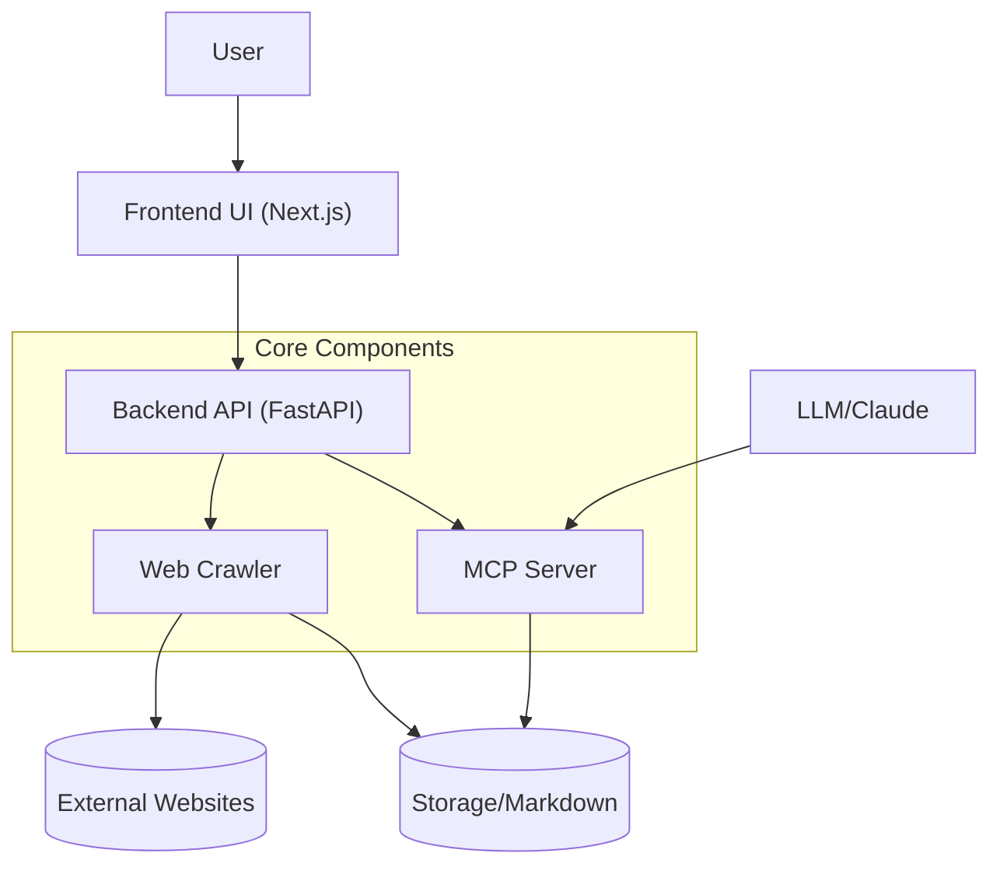

**System Components:**
1. **Frontend UI**: A Next.js application providing the user interface for URL input, discovery control, crawling, and file management
2. **Backend API**: A FastAPI service that orchestrates crawling, status management, and storage operations
3. **Web Crawler**: Handles URL discovery and content extraction from websites
4. **MCP Server**: Provides structured access to extracted markdown content for LLM integration

Sources: [README.md:40-65]()

## Target Users

OmniDoc is designed to address documentation challenges for various user types:

| User Type | Use Case |
|-----------|----------|
| Enterprise Software Developers | Skip weeks of reading documentation and implement technologies faster |
| Web Scrapers | Pull entire website contents with smart discovery of child URLs |
| Development Teams | Leverage internal documentation with built-in MCP servers and Claude integration |
| Indie Hackers | Rapidly ship products with any technology without getting stuck in documentation |

Sources: [README.md:26-38]()

## Core Workflow

OmniDoc follows a defined workflow from URL submission to LLM-ready content:

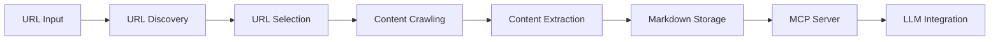

1. **URL Input**: User submits a documentation URL through the frontend
2. **URL Discovery**: System discovers related pages and subdomains
3. **URL Selection**: User selects which URLs to crawl
4. **Content Crawling**: System crawls selected pages
5. **Content Extraction**: Clean content is extracted without unnecessary elements
6. **Markdown Storage**: Content is stored as markdown files
7. **MCP Server**: Makes content available through structured protocols
8. **LLM Integration**: Enables LLMs to access and reason about the documentation

Sources: [README.md:71-77]()

## Key Features

### Intelligent Crawling

OmniDoc includes sophisticated crawling capabilities:

- Smart depth control (1-5 levels deep)
- Automatic link discovery
- Selective crawling of specific content
- Child URL detection for website structure mapping

### Performance and Processing

The system is built with performance in mind:

- Parallel processing for crawling multiple pages simultaneously
- Smart caching to avoid duplicate content
- Lazy loading support for modern web applications
- Rate limiting for respectful crawling

### Content Processing

Extracted content is processed for optimal use:

- Clean extraction without unnecessary elements
- Multiple export formats (MD, JSON)
- Structured output with logical organization
- MCP Server integration for AI processing

Sources: [README.md:40-65]()

## Deployment Architecture

OmniDoc is designed for easy deployment using Docker:

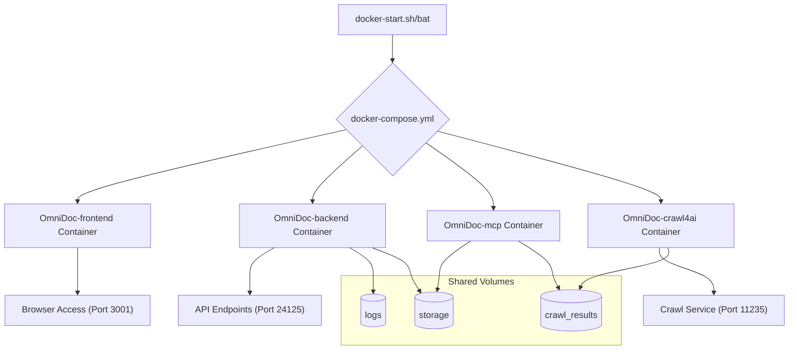

The system is containerized with four main Docker containers that share volumes for data exchange:

1. **OmniDoc-frontend**: Hosts the Next.js user interface
2. **OmniDoc-backend**: Runs the FastAPI service
3. **OmniDoc-mcp**: Hosts the Markdown Context Protocol server
4. **OmniDoc-crawl4ai**: Provides the crawling service

Sources: [README.md:96-204]()

## Crawl Job Lifecycle

The following diagram illustrates the lifecycle of a crawl job from initiation to completion:

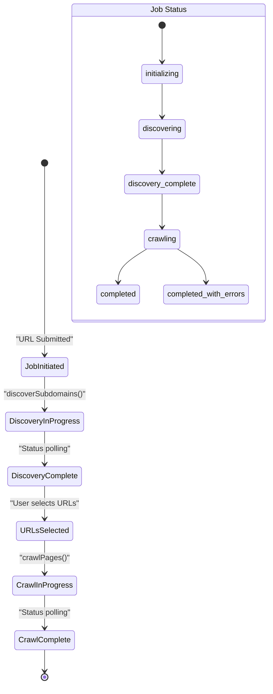

1. **Job Initiated**: User submits a URL through the frontend
2. **Discovery In Progress**: Backend initiates URL discovery process
3. **Discovery Complete**: All related URLs are discovered and categorized
4. **URLs Selected**: User selects which URLs to crawl
5. **Crawl In Progress**: Selected URLs are crawled and content extracted
6. **Crawl Complete**: All content is extracted and stored

Throughout this process, the system maintains state information for both the overall job and individual URLs.

Sources: [README.md:80-90]()

## Integration with LLMs

OmniDoc is specifically designed to work with Large Language Models like Claude through its MCP server:

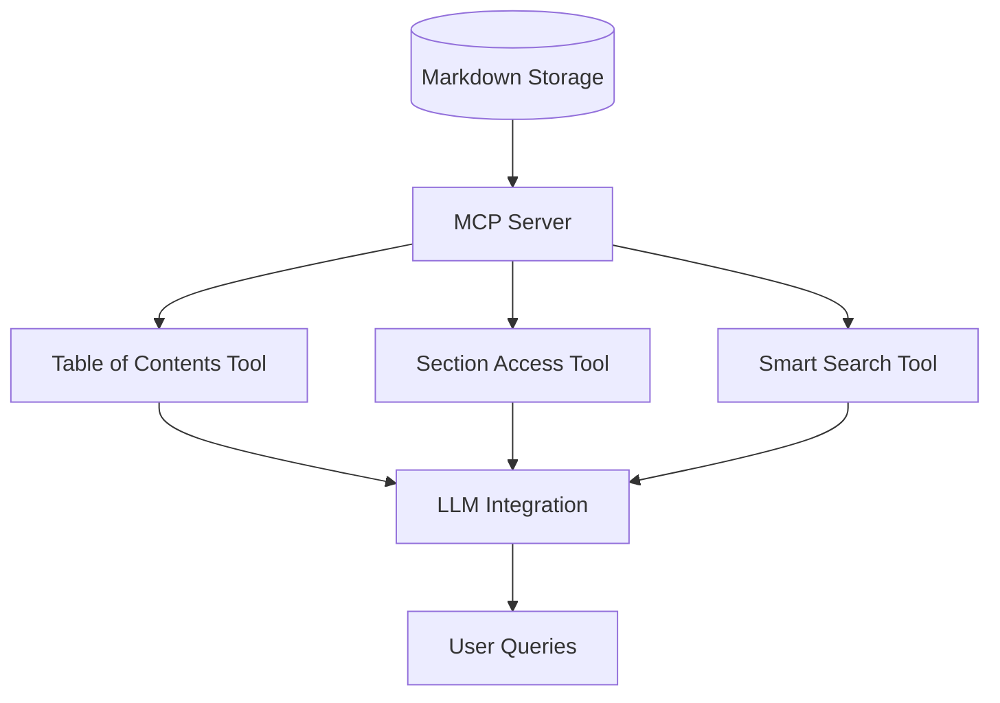

The system provides several tools for LLM interaction:
1. **Table of Contents Tool**: Provides structured navigation of documentation
2. **Section Access Tool**: Enables retrieval of specific documentation sections
3. **Smart Search Tool**: Facilitates intelligent searching across documentation

This integration allows LLMs to provide accurate, source-referenced answers to technical questions using the extracted documentation.

Sources: [README.md:257-321]()

## Getting Started

OmniDoc is designed to be easy to set up using Docker:

1. **Clone the repository**: `git clone https://github.com/cyberagiinc/OmniDoc.git`
2. **Configure environment**: Copy `.env.template` to `.env`
3. **Start services**: Run `./docker-start.sh` (Linux/Mac) or `docker-start.bat` (Windows)
4. **Access the UI**: Navigate to http://localhost:3001 in your browser

For detailed deployment instructions and configurations, see [Deployment and Setup](#6).

Sources: [README.md:96-122]()

## Conclusion

OmniDoc provides a comprehensive solution for automating documentation discovery, extraction, and organization. By crawling technical documentation and presenting it in a structured format, OmniDoc enables faster development and integration with AI systems.

The system's modular architecture, consisting of frontend, backend, crawler, and MCP server components, provides flexibility and extensibility for various documentation needs. Whether used for personal projects, enterprise development, or team knowledge management, OmniDoc significantly reduces the time required to understand and implement new technologies.

Sources: [README.md:254-261]()

---

# Page: System Architecture

# System Architecture

<details>
<summary>Relevant source files</summary>

The following files were used as context for generating this wiki page:

- [README.md](README.md)
- [assets/image.png](assets/image.png)
- [backend/app/main.py](backend/app/main.py)
- [docker/compose/docker-compose.yml](docker/compose/docker-compose.yml)

</details>


## Purpose and Scope

This document provides a comprehensive overview of the OmniDoc system architecture, covering the multi-service design that enables intelligent web crawling and LLM-ready documentation processing. The architecture consists of four primary services: a Next.js frontend, FastAPI backend, MCP (Model Context Protocol) server, and Crawl4AI service, all orchestrated via Docker containers.

For detailed information about specific components, see [Core Components](#3), [Frontend Application](#4), and [Backend Services](#5). For deployment specifics, see [Deployment and Operations](#6).

## High-Level Service Architecture

The OmniDoc platform follows a microservices architecture with clear separation of concerns between presentation, business logic, content processing, and web crawling capabilities.

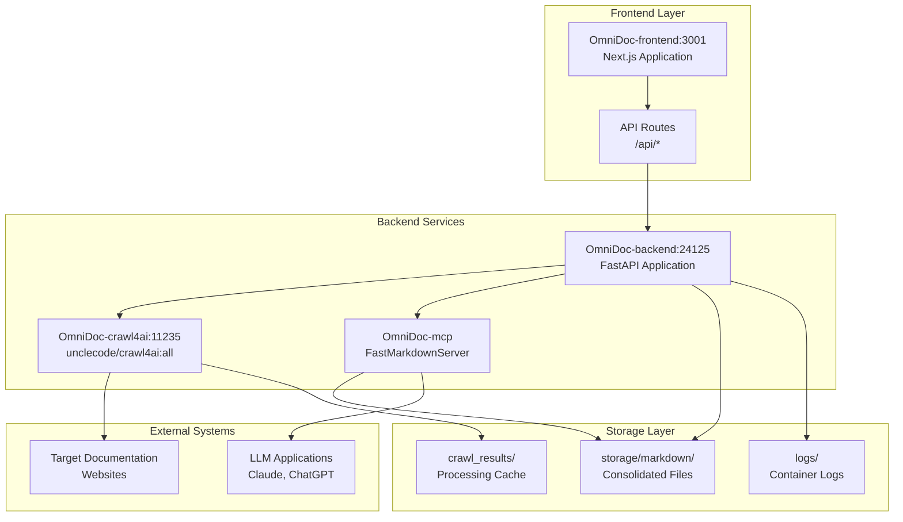

**Architecture Overview**
This diagram shows the complete OmniDoc service topology with actual container names and port mappings used in production deployment.

Sources: [docker/compose/docker-compose.yml:1-81](), [backend/app/main.py:1-622]()

## Core API and Route Architecture

The system implements a clean separation between frontend API proxy layers and backend business logic, with specific route handlers for each major function.

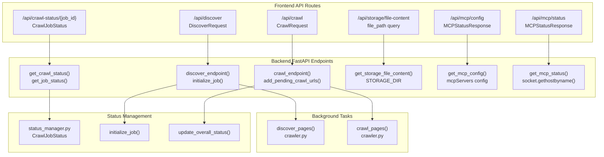

**API Route to Implementation Mapping**
This diagram maps frontend API routes to their corresponding backend implementations, showing the actual function names and classes used in the codebase.

Sources: [backend/app/main.py:500-529](), [backend/app/main.py:530-567](), [backend/app/main.py:570-579](), [backend/app/main.py:434-477]()

## Data Flow and Job Lifecycle

The system implements a comprehensive job management lifecycle with background task processing and real-time status updates.

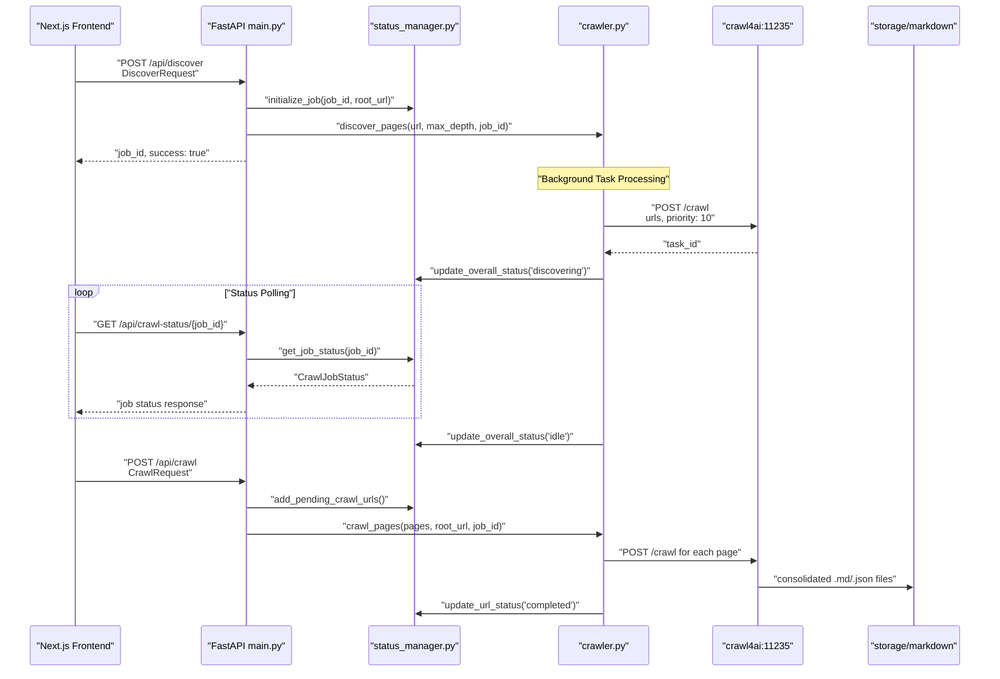

**Job Lifecycle and Data Processing Flow**
This sequence diagram shows the complete job processing pipeline using actual function names and status transitions from the codebase.

Sources: [backend/app/main.py:500-529](), [backend/app/main.py:530-567](), [backend/app/status_manager.py](), [backend/app/crawler.py]()

## Container Orchestration and Service Dependencies

The Docker Compose configuration defines the complete service topology with specific dependency chains and network isolation.

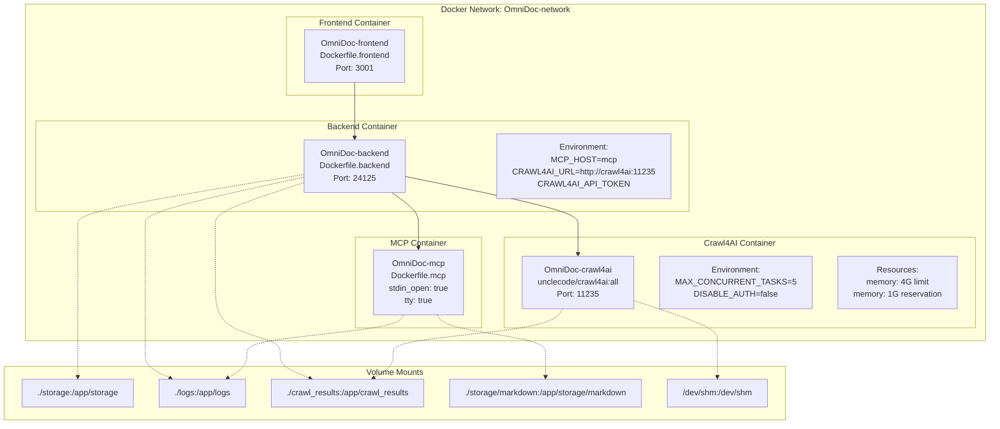

**Docker Service Architecture and Dependencies**
This diagram shows the actual container names, Dockerfile references, and volume mount configurations used in the Docker Compose setup.

Sources: [docker/compose/docker-compose.yml:1-81]()

## Storage Architecture and File Management

The system implements a sophisticated storage layer with consolidated file handling and metadata management for LLM integration.

| Storage Location | Purpose | File Types | Access Pattern |
|------------------|---------|------------|---------------|
| `storage/markdown/` | Consolidated documentation files | `.md`, `.json` | Read/Write via FastAPI, Read-only via MCP |
| `logs/` | Container and application logs | `.log` | Write-only by services, Read via API |
| `crawl_results/` | Temporary crawl processing cache | Various | Write by Crawl4AI, Process by Backend |

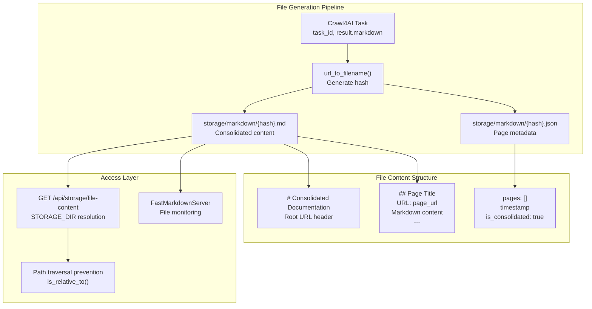

**Storage Layer and File Processing Architecture**
This diagram shows the actual file generation process and storage access patterns implemented in the codebase.

Sources: [backend/app/main.py:297-374](), [backend/app/main.py:434-477](), [backend/app/crawler.py]()

## MCP Server Integration Architecture

The Model Context Protocol server provides LLM-ready access to processed documentation with specific tool and resource configurations.

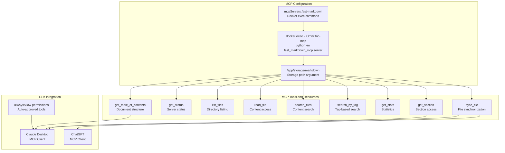

**MCP Server Tool and Resource Architecture**
This diagram shows the actual MCP server configuration and tool definitions used for LLM integration.

Sources: [backend/app/main.py:125-154]()

---

# Page: Data Models and Types

# Data Models and Types

<details>
<summary>Relevant source files</summary>

The following files were used as context for generating this wiki page:

- [lib/types.ts](lib/types.ts)

</details>


## Purpose and Scope

This document provides a comprehensive reference for the data structures and type definitions that form the foundation of the OmniDoc system. These models facilitate the discovery, crawling, and management of documentation content throughout the system's components. This page focuses on the core type definitions that are shared across both frontend and backend services.

For information about the web crawler implementation details, see [Web Crawler System](#3.1).
For details about the MCP server implementation, see [MCP Server](#3.2).

## Core Data Type Relationships

Below is a diagram illustrating the relationships between the primary data types used in the OmniDoc system.

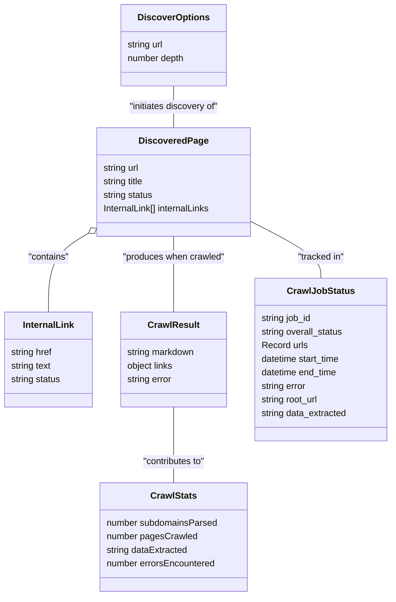

Sources: [lib/types.ts:1-44](), [backend/app/status_manager.py:23-33]()

## URL and Discovery Data Models

The system uses several data models to represent URLs, links, and discovered pages during the crawling process.

### InternalLink

Represents an internal link found on a web page:

| Property | Type | Description |
|----------|------|-------------|
| href | string | The URL of the link |
| text | string | The visible text of the link |
| status | string | Optional status of the link (pending, crawled, error) |

### DiscoveredPage

Represents a page that has been discovered during the crawling process:

| Property | Type | Description |
|----------|------|-------------|
| url | string | The URL of the discovered page |
| title | string | Optional title of the page |
| status | string | Status of the page (pending, crawled, error, pending_crawl) |
| internalLinks | InternalLink[] | Optional array of internal links found on the page |

### DiscoverOptions

Options for the page discovery process:

| Property | Type | Description |
|----------|------|-------------|
| url | string | The root URL to start discovery from |
| depth | number | Optional maximum depth for discovery traversal |

Sources: [lib/types.ts:1-39]()

## Status Management Models

The system uses a comprehensive status tracking system to monitor crawl jobs and individual URLs.

### Status Types

Two main types of statuses are tracked:

1. **OverallStatus** - Represents the overall status of a crawl job:
   - `initializing`: Job is being set up
   - `discovering`: Actively discovering subdomains/pages
   - `discovery_complete`: Discovery phase completed
   - `crawling`: Actively crawling pages
   - `completed`: Job completed successfully
   - `completed_with_errors`: Job completed but with some errors
   - `error`: Job failed with an error

2. **UrlStatus** - Represents the status of a specific URL in a crawl job:
   - `pending_discovery`: URL is queued for discovery
   - `discovering`: URL is being processed for discovery
   - `discovery_error`: Error occurred during discovery
   - `pending_crawl`: URL is queued for crawling
   - `crawling`: URL is being crawled
   - `crawl_error`: Error occurred during crawling
   - `completed`: URL was successfully crawled

### Status Lifecycle Diagram

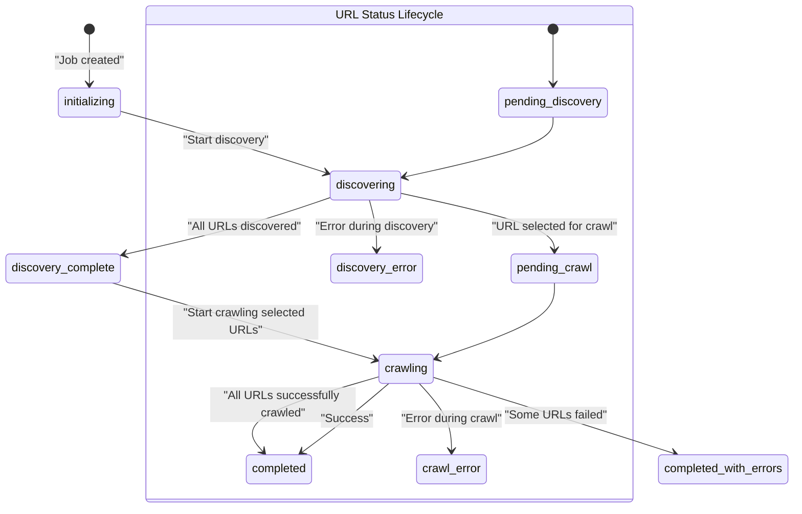

### CrawlJobStatus

The primary model for tracking the status of a crawl job:

#### Frontend TypeScript Interface
```typescript
interface CrawlJobStatus {
  job_id: string;
  root_url: string;
  overall_status: OverallStatus;
  urls: Record<string, UrlStatus>;
  start_time?: string;
  end_time?: string;
  error?: string | null;
  data_extracted?: string | null;
}
```

#### Backend Pydantic Model
```python
class CrawlJobStatus(BaseModel):
    job_id: str
    overall_status: str
    urls: dict[str, str]
    start_time: Optional[datetime]
    end_time: Optional[datetime]
    error: Optional[str]
    root_url: Optional[str]
    data_extracted: Optional[str]
```

Sources: [lib/types.ts:44-72](), [backend/app/status_manager.py:23-33]()

## Crawl Results and Statistics

### CrawlResult

Represents the result of crawling a single page:

| Property | Type | Description |
|----------|------|-------------|
| markdown | string | The extracted markdown content |
| links.internal | Array | Internal links found on the page (href and text) |
| links.external | Array | External links found on the page (href and text) |
| error | string | Optional error message if crawling failed |

### CrawlStats

Aggregated statistics for a crawl job:

| Property | Type | Description |
|----------|------|-------------|
| subdomainsParsed | number | Count of subdomains that were parsed |
| pagesCrawled | number | Count of successfully crawled pages |
| dataExtracted | string | Formatted size of extracted data (e.g., "10.5 KB") |
| errorsEncountered | number | Count of errors during crawling |

Sources: [lib/types.ts:14-34]()

## API Request and Response Types

The system defines several types to facilitate type-safe communication between frontend and backend services:

### Discovery API

| Type | Properties | Description |
|------|------------|-------------|
| DiscoverResponse | jobId: string | Response from initiating a discovery operation |

### Crawling API

| Type | Properties | Description |
|------|------------|-------------|
| CrawlRequest | pages: DiscoveredPage[], job_id: string | Request to crawl selected pages |
| CrawlResponse | success: boolean, jobId: string, error?: string | Response from initiating a crawl operation |

Sources: [lib/types.ts:74-93]()

## UI Component Types

The OmniDoc frontend uses several type definitions for UI components:

### CrawlUrlsProps

Props for the CrawlUrls component that displays and manages URLs for crawling:

| Property | Type | Description |
|----------|------|-------------|
| urls | Record<string, UrlStatus> | Map of URLs to their statuses |
| selectedUrls | Set<string> | Set of currently selected URLs |
| onSelectionChange | Function | Handler for URL selection changes |
| onCrawlSelected | Function | Handler for initiating crawl of selected URLs |
| isCrawlingSelected | boolean | Flag indicating if crawling is in progress |
| jobId | string \| null | ID of the current job |

Sources: [lib/types.ts:96-103]()

## MCP (Markdown Context Protocol) Types

The MCP server, responsible for managing markdown content and providing LLM integration, uses the following types:

### MCPServerConfig

Configuration for an MCP server:

| Property | Type | Description |
|----------|------|-------------|
| command | string | Command to run the MCP server |
| args | string[] | Arguments to pass to the command |
| env | Record<string, string> | Environment variables for the server |
| disabled | boolean | Whether the server is disabled |
| alwaysAllow | string[] | Optional list of always allowed tools |

### MCP Status Types

| Type | Description |
|------|-------------|
| MCPStatusCode | Status of an MCP server (running, stopped, error, unknown) |
| MCPStatus | Object with status code and optional details |

### Data Flow in MCP System

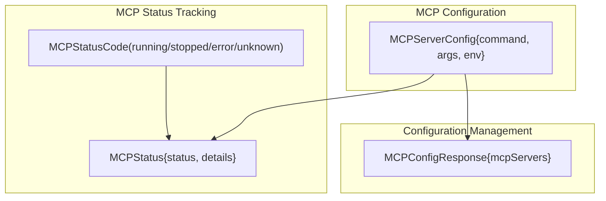

Sources: [lib/types.ts:123-142]()

## Cross-System Type Consistency

The OmniDoc system maintains type consistency between frontend (TypeScript) and backend (Python) through:

1. TypeScript interfaces in `lib/types.ts` define data structures for frontend components
2. Pydantic models in the backend (`status_manager.py`) define equivalent structures in Python
3. API endpoints serialize/deserialize between these formats consistently

This ensures data integrity across the entire system while allowing each part to leverage language-specific features.

Sources: [lib/types.ts:1-142](), [backend/app/status_manager.py:1-203]()

---

# Page: Service Communication Flow

# Service Communication Flow

<details>
<summary>Relevant source files</summary>

The following files were used as context for generating this wiki page:

- [app/api/crawl/route.ts](app/api/crawl/route.ts)
- [app/page.tsx](app/page.tsx)
- [backend/app/main.py](backend/app/main.py)
- [lib/crawl-service.ts](lib/crawl-service.ts)

</details>


This document describes the communication patterns, data flows, and service interactions within the OmniDoc platform. It covers request/response patterns between the Next.js frontend, FastAPI backend, and external services including Crawl4AI and the MCP server.

For information about the core data structures used in these communications, see [Data Models and Types](#2.1). For details about the individual services themselves, see [Core Components](#3) and [Backend Services](#5).

## Communication Architecture Overview

The OmniDoc platform uses a layered communication architecture with the Next.js frontend acting as a proxy to the FastAPI backend, which orchestrates external services.

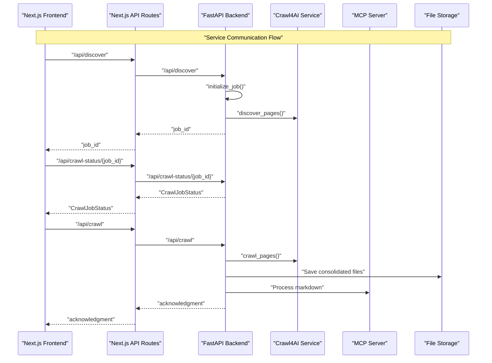

Sources: [app/page.tsx:185-269](), [backend/app/main.py:500-579](), [lib/crawl-service.ts:4-84](), [app/api/crawl/route.ts:4-56]()

## Discovery Communication Pattern

The discovery process follows an asynchronous request-response pattern where the frontend initiates discovery and polls for results.

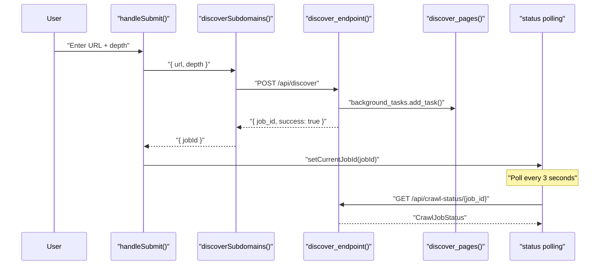

### Discovery Request Flow

1. **Frontend Initiation**: The `handleSubmit` function validates the URL and initiates discovery
2. **Service Call**: `discoverSubdomains` makes a POST request to `/api/discover`
3. **Backend Processing**: `discover_endpoint` creates a job ID and starts background discovery
4. **Immediate Response**: Backend returns job ID without waiting for completion
5. **Status Polling**: Frontend begins polling `/api/crawl-status/{job_id}` every 3 seconds

Sources: [app/page.tsx:185-269](), [lib/crawl-service.ts:4-40](), [backend/app/main.py:500-529]()

## Crawling Communication Pattern

The crawling process uses a similar asynchronous pattern but requires an existing job ID from the discovery phase.

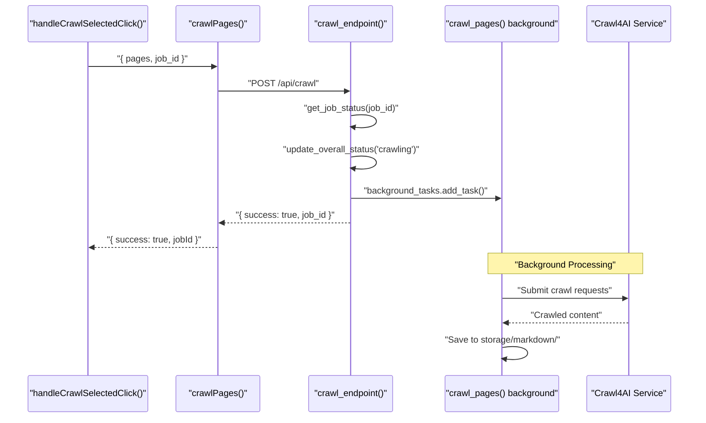

### Crawling Request Validation

The backend validates that the job ID exists before accepting crawl requests:

- **Job Validation**: `get_job_status(job_id)` ensures the job exists
- **Status Update**: `update_overall_status(job_id, 'crawling')` marks the job as active
- **URL Registration**: `add_pending_crawl_urls()` registers URLs for status tracking

Sources: [app/page.tsx:281-401](), [lib/crawl-service.ts:43-84](), [backend/app/main.py:530-567](), [app/api/crawl/route.ts:4-56]()

## Status Polling Mechanism

The frontend implements a sophisticated polling system to track job progress in real-time.

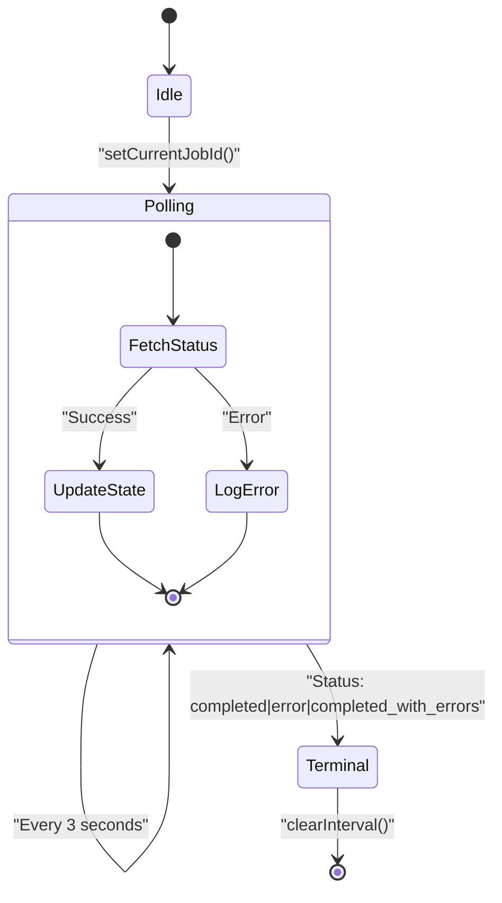

### Polling Implementation Details

The polling logic is implemented in the main page component with several key features:

- **Interval Management**: Uses `setInterval` with 3-second intervals
- **Overlap Prevention**: `isFetching` flag prevents overlapping requests
- **Terminal State Detection**: Automatically stops polling when jobs complete
- **Error Handling**: Distinguishes between network errors and job errors

Sources: [app/page.tsx:454-532]()

## Next.js API Proxy Layer

The Next.js API routes act as a proxy layer between the frontend and backend, providing request forwarding and error handling.

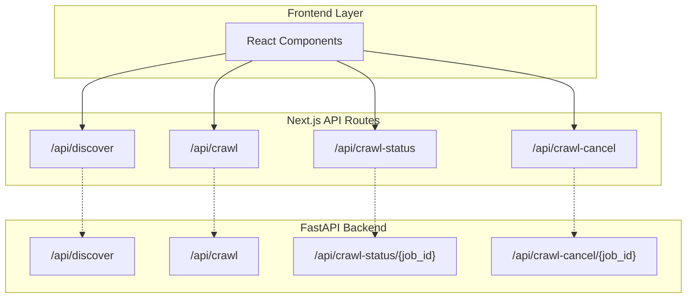

### Proxy Configuration

The API routes use environment variables to determine backend connectivity:

- **Backend URL**: `process.env.BACKEND_URL || 'http://backend:24125'`
- **Error Forwarding**: Preserves HTTP status codes and error messages
- **Request Validation**: Validates required fields before proxying

Sources: [app/api/crawl/route.ts:18-45]()

## Backend Service Communication

The FastAPI backend orchestrates communication with external services and manages job state.

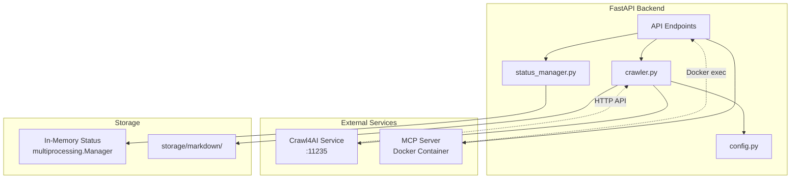

### Service Integration Points

| Service | Communication Method | Purpose |
|---------|---------------------|---------|
| Crawl4AI | HTTP API (:11235) | Web scraping and content extraction |
| MCP Server | Docker exec | Markdown processing for LLM consumption |
| Status Manager | In-process calls | Job state management |
| File Storage | Direct file I/O | Persistent content storage |

Sources: [backend/app/main.py:125-246](), [backend/app/main.py:17](), [backend/app/main.py:28-38]()

## Error Handling and Cancellation

The system implements comprehensive error handling and job cancellation capabilities.

```mermaid
sequenceDiagram
    participant FE as "Frontend"
    participant BE as "Backend"
    participant STATUS as "status_manager"
    participant CRAWL as "crawler"

    Note over FE,CRAWL: "Cancellation Flow"
    
    FE->>BE: "POST /api/crawl-cancel/{job_id}"
    BE->>STATUS: "request_cancellation(job_id)"
    STATUS->>STATUS: "validate job exists & cancellable"
    STATUS->>STATUS: "set cancellation_requested=True"
    STATUS-->>BE: "success=True"
    BE-->>FE: "{ message: 'Cancellation requested' }"
    
    Note over CRAWL: "Background task checks cancellation"
    CRAWL->>STATUS: "check cancellation_requested"
    STATUS-->>CRAWL: "True"
    CRAWL->>STATUS: "update_overall_status('cancelled')"
```

### Error Response Patterns

The backend uses consistent error response patterns:

- **404 Errors**: Job not found or already completed
- **409 Errors**: Job in non-cancellable state
- **500 Errors**: Internal server errors with detailed messages
- **Validation Errors**: Input validation failures with specific field information

Sources: [backend/app/main.py:582-614](), [app/page.tsx:404-451]()

## Data Storage Communication

The system uses multiple storage mechanisms for different types of data.

```mermaid
graph LR
    subgraph "Data Sources"
        CRAWL4AI["Crawl4AI Results"]
        USER_INPUT["User Selections"]
        JOB_STATE["Job Status"]
    end
    
    subgraph "Storage Systems"
        MEMORY["multiprocessing.Manager<br/>Job Status"]
        LOCALSTORAGE["localStorage<br/>Frontend State"]
        FILESYSTEM["storage/markdown/<br/>Content Files"]
    end
    
    subgraph "Access Patterns"
        POLLING["Status Polling"]
        PERSISTENCE["State Persistence"]
        FILE_ACCESS["File Retrieval"]
    end

    JOB_STATE --> MEMORY
    USER_INPUT --> LOCALSTORAGE
    CRAWL4AI --> FILESYSTEM
    
    MEMORY --> POLLING
    LOCALSTORAGE --> PERSISTENCE
    FILESYSTEM --> FILE_ACCESS
```

### Storage Access Patterns

| Storage Type | Access Pattern | Persistence | Usage |
|--------------|----------------|-------------|-------|
| `multiprocessing.Manager` | In-memory shared state | Process lifetime | Job status tracking |
| `localStorage` | Browser local storage | Browser session | Frontend state persistence |
| File system | Direct file I/O | Permanent | Crawled content storage |

Sources: [app/page.tsx:30-141](), [backend/app/main.py:432-477](), [backend/app/main.py:28-38]()

---

# Page: Core Components

# Core Components

<details>
<summary>Relevant source files</summary>

The following files were used as context for generating this wiki page:

- [backend/app/crawler.py](backend/app/crawler.py)
- [backend/app/status_manager.py](backend/app/status_manager.py)
- [fast-markdown-mcp/pyproject.toml](fast-markdown-mcp/pyproject.toml)
- [fast-markdown-mcp/src/fast_markdown_mcp/server.py](fast-markdown-mcp/src/fast_markdown_mcp/server.py)

</details>


This document provides a detailed examination of the three essential backend components that power the OmniDoc crawling and content processing system. These components work together to discover web pages, extract content, manage job status, and provide LLM-ready access to processed documentation.

For information about the overall system architecture and service communication, see [System Architecture](#2). For frontend components and user interfaces, see [Frontend Application](#4).

## Component Overview

The OmniDoc system is built around three core backend components that handle different aspects of the documentation processing pipeline:

```mermaid
graph TB
    subgraph "Core Components Architecture"
        subgraph "Web Crawler System"
            DISCOVER["discover_pages()"]
            CRAWL["crawl_pages()"]
            MODELS["DiscoveredPage<br/>CrawlResult<br/>InternalLink"]
        end
        
        subgraph "Status Management"
            INIT["initialize_job()"]
            UPDATE["update_overall_status()"]
            CANCEL["request_cancellation()"]
            STATUS_MODEL["CrawlJobStatus<br/>UrlDetails"]
        end
        
        subgraph "MCP Server"
            FAST_SERVER["FastMarkdownServer"]
            MARKDOWN_STORE["MarkdownStore"]
            TOOLS["smart_section_search<br/>get_section<br/>read_file"]
        end
        
        subgraph "External Systems"
            CRAWL4AI["Crawl4AI Service<br/>:11235"]
            STORAGE["storage/markdown/"]
            LLM["LLM Applications"]
        end
    end
    
    DISCOVER --> STATUS_MODEL
    CRAWL --> STATUS_MODEL
    DISCOVER --> CRAWL4AI
    CRAWL --> CRAWL4AI
    CRAWL --> STORAGE
    STORAGE --> MARKDOWN_STORE
    MARKDOWN_STORE --> TOOLS
    TOOLS --> LLM
    
    INIT --> STATUS_MODEL
    UPDATE --> STATUS_MODEL
    CANCEL --> STATUS_MODEL
```

**Core Components Data Flow**

Sources: [backend/app/crawler.py:1-863](), [backend/app/status_manager.py:1-334](), [fast-markdown-mcp/src/fast_markdown_mcp/server.py:1-895]()

## Web Crawler System

The web crawler system is implemented in [backend/app/crawler.py:1-863]() and provides intelligent page discovery and content extraction capabilities. It consists of two main functions that work sequentially to process documentation websites.

### Discovery Process

The `discover_pages()` function implements recursive link discovery with intelligent depth control:

```mermaid
flowchart TD
    START["discover_pages(url, max_depth)"]
    NORMALIZE["normalize_url(url)"]
    CHECK_SEEN{"url in seen_urls?"}
    CHECK_DEPTH{"current_depth > max_depth?"}
    CHECK_CANCEL{"is_cancellation_requested(job_id)?"}
    
    SUBMIT_TASK["Submit to Crawl4AI<br/>/crawl endpoint"]
    POLL_LOOP["Poll task status<br/>configurable timeout"]
    EXTRACT_LINKS["Extract internal links<br/>from result"]
    FILTER_LINKS["Filter excluded URLs<br/>(login, admin, etc.)"]
    CREATE_PAGE["Create DiscoveredPage<br/>with InternalLink list"]
    RECURSE["Recursive call for<br/>each discovered link"]
    
    START --> NORMALIZE
    NORMALIZE --> CHECK_CANCEL
    CHECK_CANCEL -->|cancelled| RETURN_EMPTY["Return []"]
    CHECK_CANCEL -->|not cancelled| CHECK_SEEN
    CHECK_SEEN -->|seen| RETURN_EMPTY
    CHECK_SEEN -->|not seen| CHECK_DEPTH
    CHECK_DEPTH -->|exceeded| RETURN_EMPTY
    CHECK_DEPTH -->|within limit| SUBMIT_TASK
    
    SUBMIT_TASK --> POLL_LOOP
    POLL_LOOP --> EXTRACT_LINKS
    EXTRACT_LINKS --> FILTER_LINKS
    FILTER_LINKS --> CREATE_PAGE
    CREATE_PAGE --> RECURSE
    RECURSE --> RETURN_PAGES["Return List[DiscoveredPage]"]
```

**Discovery Process Flow**

Key features of the discovery process:

- **Cancellation-aware**: Checks `is_cancellation_requested()` at multiple points [backend/app/crawler.py:154-158]()
- **Configurable timeout**: Uses `DISCOVERY_POLLING_TIMEOUT_SECONDS` environment variable [backend/app/crawler.py:230-241]()
- **URL normalization**: All URLs are normalized using `normalize_url()` [backend/app/crawler.py:172]()
- **Intelligent filtering**: Excludes login, admin, and account pages [backend/app/crawler.py:348-352]()
- **Status tracking**: Updates job status throughout the process [backend/app/crawler.py:186]()

Sources: [backend/app/crawler.py:134-417](), [backend/app/utils.py]()

### Content Extraction Process

The `crawl_pages()` function processes discovered pages and extracts their content:

```mermaid
flowchart TD
    START["crawl_pages(pages, root_url, job_id)"]
    CHECK_CANCEL_START{"is_cancellation_requested()?"}
    SET_CRAWLING["update_overall_status('crawling')"]
    
    LOOP_START["For each page in pages"]
    CHECK_CANCEL_LOOP{"is_cancellation_requested()?"}
    SUBMIT_CRAWL["Submit to Crawl4AI<br/>content extraction"]
    POLL_RESULT["Poll for task result<br/>max 120 attempts"]
    CHECK_CANCEL_POLL{"is_cancellation_requested()?"}
    
    FETCH_STATUS["_fetch_status_code(url)"]
    UPDATE_STATUS["update_url_status()<br/>with HTTP status code"]
    PROCESS_CONTENT["Filter and clean<br/>markdown content"]
    SAVE_CONSOLIDATED["Save to storage/markdown/<br/>consolidated file"]
    UPDATE_METADATA["Update JSON metadata<br/>with page info"]
    
    COMBINE_RESULTS["Combine all markdown<br/>into CrawlResult"]
    UPDATE_FINAL["update_overall_status()<br/>with final status"]
    
    START --> CHECK_CANCEL_START
    CHECK_CANCEL_START -->|cancelled| RETURN_EMPTY["Return empty CrawlResult"]
    CHECK_CANCEL_START -->|not cancelled| SET_CRAWLING
    SET_CRAWLING --> LOOP_START
    
    LOOP_START --> CHECK_CANCEL_LOOP
    CHECK_CANCEL_LOOP -->|cancelled| BREAK["Break loop"]
    CHECK_CANCEL_LOOP -->|not cancelled| SUBMIT_CRAWL
    
    SUBMIT_CRAWL --> POLL_RESULT
    POLL_RESULT --> CHECK_CANCEL_POLL
    CHECK_CANCEL_POLL -->|cancelled| BREAK
    CHECK_CANCEL_POLL -->|not cancelled| FETCH_STATUS
    
    FETCH_STATUS --> UPDATE_STATUS
    UPDATE_STATUS --> PROCESS_CONTENT
    PROCESS_CONTENT --> SAVE_CONSOLIDATED
    SAVE_CONSOLIDATED --> UPDATE_METADATA
    UPDATE_METADATA --> LOOP_START
    
    BREAK --> COMBINE_RESULTS
    COMBINE_RESULTS --> UPDATE_FINAL
    UPDATE_FINAL --> RETURN_RESULT["Return CrawlResult"]
```

**Content Extraction Flow**

The crawling process includes several sophisticated features:

- **HTTP status code fetching**: Uses `_fetch_status_code()` with httpx client [backend/app/crawler.py:419-445]()
- **Content filtering**: Removes navigation elements and unwanted text [backend/app/crawler.py:754-773]()
- **Consolidated file storage**: Saves all pages to a single markdown file [backend/app/crawler.py:618-644]()
- **Metadata tracking**: Maintains JSON metadata with page information [backend/app/crawler.py:653-700]()

Sources: [backend/app/crawler.py:448-863]()

### Data Models

The crawler system uses several Pydantic models to structure data:

| Model | Purpose | Key Fields |
|-------|---------|------------|
| `DiscoveredPage` | Represents a discovered web page | `url`, `title`, `status`, `internalLinks` |
| `InternalLink` | Represents a link within a page | `href`, `text`, `status` |
| `CrawlResult` | Contains crawling results | `markdown`, `stats` |
| `CrawlStats` | Crawling statistics | `subdomains_parsed`, `pages_crawled`, `data_extracted`, `errors_encountered` |

Sources: [backend/app/crawler.py:38-58]()

## Status Management System

The status management system provides multiprocessing-safe job tracking and cancellation capabilities. It's implemented in [backend/app/status_manager.py:1-334]() using shared memory dictionaries.

### Multiprocessing Architecture

```mermaid
graph TB
    subgraph "Multiprocessing Manager"
        MANAGER["multiprocessing.Manager()"]
        JOBS_DICT["crawl_jobs_managed<br/>manager.dict()"]
        CANCEL_DICT["_cancellation_requests_managed<br/>manager.dict()"]
    end
    
    subgraph "Status Operations"
        INIT["initialize_job()"]
        UPDATE_OVERALL["update_overall_status()"]
        UPDATE_URL["update_url_status()"]
        GET_STATUS["get_job_status()"]
        REQUEST_CANCEL["request_cancellation()"]
        CHECK_CANCEL["is_cancellation_requested()"]
    end
    
    subgraph "Data Models"
        JOB_STATUS["CrawlJobStatus"]
        URL_DETAILS["UrlDetails"]
    end
    
    MANAGER --> JOBS_DICT
    MANAGER --> CANCEL_DICT
    
    INIT --> JOBS_DICT
    UPDATE_OVERALL --> JOBS_DICT
    UPDATE_URL --> JOBS_DICT
    GET_STATUS --> JOBS_DICT
    REQUEST_CANCEL --> CANCEL_DICT
    CHECK_CANCEL --> CANCEL_DICT
    
    JOBS_DICT --> JOB_STATUS
    JOB_STATUS --> URL_DETAILS
```

**Status Management Architecture**

The system uses a get-modify-set pattern for thread-safe updates:

1. **Retrieve**: Get current status data from managed dictionary [backend/app/status_manager.py:114]()
2. **Convert**: Recreate Pydantic model from dictionary data [backend/app/status_manager.py:118]()
3. **Modify**: Update the model instance [backend/app/status_manager.py:124-132]()
4. **Store**: Convert back to dictionary and reassign [backend/app/status_manager.py:135-141]()

Sources: [backend/app/status_manager.py:19-32](), [backend/app/status_manager.py:108-157]()

### Job Lifecycle Management

The status management system tracks jobs through multiple states:

| Status | Description | Valid Transitions |
|--------|-------------|------------------|
| `initializing` | Job created, preparing discovery | ‚Ü?`discovering` |
| `discovering` | Finding pages via link discovery | ‚Ü?`discovery_complete`, `cancelling`, `error` |
| `discovery_complete` | All pages found, ready to crawl | ‚Ü?`crawling` |
| `crawling` | Extracting content from pages | ‚Ü?`completed`, `completed_with_errors`, `cancelling`, `error` |
| `cancelling` | Cancellation requested, stopping work | ‚Ü?`cancelled` |
| `cancelled` | Job successfully cancelled | *Final state* |
| `completed` | All pages processed successfully | *Final state* |
| `completed_with_errors` | Some pages failed during processing | *Final state* |
| `error` | Fatal error occurred | *Final state* |

Sources: [backend/app/status_manager.py:36](), [backend/app/status_manager.py:59]()

### Cancellation System

The cancellation system provides graceful job termination:

```mermaid
sequenceDiagram
    participant API as FastAPI
    participant StatusMgr as status_manager
    participant Crawler as crawler
    participant Crawl4AI as Crawl4AI Service
    
    API->>StatusMgr: request_cancellation(job_id)
    StatusMgr->>StatusMgr: Check job exists and is cancellable
    StatusMgr->>StatusMgr: Set _cancellation_requests[job_id] = True
    StatusMgr->>StatusMgr: Update status to 'cancelling'
    StatusMgr-->>API: Return True
    
    loop Discovery/Crawling Loop
        Crawler->>StatusMgr: is_cancellation_requested(job_id)
        StatusMgr-->>Crawler: True/False
        alt Cancellation Requested
            Crawler->>StatusMgr: update_overall_status('cancelled')
            Crawler->>Crawler: Break processing loop
        else Continue Processing
            Crawler->>Crawl4AI: Submit task
            Crawl4AI-->>Crawler: Task result
        end
    end
```

**Cancellation Process Flow**

Key cancellation features:

- **Idempotent**: Multiple cancellation requests are handled gracefully [backend/app/status_manager.py:286-288]()
- **State validation**: Only jobs in `discovering` or `crawling` states can be cancelled [backend/app/status_manager.py:292-295]()
- **Cleanup**: Cancellation flags are removed when jobs reach final states [backend/app/status_manager.py:147-151]()

Sources: [backend/app/status_manager.py:256-333]()

## MCP Server Component

The Model Context Protocol (MCP) server provides LLM-ready access to processed documentation. It's implemented in [fast-markdown-mcp/src/fast_markdown_mcp/server.py:1-895]() as a comprehensive content management system.

### Server Architecture

```mermaid
graph TB
    subgraph "FastMarkdownServer"
        SERVER["mcp.server.Server"]
        STORE["MarkdownStore"]
        HANDLER["MarkdownEventHandler"]
        OBSERVER["watchdog.Observer"]
    end
    
    subgraph "Content Management"
        CONTENT_CACHE["content_cache"]
        METADATA_CACHE["metadata_cache"]
        STRUCTURE_CACHE["structure_cache"]
        DOCUMENT_STRUCTURE["DocumentStructure"]
    end
    
    subgraph "MCP Protocol"
        RESOURCES["list_resources()<br/>read_resource()"]
        TOOLS["list_tools()<br/>call_tool()"]
    end
    
    subgraph "Storage Layer"
        MD_FILES["*.md files"]
        JSON_FILES["*.json metadata"]
        STORAGE_PATH["storage/markdown/"]
    end
    
    SERVER --> STORE
    SERVER --> HANDLER
    SERVER --> OBSERVER
    STORE --> CONTENT_CACHE
    STORE --> METADATA_CACHE
    STORE --> STRUCTURE_CACHE
    STRUCTURE_CACHE --> DOCUMENT_STRUCTURE
    
    SERVER --> RESOURCES
    SERVER --> TOOLS
    
    OBSERVER --> STORAGE_PATH
    STORAGE_PATH --> MD_FILES
    STORAGE_PATH --> JSON_FILES
    STORE --> MD_FILES
    STORE --> JSON_FILES
```

**MCP Server Architecture**

The server provides two main MCP interfaces:

1. **Resources**: Direct access to markdown content and metadata [fast-markdown-mcp/src/fast_markdown_mcp/server.py:553-584]()
2. **Tools**: Interactive functions for content manipulation [fast-markdown-mcp/src/fast_markdown_mcp/server.py:586-728]()

Sources: [fast-markdown-mcp/src/fast_markdown_mcp/server.py:539-549]()

### Advanced Search Capabilities

The MCP server implements sophisticated search functionality through the `smart_section_search()` tool:

```mermaid
flowchart TD
    QUERY["Smart Section Search Query"]
    LOAD_DOCS["Load all markdown files<br/>Parse DocumentStructure"]
    EXTRACT_SECTIONS["Extract all sections<br/>from nested structure"]
    
    subgraph "Match Types"
        EXACT_TITLE["Exact match in title"]
        EXACT_CONTENT["Exact match in content"]
        FUZZY_TITLE["Fuzzy match in title<br/>threshold > 0.6"]
        FUZZY_CONTENT["Fuzzy match in content<br/>chunk-based analysis"]
        REGEX_TITLE["Regex match in title"]
        REGEX_CONTENT["Regex match in content"]
    end
    
    CALCULATE_SCORES["Calculate confidence scores<br/>_calculate_confidence()"]
    RANK_RESULTS["Sort by score (descending)<br/>Limit to max_results"]
    FORMAT_OUTPUT["Format with citations<br/>file_id#section_id"]
    
    QUERY --> LOAD_DOCS
    LOAD_DOCS --> EXTRACT_SECTIONS
    EXTRACT_SECTIONS --> EXACT_TITLE
    EXTRACT_SECTIONS --> EXACT_CONTENT
    EXTRACT_SECTIONS --> FUZZY_TITLE
    EXTRACT_SECTIONS --> FUZZY_CONTENT
    EXTRACT_SECTIONS --> REGEX_TITLE
    EXTRACT_SECTIONS --> REGEX_CONTENT
    
    EXACT_TITLE --> CALCULATE_SCORES
    EXACT_CONTENT --> CALCULATE_SCORES
    FUZZY_TITLE --> CALCULATE_SCORES
    FUZZY_CONTENT --> CALCULATE_SCORES
    REGEX_TITLE --> CALCULATE_SCORES
    REGEX_CONTENT --> CALCULATE_SCORES
    
    CALCULATE_SCORES --> RANK_RESULTS
    RANK_RESULTS --> FORMAT_OUTPUT
```

**Smart Section Search Algorithm**

The search algorithm uses multiple matching strategies:

- **Exact matching**: Direct string containment with boosted confidence [fast-markdown-mcp/src/fast_markdown_mcp/server.py:288-309]()
- **Fuzzy matching**: Uses `SequenceMatcher` for similarity scoring [fast-markdown-mcp/src/fast_markdown_mcp/server.py:314-341]()
- **Regex matching**: Pattern-based search with error handling [fast-markdown-mcp/src/fast_markdown_mcp/server.py:344-375]()
- **Confidence scoring**: Adjusts scores based on match type and location [fast-markdown-mcp/src/fast_markdown_mcp/server.py:35-48]()

Sources: [fast-markdown-mcp/src/fast_markdown_mcp/server.py:246-443]()

### File Monitoring System

The MCP server includes automatic file monitoring for real-time content updates:

```mermaid
graph LR
    subgraph "File System Events"
        CREATE["File Created"]
        MODIFY["File Modified"]
    end
    
    subgraph "Event Handler"
        HANDLER["MarkdownEventHandler"]
        SYNC["sync_file()"]
    end
    
    subgraph "Cache Management"
        CLEAR["Clear cached content"]
        RELOAD["Reload from disk"]
        PARSE["Parse DocumentStructure"]
    end
    
    CREATE --> HANDLER
    MODIFY --> HANDLER
    HANDLER --> SYNC
    SYNC --> CLEAR
    CLEAR --> RELOAD
    RELOAD --> PARSE
```

**File Monitoring Flow**

The monitoring system ensures that content changes are immediately available to LLM applications:

- **Event detection**: Uses `watchdog.Observer` to monitor the storage directory [fast-markdown-mcp/src/fast_markdown_mcp/server.py:547]()
- **Cache invalidation**: Clears relevant caches when files change [fast-markdown-mcp/src/fast_markdown_mcp/server.py:169-172]()
- **Async processing**: Handles file events in the event loop context [fast-markdown-mcp/src/fast_markdown_mcp/server.py:524-527]()

Sources: [fast-markdown-mcp/src/fast_markdown_mcp/server.py:513-537](), [fast-markdown-mcp/src/fast_markdown_mcp/server.py:166-184]()

## Component Integration

The three core components work together to provide a complete documentation processing pipeline:

```mermaid
sequenceDiagram
    participant Client as Client Request
    participant Status as Status Manager
    participant Crawler as Web Crawler
    participant MCP as MCP Server
    participant Storage as File Storage
    
    Client->>Status: initialize_job(job_id, root_url)
    Status->>Status: Create CrawlJobStatus
    
    Client->>Crawler: discover_pages(url, depth, job_id)
    Crawler->>Status: update_overall_status('discovering')
    loop For each discovered page
        Crawler->>Status: update_url_status(url, 'pending_crawl')
    end
    Crawler->>Status: update_overall_status('discovery_complete')
    
    Client->>Crawler: crawl_pages(pages, root_url, job_id)
    Crawler->>Status: update_overall_status('crawling')
    loop For each page
        Crawler->>Status: update_url_status(url, 'crawling')
        Crawler->>Storage: Save consolidated markdown
        Crawler->>Status: update_url_status(url, 'completed')
    end
    Crawler->>Status: update_overall_status('completed')
    
    Storage->>MCP: File system event (created/modified)
    MCP->>MCP: sync_file() - invalidate caches
    MCP->>MCP: Parse DocumentStructure
    
    Client->>MCP: smart_section_search(query)
    MCP->>Storage: Read markdown files
    MCP-->>Client: Ranked search results with citations
```

**Complete Processing Pipeline**

This integration provides:

- **Status visibility**: Real-time tracking of job progress across all phases
- **Cancellation support**: Graceful termination at any point in the pipeline  
- **Automatic content sync**: Immediate availability of processed content to LLMs
- **Rich search capabilities**: Advanced querying with confidence scoring and citations

Sources: [backend/app/crawler.py:134-863](), [backend/app/status_manager.py:77-238](), [fast-markdown-mcp/src/fast_markdown_mcp/server.py:808-834]()

---

# Page: Web Crawler System

# Web Crawler System

<details>
<summary>Relevant source files</summary>

The following files were used as context for generating this wiki page:

- [app/globals.css](app/globals.css)
- [app/layout.tsx](app/layout.tsx)
- [backend/app/config.py](backend/app/config.py)
- [backend/app/crawler.py](backend/app/crawler.py)

</details>


This document provides a detailed technical explanation of the Web Crawler System within the OmniDoc architecture. The crawler system is responsible for discovering and extracting content from websites, converting it to markdown format, and storing it for later use by the Markdown Context Protocol (MCP) Server. For information about the MCP Server itself, see [MCP Server](#3.2).

## System Overview

The Web Crawler System handles two primary functions:
1. **URL Discovery** - Finding and cataloging pages within a target website
2. **Content Extraction** - Converting discovered web pages into markdown documents

The system operates asynchronously, with status tracking throughout the process to provide feedback to users.

Sources: [backend/app/crawler.py:1-10]()

## System Architecture

The Web Crawler System follows a client-server architecture with multiple components working together. The system interfaces with an external crawling service (Crawl4AI) for the actual web scraping operations.

```mermaid
graph TD
    subgraph "Frontend Components"
        FE["discoverSubdomains()"]
        FE2["crawlPages()"]
    end
    
    subgraph "Backend Components"
        BE["FastAPI /api/discover"]
        BE2["FastAPI /api/crawl"]
        DP["discover_pages()"]
        CP["crawl_pages()"]
        SM["status_manager"]
    end
    
    subgraph "External Service"
        C4AI["Crawl4AI API"]
    end
    
    subgraph "Storage"
        FS["storage/markdown/*.md"]
        META["storage/markdown/*.json"]
    end
    
    FE -->|"POST request"| BE
    FE2 -->|"POST request"| BE2
    BE -->|"async call"| DP
    BE2 -->|"async call"| CP
    DP -->|"update status"| SM
    CP -->|"update status"| SM
    DP -->|"/crawl & /task/{id}"| C4AI
    CP -->|"/crawl & /task/{id}"| C4AI
    CP -->|"write markdown"| FS
    CP -->|"store metadata"| META
```

The crawler interacts with the Crawl4AI service through a REST API, using a bearer token for authentication. All API interactions are asynchronous, allowing the system to handle multiple crawl jobs simultaneously.

Sources: [backend/app/crawler.py:23-35](), [lib/crawl-service.ts:1-10]()

## Discovery Process

The URL discovery process starts with a single URL and recursively finds linked pages within the same domain.

```mermaid
sequenceDiagram
    participant Client as "Frontend Client"
    participant API as "FastAPI Backend"
    participant DP as "discover_pages()"
    participant C4AI as "Crawl4AI Service"
    participant Status as "Status Manager"
    
    Client->>API: POST /api/discover {url, depth}
    API->>DP: discover_pages(url, max_depth)
    DP->>Status: update_overall_status(job_id, 'discovering')
    
    loop For each URL (recursive)
        DP->>Status: update_url_status(job_id, url, 'discovering')
        DP->>C4AI: POST /crawl {urls: url}
        Note right of DP: Submit discovery job
        DP->>C4AI: GET /task/{task_id}
        Note right of DP: Poll for results
        C4AI-->>DP: Return links
        DP->>Status: update_url_status(job_id, url, 'pending_crawl')
        
        loop For each internal link
            DP->>DP: Recursive call if depth < max_depth
        end
    end
    
    DP->>Status: update_overall_status(job_id, 'discovery_complete')
    API-->>Client: Return job_id
```

### Key Implementation Details

The discovery process is implemented in the `discover_pages` function, which:

1. Accepts a URL, maximum depth, and other parameters
2. Normalizes the URL to ensure consistency
3. Maintains a set of seen URLs to prevent cycles
4. Makes API calls to Crawl4AI to discover links on each page
5. Filters internal links based on domain and exclusion rules
6. Recursively processes internal links up to the maximum depth
7. Updates status information for the job and individual URLs
8. Returns a list of discovered pages with their links

The function respects the maximum depth parameter to prevent excessive crawling and includes error handling to gracefully handle failed requests.

Sources: [backend/app/crawler.py:133-371]()

## Content Crawling Process

After discovery, selected URLs undergo content crawling to extract and process their content.

```mermaid
sequenceDiagram
    participant Client as "Frontend Client"
    participant API as "FastAPI Backend"
    participant CP as "crawl_pages()"
    participant C4AI as "Crawl4AI Service"
    participant Storage as "File Storage"
    participant Status as "Status Manager"
    
    Client->>API: POST /api/crawl {pages, job_id}
    API->>CP: crawl_pages(pages, job_id)
    CP->>Status: update_overall_status(job_id, 'crawling')
    
    loop For each page
        CP->>Status: update_url_status(job_id, url, 'crawling')
        CP->>C4AI: POST /crawl {urls: url}
        Note right of CP: Submit crawl job
        CP->>C4AI: GET /task/{task_id}
        Note right of CP: Poll for results
        C4AI-->>CP: Return content
        
        alt Success
            CP->>Storage: Save to storage/markdown/{file_id}.md
            CP->>Storage: Update storage/markdown/{file_id}.json
            CP->>Status: update_url_status(job_id, url, 'completed')
        else Error
            CP->>Status: update_url_status(job_id, url, 'crawl_error')
        end
    end
    
    CP->>Status: update_overall_status(job_id, 'completed'/'completed_with_errors')
    API-->>Client: Return acknowledgment
```

### Content Processing

The crawler applies several processing steps to the extracted content:

1. Extracts title and raw markdown from the Crawl4AI response
2. Filters out common webpage elements (navigation controls, search bars, etc.)
3. Consolidates content from multiple pages into a single markdown file
4. Adds headers and separators between content sections
5. Calculates statistics on the amount of data extracted

Sources: [backend/app/crawler.py:373-702]()

## File Storage and Organization

The crawler system stores extracted content in a consolidated file structure within the `storage/markdown` directory.

```mermaid
graph TD
    subgraph "Storage System"
        Root["storage/"]
        MD["markdown/"]
        Files["Consolidated markdown files<br>({file_id}.md)"]
        Meta["Metadata files<br>({file_id}.json)"]
    end
    
    Root -->|"contains"| MD
    MD -->|"contains"| Files
    MD -->|"contains"| Meta
    Files -->|"described by"| Meta
```

### File Generation

Files are named based on the URL using the `url_to_filename` function, which:
1. Extracts domain and path from the URL
2. Replaces invalid characters with underscores
3. Truncates if needed and adds a hash for uniqueness
4. Converts to lowercase for consistency

### Markdown Structure

Each consolidated markdown file contains:
1. A header with the root URL and description
2. Individual sections for each crawled page
3. Headers, URLs, and content for each page
4. Separator lines between sections

### Metadata Structure

Each metadata JSON file includes:
- Title derived from the root URL
- Root URL reference
- Timestamp of creation
- Last updated timestamp
- List of pages with:
  - Page title
  - URL
  - Timestamp
  - Number of internal and external links

Sources: [backend/app/crawler.py:60-110](), [backend/app/crawler.py:495-576]()

## Status Management

The crawler system uses a comprehensive status tracking system to monitor the progress of discovery and crawling operations.

```mermaid
stateDiagram-v2
    [*] --> initializing: URL Submitted
    initializing --> discovering: Start discovery
    discovering --> discovery_complete: All URLs discovered
    discovery_complete --> crawling: Start crawling
    crawling --> completed: All URLs crawled successfully
    crawling --> completed_with_errors: Some URLs failed
    
    state "URL Status" as US {
        [*] --> pending_discovery
        pending_discovery --> discovering
        discovering --> pending_crawl
        pending_crawl --> crawling
        crawling --> completed
        crawling --> crawl_error
        discovering --> discovery_error
    }
```

The status system maintains two levels of status:
1. **Overall Job Status** - The status of the entire discovery or crawling job
2. **URL Status** - The status of individual URLs within a job

Status updates are made through the `update_overall_status` and `update_url_status` functions, which are called throughout the discovery and crawling processes to provide real-time feedback.

Sources: [backend/app/crawler.py:13](), [backend/app/crawler.py:157-159](), [backend/app/crawler.py:177-178]()

## Frontend Integration

The Web Crawler System is integrated with the frontend through a set of client-side functions and API endpoints.

```mermaid
sequenceDiagram
    participant UI as "User Interface"
    participant CS as "crawl-service.ts"
    participant API as "Next.js API Routes"
    participant BE as "FastAPI Backend"
    participant WC as "Web Crawler"
    
    UI->>CS: discoverSubdomains({url, depth})
    CS->>API: POST /api/discover
    API->>BE: Forward request
    BE->>WC: discover_pages()
    WC-->>BE: Return job ID
    BE-->>API: Return job ID
    API-->>CS: Return {jobId}
    CS-->>UI: Return {jobId}
    
    loop Status Polling
        UI->>API: GET /api/crawl-status/{jobId}
        API->>BE: Forward request
        BE-->>API: Return status
        API-->>UI: Return status
    end
    
    UI->>CS: crawlPages({pages, job_id})
    CS->>API: POST /api/crawl
    API->>BE: Forward request
    BE->>WC: crawl_pages()
    WC-->>BE: Return acknowledgment
    BE-->>API: Return acknowledgment
    API-->>CS: Return {success, jobId}
    CS-->>UI: Return {success, jobId}
```

### Client-Side Functions

The frontend integration is implemented in `crawl-service.ts` with two primary functions:

1. **discoverSubdomains**: Sends a discovery request and returns a job ID
2. **crawlPages**: Sends a crawl request for selected pages and returns an acknowledgment

These functions handle communication with the backend API, error handling, and response parsing.

Sources: [lib/crawl-service.ts:4-84]()

## Error Handling

The Web Crawler System implements comprehensive error handling throughout the discovery and crawling processes:

1. **Network Errors**: Handles timeouts and connection failures when communicating with Crawl4AI
2. **Content Extraction Errors**: Handles failures in extracting content from pages
3. **File System Errors**: Handles errors when writing to markdown and metadata files
4. **Status Updates**: Updates status to indicate errors at both job and URL levels

When errors occur, they are logged with detailed information and propagated to the frontend as appropriate.

Sources: [backend/app/crawler.py:262-272](), [backend/app/crawler.py:582-586](), [backend/app/crawler.py:656-662]()

## Performance Considerations

The Web Crawler System is designed to handle large websites efficiently:

1. **Recursive Discovery**: Controls depth to limit the number of pages discovered
2. **Asynchronous Operations**: Uses `async`/`await` for non-blocking operations
3. **Polling with Backoff**: Implements polling with reasonable intervals
4. **Consolidation**: Combines content from multiple pages into single files
5. **Status Tracking**: Provides real-time feedback on operation progress

The system is configured with appropriate timeouts and retry mechanisms to handle slow or unreliable external services.

Sources: [backend/app/crawler.py:21-21](), [backend/app/crawler.py:219-257](), [backend/app/crawler.py:446-593]()

---

# Page: MCP Server

# MCP Server

<details>
<summary>Relevant source files</summary>

The following files were used as context for generating this wiki page:

- [fast-markdown-mcp/pyproject.toml](fast-markdown-mcp/pyproject.toml)
- [fast-markdown-mcp/src/fast_markdown_mcp/server.py](fast-markdown-mcp/src/fast_markdown_mcp/server.py)

</details>


This document covers the FastMarkdownServer implementation that provides an Model Context Protocol (MCP) server for LLM-ready markdown content management. The server includes automated file monitoring, intelligent search capabilities, document structure parsing, and comprehensive tools for content access and manipulation.

For information about the web crawler system that generates the markdown content, see [Web Crawler System](#3.1). For details about the backend API endpoints that interact with this MCP server, see [FastAPI Application](#5.1).

## Server Architecture

The MCP server is built around the `FastMarkdownServer` class which orchestrates content management, file monitoring, and MCP protocol compliance. The architecture provides real-time file synchronization and advanced search capabilities for markdown documentation.

### MCP Server Architecture

```mermaid
graph TB
    subgraph "FastMarkdownServer"
        SERVER["FastMarkdownServer"]
        MCP_SERVER["mcp.Server('fast-markdown')"]
        LOOP["asyncio.EventLoop"]
    end
    
    subgraph "Content Management"
        STORE["MarkdownStore"]
        CONTENT_CACHE["content_cache"]
        METADATA_CACHE["metadata_cache"]
        STRUCTURE_CACHE["structure_cache"]
    end
    
    subgraph "File Monitoring"
        OBSERVER["watchdog.Observer"]
        EVENT_HANDLER["MarkdownEventHandler"]
        FILE_SYNC["sync_file()"]
    end
    
    subgraph "Storage Layer"
        MD_FILES["*.md files"]
        JSON_FILES["*.json metadata"]
        STORAGE_PATH["storage_path"]
    end
    
    subgraph "MCP Protocol"
        RESOURCES["MCP Resources"]
        TOOLS["MCP Tools"]
        STDIO["stdio_server()"]
    end
    
    SERVER --> MCP_SERVER
    SERVER --> STORE
    SERVER --> OBSERVER
    SERVER --> LOOP
    
    STORE --> CONTENT_CACHE
    STORE --> METADATA_CACHE
    STORE --> STRUCTURE_CACHE
    
    OBSERVER --> EVENT_HANDLER
    EVENT_HANDLER --> FILE_SYNC
    FILE_SYNC --> STORE
    
    STORE --> MD_FILES
    STORE --> JSON_FILES
    MD_FILES --> STORAGE_PATH
    JSON_FILES --> STORAGE_PATH
    
    MCP_SERVER --> RESOURCES
    MCP_SERVER --> TOOLS
    MCP_SERVER --> STDIO
    
    TOOLS --> STORE
    RESOURCES --> STORE
```

**Sources:** [fast-markdown-mcp/src/fast_markdown_mcp/server.py:539-549](), [fast-markdown-mcp/src/fast_markdown_mcp/server.py:22-30]()

## Core Components

### MarkdownStore Class

The `MarkdownStore` class manages all markdown content operations including caching, metadata handling, and intelligent search functionality.

| Method | Purpose | Return Type |
|--------|---------|-------------|
| `get_content(file_id)` | Retrieves markdown content with structure caching | `str` |
| `get_metadata(file_id)` | Loads JSON metadata or creates defaults | `dict` |
| `get_section(file_id, section_id)` | Extracts specific document sections | `str` |
| `smart_section_search(query)` | Advanced search with confidence scoring | `str` |
| `sync_file(file_id)` | Force cache refresh for a file | `str` |

The store maintains three cache types for performance:
- **content_cache**: Raw markdown content
- **metadata_cache**: JSON metadata objects  
- **structure_cache**: Parsed `DocumentStructure` objects

**Sources:** [fast-markdown-mcp/src/fast_markdown_mcp/server.py:22-29](), [fast-markdown-mcp/src/fast_markdown_mcp/server.py:62-76]()

### FastMarkdownServer Class

The main server class coordinates MCP protocol handling, tool execution, and resource management.

```mermaid
graph TB
    subgraph "FastMarkdownServer Initialization"
        INIT["__init__(storage_path)"]
        SERVER_CREATE["Server('fast-markdown', version='1.0.0')"]
        STORE_CREATE["MarkdownStore(storage_path)"]
        OBSERVER_CREATE["Observer()"]
        HANDLER_SETUP["setup_handlers()"]
    end
    
    subgraph "Handler Registration"
        LIST_RESOURCES["@server.list_resources()"]
        READ_RESOURCE["@server.read_resource()"]
        LIST_TOOLS["@server.list_tools()"]
        CALL_TOOL["@server.call_tool()"]
    end
    
    subgraph "Runtime Operations"
        START_OBSERVER["observer.start()"]
        SYNC_ALL["store.sync_all_files()"]
        STDIO_LOOP["stdio_server() loop"]
        SHUTDOWN["observer.stop()"]
    end
    
    INIT --> SERVER_CREATE
    INIT --> STORE_CREATE
    INIT --> OBSERVER_CREATE
    INIT --> HANDLER_SETUP
    
    HANDLER_SETUP --> LIST_RESOURCES
    HANDLER_SETUP --> READ_RESOURCE
    HANDLER_SETUP --> LIST_TOOLS
    HANDLER_SETUP --> CALL_TOOL
    
    START_OBSERVER --> SYNC_ALL
    SYNC_ALL --> STDIO_LOOP
    STDIO_LOOP --> SHUTDOWN
```

**Sources:** [fast-markdown-mcp/src/fast_markdown_mcp/server.py:539-549](), [fast-markdown-mcp/src/fast_markdown_mcp/server.py:808-834]()

## MCP Protocol Implementation

### Resources

The server exposes markdown files as MCP resources using the URI format `markdown://{file_id}/content`. Each resource represents a complete markdown document with associated metadata.

```mermaid
graph LR
    subgraph "Resource URI Pattern"
        URI["markdown://file_id/content"]
        PARTS["uri.split('/')"]
        VALIDATION["len(parts) == 4"]
    end
    
    subgraph "Resource Types"
        CONTENT["content: get_content(file_id)"]
        METADATA["metadata: get_metadata(file_id)"]
    end
    
    subgraph "Resource Objects"
        RESOURCE["types.Resource"]
        URI_FIELD["uri: markdown://file_id/content"]
        NAME_FIELD["name: Markdown content for file_id"]
        MIME_FIELD["mimeType: text/markdown"]
    end
    
    URI --> PARTS
    PARTS --> VALIDATION
    VALIDATION --> CONTENT
    VALIDATION --> METADATA
    
    CONTENT --> RESOURCE
    URI_FIELD --> RESOURCE
    NAME_FIELD --> RESOURCE
    MIME_FIELD --> RESOURCE
```

**Sources:** [fast-markdown-mcp/src/fast_markdown_mcp/server.py:553-566](), [fast-markdown-mcp/src/fast_markdown_mcp/server.py:568-584]()

### Tools

The server provides 9 primary tools for markdown content management:

| Tool Name | Function | Input Schema |
|-----------|----------|--------------|
| `sync_file` | `store.sync_file(file_id)` | `file_id: string` |
| `list_files` | `store.list_files()` | None |
| `read_file` | `store.read_file(file_id)` | `file_id: string` |
| `search_files` | `store.search_files(query)` | `query: string` |
| `search_by_tag` | `store.search_by_tag(tag)` | `tag: string` |
| `get_stats` | `store.get_stats()` | None |
| `get_section` | `store.get_section(file_id, section_id)` | `file_id, section_id: string` |
| `get_table_of_contents` | `store.get_table_of_contents(file_id)` | `file_id: string` |
| `smart_section_search` | `store.smart_section_search(query, ...)` | `query: string, max_results: number, use_fuzzy: boolean, use_regex: boolean` |

**Sources:** [fast-markdown-mcp/src/fast_markdown_mcp/server.py:586-728](), [fast-markdown-mcp/src/fast_markdown_mcp/server.py:730-806]()

## File Monitoring System

The server implements real-time file monitoring using the `watchdog` library to automatically detect changes to markdown and JSON files in the storage directory.

### File Monitoring Flow

```mermaid
sequenceDiagram
    participant FS as "File System"
    participant OBS as "watchdog.Observer"
    participant HANDLER as "MarkdownEventHandler"
    participant LOOP as "asyncio.EventLoop"
    participant STORE as "MarkdownStore"
    
    FS->>OBS: "File created/modified"
    OBS->>HANDLER: "on_created/on_modified event"
    HANDLER->>HANDLER: "sync_file(path)"
    
    Note over HANDLER: "Check if .md or .json file"
    
    HANDLER->>LOOP: "asyncio.run_coroutine_threadsafe"
    LOOP->>STORE: "sync_file(file_id)"
    STORE->>STORE: "Clear caches for file_id"
    STORE->>STORE: "Reload content and metadata"
    STORE-->>HANDLER: "Sync complete"
```

The `MarkdownEventHandler` class bridges the synchronous file system events with the asynchronous store operations by using `asyncio.run_coroutine_threadsafe()`.

**Sources:** [fast-markdown-mcp/src/fast_markdown_mcp/server.py:513-537](), [fast-markdown-mcp/src/fast_markdown_mcp/server.py:546-548]()

## Search and Content Processing

### Smart Section Search

The `smart_section_search` method implements advanced search with multiple matching strategies and confidence scoring:

```mermaid
graph TB
    subgraph "Search Input"
        QUERY["query: string"]
        MAX_RESULTS["max_results: int (default 10)"]
        USE_FUZZY["use_fuzzy: bool (default true)"]
        USE_REGEX["use_regex: bool (default true)"]
    end
    
    subgraph "Matching Strategies"
        EXACT_TITLE["exact_title: query in section.title"]
        EXACT_CONTENT["exact_content: query in section.content"]
        FUZZY_TITLE["fuzzy_title: SequenceMatcher > 0.6"]
        FUZZY_CONTENT["fuzzy_content: best chunk similarity > 0.6"]
        REGEX_TITLE["regex_title: re.compile(query).search(title)"]
        REGEX_CONTENT["regex_content: re.compile(query).search(content)"]
    end
    
    subgraph "Scoring System"
        SIMILARITY["_calculate_similarity(text1, text2)"]
        CONFIDENCE["_calculate_confidence(similarity, match_type)"]
        SCORE["score = confidence * boost_factor"]
        RANKING["sort by score descending"]
    end
    
    subgraph "Result Format"
        SNIPPET["Extract 300 char snippet around query"]
        CITATION["Citation: file_id#section_id"]
        CONFIDENCE_PERCENT["Confidence: percentage"]
        MATCH_TYPE["Match Type: human readable"]
    end
    
    QUERY --> EXACT_TITLE
    QUERY --> EXACT_CONTENT
    USE_FUZZY --> FUZZY_TITLE
    USE_FUZZY --> FUZZY_CONTENT
    USE_REGEX --> REGEX_TITLE
    USE_REGEX --> REGEX_CONTENT
    
    EXACT_TITLE --> SIMILARITY
    FUZZY_TITLE --> SIMILARITY
    SIMILARITY --> CONFIDENCE
    CONFIDENCE --> SCORE
    SCORE --> RANKING
    
    RANKING --> SNIPPET
    RANKING --> CITATION
    RANKING --> CONFIDENCE_PERCENT
    RANKING --> MATCH_TYPE
```

The scoring system applies boost factors:
- **Title matches**: 1.2x boost for exact, 1.1x for fuzzy/regex
- **Content matches**: No boost (1.0x)
- **Match type adjustments**: Exact (1.2x), Regex (0.95x), Fuzzy (0.9x)

**Sources:** [fast-markdown-mcp/src/fast_markdown_mcp/server.py:246-443](), [fast-markdown-mcp/src/fast_markdown_mcp/server.py:31-48]()

### Document Structure Integration

The server integrates with the `DocumentStructure` class to provide section-level access and table of contents generation:

```mermaid
graph LR
    subgraph "Structure Parsing"
        CONTENT["markdown content"]
        PARSE["DocumentStructure.parse_document()"]
        CACHE["structure_cache[file_id]"]
    end
    
    subgraph "Section Operations"
        GET_SECTION["get_section_by_id(section_id)"]
        GET_TOC["get_table_of_contents()"]
        MAKE_ID["_make_section_id(title)"]
    end
    
    subgraph "Output Format"
        SECTION_CONTENT["Section: title + content"]
        TOC_LIST["- title [section_id] with indentation"]
        CITATION_ID["file_id#section_id"]
    end
    
    CONTENT --> PARSE
    PARSE --> CACHE
    CACHE --> GET_SECTION
    CACHE --> GET_TOC
    GET_SECTION --> MAKE_ID
    
    GET_SECTION --> SECTION_CONTENT
    GET_TOC --> TOC_LIST
    MAKE_ID --> CITATION_ID
```

**Sources:** [fast-markdown-mcp/src/fast_markdown_mcp/server.py:77-92](), [fast-markdown-mcp/src/fast_markdown_mcp/server.py:94-111](), [fast-markdown-mcp/src/fast_markdown_mcp/server.py:20]()

---

# Page: Status Management

# Status Management

<details>
<summary>Relevant source files</summary>

The following files were used as context for generating this wiki page:

- [backend/app/status_manager.py](backend/app/status_manager.py)

</details>


## Purpose and Scope

The Status Management system in OmniDoc provides real-time tracking and monitoring of web crawling operations. It maintains the status of crawl jobs and individual URLs throughout the discovery and extraction processes, enabling users to monitor progress and identify potential issues. This document describes the status tracking infrastructure, data models, and integration with both backend and frontend components.

For information about the web crawler system that generates the status updates, see [Web Crawler System](#3.1).

Sources: [backend/app/status_manager.py:1-24]()

## Core Components

The Status Management system consists of three main components:

1. **Status Data Models** - Pydantic models defining the structure of status information
2. **Status Storage** - A process-safe shared memory store for status information
3. **Status Management Functions** - API for initializing and updating status information

### Status Data Models

The status management system uses two primary Pydantic models to represent job state:

#### CrawlJobStatus Model

```mermaid
classDiagram
    class "CrawlJobStatus" {
        job_id: str
        overall_status: str
        urls: dict[str, UrlDetails]
        start_time: Optional[datetime]
        end_time: Optional[datetime]
        error: Optional[str]
        root_url: Optional[str]
        data_extracted: Optional[str]
    }
    
    class "UrlDetails" {
        status: str
        statusCode: Optional[int]
        errorMessage: Optional[str]
    }
    
    CrawlJobStatus --> UrlDetails : "contains"
```

The `CrawlJobStatus` model tracks the complete state of a crawl job, while `UrlDetails` provides granular information about individual URLs including HTTP status codes and specific error messages.

#### Custom Exceptions

The system defines custom exceptions for job lifecycle management:

| Exception | Purpose |
|-----------|---------|
| `JobNotFoundException` | Raised when a job ID is not found or is in a final state |
| `JobStatusException` | Raised when an operation cannot be performed due to job's current status |

Sources: [backend/app/status_manager.py:56-66](), [backend/app/status_manager.py:50-55](), [backend/app/status_manager.py:11-17]()

### Status Storage

Status information is stored in process-safe dictionaries using Python's multiprocessing `Manager`. The system maintains two managed dictionaries for different types of state:

```mermaid
flowchart TB
    subgraph "Multiprocessing Manager Storage"
        M["manager = Manager()"]
        CD["crawl_jobs_managed"]
        CR["_cancellation_requests_managed"]
        M --> CD
        M --> CR
    end
    
    subgraph "Process 1: Web Server"
        API["API Endpoints"] --> SD1["Status Functions (Read)"]
        API --> CF1["Cancellation Functions"]
        SD1 --> CD
        CF1 --> CR
    end
    
    subgraph "Process 2: Crawler"
        CRAWL["Crawler Functions"] --> SD2["Status Functions (Write)"]
        CRAWL --> CF2["Cancellation Checks"]
        SD2 --> CD
        CF2 --> CR
    end
```

#### Storage Components

| Dictionary | Purpose | Content |
|------------|---------|---------|
| `crawl_jobs_managed` | Job status tracking | Serialized `CrawlJobStatus` objects |
| `_cancellation_requests_managed` | Cancellation flags | Boolean flags by job_id |

The system includes a fallback to regular dictionaries if the multiprocessing `Manager` initialization fails, though this would limit status sharing between processes.

Sources: [backend/app/status_manager.py:22-31](), [backend/app/status_manager.py:74-75]()

## Status Management Functions

The Status Management system provides several functions for initializing, updating, and controlling job status:

#### Core Status Functions

| Function | Purpose | Key Parameters |
|----------|---------|----------------|
| `initialize_job` | Creates a new job status entry | `job_id`, `root_url` |
| `update_overall_status` | Updates the job's overall status | `job_id`, `status`, `error_message`, `data_extracted` |
| `update_url_status` | Updates status of specific URL | `job_id`, `url`, `status`, `statusCode`, `error_message` |
| `add_pending_crawl_urls` | Adds multiple URLs as pending | `job_id`, `urls` |
| `get_job_status` | Retrieves full status object | `job_id` |

#### Cancellation Functions

| Function | Purpose | Key Parameters | Returns/Raises |
|----------|---------|----------------|----------------|
| `request_cancellation` | Requests job cancellation | `job_id` | `bool` / `JobNotFoundException`, `JobStatusException` |
| `is_cancellation_requested` | Checks if cancellation is requested | `job_id` | `bool` |

These functions handle the necessary conversions between Pydantic models and dictionary storage, ensuring thread-safe updates using a get/modify/set pattern. The cancellation functions provide controlled job termination with proper exception handling.

Sources: [backend/app/status_manager.py:77-253](), [backend/app/status_manager.py:256-333]()

## Status Workflow

The status management system tracks the complete lifecycle of a crawl job, from initialization through discovery, crawling, and completion.

```mermaid
stateDiagram-v2
    [*] --> initializing: "initialize_job()"
    initializing --> discovering: "update_overall_status()"
    
    discovering --> discovery_complete: "update_overall_status()"
    discovering --> cancelling: "request_cancellation()"
    discovering --> error: "update_overall_status() w/error"
    
    discovery_complete --> crawling: "update_overall_status()"
    
    crawling --> completed: "update_overall_status()"
    crawling --> completed_with_errors: "update_overall_status()"
    crawling --> cancelling: "request_cancellation()"
    crawling --> error: "update_overall_status() w/error"
    
    cancelling --> cancelled: "Background process checks cancellation"
    
    completed --> [*]
    completed_with_errors --> [*]
    cancelled --> [*]
    error --> [*]
    
    state "URL Status Transitions" as UrlStatus {
        [*] --> pending_discovery
        pending_discovery --> discovering: "update_url_status()"
        discovering --> pending_crawl: "update_url_status()"
        discovering --> discovery_error: "update_url_status()"
        
        pending_crawl --> crawling: "update_url_status()"
        crawling --> completed: "update_url_status()"
        crawling --> crawl_error: "update_url_status()"
    }
```

### Status Initialization

When a new crawl operation begins, the system initializes a new job status record:

1. A unique `job_id` is generated
2. The root URL is recorded and set to `pending_discovery` status
3. The job's `overall_status` is set to `initializing`
4. The `start_time` is recorded

Sources: [backend/app/status_manager.py:40-69](), [docs/features/crawl_status_monitoring_plan.md:33-37]()

### Status Updates During Discovery

As discovery progresses, the system updates status information:

1. When processing a URL, its status is set to `discovering`
2. Upon successful discovery, the URL's status becomes `pending_crawl`
3. If an error occurs, the URL's status is set to `discovery_error`
4. The job's `overall_status` transitions from `discovering` to `discovery_complete`

Sources: [docs/features/crawl_status_monitoring_plan.md:54-58]()

### Status Updates During Crawling

During content crawling, the system continues to track progress:

1. The job's `overall_status` is set to `crawling`
2. When processing a URL, its status is set to `crawling`
3. Upon successful crawling, the URL's status becomes `completed`
4. If an error occurs, the URL's status is set to `crawl_error`
5. The job's `overall_status` transitions to `completed`, `completed_with_errors`, or `error`
6. The `end_time` is recorded

Sources: [docs/features/crawl_status_monitoring_plan.md:59-63]()

## Frontend Integration

The Status Management system integrates with the frontend to provide users with real-time progress information.

```mermaid
sequenceDiagram
    participant "Frontend Page" as Page
    participant "CrawlStatusMonitor" as Monitor
    participant "Backend API" as API
    participant "Status Manager" as Manager
    
    Page->>API: POST /api/discover
    API->>Manager: initialize_job()
    API-->>Page: Return job_id
    
    Page->>Monitor: Pass job_id prop
    
    loop Polling (every 3 seconds)
        Monitor->>API: GET /api/crawl-status/{job_id}
        API->>Manager: get_job_status()
        Manager-->>API: Return CrawlJobStatus
        API-->>Monitor: Return status JSON
        Monitor->>Monitor: Update UI
    end
    
    Page->>API: POST /api/crawl
    API->>Manager: update_overall_status() to "crawling"
    API->>Manager: add_pending_crawl_urls()
    API-->>Page: Return acknowledgement
```

### Status Polling

The frontend uses a polling mechanism to regularly fetch updated status information:

1. The frontend stores the current `job_id` in state
2. The `CrawlStatusMonitor` component receives the `job_id` as a prop
3. The component polls the `/api/crawl-status/{job_id}` endpoint at regular intervals
4. The backend retrieves the current status from the status manager
5. Status updates are reflected in the UI in near-real-time

Sources: [components/CrawlStatusMonitor.tsx:1-33](), [docs/features/crawl_status_monitoring_plan.md:73-81]()

### Status Display

The frontend displays the status information in a user-friendly format:

1. Overall job status (e.g., `discovering`, `crawling`, `completed`)
2. Start and end times
3. Any errors that occurred during processing
4. Visual indicators for different URL states (e.g., pending, in progress, completed, error)

Sources: [components/CrawlStatusMonitor.tsx:80-133]()

## Understanding Status Codes

### Overall Status Codes

| Status Code | Description |
|-------------|-------------|
| `initializing` | Job is being initialized |
| `discovering` | Discovering URLs in the target domain |
| `discovery_complete` | URL discovery has completed |
| `crawling` | Content is being crawled from discovered URLs |
| `cancelling` | Cancellation has been requested, job is stopping |
| `cancelled` | Job was successfully cancelled |
| `completed` | All URLs have been successfully processed |
| `completed_with_errors` | Some URLs encountered errors during processing |
| `error` | A critical error occurred that prevented job completion |

Sources: [backend/app/status_manager.py:36](), [backend/app/status_manager.py:59]()

### URL Status Codes

| Status Code | Description |
|-------------|-------------|
| `pending_discovery` | URL is queued for discovery |
| `discovering` | URL is currently being processed for discovery |
| `discovery_error` | An error occurred during URL discovery |
| `pending_crawl` | URL is queued for content crawling |
| `crawling` | URL is currently being crawled for content |
| `crawl_error` | An error occurred during content crawling |
| `completed` | URL has been successfully processed |

Sources: [docs/features/crawl_status_monitoring_plan.md:31]()

## Job Cancellation System

The status management system includes a comprehensive cancellation mechanism that allows for controlled termination of running jobs.

### Cancellation Workflow

```mermaid
sequenceDiagram
    participant "Frontend" as UI
    participant "Backend API" as API
    participant "Status Manager" as SM
    participant "Crawler Process" as CP
    
    UI->>API: "POST /api/cancel-job/{job_id}"
    API->>SM: "request_cancellation(job_id)"
    
    alt "Job in valid state (discovering/crawling)"
        SM->>SM: "Set cancellation flag"
        SM->>SM: "Update status to 'cancelling'"
        SM-->>API: "Return True"
        API-->>UI: "200 OK"
    else "Job not found or invalid state"
        SM-->>API: "Raise JobNotFoundException/JobStatusException"
        API-->>UI: "404/400 Error"
    end
    
    loop "Crawler checks cancellation"
        CP->>SM: "is_cancellation_requested(job_id)"
        SM-->>CP: "Return boolean"
        alt "Cancellation requested"
            CP->>CP: "Stop processing"
            CP->>SM: "update_overall_status(job_id, 'cancelled')"
        end
    end
```

### Cancellation State Management

The cancellation system maintains state in two locations:

1. **Job Status**: The `overall_status` field transitions to `cancelling` when cancellation is requested
2. **Cancellation Flags**: A separate managed dictionary tracks active cancellation requests

#### Cancellation Validation

The `request_cancellation()` function validates job state before allowing cancellation:

| Current Status | Cancellation Allowed | Action |
|----------------|---------------------|--------|
| `discovering` | ‚ú?Yes | Set flag and update status to `cancelling` |
| `crawling` | ‚ú?Yes | Set flag and update status to `cancelling` |
| `cancelling` | ‚ú?Idempotent | Return `True` (already cancelling) |
| `cancelled` | ‚ú?Idempotent | Return `True` (already cancelled) |
| `completed` | ‚ù?No | Raise `JobNotFoundException` |
| `error` | ‚ù?No | Raise `JobNotFoundException` |
| `initializing` | ‚ù?No | Raise `JobStatusException` |

#### Cancellation Cleanup

When a job reaches a final state (`completed`, `cancelled`, `error`), the system automatically removes the cancellation flag to prevent memory leaks:

```python
# If the job has reached a final state, remove any cancellation request flag
if status in ['completed', 'completed_with_errors', 'error', 'cancelled']:
    removed_flag = _cancellation_requests.pop(job_id, None)
```

Sources: [backend/app/status_manager.py:256-324](), [backend/app/status_manager.py:326-333](), [backend/app/status_manager.py:147-151]()

## Implementation Considerations

### Process Safety

The status management system uses a multiprocessing `Manager` to ensure status updates are visible across different processes:

```python
try:
    manager = Manager()
    crawl_jobs_managed = manager.dict()
    logger.info("Initialized multiprocessing Manager and managed dictionary for crawl_jobs.")
except Exception as e:
    logger.error(f"Failed to initialize multiprocessing Manager: {e}. Falling back to regular dict (STATE WILL NOT BE SHARED BETWEEN PROCESSES).", exc_info=True)
    # Fallback to regular dict if Manager fails
    crawl_jobs_managed = {}
```

This is important because crawling operations often run in background tasks or separate worker processes.

Sources: [backend/app/status_manager.py:11-20]()

### Persistence Limitations

The current implementation stores status information in memory only, which has some limitations:

1. Status information is lost if the server restarts
2. For long-running jobs or production use, a more persistent store (e.g., database, Redis) would be preferred

The code includes a comment acknowledging this limitation:

```python
# In-memory storage for job statuses
# NOTE: This is ephemeral and will be lost on server restart.
# Consider a more persistent store (e.g., Redis, DB) for production.
```

Sources: [backend/app/status_manager.py:34-38]()

### Pydantic Model Serialization

The system handles serialization between Pydantic models and the managed dictionary:

1. When storing a status update, the Pydantic model is converted to a dictionary
2. When retrieving status, the dictionary is converted back to a Pydantic model
3. The code includes handling for both Pydantic v1 and v2 syntax differences

This approach ensures type safety while working with the multiprocessing Manager.

Sources: [backend/app/status_manager.py:57-62](), [backend/app/status_manager.py:98-101]()

---

# Page: Frontend Application

# Frontend Application

<details>
<summary>Relevant source files</summary>

The following files were used as context for generating this wiki page:

- [app/page.tsx](app/page.tsx)
- [components/CrawlUrls.tsx](components/CrawlUrls.tsx)
- [docs/features/display_discovery_error_tooltip_impl.md](docs/features/display_discovery_error_tooltip_impl.md)
- [docs/features/display_discovery_error_tooltip_plan.md](docs/features/display_discovery_error_tooltip_plan.md)
- [scripts/docker/docker-start.bat](scripts/docker/docker-start.bat)

</details>


## Purpose and Scope

This document covers the Next.js-based frontend application that serves as the primary user interface for the OmniDoc system. The frontend provides job orchestration capabilities, real-time status monitoring, and file management for web crawling operations. It handles URL discovery, page selection, crawl execution, and result visualization through a React-based component architecture.

For detailed information about the backend services that this frontend communicates with, see [Backend Services](#5). For MCP server integration details, see [MCP Server](#3.2).

## Application Architecture

The frontend application is built using Next.js 13+ with the App Router pattern, implementing a component-based architecture with centralized state management and localStorage persistence.

### Frontend Component Hierarchy

```mermaid
graph TB
    subgraph "app/"
        PAGE["page.tsx<br/>Main Application"]
    end
    
    subgraph "components/"
        URLINPUT["UrlInput<br/>URL + Depth Entry"]
        JOBSTATS["JobStatsSummary<br/>Statistics Display"]
        CRAWLURLS["CrawlUrls<br/>URL Selection Table"]
        STATUSMON["CrawlStatusMonitor<br/>Status Dialog"]
        STOREDFILES["StoredFiles<br/>File Management"]
        CONSOLIDATED["ConsolidatedFiles<br/>File Browser"]
        MCPCONFIG["MCPConfigDialog<br/>MCP Settings"]
        SUBDOMAIN["SubdomainList<br/>Legacy Display"]
    end
    
    subgraph "lib/"
        TYPES["types.ts<br/>Type Definitions"]
        CRAWLSERVICE["crawl-service.ts<br/>API Client"]
        STORAGE["storage.ts<br/>File Operations"]
    end
    
    subgraph "app/api/"
        DISCOVER["/api/discover"]
        CRAWL["/api/crawl"] 
        STATUS["/api/crawl-status"]
        STORAGE_API["/api/storage"]
        MCP_API["/api/mcp/*"]
    end
    
    PAGE --> URLINPUT
    PAGE --> JOBSTATS
    PAGE --> CRAWLURLS
    PAGE --> STATUSMON
    PAGE --> STOREDFILES
    PAGE --> CONSOLIDATED
    PAGE --> MCPCONFIG
    PAGE --> SUBDOMAIN
    
    PAGE --> CRAWLSERVICE
    PAGE --> STORAGE
    PAGE --> TYPES
    
    CRAWLSERVICE --> DISCOVER
    CRAWLSERVICE --> CRAWL
    CRAWLSERVICE --> STATUS
    CRAWLSERVICE --> STORAGE_API
    CRAWLSERVICE --> MCP_API
```

Sources: [app/page.tsx:3-27](), [components/CrawlUrls.tsx:1-23]()

### State Management and Persistence

The application implements a sophisticated state management system with localStorage persistence and versioning to maintain job continuity across browser sessions.

```mermaid
graph LR
    subgraph "State Management"
        LOCALSTATE["Local State<br/>useState hooks"]
        LOCALSTORAGE["localStorage<br/>Versioned Data"]
        POLLING["Status Polling<br/>3-second intervals"]
    end
    
    subgraph "Key State Variables"
        URL["url: string"]
        JOBID["currentJobId: string"]
        JOBSTATUS["jobStatus: CrawlJobStatus"]
        SELECTEDURLS["selectedUrls: Set<string>"]
        DISCOVEREDPAGES["discoveredPages: DiscoveredPage[]"]
        FLAGS["Processing Flags<br/>isProcessing, isCrawling"]
    end
    
    subgraph "Persistence Keys"
        VERSION["crawlAppStateVersion"]
        JOB_ID_KEY["crawlJobId"]
        STATUS_KEY["crawlJobStatus"] 
        URLS_KEY["crawlSelectedUrls"]
        INPUT_KEY["crawlUrlInput"]
        PAGES_KEY["crawlDiscoveredPages"]
    end
    
    LOCALSTATE <--> LOCALSTORAGE
    POLLING --> LOCALSTATE
    
    URL --> INPUT_KEY
    JOBID --> JOB_ID_KEY
    JOBSTATUS --> STATUS_KEY
    SELECTEDURLS --> URLS_KEY
    DISCOVEREDPAGES --> PAGES_KEY
```

Sources: [app/page.tsx:30-84](), [app/page.tsx:102-141]()

## Core Components and State Management

### Main Application Controller

The main application component (`page.tsx`) serves as the central orchestrator, managing job lifecycle, component coordination, and state persistence.

| State Variable | Type | Purpose | Persistence |
|---|---|---|---|
| `currentJobId` | `string \| null` | Active job identifier | ‚ú?|
| `jobStatus` | `CrawlJobStatus \| null` | Current job status and URLs | ‚ú?|
| `selectedUrls` | `Set<string>` | User-selected URLs for crawling | ‚ú?|
| `discoveredPages` | `DiscoveredPage[]` | Legacy discovery results | ‚ú?|
| `url` | `string` | Current URL input value | ‚ú?|
| `isCrawlingSelected` | `boolean` | Crawl operation state | - |
| `isCancelling` | `boolean` | Cancellation operation state | - |

Sources: [app/page.tsx:66-85]()

### Job Lifecycle Management

The application manages a complete job lifecycle from URL discovery through crawl completion with real-time status tracking.

```mermaid
sequenceDiagram
    participant User
    participant PageTSX as "page.tsx"
    participant UrlInput
    participant CrawlUrls
    participant StatusMonitor as "CrawlStatusMonitor"
    participant LocalStorage as "localStorage"
    participant APIProxy as "API Routes"
    
    User->>UrlInput: Enter URL + depth
    UrlInput->>PageTSX: handleSubmit()
    PageTSX->>LocalStorage: Clear previous state
    PageTSX->>APIProxy: discoverSubdomains()
    APIProxy-->>PageTSX: jobId
    PageTSX->>LocalStorage: Save jobId
    
    loop Every 3 seconds
        PageTSX->>APIProxy: fetchStatus(jobId)
        APIProxy-->>PageTSX: CrawlJobStatus
        PageTSX->>LocalStorage: Save jobStatus
        PageTSX->>StatusMonitor: Update status
        PageTSX->>CrawlUrls: Update URLs
    end
    
    User->>CrawlUrls: Select URLs
    CrawlUrls->>PageTSX: handleSelectionChange()
    PageTSX->>LocalStorage: Save selectedUrls
    
    User->>CrawlUrls: Click "Crawl Selected"
    CrawlUrls->>PageTSX: handleCrawlSelectedClick()
    PageTSX->>APIProxy: crawlPages()
    PageTSX->>LocalStorage: Clear selection
```

Sources: [app/page.tsx:185-268](), [app/page.tsx:281-401](), [app/page.tsx:455-531]()

### URL Management Component

The `CrawlUrls` component provides a sophisticated table-based interface for URL selection and management with real-time status updates.

#### URL Selection Interface

```mermaid
graph TB
    subgraph "CrawlUrls Component"
        TABLE["Table Component<br/>Scrollable URL List"]
        SELECTALL["Select All Checkbox<br/>Pending URLs Only"]
        CRAWLBTN["Crawl Selected Button<br/>selectedPendingCount"]
        CANCELBTN["Cancel Crawl Button<br/>Destructive Variant"]
    end
    
    subgraph "Table Columns"
        CHECKBOX["Select<br/>Checkbox Column"]
        URL_COL["URL<br/>Truncated with Tooltip"]
        CODE_COL["Code<br/>HTTP Status Code"]
        STATUS_COL["Status<br/>Badge with Tooltip"]
    end
    
    subgraph "Status Badge Variants"
        PENDING["pending_crawl<br/>Yellow Badge"]
        CRAWLING["crawling<br/>Blue Badge"]
        COMPLETED["completed<br/>Green Badge"]
        ERROR["error<br/>Red Badge"]
    end
    
    TABLE --> CHECKBOX
    TABLE --> URL_COL
    TABLE --> CODE_COL
    TABLE --> STATUS_COL
    
    STATUS_COL --> PENDING
    STATUS_COL --> CRAWLING
    STATUS_COL --> COMPLETED
    STATUS_COL --> ERROR
```

Sources: [components/CrawlUrls.tsx:72-83](), [components/CrawlUrls.tsx:234-318]()

#### Status Management and Visual Feedback

The component implements comprehensive status tracking with visual indicators and tooltips for error details.

| Status | Badge Color | Tooltip Content | Selectable |
|---|---|---|---|
| `pending_crawl` | Yellow | "Ready to be crawled." | ‚ú?|
| `crawling` | Blue | "Currently being crawled." | - |
| `completed` | Green | "Crawling completed successfully." | - |
| `crawl_error` | Red | Specific error message if available | - |
| `discovery_error` | Red | Specific error message if available | - |

Sources: [components/CrawlUrls.tsx:24-69](), [components/CrawlUrls.tsx:302-310]()

## API Integration and Proxy Layer

### Frontend-to-Backend Communication

The frontend communicates with backend services through Next.js API routes that act as a proxy layer, providing abstraction and request/response transformation.

```mermaid
graph LR
    subgraph "Frontend Components"
        COMP["React Components"]
    end
    
    subgraph "Service Layer"
        CRAWLSERVICE["crawl-service.ts<br/>API Client Functions"]
    end
    
    subgraph "API Routes (Proxy)"
        DISCOVER_ROUTE["/api/discover<br/>route.ts"]
        CRAWL_ROUTE["/api/crawl<br/>route.ts"]
        STATUS_ROUTE["/api/crawl-status<br/>route.ts"]
        STORAGE_ROUTE["/api/storage<br/>route.ts"]
        MCP_ROUTE["/api/mcp<br/>route.ts"]
    end
    
    subgraph "Backend Services"
        FASTAPI["FastAPI Backend<br/>:24125"]
        MCP_SERVER["MCP Server<br/>Docker Container"]
    end
    
    COMP --> CRAWLSERVICE
    CRAWLSERVICE --> DISCOVER_ROUTE
    CRAWLSERVICE --> CRAWL_ROUTE
    CRAWLSERVICE --> STATUS_ROUTE
    CRAWLSERVICE --> STORAGE_ROUTE
    CRAWLSERVICE --> MCP_ROUTE
    
    DISCOVER_ROUTE --> FASTAPI
    CRAWL_ROUTE --> FASTAPI
    STATUS_ROUTE --> FASTAPI
    STORAGE_ROUTE --> FASTAPI
    MCP_ROUTE --> MCP_SERVER
```

Sources: [app/page.tsx:22-23](), [lib/crawl-service.ts]()

### Polling and Real-time Updates

The application implements a robust polling mechanism for real-time job status updates with intelligent polling lifecycle management.

#### Polling Implementation

```mermaid
stateDiagram-v2
    [*] --> Idle
    
    Idle --> Polling : currentJobId set
    Polling --> Fetching : Every 3 seconds
    Fetching --> Processing : Response received
    Processing --> Polling : Non-terminal status
    Processing --> Terminal : Terminal status reached
    Processing --> Error : Network/API error
    
    Error --> Polling : Retry on next interval
    Terminal --> Idle : Job completed/failed
    Idle --> Idle : currentJobId null
    
    note right of Polling
        isFetching flag prevents
        overlapping requests
    end note
    
    note right of Terminal
        Terminal states:
        - completed
        - completed_with_errors  
        - error
    end note
```

Sources: [app/page.tsx:455-531](), [app/page.tsx:470-510]()

### Error Handling and Recovery

The application implements comprehensive error handling with user feedback and automatic recovery mechanisms.

| Error Type | Recovery Strategy | User Feedback |
|---|---|---|
| Network errors | Continue polling, show error state | Toast notification |
| 404 Job not found | Stop polling, clear job state | Clear localStorage |
| Validation errors | Show error, prevent submission | Form validation messages |
| Storage errors | Log error, continue operation | Optional toast (commented) |

Sources: [app/page.tsx:481-510](), [app/page.tsx:91-100]()

## Key Workflows and User Interactions

### Discovery and Crawl Workflow

The primary user workflow involves URL discovery, page selection, and selective crawling with real-time progress monitoring.

#### Discovery Phase

1. **URL Input**: User enters URL and depth in `UrlInput` component
2. **Validation**: `validateUrl()` checks URL format and protocol
3. **State Reset**: Clear previous job data and localStorage
4. **Discovery Request**: Call `discoverSubdomains()` API function
5. **Job Tracking**: Store returned `jobId` and begin status polling

Sources: [app/page.tsx:185-232]()

#### Selection and Crawl Phase

1. **Status Updates**: Polling updates `jobStatus.urls` with discovered pages
2. **URL Selection**: User selects URLs via `CrawlUrls` component checkboxes
3. **Crawl Initiation**: `handleCrawlSelectedClick()` sends selected URLs to backend
4. **Progress Monitoring**: Status polling shows crawl progress and completion
5. **Result Access**: Completed files available through `ConsolidatedFiles` component

Sources: [app/page.tsx:281-401](), [components/CrawlUrls.tsx:126-156]()

### Cancellation and Recovery

The application supports job cancellation with proper state management and user feedback.

```mermaid
sequenceDiagram
    participant User
    participant CrawlUrls
    participant PageTSX as "page.tsx"
    participant API as "API Routes"
    participant Backend
    
    User->>CrawlUrls: Click "Cancel Crawl"
    CrawlUrls->>PageTSX: onCancelCrawl()
    PageTSX->>PageTSX: Set isCancelling=true
    PageTSX->>API: POST /api/crawl-cancel/{jobId}
    API->>Backend: Cancel job request
    Backend-->>API: Cancellation response
    API-->>PageTSX: Response status
    
    alt Success
        PageTSX->>PageTSX: Update jobStatus to 'cancelling'
        PageTSX->>User: Show success toast
    else Error
        PageTSX->>User: Show error toast
    end
    
    PageTSX->>PageTSX: Set isCancelling=false
    
    Note over PageTSX: Polling continues to track<br/>actual cancellation status
```

Sources: [app/page.tsx:404-451](), [components/CrawlUrls.tsx:210-230]()

---

# Page: Home Page and Job Orchestration

# Home Page and Job Orchestration

<details>
<summary>Relevant source files</summary>

The following files were used as context for generating this wiki page:

- [app/page.tsx](app/page.tsx)

</details>


## Purpose and Scope

This document details the main application interface that orchestrates crawl jobs in the OmniDoc system. The home page serves as the central coordinator for job lifecycle management, state persistence, and communication between UI components. It handles job initialization, status monitoring, localStorage persistence, and coordinates the workflow from URL discovery through content crawling. For information about individual UI components, see [UI Components](#4.2).

## Overview

The home page component (`app/page.tsx`) orchestrates the complete crawl job lifecycle through centralized state management and localStorage persistence. It coordinates between multiple UI components while maintaining job continuity across browser sessions.

**Home Page Orchestration Flow**
```mermaid
flowchart TD
    HomePage["Home Page (app/page.tsx)"]
    
    subgraph "Job Orchestration"
        handleSubmit["handleSubmit()"]
        handleCrawlSelectedClick["handleCrawlSelectedClick()"]
        handleCancelCrawl["handleCancelCrawl()"]
    end
    
    subgraph "State Management"
        currentJobId["currentJobId"]
        jobStatus["jobStatus"] 
        selectedUrls["selectedUrls"]
        discoveredPages["discoveredPages"]
    end
    
    subgraph "LocalStorage Persistence"
        safeLocalStorageGetItem["safeLocalStorageGetItem()"]
        safeLocalStorageSetItem["safeLocalStorageSetItem()"]
        localStorageKey["localStorageKey constants"]
    end
    
    subgraph "Status Polling"
        fetchStatus["fetchStatus()"]
        pollingInterval["3-second intervals"]
    end
    
    HomePage --> handleSubmit
    HomePage --> handleCrawlSelectedClick  
    HomePage --> handleCancelCrawl
    
    handleSubmit --> currentJobId
    handleCrawlSelectedClick --> jobStatus
    handleCancelCrawl --> jobStatus
    
    currentJobId --> safeLocalStorageSetItem
    jobStatus --> safeLocalStorageSetItem
    selectedUrls --> safeLocalStorageSetItem
    
    fetchStatus --> pollingInterval
    pollingInterval --> jobStatus
```

Sources: [app/page.tsx:29-85](), [app/page.tsx:185-269](), [app/page.tsx:281-401](), [app/page.tsx:455-531]()

## Job Orchestration Architecture  

The home page serves as the central orchestrator, managing job state and coordinating between child components through props and callback handlers.

**Component Integration and State Flow**
```mermaid
graph TD
    subgraph "Home Page State Management"
        currentJobId["currentJobId: string | null"]
        jobStatus["jobStatus: CrawlJobStatus | null"] 
        selectedUrls["selectedUrls: Set<string>"]
        discoveredPages["discoveredPages: DiscoveredPage[]"]
        isProcessing["isProcessing: boolean"]
        isCrawlingSelected["isCrawlingSelected: boolean"]
        isCancelling["isCancelling: boolean"]
    end
    
    subgraph "Child Components"
        UrlInput["UrlInput"]
        JobStatsSummary["JobStatsSummary"] 
        CrawlUrls["CrawlUrls"]
        CrawlStatusMonitor["CrawlStatusMonitor"]
        ConsolidatedFiles["ConsolidatedFiles"]
    end
    
    subgraph "Event Handlers"
        handleSubmit["handleSubmit()"]
        handleCrawlSelectedClick["handleCrawlSelectedClick()"]
        handleSelectionChange["handleSelectionChange()"]
        handleStatusUpdate["handleStatusUpdate()"]
        handleCancelCrawl["handleCancelCrawl()"]
    end
    
    UrlInput -->|"onSubmit"| handleSubmit
    CrawlUrls -->|"onCrawlSelected"| handleCrawlSelectedClick
    CrawlUrls -->|"onSelectionChange"| handleSelectionChange
    CrawlUrls -->|"onCancelCrawl"| handleCancelCrawl
    CrawlStatusMonitor -->|"onStatusUpdate"| handleStatusUpdate
    
    handleSubmit --> currentJobId
    handleSubmit --> isProcessing
    handleCrawlSelectedClick --> isCrawlingSelected
    handleSelectionChange --> selectedUrls
    handleStatusUpdate --> jobStatus
    handleCancelCrawl --> isCancelling
    
    jobStatus --> JobStatsSummary
    jobStatus --> CrawlUrls  
    jobStatus --> CrawlStatusMonitor
    currentJobId --> CrawlUrls
    selectedUrls --> CrawlUrls
```

Sources: [app/page.tsx:66-85](), [app/page.tsx:271-278](), [app/page.tsx:607-618]()

## Job Initialization and Discovery

The home page handles job initialization through the `handleSubmit` function, which orchestrates the discovery process and sets up job tracking.

### Discovery Orchestration Flow

**Job Initialization Sequence**
```mermaid
sequenceDiagram
    actor User
    participant HomePage as "Home Page"
    participant discoverSubdomains as "discoverSubdomains()"
    participant LocalStorage as "localStorage"
    participant Backend as "/api/discover"
    
    User->>HomePage: Submit URL + depth via UrlInput
    HomePage->>HomePage: validateUrl(submittedUrl)
    
    alt Invalid URL
        HomePage-->>User: Toast error message
    else Valid URL
        HomePage->>HomePage: Clear previous state
        HomePage->>LocalStorage: Remove old job data
        Note over HomePage: setCurrentJobId(null)<br/>setJobStatus(null)<br/>setSelectedUrls(new Set())
        
        HomePage->>discoverSubdomains: { url, depth }
        discoverSubdomains->>Backend: POST /api/discover
        Backend-->>discoverSubdomains: { jobId }
        discoverSubdomains-->>HomePage: { jobId }
        
        HomePage->>HomePage: setCurrentJobId(jobId)
        HomePage->>LocalStorage: Save jobId
        HomePage-->>User: Toast "Discovery Initiated"
        
        Note over HomePage: Status polling begins automatically
    end
```

### State Reset and Persistence

The `handleSubmit` function performs comprehensive state cleanup before initiating new jobs:

```javascript
// State reset on new discovery
setCurrentJobId(null);
setJobStatus(null); 
setSelectedUrls(new Set());
setDiscoveredPages([]);

// LocalStorage cleanup
localStorage.removeItem(localStorageKey.JOB_ID);
localStorage.removeItem(localStorageKey.JOB_STATUS);
localStorage.removeItem(localStorageKey.SELECTED_URLS);
localStorage.removeItem(localStorageKey.DISCOVERED_PAGES);
```

Sources: [app/page.tsx:185-269](), [app/page.tsx:203-214]()

## LocalStorage Persistence System

The home page implements comprehensive localStorage persistence to maintain job state across browser sessions and page refreshes.

### Persistence Architecture

**LocalStorage Key Structure**
```mermaid
graph TD
    subgraph "LocalStorage Keys"
        VERSION["'crawlAppStateVersion'"]
        JOB_ID["'crawlJobId'"] 
        JOB_STATUS["'crawlJobStatus'"]
        SELECTED_URLS["'crawlSelectedUrls'"]
        URL_INPUT["'crawlUrlInput'"]
        DISCOVERED_PAGES["'crawlDiscoveredPages'"]
    end
    
    subgraph "Persistence Functions"
        safeLocalStorageGetItem["safeLocalStorageGetItem()"]
        safeLocalStorageSetItem["safeLocalStorageSetItem()"]
    end
    
    subgraph "State Variables"
        currentJobId["currentJobId"]
        jobStatus["jobStatus"]
        selectedUrls["selectedUrls"] 
        url["url"]
        discoveredPages["discoveredPages"]
    end
    
    safeLocalStorageGetItem --> currentJobId
    safeLocalStorageGetItem --> jobStatus
    safeLocalStorageGetItem --> selectedUrls
    safeLocalStorageGetItem --> url
    safeLocalStorageGetItem --> discoveredPages
    
    currentJobId --> safeLocalStorageSetItem
    jobStatus --> safeLocalStorageSetItem
    selectedUrls --> safeLocalStorageSetItem
    url --> safeLocalStorageSetItem
    discoveredPages --> safeLocalStorageSetItem
```

### Implementation Details

The persistence system uses versioned storage with error handling:

| Function | Purpose | Key Features |
|----------|---------|--------------|
| `safeLocalStorageGetItem` | Read with validation | Version checking, error recovery, default values |
| `safeLocalStorageSetItem` | Write with error handling | Version stamping, JSON serialization, error logging |

**State Hydration on Load**
```javascript
const [currentJobId, setCurrentJobId] = useState<string | null>(
  () => safeLocalStorageGetItem(localStorageKey.JOB_ID, null)
);

const [selectedUrls, setSelectedUrls] = useState<Set<string>>(() => {
  const storedArray = safeLocalStorageGetItem(localStorageKey.SELECTED_URLS, []);
  return new Set(Array.isArray(storedArray) ? storedArray : []);
});
```

**Automatic Persistence with useEffect**
```javascript
useEffect(() => {
  if (typeof window !== 'undefined') {
    safeLocalStorageSetItem(localStorageKey.JOB_ID, currentJobId);
  }
}, [currentJobId, safeLocalStorageSetItem, localStorageKey.JOB_ID]);
```

Sources: [app/page.tsx:31-39](), [app/page.tsx:42-63](), [app/page.tsx:91-100](), [app/page.tsx:103-139]()

## Built-in Status Polling System

The home page implements a comprehensive status polling mechanism that automatically tracks job progress and updates the UI in real-time.

### Polling Implementation

**Status Polling Flow**
```mermaid
sequenceDiagram
    participant HomePage as "Home Page"
    participant fetchStatus as "fetchStatus()"
    participant API as "/api/crawl-status/{jobId}"
    participant State as "React State"
    
    HomePage->>HomePage: currentJobId changes
    HomePage->>fetchStatus: Immediate fetch
    fetchStatus->>API: GET /api/crawl-status/{jobId}
    API-->>fetchStatus: CrawlJobStatus
    fetchStatus->>State: setJobStatus(data)
    
    loop Every 3 seconds
        fetchStatus->>API: GET /api/crawl-status/{jobId}
        API-->>fetchStatus: CrawlJobStatus
        fetchStatus->>State: setJobStatus(data)
        
        alt Terminal State
            fetchStatus->>HomePage: clearInterval()
            Note over HomePage: Stop polling
        end
    end
    
    Note over HomePage: Cleanup on unmount
```

### Polling State Management

The polling system manages several states:

| State Variable | Type | Purpose |
|----------------|------|---------|
| `jobStatus` | `CrawlJobStatus \| null` | Current job status data |
| `jobError` | `string \| null` | Error messages from API calls |
| `isPollingLoading` | `boolean` | Loading indicator for status requests |
| `isFetching` | `boolean` | Prevents overlapping requests |

**Terminal State Detection**
```javascript
const terminalStates: OverallStatus[] = ['completed', 'completed_with_errors', 'error'];
if (terminalStates.includes(data.overall_status) && intervalId) {
  clearInterval(intervalId);
  intervalId = null;
  console.log(`Polling stopped for job ${currentJobId} as it reached terminal state: ${data.overall_status}`);
}
```

### Job State Revalidation

On page load, the home page revalidates potentially stale job states:

```javascript
const ongoingStates: OverallStatus[] = ['discovering', 'crawling', 'cancelling'];
if (ongoingStates.includes(initialJobStatus.overall_status)) {
  // Revalidate status with backend
  const response = await fetch(`/api/crawl-status/${initialJobId}`);
  const latestStatus: CrawlJobStatus = await response.json();
  setJobStatus(latestStatus);
}
```

Sources: [app/page.tsx:455-531](), [app/page.tsx:144-181]()

## Crawl Execution and Job Control

The home page orchestrates crawl execution through the `handleCrawlSelectedClick` function and provides job control capabilities including cancellation.

### Crawl Initiation Process

**Crawl Execution Flow**
```mermaid
sequenceDiagram
    participant User as "User"
    participant HomePage as "Home Page"
    participant crawlPages as "crawlPages()"
    participant Backend as "/api/crawl"
    
    User->>HomePage: Click "Crawl Selected"
    HomePage->>HomePage: Validate currentJobId and selectedUrls
    
    alt Validation Failed
        HomePage-->>User: Toast error message
    else Validation Passed
        HomePage->>HomePage: setIsCrawlingSelected(true)
        
        Note over HomePage: Convert Set<string> to DiscoveredPage[]
        HomePage->>crawlPages: { pages, job_id: currentJobId }
        crawlPages->>Backend: POST /api/crawl
        Backend-->>crawlPages: { success, jobId, error? }
        crawlPages-->>HomePage: Response
        
        alt Success
            HomePage->>HomePage: setSelectedUrls(new Set())
            HomePage-->>User: Toast "Crawl Request Sent"
        else Error
            HomePage-->>User: Toast error message
        end
        
        HomePage->>HomePage: setIsCrawlingSelected(false)
    end
```

### Job Cancellation

The home page provides job cancellation through the `handleCancelCrawl` function:

```javascript
const handleCancelCrawl = async () => {
  if (!currentJobId || isCancelling) return;
  
  setIsCancelling(true);
  try {
    const response = await fetch(`/api/crawl-cancel/${currentJobId}`, {
      method: 'POST',
    });
    
    // Update local status immediately for responsiveness
    setJobStatus(prevStatus => 
      prevStatus ? { ...prevStatus, overall_status: 'cancelling' } : null
    );
    
    toast({
      title: "Cancellation Requested",
      description: `Sent cancellation request for job ${currentJobId}`,
    });
  } catch (error) {
    // Handle cancellation errors
  } finally {
    setIsCancelling(false);
  }
};
```

### State Synchronization

The crawl orchestration maintains state consistency through:

| Operation | State Updates | LocalStorage Impact |
|-----------|---------------|-------------------|
| Crawl Initiation | `isCrawlingSelected = true` | Auto-saved via useEffect |
| URL Selection Change | `selectedUrls` updated | Auto-saved via useEffect |
| Job Cancellation | `jobStatus.overall_status = 'cancelling'` | Auto-saved via useEffect |
| Crawl Completion | Detected via polling | Auto-saved via useEffect |

Sources: [app/page.tsx:281-401](), [app/page.tsx:404-451](), [app/page.tsx:271-278]()

## Legacy Components

The system contains some legacy components that may still be in use but are being phased out.

### SubdomainList Component

This component displays a list of discovered pages and their internal links, allowing selection for crawling. It includes:

- Checkboxes for page selection
- Expandable sections for internal links
- Status indicators for each page and link
- Headers with counts of pages and selected items

Though being replaced by the newer CrawlUrls component, SubdomainList may still appear in certain contexts.

Sources: [components/SubdomainList.tsx:14-283](), [app/page.tsx:427-436]()

## Complete Job Lifecycle Orchestration

The home page manages the complete job lifecycle from initialization through completion, with automatic state persistence and recovery.

### Job Lifecycle State Machine

**Job State Transitions**
```mermaid
stateDiagram-v2
    [*] --> NoJob: "Page Load"
    
    state "NoJob" as NoJob {
        [*] --> URLInput: "User enters URL"
    }
    
    URLInput --> Discovering: "handleSubmit()"
    
    state "Discovering" as Discovering {
        [*] --> PollingActive: "Auto-polling starts"
        PollingActive --> StatusUpdates: "Every 3 seconds"
        StatusUpdates --> PollingActive
    }
    
    Discovering --> URLSelection: "Discovery complete"
    
    state "URLSelection" as URLSelection {
        [*] --> UserSelecting: "User selects URLs"
        UserSelecting --> ReadyToCrawl: "URLs selected"
    }
    
    URLSelection --> Crawling: "handleCrawlSelectedClick()"
    
    state "Crawling" as Crawling {
        [*] --> CrawlActive: "Crawl initiated"
        CrawlActive --> StatusUpdates2: "Polling continues"
        StatusUpdates2 --> CrawlActive
        CrawlActive --> Cancelling: "handleCancelCrawl()"
    }
    
    state "Cancelling" as Cancelling {
        [*] --> CancelRequested: "Cancel API call"
        CancelRequested --> StatusUpdates3: "Polling continues"
        StatusUpdates3 --> CancelRequested
    }
    
    Crawling --> Completed: "All URLs processed"
    Cancelling --> Cancelled: "Job cancelled"
    Discovering --> Error: "Discovery failed"
    Crawling --> Error: "Crawl failed"
    
    Completed --> [*]: "Job finished"
    Cancelled --> [*]: "Job terminated"
    Error --> [*]: "Job failed"
    
    note right of URLInput
        localStorage.clear()
        setCurrentJobId(null)
        setJobStatus(null)
    end note
    
    note right of Discovering
        setCurrentJobId(jobId)
        Auto-save to localStorage
        fetchStatus() every 3s
    end note
    
    note right of Crawling
        selectedUrls ‚Ü?DiscoveredPage[]
        isCrawlingSelected = true
        Polling continues
    end note
```

### State Recovery and Revalidation

On page load, the home page performs intelligent state recovery:

1. **Version Check**: Validates localStorage version compatibility
2. **State Hydration**: Restores job state from localStorage
3. **Revalidation**: Checks stale ongoing jobs with backend
4. **Polling Resume**: Automatically resumes polling for active jobs

**Recovery Logic Flow**
```mermaid
flowchart TD
    PageLoad["Page Load"] --> CheckVersion["Check localStorage version"]
    CheckVersion -->|"Version mismatch"| ClearStorage["Clear outdated data"]
    CheckVersion -->|"Version valid"| HydrateState["Hydrate state from localStorage"]
    
    HydrateState --> CheckJobState["Check if job in ongoing state"]
    CheckJobState -->|"Ongoing state found"| RevalidateStatus["Revalidate with backend"]
    CheckJobState -->|"Terminal/no state"| ResumeNormally["Resume normal operation"]
    
    RevalidateStatus --> UpdateState["Update state with fresh status"]
    RevalidateStatus -->|"404 error"| ClearStaleJob["Clear stale job data"]
    
    UpdateState --> ResumePolling["Resume status polling"]
    ClearStaleJob --> ResumeNormally
    ClearStorage --> ResumeNormally
```

Sources: [app/page.tsx:144-181](), [app/page.tsx:66-85](), [app/page.tsx:455-531]()

## API Integration

The URL discovery and crawling UI components integrate with backend API endpoints to perform their functions.

### Key API Calls

1. **URL Discovery**: `discoverSubdomains({ url, depth })` - Initiates the discovery process
2. **Status Checking**: `GET /api/crawl-status/${jobId}` - Polls for job status updates
3. **Crawl Initiation**: `crawlPages({ pages, job_id })` - Starts crawling selected URLs

The UI components handle API responses, error conditions, and update their states accordingly.

Sources: [app/page.tsx:68-71](), [app/page.tsx:278](), [app/page.tsx:165]()

## Error Handling

The system implements comprehensive error handling throughout the URL discovery and crawling process:

- URL validation with user-friendly error messages
- API error handling with toast notifications
- Status indicators for failed operations
- Job error tracking and display

Error information is displayed prominently in the UI, allowing users to identify and address issues.

Sources: [components/UrlInput.tsx:24-34](), [app/page.tsx:111-117](), [app/page.tsx:242-249]()

## Conclusion

The URL Discovery and Crawling UI provides a comprehensive interface for discovering and crawling web content. Its component-based architecture allows for a modular and maintainable implementation, while the polling-based status updates ensure users remain informed throughout the process. The system's transition from legacy components to newer implementations demonstrates an evolving design that maintains functionality while improving the user experience.

---

# Page: UI Components

# UI Components

<details>
<summary>Relevant source files</summary>

The following files were used as context for generating this wiki page:

- [backend/app/utils.py](backend/app/utils.py)
- [components/ConsolidatedFiles.tsx](components/ConsolidatedFiles.tsx)
- [components/CrawlUrls.tsx](components/CrawlUrls.tsx)
- [components/JobStatsSummary.tsx](components/JobStatsSummary.tsx)
- [components/SubdomainList.tsx](components/SubdomainList.tsx)
- [docs/features/display_discovery_error_tooltip_impl.md](docs/features/display_discovery_error_tooltip_impl.md)
- [docs/features/display_discovery_error_tooltip_plan.md](docs/features/display_discovery_error_tooltip_plan.md)
- [docs/features/fix_backend_url_resolution_plan.md](docs/features/fix_backend_url_resolution_plan.md)
- [docs/features/fix_consolidated_files_display.md](docs/features/fix_consolidated_files_display.md)
- [docs/features/fix_discover_url.md](docs/features/fix_discover_url.md)
- [lib/utils.ts](lib/utils.ts)
- [scripts/docker/docker-start.bat](scripts/docker/docker-start.bat)

</details>


This document covers the React components that make up the OmniDoc frontend user interface, including their props, state management, and interactions. These components handle job orchestration, URL discovery, crawl management, status monitoring, and file browsing functionality.

For information about the main application orchestration and localStorage persistence, see [Home Page and Job Orchestration](#4.1). For backend API integration, see [API Proxy Layer](#4.3).

## Component Architecture Overview

The OmniDoc frontend uses a component-based architecture built with Next.js and React, leveraging Shadcn/UI components for consistent styling and Lucide React for iconography.

```mermaid
graph TB
    subgraph "App Layer"
        HomePage["app/page.tsx<br/>Home Page Component"]
    end
    
    subgraph "Core UI Components"
        SubdomainList["components/SubdomainList.tsx<br/>DiscoveredPage[] display"]
        CrawlUrls["components/CrawlUrls.tsx<br/>URL queue management"]
        JobStats["components/JobStatsSummary.tsx<br/>CrawlJobStatus metrics"]
        ConsolidatedFiles["components/ConsolidatedFiles.tsx<br/>File browser"]
    end
    
    subgraph "Shared UI Library"
        ShadcnUI["@/components/ui<br/>Button, Card, Table, Checkbox"]
        LucideIcons["lucide-react<br/>Globe, FileText, Download, etc"]
    end
    
    subgraph "Type System"
        LibTypes["@/lib/types<br/>DiscoveredPage, CrawlJobStatus, UrlDetails"]
    end
    
    HomePage --> SubdomainList
    HomePage --> CrawlUrls
    HomePage --> JobStats
    HomePage --> ConsolidatedFiles
    
    SubdomainList --> ShadcnUI
    CrawlUrls --> ShadcnUI
    JobStats --> ShadcnUI
    ConsolidatedFiles --> ShadcnUI
    
    SubdomainList --> LucideIcons
    CrawlUrls --> LucideIcons
    JobStats --> LucideIcons
    ConsolidatedFiles --> LucideIcons
    
    SubdomainList --> LibTypes
    CrawlUrls --> LibTypes
    JobStats --> LibTypes
```

**Sources:** [components/SubdomainList.tsx:1-284](), [components/CrawlUrls.tsx:1-322](), [components/JobStatsSummary.tsx:1-94](), [components/ConsolidatedFiles.tsx:1-190]()

## SubdomainList Component

The `SubdomainList` component displays discovered pages in a hierarchical table format with selection capabilities for internal links. It handles the initial page discovery results and allows users to expand/collapse internal links.

### Component Interface

```mermaid
graph LR
    Props["SubdomainListProps"] --> Component["SubdomainList"]
    Component --> State["selectedPages: Set<string><br/>expandedPages: Set<string>"]
    Component --> Handlers["togglePage()<br/>toggleExpand()<br/>toggleAll()"]
    
    subgraph "Props Interface"
        PropsDetail["subdomains: DiscoveredPage[]<br/>onCrawlSelected?: function<br/>isProcessing: boolean"]
    end
    
    Props --> PropsDetail
```

The component accepts `DiscoveredPage[]` data and manages selection state internally. Key features include:

- **Hierarchical Display**: Shows main pages with expandable internal links [components/SubdomainList.tsx:232-276]()
- **Bulk Selection**: Select all functionality with indeterminate state [components/SubdomainList.tsx:65-85]()
- **Status Visualization**: Color-coded status badges with icons [components/SubdomainList.tsx:98-118]()

### Status Management

The component handles multiple page statuses with visual indicators:

| Status | Icon | Style Class |
|--------|------|-------------|
| `crawled` | `CheckCircle2` | `bg-green-500/10 text-green-400` |
| `error` | `AlertCircle` | `bg-red-500/10 text-red-400` |
| `pending` | `Loader2` | `bg-blue-500/10 text-blue-400` |

**Sources:** [components/SubdomainList.tsx:98-118](), [components/SubdomainList.tsx:222-230]()

## CrawlUrls Component

The `CrawlUrls` component manages the URL crawling queue, displaying URLs with their current status and providing selection/crawling controls. It supports real-time status updates and cancellation functionality.

### Component Props and State

```mermaid
graph TB
    CrawlUrlsProps["CrawlUrlsProps"] --> Component["CrawlUrls Component"]
    Component --> URLManagement["URL Selection Management"]
    Component --> StatusDisplay["Status Badge Display"]
    Component --> ActionControls["Crawl/Cancel Controls"]
    
    subgraph "Props Interface"
        PropsDetails["urls: Record<string, UrlDetails><br/>selectedUrls: Set<string><br/>onSelectionChange: function<br/>onCrawlSelected: function<br/>onCancelCrawl: function<br/>overallStatus: OverallStatus<br/>isCrawlingSelected: boolean<br/>isCancelling: boolean"]
    end
    
    CrawlUrlsProps --> PropsDetails
```

### Status Badge System

The component implements a comprehensive status badge system with tooltips:

- **Color Coding**: Each `UrlStatus` maps to specific colors [components/CrawlUrls.tsx:26-47]()
- **Error Tooltips**: Displays specific error messages for failed URLs [components/CrawlUrls.tsx:304-308]()
- **Status Codes**: Shows HTTP status codes alongside status badges [components/CrawlUrls.tsx:282-285]()

### Selection Logic

The component manages complex selection logic for pending URLs:

```mermaid
graph LR
    SelectionState["selectedUrls: Set<string>"] --> Filter["pendingUrls filter"]
    Filter --> Count["selectedPendingCount"]
    Count --> Controls["Crawl Button State"]
    
    subgraph "Selection Handlers"
        HandleURL["handleUrlSelectionChange()"]
        HandleAll["handleSelectAllChange()"]
    end
    
    Controls --> HandleURL
    Controls --> HandleAll
```

**Sources:** [components/CrawlUrls.tsx:104-123](), [components/CrawlUrls.tsx:126-151]()

## JobStatsSummary Component

The `JobStatsSummary` component provides real-time statistics about crawl job progress, displaying key metrics in a card-based layout.

### Metrics Calculation

The component calculates statistics from `CrawlJobStatus` data:

| Metric | Source | Calculation |
|--------|--------|-------------|
| URLs Discovered | `jobStatus.urls` | `Object.keys(jobStatus.urls).length` |
| Pages Crawled | `urls` with status `completed` | `countUrlsByStatus(urls, 'completed')` |
| Errors | `urls` with error statuses | `countUrlsByStatus(urls, ['discovery_error', 'crawl_error'])` |
| Data Extracted | `jobStatus.data_extracted` | Direct field access |

### Status Indicators

```mermaid
graph LR
    JobStatus["jobStatus.overall_status"] --> ProcessingCheck["isProcessing check"]
    ProcessingCheck --> Animation["animate-pulse class"]
    ProcessingCheck --> ColorScheme["text-gray-400 vs colored"]
    
    subgraph "Non-Processing States"
        NonProcessing["completed<br/>completed_with_errors<br/>error<br/>discovery_complete"]
    end
    
    ProcessingCheck --> NonProcessing
```

**Sources:** [components/JobStatsSummary.tsx:22-44](), [components/JobStatsSummary.tsx:52-88]()

## ConsolidatedFiles Component

The `ConsolidatedFiles` component provides a file browser interface for viewing and downloading processed markdown and JSON files from the storage directory.

### File Management System

```mermaid
graph TB
    Component["ConsolidatedFiles"] --> Polling["10-second polling"]
    Polling --> FetchFiles["fetchFiles()"]
    FetchFiles --> APICall["/api/all-files"]
    APICall --> Processing["ProcessedFile deduplication"]
    Processing --> Display["File list with download buttons"]
    
    subgraph "File Types"
        ProcessedFile["ProcessedFile:<br/>baseName: string<br/>hasMd: boolean<br/>hasJson: boolean"]
    end
    
    Processing --> ProcessedFile
```

### Download Functionality

The component implements direct download functionality using anchor tags with the `download` attribute:

- **Markdown Downloads**: `/api/storage/download?file_path=${encodeURIComponent(file.baseName)}.md` [components/ConsolidatedFiles.tsx:152]()
- **JSON Downloads**: `/api/storage/download?file_path=${encodeURIComponent(file.baseName)}.json` [components/ConsolidatedFiles.tsx:153]()
- **File Type Badges**: Visual indicators for MD and JSON availability [components/ConsolidatedFiles.tsx:162-164]()

### Polling Architecture

The component uses `useEffect` with `setInterval` for real-time updates:

```mermaid
graph LR
    Mount["Component Mount"] --> InitialFetch["fetchFiles()"]
    InitialFetch --> SetInterval["10-second interval"]
    SetInterval --> PollingFetch["fetchFiles()"]
    PollingFetch --> StateUpdate["setFiles()"]
    StateUpdate --> PollingFetch
    
    Unmount["Component Unmount"] --> ClearInterval["clearInterval()"]
```

**Sources:** [components/ConsolidatedFiles.tsx:86-100](), [components/ConsolidatedFiles.tsx:24-84]()

## Component Interaction Patterns

### State Management Flow

The UI components follow a pattern of lifting state up to the parent `HomePage` component while maintaining local UI state for interactions:

```mermaid
sequenceDiagram
    participant HomePage as "app/page.tsx"
    participant SubdomainList as "SubdomainList"
    participant CrawlUrls as "CrawlUrls"
    participant JobStats as "JobStatsSummary"
    
    HomePage->>SubdomainList: "subdomains: DiscoveredPage[]"
    SubdomainList->>SubdomainList: "Local selection state"
    
    HomePage->>CrawlUrls: "urls, selectedUrls, callbacks"
    CrawlUrls->>HomePage: "onSelectionChange(Set<string>)"
    CrawlUrls->>HomePage: "onCrawlSelected()"
    
    HomePage->>JobStats: "jobStatus: CrawlJobStatus"
    JobStats->>JobStats: "Calculate metrics"
    
    Note over HomePage: "Manages job state and API calls"
    Note over SubdomainList,JobStats: "Components receive props, manage local UI state"
```

### Error Handling Patterns

Components implement consistent error handling with user feedback:

- **Loading States**: Skeleton loading with `animate-pulse` classes
- **Error Messages**: Red text with specific error details
- **Empty States**: Helpful placeholder content with icons
- **Tooltip Errors**: Contextual error information on hover

**Sources:** [components/ConsolidatedFiles.tsx:104-128](), [components/CrawlUrls.tsx:304-308](), [components/SubdomainList.tsx:169-177]()

---

# Page: API Proxy Layer

# Status Monitoring and Configuration

<details>
<summary>Relevant source files</summary>

The following files were used as context for generating this wiki page:

- [app/api/crawl/route.ts](app/api/crawl/route.ts)
- [app/api/discover/route.ts](app/api/discover/route.ts)
- [app/api/mcp/config/route.ts](app/api/mcp/config/route.ts)
- [components/ProcessingBlock.tsx](components/ProcessingBlock.tsx)
- [components/UrlInput.tsx](components/UrlInput.tsx)
- [docs/features/create_crawl_status_api_route_plan.md](docs/features/create_crawl_status_api_route_plan.md)
- [docs/features/multi_part_updates_20250410.md](docs/features/multi_part_updates_20250410.md)
- [hooks/useMCPInfo.ts](hooks/useMCPInfo.ts)
- [lib/crawl-service.ts](lib/crawl-service.ts)
- [package-lock.json](package-lock.json)
- [package.json](package.json)

</details>


## Purpose and Scope

This document describes the user interface components responsible for monitoring crawl job status and configuring the OmniDoc system. These components provide real-time visibility into crawling operations and allow users to adjust system settings. For information about the backend status management system, see [Status Management](#3.3).

## Status Monitoring Components

### Job Statistics Summary

The Job Statistics Summary component provides a high-level dashboard view of the current crawl job with key metrics about discovered URLs, crawled pages, data extraction, and errors.

```mermaid
graph TD
    subgraph "JobStatsSummary Component"
        JSS["JobStatsSummary"]
        COUNT["countUrlsByStatus()"]
        METRICS["Calculated Metrics"]
        DISPLAY["Card with Metric Tiles"]
        
        JSS --> COUNT
        JSS --> METRICS
        METRICS --> DISPLAY
    end
    
    subgraph "Displayed Metrics"
        URLS["URLs Discovered"]
        PAGES["Pages Crawled"]
        DATA["Data Extracted"]
        ERRORS["Errors Encountered"]
    end
    
    DISPLAY --> URLS
    DISPLAY --> PAGES
    DISPLAY --> DATA
    DISPLAY --> ERRORS
```

The component receives a `CrawlJobStatus` object and calculates these key metrics:

| Metric | Calculation | Display |
|--------|-------------|---------|
| URLs Discovered | `Object.keys(jobStatus?.urls).length` | Count of all URLs in status record |
| Pages Crawled | `countUrlsByStatus(jobStatus?.urls, 'completed')` | Count of URLs with 'completed' status |
| Data Extracted | `jobStatus?.data_extracted ?? 'N/A'` | Size of extracted data (if available) |
| Errors Encountered | `countUrlsByStatus(jobStatus?.urls, ['discovery_error', 'crawl_error'])` | Count of URLs with error statuses |

The component also detects if processing is active and applies visual indicators (like animations) to metrics still being updated.

Sources: [components/JobStatsSummary.tsx:1-92]()

### Crawl Status Monitor

The Crawl Status Monitor tracks and displays the status of individual URLs in the crawl queue. This component provides detailed status information about each URL and updates in real-time as statuses change during the crawling process.

According to the feature documentation, there was an issue where "URLs in the 'Crawl Queue' UI do not update their status to 'completed' after being crawled successfully" which was pending resolution.

Sources: [docs/features/multi_part_updates_20250410.md:23-26]()

## Configuration Components

### MCP Configuration Dialog

The MCP (Markdown Context Protocol) Configuration Dialog allows users to view and modify settings for the MCP server component, which manages the markdown content and provides integration with LLMs.

```mermaid
graph TD
    subgraph "MCP Configuration Flow"
        UI["MCP Config Dialog"]
        HOOK["useMCPInfo Hook"]
        API_ROUTES["API Routes"]
        MCP["MCP Server"]
        
        UI <--> HOOK
        HOOK <--> API_ROUTES
        API_ROUTES <--> MCP
    end
    
    subgraph "API Endpoints"
        CONFIG["/api/mcp/config"]
        STATUS["/api/mcp/status"]
    end
    
    API_ROUTES --> CONFIG
    API_ROUTES --> STATUS
```

The dialog uses the `useMCPInfo` hook to fetch and update MCP configuration and status information. This hook manages the following state:

| Property | Type | Purpose |
|----------|------|---------|
| `configData` | `MCPConfigResponse \| null` | Current MCP configuration settings |
| `statusData` | `MCPStatus \| null` | Current MCP server status information |
| `isLoading` | `boolean` | Loading indicator during API operations |
| `error` | `Error \| null` | Error information if API requests fail |

Sources: [hooks/useMCPInfo.ts:1-96]()

## Data Flow for Status Updates and Configuration

```mermaid
sequenceDiagram
    participant UI as "UI Components"
    participant API as "Next.js API Routes"
    participant BE as "Backend API"
    participant MCP as "MCP Server"
    
    note over UI: User views dashboard
    UI->>API: Request job status
    API->>BE: Forward request
    BE->>API: Return CrawlJobStatus
    API->>UI: Update JobStatsSummary
    
    note over UI: User opens config dialog
    UI->>API: GET /api/mcp/config
    API->>MCP: Forward request
    MCP->>API: Return configuration
    API->>UI: Display in dialog
    
    note over UI: User updates settings
    UI->>API: POST /api/mcp/config
    API->>MCP: Apply new settings
    MCP->>API: Confirm changes
    API->>UI: Show success/error
```

The UI components interact with backend services through Next.js API routes that proxy requests to the appropriate backend endpoints. This architecture allows the frontend to communicate with different services (Backend API, MCP Server) through a unified interface.

Sources: [hooks/useMCPInfo.ts:28-90]()

## Implementation Details

### JobStatsSummary Component

The `JobStatsSummary` component is implemented as a React functional component that takes a `jobStatus` prop of type `CrawlJobStatus`. The component renders a card with four metric tiles, each displaying a different aspect of the crawl job status.

```mermaid
graph TD
    subgraph "JobStatsSummary Implementation"
        PROPS["Props Interface"]
        COUNT_FN["countUrlsByStatus()"]
        COMPONENT["React.FC<JobStatsSummaryProps>"]
        CARD["Card Component"]
        TILES["Metric Tiles"]
        
        PROPS --> COMPONENT
        COUNT_FN --> COMPONENT
        COMPONENT --> CARD
        CARD --> TILES
    end
```

Key implementation details:
- Uses the `countUrlsByStatus` helper function to count URLs by different status types
- Detects active processing by checking if `jobStatus.overall_status` is in a "completed" state
- Applies conditional styling based on processing status and error counts
- Renders responsive grid layout with icons and numeric displays for each metric

Sources: [components/JobStatsSummary.tsx:15-42](), [components/JobStatsSummary.tsx:44-89]()

### useMCPInfo Hook

The `useMCPInfo` custom React hook provides a mechanism to fetch and interact with MCP configuration and status data. The hook encapsulates all the logic for API communication, state management, and error handling.

```mermaid
graph TD
    subgraph "useMCPInfo Hook"
        STATE["useState<MCPInfoState>"]
        FETCH["fetchMCPInfo()"]
        PROMISES["Promise.all()"]
        ERROR["Error Handling"]
        RETURN["Return Interface"]
        
        STATE --> FETCH
        FETCH --> PROMISES
        PROMISES --> ERROR
        PROMISES --> STATE
        ERROR --> STATE
        STATE --> RETURN
    end
```

Key implementation details:
- Uses React's `useState` to manage local state for config data, status data, loading state, and errors
- Implements `fetchMCPInfo` function that makes parallel requests to config and status endpoints
- Includes robust error handling with detailed error messages and type safety
- Returns a combined interface with both state data and the fetch function

A recent fix addressed an issue where the MCP Settings Popover was failing with network errors. The solution involved updating the hook to use relative API paths (`/api/mcp/config`, `/api/mcp/status`) and creating the necessary API route handlers to proxy requests to the backend service.

Sources: [hooks/useMCPInfo.ts:7-96](), [docs/features/multi_part_updates_20250410.md:12-16]()

## UI Integration

The status monitoring and configuration components are integrated into the main application UI. According to feature requirements, the Settings button needed to be moved inside the Statistics container in the top-right corner to improve the UI layout.

```mermaid
graph TD
    subgraph "Main Page Component"
        PAGE["app/page.tsx"]
        JSS["JobStatsSummary"]
        STATS["Statistics Container"]
        SETTINGS["Settings Button"]
        MCP_DIALOG["MCP Config Dialog"]
        
        PAGE --> STATS
        STATS --> JSS
        STATS --> SETTINGS
        SETTINGS --> MCP_DIALOG
    end
```

Sources: [docs/features/multi_part_updates_20250410.md:18-21]()

## Troubleshooting

Common issues with status monitoring and configuration components:

| Issue | Description | Resolution |
|-------|-------------|------------|
| URL status not updating | URLs don't show "completed" status after successful crawling | Pending fix - Issue with frontend polling or backend status updates |
| MCP Settings error | Settings popover failing with network errors | Fixed - Updated API paths to use relative URLs and created missing API route handlers |
| Settings button placement | Suboptimal positioning in UI | In progress - Moving button inside Statistics container |

For more troubleshooting information, see [Troubleshooting and Common Issues](#7).

Sources: [docs/features/multi_part_updates_20250410.md:12-26]()

---

# Page: Backend Services

# Backend Services

<details>
<summary>Relevant source files</summary>

The following files were used as context for generating this wiki page:

- [app/api/storage/route.ts](app/api/storage/route.ts)
- [backend/app/main.py](backend/app/main.py)
- [components/StoredFiles.tsx](components/StoredFiles.tsx)

</details>


## Purpose and Scope

This document provides a detailed overview of the server-side components in the OmniDoc system. It covers the FastAPI-based backend service, its endpoints, configuration management, and integration with other system components like the Web Crawler and MCP Server. For information about specific frontend UI components that interact with these services, see [User Interface](#4), and for detailed documentation on the crawler subsystem, see [Web Crawler System](#3.1).

## Architecture Overview

The backend of OmniDoc is built around a FastAPI service that acts as the central coordination point between the frontend UI and various processing services. 

```mermaid
flowchart TD
    Frontend["Frontend UI"]
    Backend["FastAPI Backend (main.py)"]
    Crawler["Crawler Module"]
    StatusManager["Status Manager"]
    StorageManager["Storage Manager"]
    MCPServer["MCP Server"]
    Crawl4AI["Crawl4AI Service"]
    Storage[("File Storage")]
    
    Frontend --> |"API Requests"| Backend
    Backend --> |"discover_pages()\ncrawl_pages()"| Crawler
    Backend --> |"initialize_job()\nupdate_status()\nget_job_status()"| StatusManager
    Backend --> |"read/write files"| StorageManager
    StorageManager --> Storage
    Crawler --> |"uses"| Crawl4AI
    Backend --> |"status check"| MCPServer
    MCPServer --> Storage
```

Sources: [backend/app/main.py:1-78](), [backend/app/main.py:497-576]()

## Core API Endpoints

The backend provides several groups of endpoints that serve different purposes in the document discovery and extraction workflow:

```mermaid
flowchart LR
    Client["Client"]
    
    subgraph "Health & Monitoring"
        Health["/health"]
        MCPStatus["/api/mcp/status"]
        MCPLogs["/api/mcp/logs"]
        Crawl4AIStatus["/api/crawl4ai/status"]
    end
    
    subgraph "Document Discovery & Crawling"
        Discover["/api/discover"]
        Crawl["/api/crawl"]
        CrawlStatus["/api/crawl-status/{job_id}"]
        TestCrawl4AI["/api/crawl4ai/test"]
    end
    
    subgraph "Configuration & Storage"
        MCPConfig["/api/mcp/config"]
        FileContent["/api/storage/file-content"]
    end
    
    Client --> Health
    Client --> MCPStatus
    Client --> MCPLogs
    Client --> Crawl4AIStatus
    Client --> Discover
    Client --> Crawl
    Client --> CrawlStatus
    Client --> TestCrawl4AI
    Client --> MCPConfig
    Client --> FileContent
```

Sources: [backend/app/main.py:117-120](), [backend/app/main.py:122-151](), [backend/app/main.py:153-209](), [backend/app/main.py:211-243](), [backend/app/main.py:245-426](), [backend/app/main.py:431-474](), [backend/app/main.py:477-495](), [backend/app/main.py:497-526](), [backend/app/main.py:527-564](), [backend/app/main.py:567-576]()

### Health and Monitoring Endpoints

| Endpoint | Method | Purpose |
|----------|--------|---------|
| `/health` | GET | Basic health check endpoint that returns a "healthy" status |
| `/api/mcp/status` | GET | Checks the operational status of the MCP server |
| `/api/mcp/logs` | GET | Retrieves the last 50 lines of MCP server logs |
| `/api/crawl4ai/status` | GET | Checks the operational status of the Crawl4AI service |

Sources: [backend/app/main.py:117-120](), [backend/app/main.py:153-209](), [backend/app/main.py:211-243](), [backend/app/main.py:477-495]()

### Discovery and Crawling Endpoints

| Endpoint | Method | Purpose |
|----------|--------|---------|
| `/api/discover` | POST | Initiates the discovery process for a given URL with a specified depth |
| `/api/crawl` | POST | Starts crawling the selected pages from a previous discovery job |
| `/api/crawl-status/{job_id}` | GET | Retrieves the current status of a crawl job by its ID |
| `/api/crawl4ai/test` | POST | Tests the Crawl4AI service by crawling a specified URL |

Sources: [backend/app/main.py:497-526](), [backend/app/main.py:527-564](), [backend/app/main.py:567-576](), [backend/app/main.py:245-426]()

### Configuration and Storage Endpoints

| Endpoint | Method | Purpose |
|----------|--------|---------|
| `/api/mcp/config` | GET | Provides MCP server configuration information to the frontend |
| `/api/storage/file-content` | GET | Retrieves the content of a file from the storage/markdown directory |

Sources: [backend/app/main.py:122-151](), [backend/app/main.py:431-474]()

## Request and Response Models

The backend uses Pydantic models to validate requests and structure responses:

### Request Models

```mermaid
classDiagram
    class DiscoverRequest {
        +string url
        +int depth [default=3, range=1-5]
        +validate_depth()
    }
    
    class CrawlRequest {
        +string job_id
        +List~DiscoveredPage~ pages
    }
    
    class TestCrawl4AIRequest {
        +string url [default="https://www.nbcnews.com/business"]
        +bool save_results [default=true]
    }
```

Sources: [backend/app/main.py:80-108]()

### Response Models

```mermaid
classDiagram
    class MCPStatusResponse {
        +string status
        +int|None pid
        +string|None details
    }
    
    class MCPLogsResponse {
        +List~string~ logs
    }
    
    class Crawl4AIStatusResponse {
        +string status
        +string|None details
    }
    
    class TestCrawl4AIResponse {
        +bool success
        +string|None task_id
        +string status
        +dict|None result
        +string|None error
    }
```

Sources: [backend/app/main.py:94-115]()

## Configuration Management

The backend includes a configuration management system that handles browser and crawler settings, SSL certificates, crawler sessions, and error handling.

```mermaid
classDiagram
    class CrawlConfigManager {
        +get_browser_config(session_id) BrowserConfig
        +get_crawler_config(session_id) CrawlerRunConfig
    }
    
    class SSLCertificateHandler {
        +validate_certificate(cert_data) bool
        +handle_ssl_error(error) string
    }
    
    class SessionManager {
        +Dict active_sessions
        +create_session(session_id) bool
        +reuse_session(session_id) bool
        +cleanup_session(session_id) void
    }
    
    class CrawlErrorHandler {
        +handle_error(error, context) Dict
    }
```

Sources: [backend/app/config.py:1-186]()

### Browser and Crawler Configuration

The `CrawlConfigManager` provides standardized configurations for browser interactions and the crawling process:

1. **Browser Configuration**: Sets up a headless browser with appropriate viewport dimensions, timeouts, and headers for optimal web page rendering.

2. **Crawler Configuration**: Configures content filtering, markdown generation, caching, link handling, and other crawling behaviors.

Sources: [backend/app/config.py:8-97]()

### Session and Error Management

The backend implements robust session management and error handling:

1. **Session Management**: The `SessionManager` tracks active crawler sessions, allowing for session reuse and cleanup.

2. **Error Handling**: The `CrawlErrorHandler` categorizes different types of errors (timeout, network, SSL) and provides appropriate responses while maintaining system resiliency.

Sources: [backend/app/config.py:120-186]()

## Crawl Job Lifecycle

The backend manages the entire lifecycle of a crawl job, from discovery to completion:

```mermaid
stateDiagram-v2
    [*] --> DiscoveryRequested: POST /api/discover
    DiscoveryRequested --> DiscoveryInProgress: initialize_job()
    DiscoveryInProgress --> DiscoveryComplete: update_overall_status()
    DiscoveryComplete --> CrawlRequested: POST /api/crawl
    CrawlRequested --> CrawlInProgress: add_pending_crawl_urls()
    CrawlInProgress --> CrawlComplete: update_url_status()
    CrawlComplete --> [*]
    
    DiscoveryInProgress --> DiscoveryFailed: Error
    CrawlInProgress --> CrawlFailed: Error
```

Sources: [backend/app/main.py:497-526](), [backend/app/main.py:527-564]()

## Data Flow Through the Backend

This diagram illustrates how data flows through the backend services during a typical document discovery and extraction process:

```mermaid
sequenceDiagram
    participant F as "Frontend"
    participant API as "FastAPI Backend"
    participant C as "Crawler Module"
    participant SM as "Status Manager"
    participant ST as "Storage"
    participant MCP as "MCP Server"
    
    F->>API: POST /api/discover (URL, depth)
    API->>SM: initialize_job(job_id)
    API->>F: Return job_id
    API->>C: discover_pages(URL, depth, job_id)
    C->>SM: update_overall_status("discovering")
    C->>SM: update_url_status(for each URL)
    C->>SM: update_overall_status("discovery_complete")
    
    F->>API: GET /api/crawl-status/{job_id}
    API->>SM: get_job_status(job_id)
    API->>F: Return CrawlJobStatus
    
    F->>API: POST /api/crawl (job_id, selected pages)
    API->>SM: update_overall_status("crawling")
    API->>SM: add_pending_crawl_urls(pages)
    API->>F: Return acknowledgment
    API->>C: crawl_pages(pages, root_url, job_id)
    C->>SM: update_url_status(for each URL)
    C->>ST: Write markdown files and metadata
    C->>SM: update_overall_status("completed")
    
    F->>API: GET /api/storage/file-content
    API->>ST: Read file content
    API->>F: Return file content
    
    F->>API: GET /api/mcp/config
    API->>F: Return MCP configuration
    
    F->>MCP: MCP commands via docker exec
    MCP->>ST: Access consolidated markdown files
```

Sources: [backend/app/main.py:497-576](), [backend/app/main.py:431-474](), [backend/app/main.py:122-151]()

## CORS and Security Configuration

The backend implements Cross-Origin Resource Sharing (CORS) to secure API access while allowing the frontend to communicate with the backend server:

```mermaid
flowchart TD
    subgraph "Allowed Origins"
        Origin1["http://localhost:3000"]
        Origin2["http://localhost:3001"]
        Origin3["http://127.0.0.1:3000"]
        Origin4["http://127.0.0.1:3001"]
        Origin5["http://frontend:3001"]
    end
    
    subgraph "CORS Configuration"
        AllowCredentials["allow_credentials = True"]
        AllowMethods["allow_methods = ['*']"]
        AllowHeaders["allow_headers = ['*']"]
    end
    
    Frontend["Frontend Application"] --> |"Cross-Origin\nRequests"| CORS["CORS Middleware"]
    CORS --> |"Validates\nOrigin"| Backend["FastAPI Backend"]
    
    Allowed["Allowed Origins"] --> CORS
    AllowCredentials --> CORS
    AllowMethods --> CORS
    AllowHeaders --> CORS
```

Sources: [backend/app/main.py:38-51]()

## File Path Safety

The backend implements security measures to prevent directory traversal attacks when accessing files:

1. Resolving file paths and ensuring they remain within the base directory
2. Disallowing path separators and parent directory references
3. Proper error handling and logging for security events

Sources: [backend/app/main.py:431-474]()

## Deployment Information

The backend service is designed to run in a Docker container as part of a multi-container setup:

1. **Container**: `OmniDoc-backend`
2. **Port**: 24125
3. **Dependencies**: 
   - FastAPI
   - Uvicorn
   - Pydantic
   - Requests
   - PSUtil

Sources: [backend/app/main.py:578-585](), [backend/requirements.txt:1-9]()

## Backend and Frontend Integration

The backend is designed to work seamlessly with the Next.js frontend application, providing all necessary API endpoints for the UI to function properly. The frontend makes HTTP requests to these endpoints and handles the responses appropriately.

Sources: [app/layout.tsx:1-20](), [app/globals.css:1-95]()

---

# Page: FastAPI Application

# FastAPI Application

<details>
<summary>Relevant source files</summary>

The following files were used as context for generating this wiki page:

- [backend/app/main.py](backend/app/main.py)

</details>


This document covers the main FastAPI backend application that serves as the central API layer for the OmniDoc system. The FastAPI application orchestrates web crawling operations, manages job status, integrates with external services (Crawl4AI and MCP), and provides file storage access. For information about the underlying crawling logic, see [Web Crawler System](#3.1). For status management details, see [Status Management](#3.3). For storage operations, see [Storage and File Management](#5.2).

## Application Architecture

The FastAPI application follows a layered architecture with clear separation between API endpoints, business logic, and external service integration. The application serves as the orchestration layer that coordinates between the frontend, crawler module, status manager, and external services.

```mermaid
graph TB
    subgraph "FastAPI Application (:24125)"
        subgraph "API Layer"
            APP["FastAPI(title='Crawl4AI Backend')"]
            CORS["CORSMiddleware"]
            MIDDLEWARE["log_stale_memory_files_requests"]
        end
        
        subgraph "Endpoint Groups"
            HEALTH["/health"]
            DISCOVER["/api/discover"]
            CRAWL["/api/crawl"]
            STATUS["/api/crawl-status/{job_id}"]
            CANCEL["/api/crawl-cancel/{job_id}"]
            MCP_ENDPOINTS["/api/mcp/*"]
            CRAWL4AI_ENDPOINTS["/api/crawl4ai/*"]
            STORAGE_ENDPOINTS["/api/storage/*"]
        end
        
        subgraph "Data Models"
            DISCOVER_REQ["DiscoverRequest"]
            CRAWL_REQ["CrawlRequest"]
            MCP_STATUS["MCPStatusResponse"]
            CRAWL4AI_STATUS["Crawl4AIStatusResponse"]
        end
        
        subgraph "External Integrations"
            CRAWLER_MODULE["crawler.discover_pages()"]
            STATUS_MGR["status_manager.*"]
            CRAWL4AI_HTTP["requests -> crawl4ai:11235"]
            MCP_SOCKET["socket -> mcp container"]
        end
    end
    
    APP --> CORS
    APP --> MIDDLEWARE
    
    DISCOVER --> DISCOVER_REQ
    CRAWL --> CRAWL_REQ
    STATUS --> STATUS_MGR
    
    DISCOVER --> CRAWLER_MODULE
    CRAWL --> CRAWLER_MODULE
    
    MCP_ENDPOINTS --> MCP_SOCKET
    CRAWL4AI_ENDPOINTS --> CRAWL4AI_HTTP
    
    STORAGE_ENDPOINTS --> FILE_SYSTEM["storage/markdown/"]
```

**Sources**: [backend/app/main.py:1-54]()

## API Endpoints and Request Flow

The FastAPI application exposes several endpoint groups that handle different aspects of the crawling workflow. Each endpoint group has specific responsibilities and integrates with different backend components.

### Core Crawling Endpoints

```mermaid
sequenceDiagram
    participant Client
    participant FastAPI as "FastAPI App"
    participant StatusMgr as "status_manager"
    participant Crawler as "crawler module"
    participant BackgroundTasks as "BackgroundTasks"
    
    Client->>FastAPI: "POST /api/discover"
    FastAPI->>FastAPI: "DiscoverRequest validation"
    FastAPI->>StatusMgr: "initialize_job(job_id, root_url)"
    FastAPI->>BackgroundTasks: "discover_pages(url, max_depth, job_id)"
    FastAPI-->>Client: "{'job_id': uuid, 'success': True}"
    
    Note over BackgroundTasks: "Async discovery runs"
    
    Client->>FastAPI: "GET /api/crawl-status/{job_id}"
    FastAPI->>StatusMgr: "get_job_status(job_id)"
    StatusMgr-->>FastAPI: "CrawlJobStatus"
    FastAPI-->>Client: "Job status with discovered pages"
    
    Client->>FastAPI: "POST /api/crawl"
    FastAPI->>FastAPI: "CrawlRequest validation"
    FastAPI->>StatusMgr: "update_overall_status(job_id, 'crawling')"
    FastAPI->>StatusMgr: "add_pending_crawl_urls(job_id, urls)"
    FastAPI->>BackgroundTasks: "crawl_pages(pages, root_url, job_id)"
    FastAPI-->>Client: "{'job_id': job_id, 'success': True}"
    
    Client->>FastAPI: "POST /api/crawl-cancel/{job_id}"
    FastAPI->>StatusMgr: "request_cancellation(job_id)"
    FastAPI-->>Client: "Cancellation confirmation"
```

**Sources**: [backend/app/main.py:500-614]()

### Service Integration Endpoints

The application provides endpoints for monitoring and testing external service connectivity:

| Endpoint | Purpose | External Service | Response Model |
|----------|---------|------------------|----------------|
| `/api/mcp/config` | MCP server configuration | OmniDoc-mcp container | JSON config |
| `/api/mcp/status` | MCP connectivity check | socket resolution | `MCPStatusResponse` |
| `/api/mcp/logs` | MCP server logs | logs/mcp.log | `MCPLogsResponse` |
| `/api/crawl4ai/status` | Crawl4AI health check | crawl4ai:11235/health | `Crawl4AIStatusResponse` |
| `/api/crawl4ai/test` | End-to-end crawl test | crawl4ai:11235/crawl | `TestCrawl4AIResponse` |

**Sources**: [backend/app/main.py:125-429]()

## Data Models and Validation

The application defines Pydantic models for request validation and response serialization. These models ensure type safety and provide automatic API documentation.

```mermaid
classDiagram
    class DiscoverRequest {
        +str url
        +int depth
        +validate_depth(v) int
    }
    
    class CrawlRequest {
        +str job_id
        +List[DiscoveredPage] pages
    }
    
    class MCPStatusResponse {
        +str status
        +int|None pid
        +str|None details
    }
    
    class Crawl4AIStatusResponse {
        +str status
        +str|None details
    }
    
    class TestCrawl4AIRequest {
        +str url
        +bool save_results
    }
    
    class TestCrawl4AIResponse {
        +bool success
        +str|None task_id
        +str status
        +dict|None result
        +str|None error
    }
    
    DiscoverRequest --> "validates depth 1-5" : "@validator"
    CrawlRequest --> "references job from discover" : "job_id"
```

**Sources**: [backend/app/main.py:83-118]()

## Background Task Processing

The FastAPI application uses `BackgroundTasks` to handle long-running crawling operations asynchronously. This allows the API to return immediately while processing continues in the background.

```mermaid
graph LR
    subgraph "Background Task Flow"
        DISCOVER_ENDPOINT["/api/discover endpoint"]
        CRAWL_ENDPOINT["/api/crawl endpoint"]
        
        BG_DISCOVER["background_tasks.add_task(discover_pages)"]
        BG_CRAWL["background_tasks.add_task(crawl_pages)"]
        
        DISCOVER_PAGES["crawler.discover_pages(url, max_depth, job_id)"]
        CRAWL_PAGES["crawler.crawl_pages(pages, root_url, job_id)"]
        
        STATUS_UPDATES["status_manager updates"]
    end
    
    DISCOVER_ENDPOINT --> BG_DISCOVER
    CRAWL_ENDPOINT --> BG_CRAWL
    
    BG_DISCOVER --> DISCOVER_PAGES
    BG_CRAWL --> CRAWL_PAGES
    
    DISCOVER_PAGES --> STATUS_UPDATES
    CRAWL_PAGES --> STATUS_UPDATES
```

**Sources**: [backend/app/main.py:513-554]()

## External Service Integration

### Crawl4AI Service Integration

The FastAPI application communicates with the Crawl4AI service through HTTP requests. The `/api/crawl4ai/test` endpoint demonstrates the complete integration pattern:

- **Authentication**: Bearer token via `CRAWL4AI_API_TOKEN`
- **Service URL**: Environment variable `CRAWL4AI_URL` (default: `http://crawl4ai:11235`)
- **Request Pattern**: POST to `/crawl`, then polling GET to `/task/{task_id}`
- **File Handling**: Consolidated markdown files saved to `storage/markdown/`

```mermaid
graph TD
    TEST_ENDPOINT["/api/crawl4ai/test"]
    AUTH_HEADER["Authorization: Bearer {CRAWL4AI_API_TOKEN}"]
    SUBMIT_JOB["POST /crawl -> task_id"]
    POLL_STATUS["GET /task/{task_id}"]
    PROCESS_RESULT["Extract markdown, save to storage/"]
    
    TEST_ENDPOINT --> AUTH_HEADER
    AUTH_HEADER --> SUBMIT_JOB
    SUBMIT_JOB --> POLL_STATUS
    POLL_STATUS --> PROCESS_RESULT
    
    POLL_STATUS --> POLL_STATUS
```

**Sources**: [backend/app/main.py:248-429]()

### MCP Server Integration

The MCP integration provides configuration and status monitoring:

- **Configuration**: Returns Docker exec command for `OmniDoc-mcp` container
- **Status Check**: Socket resolution to verify container reachability  
- **Log Access**: Reads from `logs/mcp.log` file

**Sources**: [backend/app/main.py:125-213](), [backend/app/main.py:480-498]()

## Storage File Access

The `/api/storage/file-content` endpoint provides secure access to files in the `storage/markdown/` directory with built-in security measures:

- **Path Validation**: Prevents directory traversal attacks
- **Security Checks**: Disallows path separators and `..` components
- **Base Directory**: Restricts access to `STORAGE_DIR = Path("storage/markdown")`
- **Response Format**: Returns content as `PlainTextResponse`

**Sources**: [backend/app/main.py:432-477]()

## Middleware and Request Logging

The application includes custom middleware for logging requests to deprecated endpoints:

```python
@app.middleware("http")
async def log_stale_memory_files_requests(request: Request, call_next):
```

This middleware specifically monitors requests to `/api/memory-files` and logs detailed information about attempts to access the removed endpoint, helping with debugging and migration tracking.

**Sources**: [backend/app/main.py:56-81]()

## Application Configuration

The FastAPI application is configured with:

- **Title**: "Crawl4AI Backend"
- **Port**: 24125 (configured in uvicorn.run)
- **CORS**: Allows frontend origins on ports 3000, 3001
- **Logging**: INFO level with timestamp formatting

**Sources**: [backend/app/main.py:19-54](), [backend/app/main.py:615-622]()

---

# Page: Storage and File Management

# Storage and File Management

<details>
<summary>Relevant source files</summary>

The following files were used as context for generating this wiki page:

- [.roomodes](.roomodes)
- [app/api/all-files/route.ts](app/api/all-files/route.ts)
- [app/api/storage/download/route.ts](app/api/storage/download/route.ts)
- [app/api/storage/file-content/route.ts](app/api/storage/file-content/route.ts)
- [app/api/storage/route.ts](app/api/storage/route.ts)
- [components/CrawlStatusMonitor.tsx](components/CrawlStatusMonitor.tsx)
- [components/MCPConfigDialog.tsx](components/MCPConfigDialog.tsx)
- [components/StoredFiles.tsx](components/StoredFiles.tsx)
- [docs/bugs/fix_consolidated_files_polling.md](docs/bugs/fix_consolidated_files_polling.md)
- [docs/bugs/fix_file_download_failure.md](docs/bugs/fix_file_download_failure.md)
- [docs/features/crawl_status_monitoring_plan.md](docs/features/crawl_status_monitoring_plan.md)

</details>


This document covers the storage layer and file management system in OmniDoc, including how crawled content is stored on disk, metadata handling, file retrieval APIs, and the frontend components that display and manage stored files. For information about the crawling process that generates these files, see [Web Crawler System](#3.1). For details about MCP server integration with stored content, see [MCP Server](#3.2).

## Storage Architecture

The OmniDoc system uses a disk-based storage approach where all crawled content is persisted to the filesystem in the `storage/markdown/` directory. Each crawl operation produces paired files containing both the processed content and associated metadata.

### Directory Structure

```mermaid
graph TD
    root["storage/markdown/"]
    root --> md_files["*.md files<br/>Markdown content"]
    root --> json_files["*.json files<br/>Metadata"]
    root --> consolidated["Consolidated files<br/>docs_example_com.md/json"]
    root --> individual["Individual files<br/>UUID-named files"]
    
    md_files --> content["Raw markdown content<br/>Headers, sections, links"]
    json_files --> metadata["Pages array<br/>Timestamps, URLs<br/>Statistics"]
```

**Storage Directory Management**

Sources: [app/api/storage/route.ts:5](), [app/api/all-files/route.ts:5]()

## File Types and Metadata

The storage system handles two primary file formats, each serving distinct purposes in the content management workflow.

### Markdown Files (.md)

Markdown files contain the processed textual content from crawled pages. Consolidated files include multiple page sections with standardized headers.

### JSON Metadata Files (.json)

JSON files store structured metadata about the crawled content:

| Field | Type | Purpose |
|-------|------|---------|
| `pages` | Array | List of individual pages in consolidated files |
| `root_url` | String | Original crawl target URL |
| `is_consolidated` | Boolean | Flag indicating file consolidation |
| `timestamp` | String | Creation/modification timestamp |
| `title` | String | Human-readable title for the content |

**Metadata Structure Detection**

```mermaid
flowchart TD
    check_json["Check JSON file existence"]
    check_json --> exists{"JSON exists?"}
    exists -->|No| create_default["Create default metadata<br/>is_consolidated: true<br/>pages: [single entry]"]
    exists -->|Yes| parse_json["Parse JSON content"]
    parse_json --> has_pages{"Has pages array?"}
    has_pages -->|Yes| consolidated["Mark as consolidated<br/>pagesCount = pages.length"]
    has_pages -->|No| check_flag["Check is_consolidated flag"]
    check_flag --> fallback["Count sections from MD<br/>Pattern: '## .+\\nURL: .+'"]
    
    create_default --> write_file["Write metadata to disk"]
    consolidated --> determine_type["Determine file type"]
    fallback --> determine_type
```

Sources: [app/api/storage/route.ts:67-110](), [app/api/all-files/route.ts:51-78]()

## Core Storage APIs

The storage system exposes several Next.js API routes that handle different aspects of file management and retrieval.

### Primary Storage Route (/api/storage)

The main storage route handles both file listing and content retrieval operations through HTTP method-based routing.

```mermaid
graph LR
    storage_route["/api/storage"]
    storage_route --> get_method["GET method"]
    storage_route --> post_method["POST method"]
    
    get_method --> has_url{"URL parameter?"}
    has_url -->|No| list_files["List all files<br/>Filter consolidated<br/>Exclude UUID files"]
    has_url -->|Yes| single_file["Return single file content"]
    
    post_method --> save_file["Save new markdown file<br/>Generate filename from URL"]
    
    list_files --> process_md["Process .md files<br/>Read metadata<br/>Calculate statistics"]
    process_md --> filter_files["Filter by consolidation<br/>Exclude UUID pattern"]
```

**File Filtering Logic**

The API implements specific filtering to show only user-relevant files:
- Consolidated files only (non-individual pages)  
- Domain-based names (excludes UUID-named temporary files)
- Files with valid JSON metadata pairs

Sources: [app/api/storage/route.ts:32-205]()

### File Listing API (/api/all-files)

A dedicated endpoint for retrieving comprehensive file information with enhanced metadata processing.

```mermaid
flowchart TD
    all_files["/api/all-files GET"]
    all_files --> read_storage["Read storage/markdown directory"]
    read_storage --> filter_md["Filter .md files"]
    filter_md --> create_json_set["Create JSON filename set<br/>for efficient lookup"]
    
    create_json_set --> process_files["Process each MD file"]
    process_files --> check_json_exists{"Corresponding JSON exists?"}
    check_json_exists -->|No| skip_file["Skip file<br/>Log warning"]
    check_json_exists -->|Yes| read_stats["Read file stats<br/>Parse JSON metadata"]
    
    read_stats --> calc_metrics["Calculate metrics<br/>wordCount, charCount<br/>pagesCount, rootUrl"]
    calc_metrics --> create_details["Create FileDetails object<br/>isInMemory: false"]
    
    skip_file --> next_file["Next file"]
    create_details --> next_file
    next_file --> all_processed{"All files processed?"}
    all_processed -->|No| process_files
    all_processed -->|Yes| return_results["Return filtered results"]
```

Sources: [app/api/all-files/route.ts:22-124]()

### Download System

The download functionality uses multiple API routes to handle different content retrieval scenarios.

```mermaid
graph TB
    download_request["Download Request"]
    download_request --> old_route["/api/storage/download<br/>Direct file access"]
    download_request --> new_route["/api/storage/file-content<br/>Backend proxy"]
    
    old_route --> validate_path["Validate file path<br/>Security checks"]
    validate_path --> read_file["Read from filesystem<br/>storage/markdown/"]
    
    new_route --> proxy_backend["Proxy to backend<br/>http://backend:24125"]
    proxy_backend --> backend_response["Backend file content"]
    
    read_file --> content_type["Determine content type<br/>JSON vs Markdown"]
    backend_response --> frontend_response["Return to frontend"]
    content_type --> download_headers["Set download headers<br/>Content-Disposition"]
```

Sources: [app/api/storage/download/route.ts:5-102](), [app/api/storage/file-content/route.ts:9-74]()

## Frontend File Management

The frontend implements a comprehensive file browser with real-time updates and download capabilities through the `StoredFiles` component.

### StoredFiles Component Architecture

```mermaid
flowchart TD
    stored_files["StoredFiles Component"]
    stored_files --> use_effect["useEffect hook<br/>Polling interval: 2000ms"]
    use_effect --> fetch_files["Fetch /api/storage"]
    fetch_files --> update_state["Update files state"]
    
    update_state --> render_table["Render file table"]
    render_table --> project_name["Format project names<br/>Remove URL prefixes"]
    render_table --> file_stats["Display statistics<br/>Words, pages, size"]
    render_table --> download_buttons["Download buttons<br/>JSON and Markdown"]
    
    download_buttons --> handle_download["handleDownload function"]
    handle_download --> fetch_content["/api/storage/file-content"]
    fetch_content --> create_blob["Create download blob"]
    create_blob --> trigger_download["Trigger browser download"]
```

**File Display Interface**

| Column | Data Source | Formatting |
|--------|-------------|------------|
| Project Name | `file.name` processed | Remove docs prefix, capitalize |
| Words | `file.wordCount` | Localized number format |
| Pages | `file.pagesCount` | Badge for consolidated files |
| Size | `file.size` | Kilobytes with decimal |
| Last Updated | `file.timestamp` | Locale-specific date/time |
| Download | Actions | JSON and Markdown buttons |

Sources: [components/StoredFiles.tsx:29-267]()

### Real-time File Monitoring

The frontend implements automatic polling to keep the file list synchronized with backend changes.

```mermaid
sequenceDiagram
    participant C as "StoredFiles Component"
    participant A as "/api/storage"
    participant F as "Filesystem"
    
    C->>C: "Component mounts"
    C->>C: "Start polling timer<br/>setInterval(2000ms)"
    
    loop "Every 2 seconds"
        C->>A: "GET request"
        A->>F: "Read storage/markdown"
        F-->>A: "File list + metadata"
        A-->>C: "JSON response"
        C->>C: "Update files state"
        C->>C: "Re-render table"
    end
    
    C->>C: "Component unmounts"
    C->>C: "Clear polling timer"
```

Sources: [components/StoredFiles.tsx:56-64]()

## Error Handling and Edge Cases

The storage system implements robust error handling for common failure scenarios.

### File Validation and Security

```mermaid
flowchart TD
    file_request["File Request"]
    file_request --> path_check["Path validation<br/>No '../' sequences"]
    path_check --> security_check["Security boundary check<br/>Must be within storage/"]
    security_check --> exists_check["File existence check"]
    
    exists_check -->|Fail| not_found["404 Not Found"]
    exists_check -->|Pass| read_file["Read file content"]
    
    read_file --> json_validation{"JSON file?"}
    json_validation -->|Yes| parse_json["Validate JSON syntax"]
    json_validation -->|No| return_content["Return content"]
    
    parse_json -->|Invalid| json_error["500 Invalid JSON"]
    parse_json -->|Valid| return_content
```

**Common Error Conditions**

| Scenario | Error Code | Handling Strategy |
|----------|------------|-------------------|
| Missing JSON metadata | Warning | Create default metadata |
| Invalid JSON syntax | 500 | Skip file or return error |
| Path traversal attempt | 403 | Reject with security error |
| File not found | 404 | Return not found response |
| Network proxy failure | 500+ | Pass through backend error |

Sources: [app/api/storage/download/route.ts:20-49](), [app/api/all-files/route.ts:39-78]()

---

# Page: Memory Files and Legacy APIs

# Memory Files and Legacy APIs

<details>
<summary>Relevant source files</summary>

The following files were used as context for generating this wiki page:

- [components/DiscoveredFiles.tsx](components/DiscoveredFiles.tsx)
- [docs/architecture/remove_in_memory_files_plan.md](docs/architecture/remove_in_memory_files_plan.md)
- [docs/local/crawl4ai_local_fix_plan.md](docs/local/crawl4ai_local_fix_plan.md)
- [docs/mcp/mcp_build_fix_plan.md](docs/mcp/mcp_build_fix_plan.md)

</details>


This document covers the evolution of file storage mechanisms in OmniDoc, specifically the transition from an in-memory file handling system to a simplified disk-based approach. It details the legacy APIs that were removed and the architectural changes made to streamline file management.

For information about current storage and file management operations, see [Storage and File Management](#5.2). For details about the main backend API endpoints, see [FastAPI Application](#5.1).

## Legacy In-Memory File System

The OmniDoc system originally implemented a complex in-memory file handling mechanism designed to capture and manage UUID-named individual files generated during the crawling process. This system operated alongside the consolidated URL-named files stored on disk.

### Core Components

The legacy system consisted of several interconnected components:

**File Interception System**
- `redirecting_open` function that monkey-patched Python's built-in `open` function
- `MemoryFileObject` class for handling in-memory file operations
- `is_individual_file` helper function to differentiate between UUID and URL-named files
- `in_memory_files` global dictionary for state management

**Task Context Management**
- `_task_context` dictionary for tracking crawl operations
- `set_task_context` function for context switching
- `redirect_file_writes` function for controlling file redirection behavior

### Legacy Architecture Diagram

```mermaid
graph TB
    subgraph "Legacy In-Memory System"
        subgraph "File Interception Layer"
            redirecting_open["redirecting_open()"]
            builtin_open["builtins.open"]
            MemoryFileObject["MemoryFileObject"]
        end
        
        subgraph "State Management"
            in_memory_files["in_memory_files{}"]
            task_context["_task_context{}"]
            is_individual_file["is_individual_file()"]
        end
        
        subgraph "API Layer"
            memory_files_list["/api/memory-files"]
            memory_files_get["/api/memory-files/{file_id}"]
            frontend_proxy["/api/memory-file"]
        end
        
        subgraph "Storage Targets"
            uuid_files["UUID Files (Individual)"]
            url_files["URL Files (Consolidated)"]
            disk_storage["storage/markdown/"]
        end
    end
    
    builtin_open --> redirecting_open
    redirecting_open --> is_individual_file
    is_individual_file --> MemoryFileObject
    is_individual_file --> disk_storage
    MemoryFileObject --> in_memory_files
    
    memory_files_list --> in_memory_files
    memory_files_get --> in_memory_files
    frontend_proxy --> memory_files_get
    
    redirecting_open --> task_context
```

Sources: [docs/architecture/remove_in_memory_files_plan.md:15-50]()

### File Type Differentiation

The system distinguished between two types of files:

| File Type | Naming Pattern | Storage Location | Purpose |
|-----------|---------------|------------------|---------|
| Individual Files | UUID-based (e.g., `abc123def.md`) | In-memory (`in_memory_files` dict) | Temporary crawl results from individual pages |
| Consolidated Files | URL-based (e.g., `docs.example.com.md`) | Disk (`storage/markdown/`) | Final processed documentation |

The `is_individual_file` function determined routing based on filename patterns, directing UUID-named files to memory and URL-named files to disk.

Sources: [docs/architecture/remove_in_memory_files_plan.md:17-25]()

## Migration to Disk-Based Storage

### Rationale for Removal

The in-memory file handling system was removed due to several architectural concerns:

**Complexity Issues**
- Monkey-patching of built-in functions created maintenance overhead
- State management across process boundaries was unreliable
- Memory usage scaled poorly with large documentation sets

**Reliability Problems**
- UUID files appeared on disk despite in-memory capture logic
- Inconsistent behavior between development and production environments
- Potential race conditions in multiprocessing scenarios

**Architectural Misalignment**
- Violated KISS (Keep It Simple, Stupid) principles
- Added unnecessary abstraction layers
- Made debugging and troubleshooting difficult

Sources: [docs/architecture/remove_in_memory_files_plan.md:14-29]()

### Refactoring Process

The migration involved systematic removal of legacy components:

```mermaid
graph LR
    subgraph "Removal Process"
        step1["Remove in_memory_files dict"]
        step2["Remove MemoryFileObject class"]
        step3["Remove redirecting_open function"]
        step4["Remove legacy API endpoints"]
        step5["Update frontend components"]
    end
    
    step1 --> step2
    step2 --> step3
    step3 --> step4
    step4 --> step5
    
    subgraph "Affected Files"
        crawler_py["backend/app/crawler.py"]
        main_py["backend/app/main.py"] 
        memory_route["app/api/memory-file/route.ts"]
        discovered_files["components/DiscoveredFiles.tsx"]
        stored_files["components/StoredFiles.tsx"]
    end
    
    step1 --> crawler_py
    step2 --> crawler_py
    step3 --> crawler_py
    step4 --> main_py
    step4 --> memory_route
    step5 --> discovered_files
    step5 --> stored_files
```

Sources: [docs/architecture/remove_in_memory_files_plan.md:40-68]()

## Current Disk-Based Architecture

### Simplified File Flow

The current system relies exclusively on disk-based storage for all file operations:

```mermaid
sequenceDiagram
    participant Crawl4AI as "Crawl4AI Service"
    participant Backend as "Backend API"
    participant FileSystem as "storage/markdown/"
    participant Frontend as "Frontend Component"
    participant ProxyAPI as "/api/storage/file-content"
    
    Crawl4AI->>FileSystem: "Write crawl results"
    Backend->>FileSystem: "Create consolidated files"
    
    Note over Frontend,FileSystem: "File access request"
    
    Frontend->>ProxyAPI: "GET /api/storage/file-content?path=file.md"
    ProxyAPI->>Backend: "Forward request"
    Backend->>FileSystem: "Read file content"
    FileSystem-->>Backend: "Return content"
    Backend-->>ProxyAPI: "Return content"
    ProxyAPI-->>Frontend: "Return content"
```

Sources: [docs/architecture/remove_in_memory_files_plan.md:69-92](), [components/DiscoveredFiles.tsx:66-103]()

### File Storage Structure

All files are now stored in the `storage/markdown/` directory with a simplified structure:

```
storage/markdown/
├── docs.example.com.md          # Consolidated documentation
├── docs.example.com.json        # Metadata and structure
├── api.another-site.com.md       # Another project's docs
└── api.another-site.com.json     # Corresponding metadata
```

Sources: [docs/architecture/remove_in_memory_files_plan.md:11-12]()

## API Endpoints Evolution

### Legacy Endpoints (Removed)

The following endpoints were part of the legacy in-memory system:

| Endpoint | Method | Purpose | Status |
|----------|--------|---------|--------|
| `/api/memory-files` | GET | List all in-memory files | Removed |
| `/api/memory-files/{file_id}` | GET | Retrieve specific in-memory file | Removed |
| `/api/memory-file` | GET | Frontend proxy for memory file access | Removed |

### Current Endpoints

The simplified system uses disk-based file access:

| Endpoint | Method | Purpose | Implementation |
|----------|--------|---------|----------------|
| `/api/storage/file-content` | GET | Read file content from disk | `fetch('/api/storage/file-content?path=${encodeURIComponent(path)}')` |
| `/api/all-files` | GET | List all available files | Scans `storage/markdown/` directory |

Sources: [components/DiscoveredFiles.tsx:36-42](), [components/DiscoveredFiles.tsx:69-71]()

### Frontend Component Updates

The `DiscoveredFiles` component was updated to remove in-memory file handling:

**Legacy Behavior (Removed)**
```typescript
// Old code checked isInMemory flag
if (file.isInMemory) {
  // Special handling for in-memory files
  response = await fetch(`/api/memory-file?id=${fileId}`)
}
```

**Current Implementation**
```typescript
// All files now fetched via backend API reading from disk
const response = await fetch(`/api/storage/file-content?path=${encodeURIComponent(path)}`)
```

The component still displays an `isInMemory` indicator for backward compatibility, but all file operations use disk-based access.

Sources: [components/DiscoveredFiles.tsx:66-68](), [components/DiscoveredFiles.tsx:199-203]()

### File Download Implementation

The current download mechanism operates entirely through disk-based file access:

```mermaid
graph TD
    user_click["User clicks download"]
    fetch_content["fetch('/api/storage/file-content')"]
    create_blob["new Blob([content])"]
    create_url["URL.createObjectURL(blob)"]
    trigger_download["a.click()"]
    cleanup["URL.revokeObjectURL()"]
    
    user_click --> fetch_content
    fetch_content --> create_blob
    create_blob --> create_url
    create_url --> trigger_download
    trigger_download --> cleanup
```

The download process handles both JSON and Markdown formats through the same unified API endpoint, with content type determined by the `type` parameter.

Sources: [components/DiscoveredFiles.tsx:66-103]()

---

# Page: Deployment and Operations

# Deployment and Operations

<details>
<summary>Relevant source files</summary>

The following files were used as context for generating this wiki page:

- [docker/compose/docker-compose.yml](docker/compose/docker-compose.yml)
- [fast-markdown-mcp/setup.bat](fast-markdown-mcp/setup.bat)
- [start.bat](start.bat)
- [start.ps1](start.ps1)

</details>


This document covers the deployment architecture, environment setup, and operational procedures for running the OmniDoc system. It includes Docker containerization for production deployment and local development scripts for development environments.

For information about the underlying service architecture, see [System Architecture](#2). For details about individual backend services, see [Backend Services](#5).

## Docker-Based Deployment

The OmniDoc system is designed to run as a multi-container Docker application with four core services orchestrated through Docker Compose.

### Container Architecture

```mermaid
graph TB
    subgraph "OmniDoc Docker Environment"
        subgraph "Application Services"
            frontend["OmniDoc-frontend<br/>:3001<br/>Next.js App"]
            backend["OmniDoc-backend<br/>:24125<br/>FastAPI + Crawler"]
            mcp["OmniDoc-mcp<br/>MCP Server<br/>Markdown Processor"]
            crawl4ai["OmniDoc-crawl4ai<br/>:11235<br/>unclecode/crawl4ai:all"]
        end
        
        subgraph "Storage Volumes"
            storage_vol["./storage:/app/storage<br/>Markdown Files"]
            logs_vol["./logs:/app/logs<br/>Service Logs"]
            crawl_vol["./crawl_results:/app/crawl_results<br/>Crawl Cache"]
            shm_vol["/dev/shm:/dev/shm<br/>Shared Memory"]
        end
        
        subgraph "Network"
            network["OmniDoc-network<br/>Bridge Driver"]
        end
    end
    
    frontend --> backend
    backend --> mcp
    backend --> crawl4ai
    
    backend --> storage_vol
    backend --> logs_vol
    backend --> crawl_vol
    mcp --> storage_vol
    mcp --> logs_vol
    crawl4ai --> crawl_vol
    crawl4ai --> shm_vol
    
    frontend -.-> network
    backend -.-> network
    mcp -.-> network
    crawl4ai -.-> network
```

**Service Dependencies and Communication**
The Docker Compose configuration establishes service dependencies where the frontend depends on the backend, and the backend depends on both the MCP server and Crawl4AI service. All services communicate through the `OmniDoc-network` bridge network.

Sources: [docker/compose/docker-compose.yml:14-41]()

### Service Configuration Details

| Service | Container Name | Ports | Base Image | Resource Limits |
|---------|---------------|-------|------------|-----------------|
| Frontend | `OmniDoc-frontend` | 3001:3001 | Node.js (custom) | Default |
| Backend | `OmniDoc-backend` | 24125:24125 | Python (custom) | Default |
| MCP | `OmniDoc-mcp` | Internal only | Python (custom) | Default |
| Crawl4AI | `OmniDoc-crawl4ai` | 11235:11235 | `unclecode/crawl4ai:all` | 4G max, 1G reserved |

The Crawl4AI service has specific resource constraints with memory limits of 4GB maximum and 1GB reserved to manage the resource-intensive web crawling operations.

Sources: [docker/compose/docker-compose.yml:72-77]()

### Environment Variables

The Docker deployment uses several environment variables for service configuration:

**Backend Service Environment:**
- `MCP_HOST=mcp` - Internal hostname for MCP server communication
- `CRAWL4AI_URL=http://crawl4ai:11235` - Internal URL for Crawl4AI service  
- `CRAWL4AI_API_TOKEN=${CRAWL4AI_API_TOKEN:-OmniDoc-demo-key}` - API authentication token
- `DISCOVERY_POLLING_TIMEOUT_SECONDS=${DISCOVERY_POLLING_TIMEOUT_SECONDS:-300}` - Discovery operation timeout

**Crawl4AI Service Environment:**
- `CRAWL4AI_API_TOKEN=${CRAWL4AI_API_TOKEN:-OmniDoc-demo-key}` - Matching API token
- `MAX_CONCURRENT_TASKS=5` - Concurrent crawling task limit
- `DISABLE_AUTH=false` - Authentication requirement flag

Sources: [docker/compose/docker-compose.yml:31-35](), [docker/compose/docker-compose.yml:62-65]()

### Volume Mapping Strategy

```mermaid
graph LR
    subgraph "Host File System"
        host_storage["./storage"]
        host_logs["./logs"]
        host_crawl["./crawl_results"]
        host_shm["/dev/shm"]
    end
    
    subgraph "Container File Systems"
        backend_storage["/app/storage<br/>(backend)"]
        backend_logs["/app/logs<br/>(backend)"]
        backend_crawl["/app/crawl_results<br/>(backend)"]
        mcp_storage["/app/storage/markdown<br/>(mcp)"]
        mcp_logs["/app/logs<br/>(mcp)"]
        crawl4ai_crawl["/app/crawl_results<br/>(crawl4ai)"]
        crawl4ai_shm["/dev/shm<br/>(crawl4ai)"]
    end
    
    host_storage --> backend_storage
    host_storage --> mcp_storage
    host_logs --> backend_logs
    host_logs --> mcp_logs
    host_crawl --> backend_crawl
    host_crawl --> crawl4ai_crawl
    host_shm --> crawl4ai_shm
```

**Shared Storage Architecture**
The volume mapping creates shared storage between services, where the MCP server processes markdown files stored by the backend, and Crawl4AI shares crawl results through the common `crawl_results` directory.

Sources: [docker/compose/docker-compose.yml:27-30](), [docker/compose/docker-compose.yml:48-50](), [docker/compose/docker-compose.yml:66-68]()

## Local Development Environment

For local development, the system provides PowerShell and batch scripts that manage service startup, dependency installation, and environment configuration without Docker.

### Development Setup Process

```mermaid
sequenceDiagram
    participant Dev as "Developer"
    participant Setup as "setup.bat"
    participant NPM as "npm install"
    participant Python as "Python Backend"
    participant MCP as "MCP Server"
    participant Claude as "Claude Desktop"
    
    Dev->>Setup: "Run setup.bat"
    Setup->>NPM: "Install frontend dependencies"
    Setup->>Python: "Install backend requirements.txt"
    Setup->>MCP: "Create venv & install MCP"
    Setup->>MCP: "Create storage/markdown dir"
    Setup->>Claude: "Configure claude_desktop_config.json"
    Claude-->>Dev: "MCP server ready for Claude"
    Setup-->>Dev: "Environment ready"
```

**Initial Setup Workflow**
The `setup.bat` script orchestrates the complete development environment setup, including npm dependencies, Python virtual environments, MCP server installation, and Claude Desktop configuration.

Sources: [fast-markdown-mcp/setup.bat:33-48](), [fast-markdown-mcp/setup.bat:54-71](), [fast-markdown-mcp/setup.bat:89-103]()

### Service Startup Management

The development startup scripts (`start.ps1` and `start.bat`) implement a sophisticated service orchestration system:

**Port Management and Process Cleanup:**
- Checks for existing processes on ports 3001 and 24125
- Terminates conflicting processes before startup
- Creates log directory structure

**Service Health Checking:**
- Implements `Wait-ForService` function with 30-second timeout
- Polls service ports to verify startup completion
- Provides colored console output for status indication

**Background Job Management:**
- Starts frontend, backend, and MCP services as background jobs
- Monitors job status for unexpected failures
- Handles graceful shutdown on Ctrl+C interruption

Sources: [start.ps1:41-52](), [start.ps1:20-39](), [start.ps1:77-88](), [start.ps1:113-133]()

### Claude Desktop Integration

The setup process automatically configures Claude Desktop to connect to the local MCP server:

**Configuration File Management:**
- Creates `%APPDATA%\Claude\claude_desktop_config.json`
- Backs up existing configuration before modification
- Sets up MCP server with absolute paths to Python executable and storage directory

**MCP Server Registration:**
```json
{
  "mcpServers": {
    "fast-markdown": {
      "command": "<venv_python_path>",
      "args": ["-m", "fast_markdown_mcp.server", "<storage_path>"],
      "env": {"PYTHONPATH": "<pythonpath>"}
    }
  }
}
```

Sources: [fast-markdown-mcp/setup.bat:76-103]()

## Environment Configuration

### Required Environment Variables

| Variable | Default Value | Purpose | Used By |
|----------|---------------|---------|---------|
| `CRAWL4AI_API_TOKEN` | `OmniDoc-demo-key` | API authentication | Backend, Crawl4AI |
| `DISCOVERY_POLLING_TIMEOUT_SECONDS` | `300` | Discovery timeout | Backend |
| `NEXT_PUBLIC_BACKEND_URL` | Build-time arg | Frontend API URL | Frontend |
| `MCP_HOST` | `mcp` | MCP server hostname | Backend, Frontend |
| `MAX_CONCURRENT_TASKS` | `5` | Crawl concurrency | Crawl4AI |

### Service Port Allocation

The system uses a fixed port allocation strategy to avoid conflicts:

```mermaid
graph TB
    subgraph "Port Allocation"
        port_3001["Port 3001<br/>Next.js Frontend<br/>Public Access"]
        port_24125["Port 24125<br/>FastAPI Backend<br/>Public Access"]
        port_11235["Port 11235<br/>Crawl4AI Service<br/>Public Access"]
        internal["Internal Only<br/>MCP Server<br/>Container Network"]
    end
    
    subgraph "Access Patterns"
        browser["Web Browser"] --> port_3001
        api_client["API Client"] --> port_24125
        crawl_client["Crawl Client"] --> port_11235
        backend_svc["Backend Service"] --> internal
    end
```

**Port Management Strategy**
The development scripts implement port conflict detection and resolution, automatically terminating processes that occupy required ports before starting new services.

Sources: [start.ps1:42-52](), [docker/compose/docker-compose.yml:9-10](), [docker/compose/docker-compose.yml:25-26](), [docker/compose/docker-compose.yml:60-61]()

## Operational Procedures

### Starting the System

**Docker Deployment:**
```bash
# Start all services
docker-compose -f docker/compose/docker-compose.yml up -d

# View service status
docker-compose -f docker/compose/docker-compose.yml ps

# View logs
docker-compose -f docker/compose/docker-compose.yml logs -f
```

**Local Development:**
```powershell
# Windows PowerShell
.\start.ps1

# Windows Command Prompt  
start.bat
```

### Log Management

The system creates comprehensive logging for all services:

**Log File Structure:**
- `logs/frontend.log` - Next.js development server output
- `logs/backend.log` - FastAPI application and crawler logs  
- `logs/mcp.log` - MCP server operation logs

**Log Rotation and Cleanup:**
The current implementation uses simple file logging without automatic rotation. For production deployments, consider implementing log rotation policies.

Sources: [start.ps1:79](), [start.ps1:87](), [start.ps1:96]()

### Health Monitoring

The development startup scripts include health monitoring functionality:

**Service Health Checks:**
- Port availability testing using `Test-PortInUse` function
- 30-second timeout for service startup verification
- Automatic browser launch when services are ready
- Continuous job status monitoring with failure detection

**Status Endpoints:**
- Frontend: `http://localhost:3001`
- Backend API: `http://localhost:24125`
- Crawl4AI Service: `http://localhost:11235`

Sources: [start.ps1:14-18](), [start.ps1:21-39](), [start.ps1:100-101]()

### Shutdown Procedures

**Graceful Shutdown:**
The startup scripts implement proper cleanup procedures that stop background jobs and remove job references when interrupted by Ctrl+C.

**Docker Shutdown:**
```bash
# Stop services gracefully
docker-compose -f docker/compose/docker-compose.yml down

# Stop and remove volumes
docker-compose -f docker/compose/docker-compose.yml down -v
```

Sources: [start.ps1:128-133]()

---

# Page: Docker Configuration

# Docker Configuration

<details>
<summary>Relevant source files</summary>

The following files were used as context for generating this wiki page:

- [docker/compose/docker-compose.yml](docker/compose/docker-compose.yml)
- [docker/dockerfiles/Dockerfile.frontend](docker/dockerfiles/Dockerfile.frontend)
- [docs/features/fix_frontend_build_env_var_plan.md](docs/features/fix_frontend_build_env_var_plan.md)

</details>


This page documents the Docker deployment configuration for the OmniDoc system. It covers the container architecture, volume mappings, networking configuration, and deployment procedures. For environment setup instructions, see [Environment Setup](#6.2).

## Container Architecture Overview

The OmniDoc system is deployed using Docker Compose with four main containers that work together to provide the complete functionality of the application.

### Docker Compose Service Architecture

```mermaid
graph TD
    subgraph "OmniDoc Docker Architecture"
        DockerCompose["docker-compose.yml"] --> Frontend["OmniDoc-frontend"]
        DockerCompose --> Backend["OmniDoc-backend"]
        DockerCompose --> MCP["OmniDoc-mcp"]
        DockerCompose --> Crawl4AI["OmniDoc-crawl4ai"]
        
        Frontend -- "3001:3001" --> UserAccess["User Browser Access"]
        Backend -- "24125:24125" --> APIAccess["FastAPI Backend"]
        MCP -- "internal" --> MCPAccess["MCP Server"]
        Crawl4AI -- "11235:11235" --> CrawlAccess["Crawl4AI Service"]
        
        subgraph "OmniDoc-network"
            Frontend
            Backend
            MCP
            Crawl4AI
        end
    end
```

### Container Dependency Flow

```mermaid
graph TD
    subgraph "Container Dependencies"
        Frontend["frontend"] --> Backend["backend"]
        Backend --> Crawl4AI["crawl4ai"]
        Backend --> MCP["mcp"]
        
        Frontend -.-> MCPHost["MCP_HOST=mcp"]
        Backend -.-> Crawl4AIURL["CRAWL4AI_URL=http://crawl4ai:11235"]
        Backend -.-> MCPHost2["MCP_HOST=mcp"]
    end
```

Sources: [docker/compose/docker-compose.yml:1-81]()

## Container Details

| Container | Base Image | Purpose | Port Mapping | Build Context | Key Features |
|-----------|------------|---------|--------------|---------------|--------------|
| OmniDoc-frontend | node:20-alpine | Serves the Next.js UI | 3001:3001 | `Dockerfile.frontend` | Next.js production build |
| OmniDoc-backend | Custom build | Provides the FastAPI backend | 24125:24125 | `Dockerfile.backend` | Crawler orchestration, job management |
| OmniDoc-mcp | Custom build | Manages markdown content with MCP | Internal only | `Dockerfile.mcp` | Markdown processing, file monitoring |
| OmniDoc-crawl4ai | unclecode/crawl4ai:all | Handles web crawling and extraction | 11235:11235 | External image | Pre-built crawling service |

### Resource Constraints

The `OmniDoc-crawl4ai` container has specific resource limits configured:

| Resource | Limit | Reservation |
|----------|-------|-------------|
| Memory | 4G | 1G |

Sources: [docker/compose/docker-compose.yml:2-78](), [docker/dockerfiles/Dockerfile.frontend:1-30]()

## Volume Configuration

The deployment uses shared volumes to enable data persistence and inter-container communication:

### Volume Mapping Architecture

```mermaid
graph TD
    subgraph "Host Filesystem"
        HostStorage["./storage"]
        HostLogs["./logs"]
        HostCrawlResults["./crawl_results"]
        HostStorageMarkdown["./storage/markdown"]
        DevShm["/dev/shm"]
    end
    
    subgraph "Container Volumes"
        Backend["OmniDoc-backend"] --> HostStorage
        Backend --> HostLogs
        Backend --> HostCrawlResults
        
        MCP["OmniDoc-mcp"] --> HostStorageMarkdown
        MCP --> HostLogs
        
        Crawl4AI["OmniDoc-crawl4ai"] --> DevShm
        Crawl4AI --> HostCrawlResults
    end
```

### Volume Mount Details

| Container | Host Path | Container Path | Purpose |
|-----------|-----------|----------------|---------|
| OmniDoc-backend | `./storage` | `/app/storage` | General storage for backend |
| OmniDoc-backend | `./logs` | `/app/logs` | Application logs |
| OmniDoc-backend | `./crawl_results` | `/app/crawl_results` | Crawl result caching |
| OmniDoc-mcp | `./storage/markdown` | `/app/storage/markdown` | Processed markdown files |
| OmniDoc-mcp | `./logs` | `/app/logs` | MCP server logs |
| OmniDoc-crawl4ai | `/dev/shm` | `/dev/shm` | Shared memory for browser processes |
| OmniDoc-crawl4ai | `./crawl_results` | `/app/crawl_results` | Crawl output storage |

Sources: [docker/compose/docker-compose.yml:27-68]()

## Container Communication Flows

### Service Communication Architecture

```mermaid
graph TD
    subgraph "External Access"
        UserBrowser["User Browser"] --> FrontendPort["localhost:3001"]
        APIClient["API Client"] --> BackendPort["localhost:24125"]
        CrawlClient["Crawl Client"] --> CrawlPort["localhost:11235"]
    end
    
    subgraph "OmniDoc-network"
        Frontend["OmniDoc-frontend:3001"]
        Backend["OmniDoc-backend:24125"]
        MCP["OmniDoc-mcp"]
        Crawl4AI["OmniDoc-crawl4ai:11235"]
        
        Frontend --> Backend
        Backend --> MCP
        Backend --> Crawl4AI
    end
    
    FrontendPort --> Frontend
    BackendPort --> Backend
    CrawlPort --> Crawl4AI
```

### Inter-Service Communication Flow

```mermaid
sequenceDiagram
    participant UserBrowser as "User Browser"
    participant Frontend as "OmniDoc-frontend"
    participant Backend as "OmniDoc-backend"
    participant MCP as "OmniDoc-mcp"
    participant Crawl4AI as "OmniDoc-crawl4ai"
    
    UserBrowser->>Frontend: "HTTP Request :3001"
    Frontend->>Backend: "http://backend:24125"
    Backend->>Crawl4AI: "http://crawl4ai:11235"
    Backend->>MCP: "mcp service calls"
    
    Crawl4AI-->>Backend: "Crawl results"
    MCP-->>Backend: "Markdown processing"
    Backend-->>Frontend: "API responses"
    Frontend-->>UserBrowser: "UI updates"
    
    Note over Crawl4AI: "MAX_CONCURRENT_TASKS=5"
    Note over Backend: "DISCOVERY_POLLING_TIMEOUT_SECONDS=300"
```

Sources: [docker/compose/docker-compose.yml:10-71]()

## Deployment Configuration

### Container Configuration Files

The primary configuration file for Docker deployment is `docker-compose.yml`, which defines all services, networking, and volume configurations. Individual container configurations are specified in Dockerfiles located in the `docker/dockerfiles/` directory.

The `Dockerfile.frontend` shows how the frontend container is built:
- Uses Node.js 20 Alpine as the base image
- Installs dependencies with `npm ci`
- Sets environment variables including `PORT`, `BACKEND_URL`, and `NODE_ENV`
- Builds the Next.js application
- Exposes port 3001
- Starts the application with `npm start`

Sources: [docker/dockerfiles/Dockerfile.frontend:1-30]()

### Environment Variables

Environment variables play a crucial role in container configuration:

| Container | Environment Variable | Value/Purpose |
|-----------|---------------------|---------------|
| **OmniDoc-frontend** | `MCP_HOST` | `mcp` - Internal hostname for MCP service |
| | `PORT` | `3001` - Frontend server port |
| | `BACKEND_URL` | `http://backend:24125` - Internal backend URL |
| | `NODE_ENV` | `production` - Runtime environment |
| | `NEXT_TELEMETRY_DISABLED` | `1` - Disable Next.js telemetry |
| **OmniDoc-backend** | `MCP_HOST` | `mcp` - Internal hostname for MCP service |
| | `CRAWL4AI_URL` | `http://crawl4ai:11235` - Internal Crawl4AI service URL |
| | `CRAWL4AI_API_TOKEN` | `${CRAWL4AI_API_TOKEN:-OmniDoc-demo-key}` - API authentication |
| | `DISCOVERY_POLLING_TIMEOUT_SECONDS` | `${DISCOVERY_POLLING_TIMEOUT_SECONDS:-300}` - Discovery timeout |
| **OmniDoc-crawl4ai** | `CRAWL4AI_API_TOKEN` | `${CRAWL4AI_API_TOKEN:-OmniDoc-demo-key}` - API authentication |
| | `MAX_CONCURRENT_TASKS` | `5` - Concurrent crawling task limit |
| | `DISABLE_AUTH` | `false` - Enable API authentication |

### Build Arguments

The frontend container accepts build-time arguments:

| Build Argument | Purpose |
|----------------|---------|
| `NEXT_PUBLIC_BACKEND_URL` | Public backend URL for client-side requests |

**Note**: There is a known issue with the `NEXT_PUBLIC_BACKEND_URL` environment variable in the frontend Dockerfile, where it's incorrectly overridden by a hardcoded `ENV` instruction instead of using the build argument. This issue is documented in [docs/features/fix_frontend_build_env_var_plan.md]().

Sources: [docker/compose/docker-compose.yml:6-65](), [docker/dockerfiles/Dockerfile.frontend:3-15](), [docs/features/fix_frontend_build_env_var_plan.md:1-18]()

## Starting and Managing the Docker Environment

### Docker Compose Deployment

The OmniDoc system is deployed using the `docker-compose.yml` file located in `docker/compose/`:

```mermaid
flowchart TD
    ComposeFile["docker-compose.yml"] --> BuildServices["Build custom images:
    - OmniDoc-frontend
    - OmniDoc-backend  
    - OmniDoc-mcp"]
    BuildServices --> PullImages["Pull external image:
    - unclecode/crawl4ai:all"]
    PullImages --> CreateNetwork["Create OmniDoc-network"]
    CreateNetwork --> StartServices["Start services with dependencies:
    frontend ‚Ü?backend ‚Ü?crawl4ai, mcp"]
    StartServices --> VolumeMount["Mount shared volumes"]
```

### Container Dependencies and Startup Order

```mermaid
graph TD
    subgraph "Startup Dependencies"
        Crawl4AI["OmniDoc-crawl4ai"] --> Backend["OmniDoc-backend"]
        MCP["OmniDoc-mcp"] --> Backend
        Backend --> Frontend["OmniDoc-frontend"]
    end
    
    subgraph "Restart Policies"
        Frontend -.-> RestartPolicy["restart: unless-stopped"]
        Backend -.-> RestartPolicy
        MCP -.-> RestartPolicy
        Crawl4AI -.-> RestartPolicy
    end
```

### Basic Docker Commands

To deploy the system:

```bash
# Navigate to compose directory
cd docker/compose

# Start all services
docker-compose up -d --build

# Check service status
docker-compose ps

# View logs
docker-compose logs -f

# Stop all services
docker-compose down
```

Sources: [docker/compose/docker-compose.yml:14-78]()

## MCP Server Configuration

### Container Specifications

The `OmniDoc-mcp` container is configured with specific operational requirements:

| Configuration | Value | Purpose |
|---------------|-------|---------|
| `stdin_open` | `true` | Keep stdin open for interactive MCP communication |
| `tty` | `true` | Allocate pseudo-TTY for proper terminal handling |
| `restart` | `unless-stopped` | Automatic restart on failure |

### Volume Access Pattern

The MCP server has access to:
- `/app/storage/markdown` - Primary markdown processing directory
- `/app/logs` - Logging output for debugging and monitoring

### Network Integration

The MCP server operates on the internal `OmniDoc-network` without exposed ports, accessible only by other containers using the hostname `mcp`. Both frontend and backend containers reference it via the `MCP_HOST=mcp` environment variable.

Sources: [docker/compose/docker-compose.yml:43-55]()

## Common Docker Configuration Issues

### Frontend Backend URL Configuration

There's a documented issue with the `NEXT_PUBLIC_BACKEND_URL` configuration in the frontend Dockerfile. The build argument is incorrectly overridden by a hardcoded `ENV` instruction, causing the frontend to use the wrong backend URL. This issue is being addressed as documented in [docs/features/fix_frontend_build_env_var_plan.md]().

Sources: [docs/features/fix_frontend_build_env_var_plan.md:1-18]()

## Access Points After Deployment

After successful deployment, the following services are accessible:

| Service | Access URL | Description |
|---------|------------|-------------|
| Frontend | http://localhost:3001 | User interface for the OmniDoc system |
| Backend | http://localhost:24125 | API endpoints for backend functionality |
| Crawl4AI | http://localhost:11235 | Crawling service endpoints |

Sources: [scripts/docker/docker-start.bat:47-51]()

---

# Page: Local Development Setup

# Local Development Setup

<details>
<summary>Relevant source files</summary>

The following files were used as context for generating this wiki page:

- [fast-markdown-mcp/setup.bat](fast-markdown-mcp/setup.bat)
- [start.bat](start.bat)
- [start.ps1](start.ps1)

</details>


This page covers the local development environment setup for the OmniDoc system, including dependency installation, service orchestration, and development workflow management. The setup scripts provide automated configuration for the multi-service architecture running outside of Docker containers.

For Docker-based deployment configuration, see [Docker Configuration](#6.1). For environment variables and service configuration, see [Environment Configuration](#6.3).

## Purpose and Scope

The local development setup enables developers to run all OmniDoc services directly on their local machine using PowerShell or batch scripts. This includes:

- Automated dependency installation and virtual environment setup
- Service orchestration with port management and health checking
- Log aggregation and monitoring
- Integration with Claude Desktop for MCP server functionality
- Development-friendly features like auto-reload and browser launching

## Setup Process Overview

The development setup follows a two-phase approach: initial environment setup followed by service orchestration.

```mermaid
flowchart TD
    Start["Development Setup Start"] --> CheckPrereq["Check Prerequisites"]
    CheckPrereq --> InstallDeps["Install Dependencies"]
    InstallDeps --> ConfigMCP["Configure MCP Integration"]
    ConfigMCP --> StartServices["Start Services"]
    StartServices --> Monitor["Monitor & Health Check"]
    Monitor --> Ready["Development Environment Ready"]
    
    CheckPrereq --> CheckNPM["Check npm installation"]
    CheckPrereq --> CheckPython["Check python installation"]
    
    InstallDeps --> NPMInstall["npm install (frontend)"]
    InstallDeps --> BackendVenv["Create backend/venv"]
    InstallDeps --> BackendPip["pip install -r requirements.txt"]
    InstallDeps --> MCPVenv["Create fast-markdown-mcp/venv"]
    InstallDeps --> MCPInstall["pip install -e . (MCP)"]
    
    ConfigMCP --> CreateStorage["Create storage/markdown/"]
    ConfigMCP --> ClaudeConfig["Update Claude Desktop config"]
    
    StartServices --> Frontend["Start Next.js :3001"]
    StartServices --> Backend["Start FastAPI :24125"]
    StartServices --> MCPServer["Start MCP Server"]
    
    Monitor --> PortCheck["Port availability check"]
    Monitor --> HealthWait["Wait for service ready"]
    Monitor --> LogMonitor["Log output monitoring"]
```

Sources: [fast-markdown-mcp/setup.bat:1-128](), [start.ps1:1-140](), [start.bat:1-145]()

## Prerequisites and Environment Setup

### Initial Setup Script

The `setup.bat` script handles the complete environment preparation:

| Component | Action | Location |
|-----------|--------|----------|
| Node.js Dependencies | `npm install` | Project root |
| Backend Virtual Environment | `python -m venv venv` | `backend/` |
| Backend Dependencies | `pip install -r requirements.txt` | `backend/` |
| MCP Virtual Environment | `python -m venv venv` | `fast-markdown-mcp/` |
| MCP Package | `pip install -e .` | `fast-markdown-mcp/` |
| Storage Directory | `mkdir storage\markdown` | Project root |
| Claude Desktop Config | Update MCP server config | `%APPDATA%\Claude\` |

The setup script validates prerequisites and creates the necessary directory structure:

```mermaid
graph LR
    Root["Project Root"] --> Frontend["package.json<br/>npm dependencies"]
    Root --> Backend["backend/<br/>requirements.txt<br/>venv/"]
    Root --> MCP["fast-markdown-mcp/<br/>setup.py<br/>venv/"]
    Root --> Storage["storage/<br/>markdown/"]
    Root --> Logs["logs/<br/>service output"]
    
    Backend --> BackendVenv["venv/Scripts/<br/>python.exe<br/>activate.bat"]
    MCP --> MCPVenv["venv/Scripts/<br/>python.exe<br/>activate.bat"]
    
    External["Claude Desktop"] --> ClaudeConfig["%APPDATA%\Claude\<br/>claude_desktop_config.json"]
    ClaudeConfig --> MCPIntegration["MCP Server Integration"]
```

Sources: [fast-markdown-mcp/setup.bat:34-71](), [fast-markdown-mcp/setup.bat:54-65](), [fast-markdown-mcp/setup.bat:76-103]()

### Claude Desktop Integration

The setup automatically configures Claude Desktop to connect to the local MCP server:

The configuration at `%APPDATA%\Claude\claude_desktop_config.json` includes the MCP server definition with absolute paths to the virtual environment Python executable and the storage directory.

Sources: [fast-markdown-mcp/setup.bat:76-103]()

## Service Orchestration

### Development Service Architecture

The local development environment runs three main services with specific port assignments and dependency relationships:

```mermaid
graph TB
    subgraph "Local Development Environment"
        subgraph "Port Management"
            Port3001["Port 3001<br/>Next.js Frontend"]
            Port24125["Port 24125<br/>FastAPI Backend"]
            PortCheck["Port Availability Check<br/>Test-PortInUse<br/>netstat -ano"]
        end
        
        subgraph "Service Processes"
            Frontend["npm run dev<br/>frontend process<br/>logs/frontend.log"]
            Backend["uvicorn app.main:app<br/>--reload --port 24125<br/>logs/backend.log"]
            MCP["python -m fast_markdown_mcp.server<br/>storage/markdown<br/>logs/mcp.log"]
        end
        
        subgraph "Virtual Environments"
            BackendVenv["backend/venv/<br/>activated for Backend"]
            MCPVenv["fast-markdown-mcp/venv/<br/>PYTHONPATH=src"]
        end
        
        subgraph "Health Monitoring"
            WaitForService["Wait-ForService function<br/>30 second timeout<br/>1 second intervals"]
            JobMonitoring["PowerShell Job monitoring<br/>Failed/Completed state check"]
        end
    end
    
    PortCheck --> Port3001
    PortCheck --> Port24125
    
    Frontend --> Port3001
    Backend --> Port24125
    Backend --> BackendVenv
    MCP --> MCPVenv
    
    WaitForService --> Frontend
    WaitForService --> Backend
    JobMonitoring --> Frontend
    JobMonitoring --> Backend
    JobMonitoring --> MCP
```

Sources: [start.ps1:13-39](), [start.ps1:74-97](), [start.ps1:99-102]()

### Service Startup Sequence

The startup scripts implement careful orchestration with dependency management and health checking:

1. **Port Cleanup**: Kill existing processes on ports 3001 and 24125
2. **Dependency Installation**: Ensure backend virtual environment and packages are ready
3. **Parallel Service Start**: Launch frontend, backend, and MCP server as background jobs
4. **Health Verification**: Wait for ports to become available with timeout
5. **Monitoring Loop**: Continuously check job status for failures

The `start.ps1` script uses PowerShell jobs for process management:

```mermaid
sequenceDiagram
    participant Script as "start.ps1"
    participant Ports as "Port Manager"
    participant Frontend as "Frontend Job"
    participant Backend as "Backend Job"
    participant MCP as "MCP Job"
    participant Monitor as "Health Monitor"
    
    Script->>Ports: Kill processes on 3001, 24125
    Script->>Script: Install backend dependencies
    Script->>Frontend: Start-Job npm run dev
    Script->>Backend: Start-Job uvicorn app.main:app
    Script->>MCP: Start-Job python -m fast_markdown_mcp.server
    
    Script->>Monitor: Wait-ForService 3001 Frontend
    Script->>Monitor: Wait-ForService 24125 Backend
    
    Monitor->>Ports: Test-PortInUse 3001
    Monitor->>Ports: Test-PortInUse 24125
    Ports-->>Monitor: Port availability status
    
    Monitor-->>Script: Services ready status
    Script->>Script: Open browser localhost:3001
    
    loop Monitoring Loop
        Script->>Frontend: Check job state
        Script->>Backend: Check job state  
        Script->>MCP: Check job state
        alt Service Failed
            Script->>Script: Stop all jobs and exit
        end
    end
    
    Note over Script: Ctrl+C pressed
    Script->>Frontend: Stop-Job
    Script->>Backend: Stop-Job
    Script->>MCP: Stop-Job
```

Sources: [start.ps1:41-52](), [start.ps1:59-68](), [start.ps1:74-97](), [start.ps1:113-133]()

## Logging and Monitoring

### Log Management

All services write output to the `logs/` directory with separate files for each component:

| Service | Log File | Content |
|---------|----------|---------|
| Frontend | `logs/frontend.log` | Next.js dev server output, build logs |
| Backend | `logs/backend.log` | FastAPI server logs, uvicorn output |
| MCP Server | `logs/mcp.log` | MCP server initialization, file monitoring |

The PowerShell script redirects all output using the `*>` operator to capture both stdout and stderr.

Sources: [start.ps1:54-57](), [start.ps1:79](), [start.ps1:87](), [start.ps1:96]()

### Service Health Monitoring

The `Wait-ForService` function implements robust health checking:

```mermaid
flowchart TD
    Start["Wait-ForService called"] --> SetParams["Set port, service name"]
    SetParams --> InitCounters["maxAttempts = 30<br/>attempt = 1"]
    InitCounters --> CheckPort["Test-PortInUse port"]
    
    CheckPort --> PortOpen{Port in use?}
    PortOpen -->|Yes| Success["Service ready"]
    PortOpen -->|No| CheckAttempts{attempt <= maxAttempts?}
    
    CheckAttempts -->|Yes| Wait["Sleep 1 second<br/>increment attempt"]
    Wait --> CheckPort
    CheckAttempts -->|No| Failure["Service failed to start"]
    
    Success --> Return["Return true"]
    Failure --> Return2["Return false"]
```

The monitoring also includes continuous job state checking to detect unexpected service termination.

Sources: [start.ps1:20-39](), [start.ps1:118-126]()

## Development Workflow Commands

### Starting the Environment

For Windows PowerShell:
```powershell
.\start.ps1
```

For Windows Command Prompt:
```cmd
start.bat
```

Both scripts provide equivalent functionality with platform-appropriate implementations.

### Environment Management

The scripts handle automatic cleanup and provide user feedback:

- **Browser Launch**: Automatically opens `http://localhost:3001`
- **Graceful Shutdown**: Ctrl+C stops all services and cleans up jobs
- **Error Handling**: Failed services trigger automatic cleanup
- **Status Display**: Color-coded output shows service status and URLs

Sources: [start.ps1:104-112](), [start.ps1:128-133](), [start.bat:81-106]()

## Cross-Platform Considerations

The development setup provides both PowerShell (`.ps1`) and batch (`.bat`) implementations:

| Feature | PowerShell Implementation | Batch Implementation |
|---------|--------------------------|---------------------|
| Port Checking | `Get-NetTCPConnection` | `netstat -ano \| findstr` |
| Process Management | PowerShell Jobs | `start /B cmd /c` |
| Color Output | ANSI escape sequences | Static color codes |
| Error Handling | Try-catch blocks | ERRORLEVEL checking |
| Service Monitoring | Job state checking | Process enumeration |

The batch version includes additional complexity for process tracking due to limited job control capabilities.

Sources: [start.ps1:14-18](), [start.bat:114-144](), [start.ps1:77-88](), [start.bat:49-68]()

---

# Page: Environment Configuration

# Environment Configuration

<details>
<summary>Relevant source files</summary>

The following files were used as context for generating this wiki page:

- [.env.template](.env.template)
- [docs/bugs/fix_discovery_polling_timeout.md](docs/bugs/fix_discovery_polling_timeout.md)
- [docs/bugs/fix_discovery_polling_timeout_impl.md](docs/bugs/fix_discovery_polling_timeout_impl.md)
- [docs/features/adjust_discovery_timeout_plan.md](docs/features/adjust_discovery_timeout_plan.md)

</details>


This document covers the environment variable configuration system for the OmniDoc platform, including service communication settings, timeout configurations, and performance tuning parameters. For information about Docker container orchestration, see [Docker Configuration](#6.1). For local development scripts, see [Local Development Setup](#6.2).

## Configuration Overview

The OmniDoc system uses environment variables to configure service communication, API authentication, resource limits, and timeout settings across multiple containerized services. Configuration is managed through the `.env.template` file and passed to services via Docker Compose.

### Core Environment Variables

The following table shows all configurable environment variables available in the OmniDoc system:

| Variable | Default Value | Purpose | Service Usage |
|----------|---------------|---------|---------------|
| `CRAWL4AI_API_TOKEN` | `OmniDoc-demo-key` | Authentication token for Crawl4AI service | Backend ‚Ü?Crawl4AI |
| `MAX_CONCURRENT_TASKS` | `5` | Resource limit for concurrent crawling operations | Crawl4AI container |
| `MCP_HOST` | `host.docker.internal` | Host address for MCP server communication | Backend ‚Ü?MCP |
| `DISCOVERY_POLLING_TIMEOUT_SECONDS` | `300` | Maximum time to wait for discovery results | Backend polling logic |
| `OPENAI_API_KEY` | (optional) | OpenAI API access for LLM features | Crawl4AI LLM integration |
| `ANTHROPIC_API_KEY` | (optional) | Anthropic API access for LLM features | Crawl4AI LLM integration |

Sources: [.env.template:1-21]()

## Environment Variable Flow

```mermaid
graph TD
    TEMPLATE[".env.template<br/>Configuration Template"]
    DOTENV[".env<br/>Local Override File"]
    COMPOSE["docker-compose.yml<br/>Environment Mapping"]
    
    subgraph "Service Containers"
        BACKEND["OmniDoc-backend<br/>FastAPI App"]
        CRAWL4AI["OmniDoc-crawl4ai<br/>Crawl4AI Service"]
        MCP["OmniDoc-mcp<br/>MCP Server"]
        FRONTEND["OmniDoc-frontend<br/>Next.js App"]
    end
    
    subgraph "Configuration Sources"
        ENV_VARS["Environment Variables<br/>CRAWL4AI_API_TOKEN<br/>MAX_CONCURRENT_TASKS<br/>DISCOVERY_POLLING_TIMEOUT_SECONDS"]
    end
    
    TEMPLATE --> DOTENV
    DOTENV --> COMPOSE
    ENV_VARS --> COMPOSE
    
    COMPOSE --> BACKEND
    COMPOSE --> CRAWL4AI
    COMPOSE --> MCP
    COMPOSE --> FRONTEND
    
    BACKEND -.->|"Uses CRAWL4AI_API_TOKEN<br/>DISCOVERY_POLLING_TIMEOUT_SECONDS"| CRAWL4AI
    BACKEND -.->|"Uses MCP_HOST"| MCP
```

**Environment Variable Flow Diagram**
This diagram shows how configuration flows from template files through Docker Compose to individual service containers.

Sources: [.env.template:1-21](), [docker/compose/docker-compose.yml]()

## Service Communication Configuration

### Crawl4AI Service Configuration

The `CRAWL4AI_API_TOKEN` provides authentication between the FastAPI backend and the Crawl4AI service. The backend uses this token when making HTTP requests to the Crawl4AI service running on port 11235.

```mermaid
graph LR
    BACKEND["backend/app/crawler.py<br/>discover_pages()<br/>crawl_pages()"]
    TOKEN["CRAWL4AI_API_TOKEN<br/>OmniDoc-demo-key"]
    SERVICE["Crawl4AI Service<br/>:11235"]
    
    TOKEN --> BACKEND
    BACKEND -->|"HTTP requests with<br/>Authorization header"| SERVICE
```

**Crawl4AI Authentication Flow**
Shows how the API token is used for service-to-service authentication.

Sources: [backend/app/crawler.py](), [.env.template:1-4]()

### MCP Server Communication

The `MCP_HOST` variable configures how the backend communicates with the MCP (Model Context Protocol) server. This is platform-specific due to Docker networking differences:

- **macOS/Windows**: Uses `host.docker.internal` (default)
- **Linux**: May require manual IP address configuration

Sources: [.env.template:10-14]()

## Timeout and Performance Settings

### Discovery Polling Timeout

The `DISCOVERY_POLLING_TIMEOUT_SECONDS` variable controls how long the backend waits for Crawl4AI discovery operations to complete. This was recently implemented to resolve timeout issues with certain URLs.

```mermaid
graph TD
    FRONTEND["Frontend UI<br/>Discovery Request"]
    BACKEND["backend/app/crawler.py<br/>discover_pages()"]
    POLLING["Polling Loop<br/>max_attempts calculation"]
    TIMEOUT["DISCOVERY_POLLING_TIMEOUT_SECONDS<br/>Default: 300 seconds"]
    CRAWL4AI["Crawl4AI Service<br/>Discovery Operation"]
    
    FRONTEND --> BACKEND
    TIMEOUT --> POLLING
    BACKEND --> POLLING
    POLLING -->|"Poll every 1 second<br/>up to max_attempts"| CRAWL4AI
    
    POLLING -.->|"Timeout after<br/>300 seconds"| BACKEND
```

**Discovery Timeout Configuration**
Illustrates how the discovery polling timeout is implemented in the crawler logic.

The timeout implementation calculates `max_attempts` as:
```
max_attempts = int(discovery_timeout / poll_interval)
```
Where `poll_interval = 1` second and `discovery_timeout` comes from the environment variable.

Sources: [backend/app/crawler.py](), [docs/bugs/fix_discovery_polling_timeout_impl.md:12-17](), [.env.template:19-21]()

### Resource Limits

The `MAX_CONCURRENT_TASKS` variable limits the number of simultaneous crawling operations in the Crawl4AI container to prevent resource exhaustion:

| Setting | Default | Impact |
|---------|---------|---------|
| `MAX_CONCURRENT_TASKS` | `5` | Balances performance vs. memory usage |

Sources: [.env.template:6-8]()

## Development vs Production Configuration

### Development Settings

For local development, the default values in `.env.template` are designed to work out-of-the-box:

- `CRAWL4AI_API_TOKEN=OmniDoc-demo-key` (demo token)
- `DISCOVERY_POLLING_TIMEOUT_SECONDS=300` (5 minutes)
- `MAX_CONCURRENT_TASKS=5` (conservative limit)

### Production Considerations

For production deployments, consider:

1. **Security**: Replace the demo `CRAWL4AI_API_TOKEN` with a production token
2. **Performance**: Adjust `MAX_CONCURRENT_TASKS` based on available resources
3. **Timeouts**: Increase `DISCOVERY_POLLING_TIMEOUT_SECONDS` for complex sites
4. **LLM Integration**: Set `OPENAI_API_KEY` or `ANTHROPIC_API_KEY` if using LLM features

Sources: [.env.template:1-21]()

## Configuration File Structure

### .env.template File

The `.env.template` file serves as the configuration blueprint with documented defaults and explanations for each variable. Users copy this to `.env` and customize values as needed.

### Docker Compose Integration

Environment variables are passed to containers through the `docker-compose.yml` file using the pattern:
```
VARIABLE_NAME=${VARIABLE_NAME:-default_value}
```

This allows environment variables to be overridden while providing sensible defaults.

Sources: [.env.template:1-21](), [docker/compose/docker-compose.yml]()

---

# Page: Development and Maintenance

# Development and Maintenance

<details>
<summary>Relevant source files</summary>

The following files were used as context for generating this wiki page:

- [docs/bugs/fix_consolidated_files_backend_first_plan.md](docs/bugs/fix_consolidated_files_backend_first_plan.md)
- [docs/bugs/fix_consolidated_files_display.md](docs/bugs/fix_consolidated_files_display.md)
- [docs/bugs/fix_pages_crawled_counter.md](docs/bugs/fix_pages_crawled_counter.md)
- [docs/bugs/fix_pages_crawled_counter_plan.md](docs/bugs/fix_pages_crawled_counter_plan.md)

</details>


This document covers the development workflow, maintenance procedures, and ongoing system improvements for the OmniDoc platform. It includes processes for bug tracking, code quality assurance, system monitoring, and operational maintenance tasks. For specific bug fixes and known issues, see [Bug Fixes and Known Issues](#7.1).

## Development Workflow

The OmniDoc system follows a structured development approach with clear separation between frontend and backend components, containerized services, and documented bug tracking processes.

### Code Organization and Architecture

```mermaid
graph TB
    subgraph "Development Environment"
        subgraph "Frontend Development"
            NEXT_DEV["next dev :3001"]
            COMPONENTS["components/*.tsx"]
            API_ROUTES["app/api/*/route.ts"]
            TYPES["lib/types.ts"]
        end
        
        subgraph "Backend Development"
            FASTAPI_DEV["uvicorn main:app --reload"]
            CRAWLER_PY["backend/app/crawler.py"]
            STATUS_MGR["backend/app/status_manager.py"]
            CONFIG_PY["backend/app/config.py"]
        end
        
        subgraph "Service Dependencies"
            MCP_SERVER["OmniDoc-mcp container"]
            CRAWL4AI_SVC["OmniDoc-crawl4ai :11235"]
            STORAGE_DIR["storage/markdown/"]
        end
    end
    
    subgraph "Development Tools"
        DOCKER_COMPOSE["docker-compose.yml"]
        PS1_SCRIPTS["run_*.ps1"]
        BAT_SCRIPTS["run_*.bat"]
        ENV_CONFIG[".env files"]
    end
    
    NEXT_DEV --> API_ROUTES
    API_ROUTES --> FASTAPI_DEV
    FASTAPI_DEV --> CRAWLER_PY
    CRAWLER_PY --> CRAWL4AI_SVC
    FASTAPI_DEV --> MCP_SERVER
    CRAWLER_PY --> STORAGE_DIR
    
    DOCKER_COMPOSE --> MCP_SERVER
    DOCKER_COMPOSE --> CRAWL4AI_SVC
    PS1_SCRIPTS --> DOCKER_COMPOSE
    BAT_SCRIPTS --> DOCKER_COMPOSE
```

**Development Environment Setup**: The system uses a multi-service architecture with automated setup scripts for local development, including PowerShell and batch scripts for container orchestration.

Sources: `docker-compose.yml`, `run_dev.ps1`, `run_dev.bat`, `backend/app/main.py`, `app/page.tsx`

### Development Lifecycle Management

```mermaid
flowchart TD
    subgraph "Bug Discovery"
        USER_REPORT["User Reports Issue"]
        SYSTEM_LOG["System Logs Error"]
        MONITORING["Status Monitoring"]
    end
    
    subgraph "Bug Documentation"
        BUG_MD["docs/bugs/*.md"]
        PLAN_MD["*_plan.md files"]
        TASK_LIST["Task List Creation"]
    end
    
    subgraph "Analysis Phase"
        CODE_READ["Read Source Files"]
        ROOT_CAUSE["Identify Root Cause"]
        COMPONENT_MAP["Map Affected Components"]
    end
    
    subgraph "Implementation"
        PROPOSE_FIX["Propose Fix Plan"]
        CODE_CHANGES["Apply Code Changes"]
        VERIFY_FIX["Verify Fix Works"]
    end
    
    USER_REPORT --> BUG_MD
    SYSTEM_LOG --> BUG_MD
    MONITORING --> BUG_MD
    
    BUG_MD --> PLAN_MD
    PLAN_MD --> TASK_LIST
    TASK_LIST --> CODE_READ
    
    CODE_READ --> ROOT_CAUSE
    ROOT_CAUSE --> COMPONENT_MAP
    COMPONENT_MAP --> PROPOSE_FIX
    
    PROPOSE_FIX --> CODE_CHANGES
    CODE_CHANGES --> VERIFY_FIX
```

**Bug Tracking Process**: The system maintains detailed documentation of bugs and fixes in markdown files with structured task lists and analysis phases.

Sources: `docs/bugs/fix_consolidated_files_display.md`, `docs/bugs/fix_pages_crawled_counter.md`

## System Monitoring and Health Checks

### Real-time Status Monitoring

The OmniDoc system implements comprehensive status monitoring across all components, enabling real-time tracking of crawl jobs, service health, and system performance.

```mermaid
graph LR
    subgraph "Frontend Monitoring"
        STATUS_POLL["3-second polling"]
        LOCAL_STORE["localStorage persistence"]
        JOB_STATS["JobStatsSummary.tsx"]
        CRAWL_MONITOR["CrawlStatusMonitor.tsx"]
    end
    
    subgraph "Backend Status APIs"
        STATUS_API["/api/crawl-status"]
        STORAGE_API["/api/storage"]
        MCP_API["/api/mcp/config"]
        ALL_FILES["/api/all-files"]
    end
    
    subgraph "Status Management"
        STATUS_MANAGER["status_manager.py"]
        CRAWL_JOB_STATUS["CrawlJobStatus"]
        MULTIPROC_MANAGER["multiprocessing.Manager"]
        URL_STATUS["UrlStatus enum"]
    end
    
    STATUS_POLL --> STATUS_API
    STATUS_API --> STATUS_MANAGER
    STATUS_MANAGER --> CRAWL_JOB_STATUS
    CRAWL_JOB_STATUS --> MULTIPROC_MANAGER
    
    JOB_STATS --> STATUS_POLL
    CRAWL_MONITOR --> STATUS_POLL
    LOCAL_STORE --> STATUS_POLL
```

**Status Architecture**: The system uses multiprocessing-safe status management with real-time polling and persistent job state tracking.

Sources: `backend/app/status_manager.py:1-50`, `components/JobStatsSummary.tsx`, `app/page.tsx:200-250`

### Service Health Monitoring

```mermaid
graph TB
    subgraph "Container Health"
        FRONTEND_HEALTH["OmniDoc-frontend :3001"]
        BACKEND_HEALTH["OmniDoc-backend :24125"]
        MCP_HEALTH["OmniDoc-mcp"]
        CRAWL4AI_HEALTH["OmniDoc-crawl4ai :11235"]
    end
    
    subgraph "Health Check Endpoints"
        BACKEND_ROOT["GET /"]
        MCP_CONFIG["GET /api/mcp/config"]
        CRAWL4AI_STATUS["crawl4ai service status"]
    end
    
    subgraph "Storage Health"
        MARKDOWN_DIR["storage/markdown/"]
        LOGS_DIR["logs/"]
        FILE_INTEGRITY["md/json pair validation"]
    end
    
    FRONTEND_HEALTH --> BACKEND_ROOT
    BACKEND_HEALTH --> MCP_CONFIG
    BACKEND_HEALTH --> CRAWL4AI_STATUS
    MCP_HEALTH --> MARKDOWN_DIR
    CRAWL4AI_HEALTH --> LOGS_DIR
```

**Health Monitoring**: Container-based health checks with service endpoint validation and file system integrity monitoring.

Sources: `docker-compose.yml`, `backend/app/main.py:1-30`, `app/api/mcp/config/route.ts`

## Code Quality and Testing

### Component Testing Strategy

The OmniDoc system emphasizes component-level testing and validation through structured analysis and verification processes.

| Component | Testing Approach | Validation Method |
|-----------|------------------|-------------------|
| `crawler.py` | Function-level analysis | Background task validation |
| `status_manager.py` | Multiprocessing safety | Job lifecycle verification |
| React Components | Prop validation | State management testing |
| API Routes | Request/response testing | Proxy layer validation |
| MCP Server | Tool/resource testing | File monitoring validation |

### Code Analysis Workflow

```mermaid
flowchart LR
    subgraph "Analysis Process"
        READ_CODE["Read Source Files"]
        IDENTIFY_LOGIC["Identify Logic Flows"]
        MAP_DEPENDENCIES["Map Dependencies"]
        VERIFY_TYPES["Verify Type Safety"]
    end
    
    subgraph "Validation Steps"
        PROP_CHECKING["Prop Passing Validation"]
        STATE_MGMT["State Management Check"]
        API_CONTRACTS["API Contract Validation"]
        ERROR_HANDLING["Error Handling Review"]
    end
    
    subgraph "Quality Metrics"
        TYPE_SAFETY["TypeScript Compliance"]
        COMPONENT_ISOLATION["Component Isolation"]
        ERROR_BOUNDARIES["Error Boundary Coverage"]
        PERFORMANCE["Performance Monitoring"]
    end
    
    READ_CODE --> IDENTIFY_LOGIC
    IDENTIFY_LOGIC --> MAP_DEPENDENCIES
    MAP_DEPENDENCIES --> VERIFY_TYPES
    
    VERIFY_TYPES --> PROP_CHECKING
    PROP_CHECKING --> STATE_MGMT
    STATE_MGMT --> API_CONTRACTS
    API_CONTRACTS --> ERROR_HANDLING
    
    ERROR_HANDLING --> TYPE_SAFETY
    TYPE_SAFETY --> COMPONENT_ISOLATION
    COMPONENT_ISOLATION --> ERROR_BOUNDARIES
    ERROR_BOUNDARIES --> PERFORMANCE
```

**Quality Assurance**: Systematic code analysis with focus on type safety, component isolation, and error handling robustness.

Sources: `lib/types.ts`, `components/JobStatsSummary.tsx:1-50`, `docs/bugs/fix_pages_crawled_counter.md:20-25`

## Bug Tracking and Resolution Process

### Structured Bug Documentation

The OmniDoc system maintains a comprehensive bug tracking system with detailed documentation and structured resolution processes.

```mermaid
graph TD
    subgraph "Bug Report Structure"
        ISSUE_DESC["Issue Description"]
        OBSERVED_BEHAVIOR["Observed Behavior"]
        EXPECTED_BEHAVIOR["Expected Behavior"]
        AFFECTED_COMPONENTS["Affected Components"]
        POTENTIAL_CAUSES["Potential Causes"]
    end
    
    subgraph "Analysis Process"
        CODE_ANALYSIS["Code Analysis"]
        ROOT_CAUSE["Root Cause Identification"]
        FIX_PROPOSAL["Fix Plan Proposal"]
        CONFIDENCE_RATING["Confidence Rating"]
    end
    
    subgraph "Implementation Tracking"
        SUBTASK_LIST["Detailed Subtask List"]
        PROGRESS_TRACKING["Progress Tracking"]
        VERIFICATION["Fix Verification"]
        TASK_SEALING["Task Completion"]
    end
    
    ISSUE_DESC --> CODE_ANALYSIS
    OBSERVED_BEHAVIOR --> CODE_ANALYSIS
    EXPECTED_BEHAVIOR --> ROOT_CAUSE
    AFFECTED_COMPONENTS --> ROOT_CAUSE
    POTENTIAL_CAUSES --> FIX_PROPOSAL
    
    CODE_ANALYSIS --> FIX_PROPOSAL
    ROOT_CAUSE --> FIX_PROPOSAL
    FIX_PROPOSAL --> CONFIDENCE_RATING
    
    CONFIDENCE_RATING --> SUBTASK_LIST
    SUBTASK_LIST --> PROGRESS_TRACKING
    PROGRESS_TRACKING --> VERIFICATION
    VERIFICATION --> TASK_SEALING
```

**Bug Resolution Workflow**: Systematic approach to bug documentation, analysis, and resolution with progress tracking and verification steps.

Sources: `docs/bugs/fix_consolidated_files_display.md:1-50`, `docs/bugs/fix_pages_crawled_counter.md:1-30`

### Known Bug Categories

| Bug Category | Example | Affected Files | Resolution Pattern |
|--------------|---------|----------------|-------------------|
| UI Display Issues | Consolidated Files Display | `ConsolidatedFiles.tsx`, `app/api/all-files/route.ts` | Backend API filtering |
| Counter Logic | Pages Crawled Counter | `JobStatsSummary.tsx`, `lib/types.ts` | Type-safe property access |
| Polling Issues | Status Update Delays | `app/page.tsx`, status APIs | Polling interval optimization |
| File System Sync | Storage Directory Mismatch | Storage APIs, backend crawler | File validation logic |

## Maintenance Procedures

### Container Management

The OmniDoc system uses Docker containers for service isolation and simplified deployment management.

```mermaid
graph TB
    subgraph "Container Lifecycle"
        BUILD_IMAGES["docker build"]
        START_SERVICES["docker-compose up"]
        HEALTH_CHECK["Container Health Monitoring"]
        LOG_COLLECTION["Container Log Collection"]
        RESTART_POLICY["Restart on Failure"]
    end
    
    subgraph "Service Management"
        FRONTEND_MGMT["Frontend Container Management"]
        BACKEND_MGMT["Backend Container Management"]
        MCP_MGMT["MCP Server Management"]
        CRAWL4AI_MGMT["Crawl4AI Service Management"]
    end
    
    subgraph "Storage Management"
        VOLUME_MGMT["Volume Management"]
        BACKUP_PROC["Backup Procedures"]
        CLEANUP_TASK["Cleanup Tasks"]
    end
    
    BUILD_IMAGES --> START_SERVICES
    START_SERVICES --> HEALTH_CHECK
    HEALTH_CHECK --> LOG_COLLECTION
    LOG_COLLECTION --> RESTART_POLICY
    
    START_SERVICES --> FRONTEND_MGMT
    START_SERVICES --> BACKEND_MGMT
    START_SERVICES --> MCP_MGMT
    START_SERVICES --> CRAWL4AI_MGMT
    
    FRONTEND_MGMT --> VOLUME_MGMT
    BACKEND_MGMT --> VOLUME_MGMT
    VOLUME_MGMT --> BACKUP_PROC
    BACKUP_PROC --> CLEANUP_TASK
```

**Container Operations**: Automated container lifecycle management with health monitoring, logging, and storage management procedures.

Sources: `docker-compose.yml`, `run_dev.ps1`, `run_dev.bat`

### Storage Maintenance

```mermaid
graph LR
    subgraph "File System Maintenance"
        MD_FILES["*.md file validation"]
        JSON_FILES["*.json metadata validation"]
        ORPHAN_CLEANUP["Orphaned file cleanup"]
        SIZE_MONITORING["Storage size monitoring"]
    end
    
    subgraph "Data Integrity"
        PAIR_VALIDATION["MD/JSON pair validation"]
        CONTENT_VERIFICATION["Content integrity check"]
        METADATA_SYNC["Metadata synchronization"]
    end
    
    subgraph "Performance Optimization"
        CACHE_CLEANUP["Cache cleanup"]
        LOG_ROTATION["Log rotation"]
        TEMP_CLEANUP["Temporary file cleanup"]
    end
    
    MD_FILES --> PAIR_VALIDATION
    JSON_FILES --> PAIR_VALIDATION
    PAIR_VALIDATION --> CONTENT_VERIFICATION
    CONTENT_VERIFICATION --> METADATA_SYNC
    
    ORPHAN_CLEANUP --> CACHE_CLEANUP
    SIZE_MONITORING --> LOG_ROTATION
    CACHE_CLEANUP --> TEMP_CLEANUP
```

**Storage Maintenance**: Regular file system validation, cleanup procedures, and performance optimization tasks for the storage layer.

Sources: `app/api/all-files/route.ts:1-30`, `backend/app/crawler.py:100-150`, `storage/markdown/`

---

# Page: Bug Fixes and Known Issues

# Bug Fixes and Known Issues

<details>
<summary>Relevant source files</summary>

The following files were used as context for generating this wiki page:

- [docs/bugs/fix_consolidated_files_backend_first_plan.md](docs/bugs/fix_consolidated_files_backend_first_plan.md)
- [docs/bugs/fix_consolidated_files_display.md](docs/bugs/fix_consolidated_files_display.md)
- [docs/bugs/fix_pages_crawled_counter.md](docs/bugs/fix_pages_crawled_counter.md)
- [docs/bugs/fix_pages_crawled_counter_plan.md](docs/bugs/fix_pages_crawled_counter_plan.md)

</details>


This document catalogs critical bug fixes and known issues identified in the OmniDoc system. It provides technical details about the root causes, affected components, and implemented solutions for display inconsistencies, polling problems, and statistical calculation errors. 

For information about system architecture and component relationships, see [System Architecture](#2). For deployment and operational issues, see [Deployment and Operations](#6).

## Overview

The OmniDoc system has undergone several critical bug fixes related to UI display consistency, status polling, and statistical calculations. These fixes primarily affect the frontend components responsible for file management and job status reporting, with some issues requiring coordination between frontend and backend services.

**Sources:** [docs/bugs/fix_consolidated_files_display.md:1-86](), [docs/bugs/fix_pages_crawled_counter.md:1-34]()

## Consolidated Files Display Issues

### Root Cause Analysis

The consolidated files browser exhibited a discrepancy between the UI display and actual filesystem contents in `storage/markdown/`. The issue originated in the backend API endpoint `app/api/all-files/route.ts`, which was creating JSON metadata files during GET requests and returning incomplete file pairs.

```mermaid
flowchart TD
    subgraph "Bug Flow: Consolidated Files Display"
        FS["storage/markdown/<br/>Filesystem"]
        API["app/api/all-files/route.ts<br/>Backend API"]
        UI["components/ConsolidatedFiles.tsx<br/>Frontend Component"]
        
        FS -->|"reads directory"| API
        API -->|"creates missing .json files"| FS
        API -->|"returns all .md files"| UI
        UI -->|"displays inconsistent list"| USER["User Interface"]
        
        subgraph "Expected Behavior"
            FS2["storage/markdown/<br/>Complete .md/.json pairs"]
            API2["app/api/all-files/route.ts<br/>Filter for complete pairs"]
            UI2["components/ConsolidatedFiles.tsx<br/>Accurate display"]
            
            FS2 -->|"reads existing pairs"| API2
            API2 -->|"returns only complete pairs"| UI2
            UI2 -->|"displays correct list"| USER2["User Interface"]
        end
    end
```

**Backend Issue:** The `app/api/all-files/route.ts` endpoint was performing side effects in a GET request by creating missing JSON files and returning data for all `.md` files regardless of whether corresponding `.json` files existed.

**Frontend Impact:** The `components/ConsolidatedFiles.tsx` component correctly polled the API but displayed the inconsistent results from the backend.

**Sources:** [docs/bugs/fix_consolidated_files_display.md:21-24](), [docs/bugs/fix_consolidated_files_backend_first_plan.md:8-12]()

### Implemented Solution

The fix involved modifying the backend API to filter results and removing side effects from GET operations:

1. **Backend API Changes** in [app/api/all-files/route.ts]():
   - Removed JSON file creation logic from GET request handler
   - Added filtering to return only complete `.md`/`.json` pairs
   - Implemented logging for skipped files missing corresponding JSON metadata

2. **Data Integrity** ensured by backend crawler:
   - Verified that [backend/app/crawler.py]() correctly creates both `.md` and `.json` files
   - Confirmed metadata extraction and file pairing occurs during crawl operations

**Sources:** [docs/bugs/fix_consolidated_files_backend_first_plan.md:16-36]()

## Pages Crawled Counter Bug

### Component Analysis

The "Pages Crawled" statistical counter in `components/JobStatsSummary.tsx` incorrectly displayed 0 despite completed URLs in the crawl queue. This affected both the "Pages Crawled" and "Errors" counters due to shared calculation logic.

```mermaid
flowchart TD
    subgraph "Bug Flow: Pages Crawled Counter"
        PAGE["app/page.tsx<br/>Main Application"]
        STATUS["CrawlJobStatus<br/>jobStatus.urls"]
        STATS["components/JobStatsSummary.tsx<br/>Statistical Display"]
        HELPER["countUrlsByStatus()<br/>Helper Function"]
        
        PAGE -->|"passes jobStatus prop"| STATS
        STATUS -->|"Record<string, UrlDetails>"| STATS
        STATS -->|"calls helper"| HELPER
        HELPER -->|"incorrect property access"| BUG["Returns 0 always"]
        
        subgraph "Data Structure"
            URLDETAILS["UrlDetails {<br/>  status: UrlStatus<br/>  error?: string<br/>  ...other fields<br/>}"]
        end
        
        subgraph "Fixed Logic"
            HELPER2["countUrlsByStatus()<br/>details.status comparison"]
            HELPER2 -->|"correct counting"| CORRECT["Accurate counters"]
        end
    end
```

**Root Cause:** The `countUrlsByStatus` helper function in [components/JobStatsSummary.tsx]() was comparing the entire `UrlDetails` object against status strings instead of accessing the nested `status` property.

**Type Structure:** The issue stemmed from misunderstanding the `Record<string, UrlDetails>` structure where each URL key maps to a `UrlDetails` object containing the actual status information.

**Sources:** [docs/bugs/fix_pages_crawled_counter.md:17-23](), [docs/bugs/fix_pages_crawled_counter_plan.md:12-18]()

### Implementation Fix

The solution involved correcting the property access pattern in the statistical calculation:

1. **Helper Function Correction:**
   - Modified `countUrlsByStatus` to access `details.status` instead of comparing `details` directly
   - Updated type hints to `Record<string, UrlDetails> | undefined` for type safety
   - Added proper `UrlDetails` import from type definitions

2. **Impact Assessment:**
   - Single fix resolved both "Pages Crawled" and "Errors" counter issues
   - Maintained DRY principle by fixing shared helper function
   - Ensured type alignment with `lib/types.ts` definitions

**Sources:** [docs/bugs/fix_pages_crawled_counter_plan.md:19-27]()

## Bug Resolution Process

### Development Workflow

The OmniDoc project follows a structured approach to bug identification, analysis, and resolution:

```mermaid
flowchart TD
    subgraph "Bug Resolution Workflow"
        IDENTIFY["Issue Identification<br/>User Reports / Testing"]
        DOCUMENT["Documentation Creation<br/>docs/bugs/*.md files"]
        ANALYZE["Component Analysis<br/>Frontend/Backend Investigation"]
        PLAN["Fix Plan Creation<br/>Proposed Solutions"]
        IMPLEMENT["Code Implementation<br/>Apply Approved Changes"]
        VERIFY["Verification Testing<br/>Confirm Resolution"]
        SEAL["Task Completion<br/>Mark as Resolved"]
        
        IDENTIFY --> DOCUMENT
        DOCUMENT --> ANALYZE
        ANALYZE --> PLAN
        PLAN --> IMPLEMENT
        IMPLEMENT --> VERIFY
        VERIFY --> SEAL
        
        subgraph "Documentation Standards"
            SUBTASKS["Subtask Tracking<br/>Checkbox Lists"]
            ROOTCAUSE["Root Cause Analysis<br/>Component Identification"]
            CONFIDENCE["Solution Confidence<br/>Ratings and Rationale"]
        end
        
        PLAN --> SUBTASKS
        ANALYZE --> ROOTCAUSE
        PLAN --> CONFIDENCE
    end
```

**Documentation Standards:** Each bug receives comprehensive documentation including affected components, root cause analysis, proposed solutions with confidence ratings, and detailed subtask tracking.

**Testing Approach:** Verification includes both component-level testing and end-to-end user interface validation to ensure fixes resolve the reported issues without introducing regressions.

**Sources:** [docs/bugs/fix_consolidated_files_display.md:26-36](), [docs/bugs/fix_pages_crawled_counter_plan.md:6-29]()

## Known Issues and Monitoring

### Polling Mechanisms

The system relies on several polling mechanisms that require monitoring for consistency:

- **Status Polling:** [app/page.tsx]() implements 3-second interval polling for job status updates
- **File List Polling:** [components/ConsolidatedFiles.tsx]() polls the file API for storage updates
- **Statistics Updates:** [components/JobStatsSummary.tsx]() depends on status polling for accurate counters

### Component Dependencies

Critical interdependencies exist between frontend components and backend APIs:

| Component | Dependencies | Potential Issues |
|-----------|-------------|------------------|
| `ConsolidatedFiles.tsx` | `/api/all-files` endpoint | File system synchronization |
| `JobStatsSummary.tsx` | `jobStatus` prop from polling | Status calculation accuracy |
| `CrawlUrls.tsx` | Backend job management | Status consistency |

**Monitoring Points:** Key areas requiring ongoing attention include file system consistency, polling interval optimization, and type safety between frontend and backend data structures.

**Sources:** [docs/bugs/fix_consolidated_files_display.md:11-19](), [docs/bugs/fix_pages_crawled_counter.md:11-19]()
