# Page: Overview

# Overview

<details>
<summary>Relevant source files</summary>

The following files were used as context for generating this wiki page:

- [CONTRIBUTING.md](CONTRIBUTING.md)
- [Dockerfile](Dockerfile)
- [README.md](README.md)
- [docs/cli/custom-commands.md](docs/cli/custom-commands.md)
- [docs/cli/sandbox.md](docs/cli/sandbox.md)
- [docs/get-started/index.md](docs/get-started/index.md)
- [docs/index.md](docs/index.md)
- [docs/redirects.json](docs/redirects.json)
- [docs/reference/tools.md](docs/reference/tools.md)
- [docs/sidebar.json](docs/sidebar.json)
- [docs/tools/file-system.md](docs/tools/file-system.md)
- [docs/tools/memory.md](docs/tools/memory.md)
- [docs/tools/shell.md](docs/tools/shell.md)
- [docs/tools/web-fetch.md](docs/tools/web-fetch.md)
- [docs/tools/web-search.md](docs/tools/web-search.md)
- [esbuild.config.js](esbuild.config.js)
- [package-lock.json](package-lock.json)
- [package.json](package.json)
- [packages/a2a-server/package.json](packages/a2a-server/package.json)
- [packages/cli/package.json](packages/cli/package.json)
- [packages/cli/src/config/sandboxConfig.test.ts](packages/cli/src/config/sandboxConfig.test.ts)
- [packages/cli/src/config/sandboxConfig.ts](packages/cli/src/config/sandboxConfig.ts)
- [packages/cli/src/utils/sandbox.test.ts](packages/cli/src/utils/sandbox.test.ts)
- [packages/cli/src/utils/sandbox.ts](packages/cli/src/utils/sandbox.ts)
- [packages/core/package.json](packages/core/package.json)
- [packages/devtools/package.json](packages/devtools/package.json)
- [packages/sdk/package.json](packages/sdk/package.json)
- [packages/test-utils/package.json](packages/test-utils/package.json)
- [packages/vscode-ide-companion/package.json](packages/vscode-ide-companion/package.json)
- [scripts/review.sh](scripts/review.sh)

</details>


Gemini CLI (`@google/gemini-cli`) is an open-source, terminal-first AI agent that provides lightweight access to Google's Gemini models directly from your terminal. It runs on Node.js ≥20 [package.json:4-6](), is published to NPM [README.md:5](), and supports both interactive REPL sessions and non-interactive scripting via `-p` [README.md:122](). The codebase is organized as an npm workspace monorepo under `packages/` [package.json:8-10]().

**Scope of this document:** This page provides a high-level overview of the system's purpose, capabilities, and major components. For detailed information about specific subsystems, see:
- **Architecture Overview:** [Architecture Overview](#1.1)
- **Package Structure:** [Package Structure](#1.2)
- **Detailed Core Systems:** page 4.1
- **Authentication mechanisms:** page 2.2
- **Tool execution pipeline:** page 4.6
- **Extension systems:** page 5.1, page 5.3

---

## System Purpose

Gemini CLI bridges natural language prompts with local development environments by combining three capabilities:

1. **AI Model Access**: Direct connection to Gemini API or Vertex AI endpoints [README.md:147-212]().
2. **Local Tool Execution**: File operations, shell commands, and web access via a security-gated tool system [README.md:23-24]().
3. **Extensibility**: Plugin architecture supporting MCP (Model Context Protocol) servers, custom extensions, and agent skills [README.md:25-26]().

**Sources:** [README.md:11-28]()

---

## Key Capabilities

| Capability | Description |
|---|---|
| **Interactive REPL** | Full terminal UI (via [Ink](https://github.com/vadimdemedes/ink)/React) with streaming responses and slash commands [package.json:139](), [packages/cli/package.json:52]() |
| **Non-interactive mode** | `gemini -p "..."` for scripting; supports output formats like JSON [README.md:122](), [docs/index.md:58]() |
| **File operations** | Tools for codebase access including reading, writing, and globbing [README.md:23-24](), [docs/index.md:31-32]() |
| **Shell execution** | `run_shell_command` with PTY support and background processes [package.json:147-154](), [docs/index.md:37-38]() |
| **Web access** | `web_fetch` and `google_web_search` (Google Search grounding) [README.md:126-128](), [docs/index.md:43-44]() |
| **MCP integration** | Connect to Model Context Protocol servers for custom integrations [README.md:25-26](), [docs/index.md:45-46]() |
| **Session management** | Conversation checkpointing and session persistence [README.md:129-130](), [docs/index.md:39-40]() |
| **Context files** | `GEMINI.md` files for project-specific instructions and technical hierarchy [README.md:131](), [docs/index.md:88-89]() |
| **Sandboxing** | Isolation via Docker, Podman, or macOS Seatbelt profiles [package.json:17-18](), [packages/cli/src/utils/sandbox.ts:59-80]() |
| **Agent skills** | Specialized sub-agents for specific engineering tasks [docs/index.md:33-34](), [docs/index.md:67-68]() |
| **IDE integration** | VS Code companion extension and Agent Client Protocol (ACP) support [packages/vscode-ide-companion/package.json:2-5](), [docs/index.md:60-61]() |
| **A2A protocol** | Agent-to-Agent server for multi-agent communication [packages/a2a-server/package.json:2-4]() |

**Sources:** [README.md:108-145](), [docs/index.md:1-140](), [package.json:138-155]()

---

## Layered Architecture

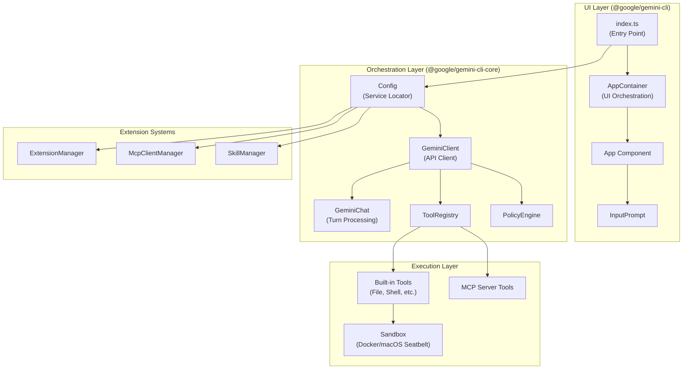

**Layered architecture of Gemini CLI**

The system follows a three-layer design:

1. **UI Layer** (`packages/cli`): Handles terminal rendering and user interactions using React via the Ink framework [packages/cli/package.json:52]().
2. **Orchestration Layer** (`packages/core`): Manages API communication, tool coordination via `ToolRegistry`, and conversation state [packages/core/package.json:2-4]().
3. **Execution Layer**: Runs tools with security policies enforced by `PolicyEngine` and optional sandboxing via `start_sandbox` [packages/cli/src/utils/sandbox.ts:46-51]().

For details, see [Architecture Overview](#1.1).

**Sources:** [package.json:8-10](), [packages/cli/package.json:32-73](), [packages/core/package.json:25-92](), [packages/cli/src/utils/sandbox.ts:46-51]()

---

## Core Packages

The repository is a monorepo containing several specialized packages.

| Package | Purpose |
|---------|---------|
| `@google/gemini-cli` | The main CLI entry point and UI implementation [packages/cli/package.json:2-3]() |
| `@google/gemini-cli-core` | Core logic: API clients, tool registry, and configuration [packages/core/package.json:2-3]() |
| `@google/gemini-cli-a2a-server` | Agent-to-Agent server for multi-agent communication [packages/a2a-server/package.json:2-4]() |
| `gemini-cli-vscode-ide-companion` | VS Code extension for IDE-specific features [packages/vscode-ide-companion/package.json:2-5]() |
| `@google/gemini-cli-test-utils` | Shared testing infrastructure and mocks [packages/test-utils/package.json:2-3]() |
| `@google/gemini-cli-devtools` | Network and console inspector for debugging [package.json:41]() |
| `@google/gemini-cli-sdk` | Programmatic API for embedding Gemini CLI capabilities [package.json:132]() |

For details, see [Package Structure](#1.2).

**Sources:** [package.json:8-12](), [packages/cli/package.json:1-5](), [packages/core/package.json:1-5](), [packages/a2a-server/package.json:1-5](), [packages/vscode-ide-companion/package.json:1-5]()

---

## Key Initialization Flow

```mermaid
sequenceDiagram
    participant User
    participant CLI["@google/gemini-cli"]
    participant Config["Config (Core)"]
    participant Settings["LoadedSettings"]
    participant Ext["ExtensionManager"]
    participant ToolReg["ToolRegistry"]
    
    User->>CLI: Start 'gemini'
    CLI->>Config: Initialize main()
    Config->>Settings: Load hierarchical settings (REPLACE/CONCAT)
    Settings-->>Config: Merged configuration
    Config->>Ext: Load Extensions & .env files
    Config->>ToolReg: Register Core & MCP Tools
    CLI->>CLI: Render UI (Ink/React)
```

**Startup sequence from entry point to ready state**

**Key steps:**
1. **Settings Load**: Merges settings from system, user, workspace, and environment using specific merge strategies like `REPLACE` or `CONCAT` [docs/index.md:73]().
2. **Config Initialization**: Bootstraps the service locator and initializes the application lifecycle [docs/index.md:111-112]().
3. **Tool Registration**: Aggregates built-in tools and those discovered from MCP servers via `McpClientManager` [README.md:25-26]().

**Sources:** [package.json:19-41](), [docs/index.md:1-140](), [packages/cli/package.json:15-25]()

---

## Tool System and Security

Gemini CLI uses a sophisticated tool system that allows the model to interact with the local environment.

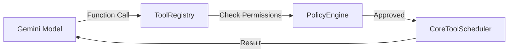

**Tool execution and policy flow**

- **Tools**: Includes file system access, shell commands, and web tools [docs/index.md:31-44]().
- **Policy Engine**: Enforces approval modes and security rules before tool execution [docs/index.md:107-108]().
- **Sandboxing**: Supports running tools in isolated Docker containers or macOS Seatbelt profiles [packages/cli/src/utils/sandbox.ts:59-80](), [README.md:72]().

**Sources:** [README.md:23-24](), [docs/index.md:51-78](), [packages/cli/src/utils/sandbox.ts:46-155]()

---

## Authentication Options

Users can choose between several authentication methods:

| Method | Use Case |
|--------|----------|
| **Sign in with Google** | Individual developers; uses OAuth via Google Account [README.md:150-177]() |
| **Gemini API Key** | Specific model control or paid tier via AI Studio [README.md:178-192]() |
| **Vertex AI** | Enterprise teams and production workloads via Google Cloud [README.md:194-209]() |

**Sources:** [README.md:147-212]()

---

# Page: Architecture Overview

# Architecture Overview

<details>
<summary>Relevant source files</summary>

The following files were used as context for generating this wiki page:

- [docs/cli/settings.md](docs/cli/settings.md)
- [docs/reference/configuration.md](docs/reference/configuration.md)
- [esbuild.config.js](esbuild.config.js)
- [package-lock.json](package-lock.json)
- [package.json](package.json)
- [packages/a2a-server/package.json](packages/a2a-server/package.json)
- [packages/cli/package.json](packages/cli/package.json)
- [packages/cli/src/config/config.test.ts](packages/cli/src/config/config.test.ts)
- [packages/cli/src/config/config.ts](packages/cli/src/config/config.ts)
- [packages/cli/src/config/settings.test.ts](packages/cli/src/config/settings.test.ts)
- [packages/cli/src/config/settings.ts](packages/cli/src/config/settings.ts)
- [packages/cli/src/config/settingsSchema.test.ts](packages/cli/src/config/settingsSchema.test.ts)
- [packages/cli/src/config/settingsSchema.ts](packages/cli/src/config/settingsSchema.ts)
- [packages/cli/src/gemini.test.tsx](packages/cli/src/gemini.test.tsx)
- [packages/cli/src/gemini.tsx](packages/cli/src/gemini.tsx)
- [packages/cli/src/nonInteractiveCli.test.ts](packages/cli/src/nonInteractiveCli.test.ts)
- [packages/cli/src/nonInteractiveCli.ts](packages/cli/src/nonInteractiveCli.ts)
- [packages/cli/src/ui/App.test.tsx](packages/cli/src/ui/App.test.tsx)
- [packages/cli/src/ui/App.tsx](packages/cli/src/ui/App.tsx)
- [packages/cli/src/ui/hooks/useGeminiStream.test.tsx](packages/cli/src/ui/hooks/useGeminiStream.test.tsx)
- [packages/cli/src/ui/hooks/useGeminiStream.ts](packages/cli/src/ui/hooks/useGeminiStream.ts)
- [packages/core/package.json](packages/core/package.json)
- [packages/core/src/config/config.test.ts](packages/core/src/config/config.test.ts)
- [packages/core/src/config/config.ts](packages/core/src/config/config.ts)
- [packages/core/src/config/defaultModelConfigs.ts](packages/core/src/config/defaultModelConfigs.ts)
- [packages/core/src/core/client.test.ts](packages/core/src/core/client.test.ts)
- [packages/core/src/core/client.ts](packages/core/src/core/client.ts)
- [packages/core/src/core/geminiChat.test.ts](packages/core/src/core/geminiChat.test.ts)
- [packages/core/src/core/geminiChat.ts](packages/core/src/core/geminiChat.ts)
- [packages/core/src/core/geminiChat_network_retry.test.ts](packages/core/src/core/geminiChat_network_retry.test.ts)
- [packages/core/src/core/turn.test.ts](packages/core/src/core/turn.test.ts)
- [packages/core/src/core/turn.ts](packages/core/src/core/turn.ts)
- [packages/core/src/index.ts](packages/core/src/index.ts)
- [packages/core/src/services/test-data/resolved-aliases-retry.golden.json](packages/core/src/services/test-data/resolved-aliases-retry.golden.json)
- [packages/core/src/services/test-data/resolved-aliases.golden.json](packages/core/src/services/test-data/resolved-aliases.golden.json)
- [packages/devtools/package.json](packages/devtools/package.json)
- [packages/sdk/package.json](packages/sdk/package.json)
- [packages/test-utils/package.json](packages/test-utils/package.json)
- [packages/vscode-ide-companion/package.json](packages/vscode-ide-companion/package.json)
- [schemas/settings.schema.json](schemas/settings.schema.json)

</details>


## Purpose and Scope

This document provides a comprehensive architectural overview of Gemini CLI, mapping high-level system concepts to concrete code entities. It explains how the major subsystems interact—from initialization through user interaction to API streaming and tool execution.

The architecture is organized around several key patterns:
- **Service Locator**: The `Config` class acts as a central factory for all major services [[packages/core/src/config/config.ts:115-165]]().
- **Event-Driven**: Components communicate via `coreEvents` and `appEvents` [[packages/core/src/utils/events.ts:61]](), [[packages/cli/src/utils/events.ts:80]]().
- **Layered**: UI (`packages/cli`) sits atop orchestration logic (`packages/core`).
- **Extensible**: Plugin system via Extensions and MCP (Model Context Protocol) servers.

## System Architecture Overview

### High-Level Component Organization

Gemini CLI is organized into interconnected subsystems that handle configuration, user interaction, API streaming, tool execution, and extensibility.

**Title: Major System Components and Their Relationships**

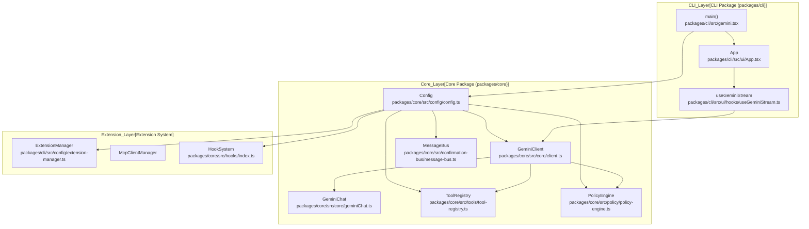

**Sources:** [[packages/cli/src/gemini.tsx:187-230]](), [[packages/core/src/config/config.ts:115-165]](), [[packages/core/src/core/client.ts:115-130]](), [[packages/cli/src/ui/App.tsx:16-38]]()

| Component | Package | Key Responsibilities |
|-----------|---------|---------------------|
| **`Config`** | `packages/core` | Service locator pattern; initializes and provides access to all major subsystems including `ToolRegistry`, `PolicyEngine`, and `HookSystem` [[packages/core/src/config/config.ts:115-165]](). |
| **`GeminiClient`** | `packages/core` | Orchestrates streaming API calls, manages conversation state, coordinates tool execution, and handles loop detection [[packages/core/src/core/client.ts:96-125]](). |
| **`GeminiChat`** | `packages/core` | Manages history, token counts, and interaction with the `@google/genai` SDK [[packages/core/src/core/geminiChat.ts:63-141]](). |
| **`ToolRegistry`** | `packages/core` | Discovers and registers tools from built-in, MCP, and extension sources [[packages/core/src/config/config.ts:25]](). |
| **`PolicyEngine`** | `packages/core` | Enforces security policies, approval modes, and tool allowlists [[packages/core/src/config/config.ts:130]](). |
| **`App`** | `packages/cli` | Root UI component; handles layout selection based on screen reader status and alternate buffer state [[packages/cli/src/ui/App.tsx:16-38]](). |
| **`ExtensionManager`** | `packages/cli` | Loads extensions from multiple locations and manages their lifecycle [[packages/cli/src/config/config.ts:68]](). |

## Configuration and Initialization System

### Startup Sequence and Config Creation

The application initialization follows a precise sequence to ensure all dependencies are available before user interaction begins.

**Title: Initialization Flow from main() to Running Application**

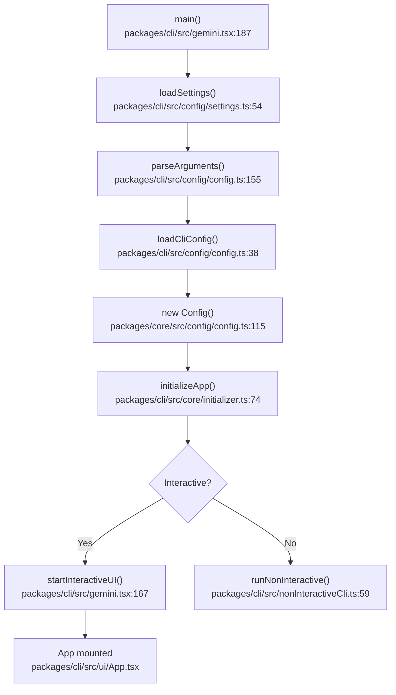

**Sources:** [[packages/cli/src/gemini.tsx:187-230]](), [[packages/cli/src/config/config.ts:155-230]](), [[packages/core/src/config/config.ts:115-130]]()

### Config Class: Service Locator Pattern

The `Config` class acts as a service locator, providing access to all major subsystems. It is constructed once during startup and passed throughout the application.

**Title: Config Class Service Initialization**

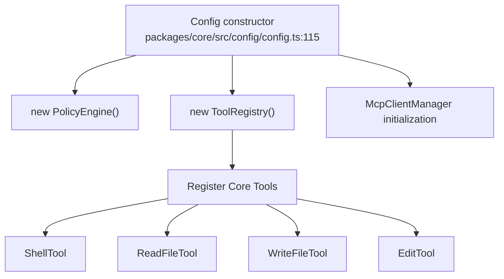

**Sources:** [[packages/core/src/config/config.ts:25-41]](), [[packages/core/src/config/config.ts:115-165]]()

### Settings Hierarchy

Settings are loaded from multiple sources with a clear precedence order:

**Title: Settings Merge Hierarchy**

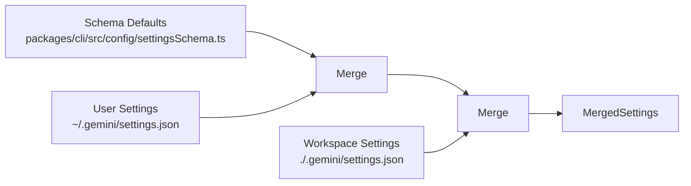

**Sources:** [[packages/cli/src/config/settings.ts:54]](), [[packages/cli/src/config/settingsSchema.ts:157-245]]()

Settings are merged using `MergeStrategy` defined in the schema (REPLACE, CONCAT, UNION, SHALLOW_MERGE) [[packages/cli/src/config/settingsSchema.ts:88-97]]().

## API Client and Streaming Architecture

### GeminiClient: API Orchestration

The `GeminiClient` class orchestrates all interactions with the Gemini API, including streaming responses and tool execution coordination.

**Title: GeminiClient Request Flow**

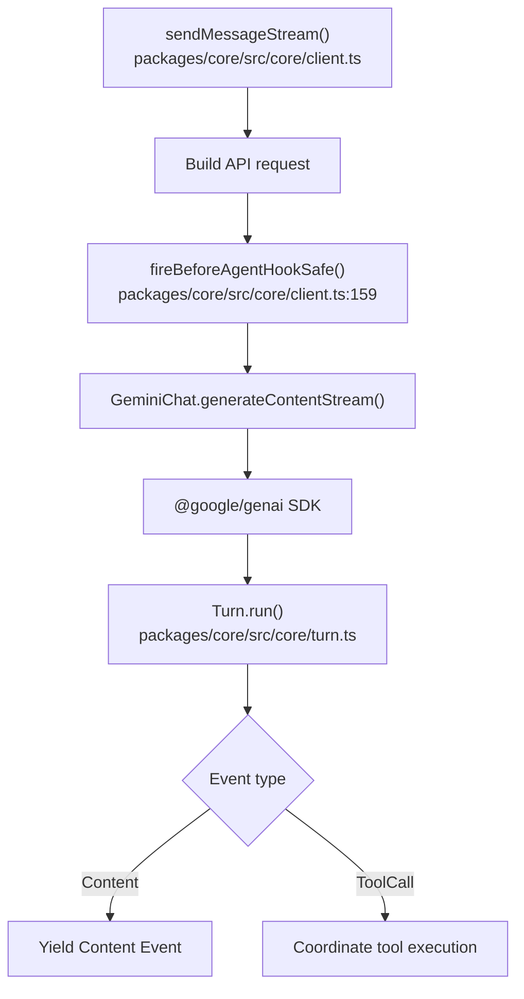

**Sources:** [[packages/core/src/core/client.ts:115-214]](), [[packages/core/src/core/geminiChat.ts:32]]()

### GeminiChat: Session and History Management

The `GeminiChat` class wraps the Google GenAI SDK and manages conversation state. It handles history, token counts, and provides the low-level interface for content generation [[packages/core/src/core/geminiChat.ts:63-141]]().

## Tool Execution Pipeline

### useGeminiStream: Coordination

In the CLI, `useGeminiStream` manages the tool call lifecycle, including tracking statuses (Scheduled, Executing, Success, Error) and handling background tasks [[packages/cli/src/ui/hooks/useGeminiStream.ts:162-201]]().

**Title: Tool Call Execution Flow**

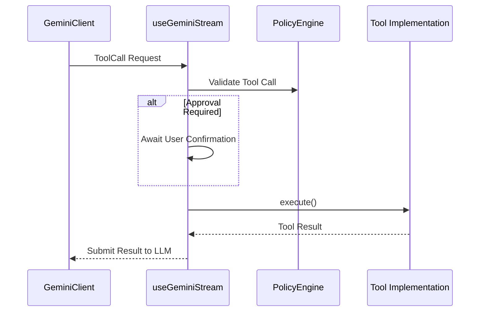

**Sources:** [[packages/cli/src/ui/hooks/useGeminiStream.ts:162-201]](), [[packages/core/src/core/client.ts:115-130]]()

## UI Architecture and State Management

### React Component Hierarchy

The UI is built using React with the Ink rendering framework.

**Title: UI Component Tree and Context Providers**

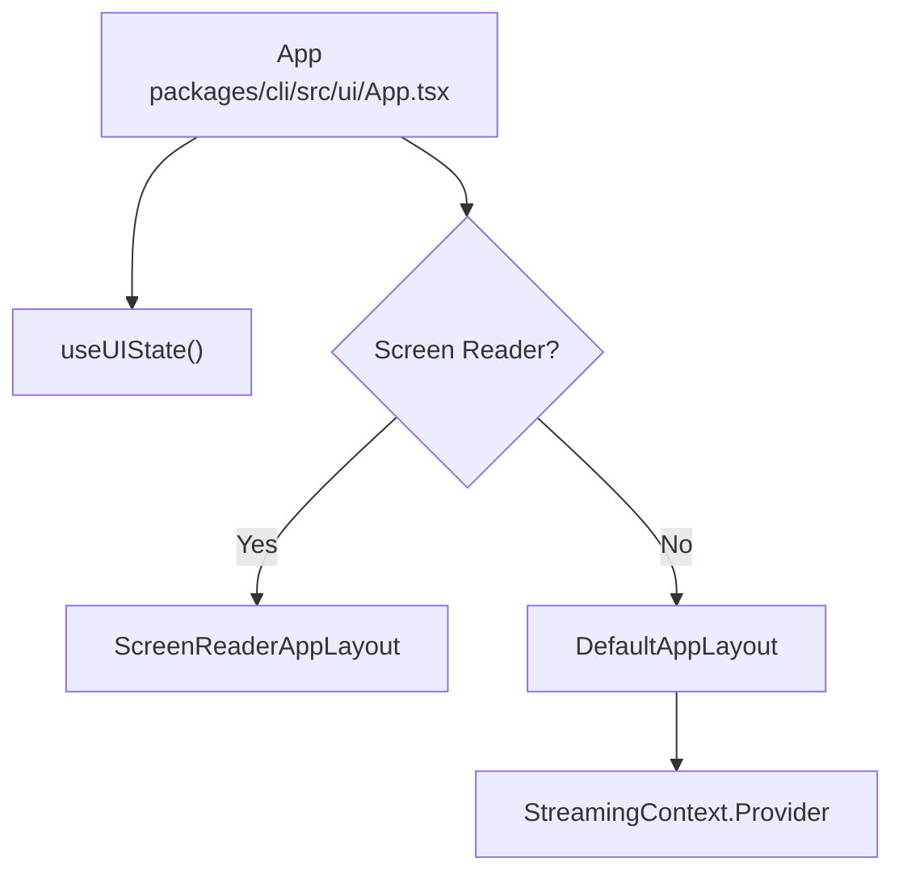

**Sources:** [[packages/cli/src/ui/App.tsx:16-38]](), [[packages/cli/src/ui/hooks/useGeminiStream.ts:207]]()

### Custom Hooks

Complex logic is encapsulated in custom hooks:
- **`useGeminiStream`**: Manages the API stream, command processing (slash/at commands), and tool call lifecycle [[packages/cli/src/ui/hooks/useGeminiStream.ts:207-230]]().
- **`useToolScheduler`**: Manages the state of active and completed tool calls within the UI session [[packages/cli/src/ui/hooks/useGeminiStream.ts:86]]().
- **`useAlternateBuffer`**: Detects if the terminal is currently using the alternate screen buffer [[packages/cli/src/ui/App.tsx:18]]().

## Extension and MCP Integration System

### Extension Discovery and Loading

Extensions are managed by the `ExtensionManager`, which handles discovery and loading from multiple sources [[packages/cli/src/config/config.ts:68]]().

### MCP Server Connections

MCP servers provide dynamic tools and resources. The CLI manages these connections, allowing the Gemini model to invoke external functionality through a standardized protocol [[packages/cli/src/config/config.ts:69]]().

**Sources:** [[packages/cli/src/config/config.ts:68-69]](), [[packages/core/src/config/config.ts:115-165]]()

---

# Page: Package Structure

# Package Structure

<details>
<summary>Relevant source files</summary>

The following files were used as context for generating this wiki page:

- [.vscode/launch.json](.vscode/launch.json)
- [esbuild.config.js](esbuild.config.js)
- [eslint.config.js](eslint.config.js)
- [package-lock.json](package-lock.json)
- [package.json](package.json)
- [packages/a2a-server/package.json](packages/a2a-server/package.json)
- [packages/cli/package.json](packages/cli/package.json)
- [packages/core/package.json](packages/core/package.json)
- [packages/devtools/package.json](packages/devtools/package.json)
- [packages/sdk/package.json](packages/sdk/package.json)
- [packages/test-utils/package.json](packages/test-utils/package.json)
- [packages/vscode-ide-companion/package.json](packages/vscode-ide-companion/package.json)

</details>


This page describes the monorepo layout of the `gemini-cli` repository, covering each workspace package's npm name, entry points, purpose, and inter-package dependencies. For how the packages are compiled and bundled into the final distributable artifact, see [Build System and Bundling](). For the architectural relationships between the major subsystems within these packages, see [Architecture Overview]().

---

## Monorepo Layout

The repository is an npm workspace monorepo. The root `package.json` declares `"workspaces": ["packages/*"]`, making every subdirectory under `packages/` a workspace member.

[package.json:8-10]()

```
gemini-cli/
├── package.json              ← workspace root, also the published npm artifact
├── esbuild.config.js         ← final bundle configuration
├── bundle/                   ← generated: contains gemini.js (the published binary)
├── packages/
│   ├── cli/                  ← @google/gemini-cli
│   ├── core/                 ← @google/gemini-cli-core
│   ├── a2a-server/           ← @google/gemini-cli-a2a-server
│   ├── vscode-ide-companion/ ← gemini-cli-vscode-ide-companion
│   ├── devtools/             ← @google/gemini-cli-devtools
│   ├── sdk/                  ← @google/gemini-cli-sdk
│   └── test-utils/           ← @google/gemini-cli-test-utils (private)
├── integration-tests/
├── scripts/
└── docs/
```

**Sources:** [package.json:8-10]()

---

## Package Summary

| Directory | npm Name | Version | Private | Entry Point | Binary |
|---|---|---|---|---|---|
| `packages/cli` | `@google/gemini-cli` | 0.36.0-nightly | No | `dist/index.js` | `gemini → dist/index.js` |
| `packages/core` | `@google/gemini-cli-core` | 0.36.0-nightly | No | `dist/index.js` | — |
| `packages/a2a-server` | `@google/gemini-cli-a2a-server` | 0.36.0-nightly | No | `dist/index.js` | `gemini-cli-a2a-server → dist/a2a-server.mjs` |
| `packages/vscode-ide-companion` | `gemini-cli-vscode-ide-companion` | 0.36.0-nightly | No | `dist/extension.cjs` | — |
| `packages/devtools` | `@google/gemini-cli-devtools` | 0.36.0-nightly | No | `dist/src/index.js` | — |
| `packages/sdk` | `@google/gemini-cli-sdk` | 0.36.0-nightly | No | `dist/index.js` | — |
| `packages/test-utils` | `@google/gemini-cli-test-utils` | 0.36.0-nightly | Yes | `src/index.ts` | — |

**Sources:** [packages/cli/package.json:2-14](), [packages/core/package.json:2-11](), [packages/a2a-server/package.json:2-14](), [packages/vscode-ide-companion/package.json:2-106](), [packages/devtools/package.json:2-12](), [packages/sdk/package.json:2-12](), [packages/test-utils/package.json:2-6]()

---

## Inter-Package Dependency Graph

The following diagram illustrates the internal dependency flow within the monorepo. Note that `core` serves as the foundation for almost all other packages.

**Package dependency relationships**

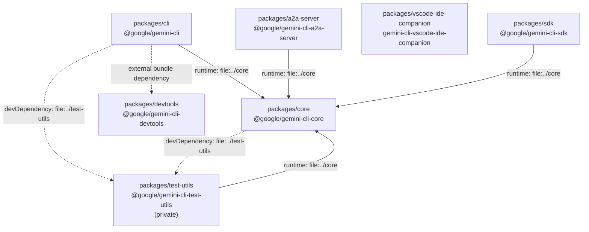

**Sources:** [packages/cli/package.json:34-34](), [packages/a2a-server/package.json:30-30](), [packages/sdk/package.json:25-25](), [packages/test-utils/package.json:13-13](), [esbuild.config.js:57-67]()

---

## Build Artifact Flow

This diagram maps source entry points to their bundled outputs, highlighting how `esbuild` processes the different packages.

**How workspace packages are bundled into the published artifact**

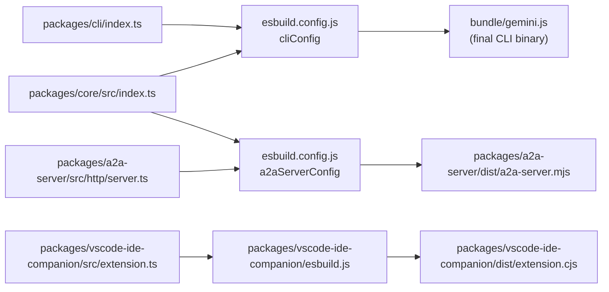

**Sources:** [esbuild.config.js:82-101](), [esbuild.config.js:106-120](), [packages/vscode-ide-companion/package.json:106-112]()

The root workspace `bundle/gemini.js` is the published binary referenced by `"bin": {"gemini": "bundle/gemini.js"}` in the root `package.json`. The esbuild step inlines `packages/cli` and `packages/core` into this single file. The `@google/gemini-cli-devtools` package is marked as external in the bundle and loaded dynamically at runtime.

[esbuild.config.js:82-101](), [package.json:81-83](), [esbuild.config.js:57-67]()

---

## packages/cli

**npm name:** `@google/gemini-cli`  
**Role:** Terminal UI layer. Handles argument parsing, the interactive REPL (built with `ink` and `react`), slash command dispatch, session management, and the VS Code IDE bridge.

Key entry points:
- Source root: `packages/cli/index.ts` (consumed by esbuild)
- Compiled library: `packages/cli/dist/index.js`
- Binary: `gemini`

Notable runtime dependencies:

| Dependency | Purpose |
|---|---|
| `@google/gemini-cli-core` | Core business logic (Config, GeminiClient, tools) |
| `ink` (`@jrichman/ink`) | React-based terminal UI rendering |
| `react` | UI component model |
| `yargs` | CLI argument parsing |
| `@iarna/toml` | TOML parsing for custom command configs |
| `@modelcontextprotocol/sdk` | MCP client transport integration |
| `@agentclientprotocol/sdk` | Agent-to-Agent protocol types |
| `ws` | WebSocket for IDE companion bridge |
| `prompts` | Interactive prompt dialogs (auth, settings) |
| `diff` | File diff rendering |
| `zod` | Settings schema validation |
| `@google/genai` | Gemini API SDK (re-exported from core) |

**Sources:** [packages/cli/package.json:32-72]()

---

## packages/core

**npm name:** `@google/gemini-cli-core`  
**Role:** Backend logic shared across `cli`, `a2a-server`, and `sdk`. Contains the `Config` class, `GeminiClient`/`GeminiChat`, tool implementations, MCP client manager, authentication, telemetry, settings loading, and system prompt generation.

Key entry point:
- Compiled library: `packages/core/dist/index.js`
- No binary

Notable runtime dependencies:

| Dependency | Purpose |
|---|---|
| `@google/genai` | Gemini API SDK (ContentGenerator wrapper) |
| `@modelcontextprotocol/sdk` | MCP server connections (McpClient) |
| `google-auth-library` | OAuth2 / ADC authentication flows |
| `@opentelemetry/*` | Telemetry traces, metrics, logs |
| `@google-cloud/logging` | Cloud Logging for Clearcut backend |
| `web-tree-sitter`, `tree-sitter-bash` | Shell syntax parsing |
| `zod`, `zod-to-json-schema` | Tool schema validation |
| `ajv`, `ajv-formats` | JSON schema validation for settings |
| `fdir`, `glob`, `picomatch` | File system traversal |
| `@a2a-js/sdk` | Agent-to-Agent protocol types |
| `@xterm/headless` | Headless terminal emulation for PTY |
| `dotenv`, `dotenv-expand` | Environment variable loading |

**Sources:** [packages/core/package.json:25-91]()

---

## packages/a2a-server

**npm name:** `@google/gemini-cli-a2a-server`  
**Role:** HTTP server that exposes the CLI agent as an Agent-to-Agent (A2A) protocol endpoint. Uses `@a2a-js/sdk` for the protocol implementation and delegates all agent logic to `@google/gemini-cli-core`.

Key entry points:
- Source: `packages/a2a-server/src/http/server.ts` (consumed by esbuild)
- Compiled library: `packages/a2a-server/dist/index.js`
- Compiled binary bundle: `packages/a2a-server/dist/a2a-server.mjs`
- Binary command: `gemini-cli-a2a-server`

Notable runtime dependencies:

| Dependency | Purpose |
|---|---|
| `@google/gemini-cli-core` | Config, GeminiClient, tool execution |
| `@a2a-js/sdk` | A2A protocol implementation and types |
| `express` | HTTP server framework |
| `@google-cloud/storage` | Session artifact storage in GCS |
| `winston` | Structured logging |
| `tar` | Workspace archive creation and extraction |

**Sources:** [packages/a2a-server/package.json:27-37]()

---

## packages/vscode-ide-companion

**npm name:** `gemini-cli-vscode-ide-companion`  
**Role:** VS Code extension that pairs with a running Gemini CLI process to provide IDE-native diff viewing and workspace context. Implements an MCP server that exposes VS Code APIs to the CLI.

Key entry points:
- Source: `packages/vscode-ide-companion/src/extension.ts`
- Compiled output: `packages/vscode-ide-companion/dist/extension.cjs`
- VS Code activation event: `onStartupFinished` [packages/vscode-ide-companion/package.json:30-32]()

**Sources:** [packages/vscode-ide-companion/package.json:1-145]()

---

## packages/sdk

**npm name:** `@google/gemini-cli-sdk`  
**Role:** Provides a programmatic interface for embedding Gemini CLI capabilities into other Node.js applications. It wraps the core agent logic for easier consumption without the TUI.

Key entry point:
- Compiled library: `packages/sdk/dist/index.js` [packages/sdk/package.json:11-11]()

**Sources:** [packages/sdk/package.json:1-36]()

---

## packages/devtools

**npm name:** `@google/gemini-cli-devtools`  
**Role:** Provides debugging and inspection tools for CLI developers. It includes a WebSocket server and a client-side inspector (React-based) to monitor network activity and internal CLI state.

Key entry point:
- Compiled library: `packages/devtools/dist/src/index.js` [packages/devtools/package.json:6-6]()
- Client build: `packages/devtools/client/index.html` [packages/devtools/package.json:20-20]()

**Sources:** [packages/devtools/package.json:1-32]()

---

## packages/test-utils

**npm name:** `@google/gemini-cli-test-utils`  
**Private:** Yes (not published to npm)  
**Role:** Shared test infrastructure for `packages/cli` and `packages/core`. Provides utilities for creating and cleaning temporary file systems, mocking PTY interactions, and sanitizing ANSI output in tests.

Key entry point:
- Source (not pre-compiled): `src/index.ts` [packages/test-utils/package.json:5-5]()

**Sources:** [packages/test-utils/package.json:12-17]()

---

## Root Workspace

The root `package.json` serves two roles:

1. **Workspace coordinator:** Declares `"workspaces": ["packages/*"]`, managing shared `node_modules` hoisting and cross-package `npm run` commands. [package.json:8-10]()
2. **Published npm artifact:** After the `bundle` step runs `esbuild.config.js`, the `bundle/` directory contains `gemini.js`. The root package's `"files": ["bundle/", "README.md", "LICENSE"]` and `"bin": {"gemini": "bundle/gemini.js"}` define what gets published. [package.json:81-88]()

The `"prepare"` script runs `npm run bundle`, so `bundle/gemini.js` is regenerated on install. [package.json:62]()

Root-level optional dependencies (`@lydell/node-pty-*`, `keytar`) are native binaries kept external from the esbuild bundle and loaded at runtime. [package.json:145-154](), [esbuild.config.js:57-67]()

**Sources:** [package.json:1-167](), [esbuild.config.js:57-131]()

---

# Page: Getting Started

# Getting Started

<details>
<summary>Relevant source files</summary>

The following files were used as context for generating this wiki page:

- [CONTRIBUTING.md](CONTRIBUTING.md)
- [Dockerfile](Dockerfile)
- [README.md](README.md)
- [docs/cli/custom-commands.md](docs/cli/custom-commands.md)
- [docs/cli/sandbox.md](docs/cli/sandbox.md)
- [docs/get-started/index.md](docs/get-started/index.md)
- [docs/index.md](docs/index.md)
- [docs/redirects.json](docs/redirects.json)
- [docs/reference/tools.md](docs/reference/tools.md)
- [docs/sidebar.json](docs/sidebar.json)
- [docs/tools/file-system.md](docs/tools/file-system.md)
- [docs/tools/memory.md](docs/tools/memory.md)
- [docs/tools/shell.md](docs/tools/shell.md)
- [docs/tools/web-fetch.md](docs/tools/web-fetch.md)
- [docs/tools/web-search.md](docs/tools/web-search.md)
- [packages/cli/src/config/auth.test.ts](packages/cli/src/config/auth.test.ts)
- [packages/cli/src/config/auth.ts](packages/cli/src/config/auth.ts)
- [packages/cli/src/config/sandboxConfig.test.ts](packages/cli/src/config/sandboxConfig.test.ts)
- [packages/cli/src/config/sandboxConfig.ts](packages/cli/src/config/sandboxConfig.ts)
- [packages/cli/src/utils/sandbox.test.ts](packages/cli/src/utils/sandbox.test.ts)
- [packages/cli/src/utils/sandbox.ts](packages/cli/src/utils/sandbox.ts)
- [scripts/review.sh](scripts/review.sh)

</details>


This page guides new users through installing Gemini CLI, authenticating with Google's Gemini models, and configuring the system for first use. By the end of this guide, you will have a working installation ready for interactive development sessions.

For detailed information about specific topics:
- Installation methods and system requirements: See [Installation and Setup](#2.1)
- Authentication configuration and credential management: See [Authentication](#2.2)  
- Advanced configuration options and settings hierarchy: See [Basic Configuration](#2.3)

## Prerequisites

Gemini CLI requires:
- **Node.js** version 20 or higher (recommended for slim environments) [Dockerfile:1]()
- **npm** (or equivalent package manager) [README.md:45-49]()
- A Google account or API key for authentication [README.md:146-212]()
- Terminal access with shell capabilities (bash on Linux/macOS, PowerShell on Windows) [docs/tools/shell.md:9-11]()

**Sources:** [README.md:30-212](), [Dockerfile:1](), [docs/tools/shell.md:9-11]()

## Installation Options

Gemini CLI can be installed through multiple package managers. Choose the method that best fits your environment:

| Method | Command | Best For |
|--------|---------|----------|
| **npx (no install)** | `npx @google/gemini-cli` | Quick testing, one-time use [README.md:42]() |
| **npm global** | `npm install -g @google/gemini-cli` | Standard installation [README.md:48]() |
| **Homebrew** | `brew install gemini-cli` | macOS/Linux system integration [README.md:54]() |
| **MacPorts** | `sudo port install gemini-cli` | macOS with MacPorts [README.md:60]() |
| **Anaconda** | `conda create -n gemini_env nodejs && npm install -g @google/gemini-cli` | Restricted environments [README.md:67-71]() |

### Release Channels

The project maintains three release channels with different stability guarantees:

| Tag | Update Schedule | Stability | Installation |
|-----|----------------|-----------|--------------|
| `@latest` | Tuesday 20:00 UTC | Stable, fully validated [README.md:90-95]() | `npm install -g @google/gemini-cli@latest` |
| `@preview` | Tuesday 23:59 UTC | Preview, weekly updates [README.md:78-85]() | `npm install -g @google/gemini-cli@preview` |
| `@nightly` | Daily 00:00 UTC | Experimental, main branch [README.md:98-105]() | `npm install -g @google/gemini-cli@nightly` |

**Sources:** [README.md:30-106]()

## First Run and Authentication Flow

### Startup Sequence

When you run `gemini` for the first time, the application initializes through a well-defined sequence. The CLI validates environment variables and settings to determine the active authentication method via `validateAuthMethod` [packages/cli/src/config/auth.ts:10-46]().

**Initialization Flow Diagram**

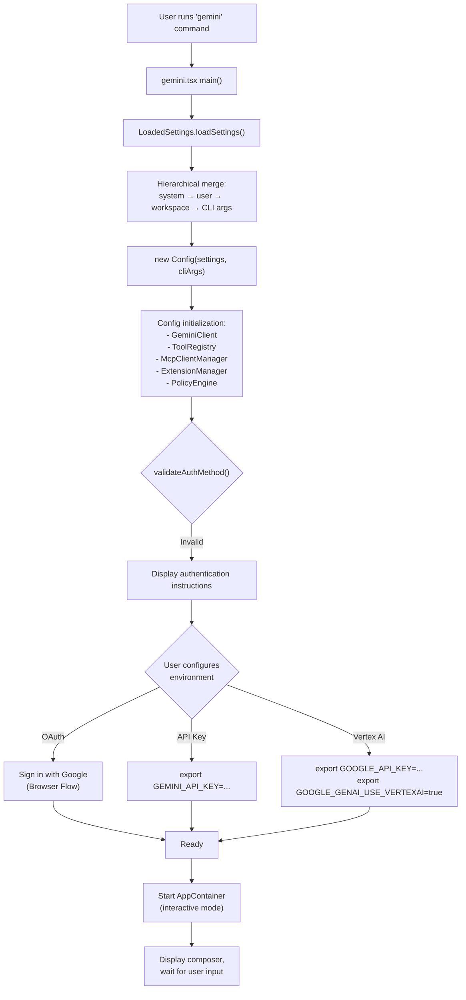

**Sources:** [packages/cli/src/config/auth.ts:10-46](), [README.md:146-212]()

### Authentication Methods

Gemini CLI supports three primary authentication mechanisms, validated in `packages/cli/src/config/auth.ts`.

**Authentication Code Entity Mapping**

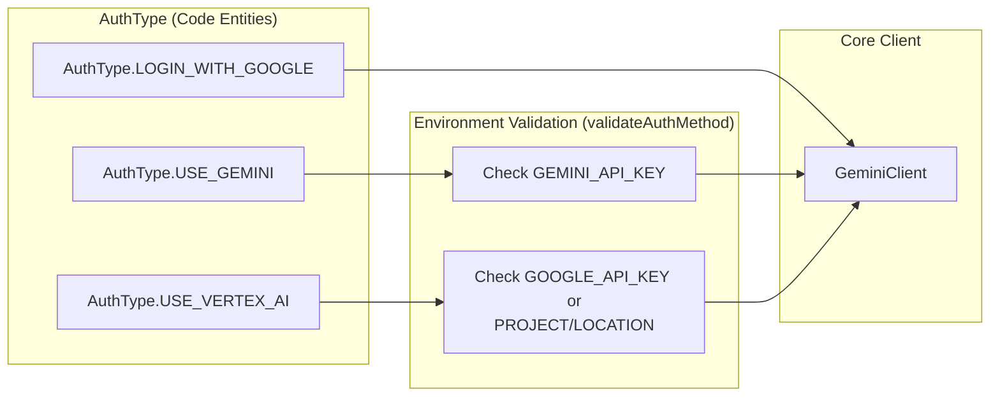

**Sources:** [packages/cli/src/config/auth.ts:10-46](), [README.md:146-212]()

#### Option 1: Sign in with Google (OAuth)
Best for individual developers. No API key management is required.
- **Setup:** Run `gemini` and follow the browser prompt [README.md:164-168]().
- **Enterprise Note:** If using a paid Code Assist License, set `GOOGLE_CLOUD_PROJECT` [README.md:170-176]().

#### Option 2: Gemini API Key
Best for specific model control or paid tier access.
- **Requirement:** `GEMINI_API_KEY` environment variable [packages/cli/src/config/auth.ts:20-27]().
- **Setup:** `export GEMINI_API_KEY="YOUR_API_KEY"` [README.md:188-192]().

#### Option 3: Vertex AI
Best for enterprise teams and production workloads.
- **Requirement:** `GOOGLE_API_KEY` or both `GOOGLE_CLOUD_PROJECT` and `GOOGLE_CLOUD_LOCATION` [packages/cli/src/config/auth.ts:29-43]().
- **Setup:** `export GOOGLE_GENAI_USE_VERTEXAI=true` [README.md:204-209]().

**Sources:** [packages/cli/src/config/auth.ts:10-46](), [README.md:146-212]()

## Configuration System Overview

### Essential Directory Structure

Gemini CLI uses a hierarchical context and settings system. Global state is typically stored in the user's home directory.

- **Global Config:** `~/.gemini/settings.json` [packages/cli/src/utils/sandbox.ts:26]()
- **Global Memory:** `~/.gemini/GEMINI.md` [README.md:130]()
- **Project Context:** `GEMINI.md` files in the workspace root provide project-specific instructions [README.md:130]().

**Sources:** [packages/cli/src/utils/sandbox.ts:26](), [README.md:130]()

### Key Built-in Tools

Upon startup, the CLI provides several core tools for the model to interact with your system:

| Tool Name | Purpose | File Mapping |
|-----------|---------|--------------|
| `run_shell_command` | Execute shell commands (bash/powershell) | [docs/tools/shell.md:1-6]() |
| `read_file` | Read local file contents | [docs/tools/file-system.md:22-32]() |
| `write_file` | Create or overwrite files | [docs/tools/file-system.md:33-42]() |
| `google_web_search` | Retrieve real-time info from Google | [README.md:126-128]() |
| `replace` | Precise targeted text replacement | [docs/tools/file-system.md:106-122]() |

**Sources:** [docs/tools/shell.md](), [docs/tools/file-system.md](), [README.md]()

## Verification and First Session

### Verifying Installation

Verify the installation and environment validation:

```bash
# Start interactive session
gemini
```

If environment variables are missing for your chosen method, `validateAuthMethod` will return a descriptive error message guiding you on which variables to set [packages/cli/src/config/auth.ts:21-41]().

### Basic Interaction

Once authenticated, you can use the terminal-first interface to:
- **Query Codebases:** Ask about existing logic or structure [README.md:112]().
- **Automate Tasks:** Run shell commands or perform complex rebases [README.md:118-120]().
- **Grounding:** Use Google Search for real-time information [README.md:126-128]().

**Sources:** [README.md:108-145](), [packages/cli/src/config/auth.ts:10-46]()

## Next Steps

1. **Installation and Setup:** Detailed OS-specific guides [Installation and Setup](#2.1).
2. **Authentication:** Deep dive into enterprise vs. personal auth [Authentication](#2.2).
3. **Basic Configuration:** Learn about `.geminiignore` and `settings.json` [Basic Configuration](#2.3).
4. **User Guide:** Start using specialized [Agent Skills and Sub-agents](#3.11) or [MCP Server Integration](#3.7).

---

# Page: Installation and Setup

# Installation and Setup

<details>
<summary>Relevant source files</summary>

The following files were used as context for generating this wiki page:

- [CONTRIBUTING.md](CONTRIBUTING.md)
- [Dockerfile](Dockerfile)
- [README.md](README.md)
- [docs/cli/custom-commands.md](docs/cli/custom-commands.md)
- [docs/cli/sandbox.md](docs/cli/sandbox.md)
- [docs/get-started/installation.md](docs/get-started/installation.md)
- [docs/hooks/best-practices.md](docs/hooks/best-practices.md)
- [docs/hooks/index.md](docs/hooks/index.md)
- [docs/hooks/reference.md](docs/hooks/reference.md)
- [docs/hooks/writing-hooks.md](docs/hooks/writing-hooks.md)
- [esbuild.config.js](esbuild.config.js)
- [package-lock.json](package-lock.json)
- [package.json](package.json)
- [packages/a2a-server/package.json](packages/a2a-server/package.json)
- [packages/cli/package.json](packages/cli/package.json)
- [packages/cli/src/commands/hooks/migrate.test.ts](packages/cli/src/commands/hooks/migrate.test.ts)
- [packages/cli/src/commands/hooks/migrate.ts](packages/cli/src/commands/hooks/migrate.ts)
- [packages/cli/src/config/sandboxConfig.test.ts](packages/cli/src/config/sandboxConfig.test.ts)
- [packages/cli/src/config/sandboxConfig.ts](packages/cli/src/config/sandboxConfig.ts)
- [packages/cli/src/ui/commands/hooksCommand.test.ts](packages/cli/src/ui/commands/hooksCommand.test.ts)
- [packages/cli/src/ui/commands/hooksCommand.ts](packages/cli/src/ui/commands/hooksCommand.ts)
- [packages/cli/src/utils/sandbox.test.ts](packages/cli/src/utils/sandbox.test.ts)
- [packages/cli/src/utils/sandbox.ts](packages/cli/src/utils/sandbox.ts)
- [packages/core/package.json](packages/core/package.json)
- [packages/devtools/package.json](packages/devtools/package.json)
- [packages/sdk/package.json](packages/sdk/package.json)
- [packages/test-utils/package.json](packages/test-utils/package.json)
- [packages/vscode-ide-companion/package.json](packages/vscode-ide-companion/package.json)
- [scripts/review.sh](scripts/review.sh)

</details>


This page covers how to install `gemini-cli`, its system prerequisites, the available release channels, how to build from source, and what to expect on first launch.

For authentication details (Google OAuth, API keys, Vertex AI), see [Authentication](#2.2). For configuration via `settings.json` and environment variables, see [Basic Configuration](#2.3). For setting up a development environment to contribute to the project, see [Development Setup](#6.1).

---

## Prerequisites

| Requirement | Version | Notes |
|---|---|---|
| Node.js | `>= 20.0.0` | Enforced by `engines` field in [package.json:4-6]() |
| npm | Bundled with Node.js | Required for all npm-based install methods |
| Git | Any | Required for source builds and `simple-git` integration [package.json:144]() |

The minimum Node.js version is declared in [package.json:4-6](). All packages in the monorepo enforce this constraint via their individual `package.json` files: [packages/cli/package.json:88-90](), [packages/core/package.json:114-116](), [packages/a2a-server/package.json:49-51]().

### Optional Native Dependencies

These packages are listed as `optionalDependencies` in [package.json:146-155](). They provide enhanced functionality when a compatible native build environment is available and degrade gracefully if missing.

| Package | Purpose | Fallback Behavior |
|---|---|---|
| `@lydell/node-pty` | PTY-based interactive shell execution | Falls back to standard `child_process` [package.json:147-152]() |
| `keytar` | OS keychain credential storage | Falls back to file-based storage in `~/.gemini/` [package.json:153]() |

Sources: [package.json:4-6](), [package.json:146-155](), [packages/cli/package.json:88-90](), [packages/core/package.json:114-116]()

---

## Installation Methods

### Run Without Installing (npx)

```bash
npx @google/gemini-cli
```
Fetches and runs the current `latest` release from the npm registry with no permanent install [README.md:38-43]().

### Global npm Install

```bash
npm install -g @google/gemini-cli
```
Installs the `gemini` binary into the global npm prefix so it is available in `PATH` [README.md:45-49]().

### Homebrew (macOS and Linux)

```bash
brew install gemini-cli
```
[README.md:51-55]()

### MacPorts (macOS)

```bash
sudo port install gemini-cli
```
[README.md:57-61]()

### Anaconda (Restricted Environments)

```bash
conda create -y -n gemini_env -c conda-forge nodejs
conda activate gemini_env
npm install -g @google/gemini-cli
```
Useful in environments where system-level Node.js access is restricted [README.md:63-72]().

---

## Release Channels

The npm package is published under three dist-tags. Select the tag that matches your stability requirements:

| Tag | Cadence | Install Command | Notes |
|---|---|---|---|
| `latest` | Weekly, Tuesday UTC 20:00 | `npm install -g @google/gemini-cli@latest` | Fully validated stable release [README.md:88-96](). |
| `preview` | Weekly, Tuesday UTC 23:59 | `npm install -g @google/gemini-cli@preview` | Weekly preview of new features [README.md:78-86](). |
| `nightly` | Daily, UTC 00:00 | `npm install -g @google/gemini-cli@nightly` | Snapshot of `main` branch [README.md:98-106](). |

Sources: [README.md:74-106]()

---

## Package Architecture and Bundling

The monorepo structure separates core logic from the CLI implementation. The `esbuild.config.js` file manages the bundling of these components into the final executable artifacts.

**Diagram: Package Dependency and Bundling Flow**

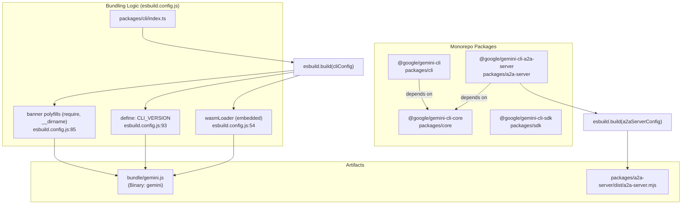

The `bundle/` directory contains the standalone ESM bundle. Native modules like `node-pty` and `keytar` are marked as `external` in the build config to prevent bundling errors with native C++ code [esbuild.config.js:57-67]().

Sources: [package.json:82-84](), [esbuild.config.js:57-120](), [packages/cli/package.json:32-37]()

---

## Building from Source

To run a locally modified build or contribute, use the following workflow:

```bash
git clone https://github.com/google-gemini/gemini-cli.git
cd gemini-cli
npm install      # Installs all workspace dependencies
npm run build    # Compiles TypeScript across all packages [package.json:34]
```

### Sandbox Environments
The CLI supports containerized tool execution. The `scripts/build_sandbox.js` script automates the creation of these environments [package.json:39]().

**Diagram: Sandbox Image Construction**

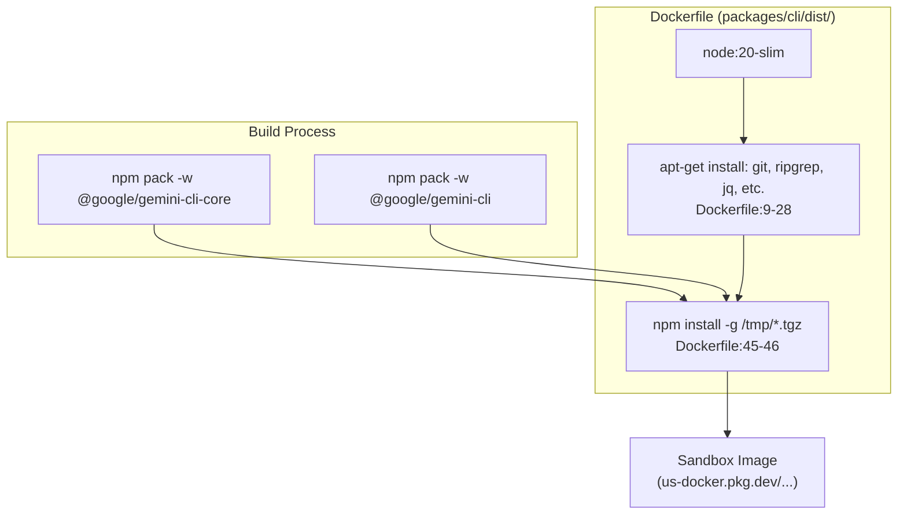

The sandbox configuration can be adjusted via `process.env.GEMINI_SANDBOX`, supporting `docker`, `podman`, or `sandbox-exec` (macOS Seatbelt) [packages/cli/src/utils/sandbox.ts:59-67]().

Sources: [package.json:34-41](), [Dockerfile:1-53](), [packages/cli/src/utils/sandbox.ts:46-80]()

---

## First Launch and Setup

After installation, start the CLI with the `gemini` command.

### Initial Configuration
On first run, the CLI initializes the `~/.gemini/` directory. The application lifecycle begins at the entry point defined in `packages/cli/index.ts`.

### Authentication Options
The CLI will prompt for one of three authentication methods [README.md:146-209]():

1.  **Sign in with Google**: Best for individuals. Uses OAuth browser flow [README.md:150-168]().
2.  **Gemini API Key**: Best for specific model control. Requires `GEMINI_API_KEY` [README.md:178-192]().
3.  **Vertex AI**: Best for enterprise. Requires `GOOGLE_API_KEY` and `GOOGLE_GENAI_USE_VERTEXAI=true` [README.md:194-209]().

### Verification
Confirm the installation and view environment details using built-in commands:
- `/about`: Displays version and build info.
- `/help`: Lists available commands and tools.

Sources: [README.md:146-209](), [packages/cli/package.json:12-14](), [esbuild.config.js:87]()

---

# Page: Authentication

# Authentication

<details>
<summary>Relevant source files</summary>

The following files were used as context for generating this wiki page:

- [packages/cli/src/config/auth.test.ts](packages/cli/src/config/auth.test.ts)
- [packages/cli/src/config/auth.ts](packages/cli/src/config/auth.ts)
- [packages/core/src/code_assist/codeAssist.test.ts](packages/core/src/code_assist/codeAssist.test.ts)
- [packages/core/src/code_assist/codeAssist.ts](packages/core/src/code_assist/codeAssist.ts)
- [packages/core/src/code_assist/converter.test.ts](packages/core/src/code_assist/converter.test.ts)
- [packages/core/src/code_assist/converter.ts](packages/core/src/code_assist/converter.ts)
- [packages/core/src/code_assist/oauth2.test.ts](packages/core/src/code_assist/oauth2.test.ts)
- [packages/core/src/code_assist/oauth2.ts](packages/core/src/code_assist/oauth2.ts)
- [packages/core/src/code_assist/server.test.ts](packages/core/src/code_assist/server.test.ts)
- [packages/core/src/code_assist/server.ts](packages/core/src/code_assist/server.ts)
- [packages/core/src/code_assist/setup.test.ts](packages/core/src/code_assist/setup.test.ts)
- [packages/core/src/code_assist/setup.ts](packages/core/src/code_assist/setup.ts)
- [packages/core/src/code_assist/telemetry.test.ts](packages/core/src/code_assist/telemetry.test.ts)
- [packages/core/src/code_assist/telemetry.ts](packages/core/src/code_assist/telemetry.ts)
- [packages/core/src/code_assist/types.ts](packages/core/src/code_assist/types.ts)
- [packages/core/src/core/contentGenerator.test.ts](packages/core/src/core/contentGenerator.test.ts)
- [packages/core/src/core/contentGenerator.ts](packages/core/src/core/contentGenerator.ts)
- [packages/core/src/telemetry/loggers.test.circular.ts](packages/core/src/telemetry/loggers.test.circular.ts)
- [packages/core/src/utils/surface.ts](packages/core/src/utils/surface.ts)

</details>


## Purpose and Scope

This document describes the authentication system in Gemini CLI, covering how the application authenticates with Google services to access Gemini models. It explains the primary authentication methods, the internal logic for detecting and configuring them, and the data flow between user credentials and the `ContentGenerator`.

For information about policy enforcement and security controls, see [Security and Approval System (5.5)](). For general configuration, see [Basic Configuration (2.3)]().

## Authentication Methods Overview

Gemini CLI supports several authentication methods defined by the `AuthType` enum [packages/core/src/core/contentGenerator.ts:59-66]().

| Method | `AuthType` | Primary Use Case | Credential Source |
| :--- | :--- | :--- | :--- |
| **Login with Google** | `oauth-personal` | Individual developers, Code Assist licenses | Interactive OAuth 2.0 browser flow |
| **Gemini API Key** | `gemini-api-key` | Developers using AI Studio keys | `GEMINI_API_KEY` environment variable |
| **Vertex AI** | `vertex-ai` | Enterprise workloads on Google Cloud | ADC or `GOOGLE_API_KEY` |
| **Compute ADC** | `compute-default-credentials` | Cloud Shell, GCE, or local ADC | Metadata server / `gcloud auth application-default login` |

**Sources:**
- [packages/core/src/core/contentGenerator.ts:59-66]()
- [packages/cli/src/config/auth.ts:10-46]()

## Authentication Flow and Detection

The CLI automatically detects the best authentication type based on environment variables using `getAuthTypeFromEnv()` [packages/core/src/core/contentGenerator.ts:76-93]().

### Natural Language to Code Entity Space: Authentication Logic

The following diagram maps high-level authentication concepts to the specific code entities that implement them.

```mermaid
graph TD
    subgraph "Natural Language Space"
        UserAuth["User Authentication"]
        EnvDetect["Environment Detection"]
        OAuthFlow["Interactive Login"]
        UserOnboarding["User Setup & Tiers"]
    end

    subgraph "Code Entity Space"
        AuthType["AuthType (Enum)"]
        GetAuthEnv["getAuthTypeFromEnv()"]
        InitOauth["initOauthClient()"]
        SetupUser["setupUser()"]
        CodeAssistServer["CodeAssistServer (Class)"]
    end

    UserAuth --- AuthType
    EnvDetect --- GetAuthEnv
    OAuthFlow --- InitOauth
    UserOnboarding --- SetupUser
    UserOnboarding --- CodeAssistServer

    [packages/core/src/core/contentGenerator.ts:59-66] --- AuthType
    [packages/core/src/core/contentGenerator.ts:76-93] --- GetAuthEnv
    [packages/core/src/code_assist/oauth2.ts:112-166] --- InitOauth
    [packages/core/src/code_assist/setup.ts:115-135] --- SetupUser
    [packages/core/src/code_assist/server.ts:77-87] --- CodeAssistServer
```

**Sources:**
- [packages/core/src/core/contentGenerator.ts:59-93]()
- [packages/core/src/code_assist/oauth2.ts:112-166]()
- [packages/core/src/code_assist/setup.ts:115-135]()

## Authentication Implementation Details

### OAuth 2.0 Flow (Login with Google)

The OAuth flow is managed in `packages/core/src/code_assist/oauth2.ts`. It uses a specific Client ID and Secret for the "installed application" flow [packages/core/src/code_assist/oauth2.ts:72-81]().

1.  **Client Initialization**: `initOauthClient` checks for cached credentials in `~/.gemini/tokens.json` or encrypted storage [packages/core/src/code_assist/oauth2.ts:116-163]().
2.  **Interactive Login**: If no valid credentials exist, `getOauthClient` initiates a local HTTP server to capture the authorization code after the user completes the browser flow [packages/core/src/code_assist/oauth2.ts:268-300]().
3.  **Token Management**: Upon receiving tokens, the client triggers `triggerPostAuthCallbacks` to notify the system of the new `JWTInput` [packages/core/src/code_assist/oauth2.ts:54-67]().

### Code Assist and User Setup

For `LOGIN_WITH_GOOGLE` and `COMPUTE_ADC`, the CLI performs an additional setup step via `setupUser()` [packages/core/src/code_assist/setup.ts:115-135]().

- **Tier Detection**: It calls `loadCodeAssist` to determine if the user is on a `FREE`, `STANDARD`, or `PAID` tier [packages/core/src/code_assist/setup.ts:164-171]().
- **Project Validation**: If the account requires a Google Cloud Project but none is found in environment variables (`GOOGLE_CLOUD_PROJECT`), it throws a `ProjectIdRequiredError` [packages/core/src/code_assist/setup.ts:30-37]().
- **Onboarding**: If the user hasn't onboarded, the system can trigger the onboarding flow to associate the account with a project [packages/core/src/code_assist/setup.ts:210-227]().

### Data Flow: Credential Retrieval

This diagram shows how credentials flow from various sources into the `ContentGenerator`.

```mermaid
graph LR
    subgraph "Sources"
        Env["Env Vars<br/>(GEMINI_API_KEY)"]
        Cache["Local Cache<br/>(tokens.json)"]
        ADC["Metadata Server<br/>(Compute ADC)"]
    end

    subgraph "Processing: contentGenerator.ts"
        ConfigGen["createContentGeneratorConfig()"]
        CreateGen["createContentGenerator()"]
    end

    subgraph "Implementation"
        CAServer["CodeAssistServer"]
        GenAI["GoogleGenAI SDK"]
    end

    Env --> ConfigGen
    Cache --> ConfigGen
    ADC --> ConfigGen
    ConfigGen --> CreateGen
    CreateGen --> CAServer
    CreateGen --> GenAI

    [packages/core/src/core/contentGenerator.ts:104-163]() --- ConfigGen
    [packages/core/src/core/contentGenerator.ts:165-240]() --- CreateGen
```

**Sources:**
- [packages/core/src/core/contentGenerator.ts:104-240]()
- [packages/core/src/code_assist/oauth2.ts:204-216]()

## Environment Variables Reference

The authentication system prioritizes variables in the following order:

| Variable | Purpose | Method |
| :--- | :--- | :--- |
| `GOOGLE_GENAI_USE_GCA` | Forces use of Google Code Assist (OAuth) | `oauth-personal` |
| `GOOGLE_GENAI_USE_VERTEXAI` | Forces use of Vertex AI | `vertex-ai` |
| `GEMINI_API_KEY` | API Key for Google AI Studio | `gemini-api-key` |
| `GOOGLE_CLOUD_PROJECT` | Project ID for Vertex AI or Code Assist | Vertex / OAuth |
| `GOOGLE_CLOUD_LOCATION` | Regional endpoint for Vertex AI | Vertex AI |
| `GOOGLE_API_KEY` | Alternative key for Vertex AI Express mode | Vertex AI |

**Sources:**
- [packages/core/src/core/contentGenerator.ts:76-93]()
- [packages/core/src/core/contentGenerator.ts:111-121]()
- [packages/cli/src/config/auth.ts:29-43]()

## Billing and Credits

When using `CodeAssistServer` (Google Login), the system tracks AI credit consumption [packages/core/src/code_assist/server.ts:89-111]().
- **Credit Types**: Currently supports `GOOGLE_ONE_AI` credits [packages/core/src/code_assist/types.ts:46]().
- **Overage Handling**: The system checks `shouldAutoUseCredits` based on user settings before enabling credit-based requests [packages/core/src/code_assist/server.ts:95-102]().
- **Telemetry**: Consumed and remaining credits are reported in the `generateContentStream` response and logged via `logBillingEvent` [packages/core/src/code_assist/server.ts:159-190]().

**Sources:**
- [packages/core/src/code_assist/server.ts:89-190]()
- [packages/core/src/code_assist/types.ts:46-56]()

---

# Page: Basic Configuration

# Basic Configuration

<details>
<summary>Relevant source files</summary>

The following files were used as context for generating this wiki page:

- [.gemini/skills/docs-writer/SKILL.md](.gemini/skills/docs-writer/SKILL.md)
- [.gemini/skills/docs-writer/quota-limit-style-guide.md](.gemini/skills/docs-writer/quota-limit-style-guide.md)
- [.gemini/skills/pr-creator/SKILL.md](.gemini/skills/pr-creator/SKILL.md)
- [GEMINI.md](GEMINI.md)
- [docs/cli/model-steering.md](docs/cli/model-steering.md)
- [docs/cli/settings.md](docs/cli/settings.md)
- [docs/cli/skills.md](docs/cli/skills.md)
- [docs/cli/tutorials/plan-mode-steering.md](docs/cli/tutorials/plan-mode-steering.md)
- [docs/cli/tutorials/skills-getting-started.md](docs/cli/tutorials/skills-getting-started.md)
- [docs/extensions/writing-extensions.md](docs/extensions/writing-extensions.md)
- [docs/get-started/index.md](docs/get-started/index.md)
- [docs/index.md](docs/index.md)
- [docs/redirects.json](docs/redirects.json)
- [docs/reference/configuration.md](docs/reference/configuration.md)
- [docs/reference/tools.md](docs/reference/tools.md)
- [docs/sidebar.json](docs/sidebar.json)
- [docs/tools/file-system.md](docs/tools/file-system.md)
- [docs/tools/memory.md](docs/tools/memory.md)
- [docs/tools/shell.md](docs/tools/shell.md)
- [docs/tools/web-fetch.md](docs/tools/web-fetch.md)
- [docs/tools/web-search.md](docs/tools/web-search.md)
- [packages/cli/src/config/config.test.ts](packages/cli/src/config/config.test.ts)
- [packages/cli/src/config/config.ts](packages/cli/src/config/config.ts)
- [packages/cli/src/config/settings.test.ts](packages/cli/src/config/settings.test.ts)
- [packages/cli/src/config/settings.ts](packages/cli/src/config/settings.ts)
- [packages/cli/src/config/settingsSchema.test.ts](packages/cli/src/config/settingsSchema.test.ts)
- [packages/cli/src/config/settingsSchema.ts](packages/cli/src/config/settingsSchema.ts)
- [packages/cli/src/gemini.test.tsx](packages/cli/src/gemini.test.tsx)
- [packages/cli/src/gemini.tsx](packages/cli/src/gemini.tsx)
- [packages/core/src/config/config.test.ts](packages/core/src/config/config.test.ts)
- [packages/core/src/config/config.ts](packages/core/src/config/config.ts)
- [packages/core/src/config/defaultModelConfigs.ts](packages/core/src/config/defaultModelConfigs.ts)
- [packages/core/src/index.ts](packages/core/src/index.ts)
- [packages/core/src/services/test-data/resolved-aliases-retry.golden.json](packages/core/src/services/test-data/resolved-aliases-retry.golden.json)
- [packages/core/src/services/test-data/resolved-aliases.golden.json](packages/core/src/services/test-data/resolved-aliases.golden.json)
- [schemas/settings.schema.json](schemas/settings.schema.json)

</details>


This page covers the fundamental configuration system of Gemini CLI, including directory structure, settings files, context files, and configuration precedence. For authentication setup, see [Authentication](#2.2). For advanced settings and policy configuration, see [Security and Approval System](#5.5).

## Overview

Gemini CLI uses a hierarchical configuration system based on JSON settings files and Markdown context files. Configuration can be specified at multiple levels (system, user, workspace) and is merged according to defined precedence rules.

**Key concepts:**
- **Settings files** (`settings.json`) control behavior, UI, tools, and features [packages/cli/src/config/settingsSchema.ts:157-245]()
- **Context files** (`GEMINI.md`) provide persistent instructions and project knowledge [packages/core/src/config/config.ts:36-36]()
- **`.gemini/` directory** stores project-specific configuration and state [packages/cli/src/config/settings.ts:15-15]()
- **Hierarchical merging** combines settings from multiple sources with clear precedence [packages/cli/src/config/settings.ts:247-271]()

## Directory Structure

### The `.gemini/` Directory

Each project can have a `.gemini/` directory in its workspace root. This directory contains project-specific configuration and state.

```
your-project/
├── .gemini/
│   ├── settings.json          # Workspace settings
│   ├── GEMINI.md              # Workspace context
│   ├── commands/              # Custom slash commands
│   ├── extensions/            # Project extensions
│   ├── policies/              # Workspace policies
│   └── storage/               # Session data
└── src/
```

Sources: [packages/cli/src/config/settings.ts:15-15](), [packages/core/src/config/config.ts:130-131]()

### Global Configuration

User-level configuration is stored in the home directory:

```
~/.gemini/
├── settings.json              # User settings
├── GEMINI.md                  # Global context/memory
├── extensions/                # User-installed extensions
└── storage/                   # Global storage
```

Sources: [packages/cli/src/config/settings.ts:79-80](), [packages/core/src/config/config.ts:130-131]()

### System Configuration

System-wide defaults and administrator settings are located at platform-specific paths:

| Platform | System Settings | System Defaults |
|----------|----------------|-----------------|
| macOS | `/Library/Application Support/GeminiCli/settings.json` | `/Library/Application Support/GeminiCli/system-defaults.json` |
| Linux | `/etc/gemini-cli/settings.json` | `/etc/gemini-cli/system-defaults.json` |
| Windows | `C:\ProgramData\gemini-cli\settings.json` | `C:\ProgramData\gemini-cli\system-defaults.json` |

Sources: [packages/cli/src/config/settings.ts:98-119]()

## Settings Files

### Settings Hierarchy

**Configuration Hierarchy and File Locations**

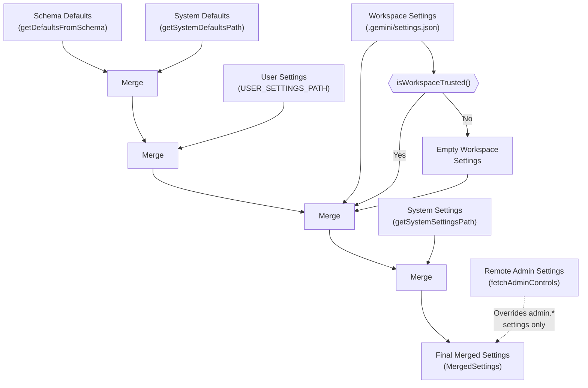

**Precedence (lowest to highest):**
1. **Schema Defaults**: Built-in defaults derived from the schema [packages/cli/src/config/settings.ts:232-245]()
2. **System Defaults**: Read-only global defaults provided by installation [packages/cli/src/config/settings.ts:111-119]()
3. **User Settings**: Global user preferences in `~/.gemini/settings.json` [packages/cli/src/config/settings.ts:79-80]()
4. **Workspace Settings**: Project-specific settings in `.gemini/settings.json` (applied only if the workspace is trusted) [packages/cli/src/config/settings.ts:250-252]()
5. **System Settings**: Administrator-enforced overrides [packages/cli/src/config/settings.ts:98-109]()
6. **Remote Admin Settings**: Dynamically fetched administrator controls (primarily for `admin.*` settings) [packages/core/src/config/config.ts:159-159]()

Sources: [packages/cli/src/config/settings.ts:247-271](), [packages/cli/src/config/settings.ts:495-582]()

### Settings Loading Process

**Settings Loading and Merging Flow**

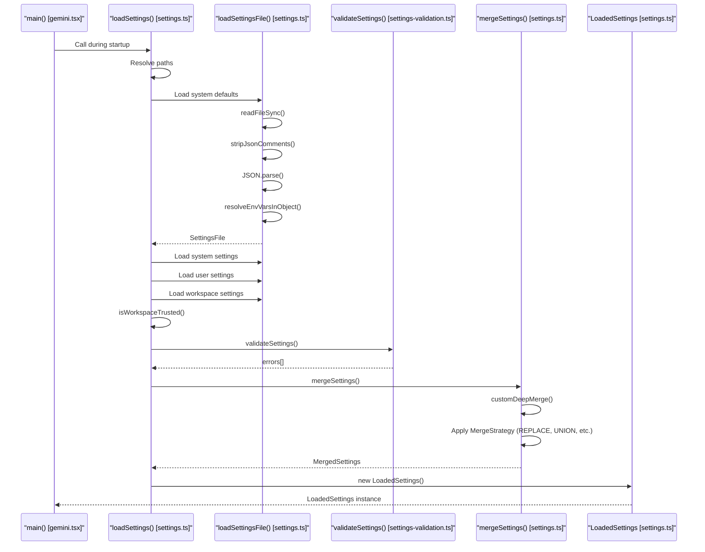

Sources: [packages/cli/src/config/settings.ts:495-582](), [packages/cli/src/config/settings.ts:305-325](), [packages/cli/src/gemini.tsx:213-214]()

### Merge Strategies

The configuration system uses specific strategies to resolve conflicts when merging layers, defined in `settingsSchema.ts`:

| Strategy | Behavior | Example Settings |
|----------|----------|------------------|
| `REPLACE` | New value replaces old value (Default) | `general.vimMode`, `ui.theme` |
| `CONCAT` | Arrays are concatenated | `tools.exclude` (legacy) |
| `UNION` | Arrays merged with unique values | `policyPaths`, `adminPolicyPaths` |
| `SHALLOW_MERGE` | Objects merged at top level only | `mcpServers`, `customThemes` |

The `getMergeStrategyForPath` function traverses the schema to determine which strategy to apply to a specific setting key [packages/cli/src/config/settings.ts:56-77]().

Sources: [packages/cli/src/config/settings.ts:56-77](), [packages/cli/src/config/settingsSchema.ts:88-97]()

## Config Class Architecture

### Core Components

The `Config` class in `@google/gemini-cli-core` serves as the central service locator and configuration container for the application.

**Config Class Structure**

```mermaid
graph TB
    subgraph "Config [config.ts]"
        ConfigParams["ConfigParameters"]
        
        subgraph "Registries"
            ToolRegistry["ToolRegistry"]
            PromptRegistry["PromptRegistry"]
            ResourceRegistry["ResourceRegistry"]
            AgentRegistry["AgentRegistry"]
        end
        
        subgraph "Services"
            FileSystem["FileSystemService"]
            GitService["GitService"]
            FileDiscovery["FileDiscoveryService"]
            ContextManager["ContextManager"]
            ModelConfig["ModelConfigService"]
            Storage["Storage"]
        end
        
        subgraph "Security"
            PolicyEngine["PolicyEngine"]
            MessageBus["MessageBus"]
        end
    end
    
    ConfigParams --> ToolRegistry
    ConfigParams --> PolicyEngine
    ConfigParams --> Storage
    
    ToolRegistry --> GeminiClient["GeminiClient"]
```

Sources: [packages/core/src/config/config.ts:602-807]()

### Configuration Parameters

The `Config` is initialized with `ConfigParameters`, which define the session state:

| Parameter | Type | Purpose |
|-----------|------|---------|
| `sessionId` | `string` | Unique session identifier [packages/core/src/config/config.ts:474-474]() |
| `targetDir` | `string` | Workspace root directory [packages/core/src/config/config.ts:476-476]() |
| `model` | `string` | Model name or alias [packages/core/src/config/config.ts:477-477]() |
| `approvalMode` | `ApprovalMode` | Tool execution approval mode [packages/core/src/config/config.ts:479-479]() |
| `userMemory` | `HierarchicalMemory` | Aggregated context from GEMINI.md files [packages/core/src/config/config.ts:483-483]() |

Sources: [packages/core/src/config/config.ts:472-600]()

## Context Files (GEMINI.md)

`GEMINI.md` files provide persistent context and instructions. They are discovered hierarchically and aggregated into the system prompt.

| Location | Scope | Implementation |
|----------|-------|----------------|
| `~/.gemini/GEMINI.md` | Global | Loaded via `loadServerHierarchicalMemory` [packages/cli/src/config/config.ts:115-115]() |
| `project/.gemini/GEMINI.md` | Workspace | Managed by `MemoryTool` [packages/core/src/config/config.ts:36-36]() |

Sources: [packages/core/src/tools/memoryTool.ts:36-36](), [packages/cli/src/config/config.ts:115-115]()

## Environment Variables

Environment variables can override settings or provide sensitive credentials:

- `GEMINI_MODEL`: Overrides the default model selection [packages/cli/src/config/config.test.ts:189-189]().
- `GEMINI_API_KEY`: API key for authentication [packages/cli/src/config/settings.ts:84-84]().
- `GEMINI_CLI_SYSTEM_SETTINGS_PATH`: Custom path for system settings [packages/cli/src/config/settings.ts:99-101]().

Settings files support environment variable interpolation (e.g., `${MY_VAR}`) via `resolveEnvVarsInObject` [packages/cli/src/config/settings.ts:48-48]().

Sources: [packages/cli/src/config/settings.ts:48-48](), [packages/cli/src/config/settings.ts:83-88](), [packages/cli/src/config/settings.ts:99-101]()

---

**Related Pages:**
- [Application Lifecycle and Initialization](#4.1) - Startup sequence details
- [Settings Management](#4.3) - LoadedSettings implementation
- [Security and Approval System](#5.5) - Policy configuration

---

# Page: User Guide

# User Guide

<details>
<summary>Relevant source files</summary>

The following files were used as context for generating this wiki page:

- [CONTRIBUTING.md](CONTRIBUTING.md)
- [Dockerfile](Dockerfile)
- [README.md](README.md)
- [docs/cli/custom-commands.md](docs/cli/custom-commands.md)
- [docs/cli/sandbox.md](docs/cli/sandbox.md)
- [docs/get-started/index.md](docs/get-started/index.md)
- [docs/index.md](docs/index.md)
- [docs/redirects.json](docs/redirects.json)
- [docs/reference/tools.md](docs/reference/tools.md)
- [docs/sidebar.json](docs/sidebar.json)
- [docs/tools/file-system.md](docs/tools/file-system.md)
- [docs/tools/memory.md](docs/tools/memory.md)
- [docs/tools/shell.md](docs/tools/shell.md)
- [docs/tools/web-fetch.md](docs/tools/web-fetch.md)
- [docs/tools/web-search.md](docs/tools/web-search.md)
- [packages/cli/src/config/sandboxConfig.test.ts](packages/cli/src/config/sandboxConfig.test.ts)
- [packages/cli/src/config/sandboxConfig.ts](packages/cli/src/config/sandboxConfig.ts)
- [packages/cli/src/nonInteractiveCli.test.ts](packages/cli/src/nonInteractiveCli.test.ts)
- [packages/cli/src/nonInteractiveCli.ts](packages/cli/src/nonInteractiveCli.ts)
- [packages/cli/src/ui/App.test.tsx](packages/cli/src/ui/App.test.tsx)
- [packages/cli/src/ui/App.tsx](packages/cli/src/ui/App.tsx)
- [packages/cli/src/ui/hooks/useGeminiStream.test.tsx](packages/cli/src/ui/hooks/useGeminiStream.test.tsx)
- [packages/cli/src/ui/hooks/useGeminiStream.ts](packages/cli/src/ui/hooks/useGeminiStream.ts)
- [packages/cli/src/utils/sandbox.test.ts](packages/cli/src/utils/sandbox.test.ts)
- [packages/cli/src/utils/sandbox.ts](packages/cli/src/utils/sandbox.ts)
- [packages/core/src/core/client.test.ts](packages/core/src/core/client.test.ts)
- [packages/core/src/core/client.ts](packages/core/src/core/client.ts)
- [packages/core/src/core/geminiChat.test.ts](packages/core/src/core/geminiChat.test.ts)
- [packages/core/src/core/geminiChat.ts](packages/core/src/core/geminiChat.ts)
- [packages/core/src/core/geminiChat_network_retry.test.ts](packages/core/src/core/geminiChat_network_retry.test.ts)
- [packages/core/src/core/turn.test.ts](packages/core/src/core/turn.test.ts)
- [packages/core/src/core/turn.ts](packages/core/src/core/turn.ts)
- [scripts/review.sh](scripts/review.sh)

</details>


This section documents all user-facing features and workflows for Gemini CLI. Each child section covers one major capability area in depth.

| Section | Topic |
|---|---|
| 3.1 | [Interactive Mode and Basic Usage](#3.1) |
| 3.2 | [Slash Commands](#3.2) |
| 3.3 | [At Commands and File References](#3.3) |
| 3.4 | [Built-in Tools](#3.4) |
| 3.5 | [Shell Mode and Command Execution](#3.5) |
| 3.6 | [Sandbox Environments](#3.6) |
| 3.7 | [MCP Server Integration](#3.7) |
| 3.8 | [Non-Interactive Mode](#3.8) |
| 3.9 | [Session Management](#3.9) |
| 3.10 | [IDE Integration](#3.10) |
| 3.11 | [Agent Skills and Sub-agents](#3.11) |

For installation, setup, and authentication, see [Getting Started](#2). For internal architecture, see [Core Systems](#4).

---

## Interaction Modes Overview

The CLI entry point initializes the application environment and determines the execution mode based on flags like `-p` (prompt) or `--non-interactive`.

**Input Routing: User Input to Code Entities**

```mermaid
graph TB
    L["gemini binary"] --> I["Interactive Mode<br/>(App.tsx)"]
    L --> N["Non-Interactive Mode<br/>(nonInteractiveCli.ts)"]

    I --> NL["Natural Language<br/>(plain text)"]
    I --> SC["Slash Command<br/>(/ prefix)"]
    I --> AC["At Command<br/>(@ prefix)"]
    I --> SH["Shell One-shot<br/>(!command)"]

    NL --> GS["useGeminiStream<br/>GeminiClient.sendMessageStream()"]
    SC --> CP["slashCommandProcessor<br/>handleSlashCommand()"]
    AC --> AP["atCommandProcessor<br/>read_many_files tool"]
    SH --> SP["shellCommandProcessor<br/>run_shell_command tool"]

    N --> NE["nonInteractiveExecutor<br/>(executeNonInteractive)"]
    NE --> OUT["Text/JSON/Stream-JSON Output"]
```

Sources: [packages/cli/src/ui/App.tsx:16-38](), [packages/cli/src/ui/hooks/useGeminiStream.ts:207-229](), [packages/cli/src/nonInteractiveCli.ts:1-100]()

| Input Type | Trigger | Code Component | Section |
|---|---|---|---|
| Natural language | Plain text | `useGeminiStream` / `GeminiClient` | 3.1 |
| Slash commands | `/command` | `handleSlashCommand` | 3.2 |
| At commands | `@path` | `handleAtCommand` | 3.3 |
| Shell (one-shot) | `!command` | `useShellCommandProcessor` | 3.5 |
| Non-interactive | `gemini -p "..."` | `nonInteractiveCli.ts` | 3.8 |

---

## Understanding the Interactive UI

The interactive interface is built using `ink` and provides a real-time streaming experience for both text and tool execution.

### UI Layout Structure

```mermaid
graph TB
    subgraph "App Layout (DefaultAppLayout.tsx)"
        Banner["BannerDisplay<br/>Tips & Warnings"]
        History["HistoryItemDisplay<br/>Scrollable Conversation"]
        Thinking["HistoryItemThinking<br/>Model Reasoning"]
        
        subgraph "Composer Area"
            Status["StreamingState<br/>(Responding, Waiting, Idle)"]
            Input["InputPrompt<br/>Text Buffer"]
            Footer["Footer<br/>Shortcuts & Context"]
        end
        
        Banner --> History
        History --> Thinking
        Thinking --> Composer
    end
```

**UI State and Streaming**

The `useGeminiStream` hook manages the complex lifecycle of a model turn, including status transitions between `Idle`, `Responding`, and `WaitingForConfirmation`.

Sources: [packages/cli/src/ui/App.tsx:33-37](), [packages/cli/src/ui/hooks/useGeminiStream.ts:162-201](), [packages/cli/src/ui/types.ts:70-74]()

### UI State Categories

| State Category | Purpose | Code Reference |
|----------------|---------|----------------|
| **Streaming State** | Tracks if Gemini is thinking, responding, or waiting for tool approval. | `calculateStreamingState` [packages/cli/src/ui/hooks/useGeminiStream.ts:162-201]() |
| **History State** | Manages the list of `HistoryItem` objects displayed in the terminal. | `useHistoryManager` [packages/cli/src/ui/hooks/useGeminiStream.ts:207-212]() |
| **Tool Status** | Maps internal `CoreToolCallStatus` to UI `ToolCallStatus`. | `mapCoreStatusToDisplayStatus` [packages/cli/src/ui/hooks/useGeminiStream.ts:69-74]() |

---

## Input Mechanisms

### Natural Language Input
Primary interaction method for reasoning and code generation. Handled by `GeminiClient.sendMessageStream` which manages the underlying `GeminiChat` session. For details, see [Interactive Mode and Basic Usage](#3.1).

### Slash Commands (`/`)
Direct control over CLI state. Built-in commands include `/help`, `/settings`, and `/chat`. For details, see [Slash Commands](#3.2).

### At Commands (`@`)
Syntax for injecting local file content. The `atCommandProcessor` resolves file paths and prepares them for the model context. For details, see [At Commands and File References](#3.3).

### Shell Commands (`!`)
Direct execution of system commands via the `run_shell_command` tool. Supports PTY for interactive shell tasks. For details, see [Shell Mode and Command Execution](#3.5).

---

## Core Capabilities

### Built-in Tools
The agent uses `DeclarativeTool` definitions to interact with the file system, perform web searches, and manage long-term memory. For details, see [Built-in Tools](#3.4).

### Sandboxing
Securely execute code using `sandbox-exec` (macOS Seatbelt), Docker, or Podman. Configuration is managed via `SandboxConfig`. For details, see [Sandbox Environments](#3.6).

### MCP Integration
The `McpClientManager` allows the CLI to connect to external Model Context Protocol servers, adding dynamic tools to the agent's repertoire. For details, see [MCP Server Integration](#3.7).

### Session Management
Conversation history and tool results are persisted via the `ChatRecordingService`. Users can `rewind` to previous checkpoints. For details, see [Session Management](#3.9).

### Agent Skills
Specialized capabilities (like `browser` or `code-assist`) can be activated using the `ACTIVATE_SKILL_TOOL_NAME` tool. For details, see [Agent Skills and Sub-agents](#3.11).

---

## Tips and Quick Reference

### Common Keyboard Shortcuts

| Action | Keys |
|--------|------|
| Submit prompt | **Enter** |
| Cancel operation | **Ctrl+C** |
| Toggle Shell Mode | **!** (on empty prompt) |
| Scroll History | **Shift+Up/Down** |

Sources: [packages/cli/src/ui/hooks/useKeypress.ts:1-50](), [packages/cli/src/ui/hooks/useGeminiStream.ts:98-100]()

---

## Summary

This guide provides a high-level entry point to the Gemini CLI features. Use the links in the table above to dive into specific functional areas. For technical implementation details of these systems, refer to the [Core Systems](#4) documentation.

Sources: [README.md:108-144](), [packages/cli/src/ui/App.tsx:1-38](), [packages/core/src/core/client.ts:96-129]()

---

# Page: Interactive Mode and Basic Usage

# Interactive Mode and Basic Usage

<details>
<summary>Relevant source files</summary>

The following files were used as context for generating this wiki page:

- [packages/cli/src/nonInteractiveCli.test.ts](packages/cli/src/nonInteractiveCli.test.ts)
- [packages/cli/src/nonInteractiveCli.ts](packages/cli/src/nonInteractiveCli.ts)
- [packages/cli/src/test-utils/render.tsx](packages/cli/src/test-utils/render.tsx)
- [packages/cli/src/ui/App.test.tsx](packages/cli/src/ui/App.test.tsx)
- [packages/cli/src/ui/App.tsx](packages/cli/src/ui/App.tsx)
- [packages/cli/src/ui/AppContainer.test.tsx](packages/cli/src/ui/AppContainer.test.tsx)
- [packages/cli/src/ui/AppContainer.tsx](packages/cli/src/ui/AppContainer.tsx)
- [packages/cli/src/ui/components/Composer.test.tsx](packages/cli/src/ui/components/Composer.test.tsx)
- [packages/cli/src/ui/components/Composer.tsx](packages/cli/src/ui/components/Composer.tsx)
- [packages/cli/src/ui/components/DialogManager.tsx](packages/cli/src/ui/components/DialogManager.tsx)
- [packages/cli/src/ui/components/InputPrompt.test.tsx](packages/cli/src/ui/components/InputPrompt.test.tsx)
- [packages/cli/src/ui/components/InputPrompt.tsx](packages/cli/src/ui/components/InputPrompt.tsx)
- [packages/cli/src/ui/components/ProQuotaDialog.test.tsx](packages/cli/src/ui/components/ProQuotaDialog.test.tsx)
- [packages/cli/src/ui/components/ProQuotaDialog.tsx](packages/cli/src/ui/components/ProQuotaDialog.tsx)
- [packages/cli/src/ui/components/__snapshots__/Composer.test.tsx.snap](packages/cli/src/ui/components/__snapshots__/Composer.test.tsx.snap)
- [packages/cli/src/ui/contexts/KeypressContext.test.tsx](packages/cli/src/ui/contexts/KeypressContext.test.tsx)
- [packages/cli/src/ui/contexts/KeypressContext.tsx](packages/cli/src/ui/contexts/KeypressContext.tsx)
- [packages/cli/src/ui/contexts/UIActionsContext.tsx](packages/cli/src/ui/contexts/UIActionsContext.tsx)
- [packages/cli/src/ui/contexts/UIStateContext.tsx](packages/cli/src/ui/contexts/UIStateContext.tsx)
- [packages/cli/src/ui/hooks/useGeminiStream.test.tsx](packages/cli/src/ui/hooks/useGeminiStream.test.tsx)
- [packages/cli/src/ui/hooks/useGeminiStream.ts](packages/cli/src/ui/hooks/useGeminiStream.ts)
- [packages/cli/src/ui/hooks/useKeypress.test.tsx](packages/cli/src/ui/hooks/useKeypress.test.tsx)
- [packages/core/src/core/client.test.ts](packages/core/src/core/client.test.ts)
- [packages/core/src/core/client.ts](packages/core/src/core/client.ts)
- [packages/core/src/core/geminiChat.test.ts](packages/core/src/core/geminiChat.test.ts)
- [packages/core/src/core/geminiChat.ts](packages/core/src/core/geminiChat.ts)
- [packages/core/src/core/geminiChat_network_retry.test.ts](packages/core/src/core/geminiChat_network_retry.test.ts)
- [packages/core/src/core/turn.test.ts](packages/core/src/core/turn.test.ts)
- [packages/core/src/core/turn.ts](packages/core/src/core/turn.ts)

</details>


This document explains how to use Gemini CLI in interactive mode, covering the terminal interface, basic prompting patterns, essential keyboard shortcuts, and the streaming response experience. For specific command types, see **Slash Commands (3.2)**, **At Commands and File References (3.3)**, and **Shell Mode and Command Execution (3.5)**. For automation, see **Non-Interactive Mode (3.8)**.

## Overview

Interactive mode is the default way to use Gemini CLI. When you run `gemini` without arguments, you enter a terminal-based REPL (Read-Eval-Print Loop) interface where you can:

- Type natural language prompts and receive streaming responses.
- Navigate conversation history with keyboard shortcuts.
- Approve or deny tool execution requests in real-time.
- Switch between normal conversation and shell command modes.
- Access built-in commands with a slash (`/`) prefix.

The interface adapts to terminal capabilities, supporting both full-screen alternate buffer mode and traditional scrolling mode.

Sources: [packages/cli/src/ui/AppContainer.tsx:209-251](), [packages/cli/src/ui/components/InputPrompt.tsx:193-206]()

## Starting Interactive Mode

Launch Gemini CLI in your current directory:

```bash
gemini
```

The CLI initializes via the `AppContainer` [packages/cli/src/ui/AppContainer.tsx:176-181](), which bootstraps the UI state and starts the session.

Sources: [packages/cli/src/ui/AppContainer.tsx:176-181]()

## Terminal Interface Layout

The interactive interface consists of distinct visual areas managed by the `App` and `DefaultAppLayout` components:

**REPL Component Architecture**

```mermaid
graph TB
    Terminal["Terminal Window"]
    
    subgraph Layout["DefaultAppLayout / ScreenReaderAppLayout"]
        History["HistoryItemDisplay<br/>Conversation History"]
        Status["StatusDisplay<br/>Tool Execution / Thinking"]
        Input["InputPrompt<br/>Text Buffer & Suggestions"]
        Footer["Footer<br/>Model / Tokens / Git"]
    end
    
    Terminal --> Layout
    Layout --> History
    Layout --> Status
    Layout --> Input
    Layout --> Footer
```

The `App` component [packages/cli/src/ui/App.tsx:16-38]() selects the layout based on whether a screen reader is detected. The `InputPrompt` [packages/cli/src/ui/components/InputPrompt.tsx:193-206]() handles the interactive text buffer where users compose messages.

Sources: [packages/cli/src/ui/App.tsx:16-38](), [packages/cli/src/ui/components/InputPrompt.tsx:193-206]()

## Basic Interaction Flow

### From Prompt to Response

The flow from user input to a streaming AI response involves the React UI layer and the core `GeminiClient`.

**Data Flow: Prompt to Stream**

```mermaid
sequenceDiagram
    participant User
    participant IP["InputPrompt (UI)"]
    participant UIA["UIActions (Context)"]
    participant UGS["useGeminiStream (Hook)"]
    participant GC["GeminiClient (Core)"]
    participant GChat["GeminiChat (Core)"]

    User->>IP: Types message + Enter
    IP->>UIA: onSubmit(value)
    UIA->>UGS: trigger submit flow
    UGS->>GC: sendMessageStream(request)
    GC->>GChat: send(request)
    
    loop Streaming Response
        GChat-->>UGS: CHUNK event
        UGS-->>User: Render incremental text
    end
```

When a user submits text, the `InputPrompt` calls `onSubmit` [packages/cli/src/ui/components/InputPrompt.tsx:100-100](). This triggers the `useGeminiStream` hook [packages/cli/src/ui/hooks/useGeminiStream.ts:207-229](), which coordinates with the `GeminiClient` [packages/core/src/core/client.ts:96-96]() to initiate a streaming request. The `GeminiChat` class [packages/core/src/core/geminiChat.ts:16-16]() handles the low-level event stream from the Gemini API.

Sources: [packages/cli/src/ui/components/InputPrompt.tsx:100-100](), [packages/cli/src/ui/hooks/useGeminiStream.ts:207-229](), [packages/core/src/core/client.ts:96-96](), [packages/core/src/core/geminiChat.ts:16-16]()

## Input and Prompting

### Text Buffer and Highlighting
The `InputPrompt` uses a custom `TextBuffer` [packages/cli/src/ui/components/shared/text-buffer.js]() to manage state. It supports:
- **Syntax Highlighting**: Input is parsed for commands and file references via `parseInputForHighlighting` [packages/cli/src/ui/components/InputPrompt.tsx:49-50]().
- **Paste Handling**: Large pastes are detected and can be collapsed into placeholders to keep the UI clean [packages/cli/src/ui/components/InputPrompt.tsx:145-151]().
- **Autocomplete**: Suggestions for slash commands and file paths are provided via `useCommandCompletion` [packages/cli/src/ui/components/InputPrompt.tsx:35-37]().

Sources: [packages/cli/src/ui/components/InputPrompt.tsx:49-50](), [packages/cli/src/ui/components/InputPrompt.tsx:145-151](), [packages/cli/src/ui/components/InputPrompt.tsx:35-37]()

## Essential Keyboard Shortcuts

Keyboard interaction is governed by the `KeypressContext` [packages/cli/src/ui/contexts/KeypressContext.tsx](), which maps raw terminal sequences to logical commands.

| Shortcut | Logical Command | Action |
|----------|-----------------|--------|
| `Enter` | `Command.RETURN` | Submit prompt or select suggestion |
| `Esc` | `Command.ESCAPE` | Cancel current input or close dialogs |
| `Ctrl+C` | N/A | Interrupt model response or clear buffer |
| `Ctrl+L` | `Command.CLEAR_SCREEN` | Clear the terminal display |
| `Up` / `Down` | `Command.HISTORY_UP/DOWN` | Cycle through previous prompts |
| `Tab` | `Command.ACCEPT_SUGGESTION` | Accept the current autocomplete suggestion |

Sources: [packages/cli/src/ui/contexts/KeypressContext.tsx:32-37](), [packages/cli/src/ui/components/InputPrompt.tsx:38-40]()

## Streaming and Tool Confirmation

### Streaming States
The `useGeminiStream` hook calculates the current `StreamingState` [packages/cli/src/ui/hooks/useGeminiStream.ts:162-201]():
- `Idle`: Ready for new input.
- `Responding`: Actively receiving text or thinking from the model.
- `WaitingForConfirmation`: A tool requires user approval before proceeding.

### Tool Approval
When the model requests a tool (e.g., `run_shell_command`), the system checks the `ApprovalMode` [packages/cli/src/ui/hooks/useGeminiStream.ts:20-20](). If a tool call has the status `AwaitingApproval` [packages/cli/src/ui/hooks/useGeminiStream.ts:167-167](), the UI blocks until the user provides consent.

Sources: [packages/cli/src/ui/hooks/useGeminiStream.ts:162-201](), [packages/cli/src/ui/hooks/useGeminiStream.ts:167-167]()

## Display Modes

### Alternate Buffer
Gemini CLI utilizes the terminal's alternate screen buffer via `useAlternateBuffer` [packages/cli/src/ui/hooks/useAlternateBuffer.js]() to provide a persistent, app-like interface that doesn't clutter the scrollback history of the main shell.

### Vim Mode
The CLI includes an optional Vim emulation mode for the input buffer, managed by the `VimModeContext` [packages/cli/src/ui/contexts/VimModeContext.tsx]() and implemented in `useVim` [packages/cli/src/ui/hooks/vim.ts]().

Sources: [packages/cli/src/ui/App.tsx:18-18](), [packages/cli/src/ui/AppContainer.tsx:98-98](), [packages/cli/src/ui/AppContainer.tsx:114-114]()

---

# Page: Slash Commands

# Slash Commands

<details>
<summary>Relevant source files</summary>

The following files were used as context for generating this wiki page:

- [docs/get-started/index.md](docs/get-started/index.md)
- [docs/index.md](docs/index.md)
- [docs/redirects.json](docs/redirects.json)
- [docs/reference/tools.md](docs/reference/tools.md)
- [docs/sidebar.json](docs/sidebar.json)
- [docs/tools/file-system.md](docs/tools/file-system.md)
- [docs/tools/memory.md](docs/tools/memory.md)
- [docs/tools/shell.md](docs/tools/shell.md)
- [docs/tools/web-fetch.md](docs/tools/web-fetch.md)
- [docs/tools/web-search.md](docs/tools/web-search.md)
- [packages/cli/src/services/BuiltinCommandLoader.test.ts](packages/cli/src/services/BuiltinCommandLoader.test.ts)
- [packages/cli/src/services/BuiltinCommandLoader.ts](packages/cli/src/services/BuiltinCommandLoader.ts)
- [packages/cli/src/services/CommandService.test.ts](packages/cli/src/services/CommandService.test.ts)
- [packages/cli/src/services/CommandService.ts](packages/cli/src/services/CommandService.ts)
- [packages/cli/src/services/FileCommandLoader.test.ts](packages/cli/src/services/FileCommandLoader.test.ts)
- [packages/cli/src/services/FileCommandLoader.ts](packages/cli/src/services/FileCommandLoader.ts)
- [packages/cli/src/services/prompt-processors/argumentProcessor.test.ts](packages/cli/src/services/prompt-processors/argumentProcessor.test.ts)
- [packages/cli/src/services/prompt-processors/argumentProcessor.ts](packages/cli/src/services/prompt-processors/argumentProcessor.ts)
- [packages/cli/src/services/prompt-processors/types.ts](packages/cli/src/services/prompt-processors/types.ts)
- [packages/cli/src/ui/commands/corgiCommand.test.ts](packages/cli/src/ui/commands/corgiCommand.test.ts)
- [packages/cli/src/ui/commands/corgiCommand.ts](packages/cli/src/ui/commands/corgiCommand.ts)
- [packages/cli/src/ui/commands/mcpCommand.test.ts](packages/cli/src/ui/commands/mcpCommand.test.ts)
- [packages/cli/src/ui/commands/mcpCommand.ts](packages/cli/src/ui/commands/mcpCommand.ts)
- [packages/cli/src/ui/commands/terminalSetupCommand.test.ts](packages/cli/src/ui/commands/terminalSetupCommand.test.ts)
- [packages/cli/src/ui/commands/toolsCommand.test.ts](packages/cli/src/ui/commands/toolsCommand.test.ts)
- [packages/cli/src/ui/commands/toolsCommand.ts](packages/cli/src/ui/commands/toolsCommand.ts)
- [packages/cli/src/ui/commands/types.ts](packages/cli/src/ui/commands/types.ts)
- [packages/cli/src/ui/hooks/slashCommandProcessor.ts](packages/cli/src/ui/hooks/slashCommandProcessor.ts)

</details>


Slash commands provide meta-level control over the Gemini CLI, allowing you to manage sessions, configure settings, inspect tools, and interact with the CLI's features without sending prompts to the model. Commands are prefixed with `/` (e.g., `/help`, `/model`, `/settings`) and execute immediately in the CLI.

This page covers how to use slash commands, create custom commands, and understand the internal loading system that aggregates commands from built-in code, local files, extensions, and MCP servers.

## Basic Usage

Slash commands are entered at the prompt by typing `/` followed by the command name. The CLI uses a React-based UI layer to intercept these inputs before they reach the generative AI model [packages/cli/src/ui/hooks/slashCommandProcessor.ts:95-109]().

### Executing vs Autocompleting

The behavior of a command when pressing Enter is determined by its `autoExecute` property [packages/cli/src/ui/commands/types.ts:208-208]():
- **Auto-execute commands** (`autoExecute: true`): Execute immediately upon selection from the suggestion list (e.g., `/help`, `/clear`, `/mcp auth`).
- **Autocomplete commands** (`autoExecute: false`): Complete the command name into the input buffer, allowing you to add arguments (e.g., `/chat`, `/model`).

### Command Suggestions and Completion
As you type, the CLI filters available commands using fuzzy matching. Suggestions are displayed in the UI, which groups commands by their source (e.g., `[MCP]`, `[Agent]`, `[Skill]`) [packages/cli/src/ui/commands/types.ts:178-186]().

## Built-in Commands

The CLI includes a robust set of hard-coded commands managed by the `BuiltinCommandLoader` [packages/cli/src/services/BuiltinCommandLoader.ts:69-70]().

| Category | Key Commands | Implementation Source |
| :--- | :--- | :--- |
| **Information** | `/help`, `/about`, `/stats`, `/docs` | [packages/cli/src/services/BuiltinCommandLoader.ts:120-157]() |
| **Session** | `/chat`, `/rewind`, `/clear`, `/resume` | [packages/cli/src/services/BuiltinCommandLoader.ts:125-161]() |
| **Config** | `/model`, `/settings`, `/auth`, `/theme` | [packages/cli/src/services/BuiltinCommandLoader.ts:122-191]() |
| **Tools** | `/tools`, `/mcp`, `/skills`, `/extensions` | [packages/cli/src/services/BuiltinCommandLoader.ts:136-183]() |
| **Environment**| `/directory`, `/ide`, `/shells`, `/vim` | [packages/cli/src/services/BuiltinCommandLoader.ts:134-192]() |

The availability of certain commands depends on the current configuration; for example, `/upgrade` is only available when using `LOGIN_WITH_GOOGLE` authentication [packages/cli/src/services/BuiltinCommandLoader.ts:185-194]().

**Sources:** [packages/cli/src/services/BuiltinCommandLoader.ts:119-195](), [packages/cli/src/ui/commands/types.ts:178-186]()

## Custom Commands (File-based)

Users can extend the CLI by placing `.toml` files in specific directories. These are discovered and parsed by the `FileCommandLoader` [packages/cli/src/services/FileCommandLoader.ts:66-75]().

### Command Directories
The loader scans directories in the following priority order [packages/cli/src/services/FileCommandLoader.ts:149-184]():
1.  **User Global**: `~/.gemini/commands/` (`CommandKind.USER_FILE`)
2.  **Project Local**: `.gemini/commands/` (`CommandKind.WORKSPACE_FILE`)
3.  **Extensions**: `<extension-path>/commands/` (`CommandKind.EXTENSION_FILE`)

### TOML Schema and Features
A command file must define a `prompt` and can optionally include a `description` [packages/cli/src/services/FileCommandLoader.ts:48-54]().

```toml
# Example: .gemini/commands/review.toml
description = "Review the current file"
prompt = "Please review this code for security vulnerabilities: {{args}}"
```

The system supports several advanced placeholders during execution:
-   `{{args}}`: Replaced with user-provided text following the command [packages/cli/src/services/prompt-processors/argumentProcessor.ts:16-25]().
-   `!{command}`: Triggers the `ShellProcessor` to execute a command and inject output [packages/cli/src/services/prompt-processors/shellProcessor.ts:32-33]().
-   `@{path}`: Triggers the `AtFileProcessor` to inject file contents [packages/cli/src/services/prompt-processors/atFileProcessor.ts:34-35]().

**Sources:** [packages/cli/src/services/FileCommandLoader.ts:186-211](), [packages/cli/src/ui/commands/types.ts:178-186]()

## Command Architecture and Loading

The `CommandService` acts as the central orchestrator, using a provider-based pattern to aggregate commands from various `ICommandLoader` implementations [packages/cli/src/services/CommandService.ts:13-22]().

### Data Flow: Discovery to Execution

The following diagram bridges the user's natural language input to the internal code entities that process them.

```mermaid
graph TD
    subgraph "Natural Language Space"
        UserTyped["User types '/'"]
        Selection["User selects command"]
    end

    subgraph "Code Entity Space (Loading)"
        CS["CommandService::create()"]
        BCL["BuiltinCommandLoader"]
        FCL["FileCommandLoader"]
        SKL["SkillCommandLoader"]
        MPL["McpPromptLoader"]
        SCR["SlashCommandResolver"]
    end

    subgraph "Code Entity Space (Execution)"
        SCP["useSlashCommandProcessor"]
        Action["SlashCommand.action()"]
        Ctx["CommandContext"]
    end

    BCL -- "loadCommands()" --> CS
    FCL -- "loadCommands()" --> CS
    SKL -- "loadCommands()" --> CS
    MPL -- "loadCommands()" --> CS
    CS --> SCR
    SCR -- "Resolve Conflicts" --> CS
    
    UserTyped --> Selection
    Selection --> SCP
    SCP -- "invokes" --> Action
    Action -- "accesses" --> Ctx
```
**Sources:** [packages/cli/src/services/CommandService.ts:44-60](), [packages/cli/src/ui/hooks/slashCommandProcessor.ts:95-109](), [packages/cli/src/ui/commands/types.ts:223-228]()

### Conflict Resolution
When multiple sources provide a command with the same name, the `SlashCommandResolver` reconciles them [packages/cli/src/services/CommandService.ts:49-50]().

1.  **Built-in commands** (`CommandKind.BUILT_IN`) typically retain their primary names.
2.  **User/Project commands** follow a "last wins" strategy for non-extension commands [packages/cli/src/services/FileCommandLoader.ts:81-84]().
3.  **Extension/MCP commands** are automatically namespaced (e.g., `extensionName.commandName`) if conflicts exist to ensure every command remains addressable [packages/cli/src/services/CommandService.ts:19-21]().

## MCP and Skill Integration

The CLI dynamically loads commands from external sources like Model Context Protocol (MCP) servers and specialized Agent Skills.

```mermaid
graph LR
    subgraph "External Providers"
        MCP["MCP Server Prompts"]
        Skills["Agent Skills"]
    end

    subgraph "CLI Service Layer"
        MPL["McpPromptLoader"]
        SKL["SkillCommandLoader"]
        CS["CommandService"]
    end

    MCP --> MPL
    Skills --> SKL
    MPL -- "SlashCommand (MCP_PROMPT)" --> CS
    SKL -- "SlashCommand (SKILL)" --> CS
```

**MCP Commands**: The `/mcp` command allows for server management and authentication. `/mcp auth <server>` triggers an OAuth flow via `MCPOAuthProvider` [packages/cli/src/ui/commands/mcpCommand.ts:35-43](), [packages/cli/src/ui/commands/mcpCommand.ts:123-124]().

**Sources:** [packages/cli/src/ui/commands/mcpCommand.ts:176-224](), [packages/cli/src/services/McpPromptLoader.ts](), [packages/cli/src/services/SkillCommandLoader.ts]()

## Technical Implementation Details

### Command Context
All command actions receive a `CommandContext` object, providing access to system services and UI controls [packages/cli/src/ui/commands/types.ts:29-46]():
-   **Services**: `agentContext`, `settings`, `git`, `logger`.
-   **UI**: `addItem` (history), `clear`, `setPendingItem` (for long-running operations), `setConfirmationRequest`, `reloadCommands`.

### Return Types
Commands return a `SlashCommandActionReturn` to trigger specific application behaviors [packages/cli/src/ui/commands/types.ts:169-176]():
-   `quit`: Triggers the exit sequence and saves history [packages/cli/src/ui/commands/types.ts:107-110]().
-   `dialog`: Opens a React-based UI dialog (e.g., `auth`, `settings`, `permissions`) [packages/cli/src/ui/commands/types.ts:115-130]().
-   `confirm_shell_commands`: Pauses to request user permission for shell execution [packages/cli/src/ui/commands/types.ts:136-144]().
-   `logout`: Transitions the application to an unauthenticated state [packages/cli/src/ui/commands/types.ts:162-167]().

**Sources:** [packages/cli/src/ui/commands/types.ts:29-230](), [packages/cli/src/ui/hooks/slashCommandProcessor.ts:209-270]()

---

# Page: At Commands and File References

# At Commands and File References

<details>
<summary>Relevant source files</summary>

The following files were used as context for generating this wiki page:

- [CONTRIBUTING.md](CONTRIBUTING.md)
- [Dockerfile](Dockerfile)
- [README.md](README.md)
- [docs/cli/custom-commands.md](docs/cli/custom-commands.md)
- [docs/cli/sandbox.md](docs/cli/sandbox.md)
- [packages/cli/src/config/sandboxConfig.test.ts](packages/cli/src/config/sandboxConfig.test.ts)
- [packages/cli/src/config/sandboxConfig.ts](packages/cli/src/config/sandboxConfig.ts)
- [packages/cli/src/services/BuiltinCommandLoader.test.ts](packages/cli/src/services/BuiltinCommandLoader.test.ts)
- [packages/cli/src/services/BuiltinCommandLoader.ts](packages/cli/src/services/BuiltinCommandLoader.ts)
- [packages/cli/src/services/CommandService.test.ts](packages/cli/src/services/CommandService.test.ts)
- [packages/cli/src/services/CommandService.ts](packages/cli/src/services/CommandService.ts)
- [packages/cli/src/services/FileCommandLoader.test.ts](packages/cli/src/services/FileCommandLoader.test.ts)
- [packages/cli/src/services/FileCommandLoader.ts](packages/cli/src/services/FileCommandLoader.ts)
- [packages/cli/src/services/prompt-processors/argumentProcessor.test.ts](packages/cli/src/services/prompt-processors/argumentProcessor.test.ts)
- [packages/cli/src/services/prompt-processors/argumentProcessor.ts](packages/cli/src/services/prompt-processors/argumentProcessor.ts)
- [packages/cli/src/services/prompt-processors/types.ts](packages/cli/src/services/prompt-processors/types.ts)
- [packages/cli/src/ui/commands/copyCommand.test.ts](packages/cli/src/ui/commands/copyCommand.test.ts)
- [packages/cli/src/ui/commands/copyCommand.ts](packages/cli/src/ui/commands/copyCommand.ts)
- [packages/cli/src/ui/commands/corgiCommand.test.ts](packages/cli/src/ui/commands/corgiCommand.test.ts)
- [packages/cli/src/ui/commands/corgiCommand.ts](packages/cli/src/ui/commands/corgiCommand.ts)
- [packages/cli/src/ui/commands/types.ts](packages/cli/src/ui/commands/types.ts)
- [packages/cli/src/ui/hooks/atCommandProcessor.test.ts](packages/cli/src/ui/hooks/atCommandProcessor.test.ts)
- [packages/cli/src/ui/hooks/atCommandProcessor.ts](packages/cli/src/ui/hooks/atCommandProcessor.ts)
- [packages/cli/src/ui/hooks/slashCommandProcessor.ts](packages/cli/src/ui/hooks/slashCommandProcessor.ts)
- [packages/cli/src/ui/hooks/useCompletion.ts](packages/cli/src/ui/hooks/useCompletion.ts)
- [packages/cli/src/ui/utils/commandUtils.test.ts](packages/cli/src/ui/utils/commandUtils.test.ts)
- [packages/cli/src/ui/utils/commandUtils.ts](packages/cli/src/ui/utils/commandUtils.ts)
- [packages/cli/src/utils/sandbox.test.ts](packages/cli/src/utils/sandbox.test.ts)
- [packages/cli/src/utils/sandbox.ts](packages/cli/src/utils/sandbox.ts)
- [scripts/review.sh](scripts/review.sh)

</details>


This document explains the `@` syntax in Gemini CLI, which serves two distinct purposes:

1.  **File references in prompts** (`@path/to/file`) — Include file contents in your conversation.
2.  **Template placeholders in custom commands** (`@{args}`) — Define reusable command templates.

Both mechanisms use the `@` prefix but operate at different stages of the CLI pipeline.

## Overview

### File References in Prompts

At commands (`@path/to/file`) are a client-side pre-processing step that injects referenced content directly into the prompt parts (`PartListUnion`) before the request is sent to the Gemini API. The logic is primarily implemented in `handleAtCommand()` in [packages/cli/src/ui/hooks/atCommandProcessor.ts:65-78]().

The `@` prefix supports three distinct reference types, determined by `categorizeAtCommands()` [packages/cli/src/ui/hooks/atCommandProcessor.ts:141-173]():

| Reference Type | How Identified | What Happens |
| :--- | :--- | :--- |
| **File/directory path** | Not found in agent or resource registry | Read via `ReadManyFilesTool`, content appended [packages/cli/src/ui/hooks/atCommandProcessor.ts:469-577](). |
| **MCP resource URI** | Matches an entry in `ResourceRegistry` | Read via `McpClient.readResource()`, content appended [packages/cli/src/ui/hooks/atCommandProcessor.ts:579-648](). |
| **Agent name** | Matches an entry in `AgentRegistry` | A `<system_note>` nudge is appended to steer the model [packages/cli/src/ui/hooks/atCommandProcessor.ts:153-164](). |

Key characteristics:
*   Content is injected into `processedQuery: PartListUnion` parts before the API call, bypassing the standard `CoreToolScheduler` loop for these specific references [packages/cli/src/ui/hooks/atCommandProcessor.ts:701-717]().
*   Files/directories are read using a directly-instantiated `ReadManyFilesTool` [packages/cli/src/ui/hooks/atCommandProcessor.ts:482-485]().
*   Respects `.gitignore` and `.geminiignore` filtering via `FileDiscoveryService` [packages/cli/src/ui/hooks/atCommandProcessor.ts:241-282]().
*   Directories are automatically expanded to `dir/**` glob patterns [packages/cli/src/ui/hooks/atCommandProcessor.ts:284-300]().

Sources: [packages/cli/src/ui/hooks/atCommandProcessor.ts:141-173](), [packages/cli/src/ui/utils/commandUtils.ts:34-36]()

### Template Placeholders in Custom Commands

When defining custom slash commands (e.g., in `.gemini/commands/*.toml`), the `@{}` syntax creates template placeholders. These are processed by the `ArgumentProcessor` before any file references are resolved.

Common placeholders:
*   `@{args}` — Replaced with the full argument string passed to the command.
*   `@file` — Standard file reference syntax, processed after template expansion.

Sources: [packages/cli/src/ui/hooks/atCommandProcessor.ts:62-63](), [packages/cli/src/services/prompt-processors/argumentProcessor.ts:1-20]()

## File Reference Syntax

### Basic Syntax

```
@<path> [optional prompt text]
```

The `@` symbol can appear anywhere in your input. The CLI uses a sophisticated regex `AT_COMMAND_PATH_REGEX_SOURCE` to identify paths even when preceded by punctuation (e.g., `check:@file.py`) to support prompts written in external editors [packages/cli/src/ui/hooks/atCommandProcessor.ts:62-63]().

### Path Resolution

Paths are resolved relative to the current working directory. The processor handles:
*   **Escaped spaces**: `@My\ Documents/file.txt` [packages/cli/src/ui/hooks/atCommandProcessor.ts:89-92]().
*   **Quoted paths**: `@"C:\Users\name\my file.txt"` [packages/cli/src/ui/hooks/atCommandProcessor.ts:57-63]().
*   **Unicode characters**: Supports NNBSP in filenames [packages/cli/src/ui/hooks/atCommandProcessor.ts:54-63]().

Sources: [packages/cli/src/ui/hooks/atCommandProcessor.ts:54-63](), [packages/cli/src/ui/hooks/atCommandProcessor.ts:118-120]()

## Processing Pipeline

At command processing occurs entirely client-side inside `handleAtCommand()`.

**`handleAtCommand()` processing stages**

```mermaid
sequenceDiagram
    participant Hook["useGeminiStream hook"]
    participant Utils["commandUtils.isAtCommand()"]
    participant Handler["atCommandProcessor.handleAtCommand()"]
    participant Parser["parseAllAtCommands()"]
    participant Categorizer["categorizeAtCommands()"]
    participant FileResolver["resolveFilePaths()"]
    participant FileReader["readLocalFiles() / ReadManyFilesTool"]
    participant McpReader["readMcpResources() / McpClient"]
    participant GeminiAPI["Gemini API"]

    Hook->>Utils: "isAtCommand(query)"
    Utils-->>Hook: "true"
    Hook->>Handler: "handleAtCommand({query, config, ...})"
    Handler->>Parser: "parseAllAtCommands(query)"
    Parser-->>Handler: "AtCommandPart[]"
    Handler->>Categorizer: "categorizeAtCommands(parts, config)"
    Categorizer-->>Handler: "{ agentParts, resourceParts, fileParts }"
    Handler->>FileResolver: "resolveFilePaths(fileParts, config)"
    FileResolver-->>Handler: "{ resolvedFiles, ignoredFiles }"
    par "Parallel execution"
        Handler->>FileReader: "readLocalFiles(resolvedFiles, ...)"
        FileReader-->>Handler: "PartUnion[] (file contents)"
    and
        Handler->>McpReader: "readMcpResources(resourceParts, ...)"
        McpReader-->>Handler: "PartUnion[] (resource contents)"
    end
    Handler-->>Hook: "processedQuery: PartListUnion"
    Hook->>GeminiAPI: "Send query + injected content"
```

Sources: [packages/cli/src/ui/hooks/atCommandProcessor.ts:650-718](), [packages/cli/src/ui/utils/commandUtils.ts:34-36]()

## File Filtering and Permission Checks

Before reading, each file path is checked by `resolveFilePaths()` against ignore systems and by `checkPermissions()` against the workspace boundary.

**Filtering logic in `resolveFilePaths()`**

```mermaid
graph TB
    Input["atPath part (e.g. @src/main.ts)"]
    CheckPerms["checkPermissions() / config.validatePathAccess()"]
    CheckGit["FileDiscoveryService.shouldIgnoreFile(path, { respectGitIgnore: true })"]
    CheckGemini["FileDiscoveryService.shouldIgnoreFile(path, { respectGeminiIgnore: true })"]
    Stat["fs.stat(absolutePath)"]
    IsDir{"Is directory?"}
    GlobExpand["Expand to dir/** (passed to ReadManyFilesTool)"]
    UseFile["Use as file path spec"]
    Skipped["Added to ignoredFiles[]"]
    Resolved["Added to resolvedFiles[]"]

    Input-->CheckPerms
    CheckPerms-->CheckGit
    CheckGit-->|"git-ignored"| Skipped
    CheckGit-->|"not ignored"| CheckGemini
    CheckGemini-->|"gemini-ignored"| Skipped
    CheckGemini-->|"not ignored"| Stat
    Stat-->IsExist{"Exists?"}
    IsExist-->|"no"| Skipped
    IsExist-->|"yes"| IsDir
    IsDir-->|"yes"| GlobExpand
    IsDir-->|"no"| UseFile
    GlobExpand-->Resolved
    UseFile-->Resolved
```

Sources: [packages/cli/src/ui/hooks/atCommandProcessor.ts:179-202](), [packages/cli/src/ui/hooks/atCommandProcessor.ts:219-340]()

## UI Integration and Autocomplete

The CLI provides real-time feedback and autocomplete for `@` commands via React hooks.

### Autocomplete (`useCompletion`)
The `useCompletion` hook tracks the active suggestion index and scroll position for the dropdown menu [packages/cli/src/ui/hooks/useCompletion.ts:30-37]().

*   **Navigation**: Implements `navigateUp` and `navigateDown` with wrap-around logic [packages/cli/src/ui/hooks/useCompletion.ts:47-104]().
*   **State**: Manages `visibleStartIndex` to ensure the active suggestion is always within the viewable area of the `SuggestionsDisplay` [packages/cli/src/ui/hooks/useCompletion.ts:56-70]().

### Command Loading
Slash commands (which can contain `@` templates) are loaded by the `CommandService` using various loaders:
*   `BuiltinCommandLoader`: Hard-coded commands like `/help` [packages/cli/src/services/BuiltinCommandLoader.ts:69-79]().
*   `FileCommandLoader`: Custom commands from `.gemini/commands/` [packages/cli/src/services/FileCommandLoader.ts:1-20]().

Sources: [packages/cli/src/ui/hooks/useCompletion.ts:30-37](), [packages/cli/src/services/CommandService.ts:1-30]()

## How Content Is Injected

`handleAtCommand()` wraps injected content with specific markers to help the model distinguish between user instructions and referenced data:
*   `REFERENCE_CONTENT_START`: `\n--- Content from referenced files ---` [packages/cli/src/ui/hooks/atCommandProcessor.ts:30-30]()
*   `REFERENCE_CONTENT_END`: `\n--- End of content ---` [packages/cli/src/ui/hooks/atCommandProcessor.ts:31-31]()

**`readLocalFiles()` internals:**
*   Instantiates `ReadManyFilesTool` [packages/cli/src/ui/hooks/atCommandProcessor.ts:482]().
*   Executes the tool call directly: `await toolInvocation.execute(signal)` [packages/cli/src/ui/hooks/atCommandProcessor.ts:518]().
*   Appends the result to the conversation history via `addItem` so the user sees which files were successfully read [packages/cli/src/ui/hooks/atCommandProcessor.ts:526-574]().

Sources: [packages/cli/src/ui/hooks/atCommandProcessor.ts:469-577](), [packages/cli/src/ui/hooks/atCommandProcessor.ts:30-31]()

---

# Page: Built-in Tools

# Built-in Tools

<details>
<summary>Relevant source files</summary>

The following files were used as context for generating this wiki page:

- [.gitignore](.gitignore)
- [docs/get-started/index.md](docs/get-started/index.md)
- [docs/index.md](docs/index.md)
- [docs/redirects.json](docs/redirects.json)
- [docs/reference/tools.md](docs/reference/tools.md)
- [docs/sidebar.json](docs/sidebar.json)
- [docs/tools/file-system.md](docs/tools/file-system.md)
- [docs/tools/memory.md](docs/tools/memory.md)
- [docs/tools/shell.md](docs/tools/shell.md)
- [docs/tools/web-fetch.md](docs/tools/web-fetch.md)
- [docs/tools/web-search.md](docs/tools/web-search.md)
- [evals/grep_search_functionality.eval.ts](evals/grep_search_functionality.eval.ts)
- [integration-tests/ripgrep-real.test.ts](integration-tests/ripgrep-real.test.ts)
- [packages/core/src/services/chatCompressionService.test.ts](packages/core/src/services/chatCompressionService.test.ts)
- [packages/core/src/services/chatCompressionService.ts](packages/core/src/services/chatCompressionService.ts)
- [packages/core/src/tools/confirmation-policy.test.ts](packages/core/src/tools/confirmation-policy.test.ts)
- [packages/core/src/tools/edit.test.ts](packages/core/src/tools/edit.test.ts)
- [packages/core/src/tools/edit.ts](packages/core/src/tools/edit.ts)
- [packages/core/src/tools/glob.test.ts](packages/core/src/tools/glob.test.ts)
- [packages/core/src/tools/glob.ts](packages/core/src/tools/glob.ts)
- [packages/core/src/tools/grep-utils.ts](packages/core/src/tools/grep-utils.ts)
- [packages/core/src/tools/grep.test.ts](packages/core/src/tools/grep.test.ts)
- [packages/core/src/tools/grep.ts](packages/core/src/tools/grep.ts)
- [packages/core/src/tools/ls.test.ts](packages/core/src/tools/ls.test.ts)
- [packages/core/src/tools/ls.ts](packages/core/src/tools/ls.ts)
- [packages/core/src/tools/memoryTool.test.ts](packages/core/src/tools/memoryTool.test.ts)
- [packages/core/src/tools/memoryTool.ts](packages/core/src/tools/memoryTool.ts)
- [packages/core/src/tools/read-file.test.ts](packages/core/src/tools/read-file.test.ts)
- [packages/core/src/tools/read-file.ts](packages/core/src/tools/read-file.ts)
- [packages/core/src/tools/read-many-files.test.ts](packages/core/src/tools/read-many-files.test.ts)
- [packages/core/src/tools/read-many-files.ts](packages/core/src/tools/read-many-files.ts)
- [packages/core/src/tools/ripGrep.test.ts](packages/core/src/tools/ripGrep.test.ts)
- [packages/core/src/tools/ripGrep.ts](packages/core/src/tools/ripGrep.ts)
- [packages/core/src/tools/web-fetch.test.ts](packages/core/src/tools/web-fetch.test.ts)
- [packages/core/src/tools/web-fetch.ts](packages/core/src/tools/web-fetch.ts)
- [packages/core/src/tools/web-search.ts](packages/core/src/tools/web-search.ts)
- [packages/core/src/tools/write-file.test.ts](packages/core/src/tools/write-file.test.ts)
- [packages/core/src/tools/write-file.ts](packages/core/src/tools/write-file.ts)
- [packages/core/src/utils/editCorrector.test.ts](packages/core/src/utils/editCorrector.test.ts)
- [packages/core/src/utils/editCorrector.ts](packages/core/src/utils/editCorrector.ts)
- [packages/core/src/utils/fetch.test.ts](packages/core/src/utils/fetch.test.ts)
- [packages/core/src/utils/fetch.ts](packages/core/src/utils/fetch.ts)
- [packages/core/src/utils/fileUtils.test.ts](packages/core/src/utils/fileUtils.test.ts)
- [packages/core/src/utils/fileUtils.ts](packages/core/src/utils/fileUtils.ts)
- [third_party/get-ripgrep/LICENSE](third_party/get-ripgrep/LICENSE)
- [third_party/get-ripgrep/package.json](third_party/get-ripgrep/package.json)
- [third_party/get-ripgrep/src/downloadRipGrep.js](third_party/get-ripgrep/src/downloadRipGrep.js)
- [third_party/get-ripgrep/src/index.js](third_party/get-ripgrep/src/index.js)

</details>


Built-in tools are the core capabilities that the Gemini model uses to interact with your local environment. When you ask Gemini to "read this file" or "run this test," the model automatically selects and invokes the appropriate tool to complete your request.

This page documents the technical implementation of core tools (file system, web, memory) and the data flow between the model and the local machine.

## Overview

The tool system allows the Gemini model to bridge the gap between "Natural Language Space" and "Code Entity Space." When a model issues a `call`, the `CoreToolScheduler` manages its lifecycle, including validation, security policy checks, user confirmation, and execution. [packages/core/src/scheduler/types.ts:32-40]().

### Tool Execution Architecture

The following diagram shows how high-level model requests are transformed into concrete code executions within the tool system.

**Natural Language to Code Entity Mapping**
```mermaid
graph TD
    subgraph "Natural Language Space (Model)"
        Prompt["'Update the landing page'"]
        Call["Tool Call: { name: 'edit', args: { ... } }"]
    end

    subgraph "Code Entity Space (System)"
        Registry["ToolRegistry (tool-registry.ts)"]
        Scheduler["CoreToolScheduler (scheduler/index.ts)"]
        Invocation["BaseToolInvocation (tools/tools.ts)"]
        FS["StandardFileSystemService (services/fileSystemService.ts)"]
    end

    Prompt --> Call
    Call -- "lookup" --> Registry
    Registry -- "instance" --> Scheduler
    Scheduler -- "instantiate" --> Invocation
    Invocation -- "io" --> FS
```
**Sources:** [packages/core/src/tools/tools.ts:446-460](), [packages/core/src/services/fileSystemService.ts:1-30](), [packages/core/src/scheduler/types.ts:32-40]()

## File System Tools

File system operations are the most frequent tool calls. They are implemented as classes extending `BaseDeclarativeTool`. [packages/core/src/tools/tools.ts:384-410]().

### Core File Tools

| Tool Name | Class | Primary Responsibility |
|-----------|-------|------------------------|
| `read_file` | `ReadFileTool` | Reads single file content with optional line ranges. [packages/core/src/tools/read-file.ts:198-205]() |
| `write_file` | `WriteFileTool` | Overwrites or creates a file with full content. [packages/core/src/tools/write-file.ts:146-160]() |
| `edit` | `EditTool` | Performs targeted search-and-replace using fuzzy/flexible matching. [packages/core/src/tools/edit.ts:1145-1155]() |
| `read_many_files` | `ReadManyFilesTool` | Glob-based batch reading of multiple files. [packages/core/src/tools/read-many-files.ts:120-135]() |
| `grep_search` | `GrepTool` | Regex-based content searching using a managed `ripgrep` binary. [packages/core/src/tools/ripGrep.ts:180-195]() |

### The Edit Tool Logic (`edit`)
The `edit` tool is more sophisticated than a simple write. It attempts to apply changes even if the model's `old_string` doesn't perfectly match the file content due to indentation or whitespace shifts. [packages/core/src/tools/edit.ts:61-64]().

1. **Exact Match**: Tries a literal string replacement via `calculateExactReplacement`. [packages/core/src/tools/edit.ts:132-140]()
2. **Flexible Match**: Ignores leading/trailing whitespace per line via `calculateFlexibleReplacement`. [packages/core/src/tools/edit.ts:171-185]()
3. **Fuzzy Match**: Uses Levenshtein distance (threshold 0.1) to recover from minor model hallucination in the search block. [packages/core/src/tools/edit.ts:61-63](), [packages/core/src/tools/edit.ts:250-265]()
4. **LLM Correction**: If matching fails, it can optionally use `FixLLMEditWithInstruction` to "fix" the edit instruction. [packages/core/src/tools/edit.ts:41](), [packages/core/src/utils/llm-edit-fixer.ts]()

**Sources:** [packages/core/src/tools/edit.ts:61-300](), [packages/core/src/tools/read-file.ts:46-61]()

## Web Access Tools

Web tools allow the model to ingest external documentation or search for real-time information.

### `web_fetch`
Implemented by `WebFetchToolInvocation`, this tool fetches the content of a specific URL. [packages/core/src/tools/web-fetch.ts:221-230](). It includes logic to:
- **Sanitize Content**: Converts HTML to readable text using `html-to-text`. [packages/core/src/tools/web-fetch.ts:23]()
- **Security**: Prevents access to private IP ranges (SSRF protection) via `isPrivateIp`. [packages/core/src/utils/fetch.ts:21](), [packages/core/src/tools/web-fetch.ts:21]()
- **Rate Limiting**: Limits requests per hostname (default 10 per minute) using an `LRUCache`. [packages/core/src/tools/web-fetch.ts:48-50]()

### `google_web_search`
Integrates Google Search results. Unlike `web_fetch`, this returns a list of snippets and URLs which the model can then decide to fetch individually. [packages/core/src/tools/web-search.ts]()

**Sources:** [packages/core/src/tools/web-fetch.ts:40-80](), [packages/core/src/utils/fetch.ts:21]()

## Memory and Context Tools

### `save_memory`
The memory system uses the `MemoryTool` to persist facts about the user or project. [packages/core/src/tools/memoryTool.ts]().
- **Storage**: Appends information to the user's memory file (usually `~/.gemini/GEMINI.md`). [packages/core/src/tools/memoryTool.ts]()
- **Data Flow**: When the model calls `save_memory`, the `MemoryToolInvocation` updates the `Config` which handles the physical write to disk. [packages/core/src/tools/memoryTool.ts]()

### Just-In-Time (JIT) Context
Several tools (like `read_file` and `read_many_files`) use `discoverJitContext` to automatically append relevant project metadata (from local `GEMINI.md` files) to the tool output before it reaches the model. [packages/core/src/tools/jit-context.ts:1-50](), [packages/core/src/tools/read-file.ts:179-185]().

**Sources:** [packages/core/src/tools/memoryTool.ts](), [packages/core/src/tools/jit-context.ts:1-50]()

## Technical Data Flow: Tool Result Processing

When a tool finishes execution, it returns a `ToolResult`. This result is split into two paths: one for the model's "brain" and one for the user's terminal.

**Tool Result Internal Flow**
```mermaid
graph TD
    subgraph "ToolInvocation.execute()"
        Raw["Raw Data (e.g. File Buffer)"]
    end

    subgraph "ToolResult (tools/tools.ts)"
        LLM["llmContent: PartListUnion"]
        UI["returnDisplay: ToolResultDisplay"]
    end

    subgraph "Output Handlers"
        History["GeminiChat History"]
        Terminal["AppContainer / Terminal UI"]
    end

    Raw --> LLM
    Raw --> UI
    
    LLM -- "Context for next turn" --> History
    UI -- "Rendered for user" --> Terminal

    style LLM stroke-dasharray: 5 5
    style UI stroke-width: 2px
```

### Key Functions and Classes
- **`processSingleFileContent`**: Shared utility used by `read_file` and `read_many_files` to handle encoding detection (BOM), line numbering, and truncation. [packages/core/src/utils/fileUtils.ts:22-30](), [packages/core/src/tools/read-file.ts:123-130]().
- **`detectBOM`**: Detects UTF-8, UTF-16, and UTF-32 byte order marks to ensure correct string decoding. [packages/core/src/utils/fileUtils.ts:75-117]().
- **`BaseToolInvocation`**: The abstract class that manages the `MessageBus` communication for user approvals. [packages/core/src/tools/tools.ts:446-460]().

**Sources:** [packages/core/src/tools/tools.ts:532-680](), [packages/core/src/utils/fileUtils.ts:75-192]()

## Security and Confirmation Policies

Tools are categorized by `Kind` (e.g., `Kind.Read`, `Kind.Write`, `Kind.Execute`). [packages/core/src/tools/tools.ts:15-24]().
- **Read Operations**: Usually `ApprovalMode.AUTO` (no prompt).
- **Write/Execute Operations**: Require `ToolCallConfirmationDetails` which are sent via the `MessageBus` to the UI. [packages/core/src/tools/write-file.ts:203-215]().
- **Path Validation**: Every file tool calls `config.validatePathAccess()` to ensure the model isn't attempting to read/write outside the allowed workspace or temp directories. [packages/core/src/tools/read-file.ts:108-115](), [packages/core/src/tools/write-file.test.ts:148-156]().

**Sources:** [packages/core/src/tools/tools.ts:15-24](), [packages/core/src/tools/write-file.ts:186-220](), [packages/core/src/tools/read-file.ts:108-115]()

---

# Page: Shell Mode and Command Execution

# Shell Mode and Command Execution

<details>
<summary>Relevant source files</summary>

The following files were used as context for generating this wiki page:

- [docs/get-started/index.md](docs/get-started/index.md)
- [docs/index.md](docs/index.md)
- [docs/redirects.json](docs/redirects.json)
- [docs/reference/tools.md](docs/reference/tools.md)
- [docs/sidebar.json](docs/sidebar.json)
- [docs/tools/file-system.md](docs/tools/file-system.md)
- [docs/tools/memory.md](docs/tools/memory.md)
- [docs/tools/shell.md](docs/tools/shell.md)
- [docs/tools/web-fetch.md](docs/tools/web-fetch.md)
- [docs/tools/web-search.md](docs/tools/web-search.md)
- [packages/cli/src/services/BuiltinCommandLoader.test.ts](packages/cli/src/services/BuiltinCommandLoader.test.ts)
- [packages/cli/src/services/BuiltinCommandLoader.ts](packages/cli/src/services/BuiltinCommandLoader.ts)
- [packages/cli/src/services/CommandService.test.ts](packages/cli/src/services/CommandService.test.ts)
- [packages/cli/src/services/CommandService.ts](packages/cli/src/services/CommandService.ts)
- [packages/cli/src/services/FileCommandLoader.test.ts](packages/cli/src/services/FileCommandLoader.test.ts)
- [packages/cli/src/services/FileCommandLoader.ts](packages/cli/src/services/FileCommandLoader.ts)
- [packages/cli/src/services/prompt-processors/argumentProcessor.test.ts](packages/cli/src/services/prompt-processors/argumentProcessor.test.ts)
- [packages/cli/src/services/prompt-processors/argumentProcessor.ts](packages/cli/src/services/prompt-processors/argumentProcessor.ts)
- [packages/cli/src/services/prompt-processors/shellProcessor.test.ts](packages/cli/src/services/prompt-processors/shellProcessor.test.ts)
- [packages/cli/src/services/prompt-processors/shellProcessor.ts](packages/cli/src/services/prompt-processors/shellProcessor.ts)
- [packages/cli/src/services/prompt-processors/types.ts](packages/cli/src/services/prompt-processors/types.ts)
- [packages/cli/src/ui/commands/corgiCommand.test.ts](packages/cli/src/ui/commands/corgiCommand.test.ts)
- [packages/cli/src/ui/commands/corgiCommand.ts](packages/cli/src/ui/commands/corgiCommand.ts)
- [packages/cli/src/ui/commands/types.ts](packages/cli/src/ui/commands/types.ts)
- [packages/cli/src/ui/hooks/shellCommandProcessor.ts](packages/cli/src/ui/hooks/shellCommandProcessor.ts)
- [packages/cli/src/ui/hooks/slashCommandProcessor.ts](packages/cli/src/ui/hooks/slashCommandProcessor.ts)
- [packages/core/src/services/executionLifecycleService.test.ts](packages/core/src/services/executionLifecycleService.test.ts)
- [packages/core/src/services/executionLifecycleService.ts](packages/core/src/services/executionLifecycleService.ts)
- [packages/core/src/services/shellExecutionService.test.ts](packages/core/src/services/shellExecutionService.test.ts)
- [packages/core/src/services/shellExecutionService.ts](packages/core/src/services/shellExecutionService.ts)
- [packages/core/src/tools/__snapshots__/shell.test.ts.snap](packages/core/src/tools/__snapshots__/shell.test.ts.snap)
- [packages/core/src/tools/shell.test.ts](packages/core/src/tools/shell.test.ts)
- [packages/core/src/tools/shell.ts](packages/core/src/tools/shell.ts)
- [packages/core/src/utils/shell-utils.test.ts](packages/core/src/utils/shell-utils.test.ts)
- [packages/core/src/utils/shell-utils.ts](packages/core/src/utils/shell-utils.ts)

</details>


This page explains how Gemini CLI executes shell commands, both when users directly invoke commands through shell mode and when the AI model uses the `run_shell_command` tool. It covers the execution architecture, background process management, and interactive terminal (PTY) support.

For information about configuring command restrictions and approval policies, see [Security and Approval System](5.5). For details about the shell tool's API and parameters, see the [Shell Tool Reference](docs/tools/shell.md).

## Shell Mode Overview

Shell mode allows users to execute commands directly in the CLI by prefixing them with `!`. This provides a stateless shell interface integrated into the conversation flow.

### Entering Shell Commands

Commands entered with the `!` prefix are processed by the shell command processor and executed immediately. The `useShellCommandProcessor` hook handles the orchestration between the UI and the underlying execution services [packages/cli/src/ui/hooks/shellCommandProcessor.ts:69-83]().

**Key Characteristics:**
- **Stateless Execution**: Each command runs in a fresh shell session at the workspace root [packages/cli/src/ui/hooks/shellCommandProcessor.ts:71-85]().
- **Working Directory**: Commands execute in the target directory defined in configuration [packages/core/src/tools/shell.ts:110-114]().
- **Output Integration**: Command output appears inline in the conversation history [packages/cli/src/ui/hooks/shellCommandProcessor.ts:38-65]().
- **Gemini Context**: Output is automatically added to the model's conversation history as a user message, ensuring the model is aware of the command results [packages/cli/src/ui/hooks/shellCommandProcessor.ts:38-63]().

Sources: [packages/cli/src/ui/hooks/shellCommandProcessor.ts:38-85](), [packages/core/src/tools/shell.ts:110-114]()

## Shell Command Processing Flow

The `useShellCommandProcessor` hook orchestrates the lifecycle of a shell command from input to history integration.

### Execution Sequence Diagram

Title: Shell Command Execution Lifecycle
```mermaid
sequenceDiagram
    participant User
    participant Processor as "useShellCommandProcessor"
    participant Service as "ShellExecutionService"
    participant PTY as "PTY / child_process"
    participant History as "UseHistoryManager"
    participant Gemini as "GeminiClient"
    
    User->>Processor: Input: "!git status"
    Processor->>Service: execute(command, cwd, ...)
    
    Service->>PTY: spawn shell process
    PTY-->>Service: pid (12345)
    Service-->>Processor: { pid, result: Promise }
    
    Processor->>History: addItem({ type: 'tool_call', status: 'running' })
    
    loop Output streaming
        PTY-->>Service: Output chunks
        Service-->>Processor: onOutputEvent({ type: 'data', chunk })
        Processor->>History: Update pending item with output
    end
    
    PTY-->>Service: Exit (code: 0)
    Service-->>Processor: ShellExecutionResult
    
    Processor->>History: Update status to 'success'
    Processor->>Gemini: addHistory(formatted command + output)
```

**Execution Steps:**

1.  **Command Preparation**: On Unix-like systems, commands are wrapped to capture background PIDs using `pgrep` via `wrapCommandForPgrep` [packages/core/src/tools/shell.ts:88-104]().
2.  **Path Validation**: The service ensures the execution directory is within allowed workspace boundaries [packages/core/src/tools/shell.test.ts:118-135]().
3.  **Output Capture**: Shell execution uses either a Pseudo-Terminal (PTY) for interactive support or `child_process` as a fallback [packages/core/src/services/shellExecutionService.ts:8-15]().
4.  **Result Processing**: Output is formatted and added to both UI history and Gemini's conversation context [packages/cli/src/ui/hooks/shellCommandProcessor.ts:38-65]().

Sources: [packages/cli/src/ui/hooks/shellCommandProcessor.ts:38-266](), [packages/core/src/tools/shell.ts:88-104](), [packages/core/src/services/shellExecutionService.ts:8-15]()

## The `run_shell_command` Tool

The AI model uses the `run_shell_command` tool to execute commands autonomously. This tool is implemented by `ShellTool` and its invocation class `ShellToolInvocation`.

### Tool Parameters

| Parameter | Type | Required | Description |
| :--- | :--- | :--- | :--- |
| `command` | string | Yes | The exact shell command to execute [packages/core/src/tools/shell.ts:58](). |
| `description` | string | No | User-facing description for confirmation [packages/core/src/tools/shell.ts:59](). |
| `dir_path` | string | No | Relative or absolute execution path [packages/core/src/tools/shell.ts:60](). |
| `is_background` | boolean | No | Move to background after starting [packages/core/src/tools/shell.ts:61](). |

### Tool Invocation Architecture

Title: Shell Tool Component Mapping
```mermaid
graph TB
    subgraph "Natural Language Space"
        NL["'Run git status in the current folder'"]
    end

    subgraph "Code Entity Space"
        ShellTool["ShellTool (packages/core/src/tools/shell.ts)"]
        Invocation["ShellToolInvocation"]
        Service["ShellExecutionService"]
        Policy["PolicyEngine (5.5)"]
    end

    NL -- "Interpreted as" --> ShellTool
    ShellTool -- "build()" --> Invocation
    Invocation -- "getConfirmationDetails()" --> Policy
    Policy -- "If ALLOW/Approved" --> Service
    Service -- "execute()" --> Process["OS Process"]
```

**Execution Phases:**

1.  **Validation**: Path access is validated against `Config.validatePathAccess()` [packages/core/src/tools/shell.test.ts:127-135]().
2.  **Policy Check**: `ShellToolInvocation` provides confirmation details including root commands (e.g., `git`, `npm`) to the `PolicyEngine` via `getConfirmationDetails` [packages/core/src/tools/shell.ts:165-184]().
3.  **Execution**: Command runs via `ShellExecutionService.execute()` with streaming output updates [packages/core/src/tools/shell.ts:52-55]().
4.  **Result Formatting**: The result returned to the model includes the command, output, exit code, and any background PIDs [packages/core/src/services/shellExecutionService.ts:84-88]().

Sources: [packages/core/src/tools/shell.ts:54-184](), [packages/core/src/services/shellExecutionService.ts:84-88](), [packages/core/src/tools/shell.test.ts:127-135]()

## Shell Execution Service Architecture

The `ShellExecutionService` class provides a unified interface for executing shell commands with support for multiple execution methods.

Title: Shell Execution Service Flow
```mermaid
graph TB
    subgraph "Service Interface"
        Execute["ShellExecutionService.execute()"]
    end
    
    subgraph "PTY Path (Interactive)"
        GetPty["getPty()"]
        ExecuteWithPty["executeWithPty()"]
        NodePty["@lydell/node-pty"]
        HeadlessTerm["@xterm/headless Terminal"]
    end
    
    subgraph "Fallback Path"
        ChildProcess["childProcessFallback()"]
        CpSpawn["child_process.spawn()"]
    end
    
    Execute --> UsePty{enableInteractiveShell?}
    UsePty -->|true| GetPty
    GetPty --> ExecuteWithPty
    ExecuteWithPty --> NodePty
    ExecuteWithPty --> HeadlessTerm
    
    UsePty -->|false| ChildProcess
    ChildProcess --> CpSpawn
```

**Execution Methods:**

-   **PTY Execution**: Uses `@lydell/node-pty` to provide a real terminal environment. This allows for ANSI color preservation and interactive TUI support [packages/core/src/services/shellExecutionService.ts:8-15]().
-   **Fallback Execution**: Uses standard `node:child_process.spawn()` when PTY is unavailable or disabled. Output is captured via stdout/stderr streams [packages/core/src/services/shellExecutionService.ts:9-11]().

Sources: [packages/core/src/services/shellExecutionService.ts:8-15](), [packages/core/src/services/shellExecutionService.ts:232-244]()

## Interactive Shell Commands

When `tools.shell.enableInteractiveShell` is enabled, commands execute with PTY support, enabling interactive terminal applications.

**Interactive Features:**
-   **Terminal Emulation**: Uses `@xterm/headless` to parse ANSI escape sequences and maintain terminal state [packages/core/src/services/shellExecutionService.ts:23-24]().
-   **ANSI Serialization**: Terminal state is serialized into a structured `AnsiOutput` object for the UI [packages/core/src/services/shellExecutionService.ts:27-29]().
-   **Scrollback Management**: Maintains a `SCROLLBACK_LIMIT` (default 300,000 lines) to capture significant output from long-running commands [packages/core/src/services/shellExecutionService.ts:66-66]().

Sources: [packages/core/src/services/shellExecutionService.ts:23-29](), [packages/core/src/services/shellExecutionService.ts:66-66]()

## Background Process Management

Shell commands can start background processes using `&` (Unix) or the `is_background: true` parameter.

### Background Shell Lifecycle

1.  **Detection**: The `ShellTool` detects if a command should run in the background via the `is_background` parameter [packages/core/src/tools/shell.ts:61-61]().
2.  **Registration**: Background processes are registered in the `shellReducer` state with a unique PID [packages/cli/src/ui/hooks/shellCommandProcessor.ts:84-85]().
3.  **Persistence**: Background shells remain active across conversation turns. Users can view them by toggling `isBackgroundShellVisible` [packages/cli/src/ui/hooks/shellCommandProcessor.ts:154-190]().
4.  **Termination**: Users can dismiss and kill background processes via the UI, which calls `ShellExecutionService.kill(pid)` [packages/cli/src/ui/hooks/shellCommandProcessor.ts:207-228]().

Sources: [packages/cli/src/ui/hooks/shellCommandProcessor.ts:154-228](), [packages/core/src/tools/shell.ts:61-61](), [packages/cli/src/ui/hooks/shellReducer.ts:1-31]()

## Command Parsing and Security

The system analyzes shell commands to identify root binaries and potential security risks.

**Parsing Capabilities:**
-   **Tree-sitter Integration**: Uses `web-tree-sitter` with a Bash grammar to parse command structures [packages/core/src/utils/shell-utils.ts:52-54]().
-   **Root Extraction**: `getCommandRoots(command)` identifies the primary binaries being called (e.g., `git` from `git commit`) for policy enforcement [packages/core/src/utils/shell-utils.ts:32-34]().
-   **Redirection Detection**: `hasRedirection(command)` detects if a command attempts to read from or write to files via shell operators [packages/core/src/utils/shell-utils.ts:43-44]().
-   **PowerShell Support**: On Windows, a specialized PowerShell script parses commands to extract AST details [packages/core/src/utils/shell-utils.ts:195-225]().

Sources: [packages/core/src/utils/shell-utils.ts:32-54](), [packages/core/src/utils/shell-utils.ts:195-225]()

## Output Processing and Binary Detection

The `ShellExecutionService` monitors output streams to prevent flooding the UI with binary data.

-   **Binary Detection**: The service uses `isBinary()` to check if the incoming data stream contains non-text characters [packages/core/src/services/shellExecutionService.ts:22-22]().
-   **Binary Mode**: Once detected, the UI handles binary output by displaying the size received rather than raw content [packages/cli/src/ui/hooks/shellCommandProcessor.ts:14-17]().
-   **Throttling**: UI updates for shell output are throttled using `OUTPUT_UPDATE_INTERVAL_MS` (1000ms) to maintain performance during high-volume output [packages/cli/src/ui/hooks/shellCommandProcessor.ts:34-34]().

Sources: [packages/core/src/services/shellExecutionService.ts:22-22](), [packages/cli/src/ui/hooks/shellCommandProcessor.ts:14-34]()

---

# Page: Sandbox Environments

# Sandbox Environments

<details>
<summary>Relevant source files</summary>

The following files were used as context for generating this wiki page:

- [.vscode/launch.json](.vscode/launch.json)
- [CONTRIBUTING.md](CONTRIBUTING.md)
- [Dockerfile](Dockerfile)
- [README.md](README.md)
- [docs/cli/custom-commands.md](docs/cli/custom-commands.md)
- [docs/cli/sandbox.md](docs/cli/sandbox.md)
- [packages/cli/src/config/sandboxConfig.test.ts](packages/cli/src/config/sandboxConfig.test.ts)
- [packages/cli/src/config/sandboxConfig.ts](packages/cli/src/config/sandboxConfig.ts)
- [packages/cli/src/utils/sandbox.test.ts](packages/cli/src/utils/sandbox.test.ts)
- [packages/cli/src/utils/sandbox.ts](packages/cli/src/utils/sandbox.ts)
- [packages/core/src/policy/policies/sandbox-default.toml](packages/core/src/policy/policies/sandbox-default.toml)
- [packages/core/src/sandbox/linux/LinuxSandboxManager.test.ts](packages/core/src/sandbox/linux/LinuxSandboxManager.test.ts)
- [packages/core/src/sandbox/linux/LinuxSandboxManager.ts](packages/core/src/sandbox/linux/LinuxSandboxManager.ts)
- [packages/core/src/sandbox/macos/MacOsSandboxManager.test.ts](packages/core/src/sandbox/macos/MacOsSandboxManager.test.ts)
- [packages/core/src/sandbox/macos/MacOsSandboxManager.ts](packages/core/src/sandbox/macos/MacOsSandboxManager.ts)
- [packages/core/src/sandbox/macos/seatbeltArgsBuilder.test.ts](packages/core/src/sandbox/macos/seatbeltArgsBuilder.test.ts)
- [packages/core/src/sandbox/macos/seatbeltArgsBuilder.ts](packages/core/src/sandbox/macos/seatbeltArgsBuilder.ts)
- [packages/core/src/sandbox/windows/GeminiSandbox.cs](packages/core/src/sandbox/windows/GeminiSandbox.cs)
- [packages/core/src/sandbox/windows/WindowsSandboxManager.test.ts](packages/core/src/sandbox/windows/WindowsSandboxManager.test.ts)
- [packages/core/src/sandbox/windows/WindowsSandboxManager.ts](packages/core/src/sandbox/windows/WindowsSandboxManager.ts)
- [packages/core/src/services/sandboxManager.test.ts](packages/core/src/services/sandboxManager.test.ts)
- [packages/core/src/services/sandboxManager.ts](packages/core/src/services/sandboxManager.ts)
- [packages/core/src/services/sandboxManagerFactory.ts](packages/core/src/services/sandboxManagerFactory.ts)
- [scripts/review.sh](scripts/review.sh)

</details>


Sandbox environments isolate Gemini CLI tool execution to minimize risk to your host system. When enabled, file operations, shell commands, and network requests run inside a restricted environment with limited access to your filesystem and network.

Gemini CLI supports several sandbox implementations:

- **macOS Seatbelt**: Uses macOS's built-in `sandbox-exec` mechanism with customizable profiles [packages/cli/src/utils/sandbox.ts:59-80]().
- **Linux Bubblewrap (bwrap)**: Provides unprivileged container-like isolation using namespaces and seccomp [packages/core/src/sandbox/linux/LinuxSandboxManager.ts:136-224]().
- **Windows Native**: Uses Restricted Tokens, Job Objects, and Low Integrity levels via a C# helper [packages/core/src/sandbox/windows/WindowsSandboxManager.ts:47-54]().
- **Container-based (Docker/Podman)**: Runs the entire CLI session inside a Docker or Podman container [packages/cli/src/utils/sandbox.ts:209-450]().
- **gVisor (runsc)**: Provides strong isolation on Linux by running containers inside a user-space kernel [docs/cli/sandbox.md:53-69]().
- **LXC/LXD**: Full-system container sandboxing for tools requiring a complete Linux system [docs/cli/sandbox.md:77-83]().

## When to Use Sandboxing

| Scenario | Recommended Mode |
|----------|------------------|
| Untrusted code generation or analysis | Container-based (Docker/Podman/runsc) |
| Working with sensitive host files | OS-Native (Seatbelt/bwrap/Windows-native) |
| CI/CD automation | Container-based (reproducible) |
| Testing tool behavior | Container-based (isolated) |
| Building Snaps or Rocks | LXC/LXD [docs/cli/sandbox.md:82-83]() |

Sources: [docs/cli/sandbox.md:21-33](), [docs/cli/sandbox.md:77-83]()

## Quick Start

### Container-based (Docker/Podman)

Set the `GEMINI_SANDBOX` environment variable or use the `--sandbox` flag:

```bash
# Using Docker
export GEMINI_SANDBOX=docker
gemini -p "run the test suite"

# Using the command flag
gemini --sandbox -p "analyze the code structure"
```
Sources: [docs/cli/sandbox.md:123-135](), [packages/cli/src/config/sandboxConfig.ts:130-151]()

### OS-Native Sandboxing

```bash
# macOS (Seatbelt)
export GEMINI_SANDBOX=sandbox-exec
gemini

# Linux (Bubblewrap - automatically selected if bwrap is installed)
export GEMINI_SANDBOX=true
gemini

# Windows (Native Helper)
export GEMINI_SANDBOX=windows-native
gemini
```
Sources: [packages/cli/src/config/sandboxConfig.ts:52-110](), [packages/core/src/sandbox/windows/WindowsSandboxManager.ts:47-54]()

---

## How Sandboxing Works

When sandboxing is enabled, the initial Gemini CLI process acts as a launcher. It spawns a new child process running the same CLI binary inside the isolated environment, then exits. The sandboxed child inherits standard I/O streams.

### Sandbox Configuration Loading
The `loadSandboxConfig` function [packages/cli/src/config/sandboxConfig.ts:126-168]() resolves the configuration by checking:
1. Command line arguments (`argv.sandbox`).
2. `settings.json` (`settings.tools.sandbox`).
3. Environment variables (`GEMINI_SANDBOX`).

The `getSandboxCommand` helper [packages/cli/src/config/sandboxConfig.ts:43-124]() handles auto-detection:
- On macOS, it prefers `sandbox-exec` if available.
- On other platforms, it checks for `docker` or `podman` if `sandbox: true` is set.
- `runsc`, `lxc`, and `windows-native` must be explicitly specified [packages/cli/src/config/sandboxConfig.ts:72-123]().

### Execution Flow and Entity Mapping
The system maps high-level sandbox requests to platform-specific managers.

Title: Sandbox Entity Mapping
```mermaid
flowchart TD
    subgraph "Natural Language Space"
        UserReq["'Run tool in sandbox'"]
        Policy["'Read-only workspace'"]
    end

    subgraph "Code Entity Space"
        S_Req["SandboxRequest"]
        S_Pol["ExecutionPolicy"]
        S_Mgr["SandboxManager (Interface)"]
        
        Mac_M["MacOsSandboxManager"]
        Lin_M["LinuxSandboxManager"]
        Win_M["WindowsSandboxManager"]
        
        S_Cmd["SandboxedCommand"]
    end

    UserReq --> S_Req
    Policy --> S_Pol
    S_Req --> S_Mgr
    
    S_Mgr -- "implements" --> Mac_M
    S_Mgr -- "implements" --> Lin_M
    S_Mgr -- "implements" --> Win_M
    
    Mac_M -- "prepareCommand()" --> S_Cmd
    Lin_M -- "prepareCommand()" --> S_Cmd
    Win_M -- "prepareCommand()" --> S_Cmd
```
Sources: [packages/core/src/services/sandboxManager.ts:82-142](), [packages/core/src/sandbox/macos/MacOsSandboxManager.ts:36-56](), [packages/core/src/sandbox/linux/LinuxSandboxManager.ts:136-178](), [packages/core/src/sandbox/windows/WindowsSandboxManager.ts:47-200]()

---

## Native Sandbox Managers

### Linux (Bubblewrap)
The `LinuxSandboxManager` [packages/core/src/sandbox/linux/LinuxSandboxManager.ts:136]() uses `bwrap` to create a new namespace.
- **Seccomp**: Generates a BPF filter to block dangerous syscalls like `ptrace` [packages/core/src/sandbox/linux/LinuxSandboxManager.ts:46-111]().
- **Mounts**: Binds `/` as read-only, then selectively binds the `workspace` as read-write if approved [packages/core/src/sandbox/linux/LinuxSandboxManager.ts:230-245]().
- **Environment**: Sanitizes variables via `sanitizeEnvironment` [packages/core/src/sandbox/linux/LinuxSandboxManager.ts:218]().

### macOS (Seatbelt)
The `MacOsSandboxManager` [packages/core/src/sandbox/macos/MacOsSandboxManager.ts:36]() uses `/usr/bin/sandbox-exec`.
- **Profiles**: Resolves `.sb` files (e.g., `permissive-open`) [packages/cli/src/utils/sandbox.ts:67-74]().
- **Parameterization**: Passes host paths (TARGET_DIR, HOME_DIR) as definitions to the scheme-based profile [packages/cli/src/utils/sandbox.ts:87-96]().

### Windows (Native)
The `WindowsSandboxManager` [packages/core/src/sandbox/windows/WindowsSandboxManager.ts:47]() utilizes a native helper `GeminiSandbox.exe` compiled from C# [packages/core/src/sandbox/windows/GeminiSandbox.cs]().
- **Isolation**: Uses Restricted Tokens and Job Objects to limit process privileges [packages/core/src/sandbox/windows/WindowsSandboxManager.ts:43-46]().
- **Integrity**: Runs tools at "Low Integrity" level to prevent modification of system files [packages/core/src/sandbox/windows/WindowsSandboxManager.ts:45]().

---

## Container-Based Sandboxing (Docker/Podman/runsc)

Container sandboxing wraps the CLI in a fresh, disposable container started with `--rm` and `--init` [packages/cli/src/utils/sandbox.ts:450-460]().

Title: Container Sandbox Execution Flow
```mermaid
flowchart TD
    A["start_sandbox()"] --> B["loadSandboxConfig()"]
    B --> C{"Command Type?"}
    
    C -- "docker/podman" --> D["ensureSandboxImageIsPresent()"]
    D --> E["getContainerPath() mappings"]
    E --> F["spawn(container_cmd, ['run', ...])"]
    
    subgraph "Volume Mounts"
        M1["Workspace -> /workspace"]
        M2["~/.gemini -> /home/node/.gemini"]
        M3["GCP Credentials -> /tmp/gcp_creds"]
    end
    
    F --> M1
    F --> M2
    F --> M3
```
Sources: [packages/cli/src/utils/sandbox.ts:209-450](), [packages/cli/src/utils/sandbox.ts:270-374](), [packages/cli/src/config/sandboxConfig.ts:126-168]()

### Image Management
The CLI uses a default image defined in the project's `Dockerfile` [Dockerfile:1-53]().
- **Base**: `node:20-slim` [Dockerfile:1]().
- **Tools**: `python3`, `git`, `jq`, `ripgrep`, `gh`, `gh`, `git`, `unzip`, `rsync` [Dockerfile:9-28]().
- **Custom Images**: Specified via `GEMINI_SANDBOX_IMAGE` or settings [packages/cli/src/config/sandboxConfig.ts:154-158]().

---

## Security Policies

### File Protection
The system identifies sensitive files that must be protected or hidden:
- **Governance Files**: `.gitignore`, `.git`, `.geminiignore` are typically write-protected [packages/core/src/services/sandboxManager.ts:148-152]().
- **Secret Files**: `.env` and `.env.*` patterns are identified for redaction or hiding [packages/core/src/services/sandboxManager.ts:158-161]().

### Environment Sanitization
The `sanitizeEnvironment` function [packages/core/src/services/sandboxManager.ts:20-23]() scrubs sensitive tokens (e.g., `GITHUB_TOKEN`, `GEMINI_API_KEY`) before passing the environment to the sandboxed process [packages/core/src/sandbox/linux/LinuxSandboxManager.ts:218]().

### Network Isolation
If `networkAccess` is false, the sandbox is created without network interfaces (e.g., `--unshare-all` in bwrap without `--share-net`) [packages/core/src/sandbox/linux/LinuxSandboxManager.ts:221-228]().

Sources: [packages/core/src/services/sandboxManager.ts:148-174](), [packages/core/src/sandbox/linux/LinuxSandboxManager.ts:214-228]()

---

## Configuration Reference

| Environment Variable | Description |
|----------------------|-------------|
| `GEMINI_SANDBOX` | Enable sandbox (`true`, `docker`, `podman`, `sandbox-exec`, `runsc`, `lxc`, `windows-native`) [packages/cli/src/config/sandboxConfig.ts:51-52](). |
| `GEMINI_SANDBOX_IMAGE`| Custom container image URI [packages/cli/src/config/sandboxConfig.ts:155](). |
| `SEATBELT_PROFILE` | macOS Seatbelt profile name (default: `permissive-open`) [packages/cli/src/utils/sandbox.ts:67](). |
| `SANDBOX_FLAGS` | Extra flags for `docker run` or `podman run` [docs/cli/sandbox.md:177-180](). |
| `SANDBOX_MOUNTS` | Extra host:container volume mounts [packages/cli/src/utils/sandbox.ts:348](). |

Sources: [packages/cli/src/config/sandboxConfig.ts:43-168](), [packages/cli/src/utils/sandbox.ts:67-348]()

---

# Page: MCP Server Integration

# MCP Server Integration

<details>
<summary>Relevant source files</summary>

The following files were used as context for generating this wiki page:

- [docs/get-started/index.md](docs/get-started/index.md)
- [docs/index.md](docs/index.md)
- [docs/redirects.json](docs/redirects.json)
- [docs/reference/tools.md](docs/reference/tools.md)
- [docs/sidebar.json](docs/sidebar.json)
- [docs/tools/file-system.md](docs/tools/file-system.md)
- [docs/tools/mcp-server.md](docs/tools/mcp-server.md)
- [docs/tools/memory.md](docs/tools/memory.md)
- [docs/tools/shell.md](docs/tools/shell.md)
- [docs/tools/web-fetch.md](docs/tools/web-fetch.md)
- [docs/tools/web-search.md](docs/tools/web-search.md)
- [packages/cli/src/ui/commands/mcpCommand.test.ts](packages/cli/src/ui/commands/mcpCommand.test.ts)
- [packages/cli/src/ui/commands/mcpCommand.ts](packages/cli/src/ui/commands/mcpCommand.ts)
- [packages/cli/src/ui/commands/terminalSetupCommand.test.ts](packages/cli/src/ui/commands/terminalSetupCommand.test.ts)
- [packages/cli/src/ui/commands/toolsCommand.test.ts](packages/cli/src/ui/commands/toolsCommand.test.ts)
- [packages/cli/src/ui/commands/toolsCommand.ts](packages/cli/src/ui/commands/toolsCommand.ts)
- [packages/core/src/tools/mcp-client-manager.test.ts](packages/core/src/tools/mcp-client-manager.test.ts)
- [packages/core/src/tools/mcp-client-manager.ts](packages/core/src/tools/mcp-client-manager.ts)
- [packages/core/src/tools/mcp-client.test.ts](packages/core/src/tools/mcp-client.test.ts)
- [packages/core/src/tools/mcp-client.ts](packages/core/src/tools/mcp-client.ts)
- [packages/core/src/tools/mcp-tool.test.ts](packages/core/src/tools/mcp-tool.test.ts)
- [packages/core/src/tools/mcp-tool.ts](packages/core/src/tools/mcp-tool.ts)
- [packages/core/src/tools/tool-registry.test.ts](packages/core/src/tools/tool-registry.test.ts)
- [packages/core/src/tools/tool-registry.ts](packages/core/src/tools/tool-registry.ts)

</details>


This page guides users through configuring and using Model Context Protocol (MCP) servers to extend Gemini CLI with custom tools, resources, and prompts. MCP servers enable integration with external systems, APIs, databases, and specialized workflows beyond the built-in capabilities.

For internal architecture details, see [MCP Server Management](#5.3). For information about built-in tools, see [Built-in Tools](#3.4).

## What is MCP Server Integration

MCP (Model Context Protocol) is a standardized protocol that allows Gemini CLI to discover and use tools, resources, and prompts from external server processes. When you configure an MCP server, Gemini CLI:

1.  Establishes a connection using one of three transport mechanisms (Stdio, SSE, or HTTP) [[packages/core/src/tools/mcp-client.ts:14-23]]().
2.  Discovers available tools, prompts, and resources from the server [[packages/core/src/tools/mcp-client.ts:249-345]]().
3.  Makes them available to the Gemini model during conversations [[packages/core/src/tools/mcp-client-manager.ts:203-212]]().
4.  Routes tool calls and resource requests to the appropriate server [[packages/core/src/tools/mcp-tool.ts:152-213]]().

Each MCP server runs as a separate process or remote service and communicates with Gemini CLI through a standardized protocol.

**Sources:** [docs/tools/mcp-server.md:1-25](), [packages/core/src/tools/mcp-client.ts:14-23]()

## Core Architecture

**MCP Integration Architecture**

```mermaid
graph TB
    subgraph "User Configuration"
        SettingsJSON["settings.json<br/>mcpServers config"]
        ExtensionMCP["Extension MCP<br/>Contributed servers"]
    end
    
    subgraph "Discovery & Management (packages/core/src/tools)"
        Manager["McpClientManager<br/>startConfiguredMcpServers()"]
        Client["McpClient<br/>connect() discoverInto()"]
    end
    
    subgraph "Transport Layer"
        StdioT["StdioClientTransport<br/>Local subprocess"]
        SSET["SSEClientTransport<br/>Server-sent events"]
        HTTPT["StreamableHTTPClientTransport<br/>HTTP streaming"]
    end
    
    subgraph "Discovered Capabilities"
        ToolReg["ToolRegistry<br/>registerTool()"]
        PromptReg["PromptRegistry<br/>registerPrompt()"]
        ResourceReg["ResourceRegistry<br/>setResourcesForServer()"]
        
        MCPTool["DiscoveredMCPTool<br/>mcp_server_toolname"]
        MCPPrompt["DiscoveredMCPPrompt<br/>with invoke()"]
        MCPResource["MCPResource<br/>serverName + uri"]
    end
    
    subgraph "Runtime Usage"
        Model["Gemini Model"]
        ToolCall["Tool Execution<br/>via callTool()"]
        ResourceRead["Resource Access<br/>via resources/read"]
    end
    
    SettingsJSON --> Manager
    ExtensionMCP --> Manager
    Manager --> Client
    Client --> StdioT
    Client --> SSET
    Client --> HTTPT
    
    Client --> ToolReg
    Client --> PromptReg
    Client --> ResourceReg
    
    ToolReg --> MCPTool
    PromptReg --> MCPPrompt
    ResourceReg --> MCPResource
    
    Model --> ToolCall
    ToolCall --> MCPTool
    Model --> ResourceRead
    ResourceRead --> MCPResource
```

This diagram shows how user configuration flows through the `McpClientManager` [[packages/core/src/tools/mcp-client-manager.ts:34]]() and `McpClient` [[packages/core/src/tools/mcp-client.ts:145]]() classes to discover and register MCP capabilities. The three transport types handle different connection methods, and discovered tools, prompts, and resources integrate into their respective registries.

**Sources:** [packages/core/src/tools/mcp-client-manager.ts:34-100](), [packages/core/src/tools/mcp-client.ts:145-345](), [packages/core/src/tools/mcp-tool.ts:152-213]()

## Configuration in settings.json

MCP servers are configured in the `mcpServers` object of your `settings.json` file. Each server is identified by a unique name (the key) and a configuration object (the value).

### Basic Configuration Structure

```json
{
  "mcpServers": {
    "server-name": {
      "command": "path/to/server",
      "args": ["--option", "value"],
      "env": {
        "API_KEY": "$MY_TOKEN"
      },
      "trust": false,
      "timeout": 600000
    }
  }
}
```

The configuration is represented by the `MCPServerConfig` interface [[packages/core/src/config/config.ts:42]]() with these properties:

| Property | Type | Description |
|----------|------|-------------|
| `command` | string | Path to executable for Stdio transport |
| `url` | string | SSE endpoint URL (e.g., `http://localhost:8080/sse`) |
| `httpUrl` | string | HTTP streaming endpoint URL |
| `args` | string[] | Command-line arguments for Stdio transport |
| `env` | object | Environment variables for the server process |
| `headers` | object | Custom HTTP headers for network transports |
| `cwd` | string | Working directory for Stdio transport |
| `timeout` | number | Request timeout in milliseconds (default: 600000) |
| `trust` | boolean | When true, bypasses tool call confirmations |
| `includeTools` | string[] | Allowlist of tool names to enable |
| `excludeTools` | string[] | Blocklist of tool names to exclude |

**Sources:** [packages/core/src/config/config.ts:42-100](), [docs/tools/mcp-server.md:130-190]()

### Transport Types

**Transport Type Selection**

```mermaid
graph LR
    subgraph "Stdio Transport"
        StdioConfig["command + args"]
        StdioProc["Child Process<br/>spawn()"]
        StdioComm["stdin/stdout<br/>communication"]
    end
    
    subgraph "SSE Transport"
        SSEConfig["url property"]
        SSEConn["SSEClientTransport"]
        SSEStream["Server-Sent<br/>Events"]
    end
    
    subgraph "HTTP Transport"
        HTTPConfig["httpUrl property"]
        HTTPConn["StreamableHTTPClientTransport"]
        HTTPStream["HTTP Streaming"]
    end
    
    StdioConfig --> StdioProc
    StdioProc --> StdioComm
    SSEConfig --> SSEConn
    SSEConn --> SSEStream
    HTTPConfig --> HTTPConn
    HTTPConn --> HTTPStream
    
    StdioComm --> MCPClient["McpClient instance"]
    SSEStream --> MCPClient
    HTTPStream --> MCPClient
```

The `createTransport()` function [[packages/core/src/tools/mcp-client.ts:1101]]() selects the appropriate transport based on configuration properties:

*   **Stdio**: Used when `command` is specified, spawns a local subprocess via `StdioClientTransport` [[packages/core/src/tools/mcp-client.ts:1134]]().
*   **SSE**: Used when `url` is specified, connects to Server-Sent Events endpoint via `SSEClientTransport` [[packages/core/src/tools/mcp-client.ts:1120]]().
*   **HTTP**: Used when `httpUrl` is specified, uses `StreamableHTTPClientTransport` [[packages/core/src/tools/mcp-client.ts:1111]]().

**Sources:** [packages/core/src/tools/mcp-client.ts:1101-1150]()

### Environment Variable Expansion

Environment variables in the `env` block are automatically expanded using `expandEnvVars()` [[packages/core/src/utils/envExpansion.ts:1]]():

```json
{
  "env": {
    "API_KEY": "$MY_EXTERNAL_TOKEN",
    "LOG_LEVEL": "${LOG_LEVEL}",
    "TEMP_DIR": "%TEMP%"
  }
}
```

Supported syntax:
*   POSIX/Bash: `$VARIABLE_NAME` or `${VARIABLE_NAME}` (all platforms)
*   Windows: `%VARIABLE_NAME%` (Windows only)

The `sanitizeEnvironment()` function [[packages/core/src/services/environmentSanitization.ts:1]]() redacts sensitive variables from the base environment to prevent credential leakage. Only explicitly configured variables in the `env` block are passed to the MCP server [[packages/core/src/tools/mcp-client.ts:79]]().

**Sources:** [packages/core/src/utils/envExpansion.ts:1-50](), [packages/core/src/services/environmentSanitization.ts:1-100](), [docs/tools/mcp-server.md:189-244]()

## Discovery Process

**MCP Discovery Flow**

```mermaid
sequenceDiagram
    participant Config as settings.json
    participant Manager as McpClientManager
    participant Client as McpClient
    participant Transport
    participant Server as MCP Server
    participant Registry as Registries
    
    Config->>Manager: startConfiguredMcpServers()
    Manager->>Manager: Check trust/blocking
    Manager->>Client: new McpClient()
    Client->>Transport: createTransport()
    Client->>Server: connect()
    Server-->>Client: Connection established
    
    Client->>Server: listTools()
    Server-->>Client: Tool schemas
    Client->>Server: listPrompts()
    Server-->>Client: Prompt definitions
    Client->>Server: resources/list
    Server-->>Client: Resource list
    
    Client->>Registry: registerTool(DiscoveredMCPTool)
    Client->>Registry: registerPrompt(DiscoveredMCPPrompt)
    Client->>Registry: setResourcesForServer()
    
    Registry-->>Manager: Discovery complete
    Manager->>Config: refreshMcpContext()
```

When `McpClientManager.startConfiguredMcpServers()` [[packages/core/src/tools/mcp-client-manager.ts:335]]() is called, it:

1.  Iterates through each entry in `mcpServers` configuration.
2.  Checks if the server is allowed (not blocked by admin or user settings) [[packages/core/src/tools/mcp-client-manager.ts:400]]().
3.  Creates a `McpClient` instance for each allowed server [[packages/core/src/tools/mcp-client-manager.ts:455]]().
4.  Calls `client.connect()` [[packages/core/src/tools/mcp-client.ts:181]]() to establish the transport connection.
5.  Calls `client.discoverInto()` [[packages/core/src/tools/mcp-client.ts:249]]() which fetches tools, prompts, and resources.
6.  Registers discovered capabilities in their respective registries.
7.  Triggers `refreshMcpContext()` [[packages/core/src/tools/mcp-client-manager.ts:326]]() to update the content generator.

The `MCPDiscoveryState` enum [[packages/core/src/tools/mcp-client.ts:116]]() tracks the overall state:
*   `NOT_STARTED`: Initial state.
*   `IN_PROGRESS`: During discovery.
*   `COMPLETED`: All servers processed.

**Sources:** [packages/core/src/tools/mcp-client-manager.ts:335-460](), [packages/core/src/tools/mcp-client.ts:168-247]()

### Tool Name Qualification

**Tool Name Generation**

```mermaid
graph LR
    ServerName["Server: 'github'"]
    ToolName["Tool: 'list_repos'"]
    Prefix["MCP_TOOL_PREFIX<br/>'mcp_'"]
    Separator["MCP_QUALIFIED_NAME_SEPARATOR<br/>'_'"]
    
    QualifiedName["Qualified Name:<br/>'mcp_github_list_repos'"]
    ValidName["generateValidName()<br/>Sanitized for API"]
    
    ServerName --> QualifiedName
    ToolName --> QualifiedName
    Prefix --> QualifiedName
    Separator --> QualifiedName
    QualifiedName --> ValidName
    
    ValidName --> ToolRegistry["ToolRegistry<br/>registerTool()"]
```

The `formatMcpToolName()` function [[packages/core/src/tools/mcp-tool.ts:79]]() combines server and tool names with the `mcp_` prefix. The `generateValidName()` function [[packages/core/src/tools/mcp-tool.ts:568]]() ensures compliance with Gemini API requirements:
*   Must match `^[a-zA-Z_][a-zA-Z0-9_\-.]{0,63}$`.
*   Truncates to 63 characters if needed.
*   Replaces invalid characters with underscores.

**Sources:** [packages/core/src/tools/mcp-tool.ts:26-91](), [packages/core/src/tools/mcp-tool.ts:568-600]()

## Using MCP Tools

Once discovered, MCP tools appear in the Gemini model's available function declarations. The model can call them during conversations.

### Tool Execution Flow

**MCP Tool Execution Pipeline**

```mermaid
sequenceDiagram
    participant Model as Gemini Model
    participant Scheduler as CoreToolScheduler
    participant Policy as PolicyEngine
    participant Tool as DiscoveredMCPTool
    participant Invocation as DiscoveredMCPToolInvocation
    participant Server as MCP Server
    
    Model->>Scheduler: FunctionCall request
    Scheduler->>Tool: build(params)
    Tool->>Invocation: new DiscoveredMCPToolInvocation()
    
    Scheduler->>Policy: check(invocation)
    alt Requires confirmation
        Policy->>Invocation: getConfirmationDetails()
        Invocation-->>Policy: ToolMcpConfirmationDetails
        Policy-->>Scheduler: ASK_USER
        Scheduler-->>Model: Wait for user decision
    else Auto-approved or trusted
        Policy-->>Scheduler: ALLOW
    end
    
    Scheduler->>Invocation: execute(signal)
    Invocation->>Server: callTool([FunctionCall])
    Server-->>Invocation: Part[] response
    Invocation->>Invocation: transformMcpContentToParts()
    Invocation-->>Scheduler: ToolResult
    Scheduler-->>Model: FunctionResponse
```

When the model requests an MCP tool:

1.  `CoreToolScheduler` receives the function call.
2.  Retrieves `DiscoveredMCPTool` from `ToolRegistry.getTool()` [[packages/core/src/tools/tool-registry.ts:271]]().
3.  Creates a `DiscoveredMCPToolInvocation` via `tool.build(params)` [[packages/core/src/tools/mcp-tool.ts:518]]().
4.  `PolicyEngine` checks approval requirements.
5.  If confirmation needed, displays `ToolMcpConfirmationDetails` dialog [[packages/core/src/tools/mcp-tool.ts:214]]().
6.  On approval, calls `invocation.execute()` [[packages/core/src/tools/mcp-tool.ts:246]]().
7.  Invocation calls `mcpTool.callTool()` on the underlying `CallableTool` [[packages/core/src/tools/mcp-tool.ts:285]]().
8.  Response is transformed by `transformMcpContentToParts()` [[packages/core/src/tools/mcp-tool.ts:413]]() to standard `Part[]` format.
9.  Returns `ToolResult` with `llmContent` and `returnDisplay`.

**Sources:** [packages/core/src/tools/mcp-tool.ts:152-330](), [packages/core/src/tools/tool-registry.ts:271-300]()

### Tool Confirmation

The `DiscoveredMCPToolInvocation.getConfirmationDetails()` method [[packages/core/src/tools/mcp-tool.ts:197]]() implements confirmation logic:

```typescript
// Confirmation skipped if:
// 1. Server is trusted (config.trust = true) AND in trusted folder [mcp-tool.ts:203]
// 2. Server or tool is in allowlist (from prior user approval) [mcp-tool.ts:207]

interface ToolMcpConfirmationDetails {
  type: 'mcp',
  serverName: string,
  toolName: string,
  toolDisplayName: string,
  toolArgs: Record<string, unknown>,
  onConfirm: (outcome: ToolConfirmationOutcome) => Promise<void>
}
```

Confirmation outcomes [[packages/core/src/tools/tools.ts:13]]():
*   `ProceedOnce`: Execute this time only.
*   `ProceedAlwaysServer`: Allow all tools from this server (session-only) [[packages/core/src/tools/mcp-tool.ts:224]]().
*   `ProceedAlwaysTool`: Allow this specific tool (session-only) [[packages/core/src/tools/mcp-tool.ts:226]]().
*   `Cancel`: Block execution.

**Sources:** [packages/core/src/tools/mcp-tool.ts:193-231](), [packages/core/src/tools/tools.ts:13-20]()

## Using MCP Resources

MCP resources provide contextual data that can be referenced in conversations using `@` syntax.

### Resource Registry System

**Resource Registry System**

```mermaid
graph TB
    Server["MCP Server<br/>resources/list"]
    Client["McpClient.refreshResources()"]
    Registry["ResourceRegistry"]
    Resources["MCPResource objects"]
    
    Server --> Client
    Client -->|"Resource[]"| Registry
    Registry -->|setResourcesForServer| Resources
    
    Resources -->|"serverName + uri"| Key["Resource Key:<br/>'server::uri'"]
    
    AtCompletion["@ Completion Menu"]
    ResourceRead["McpClient.readResource()"]
    
    Resources --> AtCompletion
    AtCompletion -->|User selects| ResourceRead
    ResourceRead -->|resources/read| Server
    Server -->|Content| Conversation["Injected into<br/>conversation"]
```

Resources are discovered via `client.listResources()` [[packages/core/src/tools/mcp-client.ts:494]]() and stored in `ResourceRegistry` [[packages/core/src/resources/resource-registry.ts:1]]():

*   Each `MCPResource` includes `serverName`, `uri`, `name`, `description`, `mimeType` [[packages/core/src/resources/resource-registry.ts:75]]().
*   Resources are registered via `setResourcesForServer(serverName, resources)` [[packages/core/src/resources/resource-registry.ts:41]]().
*   The `@` completion menu displays resources alongside local files.
*   Format: `@servername:resource-uri` (e.g., `@github:file:///repo/README.md`).
*   Selection triggers `McpClient.readResource(uri)` [[packages/core/src/tools/mcp-client.ts:333]]() which calls `resources/read` on the server.

**Sources:** [packages/core/src/resources/resource-registry.ts:1-80](), [packages/core/src/tools/mcp-client.ts:323-345](), [docs/tools/mcp-server.md:64-88]()

### Dynamic Resource Updates

MCP servers can notify of resource changes:

```typescript
// McpClient.registerNotificationHandlers() [mcp-client.ts:396]
this.client.setNotificationHandler(
  ResourceListChangedNotificationSchema,
  async () => {
    await this.refreshResources();
  }
);
```

The `refreshResources()` method [[packages/core/src/tools/mcp-client.ts:490]]():
1.  Re-queries `resources/list`.
2.  Updates `ResourceRegistry.setResourcesForServer()`.
3.  Triggers `onContextUpdated()` callback [[packages/core/src/tools/mcp-client.ts:529]]() to refresh content generator.

**Sources:** [packages/core/src/tools/mcp-client.ts:396-529]()

## Using MCP Prompts

MCP prompts are template-based queries that can be invoked with parameters.

### Prompt System

**Prompt System**

```mermaid
graph LR
    Server["MCP Server<br/>listPrompts()"]
    Client["McpClient.fetchPrompts()"]
    Wrapper["DiscoveredMCPPrompt"]
    Registry["PromptRegistry"]
    
    Server -->|"Prompt[]"| Client
    Client -->|"for each prompt"| Wrapper
    
    Wrapper -->|name| Name["Prompt name"]
    Wrapper -->|serverName| Server2["Server identifier"]
    Wrapper -->|arguments| Args["Parameter schema"]
    Wrapper -->|invoke| InvokeFn["invoke(params) function"]
    
    Wrapper --> Registry
    Registry -->|registerPrompt| Storage["Stored by server<br/>and name"]
    
    UserCommand["/prompt command"]
    UserCommand --> Registry
    Registry -->|getPrompt| Wrapper
    Wrapper -->|invoke| Server
    Server -->|GetPromptResult| Content["Prompt content<br/>injected"]
```

`DiscoveredMCPPrompt` objects [[packages/core/src/tools/mcp-client.ts:90]]() wrap server prompts with:

```typescript
type DiscoveredMCPPrompt = Prompt & {
  serverName: string;
  invoke: (params: Record<string, unknown>) => Promise<GetPromptResult>;
}
```

The `invoke` function [[packages/core/src/tools/mcp-client.ts:312]]() calls `client.getPrompt(name, arguments)` and returns the formatted prompt messages.

**Sources:** [packages/core/src/tools/mcp-client.ts:90-94](), [packages/core/src/tools/mcp-client.ts:312-321]()

## Management Commands

### `/mcp list`

Displays all configured MCP servers with their status [[packages/cli/src/ui/commands/mcpCommand.ts:175]]():

```
Connected servers:
  - github (3 tools, 2 resources)
  - database (5 tools)

Disconnected servers:
  - api-server (Error: Connection timeout)

Blocked servers:
  - experimental-server (blocked by admin settings)
```

Status is tracked by `MCPServerStatus` enum [[packages/core/src/tools/mcp-client.ts:98]]():
*   `DISCONNECTED`: Not connected or error occurred.
*   `DISCONNECTING`: Actively disconnecting.
*   `CONNECTING`: Connection in progress.
*   `CONNECTED`: Ready to use.

**Sources:** [packages/core/src/tools/mcp-client.ts:98-107](), [packages/cli/src/ui/commands/mcpCommand.ts:175-250]()

### `/mcp auth`

Manages OAuth authentication for remote MCP servers [[packages/cli/src/ui/commands/mcpCommand.ts:35]]():

```
# List servers requiring authentication
/mcp auth

# Authenticate with specific server
/mcp auth server-name
```

For servers requiring OAuth:
1.  Initiates `MCPOAuthProvider` flow [[packages/cli/src/ui/commands/mcpCommand.ts:123]]().
2.  Stores tokens in `MCPOAuthTokenStorage` [[packages/core/src/mcp/oauth-token-storage.ts:1]]().
3.  Restarts the server via `McpClientManager.restartServer()` [[packages/cli/src/ui/commands/mcpCommand.ts:138]]() to pick up authenticated session.

**Sources:** [packages/cli/src/ui/commands/mcpCommand.ts:35-163](), [packages/core/src/mcp/oauth-token-storage.ts:1]()

## Authentication Providers

**Authentication Provider Architecture**

```mermaid
graph TB
    Config["authProviderType in<br/>MCPServerConfig"]
    
    OAuth["MCPOAuthProvider<br/>Dynamic discovery"]
    GoogleCred["GoogleCredentialProvider<br/>ADC credentials"]
    SAImperson["ServiceAccountImpersonationProvider<br/>Impersonate SA"]
    
    Config -->|"default"| OAuth
    Config -->|"google_credentials"| GoogleCred
    Config -->|"service_account_impersonation"| SAImperson
    
    OAuth --> OAuthFlow["Browser OAuth flow<br/>Token storage"]
    GoogleCred --> ADC["GoogleAuth.getClient()<br/>Token refresh"]
    SAImperson --> IAMApi["IAM API<br/>generateIdToken()"]
    
    OAuthFlow --> Headers["Authorization: Bearer"]
    ADC --> Headers
    IAMApi --> Headers
    
    Headers --> Transport["Transport RequestInit"]
```

All providers implement authentication logic for network transports [[packages/core/src/tools/mcp-client.ts:1152]]():

*   **GoogleCredentialProvider** [[packages/core/src/mcp/google-auth-provider.ts:34]](): Uses Application Default Credentials (ADC) via `google-auth-library`.
*   **ServiceAccountImpersonationProvider** [[packages/core/src/mcp/sa-impersonation-provider.ts:25]](): Generates ID tokens by impersonating a service account for a specific `targetAudience`.
*   **MCPOAuthProvider** [[packages/core/src/mcp/oauth-provider.ts:40]](): Handles standard OAuth2 flows with browser-based authorization.

**Sources:** [packages/core/src/mcp/google-auth-provider.ts:34-100](), [packages/core/src/mcp/sa-impersonation-provider.ts:25-100](), [packages/core/src/mcp/oauth-provider.ts:40-150]()

## Troubleshooting

### Connection Issues

If MCP server fails to connect:
1.  Check `McpClientManager.getLastError(serverName)` [[packages/core/src/tools/mcp-client-manager.ts:100]]() for error details.
2.  Verify transport configuration (command path, URL, ports).
3.  Diagnostic information is emitted via `emitDiagnostic()` [[packages/core/src/tools/mcp-client-manager.ts:108]]().

**Sources:** [packages/core/src/tools/mcp-client-manager.ts:100-157]()

### Discovery Failures

If tools/resources are not appearing:
1.  Check `getMCPDiscoveryState()` [[packages/core/src/tools/mcp-client.ts:116]]() returns `COMPLETED`.
2.  Ensure `isTrustedFolder()` returns true [[packages/core/src/tools/mcp-client-manager.ts:403]]() (discovery is blocked in untrusted folders).
3.  Check if server is blocked via `getBlockedMcpServers()` [[packages/core/src/tools/mcp-client-manager.ts:159]]().

**Sources:** [packages/core/src/tools/mcp-client-manager.ts:159-410](), [packages/core/src/tools/mcp-client.ts:116-123]()

---

# Page: Non-Interactive Mode

# Non-Interactive Mode

<details>
<summary>Relevant source files</summary>

The following files were used as context for generating this wiki page:

- [CONTRIBUTING.md](CONTRIBUTING.md)
- [Dockerfile](Dockerfile)
- [README.md](README.md)
- [docs/cli/custom-commands.md](docs/cli/custom-commands.md)
- [docs/cli/sandbox.md](docs/cli/sandbox.md)
- [integration-tests/json-output.france.responses](integration-tests/json-output.france.responses)
- [integration-tests/json-output.session-id.responses](integration-tests/json-output.session-id.responses)
- [integration-tests/json-output.test.ts](integration-tests/json-output.test.ts)
- [packages/cli/src/__snapshots__/nonInteractiveCli.test.ts.snap](packages/cli/src/__snapshots__/nonInteractiveCli.test.ts.snap)
- [packages/cli/src/config/sandboxConfig.test.ts](packages/cli/src/config/sandboxConfig.test.ts)
- [packages/cli/src/config/sandboxConfig.ts](packages/cli/src/config/sandboxConfig.ts)
- [packages/cli/src/nonInteractiveCli.test.ts](packages/cli/src/nonInteractiveCli.test.ts)
- [packages/cli/src/nonInteractiveCli.ts](packages/cli/src/nonInteractiveCli.ts)
- [packages/cli/src/ui/App.test.tsx](packages/cli/src/ui/App.test.tsx)
- [packages/cli/src/ui/App.tsx](packages/cli/src/ui/App.tsx)
- [packages/cli/src/ui/hooks/useGeminiStream.test.tsx](packages/cli/src/ui/hooks/useGeminiStream.test.tsx)
- [packages/cli/src/ui/hooks/useGeminiStream.ts](packages/cli/src/ui/hooks/useGeminiStream.ts)
- [packages/cli/src/utils/errors.test.ts](packages/cli/src/utils/errors.test.ts)
- [packages/cli/src/utils/errors.ts](packages/cli/src/utils/errors.ts)
- [packages/cli/src/utils/sandbox.test.ts](packages/cli/src/utils/sandbox.test.ts)
- [packages/cli/src/utils/sandbox.ts](packages/cli/src/utils/sandbox.ts)
- [packages/cli/src/validateNonInterActiveAuth.test.ts](packages/cli/src/validateNonInterActiveAuth.test.ts)
- [packages/cli/src/validateNonInterActiveAuth.ts](packages/cli/src/validateNonInterActiveAuth.ts)
- [packages/core/src/core/client.test.ts](packages/core/src/core/client.test.ts)
- [packages/core/src/core/client.ts](packages/core/src/core/client.ts)
- [packages/core/src/core/geminiChat.test.ts](packages/core/src/core/geminiChat.test.ts)
- [packages/core/src/core/geminiChat.ts](packages/core/src/core/geminiChat.ts)
- [packages/core/src/core/geminiChat_network_retry.test.ts](packages/core/src/core/geminiChat_network_retry.test.ts)
- [packages/core/src/core/turn.test.ts](packages/core/src/core/turn.test.ts)
- [packages/core/src/core/turn.ts](packages/core/src/core/turn.ts)
- [packages/core/src/output/json-formatter.test.ts](packages/core/src/output/json-formatter.test.ts)
- [packages/core/src/output/json-formatter.ts](packages/core/src/output/json-formatter.ts)
- [packages/core/src/output/stream-json-formatter.test.ts](packages/core/src/output/stream-json-formatter.test.ts)
- [packages/core/src/output/stream-json-formatter.ts](packages/core/src/output/stream-json-formatter.ts)
- [packages/core/src/output/types.ts](packages/core/src/output/types.ts)
- [packages/core/src/tools/tool-error.ts](packages/core/src/tools/tool-error.ts)
- [scripts/review.sh](scripts/review.sh)

</details>


**Purpose**: Non-interactive mode provides a headless, scripting-friendly interface to the Gemini CLI. It accepts a single prompt via command-line arguments (using the `-p` or `--prompt` flag), processes it through the same core systems as interactive mode, and outputs results to `stdout` in various formats (text, JSON, or streaming JSON). This mode is designed for automation, CI/CD pipelines, and programmatic integration. [README.md:122-122](), [packages/cli/src/nonInteractiveCli.ts:58-64]()

**Scope**: This document covers the architecture, event processing, output formats, and integration points specific to non-interactive execution. For the interactive REPL interface, see [Interactive Mode and Basic Usage](#3.1).

---

## Architecture Overview

Non-interactive mode executes a single turn of the agent loop, processes all tool calls, and outputs the final result. Unlike interactive mode, there is no React-based UI rendering (`App.tsx`) or terminal-based user input collection during execution. [packages/cli/src/ui/App.tsx:16-38](), [packages/cli/src/nonInteractiveCli.ts:66-73]()

**High-Level Execution Flow**

```mermaid
graph TB
    CLI["CLI Entry Point<br/>(main.ts)"]
    Check{"isInteractive()?"}
    NonInt["runNonInteractive()<br/>(nonInteractiveCli.ts)"]
    Init["Initialize Systems<br/>- ConsolePatcher<br/>- Scheduler<br/>- GeminiClient"]
    ProcessCmd["Process Commands<br/>- isSlashCommand()<br/>- handleAtCommand()"]
    EventLoop["Event Processing Loop<br/>for await (event)"]
    Format["Output Formatting<br/>- TextOutput<br/>- JsonFormatter<br/>- StreamJsonFormatter"]
    Output["stdout / stderr"]
    
    CLI --> Check
    Check -->|false| NonInt
    NonInt --> Init
    Init --> ProcessCmd
    ProcessCmd --> EventLoop
    EventLoop --> Format
    Format --> Output
```

Sources: [packages/cli/src/nonInteractiveCli.ts:58-64](), [packages/cli/src/nonInteractiveCli.ts:212-218]()

---

## Entry Point and Initialization

The `runNonInteractive()` function is the primary entry point. It initializes core services, sets up console patching, and configures `stdin` cancellation handling for TTY environments. [packages/cli/src/nonInteractiveCli.ts:58-64]()

**RunNonInteractiveParams Structure**

| Parameter | Type | Description |
|-----------|------|-------------|
| `config` | `Config` | Core configuration object with all services |
| `settings` | `LoadedSettings` | Merged settings from all scopes |
| `input` | `string` | User's prompt text from `-p` flag |
| `prompt_id` | `string` | Unique identifier for this execution |
| `resumedSessionData?` | `ResumedSessionData` | Optional checkpoint data for resumption |

Sources: [packages/cli/src/nonInteractiveCli.ts:50-56]()

**Initialization Sequence**

```mermaid
sequenceDiagram
    participant Entry as runNonInteractive()
    participant Patcher as ConsolePatcher
    participant Events as coreEvents
    participant Scheduler as Scheduler
    participant Client as GeminiClient
    participant Stdin as stdin listener
    
    Entry->>Patcher: new ConsolePatcher()
    Entry->>Patcher: patch()
    Note over Patcher: Redirects console.log/error to events
    
    Entry->>Events: on(CoreEvent.UserFeedback)
    Entry->>Events: drainBacklogs()
    
    Entry->>Scheduler: new Scheduler()
    Entry->>Client: getGeminiClient()
    
    alt resumedSessionData exists
        Entry->>Client: resumeChat(history, sessionData)
    end
    
    Entry->>Stdin: setupStdinCancellation()
    Note over Stdin: Enables Ctrl+C handling via readline
```

Sources: [packages/cli/src/nonInteractiveCli.ts:66-238](), [packages/cli/src/nonInteractiveCli.ts:112-182]()

**Console Patching**
The `ConsolePatcher` intercepts standard `console` calls, converting them into `CoreEvent.ConsoleLog` events. This ensures that logs generated by tools or internal logic are captured and included in structured output formats like `STREAM_JSON`. [packages/cli/src/nonInteractiveCli.ts:66-73]()

**Stdin Cancellation**
Even in non-interactive mode, the CLI monitors `stdin` if it is a TTY to allow users to cancel long-running model generations or tool executions using `Ctrl+C`. This is handled by `setupStdinCancellation`, which sets `stdin` to raw mode and uses `readline.emitKeypressEvents`. [packages/cli/src/nonInteractiveCli.ts:113-160]()

---

## Command Processing

Before sending input to the model, non-interactive mode preprocesses slash commands and `@` commands. [packages/cli/src/nonInteractiveCli.ts:242-277]()

**Command Processing Flow**

```mermaid
graph TB
    Input["input: string"]
    SlashCheck{"isSlashCommand()?"}
    HandleSlash["handleSlashCommand()<br/>(nonInteractiveCliCommands.ts)"]
    SlashResult{"returns Part[]?"}
    AtCheck["handleAtCommand()<br/>(atCommandProcessor.ts)"]
    AtError{"error?"}
    Query["query: Part[]"]
    FatalError["throw FatalInputError"]
    
    Input --> SlashCheck
    SlashCheck -->|true| HandleSlash
    HandleSlash --> SlashResult
    SlashResult -->|yes| Query
    SlashResult -->|no| AtCheck
    SlashCheck -->|false| AtCheck
    AtCheck --> AtError
    AtError -->|yes| FatalError
    AtError -->|no| Query
```

Sources: [packages/cli/src/nonInteractiveCli.ts:13-13](), [packages/cli/src/nonInteractiveCli.ts:242-277]()

- **Slash Commands**: `handleSlashCommand` can transform commands like `/bug` or `/chat` into model-ready parts. [packages/cli/src/nonInteractiveCli.ts:242-256]()
- **At Commands**: `@file` references are resolved using `handleAtCommand`, which reads file contents and includes them as `Part` objects in the request to `GeminiClient`. [packages/cli/src/nonInteractiveCli.ts:259-277]()

---

## Event Processing Loop

The core logic resides in an asynchronous loop that consumes `ServerGeminiStreamEvent` objects from `GeminiClient.sendMessageStream()`. [packages/cli/src/nonInteractiveCli.ts:312-427]()

**Data Flow: Model to Output**

```mermaid
graph TB
    subgraph "Code Entity Space"
        GC["GeminiClient"]
        SMS["sendMessageStream()"]
        NE["nonInteractiveCli.ts"]
        SF["StreamJsonFormatter"]
        TO["TextOutput"]
    end

    subgraph "Natural Language Space"
        Prompt["User Prompt (-p)"]
        Response["Model Text Response"]
        ToolCall["Tool Invocation"]
    end

    Prompt --> GC
    GC --> SMS
    SMS -- "GeminiEventType.Content" --> NE
    SMS -- "GeminiEventType.ToolCallRequest" --> NE
    NE -- "OutputFormat.TEXT" --> TO
    NE -- "OutputFormat.STREAM_JSON" --> SF
    TO --> Response
    SF --> ToolCall
```

Sources: [packages/cli/src/nonInteractiveCli.ts:213-213](), [packages/cli/src/nonInteractiveCli.ts:312-324](), [packages/core/src/core/client.ts:96-96]()

**Main Loop Mechanics**
The loop handles the "multi-turn" nature of tool use. If the model emits a `ToolCallRequest`, the CLI uses the `Scheduler` to run the tool, appends the result to the history, and restarts the stream until the model provides a final text response (`GeminiEventType.Content`) or finishes. [packages/cli/src/nonInteractiveCli.ts:312-427]()

---

## Output Formats

Non-interactive mode supports three primary output formats, configured via `config.getOutputFormat()`. [packages/cli/src/nonInteractiveCli.ts:98-101]()

### 1. Text Format (`TEXT`)
The default human-readable format. It uses `TextOutput` to write model text to `stdout`. It strips ANSI sequences unless `--raw-output` is specified. [packages/cli/src/nonInteractiveCli.ts:83-83](), [packages/cli/src/nonInteractiveCli.ts:318-324]()

### 2. JSON Format (`JSON`)
Outputs a single structured JSON object upon completion. This includes the final response, model information, and metadata like `prompt_id` and `session_id`. [packages/cli/src/nonInteractiveCli.ts:503-518]()

### 3. Streaming JSON (`STREAM_JSON`)
Uses `StreamJsonFormatter` to emit newline-delimited JSON (NDJSON) events. This is ideal for CI/CD pipelines that need to monitor tool progress or model "thinking" in real-time. [packages/cli/src/nonInteractiveCli.ts:98-101](), [packages/core/src/output/stream-json-formatter.ts:18-20]()

**Stream Event Types:**
- `init`: Session metadata.
- `message`: Model text chunks.
- `tool_use`: Tool requests.
- `tool_result`: Output from executed tools.
- `error`: Non-fatal errors.
- `result`: Final summary and usage stats.

Sources: [packages/cli/src/nonInteractiveCli.ts:232-234](), [packages/core/src/output/stream-json-formatter.ts:23-23]()

---

## Tool Execution and Sandbox

In non-interactive mode, tools are executed via the `Scheduler`. [packages/cli/src/nonInteractiveCli.ts:214-219](). For sensitive operations, the CLI can be started in a sandbox (e.g., macOS Seatbelt/sandbox-exec or Docker). [packages/cli/src/utils/sandbox.ts:46-51]()

**Sandbox Integration Flow**
```mermaid
graph LR
    subgraph "Host Process"
        Start["start_sandbox()"]
        Config["SandboxConfig"]
    end
    
    subgraph "Sandbox Environment"
        CLI["gemini-cli (non-interactive)"]
        Tools["Tool Execution"]
    end
    
    Start -->|exec sandbox-exec| CLI
    CLI --> Tools
    Tools -->|Denied| Policy["Seatbelt Profile (.sb)"]
```
Sources: [packages/cli/src/utils/sandbox.ts:59-80](), [packages/cli/src/utils/sandbox.ts:145-155]()

When `start_sandbox` is called with `sandbox-exec`, it applies a profile (e.g., `permissive-open`) that restricts the CLI's file system access and network capabilities during its non-interactive run. [packages/cli/src/utils/sandbox.ts:67-80]()

---

## CI/CD Integration

Non-interactive mode is optimized for CI/CD via:
1. **Exit Codes**: Returns `0` on success, non-zero on failure (e.g., `FatalInputError` or `TerminalQuotaError`). [packages/cli/src/nonInteractiveCli.ts:154-155](), [packages/core/src/core/geminiChat.ts:31-31]()
2. **Environment Variables**: Supports `GEMINI_API_KEY` or `GOOGLE_CLOUD_PROJECT` for authentication without manual login. [README.md:170-192]()
3. **Piping**: Handles `EPIPE` gracefully, allowing the CLI output to be piped into tools like `jq` or `grep`. [packages/cli/src/nonInteractiveCli.ts:206-211]()

Sources: [packages/cli/src/nonInteractiveCli.ts:206-211](), [README.md:170-192]()

---

# Page: Session Management

# Session Management

<details>
<summary>Relevant source files</summary>

The following files were used as context for generating this wiki page:

- [integration-tests/checkpointing.test.ts](integration-tests/checkpointing.test.ts)
- [packages/cli/src/test-utils/render.tsx](packages/cli/src/test-utils/render.tsx)
- [packages/cli/src/ui/AppContainer.test.tsx](packages/cli/src/ui/AppContainer.test.tsx)
- [packages/cli/src/ui/AppContainer.tsx](packages/cli/src/ui/AppContainer.tsx)
- [packages/cli/src/ui/components/Composer.test.tsx](packages/cli/src/ui/components/Composer.test.tsx)
- [packages/cli/src/ui/components/Composer.tsx](packages/cli/src/ui/components/Composer.tsx)
- [packages/cli/src/ui/components/DialogManager.tsx](packages/cli/src/ui/components/DialogManager.tsx)
- [packages/cli/src/ui/components/ProQuotaDialog.test.tsx](packages/cli/src/ui/components/ProQuotaDialog.test.tsx)
- [packages/cli/src/ui/components/ProQuotaDialog.tsx](packages/cli/src/ui/components/ProQuotaDialog.tsx)
- [packages/cli/src/ui/components/__snapshots__/Composer.test.tsx.snap](packages/cli/src/ui/components/__snapshots__/Composer.test.tsx.snap)
- [packages/cli/src/ui/contexts/UIActionsContext.tsx](packages/cli/src/ui/contexts/UIActionsContext.tsx)
- [packages/cli/src/ui/contexts/UIStateContext.tsx](packages/cli/src/ui/contexts/UIStateContext.tsx)
- [packages/cli/src/ui/hooks/useInputHistory.test.ts](packages/cli/src/ui/hooks/useInputHistory.test.ts)
- [packages/cli/src/ui/hooks/useInputHistory.ts](packages/cli/src/ui/hooks/useInputHistory.ts)
- [packages/cli/src/ui/hooks/useLogger.test.tsx](packages/cli/src/ui/hooks/useLogger.test.tsx)
- [packages/cli/src/ui/hooks/useLogger.ts](packages/cli/src/ui/hooks/useLogger.ts)
- [packages/cli/src/ui/hooks/useSessionBrowser.test.ts](packages/cli/src/ui/hooks/useSessionBrowser.test.ts)
- [packages/cli/src/ui/hooks/useSessionBrowser.ts](packages/cli/src/ui/hooks/useSessionBrowser.ts)
- [packages/cli/src/ui/hooks/useSessionResume.test.ts](packages/cli/src/ui/hooks/useSessionResume.test.ts)
- [packages/cli/src/ui/hooks/useSessionResume.ts](packages/cli/src/ui/hooks/useSessionResume.ts)
- [packages/cli/src/ui/hooks/useShellHistory.test.ts](packages/cli/src/ui/hooks/useShellHistory.test.ts)
- [packages/cli/src/ui/hooks/useShellHistory.ts](packages/cli/src/ui/hooks/useShellHistory.ts)
- [packages/cli/src/utils/sessionCleanup.integration.test.ts](packages/cli/src/utils/sessionCleanup.integration.test.ts)
- [packages/cli/src/utils/sessionCleanup.test.ts](packages/cli/src/utils/sessionCleanup.test.ts)
- [packages/cli/src/utils/sessionCleanup.ts](packages/cli/src/utils/sessionCleanup.ts)
- [packages/cli/src/utils/sessionUtils.test.ts](packages/cli/src/utils/sessionUtils.test.ts)
- [packages/cli/src/utils/sessionUtils.ts](packages/cli/src/utils/sessionUtils.ts)
- [packages/cli/src/utils/sessions.ts](packages/cli/src/utils/sessions.ts)
- [packages/cli/tsconfig.json](packages/cli/tsconfig.json)
- [packages/core/src/config/agent-loop-context.ts](packages/core/src/config/agent-loop-context.ts)
- [packages/core/src/services/chatRecordingService.test.ts](packages/core/src/services/chatRecordingService.test.ts)
- [packages/core/src/services/chatRecordingService.ts](packages/core/src/services/chatRecordingService.ts)
- [packages/core/src/services/gitService.test.ts](packages/core/src/services/gitService.test.ts)
- [packages/core/src/services/gitService.ts](packages/core/src/services/gitService.ts)
- [tsconfig.json](tsconfig.json)

</details>


This document covers how Gemini CLI manages user sessions, including session persistence, checkpointing, resumption, and cleanup. For information about the interactive UI state management during a session, see [UI State Management](#4.8). For details about conversation history and message storage, see [History and Message Display](#4.11).

## Overview

Session management in Gemini CLI handles the persistence and restoration of conversation state across CLI invocations. Each session is identified by a unique `sessionId` and is automatically recorded to disk for recovery or resumption. The system also provides automatic cleanup of old sessions based on configurable retention policies and supports a shadow Git-based checkpointing system for project state restoration.

**Key Responsibilities:**
- Session initialization and identification via `ChatRecordingService` [packages/core/src/services/chatRecordingService.ts:132-143]().
- Conversation recording (messages, tool calls, token usage, and thoughts) [packages/core/src/services/chatRecordingService.ts:122-128]().
- Shadow Git repository management for file-system checkpointing [packages/core/src/services/gitService.ts:15-22]().
- Session resumption from previous conversations [packages/core/src/services/chatRecordingService.ts:116-119]().
- Automatic cleanup of expired sessions and artifacts [packages/core/src/services/chatRecordingService.ts:13-16]().

## Session Lifecycle

The following diagram illustrates the complete lifecycle of a session from creation through cleanup:

Title: Session State Transition
```mermaid
stateDiagram-v2
    [*] --> SessionCreation: "gemini command"
    SessionCreation --> ActiveSession: "ChatRecordingService.initialize()"
    
    ActiveSession --> GitCheckpointing: "Tool execution / user prompt"
    GitCheckpointing --> ActiveSession: "GitService.createFileSnapshot()"
    
    ActiveSession --> SessionEnd: "User exits"
    SessionEnd --> StoragePersisted: ".json session file saved"
    
    StoragePersisted --> SessionResumption: "--resume flag"
    SessionResumption --> ActiveSession: "ChatRecordingService.initialize(resumedData)"
    
    StoragePersisted --> SessionCleanup: "deleteSessionArtifactsAsync()"
    SessionCleanup --> [*]: "Session & artifacts deleted"
```

Sources: [packages/core/src/services/chatRecordingService.ts:156-219](), [packages/core/src/services/gitService.ts:131-149](), [packages/core/src/services/chatRecordingService.ts:13-16]()

### Session Initialization

Session creation occurs during application startup. The `ChatRecordingService` is responsible for setting up the session file in the project's temporary directory.

**Session ID and File Naming:**
- Each session uses a `sessionId` generated at startup, often sourced from `AgentLoopContext.promptId` [packages/core/src/services/chatRecordingService.ts:145-146]().
- Sessions are stored as JSON files in `~/.gemini/tmp/<project_hash>/chats/` [packages/core/src/services/chatRecordingService.ts:130-131]().
- Filenames for main agents follow the pattern: `session-YYYY-MM-DDTHH-mm-<short_id>.json` [packages/core/src/services/chatRecordingService.ts:211-218]().
- Subagent sessions are nested under the parent session ID directory [packages/core/src/services/chatRecordingService.ts:185-195]().

Sources: [packages/core/src/services/chatRecordingService.ts:143-147](), [packages/core/src/services/chatRecordingService.ts:178-219]()

## Recording and Persistence

The `ChatRecordingService` provides comprehensive conversation recording that captures the full context of an AI interaction.

Title: Recording Service Architecture
```mermaid
graph TB
    ChatRecording["ChatRecordingService<br/>(packages/core/src/services/chatRecordingService.ts)"]
    
    subgraph "Data Structures"
        ConvRecord["ConversationRecord"]
        MsgRecord["MessageRecord"]
        ToolRecord["ToolCallRecord"]
    end
    
    subgraph "Persistence"
        FS["File System<br/>.json session files"]
    end
    
    ChatRecording -->|updates| ConvRecord
    ConvRecord -->|contains| MsgRecord
    MsgRecord -->|contains| ToolRecord
    ChatRecording -->|writes| FS
```

**Recorded Metadata:**
- **Messages:** All user and assistant messages, including `displayContent` for UI rendering [packages/core/src/services/chatRecordingService.ts:53-58]().
- **Tool Calls:** Execution results, arguments, and status [packages/core/src/services/chatRecordingService.ts:63-75]().
- **Token Usage:** Detailed breakdown (input, output, cached, thoughts, tool) [packages/core/src/services/chatRecordingService.ts:41-48]().
- **Reasoning:** Assistant "thoughts" and reasoning steps with timestamps [packages/core/src/services/chatRecordingService.ts:87-87]().

Sources: [packages/core/src/services/chatRecordingService.ts:41-111](), [packages/core/src/services/chatRecordingService.ts:122-131]()

## Checkpointing (Git Integration)

The `GitService` manages a "shadow" Git repository to provide file-system level checkpointing. This allows the CLI to restore the project state to a specific point in time.

### Shadow Repository Architecture

Gemini CLI maintains a hidden Git repository separate from the user's primary `.git` directory to avoid interfering with the user's version control.

Title: Shadow Git Repository Structure
```mermaid
graph TD
    ProjectRoot["Project Root"]
    HistoryDir["Shadow Repo Dir<br/>(from Storage.getHistoryDir())"]
    
    subgraph "Git Configuration"
        ShadowGitConfig["Shadow .gitconfig"]
        ShadowGitSystem["Empty System Config"]
    end
    
    ProjectRoot --- HistoryDir
    HistoryDir --> ShadowGitConfig
    HistoryDir --> ShadowGitSystem
    
    GitService["GitService<br/>(packages/core/src/services/gitService.ts)"] -->|GIT_DIR| HistoryDir
    GitService -->|GIT_WORK_TREE| ProjectRoot
```

**Implementation Details:**
- **Initialization:** Verifies Git availability via `spawnAsync('git', ['--version'])` and sets up the shadow repo with a dedicated identity (`Gemini CLI <gemini-cli@google.com>`) [packages/core/src/services/gitService.ts:45-77]().
- **Snapshots:** Creates a commit in the shadow repo representing the current project state using `simpleGit.commit()` [packages/core/src/services/gitService.ts:131-149]().
- **Restoration:** Uses `git restore --source <hash> .` and `git clean -fd` to revert the project to a specific commit hash [packages/core/src/services/gitService.ts:151-157]().

Sources: [packages/core/src/services/gitService.ts:15-43](), [packages/core/src/services/gitService.ts:117-157]()

## Session Resumption

Users can resume previous conversations using the `--resume` flag or the interactive session browser.

### Session Selection and UI Integration

The `useSessionResume` hook and `useSessionBrowser` hook provide the React interface for managing and resuming sessions.

Title: Session Resumption Flow
```mermaid
sequenceDiagram
    participant UI as "SessionBrowser (packages/cli/src/ui/components/SessionBrowser.tsx)"
    participant Hook as "useSessionResume (packages/cli/src/ui/hooks/useSessionResume.ts)"
    participant Rec as "ChatRecordingService (packages/core/src/services/chatRecordingService.ts)"
    
    UI->>Hook: handleResumeSession(sessionInfo)
    Hook->>Rec: initialize(resumedSessionData)
    Rec-->>Hook: "Session data loaded"
    Hook-->>UI: "Transition to interactive mode"
```

**Key Resumption Logic:**
- **ResumedSessionData:** Contains the `ConversationRecord` and the file path [packages/core/src/services/chatRecordingService.ts:116-119]().
- **State Updates:** When resuming, the `UIState.isResuming` flag is set to true to show the `ConfigInitDisplay` [packages/cli/src/ui/components/Composer.tsx:91-93]().

Sources: [packages/cli/src/ui/hooks/useSessionResume.ts](), [packages/cli/src/ui/components/Composer.tsx:91-93](), [packages/core/src/services/chatRecordingService.ts:162-175]()

## Session Cleanup and Retention

To prevent unbounded disk usage, the CLI implements an automatic cleanup system for sessions and their associated artifacts.

### Artifact Cleanup

When a session is deleted, the system removes:
- **Session Files:** The JSON conversation record [packages/core/src/services/chatRecordingService.ts:14-16]().
- **Subagent Data:** Recursively deletes subagent session directories [packages/core/src/services/chatRecordingService.ts:15-15]().
- **Artifacts:** Any temporary files or logs associated with the specific session ID [packages/core/src/services/chatRecordingService.ts:14-16]().

Sources: [packages/core/src/services/chatRecordingService.ts:13-16]()

---

# Page: IDE Integration

# IDE Integration

<details>
<summary>Relevant source files</summary>

The following files were used as context for generating this wiki page:

- [.vscode/tasks.json](.vscode/tasks.json)
- [docs/cli/acp-mode.md](docs/cli/acp-mode.md)
- [docs/ide-integration/index.md](docs/ide-integration/index.md)
- [integration-tests/clipboard-linux.test.ts](integration-tests/clipboard-linux.test.ts)
- [integration-tests/test-mcp-server.ts](integration-tests/test-mcp-server.ts)
- [packages/cli/src/acp/acpClient.test.ts](packages/cli/src/acp/acpClient.test.ts)
- [packages/cli/src/acp/acpClient.ts](packages/cli/src/acp/acpClient.ts)
- [packages/cli/src/acp/acpResume.test.ts](packages/cli/src/acp/acpResume.test.ts)
- [packages/cli/src/acp/fileSystemService.test.ts](packages/cli/src/acp/fileSystemService.test.ts)
- [packages/cli/src/acp/fileSystemService.ts](packages/cli/src/acp/fileSystemService.ts)
- [packages/cli/src/ui/commands/ideCommand.test.ts](packages/cli/src/ui/commands/ideCommand.test.ts)
- [packages/cli/src/ui/commands/ideCommand.ts](packages/cli/src/ui/commands/ideCommand.ts)
- [packages/cli/src/ui/utils/clipboardUtils.test.ts](packages/cli/src/ui/utils/clipboardUtils.test.ts)
- [packages/cli/src/ui/utils/clipboardUtils.ts](packages/cli/src/ui/utils/clipboardUtils.ts)
- [packages/cli/src/ui/utils/clipboardUtils.windows.test.ts](packages/cli/src/ui/utils/clipboardUtils.windows.test.ts)
- [packages/core/index.ts](packages/core/index.ts)
- [packages/core/src/ide/ide-client.test.ts](packages/core/src/ide/ide-client.test.ts)
- [packages/core/src/ide/ide-client.ts](packages/core/src/ide/ide-client.ts)
- [packages/core/src/ide/ide-connection-utils.test.ts](packages/core/src/ide/ide-connection-utils.test.ts)
- [packages/core/src/ide/ide-connection-utils.ts](packages/core/src/ide/ide-connection-utils.ts)
- [packages/core/src/ide/process-utils.test.ts](packages/core/src/ide/process-utils.test.ts)
- [packages/core/src/ide/process-utils.ts](packages/core/src/ide/process-utils.ts)
- [packages/core/src/scheduler/confirmation.test.ts](packages/core/src/scheduler/confirmation.test.ts)
- [packages/core/src/scheduler/confirmation.ts](packages/core/src/scheduler/confirmation.ts)
- [packages/core/src/utils/paths.test.ts](packages/core/src/utils/paths.test.ts)
- [packages/core/src/utils/paths.ts](packages/core/src/utils/paths.ts)
- [packages/vscode-ide-companion/scripts/check-vscode-release.js](packages/vscode-ide-companion/scripts/check-vscode-release.js)
- [packages/vscode-ide-companion/src/diff-manager.ts](packages/vscode-ide-companion/src/diff-manager.ts)
- [packages/vscode-ide-companion/src/extension.test.ts](packages/vscode-ide-companion/src/extension.test.ts)
- [packages/vscode-ide-companion/src/extension.ts](packages/vscode-ide-companion/src/extension.ts)
- [packages/vscode-ide-companion/src/ide-server.test.ts](packages/vscode-ide-companion/src/ide-server.test.ts)
- [packages/vscode-ide-companion/src/ide-server.ts](packages/vscode-ide-companion/src/ide-server.ts)
- [packages/vscode-ide-companion/src/open-files-manager.test.ts](packages/vscode-ide-companion/src/open-files-manager.test.ts)
- [packages/vscode-ide-companion/src/open-files-manager.ts](packages/vscode-ide-companion/src/open-files-manager.ts)
- [packages/vscode-ide-companion/src/utils/logger.ts](packages/vscode-ide-companion/src/utils/logger.ts)

</details>


This document describes the IDE integration system, which consists of the Gemini CLI `IdeClient` and the VS Code Companion extension. This system enables Gemini CLI to access real-time workspace context, track open files, and perform interactive file edits via a dedicated diff editor. It also details the Agent Client Protocol (ACP) mode used for deeper IDE integrations like JetBrains and Zed.

## Overview

The IDE integration provides a bridge between the terminal-based Gemini CLI and the developer's editor. It primarily uses the **Model Context Protocol (MCP)** as the communication layer for VS Code, where the IDE acts as an MCP server and the CLI acts as an MCP client. For other IDEs, the CLI can run in **ACP Mode**, acting as a backend agent.

**Key Components:**
- **`IdeClient`**: A singleton class in `@google/gemini-cli-core` that manages the connection lifecycle and tool invocations to the IDE companion. [packages/core/src/ide/ide-client.ts:66-88]()
- **`IDEServer`**: An MCP-compliant server running inside the VS Code extension that exposes IDE APIs (files, tabs, diffs) as MCP tools and resources. [packages/vscode-ide-companion/src/ide-server.ts:120-136]()
- **`DiffManager`**: Handles the lifecycle of side-by-side diff views, allowing users to review, edit, and accept/reject AI-proposed changes. [packages/vscode-ide-companion/src/diff-manager.ts:52-71]()
- **`GeminiAgent` (ACP)**: Implements the Agent Client Protocol, allowing the CLI to be driven by an external IDE client (e.g., JetBrains via Agent Registry). [packages/cli/src/acp/acpClient.ts:115-133]()

Sources: [packages/core/src/ide/ide-client.ts:66-88](), [packages/vscode-ide-companion/src/ide-server.ts:120-136](), [packages/vscode-ide-companion/src/diff-manager.ts:52-71](), [packages/cli/src/acp/acpClient.ts:115-133]()

## Architecture and Data Flow

The CLI and IDE communicate over either a local HTTP stream (using `StreamableHTTPServerTransport`) or standard I/O (using `StdioClientTransport`).

```mermaid
graph TB
    subgraph "VS Code Process (MCP Server)"
        Extension["extension.ts<br/>activate()"]
        Server["IDEServer<br/>Express + MCP SDK"]
        OFM["OpenFilesManager<br/>vscode.workspace.textDocuments"]
        DM["DiffManager<br/>vscode.diff"]
        
        Extension --> Server
        Server --> OFM
        Server --> DM
    end
    
    subgraph "Gemini CLI Process (MCP Client)"
        Client["IdeClient<br/>singleton"]
        Context["ideContextStore<br/>External State"]
        
        Client --> Context
    end
    
    subgraph "Connection Layer"
        HTTP["HTTP /mcp<br/>Auth: Bearer Token"]
        Stdio["Stdio<br/>stdin/stdout"]
    end
    
    Server <==> HTTP <==> Client
    Server <==> Stdio <==> Client
    
    OFM -- "ide/contextUpdate" --> Client
    DM -- "ide/diffAccepted" --> Client
```

### Connection Discovery
The CLI discovers the IDE server through a "port file" mechanism. When the VS Code extension starts, it writes a JSON file to the system temp directory containing the port, workspace path, and a unique `authToken`. [packages/vscode-ide-companion/src/ide-server.ts:51-96]()
- **Port File Discovery**: `IdeClient` uses `getIdeProcessInfo()` to find the parent PID and `getConnectionConfigFromFile(pid)` to locate the config. [packages/core/src/ide/ide-client.ts:93-102]()
- **Auth**: The CLI must provide the `authToken` in the `Authorization: Bearer <token>` header for HTTP connections. [packages/core/src/ide/ide-client.ts:140-142]()

Sources: [packages/vscode-ide-companion/src/ide-server.ts:51-96](), [packages/core/src/ide/ide-client.ts:93-102](), [packages/core/src/ide/ide-client.ts:140-142]()

## IDE Context Injection

The extension monitors the state of the workspace and pushes updates to the CLI. This allows the model to "see" what files the user is currently looking at.

### Data Flow: Code Entity Space
The following diagram illustrates how IDE entities are mapped to the CLI's internal state.

```mermaid
graph LR
    subgraph "VS Code Entities"
        VSDoc["vscode.TextDocument"]
        VSTab["vscode.Tab"]
        VSEnv["vscode.workspace.isTrusted"]
    end

    subgraph "Extension Logic"
        OFM["OpenFilesManager.state"]
    end

    subgraph "CLI Core Space"
        ICS["ideContextStore"]
        ICNS["IdeContextNotificationSchema"]
    end

    VSDoc --> OFM
    VSTab --> OFM
    VSEnv --> OFM
    OFM -- "JSON-RPC Notification" --> ICNS
    ICNS -- "Update" --> ICS
```

- **`OpenFilesManager`**: Tracks `vscode.workspace.textDocuments` and active editors. It triggers a broadcast whenever the set of open files or the active file changes. [packages/vscode-ide-companion/src/open-files-manager.ts:1-50]()
- **`ideContextStore`**: A global store in the CLI core that holds the latest `IdeContext`, including `openFiles` (with `isActive` flags) and workspace trust status. [packages/core/src/ide/ideContext.ts:1-30]()

Sources: [packages/vscode-ide-companion/src/open-files-manager.ts:1-50](), [packages/core/src/ide/ideContext.ts:1-30](), [packages/vscode-ide-companion/src/ide-server.ts:98-113]()

## Diff Editor Functionality

One of the primary integrations is the ability to perform "safe" file edits. Instead of overwriting files directly, the CLI can request a diff view.

### The Diff Lifecycle
1. **Request**: The CLI calls the `show_diff` tool via MCP. [packages/vscode-ide-companion/src/ide-server.ts:196-197]()
2. **Display**: `DiffManager` in the extension uses `vscode.commands.executeCommand('vscode.diff', ...)` to open a side-by-side view. [packages/vscode-ide-companion/src/diff-manager.ts:119-128]()
3. **Custom Scheme**: The "right side" (modified version) uses a custom URI scheme `gemini-diff`. The `DiffContentProvider` serves the proposed content for this URI. [packages/vscode-ide-companion/src/diff-manager.ts:85-91]()
4. **Interaction**: The user can manually edit the code in the diff window. The extension uses `setActiveEditorWriteableInSession` to allow edits on the virtual document. [packages/vscode-ide-companion/src/diff-manager.ts:129-131]()
5. **Resolution**:
    - **Accept**: User triggers `gemini.diff.accept`. The extension sends an `ide/diffAccepted` notification containing the *current* text in the diff editor. [packages/vscode-ide-companion/src/diff-manager.ts:158-178]()
    - **Reject**: User triggers `gemini.diff.cancel` or closes the tab. The extension sends `ide/diffRejected`. [packages/vscode-ide-companion/src/diff-manager.ts:183-204]()

```mermaid
sequenceDiagram
    participant C as IdeClient (CLI)
    participant S as IDEServer (Ext)
    participant D as DiffManager
    participant P as DiffContentProvider

    C->>S: callTool("show_diff", {filePath, newContent})
    S->>D: showDiff(filePath, newContent)
    D->>P: setContent(uri, newContent)
    D->>S: Open vscode.diff window
    Note over S: User reviews/edits in IDE
    alt User Accepts
        S->>D: acceptDiff(uri)
        D->>C: Notification: ide/diffAccepted {content}
    else User Rejects
        S->>D: cancelDiff(uri)
        D->>C: Notification: ide/diffRejected
    end
```

Sources: [packages/vscode-ide-companion/src/diff-manager.ts:82-132](), [packages/vscode-ide-companion/src/diff-manager.ts:158-178](), [packages/core/src/ide/ide-client.ts:203-240](), [packages/vscode-ide-companion/src/diff-manager.ts:129-131]()

## ACP Mode and Agent Registry

For IDEs like JetBrains or Zed, the Gemini CLI operates in **Agent Client Protocol (ACP)** mode. In this mode, the CLI acts as a server (Agent) that the IDE (Client) connects to.

### GeminiAgent Implementation
The `GeminiAgent` class handles the protocol lifecycle:
- **`initialize`**: Reports capabilities such as `loadSession`, `mcpCapabilities`, and supported auth methods (Google Login, API Key, Vertex AI). [packages/cli/src/acp/acpClient.ts:135-197]()
- **`authenticate`**: Handles credential exchange and session setup. [packages/cli/src/acp/acpClient.ts:199-239]()
- **`Session`**: Manages a specific chat context, bridging ACP messages to the internal `GeminiChat` and `ToolRegistry`. [packages/cli/src/acp/acpClient.ts:122]()

### Data Flow: ACP Interaction
```mermaid
graph LR
    subgraph "IDE (Client)"
        Zed["Zed / JetBrains"]
    end

    subgraph "Gemini CLI (Agent)"
        Connection["AgentSideConnection"]
        Agent["GeminiAgent"]
        Session["Session"]
    end

    subgraph "CLI Core"
        Chat["GeminiChat"]
        Tools["ToolRegistry"]
    end

    Zed -- "ndJsonStream" --> Connection
    Connection --> Agent
    Agent --> Session
    Session --> Chat
    Session --> Tools
```

Sources: [packages/cli/src/acp/acpClient.ts:91-113](), [packages/cli/src/acp/acpClient.ts:135-197](), [packages/cli/src/acp/acpClient.ts:199-239]()

## CLI Commands for IDE Management

The CLI provides the `/ide` slash command to manage this lifecycle:

| Sub-command | Function |
| :--- | :--- |
| `/ide status` | Displays connection status and a list of currently open files in the IDE. [packages/cli/src/ui/commands/ideCommand.ts:162-176]() |
| `/ide enable` | Persists `ide.enabled: true` in settings and attempts to connect. [packages/cli/src/ui/commands/ideCommand.ts:121-134]() |
| `/ide disable` | Disconnects from the IDE and sets `ide.enabled: false`. [packages/cli/src/ui/commands/ideCommand.ts:132-133]() |
| `/ide install` | Detects the current IDE and runs the appropriate installer (e.g., via `vscode.commands.executeCommand`). [packages/cli/src/ui/commands/ideCommand.ts:178-212]() |

Sources: [packages/cli/src/ui/commands/ideCommand.ts:136-160](), [packages/cli/src/ui/commands/ideCommand.ts:178-212](), [packages/cli/src/ui/commands/ideCommand.ts:121-134]()

## Implementation Details

### `IdeClient` Singleton
The `IdeClient` uses `getIdeProcessInfo()` to find the parent IDE process and `detectIde()` to determine the specific flavor (e.g., VS Code vs. VSCodium). It manages a `diffMutex` to ensure that only one interactive diff is processed at a time, preventing UI collisions in the IDE. [packages/core/src/ide/ide-client.ts:86-106]()

Sources: [packages/core/src/ide/ide-client.ts:86-106](), [packages/core/src/ide/process-utils.ts:1-20]()

### Security and Validation
- **Workspace Validation**: The `IdeClient` verifies that the CLI's current working directory is a subpath of the IDE's reported `workspacePath` before connecting. [packages/core/src/ide/ide-client.ts:147-155]()
- **Auth Tokens**: HTTP communication is protected by a 128-bit UUID `authToken` generated fresh on every extension activation. [packages/vscode-ide-companion/src/ide-server.ts:141]()
- **CORS**: The IDE server strictly limits CORS to prevent browser-based attacks, allowing only requests with no `Origin` header. [packages/vscode-ide-companion/src/ide-server.ts:147-160]()

Sources: [packages/core/src/ide/ide-connection-utils.ts:1-50](), [packages/vscode-ide-companion/src/ide-server.ts:147-160](), [packages/core/src/ide/ide-client.ts:147-155]()

---

# Page: Agent Skills and Sub-agents

# Agent Skills and Sub-agents

<details>
<summary>Relevant source files</summary>

The following files were used as context for generating this wiki page:

- [.gemini/skills/docs-writer/SKILL.md](.gemini/skills/docs-writer/SKILL.md)
- [.gemini/skills/docs-writer/quota-limit-style-guide.md](.gemini/skills/docs-writer/quota-limit-style-guide.md)
- [.gemini/skills/pr-creator/SKILL.md](.gemini/skills/pr-creator/SKILL.md)
- [GEMINI.md](GEMINI.md)
- [docs/cli/model-steering.md](docs/cli/model-steering.md)
- [docs/cli/skills.md](docs/cli/skills.md)
- [docs/cli/tutorials/plan-mode-steering.md](docs/cli/tutorials/plan-mode-steering.md)
- [docs/cli/tutorials/skills-getting-started.md](docs/cli/tutorials/skills-getting-started.md)
- [docs/core/remote-agents.md](docs/core/remote-agents.md)
- [docs/core/subagents.md](docs/core/subagents.md)
- [docs/extensions/writing-extensions.md](docs/extensions/writing-extensions.md)
- [docs/reference/commands.md](docs/reference/commands.md)
- [docs/resources/faq.md](docs/resources/faq.md)
- [docs/resources/tos-privacy.md](docs/resources/tos-privacy.md)
- [evals/cli_help_delegation.eval.ts](evals/cli_help_delegation.eval.ts)
- [packages/cli/src/config/extension-manager-permissions.test.ts](packages/cli/src/config/extension-manager-permissions.test.ts)
- [packages/cli/src/config/extension-manager-skills.test.ts](packages/cli/src/config/extension-manager-skills.test.ts)
- [packages/cli/src/config/extensions/extensionUpdates.test.ts](packages/cli/src/config/extensions/extensionUpdates.test.ts)
- [packages/cli/src/ui/commands/planCommand.test.ts](packages/cli/src/ui/commands/planCommand.test.ts)
- [packages/cli/src/ui/commands/planCommand.ts](packages/cli/src/ui/commands/planCommand.ts)
- [packages/cli/src/ui/commands/skillsCommand.test.ts](packages/cli/src/ui/commands/skillsCommand.test.ts)
- [packages/cli/src/ui/commands/skillsCommand.ts](packages/cli/src/ui/commands/skillsCommand.ts)
- [packages/cli/src/ui/components/views/SkillsList.test.tsx](packages/cli/src/ui/components/views/SkillsList.test.tsx)
- [packages/cli/src/ui/components/views/SkillsList.tsx](packages/cli/src/ui/components/views/SkillsList.tsx)
- [packages/core/src/agents/a2a-client-manager.test.ts](packages/core/src/agents/a2a-client-manager.test.ts)
- [packages/core/src/agents/a2a-client-manager.ts](packages/core/src/agents/a2a-client-manager.ts)
- [packages/core/src/agents/a2aUtils.test.ts](packages/core/src/agents/a2aUtils.test.ts)
- [packages/core/src/agents/a2aUtils.ts](packages/core/src/agents/a2aUtils.ts)
- [packages/core/src/agents/agentLoader.test.ts](packages/core/src/agents/agentLoader.test.ts)
- [packages/core/src/agents/agentLoader.ts](packages/core/src/agents/agentLoader.ts)
- [packages/core/src/agents/auth-provider/types.ts](packages/core/src/agents/auth-provider/types.ts)
- [packages/core/src/agents/cli-help-agent.test.ts](packages/core/src/agents/cli-help-agent.test.ts)
- [packages/core/src/agents/cli-help-agent.ts](packages/core/src/agents/cli-help-agent.ts)
- [packages/core/src/agents/codebase-investigator.test.ts](packages/core/src/agents/codebase-investigator.test.ts)
- [packages/core/src/agents/codebase-investigator.ts](packages/core/src/agents/codebase-investigator.ts)
- [packages/core/src/agents/registry.test.ts](packages/core/src/agents/registry.test.ts)
- [packages/core/src/agents/registry.ts](packages/core/src/agents/registry.ts)
- [packages/core/src/agents/remote-invocation.test.ts](packages/core/src/agents/remote-invocation.test.ts)
- [packages/core/src/agents/remote-invocation.ts](packages/core/src/agents/remote-invocation.ts)
- [packages/core/src/agents/types.ts](packages/core/src/agents/types.ts)
- [packages/core/src/skills/skillLoader.test.ts](packages/core/src/skills/skillLoader.test.ts)
- [packages/core/src/skills/skillLoader.ts](packages/core/src/skills/skillLoader.ts)
- [packages/core/src/skills/skillManager.test.ts](packages/core/src/skills/skillManager.test.ts)
- [packages/core/src/skills/skillManager.ts](packages/core/src/skills/skillManager.ts)
- [packages/core/src/skills/skillManagerAlias.test.ts](packages/core/src/skills/skillManagerAlias.test.ts)

</details>


## Purpose and Scope

This page documents the specialized task delegation mechanisms in Gemini CLI: **Agent Skills** and **Sub-agents**. Agent Skills are on-demand specializations that augment the main agent's instructions, while Sub-agents are independent agent instances (local or remote) that execute tasks in isolation and return consolidated summaries. Both systems are designed to manage the model's context window efficiently by providing "progressive disclosure" of expertise and "compression" of complex multi-turn workflows.

---

## System Architecture

### Agent Skills vs. Sub-agents Comparison

| Aspect | Agent Skills | Sub-agents |
| :--- | :--- | :--- |
| **Execution Context** | Same agent, augmented instructions | Separate agent instance (Isolated) |
| **History Impact** | All turns appear in main history | Consolidated into single summary |
| **Standard** | [Agent Skills](https://agentskills.io) open standard | Agent-to-Agent (A2A) protocol / Local Registry |
| **Activation** | `activate_skill` tool [docs/cli/skills.md:113]() | Direct tool call matching agent name |
| **State** | Instructions added to system prompt | Isolated execution environment |
| **Storage** | `SKILL.md` files in directories | `AgentDefinition` in code or Markdown |

### Sub-agent Architecture and Registry

The `AgentRegistry` manages the discovery and registration of all available sub-agents, including built-in local agents like the `CodebaseInvestigatorAgent` and dynamically loaded remote agents. It handles agent acknowledgment for security and refreshes the registry when the primary model changes.

**Sub-agent Entity Mapping**

```mermaid
graph TB
    subgraph "Natural Language Space"
        User["User Prompt"]
        Task["'Investigate this bug'"]
    end

    subgraph "Code Entity Space"
        Registry["AgentRegistry<br/>(packages/core/src/agents/registry.ts)"]
        LocalDef["LocalAgentDefinition<br/>(packages/core/src/agents/types.ts)"]
        RemoteDef["RemoteAgentDefinition<br/>(packages/core/src/agents/types.ts)"]
        Investigator["CodebaseInvestigatorAgent<br/>(packages/core/src/agents/codebase-investigator.ts)"]
        A2AManager["A2AClientManager<br/>(packages/core/src/agents/a2a-client-manager.ts)"]
    end

    User --> Task
    Task --> Registry
    Registry -->|"getAllDefinitions()"| LocalDef
    Registry -->|"getAllDefinitions()"| RemoteDef
    LocalDef -.-> Investigator
    RemoteDef -.-> A2AManager
```
Sources: [packages/core/src/agents/registry.ts:44-59](), [packages/core/src/agents/types.ts:204-245](), [packages/core/src/agents/codebase-investigator.ts:51-53]()

---

## Agent Skills

### Concept and Discovery

Agent Skills represent **on-demand expertise**. Unlike general context files, only skill metadata (name and description) is loaded initially to save tokens. Detailed instructions are only disclosed when the model explicitly calls `activate_skill`.

**Discovery Tiers:**
1.  **Workspace Skills**: `.gemini/skills/` or `.agents/skills/`.
2.  **User Skills**: `~/.gemini/skills/` or `~/.agents/skills/`.
3.  **Extension Skills**: Bundled within installed extensions.

**Precedence:** Workspace > User > Extension. [docs/cli/skills.md:46-47]()

### Skill Activation Flow

1.  **Discovery**: CLI scans directories for `SKILL.md` files. [docs/cli/skills.md:111-112]()
2.  **Activation**: Model calls `activate_skill(name="docs-writer")`. [docs/cli/skills.md:114-115]()
3.  **Consent**: User approves the activation via a confirmation prompt. [docs/cli/skills.md:116-117]()
4.  **Injection**: The `SKILL.md` content and folder structure are added to the session history. [docs/cli/skills.md:118-122]()

---

## Sub-agents

### Local Sub-agents

Local sub-agents are defined using `LocalAgentDefinition` [packages/core/src/agents/types.ts:204](). They have their own `promptConfig`, `modelConfig`, and `runConfig`.

#### Codebase Investigator Agent
A specialized local sub-agent for architectural mapping and dependency analysis.
- **Tools**: `ls`, `read_file`, `glob`, `grep`. [packages/core/src/agents/codebase-investigator.ts:117-125]()
- **Output**: Returns a structured `CodebaseInvestigationReport` containing a summary of findings and relevant file locations. [packages/core/src/agents/codebase-investigator.ts:25-45]()

### Remote Sub-agents (A2A)

Remote agents are accessed via the Agent-to-Agent (A2A) protocol. They are defined by an `agent_card_url` or `agent_card_json` [packages/core/src/agents/types.ts:246-265]().

**Remote Invocation Flow**

```mermaid
sequenceDiagram
    participant AgentLoop as AgentLoopContext
    participant Invocation as RemoteAgentInvocation
    participant Manager as A2AClientManager
    participant Client as A2A Client (SDK)
    participant Remote as Remote Agent Server

    AgentLoop->>Invocation: execute(query)
    Invocation->>Manager: loadAgent(name, options, auth)
    Manager->>Remote: Fetch AgentCard
    Manager->>Client: createFromAgentCard(agentCard)
    Invocation->>Manager: sendMessageStream(name, message)
    Manager->>Client: sendMessageStream(params)
    Client->>Remote: Protocol Request (REST/gRPC/JSON-RPC)
    Remote-->>Invocation: Stream of SendMessageResult
    Invocation->>AgentLoop: ToolResult (Consolidated)
```
Sources: [packages/core/src/agents/remote-invocation.ts:129-183](), [packages/core/src/agents/a2a-client-manager.ts:87-171](), [packages/core/src/agents/a2a-client-manager.ts:200-221]()

### Sub-agent Execution and Observability

When a sub-agent executes, the CLI provides real-time progress updates through `SubagentProgress` events [packages/core/src/agents/types.ts:98-105]().
- **Events**: `TOOL_CALL_START`, `TOOL_CALL_END`, `THOUGHT_CHUNK`, `ERROR`. [packages/core/src/agents/types.ts:81-86]()
- **Status**: `running`, `completed`, `error`, `cancelled`. [packages/core/src/agents/types.ts:95]()

---

## Remote Agent Authentication

Remote agents often require authentication, managed by the `A2AAuthProviderFactory` [packages/core/src/agents/remote-invocation.ts:91-113]().

| Auth Type | Description | Schema |
| :--- | :--- | :--- |
| `apiKey` | Key sent in header, query, or cookie | `apiKeyAuthSchema` [packages/core/src/agents/agentLoader.ts:97-102]() |
| `http` | Basic or Bearer token | `httpAuthSchema` [packages/core/src/agents/agentLoader.ts:104-112]() |
| `google-credentials` | Uses Google Cloud ADC/Scopes | `googleCredentialsAuthSchema` [packages/core/src/agents/agentLoader.ts:114-118]() |
| `oauth2` | Full OAuth2 flow with client ID/Secret | `oauth2AuthSchema` [packages/core/src/agents/agentLoader.ts:120-128]() |

Sources: [packages/core/src/agents/agentLoader.ts:130-171](), [packages/core/src/agents/remote-invocation.ts:98-104]()

---

## Technical Implementation Details

### Agent Loading and Validation

Agents are loaded from Markdown files with YAML frontmatter. The `agentLoader.ts` uses `zod` schemas to validate definitions.

- **Markdown Parsing**: `parseAgentMarkdown` extracts frontmatter and the system prompt (body). [packages/core/src/agents/agentLoader.ts:311-340]() (Note: line numbers approximate based on file structure).
- **Name Validation**: Agent names must be valid slugs (`/^[a-z0-9-_]+$/`). [packages/core/src/agents/agentLoader.ts:46-48]()
- **MCP Servers**: Agents can define inline MCP servers. [packages/core/src/agents/agentLoader.ts:50-65]()

### The A2A Client Manager

The `A2AClientManager` orchestrates all remote communications:
- **Transport Selection**: Supports `RestTransportFactory`, `JsonRpcTransportFactory`, and `GrpcTransportFactory`. [packages/core/src/agents/a2a-client-manager.ts:153-163]()
- **Proxy Support**: Respects global proxy settings using `ProxyAgent` from `undici`. [packages/core/src/agents/a2a-client-manager.ts:67-71]()
- **Timeout**: Dedicated 30-minute timeout for long-running remote tasks (e.g., Deep Research). [packages/core/src/agents/a2a-client-manager.ts:46]()
- **Caching**: Caches clients and agent cards by name to maintain session state. [packages/core/src/agents/a2a-client-manager.ts:54-55]()

### Session State Persistence

Remote agents maintain conversation continuity across turns using `contextId` and `taskId`.
- **State Storage**: `RemoteAgentInvocation` uses a static `sessionState` Map to persist these IDs. [packages/core/src/agents/remote-invocation.ts:46-49]()
- **ID Extraction**: `extractIdsFromResponse` parses incoming chunks to update the current session IDs. [packages/core/src/agents/remote-invocation.ts:204-215]()

Sources: [packages/core/src/agents/remote-invocation.ts:155-161](), [packages/core/src/agents/a2aUtils.ts:1]()

---

# Page: Core Systems

# Core Systems

<details>
<summary>Relevant source files</summary>

The following files were used as context for generating this wiki page:

- [docs/cli/settings.md](docs/cli/settings.md)
- [docs/reference/configuration.md](docs/reference/configuration.md)
- [packages/cli/src/config/config.test.ts](packages/cli/src/config/config.test.ts)
- [packages/cli/src/config/config.ts](packages/cli/src/config/config.ts)
- [packages/cli/src/config/settings.test.ts](packages/cli/src/config/settings.test.ts)
- [packages/cli/src/config/settings.ts](packages/cli/src/config/settings.ts)
- [packages/cli/src/config/settingsSchema.test.ts](packages/cli/src/config/settingsSchema.test.ts)
- [packages/cli/src/config/settingsSchema.ts](packages/cli/src/config/settingsSchema.ts)
- [packages/cli/src/gemini.test.tsx](packages/cli/src/gemini.test.tsx)
- [packages/cli/src/gemini.tsx](packages/cli/src/gemini.tsx)
- [packages/cli/src/nonInteractiveCli.test.ts](packages/cli/src/nonInteractiveCli.test.ts)
- [packages/cli/src/nonInteractiveCli.ts](packages/cli/src/nonInteractiveCli.ts)
- [packages/cli/src/ui/App.test.tsx](packages/cli/src/ui/App.test.tsx)
- [packages/cli/src/ui/App.tsx](packages/cli/src/ui/App.tsx)
- [packages/cli/src/ui/hooks/useGeminiStream.test.tsx](packages/cli/src/ui/hooks/useGeminiStream.test.tsx)
- [packages/cli/src/ui/hooks/useGeminiStream.ts](packages/cli/src/ui/hooks/useGeminiStream.ts)
- [packages/cli/src/ui/hooks/useToolScheduler.test.ts](packages/cli/src/ui/hooks/useToolScheduler.test.ts)
- [packages/core/src/config/config.test.ts](packages/core/src/config/config.test.ts)
- [packages/core/src/config/config.ts](packages/core/src/config/config.ts)
- [packages/core/src/config/defaultModelConfigs.ts](packages/core/src/config/defaultModelConfigs.ts)
- [packages/core/src/core/client.test.ts](packages/core/src/core/client.test.ts)
- [packages/core/src/core/client.ts](packages/core/src/core/client.ts)
- [packages/core/src/core/geminiChat.test.ts](packages/core/src/core/geminiChat.test.ts)
- [packages/core/src/core/geminiChat.ts](packages/core/src/core/geminiChat.ts)
- [packages/core/src/core/geminiChat_network_retry.test.ts](packages/core/src/core/geminiChat_network_retry.test.ts)
- [packages/core/src/core/turn.test.ts](packages/core/src/core/turn.test.ts)
- [packages/core/src/core/turn.ts](packages/core/src/core/turn.ts)
- [packages/core/src/index.ts](packages/core/src/index.ts)
- [packages/core/src/services/test-data/resolved-aliases-retry.golden.json](packages/core/src/services/test-data/resolved-aliases-retry.golden.json)
- [packages/core/src/services/test-data/resolved-aliases.golden.json](packages/core/src/services/test-data/resolved-aliases.golden.json)
- [packages/core/src/tools/tools.ts](packages/core/src/tools/tools.ts)
- [schemas/settings.schema.json](schemas/settings.schema.json)

</details>


This document provides an overview of the fundamental systems that power the Gemini CLI application. These systems form the foundation upon which higher-level features are built, including user interaction, AI integration, tool execution, and extensibility.

**Scope**: This page covers the central architectural components that manage application state, service coordination, API communication, and core business logic. For details on specific subsystems, see the child pages listed below. For information about the overall architecture and how core systems fit into the larger picture, see [Architecture Overview](#1.1).

**Child Pages**:
- [Application Lifecycle and Initialization](#4.1) — Document the `main()` entry point, startup sequence, `Config` initialization, service bootstrap, and mode selection.
- [Configuration System](#4.2) — Explain the `Config` class architecture, `ConfigParameters`, service locator pattern, and dependency injection.
- [Settings Management](#4.3) — Document `LoadedSettings`, hierarchical merging strategy, merge types (`REPLACE`, `CONCAT`, `UNION`), and remote admin settings.
- [Gemini API Client Architecture](#4.4) — Explain `GeminiClient` class, `ContentGenerator`, authentication flows, model initialization, and API interaction patterns.
- [Streaming and Turn Processing](#4.5) — Document `GeminiChat`, Turn processing, event stream parsing, retry logic, and loop detection.
- [Tool System Architecture](#4.6) — Explain `Tool` interface, `DeclarativeTool`, `ToolInvocation`, `ToolRegistry`, and tool discovery from multiple sources.
- [Tool Execution Pipeline](#4.7) — Document `CoreToolScheduler`, tool call lifecycle, state machine, queueing, execution, and result handling.
- [UI State Management](#4.8) — Explain `AppContainer`, React context providers (`UIState`, `UIActions`), hook ecosystem, and state update flow.
- [Input Handling and Text Buffer](#4.9) — Document `InputPrompt` component, `TextBuffer`, Vim mode, paste placeholders, mouse interaction, and visual layout.
- [Command Processing System](#4.10) — Explain slash command processing, `CommandService`, conflict resolution, file-based commands, and prompt processors.
- [History and Message Display](#4.11) — Document `HistoryItem` types, `HistoryItemDisplay`, `ToolGroupMessage`, `ToolMessage`, and conversation rendering.
- [Chat Compression and Context Management](#4.12) — Explain chat history compression, token counting, `GEMINI.md` context files, and memory system.
- [System Prompt Generation](#4.13) — Document `PromptProvider`, `SystemPromptOptions`, prompt snippets, hierarchical memory, and modern vs legacy prompts.

## System Overview

The Gemini CLI's core systems operate in three main layers:

1.  **Configuration & Service Layer**: Manages application configuration, service initialization, and dependency injection through the `Config` class [packages/core/src/config/config.ts:115-1533]().
2.  **API & Communication Layer**: Handles all interactions with Gemini models through specialized client classes [packages/core/src/core/client.ts:96-388]().
3.  **Execution & Orchestration Layer**: Coordinates tool execution, policy enforcement, and session management [packages/core/src/tools/tool-registry.ts]().

### Core System Components

The following table maps the major core systems to their primary implementation classes:

| System | Primary Classes | Purpose | Location |
| :--- | :--- | :--- | :--- |
| Configuration Management | `Config`, `LoadedSettings` | Central service locator and settings management | [packages/core/src/config/config.ts:115]() |
| Settings Hierarchy | `LoadedSettings`, `Settings` | Multi-layer configuration merging | [packages/cli/src/config/settings.ts:247-358]() |
| API Client | `GeminiClient`, `BaseLlmClient`, `ContentGenerator` | Gemini API communication and abstraction | [packages/core/src/core/client.ts:96]() |
| Tool Management | `ToolRegistry`, `CoreToolScheduler` | Tool discovery and execution coordination | [packages/core/src/tools/tool-registry.ts]() |
| Policy Enforcement | `PolicyEngine`, `MessageBus` | Tool approval and security policies | [packages/core/src/policy/policy-engine.ts]() |
| Extension System | `ExtensionManager`, `McpClientManager` | Extension and MCP server lifecycle | [packages/cli/src/config/extension-manager.ts]() |
| Service Management | `FileDiscoveryService`, `GitService`, `ModelAvailabilityService` | Supporting services for file operations, git, and model selection | [packages/core/src/services/]() |

**Sources**: [packages/core/src/config/config.ts:115-1533](), [packages/cli/src/config/config.ts:155-869](), [packages/cli/src/config/settings.ts:1-358]()

## Configuration System Architecture

```mermaid
graph TB
    subgraph "Entry Point"
        main["main()<br/>gemini.tsx"]
    end
    
    subgraph "Settings Layer"
        loadSettings["loadSettings()<br/>Loads from 4 sources"]
        SettingsHierarchy["Settings Hierarchy<br/>System → User → Workspace → Overrides"]
        LoadedSettings["LoadedSettings<br/>Merged configuration"]
    end
    
    subgraph "Configuration Construction"
        parseArgs["parseArguments()<br/>CLI argument parsing"]
        loadCliConfig["loadCliConfig()<br/>Creates Config instance"]
        ConfigParams["ConfigParameters<br/>Initialization params"]
    end
    
    subgraph "Config Class - Service Locator"
        Config["Config<br/>Central coordinator"]
        ConfigInit["initialize()<br/>Service setup"]
    end
    
    subgraph "Registered Services"
        ToolRegistry["ToolRegistry"]
        PromptRegistry["PromptRegistry"]
        ResourceRegistry["ResourceRegistry"]
        AgentRegistry["AgentRegistry"]
        FileDiscoveryService["FileDiscoveryService"]
        GitService["GitService"]
        ModelAvailabilityService["ModelAvailabilityService"]
        ModelRouterService["ModelRouterService"]
        PolicyEngine["PolicyEngine"]
        MessageBus["MessageBus"]
        HookSystem["HookSystem"]
        SkillManager["SkillManager"]
        McpClientManager["McpClientManager"]
    end
    
    subgraph "API Clients"
        ContentGenerator["ContentGenerator"]
        GeminiClient["GeminiClient"]
        BaseLlmClient["BaseLlmClient"]
    end
    
    main --> loadSettings
    main --> parseArgs
    loadSettings --> SettingsHierarchy
    SettingsHierarchy --> LoadedSettings
    
    parseArgs --> ConfigParams
    LoadedSettings --> ConfigParams
    ConfigParams --> loadCliConfig
    
    loadCliConfig --> Config
    Config --> ConfigInit
    
    ConfigInit --> ToolRegistry
    ConfigInit --> PromptRegistry
    ConfigInit --> ResourceRegistry
    ConfigInit --> AgentRegistry
    ConfigInit --> FileDiscoveryService
    ConfigInit --> GitService
    ConfigInit --> ModelAvailabilityService
    ConfigInit --> PolicyEngine
    ConfigInit --> MessageBus
    ConfigInit --> HookSystem
    ConfigInit --> SkillManager
    ConfigInit --> McpClientManager
    
    Config --> ModelRouterService
    Config --> ContentGenerator
    Config --> GeminiClient
    Config --> BaseLlmClient
    
    GeminiClient -.uses.-> ContentGenerator
```

**Configuration System Architecture**: This diagram shows how the `Config` class acts as a central service locator, initialized through a hierarchical settings merge and CLI argument parsing. The `Config.initialize()` method sets up all registered services that other parts of the application can access.

**Sources**: [packages/core/src/config/config.ts:115-982](), [packages/cli/src/config/config.ts:155-857](), [packages/cli/src/gemini.tsx:187-657]()

## The Config Class as Service Locator

The `Config` class implements the service locator pattern, providing centralized access to all major services and configurations throughout the application [packages/core/src/config/config.ts:115-1533](). It is constructed once during application startup and passed to components that need access to services.

### Key Responsibilities

1.  **Service Registration**: During `initialize()`, creates and registers all services [packages/core/src/config/config.ts:892-982]().
2.  **Dependency Injection**: Provides getter methods for services (e.g., `getToolRegistry()`, `getGeminiClient()`) [packages/core/src/config/config.ts:1053-1533]().
3.  **Configuration Access**: Exposes settings through typed getters (e.g., `getDebugMode()`, `getApprovalMode()`) [packages/core/src/config/config.ts:1053-1533]().
4.  **State Management**: Maintains runtime state like current model, session ID, and approval mode [packages/core/src/config/config.ts:1296-1435]().

### Config Lifecycle

```mermaid
sequenceDiagram
    participant main as main()
    participant loadCliConfig as loadCliConfig()
    participant Config as Config constructor
    participant ConfigInit as Config.initialize()
    participant Services as Service Instances
    participant App as Application
    
    main->>loadCliConfig: Create config with params
    loadCliConfig->>Config: new Config(params)
    Note over Config: Store params<br/>Create MessageBus<br/>Create PolicyEngine<br/>Create GeminiClient
    Config-->>loadCliConfig: Config instance (partial)
    loadCliConfig-->>main: Config instance (partial)
    
    main->>ConfigInit: await config.initialize()
    
    ConfigInit->>Services: Create FileDiscoveryService
    ConfigInit->>Services: Create GitService (if checkpointing)
    ConfigInit->>Services: Create ToolRegistry
    ConfigInit->>Services: await createToolRegistry()
    ConfigInit->>Services: Create McpClientManager
    ConfigInit->>Services: Start MCP servers (async)
    ConfigInit->>Services: Load extensions (async)
    ConfigInit->>Services: Initialize SkillManager
    ConfigInit->>Services: Initialize HookSystem
    ConfigInit->>Services: Initialize ContextManager
    ConfigInit->>Services: await geminiClient.initialize()
    
    ConfigInit-->>main: Ready
    
    main->>App: Start application with config
    App->>Config: getToolRegistry()
    Config-->>App: ToolRegistry instance
    App->>Config: getGeminiClient()
    Config-->>App: GeminiClient instance
```

**Config Initialization Sequence**: Shows the two-phase initialization of the `Config` class. The constructor sets up essential components (`PolicyEngine`, `MessageBus`, `GeminiClient`), while `initialize()` creates and wires up all services.

**Sources**: [packages/core/src/config/config.ts:651-982](), [packages/cli/src/gemini.tsx:187-615]()

## API Communication Layer

The API communication layer abstracts Gemini model interactions through three main classes:

### API Client Class Hierarchy

```mermaid
graph TB
    subgraph "Client Abstraction"
        ContentGenerator["ContentGenerator<br/>API abstraction layer<br/>auth + model routing"]
        BaseLlmClient["BaseLlmClient<br/>Generic LLM interface"]
        GeminiClient["GeminiClient<br/>Gemini-specific client<br/>session management"]
    end
    
    subgraph "Streaming Layer"
        GeminiChat["GeminiChat<br/>Per-conversation instance"]
        Turn["Turn<br/>Single request/response"]
        EventTransformer["Event transformer<br/>CHUNK → Content/ToolCall"]
    end
    
    subgraph "API Backends"
        GenAI["@google/genai SDK<br/>Gemini API"]
        VertexAI["@google-cloud/vertexai<br/>Vertex AI"]
    end
    
    Config -.provides.-> ContentGenerator
    Config -.provides.-> GeminiClient
    Config -.provides.-> BaseLlmClient
    
    GeminiClient -.uses.-> ContentGenerator
    ContentGenerator -.routes to.-> GenAI
    ContentGenerator -.routes to.-> VertexAI
    
    GeminiClient --> GeminiChat
    GeminiChat --> Turn
    Turn --> EventTransformer
    
    EventTransformer -.emits.-> Content["Content events"]
    EventTransformer -.emits.-> ToolCalls["ToolCallRequest events"]
    EventTransformer -.emits.-> Finished["Finished events"]
```

**API Client Architecture**: The `ContentGenerator` provides a unified interface for accessing Gemini models through different authentication methods. `GeminiClient` builds on top of this for session management, while `GeminiChat` and `Turn` handle individual conversations and streaming responses.

**Sources**: [packages/core/src/core/contentGenerator.ts](), [packages/core/src/core/client.ts:96-388](), [packages/core/src/core/geminiChat.ts:63-224]()

## Policy and Security Layer

Policy enforcement and security checks are handled through a coordinated system:

```mermaid
graph TB
    subgraph "Policy Components"
        PolicyEngine["PolicyEngine<br/>Rule evaluation"]
        PolicyRules["Policy Rules<br/>TOML files"]
        ApprovalMode["ApprovalMode enum<br/>DEFAULT/PLAN/YOLO/AUTO_EDIT"]
        AdminSettings["AdminControlsSettings<br/>Remote overrides"]
    end
    
    subgraph "Communication"
        MessageBus["MessageBus<br/>Tool confirmation requests"]
        ConfirmationUI["Confirmation UI<br/>User approval dialogs"]
    end
    
    subgraph "Tool Execution"
        CoreToolScheduler["CoreToolScheduler<br/>Orchestration"]
        ToolInvocation["ToolInvocation.execute()<br/>Actual execution"]
    end
    
    Config --> PolicyEngine
    Config --> MessageBus
    
    PolicyEngine --> PolicyRules
    PolicyEngine --> ApprovalMode
    PolicyEngine --> AdminSettings
    
    CoreToolScheduler --> PolicyEngine
    PolicyEngine -->|ASK_USER| MessageBus
    MessageBus --> ConfirmationUI
    ConfirmationUI --> MessageBus
    MessageBus -->|approved| CoreToolScheduler
    
    PolicyEngine -->|ALLOW| CoreToolScheduler
    PolicyEngine -->|DENY| CoreToolScheduler
    
    CoreToolScheduler --> ToolInvocation
```

**Policy and Security Architecture**: The `PolicyEngine` evaluates policy rules and `ApprovalMode` settings to determine if a tool execution should be allowed, denied, or require user confirmation. The `MessageBus` coordinates communication between the scheduler and UI for user approvals.

**Sources**: [packages/core/src/policy/policy-engine.ts](), [packages/core/src/confirmation-bus/message-bus.ts](), [packages/core/src/config/config.ts:1340-1435]()

### ApprovalMode Behavior

| Mode | Behavior | Use Case |
| :--- | :--- | :--- |
| `DEFAULT` | Prompt for all destructive tools | Standard interactive usage |
| `AUTO_EDIT` | Auto-approve edit tools, prompt for shell | Code editing workflows |
| `YOLO` | Auto-approve all tools | Automated/trusted scenarios |
| `PLAN` | Read-only mode, deny destructive tools | Planning and analysis |

The active `ApprovalMode` can be changed at runtime via slash commands or tool calls [packages/core/src/config/config.ts:1340-1435]().

**Sources**: [packages/core/src/policy/types.ts](), [packages/core/src/config/config.ts:1340-1435]()

## Runtime State Management

The `Config` class maintains several pieces of runtime state that can change during a session:

### Mutable State

| State | Type | Setter Method | Description |
| :--- | :--- | :--- | :--- |
| Active Model | `string` | `setModel()` | Current model in use |
| Approval Mode | `ApprovalMode` | `setApprovalMode()` | Current approval policy |
| Session ID | `string` | `setSessionId()` | Current session identifier |
| IDE Mode | `boolean` | `setIdeMode()` | IDE integration state |

State changes can trigger side effects [packages/core/src/config/config.ts:1296-1435]():
*   Changing model updates `GeminiClient` tools and may strip thoughts from history.
*   Changing approval mode emits telemetry events and updates policy engine.

**Sources**: [packages/core/src/config/config.ts:1296-1435]()

---

# Page: Application Lifecycle and Initialization

# Application Lifecycle and Initialization

<details>
<summary>Relevant source files</summary>

The following files were used as context for generating this wiki page:

- [.vscode/launch.json](.vscode/launch.json)
- [docs/cli/settings.md](docs/cli/settings.md)
- [docs/reference/configuration.md](docs/reference/configuration.md)
- [packages/cli/src/config/config.test.ts](packages/cli/src/config/config.test.ts)
- [packages/cli/src/config/config.ts](packages/cli/src/config/config.ts)
- [packages/cli/src/config/settings.test.ts](packages/cli/src/config/settings.test.ts)
- [packages/cli/src/config/settings.ts](packages/cli/src/config/settings.ts)
- [packages/cli/src/config/settingsSchema.test.ts](packages/cli/src/config/settingsSchema.test.ts)
- [packages/cli/src/config/settingsSchema.ts](packages/cli/src/config/settingsSchema.ts)
- [packages/cli/src/gemini.test.tsx](packages/cli/src/gemini.test.tsx)
- [packages/cli/src/gemini.tsx](packages/cli/src/gemini.tsx)
- [packages/cli/src/test-utils/render.tsx](packages/cli/src/test-utils/render.tsx)
- [packages/cli/src/ui/AppContainer.test.tsx](packages/cli/src/ui/AppContainer.test.tsx)
- [packages/cli/src/ui/AppContainer.tsx](packages/cli/src/ui/AppContainer.tsx)
- [packages/cli/src/ui/components/Composer.test.tsx](packages/cli/src/ui/components/Composer.test.tsx)
- [packages/cli/src/ui/components/Composer.tsx](packages/cli/src/ui/components/Composer.tsx)
- [packages/cli/src/ui/components/DialogManager.tsx](packages/cli/src/ui/components/DialogManager.tsx)
- [packages/cli/src/ui/components/ProQuotaDialog.test.tsx](packages/cli/src/ui/components/ProQuotaDialog.test.tsx)
- [packages/cli/src/ui/components/ProQuotaDialog.tsx](packages/cli/src/ui/components/ProQuotaDialog.tsx)
- [packages/cli/src/ui/components/__snapshots__/Composer.test.tsx.snap](packages/cli/src/ui/components/__snapshots__/Composer.test.tsx.snap)
- [packages/cli/src/ui/contexts/UIActionsContext.tsx](packages/cli/src/ui/contexts/UIActionsContext.tsx)
- [packages/cli/src/ui/contexts/UIStateContext.tsx](packages/cli/src/ui/contexts/UIStateContext.tsx)
- [packages/core/src/config/config.test.ts](packages/core/src/config/config.test.ts)
- [packages/core/src/config/config.ts](packages/core/src/config/config.ts)
- [packages/core/src/config/defaultModelConfigs.ts](packages/core/src/config/defaultModelConfigs.ts)
- [packages/core/src/index.ts](packages/core/src/index.ts)
- [packages/core/src/services/test-data/resolved-aliases-retry.golden.json](packages/core/src/services/test-data/resolved-aliases-retry.golden.json)
- [packages/core/src/services/test-data/resolved-aliases.golden.json](packages/core/src/services/test-data/resolved-aliases.golden.json)
- [schemas/settings.schema.json](schemas/settings.schema.json)

</details>


This document covers the complete startup lifecycle of Gemini CLI, from the initial `main()` entry point through configuration loading, service initialization, and mode selection. It explains how the application bootstraps itself and prepares for user interaction.

For information about the ongoing operation of the application after initialization, see [Core Systems](#4). For details about configuration management and settings hierarchy, see [Configuration System](#4.2) and [Settings Management](#4.3).

---

## Entry Point and Main Flow

The application begins execution in the `main()` function located in [`packages/cli/src/gemini.tsx:187-340`](). This function orchestrates the entire initialization sequence, including settings loading, argument parsing, authentication, and mode selection.

### Main Execution Flow

The following diagram illustrates the high-level startup sequence from the `main()` function in `gemini.tsx`.

Title: Gemini CLI Startup Sequence
```mermaid
flowchart TD
    Start["main()"] --> Profiler["startupProfiler.start('cli_startup')"]
    Profiler --> AdminListener["setupAdminControlsListener()"]
    AdminListener --> PatchStdio["patchStdio()"]
    PatchStdio --> UnhandledRejection["setupUnhandledRejectionHandler()"]
    UnhandledRejection --> SignalHandlers["setupSignalHandlers()"]
    SignalHandlers --> LoadSettings["loadSettings()"]
    LoadSettings --> ParseArgs["parseArguments(settings)"]
    ParseArgs --> LoadCliConfig["loadCliConfig(settings, sessionId, argv)"]
    LoadCliConfig --> AuthValidation["validateAuthMethod()"]
    AuthValidation --> SandboxCheck{"sandbox configured?"}
    SandboxCheck -->|Yes| Relaunch["start_sandbox() - relaunch in container"]
    SandboxCheck -->|No| InitApp["initializeApp(config, settings)"]
    InitApp --> ModeCheck{"interactive?"}
    ModeCheck -->|Yes| StartUI["startInteractiveUI(config, settings)"]
    ModeCheck -->|No| RunNonInteractive["runNonInteractive(config, settings)"]
    StartUI --> End["Application Running"]
    RunNonInteractive --> End
```

Sources: [`packages/cli/src/gemini.tsx:187-340`](), [`packages/cli/src/gemini.tsx:228-340`]()

The `main()` function follows this sequence:

1.  **Startup Profiling**: Initializes performance tracking via `startupProfiler` [`packages/cli/src/gemini.tsx:188-188`]().
2.  **I/O Setup**: Patches stdio streams [`packages/cli/src/gemini.tsx:197-197`]() and sets up signal handlers [`packages/cli/src/gemini.tsx:206-206`]().
3.  **Settings Loading**: Loads hierarchical settings from multiple sources [`packages/cli/src/config/settings.ts:266-352`]().
4.  **Argument Parsing**: Parses and validates command-line arguments [`packages/cli/src/config/config.ts:155-403`]().
5.  **Config Creation**: Constructs the `Config` object with all services via `loadCliConfig` [`packages/cli/src/config/config.ts:415-831`]().
6.  **Authentication**: Validates the selected auth method [`packages/cli/src/config/auth.ts:16-56`]().
7.  **Sandbox Check**: Optionally relaunches inside a sandbox container [`packages/cli/src/gemini.tsx:273-276`]().
8.  **App Initialization**: Initializes core services and clients via `initializeApp` [`packages/cli/src/core/initializer.ts:40-112`]().
9.  **Mode Selection**: Launches either interactive UI [`packages/cli/src/gemini.tsx:327-334`]() or non-interactive execution [`packages/cli/src/gemini.tsx:313-313`]().

---

## Settings Loading and Precedence

Settings are loaded from multiple sources with a clear precedence hierarchy. The `loadSettings()` function in [`packages/cli/src/config/settings.ts:266-352`]() creates a `LoadedSettings` object that merges settings from different scopes.

### Settings Sources and Precedence

| Priority | Scope | Location | Purpose |
| :--- | :--- | :--- | :--- |
| 1 (Lowest) | Schema Defaults | Built-in | Provides fallback values for all settings [`packages/cli/src/config/settings.ts:232-245`]() |
| 2 | System Defaults | `/etc/gemini-cli/system-defaults.json` | Organization-wide defaults [`packages/cli/src/config/settings.ts:111-119`]() |
| 3 | User Settings | `~/.gemini/settings.json` | User preferences [`packages/cli/src/config/settings.ts:79-79`]() |
| 4 | Workspace Settings | `./.gemini/settings.json` | Project-specific settings [`packages/cli/src/config/settings.ts:247-264`]() |
| 5 (Highest) | System Settings | `/etc/gemini-cli/settings.json` | Admin overrides [`packages/cli/src/config/settings.ts:98-109`]() |

Title: Settings Precedence and Merging
```mermaid
flowchart LR
    subgraph "Settings Loading Process"
        Start["loadSettings()"] --> LoadSchema["Load Schema Defaults"]
        LoadSchema --> LoadSystemDefaults["Load System Defaults"]
        LoadSystemDefaults --> LoadUser["Load User Settings<br/>~/.gemini/settings.json"]
        LoadUser --> LoadWorkspace["Load Workspace Settings<br/>./.gemini/settings.json"]
        LoadWorkspace --> LoadSystem["Load System Settings<br/>(Admin Overrides)"]
        LoadSystem --> TrustCheck{"Workspace<br/>Trusted?"}
        TrustCheck -->|No| DisableWorkspace["Exclude Workspace Settings"]
        TrustCheck -->|Yes| Merge["customDeepMerge()"]
        DisableWorkspace --> Merge
        Merge --> Validate["validateSettings()"]
        Validate --> Result["LoadedSettings Object"]
    end
```

Sources: [`packages/cli/src/config/settings.ts:247-352`](), [`packages/cli/src/gemini.tsx:213-214`]()

The `LoadedSettings` class provides:
*   **`merged`**: The final merged settings object [`packages/cli/src/config/settings.ts:356-356`]().
*   **`user`**: User-level settings file reference [`packages/cli/src/config/settings.ts:358-358`]().
*   **`workspace`**: Workspace-level settings file reference [`packages/cli/src/config/settings.ts:359-359`]().
*   **`system`**: System-level settings file reference [`packages/cli/src/config/settings.ts:360-360`]().
*   **`errors`**: Any validation errors encountered during loading [`packages/cli/src/config/settings.ts:362-362`]().

Settings are merged using `customDeepMerge()` [`packages/cli/src/config/settings.ts:258-258`]() which respects merge strategies defined in the schema (e.g., `REPLACE`, `CONCAT`, `UNION`, `SHALLOW_MERGE`) [`packages/cli/src/config/settingsSchema.ts:88-97`]().

---

## Command-Line Argument Parsing

The `parseArguments()` function in [`packages/cli/src/config/config.ts:155-403`]() uses `yargs` to parse and validate command-line arguments. This happens after settings are loaded, allowing CLI arguments to override settings.

### Key Arguments and Validation

Title: CLI Argument Parsing and Validation
```mermaid
flowchart TD
    ParseArgs["parseArguments(settings)"] --> YargsSetup["Configure yargs with<br/>options and commands"]
    YargsSetup --> Parse["yargsInstance.parse()"]
    Parse --> Validate{"Validation<br/>Checks"}
    Validate -->|Conflict| Error["throw Error"]
    Validate -->|Valid| NormalizeQuery["Normalize query argument"]
    NormalizeQuery --> ModeDetection{"Headless<br/>Mode?"}
    ModeDetection -->|Yes| SetPrompt["Set argv.prompt"]
    ModeDetection -->|No| SetInteractive["Set argv.promptInteractive"]
    SetPrompt --> Return["Return CliArgs"]
    SetInteractive --> Return
    Error --> ShowHelp["Show help and exit"]
```

Sources: [`packages/cli/src/config/config.ts:155-403`]()

The parser validates several important constraints:

*   **Prompt Conflicts**: Cannot use both `-p/--prompt` and `-i/--prompt-interactive` [`packages/cli/src/config/config.ts:337-341`]().
*   **Approval Mode Conflicts**: Cannot use both `--yolo` and `--approval-mode` [`packages/cli/src/config/config.ts:352-356`]().
*   **Output Format**: Validates output formats [`packages/cli/src/config/config.ts:235-241`]().
*   **Resume Syntax**: Validates session identifiers or `latest` keyword [`packages/cli/src/config/config.ts:225-230`]().

The parsed arguments are returned as a `CliArgs` object [`packages/cli/src/config/config.ts:76-108`]().

---

## Config Object Creation

The `loadCliConfig()` function in [`packages/cli/src/config/config.ts:415-831`]() creates the central `Config` object that serves as the dependency container for the entire application. This is where all core services are initialized.

### Config Creation Sequence

Title: Dependency Injection and Config Construction
```mermaid
sequenceDiagram
    participant Main as main()
    participant LCC as loadCliConfig()
    participant EM as ExtensionManager
    participant LHM as loadServerHierarchicalMemory()
    participant PE as PolicyEngine
    participant Config as Config Constructor
    participant Services as Core Services

    Main->>LCC: loadCliConfig(settings, sessionId, argv)
    LCC->>LCC: Determine approval mode
    LCC->>LCC: Load sandbox config
    LCC->>EM: new ExtensionManager()
    EM->>EM: loadExtensions()
    LCC->>LHM: Load hierarchical memory
    LHM-->>LCC: memoryContent, fileCount, filePaths
    LCC->>LCC: createPolicyEngineConfig()
    LCC->>Config: new Config(params)
    Config->>Services: Initialize ToolRegistry
    Config->>Services: Initialize McpClientManager
    Config->>Services: Initialize ExtensionManager
    Config->>Services: Initialize PolicyEngine
    Config->>Services: Initialize MessageBus
    Config->>Services: Initialize GeminiClient
    Config->>Services: Initialize GitService
    Config-->>LCC: config instance
    LCC-->>Main: config
```

Sources: [`packages/cli/src/config/config.ts:415-831`](), [`packages/core/src/config/config.ts:809-1176`]()

### ConfigParameters Structure

The `Config` constructor receives a `ConfigParameters` object with all initialization data [`packages/core/src/config/config.ts:472-600`]().

**Key Parameters:**
*   `sessionId`: Unique identifier for this session [`packages/core/src/config/config.ts:474-474`]().
*   `targetDir`: Working directory for the session [`packages/core/src/config/config.ts:476-476`]().
*   `model`: The Gemini model to use [`packages/core/src/config/config.ts:478-478`]().
*   `approvalMode`: Tool approval mode (DEFAULT, AUTO_EDIT, YOLO, PLAN) [`packages/core/src/config/config.ts:484-484`]().
*   `userMemory`: Hierarchical memory content from GEMINI.md files [`packages/core/src/config/config.ts:490-490`]().
*   `mcpServers`: MCP server configurations [`packages/core/src/config/config.ts:494-494`]().
*   `policyEngineConfig`: Policy rules and approval settings [`packages/core/src/config/config.ts:544-544`]().
*   `extensionLoader`: ExtensionManager instance [`packages/core/src/config/config.ts:540-540`]().
*   `interactive`: Whether running in interactive mode [`packages/core/src/config/config.ts:512-512`]().

---

## Service Initialization in Config Constructor

The `Config` constructor in [`packages/core/src/config/config.ts:809-1176`]() initializes all core services in a specific order to handle dependencies correctly.

### Service Initialization Order

Title: Service Bootstrap Hierarchy
```mermaid
flowchart TD
    ConfigConstructor["Config Constructor"] --> Storage["Storage<br/>(Session storage)"]
    Storage --> FileExclusions["FileExclusions<br/>(Ignore patterns)"]
    FileExclusions --> SafetyInfra["Safety Infrastructure<br/>(ContextBuilder, CheckerRegistry, CheckerRunner)"]
    SafetyInfra --> PolicyEngine["PolicyEngine<br/>(Security rules)"]
    PolicyEngine --> MessageBus["MessageBus<br/>(Confirmation system)"]
    MessageBus --> ToolRegistry["ToolRegistry<br/>(Tool discovery)"]
    ToolRegistry --> RegisterCoreTools["Register Core Tools<br/>(ls, read_file, grep, etc.)"]
    RegisterCoreTools --> PromptRegistry["PromptRegistry"]
    PromptRegistry --> ResourceRegistry["ResourceRegistry"]
    ResourceRegistry --> AgentRegistry["AgentRegistry"]
    AgentRegistry --> McpClientManager["McpClientManager<br/>(MCP integration)"]
    McpClientManager --> SkillManager["SkillManager"]
    SkillManager --> HookSystem["HookSystem<br/>(Lifecycle hooks)"]
    HookSystem --> ContentGenerator["ContentGenerator<br/>(API client)"]
    ContentGenerator --> GeminiClient["GeminiClient<br/>(Main LLM client)"]
    GeminiClient --> ModelServices["ModelConfigService,<br/>ModelRouterService,<br/>ModelAvailabilityService"]
    ModelServices --> ContextManager["ContextManager<br/>(Context loading)"]
    ContextManager --> GitService["GitService<br/>(Version control)"]
```

Sources: [`packages/core/src/config/config.ts:809-1176`]()

### Core Tool Registration

During initialization, the `Config` constructor registers all built-in tools with the `ToolRegistry` [`packages/core/src/config/config.ts:1177-1310`]().

**Core Tools Registered:**
*   `LSTool`: Directory listing [`packages/core/src/config/config.ts:1178-1178`]()
*   `ReadFileTool`: File reading [`packages/core/src/config/config.ts:1179-1179`]()
*   `GrepTool` or `RipGrepTool`: Text search [`packages/core/src/config/config.ts:1181-1188`]()
*   `GlobTool`: Pattern-based file matching [`packages/core/src/config/config.ts:1189-1189`]()
*   `ActivateSkillTool`: Skill activation [`packages/core/src/config/config.ts:1190-1190`]()
*   `EditTool`: File editing [`packages/core/src/config/config.ts:1191-1191`]()
*   `ShellTool`: Shell command execution [`packages/core/src/config/config.ts:1192-1192`]()
*   `WriteFileTool`: File writing [`packages/core/src/config/config.ts:1193-1193`]()
*   `WebFetchTool`: Web content fetching [`packages/core/src/config/config.ts:1194-1194`]()
*   `MemoryTool`: Context memory management [`packages/core/src/config/config.ts:1195-1195`]()
*   `WebSearchTool`: Web searching [`packages/core/src/config/config.ts:1196-1196`]()
*   `AskUserTool`: User interaction [`packages/core/src/config/config.ts:1197-1197`]()
*   `EnterPlanModeTool` / `ExitPlanModeTool`: Plan mode control [`packages/core/src/config/config.ts:1198-1199`]()

---

## Extension and MCP Loading

Extensions and MCP servers are loaded during the `loadCliConfig()` process, before the `Config` object is created.

### Extension Loading Process

Title: Extension Discovery and Processing
```mermaid
flowchart TD
    LoadCliConfig["loadCliConfig()"] --> CreateEM["new ExtensionManager()"]
    CreateEM --> LoadExt["extensionManager.loadExtensions()"]
    
    subgraph "Extension Discovery"
        LoadExt --> UserExt["Scan ~/.gemini/extensions/"]
        LoadExt --> WorkspaceExt["Scan ./.gemini/extensions/"]
        LoadExt --> NPMExt["Scan node_modules/"]
    end
    
    subgraph "Extension Processing"
        UserExt --> LoadManifest["Load gemini-extension.json"]
        WorkspaceExt --> LoadManifest
        NPMExt --> LoadManifest
        LoadManifest --> LoadEnv["Load .env files"]
        LoadEnv --> ResolveVars["Resolve variables<br/>(extensionPath, etc.)"]
    end
    
    subgraph "Extension Contributions"
        ResolveVars --> ExtTools["Tools"]
        ResolveVars --> ExtHooks["Hooks"]
        ResolveVars --> ExtSkills["Skills"]
        ResolveVars --> ExtAgents["Agents"]
        ResolveVars --> ExtMcp["MCP Server Configs"]
        ResolveVars --> ExtContext["Context Files"]
        ResolveVars --> ExtPolicy["Policy Rules"]
    end
    
    ExtTools --> ExtensionList["GeminiCLIExtension[]"]
    ExtHooks --> ExtensionList
    ExtSkills --> ExtensionList
    ExtAgents --> ExtensionList
    ExtMcp --> ExtensionList
    ExtContext --> ExtensionList
    ExtPolicy --> ExtensionList
    
    ExtensionList --> UseInConfig["Pass to Config constructor"]
```

Sources: [`packages/cli/src/config/config.ts:473-483`]()

### MCP Server Configuration

MCP servers can be configured in multiple places, with admin allowlists taking precedence [`packages/cli/src/config/config.ts:676-694`]().

Title: MCP Configuration Pipeline
```mermaid
flowchart LR
    UserMcp["User MCP Servers<br/>(settings.mcpServers)"] --> Merge["Merge Configurations"]
    ExtMcp["Extension MCP Servers"] --> Merge
    Merge --> AdminCheck{"Admin allowlist<br/>exists?"}
    AdminCheck -->|Yes| ApplyAllowlist["applyAdminAllowlist()"]
    AdminCheck -->|No| ValidatedMcp["Validated MCP Config"]
    ApplyAllowlist --> BlockedCheck{"Blocked<br/>servers?"}
    BlockedCheck -->|Yes| EmitWarning["Emit console warning"]
    BlockedCheck -->|No| ValidatedMcp
    EmitWarning --> ValidatedMcp
    ValidatedMcp --> PassToConfig["Pass to Config"]
```

Sources: [`packages/cli/src/config/config.ts:676-694`]()

---

## Application Initialization

After the `Config` object is created, `initializeApp()` performs final initialization [`packages/cli/src/core/initializer.ts:40-112`]().

### Initialization Sequence

Title: Service Bootstrap and Model Readiness
```mermaid
sequenceDiagram
    participant Main as main()
    participant InitApp as initializeApp()
    participant Config as Config
    participant GC as GeminiClient
    participant MCM as McpClientManager
    participant TR as ToolRegistry
    participant EM as ExtensionManager

    Main->>InitApp: initializeApp(config, settings)
    InitApp->>Config: Initialize Config services
    
    Note over InitApp: Check for session resume
    alt Resuming Session
        InitApp->>InitApp: loadResumedSession()
        InitApp->>GC: resumeChat(history)
    else New Session
        InitApp->>GC: initialize()
    end
    
    InitApp->>GC: setTools(modelId)
    InitApp->>MCM: startConfiguredMcpServers()
    MCM-->>TR: Register MCP tools
    
    InitApp->>EM: Register extension tools
    EM-->>TR: Register extension tools
    
    InitApp->>TR: discoverAllTools()
    InitApp->>TR: sortTools()
    
    InitApp->>Config: updateSystemInstruction()
    
    InitApp-->>Main: InitializationResult
```

Sources: [`packages/cli/src/core/initializer.ts:40-112`](), [`packages/cli/src/gemini.tsx:288-288`]()

---

## Mode Selection and Execution

The application selects between interactive and non-interactive modes based on environment and flags [`packages/cli/src/gemini.tsx:296-334`]().

Title: CLI Mode Selection Logic
```mermaid
flowchart TD
    ModeCheck{"Mode Selection"} --> CheckPrompt{"argv.prompt<br/>set?"}
    CheckPrompt -->|Yes| NonInteractive["Non-Interactive Mode"]
    CheckPrompt -->|No| CheckACP{"argv.acp<br/>set?"}
    CheckACP -->|Yes| Interactive["Interactive Mode"]
    CheckACP -->|No| CheckTTY{"stdin.isTTY &&<br/>stdout.isTTY?"}
    CheckTTY -->|Yes| Interactive
    CheckTTY -->|No| NonInteractive
    
    Interactive --> StartUI["startInteractiveUI()"]
    NonInteractive --> RunNI["runNonInteractive()"]
```

Sources: [`packages/cli/src/gemini.tsx:296-334`]()

---

## Error Handling and Cleanup

Cleanup handlers ensure graceful shutdown [`packages/cli/src/gemini.tsx:198-202`]().

### Cleanup Registration

```typescript
registerSyncCleanup(() => {
  // Flush output and restore stdio
  initializeOutputListenersAndFlush();
  cleanupStdio();
});
```

Sources: [`packages/cli/src/gemini.tsx:198-202`]()

### Unhandled Rejection Handling

`setupUnhandledRejectionHandler()` catches promise rejections [`packages/cli/src/gemini.tsx:145-165`]().

```typescript
process.on('unhandledRejection', (reason, _promise) => {
  const errorMessage = `CRITICAL: Unhandled Promise Rejection!\nReason: ${reason}`;
  debugLogger.error(errorMessage);
  appEvents.emit(AppEvent.OpenDebugConsole);
});
```

Sources: [`packages/cli/src/gemini.tsx:145-165`]()

---

## Initialization Performance Profiling

Startup is instrumented with `startupProfiler` [`packages/cli/src/gemini.tsx:188-188`]().

**Profiled Stages:**
*   `cli_startup`: Total startup time [`packages/cli/src/gemini.tsx:188-188`]()
*   `load_settings`: Settings loading time [`packages/cli/src/gemini.tsx:212-212`]()

Sources: [`packages/cli/src/gemini.tsx:188-214`]()

---

# Page: Configuration System

# Configuration System

<details>
<summary>Relevant source files</summary>

The following files were used as context for generating this wiki page:

- [docs/cli/settings.md](docs/cli/settings.md)
- [docs/get-started/index.md](docs/get-started/index.md)
- [docs/index.md](docs/index.md)
- [docs/redirects.json](docs/redirects.json)
- [docs/reference/configuration.md](docs/reference/configuration.md)
- [docs/reference/tools.md](docs/reference/tools.md)
- [docs/sidebar.json](docs/sidebar.json)
- [docs/tools/file-system.md](docs/tools/file-system.md)
- [docs/tools/memory.md](docs/tools/memory.md)
- [docs/tools/shell.md](docs/tools/shell.md)
- [docs/tools/web-fetch.md](docs/tools/web-fetch.md)
- [docs/tools/web-search.md](docs/tools/web-search.md)
- [packages/cli/src/config/config.test.ts](packages/cli/src/config/config.test.ts)
- [packages/cli/src/config/config.ts](packages/cli/src/config/config.ts)
- [packages/cli/src/config/settings.test.ts](packages/cli/src/config/settings.test.ts)
- [packages/cli/src/config/settings.ts](packages/cli/src/config/settings.ts)
- [packages/cli/src/config/settingsSchema.test.ts](packages/cli/src/config/settingsSchema.test.ts)
- [packages/cli/src/config/settingsSchema.ts](packages/cli/src/config/settingsSchema.ts)
- [packages/cli/src/gemini.test.tsx](packages/cli/src/gemini.test.tsx)
- [packages/cli/src/gemini.tsx](packages/cli/src/gemini.tsx)
- [packages/core/src/config/config.test.ts](packages/core/src/config/config.test.ts)
- [packages/core/src/config/config.ts](packages/core/src/config/config.ts)
- [packages/core/src/config/defaultModelConfigs.ts](packages/core/src/config/defaultModelConfigs.ts)
- [packages/core/src/index.ts](packages/core/src/index.ts)
- [packages/core/src/services/test-data/resolved-aliases-retry.golden.json](packages/core/src/services/test-data/resolved-aliases-retry.golden.json)
- [packages/core/src/services/test-data/resolved-aliases.golden.json](packages/core/src/services/test-data/resolved-aliases.golden.json)
- [schemas/settings.schema.json](schemas/settings.schema.json)

</details>


This page covers the `Config` class in `packages/core/src/config/config.ts` — its constructor parameters, the async `initialize()` phase, the services it owns, and its accessor methods. The `Config` class implements a **service locator pattern** where it acts as a central registry and factory for all major services in the application. It also describes `loadCliConfig`, the factory function in the CLI package that assembles a `Config` from parsed settings and CLI arguments.

For the settings file schema, scope resolution, and `loadSettings` merging logic, see [Settings Management](#4.3). For the application startup sequence that calls `loadCliConfig` and `config.initialize()`, see [Application Lifecycle and Initialization](#4.1).

---

## Overview

`Config` is the central runtime configuration object that serves as both a **configuration repository** and a **service locator**. It is created once per session, holds all resolved configuration values, owns the major long-lived services (API client, tool registry, policy engine, hook system, MCP manager, etc.), and is passed by reference to every major subsystem. This design enables **dependency injection** where components receive the `Config` instance and retrieve their dependencies through its accessor methods.

**Config class location:** `packages/core/src/config/config.ts` [packages/core/src/config/config.ts:446-446]()  
**CLI factory function:** `packages/cli/src/config/config.ts` — `loadCliConfig()` [packages/cli/src/config/config.ts:444-444]()

**Key architectural patterns:**

1.  **Service Locator**: `Config` owns and provides access to all major services via getter methods like `getGeminiClient()`, `getToolRegistry()`, and `getPolicyEngine()`.
2.  **Dependency Injection**: Components receive `Config` in their constructors and retrieve dependencies as needed, avoiding tight coupling.
3.  **Two-Phase Initialization**: Constructor is synchronous and lightweight; `initialize()` performs async setup.

Title: Config Initialization Flow
```mermaid
graph TD
    "ConfigParameters (interface)" --> "new Config(params)"
    "new Config(params)" --> "Sync: sets fields, creates lightweight services"
    "Sync: sets fields, creates lightweight services" --> "config.initialize()"
    "config.initialize()" --> "Async: creates GeminiClient, ToolRegistry, MCP, HookSystem"
    "Async: creates GeminiClient, ToolRegistry, MCP, HookSystem" --> "AppContainer / runNonInteractive / GeminiAgent"
```

Sources: [packages/core/src/config/config.ts:775-1010](), [packages/cli/src/gemini.tsx:187-250]()

---

## Service Locator Pattern

The `Config` class implements the service locator pattern, centralizing service instantiation and providing a single point of access for dependencies throughout the application.

**Service lifecycle managed by Config:**

Title: Config Service Lifecycle
```mermaid
graph TD
    Config["Config instance (packages/core/src/config/config.ts)"]
    
    subgraph "Synchronous Services (Constructor)"
        S1["Storage (config/storage.ts)"]
        S2["WorkspaceContext (utils/workspaceContext.ts)"]
        S3["PolicyEngine (policy/policy-engine.ts)"]
        S4["MessageBus (confirmation-bus/message-bus.ts)"]
        S5["FileExclusions (utils/ignorePatterns.ts)"]
        S6["ModelRouterService (routing/modelRouterService.ts)"]
    end
    
    subgraph "Async Services (initialize method)"
        A1["ContentGenerator (createContentGenerator)"]
        A2["GeminiClient (new GeminiClient)"]
        A3["ToolRegistry (new ToolRegistry)"]
        A4["McpClientManager (new McpClientManager)"]
        A5["HookSystem (new HookSystem)"]
        A6["AgentRegistry (new AgentRegistry)"]
    end
    
    Config -->|"constructor"| S1
    Config -->|"constructor"| S2
    Config -->|"constructor"| S3
    Config -->|"constructor"| S4
    Config -->|"constructor"| S5
    Config -->|"constructor"| S6
    
    Config -->|"initialize()"| A1
    Config -->|"initialize()"| A2
    Config -->|"initialize()"| A3
    Config -->|"initialize()"| A4
    Config -->|"initialize()"| A5
    Config -->|"initialize()"| A6
    
    A1 --> A2
    A3 --> A2
    A4 --> A3
```

**Dependency injection in practice:**

Title: Dependency Injection Flow
```mermaid
flowchart LR
    Config["Config instance"]
    
    subgraph "UI Layer"
        AppContainer["AppContainer (cli/src/ui/App.tsx)"]
        UseGeminiStream["useGeminiStream hook"]
        CoreToolScheduler["CoreToolScheduler"]
    end
    
    subgraph "Core Layer"
        GeminiClient["geminiClient = config.getGeminiClient()"]
        ToolRegistry["toolRegistry = config.getToolRegistry()"]
        PolicyEngine["policyEngine = config.getPolicyEngine()"]
        MessageBus["messageBus = config.getMessageBus()"]
    end
    
    AppContainer -->|"receives via props"| Config
    UseGeminiStream -->|"receives via props"| Config
    CoreToolScheduler -->|"receives via constructor"| Config
    
    UseGeminiStream -->|"calls"| GeminiClient
    CoreToolScheduler -->|"calls"| ToolRegistry
    CoreToolScheduler -->|"calls"| PolicyEngine
    PolicyEngine -->|"uses"| MessageBus
    
    Config -.->|"provides"| GeminiClient
    Config -.->|"provides"| ToolRegistry
    Config -.->|"provides"| PolicyEngine
    Config -.->|"provides"| MessageBus
```

Sources: [packages/core/src/config/config.ts:775-1010]()

---

## `ConfigParameters` Interface

`ConfigParameters` is the single large input type for the `Config` constructor. All fields except `sessionId`, `targetDir`, `cwd`, `debugMode`, and `model` are optional and carry sensible defaults.

Sources: [packages/core/src/config/config.ts:452-575]()

### Session and Identity

| Parameter | Type | Default | Description |
| :--- | :--- | :--- | :--- |
| `sessionId` | `string` | required | Unique ID for this session [packages/core/src/config/config.ts:453-453]() |
| `clientVersion` | `string` | `'unknown'` | CLI package version string [packages/core/src/config/config.ts:454-454]() |
| `model` | `string` | required | Gemini model identifier [packages/core/src/config/config.ts:455-455]() |
| `embeddingModel` | `string` | `DEFAULT_GEMINI_EMBEDDING_MODEL` | Model used for embeddings [packages/core/src/config/config.ts:456-456]() |

### Workspace

| Parameter | Type | Default | Description |
| :--- | :--- | :--- | :--- |
| `targetDir` | `string` | required | Project root directory (resolved to absolute) [packages/core/src/config/config.ts:462-462]() |
| `cwd` | `string` | `process.cwd()` | Working directory for shell commands [packages/core/src/config/config.ts:463-463]() |
| `includeDirectories` | `string[]` | `[]` | Additional directories added to workspace [packages/core/src/config/config.ts:464-464]() |
| `sandbox` | `SandboxConfig` | `undefined` | Sandbox command and image, if sandboxed [packages/core/src/config/config.ts:465-465]() |

### Tool Control

| Parameter | Type | Default | Description |
| :--- | :--- | :--- | :--- |
| `coreTools` | `string[]` | `undefined` | Allowlist of built-in tools to register [packages/core/src/config/config.ts:470-470]() |
| `useRipgrep` | `boolean` | `true` | Use ripgrep for the grep tool if available [packages/core/src/config/config.ts:473-473]() |
| `truncateToolOutputThreshold` | `number` | `40000` | Character threshold for truncating tool output [packages/core/src/config/config.ts:476-476]() |

### Security and Approval

| Parameter | Type | Default | Description |
| :--- | :--- | :--- | :--- |
| `approvalMode` | `ApprovalMode` | from `policyEngineConfig` | DEFAULT, AUTO_EDIT, YOLO, or PLAN [packages/core/src/config/config.ts:494-494]() |
| `policyEngineConfig` | `PolicyEngineConfig` | `undefined` | Full policy engine configuration [packages/core/src/config/config.ts:495-495]() |
| `trustedFolder` | `boolean` | `undefined` | Whether current project folder is trusted [packages/core/src/config/config.ts:497-497]() |

---

## The `Config` Class

### Synchronous Constructor

The constructor assigns all fields from `ConfigParameters` with their defaults, then immediately creates core infrastructure objects that do not require network access.

**Services created synchronously in the constructor:**

| Service | Field / Type | Purpose |
| :--- | :--- | :--- |
| `WorkspaceContext` | `workspaceContext` | Manages project root and include paths [packages/core/src/config/config.ts:809-809]() |
| `Storage` | `storage` | Session, checkpoint, and plan file storage [packages/core/src/config/config.ts:810-810]() |
| `FileExclusions` | `fileExclusions` | Computes gitignore/geminiignore patterns [packages/core/src/config/config.ts:811-811]() |
| `ModelRouterService` | `modelRouterService` | Selects model per request [packages/core/src/config/config.ts:814-814]() |
| `MessageBus` | `messageBus` | Routes tool confirmation messages [packages/core/src/config/config.ts:816-816]() |
| `PolicyEngine` | `policyEngine` | Enforces approval rules [packages/core/src/config/config.ts:817-817]() |

Sources: [packages/core/src/config/config.ts:775-1010]()

### Async `initialize()` Method

`initialize()` performs setup that requires I/O, network access, or inter-service wiring. The method deduplicates concurrent calls using an `initPromise`.

Title: Config Async Initialization Sequence
```mermaid
flowchart TD
    Start["config.initialize()"] --> CheckInit{"this.initialized?"}
    CheckInit -->|"true"| Done["return immediately"]
    CheckInit -->|"false"| CheckPromise{"this.initPromise exists?"}
    CheckPromise -->|"yes"| AwaitPromise["await this.initPromise"]
    CheckPromise -->|"no"| CreatePromise["this.initPromise = (async () => ...)()"]
    
    CreatePromise --> Telemetry["initializeTelemetry()"]
    Telemetry --> Proxy["setGlobalProxy()"]
    Proxy --> ContentGen["createContentGenerator()"]
    ContentGen --> GeminiClient["new GeminiClient()"]
    GeminiClient --> ToolReg["new ToolRegistry()"]
    ToolReg --> RegisterTools["registerBuiltinTools()"]
    
    RegisterTools --> CheckMcp{"this.mcpEnabled?"}
    CheckMcp -->|"true"| CreateMcp["new McpClientManager()"]
    CheckMcp -->|"false"| CreateHooks["new HookSystem()"]
    
    CreateMcp --> CreateHooks
    CreateHooks --> SetFlag["this.initialized = true"]
    SetFlag --> AwaitPromise
    AwaitPromise --> Done
```

Sources: [packages/core/src/config/config.ts:1149-1400]()

**Built-in tools registered in `initialize()`:**

| Tool Class | Condition |
| :--- | :--- |
| `LSTool`, `ReadFileTool`, `GlobTool` | Always [packages/core/src/config/config.ts:1218-1220]() |
| `RipGrepTool` | If `useRipgrep` and `canUseRipgrep()` [packages/core/src/config/config.ts:1222-1224]() |
| `EditTool`, `WriteFileTool` | Always [packages/core/src/config/config.ts:1232-1234]() |
| `ShellTool` | Always [packages/core/src/config/config.ts:1235-1235]() |
| `MemoryTool` | Always [packages/core/src/config/config.ts:1238-1238]() |
| `AskUserTool` | Always [packages/core/src/config/config.ts:1240-1240]() |

Sources: [packages/core/src/config/config.ts:1215-1250]()

---

## `loadCliConfig` Factory Function

`loadCliConfig` in `packages/cli/src/config/config.ts` bridges CLI layer settings and the `Config` class.

**Key operations in `loadCliConfig`:**
1.  Resolves `ApprovalMode` from `--yolo`, `--approval-mode`, or settings [packages/cli/src/config/config.ts:705-725]().
2.  Resolves telemetry settings via `resolveTelemetrySettings` [packages/cli/src/config/config.ts:742-742]().
3.  Loads hierarchical memory (GEMINI.md files) [packages/cli/src/config/config.ts:660-680]().
4.  Resolves the model name from flags, env vars, or settings [packages/cli/src/config/config.ts:800-815]().

Sources: [packages/cli/src/config/config.ts:444-900]()

---

## Architecture Diagrams

Title: Config Entities and Code Relationships
```mermaid
flowchart TD
    Config["Config (config.ts)"]

    Config --> SR["Storage (storage.ts)"]
    Config --> WC["WorkspaceContext (workspaceContext.ts)"]
    Config --> PE["PolicyEngine (policy-engine.ts)"]
    Config --> MB["MessageBus (message-bus.ts)"]
    Config --> TR["ToolRegistry (tool-registry.ts)"]
    Config --> GC["GeminiClient (client.ts)"]
    Config --> CG["ContentGenerator (contentGenerator.ts)"]
    Config --> MCM["McpClientManager (mcp-client-manager.ts)"]
    Config --> HS["HookSystem (hooks/index.ts)"]
    Config --> AR["AgentRegistry (agents/registry.ts)"]
    Config --> MRS["ModelRouterService (modelRouterService.ts)"]
```

Sources: [packages/core/src/config/config.ts:775-1010]()

---

## Interaction with the Settings System

`loadCliConfig` receives a fully merged `MergedSettings` object and maps its fields onto `ConfigParameters`.

-   **YOLO mode**: Enforced only when the folder is trusted [packages/cli/src/config/config.ts:718-725]().
-   **Admin overrides**: `disableYoloMode` checked against admin controls [packages/cli/src/config/config.ts:710-715]().
-   **Model persistence**: Saves model changes via `saveModelChange` [packages/cli/src/config/config.ts:880-880]().

Sources: [packages/cli/src/config/config.ts:444-900]()

---

# Page: Settings Management

# Settings Management

<details>
<summary>Relevant source files</summary>

The following files were used as context for generating this wiki page:

- [docs/cli/settings.md](docs/cli/settings.md)
- [docs/reference/configuration.md](docs/reference/configuration.md)
- [packages/cli/src/config/config.test.ts](packages/cli/src/config/config.test.ts)
- [packages/cli/src/config/config.ts](packages/cli/src/config/config.ts)
- [packages/cli/src/config/settings.test.ts](packages/cli/src/config/settings.test.ts)
- [packages/cli/src/config/settings.ts](packages/cli/src/config/settings.ts)
- [packages/cli/src/config/settingsSchema.test.ts](packages/cli/src/config/settingsSchema.test.ts)
- [packages/cli/src/config/settingsSchema.ts](packages/cli/src/config/settingsSchema.ts)
- [packages/cli/src/gemini.test.tsx](packages/cli/src/gemini.test.tsx)
- [packages/cli/src/gemini.tsx](packages/cli/src/gemini.tsx)
- [packages/cli/src/ui/components/AgentConfigDialog.test.tsx](packages/cli/src/ui/components/AgentConfigDialog.test.tsx)
- [packages/cli/src/ui/components/AgentConfigDialog.tsx](packages/cli/src/ui/components/AgentConfigDialog.tsx)
- [packages/cli/src/ui/components/SettingsDialog.test.tsx](packages/cli/src/ui/components/SettingsDialog.test.tsx)
- [packages/cli/src/ui/components/SettingsDialog.tsx](packages/cli/src/ui/components/SettingsDialog.tsx)
- [packages/cli/src/ui/components/__snapshots__/SettingsDialog.test.tsx.snap](packages/cli/src/ui/components/__snapshots__/SettingsDialog.test.tsx.snap)
- [packages/cli/src/ui/components/shared/BaseSettingsDialog.test.tsx](packages/cli/src/ui/components/shared/BaseSettingsDialog.test.tsx)
- [packages/cli/src/ui/components/shared/BaseSettingsDialog.tsx](packages/cli/src/ui/components/shared/BaseSettingsDialog.tsx)
- [packages/cli/src/ui/hooks/useInlineEditBuffer.test.ts](packages/cli/src/ui/hooks/useInlineEditBuffer.test.ts)
- [packages/cli/src/ui/hooks/useInlineEditBuffer.ts](packages/cli/src/ui/hooks/useInlineEditBuffer.ts)
- [packages/cli/src/ui/hooks/useSettingsNavigation.test.ts](packages/cli/src/ui/hooks/useSettingsNavigation.test.ts)
- [packages/cli/src/ui/hooks/useSettingsNavigation.ts](packages/cli/src/ui/hooks/useSettingsNavigation.ts)
- [packages/cli/src/utils/dialogScopeUtils.test.ts](packages/cli/src/utils/dialogScopeUtils.test.ts)
- [packages/cli/src/utils/dialogScopeUtils.ts](packages/cli/src/utils/dialogScopeUtils.ts)
- [packages/cli/src/utils/settingsUtils.test.ts](packages/cli/src/utils/settingsUtils.test.ts)
- [packages/cli/src/utils/settingsUtils.ts](packages/cli/src/utils/settingsUtils.ts)
- [packages/core/src/config/config.test.ts](packages/core/src/config/config.test.ts)
- [packages/core/src/config/config.ts](packages/core/src/config/config.ts)
- [packages/core/src/config/defaultModelConfigs.ts](packages/core/src/config/defaultModelConfigs.ts)
- [packages/core/src/index.ts](packages/core/src/index.ts)
- [packages/core/src/services/test-data/resolved-aliases-retry.golden.json](packages/core/src/services/test-data/resolved-aliases-retry.golden.json)
- [packages/core/src/services/test-data/resolved-aliases.golden.json](packages/core/src/services/test-data/resolved-aliases.golden.json)
- [schemas/settings.schema.json](schemas/settings.schema.json)

</details>


This document covers the internal architecture of the Settings Management system in Gemini CLI. It explains how settings are loaded from multiple sources, merged hierarchically, validated, persisted, and reactively updated throughout the application lifecycle.

For information about configuring the CLI (user-facing configuration guide), see [Basic Configuration](#2.3). For the full Config class that consumes settings, see [Configuration System](#4.2).

---

## Settings Architecture Overview

The Settings Management system provides a hierarchical, schema-driven configuration framework with support for multiple sources, merge strategies, trust-based workspace settings, and remote administration.

### High-Level Settings Flow

Title: Settings Data Flow and Resolution
```mermaid
graph TB
    subgraph "Settings_Sources"
        ["Schema_Defaults<br/>(Built-in)"]
        ["System_Defaults<br/>/Library/.../system-defaults.json"]
        ["System_Settings<br/>/Library/.../settings.json"]
        ["User_Settings<br/>~/.gemini/settings.json"]
        ["Workspace_Settings<br/>.gemini/settings.json"]
        ["Remote_Admin_Settings<br/>(CCPA)"]
    end
    
    subgraph "Loading_and_Validation"
        ["loadSettings()"]
        ["validateSettings()"]
        ["isWorkspaceTrusted()"]
        ["resolveEnvVarsInObject()"]
    end
    
    subgraph "LoadedSettings_Class"
        ["SettingsFile_objects<br/>(system, systemDefaults, user, workspace)"]
        ["customDeepMerge()<br/>with getMergeStrategyForPath()"]
        ["merged: MergedSettings"]
        ["LoadedSettingsSnapshot<br/>(immutable)"]
    end
    
    subgraph "Consumers"
        ["Config_class"]
        ["React_Components<br/>(via useSyncExternalStore)"]
        ["CLI_argument_parsing"]
    end
    
    ["Schema_Defaults<br/>(Built-in)"] --> ["loadSettings()"]
    ["System_Defaults<br/>/Library/.../system-defaults.json"] --> ["loadSettings()"]
    ["System_Settings<br/>/Library/.../settings.json"] --> ["loadSettings()"]
    ["User_Settings<br/>~/.gemini/settings.json"] --> ["loadSettings()"]
    ["Workspace_Settings<br/>.gemini/settings.json"] --> ["loadSettings()"]
    
    ["loadSettings()"] --> ["validateSettings()"]
    ["loadSettings()"] --> ["resolveEnvVarsInObject()"]
    ["loadSettings()"] --> ["isWorkspaceTrusted()"]
    
    ["validateSettings()"] --> ["SettingsFile_objects<br/>(system, systemDefaults, user, workspace)"]
    ["isWorkspaceTrusted()"] --> ["SettingsFile_objects<br/>(system, systemDefaults, user, workspace)"]
    ["resolveEnvVarsInObject()"] --> ["SettingsFile_objects<br/>(system, systemDefaults, user, workspace)"]
    
    ["SettingsFile_objects<br/>(system, systemDefaults, user, workspace)"] --> ["customDeepMerge()<br/>with getMergeStrategyForPath()"]
    ["customDeepMerge()<br/>with getMergeStrategyForPath()"] --> ["merged: MergedSettings"]
    ["merged: MergedSettings"] --> ["LoadedSettingsSnapshot<br/>(immutable)"]
    
    ["Remote_Admin_Settings<br/>(CCPA)"] -.->|setRemoteAdminSettings()| ["merged: MergedSettings"]
    
    ["LoadedSettingsSnapshot<br/>(immutable)"] --> ["Config_class"]
    ["LoadedSettingsSnapshot<br/>(immutable)"] --> ["React_Components<br/>(via useSyncExternalStore)"]
    ["merged: MergedSettings"] --> ["CLI_argument_parsing"]
```

**Key Components:**
- **Settings Sources**: Five levels of configuration (six including remote admin) [packages/cli/src/config/settings.ts:123-150]().
- **LoadedSettings**: Central class managing settings state and merging [packages/cli/src/config/settings.ts:293-491]().
- **Schema**: Drives validation, defaults, and merge strategies [packages/cli/src/config/settingsSchema.ts:157-1337]().
- **Trust Model**: Workspace settings only applied if folder is trusted [packages/cli/src/config/settings.ts:316-324]().

**Sources:**
- [packages/cli/src/config/settings.ts:293-491]()
- [packages/cli/src/config/settingsSchema.ts:157-1337]()
- [packages/cli/src/config/settings.ts:56-77]()

---

## Settings Hierarchy and Precedence

Settings are loaded from multiple sources and merged with a specific precedence order:

| Level | Source | Path | Precedence | Can Override | Notes |
|-------|--------|------|------------|--------------|-------|
| 1 | **Schema Defaults** | Built-in | Lowest | - | Hard-coded defaults from `SETTINGS_SCHEMA` [packages/cli/src/config/settingsSchema.ts:157-157]() |
| 2 | **System Defaults** | `/Library/.../system-defaults.json` | Low | Schema Defaults | System-wide defaults [packages/cli/src/config/settings.ts:111-119]() |
| 3 | **User Settings** | `~/.gemini/settings.json` | Medium | System Defaults | Per-user configuration [packages/cli/src/config/settings.ts:79-80]() |
| 4 | **Workspace Settings** | `.gemini/settings.json` | High | User Settings | Project-specific (trust required) [packages/cli/src/config/settings.ts:125-125]() |
| 5 | **System Settings** | `/Library/.../settings.json` | Higher | Workspace Settings | System overrides (policies) [packages/cli/src/config/settings.ts:98-109]() |
| 6 | **Remote Admin Settings** | CCPA API | Highest | All file-based settings | Remote administration via `fetchAdminControls` [packages/core/src/config/config.ts:159-159]() |

### Merge Strategy Example

For a setting path like `policyPaths`:

```typescript
// Schema defines merge strategy in settingsSchema.ts
const pathArraySetting = (label: string, description: string) => ({
  type: 'array' as const,
  // ...
  mergeStrategy: MergeStrategy.UNION,
});
```

Given:
- User settings: `policyPaths = ["~/global.toml"]`
- Workspace settings: `policyPaths = ["./local.toml"]`
- Merged result: `policyPaths = ["~/global.toml", "./local.toml"]`

**Sources:**
- [packages/cli/src/config/settings.ts:247-271]()
- [packages/cli/src/config/settings.ts:56-77]()
- [packages/cli/src/config/settingsSchema.ts:88-97]()

---

## Merge Strategies

The settings system supports four merge strategies defined in `MergeStrategy` [packages/cli/src/config/settingsSchema.ts:88-97]():

| Strategy | Enum Value | Behavior | Use Cases |
|----------|------------|----------|-----------|
| **Replace** | `REPLACE` | Later value completely replaces earlier value | Simple values (strings, numbers, booleans) |
| **Concat** | `CONCAT` | Arrays concatenated in order | Lists where duplicates matter |
| **Union** | `UNION` | Arrays merged with unique values | Tool lists, policy paths where duplicates should be removed |
| **Shallow Merge** | `SHALLOW_MERGE` | Objects merged at first level only | Map-like objects (e.g., `mcpServers`) |

### Schema-Driven Merge Strategy Resolution

Title: Merge Strategy Lookup Logic
```mermaid
graph TB
    ["Setting Path<br/>(e.g., 'tools.exclude')"] --> ["getMergeStrategyForPath(path)"]
    
    ["getMergeStrategyForPath(path)"] --> ["getSettingsSchema()"]
    
    ["getSettingsSchema()"] --> ["Traverse path through schema"]
    
    ["Traverse path through schema"] --> ["CheckDef{Has explicit<br/>mergeStrategy?}"]
    
    ["CheckDef{Has explicit<br/>mergeStrategy?}"] -->|Yes| ["Return merge strategy"]
    ["CheckDef{Has explicit<br/>mergeStrategy?}"] -->|No| ["CheckParent{Parent has<br/>additionalProperties<br/>with strategy?}"]
    
    ["CheckParent{Parent has<br/>additionalProperties<br/>with strategy?}"] -->|Yes| ["Return merge strategy"]
    ["CheckParent{Parent has<br/>additionalProperties<br/>with strategy?}"] -->|No| ["Return REPLACE (default)"]
```

**Sources:**
- [packages/cli/src/config/settings.ts:56-77]()
- [packages/cli/src/config/settingsSchema.ts:88-97]()

---

## The LoadedSettings Class

### Class Structure

Title: LoadedSettings Class Diagram
```mermaid
classDiagram
    class LoadedSettings {
        +SettingsFile system
        +SettingsFile systemDefaults
        +SettingsFile user
        +SettingsFile workspace
        +boolean isTrusted
        +SettingsError[] errors
        -MergedSettings _merged
        -LoadedSettingsSnapshot _snapshot
        -Partial~Settings~ _remoteAdminSettings
        
        +MergedSettings merged
        +setTrusted(isTrusted: boolean) void
        +setValue(scope: LoadableSettingScope, key: string, value: unknown) void
        +setRemoteAdminSettings(remoteSettings: AdminControlsSettings) void
        +forScope(scope: LoadableSettingScope) SettingsFile
        +subscribe(listener: Function) Function
        +getSnapshot() LoadedSettingsSnapshot
        -computeMergedSettings() MergedSettings
        -computeSnapshot() LoadedSettingsSnapshot
    }
    
    class SettingsFile {
        +Settings settings
        +Settings originalSettings
        +string path
        +string rawJson
        +boolean readOnly
    }
    
    class LoadedSettingsSnapshot {
        +SettingsFile system
        +SettingsFile systemDefaults
        +SettingsFile user
        +SettingsFile workspace
        +boolean isTrusted
        +SettingsError[] errors
        +MergedSettings merged
    }
    
    LoadedSettings --> SettingsFile : contains 4
    LoadedSettings --> LoadedSettingsSnapshot : provides
```

**Sources:**
- [packages/cli/src/config/settings.ts:293-491]()

### State Management and Reactivity

The `LoadedSettings` class implements a reactive pattern compatible with React's `useSyncExternalStore` [packages/cli/src/config/settings.ts:412-419]():

```mermaid
sequenceDiagram
    participant User
    participant UI as React Component<br/>useSyncExternalStore
    participant LS as LoadedSettings
    participant CE as coreEvents
    
    User->>UI: Calls setValue()
    UI->>LS: setValue(scope, key, value)
    
    LS->>LS: Update settings.settings
    LS->>LS: Update originalSettings
    LS->>LS: saveSettings(settingsFile)
    LS->>LS: computeMergedSettings()
    LS->>LS: computeSnapshot()
    
    LS->>CE: emitSettingsChanged()
    
    CE->>UI: Notify subscribers
    UI->>LS: getSnapshot()
    LS-->>UI: Return new snapshot
    
    UI->>UI: React re-renders
```

**Key Methods:**

| Method | Purpose | Triggers Re-render |
|--------|---------|-------------------|
| `setValue()` | Update setting value and persist [packages/cli/src/config/settings.ts:440-464]() | Yes |
| `setTrusted()` | Change workspace trust status [packages/cli/src/config/settings.ts:421-438]() | Yes |
| `setRemoteAdminSettings()` | Apply remote admin overrides [packages/cli/src/config/settings.ts:466-491]() | Yes |
| `subscribe()` | Register listener for changes [packages/cli/src/config/settings.ts:412-419]() | N/A |
| `getSnapshot()` | Get immutable state snapshot [packages/cli/src/config/settings.ts:391-407]() | N/A |

---

## Settings Schema System

The `SETTINGS_SCHEMA` in `settingsSchema.ts` is the single source of truth for all configuration.

Title: Schema Structure and Metadata
```mermaid
graph TB
    subgraph "Schema_Definition"
        ["SETTINGS_SCHEMA<br/>(settingsSchema.ts)"]
        ["Top-Level_Sections<br/>(general, ui, tools, mcpServers)"]
        ["Metadata<br/>(type, default, label, requiresRestart)"]
        ["mergeStrategy"]
    end
    
    subgraph "Schema_Consumers"
        ["getDefaultsFromSchema()"]
        ["getMergeStrategyForPath()"]
        ["validateSettings()"]
        ["TypeScript_Settings_type"]
    end
    
    ["SETTINGS_SCHEMA<br/>(settingsSchema.ts)"] --> ["Top-Level_Sections<br/>(general, ui, tools, mcpServers)"]
    ["Top-Level_Sections<br/>(general, ui, tools, mcpServers)"] --> ["Metadata<br/>(type, default, label, requiresRestart)"]
    ["Top-Level_Sections<br/>(general, ui, tools, mcpServers)"] --> ["mergeStrategy"]
    
    ["SETTINGS_SCHEMA<br/>(settingsSchema.ts)"] --> ["getDefaultsFromSchema()"]
    ["SETTINGS_SCHEMA<br/>(settingsSchema.ts)"] --> ["getMergeStrategyForPath()"]
    ["SETTINGS_SCHEMA<br/>(settingsSchema.ts)"] --> ["validateSettings()"]
    ["SETTINGS_SCHEMA<br/>(settingsSchema.ts)"] --> ["TypeScript_Settings_type"]
```

**Sources:**
- [packages/cli/src/config/settingsSchema.ts:157-1337]()
- [packages/cli/src/config/settings.ts:232-245]()
- [packages/cli/src/config/settings.ts:56-77]()

---

## Workspace Trust Model

Workspace settings are only applied if the workspace is trusted, preventing project configurations from compromising security [packages/cli/src/config/settings.ts:316-324]().

Title: Workspace Trust Resolution
```mermaid
graph TB
    ["Load workspace settings<br/>(.gemini/settings.json)"] --> ["isWorkspaceTrusted()"]
    ["isWorkspaceTrusted()"] -->|Yes| ["Apply workspace.settings"]
    ["isWorkspaceTrusted()"] -->|No| ["Use empty workspace settings"]
```

**Trust Determination:**
- Checked via `isWorkspaceTrusted()` in `trustedFolders.ts` [packages/cli/src/config/trustedFolders.ts:37-39]().
- Based on `~/.gemini/trusted-folders.json`.
- Controlled by `security.folderTrust.enabled` setting [packages/cli/src/config/settingsSchema.ts:654-663]().

**Sources:**
- [packages/cli/src/config/settings.ts:305-361]()
- [packages/cli/src/config/trustedFolders.ts:1-100]()

---

## Remote Admin Settings (CCPA)

Remote admin settings provide centralized policy control via the Code Completion API (CCPA).

Title: Remote Admin Precedence
```mermaid
sequenceDiagram
    participant CLI
    participant Config
    participant Auth as Authentication
    participant CCPA as CCPA API
    participant LS as LoadedSettings
    
    CLI->>Config: loadCliConfig()
    Config->>Auth: refreshAuth()
    Auth->>CCPA: fetchAdminControls()
    CCPA-->>Auth: AdminControlsSettings
    Auth-->>Config: Return admin settings
    
    Config->>LS: setRemoteAdminSettings(remoteSettings)
    LS->>LS: computeMergedSettings()
    Note over LS: Overrides all file-based settings
```

**Sources:**
- [packages/cli/src/config/settings.ts:466-491]()
- [packages/cli/src/config/settings.ts:363-389]()
- [packages/core/src/code_assist/admin/admin_controls.ts:1-100]()

---

## Settings Persistence and Updates

Settings files are stored as JSON with comment support using `strip-json-comments` [packages/cli/src/config/settings.ts:24]() and `updateSettingsFilePreservingFormat` [packages/cli/src/utils/commentJson.ts:1-100]().

| Function | Purpose | File |
|----------|---------|------|
| `saveSettings()` | Persist settings file to disk | [packages/cli/src/config/settings.ts:656-687]() |
| `updateSettingsFilePreservingFormat()` | Update JSON preserving comments | [packages/cli/src/utils/commentJson.ts:1-100]() |
| `setNestedProperty()` | Update nested object property by path | [packages/cli/src/config/settings.ts:206-230]() |

---

## Settings Validation and Migration

### Validation Pipeline

Title: Validation and Migration Flow
```mermaid
graph TB
    ["Load settings file"] --> ["strip-json-comments"]
    ["strip-json-comments"] --> ["JSON.parse()"]
    ["JSON.parse()"] --> ["validateSettings()"]
    ["validateSettings()"] --> ["Record SettingsError[]"]
    ["validateSettings()"] --> ["migrateDeprecatedSettings()"]
    ["migrateDeprecatedSettings()"] --> ["Return SettingsFile"]
```

**Migration Example:**
Deprecated settings like `accessibility.enableLoadingPhrases` are automatically migrated to `ui.loadingPhrases` [packages/cli/src/config/settings.ts:770-847]().

**Sources:**
- [packages/cli/src/config/settings-validation.ts:1-100]()
- [packages/cli/src/config/settings.ts:689-768]()
- [packages/cli/src/config/settings.ts:770-847]()

---

# Page: Gemini API Client Architecture

# Gemini API Client Architecture

<details>
<summary>Relevant source files</summary>

The following files were used as context for generating this wiki page:

- [packages/cli/src/nonInteractiveCli.test.ts](packages/cli/src/nonInteractiveCli.test.ts)
- [packages/cli/src/nonInteractiveCli.ts](packages/cli/src/nonInteractiveCli.ts)
- [packages/cli/src/ui/App.test.tsx](packages/cli/src/ui/App.test.tsx)
- [packages/cli/src/ui/App.tsx](packages/cli/src/ui/App.tsx)
- [packages/cli/src/ui/hooks/useGeminiStream.test.tsx](packages/cli/src/ui/hooks/useGeminiStream.test.tsx)
- [packages/cli/src/ui/hooks/useGeminiStream.ts](packages/cli/src/ui/hooks/useGeminiStream.ts)
- [packages/core/src/code_assist/codeAssist.test.ts](packages/core/src/code_assist/codeAssist.test.ts)
- [packages/core/src/code_assist/codeAssist.ts](packages/core/src/code_assist/codeAssist.ts)
- [packages/core/src/code_assist/converter.test.ts](packages/core/src/code_assist/converter.test.ts)
- [packages/core/src/code_assist/converter.ts](packages/core/src/code_assist/converter.ts)
- [packages/core/src/code_assist/server.test.ts](packages/core/src/code_assist/server.test.ts)
- [packages/core/src/code_assist/server.ts](packages/core/src/code_assist/server.ts)
- [packages/core/src/code_assist/setup.test.ts](packages/core/src/code_assist/setup.test.ts)
- [packages/core/src/code_assist/setup.ts](packages/core/src/code_assist/setup.ts)
- [packages/core/src/code_assist/telemetry.test.ts](packages/core/src/code_assist/telemetry.test.ts)
- [packages/core/src/code_assist/telemetry.ts](packages/core/src/code_assist/telemetry.ts)
- [packages/core/src/code_assist/types.ts](packages/core/src/code_assist/types.ts)
- [packages/core/src/core/client.test.ts](packages/core/src/core/client.test.ts)
- [packages/core/src/core/client.ts](packages/core/src/core/client.ts)
- [packages/core/src/core/contentGenerator.test.ts](packages/core/src/core/contentGenerator.test.ts)
- [packages/core/src/core/contentGenerator.ts](packages/core/src/core/contentGenerator.ts)
- [packages/core/src/core/geminiChat.test.ts](packages/core/src/core/geminiChat.test.ts)
- [packages/core/src/core/geminiChat.ts](packages/core/src/core/geminiChat.ts)
- [packages/core/src/core/geminiChat_network_retry.test.ts](packages/core/src/core/geminiChat_network_retry.test.ts)
- [packages/core/src/core/loggingContentGenerator.test.ts](packages/core/src/core/loggingContentGenerator.test.ts)
- [packages/core/src/core/loggingContentGenerator.ts](packages/core/src/core/loggingContentGenerator.ts)
- [packages/core/src/core/turn.test.ts](packages/core/src/core/turn.test.ts)
- [packages/core/src/core/turn.ts](packages/core/src/core/turn.ts)
- [packages/core/src/telemetry/loggers.test.circular.ts](packages/core/src/telemetry/loggers.test.circular.ts)
- [packages/core/src/telemetry/trace.ts](packages/core/src/telemetry/trace.ts)
- [packages/core/src/utils/errors.test.ts](packages/core/src/utils/errors.test.ts)
- [packages/core/src/utils/errors.ts](packages/core/src/utils/errors.ts)
- [packages/core/src/utils/errors_timeout.test.ts](packages/core/src/utils/errors_timeout.test.ts)
- [packages/core/src/utils/surface.ts](packages/core/src/utils/surface.ts)

</details>


## Purpose and Scope

This document describes the architecture of the Gemini API client layer, which provides the core abstraction for communicating with Google's Gemini API. This includes the `GeminiClient`, `GeminiChat`, and `Turn` classes, which manage authentication, streaming responses, conversation history, and the request-response lifecycle.

For information about the streaming UI integration, see [UI State Management](4.8). For tool execution coordination, see [Tool Execution Pipeline](4.7). For configuration and initialization, see [Application Lifecycle and Initialization](4.1).

---

## Core Components Overview

The Gemini API client is structured in three primary layers, each with distinct responsibilities:

| Component | File | Primary Responsibility |
|-----------|------|------------------------|
| `GeminiClient` | `packages/core/src/core/client.ts` | Session-level orchestration, initialization, model routing |
| `GeminiChat` | `packages/core/src/core/geminiChat.ts` | Chat history management, streaming, retry logic |
| `Turn` | `packages/core/src/core/turn.ts` | Single turn processing, event parsing |
| `ContentGenerator` | `packages/core/src/core/contentGenerator.ts` | Low-level API abstraction, authentication |

**Architecture Pattern**: The client follows a three-tier pattern where `GeminiClient` manages session state, `GeminiChat` manages conversation state, and `Turn` represents ephemeral processing state for a single request-response cycle.

### System Architecture Diagram

Title: Gemini API Client Component Interaction
```mermaid
graph TB
    subgraph "Client Layer"
        GeminiClient["GeminiClient<br/>client.ts"]
        GeminiChat["GeminiChat<br/>geminiChat.ts"]
        Turn["Turn<br/>turn.ts"]
    end
    
    subgraph "API Abstraction"
        ContentGenerator["ContentGenerator<br/>contentGenerator.ts"]
        AuthConfig["ContentGeneratorConfig<br/>authType, apiKey, vertexai"]
    end
    
    subgraph "Supporting Services"
        LoopDetector["LoopDetectionService"]
        CompressionService["ChatCompressionService"]
        RecordingService["ChatRecordingService"]
        ModelRouter["ModelRouterService"]
        AvailabilityService["ModelAvailabilityService"]
    end
    
    subgraph "External API"
        GeminiAPI["Google Gemini API<br/>REST/gRPC"]
    end
    
    GeminiClient -->|"has one"| GeminiChat
    GeminiClient -->|"creates"| Turn
    GeminiClient -->|"uses"| LoopDetector
    GeminiClient -->|"uses"| CompressionService
    GeminiClient -->|"uses"| ModelRouter
    GeminiClient -->|"uses"| AvailabilityService
    
    GeminiChat -->|"uses"| RecordingService
    GeminiChat -->|"calls"| ContentGenerator
    
    Turn -->|"processes stream from"| GeminiChat
    
    ContentGenerator -->|"authenticated by"| AuthConfig
    ContentGenerator -->|"HTTP requests"| GeminiAPI
```
Sources: [packages/core/src/core/client.ts:96-125](), [packages/core/src/core/geminiChat.ts:11-32](), [packages/core/src/core/turn.ts:238-250]()

---

## GeminiClient: Session Orchestrator

### Class Structure

The `GeminiClient` class [packages/core/src/core/client.ts:96-129]() is the primary entry point for all Gemini API interactions within a session. It maintains session-level state and orchestrates multi-turn conversations.

**Key Responsibilities**:
- Initialize and manage `GeminiChat` instances [packages/core/src/core/client.ts:340-380]()
- Coordinate turn processing and tool execution [packages/core/src/core/client.ts:846-991]()
- Apply model routing and availability policies [packages/core/src/core/client.ts:669-706]()
- Manage chat compression and loop detection [packages/core/src/core/client.ts:993-1121]()
- Integrate hook system for lifecycle events [packages/core/src/core/client.ts:159-225]()

### Code Entity Space Diagram

Title: Gemini Client Class Relationships
```mermaid
classDiagram
    class GeminiClient {
        -AgentLoopContext context
        -GeminiChat chat
        -LoopDetectionService loopDetector
        -ChatCompressionService compressionService
        -ToolOutputMaskingService toolOutputMaskingService
        -int sessionTurnCount
        -string currentSequenceModel
        -IdeContext lastSentIdeContext
        
        +initialize() Promise~void~
        +sendMessageStream() AsyncGenerator~ServerGeminiStreamEvent~
        +startChat() Promise~GeminiChat~
        +resumeChat() Promise~void~
        +getChat() GeminiChat
        +tryCompressChat() Promise~ChatCompressionInfo~
    }
    
    class GeminiChat {
        -Content[] history
        -Tool[] tools
        -string systemInstruction
        -ChatRecordingService chatRecordingService
        
        +sendMessageStream() Promise~AsyncGenerator~
        +getHistory() Content[]
        +setHistory() void
        +addHistory() void
        +recordCompletedToolCalls() void
    }
    
    class Turn {
        -GeminiChat chat
        -string prompt_id
        -ToolCallRequestInfo[] pendingToolCalls
        -GenerateContentResponse[] debugResponses
        -FinishReason finishReason
        
        +run() AsyncGenerator~ServerGeminiStreamEvent~
        +getResponseText() string
    }
    
    GeminiClient --> GeminiChat : manages
    GeminiClient --> Turn : creates
    Turn --> GeminiChat : uses
```
Sources: [packages/core/src/core/client.ts:96-129](), [packages/core/src/core/geminiChat.ts:11-32](), [packages/core/src/core/turn.ts:238-250]()

---

## GeminiChat: Conversation Manager

### Responsibilities

The `GeminiChat` class [packages/core/src/core/geminiChat.ts:16-32]() manages the conversation history and handles the actual streaming communication with the Gemini API through the `ContentGenerator`.

**Key Features**:
- **History Management**: Maintains curated conversation history with validation [packages/core/src/core/geminiChat.ts:149-192]()
- **Streaming with Retry**: Implements automatic retry logic for transient failures [packages/core/src/core/geminiChat.ts:344-466]()
- **Content Validation**: Ensures responses are valid before adding to history [packages/core/src/core/geminiChat.ts:104-141]()
- **Sequential Handling**: Uses a `sendPromise` [packages/core/src/core/geminiChat.ts:302-308]() to ensure messages are processed in order.

### Content Validation Logic

The validation logic [packages/core/src/core/geminiChat.ts:104-141]() rejects responses with empty or malformed content. 

Title: Content Validation Flow
```mermaid
flowchart TD
    Start["GenerateContentResponse received"] --> HasCandidates{"candidates<br/>present?"}
    HasCandidates -->|No| Invalid["Invalid: return false"]
    HasCandidates -->|Yes| HasContent{"content<br/>defined?"}
    HasContent -->|No| Invalid
    HasContent -->|Yes| HasParts{"parts array<br/>non-empty?"}
    HasParts -->|No| Invalid
    HasParts -->|Yes| CheckParts["Iterate through parts"]
    
    CheckParts --> PartEmpty{"part is<br/>empty object?"}
    PartEmpty -->|Yes| Invalid
    PartEmpty -->|No| TextCheck{"Has text<br/>property?"}
    TextCheck -->|No| NextPart["Check next part"]
    TextCheck -->|Yes| EmptyText{"text === ''<br/>and no thought?"}
    EmptyText -->|Yes| Invalid
    EmptyText -->|No| NextPart
    
    NextPart --> MoreParts{"More parts<br/>to check?"}
    MoreParts -->|Yes| CheckParts
    MoreParts -->|No| Valid["Valid: return true"]
```
Sources: [packages/core/src/core/geminiChat.ts:104-141]()

---

## Turn: Single Conversation Turn

### Turn Lifecycle

A `Turn` instance [packages/core/src/core/turn.ts:238-250]() represents the processing of a single user message and the model's complete response, including any tool calls.

The `run()` method [packages/core/src/core/turn.ts:253-404]() processes the stream from `GeminiChat` and transforms it into `ServerGeminiStreamEvent` objects:

| Event Type | Purpose | Source Logic |
|------------|---------|--------------|
| `Content` | Model response text | [packages/core/src/core/turn.ts:320-323]() |
| `Thought` | Model "thinking" process | [packages/core/src/core/turn.ts:310-318]() |
| `ToolCallRequest` | Request to execute a tool | [packages/core/src/core/turn.ts:326-332]() |
| `Citation` | Source citations | [packages/core/src/core/turn.ts:334-336]() |
| `Finished` | Stream completion | [packages/core/src/core/turn.ts:342-359]() |

**Sources**: [packages/core/src/core/turn.ts:238-250](), [packages/core/src/core/turn.ts:310-359]()

---

## ContentGenerator: API Abstraction

### Authentication Flows

The `ContentGenerator` interface [packages/core/src/core/contentGenerator.ts:35-57]() abstracts the core functionalities for generating content. The implementation depends on the `AuthType` [packages/core/src/core/contentGenerator.ts:59-66]():

| AuthType | Description | Implementation |
|----------|-------------|----------------|
| `LOGIN_WITH_GOOGLE` | OAuth via Google Account | `CodeAssistServer` [packages/core/src/code_assist/server.ts:77]() |
| `USE_GEMINI` | Gemini API Key | `GoogleGenAI` wrapper [packages/core/src/core/contentGenerator.ts:227]() |
| `USE_VERTEX_AI` | Vertex AI (GCP) | `GoogleGenAI` with `vertexai: true` [packages/core/src/core/contentGenerator.ts:227]() |
| `COMPUTE_ADC` | Application Default Credentials | `CodeAssistServer` or `GoogleGenAI` [packages/core/src/core/contentGenerator.ts:133]() |

### API Client Initialization

Title: Content Generator Factory Flow
```mermaid
flowchart TD
    Start["createContentGenerator()"] --> FakeCheck{"gcConfig.fakeResponses?"}
    FakeCheck -->|Yes| FakeGen["FakeContentGenerator"]
    FakeCheck -->|No| AuthCheck{"AuthType?"}
    
    AuthCheck -->|"LOGIN_WITH_GOOGLE"| CAServer["CodeAssistServer"]
    AuthCheck -->|"COMPUTE_ADC"| CAServer
    AuthCheck -->|"USE_GEMINI"| GenAI["GoogleGenAI SDK"]
    AuthCheck -->|"USE_VERTEX_AI"| GenAI
    
    CAServer --> Logging["LoggingContentGenerator"]
    GenAI --> Logging
    FakeGen --> Logging
    
    Logging --> Final["ContentGenerator Instance"]
```
Sources: [packages/core/src/core/contentGenerator.ts:165-248](), [packages/core/src/code_assist/server.ts:77]()

---

## Request Processing Pipeline

### sendMessageStream Flow

The complete flow from `GeminiClient.sendMessageStream()` through to API response:

Title: Request Execution Sequence
```mermaid
sequenceDiagram
    participant Client as "GeminiClient"
    participant Turn
    participant Chat as "GeminiChat"
    participant RetryLogic as "retryWithBackoff"
    participant ContentGen as "ContentGenerator"
    participant API as "Gemini API"
    
    Client->>Client: fireBeforeAgentHookSafe()
    
    Client->>Turn: new Turn(chat, prompt_id)
    Client->>Turn: run()
    
    Turn->>Chat: sendMessageStream()
    Note over Chat: Wait for sendPromise
    
    Chat->>Chat: streamWithRetries generator
    
    loop Retry Loop
        Chat->>Chat: makeApiCallAndProcessStream()
        Chat->>RetryLogic: retryWithBackoff()
        
        RetryLogic->>ContentGen: generateContentStream()
        ContentGen->>API: HTTP request
        API-->>ContentGen: Stream chunks
        ContentGen-->>RetryLogic: AsyncGenerator
        
        RetryLogic-->>Chat: Stream or error
    end
    
    Turn->>Turn: Process chunks into events
    Turn-->>Client: Yield ServerGeminiStreamEvent
```
Sources: [packages/core/src/core/client.ts:846-991](), [packages/core/src/core/geminiChat.ts:294-469](), [packages/core/src/core/turn.ts:253-404]()

---

## Chat Session Management

### History Curation

`GeminiChat` filters history to ensure only valid turns are sent back to the model. The `extractCuratedHistory()` function [packages/core/src/core/geminiChat.ts:165-192]() skips consecutive model turns if any part of that block is invalid (e.g., empty content or safety filters).

### Chat Compression

When the token count exceeds the threshold, `GeminiClient.tryCompressChat()` [packages/core/src/core/client.ts:993-1121]() attempts to summarize the conversation using the `ChatCompressionService`.

- **Success**: The current `GeminiChat` is replaced with a new instance containing the compressed history [packages/core/src/core/client.ts:1113-1116]().
- **Failure**: If compression increases the token count, the operation is aborted, and the `hasFailedCompressionAttempt` flag is set to prevent future attempts [packages/core/src/core/client.ts:1084-1100]().

**Sources**: [packages/core/src/core/geminiChat.ts:165-192](), [packages/core/src/core/client.ts:993-1121](), [packages/core/src/core/client.ts:1084-1100]()

---

## Error Handling and Retry

### Retry Strategies

The system implements multiple retry layers:

1.  **Content Retry (GeminiChat)**: Handles invalid model output (e.g., Gemini 2.x generating malformed chunks). It performs a linear backoff and yields a `RETRY` event [packages/core/src/core/geminiChat.ts:344-466]().
2.  **Quota/Transient Retry (retryWithBackoff)**: Handles 429 errors and transient network failures using exponential backoff [packages/core/src/core/geminiChat.ts:634-641]().

### Error Event Mapping

When an error reaches the `Turn` class, it is converted into a `ServerGeminiStreamEvent` of type `Error` [packages/core/src/core/turn.ts:361-403](). 

- **UnauthorizedError**: Rethrown to trigger an authentication refresh [packages/core/src/core/turn.ts:371]().
- **InvalidStreamError**: Yields a specific `InvalidStream` event type [packages/core/src/core/turn.ts:367-369]().
- **Other Errors**: Passed through `toFriendlyError()` and reported to telemetry [packages/core/src/core/turn.ts:373-392]().

**Sources**: [packages/core/src/core/geminiChat.ts:344-466](), [packages/core/src/core/turn.ts:361-403]()

---

# Page: Streaming and Turn Processing

# Streaming and Turn Processing

<details>
<summary>Relevant source files</summary>

The following files were used as context for generating this wiki page:

- [packages/cli/src/nonInteractiveCli.test.ts](packages/cli/src/nonInteractiveCli.test.ts)
- [packages/cli/src/nonInteractiveCli.ts](packages/cli/src/nonInteractiveCli.ts)
- [packages/cli/src/ui/App.test.tsx](packages/cli/src/ui/App.test.tsx)
- [packages/cli/src/ui/App.tsx](packages/cli/src/ui/App.tsx)
- [packages/cli/src/ui/hooks/useGeminiStream.test.tsx](packages/cli/src/ui/hooks/useGeminiStream.test.tsx)
- [packages/cli/src/ui/hooks/useGeminiStream.ts](packages/cli/src/ui/hooks/useGeminiStream.ts)
- [packages/cli/src/ui/hooks/useQuotaAndFallback.test.ts](packages/cli/src/ui/hooks/useQuotaAndFallback.test.ts)
- [packages/cli/src/ui/hooks/useQuotaAndFallback.ts](packages/cli/src/ui/hooks/useQuotaAndFallback.ts)
- [packages/core/src/core/client.test.ts](packages/core/src/core/client.test.ts)
- [packages/core/src/core/client.ts](packages/core/src/core/client.ts)
- [packages/core/src/core/geminiChat.test.ts](packages/core/src/core/geminiChat.test.ts)
- [packages/core/src/core/geminiChat.ts](packages/core/src/core/geminiChat.ts)
- [packages/core/src/core/geminiChat_network_retry.test.ts](packages/core/src/core/geminiChat_network_retry.test.ts)
- [packages/core/src/core/turn.test.ts](packages/core/src/core/turn.test.ts)
- [packages/core/src/core/turn.ts](packages/core/src/core/turn.ts)
- [packages/core/src/fallback/handler.test.ts](packages/core/src/fallback/handler.test.ts)
- [packages/core/src/fallback/handler.ts](packages/core/src/fallback/handler.ts)
- [packages/core/src/fallback/types.ts](packages/core/src/fallback/types.ts)
- [packages/core/src/services/loopDetectionService.test.ts](packages/core/src/services/loopDetectionService.test.ts)
- [packages/core/src/services/loopDetectionService.ts](packages/core/src/services/loopDetectionService.ts)
- [packages/core/src/utils/errorParsing.test.ts](packages/core/src/utils/errorParsing.test.ts)
- [packages/core/src/utils/errorParsing.ts](packages/core/src/utils/errorParsing.ts)
- [packages/core/src/utils/flashFallback.test.ts](packages/core/src/utils/flashFallback.test.ts)
- [packages/core/src/utils/googleErrors.test.ts](packages/core/src/utils/googleErrors.test.ts)
- [packages/core/src/utils/googleErrors.ts](packages/core/src/utils/googleErrors.ts)
- [packages/core/src/utils/googleQuotaErrors.test.ts](packages/core/src/utils/googleQuotaErrors.test.ts)
- [packages/core/src/utils/googleQuotaErrors.ts](packages/core/src/utils/googleQuotaErrors.ts)
- [packages/core/src/utils/quotaErrorDetection.ts](packages/core/src/utils/quotaErrorDetection.ts)
- [packages/core/src/utils/retry.test.ts](packages/core/src/utils/retry.test.ts)
- [packages/core/src/utils/retry.ts](packages/core/src/utils/retry.ts)

</details>


This page describes how streaming API responses are processed from the raw network layer up to the UI, covering the `Turn` class, the `ServerGeminiStreamEvent` type system, the `useGeminiStream` React hook, and how events drive the tool execution loop.

For the tool execution pipeline that consumes `ToolCallRequest` events, see [4.7](). For the `GeminiClient`/`GeminiChat` architecture and history management, see [4.4](). For UI state management and how `HistoryItem` objects are rendered, see [4.8]().

---

## Streaming Architecture Overview

The streaming system is composed of four layered components. Each layer transforms or enriches data from the layer below it.

**Streaming Layer Stack**

```mermaid
graph LR
    A["useGeminiStream\n(UI Layer)"]
    B["GeminiClient\n(Orchestrator)"]
    C["Turn\n(Per-request processor)"]
    D["GeminiChat\n(Network + retry)"]
    E["ContentGenerator\n(API adapter)"]
    F["Gemini API"]

    A -- "sendMessageStream()" --> B
    B -- "processTurn()" --> C
    C -- "sendMessageStream()" --> D
    D -- "generateContentStream()" --> E
    E <--> F
    D -- "StreamEvent" --> C
    C -- "ServerGeminiStreamEvent" --> B
    B -- "ServerGeminiStreamEvent" --> A
```

Sources: [packages/core/src/core/client.ts:550-787](), [packages/core/src/core/turn.ts:253-404](), [packages/core/src/core/geminiChat.ts:288-463](), [packages/cli/src/ui/hooks/useGeminiStream.ts:201-223]()

---

## Event Type Reference

All events produced by the streaming pipeline are variants of the `ServerGeminiStreamEvent` union type, discriminated by the `GeminiEventType` enum. Both are defined in `packages/core/src/core/turn.ts`.

| `GeminiEventType` | Event Type | Payload | Description |
|---|---|---|---|
| `content` | `ServerGeminiContentEvent` | `string` | A text chunk from the model [packages/core/src/core/turn.ts:131-135]() |
| `thought` | `ServerGeminiThoughtEvent` | `ThoughtSummary` | Model thinking output (when thinking mode enabled) [packages/core/src/core/turn.ts:137-141]() |
| `tool_call_request` | `ServerGeminiToolCallRequestEvent` | `ToolCallRequestInfo` | Model requests tool execution [packages/core/src/core/turn.ts:143-146]() |
| `tool_call_response` | `ServerGeminiToolCallResponseEvent` | `ToolCallResponseInfo` | Result of a tool call [packages/core/src/core/turn.ts:148-151]() |
| `finished` | `ServerGeminiFinishedEvent` | `GeminiFinishedEventValue` | Stream ended; includes `FinishReason` and usage metadata [packages/core/src/core/turn.ts:202-205]() |
| `error` | `ServerGeminiErrorEvent` | `GeminiErrorEventValue` | API or processing error [packages/core/src/core/turn.ts:162-165]() |
| `user_cancelled` | `ServerGeminiUserCancelledEvent` | — | `AbortSignal` was fired [packages/core/src/core/turn.ts:158-160]() |
| `chat_compressed` | `ServerGeminiChatCompressedEvent` | `ChatCompressionInfo` | History was compressed to reduce token count [packages/core/src/core/turn.ts:193-196]() |
| `loop_detected` | `ServerGeminiLoopDetectedEvent` | — | `LoopDetectionService` detected repetitive behavior [packages/core/src/core/turn.ts:207-209]() |
| `retry` | `ServerGeminiRetryEvent` | — | A network retry is occurring; discard partial content [packages/core/src/core/turn.ts:73-75]() |
| `context_window_will_overflow` | `ServerGeminiContextWindowWillOverflowEvent` | token counts | Request would exceed context window [packages/core/src/core/turn.ts:95-101]() |
| `invalid_stream` | `ServerGeminiInvalidStreamEvent` | — | Malformed API response (no finish reason, empty content) [packages/core/src/core/turn.ts:103-105]() |
| `model_info` | `ServerGeminiModelInfoEvent` | `string` | The model selected for this turn [packages/core/src/core/turn.ts:107-110]() |
| `max_session_turns` | `ServerGeminiMaxSessionTurnsEvent` | — | `config.getMaxSessionTurns()` exceeded [packages/core/src/core/turn.ts:198-200]() |
| `agent_execution_stopped` | `ServerGeminiAgentExecutionStoppedEvent` | reason, message | A hook stopped the agent [packages/core/src/core/turn.ts:77-84]() |
| `agent_execution_blocked` | `ServerGeminiAgentExecutionBlockedEvent` | reason, message | A hook blocked a model call [packages/core/src/core/turn.ts:86-93]() |
| `citation` | `ServerGeminiCitationEvent` | `string` | Source citations from model response [packages/core/src/core/turn.ts:211-214]() |

Sources: [packages/core/src/core/turn.ts:52-235]()

---

## The `Turn` Class

`Turn` in [packages/core/src/core/turn.ts:238-250]() represents a single agentic turn. It is instantiated fresh inside `GeminiClient.processTurn()` for each call to `sendMessageStream`.

Its `run()` method is an `AsyncGenerator<ServerGeminiStreamEvent>` that:
1. Calls `GeminiChat.sendMessageStream()` to get a stream of low-level `StreamEvent` objects [packages/core/src/core/turn.ts:253-255]().
2. Translates each `StreamEvent.CHUNK` into one or more `ServerGeminiStreamEvent` items [packages/core/src/core/turn.ts:262-340]():
   - Thought parts → `GeminiEventType.Thought` [packages/core/src/core/turn.ts:275-285]()
   - Text parts → `GeminiEventType.Content` [packages/core/src/core/turn.ts:291-300]()
   - Function calls → `GeminiEventType.ToolCallRequest` (accumulated into `pendingToolCalls`) [packages/core/src/core/turn.ts:303-316]()
   - Citations → `GeminiEventType.Citation` [packages/core/src/core/turn.ts:324-332]()
   - Finish reason → `GeminiEventType.Finished` [packages/core/src/core/turn.ts:344-353]()
3. Translates `StreamEvent.RETRY` → `GeminiEventType.Retry` [packages/core/src/core/turn.ts:358-360]().
4. Handles abort signals: if `signal.aborted` is true mid-stream, yields `GeminiEventType.UserCancelled` and returns [packages/core/src/core/turn.ts:258-261]().
5. Catches `InvalidStreamError` and yields `GeminiEventType.InvalidStream` instead of re-throwing [packages/core/src/core/turn.ts:391-394]().
6. For other errors, calls `reportError()` and yields `GeminiEventType.Error` [packages/core/src/core/turn.ts:395-402]().

`Turn.pendingToolCalls` is a `ToolCallRequestInfo[]` that accumulates all function calls seen during the turn [packages/core/src/core/turn.ts:241-241](). `GeminiClient` reads this after the stream ends to decide whether to continue the agentic loop.

Sources: [packages/core/src/core/turn.ts:238-430]()

---

## `GeminiChat` — Low-Level Streaming and Retry

`GeminiChat` in [packages/core/src/core/geminiChat.ts:63-91]() manages the actual HTTP streaming call, session history, and retry logic. It produces `StreamEvent` objects (not the higher-level `ServerGeminiStreamEvent`).

### Internal `StreamEvent` types

```
StreamEventType.CHUNK  → { type: 'chunk', value: GenerateContentResponse }
StreamEventType.RETRY  → { type: 'retry' }
StreamEventType.AGENT_EXECUTION_STOPPED → { type, reason }
StreamEventType.AGENT_EXECUTION_BLOCKED → { type, reason }
```
Sources: [packages/core/src/core/geminiChat.ts:63-79]()

### `sendMessageStream()` flow

[packages/core/src/core/geminiChat.ts:288-463]()

1. Waits for `sendPromise` to serialize requests [packages/core/src/core/geminiChat.ts:296-298]().
2. Records the user message in `ChatRecordingService` [packages/core/src/core/geminiChat.ts:314-316]().
3. Appends user content to `history` [packages/core/src/core/geminiChat.ts:317-318]().
4. Enters a retry loop using `retryWithBackoff()` [packages/core/src/core/geminiChat.ts:336-339]():
   - Calls `makeApiCallAndProcessStream()` → `ContentGenerator.generateContentStream()`.
   - Yields each `GenerateContentResponse` as `StreamEventType.CHUNK` [packages/core/src/core/geminiChat.ts:413-415]().
   - On `InvalidStreamError` (malformed response from models): yields `StreamEventType.RETRY` and retries [packages/core/src/core/geminiChat.ts:446-451]().
   - On retryable network errors (`isRetryableError()`): same retry path [packages/core/src/core/geminiChat.ts:452-457]().
5. Fires `BeforeModel` and `BeforeToolSelection` hooks in `makeApiCallAndProcessStream()` [packages/core/src/core/geminiChat.ts:393-410]().

`InvalidStreamError` is a local error class that signals specific malformed response conditions [packages/core/src/core/geminiChat.ts:198-217]():
- `NO_FINISH_REASON`
- `NO_RESPONSE_TEXT`
- `MALFORMED_FUNCTION_CALL`
- `UNEXPECTED_TOOL_CALL`

Sources: [packages/core/src/core/geminiChat.ts:16-463](), [packages/core/src/utils/retry.ts:1-200]()

---

## `GeminiClient` — Agentic Loop Orchestration

`GeminiClient` in [packages/core/src/core/client.ts:96-129]() sits above `Turn` and `GeminiChat`. It manages the multi-turn agentic loop: a single user prompt can result in many sequential model calls as tools are executed and their results fed back.

### `sendMessageStream()`

[packages/core/src/core/client.ts:789-925]()

Entry point for all streaming. For each call:
1. Resets loop detection if the `prompt_id` changed [packages/core/src/core/client.ts:795-798]().
2. Fires the `BeforeAgent` hook (deduped per `prompt_id`) [packages/core/src/core/client.ts:803-805]().
3. Delegates to `processTurn()` [packages/core/src/core/client.ts:840-842]().
4. After the turn, fires the `AfterAgent` hook [packages/core/src/core/client.ts:845-847]().
5. Hook results can yield `AgentExecutionStopped` or `AgentExecutionBlocked` events [packages/core/src/core/client.ts:807-827]().

### `processTurn()`

[packages/core/src/core/client.ts:550-787]()

The core of the loop. For each turn:

| Step | Action |
|---|---|
| Session limit | Checks `sessionTurnCount` against `MAX_TURNS` (100) [packages/core/src/core/client.ts:554-557]() |
| Compression | Calls `tryCompressChat()`; yields `ChatCompressed` if compressed [packages/core/src/core/client.ts:566-574]() |
| Token check | Estimates request tokens; yields `ContextWindowWillOverflow` if exceeded [packages/core/src/core/client.ts:581-594]() |
| IDE context | Injects editor state from `ideContextStore` when in IDE mode [packages/core/src/core/client.ts:610-630]() |
| Loop detection | Calls `loopDetector.turnStarted()`; yields `LoopDetected` if triggered [packages/core/src/core/client.ts:635-645]() |
| Model routing | Uses `ModelRouterService.route()` to select model; yields `ModelInfo` [packages/core/src/core/client.ts:650-667]() |
| Streaming | Calls `turn.run()` and re-yields all events [packages/core/src/core/client.ts:672-735]() |
| Next speaker | After stream: calls `checkNextSpeaker()` to see if model should continue [packages/core/src/core/client.ts:743-745]() |
| Recursion | If model should continue, calls `sendMessageStream()` recursively [packages/core/src/core/client.ts:768-774]() |

Sources: [packages/core/src/core/client.ts:95-925](), [packages/core/src/services/loopDetectionService.ts:133-160]()

---

## `useGeminiStream` — React Integration

`useGeminiStream` in [packages/cli/src/ui/hooks/useGeminiStream.ts]() is the React hook that bridges the streaming engine to the UI. It consumes `ServerGeminiStreamEvent` objects and drives `HistoryItem` updates, tool scheduling, and `StreamingState`.

### Query Preparation

Before sending to Gemini, `prepareQueryForGemini()` [packages/cli/src/ui/hooks/useGeminiStream.ts:662-783]() classifies and pre-processes input:

```mermaid
flowchart TD
    Q["user input (string)"]
    Q --> SC{"isSlashCommand()?"}
    SC -- yes --> SH["handleSlashCommand()"]
    SH --> ST["schedule_tool → scheduleToolCalls()"]
    SH --> SP["submit_prompt → send to Gemini"]
    SH --> HD["handled → return, no API call"]
    SC -- no --> Shell{"shellModeActive?"}
    Shell -- yes --> SHC["handleShellCommand()"]
    Shell -- no --> At{"isAtCommand()?"}
    At -- yes --> ATC["handleAtCommand() → processedQuery"]
    At -- no --> Normal["add to history, send to Gemini"]
    Q2["non-string PartListUnion (tool response)"] --> Direct["send directly to Gemini"]
```

Sources: [packages/cli/src/ui/hooks/useGeminiStream.ts:662-783](), [packages/cli/src/ui/utils/commandUtils.ts:1-50]()

### Event Routing in `processGeminiStreamEvents`

`processGeminiStreamEvents` [packages/cli/src/ui/hooks/useGeminiStream.ts:785-1133]() is the main event dispatch loop. It iterates the `AsyncIterable<ServerGeminiStreamEvent>` from `GeminiClient.sendMessageStream()` and calls a dedicated handler for each event type.

**Event → Handler mapping**

| `GeminiEventType` | Handler | UI Effect |
|---|---|---|
| `content` | `handleContentEvent()` | Appends to `pendingHistoryItem` of type `gemini` [packages/cli/src/ui/hooks/useGeminiStream.ts:787-849]() |
| `thought` | `handleThoughtEvent()` | Updates `thought` ref; adds `thinking` history item if full mode [packages/cli/src/ui/hooks/useGeminiStream.ts:851-893]() |
| `tool_call_request` | (inline) | Calls `scheduleToolCalls()` on `useToolScheduler` [packages/cli/src/ui/hooks/useGeminiStream.ts:895-915]() |
| `error` | `handleErrorEvent()` | Flushes pending item; adds `MessageType.ERROR` history item [packages/cli/src/ui/hooks/useGeminiStream.ts:983-1025]() |
| `user_cancelled` | `handleUserCancelledEvent()` | Flushes pending item; adds info message [packages/cli/src/ui/hooks/useGeminiStream.ts:1027-1042]() |
| `finished` | `handleFinishedEvent()` | Adds warning info items for non-STOP finish reasons [packages/cli/src/ui/hooks/useGeminiStream.ts:1044-1065]() |
| `chat_compressed` | `handleChatCompressionEvent()` | Adds compression info message [packages/cli/src/ui/hooks/useGeminiStream.ts:1067-1080]() |
| `citation` | `handleCitationEvent()` | Adds info item if `showCitations` is enabled [packages/cli/src/ui/hooks/useGeminiStream.ts:1082-1092]() |
| `model_info` | `handleChatModelEvent()` | Adds `HistoryItemModel` if `showModelInfoInChat` is on [packages/cli/src/ui/hooks/useGeminiStream.ts:1111-1123]() |
| `agent_execution_stopped` | `handleAgentExecutionStoppedEvent()` | Adds info message; calls `setIsResponding(false)` [packages/cli/src/ui/hooks/useGeminiStream.ts:1125-1133]() |

Sources: [packages/cli/src/ui/hooks/useGeminiStream.ts:785-1133]()

### Message Buffer Splitting

For very long streaming responses, `handleContentEvent()` calls `findLastSafeSplitPoint()` on the accumulated buffer [packages/cli/src/ui/hooks/useGeminiStream.ts:812-845](). When a safe split point is found, the "before" portion is committed to history as a static `gemini` item, and the "after" portion starts a new `gemini_content` pending item. This reduces flickering during streaming in Ink's `<Static>` component.

Sources: [packages/cli/src/ui/hooks/useGeminiStream.ts:787-849]()

---

## `StreamingState` Machine

`StreamingState` (from `packages/cli/src/ui/types.ts`) is computed by `calculateStreamingState()` [packages/cli/src/ui/hooks/useGeminiStream.ts:162-201]() on every render.

**StreamingState transitions**

```mermaid
stateDiagram-v2
    [*] --> Idle
    Idle --> Responding : "submitQuery() called"
    Responding --> WaitingForConfirmation : "tool has CoreToolCallStatus.AwaitingApproval"
    WaitingForConfirmation --> Responding : "user approves or rejects tool"
    Responding --> Idle : "stream complete, all tools submitted to Gemini"
    Responding --> Idle : "cancelOngoingRequest()"
    WaitingForConfirmation --> Idle : "cancelOngoingRequest()"
```

**`calculateStreamingState()` logic:**

1. If any `TrackedToolCall` has status `AwaitingApproval` → `WaitingForConfirmation` [packages/cli/src/ui/hooks/useGeminiStream.ts:166-170]().
2. Else if `isResponding` is true, OR any tool is `Executing` / `Scheduled` / `Validating`, OR any terminal tool (`Success` / `Error` / `Cancelled`) has not yet had its response submitted to Gemini → `Responding` [packages/cli/src/ui/hooks/useGeminiStream.ts:172-198]().
3. Otherwise → `Idle` [packages/cli/src/ui/hooks/useGeminiStream.ts:200-200]().

Sources: [packages/cli/src/ui/hooks/useGeminiStream.ts:162-201](), [packages/cli/src/ui/hooks/useToolScheduler.ts:1-100]()

---

## Agentic Loop with Tool Calls

The following sequence shows a complete turn that includes one round of tool execution.

**Full agentic loop sequence**

```mermaid
sequenceDiagram
    participant User
    participant Hook as "useGeminiStream"
    participant Client as "GeminiClient"
    participant Turn as "Turn"
    participant Chat as "GeminiChat"
    participant API as "Gemini API"
    participant Scheduler as "useToolScheduler"

    User->>Hook: "submitQuery(text)"
    Hook->>Hook: "prepareQueryForGemini()"
    Hook->>Client: "sendMessageStream(query, signal, prompt_id)"
    Client->>Client: "fireBeforeAgentHookSafe()"
    Client->>Client: "processTurn()"
    Client->>Turn: "new Turn(chat, prompt_id)"
    Turn->>Chat: "sendMessageStream(modelConfigKey, req)"
    Chat->>API: "generateContentStream()"
    API-->>Chat: "GenerateContentResponse chunks"
    Chat-->>Turn: "StreamEvent.CHUNK"
    Turn-->>Client: "ServerGeminiStreamEvent.Content"
    Client-->>Hook: "ServerGeminiStreamEvent.Content"
    Hook->>Hook: "handleContentEvent() → pendingHistoryItem"
    API-->>Chat: "GenerateContentResponse with functionCall"
    Chat-->>Turn: "StreamEvent.CHUNK"
    Turn-->>Client: "ServerGeminiStreamEvent.ToolCallRequest"
    Client-->>Hook: "ServerGeminiStreamEvent.ToolCallRequest"
    Hook->>Scheduler: "scheduleToolCalls([ToolCallRequestInfo])"
    Note over Hook: "StreamingState → WaitingForConfirmation or Responding"
    Scheduler-->>Hook: "onComplete(completedToolCalls)"
    Hook->>Hook: "handleCompletedTools()"
    Hook->>Client: "sendMessageStream([functionResponse parts])"
    Client->>Turn: "new Turn(chat, prompt_id)"
    Turn->>Chat: "sendMessageStream(toolResponse)"
    Chat->>API: "generateContentStream()"
    API-->>Chat: "Final response with finishReason=STOP"
    Chat-->>Turn: "StreamEvent.CHUNK"
    Turn-->>Client: "ServerGeminiStreamEvent.Content + Finished"
    Client->>Client: "checkNextSpeaker() → user"
    Client-->>Hook: "events complete"
    Hook->>Hook: "setIsResponding(false)"
    Note over Hook: "StreamingState → Idle"
```

Sources: [packages/core/src/core/client.ts:789-925](), [packages/core/src/core/turn.ts:253-404](), [packages/cli/src/ui/hooks/useGeminiStream.ts:201-223]()

---

# Page: Tool System Architecture

# Tool System Architecture

<details>
<summary>Relevant source files</summary>

The following files were used as context for generating this wiki page:

- [docs/tools/mcp-server.md](docs/tools/mcp-server.md)
- [packages/cli/src/ui/hooks/useToolScheduler.test.ts](packages/cli/src/ui/hooks/useToolScheduler.test.ts)
- [packages/core/src/tools/definitions/__snapshots__/coreToolsModelSnapshots.test.ts.snap](packages/core/src/tools/definitions/__snapshots__/coreToolsModelSnapshots.test.ts.snap)
- [packages/core/src/tools/definitions/base-declarations.ts](packages/core/src/tools/definitions/base-declarations.ts)
- [packages/core/src/tools/definitions/coreTools.ts](packages/core/src/tools/definitions/coreTools.ts)
- [packages/core/src/tools/definitions/coreToolsModelSnapshots.test.ts](packages/core/src/tools/definitions/coreToolsModelSnapshots.test.ts)
- [packages/core/src/tools/definitions/dynamic-declaration-helpers.ts](packages/core/src/tools/definitions/dynamic-declaration-helpers.ts)
- [packages/core/src/tools/definitions/model-family-sets/default-legacy.ts](packages/core/src/tools/definitions/model-family-sets/default-legacy.ts)
- [packages/core/src/tools/definitions/model-family-sets/gemini-3.ts](packages/core/src/tools/definitions/model-family-sets/gemini-3.ts)
- [packages/core/src/tools/definitions/types.ts](packages/core/src/tools/definitions/types.ts)
- [packages/core/src/tools/mcp-client-manager.test.ts](packages/core/src/tools/mcp-client-manager.test.ts)
- [packages/core/src/tools/mcp-client-manager.ts](packages/core/src/tools/mcp-client-manager.ts)
- [packages/core/src/tools/mcp-client.test.ts](packages/core/src/tools/mcp-client.test.ts)
- [packages/core/src/tools/mcp-client.ts](packages/core/src/tools/mcp-client.ts)
- [packages/core/src/tools/mcp-tool.test.ts](packages/core/src/tools/mcp-tool.test.ts)
- [packages/core/src/tools/mcp-tool.ts](packages/core/src/tools/mcp-tool.ts)
- [packages/core/src/tools/tool-registry.test.ts](packages/core/src/tools/tool-registry.test.ts)
- [packages/core/src/tools/tool-registry.ts](packages/core/src/tools/tool-registry.ts)
- [packages/core/src/tools/tools.ts](packages/core/src/tools/tools.ts)

</details>


## Purpose and Scope

This page covers how tools are **defined**, **registered**, **discovered**, and **made available** to the Gemini model in the `packages/core` package. It explains the `DeclarativeTool` class hierarchy, the `ToolRegistry` as the central tool store, MCP-discovered tool wrappers, the `FunctionDeclaration` schema format sent to the API, and the `MessageBus` used for policy coordination between tool invocations and the scheduler.

For how tools are executed step-by-step — including confirmation flow, policy checks, and result reporting — see [Tool Execution Pipeline](4.7). For the policy engine and `ApprovalMode` variants, see [Security and Approval System](5.5). For MCP server lifecycle management details, see [MCP Server Management](5.3).

---

## Core Abstractions

All tool-related types are defined in [`packages/core/src/tools/tools.ts:1-125`]().

### The Builder / Invocation Split

The tool system separates two concerns:

- **Tool definition** (implements `ToolBuilder`) — long-lived; holds name, schema, validation logic, and can produce invocations. [packages/core/src/tools/tools.ts:355-395]()
- **Tool invocation** (implements `ToolInvocation`) — short-lived; represents one specific validated call with its arguments, and executes it. [packages/core/src/tools/tools.ts:38-90]()

The registry holds definitions. The scheduler creates invocations on demand for each model-requested tool call via the `build()` method. [packages/cli/src/ui/hooks/useToolScheduler.test.ts:41-53]()

### Key Types

| Type / Class | Role |
|---|---|
| `ToolBuilder<TParams, TResult>` | Interface: schema, `build(params)` [packages/core/src/tools/tools.ts:355-395]() |
| `DeclarativeTool<TParams, TResult>` | Abstract base implementing `ToolBuilder`; adds `buildAndExecute`. [packages/core/src/tools/tools.ts:401-491]() |
| `BaseDeclarativeTool<TParams, TResult>` | Extends `DeclarativeTool`; implements `build()` with JSON schema + custom validation. [packages/core/src/tools/tools.ts:497-537]() |
| `ToolInvocation<TParams, TResult>` | Interface: `params`, `execute()`, `shouldConfirmExecute()`, `getDescription()`. [packages/core/src/tools/tools.ts:45-111]() |
| `BaseToolInvocation<TParams, TResult>` | Abstract base for invocations; handles `MessageBus` policy requests. [packages/core/src/tools/tools.ts:161-253]() |
| `ToolResult` | Execution return value: `llmContent`, `returnDisplay`, optional `error`. [packages/core/src/tools/tools.ts:560-597]() |
| `AnyDeclarativeTool` | `DeclarativeTool<object, ToolResult>` — type-erased tool reference. [packages/core/src/tools/tools.ts:493-495]() |
| `AnyToolInvocation` | `ToolInvocation<object, ToolResult>` — type-erased invocation reference. [packages/core/src/tools/tools.ts:348-350]() |
| `Kind` | Enum categorizing tools (Edit, ReadFile, RunCommand, etc.). [packages/core/src/tools/tools.ts:372-386]() |

Sources: [`packages/core/src/tools/tools.ts:38-597`](), [`packages/cli/src/ui/hooks/useToolScheduler.test.ts:41-53`]()

---

### Class Hierarchy

**Tool class hierarchy and key built-in implementations:**

```mermaid
classDiagram
    direction TD

    class ToolBuilder {
        <<interface>>
        +name string
        +displayName string
        +kind Kind
        +schema FunctionDeclaration
        +isReadOnly boolean
        +getSchema(modelId) FunctionDeclaration
        +build(params) ToolInvocation
    }

    class ToolInvocation {
        <<interface>>
        +params TParams
        +execute(signal, updateOutput) Promise
        +shouldConfirmExecute(signal) Promise
        +getDescription() string
        +toolLocations() ToolLocation[]
    }

    class DeclarativeTool {
        <<abstract>>
        +messageBus MessageBus
        +parameterSchema unknown
        +extensionName string
        +extensionId string
        +buildAndExecute(params, signal) Promise
    }

    class BaseDeclarativeTool {
        <<abstract>>
        +build(params) ToolInvocation
        +validateToolParams(params) string|null
        #createInvocation(params, messageBus) ToolInvocation
    }

    class BaseToolInvocation {
        <<abstract>>
        #messageBus MessageBus
        +shouldConfirmExecute(signal) Promise
        #getConfirmationDetails(signal) Promise
        #getMessageBusDecision(signal) Promise
        #publishPolicyUpdate(outcome) Promise
    }

    class DiscoveredTool["DiscoveredTool (tool-registry.ts)"] {
        +originalName string
    }
    class DiscoveredMCPTool["DiscoveredMCPTool (mcp-tool.ts)"] {
        +serverName string
        +serverToolName string
        +trust boolean
    }

    ToolBuilder <|.. DeclarativeTool
    DeclarativeTool <|-- BaseDeclarativeTool
    BaseDeclarativeTool <|-- DiscoveredTool
    BaseDeclarativeTool <|-- DiscoveredMCPTool
    ToolInvocation <|.. BaseToolInvocation
```

Sources: [`packages/core/src/tools/tools.ts:355-537`](), [`packages/core/src/tools/tool-registry.ts:157-218`](), [`packages/core/src/tools/mcp-tool.ts:153-340`]()

---

### The `Kind` Enum

Each tool is assigned a `Kind` at construction. The abstract `DeclarativeTool.isReadOnly` getter checks the kind against an internal `READ_ONLY_KINDS` array. [packages/core/src/tools/tools.ts:430-435]()

| `Kind` Value | Typical Tool | Read-Only |
|---|---|---|
| `Kind.ReadFile` | `ReadFileTool` | Yes |
| `Kind.WebFetch` | `WebFetchTool` | Yes |
| `Kind.Edit` | `EditTool` | No |
| `Kind.WriteFile` | `WriteFileTool` | No |
| `Kind.RunCommand` | Shell tool | No |
| `Kind.Other` | `DiscoveredTool`, `DiscoveredMCPTool` | Varies |

Sources: [`packages/core/src/tools/tools.ts:372-386`](), [`packages/core/src/tools/tools.ts:430-435`]()

---

## Tool Schema: `FunctionDeclaration`

Every tool exposes a `FunctionDeclaration` (from `@google/genai`) via `getSchema()`. This is the format sent to the Gemini API. [packages/core/src/tools/tools.ts:381-392]()

`DeclarativeTool.getSchema()` returns:
- `name`: The LLM-facing name.
- `description`: The tool's purpose.
- `parameters`: The JSON schema for arguments. [packages/core/src/tools/tools.ts:441-451]()

- For MCP tools, schemas are derived from the server's `inputSchema` provided by the MCP SDK. [packages/core/src/tools/mcp-tool.ts:153-171]()
- For command-discovered tools (`DiscoveredTool`), it comes from the JSON output of the `toolDiscoveryCommand`. [packages/core/src/tools/tool-registry.ts:167-189]()

Sources: [`packages/core/src/tools/tools.ts:441-451`](), [`packages/core/src/tools/tool-registry.ts:167-189`](), [`packages/core/src/tools/mcp-tool.test.ts:149-169`]()

---

## ToolRegistry

`ToolRegistry` in [`packages/core/src/tools/tool-registry.ts`]() is the central store for all tools in a session.

### Structure

```
ToolRegistry
├── allKnownTools: Map<string, AnyDeclarativeTool>   ← keyed by LLM-facing tool name
├── config: Config
└── messageBus: MessageBus
```
[packages/core/src/tools/tool-registry.ts:220-237]()

### Key Methods

| Method | Description |
|---|---|
| `registerTool(tool)` | Adds a tool; handles name qualification for MCP tools. [packages/core/src/tools/tool-registry.ts:258-283]() |
| `unregisterTool(name)` | Removes a tool by name. [packages/core/src/tools/tool-registry.ts:285-288]() |
| `getTool(name)` | Looks up a tool, resolving legacy name aliases. [packages/core/src/tools/tool-registry.ts:316-335]() |
| `getFunctionDeclarations()` | Returns all active tool schemas as `FunctionDeclaration[]`. [packages/core/src/tools/tool-registry.ts:413-437]() |
| `discoverAllTools()` | Re-runs command-based discovery (`toolDiscoveryCommand`). [packages/core/src/tools/tool-registry.ts:456-498]() |

Sources: [`packages/core/src/tools/tool-registry.ts:220-500`]()

---

## MCP Tool Integration

MCP-discovered tools go through a multi-stage lifecycle before being available in the `ToolRegistry`.

### Discovery Architecture

**MCP discovery: classes and call flow:**

```mermaid
flowchart LR
    Config["Config\n(mcpServers setting)"] --> McpClientManager["McpClientManager\nmcp-client-manager.ts"]
    McpClientManager --> McpClient["McpClient\nmcp-client.ts"]

    McpClient --> connectToMcpServer["connectToMcpServer()\nmcp-client.ts"]
    connectToMcpServer --> Transport["Transport\n(Stdio / SSE / HTTP)"]
    Transport --> MCPServer["MCP Server\n(external process)"]

    MCPServer --> discoverInto["discoverInto()\nmcp-client.ts"]
    discoverInto --> DiscoveredMCPTool["DiscoveredMCPTool\nmcp-tool.ts"]
    DiscoveredMCPTool --> ToolRegistry["ToolRegistry\n(registerTool)"]
```

Sources: [`packages/core/src/tools/mcp-client.ts:449-514`](), [`packages/core/src/tools/mcp-tool.ts:255-340`](), [`packages/core/src/tools/mcp-client-manager.ts:34-52`]()

### Key MCP Classes

| Class / Function | File | Role |
|---|---|---|
| `McpClient` | `mcp-client.ts` | Connection to one MCP server; runs discovery. [packages/core/src/tools/mcp-client.ts:145-172]() |
| `discoverInto()` | `mcp-client.ts` | Fetches `listTools`, wraps results as `DiscoveredMCPTool`. [packages/core/src/tools/mcp-client.ts:449-514]() |
| `DiscoveredMCPTool` | `mcp-tool.ts` | `BaseDeclarativeTool` wrapping one discovered MCP tool. [packages/core/src/tools/mcp-tool.ts:255-340]() |
| `DiscoveredMCPToolInvocation` | `mcp-tool.ts` | `BaseToolInvocation` that calls the MCP server via the SDK. [packages/core/src/tools/mcp-tool.ts:153-253]() |

Sources: [`packages/core/src/tools/mcp-client.ts:145-514`](), [`packages/core/src/tools/mcp-tool.ts:153-340`]()

### MCP Tool Name Format

MCP tools use a qualified name of the form `mcp_{server_name}_{tool_name}`, constructed using `MCP_QUALIFIED_NAME_SEPARATOR = '_'`. [packages/core/src/tools/mcp-tool.ts:29-34]()

- `isMcpToolName(name)`: Checks for `mcp_` prefix. [packages/core/src/tools/mcp-tool.ts:40-42]()
- `parseMcpToolName(name)`: Extracts `serverName` and `toolName`. [packages/core/src/tools/mcp-tool.ts:51-70]()
- Collisions are avoided by using the server name as a namespace. [packages/core/src/tools/mcp-tool.ts:79-92]()

Sources: [`packages/core/src/tools/mcp-tool.ts:29-92`]()

---

## MessageBus

The `MessageBus` (in `packages/core/src/confirmation-bus/message-bus.ts`) is a typed publish-subscribe bus used for tool coordination. [packages/core/src/confirmation-bus/types.ts:1-20]()

### Message Types

| `MessageBusType` | Published By | Consumed By | Purpose |
|---|---|---|---|
| `TOOL_CONFIRMATION_REQUEST` | `BaseToolInvocation` | `CoreToolScheduler` | Ask whether to confirm execution. [packages/core/src/confirmation-bus/types.ts:18-19]() |
| `TOOL_CONFIRMATION_RESPONSE` | `CoreToolScheduler` | `BaseToolInvocation` | Reply with decision. [packages/core/src/confirmation-bus/types.ts:20-21]() |
| `TOOL_CALLS_UPDATE` | `CoreToolScheduler` | UI Hooks | Broadcast tool execution status. [packages/cli/src/ui/hooks/useToolScheduler.test.ts:95-123]() |

Sources: [`packages/core/src/confirmation-bus/types.ts:1-25`](), [`packages/cli/src/ui/hooks/useToolScheduler.test.ts:95-123`]()

### Confirmation Handshake

**Policy decision and confirmation sequence:**

```mermaid
sequenceDiagram
    participant Scheduler as "CoreToolScheduler"
    participant Invocation as "BaseToolInvocation"
    participant Bus as "MessageBus"
    participant UI

    Scheduler->>Invocation: "shouldConfirmExecute(signal)"
    Invocation->>Bus: "publish(TOOL_CONFIRMATION_REQUEST)"
    Bus->>Scheduler: "notify shared handler"
    Scheduler->>Bus: "publish(TOOL_CONFIRMATION_RESPONSE, outcome=Proceed)"
    Bus->>Invocation: "notify response handler"
    Invocation-->>Scheduler: "ToolCallConfirmationDetails | false"
    Scheduler->>UI: "publish(TOOL_CALLS_UPDATE)"
```

Sources: [`packages/core/src/tools/tools.ts:191-224`](), [`packages/cli/src/ui/hooks/useToolScheduler.test.ts:95-123`]()

---

## Command-Discovered Tools

In addition to built-in and MCP tools, the registry supports project-local tools discovered via a shell command (`toolDiscoveryCommand`). [packages/core/src/tools/tool-registry.ts:171-172]()

`DiscoveredTool` extends `BaseDeclarativeTool`:
- Prepends `DISCOVERED_TOOL_PREFIX` (`"discovered_tool_"`) to the name. [packages/core/src/tools/tool-names.ts:28]()
- `DiscoveredToolInvocation.execute()` spawns the `toolCallCommand`, writes params to stdin, and reads the result from stdout. [packages/core/src/tools/tool-registry.ts:56-154]()

Sources: [`packages/core/src/tools/tool-registry.ts:56-218`]()

---

# Page: Tool Execution Pipeline

# Tool Execution Pipeline

<details>
<summary>Relevant source files</summary>

The following files were used as context for generating this wiki page:

- [packages/cli/src/ui/components/BubblingRegression.test.tsx](packages/cli/src/ui/components/BubblingRegression.test.tsx)
- [packages/cli/src/ui/hooks/toolMapping.test.ts](packages/cli/src/ui/hooks/toolMapping.test.ts)
- [packages/cli/src/ui/hooks/toolMapping.ts](packages/cli/src/ui/hooks/toolMapping.ts)
- [packages/cli/src/ui/hooks/useToolScheduler.test.ts](packages/cli/src/ui/hooks/useToolScheduler.test.ts)
- [packages/core/src/agents/agent-scheduler.test.ts](packages/core/src/agents/agent-scheduler.test.ts)
- [packages/core/src/agents/agent-scheduler.ts](packages/core/src/agents/agent-scheduler.ts)
- [packages/core/src/agents/local-executor.test.ts](packages/core/src/agents/local-executor.test.ts)
- [packages/core/src/agents/local-executor.ts](packages/core/src/agents/local-executor.ts)
- [packages/core/src/agents/subagent-tool.test.ts](packages/core/src/agents/subagent-tool.test.ts)
- [packages/core/src/agents/subagent-tool.ts](packages/core/src/agents/subagent-tool.ts)
- [packages/core/src/confirmation-bus/message-bus.test.ts](packages/core/src/confirmation-bus/message-bus.test.ts)
- [packages/core/src/confirmation-bus/message-bus.ts](packages/core/src/confirmation-bus/message-bus.ts)
- [packages/core/src/confirmation-bus/types.ts](packages/core/src/confirmation-bus/types.ts)
- [packages/core/src/scheduler/policy.test.ts](packages/core/src/scheduler/policy.test.ts)
- [packages/core/src/scheduler/policy.ts](packages/core/src/scheduler/policy.ts)
- [packages/core/src/scheduler/scheduler.test.ts](packages/core/src/scheduler/scheduler.test.ts)
- [packages/core/src/scheduler/scheduler.ts](packages/core/src/scheduler/scheduler.ts)
- [packages/core/src/scheduler/scheduler_parallel.test.ts](packages/core/src/scheduler/scheduler_parallel.test.ts)
- [packages/core/src/scheduler/state-manager.test.ts](packages/core/src/scheduler/state-manager.test.ts)
- [packages/core/src/scheduler/state-manager.ts](packages/core/src/scheduler/state-manager.ts)
- [packages/core/src/scheduler/tool-executor.test.ts](packages/core/src/scheduler/tool-executor.test.ts)
- [packages/core/src/scheduler/tool-executor.ts](packages/core/src/scheduler/tool-executor.ts)
- [packages/core/src/scheduler/types.ts](packages/core/src/scheduler/types.ts)
- [packages/core/src/tools/ask-user.test.ts](packages/core/src/tools/ask-user.test.ts)
- [packages/core/src/tools/ask-user.ts](packages/core/src/tools/ask-user.ts)
- [packages/core/src/tools/tools.ts](packages/core/src/tools/tools.ts)

</details>


## Purpose and Scope

This document describes the **Tool Execution Pipeline**, which manages the complete lifecycle of tool calls from scheduling through execution to completion reporting. The pipeline is implemented primarily by the `Scheduler` class and orchestrates validation, policy checking, user confirmation, execution, and result handling.

The pipeline ensures that tool calls requested by the Gemini model (or initiated by the client) are executed safely, respecting security policies and providing live feedback to the user via the `MessageBus`.

**Sources:** [packages/core/src/scheduler/scheduler.ts:95-110](), [packages/core/src/scheduler/types.ts:1-27]()

---

## Tool Call Lifecycle

Tool calls progress through a well-defined state machine. Each state represents a distinct phase in the execution pipeline, from initial receipt to final result.

### Tool Call State Machine

```mermaid
stateDiagram-v2
    [*] --> Validating: schedule() called
    
    Validating --> Error: Validation fails
    Validating --> PolicyCheck: Validation succeeds
    
    PolicyCheck --> Error: Policy DENY
    PolicyCheck --> Scheduled: Policy ALLOW
    PolicyCheck --> AwaitingApproval: Policy ASK_USER
    
    AwaitingApproval --> Scheduled: User confirms
    AwaitingApproval --> Cancelled: User cancels
    AwaitingApproval --> AwaitingApproval: User modifies (editor/inline)
    
    Scheduled --> Executing: Ready to execute
    
    Executing --> Success: Execution succeeds
    Executing --> Error: Execution fails
    Executing --> Cancelled: User cancels
    
    Success --> [*]: Result reported
    Error --> [*]: Error reported
    Cancelled --> [*]: Cancellation reported
```

### CoreToolCallStatus Enum

The state machine is implemented using the `CoreToolCallStatus` enum. The scheduler maintains tool calls in one of these states:

| Status | Description | Terminal |
|--------|-------------|----------|
| `Validating` | Initial state - validating parameters and checking policy | No |
| `Scheduled` | Policy approved - ready for execution | No |
| `AwaitingApproval` | Policy requires user confirmation (ASK_USER) | No |
| `Executing` | Tool is actively running | No |
| `Success` | Tool completed successfully | Yes |
| `Error` | Tool failed with error | Yes |
| `Cancelled` | User cancelled the operation | Yes |

**Sources:** [packages/core/src/scheduler/types.ts:21-30](), [packages/core/src/scheduler/state-manager.ts:144-152]()

---

## Scheduler Architecture

The `Scheduler` is the central orchestrator. It delegates specific responsibilities to specialized sub-components and tracks state using a dedicated manager.

### System Entity Map

This diagram bridges the conceptual pipeline to the specific classes and files implementing the logic.

```mermaid
graph TD
    subgraph "Natural Language Space"
        Schedule["Schedule Request"]
        Policy["Security Policy"]
        Execute["Tool Execution"]
        State["State Tracking"]
    end

    subgraph "Code Entity Space"
        SchedulerClass["Scheduler<br/>(packages/core/src/scheduler/scheduler.ts)"]
        ExecutorClass["ToolExecutor<br/>(packages/core/src/scheduler/tool-executor.ts)"]
        PolicyModule["policy.ts<br/>(checkPolicy/updatePolicy)"]
        StateManager["SchedulerStateManager<br/>(packages/core/src/scheduler/state-manager.ts)"]
        Modifier["ToolModificationHandler<br/>(packages/core/src/scheduler/tool-modifier.ts)"]
    end

    Schedule --> SchedulerClass
    Policy --> PolicyModule
    Execute --> ExecutorClass
    State --> StateManager

    SchedulerClass --> StateManager
    SchedulerClass --> ExecutorClass
    SchedulerClass --> Modifier
    SchedulerClass -.-> PolicyModule
```

### Key Components

- **`Scheduler`**: The main entry point that manages the `requestQueue` and coordinates the batch lifecycle [packages/core/src/scheduler/scheduler.ts:95-114]().
- **`SchedulerStateManager`**: Manages the internal `activeCalls` map and the `queue`. It publishes state changes to the `MessageBus` via `TOOL_CALLS_UPDATE` events [packages/core/src/scheduler/state-manager.ts:46-55]().
- **`ToolExecutor`**: Handles the actual invocation of the tool's `execute` method, including telemetry, output truncation, and hook triggering [packages/core/src/scheduler/tool-executor.ts:52-60]().
- **`ToolModificationHandler`**: Manages user-initiated modifications to tool arguments during the `AwaitingApproval` phase [packages/core/src/scheduler/scheduler.ts:130-131]().

**Sources:** [packages/core/src/scheduler/scheduler.ts:99-102](), [packages/core/src/scheduler/state-manager.ts:243-252]()

---

## Sequential Execution Model

The pipeline enforces **sequential execution** within a batch. While the model may request multiple tools at once, the scheduler processes them one by one to allow for user intervention and predictable side effects.

### Sequential Flow Logic

```mermaid
sequenceDiagram
    participant S as Scheduler
    participant SM as StateManager
    participant E as ToolExecutor

    S->>SM: enqueue(requests)
    loop While Queue Not Empty
        S->>SM: dequeue() -> activeCall
        S->>S: _processCall(activeCall)
        Note over S: Validation & Policy Check
        S->>E: execute(activeCall)
        E-->>S: completedCall
        S->>SM: finalizeCall(callId)
    end
    S->>S: finalizeBatch()
```

1. **Queueing**: Requests are added to the `queue` via the `StateManager.enqueue` method [packages/core/src/scheduler/state-manager.ts:69-72]().
2. **Processing**: The scheduler pulls the next call. It validates the tool exists via `ToolRegistry` and checks the `PolicyEngine` [packages/core/src/scheduler/scheduler.ts:311-344]().
3. **Execution**: If approved, the `ToolExecutor` runs the tool. It supports `liveOutput` updates which are streamed back to the UI via the `outputUpdateHandler` [packages/core/src/scheduler/tool-executor.ts:73-78]().
4. **Finalization**: Once a tool reaches a terminal state (`Success`, `Error`, `Cancelled`), it is moved to the `_completedBatch` and reported via the `onTerminalCall` handler [packages/core/src/scheduler/state-manager.ts:154-165]().

**Sources:** [packages/core/src/scheduler/scheduler.ts:192-210](), [packages/core/src/scheduler/tool-executor.ts:59-176]()

---

## Policy and Confirmation

Before a tool runs, it must pass through the `checkPolicy` utility, which interacts with the `PolicyEngine`.

### Decision Handling

- **`ALLOW`**: The tool transitions to `Scheduled` and proceeds to execution [packages/core/src/scheduler/policy.ts:47-66]().
- **`DENY`**: The tool transitions to `Error` with a `PolicyDenialError`. The scheduler generates a `ToolCallResponseInfo` containing the error message for the model [packages/core/src/scheduler/policy.ts:154-173]().
- **`ASK_USER`**: The scheduler transitions the call to `AwaitingApproval` and publishes a `TOOL_CONFIRMATION_REQUEST` to the `MessageBus` [packages/core/src/scheduler/scheduler.ts:384-415]().

### Confirmation Interception
The scheduler handles user responses from the `MessageBus`. This allows the system to:
1. **Update Policy**: If the user selects an outcome that implies a policy change (e.g., "Always allow this command"), the `updatePolicy` utility is called [packages/core/src/scheduler/policy.ts:201-215]().
2. **Modify Arguments**: If the user edits the tool arguments (e.g., changing a shell command or file content), the `ToolModificationHandler` updates the call before execution [packages/core/src/scheduler/scheduler.ts:455-465]().

**Sources:** [packages/core/src/scheduler/policy.ts:47-173](), [packages/core/src/scheduler/scheduler.ts:384-480]()

---

## Execution and Hooks

Actual execution is managed by the `ToolExecutor`, which wraps the call in `executeToolWithHooks`.

1. **`BeforeTool` Hook**: Evaluated before the tool runs. It can modify tool input parameters or block execution [packages/core/src/scheduler/scheduler.ts:13-15]().
2. **Invocation**: Calls the `execute` method of the `ToolInvocation` [packages/core/src/scheduler/tool-executor.ts:110-120]().
3. **`AfterTool` Hook**: Executed after the tool returns, allowing for post-processing of results.

### Output Truncation
For tools like `run_shell_command` that may produce massive output, the `ToolExecutor` checks the output length against `getTruncateToolOutputThreshold()`. If exceeded, the output is saved to a temporary file, and a truncated version is sent to the model to save context window space [packages/core/src/scheduler/tool-executor.ts:195-217]().

**Sources:** [packages/core/src/scheduler/tool-executor.ts:110-122](), [packages/core/src/scheduler/tool-executor.ts:195-217]()

---

## Multi-Scheduler and Sub-agents

The system supports nested execution through multiple `Scheduler` instances, typically one per agent/sub-agent.

- **`ROOT_SCHEDULER_ID`**: The primary scheduler for the main user conversation [packages/core/src/scheduler/types.ts:9]().
- **Sub-agents**: When a sub-agent is spawned via `LocalAgentExecutor`, it gets its own isolated `ToolRegistry` and `MessageBus`. Tool calls within the sub-agent are managed by a dedicated scheduler instance [packages/core/src/agents/local-executor.ts:154-162]().
- **UI Aggregation**: The `useToolScheduler` hook in the React UI subscribes to `TOOL_CALLS_UPDATE` events. It aggregates calls from all schedulers but preserves the `schedulerId` to correctly route and display them [packages/cli/src/ui/hooks/useToolScheduler.test.ts:118-124]().

**Sources:** [packages/core/src/scheduler/scheduler.ts:60-68](), [packages/core/src/agents/local-executor.ts:121-133]()

---

# Page: UI State Management

# UI State Management

<details>
<summary>Relevant source files</summary>

The following files were used as context for generating this wiki page:

- [packages/cli/src/nonInteractiveCli.test.ts](packages/cli/src/nonInteractiveCli.test.ts)
- [packages/cli/src/nonInteractiveCli.ts](packages/cli/src/nonInteractiveCli.ts)
- [packages/cli/src/test-utils/render.tsx](packages/cli/src/test-utils/render.tsx)
- [packages/cli/src/ui/App.test.tsx](packages/cli/src/ui/App.test.tsx)
- [packages/cli/src/ui/App.tsx](packages/cli/src/ui/App.tsx)
- [packages/cli/src/ui/AppContainer.test.tsx](packages/cli/src/ui/AppContainer.test.tsx)
- [packages/cli/src/ui/AppContainer.tsx](packages/cli/src/ui/AppContainer.tsx)
- [packages/cli/src/ui/components/Composer.test.tsx](packages/cli/src/ui/components/Composer.test.tsx)
- [packages/cli/src/ui/components/Composer.tsx](packages/cli/src/ui/components/Composer.tsx)
- [packages/cli/src/ui/components/DialogManager.tsx](packages/cli/src/ui/components/DialogManager.tsx)
- [packages/cli/src/ui/components/ProQuotaDialog.test.tsx](packages/cli/src/ui/components/ProQuotaDialog.test.tsx)
- [packages/cli/src/ui/components/ProQuotaDialog.tsx](packages/cli/src/ui/components/ProQuotaDialog.tsx)
- [packages/cli/src/ui/components/__snapshots__/Composer.test.tsx.snap](packages/cli/src/ui/components/__snapshots__/Composer.test.tsx.snap)
- [packages/cli/src/ui/contexts/UIActionsContext.tsx](packages/cli/src/ui/contexts/UIActionsContext.tsx)
- [packages/cli/src/ui/contexts/UIStateContext.tsx](packages/cli/src/ui/contexts/UIStateContext.tsx)
- [packages/cli/src/ui/hooks/useGeminiStream.test.tsx](packages/cli/src/ui/hooks/useGeminiStream.test.tsx)
- [packages/cli/src/ui/hooks/useGeminiStream.ts](packages/cli/src/ui/hooks/useGeminiStream.ts)
- [packages/core/src/core/client.test.ts](packages/core/src/core/client.test.ts)
- [packages/core/src/core/client.ts](packages/core/src/core/client.ts)
- [packages/core/src/core/geminiChat.test.ts](packages/core/src/core/geminiChat.test.ts)
- [packages/core/src/core/geminiChat.ts](packages/core/src/core/geminiChat.ts)
- [packages/core/src/core/geminiChat_network_retry.test.ts](packages/core/src/core/geminiChat_network_retry.test.ts)
- [packages/core/src/core/turn.test.ts](packages/core/src/core/turn.test.ts)
- [packages/core/src/core/turn.ts](packages/core/src/core/turn.ts)

</details>


## Purpose and Scope

This page documents the React-based state management architecture used in the Gemini CLI's interactive UI. It covers the context provider hierarchy, state object structure, action dispatching, and how the `AppContainer` component orchestrates state updates across the application using Ink for terminal rendering.

For information about configuration and settings management, see [Configuration System](4.2) and [Settings Management](4.3). For details about tool execution state, see [Tool Execution Pipeline](4.7). For history and message rendering, see [History and Message Display](4.11).

## State Architecture

### React Context System

The Gemini CLI uses React's Context API to provide global state management across the component tree. State is separated into read-only state and a mutation interface (actions) to prevent unnecessary re-renders in components that only need to trigger updates.

| Context | Purpose | Data Type |
| :--- | :--- | :--- |
| `UIStateContext` | Primary application state (~100 properties) | `UIState` [packages/cli/src/ui/AppContainer.tsx:25]() |
| `UIActionsContext` | Mutation interface (~50 methods) | `UIActions` [packages/cli/src/ui/AppContainer.tsx:27-29]() |
| `ConfigContext` | Service locator and dependency injection | `Config` [packages/cli/src/ui/AppContainer.tsx:30]() |
| `SettingsContext` | Hierarchical user and project settings | `LoadedSettings` [packages/cli/src/ui/contexts/SettingsContext.tsx:18]() |
| `AppContext` | Global app metadata (version, startup warnings) | `AppState` [packages/cli/src/ui/AppContainer.tsx:24]() |
| `VimModeContext` | Vim-specific input state | `VimModeState` [packages/cli/src/ui/AppContainer.tsx:98]() |
| `OverflowContext` | Scroll and terminal overflow management | `OverflowState` [packages/cli/src/ui/AppContainer.tsx:101-102]() |

**Sources:** [packages/cli/src/ui/AppContainer.tsx:23-31](), [packages/cli/src/ui/AppContainer.tsx:98-102]()

### State Object Structure

The `UIState` interface defines the complete application state, organized into logical groups:

| State Category | Key Properties | Purpose |
| :--- | :--- | :--- |
| **History & Messages** | `history`, `pendingHistoryItems`, `thought`, `messageQueue` | Conversation state and pending operations. [packages/cli/src/ui/contexts/UIStateContext.tsx:107-187]() |
| **Streaming State** | `streamingState`, `initError`, `pendingGeminiHistoryItems` | Gemini API interaction status. [packages/cli/src/ui/contexts/UIStateContext.tsx:142-144]() |
| **Dialogs** | `isThemeDialogOpen`, `isAuthDialogOpen`, `isSettingsDialogOpen`, etc. | Modal dialog visibility and request payloads. [packages/cli/src/ui/contexts/UIStateContext.tsx:109-157]() |
| **Input State** | `buffer`, `inputWidth`, `shellModeActive`, `isInputActive` | Text input buffer and REPL mode. [packages/cli/src/ui/contexts/UIStateContext.tsx:146-151]() |
| **Permissions & Trust** | `isTrustedFolder`, `folderDiscoveryResults`, `isPolicyUpdateDialogOpen` | Security and workspace trust state. [packages/cli/src/ui/contexts/UIStateContext.tsx:154-158]() |
| **Quota & Auth** | `quota`, `isAuthenticating`, `authError`, `accountSuspensionInfo` | Authentication and billing status. [packages/cli/src/ui/contexts/UIStateContext.tsx:111-116]() |
| **Layout & UI** | `terminalWidth`, `terminalHeight`, `cleanUiDetailsVisible` | Viewport dimensions and UI density. [packages/cli/src/ui/contexts/UIStateContext.tsx:168-192]() |
| **Background Processes** | `backgroundShells`, `activePtyId`, `embeddedShellFocused` | Shell execution and PTY management. [packages/cli/src/ui/contexts/UIStateContext.tsx:202-217]() |

**Sources:** [packages/cli/src/ui/contexts/UIStateContext.tsx:106-230]()

## AppContainer: The State Orchestrator

`AppContainer` is the root component that initializes all state, hooks, and contexts. It acts as the bridge between the `GeminiClient` / `CoreToolScheduler` and the Ink-based UI components.

### Natural Language to Code Entity Mapping

This diagram maps high-level UI concepts to the specific code entities that manage them within `AppContainer`.

```mermaid
graph TD
    subgraph "Natural Language Concepts"
        PromptInput["User Prompt Input"]
        AIResponse["AI Streaming Response"]
        ToolRunning["Tool Execution Status"]
        Modals["Modal Dialogs"]
    end

    subgraph "Code Entity Space (AppContainer.tsx)"
        PromptInput --- useTextBuffer["useTextBuffer()"]
        AIResponse --- useGeminiStream["useGeminiStream()"]
        ToolRunning --- useToolScheduler["useToolScheduler()"]
        Modals --- DialogManager["DialogManager component"]
    end

    useTextBuffer --- UIState_buffer["UIState.buffer"]
    useGeminiStream --- UIState_streamingState["UIState.streamingState"]
    useToolScheduler --- UIState_pendingHistoryItems["UIState.pendingHistoryItems"]
    DialogManager --- UIState_dialogs["UIState.isAuthDialogOpen, etc."]
```

**Sources:** [packages/cli/src/ui/AppContainer.tsx:110-112](), [packages/cli/src/ui/AppContainer.tsx:153-154](), [packages/cli/src/ui/App.tsx:35]()

### Hook Coordination

`AppContainer` coordinates over 20 specialized hooks to derive the final `UIState`.

```mermaid
graph TB
    subgraph "State Source Hooks"
        H1["useHistory<br/>(History persistence)"]
        H2["useGeminiStream<br/>(LLM streaming)"]
        H3["useSlashCommandProcessor<br/>(Command logic)"]
        H4["useTextBuffer<br/>(Input editing)"]
        H5["useQuotaAndFallback<br/>(Billing/Quotas)"]
    end

    AppContainer["AppContainer<br/>(Orchestrator)"]
    UIState["UIState Object<br/>(Memoized)"]

    H1 --> AppContainer
    H2 --> AppContainer
    H3 --> AppContainer
    H4 --> AppContainer
    H5 --> AppContainer

    AppContainer -- "useMemo()" --> UIState
    UIState --> UIStateContext["UIStateContext.Provider"]
```

**Sources:** [packages/cli/src/ui/AppContainer.tsx:89-97](), [packages/cli/src/ui/AppContainer.tsx:110-112]()

## State Update Flow

### Event-Driven Updates

The UI synchronizes with core system changes (like model selection or memory updates) via `coreEvents`, a global `EventEmitter`.

```mermaid
 sequenceDiagram
    participant Core as Core System (GeminiClient/Config)
    participant CE as coreEvents (EventEmitter)
    participant AC as AppContainer (React)
    participant UI as UI Components

    Core->>CE: emit(CoreEvent.ModelChanged)
    CE->>AC: useEffect() subscription triggered
    AC->>AC: setModel(newModel)
    AC->>UI: Rerender with new UIState.model
```

**Sources:** [packages/cli/src/ui/AppContainer.tsx:63-64](), [packages/core/src/core/client.ts:127-128](), [packages/cli/src/ui/AppContainer.tsx:135]()

### Input Processing Flow

When a user submits a prompt, the state flows through the following pipeline:

1.  **Input Collection**: `useTextBuffer` captures keys and updates `UIState.buffer`. [packages/cli/src/ui/AppContainer.tsx:110]()
2.  **Submission**: `UIActions.handleFinalSubmit` is called from the `Composer`. [packages/cli/src/ui/components/Composer.tsx:140]()
3.  **Command Parsing**: `useSlashCommandProcessor` checks if the input is a slash command (e.g., `/help`). [packages/cli/src/ui/AppContainer.tsx:97]()
4.  **Streaming**: If not a command, `useGeminiStream` is invoked, transitioning `UIState.streamingState` to `Responding`. [packages/cli/src/ui/hooks/useGeminiStream.ts:197]()
5.  **History Update**: `useHistory.addItem` appends the user message to `UIState.history`. [packages/cli/src/ui/AppContainer.tsx:89]()

## Component-Specific State Handling

### Tool Execution Display

Tool execution state is calculated in `useGeminiStream` based on `TrackedToolCall` statuses from the scheduler.

*   **Streaming State Calculation**: The `calculateStreamingState` function determines if the UI is `Idle`, `Responding`, or `WaitingForConfirmation` based on active tool calls. [packages/cli/src/ui/hooks/useGeminiStream.ts:162-201]()
*   **Status Mapping**: Core tool statuses (e.g., `Executing`, `Scheduled`) are mapped to UI-friendly `ToolCallStatus` enums for display. [packages/cli/src/ui/hooks/useGeminiStream.ts:72-74]()

**Sources:** [packages/cli/src/ui/hooks/useGeminiStream.ts:162-201](), [packages/cli/src/ui/hooks/useGeminiStream.ts:72-74]()

### Dialog Priority and Visibility

`DialogManager` implements a priority queue for modal dialogs. Only the highest-priority active dialog is rendered to avoid terminal UI overlapping. Priority is typically determined by the order of conditional checks in the render function.

| Priority | Dialog Type | UIState Trigger |
| :--- | :--- | :--- |
| High | Login/Restart | `showLoginWithGoogleRestartDialog` [packages/cli/src/ui/components/DialogManager.tsx:64]() |
| Medium | New Agents | `newAgents` [packages/cli/src/ui/components/DialogManager.tsx:128]() |
| Low | Command Confirmation | `commandConfirmationRequest` [packages/cli/src/ui/components/DialogManager.tsx:162]() |

**Sources:** [packages/cli/src/ui/components/DialogManager.tsx:63-197]()

## Performance and Optimization

### Memoization Strategy

The `UIState` object in `AppContainer` is constructed using `useMemo` with a comprehensive dependency array to ensure components only re-render when relevant state changes.

**Sources:** [packages/cli/src/ui/AppContainer.tsx:8-14]()

### Ref-Based State for High-Frequency Updates

For values that change rapidly (like terminal dimensions or input buffer) but don't always require an immediate React render cycle for every sub-operation, `AppContainer` and its hooks use `useRef` to maintain stable references.

*   **Text Buffer**: `useTextBuffer` maintains the internal string state to ensure low-latency typing. [packages/cli/src/ui/AppContainer.tsx:110]()
*   **Streaming Refs**: `useGeminiStream` uses `useRef` for tracking the current prompt ID and active stream to avoid closure staleness during long-running async operations. [packages/cli/src/ui/hooks/useGeminiStream.ts:7-12]()

**Sources:** [packages/cli/src/ui/AppContainer.tsx:110](), [packages/cli/src/ui/hooks/useGeminiStream.ts:7-12]()

---

# Page: Input Handling and Text Buffer

# Input Handling and Text Buffer

<details>
<summary>Relevant source files</summary>

The following files were used as context for generating this wiki page:

- [packages/cli/src/ui/components/InputPrompt.test.tsx](packages/cli/src/ui/components/InputPrompt.test.tsx)
- [packages/cli/src/ui/components/InputPrompt.tsx](packages/cli/src/ui/components/InputPrompt.tsx)
- [packages/cli/src/ui/components/shared/text-buffer.test.ts](packages/cli/src/ui/components/shared/text-buffer.test.ts)
- [packages/cli/src/ui/components/shared/text-buffer.ts](packages/cli/src/ui/components/shared/text-buffer.ts)
- [packages/cli/src/ui/components/shared/vim-buffer-actions.test.ts](packages/cli/src/ui/components/shared/vim-buffer-actions.test.ts)
- [packages/cli/src/ui/components/shared/vim-buffer-actions.ts](packages/cli/src/ui/components/shared/vim-buffer-actions.ts)
- [packages/cli/src/ui/contexts/KeypressContext.test.tsx](packages/cli/src/ui/contexts/KeypressContext.test.tsx)
- [packages/cli/src/ui/contexts/KeypressContext.tsx](packages/cli/src/ui/contexts/KeypressContext.tsx)
- [packages/cli/src/ui/hooks/useKeypress.test.tsx](packages/cli/src/ui/hooks/useKeypress.test.tsx)
- [packages/cli/src/ui/hooks/useMouseClick.ts](packages/cli/src/ui/hooks/useMouseClick.ts)
- [packages/cli/src/ui/hooks/useTerminalSize.ts](packages/cli/src/ui/hooks/useTerminalSize.ts)
- [packages/cli/src/ui/hooks/vim.test.tsx](packages/cli/src/ui/hooks/vim.test.tsx)
- [packages/cli/src/ui/hooks/vim.ts](packages/cli/src/ui/hooks/vim.ts)

</details>


This page documents the input handling system and text buffer architecture that powers the Gemini CLI's interactive prompt. It covers the `InputPrompt` component, the `TextBuffer` state management, input transformations, clipboard operations, and integration with completion and Vim systems.

---

## Overview

The input handling system consists of two primary layers:

1.  **InputPrompt Component** — React component that orchestrates user interaction, keyboard shortcuts, completion display, and delegates to TextBuffer for text manipulation [packages/cli/src/ui/components/InputPrompt.tsx:193-207]().
2.  **TextBuffer** — Pure state management for multi-line editable text with support for transformations, undo/redo, and complex editing operations [packages/cli/src/ui/components/shared/text-buffer.ts:11-33]().

The `InputPrompt` component receives keyboard events, manages UI-level concerns (completions, history navigation, shell mode), and delegates actual text manipulation to the `TextBuffer`. The `TextBuffer` is implemented as a reducer [packages/cli/src/ui/components/shared/text-buffer.ts:1385-1742]() with actions for all editing operations.

**Sources:** [packages/cli/src/ui/components/InputPrompt.tsx:1-217](), [packages/cli/src/ui/components/shared/text-buffer.ts:1-1742]()

---

## InputPrompt Component Architecture

### Component Structure

```mermaid
graph TB
    InputPrompt["InputPrompt (Component)"]
    TextBuffer["useTextBuffer (Hook)"]
    KeypressHandler["handleInput (Callback)"]
    
    Completions["useCommandCompletion<br/>useReverseSearchCompletion<br/>useInputHistory"]
    SuggestionsDisplay["SuggestionsDisplay (Component)"]
    
    VimHook["useVim (Hook)"]
    ClipboardUtils["clipboardUtils<br/>clipboardy"]
    ShellHistory["useShellHistory (Hook)"]
    
    InputPrompt -->|"buffer prop"| TextBuffer
    InputPrompt --> KeypressHandler
    InputPrompt --> Completions
    InputPrompt --> VimHook
    InputPrompt --> ClipboardUtils
    InputPrompt --> ShellHistory
    
    KeypressHandler -->|"buffer.handleInput()"| TextBuffer
    KeypressHandler -->|"buffer.insert()"| TextBuffer
    KeypressHandler -->|"buffer.setText()"| TextBuffer
    
    Completions --> SuggestionsDisplay
    InputPrompt --> SuggestionsDisplay
```

The `InputPrompt` component receives a `TextBuffer` instance via props [packages/cli/src/ui/components/InputPrompt.tsx:99]() and integrates multiple systems:

*   **Completion hooks** — `useCommandCompletion`, `useReverseSearchCompletion`, and `useInputHistory` for suggestions [packages/cli/src/ui/components/InputPrompt.tsx:32-37](), [packages/cli/src/ui/components/InputPrompt.tsx:13]().
*   **Vim integration** — `vimHandleInput` callback for modal editing [packages/cli/src/ui/components/InputPrompt.tsx:115]().
*   **Shell history** — `useShellHistory` for shell mode command history [packages/cli/src/ui/components/InputPrompt.tsx:32]().
*   **Clipboard** — Image detection and paste placeholder support [packages/cli/src/ui/components/InputPrompt.tsx:54-57](), [packages/cli/src/ui/components/InputPrompt.tsx:159-191]().

**Sources:** [packages/cli/src/ui/components/InputPrompt.tsx:13-115](), [packages/cli/src/ui/components/InputPrompt.tsx:159-217]()

### Input Processing Flow

```mermaid
sequenceDiagram
    participant User
    participant KeypressContext
    participant InputPrompt
    participant Completions
    participant VimMode
    participant TextBuffer
    
    User->>KeypressContext: Key press
    KeypressContext->>InputPrompt: handleInput(key)
    
    alt Vim enabled and not in INSERT mode
        InputPrompt->>VimMode: vimHandleInput(key)
        VimMode->>TextBuffer: vim_* actions
        VimMode-->>InputPrompt: true (handled)
    else Escape key handling
        InputPrompt->>InputPrompt: checkDoubleEscape()
        alt Double escape
            InputPrompt->>TextBuffer: setText('')
        end
    else Completion visible
        InputPrompt->>Completions: navigateUp/Down()
        alt Accept suggestion
            InputPrompt->>Completions: handleAutocomplete()
        end
    else Regular input
        InputPrompt->>TextBuffer: handleInput(key)
    end
```

The `InputPrompt` component uses `useKeypress` to subscribe to terminal input [packages/cli/src/ui/hooks/useKeypress.ts:9](). It implements a priority system:

1.  **Vim mode** — If enabled and in NORMAL mode, delegate to `vimHandleInput` [packages/cli/src/ui/components/InputPrompt.tsx:115]().
2.  **Escape sequences** — Handle double-escape for clearing input or rewinding [packages/cli/src/ui/hooks/vim.ts:22]().
3.  **Completion navigation** — Arrow keys are intercepted when suggestions are visible [packages/cli/src/ui/hooks/useCommandCompletion.ts:35-37]().
4.  **Default** — Delegate to `buffer.handleInput(key)` or `buffer.insert(key.sequence)` [packages/cli/src/ui/components/shared/text-buffer.ts:27-28]().

**Sources:** [packages/cli/src/ui/components/InputPrompt.tsx:115-124](), [packages/cli/src/ui/hooks/vim.ts:22](), [packages/cli/src/ui/components/shared/text-buffer.ts:1385-1742]()

---

## TextBuffer State Management

### State Structure

The `TextBuffer` is managed via a reducer pattern with the following state shape [packages/cli/src/ui/components/shared/text-buffer.test.ts:54-70]():

```typescript
interface TextBufferState {
  lines: string[];                    // Logical text content
  cursorRow: number;                  // Current row (0-indexed)
  cursorCol: number;                  // Current column (in code points)
  preferredCol: number | null;        // For vertical navigation
  undoStack: UndoHistoryEntry[];      // Undo history
  redoStack: UndoHistoryEntry[];      // Redo history
  clipboard: string | null;           // Internal clipboard
  selectionAnchor: [number, number] | null;
  viewportWidth: number;              // For line wrapping
  viewportHeight: number;             // For scrolling
  transformationsByLine: Transformation[][]; // Visual transformations
  visualLayout: VisualLayout;         // Computed visual representation
  pastedContent: Record<string, string>; // Collapsed paste mapping
  expandedPaste: string | null;       // ID of expanded placeholder
  yankRegister: YankRegister | null;  // Vim yank buffer
}
```

The state is modified through dispatched actions [packages/cli/src/ui/components/shared/text-buffer.ts:1345-1383](). The `textBufferReducer` [packages/cli/src/ui/components/shared/text-buffer.ts:1385-1742]() processes these actions and returns a new state.

**Sources:** [packages/cli/src/ui/components/shared/text-buffer.test.ts:54-70](), [packages/cli/src/ui/components/shared/text-buffer.ts:1385-1742]()

---

## Transformation System

### Paste Placeholder Transformations

Large pastes are automatically collapsed to placeholders like `[Pasted Text: 6 lines]` or `[Pasted Text: 501 chars]` to keep the UI manageable [packages/cli/src/ui/components/shared/text-buffer.ts:38-40]().

*   **Thresholds**: Pastes > 5 lines or > 500 characters are considered "large" [packages/cli/src/ui/components/shared/text-buffer.ts:35-36]().
*   **Expansion**: Users can toggle expansion by moving the cursor inside the placeholder and triggering a toggle action [packages/cli/src/ui/components/InputPrompt.tsx:159-191]().
*   **Mapping**: Actual content is stored in `pastedContent` and substituted back during submission using `expandPastePlaceholders` [packages/cli/src/ui/components/shared/text-buffer.ts:43-51]().

**Sources:** [packages/cli/src/ui/components/shared/text-buffer.ts:35-51](), [packages/cli/src/ui/components/InputPrompt.tsx:159-191]()

---

## Clipboard and Paste Handling

### Paste Bracketing

The keypress system supports bracketed paste mode [packages/cli/src/ui/contexts/KeypressContext.tsx:44-45](), which wraps pasted text in special escape sequences (`\x1b[200~` start, `\x1b[201~` end). This prevents newlines in pasted text from being interpreted as immediate command execution.

```mermaid
graph LR
    Terminal["Terminal emits<br/>\x1b[200~paste\x1b[201~"]
    Parser["bufferPaste (Generator)"]
    Buffer["Accumulate content"]
    Emit["Emit single 'paste' event"]
    
    Terminal --> Parser
    Parser --> Buffer
    Buffer --> Emit
```

The `bufferPaste` function accumulates all data between bracket sequences and emits a single paste event [packages/cli/src/ui/contexts/KeypressContext.tsx:232-279]().

**Sources:** [packages/cli/src/ui/contexts/KeypressContext.tsx:44-45](), [packages/cli/src/ui/contexts/KeypressContext.tsx:232-279]()

### Fast Return Buffering

On terminals without bracketed paste support, rapid newlines after regular characters are treated as paste [packages/cli/src/ui/contexts/KeypressContext.tsx:229-241](). If a return key is pressed within 30ms of another key, it's converted to an insertable newline character rather than a submit action [packages/cli/src/ui/contexts/KeypressContext.tsx:30]().

**Sources:** [packages/cli/src/ui/contexts/KeypressContext.tsx:30](), [packages/cli/src/ui/contexts/KeypressContext.tsx:229-241]()

---

## Vim Mode Integration

### Vim State Machine

When Vim mode is enabled, the CLI supports modal editing with `NORMAL` and `INSERT` modes [packages/cli/src/ui/hooks/vim.ts:16]():

```mermaid
stateDiagram-v2
    [*] --> INSERT
    INSERT --> NORMAL: Escape
    NORMAL --> INSERT: i (insert), a (append), o (open line)
    NORMAL --> NORMAL: Movement (hjkl, wb, e, 0, $)
    NORMAL --> NORMAL: Operators (d, c, y)
    NORMAL --> NORMAL: Count prefix (1-9)
    NORMAL --> NORMAL: Repeat (.)
```

The `useVim` hook [packages/cli/src/ui/hooks/vim.ts:187-207]() manages:
*   **Mode state** — Synced via `VimModeContext` [packages/cli/src/ui/hooks/vim.ts:189]().
*   **Count prefix** — Digit keys accumulate a multiplier for motions and operators [packages/cli/src/ui/hooks/vim.ts:19-20]().
*   **Pending operators** — Tracks commands like `d` or `c` waiting for a motion [packages/cli/src/ui/hooks/vim.ts:91]().
*   **Repeat command** — The `.` key re-executes the `lastCommand` [packages/cli/src/ui/hooks/vim.ts:229-261]().

**Sources:** [packages/cli/src/ui/hooks/vim.ts:16-116](), [packages/cli/src/ui/hooks/vim.ts:187-261]()

### Word Navigation

Vim mode supports both **small words** (alphanumeric sequences) and **big words** (whitespace-separated) [packages/cli/src/ui/components/shared/text-buffer.ts:64-91]():

*   **Small words**: Uses `isWordCharStrict` and script boundary detection (e.g., Latin vs. Han) [packages/cli/src/ui/components/shared/text-buffer.ts:64-91]().
*   **Big words**: Any non-whitespace sequence [packages/cli/src/ui/components/shared/text-buffer.test.ts:100-133]().

The implementation includes Unicode-aware classification:
*   `isWordCharStrict`: Matches Unicode letters, numbers, and underscores [packages/cli/src/ui/components/shared/text-buffer.ts:64-65]().
*   `isCombiningMark`: Corrects cursor positioning for diacritics [packages/cli/src/ui/components/shared/text-buffer.ts:69-70]().

**Sources:** [packages/cli/src/ui/components/shared/text-buffer.ts:64-91](), [packages/cli/src/ui/components/shared/text-buffer.test.ts:100-133]()

---

## Mouse Interaction

### Click-to-Position

The `InputPrompt` uses the `useMouseClick` hook [packages/cli/src/ui/hooks/useMouseClick.ts:16-24]() to handle cursor positioning via mouse clicks [packages/cli/src/ui/components/InputPrompt.tsx:76-77]().

```typescript
// From useMouseClick.ts
const mouseX = event.col - 1;
const mouseY = event.row - 1;
const relativeX = mouseX - x;
const relativeY = mouseY - y;
```

This converts terminal coordinates to relative coordinates within the input box, allowing the `TextBuffer` to move the cursor to the clicked logical position [packages/cli/src/ui/hooks/useMouseClick.ts:33-49]().

**Sources:** [packages/cli/src/ui/hooks/useMouseClick.ts:16-56](), [packages/cli/src/ui/components/InputPrompt.tsx:76-77]()

---

## Visual Layout and Rendering

The `InputPrompt` calculates layout widths based on terminal dimensions [packages/cli/src/ui/components/InputPrompt.tsx:127-140]():

| Parameter | Width Calculation |
| :--- | :--- |
| `frameOverhead` | Border (2) + Padding (2) + Prefix (2) = 6 [packages/cli/src/ui/components/InputPrompt.tsx:128-131]() |
| `inputWidth` | `mainContentWidth - frameOverhead` [packages/cli/src/ui/components/InputPrompt.tsx:135]() |
| `suggestionsWidth` | `Math.max(20, mainContentWidth)` [packages/cli/src/ui/components/InputPrompt.tsx:132]() |

The `TextBuffer` maintains a `VisualLayout` that maps logical lines to wrapped visual lines [packages/cli/src/ui/components/shared/text-buffer.test.ts:46-52](). This layout ensures that the cursor remains correctly positioned even when lines wrap or contain multi-byte Unicode characters.

**Sources:** [packages/cli/src/ui/components/InputPrompt.tsx:127-140](), [packages/cli/src/ui/components/shared/text-buffer.test.ts:46-52]()

---

# Page: Command Processing System

# Command Processing System

<details>
<summary>Relevant source files</summary>

The following files were used as context for generating this wiki page:

- [packages/cli/src/services/BuiltinCommandLoader.test.ts](packages/cli/src/services/BuiltinCommandLoader.test.ts)
- [packages/cli/src/services/BuiltinCommandLoader.ts](packages/cli/src/services/BuiltinCommandLoader.ts)
- [packages/cli/src/services/CommandService.test.ts](packages/cli/src/services/CommandService.test.ts)
- [packages/cli/src/services/CommandService.ts](packages/cli/src/services/CommandService.ts)
- [packages/cli/src/services/FileCommandLoader.test.ts](packages/cli/src/services/FileCommandLoader.test.ts)
- [packages/cli/src/services/FileCommandLoader.ts](packages/cli/src/services/FileCommandLoader.ts)
- [packages/cli/src/services/prompt-processors/argumentProcessor.test.ts](packages/cli/src/services/prompt-processors/argumentProcessor.test.ts)
- [packages/cli/src/services/prompt-processors/argumentProcessor.ts](packages/cli/src/services/prompt-processors/argumentProcessor.ts)
- [packages/cli/src/services/prompt-processors/types.ts](packages/cli/src/services/prompt-processors/types.ts)
- [packages/cli/src/ui/commands/corgiCommand.test.ts](packages/cli/src/ui/commands/corgiCommand.test.ts)
- [packages/cli/src/ui/commands/corgiCommand.ts](packages/cli/src/ui/commands/corgiCommand.ts)
- [packages/cli/src/ui/commands/mcpCommand.test.ts](packages/cli/src/ui/commands/mcpCommand.test.ts)
- [packages/cli/src/ui/commands/mcpCommand.ts](packages/cli/src/ui/commands/mcpCommand.ts)
- [packages/cli/src/ui/commands/terminalSetupCommand.test.ts](packages/cli/src/ui/commands/terminalSetupCommand.test.ts)
- [packages/cli/src/ui/commands/toolsCommand.test.ts](packages/cli/src/ui/commands/toolsCommand.test.ts)
- [packages/cli/src/ui/commands/toolsCommand.ts](packages/cli/src/ui/commands/toolsCommand.ts)
- [packages/cli/src/ui/commands/types.ts](packages/cli/src/ui/commands/types.ts)
- [packages/cli/src/ui/hooks/slashCommandProcessor.ts](packages/cli/src/ui/hooks/slashCommandProcessor.ts)

</details>


## Purpose and Scope

The Command Processing System handles the discovery, loading, parsing, and execution of slash commands in the Gemini CLI. It provides an extensible architecture where commands can originate from built-in code, user-defined files, extension directories, or external MCP servers. This document covers the `CommandService` orchestrator, the loader pattern, command execution lifecycle, the `CommandContext` API, and the prompt processing pipeline for file-based commands.

For information about tool execution (which may be triggered by commands), see [Tool Execution Pipeline](4.7). For slash command implementations, see [Slash Commands](3.2).

---

## System Architecture

The command processing system follows a provider-based loader pattern where multiple command sources are aggregated and managed by a central service.

### Command Discovery and Aggregation

Title: Command Discovery and Aggregation Architecture
```mermaid
graph TB
    subgraph "Command Sources (ICommandLoader)"
        BuiltIn["BuiltinCommandLoader<br/>(packages/cli/src/services/BuiltinCommandLoader.ts)"]
        FileLoader["FileCommandLoader<br/>(packages/cli/src/services/FileCommandLoader.ts)"]
        McpPrompts["McpPromptLoader<br/>(packages/cli/src/services/McpPromptLoader.ts)"]
        SkillLoader["SkillCommandLoader<br/>(packages/cli/src/services/SkillCommandLoader.ts)"]
    end
    
    subgraph "Aggregation Layer"
        CommandService["CommandService<br/>static create() factory"]
        ConflictResolution["SlashCommandResolver<br/>(packages/cli/src/services/SlashCommandResolver.ts)"]
    end
    
    subgraph "Execution Layer"
        SlashCmdProcessor["useSlashCommandProcessor<br/>(packages/cli/src/ui/hooks/slashCommandProcessor.ts)"]
        ParseSlashCmd["parseSlashCommand()<br/>(packages/cli/src/utils/commands.js)"]
        CommandContext["CommandContext<br/>(packages/cli/src/ui/commands/types.ts)"]
    end
    
    subgraph "SlashCommandActionReturn Types"
        DirectReturn["void / message<br/>(HistoryItemWithoutId[])"]
        DialogReturn["OpenDialogActionReturn<br/>(auth, settings, etc)"]
        ToolReturn["CommandActionReturn<br/>(schedule_tool)"]
        PromptReturn["CommandActionReturn<br/>(submit_prompt)"]
        ConfirmReturn["ConfirmShellCommandsActionReturn<br/>(confirm_shell_commands)"]
    end
    
    BuiltIn -->|loadCommands| CommandService
    FileLoader -->|loadCommands| CommandService
    McpPrompts -->|loadCommands| CommandService
    SkillLoader -->|loadCommands| CommandService
    
    CommandService --> ConflictResolution
    ConflictResolution -->|readonly SlashCommand[]| SlashCmdProcessor
    
    SlashCmdProcessor --> ParseSlashCmd
    ParseSlashCmd --> CommandContext
    CommandContext -->|action(context, args)| DirectReturn
    CommandContext -->|action(context, args)| DialogReturn
    CommandContext -->|action(context, args)| ToolReturn
    CommandContext -->|action(context, args)| PromptReturn
    CommandContext -->|action(context, args)| ConfirmReturn
```

**Sources:** 
- [packages/cli/src/services/CommandService.ts:23-60]()
- [packages/cli/src/ui/hooks/slashCommandProcessor.ts:95-109]()
- [packages/cli/src/ui/commands/types.ts:169-228]()
- [packages/cli/src/ui/commands/types.ts:29-104]()

---

## CommandService: Discovery and Loading

The `CommandService` is the central orchestrator for command discovery. It implements an async factory pattern that invokes multiple loaders in parallel and delegates conflict resolution.

### Loading Process

Title: CommandService Initialization Sequence
```mermaid
sequenceDiagram
    participant Hook as "useSlashCommandProcessor"
    participant CS as "CommandService.create()"
    participant Loaders as "ICommandLoader[]"
    participant Resolver as "SlashCommandResolver"
    
    Hook->>CS: create(loaders, signal)
    CS->>Loaders: Promise.allSettled(<br/>loader.loadCommands(signal))
    
    loop Each Loader
        Loaders-->>CS: SlashCommand[]
    end
    
    CS->>Resolver: resolve(allCommands)
    Resolver-->>CS: { finalCommands, conflicts }
    
    alt Conflicts Exist
        CS->>CS: emitConflictEvents(conflicts)
    end
    
    CS-->>Hook: CommandService instance (frozen)
```

**Sources:**
- [packages/cli/src/services/CommandService.ts:44-60]()
- [packages/cli/src/services/CommandService.ts:65-82]()
- [packages/cli/src/services/CommandService.ts:87-101]()

### Conflict Resolution

Conflict resolution is handled by `SlashCommandResolver`. It ensures all commands are uniquely addressable. Built-in commands typically retain primary names, while extension or MCP commands may be renamed with prefixes (e.g., `extensionName.commandName`) if a name collision occurs. The `CommandService` emits telemetry for these conflicts via `coreEvents.emitSlashCommandConflicts`.

**Sources:**
- [packages/cli/src/services/CommandService.ts:49-54]()
- [packages/cli/src/services/CommandService.ts:87-101]()
- [packages/cli/src/services/CommandService.test.ts:89-103]()

---

## Command Loaders

The system uses multiple loader implementations conforming to the `ICommandLoader` interface.

### Loader Types

| Loader Class | Source | Priority / Order |
|--------------|--------|------------------|
| `McpPromptLoader` | MCP Server Prompts | Initialized via MCP discovery |
| `BuiltinCommandLoader` | Hardcoded CLI commands | Core functionality |
| `FileCommandLoader` | `.toml` files (User/Project/Ext) | Highest priority (User/Project overrides) |
| `SkillCommandLoader` | Agent skills | Specialized agent tasks |

**Sources:**
- [packages/cli/src/ui/hooks/slashCommandProcessor.ts:51-55]()
- [packages/cli/src/services/BuiltinCommandLoader.ts:69-70]()
- [packages/cli/src/services/FileCommandLoader.ts:66]()

### BuiltinCommandLoader

Loads core hard-coded slash commands. It injects dependencies like `Config` and filters commands based on the current environment (e.g., nightly builds or specific auth types like `LOGIN_WITH_GOOGLE` for the `/upgrade` command).

**Key Built-in Commands:**
- `/about`, `/auth`, `/chat`, `/clear`, `/help`, `/quit`, `/settings`, `/mcp`, `/skills`, `/tools`.

**Sources:**
- [packages/cli/src/services/BuiltinCommandLoader.ts:119-184]()
- [packages/cli/src/services/BuiltinCommandLoader.ts:185-194]()
- [packages/cli/src/ui/commands/toolsCommand.ts:63-79]()

### FileCommandLoader

Discovers custom commands from `.toml` files. It scans directories in a specific order:
1. **User commands**: `~/.gemini/commands/` (via `Storage.getUserCommandsDir()`)
2. **Project commands**: `./.gemini/commands/` (via `storage.getProjectCommandsDir()`)
3. **Extension commands**: `[extension-path]/commands/`

**Naming Convention:**
Command names are derived from the file path relative to the base directory. Directory separators become `:` (e.g., `gcp/deploy.toml` becomes `/gcp:deploy`).

**Sources:**
- [packages/cli/src/services/FileCommandLoader.ts:149-184]()
- [packages/cli/src/services/FileCommandLoader.ts:223-246]()
- [packages/cli/src/services/FileCommandLoader.ts:154-164]()

---

## TOML Command Format and Prompt Processing

Custom commands defined in `.toml` files support a template-based `prompt` field and an optional `description`.

### Prompt Processing Pipeline

When a file-based command is executed, its prompt template passes through a chain of `IPromptProcessor` implementations.

Title: Prompt Pipeline Entity Mapping
```mermaid
flowchart TD
    Template["TOML String (prompt field)"]
    AtFile["AtFileProcessor<br/>(packages/cli/src/services/prompt-processors/atFileProcessor.ts)"]
    Shell["ShellProcessor<br/>(packages/cli/src/services/prompt-processors/shellProcessor.ts)"]
    ArgProc["DefaultArgumentProcessor<br/>(packages/cli/src/services/prompt-processors/argumentProcessor.ts)"]
    Result["PromptPipelineContent<br/>(packages/cli/src/services/prompt-processors/types.ts)"]

    Template -->|AT_FILE_INJECTION_TRIGGER '@{'| AtFile
    AtFile -->|SHELL_INJECTION_TRIGGER '!{'| Shell
    Shell -->|SHORTHAND_ARGS_PLACEHOLDER '{{args}}'| ArgProc
    ArgProc --> Result
```

**Processors:**
- **`AtFileProcessor`**: Replaces `@{path}` with file contents.
- **`ShellProcessor`**: Executes `!{command}` and substitutes `{{args}}`. If a command requires approval, it throws a `ConfirmationRequiredError`.
- **`DefaultArgumentProcessor`**: If the template does not use `{{args}}`, this processor appends the user's full raw input to the end of the prompt so the model can see the arguments.

**Sources:**
- [packages/cli/src/services/FileCommandLoader.ts:48-54]()
- [packages/cli/src/services/prompt-processors/types.ts:26-29]()
- [packages/cli/src/services/prompt-processors/argumentProcessor.ts:17-27]()
- [packages/cli/src/services/FileCommandLoader.ts:311-325]()

---

## Command Execution Lifecycle

The `useSlashCommandProcessor` hook manages the lifecycle of command execution in the UI.

### Invocation Flow

1. **Parse**: `parseSlashCommand` splits the input into command name and arguments.
2. **Context**: A `CommandContext` is built, providing the action access to `services` (`agentContext`, `settings`, `git`, `logger`), `ui` (`addItem`, `clear`, `setPendingItem`, `setConfirmationRequest`), and `session` (`stats`, `sessionShellAllowlist`).
3. **Execute**: The `action` function of the `SlashCommand` is called.
4. **Handle Result**: The `SlashCommandActionReturn` type determines the next UI state.

### Return Types

| Type | Action Taken |
|------|--------------|
| `void` | Execution ends. |
| `message` | Adds a message (info, error, success) to the history. |
| `submit_prompt` | The processed prompt is sent to the Gemini model. |
| `dialog` | Opens a built-in dialog (auth, theme, editor, settings, etc.). |
| `custom_dialog` | Renders a specific React component as a dialog. |
| `confirm_shell_commands` | Pauses execution to ask user for shell permission. |
| `quit` | Triggers application cleanup and exit. |
| `logout` | Clears credentials and shows logout confirmation. |

**Sources:**
- [packages/cli/src/ui/hooks/slashCommandProcessor.ts:156-208]()
- [packages/cli/src/ui/commands/types.ts:29-104]()
- [packages/cli/src/ui/commands/types.ts:107-176]()
- [packages/cli/src/ui/hooks/slashCommandProcessor.ts:400-500]()

---

## Key Interfaces and Constants

### SlashCommand Interface
Defines the structure for all commands, including metadata like `kind` (`BUILT_IN`, `USER_FILE`, `EXTENSION_FILE`, `MCP_PROMPT`, etc.) and `autoExecute` flags.
[packages/cli/src/ui/commands/types.ts:189-228]()

### CommandContext Interface
The bridge between command logic and system services. It groups dependencies for easier mocking and provides UI interaction methods.
[packages/cli/src/ui/commands/types.ts:29-104]()

### Constants
- `SHORTHAND_ARGS_PLACEHOLDER`: `{{args}}`
- `SHELL_INJECTION_TRIGGER`: `!{`
- `AT_FILE_INJECTION_TRIGGER`: `@{`

**Sources:**
- [packages/cli/src/ui/commands/types.ts:178-186]()
- [packages/cli/src/services/prompt-processors/types.ts:26-29]()

---

# Page: History and Message Display

# History and Message Display

<details>
<summary>Relevant source files</summary>

The following files were used as context for generating this wiki page:

- [packages/cli/src/ui/components/HistoryItemDisplay.tsx](packages/cli/src/ui/components/HistoryItemDisplay.tsx)
- [packages/cli/src/ui/components/RawMarkdownIndicator.tsx](packages/cli/src/ui/components/RawMarkdownIndicator.tsx)
- [packages/cli/src/ui/components/messages/GeminiMessage.test.tsx](packages/cli/src/ui/components/messages/GeminiMessage.test.tsx)
- [packages/cli/src/ui/components/messages/GeminiMessage.tsx](packages/cli/src/ui/components/messages/GeminiMessage.tsx)
- [packages/cli/src/ui/components/messages/GeminiMessageContent.tsx](packages/cli/src/ui/components/messages/GeminiMessageContent.tsx)
- [packages/cli/src/ui/components/messages/InfoMessage.tsx](packages/cli/src/ui/components/messages/InfoMessage.tsx)
- [packages/cli/src/ui/components/messages/ToolGroupMessage.test.tsx](packages/cli/src/ui/components/messages/ToolGroupMessage.test.tsx)
- [packages/cli/src/ui/components/messages/ToolGroupMessage.tsx](packages/cli/src/ui/components/messages/ToolGroupMessage.tsx)
- [packages/cli/src/ui/components/messages/ToolMessage.test.tsx](packages/cli/src/ui/components/messages/ToolMessage.test.tsx)
- [packages/cli/src/ui/components/messages/ToolMessage.tsx](packages/cli/src/ui/components/messages/ToolMessage.tsx)
- [packages/cli/src/ui/components/messages/UserMessage.tsx](packages/cli/src/ui/components/messages/UserMessage.tsx)
- [packages/cli/src/ui/components/messages/__snapshots__/GeminiMessage.test.tsx.snap](packages/cli/src/ui/components/messages/__snapshots__/GeminiMessage.test.tsx.snap)
- [packages/cli/src/ui/components/messages/__snapshots__/ToolGroupMessage.test.tsx.snap](packages/cli/src/ui/components/messages/__snapshots__/ToolGroupMessage.test.tsx.snap)
- [packages/cli/src/ui/constants.ts](packages/cli/src/ui/constants.ts)
- [packages/cli/src/ui/contexts/AskUserActionsContext.tsx](packages/cli/src/ui/contexts/AskUserActionsContext.tsx)
- [packages/cli/src/ui/types.ts](packages/cli/src/ui/types.ts)
- [packages/cli/src/ui/utils/InlineMarkdownRenderer.tsx](packages/cli/src/ui/utils/InlineMarkdownRenderer.tsx)
- [packages/cli/src/ui/utils/MarkdownDisplay.test.tsx](packages/cli/src/ui/utils/MarkdownDisplay.test.tsx)
- [packages/cli/src/ui/utils/MarkdownDisplay.tsx](packages/cli/src/ui/utils/MarkdownDisplay.tsx)
- [packages/cli/src/ui/utils/TableRenderer.test.tsx](packages/cli/src/ui/utils/TableRenderer.test.tsx)
- [packages/cli/src/ui/utils/TableRenderer.tsx](packages/cli/src/ui/utils/TableRenderer.tsx)
- [packages/cli/src/ui/utils/__snapshots__/MarkdownDisplay.test.tsx.snap](packages/cli/src/ui/utils/__snapshots__/MarkdownDisplay.test.tsx.snap)
- [packages/cli/src/ui/utils/__snapshots__/TableRenderer.test.tsx.snap](packages/cli/src/ui/utils/__snapshots__/TableRenderer.test.tsx.snap)
- [packages/cli/src/ui/utils/markdownParsingUtils.test.ts](packages/cli/src/ui/utils/markdownParsingUtils.test.ts)
- [packages/cli/src/ui/utils/markdownParsingUtils.ts](packages/cli/src/ui/utils/markdownParsingUtils.ts)

</details>


This document describes the conversation history and message rendering system in the Gemini CLI. It covers how messages from users, the AI model, and tool executions are stored, managed, and displayed in the terminal interface using React and Ink.

---

## Overview

The history and message display system maintains a chronological record of the conversation between the user and Gemini, including all tool executions. The system consists of:

- **Data Model**: Type-safe representation of different message types via `HistoryItem`. [packages/cli/src/ui/types.ts:151-274]()
- **History Manager**: State management for adding, updating, and clearing history within the UI context.
- **Display Components**: React components (e.g., `HistoryItemDisplay`, `ToolGroupMessage`) that render each message type. [packages/cli/src/ui/components/HistoryItemDisplay.tsx:53-238]()
- **Filtering Logic**: Rules for which messages appear in the UI (e.g., hiding internal tool calls or pending confirmations). [packages/cli/src/ui/components/messages/ToolGroupMessage.tsx:58-78]()
- **Visual Styling**: Dynamic border colors, status indicators, and syntax highlighting for code/markdown. [packages/cli/src/ui/constants.ts:20-27]()

Sources: [packages/cli/src/ui/types.ts:1-274](), [packages/cli/src/ui/components/HistoryItemDisplay.tsx:1-238]()

---

## System Architecture

The following diagram bridges the natural language concept of a "Conversation" to the code entities responsible for rendering it.

### Conversation Rendering Flow
Title: "From Turn Processing to Terminal Output"
```mermaid
graph TB
    subgraph "Natural Language Space"
        UserPrompt["User's Question"]
        ModelThought["Model's Reasoning"]
        ToolAction["Tool Execution"]
        ModelResponse["Final Answer"]
    end
    
    subgraph "Code Entity Space (Logic & State)"
        UIState["UIStateContext<br/>history: HistoryItem[]"]
        HistoryHook["useHistory()<br/>addItem / updateItem"]
        TurnProc["Turn Processing<br/>GeminiChat / CoreToolScheduler"]
    end

    subgraph "Code Entity Space (Display Components)"
        HID["HistoryItemDisplay<br/>(Type Router)"]
        UM["UserMessage"]
        TM["ThinkingMessage"]
        TGM["ToolGroupMessage"]
        GM["GeminiMessage"]
    end
    
    UserPrompt --> TurnProc
    TurnProc --> HistoryHook
    HistoryHook --> UIState
    UIState --> HID
    
    HID -- "type: 'user'" --> UM
    HID -- "type: 'thinking'" --> TM
    HID -- "type: 'tool_group'" --> TGM
    HID -- "type: 'gemini'" --> GM

    UM -- "renders" --> UserPrompt
    TM -- "renders" --> ModelThought
    TGM -- "renders" --> ToolAction
    GM -- "renders" --> ModelResponse
```
Sources: [packages/cli/src/ui/components/HistoryItemDisplay.tsx:72-114](), [packages/cli/src/ui/types.ts:151-274](), [packages/cli/src/ui/components/messages/ToolGroupMessage.tsx:45-53]()

---

## History Item Types

The system defines a discriminated union of message types via `HistoryItem`. Every history item has a `type` discriminant. [packages/cli/src/ui/types.ts:151-274]()

| Type | Purpose | Key Fields |
|------|---------|------------|
| `user` | User's text input | `text: string` [packages/cli/src/ui/types.ts:155-158]() |
| `user_shell` | Shell command input | `text: string` [packages/cli/src/ui/types.ts:257-260]() |
| `gemini` | AI text response | `text: string` [packages/cli/src/ui/types.ts:160-163]() |
| `tool_group` | Group of tool calls | `tools: IndividualToolCallDisplay[]` [packages/cli/src/ui/types.ts:248-255]() |
| `thinking` | AI reasoning summary | `thought: ThoughtSummary` [packages/cli/src/ui/types.ts:28]() |
| `info` | System information | `text: string, icon?: string, color?: string` [packages/cli/src/ui/types.ts:170-177]() |
| `error` | Error message | `text: string` [packages/cli/src/ui/types.ts:179-182]() |
| `warning` | Warning message | `text: string` [packages/cli/src/ui/types.ts:184-187]() |
| `compression` | Context compression event | `compression: CompressionProps` [packages/cli/src/ui/types.ts:262-265]() |
| `stats` | Session statistics | `duration: string, quotas: RetrieveUserQuotaResponse` [packages/cli/src/ui/types.ts:223-228]() |

Sources: [packages/cli/src/ui/types.ts:151-274]()

---

## Message Display Components

The `HistoryItemDisplay` component routes each history item to its specialized renderer. [packages/cli/src/ui/components/HistoryItemDisplay.tsx:53-238]()

### Rendering Logic
1. **ANSI Escaping**: It uses `escapeAnsiCtrlCodes` to sanitize content before rendering. [packages/cli/src/ui/components/HistoryItemDisplay.tsx:66]()
2. **Thinking Mode**: Reasoning steps (`thinking` type) are rendered via `ThinkingMessage` unless the `inlineThinkingMode` is set to 'off'. [packages/cli/src/ui/components/HistoryItemDisplay.tsx:79-85]()
3. **User Input**: `UserMessage` handles standard text, while `UserShellMessage` handles direct shell commands. [packages/cli/src/ui/components/HistoryItemDisplay.tsx:89-94]()
4. **Markdown**: `GeminiMessage` and `GeminiMessageContent` utilize the `MarkdownDisplay` utility to render formatted AI responses. [packages/cli/src/ui/components/HistoryItemDisplay.tsx:95-114]()

Sources: [packages/cli/src/ui/components/HistoryItemDisplay.tsx:53-238](), [packages/cli/src/ui/utils/MarkdownDisplay.tsx:31-60]()

---

## Tool Display System

Tool calls are displayed via a hierarchy: `ToolGroupMessage` renders the container and borders, while `ToolMessage` renders individual tool details. [packages/cli/src/ui/components/messages/ToolGroupMessage.tsx:45-53](), [packages/cli/src/ui/components/messages/ToolMessage.tsx:44-65]()

### Tool Status and Indicators
The `TOOL_STATUS` constants define the symbols used in the UI:
- `SUCCESS`: `✓`
- `PENDING`: `o`
- `EXECUTING`: `⊷`
- `CONFIRMING`: `?`
- `CANCELED`: `-`
- `ERROR`: `x`

Sources: [packages/cli/src/ui/constants.ts:20-27](), [packages/cli/src/ui/types.ts:61-68]()

### Tool Message Structure
Title: "ToolMessage Component Layout"
```mermaid
graph TD
    subgraph "ToolMessage [ToolMessage.tsx]"
        SH["StickyHeader"]
        BoxContainer["Box (Bordered Container)"]
    end
    
    subgraph "StickyHeader Components"
        TSI["ToolStatusIndicator (e.g. ✓, x)"]
        TI["ToolInfo (Name & Description)"]
        FH["FocusHint (Keyboard shortcut hint)"]
    end
    
    subgraph "BoxContainer Components"
        MPI["McpProgressIndicator (If Executing)"]
        TRD["ToolResultDisplay (Output)"]
        SIP["ShellInputPrompt (If Focused Shell)"]
    end
    
    SH --> TSI
    SH --> TI
    SH --> FH
    
    BoxContainer --> MPI
    BoxContainer --> TRD
    BoxContainer --> SIP
```
Sources: [packages/cli/src/ui/components/messages/ToolMessage.tsx:87-153](), [packages/cli/src/ui/constants.ts:20-27]()

---

## Filtering and Visibility Logic

`ToolGroupMessage` applies complex filtering to ensure the history remains readable:

1. **Internal Tools**: Tools that should be hidden (e.g., internal plan-mode operations) are filtered using `shouldHideToolCall`. [packages/cli/src/ui/components/messages/ToolGroupMessage.tsx:69-75]()
2. **Error Verbosity**: If `ui.errorVerbosity` is 'low', internal tool errors (not initiated by the user) are omitted. [packages/cli/src/ui/components/messages/ToolGroupMessage.tsx:61-67]()
3. **Confirmation State**: Tools in the `Confirming` state are hidden from the history log because they are actively rendered in the interactive confirmation queue. [packages/cli/src/ui/components/messages/ToolGroupMessage.tsx:113-120]()
4. **Subagent Grouping**: Multiple agent-related tool calls are grouped together via `SubagentGroupDisplay`. [packages/cli/src/ui/components/messages/ToolGroupMessage.tsx:201-213]()

Sources: [packages/cli/src/ui/components/messages/ToolGroupMessage.tsx:54-124](), [packages/cli/src/ui/types.ts:73-94]()

---

## Markdown and Table Rendering

The `MarkdownDisplay` component handles the transformation of raw markdown into Ink-compatible components. [packages/cli/src/ui/utils/MarkdownDisplay.tsx:31-60]()

### Markdown Features
- **Code Blocks**: Routed to `colorizeCode` for syntax highlighting. [packages/cli/src/ui/utils/MarkdownDisplay.tsx:47-54]()
- **Tables**: Parsed and sent to `TableRenderer`, which calculates optimal column widths based on the `terminalWidth`. [packages/cli/src/ui/utils/MarkdownDisplay.tsx:168-174](), [packages/cli/src/ui/utils/TableRenderer.tsx:65-69]()
- **JSON Detection**: `ToolResultDisplay` specifically checks for JSON output and pretty-prints it even if markdown rendering is requested. [packages/cli/src/ui/components/messages/ToolMessage.test.tsx:125-145]()

Sources: [packages/cli/src/ui/utils/MarkdownDisplay.tsx:31-264](), [packages/cli/src/ui/utils/TableRenderer.tsx:94-218]()

---

# Page: Chat Compression and Context Management

# Chat Compression and Context Management

<details>
<summary>Relevant source files</summary>

The following files were used as context for generating this wiki page:

- [packages/cli/src/config/extension-manager-themes.spec.ts](packages/cli/src/config/extension-manager-themes.spec.ts)
- [packages/cli/src/nonInteractiveCli.test.ts](packages/cli/src/nonInteractiveCli.test.ts)
- [packages/cli/src/nonInteractiveCli.ts](packages/cli/src/nonInteractiveCli.ts)
- [packages/cli/src/test-utils/mockConfig.ts](packages/cli/src/test-utils/mockConfig.ts)
- [packages/cli/src/ui/App.test.tsx](packages/cli/src/ui/App.test.tsx)
- [packages/cli/src/ui/App.tsx](packages/cli/src/ui/App.tsx)
- [packages/cli/src/ui/commands/memoryCommand.test.ts](packages/cli/src/ui/commands/memoryCommand.test.ts)
- [packages/cli/src/ui/commands/memoryCommand.ts](packages/cli/src/ui/commands/memoryCommand.ts)
- [packages/cli/src/ui/hooks/useGeminiStream.test.tsx](packages/cli/src/ui/hooks/useGeminiStream.test.tsx)
- [packages/cli/src/ui/hooks/useGeminiStream.ts](packages/cli/src/ui/hooks/useGeminiStream.ts)
- [packages/core/src/core/client.test.ts](packages/core/src/core/client.test.ts)
- [packages/core/src/core/client.ts](packages/core/src/core/client.ts)
- [packages/core/src/core/geminiChat.test.ts](packages/core/src/core/geminiChat.test.ts)
- [packages/core/src/core/geminiChat.ts](packages/core/src/core/geminiChat.ts)
- [packages/core/src/core/geminiChat_network_retry.test.ts](packages/core/src/core/geminiChat_network_retry.test.ts)
- [packages/core/src/core/turn.test.ts](packages/core/src/core/turn.test.ts)
- [packages/core/src/core/turn.ts](packages/core/src/core/turn.ts)
- [packages/core/src/services/chatCompressionService.test.ts](packages/core/src/services/chatCompressionService.test.ts)
- [packages/core/src/services/chatCompressionService.ts](packages/core/src/services/chatCompressionService.ts)
- [packages/core/src/services/contextManager.test.ts](packages/core/src/services/contextManager.test.ts)
- [packages/core/src/services/contextManager.ts](packages/core/src/services/contextManager.ts)
- [packages/core/src/tools/confirmation-policy.test.ts](packages/core/src/tools/confirmation-policy.test.ts)
- [packages/core/src/tools/edit.test.ts](packages/core/src/tools/edit.test.ts)
- [packages/core/src/tools/edit.ts](packages/core/src/tools/edit.ts)
- [packages/core/src/tools/glob.test.ts](packages/core/src/tools/glob.test.ts)
- [packages/core/src/tools/glob.ts](packages/core/src/tools/glob.ts)
- [packages/core/src/tools/ls.test.ts](packages/core/src/tools/ls.test.ts)
- [packages/core/src/tools/ls.ts](packages/core/src/tools/ls.ts)
- [packages/core/src/tools/read-file.test.ts](packages/core/src/tools/read-file.test.ts)
- [packages/core/src/tools/read-file.ts](packages/core/src/tools/read-file.ts)
- [packages/core/src/tools/read-many-files.test.ts](packages/core/src/tools/read-many-files.test.ts)
- [packages/core/src/tools/read-many-files.ts](packages/core/src/tools/read-many-files.ts)
- [packages/core/src/tools/write-file.test.ts](packages/core/src/tools/write-file.test.ts)
- [packages/core/src/tools/write-file.ts](packages/core/src/tools/write-file.ts)
- [packages/core/src/utils/editCorrector.test.ts](packages/core/src/utils/editCorrector.test.ts)
- [packages/core/src/utils/editCorrector.ts](packages/core/src/utils/editCorrector.ts)
- [packages/core/src/utils/fileUtils.test.ts](packages/core/src/utils/fileUtils.test.ts)
- [packages/core/src/utils/fileUtils.ts](packages/core/src/utils/fileUtils.ts)
- [packages/core/src/utils/memoryDiscovery.test.ts](packages/core/src/utils/memoryDiscovery.test.ts)
- [packages/core/src/utils/memoryDiscovery.ts](packages/core/src/utils/memoryDiscovery.ts)

</details>


## Purpose and Scope

This page covers how Gemini CLI manages chat history size and project context to stay within model token limits and provide relevant background information. It documents:

- Automatic and forced chat history compression via `ChatCompressionService`.
- The split-point algorithm (`findCompressSplitPoint`) that partitions history before LLM summarization.
- Large tool output truncation and management via `ToolOutputMaskingService`.
- Context discovery and hierarchical memory loading from `GEMINI.md` files.
- Token counting and budget management for function responses.

For the streaming pipeline that delivers compression events to the UI, see [4.5 Streaming and Turn Processing](). For context injection into system prompts, see [4.13 System Prompt Generation]().

---

## Chat History Compression

Every model call appends to an internal `Content[]` history in `GeminiChat` [packages/core/src/core/geminiChat.ts:165-192](). As a conversation grows, `GeminiClient` invokes `ChatCompressionService` to prevent exceeding the model's context window [packages/core/src/core/client.ts:117-123]().

### `ChatCompressionService` Implementation

The service manages the lifecycle of reducing history size while preserving recent context [packages/core/src/services/chatCompressionService.ts:36-131]().

| Constant | Value | Purpose |
| :--- | :--- | :--- |
| `DEFAULT_COMPRESSION_TOKEN_THRESHOLD` | `0.5` | Threshold (fraction of limit) to trigger auto-compression. |
| `COMPRESSION_PRESERVE_THRESHOLD` | `0.3` | Fraction of history to keep verbatim at the end. |
| `COMPRESSION_FUNCTION_RESPONSE_TOKEN_BUDGET` | `50,000` | Token budget for tool outputs in preserved history. |

#### Key Functions

*   **`findCompressSplitPoint(contents, fraction)`**: [packages/core/src/services/chatCompressionService.ts:59-99](). Identifies the index where history should be split. It ensures the split occurs at a `user` role message and not inside a tool call/response sequence.
*   **`truncateHistoryToBudget(history, config)`**: [packages/core/src/services/chatCompressionService.ts:132-214](). Implements a "Reverse Token Budget" strategy. It iterates backwards from the newest message, keeping recent tool outputs in full but truncating older ones to the last 30 lines once the 50k token budget is exceeded.
*   **`compress(chat, ...)`**: [packages/core/src/services/chatCompressionService.ts:220-330](). Orchestrates the compression by splitting the history, calling the model to summarize the "head" (oldest parts), and prepending the summary to the "tail" (preserved recent parts).

### Compression Data Flow

The following diagram illustrates how `GeminiClient` interacts with `ChatCompressionService` during a turn.

**Title: History Compression Lifecycle**
```mermaid
sequenceDiagram
    participant GC as "GeminiClient"
    participant CCS as "ChatCompressionService"
    participant TCalc as "tokenCalculation.ts"
    participant LLM as "Compression Model"

    GC->>CCS: "compress(chat, promptId, force, ...)"
    CCS->>TCalc: "calculateRequestTokenCount()"
    TCalc-->>CCS: "currentTokenCount"
    
    alt "Count > Threshold OR force == true"
        CCS->>CCS: "findCompressSplitPoint(history, 0.3)"
        CCS->>CCS: "truncateHistoryToBudget(history)"
        CCS->>LLM: "generateContent(getCompressionPrompt + oldHistory)"
        LLM-->>CCS: "summaryText"
        CCS->>CCS: "Assemble newHistory: summary + preservedTail"
        CCS-->>GC: "{ newHistory, info: COMPRESSED }"
    else "Below Threshold"
        CCS-->>GC: "{ newHistory: null, info: NOOP }"
    end
```

Sources: [packages/core/src/services/chatCompressionService.ts:220-330](), [packages/core/src/core/client.ts:101-113](), [packages/core/src/core/geminiChat.ts:55-59]()

---

## Hierarchical Memory and Context Discovery

Gemini CLI uses a hierarchical system to discover and load context from `GEMINI.md` files across the filesystem [packages/core/src/utils/memoryDiscovery.ts:195-265]().

### Context Discovery Logic

The system searches for context files in three main areas:
1.  **Global**: `~/.gemini/GEMINI.md`.
2.  **Project**: The root of the current git repository.
3.  **Local**: The current working directory and its parents.

#### `memoryDiscovery.ts` Core Functions

*   **`loadServerHierarchicalMemory`**: [packages/core/src/utils/memoryDiscovery.ts:316-368](). The entry point for loading all context. It checks for folder trust before loading project-level files.
*   **`deduplicatePathsByFileIdentity`**: [packages/core/src/utils/memoryDiscovery.ts:53-147](). Uses device ID (`dev`) and inode (`ino`) to ensure the same physical file isn't loaded twice due to symlinks or case-insensitive paths.
*   **`getMemoryFiles`**: [packages/core/src/utils/memoryDiscovery.ts:195-265](). Walks up the directory tree from `cwd` to find all relevant `GEMINI.md` files.

### Discovery and Entity Mapping

This diagram maps the discovery logic to the underlying file system entities and service classes.

**Title: Hierarchical Context Resolution**
```mermaid
graph TD
    subgraph "Logic Layer"
        MD["memoryDiscovery.ts"]
        FDS["FileDiscoveryService"]
        CM["ContextManager"]
    end

    subgraph "FileSystem Entities"
        GMD["~/.gemini/GEMINI.md"]
        PMD["project/.git/../GEMINI.md"]
        LMD["cwd/GEMINI.md"]
        GIGN[".gitignore / .geminiignore"]
    end

    MD -- "calls" --> FDS
    MD -- "populates" --> CM
    FDS -- "respects" --> GIGN
    MD -- "identifies" --> GMD
    MD -- "identifies" --> PMD
    MD -- "identifies" --> LMD
    
    style MD stroke-width:2px
    style FDS stroke-width:2px
    style CM stroke-width:2px
```

Sources: [packages/core/src/utils/memoryDiscovery.ts:195-314](), [packages/core/src/services/contextManager.ts:15-45](), [packages/core/src/services/fileDiscoveryService.ts:36-50]()

---

## Token Counting and Calculation

Accurate token management is critical for preventing context overflow.

### Calculation Strategies

[packages/core/src/utils/tokenCalculation.ts]()

1.  **Server-side (Remote)**: `calculateRequestTokenCount` calls the Gemini API's `countTokens` endpoint for exact precision [packages/core/src/utils/tokenCalculation.ts:111-140]().
2.  **Client-side (Local Estimate)**: `estimateTokenCountSync` provides a fast, synchronous estimate based on character count and common tokenization heuristics (approx. 4 characters per token) [packages/core/src/utils/tokenCalculation.ts:152-168]().

### Overflow Protection

In `GeminiClient.sendMessageStream`, the system tracks token usage. If a model switched from a quota error, it updates the UI [packages/cli/src/ui/hooks/useGeminiStream.ts:221-222](). The `tokenLimit` constant defines the maximum context window per model [packages/core/src/core/tokenLimits.ts:15-30]().

---

## Memory Management Commands

Users can interact with the context system via slash commands defined in `memoryCommand.ts`.

[packages/cli/src/ui/commands/memoryCommand.ts:20-128]()

| Command | Function | Core Implementation |
| :--- | :--- | :--- |
| `/memory show` | Displays currently loaded context. | `showMemory(config)` |
| `/memory add` | Appends a fact to a memory file. | `addMemory(args)` |
| `/memory reload` | Re-scans the filesystem for `GEMINI.md` files. | `refreshMemory(config)` |
| `/memory list` | Lists the paths of all active context files. | `listMemoryFiles(config)` |

Sources: [packages/cli/src/ui/commands/memoryCommand.ts:20-128](), [packages/core/src/utils/memoryDiscovery.ts:370-385]()

---

## Tool Output Truncation and Masking

When tool outputs (like `ls -R` or large file reads) are too large, they are managed to save context and prevent sensitive data leakage.

### `ToolOutputMaskingService`
[packages/core/src/services/toolOutputMaskingService.ts:15-50]()

This service is used by `GeminiClient` to mask or truncate tool outputs before they are added to the conversation history [packages/core/src/core/client.ts:124-124]().

### Output Management in `edit.ts`
[packages/core/src/tools/edit.ts:79-121]()

The `EditTool` uses intelligent replacement to handle large file modifications without sending the entire file back and forth if only a small snippet changes.

*   **`applyReplacement`**: [packages/core/src/tools/edit.ts:79-99](). Performs surgical text replacement.
*   **`restoreTrailingNewline`**: [packages/core/src/tools/edit.ts:110-121](). Ensures file formatting is preserved during partial edits.

This ensures that even if a tool produces massive output, only the relevant delta or a truncated summary is sent back to the model in the next turn.

Sources: [packages/core/src/services/toolOutputMaskingService.ts:15-50](), [packages/core/src/core/client.ts:124-124](), [packages/core/src/tools/edit.ts:79-121]()

---

# Page: System Prompt Generation

# System Prompt Generation

<details>
<summary>Relevant source files</summary>

The following files were used as context for generating this wiki page:

- [packages/cli/src/config/extension-manager-themes.spec.ts](packages/cli/src/config/extension-manager-themes.spec.ts)
- [packages/cli/src/test-utils/mockConfig.ts](packages/cli/src/test-utils/mockConfig.ts)
- [packages/cli/src/ui/commands/memoryCommand.test.ts](packages/cli/src/ui/commands/memoryCommand.test.ts)
- [packages/cli/src/ui/commands/memoryCommand.ts](packages/cli/src/ui/commands/memoryCommand.ts)
- [packages/core/src/core/__snapshots__/prompts.test.ts.snap](packages/core/src/core/__snapshots__/prompts.test.ts.snap)
- [packages/core/src/core/prompts.test.ts](packages/core/src/core/prompts.test.ts)
- [packages/core/src/core/prompts.ts](packages/core/src/core/prompts.ts)
- [packages/core/src/prompts/promptProvider.test.ts](packages/core/src/prompts/promptProvider.test.ts)
- [packages/core/src/prompts/promptProvider.ts](packages/core/src/prompts/promptProvider.ts)
- [packages/core/src/prompts/snippets.legacy.ts](packages/core/src/prompts/snippets.legacy.ts)
- [packages/core/src/prompts/snippets.ts](packages/core/src/prompts/snippets.ts)
- [packages/core/src/services/contextManager.test.ts](packages/core/src/services/contextManager.test.ts)
- [packages/core/src/services/contextManager.ts](packages/core/src/services/contextManager.ts)
- [packages/core/src/tools/tool-names.ts](packages/core/src/tools/tool-names.ts)
- [packages/core/src/utils/memoryDiscovery.test.ts](packages/core/src/utils/memoryDiscovery.test.ts)
- [packages/core/src/utils/memoryDiscovery.ts](packages/core/src/utils/memoryDiscovery.ts)

</details>


This page describes how the system prompt sent to the Gemini model is dynamically assembled at runtime. It covers the `PromptProvider` class, the `snippets` modules, the `SystemPromptOptions` type, and how factors such as `ApprovalMode`, available tools, user memory, agent skills, and sandbox context influence the final prompt text.

For details on how `ApprovalMode` values are enforced by the policy engine at the tool-execution level, see [Security and Approval System (5.5)](). For how user memory files (`GEMINI.md`) are discovered and loaded, see [Built-in Tools (3.4)]().

---

## Code Entity Map

**System Prompt Generation — Key Types and Files**

```mermaid
graph TD
    EP["packages/core/src/core/prompts.ts\n(getCoreSystemPrompt, getCompressionPrompt)"]
    PP["packages/core/src/prompts/promptProvider.ts\nPromptProvider"]
    SN["packages/core/src/prompts/snippets.ts\n(modern renderers)"]
    SL["packages/core/src/prompts/snippets.legacy.ts\n(legacy renderers)"]
    UT["packages/core/src/prompts/utils.ts\n(resolvePathFromEnv, isSectionEnabled, applySubstitutions)"]
    CFG["packages/core/src/config/config.ts\nConfig"]
    AM["packages/core/src/policy/types.ts\nApprovalMode"]
    MDLS["packages/core/src/config/models.ts\nsupportsModernFeatures, resolveModel"]
    MEM["packages/core/src/tools/memoryTool.ts\ngetAllGeminiMdFilenames, DEFAULT_CONTEXT_FILENAME"]
    MCPT["packages/core/src/tools/mcp-tool.ts\nDiscoveredMCPTool"]

    EP -->|"delegates to"| PP
    PP -->|"reads context from"| CFG
    PP -->|"selects"| SN
    PP -->|"selects"| SL
    PP -->|"uses"| UT
    PP -->|"checks"| AM
    PP -->|"calls"| MDLS
    PP -->|"calls"| MEM
    PP -->|"instanceof check"| MCPT
```

Sources: [packages/core/src/core/prompts.ts:1-41](), [packages/core/src/prompts/promptProvider.ts:1-270](), [packages/core/src/prompts/snippets.ts:1-100]()

---

## Generation Flow

**Prompt Assembly Flow — PromptProvider.getCoreSystemPrompt**

```mermaid
flowchart TD
    START["getCoreSystemPrompt(context, userMemory?, interactiveOverride?)"]
    ENV["Read GEMINI_SYSTEM_MD env var\nresolvePathFromEnv()"]
    MODELCHECK["resolveModel() + supportsModernFeatures()\nselect: snippets.ts OR snippets.legacy.ts"]
    FILEOVERRIDE{"GEMINI_SYSTEM_MD\nset and not disabled?"}
    READFILE["fs.readFileSync(systemMdPath)\n+ applySubstitutions()"]
    GATHER["Gather context:\n- approvalMode\n- skills\n- toolNames\n- approvedPlanPath\n- isInteractive\n- contextFilenames"]
    BUILDOPTS["Build SystemPromptOptions\nvia withSection() guards"]
    COMPOSE["activeSnippets.getCoreSystemPrompt(options)\n(calls render* functions)"]
    SHELL["activeSnippets.renderFinalShell(basePrompt, userMemory, contextFilenames)\nappends user memory"]
    SANITIZE["sanitizedPrompt = finalPrompt.replace(/\\n{3,}/g, '\\n\\n')"]
    WRITEBACK["maybeWriteSystemMd()\nif GEMINI_WRITE_SYSTEM_MD set"]
    RETURN["return sanitizedPrompt"]

    START --> ENV
    ENV --> MODELCHECK
    MODELCHECK --> FILEOVERRIDE
    FILEOVERRIDE -->|"yes"| READFILE
    FILEOVERRIDE -->|"no"| GATHER
    READFILE --> SHELL
    GATHER --> BUILDOPTS
    BUILDOPTS --> COMPOSE
    COMPOSE --> SHELL
    SHELL --> SANITIZE
    SANITIZE --> WRITEBACK
    WRITEBACK --> RETURN
```

Sources: [packages/core/src/prompts/promptProvider.ts:42-225]()

---

## Entry Point

The public API for prompt generation is in [packages/core/src/core/prompts.ts:1-41](). It exposes two functions, both of which delegate to a freshly instantiated `PromptProvider`:

| Function | Purpose |
|---|---|
| `getCoreSystemPrompt(config, userMemory?, interactiveOverride?)` | Returns the agent's full system prompt |
| `getCompressionPrompt(config)` | Returns the prompt used during chat history compression |

Both are thin wrappers. All logic lives in `PromptProvider`.

Sources: [packages/core/src/core/prompts.ts:23-40]()

---

## PromptProvider

`PromptProvider` in [packages/core/src/prompts/promptProvider.ts:38-261]() is the orchestrator. Its single method `getCoreSystemPrompt` performs three phases:

### Phase 1: Context Gathering

It reads the following from `Config` (see [Configuration System (4.2)]()):

| Config Accessor | Used For |
|---|---|
| `config.getApprovalMode()` | Determines if plan mode or YOLO mode sections are injected [packages/core/src/prompts/promptProvider.ts:53-54]() |
| `config.getSkillManager().getSkills()` | Populates the `agentSkills` section [packages/core/src/prompts/promptProvider.ts:57]() |
| `config.getToolRegistry().getAllToolNames()` | Builds `enabledToolNames` set for conditional sections [packages/core/src/prompts/promptProvider.ts:58-59]() |
| `config.getToolRegistry().getAllTools()` | Builds the tool list for Plan Mode's `<available_tools>` [packages/core/src/prompts/promptProvider.ts:77]() |
| `config.getApprovedPlanPath()` | Injects the approved-plan path in plan/primary workflow sections [packages/core/src/prompts/promptProvider.ts:61]() |
| `config.isInteractive()` | Switches between interactive and non-interactive phrasing [packages/core/src/prompts/promptProvider.ts:51-52]() |
| `config.isInteractiveShellEnabled()` | Controls interactive shell guidance [packages/core/src/prompts/promptProvider.ts:193]() |
| `config.getActiveModel()` | Selects modern vs. legacy snippet module [packages/core/src/prompts/promptProvider.ts:64]() |
| `config.getAgentRegistry().getAllDefinitions()` | Populates the `subAgents` section [packages/core/src/prompts/promptProvider.ts:133-140]() |
| `config.storage.getPlansDir()` | Provides the plans directory path for Plan Mode [packages/core/src/prompts/promptProvider.ts:181]() |

It also reads:
- `getAllGeminiMdFilenames()` from `memoryTool.js` — provides context filenames (e.g., `GEMINI.md`) [packages/core/src/prompts/promptProvider.ts:73]()
- `isGitRepository(process.cwd())` — controls the `gitRepo` section [packages/core/src/prompts/promptProvider.ts:200]()
- `process.env['SANDBOX']` — controls the `sandbox` section [packages/core/src/prompts/promptProvider.ts:197]()

Sources: [packages/core/src/prompts/promptProvider.ts:42-82]()

### Phase 2: Template File Override

If the environment variable `GEMINI_SYSTEM_MD` is set to a file path (or `true`/`1` to use the default `~/.gemini/system.md`), the file is read directly and passed through `applySubstitutions()` instead of being composed from sections [packages/core/src/prompts/promptProvider.ts:90-111](). If the path does not exist, a descriptive error is thrown.

Setting `GEMINI_SYSTEM_MD=false` or `GEMINI_SYSTEM_MD=0` disables this override.

Sources: [packages/core/src/prompts/promptProvider.ts:85-112]()

### Phase 3: Standard Composition

When no file override is active, a `SystemPromptOptions` object is built and passed to `getCoreSystemPrompt(options)` from the selected snippet module [packages/core/src/prompts/promptProvider.ts:121-205]().

Each section is conditionally included using the `withSection(key, factory, guard)` private helper [packages/core/src/prompts/promptProvider.ts:237-243](). It calls `isSectionEnabled(key)` from `utils.ts` (a feature-flag mechanism) and evaluates the `guard` boolean. If either is false, the section is omitted.

### Finalization

After composing the `basePrompt`, `renderFinalShell(basePrompt, userMemory, contextFilenames)` is called to append user memory [packages/core/src/prompts/promptProvider.ts:207-211](). Consecutive blank lines are collapsed via a regex, and the result is optionally written to a file if `GEMINI_WRITE_SYSTEM_MD` is set [packages/core/src/prompts/promptProvider.ts:213-225]().

Sources: [packages/core/src/prompts/promptProvider.ts:207-225]()

---

## Snippet Modules: Modern vs. Legacy

The model determines which renderer set is used:

```mermaid
flowchart LR
    MODEL["config.getActiveModel()"]
    RESOLVE["resolveModel(activeModel, ...)"]
    CHECK["supportsModernFeatures(desiredModel)"]
    MODERN["snippets.ts\n(modern renderers)"]
    LEGACY["snippets.legacy.ts\n(legacy renderers)"]

    MODEL --> RESOLVE --> CHECK
    CHECK -->|"true"| MODERN
    CHECK -->|"false"| LEGACY
```

| Attribute | Modern (`snippets.ts`) | Legacy (`snippets.legacy.ts`) |
|---|---|---|
| Preamble | "You are **Gemini CLI**, an interactive CLI agent..." | "You are an interactive CLI agent..." |
| Core Mandates | Expanded: Security, Context Efficiency, Engineering Standards [packages/core/src/prompts/snippets.ts:194-239]() | Compact bullet list |
| Sub-agents section | XML `<available_subagents>` format [packages/core/src/prompts/snippets.ts:241-255]() | Markdown list format |
| Plan Mode workflow | Adaptive (Explore→Consult→Draft→Approve) [packages/core/src/prompts/snippets.ts:371-420]() | Phased (4 explicit numbered phases) |

Sources: [packages/core/src/prompts/promptProvider.ts:62-72](), [packages/core/src/prompts/snippets.ts:115-142](), [packages/core/src/prompts/snippets.legacy.ts:106-135]()

---

## SystemPromptOptions and Sections

`SystemPromptOptions` in [packages/core/src/prompts/snippets.ts:42-55]() is the top-level options struct. Each key corresponds to a renderer function.

**Section Map — SystemPromptOptions to render functions**

```mermaid
graph LR
    OPTS["SystemPromptOptions"]
    OPTS --> P["preamble → renderPreamble()"]
    OPTS --> CM["coreMandates → renderCoreMandates()"]
    OPTS --> SA["subAgents → renderSubAgents()"]
    OPTS --> AS["agentSkills → renderAgentSkills()"]
    OPTS --> HC["hookContext → renderHookContext()"]
    OPTS --> PW["primaryWorkflows → renderPrimaryWorkflows()"]
    OPTS --> PLN["planningWorkflow → renderPlanningWorkflow()"]
    OPTS --> OG["operationalGuidelines → renderOperationalGuidelines()"]
    OPTS --> IY["interactiveYoloMode → renderInteractiveYoloMode()"]
    OPTS --> SB["sandbox → renderSandbox()"]
    OPTS --> GR["gitRepo → renderGitRepo()"]
    FINAL["renderFinalShell(basePrompt, userMemory, contextFilenames)"]
    OPTS -.->|"after composition"| FINAL
```

Sources: [packages/core/src/prompts/snippets.ts:124-152]()

### Section Details

| Section | Renderer | Key Inputs | Behavior |
|---|---|---|---|
| **Preamble** | `renderPreamble()` | `interactive` | Changes "interactive" vs "autonomous" wording [packages/core/src/prompts/snippets.ts:171-176]() |
| **Core Mandates** | `renderCoreMandates()` | `interactive`, `hasSkills`, `hasHierarchicalMemory`, `contextFilenames` | Adds Security, Context Efficiency, and Engineering Standards guidelines [packages/core/src/prompts/snippets.ts:178-239]() |
| **Sub-Agents** | `renderSubAgents()` | Agent registry definitions | Emitted only if agents list is non-empty; uses XML format [packages/core/src/prompts/snippets.ts:241-255]() |
| **Agent Skills** | `renderAgentSkills()` | Skills from `SkillManager` | Includes XML `<available_skills>` block and `activate_skill` tool instructions [packages/core/src/prompts/snippets.ts:257-285]() |
| **Primary Workflows** | `renderPrimaryWorkflows()` | `enableGrep`, `enableGlob`, `enableCodebaseInvestigator`, `approvedPlan` | Research→Strategy→Execution lifecycle; tool-specific guidance [packages/core/src/prompts/snippets.ts:300-369]() |
| **Planning Workflow** | `renderPlanningWorkflow()` | `planModeToolsList`, `plansDir`, `approvedPlanPath` | Replaces primary workflows in Plan Mode; lists available tools in XML [packages/core/src/prompts/snippets.ts:371-420]() |
| **Operational Guidelines** | `renderOperationalGuidelines()` | `interactive`, `interactiveShellEnabled` | Tone, safety rules, tool parallelism, and shell interaction hints [packages/core/src/prompts/snippets.ts:431-482]() |
| **Interactive YOLO Mode** | `renderInteractiveYoloMode()` | `isYoloMode && interactiveMode` | Autonomous mode instructions limiting `ask_user` usage [packages/core/src/prompts/snippets.ts:484-496]() |
| **Sandbox** | `renderSandbox()` | `SANDBOX` env var | `'macos-seatbelt'` / `'generic'` / `'outside'` [packages/core/src/prompts/snippets.ts:498-512]() |
| **Git Repo** | `renderGitRepo()` | `isGitRepository(cwd)` | Git commit workflow instructions [packages/core/src/prompts/snippets.ts:514-526]() |
| **User Memory** | `renderUserMemory()` | `userMemory` argument | Appended after base prompt with contextual filename headers [packages/core/src/prompts/snippets.ts:532-579]() |

Sources: [packages/core/src/prompts/snippets.ts:162-579]()

---

## ApprovalMode Effects on the Prompt

`ApprovalMode` significantly influences prompt content:

```mermaid
flowchart TD
    AM["ApprovalMode value"]
    DEF["DEFAULT\nPrimary Workflows section\nstandard Research→Strategy→Execution"]
    PLAN["PLAN\nPlanning Workflow section replaces Primary Workflows\ntools listed in XML\nApproved Plan path injected if set"]
    YOLO["YOLO (interactive only)\nPrimary Workflows section\n+ Autonomous Mode YOLO section appended"]

    AM --> DEF
    AM --> PLAN
    AM --> YOLO
```

### Plan Mode Detail

When `isPlanMode = true` [packages/core/src/prompts/promptProvider.ts:55]():

1. `primaryWorkflows` key is set to `undefined` (guarded by `!isPlanMode`) [packages/core/src/prompts/promptProvider.ts:154-175]().
2. `planningWorkflow` key is populated with [packages/core/src/prompts/promptProvider.ts:176-186]():
   - `planModeToolsList`: a formatted XML list built from `context.toolRegistry.getAllTools()`. `DiscoveredMCPTool` instances are annotated with their server name: `` `tool_name` (server-name) `` [packages/core/src/prompts/promptProvider.ts:75-85]().
   - `plansDir`: from `context.config.storage.getPlansDir()`.
   - `approvedPlanPath`: from `context.config.getApprovedPlanPath()`.

### YOLO Mode Detail

`renderInteractiveYoloMode` is only called when `isYoloMode && interactiveMode` is true [packages/core/src/prompts/promptProvider.ts:187](). In non-interactive mode, YOLO mode has no prompt effect (the policy still applies).

Sources: [packages/core/src/prompts/promptProvider.ts:53-86](), [packages/core/src/prompts/promptProvider.ts:154-187]()

---

## User Memory and Hierarchical Memory

User memory is injected by `renderFinalShell` after the base prompt is composed [packages/core/src/prompts/snippets.ts:157-167](). Two forms are supported:

**Flat string memory** — wrapped in a `# Contextual Instructions` section with headers derived from `contextFilenames` (e.g., `GEMINI.md`) [packages/core/src/prompts/snippets.ts:532-550]().

**Hierarchical memory** (`HierarchicalMemory` interface with `global`, `extension`, `project` fields) — each non-empty field is wrapped in its own XML tag [packages/core/src/prompts/snippets.ts:552-579]():

```
<loaded_context>
  <global_context>...</global_context>
  <extension_context>...</extension_context>
  <project_context>...</project_context>
</loaded_context>
```

When hierarchical memory is detected during context gathering (`hasHierarchicalMemory = true`), the **Core Mandates** section gains a **Conflict Resolution** bullet instructing the model to prefer `project` > `extension` > `global` context [packages/core/src/prompts/snippets.ts:233-238]().

Sources: [packages/core/src/prompts/snippets.ts:532-579](), [packages/core/src/prompts/promptProvider.ts:115-120]()

---

## Tool-Conditional Sections

Several sub-sections of the primary workflows change depending on which tool names appear in the `ToolRegistry`:

| Tool Name Present | Effect on Prompt |
|---|---|
| `codebase_investigator` | Research step includes instructions for the codebase investigator agent [packages/core/src/prompts/snippets.ts:311-314]() |
| `write_todos` | Strategy step includes guidance for the `write_todos` tool [packages/core/src/prompts/snippets.ts:327-330]() |
| `enter_plan_mode` | Strategy step suggests switching to plan mode for complex tasks [packages/core/src/prompts/snippets.ts:331-334]() |
| `grep_search` | Specifically mentioned in parallel search/read guidelines [packages/core/src/prompts/snippets.ts:213-217]() |
| `read_file` | Specifically mentioned in parallel search/read guidelines [packages/core/src/prompts/snippets.ts:216-218]() |

Sources: [packages/core/src/prompts/snippets.ts:213-218](), [packages/core/src/prompts/snippets.ts:311-334]()

---

## Environment Variable Overrides

| Variable | Values | Effect |
|---|---|---|
| `GEMINI_SYSTEM_MD` | `true` or `1` | Read prompt from `~/.gemini/system.md` [packages/core/src/prompts/promptProvider.ts:91-92]() |
| `GEMINI_SYSTEM_MD` | `/path/to/file` | Read prompt from specified path [packages/core/src/prompts/promptProvider.ts:93-94]() |
| `GEMINI_WRITE_SYSTEM_MD` | `true` or `1` | Write generated prompt to `~/.gemini/system.md` [packages/core/src/prompts/promptProvider.ts:214]() |
| `SANDBOX` | `'macos-seatbelt'` | Inject macOS Seatbelt warning section [packages/core/src/prompts/snippets.ts:500-503]() |
| `SANDBOX` | `'generic'` | Inject generic sandbox warning section [packages/core/src/prompts/snippets.ts:504-507]() |

The file-based override path still applies `applySubstitutions()` and `renderAgentSkills()` against the file contents, ensuring skill placeholders like `${AgentSkills}` are resolved dynamically [packages/core/src/prompts/promptProvider.ts:100-112]().

Sources: [packages/core/src/prompts/promptProvider.ts:90-112](), [packages/core/src/prompts/promptProvider.ts:213-225](), [packages/core/src/prompts/snippets.ts:498-512]()

---

## Compression Prompt

`getCompressionPrompt(config)` follows the same modern/legacy model check and delegates to `activeSnippets.getCompressionPrompt()` [packages/core/src/prompts/promptProvider.ts:227-235](). This prompt is used by `ChatCompressionService` to guide the model in summarizing history while preserving critical context like the current task and plan.

Sources: [packages/core/src/prompts/promptProvider.ts:227-235](), [packages/core/src/core/prompts.ts:38-40]()

---

# Page: Advanced Topics

# Advanced Topics

<details>
<summary>Relevant source files</summary>

The following files were used as context for generating this wiki page:

- [docs/tools/mcp-server.md](docs/tools/mcp-server.md)
- [packages/cli/src/commands/extensions/install.test.ts](packages/cli/src/commands/extensions/install.test.ts)
- [packages/cli/src/commands/extensions/install.ts](packages/cli/src/commands/extensions/install.ts)
- [packages/cli/src/commands/extensions/link.ts](packages/cli/src/commands/extensions/link.ts)
- [packages/cli/src/commands/extensions/update.ts](packages/cli/src/commands/extensions/update.ts)
- [packages/cli/src/config/extension-manager.test.ts](packages/cli/src/config/extension-manager.test.ts)
- [packages/cli/src/config/extension-manager.ts](packages/cli/src/config/extension-manager.ts)
- [packages/cli/src/config/extension.test.ts](packages/cli/src/config/extension.test.ts)
- [packages/cli/src/config/extension.ts](packages/cli/src/config/extension.ts)
- [packages/cli/src/config/extensions/github.test.ts](packages/cli/src/config/extensions/github.test.ts)
- [packages/cli/src/config/extensions/github.ts](packages/cli/src/config/extensions/github.ts)
- [packages/cli/src/config/extensions/update.test.ts](packages/cli/src/config/extensions/update.test.ts)
- [packages/cli/src/config/extensions/update.ts](packages/cli/src/config/extensions/update.ts)
- [packages/cli/src/ui/hooks/useExtensionUpdates.ts](packages/cli/src/ui/hooks/useExtensionUpdates.ts)
- [packages/core/src/hooks/hookAggregator.test.ts](packages/core/src/hooks/hookAggregator.test.ts)
- [packages/core/src/hooks/hookAggregator.ts](packages/core/src/hooks/hookAggregator.ts)
- [packages/core/src/hooks/hookEventHandler.test.ts](packages/core/src/hooks/hookEventHandler.test.ts)
- [packages/core/src/hooks/hookEventHandler.ts](packages/core/src/hooks/hookEventHandler.ts)
- [packages/core/src/hooks/hookPlanner.test.ts](packages/core/src/hooks/hookPlanner.test.ts)
- [packages/core/src/hooks/hookPlanner.ts](packages/core/src/hooks/hookPlanner.ts)
- [packages/core/src/hooks/hookRegistry.test.ts](packages/core/src/hooks/hookRegistry.test.ts)
- [packages/core/src/hooks/hookRegistry.ts](packages/core/src/hooks/hookRegistry.ts)
- [packages/core/src/hooks/hookRunner.test.ts](packages/core/src/hooks/hookRunner.test.ts)
- [packages/core/src/hooks/hookRunner.ts](packages/core/src/hooks/hookRunner.ts)
- [packages/core/src/hooks/hookSystem.test.ts](packages/core/src/hooks/hookSystem.test.ts)
- [packages/core/src/hooks/hookSystem.ts](packages/core/src/hooks/hookSystem.ts)
- [packages/core/src/hooks/trustedHooks.test.ts](packages/core/src/hooks/trustedHooks.test.ts)
- [packages/core/src/hooks/trustedHooks.ts](packages/core/src/hooks/trustedHooks.ts)
- [packages/core/src/hooks/types.test.ts](packages/core/src/hooks/types.test.ts)
- [packages/core/src/hooks/types.ts](packages/core/src/hooks/types.ts)
- [packages/core/src/tools/mcp-client-manager.test.ts](packages/core/src/tools/mcp-client-manager.test.ts)
- [packages/core/src/tools/mcp-client-manager.ts](packages/core/src/tools/mcp-client-manager.ts)
- [packages/core/src/tools/mcp-client.test.ts](packages/core/src/tools/mcp-client.test.ts)
- [packages/core/src/tools/mcp-client.ts](packages/core/src/tools/mcp-client.ts)
- [packages/core/src/tools/mcp-tool.test.ts](packages/core/src/tools/mcp-tool.test.ts)
- [packages/core/src/tools/mcp-tool.ts](packages/core/src/tools/mcp-tool.ts)
- [packages/core/src/tools/tool-registry.test.ts](packages/core/src/tools/tool-registry.test.ts)
- [packages/core/src/tools/tool-registry.ts](packages/core/src/tools/tool-registry.ts)

</details>


This section covers advanced features and extensibility mechanisms designed for power users and developers. These topics enable deep customization of Gemini CLI behavior through extensions, MCP servers, hooks, and programmatic integration patterns. For basic configuration and usage, see [Getting Started](#2) and [User Guide](#3). For internal system architecture details, see [Core Systems](#4).

The advanced topics covered here include:
- **Extension System** ([Extension System](#5.1)): Install and manage extensions from GitHub, Git repositories, or local directories. Covers discovery, installation flows (git/GitHub/local/link), trust checks, and lifecycle management via `ExtensionManager` [packages/cli/src/config/extension-manager.ts:103-115]().
- **Extension Configuration and Variables** ([Extension Configuration and Variables](#5.2)): Configure extension settings through `gemini-extension.json` manifests [packages/cli/src/config/extension.ts:24-49](). Covers variable substitution, environment variables from `.env` files, and settings hydration [packages/cli/src/config/extensions/variables.ts:70-73]().
- **MCP Server Management** ([MCP Server Management](#5.3)): Deep dive into `McpClientManager` [packages/core/src/tools/mcp-client-manager.ts:34-84]() architecture, `McpClient` [packages/core/src/tools/mcp-client.ts:145-172]() lifecycle, and transport types including Stdio, SSE, and Streamable HTTP [packages/core/src/tools/mcp-client.ts:15-22]().
- **Telemetry and Observability** ([Telemetry and Observability](#5.4)): Dual-sink telemetry management. Covers event types, metrics recording, and privacy controls configured via `telemetry` settings [packages/cli/src/config/extension-manager.ts:123-132]().
- **Security and Approval System** ([Security and Approval System](#5.5)): `PolicyEngine` with approval modes (DEFAULT, PLAN, YOLO), rule-based policies, and workspace trust management [packages/cli/src/config/extension-manager.ts:15-19]().
- **Model Configuration and Routing** ([Model Configuration and Routing](#5.6)): `ModelRouterService` and `ModelAvailabilityService` [packages/cli/src/config/extension-manager.ts:54-56]() for intelligent model selection and fallback strategies.
- **Hooks System** ([Hooks System](#5.7)): Event-driven customization through hooks defined in extensions [packages/cli/src/config/extension-manager.ts:51-52](), covering lifecycle events like session start/end and tool selection.
- **A2A Server and Agent Protocol** ([A2A Server and Agent Protocol](#5.8)): Agent-to-Agent server enabling multi-agent coordination via the Agent Client Protocol (ACP).
- **SDK and Programmatic API** ([SDK and Programmatic API](#5.9)): Integration patterns for using Gemini CLI as a library via `@google/gemini-cli-sdk`.
- **Browser Agent** ([Browser Agent](#5.10)): Browser automation capabilities using `BrowserManager` and Chrome DevTools Protocol integration.
- **DevTools and Debugging** ([DevTools and Debugging](#5.11)): Inspector for network and console events via the `@google/gemini-cli-devtools` package.

## Architecture Overview

The advanced systems are orchestrated primarily through the `Config` class, which acts as a dependency injection container. The extension and MCP systems enable external capabilities by registering tools and resources into the core registries.

### Settings Precedence and Merging

The `mergeSettings` function assembles a final `MergedSettings` object from ordered sources. CLI arguments override the result during `loadCliConfig`.

**Settings merge: `mergeSettings()` in `packages/cli/src/config/settings.ts`**

```mermaid
graph TB
    subgraph "Layer 1 (lowest priority)"
        Schema["Schema Defaults\n(getDefaultsFromSchema)"]
    end
    subgraph "Layer 2"
        SysDef["System Defaults\n(/etc/gemini-cli/system-defaults.json)"]
    end
    subgraph "Layer 3"
        User["User Settings\n(~/.gemini/settings.json)"]
    end
    subgraph "Layer 4"
        Workspace["Workspace Settings\n(.gemini/settings.json)\nonly if isTrusted"]
    end
    subgraph "Layer 5 (highest among file layers)"
        SysOver["System Override\n(/etc/gemini-cli/settings.json)"]
    end
    subgraph "Post-merge overlays"
        Admin["Admin Settings\n(remote, via setRemoteAdminSettings)"]
        EnvVars["resolveEnvVarsInObject\n($VAR or dollar-brace-VAR syntax)"]
        CLIArgs["CLI Args\n(loadCliConfig overrides)"]
    end
    subgraph "Output"
        LoadedSettings["LoadedSettings"]
        MergedSettings["MergedSettings"]
        Config["Config"]
    end

    Schema --> Merger["customDeepMerge\n(getMergeStrategyForPath)"]
    SysDef --> Merger
    User --> EnvVars
    Workspace --> EnvVars
    SysOver --> Merger
    EnvVars --> Merger
    Merger --> LoadedSettings
    LoadedSettings --> Admin
    Admin --> MergedSettings
    CLIArgs -.->|"runtime override"| MergedSettings
    MergedSettings --> Config
```

**Sources:** [packages/cli/src/config/settings.ts:248-274](), [packages/cli/src/config/settings.ts:366-392]()

## Extension and MCP Integration

Extensions and MCP servers are the two primary extensibility mechanisms.

### Extension Loading and Trust Model

The `ExtensionManager` [packages/cli/src/config/extension-manager.ts:103-137]() orchestrates the extension lifecycle, from installation to capability discovery.

**Extension Discovery and Loading**

```mermaid
graph TB
    subgraph "Extension Sources"
        GitHub["downloadFromGitHubRelease"]
        Git["cloneFromGit"]
        Local["Local Directory"]
    end
    
    subgraph "ExtensionManager"
        Load["loadExtensions()"]
        Install["installOrUpdateExtension()"]
        Verify["verifyExtensionIntegrity()"]
    end
    
    subgraph "Registries"
        AgentReg["loadAgentsFromDirectory"]
        SkillMgr["loadSkillsFromDir"]
        McpMgr["MCPServerConfig"]
    end
    
    GitHub --> Install
    Git --> Install
    Local --> Install
    
    Install --> Verify
    Verify --> Load
    Load --> AgentReg
    Load --> SkillMgr
    Load --> McpMgr
```

**Sources:** [packages/cli/src/config/extension-manager.ts:103-217](), [packages/cli/src/config/extension.ts:24-49](), [packages/cli/src/config/extensions/github.ts:31-80]()

### MCP Client Architecture

The `McpClientManager` [packages/core/src/tools/mcp-client-manager.ts:34-53]() manages connections to MCP servers. It handles the discovery of tools, prompts, and resources which are then registered in the main registries.

**MCP Component Interaction**

```mermaid
graph TB
    subgraph "McpClientManager"
        McpCM["McpClientManager"]
        Clients["Map<string, McpClient>"]
    end
    
    subgraph "McpClient"
        Transport["Transport (Stdio/SSE/HTTP)"]
        Discovery["discoverInto()"]
    end
    
    subgraph "Core Registries"
        TR["ToolRegistry"]
        PR["PromptRegistry"]
        RR["ResourceRegistry"]
    end
    
    McpCM --> Clients
    Clients --> McpClient
    McpClient --> Transport
    McpClient --> Discovery
    Discovery --> TR
    Discovery --> PR
    Discovery --> RR
```

**Sources:** [packages/core/src/tools/mcp-client-manager.ts:34-53](), [packages/core/src/tools/mcp-client.ts:145-172](), [packages/core/src/tools/mcp-client.ts:15-22]()

## Security and Policy System

The policy engine controls tool execution through configurable approval modes and rule-based policies.

- **PolicyEngine**: Evaluates tool execution requests against `PolicyRule` and `SafetyCheckerRule` [packages/cli/src/config/extension-manager.ts:60-61]().
- **Workspace Trust**: Managed via `isWorkspaceTrusted` [packages/cli/src/config/trustedFolders.ts:15-19](), ensuring that only configuration from trusted sources is loaded.
- **Approval Flow**: `DiscoveredMCPToolInvocation` [packages/core/src/tools/mcp-tool.ts:153-187]() manages user confirmation for tool execution based on the trust status of the MCP server.

**Sources:** [packages/cli/src/config/extension-manager.ts:58-63](), [packages/cli/src/config/trustedFolders.ts:15-19](), [packages/core/src/tools/mcp-tool.ts:153-187]()

---

# Page: Extension System

# Extension System

<details>
<summary>Relevant source files</summary>

The following files were used as context for generating this wiki page:

- [docs/extensions/index.md](docs/extensions/index.md)
- [docs/extensions/reference.md](docs/extensions/reference.md)
- [packages/cli/src/commands/extensions/configure.test.ts](packages/cli/src/commands/extensions/configure.test.ts)
- [packages/cli/src/commands/extensions/configure.ts](packages/cli/src/commands/extensions/configure.ts)
- [packages/cli/src/commands/extensions/install.test.ts](packages/cli/src/commands/extensions/install.test.ts)
- [packages/cli/src/commands/extensions/install.ts](packages/cli/src/commands/extensions/install.ts)
- [packages/cli/src/commands/extensions/link.ts](packages/cli/src/commands/extensions/link.ts)
- [packages/cli/src/commands/extensions/update.ts](packages/cli/src/commands/extensions/update.ts)
- [packages/cli/src/commands/extensions/utils.ts](packages/cli/src/commands/extensions/utils.ts)
- [packages/cli/src/config/extension-manager-hydration.test.ts](packages/cli/src/config/extension-manager-hydration.test.ts)
- [packages/cli/src/config/extension-manager-scope.test.ts](packages/cli/src/config/extension-manager-scope.test.ts)
- [packages/cli/src/config/extension-manager.test.ts](packages/cli/src/config/extension-manager.test.ts)
- [packages/cli/src/config/extension-manager.ts](packages/cli/src/config/extension-manager.ts)
- [packages/cli/src/config/extension.test.ts](packages/cli/src/config/extension.test.ts)
- [packages/cli/src/config/extension.ts](packages/cli/src/config/extension.ts)
- [packages/cli/src/config/extensionRegistryClient.test.ts](packages/cli/src/config/extensionRegistryClient.test.ts)
- [packages/cli/src/config/extensionRegistryClient.ts](packages/cli/src/config/extensionRegistryClient.ts)
- [packages/cli/src/config/extensions/extensionSettings.test.ts](packages/cli/src/config/extensions/extensionSettings.test.ts)
- [packages/cli/src/config/extensions/extensionSettings.ts](packages/cli/src/config/extensions/extensionSettings.ts)
- [packages/cli/src/config/extensions/github.test.ts](packages/cli/src/config/extensions/github.test.ts)
- [packages/cli/src/config/extensions/github.ts](packages/cli/src/config/extensions/github.ts)
- [packages/cli/src/config/extensions/update.test.ts](packages/cli/src/config/extensions/update.test.ts)
- [packages/cli/src/config/extensions/update.ts](packages/cli/src/config/extensions/update.ts)
- [packages/cli/src/ui/commands/extensionsCommand.test.ts](packages/cli/src/ui/commands/extensionsCommand.test.ts)
- [packages/cli/src/ui/commands/extensionsCommand.ts](packages/cli/src/ui/commands/extensionsCommand.ts)
- [packages/cli/src/ui/components/shared/SearchableList.test.tsx](packages/cli/src/ui/components/shared/SearchableList.test.tsx)
- [packages/cli/src/ui/components/shared/SearchableList.tsx](packages/cli/src/ui/components/shared/SearchableList.tsx)
- [packages/cli/src/ui/components/shared/__snapshots__/SearchableList.test.tsx.snap](packages/cli/src/ui/components/shared/__snapshots__/SearchableList.test.tsx.snap)
- [packages/cli/src/ui/components/views/ExtensionDetails.test.tsx](packages/cli/src/ui/components/views/ExtensionDetails.test.tsx)
- [packages/cli/src/ui/components/views/ExtensionDetails.tsx](packages/cli/src/ui/components/views/ExtensionDetails.tsx)
- [packages/cli/src/ui/components/views/ExtensionRegistryView.test.tsx](packages/cli/src/ui/components/views/ExtensionRegistryView.test.tsx)
- [packages/cli/src/ui/components/views/ExtensionRegistryView.tsx](packages/cli/src/ui/components/views/ExtensionRegistryView.tsx)
- [packages/cli/src/ui/components/views/ExtensionsList.test.tsx](packages/cli/src/ui/components/views/ExtensionsList.test.tsx)
- [packages/cli/src/ui/components/views/ExtensionsList.tsx](packages/cli/src/ui/components/views/ExtensionsList.tsx)
- [packages/cli/src/ui/hooks/useExtensionRegistry.ts](packages/cli/src/ui/hooks/useExtensionRegistry.ts)
- [packages/cli/src/ui/hooks/useExtensionUpdates.ts](packages/cli/src/ui/hooks/useExtensionUpdates.ts)
- [packages/cli/src/ui/hooks/useRegistrySearch.ts](packages/cli/src/ui/hooks/useRegistrySearch.ts)
- [packages/cli/src/ui/hooks/useSearchBuffer.ts](packages/cli/src/ui/hooks/useSearchBuffer.ts)
- [packages/cli/src/ui/state/extensions.ts](packages/cli/src/ui/state/extensions.ts)

</details>


## Purpose and Scope

The Extension System provides a modular architecture for extending Gemini CLI functionality through third-party packages. Extensions package prompts, MCP servers, custom commands, themes, hooks, sub-agents, and agent skills into a shareable format [docs/extensions/index.md:1-7](). This document covers the extension architecture, discovery, loading, lifecycle, installation, updates, and contribution points.

For MCP server management details beyond extension-provided servers, see [MCP Server Management](5.3). For extension configuration and variable resolution specifics, see [Extension Configuration and Variables](5.2).

---

## Extension Architecture

The Extension System is built around the `ExtensionManager` class, which implements the `ExtensionLoader` interface defined in the core package [packages/cli/src/config/extension-manager.ts:103-137](). Extensions are discovered from the user's extensions directory (`~/.gemini/extensions/`) and loaded during CLI initialization.

### Core Components

The following diagram illustrates how the `ExtensionManager` bridges the physical files on disk with the runtime entities used by the CLI.

**Entity Mapping: Files to Code Objects**

```mermaid
graph TB
    subgraph "Filesystem Space"
        JSON["gemini-extension.json<br/>(ExtensionConfig)"]
        Meta[".gemini-extension-install.json<br/>(ExtensionInstallMetadata)"]
        Env[".env / .env.workspace<br/>(Extension Settings)"]
    end

    subgraph "Code Entity Space (@google/gemini-cli)"
        Mgr["ExtensionManager<br/>(extension-manager.ts)"]
        Loader["ExtensionLoader<br/>(core base class)"]
        Enablement["ExtensionEnablementManager<br/>(extensionEnablement.ts)"]
        RuntimeObj["GeminiCLIExtension<br/>(Runtime Instance)"]
        Storage["ExtensionStorage<br/>(storage.ts)"]
    end

    subgraph "System Capabilities"
        MCP["MCPServerConfig"]
        Skills["Agent Skills"]
        Themes["CustomTheme"]
    end

    Mgr -- "inherits" --> Loader
    Mgr -- "uses" --> Enablement
    Mgr -- "uses" --> Storage
    
    JSON -- "parsed into" --> RuntimeObj
    Meta -- "parsed into" --> RuntimeObj
    Env -- "hydrates" --> RuntimeObj
    
    Mgr -- "manages" --> RuntimeObj
    
    RuntimeObj -- "registers" --> MCP
    RuntimeObj -- "provides" --> Skills
    RuntimeObj -- "activates" --> Themes
```

**Sources:** [packages/cli/src/config/extension-manager.ts:103-137](), [packages/cli/src/config/extension.ts:24-49](), [packages/cli/src/config/extensions/extensionEnablement.ts:11-13](), [packages/cli/src/config/extensions/storage.ts:11-13]()

### Extension Manager Responsibilities

The `ExtensionManager` class handles:

- **Discovery**: Scanning the extensions directory for installed extensions [packages/cli/src/config/extension-manager.ts:517-537]().
- **Loading**: Reading and parsing `gemini-extension.json` configuration files [packages/cli/src/config/extension-manager.ts:824-876]().
- **Validation**: Checking extension names, configuration validity, and security constraints [packages/cli/src/config/extension-manager.ts:183-210]().
- **Hydration**: Resolving variables like `${extensionPath}` and environment variables in configuration [packages/cli/src/config/extension-manager.ts:706-712]().
- **Lifecycle**: Starting, stopping, and restarting extensions [packages/cli/src/config/extension-manager.ts:803-809]().
- **Installation**: Cloning from git, downloading from GitHub releases, or linking local paths [packages/cli/src/config/extension-manager.ts:212-300]().
- **Security**: Enforcing allowlists, blocklists, and trust boundaries [packages/cli/src/config/extension-manager.ts:183-210]().

---

## Extension Configuration Format

Extensions are defined by a `gemini-extension.json` file at their root directory. This file specifies metadata and capabilities.

### Configuration Schema

```typescript
// ExtensionConfig interface
export interface ExtensionConfig {
  name: string;                          // Extension identifier (kebab-case)
  version: string;                       // Semantic version
  mcpServers?: Record<string, MCPServerConfig>;  // MCP server definitions
  contextFileName?: string | string[];   // Context files to include
  excludeTools?: string[];               // Tools to exclude from AI access
  settings?: ExtensionSetting[];         // User-configurable settings
  themes?: CustomTheme[];                // Custom UI themes
  plan?: { directory?: string };         // Planning feature configuration
  migratedTo?: string;                   // For repository migration
}
```

**Sources:** [packages/cli/src/config/extension.ts:24-49]()

---

## Installation Methods

Extensions can be installed from multiple sources, each with different metadata and update capabilities. The `inferInstallMetadata` function determines the type based on the source string [packages/cli/src/config/extension-manager.ts:1016-1050]().

### Installation Type Mapping

| Type | Source Description | Update Mechanism |
|------|--------------------|------------------|
| `git` | Git repository URL | `git fetch` / `git checkout` [packages/cli/src/config/extensions/github.ts:31-80]() |
| `github-release` | GitHub repo shorthand | Download and extract assets [packages/cli/src/config/extensions/github.ts:301-315]() |
| `local` | Local filesystem path | Manual or version check [packages/cli/src/config/extensions/github.ts:175-198]() |
| `link` | Symlinked local path | Immediate updates to source |

**Sources:** [packages/cli/src/config/extension-manager.ts:212-300](), [packages/cli/src/config/extensions/github.ts:31-80]()

### Installation Process Flow

1. **Inference**: System infers installation type and metadata from the source [packages/cli/src/commands/extensions/install.ts:46-50]().
2. **Workspace Trust**: For local/linked extensions, checks if the path is trusted. If not, prompts the user with a discovery summary (commands, MCPs, etc.) [packages/cli/src/commands/extensions/install.ts:59-143]().
3. **Source Acquisition**:
   - **Git**: Clones using `simple-git`, injecting GitHub tokens if available [packages/cli/src/config/extensions/github.ts:31-80]().
   - **GitHub Release**: Fetches latest or specific release data from API and downloads assets [packages/cli/src/config/extensions/github.ts:135-168]().
4. **Consent**: Displays `INSTALL_WARNING_MESSAGE` regarding security risks [packages/cli/src/config/extensions/consent.ts:50]().
5. **Settings Setup**: Prompts for required extension settings [packages/cli/src/config/extensions/extensionSettings.ts:62-137]().
6. **Persistence**: Writes `INSTALL_METADATA_FILENAME` to the extension directory [packages/cli/src/config/extension.ts:57-69]().

**Sources:** [packages/cli/src/commands/extensions/install.ts:43-169](), [packages/cli/src/config/extension-manager.ts:178-455]()

---

## Extension Lifecycle

Extensions follow a managed lifecycle controlled by the `ExtensionManager`.

### Activation and Reloading

Extensions are loaded during `loadExtensions()` [packages/cli/src/config/extension-manager.ts:517-537](). If experimental extension reloading is enabled, the CLI can hot-reload extensions without a full restart [packages/cli/src/commands/extensions/update.ts:88]().

The `/extensions reload` slash command triggers `restartExtension()`, which unloads and re-loads the extension from disk [packages/cli/src/ui/commands/extensionsCommand.ts:222]().

**Sources:** [packages/cli/src/config/extension-manager.ts:803-809](), [packages/cli/src/ui/commands/extensionsCommand.ts:155-240]()

---

## Extension Settings and Variables

Extensions use a tiered settings system with support for sensitive data.

### Settings Management

- **Scopes**: `USER` (stored in `~/.gemini/extensions/<name>/.env`) and `WORKSPACE` (stored in `.gemini-extension-settings.json` in the current project) [packages/cli/src/config/extensions/extensionSettings.ts:19-22]().
- **Sensitivity**: Settings marked `sensitive: true` are stored in the system keychain using `KeychainTokenStorage` [packages/cli/src/config/extensions/extensionSettings.ts:118-120]().
- **Merging**: `getEnvContents` merges user and workspace settings, with workspace taking precedence [packages/cli/src/config/extensions/extensionSettings.ts:205-227]().

### Variable Hydration

Config strings are hydrated with a context including `extensionPath`, `workspacePath`, and environment variables [packages/cli/src/config/extension-manager.ts:706-712]().

**Sources:** [packages/cli/src/config/extensions/extensionSettings.ts:19-227](), [packages/cli/src/config/extensions/variables.ts:50-79]()

---

## Security and Trust Model

1. **Allowlists**: `security.allowedExtensions` regex patterns restrict installation sources [packages/cli/src/config/extension-manager.ts:183-201]().
2. **Git Restriction**: `security.blockGitExtensions` can disable remote git installations [packages/cli/src/config/extension-manager.ts:202-210]().
3. **Integrity**: `ExtensionIntegrityManager` stores and verifies hashes of installed extensions to detect tampering [packages/cli/src/config/extension-manager.ts:143-155]().
4. **Folder Trust**: The `FolderTrustDiscoveryService` scans local extension paths for potential risks before prompting the user for trust [packages/cli/src/commands/extensions/install.ts:61-124]().

**Sources:** [packages/cli/src/config/extension-manager.ts:143-210](), [packages/cli/src/commands/extensions/install.ts:59-143]()

---

## Extension Updates

The update system checks for version mismatches between the installed extension and its remote source.

**Data Flow: Update Verification**

```mermaid
sequenceDiagram
    participant CLI as update.ts (handleUpdate)
    participant Mgr as ExtensionManager
    participant Git as github.ts (checkForExtensionUpdate)
    participant GH as GitHub API

    CLI->>Mgr: loadExtensions()
    CLI->>Git: checkForExtensionUpdate(extension, Mgr)
    alt is github-release
        Git->>GH: fetchReleaseFromGithub()
        GH-->>Git: Latest Release Data
    else is git
        Git->>Git: simpleGit.listRemote()
    else is local
        Git->>Mgr: loadExtensionConfig(sourcePath)
    end
    Git-->>CLI: ExtensionUpdateState (e.g. UPDATE_AVAILABLE)
    CLI->>Mgr: installOrUpdateExtension(metadata, oldConfig)
```

**Sources:** [packages/cli/src/commands/extensions/update.ts:35-136](), [packages/cli/src/config/extensions/github.ts:170-280]()

---

## Contribution Points

Extensions can contribute various capabilities to the CLI environment:

| Capability | Definition Location |
|------------|---------------------|
| **MCP Servers** | `mcpServers` object in `gemini-extension.json` [packages/cli/src/config/extension.ts:27]() |
| **Agent Skills** | Files in the extension's `skills/` directory [packages/cli/src/config/extension-manager.ts:748-753]() |
| **Sub-agents** | Files in the extension's `agents/` directory [packages/cli/src/config/extension-manager.ts:755-767]() |
| **Themes** | `themes` array in `gemini-extension.json` [packages/cli/src/config/extension.ts:35]() |
| **Context** | `contextFileName` (string or array) [packages/cli/src/config/extension.ts:28]() |
| **Hooks** | Registered via core events or discovery [packages/cli/src/config/extension-manager.ts:61-63]() |

**Sources:** [packages/cli/src/config/extension.ts:24-49](), [packages/cli/src/config/extension-manager.ts:748-767]()

---

# Page: Extension Configuration and Variables

# Extension Configuration and Variables

<details>
<summary>Relevant source files</summary>

The following files were used as context for generating this wiki page:

- [docs/extensions/index.md](docs/extensions/index.md)
- [docs/extensions/reference.md](docs/extensions/reference.md)
- [packages/cli/src/commands/extensions/configure.test.ts](packages/cli/src/commands/extensions/configure.test.ts)
- [packages/cli/src/commands/extensions/configure.ts](packages/cli/src/commands/extensions/configure.ts)
- [packages/cli/src/commands/extensions/install.test.ts](packages/cli/src/commands/extensions/install.test.ts)
- [packages/cli/src/commands/extensions/install.ts](packages/cli/src/commands/extensions/install.ts)
- [packages/cli/src/commands/extensions/link.ts](packages/cli/src/commands/extensions/link.ts)
- [packages/cli/src/commands/extensions/update.ts](packages/cli/src/commands/extensions/update.ts)
- [packages/cli/src/commands/extensions/utils.ts](packages/cli/src/commands/extensions/utils.ts)
- [packages/cli/src/config/extension-manager-hydration.test.ts](packages/cli/src/config/extension-manager-hydration.test.ts)
- [packages/cli/src/config/extension-manager-scope.test.ts](packages/cli/src/config/extension-manager-scope.test.ts)
- [packages/cli/src/config/extension-manager.test.ts](packages/cli/src/config/extension-manager.test.ts)
- [packages/cli/src/config/extension-manager.ts](packages/cli/src/config/extension-manager.ts)
- [packages/cli/src/config/extension.test.ts](packages/cli/src/config/extension.test.ts)
- [packages/cli/src/config/extension.ts](packages/cli/src/config/extension.ts)
- [packages/cli/src/config/extensions/extensionSettings.test.ts](packages/cli/src/config/extensions/extensionSettings.test.ts)
- [packages/cli/src/config/extensions/extensionSettings.ts](packages/cli/src/config/extensions/extensionSettings.ts)
- [packages/cli/src/config/extensions/github.test.ts](packages/cli/src/config/extensions/github.test.ts)
- [packages/cli/src/config/extensions/github.ts](packages/cli/src/config/extensions/github.ts)
- [packages/cli/src/config/extensions/update.test.ts](packages/cli/src/config/extensions/update.test.ts)
- [packages/cli/src/config/extensions/update.ts](packages/cli/src/config/extensions/update.ts)
- [packages/cli/src/ui/components/views/ExtensionsList.test.tsx](packages/cli/src/ui/components/views/ExtensionsList.test.tsx)
- [packages/cli/src/ui/components/views/ExtensionsList.tsx](packages/cli/src/ui/components/views/ExtensionsList.tsx)
- [packages/cli/src/ui/hooks/useExtensionUpdates.ts](packages/cli/src/ui/hooks/useExtensionUpdates.ts)

</details>


## Purpose and Scope

This document explains how extensions configure themselves through manifests, manage settings via `.env` files, and utilize variable resolution and hydration mechanisms. It covers the implementation of settings management, including sensitive data handling via keychains and the recursive hydration process used to resolve dynamic paths and environment variables.

**Key Topics Covered:**
- Extension manifest structure (`gemini-extension.json`)
- Extension settings and `.env` file management
- Variable resolution system (`${extensionPath}`, `${/}`, etc.)
- Environment variable substitution (`$VAR`)
- Configuration hydration workflow

---

## Extension Manifest Structure

### ExtensionConfig Interface

Every extension must provide a `gemini-extension.json` file that conforms to the `ExtensionConfig` interface. This manifest declares the extension's identity, contributions, and configuration requirements.

**Core Manifest Fields:**

| Field | Type | Required | Description |
|-------|------|----------|-------------|
| `name` | `string` | Yes | Extension identifier (kebab-case) [packages/cli/src/config/extension.ts:25]() |
| `version` | `string` | Yes | Semantic version [packages/cli/src/config/extension.ts:26]() |
| `mcpServers` | `Record<string, MCPServerConfig>` | No | MCP server configurations [packages/cli/src/config/extension.ts:27]() |
| `contextFileName` | `string \| string[]` | No | Context files to include [packages/cli/src/config/extension.ts:28]() |
| `excludeTools` | `string[]` | No | Tools to exclude from registration [packages/cli/src/config/extension.ts:29]() |
| `settings` | `ExtensionSetting[]` | No | Configurable settings [packages/cli/src/config/extension.ts:30]() |
| `themes` | `CustomTheme[]` | No | Custom UI themes [packages/cli/src/config/extension.ts:35]() |
| `plan` | `{ directory?: string }` | No | Planning features configuration [packages/cli/src/config/extension.ts:39-44]() |

**Sources:** [packages/cli/src/config/extension.ts:24-49](), [docs/extensions/reference.md:109-172]()

### Manifest Location and Loading

The manifest file must be named `gemini-extension.json` and placed at the extension's root directory. The `ExtensionManager` loads this file during extension discovery using the `EXTENSIONS_CONFIG_FILENAME` constant.

```
~/.gemini/extensions/my-extension/
├── gemini-extension.json          # Required manifest
├── .env                            # Optional settings (user scope)
├── GEMINI.md                       # Optional context file
├── hooks/                          # Optional hooks directory
├── skills/                         # Optional skills directory
```

**Sources:** [packages/cli/src/config/extensions/variables.js:24](), [docs/extensions/reference.md:106-108](), [packages/cli/src/config/extension-manager.ts:68]()

---

## Extension Settings

### ExtensionSetting Interface

Extensions can declare configurable settings that users provide values for. These settings are defined in the manifest and stored separately.

**ExtensionSetting Structure:**
[packages/cli/src/config/extensions/extensionSettings.ts:24-30]()
```typescript
export interface ExtensionSetting {
  name: string;           // Display name (e.g., "API Key")
  description: string;    // User-facing description
  envVar: string;         // Environment variable name (e.g., "MY_API_KEY")
  sensitive?: boolean;    // Store in keychain vs .env file
}
```

### Settings Storage and Scopes

Settings are managed via `ExtensionSettingScope` and stored based on sensitivity. The system uses `KeychainTokenStorage` for secure data.

**Storage Matrix:**
[packages/cli/src/config/extensions/extensionSettings.ts:19-22](), [packages/cli/src/config/extensions/extensionSettings.ts:32-46]()

| Scope | Sensitive | Storage Location |
|-------|-----------|------------------|
| `USER` | No | `~/.gemini/extensions/<extension-name>/.env` |
| `USER` | Yes | System keychain (Service: `Gemini CLI Extensions <name> <id>`) |
| `WORKSPACE` | No | `<project-root>/.gemini-extension-settings.env` |
| `WORKSPACE` | Yes | System keychain (Service: `... <workspaceDir>`) |

**Sources:** [packages/cli/src/config/extensions/extensionSettings.ts:19-60](), [packages/cli/src/config/extensions/variables.js:17]()

### .env File Format and Management

The system uses `dotenv` for parsing and a custom formatter for writing. Values containing spaces are quoted, and backslashes/quotes are escaped.
[packages/cli/src/config/extensions/extensionSettings.ts:139-158]()

**Key Functions:**
- `getEnvContents()`: Merges `USER` and `WORKSPACE` settings into a single record. [packages/cli/src/config/extensions/extensionSettings.ts:205-227]()
- `maybePromptForSettings()`: Compares new manifest settings against existing ones to prompt for missing values or clear removed ones. [packages/cli/src/config/extensions/extensionSettings.ts:62-137]()
- `KeychainTokenStorage`: Encapsulates platform-specific secure storage for `sensitive: true` settings. [packages/cli/src/config/extensions/extensionSettings.ts:81-83]()

---

## Variable Resolution System

### Built-in Variables

The system provides built-in variables accessible via `${variableName}` syntax within the extension manifest (especially in `mcpServers` configuration).

| Variable | Description |
|----------|-------------|
| `extensionPath` | Absolute path to the extension's directory. |
| `workspacePath` | Absolute path of the current working directory. |
| `/` | Platform-specific path separator (`/` or `\`). |
| `pathSeparator` | Alias for `${/}`. |

**Sources:** [docs/extensions/reference.md:154-155](), [packages/cli/src/config/extension-manager.ts:70-73]()

### Variable Resolution Flow

The `ExtensionManager` utilizes a `VariableContext` to resolve placeholders during the loading process.

```mermaid
graph TD
    "ExtensionManager[ExtensionManager]" -- "loadExtensions" --> "VariableContext[VariableContext]"
    "VariableContext" -- "Add Built-ins" --> "extensionPath"
    "VariableContext" -- "Add Built-ins" --> "workspacePath"
    "VariableContext" -- "Add Built-ins" --> "pathSeparator"
    
    "getEnvContents()" -- "Load .env & Keychain" --> "CustomEnv[CustomEnv]"
    "CustomEnv" -- "Merge" --> "VariableContext"
    
    "VariableContext" -- "Process" --> "recursivelyHydrateStrings[recursivelyHydrateStrings]"
    "recursivelyHydrateStrings" -- "Output" --> "HydratedConfig[HydratedConfig]"
```
**Sources:** [packages/cli/src/config/extension-manager.ts:65-73](), [packages/cli/src/config/extensions/extensionSettings.ts:205-227](), [packages/cli/src/config/extensions/variables.js:70-73]()

---

## Environment Variable Resolution

### Syntax and Priority

The system supports resolving environment variables referenced in the manifest or settings.

**Syntax Support:**
- `$VAR`: Simple reference.
- `${VAR}`: Braced reference.

**Resolution Priority:**
1. Extension-specific `.env` / Keychain values (highest priority).
2. `process.env` (system environment variables).

**Sources:** [docs/extensions/reference.md:181-185](), [packages/cli/src/config/extensions/extensionSettings.ts:172-203](), [packages/cli/src/utils/envVarResolver.js:1-20]()

---

## Configuration Hydration Workflow

### Hydration Process

Hydration is the process of replacing placeholders in the manifest with actual values before the extension is activated. This is critical for making extensions portable across different user environments.

**Implementation Details:**

1. **`hydrateString(str, context)`**: Uses a regex to find placeholders. If the key exists in the `VariableContext`, it is replaced. [packages/cli/src/config/extensions/variables.js:70]()
2. **`recursivelyHydrateStrings(obj, context)`**: Deeply traverses objects and arrays to apply hydration to every string value. This is used by `ExtensionManager` to prepare the `ExtensionConfig`. [packages/cli/src/config/extensions/variables.js:70]()

### Natural Language to Code Entity Space

The following diagram maps high-level configuration concepts to the specific code entities that implement them.

```mermaid
graph LR
    subgraph "Natural_Language_Space"
        "Extension_Manifest[Extension Manifest]"
        "User_Settings[User Settings]"
        "Secure_Keys[Secure Keys]"
        "Path_Resolution[Path Resolution]"
    end

    subgraph "Code_Entity_Space"
        "ExtensionConfig[ExtensionConfig (extension.ts)]"
        "extensionSettings[extensionSettings.ts]"
        "KeychainStorage[KeychainTokenStorage (@core)]"
        "Hydrator[recursivelyHydrateStrings (variables.js)]"
        "Manager[ExtensionManager (extension-manager.ts)]"
    end

    "Extension_Manifest" --> "ExtensionConfig"
    "User_Settings" --> "extensionSettings"
    "Secure_Keys" --> "KeychainStorage"
    "Path_Resolution" --> "Hydrator"
    "ExtensionConfig" --> "Manager"
```
**Sources:** [packages/cli/src/config/extension.ts:24](), [packages/cli/src/config/extensions/extensionSettings.ts:12](), [packages/cli/src/config/extension-manager.ts:103](), [packages/cli/src/config/extensions/variables.js:70]()

---

## UI and Management Commands

### Interactive Configuration

Users can manage extension settings through the CLI or by providing values during installation.

**Commands:**
- `gemini extensions install <source>`: Triggers `maybePromptForSettings` to collect required configuration. [packages/cli/src/commands/extensions/install.ts:162]()
- `getFormattedSettingValue()`: A utility that masks sensitive settings (e.g., showing `********`) when displaying extension info in the UI. [packages/cli/src/commands/extensions/utils.ts:85]()

**UI Component Hierarchy:**
```mermaid
graph TD
    "handleInstall[handleInstall (install.ts)]" -- "calls" --> "maybePromptForSettings[maybePromptForSettings (extensionSettings.ts)]"
    "maybePromptForSettings" -- "uses" --> "promptForSetting[promptForSetting]"
    "ExtensionManager[ExtensionManager]" -- "provides" --> "GeminiCLIExtension[GeminiCLIExtension]"
    "GeminiCLIExtension" -- "displays via" --> "getFormattedSettingValue[getFormattedSettingValue (utils.ts)]"
```
**Sources:** [packages/cli/src/commands/extensions/install.ts:154-162](), [packages/cli/src/config/extensions/extensionSettings.ts:62](), [packages/cli/src/commands/extensions/utils.ts:85]()

### Configuration Validation

Before writing to disk or using variables, the system performs validation:
- **`formatEnvContent`**: Validates that environment variable names contain only alphanumeric characters and underscores. [packages/cli/src/config/extensions/extensionSettings.ts:142-146]()
- **`formatEnvContent` (newlines)**: Ensures values do not contain newlines which would break `.env` parsing. [packages/cli/src/config/extensions/extensionSettings.ts:147-151]()

**Sources:** [packages/cli/src/config/extensions/extensionSettings.ts:139-158]()

---

# Page: MCP Server Management

# MCP Server Management

<details>
<summary>Relevant source files</summary>

The following files were used as context for generating this wiki page:

- [docs/tools/mcp-server.md](docs/tools/mcp-server.md)
- [packages/cli/src/utils/events.ts](packages/cli/src/utils/events.ts)
- [packages/core/src/mcp/auth-provider.ts](packages/core/src/mcp/auth-provider.ts)
- [packages/core/src/mcp/google-auth-provider.test.ts](packages/core/src/mcp/google-auth-provider.test.ts)
- [packages/core/src/mcp/google-auth-provider.ts](packages/core/src/mcp/google-auth-provider.ts)
- [packages/core/src/mcp/oauth-provider.test.ts](packages/core/src/mcp/oauth-provider.test.ts)
- [packages/core/src/mcp/oauth-provider.ts](packages/core/src/mcp/oauth-provider.ts)
- [packages/core/src/mcp/oauth-token-storage.test.ts](packages/core/src/mcp/oauth-token-storage.test.ts)
- [packages/core/src/mcp/oauth-token-storage.ts](packages/core/src/mcp/oauth-token-storage.ts)
- [packages/core/src/mcp/oauth-utils.test.ts](packages/core/src/mcp/oauth-utils.test.ts)
- [packages/core/src/mcp/oauth-utils.ts](packages/core/src/mcp/oauth-utils.ts)
- [packages/core/src/mcp/sa-impersonation-provider.test.ts](packages/core/src/mcp/sa-impersonation-provider.test.ts)
- [packages/core/src/mcp/sa-impersonation-provider.ts](packages/core/src/mcp/sa-impersonation-provider.ts)
- [packages/core/src/tools/mcp-client-manager.test.ts](packages/core/src/tools/mcp-client-manager.test.ts)
- [packages/core/src/tools/mcp-client-manager.ts](packages/core/src/tools/mcp-client-manager.ts)
- [packages/core/src/tools/mcp-client.test.ts](packages/core/src/tools/mcp-client.test.ts)
- [packages/core/src/tools/mcp-client.ts](packages/core/src/tools/mcp-client.ts)
- [packages/core/src/tools/mcp-tool.test.ts](packages/core/src/tools/mcp-tool.test.ts)
- [packages/core/src/tools/mcp-tool.ts](packages/core/src/tools/mcp-tool.ts)
- [packages/core/src/tools/tool-registry.test.ts](packages/core/src/tools/tool-registry.test.ts)
- [packages/core/src/tools/tool-registry.ts](packages/core/src/tools/tool-registry.ts)
- [packages/core/src/utils/authConsent.test.ts](packages/core/src/utils/authConsent.test.ts)
- [packages/core/src/utils/authConsent.ts](packages/core/src/utils/authConsent.ts)
- [packages/core/src/utils/oauth-flow.ts](packages/core/src/utils/oauth-flow.ts)

</details>


This document covers the internal architecture and implementation of MCP (Model Context Protocol) server management in the Gemini CLI. It explains how the system discovers, connects to, and manages multiple MCP servers throughout their lifecycle.

For user-facing configuration and usage of MCP servers, see [MCP Server Integration](#3.7). For how discovered MCP tools integrate with the tool execution pipeline, see [Tool Execution Pipeline](#4.7). For extension-provided MCP servers, see [Extension System](#5.1).

## Architecture Overview

The MCP management system is organized into several key components:

**MCP Server Management Architecture**
```mermaid
graph TB
    subgraph "Management_Layer"
        MCM["McpClientManager"]
        Config["Config"]
    end
    
    subgraph "Client_Layer"
        MC1["McpClient (server1)"]
        MC2["McpClient (server2)"]
        MCN["McpClient (serverN)"]
    end
    
    subgraph "Transport_Layer"
        Stdio["StdioClientTransport"]
        SSE["SSEClientTransport"]
        HTTP["StreamableHTTPClientTransport"]
    end
    
    subgraph "Authentication_Layer"
        GoogleAuth["GoogleCredentialProvider"]
        SAImp["ServiceAccountImpersonationProvider"]
        OAuth["MCPOAuthProvider"]
    end
    
    subgraph "Registry_Layer"
        TR["ToolRegistry"]
        PR["PromptRegistry"]
        RR["ResourceRegistry"]
    end
    
    subgraph "External"
        Server1["MCP Server Process"]
        Server2["MCP Server HTTP"]
        ServerN["MCP Server SSE"]
    end
    
    Config --> MCM
    MCM --> MC1
    MCM --> MC2
    MCM --> MCN
    
    MC1 --> Stdio
    MC2 --> HTTP
    MCN --> SSE
    
    Stdio --> Server1
    HTTP --> Server2
    SSE --> ServerN
    
    HTTP --> GoogleAuth
    HTTP --> SAImp
    SSE --> OAuth
    
    MC1 --> TR
    MC1 --> PR
    MC1 --> RR
    
    MC2 --> TR
    MC2 --> PR
    MC2 --> RR
```

The system uses a two-tier architecture where `McpClientManager` [packages/core/src/tools/mcp-client-manager.ts:34-34]() coordinates the lifecycle of multiple `McpClient` [packages/core/src/tools/mcp-client.ts:145-145]() instances, each responsible for a single MCP server connection.

Sources: [packages/core/src/tools/mcp-client-manager.ts:1-80](), [packages/core/src/tools/mcp-client.ts:145-163]()

## McpClientManager

The `McpClientManager` class is the central coordinator for all MCP server connections. It manages initialization, discovery, and lifecycle operations across multiple servers.

### Responsibilities

| Responsibility | Description |
|---------------|-------------|
| Server Discovery | Initiates connections to configured MCP servers [packages/core/src/tools/mcp-client-manager.ts:398-429]() |
| Lifecycle Management | Handles start, stop, restart of individual servers [packages/core/src/tools/mcp-client-manager.ts:184-245]() |
| Extension Integration | Loads/unloads MCP servers from extensions [packages/core/src/tools/mcp-client-manager.ts:184-245]() |
| State Tracking | Maintains discovery state [packages/core/src/tools/mcp-client.ts:116-123]() and server status [packages/core/src/tools/mcp-client.ts:98-111]() |
| Diagnostics | Manages error reporting and user feedback [packages/core/src/tools/mcp-client-manager.ts:108-157]() |
| Batching | Coalesces context refresh operations [packages/core/src/tools/mcp-client-manager.ts:430-446]() |

### Key Properties

```typescript
class McpClientManager {
  private clients: Map<string, McpClient> // [packages/core/src/tools/mcp-client-manager.ts:35-35]
  private allServerConfigs: Map<string, MCPServerConfig> // [packages/core/src/tools/mcp-client-manager.ts:37-37]
  private discoveryPromise: Promise<void> | undefined // [packages/core/src/tools/mcp-client-manager.ts:41-41]
  private discoveryState: MCPDiscoveryState // [packages/core/src/tools/mcp-client-manager.ts:42-42]
  private userInteractedWithMcp: boolean // [packages/core/src/tools/mcp-client-manager.ts:58-58]
  private shownDiagnostics: Map<string, 'silent' | 'verbose'> // [packages/core/src/tools/mcp-client-manager.ts:64-64]
  private blockedMcpServers: Array<{name: string, extensionName: string}> // [packages/core/src/tools/mcp-client-manager.ts:45-48]
}
```

Sources: [packages/core/src/tools/mcp-client-manager.ts:34-75]()

### Discovery Lifecycle

**MCP Discovery Sequence**
```mermaid
sequenceDiagram
    participant Config as "Config"
    participant MCM as "McpClientManager"
    participant MC as "McpClient"
    participant Server as "MCP Server"
    participant TR as "ToolRegistry"
    participant PR as "PromptRegistry"
    participant RR as "ResourceRegistry"
    
    Config->>MCM: startConfiguredMcpServers()
    MCM->>MCM: Check trust & settings
    
    loop For each server config
        MCM->>MC: new McpClient()
        MCM->>MC: connect()
        MC->>Server: Initialize transport
        MC->>Server: SDK connect()
        MC->>MC: registerNotificationHandlers()
        
        MCM->>MC: discoverInto()
        MC->>Server: listTools()
        MC->>Server: listPrompts()
        MC->>Server: listResources()
        
        MC->>TR: registerTool() x N
        MC->>PR: registerPrompt() x N
        MC->>RR: setResourcesForServer()
    end
    
    MCM->>MCM: Set COMPLETED state
    MCM->>Config: refreshMcpContext()
```

Sources: [packages/core/src/tools/mcp-client-manager.ts:398-429](), [packages/core/src/tools/mcp-client.ts:181-247](), [packages/core/src/tools/mcp-client.ts:249-289]()

### Server Filtering

The manager applies multiple layers of filtering before starting servers in `startConfiguredMcpServers()` [packages/core/src/tools/mcp-client-manager.ts:398-429]():

**Server Filtering Logic**
```mermaid
graph TD
    Start["Server Config"] --> Trust{"isTrustedFolder()?"}
    Trust -->|No| Skip1["Skip"]
    Trust -->|Yes| Blocked{"getBlockedMcpServers()?"}
    Blocked -->|Yes| Track["Track as Blocked"]
    Blocked -->|No| Allowed{"getAllowedMcpServers()?"}
    Allowed -->|Not in list| Skip2["Skip"]
    Allowed -->|In list or empty| UserDisabled{"isEnabled()?"}
    UserDisabled -->|Yes| Connect["Connect & Discover"]
    UserDisabled -->|No| Skip3["Skip"]
```

Sources: [packages/core/src/tools/mcp-client-manager.ts:184-303](), [packages/core/src/tools/mcp-client.ts:1217-1237]()

### Diagnostic System

The manager implements a diagnostic system in `emitDiagnostic()` [packages/core/src/tools/mcp-client-manager.ts:108-157]() with two modes:

- **Silent Mode** (default): Logs to `debugLogger`, shows a hint message if errors occur [packages/core/src/tools/mcp-client-manager.ts:143-156]().
- **Verbose Mode**: Triggered after `setUserInteractedWithMcp()` [packages/core/src/tools/mcp-client-manager.ts:96-98](). Emits full feedback via `coreEvents.emitFeedback()` [packages/core/src/tools/mcp-client-manager.ts:134-134]().

Sources: [packages/core/src/tools/mcp-client-manager.ts:108-157]()

## McpClient

Each `McpClient` instance [packages/core/src/tools/mcp-client.ts:145-145]() manages a connection to a single MCP server.

### State Machine

**McpClient State Transitions**
```mermaid
stateDiagram-v2
    [*] --> DISCONNECTED
    DISCONNECTED --> CONNECTING: connect()
    CONNECTING --> CONNECTED: Success
    CONNECTING --> DISCONNECTED: Error
    CONNECTED --> DISCONNECTING: disconnect()
    DISCONNECTING --> DISCONNECTED: Complete
    CONNECTED --> DISCONNECTED: client.onerror
```

Sources: [packages/core/src/tools/mcp-client.ts:98-111](), [packages/core/src/tools/mcp-client.ts:181-247]()

### Connection Process

The connection process follows a common pattern in `connectToMcpServer()` [packages/core/src/tools/mcp-client.ts:1282-1355]():

**Connection Flow**
```mermaid
graph LR
    Start["connect()"] --> CreateTransport["createTransport()"]
    CreateTransport --> Auth{"Auth Required?"}
    Auth -->|Yes| AuthProvider["Get Auth Provider"]
    AuthProvider --> CreateWithAuth["Create Transport w/ Auth"]
    Auth -->|No| CreatePlain["Create Transport"]
    CreateWithAuth --> SDKClient["new Client()"]
    CreatePlain --> SDKClient
    SDKClient --> SDKConnect["client.connect()"]
    SDKConnect --> RegisterHandlers["registerNotificationHandlers()"]
    RegisterHandlers --> SetConnected["Set CONNECTED status"]
```

Sources: [packages/core/src/tools/mcp-client.ts:181-247](), [packages/core/src/tools/mcp-client.ts:1282-1355]()

### Discovery Methods

The client implements discovery in `discoverInto()` [packages/core/src/tools/mcp-client.ts:249-289]():

| Method | Purpose | Implementation |
|--------|---------|----------------|
| `discoverTools()` | Find tool definitions | [packages/core/src/tools/mcp-client.ts:1519-1565]() |
| `fetchPrompts()` | Find prompt templates | [packages/core/src/tools/mcp-client.ts:308-321]() |
| `discoverResources()` | Find resource URIs | [packages/core/src/tools/mcp-client.ts:323-330]() |

### Notification Handlers

The client registers handlers in `registerNotificationHandlers()` [packages/core/src/tools/mcp-client.ts:351-446]() for dynamic updates:

- **Tools**: `ToolListChangedNotificationSchema` triggers `refreshTools()` [packages/core/src/tools/mcp-client.ts:360-366]().
- **Resources**: `ResourceListChangedNotificationSchema` triggers `refreshResources()` [packages/core/src/tools/mcp-client.ts:373-379]().
- **Prompts**: `PromptListChangedNotificationSchema` triggers `refreshPrompts()` [packages/core/src/tools/mcp-client.ts:386-392]().
- **Progress**: `ProgressNotificationSchema` routes to `coreEvents.emitMcpProgress()` [packages/core/src/tools/mcp-client.ts:429-446]().

### Dynamic Update Coalescing

Refresh methods like `refreshTools()` [packages/core/src/tools/mcp-client.ts:456-529]() use a coalescing pattern with `isRefreshingTools` and `pendingToolRefresh` flags to prevent race conditions during rapid notifications.

Sources: [packages/core/src/tools/mcp-client.ts:456-529](), [packages/core/src/tools/mcp-client.ts:644-737]()

## Transport Mechanisms

The system supports three MCP transport types in `createTransport()` [packages/core/src/tools/mcp-client.ts:1239-1277]():

### Stdio Transport
Used for local subprocess-based MCP servers [packages/core/src/tools/mcp-client.ts:1423-1466](). It spawns a process using `command` and `args`, communicating via stdin/stdout.

### SSE Transport
Used for Server-Sent Events endpoints [packages/core/src/tools/mcp-client.ts:1376-1413](). Supports `Authorization` headers and automatic reconnection.

### HTTP Streaming Transport
Uses `StreamableHTTPClientTransport` [packages/core/src/tools/mcp-client.ts:1356-1374]() for bidirectional HTTP streaming.

Sources: [packages/core/src/tools/mcp-client.ts:1239-1277](), [packages/core/src/tools/mcp-client.ts:1356-1466]()

## Authentication System

The MCP client supports multiple authentication mechanisms in `getAuthProvider()` [packages/core/src/tools/mcp-client.ts:960-975]().

**Authentication Provider Selection**
```mermaid
graph TB
    Config["MCPServerConfig"] --> ProviderType{"authProviderType"}
    
    ProviderType -->|"google_credentials"| GC["GoogleCredentialProvider"]
    ProviderType -->|"service_account_impersonation"| SAI["ServiceAccountImpersonationProvider"]
    ProviderType -->|"dynamic_discovery"| OAuth["MCPOAuthProvider"]
    
    GC --> ADC["Application Default Credentials"]
    SAI --> IAM["IAM generateIdToken"]
    OAuth --> Flow["OAuthFlow"]
```

### GoogleCredentialProvider
Uses Google Application Default Credentials (ADC) [packages/core/src/mcp/google-auth-provider.ts:21-157](). It handles token caching and host allowlisting (e.g., `*.googleapis.com`).

### ServiceAccountImpersonationProvider
Generates OIDC ID tokens by impersonating a service account [packages/core/src/mcp/sa-impersonation-provider.ts:25-157](). Requires `targetAudience` and `targetServiceAccount`.

### MCPOAuthProvider
Handles browser-based OAuth flows [packages/core/src/mcp/oauth-provider.ts:82-82](). It supports dynamic client registration [packages/core/src/mcp/oauth-provider.ts:97-131]() and PKCE [packages/core/src/utils/oauth-flow.ts:18-27]().

Sources: [packages/core/src/mcp/google-auth-provider.ts:21-157](), [packages/core/src/mcp/sa-impersonation-provider.ts:25-157](), [packages/core/src/mcp/oauth-provider.ts:82-131]()

## Discovery Process

The tool discovery process handles MCP tool schema conversion in `discoverTools()` [packages/core/src/tools/mcp-client.ts:1519-1565]():

**Tool Discovery Process**
```mermaid
graph TB
    Start["discoverTools()"] --> ListTools["client.listTools()"]
    ListTools --> Iterate["For each McpTool"]
    
    Iterate --> Convert["new DiscoveredMCPTool()"]
    Convert --> GenName["generateValidName()"]
    GenName --> Schema["Preserve $defs + $ref"]
    
    CreateTool["DiscoveredMCPTool"] --> Register["toolRegistry.registerTool()"]
```

Key aspects:
- **Name Sanitization**: `generateValidName()` [packages/core/src/tools/mcp-tool.ts:575-600]() ensures names match LLM requirements.
- **Qualified Naming**: Uses `mcp_{serverName}_{toolName}` format [packages/core/src/tools/mcp-tool.ts:79-92]().

Sources: [packages/core/src/tools/mcp-client.ts:1519-1661](), [packages/core/src/tools/mcp-tool.ts:575-600]()

## Resource System

The `ResourceRegistry` tracks resources exposed by MCP servers.

- **Discovery**: Resources are fetched via `resources/list` in `discoverResources()` [packages/core/src/tools/mcp-client.ts:323-330]().
- **Updates**: `refreshResources()` [packages/core/src/tools/mcp-client.ts:531-604]() handles dynamic updates from servers using `ResourceListChangedNotificationSchema`.

Sources: [packages/core/src/tools/mcp-client.ts:323-330](), [packages/core/src/tools/mcp-client.ts:531-604]()

---

# Page: Telemetry and Observability

# Telemetry and Observability

<details>
<summary>Relevant source files</summary>

The following files were used as context for generating this wiki page:

- [docs/cli/telemetry.md](docs/cli/telemetry.md)
- [packages/cli/src/ui/commands/clearCommand.test.ts](packages/cli/src/ui/commands/clearCommand.test.ts)
- [packages/cli/src/ui/commands/clearCommand.ts](packages/cli/src/ui/commands/clearCommand.ts)
- [packages/cli/src/ui/contexts/SessionContext.test.tsx](packages/cli/src/ui/contexts/SessionContext.test.tsx)
- [packages/cli/src/ui/contexts/SessionContext.tsx](packages/cli/src/ui/contexts/SessionContext.tsx)
- [packages/core/src/telemetry/clearcut-logger/clearcut-logger.test.ts](packages/core/src/telemetry/clearcut-logger/clearcut-logger.test.ts)
- [packages/core/src/telemetry/clearcut-logger/clearcut-logger.ts](packages/core/src/telemetry/clearcut-logger/clearcut-logger.ts)
- [packages/core/src/telemetry/clearcut-logger/event-metadata-key.ts](packages/core/src/telemetry/clearcut-logger/event-metadata-key.ts)
- [packages/core/src/telemetry/constants.ts](packages/core/src/telemetry/constants.ts)
- [packages/core/src/telemetry/index.ts](packages/core/src/telemetry/index.ts)
- [packages/core/src/telemetry/loggers.test.ts](packages/core/src/telemetry/loggers.test.ts)
- [packages/core/src/telemetry/loggers.ts](packages/core/src/telemetry/loggers.ts)
- [packages/core/src/telemetry/metrics.test.ts](packages/core/src/telemetry/metrics.test.ts)
- [packages/core/src/telemetry/metrics.ts](packages/core/src/telemetry/metrics.ts)
- [packages/core/src/telemetry/sdk.test.ts](packages/core/src/telemetry/sdk.test.ts)
- [packages/core/src/telemetry/sdk.ts](packages/core/src/telemetry/sdk.ts)
- [packages/core/src/telemetry/telemetry.test.ts](packages/core/src/telemetry/telemetry.test.ts)
- [packages/core/src/telemetry/types.ts](packages/core/src/telemetry/types.ts)
- [packages/core/src/telemetry/uiTelemetry.test.ts](packages/core/src/telemetry/uiTelemetry.test.ts)
- [packages/core/src/telemetry/uiTelemetry.ts](packages/core/src/telemetry/uiTelemetry.ts)
- [scripts/local_telemetry.js](scripts/local_telemetry.js)
- [scripts/telemetry.js](scripts/telemetry.js)
- [scripts/telemetry_gcp.js](scripts/telemetry_gcp.js)
- [scripts/telemetry_utils.js](scripts/telemetry_utils.js)

</details>


This document describes the telemetry and observability infrastructure in Gemini CLI, which provides comprehensive instrumentation for monitoring usage, performance, and debugging. The system implements a dual-telemetry approach, supporting both Google's Clearcut analytics service and industry-standard OpenTelemetry for logs, metrics, and traces.

For user-facing configuration and setup instructions, see the [telemetry documentation](docs/cli/telemetry.md). For information about the overall configuration system that manages telemetry settings, see [Settings Management](#4.3).

---

## Architecture Overview

The telemetry system operates as a cross-cutting concern that instruments all major components of the CLI. It captures structured events from the application lifecycle, API interactions, tool executions, and user interactions, then exports them to configured backends.

Title: Telemetry System Architecture
```mermaid
graph TB
    subgraph "Event Sources"
        GeminiClient["GeminiClient"]
        Scheduler["CoreToolScheduler"]
        UI["UI Components"]
        Extensions["Extension System"]
        PolicyEngine["Policy Engine"]
    end
    
    subgraph "Telemetry Core"
        EventTypes["Event Type Definitions<br/>types.ts"]
        Loggers["Logger Functions<br/>loggers.ts"]
        Metrics["Metrics Recording<br/>metrics.ts"]
        SDK["SDK Initialization<br/>sdk.ts"]
    end
    
    subgraph "Export Layer"
        ClearcutLogger["ClearcutLogger<br/>(singleton)"]
        OTelLogs["OpenTelemetry Logs<br/>LoggerProvider"]
        OTelMetrics["OpenTelemetry Metrics<br/>MeterProvider"]
        OTelTraces["OpenTelemetry Traces<br/>TracerProvider"]
    end
    
    subgraph "Backend Targets"
        Clearcut["Google Clearcut API"]
        GCP["Google Cloud<br/>(Trace, Metrics, Logs)"]
        OTLP["OTLP Collector<br/>(Local or Remote)"]
        FileOutput["File Output<br/>(.gemini/telemetry.log)"]
    end
    
    GeminiClient --> Loggers
    Scheduler --> Loggers
    UI --> Loggers
    Extensions --> Loggers
    PolicyEngine --> Loggers
    
    Loggers --> EventTypes
    Loggers --> ClearcutLogger
    Loggers --> OTelLogs
    
    Metrics --> OTelMetrics
    
    EventTypes --> ClearcutLogger
    
    SDK --> OTelLogs
    SDK --> OTelMetrics
    SDK --> OTelTraces
    
    ClearcutLogger --> Clearcut
    OTelLogs --> GCP
    OTelLogs --> OTLP
    OTelLogs --> FileOutput
    OTelMetrics --> GCP
    OTelMetrics --> OTLP
    OTelTraces --> GCP
    OTelTraces --> OTLP
```

The system maintains two parallel telemetry pipelines: `ClearcutLogger` for Google-specific analytics and OpenTelemetry for industry-standard observability. Events flow from application components through logger functions in `loggers.ts` that simultaneously emit to both systems.

Sources: [packages/core/src/telemetry/clearcut-logger/clearcut-logger.ts:82-138](), [packages/core/src/telemetry/loggers.ts:10-62](), [packages/core/src/telemetry/types.ts:48-52]()

---

## Dual Telemetry Systems

### Clearcut Logger

`ClearcutLogger` is a singleton class that batches telemetry events and periodically flushes them to Google's Clearcut service. It implements a fixed-capacity event queue using a `FixedDeque` with automatic overflow handling.

Title: ClearcutLogger Data Flow
```mermaid
graph LR
    subgraph "ClearcutLogger Singleton"
        Instance["ClearcutLogger.getInstance()"]
        EventQueue["FixedDeque LogEventEntry<br/>MAX_EVENTS=1000"]
        SessionData["sessionData: EventValue[]"]
    end
    
    subgraph "Event Processing"
        LogMethod["logStartSessionEvent()<br/>logNewPromptEvent()"]
        EnqueueHelper["enqueueHelper()"]
        FlushToClearcut["flushToClearcut()"]
    end
    
    subgraph "External API"
        ClearcutURL["https://play.googleapis.com/log"]
        LogRequest["LogRequest"]
    end
    
    Instance --> EventQueue
    LogMethod --> EnqueueHelper
    EnqueueHelper --> EventQueue
    EventQueue --> FlushToClearcut
    FlushToClearcut --> LogRequest
    LogRequest --> ClearcutURL
```

| Component | Purpose |
|-----------|---------|
| `ClearcutLogger.getInstance(config)` | Returns singleton instance or `undefined` if telemetry is disabled [packages/core/src/telemetry/clearcut-logger/clearcut-logger.ts:277-299](). |
| `events: FixedDeque<LogEventEntry[]>` | Ring buffer storing events, oldest evicted on overflow [packages/core/src/telemetry/clearcut-logger/clearcut-logger.ts:245-245](). |
| `determineSurface()` | Computes distribution channel (e.g., Cloud Shell, VS Code) from environment variables [packages/core/src/telemetry/clearcut-logger/clearcut-logger.ts:181-193](). |
| `flushToClearcut()` | Sends queued events to Clearcut API via HTTPS POST [packages/core/src/telemetry/clearcut-logger/clearcut-logger.ts:1016-1050](). |

Sources: [packages/core/src/telemetry/clearcut-logger/clearcut-logger.ts:244-334](), [packages/core/src/telemetry/clearcut-logger/clearcut-logger.ts:1016-1050]()

### OpenTelemetry Integration

OpenTelemetry provides logs, metrics, and traces through standardized APIs. The `initializeTelemetry` function configures exporters based on the `TelemetryTarget` (GCP or Local).

Title: OpenTelemetry SDK Initialization
```mermaid
graph TB
    subgraph "Initialization (sdk.ts)"
        InitTelemetry["initializeTelemetry(config)"]
        CreateExporters["createExporters()"]
    end
    
    subgraph "Providers"
        LoggerProvider["LoggerProvider"]
        MeterProvider["MeterProvider"]
        TracerProvider["NodeSDK"]
    end
    
    subgraph "Exporters"
        GcpExp["GcpTraceExporter<br/>GcpMetricExporter<br/>GcpLogExporter"]
        OtlpExp["OTLPTraceExporter<br/>OTLPMetricExporter<br/>OTLPLogExporter"]
    end
    
    InitTelemetry --> CreateExporters
    CreateExporters --> GcpExp
    CreateExporters --> OtlpExp
    GcpExp --> LoggerProvider
    OtlpExp --> MeterProvider
```

| Export Target | Exporter Classes |
|---------------|-----------------|
| `TelemetryTarget.GCP` | `GcpTraceExporter`, `GcpMetricExporter`, `GcpLogExporter` [packages/core/src/telemetry/sdk.ts:49-52](). |
| `TelemetryTarget.LOCAL` | `OTLPTraceExporter`, `OTLPMetricExporter`, `OTLPLogExporter` [packages/core/src/telemetry/sdk.ts:15-20](). |

Sources: [packages/core/src/telemetry/sdk.ts:159-215](), [packages/core/src/telemetry/index.ts:7-10]()

---

## Event Types and Lifecycle

All telemetry events implement the `BaseTelemetryEvent` interface [packages/core/src/telemetry/types.ts:48-52]().

### Core Event Types

| Event Class | Purpose | File Reference |
|-------------|---------|----------------|
| `StartSessionEvent` | Captures CLI configuration and extension counts at startup. | [packages/core/src/telemetry/types.ts:57-159]() |
| `UserPromptEvent` | Logs prompt ID, length, and content (if enabled). | [packages/core/src/telemetry/types.ts:187-210]() |
| `ToolCallEvent` | Records tool name, duration, and success status. | [packages/core/src/telemetry/types.ts:246-302]() |
| `ApiRequestEvent` | Tracks requests sent to the LLM backend. | [packages/core/src/telemetry/types.ts:369-389]() |
| `ApiResponseEvent` | Records LLM responses, including token usage metadata. | [packages/core/src/telemetry/types.ts:430-464]() |
| `ChatCompressionEvent` | Logs token counts before and after context compression. | [packages/core/src/telemetry/types.ts:635-660]() |

Sources: [packages/core/src/telemetry/types.ts:48-660]()

### Event Logging Flow

Logger functions in `loggers.ts` coordinate emission to multiple backends.

Title: Event Logging Sequence
```mermaid
sequenceDiagram
    participant Component as Application Component
    participant Logger as loggers.ts
    participant CC as ClearcutLogger
    participant OTel as OpenTelemetry API
    
    Component->>Logger: logToolCall(config, event)
    Logger->>CC: logToolCallEvent(event)
    Logger->>OTel: logs.getLogger().emit(logRecord)
    Logger->>Logger: recordToolCallMetrics(config, duration, attributes)
```

Sources: [packages/core/src/telemetry/loggers.ts:135-176]()

---

## Metrics System

The metrics system uses OpenTelemetry's Metrics API to record counters and histograms. Metrics are categorized into core CLI metrics, GenAI semantic conventions, and performance monitoring.

### Key Metric Types

| Metric Constant | Type | Purpose |
|-----------------|------|---------|
| `TOOL_CALL_COUNT` | Counter | Counts tool calls by name and success [packages/core/src/telemetry/metrics.ts:31-31](). |
| `TOKEN_USAGE` | Counter | Counts tokens by model and type (input/output/thought/cache) [packages/core/src/telemetry/metrics.ts:35-35](). |
| `API_REQUEST_LATENCY` | Histogram | Measures API response times [packages/core/src/telemetry/metrics.ts:34-34](). |
| `GEN_AI_CLIENT_TOKEN_USAGE` | Histogram | Standardized GenAI token usage metric [packages/core/src/telemetry/metrics.ts:67-67](). |
| `STARTUP_TIME` | Histogram | CLI initialization duration [packages/core/src/telemetry/metrics.ts:71-71](). |

Sources: [packages/core/src/telemetry/metrics.ts:30-86](), [packages/core/src/telemetry/metrics.ts:92-183]()

---

## Event Buffering

To handle events emitted before the OpenTelemetry SDK is fully initialized, the system maintains a `telemetryBuffer` [packages/core/src/telemetry/sdk.ts:104-104]().

```typescript
const telemetryBuffer: Array<() => void | Promise<void>> = [];

export function bufferTelemetryEvent(fn: () => void | Promise<void>): void {
  if (telemetryInitialized) {
    fn();
  } else {
    telemetryBuffer.push(fn);
  }
}
```

When `initializeTelemetry` completes, it executes `flushTelemetryBuffer()` to replay stored events [packages/core/src/telemetry/sdk.ts:120-132]().

Sources: [packages/core/src/telemetry/sdk.ts:104-132]()

---

## Clearcut Event Metadata

Clearcut events use `EventMetadataKey` to map structured data to numeric IDs for efficient logging.

| Metadata Key | Purpose |
|--------------|---------|
| `GEMINI_CLI_START_SESSION_MODEL` | Logs the model ID used in the session [packages/core/src/telemetry/clearcut-logger/event-metadata-key.ts:19-19](). |
| `GEMINI_CLI_TOOL_CALL_NAME` | Logs the name of the tool invoked [packages/core/src/telemetry/clearcut-logger/event-metadata-key.ts:85-85](). |
| `GEMINI_CLI_API_RESPONSE_INPUT_TOKEN_COUNT` | Tracks input tokens in API responses [packages/core/src/telemetry/clearcut-logger/event-metadata-key.ts:142-142](). |
| `GEMINI_CLI_PROMPT_ID` | Unique identifier for the user prompt [packages/core/src/telemetry/clearcut-logger/event-metadata-key.ts:199-199](). |

Sources: [packages/core/src/telemetry/clearcut-logger/event-metadata-key.ts:8-203]()

---

## Shutdown and Cleanup

The `shutdownTelemetry` function ensures all buffered data is exported before the process terminates. It shuts down the `NodeSDK` [packages/core/src/telemetry/sdk.ts:241-260]().

Sources: [packages/core/src/telemetry/sdk.ts:241-260](), [packages/core/src/telemetry/loggers.ts:122-133]()

---

# Page: Security and Approval System

# Security and Approval System

<details>
<summary>Relevant source files</summary>

The following files were used as context for generating this wiki page:

- [docs/cli/plan-mode.md](docs/cli/plan-mode.md)
- [docs/reference/policy-engine.md](docs/reference/policy-engine.md)
- [docs/tools/planning.md](docs/tools/planning.md)
- [packages/cli/src/config/policy-engine.integration.test.ts](packages/cli/src/config/policy-engine.integration.test.ts)
- [packages/cli/src/config/trustedFolders.test.ts](packages/cli/src/config/trustedFolders.test.ts)
- [packages/cli/src/config/trustedFolders.ts](packages/cli/src/config/trustedFolders.ts)
- [packages/cli/src/ui/components/AlternateBufferQuittingDisplay.test.tsx](packages/cli/src/ui/components/AlternateBufferQuittingDisplay.test.tsx)
- [packages/cli/src/ui/components/FolderTrustDialog.test.tsx](packages/cli/src/ui/components/FolderTrustDialog.test.tsx)
- [packages/cli/src/ui/components/FolderTrustDialog.tsx](packages/cli/src/ui/components/FolderTrustDialog.tsx)
- [packages/cli/src/ui/components/messages/RedirectionConfirmation.test.tsx](packages/cli/src/ui/components/messages/RedirectionConfirmation.test.tsx)
- [packages/cli/src/ui/components/messages/ToolConfirmationMessage.test.tsx](packages/cli/src/ui/components/messages/ToolConfirmationMessage.test.tsx)
- [packages/cli/src/ui/components/messages/ToolConfirmationMessage.tsx](packages/cli/src/ui/components/messages/ToolConfirmationMessage.tsx)
- [packages/cli/src/ui/components/messages/__snapshots__/ToolConfirmationMessage.test.tsx.snap](packages/cli/src/ui/components/messages/__snapshots__/ToolConfirmationMessage.test.tsx.snap)
- [packages/cli/src/ui/contexts/ToolActionsContext.test.tsx](packages/cli/src/ui/contexts/ToolActionsContext.test.tsx)
- [packages/cli/src/ui/contexts/ToolActionsContext.tsx](packages/cli/src/ui/contexts/ToolActionsContext.tsx)
- [packages/cli/src/ui/hooks/useFolderTrust.test.ts](packages/cli/src/ui/hooks/useFolderTrust.test.ts)
- [packages/cli/src/ui/hooks/useFolderTrust.ts](packages/cli/src/ui/hooks/useFolderTrust.ts)
- [packages/core/src/config/storage.test.ts](packages/core/src/config/storage.test.ts)
- [packages/core/src/config/storage.ts](packages/core/src/config/storage.ts)
- [packages/core/src/policy/config.test.ts](packages/core/src/policy/config.test.ts)
- [packages/core/src/policy/config.ts](packages/core/src/policy/config.ts)
- [packages/core/src/policy/persistence.test.ts](packages/core/src/policy/persistence.test.ts)
- [packages/core/src/policy/policies/plan.toml](packages/core/src/policy/policies/plan.toml)
- [packages/core/src/policy/policies/read-only.toml](packages/core/src/policy/policies/read-only.toml)
- [packages/core/src/policy/policies/yolo.toml](packages/core/src/policy/policies/yolo.toml)
- [packages/core/src/policy/policy-engine.test.ts](packages/core/src/policy/policy-engine.test.ts)
- [packages/core/src/policy/policy-engine.ts](packages/core/src/policy/policy-engine.ts)
- [packages/core/src/policy/policy-updater.test.ts](packages/core/src/policy/policy-updater.test.ts)
- [packages/core/src/policy/toml-loader.test.ts](packages/core/src/policy/toml-loader.test.ts)
- [packages/core/src/policy/toml-loader.ts](packages/core/src/policy/toml-loader.ts)
- [packages/core/src/policy/topic-policy.test.ts](packages/core/src/policy/topic-policy.test.ts)
- [packages/core/src/policy/types.ts](packages/core/src/policy/types.ts)
- [packages/core/src/policy/utils.test.ts](packages/core/src/policy/utils.test.ts)
- [packages/core/src/policy/utils.ts](packages/core/src/policy/utils.ts)
- [packages/core/src/services/FolderTrustDiscoveryService.test.ts](packages/core/src/services/FolderTrustDiscoveryService.test.ts)
- [packages/core/src/services/FolderTrustDiscoveryService.ts](packages/core/src/services/FolderTrustDiscoveryService.ts)

</details>


The Security and Approval System provides multi-layered protection for tool execution in Gemini CLI. It controls whether tools can execute automatically, require user confirmation, or are blocked entirely based on configurable policies, approval modes, trust context, and optional safety checkers.

## Architecture Overview

The security system consists of four primary components that work together to validate and gate tool execution:

Title: Security and Approval Data Flow
```mermaid
graph TB
    subgraph "ExecutionRequest"
        ToolCall["FunctionCall<br/>@google/genai"]
    end
    
    subgraph "PolicyLayer"
        PolicyEngine["PolicyEngine<br/>packages/core/src/policy/policy-engine.ts"]
        Rules["PolicyRule (TOML/JSON)<br/>packages/core/src/policy/types.ts"]
        ApprovalMode["ApprovalMode<br/>(DEFAULT/AUTO_EDIT/YOLO/PLAN)"]
    end
    
    subgraph "SafetyLayer"
        CheckerRunner["CheckerRunner<br/>packages/core/src/safety/checker-runner.ts"]
        InProcess["InProcessCheckerType<br/>(ALLOWED_PATH/CONSECA)"]
    end
    
    subgraph "ConfirmationLayer"
        MessageBus["MessageBus<br/>packages/core/src/confirmation-bus/message-bus.ts"]
        UIDialog["ToolConfirmationMessage<br/>packages/cli/src/ui/components/messages/ToolConfirmationMessage.tsx"]
    end
    
    subgraph "Execution"
        ToolExecutor["ToolExecutor<br/>packages/core/src/scheduler/tool-executor.ts"]
        Result["Tool Result"]
    end
    
    ToolCall --> PolicyEngine
    Rules --> PolicyEngine
    ApprovalMode --> PolicyEngine
    
    PolicyEngine -->|ALLOW| ToolExecutor
    PolicyEngine -->|DENY| Result
    PolicyEngine -->|ASK_USER| MessageBus
    
    MessageBus -->|interactive| UIDialog
    UIDialog -->|"confirm()"| ToolExecutor
    UIDialog -->|"cancel()"| Result
    MessageBus -->|headless| Result
    
    ToolExecutor --> Result
```
Sources: [packages/core/src/policy/policy-engine.ts:192-201](), [packages/core/src/policy/types.ts:10-53](), [packages/cli/src/ui/components/messages/ToolConfirmationMessage.tsx:158-168]()

## Policy Engine

The `PolicyEngine` class is the central decision-making component. It evaluates `FunctionCall` objects against a prioritized list of `PolicyRule` objects.

### Core Decision Logic

Title: PolicyEngine Evaluation Flow
```mermaid
graph TD
    Start["check(toolCall, serverName)"] --> MatchRule["Iterate Rules (Highest Priority First)"]
    MatchRule --> RuleMatch["ruleMatches()"]
    
    RuleMatch -->|MatchFound| ModeCheck{"Mode matches rule.modes?"}
    ModeCheck -->|Yes| ArgCheck{"argsPattern matches?"}
    
    ArgCheck -->|Yes| ApplyDecision["Return rule.decision"]
    ArgCheck -->|No| MatchRule
    ModeCheck -->|No| MatchRule
    RuleMatch -->|NoMatch| MatchRule
    
    MatchRule -->|No Rules Left| Default["Return defaultDecision<br/>(Default: ASK_USER)"]
    
    ApplyDecision --> ShellCheck{"Is Shell Tool?"}
    ShellCheck -->|Yes| RedirCheck["hasRedirection()"]
    RedirCheck -->|Yes| Downgrade["Downgrade ALLOW to ASK_USER"]
    RedirCheck -->|No| Final["Final Decision"]
    ShellCheck -->|No| Final
```
Sources: [packages/core/src/policy/policy-engine.ts:79-190](), [packages/core/src/policy/policy-engine.ts:245-280](), [packages/core/src/policy/policy-engine.ts:285-300]()

### Policy Decision Types

The `PolicyDecision` enum defines three possible outcomes:

| Decision | Description |
| :--- | :--- |
| `allow` | The tool call is executed automatically without user interaction. |
| `deny` | The tool call is blocked. Denied tools can be excluded from model visibility. |
| `ask_user` | The user is prompted to approve or deny. Treated as `deny` in non-interactive mode. |

Sources: [packages/core/src/policy/types.ts:10-14](), [docs/reference/policy-engine.md:104-115]()

## Approval Modes

Approval modes provide global behavior overrides for the policy engine.

| Mode | Behavior |
| :--- | :--- |
| `default` | Standard interactive mode; most write tools require confirmation. |
| `autoEdit` | Optimized for automated editing; some write tools may be auto-approved. |
| `plan` | Strict, read-only mode for research and design. Blocks source code modification. |
| `yolo` | All tools are auto-approved (use with caution). |

Sources: [packages/core/src/policy/types.ts:48-53](), [docs/reference/policy-engine.md:158-173](), [packages/core/src/policy/policies/plan.toml:71-78]()

### Plan Mode Enforcement
Plan Mode enforces strict safety via `packages/core/src/policy/policies/plan.toml`. It defaults to a catch-all `deny` for all tools at priority 60 [packages/core/src/policy/policies/plan.toml:73-78](), then explicitly allows read-only tools like `read_file`, `glob`, and `list_directory` at priority 70 [packages/core/src/policy/policies/plan.toml:101-115](). Modification tools like `write_file` are restricted to the session's `plans/` directory using `argsPattern` matching [packages/core/src/policy/policies/plan.toml:140-153]().

## Policy Rules and Tiers

Rules are organized into tiers to ensure a clear hierarchy of authority. Final priority is calculated as: `final_priority = tier_base + (toml_priority / 1000)`.

| Tier | Base | Source |
| :--- | :--- | :--- |
| **Admin** | 5 | System-level policies in the system policies directory. |
| **User** | 4 | User-defined policies in `~/.gemini/policies/`. |
| **Workspace** | 3 | Policies in the project's `.gemini/policies/`. |
| **Extension** | 2 | Policies bundled with installed extensions. |
| **Default** | 1 | Core policies shipped with the CLI. |

Sources: [packages/core/src/policy/config.ts:67-71](), [docs/reference/policy-engine.md:128-137]()

### Priority Offsets for Dynamic Rules
The system injects dynamic rules based on settings or flags with specific priorities:
*   **MCP Excluded List**: `4.9` [packages/core/src/policy/config.ts:75]()
*   **--exclude-tools flag**: `4.4` [packages/core/src/policy/config.ts:76]()
*   **--allowed-tools flag**: `4.3` [packages/core/src/policy/config.ts:77]()
*   **Trusted MCP Servers**: `4.2` [packages/core/src/policy/config.ts:78]()
*   **Always Allow (UI Selection)**: `3.95` (Workspace Tier + 0.95 offset) [packages/core/src/policy/config.ts:83-84]()

## Trust and Approval UI

### Tool Confirmation Message
When a tool requires confirmation, the `ToolConfirmationMessage` component renders the request. It includes security features like:
*   **Deceptive URL Detection**: Uses `getDeceptiveUrlDetails` to warn users if a tool call contains Punycode URLs that look like legitimate domains [packages/cli/src/ui/components/messages/ToolConfirmationMessage.tsx:93-112]().
*   **Redirection Warning**: Warns if a shell command contains redirection (`>`), which can be used to overwrite files unexpectedly [packages/cli/src/ui/components/messages/ToolConfirmationMessage.tsx:58-61]().
*   **Permanent Approval**: If enabled via `enablePermanentToolApproval`, allows users to "Always allow" a specific tool [packages/cli/src/ui/components/messages/ToolConfirmationMessage.tsx:148-150]().

### Folder Trust
The CLI uses a trust-on-first-use model for project directories.
*   **Discovery**: `FolderTrustDiscoveryService` scans a directory for potentially sensitive configurations like custom commands or hooks [packages/core/src/services/FolderTrustDiscoveryService.ts:16-24]().
*   **Trust Levels**: Folders can be marked as `TRUST_FOLDER`, `TRUST_PARENT`, or `DO_NOT_TRUST` [packages/cli/src/config/trustedFolders.ts:40-44]().
*   **Enforcement**: If a folder is untrusted, local configurations are restricted. Headless mode defaults to trusted for automation [packages/cli/src/config/trustedFolders.ts:134-136]().

Sources: [packages/cli/src/ui/components/messages/ToolConfirmationMessage.tsx:114-122](), [packages/cli/src/config/trustedFolders.ts:109-120]()

---

# Page: Model Configuration and Routing

# Model Configuration and Routing

<details>
<summary>Relevant source files</summary>

The following files were used as context for generating this wiki page:

- [docs/changelogs/index.md](docs/changelogs/index.md)
- [docs/changelogs/latest.md](docs/changelogs/latest.md)
- [docs/changelogs/preview.md](docs/changelogs/preview.md)
- [docs/cli/model-routing.md](docs/cli/model-routing.md)
- [docs/core/index.md](docs/core/index.md)
- [docs/core/local-model-routing.md](docs/core/local-model-routing.md)
- [docs/local-development.md](docs/local-development.md)
- [packages/cli/src/ui/hooks/useQuotaAndFallback.test.ts](packages/cli/src/ui/hooks/useQuotaAndFallback.test.ts)
- [packages/cli/src/ui/hooks/useQuotaAndFallback.ts](packages/cli/src/ui/hooks/useQuotaAndFallback.ts)
- [packages/core/src/config/models.test.ts](packages/core/src/config/models.test.ts)
- [packages/core/src/config/models.ts](packages/core/src/config/models.ts)
- [packages/core/src/fallback/handler.test.ts](packages/core/src/fallback/handler.test.ts)
- [packages/core/src/fallback/handler.ts](packages/core/src/fallback/handler.ts)
- [packages/core/src/fallback/types.ts](packages/core/src/fallback/types.ts)
- [packages/core/src/routing/modelRouterService.test.ts](packages/core/src/routing/modelRouterService.test.ts)
- [packages/core/src/routing/modelRouterService.ts](packages/core/src/routing/modelRouterService.ts)
- [packages/core/src/routing/strategies/classifierStrategy.test.ts](packages/core/src/routing/strategies/classifierStrategy.test.ts)
- [packages/core/src/routing/strategies/classifierStrategy.ts](packages/core/src/routing/strategies/classifierStrategy.ts)
- [packages/core/src/routing/strategies/fallbackStrategy.ts](packages/core/src/routing/strategies/fallbackStrategy.ts)
- [packages/core/src/routing/strategies/numericalClassifierStrategy.test.ts](packages/core/src/routing/strategies/numericalClassifierStrategy.test.ts)
- [packages/core/src/routing/strategies/numericalClassifierStrategy.ts](packages/core/src/routing/strategies/numericalClassifierStrategy.ts)
- [packages/core/src/routing/strategies/overrideStrategy.ts](packages/core/src/routing/strategies/overrideStrategy.ts)
- [packages/core/src/services/modelConfig.integration.test.ts](packages/core/src/services/modelConfig.integration.test.ts)
- [packages/core/src/services/modelConfigService.test.ts](packages/core/src/services/modelConfigService.test.ts)
- [packages/core/src/services/modelConfigService.ts](packages/core/src/services/modelConfigService.ts)
- [packages/core/src/utils/errorParsing.test.ts](packages/core/src/utils/errorParsing.test.ts)
- [packages/core/src/utils/errorParsing.ts](packages/core/src/utils/errorParsing.ts)
- [packages/core/src/utils/flashFallback.test.ts](packages/core/src/utils/flashFallback.test.ts)
- [packages/core/src/utils/googleErrors.test.ts](packages/core/src/utils/googleErrors.test.ts)
- [packages/core/src/utils/googleErrors.ts](packages/core/src/utils/googleErrors.ts)
- [packages/core/src/utils/googleQuotaErrors.test.ts](packages/core/src/utils/googleQuotaErrors.test.ts)
- [packages/core/src/utils/googleQuotaErrors.ts](packages/core/src/utils/googleQuotaErrors.ts)
- [packages/core/src/utils/quotaErrorDetection.ts](packages/core/src/utils/quotaErrorDetection.ts)
- [packages/core/src/utils/retry.test.ts](packages/core/src/utils/retry.test.ts)
- [packages/core/src/utils/retry.ts](packages/core/src/utils/retry.ts)

</details>


This page covers how Gemini CLI selects and configures the model used for each request. Topics include model identifier constants, alias resolution, the `modelConfigs` preset system, and the `ModelRouterService` routing pipeline with its strategy chain and quota handling.

For how the selected model is called (streaming, history management), see [Gemini API Client Architecture](#4.4). For configuration file loading and precedence, see [Settings Management](#4.3). For how approval mode interacts with routing, see [Security and Approval System](#5.5).

---

## Model Identifiers and Aliases

All canonical model name constants, aliases, and resolution logic live in [packages/core/src/config/models.ts]().

### Concrete Model Names

| Constant | String Value |
|---|---|
| `DEFAULT_GEMINI_MODEL` | `gemini-2.5-pro` |
| `DEFAULT_GEMINI_FLASH_MODEL` | `gemini-2.5-flash` |
| `DEFAULT_GEMINI_FLASH_LITE_MODEL` | `gemini-2.5-flash-lite` |
| `PREVIEW_GEMINI_MODEL` | `gemini-3-pro-preview` |
| `PREVIEW_GEMINI_FLASH_MODEL` | `gemini-3-flash-preview` |
| `PREVIEW_GEMINI_3_1_MODEL` | `gemini-3.1-pro-preview` |
| `PREVIEW_GEMINI_3_1_CUSTOM_TOOLS_MODEL` | `gemini-3.1-pro-preview-customtools` |
| `PREVIEW_GEMINI_3_1_FLASH_LITE_MODEL` | `gemini-3.1-flash-lite-preview` |

The `VALID_GEMINI_MODELS` set contains all concrete names that the router treats as valid [packages/core/src/config/models.ts:64-73]().

### User-Facing Aliases

| Constant | Value | Default Resolution |
|---|---|---|
| `GEMINI_MODEL_ALIAS_AUTO` | `auto` | `gemini-3-pro-preview` |
| `GEMINI_MODEL_ALIAS_PRO` | `pro` | `gemini-3-pro-preview` |
| `GEMINI_MODEL_ALIAS_FLASH` | `flash` | `gemini-3-flash-preview` |
| `GEMINI_MODEL_ALIAS_FLASH_LITE` | `flash-lite` | `gemini-2.5-flash-lite` |

### Internal Auto Aliases

Used by classifier strategies to preserve family context when choosing between Pro and Flash variants.

| Constant | Value | Resolves To |
|---|---|---|
| `PREVIEW_GEMINI_MODEL_AUTO` | `auto-gemini-3` | `gemini-3-pro-preview` |
| `DEFAULT_GEMINI_MODEL_AUTO` | `auto-gemini-2.5` | `gemini-2.5-pro` |

**Model identifier resolution**

```mermaid
graph LR
    subgraph "User Aliases"
        ua1["'auto' (ALIAS_AUTO)"]
        ua2["'pro' (ALIAS_PRO)"]
        ua3["'flash' (ALIAS_FLASH)"]
        ua4["'flash-lite' (ALIAS_FLASH_LITE)"]
    end
    subgraph "Internal Auto Aliases"
        ia1["'auto-gemini-3' (PREVIEW_MODEL_AUTO)"]
        ia2["'auto-gemini-2.5' (DEFAULT_MODEL_AUTO)"]
    end
    subgraph "resolveModel() in models.ts"
        rm["resolveModel(model, useGemini3_1, useCustomToolModel)"]
    end
    subgraph "VALID_GEMINI_MODELS"
        g3p["'gemini-3-pro-preview' (PREVIEW_GEMINI_MODEL)"]
        g3f["'gemini-3-flash-preview' (PREVIEW_GEMINI_FLASH_MODEL)"]
        g25p["'gemini-2.5-pro' (DEFAULT_GEMINI_MODEL)"]
        g25f["'gemini-2.5-flash' (DEFAULT_GEMINI_FLASH_MODEL)"]
        g25fl["'gemini-2.5-flash-lite' (DEFAULT_GEMINI_FLASH_LITE_MODEL)"]
    end
    ua1 --> rm
    ua2 --> rm
    ua3 --> rm
    ua4 --> rm
    ia1 --> rm
    ia2 --> rm
    rm --> g3p
    rm --> g3f
    rm --> g25p
    rm --> g25f
    rm --> g25fl
```

Sources: [packages/core/src/config/models.ts:53-83](), [packages/core/src/config/models.ts:98-187]()

---

## Model Resolution Functions

### `resolveModel(requestedModel, useGemini3_1, useGemini3_1FlashLite, useCustomToolModel, hasAccessToPreview, config)`

[packages/core/src/config/models.ts:98-187]()

Converts an alias or auto model name to a concrete model string. If `config.getExperimentalDynamicModelConfiguration()` is enabled, it delegates to `IModelConfigService.resolveModelId` [packages/core/src/config/models.ts:106-112]().

When `useGemini3_1` is `true`, the `auto`/`pro` aliases resolve to `gemini-3.1-pro-preview` [packages/core/src/config/models.ts:134-141](). If `hasAccessToPreview` is `false`, the system automatically downgrades preview models to stable counterparts (e.g., `gemini-3-pro-preview` becomes `gemini-2.5-pro`) [packages/core/src/config/models.ts:163-184]().

### `resolveClassifierModel(requestedModel, modelAlias, useGemini3_1, useGemini3_1FlashLite, useCustomToolModel, hasAccessToPreview, config)`

[packages/core/src/config/models.ts:199-241]()

Used by classifier strategies to map a classifier output (`flash` or `pro`) back to a concrete model within the same family as the originally requested model. If dynamic configuration is enabled, it uses `modelConfigService.resolveClassifierModelId` [packages/core/src/config/models.ts:208-218]().

### Utility Predicates

| Function | Returns `true` when... |
|---|---|
| `isPreviewModel(model)` | Model is any `gemini-3-*-preview` variant [packages/core/src/config/models.ts:359-378]() |
| `isProModel(model)` | Model name contains `pro` [packages/core/src/config/models.ts:342-357]() |
| `isAutoModel(model)` | Model is `auto`, `auto-gemini-3`, or `auto-gemini-2.5` [packages/core/src/config/models.ts:311-326]() |
| `isGemini3Model(model)` | Model resolves to the Gemini 3 family [packages/core/src/config/models.ts:271-292]() |
| `isGemini2Model(model)` | Model matches `gemini-2.*` [packages/core/src/config/models.ts:294-309]() |
| `supportsModernFeatures(model)` | Model is Gemini 3 or a custom model [packages/core/src/config/models.ts:380-387]() |
| `getDisplayString(model, config)` | Returns a human-readable label for UI display [packages/core/src/config/models.ts:243-269]() |

---

## Model Config Aliases (`modelConfigs`)

The `ModelConfigService` manages model configurations, definitions, and resolutions using a preset system.

### Built-in Alias Hierarchy

Aliases support config inheritance via `extends`. The hierarchy is defined in `DEFAULT_MODEL_CONFIGS`.

```
base  (temperature: 0, topP: 1)
├── chat-base  (includeThoughts: true, temperature: 1, topP: 0.95, topK: 64)
│   ├── chat-base-2.5  (thinkingBudget: 8192)
│   │   ├── gemini-2.5-pro
│   │   ├── gemini-2.5-flash
│   │   └── gemini-2.5-flash-lite
│   └── chat-base-3  (thinkingLevel: HIGH)
│       ├── gemini-3-pro-preview
│       └── gemini-3-flash-preview
├── classifier  (gemini-2.5-flash-lite, maxOutputTokens: 1024, thinkingBudget: 512)
├── prompt-completion  (gemini-2.5-flash-lite, temperature: 0.3, maxOutputTokens: 16000)
├── web-search  (extends gemini-3-flash-base, adds googleSearch tool)
└── web-fetch   (extends gemini-3-flash-base, adds urlContext tool)
```

### Model Definitions

`IModelConfigService.getModelDefinition` provides model capabilities, such as `thinking` or `multimodalToolUse` [packages/core/src/config/models.ts:19-30](). These are used by the UI and the generator to determine feature availability.

Sources: [packages/core/src/config/models.ts:18-42](), [packages/core/src/config/models.test.ts:37-45]()

---

## `ModelRouterService` and Routing Pipeline

The routing pipeline determines which model to use for a specific turn based on context.

### `ClassifierStrategy`

This strategy uses a specialized LLM call to classify the user's request complexity. It selects between `flash` (simple tasks) and `pro` (complex tasks) based on a rubric including operational complexity, strategic planning, and ambiguity.

**Routing Decision Data Flow**

```mermaid
sequenceDiagram
    participant MR as "ModelRouterService"
    participant CS as "ClassifierStrategy"
    participant LLM as "BaseLlmClient (classifier)"
    participant CFG as "ModelConfigService"

    MR->>CS: route(context)
    CS->>LLM: generateJson({modelConfigKey: "classifier"})
    LLM-->>CS: {"model_choice": "pro", "reasoning": "..."}
    CS->>CFG: resolveClassifierModel("auto-gemini-3", "pro")
    CFG-->>CS: "gemini-3-pro-preview"
    CS-->>MR: RoutingDecision { model: "gemini-3-pro-preview" }
```

Sources: [packages/core/src/config/models.ts:199-218](), [packages/core/src/config/models.test.ts:124-171]()

---

## Model Availability and Quota Handling

The system handles model failures and quota errors through a policy-driven availability service and retry logic.

### `ModelAvailabilityService`

Tracks the health and quota status of models. It allows the system to skip models known to be in a "terminal" error state (like quota exhaustion) and select the first available alternative from a policy chain.

### Retry Logic

The `retryWithBackoff` utility implements exponential backoff for transient errors [packages/core/src/utils/retry.ts:198-232]().
- **Retryable Errors:** 429 (rate limit), 499 (client closed), and 5xx (server error) [packages/core/src/utils/retry.ts:150-189]().
- **Network Codes:** Retries on `ECONNRESET`, `ETIMEDOUT`, `EPIPE`, etc. [packages/core/src/utils/retry.ts:49-62]().

### Error Classification

The `classifyGoogleError` function maps raw API errors to typed exceptions [packages/core/src/utils/googleQuotaErrors.ts:211-222]():
- `TerminalQuotaError`: Hard limits like daily quotas or insufficient credits [packages/core/src/utils/googleQuotaErrors.ts:20-41]().
- `RetryableQuotaError`: Per-minute limits or transient capacity issues [packages/core/src/utils/googleQuotaErrors.ts:46-60]().
- `ValidationRequiredError`: 403 errors requiring user verification (e.g., Cloud Code validation) [packages/core/src/utils/googleQuotaErrors.ts:65-84]().

**Quota Error and Fallback UI Flow**

```mermaid
graph TD
    subgraph "Core Execution"
        LLM["GeminiClient"] -->|"TerminalQuotaError"| HF["handleFallback()"]
    end
    subgraph "Availability Logic"
        HF --> PC["resolvePolicyChain()"]
        PC --> AS["ModelAvailabilityService.selectFirstAvailable()"]
    end
    subgraph "UI Layer (useQuotaAndFallback.ts)"
        AS -->|"Fallback Recommendation"| UQ["useQuotaAndFallback hook"]
        UQ -->|"Show Dialog"| QD["ProQuotaDialog"]
        QD -->|"User: 'Switch to Flash'"| INT["intent: 'retry_always'"]
    end
    INT -->|"applyAvailabilityTransition"| HF
    HF -->|"activateFallbackMode"| CFG["Config.setActiveModel()"]
```

### Quota and Credits Flow

In the UI, the `useQuotaAndFallback` hook manages the user interaction for quota errors [packages/cli/src/ui/hooks/useQuotaAndFallback.ts:48-57](). 
- **Terminal Quota:** Shows a dialog allowing the user to switch models or wait for a reset [packages/cli/src/ui/hooks/useQuotaAndFallback.ts:124-135]().
- **Credits Flow:** For users with Google One AI credits, it can trigger the `handleCreditsFlow` to use overage credits instead of failing [packages/cli/src/ui/hooks/useQuotaAndFallback.ts:95-121]().

Sources: [packages/core/src/utils/retry.ts:150-189](), [packages/core/src/utils/googleQuotaErrors.ts:20-84](), [packages/cli/src/ui/hooks/useQuotaAndFallback.ts:71-193]()

---

## Policy Catalog and Chains

Model fallback behavior is governed by `ModelPolicy` objects. Policies define specific actions for failure kinds (e.g., `terminal` errors might trigger a `prompt` for model switch, while transient errors might be `silent` retries).

| Policy Chain | Models (in order) |
|---|---|
| `Gemini 3 Chain` | `gemini-3.1-pro`, `gemini-3-pro`, `gemini-3-flash` |
| `Gemini 2.5 Chain` | `gemini-2.5-pro`, `gemini-2.5-flash`, `gemini-2.5-flash-lite` |
| `Flash Lite Chain` | `gemini-2.5-flash-lite` |

Sources: [packages/core/src/config/models.ts:53-73](), [packages/cli/src/ui/hooks/useQuotaAndFallback.ts:71-135]()

---

# Page: Hooks System

# Hooks System

<details>
<summary>Relevant source files</summary>

The following files were used as context for generating this wiki page:

- [docs/get-started/installation.md](docs/get-started/installation.md)
- [docs/hooks/best-practices.md](docs/hooks/best-practices.md)
- [docs/hooks/index.md](docs/hooks/index.md)
- [docs/hooks/reference.md](docs/hooks/reference.md)
- [docs/hooks/writing-hooks.md](docs/hooks/writing-hooks.md)
- [integration-tests/hooks-agent-flow.test.ts](integration-tests/hooks-agent-flow.test.ts)
- [integration-tests/hooks-system.after-agent.responses](integration-tests/hooks-system.after-agent.responses)
- [integration-tests/hooks-system.before-tool-stop.responses](integration-tests/hooks-system.before-tool-stop.responses)
- [integration-tests/hooks-system.input-modification.responses](integration-tests/hooks-system.input-modification.responses)
- [integration-tests/hooks-system.test.ts](integration-tests/hooks-system.test.ts)
- [integration-tests/symlink-install.test.ts](integration-tests/symlink-install.test.ts)
- [packages/cli/src/commands/hooks/migrate.test.ts](packages/cli/src/commands/hooks/migrate.test.ts)
- [packages/cli/src/commands/hooks/migrate.ts](packages/cli/src/commands/hooks/migrate.ts)
- [packages/cli/src/ui/commands/hooksCommand.test.ts](packages/cli/src/ui/commands/hooksCommand.test.ts)
- [packages/cli/src/ui/commands/hooksCommand.ts](packages/cli/src/ui/commands/hooksCommand.ts)
- [packages/core/src/core/coreToolHookTriggers.test.ts](packages/core/src/core/coreToolHookTriggers.test.ts)
- [packages/core/src/core/coreToolHookTriggers.ts](packages/core/src/core/coreToolHookTriggers.ts)
- [packages/core/src/hooks/hookAggregator.test.ts](packages/core/src/hooks/hookAggregator.test.ts)
- [packages/core/src/hooks/hookAggregator.ts](packages/core/src/hooks/hookAggregator.ts)
- [packages/core/src/hooks/hookEventHandler.test.ts](packages/core/src/hooks/hookEventHandler.test.ts)
- [packages/core/src/hooks/hookEventHandler.ts](packages/core/src/hooks/hookEventHandler.ts)
- [packages/core/src/hooks/hookPlanner.test.ts](packages/core/src/hooks/hookPlanner.test.ts)
- [packages/core/src/hooks/hookPlanner.ts](packages/core/src/hooks/hookPlanner.ts)
- [packages/core/src/hooks/hookRegistry.test.ts](packages/core/src/hooks/hookRegistry.test.ts)
- [packages/core/src/hooks/hookRegistry.ts](packages/core/src/hooks/hookRegistry.ts)
- [packages/core/src/hooks/hookRunner.test.ts](packages/core/src/hooks/hookRunner.test.ts)
- [packages/core/src/hooks/hookRunner.ts](packages/core/src/hooks/hookRunner.ts)
- [packages/core/src/hooks/hookSystem.test.ts](packages/core/src/hooks/hookSystem.test.ts)
- [packages/core/src/hooks/hookSystem.ts](packages/core/src/hooks/hookSystem.ts)
- [packages/core/src/hooks/trustedHooks.test.ts](packages/core/src/hooks/trustedHooks.test.ts)
- [packages/core/src/hooks/trustedHooks.ts](packages/core/src/hooks/trustedHooks.ts)
- [packages/core/src/hooks/types.test.ts](packages/core/src/hooks/types.test.ts)
- [packages/core/src/hooks/types.ts](packages/core/src/hooks/types.ts)

</details>


## Purpose and Scope

The Hooks System provides a mechanism for intercepting and modifying agent behavior at key points in the agentic loop. Hooks are scripts or programs that run synchronously, allowing users and extensions to customize the CLI's behavior without modifying its source code. They can be used to inject context, validate actions, enforce security policies, and redact model responses.

Sources: [docs/hooks/index.md:1-21](), [packages/core/src/hooks/hookSystem.ts:38-40]()

---

## Hook System Architecture

The hook system is composed of several specialized components coordinated by the `HookSystem` class. It manages the entire lifecycle from discovery in configuration to execution and result aggregation.

### Core Components

| Component | Class / File | Responsibility |
|-----------|--------------|----------------|
| **Registry** | `HookRegistry` | Loads, validates, and stores hook definitions from project, user, system, and extension configs. |
| **Planner** | `HookPlanner` | Determines which hooks to run for a specific event based on `matcher` rules and execution order. |
| **Runner** | `HookRunner` | Handles the low-level execution of shell commands, including environment sanitization and timeouts. |
| **Aggregator** | `HookAggregator` | Combines outputs from multiple hooks into a single actionable result for the CLI. |
| **Event Handler** | `HookEventHandler` | The central bus that translates internal CLI events into hook inputs and fires them. |

Sources: [packages/core/src/hooks/hookSystem.ts:149-168](), [packages/core/src/hooks/hookRegistry.ts:34-40](), [packages/core/src/hooks/hookRunner.ts:47-52]()

### Hook Entity Relationship
This diagram maps the natural language concepts of the "Hooks System" to the specific TypeScript entities in the codebase.

```mermaid
classDiagram
    class HookSystem {
        +initialize()
        +getEventHandler() HookEventHandler
        +getRegistry() HookRegistry
        +registerHook(HookConfig, HookEventName)
    }
    class HookRegistry {
        -entries: HookRegistryEntry[]
        +getHooksForEvent(HookEventName)
        +processHooksFromConfig()
    }
    class HookEventHandler {
        +fireBeforeToolEvent()
        +fireAfterModelEvent()
        +fireBeforeAgentEvent()
        +fireSessionStartEvent()
    }
    class HookRunner {
        +executeHook(HookConfig, HookEventName, HookInput)
        +executeHooksParallel()
        +executeHooksSequential()
    }
    class HookConfig {
        <<interface>>
        +type: HookType
        +command: string
        +timeout: number
    }

    HookSystem *-- HookRegistry
    HookSystem *-- HookEventHandler
    HookSystem *-- HookRunner
    HookEventHandler ..> HookRunner : triggers
    HookEventHandler ..> HookRegistry : queries
    HookRegistry "1" -- "*" HookConfig : contains
```
Sources: [packages/core/src/hooks/hookSystem.ts:149-168](), [packages/core/src/hooks/hookRegistry.ts:22-37](), [packages/core/src/hooks/types.ts:87-107]()

---

## Hook Lifecycle Events

Hooks are triggered at specific stages of the CLI and model interaction loop.

| Event Name | When It Fires | Primary Impact |
|------------|---------------|----------------|
| `SessionStart` | When a session begins (startup/resume) | Inject initial context |
| `BeforeAgent` | After user prompt, before planning | Block turn or add context |
| `BeforeModel` | Before sending request to LLM | Modify prompt or swap models |
| `AfterModel` | After receiving LLM response | Redact response or log interactions |
| `BeforeToolSelection` | Before LLM selects tools | Filter available tools |
| `BeforeTool` | Before a tool executes | Validate arguments or block dangerous ops |
| `AfterTool` | After a tool executes | Process results or run tests |
| `AfterAgent` | When the agent loop ends | Review final output or force retry |
| `SessionEnd` | When a session ends (exit/clear) | Cleanup or save state |
| `PreCompress` | Before context compression | Advisory (save state, notify) |
| `Notification` | System notification occurs | Advisory (desktop alerts, logging) |

Sources: [docs/hooks/index.md:38-51](), [packages/core/src/hooks/types.ts:43-55]()

---

## Hook Execution Pipeline

When an event fires, the system follows a strict execution flow to ensure data integrity and security.

```mermaid
sequenceDiagram
    participant CLI as "CLI Core (e.g. coreToolHookTriggers)"
    participant HEH as "HookEventHandler"
    participant HP as "HookPlanner"
    participant HR as "HookRunner"
    participant Hook as "External Script"

    CLI->>HEH: fireBeforeToolEvent(tool, input)
    HEH->>HP: createExecutionPlan(BeforeTool, context)
    HP-->>HEH: HookConfigs[] (Sequential/Parallel)
    
    loop for each HookConfig
        HEH->>HR: executeHook(config, input)
        HR->>HR: sanitizeEnvironment()
        HR->>Hook: spawn(command) via stdin
        Hook-->>HR: JSON via stdout
        HR-->>HEH: HookExecutionResult
    end
    
    HEH->>CLI: AggregatedHookResult
```
Sources: [packages/core/src/hooks/hookEventHandler.ts:12-167](), [packages/core/src/hooks/hookRunner.ts:57-114](), [packages/core/src/core/coreToolHookTriggers.ts:68-153]()

### Sequential vs. Parallel Execution
By default, hooks for an event run in parallel. If `sequential: true` is defined in the `HookDefinition`, hooks run one after another, and the output of one hook can modify the input of the next (e.g., a `BeforeAgent` hook appending context to a prompt which is then seen by the next hook).

Sources: [packages/core/src/hooks/hookRunner.ts:139-167](), [docs/hooks/reference.md:28-32]()

---

## Hook Communication Protocol

Hooks communicate using standard I/O streams and a strict JSON-only "Golden Rule."

### The Protocol
1.  **Input (stdin)**: The CLI sends a JSON object containing the `session_id`, `cwd`, `hook_event_name`, and event-specific data (like `tool_input` or `prompt`).
2.  **Output (stdout)**: The hook **must** return a valid JSON object. Any non-JSON text in `stdout` causes a parsing failure.
3.  **Logs (stderr)**: All debugging and logging must be redirected to `stderr`. The CLI captures this but does not parse it as logic.

Sources: [docs/hooks/index.md:56-68](), [docs/hooks/reference.md:8-17]()

### Exit Codes and Decisions
The CLI uses exit codes to determine high-level outcomes:
- **0 (Success)**: Parse `stdout` for the `decision` field (`allow`, `deny`, `block`). This is the preferred way to block actions while providing a structured reason.
- **2 (System Block)**: Immediate critical block. The target action is aborted, and `stderr` is used as the rejection reason.
- **Other**: Treated as a warning; execution proceeds with original parameters.

Sources: [docs/hooks/index.md:70-80](), [packages/core/src/hooks/hookRunner.ts:39-43](), [integration-tests/hooks-system.test.ts:95-111]()

---

## Configuration and Security

Hooks are configured in `settings.json`. The CLI merges configurations from multiple layers:
1.  **Runtime**: Registered via API (Highest precedence)
2.  **Project**: `.gemini/settings.json`
3.  **User**: `~/.gemini/settings.json`
4.  **System**: `/etc/gemini-cli/settings.json`
5.  **Extensions**: Defined in extension manifests.

Sources: [docs/hooks/index.md:91-100](), [packages/core/src/hooks/types.ts:23-29](), [packages/core/src/hooks/hookRegistry.ts:86-93]()

### Trust and Sandboxing
- **Untrusted Folders**: If a project folder is not trusted, the CLI blocks the execution of project-level hooks for security. `HookRegistry` warns users if untrusted hooks are detected.
- **Sanitized Environment**: Hooks run with a restricted environment. Variables like `GEMINI_PROJECT_DIR`, `GEMINI_SESSION_ID`, and `GEMINI_CWD` are provided via `sanitizeEnvironment`.

Sources: [packages/core/src/hooks/hookRunner.ts:64-79](), [packages/core/src/hooks/hookRegistry.ts:139-167](), [docs/hooks/index.md:135-140]()

---

## Hook Management via CLI

Users can manage hooks interactively using the `/hooks` slash command defined in `hooksCommand.ts`.

- `/hooks panel`: Opens a React-based dialog (`HooksDialog`) showing all registered hooks, their status, and execution counts.
- `/hooks enable <name>`: Enables a specific hook and updates settings.
- `/hooks disable <name>`: Disables a hook and persists this to `settings.json`.
- `/hooks enable-all` / `/hooks disable-all`: Batch operations to toggle all configured hooks.

Sources: [packages/cli/src/ui/commands/hooksCommand.ts:27-49](), [packages/cli/src/ui/commands/hooksCommand.ts:107-160](), [packages/cli/src/ui/commands/hooksCommand.ts:214-274]()

---

# Page: A2A Server and Agent Protocol

# A2A Server and Agent Protocol

<details>
<summary>Relevant source files</summary>

The following files were used as context for generating this wiki page:

- [integration-tests/browser-policy.test.ts](integration-tests/browser-policy.test.ts)
- [packages/a2a-server/src/agent/executor.ts](packages/a2a-server/src/agent/executor.ts)
- [packages/a2a-server/src/agent/task.test.ts](packages/a2a-server/src/agent/task.test.ts)
- [packages/a2a-server/src/agent/task.ts](packages/a2a-server/src/agent/task.ts)
- [packages/a2a-server/src/commands/init.test.ts](packages/a2a-server/src/commands/init.test.ts)
- [packages/a2a-server/src/commands/init.ts](packages/a2a-server/src/commands/init.ts)
- [packages/a2a-server/src/config/config.test.ts](packages/a2a-server/src/config/config.test.ts)
- [packages/a2a-server/src/config/config.ts](packages/a2a-server/src/config/config.ts)
- [packages/a2a-server/src/config/extension.ts](packages/a2a-server/src/config/extension.ts)
- [packages/a2a-server/src/config/settings.test.ts](packages/a2a-server/src/config/settings.test.ts)
- [packages/a2a-server/src/config/settings.ts](packages/a2a-server/src/config/settings.ts)
- [packages/a2a-server/src/http/app.test.ts](packages/a2a-server/src/http/app.test.ts)
- [packages/a2a-server/src/http/endpoints.test.ts](packages/a2a-server/src/http/endpoints.test.ts)
- [packages/a2a-server/src/persistence/gcs.test.ts](packages/a2a-server/src/persistence/gcs.test.ts)
- [packages/a2a-server/src/persistence/gcs.ts](packages/a2a-server/src/persistence/gcs.ts)
- [packages/a2a-server/src/types.ts](packages/a2a-server/src/types.ts)
- [packages/a2a-server/src/utils/executor_utils.ts](packages/a2a-server/src/utils/executor_utils.ts)
- [packages/a2a-server/src/utils/testing_utils.ts](packages/a2a-server/src/utils/testing_utils.ts)
- [packages/cli/src/acp/acpClient.test.ts](packages/cli/src/acp/acpClient.test.ts)
- [packages/cli/src/acp/acpClient.ts](packages/cli/src/acp/acpClient.ts)
- [packages/cli/src/acp/acpResume.test.ts](packages/cli/src/acp/acpResume.test.ts)
- [packages/cli/src/acp/fileSystemService.test.ts](packages/cli/src/acp/fileSystemService.test.ts)
- [packages/cli/src/acp/fileSystemService.ts](packages/cli/src/acp/fileSystemService.ts)
- [packages/core/src/agents/a2a-client-manager.test.ts](packages/core/src/agents/a2a-client-manager.test.ts)
- [packages/core/src/agents/a2a-client-manager.ts](packages/core/src/agents/a2a-client-manager.ts)
- [packages/core/src/agents/a2aUtils.test.ts](packages/core/src/agents/a2aUtils.test.ts)
- [packages/core/src/agents/a2aUtils.ts](packages/core/src/agents/a2aUtils.ts)
- [packages/core/src/agents/agentLoader.test.ts](packages/core/src/agents/agentLoader.test.ts)
- [packages/core/src/agents/agentLoader.ts](packages/core/src/agents/agentLoader.ts)
- [packages/core/src/agents/auth-provider/types.ts](packages/core/src/agents/auth-provider/types.ts)
- [packages/core/src/agents/codebase-investigator.test.ts](packages/core/src/agents/codebase-investigator.test.ts)
- [packages/core/src/agents/codebase-investigator.ts](packages/core/src/agents/codebase-investigator.ts)
- [packages/core/src/agents/registry.test.ts](packages/core/src/agents/registry.test.ts)
- [packages/core/src/agents/registry.ts](packages/core/src/agents/registry.ts)
- [packages/core/src/agents/remote-invocation.test.ts](packages/core/src/agents/remote-invocation.test.ts)
- [packages/core/src/agents/remote-invocation.ts](packages/core/src/agents/remote-invocation.ts)
- [packages/core/src/agents/types.ts](packages/core/src/agents/types.ts)
- [packages/core/src/utils/envExpansion.ts](packages/core/src/utils/envExpansion.ts)

</details>


## Purpose and Scope

The Gemini CLI exposes its agent capabilities through two primary external protocols, enabling integration with IDEs and external agent orchestration systems.

| Protocol | Package | SDK | Primary Consumer |
|----------|---------|-----|-----------------|
| **ACP** (Agent Client Protocol) | `packages/cli/src/acp/` | `@agentclientprotocol/sdk` | Zed, VS Code, JetBrains |
| **A2A** (Agent-to-Agent) | `packages/a2a-server/` | `@a2a-js/sdk` | External agent orchestration |

The ACP integration runs within the CLI process, communicating via NDJSON over standard I/O. The A2A server is a standalone service designed for remote task execution and multi-agent coordination.

---

## A2A Server Architecture

The A2A server (`packages/a2a-server`) wraps the core Gemini CLI logic into a task-based execution model defined by the A2A protocol.

### Task Management and Execution Flow

The `Task` class is the central entity in the A2A server, managing the lifecycle of an agent request from submission to completion. It bridges the A2A protocol's state machine with the CLI's internal `Scheduler`.

**Natural Language Space to Code Entity Space: A2A Task Execution**

```mermaid
graph TD
    subgraph "A2A Server Layer [packages/a2a-server/src/agent/task.ts]"
        Task["Task Class"]
        Task -- "setupEventDrivenScheduler()" --> SchedulerEntity["Scheduler (from @google/gemini-cli-core)"]
        Task -- "loopContext" --> GeminiClientEntity["GeminiClient (from @google/gemini-cli-core)"]
    end

    subgraph "Execution Loop"
        SchedulerEntity -- "TOOL_CALL_START" --> ToolExec["Tool Execution Pipeline"]
        ToolExec -- "check policy" --> Confirm{"Confirmation<br/>Required?"}
        Confirm -- "Yes" --> Bus["MessageBus (TOOL_CONFIRMATION_REQUEST)"]
        Confirm -- "No" --> Result["Tool Result"]
        Result -- "process" --> Task
    end

    subgraph "External Communication [packages/a2a-server/src/types.ts]"
        Bus -- "ExecutionEventBus" --> Client["External A2A Client"]
        Client -- "TOOL_CONFIRMATION_RESPONSE" --> Response["MessageBus"]
        Response -- "resume" --> SchedulerEntity
    end
```

**Key Implementation Details:**
*   **Task Initialization**: Created via `Task.create()`, which initializes a `Scheduler` and extracts the `GeminiClient` from the config context [packages/a2a-server/src/agent/task.ts:116-141]().
*   **Event-Driven Scheduling**: Uses `setupEventDrivenScheduler` to handle tool calls asynchronously, mapping internal core events to A2A status updates [packages/a2a-server/src/agent/task.ts:116]().
*   **Tool Confirmation**: Pending tool calls are tracked in `pendingToolConfirmationDetails` [packages/a2a-server/src/agent/task.ts:78](). The server uses `waitForPendingTools()` to block the agent loop until the external orchestrator provides a response [packages/a2a-server/src/agent/task.ts:212-220]().
*   **Metadata**: The `getMetadata()` method exposes available tools and MCP server statuses (e.g., `DISCONNECTED`, `CONNECTED`) to the A2A orchestrator [packages/a2a-server/src/agent/task.ts:147-177]().

**Sources:** [packages/a2a-server/src/agent/task.ts:72-132](), [packages/a2a-server/src/agent/task.ts:147-220]()

---

## Agent Client Protocol (ACP) Integration

The `GeminiAgent` class implements the agent-side of the Agent Client Protocol, allowing the CLI to be driven by IDEs like Zed.

**Natural Language Space to Code Entity Space: ACP Protocol Implementation**

```mermaid
graph TD
    subgraph "ACP Client [packages/cli/src/acp/acpClient.ts]"
        Connection["acp.AgentSideConnection"]
        GeminiAgentClass["GeminiAgent Class"]
        SessionClass["Session Class"]
        
        Connection -- "initialize" --> GeminiAgentClass
        GeminiAgentClass -- "authenticate" --> AuthFlow["clearCachedCredentialFile()"]
        GeminiAgentClass -- "loadSession" --> SessionClass
    end

    subgraph "Core Integration"
        SessionClass -- "startChat" --> GeminiChatEntity["GeminiChat (Core)"]
        SessionClass -- "file access" --> AcpFS["AcpFileSystemService"]
    end
```

**Implementation Details:**
*   **Initialization**: The `initialize` method reports agent capabilities, including support for MCP (`http`, `sse`) and prompt features (image, audio) [packages/cli/src/acp/acpClient.ts:135-197]().
*   **Authentication**: Supports multiple `AuthType` methods (Google Login, API Key, Vertex AI). It clears cached credentials when switching methods to ensure security [packages/cli/src/acp/acpClient.ts:199-216]().
*   **File System**: Uses `AcpFileSystemService` to proxy file operations back to the IDE client if the client provides file system capabilities [packages/cli/src/acp/acpClient.ts:56]().

**Sources:** [packages/cli/src/acp/acpClient.ts:115-230](), [packages/cli/src/acp/acpClient.test.ts:233-240]()

---

## Remote Agents and Discovery

The CLI can act as an A2A client, invoking remote agents defined in the `AgentRegistry`.

### Discovery and Loading
1.  **Registry Initialization**: `AgentRegistry` scans user (`~/.gemini/agents/`) and project (`.gemini/agents/`) directories [packages/core/src/agents/registry.ts:116-146]().
2.  **Remote Definitions**: Remote agents are defined in Markdown files with YAML frontmatter containing an `agent_card_url` or `agent_card_json` [packages/core/src/agents/agentLoader.ts:183-210]().
3.  **Client Management**: `A2AClientManager` handles the low-level protocol negotiation. It fetches the `AgentCard`, normalizes it, and selects a transport (REST, JsonRpc, or gRPC) [packages/core/src/agents/a2a-client-manager.ts:87-164]().

### Authentication for Remote Agents
Remote agents support several authentication schemes defined in the agent definition frontmatter:
*   `apiKey`: Standard API key [packages/core/src/agents/agentLoader.ts:97-102]().
*   `http`: Basic or Bearer authentication [packages/core/src/agents/agentLoader.ts:104-112]().
*   `google-credentials`: Uses Google Application Default Credentials [packages/core/src/agents/agentLoader.ts:114-118]().
*   `oauth`: Full OAuth2 flow [packages/core/src/agents/agentLoader.ts:120-128]().

**Sources:** [packages/core/src/agents/registry.ts:44-146](), [packages/core/src/agents/a2a-client-manager.ts:52-164](), [packages/core/src/agents/agentLoader.ts:97-210]()

---

## Agent Communication Patterns

### Built-in Subagents
The system includes specialized local subagents that can be delegated tasks by the main agent.

| Agent Name | Class/Definition | Purpose |
|------------|------------------|---------|
| `codebase_investigator` | `CodebaseInvestigatorAgent` | Deep analysis of codebase structure and dependencies [packages/core/src/agents/codebase-investigator.ts:51-72]() |
| `cli_help_agent` | `CliHelpAgent` | Specialized in answering questions about Gemini CLI usage |
| `memory_manager_agent` | `MemoryManagerAgent` | Manages long-term context and hierarchical memory |

### The Codebase Investigator
The `codebase_investigator` is a "read-only" subagent. It is restricted to a subset of tools: `ls`, `read_file`, `glob`, and `grep` [packages/core/src/agents/codebase-investigator.ts:117-125](). It returns a structured `CodebaseInvestigationReport` containing findings, exploration traces, and relevant file locations [packages/core/src/agents/codebase-investigator.ts:25-45]().

**Sources:** [packages/core/src/agents/registry.ts:14-18](), [packages/core/src/agents/codebase-investigator.ts:25-125]()

---

## Configuration and Environment

The A2A server uses a specialized configuration loader to handle server-side constraints.

| Feature | Implementation |
|---------|----------------|
| **Workspace Root** | Derived from `CODER_AGENT_WORKSPACE_PATH` or the A2A `workspacePath` setting [packages/a2a-server/src/config/config.ts:200-207]() |
| **YOLO Mode** | Bypasses all tool confirmations if `GEMINI_YOLO_MODE` is set to `true` [packages/a2a-server/src/config/config.ts:65-68]() |
| **Admin Controls** | Enforces organization-level policies (e.g., disabling MCP or extensions) fetched from a central control server [packages/a2a-server/src/config/config.ts:167-185]() |
| **Hierarchical Memory** | Automatically loads `GEMINI.md` context files from the target directory [packages/a2a-server/src/config/config.ts:139-149]() |

**Sources:** [packages/a2a-server/src/config/config.ts:40-207]()

---

# Page: SDK and Programmatic API

# SDK and Programmatic API

<details>
<summary>Relevant source files</summary>

The following files were used as context for generating this wiki page:

- [esbuild.config.js](esbuild.config.js)
- [evals/ask_user.eval.ts](evals/ask_user.eval.ts)
- [evals/subagents.eval.ts](evals/subagents.eval.ts)
- [integration-tests/test-mcp-support.responses](integration-tests/test-mcp-support.responses)
- [integration-tests/test-mcp-support.test.ts](integration-tests/test-mcp-support.test.ts)
- [package-lock.json](package-lock.json)
- [package.json](package.json)
- [packages/a2a-server/package.json](packages/a2a-server/package.json)
- [packages/cli/package.json](packages/cli/package.json)
- [packages/cli/src/test-utils/AppRig.tsx](packages/cli/src/test-utils/AppRig.tsx)
- [packages/core/package.json](packages/core/package.json)
- [packages/devtools/package.json](packages/devtools/package.json)
- [packages/sdk/package.json](packages/sdk/package.json)
- [packages/test-utils/GEMINI.md](packages/test-utils/GEMINI.md)
- [packages/test-utils/assets/test-servers/google-workspace.json](packages/test-utils/assets/test-servers/google-workspace.json)
- [packages/test-utils/package.json](packages/test-utils/package.json)
- [packages/test-utils/src/fixtures/agents.ts](packages/test-utils/src/fixtures/agents.ts)
- [packages/test-utils/src/index.ts](packages/test-utils/src/index.ts)
- [packages/test-utils/src/test-mcp-server-template.mjs](packages/test-utils/src/test-mcp-server-template.mjs)
- [packages/test-utils/src/test-mcp-server.ts](packages/test-utils/src/test-mcp-server.ts)
- [packages/test-utils/src/test-rig.ts](packages/test-utils/src/test-rig.ts)
- [packages/vscode-ide-companion/package.json](packages/vscode-ide-companion/package.json)

</details>


The Gemini CLI provides a structured SDK via the `@google/gemini-cli-sdk` package, allowing developers to embed Gemini's agentic capabilities directly into other Node.js applications. This SDK abstracts the complexity of the core execution loop, tool registries, and session management, providing a high-level API for programmatic interaction.

## Package Architecture

The repository is structured as a monorepo where the SDK acts as a consumer-facing layer over the core logic found in `@google/gemini-cli-core`.

| Package | Responsibility |
| :--- | :--- |
| `@google/gemini-cli-sdk` | Public API for external integration. [packages/sdk/package.json:2]() |
| `@google/gemini-cli-core` | Core logic: `LocalAgentExecutor`, `GeminiChat`, and Tool systems. [packages/core/package.json:2-4]() |
| `@google/gemini-cli` | The terminal-based reference implementation. [packages/cli/package.json:2-4]() |
| `@google/gemini-cli-a2a-server` | Agent-to-Agent protocol server for remote programmatic access. [packages/a2a-server/package.json:2-4]() |

Sources: [package.json:8-10](), [packages/cli/package.json:32-34](), [packages/core/package.json:1-11](), [packages/a2a-server/package.json:1-14]()

## Key SDK Entities

### GeminiCliAgent
The `GeminiCliAgent` (and its internal implementation `LocalAgentExecutor`) is the primary entity for running autonomous loops. It is defined by a `LocalAgentDefinition`, which specifies the model, tools, and system instructions.

*   **Tool Isolation**: Every agent instance gets its own `ToolRegistry` to prevent side effects between parallel agent executions [packages/core/src/agents/local-executor.ts:155-158]().
*   **Termination**: Agents run until they reach a goal (calling `complete_task`), hit `MAX_TURNS`, or time out [packages/core/src/agents/types.ts:22-29]().

### GeminiCliSession
The `GeminiCliSession` manages the stateful conversation history and configuration context. It encapsulates the `AgentLoopContext`, providing access to the `GeminiClient` and `SandboxManager` [packages/core/src/config/agent-loop-context.ts:7-15]().

### Data Flow: SDK to Core
The following diagram illustrates how an SDK call translates into an autonomous agent loop within the core system.

**Agent Execution Flow**
```mermaid
sequenceDiagram
    participant App as "External Application"
    participant SDK as "@google/gemini-cli-sdk"
    participant Exec as "LocalAgentExecutor"
    participant Chat as "GeminiChat"
    participant Registry as "ToolRegistry"

    App->>SDK: "agent.run(inputs)"
    SDK->>Exec: "create(definition, context)"
    Exec->>Registry: "registerToolByName('*')"
    Exec->>Chat: "sendMessageStream(query)"
    
    loop "Agent Loop"
        Chat-->>Exec: "StreamEvent (FunctionCall)"
        Exec->>Registry: "execute(toolCall)"
        Registry-->>Exec: "ToolResult"
        Exec->>Chat: "sendToolResult(result)"
    end

    Chat-->>Exec: "complete_task call"
    Exec-->>SDK: "Final Result (TOutput)"
    SDK-->>App: "TOutput Object"
```
Sources: [packages/core/src/agents/local-executor.ts:107-143](), [packages/core/src/agents/local-executor.ts:257-275](), [packages/core/src/core/geminiChat.ts:9-15]()

## Programmatic Tool Use

Tools are the primary way the SDK interacts with the host environment. When using the SDK, tools are managed via the `ToolRegistry`.

### Tool Confirmation and Message Bus
The SDK uses a `MessageBus` to handle asynchronous events like tool confirmations. If a tool requires user approval (e.g., `run_shell_command`), the `LocalAgentExecutor` emits a `TOOL_CONFIRMATION_REQUEST` to the bus [packages/core/src/confirmation-bus/types.ts:32-49]().

**System Name Mapping**
| System Concept | Code Entity |
| :--- | :--- |
| Tool Call Request | `ToolConfirmationRequest` [packages/core/src/confirmation-bus/types.ts:32]() |
| Execution Success | `ToolExecutionSuccess` [packages/core/src/confirmation-bus/types.ts:136]() |
| Agent Definition | `LocalAgentDefinition` [packages/core/src/agents/types.ts:135]() |
| Output Schema | `OutputConfig` [packages/core/src/agents/types.ts:221]() |

### Subagent Activity Monitoring
The SDK provides an `onActivity` callback to monitor the agent's internal thoughts and tool usage in real-time.

**Bridging Natural Language to Code Entities**
```mermaid
graph TD
    subgraph "Natural Language Space"
        UserQuery["'Fix the bug in index.ts'"]
        ModelThought["'I should list the files first'"]
    end

    subgraph "Code Entity Space"
        Executor["LocalAgentExecutor"]
        Activity["SubagentActivityEvent"]
        TRegistry["ToolRegistry"]
        LSTool["LSTool"]
    end

    UserQuery --> Executor
    Executor --> Activity
    Activity -- "type: THOUGHT_CHUNK" --> ModelThought
    Executor -- "execute()" --> TRegistry
    TRegistry -- "call" --> LSTool
    LSTool -- "result" --> Executor
```
Sources: [packages/core/src/agents/local-executor.ts:79-80](), [packages/core/src/agents/types.ts:80-85](), [packages/core/src/tools/ls.ts:54]()

## Configuration and Initialization

Programmatic use requires initializing the `Config` system, which manages model selection and authentication.

1.  **Model Configuration**: Defined via `ModelConfig`, specifying the model ID (e.g., `gemini-2.0-flash`) and generation parameters [packages/core/src/agents/types.ts:142]().
2.  **Input/Output Schemas**: The SDK uses `zod` to define strict interfaces for agent communication. The `TOutput` generic ensures that the final result returned by the agent matches the application's expectations [packages/core/src/agents/types.ts:221-238]().

### Termination Modes
The SDK reports why an agent stopped via `AgentTerminateMode`:
*   `GOAL`: Successfully called `complete_task` [packages/core/src/agents/types.ts:25]().
*   `MAX_TURNS`: Reached the safety limit (default 30) [packages/core/src/agents/types.ts:26]().
*   `TIMEOUT`: Exceeded the time limit (default 10 minutes) [packages/core/src/agents/types.ts:24]().

## Remote SDK: A2A Server
For applications that cannot run the full CLI environment locally (e.g., browser-based IDEs), the `@google/gemini-cli-a2a-server` provides a remote programmatic API. It implements the Agent-to-Agent protocol over HTTP [packages/a2a-server/src/http/server.ts:17-30]().

**A2A Integration Mapping**
```mermaid
graph LR
    subgraph "Client Application"
        SDK["@a2a-js/sdk"]
    end

    subgraph "A2A Server (@google/gemini-cli-a2a-server)"
        Server["ExpressServer"]
        Handler["A2AHandler"]
    end

    subgraph "Core Execution"
        LocalExec["LocalAgentExecutor"]
    end

    SDK -- "JSON-RPC over HTTP" --> Server
    Server --> Handler
    Handler --> LocalExec
```
Sources: [packages/a2a-server/package.json:28-31](), [packages/a2a-server/src/http/server.ts:17](), [packages/core/src/agents/local-executor.ts:107]()

---

# Page: Browser Agent

# Browser Agent

<details>
<summary>Relevant source files</summary>

The following files were used as context for generating this wiki page:

- [packages/cli/src/ui/components/messages/SubagentProgressDisplay.test.tsx](packages/cli/src/ui/components/messages/SubagentProgressDisplay.test.tsx)
- [packages/cli/src/ui/components/messages/SubagentProgressDisplay.tsx](packages/cli/src/ui/components/messages/SubagentProgressDisplay.tsx)
- [packages/cli/src/ui/components/messages/ToolResultDisplay.tsx](packages/cli/src/ui/components/messages/ToolResultDisplay.tsx)
- [packages/cli/src/ui/components/messages/__snapshots__/SubagentProgressDisplay.test.tsx.snap](packages/cli/src/ui/components/messages/__snapshots__/SubagentProgressDisplay.test.tsx.snap)
- [packages/core/src/agents/browser/browserAgentDefinition.ts](packages/core/src/agents/browser/browserAgentDefinition.ts)
- [packages/core/src/agents/browser/browserAgentFactory.test.ts](packages/core/src/agents/browser/browserAgentFactory.test.ts)
- [packages/core/src/agents/browser/browserAgentFactory.ts](packages/core/src/agents/browser/browserAgentFactory.ts)
- [packages/core/src/agents/browser/browserAgentInvocation.test.ts](packages/core/src/agents/browser/browserAgentInvocation.test.ts)
- [packages/core/src/agents/browser/browserAgentInvocation.ts](packages/core/src/agents/browser/browserAgentInvocation.ts)
- [packages/core/src/agents/browser/browserManager.test.ts](packages/core/src/agents/browser/browserManager.test.ts)
- [packages/core/src/agents/browser/browserManager.ts](packages/core/src/agents/browser/browserManager.ts)
- [packages/core/src/agents/browser/inputBlocker.test.ts](packages/core/src/agents/browser/inputBlocker.test.ts)
- [packages/core/src/agents/browser/inputBlocker.ts](packages/core/src/agents/browser/inputBlocker.ts)
- [packages/core/src/agents/browser/mcpToolWrapper.test.ts](packages/core/src/agents/browser/mcpToolWrapper.test.ts)
- [packages/core/src/agents/browser/mcpToolWrapper.ts](packages/core/src/agents/browser/mcpToolWrapper.ts)
- [packages/core/src/agents/local-invocation.test.ts](packages/core/src/agents/local-invocation.test.ts)
- [packages/core/src/agents/local-invocation.ts](packages/core/src/agents/local-invocation.ts)

</details>


The Browser Agent is a specialized sub-agent designed for web automation and browser-based research. It leverages the Model Context Protocol (MCP) to interact with a Chrome instance, providing capabilities such as navigation, element interaction, and visual analysis.

## Overview

The browser automation system is built around the `BrowserManager`, which manages the lifecycle of a Chromium-based browser via the `chrome-devtools-mcp` server. Unlike standard tools, browser tools are dynamically discovered and wrapped at runtime, remaining isolated from the main agent's tool registry to ensure security and prevent namespace collisions.

### Key Components
*   **BrowserManager**: Orchestrates the browser lifecycle, CDP connections, and MCP transport [packages/core/src/agents/browser/browserManager.ts:100-113]().
*   **chrome-devtools-mcp**: A bundled MCP server that translates MCP tool calls into Chrome DevTools Protocol (CDP) commands [packages/core/src/agents/browser/browserManager.ts:11-18]().
*   **BrowserAgentInvocation**: A specialized tool invocation that handles the setup and cleanup of the browser environment for each task [packages/core/src/agents/browser/browserAgentInvocation.ts:55-58]().
*   **Visual Tools**: Support for coordinate-based interactions (e.g., `click_at`) and screenshot analysis when a vision-capable model is configured [packages/core/src/agents/browser/browserAgentDefinition.ts:42-49]().

Sources: [packages/core/src/agents/browser/browserManager.ts:8-18](), [packages/core/src/agents/browser/browserAgentInvocation.ts:49-54](), [packages/core/src/agents/browser/browserAgentDefinition.ts:42-49]()

## Architecture and Data Flow

The Browser Agent operates in an isolated environment. When the main agent invokes the `browser_agent` tool, it triggers a lifecycle that spans from process spawning to UI rendering.

### System Entity Mapping
The following diagram bridges the natural language concepts to the specific classes and files implementing them.

**Browser Agent Entity Mapping**
```mermaid
graph TD
    subgraph "Natural Language Space"
        A["Browser Agent"]
        B["Browser Tools"]
        C["Automation Overlay"]
        D["Consent Flow"]
    end

    subgraph "Code Entity Space"
        A1["BrowserAgentInvocation"]
        A2["BrowserManager"]
        B1["McpDeclarativeTool"]
        B2["chrome-devtools-mcp.mjs"]
        C1["automationOverlay.ts"]
        D1["browserConsent.ts"]
    end

    A --- A1
    A --- A2
    B --- B1
    B --- B2
    C --- C1
    D --- D1
```
Sources: [packages/core/src/agents/browser/browserAgentInvocation.ts:55-58](), [packages/core/src/agents/browser/browserManager.ts:100-113](), [packages/core/src/agents/browser/mcpToolWrapper.ts:200-203](), [packages/core/src/agents/browser/automationOverlay.ts:1-10](), [packages/core/src/utils/browserConsent.ts:1-10]()

### Execution Flow
The `BrowserAgentInvocation.execute()` method manages the transition from the CLI environment to the automated browser.

**Browser Agent Execution Data Flow**
```mermaid
sequenceDiagram
    participant BAI as BrowserAgentInvocation
    participant BAF as browserAgentFactory
    participant BM as BrowserManager
    participant MCP as chrome-devtools-mcp
    participant Chrome as Chromium Process

    BAI->>BAF: createBrowserAgentDefinition()
    BAF->>BM: getInstance()
    BM->>BM: ensureConnection()
    BM->>MCP: Spawn via StdioClientTransport
    MCP->>Chrome: Launch/Connect
    BM->>BAI: Return Definition + Tools
    BAI->>BAI: LocalAgentExecutor.run()
    loop Tool Interaction
        BAI->>BM: callTool(name, args)
        BM->>MCP: MCP.callTool()
        MCP->>Chrome: CDP Command
        Chrome-->>BAI: Result (DOM/Screenshot)
    end
```
Sources: [packages/core/src/agents/browser/browserAgentInvocation.ts:103-152](), [packages/core/src/agents/browser/browserAgentFactory.ts:53-67](), [packages/core/src/agents/browser/browserManager.ts:119-132](), [packages/core/src/agents/browser/browserManager.ts:192-205]()

## BrowserManager Implementation

The `BrowserManager` is a singleton (per profile) that manages the raw MCP SDK `Client`.

### Key Functions
*   **`getInstance(config)`**: Returns or creates a manager based on `sessionMode` and `profilePath` [packages/core/src/agents/browser/browserManager.ts:119-132]().
*   **`ensureConnection()`**: Resolves the path to `chrome-devtools-mcp.mjs` and starts the node process using `StdioClientTransport` [packages/core/src/agents/browser/browserManager.ts:240-260]().
*   **`callTool()`**: Executes a tool via the MCP client. It includes logic to re-inject the automation overlay if a navigation tool (e.g., `navigate_page`, `click`) is used [packages/core/src/agents/browser/browserManager.ts:211-230]().
*   **Re-injection Logic**: Uses `POTENTIALLY_NAVIGATING_TOOLS` to detect when the DOM might have been replaced, triggering overlay/blocker re-injection [packages/core/src/agents/browser/browserManager.ts:60-68]().

### Isolation Logic
Tools discovered from the browser MCP server are wrapped using `createMcpDeclarativeTools`. These tools are injected into an isolated `ToolRegistry` for the sub-agent session, ensuring the main agent cannot call browser-specific tools directly [packages/core/src/agents/browser/mcpToolWrapper.ts:8-16]().

Sources: [packages/core/src/agents/browser/browserManager.ts:100-152](), [packages/core/src/agents/browser/mcpToolWrapper.ts:8-16](), [packages/core/src/agents/browser/browserAgentFactory.ts:14-16]()

## Visual Tools and Vision Integration

The Browser Agent supports enhanced capabilities when a `visualModel` is configured.

| Feature | Implementation | Purpose |
| :--- | :--- | :--- |
| **Coordinate Interaction** | `click_at` | Interacting with non-DOM elements or specific screen regions [packages/core/src/agents/browser/browserManager.ts:60-68](). |
| **Visual Identification** | `analyze_screenshot` | Allowing the LLM to "see" the page state to resolve ambiguities in the accessibility tree [packages/core/src/agents/browser/browserAgentDefinition.ts:42-49](). |
| **Automation Overlay** | `injectAutomationOverlay` | Injects a visual indicator into the browser window so the user can see agent targets [packages/core/src/agents/browser/browserAgentFactory.ts:81-88](). |

Sources: [packages/core/src/agents/browser/browserAgentDefinition.ts:42-49](), [packages/core/src/agents/browser/browserAgentFactory.ts:192-205]()

## Input Blocking and Safety

To ensure automation reliability and security, the agent implements several safety mechanisms.

### Input Blocker
When `shouldDisableBrowserUserInput` is enabled, an `inputBlocker` is injected.
*   **Mechanism**: Injects a transparent overlay to prevent manual user interference [packages/core/src/agents/browser/inputBlocker.ts:1-10]().
*   **Suspension**: For interactive tools (e.g., `click`, `fill`), the blocker is temporarily suspended (`pointer-events: none`) so Chrome's interactability checks pass, then resumed [packages/core/src/agents/browser/mcpToolWrapper.ts:43-51](), [packages/core/src/agents/browser/mcpToolWrapper.ts:131-133]().

### Policy Enforcement
The `browserAgentFactory` registers high-priority policy rules:
*   **Sensitive Actions**: Tools like `fill`, `fill_form`, and `upload_file` default to `ASK_USER` [packages/core/src/agents/browser/browserAgentFactory.ts:107-113]().
*   **Read-Only Optimization**: Tools like `take_snapshot` are set to `ALLOW` to reduce noise [packages/core/src/agents/browser/browserAgentFactory.ts:126-135]().

Sources: [packages/core/src/agents/browser/mcpToolWrapper.ts:43-51](), [packages/core/src/agents/browser/browserAgentFactory.ts:100-136](), [packages/core/src/agents/browser/inputBlocker.ts:1-10]()

---

# Page: DevTools and Debugging

# DevTools and Debugging

<details>
<summary>Relevant source files</summary>

The following files were used as context for generating this wiki page:

- [docs/cli/telemetry.md](docs/cli/telemetry.md)
- [esbuild.config.js](esbuild.config.js)
- [package-lock.json](package-lock.json)
- [package.json](package.json)
- [packages/a2a-server/package.json](packages/a2a-server/package.json)
- [packages/cli/package.json](packages/cli/package.json)
- [packages/core/package.json](packages/core/package.json)
- [packages/core/src/telemetry/clearcut-logger/clearcut-logger.test.ts](packages/core/src/telemetry/clearcut-logger/clearcut-logger.test.ts)
- [packages/core/src/telemetry/clearcut-logger/clearcut-logger.ts](packages/core/src/telemetry/clearcut-logger/clearcut-logger.ts)
- [packages/core/src/telemetry/clearcut-logger/event-metadata-key.ts](packages/core/src/telemetry/clearcut-logger/event-metadata-key.ts)
- [packages/core/src/telemetry/constants.ts](packages/core/src/telemetry/constants.ts)
- [packages/core/src/telemetry/index.ts](packages/core/src/telemetry/index.ts)
- [packages/core/src/telemetry/loggers.test.ts](packages/core/src/telemetry/loggers.test.ts)
- [packages/core/src/telemetry/loggers.ts](packages/core/src/telemetry/loggers.ts)
- [packages/core/src/telemetry/metrics.test.ts](packages/core/src/telemetry/metrics.test.ts)
- [packages/core/src/telemetry/metrics.ts](packages/core/src/telemetry/metrics.ts)
- [packages/core/src/telemetry/sdk.test.ts](packages/core/src/telemetry/sdk.test.ts)
- [packages/core/src/telemetry/sdk.ts](packages/core/src/telemetry/sdk.ts)
- [packages/core/src/telemetry/telemetry.test.ts](packages/core/src/telemetry/telemetry.test.ts)
- [packages/core/src/telemetry/types.ts](packages/core/src/telemetry/types.ts)
- [packages/devtools/package.json](packages/devtools/package.json)
- [packages/sdk/package.json](packages/sdk/package.json)
- [packages/test-utils/package.json](packages/test-utils/package.json)
- [packages/vscode-ide-companion/package.json](packages/vscode-ide-companion/package.json)
- [scripts/local_telemetry.js](scripts/local_telemetry.js)
- [scripts/telemetry.js](scripts/telemetry.js)
- [scripts/telemetry_gcp.js](scripts/telemetry_gcp.js)
- [scripts/telemetry_utils.js](scripts/telemetry_utils.js)

</details>


The Gemini CLI provides a comprehensive debugging suite via the `@google/gemini-cli-devtools` package. This system allows developers to inspect the internal state of a CLI session, including network traffic to Gemini/Vertex AI APIs, tool execution lifecycles, and internal console logs using a familiar Chrome DevTools-like interface.

## Overview of @google/gemini-cli-devtools

The `@google/gemini-cli-devtools` package provides the frontend and communication bridge for debugging. It is bundled as a set of assets that are served when the CLI is run in debug mode [package.json:41-41]().

### Key Capabilities
*   **Network Inspection**: View raw requests and responses sent to the LLM providers (Google AI or Vertex AI) [packages/core/src/telemetry/types.ts:79-92]().
*   **Tool Execution Tracking**: Monitor `tool_call` events, including arguments, execution duration, and success/failure status [packages/core/src/telemetry/loggers.ts:135-176]().
*   **Console Monitoring**: Access internal `debugLogger` output that is otherwise suppressed in the standard terminal UI [packages/core/src/telemetry/clearcut-logger/clearcut-logger.ts:79-79]().
*   **Session Metadata**: Inspect configuration state, including enabled extensions, MCP servers, and sandbox settings [packages/core/src/telemetry/types.ts:57-81]().

Sources: [package.json:41-41](), [packages/core/src/telemetry/types.ts:57-92](), [packages/core/src/telemetry/loggers.ts:135-176]().

## Architecture and Data Flow

The DevTools system operates on a producer-consumer model over WebSockets. The CLI core acts as the producer, emitting telemetry events, while the DevTools UI acts as the consumer.

### WebSocket Server Architecture
When debugging is enabled, the CLI initializes a communication bridge (often managed via the `uiTelemetryService`) [packages/core/src/telemetry/loggers.ts:88-88](). This service collects events from various subsystems and broadcasts them to connected DevTools clients.

### Data Flow Diagram: CLI to DevTools

This diagram illustrates how internal code entities transform session events into visual data in the DevTools UI.

"CLI Session to DevTools UI Flow"
```mermaid
graph TD
    subgraph "CLI Core Process"
        A["GeminiChat / ToolScheduler"] -- "Emits Events" --> B["loggers.ts"]
        B -- "Calls" --> C["uiTelemetryService.addEvent()"]
        C -- "JSON Payload" --> D["WebSocket Server"]
    end

    subgraph "DevTools Frontend (@google/gemini-cli-devtools)"
        D -- "WS Stream" --> E["DevTools Client"]
        E -- "Updates" --> F["React UI State"]
        F -- "Renders" --> G["Network Tab"]
        F -- "Renders" --> H["Console Tab"]
        F -- "Renders" --> I["Tool Inspector"]
    end

    style D stroke-width:4px
```
Sources: [packages/core/src/telemetry/loggers.ts:88-144](), [packages/core/src/telemetry/uiTelemetry.ts:1-10]().

## Enabling DevTools

DevTools are not enabled by default to minimize overhead and prevent accidental exposure of session data.

### 1. Environment Variables
To enable the debug mode and the associated DevTools server, set the `DEBUG` environment variable:
```bash
DEBUG=1 gemini
```
This flag triggers the `debug_enabled` state in the `Config` system [packages/core/src/telemetry/types.ts:104-104]().

### 2. Node.js Inspector
For deep debugging of the TypeScript/JavaScript execution itself (stepping through code), the CLI supports the standard Node.js `--inspect-brk` flag via a dedicated npm script [package.json:22-22]():
```bash
npm run debug
```
This executes `node --inspect-brk scripts/start.js`, allowing connection via `chrome://inspect`.

Sources: [package.json:22-22](), [packages/core/src/telemetry/types.ts:104-104]().

## Event Types and Inspection

The DevTools UI categorizes information based on the `EventNames` defined in the telemetry system.

| Event Type | Code Entity | Description |
| :--- | :--- | :--- |
| **API Request** | `ApiRequestEvent` | Outgoing payload to Gemini API, including system instructions and history [packages/core/src/telemetry/types.ts:204-210](). |
| **API Response** | `ApiResponseEvent` | Incoming model response, token usage, and finish reasons [packages/core/src/telemetry/types.ts:223-233](). |
| **Tool Call** | `ToolCallEvent` | Function name, arguments, and execution duration [packages/core/src/telemetry/types.ts:265-279](). |
| **CLI Config** | `StartSessionEvent` | Current model, sandbox status, and active extensions [packages/core/src/telemetry/types.ts:57-81](). |
| **File Ops** | `FileOperationEvent` | Details on files read or written by the agent [packages/core/src/telemetry/types.ts:413-424](). |

### Telemetry Mapping
The following diagram maps high-level "Natural Language" debugging concepts to the specific TypeScript classes and event names used in the codebase.

"Debugging Concept to Code Entity Mapping"
```mermaid
graph LR
    subgraph "Natural Language Space"
        N1["'Why did the model call this tool?'"]
        N2["'What is the current token usage?'"]
        N3["'Is the sandbox actually running?'"]
    end

    subgraph "Code Entity Space"
        E1["ToolCallEvent"]
        E2["ApiResponseEvent.usage_metadata"]
        E3["StartSessionEvent.sandbox_enabled"]
    end

    N1 --> E1
    N2 --> E2
    N3 --> E3

    E1 -- "Defined in" --> F1["packages/core/src/telemetry/types.ts"]
    E2 -- "Defined in" --> F1
    E3 -- "Defined in" --> F1
```
Sources: [packages/core/src/telemetry/types.ts:57-279]().

## Implementation Details

### Telemetry Logging Pipeline
The logging pipeline follows a specific hierarchy to ensure data reaches both the DevTools and persistent logs (if enabled):
1.  **Event Creation**: A specific event class (e.g., `ToolCallEvent`) is instantiated with relevant metadata [packages/core/src/telemetry/loggers.ts:135-142]().
2.  **UI Broadcast**: `uiTelemetryService.addEvent(uiEvent)` sends the data to the DevTools WebSocket [packages/core/src/telemetry/loggers.ts:143-143]().
3.  **Clearcut Logging**: If telemetry is enabled, `ClearcutLogger.logToolCallEvent(event)` prepares the data for Google's internal logging service [packages/core/src/telemetry/loggers.ts:144-144]().
4.  **OpenTelemetry**: `logger.emit(logRecord)` sends the event to the OpenTelemetry SDK for external observability [packages/core/src/telemetry/loggers.ts:151-151]().

### Clearcut Integration
For production debugging and quality analysis, the `ClearcutLogger` maps internal keys to stable IDs using the `EventMetadataKey` enum [packages/core/src/telemetry/clearcut-logger/event-metadata-key.ts:8-12](). This ensures that even if code symbols change, the telemetry remains consistent for long-term analysis.

Sources: [packages/core/src/telemetry/loggers.ts:135-151](), [packages/core/src/telemetry/clearcut-logger/event-metadata-key.ts:8-12]().

---

# Page: Development

# Development

<details>
<summary>Relevant source files</summary>

The following files were used as context for generating this wiki page:

- [.github/workflows/ci.yml](.github/workflows/ci.yml)
- [docs/integration-tests.md](docs/integration-tests.md)
- [docs/release-confidence.md](docs/release-confidence.md)
- [esbuild.config.js](esbuild.config.js)
- [eslint.config.js](eslint.config.js)
- [package-lock.json](package-lock.json)
- [package.json](package.json)
- [packages/a2a-server/package.json](packages/a2a-server/package.json)
- [packages/cli/package.json](packages/cli/package.json)
- [packages/core/package.json](packages/core/package.json)
- [packages/core/src/utils/memoryImportProcessor.test.ts](packages/core/src/utils/memoryImportProcessor.test.ts)
- [packages/core/src/utils/memoryImportProcessor.ts](packages/core/src/utils/memoryImportProcessor.ts)
- [packages/devtools/package.json](packages/devtools/package.json)
- [packages/sdk/package.json](packages/sdk/package.json)
- [packages/test-utils/package.json](packages/test-utils/package.json)
- [packages/vscode-ide-companion/package.json](packages/vscode-ide-companion/package.json)
- [scripts/deflake.js](scripts/deflake.js)
- [scripts/get-release-version.js](scripts/get-release-version.js)
- [scripts/lint.js](scripts/lint.js)
- [scripts/tests/get-release-version.test.js](scripts/tests/get-release-version.test.js)

</details>


## Purpose and Scope

This page provides an overview of the development environment, repository structure, and common workflows for contributors working on the Gemini CLI codebase. It covers the monorepo organization, package dependencies, and essential development commands.

For detailed information about specific aspects of development:
- **Setting up your development environment**: see [Development Setup](#6.1)
- **Build system configuration and bundling**: see [Build System and Bundling](#6.2)
- **Testing strategies and utilities**: see [Testing Infrastructure](#6.3)
- **Behavioral evaluations (Evals)**: see [Behavioral Evaluations (Evals)](#6.4)
- **Release process and CI/CD**: see [CI/CD and Release Process](#6.5)

---

## Repository Structure

The Gemini CLI is organized as a monorepo using npm workspaces [package.json:8-10](). The repository contains multiple packages that work together to provide the complete CLI experience.

### Monorepo Architecture

```mermaid
graph TB
    subgraph "Root Package"
        Root["@google/gemini-cli<br/>(root package.json)"]
    end
    
    subgraph "Core Packages"
        CLI["@google/gemini-cli<br/>packages/cli/"]
        Core["@google/gemini-cli-core<br/>packages/core/"]
        SDK["@google/gemini-cli-sdk<br/>packages/sdk/"]
    end
    
    subgraph "Server Packages"
        A2A["@google/gemini-cli-a2a-server<br/>packages/a2a-server/"]
    end
    
    subgraph "Integration Packages"
        VSCode["gemini-cli-vscode-ide-companion<br/>packages/vscode-ide-companion/"]
    end
    
    subgraph "Development Packages"
        TestUtils["@google/gemini-cli-test-utils<br/>packages/test-utils/"]
        Devtools["@google/gemini-cli-devtools<br/>packages/devtools/"]
    end
    
    Root --> CLI
    Root --> Core
    Root --> SDK
    Root --> A2A
    Root --> VSCode
    Root --> TestUtils
    Root --> Devtools
    
    CLI --> Core
    A2A --> Core
    SDK --> Core
    TestUtils --> Core
```

**Sources:** [package.json:8-10](), [packages/cli/package.json:2-3](), [packages/core/package.json:2-3](), [packages/a2a-server/package.json:2-3](), [packages/vscode-ide-companion/package.json:2-5](), [packages/test-utils/package.json:2-3](), [packages/sdk/package.json:2-3]()

### Package Descriptions

| Package | Purpose | Entry Point |
|---------|---------|-------------|
| `@google/gemini-cli` | Main CLI application with UI and command handling | `packages/cli/index.ts` |
| `@google/gemini-cli-core` | Core functionality: API client, tools, configuration, telemetry | `packages/core/dist/index.js` |
| `@google/gemini-cli-sdk` | SDK for building extensions and programmatic use | `packages/sdk/src/index.ts` |
| `@google/gemini-cli-a2a-server` | Agent-to-Agent HTTP server | `packages/a2a-server/dist/index.js` |
| `gemini-cli-vscode-ide-companion` | VS Code extension for IDE integration | `packages/vscode-ide-companion/dist/extension.cjs` |
| `@google/gemini-cli-test-utils` | Shared testing utilities | `packages/test-utils/src/index.ts` |
| `@google/gemini-cli-devtools` | Development and debugging tools (Chrome DevTools-like) | `packages/devtools/package.json` |

**Sources:** [packages/cli/package.json:11-14](), [packages/core/package.json:11](), [packages/sdk/package.json:5](), [packages/a2a-server/package.json:11-14](), [packages/vscode-ide-companion/package.json:106](), [packages/test-utils/package.json:5]()

---

## Package Dependency Graph

```mermaid
graph LR
    subgraph "External Dependencies"
        GenAI["@google/genai"]
        McpSDK["@modelcontextprotocol/sdk"]
        Ink["ink (UI framework)"]
        OpenTel["@opentelemetry/api"]
        GoogleAuth["google-auth-library"]
        Express["express"]
    end
    
    subgraph "Internal Packages"
        CLI["@google/gemini-cli"]
        Core["@google/gemini-cli-core"]
        SDK["@google/gemini-cli-sdk"]
        A2A["@google/gemini-cli-a2a-server"]
        TestUtils["@google/gemini-cli-test-utils"]
    end
    
    CLI --> Core
    CLI --> GenAI
    CLI --> McpSDK
    CLI --> Ink
    
    Core --> GenAI
    Core --> McpSDK
    Core --> OpenTel
    Core --> GoogleAuth
    
    SDK --> Core
    
    A2A --> Core
    A2A --> Express
    
    TestUtils --> Core
```

**Sources:** [packages/cli/package.json:33-37](), [packages/cli/package.json:52](), [packages/core/package.json:31-53](), [packages/core/package.json:66](), [packages/a2a-server/package.json:30-31]()

---

## Development Prerequisites

### Required Software

| Requirement | Version | Purpose |
|------------|---------|---------|
| Node.js | `>=20.0.0` | Runtime environment [package.json:4-6]() |
| npm | Bundled with Node | Package management |
| TypeScript | `^5.3.3` | Type checking [packages/cli/package.json:85]() |

**Sources:** [package.json:4-6](), [packages/cli/package.json:85]()

### Optional Dependencies

The following optional dependencies enhance functionality but are not required for basic development:

- **`node-pty`** / **`@lydell/node-pty`**: PTY support for shell execution and terminal emulation [package.json:147-154]().
- **`keytar`**: Secure credential storage for authentication tokens [package.json:153]().

**Sources:** [package.json:146-155](), [packages/core/package.json:93-102]()

---

## Development Workflow

### Running from Source

The CLI can be run directly from source using the `start` script, which uses `scripts/start.js` to initialize the environment [package.json:20]().

```mermaid
graph LR
    Start["npm run start"] --> Script["scripts/start.js"]
    Script --> Execute["node bundle/gemini.js"]
    Execute --> CLI["Gemini CLI REPL"]
    
    Debug["npm run debug"] --> InspectBrk["node --inspect-brk"]
    InspectBrk --> Script
```

**Sources:** [package.json:20-22]()

### Common Development Commands

| Command | Script | Purpose |
|---------|--------|---------|
| `npm run start` | `node scripts/start.js` | Start CLI in development mode [package.json:20]() |
| `npm run debug` | `node --inspect-brk scripts/start.js` | Start CLI with debugger [package.json:22]() |
| `npm run build` | `node scripts/build.js` | Build all packages [package.json:34]() |
| `npm run bundle` | `node esbuild.config.js` | Create production bundle in `bundle/` [package.json:41]() |
| `npm test` | `npm run test --workspaces` | Run all unit tests [package.json:42]() |
| `npm run lint` | `eslint . --cache` | Lint codebase [package.json:55]() |
| `npm run typecheck` | `npm run typecheck --workspaces` | Type check all packages [package.json:60]() |
| `npm run preflight` | Multiple commands | Run full check (format, build, lint, test) [package.json:61]() |

**Sources:** [package.json:19-68]()

---

## Build System Overview

The build system uses **esbuild** for fast bundling and **TypeScript** for compilation.

### Build Configuration Diagram

```mermaid
graph TB
    subgraph "Source Files"
        CLISrc["packages/cli/index.ts"]
        A2ASrc["packages/a2a-server/src/http/server.ts"]
        CoreSrc["packages/core/src/**/*.ts"]
    end
    
    subgraph "Build Configuration"
        ESBuildConfig["esbuild.config.js"]
        TSConfig["tsconfig.json"]
        BuildPackage["scripts/build_package.js"]
    end
    
    subgraph "Build Outputs"
        CLIBundle["bundle/gemini.js"]
        A2ABundle["packages/a2a-server/dist/a2a-server.mjs"]
        PackageDist["packages/*/dist/**/*.js"]
    end
    
    subgraph "Build Plugins"
        WasmLoader["wasmLoader<br/>(esbuild-plugin-wasm)"]
        WasmBinary["wasm-binary plugin"]
    end
    
    CLISrc --> ESBuildConfig
    A2ASrc --> ESBuildConfig
    CoreSrc --> BuildPackage
    
    ESBuildConfig --> WasmLoader
    ESBuildConfig --> WasmBinary
    
    ESBuildConfig --> CLIBundle
    ESBuildConfig --> A2ABundle
    BuildPackage --> PackageDist
```

**Sources:** [esbuild.config.js:1-140](), [package.json:34-41]()

### Build Defines and Environment Variables

The build process injects constants via esbuild's `define` feature [esbuild.config.js:90-97]():

| Define | Value Source | Usage |
|--------|-------------|--------|
| `process.env.CLI_VERSION` | `package.json` version | Display version in CLI |
| `process.env.GEMINI_SANDBOX_IMAGE_DEFAULT` | `package.json` config.sandboxImageUri | Default sandbox container image |

**Sources:** [esbuild.config.js:90-97](), [package.json:3](), [package.json:17-18]()

---

## Testing and Evaluations

The repository uses Vitest as the primary test runner [package.json:135]().

### Test Categories

| Test Type | Command | Description |
|-----------|---------|-------------|
| **Unit Tests** | `npm test` | Standard logic verification across workspaces [package.json:42](). |
| **Integration Tests** | `npm run test:integration:all` | Tests including Docker/Podman sandboxes [package.json:50](). |
| **Evaluations** | `npm run test:all_evals` | Model behavior tests using the evals framework [package.json:48](). |
| **Scripts Tests** | `npm run test:scripts` | Tests for internal build and utility scripts [package.json:44](). |

**Sources:** [package.json:42-53](), [docs/integration-tests.md:1-212]()

### Evaluation Framework (Evals)

Evals are specialized tests that check model output quality. They use the `evalTest` helper and follow specific promotion policies (`ALWAYS_PASSES` vs `USUALLY_PASSES`).

For details, see [Behavioral Evaluations (Evals)](#6.4).

**Sources:** [package.json:47-48]()

---

## CI/CD and Release Process

The project follows a tiered release strategy managed via GitHub Actions [.github/workflows/ci.yml:1-131]():
- **Nightly**: Daily automated releases from `main` [package.json:3]().
- **Preview**: Releases for early testing.
- **Latest**: Stable releases promoted from `preview`.

For details, see [CI/CD and Release Process](#6.5).

**Sources:** [.github/workflows/ci.yml:1-131](), [package.json:64]()

---

# Page: Development Setup

# Development Setup

<details>
<summary>Relevant source files</summary>

The following files were used as context for generating this wiki page:

- [.vscode/launch.json](.vscode/launch.json)
- [docs/changelogs/index.md](docs/changelogs/index.md)
- [docs/changelogs/latest.md](docs/changelogs/latest.md)
- [docs/changelogs/preview.md](docs/changelogs/preview.md)
- [docs/cli/model-routing.md](docs/cli/model-routing.md)
- [docs/core/index.md](docs/core/index.md)
- [docs/core/local-model-routing.md](docs/core/local-model-routing.md)
- [docs/local-development.md](docs/local-development.md)
- [eslint.config.js](eslint.config.js)

</details>


This page explains how to set up a development environment for contributing to the Gemini CLI codebase. It covers cloning the repository, installing dependencies, building from source, and running the CLI in development mode.

For information about the build system and bundling process, see [Build System and Bundling](6.2). For testing infrastructure, see [Testing Infrastructure](6.3). For end-user installation, see [Installation and Setup](2.1).

---

## Prerequisites

Development requires the following tools and system configuration:

| Requirement | Version | Purpose |
|------------|---------|---------|
| Node.js | `>= 20.0.0` | Runtime environment |
| npm | Included with Node.js | Package manager |
| Git | Any recent version | Version control |

**Optional Dependencies** (platform-specific):
- **Docker** or **Podman**: Required for sandbox integration tests and `SandboxManager` implementations [docs/changelogs/preview.md:18-19]().
- **Seatbelt (macOS)**: Used for strict macOS sandboxing [docs/changelogs/preview.md:117-118]().
- **Bubblewrap/Seccomp (Linux)**: Used for Linux-native tool isolation [docs/changelogs/index.md:33-35]().
- **LiteRT-LM**: Required for local model routing development [docs/core/local-model-routing.md:23-25]().

**Sources:** [docs/changelogs/preview.md:18-21](), [docs/changelogs/index.md:33-38](), [docs/core/local-model-routing.md:23-25]()

---

## Repository Structure

The Gemini CLI is organized as a monorepo using npm workspaces.

### Monorepo Architecture

The following diagram maps the high-level system components to their respective code entities within the monorepo structure.

```mermaid
graph TB
    subgraph "Root Package"
        RootPkg["package.json<br/>(workspaces config)"]
        ESLint["eslint.config.js<br/>(Linting rules)"]
        Launch["launch.json<br/>(VS Code debug configs)"]
    end
    
    subgraph "Workspace Packages"
        CLI["packages/cli/<br/>@google/gemini-cli<br/>(React Ink UI & Main Entry)"]
        Core["packages/core/<br/>@google/gemini-cli-core<br/>(API, Tools, Session Logic)"]
        A2A["packages/a2a-server/<br/>a2a-server<br/>(Agent-to-Agent protocol)"]
        VSCode["packages/vscode-ide-companion/<br/>vscode-ide-companion<br/>(IDE Integration)"]
        Devtools["packages/devtools/<br/>@google/gemini-cli-devtools<br/>(Web Inspector)"]
        SDK["packages/sdk/<br/>@google/gemini-cli-sdk<br/>(Programmatic API)"]
    end
    
    subgraph "Output Artifacts"
        Bundle["bundle/gemini.js<br/>(Self-contained CLI)"]
        Dist["packages/*/dist/<br/>(TS Transpilation)"]
    end
    
    RootPkg --> CLI
    RootPkg --> Core
    CLI --> Core
    A2A --> Core
    SDK --> Core
    VSCode --> Core
    
    CLI -- "Builds into" --> Bundle
    ESLint -- "Validates" --> CLI
    ESLint -- "Validates" --> Core
```

**Sources:** [docs/core/index.md:3-6](), [eslint.config.js:46-62](), [docs/changelogs/preview.md:12-30](), [docs/changelogs/index.md:122-126]()

### Workspace Packages

| Package | Path | Purpose |
|---------|------|---------|
| `@google/gemini-cli` | `packages/cli/` | The user-facing terminal interface built with React and Ink [docs/core/index.md:23-24](). |
| `@google/gemini-cli-core` | `packages/core/` | The engine handling Gemini API interaction, prompt engineering, and tool orchestration [docs/core/index.md:26-38](). |
| `a2a-server` | `packages/a2a-server/` | Implementation of the Agent-to-Agent protocol for remote agent communication [docs/changelogs/preview.md:34-35](). |
| `vscode-ide-companion` | `packages/vscode-ide-companion/` | VS Code extension providing IDE context and diffing capabilities [.vscode/launch.json:21-31](). |
| `@google/gemini-cli-devtools` | `packages/devtools/` | A WebSocket-based inspector for network calls and console logs [docs/changelogs/preview.md:51-53](). |
| `@google/gemini-cli-sdk` | `packages/sdk/` | Programmatic access to the agent for embedding in other apps [docs/changelogs/index.md:122-126](). |

**Sources:** [docs/core/index.md:3-38](), [docs/changelogs/preview.md:34-53](), [docs/changelogs/index.md:122-126](), [.vscode/launch.json:21-31]()

---

## Initial Setup

### Clone and Install

To set up the project locally, follow these steps:

```bash
# Clone the repository
git clone https://github.com/google-gemini/gemini-cli.git
cd gemini-cli

# Install dependencies for all workspace packages
npm install

# Build all packages and the main bundle
npm run build
```

**Sources:** [eslint.config.js:24-25](), [.vscode/launch.json:10-12]()

### Debugging with VS Code

The repository includes a `.vscode/launch.json` file with pre-configured debug targets:

*   **Build & Launch CLI**: Runs `npm run build-and-start` to test the full CLI in the integrated terminal [.vscode/launch.json:10-15]().
*   **Launch Companion VS Code Extension**: Launches a new VS Code window with the local extension loaded [.vscode/launch.json:21-31]().
*   **Debug Test File**: Runs Vitest on the currently open file with an inspector attached [.vscode/launch.json:54-70]().
*   **Debug Integration Test File**: Runs integration tests without sandboxing for easier debugging [.vscode/launch.json:72-91]().

**Sources:** [.vscode/launch.json:1-101]()

---

## Development Workflow

### From Code Change to Execution

This diagram illustrates the flow from modifying a core component to running it via the CLI.

```mermaid
sequenceDiagram
    participant Dev as Developer
    participant TS as TypeScript Source
    participant Build as Build System (esbuild)
    participant Bundle as bundle/gemini.js
    participant Env as Environment (.gemini/settings.json)

    Dev->>TS: Modify packages/core/src/GeminiClient.ts
    Dev->>Build: npm run build
    Build->>TS: Compile & Tree-shake
    Build->>Bundle: Update executable bundle
    Dev->>Env: Set GEMINI_API_KEY
    Dev->>Bundle: node bundle/gemini.js
    Bundle->>Dev: Interactive Session Starts
```

**Sources:** [.vscode/launch.json:10-19](), [docs/core/index.md:26-30](), [docs/core/local-model-routing.md:167-179]()

### Coding Standards

The project uses a strict ESLint configuration to maintain code quality:
*   **No string literal throws**: Developers must use `new Error()` [eslint.config.js:34-37]().
*   **No `require()`**: ES6 imports are mandatory [eslint.config.js:29-32]().
*   **Environment Isolation**: Use helpers from `@google/gemini-cli-core` instead of `node:os` for `homedir()` or `tmpdir()` [eslint.config.js:162-180]().
*   **API Safety**: All fields in `*Response` interfaces must be optional (`?`) to handle backend variability [eslint.config.js:184-204]().

**Sources:** [eslint.config.js:28-44](), [eslint.config.js:162-204]()

---

## Tracing and Debugging

Gemini CLI uses OpenTelemetry (OTel) to instrument key events like model calls and tool execution [docs/local-development.md:8-10]().

### Viewing Traces

1.  **Genkit (Recommended)**:
    ```bash
    npm run telemetry -- --target=genkit
    ```
    Provides a web-based UI at `http://localhost:4000` [docs/local-development.md:23-32]().

2.  **Jaeger**:
    ```bash
    npm run telemetry -- --target=local
    ```
    Starts a local collector and UI at `http://localhost:16686` [docs/local-development.md:49-61]().

### Manual Instrumentation

Use `runInDevTraceSpan` from `@google/gemini-cli-core` to wrap code sections for tracing [docs/local-development.md:133-143]().

```typescript
import { runInDevTraceSpan } from '@google/gemini-cli-core';

await runInDevTraceSpan(
  { operation: GeminiCliOperation.ToolCall },
  async ({ metadata }) => {
    metadata.input = { key: 'value' };
    // Your logic here...
    metadata.output = result;
  }
);
```

**Sources:** [docs/local-development.md:8-168]()

---

## Local Model Routing Setup (Experimental)

To test routing logic without consuming hosted model quota, you can set up a local **Gemma** model [docs/core/local-model-routing.md:3-6]().

1.  **Download Runtime**: Download the `lit` binary for your OS (Windows, Linux, or macOS) [docs/core/local-model-routing.md:23-51]().
2.  **Pull Model**: Run `./lit pull gemma3-1b-gpu-custom` [docs/core/local-model-routing.md:89-122]().
3.  **Serve**: Start the server: `./lit serve --port=9379` [docs/core/local-model-routing.md:130]().
4.  **Configure**: Update `settings.json` to enable `gemmaModelRouter` [docs/core/local-model-routing.md:167-179]().

**Sources:** [docs/core/local-model-routing.md:1-194]()

---

# Page: Build System and Bundling

# Build System and Bundling

<details>
<summary>Relevant source files</summary>

The following files were used as context for generating this wiki page:

- [.vscode/launch.json](.vscode/launch.json)
- [esbuild.config.js](esbuild.config.js)
- [eslint.config.js](eslint.config.js)
- [package-lock.json](package-lock.json)
- [package.json](package.json)
- [packages/a2a-server/package.json](packages/a2a-server/package.json)
- [packages/cli/package.json](packages/cli/package.json)
- [packages/core/package.json](packages/core/package.json)
- [packages/devtools/package.json](packages/devtools/package.json)
- [packages/sdk/package.json](packages/sdk/package.json)
- [packages/test-utils/package.json](packages/test-utils/package.json)
- [packages/vscode-ide-companion/package.json](packages/vscode-ide-companion/package.json)

</details>


This page covers how the `gemini-cli` monorepo compiles TypeScript sources, bundles them into deployable artifacts, and builds the sandbox Docker image. It is scoped to the tooling and configuration files that drive those processes.

For information about the development environment setup before running builds, see [6.1 Development Setup](). For sandbox runtime behavior once built, see [3.6 Sandbox Environments](). For the CI/CD pipeline that invokes these scripts, see [6.5 CI/CD and Release Process]().

---

## Overview

The build process has two distinct phases:

1.  **TypeScript compilation** — each workspace package compiles its source to `dist/` via `scripts/build_package.js` [package.json:38]().
2.  **esbuild bundling** — `esbuild.config.js` at the repo root produces the final deployable artifacts under `bundle/` [esbuild.config.js:88]().

The npm package that is published to the registry ships only the `bundle/` directory, `README.md`, and `LICENSE` (as declared in [package.json:84-88]()). End users run `bundle/gemini.js` directly; the per-package `dist/` trees are used for internal workspace resolution.

**Build flow diagram:**

```mermaid
flowchart TD
  A["npm run bundle"] --> B["npm run generate\n(scripts/generate-git-commit-info.js)"]
  A --> C["npm run build --workspace=@google/gemini-cli-devtools"]
  A --> D["node esbuild.config.js"]
  A --> E["node scripts/copy_bundle_assets.js"]

  B --> D
  C --> D

  D --> F["bundle/gemini.js\n(CLI binary)"]
  D --> G["packages/a2a-server/dist/a2a-server.mjs"]

  H["npm run build:packages"] --> I["npm run build --workspaces"]
  I --> J["scripts/build_package.js\n(per package)"]
  J --> K["packages/cli/dist/"]
  J --> L["packages/core/dist/"]
  J --> M["packages/a2a-server/dist/"]
  J --> N["packages/test-utils/dist/"]
```

Sources: [package.json:34-41](), [esbuild.config.js:122-139]()

---

## Package Compilation (`build_package.js`)

Each workspace package — `packages/cli`, `packages/core`, `packages/a2a-server`, `packages/sdk`, and `packages/test-utils` — uses a standardized `build` script that invokes `scripts/build_package.js`.

Sources: [packages/cli/package.json:16](), [packages/core/package.json:14](), [packages/a2a-server/package.json:16](), [packages/sdk/package.json:14](), [packages/test-utils/package.json:9]()

Each package declares its compiled output under `dist/` and lists it in the `files` field for publication:

| Package | `main` entry | `files` |
|---|---|---|
| `@google/gemini-cli` (cli) | `dist/index.js` | `["dist"]` |
| `@google/gemini-cli-core` (core) | `dist/index.js` | `["dist"]` |
| `@google/gemini-cli-a2a-server` | `dist/index.js` | `["dist"]` |
| `@google/gemini-cli-sdk` | `dist/index.js` | `["dist"]` |

Sources: [packages/cli/package.json:11-28](), [packages/core/package.json:11-24](), [packages/a2a-server/package.json:11-26](), [packages/sdk/package.json:11-23]()

The `dist/` outputs are what the workspace dependency `"@google/gemini-cli-core": "file:../core"` resolves to when packages import each other [packages/cli/package.json:34]().

---

## esbuild Bundling (`esbuild.config.js`)

The root [esbuild.config.js]() contains two `esbuild.build()` targets that run in parallel via `Promise.allSettled` [esbuild.config.js:122-129]().

### Shared base configuration

```javascript
const baseConfig = {
  bundle: true,
  platform: 'node',
  format: 'esm',
  external,
  loader: { '.node': 'file' },
  write: true,
};
```

Sources: [esbuild.config.js:69-76]()

| Option | Value | Reason |
|---|---|---|
| `bundle` | `true` | Inlines all non-external dependencies |
| `platform` | `node` | Targets Node.js built-ins |
| `format` | `esm` | Output is ES module |
| `loader['.node']` | `file` | Copies native addons as files |

### External dependencies

These packages are excluded from the bundle to allow for platform-specific native binary resolution or optional integration:

[esbuild.config.js:57-67]()

| External | Reason |
|---|---|
| `@lydell/node-pty`, `node-pty`, `@lydell/node-pty-*` | Native binary for terminal emulation, platform-specific |
| `keytar` | Native credential store for secure storage |
| `@google/gemini-cli-devtools` | Dev-only React DevTools integration |

### ESM compatibility banner

Both build targets inject a banner to provide CommonJS-like globals (`require`, `__filename`, `__dirname`) within an ESM context:

```javascript
const require = (await import('node:module')).createRequire(import.meta.url);
const __chunk_filename = (await import('node:url')).fileURLToPath(import.meta.url);
const __chunk_dirname = (await import('node:path')).dirname(__chunk_filename);
```

Sources: [esbuild.config.js:84-86](), [esbuild.config.js:108-110]()

### WebAssembly handling

`web-tree-sitter` (used for syntax parsing) requires `.wasm` files. The build system uses `esbuild-plugin-wasm` and a custom `wasmBinaryPlugin` to embed these.

**Diagram: WASM plugin pipeline**

```mermaid
flowchart LR
  source["\"*.wasm?binary\" import"] --> wasmBinaryPlugin["wasmBinaryPlugin\n(onResolve)"]
  wasmBinaryPlugin --> resolved["resolved path\n(namespace: wasm-embedded)"]
  resolved --> wasmLoader["wasmLoader\n({ mode: 'embedded' })\nfrom esbuild-plugin-wasm"]
  wasmLoader --> bundle["embedded base64\nin bundle/gemini.js"]
```

Sources: [esbuild.config.js:26-55]()

### CLI bundle (`cliConfig`)

[esbuild.config.js:82-104]()

| Option | Value |
|---|---|
| Entry point | `packages/cli/index.ts` |
| Output | `bundle/gemini.js` |
| `define` | `process.env.CLI_VERSION`, `process.env.GEMINI_SANDBOX_IMAGE_DEFAULT` |
| `splitting` | `true` (enables code splitting) |
| `alias['is-in-ci']` | Patched to `packages/cli/src/patches/is-in-ci.ts` |
| `metafile` | `true` — written to `bundle/esbuild.json` when `DEV=true` |

### A2A server bundle (`a2aServerConfig`)

[esbuild.config.js:106-120]()

| Option | Value |
|---|---|
| Entry point | `packages/a2a-server/src/http/server.ts` |
| Output | `packages/a2a-server/dist/a2a-server.mjs` |

### Artifact map diagram

```mermaid
flowchart LR
  cliEntry["packages/cli/index.ts"] --> cliBundle["bundle/gemini.js\n(ESM, bundled)"]
  a2aEntry["packages/a2a-server/src/http/server.ts"] --> a2aBundle["packages/a2a-server/dist/a2a-server.mjs\n(ESM, bundled)"]

  cliBundle --> npmBin["npm bin: gemini"]
  a2aBundle --> a2aBin["npm bin: gemini-cli-a2a-server"]

  cliBundle --> publishedFiles["published npm package\nbundle/ + README.md + LICENSE"]
```

Sources: [package.json:81-88](), [packages/a2a-server/package.json:12-14](), [esbuild.config.js:87-88](), [esbuild.config.js:111-112]()

---

## Sandbox Image Build

The sandbox image is a Docker image containing a globally installed `gemini` CLI. It is built by `node scripts/build_sandbox.js` [package.json:39]().

The default image URI is defined in the root `package.json` config [package.json:16-18]().

The build script `scripts/build_sandbox.js` performs the following steps:
1.  Detects the sandbox command (`docker` or `podman`) via `scripts/sandbox_command.js`.
2.  Runs `npm pack` on `@google/gemini-cli` and `@google/gemini-cli-core` to create tarballs.
3.  Executes the container build command with `CLI_VERSION_ARG`.

---

## VS Code Extension Build

The VS Code companion has its own build logic. The root `package.json` defines `build:vscode` which calls `node scripts/build_vscode_companion.js` [package.json:36](). 

Inside the extension package, `esbuild.js` handles the bundling into CommonJS (`dist/extension.cjs`) as required by VS Code [packages/vscode-ide-companion/package.json:106-112](). The extension also includes a step to generate third-party notices [packages/vscode-ide-companion/package.json:113]().

---

## Root-level Build Scripts

| Script | Command | Purpose |
|---|---|---|
| `build` | `node scripts/build.js` | Standard build of all packages [package.json:34]() |
| `build:all` | `npm run build && npm run build:sandbox && npm run build:vscode` | Full artifact generation [package.json:37]() |
| `bundle` | `npm run generate && ... && node esbuild.config.js && ...` | Creates the published CLI bundle [package.json:41]() |
| `prepare` | `husky && npm run bundle` | Runs on `npm install` to ensure fresh artifacts [package.json:62]() |

Sources: [package.json:34-41](), [package.json:62]()

---

## Dependency Graph

**Diagram: Build-time inter-package dependencies**

```mermaid
flowchart LR
  testUtils["packages/test-utils\n@google/gemini-cli-test-utils"] --> core["packages/core\n@google/gemini-cli-core"]

  cli["packages/cli\n@google/gemini-cli"] --> core
  sdk["packages/sdk\n@google/gemini-cli-sdk"] --> core
  a2a["packages/a2a-server\n@google/gemini-cli-a2a-server"] --> core

  cliBundle["bundle/gemini.js\n(esbuild.config.js cliConfig)"] -- "entry: packages/cli/index.ts" --> cli
  a2aBundle["a2a-server.mjs\n(esbuild.config.js a2aServerConfig)"] -- "entry: packages/a2a-server/src/http/server.ts" --> a2a
```

Sources: [packages/cli/package.json:34](), [packages/sdk/package.json:25](), [packages/a2a-server/package.json:30](), [packages/test-utils/package.json:13](), [esbuild.config.js:87](), [esbuild.config.js:111]()

---

# Page: Testing Infrastructure

# Testing Infrastructure

<details>
<summary>Relevant source files</summary>

The following files were used as context for generating this wiki page:

- [docs/tools/ask-user.md](docs/tools/ask-user.md)
- [evals/ask_user.eval.ts](evals/ask_user.eval.ts)
- [evals/subagents.eval.ts](evals/subagents.eval.ts)
- [integration-tests/context-compress-interactive.test.ts](integration-tests/context-compress-interactive.test.ts)
- [integration-tests/ctrl-c-exit.test.ts](integration-tests/ctrl-c-exit.test.ts)
- [integration-tests/extensions-install.test.ts](integration-tests/extensions-install.test.ts)
- [integration-tests/extensions-reload.test.ts](integration-tests/extensions-reload.test.ts)
- [integration-tests/file-system-interactive.test.ts](integration-tests/file-system-interactive.test.ts)
- [integration-tests/file-system.test.ts](integration-tests/file-system.test.ts)
- [integration-tests/google_web_search.test.ts](integration-tests/google_web_search.test.ts)
- [integration-tests/list_directory.test.ts](integration-tests/list_directory.test.ts)
- [integration-tests/mcp_server_cyclic_schema.test.ts](integration-tests/mcp_server_cyclic_schema.test.ts)
- [integration-tests/read_many_files.test.ts](integration-tests/read_many_files.test.ts)
- [integration-tests/replace.test.ts](integration-tests/replace.test.ts)
- [integration-tests/run_shell_command.test.ts](integration-tests/run_shell_command.test.ts)
- [integration-tests/simple-mcp-server.test.ts](integration-tests/simple-mcp-server.test.ts)
- [integration-tests/stdin-context.test.ts](integration-tests/stdin-context.test.ts)
- [integration-tests/test-helper.ts](integration-tests/test-helper.ts)
- [integration-tests/test-mcp-support.responses](integration-tests/test-mcp-support.responses)
- [integration-tests/test-mcp-support.test.ts](integration-tests/test-mcp-support.test.ts)
- [integration-tests/utf-bom-encoding.test.ts](integration-tests/utf-bom-encoding.test.ts)
- [integration-tests/write_file.test.ts](integration-tests/write_file.test.ts)
- [packages/cli/src/test-utils/AppRig.tsx](packages/cli/src/test-utils/AppRig.tsx)
- [packages/cli/src/test-utils/mockSpinner.tsx](packages/cli/src/test-utils/mockSpinner.tsx)
- [packages/cli/src/ui/components/AlternateBufferQuittingDisplay.tsx](packages/cli/src/ui/components/AlternateBufferQuittingDisplay.tsx)
- [packages/cli/src/ui/components/AskUserDialog.test.tsx](packages/cli/src/ui/components/AskUserDialog.test.tsx)
- [packages/cli/src/ui/components/AskUserDialog.tsx](packages/cli/src/ui/components/AskUserDialog.tsx)
- [packages/cli/src/ui/components/ExitPlanModeDialog.test.tsx](packages/cli/src/ui/components/ExitPlanModeDialog.test.tsx)
- [packages/cli/src/ui/components/ExitPlanModeDialog.tsx](packages/cli/src/ui/components/ExitPlanModeDialog.tsx)
- [packages/cli/src/ui/components/MainContent.test.tsx](packages/cli/src/ui/components/MainContent.test.tsx)
- [packages/cli/src/ui/components/MainContent.tsx](packages/cli/src/ui/components/MainContent.tsx)
- [packages/cli/src/ui/components/__snapshots__/AskUserDialog.test.tsx.snap](packages/cli/src/ui/components/__snapshots__/AskUserDialog.test.tsx.snap)
- [packages/cli/src/ui/components/__snapshots__/ExitPlanModeDialog.test.tsx.snap](packages/cli/src/ui/components/__snapshots__/ExitPlanModeDialog.test.tsx.snap)
- [packages/cli/src/ui/components/__snapshots__/InputPrompt.test.tsx.snap](packages/cli/src/ui/components/__snapshots__/InputPrompt.test.tsx.snap)
- [packages/cli/src/ui/components/__snapshots__/MainContent.test.tsx.snap](packages/cli/src/ui/components/__snapshots__/MainContent.test.tsx.snap)
- [packages/cli/src/ui/components/messages/ToolGroupMessageRegression.test.tsx](packages/cli/src/ui/components/messages/ToolGroupMessageRegression.test.tsx)
- [packages/cli/src/ui/utils/ConsolePatcher.test.ts](packages/cli/src/ui/utils/ConsolePatcher.test.ts)
- [packages/cli/src/ui/utils/ConsolePatcher.ts](packages/cli/src/ui/utils/ConsolePatcher.ts)
- [packages/cli/test-setup.ts](packages/cli/test-setup.ts)
- [packages/cli/vitest.config.ts](packages/cli/vitest.config.ts)
- [packages/core/src/core/fakeContentGenerator.test.ts](packages/core/src/core/fakeContentGenerator.test.ts)
- [packages/core/src/core/fakeContentGenerator.ts](packages/core/src/core/fakeContentGenerator.ts)
- [packages/core/src/core/recordingContentGenerator.test.ts](packages/core/src/core/recordingContentGenerator.test.ts)
- [packages/core/src/core/recordingContentGenerator.ts](packages/core/src/core/recordingContentGenerator.ts)
- [packages/core/src/telemetry/activity-monitor.test.ts](packages/core/src/telemetry/activity-monitor.test.ts)
- [packages/core/src/telemetry/activity-monitor.ts](packages/core/src/telemetry/activity-monitor.ts)
- [packages/core/test-setup.ts](packages/core/test-setup.ts)
- [packages/core/vitest.config.ts](packages/core/vitest.config.ts)
- [packages/test-utils/GEMINI.md](packages/test-utils/GEMINI.md)
- [packages/test-utils/assets/test-servers/google-workspace.json](packages/test-utils/assets/test-servers/google-workspace.json)
- [packages/test-utils/src/fixtures/agents.ts](packages/test-utils/src/fixtures/agents.ts)
- [packages/test-utils/src/index.ts](packages/test-utils/src/index.ts)
- [packages/test-utils/src/test-mcp-server-template.mjs](packages/test-utils/src/test-mcp-server-template.mjs)
- [packages/test-utils/src/test-mcp-server.ts](packages/test-utils/src/test-mcp-server.ts)
- [packages/test-utils/src/test-rig.ts](packages/test-utils/src/test-rig.ts)

</details>


This page documents the test types, tooling, and execution environment for the `gemini-cli` repository. It covers unit tests, integration/E2E tests, pseudo-terminal (PTY) simulation, and the behavioral evaluation framework.

---

## Overview

The repository uses **vitest** as its primary test framework across all packages. Tests are categorized by their scope and execution requirements:

| Category | Location | Runner | Purpose |
|:---|:---|:---|:---|
| **Unit Tests** | `packages/*/src/**/*.test.ts(x)` | `vitest` | Isolated logic and UI component verification. |
| **Integration Tests** | `integration-tests/*.test.ts` | `vitest` | E2E CLI flows using a PTY and fake API responses. |
| **Behavioral Evals** | `evals/*.eval.ts` | `vitest` | LLM-in-the-loop testing of agent reasoning and tool use. |

### Vitest Configuration
Each package maintains its own `vitest.config.ts` [packages/cli/vitest.config.ts:1-20](). The CLI package is specifically configured to handle React/Ink component tests and uses a `test-setup.ts` to initialize global mocks and environment variables for consistent terminal rendering [packages/cli/test-setup.ts:1-40]().

**Key Global Configurations:**
- `FORCE_COLOR = '3'`: Ensures snapshots include color information [packages/cli/test-setup.ts:32-32]().
- `FORCE_GENERIC_KEYBINDING_HINTS = 'true'`: Stabilizes snapshots across OS platforms [packages/cli/test-setup.ts:35-35]().
- `mockInkSpinner()`: Prevents non-deterministic flakes in snapshots caused by spinner animations [packages/cli/test-setup.ts:11-14]().

Sources: [packages/cli/vitest.config.ts:1-20](), [packages/core/vitest.config.ts:1-15](), [packages/cli/test-setup.ts:1-40]()

---

## Unit Tests

Unit tests live alongside their source files and focus on internal logic, state management, and UI rendering.

### Component Testing (Ink/React)
UI components are tested using a custom rendering infrastructure. The `renderWithProviders` utility in the CLI package allows tests to interact with components as they would appear in a terminal [packages/cli/src/ui/components/AskUserDialog.test.tsx:9-13]().

**Key UI Testing Utilities:**
- `lastFrame()`: Captures the current terminal buffer as a string for snapshot comparison [packages/cli/src/ui/components/AskUserDialog.test.tsx:61-61]().
- `writeKey()`: A helper to simulate user input by writing to the `stdin` stream [packages/cli/src/ui/components/AskUserDialog.test.tsx:18-22]().
- `act()`: Used to wrap state updates and input simulations to ensure React's render cycle completes [packages/cli/src/ui/components/AskUserDialog.test.tsx:19-21]().

### Snapshots
The codebase relies heavily on Vitest snapshots to verify complex terminal layouts, such as `InputPrompt` states [packages/cli/src/ui/components/__snapshots__/InputPrompt.test.tsx.snap:4-108]() and `AskUserDialog` selections [packages/cli/src/ui/components/AskUserDialog.test.tsx:160-194]().

Sources: [packages/cli/src/ui/components/AskUserDialog.test.tsx:7-235](), [packages/cli/src/ui/components/__snapshots__/InputPrompt.test.tsx.snap:1-108](), [packages/cli/test-setup.ts:42-99]()

---

## Integration and E2E Tests

Integration tests validate end-to-end behavior by launching the bundled CLI binary (`bundle/gemini.js`) [packages/test-utils/src/test-rig.ts:22-22]().

### The TestRig Harness
The `TestRig` class provides a controlled environment for CLI execution, managing temporary directories and configuration [packages/test-utils/src/test-rig.ts:224-235]().

**Common TestRig Operations:**
- `setup()`: Initializes the test environment, optionally loading fake API responses [integration-tests/context-compress-interactive.test.ts:23-28]().
- `createFile()`: Seeds the test directory with files to be manipulated by the agent [integration-tests/replace.test.ts:27-27]().
- `runInteractive()`: Spawns the CLI in a PTY using `@lydell/node-pty` [packages/test-utils/src/test-rig.ts:16-16](), returning an `InteractiveRun` instance [packages/test-utils/src/test-rig.ts:224-236]().
- `waitForToolCall()`: Polls logs to confirm the agent executed a specific tool [integration-tests/run_shell_command.test.ts:115-115]().

### InteractiveRun
The `InteractiveRun` class manages the lifecycle of a PTY process. It allows for typing text, sending control keys (like `Ctrl+C`), and asserting on terminal output [packages/test-utils/src/test-rig.ts:224-243]().

**Integration Test Execution Flow**
```mermaid
graph TD
    subgraph "Test Process (Vitest)"
        TR["TestRig (test-rig.ts)"]
        IR["InteractiveRun (test-rig.ts)"]
    end

    subgraph "System Under Test"
        Bundle["bundle/gemini.js (Node.js)"]
        PTY["node-pty (PTY Instance)"]
    end

    subgraph "Filesystem"
        Tmp[".integration-tests/temp-dir"]
        Settings["settings.json"]
        Logs["activity.jsonl"]
    end

    TR -->|"setup()"| Settings
    TR -->|"runInteractive()"| Bundle
    Bundle --- PTY
    IR -->|"type() / sendKeys()"| PTY
    Bundle -->|"logs events"| Logs
    TR -->|"waitForToolCall()"| Logs
```

Sources: [packages/test-utils/src/test-rig.ts:1-243](), [integration-tests/run_shell_command.test.ts:98-135](), [integration-tests/ctrl-c-exit.test.ts:20-58]()

---

## Mocking and Fake Systems

### Fake Content Generation
To avoid non-deterministic LLM behavior and API costs, integration tests use pre-recorded responses.
- `fakeResponsesPath`: A directory containing recorded JSON responses for the `FakeContentGenerator` [integration-tests/context-compress-interactive.test.ts:23-27]().
- `FakeContentGenerator`: Replays these goldens during test execution [packages/core/src/core/fakeContentGenerator.ts:1-50]().

### Shell Abstraction
Tests like `run_shell_command.test.ts` use utility functions to generate cross-platform shell commands (Bash vs. PowerShell vs. CMD), ensuring the testing infrastructure remains platform-agnostic [integration-tests/run_shell_command.test.ts:18-74]().

### Code-to-System Mapping (Fakes)
```mermaid
flowchart LR
    subgraph "Code Entity Space"
        CG["FakeContentGenerator (fakeContentGenerator.ts)"]
        TR["TestRig (test-rig.ts)"]
    end

    subgraph "Data Space"
        Resp[".responses files"]
        Settings["settings.json"]
    end

    TR -->|"configures"| Settings
    Settings -->|"points to"| Resp
    CG -->|"reads"| Resp
    CG -.->|"satisfies"| LLM["Gemini API Request"]
```

Sources: [packages/core/src/core/fakeContentGenerator.ts:1-50](), [integration-tests/run_shell_command.test.ts:18-74](), [integration-tests/context-compress-interactive.test.ts:23-27]()

---

## Diagnostic and Debugging Tools

The infrastructure includes utilities to assist in debugging test failures:
- **`printDebugInfo()`**: Dumps terminal output, tool logs, and failure context [packages/test-utils/src/test-rig.ts:81-107]().
- **`checkModelOutputContent()`**: Verifies that the LLM response contains expected strings (or lacks forbidden ones) without failing strictly on minor phrasing changes [packages/test-utils/src/test-rig.ts:155-194]().
- **`poll()`**: A robust utility for waiting on asynchronous conditions (like file system sync or telemetry events) [packages/test-utils/src/test-rig.ts:31-55]().
- **`skipFlaky`**: Environment-controlled flag (`RUN_FLAKY_INTEGRATION`) to toggle tests that are prone to timing issues [integration-tests/test-helper.ts:10-10]().

Sources: [packages/test-utils/src/test-rig.ts:31-194](), [integration-tests/test-helper.ts:1-11](), [integration-tests/run_shell_command.test.ts:117-123]()

---

# Page: Behavioral Evaluations (Evals)

# Behavioral Evaluations (Evals)

<details>
<summary>Relevant source files</summary>

The following files were used as context for generating this wiki page:

- [.github/workflows/chained_e2e.yml](.github/workflows/chained_e2e.yml)
- [.github/workflows/deflake.yml](.github/workflows/deflake.yml)
- [.github/workflows/eval-guidance.yml](.github/workflows/eval-guidance.yml)
- [.github/workflows/evals-nightly.yml](.github/workflows/evals-nightly.yml)
- [.github/workflows/trigger_e2e.yml](.github/workflows/trigger_e2e.yml)
- [evals/ask_user.eval.ts](evals/ask_user.eval.ts)
- [evals/subagents.eval.ts](evals/subagents.eval.ts)
- [evals/test-helper.test.ts](evals/test-helper.test.ts)
- [evals/test-helper.ts](evals/test-helper.ts)
- [evals/vitest.config.ts](evals/vitest.config.ts)
- [integration-tests/plan-mode.test.ts](integration-tests/plan-mode.test.ts)
- [integration-tests/test-mcp-support.responses](integration-tests/test-mcp-support.responses)
- [integration-tests/test-mcp-support.test.ts](integration-tests/test-mcp-support.test.ts)
- [packages/cli/src/test-utils/AppRig.tsx](packages/cli/src/test-utils/AppRig.tsx)
- [packages/test-utils/GEMINI.md](packages/test-utils/GEMINI.md)
- [packages/test-utils/assets/test-servers/google-workspace.json](packages/test-utils/assets/test-servers/google-workspace.json)
- [packages/test-utils/src/fixtures/agents.ts](packages/test-utils/src/fixtures/agents.ts)
- [packages/test-utils/src/index.ts](packages/test-utils/src/index.ts)
- [packages/test-utils/src/test-mcp-server-template.mjs](packages/test-utils/src/test-mcp-server-template.mjs)
- [packages/test-utils/src/test-mcp-server.ts](packages/test-utils/src/test-mcp-server.ts)
- [packages/test-utils/src/test-rig.ts](packages/test-utils/src/test-rig.ts)
- [scripts/aggregate_evals.js](scripts/aggregate_evals.js)
- [scripts/changed_prompt.js](scripts/changed_prompt.js)
- [scripts/harvest_api_reliability.sh](scripts/harvest_api_reliability.sh)

</details>


Behavioral evaluations (evals) are a specialized testing framework within the Gemini CLI repository designed to validate model decision-making and orchestration. Unlike traditional integration tests that verify if a tool *can* work, evals verify that the model *chooses* to use the correct tool or behavior in response to specific, realistic prompts [evals/test-helper.ts:24-37]().

## Framework Overview

The eval framework provides a controlled environment to assess how changes to system prompts, tool definitions, and model-steering mechanisms affect the agent's performance. It is used to catch regressions in model behavior that standard unit tests cannot detect.

### Data Flow and Execution

The evaluation process follows a structured pipeline:
1.  **Environment Setup**: A `TestRig` initializes a temporary workspace, often seeding it with specific files to simulate a real codebase [evals/test-helper.ts:55-68]().
2.  **Session Injection**: If historical messages are provided, a session file is written to the temporary directory so the CLI can use `--resume` to load conversation state [evals/test-helper.ts:72-114]().
3.  **Execution**: The Gemini CLI is invoked in a non-interactive mode using the provided prompt [evals/test-helper.ts:117-126]().
4.  **Observation**: All tool calls and model outputs are captured. Tool logs are written to a `.log` file in JSON format for post-run inspection [evals/test-helper.ts:181-184]().
5.  **Assertion**: The test validates the outcome by inspecting the file system state or the sequence of tool calls recorded in the logs via `rig.readToolLogs()` [evals/test-helper.ts:136, 183]().

### System Architecture: Eval Execution
The following diagram illustrates the relationship between the test helper, the rig, and the CLI binary.

**Eval Execution Architecture**
```mermaid
graph TD
    subgraph "Eval Runner (Vitest)"
        A["evalTest()"] --> B["TestRig"]
        A --> C["internalEvalTest()"]
    end

    subgraph "Execution Space"
        B --> D["setup()"]
        D --> E["Temporary Directory"]
        B --> F["run()"]
        F --> G["gemini.js (Bundle)"]
    end

    subgraph "Observability"
        G --> H["ActivityLogger"]
        H --> I["activity-log.jsonl"]
        B --> J["readToolLogs()"]
    end

    C -- "asserts" --> J
```
Sources: [evals/test-helper.ts:41-48](), [evals/test-helper.ts:50-188](), [packages/test-utils/src/test-rig.ts:22-23](), [packages/test-utils/src/test-rig.ts:99-107]()

## The `evalTest` Helper

The `evalTest` function is the primary entry point for defining a behavioral evaluation. It manages retries for transient API errors (500, 503) and handles environment cleanup [evals/test-helper.ts:41-48, 139-166]().

### Key Parameters
| Parameter | Type | Description |
| :--- | :--- | :--- |
| `policy` | `EvalPolicy` | Determines if the test is blocking (`ALWAYS_PASSES`) or informational (`USUALLY_PASSES`) [evals/test-helper.ts:39](). |
| `evalCase.name` | `string` | Unique identifier for the test case [evals/test-helper.ts:56](). |
| `evalCase.prompt`| `string` | The user instruction sent to the model [evals/test-helper.ts:120](). |
| `evalCase.files` | `Record<string, string>` | A map of file paths to content to seed the test environment [evals/test-helper.ts:64-66](). |
| `evalCase.assert`| `Function` | Async function receiving the `TestRig` and `result` string for validation [evals/test-helper.ts:136](). |

Sources: [evals/test-helper.ts:39-48](), [evals/test-helper.ts:50-188]()

## Consistency Policies

The framework categorizes tests into two tiers to balance reliability with the non-deterministic nature of LLMs.

### `ALWAYS_PASSES`
*   **Purpose**: Tests for fundamental, unambiguous behaviors (e.g., "call save_memory to remember foo") [evals/test-helper.ts:24-26]().
*   **CI Integration**: Runs in every CI. These are the first line of defense against regressions [evals/test-helper.ts:27-28]().
*   **Command**: `npm run test:always_passing_evals` [evals/test-helper.ts:28]().

### `USUALLY_PASSES`
*   **Purpose**: Tests for complex tasks or ambiguous prompts that may exhibit flakiness due to model non-determinism [evals/test-helper.ts:30-32]().
*   **CI Integration**: Runs nightly across multiple models. Used to track product quality trendlines [evals/test-helper.ts:36-37]().
*   **Command**: `npm run test:all_evals` [evals/test-helper.ts:37]().

Sources: [evals/test-helper.ts:23-39]()

## Promotion Process

All new evaluations typically start as `USUALLY_PASSES`. A test is eligible for promotion to `ALWAYS_PASSES` only after demonstrating 100% stability over a significant number of runs.

The repository provides automation for detecting changes that might require eval updates:
*   **Prompt Detection**: The `scripts/changed_prompt.js` script identifies changes to core steering paths (e.g., `packages/core/src/prompts/`) or tool definitions to trigger relevant evals in CI [scripts/changed_prompt.js:8-21]().
*   **Deflake Workflow**: A `deflake.yml` workflow allows running a specific test pattern multiple times (default 5) across Linux, macOS, and Windows to verify stability [github/workflows/deflake.yml:5-19]().

Sources: [scripts/changed_prompt.js:1-103](), [.github/workflows/deflake.yml:1-173]()

## Nightly Reporting and Monitoring

The `evals-nightly.yml` workflow executes the full suite daily across a matrix of models including `gemini-3.1-pro`, `gemini-2.5-flash`, and others [github/workflows/evals-nightly.yml:23-37]().

**Eval Data Flow: Code to Reporting**
```mermaid
graph LR
    subgraph "Source Code (evals/*.eval.ts)"
        E1["subagents.eval.ts"]
        E2["ask_user.eval.ts"]
    end

    subgraph "CI Pipeline (.github/workflows/evals-nightly.yml)"
        Runner["Vitest Runner"]
        Logs["evals/logs/*.log"]
        Aggregator["scripts/aggregate_evals.js"]
    end

    subgraph "Output"
        Summary["GitHub Step Summary"]
        Artifacts["eval-logs-{model}-{attempt}"]
    end

    E1 & E2 --> Runner
    Runner --> Logs
    Logs --> Aggregator
    Aggregator --> Summary
    Logs --> Artifacts
```
Sources: [.github/workflows/evals-nightly.yml:57-106](), [evals/subagents.eval.ts:34-193](), [evals/ask_user.eval.ts:1-25]()

### Activity Logging and Debugging
During eval execution, detailed logs are maintained to assist in debugging failures:
*   **Tool Logs**: `rig.readToolLogs()` returns a list of `ParsedLog` objects containing `function_name`, `function_args`, and `success` status [packages/test-utils/src/test-rig.ts:196-214]().
*   **Debug Info**: When a test fails, `printDebugInfo` outputs the first and last 500 characters of the result, along with a list of all tools that were actually called [packages/test-utils/src/test-rig.ts:81-107]().
*   **Output Content Checking**: The `checkModelOutputContent` helper verifies that expected strings or regexes are present (or forbidden strings are absent) in the model's final response [packages/test-utils/src/test-rig.ts:155-194]().

Sources: [packages/test-utils/src/test-rig.ts:81-107](), [packages/test-utils/src/test-rig.ts:155-194](), [packages/test-utils/src/test-rig.ts:196-214]()

---

# Page: CI/CD and Release Process

# CI/CD and Release Process

<details>
<summary>Relevant source files</summary>

The following files were used as context for generating this wiki page:

- [.github/actions/create-pull-request/action.yml](.github/actions/create-pull-request/action.yml)
- [.github/actions/npm-auth-token/action.yml](.github/actions/npm-auth-token/action.yml)
- [.github/actions/publish-release/action.yml](.github/actions/publish-release/action.yml)
- [.github/actions/push-docker/action.yml](.github/actions/push-docker/action.yml)
- [.github/actions/push-sandbox/action.yml](.github/actions/push-sandbox/action.yml)
- [.github/actions/setup-npmrc/action.yml](.github/actions/setup-npmrc/action.yml)
- [.github/actions/tag-npm-release/action.yml](.github/actions/tag-npm-release/action.yml)
- [.github/actions/verify-release/action.yml](.github/actions/verify-release/action.yml)
- [.github/workflows/ci.yml](.github/workflows/ci.yml)
- [.github/workflows/release-change-tags.yml](.github/workflows/release-change-tags.yml)
- [.github/workflows/release-manual.yml](.github/workflows/release-manual.yml)
- [.github/workflows/release-nightly.yml](.github/workflows/release-nightly.yml)
- [.github/workflows/release-patch-0-from-comment.yml](.github/workflows/release-patch-0-from-comment.yml)
- [.github/workflows/release-patch-1-create-pr.yml](.github/workflows/release-patch-1-create-pr.yml)
- [.github/workflows/release-patch-2-trigger.yml](.github/workflows/release-patch-2-trigger.yml)
- [.github/workflows/release-patch-3-release.yml](.github/workflows/release-patch-3-release.yml)
- [.github/workflows/release-promote.yml](.github/workflows/release-promote.yml)
- [.github/workflows/release-rollback.yml](.github/workflows/release-rollback.yml)
- [.github/workflows/verify-release.yml](.github/workflows/verify-release.yml)
- [docs/changelogs/index.md](docs/changelogs/index.md)
- [docs/changelogs/latest.md](docs/changelogs/latest.md)
- [docs/changelogs/preview.md](docs/changelogs/preview.md)
- [docs/cli/model-routing.md](docs/cli/model-routing.md)
- [docs/core/index.md](docs/core/index.md)
- [docs/core/local-model-routing.md](docs/core/local-model-routing.md)
- [docs/integration-tests.md](docs/integration-tests.md)
- [docs/local-development.md](docs/local-development.md)
- [docs/release-confidence.md](docs/release-confidence.md)
- [docs/releases.md](docs/releases.md)
- [packages/a2a-server/development-extension-rfc.md](packages/a2a-server/development-extension-rfc.md)
- [packages/core/src/utils/memoryImportProcessor.test.ts](packages/core/src/utils/memoryImportProcessor.test.ts)
- [packages/core/src/utils/memoryImportProcessor.ts](packages/core/src/utils/memoryImportProcessor.ts)
- [scripts/deflake.js](scripts/deflake.js)
- [scripts/get-release-version.js](scripts/get-release-version.js)
- [scripts/lint.js](scripts/lint.js)
- [scripts/releasing/create-patch-pr.js](scripts/releasing/create-patch-pr.js)
- [scripts/releasing/patch-comment.js](scripts/releasing/patch-comment.js)
- [scripts/releasing/patch-create-comment.js](scripts/releasing/patch-create-comment.js)
- [scripts/releasing/patch-trigger.js](scripts/releasing/patch-trigger.js)
- [scripts/tests/get-release-version.test.js](scripts/tests/get-release-version.test.js)
- [scripts/tests/patch-create-comment.test.js](scripts/tests/patch-create-comment.test.js)

</details>


This document describes the continuous integration, deployment, and release processes for the Gemini CLI project. It covers the release channels, version management, build pipeline, testing infrastructure, and deployment workflows.

For development setup and local build instructions, see [Development Setup](6.1). For testing infrastructure details, see [Testing Infrastructure](6.3). For build system configuration, see [Build System and Bundling](6.2).

---

## Release Channels

The Gemini CLI distributes releases through three distinct npm distribution tags, each serving different stability and testing requirements. The system uses the NPM registry as the single source of truth for determining current versions [docs/releases.md:88-90]().

### Channel Overview

| Channel | Tag | Cadence | Schedule | Purpose |
|---------|-----|---------|----------|---------|
| Nightly | `@nightly` | Daily | UTC 00:00 | Latest changes from `main` branch |
| Preview | `@preview` | Weekly | Tuesday ~20:00 UTC | Pre-release testing |
| Stable | `@latest` | Weekly | Tuesday ~20:00 UTC | Production-ready releases |

**Nightly Channel**: Published automatically every day at UTC 00:00 via the `Release: Nightly` workflow [.github/workflows/release-nightly.yml:1-5](). It contains all changes from the `main` branch [docs/releases.md:61-63]().

**Preview Channel**: Promoted weekly from the latest nightly release [docs/releases.md:36-37](). Preview releases undergo initial testing but may still contain regressions [docs/changelogs/preview.md:5-6](). Users install preview versions to help validate upcoming stable releases [docs/releases.md:43-44]().

**Stable Channel**: Promoted weekly from the previous week's preview release [docs/releases.md:37-37](). Stable releases are considered production-ready [docs/changelogs/latest.md:5-6](). This is the default channel for production use [docs/releases.md:51-53]().

Sources: [docs/releases.md:25-67](), [.github/workflows/release-nightly.yml:1-5](), [docs/changelogs/preview.md:1-12](), [docs/changelogs/latest.md:1-10]()

---

## Release Environments

The project supports two distinct environments for deployment:

| Environment | Scope | Registry | Access |
|-------------|-------|----------|--------|
| `prod` | `@google/**` | Public NPM Registry | Public |
| `dev` | `@google-gemini/**` | GitHub Private NPM | Internal |

The `prod` environment uses **Wombat Dressing Room**, Google's internal system for managing public NPM packages [docs/releases.md:10-12](). The `dev` environment pushes to a private GitHub-hosted NPM repository [docs/releases.md:7-8]().

Sources: [docs/releases.md:3-23]()

---

## Version Management

### Version Calculation

The project uses a centralized script `scripts/get-release-version.js` to calculate the next semantic version [.github/workflows/release-nightly.yml:97-97](). This script queries the NPM registry's `dist-tags` to ensure continuity and prevent version collisions [docs/releases.md:88-94]().

```mermaid
graph LR
    subgraph "Version Logic Space"
        GetVersion["scripts/get-release-version.js"]
        NPMSource["NPM dist-tags<br/>(latest, preview, nightly)"]
        GitTags["Git Tags<br/>(v0.x.x)"]
    end
    
    subgraph "Release Workflows"
        NightlyWF[".github/workflows/release-nightly.yml"]
        PromoteWF[".github/workflows/release-promote.yml"]
        PatchWF[".github/workflows/release-patch-3-release.yml"]
    end

    NPMSource --> GetVersion
    GitTags --> GetVersion
    GetVersion --> NightlyWF
    GetVersion --> PromoteWF
    GetVersion --> PatchWF
```

**Version Calculation Flow**

Sources: [docs/releases.md:88-110](), [.github/workflows/release-nightly.yml:90-114](), [.github/workflows/release-promote.yml:85-125](), [.github/workflows/release-patch-3-release.yml:92-112]()

### Patch Release Workflow

Patching is a multi-stage process designed to cherry-pick specific fixes into `stable` or `preview` channels without performing a full weekly promotion [docs/releases.md:38-39]().

1.  **Stage 1: Create PR**: The `Release: Patch (1) Create PR` workflow uses `scripts/releasing/create-patch-pr.js` to cherry-pick a commit onto a temporary hotfix branch and open a PR against the release branch [.github/workflows/release-patch-1-create-pr.yml:96-101]().
2.  **Stage 2: Trigger**: Once the hotfix PR is merged, `Release: Patch (2) Trigger` detects the merge and initiates the final release job [.github/workflows/release-patch-2-trigger.yml:1-56]().
3.  **Stage 3: Release**: `Release: Patch (3) Release` verifies version consistency (checking for race conditions) and publishes the packages [.github/workflows/release-patch-3-release.yml:114-162]().

Sources: [.github/workflows/release-patch-1-create-pr.yml:1-108](), [.github/workflows/release-patch-2-trigger.yml:1-56](), [.github/workflows/release-patch-3-release.yml:1-162](), [scripts/releasing/create-patch-pr.js:13-201]()

---

## Continuous Integration Pipeline

### CI Workflow (`.github/workflows/ci.yml`)

The primary CI pipeline runs on every push and pull request to `main` and `release/**` branches [.github/workflows/ci.yml:3-12]().

```mermaid
graph TD
    subgraph "Quality Gates"
        Skipper["Merge Queue Skipper"]
        Lint["Lint Job<br/>(scripts/lint.js)"]
        LinkCheck["Link Checker"]
    end
    
    subgraph "Test Matrix"
        Linux20["Linux Node 20"]
        Linux22["Linux Node 22"]
        Linux24["Linux Node 24"]
    end

    subgraph "Artifact Validation"
        Bundle["npm run bundle"]
        Smoke["Smoke Test Bundle"]
        NPXSmoke["Smoke Test npx"]
    end

    Skipper --> Lint
    Lint --> Linux20
    Lint --> Linux22
    Lint --> Linux24
    Linux22 --> Bundle
    Bundle --> Smoke
    Smoke --> NPXSmoke
```

**CI Pipeline Execution Flow**

Sources: [.github/workflows/ci.yml:35-194]()

### Linting Infrastructure

The `scripts/lint.js` orchestrator manages a variety of specialized linters, downloading binaries as needed to a temporary directory `GEMINI_LINT_TEMP_DIR` [.github/workflows/ci.yml:55-55](), [scripts/lint.js:185-205]().

| Linter | Target | Purpose |
|--------|--------|---------|
| `eslint` | TS/JS | Logic and style via `npm run lint` [scripts/lint.js:207-212]() |
| `actionlint` | YAML | GitHub Actions workflow validation [scripts/lint.js:127-138]() |
| `shellcheck` | SH/BASH | Shell script best practices [scripts/lint.js:139-153]() |
| `yamllint` | YAML | YAML syntax and style [scripts/lint.js:154-159]() |
| `prettier` | All | Code formatting [scripts/lint.js:231-236]() |
| `sensitive-keywords` | All | Security/Compliance check [scripts/lint.js:246-251]() |

Sources: [scripts/lint.js:126-159](), [.github/workflows/ci.yml:90-116]()

---

## Deployment Pipeline

### Publish Release Action

The core publishing logic is encapsulated in a composite action `.github/actions/publish-release`. This action handles the sequence of building, versioning, and publishing [.github/actions/publish-release/action.yml:1-75]().

**Key Steps**:
1.  **Branching**: Creates a `release/<tag>` branch [.github/actions/publish-release/action.yml:91-100]().
2.  **Versioning**: Runs `npm run release:version` to update `package.json` files [.github/actions/publish-release/action.yml:102-108]().
3.  **Building**: Executes `npm run build:packages` and `npm run bundle` [.github/actions/publish-release/action.yml:128-139]().
4.  **Sequential Publish**: 
    - Publishes `@google/gemini-cli-core` first [.github/actions/publish-release/action.yml:166-179]().
    - Installs the new core version into other packages to ensure correct dependency linking [.github/actions/publish-release/action.yml:180-194]().
    - Publishes the CLI and A2A server packages [.github/actions/publish-release/action.yml:200-220]().
5.  **GitHub Release**: Creates a GitHub release with generated release notes [.github/actions/publish-release/action.yml:240-265]().

Sources: [.github/actions/publish-release/action.yml:1-265]()

### Integration Testing in Release

Release workflows (Nightly, Promote, Manual) execute end-to-end integration tests using the `.github/actions/run-tests` action [.github/workflows/release-nightly.yml:83-89](). These tests validate the CLI against the Gemini API in real-world scenarios [docs/integration-tests.md:1-20]().

Sources: [docs/integration-tests.md:1-20](), [.github/workflows/release-nightly.yml:83-89]()

---

## Summary of Release Operations

| Operation | Workflow | Trigger |
|-----------|----------|---------|
| **Nightly Release** | `release-nightly.yml` | Scheduled (00:00 UTC) [.github/workflows/release-nightly.yml:1-5]() |
| **Weekly Promotion** | `release-promote.yml` | Manual (On-call) [.github/workflows/release-promote.yml:4-5]() |
| **Patch Release** | `release-patch-*.yml` | Manual + PR Merge [.github/workflows/release-patch-1-create-pr.yml:7-8]() |
| **Manual Release** | `release-manual.yml` | Manual Dispatch [.github/workflows/release-manual.yml:4-5]() |
| **Rollback** | `release-rollback.yml` | Manual Dispatch [docs/releases.md:149-152]() |
| **Tag Change** | `release-change-tags.yml`| Manual Dispatch [docs/releases.md:158-161]() |

Sources: [docs/releases.md:69-157](), [.github/workflows/release-nightly.yml:1-10](), [.github/workflows/release-promote.yml:1-10]()

---

# Page: Glossary

# Glossary

<details>
<summary>Relevant source files</summary>

The following files were used as context for generating this wiki page:

- [CONTRIBUTING.md](CONTRIBUTING.md)
- [Dockerfile](Dockerfile)
- [README.md](README.md)
- [docs/cli/custom-commands.md](docs/cli/custom-commands.md)
- [docs/cli/plan-mode.md](docs/cli/plan-mode.md)
- [docs/cli/sandbox.md](docs/cli/sandbox.md)
- [docs/cli/settings.md](docs/cli/settings.md)
- [docs/cli/telemetry.md](docs/cli/telemetry.md)
- [docs/reference/configuration.md](docs/reference/configuration.md)
- [docs/reference/policy-engine.md](docs/reference/policy-engine.md)
- [docs/tools/mcp-server.md](docs/tools/mcp-server.md)
- [docs/tools/planning.md](docs/tools/planning.md)
- [packages/cli/src/config/config.test.ts](packages/cli/src/config/config.test.ts)
- [packages/cli/src/config/config.ts](packages/cli/src/config/config.ts)
- [packages/cli/src/config/policy-engine.integration.test.ts](packages/cli/src/config/policy-engine.integration.test.ts)
- [packages/cli/src/config/sandboxConfig.test.ts](packages/cli/src/config/sandboxConfig.test.ts)
- [packages/cli/src/config/sandboxConfig.ts](packages/cli/src/config/sandboxConfig.ts)
- [packages/cli/src/config/settings.test.ts](packages/cli/src/config/settings.test.ts)
- [packages/cli/src/config/settings.ts](packages/cli/src/config/settings.ts)
- [packages/cli/src/config/settingsSchema.test.ts](packages/cli/src/config/settingsSchema.test.ts)
- [packages/cli/src/config/settingsSchema.ts](packages/cli/src/config/settingsSchema.ts)
- [packages/cli/src/gemini.test.tsx](packages/cli/src/gemini.test.tsx)
- [packages/cli/src/gemini.tsx](packages/cli/src/gemini.tsx)
- [packages/cli/src/nonInteractiveCli.test.ts](packages/cli/src/nonInteractiveCli.test.ts)
- [packages/cli/src/nonInteractiveCli.ts](packages/cli/src/nonInteractiveCli.ts)
- [packages/cli/src/ui/App.test.tsx](packages/cli/src/ui/App.test.tsx)
- [packages/cli/src/ui/App.tsx](packages/cli/src/ui/App.tsx)
- [packages/cli/src/ui/hooks/useGeminiStream.test.tsx](packages/cli/src/ui/hooks/useGeminiStream.test.tsx)
- [packages/cli/src/ui/hooks/useGeminiStream.ts](packages/cli/src/ui/hooks/useGeminiStream.ts)
- [packages/cli/src/utils/sandbox.test.ts](packages/cli/src/utils/sandbox.test.ts)
- [packages/cli/src/utils/sandbox.ts](packages/cli/src/utils/sandbox.ts)
- [packages/core/src/agents/a2a-client-manager.test.ts](packages/core/src/agents/a2a-client-manager.test.ts)
- [packages/core/src/agents/a2a-client-manager.ts](packages/core/src/agents/a2a-client-manager.ts)
- [packages/core/src/agents/a2aUtils.test.ts](packages/core/src/agents/a2aUtils.test.ts)
- [packages/core/src/agents/a2aUtils.ts](packages/core/src/agents/a2aUtils.ts)
- [packages/core/src/agents/agentLoader.test.ts](packages/core/src/agents/agentLoader.test.ts)
- [packages/core/src/agents/agentLoader.ts](packages/core/src/agents/agentLoader.ts)
- [packages/core/src/agents/auth-provider/types.ts](packages/core/src/agents/auth-provider/types.ts)
- [packages/core/src/agents/codebase-investigator.test.ts](packages/core/src/agents/codebase-investigator.test.ts)
- [packages/core/src/agents/codebase-investigator.ts](packages/core/src/agents/codebase-investigator.ts)
- [packages/core/src/agents/registry.test.ts](packages/core/src/agents/registry.test.ts)
- [packages/core/src/agents/registry.ts](packages/core/src/agents/registry.ts)
- [packages/core/src/agents/remote-invocation.test.ts](packages/core/src/agents/remote-invocation.test.ts)
- [packages/core/src/agents/remote-invocation.ts](packages/core/src/agents/remote-invocation.ts)
- [packages/core/src/agents/types.ts](packages/core/src/agents/types.ts)
- [packages/core/src/config/config.test.ts](packages/core/src/config/config.test.ts)
- [packages/core/src/config/config.ts](packages/core/src/config/config.ts)
- [packages/core/src/config/defaultModelConfigs.ts](packages/core/src/config/defaultModelConfigs.ts)
- [packages/core/src/config/storage.test.ts](packages/core/src/config/storage.test.ts)
- [packages/core/src/config/storage.ts](packages/core/src/config/storage.ts)
- [packages/core/src/core/client.test.ts](packages/core/src/core/client.test.ts)
- [packages/core/src/core/client.ts](packages/core/src/core/client.ts)
- [packages/core/src/core/geminiChat.test.ts](packages/core/src/core/geminiChat.test.ts)
- [packages/core/src/core/geminiChat.ts](packages/core/src/core/geminiChat.ts)
- [packages/core/src/core/geminiChat_network_retry.test.ts](packages/core/src/core/geminiChat_network_retry.test.ts)
- [packages/core/src/core/turn.test.ts](packages/core/src/core/turn.test.ts)
- [packages/core/src/core/turn.ts](packages/core/src/core/turn.ts)
- [packages/core/src/index.ts](packages/core/src/index.ts)
- [packages/core/src/policy/config.test.ts](packages/core/src/policy/config.test.ts)
- [packages/core/src/policy/config.ts](packages/core/src/policy/config.ts)
- [packages/core/src/policy/persistence.test.ts](packages/core/src/policy/persistence.test.ts)
- [packages/core/src/policy/policies/plan.toml](packages/core/src/policy/policies/plan.toml)
- [packages/core/src/policy/policies/read-only.toml](packages/core/src/policy/policies/read-only.toml)
- [packages/core/src/policy/policies/yolo.toml](packages/core/src/policy/policies/yolo.toml)
- [packages/core/src/policy/policy-engine.test.ts](packages/core/src/policy/policy-engine.test.ts)
- [packages/core/src/policy/policy-engine.ts](packages/core/src/policy/policy-engine.ts)
- [packages/core/src/policy/policy-updater.test.ts](packages/core/src/policy/policy-updater.test.ts)
- [packages/core/src/policy/toml-loader.test.ts](packages/core/src/policy/toml-loader.test.ts)
- [packages/core/src/policy/toml-loader.ts](packages/core/src/policy/toml-loader.ts)
- [packages/core/src/policy/topic-policy.test.ts](packages/core/src/policy/topic-policy.test.ts)
- [packages/core/src/policy/types.ts](packages/core/src/policy/types.ts)
- [packages/core/src/policy/utils.test.ts](packages/core/src/policy/utils.test.ts)
- [packages/core/src/policy/utils.ts](packages/core/src/policy/utils.ts)
- [packages/core/src/services/test-data/resolved-aliases-retry.golden.json](packages/core/src/services/test-data/resolved-aliases-retry.golden.json)
- [packages/core/src/services/test-data/resolved-aliases.golden.json](packages/core/src/services/test-data/resolved-aliases.golden.json)
- [packages/core/src/telemetry/clearcut-logger/clearcut-logger.test.ts](packages/core/src/telemetry/clearcut-logger/clearcut-logger.test.ts)
- [packages/core/src/telemetry/clearcut-logger/clearcut-logger.ts](packages/core/src/telemetry/clearcut-logger/clearcut-logger.ts)
- [packages/core/src/telemetry/clearcut-logger/event-metadata-key.ts](packages/core/src/telemetry/clearcut-logger/event-metadata-key.ts)
- [packages/core/src/telemetry/constants.ts](packages/core/src/telemetry/constants.ts)
- [packages/core/src/telemetry/index.ts](packages/core/src/telemetry/index.ts)
- [packages/core/src/telemetry/loggers.test.ts](packages/core/src/telemetry/loggers.test.ts)
- [packages/core/src/telemetry/loggers.ts](packages/core/src/telemetry/loggers.ts)
- [packages/core/src/telemetry/metrics.test.ts](packages/core/src/telemetry/metrics.test.ts)
- [packages/core/src/telemetry/metrics.ts](packages/core/src/telemetry/metrics.ts)
- [packages/core/src/telemetry/types.ts](packages/core/src/telemetry/types.ts)
- [packages/core/src/tools/mcp-client-manager.test.ts](packages/core/src/tools/mcp-client-manager.test.ts)
- [packages/core/src/tools/mcp-client-manager.ts](packages/core/src/tools/mcp-client-manager.ts)
- [packages/core/src/tools/mcp-client.test.ts](packages/core/src/tools/mcp-client.test.ts)
- [packages/core/src/tools/mcp-client.ts](packages/core/src/tools/mcp-client.ts)
- [packages/core/src/tools/mcp-tool.test.ts](packages/core/src/tools/mcp-tool.test.ts)
- [packages/core/src/tools/mcp-tool.ts](packages/core/src/tools/mcp-tool.ts)
- [packages/core/src/tools/tool-registry.test.ts](packages/core/src/tools/tool-registry.test.ts)
- [packages/core/src/tools/tool-registry.ts](packages/core/src/tools/tool-registry.ts)
- [schemas/settings.schema.json](schemas/settings.schema.json)
- [scripts/review.sh](scripts/review.sh)

</details>


This page defines codebase-specific terms, jargon, and domain concepts used throughout the Gemini CLI repository. It serves as a technical reference for onboarding engineers to understand the internal language and implementation mappings of the system.

## Core Concepts

### Agent Loop Context
The `AgentLoopContext` is a foundational interface that encapsulates the state and services required for a single execution loop of the AI agent. It acts as a dependency container passed to the `GeminiClient`.

*   **Implementation:** [packages/core/src/config/agent-loop-context.ts:1-20]()
*   **Key Properties:** Includes references to the `Config` instance, `GeminiClient`, and current session state.
*   **Sources:** [packages/core/src/config/config.ts:170-170](), [packages/core/src/core/client.ts:28-28]()

### Approval Mode
A security setting that determines the level of user intervention required before a tool is executed. It is evaluated by the `PolicyEngine` to decide if a tool call should be blocked, allowed, or if the user should be prompted.

*   **Implementation:** `ApprovalMode` enum in [packages/core/src/policy/types.ts:132-136]()
*   **Modes:**
    *   `default`: Prompts the user for every tool execution.
    *   `auto_edit`: Automatically approves file editing tools but prompts for others (e.g., shell).
    *   `plan`: Read-only mode where no state-changing tools are allowed.
    *   `yolo`: Automatically approves all tool executions (enabled via `--yolo` or `--approval-mode=yolo`).
*   **Sources:** [packages/cli/src/config/config.ts:85-86](), [packages/cli/src/config/settingsSchema.ts:211-229]()

### Checkpointing
A persistence mechanism that saves the state of a session at specific intervals to allow for recovery or "rewinding" the conversation.

*   **Implementation:** [packages/cli/src/config/settings.ts:162-164]()
*   **Logic:** Managed via `cleanupCheckpoints` and settings in `general.checkpointing`.
*   **Sources:** [packages/cli/src/gemini.tsx:61-61](), [packages/cli/src/config/settingsSchema.ts:101-117]()

### GEMINI.md
A project-specific context file (usually located in a `.gemini/` directory or project root) that provides the model with persistent memory, instructions, or project-specific rules.

*   **Implementation:** `MemoryTool` and `setGeminiMdFilename`.
*   **Code Pointers:** [packages/core/src/tools/memoryTool.ts:36-36](), [packages/core/src/config/config.ts:36-36]()
*   **Sources:** [packages/cli/src/config/config.ts:17-18](), [packages/core/src/config/config.test.ts:126-132]()

---

## Technical Components

### GeminiClient
The primary orchestrator for interacting with the Gemini API. It manages the conversation history, triggers tool execution, and handles model switching.

*   **Class:** `GeminiClient` [packages/core/src/core/client.ts:96-96]()
*   **Responsibilities:**
    *   Maintaining `GeminiChat` sessions [packages/core/src/core/client.ts:97-97]().
    *   Firing `BeforeAgent` and `AfterAgent` hooks [packages/core/src/core/client.ts:159-220]().
    *   Interfacing with the `LoopDetectionService` and `ChatCompressionService` [packages/core/src/core/client.ts:100-101]().

### Tool Registry
A central service for discovering, registering, and retrieving tools available to the model.

*   **Class:** `ToolRegistry` [packages/core/src/tools/tool-registry.ts:22-22]()
*   **Key Function:** `getFunctionDeclarations()` converts registered TypeScript tools into JSON schema formats compatible with the Gemini API.
*   **Sources:** [packages/core/src/config/config.ts:25-25](), [packages/core/src/config/config.test.ts:87-98]()

### MCP (Model Context Protocol)
An open standard that allows the CLI to connect to external servers (MCP Servers) to fetch data or execute tools not built directly into the core.

*   **Implementation:** `McpClientManager` [packages/core/src/tools/mcp-client-manager.ts:1-100]()
*   **Configuration:** Defined in `settings.json` under the `mcpServers` key.
*   **Sources:** [packages/cli/src/config/settingsSchema.ts:159-172](), [packages/core/src/config/config.test.ts:100-106]()

### Policy Engine
A subsystem that evaluates whether a tool call or action is permitted based on defined rules (TOML files or hardcoded defaults).

*   **Class:** `PolicyEngine` [packages/core/src/policy/policy-engine.ts:124-124]()
*   **Config:** `PolicyEngineConfig` [packages/core/src/policy/types.ts:133-136]()
*   **Sources:** [packages/core/src/config/config.ts:130-130](), [packages/cli/src/config/policy.ts:65-66]()

---

## Data Flow & Architecture Diagrams

### From Natural Language to Code Entity
This diagram illustrates how a user's text input is transformed into internal code entities and eventually API calls.

**User Prompt Processing Flow**
```mermaid
graph TD
    User["User Input (Terminal)"] --> InputPrompt["InputPrompt Component (UI)"]
    InputPrompt --> useGeminiStream["useGeminiStream.ts Hook"]
    
    subgraph "Core Logic"
        useGeminiStream --> GeminiClient["GeminiClient.sendMessageStream()"]
        GeminiClient --> GeminiChat["GeminiChat.ts (API Wrapper)"]
        GeminiChat --> ContentGenerator["ContentGenerator.ts (SDK)"]
    end
    
    subgraph "Context Enrichment"
        Config["Config.ts Service"] -.->|Provides System Prompt| GeminiClient
        ContextManager["ContextManager.ts"] -.->|Provides GEMINI.md Context| GeminiClient
    end
    
    ContentGenerator --> API["Gemini API (Google)"]
```
**Sources:** [packages/cli/src/ui/hooks/useGeminiStream.ts:207-229](), [packages/core/src/core/client.ts:96-115](), [packages/core/src/core/geminiChat.ts:10-20](), [packages/core/src/config/config.ts:117-117]()

### Tool Execution Lifecycle
This diagram maps the conceptual "Tool Call" to the specific classes and methods responsible for its lifecycle.

**Tool Execution Mapping**
```mermaid
graph LR
    subgraph "Model Response"
        API_Resp["API JSON Response"] -->|FunctionCall| Turn["Turn Class (turn.ts)"]
    end

    subgraph "Execution Pipeline"
        Turn -->|Enqueues| Scheduler["CoreToolScheduler"]
        Scheduler -->|Lookup| Registry["ToolRegistry (tool-registry.ts)"]
        Registry -->|Instance| Tool["Tool Implementation (e.g., ShellTool.ts)"]
        Tool -->|Execute| OS["System/Sandbox (sandbox.ts)"]
    end

    subgraph "Policy & Security"
        Scheduler -->|Check| PolicyEngine["PolicyEngine (policy-engine.ts)"]
        PolicyEngine -->|Decision| Approval["ApprovalMode (policy/types.ts)"]
    end
```
**Sources:** [packages/core/src/core/turn.ts:22-26](), [packages/core/src/tools/tool-registry.ts:22-22](), [packages/core/src/config/config.ts:33-38](), [packages/core/src/policy/policy-engine.ts:124-124](), [packages/cli/src/utils/sandbox.ts:45-45]()

---

## Configuration & Settings Glossary

| Term | Definition | Code Pointer |
| :--- | :--- | :--- |
| **Settings Schema** | The canonical definition of all valid settings, types, and defaults. | [packages/cli/src/config/settingsSchema.ts:157-157]() |
| **Merge Strategy** | Logic for combining settings from different scopes (User, Workspace, System). | [packages/cli/src/config/settingsSchema.ts:88-97]() |
| **System Defaults** | Hardcoded or system-wide settings used as a fallback if no user config exists. | [packages/cli/src/config/settings.ts:111-119]() |
| **Workspace Trust** | A security state determining if a folder is allowed to run sensitive tools. | [packages/cli/src/config/trustedFolders.ts:27-27]() |
| **Telemetry Target** | The destination for logs and metrics (e.g., Clearcut or OTLP). | [packages/core/src/telemetry/index.ts:59-59]() |

**Sources:** [packages/cli/src/config/settingsSchema.ts:1-157](), [packages/cli/src/config/settings.ts:123-131](), [packages/core/src/config/config.ts:55-60]()