# Page: Overview

# Overview

<details>
<summary>Relevant source files</summary>

The following files were used as context for generating this wiki page:

- [Makefile](Makefile)
- [README.md](README.md)
- [pyproject.toml](pyproject.toml)

</details>


The hyperliquid-python-sdk is a Python library for programmatic interaction with the Hyperliquid decentralized exchange. The SDK provides three core classes for API access: `Exchange` for write operations, `Info` for read operations, and `WebsocketManager` for real-time data streams.

The SDK is distributed via PyPI as `hyperliquid-python-sdk` version 0.22.0 and supports Python 3.9 through 3.13. All trading operations require EIP-712 cryptographic signatures generated via the `eth-account` library. HTTP communication uses a shared `requests.Session` through the `API` base class, while WebSocket connections run in dedicated threads.

**Core Components:**

| Component | File Path | Primary Function |
|-----------|-----------|-----------------|
| `Exchange` | [hyperliquid/exchange.py:51]() | State-changing operations (orders, transfers, approvals) requiring signatures |
| `Info` | [hyperliquid/info.py:17]() | Read-only queries (user state, market data, historical fills) |
| `WebsocketManager` | hyperliquid/websocket_manager.py | Real-time subscriptions (L2 book, trades, user events) in separate thread |
| `API` | [hyperliquid/api.py:12]() | Base class providing HTTP POST abstraction and error handling |
| `signing` module | hyperliquid/utils/signing.py | EIP-712 signature generation and action serialization |
| `types` module | hyperliquid/utils/types.py | TypedDict definitions for API requests and responses |

**API Endpoints:**

| Endpoint | Method | Purpose | Required Signature |
|----------|--------|---------|-------------------|
| `/exchange` | POST | Submit signed actions (orders, transfers, approvals) | Yes (EIP-712) |
| `/info` | POST | Query market data, user state, historical data | No |
| `/ws` | WebSocket | Real-time streams (L2 book, trades, user events) | No |

For installation procedures and credential configuration, see page 1.1. For executable examples, see page 5.

Sources: [pyproject.toml:7-17](), [pyproject.toml:41-47](), [README.md:13-19](), [hyperliquid/api.py:12]()

## System Architecture

The SDK implements a layered architecture with three tiers: client application code, core SDK classes, and infrastructure utilities. All communication flows through the `API` base class at [hyperliquid/api.py:12-28]().

### SDK Component Architecture

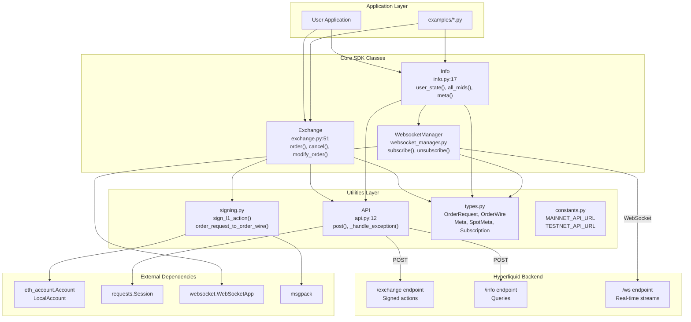

**Layer Descriptions:**

| Layer | Components | File Locations | Purpose |
|-------|-----------|----------------|---------|
| Application | User code, example scripts | User-defined, examples/*.py | Trading strategies, data analysis, automation |
| Core SDK | `Exchange`, `Info`, `WebsocketManager` | hyperliquid/exchange.py, hyperliquid/info.py, hyperliquid/websocket_manager.py | High-level API methods for trading and data access |
| Utilities | `API`, `signing`, `types`, `constants` | hyperliquid/api.py, hyperliquid/utils/*.py | HTTP transport, cryptographic operations, type definitions |
| External | `eth-account`, `requests`, `websocket-client`, `msgpack` | Python packages | Ethereum signing, HTTP client, WebSocket client, serialization |
| Backend | Hyperliquid exchange API | Remote endpoints | Order execution, market data, real-time events |

Both `Exchange` and `Info` inherit from the `API` base class, sharing a `requests.Session` instance for connection pooling. The `WebsocketManager` operates in a separate thread with a companion ping sender thread to maintain connection health.

Sources: [hyperliquid/exchange.py:51](), [hyperliquid/info.py:17](), [hyperliquid/api.py:12-28](), [pyproject.toml:41-47]()

## Core Components

The SDK provides three client classes (`Exchange`, `Info`, `WebsocketManager`) that inherit from or utilize a shared `API` base class for HTTP communication.

### Class Initialization and Dependencies

| Class | Constructor Parameters | Initialization Requirements | Primary Use Case |
|-------|----------------------|---------------------------|------------------|
| `Exchange` | `wallet: LocalAccount`, `base_url: str`, `vault_address: Optional[str]`, `account_address: Optional[str]` | Ethereum private key via `eth-account` | Trading, account management, asset deployment |
| `Info` | `base_url: str`, `skip_ws: bool` | None (read-only) | Market data queries, user state inspection |
| `WebsocketManager` | `base_url: str`, `user_address: Optional[str]` | None | Real-time L2 book, trades, user events |
| `API` | `base_url: str`, `account_address: Optional[str]` | None (base class) | HTTP POST transport layer |

### Method Categories by Class

**Exchange Class Methods** ([hyperliquid/exchange.py:51]()):

| Category | Methods | Required Signature |
|----------|---------|-------------------|
| Order Operations | `order()`, `bulk_orders()`, `cancel()`, `cancel_by_cloid()`, `modify_order()`, `modify_order_by_cloid()` | Yes (L1 action) |
| Position Management | `market_open()`, `market_close()`, `update_leverage()`, `update_isolated_margin()` | Yes (L1 action) |
| Account Operations | `usd_transfer()`, `spot_transfer()`, `sub_account_transfer()`, `withdraw_from_bridge()` | Yes (user-signed action) |
| Agent Management | `approve_agent()`, `approve_builder_fee()` | Yes (L1 action) |
| Deployment | `spot_deploy_*()`, `perp_deploy_*()` methods | Yes (deployment action) |

**Info Class Methods** ([hyperliquid/info.py:17]()):

| Category | Methods | Endpoint Used |
|----------|---------|---------------|
| User Data | `user_state()`, `open_orders()`, `user_fills()`, `user_funding_history()` | `/info` |
| Market Data | `all_mids()`, `l2_snapshot()`, `candles_snapshot()`, `recent_trades()` | `/info` |
| Metadata | `meta()`, `spot_meta()`, `spot_asset_contexts()`, `perp_asset_contexts()` | `/info` |
| Historical | `funding_history()`, `query_order_by_oid()`, `query_order_by_cloid()` | `/info` |
| WebSocket | `subscribe()`, `unsubscribe()` | Delegates to `WebsocketManager` |

**WebsocketManager Methods:**

| Method | Parameters | Purpose |
|--------|-----------|---------|
| `subscribe()` | `subscription: Subscription`, `callback: Callable` | Register callback for L2 book, trades, or user events |
| `unsubscribe()` | `subscription: Subscription`, `callback: Optional[Callable]` | Remove subscription or specific callback |
| Internal threading | N/A | Runs `ws.run_forever()` in dedicated thread with 50-second ping interval |

The `Exchange` constructor at [hyperliquid/exchange.py:55-71]() requires an `eth_account.Account.LocalAccount` object for signing. The `Info` constructor at [hyperliquid/info.py:18-77]() builds asset index mappings (`coin_to_asset`, `name_to_coin`) from the `meta()` and `spot_meta()` endpoints during initialization.

Sources: [hyperliquid/exchange.py:51-71](), [hyperliquid/info.py:17-77](), [hyperliquid/api.py:12-28]()

## Data Flow Patterns

The SDK implements distinct data flows for write operations (via `Exchange`) and read operations (via `Info`).

### Write Operation Flow (Order Placement)

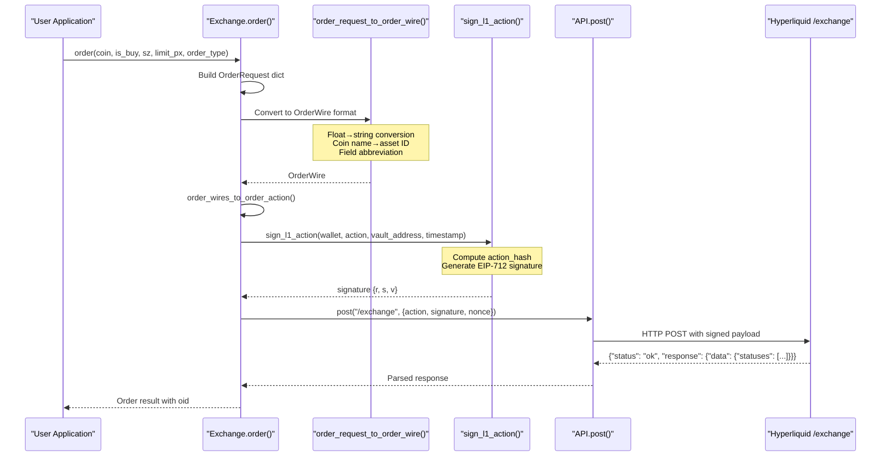

Sources: [hyperliquid/exchange.py:111-157](), [hyperliquid/utils/signing.py:order_request_to_order_wire](), [hyperliquid/api.py:20-28]()

### Read Operation Flow (User State Query)

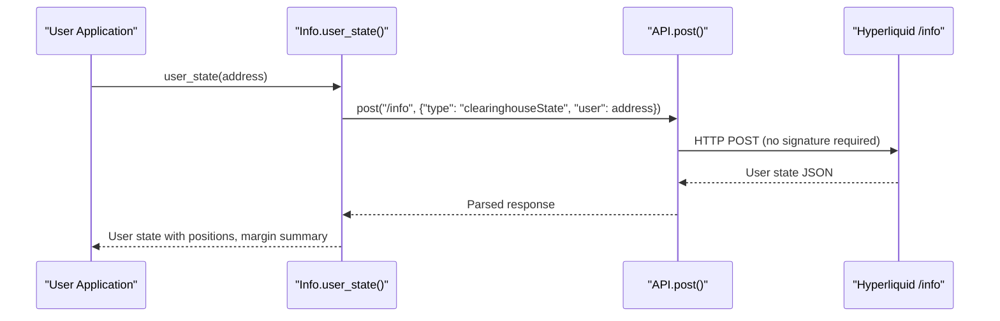

**Key Differences:**
- **Write operations** require EIP-712 signatures via `sign_l1_action()` at [hyperliquid/utils/signing.py]()
- **Read operations** send type-tagged payloads directly without signing
- **Order data** undergoes wire format conversion: floats→strings, coin names→asset IDs
- **Action hashing** uses msgpack serialization + keccak256 for signature computation

Sources: [hyperliquid/exchange.py:134-157](), [hyperliquid/info.py:84-126](), [hyperliquid/api.py:20-28]()

## Functional Capabilities

The SDK provides complete coverage of the Hyperliquid exchange API across trading, data access, and real-time streams.

### Trading Operations

| Operation Type | Methods | Input Types | Output Types |
|----------------|---------|-------------|--------------|
| Order Placement | `order()`, `bulk_orders()` | `OrderRequest`, `OrderType`, `Tif` | Order response with `oid` |
| Order Modification | `modify_order()`, `modify_order_by_cloid()` | `ModifyRequest`, oid or cloid | Order response |
| Order Cancellation | `cancel()`, `cancel_by_cloid()` | oid or cloid, optional coin | Cancellation status |
| Position Management | `market_open()`, `market_close()` | coin, is_buy, size | Position response |
| Leverage Control | `update_leverage()`, `update_isolated_margin()` | leverage, coin, is_cross | Update status |

### Market Data Access

| Data Type | Methods | Return Format | Update Frequency |
|-----------|---------|---------------|------------------|
| User Positions | `user_state()` | Asset positions, margin summary | On-demand query |
| Order Book | `l2_snapshot()` | Bids/asks with price levels | On-demand or WebSocket stream |
| Recent Trades | `recent_trades()` | Trade history with timestamps | On-demand or WebSocket stream |
| OHLCV Candles | `candles_snapshot()` | Time-series price data | On-demand query |
| Mid Prices | `all_mids()` | Current mid prices for all assets | On-demand query |
| Funding Rates | `funding_history()` | Historical funding rate data | On-demand query |

### Real-Time Subscriptions

| Subscription Type | TypedDict Name | Callback Data | Use Case |
|-------------------|---------------|---------------|----------|
| L2 Order Book | `Subscription(type="l2Book", coin=str)` | `L2BookMsg` | Market making, price monitoring |
| Recent Trades | `Subscription(type="trades", coin=str)` | `TradesMsg` | Trade execution tracking |
| User Events | `Subscription(type="userEvents", user=str)` | `UserEventsMsg` | Fill notifications, account updates |
| Candles | `Subscription(type="candle", coin=str, interval=str)` | Candle data | Chart updates |

### Asset Deployment

| Deployment Type | Method Prefix | Key Steps | Output |
|-----------------|---------------|-----------|--------|
| HIP-1 Spot Token | `spot_deploy_*` | Register token → User genesis → Genesis finalize → Register spot → Register hyperliquidity | Token ID, trading pair |
| HIP-2 EVM Token | EVM deployment + linking | Deploy ERC20 → Request EVM contract → Finalize contract link | Linked token ID |
| Perpetual Asset | `perp_deploy_*` | Register asset → Set oracle → Configure margin | Asset ID, trading enabled |

Sources: [hyperliquid/exchange.py](), [hyperliquid/info.py](), [hyperliquid/utils/types.py]()

### Supported Python Versions and Dependencies

The SDK supports Python 3.9 through 3.13 and relies on key dependencies for cryptographic operations (`eth-account`), real-time communication (`websocket-client`), HTTP requests (`requests`), and data serialization (`msgpack`).

### Environment Support

The SDK supports both Hyperliquid mainnet and testnet environments through configurable API URLs, enabling development and testing workflows alongside production deployment.

Sources: [pyproject.toml:30-47](), [README.md:13]()

---

# Page: Installation & Configuration

# Installation & Configuration

<details>
<summary>Relevant source files</summary>

The following files were used as context for generating this wiki page:

- [Makefile](Makefile)
- [README.md](README.md)
- [examples/basic_order_with_builder_deployed_dex.py](examples/basic_order_with_builder_deployed_dex.py)
- [examples/config.json.example](examples/config.json.example)
- [examples/example_utils.py](examples/example_utils.py)
- [pyproject.toml](pyproject.toml)

</details>


This document covers installing the hyperliquid-python-sdk and configuring it for use with the Hyperliquid exchange. It includes package installation methods, configuration file setup, authentication options, and client initialization procedures.

For examples of basic SDK usage after installation, see [Basic Usage Examples](#5). For development environment setup including Poetry and testing tools, see [Setting Up Development Environment](#7.1).

## Package Installation

The SDK is distributed as a Python package and can be installed through multiple methods.

### pip Installation

Install the latest stable release from PyPI:

```bash
pip install hyperliquid-python-sdk
```

The package supports Python versions 3.9 through 3.13 as defined in [pyproject.toml:30-34]().

### Poetry Installation

For development or dependency management with Poetry:

```bash
poetry add hyperliquid-python-sdk
```

### Dependency Overview

The SDK requires several core dependencies for cryptographic operations, HTTP communication, and WebSocket connections:

| Dependency | Version Range | Purpose |
|------------|---------------|---------|
| `eth-account` | ≥0.10.0, <0.14.0 | Ethereum account management and signing |
| `eth-utils` | ≥2.1.0, <6.0.0 | Ethereum utility functions |
| `websocket-client` | ^1.5.1 | WebSocket communication for real-time data |
| `requests` | ^2.31.0 | HTTP client for API calls |
| `msgpack` | ^1.0.5 | Message serialization |

**Dependency Installation Flow**
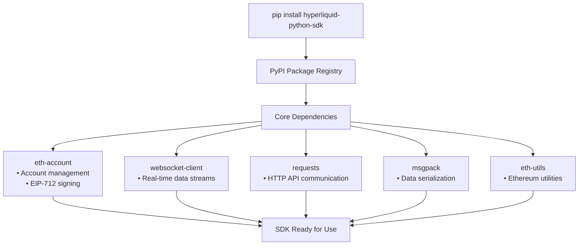

Sources: [pyproject.toml:41-47]()

## Configuration File Setup

The SDK uses a JSON configuration file to manage authentication credentials and account settings. Configuration is handled through [examples/config.json]() with an example template at [examples/config.json.example]().

### Configuration Structure

Create a `config.json` file based on the template structure:

```json
{
    "keystore_path": "",
    "secret_key": "",
    "account_address": "",
    "multi_sig": {
        "authorized_users": [
            {
                "comment": "signer 1",
                "secret_key": "",
                "account_address": ""
            }
        ]
    }
}
```

### Configuration Parameters

| Parameter | Type | Required | Description |
|-----------|------|----------|-------------|
| `secret_key` | string | Yes* | Private key in hex format (0x prefixed) |
| `keystore_path` | string | Yes* | Path to encrypted keystore file |
| `account_address` | string | Optional | Main account address (auto-derived if empty) |
| `multi_sig` | object | Optional | Multi-signature wallet configuration |

*Either `secret_key` or `keystore_path` must be provided.

### Authentication Methods

The SDK supports two authentication approaches handled by the `get_secret_key()` function in [examples/example_utils.py:36-52]():

#### Direct Secret Key

Provide the private key directly in the configuration:

```json
{
    "secret_key": "0x1234567890abcdef...",
    "account_address": ""
}
```

#### Keystore File

Use an encrypted keystore file for enhanced security:

```json
{
    "keystore_path": "~/.keystore/hyperliquid.json",
    "secret_key": "",
    "account_address": ""
}
```

When using a keystore, the SDK prompts for the password interactively during initialization.

**Configuration Loading Process**
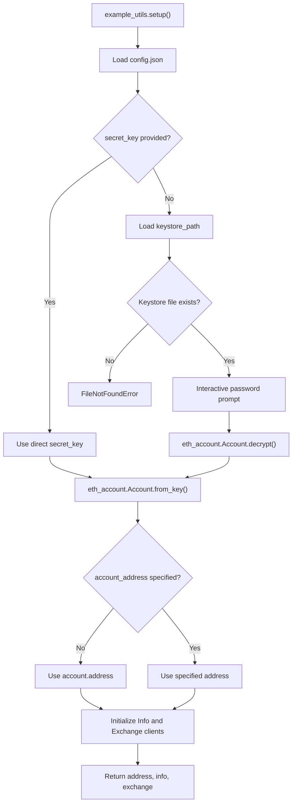

Sources: [examples/example_utils.py:12-33](), [examples/example_utils.py:36-52](), [examples/config.json.example:1-31]()

## Client Initialization

The SDK provides a standardized initialization process through the `setup()` function in [examples/example_utils.py:12-33]().

### Basic Setup

```python
from example_utils import setup
from hyperliquid.utils import constants

# Initialize with testnet
address, info, exchange = setup(base_url=constants.TESTNET_API_URL, skip_ws=True)
```

### Setup Function Parameters

| Parameter | Type | Default | Description |
|-----------|------|---------|-------------|
| `base_url` | string | None | API base URL (mainnet/testnet) |
| `skip_ws` | bool | False | Skip WebSocket initialization |
| `perp_dexs` | list | None | Builder-deployed perpetual DEXs |

### Account Validation

The setup process includes automatic account validation to ensure the configured account has sufficient equity to operate:

- Checks `marginSummary.accountValue` for perpetual positions
- Validates spot balances through `spot_user_state()`
- Raises exception if no equity is found

### Agent vs Main Account Configuration

The SDK supports both direct account access and agent/API wallet configurations:

**Direct Account Access:**
```json
{
    "secret_key": "0x...",
    "account_address": ""
}
```

**Agent/API Wallet:**
```json
{
    "secret_key": "0x...",  // API wallet private key
    "account_address": "0x..."  // Main account address
}
```

**Client Initialization Workflow**
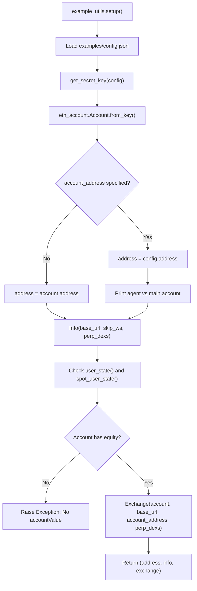

Sources: [examples/example_utils.py:12-33](), [examples/example_utils.py:16-32]()

## Multi-Signature Configuration

The SDK supports multi-signature operations through the `multi_sig` configuration section and the `setup_multi_sig_wallets()` function.

### Multi-Sig Setup

Configure multiple authorized signers in the config file:

```json
{
    "multi_sig": {
        "authorized_users": [
            {
                "comment": "signer 1",
                "secret_key": "0x...",
                "account_address": "0x..."
            },
            {
                "comment": "signer 2", 
                "secret_key": "0x...",
                "account_address": "0x..."
            }
        ]
    }
}
```

### Multi-Sig Initialization

Load multi-signature wallets using the dedicated setup function:

```python
authorized_wallets = setup_multi_sig_wallets()
```

The function validates that each provided private key matches its corresponding account address as shown in [examples/example_utils.py:55-68]().

Sources: [examples/example_utils.py:55-68](), [examples/config.json.example:17-30]()

## Environment-Specific Configuration

The SDK supports different environments through base URL configuration:

### Testnet Configuration

```python
from hyperliquid.utils import constants

address, info, exchange = setup(
    base_url=constants.TESTNET_API_URL,
    skip_ws=True
)
```

### Mainnet Configuration

```python
address, info, exchange = setup()  # Uses mainnet by default
```

### Builder-Deployed DEX Configuration

For custom perpetual DEXs:

```python
address, info, exchange = setup(
    base_url=constants.TESTNET_API_URL,
    perp_dexs=["custom_dex_name"]
)
```

Sources: [examples/basic_order_with_builder_deployed_dex.py:14-16](), [hyperliquid/utils/constants.py]()

## CLI Entry Point

The package includes a CLI entry point defined in [pyproject.toml:37-39]():

```bash
hyperliquid-python-sdk
```

This executes the `app` function from `hyperliquid.__main__` module.

Sources: [pyproject.toml:37-39]()

---

# Page: Project Structure

# Project Structure

<details>
<summary>Relevant source files</summary>

The following files were used as context for generating this wiki page:

- [Makefile](Makefile)
- [README.md](README.md)
- [pyproject.toml](pyproject.toml)

</details>


This document describes the physical organization of the hyperliquid-python-sdk repository, including directory layout, module organization, and the purpose of key files. For information about the SDK's functional architecture and API components, see [Core API](#2). For setup instructions, see [Installation & Configuration](#1.1).

## Repository Layout

The repository follows standard Python project conventions with Poetry-based dependency management. The codebase is organized into three primary directories: the core SDK package (`hyperliquid/`), usage demonstrations (`examples/`), and test suites (`tests/`).

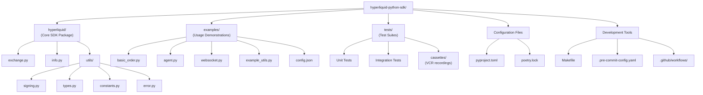

**Sources:** [pyproject.toml:15-17](), [README.md]()

## Core Package: `hyperliquid/`

The `hyperliquid` package contains all SDK functionality and is the only directory included in the distributed package as specified in [pyproject.toml:15-17](). The package is organized into client classes at the root level and shared utilities in a `utils/` subdirectory.

### Module Organization

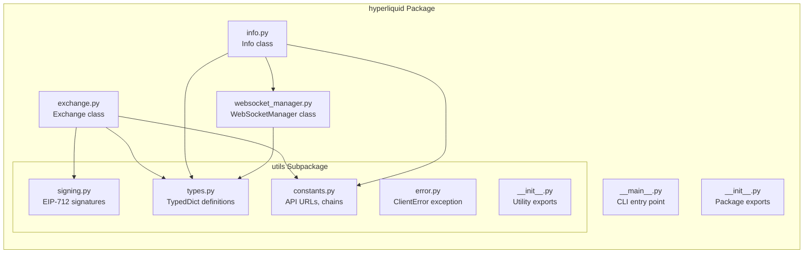

**Sources:** [pyproject.toml:15-17]()

### Primary Modules

| Module | Primary Class/Content | Purpose | Line Count Estimate |
|--------|----------------------|---------|---------------------|
| `exchange.py` | `Exchange` | Trading operations, order placement, account management, deployment | ~1000+ |
| `info.py` | `Info` | Read-only queries, market data, user state, WebSocket subscription management | ~500+ |
| `websocket_manager.py` | `WebSocketManager` | WebSocket connection lifecycle, message routing, ping/pong handling | ~200+ |
| `utils/signing.py` | Signing functions | EIP-712 signature generation, action hashing, wallet recovery | ~400+ |
| `utils/types.py` | TypedDict classes | Type definitions for orders, market data, WebSocket messages | ~600+ |
| `utils/constants.py` | Constants | `MAINNET_API_URL`, `TESTNET_API_URL`, chain IDs | ~50 |
| `utils/error.py` | `ClientError` | SDK exception class | ~10 |

**Sources:** File structure analysis from high-level diagrams

### Client Class Hierarchy

The SDK exposes three main client classes, each with distinct responsibilities:

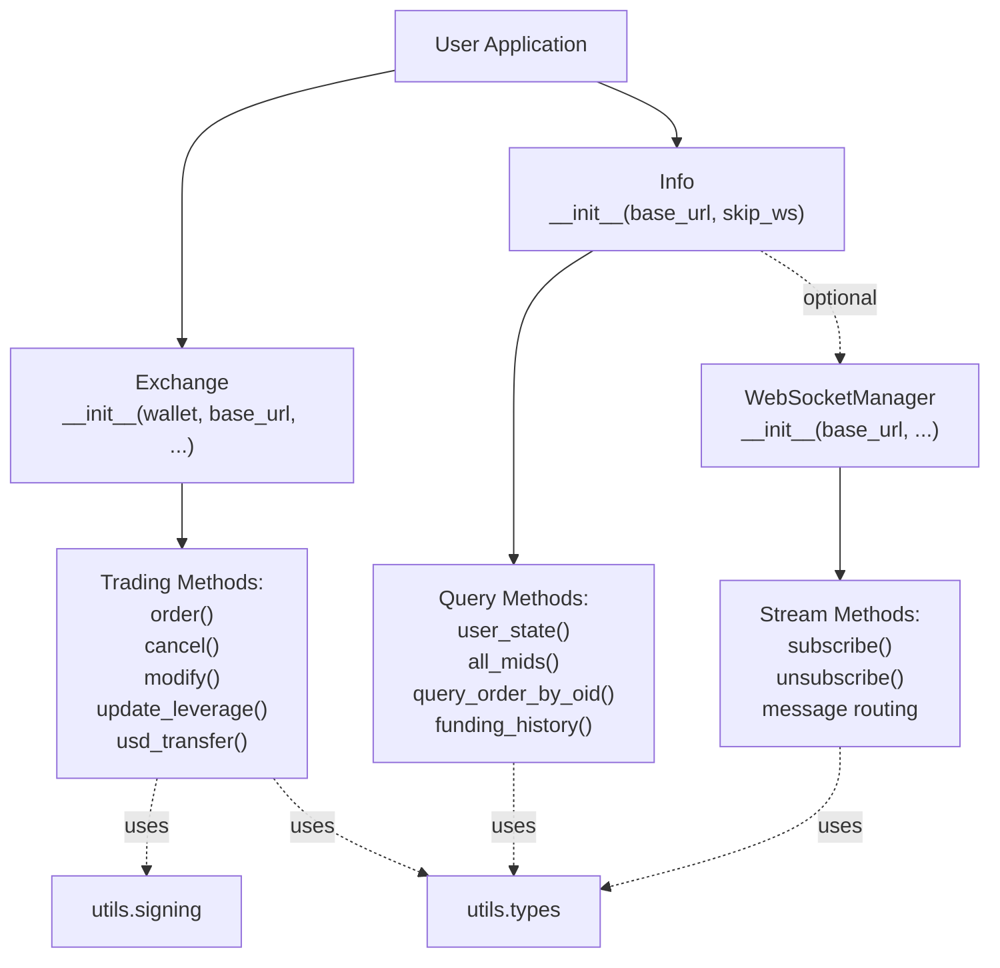

**Sources:** [exchange.py](), [info.py](), [websocket_manager.py]()

### Utilities Subpackage Structure

The `hyperliquid/utils/` directory contains shared functionality used across client classes:

| File | Key Exports | Dependencies | Usage Pattern |
|------|-------------|--------------|---------------|
| `signing.py` | `sign_l1_action()`, `sign_user_signed_action()`, `order_wires_to_order_action()` | `eth_account`, `eth_utils`, `msgpack` | Called by `Exchange` for all trading operations |
| `types.py` | `OrderRequest`, `OrderWire`, `Cloid`, `Meta`, `AssetInfo`, `WsMsg` | `typing.TypedDict` | Imported throughout SDK for type hints |
| `constants.py` | `MAINNET_API_URL`, `TESTNET_API_URL`, chain IDs | None | Imported by client classes and examples |
| `error.py` | `ClientError` | None | Raised by client classes on API errors |

**Sources:** [pyproject.toml:15-17](), high-level architecture diagrams

## Examples Directory

The `examples/` directory contains executable demonstration scripts showing SDK usage patterns. These files are not included in the distributed package but serve as documentation and starting points for users.

### Example Categories

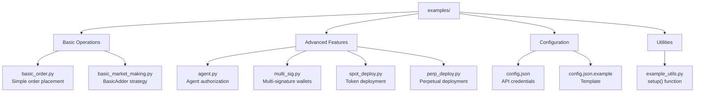

**Sources:** [README.md:39-44]()

### Configuration Pattern

All example scripts follow a consistent initialization pattern using `example_utils.setup()`:

| File | Purpose | Key Exports |
|------|---------|-------------|
| `example_utils.py` | Centralized configuration loading | `setup(base_url, skip_ws=True)` → `(address, info, exchange)` |
| `config.json` | User credentials storage | `account_address`, `secret_key` (gitignored) |
| `config.json.example` | Configuration template | Template structure for users to copy |

The `setup()` function reads credentials from `config.json`, initializes `LocalAccount` from the private key, and returns configured `Info` and `Exchange` instances. This pattern is used in [README.md:21-28]() documentation.

**Sources:** [README.md:21-28](), [README.md:39-44]()

### Example Script Organization

Examples are categorized by complexity and feature area:

| Script Name | Category | Demonstrates | Dependencies |
|-------------|----------|--------------|--------------|
| `basic_order.py` | Basic | Limit order placement | `Exchange`, `Info` |
| `basic_market_making.py` | Advanced | Market-making strategy with `BasicAdder` | `Exchange`, `Info`, strategy logic |
| `agent.py` | Advanced | Agent wallet creation and authorization | `Exchange` with agent operations |
| `multi_sig.py` | Advanced | Multi-signature wallet setup | `Exchange` with multi-sig operations |
| `websocket.py` | Basic | Real-time data subscriptions | `Info` with WebSocket enabled |
| `spot_deploy.py` | Advanced | HIP-1/HIP-2 token deployment | `Exchange` deployment methods |
| `perp_deploy.py` | Advanced | Perpetual asset deployment | `Exchange` deployment methods |

**Sources:** [README.md:39-44]()

## Tests Directory

The `tests/` directory contains pytest-based test suites with VCR.py integration for deterministic API testing.

### Test Structure

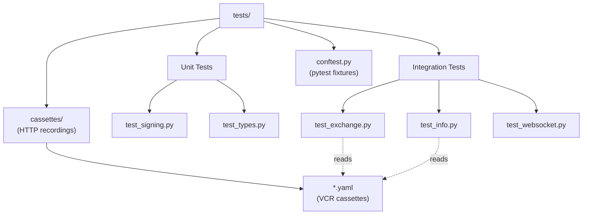

**Sources:** [pyproject.toml:133-148]()

### Testing Configuration

Test behavior is controlled by [pyproject.toml:133-148]():

| Configuration | Setting | Purpose |
|--------------|---------|---------|
| `norecursedirs` | `["hooks", "*.egg", ".eggs", "dist", "build", "docs", ".tox", ".git", "__pycache__"]` | Exclude directories from test discovery |
| `--record-mode` | `once` | VCR.py mode: record new cassettes once, then replay |
| `--cov` | `hyperliquid` | Generate coverage report for hyperliquid package |
| `--cov-report` | `html` | Output coverage as HTML report |

The VCR.py integration (via `pytest-recording`) records HTTP interactions in YAML cassettes, enabling tests to run deterministically without live API calls. The `--record-mode=once` setting means cassettes are created on first run and reused thereafter.

**Sources:** [pyproject.toml:133-148](), [pyproject.toml:51-61]()

## Configuration Files

The repository root contains several configuration files that control project metadata, dependencies, and tooling.

### Primary Configuration Files

| File | Format | Purpose | Managed By |
|------|--------|---------|------------|
| `pyproject.toml` | TOML | Project metadata, dependencies, tool configuration | Poetry, manually |
| `poetry.lock` | TOML | Locked dependency versions | Poetry automatically |
| `.pre-commit-config.yaml` | YAML | Pre-commit hook configuration | Pre-commit tool |
| `.github/workflows/*.yml` | YAML | CI/CD pipeline definitions | GitHub Actions |

**Sources:** [pyproject.toml](), [README.md:46-59]()

### pyproject.toml Structure

The [pyproject.toml]() file consolidates all project configuration:

```mermaid
graph TB
    PyProject["pyproject.toml"]
    
    PyProject --> Metadata["[tool.poetry]<br/>Package metadata"]
    PyProject --> Deps["[tool.poetry.dependencies]<br/>Runtime dependencies"]
    PyProject --> DevDeps["[tool.poetry.group.dev.dependencies]<br/>Development dependencies"]
    PyProject --> ToolConfig["Tool Configuration Sections"]
    
    Metadata --> Name["name: hyperliquid-python-sdk"]
    Metadata --> Version["version: 0.22.0"]
    Metadata --> Packages["packages: hyperliquid/"]
    
    Deps --> Python["python: ^3.9"]
    Deps --> EthUtils["eth-utils: >=2.1.0"]
    Deps --> EthAccount["eth-account: >=0.10.0"]
    Deps --> WebSocket["websocket-client: ^1.5.1"]
    Deps --> Requests["requests: ^2.31.0"]
    Deps --> Msgpack["msgpack: ^1.0.5"]
    
    DevDeps --> Pytest["pytest: ^8.3.4"]
    DevDeps --> Mypy["mypy: ^1.14.1"]
    DevDeps --> PreCommit["pre-commit: ^4.1.0"]
    DevDeps --> VCRPy["vcrpy: ^7.0.0"]
    
    ToolConfig --> Black["[tool.black]<br/>line-length: 120"]
    ToolConfig --> Isort["[tool.isort]<br/>import sorting"]
    ToolConfig --> MypyConfig["[tool.mypy]<br/>type checking"]
    ToolConfig --> Pylint["[tool.pylint]<br/>linting rules"]
    ToolConfig --> PytestConfig["[tool.pytest.ini_options]<br/>test options"]
```

**Sources:** [pyproject.toml:1-155]()

### Package Distribution Configuration

The package is configured for PyPI distribution with the following specifications:

| Setting | Value | Location |
|---------|-------|----------|
| Package name | `hyperliquid-python-sdk` | [pyproject.toml:7]() |
| Version | `0.22.0` | [pyproject.toml:8]() |
| Python requirement | `^3.9` (3.9+) | [pyproject.toml:42]() |
| Dev Python requirement | `^3.10` (3.10+) | [pyproject.toml:50]() |
| License | MIT | [pyproject.toml:12]() |
| Repository | `https://github.com/hyperliquid-dex/hyperliquid-python-sdk` | [pyproject.toml:13]() |
| Included packages | `hyperliquid/` only | [pyproject.toml:15-17]() |

The version follows [Semantic Versioning](https://semver.org/) with format `MAJOR.MINOR.PATCH`. Runtime requires Python 3.9+, while development (due to tooling constraints) requires Python 3.10+ as noted in [README.md:52]().

**Sources:** [pyproject.toml:6-17](), [pyproject.toml:41-48](), [README.md:52]()

## Development Tools

The repository includes several files that support the development workflow but are not part of the distributed package.

### Makefile Commands

The [Makefile]() provides convenient shortcuts for common development tasks:

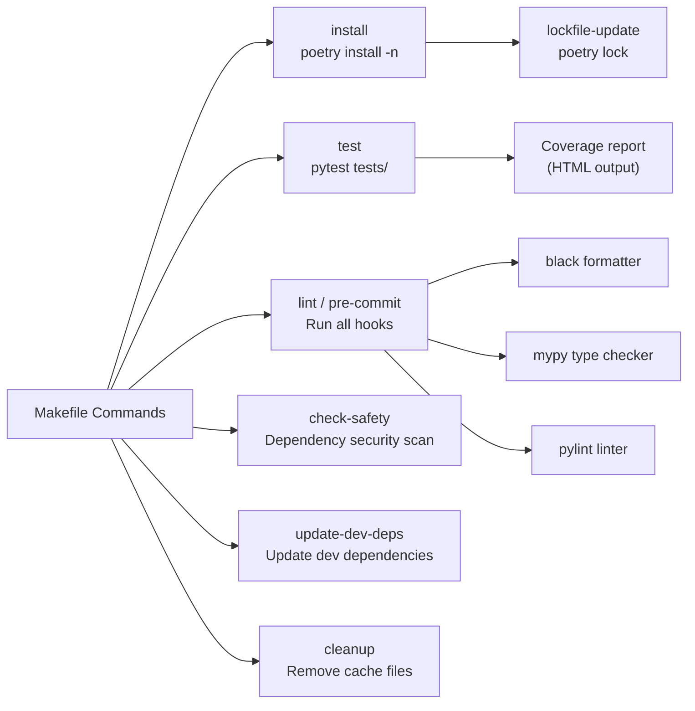

**Sources:** [Makefile:1-45](), [README.md:61-77]()

### Development Workflow Integration

| Tool | Configuration File | Purpose | Invocation |
|------|-------------------|---------|------------|
| Poetry | `pyproject.toml`, `poetry.lock` | Dependency management, build system | `poetry install`, `poetry publish` |
| Pre-commit | `.pre-commit-config.yaml` | Git hook automation | `make pre-commit` |
| Black | `[tool.black]` in `pyproject.toml` | Code formatting (120 char lines) | Via pre-commit or `make lint` |
| Mypy | `[tool.mypy]` in `pyproject.toml` | Static type checking | Via pre-commit or `make lint` |
| Pylint | `[tool.pylint]` in `pyproject.toml` | Code linting | Via pre-commit or `make lint` |
| Pytest | `[tool.pytest.ini_options]` in `pyproject.toml` | Test execution | `make test` |
| Safety | N/A (CLI tool) | Dependency vulnerability scanning | `make check-safety` |

All tool configurations are centralized in [pyproject.toml:63-155]() following modern Python best practices. The pre-commit hooks run automatically before each commit, enforcing code quality standards documented in [README.md:61-77]().

**Sources:** [pyproject.toml:63-155](), [Makefile:1-45](), [README.md:9]()

## Package Entry Points

The SDK defines a CLI entry point, though it is primarily intended as a library:

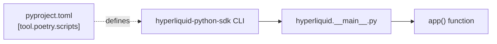

The entry point is defined in [pyproject.toml:37-39]():

```toml
[tool.poetry.scripts]
"hyperliquid-python-sdk" = "hyperliquid.__main__:app"
```

This allows the package to be invoked as `hyperliquid-python-sdk` from the command line after installation, executing the `app()` function in `hyperliquid/__main__.py`.

**Sources:** [pyproject.toml:37-39]()

## File Location Summary

The following table provides a quick reference for locating key files in the repository:

| Component | Path | Description |
|-----------|------|-------------|
| Main SDK package | `hyperliquid/` | All distributed SDK code |
| Trading client | `hyperliquid/exchange.py` | `Exchange` class implementation |
| Query client | `hyperliquid/info.py` | `Info` class implementation |
| WebSocket client | `hyperliquid/websocket_manager.py` | `WebSocketManager` class |
| Signing utilities | `hyperliquid/utils/signing.py` | EIP-712 signature generation |
| Type definitions | `hyperliquid/utils/types.py` | TypedDict classes |
| Constants | `hyperliquid/utils/constants.py` | API URLs and chain IDs |
| Examples | `examples/*.py` | Usage demonstration scripts |
| Example config | `examples/config.json` | User credentials (gitignored) |
| Example utilities | `examples/example_utils.py` | Shared example setup code |
| Tests | `tests/*.py` | Pytest test suites |
| Test cassettes | `tests/cassettes/*.yaml` | VCR.py HTTP recordings |
| Project config | `pyproject.toml` | Poetry configuration |
| Dependency lock | `poetry.lock` | Locked dependency tree |
| Build commands | `Makefile` | Development shortcuts |
| Pre-commit hooks | `.pre-commit-config.yaml` | Git hook definitions |
| CI pipeline | `.github/workflows/*.yml` | GitHub Actions workflows |

**Sources:** [pyproject.toml:15-17](), repository structure analysis

---

# Page: Core API

# Core API

<details>
<summary>Relevant source files</summary>

The following files were used as context for generating this wiki page:

- [examples/basic_ws.py](examples/basic_ws.py)
- [hyperliquid/exchange.py](hyperliquid/exchange.py)
- [hyperliquid/info.py](hyperliquid/info.py)
- [hyperliquid/websocket_manager.py](hyperliquid/websocket_manager.py)

</details>


This document provides an overview of the three primary API components in the Hyperliquid Python SDK: the Exchange client for trading operations, the Info client for data queries, and the WebSocketManager for real-time data streams. These components form the foundation for all interactions with the Hyperliquid exchange.

For detailed information about specific operations, see [Exchange API](#2.1), [Info API](#2.2), and [WebSocket API](#2.3). For authentication and signing details, see [Authentication & Signing](#3).

## Architecture Overview

The SDK implements a clear separation of concerns across three main classes:

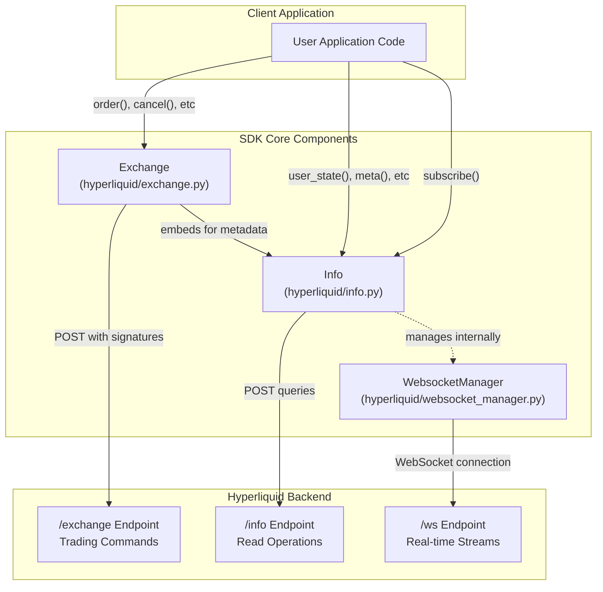

**Diagram: Core API Component Architecture**

The three components interact with distinct backend endpoints and serve different purposes in the trading workflow.

**Sources:** [hyperliquid/exchange.py:59-80](), [hyperliquid/info.py:17-33](), [hyperliquid/websocket_manager.py:77-88]()

## Component Responsibilities

| Component | Primary Purpose | Endpoint | Authentication Required | Thread Model |
|-----------|----------------|----------|------------------------|--------------|
| **Exchange** | Execute trading operations, account management, and deployment actions | `/exchange` | Yes - All actions require EIP-712 signatures | Single-threaded (HTTP) |
| **Info** | Query market data, user state, and historical information | `/info` | No - Read-only operations | Single-threaded (HTTP) |
| **WebsocketManager** | Subscribe to real-time market and user event streams | `/ws` | Partial - User events require authentication | Multi-threaded (WebSocket + ping thread) |

**Sources:** [hyperliquid/exchange.py:59-90](), [hyperliquid/info.py:17-83](), [hyperliquid/websocket_manager.py:77-106]()

## Exchange Client

The `Exchange` class handles all write operations to the exchange. Every action requires cryptographic signing using the user's Ethereum wallet.

### Key Characteristics

- **Inheritance:** Extends the `API` base class for HTTP communication
- **Wallet Requirement:** Must be initialized with a `LocalAccount` from `eth-account`
- **Embedded Info Client:** Contains an `Info` instance for metadata lookups (asset IDs, decimals, etc.)
- **Signature Generation:** All operations go through signing functions in `hyperliquid.utils.signing`

### Initialization

```python
from eth_account.signers.local import LocalAccount
from hyperliquid.exchange import Exchange

# Basic initialization
exchange = Exchange(wallet=my_wallet, base_url=base_url)

# With vault trading
exchange = Exchange(wallet=my_wallet, vault_address="0x...")

# With agent/sub-account
exchange = Exchange(wallet=agent_wallet, account_address="0x...")
```

**Sources:** [hyperliquid/exchange.py:59-80]()

### Operation Categories

The Exchange client provides methods across several categories:

| Category | Example Methods | Action Types |
|----------|----------------|--------------|
| **Order Management** | `order()`, `bulk_orders()`, `cancel()`, `modify_order()` | L1 actions |
| **Market Orders** | `market_open()`, `market_close()` | Derived from limit orders |
| **Account Configuration** | `update_leverage()`, `set_referrer()`, `create_sub_account()` | L1 actions |
| **Transfers** | `usd_transfer()`, `spot_transfer()`, `sub_account_transfer()` | User-signed actions |
| **Agent Management** | `approve_agent()`, `approve_builder_fee()` | Agent actions |
| **Deployment** | `spot_deploy_*()`, `perp_deploy_*()` | Deployment actions |
| **Multi-Sig** | `convert_to_multi_sig_user()`, `multi_sig()` | Multi-sig actions |

**Sources:** [hyperliquid/exchange.py:120-1201]()

## Info Client

The `Info` class provides read-only access to exchange state and historical data. It manages metadata about assets and optionally handles WebSocket subscriptions.

### Key Characteristics

- **No Authentication Required:** Most queries are publicly accessible
- **Metadata Management:** Maintains mappings between coin names, asset IDs, and decimals
- **WebSocket Integration:** Can optionally manage a `WebsocketManager` instance
- **Multiple DEX Support:** Can query data from different perp DEXs (builder-deployed exchanges)

### Initialization

```python
from hyperliquid.info import Info

# With WebSocket support (default)
info = Info(base_url=base_url)

# Without WebSocket (for query-only usage)
info = Info(base_url=base_url, skip_ws=True)

# With pre-loaded metadata
info = Info(base_url=base_url, meta=cached_meta, spot_meta=cached_spot_meta)
```

**Sources:** [hyperliquid/info.py:17-77]()

### Metadata Mappings

The `Info` client builds and maintains three critical mappings during initialization:

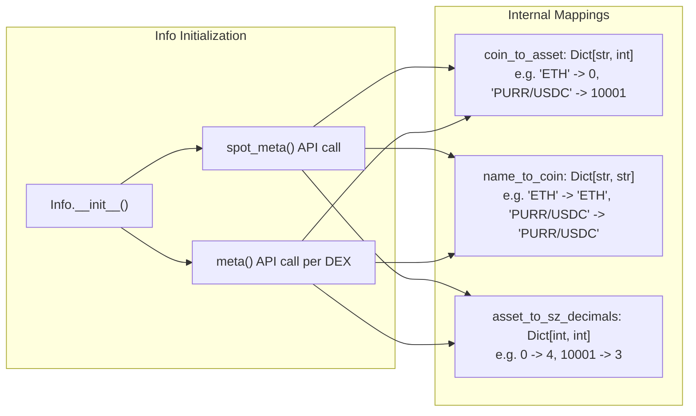

**Diagram: Info Client Metadata Initialization**

These mappings enable the SDK to translate between user-friendly names and the numeric asset IDs required by the API.

**Sources:** [hyperliquid/info.py:35-76]()

### Query Categories

| Category | Example Methods | Returns |
|----------|----------------|---------|
| **User State** | `user_state()`, `spot_user_state()`, `open_orders()` | Account positions, balances, open orders |
| **Market Data** | `all_mids()`, `l2_snapshot()`, `candles_snapshot()` | Price data, order book snapshots |
| **Historical Data** | `user_fills()`, `user_fills_by_time()`, `historical_orders()` | Trade history, order history |
| **Metadata** | `meta()`, `spot_meta()`, `meta_and_asset_ctxs()` | Asset information, exchange configuration |
| **Funding & Fees** | `funding_history()`, `user_fees()` | Funding rates, fee structures |
| **Staking** | `user_staking_summary()`, `user_staking_delegations()` | Validator delegation information |
| **Order Status** | `query_order_by_oid()`, `query_order_by_cloid()` | Individual order details |

**Sources:** [hyperliquid/info.py:84-761]()

## WebsocketManager

The `WebsocketManager` class handles real-time data streams. It runs in a dedicated thread and routes incoming messages to registered callbacks.

### Key Characteristics

- **Threading Model:** Runs in its own thread with a separate ping sender thread
- **Automatic Reconnection:** Managed by underlying `websocket-client` library
- **Subscription Routing:** Maps message types to callbacks using identifier strings
- **Queue Management:** Queues subscriptions received before WebSocket connection is ready

### Internal Architecture

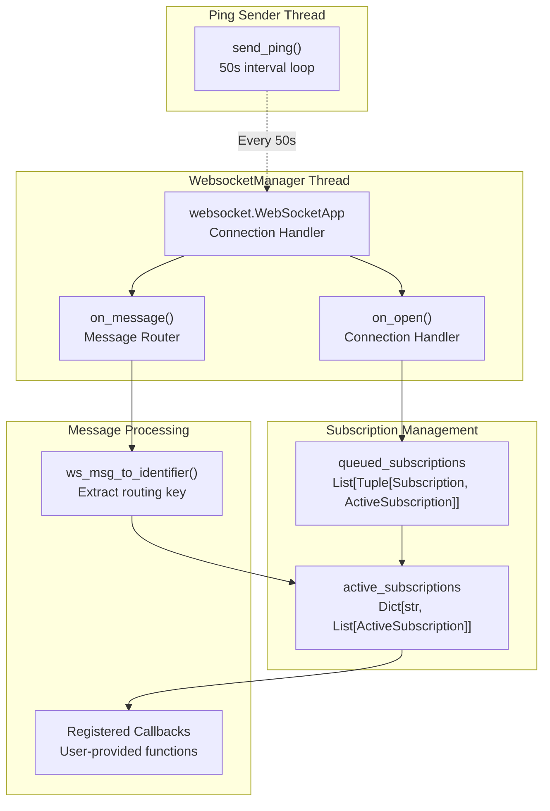

**Diagram: WebsocketManager Internal Architecture**

**Sources:** [hyperliquid/websocket_manager.py:77-163]()

### Subscription Identifiers

The routing system uses string identifiers to multiplex messages to callbacks:

| Subscription Type | Identifier Format | Example |
|------------------|-------------------|---------|
| `allMids` | `"allMids"` | `"allMids"` |
| `l2Book` | `"l2Book:{coin}"` | `"l2Book:eth"` |
| `trades` | `"trades:{coin}"` | `"trades:btc"` |
| `userEvents` | `"userEvents"` | `"userEvents"` |
| `userFills` | `"userFills:{user}"` | `"userFills:0x..."` |
| `candle` | `"candle:{coin},{interval}"` | `"candle:eth,1m"` |
| `orderUpdates` | `"orderUpdates"` | `"orderUpdates"` |
| `bbo` | `"bbo:{coin}"` | `"bbo:eth"` |
| `activeAssetCtx` | `"activeAssetCtx:{coin}"` | `"activeAssetCtx:btc"` |

**Sources:** [hyperliquid/websocket_manager.py:13-40](), [hyperliquid/websocket_manager.py:42-75]()

### Subscription Workflow

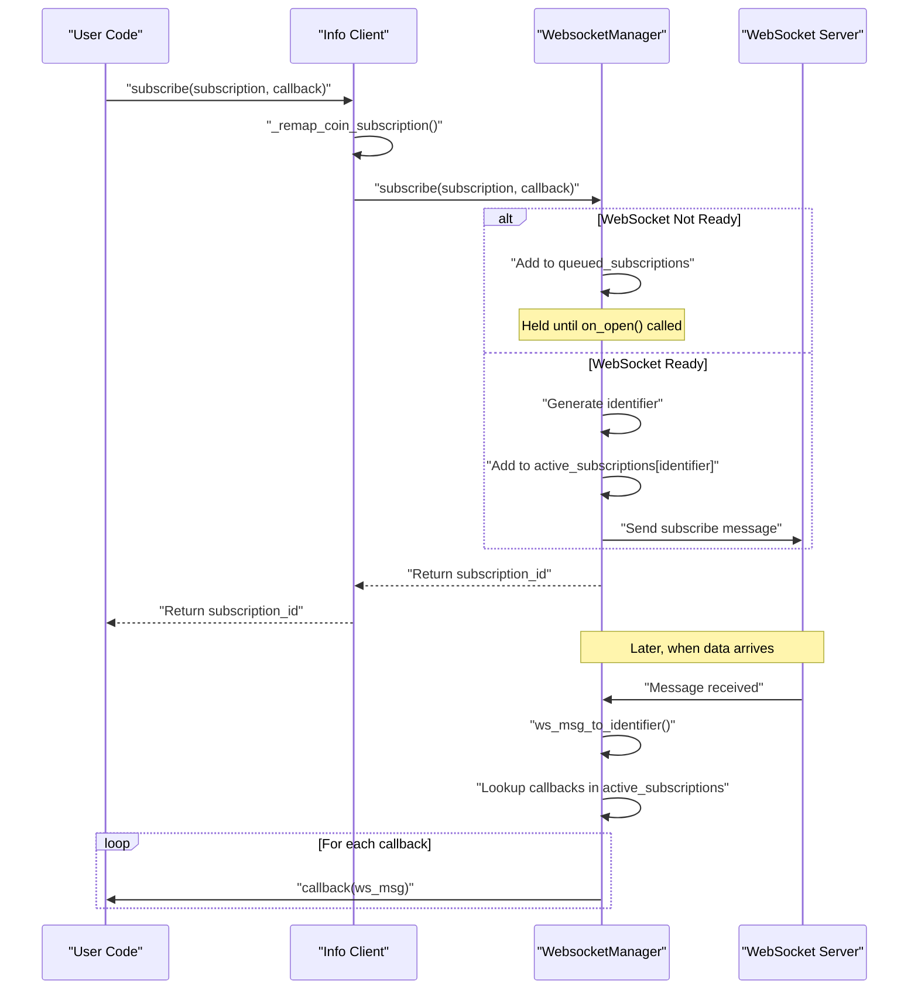

**Diagram: WebSocket Subscription Flow**

**Sources:** [hyperliquid/websocket_manager.py:133-151](), [hyperliquid/info.py:773-778]()

## API Endpoint Structure

The SDK interacts with three distinct HTTP/WebSocket endpoints:

### `/exchange` Endpoint

- **Method:** POST
- **Purpose:** Execute state-changing operations
- **Authentication:** Required - All requests must include EIP-712 signatures
- **Request Format:**
  ```json
  {
    "action": { "type": "order" | "cancel" | ... },
    "nonce": <timestamp_ms>,
    "signature": { "r": "0x...", "s": "0x...", "v": 27|28 },
    "vaultAddress": <optional_vault_address>,
    "expiresAfter": <optional_expiration_timestamp>
  }
  ```
- **Handled By:** `Exchange._post_action()`

**Sources:** [hyperliquid/exchange.py:81-90]()

### `/info` Endpoint

- **Method:** POST
- **Purpose:** Query exchange state and historical data
- **Authentication:** Not required for most queries
- **Request Format:**
  ```json
  {
    "type": "clearinghouseState" | "meta" | "userFills" | ...,
    "user": <optional_address>,
    "coin": <optional_coin>,
    ... other query-specific parameters
  }
  ```
- **Handled By:** `Info.post()` (inherited from `API` base class)

**Sources:** [hyperliquid/info.py:84-127](), [hyperliquid/info.py:271-287]()

### `/ws` Endpoint

- **Protocol:** WebSocket
- **Purpose:** Real-time streaming of market and user data
- **Authentication:** Required only for user-specific subscriptions
- **Message Format:**
  ```json
  {
    "method": "subscribe" | "unsubscribe" | "ping",
    "subscription": {
      "type": "l2Book" | "trades" | "userEvents" | ...,
      "coin": <optional_coin>,
      "user": <optional_user>,
      ... other subscription-specific parameters
    }
  }
  ```
- **Handled By:** `WebsocketManager`

**Sources:** [hyperliquid/websocket_manager.py:84-85](), [hyperliquid/websocket_manager.py:150]()

## Integration Patterns

### Exchange + Info Integration

The `Exchange` class embeds an `Info` instance to access metadata needed for order construction:

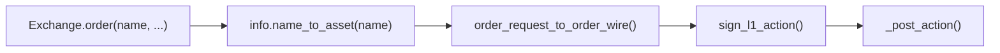

**Diagram: Exchange-Info Integration for Order Placement**

This tight coupling ensures that orders use the correct asset IDs and decimal precision without requiring users to manually look up metadata.

**Sources:** [hyperliquid/exchange.py:78](), [hyperliquid/exchange.py:146-148](), [hyperliquid/info.py:787-788]()

### Info + WebsocketManager Integration

The `Info` class can optionally manage a `WebsocketManager` instance, providing a unified interface for both query and subscription operations:

```python
# Info automatically creates and starts WebsocketManager
info = Info(base_url=base_url)

# Subscribe through Info, which delegates to WebsocketManager
info.subscribe({"type": "l2Book", "coin": "ETH"}, callback)

# Query through Info directly
user_state = info.user_state(address)

# Clean up WebSocket connection when done
info.disconnect_websocket()
```

**Sources:** [hyperliquid/info.py:30-33](), [hyperliquid/info.py:773-785]()

## Typical Usage Example

A complete trading application typically uses all three components together:

```python
from eth_account.signers.local import LocalAccount
from hyperliquid.exchange import Exchange
from hyperliquid.info import Info

# Initialize components
wallet: LocalAccount = ...  # Load from private key
exchange = Exchange(wallet, base_url)
info = Info(base_url)  # Separate Info for queries

# Subscribe to real-time updates
def on_fill(msg):
    print(f"Fill received: {msg}")

info.subscribe({"type": "userFills", "user": wallet.address}, on_fill)

# Query current state
user_state = info.user_state(wallet.address)
print(f"Account value: {user_state['marginSummary']['accountValue']}")

# Place an order (uses exchange.info internally for metadata)
result = exchange.order(
    name="ETH",
    is_buy=True,
    sz=0.1,
    limit_px=2000.0,
    order_type={"limit": {"tif": "Gtc"}}
)
print(f"Order result: {result}")
```

**Sources:** [hyperliquid/exchange.py:120-141](), [hyperliquid/info.py:84-126](), [examples/basic_ws.py:6-23]()

## Thread Safety Considerations

### Single-Threaded Components

Both `Exchange` and `Info` are **not thread-safe** for their HTTP operations. Each HTTP request is synchronous and blocking. If you need concurrent operations, create separate instances per thread.

### Multi-Threaded Component

`WebsocketManager` runs in its own thread with an additional ping sender thread. Callbacks are invoked from the WebSocket thread, so any shared state accessed in callbacks must be properly synchronized:

```python
import threading

# Shared state
lock = threading.Lock()
latest_price = None

def on_mid_update(msg):
    global latest_price
    with lock:
        latest_price = msg['data']['mids']['ETH']

info.subscribe({"type": "allMids"}, on_mid_update)

# Access from main thread
def get_latest_price():
    with lock:
        return latest_price
```

**Sources:** [hyperliquid/websocket_manager.py:77-91](), [hyperliquid/websocket_manager.py:93-99](), [hyperliquid/websocket_manager.py:107-125]()

## Connection Lifecycle

### Initialization Order

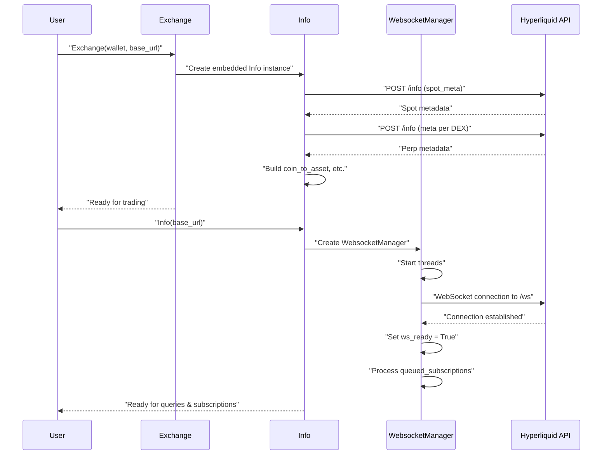

**Diagram: Component Initialization Lifecycle**

**Sources:** [hyperliquid/exchange.py:63-78](), [hyperliquid/info.py:28-69](), [hyperliquid/websocket_manager.py:78-91]()

### Cleanup

```python
# For Info with WebSocket
info.disconnect_websocket()  # Stops WebsocketManager threads

# No explicit cleanup needed for Exchange (uses requests library)
```

**Sources:** [hyperliquid/info.py:78-82](), [hyperliquid/websocket_manager.py:101-105]()

## Error Handling

All three components raise exceptions on errors:

- **HTTP Errors:** Propagated from `requests` library in `API.post()`
- **WebSocket Errors:** Connection failures, subscription errors
- **Validation Errors:** Invalid parameters, missing metadata

User code should wrap API calls in appropriate try-except blocks:

```python
try:
    result = exchange.order(...)
except Exception as e:
    print(f"Order failed: {e}")
```

**Sources:** [hyperliquid/api.py]() (base class handling)

---

# Page: Exchange API

# Exchange API

<details>
<summary>Relevant source files</summary>

The following files were used as context for generating this wiki page:

- [hyperliquid/exchange.py](hyperliquid/exchange.py)
- [hyperliquid/utils/signing.py](hyperliquid/utils/signing.py)
- [hyperliquid/utils/types.py](hyperliquid/utils/types.py)

</details>


The `Exchange` class provides the primary interface for executing trading operations and account management actions on the Hyperliquid platform. This class handles order placement, modification, cancellation, account transfers, agent authorization, asset deployment, and validator operations. All operations require cryptographic signing using EIP-712 signatures.

For read-only data queries and market information, see [Info API](#2.2). For real-time data streams, see [WebSocket API](#2.3). For detailed signing mechanics, see [Order Signing](#3.1).

## Architecture Overview

```mermaid
graph TB
    subgraph "Exchange Class Initialization"
        Init["Exchange(wallet, base_url, meta, vault_address, account_address, spot_meta, perp_dexs, timeout)"]
        Wallet["wallet: LocalAccount"]
        VaultAddr["vault_address: Optional[str]"]
        AccountAddr["account_address: Optional[str]"]
        InfoInstance["self.info: Info"]
        ExpiresAfter["self.expires_after: Optional[int]"]
    end
    
    subgraph "Action Execution Pipeline"
        Method["Exchange Method Called"]
        BuildAction["Construct Action Dict"]
        GetTimestamp["get_timestamp_ms()"]
        SignAction["sign_l1_action() or sign_user_signed_action()"]
        PostAction["_post_action(action, signature, nonce)"]
        HTTPPOST["POST /exchange"]
    end
    
    subgraph "Signing Module"
        ActionHash["action_hash()"]
        PhantomAgent["construct_phantom_agent()"]
        EIP712Payload["l1_payload() or user_signed_payload()"]
        SignInner["sign_inner()"]
    end
    
    Init --> Wallet
    Init --> VaultAddr
    Init --> AccountAddr
    Init --> InfoInstance
    Init --> ExpiresAfter
    
    Method --> BuildAction
    BuildAction --> GetTimestamp
    GetTimestamp --> SignAction
    SignAction --> ActionHash
    ActionHash --> PhantomAgent
    PhantomAgent --> EIP712Payload
    EIP712Payload --> SignInner
    SignInner --> PostAction
    PostAction --> HTTPPOST
```

**Sources:** [hyperliquid/exchange.py:59-79](), [hyperliquid/exchange.py:81-90](), [hyperliquid/utils/signing.py:239-244]()

### Exchange Class Initialization

The `Exchange` class is initialized with the following parameters:

| Parameter | Type | Required | Description |
|-----------|------|----------|-------------|
| `wallet` | `LocalAccount` | Yes | Ethereum account used for signing all actions |
| `base_url` | `str` | No | API endpoint URL (defaults to mainnet) |
| `meta` | `Meta` | No | Perpetual asset metadata (auto-fetched if not provided) |
| `vault_address` | `str` | No | Address of vault for vault operations |
| `account_address` | `str` | No | Address to query for market close operations |
| `spot_meta` | `SpotMeta` | No | Spot asset metadata (auto-fetched if not provided) |
| `perp_dexs` | `List[str]` | No | List of perpetual DEXes to support |
| `timeout` | `float` | No | HTTP request timeout in seconds |

The class maintains an internal `Info` instance for querying asset metadata and market data.

**Sources:** [hyperliquid/exchange.py:63-79]()

### Action Signing Flow

```mermaid
sequenceDiagram
    participant App as "Application Code"
    participant Exchange as "Exchange.method()"
    participant Signing as "Signing Module"
    participant API as "POST /exchange"
    
    App->>Exchange: Call method (e.g., order())
    Exchange->>Exchange: Build action dict
    Exchange->>Signing: get_timestamp_ms()
    Signing-->>Exchange: nonce (timestamp)
    Exchange->>Signing: sign_l1_action(wallet, action, vault_address, nonce, expires_after, is_mainnet)
    Signing->>Signing: action_hash(action, vault_address, nonce, expires_after)
    Signing->>Signing: construct_phantom_agent(hash, is_mainnet)
    Signing->>Signing: l1_payload(phantom_agent)
    Signing->>Signing: sign_inner(wallet, data)
    Signing-->>Exchange: signature {r, s, v}
    Exchange->>Exchange: _post_action(action, signature, nonce)
    Exchange->>API: POST with {action, nonce, signature, vaultAddress, expiresAfter}
    API-->>Exchange: response
    Exchange-->>App: result
```

**Sources:** [hyperliquid/exchange.py:81-90](), [hyperliquid/utils/signing.py:173-184](), [hyperliquid/utils/signing.py:239-244](), [hyperliquid/utils/signing.py:451-454]()

## Order Operations

### Order Placement

The Exchange provides multiple methods for placing orders:

| Method | Signature | Description |
|--------|-----------|-------------|
| `order()` | `order(name, is_buy, sz, limit_px, order_type, reduce_only, cloid, builder)` | Place a single order |
| `bulk_orders()` | `bulk_orders(order_requests, builder, grouping)` | Place multiple orders atomically |
| `market_open()` | `market_open(name, is_buy, sz, px, slippage, cloid, builder)` | Place market order to open position |
| `market_close()` | `market_close(coin, sz, px, slippage, cloid, builder)` | Place market order to close position |

**Sources:** [hyperliquid/exchange.py:120-141](), [hyperliquid/exchange.py:143-168](), [hyperliquid/exchange.py:225-240](), [hyperliquid/exchange.py:242-278]()

#### Order Request Flow

```mermaid
graph LR
    subgraph "High-Level Request"
        OR["OrderRequest<br/>{coin, is_buy, sz, limit_px, order_type, reduce_only, cloid}"]
    end
    
    subgraph "Wire Format Conversion"
        ORTOW["order_request_to_order_wire()"]
        OW["OrderWire<br/>{a, b, p, s, r, t, c}"]
    end
    
    subgraph "Action Construction"
        OWTOA["order_wires_to_order_action()"]
        OA["order_action<br/>{type: 'order', orders, grouping, builder}"]
    end
    
    subgraph "Signing & Submission"
        SL1A["sign_l1_action()"]
        PA["_post_action()"]
    end
    
    OR --> ORTOW
    ORTOW --> OW
    OW --> OWTOA
    OWTOA --> OA
    OA --> SL1A
    SL1A --> PA
```

**Sources:** [hyperliquid/utils/signing.py:504-515](), [hyperliquid/utils/signing.py:518-526](), [hyperliquid/exchange.py:146-168]()

#### Order Types

Order types are specified using `OrderType` TypedDict:

```python
# Limit order with Time-In-Force
order_type = {"limit": {"tif": "Gtc"}}  # "Alo", "Ioc", or "Gtc"

# Trigger order (Take-Profit / Stop-Loss)
order_type = {"trigger": {"triggerPx": 1850.0, "isMarket": True, "tpsl": "tp"}}  # "tp" or "sl"
```

**Sources:** [hyperliquid/utils/signing.py:13-19]()

#### Market Orders

Market orders are implemented as aggressive limit orders with Immediate-Or-Cancel (IoC) time-in-force. The `_slippage_price()` method calculates the limit price based on mid-price and slippage tolerance (default 5%).

**Sources:** [hyperliquid/exchange.py:92-112](), [hyperliquid/exchange.py:225-240]()

### Order Modification

| Method | Signature | Description |
|--------|-----------|-------------|
| `modify_order()` | `modify_order(oid, name, is_buy, sz, limit_px, order_type, reduce_only, cloid)` | Modify a single order by OID or CLOID |
| `bulk_modify_orders_new()` | `bulk_modify_orders_new(modify_requests)` | Modify multiple orders atomically |

The modification replaces the entire order with new parameters. The `oid` parameter accepts either an integer order ID or a `Cloid` object.

**Sources:** [hyperliquid/exchange.py:170-193](), [hyperliquid/exchange.py:195-223]()

### Order Cancellation

| Method | Signature | Description |
|--------|-----------|-------------|
| `cancel()` | `cancel(name, oid)` | Cancel a single order by OID |
| `cancel_by_cloid()` | `cancel_by_cloid(name, cloid)` | Cancel a single order by CLOID |
| `bulk_cancel()` | `bulk_cancel(cancel_requests)` | Cancel multiple orders by OID |
| `bulk_cancel_by_cloid()` | `bulk_cancel_by_cloid(cancel_requests)` | Cancel multiple orders by CLOID |
| `schedule_cancel()` | `schedule_cancel(time)` | Schedule cancellation of all orders at specified time |

**Sources:** [hyperliquid/exchange.py:280-311](), [hyperliquid/exchange.py:313-339](), [hyperliquid/exchange.py:341-367]()

#### Scheduled Cancellation

The `schedule_cancel()` method schedules a future time (UTC milliseconds) to cancel all open orders. Requirements:
- Time must be at least 5 seconds in the future
- Maximum 10 triggers per day
- Trigger count resets at 00:00 UTC
- Pass `None` to unset scheduled cancellation

**Sources:** [hyperliquid/exchange.py:341-367]()

## Account Management Operations

```mermaid
graph TB
    subgraph "Leverage Management"
        UL["update_leverage(leverage, name, is_cross)"]
        UIM["update_isolated_margin(amount, name)"]
    end
    
    subgraph "Sub-Account Operations"
        CSA["create_sub_account(name)"]
        SAT["sub_account_transfer(sub_account_user, is_deposit, usd)"]
        SAST["sub_account_spot_transfer(sub_account_user, is_deposit, token, amount)"]
    end
    
    subgraph "Vault Operations"
        VUT["vault_usd_transfer(vault_address, is_deposit, usd)"]
    end
    
    subgraph "Referral System"
        SR["set_referrer(code)"]
    end
    
    subgraph "Expiration Control"
        SEA["set_expires_after(expires_after)"]
    end
```

**Sources:** [hyperliquid/exchange.py:369-389](), [hyperliquid/exchange.py:391-412](), [hyperliquid/exchange.py:414-432](), [hyperliquid/exchange.py:434-452](), [hyperliquid/exchange.py:498-557](), [hyperliquid/exchange.py:117-118]()

### Leverage and Margin

| Method | Parameters | Description |
|--------|------------|-------------|
| `update_leverage()` | `leverage: int, name: str, is_cross: bool = True` | Update leverage for an asset |
| `update_isolated_margin()` | `amount: float, name: str` | Add margin to isolated position |

**Sources:** [hyperliquid/exchange.py:369-412]()

### Sub-Account Management

Sub-accounts enable segregated trading accounts under a main account:

| Method | Parameters | Description |
|--------|------------|-------------|
| `create_sub_account()` | `name: str` | Create a new sub-account |
| `sub_account_transfer()` | `sub_account_user: str, is_deposit: bool, usd: int` | Transfer USD between main and sub-account |
| `sub_account_spot_transfer()` | `sub_account_user: str, is_deposit: bool, token: str, amount: float` | Transfer spot tokens between main and sub-account |

**Sources:** [hyperliquid/exchange.py:434-452](), [hyperliquid/exchange.py:498-518](), [hyperliquid/exchange.py:520-541]()

### Action Expiration

The `set_expires_after()` method configures a timestamp (milliseconds) after which L1 actions will be rejected. This provides replay protection but is not supported for user-signed actions like `usd_transfer()`.

**Sources:** [hyperliquid/exchange.py:114-118]()

## Transfer Operations

### Transfer Method Categories

```mermaid
graph TB
    subgraph "USD Transfers"
        UT["usd_transfer(amount, destination)<br/>User-signed, between wallets"]
        UCT["usd_class_transfer(amount, to_perp)<br/>User-signed, perp/spot separation"]
    end
    
    subgraph "Spot Transfers"
        ST["spot_transfer(amount, destination, token)<br/>User-signed, between wallets"]
    end
    
    subgraph "Multi-DEX Transfers"
        SA["send_asset(destination, source_dex, destination_dex, token, amount)<br/>User-signed, cross-DEX transfers"]
    end
    
    subgraph "Bridge Operations"
        WFB["withdraw_from_bridge(amount, destination)<br/>User-signed, L1 withdrawal"]
    end
    
    subgraph "Token Delegation"
        TD["token_delegate(validator, wei, is_undelegate)<br/>User-signed, validator staking"]
    end
```

**Sources:** [hyperliquid/exchange.py:454-613]()

### Transfer Types

| Method | Signing Type | Description |
|--------|--------------|-------------|
| `usd_transfer()` | User-signed | Transfer USD between wallet addresses |
| `spot_transfer()` | User-signed | Transfer spot tokens between wallet addresses |
| `usd_class_transfer()` | User-signed | Transfer funds between perp and spot within same account |
| `send_asset()` | User-signed | Transfer assets between different DEXes |
| `withdraw_from_bridge()` | User-signed | Withdraw funds from bridge to external chain |
| `token_delegate()` | User-signed | Delegate tokens to validator for staking |

**User-signed actions** use a different signing flow than L1 actions and do not support `expires_after` or `vault_address`.

**Sources:** [hyperliquid/exchange.py:454-613]()

### USD Class Transfer

The `usd_class_transfer()` method moves funds between perpetual and spot accounts. For sub-accounts, the amount string is automatically suffixed with `subaccount:{vault_address}`.

**Sources:** [hyperliquid/exchange.py:454-471]()

### Send Asset

The `send_asset()` method transfers assets between different DEXes. DEX names:
- Default perp DEX: `""` (empty string)
- Spot DEX: `"spot"`
- Custom perp DEXes: custom name string

The token must match the collateral token when transferring to/from perp DEXes.

**Sources:** [hyperliquid/exchange.py:473-496]()

## Agent and Multi-Sig Operations

### Agent Operations

```mermaid
graph LR
    subgraph "Agent Creation"
        AA["approve_agent(name)<br/>Returns: (result, agent_key)"]
        GenKey["secrets.token_hex(32)"]
        Account["eth_account.Account.from_key()"]
    end
    
    subgraph "Agent Trading"
        AgentExchange["Exchange(agent_wallet)"]
        AgentOrder["Place orders using agent credentials"]
    end
    
    subgraph "Builder Integration"
        ABF["approve_builder_fee(builder, max_fee_rate)"]
        BI["BuilderInfo in order()"]
    end
    
    AA --> GenKey
    GenKey --> Account
    Account --> AgentExchange
    AgentExchange --> AgentOrder
    
    ABF --> BI
```

**Sources:** [hyperliquid/exchange.py:615-637](), [hyperliquid/exchange.py:639-644]()

### Agent Approval

The `approve_agent()` method creates a new agent wallet authorized to trade on behalf of the main wallet:

1. Generates a random 32-byte private key
2. Creates an Ethereum account from the key
3. Signs an agent approval action
4. Returns the approval result and agent private key

Agents can place orders and manage positions but cannot transfer funds or perform other privileged operations. See [Agent Authorization](#3.3) for details.

**Sources:** [hyperliquid/exchange.py:615-637]()

### Builder Fee Approval

The `approve_builder_fee()` method authorizes a builder address to receive fees from orders:

```python
exchange.approve_builder_fee(
    builder="0x...",  # Builder address (lowercase)
    max_fee_rate="10"  # Max fee in tenths of basis points (10 = 1 bps)
)
```

Once approved, orders can include `BuilderInfo` to direct fees to the builder.

**Sources:** [hyperliquid/exchange.py:639-644]()

### Multi-Sig Operations

| Method | Parameters | Description |
|--------|------------|-------------|
| `convert_to_multi_sig_user()` | `authorized_users: List[str], threshold: int` | Convert account to multi-sig |
| `multi_sig()` | `multi_sig_user, inner_action, signatures, nonce, vault_address` | Execute multi-sig action |

Multi-sig users require multiple authorized signers to approve actions. The `threshold` parameter specifies how many signatures are needed. See [Multi-Signature Operations](#3.2) for signing details.

**Sources:** [hyperliquid/exchange.py:646-663](), [hyperliquid/exchange.py:1079-1104]()

## Deployment Operations

### Spot Token Deployment Pipeline

```mermaid
graph TD
    subgraph "HIP-1 Native Spot Deployment"
        R1["1. spot_deploy_register_token()<br/>Auction-based registration"]
        R2["2. spot_deploy_user_genesis()<br/>Initial distribution"]
        R3["3. spot_deploy_genesis()<br/>Finalize max supply"]
        R4["4. spot_deploy_register_spot()<br/>Create trading pair"]
        R5["5. spot_deploy_register_hyperliquidity()<br/>Configure AMM"]
    end
    
    subgraph "Optional Token Features"
        EF["spot_deploy_enable_freeze_privilege()"]
        FU["spot_deploy_freeze_user(token, user, freeze)"]
        RF["spot_deploy_revoke_freeze_privilege()"]
        EQ["spot_deploy_enable_quote_token()"]
    end
    
    subgraph "Fee Configuration"
        SDTFS["spot_deploy_set_deployer_trading_fee_share(token, share)"]
    end
    
    R1 --> R2
    R2 --> R3
    R3 --> R4
    R4 --> R5
    
    R3 -.optional.-> EF
    EF --> FU
    FU --> RF
    R3 -.optional.-> EQ
    R4 --> SDTFS
```

**Sources:** [hyperliquid/exchange.py:665-871]()

### Spot Deployment Methods

| Method | Parameters | Description |
|--------|------------|-------------|
| `spot_deploy_register_token()` | `token_name, sz_decimals, wei_decimals, max_gas, full_name` | Register new token (auction-based) |
| `spot_deploy_user_genesis()` | `token, user_and_wei, existing_token_and_wei` | Distribute initial token supply |
| `spot_deploy_genesis()` | `token, max_supply, no_hyperliquidity` | Finalize token supply |
| `spot_deploy_register_spot()` | `base_token, quote_token` | Create spot trading pair |
| `spot_deploy_register_hyperliquidity()` | `spot, start_px, order_sz, n_orders, n_seeded_levels` | Configure AMM parameters |

**Sources:** [hyperliquid/exchange.py:665-848]()

### Perpetual Deployment

```mermaid
graph LR
    subgraph "Perpetual Asset Registration"
        PRA["perp_deploy_register_asset()<br/>(dex, max_gas, coin, sz_decimals, oracle_px, margin_table_id, only_isolated, schema)"]
    end
    
    subgraph "Oracle Configuration"
        PSO["perp_deploy_set_oracle()<br/>(dex, oracle_pxs, all_mark_pxs, external_perp_pxs)"]
    end
    
    PRA --> PSO
```

**Sources:** [hyperliquid/exchange.py:873-953]()

### Perpetual Deployment Methods

| Method | Parameters | Description |
|--------|------------|-------------|
| `perp_deploy_register_asset()` | `dex, max_gas, coin, sz_decimals, oracle_px, margin_table_id, only_isolated, schema` | Register new perpetual asset |
| `perp_deploy_set_oracle()` | `dex, oracle_pxs, all_mark_pxs, external_perp_pxs` | Update oracle prices |

The `schema` parameter defines the DEX configuration including collateral token and oracle updater. For detailed deployment workflows, see [Spot & Perpetual Deployment](#6.1).

**Sources:** [hyperliquid/exchange.py:873-953]()

## Validator Operations

### Validator Management

```mermaid
graph TB
    subgraph "Validator Registration"
        CVR["c_validator_register()<br/>(node_ip, name, description, delegations_disabled, commission_bps, signer, unjailed, initial_wei)"]
    end
    
    subgraph "Profile Management"
        CVCP["c_validator_change_profile()<br/>(node_ip, name, description, unjailed, disable_delegations, commission_bps, signer)"]
    end
    
    subgraph "Unregistration"
        CVU["c_validator_unregister()"]
    end
    
    subgraph "C-Signer Operations"
        CSUS["c_signer_unjail_self()"]
        CSJS["c_signer_jail_self()"]
    end
```

**Sources:** [hyperliquid/exchange.py:981-1077]()

### Validator Methods

| Method | Description |
|--------|-------------|
| `c_validator_register()` | Register as a validator with profile and initial stake |
| `c_validator_change_profile()` | Update validator profile information |
| `c_validator_unregister()` | Unregister validator |
| `c_signer_unjail_self()` | Remove self from jail (after downtime) |
| `c_signer_jail_self()` | Put self in jail (voluntary suspension) |

For validator operations including delegation, see [Validator & Network Operations](#6.4).

**Sources:** [hyperliquid/exchange.py:955-1077]()

## Advanced Operations

### Abstraction Settings

```mermaid
graph TB
    subgraph "Agent Abstraction"
        AEDA["agent_enable_dex_abstraction()"]
        ASA["agent_set_abstraction(abstraction)<br/>abstraction: 'u', 'p', 'i'"]
    end
    
    subgraph "User Abstraction"
        UDA["user_dex_abstraction(user, enabled)"]
        USA["user_set_abstraction(user, abstraction)<br/>abstraction: 'unifiedAccount', 'portfolioMargin', 'disabled'"]
    end
```

**Sources:** [hyperliquid/exchange.py:1126-1193]()

### Abstraction Methods

| Method | Parameters | Description |
|--------|------------|-------------|
| `agent_enable_dex_abstraction()` | None | Enable DEX abstraction for agent (legacy) |
| `agent_set_abstraction()` | `abstraction: AgentAbstraction` | Set agent abstraction mode: `"u"`, `"p"`, `"i"` |
| `user_dex_abstraction()` | `user: str, enabled: bool` | Enable/disable DEX abstraction for user (legacy) |
| `user_set_abstraction()` | `user: str, abstraction: Abstraction` | Set user abstraction: `"unifiedAccount"`, `"portfolioMargin"`, `"disabled"` |

For detailed abstraction modes, see [Account Abstraction](#6.7).

**Sources:** [hyperliquid/exchange.py:1126-1193]()

### EVM and Utility Operations

| Method | Parameters | Description |
|--------|------------|-------------|
| `use_big_blocks()` | `enable: bool` | Enable/disable big blocks for EVM transactions |
| `noop()` | `nonce: int` | No-operation action (for testing) |

**Sources:** [hyperliquid/exchange.py:1106-1124](), [hyperliquid/exchange.py:1195-1200]()

## Method Categories Summary

The following table categorizes all `Exchange` methods by their action type:

| Category | Methods | Count |
|----------|---------|-------|
| **Order Operations** | `order`, `bulk_orders`, `market_open`, `market_close`, `modify_order`, `bulk_modify_orders_new`, `cancel`, `cancel_by_cloid`, `bulk_cancel`, `bulk_cancel_by_cloid`, `schedule_cancel` | 11 |
| **Account Management** | `update_leverage`, `update_isolated_margin`, `set_referrer`, `create_sub_account`, `set_expires_after` | 5 |
| **Transfers** | `usd_transfer`, `spot_transfer`, `usd_class_transfer`, `send_asset`, `sub_account_transfer`, `sub_account_spot_transfer`, `vault_usd_transfer`, `withdraw_from_bridge`, `token_delegate` | 9 |
| **Agent/Multi-Sig** | `approve_agent`, `approve_builder_fee`, `convert_to_multi_sig_user`, `multi_sig` | 4 |
| **Spot Deployment** | `spot_deploy_register_token`, `spot_deploy_user_genesis`, `spot_deploy_genesis`, `spot_deploy_register_spot`, `spot_deploy_register_hyperliquidity`, `spot_deploy_set_deployer_trading_fee_share`, `spot_deploy_enable_freeze_privilege`, `spot_deploy_freeze_user`, `spot_deploy_revoke_freeze_privilege`, `spot_deploy_enable_quote_token` | 10 |
| **Perp Deployment** | `perp_deploy_register_asset`, `perp_deploy_set_oracle` | 2 |
| **Validator Operations** | `c_validator_register`, `c_validator_change_profile`, `c_validator_unregister`, `c_signer_unjail_self`, `c_signer_jail_self` | 5 |
| **Abstraction** | `agent_enable_dex_abstraction`, `agent_set_abstraction`, `user_dex_abstraction`, `user_set_abstraction` | 4 |
| **Utility** | `use_big_blocks`, `noop` | 2 |

**Sources:** [hyperliquid/exchange.py:1-1201]()

---

# Page: Info API

# Info API

<details>
<summary>Relevant source files</summary>

The following files were used as context for generating this wiki page:

- [hyperliquid/info.py](hyperliquid/info.py)
- [hyperliquid/utils/types.py](hyperliquid/utils/types.py)
- [tests/cassettes/info_test/test_extra_agents.yaml](tests/cassettes/info_test/test_extra_agents.yaml)
- [tests/info_test.py](tests/info_test.py)

</details>


## Purpose and Scope

The Info API provides read-only access to all query operations on the Hyperliquid exchange. It handles user account queries, market data retrieval, historical data access, and metadata lookups through the `/info` endpoint. For trading operations (order placement, cancellation, account modifications), see [Exchange API](#2.1). For real-time data streaming, this API integrates with [WebSocket API](#2.3).

Sources: [hyperliquid/info.py:17-789]()

---

## Architecture Overview

The `Info` class serves as the primary interface for all read operations, maintaining internal state for asset resolution and optionally managing WebSocket connections for real-time subscriptions.

```mermaid
graph TB
    subgraph "Client Application"
        UserCode["User Application Code"]
    end
    
    subgraph "Info Class Responsibilities"
        InfoClass["Info<br/>(hyperliquid/info.py)"]
        AssetMaps["Asset Resolution Maps<br/>coin_to_asset<br/>name_to_coin<br/>asset_to_sz_decimals"]
        WSManager["WebSocketManager<br/>(optional)"]
    end
    
    subgraph "Query Categories"
        UserQueries["User Queries<br/>user_state()<br/>open_orders()<br/>user_fills()"]
        MarketQueries["Market Data<br/>all_mids()<br/>l2_snapshot()<br/>candles_snapshot()"]
        HistoricalQueries["Historical Data<br/>funding_history()<br/>historical_orders()<br/>user_fills_by_time()"]
        MetadataQueries["Metadata<br/>meta()<br/>spot_meta()<br/>meta_and_asset_ctxs()"]
        AdminQueries["Administrative<br/>extra_agents()<br/>query_sub_accounts()<br/>user_fees()"]
    end
    
    subgraph "Hyperliquid Backend"
        InfoEndpoint["/info HTTP Endpoint"]
        WSEndpoint["/ws WebSocket Endpoint"]
    end
    
    UserCode --> InfoClass
    InfoClass --> AssetMaps
    InfoClass --> WSManager
    
    InfoClass --> UserQueries
    InfoClass --> MarketQueries
    InfoClass --> HistoricalQueries
    InfoClass --> MetadataQueries
    InfoClass --> AdminQueries
    
    UserQueries --> InfoEndpoint
    MarketQueries --> InfoEndpoint
    HistoricalQueries --> InfoEndpoint
    MetadataQueries --> InfoEndpoint
    AdminQueries --> InfoEndpoint
    
    WSManager --> WSEndpoint
```

**Info Class Architecture**

The `Info` class extends the base `API` class and adds asset resolution capabilities along with optional WebSocket management. All queries are stateless HTTP POST requests to the `/info` endpoint, with the request type specified in the payload.

Sources: [hyperliquid/info.py:17-33](), [hyperliquid/info.py:84-789]()

---

## Initialization and Configuration

### Constructor Parameters

The `Info` class constructor accepts several parameters that control its behavior:

```mermaid
graph LR
    Init["Info.__init__()"]
    
    BaseURL["base_url<br/>Optional[str]<br/>Default: api.hyperliquid.xyz"]
    SkipWS["skip_ws<br/>Optional[bool]<br/>Default: False"]
    Meta["meta<br/>Optional[Meta]<br/>Perp metadata cache"]
    SpotMeta["spot_meta<br/>Optional[SpotMeta]<br/>Spot metadata cache"]
    PerpDexs["perp_dexs<br/>Optional[List[str]]<br/>Builder dex names"]
    Timeout["timeout<br/>Optional[float]<br/>Request timeout"]
    
    Init --> BaseURL
    Init --> SkipWS
    Init --> Meta
    Init --> SpotMeta
    Init --> PerpDexs
    Init --> Timeout
```

**Initialization Parameters**

| Parameter | Type | Default | Purpose |
|-----------|------|---------|---------|
| `base_url` | `Optional[str]` | `None` | Override default API URL |
| `skip_ws` | `Optional[bool]` | `False` | Disable WebSocket management |
| `meta` | `Optional[Meta]` | `None` | Provide cached perp metadata |
| `spot_meta` | `Optional[SpotMeta]` | `None` | Provide cached spot metadata |
| `perp_dexs` | `Optional[List[str]]` | `None` | Builder-deployed perp dexes to track |
| `timeout` | `Optional[float]` | `None` | HTTP request timeout in seconds |

### Initialization Process

```mermaid
sequenceDiagram
    participant Client as Client Code
    participant Info as Info.__init__
    participant API as API Base Class
    participant WSMgr as WebSocketManager
    participant Backend as /info Endpoint
    
    Client->>Info: Info(skip_ws=False)
    Info->>API: super().__init__(base_url, timeout)
    
    alt skip_ws is False
        Info->>WSMgr: WebSocketManager(base_url)
        WSMgr-->>Info: ws_manager instance
        Info->>WSMgr: start()
    end
    
    alt spot_meta is None
        Info->>Backend: POST {"type": "spotMeta"}
        Backend-->>Info: spot_meta response
    end
    
    Info->>Info: Build coin_to_asset map (spot)
    Info->>Info: Build name_to_coin map (spot)
    Info->>Info: Build asset_to_sz_decimals map (spot)
    
    loop for each perp_dex
        alt meta not provided
            Info->>Backend: POST {"type": "meta", "dex": dex_name}
            Backend-->>Info: meta response
        end
        Info->>Info: set_perp_meta(meta, offset)
        Info->>Info: Update asset maps (perp)
    end
    
    Info-->>Client: Initialized Info instance
```

**Initialization Sequence**

The initialization process builds internal mappings for asset resolution. Spot assets start at index 10000, while builder-deployed perp dexes start at 110000 with 10000-unit offsets.

Sources: [hyperliquid/info.py:18-76]()

---

## Asset Resolution System

The `Info` class maintains three critical mapping dictionaries that enable conversion between human-readable names and internal asset identifiers.

```mermaid
graph TD
    subgraph "Input Formats"
        CoinName["Coin Name<br/>'BTC', 'ETH'"]
        DisplayName["Display Name<br/>'BTC/USDC'"]
        Asset["Asset ID<br/>0, 1, 10000, 110000"]
    end
    
    subgraph "Internal Mappings"
        NameToCoin["name_to_coin<br/>Dict[str, str]"]
        CoinToAsset["coin_to_asset<br/>Dict[str, int]"]
        AssetToSz["asset_to_sz_decimals<br/>Dict[int, int]"]
    end
    
    subgraph "Asset ID Ranges"
        PerpMain["Perp Assets (Main DEX)<br/>0-9999"]
        Spot["Spot Assets<br/>10000+"]
        PerpBuilder["Builder Perp Assets<br/>110000+"]
    end
    
    DisplayName --> NameToCoin
    CoinName --> NameToCoin
    NameToCoin --> CoinToAsset
    CoinToAsset --> Asset
    
    Asset --> AssetToSz
    
    CoinToAsset -.maps to.-> PerpMain
    CoinToAsset -.maps to.-> Spot
    CoinToAsset -.maps to.-> PerpBuilder
```

**Asset ID Allocation**

Asset IDs are allocated in distinct ranges to avoid conflicts between different asset types and dexes:

- **0-9999**: Main perpetual assets (original dex with `dex=""`)
- **10000-109999**: Spot assets (added to `spot_info["index"] + 10000`)
- **110000+**: Builder-deployed perpetual dexes (110000 + i * 10000, where i is the dex index)

### Key Methods

| Method | Purpose | Example |
|--------|---------|---------|
| `name_to_asset(name: str)` | Convert display name to asset ID | `name_to_asset("BTC") → 0` |
| `_remap_coin_subscription(subscription)` | Normalize coin names in subscriptions | Internal use |

Sources: [hyperliquid/info.py:38-76](), [hyperliquid/info.py:787-788]()

---

## Query Methods by Category

### User Account Queries

Methods for retrieving account-specific information including positions, orders, and balances.

```mermaid
graph TB
    subgraph "User Account Methods"
        UserState["user_state(address, dex)<br/>Returns: positions, margin, withdrawable"]
        SpotUserState["spot_user_state(address)<br/>Returns: spot balances and positions"]
        OpenOrders["open_orders(address, dex)<br/>Returns: list of open orders"]
        FrontendOpenOrders["frontend_open_orders(address, dex)<br/>Returns: orders with frontend metadata"]
        UserFills["user_fills(address)<br/>Returns: all historical fills"]
        UserFillsByTime["user_fills_by_time(address, start, end)<br/>Returns: fills in time range"]
    end
    
    subgraph "Response Structure"
        StateResp["user_state response<br/>assetPositions: [...]<br/>marginSummary: {...}<br/>withdrawable: str"]
        OrderResp["open_orders response<br/>[{coin, limitPx, oid, side, sz}]"]
        FillResp["user_fills response<br/>[{coin, px, sz, oid, closedPnl}]"]
    end
    
    UserState --> StateResp
    OpenOrders --> OrderResp
    UserFills --> FillResp
```

**User Account Query Methods**

#### user_state(address, dex="")

Retrieves comprehensive trading state for a user including all positions, margin summary, and withdrawable balance.

**Parameters:**
- `address` (str): 42-character hexadecimal Ethereum address
- `dex` (str): DEX identifier (default: "" for main dex)

**Returns:**
```python
{
    "assetPositions": [
        {
            "position": {
                "coin": str,
                "entryPx": Optional[str],
                "leverage": {"type": "cross"|"isolated", "value": int, ...},
                "liquidationPx": Optional[str],
                "marginUsed": str,
                "positionValue": str,
                "returnOnEquity": str,
                "szi": str,
                "unrealizedPnl": str
            },
            "type": "oneWay"
        }
    ],
    "crossMarginSummary": {...},
    "marginSummary": {...},
    "withdrawable": str
}
```

Sources: [hyperliquid/info.py:84-126]()

#### spot_user_state(address)

Retrieves spot trading state including spot balances and positions.

Sources: [hyperliquid/info.py:128-129]()

#### open_orders(address, dex="")

Retrieves all open orders for a user.

**Returns:**
```python
[
    {
        "coin": str,
        "limitPx": str,
        "oid": int,
        "side": "A" | "B",  # A=Ask/Sell, B=Bid/Buy
        "sz": str,
        "timestamp": int
    }
]
```

Sources: [hyperliquid/info.py:131-150]()

#### frontend_open_orders(address, dex="")

Retrieves open orders with additional frontend-specific information including trigger conditions, order types, and child orders.

**Returns:**
```python
[
    {
        "children": [...],  # Linked orders (TP/SL)
        "coin": str,
        "isPositionTpsl": bool,
        "isTrigger": bool,
        "limitPx": str,
        "oid": int,
        "orderType": str,
        "origSz": str,
        "reduceOnly": bool,
        "side": "A" | "B",
        "sz": str,
        "tif": str,
        "timestamp": int,
        "triggerCondition": str,
        "triggerPx": str
    }
]
```

Sources: [hyperliquid/info.py:152-183]()

#### user_fills(address)

Retrieves all historical fills for a user.

**Returns:**
```python
[
    {
        "closedPnl": str,
        "coin": str,
        "crossed": bool,
        "dir": str,
        "hash": str,
        "oid": int,
        "px": str,
        "side": str,
        "startPosition": str,
        "sz": str,
        "time": int
    }
]
```

Sources: [hyperliquid/info.py:199-226]()

#### user_fills_by_time(address, start_time, end_time=None, aggregate_by_time=False)

Retrieves fills within a specific time range with optional aggregation.

**Parameters:**
- `address` (str): User's Ethereum address
- `start_time` (int): Unix timestamp in milliseconds
- `end_time` (Optional[int]): Unix timestamp in milliseconds
- `aggregate_by_time` (Optional[bool]): Combine partial fills from same crossing order

Sources: [hyperliquid/info.py:228-269]()

### Market Data Queries

Methods for retrieving real-time and historical market data.

```mermaid
graph TB
    subgraph "Market Data Methods"
        AllMids["all_mids(dex)<br/>Returns: {coin: mid_price}"]
        L2Snapshot["l2_snapshot(name)<br/>Returns: order book levels"]
        CandlesSnapshot["candles_snapshot(name, interval, start, end)<br/>Returns: OHLCV candles"]
    end
    
    subgraph "Data Structures"
        MidsResp["all_mids response<br/>{BTC: '50000.0', ETH: '3000.0'}"]
        L2Resp["l2_snapshot response<br/>{coin, levels: [[bids], [asks]], time}"]
        CandleResp["candles_snapshot response<br/>[{T, c, h, i, l, n, o, s, t, v}]"]
    end
    
    AllMids --> MidsResp
    L2Snapshot --> L2Resp
    CandlesSnapshot --> CandleResp
```

**Market Data Query Methods**

#### all_mids(dex="")

Retrieves mid prices for all actively traded coins on the specified dex.

**Returns:**
```python
{
    "ATOM": str,  # Float string
    "BTC": str,
    "ETH": str,
    # ... other coins
}
```

Sources: [hyperliquid/info.py:185-197]()

#### l2_snapshot(name)

Retrieves the current order book (Level 2 data) for a specific coin.

**Parameters:**
- `name` (str): Coin name (e.g., "BTC", "ETH")

**Returns:**
```python
{
    "coin": str,
    "levels": [
        [  # Bids
            {"n": int, "px": str, "sz": str},
            ...
        ],
        [  # Asks
            {"n": int, "px": str, "sz": str},
            ...
        ]
    ],
    "time": int
}
```

Sources: [hyperliquid/info.py:446-471]()

#### candles_snapshot(name, interval, startTime, endTime)

Retrieves OHLCV candlestick data for a coin within a time range.

**Parameters:**
- `name` (str): Coin name
- `interval` (str): Candlestick interval (e.g., "1m", "1h", "1d")
- `startTime` (int): Unix timestamp in milliseconds
- `endTime` (int): Unix timestamp in milliseconds

**Returns:**
```python
[
    {
        "T": int,    # Close time
        "c": str,    # Close price
        "h": str,    # High price
        "i": str,    # Interval
        "l": str,    # Low price
        "n": int,    # Number of trades
        "o": str,    # Open price
        "s": str,    # Symbol
        "t": int,    # Open time
        "v": str     # Volume
    }
]
```

Sources: [hyperliquid/info.py:473-502]()

### Historical Data Queries

Methods for retrieving historical funding rates, orders, and ledger updates.

```mermaid
graph TB
    subgraph "Historical Query Methods"
        FundingHistory["funding_history(name, start, end)<br/>Coin funding rates over time"]
        UserFundingHistory["user_funding_history(user, start, end)<br/>User's funding payments"]
        HistoricalOrders["historical_orders(user)<br/>Last 2000 historical orders"]
        UserNonFundingLedger["user_non_funding_ledger_updates(user, start, end)<br/>Account ledger changes"]
        Portfolio["portfolio(user)<br/>Portfolio performance metrics"]
        UserTwapSliceFills["user_twap_slice_fills(user)<br/>TWAP execution fills"]
        DelegatorHistory["delegator_history(user)<br/>Staking delegation history"]
    end
    
    subgraph "Response Types"
        FundingResp["[{coin, fundingRate, premium, time}]"]
        OrdersResp["[{order, status, statusTimestamp}]"]
        LedgerResp["[{delta, hash, time}]"]
        PortfolioResp["[[period, {accountValueHistory, pnlHistory, vlm}]]"]
    end
    
    FundingHistory --> FundingResp
    HistoricalOrders --> OrdersResp
    UserNonFundingLedger --> LedgerResp
    Portfolio --> PortfolioResp
```

**Historical Data Query Methods**

#### funding_history(name, startTime, endTime=None)

Retrieves funding rate history for a specific coin.

**Returns:**
```python
[
    {
        "coin": str,
        "fundingRate": str,
        "premium": str,
        "time": int
    }
]
```

Sources: [hyperliquid/info.py:400-426]()

#### user_funding_history(user, startTime, endTime=None)

Retrieves funding payment history for a user.

**Returns:**
```python
[
    {
        "delta": {
            "coin": str,
            "fundingRate": str,
            "szi": str,
            "type": "funding",
            "usdc": str
        },
        "hash": str,
        "time": int
    }
]
```

Sources: [hyperliquid/info.py:428-444]()

#### historical_orders(user)

Retrieves up to 2000 most recent historical orders with their current status.

**Returns:**
```python
[
    {
        "order": {...},           # Order details
        "status": str,            # Order status
        "statusTimestamp": int    # Status change timestamp
    }
]
```

Sources: [hyperliquid/info.py:635-648]()

#### user_non_funding_ledger_updates(user, startTime, endTime=None)

Retrieves all non-funding ledger updates including deposits, withdrawals, transfers, and liquidations.

**Returns:**
```python
[
    {
        "delta": {...},  # Change details
        "hash": str,     # Transaction hash
        "time": int      # Event timestamp
    }
]
```

Sources: [hyperliquid/info.py:650-667]()

#### portfolio(user)

Retrieves comprehensive portfolio performance data across different time periods.

**Returns:**
```python
[
    [
        "period_name",
        {
            "accountValueHistory": [...],
            "pnlHistory": [...],
            "vlm": [...]
        }
    ]
]
```

Sources: [hyperliquid/info.py:669-681]()

#### user_twap_slice_fills(user)

Retrieves TWAP (Time-Weighted Average Price) order execution details.

Sources: [hyperliquid/info.py:683-695]()

#### delegator_history(user)

Retrieves comprehensive staking history including delegations and undelegations with transaction details.

Sources: [hyperliquid/info.py:597-609]()

### Metadata Queries

Methods for retrieving exchange metadata and asset information.

```mermaid
graph TB
    subgraph "Metadata Query Methods"
        Meta["meta(dex)<br/>Perp asset metadata"]
        MetaAndAssetCtxs["meta_and_asset_ctxs()<br/>Perp metadata + contexts"]
        SpotMeta["spot_meta()<br/>Spot asset metadata"]
        SpotMetaAndAssetCtxs["spot_meta_and_asset_ctxs()<br/>Spot metadata + contexts"]
        PerpDexs["perp_dexs()<br/>List of builder perp dexes"]
    end
    
    subgraph "Response Structures"
        MetaResp["Meta: {universe: [{name, szDecimals}]}"]
        SpotMetaResp["SpotMeta: {universe: [...], tokens: [...]}"]
        AssetCtxResp["Asset contexts: market data, funding, OI"]
    end
    
    Meta --> MetaResp
    SpotMeta --> SpotMetaResp
    MetaAndAssetCtxs --> AssetCtxResp
```

**Metadata Query Methods**

#### meta(dex="")

Retrieves perpetual asset metadata for the specified dex.

**Returns:**
```python
{
    "universe": [
        {
            "name": str,
            "szDecimals": int
        }
    ]
}
```

Sources: [hyperliquid/info.py:271-287]()

#### meta_and_asset_ctxs()

Retrieves perpetual metadata along with current asset contexts (market data, funding rates, open interest).

**Returns:**
```python
[
    {  # Meta
        "universe": [
            {
                "name": str,
                "szDecimals": int,
                "maxLeverage": int,
                "onlyIsolated": bool
            }
        ]
    },
    [  # Asset contexts
        {
            "dayNtlVlm": str,
            "funding": str,
            "impactPxs": Optional[Tuple[str, str]],
            "markPx": Optional[str],
            "midPx": Optional[str],
            "openInterest": str,
            "oraclePx": str,
            "premium": Optional[str],
            "prevDayPx": str
        }
    ]
]
```

Sources: [hyperliquid/info.py:289-322]()

#### spot_meta()

Retrieves spot asset metadata including token information.

**Returns:**
```python
{
    "universe": [
        {
            "tokens": [int, int],  # [base_token_index, quote_token_index]
            "name": str,
            "index": int,
            "isCanonical": bool
        }
    ],
    "tokens": [
        {
            "name": str,
            "szDecimals": int,
            "weiDecimals": int,
            "index": int,
            "tokenId": str,
            "isCanonical": bool
        }
    ]
}
```

Sources: [hyperliquid/info.py:327-356]()

#### spot_meta_and_asset_ctxs()

Retrieves spot metadata along with current market contexts.

**Returns:**
```python
[
    {  # SpotMeta
        "universe": [...],
        "tokens": [...]
    },
    [  # Asset contexts
        {
            "dayNtlVlm": str,
            "markPx": str,
            "midPx": Optional[str],
            "prevDayPx": str,
            "circulatingSupply": str,
            "coin": str
        }
    ]
]
```

Sources: [hyperliquid/info.py:358-398]()

#### perp_dexs()

Retrieves list of all builder-deployed perpetual dexes.

Sources: [hyperliquid/info.py:324-325]()

### Administrative and Account Management Queries

Methods for querying user configuration, permissions, and administrative details.

```mermaid
graph TB
    subgraph "Administrative Methods"
        UserFees["user_fees(address)<br/>Fee schedule and volume"]
        UserRole["user_role(user)<br/>Account type and permissions"]
        UserRateLimit["user_rate_limit(user)<br/>API rate limit status"]
        ExtraAgents["extra_agents(user)<br/>Authorized agent wallets"]
        QuerySubAccounts["query_sub_accounts(user)<br/>Sub-account list"]
        QueryMultiSig["query_user_to_multi_sig_signers(user)<br/>Multi-sig configuration"]
        QueryOrderByOid["query_order_by_oid(user, oid)<br/>Order status by ID"]
        QueryOrderByCloid["query_order_by_cloid(user, cloid)<br/>Order status by client ID"]
        QueryReferral["query_referral_state(user)<br/>Referral program status"]
    end
    
    subgraph "Staking Queries"
        UserStakingSummary["user_staking_summary(address)<br/>Delegation summary"]
        UserStakingDelegations["user_staking_delegations(address)<br/>Active delegations"]
        UserStakingRewards["user_staking_rewards(address)<br/>Reward history"]
    end
    
    subgraph "Deployment Queries"
        QueryPerpDeployAuction["query_perp_deploy_auction_status()<br/>Perp deployment auction"]
        QuerySpotDeployAuction["query_spot_deploy_auction_status(user)<br/>Spot deployment status"]
    end
    
    subgraph "Abstraction Queries"
        QueryDexAbstraction["query_user_dex_abstraction_state(user)<br/>Legacy dex abstraction"]
        QueryUserAbstraction["query_user_abstraction_state(user)<br/>Account abstraction mode"]
    end
    
    subgraph "Vault Queries"
        UserVaultEquities["user_vault_equities(user)<br/>Vault equity positions"]
    end
```

**Administrative Query Methods**

#### user_fees(address)

Retrieves fee schedule, trading volume, and rate information for a user.

**Returns:**
```python
{
    "activeReferralDiscount": str,
    "dailyUserVlm": [...],
    "feeSchedule": {
        "add": str,
        "cross": str,
        "referralDiscount": str,
        "tiers": {
            "mm": [...],
            "vip": [...]
        }
    },
    "userAddRate": str,
    "userCrossRate": str
}
```

Sources: [hyperliquid/info.py:504-545]()

#### extra_agents(user)

Retrieves list of authorized agent wallets for a user.

**Returns:**
```python
[
    {
        "name": str,
        "address": str,
        "validUntil": int
    }
]
```

Sources: [hyperliquid/info.py:742-761]()

#### query_order_by_oid(user, oid) / query_order_by_cloid(user, cloid)

Query the status of a specific order by order ID or client order ID.

Sources: [hyperliquid/info.py:611-615]()

#### query_sub_accounts(user)

Retrieves list of sub-accounts associated with the main account.

Sources: [hyperliquid/info.py:620-621]()

#### query_user_to_multi_sig_signers(multi_sig_user)

Retrieves multi-signature wallet configuration for a user.

Sources: [hyperliquid/info.py:623-624]()

#### user_staking_summary(address)

Retrieves staking delegation summary.

**Returns:**
```python
{
    "delegated": str,
    "undelegated": str,
    "totalPendingWithdrawal": str,
    "nPendingWithdrawals": int
}
```

Sources: [hyperliquid/info.py:547-561]()

#### user_staking_delegations(address)

Retrieves active staking delegations with lock periods.

**Returns:**
```python
[
    {
        "validator": str,
        "amount": str,
        "lockedUntilTimestamp": int
    }
]
```

Sources: [hyperliquid/info.py:563-578]()

#### user_staking_rewards(address)

Retrieves historical staking reward payments.

**Returns:**
```python
[
    {
        "time": int,
        "source": str,
        "totalAmount": str
    }
]
```

Sources: [hyperliquid/info.py:580-595]()

#### user_vault_equities(user)

Retrieves user's equity positions across all vaults.

Sources: [hyperliquid/info.py:697-709]()

#### user_role(user)

Retrieves role and account type information including permissions and relationships.

Sources: [hyperliquid/info.py:711-723]()

#### user_rate_limit(user)

Retrieves API rate limit configuration and current usage.

Sources: [hyperliquid/info.py:725-737]()

#### query_referral_state(user)

Retrieves referral program participation status.

Sources: [hyperliquid/info.py:617-618]()

#### query_perp_deploy_auction_status()

Retrieves current status of perpetual deployment auctions.

Sources: [hyperliquid/info.py:626-627]()

#### query_spot_deploy_auction_status(user)

Retrieves spot token deployment auction status for a user.

Sources: [hyperliquid/info.py:739-740]()

#### query_user_dex_abstraction_state(user)

Retrieves legacy dex abstraction state (deprecated).

Sources: [hyperliquid/info.py:629-630]()

#### query_user_abstraction_state(user)

Retrieves current account abstraction mode (`unifiedAccount`, `portfolioMargin`, or `disabled`).

Sources: [hyperliquid/info.py:632-633]()

---

## WebSocket Integration

The `Info` class optionally manages a `WebSocketManager` instance for real-time data subscriptions. When `skip_ws=False` (default), the Info instance creates and starts a WebSocket connection.

```mermaid
sequenceDiagram
    participant Client as Client Code
    participant Info as Info Instance
    participant WSMgr as WebSocketManager
    participant Callback as User Callback
    participant Backend as WS Backend
    
    Note over Client,Backend: Subscription Phase
    Client->>Info: subscribe(subscription, callback)
    Info->>Info: _remap_coin_subscription()
    Info->>WSMgr: subscribe(subscription, callback)
    WSMgr->>Backend: Send subscription message
    WSMgr-->>Info: subscription_id
    Info-->>Client: subscription_id
    
    Note over Client,Backend: Data Streaming Phase
    Backend->>WSMgr: WebSocket message
    WSMgr->>WSMgr: Identify subscription
    WSMgr->>Callback: callback(data)
    
    Note over Client,Backend: Unsubscription Phase
    Client->>Info: unsubscribe(subscription, subscription_id)
    Info->>Info: _remap_coin_subscription()
    Info->>WSMgr: unsubscribe(subscription, subscription_id)
    WSMgr->>Backend: Send unsubscribe message
    WSMgr-->>Info: success boolean
    Info-->>Client: success boolean
```

**WebSocket Subscription Flow**

### Subscription Methods

#### subscribe(subscription, callback)

Subscribes to a real-time data channel and registers a callback function.

**Parameters:**
- `subscription` (Subscription): Subscription configuration (see subscription types below)
- `callback` (Callable[[Any], None]): Function to call when data arrives

**Returns:**
- `int`: Subscription ID for later unsubscription

**Raises:**
- `RuntimeError`: If `skip_ws=True` was used during initialization

Sources: [hyperliquid/info.py:773-778]()

#### unsubscribe(subscription, subscription_id)

Unsubscribes from a real-time data channel.

**Parameters:**
- `subscription` (Subscription): Original subscription configuration
- `subscription_id` (int): ID returned from `subscribe()`

**Returns:**
- `bool`: True if unsubscription was successful

**Raises:**
- `RuntimeError`: If `skip_ws=True` was used during initialization

Sources: [hyperliquid/info.py:780-785]()

#### disconnect_websocket()

Stops the WebSocket manager and closes the connection.

**Raises:**
- `RuntimeError`: If `skip_ws=True` was used during initialization

Sources: [hyperliquid/info.py:78-82]()

### Subscription Types

The Info API supports multiple subscription types defined in the `Subscription` union type:

| Subscription Type | Purpose | Required Fields |
|-------------------|---------|-----------------|
| `AllMidsSubscription` | All mid prices | `type: "allMids"` |
| `BboSubscription` | Best bid/offer for coin | `type: "bbo"`, `coin: str` |
| `L2BookSubscription` | Order book updates | `type: "l2Book"`, `coin: str` |
| `TradesSubscription` | Trade feed | `type: "trades"`, `coin: str` |
| `UserEventsSubscription` | User events (fills, liquidations) | `type: "userEvents"`, `user: str` |
| `UserFillsSubscription` | User fill updates | `type: "userFills"`, `user: str` |
| `CandleSubscription` | Candlestick updates | `type: "candle"`, `coin: str`, `interval: str` |
| `OrderUpdatesSubscription` | Order status updates | `type: "orderUpdates"`, `user: str` |
| `UserFundingsSubscription` | Funding payment updates | `type: "userFundings"`, `user: str` |
| `UserNonFundingLedgerUpdatesSubscription` | Ledger updates | `type: "userNonFundingLedgerUpdates"`, `user: str` |
| `WebData2Subscription` | Web dashboard data | `type: "webData2"`, `user: str` |
| `ActiveAssetCtxSubscription` | Live asset context | `type: "activeAssetCtx"`, `coin: str` |
| `ActiveAssetDataSubscription` | User-specific asset data | `type: "activeAssetData"`, `user: str`, `coin: str` |

### Coin Name Remapping

The Info class automatically remaps human-readable coin names to internal identifiers for subscriptions that contain a `coin` field. This is handled internally by `_remap_coin_subscription()`.

**Subscriptions with automatic remapping:**
- `l2Book`
- `trades`
- `candle`
- `bbo`
- `activeAssetCtx`

Sources: [hyperliquid/info.py:763-771](), [hyperliquid/utils/types.py:39-71]()

---

## Usage Patterns

### Basic Query Pattern

```python
from hyperliquid.info import Info

# Initialize Info API client
info = Info()

# Query user state
address = "0x0000000000000000000000000000000000000000"
user_state = info.user_state(address)
print(f"Account Value: {user_state['marginSummary']['accountValue']}")

# Query market data
all_mids = info.all_mids()
btc_price = all_mids.get("BTC")
print(f"BTC Mid Price: {btc_price}")

# Query order book
l2_book = info.l2_snapshot("ETH")
best_bid = l2_book["levels"][0][0]  # First bid
best_ask = l2_book["levels"][1][0]  # First ask
```

### WebSocket Subscription Pattern

```python
from hyperliquid.info import Info

info = Info()  # WebSocket enabled by default

# Define callback
def handle_trades(trades_msg):
    for trade in trades_msg["data"]:
        print(f"Trade: {trade['coin']} @ {trade['px']}, size {trade['sz']}")

# Subscribe to trades
subscription = {"type": "trades", "coin": "BTC"}
sub_id = info.subscribe(subscription, handle_trades)

# Later: unsubscribe
info.unsubscribe(subscription, sub_id)
info.disconnect_websocket()
```

### Read-Only Mode (No WebSocket)

```python
from hyperliquid.info import Info

# Initialize without WebSocket
info = Info(skip_ws=True)

# Can only use query methods, not subscriptions
user_fills = info.user_fills(address)
# info.subscribe(...) would raise RuntimeError
```

### Pre-cached Metadata Pattern

```python
from hyperliquid.info import Info

# Pre-fetch metadata to avoid multiple API calls
meta = info.meta()
spot_meta = info.spot_meta()

# Create new Info instances with cached metadata
info1 = Info(meta=meta, spot_meta=spot_meta)
info2 = Info(meta=meta, spot_meta=spot_meta)
# Subsequent instances avoid redundant metadata queries
```

Sources: [tests/info_test.py:10-260]()

---

## Request/Response Flow

```mermaid
sequenceDiagram
    participant Client as Client Code
    participant Info as Info Instance
    participant Maps as Asset Maps
    participant API as API.post()
    participant Backend as /info Endpoint
    
    Note over Client,Backend: Query Execution Flow
    
    Client->>Info: info.l2_snapshot("BTC")
    Info->>Maps: name_to_coin["BTC"]
    Maps-->>Info: "BTC"
    
    Info->>API: post("/info", {"type": "l2Book", "coin": "BTC"})
    API->>Backend: POST with JSON payload
    Backend-->>API: JSON response
    API-->>Info: Parsed response
    Info-->>Client: L2BookData
    
    Note over Client,Backend: Subscription Flow (WebSocket)
    
    Client->>Info: subscribe({"type": "trades", "coin": "ETH"}, callback)
    Info->>Maps: name_to_coin["ETH"]
    Maps-->>Info: "ETH"
    Info->>Info: _remap_coin_subscription()
    Info->>Info: ws_manager.subscribe(...)
    Info-->>Client: subscription_id
```

**Info API Request Flow**

All Info API queries follow a consistent pattern:
1. Client calls an Info method with human-readable parameters
2. Info resolves asset names using internal maps (if needed)
3. Info constructs a request payload with `{"type": "...", ...}`
4. Request is sent to the `/info` endpoint via `self.post()`
5. Response is parsed and returned to the client

For WebSocket subscriptions, coin names are remapped before forwarding to the WebSocketManager.

Sources: [hyperliquid/info.py:84-789]()

---

## Type Safety

The Info class makes extensive use of TypedDict definitions to provide type hints for responses. Key type definitions are located in [hyperliquid/utils/types.py]().

**Core Type Definitions:**

| Type | Purpose | Location |
|------|---------|----------|
| `Meta` | Perpetual asset metadata | [hyperliquid/utils/types.py:14]() |
| `SpotMeta` | Spot asset metadata | [hyperliquid/utils/types.py:32]() |
| `SpotMetaAndAssetCtxs` | Spot metadata with contexts | [hyperliquid/utils/types.py:37]() |
| `Subscription` | Union of all subscription types | [hyperliquid/utils/types.py:57-71]() |
| `L2BookData` | Order book structure | [hyperliquid/utils/types.py:76]() |
| `L2Level` | Order book level | [hyperliquid/utils/types.py:75]() |
| `Trade` | Trade structure | [hyperliquid/utils/types.py:81]() |
| `Fill` | Fill structure | [hyperliquid/utils/types.py:132-149]() |
| `PerpAssetCtx` | Perp market context | [hyperliquid/utils/types.py:99-113]() |
| `SpotAssetCtx` | Spot market context | [hyperliquid/utils/types.py:33-36]() |

Sources: [hyperliquid/utils/types.py:1-221]()

---

## Error Handling

The Info class inherits error handling from the base `API` class. All HTTP errors will raise exceptions from the underlying `requests` library. WebSocket errors are handled by the `WebSocketManager` class.

**Common Error Scenarios:**

1. **Invalid address format**: Methods expecting Ethereum addresses will fail with API errors if the address is not 42-character hex
2. **WebSocket not initialized**: Calling `subscribe()`, `unsubscribe()`, or `disconnect_websocket()` when `skip_ws=True` raises `RuntimeError`
3. **Invalid coin name**: Using a coin name not in `name_to_coin` will raise `KeyError`
4. **Network timeouts**: Controlled by the `timeout` parameter in the constructor

Sources: [hyperliquid/info.py:78-82](), [hyperliquid/info.py:773-785]()

---

# Page: WebSocket API

# WebSocket API

<details>
<summary>Relevant source files</summary>

The following files were used as context for generating this wiki page:

- [examples/basic_ws.py](examples/basic_ws.py)
- [hyperliquid/info.py](hyperliquid/info.py)
- [hyperliquid/utils/types.py](hyperliquid/utils/types.py)
- [hyperliquid/websocket_manager.py](hyperliquid/websocket_manager.py)

</details>


**Purpose**: This document explains the `WebsocketManager` class, which provides real-time data streaming from the Hyperliquid exchange via WebSocket connections. It covers all 13+ subscription types, the identifier mapping system, thread management, and message routing architecture.

For querying historical data or making one-time requests, see [Info API](#2.2). For trading operations, see [Exchange API](#2.1). For advanced WebSocket patterns and reconnection handling, see [Working with WebSockets](#6.3).

## Architecture Overview

The WebSocket layer is implemented in the `WebsocketManager` class, which runs as a separate thread to maintain a persistent connection and handle asynchronous message delivery.

### Component Structure

```mermaid
graph TB
    subgraph "Info Client"
        InfoAPI["Info.subscribe()<br/>Info.unsubscribe()"]
    end
    
    subgraph "WebsocketManager Thread"
        WSM["WebsocketManager<br/>threading.Thread"]
        WSApp["websocket.WebSocketApp<br/>ws_url"]
        PingThread["Ping Sender Thread<br/>send_ping()"]
        SubQueue["queued_subscriptions<br/>List[Tuple]"]
        ActiveSubs["active_subscriptions<br/>Dict[str, List]"]
        SubCounter["subscription_id_counter<br/>int"]
    end
    
    subgraph "Message Processing"
        OnMessage["on_message()<br/>Parse JSON"]
        WsMsgToId["ws_msg_to_identifier()<br/>Channel Routing"]
        Callbacks["callback(ws_msg)<br/>User Functions"]
    end
    
    subgraph "Subscription Management"
        Subscribe["subscribe()<br/>Register & Send"]
        Unsubscribe["unsubscribe()<br/>Deregister"]
        SubToId["subscription_to_identifier()<br/>Subscription Mapping"]
    end
    
    subgraph "Connection Control"
        OnOpen["on_open()<br/>Process Queue"]
        Stop["stop()<br/>Cleanup"]
        StopEvent["stop_event<br/>threading.Event"]
    end
    
    InfoAPI --> Subscribe
    InfoAPI --> Unsubscribe
    
    WSM --> WSApp
    WSM --> PingThread
    WSM --> SubQueue
    WSM --> ActiveSubs
    WSM --> SubCounter
    
    Subscribe --> SubToId
    Subscribe --> ActiveSubs
    Subscribe --> SubQueue
    Subscribe --> WSApp
    
    Unsubscribe --> SubToId
    Unsubscribe --> ActiveSubs
    Unsubscribe --> WSApp
    
    WSApp --> OnMessage
    WSApp --> OnOpen
    
    OnMessage --> WsMsgToId
    WsMsgToId --> ActiveSubs
    ActiveSubs --> Callbacks
    
    OnOpen --> Subscribe
    
    PingThread --> StopEvent
    Stop --> StopEvent
    Stop --> WSApp
    Stop --> PingThread
```

**Sources**: [hyperliquid/websocket_manager.py:1-163]()

### Thread Model

The `WebsocketManager` operates with two threads:

| Thread | Purpose | Lifecycle |
|--------|---------|-----------|
| Main WebSocket Thread | Inherits from `threading.Thread`, runs `ws.run_forever()` to handle incoming messages | Started with `.start()`, stopped with `.stop()` |
| Ping Sender Thread | Sends `{"method": "ping"}` every 50 seconds to keep connection alive | Started in `run()`, stopped via `stop_event` |

Both threads are managed through the `stop_event` (`threading.Event`), which provides clean shutdown coordination.

**Sources**: [hyperliquid/websocket_manager.py:77-106]()

## Subscription Types

The WebSocket API supports 13 distinct subscription types, each identified by a unique channel and parameters:

| Subscription Type | Parameters | Channel in Response | Description |
|-------------------|------------|---------------------|-------------|
| `allMids` | None | `allMids` | All perpetual market mid-prices |
| `l2Book` | `coin` | `l2Book` | Level 2 order book updates for a specific asset |
| `trades` | `coin` | `trades` | Recent trades for a specific asset |
| `userEvents` | `user` | `user` | User-specific events (fills, liquidations, etc.) |
| `userFills` | `user` | `userFills` | User fill events with execution details |
| `candle` | `coin`, `interval` | `candle` | OHLCV candle data (intervals: `1m`, `15m`, `1h`, `1d`) |
| `orderUpdates` | `user` | `orderUpdates` | Real-time order status updates |
| `userFundings` | `user` | `userFundings` | Funding payment events |
| `userNonFundingLedgerUpdates` | `user` | `userNonFundingLedgerUpdates` | Non-funding ledger changes (deposits, withdrawals, etc.) |
| `webData2` | `user` | `webData2` | Aggregated user data for web interface |
| `bbo` | `coin` | `bbo` | Best bid/offer (top of book) for low-latency trading |
| `activeAssetCtx` | `coin` | `activeAssetCtx` or `activeSpotAssetCtx` | Asset context (funding rate, open interest, etc.) |
| `activeAssetData` | `user`, `coin` | `activeAssetData` | User-specific asset data (perpetuals only) |

### Example Subscription Definitions

```python
# From examples/basic_ws.py
{"type": "allMids"}
{"type": "l2Book", "coin": "ETH"}
{"type": "trades", "coin": "PURR/USDC"}
{"type": "userEvents", "user": address}
{"type": "candle", "coin": "ETH", "interval": "1m"}
{"type": "activeAssetCtx", "coin": "@1"}  # Spot asset using index notation
```

**Sources**: [examples/basic_ws.py:10-23](), [hyperliquid/websocket_manager.py:13-40]()

## Identifier System

The identifier system enables subscription multiplexing by mapping both subscription requests and incoming messages to unique string identifiers.

### Subscription to Identifier Mapping

```mermaid
graph LR
    subgraph "Subscription Objects"
        S1["{'type': 'l2Book',<br/>'coin': 'ETH'}"]
        S2["{'type': 'candle',<br/>'coin': 'BTC',<br/>'interval': '1m'}"]
        S3["{'type': 'userFills',<br/>'user': '0x123...'}"]
    end
    
    subgraph "subscription_to_identifier()"
        Func["Parse type<br/>Extract params<br/>Lowercase & format"]
    end
    
    subgraph "Identifiers"
        I1["'l2Book:eth'"]
        I2["'candle:btc,1m'"]
        I3["'userFills:0x123...'"]
    end
    
    S1 --> Func
    S2 --> Func
    S3 --> Func
    
    Func --> I1
    Func --> I2
    Func --> I3
```

The `subscription_to_identifier()` function [hyperliquid/websocket_manager.py:13-40]() creates deterministic identifiers by:

1. Extracting the subscription `type`
2. Appending relevant parameters (coin, user, interval) in lowercase
3. Using `:` and `,` as delimiters

### Message to Identifier Mapping

Incoming WebSocket messages are routed using `ws_msg_to_identifier()` [hyperliquid/websocket_manager.py:42-74](), which:

1. Parses the `channel` field from the message
2. Extracts identifying information from the `data` field
3. Returns the same identifier format used for subscriptions
4. Returns `None` for empty messages (e.g., empty trades array)
5. Returns `"pong"` for ping responses

**Special Cases**:

| Channel | Identifier Mapping | Notes |
|---------|-------------------|-------|
| `user` | Maps to `"userEvents"` | Channel name differs from subscription type |
| `activeSpotAssetCtx` | Maps to `"activeAssetCtx:{coin}"` | Multiple channels map to same identifier |
| `trades` with empty array | Returns `None` | No callback invoked for empty trade messages |

**Sources**: [hyperliquid/websocket_manager.py:13-74]()

## Lifecycle Management

```mermaid
stateDiagram-v2
    [*] --> Initialized: __init__(base_url)
    Initialized --> Starting: .start()
    Starting --> Connecting: ws.run_forever()
    Connecting --> Open: on_open() callback
    Open --> Ready: ws_ready = True
    Ready --> ProcessingQueue: Process queued_subscriptions
    ProcessingQueue --> Active: Subscribe all queued
    Active --> Active: Handle messages
    Active --> Active: Send/receive pings
    Active --> Stopping: .stop()
    Stopping --> Cleanup: stop_event.set()
    Cleanup --> Closed: ws.close()
    Closed --> [*]
```

### Initialization and Connection

The `WebsocketManager` constructor [hyperliquid/websocket_manager.py:78-87]() performs:

1. Converts HTTP base URL to WebSocket URL: `"ws" + base_url[len("http"):] + "/ws"`
2. Creates `WebSocketApp` with callbacks (`on_message`, `on_open`)
3. Initializes empty subscription structures
4. Sets `ws_ready = False` to queue subscriptions until connection established

### Subscription Queuing

Before the WebSocket connection opens, subscriptions are queued [hyperliquid/websocket_manager.py:139-141]():

```python
if not self.ws_ready:
    self.queued_subscriptions.append((subscription, ActiveSubscription(callback, subscription_id)))
```

When `on_open()` is triggered [hyperliquid/websocket_manager.py:127-131](), all queued subscriptions are processed:

```python
self.ws_ready = True
for subscription, active_subscription in self.queued_subscriptions:
    self.subscribe(subscription, active_subscription.callback, active_subscription.subscription_id)
```

### Ping/Pong Keepalive

The `send_ping()` thread [hyperliquid/websocket_manager.py:93-99]() maintains connection health:

- Sends `{"method": "ping"}` every 50 seconds
- Checks `stop_event.wait(50)` for shutdown signal
- Verifies `ws.keep_running` flag before sending

The server responds with `{"channel": "pong"}`, which is handled but does not trigger callbacks [hyperliquid/websocket_manager.py:114-116]().

**Sources**: [hyperliquid/websocket_manager.py:78-131]()

## Message Handling and Routing

```mermaid
sequenceDiagram
    participant Server as Hyperliquid WebSocket
    participant WSApp as WebSocketApp
    participant OnMsg as on_message()
    participant Router as ws_msg_to_identifier()
    participant ActiveSubs as active_subscriptions
    participant CB1 as Callback 1
    participant CB2 as Callback 2
    
    Server->>WSApp: JSON message
    WSApp->>OnMsg: message string
    OnMsg->>OnMsg: json.loads(message)
    OnMsg->>Router: ws_msg (dict)
    Router->>Router: Parse channel & data
    Router-->>OnMsg: identifier string
    
    alt identifier is "pong"
        OnMsg->>OnMsg: Log and return
    else identifier is None
        OnMsg->>OnMsg: Log and return
    else valid identifier
        OnMsg->>ActiveSubs: Get callbacks for identifier
        ActiveSubs-->>OnMsg: List[ActiveSubscription]
        
        alt No active subscriptions
            OnMsg->>OnMsg: Print warning
        else Has subscriptions
            OnMsg->>CB1: callback(ws_msg)
            OnMsg->>CB2: callback(ws_msg)
        end
    end
```

### Message Dispatch Logic

The `on_message()` handler [hyperliquid/websocket_manager.py:107-125]() implements:

1. **Initial Message Filter**: Ignores the connection establishment message
2. **JSON Parsing**: Converts message string to `WsMsg` typed dictionary
3. **Identifier Resolution**: Routes to appropriate subscription(s)
4. **Callback Invocation**: Calls all registered callbacks for that identifier
5. **Error Logging**: Warns if message received for non-existent subscription

### Multiple Subscribers

The `active_subscriptions` structure [hyperliquid/websocket_manager.py:83]() is a `Dict[str, List[ActiveSubscription]]`, allowing multiple callbacks per identifier:

```python
for active_subscription in active_subscriptions:
    active_subscription.callback(ws_msg)
```

Each `ActiveSubscription` is a `NamedTuple` [hyperliquid/websocket_manager.py:10]() containing:
- `callback`: The user-provided function
- `subscription_id`: Unique integer for unsubscription

**Sources**: [hyperliquid/websocket_manager.py:107-125]()

## Subscription Management

### Subscribe Operation

```mermaid
graph TB
    SubCall["subscribe(subscription, callback)"]
    CheckReady{"ws_ready?"}
    Queue["Enqueue to<br/>queued_subscriptions"]
    GenID["Generate subscription_id<br/>(counter++)"]
    GetID["subscription_to_identifier(subscription)"]
    CheckMulti{"identifier is<br/>userEvents or<br/>orderUpdates?"}
    CheckExists{"Already subscribed?"}
    RaiseError["Raise NotImplementedError"]
    AddToActive["Append to<br/>active_subscriptions[identifier]"]
    SendWS["ws.send({'method': 'subscribe',<br/>'subscription': subscription})"]
    ReturnID["Return subscription_id"]
    
    SubCall --> CheckReady
    CheckReady -->|No| Queue
    CheckReady -->|Yes| GenID
    GenID --> GetID
    GetID --> CheckMulti
    CheckMulti -->|Yes| CheckExists
    CheckMulti -->|No| AddToActive
    CheckExists -->|Yes| RaiseError
    CheckExists -->|No| AddToActive
    AddToActive --> SendWS
    SendWS --> ReturnID
    Queue --> ReturnID
```

**Important Limitation**: The `userEvents` and `orderUpdates` subscriptions [hyperliquid/websocket_manager.py:145-148]() cannot be multiplexed because messages do not include the user address. Attempting to subscribe multiple times raises `NotImplementedError`.

### Unsubscribe Operation

The `unsubscribe()` method [hyperliquid/websocket_manager.py:153-162]() performs:

1. **Validation**: Raises `NotImplementedError` if called before `ws_ready`
2. **Identifier Resolution**: Converts subscription to identifier string
3. **Removal**: Filters out the specific `subscription_id`
4. **Unsubscribe Message**: Sends `{"method": "unsubscribe", "subscription": subscription}` only if no other callbacks remain for that identifier
5. **Confirmation**: Returns `True` if a subscription was removed, `False` otherwise

This reference-counting approach allows multiple subscribers to the same data stream without premature disconnection.

**Sources**: [hyperliquid/websocket_manager.py:133-162]()

## Integration with Info Client

The `Info` class wraps `WebsocketManager` for developer convenience. When instantiated without `skip_ws=True`, the Info client [from examples/basic_spot_to_perp.py:7]() automatically:

1. Creates a `WebsocketManager` instance
2. Starts the WebSocket thread
3. Provides `subscribe()` and `unsubscribe()` methods that delegate to the manager

### Usage via Info Client

```python
from hyperliquid.info import Info

info = Info(base_url, skip_ws=False)

# Subscribe with callback function
def handle_trades(msg):
    print(f"Trade: {msg}")

subscription_id = info.subscribe(
    {"type": "trades", "coin": "ETH"},
    handle_trades
)

# Unsubscribe when done
info.unsubscribe(
    {"type": "trades", "coin": "ETH"},
    subscription_id
)
```

For comprehensive examples of all subscription types, see [examples/basic_ws.py:1-28]().

**Sources**: [examples/basic_ws.py:1-28](), [examples/basic_spot_to_perp.py:7]()

## Message Format Reference

All WebSocket messages follow the `WsMsg` TypedDict format (documented in [WebSocket Message Types](#4.3)). The general structure:

```python
{
    "channel": str,  # Subscription channel name
    "data": Any      # Channel-specific payload
}
```

Examples:

| Channel | Data Structure | Notes |
|---------|----------------|-------|
| `l2Book` | `{"coin": str, "time": int, "levels": [[px, sz, n], ...]}` | Includes both bid and ask sides |
| `trades` | `[{"coin": str, "side": str, "px": str, "sz": str, "time": int, ...}, ...]` | Array of trades |
| `candle` | `{"t": int, "T": int, "s": str, "i": str, "o": str, "c": str, "h": str, "l": str, "v": str}` | OHLCV data |
| `userFills` | `{"user": str, "fills": [{...}]}` | Execution details |

For complete message type definitions and field descriptions, see [WebSocket Message Types](#4.3).

**Sources**: [hyperliquid/websocket_manager.py:42-74]()

---

# Page: Authentication & Signing

# Authentication & Signing

<details>
<summary>Relevant source files</summary>

The following files were used as context for generating this wiki page:

- [hyperliquid/exchange.py](hyperliquid/exchange.py)
- [hyperliquid/utils/signing.py](hyperliquid/utils/signing.py)

</details>


This page provides an overview of the cryptographic authentication and signing mechanisms used throughout the Hyperliquid Python SDK. All operations that modify state (orders, transfers, account changes) require cryptographic signatures using the EIP-712 standard for structured data signing.

## Related Pages

- **[Order Signing](#3.1)**: Detailed order signing pipeline, wire format conversion, and precision handling
- **[Multi-Signature Operations](#3.2)**: Multi-sig wallet setup, threshold signing, and authorized user configuration  
- **[Agent Authorization](#3.3)**: Agent creation, delegation, and security boundaries

Sources: [hyperliquid/exchange.py:1-52](), [hyperliquid/utils/signing.py:1-11]()

## Wallet Management

### LocalAccount

The SDK uses `eth_account.signers.local.LocalAccount` from the `eth-account` library for wallet management. All operations requiring signatures are initialized with a wallet:

```python
from eth_account.signers.local import LocalAccount
from hyperliquid.exchange import Exchange

exchange = Exchange(wallet=wallet, base_url=None)
```

The wallet's private key is used to sign all actions. The wallet address serves as the primary identifier for account operations.

Sources: [hyperliquid/exchange.py:1-10](), [hyperliquid/exchange.py:63-79]()

### Account Address Configuration

| Parameter | Purpose | Usage |
|-----------|---------|-------|
| `wallet` | Primary signing key | Required for all authenticated operations |
| `vault_address` | Sub-account/vault trading | Optional, for vault operations |
| `account_address` | Query different account | Optional, for querying non-wallet accounts |

Sources: [hyperliquid/exchange.py:63-79]()

## EIP-712 Structured Data Signing

The SDK implements the Ethereum Improvement Proposal 712 (EIP-712) standard for structured data signing. EIP-712 provides type-safe signing of structured data rather than arbitrary strings.

### EIP-712 Message Components

```mermaid
graph LR
    DOMAIN["Domain Separator<br/>chainId, name, version"]
    TYPES["Type Definitions<br/>Primary type + fields"]
    MESSAGE["Message Data<br/>Action parameters"]
    
    DOMAIN --> ENCODE["encode_typed_data()"]
    TYPES --> ENCODE
    MESSAGE --> ENCODE
    ENCODE --> SIGN["wallet.sign_message()"]
    SIGN --> SIG["Signature {r, s, v}"]
```

Sources: [hyperliquid/utils/signing.py:191-213](), [hyperliquid/utils/signing.py:451-454]()

### Action Type Classification

The SDK uses two distinct EIP-712 payload types for different categories of operations:

| Payload Type | Purpose | Chain ID | Domain Name | Examples |
|--------------|---------|----------|-------------|----------|
| L1 Actions | Trading and account management | 1337 | "Exchange" | Orders, cancels, leverage updates |
| User Signed Actions | Asset transfers and authorizations | Variable | "HyperliquidSignTransaction" | USD transfers, withdrawals, agent approval |

Sources: [hyperliquid/utils/signing.py:191-213](), [hyperliquid/utils/signing.py:216-236]()

## Security Model

### Action Type Permissions

Different action types have different security implications and permission requirements:

| Action Category | Functions | Agent Allowed | Vault Required | Transfer Risk |
|----------------|-----------|---------------|----------------|---------------|
| **L1 Trading** | `order()`, `cancel()`, `update_leverage()` | ✓ Yes | Optional | None |
| **User Transfers** | `usd_transfer()`, `spot_transfer()`, `withdraw_from_bridge()` | ✗ No | Not supported | High |
| **Account Management** | `create_sub_account()`, `set_referrer()` | ✗ No | Not supported | Medium |
| **Multi-sig** | `convert_to_multi_sig_user()`, `multi_sig()` | ✗ No | Not supported | High |

**Key Security Principle**: Agent wallets (see [Agent Authorization](#3.3)) can only execute L1 trading actions. They cannot transfer funds or modify account ownership, providing safe delegation for trading strategies.

Sources: [hyperliquid/exchange.py:120-168](), [hyperliquid/exchange.py:559-585](), [hyperliquid/exchange.py:615-637]()

### Signature Components

All signatures returned by signing functions contain three components:

```python
signature = {
    "r": "0x...",  # First 32 bytes of signature
    "s": "0x...",  # Second 32 bytes of signature  
    "v": 27 or 28  # Recovery id
}
```

These components enable signature recovery and verification by the Hyperliquid API.

Sources: [hyperliquid/utils/signing.py:451-454]()

## Signing Architecture

### Component Integration

```mermaid
graph TB
    Exchange["Exchange class<br/>exchange.py"]
    
    sign_l1_action["sign_l1_action()"]
    sign_user_signed_action["sign_user_signed_action()"]
    sign_multi_sig_action["sign_multi_sig_action()"]
    
    action_hash["action_hash()<br/>msgpack + keccak"]
    construct_phantom_agent["construct_phantom_agent()"]
    l1_payload["l1_payload()"]
    user_signed_payload["user_signed_payload()"]
    
    encode_typed_data["encode_typed_data()<br/>eth_account.messages"]
    wallet_sign["wallet.sign_message()<br/>LocalAccount"]
    
    Exchange --> sign_l1_action
    Exchange --> sign_user_signed_action
    
    sign_l1_action --> action_hash
    action_hash --> construct_phantom_agent
    construct_phantom_agent --> l1_payload
    l1_payload --> encode_typed_data
    
    sign_user_signed_action --> user_signed_payload
    user_signed_payload --> encode_typed_data
    
    sign_multi_sig_action --> action_hash
    
    encode_typed_data --> wallet_sign
    wallet_sign --> signature["Signature {r, s, v}"]
```

Sources: [hyperliquid/exchange.py:155-162](), [hyperliquid/utils/signing.py:239-243](), [hyperliquid/utils/signing.py:246-252](), [hyperliquid/utils/signing.py:314-328]()

## Signing Function Catalog

The SDK provides specialized signing functions for different operation types. Each function constructs the appropriate EIP-712 payload with operation-specific type definitions.

### L1 Action Signing

**Function**: `sign_l1_action(wallet, action, active_pool, nonce, expires_after, is_mainnet)`

Used for trading operations and account management that don't involve asset transfers:

| Operation Examples | Action Types |
|-------------------|--------------|
| Order placement/cancel | `"order"`, `"cancel"`, `"batchModify"` |
| Leverage/margin | `"updateLeverage"`, `"updateIsolatedMargin"` |
| Sub-accounts | `"subAccountTransfer"`, `"createSubAccount"` |
| Deployment | `"spotDeploy"`, `"perpDeploy"` |

Sources: [hyperliquid/utils/signing.py:239-243](), [hyperliquid/exchange.py:155-162]()

### User Signed Actions

These functions use `sign_user_signed_action()` internally with operation-specific type definitions:

| Operation | Function | Primary Type Constant |
|-----------|----------|----------------------|
| USD Transfer | `sign_usd_transfer_action()` | `"HyperliquidTransaction:UsdSend"` |
| Spot Transfer | `sign_spot_transfer_action()` | `"HyperliquidTransaction:SpotSend"` |
| Bridge Withdrawal | `sign_withdraw_from_bridge_action()` | `"HyperliquidTransaction:Withdraw"` |
| USD Class Transfer | `sign_usd_class_transfer_action()` | `"HyperliquidTransaction:UsdClassTransfer"` |
| Asset Send | `sign_send_asset_action()` | `"HyperliquidTransaction:SendAsset"` |
| Agent Approval | `sign_agent()` | `"HyperliquidTransaction:ApproveAgent"` |
| Builder Fee | `sign_approve_builder_fee()` | `"HyperliquidTransaction:ApproveBuilderFee"` |
| Multi-sig Setup | `sign_convert_to_multi_sig_user_action()` | `"HyperliquidTransaction:ConvertToMultiSigUser"` |
| Token Delegation | `sign_token_delegate_action()` | `"HyperliquidTransaction:TokenDelegate"` |
| DEX Abstraction | `sign_user_dex_abstraction_action()` | `"HyperliquidTransaction:UserDexAbstraction"` |
| Set Abstraction | `sign_user_set_abstraction_action()` | `"HyperliquidTransaction:UserSetAbstraction"` |

Sources: [hyperliquid/utils/signing.py:331-448]()

### Multi-Signature Signing

**Function**: `sign_multi_sig_action(wallet, action, is_mainnet, vault_address, nonce, expires_after)`

Used to create the outer signature envelope for multi-sig operations. See [Multi-Signature Operations](#3.2) for details.

Sources: [hyperliquid/utils/signing.py:314-328]()

## Authentication Flows

### L1 Action Flow (Trading Operations)

This flow is used for orders, cancellations, and account management operations. See [Order Signing](#3.1) for order-specific details.

```mermaid
sequenceDiagram
    participant User
    participant Exchange["Exchange class"]
    participant signing["signing.py"]
    participant wallet["LocalAccount"]
    participant API["/exchange endpoint"]
    
    User->>Exchange: "order(coin, is_buy, sz, limit_px)"
    Exchange->>signing: "sign_l1_action(wallet, action, ...)"
    signing->>signing: "action_hash(action) via msgpack"
    signing->>signing: "construct_phantom_agent(hash)"
    signing->>signing: "l1_payload(phantom_agent)"
    signing->>wallet: "sign_message(encoded_typed_data)"
    wallet-->>signing: "{r, s, v}"
    signing-->>Exchange: "signature"
    Exchange->>API: "POST with action + signature"
    API-->>Exchange: "order result"
    Exchange-->>User: "result"
```

Sources: [hyperliquid/exchange.py:143-168](), [hyperliquid/utils/signing.py:239-243](), [hyperliquid/utils/signing.py:173-184]()

### User Signed Action Flow (Transfers)

This flow is used for asset transfers, withdrawals, and authorization changes:

```mermaid
sequenceDiagram
    participant User
    participant Exchange["Exchange class"]
    participant signing["signing.py"]
    participant wallet["LocalAccount"]
    participant API["/exchange endpoint"]
    
    User->>Exchange: "usd_transfer(amount, destination)"
    Exchange->>signing: "sign_usd_transfer_action(wallet, action)"
    signing->>signing: "Add signatureChainId + hyperliquidChain"
    signing->>signing: "user_signed_payload(primaryType, types)"
    signing->>wallet: "sign_message(encoded_typed_data)"
    wallet-->>signing: "{r, s, v}"
    signing-->>Exchange: "signature"
    Exchange->>API: "POST with action + signature"
    API-->>Exchange: "transfer result"
    Exchange-->>User: "result"
```

Sources: [hyperliquid/exchange.py:559-568](), [hyperliquid/utils/signing.py:331-338](), [hyperliquid/utils/signing.py:246-252]()

## Action Serialization

### Action Hash Generation for L1 Actions

L1 actions (trading operations) are hashed using a specific serialization process that creates a deterministic hash for the phantom agent:

```mermaid
graph LR
    action["action dict"] --> msgpack["msgpack.packb()"]
    nonce["nonce (8 bytes BE)"] --> concat["Binary concatenation"]
    vault["vault_address byte<br/>+ address (optional)"] --> concat
    expires["expires_after byte<br/>+ timestamp (optional)"] --> concat
    msgpack --> concat
    concat --> keccak["keccak() hash"]
    keccak --> hash["32-byte hash"]
```

The hash is then used to construct a phantom agent with `connectionId` set to the hash. This phantom agent becomes the message for EIP-712 signing.

Sources: [hyperliquid/utils/signing.py:173-184](), [hyperliquid/utils/signing.py:187-188]()

### Phantom Agent Construction

The phantom agent is an EIP-712 message that encodes the action hash:

```python
phantom_agent = {
    "source": "a" if is_mainnet else "b",  # Environment identifier
    "connectionId": hash  # 32-byte action hash
}
```

This structure is then signed using the "Agent" primary type with the "Exchange" domain.

Sources: [hyperliquid/utils/signing.py:187-188](), [hyperliquid/utils/signing.py:191-213]()

## Float Precision and Wire Conversion

The SDK implements precise float-to-string conversion to avoid rounding errors in signatures. See [Order Signing](#3.1) for detailed coverage of the order wire format conversion process.

### Key Precision Functions

| Function | Precision | Purpose | Validates |
|----------|-----------|---------|-----------|
| `float_to_wire()` | 8 decimals | Convert prices/sizes to strings | ✓ Rounding check |
| `float_to_int_for_hashing()` | 8 decimals | Hash generation (multiply by 10^8) | ✓ Rounding check |
| `float_to_usd_int()` | 6 decimals | USD amounts (multiply by 10^6) | ✓ Rounding check |

All functions validate that conversion does not introduce rounding errors beyond acceptable thresholds.

Sources: [hyperliquid/utils/signing.py:474-497]()

## Signature Recovery and Verification

The SDK provides functions to recover addresses from signatures for verification:

| Function | Purpose | Use Case |
|----------|---------|----------|
| `recover_agent_or_user_from_l1_action()` | Recover signer address from L1 action | Order verification |
| `recover_user_from_user_signed_action()` | Recover signer from user action | Transfer verification |

These functions reverse the signing process to extract the signing address, enabling signature verification and authentication validation.

Sources: [hyperliquid/utils/signing.py:421-435]()

---

# Page: Order Signing

# Order Signing

<details>
<summary>Relevant source files</summary>

The following files were used as context for generating this wiki page:

- [hyperliquid/exchange.py](hyperliquid/exchange.py)
- [hyperliquid/utils/signing.py](hyperliquid/utils/signing.py)
- [tests/signing_test.py](tests/signing_test.py)

</details>


This document explains how orders and L1 actions are cryptographically signed using EIP-712 standards in the Hyperliquid Python SDK. It covers the core signing mechanics for trading operations, order placement, and account modifications. For multi-signature operations that require multiple authorized signers, see [Multi-Signature Operations](#3.2).

## Overview

The Hyperliquid platform requires all trading actions to be cryptographically signed before execution. The SDK implements EIP-712 structured data signing to ensure transaction authenticity and prevent replay attacks. Every order, cancellation, and account modification must be properly signed using the user's private key.

**Sources:** [hyperliquid/utils/signing.py:1-491]()

## EIP-712 Signing Architecture

The signing system uses EIP-712 typed data structures to create verifiable signatures. The process involves constructing structured payloads, hashing actions, and generating cryptographic signatures.

**EIP-712 Signing Flow Diagram**

```mermaid
graph TB
    subgraph "User Application"
        OrderRequest["OrderRequest"]
        LocalAccount["LocalAccount wallet"]
    end
    
    subgraph "Transformation Functions"
        order_request_to_order_wire["order_request_to_order_wire()"]
        order_wires_to_order_action["order_wires_to_order_action()"]
        float_to_wire["float_to_wire()"]
    end
    
    subgraph "Signing Pipeline"
        action_hash["action_hash()"]
        construct_phantom_agent["construct_phantom_agent()"]
        l1_payload["l1_payload()"]
        encode_typed_data["encode_typed_data()"]
        sign_inner["sign_inner()"]
    end
    
    subgraph "Wire Format"
        OrderWire["OrderWire TypedDict"]
        OrderAction["L1 Action dict"]
    end
    
    subgraph "Signature Output"
        SignatureDict["{'r': hex, 's': hex, 'v': int}"]
    end
    
    OrderRequest --> order_request_to_order_wire
    order_request_to_order_wire --> OrderWire
    OrderWire --> order_wires_to_order_action
    order_wires_to_order_action --> OrderAction
    OrderAction --> action_hash
    action_hash --> construct_phantom_agent
    construct_phantom_agent --> l1_payload
    l1_payload --> encode_typed_data
    encode_typed_data --> sign_inner
    LocalAccount --> sign_inner
    sign_inner --> SignatureDict
    float_to_wire --> OrderWire
```

**Sources:** [hyperliquid/utils/signing.py:157-168](), [hyperliquid/utils/signing.py:415-418](), [hyperliquid/utils/signing.py:468-479]()

## Order Signing Workflow

Orders follow a specific transformation and signing process before being sent to the exchange. The workflow converts high-level order requests into wire format, generates action hashes, and produces cryptographic signatures.

### Order Data Transformation

**Order Request to Wire Format Transformation**

```mermaid
graph TB
    subgraph "Input Types"
        OrderRequest["OrderRequest TypedDict"]
        OrderType["OrderType Union"]
        LimitOrderType["LimitOrderType"]
        TriggerOrderType["TriggerOrderType"]
    end
    
    subgraph "Transformation Functions"
        order_request_to_order_wire["order_request_to_order_wire(order, asset)"]
        order_type_to_wire["order_type_to_wire(order_type)"]
        float_to_wire["float_to_wire(x)"]
    end
    
    subgraph "Wire Format Types"
        OrderWire["OrderWire TypedDict"]
        OrderTypeWire["OrderTypeWire"]
        TriggerOrderTypeWire["TriggerOrderTypeWire"]
    end
    
    subgraph "Action Creation"
        order_wires_to_order_action["order_wires_to_order_action(order_wires, builder)"]
        OrderAction["L1 Action: {'type': 'order', 'orders': [...], 'grouping': 'na'}"]
    end
    
    OrderRequest --> order_request_to_order_wire
    OrderType --> order_type_to_wire
    LimitOrderType --> order_type_to_wire
    TriggerOrderType --> order_type_to_wire
    
    order_request_to_order_wire --> OrderWire
    order_type_to_wire --> OrderTypeWire
    order_type_to_wire --> TriggerOrderTypeWire
    float_to_wire --> OrderWire
    
    OrderWire --> order_wires_to_order_action
    order_wires_to_order_action --> OrderAction
```

The `order_request_to_order_wire` function converts user-friendly `OrderRequest` TypedDict structures into the compact `OrderWire` format expected by the API:

| Field | Wire Key | Description | Type | Conversion |
|-------|----------|-------------|------|------------|
| asset | `a` | Asset identifier | int | Direct mapping |
| is_buy | `b` | Buy/sell direction | bool | Direct mapping |
| limit_px | `p` | Limit price | string | `float_to_wire()` |
| sz | `s` | Order size | string | `float_to_wire()` |
| reduce_only | `r` | Reduce-only flag | bool | Direct mapping |
| order_type | `t` | Order type details | OrderTypeWire | `order_type_to_wire()` |
| cloid | `c` | Client order ID (optional) | string | `cloid.to_raw()` if present |

**Sources:** [hyperliquid/utils/signing.py:468-479](), [hyperliquid/utils/signing.py:482-490](), [hyperliquid/utils/signing.py:139-150]()

### Action Hash Generation

Every action requires a unique hash that incorporates the action data, nonce, vault address, and expiration. This hash becomes part of the phantom agent used for signing.

**Action Hash Generation Process**

```mermaid
graph TB
    subgraph "Input Parameters"
        action["action: dict"]
        vault_address["vault_address: Optional[str]"]
        nonce["nonce: int"]
        expires_after["expires_after: Optional[int]"]
    end
    
    subgraph "action_hash() Function"
        msgpack_packb["msgpack.packb(action)"]
        nonce_bytes["nonce.to_bytes(8, 'big')"]
        vault_processing["Vault Address Processing"]
        expiry_processing["Expiry Processing"]
        keccak_hash["keccak(data)"]
    end
    
    subgraph "Byte Combination Logic"
        vault_none["vault_address is None"]
        vault_exists["vault_address exists"]
        add_zero_byte["data += b'\\x00'"]
        add_one_byte["data += b'\\x01'"]
        add_vault_bytes["data += address_to_bytes(vault_address)"]
        expires_none["expires_after is None"]
        expires_exists["expires_after exists"]
        add_expires_zero["data += b'\\x00'"]
        add_expires_bytes["data += expires_after.to_bytes(8, 'big')"]
    end
    
    action --> msgpack_packb
    nonce --> nonce_bytes
    vault_address --> vault_processing
    expires_after --> expiry_processing
    
    msgpack_packb --> keccak_hash
    nonce_bytes --> keccak_hash
    
    vault_processing --> vault_none
    vault_processing --> vault_exists
    vault_none --> add_zero_byte
    vault_exists --> add_one_byte
    vault_exists --> add_vault_bytes
    add_zero_byte --> keccak_hash
    add_one_byte --> keccak_hash
    add_vault_bytes --> keccak_hash
    
    expiry_processing --> expires_none
    expiry_processing --> expires_exists
    expires_exists --> add_expires_zero
    expires_exists --> add_expires_bytes
    add_expires_zero --> keccak_hash
    add_expires_bytes --> keccak_hash
```

The `action_hash()` function at [hyperliquid/utils/signing.py:157-168]() implements this logic, producing a deterministic hash that uniquely identifies each action and prevents replay attacks.

**Sources:** [hyperliquid/utils/signing.py:157-168](), [hyperliquid/utils/signing.py:153-154]()

## L1 Action Signing

L1 actions include orders, cancellations, account modifications, and other trading operations. These actions use a phantom agent mechanism for signing:

### Phantom Agent Construction

```mermaid
graph LR
    ActionHash[Action Hash] --> PhantomAgent["construct_phantom_agent()"]
    IsMainnet[is_mainnet] --> PhantomAgent
    PhantomAgent --> Source["source: 'a' or 'b'"]
    PhantomAgent --> ConnectionId["connectionId: hash"]
    
    subgraph "L1 Payload Structure"
        Domain["domain:<br/>chainId: 1337<br/>name: 'Exchange'<br/>version: '1'"]
        Types["types:<br/>Agent: [source, connectionId]<br/>EIP712Domain: [...]"]
        PrimaryType["primaryType: 'Agent'"]
        Message["message: phantom_agent"]
    end
    
    Source --> Domain
    ConnectionId --> Domain
```

**Sources:** [hyperliquid/utils/signing.py:171-197](), [hyperliquid/utils/signing.py:223-227]()

### Order Type Handling

Different order types require specific wire format conversions:

```mermaid
graph TD
    OrderType[OrderType] --> Limit{Limit Order?}
    OrderType --> Trigger{Trigger Order?}
    
    Limit -->|Yes| LimitWire["{'limit': {'tif': 'Gtc'|'Ioc'|'Alo'}}"]
    Trigger -->|Yes| TriggerWire["{'trigger': {<br/>'triggerPx': string,<br/>'isMarket': bool,<br/>'tpsl': 'tp'|'sl'<br/>}}"]
    
    LimitWire --> OrderTypeWire[OrderTypeWire]
    TriggerWire --> OrderTypeWire
```

**Sources:** [hyperliquid/utils/signing.py:139-150](), [hyperliquid/utils/signing.py:11-17]()

## User-Signed Actions

User-signed actions like transfers and account operations use a different signing approach than L1 actions. These actions use the `sign_user_signed_action()` function with specific payload types and primary type identifiers.

### User-Signed Action Types

| Action Type | Function | Sign Types Constant | Primary Type |
|-------------|----------|-------------------|--------------|
| USD Transfer | `sign_usd_transfer_action` | `USD_SEND_SIGN_TYPES` | `"HyperliquidTransaction:UsdSend"` |
| Spot Transfer | `sign_spot_transfer_action` | `SPOT_TRANSFER_SIGN_TYPES` | `"HyperliquidTransaction:SpotSend"` |
| Withdraw | `sign_withdraw_from_bridge_action` | `WITHDRAW_SIGN_TYPES` | `"HyperliquidTransaction:Withdraw"` |
| USD Class Transfer | `sign_usd_class_transfer_action` | `USD_CLASS_TRANSFER_SIGN_TYPES` | `"HyperliquidTransaction:UsdClassTransfer"` |
| Send Asset | `sign_send_asset_action` | `SEND_ASSET_SIGN_TYPES` | `"HyperliquidTransaction:SendAsset"` |
| Token Delegate | `sign_token_delegate_action` | `TOKEN_DELEGATE_TYPES` | `"HyperliquidTransaction:TokenDelegate"` |
| Agent Approval | `sign_agent` | Inline types definition | `"HyperliquidTransaction:ApproveAgent"` |
| Builder Fee Approval | `sign_approve_builder_fee` | Inline types definition | `"HyperliquidTransaction:ApproveBuilderFee"` |
| Convert to Multi-Sig | `sign_convert_to_multi_sig_user_action` | `CONVERT_TO_MULTI_SIG_USER_SIGN_TYPES` | `"HyperliquidTransaction:ConvertToMultiSigUser"` |

### EIP-712 Type Definitions

Each user-signed action has specific EIP-712 type definitions. Here are the key signing type constants:

```python
# USD Transfer Types
USD_SEND_SIGN_TYPES = [
    {"name": "hyperliquidChain", "type": "string"},
    {"name": "destination", "type": "string"},
    {"name": "amount", "type": "string"},
    {"name": "time", "type": "uint64"},
]

# Spot Transfer Types  
SPOT_TRANSFER_SIGN_TYPES = [
    {"name": "hyperliquidChain", "type": "string"},
    {"name": "destination", "type": "string"},
    {"name": "token", "type": "string"},
    {"name": "amount", "type": "string"},
    {"name": "time", "type": "uint64"},
]

# Token Delegate Types
TOKEN_DELEGATE_TYPES = [
    {"name": "hyperliquidChain", "type": "string"},
    {"name": "validator", "type": "address"},
    {"name": "wei", "type": "uint64"},
    {"name": "isUndelegate", "type": "bool"},
    {"name": "nonce", "type": "uint64"},
]
```

**Sources:** [hyperliquid/utils/signing.py:315-412](), [hyperliquid/utils/signing.py:78-136]()

### User-Signed Payload Structure

```mermaid
graph TB
    Action[User Action] --> ChainId["signatureChainId: 0x66eee"]
    Action --> HLChain["hyperliquidChain: Mainnet|Testnet"]
    ChainId --> Payload["user_signed_payload()"]
    HLChain --> Payload
    
    subgraph "Payload Structure"
        Domain2["domain:<br/>name: 'HyperliquidSignTransaction'<br/>version: '1'<br/>chainId: from signatureChainId"]
        Types2["types: action-specific"]
        PrimaryType2["primaryType: action-specific"]
        Message2["message: action data"]
    end
    
    Payload --> Domain2
```

**Sources:** [hyperliquid/utils/signing.py:200-220](), [hyperliquid/utils/signing.py:230-236]()

## Precision and Rounding

The signing system includes utilities for handling floating-point precision and converting values to the appropriate formats for hashing and wire transmission. These functions ensure consistent representation and prevent rounding errors that could cause signature verification failures.

### Float Conversion Functions

**Float Conversion Function Hierarchy**

```mermaid
graph TB
    subgraph "Input"
        float_value["float: x"]
    end
    
    subgraph "Conversion Functions"
        float_to_wire["float_to_wire(x: float) -> str"]
        float_to_int_for_hashing["float_to_int_for_hashing(x: float) -> int"]
        float_to_usd_int["float_to_usd_int(x: float) -> int"]
        float_to_int["float_to_int(x: float, power: int) -> int"]
    end
    
    subgraph "Processing Steps"
        round_8_decimals["f'{x:.8f}'"]
        decimal_normalize["Decimal(rounded).normalize()"]
        multiply_power["x * 10**power"]
        round_result["round(with_decimals)"]
    end
    
    subgraph "Output Formats"
        wire_string["String: '123.45678000' -> '123.456789'"]
        hash_int["Integer: 123.456789 * 10^8"]
        usd_int["Integer: 123.456789 * 10^6"]
        generic_int["Integer: x * 10^power"]
    end
    
    float_value --> float_to_wire
    float_value --> float_to_int_for_hashing
    float_value --> float_to_usd_int
    
    float_to_wire --> round_8_decimals
    round_8_decimals --> decimal_normalize
    decimal_normalize --> wire_string
    
    float_to_int_for_hashing --> float_to_int
    float_to_usd_int --> float_to_int
    
    float_to_int --> multiply_power
    multiply_power --> round_result
    round_result --> hash_int
    round_result --> usd_int
    round_result --> generic_int
```

### Function Details

| Function | Purpose | Precision | Validation | Return Type |
|----------|---------|-----------|------------|-------------|
| `float_to_wire` | Wire format string representation | 8 decimal places | Checks rounding error < 1e-12 | string |
| `float_to_int_for_hashing` | Integer for cryptographic hashing | 8 decimal places | Checks rounding error < 1e-3 | int |
| `float_to_usd_int` | USD amounts as integers | 6 decimal places | Checks rounding error < 1e-3 | int |
| `float_to_int` | Generic float to integer conversion | Configurable power | Checks rounding error < 1e-3 | int |

### Error Handling

All conversion functions include validation to prevent precision loss:

```python
# float_to_wire validation
if abs(float(rounded) - x) >= 1e-12:
    raise ValueError("float_to_wire causes rounding", x)

# float_to_int validation  
if abs(round(with_decimals) - with_decimals) >= 1e-3:
    raise ValueError("float_to_int causes rounding", x)
```

**Sources:** [hyperliquid/utils/signing.py:438-465](), [hyperliquid/utils/signing.py:448-461]()

## Key Signing Functions

### Core Signing Functions

| Function | Purpose | Input Types |
|----------|---------|-------------|
| `sign_l1_action` | Signs L1 actions (orders, cancellations) | wallet, action, active_pool, nonce, expires_after, is_mainnet |
| `sign_user_signed_action` | Signs user actions (transfers, approvals) | wallet, action, payload_types, primary_type, is_mainnet |
| `sign_inner` | Low-level EIP-712 signing | wallet, structured_data |

### Utility Functions

| Function | Purpose | Return Type |
|----------|---------|-------------|
| `action_hash` | Generates unique action identifier | bytes32 |
| `construct_phantom_agent` | Creates phantom agent for L1 signing | dict |
| `order_request_to_order_wire` | Converts order to wire format | OrderWire |
| `order_wires_to_order_action` | Creates order action from wire orders | dict |

**Sources:** [hyperliquid/utils/signing.py:223-227](), [hyperliquid/utils/signing.py:230-236](), [hyperliquid/utils/signing.py:415-418]()

## Example: Order Signing Process

The complete order signing process involves multiple steps from order creation to signature generation:

```python
# Example flow (not executable code)
order_request = {
    "coin": "ETH",
    "is_buy": True,
    "sz": 0.1,
    "limit_px": 2000.0,
    "order_type": {"limit": {"tif": "Gtc"}},
    "reduce_only": False
}

# Convert to wire format
order_wire = order_request_to_order_wire(order_request, asset_id)

# Create action
order_action = order_wires_to_order_action([order_wire])

# Sign the action
signature = sign_l1_action(wallet, order_action, None, timestamp, None, is_mainnet)
```

This process ensures that every order is cryptographically authenticated and cannot be tampered with in transit.

**Sources:** [tests/signing_test.py:50-86](), [hyperliquid/utils/signing.py:466-488]()

---

# Page: Multi-Signature Operations

# Multi-Signature Operations

<details>
<summary>Relevant source files</summary>

The following files were used as context for generating this wiki page:

- [examples/basic_order_with_builder_deployed_dex.py](examples/basic_order_with_builder_deployed_dex.py)
- [examples/config.json.example](examples/config.json.example)
- [examples/example_utils.py](examples/example_utils.py)
- [hyperliquid/exchange.py](hyperliquid/exchange.py)
- [hyperliquid/utils/signing.py](hyperliquid/utils/signing.py)

</details>


## Purpose and Scope

This document describes the multi-signature (multi-sig) system in the Hyperliquid SDK, which allows multiple authorized signers to collectively approve and execute actions on behalf of a multi-sig user account. Multi-sig operations provide enhanced security for high-value accounts by requiring threshold-based consensus before executing trading actions, transfers, or administrative operations.

For basic order signing without multi-sig, see [Order Signing](#3.1). For agent-based delegation without multi-sig requirements, see [Agent Authorization](#3.3).

Sources: [hyperliquid/utils/signing.py:135-145](), [hyperliquid/utils/signing.py:248-321](), [examples/multi_sig_order.py:1-53]()

## Multi-Sig Architecture

Multi-signature operations in the SDK use a two-layer signing structure: an inner action signed by multiple authorized signers, wrapped in an outer envelope signed by the executor. This architecture ensures both authorization (via multiple signatures) and authentication (via outer signer).

```mermaid
graph TB
    subgraph "Multi-Sig Components"
        MULTISIGUSER["Multi-Sig User<br/>Target Account"]
        SIGNERS["Authorized Signers<br/>wallet[0], wallet[1], wallet[n]"]
        OUTERSIGNER["Outer Signer<br/>Executor Address"]
    end
    
    subgraph "Action Structure"
        INNERACTION["Inner Action<br/>{type, orders, ...}"]
        ENVELOPE["Multi-Sig Envelope<br/>[payloadMultiSigUser, outerSigner, action]"]
        ACTIONHASH["action_hash()<br/>Keccak Hash"]
    end
    
    subgraph "Signing Functions"
        SIGNPAYLOAD["sign_multi_sig_l1_action_payload<br/>For L1 Actions"]
        SIGNUSERPAYLOAD["sign_multi_sig_user_signed_action_payload<br/>For User-Signed Actions"]
        SIGNENVELOPE["sign_multi_sig_action<br/>For Envelope Execution"]
    end
    
    subgraph "Type Enrichment"
        ADDTYPES["add_multi_sig_types()<br/>Add payloadMultiSigUser, outerSigner"]
        ADDFIELDS["add_multi_sig_fields()<br/>Inject address fields"]
    end
    
    INNERACTION --> ENVELOPE
    MULTISIGUSER --> ENVELOPE
    OUTERSIGNER --> ENVELOPE
    
    ENVELOPE --> ACTIONHASH
    ACTIONHASH --> SIGNPAYLOAD
    ACTIONHASH --> SIGNUSERPAYLOAD
    ACTIONHASH --> SIGNENVELOPE
    
    SIGNERS --> SIGNPAYLOAD
    SIGNERS --> SIGNUSERPAYLOAD
    
    ADDTYPES --> SIGNUSERPAYLOAD
    ADDFIELDS --> SIGNPAYLOAD
    ADDFIELDS --> SIGNUSERPAYLOAD
```

Sources: [hyperliquid/utils/signing.py:272-276](), [hyperliquid/utils/signing.py:293-304](), [hyperliquid/utils/signing.py:307-321]()

## Multi-Sig Account Conversion

Before using multi-signature operations, a regular account must be converted to a multi-sig user. This is accomplished using the `sign_convert_to_multi_sig_user_action` function, which creates a user-signed action specifying the authorized signers and threshold requirements.

### Conversion Function

The `sign_convert_to_multi_sig_user_action` function at [hyperliquid/utils/signing.py:384-391]() uses the following type structure:

```mermaid
graph LR
    WALLET["LocalAccount<br/>wallet"]
    ACTION["Action Payload"]
    ISMAINNET["is_mainnet<br/>Network Flag"]
    
    SIGNTYPES["CONVERT_TO_MULTI_SIG_USER_SIGN_TYPES"]
    PRIMARYTYPE["HyperliquidTransaction:ConvertToMultiSigUser"]
    
    WALLET --> SIGNFUNC["sign_user_signed_action"]
    ACTION --> SIGNFUNC
    ISMAINNET --> SIGNFUNC
    SIGNTYPES --> SIGNFUNC
    PRIMARYTYPE --> SIGNFUNC
    
    SIGNFUNC --> SIGNATURE["{r, s, v}"]
```

The `CONVERT_TO_MULTI_SIG_USER_SIGN_TYPES` constant at [hyperliquid/utils/signing.py:135-139]() defines:

| Field | Type | Purpose |
|-------|------|---------|
| `hyperliquidChain` | `string` | Network identifier ("Mainnet" or "Testnet") |
| `signers` | `string` | Comma-separated signer addresses and threshold |
| `nonce` | `uint64` | Unique transaction identifier |

Sources: [hyperliquid/utils/signing.py:135-139](), [hyperliquid/utils/signing.py:384-391]()

## Signature Collection Workflow

Multi-sig operations require collecting signatures from multiple authorized wallets before execution. The workflow involves iterating through wallets, computing identical action hashes, and generating individual signatures.

```mermaid
sequenceDiagram
    participant App as "Application"
    participant Wallet1 as "Signer Wallet 1"
    participant Wallet2 as "Signer Wallet 2"
    participant WalletN as "Signer Wallet N"
    participant SignFunc as "sign_multi_sig_l1_action_payload"
    participant ActionHash as "action_hash()"
    
    App->>App: "Define inner action<br/>{type: 'order', orders: [...]}"
    App->>App: "timestamp = get_timestamp_ms()"
    App->>App: "signatures = []"
    
    Note over App,WalletN: Signature Collection Loop
    
    App->>SignFunc: "sign_multi_sig_l1_action_payload(<br/>wallet1, action, is_mainnet, <br/>vault_address, timestamp, <br/>expires_after, multi_sig_user, <br/>outer_signer)"
    SignFunc->>ActionHash: "action_hash(envelope, vault, timestamp, expires_after)"
    ActionHash-->>SignFunc: "hash"
    SignFunc->>Wallet1: "sign_l1_action(wallet1, envelope, ...)"
    Wallet1-->>SignFunc: "{r, s, v}"
    SignFunc-->>App: "signature1"
    App->>App: "signatures.append(signature1)"
    
    App->>SignFunc: "sign_multi_sig_l1_action_payload(<br/>wallet2, ...)"
    SignFunc->>Wallet2: "sign_l1_action(wallet2, envelope, ...)"
    Wallet2-->>SignFunc: "{r, s, v}"
    SignFunc-->>App: "signature2"
    App->>App: "signatures.append(signature2)"
    
    App->>SignFunc: "sign_multi_sig_l1_action_payload(<br/>walletN, ...)"
    SignFunc->>WalletN: "sign_l1_action(walletN, envelope, ...)"
    WalletN-->>SignFunc: "{r, s, v}"
    SignFunc-->>App: "signatureN"
    App->>App: "signatures.append(signatureN)"
    
    App->>App: "Verify signatures.length >= threshold"
```

Sources: [examples/multi_sig_order.py:28-43](), [examples/multi_sig_register_token.py:30-46]()

## Signing Functions

The SDK provides three multi-sig signing functions, each serving different action types and signature requirements.

### sign_multi_sig_l1_action_payload

The primary function for L1 actions (trading, spot deployment, etc.) is `sign_multi_sig_l1_action_payload` at [hyperliquid/utils/signing.py:293-304]().

**Function Signature:**
```python
def sign_multi_sig_l1_action_payload(
    wallet,              # LocalAccount: Signer's wallet
    action,              # dict: Inner action payload
    is_mainnet,          # bool: Network flag
    vault_address,       # Optional[str]: Vault address (None for user actions)
    timestamp,           # int: Unix timestamp in milliseconds
    expires_after,       # Optional[int]: Expiration timestamp
    payload_multi_sig_user,  # str: Multi-sig user address
    outer_signer         # str: Executor address
) -> dict  # Returns {r, s, v}
```

**Implementation:**
1. Constructs envelope: `[payload_multi_sig_user.lower(), outer_signer.lower(), action]`
2. Delegates to `sign_l1_action` with envelope as action
3. Uses standard L1 signing flow with phantom agent construction

Sources: [hyperliquid/utils/signing.py:293-304]()

### sign_multi_sig_user_signed_action_payload

For user-signed actions (transfers, withdrawals), use `sign_multi_sig_user_signed_action_payload` at [hyperliquid/utils/signing.py:279-290]().

**Function Signature:**
```python
def sign_multi_sig_user_signed_action_payload(
    wallet,              # LocalAccount: Signer's wallet
    action,              # dict: Inner action payload
    is_mainnet,          # bool: Network flag
    sign_types,          # list: EIP-712 type definitions
    tx_type,             # str: Primary type name
    payload_multi_sig_user,  # str: Multi-sig user address
    outer_signer         # str: Executor address
) -> dict  # Returns {r, s, v}
```

**Implementation:**
1. Calls `add_multi_sig_fields` to inject `payloadMultiSigUser` and `outerSigner`
2. Calls `add_multi_sig_types` to enrich type definitions
3. Delegates to `sign_user_signed_action` with enriched envelope and types

Sources: [hyperliquid/utils/signing.py:279-290]()

### sign_multi_sig_action

The envelope signing function `sign_multi_sig_action` at [hyperliquid/utils/signing.py:307-321]() is used to sign the final multi-sig execution payload.

**Function Signature:**
```python
def sign_multi_sig_action(
    wallet,              # LocalAccount: Executor's wallet
    action,              # dict: Complete action including 'type'
    is_mainnet,          # bool: Network flag
    vault_address,       # Optional[str]: Vault address
    nonce,               # int: Unique nonce
    expires_after        # Optional[int]: Expiration timestamp
) -> dict  # Returns {r, s, v}
```

**Implementation:**
1. Copies action and removes `type` field
2. Computes `multi_sig_action_hash = action_hash(action_without_tag, vault_address, nonce, expires_after)`
3. Creates envelope: `{multiSigActionHash, nonce}`
4. Signs using `MULTI_SIG_ENVELOPE_SIGN_TYPES` and primary type `HyperliquidTransaction:SendMultiSig`

Sources: [hyperliquid/utils/signing.py:307-321]()

## Multi-Sig Type Enrichment

The type enrichment system adds multi-sig-specific fields to action payloads and type definitions, ensuring proper EIP-712 structured data signing.

### add_multi_sig_fields

The `add_multi_sig_fields` function at [hyperliquid/utils/signing.py:272-276]() injects address fields:

```python
def add_multi_sig_fields(action, payload_multi_sig_user, outer_signer):
    action = action.copy()
    action["payloadMultiSigUser"] = payload_multi_sig_user.lower()
    action["outerSigner"] = outer_signer.lower()
    return action
```

| Field | Format | Purpose |
|-------|--------|---------|
| `payloadMultiSigUser` | Lowercase hex address | Target multi-sig user account |
| `outerSigner` | Lowercase hex address | Executor/submitter address |

Sources: [hyperliquid/utils/signing.py:272-276]()

### add_multi_sig_types

The `add_multi_sig_types` function at [hyperliquid/utils/signing.py:248-269]() enriches EIP-712 type definitions:

```mermaid
graph TB
    SIGNTYPES["Original Sign Types<br/>[{name: 'hyperliquidChain', type: 'string'}, ...]"]
    ENRICHED["Enriched Sign Types"]
    
    ADDMULTISIGUSER["Insert after 'hyperliquidChain':<br/>{name: 'payloadMultiSigUser', type: 'address'}"]
    ADDOUTERSIGNER["Insert after 'payloadMultiSigUser':<br/>{name: 'outerSigner', type: 'address'}"]
    
    SIGNTYPES --> ENRICHED
    ADDMULTISIGUSER --> ENRICHED
    ADDOUTERSIGNER --> ENRICHED
    
    ENRICHED --> OUTPUT["Output Type Array<br/>Used in sign_user_signed_action"]
```

**Algorithm:**
1. Iterate through original `sign_types`
2. Copy each type to `enriched_sign_types`
3. When `hyperliquidChain` field is encountered:
   - Insert `payloadMultiSigUser` type
   - Insert `outerSigner` type
4. Return enriched array

Sources: [hyperliquid/utils/signing.py:248-269]()

## Executing Multi-Sig Actions

After collecting signatures, the action is executed through the `Exchange.multi_sig` method (referenced in examples but implemented in the `Exchange` class).

### Execution Parameters

```mermaid
graph LR
    MULTISIGUSER["multi_sig_user<br/>str"]
    ACTION["action<br/>dict"]
    SIGNATURES["signatures<br/>list[dict]"]
    TIMESTAMP["timestamp<br/>int"]
    
    MULTISIGUSER --> EXCHANGE["exchange.multi_sig()"]
    ACTION --> EXCHANGE
    SIGNATURES --> EXCHANGE
    TIMESTAMP --> EXCHANGE
    
    EXCHANGE --> API["/exchange Endpoint"]
    API --> RESULT["Multi-Sig Result"]
```

| Parameter | Type | Description |
|-----------|------|-------------|
| `multi_sig_user` | `str` | Hex address of the multi-sig user account |
| `action` | `dict` | Inner action payload (without envelope wrapping) |
| `signatures` | `list[dict]` | Array of signature objects `[{r, s, v}, ...]` |
| `timestamp` | `int` | Unix timestamp in milliseconds (must match signing timestamp) |

Sources: [examples/multi_sig_order.py:47-48](), [examples/multi_sig_register_token.py:50-51]()

## Complete Multi-Sig Order Example

The following diagram illustrates the complete flow from action definition through signature collection to execution, using the example from [examples/multi_sig_order.py]().

```mermaid
graph TB
    subgraph "1. Setup"
        SETUP["example_utils.setup()"]
        MULTISIGWALLETS["example_utils.setup_multi_sig_wallets()<br/>Returns list of LocalAccount"]
        MULTISIGUSER["multi_sig_user = '0x000...005'"]
    end
    
    subgraph "2. Action Definition"
        ACTIONDEF["action = {<br/>type: 'order',<br/>orders: [{a: 4, b: True, p: '1100', s: '0.2', ...}],<br/>grouping: 'na'<br/>}"]
        TIMESTAMP["timestamp = get_timestamp_ms()"]
    end
    
    subgraph "3. Signature Collection"
        LOOP["for wallet in multi_sig_wallets:"]
        SIGN["signature = sign_multi_sig_l1_action_payload(<br/>wallet, action, is_mainnet,<br/>None, timestamp, expires_after,<br/>multi_sig_user, outer_signer)"]
        APPEND["signatures.append(signature)"]
    end
    
    subgraph "4. Execution"
        EXECUTE["result = exchange.multi_sig(<br/>multi_sig_user, action,<br/>signatures, timestamp)"]
        PRINT["print(result)"]
    end
    
    SETUP --> MULTISIGWALLETS
    SETUP --> MULTISIGUSER
    MULTISIGWALLETS --> LOOP
    ACTIONDEF --> TIMESTAMP
    TIMESTAMP --> LOOP
    LOOP --> SIGN
    SIGN --> APPEND
    APPEND --> EXECUTE
    EXECUTE --> PRINT
```

**Code Structure:**

1. **Initialization** [examples/multi_sig_order.py:8-9]():
   - Call `example_utils.setup()` to get `address`, `info`, `exchange`
   - Call `example_utils.setup_multi_sig_wallets()` to load signer wallets

2. **Action Definition** [examples/multi_sig_order.py:20-25]():
   - Define inner action with `type`, `orders`, and `grouping`
   - Generate timestamp using `get_timestamp_ms()`

3. **Signature Collection** [examples/multi_sig_order.py:30-43]():
   - Iterate through each wallet in `multi_sig_wallets`
   - Call `sign_multi_sig_l1_action_payload` with consistent parameters
   - Accumulate signatures in list

4. **Execution** [examples/multi_sig_order.py:47-48]():
   - Call `exchange.multi_sig()` with multi-sig user, action, signatures, and timestamp
   - Handle result

Sources: [examples/multi_sig_order.py:1-53]()

## Multi-Sig Type Constants

The SDK defines two primary type constants for multi-sig operations:

### CONVERT_TO_MULTI_SIG_USER_SIGN_TYPES

Defined at [hyperliquid/utils/signing.py:135-139]():

```python
CONVERT_TO_MULTI_SIG_USER_SIGN_TYPES = [
    {"name": "hyperliquidChain", "type": "string"},
    {"name": "signers", "type": "string"},
    {"name": "nonce", "type": "uint64"},
]
```

Used for converting regular accounts to multi-sig users.

### MULTI_SIG_ENVELOPE_SIGN_TYPES

Defined at [hyperliquid/utils/signing.py:141-145]():

```python
MULTI_SIG_ENVELOPE_SIGN_TYPES = [
    {"name": "hyperliquidChain", "type": "string"},
    {"name": "multiSigActionHash", "type": "bytes32"},
    {"name": "nonce", "type": "uint64"},
]
```

Used for signing the final multi-sig execution envelope with primary type `HyperliquidTransaction:SendMultiSig`.

Sources: [hyperliquid/utils/signing.py:135-145]()

## Security Considerations

### Timestamp Consistency

All signers must use the **identical timestamp** when calling `sign_multi_sig_l1_action_payload`. The timestamp is part of the action hash computation, so any discrepancy results in different signatures that cannot be verified together.

```python
# Correct: Single timestamp for all signatures
timestamp = get_timestamp_ms()
for wallet in multi_sig_wallets:
    signature = sign_multi_sig_l1_action_payload(
        wallet, action, is_mainnet, None, 
        timestamp,  # Same timestamp
        expires_after, multi_sig_user, outer_signer
    )
    signatures.append(signature)
```

### Address Normalization

The `add_multi_sig_fields` function at [hyperliquid/utils/signing.py:272-276]() normalizes addresses to lowercase:

```python
action["payloadMultiSigUser"] = payload_multi_sig_user.lower()
action["outerSigner"] = outer_signer.lower()
```

This ensures consistent hashing regardless of input address casing.

### Outer Signer Authorization

The outer signer must be:
- An authorized user of the multi-sig account, OR
- An approved agent of an authorized user

This prevents unauthorized execution even with valid multi-sig signatures.

Sources: [examples/multi_sig_order.py:11-12](), [hyperliquid/utils/signing.py:272-276]()

## Action Hash Computation

The `action_hash` function at [hyperliquid/utils/signing.py:166-177]() computes a Keccak-256 hash used throughout multi-sig operations:

```mermaid
graph TB
    ACTION["action<br/>Inner payload"]
    VAULTADDRESS["vault_address<br/>Optional[str]"]
    NONCE["nonce<br/>int (8 bytes)"]
    EXPIRESAFTER["expires_after<br/>Optional[int]"]
    
    MSGPACK["msgpack.packb(action)<br/>Binary serialization"]
    NONCEBYTES["nonce.to_bytes(8, 'big')"]
    VAULTBYTES["vault encoding:<br/>0x00 if None<br/>0x01 + address bytes"]
    EXPIRESBYTES["expires encoding:<br/>0x00 + expires.to_bytes(8, 'big')"]
    
    ACTION --> MSGPACK
    NONCE --> NONCEBYTES
    VAULTADDRESS --> VAULTBYTES
    EXPIRESAFTER --> EXPIRESBYTES
    
    MSGPACK --> CONCAT["data = msgpack + nonce_bytes<br/>+ vault_bytes + expires_bytes"]
    NONCEBYTES --> CONCAT
    VAULTBYTES --> CONCAT
    EXPIRESBYTES --> CONCAT
    
    CONCAT --> KECCAK["keccak(data)"]
    KECCAK --> HASH["32-byte hash"]
```

**Serialization Rules:**

1. **Action**: MessagePack binary encoding
2. **Nonce**: 8 bytes, big-endian
3. **Vault Address**:
   - If `None`: Single byte `0x00`
   - If present: Byte `0x01` followed by 20-byte address
4. **Expires After**:
   - If `None`: Omitted
   - If present: Byte `0x00` followed by 8-byte timestamp

Sources: [hyperliquid/utils/signing.py:166-177]()

## Multi-Sig Action Types

Multi-signature operations support various action types. Common examples include:

| Action Type | Example Use Case | Source |
|-------------|------------------|--------|
| `order` | Place limit/market orders | [examples/multi_sig_order.py:21-24]() |
| `spotDeploy` | Register spot tokens | [examples/multi_sig_register_token.py:21-28]() |
| `cancel` | Cancel existing orders | General trading operations |
| `usdSend` | Transfer USD between accounts | Requires `sign_multi_sig_user_signed_action_payload` |
| `spotSend` | Transfer spot tokens | Requires `sign_multi_sig_user_signed_action_payload` |

### L1 vs User-Signed Actions

- **L1 Actions**: Trading, spot deployment, account management
  - Use `sign_multi_sig_l1_action_payload`
  - Signed via phantom agent mechanism
  
- **User-Signed Actions**: Transfers, withdrawals
  - Use `sign_multi_sig_user_signed_action_payload`
  - Require explicit `sign_types` and `tx_type` parameters
  - Types enriched via `add_multi_sig_types`

Sources: [examples/multi_sig_order.py:21-24](), [examples/multi_sig_register_token.py:21-28]()

---

# Page: Agent Authorization

# Agent Authorization

<details>
<summary>Relevant source files</summary>

The following files were used as context for generating this wiki page:

- [examples/basic_agent.py](examples/basic_agent.py)
- [examples/basic_market_order.py](examples/basic_market_order.py)
- [examples/basic_order_modify.py](examples/basic_order_modify.py)
- [examples/basic_order_with_cloid.py](examples/basic_order_with_cloid.py)
- [examples/basic_tpsl.py](examples/basic_tpsl.py)
- [hyperliquid/exchange.py](hyperliquid/exchange.py)
- [hyperliquid/utils/signing.py](hyperliquid/utils/signing.py)

</details>


## Purpose and Scope

This document covers the agent authorization system in the Hyperliquid Python SDK, which enables delegated trading permissions. Agents are secondary Ethereum accounts that can execute trades on behalf of a main account without having withdrawal or administrative privileges. This document explains how to create agents using `approve_agent()`, the distinction between session and persistent agents, and the permission boundaries that restrict agent capabilities.

For information about the cryptographic signing mechanisms used by agents, see [Order Signing](#3.1). For multi-signature operations that require multiple authorized users, see [Multi-Signature Operations](#3.2). For practical examples of agent usage, see [Agent Trading](#5.2).

---

## Agent System Architecture

The agent system provides a secure delegation mechanism where a main account can authorize additional Ethereum addresses to trade on its behalf. This separation of concerns allows automated trading systems to operate without direct access to the main account's private key, reducing security exposure.

### Agent Authorization Model

```mermaid
graph TB
    subgraph "Main Account Privileges"
        MAIN_WALLET["Main Wallet<br/>(LocalAccount)"]
        MAIN_EXCHANGE["Exchange<br/>wallet=main<br/>account_address=main"]
    end
    
    subgraph "Agent Creation Flow"
        APPROVE["approve_agent(name)"]
        GEN_KEY["secrets.token_hex(32)"]
        SIGN["sign_agent()"]
        ACTION["approveAgent Action<br/>type: 'approveAgent'<br/>agentAddress<br/>agentName"]
    end
    
    subgraph "Agent Privileges"
        AGENT_WALLET["Agent Wallet<br/>(LocalAccount)"]
        AGENT_EXCHANGE["Exchange<br/>wallet=agent<br/>account_address=main"]
    end
    
    subgraph "Operation Permissions"
        CAN_DO["✓ Place Orders<br/>✓ Modify Orders<br/>✓ Cancel Orders<br/>✓ Query Account"]
        CANNOT_DO["✗ Withdraw Funds<br/>✗ Transfer Assets<br/>✗ Create Sub-Accounts<br/>✗ Approve Other Agents"]
    end
    
    MAIN_WALLET --> APPROVE
    APPROVE --> GEN_KEY
    GEN_KEY --> ACTION
    ACTION --> SIGN
    SIGN --> AGENT_WALLET
    AGENT_WALLET --> AGENT_EXCHANGE
    
    MAIN_EXCHANGE -.->|"Full Access"| CAN_DO
    MAIN_EXCHANGE -.->|"Full Access"| CANNOT_DO
    AGENT_EXCHANGE -.->|"Limited Access"| CAN_DO
    AGENT_EXCHANGE -.->|"No Access"| CANNOT_DO
```

**Sources:** [hyperliquid/exchange.py:603-625](), [examples/basic_agent.py:1-91]()

The diagram illustrates the authorization flow and permission boundaries. The main account uses `approve_agent()` to generate a new private key and register it with the Hyperliquid API. The resulting agent can create an `Exchange` instance where the `wallet` parameter uses the agent's credentials but the `account_address` parameter references the main account.

---

## Agent Types

The SDK supports two types of agents based on their lifecycle and naming:

| Agent Type | Created By | Persistence | Identifier | Use Case |
|------------|-----------|-------------|------------|----------|
| **Session Agent** | `approve_agent()` or `approve_agent("")` | Temporary (unnamed) | Agent address only | Short-lived automation, testing |
| **Persistent Agent** | `approve_agent(name)` where `name` is non-empty | Stored with name | Agent name + address | Long-running bots, named services |

### Session Agents

Session agents are created without a name and are not persisted beyond the current session. They are identified only by their Ethereum address.

```python
# Creating a session agent (no name)
approve_result, agent_key = exchange.approve_agent()
```

**Sources:** [hyperliquid/exchange.py:603-625](), [examples/basic_agent.py:29]()

### Persistent Agents

Persistent agents are created with a name and are stored in the system, allowing them to be referenced and managed more easily. The name must be a non-empty string.

```python
# Creating a persistent agent (with name)
approve_result, agent_key = exchange.approve_agent("trading_bot_v1")
```

**Sources:** [hyperliquid/exchange.py:603-625](), [examples/basic_agent.py:63]()

The `agentName` field is conditionally included in the approval action only when a name is provided. If the name is an empty string or `None`, the field is omitted from the action payload [hyperliquid/exchange.py:615-616]().

---

## Creating an Agent

### Agent Approval Process

```mermaid
sequenceDiagram
    participant User as "User Application"
    participant Exchange as "Exchange.approve_agent()"
    participant Secrets as "secrets.token_hex()"
    participant EthAccount as "eth_account.Account"
    participant Signing as "sign_agent()"
    participant API as "Hyperliquid API"
    
    User->>Exchange: approve_agent(name="bot")
    Exchange->>Secrets: Generate 32-byte hex
    Secrets-->>Exchange: agent_key
    Exchange->>EthAccount: from_key(agent_key)
    EthAccount-->>Exchange: agent account.address
    
    Exchange->>Exchange: Build approveAgent action<br/>{type, agentAddress, agentName, nonce}
    Exchange->>Signing: sign_agent(wallet, action, is_mainnet)
    Signing-->>Exchange: signature
    
    Exchange->>API: POST /exchange<br/>(action + signature + nonce)
    API-->>Exchange: {"status": "ok"/"err", ...}
    Exchange-->>User: (approve_result, agent_key)
```

**Sources:** [hyperliquid/exchange.py:603-625]()

The agent creation process follows these steps:

### 1. Key Generation

A new Ethereum private key is generated using cryptographically secure random bytes:

```python
agent_key = "0x" + secrets.token_hex(32)
```

The `secrets.token_hex(32)` function generates 32 random bytes (64 hex characters) suitable for cryptographic use [hyperliquid/exchange.py:604]().

### 2. Account Derivation

The private key is used to derive an Ethereum account:

```python
account = eth_account.Account.from_key(agent_key)
```

This creates a `LocalAccount` object with the agent's address [hyperliquid/exchange.py:605]().

### 3. Action Construction

The approval action is built with the following structure:

```python
action = {
    "type": "approveAgent",
    "agentAddress": account.address,
    "agentName": name or "",
    "nonce": timestamp,
}
```

**Sources:** [hyperliquid/exchange.py:608-613]()

The `agentAddress` field contains the derived Ethereum address that will be authorized. The `nonce` is a timestamp in milliseconds obtained via `get_timestamp_ms()`.

### 4. Signature Generation

The action is signed using the main account's wallet via `sign_agent()`:

```python
signature = sign_agent(self.wallet, action, is_mainnet)
```

**Sources:** [hyperliquid/exchange.py:614](), [hyperliquid/utils/signing.py]()

This function uses a specialized signing process for agent approval actions, which differs from standard L1 action signing.

### 5. API Submission

The signed action is submitted to the `/exchange` endpoint:

```python
return (
    self._post_action(action, signature, timestamp),
    agent_key,
)
```

**Sources:** [hyperliquid/exchange.py:618-625]()

The method returns a tuple containing:
- The API response (with `"status": "ok"` or `"status": "err"`)
- The generated agent private key (which must be securely stored by the caller)

### Error Handling

Agent approval can fail for several reasons:

```python
if approve_result["status"] != "ok":
    print("approving agent failed", approve_result)
    return
```

**Sources:** [examples/basic_agent.py:33-35]()

Common failure scenarios include:
- Attempting to create an agent from an agent account (agents cannot create other agents)
- Network connectivity issues
- Invalid main account state

---

## Using Agents for Trading

### Agent Exchange Initialization

Once an agent is approved, trading is performed by creating an `Exchange` instance with the agent's credentials but specifying the main account as the `account_address`:

```mermaid
graph LR
    subgraph "Agent Setup"
        AGENT_KEY["agent_key<br/>(Private Key String)"]
        FROM_KEY["eth_account.Account.from_key()"]
        AGENT_ACCOUNT["agent_account<br/>(LocalAccount)"]
    end
    
    subgraph "Exchange Creation"
        EXCHANGE_INIT["Exchange(__init__)"]
        PARAMS["wallet=agent_account<br/>account_address=main_address<br/>base_url=API_URL"]
    end
    
    subgraph "Trading Operations"
        ORDER["order()"]
        MODIFY["modify_order()"]
        CANCEL["cancel()"]
        BULK["bulk_orders()"]
    end
    
    AGENT_KEY --> FROM_KEY
    FROM_KEY --> AGENT_ACCOUNT
    AGENT_ACCOUNT --> PARAMS
    PARAMS --> EXCHANGE_INIT
    
    EXCHANGE_INIT --> ORDER
    EXCHANGE_INIT --> MODIFY
    EXCHANGE_INIT --> CANCEL
    EXCHANGE_INIT --> BULK
```

**Sources:** [examples/basic_agent.py:37-49]()

### Implementation Pattern

```python
# 1. Convert agent key to account
agent_account: LocalAccount = eth_account.Account.from_key(agent_key)

# 2. Create Exchange with agent wallet but main account address
agent_exchange = Exchange(
    agent_account,              # wallet parameter (signs transactions)
    constants.TESTNET_API_URL, # base_url
    account_address=address     # main account address (trading target)
)

# 3. Place orders as usual
order_result = agent_exchange.order(
    "ETH",                      # coin
    True,                       # is_buy
    0.2,                        # sz
    1000,                       # limit_px
    {"limit": {"tif": "Gtc"}}  # order_type
)
```

**Sources:** [examples/basic_agent.py:39-49]()

### Critical Configuration Requirements

The `account_address` parameter is essential for agent trading. It specifies which account's positions and balances the agent will interact with:

```python
agent_exchange = Exchange(agent_account, constants.TESTNET_API_URL, account_address=address)
```

When `account_address` is set:
- Orders are placed on the specified account's positions
- Position queries return the specified account's state
- The agent's signatures authorize actions on behalf of that account

**Sources:** [hyperliquid/exchange.py:55-71]()

### Address Validation

Before creating an agent, verify that the current `Exchange` instance is not already using an agent:

```python
if address != exchange.wallet.address:
    raise Exception("You should not create an agent using an agent")
```

**Sources:** [examples/basic_agent.py:26-27]()

This check prevents agents from creating sub-agents, which is not supported by the system.

---

## Permission Model

### Allowed Operations

Agents have full access to trading operations on the main account:

| Operation Category | Methods | Description |
|-------------------|---------|-------------|
| **Order Placement** | `order()`, `bulk_orders()`, `market_open()`, `market_close()` | Place limit, market, and trigger orders |
| **Order Modification** | `modify_order()`, `bulk_modify_orders_new()` | Modify existing orders by OID or CLOID |
| **Order Cancellation** | `cancel()`, `cancel_by_cloid()`, `bulk_cancel()`, `bulk_cancel_by_cloid()`, `schedule_cancel()` | Cancel individual or multiple orders |
| **Account Queries** | Via `Info` API | Read user state, positions, orders, fills |

**Sources:** [hyperliquid/exchange.py:111-355]()

### Restricted Operations

Agents are explicitly prohibited from performing operations that move funds or modify account structure:

```mermaid
graph TB
    subgraph "Restricted Operations"
        WITHDRAW["usd_transfer()<br/>spot_transfer()<br/>withdraw_from_bridge()"]
        SUBACCOUNT["create_sub_account()<br/>sub_account_transfer()"]
        AGENTS["approve_agent()<br/>(Cannot create sub-agents)"]
        DEPLOYMENT["spot_deploy_*()<br/>perp_deploy_*()"]
        VAULT["vault_usd_transfer()"]
        MARGIN["update_leverage()<br/>update_isolated_margin()"]
    end
    
    AGENT_WALLET["Agent Exchange"] -.->|"Blocked"| WITHDRAW
    AGENT_WALLET -.->|"Blocked"| SUBACCOUNT
    AGENT_WALLET -.->|"Blocked"| AGENTS
    AGENT_WALLET -.->|"Blocked"| DEPLOYMENT
    AGENT_WALLET -.->|"Blocked"| VAULT
    AGENT_WALLET -.->|"Blocked"| MARGIN
```

**Sources:** [hyperliquid/exchange.py:402-941]()

Attempting to execute these operations with an agent will result in an API error, as the agent's address is not authorized for these action types.

### Permission Enforcement

Permission enforcement occurs at the API level, not in the SDK. The Hyperliquid API validates that the signing address (the agent) is authorized to perform the requested action on the target account. The SDK constructs properly signed requests, but the API rejects unauthorized operations:

```python
# This will be rejected by the API if executed by an agent
result = agent_exchange.usd_transfer(100.0, destination_address)
# API returns: {"status": "err", "response": "unauthorized"}
```

---

## Security Considerations

### Agent Key Storage

The agent private key is returned as a string and must be securely stored by the application:

```python
approve_result, agent_key = exchange.approve_agent("trading_bot")
# agent_key is a string like "0x1234...abcd"
# Store securely - DO NOT log or commit to version control
```

**Sources:** [hyperliquid/exchange.py:624]()

Best practices:
- Store agent keys in environment variables or secure key management systems
- Never commit agent keys to version control
- Rotate agent keys periodically by creating new agents and revoking old ones
- Use separate agents for different services or environments

### Preventing Agent Misuse

The SDK includes a validation check to prevent creating agents from agent accounts:

```python
if address != exchange.wallet.address:
    raise Exception("You should not create an agent using an agent")
```

**Sources:** [examples/basic_agent.py:26-27]()

This check compares the account address (from `example_utils.setup()`) with the wallet address (from the `Exchange` instance). If they differ, the current wallet is an agent, not the main account.

### Session vs Persistent Agent Security

| Aspect | Session Agents | Persistent Agents |
|--------|---------------|-------------------|
| **Discoverability** | Address only | Name + address |
| **Revocation** | Manual tracking required | Can be referenced by name |
| **Audit Trail** | Minimal | Named in logs |
| **Lifetime** | Until manually revoked | Until manually revoked |

Both types have identical permissions; the difference is in management and identification.

### Agent Lifecycle Management

Agents persist indefinitely until explicitly revoked. There is no automatic expiration:

1. **Creation**: `approve_agent()` registers the agent with the API
2. **Usage**: Agent can trade immediately after approval
3. **Revocation**: Currently requires main account intervention (no SDK method provided in the reviewed code)

To revoke an agent, the main account must use administrative functions not exposed in the core SDK methods reviewed.

### Multiple Agent Coordination

The system supports multiple agents per main account:

```python
# Create multiple agents for different purposes
approve_result_1, agent_key_1 = exchange.approve_agent("market_maker")
approve_result_2, agent_key_2 = exchange.approve_agent("arbitrage_bot")
```

Each agent operates independently with identical permissions. Applications must coordinate agent actions externally to prevent conflicts (e.g., two agents trying to cancel the same order).

**Sources:** [examples/basic_agent.py:29-86]()

---

## Complete Example Workflow

The following example demonstrates the full agent lifecycle from creation to trading:

```mermaid
sequenceDiagram
    participant App as "Application"
    participant Main as "Main Exchange"
    participant API as "Hyperliquid API"
    participant Agent as "Agent Exchange"
    
    Note over App,Agent: Phase 1: Setup
    App->>Main: example_utils.setup()
    Main-->>App: (address, info, exchange)
    
    App->>App: Verify address == wallet.address
    
    Note over App,Agent: Phase 2: Agent Creation
    App->>Main: approve_agent("persist")
    Main->>Main: Generate agent_key
    Main->>API: POST /exchange (approveAgent)
    API-->>Main: {"status": "ok"}
    Main-->>App: (approve_result, agent_key)
    
    App->>App: eth_account.Account.from_key(agent_key)
    App->>Agent: Exchange(agent_account, URL, account_address=address)
    
    Note over App,Agent: Phase 3: Trading
    App->>Agent: order("ETH", True, 0.2, 1000, ...)
    Agent->>Agent: sign_l1_action(agent_wallet, ...)
    Agent->>API: POST /exchange (order action)
    API-->>Agent: {"status": "ok", "response": {"oid": ...}}
    Agent-->>App: order_result
    
    Note over App,Agent: Phase 4: Order Management
    App->>Agent: cancel("ETH", oid)
    Agent->>API: POST /exchange (cancel action)
    API-->>Agent: {"status": "ok"}
    Agent-->>App: cancel_result
```

**Sources:** [examples/basic_agent.py:1-91]()

### Implementation Steps

1. **Initialize Main Exchange**
   ```python
   address, info, exchange = example_utils.setup(constants.TESTNET_API_URL, skip_ws=True)
   ```

2. **Validate Main Account**
   ```python
   if address != exchange.wallet.address:
       raise Exception("You should not create an agent using an agent")
   ```

3. **Create Agent**
   ```python
   approve_result, agent_key = exchange.approve_agent("persist")
   if approve_result["status"] != "ok":
       print("approving agent failed", approve_result)
       return
   ```

4. **Initialize Agent Exchange**
   ```python
   agent_account = eth_account.Account.from_key(agent_key)
   agent_exchange = Exchange(agent_account, constants.TESTNET_API_URL, account_address=address)
   ```

5. **Execute Trading Operations**
   ```python
   order_result = agent_exchange.order("ETH", True, 0.2, 1000, {"limit": {"tif": "Gtc"}})
   
   if order_result["status"] == "ok":
       status = order_result["response"]["data"]["statuses"][0]
       if "resting" in status:
           cancel_result = agent_exchange.cancel("ETH", status["resting"]["oid"])
   ```

**Sources:** [examples/basic_agent.py:22-86]()

This complete workflow demonstrates the separation of concerns: the main account approves agents, while agents handle trading operations without access to sensitive functions.

---

# Page: Data Types

# Data Types

<details>
<summary>Relevant source files</summary>

The following files were used as context for generating this wiki page:

- [hyperliquid/utils/signing.py](hyperliquid/utils/signing.py)
- [hyperliquid/utils/types.py](hyperliquid/utils/types.py)

</details>


## Purpose and Scope

This document provides an overview of the type system used throughout the Hyperliquid Python SDK. The SDK employs Python's `TypedDict` to define structured data types for all API requests, responses, and internal data structures. This ensures type safety and enables static analysis tools like MyPy to catch type errors during development.

The type system is centralized in [hyperliquid/utils/types.py:1-219](), which defines over 50 type definitions covering all aspects of the SDK. This page explains the architectural patterns and design decisions behind the type system. For detailed documentation of specific type categories, see:

- [Asset Information Types](#4.1) - Metadata structures for perpetual and spot assets
- [Order & Transaction Types](#4.2) - Order placement, modification, and execution data
- [WebSocket Message Types](#4.3) - Real-time subscription and message formats

**Sources:** [hyperliquid/utils/types.py:1-219]()

---

## Type System Architecture

### Centralized Type Definitions

All SDK types are defined in a single module: [hyperliquid/utils/types.py:1-219](). This centralization provides several benefits:

- **Single Source of Truth**: All components reference the same type definitions
- **Type Safety**: Static type checkers can verify type compatibility across module boundaries
- **Documentation**: Types serve as machine-readable API documentation
- **Refactoring Safety**: Changes to types are immediately visible to all consumers

The SDK strictly enforces type checking with MyPy configuration requiring `check_untyped_defs` and `disallow_any_generics`, as referenced in the development infrastructure.

### TypedDict as the Foundation

The SDK uses `TypedDict` exclusively for structured data types [hyperliquid/utils/types.py:3](). Unlike traditional Python classes, `TypedDict` provides:

- **Zero Runtime Overhead**: No class instantiation or method dispatch
- **Structural Typing**: Compatibility based on structure, not inheritance
- **Dictionary Compatibility**: Seamless integration with JSON serialization
- **Required vs Optional Fields**: Explicit field requirements via `NotRequired`

Example type definition pattern:

```python
AssetInfo = TypedDict("AssetInfo", {"name": str, "szDecimals": int})
```

This defines a dictionary with required string `name` and integer `szDecimals` fields [hyperliquid/utils/types.py:13]().

**Sources:** [hyperliquid/utils/types.py:1-14]()

---

## Type Definition Patterns

### String-Based Financial Values

A critical design decision in the SDK is representing all financial values (prices, sizes, volumes) as strings rather than floats [hyperliquid/utils/types.py:35-36,76,132-149]().

```mermaid
graph LR
    subgraph "Application Layer"
        USER_CODE["User Code<br/>float values"]
    end
    
    subgraph "SDK Conversion Layer"
        FLOAT_TO_WIRE["float_to_wire()<br/>Converts to strings"]
        FLOAT_TO_INT["float_to_int_for_hashing()<br/>Converts to integers"]
    end
    
    subgraph "Type System"
        ORDER_WIRE["OrderWire<br/>px: str<br/>sz: str"]
        L2LEVEL["L2Level<br/>px: str<br/>sz: str"]
        FILL["Fill<br/>px: str<br/>sz: str<br/>closedPnl: str"]
    end
    
    subgraph "API Layer"
        JSON["JSON Serialization<br/>Strings preserved"]
        WIRE["Wire Format<br/>8-decimal precision"]
    end
    
    USER_CODE --> FLOAT_TO_WIRE
    USER_CODE --> FLOAT_TO_INT
    FLOAT_TO_WIRE --> ORDER_WIRE
    FLOAT_TO_WIRE --> L2LEVEL
    FLOAT_TO_WIRE --> FILL
    ORDER_WIRE --> JSON
    L2LEVEL --> JSON
    FILL --> JSON
    JSON --> WIRE
    
    style ORDER_WIRE fill:#ffe1e1
    style L2LEVEL fill:#e1f5ff
    style FILL fill:#f5ffe1
```

**Rationale for String Representation:**

1. **Precision Preservation**: Floating-point arithmetic introduces rounding errors. The string `"1.23456789"` exactly represents the value, while `float(1.23456789)` may not.

2. **API Compatibility**: The Hyperliquid API expects 8-decimal precision strings. Using strings throughout eliminates conversion ambiguities.

3. **Hash Stability**: Order hashing requires deterministic byte representations. String-to-integer conversion ensures consistent hashing across platforms [hyperliquid/utils/types.py:143]().

Examples from the type system:
- `L2Level` order book entries: `{"px": str, "sz": str, "n": int}` [hyperliquid/utils/types.py:75]()
- `Trade` execution prices: `{"px": str, "sz": int}` [hyperliquid/utils/types.py:81]()
- `Fill` details: `{"px": str, "sz": str, "closedPnl": str}` [hyperliquid/utils/types.py:132-149]()

For more details on precision handling, see [Precision & Rounding Rules](#6.2).

**Sources:** [hyperliquid/utils/types.py:35-36,75-81,132-149]()

### Discriminated Unions

The SDK extensively uses discriminated unions (also called tagged unions) to represent types with multiple variants. This pattern uses a `Literal` type field to distinguish between variants [hyperliquid/utils/types.py:57-71,170-182]().

```mermaid
graph TB
    subgraph "Subscription Union Type"
        SUB_UNION["Subscription = Union[<br/>AllMidsSubscription<br/>BboSubscription<br/>L2BookSubscription<br/>TradesSubscription<br/>UserEventsSubscription<br/>...]"]
    end
    
    subgraph "Discriminator Pattern"
        ALLMIDS["AllMidsSubscription<br/>type: Literal['allMids']"]
        BBO["BboSubscription<br/>type: Literal['bbo']<br/>coin: str"]
        L2BOOK["L2BookSubscription<br/>type: Literal['l2Book']<br/>coin: str"]
        TRADES["TradesSubscription<br/>type: Literal['trades']<br/>coin: str"]
        USER_EVENTS["UserEventsSubscription<br/>type: Literal['userEvents']<br/>user: str"]
    end
    
    SUB_UNION -.->|variant| ALLMIDS
    SUB_UNION -.->|variant| BBO
    SUB_UNION -.->|variant| L2BOOK
    SUB_UNION -.->|variant| TRADES
    SUB_UNION -.->|variant| USER_EVENTS
    
    CHECKING["Type Narrowing in Code<br/>if sub['type'] == 'l2Book':<br/>    # TypeChecker knows: L2BookSubscription"]
    
    L2BOOK --> CHECKING
    
    style SUB_UNION fill:#ffe1e1
    style CHECKING fill:#f5ffe1
```

**Pattern Structure:**

1. **Base Variants**: Each variant is defined as a separate `TypedDict` with a `Literal` type field:
   ```python
   L2BookSubscription = TypedDict("L2BookSubscription", {"type": Literal["l2Book"], "coin": str})
   ```
   [hyperliquid/utils/types.py:41]()

2. **Union Type**: The variants are combined into a union:
   ```python
   Subscription = Union[AllMidsSubscription, BboSubscription, L2BookSubscription, ...]
   ```
   [hyperliquid/utils/types.py:57-71]()

3. **Runtime Type Narrowing**: Python's type system can narrow union types based on the discriminator field, enabling type-safe pattern matching.

**Key Examples:**

| Union Type | Discriminator Field | Variants | Purpose |
|------------|---------------------|----------|---------|
| `Subscription` | `type` | 11 variants | WebSocket subscription types |
| `WsMsg` | `channel` | 9 variants | WebSocket message types |
| `Leverage` | `type` | `cross`, `isolated` | Account leverage configuration |

This pattern appears in:
- WebSocket subscriptions [hyperliquid/utils/types.py:39-71]()
- WebSocket messages [hyperliquid/utils/types.py:170-182]()
- Leverage types [hyperliquid/utils/types.py:82-97]()

**Sources:** [hyperliquid/utils/types.py:39-71,82-97,170-182]()

### Optional and NotRequired

The SDK distinguishes between optional fields and nullable values using Python's type system features [hyperliquid/utils/types.py:4,7]():

```python
from typing import Optional
from typing_extensions import NotRequired
```

**Optional[T]**: Indicates a field that may be `None`:
```python
SpotTokenInfo = TypedDict("SpotTokenInfo", {
    "evmContract": Optional[str],  # Field required, value may be None
    "fullName": Optional[str],
})
```
[hyperliquid/utils/types.py:19-30]()

**NotRequired[T]**: Indicates a field that may be absent from the dictionary (Python 3.11+ or typing_extensions):
```python
UserEventsData = TypedDict("UserEventsData", {"fills": List[Fill]}, total=False)
```
[hyperliquid/utils/types.py:152]()

The `total=False` parameter makes all fields not required, used when dictionary keys are conditional.

| Pattern | Meaning | Example |
|---------|---------|---------|
| `field: str` | Required field, must be string | `"name": str` |
| `field: Optional[str]` | Required field, may be None | `"midPx": Optional[str]` |
| `field: NotRequired[str]` | Field may be absent | Response with conditional fields |
| `total=False` | All fields not required | `UserEventsData` |

**Sources:** [hyperliquid/utils/types.py:1-11,19-30,152]()

---

## Type Category Overview

The type system is organized into several logical categories. The following diagram shows the relationship between major type groups:

```mermaid
graph TB
    subgraph "Asset Metadata Types"
        META["Meta<br/>universe: List[AssetInfo]"]
        SPOT_META["SpotMeta<br/>universe: List[SpotAssetInfo]<br/>tokens: List[SpotTokenInfo]"]
        ASSET_INFO["AssetInfo<br/>name, szDecimals"]
        SPOT_ASSET_INFO["SpotAssetInfo<br/>name, tokens, index"]
        SPOT_TOKEN_INFO["SpotTokenInfo<br/>name, decimals, tokenId"]
    end
    
    subgraph "Context Types"
        PERP_CTX["PerpAssetCtx<br/>funding, openInterest, markPx"]
        SPOT_CTX["SpotAssetCtx<br/>dayNtlVlm, markPx, circulatingSupply"]
        ACTIVE_DATA["ActiveAssetData<br/>leverage, maxTradeSzs"]
    end
    
    subgraph "Subscription Types"
        SUBSCRIPTION["Subscription Union<br/>11 variants"]
        L2_SUB["L2BookSubscription"]
        TRADES_SUB["TradesSubscription"]
        USER_SUB["UserFillsSubscription"]
    end
    
    subgraph "WebSocket Message Types"
        WS_MSG["WsMsg Union<br/>9 variants"]
        L2_MSG["L2BookMsg"]
        TRADES_MSG["TradesMsg"]
        FILLS_MSG["UserFillsMsg"]
    end
    
    subgraph "Order & Transaction Types"
        FILL["Fill<br/>px, sz, closedPnl, fee"]
        TRADE["Trade<br/>coin, px, sz, side, hash"]
        LEVERAGE["Leverage Union<br/>cross | isolated"]
    end
    
    subgraph "Utility Types"
        CLOID["Cloid Class<br/>16-byte hex identifier"]
        BUILDER["BuilderInfo<br/>address, fee"]
        SIDE["Side = 'A' | 'B'"]
    end
    
    META --> ASSET_INFO
    SPOT_META --> SPOT_ASSET_INFO
    SPOT_META --> SPOT_TOKEN_INFO
    
    SUBSCRIPTION --> L2_SUB
    SUBSCRIPTION --> TRADES_SUB
    SUBSCRIPTION --> USER_SUB
    
    WS_MSG --> L2_MSG
    WS_MSG --> TRADES_MSG
    WS_MSG --> FILLS_MSG
    
    FILLS_MSG --> FILL
    TRADES_MSG --> TRADE
    ACTIVE_DATA --> LEVERAGE
    
    style META fill:#ffe1e1
    style SUBSCRIPTION fill:#e1f5ff
    style WS_MSG fill:#f5ffe1
    style FILL fill:#fff5e1
```

### Type Categories Summary

| Category | Documentation Page | Primary Types | Usage |
|----------|-------------------|---------------|--------|
| Asset Information | [4.1](#4.1) | `Meta`, `SpotMeta`, `AssetInfo`, `SpotTokenInfo` | Asset universe initialization |
| Context Types | [4.1](#4.1) | `PerpAssetCtx`, `SpotAssetCtx`, `ActiveAssetData` | Real-time market state |
| Order Types | [4.2](#4.2) | `OrderRequest`, `OrderWire`, `Fill`, `Trade` | Order lifecycle management |
| Subscription Types | [4.3](#4.3) | `Subscription` union (11 variants) | WebSocket subscription configuration |
| Message Types | [4.3](#4.3) | `WsMsg` union (9 variants) | WebSocket data streaming |
| Utility Types | This page | `Cloid`, `BuilderInfo`, `Side` | Cross-cutting concerns |

**Sources:** [hyperliquid/utils/types.py:13-219]()

---

## Special Types

### The Cloid Class

Unlike most SDK types which are `TypedDict` definitions, `Cloid` (Client Order ID) is a concrete class providing validation and conversion utilities [hyperliquid/utils/types.py:192-219]():

```mermaid
graph LR
    subgraph "Construction Methods"
        FROM_INT["Cloid.from_int(123)<br/>Returns: Cloid('0x00...7b')"]
        FROM_STR["Cloid.from_str('0x1234...')<br/>Returns: Cloid instance"]
        DIRECT["Cloid('0x1234...')<br/>Direct construction"]
    end
    
    subgraph "Cloid Instance"
        CLOID["Cloid<br/>_raw_cloid: str<br/>_validate()"]
    end
    
    subgraph "Validation Rules"
        HEX_PREFIX["Must start with '0x'"]
        LENGTH["Must be 16 bytes (32 hex chars)"]
        FORMAT["Format: 0x + 32 hex digits"]
    end
    
    subgraph "Usage"
        TO_RAW["to_raw()<br/>Returns hex string"]
        STR_REPR["__str__() / __repr__()<br/>Returns hex string"]
    end
    
    FROM_INT --> CLOID
    FROM_STR --> CLOID
    DIRECT --> CLOID
    
    CLOID --> HEX_PREFIX
    CLOID --> LENGTH
    CLOID --> FORMAT
    
    CLOID --> TO_RAW
    CLOID --> STR_REPR
    
    TO_RAW --> ORDER["Order Placement<br/>cloid parameter"]
    STR_REPR --> CANCEL["Order Cancellation<br/>by cloid"]
    
    style CLOID fill:#ffe1e1
    style FORMAT fill:#f5ffe1
```

**Construction:**

```python
# From integer
cloid = Cloid.from_int(12345)  # "0x0000000000000000000000000000000000003039"

# From hex string
cloid = Cloid.from_str("0x1234567890abcdef1234567890abcdef")

# Direct construction (validates format)
cloid = Cloid("0x1234567890abcdef1234567890abcdef")
```

**Validation:** [hyperliquid/utils/types.py:197-201]()
- Must start with `"0x"` prefix
- Must be exactly 16 bytes (32 hexadecimal characters after prefix)
- Raises `TypeError` if validation fails

**Usage:** Client order IDs enable:
- Idempotent order placement (prevents duplicate orders on retry)
- Order cancellation by client-assigned identifier
- Order modification by client reference

See [Order & Transaction Types](#4.2) for integration with order operations.

**Sources:** [hyperliquid/utils/types.py:192-219]()

### Side Type

The `Side` type represents order side (bid/ask) using non-intuitive single-character codes [hyperliquid/utils/types.py:15-16]():

```python
Side = Union[Literal["A"], Literal["B"]]
SIDES: List[Side] = ["A", "B"]
```

| Code | Meaning | Direction |
|------|---------|-----------|
| `"A"` | Ask | Sell order (maker offering to sell) |
| `"B"` | Bid | Buy order (maker offering to buy) |

This compact representation minimizes message size in WebSocket streams where millions of trades may be transmitted.

**Sources:** [hyperliquid/utils/types.py:15-16]()

### BuilderInfo Type

The `BuilderInfo` type represents builder (MEV/order flow) configuration [hyperliquid/utils/types.py:185]():

```python
BuilderInfo = TypedDict("BuilderInfo", {"b": str, "f": int})
```

| Field | Type | Meaning |
|-------|------|---------|
| `b` | `str` | Builder's public address |
| `f` | `int` | Fee in tenths of basis points (e.g., 10 = 1 bps) |

Used in [Builder Fees & Order Flow](#6.5) operations.

**Sources:** [hyperliquid/utils/types.py:184-185]()

---

## Type System Integration

The following diagram shows how types flow through the SDK architecture:

```mermaid
graph TB
    subgraph "types.py Module"
        TYPE_DEFS["Type Definitions<br/>TypedDict declarations"]
    end
    
    subgraph "Exchange Class"
        ORDER_METHOD["order() method<br/>Accepts: OrderRequest"]
        ORDER_TO_WIRE["order_request_to_order_wire()<br/>Returns: OrderWire"]
    end
    
    subgraph "Info Class"
        USER_STATE["user_state() method<br/>Returns: typed response"]
        SUBSCRIBE["subscribe() method<br/>Accepts: Subscription"]
    end
    
    subgraph "WebsocketManager"
        WS_CALLBACK["Callback functions<br/>Receive: WsMsg"]
        MSG_ROUTING["ws_msg_to_identifier()<br/>Parses: channel field"]
    end
    
    subgraph "Signing Module"
        SIGN_ACTION["sign_l1_action()<br/>Accepts: OrderWire"]
        HASH["action_hash()<br/>Returns: bytes"]
    end
    
    subgraph "Static Analysis"
        MYPY["MyPy Type Checker<br/>Validates all types"]
    end
    
    TYPE_DEFS --> ORDER_METHOD
    TYPE_DEFS --> USER_STATE
    TYPE_DEFS --> SUBSCRIBE
    TYPE_DEFS --> WS_CALLBACK
    TYPE_DEFS --> SIGN_ACTION
    
    ORDER_METHOD --> ORDER_TO_WIRE
    ORDER_TO_WIRE --> SIGN_ACTION
    SUBSCRIBE --> WS_CALLBACK
    WS_CALLBACK --> MSG_ROUTING
    
    TYPE_DEFS --> MYPY
    ORDER_METHOD --> MYPY
    USER_STATE --> MYPY
    SUBSCRIBE --> MYPY
    
    style TYPE_DEFS fill:#ffe1e1
    style MYPY fill:#e1f5ff
```

Every public API method in the SDK uses types defined in [hyperliquid/utils/types.py:1-219]() for parameters and return values. This ensures:

1. **Compile-Time Safety**: MyPy catches type mismatches before runtime
2. **IDE Support**: Autocomplete and inline documentation from type hints
3. **Refactoring Safety**: Type changes propagate through the codebase
4. **Self-Documenting Code**: Types serve as inline API documentation

**Sources:** [hyperliquid/utils/types.py:1-219]()

---

## Summary

The Hyperliquid Python SDK type system provides a robust foundation for type-safe API interactions:

- **Centralized Definitions**: All types in [hyperliquid/utils/types.py:1-219]()
- **TypedDict Pattern**: Zero-overhead structured types
- **String Financial Values**: Precision-preserving representation
- **Discriminated Unions**: Type-safe variant handling
- **Static Type Checking**: Full MyPy compatibility

For detailed documentation of specific type categories:
- [Asset Information Types](#4.1) - Asset metadata and universe definitions
- [Order & Transaction Types](#4.2) - Order lifecycle and execution data
- [WebSocket Message Types](#4.3) - Real-time subscription and streaming data

**Sources:** [hyperliquid/utils/types.py:1-219]()

---

# Page: Asset Information Types

# Asset Information Types

<details>
<summary>Relevant source files</summary>

The following files were used as context for generating this wiki page:

- [hyperliquid/info.py](hyperliquid/info.py)
- [hyperliquid/utils/types.py](hyperliquid/utils/types.py)

</details>


This page documents the TypedDict structures that represent asset metadata and context information for perpetual and spot markets on Hyperliquid. These types are fundamental to identifying assets, understanding their properties, and querying market data.

For order and transaction structures that reference these assets, see [4.2](#4.2). For examples of querying asset information, see [5.3](#5.3). For deploying new assets, see [6.1](#6.1).

---

## Overview and Asset ID Numbering

The SDK uses an integer-based asset identification scheme with three distinct ranges:

| Asset Type | ID Range | Offset Calculation | Example |
|------------|----------|-------------------|---------|
| Perpetual Futures | 0-9999 | Direct index | BTC = 0, ETH = 1 |
| Spot Markets | 10000-109999 | `index + 10000` | First spot = 10000 |
| Builder-Deployed DEXs | 110000+ | `110000 + i * 10000` | First builder = 110000 |

Asset information types provide two layers of data:
- **Metadata** (`Meta`, `SpotMeta`): Static configuration like asset names and decimal precision
- **Context** (`PerpAssetCtx`, `SpotAssetCtx`): Dynamic market data like prices, funding rates, and volume

**Asset ID Assignment Diagram**

```mermaid
graph LR
    subgraph "Perpetual Futures"
        PERP0["Asset 0<br/>BTC"]
        PERP1["Asset 1<br/>ETH"]
        PERPN["Asset N<br/>(N < 10000)"]
    end
    
    subgraph "Spot Markets"
        SPOT0["Asset 10000<br/>First Spot Pair"]
        SPOT1["Asset 10001<br/>Second Spot Pair"]
        SPOTN["Asset 10000+M<br/>(M < 100000)"]
    end
    
    subgraph "Builder DEX"
        BUILD0["Asset 110000<br/>Builder DEX 1"]
        BUILD1["Asset 120000<br/>Builder DEX 2"]
        BUILDN["Asset 110000+K*10000"]
    end
    
    META["Meta.universe[i]"] --> PERP0
    META --> PERP1
    
    SPOTMETA["SpotMeta.universe[j]"] --> SPOT0
    SPOTMETA --> SPOT1
    
    PERPDEX["PerpDexSchemaInput"] --> BUILD0
    PERPDEX --> BUILD1
```

Sources: [hyperliquid/info.py:42-69](), [hyperliquid/utils/types.py:13-37]()

---

## Perpetual Asset Types

### AssetInfo

The `AssetInfo` TypedDict represents a single perpetual futures asset in the metadata.

```python
AssetInfo = TypedDict("AssetInfo", {"name": str, "szDecimals": int})
```

**Fields:**
- `name` (str): The asset's trading symbol (e.g., `"BTC"`, `"ETH"`)
- `szDecimals` (int): Number of decimal places for size precision

Sources: [hyperliquid/utils/types.py:13]()

### Meta

The `Meta` TypedDict contains the complete list of perpetual assets available on the exchange.

```python
Meta = TypedDict("Meta", {"universe": List[AssetInfo]})
```

**Fields:**
- `universe` (List[AssetInfo]): Ordered list of all perpetual assets, where the array index corresponds to the asset ID

**API Response Example** (from `info.meta()`):

```json
{
    "universe": [
        {
            "name": "BTC",
            "szDecimals": 5
        },
        {
            "name": "ETH",
            "szDecimals": 4
        }
    ]
}
```

Sources: [hyperliquid/utils/types.py:14](), [hyperliquid/info.py:271-287]()

### PerpAssetCtx

The `PerpAssetCtx` TypedDict provides real-time market context for a perpetual asset.

```python
PerpAssetCtx = TypedDict(
    "PerpAssetCtx",
    {
        "funding": str,
        "openInterest": str,
        "prevDayPx": str,
        "dayNtlVlm": str,
        "premium": str,
        "oraclePx": str,
        "markPx": str,
        "midPx": Optional[str],
        "impactPxs": Optional[Tuple[str, str]],
        "dayBaseVlm": str,
    },
)
```

**Fields:**
- `funding` (str): Current funding rate as a decimal string
- `openInterest` (str): Total open interest in USD
- `prevDayPx` (str): Price 24 hours ago
- `dayNtlVlm` (str): 24-hour notional volume
- `premium` (str): Current premium/discount to oracle
- `oraclePx` (str): Oracle price
- `markPx` (str): Mark price used for liquidations
- `midPx` (Optional[str]): Mid-market price from order book (null if no liquidity)
- `impactPxs` (Optional[Tuple[str, str]]): Impact prices for [buy, sell] (null if no liquidity)
- `dayBaseVlm` (str): 24-hour base asset volume

Note: All numeric values are encoded as strings to preserve precision.

Sources: [hyperliquid/utils/types.py:99-113]()

---

## Spot Asset Types

### SpotAssetInfo

The `SpotAssetInfo` TypedDict represents a single spot trading pair in the metadata.

```python
SpotAssetInfo = TypedDict("SpotAssetInfo", {
    "name": str,
    "tokens": List[int],
    "index": int,
    "isCanonical": bool
})
```

**Fields:**
- `name` (str): The trading pair identifier (e.g., `"PURR/USDC"`)
- `tokens` (List[int]): Two-element list `[base_token_index, quote_token_index]` referencing `SpotMeta.tokens`
- `index` (int): Sequential index in the spot universe (asset ID = `index + 10000`)
- `isCanonical` (bool): Whether this is the canonical/primary market for the pair

Sources: [hyperliquid/utils/types.py:18]()

### SpotTokenInfo

The `SpotTokenInfo` TypedDict provides detailed information about an individual token used in spot markets.

```python
SpotTokenInfo = TypedDict(
    "SpotTokenInfo",
    {
        "name": str,
        "szDecimals": int,
        "weiDecimals": int,
        "index": int,
        "tokenId": str,
        "isCanonical": bool,
        "evmContract": Optional[str],
        "fullName": Optional[str],
    },
)
```

**Fields:**
- `name` (str): Token symbol (e.g., `"USDC"`, `"PURR"`)
- `szDecimals` (int): Decimal precision for order sizes
- `weiDecimals` (int): Decimal precision for on-chain wei representation
- `index` (int): Token's index in the tokens array
- `tokenId` (str): Unique on-chain token identifier
- `isCanonical` (bool): Whether this is the canonical version of the token
- `evmContract` (Optional[str]): EVM contract address if applicable
- `fullName` (Optional[str]): Human-readable full token name

Sources: [hyperliquid/utils/types.py:19-31]()

### SpotMeta

The `SpotMeta` TypedDict contains the complete spot market configuration.

```python
SpotMeta = TypedDict("SpotMeta", {
    "universe": List[SpotAssetInfo],
    "tokens": List[SpotTokenInfo]
})
```

**Fields:**
- `universe` (List[SpotAssetInfo]): All available spot trading pairs
- `tokens` (List[SpotTokenInfo]): All tokens that can be traded

**Spot Asset Resolution Diagram**

```mermaid
graph TB
    SPOTMETA["SpotMeta"]
    UNIVERSE["universe: List[SpotAssetInfo]"]
    TOKENS["tokens: List[SpotTokenInfo]"]
    
    PAIR["SpotAssetInfo<br/>name: 'PURR/USDC'<br/>tokens: [42, 1]<br/>index: 0"]
    
    BASETOKEN["SpotTokenInfo<br/>index: 42<br/>name: 'PURR'<br/>szDecimals: 4"]
    
    QUOTETOKEN["SpotTokenInfo<br/>index: 1<br/>name: 'USDC'<br/>szDecimals: 8"]
    
    ASSETID["Asset ID: 10000"]
    
    SPOTMETA --> UNIVERSE
    SPOTMETA --> TOKENS
    
    UNIVERSE --> PAIR
    PAIR --> ASSETID
    
    PAIR -->|"tokens[0]"| BASETOKEN
    PAIR -->|"tokens[1]"| QUOTETOKEN
    
    TOKENS --> BASETOKEN
    TOKENS --> QUOTETOKEN
```

**API Response Example** (from `info.spot_meta()`):

```json
{
    "universe": [
        {
            "tokens": [42, 1],
            "name": "PURR/USDC",
            "index": 0,
            "isCanonical": true
        }
    ],
    "tokens": [
        {
            "name": "USDC",
            "szDecimals": 8,
            "weiDecimals": 6,
            "index": 1,
            "tokenId": "0x...",
            "isCanonical": true,
            "evmContract": null,
            "fullName": "USD Coin"
        },
        {
            "name": "PURR",
            "szDecimals": 4,
            "weiDecimals": 5,
            "index": 42,
            "tokenId": "0x...",
            "isCanonical": true,
            "evmContract": "0x...",
            "fullName": "Hypurr Fund"
        }
    ]
}
```

Sources: [hyperliquid/utils/types.py:32](), [hyperliquid/info.py:327-356]()

### SpotAssetCtx

The `SpotAssetCtx` TypedDict provides real-time market context for a spot asset.

```python
SpotAssetCtx = TypedDict(
    "SpotAssetCtx",
    {
        "dayNtlVlm": str,
        "markPx": str,
        "midPx": Optional[str],
        "prevDayPx": str,
        "circulatingSupply": str,
        "coin": str
    },
)
```

**Fields:**
- `dayNtlVlm` (str): 24-hour notional volume
- `markPx` (str): Mark price
- `midPx` (Optional[str]): Mid-market price (null if no liquidity)
- `prevDayPx` (str): Price 24 hours ago
- `circulatingSupply` (str): Circulating supply of the token
- `coin` (str): The asset identifier (e.g., `"PURR/USDC"`)

Sources: [hyperliquid/utils/types.py:33-36]()

---

## Combined Metadata and Context Types

### SpotMetaAndAssetCtxs

The `SpotMetaAndAssetCtxs` type combines static metadata with dynamic context in a single response.

```python
SpotMetaAndAssetCtxs = Tuple[SpotMeta, List[SpotAssetCtx]]
```

This is returned by `info.spot_meta_and_asset_ctxs()` and provides:
1. Complete spot metadata (`SpotMeta`)
2. Current context for all spot assets (aligned by index with `universe`)

**Structure:**
```
[
    {
        "universe": [...],  // SpotMeta
        "tokens": [...]
    },
    [
        {...},  // SpotAssetCtx for first asset
        {...},  // SpotAssetCtx for second asset
        ...
    ]
]
```

Sources: [hyperliquid/utils/types.py:37](), [hyperliquid/info.py:358-398]()

### meta_and_asset_ctxs Response

The `info.meta_and_asset_ctxs()` method returns a similar structure for perpetual assets (though not formally typed):

```
[
    {
        "universe": [
            {
                "name": str,
                "szDecimals": int,
                "maxLeverage": int,
                "onlyIsolated": bool
            },
            ...
        ]
    },
    [
        {
            "dayNtlVlm": str,
            "funding": str,
            "impactPxs": Optional([str, str]),
            "markPx": Optional(str),
            "midPx": Optional(str),
            "openInterest": str,
            "oraclePx": str,
            "premium": Optional(str),
            "prevDayPx": str
        },
        ...
    ]
]
```

Note the extended `AssetInfo` includes `maxLeverage` and `onlyIsolated` fields in this response.

Sources: [hyperliquid/info.py:289-322]()

---

## Active Asset Context Types

These types are used for real-time WebSocket subscriptions that provide per-user or per-asset context.

### ActiveAssetCtx

Used in `activeAssetCtx` WebSocket subscription channel.

```python
ActiveAssetCtx = TypedDict("ActiveAssetCtx", {
    "coin": str,
    "ctx": PerpAssetCtx
})
```

**Fields:**
- `coin` (str): Asset identifier
- `ctx` (PerpAssetCtx): Current market context

Sources: [hyperliquid/utils/types.py:114]()

### ActiveSpotAssetCtx

Used in `activeSpotAssetCtx` WebSocket subscription channel.

```python
ActiveSpotAssetCtx = TypedDict("ActiveSpotAssetCtx", {
    "coin": str,
    "ctx": SpotAssetCtx
})
```

**Fields:**
- `coin` (str): Spot asset identifier
- `ctx` (SpotAssetCtx): Current spot market context

Sources: [hyperliquid/utils/types.py:115]()

### ActiveAssetData

Provides user-specific trading data for a perpetual asset.

```python
ActiveAssetData = TypedDict(
    "ActiveAssetData",
    {
        "user": str,
        "coin": str,
        "leverage": Leverage,
        "maxTradeSzs": Tuple[str, str],
        "availableToTrade": Tuple[str, str],
        "markPx": str,
    },
)
```

**Fields:**
- `user` (str): User's address
- `coin` (str): Asset identifier
- `leverage` (Leverage): Current leverage configuration (see `CrossLeverage` or `IsolatedLeverage` in [4.2](#4.2))
- `maxTradeSzs` (Tuple[str, str]): Maximum trade sizes `[long, short]`
- `availableToTrade` (Tuple[str, str]): Available size to trade `[long, short]`
- `markPx` (str): Current mark price

Sources: [hyperliquid/utils/types.py:120-130]()

**WebSocket Message Types Diagram**

```mermaid
graph TB
    subgraph "Perpetual Context"
        PERPCTX["PerpAssetCtx"]
        ACTIVECTX["ActiveAssetCtx"]
        ACTIVEDATA["ActiveAssetData"]
    end
    
    subgraph "Spot Context"
        SPOTCTX["SpotAssetCtx"]
        ACTIVESPOTCTX["ActiveSpotAssetCtx"]
    end
    
    subgraph "WebSocket Channels"
        ACTCTXCHAN["activeAssetCtx<br/>subscription"]
        ACTDATACHAN["activeAssetData<br/>subscription"]
        ACTSPOTCHAN["activeSpotAssetCtx<br/>subscription"]
    end
    
    PERPCTX --> ACTIVECTX
    ACTIVECTX --> ACTCTXCHAN
    
    PERPCTX --> ACTIVEDATA
    ACTIVEDATA --> ACTDATACHAN
    
    SPOTCTX --> ACTIVESPOTCTX
    ACTIVESPOTCTX --> ACTSPOTCHAN
```

Sources: [hyperliquid/utils/types.py:114-131](), [hyperliquid/utils/types.py:52-54]()

---

## Builder DEX Types

### PerpDexSchemaInput

The `PerpDexSchemaInput` TypedDict is used when deploying a new builder-operated perpetual DEX.

```python
PerpDexSchemaInput = TypedDict(
    "PerpDexSchemaInput",
    {
        "fullName": str,
        "collateralToken": int,
        "oracleUpdater": Optional[str]
    }
)
```

**Fields:**
- `fullName` (str): Full name of the DEX
- `collateralToken` (int): Index of the token to use as collateral (from `SpotMeta.tokens`)
- `oracleUpdater` (Optional[str]): Address authorized to update oracle prices (null for default)

Builder-deployed DEXs have asset IDs starting at 110000, with each DEX occupying a 10000-ID range.

Sources: [hyperliquid/utils/types.py:187-189](), [hyperliquid/info.py:59-61]()

---

## Asset Mapping in Info Client

The `Info` client maintains several internal mappings to facilitate asset lookups:

| Mapping | Type | Purpose |
|---------|------|---------|
| `coin_to_asset` | `Dict[str, int]` | Asset name → asset ID |
| `name_to_coin` | `Dict[str, str]` | Display name → coin identifier |
| `asset_to_sz_decimals` | `Dict[int, int]` | Asset ID → size decimals |

**Initialization Process:**

```mermaid
graph TB
    INIT["Info.__init__()"]
    
    SPOTINIT["Process SpotMeta"]
    PERPINIT["Process Meta"]
    
    SPOTLOOP["For each spot_info in<br/>spot_meta['universe']"]
    SPOTCALC["asset = index + 10000"]
    SPOTMAP["coin_to_asset[name] = asset<br/>name_to_coin[name] = name<br/>asset_to_sz_decimals[asset] = szDecimals"]
    
    PERPLOOP["For each asset_info in<br/>meta['universe']"]
    PERPCALC["asset = index + offset<br/>(offset = 0 for main DEX,<br/>110000+ for builder DEXs)"]
    PERPMAP["coin_to_asset[name] = asset<br/>name_to_coin[name] = name<br/>asset_to_sz_decimals[asset] = szDecimals"]
    
    INIT --> SPOTINIT
    INIT --> PERPINIT
    
    SPOTINIT --> SPOTLOOP
    SPOTLOOP --> SPOTCALC
    SPOTCALC --> SPOTMAP
    
    PERPINIT --> PERPLOOP
    PERPLOOP --> PERPCALC
    PERPCALC --> PERPMAP
```

**Code References:**
- Spot asset initialization: [hyperliquid/info.py:42-53]()
- Perpetual asset initialization: [hyperliquid/info.py:55-69]()
- `set_perp_meta` method: [hyperliquid/info.py:71-76]()

**Usage Example:**

```python
# Initialize Info client with automatic metadata loading
info = Info()

# Resolve asset name to ID
btc_asset_id = info.name_to_asset("BTC")  # Returns 0
eth_asset_id = info.name_to_asset("ETH")  # Returns 1

# For spot assets
purr_asset_id = info.name_to_asset("PURR/USDC")  # Returns 10000

# Get size decimals for precision
btc_decimals = info.asset_to_sz_decimals[btc_asset_id]  # Returns 5
```

Sources: [hyperliquid/info.py:38-76](), [hyperliquid/info.py:784-785]()

---

## Type Hierarchy Summary

```mermaid
graph TB
    subgraph "Perpetual Types"
        AI["AssetInfo<br/>{name, szDecimals}"]
        META["Meta<br/>{universe: List[AssetInfo]}"]
        PAC["PerpAssetCtx<br/>{funding, openInterest, ...}"]
        AAC["ActiveAssetCtx<br/>{coin, ctx: PerpAssetCtx}"]
        AAD["ActiveAssetData<br/>{user, coin, leverage, ...}"]
    end
    
    subgraph "Spot Types"
        SAI["SpotAssetInfo<br/>{name, tokens, index, ...}"]
        STI["SpotTokenInfo<br/>{name, szDecimals, weiDecimals, ...}"]
        SM["SpotMeta<br/>{universe: List[SpotAssetInfo],<br/>tokens: List[SpotTokenInfo]}"]
        SAC["SpotAssetCtx<br/>{dayNtlVlm, markPx, ...}"]
        ASAC["ActiveSpotAssetCtx<br/>{coin, ctx: SpotAssetCtx}"]
        SMAC["SpotMetaAndAssetCtxs<br/>Tuple[SpotMeta, List[SpotAssetCtx]]"]
    end
    
    subgraph "Builder Types"
        PDS["PerpDexSchemaInput<br/>{fullName, collateralToken, ...}"]
    end
    
    META -->|contains| AI
    SM -->|contains| SAI
    SM -->|contains| STI
    AAC -->|contains| PAC
    ASAC -->|contains| SAC
    SMAC -->|combines| SM
    SMAC -->|combines| SAC
```

Sources: [hyperliquid/utils/types.py:13-189]()

---

# Page: Order & Transaction Types

# Order & Transaction Types

<details>
<summary>Relevant source files</summary>

The following files were used as context for generating this wiki page:

- [hyperliquid/exchange.py](hyperliquid/exchange.py)
- [hyperliquid/utils/signing.py](hyperliquid/utils/signing.py)
- [hyperliquid/utils/types.py](hyperliquid/utils/types.py)

</details>


This document details the TypedDict definitions and data structures used for order placement, modification, and cancellation operations in the Hyperliquid SDK. These types form the core of the trading API and define the structure of requests sent to the exchange.

For information about executing orders and managing positions, see [Order Placement & Management](#5.1). For details on signing these actions cryptographically, see [Order Signing](#3.1).

---

## Overview and Transformation Pipeline

Trading operations in the Hyperliquid SDK follow a multi-stage transformation pipeline. User-friendly `OrderRequest` objects are converted to wire-format `OrderWire` representations, which are then packaged into actions for signing and submission.

### Order Type Transformation Flow

```mermaid
graph LR
    subgraph "User Application"
        OR["OrderRequest<br/>{coin, is_buy, sz, limit_px,<br/>order_type, reduce_only, cloid}"]
    end
    
    subgraph "SDK Transformation"
        OW["OrderWire<br/>{a, b, p, s, r, t, c}"]
        OA["order_action<br/>{type: 'order', orders,<br/>grouping, builder}"]
    end
    
    subgraph "Signing Layer"
        PA["Phantom Agent<br/>{source, connectionId}"]
        SIG["EIP-712 Signature<br/>{r, s, v}"]
    end
    
    subgraph "Exchange API"
        POST["/exchange endpoint"]
    end
    
    OR -->|"order_request_to_order_wire()"| OW
    OW -->|"order_wires_to_order_action()"| OA
    OA -->|"action_hash()"| PA
    PA -->|"sign_l1_action()"| SIG
    OA --> POST
    SIG --> POST
```

**Sources:** [hyperliquid/utils/signing.py:504-527](), [hyperliquid/exchange.py:120-168]()

---

## OrderRequest

`OrderRequest` is the high-level type used by application code to specify order parameters in human-readable form. It uses floating-point numbers for prices and sizes, which are later converted to string representations for wire transmission.

### Fields

| Field | Type | Required | Description |
|-------|------|----------|-------------|
| `coin` | `str` | Yes | Asset name (e.g., "BTC", "ETH", "PURR") |
| `is_buy` | `bool` | Yes | `True` for buy orders, `False` for sell orders |
| `sz` | `float` | Yes | Order size in base asset units |
| `limit_px` | `float` | Yes | Limit price (even for market orders with IoC) |
| `order_type` | `OrderType` | Yes | Order type specification (limit or trigger) |
| `reduce_only` | `bool` | Yes | If `True`, order can only reduce position size |
| `cloid` | `Optional[Cloid]` | No | Client-assigned order ID for tracking |

### Type Definition

The `OrderRequest` TypedDict is defined in [hyperliquid/utils/signing.py:20-32]():

```python
OrderRequest = TypedDict(
    "OrderRequest",
    {
        "coin": str,
        "is_buy": bool,
        "sz": float,
        "limit_px": float,
        "order_type": OrderType,
        "reduce_only": bool,
        "cloid": NotRequired[Optional[Cloid]],
    },
    total=False,
)
```

**Sources:** [hyperliquid/utils/signing.py:20-32](), [hyperliquid/exchange.py:131-140]()

---

## OrderType Variants

Orders can be either limit orders or trigger orders. The `OrderType` is a TypedDict with mutually exclusive keys `"limit"` or `"trigger"`.

### OrderType Structure

```mermaid
graph TD
    OT["OrderType"]
    
    subgraph "Limit Orders"
        LOT["LimitOrderType<br/>{tif: Tif}"]
        TIF["Tif<br/>'Alo' | 'Ioc' | 'Gtc'"]
        LOT --> TIF
    end
    
    subgraph "Trigger Orders"
        TOT["TriggerOrderType<br/>{triggerPx, isMarket, tpsl}"]
        TPSL["Tpsl<br/>'tp' | 'sl'"]
        TOT --> TPSL
    end
    
    OT -.limit.-> LOT
    OT -.trigger.-> TOT
```

### LimitOrderType

Specifies the time-in-force behavior for limit orders.

| Field | Type | Values | Description |
|-------|------|--------|-------------|
| `tif` | `Tif` | `"Alo"` \| `"Ioc"` \| `"Gtc"` | Time in force policy |

**Time in Force Values:**
- `"Alo"`: Add Liquidity Only (post-only, maker-only)
- `"Ioc"`: Immediate or Cancel (executes immediately or cancels)
- `"Gtc"`: Good Till Cancel (remains open until filled or cancelled)

### TriggerOrderType

Specifies conditional orders that activate when a trigger price is reached.

| Field | Type | Description |
|-------|------|-------------|
| `triggerPx` | `float` | Price at which the order triggers |
| `isMarket` | `bool` | If `True`, converts to market order upon trigger |
| `tpsl` | `Tpsl` | `"tp"` for take-profit, `"sl"` for stop-loss |

**Sources:** [hyperliquid/utils/signing.py:13-19](), [hyperliquid/utils/signing.py:155-166]()

---

## OrderWire

`OrderWire` is the wire-format representation of an order, using abbreviated field names and string-encoded numeric values. This format is designed for efficient serialization and hashing.

### Fields

| Field | Type | Required | Description |
|-------|------|----------|-------------|
| `a` | `int` | Yes | Asset index (not asset name) |
| `b` | `bool` | Yes | Buy flag (`True` for buy) |
| `p` | `str` | Yes | Limit price as string |
| `s` | `str` | Yes | Size as string |
| `r` | `bool` | Yes | Reduce-only flag |
| `t` | `OrderTypeWire` | Yes | Order type in wire format |
| `c` | `Optional[str]` | No | Raw cloid string (16 bytes hex) |

### Conversion Functions

The transformation from `OrderRequest` to `OrderWire` involves:

1. **Asset name to index**: `coin` → `a` via `info.name_to_asset()`
2. **Float to wire string**: `limit_px` → `p` and `sz` → `s` via `float_to_wire()`
3. **Order type transformation**: `OrderType` → `OrderTypeWire` via `order_type_to_wire()`
4. **Cloid encoding**: `Cloid` → `str` via `cloid.to_raw()`

```mermaid
graph LR
    subgraph "OrderRequest Fields"
        COIN["coin: str"]
        SZ["sz: float"]
        PX["limit_px: float"]
        CL["cloid: Cloid"]
    end
    
    subgraph "Conversion Functions"
        NTA["name_to_asset()"]
        FTW["float_to_wire()"]
        OTTWW["order_type_to_wire()"]
        RAW["cloid.to_raw()"]
    end
    
    subgraph "OrderWire Fields"
        A["a: int"]
        S["s: str"]
        P["p: str"]
        C["c: str"]
    end
    
    COIN -->|"lookup"| NTA --> A
    SZ -->|"8 decimal precision"| FTW --> S
    PX -->|"8 decimal precision"| FTW --> P
    CL -->|"hex string"| RAW --> C
```

The conversion is performed by [hyperliquid/utils/signing.py:504-516]():

```python
def order_request_to_order_wire(order: OrderRequest, asset: int) -> OrderWire:
    order_wire: OrderWire = {
        "a": asset,
        "b": order["is_buy"],
        "p": float_to_wire(order["limit_px"]),
        "s": float_to_wire(order["sz"]),
        "r": order["reduce_only"],
        "t": order_type_to_wire(order["order_type"]),
    }
    if "cloid" in order and order["cloid"] is not None:
        order_wire["c"] = order["cloid"].to_raw()
    return order_wire
```

**Sources:** [hyperliquid/utils/signing.py:51-62](), [hyperliquid/utils/signing.py:504-516](), [hyperliquid/utils/signing.py:474-481]()

---

## Client Order IDs (Cloid)

The `Cloid` class provides a type-safe wrapper for client-assigned order IDs. Cloids enable applications to track orders using their own identifiers rather than exchange-assigned order IDs.

### Cloid Class

The `Cloid` class is defined in [hyperliquid/utils/types.py:194-221]() and enforces the following constraints:

- Must be a 16-byte (32 hex character) value
- Must be prefixed with `"0x"`
- Total length: 34 characters (`"0x"` + 32 hex digits)

### Construction Methods

| Method | Description | Example |
|--------|-------------|---------|
| `Cloid.from_int(n)` | Create from integer | `Cloid.from_int(42)` → `"0x0000000000000000000000000000002a"` |
| `Cloid.from_str(s)` | Create from hex string | `Cloid.from_str("0x" + "01" * 16)` |

### Usage

```python
# Create a cloid from an integer
cloid = Cloid.from_int(12345)

# Use in an order
order: OrderRequest = {
    "coin": "BTC",
    "is_buy": True,
    "sz": 0.1,
    "limit_px": 50000.0,
    "order_type": {"limit": {"tif": "Gtc"}},
    "reduce_only": False,
    "cloid": cloid,
}
```

The cloid is converted to its raw string representation when creating an `OrderWire`:

```python
order_wire["c"] = order["cloid"].to_raw()  # Returns the "0x..." string
```

**Sources:** [hyperliquid/utils/types.py:194-221](), [hyperliquid/utils/signing.py:513-514]()

---

## Modification Types

Order modifications allow updating price, size, or other parameters of existing orders without cancelling and replacing them.

### ModifyRequest

`ModifyRequest` specifies which order to modify and the new parameters.

| Field | Type | Description |
|-------|------|----------|
| `oid` | `OidOrCloid` | Order identifier (numeric oid or Cloid) |
| `order` | `OrderRequest` | New order parameters |

The `OidOrCloid` type is defined as `Union[int, Cloid]` in [hyperliquid/utils/signing.py:33](), allowing modification by either exchange-assigned order ID or client-assigned cloid.

### ModifyWire

`ModifyWire` is the wire representation used for batch modifications:

| Field | Type | Description |
|-------|------|----------|
| `oid` | `int` | Order ID as integer (cloids are converted) |
| `order` | `OrderWire` | New order parameters in wire format |

### Modification Flow

```mermaid
graph TD
    subgraph "User Request"
        MR["ModifyRequest<br/>{oid: OidOrCloid,<br/>order: OrderRequest}"]
    end
    
    subgraph "SDK Processing"
        CHK{{"oid type?"}}
        INT["int → int"]
        CLOID["Cloid → to_raw()"]
        MW["ModifyWire<br/>{oid: int,<br/>order: OrderWire}"]
    end
    
    subgraph "Action"
        MA["batchModify action<br/>{type: 'batchModify',<br/>modifies: [ModifyWire]}"]
    end
    
    MR --> CHK
    CHK -->|"int"| INT --> MW
    CHK -->|"Cloid"| CLOID --> MW
    MW --> MA
```

The conversion is handled in [hyperliquid/exchange.py:195-203]():

```python
modify_wires = [
    {
        "oid": modify["oid"].to_raw() if isinstance(modify["oid"], Cloid) else modify["oid"],
        "order": order_request_to_order_wire(modify["order"], self.info.name_to_asset(modify["order"]["coin"])),
    }
    for modify in modify_requests
]
```

**Sources:** [hyperliquid/utils/signing.py:34-41](), [hyperliquid/utils/signing.py:64-70](), [hyperliquid/exchange.py:170-223]()

---

## Cancellation Types

Order cancellations can be performed by numeric order ID or by client order ID.

### CancelRequest

Cancels an order by its exchange-assigned numeric ID.

| Field | Type | Description |
|-------|------|----------|
| `coin` | `str` | Asset name |
| `oid` | `int` | Numeric order ID |

### CancelByCloidRequest

Cancels an order by its client-assigned ID.

| Field | Type | Description |
|-------|------|----------|
| `coin` | `str` | Asset name |
| `cloid` | `Cloid` | Client order ID |

### Cancel Action Wire Format

Both cancel types are converted to wire format for the API:

**By OID:**
```python
{
    "type": "cancel",
    "cancels": [
        {
            "a": asset_id,  # int
            "o": oid,       # int
        }
    ]
}
```

**By Cloid:**
```python
{
    "type": "cancelByCloid",
    "cancels": [
        {
            "asset": asset_id,     # int
            "cloid": cloid_string, # str (hex)
        }
    ]
}
```

The asymmetric field naming (`"a"` vs `"asset"`, `"o"` vs `"oid"`) reflects different wire protocol versions.

**Sources:** [hyperliquid/utils/signing.py:42-43](), [hyperliquid/exchange.py:286-339]()

---

## Order Grouping

The `Grouping` type controls how multiple orders in a batch are related, particularly for take-profit/stop-loss (TP/SL) configurations.

### Grouping Type

```python
Grouping = Union[Literal["na"], Literal["normalTpsl"], Literal["positionTpsl"]]
```

| Value | Description |
|-------|-------------|
| `"na"` | No grouping; orders are independent (default) |
| `"normalTpsl"` | Orders grouped as TP/SL pair for normal positions |
| `"positionTpsl"` | Orders grouped as TP/SL pair tied to position |

### Usage in Order Actions

Grouping is specified when creating an order action in [hyperliquid/utils/signing.py:518-527]():

```python
def order_wires_to_order_action(order_wires: list[OrderWire], builder: Any = None, grouping: Grouping = "na") -> Any:
    action = {
        "type": "order",
        "orders": order_wires,
        "grouping": grouping,
    }
    if builder:
        action["builder"] = builder
    return action
```

The grouping parameter is exposed in the `bulk_orders()` method [hyperliquid/exchange.py:143-168]().

**Sources:** [hyperliquid/utils/signing.py:45](), [hyperliquid/utils/signing.py:518-527](), [hyperliquid/exchange.py:144]()

---

## ScheduleCancelAction

The `ScheduleCancelAction` type is used to schedule automatic cancellation of all open orders at a future time.

### Fields

| Field | Type | Required | Description |
|-------|------|----------|-------------|
| `type` | `Literal["scheduleCancel"]` | Yes | Action type identifier |
| `time` | `Optional[int]` | No | UTC timestamp in milliseconds; if `None`, unsets scheduled cancel |

### Constraints

- The scheduled time must be at least 5 seconds in the future
- Maximum of 10 scheduled cancels can trigger per day
- Counter resets at 00:00 UTC

### Usage

The `schedule_cancel()` method in [hyperliquid/exchange.py:341-367]() accepts an optional timestamp:

```python
# Schedule cancel 60 seconds from now
timestamp = get_timestamp_ms() + 60_000
result = exchange.schedule_cancel(timestamp)

# Unset scheduled cancel
result = exchange.schedule_cancel(None)
```

**Sources:** [hyperliquid/utils/signing.py:72-78](), [hyperliquid/exchange.py:341-367]()

---

## Type Relationships Diagram

The following diagram shows how all order-related types interact across the SDK:

```mermaid
graph TB
    subgraph "User-Level Types"
        OR["OrderRequest"]
        MR["ModifyRequest"]
        CR["CancelRequest"]
        CBCR["CancelByCloidRequest"]
        CLOID["Cloid"]
    end
    
    subgraph "Wire Types"
        OW["OrderWire"]
        MW["ModifyWire"]
        OTW["OrderTypeWire"]
    end
    
    subgraph "Order Type Variants"
        OT["OrderType"]
        LOT["LimitOrderType<br/>{tif: Tif}"]
        TOT["TriggerOrderType<br/>{triggerPx, isMarket, tpsl}"]
    end
    
    subgraph "Action Types"
        OA["order action<br/>{type: 'order', orders, grouping}"]
        MA["batchModify action<br/>{type: 'batchModify', modifies}"]
        CA["cancel action<br/>{type: 'cancel', cancels}"]
        CCA["cancelByCloid action<br/>{type: 'cancelByCloid', cancels}"]
        SCA["ScheduleCancelAction<br/>{type: 'scheduleCancel', time}"]
    end
    
    OR -->|"contains"| OT
    OR -->|"optional"| CLOID
    OT -.->|"limit"| LOT
    OT -.->|"trigger"| TOT
    
    OR -->|"order_request_to_order_wire()"| OW
    OW -->|"contains"| OTW
    OW -->|"optional"| CLOID
    
    OW -->|"order_wires_to_order_action()"| OA
    
    MR -->|"contains oid"| CLOID
    MR -->|"contains order"| OR
    MR -->|"converts to"| MW
    MW -->|"batched in"| MA
    
    CR -->|"batched in"| CA
    CBCR -->|"contains"| CLOID
    CBCR -->|"batched in"| CCA
```

**Sources:** [hyperliquid/utils/signing.py:13-78](), [hyperliquid/utils/types.py:194-221](), [hyperliquid/exchange.py:120-367]()

---

## Precision and String Conversion

All numeric values in wire types are converted to strings with specific precision rules to prevent rounding errors during transmission and hashing.

### float_to_wire()

The `float_to_wire()` function in [hyperliquid/utils/signing.py:474-481]() converts floating-point prices and sizes to string representation:

- Rounds to 8 decimal places
- Validates that rounding error is less than 1e-12
- Normalizes the string (removes trailing zeros)
- Handles edge case of `-0` → `"0"`

**Example conversions:**
- `50000.0` → `"50000"`
- `0.12345678` → `"0.12345678"`
- `1.23000000` → `"1.23"`

### Validation

The conversion raises `ValueError` if the rounding would cause significant precision loss:

```python
if abs(float(rounded) - x) >= 1e-12:
    raise ValueError("float_to_wire causes rounding", x)
```

This ensures that prices and sizes are exactly representable in the wire format, preventing order execution at unexpected prices.

**Sources:** [hyperliquid/utils/signing.py:474-481](), [hyperliquid/exchange.py:112]()

---

## Summary Table: Type Usage

| Type | Used By | Transformed To | Purpose |
|------|---------|----------------|---------|
| `OrderRequest` | User application | `OrderWire` | Specify order parameters |
| `OrderWire` | SDK internals | `order_action` | Wire-format order representation |
| `OrderType` | `OrderRequest` | `OrderTypeWire` | Define limit or trigger behavior |
| `Cloid` | `OrderRequest`, cancellations | Raw hex string | Client-side order tracking |
| `ModifyRequest` | User application | `ModifyWire` | Specify order modifications |
| `CancelRequest` | User application | Wire cancel format | Cancel by order ID |
| `CancelByCloidRequest` | User application | Wire cancel format | Cancel by client ID |
| `Grouping` | Bulk orders | `order_action` | Group orders as TP/SL pairs |
| `ScheduleCancelAction` | Schedule cancel operation | Signed action | Auto-cancel all orders at time |

**Sources:** [hyperliquid/utils/signing.py:13-78](), [hyperliquid/utils/types.py:194-221](), [hyperliquid/exchange.py:120-367]()

---

# Page: WebSocket Message Types

# WebSocket Message Types

<details>
<summary>Relevant source files</summary>

The following files were used as context for generating this wiki page:

- [examples/basic_ws.py](examples/basic_ws.py)
- [hyperliquid/utils/types.py](hyperliquid/utils/types.py)
- [hyperliquid/websocket_manager.py](hyperliquid/websocket_manager.py)

</details>


This page documents the TypedDict structures used for WebSocket communication in the Hyperliquid Python SDK. These types define both subscription requests sent to the server and message responses received from the server.

For information about subscribing to WebSocket feeds and managing connections, see [WebSocket API](#2.3). For advanced WebSocket patterns and connection management, see [Working with WebSockets](#6.3).

## Overview

The SDK uses strongly-typed `TypedDict` structures to represent WebSocket subscriptions and messages. All type definitions are located in [hyperliquid/utils/types.py:39-182](). The WebSocket message flow follows this pattern:

```mermaid
graph LR
    SubType["Subscription TypedDict"]
    Identifier["String Identifier"]
    WSMsg["WsMsg Union Type"]
    Callback["User Callback Function"]
    
    SubType -->|"subscription_to_identifier()"| Identifier
    WSMsg -->|"ws_msg_to_identifier()"| Identifier
    Identifier -->|"route by identifier"| Callback
```

**Sources:** [hyperliquid/utils/types.py:39-182](), [hyperliquid/websocket_manager.py:13-75]()

## Subscription Type Hierarchy

All subscription types share a common `"type"` field and may include additional fields like `"coin"` or `"user"`. The `Subscription` union type encompasses all possible subscription variants.

```mermaid
graph TD
    Subscription["Subscription Union Type"]
    
    AllMids["AllMidsSubscription<br/>type: 'allMids'"]
    Bbo["BboSubscription<br/>type: 'bbo'<br/>coin: str"]
    L2Book["L2BookSubscription<br/>type: 'l2Book'<br/>coin: str"]
    Trades["TradesSubscription<br/>type: 'trades'<br/>coin: str"]
    UserEvents["UserEventsSubscription<br/>type: 'userEvents'<br/>user: str"]
    UserFills["UserFillsSubscription<br/>type: 'userFills'<br/>user: str"]
    Candle["CandleSubscription<br/>type: 'candle'<br/>coin: str, interval: str"]
    OrderUpdates["OrderUpdatesSubscription<br/>type: 'orderUpdates'<br/>user: str"]
    UserFundings["UserFundingsSubscription<br/>type: 'userFundings'<br/>user: str"]
    UserNonFunding["UserNonFundingLedgerUpdatesSubscription<br/>type: 'userNonFundingLedgerUpdates'<br/>user: str"]
    WebData2["WebData2Subscription<br/>type: 'webData2'<br/>user: str"]
    ActiveAssetCtx["ActiveAssetCtxSubscription<br/>type: 'activeAssetCtx'<br/>coin: str"]
    ActiveAssetData["ActiveAssetDataSubscription<br/>type: 'activeAssetData'<br/>user: str, coin: str"]
    
    Subscription --> AllMids
    Subscription --> Bbo
    Subscription --> L2Book
    Subscription --> Trades
    Subscription --> UserEvents
    Subscription --> UserFills
    Subscription --> Candle
    Subscription --> OrderUpdates
    Subscription --> UserFundings
    Subscription --> UserNonFunding
    Subscription --> WebData2
    Subscription --> ActiveAssetCtx
    Subscription --> ActiveAssetData
```

**Sources:** [hyperliquid/utils/types.py:39-71]()

## Subscription Types Reference

### Market Data Subscriptions

| Subscription Type | Fields | Purpose | Identifier Format |
|------------------|--------|---------|-------------------|
| `AllMidsSubscription` | `type: "allMids"` | Mid prices for all assets | `"allMids"` |
| `BboSubscription` | `type: "bbo"`, `coin: str` | Best bid/offer for a coin | `"bbo:{coin}"` |
| `L2BookSubscription` | `type: "l2Book"`, `coin: str` | Full order book levels | `"l2Book:{coin}"` |
| `TradesSubscription` | `type: "trades"`, `coin: str` | Trade history stream | `"trades:{coin}"` |
| `CandleSubscription` | `type: "candle"`, `coin: str`, `interval: str` | OHLCV candlestick data | `"candle:{coin},{interval}"` |
| `ActiveAssetCtxSubscription` | `type: "activeAssetCtx"`, `coin: str` | Asset context (funding, OI, etc.) | `"activeAssetCtx:{coin}"` |

**Sources:** [hyperliquid/utils/types.py:39-52](), [hyperliquid/websocket_manager.py:13-40]()

### User Data Subscriptions

| Subscription Type | Fields | Purpose | Identifier Format |
|------------------|--------|---------|-------------------|
| `UserEventsSubscription` | `type: "userEvents"`, `user: str` | Order fills and events | `"userEvents"` |
| `UserFillsSubscription` | `type: "userFills"`, `user: str` | Detailed fill history | `"userFills:{user}"` |
| `OrderUpdatesSubscription` | `type: "orderUpdates"`, `user: str` | Real-time order status | `"orderUpdates"` |
| `UserFundingsSubscription` | `type: "userFundings"`, `user: str` | Funding payment stream | `"userFundings:{user}"` |
| `UserNonFundingLedgerUpdatesSubscription` | `type: "userNonFundingLedgerUpdates"`, `user: str` | Account ledger changes | `"userNonFundingLedgerUpdates:{user}"` |
| `WebData2Subscription` | `type: "webData2"`, `user: str` | Web interface data | `"webData2:{user}"` |
| `ActiveAssetDataSubscription` | `type: "activeAssetData"`, `user: str`, `coin: str` | User-specific asset data | `"activeAssetData:{coin},{user}"` |

**Sources:** [hyperliquid/utils/types.py:43-54](), [hyperliquid/websocket_manager.py:20-39]()

## Message Type Hierarchy

All WebSocket messages follow a common structure with a `"channel"` field identifying the message type and a `"data"` field containing the payload.

```mermaid
graph TD
    WsMsg["WsMsg Union Type<br/>[hyperliquid/utils/types.py:170-182]"]
    
    AllMidsMsg["AllMidsMsg<br/>channel: 'allMids'<br/>data: AllMidsData"]
    BboMsg["BboMsg<br/>channel: 'bbo'<br/>data: BboData"]
    L2BookMsg["L2BookMsg<br/>channel: 'l2Book'<br/>data: L2BookData"]
    TradesMsg["TradesMsg<br/>channel: 'trades'<br/>data: List[Trade]"]
    UserEventsMsg["UserEventsMsg<br/>channel: 'user'<br/>data: UserEventsData"]
    UserFillsMsg["UserFillsMsg<br/>channel: 'userFills'<br/>data: UserFillsData"]
    PongMsg["PongMsg<br/>channel: 'pong'"]
    ActiveAssetCtxMsg["ActiveAssetCtxMsg<br/>channel: 'activeAssetCtx'<br/>data: ActiveAssetCtx"]
    ActiveSpotAssetCtxMsg["ActiveSpotAssetCtxMsg<br/>channel: 'activeSpotAssetCtx'<br/>data: ActiveSpotAssetCtx"]
    ActiveAssetDataMsg["ActiveAssetDataMsg<br/>channel: 'activeAssetData'<br/>data: ActiveAssetData"]
    OtherWsMsg["OtherWsMsg<br/>channel: 'candle' | 'orderUpdates' |<br/>'userFundings' | 'userNonFundingLedgerUpdates' |<br/>'webData2'<br/>data: Any"]
    
    WsMsg --> AllMidsMsg
    WsMsg --> BboMsg
    WsMsg --> L2BookMsg
    WsMsg --> TradesMsg
    WsMsg --> UserEventsMsg
    WsMsg --> UserFillsMsg
    WsMsg --> PongMsg
    WsMsg --> ActiveAssetCtxMsg
    WsMsg --> ActiveSpotAssetCtxMsg
    WsMsg --> ActiveAssetDataMsg
    WsMsg --> OtherWsMsg
```

**Sources:** [hyperliquid/utils/types.py:170-182]()

## Market Data Message Types

### AllMidsMsg

Provides mid prices for all tradable assets.

**Type Definition:** [hyperliquid/utils/types.py:73-74]()

| Field | Type | Description |
|-------|------|-------------|
| `channel` | `Literal["allMids"]` | Channel identifier |
| `data` | `AllMidsData` | Dictionary mapping coin names to mid prices |

`AllMidsData` structure:
- `mids`: `Dict[str, str]` - Map of coin name to mid price as string

### L2BookMsg

Full order book snapshot with aggregated price levels.

**Type Definition:** [hyperliquid/utils/types.py:75-77]()

| Field | Type | Description |
|-------|------|-------------|
| `channel` | `Literal["l2Book"]` | Channel identifier |
| `data` | `L2BookData` | Order book levels and metadata |

`L2BookData` structure ([hyperliquid/utils/types.py:76]()):
- `coin`: `str` - Asset symbol
- `levels`: `Tuple[List[L2Level], List[L2Level]]` - Bid and ask levels
- `time`: `int` - Timestamp in milliseconds

`L2Level` structure ([hyperliquid/utils/types.py:75]()):
- `px`: `str` - Price level
- `sz`: `str` - Total size at level
- `n`: `int` - Number of orders at level

### BboMsg

Best bid and offer (top of book) for an asset.

**Type Definition:** [hyperliquid/utils/types.py:78-79]()

| Field | Type | Description |
|-------|------|-------------|
| `channel` | `Literal["bbo"]` | Channel identifier |
| `data` | `BboData` | Best bid and offer data |

`BboData` structure:
- `coin`: `str` - Asset symbol
- `time`: `int` - Timestamp in milliseconds
- `bbo`: `Tuple[Optional[L2Level], Optional[L2Level]]` - Best bid and ask (may be None if no orders)

### TradesMsg

Stream of executed trades.

**Type Definition:** [hyperliquid/utils/types.py:98]()

| Field | Type | Description |
|-------|------|-------------|
| `channel` | `Literal["trades"]` | Channel identifier |
| `data` | `List[Trade]` | List of trade objects |

`Trade` structure ([hyperliquid/utils/types.py:81]()):
- `coin`: `str` - Asset symbol
- `side`: `Side` - `"A"` (ask/sell) or `"B"` (bid/buy)
- `px`: `str` - Execution price
- `sz`: `int` - Trade size (note: integer, not string)
- `hash`: `str` - Trade hash identifier
- `time`: `int` - Execution timestamp

**Sources:** [hyperliquid/utils/types.py:73-98]()

## User Event Message Types

### UserEventsMsg

Real-time notifications of order fills and other user events.

**Type Definition:** [hyperliquid/utils/types.py:152-153]()

| Field | Type | Description |
|-------|------|-------------|
| `channel` | `Literal["user"]` | Channel identifier (note: "user", not "userEvents") |
| `data` | `UserEventsData` | Event data |

`UserEventsData` structure ([hyperliquid/utils/types.py:152]()):
- `fills`: `List[Fill]` - List of fill events (optional field)

The `total=False` parameter indicates that `fills` may not always be present in the data.

### UserFillsMsg

Detailed fill history with snapshot support.

**Type Definition:** [hyperliquid/utils/types.py:154-155]()

| Field | Type | Description |
|-------|------|-------------|
| `channel` | `Literal["userFills"]` | Channel identifier |
| `data` | `UserFillsData` | Fill data with snapshot flag |

`UserFillsData` structure:
- `user`: `str` - User address
- `isSnapshot`: `bool` - True if this is a snapshot, False for updates
- `fills`: `List[Fill]` - List of fill objects

**Sources:** [hyperliquid/utils/types.py:152-155]()

### Fill Structure

The `Fill` TypedDict is used in both `UserEventsMsg` and `UserFillsMsg`.

**Type Definition:** [hyperliquid/utils/types.py:132-150]()

| Field | Type | Description |
|-------|------|-------------|
| `coin` | `str` | Asset symbol |
| `px` | `str` | Fill price |
| `sz` | `str` | Fill size |
| `side` | `Side` | `"A"` or `"B"` |
| `time` | `int` | Fill timestamp |
| `startPosition` | `str` | Position size before fill |
| `dir` | `str` | Direction of position change |
| `closedPnl` | `str` | Realized PnL from this fill |
| `hash` | `str` | Transaction hash |
| `oid` | `int` | Order ID |
| `crossed` | `bool` | Whether order crossed the spread |
| `fee` | `str` | Fee paid |
| `tid` | `int` | Trade ID |
| `feeToken` | `str` | Token in which fee was paid |

**Sources:** [hyperliquid/utils/types.py:132-150]()

## Asset Context Message Types

### ActiveAssetCtxMsg

Context data for perpetual assets including funding rate, open interest, and price information.

**Type Definition:** [hyperliquid/utils/types.py:114-116]()

| Field | Type | Description |
|-------|------|-------------|
| `channel` | `Literal["activeAssetCtx"]` | Channel identifier |
| `data` | `ActiveAssetCtx` | Asset context data |

`ActiveAssetCtx` structure:
- `coin`: `str` - Asset symbol
- `ctx`: `PerpAssetCtx` - Perpetual context data

`PerpAssetCtx` structure ([hyperliquid/utils/types.py:99-113]()):
- `funding`: `str` - Current funding rate
- `openInterest`: `str` - Total open interest
- `prevDayPx`: `str` - Previous day price
- `dayNtlVlm`: `str` - Daily notional volume
- `premium`: `str` - Premium/discount to index
- `oraclePx`: `str` - Oracle price
- `markPx`: `str` - Mark price
- `midPx`: `Optional[str]` - Mid price (may be None)
- `impactPxs`: `Optional[Tuple[str, str]]` - Impact bid/ask prices
- `dayBaseVlm`: `str` - Daily base volume

### ActiveSpotAssetCtxMsg

Context data for spot assets including circulating supply and market prices.

**Type Definition:** [hyperliquid/utils/types.py:117-119]()

| Field | Type | Description |
|-------|------|-------------|
| `channel` | `Literal["activeSpotAssetCtx"]` | Channel identifier |
| `data` | `ActiveSpotAssetCtx` | Spot asset context |

`ActiveSpotAssetCtx` structure:
- `coin`: `str` - Asset symbol
- `ctx`: `SpotAssetCtx` - Spot context data

`SpotAssetCtx` structure ([hyperliquid/utils/types.py:33-36]()):
- `dayNtlVlm`: `str` - Daily notional volume
- `markPx`: `str` - Mark price
- `midPx`: `Optional[str]` - Mid price
- `prevDayPx`: `str` - Previous day price
- `circulatingSupply`: `str` - Circulating supply
- `coin`: `str` - Asset symbol

### ActiveAssetDataMsg

User-specific asset data including leverage and available trading capacity.

**Type Definition:** [hyperliquid/utils/types.py:131]()

| Field | Type | Description |
|-------|------|-------------|
| `channel` | `Literal["activeAssetData"]` | Channel identifier |
| `data` | `ActiveAssetData` | User asset data |

`ActiveAssetData` structure ([hyperliquid/utils/types.py:120-130]()):
- `user`: `str` - User address
- `coin`: `str` - Asset symbol
- `leverage`: `Leverage` - Current leverage setting
- `maxTradeSzs`: `Tuple[str, str]` - Max trade sizes (bid, ask)
- `availableToTrade`: `Tuple[str, str]` - Available capacity (bid, ask)
- `markPx`: `str` - Current mark price

`Leverage` is a union of `CrossLeverage` and `IsolatedLeverage` ([hyperliquid/utils/types.py:82-97]()):

**CrossLeverage:**
- `type`: `Literal["cross"]`
- `value`: `int` - Leverage multiplier

**IsolatedLeverage:**
- `type`: `Literal["isolated"]`
- `value`: `int` - Leverage multiplier
- `rawUsd`: `str` - USD value in isolated margin

**Sources:** [hyperliquid/utils/types.py:82-131]()

## Other Message Types

### PongMsg

Response to ping messages sent by the client to maintain connection health.

**Type Definition:** [hyperliquid/utils/types.py:80]()

| Field | Type | Description |
|-------|------|-------------|
| `channel` | `Literal["pong"]` | Channel identifier |

The ping/pong mechanism is handled automatically by `WebsocketManager` ([hyperliquid/websocket_manager.py:93-99]()).

### OtherWsMsg

Catch-all type for message channels that don't have dedicated TypedDict definitions.

**Type Definition:** [hyperliquid/utils/types.py:156-169]()

| Field | Type | Description |
|-------|------|-------------|
| `channel` | `Literal["candle"] \| Literal["orderUpdates"] \| ...` | Channel identifier |
| `data` | `Any` | Message data (type varies by channel) |

Supported channels:
- `"candle"` - OHLCV candlestick data
- `"orderUpdates"` - Real-time order status changes
- `"userFundings"` - Funding payment events
- `"userNonFundingLedgerUpdates"` - Account ledger updates
- `"webData2"` - Web interface data

The `total=False` parameter indicates these fields are optional.

**Sources:** [hyperliquid/utils/types.py:80, 156-169]()

## Message Routing Architecture

The WebSocket infrastructure uses identifier strings to route incoming messages to appropriate callbacks. The routing process involves two key mapping functions.

```mermaid
graph TD
    SubReq["User calls info.subscribe()<br/>with Subscription"]
    SubToId["subscription_to_identifier()<br/>[websocket_manager.py:13-40]"]
    SubId["Identifier String<br/>e.g., 'l2Book:eth'"]
    SubMap["active_subscriptions dict<br/>Dict[str, List[ActiveSubscription]]"]
    
    WsServer["WebSocket Server<br/>sends message"]
    WsMsg["WsMsg received<br/>by on_message()"]
    MsgToId["ws_msg_to_identifier()<br/>[websocket_manager.py:42-75]"]
    MsgId["Identifier String<br/>e.g., 'l2Book:eth'"]
    
    Callbacks["List of callback functions<br/>for this identifier"]
    Invoke["Invoke each callback<br/>with ws_msg"]
    
    SubReq --> SubToId
    SubToId --> SubId
    SubId --> SubMap
    
    WsServer --> WsMsg
    WsMsg --> MsgToId
    MsgToId --> MsgId
    MsgId --> SubMap
    SubMap --> Callbacks
    Callbacks --> Invoke
```

### Identifier Mapping Rules

The `subscription_to_identifier()` function ([hyperliquid/websocket_manager.py:13-40]()) creates identifier strings from subscription objects:

| Subscription Type | Identifier Format | Example |
|------------------|-------------------|---------|
| `allMids` | `"allMids"` | `"allMids"` |
| `l2Book` | `"l2Book:{coin}"` | `"l2Book:eth"` |
| `trades` | `"trades:{coin}"` | `"trades:btc"` |
| `userEvents` | `"userEvents"` | `"userEvents"` |
| `userFills` | `"userFills:{user}"` | `"userFills:0x123..."` |
| `candle` | `"candle:{coin},{interval}"` | `"candle:eth,1m"` |
| `orderUpdates` | `"orderUpdates"` | `"orderUpdates"` |
| `userFundings` | `"userFundings:{user}"` | `"userFundings:0x123..."` |
| `userNonFundingLedgerUpdates` | `"userNonFundingLedgerUpdates:{user}"` | `"userNonFundingLedgerUpdates:0x123..."` |
| `webData2` | `"webData2:{user}"` | `"webData2:0x123..."` |
| `bbo` | `"bbo:{coin}"` | `"bbo:eth"` |
| `activeAssetCtx` | `"activeAssetCtx:{coin}"` | `"activeAssetCtx:btc"` |
| `activeAssetData` | `"activeAssetData:{coin},{user}"` | `"activeAssetData:btc,0x123..."` |

The `ws_msg_to_identifier()` function ([hyperliquid/websocket_manager.py:42-75]()) extracts identifiers from incoming messages:

- Coin names are normalized to lowercase
- `UserEventsMsg` uses channel `"user"` but maps to identifier `"userEvents"`
- Both `"activeAssetCtx"` and `"activeSpotAssetCtx"` channels map to `"activeAssetCtx:{coin}"` identifier
- Empty trade lists return `None`, preventing unnecessary callback invocations

**Sources:** [hyperliquid/websocket_manager.py:13-75]()

## Multiplexing Limitations

Certain subscription types do not include user context in their messages, which prevents multiple subscriptions to the same type:

- `userEvents` - Messages arrive on channel `"user"` without user address in data
- `orderUpdates` - Messages don't include user identifier

The `WebsocketManager.subscribe()` method enforces this restriction ([hyperliquid/websocket_manager.py:145-148]()):

```python
if identifier == "userEvents" or identifier == "orderUpdates":
    if len(self.active_subscriptions[identifier]) != 0:
        raise NotImplementedError(f"Cannot subscribe to {identifier} multiple times")
```

All other subscription types support multiple simultaneous subscriptions with different callbacks.

**Sources:** [hyperliquid/websocket_manager.py:145-148]()

## Example Usage

The following example demonstrates subscribing to various WebSocket message types:

```python
# Market data subscriptions
info.subscribe({"type": "allMids"}, callback_handler)
info.subscribe({"type": "l2Book", "coin": "ETH"}, book_handler)
info.subscribe({"type": "trades", "coin": "PURR/USDC"}, trade_handler)
info.subscribe({"type": "bbo", "coin": "ETH"}, bbo_handler)

# User data subscriptions
info.subscribe({"type": "userEvents", "user": address}, event_handler)
info.subscribe({"type": "userFills", "user": address}, fill_handler)
info.subscribe({"type": "orderUpdates", "user": address}, order_handler)

# Asset context subscriptions
info.subscribe({"type": "activeAssetCtx", "coin": "BTC"}, perp_ctx_handler)  # Perp
info.subscribe({"type": "activeAssetCtx", "coin": "@1"}, spot_ctx_handler)    # Spot
info.subscribe({"type": "activeAssetData", "user": address, "coin": "BTC"}, asset_data_handler)
```

Each callback receives a `WsMsg` object typed according to the subscription channel.

**Sources:** [examples/basic_ws.py:10-23]()

---

# Page: Basic Usage Examples

# Basic Usage Examples

<details>
<summary>Relevant source files</summary>

The following files were used as context for generating this wiki page:

- [examples/basic_agent.py](examples/basic_agent.py)
- [examples/basic_market_order.py](examples/basic_market_order.py)
- [examples/basic_order_modify.py](examples/basic_order_modify.py)
- [examples/basic_order_with_builder_deployed_dex.py](examples/basic_order_with_builder_deployed_dex.py)
- [examples/basic_order_with_cloid.py](examples/basic_order_with_cloid.py)
- [examples/basic_tpsl.py](examples/basic_tpsl.py)
- [examples/config.json.example](examples/config.json.example)
- [examples/example_utils.py](examples/example_utils.py)

</details>


This page demonstrates fundamental usage patterns for the hyperliquid-python-sdk, covering common trading operations, market data queries, and account management. These examples provide practical starting points for integrating with the Hyperliquid decentralized exchange.

For detailed order management patterns, see [Order Placement & Management](#5.1). For automated trading with limited permissions, see [Agent Trading](#5.2). For spot market operations and asset deployment, see [Spot Trading & Asset Deployment](#5.3). For account-related operations, see [Transfers & Account Management](#5.4).

## SDK Initialization Pattern

All SDK operations begin with setting up the core components using the `example_utils.setup()` function, which loads credentials from `config.json` and returns the main API interfaces.

### Initialization Flow Diagram

```mermaid
graph TD
    ConfigJSON["config.json"] --> Setup["example_utils.setup()"]
    Setup --> LoadConfig["Load config.json"]
    LoadConfig --> GetSecretKey["get_secret_key()"]
    GetSecretKey --> SecretKey["secret_key or keystore_path"]
    SecretKey --> Account["LocalAccount = eth_account.Account.from_key()"]
    Account --> InfoClient["Info(base_url, skip_ws, perp_dexs)"]
    Account --> ExchangeClient["Exchange(account, base_url, account_address)"]
    
    Setup --> AddressOut["address: str"]
    Setup --> InfoOut["info: Info"]
    Setup --> ExchangeOut["exchange: Exchange"]
    
    InfoOut --> UserState["info.user_state(address)"]
    InfoOut --> QueryOrder["info.query_order_by_oid()"]
    InfoOut --> Subscribe["info.subscribe()"]
    
    ExchangeOut --> PlaceOrder["exchange.order()"]
    ExchangeOut --> CancelOrder["exchange.cancel()"]
    ExchangeOut --> MarketOrder["exchange.market_open()"]
```

### Configuration Structure

The `config.json` file must contain credential information. Either provide a `secret_key` directly or specify a `keystore_path` for encrypted storage:

```json
{
    "secret_key": "0x...",
    "keystore_path": "",
    "account_address": ""
}
```

The `account_address` field is **required** when using an agent/API wallet, as it specifies the main account the agent trades for. When using a direct wallet (not an agent), this field can be left empty and will be automatically derived from the secret key.

**Sources**: [examples/example_utils.py:12-33](), [examples/config.json.example:1-31](), [examples/basic_agent.py:22](), [examples/basic_ws.py:7]()

## Basic Order Operations

The most common operations involve placing, querying, and canceling orders using the `Exchange` class.

### Order Placement Workflow

```mermaid
sequenceDiagram
    participant User as "User Code"
    participant Exchange as "exchange: Exchange"
    participant API as "Hyperliquid API"
    
    User->>Exchange: "exchange.order(coin, is_buy, sz, px, order_type)"
    Exchange->>API: "Signed order request"
    API-->>Exchange: "Order response with status"
    Exchange-->>User: "order_result dict"
    
    alt "Order resting"
        User->>Exchange: "exchange.cancel(coin, oid)"
        Exchange->>API: "Cancel request"
        API-->>Exchange: "Cancel confirmation"
    else "Order filled"
        Note over User,API: "Order executed immediately"
    end
```

The basic order pattern involves three key parameters: coin symbol, buy/sell direction, size, and price, along with an order type specification.

**Sources**: [examples/basic_spot_order.py:25](), [examples/basic_spot_order.py:39](), [examples/basic_order_with_cloid.py:14]()

### Order Type Configurations

| Order Type | Configuration | Usage |
|------------|---------------|-------|
| Limit GTC | `{"limit": {"tif": "Gtc"}}` | Standard resting order |
| Add-Only | `{"limit": {"tif": "Alo"}}` | Liquidity-providing order |
| Market | Used with `market_open()` | Immediate execution |
| Stop Loss | `{"trigger": {"triggerPx": px, "isMarket": True, "tpsl": "sl"}}` | Risk management |
| Take Profit | `{"trigger": {"triggerPx": px, "isMarket": True, "tpsl": "tp"}}` | Profit taking |

**Sources**: [examples/basic_order_with_cloid.py:14](), [examples/basic_tpsl.py:21](), [examples/basic_tpsl.py:33]()

## Market Data Retrieval

The `Info` class provides access to market data, user states, and order information.

```mermaid
graph LR
    InfoAPI["info: Info"] --> UserState["info.user_state(address)"]
    InfoAPI --> OpenOrders["info.open_orders(address)"]
    InfoAPI --> QueryOid["info.query_order_by_oid(address, oid)"]
    InfoAPI --> QueryCloid["info.query_order_by_cloid(address, cloid)"]
    
    UserState --> Positions["assetPositions[]"]
    UserState --> Balances["marginSummary"]
    OpenOrders --> OrderList["List of open orders"]
    QueryOid --> OrderStatus["Order status details"]
```

**Sources**: [examples/basic_spot_order.py:16](), [examples/basic_order_modify.py:20](), [examples/basic_order_with_cloid.py:18]()

## Client Order ID Management

Client Order IDs (`Cloid`) provide deterministic order tracking and enable order operations by client-assigned identifiers.

```mermaid
graph TD
    CloidCreation["Cloid Creation"] --> FromStr["Cloid.from_str('0x...')"]
    CloidCreation --> FromInt["Cloid.from_int(1)"]
    
    FromStr --> OrderPlace["exchange.order(..., cloid=cloid)"]
    FromInt --> OrderPlace
    
    OrderPlace --> QueryCloid["info.query_order_by_cloid(address, cloid)"]
    OrderPlace --> CancelCloid["exchange.cancel_by_cloid(coin, cloid)"]
    OrderPlace --> ModifyCloid["exchange.modify_order(cloid, ...)"]
```

**Sources**: [examples/basic_order_with_cloid.py:10-12](), [examples/basic_order_with_cloid.py:14](), [examples/basic_order_modify.py:10]()

## Market Order Execution

Market orders provide immediate execution at current market prices using the `market_open()` and `market_close()` methods.

```mermaid
sequenceDiagram
    participant User as "Trading Code"
    participant Exchange as "exchange: Exchange"
    participant Market as "Market"
    
    User->>Exchange: "exchange.market_open(coin, is_buy, sz, px, slippage)"
    Exchange->>Market: "Execute at market price"
    Market-->>Exchange: "Fill confirmation"
    Exchange-->>User: "Filled order details"
    
    Note over User,Market: "Wait for position changes"
    
    User->>Exchange: "exchange.market_close(coin)"
    Exchange->>Market: "Close position at market"
    Market-->>Exchange: "Close confirmation"
    Exchange-->>User: "Position closed"
```

**Sources**: [examples/basic_market_order.py:17](), [examples/basic_market_order.py:30]()

## Agent Trading Setup

Agent trading allows delegation of trading permissions while maintaining custody of funds. The pattern involves creating an agent key and configuring an `Exchange` instance for the agent.

```mermaid
graph TD
    MainWallet["Main Wallet"] --> ApproveAgent["exchange.approve_agent()"]
    ApproveAgent --> AgentKey["agent_key: str"]
    ApproveAgent --> ApprovalResult["approve_result: dict"]
    
    AgentKey --> CreateAccount["eth_account.Account.from_key(agent_key)"]
    CreateAccount --> AgentAccount["agent_account: LocalAccount"]
    
    AgentAccount --> AgentExchange["Exchange(agent_account, url, account_address=main_address)"]
    AgentExchange --> AgentTrading["Agent Trading Operations"]
    
    MainWallet --> PersistentAgent["exchange.approve_agent('persist')"]
    PersistentAgent --> PersistentKey["Persistent agent key"]
```

**Sources**: [examples/basic_agent.py:29](), [examples/basic_agent.py:39](), [examples/basic_agent.py:44](), [examples/basic_agent.py:63]()

## Take Profit and Stop Loss Orders

The SDK supports advanced order types including take profit (TP) and stop loss (SL) orders for risk management, both as individual orders and as atomic grouped orders.

### Individual TP/SL Orders

```mermaid
graph TD
    Position["Open Position"] --> RiskMgmt["Risk Management"]
    RiskMgmt --> StopLoss["Stop Loss Order"]
    RiskMgmt --> TakeProfit["Take Profit Order"]
    
    StopLoss --> SLConfig["{'trigger': {'triggerPx': px, 'isMarket': True, 'tpsl': 'sl'}}"]
    TakeProfit --> TPConfig["{'trigger': {'triggerPx': px, 'isMarket': True, 'tpsl': 'tp'}}"]
    
    SLConfig --> SLOrder["exchange.order(coin, opposite_side, sz, px, sl_config, reduce_only=True)"]
    TPConfig --> TPOrder["exchange.order(coin, opposite_side, sz, px, tp_config, reduce_only=True)"]
```

Both stop loss and take profit orders use trigger configurations with `reduce_only=True` to ensure they only close existing positions.

| Order Type | Configuration | Purpose |
|------------|---------------|---------|
| Stop Loss | `{"trigger": {"triggerPx": trigger_price, "isMarket": True, "tpsl": "sl"}}` | Limit losses |
| Take Profit | `{"trigger": {"triggerPx": trigger_price, "isMarket": True, "tpsl": "tp"}}` | Secure profits |

### Atomic Bulk Orders with TP/SL Grouping

The `exchange.bulk_orders()` method with `grouping="normalTpsl"` allows placing a parent order with TP/SL child orders atomically. This ensures all orders are placed together or none at all.

```mermaid
sequenceDiagram
    participant User as "Trading Code"
    participant Exchange as "exchange: Exchange"
    participant API as "Hyperliquid API"
    
    User->>Exchange: "exchange.bulk_orders(orders, grouping='normalTpsl')"
    Note over User,Exchange: "orders = [parent_order, tp_order, sl_order]"
    Exchange->>API: "Atomic bulk order request"
    API-->>Exchange: "All orders placed or all rejected"
    Exchange-->>User: "bulk_result"
```

### Bulk Order Structure

Each order in the bulk request is a dictionary with full order specification:

```python
orders = [
    {
        "coin": "ETH",
        "is_buy": True,
        "sz": 0.02,
        "limit_px": 3500,
        "order_type": {"limit": {"tif": "Gtc"}},
        "reduce_only": False,
    },
    {
        "coin": "ETH",
        "is_buy": False,
        "sz": 0.02,
        "limit_px": 3500,
        "order_type": {"trigger": {"isMarket": True, "triggerPx": 3500, "tpsl": "tp"}},
        "reduce_only": True,
    },
    {
        "coin": "ETH",
        "is_buy": False,
        "sz": 0.02,
        "limit_px": 2500,
        "order_type": {"trigger": {"isMarket": True, "triggerPx": 2600, "tpsl": "sl"}},
        "reduce_only": True,
    },
]
```

**Sources**: [examples/basic_tpsl.py:21-28](), [examples/basic_tpsl.py:37-47](), [examples/basic_tpsl.py:49-91]()

## WebSocket Real-Time Data Subscriptions

The SDK provides comprehensive WebSocket functionality for real-time market data through the `Info` class's `subscribe()` method.

### WebSocket Subscription Types

```mermaid
graph TD
    InfoWS["info: Info"] --> Subscribe["info.subscribe(subscription, callback)"]
    
    Subscribe --> AllMids["{'type': 'allMids'}"]
    Subscribe --> L2Book["{'type': 'l2Book', 'coin': 'ETH'}"]
    Subscribe --> Trades["{'type': 'trades', 'coin': 'PURR/USDC'}"]
    Subscribe --> UserEvents["{'type': 'userEvents', 'user': address}"]
    Subscribe --> UserFills["{'type': 'userFills', 'user': address}"]
    Subscribe --> Candle["{'type': 'candle', 'coin': 'ETH', 'interval': '1m'}"]
    Subscribe --> OrderUpdates["{'type': 'orderUpdates', 'user': address}"]
    Subscribe --> UserFundings["{'type': 'userFundings', 'user': address}"]
    Subscribe --> WebData2["{'type': 'webData2', 'user': address}"]
    Subscribe --> BBO["{'type': 'bbo', 'coin': 'ETH'}"]
    
    AllMids --> PrintCallback["print callback function"]
    L2Book --> PrintCallback
    Trades --> PrintCallback
```

### Available Subscription Types

| Subscription Type | Parameters | Description |
|------------------|------------|-------------|
| `allMids` | None | All market mid prices |
| `l2Book` | `coin` | Level 2 order book for asset |
| `trades` | `coin` | Recent trades for asset |
| `userEvents` | `user` | User-specific events |
| `userFills` | `user` | User trade fills |
| `candle` | `coin`, `interval` | OHLCV candlestick data |
| `orderUpdates` | `user` | Order status updates |
| `userFundings` | `user` | Funding payments |
| `userNonFundingLedgerUpdates` | `user` | Non-funding ledger updates |
| `webData2` | `user` | Web interface data |
| `bbo` | `coin` | Best bid/offer updates |
| `activeAssetCtx` | `coin` | Asset context (perp: `"BTC"`, spot: `"@1"`) |
| `activeAssetData` | `user`, `coin` | User-specific asset data (perp only) |

**Sources**: [examples/basic_ws.py:10-23]()

## Spot Trading Operations

The SDK supports trading on Hyperliquid's spot markets with dedicated functionality for spot assets and balances.

### Spot Asset Identification

```mermaid
graph TD
    SpotAssets["Spot Assets"] --> PurrUSDC["'PURR/USDC'"]
    SpotAssets --> IndexFormat["'@{index}' format"]
    
    IndexFormat --> Example["'@8' → 'KORILA/USDC'"]
    
    PurrUSDC --> DirectUsage["exchange.order('PURR/USDC', ...)"]
    Example --> IndexUsage["exchange.order('@8', ...)"]
    Example --> NameUsage["exchange.order('KORILA/USDC', ...)"]
```

### Spot Balance Management

```mermaid
sequenceDiagram
    participant User as "Trading Code"
    participant Info as "info: Info"
    participant Exchange as "exchange: Exchange"
    participant SpotAPI as "Spot API"
    
    User->>Info: "info.spot_user_state(address)"
    Info->>SpotAPI: "Query spot balances"
    SpotAPI-->>Info: "Balance data"
    Info-->>User: "spot_user_state with balances[]"
    
    User->>Exchange: "exchange.order(spot_coin, is_buy, sz, px, order_type)"
    Exchange->>SpotAPI: "Spot order request"
    SpotAPI-->>Exchange: "Order confirmation"
    Exchange-->>User: "order_result"
```

**Sources**: [examples/basic_spot_order.py:7-8](), [examples/basic_spot_order.py:16-22](), [examples/basic_spot_order.py:25](), [examples/basic_spot_order.py:42-50]()

## USD Transfers Between Spot and Perp Wallets

The SDK provides `usd_class_transfer()` for moving USD between perpetual and spot trading wallets within the same account.

### Transfer Direction Configuration

```mermaid
graph LR
    USDTransfer["exchange.usd_class_transfer(amount, to_perp)"] --> ToPerp["to_perp=True"]
    USDTransfer --> ToSpot["to_perp=False"]
    
    ToPerp --> SpotToPerp["Spot Wallet → Perp Wallet"]
    ToSpot --> PerpToSpot["Perp Wallet → Spot Wallet"]
    
    SpotToPerp --> PerpTrading["Available for perp trading"]
    PerpToSpot --> SpotTrading["Available for spot trading"]
```

### Transfer Examples

| Transfer Direction | Method Call | Usage |
|-------------------|-------------|-------|
| Spot → Perp | `exchange.usd_class_transfer(1.23, True)` | Move USD to perpetual wallet |
| Perp → Spot | `exchange.usd_class_transfer(1.23, False)` | Move USD to spot wallet |

**Sources**: [examples/basic_spot_to_perp.py:10](), [examples/basic_spot_to_perp.py:14]()

## Order Modification Patterns

Orders can be modified using either Order ID (`oid`) or Client Order ID (`cloid`) as identifiers through the `modify_order()` method.

### Order Modification Workflow

```mermaid
sequenceDiagram
    participant User as "Trading Code"
    participant Exchange as "exchange: Exchange"
    participant Info as "info: Info"
    participant API as "Hyperliquid API"
    
    User->>Exchange: "exchange.order(..., cloid=cloid)"
    Exchange->>API: "Place order"
    API-->>Exchange: "order_result with oid"
    Exchange-->>User: "order_result"
    
    User->>Info: "info.query_order_by_oid(address, oid)"
    Info-->>User: "order_status"
    
    User->>Exchange: "exchange.modify_order(oid, coin, is_buy, sz, px, order_type, cloid)"
    Exchange->>API: "Modify order request"
    API-->>Exchange: "modification result"
    
    User->>Exchange: "exchange.modify_order(cloid, coin, is_buy, sz, px, order_type)"
    Exchange->>API: "Modify by cloid"
    API-->>Exchange: "modification result"
```

### Modification Method Signatures

| Identifier Type | Method Call | Parameters |
|----------------|-------------|------------|
| By Order ID | `exchange.modify_order(oid, coin, is_buy, sz, px, order_type, cloid)` | Include `cloid` for tracking |
| By Client Order ID | `exchange.modify_order(cloid, coin, is_buy, sz, px, order_type)` | Use existing `cloid` as identifier |

**Sources**: [examples/basic_order_modify.py:12](), [examples/basic_order_modify.py:20-24](), [examples/basic_order_modify.py:26-27]()


## Error Handling Patterns

All SDK operations return structured responses with status indicators that should be checked before processing results.

```mermaid
graph TD
    APICall["SDK Method Call"] --> Response["Response Dict"]
    Response --> CheckStatus["Check response['status']"]
    
    CheckStatus --> Success["status == 'ok'"]
    CheckStatus --> Error["status != 'ok'"]
    
    Success --> ProcessData["Process response['response']['data']"]
    Error --> HandleError["Handle error condition"]
    
    ProcessData --> ExtractStatuses["statuses = data['statuses']"]
    ExtractStatuses --> CheckOrderStatus["Check individual order status"]
```

**Sources**: [examples/basic_order.py:28](), [examples/basic_agent.py:33](), [examples/basic_market_order.py:18]()

---

# Page: Order Placement & Management

# Order Placement & Management

<details>
<summary>Relevant source files</summary>

The following files were used as context for generating this wiki page:

- [examples/basic_agent.py](examples/basic_agent.py)
- [examples/basic_market_order.py](examples/basic_market_order.py)
- [examples/basic_order_modify.py](examples/basic_order_modify.py)
- [examples/basic_order_with_builder_deployed_dex.py](examples/basic_order_with_builder_deployed_dex.py)
- [examples/basic_order_with_cloid.py](examples/basic_order_with_cloid.py)
- [examples/basic_tpsl.py](examples/basic_tpsl.py)
- [examples/config.json.example](examples/config.json.example)
- [examples/example_utils.py](examples/example_utils.py)
- [hyperliquid/exchange.py](hyperliquid/exchange.py)

</details>


This document covers the core functionality for placing, modifying, tracking, and canceling orders using the hyperliquid-python-sdk. It focuses on the practical implementation patterns for order management operations through the `Exchange` and `Info` classes.

For market data retrieval and WebSocket subscriptions, see [Info API](#2.2). For cryptographic signing of orders, see [Order Signing](#3.1). For agent authorization and delegation, see [Agent Trading](#5.2).

## Core Order Operations

The `Exchange` class [hyperliquid/exchange.py:51]() provides methods for placing, modifying, and canceling orders. All operations invoke `_post_action()` [hyperliquid/exchange.py:73-82]() which handles signing via `sign_l1_action()` and submits to the `/exchange` endpoint.

### Order Placement Flow

```mermaid
sequenceDiagram
    participant Client
    participant Exchange
    participant order_request_to_order_wire
    participant sign_l1_action
    participant API as "_post_action()"
    participant HL as "Hyperliquid /exchange"
    
    Client->>Exchange: "order(coin, is_buy, sz, limit_px, order_type)"
    Exchange->>order_request_to_order_wire: "Convert OrderRequest to OrderWire"
    order_request_to_order_wire-->>Exchange: "OrderWire with asset ID"
    Exchange->>sign_l1_action: "Sign order action"
    sign_l1_action-->>Exchange: "EIP-712 signature"
    Exchange->>API: "POST with action + signature + nonce"
    API->>HL: "HTTP POST /exchange"
    HL-->>API: '{"status": "ok", "response": {...}}'
    API-->>Exchange: "Parsed response"
    Exchange-->>Client: "Response with oid (if resting)"
    
    Client->>Exchange: "cancel(coin, oid)"
    Exchange->>sign_l1_action: "Sign cancel action"
    Exchange->>API: "POST cancel request"
    API->>HL: "HTTP POST /exchange"
    HL-->>Client: "Cancel confirmation"
```

**Sources:** [hyperliquid/exchange.py:111-157](), [hyperliquid/exchange.py:268-299]()

### Exchange Order Methods

| Method | Purpose | Key Parameters | Return Value |
|--------|---------|----------------|--------------|
| `order()` | Place single order | `name`, `is_buy`, `sz`, `limit_px`, `order_type`, `reduce_only`, `cloid`, `builder` | Response with `oid` if resting |
| `bulk_orders()` | Place multiple orders atomically | `order_requests: List[OrderRequest]`, `builder` | Batch response with statuses |
| `cancel()` | Cancel by order ID | `name`, `oid` | Cancel confirmation |
| `cancel_by_cloid()` | Cancel by client order ID | `name`, `cloid` | Cancel confirmation |
| `bulk_cancel()` | Cancel multiple orders by OID | `cancel_requests: List[CancelRequest]` | Batch cancel confirmation |
| `bulk_cancel_by_cloid()` | Cancel multiple by CLOID | `cancel_requests: List[CancelByCloidRequest]` | Batch cancel confirmation |
| `modify_order()` | Modify existing order | `oid`, `name`, `is_buy`, `sz`, `limit_px`, `order_type`, `reduce_only`, `cloid` | Modified order response |
| `bulk_modify_orders_new()` | Modify multiple orders | `modify_requests: List[ModifyRequest]` | Batch modify response |
| `market_open()` | Market order with slippage | `name`, `is_buy`, `sz`, `px`, `slippage` | Immediate execution response |
| `market_close()` | Close position at market | `coin`, `sz`, `px`, `slippage` | Immediate execution response |
| `schedule_cancel()` | Schedule future cancel | `time: Optional[int]` (UTC millis) | Schedule confirmation |

**Sources:** [hyperliquid/exchange.py:111-355](), [examples/basic_order_with_cloid.py:14](), [examples/basic_market_order.py:17-30]()

## Order Types and Parameters

### OrderType Structure

The `order_type` parameter is a TypedDict union defining execution behavior. It appears in `OrderRequest` [hyperliquid/utils/types.py]() and must be one of:

| Type | Structure | Behavior |
|------|-----------|----------|
| Limit | `{"limit": {"tif": "Gtc" \| "Alo" \| "Ioc" \| "Fok"}}` | Rests in order book at specified price |
| Trigger | `{"trigger": {"triggerPx": str, "isMarket": bool, "tpsl": "tp" \| "sl"}}` | Activates when trigger price reached |

### Limit Order Example

```python
# GTC (Good Till Cancel) - remains until filled or cancelled
order_type = {"limit": {"tif": "Gtc"}}
result = exchange.order("ETH", True, 0.2, 1100, order_type)

# Alo (Add Liquidity Only) - rejected if would take liquidity
order_type = {"limit": {"tif": "Alo"}}

# Ioc (Immediate or Cancel) - fills available then cancels
order_type = {"limit": {"tif": "Ioc"}}
```

**Sources:** [examples/basic_order_with_cloid.py:14](), [hyperliquid/exchange.py:111-132]()

### Market Order Implementation

Market orders are implemented as aggressive limit orders with IoC (Immediate or Cancel) time-in-force. The `_slippage_price()` method [hyperliquid/exchange.py:84-103]() calculates the limit price with slippage tolerance:

```python
# market_open() calculates aggressive price with 5% default slippage
result = exchange.market_open("ETH", False, 0.05, None, 0.01)

# market_close() queries current position and closes it
result = exchange.market_close("ETH")
```

The `market_close()` method [hyperliquid/exchange.py:231-266]() queries `info.user_state()` to determine position size and direction, then submits an IoC order in the opposite direction with `reduce_only=True`.

**Sources:** [examples/basic_market_order.py:17-30](), [hyperliquid/exchange.py:214-266]()

### Trigger Orders (TPSL)

Trigger orders conditionally execute when `triggerPx` is reached. The `tpsl` field distinguishes take-profit ("tp") from stop-loss ("sl"):

```python
# Stop loss - triggers below entry for longs, above for shorts
stop_order_type = {
    "trigger": {
        "triggerPx": 1600,
        "isMarket": True,
        "tpsl": "sl"
    }
}
result = exchange.order("ETH", False, 0.02, 1500, stop_order_type, reduce_only=True)

# Take profit - triggers above entry for longs, below for shorts
tp_order_type = {
    "trigger": {
        "triggerPx": 2400,
        "isMarket": True,
        "tpsl": "tp"
    }
}
result = exchange.order("ETH", False, 0.02, 2500, tp_order_type, reduce_only=True)
```

Setting `reduce_only=True` ensures TPSL orders only close positions, never increase them.

**Sources:** [examples/basic_tpsl.py:21-34](), [hyperliquid/exchange.py:111-132]()

## Order Tracking and Management

### Client Order IDs (CLOIDs)

The `Cloid` class [hyperliquid/utils/types.py]() provides deterministic order identification. CLOIDs are 16-byte hex values that can be generated from strings or integers:

```mermaid
graph TB
    subgraph "CLOID Generation"
        STR["Cloid.from_str('0x...')"] --> CLOID_OBJ["Cloid object"]
        INT["Cloid.from_int(1)"] --> CLOID_OBJ
    end
    
    subgraph "Order Submission"
        CLOID_OBJ --> ORDER["exchange.order(..., cloid=cloid)"]
        ORDER --> WIRE["order_request_to_order_wire()"]
        WIRE --> ACTION["Order action with cloid"]
    end
    
    subgraph "Order Tracking"
        ACTION --> RESPONSE["Response with oid"]
        RESPONSE --> TRACK_OID["Track by oid"]
        RESPONSE --> TRACK_CLOID["Track by cloid"]
    end
    
    subgraph "Order Operations"
        TRACK_OID --> QUERY_OID["info.query_order_by_oid(address, oid)"]
        TRACK_CLOID --> QUERY_CLOID["info.query_order_by_cloid(address, cloid)"]
        TRACK_OID --> MOD_OID["exchange.modify_order(oid, ...)"]
        TRACK_CLOID --> MOD_CLOID["exchange.modify_order(cloid, ...)"]
        TRACK_OID --> CANCEL_OID["exchange.cancel(coin, oid)"]
        TRACK_CLOID --> CANCEL_CLOID["exchange.cancel_by_cloid(coin, cloid)"]
    end
```

**Sources:** [examples/basic_order_with_cloid.py:10-31](), [examples/basic_order_modify.py:10-27](), [hyperliquid/utils/types.py]()

### CLOID Usage Pattern

```python
# Generate CLOID from hex string
cloid = Cloid.from_str("0x00000000000000000000000000000001")

# Or from integer (gets padded to 16 bytes)
cloid = Cloid.from_int(1)

# Place order with CLOID
order_result = exchange.order("ETH", True, 0.2, 1100, {"limit": {"tif": "Gtc"}}, cloid=cloid)

# Query order status by CLOID
order_status = info.query_order_by_cloid(address, cloid)

# Modify order by CLOID
modify_result = exchange.modify_order(cloid, "ETH", True, 0.1, 1105, {"limit": {"tif": "Gtc"}})

# Cancel by CLOID
cancel_result = exchange.cancel_by_cloid("ETH", cloid)
```

The `modify_order()` method [hyperliquid/exchange.py:159-182]() accepts `OidOrCloid` which can be either an integer OID or a `Cloid` object. Internally, `bulk_modify_orders_new()` [hyperliquid/exchange.py:184-212]() converts CLOIDs to raw format via `cloid.to_raw()`.

**Sources:** [examples/basic_order_with_cloid.py:10-31](), [examples/basic_order_modify.py:23-27](), [hyperliquid/exchange.py:159-212]()

### Order Status Queries

The `Info` class provides methods to query order state:

```python
# Query by OID (exchange-assigned integer ID)
order_status = info.query_order_by_oid(address, oid)

# Query by CLOID (client-assigned hex ID)
order_status = info.query_order_by_cloid(address, cloid)

# Get all open orders for an account
open_orders = info.open_orders(address)
```

**Sources:** [examples/basic_order_modify.py:20](), [examples/basic_order_with_cloid.py:18-24]()

### Scheduled Order Cancellation

The `schedule_cancel()` method [hyperliquid/exchange.py:329-355]() schedules automatic cancellation of all open orders at a future timestamp:

```python
# Schedule cancel at specific UTC time (must be 5+ seconds in future)
import time
future_time = int((time.time() + 10) * 1000)  # 10 seconds from now, in milliseconds
result = exchange.schedule_cancel(future_time)

# Unset scheduled cancel
result = exchange.schedule_cancel(None)
```

The system allows maximum 10 scheduled cancellations per day, with the count resetting at 00:00 UTC.

**Sources:** [hyperliquid/exchange.py:329-355]()

## Order Modification

### Modifying by OID or CLOID

The `modify_order()` method [hyperliquid/exchange.py:159-182]() accepts either an OID (integer) or CLOID (Cloid object) as the first parameter:

```python
# Modify by OID
if order_result["status"] == "ok":
    status = order_result["response"]["data"]["statuses"][0]
    if "resting" in status:
        oid = status["resting"]["oid"]
        modify_result = exchange.modify_order(
            oid, "ETH", True, 0.1, 1105, {"limit": {"tif": "Gtc"}}, cloid=cloid
        )

# Modify by CLOID
cloid = Cloid.from_str("0x00000000000000000000000000000001")
modify_result = exchange.modify_order(
    cloid, "ETH", True, 0.1, 1105, {"limit": {"tif": "Gtc"}}
)
```

**Sources:** [examples/basic_order_modify.py:15-27](), [hyperliquid/exchange.py:159-182]()

### Bulk Modification

For modifying multiple orders atomically, use `bulk_modify_orders_new()` [hyperliquid/exchange.py:184-212]():

```python
modify_requests = [
    {
        "oid": oid1,  # Can be int or Cloid
        "order": {
            "coin": "ETH",
            "is_buy": True,
            "sz": 0.5,
            "limit_px": 2000,
            "order_type": {"limit": {"tif": "Gtc"}},
            "reduce_only": False,
            "cloid": None,
        }
    },
    {
        "oid": cloid2,  # Mix OIDs and CLOIDs
        "order": {
            "coin": "BTC",
            "is_buy": False,
            "sz": 0.01,
            "limit_px": 50000,
            "order_type": {"limit": {"tif": "Gtc"}},
            "reduce_only": False,
            "cloid": None,
        }
    }
]
result = exchange.bulk_modify_orders_new(modify_requests)
```

The method converts CLOIDs to raw format and transforms each order via `order_request_to_order_wire()` before signing.

**Sources:** [hyperliquid/exchange.py:184-212]()

## Bulk Operations

### Bulk Order Placement

Submit multiple orders atomically with `bulk_orders()` [hyperliquid/exchange.py:134-157]():

```python
order_requests = [
    {
        "coin": "ETH",
        "is_buy": True,
        "sz": 0.2,
        "limit_px": 2000,
        "order_type": {"limit": {"tif": "Gtc"}},
        "reduce_only": False,
    },
    {
        "coin": "BTC",
        "is_buy": False,
        "sz": 0.01,
        "limit_px": 50000,
        "order_type": {"limit": {"tif": "Alo"}},
        "reduce_only": False,
        "cloid": Cloid.from_int(123),
    }
]

result = exchange.bulk_orders(order_requests, builder=None)
```

All orders in a bulk request are signed together and either all succeed or all fail atomically.

**Sources:** [hyperliquid/exchange.py:134-157]()

### Bulk Cancellation

Cancel multiple orders by OID [hyperliquid/exchange.py:274-299]():

```python
cancel_requests = [
    {"coin": "ETH", "oid": 123456},
    {"coin": "BTC", "oid": 789012},
]
result = exchange.bulk_cancel(cancel_requests)
```

Or by CLOID [hyperliquid/exchange.py:301-327]():

```python
cancel_requests = [
    {"coin": "ETH", "cloid": Cloid.from_int(1)},
    {"coin": "BTC", "cloid": Cloid.from_int(2)},
]
result = exchange.bulk_cancel_by_cloid(cancel_requests)
```

**Sources:** [hyperliquid/exchange.py:274-327]()

## Advanced Order Management Patterns

### Market Making Strategy

The `BasicAdder` class demonstrates continuous liquidity provision with automatic order management:

```mermaid
graph TD
    SUBSCRIBE["Subscribe to L2 Book + User Events"] --> BOOK_UPDATE["on_book_update()"]
    BOOK_UPDATE --> CALCULATE["Calculate Ideal Prices"]
    CALCULATE --> CHECK_STATE{"Check Current State"}
    
    CHECK_STATE -->|Resting| EVALUATE["Evaluate Deviation"]
    CHECK_STATE -->|In Flight| TIMEOUT["Check Timeout"]
    CHECK_STATE -->|Cancelled| PLACE["place_new_order()"]
    
    EVALUATE --> WITHIN["Within Tolerance"]
    EVALUATE --> BEYOND["Beyond Tolerance"]
    BEYOND --> CANCEL["Cancel Order"]
    CANCEL --> PLACE
    
    TIMEOUT --> EXPIRED["Mark as Cancelled"]
    EXPIRED --> PLACE
    WITHIN --> MONITOR["Continue Monitoring"]
    
    PLACE --> SIZE_CHECK["Validate Position Limits"]
    SIZE_CHECK --> SUBMIT["Submit New Order"]
    SUBMIT --> UPDATE_STATE["Update provide_state"]
    
    POLL["Periodic Poll"] --> CLEANUP["Clean Unknown Orders"]
    POLL --> REFRESH["Refresh Position"]
    CLEANUP --> CANCEL_UNKNOWN["Cancel Untracked Orders"]
```

**Sources:** [examples/basic_adding.py:74-220]()

### Order State Management

The market making pattern maintains order state across three categories:

| State Type | Description | Transitions |
|------------|-------------|-------------|
| `cancelled` | No active order | → `in_flight_order` via placement |
| `in_flight_order` | Order submitted, awaiting confirmation | → `resting` or `cancelled` |
| `resting` | Order confirmed in book | → `cancelled` via cancellation or fill |

**Sources:** [examples/basic_adding.py:58-61]()

### Position-Aware Order Sizing

```python
def place_new_order(self, side: Side, ideal_price: float) -> None:
    if self.position is None:
        return  # Wait for position refresh
    
    # Calculate size based on max position limit and current position
    size = MAX_POSITION + self.position * side_to_int(side)
    if size * ideal_price < 10:  # Minimum notional check
        return
    
    response = self.exchange.order(COIN, side == "B", size, px, {"limit": {"tif": "Alo"}})
```

**Sources:** [examples/basic_adding.py:152-169]()

---

# Page: Agent Trading

# Agent Trading

<details>
<summary>Relevant source files</summary>

The following files were used as context for generating this wiki page:

- [examples/basic_agent.py](examples/basic_agent.py)
- [examples/basic_market_order.py](examples/basic_market_order.py)
- [examples/basic_order_modify.py](examples/basic_order_modify.py)
- [examples/basic_order_with_cloid.py](examples/basic_order_with_cloid.py)
- [examples/basic_tpsl.py](examples/basic_tpsl.py)
- [hyperliquid/exchange.py](hyperliquid/exchange.py)

</details>


This document covers the agent trading functionality in the Hyperliquid Python SDK, which allows authorized agents to place trades on behalf of a main account. Agents provide a secure way to enable automated or delegated trading while maintaining strict permission boundaries.

For basic order placement and management without agents, see [Order Placement & Management](#5.1). For multi-signature operations that involve multiple authorized parties, see [Multi-Signature Operations](#3.2).

## Agent Architecture Overview

The agent system enables delegated trading through a hierarchical authorization model where a main account can approve agents to trade on its behalf with restricted permissions.

```mermaid
graph TB
    subgraph "Main Account Layer"
        MA["Main Account<br/>(Wallet Address)"]
        EX["Exchange Instance<br/>exchange = Exchange(main_account, ...)"]
    end
    
    subgraph "Agent Approval Process"
        APPROVE["exchange.approve_agent()<br/>→ (approve_result, agent_key)"]
        PERSIST["exchange.approve_agent('persist')<br/>→ (approve_result, persistent_key)"]
    end
    
    subgraph "Agent Creation Layer"
        AGENT_ACC["Agent Account<br/>eth_account.Account.from_key(agent_key)"]
        AGENT_EX["Agent Exchange<br/>Exchange(agent_account, URL, account_address)"]
    end
    
    subgraph "Trading Operations"
        ORDER["agent_exchange.order()"]
        CANCEL["agent_exchange.cancel()"]
        MODIFY["agent_exchange.modify_order()"]
    end
    
    subgraph "Permission Boundaries"
        ALLOWED["✓ Trade Placement<br/>✓ Order Management<br/>✓ Position Management"]
        RESTRICTED["✗ Fund Transfers<br/>✗ Withdrawals<br/>✗ Account Settings"]
    end
    
    MA --> EX
    EX --> APPROVE
    EX --> PERSIST
    
    APPROVE --> AGENT_ACC
    PERSIST --> AGENT_ACC
    
    AGENT_ACC --> AGENT_EX
    
    AGENT_EX --> ORDER
    AGENT_EX --> CANCEL
    AGENT_EX --> MODIFY
    
    ORDER --> ALLOWED
    CANCEL --> ALLOWED
    MODIFY --> ALLOWED
    
    style ALLOWED fill:#f0f9ff
    style RESTRICTED fill:#fef2f2
```

Sources: [examples/basic_agent.py:1-91]()

## Agent Approval Process

Agent approval is initiated through the main account's `Exchange` instance using the `approve_agent()` method. This process generates a new private key for the agent and authorizes it to trade on behalf of the main account.

| Method | Return Type | Purpose |
|--------|------------|---------|
| `exchange.approve_agent()` | `(approve_result, agent_key)` | Creates a temporary agent |
| `exchange.approve_agent("persist")` | `(approve_result, agent_key)` | Creates a persistent agent |

The approval process validates that the main account has proper authorization and generates cryptographic credentials for the agent. The `approve_result` contains status information, while the `agent_key` is used to create the agent's `LocalAccount`.

```python
# Example approval check from basic_agent.py
if approve_result["status"] != "ok":
    print("approving agent failed", approve_result)
    return
```

Sources: [examples/basic_agent.py:29-35](), [examples/basic_agent.py:63-68]()

## Agent Types

The SDK supports two types of agents with different lifecycle characteristics:

### Temporary Agents
Created without parameters, these agents are session-based and require re-approval for each use session.

```python
approve_result, agent_key = exchange.approve_agent()
```

### Persistent Agents  
Created with the `"persist"` parameter, these agents maintain authorization across sessions and don't require re-approval.

```python
approve_result, extra_agent_key = exchange.approve_agent("persist")
```

Persistent agents are useful for long-running automated trading systems or applications that need to maintain trading capabilities across multiple sessions.

Sources: [examples/basic_agent.py:29](), [examples/basic_agent.py:63]()

## Creating Agent Instances

Once approved, agents are created through a multi-step process involving account creation and exchange initialization:

```mermaid
graph LR
    subgraph "Agent Instance Creation Flow"
        APPROVE["approve_result, agent_key =<br/>exchange.approve_agent()"]
        CREATE_ACC["agent_account =<br/>eth_account.Account.from_key(agent_key)"]
        CREATE_EX["agent_exchange =<br/>Exchange(agent_account, API_URL, account_address)"]
        VALIDATE["Validate agent_account.address"]
    end
    
    APPROVE --> CREATE_ACC
    CREATE_ACC --> CREATE_EX
    CREATE_EX --> VALIDATE
    
    style CREATE_ACC fill:#f0f9ff
    style CREATE_EX fill:#f0f9ff
```

The `Exchange` constructor for agents requires three key parameters:

| Parameter | Type | Purpose |
|-----------|------|---------|
| `agent_account` | `LocalAccount` | Agent's cryptographic identity |
| `base_url` | `str` | API endpoint (testnet/mainnet) |
| `account_address` | `str` | Main account address for trading |

**Critical Security Check**: The main account address must match the wallet address when creating agents. If these don't match, the agent will be approved for the wrong address and orders will fail.

Sources: [examples/basic_agent.py:37-44](), [examples/basic_agent.py:24-27]()

## Agent Trading Operations

Agents can perform the same trading operations as main accounts, with the same method signatures and parameters:

### Order Placement
```python
order_result = agent_exchange.order("ETH", True, 0.2, 1000, {"limit": {"tif": "Gtc"}})
```

### Order Cancellation
```python
cancel_result = agent_exchange.cancel("ETH", order_id)
```

### Market Operations
```python
# Market open/close operations work identically
market_result = agent_exchange.market_open("ETH", is_buy, size, price, slippage)
market_close_result = agent_exchange.market_close("ETH")
```

All trading operations return the same response structure as main account operations, with status codes and transaction details.

Sources: [examples/basic_agent.py:49](), [examples/basic_agent.py:57](), [examples/basic_agent.py:77]()

## Complete Agent Workflow

This diagram shows the complete end-to-end workflow for agent trading, from approval through order execution:

```mermaid
sequenceDiagram
    participant MA as "Main Account"
    participant EX as "Exchange(main_account)"
    participant API as "Hyperliquid API"
    participant AA as "Agent Account"
    participant AE as "Agent Exchange"
    
    MA->>EX: "exchange.approve_agent()"
    EX->>API: "POST /exchange (approve agent)"
    API-->>EX: "approve_result + agent_key"
    
    Note over MA: "Check approve_result['status'] == 'ok'"
    
    MA->>AA: "eth_account.Account.from_key(agent_key)"
    MA->>AE: "Exchange(agent_account, URL, account_address)"
    
    Note over AE: "Agent ready for trading"
    
    AE->>API: "agent_exchange.order('ETH', True, 0.2, 1000, ...)"
    API-->>AE: "order_result"
    
    Note over AE: "Check order_result['status']"
    
    alt Order is resting
        AE->>API: "agent_exchange.cancel('ETH', oid)"
        API-->>AE: "cancel_result"
    end
    
    Note over MA: "Optional: Create persistent agent"
    MA->>EX: "exchange.approve_agent('persist')"
    EX->>API: "POST /exchange (approve persistent agent)"
    API-->>EX: "approve_result + persistent_key"
```

Sources: [examples/basic_agent.py:20-87]()

## Security Considerations

### Permission Restrictions
Agents operate under strict permission boundaries:

- **Allowed**: Order placement, modification, cancellation, position management
- **Restricted**: Fund transfers, withdrawals, account configuration changes, agent creation

### Address Validation
The most critical security check ensures proper address alignment:

```python
if address != exchange.wallet.address:
    raise Exception("You should not create an agent using an agent")
```

This prevents recursive agent creation and ensures agents are approved for the correct account.

### Key Management
- Agent private keys should be handled securely and stored appropriately
- For production systems, consider using hardware wallets or key management services
- Persistent agents require long-term key storage considerations

### Network Isolation
The example demonstrates running agents on separate machines:
> "You can run this part on a separate machine or change the code to connect the agent via a wallet app instead of using your private key directly in Python."

This architectural pattern enhances security by isolating trading logic from main account credentials.

Sources: [examples/basic_agent.py:11-18](), [examples/basic_agent.py:24-27]()

---

# Page: Market Data & Subscriptions

# Market Data & Subscriptions

<details>
<summary>Relevant source files</summary>

The following files were used as context for generating this wiki page:

- [examples/basic_ws.py](examples/basic_ws.py)
- [hyperliquid/info.py](hyperliquid/info.py)
- [hyperliquid/websocket_manager.py](hyperliquid/websocket_manager.py)
- [tests/cassettes/info_test/test_extra_agents.yaml](tests/cassettes/info_test/test_extra_agents.yaml)
- [tests/info_test.py](tests/info_test.py)

</details>


This page provides practical examples for querying market data and subscribing to real-time updates from the Hyperliquid exchange. It demonstrates both REST API queries (via the `Info` class) and WebSocket subscriptions for live data streams.

For detailed information about the `Info` API methods, see [Info API](#2.2). For advanced WebSocket patterns and architecture, see [Working with WebSockets](#6.3).

## Overview

The Hyperliquid SDK provides two methods for accessing market data:

1. **REST API Queries** - Point-in-time snapshots via `Info` class methods
2. **WebSocket Subscriptions** - Real-time streaming data via `Info.subscribe()`

This page demonstrates:
- Querying user state, positions, and account information
- Retrieving L2 order book snapshots
- Fetching historical fills and candles
- Subscribing to real-time L2 book updates
- Handling trade streams and user events
- Managing subscription lifecycles

## Querying User State

The `Info` class provides methods to query user account state, positions, and margin information via REST API.

### Basic User State Query

The `user_state()` method retrieves current positions and margin summary:

```python
from hyperliquid.info import Info

info = Info()
user_address = "0x0000000000000000000000000000000000000000"
state = info.user_state(user_address)

# Access position data
positions = state["assetPositions"]
margin_summary = state["marginSummary"]
account_value = margin_summary["accountValue"]
withdrawable = state["withdrawable"]
```

**Response Structure:**

| Field | Type | Description |
|-------|------|-------------|
| `assetPositions` | List | Array of position objects with coin, size, entry price, PnL |
| `marginSummary` | Dict | Account value, total margin used, total notional position |
| `crossMarginSummary` | Dict | Cross margin specific summary |
| `withdrawable` | String | Amount available for withdrawal |

Each position in `assetPositions` contains:
- `position.coin` - Asset name
- `position.szi` - Signed size (positive for long, negative for short)
- `position.entryPx` - Entry price
- `position.unrealizedPnl` - Current unrealized profit/loss
- `position.leverage` - Leverage configuration (cross or isolated)
- `position.liquidationPx` - Liquidation price

**Sources:** [hyperliquid/info.py:84-126](), [tests/info_test.py:11-15]()

### Querying Open Orders

Retrieve currently open orders for a user:

```python
open_orders = info.open_orders(user_address)

for order in open_orders:
    print(f"Order {order['oid']}: {order['side']} {order['sz']} {order['coin']} @ {order['limitPx']}")
```

Each order contains:
- `oid` - Order ID
- `coin` - Asset name
- `side` - "A" (ask/sell) or "B" (bid/buy)
- `sz` - Order size
- `limitPx` - Limit price
- `timestamp` - Order placement timestamp

**Sources:** [hyperliquid/info.py:131-150](), [tests/info_test.py:19-22]()

### Frontend Open Orders

For detailed order information with frontend metadata:

```python
frontend_orders = info.frontend_open_orders(user_address)

for order in frontend_orders:
    if order['isTrigger']:
        print(f"Trigger order: {order['triggerPx']}")
    if order['isPositionTpsl']:
        print(f"TP/SL order for position")
```

Additional fields include:
- `orderType` - Order type classification
- `tif` - Time in force
- `reduceOnly` - Whether order is reduce-only
- `children` - Related orders (TP/SL)
- `triggerCondition`, `triggerPx` - For trigger orders

**Sources:** [hyperliquid/info.py:152-183](), [tests/info_test.py:26-29]()

## Querying L2 Order Book Snapshots

The `l2_snapshot()` method retrieves the current order book state:

```python
l2_data = info.l2_snapshot("DYDX")

coin = l2_data["coin"]
timestamp = l2_data["time"]
bids = l2_data["levels"][0]  # Bid side
asks = l2_data["levels"][1]  # Ask side

# Process bid levels
for level in bids:
    price = level["px"]
    size = level["sz"]
    num_orders = level["n"]
    print(f"Bid: {size} @ {price} ({num_orders} orders)")
```

**L2 Book Structure:**

```mermaid
graph TB
    L2["L2BookData"]
    COIN["coin: str"]
    TIME["time: int"]
    LEVELS["levels: [bids, asks]"]
    
    BIDS["Bid Levels<br/>[Level, ...]"]
    ASKS["Ask Levels<br/>[Level, ...]"]
    
    LEVEL["Level"]
    PX["px: price string"]
    SZ["sz: size string"]
    N["n: order count"]
    
    L2 --> COIN
    L2 --> TIME
    L2 --> LEVELS
    
    LEVELS --> BIDS
    LEVELS --> ASKS
    
    BIDS --> LEVEL
    ASKS --> LEVEL
    
    LEVEL --> PX
    LEVEL --> SZ
    LEVEL --> N
```

**Sources:** [hyperliquid/info.py:446-471](), [tests/info_test.py:84-94]()

## Querying Historical Data

### User Fills

Retrieve historical fill data:

```python
# All fills for a user
fills = info.user_fills(user_address)

# Fills within a time range
fills_by_time = info.user_fills_by_time(
    user_address,
    start_time=1683245555699,
    end_time=1683245884863,
    aggregate_by_time=False
)

for fill in fills:
    print(f"{fill['time']}: {fill['dir']} {fill['sz']} {fill['coin']} @ {fill['px']}")
    print(f"  Closed PnL: {fill['closedPnl']}")
```

**Sources:** [hyperliquid/info.py:199-269](), [tests/info_test.py:43-57]()

### Candles

Query historical OHLCV candle data:

```python
candles = info.candles_snapshot(
    name="kPEPE",
    interval="1h",
    startTime=1684702007000,
    endTime=1684784807000
)

for candle in candles:
    print(f"Time: {candle['t']} - O:{candle['o']} H:{candle['h']} L:{candle['l']} C:{candle['c']} V:{candle['v']}")
```

**Candle Fields:**
- `t` - Timestamp (start)
- `T` - Timestamp (end)
- `s` - Symbol
- `i` - Interval
- `o` - Open price
- `c` - Close price
- `h` - High price
- `l` - Low price
- `v` - Volume
- `n` - Number of trades

**Sources:** [hyperliquid/info.py:473-502](), [tests/info_test.py:98-103]()

### Mid Prices

Get current mid prices for all actively traded assets:

```python
all_mids = info.all_mids()

btc_mid = all_mids["BTC"]
eth_mid = all_mids["ETH"]
```

**Sources:** [hyperliquid/info.py:185-197](), [tests/info_test.py:34-39]()

## Subscribing to Real-Time L2 Book Updates

WebSocket subscriptions provide live streaming data. The `Info.subscribe()` method manages WebSocket connections automatically.

### L2 Book Subscription

Subscribe to real-time order book updates:

```python
def handle_l2_book(msg):
    data = msg["data"]
    coin = data["coin"]
    levels = data["levels"]
    
    bids = levels[0]
    asks = levels[1]
    
    if bids:
        best_bid = bids[0]
        print(f"{coin} Best Bid: {best_bid['sz']} @ {best_bid['px']}")
    
    if asks:
        best_ask = asks[0]
        print(f"{coin} Best Ask: {best_ask['sz']} @ {best_ask['px']}")

subscription_id = info.subscribe(
    {"type": "l2Book", "coin": "ETH"},
    handle_l2_book
)
```

The callback receives `WsMsg` with structure:
- `msg["channel"]` = `"l2Book"`
- `msg["data"]["coin"]` - Asset name
- `msg["data"]["time"]` - Update timestamp
- `msg["data"]["levels"]` - `[bids, asks]` arrays

**Sources:** [hyperliquid/info.py:773-778](), [examples/basic_ws.py:11](), [hyperliquid/websocket_manager.py:16-17]()

### Best Bid/Offer (BBO) Subscription

For faster updates with only top-of-book:

```python
def handle_bbo(msg):
    data = msg["data"]
    print(f"BBO {data['coin']}: Bid {data['bid']} Ask {data['ask']}")

info.subscribe({"type": "bbo", "coin": "ETH"}, handle_bbo)
```

**Sources:** [examples/basic_ws.py:20](), [hyperliquid/websocket_manager.py:34-35]()

## Handling Trade Streams

Subscribe to real-time trade execution data:

```python
def handle_trades(msg):
    trades = msg["data"]
    
    for trade in trades:
        print(f"Trade: {trade['coin']} {trade['side']} {trade['sz']}@{trade['px']}")
        print(f"  Time: {trade['time']}, Hash: {trade['hash']}")

info.subscribe({"type": "trades", "coin": "BTC"}, handle_trades)

# For spot assets
info.subscribe({"type": "trades", "coin": "PURR/USDC"}, handle_trades)
```

Each trade contains:
- `coin` - Asset name
- `side` - "A" (ask/sell) or "B" (bid/buy)
- `px` - Execution price
- `sz` - Trade size
- `time` - Execution timestamp
- `hash` - Transaction hash

**Sources:** [examples/basic_ws.py:12](), [hyperliquid/websocket_manager.py:18-19](), [hyperliquid/websocket_manager.py:49-54]()

## Processing User Events

User event subscriptions provide real-time notifications of order lifecycle events:

```python
def handle_user_events(msg):
    event_data = msg["data"]
    
    # Handle different event types
    if "fills" in event_data:
        for fill in event_data["fills"]:
            print(f"Fill: {fill['coin']} {fill['sz']}@{fill['px']}")
    
    if "order" in event_data:
        order = event_data["order"]
        print(f"Order update: {order['oid']}")

info.subscribe({"type": "userEvents", "user": address}, handle_user_events)
```

**User Event Types:**
- Order placements
- Order fills
- Order cancellations
- Order modifications
- Liquidations

**Important:** Only one `userEvents` subscription is allowed at a time, as messages lack user identifiers for multiplexing.

**Sources:** [examples/basic_ws.py:13](), [hyperliquid/websocket_manager.py:20-21](), [hyperliquid/websocket_manager.py:145-148]()

### User Fills Subscription

For fill-specific events with user identification:

```python
def handle_fills(msg):
    fill_data = msg["data"]
    user = fill_data["user"]
    
    # Process fills
    if "fills" in fill_data:
        for fill in fill_data["fills"]:
            print(f"User {user}: {fill['coin']} {fill['sz']}@{fill['px']}")

info.subscribe({"type": "userFills", "user": address}, handle_fills)
```

**Sources:** [examples/basic_ws.py:14](), [hyperliquid/websocket_manager.py:22-23]()

### Order Updates Subscription

Real-time order status changes:

```python
def handle_order_updates(msg):
    update_data = msg["data"]
    print(f"Order status update: {update_data}")

info.subscribe({"type": "orderUpdates", "user": address}, handle_order_updates)
```

**Note:** Like `userEvents`, only one `orderUpdates` subscription is permitted.

**Sources:** [examples/basic_ws.py:16](), [hyperliquid/websocket_manager.py:26-27]()

## Candle Subscriptions

Subscribe to real-time OHLCV candle updates:

```python
def handle_candle(msg):
    candle = msg["data"]
    
    print(f"Candle {candle['s']} {candle['i']}:")
    print(f"  O:{candle['o']} H:{candle['h']} L:{candle['l']} C:{candle['c']}")
    print(f"  Volume: {candle['v']}, Trades: {candle['n']}")
    print(f"  Time: {candle['t']} - {candle['T']}")

info.subscribe(
    {"type": "candle", "coin": "ETH", "interval": "1m"},
    handle_candle
)
```

**Supported Intervals:**
- `"1m"` - 1 minute
- `"5m"` - 5 minutes
- `"15m"` - 15 minutes
- `"1h"` - 1 hour
- `"4h"` - 4 hours
- `"1d"` - 1 day

**Sources:** [examples/basic_ws.py:15](), [hyperliquid/websocket_manager.py:24-25]()

## Additional Subscriptions

### All Mids

Current mid prices for all actively traded assets:

```python
def handle_all_mids(msg):
    mids = msg["data"]["mids"]
    for coin, mid_price in mids.items():
        print(f"{coin}: {mid_price}")

info.subscribe({"type": "allMids"}, handle_all_mids)
```

**Sources:** [examples/basic_ws.py:10](), [hyperliquid/websocket_manager.py:14-15]()

### User Funding Payments

Real-time funding payment updates:

```python
def handle_fundings(msg):
    funding_data = msg["data"]
    user = funding_data["user"]
    # Process funding events

info.subscribe({"type": "userFundings", "user": address}, handle_fundings)
```

**Sources:** [examples/basic_ws.py:17](), [hyperliquid/websocket_manager.py:28-29]()

### Non-Funding Ledger Updates

Account ledger changes (deposits, withdrawals, transfers):

```python
info.subscribe(
    {"type": "userNonFundingLedgerUpdates", "user": address},
    handle_ledger_updates
)
```

**Sources:** [examples/basic_ws.py:18](), [hyperliquid/websocket_manager.py:30-31]()

### Active Asset Context

Real-time asset metadata (funding rate, open interest, mark price):

```python
# Perpetual asset
info.subscribe({"type": "activeAssetCtx", "coin": "BTC"}, handle_asset_ctx)

# Spot asset (using index notation)
info.subscribe({"type": "activeAssetCtx", "coin": "@1"}, handle_asset_ctx)
```

**Sources:** [examples/basic_ws.py:21-22](), [hyperliquid/websocket_manager.py:36-37]()

### Active Asset Data

User-specific asset data (perpetuals only):

```python
info.subscribe(
    {"type": "activeAssetData", "user": address, "coin": "BTC"},
    handle_asset_data
)
```

**Sources:** [examples/basic_ws.py:23](), [hyperliquid/websocket_manager.py:38-40]()

## WebSocket Architecture

The SDK's WebSocket system uses a threaded connection manager that handles subscription routing and keepalive automatically.

### Connection Lifecycle

```mermaid
graph TB
    INFO["Info.__init__()"]
    WSMGR["WebsocketManager"]
    START["ws_manager.start()"]
    THREAD["Thread.run()"]
    WSAPP["WebSocketApp.run_forever()"]
    PINGSENDER["ping_sender Thread"]
    
    INFO -->|"creates"| WSMGR
    INFO -->|"calls"| START
    START -->|"Thread.start()"| THREAD
    THREAD -->|"spawns"| PINGSENDER
    THREAD -->|"calls"| WSAPP
    
    PINGSENDER -->|"every 50s"| PING["ws.send(ping)"]
    WSAPP -->|"on_open()"| READY["ws_ready = True"]
    WSAPP -->|"on_message()"| ROUTE["Route to callbacks"]
```

**Sources:** [hyperliquid/info.py:18-33](), [hyperliquid/websocket_manager.py:77-91]()

### Subscription Identifier System

The `WebsocketManager` uses an identifier system to route messages:

**Identifier Mapping Flow**

```mermaid
graph LR
    SUB["Subscription"]
    SUBID["subscription_to_identifier()"]
    ID["identifier string"]
    ACTIVE["active_subscriptions[identifier]"]
    
    MSG["WsMsg"]
    MSGID["ws_msg_to_identifier()"]
    
    SUB -->|"subscribe()"| SUBID
    SUBID --> ID
    ID --> ACTIVE
    
    MSG -->|"on_message()"| MSGID
    MSGID --> ID
    ID --> ACTIVE
    ACTIVE -->|"invoke"| CB["callbacks"]
```

**Identifier Formats:**

| Subscription Type | Identifier Example |
|-------------------|-------------------|
| `l2Book` | `"l2Book:eth"` (lowercase coin) |
| `trades` | `"trades:btc"` |
| `candle` | `"candle:eth,1m"` (coin,interval) |
| `userFills` | `"userFills:0x..."` |
| `userEvents` | `"userEvents"` |
| `allMids` | `"allMids"` |
| `bbo` | `"bbo:eth"` |

**Sources:** [hyperliquid/websocket_manager.py:13-40](), [hyperliquid/websocket_manager.py:42-75]()

### Message Routing

When WebSocket messages arrive, they are routed to registered callbacks:

```mermaid
sequenceDiagram
    participant WS as "WebSocket Server"
    participant WsApp as "WebSocketApp"
    participant WsMgr as "WebsocketManager"
    participant Callbacks as "User Callbacks"
    
    WS->>WsApp: "WebSocket message"
    WsApp->>WsMgr: "on_message(message)"
    WsMgr->>WsMgr: "json.loads(message)"
    WsMgr->>WsMgr: "ws_msg_to_identifier(ws_msg)"
    
    alt identifier is 'pong'
        WsMgr->>WsMgr: "Log and return"
    else identifier is None
        WsMgr->>WsMgr: "Return (empty message)"
    else normal message
        WsMgr->>WsMgr: "Lookup active_subscriptions[identifier]"
        loop For each ActiveSubscription
            WsMgr->>Callbacks: "callback(ws_msg)"
        end
    end
```

**Sources:** [hyperliquid/websocket_manager.py:107-125]()

## Subscription Management

### Subscribe and Unsubscribe

The `subscribe()` method returns a subscription ID for later unsubscription:

```python
# Subscribe and save ID
sub_id = info.subscribe({"type": "trades", "coin": "ETH"}, callback)

# Later, unsubscribe
success = info.unsubscribe({"type": "trades", "coin": "ETH"}, sub_id)
```

**Unsubscribe Behavior:**
- Multiple callbacks can subscribe to the same identifier
- Unsubscribing one callback does not affect others
- WebSocket unsubscribe message only sent when last callback is removed
- Cannot unsubscribe before WebSocket connection is ready

**Sources:** [hyperliquid/info.py:773-785](), [hyperliquid/websocket_manager.py:153-162]()

### Multiplexing Support

Most subscription types support multiple callbacks for the same data stream:

```python
# Multiple callbacks for same L2 book
id1 = info.subscribe({"type": "l2Book", "coin": "ETH"}, callback1)
id2 = info.subscribe({"type": "l2Book", "coin": "ETH"}, callback2)
# Both callbacks will receive messages
```

**Single Subscription Limit:**

The `userEvents` and `orderUpdates` types only allow one subscription at a time, as their messages lack user identifiers for routing:

```python
# This is allowed
info.subscribe({"type": "userEvents", "user": address}, callback1)

# This raises NotImplementedError
info.subscribe({"type": "userEvents", "user": address}, callback2)
```

**Sources:** [hyperliquid/websocket_manager.py:145-148]()

### Skip WebSocket Mode

For applications that only need REST API queries, skip WebSocket initialization:

```python
info = Info(skip_ws=True)

# REST queries work fine
state = info.user_state(address)
l2 = info.l2_snapshot("ETH")

# Subscription methods will raise RuntimeError
# info.subscribe(...)  # Raises RuntimeError
```

**Sources:** [hyperliquid/info.py:18-32](), [hyperliquid/info.py:78-82]()

## Subscription Type Reference

Complete reference of available subscription types:

**Market Data Subscriptions**

| Type | Parameters | Description | Messages Include |
|------|-----------|-------------|------------------|
| `allMids` | None | Mid prices for all assets | `mids` dict |
| `l2Book` | `coin: str` | Level 2 order book | `coin`, `time`, `levels` |
| `trades` | `coin: str` | Trade execution history | Array of trades |
| `candle` | `coin: str`, `interval: str` | OHLCV candles | `t`, `T`, `s`, `i`, `o`, `h`, `l`, `c`, `v`, `n` |
| `bbo` | `coin: str` | Best bid/offer | `coin`, `bid`, `ask` |
| `activeAssetCtx` | `coin: str` | Asset context data | Funding rate, OI, mark price |

**User-Specific Subscriptions**

| Type | Parameters | Description | Single Sub Only |
|------|-----------|-------------|-----------------|
| `userEvents` | `user: str` | Order lifecycle events | ✅ |
| `userFills` | `user: str` | Fill notifications | ❌ |
| `orderUpdates` | `user: str` | Order status updates | ✅ |
| `userFundings` | `user: str` | Funding payments | ❌ |
| `userNonFundingLedgerUpdates` | `user: str` | Ledger updates | ❌ |
| `webData2` | `user: str` | Web UI data | ❌ |
| `activeAssetData` | `user: str`, `coin: str` | User asset data (perps) | ❌ |

**Sources:** [hyperliquid/websocket_manager.py:13-40](), [examples/basic_ws.py:10-23]()

## Coin Name Remapping

The `Info` class automatically remaps coin names for subscriptions:

```python
# User provides friendly name
info.subscribe({"type": "l2Book", "coin": "ETH"}, callback)

# Info._remap_coin_subscription() converts to internal name
# Handles both perpetuals and spot assets
```

This mapping is built during `Info.__init__()` from `meta()` and `spot_meta()` responses:
- Perpetual assets: Direct name mapping
- Spot assets: Supports both pair notation (`PURR/USDC`) and index notation (`@1`)

**Sources:** [hyperliquid/info.py:38-76](), [hyperliquid/info.py:763-771]()

## Complete Example: Market Data Dashboard

A practical example combining REST queries and WebSocket subscriptions:

```python
import example_utils
from hyperliquid.utils import constants

def main():
    address, info, _ = example_utils.setup(constants.TESTNET_API_URL)
    
    # Query initial state via REST API
    print("=== Initial State ===")
    user_state = info.user_state(address)
    print(f"Account Value: {user_state['marginSummary']['accountValue']}")
    print(f"Positions: {len(user_state['assetPositions'])}")
    
    # Get L2 snapshot
    l2_snapshot = info.l2_snapshot("ETH")
    best_bid = l2_snapshot["levels"][0][0] if l2_snapshot["levels"][0] else None
    best_ask = l2_snapshot["levels"][1][0] if l2_snapshot["levels"][1] else None
    print(f"ETH Book: Bid {best_bid['px']} Ask {best_ask['px']}")
    
    # Subscribe to real-time updates
    print("\n=== Real-Time Subscriptions ===")
    
    # Market data
    info.subscribe({"type": "allMids"}, lambda msg: print(f"Mids update: {len(msg['data']['mids'])} assets"))
    info.subscribe({"type": "l2Book", "coin": "ETH"}, handle_l2_update)
    info.subscribe({"type": "trades", "coin": "BTC"}, handle_trade)
    info.subscribe({"type": "candle", "coin": "ETH", "interval": "1m"}, handle_candle)
    
    # User events
    info.subscribe({"type": "userEvents", "user": address}, handle_user_event)
    info.subscribe({"type": "userFills", "user": address}, handle_fill)

def handle_l2_update(msg):
    data = msg["data"]
    levels = data["levels"]
    if levels[0] and levels[1]:
        bid = levels[0][0]["px"]
        ask = levels[1][0]["px"]
        spread = float(ask) - float(bid)
        print(f"L2 {data['coin']}: {bid}/{ask} (spread: {spread:.2f})")

def handle_trade(msg):
    for trade in msg["data"]:
        print(f"Trade: {trade['coin']} {trade['side']} {trade['sz']}@{trade['px']}")

def handle_candle(msg):
    c = msg["data"]
    print(f"Candle: {c['s']} {c['i']} C:{c['c']} V:{c['v']}")

def handle_user_event(msg):
    print(f"User event: {msg['data']}")

def handle_fill(msg):
    if "fills" in msg["data"]:
        for fill in msg["data"]["fills"]:
            print(f"FILL: {fill['coin']} {fill['sz']}@{fill['px']}")

if __name__ == "__main__":
    main()
```

**Sources:** [examples/basic_ws.py:1-27](), [tests/info_test.py:11-22]()

## Summary

The Hyperliquid SDK's WebSocket subscription system provides:

- **13 subscription types** for market data and user events
- **Automatic connection management** via `WebsocketManager` threading
- **Multiplexed subscriptions** with identifier-based routing
- **Keepalive handling** with automatic ping/pong
- **Type-safe interfaces** through `Subscription` and `WsMsg` TypedDicts
- **Flexible callbacks** for custom message processing

The identifier system (`subscription_to_identifier()` and `ws_msg_to_identifier()`) ensures messages are routed correctly to their corresponding callbacks, while the `active_subscriptions` dictionary enables multiple callbacks per identifier (except for `userEvents` and `orderUpdates`).

**Sources:** [hyperliquid/websocket_manager.py:1-163](), [examples/basic_ws.py:1-27]()

---

# Page: Transfers & Account Management

# Transfers & Account Management

<details>
<summary>Relevant source files</summary>

The following files were used as context for generating this wiki page:

- [examples/basic_agent.py](examples/basic_agent.py)
- [examples/basic_market_order.py](examples/basic_market_order.py)
- [examples/basic_order_modify.py](examples/basic_order_modify.py)
- [examples/basic_order_with_cloid.py](examples/basic_order_with_cloid.py)
- [examples/basic_tpsl.py](examples/basic_tpsl.py)
- [hyperliquid/exchange.py](hyperliquid/exchange.py)
- [hyperliquid/utils/signing.py](hyperliquid/utils/signing.py)

</details>


This document details the transfer and account management operations provided by the `Exchange` class. These operations enable movement of funds between wallets, DEXes, sub-accounts, and vaults, as well as account configuration. Transfer operations use different signing methods depending on their type: user-signed actions (`sign_usd_transfer_action`, `sign_spot_transfer_action`, etc.) for peer-to-peer transfers, or L1 actions (`sign_l1_action`) for protocol-level operations.

For trading operations, see page 5.1. For agent-specific functionality, see page 5.2.

## Transfer Method Overview

The `Exchange` class provides multiple transfer methods, each with distinct signing requirements and use cases:

### Transfer Methods by Signing Type

```mermaid
graph TB
    subgraph "User-Signed Actions (Peer-to-Peer)"
        USD_TRANSFER["usd_transfer()<br/>sign_usd_transfer_action"]
        SPOT_TRANSFER["spot_transfer()<br/>sign_spot_transfer_action"]
        USD_CLASS["usd_class_transfer()<br/>sign_usd_class_transfer_action"]
        SEND_ASSET["send_asset()<br/>sign_send_asset_action"]
        WITHDRAW_BRIDGE["withdraw_from_bridge()<br/>sign_withdraw_from_bridge_action"]
        TOKEN_DELEGATE["token_delegate()<br/>sign_token_delegate_action"]
    end
    
    subgraph "L1 Actions (Protocol-Level)"
        SUB_ACCOUNT_TRANSFER["sub_account_transfer()<br/>sign_l1_action"]
        SUB_SPOT_TRANSFER["sub_account_spot_transfer()<br/>sign_l1_action"]
        VAULT_TRANSFER["vault_usd_transfer()<br/>sign_l1_action"]
        CREATE_SUB["create_sub_account()<br/>sign_l1_action"]
        USE_BIG_BLOCKS["use_big_blocks()<br/>sign_l1_action"]
    end
    
    subgraph "Builder Operations"
        APPROVE_BUILDER["approve_builder_fee()<br/>sign_approve_builder_fee"]
    end
```

**Key Distinction**: User-signed actions (`type: "usdSend"`, `"spotSend"`, etc.) do not support `expires_after` and use dedicated signing functions. L1 actions (`type: "subAccountTransfer"`, etc.) use `sign_l1_action` and respect the `expires_after` field set via `set_expires_after()`.

Sources: [hyperliquid/exchange.py:442-601](), [hyperliquid/exchange.py:627-632](), [hyperliquid/exchange.py:1094-1112]()

## USD Class Transfers

The `usd_class_transfer()` method transfers USD collateral between spot and perpetual wallets within the same account. This is the primary method for moving liquidity between trading contexts.

### Method Signature

```python
def usd_class_transfer(self, amount: float, to_perp: bool) -> Any
```

| Parameter | Type | Description |
|-----------|------|-------------|
| `amount` | `float` | Amount of USD to transfer |
| `to_perp` | `bool` | `True` for spot → perp, `False` for perp → spot |

### Transfer Flow

```mermaid
sequenceDiagram
    participant User
    participant Exchange
    participant sign_usd_class_transfer_action
    participant API
    participant HyperliquidAPI as Hyperliquid API

    User->>Exchange: usd_class_transfer(1.23, True)
    Exchange->>Exchange: Format amount as string
    alt vault_address is set
        Exchange->>Exchange: Append "subaccount:{vault_address}"
    end
    Exchange->>Exchange: Build action with type "usdClassTransfer"
    Exchange->>sign_usd_class_transfer_action: Sign action
    sign_usd_class_transfer_action-->>Exchange: Return signature
    Exchange->>API: _post_action() with vaultAddress=None
    API->>HyperliquidAPI: POST /exchange
    HyperliquidAPI-->>API: Response
    API-->>Exchange: Parsed response
    Exchange-->>User: Transfer result
```

**Important**: The `vaultAddress` field is always `None` for `usd_class_transfer()` operations (see line 78 condition), even when `self.vault_address` is set. The vault context is encoded in the amount string via the "subaccount:" suffix.

Sources: [hyperliquid/exchange.py:442-459](), [hyperliquid/exchange.py:73-82](), [examples/basic_spot_to_perp.py:9-15]()

## General Asset Transfers

### USD Transfers to External Addresses

The `usd_transfer()` method sends USD to any Hyperliquid address. This is a peer-to-peer transfer operation.

```mermaid
graph LR
    User["User Wallet"] -->|usd_transfer| Recipient["Destination Address"]
    
    subgraph "Action Structure"
        ACTION["type: usdSend<br/>destination: address<br/>amount: string<br/>time: timestamp"]
    end
    
    User -.->|sign_usd_transfer_action| ACTION
```

**Method**: `usd_transfer(amount: float, destination: str)`

Sources: [hyperliquid/exchange.py:547-556]()

### Spot Token Transfers

The `spot_transfer()` method transfers spot tokens to external addresses. Requires token identifier in `"SYMBOL:ADDRESS"` format.

```mermaid
graph TD
    CheckAgent["Check Agent Permissions"]
    CheckAgent -->|account_address != wallet.address| AgentError["Raise Exception:<br/>Agents cannot perform transfers"]
    CheckAgent -->|account_address == wallet.address| Execute["Execute spot_transfer()"]
    
    Execute --> BuildAction["Build action:<br/>type: spotSend<br/>token: TOKEN:ADDRESS<br/>amount: string<br/>destination: address"]
    BuildAction --> SignAction["sign_spot_transfer_action()"]
    SignAction --> PostAction["_post_action()"]
```

**Method**: `spot_transfer(amount: float, destination: str, token: str)`

Sources: [hyperliquid/exchange.py:558-573](), [examples/basic_spot_transfer.py:9-16]()

### Cross-DEX Asset Movement

The `send_asset()` method is the most versatile transfer function, supporting movement between different DEX contexts and between spot/perp wallets.

**Method**: `send_asset(destination: str, source_dex: str, destination_dex: str, token: str, amount: float)`

#### DEX Identifier Conventions

| DEX Identifier | Context |
|----------------|---------|
| `""` (empty string) | Default perpetual DEX |
| `"spot"` | Spot wallet |
| `"test"`, custom names | Builder-deployed perpetual DEXes |

#### Transfer Examples

```mermaid
graph TB
    subgraph "Common Transfer Patterns"
        PERP_TO_SPOT["Perp → Spot<br/>source_dex='', destination_dex='spot'"]
        SPOT_TO_PERP["Spot → Perp<br/>source_dex='spot', destination_dex=''"]
        PERP_TO_CUSTOM["Perp → Custom DEX<br/>source_dex='', destination_dex='test'"]
        CUSTOM_TO_SPOT["Custom DEX → Spot<br/>source_dex='test', destination_dex='spot'"]
    end
```

**Token Requirement**: When transferring to/from a perpetual DEX, the `token` parameter must match that DEX's collateral token (typically `"USDC"` for the default DEX).

Sources: [hyperliquid/exchange.py:461-484](), [examples/basic_send_asset.py:17-19]()

## Sub-Account Operations

Sub-accounts provide isolated trading contexts under a main account. Each sub-account has its own address and can hold separate balances.

### Creating Sub-Accounts

```mermaid
sequenceDiagram
    participant User
    participant Exchange
    participant Info
    participant API

    User->>Exchange: create_sub_account("example123")
    Exchange->>Exchange: Build createSubAccount action
    Exchange->>Exchange: sign_l1_action(vault_address=None)
    Exchange->>API: POST /exchange
    API-->>Exchange: Creation response
    
    User->>Info: query_sub_accounts(address)
    Info->>API: POST /info
    API-->>Info: List of sub-accounts
    Info-->>User: Extract subAccountUser addresses
```

**Method**: `create_sub_account(name: str)` creates a new sub-account and returns its details.

Sources: [hyperliquid/exchange.py:422-440](), [examples/basic_sub_account.py:11-17]()

### Sub-Account Transfer Methods

| Method | Purpose | Parameters | Amount Format |
|--------|---------|------------|---------------|
| `sub_account_transfer()` | Transfer USD collateral | `sub_account_user: str`<br/>`is_deposit: bool`<br/>`usd: int` | Integer (raw units) |
| `sub_account_spot_transfer()` | Transfer spot tokens | `sub_account_user: str`<br/>`is_deposit: bool`<br/>`token: str`<br/>`amount: float` | String (converted) |

**Direction Control**: `is_deposit=True` transfers from main account to sub-account. `is_deposit=False` transfers from sub-account to main account.

#### Sub-Account Transfer Example

```mermaid
graph LR
    MainAccount["Main Account"] -->|"is_deposit=True"| SubAccount["Sub-Account"]
    SubAccount -->|"is_deposit=False"| MainAccount
    
    subgraph "Transfer Types"
        USD["sub_account_transfer()<br/>1 USD = 1,000,000 units"]
        SPOT["sub_account_spot_transfer()<br/>token: SYMBOL:ADDRESS"]
    end
```

Sources: [hyperliquid/exchange.py:486-529](), [examples/basic_sub_account.py:19-22]()

## Vault Transfers

The `vault_usd_transfer()` method transfers USD collateral between a user account and a vault. Vaults are smart contract addresses that can hold and manage funds.

**Method**: `vault_usd_transfer(vault_address: str, is_deposit: bool, usd: int)`

```mermaid
graph TB
    UserAccount["User Account"] <-->|"vault_usd_transfer()"| Vault["Vault Address"]
    
    Deposit["is_deposit=True<br/>User → Vault"]
    Withdraw["is_deposit=False<br/>Vault → User"]
    
    UserAccount -.-> Deposit
    UserAccount -.-> Withdraw
```

**Signing**: Uses `sign_l1_action()` with `vault_address=None` (line 540), indicating the vault address is specified in the action payload, not the signature context.

Sources: [hyperliquid/exchange.py:531-545]()

## Bridge Operations

### Withdrawing from Bridge

The `withdraw_from_bridge()` method withdraws funds from the Hyperliquid bridge to an external address. This is typically used for moving funds to Layer 1 Ethereum.

**Method**: `withdraw_from_bridge(amount: float, destination: str)`

```mermaid
graph LR
    HyperliquidBridge["Hyperliquid Bridge"] -->|"withdraw_from_bridge()"| L1Address["L1 Ethereum Address"]
    
    subgraph "Action Details"
        ACTION["type: withdraw3<br/>destination: address<br/>amount: string<br/>time: timestamp"]
    end
    
    HyperliquidBridge -.->|"sign_withdraw_from_bridge_action"| ACTION
```

Sources: [hyperliquid/exchange.py:592-601]()

## Token Delegation

The `token_delegate()` method delegates or undelegates tokens to validators for staking purposes.

**Method**: `token_delegate(validator: str, wei: int, is_undelegate: bool)`

| Parameter | Type | Description |
|-----------|------|-------------|
| `validator` | `str` | Validator address |
| `wei` | `int` | Amount in wei units |
| `is_undelegate` | `bool` | `False` for delegation, `True` for undelegation |

```mermaid
graph TB
    User["User Account"] -->|"is_undelegate=False"| Validator["Validator"]
    Validator -->|"is_undelegate=True"| User
    
    subgraph "Signing"
        SIGN["sign_token_delegate_action<br/>User-signed action<br/>type: tokenDelegate"]
    end
```

Sources: [hyperliquid/exchange.py:575-590]()

## Account Configuration

### EVM Big Blocks

The `use_big_blocks()` method enables or disables big block usage for an account on the Hyperliquid EVM. This affects block size limits for EVM transactions.

**Method**: `use_big_blocks(enable: bool)`

```mermaid
graph TB
    User["User"] --> UseBigBlocks["use_big_blocks(enable)"]
    UseBigBlocks --> BuildAction["Build evmUserModify action<br/>type: evmUserModify<br/>usingBigBlocks: bool"]
    BuildAction --> SignL1["sign_l1_action(vault_address=None)"]
    SignL1 --> PostAction["_post_action()"]
```

Sources: [hyperliquid/exchange.py:1094-1112](), [examples/basic_evm_use_big_blocks.py:10-11]()

### Builder Fee Approval

The `approve_builder_fee()` method authorizes a builder address to receive fees from orders. This requires main wallet permissions (agents cannot approve builder fees).

**Method**: `approve_builder_fee(builder: str, max_fee_rate: str)`

| Parameter | Type | Description |
|-----------|------|-------------|
| `builder` | `str` | Builder's Ethereum address |
| `max_fee_rate` | `str` | Maximum fee rate (e.g., `"0.001%"`) |

#### Builder Fee Workflow

```mermaid
sequenceDiagram
    participant User
    participant Exchange
    participant BuilderAddress as Builder Address

    User->>Exchange: Check main wallet permission
    alt account_address != wallet.address
        Exchange-->>User: Exception: Only main wallet can approve
    else
        User->>Exchange: approve_builder_fee(builder, "0.001%")
        Exchange->>Exchange: Build approveBuilderFee action
        Exchange->>Exchange: sign_approve_builder_fee()
        Exchange->>Exchange: _post_action()
        Exchange-->>User: Approval result
        
        Note over User,BuilderAddress: After approval
        User->>Exchange: order(..., builder={'b': builder, 'f': 1})
        Note over Exchange,BuilderAddress: Builder receives additional fee
    end
```

**Builder Parameter in Orders**: Once approved, include `builder={'b': builder_address, 'f': fee_multiplier}` in order calls. The `'f'` field specifies a multiplier applied to the approved fee rate.

Sources: [hyperliquid/exchange.py:627-632](), [examples/basic_builder_fee.py:9-20]()

## Agent Permission Restrictions

Agent accounts have limited transfer permissions. The examples demonstrate permission checking patterns:

```mermaid
graph TD
    TransferOperation["Transfer Operation"] --> CheckPermission{"Check Permission"}
    CheckPermission -->|"exchange.account_address != exchange.wallet.address"| IsAgent["Agent Account"]
    CheckPermission -->|"exchange.account_address == exchange.wallet.address"| IsMain["Main Wallet"]
    
    IsAgent --> RestrictedOps["Restricted Operations:<br/>• spot_transfer()<br/>• send_asset()<br/>• approve_builder_fee()"]
    IsAgent --> AgentError["Raise Exception"]
    
    IsMain --> AllowedOps["All Operations Allowed"]
```

**Common Permission Check Pattern**:
```python
if exchange.account_address != exchange.wallet.address:
    raise Exception("Agents do not have permission to perform internal transfers")
```

Sources: [examples/basic_spot_transfer.py:9-10](), [examples/basic_send_asset.py:12-13](), [examples/basic_builder_fee.py:9-10]()

## Transfer Operation Flow

The complete flow for transfer operations involves validation, execution, and result handling:

```mermaid
graph TD
    START["Initiate Transfer"] --> SETUP["example_utils.setup()"]
    SETUP --> GET_CLIENTS["Get address, info, exchange"]
    
    GET_CLIENTS --> VALIDATE_PERMS["Validate Permissions"]
    VALIDATE_PERMS --> AGENT_CHECK{"Agent Account?"}
    AGENT_CHECK -->|Yes| AGENT_RESTRICT["Check Operation Restrictions"]
    AGENT_CHECK -->|No| MAIN_ACCOUNT["Main Account Operations"]
    
    AGENT_RESTRICT --> TRANSFER_ERROR["Some transfers restricted"]
    MAIN_ACCOUNT --> SELECT_METHOD["Select Transfer Method"]
    
    SELECT_METHOD --> SPOT_TRANSFER_METHOD["spot_transfer()"]
    SELECT_METHOD --> SEND_ASSET_METHOD["send_asset()"]
    SELECT_METHOD --> SUB_ACCOUNT_METHOD["sub_account_transfer()"]
    
    SPOT_TRANSFER_METHOD --> EXECUTE_TRANSFER["Execute Transfer"]
    SEND_ASSET_METHOD --> EXECUTE_TRANSFER
    SUB_ACCOUNT_METHOD --> EXECUTE_TRANSFER
    
    EXECUTE_TRANSFER --> RESULT["Return Transfer Result"]
```

Sources: [examples/basic_sub_account.py:9](), [examples/basic_spot_transfer.py:9-10](), [examples/basic_send_asset.py:12-13]()

---

# Page: Advanced Topics

# Advanced Topics

<details>
<summary>Relevant source files</summary>

The following files were used as context for generating this wiki page:

- [examples/evm_erc20.py](examples/evm_erc20.py)
- [examples/spot_deploy.py](examples/spot_deploy.py)
- [hyperliquid/exchange.py](hyperliquid/exchange.py)

</details>


This section documents sophisticated features within the Hyperliquid Python SDK that require deeper understanding of the platform's architecture. Topics include asset deployment, numeric precision rules, validator operations, builder fee mechanisms, and advanced WebSocket patterns.

For basic trading operations, see [Basic Usage Examples](#5). For core API documentation, see [Core API](#2). For authentication mechanisms, see [Authentication & Signing](#3).

## Overview of Advanced Capabilities

The SDK supports several advanced operational categories beyond standard trading:

### Asset Deployment

The SDK provides methods for deploying new tradable markets on Hyperliquid:

- **Spot token deployment** via HIP-1/HIP-2 auction system with methods like `spot_deploy_register_token()`, `spot_deploy_user_genesis()`, `spot_deploy_genesis()`, `spot_deploy_register_spot()`, and `spot_deploy_register_hyperliquidity()`
- **Perpetual DEX creation** via `perp_deploy_register_asset()` and `perp_deploy_set_oracle()` for custom clearinghouses
- **EVM contract integration** via `requestEvmContract` and `finalizeEvmContract` actions for bridging EVM ERC-20 tokens to native spot assets

All deployment operations require `sign_l1_action()` with `vault_address=None`, indicating protocol-level operations rather than user trading.

### Precision and Numerical Accuracy

Trading and deployment operations require precise handling of decimal values to avoid rejection. The system enforces:

- Price precision limited to 5 significant figures
- Maximum decimal places: 6 for perpetuals, 8 for spot
- Size rounding based on per-asset `szDecimals` configuration
- String-based numeric representations in wire format to preserve precision
- Special handling for prices above 100,000 (integer rounding)

### Validator and Network Operations

The SDK exposes consensus-level operations for network participation:

- Validator registration via `c_validator_register()` with node IP, commission rates, and signer configuration
- Profile management via `c_validator_change_profile()` for updating metadata
- Consensus signer operations via `c_signer_jail_self()` and `c_signer_unjail_self()`
- Token delegation via `token_delegate()` for staking to validators
- Validator unregistration via `c_validator_unregister()`

### Builder Fees and Order Flow

The builder system enables fee arrangements for order flow:

- Approving builders via `approve_builder_fee()` with maximum fee rate limits
- Including builder information in orders via `BuilderInfo` parameter in `order()` and `bulk_orders()`
- Builder addresses must be lowercase and fee rates are specified as string percentages

### Real-time Data Processing

Advanced applications coordinate multiple WebSocket subscriptions for comprehensive monitoring:

- Order book updates via `L2BookSubscription` for market data
- User events via `UserEventsSubscription` for fill notifications
- Custom callback functions for processing real-time data streams
- Thread-safe state management across concurrent WebSocket threads

## Advanced Operations Architecture

**Diagram: Advanced SDK Operations and Components**

```mermaid
graph TB
    subgraph "Deployment Operations"
        SPOT_DEPLOY["spot_deploy_register_token()<br/>spot_deploy_user_genesis()<br/>spot_deploy_genesis()<br/>spot_deploy_register_spot()<br/>spot_deploy_register_hyperliquidity()"]
        PERP_DEPLOY["perp_deploy_register_asset()<br/>perp_deploy_set_oracle()"]
        EVM_DEPLOY["requestEvmContract<br/>finalizeEvmContract"]
    end
    
    subgraph "Validator Operations"
        VAL_REG["c_validator_register()<br/>c_validator_change_profile()<br/>c_validator_unregister()"]
        VAL_SIGNER["c_signer_jail_self()<br/>c_signer_unjail_self()"]
        VAL_STAKE["token_delegate()"]
    end
    
    subgraph "Builder System"
        BUILDER_APPROVE["approve_builder_fee()"]
        BUILDER_ORDER["order() with BuilderInfo<br/>bulk_orders() with BuilderInfo"]
    end
    
    subgraph "Precision Layer"
        FLOAT_TO_WIRE["float_to_wire()<br/>5 sig figs<br/>max 6/8 decimals"]
        FLOAT_TO_INT["float_to_int_for_hashing()<br/>8 decimal precision"]
        ROUNDING["round() based on szDecimals"]
    end
    
    subgraph "Exchange Class"
        EXCHANGE["Exchange"]
    end
    
    subgraph "Signing Layer"
        SIGN_L1["sign_l1_action()<br/>vault_address=None for protocol ops"]
        SIGN_AGENT["sign_agent()"]
        SIGN_BUILDER["sign_approve_builder_fee()"]
    end
    
    SPOT_DEPLOY --> EXCHANGE
    PERP_DEPLOY --> EXCHANGE
    EVM_DEPLOY --> EXCHANGE
    VAL_REG --> EXCHANGE
    VAL_SIGNER --> EXCHANGE
    VAL_STAKE --> EXCHANGE
    BUILDER_APPROVE --> EXCHANGE
    BUILDER_ORDER --> EXCHANGE
    
    EXCHANGE --> SIGN_L1
    EXCHANGE --> SIGN_AGENT
    EXCHANGE --> SIGN_BUILDER
    
    EXCHANGE --> FLOAT_TO_WIRE
    EXCHANGE --> FLOAT_TO_INT
    EXCHANGE --> ROUNDING
```

Sources: [hyperliquid/exchange.py:51-1154](), [hyperliquid/utils/signing.py]()

## Deployment Operation Flow

**Diagram: Spot Token Deployment Sequence**

```mermaid
sequenceDiagram
    participant App as "Application"
    participant Exchange as "Exchange"
    participant Signing as "Signing Module"
    participant API as "Hyperliquid API"
    
    Note over App,API: Step 1: Register Token
    App->>Exchange: spot_deploy_register_token(name, sz_decimals, wei_decimals, max_gas, full_name)
    Exchange->>Signing: sign_l1_action(wallet, action, vault_address=None, ...)
    Signing-->>Exchange: signature
    Exchange->>API: POST /exchange with "spotDeploy" + "registerToken2"
    API-->>Exchange: {"status": "ok", "response": {"data": token_index}}
    Exchange-->>App: token_index
    
    Note over App,API: Step 2: User Genesis (can call multiple times)
    App->>Exchange: spot_deploy_user_genesis(token, user_and_wei, existing_token_and_wei)
    Exchange->>Signing: sign_l1_action(wallet, action, vault_address=None, ...)
    Signing-->>Exchange: signature
    Exchange->>API: POST /exchange with "spotDeploy" + "userGenesis"
    API-->>Exchange: {"status": "ok"}
    Exchange-->>App: result
    
    Note over App,API: Step 3: Finalize Genesis
    App->>Exchange: spot_deploy_genesis(token, max_supply, no_hyperliquidity)
    Exchange->>Signing: sign_l1_action(wallet, action, vault_address=None, ...)
    Signing-->>Exchange: signature
    Exchange->>API: POST /exchange with "spotDeploy" + "genesis"
    API-->>Exchange: {"status": "ok"}
    Exchange-->>App: result
    
    Note over App,API: Step 4: Register Spot Pair
    App->>Exchange: spot_deploy_register_spot(base_token, quote_token)
    Exchange->>Signing: sign_l1_action(wallet, action, vault_address=None, ...)
    Signing-->>Exchange: signature
    Exchange->>API: POST /exchange with "spotDeploy" + "registerSpot"
    API-->>Exchange: {"status": "ok", "response": {"data": spot_index}}
    Exchange-->>App: spot_index
    
    Note over App,API: Step 5: Register Hyperliquidity
    App->>Exchange: spot_deploy_register_hyperliquidity(spot, start_px, order_sz, n_orders, n_seeded_levels)
    Exchange->>Signing: sign_l1_action(wallet, action, vault_address=None, ...)
    Signing-->>Exchange: signature
    Exchange->>API: POST /exchange with "spotDeploy" + "registerHyperliquidity"
    API-->>Exchange: {"status": "ok"}
    Exchange-->>App: result
```

Sources: [hyperliquid/exchange.py:653-836](), [examples/spot_deploy.py:22-127]()

## Validator Operations

**Diagram: Validator Registration and Management**

```mermaid
graph LR
    subgraph "Registration"
        REG["c_validator_register()<br/>node_ip, name, description<br/>commission_bps, signer<br/>initial_wei"]
    end
    
    subgraph "Profile Management"
        PROFILE["c_validator_change_profile()<br/>Update metadata<br/>Change commission<br/>Modify signer"]
    end
    
    subgraph "Consensus Signer"
        JAIL["c_signer_jail_self()<br/>Temporarily disable"]
        UNJAIL["c_signer_unjail_self()<br/>Re-enable participation"]
    end
    
    subgraph "Staking"
        DELEGATE["token_delegate()<br/>validator, wei<br/>is_undelegate=False/True"]
    end
    
    subgraph "Unregistration"
        UNREG["c_validator_unregister()<br/>Remove from consensus"]
    end
    
    REG --> PROFILE
    PROFILE --> JAIL
    JAIL --> UNJAIL
    UNJAIL --> UNREG
    REG --> DELEGATE
    PROFILE --> DELEGATE
```

Sources: [hyperliquid/exchange.py:943-1065](), [hyperliquid/exchange.py:575-590]()

## Precision and Rounding Rules

The SDK implements specific numeric precision rules for prices and sizes to ensure order acceptance by the exchange:

### Price Precision

| Condition | Rule | Example |
|-----------|------|---------|
| `px > 100,000` | Round to integer | `123456.789` → `123457` |
| `px ≤ 100,000` | 5 significant figures, then round to `(max_decimals - sz_decimals)` | `123.456789` → `123.46` (for perp with `sz_decimals=2`) |

The `max_decimals` value depends on asset type:
- **Perpetual markets**: `max_decimals = 6`
- **Spot markets**: `max_decimals = 8`

### Size Precision

Sizes are rounded based on the asset's `szDecimals` configuration:

```
sz = round(sz, sz_decimals[coin])
```

For example, if `sz_decimals = 2`, then `sz = 1.23456` becomes `sz = 1.23`.

### Wire Format Representation

After rounding, numeric values are converted to strings for transmission to preserve precision:

- **Prices and sizes**: Converted via `str(value)` after rounding
- **USD amounts**: Converted via `float_to_usd_int()` which multiplies by `10^8` and converts to integer
- **Wei amounts**: Represented as strings directly (e.g., `"100000000000000"`)

This string-based representation prevents floating-point precision errors during JSON serialization.

Sources: [examples/rounding.py:36-47](), [hyperliquid/utils/signing.py]()

## Builder Fee System

The builder fee system enables arrangements between builders (market makers, order flow providers) and users:

### Approving Builders

Applications approve builders by specifying a maximum fee rate:

```python
exchange.approve_builder_fee(
    builder="0xbuilderaddress",  # Must be lowercase
    max_fee_rate="0.001%"        # String percentage format
)
```

This action is signed via `sign_approve_builder_fee()` and requires the user's signature.

### Including Builders in Orders

Once approved, orders can include builder information:

```python
builder_info: BuilderInfo = {
    "b": "0xbuilderaddress",  # Must be lowercase
    "f": "0.0005%"            # Fee rate ≤ max_fee_rate
}

exchange.order(
    name="ETH",
    is_buy=True,
    sz=1.0,
    limit_px=2000.0,
    order_type={"limit": {"tif": "Gtc"}},
    builder=builder_info
)
```

The builder address is automatically converted to lowercase in [hyperliquid/exchange.py:140-141]().

Sources: [hyperliquid/exchange.py:627-632](), [hyperliquid/exchange.py:111-157](), [hyperliquid/utils/signing.py]()

## Related Advanced Topics

This overview introduces the key concepts implemented in the following detailed sections:

- **[Market Making Strategies](#6.1)**: Complete implementation guide for the `BasicAdder` strategy and automated liquidity provision
- **[Precision & Rounding Rules](#6.2)**: Detailed specification of price and size precision requirements  
- **[Working with WebSockets](#6.3)**: Advanced subscription management and real-time data processing
- **[Validator & Network Operations](#6.4)**: Blockchain-level interactions and network participation

Each section provides implementation details, code examples, and best practices for the respective advanced functionality.

Sources: [examples/basic_adding.py:1-231](), [examples/rounding.py:1-63](), [examples/basic_vault.py:1-28]()

---

# Page: Spot & Perpetual Deployment

# Spot & Perpetual Deployment

<details>
<summary>Relevant source files</summary>

The following files were used as context for generating this wiki page:

- [examples/evm_erc20.py](examples/evm_erc20.py)
- [examples/spot_deploy.py](examples/spot_deploy.py)
- [hyperliquid/exchange.py](hyperliquid/exchange.py)

</details>


## Purpose and Scope

This document covers the deployment of new tradable markets on Hyperliquid through the Python SDK. It explains three deployment pathways:

1. **Spot Token Deployment** - Creating new HIP-1 or HIP-2 spot tokens through an auction-based deployment process
2. **Perpetual DEX Deployment** - Registering new perpetual contracts and creating custom clearinghouses
3. **EVM Contract Integration** - Linking existing ERC20 contracts on the Hyperliquid EVM to native spot tokens

For basic trading operations, see [Order Placement & Management](#5.1). For authentication concepts, see [Authentication & Signing](#3).

All deployment operations require the main wallet (not agents) and use `sign_l1_action` with `vault_address=None` to indicate protocol-level actions. Deployment actions participate in gas auctions that require HYPE tokens.

---

## Spot Token Deployment Lifecycle

### Overview

Spot token deployment follows a strict five-step sequential process. Each step must complete successfully before proceeding to the next.

```mermaid
stateDiagram-v2
    [*] --> RegisterToken: spot_deploy_register_token()
    RegisterToken --> UserGenesis: Returns token index
    UserGenesis --> UserGenesis: Can call multiple times
    UserGenesis --> Genesis: spot_deploy_genesis()
    Genesis --> RegisterSpot: spot_deploy_register_spot()
    RegisterSpot --> RegisterHyperliquidity: Returns spot index
    RegisterHyperliquidity --> [*]: Trading enabled
    
    note right of RegisterToken
        Auction: max_gas in HYPE
        Specifies: name, decimals
    end note
    
    note right of UserGenesis
        Distribute genesis balances
        To users and/or token holders
    end note
    
    note right of Genesis
        Finalizes max supply
        Must match allocations
    end note
    
    note right of RegisterSpot
        Creates trading pair
        E.g., TOKEN/USDC
    end note
    
    note right of RegisterHyperliquidity
        Configures market making
        Can disable with n_orders=0
    end note
```

**Diagram: Spot Token Deployment State Machine**

Sources: [examples/spot_deploy.py:1-128](), [hyperliquid/exchange.py:653-836]()

---

### Step 1: Token Registration

The `spot_deploy_register_token` method participates in the HIP-1/HIP-2 auction to register a new token.

```mermaid
graph LR
    Call["spot_deploy_register_token()"]
    Action["Action Type: spotDeploy"]
    SubAction["registerToken2 sub-action"]
    Auction["Gas Auction"]
    Response["Returns token index"]
    
    Call --> Action
    Action --> SubAction
    SubAction --> Auction
    Auction --> Response
    
    SubAction --> Spec["Token Spec:<br/>- name<br/>- szDecimals<br/>- weiDecimals"]
    SubAction --> MaxGas["maxGas: HYPE wei"]
    SubAction --> FullName["fullName: description"]
```

**Diagram: Token Registration Flow**

**Method Signature:**
```python
def spot_deploy_register_token(
    self, 
    token_name: str,      # Token symbol (e.g., "TEST0")
    sz_decimals: int,     # Size decimals for trading
    wei_decimals: int,    # Wei decimals for balances
    max_gas: int,         # Maximum gas in HYPE wei
    full_name: str        # Full token name/description
) -> Any
```

**Parameters:**
- `token_name`: Short token symbol, must be unique
- `sz_decimals`: Number of decimals for order sizes (typically 2-8)
- `wei_decimals`: Number of decimals for token balances (typically 8-18)
- `max_gas`: Maximum HYPE to pay for auction, in wei (e.g., 1000000000000 = 10k HYPE)
- `full_name`: Human-readable description

**Returns:**
A response dictionary containing:
- `status`: "ok" if successful
- `response.data`: The assigned token index (integer) needed for subsequent steps

**Example:**
```python
result = exchange.spot_deploy_register_token(
    "TEST0",           # token_name
    2,                 # sz_decimals
    8,                 # wei_decimals  
    1000000000000,     # max_gas (10k HYPE)
    "Test token"       # full_name
)
if result["status"] == "ok":
    token_index = result["response"]["data"]
```

Sources: [hyperliquid/exchange.py:653-677](), [examples/spot_deploy.py:30-37]()

---

### Step 2: User Genesis (Genesis Distribution)

The `spot_deploy_user_genesis` method distributes initial token balances. This can be called multiple times to build up the complete genesis allocation.

```mermaid
graph TB
    Method["spot_deploy_user_genesis()"]
    
    UserAndWei["user_and_wei: List[Tuple[str, str]]<br/>Direct allocations to addresses"]
    ExistingToken["existing_token_and_wei: List[Tuple[int, str]]<br/>Weighted distribution to token holders"]
    
    Action["Action Type: spotDeploy<br/>Sub-action: userGenesis"]
    
    Method --> UserAndWei
    Method --> ExistingToken
    Method --> Action
    
    UserAndWei --> Allocation1["User 0x123... → 100000 wei"]
    UserAndWei --> Allocation2["Hyperliquidity 0xfff... → 50000 wei"]
    
    ExistingToken --> Weighted["Token index 1 holders → 200000 wei<br/>Distributed proportionally"]
    
    Action --> Accumulates["Accumulates until genesis finalized"]
```

**Diagram: Genesis Distribution Options**

**Method Signature:**
```python
def spot_deploy_user_genesis(
    self,
    token: int,                              # Token index from registration
    user_and_wei: List[Tuple[str, str]],    # Direct allocations
    existing_token_and_wei: List[Tuple[int, str]]  # Proportional allocations
) -> Any
```

**Parameters:**
- `token`: The token index returned from `spot_deploy_register_token`
- `user_and_wei`: List of `(address, wei_amount)` tuples for direct allocations
  - Address must be lowercase
  - Special address `0xffffffffffffffffffffffffffffffffffffffff` represents hyperliquidity
- `existing_token_and_wei`: List of `(token_index, wei_amount)` tuples for proportional distribution
  - Distributes wei to all holders of the specified token, weighted by their balances

**Example:**
```python
# Direct allocations
exchange.spot_deploy_user_genesis(
    token_index,
    [
        ("0x0000000000000000000000000000000000000001", "100000000000000"),
        ("0xffffffffffffffffffffffffffffffffffffffff", "100000000000000"),  # Hyperliquidity
    ],
    []
)

# Proportional to existing token holders
exchange.spot_deploy_user_genesis(
    token_index,
    [],
    [(1, "100000000000000")]  # Distribute to all holders of token 1
)
```

Sources: [hyperliquid/exchange.py:679-703](), [examples/spot_deploy.py:46-60]()

---

### Step 2a: Optional Freeze Controls

Deployers can optionally enable freeze functionality to control token transfers.

**Enable Freeze Privilege:**
```python
def spot_deploy_enable_freeze_privilege(self, token: int) -> Any
```

Once enabled, the deployer can freeze/unfreeze individual users:

```python
def spot_deploy_freeze_user(
    self, 
    token: int, 
    user: str,      # Address to freeze/unfreeze
    freeze: bool    # True to freeze, False to unfreeze
) -> Any
```

Frozen users cannot trade, send, or receive the token. The freeze privilege can be permanently revoked:

```python
def spot_deploy_revoke_freeze_privilege(self, token: int) -> Any
```

**Example:**
```python
# Enable freeze functionality
exchange.spot_deploy_enable_freeze_privilege(token_index)

# Freeze a user
exchange.spot_deploy_freeze_user(
    token_index,
    "0x0000000000000000000000000000000000000001",
    True  # freeze
)

# Unfreeze the user
exchange.spot_deploy_freeze_user(
    token_index,
    "0x0000000000000000000000000000000000000001", 
    False  # unfreeze
)

# Permanently give up freeze control
exchange.spot_deploy_revoke_freeze_privilege(token_index)
```

Sources: [hyperliquid/exchange.py:705-733](), [examples/spot_deploy.py:62-74]()

---

### Step 3: Genesis Finalization

The `spot_deploy_genesis` method finalizes the token supply. The `max_supply` must exactly match the total allocated in all `spot_deploy_user_genesis` calls.

**Method Signature:**
```python
def spot_deploy_genesis(
    self,
    token: int,              # Token index
    max_supply: str,         # Total supply in wei (must match allocations)
    no_hyperliquidity: bool  # True to disable hyperliquidity
) -> Any
```

**Parameters:**
- `token`: The token index
- `max_supply`: Maximum token supply in wei as a string, must exactly equal the sum of all genesis allocations
- `no_hyperliquidity`: Set to `True` to disable automated market making
  - If `True`, no balance should be allocated to the hyperliquidity address in Step 2
  - If `True`, `n_orders` must be 0 in Step 5

**Example:**
```python
# Finalize with hyperliquidity enabled
result = exchange.spot_deploy_genesis(
    token_index,
    "300000000000000",  # Must match total from user_genesis calls
    False               # Enable hyperliquidity
)
```

Sources: [hyperliquid/exchange.py:760-784](), [examples/spot_deploy.py:83-84]()

---

### Step 4: Trading Pair Registration

The `spot_deploy_register_spot` method creates the trading pair.

```mermaid
graph LR
    Call["spot_deploy_register_spot()"]
    BaseToken["Base Token<br/>(newly deployed)"]
    QuoteToken["Quote Token<br/>(e.g., USDC = 0)"]
    Pair["Trading Pair<br/>BASE/QUOTE"]
    SpotIndex["Returns spot index"]
    
    Call --> BaseToken
    Call --> QuoteToken
    BaseToken --> Pair
    QuoteToken --> Pair
    Pair --> SpotIndex
```

**Diagram: Spot Pair Creation**

**Method Signature:**
```python
def spot_deploy_register_spot(
    self,
    base_token: int,   # The new token index
    quote_token: int   # Usually 0 for USDC
) -> Any
```

**Parameters:**
- `base_token`: The token index from Step 1
- `quote_token`: The quote token index (0 represents USDC, the default quote token)

**Returns:**
A response dictionary containing:
- `status`: "ok" if successful  
- `response.data`: The assigned spot index needed for Step 5

**Example:**
```python
result = exchange.spot_deploy_register_spot(
    token_index,  # base_token
    0            # quote_token (USDC)
)
if result["status"] == "ok":
    spot_index = result["response"]["data"]
```

Sources: [hyperliquid/exchange.py:786-806](), [examples/spot_deploy.py:90-97]()

---

### Step 5: Hyperliquidity Configuration

The `spot_deploy_register_hyperliquidity` method configures automated market making. This step is required even if hyperliquidity is disabled.

**Method Signature:**
```python
def spot_deploy_register_hyperliquidity(
    self,
    spot: int,                      # Spot index from Step 4
    start_px: float,                # Starting price
    order_sz: float,                # Size per order
    n_orders: int,                  # Total number of orders
    n_seeded_levels: Optional[int]  # Optional: levels with liquidity
) -> Any
```

**Parameters:**
- `spot`: The spot index returned from `spot_deploy_register_spot`
- `start_px`: Initial market-making price
- `order_sz`: Size of each market-making order
- `n_orders`: Total number of market-making orders to place
  - Must be 0 if `no_hyperliquidity=True` was set in Step 3
- `n_seeded_levels`: Optional parameter to control initial liquidity depth

**Example:**
```python
# Enable hyperliquidity with 100 orders
result = exchange.spot_deploy_register_hyperliquidity(
    spot_index,  # spot
    2.0,         # start_px ($2.00)
    4.0,         # order_sz (4 tokens per order)
    100,         # n_orders
    None         # n_seeded_levels
)

# Disable hyperliquidity (if no_hyperliquidity=True in Step 3)
result = exchange.spot_deploy_register_hyperliquidity(
    spot_index,
    0.0,   # price doesn't matter
    0.0,   # size doesn't matter
    0,     # MUST be 0
    None
)
```

Sources: [hyperliquid/exchange.py:808-836](), [examples/spot_deploy.py:106-107]()

---

### Optional: Deployer Fee Configuration

**Set Trading Fee Share:**

Deployers can configure their share of trading fees. The default is 100%, and the smallest increment is 0.001%. The share can only decrease, never increase.

```python
def spot_deploy_set_deployer_trading_fee_share(
    self,
    token: int,
    share: str      # E.g., "100%", "50%", "0%"
) -> Any
```

**Enable Quote Token:**

Tokens can be enabled as quote tokens (allowing ASSET/TOKEN pairs) if the deployer trading fee share is zero and the token is approved.

```python
def spot_deploy_enable_quote_token(self, token: int) -> Any
```

**Example:**
```python
# Set fee share to 50%
exchange.spot_deploy_set_deployer_trading_fee_share(token_index, "50%")

# After setting fee share to 0%, enable as quote token
exchange.spot_deploy_set_deployer_trading_fee_share(token_index, "0%")
exchange.spot_deploy_enable_quote_token(token_index)
```

Sources: [hyperliquid/exchange.py:838-859](), [examples/spot_deploy.py:109-123]()

---

## Perpetual DEX Deployment

Perpetual deployment is simpler than spot deployment, consisting of two main steps: asset registration and oracle configuration.

```mermaid
graph TB
    Start["Start Perp Deployment"]
    
    CheckAuction["Query Auction Status<br/>info.query_perp_deploy_auction_status()"]
    
    RegisterAsset["perp_deploy_register_asset()"]
    Schema["Optional: Provide PerpDexSchemaInput"]
    NewDex["Creates new DEX with custom schema"]
    ExistingDex["Adds asset to existing DEX"]
    
    SetOracle["perp_deploy_set_oracle()"]
    OraclePrices["Set oracle_pxs, mark_pxs, external_perp_pxs"]
    
    Complete["Trading enabled on new asset"]
    
    Start --> CheckAuction
    CheckAuction --> RegisterAsset
    RegisterAsset --> Schema
    Schema -->|schema != None| NewDex
    Schema -->|schema == None| ExistingDex
    NewDex --> SetOracle
    ExistingDex --> SetOracle
    SetOracle --> OraclePrices
    OraclePrices --> Complete
```

**Diagram: Perpetual Deployment Flow**

Sources: [examples/perp_deploy.py:1-76](), [hyperliquid/exchange.py:861-941]()

---

### Step 1: Asset Registration

The `perp_deploy_register_asset` method registers a new perpetual contract, optionally creating a new DEX.

**Method Signature:**
```python
def perp_deploy_register_asset(
    self,
    dex: str,                          # DEX identifier
    max_gas: Optional[int],            # Auction max gas in HYPE wei
    coin: str,                         # Asset name (format: "dex:COIN")
    sz_decimals: int,                  # Size decimals
    oracle_px: str,                    # Initial oracle price
    margin_table_id: int,              # Margin requirement profile
    only_isolated: bool,               # If True, only isolated margin allowed
    schema: Optional[PerpDexSchemaInput]  # New DEX schema (if creating)
) -> Any
```

**PerpDexSchemaInput Structure:**
```python
class PerpDexSchemaInput(TypedDict):
    fullName: str              # Full name of the DEX
    collateralToken: int       # Token index for collateral
    oracleUpdater: Optional[str]  # Address authorized to update oracles
```

**Parameters:**
- `dex`: DEX identifier string
  - Use `""` for the default perp DEX
  - Use custom name (e.g., `"test"`) for a new DEX
- `max_gas`: Maximum HYPE to spend in auction, or `None` if adding to existing DEX
- `coin`: Asset name in format `"dex:COIN"` (e.g., `"test:ETH"`)
- `sz_decimals`: Number of decimals for position sizes
- `oracle_px`: Initial oracle price as string
- `margin_table_id`: Identifier for margin requirements (0-10+, each has different leverage limits)
- `only_isolated`: If `True`, asset can only be traded in isolated margin mode
- `schema`: Provide this only when creating a new DEX
  - If `None`, adds asset to existing DEX specified by `dex` parameter
  - If provided, creates new DEX with specified schema

**Example:**
```python
# Create new DEX with first asset
schema = {
    "fullName": "Test DEX",
    "collateralToken": 0,  # USDC
    "oracleUpdater": deployer_address,
}
result = exchange.perp_deploy_register_asset(
    dex="testdex",
    max_gas=1000000000000,  # 10k HYPE
    coin="testdex:BTC",
    sz_decimals=5,
    oracle_px="45000.0",
    margin_table_id=10,
    only_isolated=False,
    schema=schema
)

# Add another asset to existing DEX
result = exchange.perp_deploy_register_asset(
    dex="testdex",
    max_gas=None,  # No auction for additional assets
    coin="testdex:ETH",
    sz_decimals=4,
    oracle_px="2500.0",
    margin_table_id=10,
    only_isolated=False,
    schema=None  # Adding to existing DEX
)
```

Sources: [hyperliquid/exchange.py:861-907](), [examples/perp_deploy.py:28-46]()

---

### Step 2: Oracle Configuration

The `perp_deploy_set_oracle` method updates price feeds for a perpetual DEX. This can be called multiple times to update prices.

```mermaid
graph TB
    Method["perp_deploy_set_oracle()"]
    
    OraclePxs["oracle_pxs: Dict[str, str]<br/>Spot reference prices"]
    MarkPxs["all_mark_pxs: List[Dict[str, str]]<br/>Mark prices per clearinghouse"]
    ExtPerpPxs["external_perp_pxs: Dict[str, str]<br/>External perpetual prices"]
    
    Method --> OraclePxs
    Method --> MarkPxs
    Method --> ExtPerpPxs
    
    OraclePxs --> Oracle1["testdex:BTC → 45000.0"]
    OraclePxs --> Oracle2["testdex:ETH → 2500.0"]
    
    MarkPxs --> CH1["Clearinghouse 1:<br/>BTC → 45010.0, ETH → 2505.0"]
    MarkPxs --> CH2["Clearinghouse 2:<br/>BTC → 45020.0, ETH → 2510.0"]
    
    ExtPerpPxs --> Ext1["testdex:BTC → 45005.0"]
    ExtPerpPxs --> Ext2["testdex:ETH → 2502.0"]
```

**Diagram: Oracle Price Structure**

**Method Signature:**
```python
def perp_deploy_set_oracle(
    self,
    dex: str,                              # DEX identifier
    oracle_pxs: Dict[str, str],            # Oracle prices per asset
    all_mark_pxs: List[Dict[str, str]],    # Mark prices per clearinghouse
    external_perp_pxs: Dict[str, str],     # External perp prices
) -> Any
```

**Parameters:**
- `dex`: The DEX identifier
- `oracle_pxs`: Dictionary mapping asset names to oracle prices
  - Used for index pricing and liquidations
- `all_mark_pxs`: List of dictionaries, one per clearinghouse
  - Each dictionary maps asset names to mark prices
  - Mark prices are used for position valuation
- `external_perp_pxs`: Dictionary mapping asset names to external perpetual prices
  - Used for reference and arbitrage detection

**Example:**
```python
result = exchange.perp_deploy_set_oracle(
    "testdex",
    oracle_pxs={
        "testdex:BTC": "45000.0",
        "testdex:ETH": "2500.0",
    },
    all_mark_pxs=[
        {
            "testdex:BTC": "45010.0",
            "testdex:ETH": "2505.0",
        }
    ],
    external_perp_pxs={
        "testdex:BTC": "45005.0",
        "testdex:ETH": "2502.0",
    }
)
```

Sources: [hyperliquid/exchange.py:909-941](), [examples/perp_deploy.py:51-68]()

---

## EVM Contract Integration

EVM contract integration links standard ERC20 contracts deployed on the Hyperliquid EVM to native spot tokens. This three-step process requires deploying an ERC20 contract, requesting the link, and finalizing the verification.

```mermaid
sequenceDiagram
    participant User
    participant Web3 as web3.py / EVM RPC
    participant SDK as Exchange SDK
    participant API as Hyperliquid API
    
    Note over User,API: Step 1: Deploy ERC20 Contract
    User->>Web3: Deploy ERC20 contract
    Web3->>Web3: Store creation_nonce
    Web3-->>User: Returns contract_address
    
    Note over User,API: Step 2: Request Link
    User->>SDK: Build requestEvmContract action
    SDK->>SDK: sign_l1_action(vault_address=None)
    SDK->>API: POST /exchange with signed action
    API-->>SDK: Link request accepted
    
    Note over User,API: Step 3: Finalize Link
    User->>SDK: Build finalizeEvmContract action
    Note over SDK: Input options:<br/>- {"create": {"nonce": creation_nonce}}<br/>- "firstStorageSlot"
    SDK->>SDK: sign_l1_action(vault_address=None)
    SDK->>API: POST /exchange with signed action
    API->>API: Verify contract via CREATE nonce or storage
    API-->>SDK: Link finalized, token active
```

**Diagram: EVM Contract Integration Sequence**

Sources: [examples/evm_erc20.py:1-311]()

---

### Step 1: Deploy ERC20 Contract

First, deploy a standard ERC20 contract on the Hyperliquid EVM using `web3.py`.

**Setup:**
```python
from web3 import Web3
from eth_account import Account
from web3.middleware import SignAndSendRawMiddlewareBuilder

# Connect to Hyperliquid EVM
rpc_url = "https://rpc.hyperliquid-testnet.xyz/evm"
w3 = Web3(Web3.HTTPProvider(rpc_url))

# Setup account
account = Account.from_key(private_key)
w3.middleware_onion.add(SignAndSendRawMiddlewareBuilder.build(account))
w3.eth.default_account = account.address
```

**Deploy Contract:**
```python
# Store the nonce BEFORE deployment for later verification
creation_nonce = w3.eth.get_transaction_count(account.address)

# Deploy ERC20 contract (using your contract ABI and bytecode)
Contract = w3.eth.contract(abi=contract_abi, bytecode=contract_bytecode)
tx_hash = Contract.constructor().transact()
tx_receipt = w3.eth.wait_for_transaction_receipt(tx_hash)
contract_address = tx_receipt["contractAddress"]

# Optional: Mint initial supply to match L1 max supply
contract = w3.eth.contract(address=contract_address, abi=contract_abi)
initial_supply = w3.to_wei(1_000_000_000, "ether")
tx_hash = contract.functions.mint(initial_supply).transact()
w3.eth.wait_for_transaction_receipt(tx_hash)
```

Sources: [examples/evm_erc20.py:38-258]()

---

### Step 2: Request EVM Contract Link

Use the SDK to request linking the EVM contract to a native token index.

**Action Structure:**
The action is manually constructed (not a dedicated SDK method) and posted via `requests`:

```python
from hyperliquid.utils.signing import get_timestamp_ms, sign_l1_action
import requests

action = {
    "type": "spotDeploy",
    "requestEvmContract": {
        "token": token_index,              # Native token index to link
        "address": contract_address.lower(),  # EVM contract address
        "evmExtraWeiDecimals": 13,         # Additional decimals (10 typical)
    }
}

nonce = get_timestamp_ms()
signature = sign_l1_action(
    account,
    action,
    None,  # vault_address=None for deployment
    nonce,
    None,  # expires_after
    False  # is_mainnet
)

payload = {
    "action": action,
    "nonce": nonce,
    "signature": signature,
    "vaultAddress": None,
}

response = requests.post(
    constants.TESTNET_API_URL + "/exchange",
    json=payload,
    timeout=10
)
```

**Parameters:**
- `token`: The native spot token index to link (from spot deployment Step 1)
- `address`: The deployed ERC20 contract address (must be lowercase)
- `evmExtraWeiDecimals`: Additional decimal places between EVM and native representation
  - Typically 10 or 13 to bridge precision differences

Sources: [examples/evm_erc20.py:269-289]()

---

### Step 3: Finalize EVM Contract Link

Finalize the link by proving contract ownership through one of two verification methods.

**Verification Methods:**

1. **CREATE Verification** - Uses the deployment transaction nonce:
```python
finalize_action = {
    "type": "finalizeEvmContract",
    "token": token_index,
    "input": {
        "create": {
            "nonce": creation_nonce  # From Step 1
        }
    }
}
```

2. **First Storage Slot Verification** - Checks a specific storage slot:
```python
finalize_action = {
    "type": "finalizeEvmContract",
    "token": token_index,
    "input": "firstStorageSlot"
}
```

**Complete Finalization:**
```python
nonce = get_timestamp_ms()
signature = sign_l1_action(
    account,
    finalize_action,
    None,  # vault_address=None
    nonce,
    None,  # expires_after
    False  # is_mainnet
)

payload = {
    "action": finalize_action,
    "nonce": nonce,
    "signature": signature,
    "vaultAddress": None,
}

response = requests.post(
    constants.TESTNET_API_URL + "/exchange",
    json=payload,
    timeout=10
)
```

After successful finalization, the EVM contract is permanently linked to the native token. Users can interact with the token through either the native Hyperliquid interface or standard ERC20 operations on the EVM.

Sources: [examples/evm_erc20.py:291-310]()

---

## Deployment Action Taxonomy

The following table summarizes all deployment-related methods and their characteristics:

| Method | Action Type | Sub-Action | Requires Auction | Multi-Call |
|--------|-------------|------------|------------------|------------|
| `spot_deploy_register_token` | `spotDeploy` | `registerToken2` | Yes | No |
| `spot_deploy_user_genesis` | `spotDeploy` | `userGenesis` | No | Yes |
| `spot_deploy_enable_freeze_privilege` | `spotDeploy` | `enableFreezePrivilege` | No | No |
| `spot_deploy_freeze_user` | `spotDeploy` | `freezeUser` | No | Yes |
| `spot_deploy_revoke_freeze_privilege` | `spotDeploy` | `revokeFreezePrivilege` | No | No |
| `spot_deploy_genesis` | `spotDeploy` | `genesis` | No | No |
| `spot_deploy_register_spot` | `spotDeploy` | `registerSpot` | No | No |
| `spot_deploy_register_hyperliquidity` | `spotDeploy` | `registerHyperliquidity` | No | No |
| `spot_deploy_set_deployer_trading_fee_share` | `spotDeploy` | `setDeployerTradingFeeShare` | No | Yes |
| `spot_deploy_enable_quote_token` | `spotDeploy` | `enableQuoteToken` | No | No |
| `perp_deploy_register_asset` | `perpDeploy` | `registerAsset` | Yes (first asset only) | Yes |
| `perp_deploy_set_oracle` | `perpDeploy` | `setOracle` | No | Yes |
| EVM Request (manual) | `spotDeploy` | `requestEvmContract` | No | No |
| EVM Finalize (manual) | `finalizeEvmContract` | N/A | No | No |

**Column Definitions:**
- **Requires Auction**: Whether HYPE gas payment is required
- **Multi-Call**: Whether the method can be called multiple times during deployment

Sources: [hyperliquid/exchange.py:653-941](), [examples/evm_erc20.py:269-310]()

---

## Authentication and Signing

All deployment operations share common authentication characteristics:

```mermaid
graph TB
    User["User/Deployer"]
    MainWallet["Main Wallet<br/>(Not Agent)"]
    SignL1["sign_l1_action()"]
    VaultNone["vault_address=None"]
    ProtocolAction["Protocol-Level Action"]
    
    User --> MainWallet
    MainWallet --> SignL1
    SignL1 --> VaultNone
    VaultNone --> ProtocolAction
    
    Note1["All deployment methods use<br/>sign_l1_action with vault_address=None<br/>to indicate protocol operations"]
    Note2["Agent wallets CANNOT deploy<br/>Only main wallet has deployment privileges"]
    
    SignL1 -.-> Note1
    MainWallet -.-> Note2
```

**Diagram: Deployment Authentication Flow**

**Key Points:**
- **Main Wallet Only**: Agents cannot perform deployment operations. Only the main wallet that creates the agent has deployment privileges.
- **Protocol-Level Actions**: All deployment methods use `vault_address=None` to indicate protocol-level operations rather than user trading actions.
- **No Expiry Support**: Deployment actions do not support the `expires_after` parameter (it must be `None`).
- **EIP-712 Signing**: All deployment actions use the same EIP-712 signing as trading actions, ensuring cryptographic authenticity.

Sources: [hyperliquid/exchange.py:73-82](), [hyperliquid/utils/signing.py:11-36]()

---

## Common Patterns and Best Practices

### Checking Auction Status

Before participating in an auction, check current gas prices:

```python
# For spot deployment
spot_auction_status = info.query_spot_deploy_auction_status()
print("Current spot auction:", spot_auction_status)

# For perp deployment
perp_auction_status = info.query_perp_deploy_auction_status()
print("Current perp auction:", perp_auction_status)
```

### Token Index Management

Store returned indices immediately for use in subsequent steps:

```python
# Step 1: Register and save token index
register_result = exchange.spot_deploy_register_token(...)
if register_result["status"] == "ok":
    token_index = register_result["response"]["data"]
    print(f"Token index: {token_index}")
else:
    raise Exception(f"Registration failed: {register_result}")

# Step 4: Register spot and save spot index
spot_result = exchange.spot_deploy_register_spot(token_index, 0)
if spot_result["status"] == "ok":
    spot_index = spot_result["response"]["data"]
    print(f"Spot index: {spot_index}")
```

### Genesis Balance Validation

Ensure genesis allocations match the max supply:

```python
# Track allocations
total_allocated = 0

# Allocation 1
user_allocation = 100_000_000_000_000  # 100 trillion wei
hyperliquidity_allocation = 100_000_000_000_000
exchange.spot_deploy_user_genesis(
    token_index,
    [
        (user_address, str(user_allocation)),
        ("0xffffffffffffffffffffffffffffffffffffffff", str(hyperliquidity_allocation)),
    ],
    []
)
total_allocated += user_allocation + hyperliquidity_allocation

# Allocation 2 (proportional)
proportional_allocation = 100_000_000_000_000
exchange.spot_deploy_user_genesis(
    token_index,
    [],
    [(1, str(proportional_allocation))]
)
total_allocated += proportional_allocation

# Genesis must match
max_supply = str(total_allocated)
exchange.spot_deploy_genesis(token_index, max_supply, False)
```

### Error Handling

All deployment methods return status dictionaries:

```python
result = exchange.spot_deploy_register_token(...)

if result["status"] == "ok":
    # Success - extract data
    token_index = result["response"]["data"]
    process_success(token_index)
elif result["status"] == "err":
    # Error - handle failure
    error_msg = result["response"]
    handle_error(error_msg)
else:
    # Unexpected status
    raise Exception(f"Unexpected status: {result}")
```

### Retrieving Deployment Information

After deployment, retrieve metadata:

```python
# Get spot metadata
spot_meta = info.spot_meta()
for token in spot_meta["tokens"]:
    if token["index"] == token_index:
        print(f"Token: {token['name']}")
        print(f"Full name: {token.get('fullName', 'N/A')}")
        print(f"Decimals: sz={token['szDecimals']}, wei={token['weiDecimals']}")

# Get perp metadata for custom DEX
perp_meta = info.meta(dex="testdex")
for asset in perp_meta["universe"]:
    print(f"Asset: {asset['name']}")
    print(f"Decimals: {asset['szDecimals']}")
```

Sources: [hyperliquid/info.py:1-500](), [examples/spot_deploy.py:1-128](), [examples/perp_deploy.py:1-76]()

---

# Page: Precision & Rounding Rules

# Precision & Rounding Rules

<details>
<summary>Relevant source files</summary>

The following files were used as context for generating this wiki page:

- [hyperliquid/exchange.py](hyperliquid/exchange.py)
- [hyperliquid/utils/signing.py](hyperliquid/utils/signing.py)

</details>


This document explains the precision and rounding rules used throughout the Hyperliquid Python SDK for converting between Python float values and the wire format required by the Hyperliquid API. Understanding these rules is critical for order placement, price calculations, and avoiding rounding-related rejections.

For order placement mechanics, see [Order Placement & Management](#5.1). For type definitions of order structures, see [Order & Transaction Types](#4.2).

## Purpose and Scope

The SDK enforces strict precision rules when converting floating-point values to wire format (strings) and integer representations. These rules ensure that:

1. **Orders are not rejected** due to precision mismatches between the SDK and API
2. **Cryptographic signatures are valid** by using consistent hashing representations
3. **USD amounts are correctly quantized** to the blockchain's fixed-point representation
4. **No silent precision loss** occurs that could affect trading outcomes

This document covers the conversion functions in [`hyperliquid/utils/signing.py`](hyperliquid/utils/signing.py), price rounding logic in [`hyperliquid/exchange.py`](hyperliquid/exchange.py), and the validation mechanisms that prevent precision-related errors.

---

## Precision Conversion Pipeline

The SDK uses three distinct precision systems depending on the data type and destination:

```mermaid
graph TB
    subgraph "Input Layer"
        FloatPrice["Python float<br/>limit_px, sz, trigger_px"]
        FloatUSD["Python float<br/>USD amounts"]
        FloatGeneric["Python float<br/>Generic values"]
    end
    
    subgraph "Conversion Functions"
        FloatToWire["float_to_wire()<br/>8 decimal precision"]
        FloatToUSDInt["float_to_usd_int()<br/>6 decimal precision"]
        FloatToIntHash["float_to_int_for_hashing()<br/>8 decimal precision"]
        FloatToInt["float_to_int(x, power)<br/>Generic power-of-10"]
    end
    
    subgraph "Wire Representation"
        WireString["Wire String<br/>e.g., '1234.567'"]
        IntUSD["Integer USD<br/>e.g., 1234567000"]
        IntHash["Integer for Hashing<br/>e.g., 123456789012"]
    end
    
    subgraph "Validation"
        RoundingCheck["Rounding Validation<br/>Error < 1e-12 (wire)<br/>Error < 1e-3 (int)"]
    end
    
    FloatPrice --> FloatToWire
    FloatUSD --> FloatToUSDInt
    FloatGeneric --> FloatToIntHash
    FloatGeneric --> FloatToInt
    
    FloatToWire --> RoundingCheck
    FloatToUSDInt --> RoundingCheck
    FloatToIntHash --> RoundingCheck
    FloatToInt --> RoundingCheck
    
    RoundingCheck -->|Pass| WireString
    RoundingCheck -->|Pass| IntUSD
    RoundingCheck -->|Pass| IntHash
    RoundingCheck -->|Fail| ValueError["ValueError<br/>'causes rounding'"]
```

**Sources:** [hyperliquid/utils/signing.py:474-497]()

---

## Float to Wire Conversion

### The `float_to_wire` Function

The primary conversion function for prices and sizes in orders is `float_to_wire`, which converts Python floats to string representations suitable for the API.

```mermaid
graph LR
    Input["Input: 1234.56789123"]
    Round["Round to 8 decimals<br/>f'{x:.8f}'"]
    Validate["Validate rounding error<br/>abs(float(rounded) - x) < 1e-12"]
    Normalize["Decimal normalize<br/>Remove trailing zeros"]
    Output["Output: '1234.5678912'"]
    Error["ValueError:<br/>'float_to_wire causes rounding'"]
    
    Input --> Round
    Round --> Validate
    Validate -->|Pass| Normalize
    Normalize --> Output
    Validate -->|Fail| Error
```

**Implementation Details:**

| Aspect | Value |
|--------|-------|
| Decimal Places | 8 |
| Format String | `f"{x:.8f}"` |
| Rounding Tolerance | `1e-12` (absolute difference) |
| Normalization | Trailing zeros removed via `Decimal.normalize()` |
| Special Case | `-0` converted to `0` |

**Code Reference:**
```python
# hyperliquid/utils/signing.py:474-481
def float_to_wire(x: float) -> str:
    rounded = f"{x:.8f}"
    if abs(float(rounded) - x) >= 1e-12:
        raise ValueError("float_to_wire causes rounding", x)
    if rounded == "-0":
        rounded = "0"
    normalized = Decimal(rounded).normalize()
    return f"{normalized:f}"
```

**Usage in Order Placement:**

When an `OrderRequest` is converted to an `OrderWire`, prices and sizes are passed through `float_to_wire`:

```python
# hyperliquid/utils/signing.py:504-515
def order_request_to_order_wire(order: OrderRequest, asset: int) -> OrderWire:
    order_wire: OrderWire = {
        "a": asset,
        "b": order["is_buy"],
        "p": float_to_wire(order["limit_px"]),  # Price to wire
        "s": float_to_wire(order["sz"]),        # Size to wire
        "r": order["reduce_only"],
        "t": order_type_to_wire(order["order_type"]),
    }
    # ...
```

**Sources:** [hyperliquid/utils/signing.py:474-481](), [hyperliquid/utils/signing.py:504-515]()

---

## Integer Conversion for USD and Hashing

### USD Amount Conversion

USD amounts (e.g., for transfers, margin adjustments) use 6 decimal places of precision:

```mermaid
graph TB
    USDFloat["USD Float: 1234.56789"]
    Multiply["Multiply by 10^6<br/>1234567890"]
    RoundCheck["Round Check<br/>abs(round(x) - x) < 1e-3"]
    RoundValue["Round to Integer<br/>1234567890"]
    USDInt["USD Integer: 1234567890"]
    Error["ValueError:<br/>'float_to_int causes rounding'"]
    
    USDFloat --> Multiply
    Multiply --> RoundCheck
    RoundCheck -->|Pass| RoundValue
    RoundValue --> USDInt
    RoundCheck -->|Fail| Error
```

**Implementation:**

```python
# hyperliquid/utils/signing.py:488-489
def float_to_usd_int(x: float) -> int:
    return float_to_int(x, 6)

# hyperliquid/utils/signing.py:492-497
def float_to_int(x: float, power: int) -> int:
    with_decimals = x * 10**power
    if abs(round(with_decimals) - with_decimals) >= 1e-3:
        raise ValueError("float_to_int causes rounding", x)
    res: int = round(with_decimals)
    return res
```

**Usage Example:**

```python
# hyperliquid/exchange.py:391-399
def update_isolated_margin(self, amount: float, name: str) -> Any:
    timestamp = get_timestamp_ms()
    amount = float_to_usd_int(amount)  # Convert to 6-decimal integer
    update_isolated_margin_action = {
        "type": "updateIsolatedMargin",
        "asset": self.info.name_to_asset(name),
        "isBuy": True,
        "ntli": amount,
    }
    # ...
```

**Sources:** [hyperliquid/utils/signing.py:488-497](), [hyperliquid/exchange.py:391-399]()

### Hashing Conversion

For cryptographic hashing operations, floats are converted to 8-decimal integers:

```python
# hyperliquid/utils/signing.py:484-485
def float_to_int_for_hashing(x: float) -> int:
    return float_to_int(x, 8)
```

This ensures consistent hash values across different representations of the same floating-point value.

**Sources:** [hyperliquid/utils/signing.py:484-485]()

---

## Price Rounding for Market Orders

The `_slippage_price` method applies additional rounding to ensure prices meet the exchange's precision requirements:

```mermaid
graph TB
    Input["Input Parameters:<br/>name, is_buy, slippage, px"]
    GetMid["Get Midprice<br/>all_mids()[coin]"]
    ApplySlippage["Apply Slippage<br/>px *= (1 + slippage) for buy<br/>px *= (1 - slippage) for sell"]
    DetermineType["Determine Asset Type<br/>asset >= 10000 → Spot<br/>asset < 10000 → Perp"]
    RoundPrice["Round Price<br/>round(px, decimals)"]
    PerpDecimals["Perp Decimals:<br/>6 - sz_decimals"]
    SpotDecimals["Spot Decimals:<br/>8 - sz_decimals"]
    SigFigs["Format to 5 Sig Figs<br/>f'{px:.5g}'"]
    Output["Final Price"]
    
    Input --> GetMid
    GetMid --> ApplySlippage
    ApplySlippage --> SigFigs
    SigFigs --> DetermineType
    DetermineType -->|Perp| PerpDecimals
    DetermineType -->|Spot| SpotDecimals
    PerpDecimals --> RoundPrice
    SpotDecimals --> RoundPrice
    RoundPrice --> Output
```

**Implementation:**

```python
# hyperliquid/exchange.py:92-112
def _slippage_price(
    self,
    name: str,
    is_buy: bool,
    slippage: float,
    px: Optional[float] = None,
) -> float:
    coin = self.info.name_to_coin[name]
    if not px:
        # Get midprice
        dex = _get_dex(coin)
        px = float(self.info.all_mids(dex)[coin])

    asset = self.info.coin_to_asset[coin]
    # spot assets start at 10000
    is_spot = asset >= 10_000

    # Calculate Slippage
    px *= (1 + slippage) if is_buy else (1 - slippage)
    # We round px to 5 significant figures and 6 decimals for perps, 8 decimals for spot
    return round(float(f"{px:.5g}"), (6 if not is_spot else 8) - self.info.asset_to_sz_decimals[asset])
```

**Precision Rules by Asset Type:**

| Asset Type | Significant Figures | Base Decimals | Adjustment | Final Decimals |
|------------|---------------------|---------------|------------|----------------|
| Perpetual | 5 | 6 | `6 - sz_decimals` | Variable |
| Spot | 5 | 8 | `8 - sz_decimals` | Variable |

**Example Calculation:**

For a spot asset with `sz_decimals = 2`:
- Base decimals: `8`
- Adjustment: `8 - 2 = 6`
- Price `1234.5678901` → Format to 5 sig figs: `1234.6` → Round to 6 decimals: `1234.600000`

**Sources:** [hyperliquid/exchange.py:92-112]()

---

## Order Type Precision Handling

### Trigger Order Conversion

Trigger orders (stop-loss, take-profit) require special handling for trigger prices:

```mermaid
graph LR
    OrderType["OrderType<br/>{trigger: {triggerPx: float}}"]
    Conversion["order_type_to_wire()"]
    TriggerWire["OrderTypeWire<br/>{trigger: {triggerPx: string}}"]
    FloatToWire["float_to_wire(triggerPx)"]
    
    OrderType --> Conversion
    Conversion --> FloatToWire
    FloatToWire --> TriggerWire
```

**Implementation:**

```python
# hyperliquid/utils/signing.py:155-166
def order_type_to_wire(order_type: OrderType) -> OrderTypeWire:
    if "limit" in order_type:
        return {"limit": order_type["limit"]}
    elif "trigger" in order_type:
        return {
            "trigger": {
                "isMarket": order_type["trigger"]["isMarket"],
                "triggerPx": float_to_wire(order_type["trigger"]["triggerPx"]),
                "tpsl": order_type["trigger"]["tpsl"],
            }
        }
    raise ValueError("Invalid order type", order_type)
```

**Sources:** [hyperliquid/utils/signing.py:155-166]()

---

## Validation and Error Handling

### Rounding Error Detection

The SDK employs two validation thresholds depending on the conversion type:

```mermaid
graph TB
    subgraph "Wire Conversion Validation"
        WireInput["float_to_wire(x)"]
        WireRound["Round: f'{x:.8f}'"]
        WireCheck["Check: abs(float(rounded) - x) >= 1e-12?"]
        WirePass["Return normalized string"]
        WireError["Raise ValueError"]
        
        WireInput --> WireRound
        WireRound --> WireCheck
        WireCheck -->|No| WirePass
        WireCheck -->|Yes| WireError
    end
    
    subgraph "Integer Conversion Validation"
        IntInput["float_to_int(x, power)"]
        IntMultiply["Multiply: x * 10^power"]
        IntCheck["Check: abs(round(result) - result) >= 1e-3?"]
        IntPass["Return rounded integer"]
        IntError["Raise ValueError"]
        
        IntInput --> IntMultiply
        IntMultiply --> IntCheck
        IntCheck -->|No| IntPass
        IntCheck -->|Yes| IntError
    end
```

**Validation Thresholds:**

| Conversion Type | Threshold | Rational |
|----------------|-----------|----------|
| `float_to_wire` | `1e-12` | High precision for price/size strings |
| `float_to_int` | `1e-3` | Sufficient for integer representations |

**Error Messages:**

Both functions raise `ValueError` with descriptive messages:
- `"float_to_wire causes rounding"` - Precision loss in wire conversion
- `"float_to_int causes rounding"` - Precision loss in integer conversion

**Sources:** [hyperliquid/utils/signing.py:474-497]()

---

## Practical Examples

### Example 1: Valid Order Placement

```python
# Valid: Price has exact 8-decimal representation
order = {
    "coin": "ETH",
    "is_buy": True,
    "sz": 0.5,           # 0.50000000 - valid
    "limit_px": 2000.0,  # 2000.00000000 - valid
    "order_type": {"limit": {"tif": "Gtc"}},
    "reduce_only": False,
}
# Converts to wire: p="2000", s="0.5"
```

### Example 2: Rounding Error - Invalid

```python
# Invalid: Size cannot be represented exactly in 8 decimals
order = {
    "coin": "BTC",
    "is_buy": True,
    "sz": 0.123456789123,  # Exceeds 8-decimal precision
    "limit_px": 50000.0,
    "order_type": {"limit": {"tif": "Gtc"}},
    "reduce_only": False,
}
# Raises: ValueError("float_to_wire causes rounding", 0.123456789123)
```

### Example 3: USD Conversion

```python
# Valid: USD amount with 6 decimals
exchange.update_isolated_margin(amount=1000.123456, name="ETH")
# Converts to: 1000123456 (integer)

# Invalid: USD amount with >6 decimals
exchange.update_isolated_margin(amount=1000.1234567, name="ETH")
# Raises: ValueError("float_to_int causes rounding", 1000.1234567)
```

### Example 4: Market Order Slippage Price

```python
# Market buy with 5% slippage on ETH at midprice 2000.0
# Spot asset with sz_decimals=2
slippage_price = exchange._slippage_price(
    name="ETH",
    is_buy=True,
    slippage=0.05,
    px=2000.0
)
# Calculation:
# 1. Apply slippage: 2000.0 * 1.05 = 2100.0
# 2. Format to 5 sig figs: "2100.0"
# 3. Round to (8-2)=6 decimals: 2100.0
# Result: 2100.0
```

**Sources:** [hyperliquid/exchange.py:120-141](), [hyperliquid/exchange.py:92-112]()

---

## Common Precision Pitfalls

### Floating-Point Representation Limits

```mermaid
graph TB
    Problem["Common Issue:<br/>0.1 + 0.2 != 0.3 in binary"]
    
    Solution1["Use Decimal for intermediate calculations"]
    Solution2["Validate inputs before conversion"]
    Solution3["Use pre-rounded values when possible"]
    
    Example1["❌ sz = 0.1 + 0.2<br/>→ 0.30000000000000004"]
    Example2["✓ sz = round(0.1 + 0.2, 8)<br/>→ 0.3"]
    
    Problem --> Solution1
    Problem --> Solution2
    Problem --> Solution3
    
    Solution2 --> Example1
    Solution2 --> Example2
```

### Precision Requirements by Data Type

| Data Type | Function | Decimal Places | Use Case |
|-----------|----------|----------------|----------|
| Order price | `float_to_wire` | 8 | `limit_px`, `triggerPx` |
| Order size | `float_to_wire` | 8 | `sz` in order requests |
| USD amounts | `float_to_usd_int` | 6 | Transfers, margin, vault operations |
| Hashing values | `float_to_int_for_hashing` | 8 | Cryptographic operations |

**Best Practices:**

1. **Always use exact decimal representations** when possible (e.g., `1.5` instead of `1/3 * 4.5`)
2. **Validate precision before calling SDK methods** to get clear error messages
3. **Use string inputs for UI** and convert to float only after validation
4. **Test edge cases** like very small values (< 1e-8) and very large values (> 1e6)

**Sources:** [hyperliquid/utils/signing.py:474-497]()

---

## Summary Table

| Conversion Function | Input | Output | Decimals | Tolerance | Primary Use |
|---------------------|-------|--------|----------|-----------|-------------|
| `float_to_wire` | `float` | `str` | 8 | `1e-12` | Order prices & sizes |
| `float_to_usd_int` | `float` | `int` | 6 | `1e-3` | USD transfers & margin |
| `float_to_int_for_hashing` | `float` | `int` | 8 | `1e-3` | Cryptographic hashing |
| `_slippage_price` | `float` | `float` | 6 (perp) / 8 (spot) | N/A | Market order pricing |

**Sources:** [hyperliquid/utils/signing.py:474-497](), [hyperliquid/exchange.py:92-112]()

---

# Page: Working with WebSockets

# Working with WebSockets

<details>
<summary>Relevant source files</summary>

The following files were used as context for generating this wiki page:

- [examples/basic_ws.py](examples/basic_ws.py)
- [hyperliquid/utils/types.py](hyperliquid/utils/types.py)
- [hyperliquid/websocket_manager.py](hyperliquid/websocket_manager.py)

</details>


This document covers advanced WebSocket usage patterns within the Hyperliquid SDK, focusing on subscription multiplexing, connection failure handling, ping/pong mechanisms, message routing internals, and performance optimization. It provides detailed coverage of the `WebsocketManager` class internals and practical patterns for building high-performance real-time trading applications.

For basic WebSocket API usage and simple subscriptions, see [WebSocket API](#2.3). For market data retrieval and basic info operations, see [Info API](#2.2).

## WebSocket Architecture Overview

The SDK implements a threaded WebSocket management system centered around the `WebsocketManager` class ([hyperliquid/websocket_manager.py:77-163]()), which handles connection lifecycle, subscription routing, and message dispatching.

### Core Components and Threading Model

**Diagram: WebsocketManager Internal Architecture**

```mermaid
graph TB
    subgraph "Client_Application"
        APP["Application<br/>Code"]
        CALLBACKS["Callback<br/>Functions"]
    end
    
    subgraph "Info_Layer"
        INFO["Info.subscribe()"]
        REMAP["Info._remap_coin_subscription()"]
    end
    
    subgraph "WebsocketManager_Class"
        WSM_INIT["__init__()"]
        WSM_RUN["run()"]
        WSM_SUBSCRIBE["subscribe()"]
        WSM_UNSUBSCRIBE["unsubscribe()"]
        WSM_ON_MESSAGE["on_message()"]
        WSM_ON_OPEN["on_open()"]
        WSM_SEND_PING["send_ping()"]
        WSM_STOP["stop()"]
    end
    
    subgraph "Internal_State"
        QUEUED["queued_subscriptions:<br/>List[Tuple]"]
        ACTIVE["active_subscriptions:<br/>Dict[str, List[ActiveSubscription]]"]
        WS_READY["ws_ready:<br/>bool"]
        STOP_EVENT["stop_event:<br/>threading.Event"]
    end
    
    subgraph "Threading"
        MAIN_THREAD["Main WebSocket Thread<br/>threading.Thread"]
        PING_THREAD["ping_sender Thread"]
    end
    
    subgraph "websocket_library"
        WSAPP["WebSocketApp"]
        WS_CONN["WebSocket<br/>Connection"]
    end
    
    subgraph "External"
        WS_SERVER["Hyperliquid<br/>WebSocket Server"]
    end
    
    APP --> INFO
    INFO --> REMAP
    REMAP --> WSM_SUBSCRIBE
    WSM_SUBSCRIBE --> QUEUED
    WSM_SUBSCRIBE --> ACTIVE
    WSM_SUBSCRIBE --> WS_READY
    
    WSM_INIT --> WSAPP
    WSM_INIT --> PING_THREAD
    WSM_RUN --> MAIN_THREAD
    MAIN_THREAD --> WSAPP
    PING_THREAD --> WSM_SEND_PING
    
    WSAPP --> WSM_ON_MESSAGE
    WSAPP --> WSM_ON_OPEN
    WSM_ON_OPEN --> QUEUED
    WSM_ON_MESSAGE --> ACTIVE
    WSM_ON_MESSAGE --> CALLBACKS
    
    WSM_SEND_PING --> WSAPP
    WSM_STOP --> STOP_EVENT
    WSM_STOP --> WSAPP
    
    WSAPP --> WS_CONN
    WS_CONN --> WS_SERVER
```

Sources: [hyperliquid/websocket_manager.py:77-163](), [hyperliquid/info.py]()

### Threading Implementation Details

The `WebsocketManager` uses a dual-threading approach for connection management:

| Thread | Implementation | Lifecycle Management | Key Methods |
|--------|---------------|---------------------|-------------|
| Main WebSocket Thread | Inherits from `threading.Thread`, started via `run()` | Lives until `stop()` called or connection fails | `run()` [hyperliquid/websocket_manager.py:89-91](), `on_message()` [hyperliquid/websocket_manager.py:107-126](), `on_open()` [hyperliquid/websocket_manager.py:127-132]() |
| Ping Sender Thread | Created as `threading.Thread(target=self.send_ping)` | Monitored via `stop_event.wait(50)`, exits when `keep_running` is False | `send_ping()` [hyperliquid/websocket_manager.py:93-99]() |

The threading model ensures non-blocking operation by:
- Running the `websocket.WebSocketApp.run_forever()` in a dedicated thread
- Using `threading.Event` for graceful shutdown coordination
- Sending periodic pings every 50 seconds to maintain connection health
- Handling reconnection logic through the underlying `WebSocketApp` library

Sources: [hyperliquid/websocket_manager.py:77-106]()

## Subscription Management System

### Subscription Lifecycle and State Machine

**Diagram: Subscription Processing Flow**

```mermaid
sequenceDiagram
    participant App as "Application"
    participant Info as "Info.subscribe()"
    participant WSM as "WebsocketManager.subscribe()"
    participant Queue as "queued_subscriptions"
    participant Active as "active_subscriptions"
    participant WS as "WebSocketApp.send()"
    
    App->>Info: subscribe(subscription, callback)
    Info->>Info: _remap_coin_subscription()
    Info->>WSM: subscribe(subscription, callback)
    
    alt ws_ready == False
        WSM->>WSM: subscription_id_counter += 1
        WSM->>Queue: append (subscription, ActiveSubscription)
        Note over Queue: Held until on_open() fires
    else ws_ready == True
        WSM->>WSM: subscription_id_counter += 1
        WSM->>WSM: identifier = subscription_to_identifier()
        WSM->>Active: active_subscriptions[identifier].append()
        WSM->>WS: send(json.dumps({"method": "subscribe", ...}))
    end
    
    Note over WS: Connection opens
    WS->>WSM: on_open() callback
    WSM->>WSM: ws_ready = True
    loop For each in queued_subscriptions
        WSM->>WSM: subscription_to_identifier()
        WSM->>Active: active_subscriptions[identifier].append()
        WSM->>WS: send(json.dumps({"method": "subscribe", ...}))
    end
```

Sources: [hyperliquid/websocket_manager.py:133-151](), [hyperliquid/websocket_manager.py:127-132]()

### Subscription Identifier System

The SDK implements subscription multiplexing through an identifier mapping system. Two key functions handle bidirectional mapping:

**Diagram: Identifier Mapping Functions**

```mermaid
graph LR
    subgraph "Subscription_Request"
        SUB_TYPE["subscription['type']"]
        SUB_COIN["subscription['coin']"]
        SUB_USER["subscription['user']"]
        SUB_INTERVAL["subscription['interval']"]
    end
    
    subgraph "subscription_to_identifier"
        FUNC1["subscription_to_identifier()"]
        LOGIC1["Pattern matching<br/>on subscription['type']"]
        LOWER1["coin.lower() normalization"]
    end
    
    subgraph "Identifier_String"
        ID_SIMPLE["'allMids'<br/>'userEvents'<br/>'orderUpdates'"]
        ID_COIN["'l2Book:eth'<br/>'trades:purr/usdc'<br/>'bbo:btc'"]
        ID_USER["'userFills:0x123...'<br/>'userFundings:0x123...'"]
        ID_COMPLEX["'candle:eth,1m'<br/>'activeAssetData:btc,0x123...'"]
    end
    
    subgraph "WebSocket_Message"
        WS_CHANNEL["ws_msg['channel']"]
        WS_DATA["ws_msg['data']"]
    end
    
    subgraph "ws_msg_to_identifier"
        FUNC2["ws_msg_to_identifier()"]
        LOGIC2["Pattern matching<br/>on ws_msg['channel']"]
        EXTRACT["Extract coin/user<br/>from ws_msg['data']"]
        LOWER2["coin.lower() normalization"]
    end
    
    SUB_TYPE --> LOGIC1
    SUB_COIN --> LOWER1
    SUB_USER --> LOGIC1
    SUB_INTERVAL --> LOGIC1
    LOGIC1 --> FUNC1
    LOWER1 --> FUNC1
    FUNC1 --> ID_SIMPLE
    FUNC1 --> ID_COIN
    FUNC1 --> ID_USER
    FUNC1 --> ID_COMPLEX
    
    WS_CHANNEL --> LOGIC2
    WS_DATA --> EXTRACT
    LOGIC2 --> FUNC2
    EXTRACT --> LOWER2
    LOWER2 --> FUNC2
    FUNC2 --> ID_SIMPLE
    FUNC2 --> ID_COIN
    FUNC2 --> ID_USER
    FUNC2 --> ID_COMPLEX
```

**Identifier Pattern Table:**

| Subscription Type | Identifier Pattern | Example | Source |
|------------------|-------------------|---------|--------|
| `allMids` | `"allMids"` | `"allMids"` | [hyperliquid/websocket_manager.py:14-15]() |
| `l2Book` | `"l2Book:{coin.lower()}"` | `"l2Book:eth"` | [hyperliquid/websocket_manager.py:16-17]() |
| `trades` | `"trades:{coin.lower()}"` | `"trades:purr/usdc"` | [hyperliquid/websocket_manager.py:18-19]() |
| `userEvents` | `"userEvents"` | `"userEvents"` | [hyperliquid/websocket_manager.py:20-21]() |
| `userFills` | `"userFills:{user.lower()}"` | `"userFills:0x123..."` | [hyperliquid/websocket_manager.py:22-23]() |
| `candle` | `"candle:{coin.lower()},{interval}"` | `"candle:eth,1m"` | [hyperliquid/websocket_manager.py:24-25]() |
| `orderUpdates` | `"orderUpdates"` | `"orderUpdates"` | [hyperliquid/websocket_manager.py:26-27]() |
| `userFundings` | `"userFundings:{user.lower()}"` | `"userFundings:0x123..."` | [hyperliquid/websocket_manager.py:28-29]() |
| `userNonFundingLedgerUpdates` | `"userNonFundingLedgerUpdates:{user.lower()}"` | `"userNonFundingLedgerUpdates:0x123..."` | [hyperliquid/websocket_manager.py:30-31]() |
| `webData2` | `"webData2:{user.lower()}"` | `"webData2:0x123..."` | [hyperliquid/websocket_manager.py:32-33]() |
| `bbo` | `"bbo:{coin.lower()}"` | `"bbo:btc"` | [hyperliquid/websocket_manager.py:34-35]() |
| `activeAssetCtx` | `"activeAssetCtx:{coin.lower()}"` | `"activeAssetCtx:@1"` | [hyperliquid/websocket_manager.py:36-37]() |
| `activeAssetData` | `"activeAssetData:{coin.lower()},{user.lower()}"` | `"activeAssetData:btc,0x123..."` | [hyperliquid/websocket_manager.py:38-39]() |

Sources: [hyperliquid/websocket_manager.py:13-40](), [hyperliquid/websocket_manager.py:42-75]()

### Subscription Multiplexing

The `active_subscriptions` dictionary ([hyperliquid/websocket_manager.py:83]()) implements fan-out multiplexing by storing lists of `ActiveSubscription` objects per identifier:

```python
# From websocket_manager.py
self.active_subscriptions: Dict[str, List[ActiveSubscription]] = defaultdict(list)
```

Each identifier can have multiple callbacks, enabling patterns like:
- Multiple consumers processing the same data stream independently
- Chaining callbacks for data transformation pipelines
- Splitting data streams for different processing strategies

**Multiplexing Restrictions:**

| Subscription Type | Multiple Callbacks | Restriction Reason | Code Reference |
|------------------|-------------------|-------------------|----------------|
| `userEvents` | ❌ | Messages don't include user identification for multiplexing | [hyperliquid/websocket_manager.py:145-148]() |
| `orderUpdates` | ❌ | Messages don't include user identification for multiplexing | [hyperliquid/websocket_manager.py:145-148]() |
| All others | ✅ | Messages include identifying information (coin, user, etc.) | [hyperliquid/websocket_manager.py:13-40]() |

When attempting to add multiple callbacks to `userEvents` or `orderUpdates`, the SDK raises `NotImplementedError` ([hyperliquid/websocket_manager.py:148]()).

**Example from basic_ws.py:**
```python
# Multiple subscriptions to different data streams
info.subscribe({"type": "allMids"}, callback1)
info.subscribe({"type": "l2Book", "coin": "ETH"}, callback2)
info.subscribe({"type": "trades", "coin": "PURR/USDC"}, callback3)
```

Sources: [hyperliquid/websocket_manager.py:83](), [hyperliquid/websocket_manager.py:145-149](), [examples/basic_ws.py:10-23]()

## Connection Lifecycle Management

### Connection Initialization

The `WebsocketManager.__init__()` method ([hyperliquid/websocket_manager.py:78-87]()) initializes the WebSocket infrastructure:

```python
# From websocket_manager.py
def __init__(self, base_url):
    super().__init__()
    self.subscription_id_counter = 0
    self.ws_ready = False
    self.queued_subscriptions: List[Tuple[Subscription, ActiveSubscription]] = []
    self.active_subscriptions: Dict[str, List[ActiveSubscription]] = defaultdict(list)
    ws_url = "ws" + base_url[len("http") :] + "/ws"
    self.ws = websocket.WebSocketApp(ws_url, on_message=self.on_message, on_open=self.on_open)
    self.ping_sender = threading.Thread(target=self.send_ping)
    self.stop_event = threading.Event()
```

**URL Transformation:**
- HTTP URLs: `http://api.hyperliquid.xyz` → `ws://api.hyperliquid.xyz/ws`
- HTTPS URLs: `https://api.hyperliquid.xyz` → `wss://api.hyperliquid.xyz/ws`

The string slicing `base_url[len("http"):]` preserves the `s` in `https`, automatically handling both protocols.

Sources: [hyperliquid/websocket_manager.py:78-87]()

### Connection State Machine

**Diagram: WebSocket Connection States**

```mermaid
stateDiagram-v2
    state "Initialized" as INIT
    state "Connecting" as CONNECTING
    state "Connected" as CONNECTED
    state "Processing" as PROCESSING
    state "Stopped" as STOPPED
    
    [*] --> INIT: __init__()
    INIT --> CONNECTING: run() starts thread
    CONNECTING --> CONNECTED: on_open() callback
    CONNECTED --> PROCESSING: ws_ready = True<br/>process queued_subscriptions
    PROCESSING --> PROCESSING: on_message()<br/>send_ping()
    PROCESSING --> STOPPED: stop() called
    STOPPED --> [*]: threads joined
    
    note right of INIT
        ws_ready = False
        queued_subscriptions = []
        active_subscriptions = {}
    end note
    
    note right of PROCESSING
        ws_ready = True
        subscriptions active
        ping_sender running
        messages dispatched
    end note
    
    note right of STOPPED
        stop_event.set()
        ws.close()
        ping_sender.join()
    end note
```

**State Variables:**

| Variable | Type | Purpose | State Transitions |
|----------|------|---------|------------------|
| `ws_ready` | `bool` | Indicates connection is established | `False` → `True` in `on_open()` ([hyperliquid/websocket_manager.py:129]()) |
| `queued_subscriptions` | `List[Tuple]` | Holds subscriptions during connection | Populated before `on_open()`, emptied after ([hyperliquid/websocket_manager.py:130-131]()) |
| `stop_event` | `threading.Event` | Signals graceful shutdown | Set in `stop()` ([hyperliquid/websocket_manager.py:102]()) |
| `ws.keep_running` | `bool` (from WebSocketApp) | Controls main loop | Checked in `send_ping()` ([hyperliquid/websocket_manager.py:95]()) |

Sources: [hyperliquid/websocket_manager.py:78-106](), [hyperliquid/websocket_manager.py:127-132]()

### Ping-Pong Mechanism

The ping-pong mechanism maintains connection health through periodic heartbeats:

**Diagram: Ping-Pong Flow**

```mermaid
sequenceDiagram
    participant PingThread as "Ping Thread"
    participant StopEvent as "stop_event"
    participant WSApp as "WebSocketApp"
    participant Server as "WebSocket Server"
    participant OnMessage as "on_message()"
    
    loop Every 50 seconds
        PingThread->>StopEvent: wait(50)
        alt Stop Event Set
            PingThread->>PingThread: Exit loop
        else Continue Running
            PingThread->>WSApp: Check keep_running
            alt keep_running == False
                PingThread->>PingThread: Exit loop
            else keep_running == True
                PingThread->>PingThread: logging.debug("Websocket sending ping")
                PingThread->>WSApp: send(json.dumps({"method": "ping"}))
                WSApp->>Server: {"method": "ping"}
                Server->>WSApp: {"channel": "pong"}
                WSApp->>OnMessage: on_message() with pong
                OnMessage->>OnMessage: logging.debug("Websocket received pong")
            end
        end
    end
```

**Implementation Details:**

1. **Ping Interval** ([hyperliquid/websocket_manager.py:94]()): `stop_event.wait(50)` blocks for 50 seconds or until stop event is set
2. **Ping Message Format** ([hyperliquid/websocket_manager.py:98]()): `{"method": "ping"}` JSON payload
3. **Pong Response** ([hyperliquid/websocket_manager.py:114-116]()): Pong messages are identified by `ws_msg["channel"] == "pong"` and logged but not dispatched
4. **Thread Termination** ([hyperliquid/websocket_manager.py:95-96]()): Exits when either `stop_event` is set or `keep_running` becomes False
5. **Graceful Shutdown** ([hyperliquid/websocket_manager.py:99]()): Logs "Websocket ping sender stopped" on exit

**Connection Health Implications:**
- Missing pong responses indicate network issues or server problems
- The `websocket-client` library automatically handles reconnection if the connection drops
- No explicit timeout checking is implemented in the SDK layer

Sources: [hyperliquid/websocket_manager.py:93-99](), [hyperliquid/websocket_manager.py:114-116]()

## Message Routing and Processing

### Message Processing Pipeline

**Diagram: on_message() Processing Flow**

```mermaid
flowchart TD
    RECEIVE["on_message(_ws, message)"]
    CHECK1{'"Websocket connection<br/>established."?'}
    PARSE["ws_msg: WsMsg =<br/>json.loads(message)"]
    IDENTIFY["identifier =<br/>ws_msg_to_identifier(ws_msg)"]
    CHECK2{'identifier == "pong"?'}
    CHECK3{"identifier is None?"}
    LOOKUP["active_subscriptions =<br/>self.active_subscriptions[identifier]"]
    CHECK4{"len(active_subscriptions)<br/>== 0?"}
    DISPATCH["for active_subscription<br/>in active_subscriptions:<br/>callback(ws_msg)"]
    LOG_UNEXPECTED["print('Websocket message<br/>from unexpected subscription')"]
    LOG_EMPTY["logging.debug('not handling<br/>empty message')"]
    LOG_PONG["logging.debug('Websocket<br/>received pong')"]
    RETURN["return"]
    
    RECEIVE --> CHECK1
    CHECK1 -->|Yes| RETURN
    CHECK1 -->|No| PARSE
    PARSE --> IDENTIFY
    IDENTIFY --> CHECK2
    CHECK2 -->|Yes| LOG_PONG
    CHECK2 -->|No| CHECK3
    CHECK3 -->|Yes| LOG_EMPTY
    CHECK3 -->|No| LOOKUP
    LOOKUP --> CHECK4
    CHECK4 -->|Yes| LOG_UNEXPECTED
    CHECK4 -->|No| DISPATCH
    
    LOG_PONG --> RETURN
    LOG_EMPTY --> RETURN
    LOG_UNEXPECTED --> RETURN
    DISPATCH --> RETURN
```

**Key Implementation Details:**

1. **Establishment Message Filtering** ([hyperliquid/websocket_manager.py:108-110]()): String comparison to filter the initial connection message
2. **JSON Parsing** ([hyperliquid/websocket_manager.py:112]()): All messages are JSON-encoded `WsMsg` typed dictionaries
3. **Identifier Generation** ([hyperliquid/websocket_manager.py:113]()): Uses `ws_msg_to_identifier()` to map message to subscription key
4. **Pong Handling** ([hyperliquid/websocket_manager.py:114-116]()): Pong responses are logged but not dispatched to callbacks
5. **Empty Message Handling** ([hyperliquid/websocket_manager.py:117-119]()): Some messages (e.g., empty trades list) return `None` identifier
6. **Callback Dispatch** ([hyperliquid/websocket_manager.py:124-125]()): Iterates through all callbacks registered for the identifier

Sources: [hyperliquid/websocket_manager.py:107-126]()

### Message-to-Identifier Mapping

The `ws_msg_to_identifier()` function ([hyperliquid/websocket_manager.py:42-75]()) extracts routing information from incoming WebSocket messages by examining the `channel` field and extracting parameters from the `data` field:

**Channel-to-Identifier Mapping:**

| `ws_msg["channel"]` | Identifier Generation | Data Extraction | Code Reference |
|-------------------|----------------------|-----------------|----------------|
| `"pong"` | `"pong"` | N/A | [hyperliquid/websocket_manager.py:43-44]() |
| `"allMids"` | `"allMids"` | N/A | [hyperliquid/websocket_manager.py:45-46]() |
| `"l2Book"` | `f'l2Book:{ws_msg["data"]["coin"].lower()}'` | `ws_msg["data"]["coin"]` | [hyperliquid/websocket_manager.py:47-48]() |
| `"trades"` | `f'trades:{trades[0]["coin"].lower()}'` | `ws_msg["data"][0]["coin"]` | [hyperliquid/websocket_manager.py:49-54]() |
| `"user"` | `"userEvents"` | N/A | [hyperliquid/websocket_manager.py:55-56]() |
| `"userFills"` | `f'userFills:{ws_msg["data"]["user"].lower()}'` | `ws_msg["data"]["user"]` | [hyperliquid/websocket_manager.py:57-58]() |
| `"candle"` | `f'candle:{ws_msg["data"]["s"].lower()},{ws_msg["data"]["i"]}'` | `ws_msg["data"]["s"]`, `ws_msg["data"]["i"]` | [hyperliquid/websocket_manager.py:59-60]() |
| `"orderUpdates"` | `"orderUpdates"` | N/A | [hyperliquid/websocket_manager.py:61-62]() |
| `"userFundings"` | `f'userFundings:{ws_msg["data"]["user"].lower()}'` | `ws_msg["data"]["user"]` | [hyperliquid/websocket_manager.py:63-64]() |
| `"userNonFundingLedgerUpdates"` | `f'userNonFundingLedgerUpdates:{ws_msg["data"]["user"].lower()}'` | `ws_msg["data"]["user"]` | [hyperliquid/websocket_manager.py:65-66]() |
| `"webData2"` | `f'webData2:{ws_msg["data"]["user"].lower()}'` | `ws_msg["data"]["user"]` | [hyperliquid/websocket_manager.py:67-68]() |
| `"bbo"` | `f'bbo:{ws_msg["data"]["coin"].lower()}'` | `ws_msg["data"]["coin"]` | [hyperliquid/websocket_manager.py:69-70]() |
| `"activeAssetCtx"` or `"activeSpotAssetCtx"` | `f'activeAssetCtx:{ws_msg["data"]["coin"].lower()}'` | `ws_msg["data"]["coin"]` | [hyperliquid/websocket_manager.py:71-72]() |
| `"activeAssetData"` | `f'activeAssetData:{ws_msg["data"]["coin"].lower()},{ws_msg["data"]["user"].lower()}'` | `ws_msg["data"]["coin"]`, `ws_msg["data"]["user"]` | [hyperliquid/websocket_manager.py:73-74]() |

**Special Cases:**
- **Trades Messages** ([hyperliquid/websocket_manager.py:49-54]()): Returns `None` if trades list is empty (no coin to extract)
- **Case Normalization**: All coin names and user addresses are converted to lowercase using `.lower()` for consistent routing
- **Spot Asset Context** ([hyperliquid/websocket_manager.py:71-72]()): Both `"activeAssetCtx"` and `"activeSpotAssetCtx"` channels map to the same identifier pattern

Sources: [hyperliquid/websocket_manager.py:42-75]()

## Advanced Usage Patterns

### Graceful Shutdown

The `stop()` method ([hyperliquid/websocket_manager.py:101-106]()) implements graceful shutdown:

```python
def stop(self):
    self.stop_event.set()
    self.ws.close()
    if self.ping_sender.is_alive():
        self.ping_sender.join()
```

**Shutdown Sequence:**
1. Set `stop_event` to signal ping thread to exit
2. Close WebSocket connection via `ws.close()`
3. Wait for ping thread to finish via `join()`

Always call `stop()` before application termination to prevent:
- Orphaned threads consuming resources
- Incomplete message processing
- Potential connection leaks

### Unsubscription Mechanism

**Diagram: unsubscribe() Logic Flow**

```mermaid
flowchart TD
    START["unsubscribe(subscription, subscription_id)"]
    CHECK_READY{"ws_ready?"}
    ERROR["raise NotImplementedError:<br/>'Can't unsubscribe before<br/>websocket connected'"]
    IDENTIFY["identifier =<br/>subscription_to_identifier(subscription)"]
    GET_SUBS["active_subscriptions =<br/>self.active_subscriptions[identifier]"]
    FILTER["new_active_subscriptions = [x for x<br/>in active_subscriptions<br/>if x.subscription_id != subscription_id]"]
    CHECK_EMPTY{"len(new_active_subscriptions)<br/>== 0?"}
    SEND_UNSUB["self.ws.send(json.dumps({<br/>'method': 'unsubscribe',<br/>'subscription': subscription}))"]
    UPDATE["self.active_subscriptions[identifier] =<br/>new_active_subscriptions"]
    RETURN["return len(active_subscriptions) !=<br/>len(new_active_subscriptions)"]
    
    START --> CHECK_READY
    CHECK_READY -->|False| ERROR
    CHECK_READY -->|True| IDENTIFY
    IDENTIFY --> GET_SUBS
    GET_SUBS --> FILTER
    FILTER --> CHECK_EMPTY
    CHECK_EMPTY -->|Yes| SEND_UNSUB
    CHECK_EMPTY -->|No| UPDATE
    SEND_UNSUB --> UPDATE
    UPDATE --> RETURN
```

**Key Behaviors:**

1. **Pre-connection Restriction** ([hyperliquid/websocket_manager.py:154-155]()): Raises `NotImplementedError` if called before `ws_ready` is True
2. **Subscription ID Filtering** ([hyperliquid/websocket_manager.py:158]()): Removes only the specific subscription by `subscription_id`, leaving others intact
3. **Last Callback Optimization** ([hyperliquid/websocket_manager.py:159-160]()): Only sends unsubscribe message to server when last callback is removed
4. **Return Value** ([hyperliquid/websocket_manager.py:162]()): Returns `True` if a subscription was found and removed, `False` otherwise

Sources: [hyperliquid/websocket_manager.py:153-162]()

### Performance Optimization Patterns

#### 1. Subscription Batching

When subscribing to multiple streams, batch subscriptions to minimize connection establishment overhead:

```python
# From examples/basic_ws.py
subscriptions = [
    ({"type": "l2Book", "coin": "ETH"}, process_orderbook),
    ({"type": "l2Book", "coin": "BTC"}, process_orderbook),
    ({"type": "trades", "coin": "ETH"}, process_trades),
]
for sub, callback in subscriptions:
    info.subscribe(sub, callback)
```

#### 2. Callback Efficiency

Callbacks execute in the WebSocket thread ([hyperliquid/websocket_manager.py:124-125]()). Keep callbacks fast to prevent blocking message processing:

```python
# Good: Fast callback
def fast_callback(ws_msg: WsMsg):
    queue.put(ws_msg)  # Offload to another thread

# Bad: Slow callback  
def slow_callback(ws_msg: WsMsg):
    # Heavy processing blocks other messages
    process_complex_logic(ws_msg)
    write_to_database(ws_msg)
```

#### 3. Memory Management

The `active_subscriptions` dictionary ([hyperliquid/websocket_manager.py:83]()) uses `defaultdict(list)` which grows indefinitely. For long-running applications:

**Memory Growth Monitoring:**
```python
# Check subscription count
total_callbacks = sum(len(subs) for subs in ws_manager.active_subscriptions.values())
```

**Cleanup Strategy:**
```python
# Unsubscribe unused streams
for subscription_id in unused_subscription_ids:
    ws_manager.unsubscribe(subscription, subscription_id)
```

#### 4. Message Rate Considerations

High-frequency subscriptions (e.g., `l2Book`, `trades` for active markets) generate significant message volume:

| Subscription Type | Typical Message Rate | Optimization Strategy |
|------------------|---------------------|----------------------|
| `l2Book` (active markets) | 10-100 msg/sec | Use sampling or aggregation in callback |
| `trades` | 1-50 msg/sec | Batch process in separate thread |
| `allMids` | 1 msg/sec | Direct processing acceptable |
| `userFills` | < 1 msg/sec | Direct processing acceptable |

Sources: [hyperliquid/websocket_manager.py:83](), [hyperliquid/websocket_manager.py:124-125](), [examples/basic_ws.py:10-23]()

## Error Handling and Debugging

### Debug Logging Integration

The WebSocket manager includes comprehensive debug logging:

```python
logging.debug("Websocket sending ping")
logging.debug("Websocket received pong") 
logging.debug("enqueueing subscription")
logging.debug("subscribing")
```

Enable debug logging to troubleshoot connection and subscription issues.

### Common Error Scenarios

| Error Scenario | Cause | Solution |
|---------------|-------|----------|
| Multiple userEvents subscriptions | Protocol limitation | Use single callback, multiplex internally |
| Unsubscribe before connection | WebSocket not ready | Wait for connection or queue operations |
| Unexpected subscription messages | Orphaned subscriptions | Check subscription cleanup logic |
| Missing pong responses | Network issues | Monitor connection health |

Sources: [hyperliquid/websocket_manager.py:97-99](), [hyperliquid/websocket_manager.py:121-125](), [hyperliquid/websocket_manager.py:145-149]()

---

# Page: Validator & Network Operations

# Validator & Network Operations

<details>
<summary>Relevant source files</summary>

The following files were used as context for generating this wiki page:

- [hyperliquid/exchange.py](hyperliquid/exchange.py)
- [hyperliquid/utils/signing.py](hyperliquid/utils/signing.py)

</details>


## Purpose and Scope

This page documents the validator and consensus participation features available in the Hyperliquid Python SDK. These operations enable users to register as validators, manage validator profiles, participate in consensus through staking/delegation, and control consensus signer behavior (jailing/unjailing).

For deployment of trading assets (spot tokens and perpetual markets), see [Spot & Perpetual Deployment](#6.1). For agent trading authorization, see [Agent Authorization](#3.3).

## Overview

The Hyperliquid SDK provides methods for participating in the network's consensus mechanism as a validator. These operations are available through the `Exchange` class and fall into three main categories:

| Category | Methods | Purpose |
|----------|---------|---------|
| **Validator Registration** | `c_validator_register`, `c_validator_change_profile`, `c_validator_unregister` | Register, modify, and deregister validator nodes |
| **Consensus Signer Actions** | `c_signer_jail_self`, `c_signer_unjail_self` | Control validator participation in consensus |
| **Token Delegation** | `token_delegate` | Stake tokens to validators (delegation/undelegation) |

All validator operations use L1 actions signed with `sign_l1_action` and require `vault_address=None`, indicating protocol-level rather than trading operations.

**Sources:** [hyperliquid/exchange.py:943-1065]()

## Validator Operations Architecture

```mermaid
graph TB
    subgraph "Exchange Client API"
        VALIDATOR_REG["c_validator_register()<br/>Register new validator"]
        VALIDATOR_CHANGE["c_validator_change_profile()<br/>Update validator metadata"]
        VALIDATOR_UNREG["c_validator_unregister()<br/>Remove validator"]
        SIGNER_JAIL["c_signer_jail_self()<br/>Voluntarily jail"]
        SIGNER_UNJAIL["c_signer_unjail_self()<br/>Request unjail"]
        TOKEN_DELEGATE["token_delegate()<br/>Stake/unstake tokens"]
    end
    
    subgraph "Action Construction"
        VALIDATOR_ACTION["type: CValidatorAction<br/>register/changeProfile/unregister"]
        SIGNER_ACTION["type: CSignerAction<br/>jailSelf/unjailSelf"]
        DELEGATE_ACTION["type: tokenDelegate<br/>user-signed action"]
    end
    
    subgraph "Signing Layer"
        SIGN_L1["sign_l1_action()<br/>vault_address=None"]
        SIGN_DELEGATE["sign_token_delegate_action()<br/>User signature"]
    end
    
    subgraph "API Endpoint"
        EXCHANGE_POST["POST /exchange<br/>Hyperliquid API"]
    end
    
    VALIDATOR_REG --> VALIDATOR_ACTION
    VALIDATOR_CHANGE --> VALIDATOR_ACTION
    VALIDATOR_UNREG --> VALIDATOR_ACTION
    SIGNER_JAIL --> SIGNER_ACTION
    SIGNER_UNJAIL --> SIGNER_ACTION
    TOKEN_DELEGATE --> DELEGATE_ACTION
    
    VALIDATOR_ACTION --> SIGN_L1
    SIGNER_ACTION --> SIGN_L1
    DELEGATE_ACTION --> SIGN_DELEGATE
    
    SIGN_L1 --> EXCHANGE_POST
    SIGN_DELEGATE --> EXCHANGE_POST
    
    EXCHANGE_POST --> RESPONSE["Response with status"]
```

**Sources:** [hyperliquid/exchange.py:943-967](), [hyperliquid/exchange.py:969-1065](), [hyperliquid/exchange.py:575-590]()

## Validator Registration

### Registration Process

The `c_validator_register` method creates a new validator node with a complete profile. Registration requires specifying operational parameters, commission rates, and network identity.

```mermaid
sequenceDiagram
    participant User
    participant Exchange
    participant Signing
    participant API as Hyperliquid API
    
    User->>Exchange: c_validator_register(node_ip, name, description, ...)
    Exchange->>Exchange: Construct CValidatorAction<br/>type: register
    Note over Exchange: Profile includes:<br/>node_ip, name, description<br/>delegations_disabled, commission_bps<br/>signer, unjailed, initial_wei
    Exchange->>Signing: sign_l1_action(wallet, action, None, ...)
    Signing-->>Exchange: signature
    Exchange->>API: POST /exchange<br/>signed action
    API-->>Exchange: {"status": "ok", ...}
    Exchange-->>User: registration result
```

**Registration Parameters:**

| Parameter | Type | Description |
|-----------|------|-------------|
| `node_ip` | `str` | Validator node IP address (wrapped in `{"Ip": node_ip}`) |
| `name` | `str` | Validator display name |
| `description` | `str` | Validator description/metadata |
| `delegations_disabled` | `bool` | Whether to accept delegations from other users |
| `commission_bps` | `int` | Commission rate in basis points (1 bps = 0.01%) |
| `signer` | `str` | Consensus signer address |
| `unjailed` | `bool` | Initial jail status (typically `True`) |
| `initial_wei` | `int` | Initial stake amount in wei |

**Implementation:**

[hyperliquid/exchange.py:969-1008]()

```python
def c_validator_register(
    self,
    node_ip: str,
    name: str,
    description: str,
    delegations_disabled: bool,
    commission_bps: int,
    signer: str,
    unjailed: bool,
    initial_wei: int,
) -> Any:
    timestamp = get_timestamp_ms()
    action = {
        "type": "CValidatorAction",
        "register": {
            "profile": {
                "node_ip": {"Ip": node_ip},
                "name": name,
                "description": description,
                "delegations_disabled": delegations_disabled,
                "commission_bps": commission_bps,
                "signer": signer,
            },
            "unjailed": unjailed,
            "initial_wei": initial_wei,
        },
    }
    signature = sign_l1_action(
        self.wallet,
        action,
        None,  # vault_address must be None
        timestamp,
        self.expires_after,
        self.base_url == MAINNET_API_URL,
    )
    return self._post_action(action, signature, timestamp)
```

**Key Details:**

- The `node_ip` is wrapped in a dictionary with key `"Ip"` for wire format compatibility
- `vault_address` is explicitly set to `None` for validator operations
- `initial_wei` represents the self-delegation amount at registration
- Commission cannot be changed after registration (immutable)

**Sources:** [hyperliquid/exchange.py:969-1008]()

### Profile Management

The `c_validator_change_profile` method updates validator metadata and operational parameters. All parameters are optional (nullable) to allow selective updates.

**Updatable Fields:**

| Field | Type | Nullable | Description |
|-------|------|----------|-------------|
| `node_ip` | `Optional[str]` | Yes | New validator IP address |
| `name` | `Optional[str]` | Yes | New display name |
| `description` | `Optional[str]` | Yes | New description |
| `unjailed` | `bool` | No | Request jail status change |
| `disable_delegations` | `Optional[bool]` | Yes | Toggle delegation acceptance |
| `commission_bps` | `Optional[int]` | Yes | Update commission rate |
| `signer` | `Optional[str]` | Yes | Change consensus signer address |

**Implementation:**

[hyperliquid/exchange.py:1010-1045]()

```python
def c_validator_change_profile(
    self,
    node_ip: Optional[str],
    name: Optional[str],
    description: Optional[str],
    unjailed: bool,
    disable_delegations: Optional[bool],
    commission_bps: Optional[int],
    signer: Optional[str],
) -> Any:
    timestamp = get_timestamp_ms()
    action = {
        "type": "CValidatorAction",
        "changeProfile": {
            "node_ip": None if node_ip is None else {"Ip": node_ip},
            "name": name,
            "description": description,
            "unjailed": unjailed,
            "disable_delegations": disable_delegations,
            "commission_bps": commission_bps,
            "signer": signer,
        },
    }
    signature = sign_l1_action(
        self.wallet, action, None, timestamp, self.expires_after, self.base_url == MAINNET_API_URL
    )
    return self._post_action(action, signature, timestamp)
```

**Usage Notes:**

- Pass `None` for fields that should remain unchanged
- `unjailed` is non-optional and must be explicitly set (typically pass current status)
- `node_ip` is transformed to `{"Ip": node_ip}` format when non-null

**Sources:** [hyperliquid/exchange.py:1010-1045]()

### Unregistration

The `c_validator_unregister` method removes a validator from the network. This is a simple action with no parameters beyond the wallet signature.

[hyperliquid/exchange.py:1047-1065]()

```python
def c_validator_unregister(self) -> Any:
    timestamp = get_timestamp_ms()
    action = {
        "type": "CValidatorAction",
        "unregister": None,
    }
    signature = sign_l1_action(
        self.wallet, action, None, timestamp, self.expires_after, self.base_url == MAINNET_API_URL
    )
    return self._post_action(action, signature, timestamp)
```

**Sources:** [hyperliquid/exchange.py:1047-1065]()

## Consensus Signer Actions

Consensus signer actions control whether a validator participates in block production. These operations are performed by the consensus signer address (not the validator owner).

```mermaid
graph LR
    subgraph "Validator States"
        ACTIVE["Active Validator<br/>Participating in consensus"]
        JAILED["Jailed Validator<br/>Not producing blocks"]
    end
    
    subgraph "Signer Actions"
        JAIL["c_signer_jail_self()<br/>type: CSignerAction<br/>jailSelf: null"]
        UNJAIL["c_signer_unjail_self()<br/>type: CSignerAction<br/>unjailSelf: null"]
    end
    
    ACTIVE -->|"Voluntary exit"| JAIL
    JAIL -->|"Action applied"| JAILED
    JAILED -->|"Request return"| UNJAIL
    UNJAIL -->|"Action applied"| ACTIVE
```

**Sources:** [hyperliquid/exchange.py:943-967]()

### Jailing Mechanism

**Self-Jail:** The `c_signer_jail_self` method allows a validator to voluntarily stop participating in consensus. This is useful for maintenance, upgrades, or temporary exits.

**Self-Unjail:** The `c_signer_unjail_self` method requests return to active consensus participation.

**Implementation:**

[hyperliquid/exchange.py:943-967]()

```python
def c_signer_unjail_self(self) -> Any:
    return self.c_signer_inner("unjailSelf")

def c_signer_jail_self(self) -> Any:
    return self.c_signer_inner("jailSelf")

def c_signer_inner(self, variant: str) -> Any:
    timestamp = get_timestamp_ms()
    action = {
        "type": "CSignerAction",
        variant: None,
    }
    signature = sign_l1_action(
        self.wallet, action, None, timestamp, self.expires_after, self.base_url == MAINNET_API_URL
    )
    return self._post_action(action, signature, timestamp)
```

**Key Points:**

- The `variant` parameter is either `"jailSelf"` or `"unjailSelf"`
- The action value is always `None` (no additional parameters)
- Must be signed by the consensus signer wallet, not the validator owner
- These are distinct from automatic jailing by the protocol for misbehavior

**Sources:** [hyperliquid/exchange.py:943-967]()

## Token Delegation (Staking)

The `token_delegate` method enables token holders to delegate (stake) tokens to validators or undelegate (unstake) previously delegated tokens.

### Delegation Action Structure

```mermaid
graph TB
    subgraph "User Wallet"
        USER["Token Holder"]
    end
    
    subgraph "Exchange Method"
        TOKEN_DELEGATE["token_delegate()<br/>validator, wei, is_undelegate"]
    end
    
    subgraph "Action Construction"
        ACTION["type: tokenDelegate<br/>validator: address<br/>wei: amount<br/>isUndelegate: bool<br/>nonce: timestamp"]
    end
    
    subgraph "User-Signed Action"
        SIGN["sign_token_delegate_action()<br/>EIP-712 user signature"]
    end
    
    subgraph "Network Effect"
        DELEGATE_RESULT["Stake added to validator<br/>OR<br/>Stake removed from validator"]
    end
    
    USER --> TOKEN_DELEGATE
    TOKEN_DELEGATE --> ACTION
    ACTION --> SIGN
    SIGN --> DELEGATE_RESULT
```

**Sources:** [hyperliquid/exchange.py:575-590]()

### Implementation Details

[hyperliquid/exchange.py:575-590]()

```python
def token_delegate(self, validator: str, wei: int, is_undelegate: bool) -> Any:
    timestamp = get_timestamp_ms()
    action = {
        "validator": validator,
        "wei": wei,
        "isUndelegate": is_undelegate,
        "nonce": timestamp,
        "type": "tokenDelegate",
    }
    is_mainnet = self.base_url == MAINNET_API_URL
    signature = sign_token_delegate_action(self.wallet, action, is_mainnet)
    return self._post_action(action, signature, timestamp)
```

**Parameters:**

| Parameter | Type | Description |
|-----------|------|-------------|
| `validator` | `str` | Validator address to delegate to/undelegate from |
| `wei` | `int` | Amount to delegate/undelegate in wei (smallest unit) |
| `is_undelegate` | `bool` | `False` for delegation, `True` for undelegation |

**Key Characteristics:**

- Uses `sign_token_delegate_action` (user-signed) rather than `sign_l1_action`
- Amount is specified in wei (not floating point)
- Single method handles both delegation and undelegation via `is_undelegate` flag
- Includes `nonce` timestamp for replay protection

**Sources:** [hyperliquid/exchange.py:575-590](), [hyperliquid/utils/signing.py:31]()

## Action Type Reference

The following table summarizes all validator-related action types and their wire format structures:

| Method | Action Type | Action Variant | Parameters | Signature Type |
|--------|------------|----------------|------------|----------------|
| `c_validator_register` | `CValidatorAction` | `register` | `{profile: {...}, unjailed: bool, initial_wei: int}` | L1 Action |
| `c_validator_change_profile` | `CValidatorAction` | `changeProfile` | `{node_ip?: {Ip: str}, name?: str, ...}` | L1 Action |
| `c_validator_unregister` | `CValidatorAction` | `unregister` | `null` | L1 Action |
| `c_signer_jail_self` | `CSignerAction` | `jailSelf` | `null` | L1 Action |
| `c_signer_unjail_self` | `CSignerAction` | `unjailSelf` | `null` | L1 Action |
| `token_delegate` | `tokenDelegate` | N/A | `{validator: str, wei: int, isUndelegate: bool}` | User-Signed |

**Common Properties:**

- All validator/signer actions require `vault_address=None` in `sign_l1_action`
- All actions use timestamp-based nonces via `get_timestamp_ms()`
- Mainnet vs testnet is determined by `base_url == MAINNET_API_URL`
- Responses follow standard `{"status": "ok", ...}` or error format

**Sources:** [hyperliquid/exchange.py:943-1065](), [hyperliquid/exchange.py:575-590]()

## Validator Profile Wire Format

The validator profile structure uses a specific wire format for network communication:

```python
{
    "type": "CValidatorAction",
    "register": {
        "profile": {
            "node_ip": {"Ip": "192.168.1.100"},  # IP wrapped in object
            "name": "MyValidator",
            "description": "Description text",
            "delegations_disabled": False,
            "commission_bps": 500,  # 5.00% commission
            "signer": "0x1234567890abcdef1234567890abcdef12345678"
        },
        "unjailed": True,
        "initial_wei": 1000000000000000000  # 1 token with 18 decimals
    }
}
```

**Wire Format Conventions:**

1. **IP Address Wrapping:** Node IP addresses are wrapped in `{"Ip": "..."}` rather than passed as plain strings
2. **Commission Basis Points:** Commission is expressed in basis points (500 = 5%)
3. **Wei Amounts:** Staking amounts use wei units (10^18 wei = 1 token for 18-decimal tokens)
4. **Null Representation:** Unchanged optional fields are set to `None` in Python, serialized as `null` in JSON

**Sources:** [hyperliquid/exchange.py:969-1008](), [hyperliquid/exchange.py:1010-1045]()

## Security Considerations

### Wallet Separation

Validator operations typically involve multiple wallet roles:

| Wallet Type | Operations | Risk Profile |
|-------------|-----------|--------------|
| **Validator Owner** | Registration, profile changes, unregistration | High-value, cold storage |
| **Consensus Signer** | Block signing, jail/unjail operations | Hot wallet, active participation |
| **Delegator** | Token delegation/undelegation | Medium-value, user wallets |

**Best Practice:** The validator owner wallet should be kept offline/cold, while the consensus signer operates as a hot wallet for block production.

### Irreversible Actions

Certain validator operations have permanent effects:

- **Unregistration:** Cannot be undone without re-registering (may lose benefits)
- **Commission Rate:** May have restrictions on changes depending on protocol rules
- **Initial Delegation:** The `initial_wei` in registration cannot be withdrawn through normal undelegation

### Signature Requirements

All validator operations use `sign_l1_action` with specific parameters:

[hyperliquid/exchange.py:956-961]()

```python
signature = sign_l1_action(
    self.wallet,      # Signing wallet
    action,           # Action payload
    None,             # vault_address must be None for validator ops
    timestamp,        # Timestamp nonce
    self.expires_after,  # Optional expiration
    self.base_url == MAINNET_API_URL,  # Network identifier
)
```

The `vault_address=None` parameter distinguishes validator operations from trading operations.

**Sources:** [hyperliquid/exchange.py:943-1065](), [hyperliquid/exchange.py:575-590]()

---

# Page: Builder Fees & Order Flow

# Builder Fees & Order Flow

<details>
<summary>Relevant source files</summary>

The following files were used as context for generating this wiki page:

- [examples/basic_order_with_builder_deployed_dex.py](examples/basic_order_with_builder_deployed_dex.py)
- [examples/config.json.example](examples/config.json.example)
- [examples/example_utils.py](examples/example_utils.py)
- [hyperliquid/exchange.py](hyperliquid/exchange.py)
- [hyperliquid/utils/signing.py](hyperliquid/utils/signing.py)

</details>


This document explains the builder system in Hyperliquid, which enables users to designate specific addresses to receive a portion of trading fees in exchange for order flow routing or other services. Builders can be used to implement MEV (Miner Extractable Value) arrangements, order routing agreements, or custom fee-sharing models.

For basic order placement without builder fees, see [Order Placement & Management](#5.1). For agent trading with limited permissions, see [Agent Trading](#5.2).

## Overview

The Hyperliquid builder system allows users to direct a portion of their trading fees to designated builder addresses. This mechanism supports:

- **Order flow agreements**: Users can compensate builders who provide order routing services
- **MEV arrangements**: Builders can receive fees in exchange for favorable execution
- **Custom fee structures**: Users can implement specialized fee-sharing models with third parties

The builder system requires two steps:
1. **Approval**: The main wallet must approve a builder address and set a maximum fee rate
2. **Order inclusion**: Individual orders specify the builder address and actual fee amount

**Sources**: [hyperliquid/exchange.py:627-632](), [examples/basic_builder_fee.py:1-24]()

## Builder Approval Process

Before including builder information in orders, the main wallet must explicitly approve each builder address by setting a maximum allowable fee rate. This approval acts as a safety mechanism to prevent unauthorized fee extraction.

### Approval Method

The `approve_builder_fee` method creates an approval action that authorizes a builder:

```python
exchange.approve_builder_fee(
    builder="0x8c967E73E7B15087c42A10D344cFf4c96D877f1D",
    max_fee_rate="0.001%"
)
```

| Parameter | Type | Description |
|-----------|------|-------------|
| `builder` | `str` | Ethereum address of the approved builder |
| `max_fee_rate` | `str` | Maximum fee rate as a percentage string (e.g., "0.001%") |

### Approval Action Structure

```mermaid
graph TB
    subgraph "Exchange.approve_builder_fee"
        METHOD["approve_builder_fee(builder, max_fee_rate)"]
        TIMESTAMP["get_timestamp_ms()"]
        ACTION["action = {<br/>type: 'approveBuilderFee',<br/>builder: str,<br/>maxFeeRate: str,<br/>nonce: timestamp}"]
        SIGN["sign_approve_builder_fee(wallet, action, is_mainnet)"]
        POST["_post_action(action, signature, timestamp)"]
    end
    
    subgraph "Authorization"
        WALLET["Main Wallet Only"]
        NOTE["Agents Cannot Approve"]
    end
    
    METHOD --> TIMESTAMP
    TIMESTAMP --> ACTION
    ACTION --> SIGN
    WALLET --> SIGN
    SIGN --> POST
    NOTE -.-> WALLET
    
    POST --> API["/exchange Endpoint"]
```

**Sources**: [hyperliquid/exchange.py:627-632](), [examples/basic_builder_fee.py:9-14]()

### Permission Requirements

Only the main wallet can approve builder fees. Agent wallets lack this permission:

```python
if exchange.account_address != exchange.wallet.address:
    raise Exception("Only the main wallet has permission to approve a builder fee")
```

This restriction ensures that delegated trading agents cannot establish fee arrangements without explicit main wallet authorization.

**Sources**: [examples/basic_builder_fee.py:9-10]()

## Including Builder Information in Orders

Once a builder is approved, orders can include builder information to direct fees to the builder address. The builder data is attached to individual orders at placement time.

### BuilderInfo Structure

The `BuilderInfo` type contains the builder's address and the fee amount:

```typescript
BuilderInfo = {
    "b": str,  // Builder address (must be lowercase)
    "f": int   // Fee amount
}
```

### Order Methods with Builder Support

All order placement methods in the `Exchange` class accept an optional `builder` parameter:

| Method | Description | Builder Parameter |
|--------|-------------|-------------------|
| `order` | Place single limit/market order | `builder: Optional[BuilderInfo]` |
| `bulk_orders` | Place multiple orders atomically | `builder: Optional[BuilderInfo]` |
| `market_open` | Open position with market order | `builder: Optional[BuilderInfo]` |
| `market_close` | Close position with market order | `builder: Optional[BuilderInfo]` |

**Sources**: [hyperliquid/exchange.py:111-132](), [hyperliquid/exchange.py:134-157](), [hyperliquid/exchange.py:214-229](), [hyperliquid/exchange.py:231-266]()

### Order Placement Flow with Builder

```mermaid
sequenceDiagram
    participant User
    participant Exchange
    participant order_wires_to_order_action
    participant sign_l1_action
    participant API as "/exchange"
    
    User->>Exchange: market_open(coin, is_buy, sz, ..., builder=BuilderInfo)
    Exchange->>Exchange: order(coin, is_buy, sz, px, ..., builder)
    Exchange->>Exchange: bulk_orders([order], builder)
    
    Note over Exchange: Normalize builder address
    Exchange->>Exchange: builder["b"] = builder["b"].lower()
    
    Exchange->>order_wires_to_order_action: order_wires_to_order_action(order_wires, builder)
    order_wires_to_order_action-->>Exchange: order_action with builder
    
    Exchange->>sign_l1_action: sign_l1_action(wallet, order_action, ...)
    sign_l1_action-->>Exchange: signature
    
    Exchange->>API: _post_action(order_action, signature, timestamp)
    API-->>Exchange: order result
    Exchange-->>User: {"status": "ok", "response": {...}}
```

**Sources**: [hyperliquid/exchange.py:111-157](), [hyperliquid/exchange.py:140-142]()

### Example: Market Order with Builder

```python
# First, approve the builder (one-time setup)
exchange.approve_builder_fee(
    "0x8c967E73E7B15087c42A10D344cFf4c96D877f1D",
    "0.001%"
)

# Place market order with builder information
order_result = exchange.market_open(
    "ETH",
    True,              # is_buy
    0.05,              # size
    None,              # px (auto-calculated)
    0.01,              # slippage
    builder={
        "b": "0x8c967E73E7B15087c42A10D344cFf4c96D877f1D",
        "f": 1
    }
)
```

**Sources**: [examples/basic_builder_fee.py:16-20]()

## Builder Fee Mechanics

### Address Normalization

The `Exchange` class automatically normalizes builder addresses to lowercase before constructing the order action. This ensures consistent address formatting across the protocol:

```python
if builder:
    builder["b"] = builder["b"].lower()
order_action = order_wires_to_order_action(order_wires, builder)
```

**Sources**: [hyperliquid/exchange.py:140-142]()

### Fee Application

When a builder is included in an order:
1. The order is executed normally through the matching engine
2. An additional fee (specified in the `"f"` field) is extracted from the order's execution
3. This fee is sent to the builder address specified in the `"b"` field
4. The fee amount must not exceed the approved `max_fee_rate`

### Signing Process

Builder fee approvals use a dedicated signing function `sign_approve_builder_fee` (imported from the signing module). This creates an EIP-712 signature specifically for builder approval actions, distinct from standard order signing.

Orders with builder information are signed using the standard `sign_l1_action` function, with the builder data embedded in the order action payload.

**Sources**: [hyperliquid/exchange.py:25](), [hyperliquid/exchange.py:631](), [hyperliquid/exchange.py:144-151]()

## Code Entity Reference

```mermaid
graph TB
    subgraph "Exchange Class Methods"
        APPROVE["approve_builder_fee(builder, max_fee_rate)"]
        ORDER["order(..., builder)"]
        BULK["bulk_orders(order_requests, builder)"]
        MKT_OPEN["market_open(..., builder)"]
        MKT_CLOSE["market_close(..., builder)"]
    end
    
    subgraph "Type Definitions"
        BUILDER_INFO["BuilderInfo TypedDict<br/>{b: str, f: int}"]
    end
    
    subgraph "Signing Functions"
        SIGN_APPROVE["sign_approve_builder_fee(wallet, action, is_mainnet)"]
        SIGN_L1["sign_l1_action(wallet, action, ...)"]
    end
    
    subgraph "Utilities"
        ORDER_WIRE["order_wires_to_order_action(order_wires, builder)"]
        TIMESTAMP["get_timestamp_ms()"]
    end
    
    APPROVE --> SIGN_APPROVE
    APPROVE --> TIMESTAMP
    ORDER --> BULK
    BULK --> BUILDER_INFO
    BULK --> ORDER_WIRE
    BULK --> SIGN_L1
    MKT_OPEN --> ORDER
    MKT_CLOSE --> ORDER
    
    ORDER_WIRE --> SIGN_L1
```

**Sources**: [hyperliquid/exchange.py:627-632](), [hyperliquid/exchange.py:111-157](), [hyperliquid/utils/types.py:39]()

## Security Considerations

### Main Wallet Requirement

Builder approvals can only be performed by the main wallet, not by agents. This restriction prevents delegated traders from establishing unauthorized fee arrangements:

```python
if exchange.account_address != exchange.wallet.address:
    raise Exception("Only the main wallet has permission to approve a builder fee")
```

### Maximum Fee Rate Protection

The `max_fee_rate` parameter in the approval process acts as a safety limit. Individual orders cannot direct fees to the builder that exceed this approved maximum. This prevents malicious or compromised code from extracting excessive fees.

### Address Validation

Builder addresses are automatically normalized to lowercase to prevent address confusion attacks and ensure consistent matching against approved builders.

**Sources**: [examples/basic_builder_fee.py:9-10](), [hyperliquid/exchange.py:140-141]()

## Related Operations

- **Agent Trading**: For delegated trading without builder permissions, see [Agent Trading](#5.2)
- **Order Management**: For basic order placement without builders, see [Order Placement & Management](#5.1)
- **Authentication**: For understanding wallet permissions, see [Authentication & Signing](#3)

---

# Page: Liquidity Adding Strategies

# Liquidity Adding Strategies

<details>
<summary>Relevant source files</summary>

The following files were used as context for generating this wiki page:

- [examples/basic_adding.py](examples/basic_adding.py)
- [examples/basic_order.py](examples/basic_order.py)
- [examples/cancel_open_orders.py](examples/cancel_open_orders.py)
- [hyperliquid/exchange.py](hyperliquid/exchange.py)
- [hyperliquid/info.py](hyperliquid/info.py)

</details>


This document describes liquidity provision strategies for automated market making on Hyperliquid, focusing on the `BasicAdder` implementation provided in the SDK. This strategy demonstrates how to maintain resting orders on both sides of the order book while managing position limits and order state.

For basic order placement operations, see [Order Placement & Management](#5.1). For general WebSocket subscription patterns, see [Working with WebSockets](#6.3). For market data subscriptions without trading logic, see [Market Data & Subscriptions](#5.3).

## Strategy Overview

The `BasicAdder` strategy implements a simple two-sided market making approach that:

- Maintains one resting order on each side (bid and ask) of the order book
- Places orders at a configurable depth from the best bid/offer
- Cancels and replaces orders when they deviate beyond acceptable limits
- Enforces position limits to prevent excessive inventory accumulation
- Responds to fills and order book changes in real-time via WebSocket subscriptions
- Uses a polling mechanism to reconcile order state and cancel unknown orders

This strategy serves as a foundation for more sophisticated market making implementations, demonstrating core concepts of order state management, position tracking, and event-driven order placement.

**Sources:** [examples/basic_adding.py:1-231]()

## Architecture Overview

The following diagram shows the component architecture of the `BasicAdder` strategy and its interactions with the SDK.

```mermaid
graph TB
    subgraph "BasicAdder Strategy"
        ADDER[BasicAdder Instance]
        STATE[provide_state<br/>Dict[Side, ProvideState]]
        POS[position: Optional[float]]
        RECENT[recently_cancelled_oid_to_time]
    end
    
    subgraph "Event Handlers"
        BOOKH[on_book_update]
        USERH[on_user_events]
        POLL[poll thread]
    end
    
    subgraph "Order Management"
        PLACE[place_new_order]
        CANCEL[maybe_cancel_order]
        CHECK[check_in_flight_order]
        HANDLE[handle_order_placement]
    end
    
    subgraph "SDK Components"
        INFO[Info Client]
        EXCHANGE[Exchange Client]
        WSMGR[WebsocketManager]
    end
    
    subgraph "WebSocket Subscriptions"
        L2SUB[l2Book subscription]
        USERSUB[userEvents subscription]
    end
    
    subgraph "External Updates"
        BOOKDATA[Order Book Updates]
        USEREVENTS[User Events<br/>fills, cancels]
    end
    
    ADDER --> STATE
    ADDER --> POS
    ADDER --> RECENT
    ADDER --> INFO
    ADDER --> EXCHANGE
    
    INFO --> WSMGR
    WSMGR --> L2SUB
    WSMGR --> USERSUB
    
    L2SUB --> BOOKDATA
    USERSUB --> USEREVENTS
    
    BOOKDATA --> BOOKH
    USEREVENTS --> USERH
    
    BOOKH --> HANDLE
    HANDLE --> CANCEL
    HANDLE --> CHECK
    HANDLE --> PLACE
    
    CANCEL --> EXCHANGE
    PLACE --> EXCHANGE
    
    USERH --> POS
    
    POLL --> INFO
    POLL --> EXCHANGE
    POLL --> RECENT
    POLL --> STATE
    
    CANCEL --> STATE
    PLACE --> STATE
    CHECK --> STATE
```

**Sources:** [examples/basic_adding.py:74-220]()

## Configuration Parameters

The strategy uses several configuration constants that control its behavior. These are defined at the module level.

| Parameter | Type | Default | Purpose |
|-----------|------|---------|---------|
| `DEPTH` | `float` | `0.003` | Distance from best bid/offer to place orders (as fraction, 0.3%) |
| `ALLOWABLE_DEVIATION` | `float` | `0.5` | Maximum deviation before canceling order (as fraction of ideal distance) |
| `MAX_POSITION` | `float` | `1.0` | Maximum absolute position in coin units |
| `COIN` | `str` | `"ETH"` | Asset to provide liquidity for |
| `POLL_INTERVAL` | `int` | `10` | Seconds between polling checks |
| `ORDER_TIMEOUT` | `int` | `10000` | Milliseconds before in-flight order is considered cancelled |
| `CANCEL_CLEANUP_TIME` | `int` | `30000` | Milliseconds to retain recently cancelled order IDs |

### Parameter Effects

**DEPTH**: Controls how far from the touch (best bid/ask) orders are placed. A smaller value places orders closer to the market, increasing fill probability but also adverse selection risk. A larger value reduces fill probability but provides better pricing.

**ALLOWABLE_DEVIATION**: Determines when to cancel and replace orders. If an order's price deviates more than `ALLOWABLE_DEVIATION * DEPTH * book_price` from the ideal price, it is cancelled. A smaller value causes more frequent order replacements, while a larger value tolerates more price movement.

**MAX_POSITION**: Enforces position limits. The strategy calculates order size as `MAX_POSITION + position * side_multiplier`, ensuring it never exceeds `MAX_POSITION` on either side. This prevents excessive inventory accumulation.

**Sources:** [examples/basic_adding.py:28-54]()

## Order State Management

The strategy tracks order state using a typed dictionary system with three possible states per side.

```mermaid
stateDiagram-v2
    [*] --> Cancelled: Initial State
    
    Cancelled --> InFlightOrder: place_new_order called
    
    InFlightOrder --> Resting: Exchange confirms order resting
    InFlightOrder --> Cancelled: Timeout (ORDER_TIMEOUT exceeded)
    
    Resting --> Cancelled: maybe_cancel_order<br/>(deviation exceeds limit)
    Resting --> Cancelled: User event indicates fill
    
    Cancelled --> InFlightOrder: New order placement
    
    note right of InFlightOrder
        State stored with timestamp
        for timeout detection
    end note
    
    note right of Resting
        State stored with px and oid
        for deviation checks
    end note
```

### State Type Definitions

The strategy defines three state types in its type system:

| State Type | Fields | Purpose |
|------------|--------|---------|
| `InFlightOrder` | `type: "in_flight_order"`, `time: int` | Order sent but not yet confirmed resting |
| `Resting` | `type: "resting"`, `px: float`, `oid: int` | Order confirmed on book with price and order ID |
| `Cancelled` | `type: "cancelled"` | No active order, ready to place new order |

The `provide_state` dictionary maps each `Side` (`"A"` for ask, `"B"` for bid) to its current `ProvideState`.

**Sources:** [examples/basic_adding.py:56-84]()

## Order Placement Logic

The following diagram illustrates the decision flow for order placement and cancellation on book updates.

```mermaid
flowchart TD
    START[on_book_update called] --> EXTRACT[Extract book_price from levels]
    EXTRACT --> CALC[Calculate ideal_price<br/>book_price ± DEPTH * book_price]
    
    CALC --> CHECK{Check provide_state type}
    
    CHECK -->|resting| RESTING[maybe_cancel_order]
    CHECK -->|in_flight_order| INFLIGHT[check_in_flight_order]
    CHECK -->|cancelled| PLACE[place_new_order]
    
    RESTING --> DEVCHECK{distance ><br/>ALLOWABLE_DEVIATION * ideal_distance?}
    DEVCHECK -->|Yes| DOCANCEL[exchange.cancel]
    DEVCHECK -->|No| END1[Keep order]
    DOCANCEL --> UPDSTATE1[Update state to cancelled]
    
    INFLIGHT --> TIMEOUT{time ><br/>ORDER_TIMEOUT?}
    TIMEOUT -->|Yes| UPDSTATE2[Update state to cancelled]
    TIMEOUT -->|No| END2[Wait for confirmation]
    
    PLACE --> POSCHECK{position is None?}
    POSCHECK -->|Yes| END3[Wait for position refresh]
    POSCHECK -->|No| SIZECHECK[Calculate size<br/>MAX_POSITION + position * side_to_int]
    
    SIZECHECK --> MINCHECK{size * px < 10?}
    MINCHECK -->|Yes| END4[Skip small order]
    MINCHECK -->|No| DOPLACE[exchange.order with Alo tif]
    
    DOPLACE --> RESULT{status == ok?}
    RESULT -->|Yes| UPDSTATE3[Update state to resting<br/>with px and oid]
    RESULT -->|No| END5[Log error]
    
    UPDSTATE1 --> PLACE
    UPDSTATE2 --> PLACE
    UPDSTATE3 --> END6[Complete]
    END1 --> END6
    END2 --> END6
    END3 --> END6
    END4 --> END6
    END5 --> END6
```

### Key Implementation Details

**Price Calculation**: The ideal price is calculated as `book_price + (ideal_distance * side_to_int(side))`, where `side_to_int("A") = 1` and `side_to_int("B") = -1`. This places asks above and bids below the touch price.

**Size Calculation**: Order size accounts for current position to enforce `MAX_POSITION` limits. For a bid (side `"B"`), the calculation is `MAX_POSITION + position * (-1)`, which means if already long 0.5 ETH, the bid size is `1.0 - 0.5 = 0.5` ETH.

**Time-in-Force**: All orders use `{"limit": {"tif": "Alo"}}`, meaning Add Liquidity Only. This ensures orders always rest on the book and never take liquidity, which is critical for market making strategies.

**Price Rounding**: Prices are rounded to 5 significant figures using `float(f"{ideal_price:.5g}")` to comply with exchange precision requirements.

**Sources:** [examples/basic_adding.py:105-170]()

## Position Management

The strategy tracks position through two mechanisms: WebSocket events and periodic polling.

```mermaid
sequenceDiagram
    participant ADDER as BasicAdder
    participant USERH as on_user_events
    participant POLL as poll thread
    participant INFO as Info.user_state
    
    Note over ADDER: position = None initially
    
    loop Periodic Refresh
        POLL->>INFO: user_state(address)
        INFO-->>POLL: {"assetPositions": [...]}
        POLL->>POLL: Find COIN in positions
        POLL->>ADDER: Update position value
    end
    
    Note over ADDER: Orders placed using<br/>current position
    
    rect rgb(240, 240, 240)
        Note over USERH: Fill Event Occurs
        USERH->>USERH: Receive fill notification
        USERH->>ADDER: Set position = None
        Note over ADDER: position = None prevents<br/>order placement until refresh
    end
    
    POLL->>INFO: user_state(address)
    INFO-->>POLL: Updated position after fill
    POLL->>ADDER: Update position value
    
    Note over ADDER: Can resume order placement
```

### Position Refresh Mechanism

The `refresh_position` method queries the user state and extracts the position for the configured `COIN`:

1. Call `info.user_state(address)` to get current account state
2. Iterate through `assetPositions` to find matching coin
3. Extract `szi` (signed size) from position data
4. Set `self.position` to the float value, or `0.0` if no position exists

After receiving a fill event via `on_user_events`, the strategy sets `position = None` to prevent placing orders without knowing the updated position. The next poll cycle will refresh the position, allowing order placement to resume.

**Sources:** [examples/basic_adding.py:171-220]()

## Event Handling

The strategy uses two WebSocket subscriptions and one polling thread for event handling.

### WebSocket Subscriptions

The strategy subscribes to two channels during initialization:

| Subscription Type | Configuration | Callback | Purpose |
|------------------|---------------|----------|---------|
| `L2BookSubscription` | `{"type": "l2Book", "coin": COIN}` | `on_book_update` | Receive order book updates to adjust order placement |
| `UserEventsSubscription` | `{"type": "userEvents", "user": address}` | `on_user_events` | Receive fill notifications and other user events |

### Order Book Update Callback

The `on_book_update` method processes `L2BookMsg` messages:

1. Validates the message is for the correct coin
2. Extracts the best bid and ask prices from `levels[0]` and `levels[1]`
3. Calls `handle_order_placement` for both sides (`"A"` and `"B"`)
4. Each side evaluates whether to cancel existing orders or place new ones

### User Events Callback

The `on_user_events` method processes `UserEventsMsg` messages:

1. Logs the complete event message
2. If fills are present, appends them to a `fills` file for record keeping
3. Sets `position = None` to force a position refresh before placing more orders

### Polling Thread

The `poll` method runs in a daemon thread with `POLL_INTERVAL` seconds between iterations:

1. **Fetch open orders**: Calls `info.open_orders(address)` to get all resting orders
2. **Build valid OID set**: Collects order IDs from `recently_cancelled_oid_to_time` and resting states
3. **Cancel unknown orders**: Any order for `COIN` not in the valid set is cancelled
4. **Cleanup cancelled OIDs**: Removes entries older than `CANCEL_CLEANUP_TIME`
5. **Refresh position**: Calls `refresh_position()` to update current holdings

This polling mechanism acts as a safety mechanism to clean up orders that may have been placed outside the strategy or that the strategy lost track of due to errors.

**Sources:** [examples/basic_adding.py:92-220]()

## Class Structure and Methods

The `BasicAdder` class encapsulates all strategy logic with the following interface:

### Constructor

```python
BasicAdder(address: str, info: Info, exchange: Exchange)
```

Initializes the strategy with:
- `address`: User's Ethereum address for subscribing to user events
- `info`: Info client instance for queries and subscriptions
- `exchange`: Exchange client instance for order operations

The constructor initializes state variables, subscribes to WebSocket channels, and starts the polling thread.

### Public Methods

The strategy exposes no public methods for external control. All operation is autonomous once initialized, responding to market data and user events automatically.

### Internal Methods

| Method | Signature | Purpose |
|--------|-----------|---------|
| `subscribe_to_updates` | `() -> None` | Initialize WebSocket subscriptions |
| `start_poller` | `() -> None` | Start the polling daemon thread |
| `on_book_update` | `(book_msg: L2BookMsg) -> None` | Handle order book updates |
| `on_user_events` | `(user_events: UserEventsMsg) -> None` | Handle user events (fills, etc.) |
| `handle_order_placement` | `(side: Side, book_data: L2BookData) -> None` | Process order placement logic for one side |
| `maybe_cancel_order` | `(side: Side, provide_state: Resting, ideal_price: float, ideal_distance: float) -> None` | Cancel order if deviation exceeds limit |
| `check_in_flight_order` | `(side: Side, provide_state: InFlightOrder) -> None` | Check for in-flight order timeout |
| `place_new_order` | `(side: Side, ideal_price: float) -> None` | Place new order if conditions met |
| `poll` | `() -> None` | Polling loop for order reconciliation |
| `refresh_position` | `() -> None` | Update position from user state |

**Sources:** [examples/basic_adding.py:74-220]()

## Helper Functions

The strategy uses two helper functions for side-related calculations:

### side_to_int

```python
def side_to_int(side: Side) -> int
```

Converts side to signed multiplier: `1` for ask (`"A"`), `-1` for bid (`"B"`). Used in price and size calculations where asks need positive offset and bids need negative offset.

### side_to_uint

```python
def side_to_uint(side: Side) -> int
```

Converts side to array index: `1` for ask (`"A"`), `0` for bid (`"B"`). Used to index into the `levels` array from order book data, where `levels[0]` contains bids and `levels[1]` contains asks.

**Sources:** [examples/basic_adding.py:64-72]()

## Example Usage

The following code demonstrates how to initialize and run the `BasicAdder` strategy:

```python
import logging
from hyperliquid.utils import constants
import example_utils
from examples.basic_adding import BasicAdder

# Enable debug logging to see WebSocket events
logging.basicConfig(level=logging.INFO)

# Initialize SDK clients
address, info, exchange = example_utils.setup(constants.TESTNET_API_URL)

# Start the strategy (runs indefinitely)
BasicAdder(address, info, exchange)
```

The strategy runs autonomously once instantiated, with no further interaction required. It will:

1. Subscribe to order book and user events for the configured `COIN`
2. Start placing orders at the configured `DEPTH` from market
3. Monitor and adjust orders based on price movements
4. Respond to fills by pausing order placement until position is refreshed
5. Poll periodically to clean up unknown orders

Fill data is written to a `fills` file in the working directory for analysis.

To stop the strategy, terminate the process (Ctrl+C). The polling thread runs as a daemon, so it will exit when the main thread exits.

**Sources:** [examples/basic_adding.py:222-230]()

## Important Considerations

### Order Replacement Costs

Each order cancellation incurs maker fee charges if the order has been filled. Frequent cancellations due to a small `ALLOWABLE_DEVIATION` can increase costs. Balance responsiveness with cost efficiency when tuning this parameter.

### Position Limits

The `MAX_POSITION` parameter prevents unlimited inventory accumulation, but does not account for unrealized P&L or leverage. Monitor account equity and adjust position limits accordingly.

### Minimum Order Size

The strategy enforces a minimum order notional of 10 USD (`size * ideal_price < 10`). Smaller orders are not placed. This prevents dust orders that may be rejected by the exchange.

### Alo Time-in-Force

Using `"Alo"` (Add Liquidity Only) ensures orders never take liquidity, making them eligible for maker rebates. If an order would cross the spread, it is rejected. This is the appropriate choice for market making strategies.

### Race Conditions

The strategy's state updates are not thread-safe. Since WebSocket callbacks and the polling thread access shared state, race conditions may occur. For production use, consider adding locks around state updates.

### Error Handling

The strategy logs errors but does not implement retry logic or graceful degradation. Network failures, API errors, or unexpected message formats may cause the strategy to stop functioning correctly. Production implementations should add robust error handling and recovery mechanisms.

**Sources:** [examples/basic_adding.py:1-231]()

---

# Page: Account Abstraction

# Account Abstraction

<details>
<summary>Relevant source files</summary>

The following files were used as context for generating this wiki page:

- [.github/workflows/ci.yml](.github/workflows/ci.yml)
- [examples/dex_abstraction.py](examples/dex_abstraction.py)
- [examples/user_abstraction.py](examples/user_abstraction.py)
- [hyperliquid/exchange.py](hyperliquid/exchange.py)

</details>


## Purpose and Scope

This document covers the account abstraction system in the Hyperliquid Python SDK, which controls how trading accounts interact with different perpetual DEXes and margin configurations. Account abstraction enables users to configure their accounts to operate in different modes (unified accounts, portfolio margin, isolated margin) and to enable multi-DEX trading capabilities.

There are two abstraction systems available:
- **Legacy Dex Abstraction (HIP-3)**: An older system for enabling/disabling cross-DEX trading
- **User Abstraction (Current)**: A comprehensive system with multiple operational modes

For agent authorization and trading delegation, see [Agent Authorization](#3.3). For multi-signature operations, see [Multi-Signature Operations](#3.2).

---

## Overview of Abstraction Systems

Account abstraction in Hyperliquid controls two primary aspects:
1. **Cross-DEX Operations**: Whether an account can trade across multiple perpetual DEXes
2. **Margin Configuration**: How margin is calculated and managed across positions

The SDK provides both agent-controlled and user-controlled methods for managing abstraction settings, with agents able to enable abstraction and users having full control to modify settings.

Sources: [hyperliquid/exchange.py:1126-1193]()

---

## Abstraction Architecture

```mermaid
graph TB
    subgraph "Control Flow"
        Agent["Agent Wallet<br/>(delegated authority)"]
        User["User Wallet<br/>(full authority)"]
        SubAccount["Sub-Account<br/>(via vault_address)"]
    end
    
    subgraph "Abstraction Methods"
        AgentEnableDex["agent_enable_dex_abstraction()<br/>L1 Action"]
        AgentSetAbs["agent_set_abstraction(abstraction)<br/>L1 Action"]
        UserDexAbs["user_dex_abstraction(user, enabled)<br/>User-Signed"]
        UserSetAbs["user_set_abstraction(user, abstraction)<br/>User-Signed"]
    end
    
    subgraph "Abstraction State"
        LegacyDex["Dex Abstraction State<br/>enabled/disabled"]
        UserAbs["User Abstraction Mode<br/>unifiedAccount/portfolioMargin/disabled/isolated"]
    end
    
    subgraph "Trading Impact"
        SingleDex["Single DEX Trading<br/>(default perp dex only)"]
        MultiDex["Multi-DEX Trading<br/>(cross multiple perp dexs)"]
        MarginCalc["Margin Calculation<br/>(unified vs portfolio vs isolated)"]
    end
    
    Agent --> AgentEnableDex
    Agent --> AgentSetAbs
    User --> UserDexAbs
    User --> UserSetAbs
    SubAccount -.vault_address.-> AgentEnableDex
    SubAccount -.vault_address.-> AgentSetAbs
    
    AgentEnableDex --> LegacyDex
    AgentSetAbs --> UserAbs
    UserDexAbs --> LegacyDex
    UserSetAbs --> UserAbs
    
    LegacyDex --> SingleDex
    LegacyDex --> MultiDex
    UserAbs --> MarginCalc
    UserAbs --> SingleDex
    UserAbs --> MultiDex
```

**Diagram: Account Abstraction Control Flow**

The diagram illustrates how agents and users control abstraction settings through different methods, and how these settings affect trading capabilities.

Sources: [hyperliquid/exchange.py:1126-1193](), [examples/dex_abstraction.py:1-54](), [examples/user_abstraction.py:1-48]()

---

## Legacy Dex Abstraction (HIP-3)

The legacy dex abstraction system is a boolean flag that enables or disables cross-DEX trading for an account. This is the older system and has been superseded by user abstraction.

### Agent Enable Dex Abstraction

Agents can enable dex abstraction for the account they're authorized to trade on behalf of.

**Method:** `agent_enable_dex_abstraction()`

**Signature:** L1 action, requires agent wallet signature

**Implementation:**
```python
def agent_enable_dex_abstraction(self) -> Any:
    timestamp = get_timestamp_ms()
    action = {
        "type": "agentEnableDexAbstraction",
    }
    signature = sign_l1_action(
        self.wallet,
        action,
        self.vault_address,
        timestamp,
        self.expires_after,
        self.base_url == MAINNET_API_URL,
    )
    return self._post_action(action, signature, timestamp)
```

Sources: [hyperliquid/exchange.py:1126-1143]()

### User Dex Abstraction

Users with full wallet authority can enable or disable dex abstraction for any account they control.

**Method:** `user_dex_abstraction(user: str, enabled: bool)`

**Parameters:**
- `user`: The Ethereum address to modify (must be lowercase)
- `enabled`: Boolean to enable (`True`) or disable (`False`) dex abstraction

**Signature:** User-signed action using `sign_user_dex_abstraction_action`

**Implementation:**
```python
def user_dex_abstraction(self, user: str, enabled: bool) -> Any:
    timestamp = get_timestamp_ms()
    action = {
        "type": "userDexAbstraction",
        "user": user.lower(),
        "enabled": enabled,
        "nonce": timestamp,
    }
    signature = sign_user_dex_abstraction_action(self.wallet, action, self.base_url == MAINNET_API_URL)
    return self._post_action(action, signature, timestamp)
```

Sources: [hyperliquid/exchange.py:1165-1178]()

### Legacy Example Usage

```mermaid
sequenceDiagram
    participant Script as "dex_abstraction.py"
    participant Exchange as "Exchange Client"
    participant Info as "Info Client"
    participant API as "Hyperliquid API"
    
    Note over Script,API: Agent enables abstraction
    Script->>Exchange: agent_enable_dex_abstraction()
    Exchange->>Exchange: Create agentEnableDexAbstraction action
    Exchange->>Exchange: sign_l1_action(wallet, action, vault_address)
    Exchange->>API: POST /exchange
    API-->>Exchange: result
    Exchange-->>Script: result
    
    Note over Script,API: User disables abstraction
    Script->>Exchange: user_dex_abstraction(user, False)
    Exchange->>Exchange: Create userDexAbstraction action
    Exchange->>Exchange: sign_user_dex_abstraction_action(wallet, action)
    Exchange->>API: POST /exchange
    API-->>Exchange: result
    Exchange-->>Script: result
    
    Note over Script,API: Query state
    Script->>Info: query_user_dex_abstraction_state(user)
    Info->>API: POST /info
    API-->>Info: state
    Info-->>Script: enabled/disabled state
```

**Diagram: Legacy Dex Abstraction Workflow**

Sources: [examples/dex_abstraction.py:1-54]()

---

## User Abstraction (Current System)

User abstraction is the current and preferred abstraction system. It provides multiple operational modes that control both cross-DEX trading and margin calculation methods.

### Abstraction Modes

The `Abstraction` type supports the following modes:

| Mode | String Value | Description |
|------|--------------|-------------|
| Unified Account | `"unifiedAccount"` | Default mode with unified margin calculation |
| Portfolio Margin | `"portfolioMargin"` | Advanced margin calculation across positions |
| Disabled | `"disabled"` | Abstraction disabled, single DEX only |
| Isolated | `"isolated"` | Isolated margin mode per position |

**Note:** The exact type definition is `Abstraction = Literal["unifiedAccount", "portfolioMargin", "disabled", "isolated"]`

Sources: [hyperliquid/utils/types.py]() (inferred from usage)

### Agent Set Abstraction

Agents can set abstraction mode using a shortened notation.

**Method:** `agent_set_abstraction(abstraction: AgentAbstraction)`

**AgentAbstraction Type:** Shortened notation, likely `"u"` for unified, based on example usage

**Implementation:**
```python
def agent_set_abstraction(self, abstraction: AgentAbstraction) -> Any:
    timestamp = get_timestamp_ms()
    action = {
        "type": "agentSetAbstraction",
        "abstraction": abstraction,
    }
    signature = sign_l1_action(
        self.wallet,
        action,
        self.vault_address,
        timestamp,
        self.expires_after,
        self.base_url == MAINNET_API_URL,
    )
    return self._post_action(action, signature, timestamp)
```

**Example usage:** `exchange.agent_set_abstraction("u")` sets unified account mode

Sources: [hyperliquid/exchange.py:1145-1163](), [examples/user_abstraction.py:17-18]()

### User Set Abstraction

Users can set abstraction mode for any account they control using the full mode names.

**Method:** `user_set_abstraction(user: str, abstraction: Abstraction)`

**Parameters:**
- `user`: The Ethereum address to modify (must be lowercase)
- `abstraction`: One of `"unifiedAccount"`, `"portfolioMargin"`, `"disabled"`, or `"isolated"`

**Signature:** User-signed action using `sign_user_set_abstraction_action`

**Implementation:**
```python
def user_set_abstraction(self, user: str, abstraction: Abstraction) -> Any:
    timestamp = get_timestamp_ms()
    action = {
        "type": "userSetAbstraction",
        "user": user.lower(),
        "abstraction": abstraction,
        "nonce": timestamp,
    }
    signature = sign_user_set_abstraction_action(self.wallet, action, self.base_url == MAINNET_API_URL)
    return self._post_action(action, signature, timestamp)
```

Sources: [hyperliquid/exchange.py:1180-1193]()

---

## Agent vs User Control Comparison

```mermaid
graph LR
    subgraph "Agent Methods"
        AgentEnable["agent_enable_dex_abstraction()"]
        AgentSet["agent_set_abstraction(abstraction)"]
        AgentSig["L1 Action Signature<br/>sign_l1_action()"]
        AgentVault["Uses vault_address<br/>for sub-accounts"]
    end
    
    subgraph "User Methods"
        UserDex["user_dex_abstraction(user, enabled)"]
        UserSet["user_set_abstraction(user, abstraction)"]
        UserSig["User-Signed Action<br/>sign_user_*_action()"]
        UserControl["Full control over<br/>any owned address"]
    end
    
    subgraph "Key Differences"
        Scope["Scope: Agent affects wallet's account<br/>User affects specified address"]
        Signature["Signature: Agent uses L1<br/>User uses specialized signing"]
        Flexibility["Flexibility: Agent limited modes<br/>User full mode control"]
    end
    
    AgentEnable --> AgentSig
    AgentSet --> AgentSig
    AgentSig --> AgentVault
    
    UserDex --> UserSig
    UserSet --> UserSig
    UserSig --> UserControl
```

**Diagram: Agent vs User Control Methods**

Sources: [hyperliquid/exchange.py:1126-1193]()

### Key Differences

| Aspect | Agent Methods | User Methods |
|--------|---------------|--------------|
| **Authority Level** | Delegated trading authority only | Full account ownership |
| **Target Account** | Controlled via `vault_address` in Exchange constructor | Specified as parameter |
| **Signature Type** | L1 action (`sign_l1_action`) | User-signed action (`sign_user_*_action`) |
| **Abstraction Modes** | Shortened notation (e.g., `"u"`) | Full mode names (e.g., `"unifiedAccount"`) |
| **Use Case** | Automated trading bots, agents | Account configuration by owners |
| **Expiration Support** | Yes (via `expires_after`) | No (`expires_after` must be None) |

Sources: [hyperliquid/exchange.py:1126-1193](), [hyperliquid/exchange.py:81-90]()

---

## Sub-Account Abstraction Control

Both abstraction systems support sub-account configuration by setting `vault_address` in the `Exchange` constructor.

### Sub-Account Configuration Pattern

```mermaid
sequenceDiagram
    participant Script as "User Script"
    participant MainExchange as "Exchange<br/>(main account)"
    participant SubExchange as "Exchange<br/>(vault_address=sub_account)"
    participant API as "Hyperliquid API"
    
    Note over Script,API: Agent enables abstraction for sub-account
    Script->>SubExchange: Exchange(wallet, base_url, vault_address=sub_account)
    Script->>SubExchange: agent_set_abstraction("u")
    SubExchange->>SubExchange: sign_l1_action(..., vault_address=sub_account)
    SubExchange->>API: POST /exchange with vault_address
    API-->>SubExchange: result
    
    Note over Script,API: User modifies sub-account abstraction
    Script->>MainExchange: user_set_abstraction(sub_account, "portfolioMargin")
    MainExchange->>MainExchange: sign_user_set_abstraction_action(...)
    MainExchange->>API: POST /exchange
    API-->>MainExchange: result
```

**Diagram: Sub-Account Abstraction Control**

Sources: [examples/user_abstraction.py:28-40](), [examples/dex_abstraction.py:33-36]()

### Implementation Example

**For agent control:**
```python
# Create Exchange with vault_address for sub-account
exchange_with_sub_account = Exchange(
    wallet=wallet,
    base_url=base_url,
    vault_address=sub_account_user
)

# Agent sets abstraction for the sub-account
result = exchange_with_sub_account.agent_set_abstraction("u")
```

**For user control:**
```python
# Main exchange instance without vault_address
exchange = Exchange(wallet, base_url)

# User sets abstraction for sub-account by address
result = exchange.user_set_abstraction(sub_account_user, "portfolioMargin")
```

Sources: [examples/user_abstraction.py:28-40]()

---

## Action Lifecycle and Signing

```mermaid
graph TB
    subgraph "Action Construction"
        AgentAction["Agent Action<br/>type: agentSetAbstraction"]
        UserAction["User Action<br/>type: userSetAbstraction"]
    end
    
    subgraph "Signature Generation"
        L1Sign["sign_l1_action<br/>(wallet, action, vault_address,<br/>timestamp, expires_after, is_mainnet)"]
        UserSign["sign_user_set_abstraction_action<br/>(wallet, action, is_mainnet)"]
    end
    
    subgraph "Payload Assembly"
        Payload["POST /exchange payload<br/>{action, nonce, signature,<br/>vaultAddress, expiresAfter}"]
    end
    
    subgraph "API Processing"
        Validation["Action Validation"]
        StateUpdate["Update Abstraction State"]
        Response["Return Result"]
    end
    
    AgentAction --> L1Sign
    UserAction --> UserSign
    
    L1Sign --> Payload
    UserSign --> Payload
    
    Payload --> Validation
    Validation --> StateUpdate
    StateUpdate --> Response
    
    Note1["Note: vault_address is None for<br/>user-signed actions (usdClassTransfer, sendAsset)"]
    Note2["Note: expires_after not supported<br/>on user-signed actions"]
```

**Diagram: Action Lifecycle from Construction to API Response**

Sources: [hyperliquid/exchange.py:81-90](), [hyperliquid/exchange.py:1145-1193]()

### Payload Structure Differences

**Agent L1 Action Payload:**
- `action`: Contains `type: "agentSetAbstraction"` and `abstraction`
- `nonce`: Timestamp in milliseconds
- `signature`: EIP-712 signature from `sign_l1_action`
- `vaultAddress`: Set to `vault_address` if specified
- `expiresAfter`: Optional expiration timestamp

**User-Signed Action Payload:**
- `action`: Contains `type: "userSetAbstraction"`, `user`, `abstraction`, and `nonce`
- `nonce`: Timestamp in milliseconds (also inside action)
- `signature`: Signature from `sign_user_set_abstraction_action`
- `vaultAddress`: Always `None` (per line 86: `if action["type"] not in ["usdClassTransfer", "sendAsset"]`)
- `expiresAfter`: Must be `None` for user-signed actions

Sources: [hyperliquid/exchange.py:81-90]()

---

## Querying Abstraction State

The SDK provides methods to query the current abstraction state through the `Info` class.

### Query Methods

**For legacy dex abstraction:**
```python
state = info.query_user_dex_abstraction_state(user_address)
# Returns: boolean or abstraction state object
```

**For user abstraction:**
```python
state = info.query_user_abstraction_state(user_address)
# Returns: current abstraction mode string
```

Sources: [examples/dex_abstraction.py:23](), [examples/user_abstraction.py:16]()

---

## Prerequisites and Requirements

### Account Mode Requirements

According to the example comments, the account must be in "default" mode to successfully set abstraction via agent.

**From example:**
```python
# Note: the account must be in "default" mode to succeed
agent_set_abstraction_result = exchange.agent_set_abstraction("u")
```

Sources: [examples/user_abstraction.py:14-15]()

### Permission Requirements

| Operation | Required Permission | Signature Type |
|-----------|-------------------|----------------|
| `agent_enable_dex_abstraction()` | Agent approval | L1 action |
| `agent_set_abstraction()` | Agent approval | L1 action |
| `user_dex_abstraction()` | Wallet ownership | User-signed |
| `user_set_abstraction()` | Wallet ownership | User-signed |

For information on agent approval, see [Agent Authorization](#3.3).

---

## Complete Usage Examples

### Example 1: Legacy Dex Abstraction

```python
from hyperliquid.exchange import Exchange
from hyperliquid.info import Info

# Initialize exchange
exchange = Exchange(wallet, base_url)

# Agent enables dex abstraction
result = exchange.agent_enable_dex_abstraction()

# User disables dex abstraction
if exchange.account_address == exchange.wallet.address:
    result = exchange.user_dex_abstraction(exchange.wallet.address, False)
    
# Query current state
state = info.query_user_dex_abstraction_state(exchange.wallet.address)
```

Sources: [examples/dex_abstraction.py:15-23]()

### Example 2: User Abstraction

```python
from hyperliquid.exchange import Exchange
from hyperliquid.info import Info

# Initialize exchange
exchange = Exchange(wallet, base_url)

# Agent sets abstraction to unified account
result = exchange.agent_set_abstraction("u")

# User changes abstraction to portfolio margin
if exchange.account_address == exchange.wallet.address:
    result = exchange.user_set_abstraction(
        exchange.wallet.address,
        "portfolioMargin"
    )
    
# Query current state
state = info.query_user_abstraction_state(exchange.wallet.address)
```

Sources: [examples/user_abstraction.py:17-24]()

### Example 3: Sub-Account Abstraction

```python
# Get sub-account address
sub_accounts = info.query_sub_accounts(user)
sub_account_user = sub_accounts[0]["subAccountUser"]

# Agent enables abstraction for sub-account
exchange_with_sub = Exchange(
    wallet,
    base_url,
    vault_address=sub_account_user
)
result = exchange_with_sub.agent_set_abstraction("u")

# User modifies sub-account abstraction
result = exchange.user_set_abstraction(
    sub_account_user,
    "disabled"
)

# Query sub-account state
state = info.query_user_abstraction_state(sub_account_user)
```

Sources: [examples/user_abstraction.py:27-40]()

---

## Migration from Legacy to Current System

The SDK comments indicate that dex abstraction is legacy and developers should prefer user abstraction.

**From example file:**
```python
# NOTE: setting dex_abstraction is legacy. 
# Prefer setting user_abstraction in user_abstraction.py
```

### Migration Checklist

1. **Replace `agent_enable_dex_abstraction()`** with `agent_set_abstraction("u")`
2. **Replace `user_dex_abstraction(user, True)`** with `user_set_abstraction(user, "unifiedAccount")`
3. **Replace `user_dex_abstraction(user, False)`** with `user_set_abstraction(user, "disabled")`
4. **Update state queries** from `query_user_dex_abstraction_state()` to `query_user_abstraction_state()`
5. **Consider advanced modes** like `"portfolioMargin"` for sophisticated margin management

Sources: [examples/dex_abstraction.py:2]()

---

## Error Handling and Best Practices

### Address Normalization

Both user methods automatically convert addresses to lowercase to ensure consistency.

```python
# From implementation
user = user.lower()  # Automatic normalization
```

Sources: [hyperliquid/exchange.py:1169](), [hyperliquid/exchange.py:1184]()

### Vault Address Restrictions

When using user-signed actions, `vault_address` must be `None`:

```python
"vaultAddress": self.vault_address if action["type"] not in ["usdClassTransfer", "sendAsset"] else None
```

For user abstraction methods to work on sub-accounts, use the user-control pattern, not the vault_address pattern.

Sources: [hyperliquid/exchange.py:86]()

### Expiration Handling

User-signed actions do not support `expires_after`. Ensure `expires_after` is `None` when calling user abstraction methods:

```python
# Set expires_after to None before user-signed actions
exchange.set_expires_after(None)
result = exchange.user_set_abstraction(user, "unifiedAccount")
```

Sources: [hyperliquid/exchange.py:115-118]()

---

## Type Definitions

### Abstraction Types

The SDK defines two type aliases for abstraction modes:

| Type | Purpose | Possible Values |
|------|---------|-----------------|
| `Abstraction` | Full abstraction mode specification | `"unifiedAccount"`, `"portfolioMargin"`, `"disabled"`, `"isolated"` |
| `AgentAbstraction` | Shortened notation for agents | `"u"` (unified), and possibly others |

Sources: [hyperliquid/utils/types.py]() (inferred), [hyperliquid/exchange.py:40](), [hyperliquid/exchange.py:41]()

---

## Related Operations

For complete account configuration workflows, see:
- [Agent Authorization](#3.3) - Creating and managing agent wallets
- [Sub-account Operations](#5.4) - Creating and managing sub-accounts
- [Account Management](#2.1) - General account configuration operations
- [Multi-Signature Operations](#3.2) - Multi-sig wallet abstraction configuration

---

# Page: EVM Integration & Block Processing

# EVM Integration & Block Processing

<details>
<summary>Relevant source files</summary>

The following files were used as context for generating this wiki page:

- [examples/evm_block_indexer.py](examples/evm_block_indexer.py)
- [examples/evm_erc20.py](examples/evm_erc20.py)
- [examples/spot_deploy.py](examples/spot_deploy.py)
- [poetry.lock](poetry.lock)

</details>


This page covers deploying ERC20 contracts on Hyperliquid's L2 EVM layer, linking them to native L1 spot tokens (HIP-2 assets), and processing historical EVM block data. For general spot token deployment (HIP-1 native tokens), see [Spot & Perpetual Deployment](#6.1).

## Overview

Hyperliquid supports two types of spot tokens:
- **HIP-1**: Native L1 tokens managed entirely on the Hyperliquid L1
- **HIP-2**: EVM-based tokens that combine an L2 ERC20 contract with an L1 native token wrapper

This dual-layer architecture allows standard ERC20 contracts to integrate with Hyperliquid's native trading infrastructure. The EVM layer runs on a separate L2 blockchain with its own RPC endpoint, while the L1 layer handles trading, transfers, and account balances.

**Sources:** [examples/evm_erc20.py:1-311]()

## HIP-2 Token Architecture

```mermaid
graph TB
    subgraph "L2 EVM Layer"
        ERC20["ERC20 Contract<br/>(deployed via Web3)"]
        RPC["EVM RPC Endpoint<br/>rpc.hyperliquid-testnet.xyz/evm"]
    end
    
    subgraph "L1 Native Layer"
        NativeToken["Native Spot Token<br/>(token index)"]
        TradingPair["Trading Pair<br/>(spot index)"]
        OrderBook["Order Book<br/>& Hyperliquidity"]
    end
    
    subgraph "Linking Process"
        RequestEvm["requestEvmContract<br/>L1 Action"]
        FinalizeEvm["finalizeEvmContract<br/>L1 Action"]
    end
    
    ERC20 -->|"1. Deploy"| RPC
    ERC20 -->|"2. Link via"| RequestEvm
    RequestEvm -->|"Creates"| NativeToken
    FinalizeEvm -->|"3. Verify & Finalize"| NativeToken
    NativeToken -->|"Powers"| TradingPair
    TradingPair --> OrderBook
    
    style ERC20 fill:#f9f9f9
    style NativeToken fill:#f9f9f9
    style RequestEvm fill:#e9e9e9
    style FinalizeEvm fill:#e9e9e9
```

**Key Characteristics:**
- The ERC20 contract exists on the L2 EVM layer with its own state and balances
- The L1 native token mirrors a subset of ERC20 supply for trading
- Supply must be transferred to a special address (`0x2222...2222`) to finalize linking
- Once linked, the L1 token can trade like any other spot asset

**Sources:** [examples/evm_erc20.py:1-311](), [examples/spot_deploy.py:1-128]()

## Web3 Connection Setup

### RPC Endpoint Configuration

The EVM layer exposes a standard Ethereum JSON-RPC interface:

| Network | RPC URL |
|---------|---------|
| Testnet | `https://rpc.hyperliquid-testnet.xyz/evm` |
| Mainnet | `https://rpc.hyperliquid.xyz/evm` |

**Sources:** [examples/evm_erc20.py:39]()

### Account Setup

```mermaid
sequenceDiagram
    participant User as User Application
    participant Web3 as Web3.py
    participant Account as LocalAccount
    participant RPC as EVM RPC
    
    User->>Account: Account.from_key(PRIVATE_KEY)
    User->>Web3: Web3(HTTPProvider(rpc_url))
    User->>Web3: middleware_onion.add(SignAndSendRawMiddlewareBuilder)
    User->>Web3: eth.default_account = account.address
    User->>RPC: is_connected()
    RPC-->>User: connection confirmed
    
    Note over User,RPC: Account used for both EVM deployment<br/>and L1 action signing
```

The same Ethereum account is used for:
1. Deploying the ERC20 contract via Web3 transactions
2. Signing L1 actions (`requestEvmContract`, `finalizeEvmContract`)

**Implementation:** [examples/evm_erc20.py:43-52]()

**Sources:** [examples/evm_erc20.py:1-52]()

## Deploying ERC20 Contracts

### Contract Deployment Flow

```mermaid
graph LR
    ABI["Contract ABI<br/>+ Bytecode"]
    Web3Contract["w3.eth.contract()"]
    Constructor["Purr.constructor()"]
    TxHash["tx_hash"]
    Receipt["tx_receipt"]
    Address["contractAddress"]
    
    ABI --> Web3Contract
    Web3Contract --> Constructor
    Constructor -->|".transact()"| TxHash
    TxHash -->|"wait_for_transaction_receipt()"| Receipt
    Receipt --> Address
    
    style ABI fill:#f9f9f9
    style Address fill:#e9e9e9
```

### Step-by-Step Process

**1. Define Contract ABI and Bytecode**

The contract must be a standard ERC20 implementation. The example uses a custom "Purr" token with additional features:

[examples/evm_erc20.py:54-241]()

Key fields in the ABI structure:
- `abi`: Contract interface definition
- `bytecode`: Compiled contract code for deployment
- `deployedBytecode`: Runtime bytecode

**2. Deploy Contract**

[examples/evm_erc20.py:244-252]()

The deployment process:
1. Create contract object: `w3.eth.contract(abi=purr_abi["abi"], bytecode=purr_abi["bytecode"])`
2. Get deployment nonce: `w3.eth.get_transaction_count(account.address)`
3. Deploy: `Purr.constructor().transact()`
4. Wait for receipt: `w3.eth.wait_for_transaction_receipt(tx_hash)`
5. Extract address: `tx_receipt["contractAddress"]`

**3. Mint Initial Supply**

[examples/evm_erc20.py:254-258]()

The initial supply should match the max supply that will be registered on L1:
- Convert to wei: `w3.to_wei(1_000_000_000, "ether")`
- Call mint function: `purr.functions.mint(initial_supply).transact()`

**4. Transfer to Special Address**

[examples/evm_erc20.py:260-264]()

To finalize the link, transfer the entire supply to `0x2222222222222222222222222222222222222222`. This address is used by the system to verify the contract's total supply.

**Sources:** [examples/evm_erc20.py:243-268]()

## Linking EVM Contracts to L1

### Two-Phase Linking Process

```mermaid
sequenceDiagram
    participant User as User/Deployer
    participant L1 as Hyperliquid L1
    participant L2 as Hyperliquid EVM L2
    participant Contract as ERC20 Contract
    
    Note over User,Contract: Prerequisites:<br/>1. ERC20 deployed on L2<br/>2. Supply transferred to 0x2222...2222<br/>3. L1 native token registered
    
    User->>L1: requestEvmContract<br/>{token, address, evmExtraWeiDecimals}
    L1-->>User: request acknowledged
    
    Note over L1,L2: System records pending link
    
    User->>L1: finalizeEvmContract<br/>{token, input}
    L1->>L2: Verify contract exists
    L2->>Contract: Check supply at 0x2222...2222
    Contract-->>L2: Supply confirmed
    L2-->>L1: Verification complete
    L1-->>User: Link finalized
    
    Note over User,L1: Token now tradable on L1
```

### Phase 1: Request EVM Contract Link

**Action Structure:**

[examples/evm_erc20.py:272-279]()

```python
action = {
    "type": "spotDeploy",
    "requestEvmContract": {
        "token": TOKEN,                    # L1 native token index
        "address": contract_address,       # ERC20 contract address (lowercase)
        "evmExtraWeiDecimals": 13,        # Decimal adjustment
    },
}
```

**Fields:**
- `token`: The L1 native token index (from `spot_deploy_register_token`)
- `address`: ERC20 contract address in lowercase hex format
- `evmExtraWeiDecimals`: Decimal difference between ERC20 (18) and native token (e.g., 5 → 13 extra decimals)

**Signing and Submission:**

[examples/evm_erc20.py:280-289]()

Uses the standard L1 action signing process:
1. Generate nonce: `get_timestamp_ms()`
2. Sign action: `sign_l1_action(account, action, None, nonce, None, False)`
3. Submit to `/exchange` endpoint

**Sources:** [examples/evm_erc20.py:269-289]()

### Phase 2: Finalize EVM Contract

**Action Structure:**

[examples/evm_erc20.py:291-300]()

Two verification methods are supported:

**Method 1: Create Verification (Recommended)**
```python
finalize_action = {
    "type": "finalizeEvmContract",
    "token": TOKEN,
    "input": {"create": {"nonce": creation_nonce}}
}
```

This method uses the contract creation transaction nonce to deterministically compute the contract address and verify it matches.

**Method 2: First Storage Slot Verification**
```python
finalize_action = {
    "type": "finalizeEvmContract",
    "token": TOKEN,
    "input": "firstStorageSlot"
}
```

This method verifies by reading the first storage slot of the contract.

**Submission:**

[examples/evm_erc20.py:301-310]()

Same signing and submission process as Phase 1. Once finalized, the link is permanent and cannot be reversed.

**Sources:** [examples/evm_erc20.py:290-311]()

### TypedDict Definitions

The example defines type-safe structures for the finalization input:

[examples/evm_erc20.py:1-28]()

```python
class CreateInputParams(TypedDict):
    nonce: int

class CreateInput(TypedDict):
    create: CreateInputParams

FinalizeEvmContractInput = Union[Literal["firstStorageSlot"], CreateInput]

class FinalizeEvmContractAction(TypedDict):
    type: Literal["finalizeEvmContract"]
    token: int
    input: FinalizeEvmContractInput
```

**Sources:** [examples/evm_erc20.py:13-28]()

## EVM Block Data Processing

### Block Storage Architecture

```mermaid
graph TB
    subgraph "S3 Storage"
        MainnetBucket["s3://hl-mainnet-evm-blocks"]
        TestnetBucket["s3://hl-testnet-evm-blocks"]
    end
    
    subgraph "Block Files"
        LZ4["<height>.rmp.lz4<br/>(compressed)"]
        Msgpack["<height>.rmp<br/>(msgpack format)"]
    end
    
    subgraph "Processing Pipeline"
        Download["aws s3 cp<br/>--request-payer requester"]
        Decompress["lz4.frame.decompress()"]
        Parse["msgpack.load()"]
        Transform["EthBlockIndexer<br/>._process_block()"]
        Output["processed_blocks.json"]
    end
    
    MainnetBucket --> Download
    TestnetBucket --> Download
    Download --> LZ4
    LZ4 --> Decompress
    Decompress --> Msgpack
    Msgpack --> Parse
    Parse --> Transform
    Transform --> Output
    
    style LZ4 fill:#f9f9f9
    style Msgpack fill:#f9f9f9
    style Output fill:#e9e9e9
```

### Accessing Block Data

**S3 Bucket Locations:**

| Network | S3 Bucket |
|---------|-----------|
| Mainnet | `s3://hl-mainnet-evm-blocks` |
| Testnet | `s3://hl-testnet-evm-blocks` |

**Download Command:**

[examples/evm_block_indexer.py:186]()

```bash
aws s3 cp s3://hl-[testnet|mainnet]-evm-blocks/<block_object_path> \
  --request-payer requester
```

Note: The `--request-payer requester` flag is required as these are requester-pays buckets.

**Sources:** [examples/evm_block_indexer.py:170-190]()

### Decompression

Block files are stored in LZ4-compressed msgpack format:

[examples/evm_block_indexer.py:12-19]()

```python
def decompress_lz4(input_file, output_file):
    with open(input_file, "rb") as f_in:
        compressed_data = f_in.read()
    
    decompressed_data = lz4.frame.decompress(compressed_data)
    
    with open(output_file, "wb") as f_out:
        f_out.write(decompressed_data)
```

**Sources:** [examples/evm_block_indexer.py:12-19]()

### Block Structure Parsing

The `EthBlockIndexer` class handles the complex nested structure of block data:

```mermaid
graph TB
    subgraph "Block Data Structure"
        BlockData["block_data"]
        Reth115["block.Reth115"]
        Header["header.header"]
        Body["body"]
    end
    
    subgraph "Header Fields"
        ParentHash["parentHash"]
        Miner["miner"]
        StateRoot["stateRoot"]
        Number["number"]
        GasUsed["gasUsed"]
        Timestamp["timestamp"]
        BaseFee["baseFeePerGas"]
    end
    
    subgraph "Body Fields"
        Transactions["transactions[]"]
        TxType["Legacy | Eip1559"]
        TxData["chainId, nonce, gas, to, value, input"]
        Signature["signature[r, s, v]"]
    end
    
    BlockData --> Reth115
    Reth115 --> Header
    Reth115 --> Body
    
    Header --> ParentHash
    Header --> Miner
    Header --> StateRoot
    Header --> Number
    Header --> GasUsed
    Header --> Timestamp
    Header --> BaseFee
    
    Body --> Transactions
    Transactions --> TxType
    TxType --> TxData
    Transactions --> Signature
    
    style BlockData fill:#f9f9f9
    style Reth115 fill:#f9f9f9
```

**Sources:** [examples/evm_block_indexer.py:93-124]()

### Buffer Conversion

Block data contains Buffer objects that must be converted to readable formats:

[examples/evm_block_indexer.py:34-49]()

**Buffer to Hex String:**
```python
def _convert_buffer(self, buffer_obj: dict[str, Any]) -> str:
    if isinstance(buffer_obj, dict) and buffer_obj.get("type") == "Buffer":
        return "0x" + "".join(f"{x:02x}" for x in buffer_obj["data"])
    return str(buffer_obj)
```

**Buffer to Integer:**

[examples/evm_block_indexer.py:51-57]()

```python
def _bytes_to_int(self, value: Any) -> int:
    if isinstance(value, dict) and value.get("type") == "Buffer":
        raw_bytes = bytes(value["data"])
        return int.from_bytes(raw_bytes, byteorder="big")
    elif isinstance(value, bytes):
        return int.from_bytes(value, byteorder="big")
    return 0
```

**Sources:** [examples/evm_block_indexer.py:34-57]()

### Transaction Processing

Transactions can be either Legacy or EIP-1559 format:

[examples/evm_block_indexer.py:59-91]()

**Transaction Type Detection:**
```python
tx_data = tx["transaction"]
tx_type = next(iter(tx_data.keys()))  # Either 'Legacy' or 'Eip1559'
tx_content = tx_data[tx_type]
```

**Processed Transaction Structure:**

| Field | Description |
|-------|-------------|
| `type` | "Legacy" or "Eip1559" |
| `chainId` | Chain identifier |
| `nonce` | Transaction nonce |
| `gas` | Gas limit |
| `to` | Recipient address |
| `value` | ETH value transferred |
| `input` | Transaction data |
| `signature` | [r, s, v] signature components |
| `gasPrice` | (Legacy only) Gas price |
| `maxFeePerGas` | (EIP-1559) Max fee per gas |
| `maxPriorityFeePerGas` | (EIP-1559) Max priority fee |
| `accessList` | (EIP-1559) Access list |

**Sources:** [examples/evm_block_indexer.py:59-91]()

### Complete Indexing Workflow

```mermaid
sequenceDiagram
    participant CLI as Command Line
    participant Indexer as EthBlockIndexer
    participant FS as File System
    participant S3 as S3 Bucket
    
    CLI->>FS: Check for block files
    alt Files missing
        CLI->>S3: aws s3 cp --request-payer
        S3-->>FS: Download .rmp.lz4 files
    end
    
    CLI->>FS: decompress_lz4()
    FS-->>CLI: .rmp files
    
    CLI->>Indexer: new EthBlockIndexer()
    
    loop For each block file
        Indexer->>FS: process_msgpack_file()
        FS-->>Indexer: msgpack data
        Indexer->>Indexer: _process_block()
        Indexer->>Indexer: _process_transaction()
        Indexer->>Indexer: _convert_buffer()
        Indexer->>Indexer: blocks.append()
    end
    
    Indexer->>Indexer: summarize_blocks()
    Indexer-->>CLI: Summary statistics
    
    Indexer->>FS: save_to_json()
    FS-->>CLI: processed_blocks.json
```

**Command-Line Interface:**

[examples/evm_block_indexer.py:169-196]()

```bash
python evm_block_indexer.py \
  --data-dir /path/to/blocks \
  --start-height 1000 \
  --end-height 1100
```

**Arguments:**
- `--data-dir`: Directory containing block files
- `--start-height`: First block height to process
- `--end-height`: Last block height to process

**Output:**

The indexer produces:
1. Console summary with statistics
2. `processed_blocks.json` containing:
   - Array of processed blocks
   - Total block count
   - Total transaction count

[examples/evm_block_indexer.py:150-166]()

**Summary Statistics:**
```python
{
    "totalBlocks": int,
    "totalTransactions": int,
    "averageGasUsed": float,
    "blockNumbers": [int],
    "timeRange": {
        "first": datetime,
        "last": datetime
    }
}
```

**Sources:** [examples/evm_block_indexer.py:169-196](), [examples/evm_block_indexer.py:137-166]()

## Complete Integration Example

### End-to-End HIP-2 Deployment

This example demonstrates the complete workflow from L1 native token registration through EVM contract deployment and linking:

**Prerequisites:**
1. L1 native token registered via `spot_deploy_register_token` (see [Spot & Perpetual Deployment](#6.1))
2. User genesis, genesis, and spot pair registration completed
3. Ethereum account with funds for EVM gas

**Step 1: Deploy ERC20 on L2**

[examples/evm_erc20.py:244-264]()

**Step 2: Request EVM Contract Link**

[examples/evm_erc20.py:272-289]()

**Step 3: Finalize Link**

[examples/evm_erc20.py:291-310]()

**Step 4: Verify Integration**

After finalization, the token becomes tradable on L1 with all standard spot functionality:
- Order placement via `Exchange.order()`
- Market data via `Info` API
- WebSocket subscriptions for real-time updates

The ERC20 contract continues to exist on L2 with its own state, accessible via the EVM RPC endpoint.

**Sources:** [examples/evm_erc20.py:1-311]()

### Configuration Constants

[examples/evm_erc20.py:30-36]()

| Constant | Default | Purpose |
|----------|---------|---------|
| `SHOULD_DEPLOY_CONTRACT` | `True` | Skip deployment if contract already exists |
| `SHOULD_LINK_CONTRACT` | `False` | Set to `True` to execute linking (irreversible) |
| `DEFAULT_CONTRACT_ADDRESS` | `0x8cDE...2182` | Contract address if skipping deployment |
| `TOKEN` | `1` | L1 native token index to link |
| `PRIVATE_KEY` | `"0xPRIVATE_KEY"` | Account private key (must be set) |

**Sources:** [examples/evm_erc20.py:30-36]()

---

# Page: Development & Testing

# Development & Testing

<details>
<summary>Relevant source files</summary>

The following files were used as context for generating this wiki page:

- [Makefile](Makefile)
- [README.md](README.md)
- [pyproject.toml](pyproject.toml)

</details>


This page provides an overview of the development infrastructure, tooling, and workflows for contributors working on the Hyperliquid Python SDK codebase. It covers the project's dependency management, code quality tools, testing infrastructure, and common development tasks.

For specific setup instructions, see [Setting Up Development Environment](#7.1). For details on the testing framework and test organization, see [Testing Framework](#7.2). For information on example scripts used for development and demonstration, see [Example Scripts & Utilities](#7.3). For the CI/CD pipeline and release process, see [CI/CD Pipeline](#7.4).

## Overview

The SDK follows modern Python development practices centered around Poetry for dependency management, pre-commit hooks for code quality enforcement, and pytest for testing. All project configuration is consolidated in [pyproject.toml:1-155]() following PEP 518 standards.

```mermaid
graph TB
    subgraph "Configuration Files"
        PyProject["pyproject.toml<br/>[build-system]<br/>[tool.poetry]<br/>[tool.mypy]<br/>[tool.pytest]"]
        PoetryLock["poetry.lock<br/>Dependency Pinning"]
        PreCommitConfig[".pre-commit-config.yaml<br/>Hook Definitions"]
        Makefile["Makefile<br/>CLI Commands"]
    end
    
    subgraph "Core Tools"
        Poetry["Poetry<br/>Dependency Manager"]
        PreCommit["Pre-commit<br/>Git Hooks"]
        Pytest["pytest<br/>Test Runner"]
        Coverage["coverage<br/>Code Coverage"]
    end
    
    subgraph "Quality Tools"
        Black["black<br/>Code Formatter"]
        Mypy["mypy<br/>Type Checker"]
        Pylint["pylint<br/>Linter"]
        Safety["safety<br/>Security Audit"]
    end
    
    subgraph "Development Tasks"
        Install["make install<br/>poetry install"]
        Lint["make lint<br/>pre-commit run"]
        Test["make test<br/>pytest"]
        SafetyCheck["make check-safety<br/>safety check"]
    end
    
    PyProject --> Poetry
    PoetryLock --> Poetry
    PreCommitConfig --> PreCommit
    Makefile --> Install
    Makefile --> Lint
    Makefile --> Test
    Makefile --> SafetyCheck
    
    Poetry --> Install
    PreCommit --> Lint
    Pytest --> Test
    Safety --> SafetyCheck
    
    PreCommit --> Black
    PreCommit --> Mypy
    PreCommit --> Pylint
    
    Pytest --> Coverage
```

**Sources:** [pyproject.toml:1-155](), [README.md:46-77](), [Makefile:1-45]()

## Project Configuration Structure

The [pyproject.toml:1-155]() serves as the central configuration file for all development tools. It is divided into several logical sections:

### Build System Configuration

[pyproject.toml:2-4]() defines the build backend using Poetry's core masonry API:

```toml
[build-system]
requires = ["poetry-core>=2.0.0"]
build-backend = "poetry.core.masonry.api"
```

### Package Metadata

[pyproject.toml:6-18]() contains the package metadata including version, description, license, and package includes. The current version is tracked at [pyproject.toml:8]().

### Python Version Support

The SDK supports Python 3.9+ for general usage but requires Python 3.10 specifically for development work [pyproject.toml:42]() and [pyproject.toml:50](). This is classified as `Programming Language :: Python :: 3.9` through `3.13` [pyproject.toml:30-34]().

| Python Version | Usage Support | Development Support |
|---|---|---|
| 3.9 | ✓ | ✗ |
| 3.10 | ✓ | ✓ (required) |
| 3.11 | ✓ | ✗ (dependency issues) |
| 3.12 | ✓ | ✗ |
| 3.13 | ✓ | ✗ |

**Sources:** [pyproject.toml:30-34](), [pyproject.toml:42](), [pyproject.toml:50](), [README.md:52-53]()

### Dependencies

The project separates runtime dependencies [pyproject.toml:41-47]() from development dependencies [pyproject.toml:49-61]():

**Runtime Dependencies:**
- `eth-utils` (>=2.1.0,<6.0.0)
- `eth-account` (>=0.10.0,<0.14.0)
- `websocket-client` (^1.5.1)
- `requests` (^2.31.0)
- `msgpack` (^1.0.5)

**Development Dependencies:**
- `pytest` with `pytest-cov` for testing
- `pytest-recording` for VCR-style HTTP recording
- `mypy` with `mypy-extensions` for type checking
- `pre-commit` for git hooks
- `safety` for security vulnerability scanning
- `coverage` for code coverage reporting
- `vcrpy` for recording HTTP interactions (Python 3.10.10 only)
- `types-requests` for type stubs
- `lz4` for compression support

**Sources:** [pyproject.toml:41-61]()

## Tool Configurations

### Code Formatting (Black)

[pyproject.toml:63-64]() configures Black with a line length of 120 characters:

```toml
[tool.black]
line-length = 120
```

### Import Sorting (isort)

[pyproject.toml:66-77]() configures isort to work with Black's formatting style, using a custom section order that separates typing imports:

- Sections: `FUTURE`, `TYPING`, `STDLIB`, `THIRDPARTY`, `FIRSTPARTY`, `LOCALFOLDER`
- Profile: `black` for compatibility
- Line length: 120 characters
- Multi-line output mode: 3 (vertical hanging indent)

**Sources:** [pyproject.toml:66-77]()

### Type Checking (mypy)

[pyproject.toml:79-103]() configures mypy with strict settings:

```toml
[tool.mypy]
python_version = "3.10"
check_untyped_defs = true
disallow_any_generics = true
disallow_incomplete_defs = true
ignore_missing_imports = true
strict_equality = true
strict_optional = true
warn_no_return = true
warn_redundant_casts = true
warn_return_any = true
warn_unreachable = true
warn_unused_configs = true
warn_unused_ignores = true
```

Key settings include:
- Target Python version: 3.10
- All type checking strictness flags enabled
- Missing imports ignored (for untyped dependencies)
- Comprehensive warnings for code quality issues

**Sources:** [pyproject.toml:79-103]()

### Linting (pylint)

[pyproject.toml:105-131]() configures pylint with:
- Max line length: 120
- Max module lines: 2000
- Multiple disabled checks for practical development (see full list at [pyproject.toml:108-131]())

Disabled checks include style preferences like `missing-docstring` and complexity checks like `too-many-arguments`.

**Sources:** [pyproject.toml:105-131]()

### Testing (pytest)

[pyproject.toml:133-154]() configures pytest with extensive options:

```toml
[tool.pytest.ini_options]
norecursedirs =["hooks", "*.egg", ".eggs", "dist", "build", "docs", ".tox", ".git", "__pycache__"]
addopts = [
  "--strict-markers",
  "--tb=short",
  "--doctest-modules",
  "--doctest-continue-on-failure",
  "--record-mode=once",
  "--cov-report=html",
  "--cov=hyperliquid"
]
```

Key features:
- Doctest support enabled for all modules
- VCR.py recording mode: `once` (record missing cassettes only)
- Code coverage for the `hyperliquid` package
- HTML coverage reports generated

Coverage configuration [pyproject.toml:150-154]() enables branch coverage and shows missing lines in reports.

**Sources:** [pyproject.toml:133-154]()

## Development Workflow Commands

The [Makefile:1-45]() provides convenient CLI commands for common development tasks:

```mermaid
graph LR
    subgraph "Setup Commands"
        PoetryDownload["make poetry-download<br/>curl install.python-poetry.org"]
        Install["make install<br/>poetry install -n"]
        InstallTypes["make install-types<br/>mypy --install-types"]
    end
    
    subgraph "Quality Commands"
        Lint["make lint<br/>make pre-commit"]
        PreCommit["make pre-commit<br/>pre-commit run --all-files"]
        Test["make test<br/>pytest tests/"]
        Safety["make check-safety<br/>safety check --full-report"]
    end
    
    subgraph "Maintenance Commands"
        LockUpdate["make lockfile-update<br/>poetry lock -n"]
        LockFull["make lockfile-update-full<br/>poetry lock --regenerate"]
        UpdateDeps["make update-dev-deps<br/>Update to @latest"]
        Cleanup["make cleanup<br/>Remove cache files"]
    end
    
    PoetryDownload --> Install
    Install --> InstallTypes
    Install --> PreCommit
    Install --> Test
```

### Command Reference

| Command | Purpose | Implementation |
|---------|---------|----------------|
| `make help` | Display all available commands | [Makefile:4-5]() |
| `make install` | Install dependencies from lock file | [Makefile:13-14]() |
| `make lint` | Run all pre-commit hooks | [Makefile:22-25]() |
| `make test` | Execute pytest test suite | [Makefile:27-28]() |
| `make check-safety` | Audit dependencies for vulnerabilities | [Makefile:30-31]() |
| `make lockfile-update` | Update poetry.lock incrementally | [Makefile:7-8]() |
| `make lockfile-update-full` | Regenerate poetry.lock completely | [Makefile:10-11]() |
| `make update-dev-deps` | Upgrade dev dependencies to latest | [Makefile:33-35]() |
| `make cleanup` | Remove cache and build artifacts | [Makefile:37-42]() |

**Sources:** [Makefile:1-45](), [README.md:61-77]()

## Development Environment Setup

The recommended development workflow is:

1. **Install Poetry** - Download Poetry version 1.x (v2 not supported) [README.md:48-50]()
2. **Configure Python 3.10** - Point Poetry to Python 3.10 installation [README.md:52-53]()
3. **Install Dependencies** - Run `make install` to install from lock file [README.md:55-59]()
4. **Install Pre-commit Hooks** - Pre-commit hooks are automatically installed during `poetry install`

Example setup sequence:

```bash
# Install Poetry v1.4.1 (example version)
curl -sSL https://install.python-poetry.org | POETRY_VERSION=1.4.1 python3 -

# Point to Python 3.10
poetry env use /path/to/python3.10

# Install all dependencies
make install
```

**Sources:** [README.md:46-59](), [Makefile:13-14]()

## Code Quality Enforcement

```mermaid
graph TD
    subgraph "Pre-commit Hook Triggers"
        GitCommit["git commit"]
        MakeLint["make lint / make pre-commit"]
    end
    
    subgraph "Pre-commit Hooks Execution"
        BlackHook["black<br/>Code Formatting<br/>line-length=120"]
        IsortHook["isort<br/>Import Sorting<br/>black profile"]
        MypyHook["mypy<br/>Type Checking<br/>strict mode"]
        PylintHook["pylint<br/>Linting<br/>custom rules"]
    end
    
    subgraph "Outcomes"
        Pass["All Checks Pass<br/>Commit Allowed"]
        Fail["Check Failed<br/>Commit Blocked"]
        AutoFix["Auto-formatted<br/>Re-stage Files"]
    end
    
    GitCommit --> BlackHook
    MakeLint --> BlackHook
    
    BlackHook --> IsortHook
    IsortHook --> MypyHook
    MypyHook --> PylintHook
    
    BlackHook --> AutoFix
    IsortHook --> AutoFix
    
    MypyHook --> Fail
    PylintHook --> Fail
    
    PylintHook --> Pass
```

Pre-commit hooks enforce code quality before commits are allowed. Hooks are configured in `.pre-commit-config.yaml` and run automatically on `git commit` or manually via `make lint` [Makefile:22-25]().

### Running Specific Hooks

To run only a specific hook:

```bash
make pre-commit hook=black    # Format code only
make pre-commit hook=mypy     # Type check only
```

**Sources:** [Makefile:22-25](), [README.md:9]()

## Testing Infrastructure

The testing framework uses pytest with several plugins:

- **pytest-recording**: VCR.py integration for HTTP mocking [pyproject.toml:52]()
- **pytest-cov**: Code coverage measurement [pyproject.toml:58]()
- **vcrpy**: Records and replays HTTP interactions [pyproject.toml:59]()

Test execution is configured with:
- Record mode: `once` - only record missing cassettes [pyproject.toml:145]()
- Coverage target: `hyperliquid` package [pyproject.toml:147]()
- Coverage report: HTML format [pyproject.toml:146]()
- Branch coverage enabled [pyproject.toml:151]()

Run tests with:

```bash
make test  # Runs: poetry run pytest -c pyproject.toml tests/
```

**Sources:** [pyproject.toml:52](), [pyproject.toml:58-59](), [pyproject.toml:133-154](), [Makefile:27-28]()

## Security and Dependency Management

### Vulnerability Scanning

The `safety` tool scans dependencies for known security vulnerabilities [pyproject.toml:56]():

```bash
make check-safety  # Runs: poetry run safety check --full-report
```

This command checks all dependencies against the Safety DB database and provides detailed reports on any vulnerabilities found.

### Dependency Updates

Three update strategies are available:

1. **Incremental Update** [Makefile:7-8]():
   ```bash
   make lockfile-update  # poetry lock -n
   ```
   Updates dependencies within version constraints specified in [pyproject.toml:41-61]().

2. **Full Regeneration** [Makefile:10-11]():
   ```bash
   make lockfile-update-full  # poetry lock -n --regenerate
   ```
   Completely regenerates `poetry.lock` from scratch.

3. **Development Dependencies** [Makefile:33-35]():
   ```bash
   make update-dev-deps
   ```
   Updates development dependencies to their latest versions and updates pre-commit hook versions.

**Sources:** [Makefile:7-11](), [Makefile:30-35](), [pyproject.toml:56]()

## Project Cleanup

The `make cleanup` command [Makefile:37-42]() removes development artifacts:

```bash
make cleanup
```

This removes:
- Python cache directories (`__pycache__`, `.pyc`, `.pyo`)
- macOS system files (`.DS_Store`)
- Tool cache directories (`.mypy_cache`, `.pytest_cache`)
- Build artifacts (`build/`)

**Sources:** [Makefile:37-42]()

## Supported Python Versions and Dependencies

The SDK maintains compatibility with Python 3.9-3.13 for end users [pyproject.toml:30-34]() but requires exactly Python 3.10 for development [README.md:52-53](). This restriction exists because:

- Python 3.11+ has issues with some development dependencies
- Python <3.10 lacks certain typing features used in development

The dependency version constraints use Poetry's version specification syntax:
- `^X.Y.Z` - Compatible with X.Y.Z, up to (but not including) next major version
- `>=X.Y.Z,<A.B.C` - Range constraint with explicit upper bound
- `{ version = "^X.Y.Z", python = "X.Y.Z" }` - Python version-specific dependency

**Sources:** [pyproject.toml:30-34](), [pyproject.toml:41-61](), [README.md:52-53]()

---

# Page: Setting Up Development Environment

# Setting Up Development Environment

<details>
<summary>Relevant source files</summary>

The following files were used as context for generating this wiki page:

- [Makefile](Makefile)
- [README.md](README.md)
- [examples/evm_block_indexer.py](examples/evm_block_indexer.py)
- [poetry.lock](poetry.lock)
- [pyproject.toml](pyproject.toml)

</details>


## Purpose and Scope

This page provides instructions for contributors who want to develop the `hyperliquid-python-sdk` locally. It covers Poetry installation, dependency management, development tool configuration, and the standard development workflow. For information about the testing framework and test execution, see [Testing Framework](#7.2). For details on example scripts, see [Example Scripts & Utilities](#7.3). For CI/CD and release processes, see [CI/CD Pipeline](#7.4).

---

## Prerequisites

### Python Version Requirements

The SDK requires **Python 3.9+** for production use, but **Python 3.10** is required for development to ensure compatibility with all development dependencies and typing support.

| Environment | Python Version | Requirement Location |
|-------------|----------------|---------------------|
| Production Runtime | `^3.9` | [pyproject.toml:42]() |
| Development | `^3.10` | [pyproject.toml:50]() |
| Supported CI Matrix | `3.9, 3.10, 3.11, 3.12, 3.13` | [pyproject.toml:30-34]() |

**Sources:** [pyproject.toml:42](), [pyproject.toml:50](), [README.md:52]()

### Poetry Dependency Manager

The project uses **Poetry** for dependency management and packaging. Poetry v1.x is required (v2 is not supported).

**Sources:** [README.md:48-50]()

---

## Initial Setup

### Installing Poetry

```mermaid
flowchart TD
    Start["Start Setup"] --> CheckPoetry{"Poetry<br/>installed?"}
    CheckPoetry -->|No| InstallPoetry["curl -sSL https://install.python-poetry.org<br/>| POETRY_VERSION=1.4.1 python3 -"]
    CheckPoetry -->|Yes| CheckVersion{"Poetry v1.x?"}
    CheckVersion -->|No| InstallPoetry
    InstallPoetry --> Note["Note: May need to set<br/>symlinks=True in venv.EnvBuilder"]
    CheckVersion -->|Yes| ConfigPython["Configure Python 3.10"]
    Note --> ConfigPython
    ConfigPython --> InstallDeps["make install"]
    InstallDeps --> SetupPreCommit["Setup pre-commit hooks"]
    SetupPreCommit --> Ready["Development Environment Ready"]
```

**Poetry Installation Steps:**

1. Download and install Poetry v1.4.1:
   ```bash
   curl -sSL https://install.python-poetry.org | POETRY_VERSION=1.4.1 python3 -
   ```

2. If installation fails, you may need to modify the install script to set `symlinks=True` in `venv.EnvBuilder`

**Sources:** [README.md:48-50]()

### Configuring Python Version

Point Poetry to Python 3.10:

```bash
brew install python@3.10
poetry env use /opt/homebrew/Cellar/python@3.10/3.10.16/bin/python3.10
```

Alternatively, if using `pyenv` or system Python:

```bash
poetry env use python3.10
```

**Sources:** [README.md:52-53]()

### Installing Dependencies

Install all dependencies from the lock file:

```bash
make install
```

This executes `poetry install -n`, which installs:
- Runtime dependencies: `eth-utils`, `eth-account`, `websocket-client`, `requests`, `msgpack`
- Development dependencies: `pytest`, `mypy`, `pre-commit`, `safety`, `coverage`, `vcrpy`

**Sources:** [Makefile:13-14](), [pyproject.toml:41-47](), [pyproject.toml:49-62]()

---

## Development Tools Configuration

### Tool Configuration Architecture

```mermaid
graph TB
    pyproject["pyproject.toml<br/>Central Configuration"]
    
    subgraph "Code Quality Tools"
        black["black<br/>Code Formatter"]
        isort["isort<br/>Import Sorter"]
        mypy["mypy<br/>Type Checker"]
        pylint["pylint<br/>Linter"]
    end
    
    subgraph "Testing Tools"
        pytest["pytest<br/>Test Runner"]
        coverage["coverage<br/>Code Coverage"]
        vcrpy["vcrpy<br/>HTTP Recording"]
    end
    
    subgraph "Safety & Hooks"
        precommit["pre-commit<br/>Git Hooks"]
        safety["safety<br/>Dependency Scanner"]
    end
    
    pyproject --> black
    pyproject --> isort
    pyproject --> mypy
    pyproject --> pylint
    pyproject --> pytest
    pyproject --> coverage
    
    precommit --> black
    precommit --> isort
    precommit --> mypy
    precommit --> pylint
```

**Sources:** [pyproject.toml:63-155]()

### Pre-commit Hooks

Pre-commit hooks automatically run code quality checks before each commit. Install them:

```bash
poetry run pre-commit install
```

Run manually on all files:

```bash
make pre-commit
# Or run specific hook:
make pre-commit hook=black
```

**Sources:** [Makefile:24-25](), [README.md:9]()

### Code Formatting: Black

Black formats Python code with a line length of 120 characters.

**Configuration:**

| Setting | Value | Location |
|---------|-------|----------|
| `line-length` | `120` | [pyproject.toml:64]() |

**Sources:** [pyproject.toml:63-64]()

### Import Sorting: isort

isort organizes imports into sections with specific ordering.

**Configuration:**

| Setting | Value | Description |
|---------|-------|-------------|
| `py_version` | `310` | Target Python version |
| `line_length` | `120` | Match black's line length |
| `profile` | `"black"` | Compatibility with black |
| `sections` | `FUTURE, TYPING, STDLIB, THIRDPARTY, FIRSTPARTY, LOCALFOLDER` | Import organization |

**Sources:** [pyproject.toml:66-77]()

### Type Checking: mypy

mypy performs static type analysis with strict configuration.

**Key Configuration:**

| Setting | Value | Purpose |
|---------|-------|---------|
| `python_version` | `"3.10"` | Target Python version |
| `check_untyped_defs` | `true` | Type check untyped functions |
| `disallow_any_generics` | `true` | Require explicit generic types |
| `disallow_incomplete_defs` | `true` | Require full type annotations |
| `strict_equality` | `true` | Strict equality checks |
| `warn_return_any` | `true` | Warn when returning Any |

Install missing type stubs:

```bash
make install-types
```

**Sources:** [pyproject.toml:79-103](), [Makefile:16-17]()

### Linting: pylint

pylint analyzes code for errors and style issues.

**Key Configuration:**

| Setting | Value |
|---------|-------|
| `max-line-length` | `120` |
| `max-module-lines` | `2000` |

**Disabled Checks:** `consider-using-in`, `fixme`, `import-error`, `invalid-name`, `missing-*-docstring`, `too-many-*`

**Sources:** [pyproject.toml:105-131]()

### Testing: pytest

pytest configuration includes coverage reporting and VCR.py for HTTP recording.

**Key Options:**

| Setting | Value | Purpose |
|---------|-------|---------|
| `--record-mode` | `once` | VCR.py recording mode |
| `--cov` | `hyperliquid` | Coverage target package |
| `--cov-report` | `html` | HTML coverage reports |

Run tests:

```bash
make test
```

**Sources:** [pyproject.toml:133-155](), [Makefile:27-28]()

---

## Development Workflow

### Dependency Management Workflow

```mermaid
flowchart LR
    subgraph "Dependency Sources"
        pyproject_deps["pyproject.toml<br/>[tool.poetry.dependencies]"]
        pyproject_dev["pyproject.toml<br/>[tool.poetry.group.dev.dependencies]"]
    end
    
    subgraph "Lock File Management"
        lock_update["make lockfile-update<br/>(poetry lock -n)"]
        lock_regen["make lockfile-update-full<br/>(poetry lock -n --regenerate)"]
    end
    
    subgraph "Installation"
        install["make install<br/>(poetry install -n)"]
    end
    
    subgraph "Output"
        poetry_lock["poetry.lock<br/>Locked Dependencies"]
        venv["Virtual Environment<br/>Installed Packages"]
    end
    
    pyproject_deps --> lock_update
    pyproject_dev --> lock_update
    pyproject_deps --> lock_regen
    pyproject_dev --> lock_regen
    
    lock_update --> poetry_lock
    lock_regen --> poetry_lock
    poetry_lock --> install
    install --> venv
```

**Sources:** [Makefile:7-14](), [pyproject.toml:41-62]()

### Common Makefile Commands

The `Makefile` provides convenient commands for development tasks:

| Command | Description | Underlying Command |
|---------|-------------|--------------------|
| `make install` | Install dependencies | `poetry install -n` |
| `make lockfile-update` | Update poetry.lock | `poetry lock -n` |
| `make lockfile-update-full` | Regenerate poetry.lock | `poetry lock -n --regenerate` |
| `make pre-commit` | Run all linters/formatters | `poetry run pre-commit run --all-files` |
| `make test` | Run pytest suite | `poetry run pytest -c pyproject.toml tests/` |
| `make check-safety` | Check dependency vulnerabilities | `poetry run safety check --full-report` |
| `make cleanup` | Remove cache files | Remove `__pycache__`, `.pytest_cache`, etc. |
| `make update-dev-deps` | Update dev dependencies | Update to latest versions |
| `make help` | Display all commands | Grep Makefile for targets |

**Sources:** [Makefile:1-44](), [README.md:61-77]()

### Standard Development Cycle

```mermaid
sequenceDiagram
    participant Dev as Developer
    participant Git as Git
    participant PreCommit as Pre-commit Hooks
    participant Tools as Quality Tools
    participant Tests as Test Suite
    
    Dev->>Dev: Write code changes
    Dev->>Git: git add .
    Dev->>Git: git commit
    Git->>PreCommit: Trigger pre-commit hooks
    
    PreCommit->>Tools: Run black (formatting)
    PreCommit->>Tools: Run isort (imports)
    PreCommit->>Tools: Run mypy (type checking)
    PreCommit->>Tools: Run pylint (linting)
    
    alt Quality checks fail
        Tools-->>Dev: Show errors
        Dev->>Dev: Fix issues
        Dev->>Git: git add .
        Dev->>Git: git commit --amend
    else Quality checks pass
        Tools-->>PreCommit: Pass
        PreCommit-->>Git: Allow commit
        
        Dev->>Tests: make test
        Tests->>Tests: Run pytest + coverage
        
        alt Tests fail
            Tests-->>Dev: Show failures
            Dev->>Dev: Fix tests
        else Tests pass
            Tests-->>Dev: Success
            Dev->>Git: git push
        end
    end
```

**Sources:** [Makefile:24-28](), [README.md:9]()

---

## Configuration Files Overview

### pyproject.toml Structure

The `pyproject.toml` file consolidates all project configuration:

```mermaid
graph TD
    root["pyproject.toml"]
    
    subgraph "Project Metadata"
        build["[build-system]<br/>Poetry Core"]
        poetry["[tool.poetry]<br/>Package Info"]
        deps["[tool.poetry.dependencies]<br/>Runtime Dependencies"]
        devdeps["[tool.poetry.group.dev.dependencies]<br/>Dev Dependencies"]
        scripts["[tool.poetry.scripts]<br/>Entry Points"]
    end
    
    subgraph "Tool Configuration"
        black_cfg["[tool.black]<br/>line-length: 120"]
        isort_cfg["[tool.isort]<br/>Import Sorting Rules"]
        mypy_cfg["[tool.mypy]<br/>Type Checking Rules"]
        pylint_cfg["[tool.pylint]<br/>Linting Rules"]
        pytest_cfg["[tool.pytest.ini_options]<br/>Test Configuration"]
        coverage_cfg["[tool.coverage.*]<br/>Coverage Settings"]
    end
    
    root --> build
    root --> poetry
    root --> deps
    root --> devdeps
    root --> scripts
    root --> black_cfg
    root --> isort_cfg
    root --> mypy_cfg
    root --> pylint_cfg
    root --> pytest_cfg
    root --> coverage_cfg
```

**File Sections:**

| Section | Lines | Purpose |
|---------|-------|---------|
| `[build-system]` | [2-4]() | Poetry build backend configuration |
| `[tool.poetry]` | [6-39]() | Package metadata, version, authors |
| `[tool.poetry.dependencies]` | [41-47]() | Runtime dependencies (eth-utils, eth-account, etc.) |
| `[tool.poetry.group.dev.dependencies]` | [49-62]() | Dev tools (pytest, mypy, pre-commit, etc.) |
| `[tool.black]` | [63-64]() | Code formatting settings |
| `[tool.isort]` | [66-77]() | Import sorting configuration |
| `[tool.mypy]` | [79-103]() | Type checking rules |
| `[tool.pylint]` | [105-131]() | Linting configuration |
| `[tool.pytest.ini_options]` | [133-148]() | Test runner settings |
| `[tool.coverage.*]` | [150-155]() | Coverage reporting |

**Sources:** [pyproject.toml:1-155]()

### Dependency Version Constraints

**Runtime Dependencies:**

| Package | Version Constraint | Purpose |
|---------|-------------------|---------|
| `python` | `^3.9` | Minimum Python version |
| `eth-utils` | `>=2.1.0,<6.0.0` | Ethereum utilities |
| `eth-account` | `>=0.10.0,<0.14.0` | Wallet management |
| `websocket-client` | `^1.5.1` | WebSocket connections |
| `requests` | `^2.31.0` | HTTP client |
| `msgpack` | `^1.0.5` | Binary serialization |

**Development Dependencies:**

| Package | Version | Purpose |
|---------|---------|---------|
| `pytest` | `^8.3.4` | Test framework |
| `mypy` | `^1.14.1` | Type checker |
| `pre-commit` | `^4.1.0` | Git hooks |
| `safety` | `^3.2.14` | Vulnerability scanner |
| `coverage` | `^7.6.10` | Code coverage |
| `vcrpy` | `^7.0.0` | HTTP recording for tests |

**Sources:** [pyproject.toml:41-62]()

---

## Troubleshooting

### Common Setup Issues

**Issue: Poetry v2 incompatibility**
- **Solution:** Specify Poetry v1.4.1 during installation: `POETRY_VERSION=1.4.1`
- **Source:** [README.md:50]()

**Issue: Python version mismatch**
- **Solution:** Ensure Python 3.10 is used for development: `poetry env use python3.10`
- **Source:** [README.md:52-53]()

**Issue: vcrpy installation on Python 3.10.10**
- **Note:** The `poetry.lock` specifies `vcrpy` requires Python 3.10.10
- **Source:** [pyproject.toml:59]()

**Issue: Pre-commit hooks not running**
- **Solution:** Install hooks: `poetry run pre-commit install`
- **Source:** [Makefile:24-25]()

### Updating Dependencies

**Update development dependencies to latest:**

```bash
make update-dev-deps
```

This updates: `mypy`, `pre-commit`, `pytest`, `safety`, `coverage`, `pytest-cov` and runs `pre-commit autoupdate`.

**Sources:** [Makefile:33-35]()

**Regenerate entire lock file:**

```bash
make lockfile-update-full
```

**Sources:** [Makefile:10-11]()

---

## Next Steps

After setting up your development environment:

1. **Run the test suite** to verify setup: `make test` (see [Testing Framework](#7.2))
2. **Try example scripts** to understand SDK usage: (see [Example Scripts & Utilities](#7.3))
3. **Review CI/CD pipeline** for release processes: (see [CI/CD Pipeline](#7.4))
4. **Explore core APIs** to understand architecture: [Exchange API](#2.1), [Info API](#2.2), [WebSocket API](#2.3)

**Sources:** [README.md:46-77]()

---

# Page: Testing Framework

# Testing Framework

<details>
<summary>Relevant source files</summary>

The following files were used as context for generating this wiki page:

- [pyproject.toml](pyproject.toml)
- [tests/cassettes/info_test/test_extra_agents.yaml](tests/cassettes/info_test/test_extra_agents.yaml)
- [tests/info_test.py](tests/info_test.py)
- [tests/signing_test.py](tests/signing_test.py)

</details>


## Purpose and Scope

This page documents the testing infrastructure for the hyperliquid-python-sdk, including the test runner configuration, HTTP request recording with VCR.py, coverage requirements, and common test patterns. For information about setting up the development environment, see [Setting Up Development Environment](#7.1). For details on CI/CD pipeline execution, see [CI/CD Pipeline](#7.4).

## Test Infrastructure Overview

The SDK uses `pytest` as its test runner with `VCR.py` for deterministic HTTP testing and `coverage.py` for code coverage reporting. All test configuration is centralized in `pyproject.toml`.

```mermaid
graph TB
    subgraph "Test Execution"
        Pytest["pytest<br/>Test Runner"]
        VCR["VCR.py<br/>HTTP Recording"]
        Coverage["coverage.py<br/>Code Coverage"]
    end
    
    subgraph "Configuration"
        PyProject["pyproject.toml<br/>[tool.pytest.ini_options]<br/>[tool.coverage.*]"]
    end
    
    subgraph "Test Modules"
        InfoTest["tests/info_test.py<br/>Info API Tests"]
        SigningTest["tests/signing_test.py<br/>Signing Tests"]
        OtherTests["Other Test Modules"]
    end
    
    subgraph "Test Artifacts"
        Cassettes["tests/cassettes/<br/>*.yaml Files"]
        HtmlReport["htmlcov/<br/>Coverage Report"]
    end
    
    PyProject --> Pytest
    PyProject --> Coverage
    
    Pytest --> InfoTest
    Pytest --> SigningTest
    Pytest --> OtherTests
    
    InfoTest --> VCR
    SigningTest -.no HTTP.-> VCR
    
    VCR --> Cassettes
    Coverage --> HtmlReport
    
    Pytest --> Coverage
```

**Sources:** [pyproject.toml:133-154](), [tests/info_test.py:1-260](), [tests/signing_test.py:1-274]()

## Test Configuration

### pytest Configuration

The pytest configuration is defined in `[tool.pytest.ini_options]` and includes several key settings:

| Configuration | Value | Purpose |
|---------------|-------|---------|
| `norecursedirs` | `["hooks", "*.egg", ".eggs", "dist", "build", "docs", ".tox", ".git", "__pycache__"]` | Directories excluded from test discovery |
| `--strict-markers` | Enabled | Enforce that all markers are registered |
| `--tb=short` | Enabled | Use short traceback format |
| `--doctest-modules` | Enabled | Run doctests in modules |
| `--doctest-continue-on-failure` | Enabled | Continue running tests after doctest failures |
| `--record-mode=once` | Enabled | VCR.py record mode (record once, replay thereafter) |
| `--cov-report=html` | Enabled | Generate HTML coverage report |
| `--cov=hyperliquid` | Enabled | Measure coverage for `hyperliquid` package |

**Sources:** [pyproject.toml:133-148]()

### Coverage Configuration

Coverage settings ensure comprehensive test coverage tracking:

```toml
[tool.coverage.run]
branch = true

[tool.coverage.report]
show_missing = true
```

The `branch = true` setting enables branch coverage analysis, ensuring both paths of conditional statements are tested. The `show_missing = true` setting displays which lines are not covered in the coverage report.

**Sources:** [pyproject.toml:150-154]()

## Test Organization

### Directory Structure

```mermaid
graph TD
    TestsRoot["tests/<br/>Root Directory"]
    TestsRoot --> InfoTest["info_test.py<br/>Info API Tests"]
    TestsRoot --> SigningTest["signing_test.py<br/>Signing Tests"]
    TestsRoot --> Cassettes["cassettes/<br/>VCR Recordings"]
    
    Cassettes --> InfoCassettes["info_test/<br/>Info Test Cassettes"]
    Cassettes --> OtherCassettes["Other Test Cassettes"]
    
    InfoCassettes --> ExtraAgentsCassette["test_extra_agents.yaml"]
    InfoCassettes --> UserStateCassette["test_get_user_state.yaml"]
    InfoCassettes --> OtherYaml["Other *.yaml Files"]
```

**Sources:** [tests/info_test.py:1](), [tests/signing_test.py:1](), [tests/cassettes/info_test/test_extra_agents.yaml:1]()

### Test Module Categories

Tests are organized into two primary categories:

1. **HTTP Integration Tests** (`info_test.py`): Tests that interact with the Hyperliquid API, using VCR.py to record and replay HTTP requests
2. **Unit Tests** (`signing_test.py`): Pure computational tests for cryptographic signing and data transformation logic

**Sources:** [tests/info_test.py:1-260](), [tests/signing_test.py:1-274]()

## VCR.py HTTP Recording

VCR.py enables deterministic testing of HTTP-dependent code by recording HTTP interactions to YAML cassette files and replaying them on subsequent test runs.

### How VCR.py Works

```mermaid
sequenceDiagram
    participant Test as "Test Function"
    participant VCR as "VCR.py Decorator"
    participant Cassette as "Cassette File<br/>(*.yaml)"
    participant API as "Hyperliquid API"
    
    Note over Test,API: First Run (--record-mode=once)
    Test->>VCR: @pytest.mark.vcr()
    VCR->>Cassette: Check if exists
    Cassette-->>VCR: Not found
    Test->>API: POST /info
    API-->>Test: Response
    VCR->>Cassette: Record interaction
    
    Note over Test,API: Subsequent Runs
    Test->>VCR: @pytest.mark.vcr()
    VCR->>Cassette: Check if exists
    Cassette-->>VCR: Found
    VCR->>Test: Replay response
    Note over Test,API: No actual HTTP call
```

**Sources:** [pyproject.toml:145](), [tests/info_test.py:10-16]()

### VCR Decorator Usage

Tests that make HTTP requests use the `@pytest.mark.vcr()` decorator:

```python
@pytest.mark.vcr()
def test_get_user_state():
    info = Info(skip_ws=True, meta=TEST_META, spot_meta=TEST_SPOT_META)
    response = info.user_state("0x5e9ee1089755c3435139848e47e6635505d5a13a")
    assert len(response["assetPositions"]) == 12
    assert response["marginSummary"]["accountValue"] == "1182.312496"
```

**Sources:** [tests/info_test.py:10-16]()

### Cassette File Format

VCR cassettes are YAML files containing the recorded HTTP interactions. Each cassette includes the request details and the corresponding response:

```yaml
interactions:
- request:
    body: '{"type": "extraAgents", "user": "0xd42f2bB0e06455eDB652e27b7374FC2bDa8448ee"}'
    method: POST
    uri: https://api.hyperliquid.xyz/info
  response:
    body:
      string: '[{"name":"ok","address":"0x286edfa08c04f6899dab3bfdecf2dd133f9733b9",...}]'
    status:
      code: 200
      message: OK
```

**Sources:** [tests/cassettes/info_test/test_extra_agents.yaml:1-52]()

## Test Patterns

### Pattern 1: Info API Testing

Info API tests follow a consistent pattern:
1. Initialize `Info` client with `skip_ws=True` and test metadata
2. Call the API method being tested
3. Assert on response structure and specific values

```python
@pytest.mark.vcr()
def test_get_open_orders():
    info = Info(skip_ws=True, meta=TEST_META, spot_meta=TEST_SPOT_META)
    response = info.open_orders("0x5e9ee1089755c3435139848e47e6635505d5a13a")
    assert len(response) == 196
```

**Sources:** [tests/info_test.py:18-23]()

### Pattern 2: Parameterized Testing

Tests can be parameterized to test multiple scenarios with the same logic:

```python
@pytest.mark.vcr()
@pytest.mark.parametrize("endTime", [None, 1684811870000])
def test_get_funding_history(endTime):
    info = Info(skip_ws=True, spot_meta=TEST_SPOT_META)
    if endTime is None:
        response = info.funding_history(name="BTC", startTime=1681923833000)
    else:
        response = info.funding_history(name="BTC", startTime=1681923833000, endTime=endTime)
    assert len(response) != 0
    assert response[0]["coin"] == "BTC"
```

**Sources:** [tests/info_test.py:69-81]()

### Pattern 3: Cryptographic Signature Verification

Signing tests verify that cryptographic operations produce expected signatures:

```python
def test_l1_action_signing_matches():
    wallet = eth_account.Account.from_key("0x0123456789012345678901234567890123456789012345678901234567890123")
    action = {"type": "dummy", "num": float_to_int_for_hashing(1000)}
    signature_mainnet = sign_l1_action(wallet, action, None, 0, None, True)
    assert signature_mainnet["r"] == "0x53749d5b30552aeb2fca34b530185976545bb22d0b3ce6f62e31be961a59298"
    assert signature_mainnet["s"] == "0x755c40ba9bf05223521753995abb2f73ab3229be8ec921f350cb447e384d8ed8"
    assert signature_mainnet["v"] == 27
```

**Sources:** [tests/signing_test.py:37-48]()

### Pattern 4: Response Structure Validation

Tests validate the structure and required fields of API responses:

```python
@pytest.mark.vcr()
def test_extra_agents():
    info = Info(skip_ws=True, meta=TEST_META, spot_meta=TEST_SPOT_META)
    response = info.extra_agents(user="0xd42f2bB0e06455eDB652e27b7374FC2bDa8448ee")
    assert isinstance(response, list), "The response should be a list"
    assert len(response) > 0, "The response should contain at least one agent"
    for agent in response:
        assert "name" in agent, "Each agent should have a 'name' field"
        assert "address" in agent, "Each agent should have an 'address' field"
        assert "validUntil" in agent, "Each agent should have a 'validUntil' field"
```

**Sources:** [tests/info_test.py:249-260]()

## Running Tests

### Basic Test Execution

```bash
# Run all tests
poetry run pytest

# Run specific test file
poetry run pytest tests/info_test.py

# Run specific test function
poetry run pytest tests/info_test.py::test_get_user_state

# Run tests matching pattern
poetry run pytest -k "user_state"
```

### Recording New Cassettes

To record new HTTP interactions or update existing cassettes:

```bash
# Delete existing cassette and re-record
rm tests/cassettes/info_test/test_get_user_state.yaml
poetry run pytest tests/info_test.py::test_get_user_state

# Force re-recording all cassettes
poetry run pytest --record-mode=rewrite
```

### Coverage Reports

Coverage reports are automatically generated during test runs:

```bash
# Run tests with coverage (default behavior)
poetry run pytest

# View HTML coverage report
open htmlcov/index.html
```

**Sources:** [pyproject.toml:140-148]()

## Test Dependencies

### Core Test Dependencies

| Package | Version | Purpose |
|---------|---------|---------|
| `pytest` | ^8.3.4 | Test framework and runner |
| `pytest-recording` | ^0.13.2 | VCR.py integration for pytest |
| `vcrpy` | ^7.0.0 | HTTP interaction recording |
| `pytest-cov` | ^6.0.0 | Coverage plugin for pytest |
| `coverage` | ^7.6.10 | Code coverage measurement |
| `lz4` | ^4.3 | Compression for cassette files |
| `types-requests` | ^2.31.0 | Type stubs for requests library |

**Sources:** [pyproject.toml:49-61]()

## Test Execution Flow

```mermaid
graph TB
    Start["poetry run pytest"]
    
    Start --> LoadConfig["Load Configuration<br/>from pyproject.toml"]
    LoadConfig --> Discover["Test Discovery<br/>(exclude norecursedirs)"]
    
    Discover --> CollectTests["Collect Test Functions"]
    
    CollectTests --> CheckVCR{"Has @pytest.mark.vcr()?"}
    
    CheckVCR -->|Yes| CheckCassette{"Cassette Exists?"}
    CheckVCR -->|No| RunDirect["Run Test Directly"]
    
    CheckCassette -->|Yes| Replay["Replay from Cassette"]
    CheckCassette -->|No| Record["Make HTTP Request<br/>& Record to Cassette"]
    
    Replay --> Coverage["Measure Coverage"]
    Record --> Coverage
    RunDirect --> Coverage
    
    Coverage --> NextTest{"More Tests?"}
    
    NextTest -->|Yes| CollectTests
    NextTest -->|No| GenerateReport["Generate Coverage Report<br/>(HTML in htmlcov/)"]
    
    GenerateReport --> Exit["Exit with Status Code"]
```

**Sources:** [pyproject.toml:133-154](), [tests/info_test.py:10-16]()

## Writing New Tests

### For Info API Methods

1. Add `@pytest.mark.vcr()` decorator
2. Initialize `Info` with `skip_ws=True` and test metadata
3. Call the API method
4. Assert on response structure and values
5. Run test to generate cassette

**Example:**

```python
@pytest.mark.vcr()
def test_new_info_method():
    info = Info(skip_ws=True, meta=TEST_META, spot_meta=TEST_SPOT_META)
    response = info.new_method(address)
    assert isinstance(response, dict)
    assert "expectedField" in response
```

### For Signing Operations

1. Create a test wallet with `eth_account.Account.from_key()`
2. Construct the action or message
3. Call the signing function
4. Assert on signature components (`r`, `s`, `v`)

**Example:**

```python
def test_new_signing_operation():
    wallet = eth_account.Account.from_key("0x0123...")
    action = {"type": "newAction", "param": value}
    signature = sign_l1_action(wallet, action, None, 0, None, True)
    assert signature["r"] == "0x..."
    assert signature["s"] == "0x..."
    assert signature["v"] in [27, 28]
```

**Sources:** [tests/info_test.py:249-260](), [tests/signing_test.py:37-48]()

## Common Test Assertions

### Response Type Validation

```python
assert isinstance(response, list), "The response should be a list"
assert isinstance(response, dict), "The response should be a dictionary"
```

### Field Presence Validation

```python
assert "field" in response, "Response should contain 'field'"
for item in response:
    assert "requiredField" in item, "Each item should have 'requiredField'"
```

### Value Validation

```python
assert len(response) > 0, "Response should not be empty"
assert response["status"] == "expected_value"
assert response["value"] == 123.45
```

**Sources:** [tests/info_test.py:249-260](), [tests/info_test.py:139-149]()

---

# Page: Example Scripts & Utilities

# Example Scripts & Utilities

<details>
<summary>Relevant source files</summary>

The following files were used as context for generating this wiki page:

- [examples/basic_agent.py](examples/basic_agent.py)
- [examples/basic_market_order.py](examples/basic_market_order.py)
- [examples/basic_order_modify.py](examples/basic_order_modify.py)
- [examples/basic_order_with_builder_deployed_dex.py](examples/basic_order_with_builder_deployed_dex.py)
- [examples/basic_order_with_cloid.py](examples/basic_order_with_cloid.py)
- [examples/basic_tpsl.py](examples/basic_tpsl.py)
- [examples/config.json.example](examples/config.json.example)
- [examples/example_utils.py](examples/example_utils.py)

</details>


The `examples/` directory contains reference implementations demonstrating SDK usage patterns and serving as integration tests for core functionality. All examples share a common configuration and initialization system through `example_utils.py`, which standardizes setup across scripts.

This page documents the configuration system, common patterns across examples, and specialized utilities. For conceptual guidance on SDK operations, see [Basic Usage Examples](#5) and [Advanced Topics](#6).

## Configuration System

### config.json Structure

The `config.json` file provides authentication credentials and account configuration. All examples load this file via `example_utils.py`. The template at [examples/config.json.example:1-31]() defines the complete structure:

**config.json Structure: Field Hierarchy and Loading**

```mermaid
graph TD
    ConfigRoot["config.json<br/>Dict[str, Any]"] --> SecretKey["secret_key: str<br/>Hex private key"]
    ConfigRoot --> KeystorePath["keystore_path: str<br/>File path"]
    ConfigRoot --> AccountAddr["account_address: str<br/>0x... format"]
    ConfigRoot --> MultiSig["multi_sig: Dict"]
    
    MultiSig --> AuthUsers["authorized_users: List[Dict]"]
    AuthUsers --> User1["authorized_users[0]"]
    AuthUsers --> User2["authorized_users[1]"]
    
    User1 --> U1Secret["secret_key: str"]
    User1 --> U1Addr["account_address: str"]
    
    User2 --> U2Secret["secret_key: str"]
    User2 --> U2Addr["account_address: str"]
    
    SecretKey -.-> GetSecretKey["get_secret_key(config)"]
    KeystorePath -.-> GetSecretKey
    GetSecretKey --> AccountFromKey["eth_account.Account.from_key()"]
    
    style GetSecretKey fill:#f0f0f0
    style AccountFromKey fill:#f0f0f0
```

Sources: [examples/config.json.example:1-31](), [examples/example_utils.py:36-52]()

**Configuration Fields**

| Field | Purpose | Required | Notes |
|-------|---------|----------|-------|
| `secret_key` | Private key for signing | Yes (or `keystore_path`) | Hex string with `0x` prefix |
| `keystore_path` | Path to encrypted keystore | Yes (or `secret_key`) | Prompts for password interactively |
| `account_address` | Trading account address | No | Required only when using agent/API wallet |
| `multi_sig.authorized_users` | Multi-sig signer wallets | No | Array of `{secret_key, account_address}` objects |

Sources: [examples/config.json.example:2-12]()

**Secret Key Loading: get_secret_key() Logic**

```mermaid
flowchart TD
    Start["get_secret_key(config)"] --> CheckSecretKey{"config['secret_key']<br/>truthy?"}
    
    CheckSecretKey -->|"Yes"| ReturnSecret["return config['secret_key']"]
    
    CheckSecretKey -->|"No"| GetKeystorePath["keystore_path =<br/>config['keystore_path']"]
    GetKeystorePath --> ExpandUser["os.path.expanduser(keystore_path)"]
    ExpandUser --> MakeAbs["os.path.join(...) if relative"]
    
    MakeAbs --> CheckExists{"os.path.exists()?"}
    CheckExists -->|"No"| RaiseNotFound["raise FileNotFoundError"]
    CheckExists -->|"Yes"| CheckIsFile{"os.path.isfile()?"}
    
    CheckIsFile -->|"No"| RaiseNotFile["raise ValueError"]
    CheckIsFile -->|"Yes"| LoadKeystore["json.load(keystore)"]
    
    LoadKeystore --> PromptPassword["getpass.getpass()"]
    PromptPassword --> Decrypt["eth_account.Account.decrypt()"]
    Decrypt --> ReturnDecrypted["return secret_key"]
```

Sources: [examples/example_utils.py:36-52]()

The function implements a fallback chain: direct `secret_key` → encrypted keystore file. Keystore path resolution supports both absolute and relative paths, with relative paths resolved from the `examples/` directory.

### example_utils.setup() Function

The `setup()` function initializes all clients and validates account state. It is the primary entry point for all examples.

**setup() Initialization Sequence**

```mermaid
sequenceDiagram
    participant Script as "Example Script"
    participant Setup as "setup()"
    participant ConfigFile as "config.json"
    participant EthAccount as "eth_account.Account"
    participant InfoClient as "Info"
    participant ExchangeClient as "Exchange"
    
    Script->>Setup: "setup(base_url, skip_ws, perp_dexs)"
    
    Setup->>ConfigFile: "json.load('config.json')"
    ConfigFile-->>Setup: "config: Dict"
    
    Setup->>Setup: "get_secret_key(config)"
    Setup->>EthAccount: "Account.from_key(secret_key)"
    EthAccount-->>Setup: "account: LocalAccount"
    
    Setup->>Setup: "address = config['account_address'] or<br/>account.address"
    
    Setup->>InfoClient: "Info(base_url, skip_ws, perp_dexs=perp_dexs)"
    InfoClient-->>Setup: "info: Info"
    
    Setup->>InfoClient: "info.user_state(address)"
    InfoClient-->>Setup: "user_state: Dict"
    
    Setup->>InfoClient: "info.spot_user_state(address)"
    InfoClient-->>Setup: "spot_user_state: Dict"
    
    Setup->>Setup: "Check marginSummary['accountValue']<br/>and balances"
    
    alt float(accountValue) == 0 and len(balances) == 0
        Setup->>Script: "raise Exception('No accountValue')"
    else Has equity
        Setup->>ExchangeClient: "Exchange(account, base_url,<br/>account_address=address,<br/>perp_dexs=perp_dexs)"
        ExchangeClient-->>Setup: "exchange: Exchange"
        Setup->>Script: "return (address, info, exchange)"
    end
```

Sources: [examples/example_utils.py:12-33]()

**setup() Function Parameters**

| Parameter | Type | Default | Purpose | Code Impact |
|-----------|------|---------|---------|-------------|
| `base_url` | `str \| None` | `None` | API endpoint URL | Passed to `Info(base_url, ...)` and `Exchange(..., base_url)` |
| `skip_ws` | `bool` | `False` | Disable WebSocket connections | Passed to `Info(..., skip_ws)` constructor |
| `perp_dexs` | `List[str] \| None` | `None` | Builder-deployed DEX names | Passed to `Info(..., perp_dexs=perp_dexs)` and `Exchange(..., perp_dexs=perp_dexs)` |

Sources: [examples/example_utils.py:12](), [examples/example_utils.py:23](), [examples/example_utils.py:32]()

**Account Address Resolution**

The function distinguishes between main account and agent wallet scenarios:

- If `config["account_address"]` is empty, derives address from `account.address`
- If `config["account_address"]` differs from `account.address`, prints both (indicates agent usage)
- Validates account has non-zero equity in perpetual or spot markets

Sources: [examples/example_utils.py:17-22](), [examples/example_utils.py:26-31]()

**Usage Pattern Example**

```python
# Basic usage
address, info, exchange = example_utils.setup(constants.TESTNET_API_URL, skip_ws=True)

# With builder-deployed DEX
address, info, exchange = example_utils.setup(
    constants.TESTNET_API_URL, 
    skip_ws=True, 
    perp_dexs=["custom_dex"]
)
```

Sources: [examples/basic_order_modify.py:8](), [examples/basic_order_with_builder_deployed_dex.py:14-16]()

### setup_multi_sig_wallets() Function

The `setup_multi_sig_wallets()` function loads multiple signing wallets for multi-signature operations.

**Multi-Sig Wallet Loading Diagram**

```mermaid
flowchart TD
    ConfigFile["config.json"] --> LoadConfig["Load config"]
    LoadConfig --> AuthUsers["config['multi_sig']['authorized_users']"]
    
    AuthUsers --> Loop["For each wallet_config"]
    Loop --> CreateAccount["Account.from_key(secret_key)"]
    CreateAccount --> ValidateAddr["Validate address matches"]
    
    ValidateAddr -->|"Match"| Append["Append to list"]
    ValidateAddr -->|"Mismatch"| Error["raise Exception"]
    
    Append --> Loop
    Append --> Return["Return List[LocalAccount]"]
```

Sources: [examples/example_utils.py:55-68]()

**Validation Requirements**

The function enforces strict address validation:

- Each `wallet_config["account_address"]` must match the address derived from `wallet_config["secret_key"]`
- Raises exception if any mismatch is detected
- Prints each loaded wallet address for verification

Sources: [examples/example_utils.py:64-66]()

## Common Example Patterns

Examples follow consistent patterns for common operations. These patterns serve as reference implementations for SDK usage.

### Order Placement Patterns

**Basic Order Lifecycle**

```mermaid
sequenceDiagram
    participant Example
    participant Exchange
    participant Info
    
    Example->>Exchange: "order(coin, is_buy, sz, px, order_type)"
    Exchange-->>Example: "order_result with oid"
    
    alt Order Resting
        Example->>Info: "query_order_by_oid(address, oid)"
        Info-->>Example: "order status"
        
        Example->>Exchange: "cancel(coin, oid)"
        Exchange-->>Example: "cancel result"
    end
```

Sources: [examples/basic_order_modify.py:11-27](), [examples/basic_spot_order.py:25-40]()

**Common Order Method Calls**

| Pattern | Exchange Method Call | Return Type | Example File |
|---------|---------------------|-------------|--------------|
| Limit Order with Cloid | `exchange.order(coin, is_buy, sz, px, {"limit": {"tif": "Gtc"}}, cloid=cloid)` | `Dict[str, Any]` | [examples/basic_order_with_cloid.py:14]() |
| Market Order | `exchange.market_open(coin, is_buy, sz, None, slippage)` | `Dict[str, Any]` | [examples/basic_market_order.py:17]() |
| Market Close | `exchange.market_close(coin)` | `Dict[str, Any]` | [examples/basic_market_order.py:30]() |
| Modify by Oid | `exchange.modify_order(oid, coin, is_buy, sz, px, order_type)` | `Dict[str, Any]` | [examples/basic_order_modify.py:23]() |
| Modify by Cloid | `exchange.modify_order(cloid, coin, is_buy, sz, px, order_type)` | `Dict[str, Any]` | [examples/basic_order_modify.py:26]() |
| Cancel by Oid | `exchange.cancel(coin, oid)` | `Dict[str, Any]` | [examples/basic_order_modify.py:23]() |
| Cancel by Cloid | `exchange.cancel_by_cloid(coin, cloid)` | `Dict[str, Any]` | [examples/basic_order_with_cloid.py:30]() |
| Stop-Loss | `exchange.order(..., {"trigger": {"triggerPx": px, "isMarket": True, "tpsl": "sl"}}, reduce_only=True)` | `Dict[str, Any]` | [examples/basic_tpsl.py:26-27]() |
| Take-Profit | `exchange.order(..., {"trigger": {"triggerPx": px, "isMarket": True, "tpsl": "tp"}}, reduce_only=True)` | `Dict[str, Any]` | [examples/basic_tpsl.py:38-39]() |
| Bulk Orders | `exchange.bulk_orders(orders, grouping="normalTpsl")` | `Dict[str, Any]` | [examples/basic_tpsl.py:89]() |

Sources: [examples/basic_order_with_cloid.py:14](), [examples/basic_market_order.py:17-30](), [examples/basic_order_modify.py:23-27](), [examples/basic_tpsl.py:26-89]()

**Cloid (Client Order ID) Pattern**

The `Cloid` class provides deterministic order identifiers for tracking orders across submissions:

```mermaid
flowchart LR
    CloidClass["Cloid class"] --> FromStr["Cloid.from_str('0x...')"]
    CloidClass --> FromInt["Cloid.from_int(1)"]
    
    FromStr --> Order["exchange.order(..., cloid=cloid)"]
    FromInt --> Order
    
    Order --> QueryCloid["info.query_order_by_cloid(address, cloid)"]
    Order --> ModifyCloid["exchange.modify_order(cloid, ...)"]
    Order --> CancelCloid["exchange.cancel_by_cloid(coin, cloid)"]
```

**Code Usage Example**

```python
# Import from types module
from hyperliquid.utils.types import Cloid

# Create from hex string (32-byte hex)
cloid = Cloid.from_str("0x00000000000000000000000000000001")

# Create from integer
cloid = Cloid.from_int(1)

# Place order with cloid
order_result = exchange.order("ETH", True, 0.2, 1100, 
                               {"limit": {"tif": "Gtc"}}, 
                               cloid=cloid)

# Query by cloid
order_status = info.query_order_by_cloid(address, cloid)

# Cancel by cloid
cancel_result = exchange.cancel_by_cloid("ETH", cloid)
```

Sources: [examples/basic_order_with_cloid.py:10-31]()

### Agent Usage Patterns

**Agent Creation Flow: approve_agent() to Exchange Instance**

```mermaid
flowchart TD
    Start["Main wallet: LocalAccount"] --> CheckAddr{"address ==<br/>exchange.wallet.address?"}
    
    CheckAddr -->|"No (using agent)"| RaiseError["raise Exception:<br/>'Cannot create agent using agent'"]
    
    CheckAddr -->|"Yes (main wallet)"| CallApprove["exchange.approve_agent(name)"]
    
    CallApprove --> SessionAgent{"name parameter?"}
    SessionAgent -->|"None (session)"| ApproveResult1["approve_result, agent_key<br/>(temporary)"]
    SessionAgent -->|"'persist' or name"| ApproveResult2["approve_result, agent_key<br/>(persistent)"]
    
    ApproveResult1 --> CheckStatus{"approve_result['status']<br/>== 'ok'?"}
    ApproveResult2 --> CheckStatus
    
    CheckStatus -->|"No"| PrintError["print error, return"]
    
    CheckStatus -->|"Yes"| CreateAgentAcct["agent_account =<br/>eth_account.Account.from_key(agent_key)"]
    
    CreateAgentAcct --> CreateAgentExch["agent_exchange = Exchange(<br/>  agent_account,<br/>  base_url,<br/>  account_address=address<br/>)"]
    
    CreateAgentExch --> UseAgent["agent_exchange.order(...)<br/>agent_exchange.cancel(...)"]
```

Sources: [examples/basic_agent.py:24-86]()

**Agent Types**

| Agent Type | Creation | Persistence | Use Case |
|------------|----------|-------------|----------|
| Session Agent | `exchange.approve_agent()` | Temporary | One-time automated trading |
| Persistent Agent | `exchange.approve_agent("persist")` | Permanent | Long-running bots, API integrations |

Sources: [examples/basic_agent.py:29](), [examples/basic_agent.py:63]()

**Critical Agent Validation**

The example validates that agents are not created by other agents:

```python
if address != exchange.wallet.address:
    raise Exception("You should not create an agent using an agent")
```

This prevents nested agent authorization, which would fail because agents cannot approve other agents.

Sources: [examples/basic_agent.py:26-27]()

### WebSocket Subscription Patterns

**WebSocket Subscription Types: info.subscribe() Method**

```mermaid
flowchart TD
    InfoSubscribe["info.subscribe(subscription: Subscription,<br/>callback: Callable)"]
    
    InfoSubscribe --> MarketSubs["Market Data Subscriptions"]
    InfoSubscribe --> UserSubs["User Event Subscriptions"]
    
    MarketSubs --> AllMids["{'type': 'allMids'}"]
    MarketSubs --> L2Book["{'type': 'l2Book', 'coin': coin}"]
    MarketSubs --> Trades["{'type': 'trades', 'coin': coin}"]
    MarketSubs --> Candle["{'type': 'candle', 'coin': coin,<br/>'interval': interval}"]
    MarketSubs --> BBO["{'type': 'bbo', 'coin': coin}"]
    MarketSubs --> ActiveCtx["{'type': 'activeAssetCtx', 'coin': coin}"]
    
    UserSubs --> UserEvents["{'type': 'userEvents', 'user': address}"]
    UserSubs --> UserFills["{'type': 'userFills', 'user': address}"]
    UserSubs --> OrderUpdates["{'type': 'orderUpdates', 'user': address}"]
    UserSubs --> UserFundings["{'type': 'userFundings', 'user': address}"]
    UserSubs --> NonFunding["{'type': 'userNonFundingLedgerUpdates',<br/>'user': address}"]
    UserSubs --> WebData["{'type': 'webData2', 'user': address}"]
    UserSubs --> ActiveData["{'type': 'activeAssetData',<br/>'user': address, 'coin': coin}"]
```

Sources: [examples/basic_ws.py:10-23]()

**info.subscribe() Call Examples**

| Subscription Type | Dict Keys Required | Method Call Example | Source |
|-------------------|-------------------|---------------------|--------|
| All Mids | `type` | `info.subscribe({"type": "allMids"}, callback)` | [examples/basic_ws.py:10]() |
| L2 Order Book | `type`, `coin` | `info.subscribe({"type": "l2Book", "coin": "ETH"}, callback)` | [examples/basic_ws.py:11]() |
| Trades | `type`, `coin` | `info.subscribe({"type": "trades", "coin": "PURR/USDC"}, callback)` | [examples/basic_ws.py:12]() |
| Candles | `type`, `coin`, `interval` | `info.subscribe({"type": "candle", "coin": "ETH", "interval": "1m"}, callback)` | [examples/basic_ws.py:13]() |
| BBO | `type`, `coin` | `info.subscribe({"type": "bbo", "coin": "ETH"}, callback)` | [examples/basic_ws.py:14]() |
| User Events | `type`, `user` | `info.subscribe({"type": "userEvents", "user": address}, callback)` | [examples/basic_ws.py:15]() |
| User Fills | `type`, `user` | `info.subscribe({"type": "userFills", "user": address}, callback)` | [examples/basic_ws.py:16]() |
| Order Updates | `type`, `user` | `info.subscribe({"type": "orderUpdates", "user": address}, callback)` | [examples/basic_ws.py:17]() |
| User Fundings | `type`, `user` | `info.subscribe({"type": "userFundings", "user": address}, callback)` | [examples/basic_ws.py:18]() |
| Non-Funding Updates | `type`, `user` | `info.subscribe({"type": "userNonFundingLedgerUpdates", "user": address}, callback)` | [examples/basic_ws.py:19]() |
| Web Data 2 | `type`, `user` | `info.subscribe({"type": "webData2", "user": address}, callback)` | [examples/basic_ws.py:20]() |
| Active Asset Ctx | `type`, `coin` | `info.subscribe({"type": "activeAssetCtx", "coin": "BTC"}, callback)` | [examples/basic_ws.py:21]() |
| Active Asset Data | `type`, `user`, `coin` | `info.subscribe({"type": "activeAssetData", "user": address, "coin": "BTC"}, callback)` | [examples/basic_ws.py:22]() |

Sources: [examples/basic_ws.py:10-23]()

### Transfer Patterns

**exchange.usd_class_transfer() Method**

Transfers between perpetual and spot wallets use the `usd_class_transfer()` method with a boolean `to_perp` parameter:

| Operation | Method Call | `to_perp` Value |
|-----------|-------------|-----------------|
| Perpetual → Spot | `exchange.usd_class_transfer(amount, to_perp=False)` | `False` |
| Spot → Perpetual | `exchange.usd_class_transfer(amount, to_perp=True)` | `True` |

**Usage Pattern**

```python
# Transfer from spot to perpetual wallet
result = exchange.usd_class_transfer(100.0, to_perp=True)

# Transfer from perpetual to spot wallet  
result = exchange.usd_class_transfer(50.0, to_perp=False)
```

Sources: [examples/basic_spot_to_perp.py:10-15]()

### Builder-Deployed DEX Patterns

**Perpetual DEX Integration: setup() → meta() → order()**

```mermaid
flowchart LR
    SetupCall["setup(base_url,<br/>skip_ws=True,<br/>perp_dexs=['dex_name'])"] --> ReturnClients["Returns (address, info, exchange)"]
    
    ReturnClients --> MetaQuery["info.meta(dex='dex_name')"]
    ReturnClients --> UserState["info.user_state(address)"]
    
    MetaQuery --> OrderPlace["exchange.order('dex_name:COIN',<br/>is_buy, sz, px, order_type)"]
    
    OrderPlace --> QueryOid["info.query_order_by_oid(address, oid)"]
    
    QueryOid --> CancelOrder["exchange.cancel('dex_name:COIN', oid)"]
```

Sources: [examples/basic_order_with_builder_deployed_dex.py:14-49]()

**Coin Name Format for Builder DEXs**

Builder-deployed perpetual DEX coins use the naming convention `dex_name:COIN_SYMBOL`:

```python
# Define DEX and coin
DUMMY_DEX = "test"  # DEX name parameter
COIN = f"{DUMMY_DEX}:ABC"  # Coin format: "dex_name:SYMBOL"

# Initialize with perp_dexs parameter
address, info, exchange = example_utils.setup(
    base_url=constants.TESTNET_API_URL,
    skip_ws=True,
    perp_dexs=[DUMMY_DEX]  # List of DEX names
)

# Query DEX metadata
meta = info.meta(dex=DUMMY_DEX)

# Place order using dex_name:SYMBOL format
order_result = exchange.order(COIN, True, 20, 1, {"limit": {"tif": "Gtc"}})
```

Sources: [examples/basic_order_with_builder_deployed_dex.py:8-34]()

## Example Scripts Reference

The SDK includes 30+ example scripts demonstrating various operations. Key examples:

| Example File | Primary Functionality | Key Operations |
|--------------|----------------------|----------------|
| `basic_agent.py` | Agent creation and trading | `approve_agent()`, agent `Exchange` instance |
| `basic_ws.py` | WebSocket subscriptions | `info.subscribe()` for all subscription types |
| `basic_order_with_cloid.py` | Client order IDs | `Cloid.from_str()`, `query_order_by_cloid()` |
| `basic_order_modify.py` | Order modification | `modify_order()` by oid and cloid |
| `basic_market_order.py` | Market orders | `market_open()`, `market_close()` |
| `basic_spot_order.py` | Spot trading | Spot order placement and cancellation |
| `basic_spot_to_perp.py` | USD transfers | `usd_class_transfer()` between wallets |
| `basic_tpsl.py` | Stop-loss/take-profit | Trigger orders with `tpsl` parameter |
| `basic_order_with_builder_deployed_dex.py` | Custom DEX trading | `perp_dexs` parameter, DEX metadata queries |

Sources: [examples/basic_agent.py:1](), [examples/basic_ws.py:1](), [examples/basic_order_with_cloid.py:1](), [examples/basic_order_modify.py:1](), [examples/basic_market_order.py:1](), [examples/basic_spot_order.py:1](), [examples/basic_spot_to_perp.py:1](), [examples/basic_tpsl.py:1](), [examples/basic_order_with_builder_deployed_dex.py:1]()

## Examples as Integration Tests

Examples serve dual purposes: documentation and integration testing. They validate SDK functionality against live APIs:

**Testing Characteristics**

| Aspect | Implementation |
|--------|---------------|
| API Validation | Examples execute real API calls to testnet |
| State Verification | `setup()` validates account has equity before proceeding |
| Error Handling | Examples check `result["status"] == "ok"` before continuing |
| Cleanup | Order examples cancel resting orders to avoid cluttering order book |
| Network Support | Examples support both testnet and mainnet via `base_url` parameter |

**Integration Test Pattern in Examples**

```mermaid
flowchart TD
    SetupCall["setup() call"] --> LoadConfig["Load config.json"]
    LoadConfig --> ValidateEquity{"float(marginSummary['accountValue']) == 0<br/>and len(balances) == 0?"}
    
    ValidateEquity -->|"Yes (no equity)"| RaiseException["raise Exception('No accountValue')"]
    
    ValidateEquity -->|"No (has equity)"| ReturnClients["Return (address, info, exchange)"]
    
    ReturnClients --> ExecOperation["Execute operation:<br/>exchange.order(...)<br/>exchange.cancel(...)<br/>etc."]
    
    ExecOperation --> CheckResult{"result['status'] == 'ok'?"}
    
    CheckResult -->|"No"| PrintErr["print(error_message)<br/>return"]
    
    CheckResult -->|"Yes"| ParseResponse["Parse result['response']['data']"]
    
    ParseResponse --> CheckResting{"'resting' in status?"}
    
    CheckResting -->|"Yes"| Cleanup["Cancel order:<br/>exchange.cancel(coin, oid)"]
    
    CheckResting -->|"No"| Complete["Example completes"]
    Cleanup --> Complete
```

Sources: [examples/example_utils.py:27-31](), [examples/basic_agent.py:31-58](), [examples/basic_order_modify.py:11-27]()

**Equity Validation**

The `setup()` function prevents running examples on accounts without funds:

```python
if float(margin_summary["accountValue"]) == 0 and len(spot_user_state["balances"]) == 0:
    print("Not running the example because the provided account has no equity.")
    url = info.base_url.split(".", 1)[1]
    error_string = f"No accountValue:\nIf you think this is a mistake, make sure that {address} has a balance on {url}."
    raise Exception(error_string)
```

This ensures examples only run when they can execute meaningful operations, preventing misleading test failures.

Sources: [examples/example_utils.py:27-31]()

## EVM Block Indexing Utility

The SDK includes a specialized utility for processing Hyperliquid's EVM block data. This tool handles the complete pipeline from compressed block files to structured JSON output.

### Block Processing Architecture

```mermaid
flowchart TD
    S3["`S3 Bucket
    hl-[testnet|mainnet]-evm-blocks`"] --> Download["`Download LZ4 Files
    AWS S3 CLI`"]
    Download --> Decompress["`LZ4 Decompression
    lz4.frame.decompress()`"]
    Decompress --> Parse["`MessagePack Parsing
    msgpack.load()`"]
    Parse --> Process["`Block Processing
    EthBlockIndexer`"]
    Process --> JSON["`JSON Output
    processed_blocks.json`"]
    
    subgraph "EthBlockIndexer Processing"
        BufferConvert["`Buffer Conversion
    _convert_buffer()`"]
        TxProcess["`Transaction Processing
    _process_transaction()`"]
        BlockProcess["`Block Processing
    _process_block()`"]
        
        BufferConvert --> TxProcess
        TxProcess --> BlockProcess
    end
```

Sources: [examples/evm_block_indexer.py:12-196]()

### Transaction Type Handling

The indexer supports multiple Ethereum transaction types with specialized processing:

| Transaction Type | Fields Processed | Implementation |
|-----------------|------------------|----------------|
| Legacy | `gasPrice`, `nonce`, `gas`, `value` | `_process_transaction()` with Legacy branch |
| EIP-1559 | `maxFeePerGas`, `maxPriorityFeePerGas`, `accessList` | `_process_transaction()` with Eip1559 branch |

Sources: [examples/evm_block_indexer.py:78-89]()

### Buffer Object Processing

The utility handles Hyperliquid's Buffer object format through recursive processing:

```mermaid
flowchart TD
    Input["`Raw Block Data
    MessagePack format`"] --> Check["`Check Buffer Type
    obj.get('type') == 'Buffer'`"]
    Check --> Convert["`Convert to Hex
    '0x' + hex(data)`"]
    Check --> Recurse["`Process Nested
    Dictionaries and Lists`"]
    Convert --> Output["`Hex String Output
    '0x...'`"]
    Recurse --> Output
```

Sources: [examples/evm_block_indexer.py:34-49]()

## Development Patterns

### Configuration Management

All example scripts follow a consistent configuration pattern using `config.json`:

```json
{
  "secret_key": "0x...",
  "account_address": "",
  "multi_sig": {
    "authorized_users": [
      {
        "secret_key": "0x...",
        "account_address": "0x..."
      }
    ]
  }
}
```

Sources: [examples/example_utils.py:12-14]()

### Error Handling Patterns

The utilities implement comprehensive error handling for common failure scenarios:

- **Account Validation**: Checking for zero equity before proceeding
- **Address Verification**: Ensuring multi-sig addresses match private keys  
- **File Existence**: Validating block files exist before processing

Sources: [examples/example_utils.py:26-30](), [examples/example_utils.py:44-45](), [examples/evm_block_indexer.py:184-187]()

### Network Environment Support

Examples support both testnet and mainnet environments through URL configuration:

```mermaid
flowchart LR
    Constants["`constants.TESTNET_API_URL
    constants.MAINNET_API_URL`"] --> Setup["`example_utils.setup()
    base_url parameter`"]
    Setup --> Info["`Info(base_url)
    API client`"]
    Setup --> Exchange["`Exchange(..., base_url)
    Trading client`"]
```

Sources: [examples/perp_deploy.py:16](), [examples/basic_order_with_builder_deployed_dex.py:14-16]()

---

# Page: CI/CD Pipeline

# CI/CD Pipeline

<details>
<summary>Relevant source files</summary>

The following files were used as context for generating this wiki page:

- [.github/workflows/ci.yml](.github/workflows/ci.yml)
- [Makefile](Makefile)
- [README.md](README.md)
- [examples/dex_abstraction.py](examples/dex_abstraction.py)
- [examples/user_abstraction.py](examples/user_abstraction.py)
- [pyproject.toml](pyproject.toml)

</details>


## Purpose and Scope

This page documents the Continuous Integration and Continuous Deployment (CI/CD) infrastructure for the hyperliquid-python-sdk. It covers the automated testing workflow, code quality enforcement, release management, and package distribution to PyPI. For information about setting up the local development environment, see [Setting Up Development Environment](#7.1). For details on the testing framework itself, see [Testing Framework](#7.2).

## GitHub Actions Workflow Overview

The SDK uses GitHub Actions for continuous integration, configured in [.github/workflows/ci.yml:1-63](). The workflow executes on two triggers:

- Pushes to the `master` branch
- Pull request events

The workflow implements concurrency control to cancel redundant builds. Multiple pushes to a pull request will cancel previous builds, while merges to master run independently.

**Sources:** [.github/workflows/ci.yml:1-16]()

### Concurrency Configuration

```yaml
group: ${{ github.workflow }}-${{ github.event.pull_request.number || github.sha }}
cancel-in-progress: true
```

This configuration creates a concurrency group based on the workflow name and either the PR number or commit SHA. When a new build starts under the same concurrency group, any running build is cancelled, preventing redundant resource usage.

**Sources:** [.github/workflows/ci.yml:9-16]()

## Python Version Matrix Testing

The CI pipeline tests the SDK across multiple Python versions to ensure broad compatibility. The strategy matrix includes Python 3.9 (lower bound) and 3.13 (upper bound), representing the full range of supported non-EOL Python versions.

### CI Job Matrix

```mermaid
graph TB
    PushTrigger["Push to master"]
    PRTrigger["Pull Request"]
    MatrixJob["Matrix Job: tests"]
    
    subgraph "Python Version Matrix"
        Py39["Python 3.9<br/>(Lower Bound)"]
        Py313["Python 3.13<br/>(Upper Bound)"]
    end
    
    subgraph "Test Steps per Version"
        Checkout["actions/checkout@v4"]
        SetupPython["actions/setup-python@v5"]
        InstallPoetry["snok/install-poetry@v1<br/>version: 1.8.5"]
        CacheVenv["actions/cache@v4<br/>Cache: .venv"]
        InstallDeps["poetry install"]
        RunTests["make test"]
        UploadCoverage["actions/upload-artifact@v4<br/>coverage-html-report"]
    end
    
    PushTrigger --> MatrixJob
    PRTrigger --> MatrixJob
    
    MatrixJob --> Py39
    MatrixJob --> Py313
    
    Py39 --> Checkout
    Py313 --> Checkout
    
    Checkout --> SetupPython
    SetupPython --> InstallPoetry
    InstallPoetry --> CacheVenv
    CacheVenv --> InstallDeps
    InstallDeps --> RunTests
    RunTests --> UploadCoverage
```

**Diagram: GitHub Actions CI Workflow Execution Flow**

The matrix configuration ensures compatibility across the supported Python version range. The lower bound (3.9) represents the oldest non-EOL version, while the upper bound (3.13) represents the latest stable release.

**Sources:** [.github/workflows/ci.yml:19-33]()

### Dependency Caching Strategy

The workflow uses GitHub Actions caching to speed up builds:

| Cache Key Component | Purpose |
|-------------------|---------|
| `matrix.python-version` | Separate caches per Python version |
| `hashFiles('pyproject.toml')` | Invalidate on project metadata changes |
| `hashFiles('poetry.lock')` | Invalidate on dependency updates |
| Path: `.venv` | Cache the Poetry virtual environment |

This multi-factor cache key ensures that caches are invalidated when dependencies change while maximizing cache hits for unchanged configurations.

**Sources:** [.github/workflows/ci.yml:42-46]()

## Code Quality Enforcement

Code quality is enforced through multiple layers: pre-commit hooks during local development, tool configurations in `pyproject.toml`, and CI validation. The SDK does not run pre-commit hooks in CI; instead, developers are expected to run them locally before pushing.

### Tool Configuration Matrix

```mermaid
graph LR
    subgraph "pyproject.toml Configuration"
        BlackConfig["[tool.black]<br/>line-length: 120"]
        IsortConfig["[tool.isort]<br/>profile: black<br/>line_length: 120"]
        MypyConfig["[tool.mypy]<br/>strict typing<br/>python_version: 3.10"]
        PylintConfig["[tool.pylint]<br/>max-line-length: 120<br/>selective disables"]
        PytestConfig["[tool.pytest.ini_options]<br/>coverage reporting<br/>VCR recording"]
        CoverageConfig["[tool.coverage.*]<br/>branch coverage<br/>show_missing"]
    end
    
    subgraph "Pre-commit Hooks"
        PreCommit["pre-commit run<br/>--all-files"]
    end
    
    subgraph "Local Commands"
        MakeLint["make lint"]
        MakeTest["make test"]
        MakeSafety["make check-safety"]
    end
    
    BlackConfig --> PreCommit
    IsortConfig --> PreCommit
    MypyConfig --> PreCommit
    PylintConfig --> PreCommit
    
    PreCommit --> MakeLint
    PytestConfig --> MakeTest
    CoverageConfig --> MakeTest
    
    MakeSafety --> SafetyCheck["safety check<br/>--full-report"]
```

**Diagram: Code Quality Tool Configuration and Execution Flow**

**Sources:** [pyproject.toml:63-155](), [Makefile:22-31]()

### Formatting and Linting Standards

The project enforces the following standards:

| Tool | Configuration | Purpose |
|------|--------------|---------|
| **black** | `line-length = 120` | Code formatting |
| **isort** | `profile = "black"`, `line_length = 120` | Import sorting compatible with black |
| **mypy** | `python_version = "3.10"`, strict mode enabled | Static type checking |
| **pylint** | `max-line-length = 120`, selective disables | Additional linting rules |

All tools are configured for consistency with a 120-character line length limit. The `mypy` configuration enables strict typing with flags like `disallow_any_generics`, `disallow_incomplete_defs`, and `warn_unused_ignores`.

**Sources:** [pyproject.toml:63-131]()

### Type Checking Configuration

The `mypy` configuration in [pyproject.toml:79-103]() enforces strict type checking:

```toml
[tool.mypy]
python_version = "3.10"
check_untyped_defs = true
disallow_any_generics = true
disallow_incomplete_defs = true
strict_equality = true
warn_unreachable = true
warn_unused_ignores = true
```

This configuration ensures that all code has proper type annotations and catches common type-related errors during development.

**Sources:** [pyproject.toml:79-103]()

## Testing and Coverage

The test suite runs via pytest with comprehensive coverage reporting and VCR.py for deterministic API testing.

### Test Execution Pipeline

```mermaid
sequenceDiagram
    participant Make as "make test"
    participant Poetry as "poetry run pytest"
    participant Pytest as "pytest"
    participant VCR as "VCR.py Cassettes"
    participant Coverage as "Coverage.py"
    participant Artifacts as "htmlcov/"
    
    Make->>Poetry: Execute test command
    Poetry->>Pytest: Run with config from pyproject.toml
    
    Note over Pytest,VCR: Test Execution Phase
    Pytest->>VCR: Load/Record HTTP interactions
    VCR-->>Pytest: Replay recorded responses
    Pytest->>Coverage: Track code execution
    
    Note over Coverage,Artifacts: Reporting Phase
    Coverage->>Coverage: Generate branch coverage
    Coverage->>Artifacts: Write HTML report
    Coverage-->>Pytest: Return coverage statistics
    
    Pytest-->>Poetry: Exit code + coverage report
    Poetry-->>Make: Test results
```

**Diagram: Test Execution and Coverage Collection Flow**

**Sources:** [Makefile:27-28](), [pyproject.toml:133-155]()

### Pytest Configuration

The pytest configuration in [pyproject.toml:133-148]() includes:

| Option | Value | Purpose |
|--------|-------|---------|
| `--strict-markers` | enabled | Enforce registered markers only |
| `--tb=short` | enabled | Shorter traceback format |
| `--doctest-modules` | enabled | Test docstrings |
| `--record-mode=once` | enabled | VCR.py cassette recording mode |
| `--cov-report=html` | enabled | Generate HTML coverage report |
| `--cov=hyperliquid` | enabled | Coverage for hyperliquid package |

The VCR.py integration (`--record-mode=once`) ensures that HTTP interactions are recorded once and then replayed, enabling fast and deterministic testing without live API calls.

**Sources:** [pyproject.toml:133-148]()

### Coverage Configuration

Coverage tracking is configured for branch coverage with detailed reporting:

```toml
[tool.coverage.run]
branch = true

[tool.coverage.report]
show_missing = true
```

Branch coverage ensures that both branches of conditional statements are tested. The HTML report is uploaded as an artifact in CI, retained for 5 days, and accessible even when tests fail.

**Sources:** [pyproject.toml:150-154](), [.github/workflows/ci.yml:55-62]()

## Release Process

The SDK follows Semantic Versioning and uses Release Drafter for automated release note generation. The process is semi-automated, with GitHub Actions maintaining a draft release and manual steps for publishing.

### Release Workflow

```mermaid
graph TB
    subgraph "Continuous (Automated)"
        PRMerge["PR Merged to master"]
        ReleaseDrafter["Release Drafter Action"]
        DraftUpdate["Update Draft Release<br/>Categorize changes by label"]
        
        PRMerge --> ReleaseDrafter
        ReleaseDrafter --> DraftUpdate
    end
    
    subgraph "Release Decision (Manual)"
        ReviewDraft["Review Draft Release"]
        DecideVersion["Decide Version Bump<br/>major/minor/patch"]
        
        DraftUpdate --> ReviewDraft
        ReviewDraft --> DecideVersion
    end
    
    subgraph "Version Bump (Manual)"
        PoetryVersion["poetry version &lt;rule&gt;"]
        CommitVersion["Commit pyproject.toml"]
        PushMaster["Push to master"]
        
        DecideVersion --> PoetryVersion
        PoetryVersion --> CommitVersion
        CommitVersion --> PushMaster
    end
    
    subgraph "Publication (Manual)"
        CreateRelease["Create GitHub Release<br/>from draft"]
        PoetryBuild["poetry build"]
        PoetryPublish["poetry publish"]
        PyPIUpload["Package on PyPI"]
        
        PushMaster --> CreateRelease
        CreateRelease --> PoetryBuild
        PoetryBuild --> PoetryPublish
        PoetryPublish --> PyPIUpload
    end
```

**Diagram: Semantic Versioning and Release Publication Workflow**

**Sources:** [README.md:79-104](), [pyproject.toml:6-8]()

### Pull Request Categorization

Release Drafter categorizes merged pull requests using labels. The SDK uses the following label-to-category mapping:

| Label(s) | Category in Release Notes |
|----------|--------------------------|
| `enhancement`, `feature` | **Features** |
| `bug`, `refactoring`, `bugfix`, `fix` | **Fixes & Refactoring** |
| `build`, `ci`, `testing` | **Build System & CI/CD** |
| `breaking` | **Breaking Changes** |
| `documentation` | **Documentation** |
| `dependencies` | **Dependencies updates** |

This categorization provides structured release notes that help users understand the impact of changes.

**Sources:** [README.md:85-94]()

### Version Bumping

Version bumping follows Semantic Versioning rules:

- **major**: Breaking changes (e.g., 0.22.0 → 1.0.0)
- **minor**: New features, backward compatible (e.g., 0.22.0 → 0.23.0)
- **patch**: Bug fixes, backward compatible (e.g., 0.22.0 → 0.22.1)

The current version is defined in [pyproject.toml:8]():

```toml
version = "0.22.0"
```

To bump the version, run:

```bash
poetry version <major|minor|patch>
```

This updates `pyproject.toml` in place. The change must be committed and pushed to trigger the next phase of the release process.

**Sources:** [README.md:98-103](), [pyproject.toml:6-8]()

## PyPI Publishing

The SDK is distributed via PyPI under the package name `hyperliquid-python-sdk`. Publication is a manual process triggered after a GitHub release is created.

### Package Metadata

The package metadata in [pyproject.toml:6-35]() defines:

| Field | Value | Purpose |
|-------|-------|---------|
| `name` | `"hyperliquid-python-sdk"` | PyPI package name |
| `version` | `"0.22.0"` | Current version |
| `description` | `"SDK for Hyperliquid API..."` | Short description |
| `authors` | `["Hyperliquid <hello@...>"]` | Package maintainers |
| `license` | `"MIT"` | Open source license |
| `repository` | GitHub URL | Source code location |
| `packages` | `[{ include = "hyperliquid" }]` | Package structure |

The `classifiers` field lists supported Python versions (3.9-3.13) and development status (Alpha).

**Sources:** [pyproject.toml:6-35]()

### Publication Process

```mermaid
sequenceDiagram
    participant Dev as "Developer"
    participant Poetry as "Poetry CLI"
    participant Build as "Build System"
    participant PyPI as "PyPI Repository"
    participant Users as "End Users"
    
    Dev->>Poetry: poetry publish --build
    
    Note over Poetry,Build: Build Phase
    Poetry->>Build: Invoke poetry.core.masonry.api
    Build->>Build: Read pyproject.toml
    Build->>Build: Include hyperliquid/ package
    Build->>Build: Generate wheel + sdist
    Build-->>Poetry: dist/*.whl, dist/*.tar.gz
    
    Note over Poetry,PyPI: Publish Phase
    Poetry->>Poetry: Read PyPI credentials
    Poetry->>PyPI: Upload wheel and sdist
    PyPI->>PyPI: Validate package metadata
    PyPI->>PyPI: Store in repository
    PyPI-->>Poetry: Upload successful
    
    Note over Users: Installation Phase
    Users->>PyPI: pip install hyperliquid-python-sdk
    PyPI-->>Users: Download and install package
```

**Diagram: Poetry Build and PyPI Publication Process**

The `--build` flag causes Poetry to build the package (wheel and source distribution) before publishing. The build system is configured in [pyproject.toml:2-4]():

```toml
[build-system]
requires = ["poetry-core>=2.0.0"]
build-backend = "poetry.core.masonry.api"
```

**Sources:** [README.md:96-103](), [pyproject.toml:1-17]()

### Package Distribution Artifacts

Poetry generates two distribution formats:

1. **Wheel** (`.whl`): Binary distribution format for faster installation
2. **Source Distribution** (`.tar.gz`): Source code archive for compatibility

Both artifacts include only the `hyperliquid/` package directory, as specified in [pyproject.toml:15-17](). This excludes examples, tests, and development files from the distributed package.

**Sources:** [pyproject.toml:15-17]()

## Development Commands

The repository provides a Makefile with commands for common development tasks. These commands are used both locally and can inform CI/CD workflows.

### Available Commands

| Command | Description | Implementation |
|---------|-------------|----------------|
| `make install` | Install dependencies from poetry.lock | `poetry install -n` |
| `make lint` | Run pre-commit hooks (formatters + linters) | `poetry run pre-commit run --all-files` |
| `make test` | Execute test suite with pytest | `poetry run pytest -c pyproject.toml tests/` |
| `make check-safety` | Scan dependencies for vulnerabilities | `poetry run safety check --full-report` |
| `make lockfile-update` | Update poetry.lock without regenerating | `poetry lock -n` |
| `make lockfile-update-full` | Fully regenerate poetry.lock | `poetry lock -n --regenerate` |
| `make update-dev-deps` | Update dev dependencies to latest | Updates mypy, pytest, etc. to latest versions |
| `make cleanup` | Remove build artifacts and cache | Removes `__pycache__`, `.pytest_cache`, `build/` |

These commands provide a consistent interface for development operations regardless of the underlying tools.

**Sources:** [Makefile:1-44](), [README.md:61-77]()

### Dependency Management

The project uses Poetry for deterministic dependency resolution:

- **pyproject.toml**: Declares dependency constraints (e.g., `python = "^3.9"`)
- **poetry.lock**: Records exact resolved versions for all dependencies and sub-dependencies

The lock file ensures that all developers and CI runs use identical dependency versions. When dependencies are added or constraints are modified, run `make lockfile-update` to update the lock file.

**Sources:** [pyproject.toml:41-61](), [Makefile:7-11]()

### Security Scanning

The `make check-safety` command uses the Safety tool to scan dependencies for known security vulnerabilities:

```bash
poetry run safety check --full-report
```

This scans the current environment's packages against Safety DB, a database of known vulnerabilities. The `--full-report` flag provides detailed information about any found issues.

**Sources:** [Makefile:30-31](), [pyproject.toml:56]()

## CI/CD Integration Points

```mermaid
graph TB
    subgraph "Local Development"
        LocalCommit["Developer commits"]
        PreCommitHooks["Pre-commit hooks<br/>black, mypy, pylint"]
        LocalTest["make test locally"]
        
        LocalCommit --> PreCommitHooks
        PreCommitHooks --> LocalTest
    end
    
    subgraph "GitHub Actions CI"
        PushEvent["Push to GitHub"]
        CITrigger["CI workflow triggered"]
        MatrixTests["Matrix: Python 3.9 & 3.13"]
        CoverageUpload["Upload coverage artifacts"]
        
        PushEvent --> CITrigger
        CITrigger --> MatrixTests
        MatrixTests --> CoverageUpload
    end
    
    subgraph "Release Automation"
        MergeEvent["PR merged"]
        ReleaseDrafter["Release Drafter updates<br/>draft release"]
        ManualRelease["Manual: Create release"]
        
        MergeEvent --> ReleaseDrafter
        ReleaseDrafter --> ManualRelease
    end
    
    subgraph "Distribution"
        PoetryBuild["poetry publish --build"]
        PyPIPublish["Package on PyPI"]
        EndUsers["pip install hyperliquid-python-sdk"]
        
        ManualRelease --> PoetryBuild
        PoetryBuild --> PyPIPublish
        PyPIPublish --> EndUsers
    end
    
    LocalTest --> PushEvent
    CoverageUpload -.feedback.-> LocalCommit
```

**Diagram: Complete CI/CD Integration Flow from Local Development to Distribution**

This diagram shows how local development, continuous integration, release management, and distribution interconnect. Pre-commit hooks provide immediate feedback, CI validates changes across Python versions, Release Drafter automates release notes, and Poetry handles building and publishing to PyPI.

**Sources:** [.github/workflows/ci.yml:1-63](), [Makefile:1-44](), [README.md:79-104](), [pyproject.toml:1-155]()