# Page: Overview

# Overview

<details>
<summary>Relevant source files</summary>

The following files were used as context for generating this wiki page:

- [README.md](README.md)

</details>


This document provides an introduction to the Hyperliquid node repository, which contains software components necessary for running and maintaining nodes in the Hyperliquid blockchain ecosystem. The repository hosts essential binaries, configuration files, and documentation required to operate both validator and non-validator nodes.

For detailed information about specific node types, see [Node Types](#2). For deployment options, see [Deployment Options](#3). For information on data storage and management, see [Data Storage and Management](#4).

## Purpose and Functionality

The Hyperliquid node system serves as the foundation for the Hyperliquid blockchain network, enabling:

1. **Transaction Processing**: Nodes receive, validate, and process transactions on the Hyperliquid blockchain
2. **Network Consensus**: Validator nodes participate in the HyperBFT consensus mechanism
3. **Data Access and Storage**: Nodes store and provide access to blockchain data
4. **EVM Compatibility**: Nodes can serve Ethereum Virtual Machine (EVM) RPC endpoints

The system is designed to be modular, allowing for different deployment configurations based on the operator's needs.

Sources: [README.md:1-7]()

## System Requirements

To run a Hyperliquid node, the following minimum specifications are recommended:

| Component | Requirement |
| --------- | ----------- |
| CPU       | 4 cores     |
| RAM       | 32 GB       |
| Storage   | 200 GB      |
| OS        | Ubuntu 24.04 |
| Networking | Ports 4001 and 4002 open for gossip |

For optimal performance, it is recommended to run nodes in Tokyo, Japan to minimize latency.

Sources: [README.md:3-10]()

## Core Architecture

### Key Components Diagram

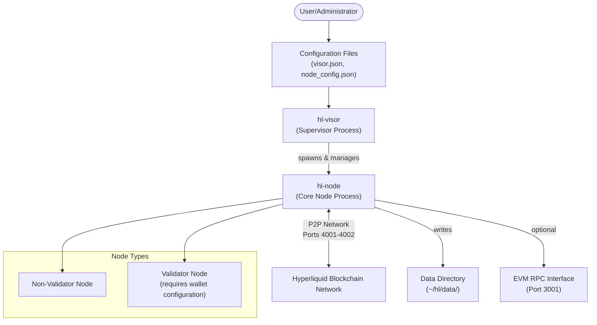

The Hyperliquid node system consists of two primary components:

1. **hl-visor**: A supervisor process that manages the lifecycle of the core node process. It handles:
   - Binary verification for security
   - Software updates
   - Process monitoring and restart on failure
   - Configuration management

2. **hl-node**: The core node process that connects to the Hyperliquid network and processes blockchain data. It handles:
   - P2P network communication
   - Transaction processing
   - Data storage
   - API services

Sources: [README.md:28-30](), [README.md:63-65]()

### Data Flow Diagram

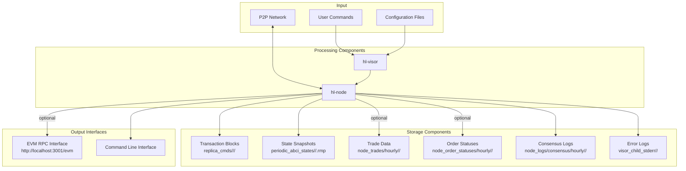

Data flows through the system as follows:

1. Network data is received via P2P connections
2. User commands and configuration settings are processed by hl-visor
3. The hl-node component processes blockchain data
4. Data is stored in various formats in the data directory
5. Optional interfaces provide access to the processed data

Sources: [README.md:83-108](), [README.md:114-128]()

## Node Types Overview

Hyperliquid supports two main node types:

### Non-Validator Nodes

Non-validator nodes stream data from the network without participating in consensus. They:
- Process and store transaction blocks
- Maintain state snapshots
- Can optionally store trades and order statuses
- May serve EVM RPC endpoints

Non-validator nodes are suitable for data access, application development, and monitoring.

Sources: [README.md:69-79]()

### Validator Nodes

Validator nodes participate in consensus and help secure the network. They:
- Require both a validator wallet (cold wallet) and signer wallet (hot wallet)
- Process and propose new blocks
- Participate in the HyperBFT consensus mechanism
- Are subject to jailing for poor performance
- Can receive delegations from other users

Running a validator node requires more configuration and monitoring than a non-validator.

Sources: [README.md:205-225](), [README.md:315-320]()

For detailed information about node types, see [Node Types](#2).

## Deployment Options

Hyperliquid nodes can be deployed using different methods:

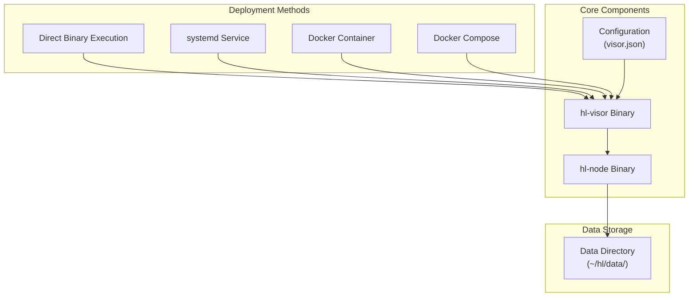

The repository supports multiple deployment methods to accommodate different operating environments:

1. **Direct binary execution**: Running the binaries directly on the host system
2. **systemd service**: Configuring the node as a system service for automatic startup and monitoring
3. **Docker containers**: Isolating the node in a containerized environment
4. **Docker Compose**: Managing multiple containers (node and data pruner)

For detailed information about deployment options, see [Deployment Options](#3).

Sources: [README.md:15-38]()

## Configuration and Chain Support

Hyperliquid nodes can connect to two chains:

| Chain    | Configuration                           | Binary URL                                       |
|----------|----------------------------------------|--------------------------------------------------|
| Testnet  | `{"chain": "Testnet"}` in visor.json   | https://binaries.hyperliquid-testnet.xyz/Testnet/hl-visor |
| Mainnet  | `{"chain": "Mainnet"}` in visor.json   | https://binaries.hyperliquid.xyz/Mainnet/hl-visor |

The configuration determines which network the node connects to and which binary is used.

Sources: [README.md:15-38]()

## Security Features

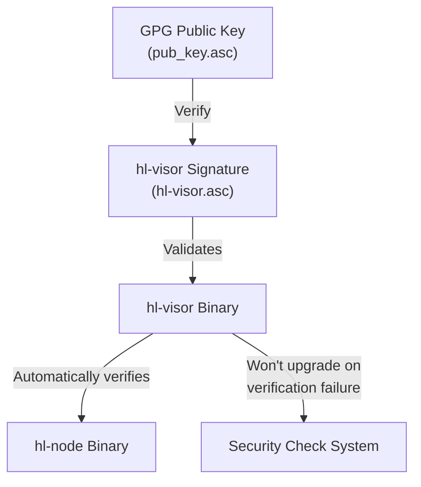

Hyperliquid employs several security measures:

1. **Binary verification**: All binaries are cryptographically signed and verified using GPG
2. **Automatic verification**: The hl-visor component automatically verifies the hl-node binary
3. **Upgrade safety**: Automatic upgrades will not proceed if verification fails

For detailed information about security features, see [Security and Verification](#7).

Sources: [README.md:42-65]()

## Data Storage Overview

Hyperliquid nodes store data in a structured directory layout:

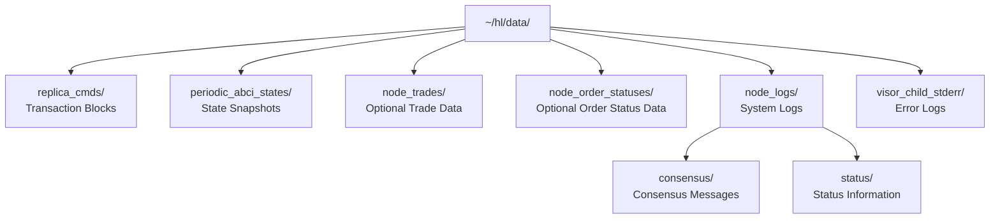

The data storage system organizes blockchain data into separate directories based on type and time, allowing for efficient data access and management.

For detailed information about data storage, see [Data Storage and Management](#4).

Sources: [README.md:83-108](), [README.md:339-354]()

## Command-Line Interface

The system provides a command-line interface for various operations:

| Operation | Command Example | Purpose |
|-----------|----------------|---------|
| Start non-validator | `~/hl-visor run-non-validator` | Run a non-validating node |
| Start validator | `~/hl-visor run-validator` | Run a validating node |
| Translate state | `./hl-node translate-abci-state <path>` | Convert state to JSON format |
| Staking deposit | `./hl-node staking-deposit <wei>` | Transfer tokens to staking balance |
| Delegate tokens | `./hl-node delegate <validator> <amount>` | Delegate tokens to a validator |

These commands provide the primary interface for interacting with the Hyperliquid node system.

Sources: [README.md:69-79](), [README.md:95-108](), [README.md:150-200]()

---

# Page: System Architecture

# System Architecture

<details>
<summary>Relevant source files</summary>

The following files were used as context for generating this wiki page:

- [Dockerfile](Dockerfile)
- [README.md](README.md)

</details>


## Purpose and Scope

This document provides a comprehensive overview of the Hyperliquid node system architecture, explaining the core components and their interactions. It covers the supervisor process (`hl-visor`), the node process (`hl-node`), their relationship, and the different node types in the Hyperliquid network. For detailed information about specific node types, see [Node Types](#2) and its sub-pages for [Non-Validator Nodes](#2.1) and [Validator Nodes](#2.2). For deployment options, refer to [Deployment Options](#3).

## Core Architecture Components

The Hyperliquid node system consists of two primary components that work together to provide blockchain services:

1. **hl-visor**: A supervisor process that manages the node lifecycle
2. **hl-node**: The core node process that handles blockchain operations

### Component Relationship Diagram

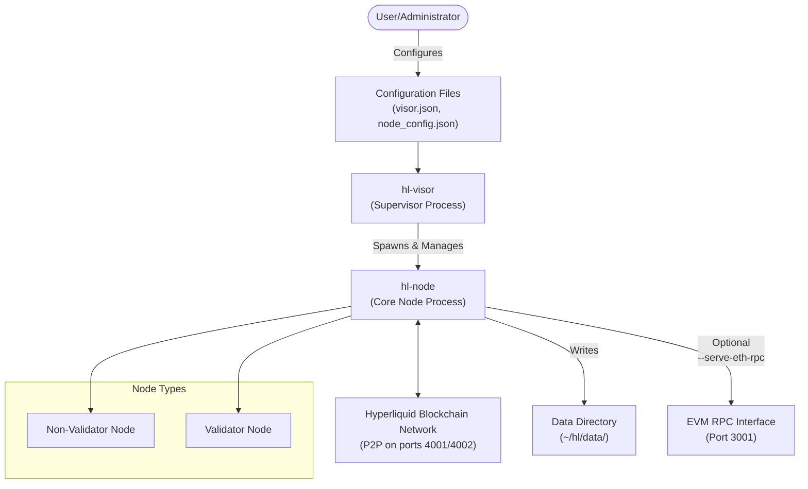

Sources: [README.md:28-33](), [README.md:69-79](), [README.md:205-222]()

## hl-visor Component

The `hl-visor` binary is a supervisor process responsible for:

1. Spawning and managing the child `hl-node` process
2. Handling automatic restarts if the node process crashes
3. Verifying binary signatures for security
4. Managing updates to the node binary

### Configuration

The `hl-visor` is configured using a JSON file located at `~/visor.json` which specifies which chain to connect to (Testnet or Mainnet).

### Binary Verification System

For security, all binaries are cryptographically signed and automatically verified by `hl-visor`.

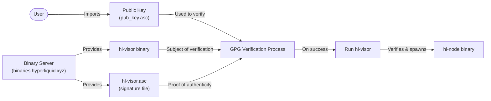

Sources: [README.md:42-65](), [Dockerfile:25-33]()

## hl-node Component

The `hl-node` binary is the core component responsible for:

1. Connecting to the Hyperliquid blockchain network
2. Processing blockchain data (transactions, blocks, state)
3. Participating in consensus (for validator nodes)
4. Storing blockchain data to disk
5. Providing API interfaces (such as EVM RPC)

### Node Type Architecture

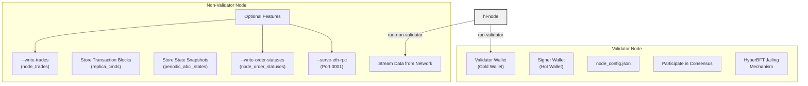

Sources: [README.md:69-79](), [README.md:111-128](), [README.md:205-222](), [README.md:316-320]()

## Data Architecture

The Hyperliquid node stores all its data in a structured directory layout under `~/hl/data/`:

### Directory Structure

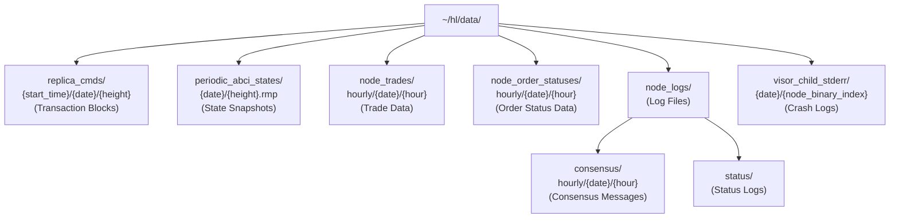

Sources: [README.md:86-97](), [README.md:341-354](), [README.md:422-425]()

### Data Flow Architecture

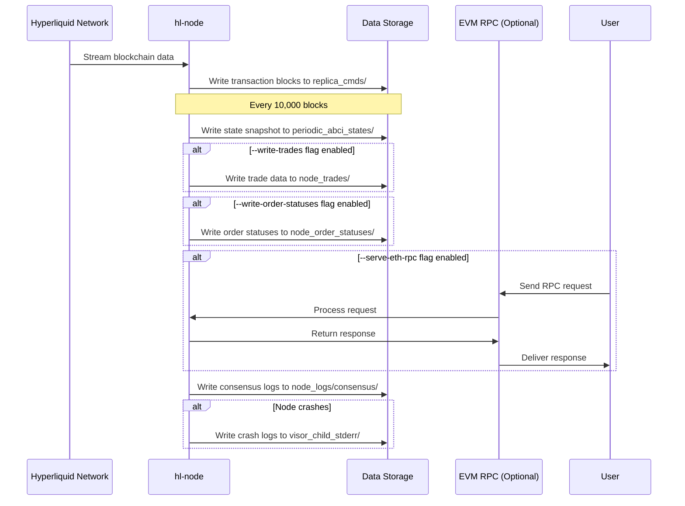

Sources: [README.md:86-108](), [README.md:111-128](), [README.md:134-146](), [README.md:341-354]()

## Networking Architecture

Hyperliquid nodes communicate with each other using a peer-to-peer (P2P) network:

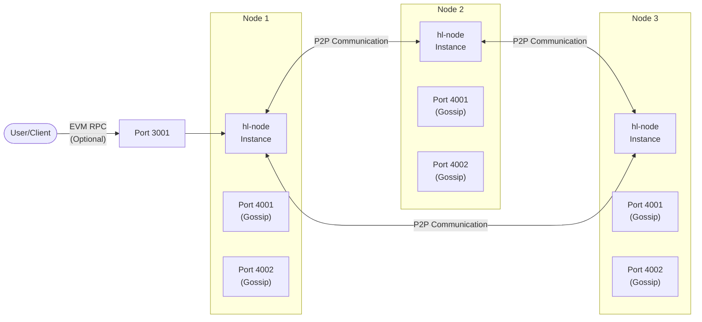

Sources: [README.md:8-10](), [README.md:134-146](), [Dockerfile:36-37]()

## Deployment Architecture

The Hyperliquid node can be deployed in several ways:

1. **Direct deployment**: Running `hl-visor` on the host machine
2. **Docker deployment**: Using containerization for isolation and portability

### Docker Deployment Architecture

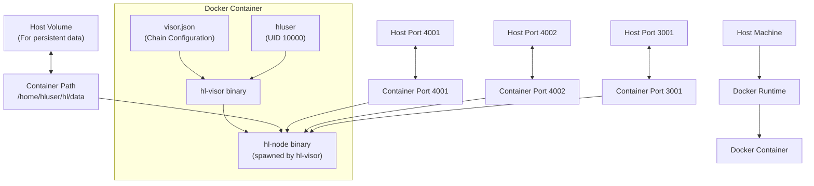

Sources: [Dockerfile:1-40](), [README.md:8-10](), [README.md:134-146]()

## System Requirements and Performance Considerations

The Hyperliquid node has specific hardware and networking requirements to function properly:

- **Hardware**: Minimum 4 CPU cores, 32 GB RAM, 200 GB disk
- **Operating System**: Ubuntu 24.04
- **Network**: Ports 4001 and 4002 must be open to the public
- **Data Growth**: Approximately 20 GB of logs per day with default settings
- **Latency**: For validators, low latency is critical (optimal location: Tokyo, Japan)

For validators specifically, achieving 200ms two-way latency to at least one-third of validators by stake is recommended to avoid jailing.

Sources: [README.md:3-10](), [README.md:86-87](), [README.md:316-320]()

---

# Page: Node Types

# Node Types

<details>
<summary>Relevant source files</summary>

The following files were used as context for generating this wiki page:

- [README.md](README.md)

</details>


This document provides a technical overview of node types in the Hyperliquid blockchain network. It explains the fundamental differences between validator and non-validator nodes, their roles in the network, and their technical characteristics. For detailed setup instructions for each node type, see [Non-Validator Nodes](#2.1) and [Validator Nodes](#2.2).

## Overview of Node Types

Hyperliquid's blockchain network operates with two distinct node types:

1. **Non-Validator Nodes**: Stream and process blockchain data without participating in consensus
2. **Validator Nodes**: Participate in consensus, propose blocks, and validate transactions

Both node types are managed by the `hl-visor` supervisor process, which spawns and controls the `hl-node` binary that contains the core node functionality.

The following diagram illustrates the node type hierarchy and their key components:

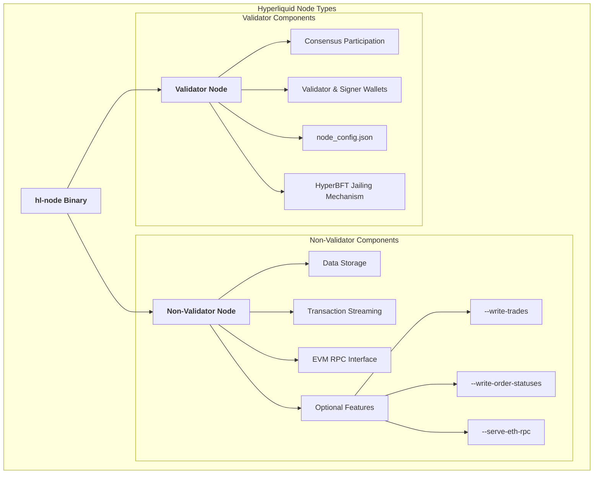

Sources: [README.md:69-201](). [README.md:205-325]().

## Non-Validator Nodes

Non-validator nodes serve as data processors and API endpoints in the Hyperliquid network. They stream transaction data, store blockchain state, and can provide RPC interfaces, but do not participate in consensus.

### Key Characteristics

- **Data Streaming**: Stream live blockchain data from peers
- **State Storage**: Store transaction blocks and periodic state snapshots
- **Network Communication**: Use ports 4001 and 4002 for gossip communication
- **Optional Features**: Can be configured to write additional data (trades, order statuses) and serve EVM RPC

### Starting a Non-Validator Node

Non-validator nodes are launched using the `run-non-validator` command, with optional flags for extended functionality:

```
~/hl-visor run-non-validator [flags]
```

#### Optional Flags

| Flag | Purpose | Data Path |
|------|---------|-----------|
| `--write-trades` | Store trade data | `~/hl/data/node_trades/hourly/{date}/{hour}` |
| `--write-order-statuses` | Store order status updates | `~/hl/data/node_order_statuses/hourly/{date}/{hour}` |
| `--serve-eth-rpc` | Enable EVM RPC interface | Accessible via `http://localhost:3001/evm` |
| `--replica-cmds-style` | Configure transaction block storage style | Controls data in `~/hl/data/replica_cmds/` |

Sources: [README.md:69-81](). [README.md:112-130](). [README.md:134-146]().

## Validator Nodes

Validator nodes are consensus participants that propose and validate blocks in the Hyperliquid network. They require additional configuration and have higher responsibilities compared to non-validator nodes.

### Key Characteristics

- **Consensus Participation**: Propose and validate blocks
- **Dual Wallet Architecture**:
  - Validator wallet (cold wallet): Holds funds and receives delegation rewards
  - Signer wallet (hot wallet): Signs consensus messages
- **Configuration Requirements**: Requires `node_config.json` with signer key
- **Jailing Mechanism**: Performance-based enforcement via HyperBFT consensus protocol
- **Network Requirements**: Must have ports 4000-4010 accessible to other validators

### Validator Architecture

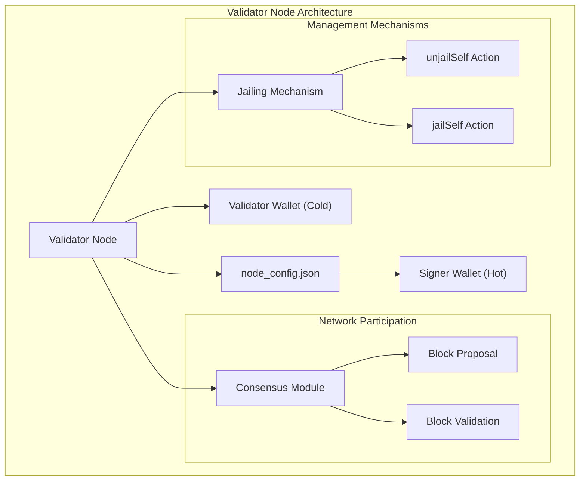

Sources: [README.md:205-236](). [README.md:287-325]().

### HyperBFT Jailing Mechanism

The validator jailing mechanism ensures network integrity by temporarily removing underperforming validators from consensus participation:

- **Jailing Conditions**: Validators with poor performance or network connectivity issues are jailed
- **Jailed Status**: Jailed validators can forward consensus messages but cannot vote on or propose blocks
- **Self-Management Actions**:
  - `jailSelf`: Voluntarily exit consensus before shutdown
  - `unjailSelf`: Re-enter consensus after reaching "jailed until" time

Sources: [README.md:316-325]().

## Comparison of Node Types

The following table summarizes the key differences between validator and non-validator nodes:

| Feature | Non-Validator Node | Validator Node |
|---------|-------------------|---------------|
| **Consensus Participation** | No | Yes |
| **Required Wallets** | None | Validator wallet and Signer wallet |
| **Additional Configuration** | None | `node_config.json` with signer key |
| **Network Ports** | 4001-4002 for gossip | 4000-4010 for validator communication |
| **Jailing Mechanism** | N/A | Subject to HyperBFT jailing |
| **Start Command** | `hl-visor run-non-validator` | `hl-visor run-validator` |
| **Optional Features** | `--write-trades`, `--write-order-statuses`, `--serve-eth-rpc` | Same options available |
| **Primary Use Case** | Data streaming, API endpoints | Network consensus, block production |
| **Hardware Requirements** | 4 CPU cores, 32 GB RAM, 200 GB disk | Same minimum specs, but higher reliability expected |

Sources: [README.md:3-10](). [README.md:69-130](). [README.md:205-325]().

## Data Storage

Both node types write data to the `~/hl/data` directory with the following structure:

| Data Type | Path | Description |
|-----------|------|-------------|
| Transaction Blocks | `~/hl/data/replica_cmds/{start_time}/{date}/{height}` | Parsed transaction blocks |
| State Snapshots | `~/hl/data/periodic_abci_states/{date}/{height}.rmp` | State snapshots (every 10,000 blocks) |
| Trades | `~/hl/data/node_trades/hourly/{date}/{hour}` | Trade data (with `--write-trades` flag) |
| Order Statuses | `~/hl/data/node_order_statuses/hourly/{date}/{hour}` | Order status updates (with `--write-order-statuses` flag) |
| Consensus Logs | `~/hl/data/node_logs/consensus/hourly/{date}/{hour}` | Consensus-related messages |
| Error Logs | `~/hl/data/visor_child_stderr/{date}/{node_binary_index}` | Crash logs from the node process |

Sources: [README.md:84-108](). [README.md:340-354](). [README.md:420-425]().

## System Architecture Diagram

The following diagram illustrates how node types integrate into the overall Hyperliquid system architecture:

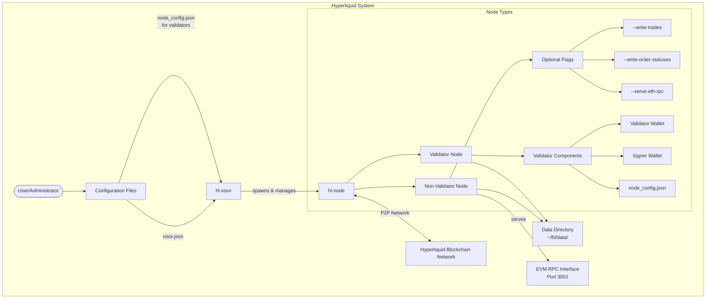

Sources: [README.md:3-10](). [README.md:16-28](). [README.md:69-130](). [README.md:205-325]().

---

# Page: Non-Validator Nodes

# Non-Validator Nodes

<details>
<summary>Relevant source files</summary>

The following files were used as context for generating this wiki page:

- [Dockerfile](Dockerfile)
- [README.md](README.md)

</details>


## Overview

This document provides detailed information about non-validator nodes in the Hyperliquid blockchain network. Non-validator nodes serve as read-only participants in the network, streaming and storing blockchain data without participating in consensus. These nodes are essential for applications that need access to blockchain data but don't require validation capabilities.

For information about validator nodes that participate in consensus, see [Validator Nodes](#2.2).

Sources: [README.md:69-80]()

## Hardware and Network Requirements

Before setting up a non-validator node, ensure your system meets the following requirements:

| Requirement | Specification |
|-------------|---------------|
| CPU         | 4 cores (minimum) |
| RAM         | 32 GB (minimum) |
| Storage     | 200 GB (minimum) |
| Operating System | Ubuntu 24.04 |
| Network Ports | 4001 and 4002 must be open to public |
| Location    | Tokyo, Japan (for lowest latency) |

The node generates approximately 20 GB of log data per day with default settings, so plan your storage accordingly.

Sources: [README.md:3-10](), [README.md:84-87]()

## Architecture

### Non-Validator Node Components

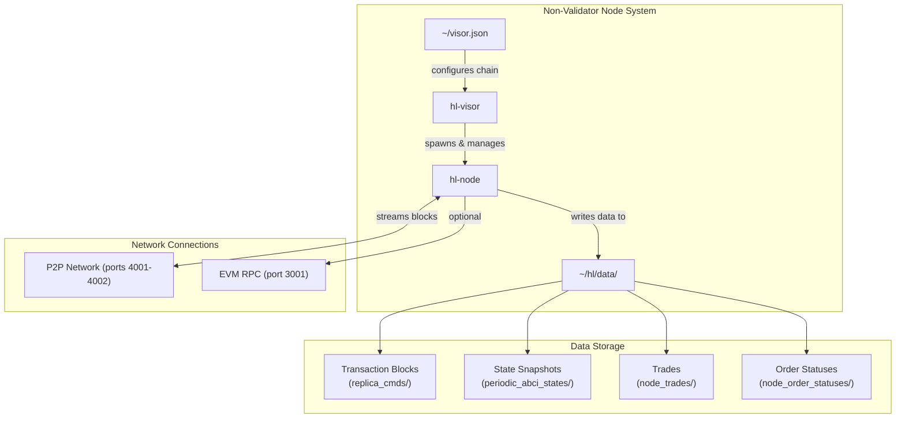

Non-validator nodes consist of two main components:
- `hl-visor`: The supervisor process that manages the node
- `hl-node`: The core process that handles blockchain data

Sources: [README.md:28-38](), [README.md:69-80]()

## Setup Process

### 1. Configure Chain

Create a configuration file to specify whether you're connecting to Testnet or Mainnet:

```bash
# For Testnet
echo '{"chain": "Testnet"}' > ~/visor.json

# For Mainnet
echo '{"chain": "Mainnet"}' > ~/visor.json
```

Sources: [README.md:16-26]()

### 2. Download and Verify the Visor Binary

```bash
# For Testnet
curl https://binaries.hyperliquid-testnet.xyz/Testnet/hl-visor > ~/hl-visor && chmod a+x ~/hl-visor

# For Mainnet
curl https://binaries.hyperliquid.xyz/Mainnet/hl-visor > ~/hl-visor && chmod a+x ~/hl-visor
```

For enhanced security, verify the binary signature:

```bash
# Import public key
gpg --import pub_key.asc

# Verify binary (Testnet example)
curl https://binaries.hyperliquid-testnet.xyz/Testnet/hl-visor.asc > hl-visor.asc
gpg --verify hl-visor.asc hl-visor
```

The `hl-visor` binary automatically verifies the `hl-node` binary when it runs.

Sources: [README.md:28-65]()

## Running a Non-Validator Node

### Basic Command

To start a non-validator node with default settings:

```bash
~/hl-visor run-non-validator
```

This command works for both Testnet and Mainnet as configured in your `~/visor.json` file.

### Startup Process

When starting for the first time, the node will search the network for peers to stream data from. This process may take some time. Look for log messages like `applied block X` which indicate the node is successfully streaming live blockchain data.

Sources: [README.md:69-80]()

## Data Storage

### Directory Structure

Non-validator nodes store data in the `~/hl/data` directory with the following structure:

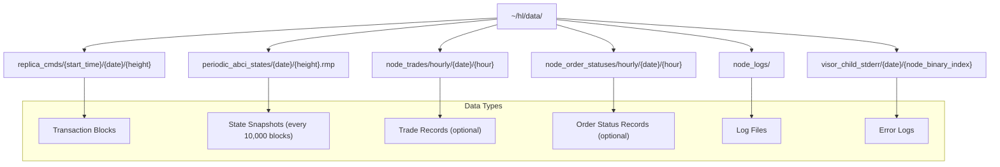

Sources: [README.md:84-108]()

### Accessing Stored Data

#### Transaction Blocks

Transaction blocks are stored in:
```
~/hl/data/replica_cmds/{start_time}/{date}/{height}
```

#### State Snapshots

State snapshots are saved every 10,000 blocks to:
```
~/hl/data/periodic_abci_states/{date}/{height}.rmp
```

To convert a state snapshot to JSON for examination:

```bash
# For Testnet
./hl-node --chain Testnet translate-abci-state ~/hl/data/periodic_abci_states/{date}/{height}.rmp /tmp/out.json

# For Mainnet
./hl-node --chain Mainnet translate-abci-state ~/hl/data/periodic_abci_states/{date}/{height}.rmp /tmp/out.json
```

Sources: [README.md:87-108]()

## Configuration Options

Non-validator nodes support several configuration flags that modify their behavior:

| Flag | Description | Output Location |
|------|-------------|----------------|
| `--write-trades` | Stores trade data | `~/hl/data/node_trades/hourly/{date}/{hour}` |
| `--write-order-statuses` | Stores order status data | `~/hl/data/node_order_statuses/hourly/{date}/{hour}` |
| `--replica-cmds-style` | Configures storage format | `~/hl/data/replica_cmds/{start_time}/{date}/{height}` |
| `--serve-eth-rpc` | Enables EVM RPC service | Port 3001 |

### Replica Command Styles

The `--replica-cmds-style` flag accepts the following options:
- `actions` (default) – Only stores actions
- `actions-and-responses` – Stores both actions and responses
- `recent-actions` – Only preserves the two latest height files

### Example with Multiple Flags

```bash
~/hl-visor run-non-validator --write-trades --write-order-statuses --serve-eth-rpc
```

Sources: [README.md:112-130]()

## EVM RPC Interface

Non-validator nodes can function as Ethereum RPC providers by enabling the EVM RPC service:

```bash
~/hl-visor run-non-validator --serve-eth-rpc
```

This exposes an RPC endpoint at `http://localhost:3001/evm` that accepts standard Ethereum JSON-RPC requests. For example:

```bash
curl -X POST --header 'Content-Type: application/json' --data '{"jsonrpc":"2.0","method":"eth_getBlockByNumber","params":["latest",false],"id":1}' http://localhost:3001/evm
```

Sources: [README.md:134-146]()

## Deployment Options

### Docker Deployment

The repository includes a Dockerfile for containerized deployment of non-validator nodes. By default, the Docker configuration:

- Uses Ubuntu 24.04
- Creates a non-root user (`hluser`)
- Configures for Testnet
- Verifies binaries using GPG
- Exposes ports 4000-4010
- Runs with the `recent-actions` replica command style

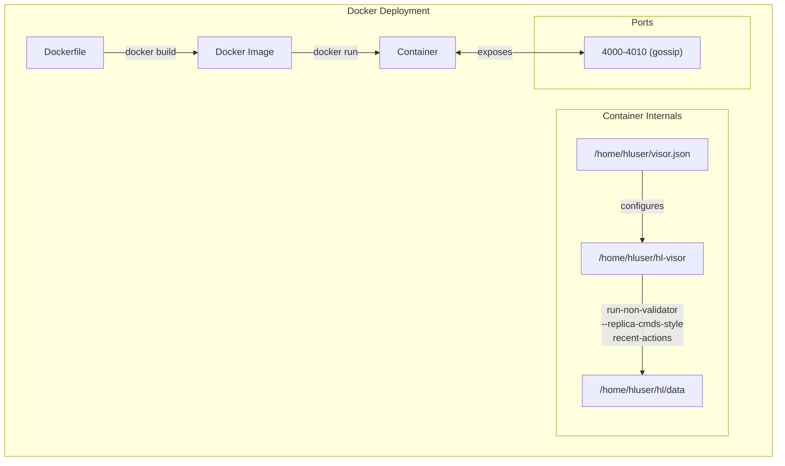

Sources: [Dockerfile:1-40]()

For more detailed information about other deployment options, including systemd services and Docker Compose, see [Deployment Options](#3).

## Troubleshooting

### Log Locations

If you encounter issues with your non-validator node, check the following log locations:

- Child process crash logs:
  ```
  ~/hl/data/visor_child_stderr/{date}/{node_binary_index}
  ```

- Look for logs indicating successful block streaming like `applied block X`.

- For non-validator nodes using peers from validators, check connectivity to the specified peer IP addresses.

Sources: [README.md:422-425]()

### Connecting to Root Peers

If you're having trouble connecting to the network, you can configure specific root peers:

```bash
# Example for Mainnet
echo '{ "root_node_ips": [{"Ip": "35.213.122.164"}, {"Ip": "35.213.89.139"}], "try_new_peers": false, "chain": "Mainnet" }' > ~/override_gossip_config.json
```

Multiple community-operated root peers are available for Mainnet. See the [README.md:387-416]() for a complete list of available peers.

Sources: [README.md:387-416]()

---

# Page: Validator Nodes

# Validator Nodes

<details>
<summary>Relevant source files</summary>

The following files were used as context for generating this wiki page:

- [README.md](README.md)

</details>


This page provides a comprehensive technical guide to setting up and managing validator nodes in the Hyperliquid blockchain network. Validator nodes actively participate in consensus, propose blocks, and validate transactions. For information about non-validator nodes, which only observe and store blockchain data, see [Non-Validator Nodes](#2.1).

## Overview

Validator nodes are critical components in the Hyperliquid network's consensus mechanism. Unlike non-validator nodes, validators require additional configuration, participate in block production, and can be subject to the jailing mechanism for poor performance.

### Validator Node Architecture

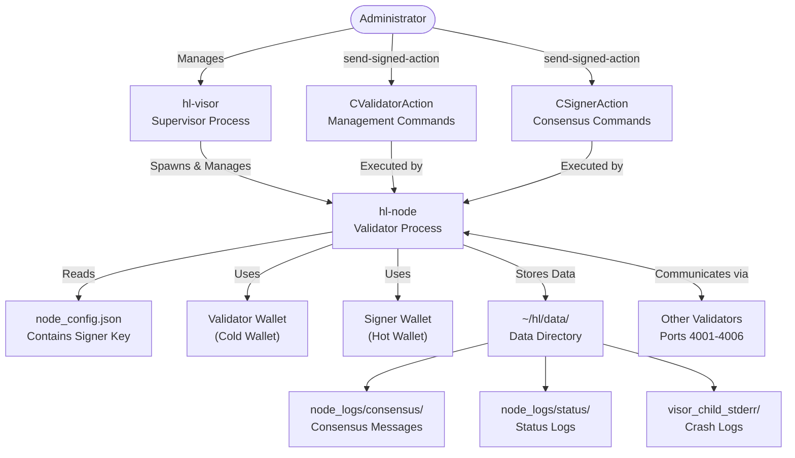

Sources: [README.md:205-238]()

## Prerequisites and Setup

### Hardware and Network Requirements

| Requirement | Specification |
|-------------|---------------|
| CPU | 4+ cores |
| RAM | 32+ GB |
| Disk | 200+ GB |
| OS | Ubuntu 24.04 |
| Ports | 4001-4006 (open to other validators) |
| Network Latency | <200ms two-way latency to ⅓ of validators by stake |

Sources: [README.md:3-10](), [README.md:254-254]()

### Wallet Configuration

Validator nodes require two distinct wallets:

1. **Validator Wallet (Cold Wallet)**: Holds funds and receives delegation rewards
2. **Signer Wallet (Hot Wallet)**: Used solely for signing consensus messages

These can be the same wallet for simplicity, but separating them provides better security. Both addresses must have a non-zero perps USDC balance to send signed actions.

```bash
# Create configuration file for signer wallet
echo '{"key": "<signer-key>"}' > ~/hl/hyperliquid_data/node_config.json
```

To print wallet addresses for verification:
```bash
~/hl-node --chain <Chain> --key <signer-key> print-address
~/hl-node --chain <Chain> --key <validator-key> print-address
```

Sources: [README.md:211-225]()

### Setup Workflow

The complete validator setup process follows these steps:

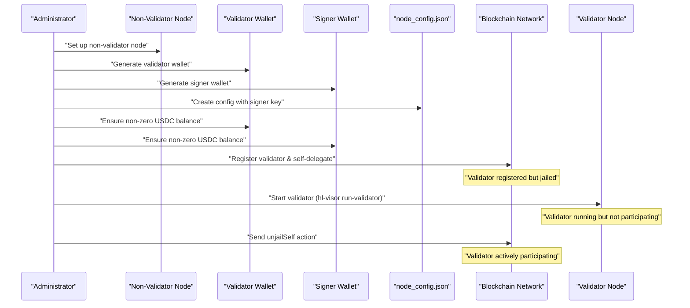

Sources: [README.md:205-302]()

## Joining the Validator Network

### Registration and Self-Delegation

To register as a validator and self-delegate the required stake:

```bash
~/hl-node --chain <Chain> --key <validator-key> send-signed-action '{"type": "CValidatorAction", "register": {"profile": {"node_ip": {"Ip": "<your-ip>"}, "signer": "<signer-address>", "name": "...", "description": "..." }, "initial_wei": 1000000000000}}'
```

This action:
- Creates a validator entry in the blockchain state
- Associates your signer address with your validator
- Self-delegates the specified amount of tokens (minimum 10,000 HYPE for Testnet, or 1,000,000,000,000 wei)

Sources: [README.md:242-252]()

### Starting the Validator

After registration, start the validator:

```bash
./hl-visor run-validator
```

For faster bootstrapping, you can configure known reliable peers:

```bash
echo '{ "root_node_ips": [{"Ip": "<peer-ip>"}], "try_new_peers": false, "chain": "<Chain>" }' > ~/override_gossip_config.json
```

Sources: [README.md:258-284]()

## HyperBFT Consensus Participation

### Jailing Mechanism

The HyperBFT consensus protocol implements a jailing mechanism to maintain network performance and uptime:

```mermaid
stateDiagram-v2
    [*] --> "Registered": "register validator"
    "Registered" --> "Jailed": "automatic initial jailing"
    "Jailed" --> "Active": "unjailSelf action"
    "Active" --> "Jailed": "Performance issues"
    "Active" --> "SelfJailed": "jailSelf action"
    "SelfJailed" --> "Jailed"
    "Jailed" --> "Active": "unjailSelf (after jail period)"
    
    state "Active" {
        [*] --> "ReceiveMessages"
        "ReceiveMessages" --> "ProcessMessages"
        "ProcessMessages" --> "ProposeBlock": "If proposer for round"
        "ProcessMessages" --> "VoteOnBlock": "If not proposer"
        "ProposeBlock" --> "BroadcastProposal"
        "VoteOnBlock" --> "BroadcastVote"
        "BroadcastProposal" --> "ReceiveMessages"
        "BroadcastVote" --> "ReceiveMessages"
    }
    
    state "Jailed" {
        [*] --> "ForwardMessages"
        "ForwardMessages" --> "WaitForUnjailing"
        "WaitForUnjailing" --> [*]: "Jail period ends"
    }
```

When a validator is jailed:
- It can still forward messages to peers in the network
- It cannot vote on or propose blocks
- It must wait until the jailing period ends before being able to unjail

Validators are automatically jailed when first registered or after changing their IP. They can also be jailed for poor performance or connectivity issues.

Sources: [README.md:316-321]()

### Beginning Validation

After registration or being jailed, you need to explicitly unjail your validator to begin participating in consensus:

```bash
~/hl-node --chain <Chain> --key <signer-key> send-signed-action '{"type": "CSignerAction", "unjailSelf": null}'
```

Sources: [README.md:289-295]()

### Graceful Exit from Consensus

To voluntarily exit consensus (self-jail) before maintenance or shutdown:

```bash
~/hl-node --chain <Chain> --key <signer-key> send-signed-action '{"type": "CSignerAction", "jailSelf": null}'
```

This ensures a clean exit without affecting network performance.

Sources: [README.md:297-304]()

## Validator Management

### Management Operations

```mermaid
graph LR
    subgraph "Validator Management Commands"
        Register["Register<br>CValidatorAction.register"]
        ChangeProfile["Change Profile<br>CValidatorAction.changeProfile"]
        SetCommission["Set Commission<br>commission_bps parameter"]
        DisableDelegations["Disable Delegations<br>disable_delegations parameter"]
        ChangeSigner["Change Signer<br>signer parameter"]
    end
    
    subgraph "Consensus Management Commands"
        Unjail["Unjail Self<br>CSignerAction.unjailSelf"]
        SelfJail["Self Jail<br>CSignerAction.jailSelf"]
        MonitorLogs["Monitor Logs<br>node_logs/consensus/"]
        SetupAlerts["Setup Alerts<br>api_secrets.json"]
    end
    
    ValidatorWallet["Validator Wallet<br>(Cold Wallet)"]
    SignerWallet["Signer Wallet<br>(Hot Wallet)"]
    
    ValidatorWallet -->|"Used for"| Register
    ValidatorWallet -->|"Used for"| ChangeProfile
    ValidatorWallet -->|"Used for"| SetCommission
    ValidatorWallet -->|"Used for"| DisableDelegations
    ValidatorWallet -->|"Used for"| ChangeSigner
    
    SignerWallet -->|"Used for"| Unjail
    SignerWallet -->|"Used for"| SelfJail
```

Sources: [README.md:358-384]()

### Updating Validator Profile

To update your validator profile:

```bash
~/hl-node --chain <Chain> --key <validator-key> send-signed-action '{"type": "CValidatorAction", "changeProfile": {"node_ip": {"Ip": "<new-ip>"}, "name": "..."}}'
```

Profile parameters include:
- `node_ip`: IP address of your validator node
- `name`: Display name for the validator
- `description`: Description of the validator
- `disable_delegations`: Boolean to disable delegations
- `commission_bps`: Commission rate in basis points (10000 = 100%)
- `signer`: Address of the hot wallet for signing

Note: Changing your IP address or signer will automatically jail your validator, requiring an unjail action to resume validation.

Sources: [README.md:371-384]()

### Monitoring and Alerting

It is recommended to set up an alerting system to maintain optimal uptime:

```bash
echo '{"testnet_slack_channel": "<channel-id>", "slack_key": "Bearer <token>"}' > ~/hl/api_secrets.json
```

Test the alert configuration:
```bash
~/hl-node --chain <Chain> send-slack-alert "test alert"
```

Sources: [README.md:327-336]()

## Troubleshooting

### Consensus Logs

Most messages sent and received by the consensus algorithm are stored in:
```
~/hl/data/node_logs/consensus/hourly/{date}/{hour}
```

Common diagnostic commands:

Check for vote messages to a specific validator:
```bash
grep destination...0x<address> ~/hl/data/node_logs/consensus/hourly/{date}/{hour} | grep T{time} | grep Vote
```

Identify potential consensus issues:
```bash
grep suspect ~/hl/data/node_logs/consensus/hourly/{date}/{hour}
```

Sources: [README.md:342-350]()

### Crash Logs

Crash logs from the validator process are written to:
```
~/hl/data/visor_child_stderr/{date}/{node_binary_index}
```

Sources: [README.md:351-354](), [README.md:422-425]()

### Jailing Diagnostics

If a validator repeatedly gets jailed, check:
1. Network connectivity to other validators
2. System resource utilization 
3. Status logs in `~/hl/data/node_logs/status/`
4. Crash logs for any unexpected terminations

Sources: [README.md:323-325]()

## Viewing Validator Information

To view current validator information:

```bash
curl -X POST --header "Content-Type: application/json" --data '{ "type": "validatorSummaries"}' https://api.hyperliquid-testnet.xyz/info
```

This endpoint provides details about all validators in the network, including stake, commission rates, and jailing status.

Sources: [README.md:362-368]()

---

# Page: Deployment Options

# Deployment Options

<details>
<summary>Relevant source files</summary>

The following files were used as context for generating this wiki page:

- [README.md](README.md)
- [README_misc.md](README_misc.md)

</details>


This document describes the various methods available for deploying Hyperliquid nodes. It covers the advantages and considerations for each deployment option, including direct execution, systemd services, and Docker containers. For information about node types and their specific configurations, see [Node Types](#2).

## Overview of Deployment Methods

Hyperliquid nodes can be deployed using three primary methods, each offering different benefits for various operational requirements.

```mermaid
flowchart TD
    subgraph "Deployment Options"
        DeploymentChoice["Deployment Choice"]
        DirectExec["Direct Execution"]
        SystemdService["systemd Service"]
        DockerContainer["Docker Container"]
        
        DeploymentChoice --> DirectExec
        DeploymentChoice --> SystemdService
        DeploymentChoice --> DockerContainer
    end
    
    subgraph "Core Components"
        HLVisor["hl-visor\n(Supervisor Process)"]
        HLNode["hl-node\n(Core Node Process)"]
        DataDir["Data Directory\n(~/hl/data/)"]
        
        HLVisor -->|"spawns and manages"| HLNode
        HLNode -->|"reads/writes"| DataDir
    end
    
    DirectExec -->|"starts"| HLVisor
    SystemdService -->|"starts"| HLVisor
    DockerContainer -->|"contains"| HLVisor
    
    subgraph "Configuration"
        VisorJson["~/visor.json\n(Chain Configuration)"]
        NodeConfig["~/hl/hyperliquid_data/node_config.json\n(For Validators)"]
        GossipConfig["~/override_gossip_config.json\n(Network Configuration)"]
    end
    
    VisorJson -->|"configures"| HLVisor
    NodeConfig -->|"configures validator"| HLNode
    GossipConfig -->|"optional peer config"| HLNode
```

Sources: [README.md:13-38](), [README_misc.md:3-56]()

### Deployment Methods Comparison

| Deployment Method | Advantages | Considerations | Best For |
|-------------------|------------|---------------|----------|
| Direct Execution | Simple setup<br>Easy to modify flags<br>Direct console output | No automatic restart<br>Requires terminal session | Testing<br>Development<br>Initial setup |
| systemd Service | Auto-starts on boot<br>Automatic restart<br>Proper logging | Requires system privileges<br>Configuration changes need service restart | Production non-validators<br>Long-term operation |
| Docker Container | Isolated environment<br>Easy distribution<br>Consistent runtime | Container overhead<br>Additional complexity | Environments requiring isolation<br>Multi-node deployments |

Sources: [README.md:69-79](), [README_misc.md:3-42](), [README_misc.md:44-56]()

## Direct Execution

The simplest deployment method is direct execution of the `hl-visor` binary.

### Setup and Configuration

1. Configure the chain by creating `~/visor.json`:
   ```bash
   echo '{"chain": "Mainnet"}' > ~/visor.json
   # or
   echo '{"chain": "Testnet"}' > ~/visor.json
   ```

2. Download the visor binary:
   ```bash
   curl https://binaries.hyperliquid.xyz/Mainnet/hl-visor > ~/hl-visor && chmod a+x ~/hl-visor
   # or
   curl https://binaries.hyperliquid-testnet.xyz/Testnet/hl-visor > ~/hl-visor && chmod a+x ~/hl-visor
   ```

3. Optional: Verify the binary signature using GPG

### Running the Node

For a non-validator node:
```bash
~/hl-visor run-non-validator
```

For a validator node:
```bash
~/hl-visor run-validator
```

Additional flags can be added for specific functionality:
```bash
~/hl-visor run-non-validator --write-trades --write-order-statuses --serve-eth-rpc
```

Sources: [README.md:13-38](), [README.md:69-79](), [README.md:111-128]()

## Systemd Deployment

Running the node as a systemd service provides automatic restarts and proper integration with the system service management.

### Creating a Systemd Service

1. Create the systemd service configuration file:
   ```bash
   sudo nano /etc/systemd/system/hl-visor.service
   ```

2. Add the following content (replace USERNAME with your actual username):
   ```
   [Unit]
   Description=HL-Visor Non-Validator Service
   After=network.target

   [Service]
   Type=simple
   User=USERNAME
   WorkingDirectory=/home/USERNAME
   ExecStart=/home/USERNAME/hl-visor run-non-validator
   Restart=always
   RestartSec=10

   [Install]
   WantedBy=multi-user.target
   ```

   For validators, replace `run-non-validator` with `run-validator`.

### Managing the Service

```bash
# Enable the service to start at boot
sudo systemctl enable hl-visor.service

# Start the service
sudo systemctl start hl-visor

# Check service status
sudo systemctl status hl-visor

# View logs
journalctl -u hl-visor -f
```

```mermaid
sequenceDiagram
    participant OS as "Operating System"
    participant Systemd as "systemd"
    participant HLVisorService as "hl-visor.service"
    participant HLVisor as "hl-visor Process"
    participant HLNode as "hl-node Process"
    
    OS->>Systemd: Boot system
    Systemd->>HLVisorService: Start service
    HLVisorService->>HLVisor: Start process
    HLVisor->>HLNode: Spawn and manage
    
    Note over HLNode: Node running...
    
    HLNode-->>HLVisor: Process exits/crashes
    HLVisor-->>HLVisorService: Process terminates
    HLVisorService->>Systemd: Service failure
    Systemd->>HLVisorService: Restart service (after 10s)
    HLVisorService->>HLVisor: Start process again
    HLVisor->>HLNode: Spawn and manage
```

Sources: [README_misc.md:3-42]()

## Docker Deployment

Docker provides an isolated, containerized environment for running the Hyperliquid node.

### Setup and Running

1. Build the node container:
   ```bash
   docker compose build
   ```

2. Run the node:
   ```bash
   docker compose up -d
   ```

```mermaid
graph TD
    subgraph "Docker Environment"
        subgraph "Node Container"
            HLVisor["hl-visor Process"]
            HLNode["hl-node Process"]
            
            HLVisor -->|"spawns"| HLNode
        end
        
        subgraph "Pruner Container"
            PrunerProcess["Data Pruner Process"]
        end
        
        SharedVolume[("Shared Volume\nhl-data")]
        
        HLNode -->|"reads/writes"| SharedVolume
        PrunerProcess -->|"manages"| SharedVolume
    end
    
    Host["Host System"] -->|"docker compose up -d"| DockerEnvironment
    Host -->|"manages via\ndocker commands"| DockerEnvironment
    
    DockerEnvironment[Docker Environment]
```

Sources: [README_misc.md:44-56]()

## Data and Configuration Management

All deployment methods use the same core configuration files and data directories.

### Common Configuration Files

| File | Purpose | Used By |
|------|---------|---------|
| `~/visor.json` | Specifies chain (Mainnet/Testnet) | All deployments |
| `~/hl/hyperliquid_data/node_config.json` | Validator configuration | Validator nodes only |
| `~/override_gossip_config.json` | Custom peer configuration | Optional for all deployments |

### Data Directory Structure

The node writes data to `~/hl/data/` with the following structure:

```
~/hl/data/
├── replica_cmds/
│   └── {start_time}/{date}/{height}  # Transaction blocks
├── periodic_abci_states/
│   └── {date}/{height}.rmp           # State snapshots
├── node_trades/
│   └── hourly/{date}/{hour}          # Trades (with --write-trades flag)
├── node_order_statuses/
│   └── hourly/{date}/{hour}          # Order statuses (with --write-order-statuses flag)
├── node_logs/
│   ├── consensus/                    # Consensus logs
│   └── status/                       # Status logs
└── visor_child_stderr/
    └── {date}/{node_binary_index}    # Error logs
```

```mermaid
flowchart LR
    subgraph "Deployment Options"
        DirectExecution["Direct Execution"]
        SystemdService["systemd Service"]
        DockerContainer["Docker Container"]
    end
    
    subgraph "Configuration"
        VisorJson["~/visor.json"]
        NodeConfig["node_config.json"]
        GossipConfig["override_gossip_config.json"]
    end
    
    subgraph "Data Directory"
        DataDir["~/hl/data/"]
        ReplicaCmds["replica_cmds/"]
        StateSnaps["periodic_abci_states/"]
        NodeLogs["node_logs/"]
        ErrorLogs["visor_child_stderr/"]
        Trades["node_trades/"]
        OrderStatuses["node_order_statuses/"]
    end
    
    DirectExecution -->|"uses"| VisorJson
    SystemdService -->|"uses"| VisorJson
    DockerContainer -->|"uses (mounted)"| VisorJson
    
    VisorJson -->|"configures"| HLVisor
    NodeConfig -->|"configures"| HLVisor
    GossipConfig -->|"configures"| HLVisor
    
    HLVisor["hl-visor Process"] -->|"spawns"| HLNode["hl-node Process"]
    
    HLNode -->|"writes"| DataDir
    DataDir --> ReplicaCmds
    DataDir --> StateSnaps
    DataDir --> NodeLogs
    DataDir --> ErrorLogs
    DataDir --> Trades
    DataDir --> OrderStatuses
```

Sources: [README.md:83-99](), [README.md:422-425]()

## Common Command-Line Flags

All deployment methods support the same set of command-line flags for the `hl-visor` binary:

| Flag | Purpose |
|------|---------|
| `--write-trades` | Streams trades to `~/hl/data/node_trades/hourly/{date}/{hour}` |
| `--write-order-statuses` | Writes order statuses to `~/hl/data/node_order_statuses/hourly/{date}/{hour}` |
| `--replica-cmds-style` | Configures what is written to replica_cmds directory (options: `actions`, `actions-and-responses`, `recent-actions`) |
| `--serve-eth-rpc` | Enables the EVM RPC interface on port 3001 |

When using systemd, you would add these flags to the `ExecStart` line in the service file.

Sources: [README.md:111-128](), [README.md:134-146]()

## Selecting a Deployment Method

### For Development and Testing
Direct execution is recommended for development and testing due to its simplicity and immediate feedback through console output.

### For Production Non-Validator Nodes
systemd service is recommended for production non-validator nodes, providing:
- Automatic restart on failure
- Start on system boot
- Proper logging via journalctl

### For Validators
systemd service with additional monitoring is recommended for validators due to the critical nature of their operation. Consider implementing external monitoring and alerting.

### For Isolated or Multi-Node Environments
Docker deployment is ideal for:
- Environments requiring isolation
- Deployment of multiple nodes
- Systems where containerization is preferred

Sources: [README.md:3-6](), [README.md:69-79](), [README.md:205-320](), [README_misc.md:3-56]()

---

# Page: Docker Deployment

# Docker Deployment

<details>
<summary>Relevant source files</summary>

The following files were used as context for generating this wiki page:

- [Dockerfile](Dockerfile)
- [README_misc.md](README_misc.md)
- [docker-compose.yml](docker-compose.yml)

</details>


This page provides detailed instructions for deploying Hyperliquid nodes using Docker and Docker Compose. Docker deployment provides containerization benefits including isolation, reproducibility, and simplified setup across different environments. For alternative deployment methods, see [Systemd Deployment](#3.2).

## Docker Deployment Architecture

The Hyperliquid node system can be deployed using Docker in two primary configurations:

1. Single container deployment - running just the node service
2. Multi-container deployment - running both node and pruner services using Docker Compose

```mermaid
flowchart TD
    subgraph "Docker Deployment Options"
        SingleContainer["Single Container Deployment"]
        DockerCompose["Docker Compose Deployment"]
    end

    subgraph "Single Container"
        HLVisorBinary["hl-visor Binary"]
        DataVolume1["Data Volume<br>/home/hluser/hl/data"]
        
        HLVisorBinary -->|"run-non-validator"| DataVolume1
    end

    subgraph "Docker Compose Setup"
        NodeContainer["Node Container"]
        PrunerContainer["Pruner Container"]
        SharedVolume["Shared Volume<br>hl-data"]
        
        NodeContainer -->|"writes to"| SharedVolume
        PrunerContainer -->|"manages"| SharedVolume
    end

    SingleContainer -.-> HLVisorBinary
    DockerCompose -.-> NodeContainer
    DockerCompose -.-> PrunerContainer
```

Sources: [Dockerfile](), [docker-compose.yml]()

## Container Setup and Configuration

The Hyperliquid node Docker image is built with a focused configuration designed to run a node securely:

- Based on Ubuntu 24.04
- Creates a non-root user (`hluser`) with specific UID/GID
- Downloads and verifies the `hl-visor` binary using GPG verification
- Sets up default configuration for testnet
- Exposes ports 4000-4010 for P2P communication

```mermaid
flowchart TD
    UbuntuBase["Ubuntu 24.04 Base Image"]
    UserSetup["Create hluser<br>UID: 10000"]
    InstallDeps["Install Dependencies<br>curl, gnupg"]
    SetupDirs["Create Directories<br>/home/hluser/hl/data"]
    ConfigureChain["Configure Chain<br>visor.json"]
    ImportKey["Import GPG Key<br>pub_key.asc"]
    DownloadBinary["Download hl-visor"]
    VerifyBinary["GPG Verify Binary"]
    SetEntrypoint["Set Default Entrypoint<br>run-non-validator"]

    UbuntuBase --> UserSetup
    UserSetup --> InstallDeps
    InstallDeps --> SetupDirs
    SetupDirs --> ConfigureChain
    ConfigureChain --> ImportKey
    ImportKey --> DownloadBinary
    DownloadBinary --> VerifyBinary
    VerifyBinary --> SetEntrypoint
```

Sources: [Dockerfile:1-39]()

### Data Persistence

The Docker deployment uses volumes to persist node data. This ensures that blockchain data remains intact between container restarts and updates.

| Deployment Type | Volume Configuration | Data Location |
|-----------------|----------------------|--------------|
| Single Container | Host mount or named volume | /home/hluser/hl/data |
| Docker Compose | Named volume (`hl-data`) | Shared between containers |

Sources: [docker-compose.yml:9-10, 15-21]()

## Deployment Options

### Single Container Deployment

Running a single container is simpler but doesn't include the pruner service to manage data growth.

```bash
# Build the Docker image
docker build -t hyperliquid-node .

# Run a non-validator node
docker run -d --name hl-node \
  -p 4000-4010:4000-4010 \
  -v hl-data:/home/hluser/hl/data \
  hyperliquid-node
```

### Docker Compose Deployment

The recommended approach uses Docker Compose to run both the node and pruner services:

```bash
# Build the containers
docker compose build

# Start the services
docker compose up -d
```

This setup automatically manages both the node and the pruner service, which helps maintain optimal disk usage by removing unnecessary historical data.

Sources: [docker-compose.yml](), [README_misc.md:44-55]()

## Docker Compose Configuration

The Docker Compose configuration sets up two services that work together:

```mermaid
flowchart LR
    subgraph "docker-compose.yml"
        NodeService["node service"]
        PrunerService["pruner service"]
        DataVolume["volume: hl-data"]
    end
    
    NodeService -->|"shares volume"| DataVolume
    PrunerService -->|"shares volume"| DataVolume
    
    subgraph "Host System"
        Ports["Ports 4000-4010"]
    end
    
    NodeService -->|"exposes"| Ports
```

The Docker Compose file configures:

1. **Node Service**
   - Built using the main Dockerfile
   - Exposes ports 4000-4010 for P2P communication
   - Uses a shared volume for data persistence
   - Configured to restart automatically unless stopped manually

2. **Pruner Service**
   - Built using the Dockerfile in the `./pruner` directory
   - Shares the same data volume as the node service
   - Manages data by removing old, unneeded data
   - Also configured to restart automatically

3. **Shared Volume**
   - Named `hl-data`
   - Used by both services to store and manage blockchain data

Sources: [docker-compose.yml:3-21]()

## Dockerfile Components

The Dockerfile builds an image that runs the `hl-visor` process as a non-validator node by default.

Key components include:

| Component | Purpose | Reference |
|-----------|---------|-----------|
| Base Image | Ubuntu 24.04 for compatibility | [Dockerfile:1]() |
| User Creation | Non-root `hluser` for security | [Dockerfile:3-5, 13-17]() |
| Dependencies | Install curl and gnupg for downloads and verification | [Dockerfile:15]() |
| Chain Configuration | Set up testnet in visor.json | [Dockerfile:23]() |
| Binary Download | Fetch hl-visor from official source | [Dockerfile:26-33]() |
| GPG Verification | Security verification of binary | [Dockerfile:26-33]() |
| Exposed Ports | 4000-4010 for P2P communication | [Dockerfile:36]() |
| Default Entrypoint | Run as non-validator node | [Dockerfile:39]() |

Sources: [Dockerfile]()

## Customizing Your Deployment

The default configuration in the Docker setup runs a non-validator node on the testnet. You can customize this in several ways:

### Modifying the Entrypoint

To run with different parameters, you can override the entrypoint when starting the container:

```bash
docker run -d --name hl-node \
  -p 4000-4010:4000-4010 \
  -v hl-data:/home/hluser/hl/data \
  hyperliquid-node /home/hluser/hl-visor run-non-validator --write-trades --serve-eth-rpc
```

### Customizing visor.json

To use a different chain configuration (e.g., mainnet instead of testnet):

1. Create a custom visor.json file on your host
2. Mount it into the container when running:

```bash
docker run -d --name hl-node \
  -p 4000-4010:4000-4010 \
  -v hl-data:/home/hluser/hl/data \
  -v /path/to/your/visor.json:/home/hluser/visor.json \
  hyperliquid-node
```

### Running a Validator Node

To run a validator node using Docker, you'll need to:

1. Create a proper `node_config.json` file with your validator configuration
2. Mount it into the container
3. Override the entrypoint to run as a validator

For more details on validator node setup, see [Validator Nodes](#2.2).

Sources: [Dockerfile:39]()

## Data Management

The Docker deployment stores node data in `/home/hluser/hl/data` inside the container, which should be mapped to a persistent volume. For Docker Compose deployments, both the node and pruner services share access to this volume.

When using Docker Compose with the included pruner service, data management is handled automatically. The pruner service periodically removes old data that's no longer needed while preserving essential blockchain state.

For more information about data storage structure and pruning strategies, see [Data Storage and Management](#4) and [Data Pruning](#4.1).

Sources: [docker-compose.yml:9-16]()

## Troubleshooting

If you encounter issues with your Docker deployment, check:

1. **Container logs**:
   ```bash
   docker logs hl-node
   # or for compose setup
   docker compose logs node
   docker compose logs pruner
   ```

2. **Volume permissions**:
   Ensure the mounted volumes have correct permissions for the `hluser` (UID 10000)

3. **Port availability**:
   Verify ports 4000-4010 are not in use by other services on your host

4. **Resource constraints**:
   The node may require significant CPU, memory, and disk resources. Consider setting resource limits appropriate for your environment.

For more general node troubleshooting, see [Troubleshooting and Maintenance](#8).

Sources: [Dockerfile](), [docker-compose.yml]()

---

# Page: Systemd Deployment

# Systemd Deployment

<details>
<summary>Relevant source files</summary>

The following files were used as context for generating this wiki page:

- [README.md](README.md)
- [README_misc.md](README_misc.md)

</details>


This document provides detailed instructions for deploying and managing Hyperliquid nodes as systemd services. Systemd is the init system and service manager for most modern Linux distributions, making it an ideal choice for managing long-running processes like Hyperliquid nodes. For Docker-based deployment alternatives, see [Docker Deployment](#3.1).

## Overview of Systemd Deployment

Systemd deployment offers several advantages for running Hyperliquid nodes:

- Automatic startup on system boot
- Process management and monitoring
- Automatic process restart on failure
- Standardized logging via journald
- Clean dependency management

The following diagram illustrates the high-level architecture of a Hyperliquid node deployed as a systemd service:

```mermaid
graph TD
    subgraph "System Components"
        SystemD["systemd"]
        Service["hl-visor.service"]
        Journal["journald"]
    end

    subgraph "Node Components"
        HLVisor["hl-visor process"]
        HLNode["hl-node process"]
        ConfigFiles["Configuration Files
        ~/visor.json"]
        DataDir["Data Directory
        ~/hl/data/"]
    end

    SystemD -->|"manages"| Service
    Service -->|"executes"| HLVisor
    HLVisor -->|"spawns"| HLNode
    HLVisor -->|"reads"| ConfigFiles
    HLNode -->|"reads/writes"| DataDir
    HLVisor -->|"stdout/stderr"| Journal
    Journal -->|"stores logs"| LogFiles["System Journal"]

    User([System Administrator]) -->|"systemctl commands"| SystemD
    User -->|"views logs"| Journal
```

Sources: [README_misc.md:3-42]()

## Prerequisites

Before setting up a systemd service for your Hyperliquid node, ensure you have:

1. Ubuntu 24.04 (currently the only supported OS)
2. Properly configured `visor.json` file in your home directory
3. Downloaded and verified the `hl-visor` binary
4. Open ports 4001 and 4002 for network communication
5. Sufficient hardware resources: 4 CPU cores, 32 GB RAM, 200+ GB disk

Sources: [README.md:3-10]()

## Creating the Systemd Service

### Service Configuration File

Create a systemd service configuration file at `/etc/systemd/system/hl-visor.service`:

```bash
sudo nano /etc/systemd/system/hl-visor.service
```

Add the following configuration, replacing `USERNAME` with your actual username:

```ini
[Unit]
Description=HL-Visor Non-Validator Service
After=network.target

[Service]
Type=simple
User=USERNAME
WorkingDirectory=/home/USERNAME
ExecStart=/home/USERNAME/hl-visor run-non-validator
Restart=always
RestartSec=10

[Install]
WantedBy=multi-user.target
```

Sources: [README_misc.md:6-28]()

### Service Configuration Options

The service configuration contains several important sections:

| Section | Option | Description |
|---------|--------|-------------|
| Unit | Description | Human-readable description of the service |
| Unit | After | Ensures the service starts after network services |
| Service | Type | Defines the startup type (simple = main process is directly executed) |
| Service | User | The user account under which the service runs |
| Service | WorkingDirectory | The working directory for the service |
| Service | ExecStart | The command to execute |
| Service | Restart | Controls automatic restart behavior |
| Service | RestartSec | Time to wait before restarting after failure |
| Install | WantedBy | Defines when the service should be started |

Sources: [README_misc.md:13-26]()

### Validator Node Service Configuration

If you are running a validator node instead of a non-validator, modify the ExecStart line:

```ini
ExecStart=/home/USERNAME/hl-visor run-validator
```

For nodes with additional flags such as enabling EVM RPC, writing trades, or writing order statuses, you can expand the ExecStart line:

```ini
ExecStart=/home/USERNAME/hl-visor run-non-validator --write-trades --write-order-statuses --serve-eth-rpc
```

Sources: [README.md:111-128]()

## Managing the Systemd Service

The following diagram illustrates the lifecycle of a systemd service and the commands used to manage it:

```mermaid
stateDiagram-v2
    [*] --> Disabled
    Disabled --> Enabled: "systemctl enable hl-visor"
    Enabled --> Disabled: "systemctl disable hl-visor"
    
    Disabled --> Stopped: "Initial state"
    Enabled --> Stopped: "Initial state"
    
    Stopped --> Running: "systemctl start hl-visor"
    Running --> Stopped: "systemctl stop hl-visor"
    
    Running --> Failed: "Process crashed"
    Failed --> Running: "Auto-restart or systemctl restart hl-visor"
    
    Running --> Running: "systemctl restart hl-visor"
    Stopped --> Stopped: "systemctl status hl-visor"
    
    note right of Enabled
        Service starts automatically on boot
    end note
    
    note right of Failed
        With Restart=always, systemd
        automatically restarts the service
    end note
```

Sources: [README_misc.md:29-37]()

### Enabling the Service

To configure the service to start automatically at system boot:

```bash
sudo systemctl enable hl-visor.service
```

Sources: [README_misc.md:29-31]()

### Starting and Stopping the Service

To start the service:

```bash
sudo systemctl start hl-visor
```

To stop the service:

```bash
sudo systemctl stop hl-visor
```

To restart the service:

```bash
sudo systemctl restart hl-visor
```

Sources: [README_misc.md:33-37]()

### Checking Service Status

To check the current status of the service:

```bash
sudo systemctl status hl-visor
```

This command displays whether the service is active, any recent log entries, and resource usage information.

## Logging and Monitoring

### Viewing Logs

Systemd services log to the systemd journal by default. To view the logs for your Hyperliquid node:

```bash
journalctl -u hl-visor -f
```

The `-f` flag follows the log in real-time, similar to `tail -f`.

Sources: [README_misc.md:39-42]()

### Log Analysis

The following diagram illustrates the log flow in a systemd-deployed Hyperliquid node:

```mermaid
graph TD
    subgraph "Log Sources"
        HLVisor["hl-visor process"]
        HLNode["hl-node process"]
    end
    
    subgraph "Log Collection"
        Journal["systemd-journald"]
        NodeLogs["Node-specific logs
        ~/hl/data/node_logs/"]
        CrashLogs["Crash logs
        ~/hl/data/visor_child_stderr/"]
    end
    
    subgraph "Log Access"
        JournalCTL["journalctl -u hl-visor"]
        FileSystem["File system access"]
    end
    
    HLVisor -->|"stdout/stderr"| Journal
    HLNode -->|"stdout/stderr"| HLVisor
    HLNode -->|"internal logging"| NodeLogs
    HLNode -->|"crash information"| CrashLogs
    
    Journal --> JournalCTL
    NodeLogs --> FileSystem
    CrashLogs --> FileSystem
    
    JournalCTL --> Admin([System Administrator])
    FileSystem --> Admin
```

Sources: [README.md:341-355]()

Node-specific logs are still written to the data directory at `~/hl/data/` even when running under systemd. This includes:

1. Consensus logs: `~/hl/data/node_logs/consensus/hourly/{date}/{hour}`
2. Crash logs: `~/hl/data/visor_child_stderr/{date}/{node_binary_index}`
3. State snapshots: `~/hl/data/periodic_abci_states/{date}/{height}.rmp`
4. Transaction blocks: `~/hl/data/replica_cmds/{start_time}/{date}/{height}`
5. Optional trade logs: `~/hl/data/node_trades/hourly/{date}/{hour}` (when using `--write-trades`)
6. Optional order status logs: `~/hl/data/node_order_statuses/hourly/{date}/{hour}` (when using `--write-order-statuses`)

Sources: [README.md:85-108](), [README.md:341-355](), [README.md:422-425]()

## Security Considerations

When deploying a Hyperliquid node as a systemd service, consider the following security aspects:

1. **User permissions**: Run the service under a dedicated non-root user
2. **File permissions**: Ensure configuration files and private keys have appropriate permissions
3. **Network security**: Configure firewall rules to only allow necessary connections
4. **Binary verification**: Always verify signed binaries before deployment

```mermaid
graph TD
    subgraph "Security Layers"
        OS["Operating System Security"]
        User["User Permissions"]
        FilePerms["File Permissions"]
        Network["Network Security"]
        Binary["Binary Verification"]
    end
    
    subgraph "Critical Assets"
        Keys["Private Keys
        (validator/signer)"]
        Config["Configuration Files
        (visor.json, node_config.json)"]
        Executables["Executables
        (hl-visor, hl-node)"]
        Data["Node Data
        (~/hl/data/)"]
    end
    
    User -->|"protects"| Keys
    User -->|"protects"| Config
    User -->|"protects"| Executables
    User -->|"protects"| Data
    
    FilePerms -->|"restricts access to"| Keys
    FilePerms -->|"restricts access to"| Config
    
    Network -->|"protects"| Executables
    Network -->|"controls access to"| Data
    
    Binary -->|"verifies"| Executables
    
    OS -->|"provides"| User
    OS -->|"provides"| FilePerms
    OS -->|"provides"| Network
```

For validator nodes, additional security for the validator and signer keys is critical. Consider storing these keys in secure, offline storage when not in use.

Sources: [README.md:42-65](), [README.md:207-222]()

## Troubleshooting

### Common Issues and Solutions

| Issue | Potential Causes | Solutions |
|-------|------------------|-----------|
| Service fails to start | Incorrect path in ExecStart | Verify full paths in service file |
| | Missing permissions | Ensure proper file ownership and permissions |
| | Binary verification failure | Verify binary signatures |
| Service starts but exits quickly | Configuration errors | Check visor.json and logs for issues |
| | Network connectivity issues | Verify open ports and network connectivity |
| | Resource constraints | Ensure system meets hardware requirements |
| Process crash | Application error | Check crash logs for detailed information |
| | Memory issues | Verify system has sufficient resources |
| Validator jailing | Network latency | Check network connectivity and peer connections |
| | Node crashing | Review logs for stability issues |

### Checking Crash Logs

When troubleshooting issues, check the node crash logs:

```bash
ls -la ~/hl/data/visor_child_stderr/
```

And then examine the specific crash file:

```bash
cat ~/hl/data/visor_child_stderr/{date}/{node_binary_index}
```

Sources: [README.md:422-425]()

## Optimizing Systemd Configuration

For production deployments, consider these additional systemd configuration options:

| Option | Purpose | Example |
|--------|---------|---------|
| LimitNOFILE | Set open file limit | LimitNOFILE=65535 |
| MemoryMax | Limit memory usage | MemoryMax=32G |
| CPUWeight | Set CPU priority | CPUWeight=100 |
| IOWeight | Set I/O priority | IOWeight=100 |
| OOMScoreAdjust | Control OOM killer behavior | OOMScoreAdjust=-500 |

Example enhanced service configuration:

```ini
[Unit]
Description=HL-Visor Non-Validator Service
After=network.target

[Service]
Type=simple
User=USERNAME
WorkingDirectory=/home/USERNAME
ExecStart=/home/USERNAME/hl-visor run-non-validator
Restart=always
RestartSec=10
LimitNOFILE=65535
MemoryMax=32G
OOMScoreAdjust=-500

[Install]
WantedBy=multi-user.target
```

These advanced settings help ensure optimal performance and stability for your Hyperliquid node under various system conditions.

Sources: [README_misc.md:13-26]()

## Conclusion

Deploying Hyperliquid nodes as systemd services provides reliable operation with automatic monitoring, restart capabilities, and standardized logging. By following the configurations and practices outlined in this document, you can maintain stable and secure node operations for both validator and non-validator nodes.

---

# Page: Data Storage and Management

# Data Storage and Management

<details>
<summary>Relevant source files</summary>

The following files were used as context for generating this wiki page:

- [README.md](README.md)
- [docker-compose.yml](docker-compose.yml)

</details>


This document explains how data is stored, organized, and managed within Hyperliquid nodes. It covers the directory structure, types of data stored, data management configurations, and tools for data inspection. For information about data pruning, see [Data Pruning](#4.1).

## 1. Data Directory Overview

Hyperliquid nodes store all data within a structured directory hierarchy located at `~/hl/data`. With default settings, the network generates approximately 20 GB of logs per day, making proper data management essential for long-term operation.

```mermaid
flowchart TD
    subgraph "Data Directory Structure"
        DataDir["~/hl/data/"]
        ReplicaCmds["replica_cmds/"] --> |"Transaction blocks"| ReplicaTimeStamp["{start_time}/"]
        ReplicaTimeStamp --> ReplicaDate["{date}/"]
        ReplicaDate --> ReplicaHeight["{height}"]

        DataDir --> ReplicaCmds
        DataDir --> PeriodicStates["periodic_abci_states/"] --> |"State snapshots"| StateDate["{date}/"]
        StateDate --> StateHeight["{height}.rmp"]

        DataDir --> NodeTrades["node_trades/"] --> |"Optional"| TradesHourly["hourly/"]
        TradesHourly --> TradesDate["{date}/"]
        TradesDate --> TradesHour["{hour}"]

        DataDir --> NodeOrderStatuses["node_order_statuses/"] --> |"Optional"| OrderHourly["hourly/"]
        OrderHourly --> OrderDate["{date}/"]
        OrderDate --> OrderHour["{hour}"]

        DataDir --> NodeLogs["node_logs/"] --> ConsensusLogs["consensus/"]
        ConsensusLogs --> ConsensusHourly["hourly/"]
        ConsensusHourly --> LogsDate["{date}/"]
        LogsDate --> LogsHour["{hour}"]

        NodeLogs --> StatusLogs["status/"]

        DataDir --> VisorStderr["visor_child_stderr/"] --> StderrDate["{date}/"]
        StderrDate --> StderrIndex["{node_binary_index}"]
    end
```

Sources: [README.md:86-95](), [README.md:338-355]()

## 2. Types of Stored Data

The Hyperliquid node stores several distinct types of data, each serving different purposes within the node ecosystem.

| Data Type | Directory | Description | Generated By | Typical Size |
|-----------|-----------|-------------|--------------|--------------|
| Transaction Blocks | `replica_cmds/{start_time}/{date}/{height}` | Blocks parsed as transactions | Default operation | Large portion of daily 20GB |
| State Snapshots | `periodic_abci_states/{date}/{height}.rmp` | Complete state snapshots | Every 10,000 blocks | Medium |
| Trades | `node_trades/hourly/{date}/{hour}` | Stream of trade data | With `--write-trades` flag | Medium |
| Order Statuses | `node_order_statuses/hourly/{date}/{hour}` | All L1 order statuses | With `--write-order-statuses` flag | Large |
| Consensus Logs | `node_logs/consensus/hourly/{date}/{hour}` | Messages from consensus algorithm | For validators | Medium |
| Status Logs | `node_logs/status/` | Node status information | Default operation | Small |
| Error Logs | `visor_child_stderr/{date}/{node_binary_index}` | Crash logs from child process | On errors/crashes | Small |

Sources: [README.md:87-108](), [README.md:338-355](), [README.md:422-425]()

### 2.1 Transaction Blocks

Transaction blocks contain the parsed transaction data and are one of the primary data types stored by Hyperliquid nodes. They capture the core blockchain activity.

```mermaid
graph TD
    subgraph "Transaction Block Storage Flow"
        BlockchainNetwork["Blockchain Network"] -->|"Stream blocks"| HLNode["hl-node"]
        HLNode -->|"Parse transactions"| ParsedBlocks["Parsed Transaction Blocks"]
        ParsedBlocks -->|"Write to disk"| ReplicaCmds["~/hl/data/replica_cmds/{start_time}/{date}/{height}"]
        
        ConfigFlag["--replica-cmds-style Flag"] -->|"Configures content"| ParsedBlocks
        
        subgraph "Configuration Options"
            StyleActions["actions (default)"]
            StyleActionsAndResponses["actions-and-responses"]
            StyleRecentActions["recent-actions"]
        end
        
        ConfigFlag --> StyleActions
        ConfigFlag --> StyleActionsAndResponses
        ConfigFlag --> StyleRecentActions
    end
```

Sources: [README.md:87-95](), [README.md:115-128]()

### 2.2 State Snapshots

State snapshots provide a complete picture of the blockchain state at specific heights, stored at a regular interval of 10,000 blocks.

```mermaid
graph TD
    subgraph "State Snapshot Process"
        BlockHeight["Block Height"] -->|"Every 10,000 blocks"| TakeSnapshot["Take State Snapshot"]
        TakeSnapshot -->|"Generate .rmp file"| StateFile["State File (Binary Format)"]
        StateFile -->|"Store at"| SnapshotPath["~/hl/data/periodic_abci_states/{date}/{height}.rmp"]
        
        SnapshotPath -->|"Can be translated"| TranslateCommand["hl-node translate-abci-state command"]
        TranslateCommand -->|"Convert to"| JSONFormat["JSON Format"]
    end
```

Sources: [README.md:93-108]()

### 2.3 Optional Data Types

The node can be configured to store additional data types through command-line flags:

```mermaid
graph TD
    subgraph "Optional Data Types Configuration"
        HLVisor["hl-visor"] -->|"Spawn with flags"| HLNode["hl-node"]
        
        WriteTrades["--write-trades flag"] -->|"Enable"| TradeStorage["Trade Data Storage"]
        WriteOrderStatuses["--write-order-statuses flag"] -->|"Enable"| OrderStatusStorage["Order Status Storage"]
        
        TradeStorage -->|"Write to"| TradesPath["~/hl/data/node_trades/hourly/{date}/{hour}"]
        OrderStatusStorage -->|"Write to"| OrderStatusPath["~/hl/data/node_order_statuses/hourly/{date}/{hour}"]
    end
```

Sources: [README.md:115-128]()

### 2.4 Log Files

Various logs are generated to help with monitoring and debugging node operations:

```mermaid
graph TD
    subgraph "Log File Generation"
        HLNode["hl-node"] -->|"Generate"| LogTypes["Log Types"]
        
        LogTypes -->|"Consensus messages"| ConsensusLogs["Consensus Logs"]
        LogTypes -->|"Status information"| StatusLogs["Status Logs"]
        LogTypes -->|"On crash/error"| ErrorLogs["Error Logs"]
        
        ConsensusLogs -->|"Write to"| ConsensusPath["~/hl/data/node_logs/consensus/hourly/{date}/{hour}"]
        StatusLogs -->|"Write to"| StatusPath["~/hl/data/node_logs/status/"]
        ErrorLogs -->|"Write to"| ErrorPath["~/hl/data/visor_child_stderr/{date}/{node_binary_index}"]
    end
```

Sources: [README.md:338-355](), [README.md:422-425]()

## 3. Data Management Configuration

Hyperliquid nodes offer several configuration options to customize data storage behavior. These options can help manage disk usage for long-term operation.

### 3.1 Command-Line Flags

The following flags can be used when starting a node to control its data storage behavior:

| Flag | Description | Default |
|------|-------------|---------|
| `--write-trades` | Enables storage of trade data | Disabled |
| `--write-order-statuses` | Enables storage of order status data | Disabled |
| `--replica-cmds-style` | Controls what is written to transaction blocks | `actions` |
| `--serve-eth-rpc` | Enables EVM RPC interface (affects data access, not storage) | Disabled |

Example command with all data flags enabled:
```bash
~/hl-visor run-non-validator --write-trades --write-order-statuses
```

Sources: [README.md:112-128]()

### 3.2 Replica Commands Style Options

The `--replica-cmds-style` flag provides three options for controlling transaction block storage:

1. `actions` (default): Only store actions (transactions) 
2. `actions-and-responses`: Store both actions and their responses (more comprehensive but larger storage requirements)
3. `recent-actions`: Only preserve the two latest height files (minimizes storage usage)

Sources: [README.md:115-122]()

## 4. Data Volume and Storage Requirements

The Hyperliquid network generates substantial amounts of data. Understanding these requirements is essential for node operation.

```mermaid
graph LR
    subgraph "Data Volume Profile"
        Network["Hyperliquid Network"] -->|"Generates"| DailyData["~20 GB data daily"]
        
        DailyData -->|"Comprises"| Components["Data Components"]
        
        Components -->|"Large portion"| TxBlocks["Transaction Blocks"]
        Components -->|"Medium"| StateSnaps["State Snapshots"]
        Components -->|"Medium to Large"| OptionalData["Optional Data<br>(Trades & Order Status)"]
        Components -->|"Small to Medium"| Logs["Log Files"]
    end
```

Sources: [README.md:86]()

### 4.1 Storage Planning

For long-term node operation, consider:

1. **Storage Capacity**: Ensure sufficient disk space (200+ GB recommended)
2. **Data Retention Policy**: Implement archiving or deletion of old files
3. **Use of Docker Volumes**: When using Docker deployment, use volumes to manage data
4. **Pruning Service**: Consider using the pruner service for automated data management

Sources: [README.md:86](), [docker-compose.yml:1-22]()

## 5. Data Inspection and Analysis Tools

Hyperliquid provides tools to inspect and analyze the stored data for troubleshooting and verification purposes.

### 5.1 State Snapshot Translation

State snapshots are stored in binary `.rmp` format but can be translated to human-readable JSON:

```bash
./hl-node --chain [Testnet|Mainnet] translate-abci-state ~/hl/data/periodic_abci_states/{date}/{height}.rmp /tmp/out.json
```

This produces a JSON file containing the complete state at the specified height.

Sources: [README.md:96-108]()

### 5.2 Consensus Log Inspection

Consensus logs are useful for debugging validator behavior and performance issues:

Example for checking Vote messages:
```bash
grep destination...0x5ac9 ~/hl/data/node_logs/consensus/hourly/20241210/9 | grep T09:25 | grep Vote
```

This helps diagnose issues like timeouts and jailing in validator nodes.

Sources: [README.md:338-348]()

### 5.3 Crash Log Analysis

When a node crashes or encounters errors, logs are written to:
```
~/hl/data/visor_child_stderr/{date}/{node_binary_index}
```

These logs are crucial for troubleshooting node stability issues.

Sources: [README.md:422-425]()

## 6. Docker Volume Management

When running Hyperliquid nodes with Docker, data is managed through Docker volumes for persistence across container restarts.

```mermaid
graph TD
    subgraph "Docker Deployment Data Management"
        DockerCompose["docker-compose.yml"] -->|"Defines"| Services["Services"]
        
        Services -->|"Main node"| NodeService["node service"]
        Services -->|"Data management"| PrunerService["pruner service"]
        
        NodeService -->|"Writes to"| SharedVolume["hl-data Volume<br>(Docker Volume)"]
        PrunerService -->|"Manages data in"| SharedVolume
        
        SharedVolume -->|"Mounted at"| DataPath["home/hluser/hl/data"]
    end
```

The `docker-compose.yml` file defines a shared volume that both the node and pruner services use to access and manage data.

Sources: [docker-compose.yml:1-22]()

---

# Page: Data Pruning

# Data Pruning

<details>
<summary>Relevant source files</summary>

The following files were used as context for generating this wiki page:

- [README.md](README.md)
- [docker-compose.yml](docker-compose.yml)

</details>


## Purpose and Scope

This document provides technical details about the data pruning system in Hyperliquid nodes. It covers how data is managed over time, the pruner service architecture, pruning configuration options, and best practices for managing storage growth. For information about the overall data storage organization, see [Data Storage and Management](#4).

Sources: [README.md:86-87]()

## Data Growth and Storage Challenges

Hyperliquid nodes generate significant amounts of data during normal operation. With default settings, approximately 20 GB of logs are created per day. Without proper management, this can quickly consume available storage space and potentially impact node performance.

The primary data types that contribute to storage growth include:

| Data Type | Location | Description |
|-----------|----------|-------------|
| Transaction Blocks | `~/hl/data/replica_cmds/{start_time}/{date}/{height}` | Blocks parsed as transactions |
| State Snapshots | `~/hl/data/periodic_abci_states/{date}/{height}.rmp` | State snapshots saved every 10,000 blocks |
| Trades | `~/hl/data/node_trades/hourly/{date}/{hour}` | Trade data (when enabled with `--write-trades`) |
| Order Statuses | `~/hl/data/node_order_statuses/hourly/{date}/{hour}` | Order status updates (when enabled with `--write-order-statuses`) |
| Consensus Logs | `~/hl/data/node_logs/consensus/hourly/{date}/{hour}` | Messages sent and received by consensus algorithm |
| Error Logs | `~/hl/data/visor_child_stderr/{date}/{node_binary_index}` | Crash logs from the child process |

Sources: [README.md:86-92](), [README.md:93-97](), [README.md:116-117](), [README.md:342-354]()

## Pruner Service Architecture

### Pruner Service Overview

The diagram below illustrates how the pruner service fits into the Hyperliquid node architecture:

```mermaid
graph TD
    subgraph "Hyperliquid System Components"
        A["hl-visor"] --> B["hl-node"]
        B --> C["Data Directory"]
        
        D["Pruner Service"] --> C
    end
    
    subgraph "Data Management Flow"
        B -->|"Writes data"| E["Transaction Blocks\n(replica_cmds)"]
        B -->|"Writes data"| F["State Snapshots\n(periodic_abci_states)"]
        B -->|"Writes data"| G["Trades\n(node_trades)"]
        B -->|"Writes data"| H["Order Statuses\n(node_order_statuses)"]
        B -->|"Writes data"| I["Logs\n(node_logs, visor_child_stderr)"]
        
        D -->|"Prunes old data"| E
        D -->|"Prunes old data"| F
        D -->|"Prunes old data"| G
        D -->|"Prunes old data"| H
        D -->|"Prunes old data"| I
    end
    
    C --- E
    C --- F
    C --- G
    C --- H
    C --- I
```

Sources: [docker-compose.yml:12-16]()

In the Docker deployment, the pruner service is implemented as a separate container that shares the same data volume as the node service. This allows it to manage the node's data files without interfering with the node's operation.

```mermaid
graph LR
    subgraph "Docker Deployment"
        A["Node Container"] -->|"mounts"| C["Shared Volume\n(hl-data)"]
        B["Pruner Container"] -->|"mounts"| C
    end
```

Sources: [docker-compose.yml:4-16]()

## Data Pruning Configuration Options

### Command Line Options

The Hyperliquid node offers several configuration options that affect how data is stored and retained:

1. **`--replica-cmds-style`**: Controls what transaction data is written and retained
   - `actions` (default) – Stores only transaction actions
   - `actions-and-responses` – Stores both actions and their responses (increases storage usage)
   - `recent-actions` – Only preserves the two latest height files (significantly reduces storage usage)

Sources: [README.md:118-122]()

### Pruning Strategy

The pruner service implements time-based retention policies for different types of data. Older files are automatically removed according to these policies, which may vary based on the data type and importance:

1. **Transaction blocks**: Older blocks may be pruned while ensuring recent transaction history is preserved
2. **State snapshots**: Retained longer as they provide critical checkpoint data for node recovery
3. **Trades and order statuses**: Optional data that may be pruned more aggressively
4. **Logs**: Rotated and pruned based on age

## Implementing Data Pruning

### Docker Deployment

The recommended way to implement data pruning is using Docker Compose, which automatically sets up both the node and pruner services:

```mermaid
graph TD
    subgraph "Docker Compose Deployment"
        A["docker-compose.yml"] -->|"defines"| B["Node Service"]
        A -->|"defines"| C["Pruner Service"]
        B -->|"writes to"| D["Shared Volume\n(hl-data)"]
        C -->|"prunes"| D
    end
```

Sources: [docker-compose.yml:1-21]()

The Docker Compose file defines both services and configures them to share the same volume:

1. **Node service**: Runs the Hyperliquid node and writes data to the shared volume
2. **Pruner service**: Periodically scans the data directory and removes old files according to retention policies
3. **Shared volume**: Provides persistent storage for node data that survives container restarts

Sources: [docker-compose.yml:1-21]()

### Alternative Approaches

For non-Docker deployments, alternative approaches to data management include:

1. **Manual pruning**: Periodically removing old files from the data directory
2. **Custom scripts**: Creating scheduled tasks to delete files older than a certain date
3. **Using `--replica-cmds-style recent-actions`**: Configuring the node to only retain recent transaction blocks

## Best Practices for Data Management

When operating a Hyperliquid node, consider the following best practices for managing data growth:

1. **Monitor disk usage**: Regularly check available disk space to prevent the node from running out of storage
2. **Use appropriate configuration**: Consider using `--replica-cmds-style recent-actions` if full transaction history isn't needed
3. **Plan for growth**: Provision adequate storage based on expected data generation (approximately 20 GB per day with default settings)
4. **Use the pruner service**: Deploy the pruner service alongside the node for automated data management
5. **Back up important data**: Consider backing up critical state snapshots before pruning them

Sources: [README.md:86-87]()

## Data Directory Structure

The diagram below illustrates the directory structure of the data stored by a Hyperliquid node, highlighting which directories are managed by the pruner service:

```mermaid
graph TD
    A["~/hl/data/"] --> B["replica_cmds/"]
    A --> C["periodic_abci_states/"]
    A --> D["node_trades/"]
    A --> E["node_order_statuses/"]
    A --> F["node_logs/"]
    A --> G["visor_child_stderr/"]
    
    B --> B1["start_time/"]
    B1 --> B2["date/"]
    B2 --> B3["height"]
    
    C --> C1["date/"]
    C1 --> C2["height.rmp"]
    
    D --> D1["hourly/"]
    D1 --> D2["date/"]
    D2 --> D3["hour"]
    
    E --> E1["hourly/"]
    E1 --> E2["date/"]
    E2 --> E3["hour"]
    
    F --> F1["consensus/"]
    F1 --> F2["hourly/"]
    F2 --> F3["date/"]
    F3 --> F4["hour"]
    
    G --> G1["date/"]
    G1 --> G2["node_binary_index"]
    
    classDef pruned fill:#f9f9f9,stroke:#333,stroke-width:1px
    class B,C,D,E,F,G,B1,B2,B3,C1,C2,D1,D2,D3,E1,E2,E3,F1,F2,F3,F4,G1,G2 pruned
```

Sources: [README.md:88-91](), [README.md:93-97](), [README.md:116-117](), [README.md:342-354]()

## Conclusion

Effective data pruning is essential for the long-term operation of Hyperliquid nodes. By understanding the data storage patterns and implementing proper pruning strategies, node operators can maintain optimal performance while controlling storage costs. The pruner service provided with the Hyperliquid node system automates this process, making it easier to manage data growth over time.

---

# Page: Delegation and Staking

# Delegation and Staking

<details>
<summary>Relevant source files</summary>

The following files were used as context for generating this wiki page:

- [README.md](README.md)

</details>


This document provides a comprehensive guide to the delegation and staking system in the Hyperliquid blockchain. It covers the staking process, delegation mechanics, validator commission structure, and the associated command-line operations for interacting with the staking system.

## Overview

The Hyperliquid delegation and staking system enables token holders to participate in network security and consensus by delegating their tokens to validators. This mechanism allows token holders to earn rewards without running validator infrastructure themselves, while validators can accumulate delegated stake to increase their voting power in the network.

```mermaid
flowchart TB
    subgraph "Delegation System Overview"
        DW["Delegator Wallet"] -->|"staking-deposit"| SB["Staking Balance"]
        SB -->|"delegate"| V["Validator"]
        V -->|"earn rewards"| VR["Validator Rewards"]
        VR -->|"commission"| V
        VR -->|"distribute remaining rewards"| DR["Delegator Rewards"]
        DR -->|"credit to"| DW
        SB -->|"staking-withdrawal"| DW
    end
```

Sources: [README.md:148-201]()

## Staking Token

The staking token varies depending on which network you are operating on:

| Network | Token | Token Address |
|---------|-------|---------------|
| Testnet | HYPE  | 0x7317beb7cceed72ef0b346074cc8e7ab |
| Mainnet | USDC  | (Address not specified in documentation) |

Sources: [README.md:148-156]()

## Delegation Process

The delegation process consists of four primary steps, each executed through specific command-line operations:

```mermaid
sequenceDiagram
    participant DW as "Delegator Wallet"
    participant SB as "Staking Balance"
    participant V as "Validator"
    participant R as "Rewards Distribution"
    
    Note over DW,R: Step 1: Staking Deposit
    DW->>SB: Transfer tokens from spot to staking balance
    Note over DW,R: Step 2: Delegate
    SB->>V: Delegate tokens to validator
    Note over DW,R: Step 3: Earn Rewards
    V->>R: Validator earns rewards
    R->>DW: Rewards distributed to delegator
    Note over DW,R: Step 4: Withdrawal (Optional)
    SB->>DW: Withdraw tokens after unbonding period
```

Sources: [README.md:158-201]()

### 1. Staking Deposit

To participate in staking, tokens must first be transferred from your spot balance to your staking balance:

**Testnet Command:**
```bash
./hl-node --chain Testnet --key <delegator-wallet-key> staking-deposit <wei>
```

**Mainnet Command:**
```bash
./hl-node --chain Mainnet --key <delegator-wallet-key> staking-deposit <wei>
```

Sources: [README.md:159-168]()

### 2. Delegating Tokens

After depositing tokens to your staking balance, you can delegate them to a validator:

**Testnet Command:**
```bash
./hl-node --chain Testnet --key <delegator-wallet-key> delegate <validator-address> <amount-in-wei>
```

**Mainnet Command:**
```bash
./hl-node --chain Mainnet --key <delegator-wallet-key> delegate <validator-address> <amount-in-wei>
```

To undelegate tokens from a validator, add the `--undelegate` flag to the command:

```bash
./hl-node --chain Testnet --key <delegator-wallet-key> delegate <validator-address> <amount-in-wei> --undelegate
```

Sources: [README.md:170-181]()

### 3. Viewing Delegations

To view your current delegations:

**Testnet Command:**
```bash
curl -X POST --header "Content-Type: application/json" --data '{ "type": "delegations", "user": <delegator-address>}' https://api.hyperliquid-testnet.xyz/info
```

**Mainnet:**
Use the corresponding API endpoint for mainnet.

Sources: [README.md:183-189]()

### 4. Staking Withdrawal

To withdraw tokens from your staking balance (subject to a 5-minute unbonding period):

**Testnet Command:**
```bash
./hl-node --chain Testnet --key <delegator-wallet-key> staking-withdrawal <wei>
```

**Mainnet Command:**
```bash
./hl-node --chain Mainnet --key <delegator-wallet-key> staking-withdrawal <wei>
```

The withdrawal will reflect in your exchange balance automatically once the unbonding period ends.

Sources: [README.md:191-201]()

## Validator Commission and Delegation Settings

Validators can configure several parameters related to delegation and commission:

```mermaid
flowchart LR
    subgraph "Validator Configuration Options"
        VW["Validator Wallet"] -->|"manages settings"| CS["Commission Settings"]
        CS -->|"commission_bps"| CR["Commission Rate"]
        CS -->|"disable_delegations"| DD["Delegation Status"]
        VW -->|"earn"| VR["Validator Rewards"]
        DR["Delegator Rewards"] -->|"proportional to stake"| DW["Delegator Wallets"]
        VR -->|"commission"| VW
        VR -->|"remaining rewards"| DR
    end
```

Sources: [README.md:380-384]()

### Commission Settings

- `commission_bps`: Sets the percentage of staking rewards the validator takes before the remainder is distributed proportionally to delegated stake. Defaults to 10000 (100%), meaning all rewards go to the validator. This value is not allowed to increase once set.

### Delegation Control

- `disable_delegations`: When set to true, prevents new delegations to the validator.

### Changing Validator Profile

Validators can update their profile settings, including commission rate and delegation status:

**Testnet Command:**
```bash
./hl-node --chain Testnet --key <validator-key> send-signed-action '{"type": "CValidatorAction", "changeProfile": {"commission_bps": 5000, "disable_delegations": false}}'
```

**Mainnet Command:**
```bash
./hl-node --chain Mainnet --key <validator-key> send-signed-action '{"type": "CValidatorAction", "changeProfile": {"commission_bps": 5000, "disable_delegations": false}}'
```

Sources: [README.md:370-384]()

## Validator Registration and Self-Delegation

To become a validator, you must register and self-delegate tokens:

**Testnet Example (self-delegate 10,000 tokens, equivalent to 1000000000000 wei):**
```bash
./hl-node --chain Testnet --key <validator-key> send-signed-action '{"type": "CValidatorAction", "register": {"profile": {"node_ip": {"Ip": "1.2.3.4"}, "signer": "<signer-address>", "name": "...", "description": "..." }, "initial_wei": 1000000000000}}'
```

**Mainnet Example:**
```bash
./hl-node --chain Mainnet --key <validator-key> send-signed-action '{"type": "CValidatorAction", "register": {"profile": {"node_ip": {"Ip": "1.2.3.4"}, "signer": "<signer-address>", "name": "...", "description": "..." }, "initial_wei": 1000000000000}}'
```

Sources: [README.md:242-252]()

## Viewing Validator Information

To view current validator information, including delegations and commission rates:

**Testnet Command:**
```bash
curl -X POST --header "Content-Type: application/json" --data '{"type": "validatorSummaries"}' https://api.hyperliquid-testnet.xyz/info
```

**Mainnet:**
Use the corresponding Mainnet endpoint if available.

Sources: [README.md:362-368]()

## Technical Implementation Architecture

The delegation and staking system interacts with multiple components of the Hyperliquid node architecture:

```mermaid
flowchart TD
    subgraph "Delegation and Staking System Architecture"
        CLI["HL Node CLI Commands"] -->|"execute staking operations"| NC["Node Core"]
        NC -->|"process transactions"| CS["Consensus System"]
        CS -->|"update state"| SS["State Storage"]
        SS -->|"persist state"| DS["Disk Storage"]
        NC -->|"handle queries"| API["API Interface"]
        
        subgraph "CLI Commands"
            SD["staking-deposit"]
            D["delegate"]
            SW["staking-withdrawal"]
        end
        
        subgraph "Validator Operations"
            R["register"]
            CP["changeProfile"]
            US["unjailSelf"]
            JS["jailSelf"]
        end
        
        CLI --- SD
        CLI --- D
        CLI --- SW
        CLI --- R
        CLI --- CP
        CLI --- US
        CLI --- JS
    end
```

Sources: [README.md:158-201](), [README.md:242-252](), [README.md:370-384]()

## Delegation Economics and Rewards

When validators earn rewards for participating in consensus, those rewards are split between the validator and delegators based on the configured commission rate:

1. Validator receives their commission percentage (determined by `commission_bps`)
2. Remaining rewards are distributed proportionally to delegators based on their stake
3. Rewards are automatically credited to delegator accounts

Validators with poor performance may be subject to jailing, which affects reward distribution. For more information about the validator jailing mechanism, see [Validator Nodes](#2.2).

Sources: [README.md:317-326]()

## Summary

The Hyperliquid delegation and staking system allows token holders to participate in network security by delegating tokens to validators. The process involves:

1. Depositing tokens to a staking balance
2. Delegating tokens to a chosen validator
3. Receiving rewards proportional to stake (minus validator commission)
4. Optionally withdrawing tokens (subject to unbonding period)

Validators can configure their commission rate and delegation settings through profile updates, and delegators can check their delegations and rewards through API endpoints.

---

# Page: API and Interfaces

# API and Interfaces

<details>
<summary>Relevant source files</summary>

The following files were used as context for generating this wiki page:

- [README.md](README.md)

</details>


This document describes the available APIs and interfaces provided by the Hyperliquid node system, focusing on how users and applications can interact with the node. It covers the EVM RPC interface, data access methods, and command-line interfaces for node operations.

For information about node deployment options, see [Deployment Options](#3), and for data storage details, see [Data Storage and Management](#4).

## Overview of Available Interfaces

The Hyperliquid node exposes several interfaces for interaction and data access:

```mermaid
graph TD
    User(["User/Application"])
    
    subgraph "Hyperliquid Node Interfaces"
        EVMRPC["EVM RPC Interface\nPort 3001"]
        DataFiles["Data Files\nin ~/hl/data/"]
        CLI["Command Line\nInterfaces"]
        P2P["P2P Network\nPorts 4001-4002"]
    end
    
    User --> EVMRPC
    User --> DataFiles
    User --> CLI
    
    EVMRPC --> Node["hl-node"]
    DataFiles --> Node
    CLI --> Node
    Node <--> P2P
    
    P2P <--> Network["Hyperliquid Network"]
```

Sources: [README.md:8-8](), [README.md:123-128](), [README.md:134-146]()

## EVM RPC Interface

The Hyperliquid node provides an Ethereum Virtual Machine (EVM) compatible RPC interface that allows applications to interact with the node using standard Ethereum JSON-RPC methods.

### Enabling the EVM RPC Interface

The EVM RPC interface is disabled by default. To enable it, add the `--serve-eth-rpc` flag when starting a node:

```bash
~/hl-visor run-non-validator --serve-eth-rpc
```

Once enabled, the interface is accessible at `http://localhost:3001/evm`.

### Request/Response Flow

```mermaid
sequenceDiagram
    participant Client as "Client Application"
    participant RPC as "EVM RPC Interface\n(Port 3001)"
    participant Node as "hl-node Process"
    participant Data as "Node Data Store"
    
    Client->>RPC: JSON-RPC Request
    RPC->>Node: Process Request
    Node->>Data: Query Data (if needed)
    Data-->>Node: Return Data
    Node-->>RPC: Process Response
    RPC-->>Client: JSON-RPC Response
```

Sources: [README.md:134-146]()

### Example Requests

The EVM RPC interface supports standard Ethereum JSON-RPC methods. Here's an example of retrieving the latest block:

```bash
curl -X POST --header 'Content-Type: application/json' \
  --data '{"jsonrpc":"2.0","method":"eth_getBlockByNumber","params":["latest",false],"id":1}' \
  http://localhost:3001/evm
```

Sources: [README.md:142-144]()

## Data Access Interfaces

The Hyperliquid node stores various types of data on disk, which can be accessed directly through the file system or through specialized commands.

### Data Directory Structure

```mermaid
graph TD
    DataDir["~/hl/data/"] --> ReplicaCmds["replica_cmds/\n{start_time}/{date}/{height}"]
    DataDir --> StateSnaps["periodic_abci_states/\n{date}/{height}.rmp"]
    DataDir --> Trades["node_trades/hourly/\n{date}/{hour}"]
    DataDir --> OrderStatuses["node_order_statuses/hourly/\n{date}/{hour}"]
    DataDir --> Logs["node_logs/"]
    
    Logs --> ConsensusLogs["consensus/hourly/\n{date}/{hour}"]
    Logs --> StatusLogs["status/"]
    
    DataDir --> ErrorLogs["visor_child_stderr/\n{date}/{node_binary_index}"]
```

Sources: [README.md:86-108](), [README.md:339-354](), [README.md:422-425]()

### Transaction Blocks

Transaction blocks are stored in the following location:

```
~/hl/data/replica_cmds/{start_time}/{date}/{height}
```

The content of these files can be configured using the `--replica-cmds-style` flag with the following options:
- `actions` (default) – only actions
- `actions-and-responses` – both actions and responses
- `recent-actions` – only preserves the two latest height files

Sources: [README.md:87-91](), [README.md:118-122]()

### State Snapshots

State snapshots are saved every 10,000 blocks to:

```
~/hl/data/periodic_abci_states/{date}/{height}.rmp
```

To translate a state snapshot to JSON for examination:

```bash
./hl-node --chain [Testnet|Mainnet] translate-abci-state ~/hl/data/periodic_abci_states/{date}/{height}.rmp /tmp/out.json
```

Sources: [README.md:93-108]()

### Trade and Order Status Data

When enabled with the appropriate flags, the node will write:

- Trades to `~/hl/data/node_trades/hourly/{date}/{hour}`
- Order statuses to `~/hl/data/node_order_statuses/hourly/{date}/{hour}`

These data streams are enabled with the `--write-trades` and `--write-order-statuses` flags respectively.

Sources: [README.md:116-117]()

## Command Line Interfaces

The Hyperliquid node system provides two main command-line binaries:

1. `hl-visor` - The supervisor process that manages the node
2. `hl-node` - The core node process with specific commands for various operations

### Interface Organization

```mermaid
graph TD
    User(["User/Administrator"])
    
    User --> Visor["hl-visor Commands"]
    User --> Node["hl-node Commands"]
    
    Visor --> V1["run-non-validator"]
    Visor --> V2["run-validator"]
    
    Node --> N1["Data Operations"]
    Node --> N2["Wallet Operations"]
    Node --> N3["Validation Operations"]
    Node --> N4["Delegation Operations"]
    
    N1 --> N1_1["translate-abci-state"]
    N1 --> N1_2["print-address"]
    
    N2 --> N2_1["--key <wallet-key>"]
    
    N3 --> N3_1["send-signed-action"]
    N3 --> N3_2["send-slack-alert"]
    
    N4 --> N4_1["staking-deposit"]
    N4 --> N4_2["delegate"]
    N4 --> N4_3["staking-withdrawal"]
```

Sources: [README.md:69-80](), [README.md:101-108](), [README.md:159-201](), [README.md:205-221](), [README.md:239-313]()

### hl-visor Commands

The `hl-visor` binary is the main entry point for starting the node:

| Command | Description |
|---------|-------------|
| `run-non-validator` | Start a non-validator node |
| `run-validator` | Start a validator node |

Optional flags:
- `--write-trades` - Stream trades to data directory
- `--write-order-statuses` - Write order statuses to data directory
- `--replica-cmds-style` - Configure what is written to replica_cmds directory
- `--serve-eth-rpc` - Enable the EVM RPC interface

Sources: [README.md:69-80](), [README.md:115-128](), [README.md:134-146](), [README.md:258-265]()

### hl-node Commands

The `hl-node` binary provides various commands for interacting with the node and blockchain:

| Category | Commands | Description |
|----------|----------|-------------|
| Data Operations | `translate-abci-state` | Convert state snapshot to JSON |
| | `print-address` | Print wallet address |
| Delegation | `staking-deposit` | Transfer tokens to staking balance |
| | `delegate` | Delegate tokens to a validator |
| | `staking-withdrawal` | Withdraw tokens from staking |
| Validator Operations | `send-signed-action` | Send validator actions |
| | `send-slack-alert` | Test Slack alert configuration |

Sources: [README.md:101-108](), [README.md:159-201](), [README.md:229-235](), [README.md:239-313](), [README.md:328-336]()

## Network Interfaces

The Hyperliquid node communicates with other nodes in the network through a P2P interface.

```mermaid
graph LR
    subgraph "Local Node"
        HLNode["hl-node"]
    end
    
    subgraph "Network Ports"
        Port4001["Port 4001\nGossip"]
        Port4002["Port 4002\nGossip"]
        Ports4000["Ports 4000-4010\nValidator Specific"]
    end
    
    HLNode <--> Port4001
    HLNode <--> Port4002
    HLNode <--> Ports4000
    
    Port4001 <--> Network["P2P Network"]
    Port4002 <--> Network
    Ports4000 <--> ValidatorNetwork["Validator Network"]
```

### Port Configuration

- **Non-Validator Nodes**:
  - Ports 4001 and 4002 are used for gossip and must be open to the public
  - If these ports are not open, the node's IP address will be deprioritized by peers

- **Validator Nodes**:
  - Ports 4000-4010 should be open to other validators
  - Currently, only ports 4001-4006 are used, but additional ports in this range may be used in the future

Sources: [README.md:8-8](), [README.md:254-254]()

### Peer Configuration

For faster bootstrapping, you can configure known reliable peers:

```bash
echo '{ "root_node_ips": [{"Ip": "1.2.3.4"}], "try_new_peers": false, "chain": "[Testnet|Mainnet]" }' > ~/override_gossip_config.json
```

For Mainnet, the community runs several independent root peers that can be used for connection. These are listed in the README and can be added to the `override_gossip_config.json` file.

Sources: [README.md:277-285](), [README.md:387-416]()

## Information API Endpoints

Hyperliquid provides HTTP API endpoints for retrieving information about delegations, validators, and other chain data.

### Delegation Information

To view current delegations for a user:

```bash
curl -X POST --header "Content-Type: application/json" \
  --data '{ "type": "delegations", "user": <delegator-address>}' \
  https://api.hyperliquid-testnet.xyz/info
```

Sources: [README.md:183-189]()

### Validator Information

To view current validator information:

```bash
curl -X POST --header "Content-Type: application/json" \
  --data '{ "type": "validatorSummaries"}' \
  https://api.hyperliquid-testnet.xyz/info
```

Sources: [README.md:361-368]()

These API endpoints are external to the node itself but provide important information about the Hyperliquid chain that complements the node's functionality.

---

# Page: Security and Verification

# Security and Verification

<details>
<summary>Relevant source files</summary>

The following files were used as context for generating this wiki page:

- [Dockerfile](Dockerfile)
- [README.md](README.md)
- [pub_key.asc](pub_key.asc)

</details>


This document outlines the security measures and verification processes implemented in the Hyperliquid node system. It focuses on binary verification, key management, and security best practices for node operators. For information about deployment security, see [Deployment Options](#3).

## 1. Binary Verification System

The Hyperliquid node system implements a cryptographic verification process to ensure the authenticity and integrity of distributed binaries, protecting against tampering or malicious code injection.

### 1.1 GPG Verification Overview

All official Hyperliquid binaries are cryptographically signed using GPG (GNU Privacy Guard). This allows node operators to verify that the binaries they download are authentic and unmodified.

```mermaid
flowchart TD
    subgraph "Binary Distribution"
        A["Hyperliquid Team"] -->|"Sign with<br>private key"| B["Signed Binary<br>(hl-visor/hl-node)"]
        A -->|"Generate"| C["Signature File<br>(hl-visor.asc/hl-node.asc)"]
        D["Public Key<br>(pub_key.asc)"] -->|"Made available<br>in repository"| E["GitHub Repository"]
    end
    
    subgraph "User Verification"
        F["User"] -->|"Download"| G["Binary"]
        F -->|"Download"| H["Signature"]
        F -->|"Import"| I["Public Key"]
        G -->|"Verify with"| J["GPG Verification"]
        H -->|"Used in"| J
        I -->|"Used in"| J
        J -->|"Success"| K["Verified Binary<br>Ready to Use"]
        J -->|"Failure"| L["Verification Failed<br>Binary Rejected"]
    end
```

Sources: [README.md:42-65](), [pub_key.asc:1-13]()

### 1.2 Public Key Distribution

The public key used for verification is available in the GitHub repository as `pub_key.asc`. This key should be imported into your GPG keyring before verifying binaries.

```bash
gpg --import pub_key.asc
```

To avoid warnings during verification, it's recommended to sign the key after importing:

```bash
gpg --sign-key
```

Sources: [README.md:46-49](), [pub_key.asc:1-13]()

### 1.3 Binary Verification Process

#### Manual Verification

To verify binaries manually, follow these steps:

1. Download the binary:
   ```bash
   # For Testnet
   curl https://binaries.hyperliquid-testnet.xyz/Testnet/hl-visor > ~/hl-visor
   
   # For Mainnet
   curl https://binaries.hyperliquid.xyz/Mainnet/hl-visor > ~/hl-visor
   ```

2. Download the signature:
   ```bash
   # For Testnet
   curl https://binaries.hyperliquid-testnet.xyz/Testnet/hl-visor.asc > hl-visor.asc
   
   # For Mainnet
   curl https://binaries.hyperliquid.xyz/Mainnet/hl-visor.asc > hl-visor.asc
   ```

3. Verify the signature:
   ```bash
   gpg --verify hl-visor.asc hl-visor
   ```

4. If verification succeeds, make the binary executable:
   ```bash
   chmod a+x ~/hl-visor
   ```

Sources: [README.md:51-63](), [Dockerfile:26-33]()

#### Automatic Verification

The `hl-visor` process also automatically verifies the `hl-node` binary before launching it. If verification fails, the node will not start, and no automatic upgrades will occur.

```mermaid
sequenceDiagram
    participant User as "User"
    participant Visor as "hl-visor"
    participant Node as "hl-node"
    participant GPG as "GPG Verification"
    
    User->>Visor: Launch hl-visor
    Visor->>GPG: Verify hl-node binary
    alt Verification Success
        GPG->>Visor: Verification OK
        Visor->>Node: Launch hl-node
        Node->>User: Node running
    else Verification Failure
        GPG->>Visor: Verification Failed
        Visor->>User: Error: Binary verification failed
    end
```

Sources: [README.md:65]()

## 2. Secure Wallet Configuration for Validators

Validator nodes require careful key management to balance security with operational needs.

### 2.1 Two-Wallet Design Pattern

Validators should implement a two-wallet system:

1. **Validator Wallet** (Cold Wallet): Holds funds and receives delegation rewards
2. **Signer Wallet** (Hot Wallet): Used solely for signing consensus messages

```mermaid
flowchart TD
    subgraph "Wallet Security Architecture"
        A["Validator<br>(Cold Wallet)"] -->|"Registers"| E["Validator<br>in Network"]
        A -->|"Receives"| F["Delegation<br>Rewards"]
        B["Signer<br>(Hot Wallet)"] -->|"Signs"| G["Consensus<br>Messages"]
        B -->|"Performs"| H["Validator<br>Operations"]
        C["node_config.json"] -->|"References"| B
        D["Initial Setup"] -->|"Configure"| C
    end
```

Sources: [README.md:211-214]()

### 2.2 Configuration Security

The signer wallet key is stored in a configuration file that must be secured:

```bash
echo '{"key": "<signer-key>"}' > ~/hl/hyperliquid_data/node_config.json
```

Best practices for protecting this configuration:
- Restrict file permissions (e.g., `chmod 600`)
- Ensure file is only accessible by the node user
- Consider using hardware security modules for production environments

Sources: [README.md:217-221]()

## 3. Network Security Considerations

### 3.1 Port Configuration

Proper port configuration is critical for both security and node performance:

| Port Range | Usage | Access Requirement |
|------------|-------|-------------------|
| 4001-4002  | P2P gossip network | Must be open to public |
| 4000-4010  | Reserved for validator communication | Open to validators only |
| 3001       | EVM RPC interface (if enabled) | Configure based on access needs |

Improper port configuration can result in decreased node performance or network disconnection.

Sources: [README.md:8-9](), [README.md:254-255]()

### 3.2 Validator Jailing Mechanism

The jailing mechanism serves as both a performance and security feature:

```mermaid
stateDiagram-v2
    [*] --> "Active Validator"
    "Active Validator" --> "Jailed Validator": Performance issues
    "Active Validator" --> "Jailed Validator": Self-jailing (manual)
    "Jailed Validator" --> "Active Validator": Unjail after time period
    "Jailed Validator" --> "Jailed Validator": Repeated issues extend jail time
```

When jailed, a validator:
- Cannot vote on or propose blocks
- Can still forward messages to peers
- Cannot be unjailed until after the "jailed until" time

This mechanism protects the network from misbehaving or compromised validators.

Sources: [README.md:316-321]()

## 4. Docker-Based Security Considerations

When deploying nodes using Docker, additional security measures are implemented:

### 4.1 Container Security

The official Dockerfile implements several security best practices:

- Running as a non-root user (`hluser`)
- Using fixed UID/GID (10000)
- Minimal dependencies installation
- Automatic binary verification during build

```mermaid
flowchart TD
    subgraph "Docker Security Model"
        A["Base Image<br>ubuntu:24.04"] -->|"Create"| B["Non-Root User<br>(hluser:10000)"]
        B -->|"Import"| C["GPG Public Key"]
        C -->|"Verify"| D["hl-visor Binary"]
        D -->|"Run as"| E["Restricted User<br>Process"]
    end
```

Sources: [Dockerfile:1-39]()

### 4.2 Volume Security

When using Docker volumes:
- Ensure proper permissions on mounted volumes
- Be aware of potential permission issues between host and container users
- Consider using dedicated volumes for sensitive configuration files

Sources: [Dockerfile:16-17]()

## 5. Additional Security Recommendations

### 5.1 System-Level Security

- Keep the host system updated with security patches
- Implement a firewall (e.g., ufw, iptables) with minimally required ports open
- Monitor system logs for unusual activity
- Consider intrusion detection systems for production validators

### 5.2 Alerting

Validators should configure alerting to be promptly notified of security events:

```bash
# Configure alerting (example for Slack)
echo '{"testnet_slack_channel": "C000...", "slack_key": "Bearer xoxb-..."}' > ~/hl/api_secrets.json
```

Test the alerting configuration:
```bash
~/hl-node --chain Testnet send-slack-alert "test security alert"
```

Sources: [README.md:327-336]()

### 5.3 Log Monitoring

Monitor security-relevant logs:
- Consensus logs (`~/hl/data/node_logs/consensus/`)
- Error logs (`~/hl/data/visor_child_stderr/`)

For validator security auditing, check for signs of connectivity issues:
```bash
grep suspect ~/hl/data/node_logs/consensus/hourly/<date>/<hour>
```

Sources: [README.md:341-354]()

## 6. Certificate and Key Management Best Practices

For production validators, consider these additional security measures:

- Use separate machines for validator and signer wallets when possible
- Implement key rotation policies
- Use hardware wallets or HSMs for storing sensitive keys
- Maintain secure backups of all keys and configurations
- Document and test disaster recovery procedures

---

# Page: Troubleshooting and Maintenance

# Troubleshooting and Maintenance

<details>
<summary>Relevant source files</summary>

The following files were used as context for generating this wiki page:

- [README.md](README.md)
- [README_misc.md](README_misc.md)

</details>


This page provides comprehensive guidance for diagnosing and resolving common issues with Hyperliquid nodes, as well as recommended maintenance procedures for optimal node performance. It covers logging, debugging techniques, performance optimization, and recovery procedures for both validator and non-validator nodes. For deployment-specific setup instructions, please refer to [Deployment Options](#3).

## Troubleshooting Workflow

The following diagram illustrates a systematic approach to diagnosing and resolving issues with Hyperliquid nodes:

```mermaid
flowchart TD
    Start["Issue Detected"] --> NodeType{"Node Type?"}
    
    NodeType -->|"Non-Validator"| NonValIssue{"Issue Type?"}
    NodeType -->|"Validator"| ValIssue{"Issue Type?"}
    
    NonValIssue -->|"Startup Failure"| CheckStartupLogs["Check startup logs<br>~/hl/data/visor_child_stderr/"]
    NonValIssue -->|"Streaming Issues"| CheckConnectivity["Check network connectivity<br>and peer configuration"]
    NonValIssue -->|"Data Issues"| CheckDataDir["Check data directory<br>~/hl/data/"]
    
    ValIssue -->|"Jailing"| CheckConsensusLogs["Check consensus logs<br>~/hl/data/node_logs/consensus/"]
    ValIssue -->|"Consensus Issues"| CheckLatency["Check latency to other validators<br>~/hl/data/node_logs/status/"]
    ValIssue -->|"Signature Issues"| CheckWalletConfig["Check wallet configuration<br>~/hl/hyperliquid_data/node_config.json"]
    
    CheckStartupLogs --> FixConfig["Fix configuration issues"]
    CheckConnectivity --> OpenPorts["Ensure ports 4001-4002 are open"]
    CheckDataDir --> ManageData["Manage data storage<br>and implement pruning"]
    
    CheckConsensusLogs --> UnjailAction["Perform unjail action<br>after addressing issues"]
    CheckLatency --> ImproveConnectivity["Improve network connectivity"]
    CheckWalletConfig --> CorrectWallet["Correct wallet configuration"]
    
    FixConfig --> Restart["Restart node"]
    OpenPorts --> Restart
    ManageData --> Restart
    
    UnjailAction --> RestartValidator["Restart validator"]
    ImproveConnectivity --> RestartValidator
    CorrectWallet --> RestartValidator
    
    Restart --> MonitorLogs["Monitor logs for resolution"]
    RestartValidator --> MonitorLogs
    
    MonitorLogs --> Success["Issue Resolved"]
```

Sources: [README.md:420-427]()

## Data Storage and Logs

Understanding the data directory structure is crucial for effective troubleshooting:

```mermaid
graph TD
    DataDir["~/hl/data/"] --> ReplicaCmds["replica_cmds/<br>{start_time}/{date}/{height}"]
    DataDir --> StateSnaps["periodic_abci_states/<br>{date}/{height}.rmp"]
    DataDir --> NodeLogs["node_logs/"]
    DataDir --> ChildStderr["visor_child_stderr/<br>{date}/{node_binary_index}"]
    DataDir --> OptionalData["Optional Data"]
    
    NodeLogs --> ConsensusLogs["consensus/hourly/<br>{date}/{hour}"]
    NodeLogs --> StatusLogs["status/"]
    
    OptionalData --> TradesData["node_trades/hourly/<br>{date}/{hour}"]
    OptionalData --> OrderStatusData["node_order_statuses/hourly/<br>{date}/{hour}"]
    
    ReplicaCmds -->|"Contains"| TransactionBlocks["Transaction Blocks"]
    StateSnaps -->|"Contains"| StateSnapshots["State Snapshots<br>(every 10,000 blocks)"]
    ConsensusLogs -->|"Contains"| ConsensusMessages["Consensus Messages<br>(votes, proposals, etc.)"]
    StatusLogs -->|"Contains"| NetworkStatus["Network Status<br>(latency, connectivity)"]
    ChildStderr -->|"Contains"| CrashLogs["Crash and Error Logs"]
    TradesData -->|"Contains"| TradeLogs["Trade Information<br>(when --write-trades is used)"]
    OrderStatusData -->|"Contains"| OrderLogs["Order Status Information<br>(when --write-order-statuses is used)"]
```

Sources: [README.md:87-108](), [README.md:339-350]()

### Critical Log Locations

| Log Type | Location | Purpose |
|----------|----------|---------|
| Transaction Blocks | `~/hl/data/replica_cmds/{start_time}/{date}/{height}` | Contains blockchain transactions |
| State Snapshots | `~/hl/data/periodic_abci_states/{date}/{height}.rmp` | Full state snapshots (every 10,000 blocks) |
| Consensus Logs | `~/hl/data/node_logs/consensus/hourly/{date}/{hour}` | Messages sent/received by consensus algorithm |
| Status Logs | `~/hl/data/node_logs/status/` | Network latency and connectivity information |
| Crash Logs | `~/hl/data/visor_child_stderr/{date}/{node_binary_index}` | Error information when node crashes |
| Trades (Optional) | `~/hl/data/node_trades/hourly/{date}/{hour}` | Trade information (with `--write-trades` flag) |
| Order Statuses (Optional) | `~/hl/data/node_order_statuses/hourly/{date}/{hour}` | Order status information (with `--write-order-statuses` flag) |

Sources: [README.md:87-108](), [README.md:339-350](), [README.md:420-427]()

## Common Issues and Solutions

### Network Connectivity Issues

**Symptoms:**
- Node unable to find peers
- Not streaming live data (no "applied block X" logs)
- Slow or intermittent data synchronization

**Solutions:**

1. **Verify port accessibility:**
   - Ensure ports 4001 and 4002 are open to public for gossip protocol
   - For validators, ports 4000-4010 should be accessible to other validators

2. **Configure reliable seed peers** (especially important for non-validators):
   ```bash
   # For Mainnet
   echo '{ "root_node_ips": [{"Ip": "35.213.122.164"}, {"Ip": "35.213.89.139"}], "try_new_peers": true, "chain": "Mainnet" }' > ~/override_gossip_config.json
   ```

3. **Check firewall settings** to ensure they're not blocking required ports

Sources: [README.md:8-10](), [README.md:254-255](), [README.md:387-416]()

### Node Startup Problems

**Symptoms:**
- Node fails to start
- Node crashes shortly after starting
- Visor reports errors when trying to spawn node process

**Solutions:**

1. **Check crash logs:**
   ```bash
   ls -la ~/hl/data/visor_child_stderr/
   # Find the latest date directory and examine logs
   cat ~/hl/data/visor_child_stderr/YYYY-MM-DD/0
   ```

2. **Verify binary integrity:**
   ```bash
   # For Mainnet
   curl https://binaries.hyperliquid.xyz/Mainnet/hl-visor.asc > hl-visor.asc
   gpg --verify hl-visor.asc hl-visor
   ```

3. **Check resource availability:**
   - Ensure you meet minimum requirements (4 CPU cores, 32 GB RAM, 200 GB disk)
   - Verify free disk space with `df -h`

4. **Debug mode** (for immediate visibility of stderr):
   ```bash
   # For Mainnet
   ./hl-node --chain Mainnet run-validator
   ```

Sources: [README.md:4-6](), [README.md:42-65](), [README.md:267-275](), [README.md:420-427]()

### Validator-Specific Issues

#### Jailing Troubleshooting

The HyperBFT consensus mechanism includes a "jailing" feature that removes validators from consensus participation when performance issues are detected.

**Symptoms:**
- Validator not participating in consensus
- Logs showing validator is jailed

**Causes and Solutions:**

1. **Network Latency Issues:**
   - Check status logs for latency problems
   - Ensure low latency (<200ms two-way) to at least one-third of validators by stake
   - Consider relocating your node closer to Tokyo for lower latency

2. **Missed Blocks:**
   - Check consensus logs for timeouts:
     ```bash
     grep suspect ~/hl/data/node_logs/consensus/hourly/YYYY-MM-DD/HH
     ```
   - Ensure your server has stable connectivity and sufficient resources

3. **Configuration Issues:**
   - Verify wallet configuration is correct
   - Ensure both signer and validator addresses have non-zero perps USDC balance

4. **Unjailing Procedure:**
   - Address the underlying issues first
   - Wait until the "jailed until" time has passed
   - Send the unjail action:
     ```bash
     # For Mainnet
     ~/hl-node --chain Mainnet --key <signer-key> send-signed-action '{"type": "CSignerAction", "unjailSelf": null}'
     ```

Sources: [README.md:316-321](), [README.md:339-350]()

## Maintenance Procedures

### Data Management

Hyperliquid nodes generate approximately 20GB of logs per day. Regular data management is essential for maintaining node performance.

#### Data Pruning Options

| Method | Command | Description |
|--------|---------|-------------|
| Manual Pruning | `rm -rf ~/hl/data/replica_cmds/OLD_DATE/` | Remove old data directories manually |
| Limited Storage | `--replica-cmds-style recent-actions` | Only preserve the two latest height files |
| Selective Storage | `--replica-cmds-style actions` | Store only actions (default) |
| Full Storage | `--replica-cmds-style actions-and-responses` | Store both actions and responses |

You can enable storage options when starting your node:

```bash
~/hl-visor run-non-validator --replica-cmds-style recent-actions
```

Sources: [README.md:87-108](), [README.md:113-123]()

### Binary Updates

Follow these steps to update node binaries:

1. **Download the new binary:**
   ```bash
   # For Mainnet
   curl https://binaries.hyperliquid.xyz/Mainnet/hl-visor > ~/hl-visor && chmod a+x ~/hl-visor
   ```

2. **Verify the binary signature:**
   ```bash
   # For Mainnet
   curl https://binaries.hyperliquid.xyz/Mainnet/hl-visor.asc > hl-visor.asc
   gpg --verify hl-visor.asc hl-visor
   ```

3. **Restart the node:**
   - For systemd deployment:
     ```bash
     sudo systemctl restart hl-visor.service
     ```
   - For direct execution:
     ```bash
     pkill -f hl-visor
     ~/hl-visor run-non-validator
     ```
   - For Docker deployment:
     ```bash
     docker compose down
     docker compose up -d
     ```

Sources: [README.md:28-38](), [README.md:42-65]()

### Validator Maintenance

#### Graceful Shutdown for Validators

To properly shut down a validator node:

1. **Self-jail before shutdown:**
   ```bash
   # For Mainnet
   ~/hl-node --chain Mainnet --key <signer-key> send-signed-action '{"type": "CSignerAction", "jailSelf": null}'
   ```

2. **Wait for the validator to leave the active set** before shutting down the node.

3. **Shutdown the node** using the appropriate method for your deployment.

Sources: [README.md:306-313]()

#### Setting Up Alerting

Configure alerting to maintain optimal uptime:

```bash
# For Testnet
echo '{"testnet_slack_channel": "C000...", "slack_key": "Bearer xoxb-..."}' > ~/hl/api_secrets.json

# Test the configuration
~/hl-node --chain Testnet send-slack-alert "hello hyperliquid"
```

Sources: [README.md:327-336]()

## Deployment-Specific Troubleshooting

### Systemd Deployment

For nodes deployed as systemd services:

#### Service Management Commands

| Action | Command | Description |
|--------|---------|-------------|
| Check Status | `sudo systemctl status hl-visor.service` | View current service status |
| View Logs | `journalctl -u hl-visor -f` | Follow service logs in real-time |
| Start Service | `sudo systemctl start hl-visor.service` | Start the hl-visor service |
| Stop Service | `sudo systemctl stop hl-visor.service` | Stop the hl-visor service |
| Restart Service | `sudo systemctl restart hl-visor.service` | Restart the hl-visor service |

Sources: [README_misc.md:3-42]()

### Docker Deployment

For nodes deployed with Docker:

#### Container Management Commands

| Action | Command | Description |
|--------|---------|-------------|
| Build | `docker compose build` | Build the node container |
| Start | `docker compose up -d` | Start containers in detached mode |
| Stop | `docker compose down` | Stop and remove containers |
| Restart | `docker compose restart` | Restart running containers |
| View Logs | `docker compose logs -f` | Follow container logs |

Sources: [README_misc.md:44-55]()

## Diagnostic Techniques

### Using Logs for Troubleshooting

#### Examining Transaction Blocks

To examine a specific transaction block:

```bash
cat ~/hl/data/replica_cmds/YYYY-MM-DDTHH:MM:SS/YYYY-MM-DD/HEIGHT
```

#### Analyzing State Snapshots

To translate a state snapshot to JSON for examination:

```bash
# For Mainnet
./hl-node --chain Mainnet translate-abci-state ~/hl/data/periodic_abci_states/YYYY-MM-DD/HEIGHT.rmp /tmp/out.json
```

#### Consensus Log Analysis

To check for vote messages to a specific validator:

```bash
grep destination...0x5ac9 ~/hl/data/node_logs/consensus/hourly/YYYY-MM-DD/HH | grep T09:25 | grep Vote
```

To identify potential timeout issues:

```bash
grep suspect ~/hl/data/node_logs/consensus/hourly/YYYY-MM-DD/HH
```

Sources: [README.md:87-108](), [README.md:339-350]()

## Recovery Procedures

### Recovering from a Crash

1. **Check crash logs** to identify the root cause:
   ```bash
   cat ~/hl/data/visor_child_stderr/YYYY-MM-DD/0
   ```

2. **Address any resource constraints or configuration issues** identified in the logs.

3. **Restart the node** using the appropriate method for your deployment.

Sources: [README.md:420-427]()

### Validator Recovery After Jailing

1. **Identify and address the underlying issue** that caused jailing (network latency, resource constraints, etc.).

2. **Wait until the jailing period expires**.

3. **Send the unjail action:**
   ```bash
   # For Mainnet
   ~/hl-node --chain Mainnet --key <signer-key> send-signed-action '{"type": "CSignerAction", "unjailSelf": null}'
   ```

4. **Monitor consensus logs** to confirm the validator is participating again.

Sources: [README.md:316-321]()

## Performance Optimization

### Hardware and Network Requirements

| Component | Minimum Requirement | Recommendation |
|-----------|---------------------|----------------|
| CPU | 4 cores | 8+ cores for validators |
| RAM | 32 GB | 64+ GB for validators |
| Disk | 200 GB | 500+ GB with high I/O performance |
| OS | Ubuntu 24.04 | Currently the only supported OS |
| Network | Ports 4001-4002 open | For validators, ports 4000-4010 open |
| Location | Any | Tokyo, Japan for lowest latency |

For validators, achieving low latency (<200ms two-way) to at least one-third of other validators by stake is critical to avoid jailing.

Sources: [README.md:4-10](), [README.md:316-321]()

### Non-Validator Peer Configuration

For reliable connectivity, non-validators should configure multiple seed peers:

```bash
echo '{
  "root_node_ips": [
    {"Ip": "35.213.122.164"},
    {"Ip": "35.213.89.139"},
    {"Ip": "20.188.6.225"}
  ],
  "try_new_peers": true,
  "chain": "Mainnet"
}' > ~/override_gossip_config.json
```

A complete list of community-run seed peers is available in the [README.md:387-416]().

Sources: [README.md:387-416]()

---

# Page: License and Legal

# License and Legal

<details>
<summary>Relevant source files</summary>

The following files were used as context for generating this wiki page:

- [LICENSE](LICENSE)

</details>


This document provides comprehensive information about the licensing terms and legal considerations for the Hyperliquid node software. It covers the specific license under which the software is distributed, permissions granted to users, legal obligations, and other related legal aspects.

## License Overview

The Hyperliquid node software is licensed under the Apache License Version 2.0 (January 2004), which is a permissive free software license written by the Apache Software Foundation.

### License File Location

The full text of the license can be found in the root directory of the repository:

Sources: [LICENSE:1-29]()

## Key License Terms

The Apache License 2.0 provides a comprehensive set of permissions and conditions that govern the use, modification, and distribution of the Hyperliquid node software.

### Permissions

The license grants the following key permissions:

- **Use**: You may use the software for any purpose
- **Modification**: You may modify the software and create derivative works
- **Distribution**: You may distribute the original or modified versions
- **Patent Rights**: Contributors grant patent rights to users
- **Commercial Use**: You may use the software for commercial purposes

### Conditions

When using or distributing the software, you must comply with the following conditions:

- Include a copy of the license with any distribution
- Include prominent notices of any changes you make to files
- Retain all copyright, patent, trademark, and attribution notices
- If a NOTICE file exists, include its contents in any derivative works

### Limitations

The license explicitly states the following limitations:

- No warranty is provided
- Contributors are not liable for damages
- The license does not grant permission to use trademarks except for reasonable and customary use
- Patent litigation against any contributor terminates your patent license from that contributor

## License Flow Diagram

```mermaid
flowchart TD
    subgraph "License Structure"
        A["Apache License 2.0"]
        A --> B["Permissions"]
        A --> C["Conditions"]
        A --> D["Limitations"]
        
        B --> B1["Use for any purpose"]
        B --> B2["Modify source code"]
        B --> B3["Distribute original/modified versions"]
        B --> B4["Patent rights"]
        
        C --> C1["Include license copy"]
        C --> C2["Document changes"]
        C --> C3["Retain copyright notices"]
        C --> C4["Include NOTICE contents"]
        
        D --> D1["No warranty"]
        D --> D2["No liability"]
        D --> D3["No trademark rights"]
        D --> D4["Patent litigation clause"]
    end
```

Sources: [LICENSE:1-29]()

## Legal Compliance Workflow

The following diagram illustrates the workflow for legal compliance when using, modifying, or distributing the Hyperliquid node software:

```mermaid
flowchart TD
    Start["Obtain Hyperliquid Node Software"] --> Use["Use the Software"]
    Start --> Modify["Modify the Software"]
    Start --> Distribute["Distribute the Software"]
    
    Modify --> M1["Document changes with prominent notices"]
    
    Distribute --> D1["Include License copy"]
    Distribute --> D2["Retain all copyright notices"]
    Distribute --> D3["Document changes"]
    Distribute --> D4["Include NOTICE file contents if applicable"]
    
    M1 --> Distribute
    
    D1 --> Compliant["Legally Compliant Distribution"]
    D2 --> Compliant
    D3 --> Compliant
    D4 --> Compliant
```

Sources: [LICENSE:4-21]()

## Contributions and Licensing

When contributing to the Hyperliquid node project, it's important to understand the legal implications:

1. **Contribution Licensing**: Any contribution you intentionally submit for inclusion is governed by the Apache License 2.0 without additional terms, unless explicitly stated otherwise.

2. **Separate Agreements**: Nothing in the license supersedes or modifies any separate contributor agreement you may have with Hyperliquid.

This means that when you contribute code to the project, you are agreeing to license your contributions under the same Apache License 2.0 terms.

Sources: [LICENSE:22]()

## Trademark Considerations

The Apache License 2.0 does not grant permission to use the trade names, trademarks, service marks, or product names of Hyperliquid, except as required for reasonable and customary use in describing the origin of the work and reproducing the NOTICE file contents.

This means you cannot use Hyperliquid branding in a way that suggests endorsement or affiliation without permission.

Sources: [LICENSE:23]()

## Warranty Disclaimer and Liability Limitation

### Warranty Disclaimer

The Hyperliquid node software is provided "AS IS", without warranties or conditions of any kind, either express or implied, including but not limited to warranties of:
- Title
- Non-infringement
- Merchantability
- Fitness for a particular purpose

Users are solely responsible for determining the appropriateness of using or redistributing the software.

### Liability Limitation

Contributors are not liable for damages arising from the use or inability to use the software, including:
- Direct damages
- Indirect damages
- Special damages
- Incidental damages
- Consequential damages

This includes damages for loss of goodwill, work stoppage, computer failure, or any other commercial losses.

Sources: [LICENSE:24-25]()

## Relationship Between License Entities

```mermaid
graph TD
    subgraph "Legal Entities"
        A["Licensor (Hyperliquid)"]
        B["Contributors"]
        C["You (End User)"]
        
        A -->|"Grants license"| C
        B -->|"Grant license"| C
        C -->|"May become"| B
        
        A -->|"Is a"| B
    end
    
    subgraph "Licensed Material"
        D["Work (Hyperliquid Node Software)"]
        E["Original Source"]
        F["Derivative Works"]
        
        E -->|"Part of"| D
        F -->|"Based on"| D
    end
    
    C -->|"May create"| F
    C -->|"May use"| D
    C -->|"May distribute"| D
    C -->|"May distribute"| F
```

Sources: [LICENSE:5-13]()

## Additional Liability Considerations

When redistributing the software, you may choose to offer support, warranty, indemnity, or other liability obligations consistent with the Apache License 2.0. However, if you do so:

1. You may act only on your own behalf, not on behalf of other contributors
2. You must agree to indemnify, defend, and hold each contributor harmless for any liability or claims asserted against them due to your offering such warranty or additional liability

Sources: [LICENSE:26]()

## Summary

The Hyperliquid node software is licensed under the Apache License 2.0, a permissive open-source license that allows for use, modification, and distribution with minimal restrictions. The license includes important provisions regarding warranty disclaimers, liability limitations, trademark usage, and contribution licensing.

When using, modifying, or distributing the software, be sure to comply with the license conditions to maintain legal compliance. This includes preserving license and copyright notices, documenting changes, and respecting trademark limitations.

Sources: [LICENSE:1-29]()