# Page: Overview

# Overview

<details>
<summary>Relevant source files</summary>

The following files were used as context for generating this wiki page:

- [README.md](README.md)
- [assets/clawd-hero.jpeg](assets/clawd-hero.jpeg)
- [assets/instructkr.png](assets/instructkr.png)
- [assets/star-history.png](assets/star-history.png)
- [assets/tweet-screenshot.png](assets/tweet-screenshot.png)
- [assets/wsj-feature.png](assets/wsj-feature.png)
- [src/__init__.py](src/__init__.py)

</details>


The `claw-code` repository is a clean-room Python rewrite of the **Claude Code** agent harness. It serves as a technical foundation for exploring harness engineering—specifically how agentic systems wire tools, orchestrate complex tasks, and manage runtime context within a terminal environment.

Originally inspired by the architectural patterns of the TypeScript-based Claude Code, this project has been rebuilt from scratch to provide a faster, more extensible Python runtime. The project is currently undergoing a migration to **Rust** to further enhance performance and memory safety.

### Project Origins & Methodology

The rewrite was orchestrated using the **OmX (oh-my-codex)** methodology, a workflow layer that leverages high-level AI orchestration for persistent execution loops and parallel code review.
*   **$team mode:** Used for coordinated architectural feedback and parallel review [README.md:146-146]().
*   **$ralph mode:** Used for persistent execution, verification, and completion discipline [README.md:147-147]().

For more information on the backstory and the legal framing of this reimplementation, see [Project Background & Legal Context](#1.2).

### System High-Level Flow

The following diagram bridges the user's natural language intent to the core code entities that handle execution.

**Intent to Execution Mapping**
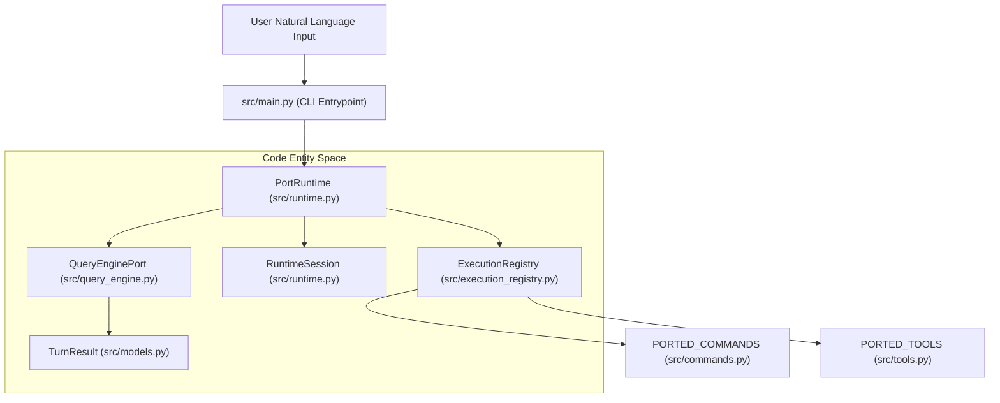
Sources: [src/main.py:1-20](), [src/runtime.py:15-30](), [src/query_engine.py:10-25](), [src/models.py:5-15]()

---

### Core Components

The system is organized into several key functional areas:

| Component | Description | Reference |
| :--- | :--- | :--- |
| **CLI & Entry** | The primary interface for interacting with the porting workspace. | `src/main.py` |
| **PortRuntime** | Manages the session lifecycle, turn loops, and environment bootstrapping. | `src/runtime.py` |
| **QueryEngine** | Handles the message pipeline, compaction, and structured LLM interaction. | `src/query_engine.py` |
| **Port Manifest** | Provides a live snapshot of the Python workspace's parity with the original. | `src/port_manifest.py` |
| **Registries** | Centralized stores for mirrored commands and tools. | `src/commands.py`, `src/tools.py` |

For a deep dive into the internal mechanics, see the **Core Architecture** section.

### Workspace & Parity

A central feature of `claw-code` is the **Parity Audit**. This system compares the current Python implementation against a snapshot of the original TypeScript surface area to track progress.

**Workspace Parity Overview**
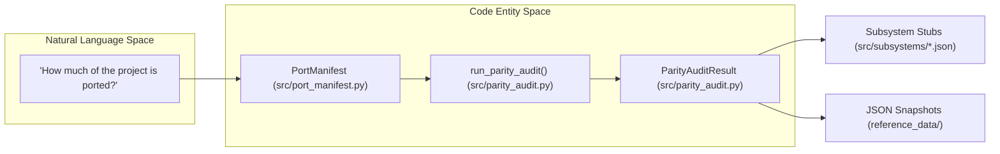
Sources: [src/port_manifest.py:10-40](), [src/parity_audit.py:20-60](), [src/subsystems/__init__.py:1-10]()

---

### Child Pages

Detailed documentation is split into the following sections:

#### [Getting Started](#1.1)
Covers installation, environment setup, and basic CLI usage. Learn how to run `python3 -m src.main summary` to see the current state of the port and how to invoke the test suite.

#### [Project Background & Legal Context](#1.2)
Explains the "why" behind the clean-room rewrite, the ethical considerations of AI reimplementation, and the specific OmX orchestration techniques used to build the codebase.

---
**Sources:**
*   [README.md:22-48]() (Backstory and OmX context)
*   [README.md:87-97]() (Python Workspace Overview)
*   [src/__init__.py:1-29]() (Exported symbols and core structure)
*   [src/main.py:1-100]() (CLI structure)

---

# Page: Getting Started

# Getting Started

<details>
<summary>Relevant source files</summary>

The following files were used as context for generating this wiki page:

- [README.md](README.md)
- [src/main.py](src/main.py)
- [tests/test_porting_workspace.py](tests/test_porting_workspace.py)

</details>


This page provides the technical instructions for installing, running, and exploring the `claw-code` Python workspace. It details the CLI entry point, available subcommands for inspecting the mirrored architecture, and the validation suite used to ensure parity with the original system patterns.

## Installation & Environment

The workspace is a pure Python implementation designed to mirror the original TypeScript architecture. It requires Python 3.8+ and does not have heavy external dependencies for its core logic, as it primarily focuses on harness orchestration and metadata mirroring [README.md:87-97]().

### Running the CLI
The primary entry point for the workspace is `src/main.py`. It should be invoked as a module to ensure relative imports are resolved correctly:

```bash
python3 -m src.main --help
```

**Sources:** [src/main.py:1-23](), [README.md:102-104]()

---

## CLI Subcommands

The CLI is built using `argparse` and provides a variety of tools to inspect the porting progress, the command/tool inventories, and the runtime state [src/main.py:21-91]().

### Workspace Inspection
These commands allow you to view the state of the Python rewrite and its alignment with the archived TypeScript source.

| Command | Purpose | Implementation Reference |
|:---|:---|:---|
| `summary` | Renders a Markdown summary of the porting workspace. | `QueryEnginePort.render_summary()` [src/main.py:98-100]() |
| `manifest` | Prints the current Python workspace manifest (files, subsystems). | `build_port_manifest()` [src/main.py:101-103]() |
| `subsystems` | Lists the 30+ mirrored subsystems and their file counts. | `manifest.top_level_modules` [src/main.py:119-122]() |
| `parity-audit` | Compares the Python workspace against the local archive snapshot. | `run_parity_audit()` [src/main.py:104-106]() |

### Inventory & Routing
These commands explore the mirrored 200+ commands and 180+ tools extracted from the original system snapshots.

| Command | Purpose | Implementation Reference |
|:---|:---|:---|
| `commands` | Lists mirrored command entries (e.g., `review`, `compact`). | `get_commands()` [src/main.py:123-131]() |
| `tools` | Lists mirrored tool entries (e.g., `LS`, `Grep`, `MCPTool`). | `get_tools()` [src/main.py:132-139]() |
| `route` | Simulates routing a natural language prompt to commands/tools. | `QueryEnginePort.submit()` [src/main.py:140-143]() |
| `show-command` | Displays the detailed metadata for a specific command. | `get_command()` [src/main.py:173-176]() |
| `show-tool` | Displays the detailed metadata for a specific tool. | `get_tool()` [src/main.py:177-180]() |

### Runtime & Session Simulation
These commands simulate the agentic turn-loop and session persistence.

| Command | Purpose | Implementation Reference |
|:---|:---|:---|
| `bootstrap` | Builds a runtime-style session report from mirrored inventories. | `PortRuntime.bootstrap_session()` [src/main.py:144-147]() |
| `turn-loop` | Runs a stateful multi-turn loop for the mirrored runtime. | `PortRuntime.run_turn_loop()` [src/main.py:148-154]() |
| `load-session` | Loads a previously persisted session from `.port_sessions/`. | `load_session()` [src/main.py:159-161]() |

**Sources:** [src/main.py:21-91](), [src/main.py:94-188](), [README.md:99-135]()

---

## Data Flow: CLI to Code Entity Space

The following diagram illustrates how a CLI invocation traverses the system to interact with the core logic and mirrored data.

### CLI Command Execution Flow
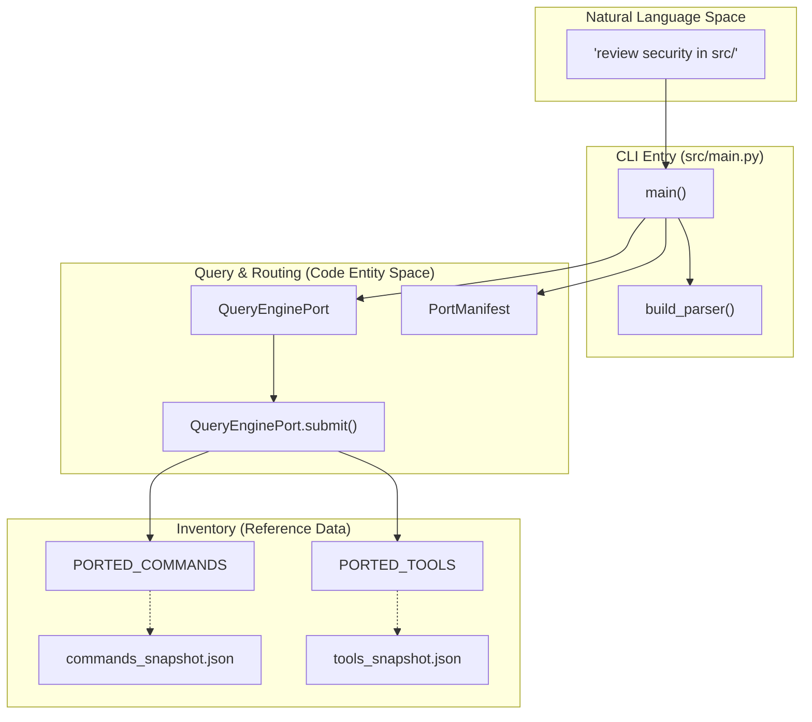
**Sources:** [src/main.py:94-118](), [src/query_engine.py:25-45](), [src/commands.py:15-25](), [src/tools.py:15-25]()

---

## Runtime Lifecycle

The workspace simulates the lifecycle of an agent session, from initial workspace setup to persistent storage.

### Session Bootstrap Process
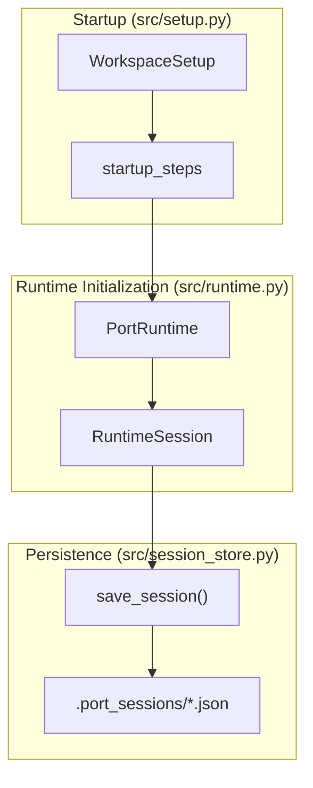
**Sources:** [src/setup.py:45-60](), [src/runtime.py:35-55](), [src/session_store.py:10-25]()

---

## Running the Test Suite

The workspace includes a comprehensive test suite in `tests/test_porting_workspace.py`. These tests validate the manifest generation, CLI functionality, parity audit logic, and the session lifecycle [tests/test_porting_workspace.py:15-185]().

### Invocation
To run the full suite with verbose output:
```bash
python3 -m unittest discover -s tests -v
```

### Key Test Categories
*   **Manifest Integrity:** Ensures the workspace correctly identifies Python files and subsystems [tests/test_porting_workspace.py:16-20]().
*   **CLI Smoke Tests:** Verifies that all primary subcommands (`summary`, `parity-audit`, `commands`, `tools`) execute without error [tests/test_porting_workspace.py:27-44]().
*   **Routing Logic:** Validates that prompts are correctly matched against mirrored command and tool names [tests/test_porting_workspace.py:81-103]().
*   **Session Persistence:** Confirms that sessions can be bootstrapped, saved, and reloaded from disk [tests/test_porting_workspace.py:162-175]().
*   **Parity Verification:** If a local archive is present, it validates that the Python port maintains the expected coverage ratios [tests/test_porting_workspace.py:45-52]().

**Sources:** [tests/test_porting_workspace.py:1-185](), [README.md:118-122]()

---

# Page: Project Background & Legal Context

# Project Background & Legal Context

<details>
<summary>Relevant source files</summary>

The following files were used as context for generating this wiki page:

- [README.md](README.md)
- [assets/omx/omx-readme-review-1.png](assets/omx/omx-readme-review-1.png)
- [assets/omx/omx-readme-review-2.png](assets/omx/omx-readme-review-2.png)

</details>


This page details the origins, orchestration methodology, and legal framework of the `claw-code` project. It explains how the project transitioned from a study of exposed source code to a clean-room Python implementation, and the specific AI-driven workflows used to achieve architectural parity.

## Rationale & Clean-Room Rewrite

The `claw-code` project was initiated following the exposure of the Claude Code source on March 31, 2026 [README.md:22-24](). The primary objective shifted from merely hosting an archive to engineering a "better harness" [README.md:8-9](). 

To address legal and ethical concerns regarding proprietary source code, the project implemented a **clean-room rewrite** strategy [README.md:28-28](). This involved:
1.  **Extraction of Architectural Patterns**: Identifying the core harness, tool wiring, and agent workflows of the original TypeScript system [README.md:64-65]().
2.  **Functional Mapping**: Creating a Python-first `src/` tree that mirrors the root-entry surface and subsystem names [README.md:54-56](), [README.md:137-139]().
3.  **Decoupling**: Moving the exposed snapshot out of the tracked repository state to focus exclusively on the Python porting workspace [README.md:58-66]().

### Clean-Room Data Flow

The following diagram illustrates the transition from the archived TypeScript concepts to the active Python implementation entities.

**Diagram: Architectural Parity Mapping**
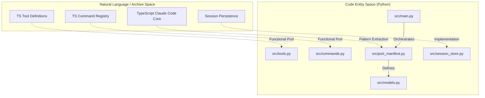
Sources: [README.md:71-85](), [README.md:89-97]()

## OmX ($team / $ralph) Orchestration

The entire porting process was orchestrated using **oh-my-codex (OmX)**, a workflow layer built on OpenAI's Codex [README.md:26-27](). This methodology allowed for rapid, high-fidelity reimplementation through two primary modes:

| Mode | Purpose | Implementation Role |
| :--- | :--- | :--- |
| `$team` | Parallel code review and architectural feedback | Used to coordinate the high-level structure of the Python tree [README.md:146-146](). |
| `$ralph` | Persistent execution loops and verification | Used for "completion discipline" and ensuring the port passed tests [README.md:147-147](). |

The orchestration session transformed the original harness structure into a functional Python tree with an integrated test suite [README.md:26-26]().

**Diagram: OmX Orchestration Workflow**
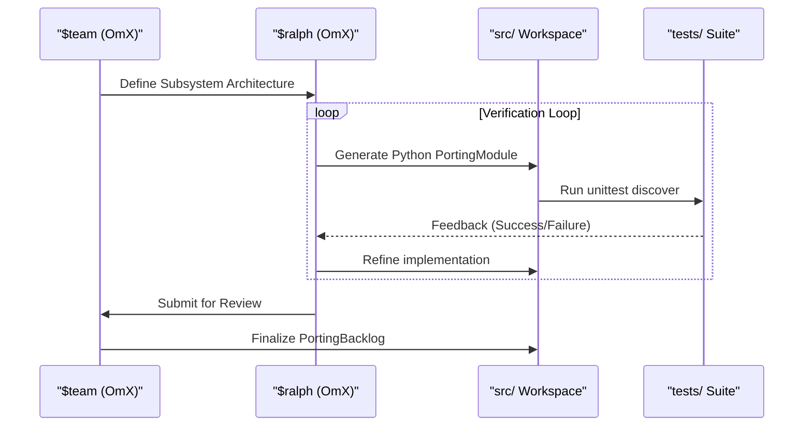
Sources: [README.md:26-28](), [README.md:143-148]()

## Ethical & Legal Framing

The project is framed as an exploration of **harness engineering**—the study of how agent systems manage tools and context [README.md:36-36](). 

### Key Legal Contexts
*   **AI Reimplementation**: The project references the essay *"Is Legal the Same as Legitimate: AI Reimplementation and the Erosion of Copyleft"* to provide context for the porting effort [README.md:83-83]().
*   **Parity Audit**: To ensure the rewrite remains a functional mirror without infringing on proprietary logic, a `parity-audit` tool was developed [README.md:127-128](). This tool compares the Python workspace against metrics (root file coverage, tool counts) derived from the original surface without copying the source itself [README.md:137-139]().

### Porting Status and Future
As of the current version, the Python tree mirrors top-level subsystem names and command/tool inventories [README.md:137-139](). A migration to **Rust** is in progress to improve performance and memory safety [README.md:15-16]().

| Component | Status | Code Pointer |
| :--- | :--- | :--- |
| **Python Port** | Active/Functional | `src/` [README.md:56-56]() |
| **Rust Port** | In Progress | `dev/rust` branch [README.md:15-16]() |
| **Verification** | Integrated | `tests/` [README.md:57-57]() |

Sources: [README.md:15-18](), [README.md:52-61](), [README.md:137-140]()

---

# Page: Core Architecture

# Core Architecture

<details>
<summary>Relevant source files</summary>

The following files were used as context for generating this wiki page:

- [src/__init__.py](src/__init__.py)
- [src/main.py](src/main.py)
- [src/models.py](src/models.py)

</details>


This page provides a high-level overview of the `claw-code` system architecture. The codebase is structured as a layered Python rewrite of the Claude Code TypeScript environment, utilizing a mirrored approach to maintain parity with the original's command and tool surface while providing a clean-room implementation of the runtime and query engine.

The system is organized into three primary layers:
1.  **The Manifest Layer**: Scans the workspace to provide a live view of subsystems and porting progress.
2.  **The Runtime Layer**: Manages session lifecycles, environment bootstrapping, and prompt routing.
3.  **The Query Engine Layer**: Handles the stateful turn loop, message compaction, and interaction with the LLM context.

## System Component Relationships

The following diagram illustrates how the core Python entities interact to process a user request.

### Data Flow and Entity Mapping
Title: Component Interaction Map
```mermaid
graph TD
    subgraph "Natural Language Space"
        UserPrompt["User Prompt"]
    end

    subgraph "Code Entity Space: src/"
        PR["PortRuntime (src/runtime.py)"]
        QEP["QueryEnginePort (src/query_engine.py)"]
        RS["RuntimeSession (src/runtime.py)"]
        PM["PortManifest (src/port_manifest.py)"]
        SS["StoredSession (src/session_store.py)"]
    end

    UserPrompt --> PR
    PR --> PM : "scans workspace"
    PR --> QEP : "initializes turn loop"
    QEP --> RS : "updates state"
    RS --> SS : "persists to .port_sessions/"
```
Sources: [src/runtime.py:7-15](), [src/query_engine.py:6-12](), [src/port_manifest.py:5-10](), [src/session_store.py:8-15]()

---

## Core Subsystems

### PortRuntime & Session Lifecycle
The `PortRuntime` class is the central orchestrator for the application. It handles the transition from a raw CLI prompt to a managed session. It is responsible for:
*   **Bootstrapping**: Setting up the environment via `build_bootstrap_graph`.
*   **Routing**: Determining if a prompt should trigger a specific command or enter a general chat loop.
*   **Persistence**: Managing the `RuntimeSession` and ensuring history is saved via `session_store`.

For details, see [PortRuntime & Session Lifecycle](#2.1).

### QueryEnginePort & Turn Processing
The `QueryEnginePort` manages the conversation logic. It encapsulates the "Turn Loop," where user inputs are processed, tools are executed, and assistant responses are generated. Key features include:
*   **Turn Management**: Using `TurnResult` to track progress and budget limits.
*   **Context Assembly**: Building the system init message that informs the LLM of available tools and commands.
*   **Compaction**: Managing token usage and message history.

For details, see [QueryEnginePort & Turn Processing](#2.2).

### Data Models
The system relies on a set of immutable and semi-mutable dataclasses defined in `src/models.py`. These models provide a shared language across the runtime and query engine:
*   `Subsystem`: Represents a logical grouping of code within the `src/` directory.
*   `PortingModule`: Tracks the status of individual components being ported from TypeScript.
*   `UsageSummary`: Provides functional updates for token tracking.

For details, see [Data Models](#2.3).

---

## Architectural Mapping: Interface to Implementation

The following diagram bridges the high-level CLI commands to the underlying code entities that execute them.

### CLI to Code Entity Mapping
Title: Command Execution Path
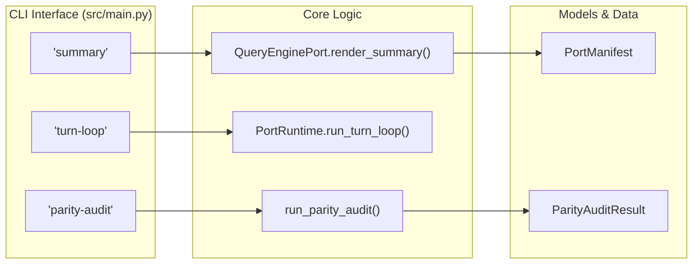
Sources: [src/main.py:98-118](), [src/runtime.py:50-70](), [src/parity_audit:4-9]()

## Workspace Organization

The codebase follows a strict directory structure mirrored from the original project, but implemented in Python:
*   `src/`: Contains the core logic and ported subsystems.
*   `tests/`: Contains the test suite, primarily `test_porting_workspace.py`.
*   `reference_data/`: Stores JSON snapshots of the original TypeScript surface area (commands, tools, and archive metrics).
*   `.port_sessions/`: The default directory for persisted `StoredSession` JSON files.

Sources: [src/port_manifest.py:15-30](), [src/session_store.py:1-10]()

---

# Page: PortRuntime & Session Lifecycle

# PortRuntime & Session Lifecycle

<details>
<summary>Relevant source files</summary>

The following files were used as context for generating this wiki page:

- [src/history.py](src/history.py)
- [src/runtime.py](src/runtime.py)
- [src/session_store.py](src/session_store.py)
- [src/transcript.py](src/transcript.py)

</details>


This page provides a deep dive into the `PortRuntime` class and the lifecycle of a `RuntimeSession`. The runtime is responsible for orchestrating the transition from a natural language prompt to a structured execution environment, managing tool/command routing, and handling the iterative turn loop.

## PortRuntime Overview

The `PortRuntime` class in [src/runtime.py:89-89]() serves as the central orchestrator. It bridges the gap between the user's input and the underlying `QueryEnginePort`. Its primary responsibilities include:

1.  **Prompt Routing**: Matching user intent against available commands and tools.
2.  **Session Bootstrapping**: Initializing the environment, history, and context.
3.  **Turn Loop Management**: Executing multiple iterations of LLM interaction.
4.  **Execution Coordination**: Invoking the `ExecutionRegistry` to perform side effects.

### Prompt Routing Logic

The routing mechanism uses a token-based scoring system to identify relevant functionality. It splits the prompt into tokens and compares them against `PORTED_COMMANDS` and `PORTED_TOOLS` [src/runtime.py:90-107]().

| Feature | Description |
| :--- | :--- |
| **Tokenization** | Replaces `/` and `-` with spaces and converts to lowercase [src/runtime.py:91-91](). |
| **Selection Strategy** | Always attempts to select at least one command and one tool if matches exist [src/runtime.py:98-100](). |
| **Ranking** | Leftover matches are sorted by score (descending), then kind, then name [src/runtime.py:102-105](). |
| **Limit** | Defaults to a maximum of 5 routed matches [src/runtime.py:90-90](). |

**Sources:** [src/runtime.py:89-108](), [src/commands.py:5-5](), [src/tools.py:12-12]()

---

## Session Bootstrapping & Data Flow

Bootstrapping is the process of creating a `RuntimeSession` from a raw prompt. This involves a multi-step pipeline that gathers environmental state and initial LLM results.

### The Bootstrap Pipeline
1.  **Context Assembly**: `build_port_context()` scans the workspace [src/runtime.py:110-110]().
2.  **Environment Setup**: `run_setup(trusted=True)` detects Python and platform details [src/runtime.py:111-111]().
3.  **Routing**: `route_prompt()` identifies the `RoutedMatch` candidates [src/runtime.py:117-117]().
4.  **Execution**: The `ExecutionRegistry` runs the `execute()` method for matched commands/tools [src/runtime.py:118-120]().
5.  **Query Engine Submission**: The prompt and matches are sent to `engine.submit_message()` [src/runtime.py:128-133]().

### Diagram: Bootstrap Data Flow (NL Space to Code Entity Space)

The following diagram illustrates how a natural language prompt is transformed into code entities and persisted.

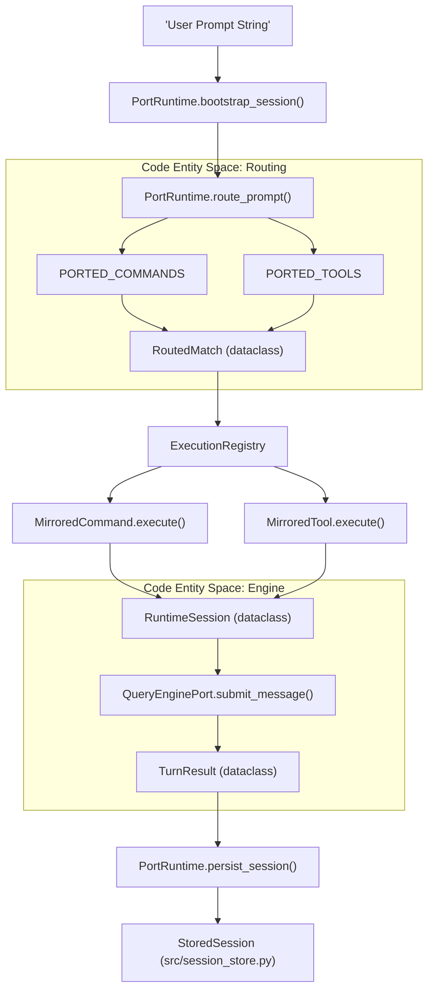

**Sources:** [src/runtime.py:109-152](), [src/execution_registry.py:13-13](), [src/models.py:9-9](), [src/session_store.py:9-13]()

---

## RuntimeSession Data Structure

The `RuntimeSession` class [src/runtime.py:25-37]() is the primary state container for an active interaction. It encapsulates the following:

*   **`prompt`**: The original user input string.
*   **`context`**: A `PortContext` object containing workspace metadata [src/context.py:6-6]().
*   **`setup`**: `WorkspaceSetup` details (Python version, platform) [src/setup.py:10-10]().
*   **`history`**: A `HistoryLog` tracking session events [src/history.py:13-13]().
*   **`turn_result`**: The output from the last `QueryEnginePort` turn [src/query_engine.py:9-9]().
*   **`persisted_session_path`**: The filesystem path to the saved JSON session [src/runtime.py:37-37]().

The session can be rendered to Markdown via `as_markdown()` [src/runtime.py:39-86](), providing a human-readable audit trail of the routing and execution steps.

**Sources:** [src/runtime.py:25-87](), [src/history.py:13-22]()

---

## The Turn Loop

The `run_turn_loop` method [src/runtime.py:154-167]() handles multi-turn conversations where the LLM may need to perform multiple steps to satisfy a request.

### Turn Loop Logic
*   **Initialization**: Configures the `QueryEnginePort` with `max_turns` and `structured_output` [src/runtime.py:155-156]().
*   **Iteration**: Loops up to `max_turns`.
*   **Prompt Modification**: For turns > 0, the prompt is appended with `[turn X]` [src/runtime.py:162-162]().
*   **Termination**: The loop breaks if `TurnResult.stop_reason` is not `'completed'` [src/runtime.py:165-166]().

**Sources:** [src/runtime.py:154-167](), [src/query_engine.py:9-9]()

---

## Session Persistence & Lifecycle

Sessions are persisted to disk to allow for resumption and auditing.

### Persistence Mechanism
1.  **Storage**: Sessions are stored in the `.port_sessions/` directory [src/session_store.py:16-16]().
2.  **Data Model**: The `StoredSession` dataclass [src/session_store.py:9-13]() tracks the `session_id`, `messages`, and token usage (`input_tokens`, `output_tokens`).
3.  **Serialization**: `save_session()` uses `json.dumps(asdict(session))` to write to disk [src/session_store.py:19-24]().

### Transcript Management
The `TranscriptStore` [src/transcript.py:7-10]() manages the raw message history during a session. It supports:
*   **Appending**: Adding new message entries [src/transcript.py:11-13]().
*   **Compaction**: Truncating the history to the last `N` entries to manage context window limits [src/transcript.py:15-17]().
*   **Flushing**: Marking the transcript as committed [src/transcript.py:22-23]().

### Diagram: Persistence Lifecycle

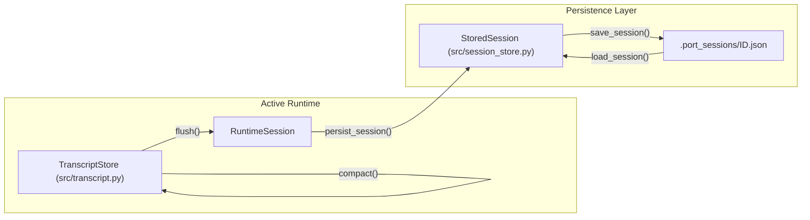

**Sources:** [src/session_store.py:1-35](), [src/transcript.py:1-24](), [src/runtime.py:134-134]()

---

# Page: QueryEnginePort & Turn Processing

# QueryEnginePort & Turn Processing

<details>
<summary>Relevant source files</summary>

The following files were used as context for generating this wiki page:

- [src/QueryEngine.py](src/QueryEngine.py)
- [src/models.py](src/models.py)
- [src/query.py](src/query.py)
- [src/query_engine.py](src/query_engine.py)

</details>


The `QueryEnginePort` is the primary orchestrator for message processing and state management within the porting workspace. It manages the lifecycle of a conversation "turn," enforcing budget constraints, handling message compaction, and coordinating between the `PortManifest` and `TranscriptStore`.

## 1. QueryEnginePort Core
`QueryEnginePort` is defined in `src/query_engine.py` and serves as the bridge between the user's natural language input and the system's mirrored command/tool space. It maintains a list of `mutable_messages` and tracks `total_usage` across the session.

### Key Lifecycle Methods
*   **Initialization**: Can be initialized fresh from a workspace using `from_workspace()` [[src/query_engine.py:45-47]()] or restored from a disk-persisted session via `from_saved_session(session_id)` [[src/query_engine.py:49-59]()].
*   **Submission**: The `submit_message` method processes a single interaction, updating usage metrics and checking against `QueryEngineConfig` limits [[src/query_engine.py:61-104]()].
*   **Persistence**: `persist_session()` flushes the transcript and saves the session state (messages and token counts) to the filesystem [[src/query_engine.py:140-150]()].

### Message Processing Flow
The following diagram illustrates how a user prompt moves through `QueryEnginePort` to produce a `TurnResult`.

**Turn Processing Pipeline**
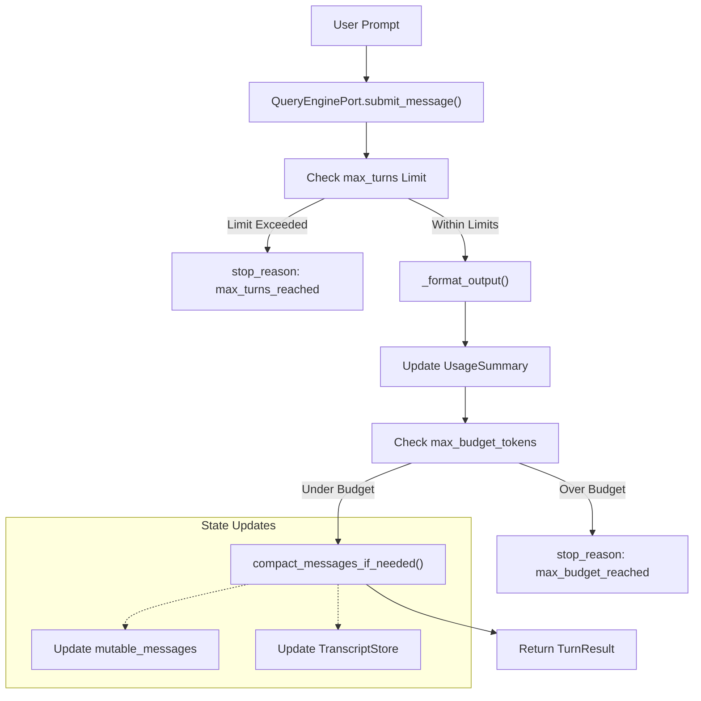
Sources: `[src/query_engine.py:61-104]()`, `[src/query_engine.py:129-133]()`

## 2. Configuration & Results
The engine's behavior is governed by `QueryEngineConfig`, while the outcome of every interaction is encapsulated in a `TurnResult`.

### QueryEngineConfig
This immutable dataclass defines the operational boundaries for the engine:
| Parameter | Default | Description |
| :--- | :--- | :--- |
| `max_turns` | 8 | Maximum number of interactions allowed in a session [[src/query_engine.py:17-17]()]. |
| `max_budget_tokens` | 2000 | Cumulative token limit (input + output) [[src/query_engine.py:18-18]()]. |
| `compact_after_turns` | 12 | Threshold to trigger message history pruning [[src/query_engine.py:19-19]()]. |
| `structured_output` | False | Whether to return results as JSON strings [[src/query_engine.py:20-20]()]. |

### TurnResult
A `TurnResult` is generated for every call to `submit_message`. It contains:
*   `prompt` and `output`: The raw text of the exchange [[src/query_engine.py:26-27]()].
*   `matched_commands` and `matched_tools`: Metadata identifying which mirrored entities were invoked [[src/query_engine.py:28-29]()].
*   `usage`: A `UsageSummary` object tracking token consumption for this specific turn [[src/query_engine.py:31-31]()].
*   `stop_reason`: Indicates if the turn ended normally (`completed`) or hit a limit [[src/query_engine.py:32-32]()].

Sources: `[src/query_engine.py:15-33]()`, `[src/models.py:29-38]()`

## 3. Streaming & Structured Output
`QueryEnginePort` supports both real-time streaming and structured JSON serialization.

### Streaming Submission
The `stream_submit_message` method is a generator that yields dictionary payloads representing different phases of the turn (e.g., `message_start`, `tool_match`, `message_delta`, `message_stop`) [[src/query_engine.py:106-127]()]. This allows UI layers to render incremental updates as the engine processes commands and tools.

### Structured Output Pipeline
If `config.structured_output` is enabled, the engine uses `_render_structured_output` to convert summary lines and session IDs into a JSON string [[src/query_engine.py:153-159]()]. It includes a retry mechanism (`structured_retry_limit`) to handle potential serialization failures [[src/query_engine.py:161-169]()].

**Data Flow: Natural Language to Code Entity Space**
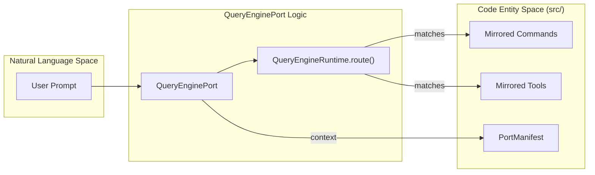
Sources: `[src/QueryEngine.py:7-16]()`, `[src/query_engine.py:36-44]()`

## 4. History Management & Compaction
To maintain performance and stay within LLM context limits, the engine implements message history management.

*   **Compaction**: When `mutable_messages` exceeds the `compact_after_turns` limit, the engine prunes the list to keep only the most recent $N$ turns [[src/query_engine.py:129-131]()].
*   **Transcript Store**: The `TranscriptStore` mirrors this compaction logic to ensure that persisted logs remain synchronized with the active session context [[src/query_engine.py:132-132]()].
*   **Replay**: `replay_user_messages()` retrieves the full history from the `TranscriptStore`, allowing for context reconstruction [[src/query_engine.py:134-135]()].

**State Synchronization Map**
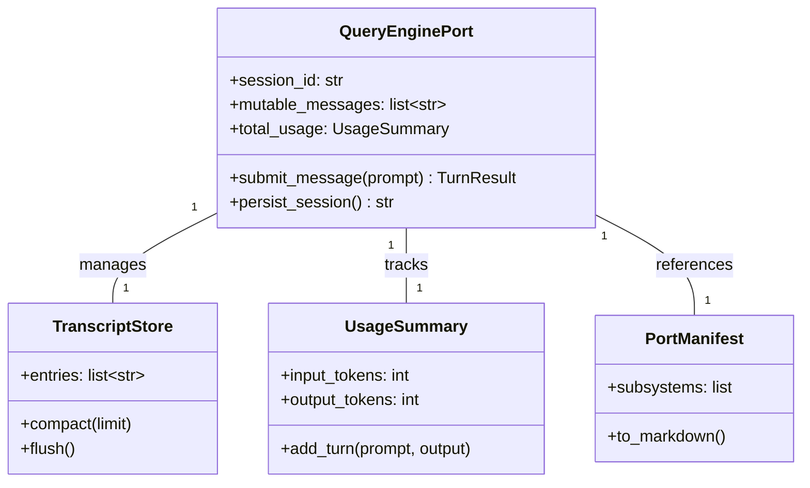
Sources: `[src/query_engine.py:35-44]()`, `[src/models.py:29-38]()`, `[src/transcript.py:1-139]()` (implied by usage in query_engine.py)

## 5. Usage Tracking
The `UsageSummary` class in `src/models.py` provides a functional approach to token tracking. Instead of mutating in place, the `add_turn` method returns a new `UsageSummary` instance with updated counts based on a simple whitespace-split heuristic [[src/models.py:33-37]()]. `QueryEnginePort` uses this to project if a turn will exceed the `max_budget_tokens` before finalizing the state [[src/query_engine.py:87-90]()].

Sources: `[src/models.py:29-38]()`, `[src/query_engine.py:87-94]()`

---

# Page: Data Models

# Data Models

<details>
<summary>Relevant source files</summary>

The following files were used as context for generating this wiki page:

- [src/context.py](src/context.py)
- [src/history.py](src/history.py)
- [src/models.py](src/models.py)

</details>


The `claw-code` system utilizes a set of shared dataclasses to maintain state, track porting progress, and account for resource usage. These models are primarily defined in `src/models.py` and are designed with an emphasis on **immutability** and **functional updates** to ensure thread safety and predictable state transitions during the orchestration of complex porting tasks.

### Core Immutability Pattern

Most models in the codebase use the `@dataclass(frozen=True)` decorator [src/models.py:6-6](). This pattern prevents accidental in-place modification of state. When a state change is required, the system typically creates a new instance of the class with the updated values, often via helper methods that return a new copy of the object.

---

### Shared Dataclasses

#### 1. Subsystem
Represents a high-level architectural component within the workspace. This model is used to categorize the 30+ stub packages that mirror the original TypeScript directory structure.

| Field | Type | Description |
| :--- | :--- | :--- |
| `name` | `str` | The identifier of the subsystem (e.g., "assistant", "bridge"). |
| `path` | `str` | The relative path to the subsystem source. |
| `file_count` | `int` | Number of files contained within this subsystem. |
| `notes` | `str` | Porting notes or architectural observations. |

**Definition:** [src/models.py:6-12]()  
**Sources:** [src/models.py:6-12]()

#### 2. PortingModule
Describes an individual module's status and its mapping back to the original source.

| Field | Type | Description |
| :--- | :--- | :--- |
| `name` | `str` | The Python module name. |
| `responsibility` | `str` | Brief description of what the module does. |
| `source_hint` | `str` | Reference to the original TypeScript file/logic. |
| `status` | `str` | Current state (defaults to "planned"). |

**Definition:** [src/models.py:14-20]()  
**Sources:** [src/models.py:14-20]()

#### 3. UsageSummary
Tracks the token consumption of the LLM during a session. It demonstrates the **functional update style** used throughout the project.

*   **`add_turn(prompt, output)`**: Instead of modifying the current instance, this method calculates new token counts based on whitespace splitting and returns a *new* `UsageSummary` object [src/models.py:33-37]().

**Definition:** [src/models.py:28-38]()  
**Sources:** [src/models.py:28-38]()

#### 4. PermissionDenial
A simple record used when a tool execution is blocked by the `ToolPermissionContext`.

| Field | Type | Description |
| :--- | :--- | :--- |
| `tool_name` | `str` | The name of the tool that was denied. |
| `reason` | `str` | The explanation for the denial (e.g., prefix mismatch). |

**Definition:** [src/models.py:22-26]()  
**Sources:** [src/models.py:22-26]()

#### 5. PortingBacklog
A mutable container (non-frozen) that aggregates `PortingModule` instances into a project-wide roadmap. It provides a `summary_lines()` method to generate human-readable Markdown reports [src/models.py:45-49]().

**Definition:** [src/models.py:40-50]()  
**Sources:** [src/models.py:40-50]()

---

### Workspace Context & History

Beyond the core models, the system uses specialized structures for environment awareness and event logging.

#### PortContext
The `PortContext` class provides a snapshot of the physical file system layout, identifying the roots for source code, tests, and the reference archive [src/context.py:7-16](). It is populated via `build_port_context()` which scans the directory structure to count files and verify the availability of the TypeScript archive [src/context.py:19-34]().

**Sources:** [src/context.py:7-34]()

#### HistoryLog & HistoryEvent
Used for session auditing, the `HistoryLog` collects `HistoryEvent` objects [src/history.py:6-10](). Unlike the frozen models, `HistoryLog` is designed for sequential accumulation of events during a runtime session [src/history.py:12-18]().

**Sources:** [src/history.py:6-23]()

---

### Data Flow & Entity Mapping

The following diagrams illustrate how these code entities represent the conceptual workspace and how data flows through the immutable update patterns.

#### Diagram: Workspace Entity Mapping
This diagram bridges the natural language concept of a "Porting Workspace" to the specific classes defined in `src/models.py` and `src/context.py`.

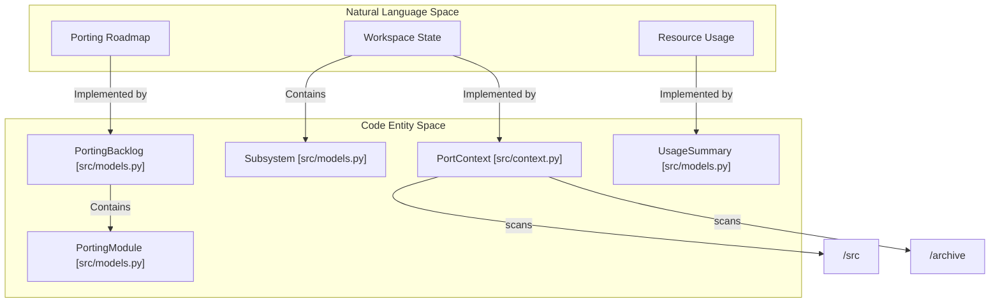
**Sources:** [src/models.py:6-50](), [src/context.py:7-34]()

#### Diagram: Functional Update Flow (UsageSummary)
This diagram demonstrates the immutable update logic where the `QueryEnginePort` interacts with `UsageSummary`.

```mermaid
sequenceDiagram
    participant QE as "QueryEnginePort"
    participant U1 as "UsageSummary (Old)"
    participant U2 as "UsageSummary (New)"

    Note over QE, U2: "Turn Processing Loop"
    QE->>U1: "add_turn(prompt_text, response_text)"
    U1->>U1: "Calculate tokens (len.split())"
    create participant U2
    U1-->>U2: "Return new instance"
    QE->>QE: "Replace self.usage with New instance"
```
**Sources:** [src/models.py:28-38]()

### Summary Table: Model Characteristics

| Class | File | Frozen? | Primary Purpose |
| :--- | :--- | :--- | :--- |
| `Subsystem` | `src/models.py` | Yes | Structural metadata for code organization. |
| `PortingModule` | `src/models.py` | Yes | Individual unit tracking within the backlog. |
| `UsageSummary` | `src/models.py` | Yes | Token accounting with functional updates. |
| `PortingBacklog` | `src/models.py` | No | Collection of modules for progress reporting. |
| `PortContext` | `src/context.py` | Yes | Filesystem path and count discovery. |
| `HistoryLog` | `src/history.py` | No | Mutable list of session events. |

**Sources:** [src/models.py:1-50](), [src/context.py:7-16](), [src/history.py:6-14]()

---

# Page: Commands & Tools Surface

# Commands & Tools Surface

<details>
<summary>Relevant source files</summary>

The following files were used as context for generating this wiki page:

- [src/commands.py](src/commands.py)
- [src/reference_data/commands_snapshot.json](src/reference_data/commands_snapshot.json)
- [src/reference_data/tools_snapshot.json](src/reference_data/tools_snapshot.json)
- [src/tools.py](src/tools.py)

</details>


The Commands and Tools surface represents the primary interface between the user/LLM and the system's capabilities. In `claw-code`, these surfaces are "mirrored" from the original TypeScript implementation using static JSON snapshots. This design allows the Python runtime to expose a high-fidelity representation of the original tool and command ecosystem while providing shim execution logic for porting validation.

## Mirrored Inventory Overview

The system maintains a comprehensive inventory of 207 commands and 184 tools. These are loaded from the `src/reference_data/` directory and exposed via the `src/commands.py` and `src/tools.py` modules.

### Command and Tool Loading Flow
The following diagram illustrates how natural language intents or CLI requests are mapped to the mirrored code entities defined in the snapshots.

"Mapping Intents to Mirrored Entities"
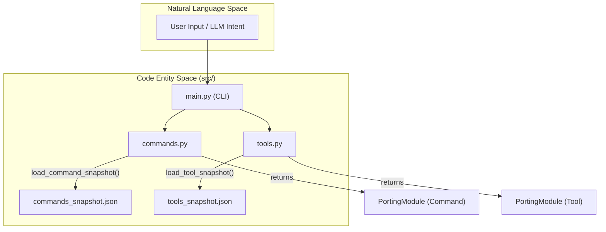
Sources: [src/commands.py:22-33](), [src/tools.py:23-34](), [src/reference_data/commands_snapshot.json:1-10](), [src/reference_data/tools_snapshot.json:1-10]()

## Subsystem Components

### [Command Registry](#3.1)
The Command Registry manages the lifecycle of slash-commands (e.g., `/config`, `/clear`). It uses an `lru_cache` to load the `commands_snapshot.json` into a tuple of `PortingModule` objects. 
- **Key Logic**: Supports filtering by source hints (e.g., excluding "plugin" or "skill" commands) via `get_commands()`.
- **Execution**: Provides a `CommandExecution` shim that simulates command handling for parity testing.

For details, see [Command Registry](#3.1).

Sources: [src/commands.py:39-66](), [src/commands.py:75-81]()

### [Tool Registry & Permissions](#3.2)
The Tool Registry manages the inventory of tools available to the LLM (e.g., `BashTool`, `FileReadTool`). 
- **Filtering**: Supports `simple_mode` (limiting to core file/shell tools) and MCP (Model Context Protocol) exclusion.
- **Permissions**: Integrates with `ToolPermissionContext` to enforce deny-lists and prefix-based restrictions before tools are exposed to the runtime.

For details, see [Tool Registry & Permissions](#3.2).

Sources: [src/tools.py:62-72](), [src/permissions.py:1-20]()

### [Execution Registry](#3.3)
The Execution Registry acts as the runtime glue. It assembles `MirroredCommand` and `MirroredTool` wrappers into a unified `ExecutionRegistry`. 
- **Shim Pattern**: Every mirrored entity implements an `execute()` method that returns a standardized result (`CommandExecution` or `ToolExecution`).
- **Bootstrap**: The `PortRuntime` uses `build_execution_registry()` during session initialization to determine which capabilities are active.

For details, see [Execution Registry](#3.3).

Sources: [src/commands.py:13-20](), [src/tools.py:14-21]()

## Registry Interaction Architecture

The relationship between the registries and the data snapshots is central to the system's parity-first design.

"Registry Data Flow"
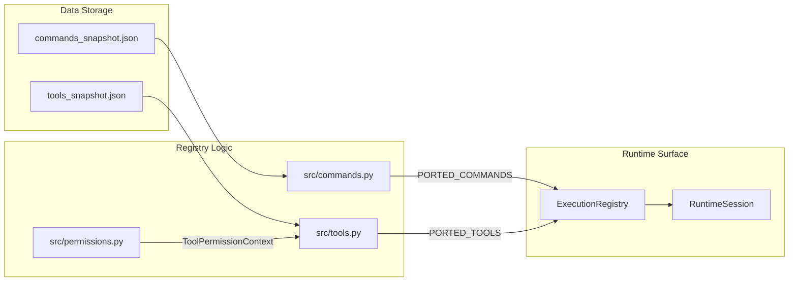
Sources: [src/commands.py:36-36](), [src/tools.py:37-37](), [src/runtime.py:40-60]()

## CLI Exposure
The mirrored surface is exposed via several CLI subcommands for inspection and debugging:
- `python3 -m src.main commands`: Lists all mirrored commands and their source hints.
- `python3 -m src.main tools`: Lists all mirrored tools and their responsibilities.
- `python3 -m src.main summary`: Provides a high-level count of the ported surface area.

Sources: [src/commands.py:83-90](), [src/tools.py:89-96]()

---

# Page: Command Registry

# Command Registry

<details>
<summary>Relevant source files</summary>

The following files were used as context for generating this wiki page:

- [src/command_graph.py](src/command_graph.py)
- [src/commands.py](src/commands.py)
- [src/reference_data/commands_snapshot.json](src/reference_data/commands_snapshot.json)

</details>


The **Command Registry** is the central subsystem responsible for loading, indexing, and simulating the execution of the mirrored command surface. Because `claw-code` is a clean-room Python rewrite, it mirrors the command surface of the original TypeScript implementation by loading a static snapshot of command metadata and providing a shim execution pattern.

## Command Loading & Snapshots

The registry operates by reading a JSON snapshot file that contains the metadata for all commands discovered in the original codebase. This data is processed into a collection of `PortingModule` objects which are then cached for the duration of the process.

### Data Flow: Snapshot to Registry

1.  **Snapshot Path**: The registry locates `commands_snapshot.json` in the `reference_data` directory [src/commands.py:10-10]().
2.  **Lazy Loading**: The `load_command_snapshot` function reads the JSON file and transforms each entry into a `PortingModule` dataclass [src/commands.py:23-33]().
3.  **Caching**: To ensure performance, the snapshot is loaded once using `@lru_cache(maxsize=1)` and stored in the `PORTED_COMMANDS` constant [src/commands.py:22-36]().
4.  **Backlog Integration**: These commands are also used to build a `PortingBacklog`, which tracks the "Command surface" as a set of modules to be implemented or audited [src/commands.py:44-45]().

### Command Entity Mapping
The following diagram illustrates how natural language command names are mapped to code entities and their original source locations.

**Command Entity Mapping**
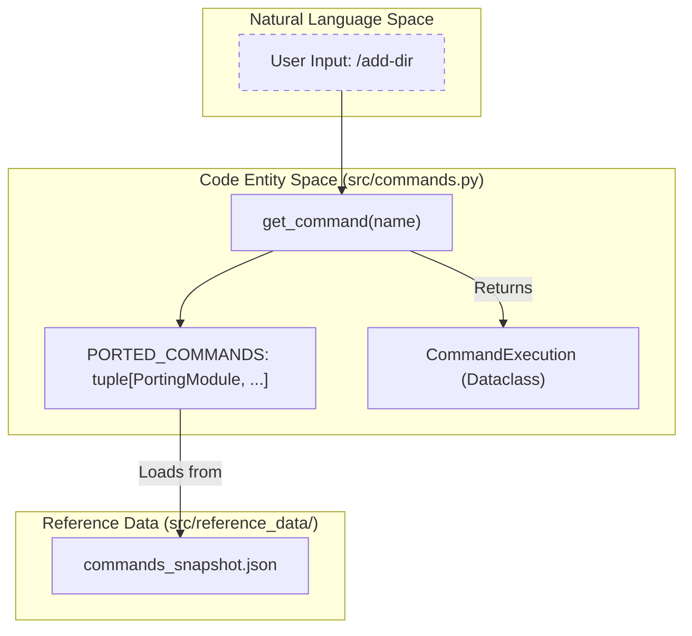
Sources: [src/commands.py:10-36](), [src/commands.py:52-57](), [src/reference_data/commands_snapshot.json:1-11]()

## Command Execution Shim Pattern

The registry does not execute the original TypeScript logic. Instead, it uses a **Shim Pattern** via the `CommandExecution` dataclass and the `execute_command` function.

-   **CommandExecution**: A frozen dataclass that captures the result of a simulated execution, including the `name`, `source_hint`, the `prompt` passed to it, and a `message` describing what the mirrored command *would* have done [src/commands.py:13-19]().
-   **execute_command**: This function looks up the command in the registry. If found, it returns a `CommandExecution` object with `handled=True`. If the command is unknown, it returns an object with `handled=False` and an error message [src/commands.py:75-80]().

Sources: [src/commands.py:13-19](), [src/commands.py:75-80]()

## Command APIs

The registry provides several public APIs for querying the command surface:

| Function | Description |
| :--- | :--- |
| `get_command(name)` | Case-insensitive lookup for a specific command module [src/commands.py:52-57](). |
| `get_commands(...)` | Returns a filtered tuple of commands. Supports toggling `include_plugin_commands` and `include_skill_commands` [src/commands.py:60-66](). |
| `find_commands(query, limit)` | Searches both command names and `source_hint` strings for a substring match [src/commands.py:69-72](). |
| `command_names()` | Returns a simple list of all registered command names [src/commands.py:48-49](). |
| `render_command_index()` | Generates a Markdown-formatted list of commands for CLI display [src/commands.py:83-90](). |

Sources: [src/commands.py:48-90]()

## CommandGraph Segmentation

The `CommandGraph` provides a high-level segmentation of the command surface based on their source locations. This categorization is used by the runtime to distinguish between core functionality and extensions.

### Segmentation Logic
Commands are segmented by inspecting the `source_hint` attribute of the `PortingModule` [src/command_graph.py:29-34]():

1.  **Builtins**: Commands whose `source_hint` does not contain "plugin" or "skills".
2.  **Plugin-like**: Commands containing "plugin" in their `source_hint`.
3.  **Skill-like**: Commands containing "skills" in their `source_hint`.

**Command Segmentation Flow**
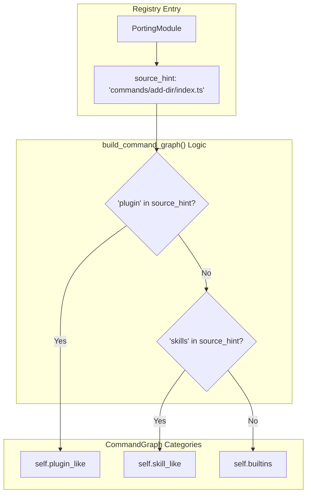
Sources: [src/command_graph.py:9-34](), [src/commands.py:26-31]()

### CommandGraph Class
The `CommandGraph` dataclass [src/command_graph.py:9-13]() includes helper methods:
-   `flattened()`: Combines all categories into a single tuple [src/command_graph.py:15-16]().
-   `as_markdown()`: Produces a summary string showing the counts of each category [src/command_graph.py:18-26]().

Sources: [src/command_graph.py:9-26]()

---

# Page: Tool Registry & Permissions

# Tool Registry & Permissions

<details>
<summary>Relevant source files</summary>

The following files were used as context for generating this wiki page:

- [src/Tool.py](src/Tool.py)
- [src/permissions.py](src/permissions.py)
- [src/reference_data/tools_snapshot.json](src/reference_data/tools_snapshot.json)
- [src/tool_pool.py](src/tool_pool.py)
- [src/tools.py](src/tools.py)

</details>


This page describes the mechanism by which `claw-code` manages its mirrored tool inventory. It covers the lifecycle of tool loading from JSON snapshots, the filtering logic applied via permission contexts, and the assembly of the `ToolPool` used by the runtime.

## Tool Loading & Registry

The tool registry is centered around `src/tools.py`, which mirrors the tool surface of the original TypeScript implementation. Tools are not implemented as active Python logic in this phase; instead, they are loaded as metadata entries representing the "mirrored" state of the archive [src/tools.py:31-32]().

### Data Flow: Snapshot to Registry

The registry is populated by reading `src/reference_data/tools_snapshot.json`, which contains 184 tool entries [src/tools.py:11](). This process is managed by the `load_tool_snapshot` function, which is decorated with `@lru_cache` to ensure the file is only read once during the process lifecycle [src/tools.py:23-24]().

1.  **JSON Load**: `load_tool_snapshot` reads the raw JSON array [src/tools.py:25]().
2.  **Model Mapping**: Each entry is converted into a `PortingModule` dataclass, preserving its `name`, `source_hint` (original TS path), and `responsibility` [src/tools.py:27-33]().
3.  **Static Export**: The resulting tuple is stored in the `PORTED_TOOLS` constant [src/tools.py:37]().

### Natural Language to Code Entity: Tool Registry

The following diagram bridges the conceptual "Tool" from natural language into the specific code entities used for tracking and execution.

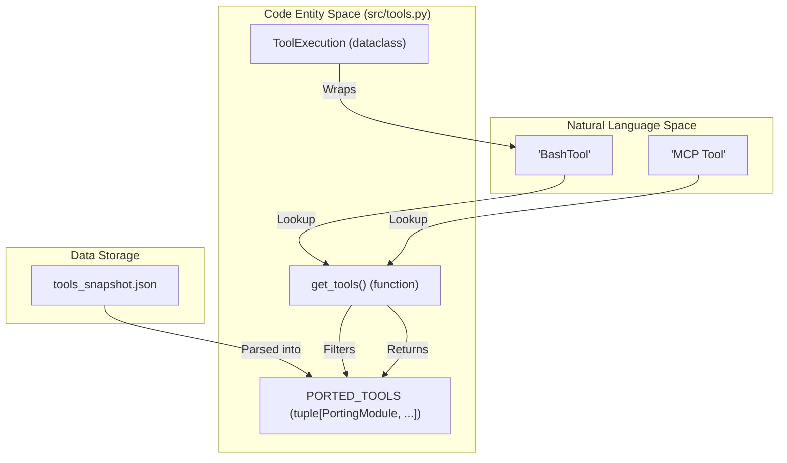
Sources: [src/tools.py:11-37](), [src/tools.py:62-72](), [src/models.py:1-20]()

## Tool Execution Shim

Since the tools are mirrored stubs, the `execute_tool` function serves as a "shim" that simulates tool invocation. It returns a `ToolExecution` object which captures what *would* have happened if the tool were fully implemented [src/tools.py:14-21]().

- **`execute_tool(name, payload)`**: Searches for the tool via `get_tool`. If found, it generates a message describing the mirrored action [src/tools.py:81-87]().
- **`ToolExecution`**: A frozen dataclass containing the `name`, `source_hint`, `payload`, a `handled` boolean, and a descriptive `message` [src/tools.py:14-21]().

Sources: [src/tools.py:14-21](), [src/tools.py:81-87]()

## Permission Logic & Filtering

The `ToolPermissionContext` provides a mechanism to restrict tool availability based on security or configuration requirements.

### ToolPermissionContext
Defined in `src/permissions.py`, this class manages two types of restrictions [src/permissions.py:7-9]():
1.  **`deny_names`**: A `frozenset` of specific tool names (lowercased) to block.
2.  **`deny_prefixes`**: A tuple of string prefixes. Any tool starting with these prefixes is blocked.

The `blocks(tool_name)` method performs case-insensitive checks against both the name set and the prefix list [src/permissions.py:18-20]().

### Filtering in `get_tools`
The `get_tools` function is the primary API for retrieving tools with applied filters [src/tools.py:62-66]():
- **`simple_mode`**: If `True`, restricts the toolset to only `BashTool`, `FileReadTool`, and `FileEditTool` [src/tools.py:68-69]().
- **`include_mcp`**: If `False`, removes any tools that contain "mcp" in their name or source hint [src/tools.py:70-71]().
- **`permission_context`**: Passes the resulting list through `filter_tools_by_permission_context` to apply the `deny_names`/`deny_prefixes` logic [src/tools.py:72]().

Sources: [src/permissions.py:6-21](), [src/tools.py:56-72]()

## ToolPool Assembly

The `ToolPool` is a container used by the `QueryEngine` and `PortRuntime` to hold the final resolved set of tools for a session.

| Entity | Description |
| :--- | :--- |
| `ToolPool` (class) | A frozen dataclass holding a tuple of `PortingModule` tools and the configuration flags used to create them (`simple_mode`, `include_mcp`) [src/tool_pool.py:11-14](). |
| `assemble_tool_pool` | The factory function that takes configuration parameters and a `ToolPermissionContext` to produce a `ToolPool` [src/tool_pool.py:28-37](). |
| `as_markdown()` | Renders the pool's state and a truncated list of available tools for debugging or system prompts [src/tool_pool.py:16-25](). |

### System Integration Diagram

This diagram illustrates how the `ToolPool` is assembled from the registry and filtered by permissions.

```mermaid
graph TD
    subgraph "Registry (src/tools.py)"
        PT["PORTED_TOOLS"]
        GT["get_tools()"]
    end

    subgraph "Permissions (src/permissions.py)"
        TPC["ToolPermissionContext"]
        DN["deny_names"]
        DP["deny_prefixes"]
    end

    subgraph "Assembly (src/tool_pool.py)"
        ATP["assemble_tool_pool()"]
        TP["ToolPool"]
    end

    TPC -->|Contains| DN
    TPC -->|Contains| DP
    PT -->|Input to| GT
    TPC -->|Filter for| GT
    GT -->|Result to| ATP
    ATP -->|Constructs| TP
```
Sources: [src/tools.py:62-72](), [src/permissions.py:7-9](), [src/tool_pool.py:28-37]()

## Summary of Key Functions

- **`get_tool(name)`**: Case-insensitive lookup for a single tool [src/tools.py:48-53]().
- **`find_tools(query, limit)`**: Searches tool names and source hints for a substring [src/tools.py:75-78]().
- **`build_tool_backlog()`**: Converts the entire registry into a `PortingBacklog` for parity tracking [src/tools.py:40-41]().

Sources: [src/tools.py:40-78]()

---

# Page: Execution Registry

# Execution Registry

<details>
<summary>Relevant source files</summary>

The following files were used as context for generating this wiki page:

- [src/execution_registry.py](src/execution_registry.py)
- [src/runtime.py](src/runtime.py)

</details>


The Execution Registry serves as the central dispatching mechanism for commands and tools within the `claw-code` runtime. It abstracts the underlying JSON-loaded snapshots into executable entities, providing a unified interface for the `PortRuntime` to invoke mirrored functionality.

## Mirrored Execution Wrappers

The registry utilizes two primary wrapper classes to bridge static data definitions with runtime execution shims. These wrappers encapsulate the `execute()` pattern, ensuring that whether a command or tool is being called, the interaction follows a consistent protocol.

### MirroredCommand
The `MirroredCommand` class wraps entries from the command snapshot. It maps a natural language prompt to a `CommandExecution` result via the `execute_command` shim.

*   **Implementation**: `[src/execution_registry.py:9-16]()`
*   **Mechanism**: It calls `execute_command(self.name, prompt)` and returns the `.message` attribute of the resulting `CommandExecution` object `[src/execution_registry.py:15-15]()`.

### MirroredTool
The `MirroredTool` class wraps tool definitions. It processes a payload (typically a JSON string or parameter block) and routes it through the tool execution shim.

*   **Implementation**: `[src/execution_registry.py:18-25]()`
*   **Mechanism**: It invokes `execute_tool(self.name, payload)` and extracts the `.message` string for the runtime `[src/execution_registry.py:24-24]()`.

### Data Flow: From Snapshot to Execution
The following diagram illustrates how static data is transformed into executable objects.

**Registry Entity Mapping**
```mermaid
graph TD
    subgraph "Natural Language Space"
        P["User Prompt / Payload"]
    end

    subgraph "Code Entity Space: execution_registry.py"
        ER["ExecutionRegistry"]
        MC["MirroredCommand"]
        MT["MirroredTool"]
    end

    subgraph "Execution Shims"
        EC["execute_command()"]
        ET["execute_tool()"]
    end

    subgraph "Data Sources"
        PC["PORTED_COMMANDS"]
        PT["PORTED_TOOLS"]
    end

    PC -->|wraps| MC
    PT -->|wraps| MT
    MC --> ER
    MT --> ER
    
    P --> MC
    P --> MT
    MC -->|calls| EC
    MT -->|calls| ET
```
Sources: `[src/execution_registry.py:9-51]()`, `[src/commands.py:5-5]()`, `[src/tools.py:6-6]()`

---

## Registry Assembly

The registry is assembled dynamically during the bootstrapping phase. The function `build_execution_registry()` iterates through the global collections of ported entities to create a lookup-optimized `ExecutionRegistry` instance.

### build_execution_registry()
This function serves as the constructor for the entire execution surface. It transforms `PORTED_COMMANDS` and `PORTED_TOOLS` into tuples of `MirroredCommand` and `MirroredTool` respectively `[src/execution_registry.py:47-51]()`.

### ExecutionRegistry Class
The `ExecutionRegistry` provides case-insensitive lookup methods to retrieve specific command or tool wrappers by name.

| Method | Return Type | Description |
| :--- | :--- | :--- |
| `command(name)` | `MirroredCommand \| None` | Performs a case-insensitive search through the `commands` tuple `[src/execution_registry.py:32-37]()`. |
| `tool(name)` | `MirroredTool \| None` | Performs a case-insensitive search through the `tools` tuple `[src/execution_registry.py:39-44]()`. |

Sources: `[src/execution_registry.py:27-51]()`

---

## Runtime Integration

The `PortRuntime` uses the `ExecutionRegistry` during the `bootstrap_session` sequence to handle prompt routing and initial execution.

### Session Bootstrapping Flow
When a session is initialized via `PortRuntime.bootstrap_session()`, the following steps occur involving the registry:
1.  **Registry Construction**: The runtime calls `build_execution_registry()` `[src/runtime.py:118-118]()`.
2.  **Routing**: The `route_prompt()` method identifies relevant commands and tools based on the user input `[src/runtime.py:117-117]()`.
3.  **Execution**: For every match identified during routing, the runtime fetches the corresponding wrapper from the registry and calls its `.execute()` method `[src/runtime.py:119-120]()`.

**Runtime Execution Sequence**
```mermaid
sequenceDiagram
    participant PR as PortRuntime
    participant ER as ExecutionRegistry
    participant MC as MirroredCommand
    participant EC as execute_command (Shim)

    PR->>ER: build_execution_registry()
    PR->>PR: route_prompt(prompt)
    Note over PR: Identifies "matched_commands"
    
    PR->>ER: command(match.name)
    ER-->>PR: returns MirroredCommand
    
    PR->>MC: execute(prompt)
    MC->>EC: execute_command(name, prompt)
    EC-->>MC: CommandExecution(message=...)
    MC-->>PR: returns message string
```
Sources: `[src/runtime.py:109-120]()`, `[src/execution_registry.py:14-16]()`, `[src/execution_registry.py:32-37]()`

### History and Logging
The results of these executions are captured into the `RuntimeSession` as `command_execution_messages` and `tool_execution_messages` `[src/runtime.py:148-149]()`. This ensures that the output of the mirrored shims is available for the system init message and subsequent LLM turns.

Sources: `[src/runtime.py:25-37]()`, `[src/runtime.py:139-152]()`

---

# Page: Workspace Initialization & Setup

# Workspace Initialization & Setup

<details>
<summary>Relevant source files</summary>

The following files were used as context for generating this wiki page:

- [src/deferred_init.py](src/deferred_init.py)
- [src/prefetch.py](src/prefetch.py)
- [src/setup.py](src/setup.py)
- [src/system_init.py](src/system_init.py)

</details>


This section describes the startup pipeline of the `claw-code` environment. Before a user can interact with the CLI or an LLM can process queries, the system must establish a trusted workspace context. This involves executing side-effect-heavy prefetches, verifying the execution environment, and assembling the initial system prompt that informs the model of its available capabilities.

The initialization process is designed to be asynchronous-friendly, though currently simulated, to mirror the original TypeScript implementation's non-blocking startup.

## Startup Pipeline Overview

The initialization sequence follows a strict progression from raw environment scanning to high-level context assembly. This ensures that by the time the `QueryEnginePort` is active, all necessary credentials, project structures, and mirrored snapshots are available.

### Initialization Flow
The following diagram illustrates the relationship between the primary initialization components and the code entities that manage them.

**System Initialization Graph**
```mermaid
graph TD
    subgraph "Natural Language Space"
        A["Startup Request"]
        B["Environment Scan"]
        C["Security Check"]
        D["LLM Context"]
    end

    subgraph "Code Entity Space"
        A --> "run_setup()"
        "run_setup()" --> "start_mdm_raw_read()"
        "run_setup()" --> "start_keychain_prefetch()"
        "run_setup()" --> "start_project_scan()"
        
        "run_setup()" --> "run_deferred_init()"
        "run_deferred_init()" --> "DeferredInitResult"
        
        "run_setup()" --> "SetupReport"
        "SetupReport" --> "build_system_init_message()"
        "build_system_init_message()" --> "SystemInitMessage"
    end

    style A stroke-dasharray: 5 5
    style B stroke-dasharray: 5 5
    style C stroke-dasharray: 5 5
    style D stroke-dasharray: 5 5
```
Sources: [src/setup.py:64-77](), [src/system_init.py:8-23]()

---

## Workspace Setup & Setup Report
The entry point for environment preparation is `run_setup()` in `src/setup.py`. This function orchestrates the creation of a `WorkspaceSetup` configuration and triggers several "prefetch" side effects. These prefetches simulate the retrieval of sensitive or slow-loading data required for a full-featured session.

*   **WorkspaceSetup**: Captures system-level metadata like Python version and platform [src/setup.py:13-17]().
*   **Prefetch Side Effects**: Includes MDM (Mobile Device Management) raw reads, keychain access for credentials, and a filesystem scan of the project root [src/prefetch.py:14-24]().
*   **SetupReport**: A summary object that can render the entire initialization state into Markdown for logging or debugging [src/setup.py:31-53]().

For details, see [WorkspaceSetup & SetupReport](#4.1).

Sources: [src/setup.py:13-17](), [src/setup.py:64-77](), [src/prefetch.py:1-24]()

---

## Bootstrap Graph & Runtime Mode Routing
Once the workspace is scanned, the system determines the operational mode. The `BootstrapGraph` (defined in `src/bootstrap_graph.py`) manages the transition between startup stages. A critical part of this phase is routing the session to the correct runtime environment—whether that is a local shell, a remote SSH connection, or a "Teleport" session.

The routing logic ensures that the `PortRuntime` is initialized with the correct shims for the detected environment, allowing for seamless transitions between direct local execution and remote-mediated commands.

For details, see [Bootstrap Graph & Runtime Mode Routing](#4.2).

Sources: [src/setup.py:19-27]()

---

## System Init Message
The final stage of initialization is the assembly of the "System Init Message." This is a specialized string generated by `build_system_init_message()` in `src/system_init.py`. It serves as the bootstrap context for the LLM.

This message aggregates:
1.  **Setup Status**: Whether the environment is "trusted" and the results of the `WorkspaceSetup` [src/system_init.py:15-21]().
2.  **Command Inventory**: A count and list of available mirrored commands [src/system_init.py:16-17]().
3.  **Tool Inventory**: A count of available mirrored tools [src/system_init.py:18]().

This message is injected into the `QueryEnginePort` to ensure the model understands its operational boundaries and available utilities from the very first turn.

For details, see [System Init Message](#4.3).

Sources: [src/system_init.py:8-23]()

---

## Deferred Initialization
To maintain a responsive startup, certain components use a "deferred init" pattern. Managed by `run_deferred_init()` in `src/deferred_init.py`, this logic gates the initialization of plugins, skills, and MCP (Model Context Protocol) prefetches behind a trust check. If the workspace is not marked as `trusted`, these high-risk or high-latency initializations are skipped [src/deferred_init.py:23-31]().

| Feature | Condition | Entity |
| :--- | :--- | :--- |
| **Plugin Init** | `trusted == True` | `DeferredInitResult.plugin_init` |
| **Skill Init** | `trusted == True` | `DeferredInitResult.skill_init` |
| **MCP Prefetch** | `trusted == True` | `DeferredInitResult.mcp_prefetch` |
| **Session Hooks** | `trusted == True` | `DeferredInitResult.session_hooks` |

Sources: [src/deferred_init.py:7-20](), [src/deferred_init.py:23-31]()

---

# Page: WorkspaceSetup & SetupReport

# WorkspaceSetup & SetupReport

<details>
<summary>Relevant source files</summary>

The following files were used as context for generating this wiki page:

- [src/deferred_init.py](src/deferred_init.py)
- [src/prefetch.py](src/prefetch.py)
- [src/setup.py](src/setup.py)

</details>


The workspace initialization process in `claw-code` is orchestrated through `src/setup.py`. This module defines the environmental context, executes non-blocking prefetch operations, and manages deferred initialization steps based on the trust status of the environment.

## WorkspaceSetup and Startup Sequence

The `WorkspaceSetup` dataclass [src/setup.py:12-17]() captures the static environmental configuration of the system. It records the Python version, implementation (e.g., CPython), and the platform name.

### Startup Steps
The sequence of operations during a cold start is defined by `startup_steps()` [src/setup.py:19-27](). This provides a canonical order for the initialization pipeline:

1.  **Start top-level prefetch side effects**: Concurrent data fetching for MDM, keychain, and project structure.
2.  **Build workspace context**: Identification of the root directory and system metadata.
3.  **Load mirrored command snapshot**: Loading the 207 command entries from the reference data.
4.  **Load mirrored tool snapshot**: Loading the 184 tool entries from the reference data.
5.  **Prepare parity audit hooks**: Setting up the mechanisms to compare the current state against the TypeScript archive.
6.  **Apply trust-gated deferred init**: Executing initialization logic that requires a "trusted" environment.

### Workspace Configuration Mapping
The following diagram maps the logical setup components to their implementation entities.

**Diagram: Workspace Configuration Mapping**
```mermaid
graph TD
    subgraph "Natural Language Space"
        A["System Environment"]
        B["Initialization Sequence"]
    end

    subgraph "Code Entity Space"
        A --> C["WorkspaceSetup (class)"]
        B --> D["startup_steps (method)"]
        
        C --> C1["python_version"]
        C --> C2["implementation"]
        C --> C3["platform_name"]
        
        D --> E["run_setup (function)"]
    end
```
Sources: [src/setup.py:12-27](), [src/setup.py:56-61]()

---

## Prefetch Side Effects

To minimize latency during the bootstrap phase, `claw-code` initiates three specific prefetch operations via `src/prefetch.py`. These are represented by the `PrefetchResult` dataclass [src/prefetch.py:7-11]().

| Prefetch Task | Function | Detail/Purpose |
| :--- | :--- | :--- |
| **MDM Raw Read** | `start_mdm_raw_read()` | Simulates reading device management profiles [src/prefetch.py:14-15](). |
| **Keychain Prefetch** | `start_keychain_prefetch()` | Pre-fetches credentials for the trusted startup path [src/prefetch.py:18-19](). |
| **Project Scan** | `start_project_scan(root)` | Performs an initial crawl of the project root directory [src/prefetch.py:22-23](). |

Sources: [src/prefetch.py:1-24](), [src/setup.py:66-70]()

---

## Setup Orchestration and Reporting

The `run_setup()` function [src/setup.py:64-77]() acts as the central orchestrator. It resolves the project root, triggers prefetches, and invokes the deferred initialization logic.

### SetupReport
The result of the orchestration is encapsulated in a `SetupReport` [src/setup.py:30-36](). This object is capable of rendering a Markdown summary of the workspace state via `as_markdown()` [src/setup.py:38-53]().

### Deferred Initialization
Initialization tasks that may have security implications or external dependencies are handled by `run_deferred_init()` [src/deferred_init.py:23-31](). These steps are gated by a `trusted` boolean:
*   **plugin_init**: Loading of external plugins [src/deferred_init.py:9]().
*   **skill_init**: Loading of specific skill definitions [src/deferred_init.py:10]().
*   **mcp_prefetch**: Pre-fetching Model Context Protocol data [src/deferred_init.py:11]().
*   **session_hooks**: Attaching hooks for session persistence [src/deferred_init.py:12]().

**Diagram: Setup Orchestration Flow**
```mermaid
sequenceDiagram
    participant CLI as "src.main"
    participant S as "run_setup()"
    participant P as "src/prefetch.py"
    participant D as "src/deferred_init.py"

    CLI->>S: run_setup(cwd, trusted)
    activate S
    S->>P: start_mdm_raw_read()
    S->>P: start_keychain_prefetch()
    S->>P: start_project_scan(root)
    S->>D: run_deferred_init(trusted)
    D-->>S: DeferredInitResult
    S-->>CLI: SetupReport
    deactivate S
```
Sources: [src/setup.py:64-77](), [src/deferred_init.py:23-31](), [src/prefetch.py:14-23]()

---

## Data Flow Summary

The data flow from raw environment variables and side effects into the structured `SetupReport` is summarized below:

1.  **Environment Probe**: `build_workspace_setup()` uses `sys.version_info` and `platform` to populate `WorkspaceSetup` [src/setup.py:56-61]().
2.  **Side Effect Trigger**: `run_setup()` fires off the three prefetch functions defined in `src/prefetch.py` [src/setup.py:66-70]().
3.  **Trust Evaluation**: `run_deferred_init()` determines which subsystems (plugins, skills, MCP) are enabled based on the `trusted` flag [src/deferred_init.py:23-31]().
4.  **Aggregation**: All results are gathered into the `SetupReport` dataclass [src/setup.py:71-77]().
5.  **Output**: The report is typically rendered to the CLI or system logs using `SetupReport.as_markdown()` [src/setup.py:38-53]().

Sources: [src/setup.py:1-78](), [src/deferred_init.py:1-32](), [src/prefetch.py:1-24]()

---

# Page: Bootstrap Graph & Runtime Mode Routing

# Bootstrap Graph & Runtime Mode Routing

<details>
<summary>Relevant source files</summary>

The following files were used as context for generating this wiki page:

- [src/bootstrap/__init__.py](src/bootstrap/__init__.py)
- [src/bootstrap_graph.py](src/bootstrap_graph.py)
- [src/direct_modes.py](src/direct_modes.py)
- [src/remote_runtime.py](src/remote_runtime.py)

</details>


The startup sequence of the `claw-code` environment is governed by a structured sequence of stages known as the **Bootstrap Graph**. This graph ensures that pre-requisites like environment guards, CLI parsing, and trust gates are satisfied before the system enters its operational mode. A critical late-stage phase of this graph is **Mode Routing**, which determines whether the runtime operates locally or connects to a remote target via various transport shims (SSH, Teleport, etc.).

## The Bootstrap Graph

The `BootstrapGraph` is a logical sequence of seven distinct stages that define the lifecycle of the system from invocation to the active query loop. It is constructed by `build_bootstrap_graph()` [src/bootstrap_graph.py:16-27]().

### Stage Sequence

The following table details the stages defined in the graph [src/bootstrap_graph.py:18-26]():

| Stage | Description |
| :--- | :--- |
| **1. Top-level Prefetch** | Initial side effects (keychain, project scan, MDM read). |
| **2. Environment Guards** | Warning handlers and environment validation. |
| **3. CLI & Trust Gate** | Parser execution and the pre-action trust gate. |
| **4. Parallel Load** | `setup()` execution alongside command/agent loading. |
| **5. Deferred Init** | Post-trust initialization logic. |
| **6. Mode Routing** | Selection of `local`, `remote`, `ssh`, `teleport`, etc. |
| **7. Submit Loop** | Handover to the Query Engine for the main turn loop. |

### Logic Flow: From Entry to Mode Routing

The diagram below illustrates how the `BootstrapGraph` stages map to the internal code flow leading into the `Mode Routing` logic.

**Bootstrap Sequence to Routing Logic**
```mermaid
graph TD
    subgraph "BootstrapGraph [src/bootstrap_graph.py]"
        S1["'top-level prefetch side effects'"] --> S2["'warning handler and environment guards'"]
        S2 --> S3["'CLI parser and pre-action trust gate'"]
        S3 --> S4["'setup() + commands/agents parallel load'"]
        S4 --> S5["'deferred init after trust'"]
        S5 --> S6["'mode routing'"]
    end

    subgraph "Routing Logic [src/remote_runtime.py] & [src/direct_modes.py]"
        S6 --> ROUTE{"Target & Mode?"}
        ROUTE -- "remote" --> RR["run_remote_mode()"]
        ROUTE -- "ssh" --> RS["run_ssh_mode()"]
        ROUTE -- "teleport" --> RT["run_teleport_mode()"]
        ROUTE -- "direct-connect" --> DC["run_direct_connect()"]
        ROUTE -- "deep-link" --> DL["run_deep_link()"]
    end

    RR --> S7["'query engine submit loop'"]
    RS --> S7
    RT --> S7
    DC --> S7
    DL --> S7
```
**Sources:** [src/bootstrap_graph.py:16-27](), [src/remote_runtime.py:16-26](), [src/direct_modes.py:16-21]()

## Runtime Mode Routing

Mode routing is the mechanism that determines the execution context of the `PortRuntime`. While the default is local execution, the system supports several remote and direct connection modes. These are implemented as shim functions that return report objects indicating the status and target of the connection.

### Remote Runtime Shims
The `src/remote_runtime.py` module handles traditional remote execution and proxying modes. Each function returns a `RuntimeModeReport` [src/remote_runtime.py:6-10]().

*   **Remote Mode**: Prepared via `run_remote_mode(target)` [src/remote_runtime.py:16-17]().
*   **SSH Mode**: Prepared via `run_ssh_mode(target)` [src/remote_runtime.py:20-21](). This acts as an SSH proxy placeholder.
*   **Teleport Mode**: Prepared via `run_teleport_mode(target)` [src/remote_runtime.py:24-25](). This handles session resumption or creation via Teleport.

### Direct Mode Shims
The `src/direct_modes.py` module handles specialized connection types, returning a `DirectModeReport` [src/direct_modes.py:6-10]().

*   **Direct Connect**: Triggered by `run_direct_connect(target)` [src/direct_modes.py:16-17]().
*   **Deep Link**: Triggered by `run_deep_link(target)` [src/direct_modes.py:20-21]().

### Mode Report Structures

| Class | Attributes | Purpose |
| :--- | :--- | :--- |
| `RuntimeModeReport` | `mode`, `connected`, `detail` | Used for `remote`, `ssh`, and `teleport` modes. [src/remote_runtime.py:6-10]() |
| `DirectModeReport` | `mode`, `target`, `active` | Used for `direct-connect` and `deep-link` modes. [src/direct_modes.py:6-10]() |

**Sources:** [src/remote_runtime.py:1-26](), [src/direct_modes.py:1-22]()

## Code Entity Association

This diagram bridges the conceptual "Modes" to the specific implementation functions and their respective data models.

**Mode Implementation Mapping**
```mermaid
classDiagram
    class BootstrapGraph {
        +tuple stages
        +as_markdown()
    }

    class RuntimeModeReport {
        +str mode
        +bool connected
        +str detail
        +as_text()
    }

    class DirectModeReport {
        +str mode
        +str target
        +bool active
        +as_text()
    }

    BootstrapGraph ..> RuntimeModeReport : "routes to"
    BootstrapGraph ..> DirectModeReport : "routes to"

    note for RuntimeModeReport "Returned by run_remote_mode()\nrun_ssh_mode()\nrun_teleport_mode()"
    note for DirectModeReport "Returned by run_direct_connect()\nrun_deep_link()"
```
**Sources:** [src/bootstrap_graph.py:7-13](), [src/remote_runtime.py:6-26](), [src/direct_modes.py:6-21]()

## Subsystem Context

The `bootstrap` logic in the current workspace mirrors the original TypeScript `bootstrap` subsystem. Metadata regarding the archived state is maintained in the `src/bootstrap/__init__.py` package, which loads its definitions from `reference_data/subsystems/bootstrap.json` [src/bootstrap/__init__.py:8-9]().

*   **Archive Name**: `bootstrap` [src/bootstrap/__init__.py:11]()
*   **Module Count**: Reference to the original number of modules in the TypeScript implementation [src/bootstrap/__init__.py:12]().

**Sources:** [src/bootstrap/__init__.py:1-17]()

---

# Page: System Init Message

# System Init Message

<details>
<summary>Relevant source files</summary>

The following files were used as context for generating this wiki page:

- [src/query_engine.py](src/query_engine.py)
- [src/system_init.py](src/system_init.py)

</details>


The System Init Message is a foundational bootstrap string generated at the start of an LLM session to define the operational context, available capabilities, and environmental constraints of the `claw-code` porting workspace. It is primarily managed by `src/system_init.py` and serves as the initial "handshake" between the Python runtime and the language model.

## Overview

The purpose of `build_system_init_message()` is to aggregate metadata from three distinct subsystems—workspace setup, command registry, and tool registry—into a single Markdown-formatted string [src/system_init.py:8-23](). This message informs the LLM about the state of the environment (e.g., whether it is running in a "trusted" mode) and the volume of mirrored capabilities available for invocation.

In the `QueryEnginePort` lifecycle, this message provides the structural background that precedes user prompts, ensuring the model understands the boundaries of the ported environment [src/query_engine.py:171-185]().

### Data Flow Architecture

The following diagram illustrates how `build_system_init_message` bridges natural language context with internal code entities.

**Diagram: System Init Context Assembly**
```mermaid
graph TD
    subgraph "Natural Language Space (LLM Context)"
        INIT_MSG["System Init Message (Markdown)"]
    end

    subgraph "Code Entity Space"
        BSI["build_system_init_message()"]
        RS["run_setup()"]
        GC["get_commands()"]
        GT["get_tools()"]
        BCN["built_in_command_names()"]
        
        subgraph "Models & Registries"
            WS["WorkspaceSetup"]
            SR["SetupReport"]
            PC["PORTED_COMMANDS"]
            PT["PORTED_TOOLS"]
        end
    end

    RS -->|returns| SR
    SR -->|contains| WS
    GC -->|reads| PC
    GT -->|reads| PT
    
    SR -.->|startup_steps| BSI
    PC -.->|len| BSI
    PT -.->|len| BSI
    BCN -.->|count| BSI
    
    BSI -->|assembles| INIT_MSG
```
Sources: [src/system_init.py:1-11](), [src/setup.py:48-60](), [src/commands.py:25-35](), [src/tools.py:15-25]()

## Implementation Details

The function `build_system_init_message(trusted: bool = True)` performs a synchronous orchestration of the following components:

1.  **Workspace Validation**: It calls `run_setup(trusted=trusted)` to execute the standard startup sequence, including project scans and keychain prefetches [src/system_init.py:9]().
2.  **Command Inventory**: It retrieves the full list of mirrored commands via `get_commands()` and identifies built-in overrides using `built_in_command_names()` [src/system_init.py:10, 16]().
3.  **Tool Inventory**: It fetches the mirrored tool definitions via `get_tools()` to calculate the total surface area available to the model [src/system_init.py:11]().
4.  **Step Enumeration**: It iterates through `setup.setup.startup_steps()` to provide a log of the initialization sequence [src/system_init.py:20-22]().

### Component Interaction

The `QueryEnginePort` utilizes these summaries to provide a high-level overview of the workspace state during debugging or session reporting.

**Diagram: QueryEnginePort Initialization Sequence**
```mermaid
sequenceDiagram
    participant QE as QueryEnginePort
    participant SI as system_init.py
    participant SETUP as setup.py
    participant CMD as commands.py
    participant TOOL as tools.py

    QE->>SI: build_system_init_message(trusted)
    SI->>SETUP: run_setup(trusted)
    SETUP-->>SI: SetupReport
    SI->>CMD: get_commands()
    CMD-->>SI: List[MirroredCommand]
    SI->>TOOL: get_tools()
    TOOL-->>SI: List[MirroredTool]
    SI-->>QE: "System Init\nTrusted: True..."
```
Sources: [src/system_init.py:8-12](), [src/query_engine.py:171-185]()

## Role in QueryEnginePort

While `build_system_init_message()` generates the bootstrap string, the `QueryEnginePort` class integrates this data into the broader session context. When `render_summary()` is called, the engine combines the `PortManifest` with the command and tool backlogs to provide a comprehensive state report [src/query_engine.py:171-185]().

| Feature | Source Function | Output in Init Message |
| :--- | :--- | :--- |
| **Trust Status** | `run_setup()` | `Trusted: {bool}` |
| **Built-in Commands** | `built_in_command_names()` | Count of core CLI commands |
| **Mirrored Commands** | `get_commands()` | Count of entries in `commands_snapshot.json` |
| **Mirrored Tools** | `get_tools()` | Count of entries in `tools_snapshot.json` |
| **Initialization Log** | `startup_steps()` | List of completed setup phases |

Sources: [src/system_init.py:12-23](), [src/query_engine.py:171-185]()

---

# Page: Port Manifest & Parity Audit

# Port Manifest & Parity Audit

<details>
<summary>Relevant source files</summary>

The following files were used as context for generating this wiki page:

- [src/context.py](src/context.py)
- [src/parity_audit.py](src/parity_audit.py)
- [src/port_manifest.py](src/port_manifest.py)

</details>


The `claw-code` workspace utilizes two primary mechanisms to track the progress and health of the Python rewrite: the **Port Manifest** and the **Parity Audit**. While the Port Manifest provides a live snapshot of the current Python workspace's internal structure, the Parity Audit performs a comparative analysis against the original TypeScript source code to measure completion and structural alignment.

## System Alignment Overview

The following diagram illustrates how the tracking logic in `src/port_manifest.py` and `src/parity_audit.py` bridges the gap between the current Python "Code Entity Space" and the original TypeScript "Natural Language/Archive Space."

### Workspace Tracking Topology
```mermaid
graph TD
    subgraph "Natural Language Space (Archive Snapshot)"
        [archive_surface_snapshot.json] --> "Reference Metrics"
        [commands_snapshot.json] --> "Target Commands"
        [tools_snapshot.json] --> "Target Tools"
        [ARCHIVE_ROOT] --> "Original TS Files"
    end

    subgraph "Code Entity Space (Python Workspace)"
        "build_port_manifest()" -- "scans" --> [src/]
        "run_parity_audit()" -- "compares" --> "build_port_manifest()"
        "run_parity_audit()" -- "reads" --> [reference_data/]
        "PortContext" -- "maps" --> "File System Roots"
    end

    "Reference Metrics" -.-> "run_parity_audit()"
    "Original TS Files" -.-> "ParityAuditResult"
    "src/" -.-> "PortManifest"
```
Sources: [src/port_manifest.py:30-52](), [src/parity_audit.py:121-138](), [src/context.py:19-34]()

---

## Port Manifest & PortContext

The **Port Manifest** is the primary tool for introspecting the state of the `src/` directory. It is generated by `build_port_manifest()`, which recursively scans the source root for Python files and aggregates them into `Subsystem` models [src/port_manifest.py:30-52]().

Complementing this is the `PortContext`, defined in `src/context.py`. It acts as the global coordinate system for the workspace, mapping the four essential directory roots:
1.  **Source Root**: The active Python implementation (`src/`).
2.  **Tests Root**: The test suite (`tests/`).
3.  **Assets Root**: Static resources (`assets/`).
4.  **Archive Root**: The reference TypeScript snapshot (`archive/claude_code_ts_snapshot/src/`).

For a deep dive into how the manifest identifies subsystems and how the context calculates file counts, see **[PortManifest & PortContext](#5.1)**.

### Porting Context Mapping
| Entity | Code Identifier | Responsibility |
| :--- | :--- | :--- |
| **Context Model** | `PortContext` | Holds paths and file counts for the four roots [src/context.py:8-16]() |
| **Manifest Model** | `PortManifest` | Aggregates top-level modules and total file counts [src/port_manifest.py:13-16]() |
| **Subsystem Info** | `Subsystem` | Metadata for a specific directory or module [src/models.py]() |

Sources: [src/context.py:7-16](), [src/port_manifest.py:12-16]()

---

## Parity Audit System

The **Parity Audit** is a specialized comparison engine that measures how closely the Python port mirrors the original TypeScript architecture. It uses hardcoded mappings to ensure that critical files (like `QueryEngine.ts` mapping to `QueryEngine.py`) and directories are present in the new workspace [src/parity_audit.py:13-70]().

The `run_parity_audit()` function produces a `ParityAuditResult` containing:
*   **Root File Coverage**: Percentage of core architectural files ported [src/parity_audit.py:131]().
*   **Directory Coverage**: Percentage of subsystem directories mirrored [src/parity_audit.py:132]().
*   **Feature Ratios**: Comparison of ported command and tool counts against the reference snapshots in `reference_data/` [src/parity_audit.py:134-135]().

For details on the specific file mappings and the JSON reference data used for these metrics, see **[Parity Audit System](#5.2)**.

### Parity Comparison Logic
```mermaid
graph LR
    subgraph "Input: ARCHIVE_ROOT_FILES"
        "QueryEngine.ts"
        "commands.ts"
        "tools.ts"
    end

    subgraph "Process: run_parity_audit()"
        "Check existence in CURRENT_ROOT"
        "Calculate coverage ratios"
        "Identify missing targets"
    end

    subgraph "Output: ParityAuditResult"
        "root_file_coverage"
        "command_entry_ratio"
        "missing_root_targets"
    end

    "QueryEngine.ts" --> "Check existence in CURRENT_ROOT"
    "Check existence in CURRENT_ROOT" --> "root_file_coverage"
```
Sources: [src/parity_audit.py:13-32](), [src/parity_audit.py:121-138]()

---

## Data Summarization

Both systems provide `to_markdown()` methods to render their findings into human-readable reports used by the CLI and the LLM during initialization.

*   **PortManifest.to_markdown()**: Lists top-level modules, their file counts, and descriptive notes (e.g., `main.py` is the "CLI entrypoint") [src/port_manifest.py:18-27]().
*   **ParityAuditResult.to_markdown()**: Provides a high-level status report of the porting progress, highlighting exactly which root files or directories are still missing [src/parity_audit.py:84-110]().

Sources: [src/port_manifest.py:18-27](), [src/parity_audit.py:84-110]()

---

# Page: PortManifest & PortContext

# PortManifest & PortContext

<details>
<summary>Relevant source files</summary>

The following files were used as context for generating this wiki page:

- [src/context.py](src/context.py)
- [src/models.py](src/models.py)
- [src/port_manifest.py](src/port_manifest.py)

</details>


The **PortManifest** and **PortContext** systems provide the structural foundation for the `claw-code` workspace. They are responsible for scanning the physical file system, identifying core directories (source, tests, assets, and the TypeScript archive), and generating a live inventory of the Python implementation's progress through the `Subsystem` model.

## PortContext: Workspace Directory Mapping

The `PortContext` class serves as the authoritative map of the workspace. It resolves absolute paths for the four critical directory roots and maintains a high-level count of the files within them.

### Implementation Details
The context is initialized via `build_port_context()`, which defaults to resolving paths relative to the `src/` directory's parent [src/context.py:19-20](). It specifically targets the `archive/claude_code_ts_snapshot/src` directory to facilitate parity comparisons against the original TypeScript source [src/context.py:24-24]().

| Attribute | Description | Source |
| :--- | :--- | :--- |
| `source_root` | Path to the active Python `src/` directory. | [src/context.py:21-21]() |
| `tests_root` | Path to the `tests/` directory. | [src/context.py:22-22]() |
| `assets_root` | Path to static assets and snapshots. | [src/context.py:23-23]() |
| `archive_root` | Path to the reference TypeScript source code. | [src/context.py:24-24]() |
| `archive_available` | Boolean flag indicating if the archive snapshot exists on disk. | [src/context.py:33-33]() |

### Context Resolution Flow
The following diagram illustrates how `build_port_context` bridges the physical file system into the `PortContext` data structure.

**Workspace Path Resolution**
```mermaid
graph TD
    subgraph "File System (Natural Language Space)"
        ROOT["Project Root"]
        SRC_DIR["/src/*.py"]
        TEST_DIR["/tests/*.py"]
        ARCHIVE_DIR["/archive/claude_code_ts_snapshot/src/"]
    end

    subgraph "Code Entity Space (src/context.py)"
        BPC["build_port_context()"]
        PC["class PortContext"]
        
        BPC -->|rglob| SRC_DIR
        BPC -->|exists?| ARCHIVE_DIR
        BPC --> PC
    end

    PC -->|"source_root"| SRC_DIR
    PC -->|"archive_root"| ARCHIVE_DIR
    PC -->|"python_file_count"| SRC_DIR
```
**Sources:** [src/context.py:7-34]()

---

## PortManifest: Live Subsystem Inventory

The `PortManifest` provides a detailed breakdown of the Python modules within the `src/` directory. Unlike a static configuration, it is generated dynamically by scanning the file system to ensure the manifest always reflects the current state of the port.

### The Subsystem Model
Individual modules or packages within `src/` are represented as `Subsystem` objects [src/models.py:7-11](). Each subsystem tracks its name, relative path, file count, and a descriptive note.

### build_port_manifest() Logic
The manifest generation process follows these steps:
1. **File Discovery**: Performs a recursive glob (`rglob('*.py')`) of the source root [src/port_manifest.py:32-32]().
2. **Grouping**: Identifies top-level entities. If a file is in a subdirectory, the parent directory name is used; otherwise, the filename itself is the module name [src/port_manifest.py:33-37]().
3. **Annotation**: Matches module names against a hardcoded `notes` dictionary to provide context for core architectural files like `query_engine.py` or `models.py` [src/port_manifest.py:38-47]().
4. **Ranking**: Subsystems are sorted by file count using `Counter.most_common()` [src/port_manifest.py:50-50]().

### Subsystem Mapping
| Subsystem Name | Responsibility |
| :--- | :--- |
| `main.py` | CLI entrypoint [src/port_manifest.py:40-40]() |
| `query_engine.py` | Port orchestration summary layer [src/port_manifest.py:42-42]() |
| `commands.py` | Command backlog metadata [src/port_manifest.py:43-43]() |
| `tools.py` | Tool backlog metadata [src/port_manifest.py:44-44]() |
| `models.py` | Shared dataclasses [src/port_manifest.py:45-45]() |

**Sources:** [src/port_manifest.py:30-52](), [src/models.py:6-12]()

---

## Data Flow & Output

The manifest system is designed to be human-readable, primarily used for generating status reports within the CLI.

### Markdown Rendering
The `PortManifest.to_markdown()` method converts the internal state into a formatted string used in system initialization messages and parity reports [src/port_manifest.py:18-27]().

### Implementation Diagram
This diagram shows the relationship between the scanning logic in `port_manifest.py` and the shared data models.

**Manifest Generation Pipeline**
```mermaid
graph LR
    subgraph "Scanning (src/port_manifest.py)"
        SCAN["build_port_manifest()"]
        COUNT["collections.Counter"]
        NOTE_MAP["notes {}"]
    end

    subgraph "Models (src/models.py)"
        SS["class Subsystem"]
    end

    subgraph "Output (src/port_manifest.py)"
        PM["class PortManifest"]
        MD["to_markdown()"]
    end

    SCAN --> COUNT
    COUNT --> SS
    NOTE_MAP --> SS
    SS --> PM
    PM --> MD
```
**Sources:** [src/port_manifest.py:12-27](), [src/port_manifest.py:30-52](), [src/models.py:6-12]()

### Porting Backlog Integration
While `PortManifest` tracks what *is* implemented, the `PortingBacklog` and `PortingModule` classes (defined in `src/models.py`) track what *remains* to be done [src/models.py:14-20](). The `PortingBacklog` groups these modules and provides `summary_lines()` for reporting progress [src/models.py:40-50]().

**Sources:** [src/models.py:14-50]()

---

# Page: Parity Audit System

# Parity Audit System

<details>
<summary>Relevant source files</summary>

The following files were used as context for generating this wiki page:

- [src/parity_audit.py](src/parity_audit.py)
- [src/reference_data/__init__.py](src/reference_data/__init__.py)
- [src/reference_data/archive_surface_snapshot.json](src/reference_data/archive_surface_snapshot.json)

</details>


The Parity Audit System is a diagnostic and tracking mechanism used to measure the progress of the Python clean-room rewrite against the original TypeScript Claude Code codebase. It operates by comparing the current state of the `src/` directory against a frozen snapshot of the TypeScript source tree, calculating coverage metrics for files, directories, commands, and tools.

## Core Implementation: run_parity_audit

The primary entry point for the audit is the `run_parity_audit()` function defined in `src/parity_audit.py`. This function performs a filesystem scan of the current workspace and compares the results against reference data and hardcoded mappings.

### Comparison Logic
The audit uses two primary mapping dictionaries to correlate TypeScript entities with their Python counterparts:
1.  **`ARCHIVE_ROOT_FILES`**: Maps specific TypeScript root files (e.g., `QueryEngine.ts`) to their expected Python filenames (e.g., `QueryEngine.py`) [src/parity_audit.py:13-32]().
2.  **`ARCHIVE_DIR_MAPPINGS`**: Maps TypeScript source directories to either Python packages or consolidated modules [src/parity_audit.py:34-70](). For example, the TypeScript `commands` directory is mapped to the `commands.py` module in the Python workspace [src/parity_audit.py:40-40]().

### Data Flow and Reference Snapshots
The system relies on JSON files located in `src/reference_data/` to establish the "ground truth" of the original system's scale.

| Reference File | Purpose |
| :--- | :--- |
| `archive_surface_snapshot.json` | Contains baseline counts for total files (1902), commands (207), and tools (184) [src/reference_data/archive_surface_snapshot.json:60-62](). |
| `commands_snapshot.json` | Used to count the number of currently implemented/stubbed command entries [src/parity_audit.py:10-10](). |
| `tools_snapshot.json` | Used to count the number of currently implemented/stubbed tool entries [src/parity_audit.py:11-11](). |

**Sources:** [src/parity_audit.py:121-138](), [src/reference_data/archive_surface_snapshot.json:1-63]()

## Parity Audit Data Flow
The following diagram illustrates how `run_parity_audit` aggregates data from the filesystem and reference snapshots into a `ParityAuditResult`.

**Parity Audit Calculation Flow**
```mermaid
graph TD
    subgraph "Filesystem Space"
        "CURRENT_ROOT"["src/ directory"]
        "ARCHIVE_ROOT"["archive/claude_code_ts_snapshot/src"]
    end

    subgraph "Code Entity Space"
        "run_parity_audit"["run_parity_audit()"]
        "ParityAuditResult"["class ParityAuditResult"]
        "ARCHIVE_ROOT_FILES"["ARCHIVE_ROOT_FILES (dict)"]
        "ARCHIVE_DIR_MAPPINGS"["ARCHIVE_DIR_MAPPINGS (dict)"]
    end

    subgraph "Reference Data Space"
        "archive_surface_snapshot.json"
        "commands_snapshot.json"
        "tools_snapshot.json"
    end

    "CURRENT_ROOT" -->|"iterdir()"| "run_parity_audit"
    "ARCHIVE_ROOT_FILES" --> "run_parity_audit"
    "ARCHIVE_DIR_MAPPINGS" --> "run_parity_audit"
    
    "archive_surface_snapshot.json" -->|"_reference_surface()"| "run_parity_audit"
    "commands_snapshot.json" -->|"_snapshot_count()"| "run_parity_audit"
    "tools_snapshot.json" -->|"_snapshot_count()"| "run_parity_audit"

    "run_parity_audit" -->|"instantiates"| "ParityAuditResult"
    "ARCHIVE_ROOT" -->|"exists()"| "ParityAuditResult"
```
**Sources:** [src/parity_audit.py:7-11](), [src/parity_audit.py:73-83](), [src/parity_audit.py:113-138]()

## ParityAuditResult Metrics

The audit produces a `ParityAuditResult` dataclass containing specific ratios and lists of missing targets [src/parity_audit.py:73-83]().

### Metric Definitions
*   **Root File Coverage**: Count of Python files present in `src/` that match the targets in `ARCHIVE_ROOT_FILES` [src/parity_audit.py:123-123]().
*   **Directory Coverage**: Count of directories or consolidated modules present in `src/` that match `ARCHIVE_DIR_MAPPINGS` [src/parity_audit.py:124-124]().
*   **Total File Ratio**: A comparison of all `*.py` files in the current workspace against the `total_ts_like_files` value (1902) from the archive snapshot [src/parity_audit.py:127-133]().
*   **Command/Tool Entry Ratios**: The length of the current snapshot JSON files compared to the baseline counts in the surface snapshot [src/parity_audit.py:134-135]().

### Reporting
The `to_markdown()` method formats these metrics into a human-readable report [src/parity_audit.py:84-110](). If the local archive directory is missing, the report indicates that parity cannot be verified against the original snapshot [src/parity_audit.py:86-88]().

**Sources:** [src/parity_audit.py:73-110](), [src/parity_audit.py:121-138]()

## System Mapping Architecture
This diagram bridges the Natural Language concepts of "Parity" and "Coverage" to the specific code constants and data structures that implement them.

**Mapping Logic to Code Entities**
```mermaid
graph LR
    subgraph "Natural Language Concepts"
        "File_Parity"["File Parity"]
        "Structure_Parity"["Structure Parity"]
        "Feature_Parity"["Feature Parity"]
    end

    subgraph "Code Entity Space (src/parity_audit.py)"
        "ARCHIVE_ROOT_FILES"
        "ARCHIVE_DIR_MAPPINGS"
        "ParityAuditResult"
    end

    subgraph "Reference Data Space (src/reference_data/)"
        "archive_surface_snapshot.json"
        "commands_snapshot.json"
        "tools_snapshot.json"
    end

    "File_Parity" --- "ARCHIVE_ROOT_FILES"
    "Structure_Parity" --- "ARCHIVE_DIR_MAPPINGS"
    "Feature_Parity" --- "commands_snapshot.json"
    "Feature_Parity" --- "tools_snapshot.json"

    "ARCHIVE_ROOT_FILES" --> "ParityAuditResult"
    "ARCHIVE_DIR_MAPPINGS" --> "ParityAuditResult"
    "archive_surface_snapshot.json" --> "ParityAuditResult"
```
**Sources:** [src/parity_audit.py:13-70](), [src/parity_audit.py:73-83](), [src/reference_data/archive_surface_snapshot.json:1-63]()

---

# Page: Reference Data & Subsystem Packages

# Reference Data & Subsystem Packages

<details>
<summary>Relevant source files</summary>

The following files were used as context for generating this wiki page:

- [src/reference_data/__init__.py](src/reference_data/__init__.py)
- [src/reference_data/archive_surface_snapshot.json](src/reference_data/archive_surface_snapshot.json)
- [src/reference_data/commands_snapshot.json](src/reference_data/commands_snapshot.json)
- [src/reference_data/tools_snapshot.json](src/reference_data/tools_snapshot.json)

</details>


This section describes the reference data infrastructure and the mirrored package structure used to maintain parity with the original TypeScript implementation. The `claw-code` project utilizes a set of JSON snapshots to track the surface area of the original codebase and provides over 30 stubbed Python packages that correspond to the original TypeScript directory structure.

## Overview

The `src/reference_data/` directory serves as the "ground truth" for the porting process. It contains metadata extracted from a local snapshot of the original Claude Code TypeScript repository. This data is used by the [Parity Audit System](#5.2) to calculate coverage metrics and by the [Command Registry](#3.1) and [Tool Registry & Permissions](#3.2) registries to provide a mirrored execution surface.

Complementing this data are the subsystem stub packages located in `src/subsystems/`. These packages do not contain functional logic but rather expose constants that describe the original archived modules they represent.

### Data to Subsystem Mapping
The following diagram illustrates how the reference JSON data informs the structure of the Python subsystem stubs and the runtime registries.

**Data Flow: Snapshot to Code Entity**
```mermaid
graph TD
    subgraph "Natural Language Space (Metadata)"
        A["commands_snapshot.json"]
        B["tools_snapshot.json"]
        C["archive_surface_snapshot.json"]
    end

    subgraph "Code Entity Space (Python)"
        D["src/commands.py"]
        E["src/tools.py"]
        F["src/subsystems/*.py"]
        G["build_port_manifest()"]
    end

    A -->|"lru_cache load"| D
    B -->|"lru_cache load"| E
    C -->|"metadata source"| G
    C -->|"subsystem list"| F
```
Sources: [src/reference_data/archive_surface_snapshot.json:1-63](), [src/reference_data/commands_snapshot.json:1-21](), [src/reference_data/tools_snapshot.json:1-20]()

## JSON Snapshot Files

The system relies on three primary JSON files to define the target surface area for the port. These files are loaded efficiently using Python's `@lru_cache` decorator to prevent redundant I/O during session initialization.

*   **`commands_snapshot.json`**: Contains 207 entries mapping command names to their original TypeScript source paths (e.g., `commands/add-dir/index.ts`).
*   **`tools_snapshot.json`**: Contains 184 entries for tools, including complex sub-agents like `AgentTool` and utility tools like `BashTool`.
*   **`archive_surface_snapshot.json`**: Provides high-level metrics, including a list of 19 root files and 38 root directories from the original source.

For details on the loading patterns and data schemas, see [JSON Snapshot Files](#6.1).

Sources: [src/reference_data/archive_surface_snapshot.json:60-62](), [src/reference_data/commands_snapshot.json:1-21](), [src/reference_data/tools_snapshot.json:1-26]()

## Subsystem Stub Packages

The codebase contains over 30 packages in `src/subsystems/` that mirror the directory structure of the original TypeScript `src/` folder. Each package (e.g., `src/subsystems/assistant`, `src/subsystems/bridge`, `src/subsystems/cli`) follows a strict pattern of exposing metadata about the archived code.

**Subsystem Entity Relationship**
```mermaid
classDiagram
    class SubsystemStub {
        +String ARCHIVE_NAME
        +int MODULE_COUNT
        +List SAMPLE_FILES
        +String PORTING_NOTE
    }
    class ReferenceData {
        +List root_dirs
        +int total_ts_like_files
    }
    SubsystemStub -- ReferenceData : mirrors directory in
```

Each stub provides:
1.  `ARCHIVE_NAME`: The original directory name.
2.  `MODULE_COUNT`: The number of `.ts`/`.tsx` files found in that directory in the archive.
3.  `SAMPLE_FILES`: A list of key files to guide the porting process.
4.  `PORTING_NOTE`: Technical guidance on how to implement the logic in Python.

For a full list of subsystems and their archived module counts, see [Subsystem Stub Packages](#6.2).

Sources: [src/reference_data/archive_surface_snapshot.json:23-59](), [src/reference_data/__init__.py:1-1]()

***

**Child Pages:**
*   [JSON Snapshot Files](#6.1)
*   [Subsystem Stub Packages](#6.2)

---

# Page: JSON Snapshot Files

# JSON Snapshot Files

<details>
<summary>Relevant source files</summary>

The following files were used as context for generating this wiki page:

- [src/reference_data/archive_surface_snapshot.json](src/reference_data/archive_surface_snapshot.json)
- [src/reference_data/commands_snapshot.json](src/reference_data/commands_snapshot.json)
- [src/reference_data/tools_snapshot.json](src/reference_data/tools_snapshot.json)

</details>


The `claw-code` project utilizes static JSON snapshot files to maintain parity with the original TypeScript codebase. These snapshots serve as the "source of truth" for the surface area of the system, defining the expected inventory of commands, tools, and project metrics. By loading these files through an `lru_cache` pattern, the system ensures efficient access to reference data while providing a baseline for parity auditing.

## Primary Snapshot Files

The reference data is stored in `src/reference_data/` and consists of three primary files that define the mirrored surface area.

### 1. commands_snapshot.json
This file contains **207 command entries** [src/reference_data/archive_surface_snapshot.json:61-61](). Each entry maps a command name to its original TypeScript source path.

*   **Structure**: A list of objects containing `name`, `source_hint`, and `responsibility` [src/reference_data/commands_snapshot.json:2-6]().
*   **Usage**: Used by `src/commands.py` to populate the `PORTED_COMMANDS` registry.

### 2. tools_snapshot.json
This file contains **184 tool entries** [src/reference_data/archive_surface_snapshot.json:62-62](). It catalogs the internal tools (e.g., `BashTool`, `AgentTool`) available in the original environment.

*   **Structure**: Similar to the command snapshot, it tracks the `source_hint` for every tool-related module [src/reference_data/tools_snapshot.json:2-6]().
*   **Usage**: Used by `src/tools.py` to populate the `PORTED_TOOLS` registry.

### 3. archive_surface_snapshot.json
A high-level metadata file describing the overall structure of the archived TypeScript source [src/reference_data/archive_surface_snapshot.json:1-63]().

*   **archive_root**: Points to the relative path of the TS source [src/reference_data/archive_surface_snapshot.json:2-2]().
*   **root_files**: Lists the 19 core files in the root `src/` directory (e.g., `QueryEngine.ts`, `Tool.ts`) [src/reference_data/archive_surface_snapshot.json:3-22]().
*   **root_dirs**: Lists the 38 functional subdirectories (e.g., `assistant`, `bridge`, `coordinator`) [src/reference_data/archive_surface_snapshot.json:23-59]().
*   **Metrics**: Stores the total count of TS-like files (1902) used for parity calculations [src/reference_data/archive_surface_snapshot.json:60-60]().

**Sources:**
- `src/reference_data/archive_surface_snapshot.json`
- `src/reference_data/commands_snapshot.json`
- `src/reference_data/tools_snapshot.json`

---

## Data Flow: From JSON to Registry

The system bridges the gap between static JSON data and Python code entities using a standardized loading pattern.

### Loading Pattern (lru_cache)
To prevent redundant I/O operations, the registries in `src/commands.py` and `src/tools.py` use `functools.lru_cache`. This ensures that the JSON files are read and parsed exactly once during the process lifecycle.

1.  **Request**: A component calls `get_commands()` or `get_tools()`.
2.  **Cache Check**: The system checks if the list is already in memory.
3.  **JSON Read**: If not cached, it reads from `src/reference_data/`.
4.  **Entity Mapping**: Raw JSON objects are transformed into `MirroredCommand` or `MirroredTool` instances.

### Natural Language to Code Entity Mapping

The following diagram illustrates how a user's intent (Natural Language Space) is resolved through the Snapshot files into the actual Python Execution Registry (Code Entity Space).

**Snapshot Resolution Pipeline**
```mermaid
graph TD
    subgraph "Natural Language Space"
        UserIntent["User types '/add-dir'"]
    end

    subgraph "Reference Data (JSON)"
        CS["commands_snapshot.json"]
        TS["tools_snapshot.json"]
    end

    subgraph "Code Entity Space (Python)"
        CR["src/commands.py: get_commands()"]
        TR["src/tools.py: get_tools()"]
        ER["src/execution_registry.py: build_execution_registry()"]
        MC["MirroredCommand Object"]
    end

    UserIntent --> CR
    CS -.->|"Parsed by lru_cache"| CR
    TS -.->|"Parsed by lru_cache"| TR
    CR --> MC
    MC --> ER
    ER -->|"execute()"| Exec["Actual Command Logic"]
```
**Sources:**
- `src/reference_data/commands_snapshot.json:1-11`()
- `src/reference_data/tools_snapshot.json:1-6`()

---

## Parity Audit Integration

The `archive_surface_snapshot.json` file is critical for the `ParityAudit` system. It provides the expected counts and paths that the Python workspace is measured against.

| Metric | Snapshot Source Key | Value |
| :--- | :--- | :--- |
| **Total TS Files** | `total_ts_like_files` | 1902 |
| **Expected Commands** | `command_entry_count` | 207 |
| **Expected Tools** | `tool_entry_count` | 184 |
| **Root Directories** | `root_dirs` | 38 |

**Surface Area Mapping**
```mermaid
graph LR
    subgraph "archive_surface_snapshot.json"
        RF["root_files"]
        RD["root_dirs"]
        EC["command_entry_count"]
    end

    subgraph "Parity Audit Logic"
        PA["run_parity_audit()"]
        PM["build_port_manifest()"]
    end

    RF --> PA
    RD --> PA
    EC --> PA
    PM --> PA
    PA -->|"Output"| Report["SetupReport / Markdown"]
```

### Key Functions
*   `build_port_manifest()`: Scans the current `src/` directory to generate a live view of ported modules.
*   `run_parity_audit()`: Compares the live manifest against the `archive_surface_snapshot.json` to calculate completion percentages.

**Sources:**
- `src/reference_data/archive_surface_snapshot.json:1-63`()
- `src/reference_data/commands_snapshot.json:1-16`()
- `src/reference_data/tools_snapshot.json:1-16`()

---

# Page: Subsystem Stub Packages

# Subsystem Stub Packages

<details>
<summary>Relevant source files</summary>

The following files were used as context for generating this wiki page:

- [src/assistant/__init__.py](src/assistant/__init__.py)
- [src/bootstrap/__init__.py](src/bootstrap/__init__.py)
- [src/bridge/__init__.py](src/bridge/__init__.py)
- [src/buddy/__init__.py](src/buddy/__init__.py)
- [src/cli/__init__.py](src/cli/__init__.py)
- [src/components/__init__.py](src/components/__init__.py)
- [src/coordinator/__init__.py](src/coordinator/__init__.py)
- [src/hooks/__init__.py](src/hooks/__init__.py)
- [src/keybindings/__init__.py](src/keybindings/__init__.py)
- [src/memdir/__init__.py](src/memdir/__init__.py)
- [src/migrations/__init__.py](src/migrations/__init__.py)
- [src/native_ts/__init__.py](src/native_ts/__init__.py)
- [src/plugins/__init__.py](src/plugins/__init__.py)
- [src/reference_data/subsystems/assistant.json](src/reference_data/subsystems/assistant.json)
- [src/reference_data/subsystems/bootstrap.json](src/reference_data/subsystems/bootstrap.json)
- [src/reference_data/subsystems/skills.json](src/reference_data/subsystems/skills.json)
- [src/reference_data/subsystems/utils.json](src/reference_data/subsystems/utils.json)
- [src/remote/__init__.py](src/remote/__init__.py)
- [src/schemas/__init__.py](src/schemas/__init__.py)
- [src/screens/__init__.py](src/screens/__init__.py)
- [src/server/__init__.py](src/server/__init__.py)

</details>


The `claw-code` project utilizes a structured pattern of **Subsystem Stub Packages** to mirror the original TypeScript directory structure while maintaining a clear audit trail of the porting progress. Each of the 30+ stub packages in the `src/` directory serves as a Python-native placeholder that exposes metadata about its archived counterpart.

## Purpose and Pattern

The primary purpose of these stubs is to provide a programmatic bridge between the current Python workspace and the historical TypeScript archive. Instead of containing logic, these packages act as metadata providers. 

Each stub package (e.g., `src/assistant/`, `src/bootstrap/`, `src/cli/`) follows a uniform implementation pattern in its `__init__.py` file:
1.  **JSON Loading**: It locates a corresponding snapshot file in `src/reference_data/subsystems/` [src/assistant/__init__.py:8-9]().
2.  **Constant Exposure**: It parses the JSON to expose four standardized constants: `ARCHIVE_NAME`, `MODULE_COUNT`, `SAMPLE_FILES`, and `PORTING_NOTE` [src/assistant/__init__.py:11-14]().
3.  **Export Interface**: It defines `__all__` to ensure these constants are the primary public API for the subsystem [src/assistant/__init__.py:16]().

### Data Flow: From JSON to Package Constants

The following diagram illustrates how metadata flows from the static JSON reference files into the Python package namespace.

**Subsystem Metadata Resolution**
```mermaid
graph TD
    subgraph "Reference Data Space (JSON)"
        A["reference_data/subsystems/*.json"]
    end

    subgraph "Python Package Space (Code)"
        B["src/subsystem/__init__.py"]
        C["ARCHIVE_NAME"]
        D["MODULE_COUNT"]
        E["SAMPLE_FILES"]
        F["PORTING_NOTE"]
    end

    A -- "json.loads()" --> B
    B -- "Extracts" --> C
    B -- "Extracts" --> D
    B -- "Extracts" --> E
    B -- "Formatted String" --> F
```
**Sources:** [src/assistant/__init__.py:1-17](), [src/bootstrap/__init__.py:1-17](), [src/cli/__init__.py:1-17]()

## Implementation Detail

The implementation relies on `pathlib` to resolve the absolute path to the snapshot data relative to the package's location on disk. This ensures that the stubs work correctly regardless of the current working directory.

### Example: src/assistant/__init__.py
The `assistant` subsystem stub demonstrates the standard logic used across all 30+ packages:

```python
SNAPSHOT_PATH = Path(__file__).resolve().parent.parent / 'reference_data' / 'subsystems' / 'assistant.json'
_SNAPSHOT = json.loads(SNAPSHOT_PATH.read_text())

ARCHIVE_NAME = _SNAPSHOT['archive_name']
MODULE_COUNT = _SNAPSHOT['module_count']
SAMPLE_FILES = tuple(_SNAPSHOT['sample_files'])
PORTING_NOTE = f"Python placeholder package for '{ARCHIVE_NAME}' with {MODULE_COUNT} archived module references."
```
[src/assistant/__init__.py:8-14]()

## Subsystem Inventory

The following table lists the primary subsystems and their mirrored archive metadata. These stubs allow the `Parity Audit System` to calculate coverage metrics by comparing these `MODULE_COUNT` values against the actual Python files implemented in the workspace.

| Subsystem Package | Archive Name | Purpose / Note |
| :--- | :--- | :--- |
| `src/assistant` | `assistant` | Core LLM interaction logic [src/assistant/__init__.py:1-17]() |
| `src/bootstrap` | `bootstrap` | System initialization and startup [src/bootstrap/__init__.py:1-17]() |
| `src/bridge` | `bridge` | Cross-process communication [src/bridge/__init__.py:1-17]() |
| `src/buddy` | `buddy` | Helper utilities for orchestration [src/buddy/__init__.py:1-17]() |
| `src/cli` | `cli` | Command-line interface definitions [src/cli/__init__.py:1-17]() |
| `src/components` | `components` | UI and terminal rendering components [src/components/__init__.py:1-17]() |
| `src/coordinator` | `coordinator` | Task and session orchestration [src/coordinator/__init__.py:1-17]() |
| `src/hooks` | `hooks` | Lifecycle and event hooks [src/hooks/__init__.py:1-17]() |
| `src/keybindings` | `keybindings` | Interactive input mapping [src/keybindings/__init__.py:1-17]() |
| `src/memdir` | `memdir` | In-memory directory structures [src/memdir/__init__.py:1-17]() |
| `src/migrations` | `migrations` | Data schema evolution [src/migrations/__init__.py:1-17]() |
| `src/native_ts` | `native-ts` | TypeScript-specific native bindings [src/native_ts/__init__.py:1-17]() |

**Sources:** [src/assistant/__init__.py:1-17](), [src/bootstrap/__init__.py:1-17](), [src/bridge/__init__.py:1-17](), [src/buddy/__init__.py:1-17](), [src/cli/__init__.py:1-17](), [src/components/__init__.py:1-17](), [src/coordinator/__init__.py:1-17](), [src/hooks/__init__.py:1-17](), [src/keybindings/__init__.py:1-17](), [src/memdir/__init__.py:1-17](), [src/migrations/__init__.py:1-17](), [src/native_ts/__init__.py:1-17]()

## Architectural Role in Parity Auditing

The stub packages are not merely documentation; they are active participants in the system's self-audit capabilities. The `PortManifest` and `ParityAudit` tools import these packages to determine the "target" size of the original system.

**Parity Audit Integration**
```mermaid
graph LR
    subgraph "Audit Engine"
        PA["ParityAudit"]
        PM["PortManifest"]
    end

    subgraph "Stub Packages"
        S1["src/assistant"]
        S2["src/cli"]
        S3["src/tools"]
    end

    S1 -- "MODULE_COUNT" --> PA
    S2 -- "MODULE_COUNT" --> PA
    S3 -- "MODULE_COUNT" --> PA
    
    PA -- "Compare vs" --> Workspace["Actual .py files"]
```
**Sources:** [src/assistant/__init__.py:12](), [src/cli/__init__.py:12](), [src/native_ts/__init__.py:12]()

---

# Page: Session Persistence & Transcript Management

# Session Persistence & Transcript Management

<details>
<summary>Relevant source files</summary>

The following files were used as context for generating this wiki page:

- [src/history.py](src/history.py)
- [src/query_engine.py](src/query_engine.py)
- [src/session_store.py](src/session_store.py)
- [src/transcript.py](src/transcript.py)

</details>


This section details how the porting workspace maintains state across execution turns and persists session data to disk. The system employs a dual-layered approach: an in-memory `TranscriptStore` for active turn management and a file-based `StoredSession` mechanism for long-term persistence within the `.port_sessions/` directory.

## Session Storage Architecture

The persistence layer is centered around the `StoredSession` dataclass and the `src/session_store.py` module. Sessions are serialized as JSON files, capturing the unique session identifier, message history, and accumulated token usage.

### Data Model & Persistence Logic

The `StoredSession` [src/session_store.py:8-13]() is a frozen dataclass containing:
- `session_id`: A unique UUID string.
- `messages`: A tuple of all processed prompts.
- `input_tokens` / `output_tokens`: Cumulative usage metrics.

By default, sessions are stored in the `.port_sessions/` directory [src/session_store.py:16]().

| Function | Responsibility | Source |
| :--- | :--- | :--- |
| `save_session` | Serializes `StoredSession` to JSON and ensures the target directory exists. | [src/session_store.py:19-24]() |
| `load_session` | Reads a JSON file by `session_id` and reconstructs a `StoredSession` object. | [src/session_store.py:27-35]() |

### Session Lifecycle Diagram

The following diagram illustrates the flow from a running `QueryEnginePort` to the filesystem via `src/session_store.py`.

**Session Persistence Flow**
```mermaid
graph TD
    subgraph "Code Entity Space: QueryEnginePort"
        QEP["QueryEnginePort"]
        QEP_PS["persist_session()"]
    end

    subgraph "Code Entity Space: session_store.py"
        SS_SAVE["save_session()"]
        SS_LOAD["load_session()"]
        DATA_MODEL["StoredSession (dataclass)"]
    end

    subgraph "Physical Storage"
        DIR[".port_sessions/"]
        FILE["{session_id}.json"]
    end

    QEP -->|calls| QEP_PS
    QEP_PS -->|converts to| DATA_MODEL
    QEP_PS -->|calls| SS_SAVE
    SS_SAVE -->|writes| FILE
    FILE -.->|contained in| DIR
    SS_LOAD -->|reads| FILE
    SS_LOAD -->|instantiates| DATA_MODEL
```
Sources: [src/query_engine.py:140-151](), [src/session_store.py:8-35]()

## Transcript Management

While `session_store.py` handles disk I/O, `src/transcript.py` manages the active message buffer during a session. The `TranscriptStore` class tracks the sequence of interactions and provides mechanisms for memory management through compaction.

### TranscriptStore Operations

The `TranscriptStore` [src/transcript.py:7-9]() maintains an internal list of strings (`entries`) and a `flushed` boolean flag.

- **Appending**: When `append(entry)` is called, the entry is added to the list and `flushed` is set to `False` [src/transcript.py:11-13]().
- **Compaction**: To prevent context window overflow or excessive memory usage, `compact(keep_last)` truncates the history to the most recent $N$ entries [src/transcript.py:15-17]().
- **Replay**: The `replay()` method returns a snapshot of the current transcript as a tuple [src/transcript.py:19-20]().
- **Flushing**: The `flush()` method marks the current state as synchronized with the persistence layer [src/transcript.py:22-23]().

Sources: [src/transcript.py:1-24]()

## Integration in QueryEnginePort

The `QueryEnginePort` class coordinates both systems to ensure that every message turn is recorded and that the session can be recovered later.

### Turn Processing & Compaction logic

During `submit_message`, the engine performs the following steps related to transcripts:
1. **Append**: The prompt is added to the `transcript_store` [src/query_engine.py:92]().
2. **Compact**: If the turn count exceeds `config.compact_after_turns`, the engine calls `compact_messages_if_needed()` [src/query_engine.py:95]().
3. **Internal Compaction**: This method trims both the `mutable_messages` list and the `transcript_store` entries [src/query_engine.py:129-132]().

### Session Recovery

The `QueryEnginePort.from_saved_session(session_id)` factory method [src/query_engine.py:50-59]() restores a full engine state from a stored file:
1. Calls `load_session(session_id)` to retrieve the `StoredSession`.
2. Reconstructs the `TranscriptStore` with `flushed=True`.
3. Populates `mutable_messages` and `total_usage` from the stored data.

### Message Processing and Persistence Logic
```mermaid
sequenceDiagram
    participant User
    participant QEP as QueryEnginePort
    participant TS as TranscriptStore
    participant SS as session_store.py

    User->>QEP: submit_message(prompt)
    QEP->>TS: append(prompt)
    Note over QEP, TS: Turn count check
    QEP->>TS: compact(limit)
    QEP-->>User: TurnResult

    User->>QEP: persist_session()
    QEP->>TS: flush()
    QEP->>SS: save_session(StoredSession)
    SS->>SS: Write to .port_sessions/
    SS-->>QEP: path
    QEP-->>User: session_path
```
Sources: [src/query_engine.py:61-104](), [src/query_engine.py:129-151](), [src/transcript.py:11-24]()

## Directory Convention

The system strictly adheres to the `.port_sessions/` directory convention for all persistence operations. This directory is typically located at the root of the porting workspace. 

- **File Naming**: Files are named using the pattern `{session_id}.json` [src/session_store.py:22]().
- **Format**: Standard JSON with an indentation of 2 spaces [src/session_store.py:23]().

Sources: [src/session_store.py:16-24]()

---

# Page: Auxiliary Modules

# Auxiliary Modules

<details>
<summary>Relevant source files</summary>

The following files were used as context for generating this wiki page:

- [src/costHook.py](src/costHook.py)
- [src/cost_tracker.py](src/cost_tracker.py)
- [src/dialogLaunchers.py](src/dialogLaunchers.py)
- [src/ink.py](src/ink.py)
- [src/interactiveHelpers.py](src/interactiveHelpers.py)
- [src/keybindings/__init__.py](src/keybindings/__init__.py)
- [src/moreright/__init__.py](src/moreright/__init__.py)
- [src/outputStyles/__init__.py](src/outputStyles/__init__.py)
- [src/projectOnboardingState.py](src/projectOnboardingState.py)
- [src/replLauncher.py](src/replLauncher.py)

</details>


The `claw-code` workspace includes a set of utility and UI-shim modules designed to mirror the functional surface of the original TypeScript codebase. These modules handle non-core responsibilities such as cost accounting, task modeling, UI formatting, and onboarding state management. While many of these are currently implemented as shims or simple data containers, they provide the necessary hooks for full feature parity.

### Component Relationship Diagram

The following diagram illustrates how these auxiliary modules bridge the gap between Natural Language requirements (User/LLM interaction) and the underlying Code Entities.

**Natural Language to Code Entity Mapping**
```mermaid
graph TD
    subgraph "Natural Language Space"
        UserReq["'How much did this cost?'"]
        UserReq2["'What is the next task?'"]
        UserReq3["'Show me a summary'"]
    end

    subgraph "Code Entity Space"
        direction TB
        CT["CostTracker (src/cost_tracker.py)"]
        PT["PortingTask (src/task.py)"]
        DL["DialogLauncher (src/dialogLaunchers.py)"]
        IK["ink.py (UI Rendering)"]
        POS["ProjectOnboardingState (src/projectOnboardingState.py)"]
    end

    UserReq -->|Queries| CT
    UserReq2 -->|Reads| PT
    UserReq3 -->|Triggers| DL
    DL -->|Uses| IK
    POS -->|Context for| PT
```
**Sources:** [src/cost_tracker.py:7-14](), [src/task.py:6-14](), [src/dialogLaunchers.py:7-15](), [src/ink.py:4-7](), [src/projectOnboardingState.py:7-11]()

---

### Cost Tracking & Hooks
The system implements a simple accounting mechanism to track token usage or "units" across the lifecycle of a session. This is primarily managed by the `CostTracker` class, which maintains an event log of all recorded expenditures.

- **`CostTracker`**: A dataclass that stores `total_units` and a list of `events` [src/cost_tracker.py:7-14]().
- **`apply_cost_hook`**: A functional utility in `src/costHook.py` that wraps the `record()` API to facilitate integration with the `QueryEnginePort` [src/costHook.py:6-8]().

For details on how this integrates with the `UsageSummary` model and the query engine, see [Cost Tracking & Hooks](#8.1).

**Sources:** [src/cost_tracker.py:1-14](), [src/costHook.py:1-9]()

---

### Task Planning Structures
Task management is modeled through discrete porting units. This allows the system to track progress against the clean-room rewrite goals.

- **`PortingTask`**: Defines the structure of a single unit of work, including its subsystem association and completion status [src/task.py:6-14]().
- **`default_tasks()`**: Generates the initial backlog of tasks required to reach parity [src/tasks.py:6-15]().

For details on the task lifecycle and parity audit integration, see [Task Planning Structures](#8.2).

**Sources:** [src/task.py:1-14](), [src/tasks.py:1-15]()

---

### UI Shims & Interactive Helpers
To maintain compatibility with the TypeScript UI patterns, several modules provide terminal formatting and dialog management.

| Module | Entity | Purpose |
| :--- | :--- | :--- |
| `src/ink.py` | `render_markdown_panel` | Renders text inside a consistent ASCII border [src/ink.py:4-7](). |
| `src/dialogLaunchers.py` | `DialogLauncher` | Defines metadata for UI views like `summary` and `parity_audit` [src/dialogLaunchers.py:7-15](). |
| `src/interactiveHelpers.py` | `bulletize` | Converts lists into Markdown-style bullet points [src/interactiveHelpers.py:4-5](). |
| `src/replLauncher.py` | `build_repl_banner` | Provides a placeholder for the interactive REPL [src/replLauncher.py:4-5](). |

**Sources:** [src/ink.py:4-7](), [src/dialogLaunchers.py:1-16](), [src/interactiveHelpers.py:1-6](), [src/replLauncher.py:1-6]()

---

### Subsystem Placeholders
Several modules act as Python package placeholders for archived TypeScript subsystems. These modules use a standard pattern: they load a JSON snapshot from `reference_data/subsystems/` to expose metadata about the original code they represent.

**Placeholder Implementation Pattern**
```mermaid
graph LR
    subgraph "Subsystem Metadata"
        A["src/keybindings/__init__.py"]
        B["src/moreright/__init__.py"]
        C["src/outputStyles/__init__.py"]
    end

    JSON[("reference_data/subsystems/*.json")]

    JSON -->|json.loads| A
    JSON -->|json.loads| B
    JSON -->|json.loads| C

    A -->|"Exposes ARCHIVE_NAME, MODULE_COUNT"| Export["__all__"]
```
**Sources:** [src/keybindings/__init__.py:8-16](), [src/moreright/__init__.py:8-16](), [src/outputStyles/__init__.py:8-16]()

- **`ProjectOnboardingState`**: Tracks workspace-level flags such as whether a README or tests exist, and defaults `python_first` to `True` [src/projectOnboardingState.py:7-11]().

**Sources:** [src/keybindings/__init__.py:1-17](), [src/moreright/__init__.py:1-17](), [src/outputStyles/__init__.py:1-17](), [src/projectOnboardingState.py:1-11]()

---

# Page: Cost Tracking & Hooks

# Cost Tracking & Hooks

<details>
<summary>Relevant source files</summary>

The following files were used as context for generating this wiki page:

- [src/costHook.py](src/costHook.py)
- [src/cost_tracker.py](src/cost_tracker.py)
- [src/models.py](src/models.py)

</details>


The cost tracking system in `claw-code` provides a unified mechanism for recording resource consumption (typically tokens or API units) during the execution of a porting session. It consists of a stateful tracker, a functional hook for integration into processing pipelines, and a data model for token-level accounting within the query engine.

## CostTracker API

The `CostTracker` class, defined in `src/cost_tracker.py`, serves as the primary accumulator for cost-related metrics during a runtime session. It maintains a running total of units and a log of discrete events that contributed to that total.

### Implementation Details
The tracker utilizes a simple additive model:
*   **`total_units`**: An integer representing the cumulative cost [src/cost_tracker.py:8-8]().
*   **`events`**: A list of strings used for auditing, stored in the format `label:units` [src/cost_tracker.py:9-9]().
*   **`record(label, units)`**: The primary mutation method. It increments the `total_units` and appends a formatted string to the `events` log [src/cost_tracker.py:11-13]().

**Cost Accumulation Logic**
| Entity | Type | Description |
| :--- | :--- | :--- |
| `CostTracker` | Class | Stateful container for session costs [src/cost_tracker.py:7-7](). |
| `record` | Method | Updates state by adding units and logging the event [src/cost_tracker.py:11-13](). |

Sources: [src/cost_tracker.py:1-14]()

## Cost Hook Integration Pattern

The `apply_cost_hook` function provides a functional wrapper around the `CostTracker`. This pattern is designed to be injected into middleware or turn-processing loops where a tracker needs to be updated without breaking the flow of a pipeline.

### Flow of apply_cost_hook
When called, the hook executes the `record()` method on the provided `CostTracker` instance and returns the tracker itself, allowing for potential chaining or use in functional updates [src/costHook.py:6-8]().

**Hook Execution Flow**
```mermaid
graph TD
    subgraph "src/costHook.py"
        A["apply_cost_hook(tracker, label, units)"] --> B["tracker.record(label, units)"]
    end
    subgraph "src/cost_tracker.py"
        B --> C["Increment total_units"]
        C --> D["Append to events list"]
    end
    D --> E["Return tracker"]
```
Sources: [src/costHook.py:1-9](), [src/cost_tracker.py:1-14]()

## Token-Level Accounting with UsageSummary

While `CostTracker` handles generic units, `UsageSummary` in `src/models.py` provides specific accounting for LLM tokens (input and output) used by the `QueryEnginePort`.

### UsageSummary Model
`UsageSummary` is an immutable dataclass [src/models.py:29-32](). Instead of modifying the object in place, it uses the `add_turn` method to return a new instance with updated totals.

*   **Token Estimation**: In the current implementation, tokens are estimated by splitting strings on whitespace (`len(prompt.split())`) [src/models.py:35-36]().
*   **Immutability**: The `add_turn` method follows a functional update pattern, ensuring that session history or state snapshots remain consistent [src/models.py:33-37]().

**Token Accounting Flow**
```mermaid
graph LR
    subgraph "src/models.py"
        U1["UsageSummary (Initial)"] -- "add_turn(prompt, output)" --> U2["UsageSummary (Updated)"]
        U2 -- "input_tokens" --> IT["Sum of split prompt words"]
        U2 -- "output_tokens" --> OT["Sum of split output words"]
    end
```
Sources: [src/models.py:29-38]()

## System Integration Summary

The cost tracking infrastructure bridges the gap between raw execution events and high-level session summaries.

| Component | File | Role |
| :--- | :--- | :--- |
| `CostTracker` | `src/cost_tracker.py` | Maintains stateful cumulative units and event logs [src/cost_tracker.py:7-9](). |
| `apply_cost_hook` | `src/costHook.py` | Provides a functional interface to trigger cost recording [src/costHook.py:6-8](). |
| `UsageSummary` | `src/models.py` | Handles token-specific counting for the Query Engine [src/models.py:29-38](). |

Sources: [src/cost_tracker.py:1-14](), [src/costHook.py:1-9](), [src/models.py:29-38]()

---

# Page: Task Planning Structures

# Task Planning Structures

<details>
<summary>Relevant source files</summary>

The following files were used as context for generating this wiki page:

- [src/parity_audit.py](src/parity_audit.py)
- [src/query.py](src/query.py)

</details>


The task planning system in `claw-code` provides a structured framework for defining, tracking, and executing the porting of the original TypeScript codebase to Python. It bridges the gap between the static analysis of the source archive and the active development lifecycle by organizing units of work into `PortingTask` objects.

## PortingTask and Data Structures

The fundamental unit of planning is the `PortingTask`, which encapsulates the scope, dependencies, and progress of a specific porting effort. These structures are designed to mirror the `Task.ts` logic from the original implementation.

### PortingTask Implementation
The `PortingTask` dataclass [src/task.py:6-14]() defines the metadata for a single unit of work.

| Field | Type | Description |
| :--- | :--- | :--- |
| `id` | `str` | Unique identifier for the task (e.g., "core-runtime"). |
| `title` | `str` | Human-readable name of the task. |
| `description` | `str` | Detailed scope of what needs to be ported. |
| `status` | `str` | Current state: `pending`, `in-progress`, or `completed`. |
| `dependencies` | `list[str]` | List of Task IDs that must be completed prior to this task. |

### Default Task Definitions
The system provides a set of baseline tasks via `default_tasks()` [src/tasks.py:11-45](). These tasks are categorized into three primary phases:
1.  **Foundation**: Porting core models, the `PortManifest`, and basic CLI infrastructure.
2.  **Execution Layer**: Implementing the `QueryEnginePort`, tool/command registries, and session persistence.
3.  **Refinement**: Completing the parity audit system and UI shims (ink, dialogs).

Sources: [src/task.py:1-14](), [src/tasks.py:1-45]()

## Integration with Parity Audit Workflow

Task planning is not isolated; it integrates with the `ParityAudit` system to validate progress against the archived TypeScript source. While `PortingTask` represents the "intent" of work, the `ParityAuditResult` [src/parity_audit.py:74-83]() represents the "ground truth" of the port's status.

### Planning to Code Entity Mapping
The following diagram illustrates how the natural language definitions in `PortingTask` map to specific Python code entities and the audit targets defined in `parity_audit.py`.

**Task to Entity Mapping**
```mermaid
graph TD
    subgraph "Natural Language Space (Task Planning)"
        T1["PortingTask: 'Core Models'"]
        T2["PortingTask: 'Audit System'"]
    end

    subgraph "Code Entity Space (Python Implementation)"
        M1["src/models.py"]
        M2["src/parity_audit.py"]
        F1["run_parity_audit()"]
        C1["ParityAuditResult"]
    end

    subgraph "Archive Reference (TS Source)"
        A1["Task.ts"]
        A2["tasks.ts"]
    end

    T1 -.->|Implements| M1
    T2 -.->|Implements| M2
    M2 --> F1
    F1 --> C1
    A1 --- T1
    A2 --- T2
```
Sources: [src/task.py:6-14](), [src/tasks.py:11-45](), [src/parity_audit.py:13-32](), [src/parity_audit.py:121-138]()

## Task Orchestration and Data Flow

The planning structures facilitate a data flow where the `PortingBacklog` (defined in `models.py`) maintains the global state of the port. The `default_tasks()` function populates this backlog, which is then used by the `QueryEnginePort` to provide context to the LLM about remaining work.

### Data Flow Diagram
This diagram shows how task definitions are ingested and utilized within the broader system.

**Task Data Flow**
```mermaid
graph LR
    subgraph "Initialization"
        START["default_tasks()"]
    end

    subgraph "State Management"
        BACKLOG["PortingBacklog (models.py)"]
        TASK["PortingTask (task.py)"]
    end

    subgraph "Verification"
        AUDIT["run_parity_audit()"]
        MAP["ARCHIVE_ROOT_FILES"]
    end

    START -->|Generates| TASK
    TASK -->|Stored in| BACKLOG
    BACKLOG -->|Context for| QE["QueryEnginePort"]
    AUDIT -->|Validates| BACKLOG
    MAP -->|Targets for| AUDIT
```

### Parity Mapping Targets
The task planning system aims to cover the targets specified in the `ARCHIVE_ROOT_FILES` mapping [src/parity_audit.py:13-32](). Key mappings include:

| TS Source | Python Target | Related Task Scope |
| :--- | :--- | :--- |
| `Task.ts` | `task.py` | Task data structures |
| `tasks.ts` | `tasks.py` | Task library/defaults |
| `QueryEngine.ts` | `QueryEngine.py` | Core orchestration |
| `context.ts` | `context.py` | Workspace context |

Sources: [src/parity_audit.py:13-32](), [src/task.py:6-14](), [src/tasks.py:11-45]()

## Task Execution in the Turn Loop

When the `PortRuntime` executes a session, the current state of the `PortingBacklog` is often included in the system prompt. This allows the agent to:
1.  Identify the next `pending` task.
2.  Update a task to `in-progress` when a file is created.
3.  Use the `run_parity_audit()` function [src/parity_audit.py:121]() to verify if the file creation satisfies the `root_file_coverage` metrics [src/parity_audit.py:92]().

Sources: [src/parity_audit.py:121-138](), [src/query.py:7-13]()

---

# Page: Testing

# Testing

<details>
<summary>Relevant source files</summary>

The following files were used as context for generating this wiki page:

- [src/parity_audit.py](src/parity_audit.py)
- [src/query_engine.py](src/query_engine.py)
- [src/runtime.py](src/runtime.py)
- [tests/test_porting_workspace.py](tests/test_porting_workspace.py)

</details>


The `claw-code` test suite ensures the integrity of the Python rewrite by validating manifest accuracy, CLI functionality, and parity with the original TypeScript implementation. The primary test entry point is `tests/test_porting_workspace.py`, which contains the `PortingWorkspaceTests` class [tests/test_porting_workspace.py:15-15]().

### Test Suite Overview

The test suite is designed to be executed via `unittest`. It covers the entire lifecycle of the porting workspace, from static manifest generation to dynamic session orchestration and remote runtime simulations.

| Category | Description | Key Code Entities |
| :--- | :--- | :--- |
| **Manifest & Metadata** | Validates file counts and subsystem metadata. | `build_port_manifest`, `PortingModule` |
| **CLI Smoke Tests** | Ensures subcommands run without error and return expected output. | `src.main`, `subprocess.run` |
| **Parity Audit** | Measures coverage against the archived TypeScript source. | `run_parity_audit`, `ParityAuditResult` |
| **Session & Lifecycle** | Validates session bootstrapping, persistence, and reloading. | `PortRuntime`, `QueryEnginePort` |
| **Routing & Execution** | Tests prompt routing to mirrored commands and tools. | `route_prompt`, `build_execution_registry` |

### System Verification Flow

The following diagram illustrates how the test suite bridges the natural language requirements (testing "parity") to the underlying code entities.

**Test Execution to Code Entity Mapping**
```mermaid
graph TD
    subgraph "Natural Language Requirements"
        A["'Ensure Python files are counted'"]
        B["'Verify CLI subcommands work'"]
        C["'Check parity with TypeScript'"]
    end

    subgraph "Code Entity Space (tests/test_porting_workspace.py)"
        A --> T1["test_manifest_counts_python_files"]
        B --> T2["test_cli_summary_runs"]
        C --> T3["test_parity_audit_runs"]
    end

    subgraph "System Implementation (src/)"
        T1 --> M["build_port_manifest()"]
        T2 --> MAIN["src.main:main"]
        T3 --> PA["run_parity_audit()"]
    end
    
    M --> F["src/port_manifest.py"]
    PA --> R["src/parity_audit.py"]
```
Sources: [tests/test_porting_workspace.py:16-44](), [src/port_manifest.py:9-10](), [src/parity_audit.py:121-121]()

### Key Validation Logic

#### 1. Manifest and Subsystem Integrity
Tests verify that `build_port_manifest` correctly identifies at least 20 Python files [tests/test_porting_workspace.py:18-18]() and that stub subsystem packages (e.g., `src/assistant`, `src/bridge`) correctly expose metadata such as `MODULE_COUNT` [tests/test_porting_workspace.py:73-80]().

#### 2. CLI and Routing
The suite uses `subprocess.run` to invoke `src.main` with various subcommands like `summary`, `commands`, `tools`, and `route` [tests/test_porting_workspace.py:27-103](). It validates that the `route_prompt` logic in `PortRuntime` correctly maps user strings to the `PORTED_COMMANDS` and `PORTED_TOOLS` registries [src/runtime.py:90-107]().

#### 3. Session Lifecycle & Turn Loop
The `PortRuntime.bootstrap_session` method is tested to ensure it tracks turn state, calculates token usage via `UsageSummary`, and persists the session to disk [tests/test_porting_workspace.py:115-122](). The `QueryEnginePort` is validated for its ability to handle multi-turn loops and stop reasons like `max_turns_reached` [src/query_engine.py:68-78]().

**Runtime Session Validation Architecture**
```mermaid
graph LR
    subgraph "Test Runner"
        TR["PortingWorkspaceTests"]
    end

    subgraph "Runtime Orchestration"
        PR["PortRuntime"]
        QE["QueryEnginePort"]
    end

    subgraph "Persistence"
        SS["StoredSession"]
        TS["TranscriptStore"]
    end

    TR -- "calls" --> PR
    PR -- "initializes" --> QE
    QE -- "appends to" --> TS
    QE -- "saves via" --> SS
```
Sources: [src/runtime.py:109-152](), [src/query_engine.py:35-44](), [src/session_store.py:10-10]()

### How to Run Tests

Tests can be executed using the standard Python test runner from the project root:

```bash
# Run all tests
python3 -m unittest tests/test_porting_workspace.py

# Run a specific test category
python3 -m unittest tests.test_porting_workspace.PortingWorkspaceTests.test_parity_audit_runs
```

For a detailed breakdown of each test class, method, and specific coverage metrics (including permission filtering and remote mode assertions), see **[Test Categories & Coverage](#9.1)**.

Sources: [tests/test_porting_workspace.py:1-13](), [src/runtime.py:154-167](), [src/query_engine.py:140-150]()

---

# Page: Test Categories & Coverage

# Test Categories & Coverage

<details>
<summary>Relevant source files</summary>

The following files were used as context for generating this wiki page:

- [src/execution_registry.py](src/execution_registry.py)
- [src/permissions.py](src/permissions.py)
- [src/session_store.py](src/session_store.py)
- [tests/test_porting_workspace.py](tests/test_porting_workspace.py)

</details>


This page provides a technical breakdown of the test suite implemented in `tests/test_porting_workspace.py`. The suite validates the integrity of the Python porting workspace, ensuring parity with the original TypeScript implementation across command registries, tool surfaces, session management, and CLI subcommands.

## Overview of PortingWorkspaceTests

The `PortingWorkspaceTests` class [tests/test_porting_workspace.py:15-15]() serves as the primary integration and unit test hub. It utilizes a combination of direct library calls and `subprocess` executions to verify both the internal API and the CLI surface area.

### Core Test Categories
1.  **Manifest & Static Analysis**: Validating file counts and subsystem metadata.
2.  **Parity Audit**: Measuring coverage against the TypeScript archive.
3.  **CLI Surface**: Smoke testing subcommands (summary, commands, tools, route, etc.).
4.  **Runtime & Session**: Testing the turn loop, session bootstrapping, and persistence.
5.  **Registry & Permissions**: Verifying execution shims and tool filtering logic.

### Test Execution Flow
The following diagram illustrates how tests bridge the gap between high-level CLI commands and the underlying Python entities.

**Natural Language to Code Entity Mapping: CLI Subcommands**
```mermaid
graph TD
    subgraph "CLI Space (User Input)"
        CLI_SUM["'summary'"]
        CLI_PA["'parity-audit'"]
        CLI_BOOT["'bootstrap'"]
        CLI_EXEC["'exec-command'"]
    end

    subgraph "Code Entity Space (Implementation)"
        ME["src.main:main()"]
        QE_SUM["QueryEnginePort.render_summary()"]
        RPA["run_parity_audit()"]
        PR_BOOT["PortRuntime.bootstrap_session()"]
        EC["execute_command()"]
    end

    CLI_SUM --> ME
    CLI_PA --> ME
    CLI_BOOT --> ME
    CLI_EXEC --> ME

    ME --> QE_SUM
    ME --> RPA
    ME --> PR_BOOT
    ME --> EC
```
Sources: [tests/test_porting_workspace.py:27-43](), [src/execution_registry.py:5-6]()

---

## Manifest & Subsystem Metadata

These tests ensure that the workspace scanner correctly identifies ported modules and that the subsystem packages (stubbed to mirror the original structure) expose the required metadata.

*   **`test_manifest_counts_python_files`**: Calls `build_port_manifest()` and asserts that the `total_python_files` count meets the minimum threshold (>= 20) and that `top_level_modules` is populated [tests/test_porting_workspace.py:16-19]().
*   **`test_subsystem_packages_expose_archive_metadata`**: Imports stub packages like `src.assistant` and `src.utils` to verify they contain `MODULE_COUNT` and `SAMPLE_FILES` constants [tests/test_porting_workspace.py:73-80]().

Sources: [tests/test_porting_workspace.py:16-20](), [tests/test_porting_workspace.py:73-80]()

---

## Parity Audit & Coverage

The parity audit system is critical for tracking the progress of the clean-room rewrite.

*   **`test_parity_audit_runs`**: Executes `python3 -m src.main parity-audit` via subprocess to ensure the CLI entry point functions without error [tests/test_porting_workspace.py:36-43]().
*   **`test_root_file_coverage_is_complete`**: When the archive is present, it validates that `root_file_coverage` is 100% and that directory coverage meets a minimum threshold of 28 subsystems [tests/test_porting_workspace.py:45-51]().
*   **`test_command_and_tool_snapshots_are_nontrivial`**: Directly inspects `PORTED_COMMANDS` and `PORTED_TOOLS` to ensure the JSON snapshots (containing 150+ commands and 100+ tools) are loaded correctly [tests/test_porting_workspace.py:53-55]().

Sources: [tests/test_porting_workspace.py:36-55](), [src/parity_audit.py:9-9]()

---

## Command & Tool Execution Registry

The `ExecutionRegistry` manages the "Mirrored" versions of commands and tools. Tests verify that these shims correctly route execution to the underlying logic.

### Execution Flow Diagram
```mermaid
graph LR
    subgraph "Registry Entities"
        MC["MirroredCommand"]
        MT["MirroredTool"]
        ER["ExecutionRegistry"]
    end

    subgraph "Execution Shims"
        XC["execute_command()"]
        XT["execute_tool()"]
    end

    ER -- "contains" --> MC
    ER -- "contains" --> MT
    MC -- "calls" --> XC
    MT -- "calls" --> XT
```

*   **`test_exec_command_and_tool_cli_run`**: Verifies the `exec-command` and `exec-tool` subcommands. It asserts that the output contains the expected "Mirrored" prefix, indicating the `ExecutionRegistry` successfully resolved the request [tests/test_porting_workspace.py:123-138]().
*   **`build_execution_registry`**: This function assembles the registry from `PORTED_COMMANDS` and `PORTED_TOOLS` [src/execution_registry.py:47-51]().

Sources: [src/execution_registry.py:9-51](), [tests/test_porting_workspace.py:123-138]()

---

## Permission Filtering

The `ToolPermissionContext` allows for excluding specific tools based on names or prefixes.

*   **`test_tool_permission_filtering_cli_runs`**: Validates the `--deny-prefix` CLI flag. It ensures that the `ToolPermissionContext.blocks()` logic correctly filters the tool list during a `tools` subcommand execution [tests/test_porting_workspace.py:176-180]().
*   **`ToolPermissionContext`**: Implements `blocks()` by checking against a `frozenset` of denied names and a `tuple` of denied prefixes [src/permissions.py:7-21]().

Sources: [src/permissions.py:7-21](), [tests/test_porting_workspace.py:176-180]()

---

## Session Lifecycle & Persistence

Tests in this category cover the full lifecycle of a `RuntimeSession`, from bootstrapping to disk persistence and reloading.

*   **`test_bootstrap_session_tracks_turn_state`**: Uses `PortRuntime().bootstrap_session()` to verify that a session correctly populates `turn_result`, tracks `matched_tools`, and records `usage` metrics (e.g., `input_tokens`) [tests/test_porting_workspace.py:115-122]().
*   **`test_load_session_cli_runs`**: 
    1.  Bootstraps a session to create a persistence file in `.port_sessions/` [tests/test_porting_workspace.py:165-166]().
    2.  Extracts the `session_id` from the file path.
    3.  Executes the `load-session` CLI command to verify that `StoredSession` can be deserialized and displayed [tests/test_porting_workspace.py:167-175]().

### Session Persistence Data Flow
1.  **`PortRuntime`** creates a session.
2.  **`save_session()`** serializes the `StoredSession` to JSON in `DEFAULT_SESSION_DIR` [src/session_store.py:16-24]().
3.  **`load_session()`** reads the JSON back into a `StoredSession` object [src/session_store.py:27-35]().

Sources: [src/session_store.py:1-36](), [tests/test_porting_workspace.py:115-122](), [tests/test_porting_workspace.py:162-175]()

---

## Summary of Coverage Requirements

| Category | Target Entity | Assertion Metric |
| :--- | :--- | :--- |
| Manifest | `build_port_manifest` | `total_python_files >= 20` |
| Commands | `PORTED_COMMANDS` | `count >= 150` |
| Tools | `PORTED_TOOLS` | `count >= 100` |
| Audit | `run_parity_audit` | `root_file_coverage == 1.0` |
| Subsystems | `src.utils` | `MODULE_COUNT > 100` |

Sources: [tests/test_porting_workspace.py:18-78]()

---

# Page: Glossary

# Glossary

<details>
<summary>Relevant source files</summary>

The following files were used as context for generating this wiki page:

- [README.md](README.md)
- [src/__init__.py](src/__init__.py)
- [src/bootstrap_graph.py](src/bootstrap_graph.py)
- [src/commands.py](src/commands.py)
- [src/context.py](src/context.py)
- [src/execution_registry.py](src/execution_registry.py)
- [src/models.py](src/models.py)
- [src/parity_audit.py](src/parity_audit.py)
- [src/permissions.py](src/permissions.py)
- [src/port_manifest.py](src/port_manifest.py)
- [src/query_engine.py](src/query_engine.py)
- [src/runtime.py](src/runtime.py)
- [src/session_store.py](src/session_store.py)
- [src/tools.py](src/tools.py)
- [src/transcript.py](src/transcript.py)

</details>


This page provides definitions for codebase-specific terms, abbreviations, and domain concepts used throughout the `claw-code` Python port. It serves as a technical reference for onboarding engineers to understand the mapping between the original TypeScript architecture and the current Python implementation.

## Core Concepts

### Porting Workspace
The active development environment located in `src/`. It represents the clean-room Python rewrite of the Claude Code agent harness [README.md:72-80](). The workspace is designed to mirror the structural patterns of the original system while remaining legally distinct [README.md:22-28]().

### OmX (oh-my-codex)
The orchestration layer used to drive the porting process. It utilizes specific modes for parallel review and persistent execution [README.md:142-150]().
*   **$team mode**: Coordinated parallel review and architectural feedback.
*   **$ralph mode**: Persistent execution, verification, and completion discipline.

### Parity Audit
A comparison mechanism that measures how closely the Python workspace mirrors the original TypeScript archive. It tracks root file coverage, directory mappings, and command/tool inventory ratios [src/parity_audit.py:1-50]().

---

## Technical Terms & Entities

| Term | Definition | Code Pointer |
|:---|:---|:---|
| **PortRuntime** | The primary entry point for managing sessions, routing prompts, and bootstrapping the execution environment. | [src/runtime.py:89-152]() |
| **QueryEnginePort** | The core logic for processing messages, managing token budgets, and handling structured output. | [src/query_engine.py:35-170]() |
| **TurnResult** | A dataclass representing the outcome of a single interaction cycle (turn) with the LLM. | [src/models.py:25-32]() |
| **Subsystem** | A logical grouping of modules within the codebase (e.g., `terminal`, `browser`, `auth`). | [src/models.py:6-11]() |
| **PortingModule** | A metadata container for a specific command or tool being ported, including its responsibility and source hint. | [src/models.py:14-19]() |
| **Mirrored Entry** | A command or tool loaded from `reference_data` snapshots that mimics the behavior of the original system. | [src/commands.py:22-33]() |
| **TranscriptStore** | An in-memory and persistent log of session messages, supporting compaction and replay. | [src/transcript.py:1-40]() |

---

## Data Flow & System Mapping

The following diagrams illustrate the relationship between high-level concepts (Natural Language Space) and their concrete implementation in the code (Code Entity Space).

### Prompt Routing and Execution Flow
This diagram shows how a user prompt is processed by the `PortRuntime` and matched against the `ExecutionRegistry`.

```mermaid
graph TD
    subgraph "Natural Language Space"
        UserPrompt["'User Prompt'"]
    end

    subgraph "Code Entity Space"
        PR["PortRuntime (src/runtime.py)"]
        RE["route_prompt()"]
        ER["ExecutionRegistry (src/execution_registry.py)"]
        MC["MirroredCommand"]
        MT["MirroredTool"]
        TR["TurnResult (src/query_engine.py)"]
    end

    UserPrompt --> PR
    PR --> RE
    RE -- "Tokens" --> ER
    ER -- "Match" --> MC
    ER -- "Match" --> MT
    MC -- "execute()" --> TR
    MT -- "execute()" --> TR
```
**Sources:** [src/runtime.py:89-138](), [src/execution_registry.py:27-51]()

### Session Persistence Architecture
This diagram tracks how session data moves from active memory to disk storage.

```mermaid
graph LR
    subgraph "Runtime Objects"
        QE["QueryEnginePort"]
        TS["TranscriptStore"]
        US["UsageSummary"]
    end

    subgraph "Persistence Logic"
        SS["save_session (src/session_store.py)"]
        ST["StoredSession (dataclass)"]
    end

    subgraph "Storage"
        JSON[".port_sessions/{session_id}.json"]
    end

    QE -- "flush()" --> TS
    QE -- "collects" --> US
    QE -- "assembles" --> ST
    ST --> SS
    SS --> JSON
```
**Sources:** [src/query_engine.py:140-151](), [src/session_store.py:1-24](), [src/transcript.py:1-20]()

---

## Domain Abbreviations

*   **MCP**: Model Context Protocol. Refers to tools or plugins that follow the MCP specification for tool-use [src/tools.py:70-71]().
*   **MDM**: Metadata Manager. Used during the prefetch phase to read raw project metadata [src/setup.py:10-30]().
*   **CWD**: Current Working Directory. Used in command and tool lookups to resolve path-relative resources [src/commands.py:60]().

## System Initialization Sequence
The `BootstrapGraph` defines the strict order of operations for starting the runtime:
1.  **Top-level prefetch side effects**: Initializing keychains and project scans.
2.  **CLI Parser**: Handling user arguments.
3.  **Setup & Parallel Load**: Running `WorkspaceSetup` while loading `PORTED_COMMANDS` and `PORTED_TOOLS`.
4.  **Mode Routing**: Determining if the runtime is `local`, `remote`, or `ssh`.
5.  **Submit Loop**: Handing control to the `QueryEnginePort`.

**Sources:** [src/bootstrap_graph.py:16-27](), [src/runtime.py:109-152]()