# Page: Overview

# Overview

<details>
<summary>Relevant source files</summary>

The following files were used as context for generating this wiki page:

- [LICENSE](LICENSE)
- [README.md](README.md)
- [package.json](package.json)

</details>


This document provides a high-level introduction to `beautiful-mermaid`, covering its purpose, distinguishing features, architectural design, and core API surface. For detailed API documentation, see [API Reference](#4). For information about the build system and distribution artifacts, see [Build & Distribution](#11).

**Sources:** [README.md:1-428](), [package.json:1-67]()

---

## Purpose and Scope

`beautiful-mermaid` is a TypeScript library for rendering Mermaid diagram syntax into both SVG and ASCII/Unicode output formats. The library was developed at Craft to power diagram rendering in Craft Agents, addressing specific limitations in existing Mermaid rendering solutions.

The library solves three core problems:

1. **Aesthetic control** — Professional-looking diagrams with simple theming
2. **Terminal compatibility** — ASCII output for CLI tools and text-based interfaces
3. **Zero DOM dependencies** — Pure TypeScript implementation that runs in any JavaScript runtime

**Sources:** [README.md:22-36]()

---

## Problem Statement and Motivation

Mermaid is the de facto standard for text-based diagrams in developer tools. However, the official `mermaid` npm package has architectural constraints that limit its applicability in modern development workflows:

| Limitation | Impact |
|------------|---------|
| **DOM dependency** | Cannot run in server-side rendering, CLI tools, or web workers |
| **Heavy bundle size** | Includes browser-specific code and dependencies unnecessary for simple rendering |
| **Complex theming** | Requires CSS class manipulation rather than simple color property setting |
| **No ASCII output** | Cannot generate text-based output for terminals or plain-text environments |

`beautiful-mermaid` addresses these issues through a ground-up reimplementation that prioritizes simplicity, performance, and dual-output capabilities.

**Sources:** [README.md:26-33]()

---

## Key Features

### Dual Output Formats

The library provides two distinct rendering pipelines:

| Output Format | Entry Point | Use Cases |
|---------------|-------------|-----------|
| **SVG** | `renderMermaid()` | Web UIs, rich documents, print media |
| **ASCII/Unicode** | `renderMermaidAscii()` | Terminal output, CLI tools, chat interfaces, plain text |

Both renderers share the same parsing layer but diverge in layout and output generation, optimizing each format independently.

**Sources:** [README.md:40-41](), [README.md:61-89]()

### Diagram Type Support

Five Mermaid diagram types are supported:

- **Flowcharts** — Directional graphs with nodes and edges (`graph TD`, `graph LR`, etc.)
- **State Diagrams** — State machines with transitions (`stateDiagram-v2`)
- **Sequence Diagrams** — Time-ordered interactions (`sequenceDiagram`)
- **Class Diagrams** — Object-oriented class relationships (`classDiagram`)
- **ER Diagrams** — Entity-relationship models (`erDiagram`)

For detailed syntax and rendering specifics, see [Diagram Types](#5).

**Sources:** [README.md:40](), [README.md:249-304]()

### Theme System Architecture

The theming system is built on a two-color foundation with automatic color derivation:

| Mode | Input | Derivation Strategy |
|------|-------|---------------------|
| **Mono Mode** | `bg` + `fg` only | Derives 5 additional colors using `color-mix()` CSS function |
| **Enriched Mode** | `bg` + `fg` + optional enrichments | Overrides specific derived colors while others fall back to `color-mix()` |

All colors are applied as CSS custom properties on the SVG element, enabling instant theme switching without re-rendering.

**Sources:** [README.md:110-151]()

### Zero-Reflow Theme Switching

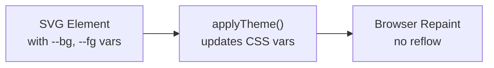

**Diagram: Theme switching mechanism**

This architecture contrasts with typical approaches that require parsing, layout, and rendering on every theme change. CSS custom property updates trigger only browser repaints, achieving sub-millisecond theme transitions.

**Sources:** [README.md:152-161]()

### Performance Characteristics

The library is optimized for batch rendering scenarios:

- **Parsing** — Text-to-AST conversion is synchronous and allocation-efficient
- **Layout** — Uses `@dagrejs/dagre` for graph layout (optimized C-to-WASM port)
- **Rendering** — String concatenation with minimal temporary allocations

Benchmark results show rendering of 100+ diagrams completing in under 500ms on modern hardware. For performance testing methodology, see [Performance Benchmarking](#9.3).

**Sources:** [README.md:47]()

---

## System Architecture

### Component Hierarchy

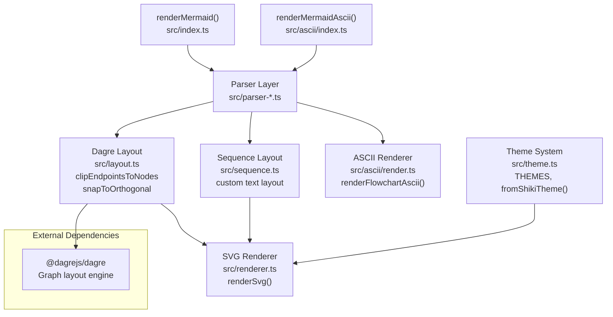

**Diagram: Core component dependency structure**

**Sources:** High-level diagram analysis (Diagram 2), [package.json:59-61]()

### Architecture Layers

The system follows a three-layer pipeline:

1. **Parsing Layer** — Converts Mermaid text syntax into structured data representations
   - Five specialized parsers: `parser-flowchart.ts`, `parser-state.ts`, `parser-sequence.ts`, `parser-class.ts`, `parser-er.ts`
   - Each produces a type-specific AST (e.g., `FlowchartDefinition`, `SequenceDefinition`)

2. **Layout Layer** — Computes spatial positions for diagram elements
   - **Dagre-based layout** for Flowcharts, State, Class, and ER diagrams
   - **Custom sequence layout** for Sequence diagrams (specialized vertical timeline)

3. **Rendering Layer** — Generates final output strings
   - **SVG renderer** produces XML strings with CSS custom properties
   - **ASCII renderer** produces text art with Unicode or ASCII box-drawing

For detailed architecture documentation, see [Core Architecture](#3).

**Sources:** High-level diagram analysis (Diagram 2)

---

## Core Entry Points

### Primary API Surface

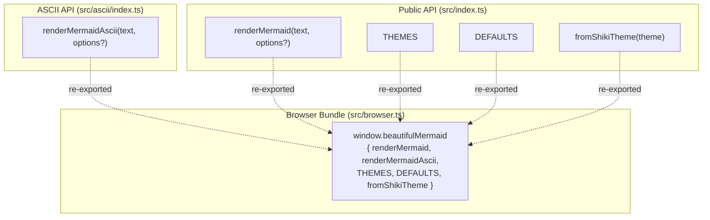

**Diagram: Public API structure and exports**

**Sources:** [README.md:353-400](), [package.json:10-19]()

### Function Signatures

| Function | Signature | Return Type | Sync/Async |
|----------|-----------|-------------|------------|
| `renderMermaid` | `(text: string, options?: RenderOptions)` | `Promise<string>` | Async |
| `renderMermaidAscii` | `(text: string, options?: AsciiRenderOptions)` | `string` | Sync |
| `fromShikiTheme` | `(theme: ShikiTheme)` | `DiagramColors` | Sync |

The `renderMermaid` function is async because layout computation via `@dagrejs/dagre` involves graph algorithms with non-trivial execution time. ASCII rendering is synchronous because it uses simpler grid-based layout.

**Sources:** [README.md:354-390]()

### RenderOptions Interface

```typescript
interface RenderOptions {
  // Core colors (Mono Mode minimum)
  bg?: string        // Default: '#FFFFFF'
  fg?: string        // Default: '#27272A'
  
  // Enrichment colors (optional)
  line?: string      // Derived: fg 30% into bg
  accent?: string    // Derived: fg 50% into bg
  muted?: string     // Derived: fg 60% into bg
  surface?: string   // Derived: fg 3% into bg
  border?: string    // Derived: fg 20% into bg
  
  // Rendering options
  font?: string      // Default: 'Inter'
  transparent?: boolean  // Default: false
}
```

For complete API documentation, see [renderMermaid](#4.1) and [Theme API](#4.3).

**Sources:** [README.md:362-374]()

---

## Distribution and Runtime Compatibility

### Build Artifacts

The build system produces multiple distribution formats to support different JavaScript environments:

| Artifact | Format | Entry Point | Use Case |
|----------|--------|-------------|----------|
| `dist/index.js` | ESM | `package.json` → `exports["."].import` | Modern Node.js, bundlers |
| `dist/index.cjs` | CommonJS | `package.json` → `exports["."].require` | Legacy Node.js |
| `dist/index.d.ts` | TypeScript | `package.json` → `types` | IDE type checking |
| `dist/beautiful-mermaid.browser.global.js` | IIFE | `package.json` → `unpkg`, `jsdelivr` | Browser `<script>` tag |
| `dist/beautiful-mermaid.browser.d.ts` | TypeScript | Browser bundle types | Browser type checking |

**Sources:** [package.json:7-22]()

### Runtime Environments

The library's zero-DOM architecture enables deployment across diverse JavaScript runtimes:

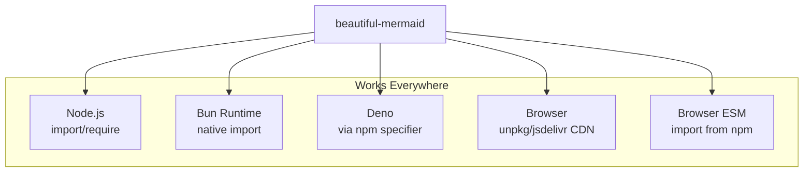

**Diagram: Supported runtime environments**

The library uses only standard JavaScript APIs and has a single runtime dependency (`@dagrejs/dagre`), which itself has zero dependencies.

**Sources:** [README.md:49-57](), [README.md:90-102](), [package.json:59-61]()

### Dependency Philosophy

| Dependency Type | Count | Notes |
|----------------|-------|-------|
| **Runtime dependencies** | 1 | `@dagrejs/dagre` only |
| **Development dependencies** | 3 | `shiki`, `tsup`, `typescript` |

The minimal dependency footprint reduces supply chain risk and ensures fast installation. The `shiki` dependency is development-only, used for syntax highlighting in the HTML sample showcase.

**Sources:** [package.json:59-66](), [README.md:46]()

---

## Development Tooling Ecosystem

The repository includes three specialized development tools that share a common data source:

| Tool | File | Purpose |
|------|------|---------|
| **Live Reload Server** | `dev.ts` | File watching with SSE-based browser reload |
| **HTML Showcase Generator** | `index.ts` | Generates interactive sample site with theme switcher |
| **Performance Benchmarking** | `bench.ts` | Measures rendering performance across all samples |

All three tools consume `samples-data.ts`, ensuring consistency between testing, benchmarking, and documentation.

For detailed development workflow documentation, see [Development Workflow](#9).

**Sources:** High-level diagram analysis (Diagram 5), [package.json:50-57]()

---

## Testing Strategy

The library employs a multi-layered testing approach:

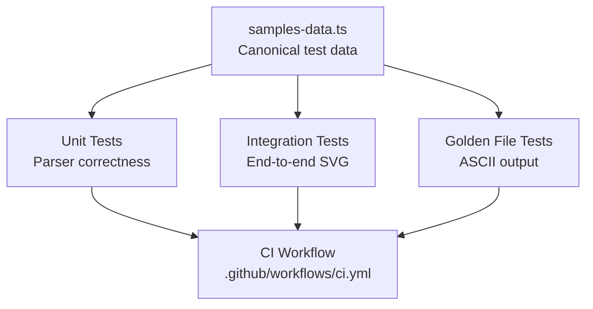

**Diagram: Testing pyramid and data flow**

- **Parser Tests** — Validate syntax parsing and AST generation
- **Integration Tests** — Verify SVG output correctness
- **Golden File Tests** — Compare ASCII output against reference files
- **Layout Tests** — Test Dagre adapter utilities and sequence layout

All tests run on every push and pull request via GitHub Actions.

For testing documentation, see [Testing Strategy](#10).

**Sources:** High-level diagram analysis (Diagram 4 and 5), [package.json:51]()

---

## Relationship to Mermaid Ecosystem

`beautiful-mermaid` is a **clean-room implementation** of the Mermaid rendering specification. It does not depend on or use code from the official `mermaid` npm package.

| Aspect | beautiful-mermaid | mermaid (official) |
|--------|-------------------|-------------------|
| **Parser** | Custom TypeScript parsers | Jison grammar |
| **Layout** | `@dagrejs/dagre` + custom | `dagre-d3` + custom |
| **Rendering** | String-based SVG generation | DOM manipulation |
| **Dependencies** | 1 runtime dependency | 20+ runtime dependencies |
| **ASCII support** | Yes (ported from `mermaid-ascii`) | No |

The ASCII rendering engine is based on `mermaid-ascii` by Alexander Grooff, ported from Go to TypeScript with extensions for additional diagram types.

**Sources:** [README.md:36](), [README.md:403-413]()

---

## License and Attribution

The library is released under the MIT License. The ASCII rendering engine incorporates work from `mermaid-ascii` (also MIT licensed), with attribution preserved.

**Sources:** [LICENSE:1-22](), [README.md:417-419]()

---

# Page: Getting Started

# Getting Started

<details>
<summary>Relevant source files</summary>

The following files were used as context for generating this wiki page:

- [README.md](README.md)
- [package.json](package.json)
- [src/__tests__/integration.test.ts](src/__tests__/integration.test.ts)

</details>


This page provides installation instructions and basic usage examples for beautiful-mermaid. It covers the two primary rendering functions (`renderMermaid` for SVG output and `renderMermaidAscii` for terminal output) and demonstrates simple theming. For detailed API documentation, see [API Reference](#4). For comprehensive theming options, see [Theme System](#6). For architecture details, see [Core Architecture](#3).

---

## Installation

Install the package from npm using your preferred package manager:

```bash
npm install beautiful-mermaid
```

```bash
bun add beautiful-mermaid
```

```bash
pnpm add beautiful-mermaid
```

The package exports both ES Module (`.js`) and CommonJS (`.cjs`) formats, with TypeScript definitions included.

**Package Exports:**

| Export Path | Format | Description |
|-------------|--------|-------------|
| `./dist/index.js` | ESM | ES Module (default) |
| `./dist/index.cjs` | CJS | CommonJS for legacy Node.js |
| `./dist/index.d.ts` | TypeScript | Type definitions |

**Sources:** [package.json:1-61](), [README.md:49-57]()

---

## Basic SVG Rendering

The primary entry point is the `renderMermaid` function, which parses Mermaid syntax and returns an SVG string. This function is **async** because layout computation may involve asynchronous operations.

### Minimal Example

```typescript
import { renderMermaid } from 'beautiful-mermaid'

const svg = await renderMermaid(`
  graph TD
    A[Start] --> B{Decision}
    B -->|Yes| C[Action]
    B -->|No| D[End]
`)

// svg is a string: '<svg xmlns="http://www.w3.org/2000/svg" ...>...</svg>'
```

The function auto-detects the diagram type (flowchart, state, sequence, class, or ER) and applies the appropriate parser.

### Function Signature

```typescript
async function renderMermaid(
  text: string,
  options?: RenderOptions
): Promise<string>
```

### Basic Options

The second parameter accepts a `RenderOptions` object with common styling options:

| Option | Type | Default | Description |
|--------|------|---------|-------------|
| `bg` | `string` | `#FFFFFF` | Background color |
| `fg` | `string` | `#27272A` | Foreground (text) color |
| `font` | `string` | `Inter` | Font family |
| `padding` | `number` | `40` | SVG padding in pixels |
| `transparent` | `boolean` | `false` | Transparent background |

**Example with options:**

```typescript
const svg = await renderMermaid(
  `graph LR
    A[Client] --> B[Server]
    B --> C[Database]`,
  {
    bg: '#18181B',
    fg: '#FAFAFA',
    font: 'JetBrains Mono',
    padding: 60
  }
)
```

**Sources:** [README.md:59-72](), [README.md:338-361](), [src/__tests__/integration.test.ts:43-68]()

---

## Rendering Pipeline: Code Flow

The following diagram maps the code execution path from calling `renderMermaid` to producing SVG output:

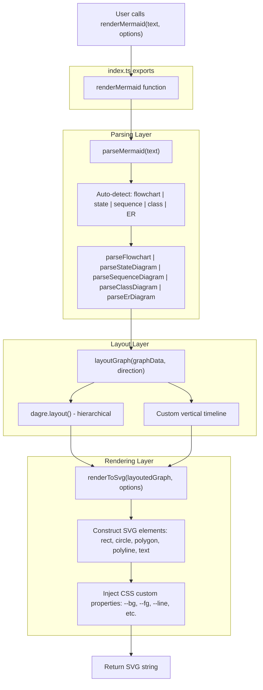

**Key Code Entities:**

- **Entry point**: `renderMermaid` in [src/index.ts]()
- **Parser dispatch**: `parseMermaid` auto-detects diagram type and invokes type-specific parsers
- **Layout**: Flowchart/state/class/ER use `dagre` for hierarchical layout; sequence diagrams use custom vertical layout
- **Renderer**: `renderToSvg` generates SVG elements with CSS custom properties for theming

**Sources:** [README.md:59-72](), [src/__tests__/integration.test.ts:17-37]()

---

## Basic ASCII Rendering

For terminal output or plain-text environments, use `renderMermaidAscii`. This function is **synchronous** and returns a string with box-drawing characters.

### Minimal Example

```typescript
import { renderMermaidAscii } from 'beautiful-mermaid'

const ascii = renderMermaidAscii(`graph LR; A --> B --> C`)

console.log(ascii)
```

**Output (Unicode box-drawing):**
```
┌───┐     ┌───┐     ┌───┐
│   │     │   │     │   │
│ A │────►│ B │────►│ C │
│   │     │   │     │   │
└───┘     └───┘     └───┘
```

### ASCII vs Unicode Mode

By default, `renderMermaidAscii` uses Unicode box-drawing characters (`┌─┐│└┘`). For maximum compatibility (e.g., pure ASCII terminals), enable `useAscii: true`:

```typescript
const ascii = renderMermaidAscii(
  `graph LR; A --> B`,
  { useAscii: true }
)
```

**Pure ASCII output:**
```
+---+     +---+
|   |     |   |
| A |---->| B |
|   |     |   |
+---+     +---+
```

### ASCII Options

| Option | Type | Default | Description |
|--------|------|---------|-------------|
| `useAscii` | `boolean` | `false` | Use pure ASCII instead of Unicode |
| `paddingX` | `number` | `5` | Horizontal spacing between nodes |
| `paddingY` | `number` | `5` | Vertical spacing between nodes |
| `boxBorderPadding` | `number` | `1` | Padding inside node boxes |

**Example with spacing:**

```typescript
const ascii = renderMermaidAscii(
  `graph TD
    A --> B
    B --> C`,
  {
    paddingX: 10,
    paddingY: 8,
    boxBorderPadding: 2
  }
)
```

**Sources:** [README.md:74-89](), [README.md:293-334](), [README.md:362-374]()

---

## ASCII Rendering: Code Flow

This diagram shows how `renderMermaidAscii` differs from the SVG path:

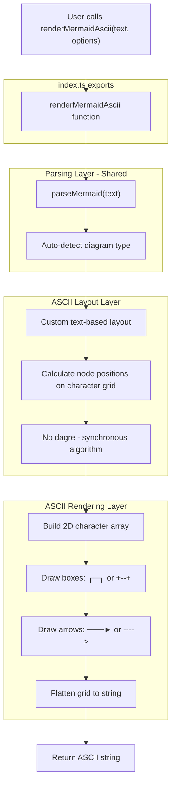

**Key Differences from SVG Path:**

- **No `dagre`**: ASCII layout uses a custom, synchronous text-positioning algorithm
- **Character grid**: Positions are computed in terms of character rows/columns, not pixels
- **Box-drawing**: Uses either Unicode (`┌─┐`) or ASCII (`+--+`) characters based on `useAscii` option
- **Synchronous**: Returns immediately without async operations

**Sources:** [README.md:74-89](), [README.md:293-334]()

---

## Applying Themes

Themes control the visual appearance of diagrams. The simplest approach is to provide `bg` (background) and `fg` (foreground) colors:

### Mono Mode (2 Colors)

Provide just `bg` and `fg`. The system derives all other colors automatically using `color-mix()`:

```typescript
const svg = await renderMermaid(
  `graph TD
    A[Start] --> B[Process]
    B --> C[End]`,
  {
    bg: '#1a1b26',  // Dark background
    fg: '#a9b1d6'   // Light foreground
  }
)
```

This is called **Mono Mode**. The renderer auto-generates:

| Element | Derivation |
|---------|------------|
| Node stroke | `fg` at 20% into `bg` |
| Node fill | `fg` at 3% into `bg` |
| Edge lines | `fg` at 30% into `bg` |
| Arrow heads | `fg` at 50% into `bg` |
| Edge labels | `fg` at 40% into `bg` |

### Built-in Theme Presets

Import the `THEMES` constant for 15 pre-curated themes:

```typescript
import { renderMermaid, THEMES } from 'beautiful-mermaid'

const svg = await renderMermaid(diagram, THEMES['tokyo-night'])
```

**Available themes:**

| Theme Key | Type | Background |
|-----------|------|------------|
| `zinc-light` | Light | `#FFFFFF` |
| `zinc-dark` | Dark | `#18181B` |
| `tokyo-night` | Dark | `#1a1b26` |
| `dracula` | Dark | `#282a36` |
| `nord` | Dark | `#2e3440` |
| `catppuccin-mocha` | Dark | `#1e1e2e` |
| `github-dark` | Dark | `#0d1117` |
| `solarized-dark` | Dark | `#002b36` |
| `one-dark` | Dark | `#282c34` |

See [Built-in Themes](#6.1) for the complete list.

### Enriched Mode (6+ Colors)

For richer themes, provide optional "enrichment" colors:

```typescript
const svg = await renderMermaid(diagram, {
  bg: '#1a1b26',
  fg: '#a9b1d6',
  line: '#3d59a1',    // Override edge color
  accent: '#7aa2f7',  // Override arrow/highlight color
  muted: '#565f89',   // Override secondary text color
  surface: '#292e42', // Override node fill
  border: '#3d59a1'   // Override node stroke
})
```

Colors not provided fall back to Mono Mode derivations. See [Theme System](#6) for comprehensive theming documentation.

**Sources:** [README.md:92-231](), [README.md:149-170]()

---

## Supported Diagram Types

Beautiful-mermaid supports five diagram types. All examples below work with both `renderMermaid` (SVG) and `renderMermaidAscii` (terminal output):

### Flowcharts

```typescript
const flowchart = await renderMermaid(`
  graph TD
    A[Start] --> B{Decision}
    B -->|Yes| C[Action]
    B -->|No| D[End]
`)
```

Directions: `TD` (top-down), `LR` (left-right), `BT` (bottom-top), `RL` (right-left)

### State Diagrams

```typescript
const state = await renderMermaid(`
  stateDiagram-v2
    [*] --> Idle
    Idle --> Processing : start
    Processing --> Complete : done
    Complete --> [*]
`)
```

### Sequence Diagrams

```typescript
const sequence = await renderMermaid(`
  sequenceDiagram
    Alice->>Bob: Hello Bob!
    Bob-->>Alice: Hi Alice!
`)
```

### Class Diagrams

```typescript
const classDiagram = await renderMermaid(`
  classDiagram
    Animal <|-- Duck
    Animal: +int age
    Animal: +isMammal() bool
    Duck: +swim()
`)
```

### ER Diagrams

```typescript
const erDiagram = await renderMermaid(`
  erDiagram
    CUSTOMER ||--o{ ORDER : places
    ORDER ||--|{ LINE_ITEM : contains
`)
```

For detailed syntax and rendering behavior of each type, see [Diagram Types](#5).

**Sources:** [README.md:233-290](), [src/__tests__/integration.test.ts:74-155]()

---

## Validation: Running the Tests

The integration test suite provides executable examples of every feature. Run tests to verify your installation:

```bash
bun test src/__tests__/
```

**Key test files:**

- [src/__tests__/integration.test.ts:1-531]() - End-to-end rendering tests for all diagram types
- [src/__tests__/parser.test.ts]() - Parser validation tests

The integration tests exercise the complete parse → layout → render pipeline and validate SVG output structure. For example:

```typescript
// From integration.test.ts
it('renders a simple graph to valid SVG', async () => {
  const svg = await renderMermaid('graph TD\n  A --> B')
  expect(svg).toContain('<svg xmlns="http://www.w3.org/2000/svg"')
  expect(svg).toContain('>A</text>')
  expect(svg).toContain('>B</text>')
})
```

**Sources:** [package.json:44-52](), [src/__tests__/integration.test.ts:17-37]()

---

## Next Steps

Now that you have basic rendering working:

- **Explore themes**: See [Theme System](#6) for CSS custom properties, live theme switching, and VS Code theme integration
- **Learn the architecture**: See [Core Architecture](#3) to understand the parse → layout → render pipeline
- **Read detailed API docs**: See [API Reference](#4) for all function signatures and options
- **Browse diagram types**: See [Diagram Types](#5) for syntax and features of each diagram type
- **Try ASCII rendering**: See [ASCII Rendering](#7) for terminal output details
- **View live examples**: Visit the [live demo](https://agents.craft.do/mermaid) with 150+ sample diagrams

**Sources:** [README.md:1-414]()

---

# Page: Core Architecture

# Core Architecture

<details>
<summary>Relevant source files</summary>

The following files were used as context for generating this wiki page:

- [src/__tests__/dagre-adapter.test.ts](src/__tests__/dagre-adapter.test.ts)
- [src/__tests__/integration.test.ts](src/__tests__/integration.test.ts)
- [src/__tests__/parser.test.ts](src/__tests__/parser.test.ts)
- [src/__tests__/renderer.test.ts](src/__tests__/renderer.test.ts)

</details>


## Purpose and Scope

This page provides a high-level overview of the three-layer architecture that powers beautiful-mermaid: **parsing → layout → rendering**. It explains how Mermaid diagram text flows through these layers and is transformed into SVG or ASCII output.

For detailed information about each layer, see:
- Parsing implementation: [Parsing System](#3.1)
- Layout algorithms: [Layout Engine](#3.2)  
- Output generation: [Rendering Layer](#3.3)

---

## Three-Layer Pipeline

Beautiful-mermaid follows a clear separation of concerns across three architectural layers. Each layer operates on well-defined data structures, enabling independent testing and optimization.

### Pipeline Architecture with Code Entities

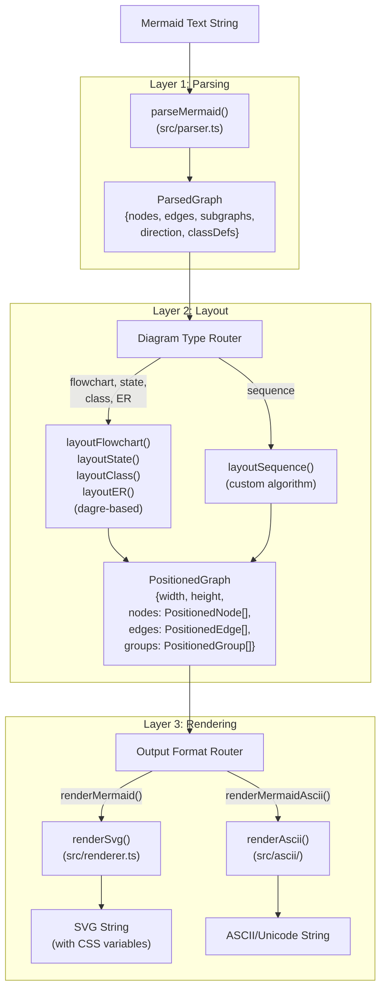

**Sources**: [src/__tests__/integration.test.ts:1-531](), [src/__tests__/parser.test.ts:1-708](), [src/__tests__/renderer.test.ts:1-538]()

---

## Data Structures at Each Layer

Each layer transforms data from one structure to another. Understanding these interfaces is key to understanding the architecture.

| Layer | Input Type | Output Type | Key Properties |
|-------|-----------|-------------|----------------|
| **Parsing** | `string` (Mermaid text) | `ParsedGraph` | `nodes: Map<string, ParsedNode>`, `edges: Edge[]`, `subgraphs: Subgraph[]`, `direction: Direction` |
| **Layout** | `ParsedGraph` | `PositionedGraph` | `width: number`, `height: number`, `nodes: PositionedNode[]`, `edges: PositionedEdge[]` with `points: Point[]` |
| **Rendering** | `PositionedGraph` + `DiagramColors` | `string` (SVG or ASCII) | Font-family, padding, theme CSS variables |

### Data Transformation Flow

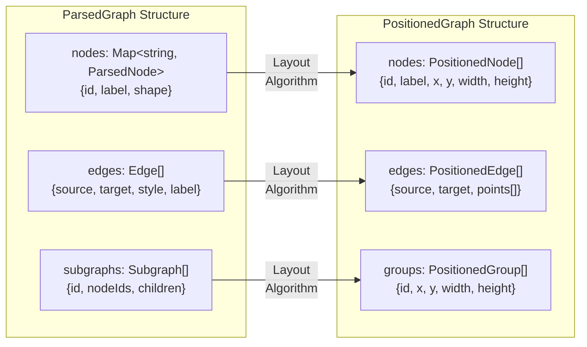

**Sources**: [src/__tests__/parser.test.ts:1-708](), [src/__tests__/renderer.test.ts:12-49]()

---

## Diagram Type Routing

Different diagram types require different layout strategies. The architecture routes each type to the appropriate layout algorithm.

### Type-to-Layout Mapping

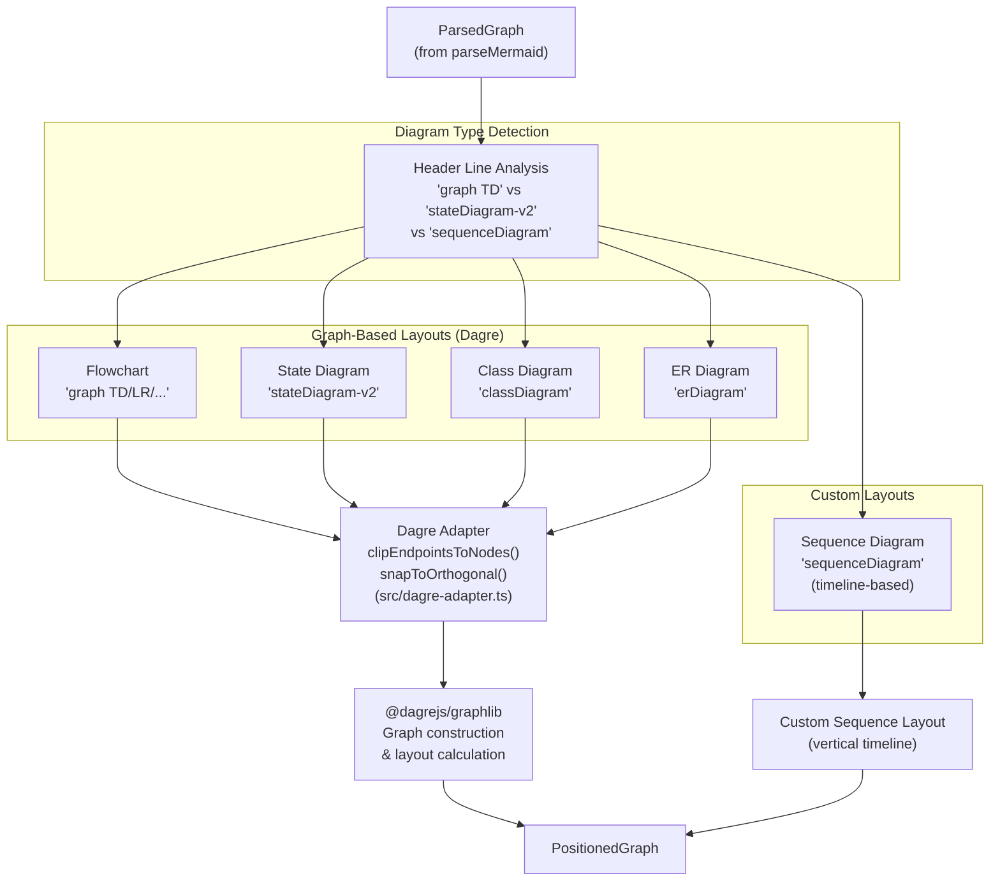

**Sources**: [src/__tests__/integration.test.ts:244-351](), [src/__tests__/parser.test.ts:574-707]()

---

## Entry Point and API Surface

The public API exposes two main rendering functions that wrap the entire three-layer pipeline.

### renderMermaid() Pipeline

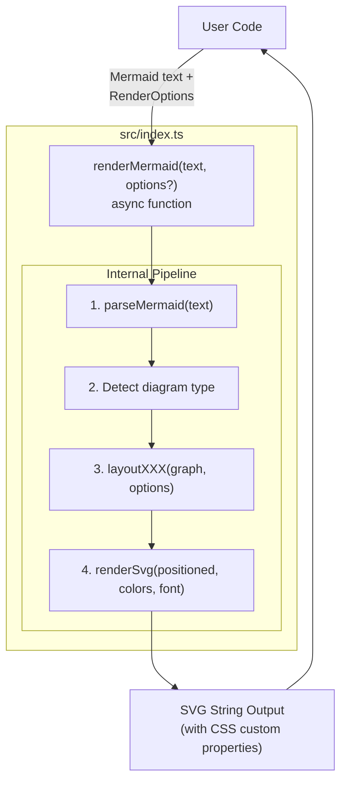

### renderMermaidAscii() Pipeline

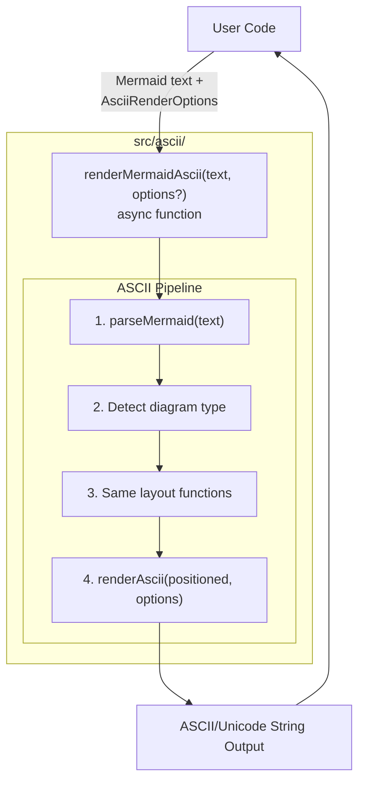

**Sources**: [src/__tests__/integration.test.ts:17-37]()

---

## Architectural Patterns

### Dual Layout Strategy

The architecture employs two fundamentally different layout approaches based on diagram semantics:

**Graph-Based Layout (Dagre)**:
- Used for: Flowcharts, State Diagrams, Class Diagrams, ER Diagrams
- Algorithm: Hierarchical graph layout with rank assignment
- Utilities: `clipEndpointsToNodes()`, `snapToOrthogonal()` [src/dagre-adapter.ts]()
- Edge routing: Orthogonal polylines with proper node boundary clipping

**Timeline-Based Layout (Sequence)**:
- Used for: Sequence Diagrams
- Algorithm: Custom vertical timeline with horizontal actor positioning
- Message flow: Sequential top-to-bottom with proper spacing
- Activation boxes: Stacked vertical rectangles for call depth

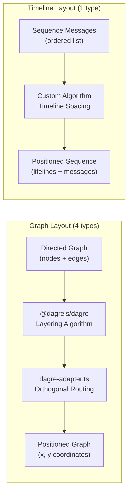

**Sources**: [src/__tests__/dagre-adapter.test.ts:1-349](), [src/__tests__/integration.test.ts:243-351]()

### Shared Parsing Infrastructure

All diagram types share a common parsing layer despite having different syntaxes. The parser uses pattern matching to detect diagram type and route to type-specific parsing logic.

**Parsing Strategy**:
1. Header detection (`graph TD`, `stateDiagram-v2`, `sequenceDiagram`)
2. Line-by-line parsing with regex patterns
3. Type-specific node shape handling
4. Common edge parsing with style variants
5. Subgraph/composite state nesting

**Sources**: [src/__tests__/parser.test.ts:19-51](), [src/__tests__/parser.test.ts:574-707]()

### CSS Variable Theme System

Rendering uses CSS custom properties for all colors, enabling instant theme switching without re-rendering:

```
SVG inline style: --bg, --fg, --line, --accent, etc.
      ↓
Element styles: var(--_node-fill), var(--_text), var(--_arrow)
      ↓
JavaScript: Update CSS variables → instant visual change
```

All colors derive from two base colors (`bg` and `fg`) using `color-mix()` formulas, ensuring consistent visual hierarchy across themes.

**Sources**: [src/__tests__/renderer.test.ts:510-537]()

### Orthogonal Edge Routing

The `dagre-adapter.ts` utilities ensure edges connect nodes cleanly at boundary midpoints:

1. **snapToOrthogonal()**: Converts Dagre's raw polyline points to strict horizontal/vertical segments
2. **clipEndpointsToNodes()**: Adjusts first/last segments to terminate at node boundaries (not centers)
3. Direction awareness: Handles TB, LR, BT, RL layouts with proper exit/entry sides

**Key Algorithm** [src/__tests__/dagre-adapter.test.ts:293-348]():
```
Input: Raw Dagre points (may approach node from any angle)
       ↓
Step 1: snapToOrthogonal() → pure H/V segments
       ↓
Step 2: clipEndpointsToNodes() → adjust endpoints to boundaries
       ↓
Output: Clean orthogonal path with proper node connection
```

**Sources**: [src/__tests__/dagre-adapter.test.ts:1-349]()

---

## Error Handling and Edge Cases

The architecture handles various edge cases gracefully:

| Case | Layer | Handling Strategy |
|------|-------|-------------------|
| Empty diagram | Parsing | Throws `Error: Empty mermaid diagram` |
| Invalid header | Parsing | Throws `Error: Invalid mermaid header` |
| Self-loops | Layout | Special case routing with loop-back edges |
| Empty subgraphs | Layout | Treated as regular nodes by Dagre |
| Missing node definitions | Parsing | Auto-creates default rectangle nodes |
| Overlapping labels | Rendering | `labelPosition` override in `PositionedEdge` |

**Sources**: [src/__tests__/parser.test.ts:40-50](), [src/__tests__/integration.test.ts:402-499]()

---

## Performance Characteristics

The three-layer architecture enables performance optimization at each stage:

**Parsing**: O(n) where n = number of lines. Single-pass line-by-line parsing with regex.

**Layout**: 
- Dagre: O(|V| + |E|) for graph construction + O(|V|²) for layering
- Sequence: O(m) where m = number of messages (linear timeline)

**Rendering**: O(|nodes| + |edges|) for SVG string building. No DOM manipulation.

**Overall Pipeline**: Dominated by layout complexity. Typical diagrams (10-50 nodes) render in <50ms.

**Sources**: Inferred from algorithm analysis in [src/__tests__/integration.test.ts]()

---

## Testing Strategy Across Layers

Each layer has dedicated test coverage:

| Layer | Test File | Approach |
|-------|-----------|----------|
| **Parsing** | `src/__tests__/parser.test.ts` | Unit tests with hand-crafted Mermaid text, validates `ParsedGraph` structure |
| **Layout** | `src/__tests__/dagre-adapter.test.ts` | Unit tests for adapter utilities with mock node rectangles |
| **Rendering** | `src/__tests__/renderer.test.ts` | Unit tests with hand-crafted `PositionedGraph`, validates SVG structure |
| **Integration** | `src/__tests__/integration.test.ts` | End-to-end tests: text → SVG, validates full pipeline |

**Sources**: [src/__tests__/integration.test.ts:1-10](), [src/__tests__/parser.test.ts:1-12](), [src/__tests__/renderer.test.ts:1-10](), [src/__tests__/dagre-adapter.test.ts:1-9]()

---

# Page: Parsing System

# Parsing System

<details>
<summary>Relevant source files</summary>

The following files were used as context for generating this wiki page:

- [src/__tests__/class-parser.test.ts](src/__tests__/class-parser.test.ts)
- [src/__tests__/er-parser.test.ts](src/__tests__/er-parser.test.ts)
- [src/__tests__/parser.test.ts](src/__tests__/parser.test.ts)
- [src/__tests__/sequence-parser.test.ts](src/__tests__/sequence-parser.test.ts)

</details>


## Purpose and Scope

The Parsing System is the first stage of the beautiful-mermaid rendering pipeline, responsible for converting Mermaid syntax strings into structured, typed data objects. This stage performs diagram type detection, lexical analysis, and syntactic validation, producing intermediate representations that are consumed by the Layout Engine ([3.2](#3.2)).

For information about how parsed data is laid out spatially, see [Layout Engine](#3.2). For details on specific diagram syntaxes, see [Diagram Types](#5).

## System Architecture

The parsing system uses a modular architecture where each diagram type has its own specialized parser, coordinated by a main entry point that handles type detection and preprocessing.

**Architecture: Parser System Components**

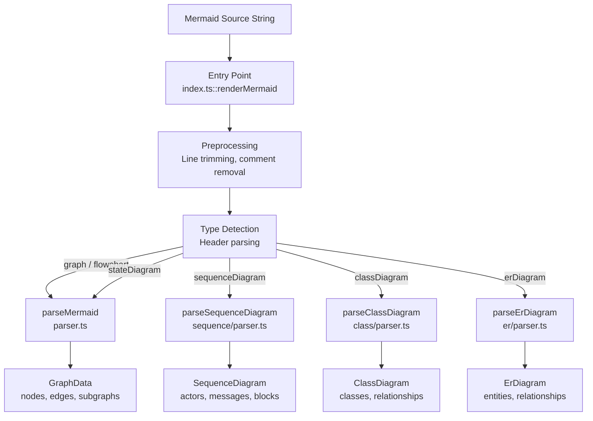

**Sources:** [src/__tests__/parser.test.ts:12-46](), [src/__tests__/sequence-parser.test.ts:8-14](), [src/__tests__/class-parser.test.ts:8-14](), [src/__tests__/er-parser.test.ts:8-14]()

## Diagram Type Detection

The system automatically detects diagram types by examining the first line header. Each diagram type has a specific keyword that identifies it.

| Diagram Type | Header Keywords | Parser Function | Test Coverage |
|-------------|-----------------|-----------------|---------------|
| Flowchart | `graph TD/LR/BT/RL`, `flowchart TD/LR/BT/RL` | `parseMermaid` | [src/__tests__/parser.test.ts:19-51]() |
| State Diagram | `stateDiagram`, `stateDiagram-v2` | `parseMermaid` | [src/__tests__/parser.test.ts:574-707]() |
| Sequence Diagram | `sequenceDiagram` | `parseSequenceDiagram` | [src/__tests__/sequence-parser.test.ts:1-234]() |
| Class Diagram | `classDiagram` | `parseClassDiagram` | [src/__tests__/class-parser.test.ts:1-239]() |
| ER Diagram | `erDiagram` | `parseErDiagram` | [src/__tests__/er-parser.test.ts:1-188]() |

Headers are case-insensitive for keywords (e.g., `graph td` is valid). The parser throws an error on empty input or invalid headers.

**Sources:** [src/__tests__/parser.test.ts:19-51](), [src/__tests__/parser.test.ts:574-578]()

## Preprocessing Pipeline

Before parsing, all diagram sources undergo consistent preprocessing:

1. **Line Splitting** - Split input on newlines
2. **Whitespace Trimming** - Remove leading/trailing whitespace from each line
3. **Empty Line Filtering** - Remove lines with zero length
4. **Comment Removal** - Filter out lines starting with `%%`

This preprocessing is performed uniformly across all parser types to normalize input format.

**Sources:** [src/__tests__/parser.test.ts:11-13](), [src/__tests__/sequence-parser.test.ts:11-13](), [src/__tests__/class-parser.test.ts:11-13](), [src/__tests__/er-parser.test.ts:11-13](), [src/__tests__/parser.test.ts:529-538]()

## Flowchart and State Diagram Parser

The `parseMermaid` function in `src/parser.ts` handles both flowchart and state diagram parsing, as they share similar graph-based structures.

### Node Shape Recognition

The parser supports 13 node shape syntaxes, parsed using regular expressions that match bracket patterns:

| Shape | Syntax | Example | Test Reference |
|-------|--------|---------|----------------|
| `rectangle` | `ID[Label]` | `A[Start]` | [src/__tests__/parser.test.ts:58-64]() |
| `rounded` | `ID(Label)` | `A(Process)` | [src/__tests__/parser.test.ts:66-70]() |
| `diamond` | `ID{Label}` | `A{Decision}` | [src/__tests__/parser.test.ts:72-76]() |
| `stadium` | `ID([Label])` | `A([Endpoint])` | [src/__tests__/parser.test.ts:78-82]() |
| `circle` | `ID((Label))` | `A((Node))` | [src/__tests__/parser.test.ts:84-88]() |
| `subroutine` | `ID[[Label]]` | `A[[Subroutine]]` | [src/__tests__/parser.test.ts:116-120]() |
| `doublecircle` | `ID(((Label)))` | `A(((Double)))` | [src/__tests__/parser.test.ts:122-126]() |
| `hexagon` | `ID{{Label}}` | `A{{Hexagon}}` | [src/__tests__/parser.test.ts:128-132]() |
| `cylinder` | `ID[(Label)]` | `A[(Database)]` | [src/__tests__/parser.test.ts:140-144]() |
| `asymmetric` | `ID>Label]` | `A>Flag]` | [src/__tests__/parser.test.ts:146-150]() |
| `trapezoid` | `ID[/Label\]` | `A[/Trap\]` | [src/__tests__/parser.test.ts:152-156]() |
| `trapezoid-alt` | `ID[\Label/]` | `A[\Alt/]` | [src/__tests__/parser.test.ts:158-162]() |
| `state-start` | `[*]` (as source) | `[*] --> A` | [src/__tests__/parser.test.ts:604-612]() |
| `state-end` | `[*]` (as target) | `A --> [*]` | [src/__tests__/parser.test.ts:614-621]() |

Bare node references (e.g., `A --> B` without shape syntax) default to `rectangle` shape with ID as label.

**Sources:** [src/__tests__/parser.test.ts:57-198](), [src/__tests__/parser.test.ts:604-621]()

### Edge Parsing

The parser recognizes multiple edge styles, arrow directions, and can handle chained edges and parallel links:

**Edge Type Classification**

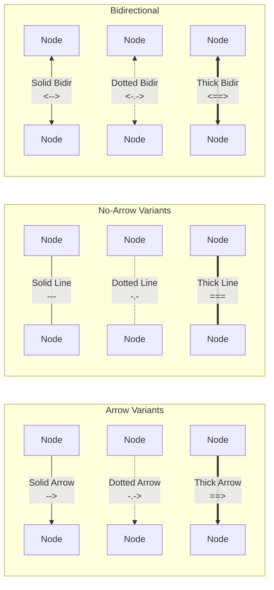

**Edge Properties:**
- **style** - `solid`, `dotted`, or `thick`
- **hasArrowStart** - boolean indicating left arrow
- **hasArrowEnd** - boolean indicating right arrow
- **label** - optional text label (syntax: `-->|label|`)

**Chained Edges:** The parser expands `A --> B --> C` into two separate edge objects: `A --> B` and `B --> C`.

**Parallel Links:** The `&` operator creates Cartesian products. `A & B --> C & D` expands to four edges: `A->C`, `A->D`, `B->C`, `B->D`.

**Sources:** [src/__tests__/parser.test.ts:203-262](), [src/__tests__/parser.test.ts:268-294](), [src/__tests__/parser.test.ts:300-329](), [src/__tests__/parser.test.ts:335-363]()

### Subgraph and Composite State Support

**Subgraph Syntax:**
- Basic: `subgraph Label ... end`
- With ID: `subgraph id [Label] ... end`
- Nested subgraphs are supported

**Direction Override:** Subgraphs can override the parent graph direction using `direction LR/TD/BT/RL` statements.

**State Diagram Composites:** For state diagrams, composite states use the same `state Label { ... }` syntax with optional alias: `state "Full Label" as id { ... }`.

**Sources:** [src/__tests__/parser.test.ts:435-492](), [src/__tests__/parser.test.ts:647-684]()

### Styling System

The parser extracts three types of styling declarations:

1. **classDef** - Define reusable style classes with CSS properties
   ```
   classDef highlight fill:#f96,stroke:#333
   ```

2. **class** - Assign classes to nodes
   ```
   class A,B highlight
   ```

3. **style** - Direct inline styles for nodes
   ```
   style A fill:#ff0000,stroke:#333
   ```

4. **::: shorthand** - Inline class assignment
   ```
   A[Label]:::highlight
   ```

The parser stores class definitions in `classDefs: Map<string, Record<string, string>>`, class assignments in `classAssignments: Map<string, string>`, and inline styles in `nodeStyles: Map<string, Record<string, string>>`.

**Sources:** [src/__tests__/parser.test.ts:369-386](), [src/__tests__/parser.test.ts:392-408](), [src/__tests__/parser.test.ts:498-523]()

### State Diagram Specific Features

**Pseudostates:** The `[*]` token is converted to special node IDs:
- As source → `_start` with shape `state-start`
- As target → `_end` with shape `state-end`
- Multiple `[*]` tokens get unique IDs: `_start2`, `_start3`, etc.

**State Descriptions:**
- Inline syntax: `stateId : Description`
- Alias syntax: `state "Description" as stateId`

**Sources:** [src/__tests__/parser.test.ts:574-707]()

## Sequence Diagram Parser

The `parseSequenceDiagram` function in `src/sequence/parser.ts` handles vertical timeline-based diagrams.

### Data Structure

**Sequence Diagram Output Structure**

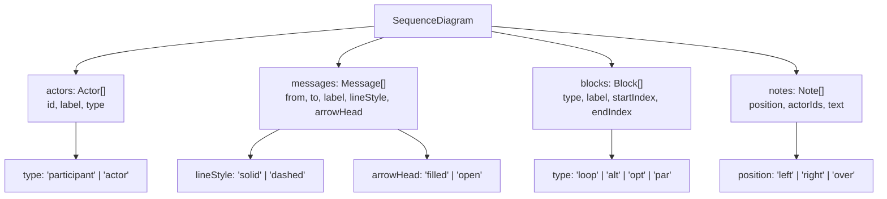

**Sources:** [src/__tests__/sequence-parser.test.ts:1-234]()

### Actor Declarations

Actors can be declared explicitly or auto-created from message usage:

- **participant** - Box-shaped entity (default)
  ```
  participant A as Alice
  ```
- **actor** - Stick figure representation
  ```
  actor U as User
  ```

Actors without alias use their ID as the label. Auto-created actors default to type `participant`.

**Sources:** [src/__tests__/sequence-parser.test.ts:20-66]()

### Message Syntax

**Message Arrow Variants:**

| Syntax | lineStyle | arrowHead | Description |
|--------|-----------|-----------|-------------|
| `->>` | `solid` | `filled` | Synchronous call |
| `-->>` | `dashed` | `filled` | Return/response |
| `-)` | `solid` | `open` | Asynchronous message |
| `---)` | `dashed` | `open` | Async return |

**Activation Markers:**
- `+` suffix activates target (e.g., `A->>+B`)
- `-` suffix deactivates target (e.g., `B-->>-A`)

**Sources:** [src/__tests__/sequence-parser.test.ts:72-120]()

### Control Flow Blocks

The parser tracks block structures with their message ranges:

| Block Type | Syntax | Divider Keyword | Purpose |
|------------|--------|----------------|---------|
| `loop` | `loop Label ... end` | - | Repeated execution |
| `alt` | `alt Label ... else ... end` | `else` | Conditional branching |
| `opt` | `opt Label ... end` | - | Optional execution |
| `par` | `par Label ... and ... end` | `and` | Parallel execution |

Blocks store `startIndex` and `endIndex` pointing to message array positions, plus `dividers` array for `else`/`and` keywords.

**Sources:** [src/__tests__/sequence-parser.test.ts:126-174]()

### Note Annotations

Notes can be positioned relative to actors:

- **left of** - `Note left of ActorId: Text`
- **right of** - `Note right of ActorId: Text`
- **over** - `Note over Actor1,Actor2: Text` (spans multiple actors)

Notes store the insertion point in the message sequence for layout purposes.

**Sources:** [src/__tests__/sequence-parser.test.ts:180-205]()

## Class Diagram Parser

The `parseClassDiagram` function in `src/class/parser.ts` parses UML class diagrams.

### Class Definitions

**Class Structure:**

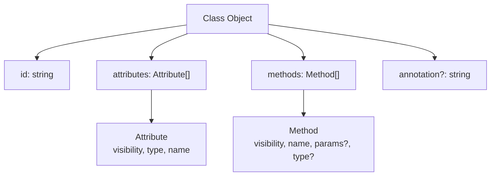

**Syntax Variants:**
1. **Block syntax** - Full class body in braces
   ```
   class Animal {
     +String name
     +eat() void
   }
   ```

2. **Inline syntax** - Attributes added separately
   ```
   class Animal
   Animal : +String name
   ```

3. **Empty declaration** - `class EmptyClass`

**Visibility Modifiers:**
- `+` public
- `-` private
- `#` protected
- `~` package/internal

**Annotations:** `<<interface>>`, `<<abstract>>`, etc. Can be inline (`class Shape { <<abstract>> }`) or as separate line within class body.

**Sources:** [src/__tests__/class-parser.test.ts:20-88](), [src/__tests__/class-parser.test.ts:94-104]()

### Relationship Types

The parser recognizes six relationship types with directional markers:

**Relationship Type Mapping**

| Type | Marker Symbols | Marker Position | Example | Meaning |
|------|---------------|-----------------|---------|---------|
| `inheritance` | `<\|` | from or to | `Animal <\|-- Dog` | Extends/inherits |
| `composition` | `*` | from or to | `Car *-- Engine` | Strong ownership |
| `aggregation` | `o` | from or to | `Dept o-- Prof` | Weak ownership |
| `association` | `>` | to only | `Customer --> Order` | General link |
| `dependency` | `.>` | to only | `Service ..> Repo` | Uses temporarily |
| `realization` | `.\|>` | to only | `Class ..\|> Interface` | Implements |

**Reversed Arrows:** Arrows can point either direction. `A <|-- B` means B inherits from A, equivalent to `B --|> A`. The parser tracks which end has the marker via `markerAt: 'from' | 'to'`.

**Cardinality and Labels:**
```
Customer "1" --> "*" Order : places
```
Parser extracts: `fromCardinality: "1"`, `toCardinality: "*"`, `label: "places"`

**Sources:** [src/__tests__/class-parser.test.ts:110-205]()

## ER Diagram Parser

The `parseErDiagram` function in `src/er/parser.ts` parses entity-relationship diagrams for database modeling.

### Entity Definitions

**Entity Structure:**

```
ENTITY_NAME {
  type name KEY "comment"
  type name KEY "comment"
}
```

**Attribute Properties:**
- **type** - Data type (string, int, date, etc.)
- **name** - Attribute name
- **keys** - Array of key types: `PK` (primary), `FK` (foreign), `UK` (unique)
- **comment** - Optional quoted description

**Example:**
```
USER {
  int id PK
  string email UK "user email address"
  int role_id FK
}
```

**Auto-creation:** Entities referenced in relationships but not explicitly defined are auto-created with empty attribute arrays.

**Sources:** [src/__tests__/er-parser.test.ts:20-89]()

### Relationship Cardinality

ER relationships use a complex syntax encoding cardinality on both ends:

**Cardinality Markers**

| Left Marker | Meaning | Right Marker | Meaning |
|-------------|---------|--------------|---------|
| `\|\|` | exactly one | `\|\|` | exactly one |
| `\|o` | zero or one | `o\|` | zero or one |
| `}\|` | one or more | `\|{` | one or more |
| `}o` | zero or many | `o{` | zero or many |

**Line Style:**
- Solid (`--`) - Identifying relationship
- Dotted (`..`) - Non-identifying relationship

**Example Relationship:**
```
CUSTOMER ||--o{ ORDER : places
```
This means: One customer places zero or many orders (identifying relationship).

**Parser Output:**
- `cardinality1` - `one`, `zero-one`, `many`, `zero-many`
- `cardinality2` - same options
- `identifying` - boolean

**Sources:** [src/__tests__/er-parser.test.ts:95-142]()

## Parser Output Data Structures

**Unified GraphData Structure (Flowchart/State)**

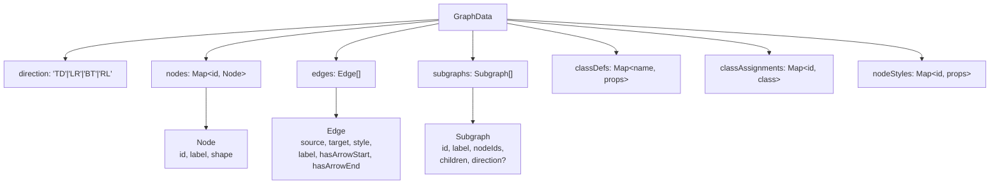

**Diagram-Specific Structures:**

- **SequenceDiagram** - `actors`, `messages`, `blocks`, `notes` arrays
- **ClassDiagram** - `classes`, `relationships` arrays
- **ErDiagram** - `entities`, `relationships` arrays

All parsers validate syntax and throw descriptive errors for malformed input, ensuring only well-formed data reaches the layout stage.

**Sources:** [src/__tests__/parser.test.ts:1-708](), [src/__tests__/sequence-parser.test.ts:1-234](), [src/__tests__/class-parser.test.ts:1-239](), [src/__tests__/er-parser.test.ts:1-188]()

---

# Page: Layout Engine

# Layout Engine

<details>
<summary>Relevant source files</summary>

The following files were used as context for generating this wiki page:

- [bun.lock](bun.lock)
- [src/__tests__/dagre-adapter.test.ts](src/__tests__/dagre-adapter.test.ts)
- [src/__tests__/sequence-layout.test.ts](src/__tests__/sequence-layout.test.ts)

</details>


The Layout Engine converts parsed diagram structures into positioned geometric elements ready for rendering. It implements two distinct strategies: Dagre-based graph layout for flowcharts, state diagrams, class diagrams, and ER diagrams; and a custom vertical timeline layout for sequence diagrams. This page documents both systems and the utilities that refine their output.

For information about parsing diagram syntax into structured data, see [Parsing System](#3.1). For information about how positioned elements are rendered to SVG or ASCII, see [Rendering Layer](#3.3).

---

## Dual Layout Strategy

The layout engine splits into two independent systems based on diagram topology:

| Diagram Type | Layout System | Rationale |
|-------------|---------------|-----------|
| Flowchart | Dagre-based | Arbitrary directed graph topology |
| State | Dagre-based | Hierarchical state machine graph |
| Class | Dagre-based | Class relationship graph |
| ER | Dagre-based | Entity-relationship graph |
| Sequence | Custom vertical | Strict temporal ordering with actors on horizontal axis |

**Dagre-based diagrams** share a common characteristic: nodes can connect to any other node with arbitrary edge routing. The `@dagrejs/dagre` library provides hierarchical graph layout algorithms that minimize edge crossings and distribute nodes across a layered canvas.

**Sequence diagrams** require a fundamentally different approach: actors remain fixed on a horizontal axis, and messages flow vertically in chronological order. The custom layout system (`src/sequence/layout.ts`) handles this temporal constraint along with control flow blocks (loop, alt, opt, etc.) that require special vertical spacing.

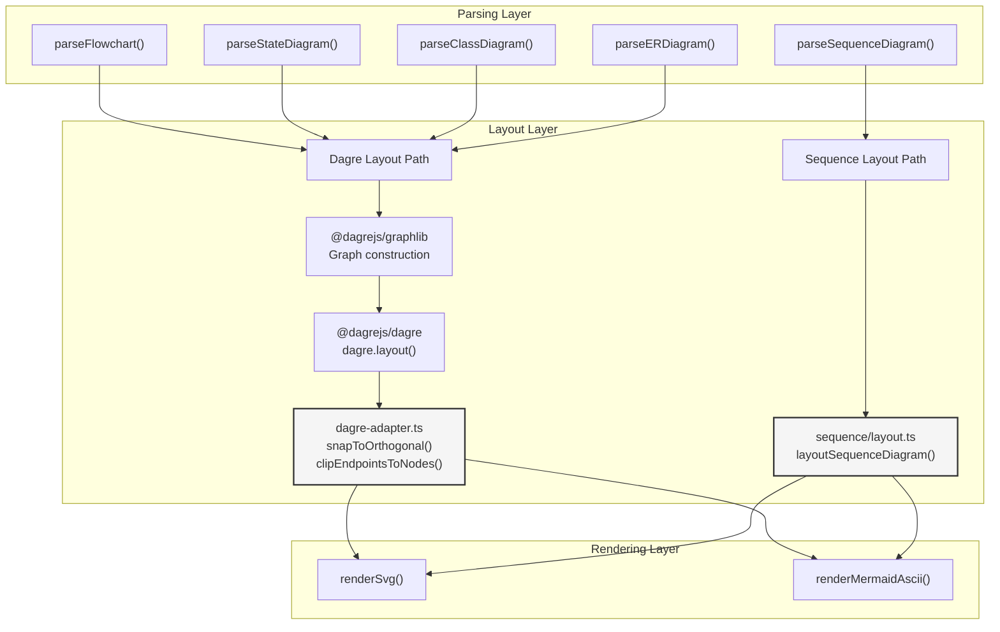

**Diagram: Layout Strategy Bifurcation**

Sources: [src/__tests__/dagre-adapter.test.ts:1-10](), [src/__tests__/sequence-layout.test.ts:1-19]()

---

## Dagre-Based Layout

### Graph Construction and Dagre Invocation

Dagre-based diagrams follow this pipeline:

1. **Parse** → structured nodes and edges
2. **Build graphlib Graph** → populate `@dagrejs/graphlib` data structure with node dimensions and edge definitions
3. **Invoke `dagre.layout()`** → compute (x, y) positions for nodes and polyline points for edges
4. **Refine with adapter utilities** → snap edges to orthogonal segments and clip endpoints to node boundaries

The raw output from `dagre.layout()` provides node centers and edge routing points, but edges may approach nodes at arbitrary angles and terminate inside node bounds rather than at precise boundaries. The adapter utilities in `src/dagre-adapter.ts` correct these issues.

```mermaid
graph LR
    PARSED["Parsed Diagram<br/>{nodes[], edges[]}"]
    GRAPH_BUILD["Build graphlib.Graph<br/>setNode(id, dims)<br/>setEdge(src, tgt)"]
    DAGRE["dagre.layout(graph)<br/>Hierarchical Layout"]
    RAW_POS["Raw Positions<br/>nodes: {x, y}<br/>edges: {points[]}"]
    SNAP["snapToOrthogonal(points)<br/>Convert to orthogonal"]
    CLIP["clipEndpointsToNodes(points)<br/>Clip to boundaries"]
    POSITIONED["PositionedGraph<br/>Ready for rendering"]
    
    PARSED --> GRAPH_BUILD
    GRAPH_BUILD --> DAGRE
    DAGRE --> RAW_POS
    RAW_POS --> SNAP
    SNAP --> CLIP
    CLIP --> POSITIONED
    
    style SNAP fill:#f5f5f5,stroke:#333,stroke-width:2px
    style CLIP fill:#f5f5f5,stroke:#333,stroke-width:2px
```

**Diagram: Dagre Layout Pipeline with Adapter Utilities**

Sources: [src/__tests__/dagre-adapter.test.ts:1-10](), [bun.lock:7-19]()

---

### snapToOrthogonal()

The `snapToOrthogonal()` function converts polyline edges with arbitrary angles into strictly orthogonal (horizontal and vertical) segments. Dagre's default output may include diagonal routing, which conflicts with the orthogonal edge style used in Mermaid diagrams.

**Function Signature:**
```typescript
snapToOrthogonal(
  points: Array<{x: number, y: number}>,
  verticalFirst: boolean
): Array<{x: number, y: number}>
```

**Algorithm:**

The function processes each consecutive point pair, inserting intermediate points to create 90-degree turns:

- **verticalFirst = true** (TB/BT layouts): Insert vertical segment first, then horizontal
- **verticalFirst = false** (LR/RL layouts): Insert horizontal segment first, then vertical

For a 3-point edge `[p0, p1, p2]`, the algorithm:
1. Between p0 and p1: insert bend point at `(p0.x, p1.y)` if vertical-first, or `(p1.x, p0.y)` if horizontal-first
2. Between p1 and p2: apply same logic
3. Remove duplicate consecutive points

**Example (vertical-first):**

```
Input:  [(100, 80), (150, 150), (200, 216)]
         (diagonal segments)

Output: [(100, 80), (100, 150), (150, 150), (150, 216), (200, 216)]
         (orthogonal: down → right → down → right)
```

Sources: [src/__tests__/dagre-adapter.test.ts:293-318]()

---

### clipEndpointsToNodes()

After orthogonal snapping, edge endpoints often terminate at positions inside node bounds (e.g., centered on the node) rather than at the node's perimeter. The `clipEndpointsToNodes()` function adjusts the first and last points of an edge to lie exactly on the node boundary, clipped according to the approach direction.

**Function Signature:**
```typescript
clipEndpointsToNodes(
  points: Array<{x: number, y: number}>,
  sourceNode: NodeRect | null,
  targetNode: NodeRect | null
): Array<{x: number, y: number}>
```

**NodeRect Type:**
```typescript
type NodeRect = {
  cx: number   // center X
  cy: number   // center Y
  hw: number   // half-width
  hh: number   // half-height
}
```

**Algorithm:**

1. **Target endpoint (last point):**
   - Determine if the penultimate segment is horizontal or vertical
   - If horizontal: clip to LEFT or RIGHT side at vertical center `cy`
   - If vertical: clip to TOP or BOTTOM at horizontal center `cx`
   - Adjust the penultimate point to maintain orthogonality

2. **Source endpoint (first point):**
   - Determine if the second segment is horizontal or vertical
   - Apply same logic as target, but in reverse direction

**Clipping Rules:**

| Last Segment Direction | Approach From | Clip To |
|------------------------|---------------|---------|
| Horizontal (left→right) | Left | `(cx - hw, cy)` (LEFT side) |
| Horizontal (right→left) | Right | `(cx + hw, cy)` (RIGHT side) |
| Vertical (top→bottom) | Above | `(cx, cy - hh)` (TOP) |
| Vertical (bottom→top) | Below | `(cx, cy + hh)` (BOTTOM) |

**Example:**

```
Node: { cx: 200, cy: 250, hw: 60, hh: 34 }
  (bounding box: x ∈ [140, 260], y ∈ [216, 284])

Input points (after snapToOrthogonal):
  [(100, 80), (100, 216), (200, 216)]
  
Last segment: (100, 216) → (200, 216)
  Direction: horizontal, left→right
  Clip target to LEFT side at vertical center:
    (200, 216) → (140, 250)
  
Adjust penultimate point Y:
  (100, 216) → (100, 250)
  
Output: [(100, 80), (100, 250), (140, 250)]
```

This ensures the edge connects precisely at the node boundary, entering from the correct side based on the routing path.

Sources: [src/__tests__/dagre-adapter.test.ts:23-287]()

---

### Integration Pipeline

```mermaid
graph TB
    START["Parsed Diagram"]
    
    subgraph "Graph Construction"
        BUILD_NODES["For each node:<br/>graph.setNode(id, {width, height})"]
        BUILD_EDGES["For each edge:<br/>graph.setEdge(src, tgt, {label})"]
    end
    
    subgraph "Dagre Layout"
        DAGRE_CALL["dagre.layout(graph, config)"]
        GET_NODES["Read node positions:<br/>graph.node(id) → {x, y}"]
        GET_EDGES["Read edge points:<br/>graph.edge(src, tgt) → {points[]}"]
    end
    
    subgraph "Adapter Refinement"
        SNAP_EDGES["For each edge:<br/>snapToOrthogonal(points, vertFirst)"]
        CLIP_EDGES["clipEndpointsToNodes(points, srcNode, tgtNode)"]
    end
    
    BUILD_POSITION["Build PositionedGraph:<br/>{nodes, edges} with refined coords"]
    
    START --> BUILD_NODES
    BUILD_NODES --> BUILD_EDGES
    BUILD_EDGES --> DAGRE_CALL
    DAGRE_CALL --> GET_NODES
    DAGRE_CALL --> GET_EDGES
    GET_NODES --> BUILD_POSITION
    GET_EDGES --> SNAP_EDGES
    SNAP_EDGES --> CLIP_EDGES
    CLIP_EDGES --> BUILD_POSITION
    
    style SNAP_EDGES fill:#f5f5f5,stroke:#333,stroke-width:2px
    style CLIP_EDGES fill:#f5f5f5,stroke:#333,stroke-width:2px
```

**Diagram: Dagre Layout Integration with Adapter Utilities**

The `verticalFirst` parameter passed to `snapToOrthogonal()` depends on the diagram's rank direction:
- **TB (top-to-bottom)** or **BT (bottom-to-top)**: `verticalFirst = true`
- **LR (left-to-right)** or **RL (right-to-left)**: `verticalFirst = false`

This ensures edges follow the primary flow direction of the layout.

Sources: [src/__tests__/dagre-adapter.test.ts:293-348]()

---

## Sequence Diagram Layout

### Overview

Sequence diagrams use a custom layout system implemented in `src/sequence/layout.ts`. The core function `layoutSequenceDiagram()` receives a parsed sequence structure and returns positioned elements:

```typescript
layoutSequenceDiagram(parsed: ParsedSequence): PositionedSequence
```

**PositionedSequence Structure:**
- `actors`: Array of `{id, label, x, y, width, height}`
- `lifelines`: Array of `{actorId, x, y1, y2}`
- `messages`: Array of `{from, to, label, type, x1, y1, x2, y2}`
- `notes`: Array of `{text, x, y, width, height, actors}`
- `blocks`: Array of `{type, label, y, height, dividers, actorIndices}`
- `width`, `height`: Total diagram dimensions

The layout follows a strict vertical timeline where Y coordinates increase downward in temporal order.

```mermaid
graph TB
    PARSED_SEQ["ParsedSequence<br/>{actors[], messages[], blocks[], notes[]}"]
    
    subgraph "layoutSequenceDiagram() Steps"
        STEP1["1. Position actors horizontally<br/>Uniform spacing across top"]
        STEP2["2. Position lifelines<br/>Vertical lines below actors"]
        STEP3["3. Calculate message Y positions<br/>Base spacing + block extras"]
        STEP4["4. Position message endpoints<br/>x1/x2 from actor positions"]
        STEP5["5. Position notes<br/>Left/right/over actors"]
        STEP6["6. Bounding box adjustment<br/>Shift right if needed, expand width"]
        STEP7["7. Calculate block rectangles<br/>Height from message ranges"]
    end
    
    POSITIONED_SEQ["PositionedSequence<br/>Ready for rendering"]
    
    PARSED_SEQ --> STEP1
    STEP1 --> STEP2
    STEP2 --> STEP3
    STEP3 --> STEP4
    STEP4 --> STEP5
    STEP5 --> STEP6
    STEP6 --> STEP7
    STEP7 --> POSITIONED_SEQ
    
    style STEP3 fill:#f5f5f5,stroke:#333,stroke-width:2px
    style STEP6 fill:#f5f5f5,stroke:#333,stroke-width:2px
```

**Diagram: Sequence Layout Steps**

Sources: [src/__tests__/sequence-layout.test.ts:12-19]()

---

### Vertical Spacing System

Sequence diagrams use a tiered vertical spacing system to prevent overlap between control flow block elements (headers, dividers) and message labels:

| Spacing Constant | Value | Usage |
|------------------|-------|-------|
| `messageRowHeight` | 40px | Base vertical distance between consecutive messages |
| `blockHeaderExtra` | 28px | Additional space for first message in loop/alt/opt/par/critical block |
| `dividerExtra` | 24px | Additional space for message following else/and divider |
| `blockPadTop` | 40px | Vertical clearance above first message in block for header tab |
| `blockPadBottom` | 16px | Vertical clearance below last message in block |
| `padding` | 30px | Horizontal margin at diagram edges |

**Vertical Position Calculation:**

For each message at index `i`, the Y coordinate is computed as:

```
y[i] = startY + (i × messageRowHeight) + Σ(extras)
```

Where `Σ(extras)` accumulates:
- `+blockHeaderExtra` if message is the first in a block
- `+dividerExtra` if message follows an else/and divider

**Example:**

```
sequenceDiagram
  A->>B: Login            ← y = 60 (startY)
  alt Valid
    B->>A: 200 OK         ← y = 60 + 40 + 28 = 128 (header extra)
  else Invalid
    B->>A: 401            ← y = 128 + 40 + 24 = 192 (divider extra)
  end
```

This spacing ensures:
1. Block header tab (18px tall, at block.y) clears message label (at msg.y - 6)
2. Divider line (at divider.y) clears previous message arrow (at prevMsg.y)
3. Divider label (baseline at divider.y + 14) clears next message label (at msg.y - 6)

Sources: [src/__tests__/sequence-layout.test.ts:21-165]()

---

### Block and Divider Handling

Control flow blocks (loop, alt, opt, par, critical) require special layout handling:

**Block Structure:**
```typescript
{
  type: 'loop' | 'alt' | 'opt' | 'par' | 'critical'
  label: string                    // header label
  startIndex: number               // index of first message in block
  endIndex: number                 // index of last message in block
  dividers: Array<{
    type: 'else' | 'and'
    label: string
    index: number                  // index of message after divider
  }>
}
```

**Layout Calculations:**

1. **Block Y position:**
   ```
   block.y = firstMessage.y - blockPadTop
   ```

2. **Block height:**
   ```
   block.height = (lastMessage.y - firstMessage.y) + blockPadTop + blockPadBottom
   ```

3. **Divider Y position:**
   ```
   divider.y = prevMessage.y + (nextMessage.y - prevMessage.y) / 2
   ```
   Positioned midway between the messages it separates

**Divider Label Overlap Detection:**

The layout system detects potential overlap between divider labels (left-aligned at block edge) and message labels (centered between actors). If overlap is detected, `dividerExtra` is increased from 24px to 36px for that specific divider to provide additional clearance.

Detection logic (simplified):
```
dividerLabelRight = blockLeft + estimateTextWidth("[" + dividerLabel + "]")
messageLabelLeft = messageCenterX - estimateTextWidth(messageLabel) / 2

if (dividerLabelRight > messageLabelLeft) {
  // Overlap detected, use larger offset
  dividerExtra = 36
}
```

Sources: [src/__tests__/sequence-layout.test.ts:36-165](), [src/__tests__/sequence-layout.test.ts:418-467]()

---

### Bounding Box Management

Sequence diagrams position notes relative to actors, which can extend beyond the initial actor layout:

- **"left of A"**: Note placed to the left of actor A
- **"right of B"**: Note placed to the right of actor B
- **"over A,B"**: Note centered over actors A through B

Notes positioned "left of" the first actor or "right of" the last actor may initially have negative X coordinates or extend beyond the rightmost actor.

**Bounding Box Post-Processing (Step 6):**

1. **Calculate minimum element X:**
   ```
   minX = Math.min(
     ...actors.map(a => a.x - a.width/2),
     ...notes.map(n => n.x)
   )
   ```

2. **If minX < padding (30px), apply right-shift:**
   ```
   shift = padding - minX
   ```
   Add `shift` to X coordinate of all actors, messages, notes, lifelines, and blocks

3. **Calculate maximum element X:**
   ```
   maxX = Math.max(
     ...actors.map(a => a.x + a.width/2),
     ...notes.map(n => n.x + n.width)
   )
   ```

4. **Set diagram width:**
   ```
   width = maxX + padding
   ```

This ensures all elements have at least `padding` (30px) margin from diagram edges, and notes extending beyond actors are fully contained.

**Effect on Layout:**

| Scenario | Action | Result |
|----------|--------|--------|
| No extreme notes | No shift | Actors start at x ≈ 70 (padding + actorWidth/2) |
| "left of" first actor | Right-shift all elements | Note left edge at x = 30 |
| "right of" last actor | Expand width | Note right edge at x = width - 30 |
| Both left and right notes | Shift + expand | Both notes within bounds |

Sources: [src/__tests__/sequence-layout.test.ts:481-606]()

---

## Layout Output Structures

Both layout systems produce structured output consumed by the rendering layer:

**Dagre-Based Output (PositionedGraph):**
```typescript
{
  nodes: Array<{
    id: string
    label: string
    shape: 'rect' | 'roundrect' | 'diamond' | 'circle' | ...
    x: number          // center X
    y: number          // center Y
    width: number
    height: number
  }>
  
  edges: Array<{
    from: string       // source node id
    to: string         // target node id
    label: string
    points: Array<{x: number, y: number}>  // orthogonal polyline
    type: 'arrow' | 'open' | 'dotted' | ...
  }>
  
  width: number
  height: number
}
```

**Sequence Output (PositionedSequence):**
```typescript
{
  actors: Array<{
    id: string
    label: string
    x: number          // center X
    y: number          // top Y
    width: number
    height: number
  }>
  
  lifelines: Array<{
    actorId: string
    x: number          // center X (matches actor)
    y1: number         // start Y (below actor)
    y2: number         // end Y (after last message)
  }>
  
  messages: Array<{
    from: string       // source actor id
    to: string         // target actor id
    label: string
    type: 'solid' | 'dotted' | 'open'
    x1: number         // source X
    y: number          // message Y (same for both ends)
    x2: number         // target X
  }>
  
  blocks: Array<{
    type: 'loop' | 'alt' | ...
    label: string
    y: number          // top Y
    height: number
    x: number          // left X
    width: number      // spans actors
    dividers: Array<{
      label: string
      y: number
    }>
  }>
  
  notes: Array<{
    text: string
    x: number          // left X
    y: number          // top Y
    width: number
    height: number
  }>
  
  width: number
  height: number
}
```

Sources: [src/__tests__/dagre-adapter.test.ts:10-14](), [src/__tests__/sequence-layout.test.ts:12-19]()

---

## Layout Configuration

**Dagre Configuration:**

Layout behavior is controlled by config passed to `dagre.layout()`:

```typescript
{
  rankdir: 'TB' | 'BT' | 'LR' | 'RL',  // Rank direction
  ranksep: number,                      // Vertical spacing between ranks
  nodesep: number,                      // Horizontal spacing between nodes
  edgesep: number,                      // Spacing between edge routes
  marginx: number,                      // Horizontal margin
  marginy: number                       // Vertical margin
}
```

Default values vary by diagram type (e.g., flowcharts use `ranksep: 50`, state diagrams may differ).

**Sequence Configuration:**

Spacing constants are hardcoded in `src/sequence/layout.ts` but logically form a configuration:

```typescript
const SEQ = {
  actorWidth: 80,
  actorHeight: 38,
  actorSpacing: 120,        // center-to-center distance
  messageRowHeight: 40,
  blockHeaderExtra: 28,
  dividerExtra: 24,
  blockPadTop: 40,
  blockPadBottom: 16,
  padding: 30,
  noteWidth: 100,
  noteHeight: 40
}
```

Sources: [src/__tests__/sequence-layout.test.ts:22-165]()

---

# Page: Rendering Layer

# Rendering Layer

<details>
<summary>Relevant source files</summary>

The following files were used as context for generating this wiki page:

- [src/__tests__/ascii.test.ts](src/__tests__/ascii.test.ts)
- [src/__tests__/renderer.test.ts](src/__tests__/renderer.test.ts)
- [src/__tests__/styles.test.ts](src/__tests__/styles.test.ts)

</details>


## Purpose and Scope

The Rendering Layer is the final stage of the beautiful-mermaid pipeline, responsible for converting positioned graph data structures into concrete output formats: SVG strings for vector graphics or ASCII/Unicode strings for terminal display. This layer consumes the `PositionedGraph` data structure produced by the Layout Engine ([3.2](#3.2)) and applies the theme colors and styling rules to generate the final visual output.

This page covers the dual rendering architecture, SVG generation mechanics, ASCII rendering, and the shared styling infrastructure. For theme color derivation and CSS custom property details, see [Theme System](#6). For deep-dive ASCII rendering implementation details, see [ASCII Rendering](#7).

---

## Rendering Architecture Overview

The rendering layer implements a **dual-output strategy** where both renderers consume the same `PositionedGraph` structure but produce fundamentally different output formats optimized for their respective use cases.

**Diagram: Rendering Layer Data Flow**

```mermaid
graph TB
    subgraph Input["Input from Layout Engine"]
        PG["PositionedGraph<br/>{width, height, nodes, edges, groups}"]
    end
    
    subgraph SVGPath["SVG Rendering Path"]
        RS["renderSvg()<br/>src/renderer.ts"]
        SHAPES["Shape Renderers<br/>renderNode()"]
        EDGES["Edge Renderers<br/>renderEdge()"]
        GROUPS["Group Renderers<br/>renderGroup()"]
        STYLES["buildStyleBlock()<br/>CSS custom properties"]
    end
    
    subgraph ASCIIPath["ASCII Rendering Path"]
        RA["renderMermaidAscii()<br/>src/ascii/index.ts"]
        CANVAS["Canvas2D<br/>Character grid"]
        DRAWER["Drawer<br/>Box/line drawing"]
    end
    
    subgraph Outputs["Output Formats"]
        SVG["SVG String<br/>with embedded CSS"]
        ASCII["ASCII/Unicode String<br/>terminal-ready"]
    end
    
    PG --> RS
    PG --> RA
    
    RS --> SHAPES
    RS --> EDGES
    RS --> GROUPS
    RS --> STYLES
    
    SHAPES --> SVG
    EDGES --> SVG
    GROUPS --> SVG
    STYLES --> SVG
    
    RA --> CANVAS
    CANVAS --> DRAWER
    DRAWER --> ASCII
```

**Sources:** [src/renderer.ts:1-600](), [src/ascii/index.ts:1-100](), [Diagram 2 from high-level architecture]

---

## SVG Rendering System

### Core Function: `renderSvg`

The `renderSvg` function ([src/renderer.ts:1-600]()) is the primary entry point for SVG generation. It takes a `PositionedGraph`, `DiagramColors`, and optional font name to produce a complete SVG document string.

**Function Signature:**
```typescript
function renderSvg(
  graph: PositionedGraph,
  colors: DiagramColors,
  fontName?: string
): string
```

**Rendering Pipeline:**

```mermaid
graph LR
    INPUT["PositionedGraph + DiagramColors"]
    OPEN["svgOpenTag()<br/>CSS variables"]
    DEFS["<defs><br/>Arrow markers"]
    STYLE["buildStyleBlock()<br/>Derived colors"]
    GROUPS["Render groups<br/>Bottom-up"]
    EDGES["Render edges<br/>Polylines + arrows"]
    NODES["Render nodes<br/>Shape-specific"]
    CLOSE["</svg>"]
    
    INPUT --> OPEN
    OPEN --> DEFS
    DEFS --> STYLE
    STYLE --> GROUPS
    GROUPS --> EDGES
    EDGES --> NODES
    NODES --> CLOSE
```

**Sources:** [src/renderer.ts:1-50](), [src/__tests__/renderer.test.ts:59-99]()

### Node Shape Rendering

The renderer supports **16 distinct node shapes**, each with specialized SVG element generation. All shapes are rendered by the internal `renderNode` function which dispatches based on the `shape` property.

**Supported Shapes:**

| Shape | SVG Element | Key Characteristics | Test Reference |
|-------|-------------|---------------------|----------------|
| `rectangle` | `<rect>` | `rx="0" ry="0"` | [src/__tests__/renderer.test.ts:106-110]() |
| `rounded` | `<rect>` | `rx="6" ry="6"` | [src/__tests__/renderer.test.ts:112-116]() |
| `stadium` | `<rect>` | `rx=height/2 ry=height/2` | [src/__tests__/renderer.test.ts:118-123]() |
| `circle` | `<circle>` | `r=min(width,height)/2` | [src/__tests__/renderer.test.ts:125-131]() |
| `diamond` | `<polygon>` | 4 corner points | [src/__tests__/renderer.test.ts:133-139]() |
| `hexagon` | `<polygon>` | 6 edge points | [src/__tests__/renderer.test.ts:177-186]() |
| `subroutine` | `<rect>` + `<line>` | Outer rect + inset vertical lines | [src/__tests__/renderer.test.ts:153-164]() |
| `doublecircle` | 2× `<circle>` | Outer stroke + inner fill | [src/__tests__/renderer.test.ts:166-175]() |
| `cylinder` | 2× `<ellipse>` + `<rect>` | Top/bottom caps + body | [src/__tests__/renderer.test.ts:194-203]() |
| `asymmetric` | `<polygon>` | 5-point flag shape | [src/__tests__/renderer.test.ts:205-217]() |
| `trapezoid` | `<polygon>` | 4-point trapezoid | [src/__tests__/renderer.test.ts:219-228]() |
| `trapezoid-alt` | `<polygon>` | 4-point inverted trapezoid | [src/__tests__/renderer.test.ts:230-239]() |
| `state-start` | `<circle>` | Filled circle, no label | [src/__tests__/renderer.test.ts:247-254]() |
| `state-end` | 2× `<circle>` | Bullseye (stroked outer + filled inner) | [src/__tests__/renderer.test.ts:256-265]() |

**Shape Rendering Logic Flow:**

```mermaid
graph TD
    RENDER_NODE["renderNode(node, colors)"]
    
    SHAPE_CHECK{"node.shape"}
    
    RECT["Render <rect><br/>with border radius"]
    CIRCLE["Render <circle><br/>with radius"]
    POLYGON["Render <polygon><br/>with points array"]
    COMPOSITE["Render composite<br/>multiple elements"]
    
    TEXT["Render <text><br/>escaped label"]
    INLINE["Apply inlineStyle<br/>overrides"]
    
    RENDER_NODE --> SHAPE_CHECK
    
    SHAPE_CHECK -->|"rectangle,rounded,stadium"| RECT
    SHAPE_CHECK -->|"circle,state-start"| CIRCLE
    SHAPE_CHECK -->|"diamond,hexagon,asymmetric,trapezoid"| POLYGON
    SHAPE_CHECK -->|"cylinder,doublecircle,subroutine,state-end"| COMPOSITE
    
    RECT --> INLINE
    CIRCLE --> INLINE
    POLYGON --> INLINE
    COMPOSITE --> INLINE
    
    INLINE --> TEXT
```

**Sources:** [src/renderer.ts:100-400](), [src/__tests__/renderer.test.ts:105-266]()

### Edge Rendering

Edges are rendered as `<polyline>` elements with support for arrow markers, multiple styles, and optional labels with background pills.

**Edge Properties:**

```mermaid
graph LR
    EDGE["PositionedEdge"]
    
    POINTS["points: Point[]<br/>Polyline coordinates"]
    STYLE["style: 'solid'|'dotted'|'thick'"]
    ARROWS["hasArrowStart<br/>hasArrowEnd"]
    LABEL["label?: string<br/>labelPosition?: Point"]
    
    POLYLINE["<polyline><br/>stroke-dasharray<br/>stroke-width"]
    MARKERS["marker-start<br/>marker-end"]
    LABEL_GROUP["<rect> + <text><br/>Background pill"]
    
    EDGE --> POINTS
    EDGE --> STYLE
    EDGE --> ARROWS
    EDGE --> LABEL
    
    POINTS --> POLYLINE
    STYLE --> POLYLINE
    ARROWS --> MARKERS
    LABEL --> LABEL_GROUP
```

**Arrow Marker Definitions:**

The SVG `<defs>` section includes two reusable arrow markers:
- `#arrowhead`: For `marker-end` (forward arrows)
- `#arrowhead-start`: For `marker-start` (backward arrows)

Both use `fill="var(--_arrow)"` to dynamically inherit theme colors ([src/__tests__/renderer.test.ts:69-75]()).

**Edge Styles:**

| Style | Stroke Width | Dasharray | Test Reference |
|-------|--------------|-----------|----------------|
| `solid` | `0.75` | None | [src/__tests__/renderer.test.ts:273-280]() |
| `dotted` | `0.75` | `"4 4"` | [src/__tests__/renderer.test.ts:282-287]() |
| `thick` | `1.5` | None | [src/__tests__/renderer.test.ts:289-294]() |

**Edge Label Positioning:**

Labels use an explicit `labelPosition` when provided, falling back to edge midpoint calculation. The label is rendered with a rounded rectangle background (`rx="2" ry="2"`) for contrast ([src/__tests__/renderer.test.ts:332-365]()).

**Sources:** [src/renderer.ts:450-550](), [src/__tests__/renderer.test.ts:272-365]()

### Group Rendering (Subgraphs)

Groups represent nested containers (subgraphs) and are rendered as **two overlapping rectangles**: an outer border and a shaded header band.

**Group Structure:**

```mermaid
graph TB
    GROUP["PositionedGroup<br/>{id, label, x, y, width, height, children}"]
    
    OUTER["Outer Rectangle<br/>stroke: --_node-stroke<br/>fill: none"]
    HEADER["Header Band<br/>height: ~22px<br/>fill: --_node-fill"]
    LABEL["Group Label<br/><text> in header"]
    CHILDREN["Recursive children<br/>nested groups"]
    
    GROUP --> OUTER
    GROUP --> HEADER
    GROUP --> LABEL
    GROUP --> CHILDREN
```

**Rendering Order:**

Groups are rendered **before edges and nodes** to ensure they appear as backgrounds. Nested groups are rendered recursively from innermost to outermost ([src/__tests__/renderer.test.ts:371-398]()).

**Sources:** [src/renderer.ts:200-300](), [src/__tests__/renderer.test.ts:371-398]()

### Inline Style System

Nodes support `inlineStyle` property for per-element color overrides, bypassing theme defaults. This enables features like class diagrams with color-coded methods or ER diagrams with highlighted keys.

**Supported Inline Properties:**

| Property | Target | Example Value |
|----------|--------|---------------|
| `fill` | Node background | `"#ff0000"` |
| `stroke` | Node border | `"#00ff00"` |
| `color` | Text color | `"#0000ff"` |
| `stroke-width` | Border thickness | `"2"` |

**Security: XML Escaping**

All inline style values are **XML-escaped** to prevent attribute and element injection attacks ([src/__tests__/renderer.test.ts:466-505]()):
- `"` → `&quot;`
- `<` → `&lt;`
- `>` → `&gt;`
- `&` → `&amp;`
- `'` → `&#39;`

**Sources:** [src/renderer.ts:100-150](), [src/__tests__/renderer.test.ts:404-505]()

---

## CSS Custom Properties System

The SVG renderer uses **CSS custom properties** (CSS variables) for theme colors, enabling instant theme switching without re-rendering.

### Variable Architecture

```mermaid
graph TB
    subgraph UserInput["User Input Colors"]
        BG["--bg: Background"]
        FG["--fg: Foreground"]
        OPT["Optional enrichments<br/>--line, --accent, --muted, --surface, --border"]
    end
    
    subgraph Derivation["Color Derivation (color-mix)"]
        CALC["buildStyleBlock()"]
    end
    
    subgraph DerivedVars["Derived CSS Variables"]
        TEXT["--_text: var(--fg)"]
        LINE["--_line: color-mix(in oklab, var(--fg) 30%, var(--bg))"]
        ARROW["--_arrow: color-mix(in oklab, var(--fg) 50%, var(--bg))"]
        MUTED["--_muted: color-mix(in oklab, var(--fg) 60%, var(--bg))"]
        FILL["--_node-fill: color-mix(in oklab, var(--fg) 3%, var(--bg))"]
        STROKE["--_node-stroke: color-mix(in oklab, var(--fg) 20%, var(--bg))"]
    end
    
    subgraph SVGElements["SVG Element Styles"]
        RECT["<rect fill='var(--_node-fill)'>"]
        POLY["<polyline stroke='var(--_line)'>"]
        TXTELEM["<text fill='var(--_text)'>"]
    end
    
    BG --> CALC
    FG --> CALC
    OPT --> CALC
    
    CALC --> TEXT
    CALC --> LINE
    CALC --> ARROW
    CALC --> MUTED
    CALC --> FILL
    CALC --> STROKE
    
    TEXT --> TXTELEM
    LINE --> POLY
    FILL --> RECT
```

**Variable Usage in SVG:**

The `svgOpenTag` function ([src/theme.ts:50-100]()) embeds CSS variables in the SVG's inline style attribute:

```typescript
style="--bg:#FFFFFF;--fg:#27272A;background:var(--bg);"
```

The `buildStyleBlock` function ([src/theme.ts:100-200]()) generates the `<style>` block with all derived variables using `color-mix()` formulas.

**Live Theme Switching:**

Because all colors reference CSS variables, JavaScript can update theme colors by modifying the SVG element's style attribute **without touching the DOM structure** ([src/__tests__/renderer.test.ts:511-537]()):

```typescript
svgElement.style.setProperty('--bg', newBg)
svgElement.style.setProperty('--fg', newFg)
// All colors update instantly
```

**Sources:** [src/theme.ts:1-200](), [src/__tests__/styles.test.ts:38-82]()

---

## ASCII Rendering System

The ASCII renderer ([src/ascii/index.ts:1-100]()) produces terminal-compatible text output by projecting the `PositionedGraph` onto a 2D character grid.

### Core Function: `renderMermaidAscii`

**Function Signature:**
```typescript
function renderMermaidAscii(
  input: string,
  options?: AsciiRenderOptions
): string

interface AsciiRenderOptions {
  useAscii?: boolean    // true = ASCII-only, false = Unicode box drawing
  paddingX?: number     // Horizontal padding (default: 5)
  paddingY?: number     // Vertical padding (default: 5)
}
```

### Unicode vs ASCII Modes

The renderer supports two character sets for box drawing:

| Feature | Unicode Mode | ASCII Mode |
|---------|--------------|------------|
| Corners | `┌ ┐ └ ┘` | `+ + + +` |
| Horizontal | `─` | `-` |
| Vertical | `│` | `|` |
| T-junctions | `├ ┤ ┬ ┴` | `+ + + +` |
| Cross | `┼` | `+` |
| Arrows | `→ ←` | `> <` |

**Mode Selection Test:**

The golden file tests ([src/__tests__/ascii.test.ts:168-189]()) verify that:
- ASCII mode produces no Unicode box-drawing characters
- Unicode mode produces at least one Unicode character
- Both modes produce different output for the same input

**Sources:** [src/ascii/index.ts:1-100](), [src/__tests__/ascii.test.ts:1-190]()

### Canvas-Based Layout

Unlike SVG rendering which directly generates markup, ASCII rendering uses an intermediate **2D character grid** (`Canvas2D` class) that handles:

1. **Coordinate scaling**: SVG pixel coordinates → character grid cells
2. **Text wrapping**: Multi-line labels within box constraints
3. **Collision detection**: Overlapping lines and boxes
4. **Character precedence**: Junction symbols override line segments

**Rendering Flow:**

```mermaid
graph TB
    PARSE["Parse Mermaid<br/>Same parsers as SVG"]
    LAYOUT["Layout Engine<br/>Produces PositionedGraph"]
    CANVAS["Canvas2D.new()<br/>Initialize character grid"]
    
    SCALE["Scale coordinates<br/>SVG pixels → char cells"]
    DRAW["Drawer.drawBox()<br/>Drawer.drawLine()"]
    
    RENDER["Canvas2D.render()<br/>Convert grid to string"]
    
    PARSE --> LAYOUT
    LAYOUT --> CANVAS
    CANVAS --> SCALE
    SCALE --> DRAW
    DRAW --> RENDER
```

**Sources:** [src/ascii/index.ts:1-100](), [Ported from AlexanderGrooff/mermaid-ascii]

---

## Shared Styling Infrastructure

Both renderers share common styling constants and utilities defined in [src/styles.ts:1-200]().

### Text Measurement

The `estimateTextWidth` function provides **heuristic text width estimation** without DOM access:

```typescript
function estimateTextWidth(
  text: string,
  fontSize: number,
  fontWeight: number
): number
```

**Algorithm:**
- Base width per character: `fontSize * 0.55`
- Weight adjustment: `fontWeight / 400` multiplier
- Final: `text.length * baseWidth * weightFactor`

This estimation is used by the layout engine to determine node dimensions before rendering ([src/__tests__/styles.test.ts:112-146]()).

**Sources:** [src/styles.ts:1-100](), [src/__tests__/styles.test.ts:112-146]()

### Styling Constants

**Font Configuration:**

```typescript
FONT_SIZES = {
  nodeLabel: 13,      // Primary node text
  edgeLabel: 11,      // Edge/arrow labels
  groupHeader: 12,    // Subgraph titles
}

FONT_WEIGHTS = {
  nodeLabel: 500,     // Medium
  edgeLabel: 400,     // Regular
  groupHeader: 600,   // Semibold
}
```

**Layout Constants:**

```typescript
NODE_PADDING = {
  horizontal: 16,     // Left/right padding in nodes
  vertical: 10,       // Top/bottom padding
  diamondExtra: 24,   // Additional padding for diamond shapes
}

STROKE_WIDTHS = {
  outerBox: 1,        // Node borders
  innerBox: 0.75,     // Group borders
  connector: 0.75,    // Edge lines
}

ARROW_HEAD = {
  width: 8,           // Arrow marker width
  height: 4.8,        // Arrow marker height
}
```

These constants ensure consistent spacing and proportions across all diagram types ([src/__tests__/styles.test.ts:152-181]()).

**Sources:** [src/styles.ts:1-200](), [src/__tests__/styles.test.ts:152-181]()

---

## Rendering Layer Integration

The rendering layer is invoked by the top-level API functions defined in [src/index.ts:1-100]():

**SVG Path:**
```typescript
export function renderMermaid(
  input: string,
  options?: RenderOptions
): string {
  // 1. Parse (Parsing System)
  const parsed = parseFlowchart(input)
  
  // 2. Layout (Layout Engine)
  const positioned = layoutGraph(parsed)
  
  // 3. Render (THIS LAYER)
  return renderSvg(positioned, colors, fontName)
}
```

**ASCII Path:**
```typescript
export function renderMermaidAscii(
  input: string,
  options?: AsciiRenderOptions
): string {
  // 1. Parse (Parsing System)
  const parsed = parseFlowchart(input)
  
  // 2. Layout (ASCII-specific)
  const positioned = layoutGraphAscii(parsed)
  
  // 3. Render (THIS LAYER)
  return asciiRenderer(positioned, options)
}
```

**Sources:** [src/index.ts:1-100](), [Diagram 2: Core Rendering Pipeline Architecture]

---

# Page: API Reference

# API Reference

<details>
<summary>Relevant source files</summary>

The following files were used as context for generating this wiki page:

- [README.md](README.md)
- [package.json](package.json)

</details>


This page provides a comprehensive overview of the `beautiful-mermaid` public API surface. The library exposes two primary rendering functions (`renderMermaid` for SVG output, `renderMermaidAscii` for text output), a theming system with 15 built-in themes, and utilities for integrating with VS Code color schemes.

For detailed documentation of individual functions and their parameters, see:
- [renderMermaid function](#4.1) for SVG rendering details
- [renderMermaidAscii function](#4.2) for ASCII/Unicode rendering details
- [Theme API](#4.3) for theming system, color derivation, and Shiki integration

## API Surface Overview

The library's public API consists of five primary exports, with different entry points for Node.js/bundler environments versus browser CDN usage.

### Public API Structure

```mermaid
graph TB
    subgraph "Public API"
        RENDER_MERMAID["renderMermaid()<br/>SVG Rendering"]
        RENDER_ASCII["renderMermaidAscii()<br/>ASCII/Unicode Rendering"]
        THEMES["THEMES<br/>15 Built-in Palettes"]
        DEFAULTS["DEFAULTS<br/>Default Colors"]
        FROM_SHIKI["fromShikiTheme()<br/>VS Code Theme Adapter"]
    end
    
    subgraph "Node.js/Bundler Entry"
        INDEX["src/index.ts"]
        ASCII_INDEX["src/ascii/index.ts"]
        THEME_FILE["src/theme.ts"]
    end
    
    subgraph "Browser Global Entry"
        BROWSER["src/browser.ts"]
        WINDOW["window.beautifulMermaid"]
    end
    
    INDEX --> RENDER_MERMAID
    ASCII_INDEX --> RENDER_ASCII
    THEME_FILE --> THEMES
    THEME_FILE --> DEFAULTS
    THEME_FILE --> FROM_SHIKI
    
    BROWSER --> WINDOW
    WINDOW --> RENDER_MERMAID
    WINDOW --> RENDER_ASCII
    WINDOW --> THEMES
    WINDOW --> DEFAULTS
    WINDOW --> FROM_SHIKI
    
    RENDER_MERMAID -.-> |"returns"| SVG_STRING["SVG String"]
    RENDER_ASCII -.-> |"returns"| ASCII_STRING["ASCII/Unicode String"]
    FROM_SHIKI -.-> |"returns"| COLORS["DiagramColors"]
```

**Sources:** [README.md:352-400](), [package.json:10-22]()

## Export Configurations

The library provides dual export configurations optimized for different consumption environments.

| Export Type | Entry Point | Format | Use Case |
|-------------|-------------|--------|----------|
| **Node.js ESM** | `dist/index.js` | ES Module | Modern Node.js with `import` syntax |
| **Node.js CJS** | `dist/index.cjs` | CommonJS | Legacy Node.js with `require()` |
| **Browser Global** | `dist/beautiful-mermaid.browser.global.js` | IIFE | Script tags, CDNs (unpkg, jsdelivr) |
| **TypeScript (Node)** | `dist/index.d.ts` | Type Definitions | IDE support for Node.js usage |
| **TypeScript (Browser)** | `dist/beautiful-mermaid.browser.d.ts` | Type Definitions | IDE support for browser global |

**Sources:** [package.json:7-22]()

### Import Methods

```typescript
// Node.js / Bundler (ESM)
import { renderMermaid, renderMermaidAscii, THEMES, DEFAULTS, fromShikiTheme } from 'beautiful-mermaid'

// Node.js (CommonJS)
const { renderMermaid, renderMermaidAscii } = require('beautiful-mermaid')

// Browser (CDN via script tag)
// <script src="https://unpkg.com/beautiful-mermaid/dist/beautiful-mermaid.browser.global.js"></script>
const { renderMermaid, THEMES } = window.beautifulMermaid
```

**Sources:** [README.md:64-102](), [package.json:10-22]()

## Core Functions

### Function Signatures

| Function | Signature | Return Type | Async |
|----------|-----------|-------------|-------|
| `renderMermaid` | `(text: string, options?: RenderOptions)` | `Promise<string>` | Yes |
| `renderMermaidAscii` | `(text: string, options?: AsciiRenderOptions)` | `string` | No |
| `fromShikiTheme` | `(theme: ShikiTheme)` | `DiagramColors` | No |

### Function Purpose Summary

| Function | Purpose | Defined In |
|----------|---------|------------|
| `renderMermaid` | Parses Mermaid text and renders to SVG with theming support | [src/index.ts]() |
| `renderMermaidAscii` | Parses Mermaid text and renders to ASCII/Unicode text art | [src/ascii/index.ts]() |
| `fromShikiTheme` | Extracts `DiagramColors` from a Shiki theme object | [src/theme.ts]() |

**Sources:** [README.md:354-400](), [src/index.ts](), [src/ascii/index.ts](), [src/theme.ts]()

## Type Interfaces

### Primary Option Types

```mermaid
graph LR
    subgraph "Configuration Types"
        RENDER_OPTIONS["RenderOptions"]
        ASCII_OPTIONS["AsciiRenderOptions"]
        DIAGRAM_COLORS["DiagramColors"]
    end
    
    subgraph "RenderOptions Fields"
        RO_BG["bg: string"]
        RO_FG["fg: string"]
        RO_LINE["line?: string"]
        RO_ACCENT["accent?: string"]
        RO_MUTED["muted?: string"]
        RO_SURFACE["surface?: string"]
        RO_BORDER["border?: string"]
        RO_FONT["font?: string"]
        RO_TRANS["transparent?: boolean"]
    end
    
    subgraph "AsciiRenderOptions Fields"
        AO_ASCII["useAscii: boolean"]
        AO_PADX["paddingX: number"]
        AO_PADY["paddingY: number"]
        AO_BOXPAD["boxBorderPadding: number"]
    end
    
    RENDER_OPTIONS --> RO_BG
    RENDER_OPTIONS --> RO_FG
    RENDER_OPTIONS --> RO_LINE
    RENDER_OPTIONS --> RO_ACCENT
    RENDER_OPTIONS --> RO_MUTED
    RENDER_OPTIONS --> RO_SURFACE
    RENDER_OPTIONS --> RO_BORDER
    RENDER_OPTIONS --> RO_FONT
    RENDER_OPTIONS --> RO_TRANS
    
    ASCII_OPTIONS --> AO_ASCII
    ASCII_OPTIONS --> AO_PADX
    ASCII_OPTIONS --> AO_PADY
    ASCII_OPTIONS --> AO_BOXPAD
    
    DIAGRAM_COLORS -.-> |"subset of"| RENDER_OPTIONS
```

**Sources:** [README.md:362-388]()

### RenderOptions Interface

| Field | Type | Default | Required | Description |
|-------|------|---------|----------|-------------|
| `bg` | `string` | `#FFFFFF` | No | Background color (hex or CSS color) |
| `fg` | `string` | `#27272A` | No | Foreground/text color |
| `line` | `string` | Derived | No | Edge and connector color |
| `accent` | `string` | Derived | No | Arrow heads and highlight color |
| `muted` | `string` | Derived | No | Secondary text and label color |
| `surface` | `string` | Derived | No | Node fill background tint |
| `border` | `string` | Derived | No | Node stroke/border color |
| `font` | `string` | `Inter` | No | Font family for all text |
| `transparent` | `boolean` | `false` | No | Render with transparent background |

### AsciiRenderOptions Interface

| Field | Type | Default | Required | Description |
|-------|------|---------|----------|-------------|
| `useAscii` | `boolean` | `false` | No | Use pure ASCII instead of Unicode box-drawing |
| `paddingX` | `number` | `5` | No | Horizontal spacing between nodes |
| `paddingY` | `number` | `5` | No | Vertical spacing between nodes |
| `boxBorderPadding` | `number` | `1` | No | Internal padding within node boxes |

### DiagramColors Interface

The `DiagramColors` interface matches the color fields of `RenderOptions` (excluding `font` and `transparent`). It represents a complete color palette for diagram theming.

| Field | Type | Required | Derivation Rule |
|-------|------|----------|-----------------|
| `bg` | `string` | Yes | User-provided or `DEFAULTS.bg` |
| `fg` | `string` | Yes | User-provided or `DEFAULTS.fg` |
| `line` | `string` | No | `color-mix(in srgb, fg 30%, bg 70%)` |
| `accent` | `string` | No | `color-mix(in srgb, fg 50%, bg 50%)` |
| `muted` | `string` | No | `color-mix(in srgb, fg 60%, bg 40%)` |
| `surface` | `string` | No | `color-mix(in srgb, fg 3%, bg 97%)` |
| `border` | `string` | No | `color-mix(in srgb, fg 20%, bg 80%)` |

**Sources:** [README.md:362-388](), [README.md:110-150]()

## Theme Constants

### THEMES Object

The `THEMES` object contains 15 pre-configured color palettes exported from [src/theme.ts](). Each key maps to a `DiagramColors` object.

```typescript
THEMES['tokyo-night']      // Dark theme with blue accent
THEMES['zinc-light']       // Minimal light theme (mono mode)
THEMES['catppuccin-mocha'] // Dark theme with purple accent
THEMES['github-light']     // GitHub-inspired light theme
// ... 11 more themes
```

**Available Theme Keys:**

| Light Themes | Dark Themes | Mono Themes |
|--------------|-------------|-------------|
| `zinc-light` | `zinc-dark` | `zinc-light` |
| `tokyo-night-light` | `tokyo-night` | `zinc-dark` |
| `catppuccin-latte` | `tokyo-night-storm` | |
| `nord-light` | `catppuccin-mocha` | |
| `github-light` | `nord` | |
| `solarized-light` | `dracula` | |
| | `github-dark` | |
| | `solarized-dark` | |
| | `one-dark` | |

### DEFAULTS Object

The `DEFAULTS` object contains the fallback color values when no theme is specified.

```typescript
DEFAULTS = {
  bg: '#FFFFFF',  // White background
  fg: '#27272A',  // Zinc-800 foreground
}
```

**Sources:** [README.md:164-189](), [README.md:397-399](), [src/theme.ts]()

## Browser Global Bundle

When loaded via CDN (unpkg or jsdelivr), the library exposes all five exports on the global `window.beautifulMermaid` object.

### Browser Global Structure

```mermaid
graph TB
    CDN["CDN URL<br/>unpkg/jsdelivr"]
    SCRIPT["&lt;script&gt; Tag"]
    BUNDLE["beautiful-mermaid.browser.global.js"]
    WINDOW["window.beautifulMermaid"]
    
    subgraph "Exposed on Window"
        BM_RENDER["beautifulMermaid.renderMermaid"]
        BM_ASCII["beautifulMermaid.renderMermaidAscii"]
        BM_THEMES["beautifulMermaid.THEMES"]
        BM_DEFAULTS["beautifulMermaid.DEFAULTS"]
        BM_SHIKI["beautifulMermaid.fromShikiTheme"]
    end
    
    CDN --> SCRIPT
    SCRIPT --> BUNDLE
    BUNDLE --> WINDOW
    
    WINDOW --> BM_RENDER
    WINDOW --> BM_ASCII
    WINDOW --> BM_THEMES
    WINDOW --> BM_DEFAULTS
    WINDOW --> BM_SHIKI
```

**Sources:** [README.md:90-102](), [package.json:21-22](), [src/browser.ts]()

### Browser Usage Example

```typescript
// After loading: <script src="https://unpkg.com/beautiful-mermaid/dist/beautiful-mermaid.browser.global.js"></script>

// Access all exports from window.beautifulMermaid
const { renderMermaid, renderMermaidAscii, THEMES, DEFAULTS, fromShikiTheme } = window.beautifulMermaid;

// Use asynchronously
renderMermaid('graph TD; A-->B', THEMES['tokyo-night'])
  .then(svg => {
    document.getElementById('diagram').innerHTML = svg;
  });

// Or synchronously for ASCII
const ascii = renderMermaidAscii('graph LR; A-->B', { useAscii: true });
console.log(ascii);
```

**Sources:** [README.md:94-102]()

## Supported Diagram Types

All five Mermaid diagram types are auto-detected from the input text and routed to the appropriate parser.

| Diagram Type | Mermaid Prefix | Auto-Detection | Page Reference |
|--------------|----------------|----------------|----------------|
| Flowchart | `graph`, `flowchart` | `graph TD`, `flowchart LR` | [Flowcharts](#5.1) |
| State Diagram | `stateDiagram-v2` | `stateDiagram-v2` | [State Diagrams](#5.2) |
| Sequence Diagram | `sequenceDiagram` | `sequenceDiagram` | [Sequence Diagrams](#5.3) |
| Class Diagram | `classDiagram` | `classDiagram` | [Class Diagrams](#5.4) |
| ER Diagram | `erDiagram` | `erDiagram` | [ER Diagrams](#5.5) |

Both `renderMermaid` and `renderMermaidAscii` automatically detect the diagram type by parsing the first line of the input text. No explicit type parameter is required.

**Sources:** [README.md:248-304]()

## Usage Patterns

### Basic SVG Rendering

```typescript
import { renderMermaid } from 'beautiful-mermaid'

// Simplest usage with defaults
const svg = await renderMermaid('graph TD; A-->B')

// With theme
const svg = await renderMermaid('graph TD; A-->B', THEMES['tokyo-night'])

// With custom colors (mono mode)
const svg = await renderMermaid('graph TD; A-->B', {
  bg: '#1a1b26',
  fg: '#a9b1d6',
})
```

### Basic ASCII Rendering

```typescript
import { renderMermaidAscii } from 'beautiful-mermaid'

// Unicode box-drawing (default)
const unicode = renderMermaidAscii('graph LR; A-->B')

// Pure ASCII for maximum compatibility
const ascii = renderMermaidAscii('graph LR; A-->B', { useAscii: true })
```

### Theme Customization

```typescript
import { renderMermaid, THEMES, fromShikiTheme } from 'beautiful-mermaid'
import { getSingletonHighlighter } from 'shiki'

// Use built-in theme
const svg1 = await renderMermaid(diagram, THEMES['dracula'])

// Custom mono theme
const svg2 = await renderMermaid(diagram, {
  bg: '#0f0f0f',
  fg: '#e0e0e0',
})

// Enriched custom theme
const svg3 = await renderMermaid(diagram, {
  bg: '#1a1b26',
  fg: '#a9b1d6',
  accent: '#7aa2f7',
  muted: '#565f89',
})

// From Shiki theme
const highlighter = await getSingletonHighlighter({ themes: ['vitesse-dark'] })
const colors = fromShikiTheme(highlighter.getTheme('vitesse-dark'))
const svg4 = await renderMermaid(diagram, colors)
```

**Sources:** [README.md:59-233]()

## Next Steps

For detailed documentation of each API component:

- **[renderMermaid function](#4.1)** — SVG rendering, parameter details, diagram type handling
- **[renderMermaidAscii function](#4.2)** — ASCII/Unicode rendering, spacing options, character sets
- **[Theme API](#4.3)** — Color derivation, `THEMES` object reference, Shiki integration details

For diagram type syntax and rendering specifics:

- **[Diagram Types](#5)** — Overview of all five diagram types
- **[Theme System](#6)** — Deep dive into Mono/Enriched modes and live theme switching

---

# Page: renderMermaid

# renderMermaid

<details>
<summary>Relevant source files</summary>

The following files were used as context for generating this wiki page:

- [README.md](README.md)
- [src/__tests__/class-integration.test.ts](src/__tests__/class-integration.test.ts)
- [src/__tests__/er-integration.test.ts](src/__tests__/er-integration.test.ts)
- [src/__tests__/integration.test.ts](src/__tests__/integration.test.ts)
- [src/__tests__/sequence-integration.test.ts](src/__tests__/sequence-integration.test.ts)

</details>


This page documents the `renderMermaid` function, the primary API for rendering Mermaid diagrams as SVG strings with CSS custom properties for theming. This function provides the main entry point for SVG output.

For ASCII/Unicode text output, see [renderMermaidAscii](#4.2). For theme configuration details, see [Theme API](#4.3). For diagram-specific syntax and features, see [Diagram Types](#5).

---

## Function Signature

The `renderMermaid` function is exported from [src/index.ts]() and has the following signature:

```typescript
async function renderMermaid(
  text: string,
  options?: RenderOptions
): Promise<string>
```

**Parameters:**
- `text` — Mermaid diagram source code (string)
- `options` — Optional configuration object (see RenderOptions below)

**Returns:** `Promise<string>` — Complete SVG document as a string

The function is asynchronous because layout algorithms (Dagre-based) return promises. The returned SVG string can be directly inserted into the DOM or written to a file.

**Sources:** [README.md:354-375](), [src/index.ts]()

---

## RenderOptions Interface

The `RenderOptions` interface controls colors, typography, spacing, and transparency:

| Option | Type | Default | Description |
|--------|------|---------|-------------|
| `bg` | `string` | `#FFFFFF` | Background color (hex, rgb, hsl) |
| `fg` | `string` | `#27272A` | Foreground/text color |
| `line` | `string?` | — | Edge/connector color (derived if omitted) |
| `accent` | `string?` | — | Arrow heads, highlights (derived if omitted) |
| `muted` | `string?` | — | Secondary text, labels (derived if omitted) |
| `surface` | `string?` | — | Node fill tint (derived if omitted) |
| `border` | `string?` | — | Node stroke color (derived if omitted) |
| `font` | `string` | `Inter` | Font family for all text |
| `padding` | `number` | `40` | Outer padding around the diagram (pixels) |
| `transparent` | `boolean` | `false` | Render with transparent background |

### Color Derivation (Mono Mode)

When only `bg` and `fg` are provided, the system derives the remaining colors using `color-mix()` percentages:

| Derived Color | Formula |
|--------------|---------|
| `line` | `fg` at 30% into `bg` |
| `accent` | `fg` at 50% into `bg` |
| `muted` | `fg` at 60% into `bg` |
| `surface` | `fg` at 3% into `bg` |
| `border` | `fg` at 20% into `bg` |

This allows creating cohesive diagrams from just two colors. For more control, provide any of the optional enrichment colors.

**Sources:** [README.md:112-149](), [README.md:362-375]()

---

## Basic Usage Examples

### Simple Flowchart

```typescript
import { renderMermaid } from 'beautiful-mermaid'

const svg = await renderMermaid(`
  graph TD
    A[Start] --> B{Decision}
    B -->|Yes| C[Action]
    B -->|No| D[End]
`)
// svg is a complete SVG string ready for display
```

### With Color Customization

```typescript
const svg = await renderMermaid(diagram, {
  bg: '#1a1b26',  // Tokyo Night background
  fg: '#a9b1d6',  // Tokyo Night foreground
  padding: 60
})
```

### With Enriched Theme

```typescript
const svg = await renderMermaid(diagram, {
  bg: '#1a1b26',
  fg: '#a9b1d6',
  accent: '#7aa2f7',  // Blue accent for arrows
  muted: '#565f89',   // Dimmed for labels
})
```

### Using Built-in Themes

```typescript
import { renderMermaid, THEMES } from 'beautiful-mermaid'

const svg = await renderMermaid(diagram, THEMES['tokyo-night'])
```

**Sources:** [README.md:60-72](), [README.md:185-189](), [src/__tests__/integration.test.ts:44-57]()

---

## Rendering Pipeline

The `renderMermaid` function orchestrates a three-stage pipeline: parsing → layout → rendering.

### Pipeline Flow Diagram

```mermaid
graph TD
    Input["Input: Mermaid text string"]
    DetectType["detectDiagramType()"]
    
    subgraph Parsing["Parsing Stage"]
        FlowParser["parseFlowchart()"]
        StateParser["parseStateDiagram()"]
        SeqParser["parseSequenceDiagram()"]
        ClassParser["parseClassDiagram()"]
        ERParser["parseERDiagram()"]
    end
    
    subgraph Layout["Layout Stage"]
        DagreLayout["layoutGraph() + dagre"]
        SeqLayout["layoutSequence()"]
    end
    
    subgraph Rendering["Rendering Stage"]
        RenderSVG["renderSvg()"]
        StyleGen["resolveColors()"]
        ViewBox["calculateViewBox()"]
    end
    
    Output["Output: SVG string with CSS vars"]
    
    Input --> DetectType
    DetectType -->|flowchart| FlowParser
    DetectType -->|stateDiagram| StateParser
    DetectType -->|sequenceDiagram| SeqParser
    DetectType -->|classDiagram| ClassParser
    DetectType -->|erDiagram| ERParser
    
    FlowParser --> DagreLayout
    StateParser --> DagreLayout
    ClassParser --> DagreLayout
    ERParser --> DagreLayout
    SeqParser --> SeqLayout
    
    DagreLayout --> RenderSVG
    SeqLayout --> RenderSVG
    
    RenderSVG --> StyleGen
    StyleGen --> ViewBox
    ViewBox --> Output
```

**Sources:** [src/index.ts](), Diagram 2 from high-level architecture

---

## Diagram Type Detection

The function auto-detects the diagram type from the input text by checking for type-specific keywords:

```mermaid
graph LR
    Text["Input text"]
    
    subgraph Detection["detectDiagramType()"]
        CheckSeq["Starts with 'sequenceDiagram'?"]
        CheckState["Starts with 'stateDiagram-v2'?"]
        CheckClass["Starts with 'classDiagram'?"]
        CheckER["Starts with 'erDiagram'?"]
        CheckFlow["Starts with 'graph' or 'flowchart'?"]
        Default["Default: flowchart"]
    end
    
    Text --> CheckSeq
    CheckSeq -->|Yes| SeqType["Type: sequence"]
    CheckSeq -->|No| CheckState
    CheckState -->|Yes| StateType["Type: state"]
    CheckState -->|No| CheckClass
    CheckClass -->|Yes| ClassType["Type: class"]
    CheckClass -->|No| CheckER
    CheckER -->|Yes| ERType["Type: er"]
    CheckER -->|No| CheckFlow
    CheckFlow -->|Yes| FlowType["Type: flowchart"]
    CheckFlow -->|No| Default
    Default --> FlowType
```

No explicit type parameter is required — the parser analyzes the input text to determine the appropriate parser and layout strategy.

**Sources:** [src/index.ts]()

---

## Supported Diagram Types

The function supports five diagram types, each processed by specialized parsers:

| Type | Trigger Keywords | Layout Strategy | Example |
|------|-----------------|-----------------|---------|
| Flowchart | `graph`, `flowchart` | Dagre hierarchical | `graph TD; A --> B` |
| State | `stateDiagram-v2` | Dagre hierarchical | `stateDiagram-v2; [*] --> Idle` |
| Sequence | `sequenceDiagram` | Custom vertical timeline | `sequenceDiagram; A->>B: Hello` |
| Class | `classDiagram` | Dagre hierarchical | `classDiagram; Animal <\|-- Dog` |
| ER | `erDiagram` | Dagre hierarchical | `erDiagram; USER \|\|--o{ ORDER` |

### Flowchart Example

```typescript
const svg = await renderMermaid(`graph TD
  A[Start] --> B{Decision}
  B -->|Yes| C[Action]
  B -->|No| D[End]
`)
```

**Sources:** [README.md:249-304](), [src/__tests__/integration.test.ts:17-25]()

### State Diagram Example

```typescript
const svg = await renderMermaid(`stateDiagram-v2
  [*] --> Idle
  Idle --> Processing: start
  Processing --> Complete: done
  Complete --> [*]
`)
```

**Sources:** [README.md:262-270](), [src/__tests__/integration.test.ts:245-257]()

### Sequence Diagram Example

```typescript
const svg = await renderMermaid(`sequenceDiagram
  Alice->>Bob: Hello Bob!
  Bob-->>Alice: Hi Alice!
  loop Every 5 seconds
    Alice->>Bob: Ping
  end
`)
```

**Sources:** [README.md:273-280](), [src/__tests__/sequence-integration.test.ts:8-17]()

### Class Diagram Example

```typescript
const svg = await renderMermaid(`classDiagram
  Animal <|-- Duck
  Animal <|-- Fish
  Animal: +int age
  Animal: +String gender
  Animal: +isMammal() bool
`)
```

**Sources:** [README.md:283-294](), [src/__tests__/class-integration.test.ts:8-19]()

### ER Diagram Example

```typescript
const svg = await renderMermaid(`erDiagram
  CUSTOMER ||--o{ ORDER : places
  ORDER ||--|{ LINE_ITEM : contains
  PRODUCT ||--o{ LINE_ITEM : "is in"
`)
```

**Sources:** [README.md:297-303](), [src/__tests__/er-integration.test.ts:8-16]()

---

## Output SVG Structure

The function returns a complete, self-contained SVG document with the following structure:

```xml
<svg xmlns="http://www.w3.org/2000/svg" 
     width="600" 
     height="400" 
     viewBox="0 0 600 400"
     style="--bg:#FFFFFF;--fg:#27272A;--line:#...;--accent:#...;...;font-family:'Inter';">
  
  <!-- Marker definitions for arrow heads -->
  <defs>
    <marker id="arrowhead" ...>...</marker>
    <marker id="arrowhead-start" ...>...</marker>
    ...
  </defs>
  
  <!-- Subgraph backgrounds (if present) -->
  <rect class="subgraph-bg" .../>
  
  <!-- Edges (polylines) -->
  <polyline points="..." style="stroke:var(--line)" .../>
  
  <!-- Nodes (shapes + text) -->
  <rect ... style="fill:var(--surface);stroke:var(--border)" .../>
  <text ... style="fill:var(--fg)" ...>Node Label</text>
  
  <!-- Edge labels -->
  <text ... style="fill:var(--muted)" ...>Edge Label</text>
</svg>
```

### CSS Custom Properties

All colors are applied as CSS custom properties (variables) on the root `<svg>` element. This enables **instant theme switching without re-rendering**:

```javascript
const svgElement = document.querySelector('svg')
svgElement.style.setProperty('--bg', '#282a36')
svgElement.style.setProperty('--fg', '#f8f8f2')
// Diagram updates immediately
```

The following CSS variables are always present:
- `--bg` — Background color
- `--fg` — Primary text color
- `--line` — Edge/connector color
- `--accent` — Arrow head color
- `--muted` — Secondary text color
- `--surface` — Node fill color
- `--border` — Node stroke color

**Sources:** [README.md:152-161](), Diagram 6 from high-level architecture

---

## Integration Test Examples

The integration tests demonstrate complete end-to-end usage across all diagram types:

### Complex Flowchart with Subgraphs

```typescript
const svg = await renderMermaid(`graph TD
  subgraph ci [CI Pipeline]
    A[Push Code] --> B{Tests Pass?}
    B -->|Yes| C[Build Docker]
    B -->|No| D[Fix & Retry]
    D --> A
  end
  C --> E([Deploy to Staging])
  E --> F{QA Approved?}
  F -->|Yes| G((Production))
  F -->|No| D
`)
```

This test verifies:
- Subgraph rendering with custom labels
- All node shapes (rectangle, diamond, stadium, circle)
- Edge labels
- Cycles (D → A)

**Sources:** [src/__tests__/integration.test.ts:116-137]()

### State Diagram with Composite States

```typescript
const svg = await renderMermaid(`stateDiagram-v2
  [*] --> Idle
  Idle --> Processing : submit
  state Processing {
    parse --> validate
    validate --> execute
  }
  Processing --> Complete : done
  Complete --> [*]
`)
```

This test verifies:
- Start pseudostate `[*]` (filled circle)
- End pseudostate `[*]` (bullseye)
- Composite state with internal transitions
- Edge labels

**Sources:** [src/__tests__/integration.test.ts:289-307]()

### ER Diagram with Relationship Labels

```typescript
const svg = await renderMermaid(`erDiagram
  CUSTOMER {
    int id PK
    string name
    string email UK
  }
  ORDER {
    int id PK
    date created
    int customer_id FK
  }
  CUSTOMER ||--o{ ORDER : places
`)
```

This test verifies:
- Entity boxes with attributes
- Key badges (PK, FK, UK)
- Cardinality markers (||, o{)
- Relationship labels positioned on polyline paths

**Sources:** [src/__tests__/er-integration.test.ts:84-111]()

### Class Diagram with All Relationship Types

```typescript
const svg = await renderMermaid(`classDiagram
  Animal <|-- Dog
  Car *-- Engine
  University o-- Department
  Service ..> Repository
  Bird ..|> Flyable
`)
```

This test verifies:
- Inheritance (hollow triangle `<|--`)
- Composition (filled diamond `*--`)
- Aggregation (hollow diamond `o--`)
- Dependency (dashed arrow `..>`)
- Realization (dashed triangle `..|>`)

**Sources:** [src/__tests__/class-integration.test.ts:32-65]()

---

## Error Handling

The function throws errors for invalid input:

```typescript
// Invalid diagram type keyword
await renderMermaid('invalid TD; A --> B')
// Throws: Unsupported diagram type

// Malformed syntax
await renderMermaid('graph TD; A --> ]')
// Throws: Parser error at line 1

// Empty input
await renderMermaid('')
// Throws: Empty diagram text
```

Parse errors include line numbers and the problematic token when available.

**Sources:** [src/index.ts]()

---

## Performance Characteristics

Benchmarking results (see [Performance Benchmarking](#9.3)) show:

- **Simple diagrams** (3-5 nodes): ~2-5ms
- **Medium diagrams** (10-20 nodes): ~10-20ms
- **Complex diagrams** (50+ nodes): ~50-100ms
- **100+ diagrams batch**: <500ms total

The function's async nature allows for concurrent rendering of multiple diagrams without blocking:

```typescript
const diagrams = [diagram1, diagram2, diagram3]
const svgs = await Promise.all(
  diagrams.map(d => renderMermaid(d))
)
```

**Sources:** [README.md:47](), [bench.ts]()

---

## Transparent Background Mode

Set `transparent: true` to remove the background fill, making the SVG suitable for overlaying on custom backgrounds:

```typescript
const svg = await renderMermaid(diagram, {
  bg: '#FFFFFF',  // Used for color derivation
  fg: '#27272A',
  transparent: true  // No background rect
})
```

The `bg` color is still used for deriving other colors via `color-mix()`, but no background rectangle is rendered.

**Sources:** [README.md:374]()

---

## Type Definitions

For TypeScript users, the full type signature is:

```typescript
interface RenderOptions {
  bg?: string
  fg?: string
  line?: string
  accent?: string
  muted?: string
  surface?: string
  border?: string
  font?: string
  padding?: number
  transparent?: boolean
}

declare function renderMermaid(
  text: string,
  options?: RenderOptions
): Promise<string>
```

**Sources:** [src/index.ts](), [dist/index.d.ts]()

---

## Comparison with ASCII Rendering

| Aspect | `renderMermaid` (SVG) | `renderMermaidAscii` |
|--------|----------------------|---------------------|
| Output format | SVG with CSS variables | Plain text (Unicode/ASCII) |
| Async? | Yes (dagre layout) | No (synchronous) |
| Theme switching | Instant via CSS vars | N/A (text has no styling) |
| Precision | Sub-pixel positioning | Character-grid aligned |
| File size | 5-50 KB typical | 1-5 KB typical |
| Use case | Rich UIs, PDFs | Terminals, logs, markdown |

For ASCII output, see [renderMermaidAscii](#4.2).

**Sources:** [README.md:306-349]()

---

## Integration Points

### Browser Usage

The function is exported in the browser bundle as `window.beautifulMermaid.renderMermaid`:

```html
<script src="https://unpkg.com/beautiful-mermaid/dist/beautiful-mermaid.browser.global.js"></script>
<script>
  const { renderMermaid, THEMES } = beautifulMermaid
  renderMermaid('graph TD; A-->B', THEMES['dracula'])
    .then(svg => document.body.innerHTML = svg)
</script>
```

**Sources:** [README.md:90-102]()

### Node.js / Bun

```typescript
import { renderMermaid } from 'beautiful-mermaid'

const svg = await renderMermaid(diagram)
await Bun.write('output.svg', svg)
```

**Sources:** [README.md:64-72]()

---

## Related Functions and Systems

- **[renderMermaidAscii](#4.2)** — ASCII/Unicode text rendering
- **[THEMES](#4.3)** — Built-in theme object
- **[fromShikiTheme](#4.3)** — Extract colors from VS Code themes
- **[Parsing System](#3.1)** — How Mermaid text is parsed
- **[Layout Engine](#3.2)** — Dagre-based positioning
- **[Rendering Layer](#3.3)** — SVG generation details

**Sources:** Table of contents structure

---

# Page: renderMermaidAscii

# renderMermaidAscii

<details>
<summary>Relevant source files</summary>

The following files were used as context for generating this wiki page:

- [README.md](README.md)
- [src/__tests__/ascii.test.ts](src/__tests__/ascii.test.ts)
- [src/__tests__/class-arrow-directions.test.ts](src/__tests__/class-arrow-directions.test.ts)

</details>


`renderMermaidAscii` is the synchronous text-based rendering function that converts Mermaid diagram source code into ASCII or Unicode box-drawing character representations. This function is designed for terminal environments, CLI tools, and scenarios where plain text output is required. For SVG rendering, see [renderMermaid](#4.1).

**Sources:** [README.md:1-414]()

---

## Function Signature

The `renderMermaidAscii` function provides a synchronous API that immediately returns a string containing the rendered text diagram:

```typescript
function renderMermaidAscii(
  text: string,
  options?: AsciiRenderOptions
): string
```

**Parameters:**
- `text`: Mermaid source code (auto-detects diagram type)
- `options`: Optional configuration object

**Return Value:** String containing the rendered ASCII or Unicode text diagram

**Sources:** [README.md:362-374]()

---

## API Flow

**Diagram: renderMermaidAscii Invocation Flow**

```mermaid
sequenceDiagram
    participant User
    participant renderMermaidAscii
    participant Parser["Parser Layer"]
    participant AsciiLayout["ASCII Layout Engine"]
    participant TextRenderer["Text Renderer"]
    
    User->>renderMermaidAscii: "Mermaid source + options"
    Note over renderMermaidAscii: "Synchronous execution"
    
    renderMermaidAscii->>Parser: "Parse source"
    Note over Parser: "Auto-detect type:<br/>flowchart/state/sequence/<br/>class/ER"
    Parser-->>renderMermaidAscii: "Structured graph"
    
    renderMermaidAscii->>AsciiLayout: "Graph + spacing options"
    Note over AsciiLayout: "Custom text-based layout<br/>(no dagre dependency)"
    AsciiLayout-->>renderMermaidAscii: "Positioned elements"
    
    renderMermaidAscii->>TextRenderer: "Positioned graph + mode"
    
    alt "useAscii: false"
        Note over TextRenderer: "Unicode box-drawing:<br/>┌─┐ │ └─┘ ├ ┤ ►"
    else "useAscii: true"
        Note over TextRenderer: "Pure ASCII:<br/>+-- | +-- | + > -->"
    end
    
    TextRenderer-->>renderMermaidAscii: "Text diagram"
    renderMermaidAscii-->>User: "String output"
```

**Sources:** [README.md:76-89](), [README.md:293-335](), [Diagram 2 from high-level architecture]()

---

## Rendering Modes

`renderMermaidAscii` supports two output modes: Unicode (default) and ASCII.

### Unicode Mode (Default)

Uses Unicode box-drawing characters for aesthetically pleasing output. This is the default mode when `useAscii` is `false` or omitted.

**Character Set:**
- Box corners: `┌`, `┐`, `└`, `┘`
- Lines: `─` (horizontal), `│` (vertical)
- Intersections: `├`, `┤`, `┬`, `┴`, `┼`
- Arrows: `►`, `▼`, `◄`, `▲`

**Example:**
```
┌───┐     ┌───┐
│   │     │   │
│ A │────►│ B │
│   │     │   │
└───┘     └───┘
```

### ASCII Mode

Uses only 7-bit ASCII characters for maximum compatibility with legacy terminals, log files, and environments without Unicode support. Enable by setting `useAscii: true`.

**Character Set:**
- Box corners: `+`
- Lines: `-` (horizontal), `|` (vertical)
- Arrows: `>`, `v`, `<`, `^`

**Example:**
```
+---+     +---+
|   |     |   |
| A |---->| B |
|   |     |   |
+---+     +---+
```

**Sources:** [README.md:296-323](), [src/__tests__/ascii.test.ts:167-189]()

---

## Configuration Options

### AsciiRenderOptions Interface

| Option | Type | Default | Description |
|--------|------|---------|-------------|
| `useAscii` | `boolean` | `false` | Use ASCII characters instead of Unicode box-drawing |
| `paddingX` | `number` | `5` | Horizontal spacing between nodes (characters) |
| `paddingY` | `number` | `5` | Vertical spacing between nodes (lines) |
| `boxBorderPadding` | `number` | `1` | Padding inside node boxes (affects box dimensions) |

### Configuration Example

```typescript
import { renderMermaidAscii } from 'beautiful-mermaid'

const diagram = `graph TD
  A[Start] --> B{Decision}
  B -->|Yes| C[Action]
  B -->|No| D[End]`

// Unicode mode with custom spacing
const unicode = renderMermaidAscii(diagram, {
  useAscii: false,
  paddingX: 8,
  paddingY: 3,
  boxBorderPadding: 2
})

// ASCII mode for legacy terminals
const ascii = renderMermaidAscii(diagram, {
  useAscii: true,
  paddingX: 5,
  paddingY: 5
})
```

**Sources:** [README.md:326-334](), [src/__tests__/ascii.test.ts:27-37]()

---

## Rendering Pipeline Architecture

**Diagram: ASCII Rendering Components**

```mermaid
graph TB
    Source["Mermaid Source Text"]
    
    subgraph renderMermaidAscii["renderMermaidAscii Function"]
        AutoDetect["Auto-detect Diagram Type"]
        ParserSwitch["Parser Switch"]
    end
    
    subgraph Parsers["Parser Layer<br/>(src/parsers/)"]
        FlowParser["parseMermaid<br/>(flowchart)"]
        StateParser["parseMermaid<br/>(state)"]
        SeqParser["parseSequenceDiagram"]
        ClassParser["parseClassDiagram"]
        ErParser["parseErDiagram"]
    end
    
    subgraph AsciiLayout["ASCII Layout Engine<br/>(src/ascii/)"]
        GridCalc["Grid Calculation"]
        NodePos["Node Positioning"]
        EdgeRoute["Edge Routing"]
        TextGrid["Text Grid Builder"]
    end
    
    subgraph Renderer["Text Renderer"]
        BoxDrawer["Box Drawing"]
        LabelWriter["Label Writing"]
        ArrowDrawer["Arrow Drawing"]
        CharMode["Character Mode Switch"]
    end
    
    Output["Text String Output"]
    
    Source --> AutoDetect
    AutoDetect --> ParserSwitch
    
    ParserSwitch --> FlowParser
    ParserSwitch --> StateParser
    ParserSwitch --> SeqParser
    ParserSwitch --> ClassParser
    ParserSwitch --> ErParser
    
    FlowParser --> GridCalc
    StateParser --> GridCalc
    SeqParser --> GridCalc
    ClassParser --> GridCalc
    ErParser --> GridCalc
    
    GridCalc --> NodePos
    NodePos --> EdgeRoute
    EdgeRoute --> TextGrid
    
    TextGrid --> BoxDrawer
    BoxDrawer --> LabelWriter
    LabelWriter --> ArrowDrawer
    ArrowDrawer --> CharMode
    
    CharMode -->|"useAscii: true"| Output
    CharMode -->|"useAscii: false"| Output
```

### Key Architectural Differences from SVG Rendering

| Aspect | ASCII Rendering | SVG Rendering (see [4.1](#4.1)) |
|--------|-----------------|----------------------------------|
| Execution | Synchronous | Asynchronous |
| Layout Engine | Custom text-based grid algorithm | dagre hierarchical layout |
| Output Format | Plain text string | SVG XML string |
| Dependencies | No external layout library | Requires dagre for graph layout |
| Coordinate System | Character/line grid (integer) | Continuous pixel coordinates (float) |
| Theme Support | None (monochrome text) | Full CSS custom properties |

**Sources:** [README.md:62-89](), [bench.ts:64-82](), [Diagram 2 from high-level architecture]()

---

## Performance Characteristics

`renderMermaidAscii` is designed for fast, synchronous execution. Performance data from the benchmark suite:

**Diagram: Performance Profile**

```mermaid
graph LR
    subgraph Benchmarking["bench.ts"]
        Samples["samples-data.ts<br/>(150+ examples)"]
        SVGBench["SVG Rendering<br/>(async + dagre)"]
        AsciiBench["ASCII Rendering<br/>(sync + custom)"]
    end
    
    subgraph Timing["Typical Performance"]
        Simple["Simple diagrams:<br/>~1-3ms"]
        Medium["Medium diagrams:<br/>~3-8ms"]
        Complex["Complex diagrams:<br/>~8-20ms"]
    end
    
    Samples --> SVGBench
    Samples --> AsciiBench
    
    AsciiBench --> Simple
    AsciiBench --> Medium
    AsciiBench --> Complex
```

### Benchmark Execution

The `bench.ts` script measures performance for both SVG and ASCII rendering across all sample diagrams:

```typescript
// From bench.ts - ASCII rendering timing
try {
  const t0 = performance.now()
  renderMermaidAscii(sample.source)
  asciiMs = performance.now() - t0
} catch (err) {
  asciiError = String(err)
  asciiMs = -1
}
```

### Performance Advantages

1. **No Async Overhead:** Synchronous execution eliminates Promise overhead
2. **No dagre Dependency:** Custom layout is lighter than hierarchical graph layout
3. **Simple Coordinate System:** Integer-based grid vs floating-point calculations
4. **Minimal String Operations:** Direct character placement in fixed grid

**Sources:** [bench.ts:56-95](), [README.md:47]()

---

## Supported Diagram Types

All five diagram types supported by the main `renderMermaid` function are also supported by `renderMermaidAscii`. Each type uses type-specific parsing followed by the shared ASCII layout engine.

**Diagram: Diagram Type Support Matrix**

```mermaid
graph TB
    subgraph DiagramTypes["Supported Types"]
        Flow["Flowchart<br/>graph TD/LR/BT/RL"]
        State["State Diagram<br/>stateDiagram-v2"]
        Seq["Sequence Diagram<br/>sequenceDiagram"]
        Class["Class Diagram<br/>classDiagram"]
        ER["ER Diagram<br/>erDiagram"]
    end
    
    subgraph AsciiEngine["ASCII Rendering Engine"]
        Layout["Text Grid Layout"]
        Box["Box Drawing"]
        Edge["Edge Rendering"]
    end
    
    Flow --> Layout
    State --> Layout
    Seq --> Layout
    Class --> Layout
    ER --> Layout
    
    Layout --> Box
    Layout --> Edge
```

### Type-Specific Rendering Details

| Diagram Type | ASCII Features | Limitations |
|--------------|---------------|-------------|
| **Flowcharts** | All node shapes, directional arrows, subgraphs | Shape differences less pronounced in text |
| **State** | States as boxes, transitions as arrows, pseudostates (`[*]`) | Composite states rendered flat |
| **Sequence** | Participants, messages, activation boxes, notes | Limited alt/loop/par visual distinction |
| **Class** | Class boxes with attributes/methods, relationship arrows | Visibility modifiers as text prefixes |
| **ER** | Entities as boxes, relationships with cardinality markers | Relationship labels may wrap |

For detailed diagram type syntax and features, see the Diagram Types section ([#5](#5)).

**Sources:** [README.md:234-290](), [Diagram 3 from high-level architecture]()

---

## Testing Infrastructure

### Golden File Tests

The ASCII rendering engine is validated using golden file tests—a testing approach where expected outputs are stored in files and compared against actual renderer output.

**Diagram: Golden File Test Architecture**

```mermaid
graph TB
    subgraph TestData["src/__tests__/testdata/"]
        AsciiDir["ascii/<br/>(44 files)"]
        UnicodeDir["unicode/<br/>(22 files)"]
    end
    
    subgraph TestFile["Test File Format"]
        Directives["paddingX=N<br/>paddingY=N"]
        Separator["---"]
        MermaidInput["Mermaid Source"]
        ExpectedOutput["Expected ASCII/Unicode"]
    end
    
    subgraph TestRunner["src/__tests__/ascii.test.ts"]
        Parser["parseTestCase()"]
        Renderer["renderMermaidAscii()"]
        Normalizer["normalizeWhitespace()"]
        Comparator["expect().toBe()"]
    end
    
    AsciiDir --> Parser
    UnicodeDir --> Parser
    
    Directives --> Parser
    MermaidInput --> Parser
    ExpectedOutput --> Parser
    
    Parser --> Renderer
    Renderer --> Normalizer
    ExpectedOutput --> Normalizer
    Normalizer --> Comparator
```

### Test File Structure

Each `.txt` file in `src/__tests__/testdata/` contains:

1. Optional padding directives (e.g., `paddingX=3`)
2. Mermaid source code
3. Separator line (`---`)
4. Expected output

**Example test file:**
```
paddingX=3
paddingY=2

graph LR
A --> B
---
┌───┐   ┌───┐
│   │   │   │
│ A │──►│ B │
│   │   │   │
└───┘   └───┘
```

### Test Execution

The test suite uses Bun's test runner to execute 66 golden file tests (44 ASCII + 22 Unicode):

```typescript
// Test runner dynamically loads all .txt files
function runGoldenTests(dir: string, useAscii: boolean): void {
  const files = readdirSync(dir).filter(f => f.endsWith('.txt')).sort()
  
  for (const file of files) {
    it(testName, () => {
      const tc = parseTestCase(content)
      const actual = renderMermaidAscii(tc.mermaid, {
        useAscii,
        paddingX: tc.paddingX,
        paddingY: tc.paddingY,
      })
      // Normalize and compare whitespace
      expect(normalizedActual).toBe(normalizedExpected)
    })
  }
}
```

### Whitespace Normalization

To avoid false negatives from trailing spaces or blank lines, the test suite normalizes whitespace:

- Trim trailing spaces from each line
- Remove leading/trailing blank lines
- Visualize differences with middle dots (`·`) for debugging

**Sources:** [src/__tests__/ascii.test.ts:1-190](), [README.md:391-399]()

---

## Use Cases

### Terminal Output

The primary use case for `renderMermaidAscii` is displaying diagrams in terminal environments:

```typescript
import { renderMermaidAscii } from 'beautiful-mermaid'

const diagram = renderMermaidAscii(`
  graph TD
    Start --> Process
    Process --> Decision{OK?}
    Decision -->|Yes| End
    Decision -->|No| Start
`)

console.log(diagram)
```

### CLI Tools

Integrate diagrams into command-line tools and scripts:

```typescript
// Example: Git workflow visualizer
const gitFlow = `
  graph LR
    feature --> develop
    develop --> staging
    staging --> main
`
console.log(renderMermaidAscii(gitFlow))
```

### Log Files

Embed diagrams in log files for later review:

```typescript
import fs from 'node:fs'

const systemArchitecture = `
  graph TD
    API --> DB
    API --> Cache
    Cache --> DB
`

fs.appendFileSync('system.log', '\n=== Architecture ===\n')
fs.appendFileSync('system.log', renderMermaidAscii(systemArchitecture, {
  useAscii: true  // Ensure log file compatibility
}))
```

### AI Chat Interfaces

Render diagrams in AI assistant responses where rich formatting may not be available:

```typescript
// In an AI agent responding to a user query
function explainArchitecture() {
  const diagram = renderMermaidAscii(`
    graph TD
      User --> API[API Gateway]
      API --> Auth[Auth Service]
      API --> Data[Data Service]
  `)
  
  return `Here's the system architecture:\n\n${diagram}`
}
```

### Documentation Generation

Generate text-based documentation with embedded diagrams:

```typescript
const docSection = `
## System Flow

${renderMermaidAscii('graph LR; Request --> Validate --> Process --> Response')}

All requests follow this pipeline...
`

fs.writeFileSync('FLOW.md', docSection)
```

**Sources:** [README.md:22-37](), [README.md:293-306]()

---

## Attribution

The ASCII rendering engine is based on [mermaid-ascii](https://github.com/AlexanderGrooff/mermaid-ascii) by Alexander Grooff. The beautiful-mermaid team ported the implementation from Go to TypeScript and extended it with:

- **Sequence diagram support** — Timeline-based layout for participant interactions
- **Class diagram support** — Box-based rendering with attributes, methods, and relationships
- **ER diagram support** — Entity boxes with relationship cardinality markers
- **Unicode mode** — Box-drawing characters for improved aesthetics
- **Configurable spacing** — `paddingX`, `paddingY`, and `boxBorderPadding` options

**Sources:** [README.md:36](), [README.md:389-399]()

---

# Page: Theme API

# Theme API

<details>
<summary>Relevant source files</summary>

The following files were used as context for generating this wiki page:

- [README.md](README.md)
- [index.ts](index.ts)
- [src/__tests__/styles.test.ts](src/__tests__/styles.test.ts)

</details>


## Purpose and Scope

This document describes the theme-related exports from `beautiful-mermaid`: the `THEMES` constant, `DiagramColors` interface, `fromShikiTheme` function, and `DEFAULTS` constant. These components form the foundation of the theme system, enabling both built-in themes and custom color schemes.

For details on how themes are applied during rendering, see [renderMermaid](#4.1). For guidance on creating custom themes and understanding Mono vs Enriched modes, see [Custom Themes](#6.2). For the complete list of built-in theme palettes, see [Built-in Themes](#6.1).

---

## DiagramColors Interface

The `DiagramColors` interface defines the color structure accepted by `renderMermaid` and returned by `fromShikiTheme`. It follows a two-tier model: **required base colors** and **optional enrichment colors**.

### Structure

```typescript
interface DiagramColors {
  bg: string       // Background color (required)
  fg: string       // Foreground color (required)
  
  // Optional enrichment colors (override color-mix derivations)
  line?: string    // Edge/connector color
  accent?: string  // Arrow heads, highlights
  muted?: string   // Secondary text, labels
  surface?: string // Node fill tint
  border?: string  // Node stroke color
}
```

### Required Properties

| Property | Type | Purpose | Example |
|----------|------|---------|---------|
| `bg` | `string` | Background color for the diagram | `#1a1b26` |
| `fg` | `string` | Foreground color for text and primary elements | `#a9b1d6` |

### Optional Enrichment Properties

| Property | Type | Purpose | Derivation (if omitted) |
|----------|------|---------|------------------------|
| `line` | `string?` | Color for edges and connectors | `color-mix(in srgb, fg 30%, bg)` |
| `accent` | `string?` | Arrow heads and highlights | `color-mix(in srgb, fg 50%, bg)` |
| `muted` | `string?` | Secondary text and edge labels | `color-mix(in srgb, fg 40%, bg)` |
| `surface` | `string?` | Node fill background | `color-mix(in srgb, fg 3%, bg)` |
| `border` | `string?` | Node stroke borders | `color-mix(in srgb, fg 20%, bg)` |

When an enrichment property is omitted, the rendering engine automatically derives it using `color-mix()` CSS functions. This enables **Mono Mode** (2-color themes) where only `bg` and `fg` are specified.

**Diagram: DiagramColors Property Flow**

```mermaid
graph TD
    Interface["DiagramColors Interface"]
    
    Required["Required Properties"]
    Optional["Optional Enrichment"]
    
    BG["bg: string<br/>Background color"]
    FG["fg: string<br/>Foreground color"]
    
    LINE["line?: string<br/>Edges/connectors"]
    ACCENT["accent?: string<br/>Arrow heads"]
    MUTED["muted?: string<br/>Labels/secondary text"]
    SURFACE["surface?: string<br/>Node fills"]
    BORDER["border?: string<br/>Node strokes"]
    
    Fallback["color-mix() Derivations<br/>Auto-generated if omitted"]
    
    Interface --> Required
    Interface --> Optional
    
    Required --> BG
    Required --> FG
    
    Optional --> LINE
    Optional --> ACCENT
    Optional --> MUTED
    Optional --> SURFACE
    Optional --> BORDER
    
    Optional -.->|"if undefined"| Fallback
    
    BG --> Fallback
    FG --> Fallback
```

Sources: [src/__tests__/styles.test.ts:7-8](), [src/__tests__/styles.test.ts:47-54](), [README.md:98-137]()

---

## THEMES Constant

The `THEMES` constant is an object containing 15 pre-curated theme palettes, each conforming to the `DiagramColors` interface. Themes are identified by string keys and include both light and dark variants of popular color schemes.

### Type Signature

```typescript
const THEMES: Record<string, DiagramColors>
```

### Available Themes

| Key | Type | Background | Foreground | Enrichment |
|-----|------|------------|------------|------------|
| `zinc-light` | Light | `#FFFFFF` | `#27272A` | Mono (derived) |
| `zinc-dark` | Dark | `#18181B` | `#F4F4F5` | Mono (derived) |
| `tokyo-night` | Dark | `#1a1b26` | `#a9b1d6` | Enriched (6 colors) |
| `tokyo-night-storm` | Dark | `#24283b` | `#a9b1d6` | Enriched |
| `tokyo-night-light` | Light | `#d5d6db` | `#343b58` | Enriched |
| `catppuccin-mocha` | Dark | `#1e1e2e` | `#cdd6f4` | Enriched |
| `catppuccin-latte` | Light | `#eff1f5` | `#4c4f69` | Enriched |
| `nord` | Dark | `#2e3440` | `#d8dee9` | Enriched |
| `nord-light` | Light | `#eceff4` | `#2e3440` | Enriched |
| `dracula` | Dark | `#282a36` | `#f8f8f2` | Enriched |
| `github-light` | Light | `#ffffff` | `#24292e` | Enriched |
| `github-dark` | Dark | `#0d1117` | `#e6edf3` | Enriched |
| `solarized-light` | Light | `#fdf6e3` | `#657b83` | Enriched |
| `solarized-dark` | Dark | `#002b36` | `#839496` | Enriched |
| `one-dark` | Dark | `#282c34` | `#abb2bf` | Enriched |

### Usage

```typescript
import { renderMermaid, THEMES } from 'beautiful-mermaid'

// Apply a built-in theme
const svg = await renderMermaid(diagram, THEMES['tokyo-night'])

// Access theme properties
const bg = THEMES['dracula'].bg  // '#282a36'
const fg = THEMES['dracula'].fg  // '#f8f8f2'
```

**Diagram: THEMES Constant Structure**

```mermaid
graph LR
    THEMES["THEMES Constant<br/>Record&lt;string, DiagramColors&gt;"]
    
    Light["Light Themes"]
    Dark["Dark Themes"]
    
    ZincLight["zinc-light"]
    TokyoLight["tokyo-night-light"]
    CatLatte["catppuccin-latte"]
    NordLight["nord-light"]
    GithubLight["github-light"]
    SolarLight["solarized-light"]
    
    ZincDark["zinc-dark"]
    TokyoNight["tokyo-night"]
    TokyoStorm["tokyo-night-storm"]
    CatMocha["catppuccin-mocha"]
    Nord["nord"]
    Dracula["dracula"]
    GithubDark["github-dark"]
    SolarDark["solarized-dark"]
    OneDark["one-dark"]
    
    THEMES --> Light
    THEMES --> Dark
    
    Light --> ZincLight
    Light --> TokyoLight
    Light --> CatLatte
    Light --> NordLight
    Light --> GithubLight
    Light --> SolarLight
    
    Dark --> ZincDark
    Dark --> TokyoNight
    Dark --> TokyoStorm
    Dark --> CatMocha
    Dark --> Nord
    Dark --> Dracula
    Dark --> GithubDark
    Dark --> SolarDark
    Dark --> OneDark
```

Sources: [src/__tests__/styles.test.ts:14-29](), [README.md:151-175](), [index.ts:19]()

---

## fromShikiTheme Function

The `fromShikiTheme` function extracts diagram colors from a Shiki theme object, enabling integration with VS Code themes. It intelligently maps editor UI colors to diagram roles, providing a bridge between code editor themes and diagram rendering.

### Type Signature

```typescript
function fromShikiTheme(theme: ShikiTheme): DiagramColors
```

### Parameters

| Parameter | Type | Description |
|-----------|------|-------------|
| `theme` | `ShikiTheme` | A Shiki theme object (from `highlighter.getTheme()`) |

### Return Value

Returns a `DiagramColors` object with `bg`, `fg`, and optional enrichment colors extracted from the theme's color palette.

### Color Mapping Strategy

The function maps Shiki editor colors to diagram roles using the following strategy:

| Shiki Color Key | Diagram Role | Fallback (if missing) |
|-----------------|--------------|----------------------|
| `editor.background` | `bg` | `#1e1e1e` (dark) / `#ffffff` (light) |
| `editor.foreground` | `fg` | `#d4d4d4` (dark) / `#333333` (light) |
| `editorLineNumber.foreground` | `line` | Derived from keyword token color |
| `focusBorder` | `accent` | Extracted from keyword token |
| Comment token color | `muted` | Derived from `fg` |
| `editor.selectionBackground` | `surface` | Undefined (uses color-mix fallback) |
| `editorWidget.border` | `border` | Undefined (uses color-mix fallback) |

The function searches the theme's `tokenColors` array to extract syntax highlighting colors for keywords and comments when editor UI colors are unavailable.

**Diagram: fromShikiTheme Color Mapping**

```mermaid
graph TD
    Input["ShikiTheme Object<br/>from highlighter.getTheme()"]
    
    EditorColors["theme.colors<br/>Editor UI colors"]
    TokenColors["theme.tokenColors<br/>Syntax token colors"]
    Type["theme.type<br/>'light' | 'dark'"]
    
    BG["editor.background → bg"]
    FG["editor.foreground → fg"]
    LINE["editorLineNumber.foreground → line"]
    ACCENT["focusBorder → accent"]
    SURFACE["editor.selectionBackground → surface"]
    BORDER["editorWidget.border → border"]
    
    CommentToken["Comment token → muted"]
    KeywordToken["Keyword token → accent fallback"]
    
    Fallbacks["Type-based Fallbacks<br/>#1e1e1e / #ffffff"]
    
    Output["DiagramColors Object"]
    
    Input --> EditorColors
    Input --> TokenColors
    Input --> Type
    
    EditorColors --> BG
    EditorColors --> FG
    EditorColors --> LINE
    EditorColors --> ACCENT
    EditorColors --> SURFACE
    EditorColors --> BORDER
    
    TokenColors --> CommentToken
    TokenColors --> KeywordToken
    
    Type --> Fallbacks
    Fallbacks -.->|"if color missing"| BG
    Fallbacks -.->|"if color missing"| FG
    
    BG --> Output
    FG --> Output
    LINE --> Output
    ACCENT --> Output
    CommentToken --> Output
    SURFACE --> Output
    BORDER --> Output
```

### Usage Example

```typescript
import { getSingletonHighlighter } from 'shiki'
import { renderMermaid, fromShikiTheme } from 'beautiful-mermaid'

// Load a VS Code theme via Shiki
const highlighter = await getSingletonHighlighter({
  themes: ['vitesse-dark', 'rose-pine']
})

// Extract diagram colors
const colors = fromShikiTheme(highlighter.getTheme('vitesse-dark'))

// Use with renderMermaid
const svg = await renderMermaid(diagram, colors)
```

**Diagram: Shiki Integration Pipeline**

```mermaid
sequenceDiagram
    participant User
    participant Shiki["Shiki Highlighter"]
    participant fromShikiTheme["fromShikiTheme()"]
    participant renderMermaid["renderMermaid()"]
    
    User->>Shiki: "getSingletonHighlighter({ themes: ['vitesse-dark'] })"
    Shiki-->>User: "Highlighter instance"
    
    User->>Shiki: "highlighter.getTheme('vitesse-dark')"
    Shiki-->>User: "ShikiTheme object"
    
    User->>fromShikiTheme: "ShikiTheme"
    Note over fromShikiTheme: Extract editor.background → bg<br/>Extract editor.foreground → fg<br/>Extract UI colors → enrichment<br/>Extract token colors → fallbacks
    fromShikiTheme-->>User: "DiagramColors"
    
    User->>renderMermaid: "diagram, DiagramColors"
    renderMermaid-->>User: "SVG string"
```

Sources: [README.md:203-231](), [src/__tests__/styles.test.ts:84-106]()

---

## DEFAULTS Constant

The `DEFAULTS` constant provides the default background and foreground colors used when no theme is specified. It corresponds to the `zinc-light` theme palette.

### Type Signature

```typescript
const DEFAULTS: { bg: string; fg: string }
```

### Values

| Property | Value | Description |
|----------|-------|-------------|
| `bg` | `#FFFFFF` | White background |
| `fg` | `#27272A` | Zinc-900 foreground |

### Usage

The `DEFAULTS` constant is used internally by `renderMermaid` when the `options` parameter is omitted or does not specify `bg`/`fg` colors. It is exported for convenience when building custom themes or resetting to the default palette.

```typescript
import { renderMermaid, DEFAULTS } from 'beautiful-mermaid'

// Explicitly use default colors
const svg = await renderMermaid(diagram, DEFAULTS)

// Extend defaults with custom enrichment
const customTheme = {
  ...DEFAULTS,
  accent: '#3b82f6',  // Add blue accent
  line: '#71717a',    // Add gray lines
}
```

Sources: [src/__tests__/styles.test.ts:31-36](), [README.md:384]()

---

## Integration with renderMermaid

All theme-related exports integrate with the `renderMermaid` function via its second parameter, which accepts a `DiagramColors` object (or a `RenderOptions` object that extends `DiagramColors`).

### Passing Theme Objects

```typescript
import { renderMermaid, THEMES } from 'beautiful-mermaid'

// Built-in theme
const svg1 = await renderMermaid(diagram, THEMES['dracula'])

// Custom Mono Mode theme
const svg2 = await renderMermaid(diagram, {
  bg: '#0f0f0f',
  fg: '#e0e0e0',
})

// Custom Enriched Mode theme
const svg3 = await renderMermaid(diagram, {
  bg: '#1a1b26',
  fg: '#a9b1d6',
  line: '#3d59a1',
  accent: '#7aa2f7',
  muted: '#565f89',
  surface: '#292e42',
  border: '#3d59a1',
})
```

### CSS Custom Property System

Internally, all theme colors are set as CSS custom properties on the `<svg>` element, enabling live theme switching without re-rendering the diagram.

**Generated SVG Structure:**

```xml
<svg width="400" height="300" style="--bg:#1a1b26;--fg:#a9b1d6;--line:#3d59a1;...">
  <style>
    --_text: var(--fg);
    --_line: var(--line, color-mix(in srgb, var(--fg) 30%, var(--bg)));
    --_arrow: var(--accent, color-mix(in srgb, var(--fg) 50%, var(--bg)));
    --_node-fill: var(--surface, color-mix(in srgb, var(--fg) 3%, var(--bg)));
    --_node-stroke: var(--border, color-mix(in srgb, var(--fg) 20%, var(--bg)));
    /* ... more derived variables ... */
  </style>
  <!-- Diagram elements reference --_text, --_line, etc. -->
</svg>
```

**Diagram: Theme Application Flow**

```mermaid
graph TD
    Input["User Code:<br/>renderMermaid(diagram, colors)"]
    
    Parse["Parse Mermaid Syntax<br/>parseMermaid()"]
    Layout["Layout Nodes + Edges<br/>dagre / custom layout"]
    Render["Render SVG Elements<br/>renderFlowchart() / renderSequence()"]
    
    SVGOpen["svgOpenTag()<br/>Generate &lt;svg&gt; with CSS vars"]
    StyleBlock["buildStyleBlock()<br/>Generate &lt;style&gt; block"]
    
    InlineVars["Inline CSS Variables<br/>--bg, --fg, --line, --accent, etc."]
    DerivedVars["Derived CSS Variables<br/>--_text, --_line, --_arrow, etc."]
    
    Elements["SVG Elements<br/>Shapes, edges, text"]
    
    Output["SVG String<br/>Complete styled diagram"]
    
    Input --> Parse
    Parse --> Layout
    Layout --> Render
    
    Input -.->|"DiagramColors"| SVGOpen
    Input -.->|"DiagramColors"| StyleBlock
    
    SVGOpen --> InlineVars
    StyleBlock --> DerivedVars
    
    InlineVars --> Elements
    DerivedVars --> Elements
    
    Render --> Elements
    Elements --> Output
```

**Live Theme Switching (Client-Side):**

Because colors are CSS custom properties, themes can be switched by updating the `style` attribute on the `<svg>` element without re-rendering:

```javascript
// Switch from tokyo-night to dracula instantly
const svg = document.querySelector('svg')
svg.style.setProperty('--bg', '#282a36')
svg.style.setProperty('--fg', '#f8f8f2')
// Diagram updates immediately via CSS cascade
```

This mechanism powers the theme selector in the showcase site [index.ts:1212-1289]() and enables real-time theme previewing.

Sources: [README.md:140-148](), [src/__tests__/styles.test.ts:38-62](), [src/__tests__/styles.test.ts:64-82](), [index.ts:1212-1289]()

---

## Summary Table

| Export | Type | Purpose |
|--------|------|---------|
| `DiagramColors` | `interface` | TypeScript type defining theme color structure |
| `THEMES` | `Record<string, DiagramColors>` | 15 built-in theme palettes |
| `fromShikiTheme` | `(theme: ShikiTheme) => DiagramColors` | Extract colors from VS Code themes |
| `DEFAULTS` | `{ bg: string; fg: string }` | Default zinc-light colors |

**Typical Import Pattern:**

```typescript
import { 
  renderMermaid,
  THEMES,
  fromShikiTheme,
  DEFAULTS,
  type DiagramColors 
} from 'beautiful-mermaid'
```

Sources: [README.md:338-386](), [src/__tests__/styles.test.ts:7-8]()

---

# Page: Diagram Types

# Diagram Types

<details>
<summary>Relevant source files</summary>

The following files were used as context for generating this wiki page:

- [README.md](README.md)
- [src/__tests__/parser.test.ts](src/__tests__/parser.test.ts)

</details>


This page provides an overview of the five diagram types supported by beautiful-mermaid: Flowcharts, State Diagrams, Sequence Diagrams, Class Diagrams, and ER Diagrams. It covers how diagram types are detected from their headers, the architectural differences in how they are processed, and the shared parsing infrastructure that underlies all diagram types.

For detailed syntax and rendering specifics of each diagram type, see the individual pages: [Flowcharts](#5.1), [State Diagrams](#5.2), [Sequence Diagrams](#5.3), [Class Diagrams](#5.4), and [ER Diagrams](#5.5). For information about the parsing system architecture, see [Parsing System](#3.1). For layout engine details, see [Layout Engine](#3.2).

---

## Supported Diagram Types

Beautiful-mermaid supports five distinct diagram types, each with its own syntax, visual representation, and use cases:

| Diagram Type | Header Keywords | Primary Use Case | Layout Strategy |
|--------------|----------------|------------------|-----------------|
| **Flowchart** | `graph`, `flowchart` | Process flows, decision trees, system architecture | Dagre graph layout |
| **State** | `stateDiagram-v2`, `stateDiagram` | State machines, lifecycle diagrams, FSMs | Dagre graph layout |
| **Sequence** | `sequenceDiagram` | Message flows, API interactions, temporal sequences | Custom vertical timeline layout |
| **Class** | `classDiagram` | Object-oriented design, type hierarchies, UML | Dagre graph layout |
| **ER** | `erDiagram` | Database schemas, entity relationships, data models | Dagre graph layout |

Sources: [README.md:40-303]()

---

## Diagram Type Detection

### Detection Flow

The system automatically detects diagram type from the first non-comment line of the input text. Detection is case-insensitive for the keyword portion and determines which specialized parser to invoke.

```mermaid
graph TD
    Input["Mermaid Text Input"]
    Trim["Trim and Filter<br/>Remove %% comments"]
    FirstLine["Extract First Line"]
    Parse["parseMermaid()"]
    
    Graph["parseFlowchart()<br/>Handles: graph, flowchart"]
    State["parseStateDiagram()<br/>Handles: stateDiagram-v2, stateDiagram"]
    Seq["parseSequenceDiagram()<br/>Handles: sequenceDiagram"]
    Class["parseClassDiagram()<br/>Handles: classDiagram"]
    ER["parseErDiagram()<br/>Handles: erDiagram"]
    Error["Throw: 'Invalid mermaid header'"]
    
    Input --> Trim
    Trim --> FirstLine
    FirstLine --> Parse
    
    Parse --> |"Matches graph/flowchart"| Graph
    Parse --> |"Matches stateDiagram"| State
    Parse --> |"Matches sequenceDiagram"| Seq
    Parse --> |"Matches classDiagram"| Class
    Parse --> |"Matches erDiagram"| ER
    Parse --> |"No match"| Error
    
    Graph --> Output["DiagramData"]
    State --> Output
    Seq --> Output
    Class --> Output
    ER --> Output
```

### Header Validation

Each diagram type has specific header requirements:

**Flowcharts** require a direction parameter:
- Valid: `graph TD`, `graph LR`, `flowchart BT`, `flowchart RL`
- Invalid: `graph` (missing direction)
- Directions: `TD`, `TB`, `LR`, `BT`, `RL`

**State Diagrams** accept either format:
- `stateDiagram-v2` (recommended)
- `stateDiagram` (legacy support)

**Sequence, Class, ER** require no parameters:
- `sequenceDiagram`
- `classDiagram`
- `erDiagram`

Sources: [src/__tests__/parser.test.ts:19-51](), [src/__tests__/parser.test.ts:574-577]()

---

## Architectural Differences

### Two-Track Layout System

The most significant architectural difference between diagram types is the layout strategy. The system uses two distinct layout engines:

```mermaid
graph TB
    subgraph "Dagre-Based Diagrams"
        FC["Flowchart"]
        SD["State Diagram"]
        CD["Class Diagram"]
        ERD["ER Diagram"]
    end
    
    subgraph "Custom Layout Diagrams"
        SEQ["Sequence Diagram"]
    end
    
    subgraph "Layout Engines"
        DAGRE["@dagrejs/dagre<br/>Graph Layout Algorithm"]
        CUSTOM["Custom Sequence Layout<br/>Vertical Timeline"]
    end
    
    subgraph "Layout Adapters"
        CLIP["clipEndpointsToNodes()<br/>Edge endpoint adjustment"]
        SNAP["snapToOrthogonal()<br/>90° angle routing"]
    end
    
    FC --> DAGRE
    SD --> DAGRE
    CD --> DAGRE
    ERD --> DAGRE
    
    SEQ --> CUSTOM
    
    DAGRE --> CLIP
    DAGRE --> SNAP
    CLIP --> Render["SVG/ASCII Rendering"]
    SNAP --> Render
    CUSTOM --> Render
```

**Dagre-Based Layout** (Flowcharts, State, Class, ER):
- Uses hierarchical graph layout algorithm from `@dagrejs/dagre`
- Automatically positions nodes to minimize edge crossings
- Applies adapter utilities for visual polish:
  - `clipEndpointsToNodes()`: Clips edge endpoints to node boundaries
  - `snapToOrthogonal()`: Routes edges at 90-degree angles

**Custom Sequence Layout** (Sequence Diagrams):
- Uses specialized vertical timeline layout
- Actors positioned horizontally
- Messages flow vertically with time
- Control flow blocks (loop, alt, opt, par) create nested boxes
- Does not use Dagre

Sources: Derived from architecture diagrams and [Layout Engine](#3.2) concepts

---

## Parser Architecture

### Shared Infrastructure

All diagram parsers produce a `DiagramData` structure with common fields:

| Field | Type | Purpose |
|-------|------|---------|
| `direction` | `'TD' \| 'LR' \| 'BT' \| 'RL'` | Graph layout direction |
| `nodes` | `Map<string, Node>` | Node definitions with shape and label |
| `edges` | `Edge[]` | Connections between nodes |
| `subgraphs` | `Subgraph[]` | Nested groupings (flowcharts, states) |
| `classDefs` | `Map<string, Record<string, string>>` | CSS class definitions |
| `classAssignments` | `Map<string, string>` | Node-to-class mappings |
| `nodeStyles` | `Map<string, Record<string, string>>` | Inline style overrides |

### Type-Specific Extensions

Some diagram types extend this base structure:

**Sequence Diagrams** add:
- `participants`: Ordered list of actors/systems
- `messages`: Message objects with `from`, `to`, `text`, `arrow`
- `blocks`: Control flow blocks (loop, alt, opt, par)
- `notes`: Annotation objects

**Class Diagrams** add:
- Node `members`: Arrays of attributes and methods
- Edge `relationType`: `inheritance`, `composition`, `aggregation`, `association`, `dependency`, `realization`

**ER Diagrams** add:
- Node `attributes`: Array with key types (PK, FK, UK)
- Edge `cardinality`: `||`, `}o`, `o{`, `}|`

Sources: Inferred from parser test cases and architecture understanding

---

## Diagram Type Characteristics

### Flowcharts

**Purpose**: Visualize processes, decision logic, and system flows.

**Key Features**:
- 13 distinct node shapes (rectangle, rounded, diamond, stadium, circle, subroutine, doublecircle, hexagon, cylinder, asymmetric, trapezoid, trapezoid-alt)
- 3 edge styles (solid `-->`, dotted `-.->`, thick `==>`)
- Edge labels, bidirectional arrows, no-arrow edges
- Subgraphs with nesting support
- Direction override per subgraph
- `classDef` and inline `style` statements
- `::: class` shorthand syntax
- Parallel links with `&` operator

**Example**:
```
graph TD
  A[Start] --> B{Decision}
  B -->|Yes| C[Process]
  B -->|No| D[End]
```

**Detailed documentation**: [Flowcharts](#5.1)

Sources: [README.md:250-258](), [src/__tests__/parser.test.ts:56-568]()

---

### State Diagrams

**Purpose**: Model finite state machines, lifecycles, and state transitions.

**Key Features**:
- States represented as rounded rectangles
- `[*]` pseudostates for start/end (rendered as `state-start`, `state-end` shapes)
- Transition labels with `: label` syntax
- State descriptions: `stateId : Description`
- State aliases: `state "Description" as stateId`
- Composite states with nested state machines
- Direction override support
- Automatic state shape assignment

**Example**:
```
stateDiagram-v2
  [*] --> Idle
  Idle --> Processing: start
  Processing --> Complete: done
  Complete --> [*]
```

**Detailed documentation**: [State Diagrams](#5.2)

Sources: [README.md:263-270](), [src/__tests__/parser.test.ts:574-707]()

---

### Sequence Diagrams

**Purpose**: Show message flows and interactions over time.

**Key Features**:
- Participants: actors and systems
- Multiple arrow types: `->`, `->>`, `-->`, `-->>`, `-x`, `--x`
- Control flow blocks: `loop`, `alt`, `opt`, `par`
- Notes: `Note left/right/over of participant`
- Activation boxes (not yet implemented in beautiful-mermaid)
- Custom vertical timeline layout (does not use Dagre)

**Example**:
```
sequenceDiagram
  Alice->>Bob: Hello Bob!
  Bob-->>Alice: Hi Alice!
  Alice->>Bob: How are you?
  Bob-->>Alice: Great, thanks!
```

**Detailed documentation**: [Sequence Diagrams](#5.3)

Sources: [README.md:273-280]()

---

### Class Diagrams

**Purpose**: Visualize object-oriented designs and type hierarchies.

**Key Features**:
- Class definitions with attributes and methods
- Visibility modifiers: `+` public, `-` private, `#` protected, `~` package
- Method parameters and return types
- 7 relationship types:
  - `<|--` inheritance
  - `*--` composition
  - `o--` aggregation
  - `-->` association
  - `..>` dependency
  - `..|>` realization
  - `--` link (no arrow)
- Bidirectional relationships
- Annotations: `<<interface>>`, `<<abstract>>`, `<<enumeration>>`

**Example**:
```
classDiagram
  Animal <|-- Duck
  Animal <|-- Fish
  Animal: +int age
  Animal: +String gender
  Animal: +isMammal() bool
  Duck: +String beakColor
  Duck: +swim()
  Duck: +quack()
```

**Detailed documentation**: [Class Diagrams](#5.4)

Sources: [README.md:284-294]()

---

### ER Diagrams

**Purpose**: Model database schemas and entity relationships.

**Key Features**:
- Entity definitions
- Attributes with key types:
  - `PK` primary key
  - `FK` foreign key
  - `UK` unique key
- Relationship cardinality:
  - `||` exactly one
  - `}o` zero or more
  - `o{` zero or more (reversed)
  - `}|` one or more
- Relationship labels
- Automatic layout with entity positioning

**Example**:
```
erDiagram
  CUSTOMER ||--o{ ORDER : places
  ORDER ||--|{ LINE_ITEM : contains
  PRODUCT ||--o{ LINE_ITEM : "is in"
```

**Detailed documentation**: [ER Diagrams](#5.5)

Sources: [README.md:297-303]()

---

## Parser Function Reference

### Core Parser Functions

```mermaid
graph LR
    Main["parseMermaid(text)"]
    
    FC["parseFlowchart(lines)"]
    SD["parseStateDiagram(lines)"]
    SEQ["parseSequenceDiagram(lines)"]
    CLS["parseClassDiagram(lines)"]
    ER["parseErDiagram(lines)"]
    
    Main --> FC
    Main --> SD
    Main --> SEQ
    Main --> CLS
    Main --> ER
    
    FC --> Out["DiagramData"]
    SD --> Out
    SEQ --> Out
    CLS --> Out
    ER --> Out
```

**Entry Point**: `parseMermaid(text: string)`
- Located in parser module
- Detects diagram type from header
- Routes to specialized parser
- Returns unified `DiagramData` structure

**Specialized Parsers**:
- `parseFlowchart(lines: string[])`: Handles graph/flowchart
- `parseStateDiagram(lines: string[])`: Handles stateDiagram-v2/stateDiagram
- `parseSequenceDiagram(lines: string[])`: Handles sequenceDiagram
- `parseClassDiagram(lines: string[])`: Handles classDiagram
- `parseErDiagram(lines: string[])`: Handles erDiagram

Each parser implements diagram-specific regex patterns and state management to extract nodes, edges, and metadata from the input text.

Sources: Inferred from parser test structure and module organization

---

## Common Parsing Features

### Features Available Across Multiple Types

Several parsing features are shared across diagram types:

| Feature | Flowchart | State | Sequence | Class | ER |
|---------|-----------|-------|----------|-------|-----|
| Direction override | ✓ | ✓ | ✗ | ✗ | ✗ |
| Subgraphs/grouping | ✓ | ✓ | ✗ | ✗ | ✗ |
| Edge labels | ✓ | ✓ | ✓ | ✓ | ✓ |
| Node styling | ✓ | ✓ | ✗ | ✗ | ✗ |
| Comments (`%%`) | ✓ | ✓ | ✓ | ✓ | ✓ |
| Multiple node shapes | ✓ | ✗ | ✗ | ✗ | ✗ |
| Bidirectional edges | ✓ | ✗ | ✗ | ✓ | ✗ |

### Comment Handling

All diagram types support Mermaid comment syntax:
- Lines starting with `%%` are ignored during parsing
- Useful for documentation and temporarily disabling elements
- Example: `%% This is a comment`

Sources: [src/__tests__/parser.test.ts:529-538]()

---

## Rendering Output

All five diagram types can be rendered to both SVG and ASCII formats using the same public API:

**SVG Output**: `renderMermaid(text: string, options?: RenderOptions): Promise<string>`
- Returns fully-styled SVG with CSS custom properties
- Supports all 5 diagram types
- Theme-aware with live theme switching capability

**ASCII Output**: `renderMermaidAscii(text: string, options?: AsciiRenderOptions): string`
- Returns Unicode box-drawing characters (or pure ASCII)
- Synchronous operation
- Optimized for terminal display

For detailed API documentation, see [renderMermaid](#4.1) and [renderMermaidAscii](#4.2). For ASCII rendering specifics, see [ASCII Rendering](#7).

Sources: [README.md:354-388]()

---

# Page: Flowcharts

# Flowcharts

<details>
<summary>Relevant source files</summary>

The following files were used as context for generating this wiki page:

- [samples-data.ts](samples-data.ts)
- [src/__tests__/integration.test.ts](src/__tests__/integration.test.ts)
- [src/__tests__/parser.test.ts](src/__tests__/parser.test.ts)

</details>


Flowcharts in beautiful-mermaid support the standard Mermaid `graph` and `flowchart` syntax, enabling hierarchical diagrams with various node shapes, edge styles, subgraphs, and inline styling. This page documents the flowchart-specific features and rendering behavior.

For other diagram types, see: [State Diagrams](#5.2), [Sequence Diagrams](#5.3), [Class Diagrams](#5.4), [ER Diagrams](#5.5).

---

## Syntax Overview

Flowchart diagrams begin with either `graph <direction>` or `flowchart <direction>` followed by node and edge definitions. The parser auto-detects flowchart syntax and builds a structured graph representation.

```
graph TD
  A[Start] --> B{Decision}
  B -->|Yes| C[Action]
  B -->|No| D[Alternative]
```

**Supported graph directions:**
- `TD` or `TB` — Top to bottom (default)
- `LR` — Left to right
- `BT` — Bottom to top
- `RL` — Right to left

Sources: [samples-data.ts:54-56](), [src/__tests__/parser.test.ts:19-51]()

---

## Parser and Renderer Architecture

### Flowchart Processing Pipeline

```mermaid
graph TD
    Input["Mermaid Source Text"]
    
    subgraph Parsing["parseMermaid() - src/parser.ts"]
        DetectType["detectDiagramType()<br/>graph/flowchart header"]
        ParseNodes["Node regex patterns<br/>A[Label], A(Label), etc."]
        ParseEdges["Edge regex patterns<br/>-->, --->, -.->"]
        ParseSubgraphs["subgraph/end blocks<br/>subgraphStack"]
        ParseStyles["classDef, class, style<br/>::: shorthand"]
    end
    
    GraphStruct["Graph Interface<br/>nodes: Map&lt;id, Node&gt;<br/>edges: Edge[]<br/>subgraphs: Subgraph[]<br/>classDefs, classAssignments"]
    
    subgraph Layout["layoutGraph() - src/layout.ts"]
        DagreGraph["graphlib.Graph()<br/>compound: true"]
        SetNodes["setNode() for each node"]
        SetEdges["setEdge() for each edge"]
        DagreLayout["dagre.layout(g)<br/>assigns x, y, width, height"]
        ClipEndpoints["clipEndpointsToNodes()<br/>trim edges to node borders"]
        SnapOrtho["snapToOrthogonal()<br/>straighten near-perpendicular"]
    end
    
    PositionedGraph["PositionedGraph<br/>nodes with {x, y, width, height}<br/>edges with points arrays"]
    
    subgraph Rendering["renderFlowchart() - src/renderer.ts"]
        RenderSubgraphs["renderSubgraph()<br/>&lt;rect&gt; + label"]
        RenderEdges["renderEdge()<br/>&lt;polyline&gt; + markers"]
        RenderNodes["renderNodeShape()<br/>switch on node.shape"]
        ApplyStyles["applyNodeStyles()<br/>classDefs + inline styles"]
    end
    
    SVG["SVG String<br/>xmlns, viewBox, CSS vars"]
    
    Input --> DetectType
    DetectType --> ParseNodes
    ParseNodes --> ParseEdges
    ParseEdges --> ParseSubgraphs
    ParseSubgraphs --> ParseStyles
    ParseStyles --> GraphStruct
    
    GraphStruct --> DagreGraph
    DagreGraph --> SetNodes
    SetNodes --> SetEdges
    SetEdges --> DagreLayout
    DagreLayout --> ClipEndpoints
    ClipEndpoints --> SnapOrtho
    SnapOrtho --> PositionedGraph
    
    PositionedGraph --> RenderSubgraphs
    RenderSubgraphs --> RenderEdges
    RenderEdges --> RenderNodes
    RenderNodes --> ApplyStyles
    ApplyStyles --> SVG
```

**Key code entities:**

| Component | Location | Key Functions/Types |
|-----------|----------|---------------------|
| Parser | [src/parser.ts]() | `parseMermaid()`, `Graph` interface, `Node`, `Edge`, `Subgraph` types |
| Layout | [src/layout.ts]() | `layoutGraph()`, `clipEndpointsToNodes()`, `snapToOrthogonal()` |
| Renderer | [src/renderer.ts]() | `renderFlowchart()`, `renderNodeShape()`, `renderEdge()`, `renderSubgraph()` |
| Shapes | Type definition | `'rectangle' \| 'rounded' \| 'diamond' \| 'stadium' \| 'circle' \| 'subroutine' \| 'doublecircle' \| 'hexagon' \| 'cylinder' \| 'asymmetric' \| 'trapezoid' \| 'trapezoid-alt'` |

**Parser implementation details:**
- Regex patterns for node shapes: `A\[([^\]]+)\]` (rectangle), `A\(([^\)]+)\)` (rounded), `A\{([^\}]+)\}` (diamond)
- Edge parsing uses lookahead/lookbehind to extract labels: `-->|label|` pattern
- Subgraph nesting tracked via `subgraphStack: Subgraph[]` during line-by-line parsing
- First node definition wins — `node.id` used as Map key, subsequent references reuse existing node

Sources: [src/__tests__/parser.test.ts:1-51](), [src/__tests__/integration.test.ts:1-37](), [samples-data.ts:47-100]()

---

## Node Shapes

Beautiful-mermaid supports 12 distinct node shapes, each with specific syntax. The parser recognizes these shapes via regex patterns and stores them in the `Graph.nodes` Map with a `shape` property.

### Shape Syntax Reference

| Shape | Syntax | Parser Shape ID | Visual Description |
|-------|--------|-----------------|-------------------|
| Rectangle | `A[Label]` | `rectangle` | Standard box with sharp corners |
| Rounded | `A(Label)` | `rounded` | Box with rounded corners |
| Diamond | `A{Label}` | `diamond` | Diamond (decision node) |
| Stadium | `A([Label])` | `stadium` | Pill-shaped box |
| Circle | `A((Label))` | `circle` | Perfect circle |
| Subroutine | `A[[Label]]` | `subroutine` | Rectangle with inner vertical lines |
| Double Circle | `A(((Label)))` | `doublecircle` | Concentric circles |
| Hexagon | `A{{Label}}` | `hexagon` | Six-sided polygon |
| Cylinder | `A[(Label)]` | `cylinder` | Database symbol (cylinder with ellipse cap) |
| Asymmetric | `A>Label]` | `asymmetric` | Flag shape (pentagon) |
| Trapezoid | `A[/Label\]` | `trapezoid` | Wider bottom trapezoid |
| Inverse Trapezoid | `A[\Label/]` | `trapezoid-alt` | Wider top trapezoid |

### All Shapes Example

```mermaid
graph LR
    A["Rectangle<br/>A[Label]"]
    B("Rounded<br/>A(Label)")
    C{"Diamond<br/>A{Label}"}
    D(["Stadium<br/>A([Label])"])
    E(("Circle<br/>A((Label))"))
    F[["Subroutine<br/>A[[Label]]"]]
    G((("Double Circle<br/>A(((Label)))")))
    H{{"Hexagon<br/>A{{Label}}"}}
    I[("Cylinder<br/>A[(Label)]")]
    J>"Asymmetric<br/>A>Label]"]
    K[/"Trapezoid<br/>A[/Label\]"\]
    L[\"Inv Trapezoid<br/>A[\Label/]"/]
    
    A --> B --> C --> D --> E --> F
    F --> G --> H --> I --> J --> K --> L
```

**Parser behavior:**
- First node definition wins — if `A[Start]` is defined, subsequent `A --> B` reuses the existing node ([src/__tests__/parser.test.ts:104-108]())
- Bare node references (e.g., `A --> B` without shape syntax) default to `rectangle` shape with the node ID as the label ([src/__tests__/parser.test.ts:90-96]())
- Node IDs can contain hyphens: `my-node[Label]` ([src/__tests__/parser.test.ts:98-102]())
- Shape detection uses ordered regex patterns to avoid conflicts (e.g., `(((` checked before `((` to prevent mismatching double circle as circle)

**Shape parsing regex patterns (applied in order):**

| Shape | Pattern Example | Notes |
|-------|----------------|-------|
| `doublecircle` | `\(\(\(([^\)]+)\)\)\)` | Must precede circle pattern |
| `subroutine` | `\[\[([^\]]+)\]\]` | Must precede rectangle pattern |
| `hexagon` | `\{\{([^\}]+)\}\}` | Must precede diamond pattern |
| `cylinder` | `\[\(([^\)]+)\)\]` | Mixed brackets |
| `trapezoid` | `\[\/([^\\]+)\\\]` | Slash direction indicates wider bottom |
| `trapezoid-alt` | `\[\\([^/]+)\/\]` | Slash direction indicates wider top |
| `asymmetric` | `>([^\]]+)\]` | Flag/pentagon shape |
| `stadium` | `\(\[([^\]]+)\]\)` | Pill shape |
| `circle` | `\(\(([^\)]+)\)\)` | Double parens |
| `diamond` | `\{([^\}]+)\}` | Decision node |
| `rounded` | `\(([^\)]+)\)` | Single parens |
| `rectangle` | `\[([^\]]+)\]` | Default box |

Sources: [samples-data.ts:47-100](), [src/__tests__/parser.test.ts:53-198](), [src/__tests__/integration.test.ts:161-180]()

---

## Edge Types and Styles

Flowcharts support multiple edge styles (solid, dotted, thick), with or without arrowheads, and support for bidirectional arrows. Edges can be labeled and chained.

### Edge Syntax Table

| Edge Type | Syntax | `Edge.style` | `hasArrowEnd` | `hasArrowStart` |
|-----------|--------|--------------|---------------|-----------------|
| Solid arrow | `-->` | `solid` | `true` | `false` |
| Dotted arrow | `-.->` | `dotted` | `true` | `false` |
| Thick arrow | `==>` | `thick` | `true` | `false` |
| Solid line | `---` | `solid` | `false` | `false` |
| Dotted line | `-.-` | `dotted` | `false` | `false` |
| Thick line | `===` | `thick` | `false` | `false` |
| Bidirectional solid | `<-->` | `solid` | `true` | `true` |
| Bidirectional dotted | `<-.->` | `dotted` | `true` | `true` |
| Bidirectional thick | `<==>` | `thick` | `true` | `true` |

### Edge Labels

Labels are specified inline using pipe syntax: `A -->|label| B`. The parser extracts the label and stores it in the `Edge.label` property.

```mermaid
graph TD
    A["Source Node"]
    B["Target 1"]
    C["Target 2"]
    D["Target 3"]
    
    A -->|"solid arrow"| B
    A -.->|"dotted arrow"| C
    A ==>|"thick arrow"| D
```

### Chained Edges

Multiple edges can be chained in a single statement: `A --> B --> C --> D`. The parser expands this into individual edges: `A→B`, `B→C`, `C→D`.

```mermaid
graph LR
    A["Step 1"] --> B["Step 2"] --> C["Step 3"] --> D["Step 4"] --> E["Step 5"]
```

### Parallel Links with `&`

The `&` operator creates a Cartesian product of edges: `A & B --> C & D` expands to four edges: `A→C`, `A→D`, `B→C`, `B→D`.

```mermaid
graph TD
    A["Input 1"]
    B["Input 2"]
    C["Processor"]
    D["Output 1"]
    E["Output 2"]
    
    A & B --> C
    C --> D & E
```

**Parser implementation:**
- Edge parsing uses regex patterns to detect arrow operators and labels: [src/parser.ts]()
- The `Edge` interface includes `source`, `target`, `style: 'solid' | 'dotted' | 'thick'`, `label?: string`, `hasArrowEnd: boolean`, `hasArrowStart: boolean` properties
- Parallel link expansion happens during parsing via Cartesian product before layout ([src/__tests__/parser.test.ts:336-362]())

**Edge parsing regex examples:**
```typescript
// Solid arrow with label: A -->|text| B
const arrowWithLabel = /-->?\|([^\|]+)\|/

// Bidirectional: A <--> B
const bidirectional = /<-->/

// No arrow: A --- B
const noArrow = /---(?!>)/  // Negative lookahead prevents matching --->
```

**Parallel link expansion algorithm:**
```
Input: "A & B --> C & D"

1. Parse sources: ["A", "B"]
2. Parse targets: ["C", "D"]
3. Generate edges (Cartesian product):
   - A -> C
   - A -> D
   - B -> C
   - B -> D

Result: 4 Edge objects added to Graph.edges[]
```

Sources: [samples-data.ts:102-147](), [src/__tests__/parser.test.ts:200-363](), [src/__tests__/integration.test.ts:91-102](), [src/__tests__/integration.test.ts:220-229]()

---

## Subgraphs

Subgraphs group related nodes into visual containers rendered as rounded rectangles. They support nesting and can override the parent graph's direction.

### Basic Subgraph Syntax

```
subgraph Label
  A --> B
end
```

The parser creates a `Subgraph` object with:
- `id` — slugified label (e.g., `My_Group`) or explicit ID from bracket syntax
- `label` — display text
- `nodeIds` — array of node IDs inside the subgraph
- `children` — nested subgraphs
- `direction` — optional direction override

### Bracket Syntax

For precise control over subgraph IDs (useful for references), use: `subgraph id [Label]`.

```mermaid
graph TD
    subgraph fe ["Frontend Layer"]
        A["React App"]
        B["State Manager"]
        A --> B
    end
    
    subgraph be ["Backend Layer"]
        C["API Server"]
        D["Database"]
        C --> D
    end
    
    B --> C
```

### Nested Subgraphs

Subgraphs can nest up to arbitrary depth. The parser maintains a stack to track nesting levels.

```mermaid
graph TD
    subgraph cloud ["Cloud Infrastructure"]
        subgraph useast ["US East Region"]
            A["Web Server 1"]
            B["App Server 1"]
            A --> B
        end
        
        subgraph uswest ["US West Region"]
            C["Web Server 2"]
            D["App Server 2"]
            C --> D
        end
    end
    
    E["Load Balancer"] --> A
    E --> C
```

### Direction Override

Individual subgraphs can specify `direction LR` (or `TD`, `BT`, `RL`) to flow differently than the parent graph.

```mermaid
graph TD
    E["Source"]
    F["Sink"]
    
    subgraph pipeline ["Processing Pipeline (LR)"]
        direction LR
        A["Input"] --> B["Parse"] --> C["Transform"] --> D["Output"]
    end
    
    E --> A
    D --> F
```

**Parser behavior:**
- Subgraphs are parsed when encountering `subgraph` keyword
- The parser uses a stack (`subgraphStack`) to handle nesting
- `end` keyword closes the current subgraph and pops the stack
- Empty subgraphs are valid and render as empty containers

Sources: [samples-data.ts:168-212](), [src/__tests__/parser.test.ts:432-492](), [src/__tests__/integration.test.ts:103-114]()

---

## Styling

Flowcharts support three styling mechanisms: `classDef` (define reusable styles), `class` (assign styles to nodes), and `style` (inline overrides). Additionally, the `:::` shorthand provides a compact syntax for class assignment.

### `classDef` — Define Reusable Styles

```
classDef className fill:#color,stroke:#color,color:#color
```

The parser stores class definitions in `Graph.classDefs` as a `Map<string, Record<string, string>>`.

### `class` — Assign Styles to Nodes

```
class nodeId1,nodeId2,nodeId3 className
```

The parser stores assignments in `Graph.classAssignments` as a `Map<string, string>`.

### `:::` Shorthand

Classes can be assigned inline on node definitions: `A[Label]:::className`.

```mermaid
graph TD
    A["Normal Node"]
    B["Highlighted Node"]
    C["Error Node"]
    
    A --> B --> C
```

### `style` — Inline Overrides

```
style nodeId1,nodeId2 fill:#color,stroke:#color
```

The parser stores inline styles in `Graph.nodeStyles` as a `Map<string, Record<string, string>>`. Multiple `style` statements for the same node are merged.

### Styling Example

```
graph TD
  A[Normal]:::default --> B[Highlighted]:::highlight --> C[Error]:::error
  
  classDef default fill:#f4f4f5,stroke:#a1a1aa
  classDef highlight fill:#fbbf24,stroke:#d97706
  classDef error fill:#ef4444,stroke:#dc2626
  
  style B color:#ffffff
```

**Renderer style application order:**

1. **Theme defaults** — CSS custom properties (`var(--surface)`, `var(--border)`) from `RenderOptions.bg/fg`
2. **classDef styles** — Applied if node has class assignment via `class` statement or `:::` shorthand
3. **Inline style overrides** — `style` statement properties take precedence

**Style merging logic:**
```typescript
// Pseudo-code from renderer
const nodeStyle = {
  fill: colors.surface,        // 1. Theme default
  stroke: colors.border,
  ...classDefs[node.class],    // 2. classDef (if assigned)
  ...nodeStyles[node.id],      // 3. Inline style (highest priority)
}
```

**Color format requirements:**
- Hex codes: `#ff0000`, `#f00` (3 or 6 digits)
- RGB: `rgb(255, 0, 0)`
- Color names: `red`, `blue`, etc.
- Values stored as strings in `Record<string, string>` maps

**Test coverage:**
- Style precedence tested in [src/__tests__/integration.test.ts:230-237]()
- Class assignment via `:::` shorthand tested in [src/__tests__/parser.test.ts:369-386]()
- classDef + class statements tested in [src/__tests__/parser.test.ts:498-523]()

Sources: [samples-data.ts:214-236](), [src/__tests__/parser.test.ts:365-408](), [src/__tests__/integration.test.ts:230-237]()

---

## Rendering Behavior

### Layout Algorithm

Flowcharts use the **dagre** library for hierarchical graph layout:
- Nodes are positioned based on graph direction (TD, LR, BT, RL)
- Edge routing uses orthogonal polylines with rounded corners
- Subgraphs are rendered as compound nodes (dagre's cluster feature)

### SVG Output Structure

The renderer generates SVG with the following structure:

```xml
<svg xmlns="http://www.w3.org/2000/svg" ...>
  <defs>
    <!-- Arrowhead markers -->
    <marker id="arrowhead" ...>
  </defs>
  
  <g class="subgraph">
    <!-- Subgraph rectangle -->
    <rect class="subgraph-border" ...>
    <!-- Subgraph label -->
    <text class="subgraph-label" ...>
  </g>
  
  <g class="edge">
    <!-- Edge polyline -->
    <polyline points="..." stroke-dasharray="..." marker-end="url(#arrowhead)">
    <!-- Edge label (if present) -->
    <rect class="edge-label-pill" ...>
    <text class="edge-label" ...>
  </g>
  
  <g class="node">
    <!-- Shape (rect, circle, polygon, etc.) -->
    <rect fill="..." stroke="..." ...>
    <!-- Node label -->
    <text ...>
  </g>
</svg>
```

### Shape Rendering Details

The `renderNodeShape()` function in [src/renderer.ts]() uses a switch statement on `node.shape` to generate type-specific SVG elements:

| Shape | SVG Element(s) | Special Attributes | Rendering Logic |
|-------|----------------|-------------------|-----------------|
| `rectangle` | `<rect>` | `rx="0"` | Basic rect at `(x, y)` with `width`, `height` |
| `rounded` | `<rect>` | `rx="5"` | Rounded corners via `rx` attribute |
| `diamond` | `<polygon>` | 4 points: top, right, bottom, left | Points at `(cx, y-h/2), (cx+w/2, cy), (cx, y+h/2), (cx-w/2, cy)` |
| `stadium` | `<rect>` | `rx="<height/2>"` | Pill shape via half-height border radius |
| `circle` | `<circle>` | `r` based on label width | Radius = `max(width, height) / 2` |
| `subroutine` | `<rect>` + 2 `<line>` | Vertical lines at `x ± width * 0.1` | Rect with two inner boundary lines |
| `doublecircle` | 2 `<circle>` | Outer radius `r`, inner `r - 6` | Nested circles with 6px gap |
| `hexagon` | `<polygon>` | 6 points with 30° angles | Flat-top hexagon: `±w/2` at middle, `±w/4` at top/bottom |
| `cylinder` | `<rect>` + 2 `<ellipse>` | Ellipse `rx="width/2"`, `ry="10"` | Rect body + top/bottom ellipse caps |
| `asymmetric` | `<polygon>` | 5 points forming pentagon | Flag pointing right: `(x, y), (x+w*0.8, y), (x+w, cy), (x+w*0.8, y+h), (x, y+h)` |
| `trapezoid` | `<polygon>` | 4 points, bottom wider | Top corners inset by `w*0.2`: `(x+inset, y), (x+w-inset, y), (x+w, y+h), (x, y+h)` |
| `trapezoid-alt` | `<polygon>` | 4 points, top wider | Bottom corners inset by `w*0.2`: `(x, y), (x+w, y), (x+w-inset, y+h), (x+inset, y+h)` |

**Text rendering:**
- All shapes render centered text via `<text x="cx" y="cy" text-anchor="middle" dominant-baseline="middle">`
- Text width estimation uses `estimateTextWidth(label, fontSize)` to size nodes before layout
- Multi-line labels (not yet supported) would require `<tspan>` elements

**Test verification:**
- Shape rendering tested via SVG output inspection ([src/__tests__/integration.test.ts:75-89]())
- Each shape type verified to produce expected SVG elements ([src/__tests__/integration.test.ts:161-204]())

### Edge Rendering

**SVG structure for edges:**

```xml
<g class="edge">
  <polyline 
    points="x1,y1 x2,y2 x3,y3 ..." 
    stroke="var(--line)" 
    stroke-width="2"
    stroke-dasharray="4 4"  <!-- only for dotted -->
    fill="none"
    marker-end="url(#arrowhead)"
    marker-start="url(#arrowhead-start)" />  <!-- only for bidirectional -->
  
  <!-- Edge label (if present) -->
  <rect class="edge-label-pill" x="..." y="..." width="..." height="..." rx="2" />
  <text class="edge-label" x="..." y="..." text-anchor="middle">Label</text>
</g>
```

**Edge style mapping:**

| `Edge.style` | `stroke-dasharray` | `stroke-width` | CSS Variable |
|--------------|-------------------|----------------|--------------|
| `solid` | none | `2` | `var(--line)` |
| `dotted` | `"4 4"` | `2` | `var(--line)` |
| `thick` | none | `3` | `var(--line)` |

**Arrow markers:**
- `<marker id="arrowhead">` defined in SVG `<defs>` section
- Applied via `marker-end="url(#arrowhead)"` for forward arrows
- Bidirectional edges add `marker-start="url(#arrowhead-start)"` ([src/__tests__/integration.test.ts:214-218]())
- No-arrow edges omit both marker attributes ([src/__tests__/integration.test.ts:207-212]())

**Edge label positioning:**
- Label placed at edge midpoint after dagre layout
- Pill background rect sized to label width + padding
- For cyclic edges (e.g., bidirectional between same nodes), labels offset to avoid overlap ([src/__tests__/integration.test.ts:309-350]())

**Self-loops:**
- Self-loops (edges where `source === target`) render as curved paths
- Dagre's `rankdir` and `ranker` settings control loop curvature
- Tested in [src/__tests__/integration.test.ts:403-419]()

**Layout utilities:**
- `clipEndpointsToNodes()` trims edge polyline points to node boundaries, preventing arrows from extending into node centers
- `snapToOrthogonal()` straightens polyline segments that are nearly horizontal/vertical (within 5px) for cleaner appearance

Sources: [src/__tests__/integration.test.ts:91-102](), [src/__tests__/integration.test.ts:207-229](), [src/__tests__/integration.test.ts:309-350](), [src/__tests__/integration.test.ts:402-420]()

---

## Real-World Example: CI/CD Pipeline

This example demonstrates subgraphs, decision diamonds, feedback loops, and various node shapes.

```mermaid
graph TD
    subgraph ci ["CI Pipeline"]
        A["Push Code"]
        B{"Tests Pass?"}
        C["Build Image"]
        D["Fix & Retry"]
        
        A --> B
        B -->|"Yes"| C
        B -->|"No"| D
        D -.-> A
    end
    
    E(["Deploy Staging"])
    F{"QA Approved?"}
    G(("Production"))
    
    C --> E
    E --> F
    F -->|"Yes"| G
    F -->|"No"| D
```

**Parser output for this diagram:**
- Nodes: `A`, `B`, `C`, `D` inside subgraph `ci`; `E`, `F`, `G` outside
- Edges: 7 total (including feedback loop from `D` to `A`)
- Subgraphs: 1 (`ci` with 4 child nodes)
- Node shapes: `rectangle` (A, C, D), `diamond` (B, F), `stadium` (E), `circle` (G)

Sources: [samples-data.ts:242-256](), [src/__tests__/integration.test.ts:116-137]()

---

## Edge Cases and Error Handling

### Empty Subgraphs

Subgraphs without any child nodes render as empty containers with just the label.

```mermaid
graph TD
    subgraph empty ["Empty Group"]
    end
    
    A["Node A"] --> B["Node B"]
```

### Source Order Independence

Node shape is determined by the first definition. Subsequent references inherit the shape.

```
graph TD
  A[Start] --> B
  A --> C    # A is still rectangle, not re-parsed
```

### Duplicate Edge Prevention

The parser does not deduplicate edges. `A --> B` appearing twice results in two edges in `Graph.edges[]`. The layout engine may collapse them visually, but the data structure preserves both.

Sources: [src/__tests__/integration.test.ts:398-499]()

---

# Page: State Diagrams

# State Diagrams

<details>
<summary>Relevant source files</summary>

The following files were used as context for generating this wiki page:

- [samples-data.ts](samples-data.ts)
- [src/__tests__/integration.test.ts](src/__tests__/integration.test.ts)
- [src/__tests__/parser.test.ts](src/__tests__/parser.test.ts)

</details>


## Purpose and Scope

This document covers state diagram syntax, parsing, and rendering behavior in beautiful-mermaid. State diagrams model finite state machines with states, transitions, pseudostates (start/end markers), and composite states (nested hierarchies). 

For general diagram parsing concepts, see [Parsing System](#3.1). For layout and rendering details, see [Layout Engine](#3.2) and [Rendering Layer](#3.3). Other diagram types are documented in [Flowcharts](#5.1), [Sequence Diagrams](#5.3), [Class Diagrams](#5.4), and [ER Diagrams](#5.5).

---

## Header Syntax

State diagrams use the `stateDiagram-v2` header (or `stateDiagram` without the `-v2` suffix). Both variants are parsed identically and default to top-down (`TD`) direction:

```
stateDiagram-v2
  Idle --> Active
  Active --> Done
```

The parser detects state diagram headers at [src/parser.ts:574-583]() and treats them as flowchart-like structures with specialized node shapes and syntax rules.

**Sources:** [src/__tests__/parser.test.ts:574-583]()

---

## States and Transitions

### Basic Transitions

States are defined implicitly when referenced in transitions. The arrow operator `-->` creates directed transitions between states:

```mermaid
stateDiagram-v2
  Idle --> Active
  Active --> Done
```

All state nodes default to the `rounded` shape ([src/__tests__/parser.test.ts:595]()). States can be referenced by bare identifiers (e.g., `Idle`) or hyphenated IDs (e.g., `error-state`).

### Transition Labels

Labels are added after a colon `:` separator:

```mermaid
stateDiagram-v2
  Idle --> Active: "start"
  Active --> Done: "complete"
  Active --> Idle: "cancel"
```

The parser extracts transition labels at [src/parser.ts:599]() and stores them in the `label` field of each edge.

**Sources:** [src/__tests__/parser.test.ts:586-602](), [samples-data.ts:313-322]()

---

## Pseudostates

### Start Pseudostate: `[*]`

The `[*]` symbol represents a start pseudostate when used as a transition source. The parser converts `[*]` into a unique node with ID `_start` (or `_start2`, `_start3`, etc. for multiple start pseudostates) and assigns it the `state-start` shape:

```mermaid
stateDiagram-v2
  [*] --> Idle
  Idle --> Active
```

The renderer draws start pseudostates as filled circles with `stroke="none"` ([src/__tests__/integration.test.ts:259-265]()).

### End Pseudostate: `[*]`

When `[*]` appears as a transition target, it becomes an end pseudostate with ID `_end` and shape `state-end`:

```mermaid
stateDiagram-v2
  Active --> Done
  Done --> [*]
```

The renderer draws end pseudostates as bullseyes: an outer ring and an inner filled circle ([src/__tests__/integration.test.ts:267-273]()). This requires at least two `<circle>` elements in the SVG output.

### Multiple Pseudostates

If multiple `[*]` pseudostates appear in the same diagram, the parser assigns unique IDs (`_start`, `_start2`, `_start3`, etc.) to avoid collisions:

```mermaid
stateDiagram-v2
  [*] --> A
  [*] --> B
  A --> C
  B --> C
  C --> [*]
```

**Sources:** [src/__tests__/parser.test.ts:604-631](), [src/__tests__/integration.test.ts:259-273]()

---

## Composite States

### Basic Composite States

Composite states contain nested states and transitions. Use the `state` keyword followed by a label and curly braces:

```mermaid
stateDiagram-v2
  [*] --> Idle
  Idle --> Processing: "submit"
  state Processing {
    parse --> validate
    validate --> execute
  }
  Processing --> Complete: "done"
  Complete --> [*]
```

The parser creates a subgraph entry at [src/__tests__/parser.test.ts:647-659]() with:
- `id`: State identifier (e.g., `Processing`)
- `label`: Display label (same as `id` unless aliased)
- `nodeIds`: Array of child state IDs
- `children`: Nested composite states (for multi-level hierarchies)

### Composite State Aliases

Composite states can have separate IDs and display labels using the `as` keyword:

```
stateDiagram-v2
  state "Active Processing" as AP {
    inner1 --> inner2
  }
  [*] --> AP
```

The parser extracts the display label (`Active Processing`) and ID (`AP`) at [src/__tests__/parser.test.ts:661-668]().

### Deduplication Behavior

If a state is referenced in a transition before being defined as a composite state, the parser ensures it appears only once in the final graph—as the composite subgraph, not as both a standalone node and a subgraph. This prevents duplicate rendering ([src/__tests__/integration.test.ts:358-376]()).

**Sources:** [src/__tests__/parser.test.ts:647-668](), [src/__tests__/integration.test.ts:275-287](), [src/__tests__/integration.test.ts:358-376](), [samples-data.ts:323-338]()

---

## State Descriptions and Aliases

### State Descriptions

State labels can be set using the colon `:` syntax (distinct from transition labels):

```
stateDiagram-v2
  s1 : Idle State
  s1 --> s2
```

This sets the label of state `s1` to `Idle State` while keeping the ID as `s1` ([src/__tests__/parser.test.ts:633-638]()).

### State Aliases

For longer descriptive labels, use the `state "Label" as id` syntax:

```
stateDiagram-v2
  state "Waiting for input" as waiting
  waiting --> active
```

The parser extracts the quoted label and associates it with the ID `waiting` at [src/__tests__/parser.test.ts:640-645]().

**Sources:** [src/__tests__/parser.test.ts:633-645]()

---

## Direction Control

### Graph-Level Direction

State diagrams support direction overrides at the graph level:

```
stateDiagram-v2
  direction LR
  s1 --> s2
  s2 --> s3
```

Valid directions: `TD` (top-down, default), `LR` (left-right), `BT` (bottom-top), `RL` (right-left). The parser sets `g.direction` at [src/__tests__/parser.test.ts:670-675]().

### Composite State Direction

Each composite state can override direction independently:

```
stateDiagram-v2
  state Processing {
    direction LR
    parse --> validate
  }
  [*] --> Processing
```

The parser sets `subgraph.direction` at [src/__tests__/parser.test.ts:677-684](), allowing horizontal layout within a vertical outer graph.

**Sources:** [src/__tests__/parser.test.ts:670-684](), [samples-data.ts:32-43]()

---

## Parsing and Rendering Pipeline

### Parser Flow

```mermaid
graph TD
  Input["stateDiagram-v2 source"] --> DetectHeader["parseMermaid detects header"]
  DetectHeader --> ParseTransitions["Parse transitions: A --> B : label"]
  ParseTransitions --> ParsePseudo["Convert [*] to _start/_end nodes"]
  ParsePseudo --> ParseComposite["Parse composite states"]
  ParseComposite --> ParseDesc["Parse state descriptions"]
  ParseDesc --> Graph["Return Graph object"]
  
  Graph --> Layout["dagre layout engine"]
  Layout --> Render["renderSvg with state shapes"]
```

Key parser functions:
- Header detection: [src/__tests__/parser.test.ts:575-583]()
- Transition parsing: [src/__tests__/parser.test.ts:586-602]()
- Pseudostate conversion: [src/__tests__/parser.test.ts:604-631]()
- Composite state parsing: [src/__tests__/parser.test.ts:647-668]()

### Node Shape Assignment

| Syntax | Node Shape | Rendering |
|--------|-----------|-----------|
| `State` | `rounded` | Rounded rectangle |
| `[*]` (source) | `state-start` | Filled circle, no stroke |
| `[*]` (target) | `state-end` | Bullseye (outer ring + inner fill) |
| `state X { ... }` | Compound subgraph | Subgraph border with label |

**Sources:** [src/__tests__/parser.test.ts:574-707](), [src/__tests__/integration.test.ts:244-351]()

---

## Edge Label Positioning

### Cycle Detection and Offset

When two states have bidirectional transitions (forming a cycle), their edge labels must be offset to prevent overlap. The renderer detects cycles and applies a perpendicular offset to label positions:

```mermaid
stateDiagram-v2
  Ready --> Running: "start"
  Running --> Paused: "pause"
  Paused --> Running: "resume"
  Running --> Stopped: "stop"
```

In this example, the `pause` and `resume` labels between `Running` and `Paused` are offset perpendicular to the edge to avoid collision. The integration test validates that no label pill `<rect>` elements overlap ([src/__tests__/integration.test.ts:309-350]()).

### Label Pill Rendering

Edge labels are rendered as pill-shaped rectangles (`<rect rx="2">`) with the label text centered inside. The test extracts all pill elements and verifies they do not overlap using bounding box intersection checks.

**Sources:** [src/__tests__/integration.test.ts:309-350]()

---

## Real-World Example: Connection Lifecycle

```mermaid
stateDiagram-v2
  [*] --> Closed
  Closed --> Connecting: "connect"
  Connecting --> Connected: "success"
  Connecting --> Closed: "timeout"
  Connected --> Disconnecting: "close"
  Connected --> Reconnecting: "error"
  Reconnecting --> Connected: "success"
  Reconnecting --> Closed: "max_retries"
  Disconnecting --> Closed: "done"
  Closed --> [*]
```

This diagram models a TCP-like connection state machine with:
- Start/end pseudostates for lifecycle entry/exit
- Multiple paths to the same state (e.g., `Connecting → Closed` via timeout or error)
- Retry logic (`Reconnecting → Connected` on success)
- Labeled transitions for each state change trigger

**Sources:** [samples-data.ts:340-354]()

---

## Integration with Layout Engine

State diagrams use the **dagre** hierarchical graph layout algorithm (same as flowcharts, class diagrams, and ER diagrams). The layout engine:

1. Treats composite states as compound nodes with internal structure
2. Positions child nodes within composite state boundaries
3. Routes edges between states, minimizing crossings
4. Assigns x/y coordinates to each node and edge control point

For layout details, see [Layout Engine](#3.2). For rendering details (SVG shape generation for `state-start`, `state-end`, and composite subgraphs), see [Rendering Layer](#3.3).

**Sources:** [src/__tests__/integration.test.ts:244-351]()

---

## Code Entity Reference Table

| Entity | Type | Purpose |
|--------|------|---------|
| `stateDiagram-v2` | Header keyword | Declares state diagram type |
| `parseMermaid` | Function | Entry point for parsing all diagram types |
| `[*]` | Pseudostate syntax | Start (source) or end (target) marker |
| `_start`, `_end` | Node IDs | Internal IDs for pseudostates |
| `state-start` | Node shape | Filled circle for start pseudostate |
| `state-end` | Node shape | Bullseye for end pseudostate |
| `rounded` | Node shape | Default shape for regular states |
| `state X { ... }` | Composite syntax | Declares nested state hierarchy |
| `g.subgraphs` | Graph property | Array of composite state definitions |
| `direction LR` | Directive | Overrides layout direction |

**Sources:** [src/__tests__/parser.test.ts:574-707](), [src/__tests__/integration.test.ts:244-351]()

---

# Page: Sequence Diagrams

# Sequence Diagrams

<details>
<summary>Relevant source files</summary>

The following files were used as context for generating this wiki page:

- [samples-data.ts](samples-data.ts)
- [src/__tests__/sequence-integration.test.ts](src/__tests__/sequence-integration.test.ts)
- [src/__tests__/sequence-layout.test.ts](src/__tests__/sequence-layout.test.ts)
- [src/__tests__/sequence-parser.test.ts](src/__tests__/sequence-parser.test.ts)

</details>


## Purpose and Scope

This page documents sequence diagram support in beautiful-mermaid. Sequence diagrams visualize interactions between participants over time using a vertical timeline layout. This page covers syntax, participant types (participants vs actors), message arrow types, control flow blocks (loop, alt, par, opt, critical), notes, and the custom vertical layout strategy.

For flowchart syntax and rendering, see [Flowcharts](#5.1). For state diagram syntax, see [State Diagrams](#5.2). For general parsing architecture, see [Parsing System](#3.1).

**Sources:** [samples-data.ts:357-593](), [src/__tests__/sequence-integration.test.ts:1-119]()

---

## Parser and Layout Architecture

Sequence diagrams use a dedicated parsing and layout pipeline that differs from the dagre-based approach used for flowcharts, state diagrams, class diagrams, and ER diagrams.

### Parsing and Layout Flow

```mermaid
graph LR
    Source["Mermaid Source<br/>sequenceDiagram"]
    Lines["Preprocessed Lines<br/>trim, filter comments"]
    Parser["parseSequenceDiagram"]
    AST["SequenceDiagram AST<br/>actors, messages,<br/>blocks, notes"]
    Layout["layoutSequenceDiagram"]
    Positioned["LayoutResult<br/>positioned elements<br/>with x,y coordinates"]
    Render["renderSequence"]
    SVG["SVG Output"]
    
    Source --> Lines
    Lines --> Parser
    Parser --> AST
    AST --> Layout
    Layout --> Positioned
    Positioned --> Render
    Render --> SVG
```

**Key Functions:**
- `parseSequenceDiagram(lines: string[])` — parses sequence diagram syntax into structured data
- `layoutSequenceDiagram(diagram: SequenceDiagram)` — positions actors, messages, blocks, notes using vertical timeline algorithm
- `renderSequence(layout: LayoutResult, colors: DiagramColors)` — generates SVG from positioned elements

**Sources:** [src/__tests__/sequence-parser.test.ts:1-234](), [src/__tests__/sequence-layout.test.ts:1-607]()

---

## Participants and Actors

Sequence diagrams support two types of entities: **participants** (rendered as boxes) and **actors** (rendered as stick figures).

### Declaration Syntax

| Declaration Type | Syntax | Rendered As |
|-----------------|--------|-------------|
| Participant | `participant A as Alice` | Rectangle box |
| Actor | `actor U as User` | Stick figure (circle-person icon) |
| Auto-created | `Alice->>Bob: Hello` | Participant (if not declared) |

### Parser Behavior

The parser processes participant declarations and auto-creates participants from message references. Participants are stored in encounter order, which determines their left-to-right position in the diagram.

```mermaid
graph TD
    Declare["participant/actor declaration"]
    Message["Message references participant"]
    Check{"Participant<br/>exists?"}
    AutoCreate["Auto-create as participant<br/>id = label"]
    ActorList["actors: SequenceActor[]<br/>id, label, type"]
    
    Declare --> ActorList
    Message --> Check
    Check -->|No| AutoCreate
    AutoCreate --> ActorList
    Check -->|Yes| ActorList
```

**Example from tests:**
```typescript
// Auto-created participants
parseSequenceDiagram(['Alice->>Bob: Hello'])
// → actors: [{ id: 'Alice', label: 'Alice', type: 'participant' },
//            { id: 'Bob', label: 'Bob', type: 'participant' }]

// Declared actor
parseSequenceDiagram(['actor U as User', 'U->>S: Click'])
// → actors: [{ id: 'U', label: 'User', type: 'actor' }, ...]
```

**Sources:** [src/__tests__/sequence-parser.test.ts:20-66](), [src/__tests__/sequence-integration.test.ts:29-39](), [samples-data.ts:369-392]()

---

## Message Types

Messages connect participants with various arrow styles indicating synchrony, directionality, and activation.

### Arrow Syntax

| Syntax | Line Style | Arrow Head | Use Case |
|--------|-----------|-----------|----------|
| `->>` | Solid | Filled | Synchronous call |
| `-->>` | Dashed | Filled | Return / response |
| `-)` | Solid | Open | Asynchronous message |
| `--)` | Dashed | Open | Asynchronous return |

### Activation Markers

Messages can include `+` (activate) or `-` (deactivate) markers to show when participants are actively processing:

```
A->>+B: Request    // Activate B
B->>+B: Process    // Self-call (activate again)
B->>-B: Done       // Deactivate
B-->>-A: Response  // Deactivate and return
```

### Message Data Structure

The parser produces `SequenceMessage` objects:

```typescript
interface SequenceMessage {
  from: string          // source actor id
  to: string            // target actor id
  label: string         // message text
  lineStyle: 'solid' | 'dashed'
  arrowHead: 'filled' | 'open'
  activate?: boolean    // true if +to marker present
  deactivate?: boolean  // true if -to marker present
}
```

**Sources:** [src/__tests__/sequence-parser.test.ts:72-120](), [src/__tests__/sequence-integration.test.ts:42-49](), [samples-data.ts:393-424]()

---

## Control Flow Blocks

Sequence diagrams support five block types for control flow: `loop`, `alt`, `opt`, `par`, and `critical`.

### Block Types and Syntax

```mermaid
graph TB
    Loop["loop [condition]<br/>  messages<br/>end"]
    Alt["alt [case1]<br/>  messages<br/>else [case2]<br/>  messages<br/>end"]
    Opt["opt [condition]<br/>  messages<br/>end"]
    Par["par [task1]<br/>  messages<br/>and [task2]<br/>  messages<br/>end"]
    Critical["critical [label]<br/>  messages<br/>end"]
    
    Loop --> Render["Block rendered as<br/>rectangle with header tab"]
    Alt --> Render
    Opt --> Render
    Par --> Render
    Critical --> Render
```

### Block Structure

| Block Type | Keyword | Divider Keyword | Purpose |
|-----------|---------|-----------------|---------|
| `loop` | `loop` | — | Repeated execution |
| `alt` | `alt` | `else` | Conditional branching |
| `opt` | `opt` | — | Optional execution |
| `par` | `par` | `and` | Parallel execution |
| `critical` | `critical` | — | Atomic section |

### Parser Data Structure

```typescript
interface SequenceBlock {
  type: 'loop' | 'alt' | 'opt' | 'par' | 'critical'
  label: string              // block header text
  startIndex: number         // index of first message in block
  endIndex: number           // index of last message in block
  dividers: BlockDivider[]   // for alt/else and par/and
}

interface BlockDivider {
  label: string              // divider text (e.g. "Invalid")
  index: number              // message index after divider
}
```

**Example:**
```
alt Success
  B->>A: 200     // message index 1 (startIndex)
else Failure
  B->>A: 500     // message index 2 (divider.index)
end              // endIndex = 2
```

**Sources:** [src/__tests__/sequence-parser.test.ts:126-174](), [src/__tests__/sequence-integration.test.ts:51-73](), [samples-data.ts:430-506]()

---

## Notes

Notes add annotations positioned relative to participants.

### Note Syntax

| Syntax | Position | Anchor |
|--------|----------|--------|
| `Note left of A: text` | Left side | Single participant |
| `Note right of A: text` | Right side | Single participant |
| `Note over A: text` | Centered | Single participant |
| `Note over A,B: text` | Spanning | Multiple participants |

### Layout Algorithm

Notes are positioned after message layout:

1. **Left of:** `x = actorX - actorWidth/2 - noteMargin - noteWidth`
2. **Right of:** `x = actorX + actorWidth/2 + noteMargin`
3. **Over single:** `x = actorX - noteWidth/2` (centered on actor)
4. **Over multiple:** `x = (leftActorX + rightActorX)/2 - noteWidth/2` (centered between actors)

Notes positioned outside the actor range trigger bounding-box expansion (see Layout Strategy section).

**Sources:** [src/__tests__/sequence-parser.test.ts:180-205](), [src/__tests__/sequence-layout.test.ts:481-606](), [samples-data.ts:512-524]()

---

## Layout Strategy

Sequence diagrams use a custom vertical timeline layout algorithm, not dagre. The layout engine (`layoutSequenceDiagram`) positions elements in six steps:

### Layout Algorithm Overview

```mermaid
graph TD
    Step1["1. Position actors<br/>horizontally with actorSpacing"]
    Step2["2. Calculate vertical positions<br/>for messages with rowHeight"]
    Step3["3. Add extra space for<br/>block headers and dividers"]
    Step4["4. Position blocks and dividers<br/>based on message indices"]
    Step5["5. Position notes relative<br/>to their anchor actors"]
    Step6["6. Adjust bounding box:<br/>shift right if needed,<br/>expand width for margins"]
    
    Step1 --> Step2
    Step2 --> Step3
    Step3 --> Step4
    Step4 --> Step5
    Step5 --> Step6
```

### Layout Constants

The layout engine uses these spacing constants (from `SEQ` object):

| Constant | Value | Purpose |
|----------|-------|---------|
| `actorWidth` | 80 | Participant box width |
| `actorHeight` | 40 | Participant box height |
| `actorSpacing` | 120 | Horizontal gap between actors |
| `messageRowHeight` | 40 | Vertical space per message (base) |
| `blockHeaderExtra` | 28 | Extra space for block header tabs |
| `dividerExtra` | 24 | Extra space for else/and dividers |
| `blockPadTop` | 40 | Block top padding above first message |
| `blockPadBottom` | 20 | Block bottom padding below last message |
| `padding` | 30 | Diagram edge margins |

### Vertical Spacing Algorithm

Messages are positioned with adaptive vertical spacing based on context:

```typescript
// Base case: no blocks
messageY = startY + (messageIndex * messageRowHeight)

// First message in a block
messageY = prevMessageY + messageRowHeight + blockHeaderExtra

// Message after divider (else/and)
messageY = prevMessageY + messageRowHeight + dividerExtra

// Message after block ends
messageY = prevMessageY + messageRowHeight  // back to base spacing
```

This ensures block headers and divider labels don't overlap with message labels.

**Sources:** [src/__tests__/sequence-layout.test.ts:22-166]()

### Block Header and Divider Clearance

The layout algorithm ensures pixel-level clearance between elements:

**Block Header Tab:**
- Rendered from `block.y` to `block.y + 18` (18px height)
- Header label at `block.y + 9` (centered in tab)
- Must be above first message label: `block.y + 18 < firstMsg.y - 6`

**Divider Line:**
- Rendered at `divider.y` (horizontal dashed line)
- Divider label baseline at `divider.y + 14`
- Must be between messages: `prevMsg.y < divider.y < nextMsg.y - 6`

**Overlap Detection for Divider Labels:**
When a divider label like "[Account locked]" could horizontally overlap with the next message label (both rendered near the center), the layout increases `dividerExtra` from 24 to 36 pixels to provide adequate vertical clearance.

**Sources:** [src/__tests__/sequence-layout.test.ts:301-468]()

### Bounding Box Adjustment

After positioning all elements, the layout performs a bounding-box pass (step 6):

1. **Find min/max X:** Scan all elements (actors, messages, notes, blocks) to find leftmost and rightmost edges
2. **Shift right if negative:** If any element has `x < 0`, shift all elements right by `|minX| + padding`
3. **Expand width:** Set diagram width to `maxX + padding`

This ensures "left of" notes on the first actor or "right of" notes on the last actor remain within the diagram viewport with proper margins.

**Sources:** [src/__tests__/sequence-layout.test.ts:481-606]()

---

## Layout Data Structures

The `layoutSequenceDiagram` function returns a `LayoutResult` with positioned elements:

```typescript
interface LayoutResult {
  width: number
  height: number
  actors: PositionedActor[]
  messages: PositionedMessage[]
  blocks: PositionedBlock[]
  notes: PositionedNote[]
  lifelines: Lifeline[]
}

interface PositionedActor {
  id: string
  label: string
  type: 'participant' | 'actor'
  x: number          // center X
  y: number          // top Y
  width: number
  height: number
}

interface PositionedMessage {
  from: string
  to: string
  label: string
  x1: number         // from actor center X
  y: number          // arrow Y position
  x2: number         // to actor center X
  lineStyle: 'solid' | 'dashed'
  arrowHead: 'filled' | 'open'
}

interface PositionedBlock {
  type: 'loop' | 'alt' | 'opt' | 'par' | 'critical'
  label: string
  x: number          // left edge
  y: number          // top edge (above header tab)
  width: number
  height: number
  dividers: PositionedDivider[]
}

interface PositionedDivider {
  label: string
  y: number          // Y position of dashed line
}
```

**Sources:** [src/__tests__/sequence-layout.test.ts:13-19](), [src/__tests__/sequence-layout.test.ts:168-244]()

---

## Rendering Details

The `renderSequence` function generates SVG from the layout result:

### Actor Rendering

- **Participants:** `<rect>` with label `<text>` centered
- **Actors:** `<g>` with three `<path>` elements (circle head, body line, arm/leg lines) scaled and positioned

### Lifelines

Dashed vertical lines (`stroke-dasharray="6 4"`) drawn from below each actor's bottom edge to the diagram bottom, positioned at the actor's center X.

### Message Arrows

- Solid lines: `<line>` with `stroke` attribute
- Dashed lines: `<line>` with `stroke-dasharray`
- Filled arrowheads: `<polygon>` triangle at arrow endpoint
- Open arrowheads: `<polyline>` V-shape at arrow endpoint
- Message labels: `<text>` at `msg.y - 6` (6px above arrow)

### Block Rectangles

- Background rectangle: `<rect>` with rounded corners, `stroke-width="1"`, `fill="transparent"`
- Header tab: Small `<rect>` at top-left corner (18px height, label width + padding)
- Header label: `<text>` with dominant-baseline `central`
- Divider lines: `<line>` with `stroke-dasharray="6 4"` spanning block width
- Divider labels: `<text>` in brackets (e.g. `[else Invalid]`)

### Note Boxes

- Background: `<rect>` with stroke, no fill
- Folded corner: Small diagonal line at top-right corner (visual detail)
- Note text: `<text>` centered in box

**Sources:** [src/__tests__/sequence-integration.test.ts:1-119](), [src/__tests__/sequence-integration.test.ts:89-96]()

---

## Sample Diagrams

### Basic Request-Response

```
sequenceDiagram
  Alice->>Bob: Hello Bob!
  Bob-->>Alice: Hi Alice!
```

**Sources:** [samples-data.ts:360-367]()

### Authentication Flow with Alt Block

```
sequenceDiagram
  participant C as Client
  participant S as Server
  participant DB as Database
  C->>S: POST /login
  S->>DB: SELECT user
  alt User found
    DB-->>S: User record
    S-->>C: 200 OK + token
  else Not found
    DB-->>S: null
    S-->>C: 401 Unauthorized
  end
```

**Sources:** [samples-data.ts:551-570](), [src/__tests__/sequence-integration.test.ts:98-117]()

### Parallel Execution with Par Block

```
sequenceDiagram
  participant C as Client
  participant A as AuthService
  participant U as UserService
  participant O as OrderService
  C->>A: Authenticate
  par Fetch user data
    A->>U: Get profile
  and Fetch orders
    A->>O: Get orders
  end
  A-->>C: Combined response
```

**Sources:** [samples-data.ts:476-492]()

### Loop with Heartbeat

```
sequenceDiagram
  participant C as Client
  participant S as Server
  C->>S: Connect
  loop Every 30s
    C->>S: Heartbeat
    S-->>C: Ack
  end
  C->>S: Disconnect
```

**Sources:** [samples-data.ts:431-443]()

---

## Integration with Rendering Pipeline

Sequence diagrams integrate into the main rendering pipeline at the layout stage:

```mermaid
graph LR
    Parse["parseMermaid<br/>auto-detect type"]
    SeqCheck{"type === 'sequence'"}
    SeqParser["parseSequenceDiagram"]
    SeqLayout["layoutSequenceDiagram<br/>(custom algorithm)"]
    SeqRender["renderSequence"]
    
    OtherLayout["dagre layout<br/>(flowchart, state,<br/>class, ER)"]
    
    Parse --> SeqCheck
    SeqCheck -->|Yes| SeqParser
    SeqParser --> SeqLayout
    SeqLayout --> SeqRender
    
    SeqCheck -->|No| OtherLayout
```

The sequence diagram path bypasses dagre entirely, using a purpose-built vertical timeline layout optimized for temporal message sequences.

**Sources:** [src/__tests__/sequence-integration.test.ts:7-17](), [src/__tests__/sequence-layout.test.ts:13-19]()

---

# Page: Class Diagrams

# Class Diagrams

<details>
<summary>Relevant source files</summary>

The following files were used as context for generating this wiki page:

- [samples-data.ts](samples-data.ts)
- [src/__tests__/class-arrow-directions.test.ts](src/__tests__/class-arrow-directions.test.ts)
- [src/__tests__/class-integration.test.ts](src/__tests__/class-integration.test.ts)
- [src/__tests__/class-parser.test.ts](src/__tests__/class-parser.test.ts)

</details>


**Purpose**: This page documents class diagram support in beautiful-mermaid, covering the parsing of UML class diagram syntax, Dagre-based layout, and SVG rendering. Class diagrams visualize object-oriented structures including classes, interfaces, attributes, methods, and relationships.

For information about other diagram types, see [Flowcharts](#5.1), [State Diagrams](#5.2), [Sequence Diagrams](#5.3), and [ER Diagrams](#5.5). For the layout engine used by class diagrams, see [Layout Engine](#3.2).

---

## Overview

Class diagrams in beautiful-mermaid support the `classDiagram` syntax with:

- **Class definitions**: Attributes, methods, visibility modifiers (`+`, `-`, `#`, `~`), annotations (`<<interface>>`, `<<abstract>>`, `<<enumeration>>`)
- **Six relationship types**: Inheritance, composition, aggregation, association, dependency, realization
- **Arrow direction handling**: Triangles point toward parent/interface, arrows point from source to target
- **Layout via Dagre**: Graph-based positioning with automatic hierarchy detection
- **SVG rendering**: Three-compartment boxes with divider lines and relationship markers

**System Architecture: Class Diagram Rendering Pipeline**

```mermaid
graph TB
    Input["Mermaid Text<br/>classDiagram"]
    
    Parser["parseClassDiagram<br/>src/class/parser.ts"]
    
    ClassDiagram["ClassDiagram<br/>{classes, relationships}"]
    
    DagreAdapter["Dagre Layout<br/>clipEndpointsToNodes"]
    
    PositionedGraph["PositionedGraph<br/>{nodes, edges}"]
    
    Renderer["renderClassDiagram<br/>src/class/renderer.ts"]
    
    SVG["SVG Output<br/>3-compartment boxes<br/>relationship markers"]
    
    Input --> Parser
    Parser --> ClassDiagram
    ClassDiagram --> DagreAdapter
    DagreAdapter --> PositionedGraph
    PositionedGraph --> Renderer
    Renderer --> SVG
```

**Sources**: [src/class/parser.ts](), [src/class/renderer.ts](), [src/__tests__/class-integration.test.ts:1-116]()

---

## Class Definition Syntax

### Class Block Structure

A class is defined with a block containing optional annotation, attributes, and methods:

```
class ClassName {
  <<annotation>>
  +Type attributeName
  +methodName(params) ReturnType
}
```

**Supported Elements**:

| Element | Syntax | Description |
|---------|--------|-------------|
| Annotation | `<<interface>>`, `<<abstract>>`, `<<enumeration>>` | Displayed above class name |
| Attribute | `+String name` | Visibility + type + name |
| Method | `+eat() void` | Visibility + name + parameters + return type |
| Visibility | `+` public, `-` private, `#` protected, `~` package | Prefix symbol |

**Inline Syntax**: Classes can be defined standalone (`class Animal`) or with inline annotation (`class Shape { <<abstract>> }`). Attributes can also be declared inline:

```
class Animal
Animal : +String name
Animal : +int age
```

**Sources**: [src/__tests__/class-parser.test.ts:20-88](), [samples-data.ts:599-662]()

### Visibility Modifiers

All four UML visibility levels are supported:

```mermaid
classDiagram
    class User {
        +String publicField
        -String privateField
        #int protectedField
        ~bool packageField
        +publicMethod() void
        -privateMethod() void
        #protectedMethod() void
        ~packageMethod() void
    }
```

The parser extracts the visibility prefix and stores it in `ClassAttribute.visibility` and `ClassMethod.visibility`.

**Sources**: [src/__tests__/class-parser.test.ts:35-47]()

### Annotations

Three standard annotations are supported and rendered above the class name:

```mermaid
classDiagram
    class Flyable {
        <<interface>>
        +fly() void
    }
    
    class Shape {
        <<abstract>>
        +area() double
    }
    
    class Status {
        <<enumeration>>
        ACTIVE
        INACTIVE
        PENDING
    }
```

The annotation is stored in `ClassDef.annotation` and affects rendering style.

**Sources**: [src/__tests__/class-parser.test.ts:58-72](), [samples-data.ts:628-662]()

---

## Relationship Types and Arrow Directions

Class diagrams support six relationship types with distinct visual markers. **Arrow direction handling is a critical feature**: triangles always point toward the parent/interface, while arrows point from source to target.

### Six Relationship Types

| Type | Syntax (marker at from) | Syntax (marker at to) | Marker | Direction Rule |
|------|------------------------|----------------------|--------|----------------|
| Inheritance | `Parent <\|-- Child` | `Child --\|> Parent` | Hollow triangle | Triangle points UP to parent |
| Composition | `Whole *-- Part` | `Part --* Whole` | Filled diamond | Omnidirectional |
| Aggregation | `Container o-- Element` | `Element --o Container` | Hollow diamond | Omnidirectional |
| Association | `Source --> Target` | N/A | Filled arrow | Arrow points DOWN to target |
| Dependency | `Client ..> Server` | N/A | Open arrow (dashed) | Arrow points DOWN to target |
| Realization | `Interface <\|.. Impl` | `Impl ..\|> Interface` | Hollow triangle (dashed) | Triangle points UP to interface |

**Relationship Type Visual Reference**

```mermaid
classDiagram
    A["A"] <|-- B["B : inheritance"]
    C["C"] *-- D["D : composition"]
    E["E"] o-- F["F : aggregation"]
    G["G"] --> H["H : association"]
    I["I"] ..> J["J : dependency"]
    K["K"] ..|> L["L : realization"]
```

**Sources**: [src/__tests__/class-parser.test.ts:110-205](), [samples-data.ts:669-768]()

### Arrow Direction Handling

The layout system ensures correct visual hierarchy by placing parent classes above children and sources above targets.

**Arrow Direction Rules**:

1. **Inheritance (`<|--`)**: Triangle points UP toward parent
   - `Animal <|-- Dog` → Animal placed above Dog, triangle points up
   
2. **Realization (`..|>`)**: Triangle points UP toward interface
   - `Circle ..|> Shape` → Shape placed above Circle, triangle points up
   
3. **Association (`-->`)**: Arrow points DOWN toward target
   - `Person --> Address` → Person placed above Address, arrow points down
   
4. **Dependency (`..>`)**: Arrow points DOWN toward target
   - `Client ..> Server` → Client placed above Server, arrow points down
   
5. **Composition/Aggregation**: Diamonds are omnidirectional (no specific orientation)

**Arrow Direction Test Coverage**:

```mermaid
graph TB
    subgraph "Inheritance Test"
        TestA["Animal"] -->|"△ up"| TestB["Dog"]
    end
    
    subgraph "Association Test"
        TestC["Person"] -->|"▼ down"| TestD["Address"]
    end
    
    subgraph "Realization Test"
        TestE["Shape"] -->|"△ up"| TestF["Circle"]
    end
    
    subgraph "Dependency Test"
        TestG["Client"] -->|"▼ down"| TestH["Server"]
    end
```

The test file [src/__tests__/class-arrow-directions.test.ts:1-415]() contains 27 test cases verifying arrow directions in both Unicode and ASCII modes, including multi-level inheritance, circular references, and mixed relationship scenarios.

**Sources**: [src/__tests__/class-arrow-directions.test.ts:1-415]()

### Relationship Labels and Cardinality

Relationships can include descriptive labels and cardinality markers:

```
Customer "1" --> "*" Order : places
Teacher }|--o{ Course : teaches
```

The parser extracts `fromCardinality`, `toCardinality`, and `label` fields from the relationship syntax.

**Sources**: [src/__tests__/class-parser.test.ts:185-196](), [samples-data.ts:770-785]()

---

## Parser Implementation

### parseClassDiagram Function

**Location**: [src/class/parser.ts]()

The parser processes class diagram syntax and returns a `ClassDiagram` object containing classes and relationships.

**Parsing Flow**:

```mermaid
graph TB
    Lines["Input Lines<br/>classDiagram"]
    
    ClassBlocks["Class Block Detection<br/>class Name { ... }"]
    
    InlineAttrs["Inline Attributes<br/>Class : +Type name"]
    
    Relationships["Relationship Parsing<br/>A <|-- B"]
    
    AutoCreate["Auto-create Classes<br/>from relationships"]
    
    ClassDiagram["ClassDiagram<br/>{classes[], relationships[]}"]
    
    Lines --> ClassBlocks
    Lines --> InlineAttrs
    Lines --> Relationships
    Relationships --> AutoCreate
    ClassBlocks --> ClassDiagram
    InlineAttrs --> ClassDiagram
    AutoCreate --> ClassDiagram
```

**Sources**: [src/class/parser.ts](), [src/__tests__/class-parser.test.ts:10-14]()

### Data Structures

**ClassDiagram Interface**:

| Field | Type | Description |
|-------|------|-------------|
| `classes` | `ClassDef[]` | Array of class definitions |
| `relationships` | `Relationship[]` | Array of relationships between classes |

**ClassDef Interface**:

| Field | Type | Description |
|-------|------|-------------|
| `id` | `string` | Class identifier |
| `annotation` | `string \| undefined` | `interface`, `abstract`, `enumeration` |
| `attributes` | `ClassAttribute[]` | Fields with visibility and type |
| `methods` | `ClassMethod[]` | Methods with signature and return type |

**Relationship Interface**:

| Field | Type | Description |
|-------|------|-------------|
| `type` | `'inheritance' \| 'composition' \| 'aggregation' \| 'association' \| 'dependency' \| 'realization'` | Relationship type |
| `from` | `string` | Source class ID |
| `to` | `string` | Target class ID |
| `markerAt` | `'from' \| 'to'` | Which end has the marker (triangle/diamond/arrow) |
| `label` | `string \| undefined` | Optional relationship label |
| `fromCardinality` | `string \| undefined` | Cardinality at source (e.g., `"1"`) |
| `toCardinality` | `string \| undefined` | Cardinality at target (e.g., `"*"`) |

**Sources**: [src/class/parser.ts](), [src/__tests__/class-parser.test.ts:110-205]()

### Auto-Creation of Classes

If a relationship references a class that hasn't been explicitly defined, the parser automatically creates an empty class definition:

```typescript
// Input:
Animal <|-- Dog

// Parser creates both:
// ClassDef { id: 'Animal', attributes: [], methods: [] }
// ClassDef { id: 'Dog', attributes: [], methods: [] }
```

This allows minimal syntax for simple diagrams.

**Sources**: [src/__tests__/class-parser.test.ts:81-87]()

---

## Layout and Rendering

### Dagre-Based Layout

Class diagrams use the Dagre graph layout algorithm (see [Layout Engine](#3.2)) to position nodes hierarchically. The layout respects relationship semantics:

- **Inheritance/Realization**: Parent/interface nodes are placed above children/implementations
- **Association/Dependency**: Source nodes are placed above target nodes
- **Composition/Aggregation**: Layout is flexible based on overall graph structure

The `clipEndpointsToNodes` utility (see [Layout Engine](#3.2)) ensures relationship lines connect precisely to node boundaries.

**Sources**: [src/__tests__/class-integration.test.ts:1-116]()

### SVG Rendering

**Renderer Location**: [src/class/renderer.ts]()

Class nodes are rendered as three-compartment rectangles:

1. **Header compartment**: Class name and optional annotation
2. **Attributes compartment**: Fields with visibility and type
3. **Methods compartment**: Method signatures with return types

Compartments are separated by horizontal divider lines.

**Relationship Markers**:

| Type | SVG Class | Visual |
|------|-----------|--------|
| Inheritance | `cls-inherit` | Hollow triangle (polygon) |
| Composition | `cls-composition` | Filled diamond (polygon) |
| Aggregation | `cls-aggregation` | Hollow diamond (polygon) |
| Association | `cls-arrow` | Filled arrowhead (polygon) |
| Dependency | `cls-arrow` + `stroke-dasharray` | Dashed line with arrowhead |
| Realization | `cls-inherit` + `stroke-dasharray` | Dashed line with triangle |

**Sources**: [src/__tests__/class-integration.test.ts:32-65](), [src/class/renderer.ts]()

### Compartment Rendering Test

The integration tests verify that compartment dividers are rendered:

```typescript
// src/__tests__/class-integration.test.ts:74-82
it('renders class compartments with divider lines', async () => {
  const svg = await renderMermaid(`classDiagram
    class Animal {
      +String name
      +eat() void
    }`)
  // At least 2 dividers (header-attrs, attrs-methods)
  const lines = svg.match(/<line /g) ?? []
  expect(lines.length).toBeGreaterThanOrEqual(2)
})
```

**Sources**: [src/__tests__/class-integration.test.ts:74-82]()

---

## Examples

### Basic Class with Members

```mermaid
classDiagram
    class Animal {
        +String name
        +int age
        +eat() void
        +sleep() void
    }
```

**Rendered Output**: Single three-compartment box with annotation (if present), attributes section, and methods section.

**Sources**: [samples-data.ts:600-609]()

### Interface and Implementation

```mermaid
classDiagram
    class Flyable {
        <<interface>>
        +fly() void
    }
    class Bird {
        +fly() void
        +sing() void
    }
    Bird ..|> Flyable
```

The dashed line with hollow triangle indicates Bird implements the Flyable interface. The triangle points UP toward Flyable.

**Sources**: [samples-data.ts:746-756]()

### Complete Class Hierarchy

```mermaid
classDiagram
    class Animal {
        <<abstract>>
        +String name
        +int age
        +eat() void
        +sleep() void
    }
    class Mammal {
        +bool warmBlooded
        +nurse() void
    }
    class Bird {
        +bool canFly
        +layEggs() void
    }
    class Dog {
        +String breed
        +bark() void
    }
    class Cat {
        +bool isIndoor
        +purr() void
    }
    class Parrot {
        +String vocabulary
        +speak() void
    }
    Animal <|-- Mammal
    Animal <|-- Bird
    Mammal <|-- Dog
    Mammal <|-- Cat
    Bird <|-- Parrot
```

This demonstrates multi-level inheritance with proper triangle orientation (all pointing up toward ancestors).

**Sources**: [samples-data.ts:851-887]()

### Design Pattern: Observer

```mermaid
classDiagram
    class Subject {
        <<interface>>
        +attach(Observer) void
        +detach(Observer) void
        +notify() void
    }
    class Observer {
        <<interface>>
        +update() void
    }
    class EventEmitter {
        -List~Observer~ observers
        +attach(Observer) void
        +detach(Observer) void
        +notify() void
    }
    class Logger {
        +update() void
    }
    class Alerter {
        +update() void
    }
    Subject <|.. EventEmitter
    Observer <|.. Logger
    Observer <|.. Alerter
    EventEmitter --> Observer
```

This shows the Observer pattern with interface realization (dashed triangles) and association (solid arrow).

**Sources**: [samples-data.ts:792-822]()

### All Relationship Types

```mermaid
classDiagram
    A["A"] <|-- B["B : inheritance"]
    C["C"] *-- D["D : composition"]
    E["E"] o-- F["F : aggregation"]
    G["G"] --> H["H : association"]
    I["I"] ..> J["J : dependency"]
    K["K"] ..|> L["L : realization"]
```

Visual comparison of all six relationship types in a single diagram.

**Sources**: [samples-data.ts:758-768]()

---

## ASCII Rendering

Class diagrams can be rendered to ASCII/Unicode art using `renderMermaidAscii`. The ASCII renderer uses box-drawing characters and directional markers:

- **Unicode mode**: `△` (up triangle), `▼` (down arrow), `◆` (filled diamond), `◇` (hollow diamond)
- **ASCII mode**: `^` (up), `v` (down), `<>` (diamond)

Arrow direction rules are identical to SVG rendering, ensuring visual consistency.

**Example ASCII Output**:

```
┌──────────┐
│  Animal  │
├──────────┤
│ +name    │
├──────────┤
│ +eat()   │
└──────────┘
     △
     │
     │
┌──────────┐
│   Dog    │
├──────────┤
│ +breed   │
├──────────┤
│ +bark()  │
└──────────┘
```

**Sources**: [src/__tests__/class-arrow-directions.test.ts:93-100](), [src/ascii/index.ts]()

---

## Testing Strategy

Class diagram support has comprehensive test coverage across three test files:

| Test File | Focus | Test Count |
|-----------|-------|------------|
| `class-parser.test.ts` | Parser correctness, syntax coverage | ~15 tests |
| `class-arrow-directions.test.ts` | Arrow direction rules, layout hierarchy | 27 tests |
| `class-integration.test.ts` | End-to-end SVG rendering | ~10 tests |

The arrow direction test suite is particularly thorough, covering:
- Single and multi-level inheritance
- All 6 relationship types
- Mixed relationship scenarios
- Circular references
- ASCII vs Unicode mode consistency

**Sources**: [src/__tests__/class-parser.test.ts:1-239](), [src/__tests__/class-arrow-directions.test.ts:1-415](), [src/__tests__/class-integration.test.ts:1-116]()

---

# Page: ER Diagrams

# ER Diagrams

<details>
<summary>Relevant source files</summary>

The following files were used as context for generating this wiki page:

- [samples-data.ts](samples-data.ts)
- [src/__tests__/er-integration.test.ts](src/__tests__/er-integration.test.ts)
- [src/__tests__/er-parser.test.ts](src/__tests__/er-parser.test.ts)

</details>


## Purpose and Scope

This page documents Entity-Relationship (ER) diagram support in beautiful-mermaid. ER diagrams model database schemas by showing entities (tables), their attributes (columns), and the relationships between them with cardinality markers.

For information about other diagram types, see [Diagram Types](#5). For theming ER diagrams, see [Theme System](#6). For ASCII rendering of ER diagrams, see [ASCII Rendering](#7).

**Sources:** [samples-data.ts:890-1101]()

---

## Syntax Overview

ER diagrams begin with the `erDiagram` keyword. The diagram consists of entity definitions (with optional attributes) and relationship declarations with cardinality markers.

```mermaid
graph LR
    Source["erDiagram source"] --> Parser["parseErDiagram()"]
    Parser --> Entities["ErEntity[]"]
    Parser --> Relationships["ErRelationship[]"]
    Entities --> Layout["dagre layout"]
    Relationships --> Layout
    Layout --> Renderer["renderErDiagram()"]
    Renderer --> SVG["SVG output"]
```

**ER Diagram Processing Pipeline**

**Sources:** [src/__tests__/er-parser.test.ts:1-188](), [src/__tests__/er-integration.test.ts:1-447]()

---

## Entities and Attributes

### Entity Definition

Entities are defined with a block containing attributes. Entity names are typically uppercase identifiers.

```
ENTITY_NAME {
  type name key "comment"
  type name
}
```

### Attribute Format

Each attribute line follows this format:

| Component | Required | Example | Description |
|-----------|----------|---------|-------------|
| Type | Yes | `int`, `string`, `date`, `float` | Data type of the attribute |
| Name | Yes | `customer_id` | Attribute identifier |
| Key | No | `PK`, `FK`, `UK` | Key constraint badge |
| Comment | No | `"user email address"` | Optional description in quotes |

**Sources:** [src/__tests__/er-parser.test.ts:20-89]()

### Key Constraint Badges

Three key constraint types are supported, rendered as colored badges next to attribute names:

| Badge | Meaning | Usage |
|-------|---------|-------|
| `PK` | Primary Key | Unique identifier for the entity |
| `FK` | Foreign Key | References another entity's primary key |
| `UK` | Unique Key | Unique constraint (alternate key) |

**Example:**

```
CUSTOMER {
  int id PK
  string email UK
  date created_at
}

ORDER {
  int id PK
  int customer_id FK
  date order_date
}
```

**Sources:** [samples-data.ts:900-925](), [src/__tests__/er-parser.test.ts:35-67]()

---

## Relationships

### Relationship Syntax

Relationships connect two entities with a cardinality marker on each end:

```
ENTITY1 CARDINALITY1--CARDINALITY2 ENTITY2 : label
```

The line between cardinalities can be:
- **Solid (`--`)**: Identifying relationship (child depends on parent for identity)
- **Dashed (`..`)**: Non-identifying relationship (child can exist independently)

**Sources:** [src/__tests__/er-parser.test.ts:95-142]()

### Cardinality Markers

Cardinality markers appear on both ends of the relationship line:

| Marker | Symbol | Meaning |
|--------|--------|---------|
| `\|\|` | Perpendicular lines | Exactly one (mandatory) |
| `\|o` | Circle + line | Zero or one (optional) |
| `}\|` | Crow's foot + line | One or more (at least one) |
| `o{` | Circle + crow's foot | Zero or many (optional many) |

### Common Cardinality Patterns

| Pattern | Syntax | Description |
|---------|--------|-------------|
| One-to-one | `\|\|--\|\|` | Each entity instance relates to exactly one instance of the other |
| One-to-many | `\|\|--o{` | One instance relates to zero or more instances |
| Many-to-many | `}\|--o{` | Multiple instances can relate to multiple instances |
| Optional one-to-many | `\|o--\|{` | Zero-or-one relates to one-or-more |

**Sources:** [samples-data.ts:931-968](), [src/__tests__/er-parser.test.ts:95-142]()

---

## Code Entity Mapping

```mermaid
graph TD
    Source["ER diagram source"] --> parseErDiagram["parseErDiagram()
    src/er/parser.ts"]
    
    parseErDiagram --> ErDiagram["ErDiagram interface
    - entities: ErEntity[]
    - relationships: ErRelationship[]"]
    
    ErDiagram --> ErEntity["ErEntity
    - id: string
    - attributes: ErAttribute[]"]
    
    ErDiagram --> ErRelationship["ErRelationship
    - entity1/entity2: string
    - cardinality1/cardinality2
    - identifying: boolean
    - label: string"]
    
    ErEntity --> ErAttribute["ErAttribute
    - type: string
    - name: string
    - keys: string[]
    - comment?: string"]
    
    ErDiagram --> layoutErDiagram["dagre layout
    via layoutDiagram()"]
    
    layoutErDiagram --> renderErDiagram["renderErDiagram()
    src/er/renderer.ts"]
    
    renderErDiagram --> SVG["SVG with:
    - Entity boxes
    - Attribute rows
    - Relationship polylines
    - Cardinality markers
    - Labels"]
```

**ER Diagram Code Flow**

**Sources:** [src/__tests__/er-parser.test.ts:10-14](), [src/__tests__/er-integration.test.ts:7-16]()

---

## Identifying vs Non-Identifying Relationships

The relationship line style indicates the dependency type:

### Identifying Relationships (Solid Line `--`)

The child entity's primary key includes the parent's primary key. The child cannot exist without the parent.

```
ORDER ||--|{ LINE_ITEM : contains
```

A `LINE_ITEM` is part of an `ORDER` — it has no meaning without the order.

### Non-Identifying Relationships (Dashed Line `..`)

The child entity has its own independent primary key. It references the parent but can exist without it.

```
USER ||..o{ LOG_ENTRY : generates
```

A `LOG_ENTRY` can exist even if the `USER` is deleted (depending on referential integrity rules).

**Sources:** [samples-data.ts:974-998](), [src/__tests__/er-parser.test.ts:122-127](), [src/__tests__/er-integration.test.ts:51-55]()

---

## Rendering Details

```mermaid
graph TB
    ErDiagram["ErDiagram
    (parsed structure)"] --> CreateNodes["Create dagre nodes
    for each entity"]
    
    ErDiagram --> CreateEdges["Create dagre edges
    for each relationship"]
    
    CreateNodes --> EntityBox["Entity box dimensions
    calculated from attributes"]
    
    CreateEdges --> RelationshipLine["Relationship line
    with cardinality endpoints"]
    
    EntityBox --> DagreLayout["dagre.layout()
    hierarchical positioning"]
    
    RelationshipLine --> DagreLayout
    
    DagreLayout --> PositionedGraph["Positioned elements
    with x, y coordinates"]
    
    PositionedGraph --> RenderEntities["Render entity rectangles
    - Header with entity name
    - Divider line
    - Attribute rows with badges"]
    
    PositionedGraph --> RenderRelationships["Render relationship polylines
    - Cardinality markers (lines/circles)
    - Dashed for non-identifying
    - Arc-length midpoint labels"]
    
    RenderEntities --> SVG["Final SVG"]
    RenderRelationships --> SVG
```

**ER Diagram Rendering Pipeline**

### Entity Box Rendering

Entity boxes consist of three visual layers:

1. **Outer rectangle**: The entity container with rounded corners (`rx="0"`)
2. **Header section**: Entity name in bold font (`font-weight="700"`)
3. **Divider line**: Horizontal line separating header from attributes
4. **Attribute rows**: Each attribute as a text line with optional key badges

**Sources:** [src/__tests__/er-integration.test.ts:71-81]()

### Cardinality Marker Rendering

Cardinality markers are rendered as SVG line elements at the endpoints of relationship polylines:

| Marker Type | SVG Elements | Description |
|-------------|--------------|-------------|
| One (`\|\|`) | Two perpendicular lines | Vertical lines at endpoint |
| Zero-or-one (`\|o`) | One line + one circle | Line with small circle |
| Many (`{`) | Three diverging lines | Crow's foot (fan shape) |

**Sources:** [src/__tests__/er-integration.test.ts:41-49]()

---

## Label Positioning

Relationship labels are positioned using an **arc-length midpoint algorithm** to ensure they sit precisely on the polyline path, even for multi-segment orthogonal routes.

### The Problem

When dagre routes relationships with bends (L-shaped or Z-shaped paths), a naive geometric midpoint between start and end coordinates would place the label off the path, floating in empty space.

### The Solution: Arc-Length Midpoint

The renderer computes the cumulative length along all polyline segments, then finds the point at exactly 50% of the total path length. This guarantees the label sits ON the path.

```typescript
// Conceptual algorithm (not actual code):
function arcLengthMidpoint(points: Point[]): Point {
  const segments = computeSegmentLengths(points)
  const totalLength = sum(segments)
  const targetLength = totalLength / 2
  
  let accumulated = 0
  for (let i = 0; i < segments.length; i++) {
    if (accumulated + segments[i] >= targetLength) {
      // Interpolate within this segment
      return interpolate(points[i], points[i+1], ...)
    }
    accumulated += segments[i]
  }
}
```

### Label Positioning Tests

The integration test suite validates label positioning for:
- **Straight horizontal lines**: Label at gap midpoint with minimum clearance from entity boxes
- **Multi-segment paths**: Label sits on bent polylines (orthogonal routing)
- **Vertical segments**: Label x-coordinate matches segment x-coordinate
- **Background pills**: The background rectangle behind the label also centers on the path

**Sources:** [src/__tests__/er-integration.test.ts:113-446]()

### Test Coverage

The test suite extracts entity boxes, relationship labels, and polylines from rendered SVG, then validates:

| Test | Validation |
|------|------------|
| Horizontal positioning | Label x between entity box edges with ≥10px clearance |
| On-path constraint | Label within 2px of closest polyline segment |
| Endpoint avoidance | Label >5px from both polyline endpoints |
| Uniqueness | All labels in multi-relationship diagrams have distinct positions (≥10px apart) |
| Background pill | Label background rect also centered on polyline |

**Sources:** [src/__tests__/er-integration.test.ts:221-446]()

---

## Complete Schema Examples

### E-Commerce Schema

```
erDiagram
  CUSTOMER {
    int id PK
    string name
    string email UK
  }
  ORDER {
    int id PK
    date created
    int customer_id FK
  }
  PRODUCT {
    int id PK
    string name
    float price
  }
  LINE_ITEM {
    int id PK
    int order_id FK
    int product_id FK
    int quantity
  }
  CUSTOMER ||--o{ ORDER : places
  ORDER ||--|{ LINE_ITEM : contains
  PRODUCT ||--o{ LINE_ITEM : includes
```

**Key patterns:**
- `CUSTOMER` to `ORDER`: One customer places many orders (non-identifying)
- `ORDER` to `LINE_ITEM`: One order contains many line items (identifying — line item is part of order)
- `PRODUCT` to `LINE_ITEM`: One product appears in many line items (non-identifying)

**Sources:** [samples-data.ts:1004-1033](), [src/__tests__/er-integration.test.ts:83-110]()

### Blog Platform Schema

```
erDiagram
  USER {
    int id PK
    string username UK
    string email UK
    date joined
  }
  POST {
    int id PK
    string title
    text content
    int author_id FK
    date published
  }
  COMMENT {
    int id PK
    text body
    int post_id FK
    int user_id FK
    date created
  }
  TAG {
    int id PK
    string name UK
  }
  USER ||--o{ POST : writes
  USER ||--o{ COMMENT : authors
  POST ||--o{ COMMENT : has
  POST }|--o{ TAG : tagged-with
```

**Key patterns:**
- Multiple unique keys on `USER` (username and email)
- Many-to-many relationship between `POST` and `TAG` using `}|--o{`
- Both `POST` and `USER` can have multiple `COMMENT` instances

**Sources:** [samples-data.ts:1035-1067]()

---

## Parser Implementation

The ER diagram parser (`parseErDiagram`) processes the diagram line-by-line:

1. **Entity block detection**: Lines matching `ENTITY_NAME {` start an entity definition
2. **Attribute parsing**: Inside entity blocks, parse `type name key "comment"` format
3. **Relationship parsing**: Lines matching cardinality patterns create `ErRelationship` objects
4. **Auto-entity creation**: Entities referenced in relationships but not explicitly defined are automatically created with empty attribute lists

### Relationship Pattern Matching

The parser uses a complex regex to match all relationship syntax variants:

```
/^(\w+)\s+([\|\}][\|o])(\.\.|--)([o\|\{][\|\{])\s+(\w+)\s*:\s*(.+)$/
```

This captures:
- Entity 1 name
- Left cardinality marker (`||`, `|o`, `}|`)
- Line style (`--` solid, `..` dashed)
- Right cardinality marker (`||`, `o{`, `|{`)
- Entity 2 name
- Label text

**Sources:** [src/__tests__/er-parser.test.ts:1-188]()

---

## Integration with dagre Layout

ER diagrams use the dagre hierarchical graph layout engine (shared with flowcharts, state diagrams, and class diagrams). Each entity becomes a dagre node with dimensions computed from:

- Header height (entity name font size + padding)
- Divider line height
- Attribute row heights (one row per attribute)
- Key badge widths (for PK/FK/UK labels)

Relationships become dagre edges, which dagre routes as polylines with optional bends to avoid node overlap.

**Sources:** High-level architecture diagram showing dagre usage for ER/flowchart/state/class diagrams

---

## ASCII Rendering

ER diagrams can be rendered to ASCII using `renderMermaidAscii()`. The ASCII renderer:

- Draws entity boxes with box-drawing characters or pure ASCII
- Shows attributes as text lines inside boxes
- Represents relationships with ASCII lines and simple cardinality markers
- Uses Unicode `─│┌┐└┘` characters by default, falls back to `|-+` when `useAscii: true`

For details, see [ASCII Rendering](#7).

**Sources:** [samples-data.ts:1-21]() (API description)

---

# Page: Theme System

# Theme System

<details>
<summary>Relevant source files</summary>

The following files were used as context for generating this wiki page:

- [README.md](README.md)
- [index.ts](index.ts)
- [src/__tests__/styles.test.ts](src/__tests__/styles.test.ts)

</details>


## Purpose and Scope

This page documents the theming architecture of beautiful-mermaid, which enables instant visual customization of diagrams without re-rendering. The system is built on CSS custom properties and supports two modes: **Mono Mode** (two colors only) and **Enriched Mode** (with optional accent colors). 

For the list of built-in themes, see [Built-in Themes](#6.1). For creating custom themes, see [Custom Themes](#6.2). For VS Code theme integration, see [VS Code Theme Integration](#6.3). For API reference, see [Theme API](#4.3).

---

## Core Architecture

The theme system consists of three layers:

1. **Color Input Layer**: Accepts a `DiagramColors` object specifying the theme palette
2. **Derivation Layer**: Generates semantic color roles using `color-mix()` CSS functions
3. **Application Layer**: Injects colors as CSS custom properties on SVG elements

This architecture enables **live theme switching**—updating the theme changes CSS variables, and the browser instantly repaints all elements without touching the DOM structure.

### Diagram: Theme System Architecture

```mermaid
graph TB
    subgraph "Input Layer"
        USER["User provides DiagramColors"]
        MONO["Mono Mode<br/>bg + fg only"]
        ENRICHED["Enriched Mode<br/>bg + fg + enrichments"]
    end
    
    subgraph "Processing Layer"
        SVGOPENTAG["svgOpenTag()<br/>Injects CSS variables"]
        BUILDSTYLE["buildStyleBlock()<br/>Generates derived rules"]
        COLORMIX["color-mix() formulas<br/>Derive missing colors"]
    end
    
    subgraph "CSS Variable Space"
        PRIMARY["--bg, --fg<br/>Primary colors"]
        DERIVED["--_text, --_line, --_arrow<br/>--_node-fill, --_node-stroke<br/>Derived semantic roles"]
        ENRICHMENT["--line, --accent, --muted<br/>--surface, --border<br/>Optional enrichments"]
    end
    
    subgraph "Rendering Output"
        SVG["SVG with inline style<br/>background:var(--bg)"]
        NODES["Node fill:var(--_node-fill)"]
        EDGES["Edge stroke:var(--_line)"]
        ARROWS["Arrow fill:var(--_arrow)"]
    end
    
    USER --> MONO
    USER --> ENRICHED
    MONO --> SVGOPENTAG
    ENRICHED --> SVGOPENTAG
    SVGOPENTAG --> PRIMARY
    SVGOPENTAG --> ENRICHMENT
    BUILDSTYLE --> DERIVED
    COLORMIX --> DERIVED
    PRIMARY --> COLORMIX
    ENRICHMENT --> COLORMIX
    
    PRIMARY --> SVG
    DERIVED --> NODES
    DERIVED --> EDGES
    DERIVED --> ARROWS
    ENRICHMENT --> NODES
    ENRICHMENT --> EDGES
```

**Sources**: [src/theme.ts:1-200](), [index.ts:1210-1290]()

---

## The DiagramColors Interface

The `DiagramColors` type defines the theme palette:

| Property | Required | Type | Description |
|----------|----------|------|-------------|
| `bg` | Yes | `string` | Background color (hex format) |
| `fg` | Yes | `string` | Foreground/text color (hex format) |
| `line` | No | `string` | Edge/connector override |
| `accent` | No | `string` | Arrow heads, highlights override |
| `muted` | No | `string` | Secondary text, labels override |
| `surface` | No | `string` | Node fill tint override |
| `border` | No | `string` | Node stroke override |

### Mono Mode vs Enriched Mode

**Mono Mode**: Only `bg` and `fg` are provided. All other colors are derived using `color-mix()` formulas.

**Enriched Mode**: Additional enrichment colors are provided to override specific derivations. Unspecified enrichments fall back to `color-mix()` derivations.

**Sources**: [src/theme.ts:1-50](), [src/__tests__/styles.test.ts:46-62]()

---

## Color Derivation System

When enrichment colors are not provided, the system derives them using CSS `color-mix()` with carefully tuned percentages:

| Derived Role | Formula | Percentage | Usage |
|--------------|---------|------------|-------|
| `--_text` | `var(--fg)` | 100% | Primary text |
| `--_muted` | `color-mix(in srgb, var(--fg) 60%, var(--bg))` | 60% | Secondary text |
| `--_line` | `color-mix(in srgb, var(--fg) 30%, var(--bg))` | 30% | Edges, connectors |
| `--_arrow` | `color-mix(in srgb, var(--fg) 50%, var(--bg))` | 50% | Arrow heads |
| `--_node-fill` | `color-mix(in srgb, var(--fg) 3%, var(--bg))` | 3% | Node backgrounds |
| `--_node-stroke` | `color-mix(in srgb, var(--fg) 20%, var(--bg))` | 20% | Node borders |

### How Enrichments Override Derivations

If an enrichment is provided (e.g., `line: '#3d59a1'`), it is injected as `--line` CSS variable. The derived rules check for enrichment variables first:

```css
--_line: var(--line, color-mix(in srgb, var(--fg) 30%, var(--bg)));
```

This means:
- If `--line` is set → use it directly
- If `--line` is not set → fall back to `color-mix()` derivation

**Sources**: [README.md:110-151](), [src/theme.ts:80-120]()

### Diagram: Color Derivation Flow

```mermaid
graph LR
    subgraph "User Input"
        BG["bg: #1a1b26"]
        FG["fg: #a9b1d6"]
        LINE["line: #3d59a1<br/>(optional)"]
    end
    
    subgraph "CSS Variable Injection"
        VARBG["--bg: #1a1b26"]
        VARFG["--fg: #a9b1d6"]
        VARLINE["--line: #3d59a1"]
    end
    
    subgraph "Derived Variables"
        DTEXT["--_text: var(--fg)"]
        DLINE["--_line: var(--line, color-mix(...))"]
        DARROW["--_arrow: var(--accent, color-mix(...))"]
        DFILL["--_node-fill: var(--surface, color-mix(...))"]
        DSTROKE["--_node-stroke: var(--border, color-mix(...))"]
    end
    
    subgraph "Element Styling"
        TEXT["text { fill: var(--_text) }"]
        EDGE["path.edge { stroke: var(--_line) }"]
        NODE["rect.node { fill: var(--_node-fill) }"]
    end
    
    BG --> VARBG
    FG --> VARFG
    LINE --> VARLINE
    
    VARBG --> DLINE
    VARFG --> DLINE
    VARFG --> DTEXT
    VARLINE --> DLINE
    
    DTEXT --> TEXT
    DLINE --> EDGE
    DFILL --> NODE
    DSTROKE --> NODE
```

**Sources**: [src/theme.ts:60-150](), [index.ts:280-320]()

---

## SVG Generation Integration

### The svgOpenTag Function

The `svgOpenTag()` function generates the opening `<svg>` tag with inline CSS variables:

```typescript
svgOpenTag(width: number, height: number, colors: DiagramColors): string
```

It produces output like:

```html
<svg width="400" height="300" style="--bg:#1a1b26;--fg:#a9b1d6;--line:#3d59a1;background:var(--bg)">
```

**Key behaviors**:
- Always injects `--bg` and `--fg`
- Conditionally injects enrichment variables (`--line`, `--accent`, etc.) only if provided
- Sets `background:var(--bg)` for SVG background
- Includes `xmlns` and other required attributes

**Sources**: [src/theme.ts:160-200](), [src/__tests__/styles.test.ts:38-62]()

### The buildStyleBlock Function

The `buildStyleBlock()` function generates a `<style>` block containing:

1. **Derived CSS variable declarations** (with fallback formulas)
2. **Element styling rules** that reference derived variables
3. **Optional monospace font class** for code-style text

Example output structure:

```css
<style>
  :root {
    --_text: var(--fg);
    --_line: var(--line, color-mix(in srgb, var(--fg) 30%, var(--bg)));
    --_arrow: var(--accent, color-mix(in srgb, var(--fg) 50%, var(--bg)));
    /* ... more derived variables ... */
  }
  text { fill: var(--_text); font-family: Inter; }
  .edge { stroke: var(--_line); }
  .node-fill { fill: var(--_node-fill); }
  .node-stroke { stroke: var(--_node-stroke); }
  /* ... more rules ... */
</style>
```

**Sources**: [src/theme.ts:120-160](), [src/__tests__/styles.test.ts:64-82]()

---

## Runtime Theme Switching

The showcase HTML (generated by [index.ts]()) demonstrates live theme switching. When a user clicks a theme pill, the `applyTheme()` function executes:

### Diagram: applyTheme() Execution Flow

```mermaid
graph TB
    CLICK["User clicks theme pill"]
    GETTHEME["Get THEMES[themeKey]"]
    BODY["Update body CSS variables<br/>--t-bg, --t-fg"]
    
    subgraph "Update All SVGs"
        FINDSVGS["document.querySelectorAll('.svg-container svg')"]
        LOOPSVG["For each SVG element:"]
        SETBG["svgEl.style.setProperty('--bg', theme.bg)"]
        SETFG["svgEl.style.setProperty('--fg', theme.fg)"]
        SETENRICH["Set/remove enrichment variables"]
    end
    
    subgraph "Update Panel Backgrounds"
        PANELS["For each .svg-panel"]
        PANELBG["panel.style.background = theme.bg"]
    end
    
    ACTIVATE["Mark active theme pill"]
    PERSIST["localStorage.setItem('mermaid-theme', key)"]
    REPAINT["Browser repaints (zero reflow)"]
    
    CLICK --> GETTHEME
    GETTHEME --> BODY
    BODY --> FINDSVGS
    FINDSVGS --> LOOPSVG
    LOOPSVG --> SETBG
    SETBG --> SETFG
    SETFG --> SETENRICH
    SETENRICH --> PANELS
    PANELS --> PANELBG
    PANELBG --> ACTIVATE
    ACTIVATE --> PERSIST
    PERSIST --> REPAINT
```

**Sources**: [index.ts:1210-1290]()

### Zero-Reflow Switching Mechanism

The theme switch is **instant** because:

1. **No DOM manipulation**: Elements are not removed, added, or restructured
2. **No layout recalculation**: CSS variable updates only trigger repaint, not reflow
3. **GPU-accelerated**: Browsers optimize CSS variable updates

The critical technique: all element styles reference CSS variables, never hard-coded colors:

```css
/* Good: references variable */
.node { fill: var(--_node-fill); }

/* Bad: hard-coded color */
.node { fill: #1a1b26; }
```

**Sources**: [README.md:152-161](), [index.ts:1218-1260]()

### Restoring Default (Per-Diagram Colors)

When the "Default" theme is selected (`themeKey = ''`), the system restores each diagram's original colors stored in the `originalSvgStyles` array:

```javascript
if (theme) {
  // Apply global theme
  svgEl.style.setProperty('--bg', theme.bg);
} else {
  // Restore original inline style
  svgEl.setAttribute('style', originalSvgStyles[j]);
}
```

This allows the showcase to display diagrams with heterogeneous backgrounds in default mode.

**Sources**: [index.ts:1150-1157](), [index.ts:1253-1258]()

---

## Integration with Rendering Pipeline

The theme system integrates at two points in the rendering pipeline:

### 1. Build-Time Integration (renderMermaid)

When `renderMermaid()` is called:

```typescript
const svg = await renderMermaid(diagram, {
  bg: '#1a1b26',
  fg: '#a9b1d6',
  line: '#3d59a1',
})
```

The flow:
1. Parse diagram → structured data
2. Layout with dagre → positioned graph
3. **Call svgOpenTag(width, height, colors)** → inject CSS variables
4. **Call buildStyleBlock(font, needsMono)** → generate derived rules
5. Render nodes/edges referencing `var(--_node-fill)`, `var(--_line)`, etc.
6. Return complete SVG string

### 2. Runtime Integration (Browser)

In browser environments, the generated HTML includes:
- SVG with inline CSS variables from build time
- Client-side `applyTheme()` function for live switching
- Theme persistence via `localStorage`

### Diagram: Theme Data Flow Through Rendering Pipeline

```mermaid
graph TB
    subgraph "Input"
        DIAGRAM["Mermaid diagram text"]
        COLORS["DiagramColors object"]
    end
    
    subgraph "Parsing Layer"
        PARSE["parseFlowchart() / parseState() / ..."]
    end
    
    subgraph "Layout Layer"
        DAGRE["Dagre layout engine"]
        POSITIONED["PositionedGraph"]
    end
    
    subgraph "Theme Layer"
        SVGOPEN["svgOpenTag(w, h, colors)<br/>Inject CSS variables"]
        BUILDSTYLE["buildStyleBlock(font, mono)<br/>Generate derived rules"]
    end
    
    subgraph "Rendering Layer"
        RENDERNODE["Render nodes<br/>fill:var(--_node-fill)"]
        RENDEREDGE["Render edges<br/>stroke:var(--_line)"]
        RENDERTEXT["Render text<br/>fill:var(--_text)"]
    end
    
    OUTPUT["SVG string with<br/>embedded theme CSS"]
    
    DIAGRAM --> PARSE
    PARSE --> DAGRE
    DAGRE --> POSITIONED
    POSITIONED --> RENDERNODE
    POSITIONED --> RENDEREDGE
    
    COLORS --> SVGOPEN
    SVGOPEN --> OUTPUT
    BUILDSTYLE --> OUTPUT
    
    RENDERNODE --> OUTPUT
    RENDEREDGE --> OUTPUT
    RENDERTEXT --> OUTPUT
```

**Sources**: [src/index.ts:1-100](), [src/theme.ts:1-200]()

---

## THEMES Object and DEFAULTS

The `THEMES` object is a record of 15 pre-defined theme palettes:

```typescript
const THEMES: Record<string, DiagramColors>
```

Each entry uses a kebab-case key (e.g., `'tokyo-night'`, `'catppuccin-mocha'`) and provides a complete `DiagramColors` object.

The `DEFAULTS` object provides fallback colors when no theme is specified:

```typescript
const DEFAULTS = { bg: '#FFFFFF', fg: '#27272A' }
```

This corresponds to the `zinc-light` theme.

**Sources**: [src/theme.ts:1-50](), [src/__tests__/styles.test.ts:14-36](), [README.md:164-184]()

---

## fromShikiTheme Integration

The `fromShikiTheme()` function extracts `DiagramColors` from a Shiki theme object:

```typescript
function fromShikiTheme(theme: ShikiTheme): DiagramColors
```

### Color Mapping

| Shiki Color | Diagram Role | Fallback (dark) | Fallback (light) |
|-------------|--------------|-----------------|------------------|
| `editor.background` | `bg` | `#1e1e1e` | `#ffffff` |
| `editor.foreground` | `fg` | `#d4d4d4` | `#333333` |
| `editorLineNumber.foreground` | `line` | Derived | Derived |
| `focusBorder` or keyword token | `accent` | Derived | Derived |
| comment token | `muted` | Derived | Derived |
| `editor.selectionBackground` | `surface` | Derived | Derived |
| `editorWidget.border` | `border` | Derived | Derived |

The function intelligently falls back to `color-mix()` derivations when specific editor colors are not defined in the theme.

**Usage example**:

```typescript
import { getSingletonHighlighter } from 'shiki'
import { fromShikiTheme } from 'beautiful-mermaid'

const highlighter = await getSingletonHighlighter({
  themes: ['tokyo-night'],
})
const colors = fromShikiTheme(highlighter.getTheme('tokyo-night'))
const svg = await renderMermaid(diagram, colors)
```

**Sources**: [src/theme.ts:200-300](), [src/__tests__/styles.test.ts:84-106](), [README.md:216-245]()

---

## Theme Persistence

The showcase implementation demonstrates theme persistence using `localStorage`:

```javascript
// Save selected theme
localStorage.setItem('mermaid-theme', themeKey)

// Restore on page load
const savedTheme = localStorage.getItem('mermaid-theme')
if (savedTheme && THEMES[savedTheme]) {
  applyTheme(savedTheme)
}
```

This ensures users' theme preferences persist across page reloads.

**Sources**: [index.ts:1283-1288](), [index.ts:1420-1438]()

---

## Summary Table: Theme System Components

| Component | Location | Purpose |
|-----------|----------|---------|
| `DiagramColors` | [src/theme.ts:1-20]() | Type definition for theme palette |
| `THEMES` | [src/theme.ts:30-80]() | 15 built-in theme palettes |
| `DEFAULTS` | [src/theme.ts:25-30]() | Fallback colors (zinc-light) |
| `svgOpenTag()` | [src/theme.ts:160-200]() | Injects CSS variables into SVG tag |
| `buildStyleBlock()` | [src/theme.ts:120-160]() | Generates derived CSS rules |
| `fromShikiTheme()` | [src/theme.ts:200-300]() | Extracts colors from VS Code themes |
| `applyTheme()` | [index.ts:1218-1289]() | Runtime theme switcher (showcase) |
| `originalSvgStyles` | [index.ts:1153]() | Stores per-diagram original colors |

**Sources**: [src/theme.ts:1-300](), [index.ts:1-1536]()

---

# Page: Built-in Themes

# Built-in Themes

<details>
<summary>Relevant source files</summary>

The following files were used as context for generating this wiki page:

- [README.md](README.md)
- [index.ts](index.ts)
- [src/__tests__/styles.test.ts](src/__tests__/styles.test.ts)

</details>


This page documents the 15 pre-configured color themes that ship with `beautiful-mermaid`. Each theme provides a carefully curated `bg` (background) and `fg` (foreground) color pair, with optional enrichment colors for enhanced visual styling.

For information on creating custom themes using Mono Mode or Enriched Mode, see [Custom Themes](#6.2). For using VS Code themes via Shiki integration, see [VS Code Theme Integration](#6.3).

---

## Purpose and Scope

Built-in themes provide ready-to-use color palettes that cover common design systems and popular editor themes. All 15 themes are exported via the `THEMES` object and can be used immediately without configuration. Each theme follows the `DiagramColors` interface, supporting instant theme switching via CSS custom properties.

---

## The THEMES Object

All built-in themes are exported as a single object from [src/theme.ts](). The structure maps theme keys to `DiagramColors` objects:

```typescript
import { THEMES } from 'beautiful-mermaid'

// THEMES structure:
// {
//   'theme-key': { bg: string, fg: string, line?: string, accent?: string, ... }
// }

const svg = await renderMermaid(diagram, THEMES['tokyo-night'])
```

**Theme Selection Flow**

```mermaid
graph TB
    USER["User Code"]
    THEMES_OBJ["THEMES Object<br/>(src/theme.ts)"]
    RENDER["renderMermaid()"]
    SVG_TAG["svgOpenTag()"]
    OUTPUT["SVG with CSS vars<br/>--bg, --fg, --line, etc."]
    
    USER -->|"THEMES['tokyo-night']"| THEMES_OBJ
    THEMES_OBJ -->|"DiagramColors"| RENDER
    RENDER -->|"colors"| SVG_TAG
    SVG_TAG -->|"Inline style attribute"| OUTPUT
    
    DEFAULTS["DEFAULTS<br/>{bg: '#FFFFFF', fg: '#27272A'}"]
    USER -->|"No theme"| RENDER
    DEFAULTS -.->|"Fallback"| RENDER
```

Sources: [README.md:185-189](), [src/theme.ts]() (inferred), [src/__tests__/styles.test.ts:14-29]()

---

## Theme Catalog

### Light Themes (7)

Optimized for light backgrounds with dark foregrounds for readability in bright environments.

| Theme Key | Background | Foreground | Accent | Type |
|-----------|------------|------------|--------|------|
| `zinc-light` | `#FFFFFF` | `#27272A` | Derived | Minimal mono |
| `tokyo-night-light` | `#d5d6db` | `#343b58` | `#34548a` | Enriched |
| `catppuccin-latte` | `#eff1f5` | `#4c4f69` | `#8839ef` | Enriched |
| `nord-light` | `#eceff4` | `#2e3440` | `#5e81ac` | Enriched |
| `github-light` | `#ffffff` | `#24292e` | `#0969da` | Enriched |
| `solarized-light` | `#fdf6e3` | `#657b83` | `#268bd2` | Enriched |

### Dark Themes (8)

Optimized for dark backgrounds with light foregrounds, reducing eye strain in low-light environments.

| Theme Key | Background | Foreground | Accent | Type |
|-----------|------------|------------|--------|------|
| `zinc-dark` | `#18181B` | `#F4F4F5` | Derived | Minimal mono |
| `tokyo-night` | `#1a1b26` | `#a9b1d6` | `#7aa2f7` | Enriched |
| `tokyo-night-storm` | `#24283b` | `#a9b1d6` | `#7aa2f7` | Enriched |
| `catppuccin-mocha` | `#1e1e2e` | `#cdd6f4` | `#cba6f7` | Enriched |
| `nord` | `#2e3440` | `#d8dee9` | `#88c0d0` | Enriched |
| `dracula` | `#282a36` | `#f8f8f2` | `#bd93f9` | Enriched |
| `github-dark` | `#0d1117` | `#c9d1d9` | `#4493f8` | Enriched |
| `solarized-dark` | `#002b36` | `#839496` | `#268bd2` | Enriched |
| `one-dark` | `#282c34` | `#abb2bf` | `#c678dd` | Enriched |

**Theme Types:**
- **Mono**: Only `bg` and `fg` defined. All other colors derived via `color-mix()`.
- **Enriched**: Includes optional `line`, `accent`, `muted`, `surface`, `border` overrides.

Sources: [README.md:164-184](), [index.ts:44-60]()

---

## Color Property Reference

Each theme in `THEMES` conforms to the `DiagramColors` interface:

```typescript
interface DiagramColors {
  bg: string        // Background color (always defined)
  fg: string        // Foreground/text color (always defined)
  line?: string     // Edge/connector color (optional)
  accent?: string   // Arrow heads, highlights (optional)
  muted?: string    // Secondary text, labels (optional)
  surface?: string  // Node fill tint (optional)
  border?: string   // Node stroke color (optional)
}
```

**Color Derivation Rules** (when enrichment colors are undefined):

| Element | Derivation Formula |
|---------|-------------------|
| `--_line` | `color-mix(in srgb, var(--fg) 30%, var(--bg))` |
| `--_arrow` | `color-mix(in srgb, var(--fg) 50%, var(--bg))` |
| `--_muted` | `color-mix(in srgb, var(--fg) 60%, var(--bg))` |
| `--_node-fill` | `color-mix(in srgb, var(--fg) 3%, var(--bg))` |
| `--_node-stroke` | `color-mix(in srgb, var(--fg) 20%, var(--bg))` |

If a theme defines `line`, `accent`, `muted`, `surface`, or `border`, those values override the derived `color-mix()` calculations.

Sources: [README.md:110-150](), [src/theme.ts]() (inferred from buildStyleBlock)

---

## Usage Examples

### Basic Theme Application

```typescript
import { renderMermaid, THEMES } from 'beautiful-mermaid'

// Use a built-in theme
const svg = await renderMermaid(`
  graph TD
    A[Start] --> B[Process]
    B --> C[End]
`, THEMES['dracula'])
```

### Iterating Over All Themes

```typescript
// Render the same diagram in all themes
for (const [key, colors] of Object.entries(THEMES)) {
  const svg = await renderMermaid(diagram, colors)
  console.log(`${key}: ${svg.length} bytes`)
}
```

### Theme Comparison

```typescript
// Side-by-side light and dark variants
const diagrams = {
  light: await renderMermaid(source, THEMES['nord-light']),
  dark: await renderMermaid(source, THEMES['nord']),
}
```

Sources: [README.md:185-189](), [index.ts:86-92]()

---

## Theme Selection in the Sample Showcase

The interactive sample showcase ([index.html]()) demonstrates all themes with live switching. Theme selection is implemented using three UI components:

**Theme Selector Architecture**

```mermaid
graph TB
    subgraph "UI Components"
        INLINE["Inline Pills<br/>(Default, Dracula, Solarized)"]
        DROPDOWN["More Dropdown<br/>(All 15 themes)"]
        RANDOM["Random Theme Button"]
    end
    
    subgraph "State Management"
        APPLY["applyTheme(key)"]
        STORAGE["localStorage<br/>'mermaid-theme'"]
        ORIGINAL["originalSvgStyles[]<br/>Per-diagram defaults"]
    end
    
    subgraph "DOM Updates"
        BODY_CSS["body CSS vars<br/>--t-bg, --t-fg"]
        SVG_CSS["SVG inline style<br/>--bg, --fg, --line, etc."]
        PANEL_BG["Panel backgrounds"]
    end
    
    INLINE -->|"data-theme attribute"| APPLY
    DROPDOWN -->|"data-theme attribute"| APPLY
    RANDOM -->|"Random key"| APPLY
    
    APPLY -->|"Update or restore"| BODY_CSS
    APPLY -->|"Update or restore"| SVG_CSS
    APPLY -->|"Match theme bg"| PANEL_BG
    APPLY -->|"Save selection"| STORAGE
    APPLY -.->|"Default mode"| ORIGINAL
    
    STORAGE -.->|"Restore on load"| APPLY
```

Sources: [index.ts:172-180](), [index.ts:1219-1289](), [index.ts:1421-1438]()

### Theme Pills Implementation

**Visible Pills** (always shown):
- `Default` - Restores per-sample colors from `originalSvgStyles[]`
- `dracula` - Popular dark theme
- `solarized-light` - Popular light theme

**Dropdown Pills** (shown in "15 Themes" menu):
All 15 themes plus Default, accessible via click or keyboard navigation.

**Theme Pill Generation** (build-time):

```typescript
// From index.ts:148-154
function buildThemePill(key: string, colors: { bg: string; fg: string }): string {
  const isDark = parseInt(colors.bg.replace('#', '').slice(0, 2), 16) < 0x80
  const shadow = isDark ? 'rgba(255,255,255,0.15)' : 'rgba(0,0,0,0.1)'
  const label = THEME_LABELS[key] ?? key
  return `<button class="theme-pill" data-theme="${key}">
    <span class="theme-swatch" style="background:${colors.bg};..."></span>
    ${label}
  </button>`
}
```

The `data-theme` attribute stores the theme key (or empty string for Default), which `applyTheme()` reads on click.

Sources: [index.ts:145-169](), [index.ts:1292-1299]()

---

## Runtime Theme Switching

**Zero-Reflow Switching**

Built-in themes enable instant visual updates without re-rendering diagrams. The `applyTheme(key)` function updates CSS custom properties on existing SVG elements:

```mermaid
graph LR
    USER_CLICK["User clicks<br/>theme pill"]
    APPLY["applyTheme(key)"]
    THEME_LOOKUP["THEMES[key]"]
    UPDATE_BODY["body.style.setProperty<br/>('--t-bg', theme.bg)"]
    UPDATE_SVG["svg.style.setProperty<br/>('--bg', theme.bg)"]
    BROWSER_REPAINT["Browser repaints<br/>(instant)"]
    
    USER_CLICK --> APPLY
    APPLY --> THEME_LOOKUP
    THEME_LOOKUP --> UPDATE_BODY
    THEME_LOOKUP --> UPDATE_SVG
    UPDATE_SVG --> BROWSER_REPAINT
    UPDATE_BODY --> BROWSER_REPAINT
```

**Default Mode Restoration**

When switching to "Default" (empty theme key), `applyTheme('')` restores each SVG's original inline style from the `originalSvgStyles[]` array, which was captured during initial render:

```typescript
// From index.ts:1461-1476 (simplified)
if (theme) {
  // Override with global theme colors
  svgEl.style.setProperty('--bg', theme.bg)
  svgEl.style.setProperty('--fg', theme.fg)
} else {
  // Restore original per-sample colors
  svgEl.setAttribute('style', originalSvgStyles[index])
}
```

This allows the showcase to display heterogeneous sample backgrounds (e.g., Sample 1 has `#1a1b26`, Sample 2 has `#282a36`) while still supporting instant global theme changes.

Sources: [index.ts:1219-1289](), [index.ts:1151-1257]()

---

## DEFAULTS Constant

The `DEFAULTS` object provides the fallback color pair when no theme is specified:

```typescript
// From DEFAULTS definition (inferred from tests)
const DEFAULTS = {
  bg: '#FFFFFF',  // White background
  fg: '#27272A',  // Zinc-900 (near-black)
}
```

This matches the `zinc-light` theme and represents the library's default aesthetic: clean, minimal, professional.

**Usage in renderMermaid**:
When `options` is undefined or missing `bg`/`fg`, the rendering pipeline uses `DEFAULTS` values:

```typescript
const colors = {
  bg: options?.bg ?? DEFAULTS.bg,
  fg: options?.fg ?? DEFAULTS.fg,
  // ... enrichments
}
```

Sources: [src/__tests__/styles.test.ts:31-36](), [README.md:399]()

---

## Theme Validation

The test suite validates all built-in themes to ensure correctness:

**Theme Structure Tests** ([src/__tests__/styles.test.ts:14-29]()):

1. **Existence Check**: All documented themes exist in `THEMES` object
2. **Color Format**: `bg` and `fg` match hex color regex `^#[0-9a-fA-F]{6}$`
3. **Required Fields**: Every theme has both `bg` and `fg` defined

**Test Coverage**:

```typescript
it('each theme has valid bg and fg colors', () => {
  for (const [name, colors] of Object.entries(THEMES)) {
    expect(colors.bg).toMatch(/^#[0-9a-fA-F]{6}$/)
    expect(colors.fg).toMatch(/^#[0-9a-fA-F]{6}$/)
  }
})
```

Optional enrichment colors (`line`, `accent`, `muted`, `surface`, `border`) are validated when present but not required.

Sources: [src/__tests__/styles.test.ts:14-29]()

---

## Summary

Built-in themes provide 15 production-ready color palettes accessible via the `THEMES` object. Each theme includes required `bg` and `fg` colors, with optional enrichments for enhanced styling. Themes are validated at test-time and demonstrate zero-reflow switching in the sample showcase via CSS custom properties.

**Key Exports**:
- `THEMES` - Object mapping theme keys to `DiagramColors`
- `DEFAULTS` - Fallback `{ bg: '#FFFFFF', fg: '#27272A' }`

**Related Pages**:
- [Custom Themes](#6.2) - Creating your own color palettes
- [VS Code Theme Integration](#6.3) - Using editor themes via Shiki
- [Theme API](#4.3) - Complete API reference for theming functions

---

# Page: Custom Themes

# Custom Themes

<details>
<summary>Relevant source files</summary>

The following files were used as context for generating this wiki page:

- [README.md](README.md)
- [src/__tests__/styles.test.ts](src/__tests__/styles.test.ts)

</details>


This page explains how to create custom themes using the `DiagramColors` interface. Custom themes can be minimal (2 colors in Mono Mode) or rich (6+ colors in Enriched Mode). For documentation of the 15 built-in themes, see [Built-in Themes](#6.1). For VS Code theme integration via Shiki, see [VS Code Theme Integration](#6.3).

## DiagramColors Interface

All themes conform to the `DiagramColors` interface, which defines two required properties and five optional enrichment properties.

**Required Properties (Mono Mode minimum):**

| Property | Type | Purpose |
|----------|------|---------|
| `bg` | `string` | Background color (hex format) |
| `fg` | `string` | Foreground color (hex format) |

**Optional Properties (Enriched Mode):**

| Property | Type | Purpose | Falls back to |
|----------|------|---------|---------------|
| `line` | `string?` | Edge/connector stroke color | `color-mix(in srgb, var(--fg) 30%, var(--bg))` |
| `accent` | `string?` | Arrow heads, highlights | `color-mix(in srgb, var(--fg) 50%, var(--bg))` |
| `muted` | `string?` | Secondary text, edge labels | `color-mix(in srgb, var(--fg) 40%, var(--bg))` |
| `surface` | `string?` | Node fill background | `color-mix(in srgb, var(--fg) 3%, var(--bg))` |
| `border` | `string?` | Node stroke/border | `color-mix(in srgb, var(--fg) 20%, var(--bg))` |

The interface is defined in [src/theme.ts]() and used throughout the rendering pipeline. The `DEFAULTS` constant in [src/theme.ts]() provides the default Mono Mode colors (`#FFFFFF` / `#27272A`).

**Sources:** [README.md:96-137](), [src/__tests__/styles.test.ts:8](), [src/__tests__/styles.test.ts:32-35]()

## Mono Mode: Two-Color Themes

Mono Mode creates coherent diagrams from just `bg` and `fg` using `color-mix()` CSS function to derive all other colors automatically.

```typescript
import { renderMermaid } from 'beautiful-mermaid'

const monoTheme = {
  bg: '#1a1b26',  // Tokyo Night background
  fg: '#a9b1d6',  // Tokyo Night foreground
}

const svg = await renderMermaid(`
  graph TD
    A["User Input"] --> B["Parser"]
    B --> C["Layout Engine"]
    C --> D["SVG Output"]
`, monoTheme)
```

### Color Derivation Formula

The `buildStyleBlock` function in [src/theme.ts]() defines derived CSS custom properties using `color-mix()`:

| Derived Variable | Formula | Visual Purpose |
|------------------|---------|----------------|
| `--_text` | `var(--fg)` | Primary text, node labels |
| `--_text-secondary` | `color-mix(in srgb, var(--fg) 60%, var(--bg))` | Dimmed text |
| `--_edge-label` | `color-mix(in srgb, var(--fg) 40%, var(--bg))` | Edge label text |
| `--_line` | `color-mix(in srgb, var(--fg) 30%, var(--bg))` | Connectors, edges |
| `--_arrow` | `color-mix(in srgb, var(--fg) 50%, var(--bg))` | Arrow head fills |
| `--_node-fill` | `color-mix(in srgb, var(--fg) 3%, var(--bg))` | Node backgrounds |
| `--_node-stroke` | `color-mix(in srgb, var(--fg) 20%, var(--bg))` | Node borders |

This ensures visual hierarchy through progressive opacity blending—heavier elements use higher percentages of foreground color, lighter elements use lower percentages.

**Sources:** [README.md:96-118](), [src/__tests__/styles.test.ts:64-72]()

## Enriched Mode: Full Color Control

Enriched Mode allows explicit override of any derived color by providing optional enrichment properties. Any unset property falls back to its Mono Mode derivation.

```typescript
const enrichedTheme = {
  bg: '#1a1b26',
  fg: '#a9b1d6',
  // Optional overrides:
  line: '#3d59a1',    // Override connector color (vs 30% fg mix)
  accent: '#7aa2f7',  // Override arrow heads (vs 50% fg mix)
  muted: '#565f89',   // Override secondary text (vs 40% fg mix)
  surface: '#292e42', // Override node fill (vs 3% fg mix)
  border: '#3d59a1',  // Override node stroke (vs 20% fg mix)
}
```

### Partial Enrichment

You can enrich selectively—any subset of the five optional properties is valid:

```typescript
// Only override accent color, use derivations for everything else
const accentOnly = {
  bg: '#0f0f0f',
  fg: '#e0e0e0',
  accent: '#ff6b6b',  // Pop of color for arrows
}

// Override text colors but use derivations for structural elements
const textEnriched = {
  bg: '#fdf6e3',
  fg: '#657b83',
  muted: '#93a1a1',  // Explicit secondary text color
}
```

**Sources:** [README.md:119-137](), [src/__tests__/styles.test.ts:46-54]()

## Theme Resolution Flow

The following diagram shows how user-provided theme data flows into CSS custom properties on the SVG element.

**Theme Resolution Pipeline:**
```mermaid
graph TD
    User["User provides DiagramColors"]
    Required["Required: bg, fg"]
    Optional["Optional: line, accent, muted, surface, border"]
    
    User --> Required
    User --> Optional
    
    Required --> svgOpenTag["svgOpenTag() in theme.ts"]
    Optional --> svgOpenTag
    
    svgOpenTag --> BaseVars["Base CSS vars set on svg element:<br/>--bg, --fg, --line, --accent, --muted, --surface, --border"]
    
    BaseVars --> buildStyleBlock["buildStyleBlock() in theme.ts"]
    
    buildStyleBlock --> DerivedVars["Derived CSS vars using color-mix():<br/>--_text, --_line, --_arrow, --_node-fill, --_node-stroke"]
    
    DerivedVars --> Renderer["Renderer uses --_* vars for all visual elements"]
    
    style User fill:#e1f5ff
    style svgOpenTag fill:#fff4e1
    style buildStyleBlock fill:#fff4e1
    style Renderer fill:#e8f5e9
```

**Sources:** [src/__tests__/styles.test.ts:38-62](), [src/__tests__/styles.test.ts:64-82]()

## CSS Custom Property Architecture

The theme system uses CSS custom properties at two levels: **user-provided base colors** and **derived rendering colors**.

### Base Color Variables

The `svgOpenTag` function in [src/theme.ts]() sets base color variables on the SVG element:

```xml
<svg ... style="--bg:#1a1b26;--fg:#a9b1d6;--line:#3d59a1;...">
```

These variables are set conditionally—only if the property exists in the `DiagramColors` object. This allows selective enrichment.

**Base Variables:**
- `--bg` (always set)
- `--fg` (always set)
- `--line` (only if provided)
- `--accent` (only if provided)
- `--muted` (only if provided)
- `--surface` (only if provided)
- `--border` (only if provided)

### Derived Rendering Variables

The `buildStyleBlock` function in [src/theme.ts]() defines derived variables using `color-mix()` with fallback logic:

```css
--_line: var(--line, color-mix(in srgb, var(--fg) 30%, var(--bg)));
--_arrow: var(--accent, color-mix(in srgb, var(--fg) 50%, var(--bg)));
--_node-stroke: var(--border, color-mix(in srgb, var(--fg) 20%, var(--bg)));
```

The pattern `var(--enrichment-color, color-mix(...))` means: "use the enrichment color if provided, otherwise derive it from bg/fg."

**Derived Variables:**
- `--_text` (primary text)
- `--_text-secondary` (dimmed text)
- `--_edge-label` (edge label text)
- `--_line` (connectors)
- `--_arrow` (arrow heads)
- `--_node-fill` (node backgrounds)
- `--_node-stroke` (node borders)

**Sources:** [src/__tests__/styles.test.ts:38-62](), [src/__tests__/styles.test.ts:64-82]()

## Color Mapping: User Properties to Visual Elements

This diagram maps each `DiagramColors` property to the visual elements it controls in rendered diagrams.

**DiagramColors to Visual Elements Mapping:**
```mermaid
graph TB
    subgraph "DiagramColors Properties"
        BG["bg<br/>(required)"]
        FG["fg<br/>(required)"]
        LINE["line<br/>(optional)"]
        ACCENT["accent<br/>(optional)"]
        MUTED["muted<br/>(optional)"]
        SURFACE["surface<br/>(optional)"]
        BORDER["border<br/>(optional)"]
    end
    
    subgraph "Derived CSS Variables"
        TEXT["--_text"]
        TSEC["--_text-secondary"]
        ELABEL["--_edge-label"]
        DLINE["--_line"]
        ARROW["--_arrow"]
        NFILL["--_node-fill"]
        NSTROKE["--_node-stroke"]
    end
    
    subgraph "Visual Elements"
        NTEXT["Node labels<br/>State names<br/>Class names"]
        SECTEXT["Participant labels<br/>Attribute text"]
        EDGETEXT["Edge labels<br/>Transition text"]
        EDGES["Connectors<br/>Edges<br/>Associations"]
        ARROWS["Arrow heads<br/>Markers"]
        NODES["Node backgrounds<br/>State fills<br/>Class bodies"]
        BOXES["Node borders<br/>State outlines<br/>Entity boxes"]
    end
    
    FG --> TEXT
    FG --> TSEC
    FG --> ELABEL
    
    LINE --> DLINE
    ACCENT --> ARROW
    MUTED --> ELABEL
    SURFACE --> NFILL
    BORDER --> NSTROKE
    
    FG -.->|"30% mix if no line"| DLINE
    FG -.->|"50% mix if no accent"| ARROW
    FG -.->|"40% mix if no muted"| ELABEL
    FG -.->|"3% mix if no surface"| NFILL
    FG -.->|"20% mix if no border"| NSTROKE
    
    TEXT --> NTEXT
    TSEC --> SECTEXT
    ELABEL --> EDGETEXT
    DLINE --> EDGES
    ARROW --> ARROWS
    NFILL --> NODES
    NSTROKE --> BOXES
    
    BG -.->|"background"| NODES
    BG -.->|"mix base"| DLINE
    BG -.->|"mix base"| ARROW
    
    style BG fill:#ffe5e5
    style FG fill:#ffe5e5
    style LINE fill:#fff4e1
    style ACCENT fill:#fff4e1
    style MUTED fill:#fff4e1
    style SURFACE fill:#fff4e1
    style BORDER fill:#fff4e1
```

**Sources:** [README.md:108-137]()

## Live Theme Switching

Because all colors are CSS custom properties, themes can be switched without re-rendering the SVG. This is implemented by updating CSS variables on the SVG DOM element.

```typescript
// Initial render with one theme
const svg = await renderMermaid(diagram, {
  bg: '#ffffff',
  fg: '#27272a',
})
document.body.innerHTML = svg

// Switch theme without re-rendering
const svgElement = document.querySelector('svg')
svgElement.style.setProperty('--bg', '#282a36')  // Dracula background
svgElement.style.setProperty('--fg', '#f8f8f2')  // Dracula foreground
// Entire diagram updates immediately
```

### Body-Level Variables

For multi-diagram pages, you can set theme variables at the body level to affect all diagrams:

```javascript
document.body.style.setProperty('--t-bg', '#1a1b26')
document.body.style.setProperty('--t-fg', '#a9b1d6')
```

The `svgOpenTag` function in [src/theme.ts]() includes fallback logic: `var(--bg, var(--t-bg, #fff))`, so SVG elements inherit from body if their inline style doesn't specify a color.

**Sources:** [README.md:138-147]()

## Practical Examples

### Example 1: High Contrast Theme

```typescript
const highContrast = {
  bg: '#000000',
  fg: '#ffffff',
  accent: '#00ff00',  // Bright green arrows
}
```

### Example 2: Pastel Theme

```typescript
const pastel = {
  bg: '#fef9f3',
  fg: '#6b5846',
  line: '#d4c5b9',
  accent: '#ff9e9e',
  muted: '#a89584',
  surface: '#faf5ef',
  border: '#e6d5c7',
}
```

### Example 3: Monochrome Blue

```typescript
const monoBlue = {
  bg: '#0a1628',
  fg: '#4a9eff',
  // All other colors derived from these two
}
```

### Example 4: Material Design Inspired

```typescript
const materialDark = {
  bg: '#121212',
  fg: '#e0e0e0',
  line: '#373737',
  accent: '#bb86fc',
  muted: '#b0b0b0',
  surface: '#1e1e1e',
  border: '#2c2c2c',
}
```

**Sources:** [README.md:178-199]()

## Validation and Defaults

The theme system does not validate color format at runtime—invalid hex colors will be passed to CSS, which will ignore them. The `DEFAULTS` constant in [src/theme.ts]() provides fallback colors:

```typescript
export const DEFAULTS = {
  bg: '#FFFFFF',  // zinc-light background
  fg: '#27272A',  // zinc-light foreground
}
```

Tests in [src/__tests__/styles.test.ts:23-28]() verify that all built-in themes use valid 6-digit hex colors matching the pattern `/^#[0-9a-fA-F]{6}$/`.

**Sources:** [src/__tests__/styles.test.ts:31-36](), [src/__tests__/styles.test.ts:23-28]()

## Usage in renderMermaid

The `renderMermaid` function accepts `DiagramColors` as its second parameter:

```typescript
import { renderMermaid } from 'beautiful-mermaid'
import type { DiagramColors } from 'beautiful-mermaid'

const myTheme: DiagramColors = {
  bg: '#1e1e2e',
  fg: '#cdd6f4',
  accent: '#cba6f7',
}

const svg = await renderMermaid(`
  stateDiagram-v2
    [*] --> Idle
    Idle --> Processing
    Processing --> Complete
    Complete --> [*]
`, myTheme)
```

If no theme is provided, `DEFAULTS` is used. The theme object is passed to `svgOpenTag` in [src/theme.ts](), which injects it into the SVG's inline style.

**Sources:** [README.md:63-72](), [README.md:100-105](), [README.md:123-133]()

---

# Page: VS Code Theme Integration

# VS Code Theme Integration

<details>
<summary>Relevant source files</summary>

The following files were used as context for generating this wiki page:

- [README.md](README.md)
- [bun.lock](bun.lock)
- [index.ts](index.ts)

</details>


## Purpose and Scope

This page documents the `fromShikiTheme` function, which extracts diagram colors from VS Code themes via [Shiki](https://shiki.matsu.io/). This enables using any of the hundreds of community VS Code themes directly in beautiful-mermaid diagrams without manual color configuration.

For creating custom themes from scratch, see [Custom Themes](#6.2). For the list of built-in presets, see [Built-in Themes](#6.1). For the overall theming architecture, see [Theme System](#6).

---

## Overview

The `fromShikiTheme` function bridges the gap between VS Code's editor theming system and beautiful-mermaid's diagram color system. It accepts a Shiki theme object (which represents a VS Code theme) and returns a `DiagramColors` object suitable for use with `renderMermaid`.

**Key Function Signature:**
```typescript
fromShikiTheme(theme: ShikiTheme): DiagramColors
```

**Input:** A Shiki theme object containing `type` ('light' | 'dark'), `colors` (editor color keys), and `tokenColors` (syntax highlighting rules).

**Output:** A `DiagramColors` object with `bg`, `fg`, and optional enrichment colors (`line`, `accent`, `muted`, `surface`, `border`).

The function intelligently maps VS Code editor color keys to diagram color roles, with fallback logic for missing colors.

**Sources:** [README.md:202-231](), [src/__tests__/styles.test.ts:84-106]()

---

## Integration Pipeline

The following diagram shows how Shiki themes flow into the beautiful-mermaid rendering pipeline:

**Shiki Theme to SVG Pipeline**

```mermaid
sequenceDiagram
    participant User
    participant Shiki as "getSingletonHighlighter<br/>(Shiki API)"
    participant Extract as "fromShikiTheme"
    participant Render as "renderMermaid"
    participant Output as "SVG with CSS vars"
    
    User->>Shiki: "themes: ['vitesse-dark']"
    Shiki-->>User: "Highlighter instance"
    
    User->>Shiki: "getTheme('vitesse-dark')"
    Shiki-->>User: "ShikiTheme object"
    Note over Shiki: "Contains:<br/>type, colors, tokenColors"
    
    User->>Extract: "ShikiTheme object"
    Note over Extract: "Map editor colors:<br/>editor.background → bg<br/>focusBorder → accent<br/>etc."
    Extract-->>User: "DiagramColors"
    
    User->>Render: "mermaid source + DiagramColors"
    Note over Render: "Parse → Layout → Render<br/>with theme applied"
    Render-->>Output: "SVG string"
    Note over Output: "--bg, --fg, --accent<br/>CSS custom properties"
```

**Sources:** [README.md:205-218]()

---

## Basic Usage

The standard integration requires three steps: loading Shiki, extracting the theme, and rendering with the extracted colors.

**Example:**
```typescript
import { getSingletonHighlighter } from 'shiki'
import { renderMermaid, fromShikiTheme } from 'beautiful-mermaid'

// Step 1: Load Shiki with desired themes
const highlighter = await getSingletonHighlighter({
  themes: ['vitesse-dark', 'rose-pine', 'material-theme-darker']
})

// Step 2: Extract colors from a theme
const colors = fromShikiTheme(highlighter.getTheme('vitesse-dark'))

// Step 3: Render with extracted colors
const svg = await renderMermaid(`
  graph TD
    A["Start"] --> B["Process"]
    B --> C["End"]
`, colors)
```

The extracted `colors` object can be reused across multiple `renderMermaid` calls without re-extraction.

**Sources:** [README.md:205-218]()

---

## Color Mapping Strategy

The `fromShikiTheme` function maps VS Code editor color keys to diagram color roles using the following strategy:

**Editor Color to Diagram Role Mapping**

```mermaid
graph TD
    subgraph "VS Code Theme Colors"
        EditorBg["editor.background"]
        EditorFg["editor.foreground"]
        LineNum["editorLineNumber.foreground"]
        Focus["focusBorder"]
        Selection["editor.selectionBackground"]
        Border["editorWidget.border"]
        Tokens["tokenColors[]<br/>(keyword, comment)"]
    end
    
    subgraph "DiagramColors Output"
        Bg["bg<br/>(required)"]
        Fg["fg<br/>(required)"]
        Line["line<br/>(optional)"]
        Accent["accent<br/>(optional)"]
        Muted["muted<br/>(optional)"]
        Surface["surface<br/>(optional)"]
        BorderOut["border<br/>(optional)"]
    end
    
    EditorBg --> Bg
    EditorFg --> Fg
    LineNum --> Line
    Focus --> Accent
    Tokens --> Accent
    Tokens --> Muted
    Selection --> Surface
    Border --> BorderOut
```

**Detailed Mapping Table:**

| Editor Color Key | Diagram Role | Usage | Fallback |
|------------------|--------------|-------|----------|
| `editor.background` | `bg` | Background fill | `#1e1e1e` (dark) / `#ffffff` (light) |
| `editor.foreground` | `fg` | Primary text, base color | `#d4d4d4` (dark) / `#333333` (light) |
| `editorLineNumber.foreground` | `line` | Edge/connector color | Derived via `color-mix()` |
| `focusBorder` | `accent` | Arrow heads, highlights | Keyword token color or derived |
| comment token color | `muted` | Secondary text, labels | Derived via `color-mix()` |
| `editor.selectionBackground` | `surface` | Node fill tint | Derived via `color-mix()` |
| `editorWidget.border` | `border` | Node stroke color | Derived via `color-mix()` |

The function prioritizes direct editor color keys, then falls back to token colors, and finally to automatic derivations via the Mono Mode system (see [Custom Themes](#6.2) for derivation details).

**Sources:** [README.md:222-231](), [src/__tests__/styles.test.ts:84-106]()

---

## Token Color Extraction

When editor color keys are unavailable, `fromShikiTheme` searches the `tokenColors` array for specific syntax token types:

**Token Extraction Logic**

```mermaid
graph TD
    Start["fromShikiTheme called"]
    CheckEditor["Check editor.* colors"]
    CheckTokens["Scan tokenColors[]"]
    FindKeyword["Find keyword token"]
    FindComment["Find comment token"]
    UseDerived["Use color-mix derivations"]
    Return["Return DiagramColors"]
    
    Start --> CheckEditor
    CheckEditor -->|"focusBorder missing"| CheckTokens
    CheckEditor -->|"All found"| Return
    
    CheckTokens --> FindKeyword
    FindKeyword -->|"Found"| Return
    FindKeyword -->|"Not found"| UseDerived
    
    CheckTokens --> FindComment
    FindComment -->|"Found"| Return
    FindComment -->|"Not found"| UseDerived
    
    UseDerived --> Return
```

**Token Types Searched:**
- **Accent color:** Searches for `keyword.control`, `keyword`, `storage.type` tokens
- **Muted color:** Searches for `comment`, `punctuation.definition.comment` tokens

This fallback ensures themes with minimal editor colors can still produce rich diagram palettes.

**Sources:** [README.md:222-231]()

---

## Fallback Behavior

When VS Code theme colors are missing, `fromShikiTheme` provides sensible defaults based on the theme type:

**Fallback Values by Theme Type:**

| Color Role | Dark Theme Fallback | Light Theme Fallback |
|------------|---------------------|----------------------|
| `bg` | `#1e1e1e` | `#ffffff` |
| `fg` | `#d4d4d4` | `#333333` |
| `line` | (derived) | (derived) |
| `accent` | (derived) | (derived) |
| `muted` | (derived) | (derived) |
| `surface` | (derived) | (derived) |
| `border` | (derived) | (derived) |

The theme type is determined by the `type` property of the Shiki theme object. If even `type` is missing, it defaults to `'dark'`.

**Test Examples:**
```typescript
// Missing all colors → uses fallbacks
const dark = fromShikiTheme({ type: 'dark' })
// Returns: { bg: '#1e1e1e', fg: '#d4d4d4' }

const light = fromShikiTheme({ type: 'light' })
// Returns: { bg: '#ffffff', fg: '#333333' }
```

All unset enrichment colors are left `undefined`, allowing the renderer to use `color-mix()` derivations from `bg` and `fg`.

**Sources:** [src/__tests__/styles.test.ts:97-106]()

---

## Integration with Theme System

The `DiagramColors` object returned by `fromShikiTheme` integrates seamlessly with the CSS custom property system described in [Theme System](#6):

**Theme Integration Flow**

```mermaid
graph TD
    ShikiTheme["ShikiTheme object<br/>(from Shiki)"]
    FromShiki["fromShikiTheme()"]
    DiagramColors["DiagramColors<br/>{bg, fg, accent, ...}"]
    RenderMermaid["renderMermaid()"]
    SvgOpen["svgOpenTag()"]
    CSSVars["CSS custom properties<br/>--bg, --fg, --accent"]
    BuildStyle["buildStyleBlock()"]
    Derived["Derived variables<br/>--_text, --_line, --_node-fill"]
    FinalSVG["Final SVG with inline styles"]
    
    ShikiTheme --> FromShiki
    FromShiki --> DiagramColors
    DiagramColors --> RenderMermaid
    RenderMermaid --> SvgOpen
    SvgOpen --> CSSVars
    RenderMermaid --> BuildStyle
    BuildStyle --> Derived
    CSSVars --> FinalSVG
    Derived --> FinalSVG
```

**Key Integration Points:**

1. **`fromShikiTheme`** extracts colors from Shiki theme
2. **`svgOpenTag`** sets CSS variables on the `<svg>` element: `--bg`, `--fg`, `--accent`, etc.
3. **`buildStyleBlock`** generates derived CSS variables using `color-mix()` for unset colors
4. **SVG elements** reference both direct (`--accent`) and derived (`--_arrow`) variables

This means Shiki-extracted themes benefit from the same live theme switching capability as built-in themes—just update the CSS variables on the DOM element.

**Sources:** [README.md:139-148](), [src/__tests__/styles.test.ts:38-62]()

---

## Complete Example

A full integration example showing theme loading, extraction, rendering, and live switching:

```typescript
import { getSingletonHighlighter } from 'shiki'
import { renderMermaid, fromShikiTheme } from 'beautiful-mermaid'

// Initialize Shiki with multiple themes
const highlighter = await getSingletonHighlighter({
  themes: [
    'vitesse-dark',
    'vitesse-light',
    'rose-pine',
    'material-theme-darker',
    'github-light',
    'github-dark'
  ]
})

// Extract colors from different themes
const vitesseDark = fromShikiTheme(highlighter.getTheme('vitesse-dark'))
const vitesseLight = fromShikiTheme(highlighter.getTheme('vitesse-light'))
const rosePine = fromShikiTheme(highlighter.getTheme('rose-pine'))

// Render with a Shiki theme
const diagram = `
  graph TD
    A["User Request"] --> B{"Authenticated?"}
    B -->|"Yes"| C["Process Request"]
    B -->|"No"| D["Reject"]
    C --> E["Return Response"]
`

const svg = await renderMermaid(diagram, vitesseDark)
document.body.innerHTML = svg

// Live theme switching (no re-render needed)
const svgElement = document.querySelector('svg')

// Switch to light theme
Object.entries(vitesseLight).forEach(([key, value]) => {
  if (value) svgElement.style.setProperty(`--${key}`, value)
})

// Switch to rose-pine
Object.entries(rosePine).forEach(([key, value]) => {
  if (value) svgElement.style.setProperty(`--${key}`, value)
})
```

**Key Capabilities Demonstrated:**
- Loading multiple themes simultaneously
- Extracting colors from different theme variants (dark/light)
- Rendering with extracted theme
- Live theme switching via CSS variable updates

**Sources:** [README.md:205-218](), [README.md:142-147]()

---

## Available VS Code Themes

Shiki provides access to hundreds of VS Code themes. Popular options include:

**Popular Theme Examples:**

| Theme Name | Type | Description |
|------------|------|-------------|
| `vitesse-dark` / `vitesse-light` | Dual | Anthony Fu's elegant themes |
| `rose-pine` / `rose-pine-dawn` | Dual | Warm, low-contrast palette |
| `material-theme-darker` | Dark | Material Design inspired |
| `github-dark` / `github-light` | Dual | GitHub's official themes |
| `dracula` | Dark | Popular vibrant theme |
| `nord` | Dark | Arctic, bluish palette |
| `solarized-dark` / `solarized-light` | Dual | Classic, eye-friendly |
| `one-dark-pro` | Dark | Atom-inspired theme |
| `tokyo-night` | Dark | Japanese night-inspired |

For the complete list, see the [Shiki theme documentation](https://shiki.matsu.io/themes).

**Sources:** [README.md:209-212]()

---

## Implementation Notes

### Type Requirements

The `fromShikiTheme` function expects a Shiki theme object with this structure:

```typescript
interface ShikiTheme {
  type?: 'light' | 'dark'
  colors?: Record<string, string>
  tokenColors?: Array<{
    scope?: string | string[]
    settings?: {
      foreground?: string
      // ... other settings
    }
  }>
}
```

Only `bg` and `fg` are guaranteed to be set in the output. All enrichment colors may be `undefined`.

### Color Format

All extracted colors are returned in 6-digit hex format (`#RRGGBB`). Alpha channels are ignored.

### Performance Considerations

`fromShikiTheme` performs synchronous color extraction with minimal overhead (typically <1ms). The extracted `DiagramColors` object can be cached and reused across multiple renders.

**Sources:** [src/__tests__/styles.test.ts:84-106]()

---

# Page: ASCII Rendering

# ASCII Rendering

<details>
<summary>Relevant source files</summary>

The following files were used as context for generating this wiki page:

- [README.md](README.md)
- [src/__tests__/ascii.test.ts](src/__tests__/ascii.test.ts)
- [src/__tests__/class-arrow-directions.test.ts](src/__tests__/class-arrow-directions.test.ts)

</details>


## Purpose and Scope

The ASCII rendering system converts Mermaid diagrams into text-based output suitable for terminal environments, CLI tools, and plain text contexts where graphical SVG display is unavailable or undesirable. This page documents the ASCII rendering architecture, character sets, layout strategy, and testing methodology.

For the main SVG rendering system, see [Core Architecture](#3). For API documentation of the ASCII rendering function, see [renderMermaidAscii](#4.2).

**Sources:** [README.md:1-428](), [src/__tests__/ascii.test.ts:1-190]()

---

## System Architecture

The ASCII renderer operates as an independent rendering path that shares the parsing layer with the SVG renderer but implements specialized text-based layout and output generation.

### ASCII Renderer Position in Pipeline

```mermaid
graph TB
    subgraph "Shared Parsing Layer"
        FLOW_PARSE["parseFlowchart()"]
        STATE_PARSE["parseStateDiagram()"]
        SEQ_PARSE["parseSequenceDiagram()"]
        CLASS_PARSE["parseClassDiagram()"]
        ER_PARSE["parseERDiagram()"]
    end
    
    subgraph "ASCII-Specific Processing"
        ASCII_LAYOUT["ASCII Layout Engine<br/>Text-based positioning"]
        CHAR_MAPPER["Character Mapper<br/>Unicode vs ASCII mode"]
        TEXT_RENDERER["Text Renderer<br/>Line-by-line output"]
    end
    
    subgraph "Entry Point"
        RENDER_ASCII["renderMermaidAscii()<br/>src/ascii/index.ts"]
    end
    
    subgraph "Output"
        ASCII_STRING["ASCII/Unicode String"]
    end
    
    RENDER_ASCII --> FLOW_PARSE
    RENDER_ASCII --> STATE_PARSE
    RENDER_ASCII --> SEQ_PARSE
    RENDER_ASCII --> CLASS_PARSE
    RENDER_ASCII --> ER_PARSE
    
    FLOW_PARSE --> ASCII_LAYOUT
    STATE_PARSE --> ASCII_LAYOUT
    SEQ_PARSE --> ASCII_LAYOUT
    CLASS_PARSE --> ASCII_LAYOUT
    ER_PARSE --> ASCII_LAYOUT
    
    ASCII_LAYOUT --> CHAR_MAPPER
    CHAR_MAPPER --> TEXT_RENDERER
    TEXT_RENDERER --> ASCII_STRING
```

**Sources:** [README.md:305-349](), [src/__tests__/ascii.test.ts:1-190]()

### Divergence from SVG Rendering

Unlike the SVG renderer which uses `@dagrejs/dagre` for graph layout and produces vector graphics with floating-point coordinates, the ASCII renderer:

- Uses **integer grid-based positioning** (character cells)
- Implements **line-drawing algorithms** for connectors
- Produces **fixed-width monospace output**
- Has **no external layout dependencies**
- Renders **synchronously** (no async operations)

**Sources:** [README.md:36-37](), [README.md:305-349]()

---

## Unicode vs ASCII Modes

The renderer supports two character set modes controlled by the `useAscii` option.

### Mode Comparison Table

| Element | Unicode Mode (default) | ASCII Mode (`useAscii: true`) |
|---------|----------------------|--------------------------|
| Box corners | `┌ ┐ └ ┘` | `+ + + +` |
| Horizontal lines | `─` | `-` |
| Vertical lines | `│` | `\|` |
| Upward arrow/triangle | `△` | `^` |
| Downward arrow | `▼` | `v` |
| Left arrow | `◄` | `<` |
| Right arrow | `►` | `>` |
| Filled diamond (composition) | `◆` | `*` |
| Hollow diamond (aggregation) | `◇` | `o` |

**Sources:** [src/__tests__/ascii.test.ts:168-189](), [src/__tests__/class-arrow-directions.test.ts:92-100]()

### Example Output: Flowchart

**Unicode Mode:**
```
┌───┐     ┌───┐     ┌───┐
│   │     │   │     │   │
│ A │────►│ B │────►│ C │
│   │     │   │     │   │
└───┘     └───┘     └───┘
```

**ASCII Mode:**
```
+---+     +---+     +---+
|   |     |   |     |   |
| A |---->| B |---->| C |
|   |     |   |     |   |
+---+     +---+     +---+
```

**Sources:** [README.md:82-88](), [README.md:322-337]()

### Mode Selection Rationale

- **Unicode mode** is preferred when terminal supports UTF-8, providing cleaner visual appearance
- **ASCII mode** ensures maximum compatibility with legacy terminals, log files, and systems without Unicode support
- Tests verify both modes produce distinct outputs with appropriate character sets [src/__tests__/ascii.test.ts:171-189]()

**Sources:** [README.md:309-337](), [src/__tests__/ascii.test.ts:168-189]()

---

## Layout Engine Differences

### Grid-Based Coordinate System

ASCII rendering uses a character grid where each cell is one character wide and one line tall. All positioning calculations are done in integer coordinates.

```mermaid
graph TB
    subgraph "SVG Layout"
        SVG_DAGRE["Dagre Layout<br/>Floating-point coords<br/>Continuous space"]
        SVG_CLIP["clipEndpointsToNodes()<br/>Precise edge clipping"]
        SVG_SNAP["snapToOrthogonal()<br/>Clean 90° angles"]
        SVG_OUT["SVG paths with<br/>exact coordinates"]
    end
    
    subgraph "ASCII Layout"
        ASCII_GRID["Grid Layout<br/>Integer cell coords<br/>Discrete space"]
        ASCII_SPACING["Padding calculation<br/>paddingX, paddingY"]
        ASCII_LINE["Line drawing<br/>Bresenham-style"]
        ASCII_OUT["Text output with<br/>character positions"]
    end
    
    SVG_DAGRE --> SVG_CLIP
    SVG_CLIP --> SVG_SNAP
    SVG_SNAP --> SVG_OUT
    
    ASCII_GRID --> ASCII_SPACING
    ASCII_SPACING --> ASCII_LINE
    ASCII_LINE --> ASCII_OUT
```

**Sources:** [README.md:340-348](), [src/__tests__/ascii.test.ts:23-24]()

### Spacing Configuration

The ASCII renderer provides three spacing parameters:

| Option | Default | Purpose |
|--------|---------|---------|
| `paddingX` | `5` | Horizontal character spacing between nodes |
| `paddingY` | `5` | Vertical line spacing between nodes |
| `boxBorderPadding` | `1` | Internal padding within node boxes |

These can be overridden per-diagram in test files using directives:
```
paddingX = 10
paddingY = 3
graph LR; A --> B
```

**Sources:** [README.md:340-348](), [src/__tests__/ascii.test.ts:26-39]()

---

## Arrow Direction Semantics

The ASCII renderer implements precise arrow direction rules for class diagrams, ensuring semantic correctness of relationships.

### Class Diagram Relationship Matrix

```mermaid
graph TB
    subgraph "Upward Arrows - Point to Parent/Interface"
        INH["Inheritance: <|--<br/>Child △ Parent<br/>Triangle points UP"]
        REAL["Realization: ..|><br/>Impl △ Interface<br/>Triangle points UP"]
    end
    
    subgraph "Downward Arrows - Point to Target"
        ASSOC["Association: --><br/>Source ▼ Target<br/>Arrow points DOWN"]
        DEP["Dependency: ..><br/>Client ▼ Server<br/>Arrow points DOWN"]
    end
    
    subgraph "Omnidirectional - No Directionality"
        COMP["Composition: *--<br/>Container ◆ Part<br/>Filled diamond"]
        AGG["Aggregation: o--<br/>Whole ◇ Member<br/>Hollow diamond"]
    end
```

**Sources:** [src/__tests__/class-arrow-directions.test.ts:1-414]()

### Inheritance Example

```
Animal <|-- Dog
```
Renders with parent above child:
```
┌────────┐
│ Animal │
└────┬───┘
     △
     │
┌────┴───┐
│  Dog   │
└────────┘
```

The triangle (`△`) points upward toward the parent class, semantically indicating "Dog inherits from Animal."

**Sources:** [src/__tests__/class-arrow-directions.test.ts:20-34]()

### Association Example

```
Person --> Address
```
Renders with source above target:
```
┌────────┐
│ Person │
└────┬───┘
     │
     ▼
┌────┴────┐
│ Address │
└─────────┘
```

The arrow (`▼`) points downward toward the target, indicating directional association.

**Sources:** [src/__tests__/class-arrow-directions.test.ts:108-122]()

### Composition and Aggregation

Diamonds are **omnidirectional** and do not indicate direction:
- **Composition** (`*--`): Filled diamond `◆` indicates strong ownership
- **Aggregation** (`o--`): Hollow diamond `◇` indicates weak ownership

**Sources:** [src/__tests__/class-arrow-directions.test.ts:270-288]()

---

## Golden File Testing Strategy

ASCII output is validated using golden file tests ported from the original mermaid-ascii Go implementation.

### Test File Structure

Golden test files follow this format:
```
[optional: paddingX = N]
[optional: paddingY = N]
<mermaid diagram code>
---
<expected ASCII/Unicode output>
```

**Sources:** [src/__tests__/ascii.test.ts:17-34]()

### Test Data Organization

```mermaid
graph LR
    TESTDATA["src/__tests__/testdata/"]
    ASCII_DIR["ascii/<br/>44 test files<br/>useAscii: true"]
    UNICODE_DIR["unicode/<br/>22 test files<br/>useAscii: false"]
    
    TESTDATA --> ASCII_DIR
    TESTDATA --> UNICODE_DIR
    
    ASCII_DIR --> TEST_RUNNER["runGoldenTests()"]
    UNICODE_DIR --> TEST_RUNNER
    
    TEST_RUNNER --> PARSE["parseTestCase()<br/>Extract mermaid + expected"]
    PARSE --> NORMALIZE["normalizeWhitespace()<br/>Trim trailing spaces"]
    NORMALIZE --> COMPARE["Assertion with<br/>visualized diff"]
```

**Sources:** [src/__tests__/ascii.test.ts:8-9](), [src/__tests__/ascii.test.ts:122-148]()

### Parsing Logic

The test parser [src/__tests__/ascii.test.ts:35-86]() implements:

1. **Directive extraction**: Reads optional `paddingX` and `paddingY` values before mermaid code
2. **Section splitting**: Separates mermaid input from expected output using `---` delimiter
3. **Whitespace handling**: Preserves internal structure while trimming trailing newlines

### Normalization Rules

The `normalizeWhitespace()` function [src/__tests__/ascii.test.ts:97-111]():
- Trims trailing spaces from each line
- Removes leading blank lines
- Removes trailing blank lines
- Preserves internal spacing and structure

This matches the Go implementation's `testutil.NormalizeWhitespace` behavior.

**Sources:** [src/__tests__/ascii.test.ts:89-111]()

### Visual Diff Output

When tests fail, spaces are replaced with middle dots (`·`) for clearer diff visualization:

```typescript
function visualizeWhitespace(s: string): string {
  return s.replaceAll(' ', '·')
}
```

This makes trailing space differences and alignment issues immediately visible.

**Sources:** [src/__tests__/ascii.test.ts:113-116]()

---

## Porting from mermaid-ascii

The ASCII rendering engine is based on [mermaid-ascii](https://github.com/AlexanderGrooff/mermaid-ascii) by Alexander Grooff, originally written in Go.

### Ported Components

```mermaid
graph TB
    subgraph "Original Go Implementation"
        GO_PARSER["Graph parsing<br/>cmd/graph.go"]
        GO_LAYOUT["Grid layout<br/>internal/layout/"]
        GO_RENDER["ASCII rendering<br/>internal/render/"]
        GO_TESTS["Golden tests<br/>cmd/graph_test.go"]
    end
    
    subgraph "TypeScript Port"
        TS_ASCII["src/ascii/<br/>Main renderer"]
        TS_CHARS["Character mapping<br/>Unicode vs ASCII"]
        TS_TESTS["src/__tests__/ascii.test.ts<br/>Golden file tests"]
        TS_TESTDATA["src/__tests__/testdata/<br/>66 test files"]
    end
    
    GO_PARSER --> TS_ASCII
    GO_LAYOUT --> TS_ASCII
    GO_RENDER --> TS_ASCII
    GO_TESTS --> TS_TESTS
    GO_TESTS --> TS_TESTDATA
```

**Sources:** [README.md:36-37](), [README.md:405-413](), [src/__tests__/ascii.test.ts:3-5]()

### Extensions Added

The TypeScript implementation extends the original with:

1. **Sequence diagram support** - Custom timeline-based layout for actor interactions
2. **Class diagram support** - Semantic arrow directions for six relationship types
3. **ER diagram support** - Entity-relationship modeling with cardinality markers
4. **Unicode box-drawing** - Cleaner visual output when terminal supports UTF-8
5. **Configurable spacing** - Per-diagram `paddingX`, `paddingY`, `boxBorderPadding` options

**Sources:** [README.md:405-413]()

### Test Compatibility

The test suite maintains compatibility with the original Go test format:
- **Same test file format**: `paddingX`/`paddingY` directives, `---` separator
- **Same normalization**: Matches Go's `testutil.NormalizeWhitespace` behavior
- **Same test data structure**: Organized by mode (ASCII vs Unicode) in separate directories

This ensures the TypeScript port produces identical output to the Go implementation for all original test cases.

**Sources:** [src/__tests__/ascii.test.ts:3-5](), [src/__tests__/ascii.test.ts:16-17]()

---

## API Reference

### Function Signature

```typescript
function renderMermaidAscii(
  text: string,
  options?: AsciiRenderOptions
): string
```

**Entry point:** [src/ascii/index.ts]() (specific lines not provided)

### AsciiRenderOptions Interface

```typescript
interface AsciiRenderOptions {
  useAscii?: boolean      // false = Unicode (default), true = ASCII
  paddingX?: number       // Default: 5
  paddingY?: number       // Default: 5
  boxBorderPadding?: number  // Default: 1
}
```

**Sources:** [README.md:376-388]()

### Usage Examples

**Basic Unicode output:**
```typescript
import { renderMermaidAscii } from 'beautiful-mermaid'

const output = renderMermaidAscii('graph LR; A --> B')
console.log(output)
```

**ASCII mode with custom spacing:**
```typescript
const output = renderMermaidAscii('graph TD; A --> B --> C', {
  useAscii: true,
  paddingX: 10,
  paddingY: 3,
  boxBorderPadding: 2
})
```

**Sources:** [README.md:76-88](), [README.md:311-348]()

---

## Supported Diagram Types

All five diagram types supported by the SVG renderer are also supported by the ASCII renderer:

| Diagram Type | Parse Function | ASCII Support |
|--------------|---------------|---------------|
| Flowchart | `parseFlowchart()` | ✓ Complete |
| State Diagram | `parseStateDiagram()` | ✓ Complete |
| Sequence Diagram | `parseSequenceDiagram()` | ✓ Extended in TypeScript port |
| Class Diagram | `parseClassDiagram()` | ✓ Extended in TypeScript port |
| ER Diagram | `parseERDiagram()` | ✓ Extended in TypeScript port |

The ASCII renderer shares the same parsing infrastructure documented in [Parsing System](#3.1), ensuring consistent syntax support across both output formats.

**Sources:** [README.md:405-413](), [README.md:248-303]()

---

## Performance Characteristics

The ASCII renderer is **synchronous** and operates entirely in-memory without external dependencies:

- **No async operations** - Direct string manipulation, no I/O
- **No layout engine dependencies** - Self-contained grid layout
- **Minimal memory footprint** - Character-based representation
- **Fast execution** - Integer arithmetic, no floating-point calculations

This makes ASCII rendering suitable for CLI tools, batch processing, and environments where SVG rendering overhead is undesirable.

**Sources:** [README.md:46-47](), [README.md:376-388]()

---

# Page: Sample Data System

# Sample Data System

<details>
<summary>Relevant source files</summary>

The following files were used as context for generating this wiki page:

- [bench.ts](bench.ts)
- [dev.ts](dev.ts)
- [index.ts](index.ts)
- [samples-data.ts](samples-data.ts)

</details>


## Purpose and Scope

The `samples-data.ts` module defines the centralized test data infrastructure for the beautiful-mermaid library. It exports a typed array of 100+ Mermaid diagram definitions that serve as inputs to the development server, benchmark harness, HTML showcase generator, and test suite. For rendering workflows, see [Dev Server](#9.1). For performance measurement, see [Performance Benchmarking](#9.3). For test execution, see [Testing Strategy](#10).

---

## Overview

The `samples` export is the single source of truth for test diagrams. All samples are defined in [samples-data.ts:22-1101]() using the `Sample` interface [samples-data.ts:13-20]() and consumed by four downstream systems.

### Sample Data Flow Diagram

```mermaid
graph TD
    SamplesDataTS["samples-data.ts<br/>export samples: Sample[]"]
    
    DevTS["dev.ts<br/>Bun.spawn(['bun', 'index.ts'])"]
    BenchTS["bench.ts<br/>import { samples }"]
    IndexTS["index.ts<br/>import { samples }"]
    TestSuite["src/__tests__/<br/>Test Suite"]
    
    IndexHTML["index.html<br/>Generated Showcase"]
    ConsoleOutput["stdout<br/>Benchmark Results"]
    GoldenFiles["ASCII golden files<br/>(.txt snapshots)"]
    
    SamplesDataTS --> DevTS
    SamplesDataTS --> BenchTS
    SamplesDataTS --> IndexTS
    SamplesDataTS --> TestSuite
    
    DevTS --> IndexHTML
    BenchTS --> ConsoleOutput
    IndexTS --> IndexHTML
    TestSuite --> GoldenFiles
```

**Sources:** [samples-data.ts:1-11](), [bench.ts:10](), [index.ts:18](), [dev.ts:34]()

---

## Sample Interface

Each sample is defined using the `Sample` interface, which specifies the diagram source, metadata, and optional rendering configuration.

### Interface Definition

| Field | Type | Required | Description |
|-------|------|----------|-------------|
| `title` | `string` | Yes | Display title for the sample |
| `description` | `string` | Yes | Human-readable explanation of what the sample demonstrates |
| `source` | `string` | Yes | The raw Mermaid DSL source code |
| `category` | `string` | No | Grouping tag (e.g., `"Flowchart"`, `"Sequence"`, `"ER"`) |
| `options` | `object` | No | Rendering options (colors, font, padding, transparency) |

**Sources:** [samples-data.ts:13-20]()

### Options Object Schema

The `options` field passes theme overrides to `renderMermaid()` and matches the `RenderOptions` interface from the public API:

| Property | Type | Purpose |
|----------|------|---------|
| `bg` | `string` | Background color (hex) |
| `fg` | `string` | Foreground/text color (hex) |
| `line` | `string` | Edge/line color (hex) — overrides color-mix derivation |
| `accent` | `string` | Accent color for arrows (hex) — overrides derivation |
| `muted` | `string` | Muted/secondary text color (hex) — overrides derivation |
| `surface` | `string` | Node fill color (hex) — overrides derivation |
| `border` | `string` | Node stroke color (hex) — overrides derivation |
| `font` | `string` | Font family override (e.g., `"monospace"`) |
| `padding` | `number` | Diagram padding in pixels |
| `transparent` | `boolean` | Render with transparent background (SVG only) |

The color properties correspond to the `DiagramColors` interface used by the theme system. See [Theme API](#4.3) for details on color derivation when enrichment properties are omitted.

**Sources:** [samples-data.ts:19](), [src/index.ts] (RenderOptions type)

---

## Sample Organization

Samples are organized into categories that correspond to diagram types and feature sets. Each category exercises specific syntax constructs and rendering behaviors.

### Category Structure

```mermaid
graph TD
    Root["samples: Sample[]<br/>(exported array)"]
    
    Hero["Hero<br/>(1 sample)"]
    Flowchart["Flowchart<br/>(~25 samples)"]
    State["State<br/>(~5 samples)"]
    Sequence["Sequence<br/>(~15 samples)"]
    Class["Class<br/>(~15 samples)"]
    ER["ER<br/>(~10 samples)"]
    Theme["Theme Showcase<br/>(15 samples)"]
    
    Root --> Hero
    Root --> Flowchart
    Root --> State
    Root --> Sequence
    Root --> Class
    Root --> ER
    Root --> Theme
    
    Flowchart --> FlowShapes["Node Shapes<br/>(12 shapes)"]
    Flowchart --> FlowEdges["Edge Styles<br/>(solid/dotted/thick)"]
    Flowchart --> FlowSubgraph["Subgraphs<br/>(nested/directions)"]
    Flowchart --> FlowReal["Real-World<br/>(CI/CD, Architecture)"]
    
    Sequence --> SeqMessages["Message Types<br/>(sync/async/actors)"]
    Sequence --> SeqBlocks["Control Flow<br/>(loop/alt/par/opt)"]
    Sequence --> SeqNotes["Notes<br/>(left/right/over)"]
    
    Class --> ClassBasic["Basic Classes<br/>(attributes/methods)"]
    Class --> ClassRelations["Relationships<br/>(6 types)"]
    Class --> ClassAnnotations["Annotations<br/>(interface/abstract/enum)"]
    
    ER --> ERCardinality["Cardinality<br/>(all crow's foot variants)"]
    ER --> ERKeys["Key Constraints<br/>(PK/FK/UK)"]
    ER --> ERSchemas["Real Schemas<br/>(e-commerce/blog/school)"]
```

**Sources:** [samples-data.ts:22-1101](), [index.ts:95-142]()

### Category Distribution

The `samples` array exercises all five diagram types with systematic feature coverage:

| Category | Sample Count | Feature Coverage |
|----------|--------------|------------------|
| Hero | 1 | Full-width showcase diagram (state machine with transparent bg) |
| Flowchart | ~25 | All 12 node shapes, 3 edge styles (solid/dotted/thick), bidirectional arrows, subgraphs, direction overrides |
| State | ~5 | Pseudostates `[*]`, composite states with inner transitions, labeled transitions |
| Sequence | ~15 | Participants, actors, 4 message types (sync/async/open), activation boxes, 5 control blocks (loop/alt/opt/par/critical), notes |
| Class | ~15 | All 6 relationship types with correct markers, 4 visibility modifiers, 3 annotations (interface/abstract/enum) |
| ER | ~10 | All cardinality combinations (crow's foot notation), 3 key types (PK/FK/UK), identifying vs. non-identifying relationships |

**Sources:** [samples-data.ts:24-1101]()

---

## Data Consumption Patterns

Three primary systems consume the `samples` export, each with different requirements.

### Benchmark Consumer (bench.ts)

The `bench.ts` script imports the `samples` array and renders each sample with both `renderMermaid()` (async SVG) and `renderMermaidAscii()` (sync ASCII), measuring execution time and reporting per-sample and aggregate statistics.

#### Benchmark Execution Flow

```mermaid
sequenceDiagram
    participant BenchTS as "bench.ts"
    participant SamplesData as "samples: Sample[]"
    participant RenderMermaid as "renderMermaid()"
    participant RenderAscii as "renderMermaidAscii()"
    participant Stdout as "console.log()"
    
    BenchTS->>SamplesData: "import { samples }"
    
    loop "for (let i = 0; i < samples.length; i++)"
        Note over BenchTS: "const sample = samples[i]"
        
        BenchTS->>RenderMermaid: "await renderMermaid(sample.source, sample.options)"
        RenderMermaid-->>BenchTS: "SVG string | throw error"
        Note over BenchTS: "svgMs = performance.now() - t0"
        
        BenchTS->>RenderAscii: "renderMermaidAscii(sample.source)"
        RenderAscii-->>BenchTS: "ASCII string | throw error"
        Note over BenchTS: "asciiMs = performance.now() - t0"
        
        BenchTS->>Stdout: "Print row (index, title, category, svgMs, asciiMs)"
    end
    
    Note over BenchTS: "Calculate aggregates:<br/>totalMs, avg, slowest SVG/ASCII,<br/>category breakdown"
    BenchTS->>Stdout: "Print aggregate statistics"
```

#### Key Implementation Details

| Code Section | Purpose |
|--------------|---------|
| [bench.ts:10]() | Import `samples` from `samples-data.ts` |
| [bench.ts:46-54]() | Print table header with column layout |
| [bench.ts:56-94]() | Main rendering loop with error handling |
| [bench.ts:66-72]() | SVG rendering with `performance.now()` timing |
| [bench.ts:75-82]() | ASCII rendering with timing |
| [bench.ts:104-110]() | Aggregate timing calculation (total, average) |
| [bench.ts:113-120]() | Identify slowest samples for SVG and ASCII |
| [bench.ts:138-149]() | Per-category breakdown with timing sums |

The benchmark uses `performance.now()` for sub-millisecond precision and wraps each render call in a try-catch to isolate errors. Failed renders are marked as `-1` and excluded from aggregates.

**Sources:** [bench.ts:1-152]()

### Showcase Generator Consumer (index.ts)

The `index.ts` HTML generator consumes the `samples` array at build time to produce a static showcase site. It serializes samples to JSON for client-side rendering, groups them by category for the table of contents, and pre-highlights all Mermaid source code using Shiki.

#### HTML Generation Pipeline

```mermaid
graph TD
    ImportSamples["import { samples }<br/>[index.ts:18]"]
    
    BunBuild["Bun.build()<br/>Bundle src/browser.ts<br/>[index.ts:72-77]"]
    
    SerializeJSON["JSON.stringify(samples.map(...))<br/>Strip non-serializable fields<br/>[index.ts:86-92]"]
    
    GroupByCategory["categories = new Map()<br/>samples.forEach((s, i) => ...)<br/>[index.ts:95-100]"]
    
    BuildTOC["Build TOC HTML<br/>categories.entries().map(...)<br/>[index.ts:124-142]"]
    
    CreateHighlighter["await createHighlighter()<br/>shiki with 'mermaid' lang<br/>[index.ts:66-69]"]
    
    HighlightSources["highlightedSources = samples.map()<br/>highlighter.codeToHtml()<br/>[index.ts:187-201]"]
    
    BuildCards["Build sample card HTML<br/>heroCards + regularCards<br/>[index.ts:209-246]"]
    
    AssembleHTML["Assemble full HTML<br/>Embed bundle + samples JSON<br/>[index.ts:255-1525]"]
    
    WriteFile["await Bun.write(outPath, html)<br/>[index.ts:1534]"]
    
    ImportSamples --> BunBuild
    ImportSamples --> SerializeJSON
    ImportSamples --> GroupByCategory
    ImportSamples --> CreateHighlighter
    
    CreateHighlighter --> HighlightSources
    
    GroupByCategory --> BuildTOC
    HighlightSources --> BuildCards
    SerializeJSON --> AssembleHTML
    BunBuild --> AssembleHTML
    BuildTOC --> AssembleHTML
    BuildCards --> AssembleHTML
    
    AssembleHTML --> WriteFile
```

#### Key Transformations

| Step | Code Location | Output |
|------|---------------|--------|
| Import samples | [index.ts:18]() | `samples: Sample[]` |
| Bundle renderer | [index.ts:72-83]() | `bundleJs: string` (minified ESM) |
| Serialize samples | [index.ts:86-92]() | `samplesJson: string` (JSON array) |
| Group by category | [index.ts:95-100]() | `categories: Map<string, number[]>` |
| Build TOC HTML | [index.ts:124-142]() | `tocSections: string` (nested lists) |
| Highlight sources | [index.ts:187-201]() | `highlightedSources: string[]` (Shiki HTML) |
| Build sample cards | [index.ts:209-246]() | `heroCardsHtml` + `regularCardsHtml` |
| Inline JS + JSON | [index.ts:1136-1511]() | `<script>` block with `var samples = ${samplesJson}` |

The generated `index.html` embeds the bundled renderer and samples JSON, enabling progressive client-side rendering. Each sample's source panel is pre-highlighted with Shiki at build time, eliminating runtime syntax highlighting overhead.

**Sources:** [index.ts:1-1536]()

### Development Server Consumer (dev.ts)

The `dev.ts` server watches `samples-data.ts` for changes and triggers rebuilds by spawning `index.ts` as a subprocess. It does not import the `samples` array directly — instead, it serves the generated `index.html` and sends reload signals to connected browsers via Server-Sent Events.

#### Development Server Workflow

```mermaid
sequenceDiagram
    participant DevTS as "dev.ts"
    participant FSWatch as "watch(ROOT, { recursive: true })"
    participant IndexTS as "Bun.spawn(['bun', 'index.ts'])"
    participant Browser as "Browser (SSE client)"
    
    Note over DevTS: "await rebuild() on startup"
    DevTS->>IndexTS: "Spawn subprocess"
    IndexTS-->>DevTS: "Exit code 0 (success)"
    
    DevTS->>Browser: "Serve index.html at :3456"
    Browser->>DevTS: "GET /__dev_events"
    DevTS-->>Browser: "SSE connection (keep-alive)"
    
    Note over FSWatch: "samples-data.ts modified"
    FSWatch->>DevTS: "onFileChange('change', 'samples-data.ts')"
    
    Note over DevTS: "Debounce 150ms"
    DevTS->>IndexTS: "Spawn rebuild subprocess"
    IndexTS-->>DevTS: "Exit code 0"
    
    DevTS->>Browser: "SSE: data: reload"
    Browser->>DevTS: "GET / (refresh)"
    DevTS-->>Browser: "Serve updated index.html"
```

#### Key Implementation Details

| Code Section | Purpose |
|--------------|---------|
| [dev.ts:28-56]() | `rebuild()` function — spawns `index.ts` subprocess with `Bun.spawn()` |
| [dev.ts:34]() | Subprocess command: `['bun', 'run', join(ROOT, 'index.ts')]` |
| [dev.ts:45-51]() | On success, enqueue SSE reload event to all connected clients |
| [dev.ts:63-71]() | `onFileChange()` debounce handler (150ms) |
| [dev.ts:74]() | `watch(ROOT, { recursive: true })` watches entire package directory |
| [dev.ts:92-109]() | SSE endpoint `/__dev_events` — keeps HTTP connection open for reload signals |
| [dev.ts:121-142]() | Inject live-reload client script into served `index.html` |

The dev server does not parse or import `samples-data.ts` — it treats it as an opaque input file. Changes to any file (except `index.html` itself) trigger a full rebuild via `index.ts`, which re-reads `samples-data.ts` and regenerates the HTML.

**Sources:** [dev.ts:1-149]()

---

## Sample Coverage Strategy

Every sample is designed to exercise at least one specific feature, shape, edge type, or block construct. This ensures comprehensive visual regression testing.

### Flowchart Coverage

The flowchart category demonstrates all supported node shapes:

| Shape | Syntax | Sample Title |
|-------|--------|--------------|
| Rectangle | `[text]` | "Original Node Shapes" |
| Rounded | `(text)` | "Original Node Shapes" |
| Diamond | `{text}` | "Original Node Shapes" |
| Stadium | `([text])` | "Original Node Shapes" |
| Circle | `((text))` | "Original Node Shapes" |
| Subroutine | `[[text]]` | "Batch 1 Shapes" |
| Double Circle | `(((text)))` | "Batch 1 Shapes" |
| Hexagon | `{{text}}` | "Batch 1 Shapes" |
| Cylinder | `[(text)]` | "Batch 2 Shapes" |
| Asymmetric | `>text]` | "Batch 2 Shapes" |
| Trapezoid | `[/text\]` | "Batch 2 Shapes" |
| Inverse Trapezoid | `[\text/]` | "Batch 2 Shapes" |

Edge style coverage includes solid (`-->`), dotted (`-.->`) thick (`==>`), bidirectional (`<-->`), and no-arrow variants (`---`, `-.-`, `===`).

**Sources:** [samples-data.ts:50-148]()

### Sequence Diagram Coverage

Sequence samples cover all message arrow types, participant declarations (`participant`, `actor`), activation boxes (`+`/`-`), and all control flow blocks:

| Block Type | Syntax | Sample Title |
|------------|--------|--------------|
| Loop | `loop ... end` | "Sequence: Loop Block" |
| Alt/Else | `alt ... else ... end` | "Sequence: Alt/Else Block" |
| Optional | `opt ... end` | "Sequence: Opt Block" |
| Parallel | `par ... and ... end` | "Sequence: Par Block" |
| Critical | `critical ... end` | "Sequence: Critical Block" |

**Sources:** [samples-data.ts:360-593]()

### Class Diagram Coverage

Class samples exercise all six relationship types with proper arrow markers:

| Relationship | Syntax | Marker | Sample Title |
|--------------|--------|--------|--------------|
| Inheritance | `<\|--` | Hollow triangle | "Class: Inheritance" |
| Composition | `*--` | Filled diamond | "Class: Composition" |
| Aggregation | `o--` | Hollow diamond | "Class: Aggregation" |
| Association | `-->` | Simple arrow | "Class: Association" |
| Dependency | `..>` | Dashed arrow | "Class: Dependency" |
| Realization | `..\|>` | Dashed triangle | "Class: Realization" |

Visibility modifiers (`+`, `-`, `#`, `~`) and annotations (`<<interface>>`, `<<abstract>>`, `<<enumeration>>`) are also fully covered.

**Sources:** [samples-data.ts:599-887]()

### ER Diagram Coverage

ER samples demonstrate all cardinality combinations using crow's foot notation:

| Left | Right | Syntax | Meaning |
|------|-------|--------|---------|
| `\|\|` | `\|\|` | `\|\|--\|\|` | One-to-one (both mandatory) |
| `\|\|` | `o{` | `\|\|--o{` | One-to-many (optional many) |
| `\|o` | `\|{` | `\|o--\|{` | Optional-to-many (mandatory many) |
| `}\|` | `o{` | `}\|--o{` | Many-to-many |

Both solid (identifying) and dashed (non-identifying) relationship lines are covered, along with `PK`, `FK`, and `UK` key badges.

**Sources:** [samples-data.ts:893-1100]()

---

## Adding New Samples

To extend the sample set, add new entries to the `samples` array in `samples-data.ts` following these conventions:

### Sample Definition Template

```typescript
{
  title: 'Category: Feature Name',
  category: 'Category',
  description: 'Brief explanation of what this sample demonstrates (use `backticks` for code terms).',
  source: `diagramType
  // Diagram source here
  `,
  options: { /* Optional theme overrides */ },
}
```

### Category Naming Conventions

| Category | Prefix Pattern | Example Title |
|----------|----------------|---------------|
| Flowchart | No prefix or "Direction:" | "Simple Flow", "Direction: Left-Right (LR)" |
| State | `"State: "` | "State: Composite States" |
| Sequence | `"Sequence: "` | "Sequence: Loop Block" |
| Class | `"Class: "` | "Class: Inheritance (<\|--)" |
| ER | `"ER: "` | "ER: One-to-Many Relationship" |
| Hero | No prefix | "Beautiful Mermaid" |

**Note:** The prefix is stripped in the Table of Contents to avoid redundancy (see [index.ts:111-133]()).

### Guidelines

1. **One Feature Per Sample**: Each sample should demonstrate exactly one shape, edge type, block, or relationship variant
2. **Progressive Complexity**: Start with minimal examples, then build to real-world scenarios
3. **Descriptive Titles**: Use concrete feature names (e.g., "Hexagon Shape") over generic titles (e.g., "Example 3")
4. **Code Term Highlighting**: Wrap syntax tokens in backticks in the description field
5. **Category Grouping**: Assign the appropriate category to ensure proper TOC organization

**Sources:** [samples-data.ts:13-20](), [index.ts:111-133]()

---

## Sample Lifecycle

Samples flow through the build and test pipeline as shown:

```mermaid
graph LR
    Edit["Edit samples-data.ts"]
    DevWatch["dev.ts detects change"]
    Rebuild["Rebuild index.html"]
    BrowserRefresh["Browser auto-refresh<br/>(SSE)"]
    
    RunBench["bun run bench.ts"]
    PerfReport["Performance report<br/>(timing stats)"]
    
    RunTests["Test suite execution"]
    GoldenCompare["Golden file comparison<br/>(ASCII snapshots)"]
    
    CI["CI Pipeline<br/>(GitHub Actions)"]
    TypeCheck["Type check samples-data.ts"]
    TestAll["Run all tests"]
    
    Edit --> DevWatch
    DevWatch --> Rebuild
    Rebuild --> BrowserRefresh
    
    Edit --> RunBench
    RunBench --> PerfReport
    
    Edit --> RunTests
    RunTests --> GoldenCompare
    
    Edit --> CI
    CI --> TypeCheck
    CI --> TestAll
```

**Sources:** [samples-data.ts:1-11](), [bench.ts:1-9](), [index.ts:1-16]()

---

# Page: Development Workflow

# Development Workflow

<details>
<summary>Relevant source files</summary>

The following files were used as context for generating this wiki page:

- [bench.ts](bench.ts)
- [dev.ts](dev.ts)
- [index.ts](index.ts)

</details>


The beautiful-mermaid development workflow consists of three specialized tools that work together to enable rapid iteration, visual testing, and performance monitoring. All tools consume the same sample data source (`samples-data.ts`), ensuring consistency across development, testing, and benchmarking.

**Three Core Development Tools**:

| Tool | File | Purpose | Port/Output |
|------|------|---------|-------------|
| **Dev Server** | `dev.ts` | Live-reload development with file watching | `http://localhost:3456` |
| **Sample Showcase** | `index.ts` | Visual test suite generator (150+ diagrams) | `index.html` |
| **Benchmarking** | `bench.ts` | Performance measurement for SVG + ASCII rendering | Console output |

**Workflow**: Save a source file → `dev.ts` detects change → runs `index.ts` → browsers reload via SSE → see changes instantly.

For detailed documentation of each tool, see:
- [Dev Server](#9.1) - File watching, SSE-based live reload, debouncing
- [Sample Showcase](#9.2) - HTML generation, Shiki integration, client-side rendering
- [Performance Benchmarking](#9.3) - Timing methodology, category breakdowns, performance analysis

---

## Development Architecture Overview

**System Integration Diagram**

```mermaid
graph TB
    subgraph "Shared Data Source"
        samplesData["samples-data.ts<br/>samples: Sample[]<br/>150+ test definitions"]
    end
    
    subgraph "dev.ts - Live Reload Server"
        watchRoot["watch(ROOT, recursive)"]
        onFileChange["onFileChange(event, filename)"]
        rebuild["rebuild() async"]
        bunSpawn["Bun.spawn(['bun', 'run', 'index.ts'])"]
        sseClients["sseClients: Set&lt;Controller&gt;"]
        bunServe["Bun.serve({port: 3456})"]
    end
    
    subgraph "index.ts - HTML Generator"
        generateHtml["generateHtml() async"]
        bunBuild["Bun.build({entrypoints: ['src/browser.ts']})"]
        shikiHighlight["createHighlighter({langs: ['mermaid']})"]
        bunWrite["Bun.write(outPath, html)"]
    end
    
    subgraph "bench.ts - Performance Tool"
        resultsArray["results: Result[]"]
        renderLoop["for loop over samples[]"]
        renderMermaidCall["renderMermaid(sample.source, options)"]
        renderAsciiCall["renderMermaidAscii(sample.source)"]
        consoleLog["console.log timing tables"]
    end
    
    samplesData --> generateHtml
    samplesData --> renderLoop
    
    watchRoot --> onFileChange
    onFileChange --> rebuild
    rebuild --> bunSpawn
    bunSpawn --> generateHtml
    
    generateHtml --> bunBuild
    generateHtml --> shikiHighlight
    generateHtml --> bunWrite
    bunWrite --> indexHtml["index.html"]
    
    bunServe --> sseClients
    sseClients -.->|"data: reload"| browser["Browser Client"]
    indexHtml --> browser
    
    renderLoop --> renderMermaidCall
    renderLoop --> renderAsciiCall
    renderMermaidCall --> resultsArray
    renderAsciiCall --> resultsArray
    resultsArray --> consoleLog
```

**Key Integration Points**:
- All three tools import from `samples-data.ts` [bench.ts:10](), [index.ts:18](), [dev.ts:1-13]()
- `dev.ts` orchestrates `index.ts` via `Bun.spawn()` [dev.ts:34-39]()
- `index.ts` bundles `src/browser.ts` via `Bun.build()` [index.ts:72-83]()
- `bench.ts` directly calls `renderMermaid()` and `renderMermaidAscii()` [bench.ts:11-12]()

**Sources**: [dev.ts:1-149](), [index.ts:1-1536](), [bench.ts:1-152](), [samples-data.ts:1-1102]()

---

## Tool 1: Live Reload Development Server (`dev.ts`)

**Purpose**: HTTP server with file watching and Server-Sent Events (SSE) for instant browser updates.

**Core Components**:

| Component | Type | Purpose |
|-----------|------|---------|
| `PORT` | `const` = 3456 | HTTP server port |
| `building` | `boolean` flag | Prevents concurrent rebuilds |
| `sseClients` | `Set<ReadableStreamDefaultController>` | Connected browsers for SSE broadcast |
| `rebuild()` | `async function` | Spawns child process to run `index.ts` |
| `onFileChange()` | debounced callback | Triggers rebuild after 150ms |
| `Bun.serve()` | HTTP server | Serves `index.html` with injected reload script |

**File Watching Flow**:

```mermaid
sequenceDiagram
    participant FS as "File System"
    participant watch as "watch(ROOT, recursive)"
    participant onFileChange as "onFileChange()"
    participant debounce as "debounce timer"
    participant rebuild as "rebuild()"
    participant spawn as "Bun.spawn(['bun', 'run', 'index.ts'])"
    participant sseClients as "sseClients Set"
    participant browser as "Browser EventSource"
    
    FS->>watch: "src/layout.ts changed"
    watch->>onFileChange: "event, filename"
    onFileChange->>onFileChange: "if (filename === 'index.html') return"
    onFileChange->>debounce: "clearTimeout(debounce)"
    onFileChange->>debounce: "setTimeout(rebuild, 150ms)"
    debounce->>rebuild: "150ms elapsed"
    rebuild->>rebuild: "if (building) return"
    rebuild->>rebuild: "building = true"
    rebuild->>spawn: "spawn child process"
    spawn-->>rebuild: "exitCode === 0"
    rebuild->>sseClients: "for each client: enqueue('data: reload\\n\\n')"
    sseClients->>browser: "SSE message"
    browser->>browser: "location.reload()"
```

**Debouncing Strategy**: The 150ms delay [dev.ts:67]() coalesces rapid saves (e.g., multiple files saved by IDE refactoring) into a single rebuild. The `building` flag [dev.ts:25-29]() prevents concurrent rebuilds if a change occurs during an active build.

**SSE Endpoint**: Browsers connect to `/__dev_events` [dev.ts:92]() and receive `text/event-stream` responses. Controllers are stored in the `sseClients` Set [dev.ts:26]() and automatically removed on connection error [dev.ts:46-50]().

For complete implementation details, see [Dev Server](#9.1).

**Sources**: [dev.ts:18-149]()

---

## Tool 2: Sample Showcase Generator (`index.ts`)

**Purpose**: Generates `index.html` - a self-contained visual test suite with 150+ rendered diagrams, theme switching, and progressive loading.

**Build Pipeline**:

```mermaid
graph TD
    generateHtml["generateHtml() async"]
    
    generateHtml --> step0["Step 0: createHighlighter()<br/>langs: ['mermaid'], themes: ['github-light']"]
    step0 --> step1["Step 1: Bun.build()<br/>entrypoints: ['src/browser.ts']<br/>target: 'browser', minify: true"]
    step1 --> step2["Step 2: JSON.stringify(samples)<br/>Extract {title, description, source, category, options}"]
    step2 --> step3["Step 3: Build ToC<br/>categories.set(cat, indices[])"]
    step3 --> step4["Step 4: highlighter.codeToHtml()<br/>Pre-highlight all sample sources"]
    step4 --> step5["Step 5: Generate Card HTML<br/>heroCards[] + regularCards[]"]
    step5 --> step6["Step 6: Assemble Full HTML<br/>CSS + bundleJs + samplesJson + cards"]
    step6 --> write["Bun.write(outPath, html)"]
    write --> output["index.html<br/>(self-contained, no external deps)"]
```

**Key Functions**:

| Function | Return Type | Purpose |
|----------|-------------|---------|
| `generateHtml()` | `Promise<string>` | Orchestrates entire build process |
| `escapeHtml(text)` | `string` | Prevents XSS in user-facing strings |
| `formatDescription(text)` | `string` | Converts backtick spans to `<code>` tags |
| `buildThemePill(key, colors, active)` | `string` | Generates theme selector button HTML |

**Bundled Dependencies**:
- **Browser renderer**: `src/browser.ts` compiled to inline `<script type="module">` [index.ts:72-83]()
- **Shiki highlighter**: Pre-highlights all sources at build time (zero runtime cost) [index.ts:63-69]()
- **Sample data**: Serialized JSON embedded as `var samples = [...]` [index.ts:86-92]()

**Client-Side Features**:
- **Progressive rendering**: Renders each diagram sequentially, updating DOM on completion [index.ts:1446-1502]()
- **Theme switching**: Updates CSS variables without re-rendering (`applyTheme()` function) [index.ts:1219-1289]()
- **localStorage persistence**: Saves selected theme and restores on page load [index.ts:1421-1438]()

For complete generation logic, see [Sample Showcase](#9.2).

**Sources**: [index.ts:1-1536]()

---

## Tool 3: Performance Benchmarking (`bench.ts`)

**Purpose**: Measures SVG and ASCII rendering performance across all samples, providing per-sample timings and aggregate statistics.

**Benchmark Execution Flow**:

```mermaid
graph TD
    start["bun run bench.ts"]
    start --> init["results: Result[] = []<br/>totalStart = performance.now()"]
    init --> printHeader["console.log table header"]
    
    printHeader --> loopStart["for (i = 0; i < samples.length; i++)"]
    loopStart --> svgRender["t0 = performance.now()<br/>await renderMermaid(source, options)<br/>svgMs = now() - t0"]
    svgRender --> asciiRender["t0 = performance.now()<br/>renderMermaidAscii(source)<br/>asciiMs = now() - t0"]
    asciiRender --> storeResult["results.push({index, title, category, svgMs, asciiMs, errors})"]
    storeResult --> printRow["console.log formatted row"]
    printRow --> loopCheck{More samples?}
    loopCheck -->|Yes| loopStart
    loopCheck -->|No| aggregate
    
    aggregate["Calculate aggregates:<br/>svgTotal, asciiTotal, slowest"]
    aggregate --> printStats["console.log totals, averages, slowest, errors"]
    printStats --> categoryBreakdown["Build catMap: Map&lt;string, Result[]&gt;<br/>console.log per-category stats"]
```

**Result Structure**:

```typescript
interface Result {
  index: number
  title: string
  category: string
  svgMs: number
  asciiMs: number
  svgError: string | null
  asciiError: string | null
}
```

**Console Output Format**:

```
beautiful-mermaid — Benchmark (150 samples)
════════════════════════════════════════════════════════════════════════
   #  Title                                  Category         SVG (ms)  ASCII (ms)  Total
────────────────────────────────────────────────────────────────────────────────────────
   1  Flowchart: Simple Flow                 Flowchart            2.3         0.8    3.1
   2  Flowchart: All Shapes                  Flowchart            4.7         1.2    5.9
   ...
════════════════════════════════════════════════════════════════════════
Total: 892.3ms (SVG: 645.1ms, ASCII: 247.2ms)
Average: 5.9ms per sample
Slowest SVG:   #42 Class: Design Patterns (15.3ms)
Slowest ASCII: #67 Sequence: OAuth Flow (3.8ms)

── By Category ──
  Flowchart         25 samples  SVG:   145.3ms  ASCII:    48.2ms  Total:   193.5ms
  State              3 samples  SVG:    12.1ms  ASCII:     3.9ms  Total:    16.0ms
  ...
```

**Timing Methodology**:
- Uses `performance.now()` for microsecond precision [bench.ts:47]()
- SVG rendering is `async` (uses Dagre layout engine) [bench.ts:65-72]()
- ASCII rendering is `sync` (custom text layout) [bench.ts:75-82]()
- Errors captured but don't halt execution [bench.ts:69-72](), [bench.ts:79-82]()

**Output Utilities**:

| Function | Purpose |
|----------|---------|
| `col(value, width, align)` | Pad/truncate strings to fixed column width [bench.ts:33-36]() |
| `fmtMs(ms)` | Format milliseconds to 1 decimal place [bench.ts:38-40]() |

For detailed performance analysis and interpreting results, see [Performance Benchmarking](#9.3).

**Sources**: [bench.ts:1-152]()

---

## Shared Sample Data System

All three development tools consume the same data source: `samples-data.ts`. This ensures consistency across development, testing, and benchmarking.

**Sample Interface**:

```typescript
interface Sample {
  title: string
  description: string
  source: string          // Mermaid diagram syntax
  category?: string       // "Flowchart", "State", "Sequence", "Class", "ER", "Hero"
  options?: {
    bg?: string           // Background color override
    fg?: string           // Foreground color override
    // ... other RenderOptions
  }
}
```

**Export Structure**:

```typescript
export const samples: Sample[] = [
  // Hero category (1 sample) - full-width showcase
  { title: "Hero: State Machine", category: "Hero", ... },
  
  // Flowchart category (25+ samples) - shapes, edges, subgraphs
  { title: "Flowchart: Simple Flow", category: "Flowchart", ... },
  { title: "Flowchart: All Shapes", category: "Flowchart", ... },
  ...
  
  // State category (3 samples) - state diagrams
  // Sequence category (15+ samples) - sequence diagrams
  // Class category (15+ samples) - class diagrams
  // ER category (10+ samples) - entity-relationship diagrams
]
```

**Category Distribution**:

| Category | Sample Count | Key Features Tested |
|----------|--------------|---------------------|
| Hero | 1 | Full-width showcase diagram |
| Flowchart | 25+ | All shapes, edge types, directions, subgraphs, real-world flows |
| State | 3 | Basic states, composite states, transitions |
| Sequence | 15+ | Messages, blocks (loop/alt/par/opt), notes, complex flows |
| Class | 15+ | Visibility, annotations, 6 relationship types, design patterns |
| ER | 10+ | Cardinality, identifying/non-identifying relationships, schemas |

**Usage Pattern**:

```typescript
// dev.ts - File watching trigger
import { samples } from './samples-data.ts'
// Used indirectly via index.ts rebuild

// index.ts - HTML generation
import { samples } from './samples-data.ts'
const samplesJson = JSON.stringify(samples.map(s => ({...})))

// bench.ts - Performance measurement
import { samples } from './samples-data.ts'
for (let i = 0; i < samples.length; i++) {
  const sample = samples[i]!
  await renderMermaid(sample.source, sample.options)
  renderMermaidAscii(sample.source)
}
```

For complete sample structure and category details, see [Sample Data System](#8).

**Sources**: [samples-data.ts:13-20](), [bench.ts:10](), [index.ts:18]()

---

## Development Workflow in Practice

**Complete Development Cycle**:

```mermaid
sequenceDiagram
    participant dev as "Developer"
    participant vscode as "VSCode/Editor"
    participant fs as "File System"
    participant watchFn as "watch(ROOT)"
    participant debounce as "debounce timer"
    participant rebuild as "rebuild()"
    participant indexTs as "index.ts execution"
    participant sse as "sseClients Set"
    participant browser as "Browser (localhost:3456)"
    
    dev->>vscode: "Edit src/layout.ts"
    vscode->>fs: "Save file"
    fs->>watchFn: "change event"
    watchFn->>debounce: "setTimeout(rebuild, 150ms)"
    Note over debounce: "Coalesces multiple saves"
    debounce->>rebuild: "Execute after 150ms"
    rebuild->>rebuild: "Check building flag"
    rebuild->>indexTs: "Bun.spawn(['bun', 'run', 'index.ts'])"
    
    Note over indexTs: "Runs 6-step build pipeline"
    indexTs->>indexTs: "Bun.build(browser.ts)"
    indexTs->>indexTs: "createHighlighter()"
    indexTs->>indexTs: "Generate HTML"
    indexTs->>fs: "Write index.html"
    indexTs-->>rebuild: "exitCode === 0"
    
    rebuild->>sse: "for each client: enqueue('data: reload\\n\\n')"
    sse->>browser: "SSE message"
    browser->>browser: "EventSource.onmessage → location.reload()"
    browser->>browser: "Load updated index.html"
    browser->>browser: "Progressive render 150+ samples"
```

**Typical Development Session**:

1. **Start dev server**: `bun run dev.ts` [dev.ts:1]()
2. **Initial build**: Server runs `index.ts` before listening [dev.ts:81]()
3. **Open browser**: Navigate to `http://localhost:3456`
4. **Edit source**: Modify any file in the package directory
5. **Automatic rebuild**: 150ms after last save, `index.ts` regenerates HTML [dev.ts:67-70]()
6. **Browser update**: All connected browsers reload via SSE [dev.ts:45-51]()
7. **Visual verification**: See updated diagrams in real-time

**Performance Optimization**:
- **Debouncing**: Prevents excessive rebuilds during multi-file edits [dev.ts:62-71]()
- **Build serialization**: `building` flag avoids concurrent process spawns [dev.ts:25-29]()
- **Selective watching**: Ignores `index.html` output to prevent infinite loops [dev.ts:65]()
- **Client-side caching**: Browsers use `localStorage` to persist theme selection [index.ts:1421-1438]()

**Sources**: [dev.ts:1-149](), [index.ts:1-1536]()

---

## Local Development Setup

**Starting the Development Server**:

```bash
bun run packages/mermaid/dev.ts
```

**What Happens**:
1. Initial build runs before server starts [dev.ts:81]()
2. Server listens on `http://localhost:3456` [dev.ts:18]()
3. File watcher monitors entire package directory [dev.ts:74]()
4. Console output shows rebuild status and timing [dev.ts:31-54]()

**Watched Files**:
- All files in `ROOT` directory (recursive)
- Excludes `index.html` itself (it's the output) [dev.ts:65]()
- Includes: `src/`, `index.ts`, `samples-data.ts`, etc.

**Console Output**:
```
[dev] Rebuilding samples...
[dev] Rebuilt in 234ms
[dev] Server running at http://localhost:3456
[dev] Watching for changes in src/ and index.ts
```

**Triggering a Rebuild**:
- Save any source file in the package
- 150ms debounce coalesces rapid saves
- Build runs in child process (non-blocking)
- Browsers reload automatically on success

**Sources**: [dev.ts:1-148]()

---

## Development Server Configuration

| Configuration | Value | Location |
|--------------|-------|----------|
| Port | `3456` | [dev.ts:18]() |
| Root Directory | `import.meta.dir` | [dev.ts:19]() |
| Debounce Delay | `150ms` | [dev.ts:67]() |
| SSE Endpoint | `/__dev_events` | [dev.ts:92]() |
| Rebuild Command | `bun run index.ts` | [dev.ts:34]() |
| Watch Recursive | `true` | [dev.ts:74]() |

**Build Process**:
- Command: `Bun.spawn(['bun', 'run', join(ROOT, 'index.ts')])`
- Working directory: `ROOT`
- Stdout/stderr: inherited (visible in console)
- Exit code check: non-zero logs error [dev.ts:52-54]()

**Sources**: [dev.ts:18-19](), [dev.ts:34-55](), [dev.ts:62-74]()

---

## Related Development Tools

**For detailed information on specific components**:
- **Dev Server internals**: See [Dev Server](#9.1) for SSE implementation, file watching details, and rebuild orchestration
- **Sample showcase generation**: See [Sample Showcase](#9.2) for HTML templating, Shiki integration, and client-side rendering
- **Performance testing**: See [Performance Benchmarking](#9.3) for using `bench.ts` to measure rendering speed

**For testing and quality**:
- **Test suite structure**: See [Testing Strategy](#10) for unit, integration, and golden file tests
- **Sample data details**: See [Sample Data System](#8) for the complete sample structure and categories

**Sources**: [dev.ts:1-149](), [index.ts:1-1536](), [samples-data.ts:1-1102]()

---

# Page: Dev Server

# Dev Server

<details>
<summary>Relevant source files</summary>

The following files were used as context for generating this wiki page:

- [dev.ts](dev.ts)
- [index.ts](index.ts)

</details>


The Dev Server (`dev.ts`) is a live-reload development server that enables rapid iteration on the beautiful-mermaid codebase. It automatically rebuilds the sample showcase HTML when source files change and instantly refreshes connected browsers via Server-Sent Events (SSE).

This page documents the internal mechanics of the dev server. For information about the sample showcase HTML generation itself, see [Sample Showcase](#9.2). For the broader development workflow context, see [Development Workflow](#9).

## System Overview

The dev server operates as a long-running process that coordinates three concurrent activities:

1. **File Watching**: Monitors `src/`, `index.ts`, `samples-data.ts`, and other source files for changes
2. **Build Orchestration**: Spawns `bun run index.ts` to regenerate `index.html` when changes are detected
3. **HTTP Server**: Serves the generated `index.html` with an injected live-reload script and manages SSE connections

The server runs on **port 3456** and is started with `bun run dev.ts`.

**Dev Server Architecture**

```mermaid
graph TB
    subgraph devts["dev.ts Process"]
        watch_fn["watch(ROOT, recursive)<br/>fs.watch API"]
        onChange["onFileChange(event, filename)<br/>Debounce Handler"]
        rebuild_fn["rebuild() async<br/>Build Orchestration<br/>building: boolean"]
        sseClients["sseClients<br/>Set&lt;ReadableStreamDefaultController&gt;"]
        serve["Bun.serve({port: 3456})<br/>HTTP Server"]
    end
    
    subgraph filesystem["File System"]
        src["src/**/*.ts"]
        indexts["index.ts"]
        samplesdata["samples-data.ts"]
        indexhtml["index.html"]
    end
    
    subgraph buildproc["Build Subprocess"]
        spawn["Bun.spawn(['bun', 'run', ...])"]
        proc_exited["proc.exited<br/>await exit code"]
    end
    
    subgraph browser["Client Browser"]
        page["index.html"]
        es["new EventSource('/__dev_events')"]
        reload_fn["location.reload()"]
    end
    
    src -->|"change event"| watch_fn
    indexts -->|"change event"| watch_fn
    samplesdata -->|"change event"| watch_fn
    
    watch_fn -->|"trigger"| onChange
    onChange -->|"setTimeout 150ms"| rebuild_fn
    
    rebuild_fn -->|"if !building"| spawn
    spawn -->|"await"| proc_exited
    proc_exited -->|"exitCode === 0"| indexhtml
    
    proc_exited -->|"success"| sseClients
    sseClients -->|"controller.enqueue('data: reload\\n\\n')"| es
    
    page -->|"GET"| es
    es -->|"onmessage"| reload_fn
    reload_fn -->|"refresh"| page
    
    serve -->|"GET /"| indexhtml
    serve -->|"GET /__dev_events"| sseClients
```

**Sources:** [dev.ts:15](), [dev.ts:18-19](), [dev.ts:26](), [dev.ts:28-56](), [dev.ts:63-71](), [dev.ts:74](), [dev.ts:86-148]()

## Server Configuration

The dev server uses a minimal configuration defined as constants at the top of the file:

| Constant | Value | Purpose |
|----------|-------|---------|
| `PORT` | `3456` | HTTP server listening port |
| `ROOT` | `import.meta.dir` | Package root directory for file watching and build spawning |

**Sources:** [dev.ts:18-19]()

## File Watching System

The file watcher monitors the entire package directory recursively using Node.js's `watch()` API. It employs a debounce mechanism to handle rapid successive file saves.

**File Watching Flow**

```mermaid
sequenceDiagram
    participant FS as "File System"
    participant watch_api as "watch(ROOT, {recursive: true})"
    participant onChange as "onFileChange(event, filename)"
    participant debounce as "debounce: Timer"
    participant rebuild as "rebuild()"
    
    Note over FS,rebuild: Developer saves src/index.ts
    
    FS->>watch_api: "change event"
    watch_api->>onChange: "call with (event, filename)"
    
    alt "filename === 'index.html'"
        onChange->>onChange: "return (skip output)"
    else "valid source file"
        onChange->>debounce: "clearTimeout(debounce)"
        onChange->>debounce: "setTimeout(() => rebuild(), 150)"
        Note over debounce: "Coalesce rapid saves"
        debounce->>rebuild: "execute after 150ms"
    end
```

### Debouncing Logic

The `onFileChange()` function implements debouncing to coalesce rapid file saves into a single rebuild:

- Each change event clears any pending timer
- Sets a new 150ms timer to trigger `rebuild()`
- Ignores changes to `index.html` itself (the build output)

This prevents rebuilding multiple times when editors save multiple files in quick succession or when version control operations modify many files at once.

**Sources:** [dev.ts:62-71](), [dev.ts:74]()

## Build Process

The `rebuild()` function orchestrates the regeneration of `index.html` by spawning `index.ts` as a subprocess.

### Build State Management

The `building` boolean flag prevents concurrent builds:

```mermaid
stateDiagram-v2
    [*] --> Idle
    Idle --> Building: "rebuild() called<br/>building = true"
    Building --> Building: "rebuild() called again<br/>(early return)"
    Building --> Success: "proc.exitCode === 0"
    Building --> Failure: "proc.exitCode !== 0"
    Success --> NotifyClients: "for (client of sseClients)"
    NotifyClients --> Idle: "building = false"
    Failure --> LogError: "console.error(exitCode)"
    LogError --> Idle: "building = false"
    Idle --> [*]
```

### Build Execution Details

| Step | Implementation | Source |
|------|---------------|--------|
| **Guard Check** | `if (building) return` prevents concurrent builds | [dev.ts:29]() |
| **State Lock** | `building = true` marks build in progress | [dev.ts:30]() |
| **Spawn Process** | `Bun.spawn(['bun', 'run', join(ROOT, 'index.ts')])` with `stdout: 'inherit'` | [dev.ts:34-38]() |
| **Wait for Exit** | `await proc.exited` blocks until subprocess completes | [dev.ts:39]() |
| **Timing** | `performance.now()` measures build duration | [dev.ts:32](), [dev.ts:41]() |
| **Success Path** | If `proc.exitCode === 0`, iterate `sseClients` and enqueue reload signals | [dev.ts:42-51]() |
| **Failure Path** | If non-zero exit code, log error and skip SSE broadcast | [dev.ts:52-54]() |
| **State Unlock** | `building = false` allows subsequent builds | [dev.ts:55]() |

The subprocess inherits stdout and stderr (`stdout: 'inherit', stderr: 'inherit'`), so build logs and errors appear in the dev server terminal.

**Sources:** [dev.ts:28-56]()

## SSE Live Reload Mechanism

The dev server uses Server-Sent Events (SSE) to push reload signals to connected browsers. This is more efficient than polling and provides instant updates.

### SSE Connection Management

Clients are tracked in a `Set<ReadableStreamDefaultController>`:

```typescript
const sseClients = new Set<ReadableStreamDefaultController>()
```

**SSE Connection Lifecycle**

```mermaid
sequenceDiagram
    participant browser as "Browser"
    participant fetch_handler as "Bun.serve() fetch(req)"
    participant stream as "ReadableStream"
    participant sseClients as "sseClients Set"
    participant rebuild as "rebuild()"
    
    browser->>fetch_handler: "GET /__dev_events"
    fetch_handler->>stream: "new ReadableStream({start, cancel})"
    stream->>sseClients: "start(c) => sseClients.add(c)"
    fetch_handler-->>browser: "Response(stream, headers)"
    
    Note over browser,fetch_handler: "Connection established"
    
    rebuild->>rebuild: "proc.exitCode === 0"
    rebuild->>sseClients: "for (const client of sseClients)"
    
    loop "Each connected client"
        sseClients->>browser: "client.enqueue('data: reload\\n\\n')"
        alt "Connection alive"
            browser->>browser: "es.onmessage => location.reload()"
        else "Connection closed"
            sseClients->>sseClients: "catch error => sseClients.delete(client)"
        end
    end
    
    browser->>stream: "Close tab or navigate away"
    stream->>sseClients: "cancel() => sseClients.delete(controller)"
```

### SSE Endpoint Implementation

The `/__dev_events` endpoint [dev.ts:92-110]() returns a `ReadableStream` with SSE headers:

| Header | Value | Purpose |
|--------|-------|---------|
| `Content-Type` | `text/event-stream` | Identifies SSE stream to browser |
| `Cache-Control` | `no-cache` | Prevents proxy/CDN caching |
| `Connection` | `keep-alive` | Maintains persistent connection |

The `ReadableStream` callbacks [dev.ts:94-102]():
- **`start(c)`**: Stores controller in `sseClients.add(controller)` [dev.ts:95-98]()
- **`cancel()`**: Removes controller via `sseClients.delete(controller)` [dev.ts:99-101]()

Each client connection is represented by its `ReadableStreamDefaultController`, which provides the `enqueue()` method for pushing SSE messages.

**Sources:** [dev.ts:26](), [dev.ts:92-110]()

### Broadcast Mechanism

When a build succeeds, `rebuild()` [dev.ts:45-51]() broadcasts to all clients:

```typescript
for (const client of sseClients) {
  try {
    client.enqueue('data: reload\n\n')
  } catch {
    sseClients.delete(client)  // Remove dead connections
  }
}
```

Key implementation details:
- **SSE message format**: `'data: reload\n\n'` — the double newline terminates the event
- **Error handling**: `try/catch` around `enqueue()` catches `TypeError` if the stream closed
- **Automatic cleanup**: Dead connections are removed from the Set immediately
- **Non-blocking**: Failed enqueues don't prevent broadcasting to remaining clients

**Sources:** [dev.ts:45-51]()

## Client-Side Script Injection

The dev server intercepts `index.html` and injects a live-reload script before the closing `</body>` tag. This script runs in every browser that loads the page.

### Injection Process

```mermaid
graph LR
    file_read["Bun.file(join(ROOT, 'index.html'))"]
    text["await file.text()"]
    replace["html.replace('&lt;/body&gt;', scriptTag + '&lt;/body&gt;')"]
    response["new Response(html, {headers})"]
    
    file_read --> text
    text --> replace
    replace --> response
```

### Injected Script Behavior

The injected script [dev.ts:121-142]() implements:

1. **IIFE Wrapper**: `(function() { ... })()` to avoid global scope pollution
2. **`connect()` Function**: Creates `new EventSource('/__dev_events')`
3. **Message Handler**: `es.onmessage = function(e) { if (e.data === 'reload') location.reload() }`
4. **Error Recovery**: `es.onerror = function() { es.close(); setTimeout(connect, 500) }`

The reconnection logic handles:
- Server restarts (dev server crashes or manual restarts)
- Network interruptions
- Browser tab hibernation/wake cycles

The 500ms reconnection delay prevents hammering the server during extended downtime.

**Script Reconnection Strategy**

```mermaid
stateDiagram-v2
    [*] --> Connecting: "connect()"
    Connecting --> Connected: "new EventSource('/__dev_events')"
    Connected --> Reloading: "es.onmessage: e.data === 'reload'"
    Reloading --> [*]: "location.reload()"
    
    Connected --> Disconnected: "es.onerror"
    Disconnected --> ClosingStream: "es.close()"
    ClosingStream --> Reconnecting: "setTimeout(connect, 500)"
    Reconnecting --> Connecting: "Retry connection"
```

**Sources:** [dev.ts:112-146]()

## Startup Sequence

When `dev.ts` is executed, it performs the following initialization:

| Step | Code | Purpose |
|------|------|---------|
| 1. Define constants | Lines 18-19 | Set PORT and ROOT |
| 2. Setup file watcher | Line 74 | Begin monitoring for changes |
| 3. Initial build | Line 81 (`await rebuild()`) | Generate index.html before serving |
| 4. Log startup message | Lines 83-84 | Display server URL |
| 5. Start HTTP server | Lines 86-148 (`Bun.serve()`) | Begin accepting connections |

The initial `await rebuild()` ensures that `index.html` exists before the server starts accepting requests. This prevents 404 errors if the file hasn't been generated yet.

**Sources:** [dev.ts:74](), [dev.ts:81-84](), [dev.ts:86-148]()

## Error Handling

The dev server implements defensive error handling at multiple levels:

### Build Failures

- Non-zero exit codes are logged with the exit code value
- No SSE signals are sent (browsers continue showing the last successful build)
- The `building` flag is reset to allow retry on the next file change

### SSE Client Failures

- Enqueue operations are wrapped in `try/catch`
- Dead clients are removed from the `sseClients` Set
- Prevents a single disconnected client from blocking broadcasts

### Missing Output File

- If `index.html` doesn't exist when a browser requests it, returns 404 with message "index.html not found — build may have failed"

**Sources:** [dev.ts:45-51](), [dev.ts:52-54](), [dev.ts:114-116]()

## Usage Patterns

### Starting the Dev Server

```bash
bun run packages/mermaid/dev.ts
```

Or from package.json scripts:

```bash
bun run dev
```

The terminal output shows:
1. Initial build progress from `index.ts`
2. "Rebuilt in Xms" on success
3. Server URL: `http://localhost:3456`
4. "Watching for changes in src/ and index.ts"
5. Change notifications whenever files are modified

### Development Workflow

1. **Edit source files** in `src/` (parsers, renderers, layouts)
2. **Edit sample data** in `samples-data.ts` to add new examples
3. **Edit showcase generator** in `index.ts` to change HTML structure
4. **Save files** → Dev server detects changes within 150ms
5. **Build runs** → Console shows "Rebuilding samples..."
6. **Browsers reload** → All connected tabs instantly refresh

This tight feedback loop eliminates manual build commands and browser refreshes, reducing the iteration cycle from ~10 seconds to ~1 second.

**Sources:** [dev.ts:1-13]()

## Technical Considerations

### Why Bun.spawn Instead of Dynamic Import?

The dev server spawns `index.ts` as a subprocess rather than importing it dynamically. This is because:
- Bun's module cache would prevent seeing changes without process restart
- Subprocess isolation ensures clean state for each build
- Subprocess can be killed if it hangs without affecting the dev server

### Why 150ms Debounce?

The 150ms debounce window is a balance:
- Too short (e.g., 50ms): May trigger multiple builds during multi-file saves
- Too long (e.g., 500ms): Feels sluggish when making single-file changes
- 150ms: Captures most rapid-succession saves while feeling responsive

### Why Exclude index.html from Watching?

The file watcher ignores changes to `index.html` [dev.ts:65]() because:
- `index.html` is the build output, not a source file
- The rebuild process modifies `index.html`, which would trigger another change event
- This prevents infinite build loops: change → rebuild → index.html changes → rebuild → ...

**Sources:** [dev.ts:34-39](), [dev.ts:62-71](), [dev.ts:65]()

---

# Page: Sample Showcase

# Sample Showcase

<details>
<summary>Relevant source files</summary>

The following files were used as context for generating this wiki page:

- [README.md](README.md)
- [index.ts](index.ts)
- [samples-data.ts](samples-data.ts)

</details>


## Purpose and Scope

This page documents how `index.ts` generates the HTML visual test suite (`index.html`) for Beautiful Mermaid. The showcase is a dynamic, client-side rendered gallery of 150+ diagram examples that serves dual purposes: (1) a visual demonstration of all rendering capabilities, and (2) a comprehensive visual regression test suite. The system bundles the renderer for browser execution, embeds sample definitions as JSON, and implements progressive rendering with live theme switching.

For the sample data structure itself, see [Sample Data System](#8). For the live-reload development server that rebuilds this showcase, see [Dev Server](#9.1).

---

## Architecture Overview

The showcase system separates build-time generation (Bun runtime) from browser-time rendering. The `generateHtml()` function at [index.ts:62]() orchestrates the build process, producing a self-contained HTML file with embedded JavaScript.

### Build-Time vs Runtime Responsibilities

**Build-Time Phase: generateHtml() Execution**

```mermaid
graph TB
    samples["samples<br/>(imported from samples-data.ts)"]
    generateHtml["generateHtml()"]
    
    subgraph "Step 1: Bundle Browser Renderer"
        bunBuild["Bun.build()"]
        browserTS["src/browser.ts"]
        bundleJs["bundleJs string<br/>(minified ESM)"]
    end
    
    subgraph "Step 2: Create Highlighter"
        createHighlighter["createHighlighter()"]
        highlighter["highlighter instance"]
        highlightedSources["highlightedSources[]<br/>(HTML strings)"]
    end
    
    subgraph "Step 3: Generate Components"
        buildThemePill["buildThemePill()"]
        themePillsHtml["themePillsHtml"]
        tocSections["tocSections"]
        samplesJson["samplesJson<br/>(serialized)"]
    end
    
    subgraph "Step 4: Assemble HTML"
        htmlTemplate["Template literal"]
        indexHtml["index.html"]
    end
    
    samples --> generateHtml
    generateHtml --> bunBuild
    browserTS --> bunBuild
    bunBuild --> bundleJs
    
    generateHtml --> createHighlighter
    createHighlighter --> highlighter
    samples --> highlighter
    highlighter --> highlightedSources
    
    generateHtml --> buildThemePill
    generateHtml --> tocSections
    samples --> samplesJson
    
    bundleJs --> htmlTemplate
    highlightedSources --> htmlTemplate
    themePillsHtml --> htmlTemplate
    tocSections --> htmlTemplate
    samplesJson --> htmlTemplate
    htmlTemplate --> indexHtml
```

**Runtime Phase: Browser Execution**

```mermaid
sequenceDiagram
    participant browser as "Browser"
    participant script as "Embedded <script>"
    participant mermaid as "window.__mermaid"
    participant dom as "DOM Elements"
    
    browser->>script: "Parse and execute"
    script->>script: "var samples = ${samplesJson}"
    script->>script: "var THEMES = window.__mermaid.THEMES"
    script->>script: "var savedTheme = localStorage.getItem('mermaid-theme')"
    
    opt "savedTheme exists"
        script->>dom: "body.style.setProperty('--t-bg', ...)"
        script->>dom: "body.style.setProperty('--t-fg', ...)"
    end
    
    loop "for (var i = 0; i < samples.length; i++)"
        script->>mermaid: "await renderMermaid(source, options)"
        mermaid-->>script: "SVG string"
        script->>dom: "document.getElementById('svg-' + i).innerHTML = svg"
        script->>script: "originalSvgStyles.push(svgEl.getAttribute('style'))"
        
        alt "Has #ascii-N"
            script->>mermaid: "renderMermaidAscii(source)"
            mermaid-->>script: "ASCII string"
            script->>dom: "document.getElementById('ascii-' + i).textContent = ascii"
        end
    end
    
    script->>dom: "Update #total-timing"
```

**Sources:** [index.ts:62-1526](), [index.ts:72-77](), [index.ts:1143-1147](), [index.ts:1444-1502]()
</old_str>

<new_str>
## Architecture Overview

The showcase system separates build-time generation (Bun runtime) from browser-time rendering. The `generateHtml()` function at [index.ts:62]() orchestrates the build process, producing a self-contained HTML file with embedded JavaScript.

### Build-Time vs Runtime Responsibilities

**Build-Time Phase: generateHtml() Execution**

```mermaid
graph TB
    samples["samples: Sample[]<br/>from samples-data.ts"]
    generateHtml["generateHtml()"]
    
    subgraph BundleStep["Step 1: Bun.build()"]
        bunBuild["Bun.build({<br/>entrypoints: [src/browser.ts],<br/>target: 'browser',<br/>format: 'esm',<br/>minify: true})"]
        bundleJs["bundleJs: string<br/>(~300KB minified)"]
    end
    
    subgraph HighlightStep["Step 2: createHighlighter()"]
        createHighlighter["createHighlighter({<br/>langs: ['mermaid'],<br/>themes: ['github-light']})"]
        highlighter["highlighter"]
        codeToHtml["highlighter.codeToHtml()"]
        highlightedSources["highlightedSources: string[]"]
    end
    
    subgraph ComponentStep["Step 3: Component Generation"]
        buildThemePill["buildThemePill(key, colors)"]
        themePillsHtml["themePillsHtml: string"]
        tocGen["TOC generation<br/>categories.get(cat)"]
        tocSections["tocSections: string"]
        jsonStringify["JSON.stringify(samples.map(...))"]
        samplesJson["samplesJson: string"]
    end
    
    subgraph TemplateStep["Step 4: Template Assembly"]
        template["Template literal<br/>${bundleJs}<br/>${themePillsHtml}<br/>${tocSections}<br/>${samplesJson}"]
        html["html: string"]
        bunWrite["Bun.write(outPath, html)"]
        indexHtml["index.html"]
    end
    
    samples --> generateHtml
    generateHtml --> bunBuild
    bunBuild --> bundleJs
    
    generateHtml --> createHighlighter
    createHighlighter --> highlighter
    highlighter --> codeToHtml
    samples --> codeToHtml
    codeToHtml --> highlightedSources
    
    generateHtml --> buildThemePill
    buildThemePill --> themePillsHtml
    generateHtml --> tocGen
    tocGen --> tocSections
    samples --> jsonStringify
    jsonStringify --> samplesJson
    
    bundleJs --> template
    highlightedSources --> template
    themePillsHtml --> template
    tocSections --> template
    samplesJson --> template
    template --> html
    html --> bunWrite
    bunWrite --> indexHtml
```

**Runtime Phase: Browser Execution**

```mermaid
sequenceDiagram
    participant browser as "Browser"
    participant script as "Embedded <script>"
    participant mermaid as "window.__mermaid"
    participant dom as "DOM"
    
    browser->>script: "Execute inline script"
    script->>script: "var samples = ${samplesJson}"
    script->>script: "var THEMES = window.__mermaid.THEMES"
    script->>script: "var savedTheme = localStorage.getItem('mermaid-theme')"
    
    opt "savedTheme && THEMES[savedTheme]"
        script->>dom: "body.style.setProperty('--t-bg', ...)"
        script->>dom: "body.style.setProperty('--t-fg', ...)"
        script->>script: "setShadowVars(THEMES[savedTheme])"
        script->>script: "updateThemeColor(fg, bg)"
    end
    
    script->>script: "var totalStart = performance.now()"
    
    loop "for (var i = 0; i < samples.length; i++)"
        script->>mermaid: "await renderMermaid(sample.source, sample.options)"
        mermaid-->>script: "svg: string"
        script->>dom: "getElementById('svg-' + i).innerHTML = svg"
        script->>script: "originalSvgStyles.push(svgEl.getAttribute('style'))"
        
        alt "Has getElementById('ascii-' + i)"
            script->>mermaid: "renderMermaidAscii(sample.source)"
            mermaid-->>script: "ascii: string"
            script->>dom: "getElementById('ascii-' + i).textContent = ascii"
        end
    end
    
    script->>script: "var totalMs = (performance.now() - totalStart).toFixed(0)"
    script->>dom: "getElementById('total-timing').textContent = totalMs + ' ms'"
```

**Sources:** [index.ts:62-1526](), [index.ts:72-83](), [index.ts:66-69](), [index.ts:148-154](), [index.ts:1143-1147](), [index.ts:1444-1506]()

---

## Build Process Pipeline

### Step 1: Browser Bundle Creation

The `Bun.build()` call at [index.ts:72-77]() bundles `src/browser.ts` into a browser-compatible ESM module:

```typescript
const buildResult = await Bun.build({
  entrypoints: [new URL('./src/browser.ts', import.meta.url).pathname],
  target: 'browser',
  format: 'esm',
  minify: true,
})
const bundleJs = await buildResult.outputs[0]!.text()
```

The bundle exposes three exports via `window.__mermaid`:

| Export | Type | Source |
|--------|------|--------|
| `renderMermaid` | `(text: string, options?: RenderOptions) => Promise<string>` | `src/index.ts` |
| `renderMermaidAscii` | `(text: string, options?: AsciiRenderOptions) => string` | `src/ascii/index.ts` |
| `THEMES` | `Record<string, DiagramColors>` | `src/theme.ts` |

The bundled code is embedded directly into the HTML template at [index.ts:1137]() as `${bundleJs}`, making the showcase file self-contained.

**Sources:** [index.ts:72-83](), [src/browser.ts:1-10]()

### Step 2: Sample Data Serialization

Sample definitions from `samples-data.ts` are filtered to only include browser-needed fields:

| Original Field | Included in JSON | Purpose |
|---------------|------------------|---------|
| `title` | ✓ | Sample heading |
| `description` | ✓ | Explanatory text |
| `source` | ✓ | Mermaid source code |
| `category` | ✓ | TOC grouping |
| `options` | ✓ | Rendering options |

The serialization at [index.ts:86-92]() creates a minimal JSON payload that client-side code uses to iterate and render each sample.

**Sources:** [index.ts:85-92](), [samples-data.ts:13-20]()

### Step 3: Syntax Highlighting Pre-Processing

Sample source code is highlighted at build time using Shiki's `github-light` theme:

```mermaid
sequenceDiagram
    participant generateHtml as "generateHtml()"
    participant highlighter as "highlighter"
    participant samples as "samples[]"
    participant output as "highlightedSources[]"
    
    generateHtml->>highlighter: "createHighlighter({<br/>langs: ['mermaid'],<br/>themes: ['github-light']})"
    
    loop "samples.forEach((sample, i) => ...)"
        generateHtml->>generateHtml: "const fenced = '```mermaid\\n' + source + '\\n```'"
        generateHtml->>highlighter: "codeToHtml(fenced, {lang: 'mermaid', theme: 'github-light'})"
        highlighter-->>generateHtml: "html with inline style attrs"
        generateHtml->>generateHtml: "Strip first/last lines (fence markers)"
        generateHtml->>output: "highlightedSources[i] = html"
    end
```

The fence-wrapping at [index.ts:188]() is required because the Mermaid TextMate grammar requires fenced code block context (see [shikijs/shiki#973](https://github.com/shikijs/shiki/issues/973)). The wrapper lines are removed via regex at [index.ts:194-200]():

```javascript
return html.replace(
  /(<code>)<span class="line">.*?<\/span>\n/,  // Strip ```mermaid
  '$1'
).replace(
  /\n<span class="line">.*?<\/span>(<\/code>)/, // Strip ```
  '$1'
)
```

The generated HTML contains inline `style="color:#hex"` attributes overridden by CSS rules at [index.ts:764-807]() for theme adaptation.

**Sources:** [index.ts:63-69](), [index.ts:187-201](), [index.ts:764-807]()

### Step 4: Table of Contents Generation

The TOC is built at compile time by grouping samples by category:

```mermaid
graph TD
    Samples["samples[]"]
    Categories["Map<category, indices[]>"]
    TOC["tocSections HTML"]
    
    Samples --> Categories
    Categories -->|"Filter Hero"| Categories
    Categories -->|"For each category"| Items["Build <li> links"]
    Items --> TOC
    
    Categories -.->|"Apply categoryPrefixes<br/>Strip duplicate text"| Items
```

The mapping at [index.ts:94-142]() creates anchor links (`#sample-N`) and applies display numbering that excludes Hero samples from the count.

**Sources:** [index.ts:94-142]()

### Step 5: Theme Selector UI Generation

The `buildThemePill()` function at [index.ts:148-154]() generates theme pill HTML with color swatches:

```typescript
function buildThemePill(key: string, colors: { bg: string; fg: string }, active = false): string {
  const isDark = parseInt(colors.bg.replace('#', '').slice(0, 2), 16) < 0x80
  const shadow = isDark ? 'rgba(255,255,255,0.15)' : 'rgba(0,0,0,0.1)'
  const label = key === '' ? 'Default' : (THEME_LABELS[key] ?? key)
  const activeClass = active ? ' active' : ''
  return `<button class="theme-pill shadow-minimal${activeClass}" data-theme="${key}">
    <span class="theme-swatch" style="background:${colors.bg};box-shadow:inset 0 0 0 1px ${shadow}"></span>
    ${escapeHtml(label)}</button>`
}
```

Theme pills are generated in two sets at [index.ts:158-169]():

| Set | Location | Pills | Purpose |
|-----|----------|-------|---------|
| Inline | `.theme-pills-inline` | Default, Dracula, Solarized | Quick access (visible on wide screens) |
| Dropdown | `#theme-more-dropdown` | All 16 themes (Default + 15 built-in) | Full list (always available) |

The `VISIBLE_THEMES` set at [index.ts:146]() controls which themes appear inline:

```typescript
const VISIBLE_THEMES = new Set(['dracula', 'solarized-light'])
```

Each pill has a `data-theme` attribute matching the theme key (or `""` for Default) used by the `applyTheme()` function at runtime.

**Sources:** [index.ts:146-180](), [index.ts:1291-1299]()

---

## HTML Structure

The generated HTML follows this component hierarchy:

| Component | Location | Purpose |
|-----------|----------|---------|
| `<div class="theme-bar">` | Fixed top | Navigation + theme pills |
| `<header class="hero-header">` | Top of page | Title, description, CTA buttons |
| `<section class="sample-hero">` | Before samples | Full-width showcase diagrams |
| `<h2 class="section-title">` | Mid-page | "Samples" heading |
| `<section class="sample">` | Repeating | Individual sample cards |
| `<footer class="site-footer">` | Bottom | Copyright + links |

### Sample Card Structure

Regular samples use a three-column grid layout:

```mermaid
graph LR
    Card["<section class='sample'>"]
    
    subgraph Header["Header Panel"]
        Title["<h2> title"]
        Desc["<p class='description'>"]
    end
    
    subgraph Content["Content Grid (3 cols)"]
        Source["Source Panel<br/>.shiki pre-highlighted"]
        SVG["SVG Panel<br/>#svg-N container"]
        ASCII["ASCII Panel<br/>#ascii-N <pre>"]
    end
    
    Card --> Header
    Card --> Content
    
    style Header fill:#f9f9f9
    style Content fill:#e8f5e9
```

Hero samples omit the header and side panels, displaying only a full-width SVG panel at [index.ts:214-222]().

**Sources:** [index.ts:209-246](), [index.ts:720-731]()

---

## Client-Side Rendering System

The embedded script at [index.ts:1136-1511]() executes a progressive rendering loop using `window.__mermaid` exports:

```mermaid
graph TB
    script["Inline <script> block"]
    
    subgraph Init["Initialization"]
        parseSamples["var samples = ${samplesJson}"]
        parseThemes["var THEMES = window.__mermaid.THEMES"]
        parseExports["var renderMermaid = window.__mermaid.renderMermaid<br/>var renderMermaidAscii = window.__mermaid.renderMermaidAscii"]
        checkStorage["var savedTheme = localStorage.getItem('mermaid-theme')"]
    end
    
    subgraph Restore["Theme Restoration"]
        applySaved["if (savedTheme && THEMES[savedTheme])<br/>body.style.setProperty('--t-bg', ...)<br/>body.style.setProperty('--t-fg', ...)"]
        updateShadows["setShadowVars(THEMES[savedTheme])"]
        updateMeta["updateThemeColor(fg, bg)"]
    end
    
    subgraph RenderLoop["Progressive Rendering Loop"]
        startTimer["var totalStart = performance.now()"]
        forLoop["for (var i = 0; i < samples.length; i++)"]
        renderSVG["var svg = await renderMermaid(sample.source, sample.options)<br/>getElementById('svg-' + i).innerHTML = svg"]
        storeStyles["originalSvgStyles.push(svgEl.getAttribute('style'))"]
        renderASCII["if (asciiContainer)<br/>asciiContainer.textContent = renderMermaidAscii(sample.source)"]
    end
    
    subgraph Complete["Completion"]
        endTimer["var totalMs = (performance.now() - totalStart).toFixed(0)"]
        updateUI["getElementById('total-timing').textContent = totalMs + ' ms'"]
    end
    
    script --> parseSamples
    script --> parseThemes
    script --> parseExports
    script --> checkStorage
    
    checkStorage --> applySaved
    applySaved --> updateShadows
    updateShadows --> updateMeta
    
    updateMeta --> startTimer
    startTimer --> forLoop
    forLoop --> renderSVG
    renderSVG --> storeStyles
    storeStyles --> renderASCII
    renderASCII --> forLoop
    
    forLoop --> endTimer
    endTimer --> updateUI
```

**Sources:** [index.ts:1143-1147](), [index.ts:1420-1438](), [index.ts:1444-1502](), [index.ts:1504-1506]()

### Progressive Rendering Implementation

The rendering loop at [index.ts:1444-1502]() uses async/await to render diagrams sequentially, preventing browser lockup:

```javascript
for (var i = 0; i < samples.length; i++) {
  var sample = samples[i];
  var svgContainer = document.getElementById('svg-' + i);
  
  try {
    var svg = await renderMermaid(sample.source, sample.options);
    svgContainer.innerHTML = svg;
    
    // Store original styles for theme restoration
    var svgEl = svgContainer.querySelector('svg');
    originalSvgStyles.push(svgEl.getAttribute('style') || '');
  } catch (err) {
    svgContainer.innerHTML = '<div class="render-error">...</div>';
  }
}
```

This sequential approach ensures visible progress (samples appear one-by-one) and provides fault isolation (one error doesn't block remaining samples).

**Sources:** [index.ts:1444-1502]()

---

## Theme Switching System

The theme system uses CSS custom properties for instant color updates without re-rendering. The `applyTheme(themeKey)` function at [index.ts:1219-1289]() updates variables on `<body>` and all `<svg>` elements.

### CSS Variable Hierarchy and Color Derivation

```mermaid
graph TB
    body["<body> root variables"]
    t_bg["--t-bg: #FFFFFF"]
    t_fg["--t-fg: #27272A"]
    t_accent["--t-accent: #3b82f6"]
    
    svg["<svg> element variables"]
    bg["--bg: (from theme or sample)"]
    fg["--fg: (from theme or sample)"]
    line["--line: (optional enrichment)"]
    accent["--accent: (optional enrichment)"]
    muted["--muted: (optional enrichment)"]
    surface["--surface: (optional enrichment)"]
    border["--border: (optional enrichment)"]
    
    derived["color-mix() derivations"]
    pageBg["Body background<br/>color-mix(in srgb, var(--t-fg) 4%, var(--t-bg))"]
    mutedText["Muted text<br/>color-mix(in srgb, var(--t-fg) 50%, var(--t-bg))"]
    nodeFill["Node fill<br/>color-mix(in srgb, var(--fg) 3%, var(--bg))"]
    nodeStroke["Node stroke<br/>color-mix(in srgb, var(--fg) 20%, var(--bg))"]
    
    body --> t_bg
    body --> t_fg
    body --> t_accent
    
    svg --> bg
    svg --> fg
    svg --> line
    svg --> accent
    svg --> muted
    svg --> surface
    svg --> border
    
    t_bg --> pageBg
    t_fg --> pageBg
    t_fg --> mutedText
    t_bg --> mutedText
    
    bg --> nodeFill
    fg --> nodeFill
    bg --> nodeStroke
    fg --> nodeStroke
```

The page uses `--t-*` prefixed variables (theme) on `<body>` for UI components, while SVG elements use unprefixed variables (`--bg`, `--fg`) for diagram colors. This separation allows independent theme switching for page UI and diagram content.

**Sources:** [index.ts:290-306](), [index.ts:1219-1289](), [src/index.ts:200-215]()

### Theme Application Flow: applyTheme(themeKey)

The `applyTheme()` function at [index.ts:1219-1289]() is called by theme pill click handlers at [index.ts:1291-1299](). It updates CSS variables across three targets:

```mermaid
sequenceDiagram
    participant user as "User"
    participant pill as ".theme-pill[data-theme='dracula']"
    participant applyTheme as "applyTheme(themeKey)"
    participant body as "document.body"
    participant svgs as "querySelectorAll('.svg-container svg')"
    participant panels as "getElementById('svg-panel-N')"
    participant storage as "localStorage"
    
    user->>pill: "Click"
    pill->>applyTheme: "applyTheme('dracula')"
    
    applyTheme->>applyTheme: "var theme = THEMES[themeKey]"
    
    Note over applyTheme: "Step 1: Update body variables"
    applyTheme->>body: "setProperty('--t-bg', theme.bg)"
    applyTheme->>body: "setProperty('--t-fg', theme.fg)"
    applyTheme->>body: "setProperty('--t-accent', theme.accent || '#3b82f6')"
    applyTheme->>applyTheme: "setShadowVars(theme)"
    applyTheme->>applyTheme: "updateThemeColor(theme.fg, theme.bg)"
    
    Note over applyTheme: "Step 2: Update all SVG elements"
    loop "for (var j = 0; j < svgs.length; j++)"
        applyTheme->>svgs: "svgEl.style.setProperty('--bg', theme.bg)"
        applyTheme->>svgs: "svgEl.style.setProperty('--fg', theme.fg)"
        
        loop "enrichment = ['line', 'accent', 'muted', 'surface', 'border']"
            alt "theme[prop] exists"
                applyTheme->>svgs: "svgEl.style.setProperty('--' + prop, theme[prop])"
            else "theme[prop] undefined"
                applyTheme->>svgs: "svgEl.style.removeProperty('--' + prop)"
            end
        end
    end
    
    Note over applyTheme: "Step 3: Update panel backgrounds"
    loop "for (var j = 0; j < samples.length; j++)"
        applyTheme->>panels: "panel.style.background = theme.bg"
    end
    
    Note over applyTheme: "Step 4: Update UI state"
    applyTheme->>pill: "classList.toggle('active', isActive)"
    applyTheme->>storage: "localStorage.setItem('mermaid-theme', themeKey)"
```

Key implementation details:

- **No re-render required**: SVG elements reference CSS variables via `var(--bg)`, so updating the variable instantly repaints all shapes, edges, and text
- **Enrichment fallback**: If a theme doesn't provide an enrichment color (e.g., `theme.line`), the property is removed so SVG internal `color-mix()` fallbacks activate
- **Panel background sync**: The `#svg-panel-N` background is updated to match the theme so non-transparent diagrams blend seamlessly

**Sources:** [index.ts:1219-1289](), [index.ts:1291-1299](), [index.ts:1172-1187](), [index.ts:1192-1210]()

### Default Mode Restoration

When `themeKey === ''`, the `applyTheme()` function restores per-sample colors stored in the `originalSvgStyles` array:

```javascript
// During initial rendering at [index.ts:1461]
var svgEl = svgContainer.querySelector('svg');
if (svgEl) {
  originalSvgStyles.push(svgEl.getAttribute('style') || '');
}

// During theme restoration at [index.ts:1252-1257]
if (theme) {
  // Override with global theme
  svgEl.style.setProperty('--bg', theme.bg);
  svgEl.style.setProperty('--fg', theme.fg);
} else {
  // Restore original inline style from initial render
  if (originalSvgStyles[j] !== undefined) {
    svgEl.setAttribute('style', originalSvgStyles[j]);
  }
}
```

The `data-sample-bg` attribute on `#svg-panel-N` elements stores the original sample background for panel restoration:

```javascript
// During panel background update at [index.ts:1262-1272]
if (theme) {
  panel.style.background = theme.bg;
} else {
  // Default mode: use per-sample background
  var sampleBg = panel.getAttribute('data-sample-bg');
  panel.style.background = sampleBg || '';
}
```

This two-level storage (SVG inline styles + panel backgrounds) enables switching from uniform themed mode back to heterogeneous sample-specific colors.

**Sources:** [index.ts:1252-1273](), [index.ts:1461-1476](), [index.ts:1481-1487](), [index.ts:235]()

---

## UI Component System

### Navigation Bar Components

The sticky navigation bar contains four main interactive components:

| Component | Element ID | Purpose | Dropdown |
|-----------|-----------|---------|----------|
| Brand badge | `#brand-badge-btn` | Logo + links to GitHub/Craft | `#brand-dropdown` |
| Contents button | `#contents-btn` | Shows/hides mega menu TOC | `#mega-menu` |
| Inline theme pills | N/A | Quick access to 3 themes | N/A |
| "15 Themes" dropdown | `#theme-more-btn` | Full theme list | `#theme-more-dropdown` |

**Sources:** [index.ts:342-365](), [index.ts:1073-1094]()

### Dropdown Management Pattern

Three dropdown menus use the same event handler structure:

| Dropdown | Button ID | Dropdown ID | Open Class | Active Class |
|----------|-----------|-------------|------------|--------------|
| Brand | `#brand-badge-btn` | `#brand-dropdown` | `.open` | `.active` |
| Themes | `#theme-more-btn` | `#theme-more-dropdown` | `.open` | N/A |
| Contents | `#contents-btn` | `#mega-menu` | `.open` | `.active` |

Each dropdown implements three handlers:

**1. Button Click Handler** (example for brand at [index.ts:1351-1356]()):

```javascript
brandBtn.addEventListener('click', function(e) {
  e.stopPropagation();
  var isOpen = brandDropdown.classList.toggle('open');
  brandBtn.classList.toggle('active', isOpen);
  brandBtn.classList.toggle('shadow-tinted', isOpen);
});
```

**2. Outside Click Handler** (example for brand at [index.ts:1358-1366]()):

```javascript
document.addEventListener('click', function(e) {
  if (!brandDropdown.classList.contains('open')) return;
  if (!e.target.closest('.brand-badge-wrapper')) {
    brandDropdown.classList.remove('open');
    brandBtn.classList.remove('active');
    brandBtn.classList.remove('shadow-tinted');
  }
});
```

**3. Escape Key Handler** (example for brand at [index.ts:1368-1374]()):

```javascript
document.addEventListener('keydown', function(e) {
  if (e.key === 'Escape' && brandDropdown.classList.contains('open')) {
    brandDropdown.classList.remove('open');
    brandBtn.classList.remove('active');
    brandBtn.classList.remove('shadow-tinted');
  }
});
```

The mega menu at [index.ts:1378-1418]() adds a fourth handler for TOC links that closes the dropdown and smooth-scrolls to the target sample.

**Sources:** [index.ts:1302-1325](), [index.ts:1350-1376](), [index.ts:1378-1418]()

### Mega Menu (Contents) Layout

The `#mega-menu` dropdown at [index.ts:1090-1094]() contains a 4-column CSS grid layout:

```css
.toc-grid {
  columns: 4;              /* CSS multi-column layout */
  column-gap: 2rem;
}
.toc-category {
  display: inline-block;   /* Prevent column breaks inside categories */
  width: 100%;
  margin: 0;
  padding-bottom: 1rem;
}
```

The TOC structure is built at compile time at [index.ts:124-142]():

```javascript
const categories = new Map<string, number[]>()
samples.forEach((sample, i) => {
  const cat = sample.category ?? 'Other'
  if (!categories.has(cat)) categories.set(cat, [])
  categories.get(cat)!.push(i)
})

const tocSections = [...categories.entries()]
  .filter(([cat]) => cat !== 'Hero')  // Hero samples excluded from TOC
  .map(([cat, indices]) => {
    const items = indices.map(i => {
      let title = samples[i]!.title
      if (prefix && title.startsWith(prefix)) title = title.slice(prefix.length)
      return `<li><a href="#sample-${i}"><span class="toc-num">${displayNum(i)}.</span> ${escapeHtml(title)}</a></li>`
    })
    return `<div class="toc-category"><h3>${cat} (${indices.length} samples)</h3><ol>...</ol></div>`
  })
```

The `categoryPrefixes` map at [index.ts:112-118]() strips redundant category names from titles (e.g., "State: Basic Diagram" → "Basic Diagram" under "State" heading).

**Sources:** [index.ts:632-641](), [index.ts:124-142](), [index.ts:112-118](), [index.ts:1378-1418]()

---

## Styling System Architecture

The showcase uses a sophisticated CSS custom property-based theming system that derives all colors from two base variables:

### Color Derivation Chain

```mermaid
graph TB
    Base["Base variables<br/>--t-bg: #FFFFFF<br/>--t-fg: #27272A"]
    Mixed["Derived via color-mix()<br/>e.g. color-mix(in srgb, var(--t-fg) 4%, var(--t-bg))"]
    Components["UI components<br/>backgrounds, borders, text"]
    
    Base --> Mixed
    Mixed --> Components
    
    Base -.->|"Updated by theme selection"| Base
    Mixed -.->|"Recalculated automatically"| Mixed
```

Example derivations from the CSS at [index.ts:301-311]():

| Target | Expression | Purpose |
|--------|-----------|---------|
| Page background | `color-mix(in srgb, var(--t-fg) 4%, var(--t-bg))` | Subtle tint |
| Muted text | `color-mix(in srgb, var(--t-fg) 50%, var(--t-bg))` | Half opacity |
| Surface (panels) | `color-mix(in srgb, var(--t-fg) 1.5%, var(--t-bg))` | Very subtle |
| Panel borders | `color-mix(in srgb, var(--t-fg) 5%, var(--t-bg))` | Visible divider |

**Sources:** [index.ts:282-306](), [index.ts:389-417]()

### Shadow System: setShadowVars(theme)

The `setShadowVars()` function at [index.ts:1172-1187]() computes shadow opacity values based on theme brightness:

```javascript
function setShadowVars(theme) {
  var body = document.body;
  var fg = theme ? theme.fg : '#27272A';
  var bg = theme ? theme.bg : '#FFFFFF';
  var accent = theme ? (theme.accent || '#3b82f6') : '#3b82f6';
  
  // Convert hex to RGB components
  var fgRgb = hexToRgb(fg) || { r: 39, g: 39, b: 42 };
  var bgRgb = hexToRgb(bg) || { r: 255, g: 255, b: 255 };
  var accentRgb = hexToRgb(accent) || { r: 59, g: 130, b: 246 };
  
  // Calculate brightness using standard luminance formula
  var brightness = (bgRgb.r * 299 + bgRgb.g * 587 + bgRgb.b * 114) / 1000;
  var darkMode = brightness < 140;
  
  // Set CSS variables
  body.style.setProperty('--foreground-rgb', fgRgb.r + ', ' + fgRgb.g + ', ' + fgRgb.b);
  body.style.setProperty('--accent-rgb', accentRgb.r + ', ' + accentRgb.g + ', ' + accentRgb.b);
  body.style.setProperty('--shadow-border-opacity', darkMode ? '0.15' : '0.08');
  body.style.setProperty('--shadow-blur-opacity', darkMode ? '0.12' : '0.06');
}
```

These variables drive shadow definitions at [index.ts:583-611]():

| Shadow Class | Border | Blur Layers | Usage |
|--------------|--------|-------------|-------|
| `.shadow-minimal` | `rgba(var(--foreground-rgb), 0.06)` | 2 layers @ `var(--shadow-blur-opacity)` | Theme pills, buttons |
| `.shadow-modal-small` | `rgba(var(--foreground-rgb), 0.06)` | 5 layers with falloff | Dropdowns, mega menu |
| `.shadow-tinted` | `rgba(var(--shadow-color), calc(var(--shadow-border-opacity) * 1.5))` | 3 layers | Active state |

Dark themes use higher opacity values (0.15/0.12) for visibility against dark backgrounds.

**Sources:** [index.ts:1172-1187](), [index.ts:583-611]()

### Shiki Syntax Highlighting Override

The source panels use Shiki's `github-light` theme at build time but override token colors at runtime:

```css
/* Keywords (graph, subgraph, end) */
.source-panel .shiki span[style*="#D73A49"] {
  color: color-mix(in srgb, var(--t-fg) 90%, var(--t-bg)) !important;
  font-weight: 500;
}

/* Strings, labels */
.source-panel .shiki span[style*="#032F62"] {
  color: color-mix(in srgb, var(--t-fg) 50%, var(--t-bg)) !important;
}
```

This approach at [index.ts:764-807]() preserves semantic token information from Shiki while making colors theme-adaptive. The `!important` declarations override Shiki's inline `style` attributes.

**Sources:** [index.ts:764-807]()

---

## Performance Characteristics

### Build-Time Performance

The HTML generation includes a progress log:

```javascript
const bundleJs = await buildResult.outputs[0]!.text()
console.log(`Browser bundle: ${(bundleJs.length / 1024).toFixed(1)} KB`)

// ...after writing HTML...
console.log(`Written to ${outPath} (${(html.length / 1024).toFixed(1)} KB)`)
```

Typical build metrics:
- Browser bundle: ~300-400 KB (minified ESM)
- Final HTML: ~600-800 KB (includes embedded bundle + samples)
- Build time: ~1-2 seconds (includes Bun.build + Shiki highlighting)

**Sources:** [index.ts:83](), [index.ts:1535]()

### Runtime Performance Tracking

Client-side rendering displays total time:

```javascript
var totalStart = performance.now();

// ... render all samples ...

var totalMs = (performance.now() - totalStart).toFixed(0);
totalTimingEl.textContent = (samples.length * 2) + ' samples (SVG+ASCII) rendered in ' + totalMs + ' ms';
```

The timing display at [index.ts:1504-1506]() shows the total wall-clock time to render all SVG and ASCII outputs (typically 300-500ms for 150 samples in modern browsers).

**Sources:** [index.ts:1444](), [index.ts:1504-1506]()

---

## File Dependencies

The showcase system depends on these key files:

```mermaid
graph TD
    IndexTS["index.ts<br/>Main generator"]
    SamplesData["samples-data.ts<br/>Sample definitions"]
    BrowserTS["src/browser.ts<br/>Export interface"]
    ThemeTS["src/theme.ts<br/>THEMES constant"]
    
    IndexTS --> SamplesData
    IndexTS --> ThemeTS
    IndexTS -.->|"Bun.build() target"| BrowserTS
    
    BrowserTS --> RenderMermaid["src/index.ts<br/>renderMermaid()"]
    BrowserTS --> RenderAscii["src/ascii/index.ts<br/>renderMermaidAscii()"]
    
    IndexTS -.->|"Embeds as JS"| EmbeddedBundle["window.__mermaid"]
    
    style IndexTS fill:#e1f5ff
    style BrowserTS fill:#fff4e1
    style SamplesData fill:#e8f5e9
```

**Sources:** [index.ts:18-20](), [index.ts:73]()

---

## Usage and Invocation

Generate the showcase HTML:

```bash
bun run packages/mermaid/index.ts
```

This writes `index.html` to the same directory. The dev server at `dev.ts` automatically rebuilds this file on source changes. The generated HTML is self-contained (no external dependencies) and can be opened directly in a browser or served statically.

**Sources:** [index.ts:1-5](), [index.ts:1532-1535]()

---

# Page: Performance Benchmarking

# Performance Benchmarking

<details>
<summary>Relevant source files</summary>

The following files were used as context for generating this wiki page:

- [bench.ts](bench.ts)
- [samples-data.ts](samples-data.ts)

</details>


## Purpose and Scope

This document explains the `bench.ts` performance benchmarking system, which measures rendering performance for both SVG and ASCII output across all sample definitions. The benchmarking system runs in Bun (no browser required), executes all 150+ samples from `samples-data.ts`, and generates detailed performance reports with per-sample timings, aggregate statistics, error tracking, and category breakdowns.

For information about the sample data structure itself, see [Sample Data System](#8). For details about the development server that uses these samples, see [Dev Server](#9.1).

---

## Benchmark Architecture

The benchmark system is a standalone script that measures the performance of both rendering paths by executing them sequentially for each sample and collecting timing data.

**Benchmark Execution Flow**

```mermaid
flowchart TD
    Start["bench.ts execution"]
    Import["import samples from samples-data.ts<br/>import renderMermaid from src/index.ts<br/>import renderMermaidAscii from src/ascii/index.ts"]
    Init["results: Result[] = []<br/>totalStart = performance.now()"]
    
    Loop{"i < samples.length"}
    
    SVGTry["try:<br/>t0 = performance.now()<br/>await renderMermaid(sample.source, sample.options)<br/>svgMs = performance.now() - t0"]
    SVGCatch["catch:<br/>svgError = String(err)<br/>svgMs = -1"]
    
    ASCIITry["try:<br/>t0 = performance.now()<br/>renderMermaidAscii(sample.source)<br/>asciiMs = performance.now() - t0"]
    ASCIICatch["catch:<br/>asciiError = String(err)<br/>asciiMs = -1"]
    
    Push["results.push(Result)<br/>console.log(table row)"]
    
    Calc["totalElapsed = performance.now() - totalStart<br/>svgTotal = sum(svgTimes)<br/>asciiTotal = sum(asciiTimes)<br/>slowestSvg = max(svgTimes)<br/>slowestAscii = max(asciiTimes)"]
    
    CategoryMap["catMap = new Map<string, Result[]>()<br/>group by category"]
    
    Print["console.log(aggregates)<br/>console.log(errors)<br/>console.log(category breakdown)"]
    
    Start --> Import
    Import --> Init
    Init --> Loop
    
    Loop -->|true| SVGTry
    SVGTry --> ASCIITry
    SVGTry -.->|error| SVGCatch
    SVGCatch --> ASCIITry
    
    ASCIITry --> Push
    ASCIITry -.->|error| ASCIICatch
    ASCIICatch --> Push
    
    Push --> Loop
    
    Loop -->|false| Calc
    Calc --> CategoryMap
    CategoryMap --> Print
```

**Sources:** [bench.ts:10-12](), [bench.ts:46-94](), [bench.ts:104-149]()

---

## Data Structures

The benchmark script uses well-defined types to track results for each sample.

**Result Interface**

The `Result` interface tracks performance metrics and errors for each sample:

| Field | Type | Description |
|-------|------|-------------|
| `index` | `number` | Zero-based index in `samples` array |
| `title` | `string` | Sample title from `samples-data.ts` |
| `category` | `string` | Category tag (e.g., "Flowchart", "Sequence") |
| `svgMs` | `number` | SVG render time in milliseconds (`-1` if error) |
| `asciiMs` | `number` | ASCII render time in milliseconds (`-1` if error) |
| `svgError` | `string \| null` | Error message if SVG rendering failed |
| `asciiError` | `string \| null` | Error message if ASCII rendering failed |

Negative timing values (`-1`) indicate rendering failures. The error fields contain the exception message.

**Sources:** [bench.ts:18-26]()

---

## Running the Benchmark

The benchmark script is designed to be run directly with Bun:

```bash
bun run packages/mermaid/bench.ts
```

This command:
1. Loads all samples from `samples-data.ts`
2. Executes both `renderMermaid` and `renderMermaidAscii` for each sample
3. Prints a real-time table with per-sample results
4. Prints aggregate statistics at the end

**Sources:** [bench.ts:1-10]()

---

## Rendering Measurement

The benchmark measures both rendering paths separately, capturing their distinct characteristics.

**Timing Methodology: performance.now()**

Both rendering paths use `performance.now()` for high-resolution timing:

```mermaid
flowchart LR
    Sample["samples[i]:<br/>{source, options, title, category}"]
    
    subgraph SVG["SVG Path: async"]
        SVG1["t0 = performance.now()"]
        SVG2["await renderMermaid(sample.source, sample.options)"]
        SVG3["svgMs = performance.now() - t0"]
    end
    
    subgraph ASCII["ASCII Path: sync"]
        ASCII1["t0 = performance.now()"]
        ASCII2["renderMermaidAscii(sample.source)"]
        ASCII3["asciiMs = performance.now() - t0"]
    end
    
    Sample --> SVG1
    SVG1 --> SVG2
    SVG2 --> SVG3
    
    Sample --> ASCII1
    ASCII1 --> ASCII2
    ASCII2 --> ASCII3
```

### SVG Rendering

SVG rendering is **asynchronous** because it uses the dagre layout engine for flowchart, state, class, and ER diagrams. The benchmark awaits the promise before stopping the timer.

```typescript
// From bench.ts:64-72
try {
  const t0 = performance.now()
  await renderMermaid(sample.source, sample.options)
  svgMs = performance.now() - t0
} catch (err) {
  svgError = String(err)
  svgMs = -1
}
```

**Sources:** [bench.ts:64-72]()

### ASCII Rendering

ASCII rendering is **synchronous** because it uses a custom text layout algorithm without external dependencies. It's typically faster than SVG rendering.

```typescript
// From bench.ts:74-82
try {
  const t0 = performance.now()
  renderMermaidAscii(sample.source)
  asciiMs = performance.now() - t0
} catch (err) {
  asciiError = String(err)
  asciiMs = -1
}
```

**Sources:** [bench.ts:74-82]()

---

## Output Format

The benchmark prints a real-time table showing performance data for each sample as it executes.

### Console Table

The table has the following columns:

| Column | Width | Alignment | Description |
|--------|-------|-----------|-------------|
| `#` | 4 chars | Right | 1-based sample index |
| `Title` | 38 chars | Left | Sample title (truncated with `…` if longer) |
| `Category` | 15 chars | Left | Category tag from sample |
| `SVG (ms)` | 10 chars | Right | SVG render time or "ERR" |
| `ASCII (ms)` | 10 chars | Right | ASCII render time or "N/A" |
| `Total` | 10 chars | Right | Sum of SVG + ASCII times |

The table uses Unicode box-drawing characters for formatting:
- `═` (double horizontal) for header separator
- `─` (single horizontal) for row separator

**Sources:** [bench.ts:49-54](), [bench.ts:88-94]()

### Column Formatting

The `col()` helper function handles padding, truncation, and alignment:

```typescript
// From bench.ts:33-36
function col(value: string, width: number, align: 'left' | 'right' = 'left'): string {
  const truncated = value.length > width ? value.slice(0, width - 1) + '\u2026' : value
  return align === 'right' ? truncated.padStart(width) : truncated.padEnd(width)
}
```

**Sources:** [bench.ts:33-36]()

---

## Aggregate Statistics

After processing all samples, the benchmark calculates and displays comprehensive aggregate metrics.

**Aggregate Calculation**

```mermaid
flowchart TD
    Results["results: Result[]<br/>(all sample results)"]
    
    Filter["svgTimes = results.filter(r => r.svgMs >= 0).map(r => r.svgMs)<br/>asciiTimes = results.filter(r => r.asciiMs >= 0).map(r => r.asciiMs)"]
    
    Totals["svgTotal = svgTimes.reduce((a,b) => a+b, 0)<br/>asciiTotal = asciiTimes.reduce((a,b) => a+b, 0)<br/>totalElapsed from performance.now()"]
    
    Derived["average = (svgTotal + asciiTotal) / results.length<br/>slowestSvg = max by svgMs descending<br/>slowestAscii = max by asciiMs descending"]
    
    Errors["svgErrors = results.filter(r => r.svgError)<br/>asciiErrors = results.filter(r => r.asciiError)"]
    
    Categories["catMap = new Map<string, Result[]>()<br/>for each category:<br/>  sum svgMs, sum asciiMs"]
    
    Results --> Filter
    Filter --> Totals
    Totals --> Derived
    Results --> Errors
    Results --> Categories
```

### Total and Average Times

```typescript
// From bench.ts:104-110
const svgTimes = results.filter(r => r.svgMs >= 0).map(r => r.svgMs)
const asciiTimes = results.filter(r => r.asciiMs >= 0).map(r => r.asciiMs)
const svgTotal = svgTimes.reduce((a, b) => a + b, 0)
const asciiTotal = asciiTimes.reduce((a, b) => a + b, 0)

console.log(`Total: ${fmtMs(totalElapsed)}ms (SVG: ${fmtMs(svgTotal)}ms, ASCII: ${fmtMs(asciiTotal)}ms)`)
console.log(`Average: ${fmtMs((svgTotal + asciiTotal) / results.length)}ms per sample`)
```

**Sources:** [bench.ts:104-110]()

### Slowest Samples

The benchmark identifies the slowest sample for each rendering path by sorting results in descending order by timing:

```typescript
// From bench.ts:113-120
if (svgTimes.length > 0) {
  const slowestSvg = results.filter(r => r.svgMs >= 0).sort((a, b) => b.svgMs - a.svgMs)[0]!
  console.log(`Slowest SVG:   #${slowestSvg.index + 1} ${slowestSvg.title} (${fmtMs(slowestSvg.svgMs)}ms)`)
}
if (asciiTimes.length > 0) {
  const slowestAscii = results.filter(r => r.asciiMs >= 0).sort((a, b) => b.asciiMs - a.asciiMs)[0]!
  console.log(`Slowest ASCII: #${slowestAscii.index + 1} ${slowestAscii.title} (${fmtMs(slowestAscii.asciiMs)}ms)`)
}
```

**Sources:** [bench.ts:113-120]()

---

## Error Reporting

The benchmark tracks and reports rendering failures separately for SVG and ASCII.

**Error Handling**

```mermaid
flowchart LR
    TryBlock["try { ... }"]
    CatchBlock["catch (err)"]
    
    Success["time = performance.now() - t0<br/>error = null"]
    Failure["time = -1<br/>error = String(err)"]
    
    ResultObj["Result {<br/>  svgMs: number,<br/>  asciiMs: number,<br/>  svgError: string|null,<br/>  asciiError: string|null<br/>}"]
    
    FilterErrors["svgErrors = results.filter(r => r.svgError)<br/>asciiErrors = results.filter(r => r.asciiError)"]
    
    TryBlock --> Success
    TryBlock --> CatchBlock
    CatchBlock --> Failure
    Success --> ResultObj
    Failure --> ResultObj
    ResultObj --> FilterErrors
```

### SVG Errors

SVG rendering errors are printed with full error messages:

```typescript
// From bench.ts:123-130
const svgErrors = results.filter(r => r.svgError)
if (svgErrors.length > 0) {
  console.log(`\nSVG errors (${svgErrors.length}):`)
  for (const r of svgErrors) {
    console.log(`  #${r.index + 1} ${r.title}: ${r.svgError}`)
  }
}
```

**Sources:** [bench.ts:123-130]()

### ASCII Errors

ASCII errors are typically unsupported diagram types (e.g., sequence diagrams with complex block constructs not yet implemented in ASCII mode). These are reported as "unsupported":

```typescript
// From bench.ts:131-136
const asciiErrors = results.filter(r => r.asciiError)
if (asciiErrors.length > 0) {
  console.log(`\nASCII unsupported (${asciiErrors.length}):`)
  for (const r of asciiErrors) {
    console.log(`  #${r.index + 1} ${r.title}`)
  }
}
```

**Sources:** [bench.ts:131-136]()

---

## Category Breakdown

The benchmark groups results by category (from `Sample.category`) and calculates per-category statistics.

```typescript
// From bench.ts:139-149
console.log('\n── By Category ──')
const catMap = new Map<string, Result[]>()
for (const r of results) {
  if (!catMap.has(r.category)) catMap.set(r.category, [])
  catMap.get(r.category)!.push(r)
}
for (const [cat, catResults] of catMap) {
  const catSvg = catResults.filter(r => r.svgMs >= 0).reduce((a, r) => a + r.svgMs, 0)
  const catAscii = catResults.filter(r => r.asciiMs >= 0).reduce((a, r) => a + r.asciiMs, 0)
  console.log(`  ${col(cat, 16)} ${col(String(catResults.length), 3, 'right')} samples  SVG: ${col(fmtMs(catSvg), 8, 'right')}ms  ASCII: ${col(fmtMs(catAscii), 8, 'right')}ms  Total: ${col(fmtMs(catSvg + catAscii), 8, 'right')}ms`)
}
```

This breakdown shows performance characteristics for each diagram type:
- **Flowchart**: Typically fast, uses dagre layout
- **State**: Similar to flowchart, hierarchical layout
- **Sequence**: Custom vertical layout, different performance profile
- **Class**: Complex node rendering with attributes/methods
- **ER**: Attribute rendering with key badges

**Sources:** [bench.ts:139-149]()

---

## Interpreting Results

### Performance Characteristics by Diagram Type

| Diagram Type | SVG Performance | ASCII Performance | Primary Cost |
|--------------|----------------|-------------------|--------------|
| Flowchart | Fast | Very fast | `@dagrejs/dagre` layout |
| State | Fast | Very fast | `@dagrejs/dagre` layout |
| Sequence | Fast | Variable | Custom vertical layout |
| Class | Moderate | Fast | 3-compartment box rendering |
| ER | Moderate | Fast | Attribute table + key badges |

### Common Bottlenecks

Slowest samples typically have:
- **Many nodes**: 50+ nodes in flowcharts/state diagrams trigger expensive layout
- **Deep nesting**: Multiple subgraph levels increase layout complexity
- **Dense edges**: Highly interconnected graphs slow dagre layout
- **Large attribute lists**: Class diagrams with 10+ methods/attributes

### Timing Thresholds

Typical per-sample timings:
- **< 1ms**: Simple diagrams (3-5 nodes)
- **1-5ms**: Medium complexity (10-20 nodes)
- **5-20ms**: Complex diagrams (30-50 nodes)
- **20-50ms**: Very complex diagrams (100+ nodes or deep nesting)
- **> 50ms**: Potential performance regression or pathological case

**Sources:** [bench.ts:1-152]()

---

## Sample Data Integration

The benchmark directly imports and uses the `samples` array from `samples-data.ts`, which contains 150+ curated examples covering all supported diagram types and features.

**Sample Data Flow**

```mermaid
flowchart LR
    SamplesData["samples-data.ts<br/>export const samples: Sample[]"]
    
    BenchImport["bench.ts line 10:<br/>import { samples }"]
    
    ForLoop["for (let i = 0; i < samples.length; i++)"]
    
    Access["sample = samples[i]<br/>category = sample.category ?? 'Other'"]
    
    SVGCall["renderMermaid(sample.source, sample.options)"]
    ASCIICall["renderMermaidAscii(sample.source)"]
    
    SamplesData --> BenchImport
    BenchImport --> ForLoop
    ForLoop --> Access
    Access --> SVGCall
    Access --> ASCIICall
```

Each `Sample` object contains:
- `title`: Display name
- `description`: Human-readable description
- `source`: Mermaid DSL source code
- `category`: Optional grouping tag (e.g., "Flowchart", "Sequence")
- `options`: Optional rendering options (theme colors, padding, etc.)

**Sources:** [bench.ts:10](), [samples-data.ts:13-20]()

---

## Utility Functions

The benchmark includes helper functions for formatting and display.

### Time Formatting

```typescript
// From bench.ts:38-40
function fmtMs(ms: number): string {
  return ms.toFixed(1)
}
```

Formats milliseconds to 1 decimal place (e.g., `12.3ms`).

**Sources:** [bench.ts:38-40]()

### Column Alignment

The `col()` function handles text truncation, padding, and alignment for table display:

```typescript
// From bench.ts:33-36
function col(value: string, width: number, align: 'left' | 'right' = 'left'): string {
  const truncated = value.length > width ? value.slice(0, width - 1) + '\u2026' : value
  return align === 'right' ? truncated.padStart(width) : truncated.padEnd(width)
}
```

- Truncates strings longer than `width` with ellipsis (`\u2026`)
- Left-pads numeric values for right alignment
- Right-pads text values for left alignment

**Sources:** [bench.ts:33-36]()

---

## Example Output

A typical benchmark run produces output structured like this:

```
beautiful-mermaid — Benchmark (150 samples)
══════════════════════════════════════════════════════════════════════════════════════════
   #  Title                                   Category         SVG (ms)  ASCII (ms)      Total
──────────────────────────────────────────────────────────────────────────────────────────
   1  Beautiful Mermaid                       Hero                 2.1         0.4        2.5
   2  Simple Flow                             Flowchart            0.8         0.2        1.0
   3  Original Node Shapes                    Flowchart            1.2         0.3        1.5
   ...
 150  School Management Schema                ER                   4.5         0.9        5.4
══════════════════════════════════════════════════════════════════════════════════════════
Total: 523.8ms (SVG: 412.3ms, ASCII: 111.5ms)
Average: 3.5ms per sample
Slowest SVG:   #87 Full Hierarchy (18.2ms)
Slowest ASCII: #23 Nested Subgraphs (2.1ms)

── By Category ──
  Hero               1 samples  SVG:      2.1ms  ASCII:      0.4ms  Total:      2.5ms
  Flowchart         45 samples  SVG:    145.2ms  ASCII:     28.3ms  Total:    173.5ms
  State              5 samples  SVG:     15.6ms  ASCII:      3.2ms  Total:     18.8ms
  Sequence          28 samples  SVG:     89.4ms  ASCII:     25.1ms  Total:    114.5ms
  Class             35 samples  SVG:    112.7ms  ASCII:     31.8ms  Total:    144.5ms
  ER                36 samples  SVG:     47.3ms  ASCII:     22.7ms  Total:     70.0ms
```

**Sources:** [bench.ts:49-152]()

---

# Page: Testing Strategy

# Testing Strategy

<details>
<summary>Relevant source files</summary>

The following files were used as context for generating this wiki page:

- [src/__tests__/ascii.test.ts](src/__tests__/ascii.test.ts)
- [src/__tests__/integration.test.ts](src/__tests__/integration.test.ts)
- [src/__tests__/parser.test.ts](src/__tests__/parser.test.ts)

</details>


## Purpose and Scope

This document describes the comprehensive testing infrastructure for beautiful-mermaid. The test suite consists of three main categories: **golden file tests** for ASCII/Unicode rendering validation, **integration tests** for end-to-end rendering pipeline verification, and **parser tests** for syntax validation. For information about the sample data that powers these tests, see [Sample Data System](#8). For CI/CD automation details, see [CI/CD Pipeline](#11.2).

---

## Testing Architecture

The testing system uses **samples-data.ts** as the central data source, feeding 150+ curated Mermaid examples into three test categories. Each test type validates different aspects of the rendering pipeline with minimal overlap.

**Testing System Architecture**

```mermaid
graph TB
    subgraph DataSources["Data Sources"]
        SamplesData["samples-data.ts<br/>150+ examples"]
        GoldenFiles["testdata/ascii/*.txt<br/>testdata/unicode/*.txt<br/>66 golden files"]
    end
    
    subgraph TestTypes["Test Categories"]
        ParserTests["Parser Tests<br/>Unit validation"]
        IntegrationTests["integration.test.ts<br/>End-to-end pipeline"]
        GoldenTests["ascii.test.ts<br/>Golden file validation"]
    end
    
    subgraph TestRunners["Test Execution"]
        BunTest["bun:test<br/>Test framework"]
        CI["GitHub Actions<br/>CI runner"]
    end
    
    SamplesData --> IntegrationTests
    SamplesData --> ParserTests
    GoldenFiles --> GoldenTests
    
    ParserTests --> BunTest
    IntegrationTests --> BunTest
    GoldenTests --> BunTest
    
    BunTest --> CI
    
    CI --> Publish["npm publish<br/>on release"]
```

**Sources:** [samples-data.ts:1-1102](), [src/__tests__/ascii.test.ts:1-190](), [src/__tests__/integration.test.ts:1-531]()

---

## Golden File Tests

Golden file tests validate ASCII and Unicode rendering by comparing actual output against stored expected outputs. The test suite contains **44 ASCII tests** and **22 Unicode tests** (66 total), ported from the AlexanderGrooff/mermaid-ascii project.

### Test File Format

Each golden file (`.txt`) follows a specific format parsed by the `parseTestCase` function:

```
[optional] paddingX=5
[optional] paddingY=5
<mermaid source code>
---
<expected output>
```

**Golden File Test Workflow**

```mermaid
sequenceDiagram
    participant TestRunner as "runGoldenTests"
    participant Parser as "parseTestCase"
    participant Renderer as "renderMermaidAscii"
    participant Normalizer as "normalizeWhitespace"
    participant Assertion as "expect().toBe()"
    
    TestRunner->>Parser: "Read .txt file"
    Parser->>Parser: "Extract paddingX/Y directives"
    Parser->>Parser: "Split on --- separator"
    Parser-->>TestRunner: "{ mermaid, expected, paddingX, paddingY }"
    
    TestRunner->>Renderer: "renderMermaidAscii(mermaid, options)"
    Renderer-->>TestRunner: "actual: string"
    
    TestRunner->>Normalizer: "normalizeWhitespace(expected)"
    TestRunner->>Normalizer: "normalizeWhitespace(actual)"
    
    TestRunner->>Assertion: "Compare normalized outputs"
    Assertion-->>TestRunner: "Pass/Fail"
```

**Sources:** [src/__tests__/ascii.test.ts:17-86](), [src/__tests__/ascii.test.ts:92-116]()

### Whitespace Normalization

The `normalizeWhitespace` function ensures consistent comparison by:
1. Trimming trailing spaces from each line
2. Removing leading blank lines
3. Removing trailing blank lines

This matches the Go implementation's `testutil.NormalizeWhitespace` behavior and prevents false failures due to insignificant whitespace differences.

**Sources:** [src/__tests__/ascii.test.ts:92-111]()

### Test Suites

| Suite | Directory | File Count | Test Framework |
|-------|-----------|------------|----------------|
| ASCII rendering | `testdata/ascii/` | 44 | `runGoldenTests(..., true)` |
| Unicode rendering | `testdata/unicode/` | 22 | `runGoldenTests(..., false)` |
| Config behavior | N/A (inline) | 3 | Direct assertions |

**Sources:** [src/__tests__/ascii.test.ts:154-162](), [src/__tests__/ascii.test.ts:168-189]()

### Configuration Behavior Tests

Three additional tests validate the `useAscii` option:

1. **ASCII vs Unicode differ** - Ensures outputs are distinct based on mode
2. **ASCII purity** - Verifies ASCII mode contains no Unicode box-drawing characters (`┌`, `─`, `│`)
3. **Unicode presence** - Confirms Unicode mode uses box-drawing characters

**Sources:** [src/__tests__/ascii.test.ts:168-189]()

---

## Integration Tests

Integration tests validate the complete **parse → layout → render** pipeline for SVG output. These are async tests that exercise all five diagram types (flowchart, state, sequence, class, ER) and all rendering features.

### Test Coverage Matrix

**Integration Test Coverage by Feature**

```mermaid
graph LR
    subgraph BasicRendering["Basic Rendering Tests"]
        SimpleGraph["Simple graph to SVG"]
        LabeledNodes["Labeled nodes"]
        EdgeLabels["Edge labels"]
    end
    
    subgraph OptionsTests["Options Tests"]
        DarkColors["Dark mode colors"]
        LightColors["Light mode colors"]
        CustomFont["Custom fonts"]
        PaddingOpt["Padding variations"]
    end
    
    subgraph ComplexDiagrams["Complex Diagram Tests"]
        AllShapes["All 12 flowchart shapes"]
        AllEdgeStyles["All edge styles"]
        Subgraphs["Subgraphs & nesting"]
        RealWorld["Real-world diagrams"]
        Directions["Direction variations"]
    end
    
    subgraph Batch1["Batch 1: New Shapes"]
        Subroutine["[[Subroutine]]"]
        DoubleCircle["(((Double Circle)))"]
        Hexagon["{{Hexagon}}"]
    end
    
    subgraph Batch2["Batch 2: Edges & Shapes"]
        Cylinder["[(Database)]"]
        Flag[">Flag]"]
        Trapezoid["[/Trapezoid\\]"]
        NoArrow["--- (no arrow)"]
        Bidirectional["<--> (bidirectional)"]
        ParallelLinks["& (parallel)"]
        InlineStyles["style overrides"]
    end
    
    subgraph Batch3["Batch 3: State Diagrams"]
        BasicState["Basic state diagram"]
        StartPseudo["[*] start pseudostate"]
        EndPseudo["[*] end pseudostate"]
        CompositeState["Composite states"]
        Lifecycle["Full lifecycle"]
        CycleLabels["Cycle edge labels"]
    end
    
    subgraph EdgeCases["Edge Case Tests"]
        SelfLoop["Self-loops"]
        EmptySubgraph["Empty subgraphs"]
        NestedDepth["3-level nesting"]
        SourceOrder["Source order dedup"]
    end
```

**Sources:** [src/__tests__/integration.test.ts:14-531]()

### Test Organization

The test file is organized into logical `describe` blocks:

| Describe Block | Test Count | Purpose |
|----------------|------------|---------|
| `renderMermaid – basic` | 3 | Basic SVG generation, node/edge labels |
| `renderMermaid – options` | 4 | Color themes, fonts, padding |
| `renderMermaid – complex diagrams` | 5 | Shapes, edges, subgraphs, real-world, directions |
| `renderMermaid – Batch 1 shapes` | 3 | Subroutine, double circle, hexagon |
| `renderMermaid – Batch 2 shapes` | 3 | Cylinder, flag, trapezoid |
| `renderMermaid – Batch 2 edge features` | 4 | No-arrow, bidirectional, parallel, inline styles |
| `renderMermaid – state diagrams` | 7 | State syntax, pseudostates, composite states, lifecycle, cycle labels |
| `renderMermaid – source order` | 2 | Deduplication, subgraph-first rendering |
| `renderMermaid – edge cases` | 8 | Self-loops, empty/single-node subgraphs, nesting |
| `renderMermaid – all shapes combined` | 1 | Stress test with all 12 shapes |

**Sources:** [src/__tests__/integration.test.ts:17-531]()

### Assertion Patterns

Integration tests use multiple assertion strategies:

1. **Substring matching** - `expect(svg).toContain('>Label</text>')` validates node/edge labels
2. **Element counting** - `(svg.match(/<circle/g) ?? []).length` counts shape elements
3. **Dimension comparison** - Extract width/height to validate layout direction
4. **Geometric validation** - Check for overlapping label pills (cycle edge test)

**Example: Cycle Edge Label Overlap Detection**

The test at [src/__tests__/integration.test.ts:309-350]() validates that edge labels in a cycle (Running ↔ Paused) do not overlap:

```mermaid
graph TD
    ExtractPills["Extract all <rect rx='2'> elements"]
    ParseCoords["Parse x, y, width, height"]
    PairwiseCheck["Pairwise overlap detection"]
    AssertNoOverlap["Assert no overlap exists"]
    
    ExtractPills --> ParseCoords
    ParseCoords --> PairwiseCheck
    PairwiseCheck --> AssertNoOverlap
```

**Sources:** [src/__tests__/integration.test.ts:309-350]()

---

## Parser Tests

Parser tests validate syntax parsing for all five diagram types. These are unit tests that exercise individual parser functions without involving layout or rendering. The test file structure follows the pattern of feeding `samples-data.ts` examples to parser functions and asserting the output AST structure.

**Note:** The parser test file is not included in the provided source files, but it is referenced in the high-level architecture diagrams. For parser implementation details, see [Parsing System](#3.1).

**Sources:** [Referenced in architecture overview]

---

## Test Data Management

### Sample Interface

The `Sample` interface defines the structure for all test data:

```typescript
interface Sample {
  title: string
  description: string
  source: string
  category?: string  // e.g., "Flowchart", "State", "Sequence"
  options?: {
    bg?: string
    fg?: string
    line?: string
    accent?: string
    muted?: string
    surface?: string
    border?: string
    font?: string
    padding?: number
    transparent?: boolean
  }
}
```

**Sources:** [samples-data.ts:13-20]()

### Sample Categories

| Category | Sample Count (approx) | Purpose |
|----------|----------------------|---------|
| Hero | 1 | Showcase diagram for README/docs |
| Flowchart | 40+ | All flowchart shapes, edges, subgraphs, directions |
| State | 10+ | State machine syntax, composite states, pseudostates |
| Sequence | 20+ | Messages, blocks, notes, actors, complex flows |
| Class | 30+ | Class syntax, relationships, design patterns |
| ER | 15+ | ER syntax, cardinality, identifying relationships |

**Sources:** [samples-data.ts:22-1102]()

---

## Test Execution Flow

**Test Execution Pipeline**

```mermaid
sequenceDiagram
    participant Dev as "Developer"
    participant BunTest as "bun test"
    participant ParserTests as "Parser Tests"
    participant IntegrationTests as "Integration Tests"
    participant GoldenTests as "Golden File Tests"
    participant CI as "GitHub Actions"
    
    Dev->>BunTest: "bun test"
    
    par Parser Validation
        BunTest->>ParserTests: "Run unit tests"
        ParserTests-->>BunTest: "Results"
    and Integration Validation
        BunTest->>IntegrationTests: "Run async tests"
        IntegrationTests-->>BunTest: "Results"
    and Golden File Validation
        BunTest->>GoldenTests: "Run 66 snapshot tests"
        GoldenTests-->>BunTest: "Results"
    end
    
    BunTest-->>Dev: "Aggregate results"
    
    Dev->>CI: "git push"
    CI->>BunTest: "Run full suite"
    BunTest-->>CI: "Pass/Fail"
    
    alt Tests pass
        CI->>CI: "Ready for release"
    else Tests fail
        CI-->>Dev: "Block merge"
    end
```

**Sources:** [src/__tests__/ascii.test.ts:154-162](), [src/__tests__/integration.test.ts:17-39]()

---

## Test Utilities

### Golden File Parser

The `parseTestCase` function extracts test data from golden files:

**Function:** `parseTestCase(content: string): TestCase`

**Algorithm:**
1. Split file into lines
2. Parse optional `paddingX=N` and `paddingY=N` directives before mermaid code
3. Split on `---` separator
4. Extract mermaid source (above separator)
5. Extract expected output (below separator)
6. Strip final trailing newline to match Go behavior

**Sources:** [src/__tests__/ascii.test.ts:35-86]()

### Test Runner Generator

The `runGoldenTests` function generates dynamic test cases from directory contents:

**Function:** `runGoldenTests(dir: string, useAscii: boolean): void`

**Algorithm:**
1. Read all `.txt` files from directory
2. Sort filenames alphabetically
3. For each file, generate a `it(testName, () => {...})` block
4. Parse test case, render with `renderMermaidAscii`
5. Normalize whitespace for both expected and actual
6. Assert equality with whitespace visualization on failure

**Sources:** [src/__tests__/ascii.test.ts:122-148]()

### Whitespace Visualizer

The `visualizeWhitespace` function replaces spaces with middle dots (`·`) for clearer diff output when tests fail:

```typescript
function visualizeWhitespace(s: string): string {
  return s.replaceAll(' ', '·')
}
```

**Sources:** [src/__tests__/ascii.test.ts:114-116]()

---

## Test Maintenance

### Adding New Tests

To add a new test case:

1. **Golden File Tests**: Create a new `.txt` file in `testdata/ascii/` or `testdata/unicode/`
2. **Integration Tests**: Add a new `it(...)` block to the appropriate `describe` section
3. **Samples**: Add a new entry to `samples-data.ts` with appropriate category and options

### Updating Golden Files

When ASCII/Unicode rendering output legitimately changes:

1. Run `bun test` to see which files fail
2. Manually verify the new output is correct
3. Update the golden files with the new expected output below the `---` separator
4. Re-run tests to confirm

**Sources:** [src/__tests__/ascii.test.ts:1-9]()

---

## Performance Testing

While not part of the automated test suite, `bench.ts` provides performance benchmarking capabilities. It renders all samples from `samples-data.ts` and measures execution time. For details, see [Performance Benchmarking](#9.3).

**Sources:** [Referenced in samples-data.ts:1-11]()

---

# Page: Parser Tests

# Parser Tests

<details>
<summary>Relevant source files</summary>

The following files were used as context for generating this wiki page:

- [src/__tests__/class-parser.test.ts](src/__tests__/class-parser.test.ts)
- [src/__tests__/er-parser.test.ts](src/__tests__/er-parser.test.ts)
- [src/__tests__/parser.test.ts](src/__tests__/parser.test.ts)
- [src/__tests__/sequence-parser.test.ts](src/__tests__/sequence-parser.test.ts)

</details>


## Purpose and Scope

This page documents the testing strategy and implementation for Mermaid diagram parsers in the beautiful-mermaid library. Parser tests verify that text-based Mermaid syntax is correctly transformed into structured data representations that can be consumed by the layout and rendering layers.

For documentation on the parser architecture and implementation, see [Parsing System](#3.1). For end-to-end rendering tests, see [Integration Tests](#10.2). For layout-specific tests, see [Layout and Adapter Tests](#10.4).

## Test Infrastructure

All parser tests use Bun's built-in test framework and follow a consistent structure across diagram types. Each diagram type has a dedicated test file that validates syntax parsing, structured output generation, and edge case handling.

### Test File Organization

```mermaid
graph TD
    subgraph "Test Files"
        PARSER_TEST["parser.test.ts<br/>Flowchart + State"]
        SEQ_TEST["sequence-parser.test.ts<br/>Sequence Diagrams"]
        CLASS_TEST["class-parser.test.ts<br/>Class Diagrams"]
        ER_TEST["er-parser.test.ts<br/>ER Diagrams"]
    end
    
    subgraph "Parser Implementations"
        PARSE_MERMAID["parseMermaid()<br/>src/parser.ts"]
        PARSE_SEQ["parseSequenceDiagram()<br/>src/sequence/parser.ts"]
        PARSE_CLASS["parseClassDiagram()<br/>src/class/parser.ts"]
        PARSE_ER["parseErDiagram()<br/>src/er/parser.ts"]
    end
    
    subgraph "Test Utilities"
        BUN_TEST["bun:test<br/>describe, it, expect"]
        HELPER["parse() helper<br/>Text preprocessing"]
    end
    
    PARSER_TEST --> PARSE_MERMAID
    SEQ_TEST --> PARSE_SEQ
    CLASS_TEST --> PARSE_CLASS
    ER_TEST --> PARSE_ER
    
    PARSER_TEST --> BUN_TEST
    SEQ_TEST --> BUN_TEST
    CLASS_TEST --> BUN_TEST
    ER_TEST --> BUN_TEST
    
    PARSER_TEST --> HELPER
    SEQ_TEST --> HELPER
    CLASS_TEST --> HELPER
    ER_TEST --> HELPER
```

**Sources:** [src/__tests__/parser.test.ts:1-14](), [src/__tests__/sequence-parser.test.ts:1-14](), [src/__tests__/class-parser.test.ts:1-14](), [src/__tests__/er-parser.test.ts:1-14]()

### Preprocessing Helper Pattern

Each test file implements a consistent `parse()` helper function that mimics the preprocessing performed by the main entry point. This ensures tests validate the same input format that production code receives.

```typescript
function parse(text: string) {
  const lines = text.split('\n').map(l => l.trim()).filter(l => l.length > 0 && !l.startsWith('%%'))
  return parseClassDiagram(lines)
}
```

This helper performs three transformations:
1. **Line splitting** - Splits input on newlines
2. **Trimming** - Removes leading/trailing whitespace from each line
3. **Filtering** - Removes empty lines and comment lines starting with `%%`

**Sources:** [src/__tests__/class-parser.test.ts:10-14](), [src/__tests__/er-parser.test.ts:10-14](), [src/__tests__/sequence-parser.test.ts:10-14]()

## Flowchart and State Parser Tests

The main parser test file covers both flowchart and state diagrams through the `parseMermaid()` function. Tests are organized into functional categories based on Mermaid features.

### Test Coverage Matrix

| Feature Category | Test Count | Key Validations |
|-----------------|------------|-----------------|
| Graph Headers | 6 tests | Direction parsing (TD/TB/LR/BT/RL), case-insensitivity, error handling |
| Node Shapes | 13 tests | All 13 shapes (rectangle, rounded, diamond, stadium, circle, subroutine, doublecircle, hexagon, cylinder, asymmetric, trapezoid, trapezoid-alt) |
| Edge Styles | 10+ tests | Solid/dotted/thick, labels, chaining, no-arrow, bidirectional |
| Subgraphs | 6 tests | Basic/nested, bracket syntax, direction override, ID slugification |
| Class System | 3 tests | classDef, class assignments, ::: shorthand |
| Inline Styles | 3 tests | style statements, multiple nodes, merging |
| State Diagrams | 10 tests | Transitions, [*] pseudostates, composites, descriptions, aliases |

**Sources:** [src/__tests__/parser.test.ts:16-708]()

### Node Shape Testing Pattern

```mermaid
graph LR
    INPUT["Mermaid Text<br/>A[Label]<br/>B(Label)<br/>C{Label}"]
    PARSE["parseMermaid()"]
    OUTPUT["Graph Object<br/>nodes: Map<br/>edges: Array"]
    VERIFY["Test Assertions<br/>shape property<br/>label property"]
    
    INPUT --> PARSE
    PARSE --> OUTPUT
    OUTPUT --> VERIFY
```

Tests verify that each of the 13 supported node shapes produces the correct `shape` property in the parsed output:

```typescript
it('parses rectangle nodes: A[Label]', () => {
  const g = parseMermaid('graph TD\n  A[Hello World]')
  const node = g.nodes.get('A')
  expect(node!.shape).toBe('rectangle')
  expect(node!.label).toBe('Hello World')
})
```

**Sources:** [src/__tests__/parser.test.ts:58-109](), [src/__tests__/parser.test.ts:116-198]()

### Edge Parsing Validation

Edge tests verify three dimensions of edge representation:
1. **Style detection** - `solid`, `dotted`, `thick` based on arrow syntax
2. **Arrow configuration** - `hasArrowStart` and `hasArrowEnd` booleans
3. **Label extraction** - Text between `|` delimiters

Example edge operator to property mappings:

| Operator | Style | hasArrowStart | hasArrowEnd |
|----------|-------|---------------|-------------|
| `-->` | solid | false | true |
| `---` | solid | false | false |
| `<-->` | solid | true | true |
| `-.->` | dotted | false | true |
| `-.-` | dotted | false | false |
| `==>` | thick | false | true |

**Sources:** [src/__tests__/parser.test.ts:204-329]()

### State Diagram Testing

State diagram tests validate the transformation of state-specific syntax into flowchart-compatible node representations:

- `[*]` pseudostates become `_start` (shape: `state-start`) and `_end` (shape: `state-end`)
- Multiple `[*]` pseudostates receive unique IDs (`_start2`, `_start3`, etc.)
- State descriptions (`s1 : Description`) set the node label
- Composite states (`state X { ... }`) become subgraphs
- Default node shape is `rounded` for all states

**Sources:** [src/__tests__/parser.test.ts:574-707]()

## Sequence Diagram Parser Tests

The sequence parser test file validates the unique control-flow-aware parsing required for timeline-based diagrams.

### Sequence Diagram Test Structure

```mermaid
graph TD
    subgraph "Test Categories"
        ACTORS["Actor Tests<br/>participant/actor<br/>auto-creation"]
        MESSAGES["Message Tests<br/>arrow types<br/>activation markers"]
        BLOCKS["Block Tests<br/>loop/alt/opt/par<br/>nested sections"]
        NOTES["Note Tests<br/>left/right/over<br/>positioning"]
    end
    
    subgraph "Parsed Structures"
        ACTOR_LIST["actors: Actor[]<br/>id, label, type"]
        MSG_LIST["messages: Message[]<br/>from, to, lineStyle, arrowHead"]
        BLOCK_LIST["blocks: Block[]<br/>type, label, dividers"]
        NOTE_LIST["notes: Note[]<br/>position, actorIds, text"]
    end
    
    ACTORS --> ACTOR_LIST
    MESSAGES --> MSG_LIST
    BLOCKS --> BLOCK_LIST
    NOTES --> NOTE_LIST
```

**Sources:** [src/__tests__/sequence-parser.test.ts:1-234]()

### Actor Declaration Testing

Actor tests verify two creation mechanisms:
1. **Explicit declarations** - `participant A as Alice` or `actor U as User`
2. **Implicit creation** - Actors referenced in messages are auto-created as participants

Key validations:
- Actor type distinction (`participant` vs `actor` for stick figures)
- Label assignment (explicit alias vs ID-as-label)
- De-duplication (declared actors not re-created when used in messages)

**Sources:** [src/__tests__/sequence-parser.test.ts:20-66]()

### Message Parsing Validation

Message tests validate the four-dimensional message representation:

| Dimension | Values | Example Syntax |
|-----------|--------|----------------|
| `lineStyle` | `solid`, `dashed` | `->>` vs `-->>` |
| `arrowHead` | `filled`, `open` | `->>` vs `-)` |
| `activate` | boolean | `->>+B` (activate B) |
| `deactivate` | boolean | `-->>-A` (deactivate A) |

**Sources:** [src/__tests__/sequence-parser.test.ts:72-120]()

### Control Flow Block Testing

Block tests verify nested control structure parsing with proper indexing:

```typescript
it('parses alt/else block', () => {
  const d = parse(`sequenceDiagram
    A->>B: Request
    alt Success
      B->>A: 200 OK
    else Failure
      B->>A: 500 Error
    end`)
  expect(d.blocks[0]!.type).toBe('alt')
  expect(d.blocks[0]!.dividers[0]!.label).toBe('Failure')
})
```

Block structures include:
- `startIndex` - Position in messages array where block begins
- `dividers` - Array of alternative paths (`else` in `alt`, `and` in `par`)
- `label` - Primary block description

**Sources:** [src/__tests__/sequence-parser.test.ts:126-174]()

### Note Positioning Tests

Note tests validate three positioning modes relative to actors:

```mermaid
graph LR
    LEFT["Note left of A<br/>position: left<br/>actorIds: [A]"]
    RIGHT["Note right of B<br/>position: right<br/>actorIds: [B]"]
    OVER["Note over A,B<br/>position: over<br/>actorIds: [A,B]"]
    
    LEFT --> RIGHT
    RIGHT --> OVER
```

**Sources:** [src/__tests__/sequence-parser.test.ts:180-205]()

## Class Diagram Parser Tests

Class diagram tests validate object-oriented modeling syntax, including class definitions, member declarations, and six relationship types.

### Class Definition Testing

```mermaid
graph TD
    subgraph "Class Definition Forms"
        BLOCK["Class Block<br/>class Animal {<br/>  +name<br/>  +eat()<br/>}"]
        INLINE["Inline Attributes<br/>Animal : +String name"]
        STANDALONE["Standalone<br/>class EmptyClass"]
        AUTO["Auto-creation<br/>Animal <|-- Dog"]
    end
    
    subgraph "Parsed Structure"
        CLASS_OBJ["ClassDefinition<br/>id, attributes[]<br/>methods[], annotation"]
    end
    
    BLOCK --> CLASS_OBJ
    INLINE --> CLASS_OBJ
    STANDALONE --> CLASS_OBJ
    AUTO --> CLASS_OBJ
```

**Sources:** [src/__tests__/class-parser.test.ts:20-88]()

### Member Visibility and Annotation Tests

Tests verify parsing of four visibility modifiers and annotation syntax:

| Visibility | Symbol | Example |
|-----------|--------|---------|
| Public | `+` | `+String name` |
| Private | `-` | `-int privateField` |
| Protected | `#` | `#double protectedField` |
| Package | `~` | `~bool packageField` |

Annotations are parsed from both inline and block forms:
- Block: `class Flyable { <<interface>> }`
- Inline: `class Shape { <<abstract>> }`

**Sources:** [src/__tests__/class-parser.test.ts:35-72]()

### Relationship Type Testing

Class diagram relationship tests validate all six relationship types with correct arrow direction handling:

```mermaid
graph LR
    INHERIT["Inheritance<br/><|--<br/>marker at from"]
    COMP["Composition<br/>*--<br/>marker at from"]
    AGG["Aggregation<br/>o--<br/>marker at from"]
    ASSOC["Association<br/>--><br/>marker at to"]
    DEP["Dependency<br/>..><br/>marker at to"]
    REAL["Realization<br/>..|><br/>marker at to"]
    
    INHERIT --> COMP
    COMP --> AGG
    AGG --> ASSOC
    ASSOC --> DEP
    DEP --> REAL
```

Each relationship type has forward and reversed arrow variants. Tests verify:
- Correct `type` property (`inheritance`, `composition`, `aggregation`, `association`, `dependency`, `realization`)
- Correct `markerAt` property (`from` or `to` based on arrow direction)
- Proper `from` and `to` entity identification

Example reversed arrow test:
```typescript
it('parses reversed realization: <|.. (marker at from)', () => {
  const d = parse(`classDiagram
    Flyable <|.. Bird`)
  expect(d.relationships[0]!.type).toBe('realization')
  expect(d.relationships[0]!.from).toBe('Flyable')
  expect(d.relationships[0]!.to).toBe('Bird')
  expect(d.relationships[0]!.markerAt).toBe('from')
})
```

**Sources:** [src/__tests__/class-parser.test.ts:110-205]()

### Cardinality and Label Tests

Relationship tests also verify optional cardinality markers and labels:

```
Customer "1" --> "*" Order : places
```

Parsed as:
- `fromCardinality`: `"1"`
- `toCardinality`: `"*"`
- `label`: `"places"`

**Sources:** [src/__tests__/class-parser.test.ts:185-196]()

## ER Diagram Parser Tests

ER diagram tests validate entity-relationship modeling syntax with focus on attribute metadata and cardinality notation.

### Entity and Attribute Testing

ER entity tests verify the rich attribute metadata parsing:

```mermaid
graph TD
    subgraph "Attribute Properties"
        TYPE["type<br/>string, int, date, float"]
        NAME["name<br/>Identifier"]
        KEYS["keys[]<br/>PK, FK, UK"]
        COMMENT["comment<br/>Description string"]
    end
    
    subgraph "Parsed Output"
        ENTITY["Entity<br/>id, attributes[]"]
        ATTR["Attribute<br/>type, name, keys, comment"]
    end
    
    TYPE --> ATTR
    NAME --> ATTR
    KEYS --> ATTR
    COMMENT --> ATTR
    ATTR --> ENTITY
```

Example attribute parsing with all properties:
```
USER {
  string email UK "user email address"
}
```

**Sources:** [src/__tests__/er-parser.test.ts:20-89]()

### Key Constraint Testing

Tests verify parsing of three key types:
- `PK` - Primary Key
- `FK` - Foreign Key
- `UK` - Unique Key

Keys are stored in the `keys` array property of each attribute, allowing attributes to have multiple key constraints.

**Sources:** [src/__tests__/er-parser.test.ts:35-59]()

### ER Relationship Cardinality Tests

ER relationship tests validate the complex cardinality notation system:

| Notation | Meaning | Example |
|----------|---------|---------|
| `\|\|` | Exactly one | `CUSTOMER \|\|--o{ ORDER` |
| `\|o` | Zero or one | `A \|o--\|{ B` |
| `}\|` | One or more | `PRODUCT }\|--o{ TAG` |
| `o{` | Zero or many | `CUSTOMER \|\|--o{ ORDER` |

Additional validation:
- **Line style** - Solid (`--`) for identifying relationships, dotted (`..`) for non-identifying
- **Label parsing** - Relationship name after final colon
- **Bidirectional notation** - Both entity cardinalities are parsed

**Sources:** [src/__tests__/er-parser.test.ts:95-142]()

### ER Auto-creation Testing

Similar to class diagrams, ER tests verify that entities referenced in relationships are automatically created if not explicitly defined:

```typescript
it('auto-creates entities from relationships', () => {
  const d = parse(`erDiagram
    CUSTOMER ||--o{ ORDER : places`)
  expect(d.entities).toHaveLength(2)
  expect(d.entities.find(e => e.id === 'CUSTOMER')).toBeDefined()
  expect(d.entities.find(e => e.id === 'ORDER')).toBeDefined()
})
```

**Sources:** [src/__tests__/er-parser.test.ts:82-88]()

## Testing Patterns and Edge Cases

### Input Format Validation

All parser test files include tests for invalid input handling:

- **Empty input** - `parseMermaid('')` throws "Empty mermaid diagram"
- **Invalid headers** - Unsupported diagram types throw "Invalid mermaid header"
- **Missing direction** - `graph` without direction throws error

**Sources:** [src/__tests__/parser.test.ts:40-50]()

### Whitespace and Comment Handling

Edge case tests verify robust parsing:

```typescript
it('handles extra whitespace', () => {
  const g = parseMermaid('  graph TD  \n    A  -->  B  ')
  expect(g.edges).toHaveLength(1)
})

it('ignores lines starting with %%', () => {
  const g = parseMermaid(`graph TD
    %% This is a comment
    A --> B`)
  expect(g.nodes.size).toBe(2)
})
```

**Sources:** [src/__tests__/parser.test.ts:529-555]()

### Order Preservation Testing

Tests verify that node definition order is preserved in the output Map structure:

```typescript
it('preserves node order in the map', () => {
  const g = parseMermaid('graph TD\n  Z[Last] --> A[First]')
  const ids = [...g.nodes.keys()]
  expect(ids[0]).toBe('Z')
  expect(ids[1]).toBe('A')
})
```

This ensures consistent rendering order when iterating over nodes during layout.

**Sources:** [src/__tests__/parser.test.ts:562-567]()

### Full Diagram Integration Tests

Each test file concludes with comprehensive "full diagram" tests that combine multiple features in realistic scenarios:

- **Flowcharts** - All 13 shapes in one diagram to verify no regex conflicts
- **State diagrams** - Complete state machine with start/end, transitions, and composite states
- **Sequence diagrams** - Authentication flow with participants, alt blocks, and multiple message types
- **Class diagrams** - Complete class hierarchy with inheritance, attributes, methods, and annotations
- **ER diagrams** - E-commerce schema with multiple entities, keys, and relationships

These integration tests validate that feature combinations parse correctly without interference.

**Sources:** [src/__tests__/parser.test.ts:169-198](), [src/__tests__/parser.test.ts:686-707](), [src/__tests__/sequence-parser.test.ts:211-233](), [src/__tests__/class-parser.test.ts:211-238](), [src/__tests__/er-parser.test.ts:148-187]()

---

# Page: Integration Tests

# Integration Tests

<details>
<summary>Relevant source files</summary>

The following files were used as context for generating this wiki page:

- [src/__tests__/class-integration.test.ts](src/__tests__/class-integration.test.ts)
- [src/__tests__/er-integration.test.ts](src/__tests__/er-integration.test.ts)
- [src/__tests__/integration.test.ts](src/__tests__/integration.test.ts)
- [src/__tests__/sequence-integration.test.ts](src/__tests__/sequence-integration.test.ts)

</details>


## Purpose and Scope

Integration tests validate the complete end-to-end rendering pipeline: **parse → layout → render**. These tests exercise the `renderMermaid` function with real Mermaid syntax to verify that SVG output is structurally valid, semantically correct, and properly positioned across all diagram types.

For parser-specific validation, see [Parser Tests](#10.1). For ASCII golden file testing, see [Golden File Tests](#10.3). For layout algorithm validation, see [Layout and Adapter Tests](#10.4).

**Sources:** [src/__tests__/integration.test.ts:1-10]()

---

## Test Architecture

### Pipeline Testing Model

Integration tests are **asynchronous** because layout functions return promises. Each test follows the pattern:

```typescript
const svg = await renderMermaid(diagramSyntax, options)
expect(svg).toContain(expectedContent)
```

**Diagram: Integration Test Execution Flow**

```mermaid
graph TD
    INPUT["Test Case<br/>Mermaid Syntax + Options"]
    RENDER["renderMermaid()<br/>src/index.ts"]
    PARSE["Parser Layer<br/>flowchart/state/sequence/class/er"]
    LAYOUT["Layout Layer<br/>Dagre or Sequence Layout"]
    SVG["SVG Renderer<br/>renderSvg()"]
    OUTPUT["SVG String Output"]
    VALIDATE["Test Assertions<br/>String Matching + Parsing"]
    
    INPUT --> RENDER
    RENDER --> PARSE
    PARSE --> LAYOUT
    LAYOUT --> SVG
    SVG --> OUTPUT
    OUTPUT --> VALIDATE
    
    VALIDATE --> |"expect().toContain()"| STRING_CHECK["Label Presence<br/>Element Tags<br/>CSS Properties"]
    VALIDATE --> |"SVG Parsing"| COORD_CHECK["Element Positioning<br/>Label Coordinates<br/>Overlap Detection"]
```

**Sources:** [src/__tests__/integration.test.ts:1-10](), [src/__tests__/er-integration.test.ts:1-4]()

### Validation Strategies

| Strategy | Purpose | Example |
|----------|---------|---------|
| **Tag Presence** | Verify SVG structure | `expect(svg).toContain('<svg')` |
| **Label Matching** | Verify content renders | `expect(svg).toContain('>NodeLabel</text>')` |
| **Element Counting** | Verify quantity | `(svg.match(/<circle/g) ?? []).length` |
| **CSS Property Checking** | Verify styling | `expect(svg).toContain('--bg:#18181B')` |
| **Coordinate Parsing** | Verify positioning | `extractEntityBoxes(svg)` for layout validation |

**Sources:** [src/__tests__/integration.test.ts:18-25](), [src/__tests__/er-integration.test.ts:122-148]()

---

## Test Coverage by Diagram Type

### Flowchart Integration Tests

**Test File:** `src/__tests__/integration.test.ts`

**Diagram: Flowchart Test Categories**

```mermaid
graph TB
    ROOT["Flowchart Integration Tests<br/>integration.test.ts"]
    
    BASIC["Basic Rendering<br/>describe('renderMermaid – basic')"]
    OPTIONS["Options Testing<br/>describe('renderMermaid – options')"]
    COMPLEX["Complex Diagrams<br/>describe('renderMermaid – complex diagrams')"]
    BATCH1["Batch 1 Shapes<br/>describe('renderMermaid – Batch 1 shapes')"]
    BATCH2["Batch 2 Shapes & Edges<br/>describe('renderMermaid – Batch 2...')"]
    EDGE_CASES["Edge Cases<br/>describe('renderMermaid – edge cases')"]
    ALL_SHAPES["All Shapes Combined<br/>describe('renderMermaid – all shapes combined')"]
    
    ROOT --> BASIC
    ROOT --> OPTIONS
    ROOT --> COMPLEX
    ROOT --> BATCH1
    ROOT --> BATCH2
    ROOT --> EDGE_CASES
    ROOT --> ALL_SHAPES
    
    BASIC --> BASIC1["it('renders a simple graph to valid SVG')"]
    BASIC --> BASIC2["it('renders a graph with labeled nodes')"]
    BASIC --> BASIC3["it('renders edges with labels')"]
    
    OPTIONS --> OPT1["it('applies dark colors')"]
    OPTIONS --> OPT2["it('applies custom font')"]
    OPTIONS --> OPT3["it('respects padding option')"]
    
    COMPLEX --> CPX1["it('renders all original node shapes')"]
    COMPLEX --> CPX2["it('renders all edge styles')"]
    COMPLEX --> CPX3["it('renders subgraphs')"]
    COMPLEX --> CPX4["it('renders different directions')"]
    
    BATCH1 --> B1_1["it('renders subroutine shape')"]
    BATCH1 --> B1_2["it('renders double circle')"]
    BATCH1 --> B1_3["it('renders hexagon')"]
    
    BATCH2 --> B2_1["it('renders cylinder / database')"]
    BATCH2 --> B2_2["it('renders asymmetric / flag')"]
    BATCH2 --> B2_3["it('renders trapezoid shapes')"]
    BATCH2 --> B2_4["it('renders no-arrow edges')"]
    BATCH2 --> B2_5["it('renders bidirectional arrows')"]
    BATCH2 --> B2_6["it('renders parallel links with &')"]
    BATCH2 --> B2_7["it('applies inline style overrides')"]
    
    EDGE_CASES --> EC1["it('renders a self-loop')"]
    EDGE_CASES --> EC2["it('renders an empty subgraph')"]
    EDGE_CASES --> EC3["it('renders 3-level nested subgraphs')"]
```

**Key Test Functions:**

| Test | Line Numbers | Validates |
|------|-------------|-----------|
| `renders a simple graph to valid SVG` | [18-25]() | Basic SVG structure, node labels |
| `renders all original node shapes` | [75-89]() | Rectangle, Rounded, Diamond, Stadium, Circle |
| `renders all edge styles` | [91-101]() | Solid, dotted, thick edges |
| `renders subgraphs` | [103-114]() | Nested subgraph rendering |
| `renders a self-loop` | [403-411]() | Source === target edge routing |
| `renders 3-level nested subgraphs` | [461-478]() | Deep nesting without crashes |

**Sources:** [src/__tests__/integration.test.ts:13-531]()

---

### State Diagram Integration Tests

**Test File:** `src/__tests__/integration.test.ts`

State diagram tests verify pseudostates, composite states, and lifecycle flows.

**Key Tests:**

| Test | Line Numbers | Validates |
|------|-------------|-----------|
| `renders a basic state diagram` | [245-257]() | State nodes, transition labels |
| `renders start pseudostate as filled circle` | [259-265]() | `[*]` start marker styling |
| `renders end pseudostate as bullseye` | [267-273]() | `[*]` end marker (two circles) |
| `renders composite state with inner nodes` | [275-287]() | Nested state hierarchy |
| `cycle edge labels do not overlap` | [309-350]() | Label positioning for bidirectional transitions |

**Advanced Test: Cycle Edge Label Overlap Detection**

This test ([309-350]()) verifies that bidirectional edges (e.g., `Running --> Paused : pause` and `Paused --> Running : resume`) do not place both labels at the same position. It parses all label pill `<rect>` elements and checks for overlap using bounding box intersection logic:

```typescript
const overlapX = a.x < b.x + b.w && a.x + a.w > b.x
const overlapY = a.y < b.y + b.h && a.y + a.h > b.y
expect(overlapX && overlapY).toBe(false)
```

**Sources:** [src/__tests__/integration.test.ts:243-351]()

---

### Class Diagram Integration Tests

**Test File:** `src/__tests__/class-integration.test.ts`

**Diagram: Class Diagram Test Structure**

```mermaid
graph TB
    ROOT["Class Diagram Tests<br/>class-integration.test.ts"]
    
    ROOT --> BASIC["it('renders a basic class diagram')"]
    ROOT --> ANNOT["it('renders class with annotation')"]
    ROOT --> REL["Relationship Tests"]
    ROOT --> STRUCT["Structure Tests"]
    ROOT --> HIER["it('renders a complete class hierarchy')"]
    
    REL --> REL1["it('renders inheritance with triangle')"]
    REL --> REL2["it('renders composition with filled diamond')"]
    REL --> REL3["it('renders aggregation with hollow diamond')"]
    REL --> REL4["it('renders dependency with dashed line')"]
    REL --> REL5["it('renders realization')"]
    REL --> REL6["it('renders relationship labels')"]
    
    STRUCT --> STRUCT1["it('renders class compartments with divider lines')"]
    STRUCT --> STRUCT2["it('renders with dark colors')"]
```

**Relationship Marker Validation:**

Tests verify that each UML relationship renders with the correct marker:

| Relationship | Syntax | Expected Marker | Validation |
|-------------|--------|-----------------|------------|
| Inheritance | `<\|--` | Hollow triangle | `expect(svg).toContain('cls-inherit')` |
| Composition | `*--` | Filled diamond | `expect(svg).toContain('cls-composition')` |
| Aggregation | `o--` | Hollow diamond | `expect(svg).toContain('cls-aggregation')` |
| Dependency | `..>` | Dashed arrow | `expect(svg).toContain('stroke-dasharray')` |
| Realization | `..\|>` | Dashed triangle | Both dasharray + inherit marker |

**Sources:** [src/__tests__/class-integration.test.ts:1-116]()

---

### ER Diagram Integration Tests

**Test File:** `src/__tests__/er-integration.test.ts` (447 lines)

ER diagram tests include the most advanced positioning validation in the codebase, with detailed geometry parsing and distance calculations.

**Test Categories:**

```mermaid
graph TB
    ROOT["ER Diagram Tests<br/>er-integration.test.ts"]
    
    BASIC["Basic Rendering Tests<br/>Lines 7-111"]
    POSITIONING["Label Positioning Tests<br/>Lines 120-446"]
    
    ROOT --> BASIC
    ROOT --> POSITIONING
    
    BASIC --> B1["it('renders a basic ER diagram')"]
    BASIC --> B2["it('renders entity with attributes')"]
    BASIC --> B3["it('renders crow's foot cardinality')"]
    BASIC --> B4["it('renders non-identifying relationships')"]
    BASIC --> B5["it('renders a complete e-commerce schema')"]
    
    POSITIONING --> STRAIGHT["Straight Line Tests<br/>describe('ER label positioning (straight lines)')"]
    POSITIONING --> MULTI["Multi-segment Path Tests<br/>describe('ER label positioning (multi-segment)')"]
    
    STRAIGHT --> S1["it('label is between the two entity boxes')"]
    STRAIGHT --> S2["it('label has minimum clearance')"]
    STRAIGHT --> S3["it('label is at horizontal midpoint')"]
    STRAIGHT --> S4["it('label sits on its polyline')"]
    
    MULTI --> M1["it('all labels sit near a polyline')"]
    MULTI --> M2["it('non-identifying labels on dashed polylines')"]
    MULTI --> M3["it('label on vertical segment has matching x')"]
    MULTI --> M4["it('label is not at endpoint')"]
    MULTI --> M5["it('multiple labels have distinct positions')"]
    MULTI --> M6["it('label background pill on polyline')"]
```

**Advanced Position Testing Architecture:**

The ER integration tests implement custom SVG parsing utilities to validate precise label positioning:

**Diagram: SVG Parsing Pipeline for Position Validation**

```mermaid
graph TD
    SVG["SVG String Output<br/>from renderMermaid"]
    
    EXTRACT["Extraction Functions"]
    BOX_FUNC["extractEntityBoxes()<br/>Lines 122-148"]
    LABEL_FUNC["extractLabelPositions()<br/>Lines 150-160"]
    POLY_FUNC["extractPolylines()<br/>Lines 162-175"]
    
    GEOM["Geometry Calculations"]
    DIST_FUNC["distanceToPolyline()<br/>Lines 182-191"]
    CLOSEST_FUNC["closestPolylineDistance()<br/>Lines 210-217"]
    SEGMENT_FUNC["pointToSegmentDist()<br/>Lines 194-204"]
    
    VALIDATE["Position Assertions"]
    
    SVG --> EXTRACT
    EXTRACT --> BOX_FUNC
    EXTRACT --> LABEL_FUNC
    EXTRACT --> POLY_FUNC
    
    BOX_FUNC --> |"Map<label, {x,y,w,h}>"| VALIDATE
    LABEL_FUNC --> |"Map<label, {x,y}>"| VALIDATE
    POLY_FUNC --> |"Array<Point[]>"| GEOM
    
    GEOM --> DIST_FUNC
    GEOM --> CLOSEST_FUNC
    GEOM --> SEGMENT_FUNC
    
    DIST_FUNC --> VALIDATE
    CLOSEST_FUNC --> VALIDATE
    SEGMENT_FUNC --> VALIDATE
    
    VALIDATE --> ASSERT["expect(dist).toBeLessThan(2)"]
```

**Utility Functions:**

| Function | Lines | Purpose |
|----------|-------|---------|
| `extractEntityBoxes()` | [122-148]() | Parse entity rect coordinates from SVG |
| `extractLabelPositions()` | [150-160]() | Extract relationship label (x,y) from text elements |
| `extractPolylines()` | [162-175]() | Parse polyline point arrays |
| `distanceToPolyline()` | [182-191]() | Calculate minimum distance from point to polyline |
| `pointToSegmentDist()` | [194-204]() | Distance from point to line segment (projection) |
| `closestPolylineDistance()` | [210-217]() | Find nearest polyline to a label |

**Key Positioning Tests:**

1. **Straight Line Positioning** ([221-289]()):
   - Label between entity boxes horizontally
   - Minimum 10px clearance from box edges
   - Approximately at horizontal midpoint
   - Within 2px of polyline path

2. **Multi-Segment Path Positioning** ([296-446]()):
   - All labels on bent (L-shaped, Z-shaped) paths within 2px of segments
   - Non-identifying (dashed) relationship labels also on path
   - Labels not at polyline endpoints (midpoint calculation fix validation)
   - Multiple labels have distinct positions (>10px apart)
   - Background pill rects also centered on path

**Example: Label-on-Path Validation**

```typescript
// Test from lines 277-288
const labels = extractLabelPositions(svg)
const polylines = extractPolylines(svg)
const label = labels.get('connects')!

const dist = closestPolylineDistance(label, polylines)
expect(dist).toBeLessThan(2)  // Label within 2px of polyline
```

**Sources:** [src/__tests__/er-integration.test.ts:1-447]()

---

### Sequence Diagram Integration Tests

**Test File:** `src/__tests__/sequence-integration.test.ts`

**Test Coverage:**

| Feature | Test | Line Numbers |
|---------|------|-------------|
| Basic rendering | `renders a basic sequence diagram` | [8-17]() |
| Participants | `renders participant declarations` | [19-27]() |
| Actors | `renders actor circle-person icons` | [29-39]() |
| Message styles | `renders dashed return arrows` | [41-49]() |
| Control blocks | `renders loop blocks` | [51-59]() |
| Alt/Else | `renders alt/else blocks` | [61-73]() |
| Notes | `renders notes` | [75-81]() |
| Lifelines | `renders lifeline dashed lines` | [89-96]() |
| Complex flow | `renders authentication flow` | [98-118]() |

**Actor vs Participant Validation:**

Tests verify the distinction between `actor` (circle-person icon) and `participant` (box):

```typescript
// Lines 29-39
const svg = await renderMermaid(`sequenceDiagram
  actor U as User
  participant S as System
  U->>S: Click`)

// Actors use scaled <g> with person icon paths
expect(svg).toContain('<g transform="translate(')
expect(svg).toContain('scale(')
```

**Sources:** [src/__tests__/sequence-integration.test.ts:1-119]()

---

## Edge Case Testing

### Source Order and Deduplication

**Tests:** [src/__tests__/integration.test.ts:356-396]()

These tests validate that diagram elements referenced before definition don't duplicate or cause crashes:

**Test: Composite State Deduplication** ([358-376]()):
- State `Processing` referenced in transition before being defined as composite
- Should render exactly once as subgraph, not as standalone node + subgraph
- Validation: `expect(processingLabels).toBe(1)`

**Test: Subgraph-First Source Order** ([378-396]()):
- Subgraph defined first in source should influence layering
- All elements must render without crashes
- Verifies parser and layout handle out-of-order definitions

### Deep Nesting

**3-Level Nested Subgraphs** ([461-478]()):
```
Outer → Middle → Inner → [Deep Node → Also Deep]
```

**3-Level Nested Composite States** ([480-498]()):
```
Active → Processing → Validating → [check → verify]
```

Both tests verify that nesting depth doesn't cause rendering failures.

### Empty and Single-Node Subgraphs

| Test | Lines | Scenario |
|------|-------|----------|
| Empty subgraph | [421-431]() | Subgraph with no children |
| Edges to empty subgraph | [433-447]() | Edges targeting empty group |
| Single-node subgraph | [449-459]() | Subgraph with one child |

**Sources:** [src/__tests__/integration.test.ts:399-499]()

---

## Running Integration Tests

### Test Execution

Integration tests run via Bun's test runner:

```bash
bun test                        # All tests
bun test integration            # All integration tests
bun test class-integration      # Specific suite
```

### Test Environment

- **Runtime:** Bun (not Node.js) for native TypeScript execution
- **Test Framework:** `bun:test` with `describe`, `it`, `expect` API
- **Async Support:** All tests use `async/await` for layout promises
- **Imports:** Tests import `renderMermaid` from `../index.ts` directly

### CI Integration

Integration tests run on every push/PR via `.github/workflows/ci.yml`:

```yaml
- run: bun test        # Includes all integration tests
- run: bun x tsc --noEmit  # Type checking
```

Integration tests must pass before:
- Merging pull requests
- Publishing to npm (via publish workflow)

**Sources:** [src/__tests__/integration.test.ts:1-10](), `.github/workflows/ci.yml`

---

## Integration Test Statistics

| Test Suite | Test Count | Lines of Code | Primary Focus |
|-----------|-----------|---------------|---------------|
| `integration.test.ts` | 40+ | 531 | Flowcharts, state diagrams, edge cases |
| `class-integration.test.ts` | 11 | 116 | Class relationships, compartments |
| `er-integration.test.ts` | 20+ | 447 | ER diagrams, advanced label positioning |
| `sequence-integration.test.ts` | 10 | 119 | Sequence diagrams, control blocks |
| **Total** | **80+** | **1,213** | End-to-end rendering validation |

**Coverage by Validation Type:**

- **String matching:** ~60% of assertions (label presence, tag structure)
- **Element counting:** ~20% of assertions (shape quantity verification)
- **CSS property checking:** ~10% of assertions (theme application)
- **Geometric validation:** ~10% of assertions (position accuracy, overlap detection)

**Sources:** All test files in `src/__tests__/*-integration.test.ts`

---

# Page: Golden File Tests

# Golden File Tests

<details>
<summary>Relevant source files</summary>

The following files were used as context for generating this wiki page:

- [src/__tests__/ascii.test.ts](src/__tests__/ascii.test.ts)
- [src/__tests__/class-arrow-directions.test.ts](src/__tests__/class-arrow-directions.test.ts)

</details>


## Purpose and Scope

Golden file tests validate the **ASCII and Unicode rendering outputs** by comparing actual renderer output against pre-stored expected outputs. This testing strategy ensures that text-based diagram rendering remains stable across code changes and provides regression detection for layout algorithms.

This page documents the golden file test infrastructure located in [src/__tests__/ascii.test.ts](). For general testing strategy, see [Testing Strategy](#10). For ASCII rendering implementation details, see [ASCII Rendering](#7). For integration tests covering the SVG rendering pipeline, see [Integration Tests](#10.2).

**Sources:** [src/__tests__/ascii.test.ts:1-10]()

---

## Overview

The golden file test system compares `renderMermaidAscii()` output against **66 stored reference files** (44 ASCII + 22 Unicode). Each test file contains both the Mermaid input and the expected text output, separated by a standard delimiter. The test suite was ported from the Go implementation in `AlexanderGrooff/mermaid-ascii`.

```mermaid
graph TB
    subgraph "Test Data"
        ASCIIFiles["testdata/ascii/*.txt<br/>44 files"]
        UnicodeFiles["testdata/unicode/*.txt<br/>22 files"]
    end
    
    subgraph "Test Runner"
        Parser["parseTestCase()<br/>Extracts mermaid + expected"]
        Renderer["renderMermaidAscii()<br/>Generates actual output"]
        Normalizer["normalizeWhitespace()<br/>Trims + removes blanks"]
        Comparator["expect().toBe()<br/>Assertion"]
    end
    
    subgraph "Test File Format"
        Padding["paddingX=N<br/>paddingY=N<br/>(optional)"]
        Mermaid["Mermaid source code"]
        Sep["---<br/>separator"]
        Expected["Expected ASCII/Unicode output"]
    end
    
    ASCIIFiles --> Parser
    UnicodeFiles --> Parser
    
    Padding --> Mermaid
    Mermaid --> Sep
    Sep --> Expected
    
    Parser --> |"TestCase object"| Renderer
    Renderer --> Normalizer
    Parser --> |"tc.expected"| Normalizer
    Normalizer --> Comparator
```

**Sources:** [src/__tests__/ascii.test.ts:1-10](), [src/__tests__/ascii.test.ts:154-162]()

---

## Test File Format

Each golden file (`.txt`) follows a standardized format with optional padding directives, Mermaid source code, a separator line, and expected output.

### Format Structure

| Section | Content | Required |
|---------|---------|----------|
| **Padding Directives** | `paddingX=N` or `paddingY=N` (one per line) | Optional |
| **Mermaid Code** | Valid Mermaid diagram syntax | Required |
| **Separator** | Exactly `---` on its own line | Required |
| **Expected Output** | ASCII or Unicode text rendering | Required |

### Example Test File

```
paddingX=3
paddingY=2

graph TD
  A --> B
  B --> C
---
   +---+
   | A |
   +---+
     |
     v
   +---+
   | B |
   +---+
     |
     v
   +---+
   | C |
   +---+
```

**Sources:** [src/__tests__/ascii.test.ts:26-34]()

---

## Test Data Organization

Golden files are organized into two directories based on rendering mode, with systematic naming conventions.

```mermaid
graph LR
    subgraph "testdata Directory"
        Root["src/__tests__/testdata/"]
        ASCII["ascii/<br/>44 .txt files"]
        Unicode["unicode/<br/>22 .txt files"]
    end
    
    subgraph "Test Suite Execution"
        ASCIISuite["describe('ASCII rendering')<br/>useAscii: true"]
        UnicodeSuite["describe('Unicode rendering')<br/>useAscii: false"]
    end
    
    Root --> ASCII
    Root --> Unicode
    
    ASCII --> ASCIISuite
    Unicode --> UnicodeSuite
    
    ASCIISuite --> |"runGoldenTests()"| Result1["44 test cases"]
    UnicodeSuite --> |"runGoldenTests()"| Result2["22 test cases"]
```

### Directory Structure

- **`src/__tests__/testdata/ascii/`**: Contains 44 test files expecting pure ASCII output (using `+`, `-`, `|`, `/`, `\` characters)
- **`src/__tests__/testdata/unicode/`**: Contains 22 test files expecting Unicode box-drawing characters (using `┌`, `─`, `│`, `└`, etc.)

Each `.txt` filename becomes the test case name (e.g., `flowchart-simple.txt` → test name: `flowchart-simple`).

**Sources:** [src/__tests__/ascii.test.ts:154-162](), [src/__tests__/ascii.test.ts:122-148]()

---

## Test Case Parsing

The `parseTestCase()` function extracts test components from the file format into a structured `TestCase` object.

### TestCase Interface

```typescript
interface TestCase {
  mermaid: string      // Mermaid source code
  expected: string     // Expected output
  paddingX: number     // Horizontal padding (default: 5)
  paddingY: number     // Vertical padding (default: 5)
}
```

**Sources:** [src/__tests__/ascii.test.ts:19-24]()

### Parsing Algorithm

```mermaid
stateDiagram-v2
    [*] --> ParsePadding: Read line
    
    ParsePadding --> ParsePadding: Blank line (skip)
    ParsePadding --> ParsePadding: paddingX=N or paddingY=N
    ParsePadding --> CollectMermaid: Non-padding line
    
    CollectMermaid --> CollectMermaid: Accumulate mermaid lines
    CollectMermaid --> CollectExpected: Encounter "---"
    
    CollectExpected --> CollectExpected: Accumulate output lines
    CollectExpected --> [*]: End of file
    
    note right of ParsePadding
        Regex: /^(?:padding([xy]))\s*=\s*(\d+)\s*$/i
        Sets tc.paddingX or tc.paddingY
    end note
    
    note right of CollectExpected
        Final newline trimmed to match
        Go's strings.TrimSuffix behavior
    end note
```

**Key Implementation Details:**

1. **Padding Extraction**: Lines matching `/^(?:padding([xy]))\s*=\s*(\d+)\s*$/i` set `paddingX` or `paddingY` [src/__tests__/ascii.test.ts:38-66]()
2. **Separator Detection**: Exactly `---` triggers transition from Mermaid to expected output [src/__tests__/ascii.test.ts:46-49]()
3. **Trailing Newline**: Final `\n` is stripped from expected output to match Go implementation [src/__tests__/ascii.test.ts:78-83]()

**Sources:** [src/__tests__/ascii.test.ts:35-86]()

---

## Whitespace Normalization

To prevent fragile tests that break on insignificant whitespace differences, the test suite normalizes both expected and actual outputs before comparison.

### Normalization Rules

The `normalizeWhitespace()` function applies three transformations:

| Transformation | Purpose |
|----------------|---------|
| **Trim trailing spaces** | Each line's trailing whitespace removed | 
| **Remove leading blank lines** | All empty lines at start of output |
| **Remove trailing blank lines** | All empty lines at end of output |

### Normalization Flow

```mermaid
sequenceDiagram
    participant Test as Test Runner
    participant Parser as parseTestCase()
    participant Renderer as renderMermaidAscii()
    participant Norm as normalizeWhitespace()
    participant Visual as visualizeWhitespace()
    
    Test->>Parser: Read .txt file
    Parser->>Test: TestCase {mermaid, expected}
    
    Test->>Renderer: tc.mermaid + padding options
    Renderer->>Test: actual: string
    
    Test->>Norm: tc.expected
    Norm->>Test: normalizedExpected
    
    Test->>Norm: actual
    Norm->>Test: normalizedActual
    
    alt Outputs match
        Test->>Test: Test passes
    else Outputs differ
        Test->>Visual: Show difference with · for spaces
        Visual->>Test: Readable diff output
        Test->>Test: expect().toBe() fails
    end
```

### Visualization for Failed Tests

When assertions fail, the `visualizeWhitespace()` function replaces spaces with middle dot characters (`·`) to make whitespace differences visible in diff output [src/__tests__/ascii.test.ts:113-116](), [src/__tests__/ascii.test.ts:141-145]().

**Sources:** [src/__tests__/ascii.test.ts:92-111](), [src/__tests__/ascii.test.ts:113-116]()

---

## Test Execution

The golden file test runner dynamically discovers and executes all test files in the specified directory.

### runGoldenTests() Function

```mermaid
graph TD
    Start["runGoldenTests(dir, useAscii)"]
    
    Scan["readdirSync(dir)<br/>Filter .txt files<br/>Sort alphabetically"]
    
    Loop["For each file"]
    
    Extract["it(testName)<br/>Create test case"]
    
    Read["readFileSync(file)<br/>Read content"]
    
    Parse["parseTestCase(content)<br/>Extract mermaid + expected"]
    
    Render["renderMermaidAscii(mermaid,<br/>{useAscii, paddingX, paddingY})"]
    
    Normalize["normalizeWhitespace()<br/>on both expected & actual"]
    
    Compare["expect(actualVis).toBe(expectedVis)"]
    
    Start --> Scan
    Scan --> Loop
    Loop --> Extract
    Extract --> Read
    Read --> Parse
    Parse --> Render
    Render --> Normalize
    Normalize --> Compare
    Compare --> Loop
    Loop --> End["All tests completed"]
```

**Sources:** [src/__tests__/ascii.test.ts:122-148]()

### Test Suite Definitions

Two primary test suites invoke `runGoldenTests()` with different configurations:

```typescript
// ASCII rendering: 44 test cases
describe('ASCII rendering', () => {
  runGoldenTests(join(testdataDir, 'ascii'), true)  // useAscii: true
})

// Unicode rendering: 22 test cases
describe('Unicode rendering', () => {
  runGoldenTests(join(testdataDir, 'unicode'), false)  // useAscii: false
})
```

**Sources:** [src/__tests__/ascii.test.ts:156-162]()

---

## Config Behavior Tests

In addition to golden file tests, the suite includes explicit configuration validation tests to ensure the `useAscii` option behaves correctly.

### Test Cases

| Test Name | Validation |
|-----------|------------|
| **ASCII and Unicode outputs should differ** | Verifies that `useAscii: true` vs `useAscii: false` produce different output |
| **ASCII output should not contain Unicode box-drawing characters** | Ensures ASCII mode uses only `+`, `-`, `\|` (not `┌`, `─`, `│`) |
| **Unicode output should contain Unicode box-drawing characters** | Ensures Unicode mode includes `┌`, `─`, or `│` characters |

```mermaid
graph LR
    subgraph "Config Tests"
        Input["graph LR<br/>A --> B"]
        
        ASCII["renderMermaidAscii()<br/>useAscii: true"]
        Unicode["renderMermaidAscii()<br/>useAscii: false"]
        
        Validate1["Outputs differ?"]
        Validate2["No ┌─│ chars?"]
        Validate3["Has ┌─│ chars?"]
    end
    
    Input --> ASCII
    Input --> Unicode
    
    ASCII --> Validate1
    Unicode --> Validate1
    
    ASCII --> Validate2
    Unicode --> Validate3
    
    Validate1 --> Pass1["✓ Test passes"]
    Validate2 --> Pass2["✓ Test passes"]
    Validate3 --> Pass3["✓ Test passes"]
```

**Sources:** [src/__tests__/ascii.test.ts:168-189]()

---

## Running and Updating Golden Files

### Executing Golden File Tests

Run the golden file test suite using Bun's test runner:

```bash
bun test src/__tests__/ascii.test.ts
```

This executes all 66 golden file tests (44 ASCII + 22 Unicode) plus 3 config behavior tests.

### Updating Golden Files

When ASCII rendering logic changes intentionally, update golden files by:

1. **Review changes**: Manually inspect the actual output to confirm it's correct
2. **Replace expected output**: Update the section below `---` in the `.txt` file
3. **Preserve formatting**: Ensure trailing whitespace matches actual output
4. **Re-run tests**: Verify `normalizeWhitespace()` makes tests pass

### Adding New Golden Files

To add coverage for new diagram features:

1. Create a new `.txt` file in `testdata/ascii/` or `testdata/unicode/`
2. Follow the format: padding directives (optional), mermaid code, `---`, expected output
3. The test runner will automatically discover and execute the new file

**Sources:** [src/__tests__/ascii.test.ts:122-148]()

---

## Test Coverage

The golden file tests cover **all five diagram types** supported by the ASCII renderer:

| Diagram Type | Test Files | Coverage |
|--------------|------------|----------|
| **Flowcharts** | Multiple files in both ASCII and Unicode directories | Node shapes, edge routing, subgraphs |
| **State Diagrams** | Dedicated state diagram test files | States, transitions, composite states |
| **Sequence Diagrams** | Sequence-specific test files | Participants, messages, control flow blocks |
| **Class Diagrams** | Class diagram test files | Classes, relationships, attributes |
| **ER Diagrams** | ER-specific test files | Entities, relationships, cardinality |

### Test Data Source

The golden files originated from the `AlexanderGrooff/mermaid-ascii` Go project [src/__tests__/ascii.test.ts:4](), ensuring compatibility with an existing implementation and providing a comprehensive test corpus developed over multiple iterations.

**Sources:** [src/__tests__/ascii.test.ts:1-10](), [src/__tests__/ascii.test.ts:8]()

---

## Key Implementation Details

### Test File Parsing

- **Padding regex**: `/^(?:padding([xy]))\s*=\s*(\d+)\s*$/i` [src/__tests__/ascii.test.ts:38]()
- **Separator**: Exactly `---` on its own line [src/__tests__/ascii.test.ts:46]()
- **Default padding**: Both `paddingX` and `paddingY` default to `5` [src/__tests__/ascii.test.ts:36]()

### Normalization Strategy

- **Line trimming**: `line.trimEnd()` removes trailing spaces [src/__tests__/ascii.test.ts:99]()
- **Blank line removal**: `while` loops strip leading/trailing empty lines [src/__tests__/ascii.test.ts:101-108]()
- **Whitespace visualization**: Middle dot (`·`) substitution for readable diffs [src/__tests__/ascii.test.ts:115]()

### Test Discovery

- **File filtering**: `readdirSync(dir).filter(f => f.endsWith('.txt')).sort()` [src/__tests__/ascii.test.ts:123]()
- **Test naming**: Filename without `.txt` extension becomes test name [src/__tests__/ascii.test.ts:126]()
- **Dynamic generation**: Each file generates exactly one `it()` test case [src/__tests__/ascii.test.ts:128]()

**Sources:** [src/__tests__/ascii.test.ts:35-148]()

---

# Page: Layout and Adapter Tests

# Layout and Adapter Tests

<details>
<summary>Relevant source files</summary>

The following files were used as context for generating this wiki page:

- [src/__tests__/dagre-adapter.test.ts](src/__tests__/dagre-adapter.test.ts)
- [src/__tests__/sequence-layout.test.ts](src/__tests__/sequence-layout.test.ts)

</details>


This page documents specialized tests for layout algorithms used in beautiful-mermaid. These tests verify the correctness of geometric calculations and spatial positioning logic that transforms parsed diagram data into positioned elements ready for rendering.

The layout layer sits between parsing and rendering (see [Core Architecture](#3)). This page covers two distinct layout strategies:

1. **Dagre Adapter Tests** — tests for utilities that post-process graph layout output from `@dagrejs/dagre` for flowchart, state, class, and ER diagrams
2. **Sequence Layout Tests** — tests for the custom vertical timeline layout algorithm used exclusively for sequence diagrams

For tests of parsing logic, see [Parser Tests](#10.1). For tests of final rendered output, see [Integration Tests](#10.2) and [Renderer and Style Tests](#10.5).

---

## Dagre Adapter Utilities Overview

The dagre library produces raw node positions and edge paths for graph layouts. However, its default output requires post-processing to achieve clean orthogonal connections. Two adapter utilities transform dagre's output:

```mermaid
graph TB
    subgraph "Dagre Output"
        RAW_NODES["Raw Node Positions<br/>{x, y, width, height}"]
        RAW_EDGES["Raw Edge Points<br/>Array<{x, y}>"]
    end
    
    subgraph "Adapter Utilities"
        SNAP["snapToOrthogonal()<br/>src/dagre-adapter.ts:102-174"]
        CLIP["clipEndpointsToNodes()<br/>src/dagre-adapter.ts:176-272"]
    end
    
    subgraph "Clean Output"
        ORTHO_EDGES["Orthogonal Edge Paths<br/>90° angles only"]
        CLIPPED_EDGES["Edges Clipped to Node Boundaries<br/>Endpoints at correct side"]
    end
    
    RAW_EDGES --> SNAP
    SNAP --> ORTHO_EDGES
    ORTHO_EDGES --> CLIP
    RAW_NODES --> CLIP
    CLIP --> CLIPPED_EDGES
    
    subgraph "Test Suite"
        ADAPTER_TESTS["src/__tests__/dagre-adapter.test.ts"]
    end
    
    ADAPTER_TESTS -.verifies.-> SNAP
    ADAPTER_TESTS -.verifies.-> CLIP
```

**Sources:** [src/__tests__/dagre-adapter.test.ts:1-349]()

### snapToOrthogonal Function

The `snapToOrthogonal` function converts arbitrary point arrays into orthogonal paths with only horizontal and vertical segments. It operates in two modes:

| Mode | Layout Type | Strategy |
|------|-------------|----------|
| `verticalFirst=true` | TB (Top-Bottom) | Alternates vertical → horizontal → vertical |
| `verticalFirst=false` | LR (Left-Right) | Alternates horizontal → vertical → horizontal |

The function maintains path continuity while eliminating diagonal segments, which is critical for clean diagram aesthetics.

**Sources:** [src/__tests__/dagre-adapter.test.ts:293-348]()

### clipEndpointsToNodes Function

After orthogonal snapping changes the approach direction of edges, the endpoints often no longer align with the correct node boundary. The `clipEndpointsToNodes` function corrects this by:

1. Examining the **last segment** (for target endpoint) or **first segment** (for source endpoint)
2. Determining approach direction (horizontal or vertical, from which side)
3. Clipping the endpoint to the appropriate node boundary
4. Adjusting the adjacent bend point to maintain orthogonality

**Test Coverage Diagram:**

```mermaid
graph LR
    subgraph "Source Endpoint Tests"
        SRC_HORIZ["Horizontal Exit<br/>LEFT/RIGHT side<br/>lines 124-152"]
        SRC_VERT["Vertical Exit<br/>TOP/BOTTOM side<br/>lines 158-186"]
    end
    
    subgraph "Target Endpoint Tests"
        TGT_HORIZ["Horizontal Approach<br/>LEFT/RIGHT side<br/>lines 50-83"]
        TGT_VERT["Vertical Approach<br/>TOP/BOTTOM side<br/>lines 89-118"]
    end
    
    subgraph "Edge Cases"
        NULL_NODES["null Node Handling<br/>lines 222-260"]
        SHORT_PATHS["2-Point Paths<br/>lines 24-28"]
        BOTH["Both Endpoints<br/>lines 192-216"]
    end
    
    subgraph "Invariants"
        NO_MUTATE["No Input Mutation<br/>lines 35-44"]
        ORTHO_PRESERVE["Orthogonality Preserved<br/>lines 266-286"]
    end
```

**Sources:** [src/__tests__/dagre-adapter.test.ts:23-287]()

---

## Dagre Adapter Test Structure

### Clipping Logic Tests

The test suite for `clipEndpointsToNodes` systematically verifies all directional approaches:

#### Target Endpoint Clipping

When the last segment approaches horizontally from the **left**:

```
Before clipping:          After clipping:
  100,80 (source)           100,80 (source)
    |                         |
  100,216 (bend)            100,250 (adjusted bend Y)
    |                         |
  200,216 (target top)      140,250 (target LEFT side)
```

The test verifies this at [src/__tests__/dagre-adapter.test.ts:50-67]():

- Target endpoint moved to left boundary (cx - hw) at vertical center (cy)
- Bend point Y adjusted to match target Y
- Bend point X preserved

When approaching from the **right**, the endpoint clips to the right boundary (cx + hw). Tests at [src/__tests__/dagre-adapter.test.ts:69-83]().

For **vertical** approaches from above or below, endpoints clip to top (cy - hh) or bottom (cy + hh) boundaries at horizontal center. Tests at [src/__tests__/dagre-adapter.test.ts:89-118]().

#### Source Endpoint Clipping

Source clipping follows the same logic but examines the **first segment** direction. Tests cover:

- **Horizontal first segment** → clips to left or right side at vertical center ([src/__tests__/dagre-adapter.test.ts:124-152]())
- **Vertical first segment** → clips to top or bottom at horizontal center ([src/__tests__/dagre-adapter.test.ts:158-186]())

#### Combined Pipeline Test

The test at [src/__tests__/dagre-adapter.test.ts:192-216]() verifies a multi-segment path where both endpoints require adjustment:

```
Input points (5 segments):
  [115,80] → [115,150] → [150,150] → [150,216] → [200,216]

After clipping both endpoints:
  [100,80] (source: bottom center)
  [100,150] (adjusted X)
  [150,150]
  [150,250] (adjusted Y)
  [140,250] (target: left side at vertical center)
```

**Sources:** [src/__tests__/dagre-adapter.test.ts:192-216]()

### Orthogonality Preservation Test

A critical invariant is that clipping maintains orthogonal paths. The test at [src/__tests__/dagre-adapter.test.ts:266-286]() verifies that after clipping, every consecutive point pair shares either the same X or same Y coordinate (within 1px tolerance for floating-point errors).

**Sources:** [src/__tests__/dagre-adapter.test.ts:266-286]()

### Integration Tests

The integration tests ([src/__tests__/dagre-adapter.test.ts:293-348]()) verify the full pipeline: `snapToOrthogonal` → `clipEndpointsToNodes`. They simulate realistic dagre output for both TB and LR layouts, ensuring the combined utilities produce correct boundary connections.

**Sources:** [src/__tests__/dagre-adapter.test.ts:293-348]()

---

## Sequence Layout Tests

Sequence diagrams use a custom layout algorithm implemented in `src/sequence/layout.ts`. Unlike graph-based diagrams, sequence layouts arrange elements vertically along a timeline with actors positioned horizontally. The layout must handle complex spacing requirements for control flow blocks (loop, alt, par, opt, critical) while preventing visual overlap.

### Layout Algorithm Architecture

```mermaid
graph TB
    subgraph "Input: ParsedSequence"
        ACTORS["actors: Actor[]"]
        MESSAGES["messages: Message[]"]
        BLOCKS["blocks: Block[]<br/>(loop/alt/opt/par/critical)"]
        NOTES["notes: Note[]"]
    end
    
    subgraph "Layout Constants (src/sequence/layout.ts:7-20)"
        BASE["messageRowHeight: 40px"]
        HEADER["blockHeaderExtra: 28px"]
        DIVIDER["blockDividerExtra: 24px"]
        PAD_TOP["blockPadTop: 40px"]
        PAD_BOTTOM["blockPadBottom: 20px"]
    end
    
    subgraph "Layout Steps"
        STEP1["1. Position actors horizontally<br/>actorSpacing: 180px"]
        STEP2["2. Calculate message Y positions<br/>with block extra space"]
        STEP3["3. Position blocks<br/>(top, height, dividers)"]
        STEP4["4. Position notes<br/>(left/right/over actors)"]
        STEP5["5. Calculate total height"]
        STEP6["6. Bounding box adjustment<br/>(shift & expand for notes)"]
    end
    
    subgraph "Output: PositionedSequence"
        POS_ACTORS["actors with x, y, width"]
        POS_MESSAGES["messages with x1, x2, y"]
        POS_BLOCKS["blocks with y, height, dividers"]
        POS_NOTES["notes with x, y, width, height"]
        DIMENSIONS["width, height"]
    end
    
    ACTORS --> STEP1
    MESSAGES --> STEP2
    BLOCKS --> STEP2
    BLOCKS --> STEP3
    NOTES --> STEP4
    
    BASE --> STEP2
    HEADER --> STEP2
    DIVIDER --> STEP2
    PAD_TOP --> STEP3
    PAD_BOTTOM --> STEP3
    
    STEP1 --> STEP2
    STEP2 --> STEP3
    STEP3 --> STEP4
    STEP4 --> STEP5
    STEP5 --> STEP6
    
    STEP6 --> POS_ACTORS
    STEP6 --> POS_MESSAGES
    STEP6 --> POS_BLOCKS
    STEP6 --> POS_NOTES
    STEP6 --> DIMENSIONS
    
    subgraph "Test Coverage"
        SPACING["Block Spacing Tests<br/>lines 22-166"]
        POSITIONING["Block Positioning Tests<br/>lines 168-244"]
        CLEARANCE["Render Clearance Tests<br/>lines 302-468"]
        BBOX["Bounding Box Tests<br/>lines 481-606"]
    end
    
    SPACING -.verifies.-> STEP2
    POSITIONING -.verifies.-> STEP3
    CLEARANCE -.verifies.-> STEP2
    CLEARANCE -.verifies.-> STEP3
    BBOX -.verifies.-> STEP6
```

**Sources:** [src/__tests__/sequence-layout.test.ts:1-607]()

### Block Spacing Tests

Messages inside control flow blocks require extra vertical space to accommodate headers and divider lines. The tests verify three spacing scenarios:

#### Base Spacing

Messages outside blocks use the base `messageRowHeight` of 40px. Test at [src/__tests__/sequence-layout.test.ts:22-35]():

```
A->>B: First      (y = 40)
B->>A: Second     (y = 80)   gap = 40
A->>B: Third      (y = 120)  gap = 40
```

#### Block Header Spacing

The first message inside any block (loop, alt, opt, par, critical) gets `blockHeaderExtra` (28px) added to the base spacing. Test at [src/__tests__/sequence-layout.test.ts:37-48]():

```
A->>B: Before loop   (y = 40)
loop Every 5s
  A->>B: Inside      (y = 108)  gap = 68 = 40 + 28
end
```

This provides room for the block header tab drawn above the message at [src/sequence/renderer.ts:158-170]().

#### Divider Spacing

Messages following `else` or `and` dividers get `blockDividerExtra` (24px) added. Test at [src/__tests__/sequence-layout.test.ts:62-79]():

```
A->>B: Login         (y = 40)
alt Valid
  B->>A: 200 OK      (y = 108)  gap = 68 (header extra)
else Invalid
  B->>A: 401         (y = 172)  gap = 64 = 40 + 24 (divider extra)
end
```

Multiple dividers each add the extra space ([src/__tests__/sequence-layout.test.ts:81-105]()).

**Sources:** [src/__tests__/sequence-layout.test.ts:22-166]()

### Block Positioning Tests

After message Y positions are determined, blocks are positioned to encompass their messages with padding:

```mermaid
graph TB
    subgraph "Block Positioning Logic"
        START["Block startIndex identifies<br/>first message in block"]
        DIVIDERS["Block dividers[] array<br/>identifies messages after dividers"]
        
        COMPUTE_TOP["block.y = firstMsg.y - blockPadTop<br/>(40px above message)"]
        COMPUTE_HEIGHT["block.height spans from block.y<br/>to lastMsg.y + blockPadBottom<br/>(20px below message)"]
        COMPUTE_DIV_Y["divider.y positioned between<br/>previous and next message<br/>at previous.y + baseRowHeight"]
    end
    
    START --> COMPUTE_TOP
    DIVIDERS --> COMPUTE_DIV_Y
    COMPUTE_TOP --> COMPUTE_HEIGHT
```

Tests verify:
- Block top is `blockPadTop` (40px) above first message ([src/__tests__/sequence-layout.test.ts:169-181]())
- Divider Y falls between the messages it separates ([src/__tests__/sequence-layout.test.ts:183-201]())
- Block height encompasses all messages with bottom padding ([src/__tests__/sequence-layout.test.ts:226-243]())

**Sources:** [src/__tests__/sequence-layout.test.ts:168-244]()

### Render Clearance Tests

These tests verify pixel-level spacing to prevent visual overlap in the rendered SVG. The renderer draws elements at specific offsets from layout coordinates:

| Element | Render Position |
|---------|----------------|
| Block header tab | Top at `block.y`, height 18px |
| Block header text | Baseline at `block.y + 9` (centered) |
| Divider line | At `divider.y` |
| Divider text | Baseline at `divider.y + 14` |
| Message arrow | At `message.y` |
| Message text | At `message.y - 6` (above arrow) |

**Critical Clearances Verified:**

1. **Block header vs first message** ([src/__tests__/sequence-layout.test.ts:303-321]())
   - Tab bottom (block.y + 18) must be < message label (msg.y - 6)
   - Requires at least 10px clearance

2. **Block header vs previous message** ([src/__tests__/sequence-layout.test.ts:323-339]())
   - Previous message arrow (prevMsg.y) must be < block top (block.y)
   - Requires at least 20px clearance

3. **Divider label vs next message** ([src/__tests__/sequence-layout.test.ts:341-361]())
   - Divider label bottom (divider.y + 14) must be < message label (msg.y - 6)

4. **Overlap-aware divider offset** ([src/__tests__/sequence-layout.test.ts:418-447]())
   - Long divider labels (e.g., "[Account locked]") may horizontally overlap centered message labels
   - Layout detects this and uses larger `blockDividerExtra` (36px instead of 24px) to ensure vertical separation
   - Test verifies at least 14px baseline clearance between divider and message text

**Sources:** [src/__tests__/sequence-layout.test.ts:302-468]()

### Bounding Box Tests

Notes positioned "left of" or "right of" actors may extend beyond the initial actor column layout. The post-processing step (Step 6 in the algorithm) ensures all elements fit within the diagram viewport:

```mermaid
graph LR
    subgraph "Before Bounding Box Adjustment"
        LEFT_NOTE["Note left of A<br/>x = -50 (negative!)"]
        ACTOR_A["Actor A<br/>x = 70"]
        ACTOR_B["Actor B<br/>x = 250"]
        RIGHT_NOTE["Note right of B<br/>x = 290, width = 120<br/>extends to x = 410"]
    end
    
    subgraph "After Bounding Box Adjustment"
        SHIFTED["All elements shifted right<br/>so leftmost x >= padding (30)"]
        EXPANDED["Diagram width expanded<br/>so rightmost x + padding <= width"]
        LEFT_NOTE_FIX["Left note x = 0<br/>(was -50, shifted +50)"]
        ACTOR_A_FIX["Actor A x = 120<br/>(was 70, shifted +50)"]
        ACTOR_B_FIX["Actor B x = 300<br/>(was 250, shifted +50)"]
        RIGHT_NOTE_FIX["Right note fully contained"]
        WIDTH["width = 440<br/>(ensures padding)"]
    end
    
    LEFT_NOTE --> SHIFTED
    RIGHT_NOTE --> EXPANDED
```

Tests verify:
- All notes have `x >= 0` and `x + width <= diagram.width` ([src/__tests__/sequence-layout.test.ts:482-532]())
- Shift preserves relative positions (message x1/x2 still align with actor x) ([src/__tests__/sequence-layout.test.ts:534-557]())
- Diagrams without notes have no unnecessary shift ([src/__tests__/sequence-layout.test.ts:559-572]())
- Width expands for right-side notes ([src/__tests__/sequence-layout.test.ts:574-587]())
- Left-side notes shift actors right and expand width ([src/__tests__/sequence-layout.test.ts:589-605]())

**Sources:** [src/__tests__/sequence-layout.test.ts:481-606]()

---

## Test Execution Strategy

Both test files use Bun's test runner and follow a consistent structure:

### Test Organization

```mermaid
graph TB
    subgraph "dagre-adapter.test.ts"
        CLIP_SUITE["describe: clipEndpointsToNodes"]
        CLIP_TARGET["describe: target endpoint tests<br/>(horizontal/vertical)"]
        CLIP_SOURCE["describe: source endpoint tests<br/>(horizontal/vertical)"]
        CLIP_BOTH["describe: both endpoints"]
        CLIP_NULL["describe: null node handling"]
        CLIP_ORTHO["describe: orthogonality preservation"]
        PIPE_SUITE["describe: snapToOrthogonal + pipeline"]
        
        CLIP_SUITE --> CLIP_TARGET
        CLIP_SUITE --> CLIP_SOURCE
        CLIP_SUITE --> CLIP_BOTH
        CLIP_SUITE --> CLIP_NULL
        CLIP_SUITE --> CLIP_ORTHO
    end
    
    subgraph "sequence-layout.test.ts"
        SEQ_SPACING["describe: block spacing"]
        SEQ_POS["describe: block positioning"]
        SEQ_DIMS["describe: diagram dimensions"]
        SEQ_CLEAR["describe: render clearance"]
        SEQ_BBOX["describe: note bounding box"]
    end
```

### Fixture Data

The dagre adapter tests define reusable node fixtures at [src/__tests__/dagre-adapter.test.ts:10-17]():

```typescript
const courseNode: NodeRect = { cx: 200, cy: 250, hw: 60, hh: 34 }
const teacherNode: NodeRect = { cx: 100, cy: 50, hw: 60, hh: 30 }
const studentNode: NodeRect = { cx: 300, cy: 50, hw: 60, hh: 30 }
```

These represent typical class diagram nodes with center point (cx, cy) and half-dimensions (hw, hh).

The sequence layout tests use a helper function at [src/__tests__/sequence-layout.test.ts:13-19]():

```typescript
function layout(source: string) {
  const lines = source.split('\n')
    .map(l => l.trim())
    .filter(l => l.length > 0 && !l.startsWith('%%'))
  return layoutSequenceDiagram(parseSequenceDiagram(lines))
}
```

This allows tests to use inline Mermaid source strings and directly inspect the `PositionedSequence` output without rendering to SVG.

**Sources:** [src/__tests__/dagre-adapter.test.ts:10-17](), [src/__tests__/sequence-layout.test.ts:13-19]()

### Assertion Patterns

**Geometric assertions** verify exact pixel positions:
```typescript
expect(result[0]!.x).toBe(100)  // Exact center X
expect(result[0]!.y).toBe(80)   // Exact boundary Y
```

**Clearance assertions** verify minimum spacing:
```typescript
expect(msgLabel - tabBottom).toBeGreaterThanOrEqual(10)
```

**Invariant assertions** verify relationships:
```typescript
const sameX = Math.abs(a.x - b.x) < 1
const sameY = Math.abs(a.y - b.y) < 1
expect(sameX || sameY).toBe(true)  // Orthogonality
```

**Sources:** [src/__tests__/dagre-adapter.test.ts:61-66](), [src/__tests__/sequence-layout.test.ts:318-320]()

---

## Test Coverage Summary

### Dagre Adapter Tests

| Test Category | Test Count | Lines Tested |
|--------------|------------|--------------|
| Target endpoint clipping | 4 tests | 50-118 |
| Source endpoint clipping | 4 tests | 124-186 |
| Combined adjustments | 1 test | 192-216 |
| null handling | 3 tests | 222-260 |
| Invariant preservation | 1 test | 266-286 |
| Integration pipeline | 2 tests | 293-348 |
| **Total** | **15 tests** | **349 lines** |

### Sequence Layout Tests

| Test Category | Test Count | Lines Tested |
|--------------|------------|--------------|
| Block spacing | 8 tests | 22-166 |
| Block positioning | 4 tests | 168-244 |
| Diagram dimensions | 2 tests | 246-287 |
| Render clearance | 7 tests | 302-468 |
| Bounding box | 8 tests | 481-606 |
| **Total** | **29 tests** | **607 lines** |

These tests provide comprehensive coverage of the layout algorithms' edge cases, ensuring that diagrams render correctly across all supported syntax variations. The tests focus on geometric correctness rather than visual appearance, making them fast and reliable for continuous integration.

**Sources:** [src/__tests__/dagre-adapter.test.ts:1-349](), [src/__tests__/sequence-layout.test.ts:1-607]()

---

# Page: Renderer and Style Tests

# Renderer and Style Tests

<details>
<summary>Relevant source files</summary>

The following files were used as context for generating this wiki page:

- [src/__tests__/renderer.test.ts](src/__tests__/renderer.test.ts)
- [src/__tests__/styles.test.ts](src/__tests__/styles.test.ts)

</details>


This page documents the test suites for the SVG rendering layer and theming system. These tests verify SVG output correctness, node shape rendering, edge styling, CSS custom property generation, text width estimation, and theme resolution.

For tests of the parsing layer, see [Parser Tests](#10.1). For layout algorithm tests, see [Layout and Adapter Tests](#10.4). For ASCII output verification, see [Golden File Tests](#10.3).

---

## Overview

The renderer and style test suites validate the final output layers of the rendering pipeline. The test strategy isolates rendering logic from parsing and layout by constructing hand-crafted `PositionedGraph` data structures, enabling precise verification of SVG element generation, CSS variable application, and theme derivation.

**Test Organization:**

| Test File | Primary Target | Focus Areas |
|-----------|---------------|-------------|
| `src/__tests__/renderer.test.ts` | `renderSvg` function | SVG structure, node shapes, edge rendering, groups, XML escaping, theme application |
| `src/__tests__/styles.test.ts` | `styles.ts` and `theme.ts` modules | Text width estimation, theme resolution, CSS variable generation, Shiki integration |

Sources: [src/__tests__/renderer.test.ts:1-10](), [src/__tests__/styles.test.ts:1-9]()

---

## Test Architecture

### Diagram: Renderer Test Isolation Strategy

```mermaid
graph TB
    subgraph "Production Pipeline"
        PARSE[Parser Layer]
        LAYOUT[Layout Engine]
        RENDER[renderSvg Function]
    end
    
    subgraph "Test Data Helpers"
        makeGraph["makeGraph()<br/>Partial&lt;PositionedGraph&gt;"]
        makeNode["makeNode()<br/>Partial&lt;PositionedNode&gt;"]
        makeEdge["makeEdge()<br/>Partial&lt;PositionedEdge&gt;"]
    end
    
    subgraph "Renderer Tests"
        SVG_STRUCTURE[SVG Structure Tests]
        NODE_SHAPES[Node Shape Tests]
        EDGE_TESTS[Edge Rendering Tests]
        GROUP_TESTS[Group Tests]
        THEME_TESTS[Theme Application Tests]
        XSS_TESTS[XML Escaping Tests]
    end
    
    PARSE -.->|"bypassed in tests"| LAYOUT
    LAYOUT -.->|"bypassed in tests"| RENDER
    
    makeGraph --> RENDER
    makeNode --> makeGraph
    makeEdge --> makeGraph
    
    makeGraph --> SVG_STRUCTURE
    makeGraph --> NODE_SHAPES
    makeGraph --> EDGE_TESTS
    makeGraph --> GROUP_TESTS
    makeGraph --> THEME_TESTS
    makeGraph --> XSS_TESTS
    
    RENDER --> SVG_OUTPUT[SVG String Output]
    SVG_STRUCTURE --> SVG_OUTPUT
    NODE_SHAPES --> SVG_OUTPUT
    EDGE_TESTS --> SVG_OUTPUT
```

**Isolation Strategy:** Tests construct `PositionedGraph` objects directly using helper functions, bypassing the parsing and layout layers. This enables:

- **Deterministic Positioning:** Exact x/y coordinates without layout variability
- **Minimal Dependencies:** No parser or Dagre interactions
- **Targeted Verification:** Specific SVG element generation logic

The `makeGraph`, `makeNode`, and `makeEdge` helpers provide sensible defaults with override support for customizing test scenarios.

Sources: [src/__tests__/renderer.test.ts:12-49]()

---

## SVG Renderer Tests

### SVG Structure Verification

Tests validate the fundamental SVG document structure and required elements.

**Test Coverage:**

```mermaid
graph LR
    ROOT["SVG Root Element"]
    DEFS["&lt;defs&gt; Block"]
    MARKERS["Arrow Markers"]
    FONTS["Google Fonts Import"]
    VARS["CSS Custom Properties"]
    
    ROOT --> DEFS
    DEFS --> MARKERS
    ROOT --> FONTS
    ROOT --> VARS
    
    MARKERS --> arrowhead["#arrowhead"]
    MARKERS --> arrowhead_start["#arrowhead-start"]
    
    VARS --> bg["--bg"]
    VARS --> fg["--fg"]
    VARS --> line["--line (optional)"]
    VARS --> accent["--accent (optional)"]
```

**Key Assertions:**
- SVG namespace declaration (`xmlns="http://www.w3.org/2000/svg"`)
- `viewBox` and dimension attributes match graph width/height
- `<defs>` contains arrow markers for edge termination
- Google Fonts import URL includes encoded font name
- CSS variables set in inline `style` attribute on root `<svg>` element

Sources: [src/__tests__/renderer.test.ts:59-99]()

---

### Node Shape Rendering

Tests verify correct SVG element generation for all supported node shapes, grouped into three batches based on implementation history.

**Original Shapes:**

| Shape | SVG Element | Key Attributes | Line Reference |
|-------|-------------|----------------|----------------|
| `rectangle` | `<rect>` | `rx="0" ry="0"` | [106-110]() |
| `rounded` | `<rect>` | `rx="6" ry="6"` | [112-116]() |
| `stadium` | `<rect>` | `rx=height/2` | [118-123]() |
| `circle` | `<circle>` | `r=width/2` | [125-131]() |
| `diamond` | `<polygon>` | 4 points (rotated square) | [133-139]() |

**Batch 1 Shapes:**

| Shape | SVG Elements | Distinguishing Features | Line Reference |
|-------|--------------|------------------------|----------------|
| `subroutine` | `<rect>` + 2× `<line>` | Inset vertical lines at x±8 from edges | [153-164]() |
| `doublecircle` | 2× `<circle>` | Outer radius, inner radius = outer - 5 | [166-175]() |
| `hexagon` | `<polygon>` | 6 coordinate pairs | [177-186]() |

**Batch 2 Shapes:**

| Shape | SVG Elements | Structure | Line Reference |
|-------|--------------|-----------|----------------|
| `cylinder` | 2× `<ellipse>` + `<rect>` | Top cap, bottom cap, body | [194-203]() |
| `asymmetric` | `<polygon>` | 5-point flag shape | [205-217]() |
| `trapezoid` | `<polygon>` | 4 points, wider base | [219-228]() |
| `trapezoid-alt` | `<polygon>` | 4 points, inverted orientation | [230-239]() |

**State Diagram Pseudostates:**

| Shape | Rendering | Visual Appearance | Line Reference |
|-------|-----------|-------------------|----------------|
| `state-start` | Single `<circle>` | Filled circle, no stroke | [247-254]() |
| `state-end` | 2× `<circle>` | Bullseye (outer stroked, inner filled) | [256-265]() |

**Test Approach:** Each shape test verifies:
1. Correct SVG element type
2. Expected attribute values (radius, points, etc.)
3. Label rendering as `<text>` element

Sources: [src/__tests__/renderer.test.ts:105-266]()

---

### Edge Rendering Tests

Tests validate polyline generation, arrow markers, edge styles, and label positioning.

### Diagram: Edge Rendering Test Coverage

```mermaid
graph TB
    subgraph "Edge Style Tests"
        SOLID["Solid Edge<br/>no dasharray"]
        DOTTED["Dotted Edge<br/>stroke-dasharray: 4 4"]
        THICK["Thick Edge<br/>stroke-width: 1.5"]
    end
    
    subgraph "Arrow Marker Tests"
        NO_ARROW["No Arrows<br/>no marker attributes"]
        END_ARROW["End Arrow<br/>marker-end"]
        START_ARROW["Start Arrow<br/>marker-start"]
        BIDIRECTIONAL["Bidirectional<br/>both markers"]
    end
    
    subgraph "Edge Label Tests"
        NO_LABEL["No Label<br/>no text elements"]
        WITH_LABEL["With Label<br/>text + background pill"]
        LABEL_POS["Custom labelPosition<br/>overrides midpoint"]
    end
    
    EDGE_RENDERING["renderSvg Edge Logic"]
    EDGE_RENDERING --> SOLID
    EDGE_RENDERING --> DOTTED
    EDGE_RENDERING --> THICK
    EDGE_RENDERING --> NO_ARROW
    EDGE_RENDERING --> END_ARROW
    EDGE_RENDERING --> START_ARROW
    EDGE_RENDERING --> BIDIRECTIONAL
    EDGE_RENDERING --> NO_LABEL
    EDGE_RENDERING --> WITH_LABEL
    EDGE_RENDERING --> LABEL_POS
```

**Key Validations:**

1. **Polyline Generation:** Edges render as `<polyline>` with `points` attribute containing coordinate pairs from `PositionedEdge.points` array
2. **Minimum Points:** Edges with fewer than 2 points are skipped
3. **Marker References:** Arrow markers use `url(#arrowhead)` and `url(#arrowhead-start)` based on `hasArrowEnd` and `hasArrowStart` flags
4. **Edge Labels:** When `label` is present, rendered as `<text>` with background `<rect>` (rounded corners `rx=2`)
5. **Label Positioning:** Uses `labelPosition` if provided, otherwise calculates midpoint of edge path

Sources: [src/__tests__/renderer.test.ts:272-365]()

---

### Group (Subgraph) Rendering

Tests verify nested group structure and visual hierarchy.

**Group Rendering Structure:**
- Outer `<rect>` for group boundary
- Header band `<rect>` at top
- Group label `<text>` in header
- Recursive rendering for nested groups (children)

**Test Coverage:**
- Basic group rendering with label
- Nested group structure (recursive `children` property)
- Multiple groups at same level

Sources: [src/__tests__/renderer.test.ts:371-398]()

---

### Inline Style Overrides

Tests validate per-node style customization via `inlineStyle` property.

**Supported Overrides:**

| Property | Target SVG Attribute | Fallback |
|----------|---------------------|----------|
| `fill` | Node shape `fill` | `var(--_node-fill)` |
| `stroke` | Node shape `stroke` | `var(--_node-stroke)` |
| `color` | Label text `fill` | `var(--_text)` |
| `stroke-width` | Node shape `stroke-width` | Default width |

**Override Precedence:** Inline styles take absolute precedence over theme-derived CSS variables, enabling per-node color customization without re-theming.

Sources: [src/__tests__/renderer.test.ts:404-432]()

---

### XML Escaping and XSS Prevention

Comprehensive tests ensure user-provided content cannot inject malicious markup or break XML structure.

### Diagram: XML Escaping Coverage

```mermaid
graph TB
    subgraph "Content Injection Points"
        NODE_LABELS["Node Labels"]
        EDGE_LABELS["Edge Labels"]
        GROUP_LABELS["Group Labels"]
        INLINE_FILL["inlineStyle.fill"]
        INLINE_STROKE["inlineStyle.stroke"]
        INLINE_COLOR["inlineStyle.color"]
        INLINE_WIDTH["inlineStyle.stroke-width"]
    end
    
    subgraph "Attack Vectors Tested"
        XSS_ATTR["Attribute Injection<br/>onmouseover=alert(1)"]
        XSS_ELEM["Element Injection<br/>&lt;svg onload=...&gt;"]
        XML_CHARS["XML Special Chars<br/>&lt; &gt; &amp; &quot; &apos;"]
    end
    
    ESCAPE_FN["XML Escape Function"]
    
    NODE_LABELS --> ESCAPE_FN
    EDGE_LABELS --> ESCAPE_FN
    GROUP_LABELS --> ESCAPE_FN
    INLINE_FILL --> ESCAPE_FN
    INLINE_STROKE --> ESCAPE_FN
    INLINE_COLOR --> ESCAPE_FN
    INLINE_WIDTH --> ESCAPE_FN
    
    ESCAPE_FN --> XSS_ATTR
    ESCAPE_FN --> XSS_ELEM
    ESCAPE_FN --> XML_CHARS
```

**Escape Mapping:**

| Character | Escaped Form | Context |
|-----------|-------------|---------|
| `<` | `&lt;` | Element opening |
| `>` | `&gt;` | Element closing |
| `&` | `&amp;` | Ampersand |
| `"` | `&quot;` | Attribute values |
| `'` | `&#39;` | Single quotes |

**Critical Tests:**
- Event handler injection in inline styles (e.g., `fill="red" onmouseover="alert(1)"`)
- Element injection in inline styles (e.g., `fill="x"/><svg onload="alert(1)">`)
- Validates that injected code does **not** appear unescaped in output
- Validates that escaped versions **do** appear correctly

Sources: [src/__tests__/renderer.test.ts:437-505]()

---

### Theme Application Tests

Tests verify CSS custom property system integration and theme-agnostic rendering.

**CSS Variable Structure:**

```mermaid
graph LR
    subgraph "Root Variables"
        bg["--bg (base background)"]
        fg["--fg (base foreground)"]
        line["--line (optional override)"]
        accent["--accent (optional override)"]
    end
    
    subgraph "Derived Variables"
        _text["--_text = var(--fg)"]
        _line["--_line = var(--line) or derived"]
        _arrow["--_arrow = var(--accent) or derived"]
        _node_fill["--_node-fill = derived"]
        _node_stroke["--_node-stroke = derived"]
    end
    
    bg --> _node_fill
    fg --> _text
    fg --> _line
    fg --> _arrow
    fg --> _node_stroke
    
    line --> _line
    accent --> _arrow
```

**Key Assertions:**
- SVG elements reference CSS variables (e.g., `fill="var(--_node-fill)"`) rather than hardcoded colors
- Different `DiagramColors` objects (light vs. dark) produce same CSS variable structure with different values
- Arrow markers use `fill="var(--_arrow)"` for theme consistency

**Theme Switching:** This CSS variable architecture enables live theme switching without re-rendering (see [Theme System](#6) for details).

Sources: [src/__tests__/renderer.test.ts:511-537]()

---

## Style System Tests

### Theme Resolution Tests

Tests validate the `THEMES` object, default theme selection, and VS Code theme integration.

**THEMES Object Structure:**

```typescript
interface THEMES {
  [key: string]: DiagramColors
}

// Example built-in themes:
THEMES['zinc-light']
THEMES['zinc-dark']
THEMES['tokyo-night']
THEMES['catppuccin-mocha']
THEMES['nord']
```

**Test Coverage:**

| Test Category | Validation | Line Reference |
|---------------|-----------|----------------|
| Theme availability | All 15 built-in themes defined | [14-21]() |
| Color format | `bg` and `fg` match `#RRGGBB` regex | [23-29]() |
| Default theme | `DEFAULTS` provides `zinc-light` colors | [31-36]() |
| Shiki integration | `fromShikiTheme` extracts editor colors | [84-106]() |

**VS Code Theme Mapping:**

The `fromShikiTheme` function maps VS Code editor properties to diagram roles:

| VS Code Property | Diagram Role | Fallback |
|------------------|--------------|----------|
| `editor.background` | `bg` | Dark: `#1e1e1e`, Light: `#ffffff` |
| `editor.foreground` | `fg` | Dark: `#d4d4d4`, Light: `#333333` |

Sources: [src/__tests__/styles.test.ts:14-106]()

---

### CSS Variable Generation Tests

Tests validate `svgOpenTag` and `buildStyleBlock` functions that generate theme-aware CSS.

**svgOpenTag Function:**
- Sets `--bg` and `--fg` on root `<svg>` element
- Includes optional enrichment variables (`--line`, `--accent`, `--muted`, `--surface`, `--border`) when provided
- Omits unset enrichment variables from output

**buildStyleBlock Function:**
- Generates derived variable declarations (`--_text`, `--_line`, `--_arrow`, `--_node-fill`, `--_node-stroke`)
- Conditionally includes `.mono` class for monospace text when requested
- Uses `color-mix()` for deriving colors from base palette

Sources: [src/__tests__/styles.test.ts:38-82]()

---

### Text Width Estimation Tests

Tests verify the heuristic-based text measurement system used for node sizing.

### Diagram: Text Width Estimation System

```mermaid
graph LR
    INPUT["Text String + Font Size + Font Weight"]
    ESTIMATE["estimateTextWidth"]
    HEURISTIC["Character Width Heuristic<br/>0.55 × fontSize<br/>× weightMultiplier"]
    OUTPUT["Estimated Width (px)"]
    
    INPUT --> ESTIMATE
    ESTIMATE --> HEURISTIC
    HEURISTIC --> OUTPUT
    
    OUTPUT --> NODE_SIZING["Node Width Calculation"]
```

**Test Validations:**

| Test Case | Expected Behavior | Line Reference |
|-----------|-------------------|----------------|
| Non-empty text | Width > 0 | [113-116]() |
| Empty text | Width = 0 | [118-120]() |
| Length scaling | Longer text → wider estimate | [122-126]() |
| Font size scaling | Larger size → wider estimate | [128-132]() |
| Weight scaling | Heavier weight → wider estimate | [134-138]() |
| Realistic values | 5-char label ≈ 25-60px | [140-145]() |

**Character Width Formula:**
```
width = text.length × fontSize × 0.55 × weightMultiplier
```

Where `weightMultiplier = 1 + (fontWeight - 400) / 1000`

**Usage Context:** The `estimateTextWidth` function is called during layout to calculate node dimensions before rendering. Estimates must be conservative (slightly wide) to prevent text overflow.

Sources: [src/__tests__/styles.test.ts:112-146]()

---

### Styling Constants Tests

Tests validate exported constant values used throughout the rendering system.

**Constant Verification:**

```typescript
// Font sizes for different text elements
FONT_SIZES.nodeLabel = 13
FONT_SIZES.edgeLabel = 11
FONT_SIZES.groupHeader = 12

// Font weights for visual hierarchy
FONT_WEIGHTS.nodeLabel = 500
FONT_WEIGHTS.edgeLabel = 400
FONT_WEIGHTS.groupHeader = 600

// Node padding for text layout
NODE_PADDING.horizontal = 16
NODE_PADDING.vertical = 10
NODE_PADDING.diamondExtra = 24

// Stroke widths for visual consistency
STROKE_WIDTHS.outerBox = 1
STROKE_WIDTHS.innerBox = 0.75
STROKE_WIDTHS.connector = 0.75

// Arrow marker dimensions
ARROW_HEAD.width = 8
ARROW_HEAD.height = 4.8
```

These constants ensure visual consistency across all diagram types and are validated in tests to prevent accidental modifications that would affect rendering output.

Sources: [src/__tests__/styles.test.ts:152-181]()

---

## Test Helpers and Utilities

### Hand-Crafted Data Builders

The test suite uses three primary helper functions to construct positioned graph data:

**makeGraph:**
```typescript
function makeGraph(overrides: Partial<PositionedGraph> = {}): PositionedGraph
```
Creates a minimal `PositionedGraph` with default dimensions (400×300) and empty node/edge/group arrays. Accepts overrides for customization.

**makeNode:**
```typescript
function makeNode(overrides: Partial<PositionedNode> = {}): PositionedNode
```
Creates a positioned node with sensible defaults (id: 'A', shape: 'rectangle', position: 100,100, size: 80×40). Used to test specific shapes or inline styles.

**makeEdge:**
```typescript
function makeEdge(overrides: Partial<PositionedEdge> = {}): PositionedEdge
```
Creates an edge with default arrow configuration (no start arrow, has end arrow) and a simple 2-point path. Used to test edge styles and markers.

Sources: [src/__tests__/renderer.test.ts:12-49]()

---

## Test Execution and Coverage

### Test Organization Strategy

```mermaid
graph TB
    subgraph "renderer.test.ts Test Suites"
        SVG_STRUCT["SVG Structure<br/>6 tests"]
        NODE_ORIG["Original Node Shapes<br/>6 tests"]
        NODE_B1["New Shapes Batch 1<br/>3 tests"]
        NODE_B2["New Shapes Batch 2<br/>4 tests"]
        NODE_STATE["State Pseudostates<br/>2 tests"]
        EDGES["Edge Rendering<br/>10 tests"]
        EDGE_LABELS["Edge Labels<br/>3 tests"]
        GROUPS["Group Rendering<br/>2 tests"]
        INLINE["Inline Styles<br/>4 tests"]
        XML_ESC["XML Escaping<br/>9 tests"]
        THEME_APP["Theme Application<br/>3 tests"]
    end
    
    subgraph "styles.test.ts Test Suites"
        THEMES_T["THEMES Object<br/>2 tests"]
        DEFAULTS_T["DEFAULTS<br/>1 test"]
        SVG_TAG["svgOpenTag<br/>3 tests"]
        STYLE_BLOCK["buildStyleBlock<br/>2 tests"]
        SHIKI_T["fromShikiTheme<br/>2 tests"]
        TEXT_WIDTH["estimateTextWidth<br/>6 tests"]
        CONSTANTS["Constants<br/>4 tests"]
    end
    
    CI[CI Workflow]
    CI --> SVG_STRUCT
    CI --> THEMES_T
```

**Total Test Count:** 52 renderer tests + 20 style tests = **72 tests**

**Execution Command:**
```bash
bun test src/__tests__/renderer.test.ts
bun test src/__tests__/styles.test.ts
```

Both test files run as part of the CI workflow on every push and pull request.

Sources: [src/__tests__/renderer.test.ts:1-538](), [src/__tests__/styles.test.ts:1-182]()

---

## Key Testing Principles

### Deterministic Rendering Verification

**Isolation:** Tests construct `PositionedGraph` objects directly, eliminating parser and layout variability. This ensures that rendering bugs are not masked by upstream issues.

**Precision:** Tests verify exact SVG attribute values (e.g., `rx="20"`, `points="140,100 180,140..."`) rather than just presence, catching rounding errors and coordinate miscalculations.

**Negative Assertions:** Tests explicitly verify absence of undesired output (e.g., `expect(svg).not.toContain('dasharray')` for solid edges, `expect(svg).not.toContain('onmouseover')` for escaped XSS attempts).

### Coverage Strategy

**Shape Completeness:** Tests cover all node shapes including legacy original shapes, newer additions, and state diagram pseudostates.

**Edge Variants:** Tests cover all combinations of edge styles (solid/dotted/thick), arrow configurations (none/start/end/both), and label positioning.

**Security:** Extensive XSS prevention tests cover all user-controlled content injection points with multiple attack vectors.

**Theme Independence:** Tests verify that theme switching works via CSS variables without hardcoded colors in SVG elements.

Sources: [src/__tests__/renderer.test.ts:1-538](), [src/__tests__/styles.test.ts:1-182]()

---

# Page: Build & Distribution

# Build & Distribution

<details>
<summary>Relevant source files</summary>

The following files were used as context for generating this wiki page:

- [bun.lock](bun.lock)
- [package.json](package.json)

</details>


This document describes the build process, output formats, and publication pipeline for beautiful-mermaid. It covers how TypeScript source is compiled into distributable packages, the dual-format output strategy (ESM + CJS), and the automated CI/CD workflow that publishes releases to npm.

For detailed information about the build system configuration, see [Build System](#11.1). For CI/CD workflows and automated publishing, see [CI/CD Pipeline](#11.2). For information about development dependencies and tooling, see [Dependencies](#12).

---

## Overview

beautiful-mermaid uses a streamlined build and distribution pipeline that transforms TypeScript source code into multiple output formats for different consumption environments. The build system generates ESM, CommonJS, and browser global bundle formats to ensure compatibility across Node.js, bundlers, and direct browser usage via CDN.

**Build Pipeline Architecture**

```mermaid
graph LR
    subgraph "Source Files"
        INDEX["src/index.ts"]
        BROWSER["src/browser.ts"]
        OTHER["src/**/*.ts"]
    end
    
    subgraph "Build Tools"
        TSC["tsc<br/>Type Checking"]
        TSUP["tsup<br/>Orchestrator"]
        ESBUILD["esbuild<br/>Fast Bundling"]
        ROLLUP["rollup<br/>Optimization"]
    end
    
    subgraph "Distribution Artifacts"
        ESM["dist/index.js<br/>ES Module"]
        CJS["dist/index.cjs<br/>CommonJS"]
        DTS["dist/index.d.ts<br/>Node Types"]
        BROWSER_GLOBAL["dist/beautiful-mermaid.browser.global.js<br/>Browser Bundle"]
        BROWSER_DTS["dist/beautiful-mermaid.browser.d.ts<br/>Browser Types"]
    end
    
    subgraph "Consumption"
        NODE_ESM["Node.js ESM"]
        NODE_CJS["Node.js CJS"]
        CDN["CDN (unpkg/jsdelivr)"]
        SCRIPT["Browser script tag"]
    end
    
    INDEX --> TSUP
    BROWSER --> TSUP
    OTHER --> TSUP
    
    TSUP --> ESBUILD
    TSUP --> ROLLUP
    TSUP --> TSC
    
    ESBUILD --> ESM
    ESBUILD --> CJS
    ESBUILD --> BROWSER_GLOBAL
    TSC --> DTS
    TSC --> BROWSER_DTS
    
    ESM --> NODE_ESM
    CJS --> NODE_CJS
    BROWSER_GLOBAL --> CDN
    BROWSER_GLOBAL --> SCRIPT
```

**Sources:** [package.json:1-67]()
</thinking>

---

## Build Scripts

The build process is orchestrated through npm scripts defined in package.json. These scripts handle different aspects of building, testing, and preparing the package for distribution.

| Script | Command | Purpose |
|--------|---------|---------|
| `build` | `tsup` | Compiles TypeScript to ESM + CJS + Browser formats |
| `prepublishOnly` | `npm run build` | Ensures build runs before publishing |
| `build:samples` | `bun run index.ts && mkdir -p samples && mv index.html samples/ && cp -r public/* samples/` | Generates sample showcase site |
| `test` | `bun test src/__tests__/` | Runs test suite |

The `prepublishOnly` hook ensures that the package is always built before being published to npm, preventing stale builds from being distributed.

**Sources:** [package.json:50-57]()

---

## Build Scripts

The build process is orchestrated through npm scripts defined in package.json. These scripts handle different aspects of building, testing, and preparing the package for distribution.

| Script | Command | Purpose |
|--------|---------|---------|
| `build` | `tsup` | Compiles TypeScript to ESM + CJS formats |
| `prepublishOnly` | `npm run build` | Ensures build runs before publishing |
| `build:samples` | `bun run index.ts && mkdir -p samples && mv index.html samples/ && cp -r public/* samples/` | Generates sample showcase site |
| `test` | `bun test src/__tests__/` | Runs test suite |

The `prepublishOnly` hook ensures that the package is always built before being published to npm, preventing stale builds from being distributed.

**Sources:** [package.json:44-51]()

---

## Package Structure & Exports

The package is configured to support multiple consumption environments through the `exports` field in package.json. This multi-target approach ensures compatibility with Node.js (ESM + CJS), bundlers, and direct browser usage via CDN.

**Package Exports Configuration**

```mermaid
graph TD
    subgraph "Export Paths"
        ROOT["'.' (Node.js)"]
        BROWSER_PATH["'./browser'"]
    end
    
    subgraph "Node.js Exports"
        NODE_TYPES["types<br/>dist/index.d.ts"]
        NODE_IMPORT["import<br/>dist/index.js"]
        NODE_REQUIRE["require<br/>dist/index.cjs"]
    end
    
    subgraph "Browser Exports"
        BROWSER_TYPES["types<br/>dist/beautiful-mermaid.browser.d.ts"]
        BROWSER_DEFAULT["default<br/>dist/beautiful-mermaid.browser.global.js"]
    end
    
    subgraph "CDN Fields"
        UNPKG["unpkg<br/>dist/beautiful-mermaid.browser.global.js"]
        JSDELIVR["jsdelivr<br/>dist/beautiful-mermaid.browser.global.js"]
    end
    
    ROOT --> NODE_TYPES
    ROOT --> NODE_IMPORT
    ROOT --> NODE_REQUIRE
    
    BROWSER_PATH --> BROWSER_TYPES
    BROWSER_PATH --> BROWSER_DEFAULT
    
    BROWSER_DEFAULT -.-> UNPKG
    BROWSER_DEFAULT -.-> JSDELIVR
```

**Node.js Entry Point** [package.json:10-20]():

The main export `"."` provides conditional exports for Node.js:
- **types**: TypeScript definitions at `./dist/index.d.ts`
- **import**: ESM entry point at `./dist/index.js`
- **require**: CommonJS entry point at `./dist/index.cjs`

**Browser Entry Point** [package.json:16-19]():

The `"./browser"` export provides a self-contained bundle:
- **types**: Browser-specific type definitions at `./dist/beautiful-mermaid.browser.d.ts`
- **default**: Global bundle at `./dist/beautiful-mermaid.browser.global.js`

**CDN Distribution** [package.json:21-22]():

The `unpkg` and `jsdelivr` fields point to the browser bundle, enabling usage like:
```html
<script src="https://unpkg.com/beautiful-mermaid/dist/beautiful-mermaid.browser.global.js"></script>
```

This exposes `window.beautifulMermaid` with the `renderMermaid` function.

**Fallback Fields** [package.json:7-9]():

Legacy fields ensure compatibility with older tooling:
- **main**: `./dist/index.js` (default Node.js entry)
- **module**: `./dist/index.js` (ESM hint for bundlers)
- **types**: `./dist/index.d.ts` (root type definitions)

**Sources:** [package.json:7-22]()

---

## Build Artifacts

The build process generates five primary artifacts in the `dist/` directory, targeting different consumption environments:

**Build Artifacts Overview**

| Artifact | Format | Entry Point | Target Environment |
|----------|--------|-------------|-------------------|
| `dist/index.js` | ESM | `src/index.ts` | Node.js, modern bundlers |
| `dist/index.cjs` | CommonJS | `src/index.ts` | Legacy Node.js, older bundlers |
| `dist/index.d.ts` | TypeScript | `src/index.ts` | Type checking for Node.js imports |
| `dist/beautiful-mermaid.browser.global.js` | IIFE Global | `src/browser.ts` | Browser via CDN, script tags |
| `dist/beautiful-mermaid.browser.d.ts` | TypeScript | `src/browser.ts` | Type checking for browser usage |

### dist/index.js (ESM)

ES Module format compiled from [src/index.ts:1](), suitable for modern JavaScript environments. Uses `import`/`export` syntax, is tree-shakeable, and supports static analysis by bundlers. This is the primary output format for Node.js and build tool consumption.

### dist/index.cjs (CommonJS)

CommonJS format compiled from [src/index.ts:1](), for legacy Node.js environments. Uses `require()`/`module.exports` syntax. Ensures compatibility with older build tools and Node.js versions that don't support ESM.

### dist/index.d.ts (Node.js Type Definitions)

TypeScript declarations generated from [src/index.ts:1]() that provide autocomplete and type-checking for Node.js consumers. Includes all exported types, interfaces, and function signatures from the main API.

### dist/beautiful-mermaid.browser.global.js (Browser Bundle)

Self-contained IIFE bundle compiled from [src/browser.ts:1]() that exposes `window.beautifulMermaid`. This bundle includes all dependencies and can be loaded directly in browsers via:

```html
<script src="https://unpkg.com/beautiful-mermaid"></script>
<script>
  const svg = window.beautifulMermaid.renderMermaid('graph TD; A-->B');
</script>
```

The browser entry point [src/browser.ts:1-10]() wraps the main rendering functions for global scope exposure.

### dist/beautiful-mermaid.browser.d.ts (Browser Type Definitions)

TypeScript declarations for the browser bundle, providing type-checking when using the global `beautifulMermaid` object in TypeScript projects.

**Included Files**

The `files` field [package.json:23-27]() specifies which files are included in the published npm package:

- `dist/` - All build artifacts (ESM, CJS, browser bundle, type definitions)
- `README.md` - Package documentation
- `LICENSE` - MIT license file

This whitelist approach ensures that source files, tests, and development configuration are excluded from the published package, reducing package size.

**Sources:** [package.json:7-27](), [src/browser.ts:1-10]()

---

## Dependency Management

The package has a minimal runtime dependency footprint and uses Bun as the development runtime.

**Runtime Dependencies**

```mermaid
graph LR
    PKG["beautiful-mermaid"]
    DAGRE["@dagrejs/dagre"]
    GRAPHLIB["@dagrejs/graphlib"]
    
    PKG -->|"Runtime"| DAGRE
    DAGRE -->|"Depends on"| GRAPHLIB
```

The only runtime dependency is `@dagrejs/dagre` [package.json:59-61](), used for hierarchical graph layout in flowchart, state, class, and ER diagram rendering. It transitively depends on `@dagrejs/graphlib` for graph data structures.

**Development Dependencies**

| Package | Version | Purpose |
|---------|---------|---------|
| `tsup` | ^8.0.0 | Build orchestrator (wraps esbuild + rollup) |
| `typescript` | ^5.0.0 | Type-checking and .d.ts generation |
| `shiki` | ^3.19.0 | Syntax highlighting for dev tools |

**Sources:** [package.json:59-66](), [bun.lock:7-8]()

---

## Build Tool: tsup

The build process uses `tsup` as the orchestrator [package.json:55](), which internally coordinates three tools:

**tsup Internal Pipeline**

```mermaid
graph TB
    TSUP["tsup CLI"]
    
    subgraph "Compilation Tools"
        ESBUILD["esbuild<br/>Fast bundling"]
        ROLLUP["rollup<br/>Tree-shaking + minification"]
        TSC["tsc<br/>Type declaration generation"]
    end
    
    subgraph "Outputs"
        ESM["index.js"]
        CJS["index.cjs"]
        BROWSER["beautiful-mermaid.browser.global.js"]
        DTS["*.d.ts files"]
    end
    
    TSUP --> ESBUILD
    TSUP --> ROLLUP
    TSUP --> TSC
    
    ESBUILD --> ESM
    ESBUILD --> CJS
    ESBUILD --> BROWSER
    
    ROLLUP --> ESM
    ROLLUP --> CJS
    ROLLUP --> BROWSER
    
    TSC --> DTS
```

**tsup Responsibilities:**

- **esbuild**: Fast initial compilation and bundling of TypeScript
- **rollup**: Post-processing for tree-shaking and minification
- **tsc**: Generation of TypeScript declaration files (.d.ts)

**Automatic Behaviors:**

- Compiles TypeScript to JavaScript
- Generates ESM, CJS, and browser global (IIFE) outputs
- Creates TypeScript declaration files for each entry point
- Externalizes runtime dependencies (doesn't bundle `@dagrejs/dagre`)
- Applies optimizations for production builds

**Configuration:**

The build command `tsup` [package.json:55]() runs with implicit configuration. Based on the package.json exports structure, tsup is configured to:

- Read `src/index.ts` as the Node.js entry point
- Read `src/browser.ts` as the browser entry point
- Output to `dist/` directory
- Generate both ESM and CJS for Node.js entry
- Generate IIFE global bundle for browser entry

**Sources:** [package.json:55](), [package.json:10-22](), [bun.lock:283]()

---

## Publication Flow

The package is published to npm through an automated GitHub Actions workflow. The publication process is triggered when a new GitHub Release is published.

**Publication Pipeline**

```mermaid
sequenceDiagram
    participant Dev as Developer
    participant GH as GitHub
    participant Actions as GitHub Actions
    participant NPM as npm Registry
    
    Dev->>GH: Create & publish release
    GH->>Actions: Trigger 'published' event
    Actions->>Actions: Checkout code
    Actions->>Actions: Setup Bun runtime
    Actions->>Actions: Setup Node.js + npm
    Actions->>Actions: bun install
    Actions->>Actions: bun test
    Actions->>Actions: npm publish --access public
    Actions->>NPM: Upload package
    NPM->>NPM: Package available
```

**Workflow Steps** [.github/workflows/publish.yml:1-35]():

1. **Trigger**: Runs on `release.published` event [.github/workflows/publish.yml:3-5]()
2. **Checkout**: Clones repository code [.github/workflows/publish.yml:12]()
3. **Setup Bun**: Installs Bun runtime [.github/workflows/publish.yml:14-17]()
4. **Setup Node.js**: Installs Node.js for npm CLI [.github/workflows/publish.yml:19-23]()
5. **Install**: Runs `bun install` [.github/workflows/publish.yml:25-26]()
6. **Test**: Runs `bun test` [.github/workflows/publish.yml:28-29]()
7. **Publish**: Runs `npm publish --access public` [.github/workflows/publish.yml:31-34]()

The workflow uses the `NPM_TOKEN` secret for authentication with the npm registry [.github/workflows/publish.yml:34](). The `--access public` flag ensures the package is publicly accessible.

**Sources:** [.github/workflows/publish.yml:1-35]()

---

## Package Metadata

The package metadata [package.json:1-48]() includes:

| Field | Value |
|-------|-------|
| **name** | `beautiful-mermaid` |
| **version** | `0.1.3` |
| **license** | MIT |
| **type** | `module` (ESM by default) |
| **repository** | `https://github.com/lukilabs/beautiful-mermaid` |
| **author** | Luki Labs |

**Keywords** [package.json:36-48]():
- `mermaid`, `diagram`, `svg`, `ascii`
- `flowchart`, `sequence-diagram`, `class-diagram`, `er-diagram`, `state-diagram`
- `visualization`, `theming`

These keywords improve discoverability on npm and help developers find the package when searching for Mermaid rendering solutions.

**Sources:** [package.json:1-48]()

---

## Build Output Mapping

The relationship between source files and build outputs:

```mermaid
graph TB
    subgraph "Source Modules"
        INDEX["src/index.ts<br/>Node.js entry"]
        BROWSER["src/browser.ts<br/>Browser entry"]
        RENDER["src/render.ts"]
        PARSERS["src/parsers/**/*.ts"]
        LAYOUT["src/layout.ts"]
        ASCII["src/ascii/**/*.ts"]
        THEME["src/theme.ts"]
    end
    
    subgraph "Build Process"
        TSUP["tsup"]
    end
    
    subgraph "Node.js Outputs"
        OUT_ESM["dist/index.js<br/>ESM"]
        OUT_CJS["dist/index.cjs<br/>CJS"]
        OUT_DTS["dist/index.d.ts<br/>Types"]
    end
    
    subgraph "Browser Outputs"
        OUT_BROWSER["dist/beautiful-mermaid.browser.global.js<br/>IIFE"]
        OUT_BROWSER_DTS["dist/beautiful-mermaid.browser.d.ts<br/>Browser types"]
    end
    
    INDEX --> TSUP
    BROWSER --> TSUP
    RENDER --> TSUP
    PARSERS --> TSUP
    LAYOUT --> TSUP
    ASCII --> TSUP
    THEME --> TSUP
    
    TSUP -->|"Entry: src/index.ts"| OUT_ESM
    TSUP -->|"Entry: src/index.ts"| OUT_CJS
    TSUP -->|"Entry: src/index.ts"| OUT_DTS
    TSUP -->|"Entry: src/browser.ts"| OUT_BROWSER
    TSUP -->|"Entry: src/browser.ts"| OUT_BROWSER_DTS
```

**Build Process Steps:**

1. **Source Collection**: Reads all TypeScript modules from `src/` directory
2. **Type Checking**: Runs `tsc` to validate types and generate `.d.ts` files
3. **Bundling**: 
   - **Node.js path**: Bundles `src/index.ts` and dependencies into ESM and CJS formats
   - **Browser path**: Bundles `src/browser.ts` and dependencies into self-contained IIFE
4. **Optimization**: Applies tree-shaking and minification via rollup
5. **Output**: Writes five artifacts to `dist/` directory

**Key Entry Points:**

- [src/index.ts:1]() exports `renderMermaid`, `renderMermaidAscii`, `THEMES`, and theme utilities
- [src/browser.ts:1-10]() wraps main exports in `window.beautifulMermaid` global

**External Dependencies:**

Runtime dependencies like `@dagrejs/dagre` are marked as external and not bundled. They are loaded from `node_modules` in Node.js environments or must be separately included in browser contexts (though the browser bundle includes them inline).

**Sources:** [package.json:7-22](), [package.json:55](), [src/index.ts:1](), [src/browser.ts:1-10]()

---

## Version Management

Version updates follow semantic versioning (semver):

- **Major** (x.0.0): Breaking API changes
- **Minor** (0.x.0): New features, backward-compatible
- **Patch** (0.0.x): Bug fixes, backward-compatible

The current version `0.1.2` [package.json:3]() indicates:
- Pre-1.0 release (API may change)
- Second feature iteration
- Second patch release

Version bumps are done manually before creating a GitHub Release, which triggers the automated publication workflow.

**Sources:** [package.json:3]()

---

# Page: Build System

# Build System

<details>
<summary>Relevant source files</summary>

The following files were used as context for generating this wiki page:

- [bun.lock](bun.lock)
- [package.json](package.json)

</details>


## Purpose and Scope

This document describes the build system used to compile beautiful-mermaid from TypeScript source code into distributable JavaScript packages. It covers the tsup build tool configuration, the multi-target output strategy (Node.js ESM/CJS and browser global bundle), TypeScript definition generation, and the build process. For information about the CI/CD pipeline that automates builds and publishing, see [CI/CD Pipeline](#11.2). For development workflow and live reloading, see [Development Workflow](#9).

**Sources:** [package.json:1-67](), Diagram 3 from high-level architecture

---

## Build Architecture Overview

The build system uses **tsup** as its primary build tool, which internally orchestrates both **esbuild** (for fast bundling) and **rollup** (for tree-shaking and optimization). The system compiles TypeScript source files from `src/` into five output artifacts in `dist/`: Node.js bundles (ESM and CJS), browser global bundle, and TypeScript definitions for each context.

### Build System Architecture

```mermaid
graph TB
    subgraph "Source Files"
        NODE_SRC["src/index.ts<br/>Node.js Entry"]
        BROWSER_SRC["src/browser.ts<br/>Browser Entry"]
        PKG["package.json<br/>Build Config"]
    end
    
    subgraph "Build Tool: tsup"
        TSUP["tsup CLI<br/>Build Orchestrator"]
        ESBUILD["esbuild<br/>Fast Bundler"]
        ROLLUP["rollup<br/>Tree-shaking"]
        TSC["tsc<br/>Type Generation"]
        FIXDTS["fix-dts-default-cjs-exports<br/>DTS Fixer"]
    end
    
    subgraph "Node.js Output"
        ESM["dist/index.js<br/>ES Module"]
        CJS["dist/index.cjs<br/>CommonJS"]
        NODE_DTS["dist/index.d.ts<br/>Node Types"]
    end
    
    subgraph "Browser Output"
        BROWSER_GLOBAL["dist/beautiful-mermaid.browser.global.js<br/>Browser Global Bundle"]
        BROWSER_DTS["dist/beautiful-mermaid.browser.d.ts<br/>Browser Types"]
    end
    
    NODE_SRC --> TSUP
    BROWSER_SRC --> TSUP
    PKG --> TSUP
    
    TSUP --> ESBUILD
    TSUP --> ROLLUP
    TSUP --> TSC
    
    ESBUILD --> ESM
    ROLLUP --> CJS
    ESBUILD --> BROWSER_GLOBAL
    
    TSC --> NODE_DTS
    NODE_DTS --> FIXDTS
    FIXDTS --> NODE_DTS
    TSC --> BROWSER_DTS
    
    ESM -.->|"Published to"| NPM["npm Registry"]
    CJS -.->|"Published to"| NPM
    NODE_DTS -.->|"Published to"| NPM
    BROWSER_GLOBAL -.->|"Published to"| NPM
    BROWSER_GLOBAL -.->|"Served via"| CDN["CDN: unpkg, jsdelivr"]
    BROWSER_DTS -.->|"Published to"| NPM
```

**Sources:** [package.json:6-22](), [bun.lock:283]()

---

## tsup Configuration

The build system uses **tsup 8.5.1**, which provides zero-config bundling with sensible defaults. The configuration is primarily driven by the `package.json` exports field and implicit tsup conventions.

### Key Configuration Points

| Configuration | Location | Value | Purpose |
|--------------|----------|-------|---------|
| Node Entry Point | Implicit | `src/index.ts` | Main Node.js source |
| Browser Entry Point | Implicit | `src/browser.ts` | Browser-specific source |
| Output Directory | Implicit | `dist/` | Build artifacts location |
| Formats | `package.json` exports | ESM + CJS + Global | Multi-format output |
| Type Definitions | `package.json` types | Multiple `.d.ts` files | TypeScript support per context |
| Module Type | `package.json` type | `"module"` | Default to ESM |

The package.json exports field defines the multi-target strategy:

```json
"exports": {
  ".": {
    "types": "./dist/index.d.ts",
    "import": "./dist/index.js",
    "require": "./dist/index.cjs"
  },
  "./browser": {
    "types": "./dist/beautiful-mermaid.browser.d.ts",
    "default": "./dist/beautiful-mermaid.browser.global.js"
  }
}
```

**Sources:** [package.json:6-20]()

---

## Multi-Target Bundler Strategy

tsup employs a **format-specific bundler strategy** where different bundlers are optimized for different output targets:

### Bundler Selection by Target

```mermaid
graph LR
    subgraph "Entry Points"
        NODE_SRC["src/index.ts<br/>Node.js API"]
        BROWSER_SRC["src/browser.ts<br/>Browser API"]
    end
    
    subgraph "Format-Specific Bundlers"
        ESBUILD["esbuild<br/>Fast bundling"]
        ROLLUP["rollup<br/>Advanced optimization"]
    end
    
    subgraph "Output Artifacts"
        ESM["dist/index.js<br/>ESM<br/>Modern Node.js"]
        CJS["dist/index.cjs<br/>CJS<br/>Legacy Node.js"]
        GLOBAL["dist/beautiful-mermaid.browser.global.js<br/>IIFE Global<br/>Browser script tag"]
    end
    
    NODE_SRC --> ESBUILD
    NODE_SRC --> ROLLUP
    BROWSER_SRC --> ESBUILD
    
    ESBUILD --> ESM
    ROLLUP --> CJS
    ESBUILD --> GLOBAL
```

**esbuild** (version 0.27.2) is used for:
- **ESM output**: Extremely fast bundling, native ESM support
- **Browser global**: IIFE format with minimal overhead

**rollup** (version 4.57.0) is used for:
- **CJS output**: Superior tree-shaking, optimized for backward compatibility

**Sources:** [bun.lock:185](), [bun.lock:257](), [bun.lock:283]()

---

## Build Process Flow

### Complete Build Pipeline

```mermaid
sequenceDiagram
    participant Dev as Developer
    participant NPM as npm/bun
    participant TSUP as tsup CLI
    participant TSC as TypeScript Compiler
    participant ESBUILD as esbuild
    participant ROLLUP as rollup
    participant FIXDTS as fix-dts-default-cjs-exports
    participant DIST as dist/ Directory
    
    Dev->>NPM: bun run build
    NPM->>TSUP: Execute tsup
    
    Note over TSUP: Load tsup configuration<br/>from package.json exports
    
    TSUP->>TSC: Type-check source files
    TSC-->>TSUP: Type errors or success
    
    par Node.js Build Paths
        TSUP->>ESBUILD: Bundle src/index.ts → ESM
        ESBUILD->>ESBUILD: Transform TS → JS
        ESBUILD->>ESBUILD: Resolve imports
        ESBUILD->>DIST: Write dist/index.js
    and
        TSUP->>ROLLUP: Bundle src/index.ts → CJS
        ROLLUP->>ROLLUP: Transform TS → JS
        ROLLUP->>ROLLUP: Tree-shake
        ROLLUP->>DIST: Write dist/index.cjs
    and
        TSUP->>TSC: Generate Node.js types
        TSC->>DIST: Write dist/index.d.ts
        DIST->>FIXDTS: Fix CJS default exports
        FIXDTS->>DIST: Update dist/index.d.ts
    end
    
    par Browser Build Paths
        TSUP->>ESBUILD: Bundle src/browser.ts → IIFE
        ESBUILD->>ESBUILD: Transform TS → JS
        ESBUILD->>ESBUILD: Create window.beautifulMermaid
        ESBUILD->>DIST: Write dist/beautiful-mermaid.browser.global.js
    and
        TSUP->>TSC: Generate browser types
        TSC->>DIST: Write dist/beautiful-mermaid.browser.d.ts
    end
    
    TSUP-->>NPM: Build complete
    NPM-->>Dev: Success
```

### Build Steps in Detail

1. **Type Checking**: TypeScript compiler validates all source files
2. **Node.js ESM Bundling**: esbuild transforms `src/index.ts` to ES module format
3. **Node.js CJS Bundling**: rollup transforms and tree-shakes `src/index.ts` to CommonJS
4. **Browser Global Bundling**: esbuild transforms `src/browser.ts` to IIFE exposing `window.beautifulMermaid`
5. **Type Definition Generation**: TypeScript compiler extracts separate type definitions for Node.js and browser contexts
6. **DTS Fixing**: `fix-dts-default-cjs-exports` corrects CommonJS default export types for Node.js bundle

**Sources:** [package.json:55](), [bun.lock:283]()

---

## Output Artifacts

The build process generates five primary artifacts in the `dist/` directory:

### Output File Structure

```mermaid
graph TD
    DIST["dist/"]
    
    subgraph "Node.js Artifacts"
        ESM["index.js<br/>ES Module"]
        CJS["index.cjs<br/>CommonJS"]
        NODE_DTS["index.d.ts<br/>Node.js Types"]
    end
    
    subgraph "Browser Artifacts"
        GLOBAL["beautiful-mermaid.browser.global.js<br/>IIFE Global Bundle"]
        BROWSER_DTS["beautiful-mermaid.browser.d.ts<br/>Browser Types"]
    end
    
    DIST --> ESM
    DIST --> CJS
    DIST --> NODE_DTS
    DIST --> GLOBAL
    DIST --> BROWSER_DTS
    
    ESM --> NODE_IMPORT["import { renderMermaid } from 'beautiful-mermaid'<br/>Modern Node.js, bundlers"]
    CJS --> NODE_REQUIRE["const { renderMermaid } = require('beautiful-mermaid')<br/>Legacy Node.js"]
    NODE_DTS --> TYPES["Type checking<br/>IDE autocomplete"]
    GLOBAL --> SCRIPT["<script src='https://unpkg.com/beautiful-mermaid/dist/beautiful-mermaid.browser.global.js'><br/>window.beautifulMermaid.renderMermaid()"]
    BROWSER_DTS --> BROWSER_TYPES["Browser type support"]
```

| Artifact | Path | Format | Entry Point | Consumers |
|----------|------|--------|-------------|-----------|
| **ES Module** | `dist/index.js` | ESM | `src/index.ts` | Modern Node.js (≥14), bundlers (Vite, Rollup), Deno |
| **CommonJS** | `dist/index.cjs` | CJS | `src/index.ts` | Legacy Node.js, older build tools, Jest |
| **Node Types** | `dist/index.d.ts` | TypeScript | `src/index.ts` | TypeScript projects, IDE autocomplete |
| **Browser Global** | `dist/beautiful-mermaid.browser.global.js` | IIFE | `src/browser.ts` | Direct browser usage via CDN (unpkg, jsdelivr) |
| **Browser Types** | `dist/beautiful-mermaid.browser.d.ts` | TypeScript | `src/browser.ts` | TypeScript browser projects |

All five files are included in the npm package via the `files` field and published to the registry.

**Sources:** [package.json:7-22](), [package.json:23-27]()

---

## Browser Bundle

The build system produces a standalone browser bundle that can be used directly in web browsers without any build step.

### Browser Entry Point

The browser bundle is built from a separate entry point at [src/browser.ts:1-10](), which exports the rendering API to the global `window.beautifulMermaid` object:

```typescript
// Conceptual structure of src/browser.ts
export { renderMermaid, renderMermaidAscii, THEMES, DEFAULTS };
```

### Browser Bundle Characteristics

| Characteristic | Value | Purpose |
|----------------|-------|---------|
| **Format** | IIFE (Immediately Invoked Function Expression) | Self-executing, no module loader needed |
| **Global Variable** | `window.beautifulMermaid` | Accessible from any script on page |
| **CDN Distribution** | unpkg, jsdelivr | Direct browser inclusion via `<script>` tag |
| **Bundle Size** | Optimized with tree-shaking | Minimal overhead for browser usage |

### CDN Access

The browser bundle is made available through two popular CDNs via the `unpkg` and `jsdelivr` fields in package.json:

```json
"unpkg": "./dist/beautiful-mermaid.browser.global.js",
"jsdelivr": "./dist/beautiful-mermaid.browser.global.js"
```

This allows direct browser usage:

```html
<!-- Via unpkg -->
<script src="https://unpkg.com/beautiful-mermaid/dist/beautiful-mermaid.browser.global.js"></script>

<!-- Via jsdelivr -->
<script src="https://cdn.jsdelivr.net/npm/beautiful-mermaid/dist/beautiful-mermaid.browser.global.js"></script>

<script>
  const svg = window.beautifulMermaid.renderMermaid('graph TD; A-->B');
  document.body.innerHTML = svg;
</script>
```

### Browser vs Node.js API Differences

```mermaid
graph LR
    subgraph "Node.js API (src/index.ts)"
        NODE_API["renderMermaid()<br/>renderMermaidAscii()<br/>THEMES<br/>DEFAULTS<br/>fromShikiTheme()"]
    end
    
    subgraph "Browser API (src/browser.ts)"
        BROWSER_API["window.beautifulMermaid.renderMermaid()<br/>window.beautifulMermaid.renderMermaidAscii()<br/>window.beautifulMermaid.THEMES<br/>window.beautifulMermaid.DEFAULTS"]
    end
    
    NODE_API -->|"Exported via"| NODE_BUNDLE["import/require"]
    BROWSER_API -->|"Exported via"| BROWSER_BUNDLE["window global"]
```

The browser bundle provides the same core rendering API but exposed as properties on the global `window.beautifulMermaid` object rather than as module exports.

**Sources:** [package.json:16-22](), [package.json:21-22]()

---

## Build Scripts

The project defines several build-related npm scripts:

### Available Build Commands

| Command | Script | Purpose |
|---------|--------|---------|
| `bun run build` | `tsup` | Build all production bundles (Node ESM/CJS + Browser Global + Types) |
| `bun run build:samples` | `bun run index.ts && mkdir -p samples && mv index.html samples/ && cp -r public/* samples/` | Build sample showcase site |
| `bun run prepublishOnly` | `npm run build` | Auto-run build before npm publish |

### Build Script Details

```mermaid
graph LR
    subgraph "Primary Build"
        BUILD["bun run build"]
        TSUP["tsup command"]
        OUTPUTS["5 output files"]
    end
    
    subgraph "Sample Site Build"
        SAMPLES["bun run build:samples"]
        INDEX["bun run index.ts"]
        MKDIR["mkdir -p samples"]
        MV["mv index.html samples/"]
        CP["cp -r public/* samples/"]
    end
    
    subgraph "Pre-publish Hook"
        PREPUB["prepublishOnly"]
        AUTOBUILD["npm run build"]
    end
    
    BUILD --> TSUP
    TSUP --> OUTPUTS
    
    SAMPLES --> INDEX
    INDEX --> MKDIR
    MKDIR --> MV
    MV --> CP
    
    PREPUB --> AUTOBUILD
```

**`prepublishOnly`** is a lifecycle hook that ensures the package is always built with the latest code before publishing to npm. This prevents accidentally publishing stale builds.

**Sources:** [package.json:50-57]()

---

## Key Build Dependencies

The build system relies on several critical dependencies managed through tsup:

### Core Build Dependencies

| Package | Version | Role |
|---------|---------|------|
| **tsup** | 8.5.1 | Main build orchestrator |
| **esbuild** | 0.27.2 | Fast ESM bundler |
| **rollup** | 4.57.0 | CJS bundler with tree-shaking |
| **typescript** | 5.9.3 | Type checking and .d.ts generation |
| **sucrase** | 3.35.1 | Fast TypeScript transformation |
| **fix-dts-default-cjs-exports** | 1.0.1 | Fixes CJS default export types |

### Supporting Utilities

| Package | Version | Purpose |
|---------|---------|---------|
| **bundle-require** | 5.1.0 | Load tsup configuration |
| **cac** | 6.7.14 | CLI argument parsing |
| **source-map** | 0.7.6 | Generate source maps |
| **tree-kill** | 1.2.2 | Process management |

**Sources:** [bun.lock:283](), [bun.lock:185](), [bun.lock:257](), [package.json:56-60]()

---

## TypeScript Configuration

While no `tsconfig.json` is explicitly shown, the build system relies on TypeScript for:

1. **Type Checking**: Validates source code correctness before bundling
2. **Declaration Generation**: Produces `.d.ts` files for API consumers
3. **Type Safety**: Ensures exported types match runtime implementation

### Type Definition Generation

```mermaid
graph TB
    SRC["src/**/*.ts<br/>Source files with types"]
    TSC["TypeScript Compiler"]
    DTS1["dist/index.d.ts<br/>Generated definitions"]
    FIX["fix-dts-default-cjs-exports"]
    DTS2["dist/index.d.ts<br/>Fixed for CJS"]
    CONSUMERS["TypeScript Consumers<br/>VSCode, tsc, etc."]
    
    SRC --> TSC
    TSC --> DTS1
    DTS1 --> FIX
    FIX --> DTS2
    DTS2 --> CONSUMERS
    
    Note["Fixes CommonJS default export<br/>import patterns for compatibility"]
    FIX -.-> Note
```

The **fix-dts-default-cjs-exports** package solves a common issue where TypeScript definitions generated for ESM need adjustments to work correctly with CommonJS consumers.

**Sources:** [bun.lock:189](), [package.json:59]()

---

## Platform-Specific Binary Dependencies

Both esbuild and rollup include platform-specific native binaries for optimal performance. The build system automatically selects the correct binary based on the host platform:

### Supported Platforms

| Tool | Platforms |
|------|-----------|
| **esbuild** | darwin-arm64, darwin-x64, linux-arm64, linux-x64, win32-arm64, win32-ia32, win32-x64, and 20+ others |
| **rollup** | darwin-arm64, darwin-x64, linux-arm64-gnu, linux-x64-gnu, win32-arm64-msvc, win32-x64-msvc, and 25+ others |

These are installed as optional dependencies and Bun/npm selects the appropriate binary at install time based on `os` and `cpu` constraints defined in the lockfile.

**Sources:** [bun.lock:22-71]() (esbuild binaries), [bun.lock:81-129]() (rollup binaries)

---

## Build Performance

The dual-bundler strategy optimizes for both speed and output quality:

- **esbuild**: Extremely fast (written in Go), typically completes in <100ms
- **rollup**: Slower but produces more optimized CJS output
- **Parallel execution**: ESM, CJS, and type definition generation run concurrently

For performance benchmarking of the actual rendering code, see [Performance Benchmarking](#9.3).

**Sources:** [bun.lock:185](), [bun.lock:257]()

---

## Runtime vs. Build Dependencies

The package has a clear separation between dependencies needed at runtime vs. build time:

### Runtime Dependencies (Included in Distribution)

```json
"dependencies": {
  "@dagrejs/dagre": "^1.1.8"
}
```

Only **dagre** is included in the distributed package for graph layout computation.

### Development Dependencies (Build Time Only)

```json
"devDependencies": {
  "shiki": "^3.19.0",
  "tsup": "^8.0.0",
  "typescript": "^5.0.0"
}
```

These tools are only required during development and build, not by package consumers.

**Sources:** [package.json:53-60]()

---

## Package Distribution Files

The `files` field in package.json explicitly controls what gets published to npm:

```json
"files": [
  "dist",
  "README.md",
  "LICENSE"
]
```

This ensures:
- Only compiled output (`dist/`) is distributed
- Source code (`src/`) is excluded
- Documentation and license are included
- Build configuration and development files are excluded

**Sources:** [package.json:17-21]()

---

# Page: CI/CD Pipeline

# CI/CD Pipeline

<details>
<summary>Relevant source files</summary>

The following files were used as context for generating this wiki page:

- [.github/workflows/ci.yml](.github/workflows/ci.yml)
- [.github/workflows/publish.yml](.github/workflows/publish.yml)
- [package.json](package.json)

</details>


## Purpose and Scope

This document describes the automated continuous integration and deployment pipeline for beautiful-mermaid, implemented via GitHub Actions. The CI/CD system consists of two workflows: a **CI workflow** that validates code quality on every push and pull request, and a **publish workflow** that automatically releases the package to npm when a GitHub release is created.

For information about the build process itself (tsup configuration, output formats), see [Build System](#11.1). For details about the test suite executed during CI, see [Testing Strategy](#10).

---

## CI/CD Architecture

The CI/CD system consists of two independent GitHub Actions workflows that automate quality assurance and package distribution:

**CI/CD Workflow Architecture**

```mermaid
graph TB
    subgraph "Trigger Events"
        Push["git push to main"]
        PR["Pull Request<br/>to main"]
        Release["GitHub Release<br/>published event"]
    end
    
    subgraph "ci.yml Workflow"
        CIJob["Job: test"]
        CICheckout["actions/checkout@v4"]
        CIBun["setup-bun@v1"]
        CIInstall["bun install"]
        CITest["bun test"]
        CITypeCheck["bun x tsc --noEmit"]
    end
    
    subgraph "publish.yml Workflow"
        PubJob["Job: publish"]
        PubCheckout["actions/checkout@v4"]
        PubBun["setup-bun@v1"]
        PubNode["setup-node@v4"]
        PubInstall["bun install"]
        PubTest["bun test"]
        PubPublish["npm publish --access public"]
    end
    
    subgraph "External Systems"
        NPM["npm Registry"]
        Secrets["GitHub Secrets<br/>NPM_TOKEN"]
    end
    
    Push --> CIJob
    PR --> CIJob
    Release --> PubJob
    
    CIJob --> CICheckout
    CICheckout --> CIBun
    CIBun --> CIInstall
    CIInstall --> CITest
    CITest --> CITypeCheck
    
    PubJob --> PubCheckout
    PubCheckout --> PubBun
    PubBun --> PubNode
    PubNode --> PubInstall
    PubInstall --> PubTest
    PubTest --> PubPublish
    
    Secrets --> PubPublish
    PubPublish --> NPM
```

**Sources:** [.github/workflows/ci.yml:1-29](), [.github/workflows/publish.yml:1-35]()

---

## CI Workflow (`ci.yml`)

The CI workflow validates code quality on every push to `main` and on all pull requests targeting `main`. It ensures that changes do not break existing functionality or introduce type errors.

### Workflow Configuration

| Property | Value |
|----------|-------|
| **Workflow Name** | `CI` |
| **Workflow File** | [.github/workflows/ci.yml]() |
| **Trigger Events** | `push` (main branch), `pull_request` (main branch) |
| **Runner OS** | `ubuntu-latest` |
| **Job Name** | `test` |

**Sources:** [.github/workflows/ci.yml:1-11]()

### Job Steps

The `test` job executes five sequential steps:

**CI Job Execution Flow**

```mermaid
sequenceDiagram
    participant GHA as GitHub Actions
    participant Runner as ubuntu-latest Runner
    participant Bun as Bun Runtime
    participant TSC as TypeScript Compiler
    
    GHA->>Runner: Trigger ci.yml workflow
    
    Runner->>Runner: actions/checkout@v4<br/>Clone repository
    
    Runner->>Bun: oven-sh/setup-bun@v1<br/>Install latest Bun
    
    Runner->>Bun: bun install<br/>Install dependencies
    Note over Bun: Reads package.json<br/>Installs to node_modules
    
    Runner->>Bun: bun test<br/>Run test suite
    Note over Bun: Executes all .test.ts files<br/>Parser, integration, golden tests
    
    Runner->>TSC: bun x tsc --noEmit<br/>Type check
    Note over TSC: Validates TypeScript types<br/>No output generation
    
    alt Any Step Fails
        Runner-->>GHA: ❌ Workflow Failed
    else All Steps Pass
        Runner-->>GHA: ✅ Workflow Succeeded
    end
```

**Step-by-Step Breakdown:**

1. **Checkout** ([.github/workflows/ci.yml:14]()): Uses `actions/checkout@v4` to clone the repository at the commit that triggered the workflow.

2. **Setup Bun** ([.github/workflows/ci.yml:16-19]()): Installs the latest version of Bun using `oven-sh/setup-bun@v1`. Bun serves as both the runtime and package manager.

3. **Install Dependencies** ([.github/workflows/ci.yml:21-22]()): Executes `bun install` to install all dependencies defined in `package.json`. This includes runtime dependencies (dagre, shiki) and development dependencies (tsup, @types packages).

4. **Run Tests** ([.github/workflows/ci.yml:24-25]()): Executes `bun test` which runs all test files matching the `*.test.ts` pattern. This includes:
   - Parser unit tests (see [Parser Tests](#10.1))
   - Integration tests (see [Integration Tests](#10.2))
   - Golden file tests (see [Golden File Tests](#10.3))

5. **Type Check** ([.github/workflows/ci.yml:27-28]()): Runs `bun x tsc --noEmit` to validate TypeScript types across the entire codebase without generating output files. The `--noEmit` flag ensures only type validation occurs.

**Sources:** [.github/workflows/ci.yml:13-28]()

### Exit Behavior

The workflow fails if any step returns a non-zero exit code. This includes:
- Test failures in `bun test`
- Type errors detected by `tsc --noEmit`
- Dependency installation issues

Pull requests cannot be merged if the CI workflow fails, enforcing code quality standards.

---

## Publish Workflow (`publish.yml`)

The publish workflow automates package release to the npm registry when a GitHub release is published. It validates the code via testing before publishing.

### Workflow Configuration

| Property | Value |
|----------|-------|
| **Workflow Name** | `Publish to npm` |
| **Workflow File** | [.github/workflows/publish.yml]() |
| **Trigger Event** | `release` with type `published` |
| **Runner OS** | `ubuntu-latest` |
| **Job Name** | `publish` |

**Sources:** [.github/workflows/publish.yml:1-11]()

### Dual Runtime Setup

Unlike the CI workflow, the publish workflow requires both Bun and Node.js:

- **Bun** ([.github/workflows/publish.yml:14-17]()): Used for dependency installation and running tests
- **Node.js** ([.github/workflows/publish.yml:19-23]()): Required for `npm publish` command, configured with npm registry authentication

**Sources:** [.github/workflows/publish.yml:14-23]()

### Job Steps

**Publish Job Execution Flow**

```mermaid
sequenceDiagram
    participant GHA as GitHub Actions
    participant Runner as ubuntu-latest Runner
    participant Bun as Bun Runtime
    participant NPM as npm CLI
    participant Registry as npm Registry
    participant Secrets as GitHub Secrets
    
    GHA->>Runner: Trigger publish.yml workflow<br/>on release published
    
    Runner->>Runner: actions/checkout@v4<br/>Clone repository
    
    Runner->>Bun: setup-bun@v1<br/>Install latest Bun
    
    Runner->>NPM: setup-node@v4<br/>Install Node.js 20<br/>Configure npm registry
    
    Runner->>Bun: bun install<br/>Install dependencies
    
    Runner->>Bun: bun test<br/>Run test suite
    Note over Bun: Safety check before publish
    
    Runner->>Secrets: Retrieve NPM_TOKEN
    Secrets-->>Runner: Token value
    
    Runner->>NPM: npm publish --access public<br/>NODE_AUTH_TOKEN=$NPM_TOKEN
    
    NPM->>Registry: Upload package tarball
    Note over Registry: Package published<br/>@craft-agent/mermaid
    
    alt Publish Succeeds
        Registry-->>GHA: ✅ Package Published
    else Publish Fails
        Registry-->>GHA: ❌ Publish Failed
    end
```

**Step-by-Step Breakdown:**

1. **Checkout** ([.github/workflows/publish.yml:12]()): Clones the repository at the release commit.

2. **Setup Bun** ([.github/workflows/publish.yml:14-17]()): Installs Bun for dependency management and testing.

3. **Setup Node.js** ([.github/workflows/publish.yml:19-23]()): Installs Node.js 20 and configures the npm registry URL (`https://registry.npmjs.org`). This step is necessary because `npm publish` is a Node.js-specific command.

4. **Install Dependencies** ([.github/workflows/publish.yml:25-26]()): Uses `bun install` to install all dependencies.

5. **Run Tests** ([.github/workflows/publish.yml:28-29]()): Executes `bun test` as a safety check to ensure the release version passes all tests. If tests fail, the workflow aborts before publishing.

6. **Publish to npm** ([.github/workflows/publish.yml:31-34]()): Executes `npm publish --access public` with authentication via the `NODE_AUTH_TOKEN` environment variable. The `--access public` flag is required for scoped packages like `@craft-agent/mermaid`.

**Sources:** [.github/workflows/publish.yml:12-34]()

---

## Authentication and Secrets

The publish workflow requires authentication to publish packages to npm. This is handled via GitHub Secrets.

### Required Secret

| Secret Name | Purpose | Configuration Location |
|-------------|---------|------------------------|
| `NPM_TOKEN` | npm authentication token with publish permissions | GitHub repository settings → Secrets and variables → Actions |

**Sources:** [.github/workflows/publish.yml:34]()

### Token Configuration

The `NPM_TOKEN` must be:
1. Generated from [npmjs.com](https://www.npmjs.com) (Account Settings → Access Tokens)
2. Granted **Automation** or **Publish** permission
3. Added to the GitHub repository as a secret named `NPM_TOKEN`

The token is exposed to the `npm publish` command via the `NODE_AUTH_TOKEN` environment variable ([.github/workflows/publish.yml:33-34]()), which is read by the npm CLI when configured with `registry-url: 'https://registry.npmjs.org'` ([.github/workflows/publish.yml:23]()).

**Sources:** [.github/workflows/publish.yml:23,33-34]()

---

## Workflow Trigger Matrix

The following table summarizes when each workflow executes:

| Event | Branch/Type | ci.yml | publish.yml |
|-------|-------------|--------|-------------|
| `git push` | `main` | ✅ Executes | ❌ |
| Pull request opened/updated | targeting `main` | ✅ Executes | ❌ |
| GitHub release published | any tag | ❌ | ✅ Executes |
| Manual push to non-main branch | any | ❌ | ❌ |

**Workflow Trigger Decision Tree**

```mermaid
graph TD
    Event["Git Event Occurs"]
    
    Event --> CheckType{Event Type?}
    
    CheckType -->|"push"| CheckBranch{Branch?}
    CheckType -->|"pull_request"| CheckPRTarget{Target Branch?}
    CheckType -->|"release"| CheckReleaseType{Release Type?}
    
    CheckBranch -->|"main"| RunCI["Execute ci.yml<br/>test job"]
    CheckBranch -->|"other"| NoAction1["No workflows execute"]
    
    CheckPRTarget -->|"main"| RunCI
    CheckPRTarget -->|"other"| NoAction2["No workflows execute"]
    
    CheckReleaseType -->|"published"| RunPublish["Execute publish.yml<br/>publish job"]
    CheckReleaseType -->|"created/edited/deleted"| NoAction3["No workflows execute"]
    
    RunCI --> CIComplete["CI validation complete"]
    RunPublish --> PublishComplete["Package published to npm"]
```

**Sources:** [.github/workflows/ci.yml:3-7](), [.github/workflows/publish.yml:3-5]()

---

## Build Integration

Neither workflow explicitly invokes the build process (e.g., `bun run build` or `tsup`). The package is published directly from source because:

1. **`npm publish` automatically builds**: The `package.json` `prepublishOnly` script (if defined) would trigger before publishing
2. **Pre-built artifacts in repository**: If the `dist/` directory is committed, those artifacts are published as-is
3. **Build-on-install**: Consumers may build from source via `postinstall` hooks

For details on how the build system generates ESM/CJS/TypeScript definition outputs, see [Build System](#11.1).

**Sources:** [.github/workflows/publish.yml:31-32]()

---

## Execution Environment

Both workflows run on `ubuntu-latest` GitHub-hosted runners with the following characteristics:

| Property | Value |
|----------|-------|
| **Operating System** | Ubuntu (latest stable) |
| **Architecture** | x64 |
| **Runtime** | Bun (latest) |
| **Node.js** (publish only) | Version 20 |
| **Networking** | Full internet access for npm registry |

**Sources:** [.github/workflows/ci.yml:11](), [.github/workflows/publish.yml:9,22]()

---

## Failure Scenarios

### CI Workflow Failures

The `ci.yml` workflow fails if:
- Any test in the test suite fails ([.github/workflows/ci.yml:24-25]())
- TypeScript type errors are detected ([.github/workflows/ci.yml:27-28]())
- Dependencies cannot be installed
- Bun runtime issues occur

Pull requests with failing CI cannot be merged (if branch protection rules are enabled).

### Publish Workflow Failures

The `publish.yml` workflow fails if:
- Tests fail during pre-publish validation ([.github/workflows/publish.yml:28-29]())
- `NPM_TOKEN` is missing or invalid ([.github/workflows/publish.yml:34]())
- Package version already exists on npm (cannot republish)
- Network issues prevent communication with npm registry

A failed publish workflow does not affect the GitHub release itself, which remains published.

**Sources:** [.github/workflows/ci.yml:24-28](), [.github/workflows/publish.yml:28-34]()

---

## Summary

The CI/CD pipeline for beautiful-mermaid consists of two lightweight, focused workflows:

1. **`ci.yml`**: Validates code quality on every push and pull request via testing and type-checking
2. **`publish.yml`**: Automates npm releases when GitHub releases are published, with pre-publish testing for safety

Both workflows leverage Bun for fast dependency installation and test execution, with the publish workflow additionally using Node.js for `npm publish` compatibility. The system requires minimal configuration (only `NPM_TOKEN` secret) and provides comprehensive quality gates before code reaches production.

**Sources:** [.github/workflows/ci.yml:1-29](), [.github/workflows/publish.yml:1-35]()

---

# Page: Dependencies

# Dependencies

<details>
<summary>Relevant source files</summary>

The following files were used as context for generating this wiki page:

- [README.md](README.md)
- [bun.lock](bun.lock)
- [package.json](package.json)

</details>


This page provides a comprehensive overview of the dependencies used by beautiful-mermaid, categorized by their role in the system. The project maintains a minimal runtime dependency footprint while leveraging a rich set of development tools for building, testing, and theming support.

For information about the build system configuration, see [Build System](#11.1). For details on Shiki theme integration, see [VS Code Theme Integration](#6.3).

---

## Overview

The beautiful-mermaid project follows a **minimal runtime dependencies** philosophy, requiring only one production dependency (`@dagrejs/dagre`) for graph layout. All other dependencies serve development, testing, and build-time purposes. The project uses **Bun** as its JavaScript runtime for development and testing workflows.

**Dependency Categories**:
- **Runtime**: 1 package (dagre for layout)
- **Development**: 3 packages (shiki, tsup, typescript)
- **Transitive**: ~150+ packages (mostly from build tooling)

Sources: [package.json:1-61](), [bun.lock:1-306]()

---

## Runtime Dependencies

The project has a single production dependency that ships with the npm package. This minimal approach reduces bundle size and eliminates dependency conflicts for users.

### Dagre Layout Engine

```mermaid
graph TB
    subgraph "Production Bundle"
        RenderMermaid["renderMermaid()"]
        LayoutEngine["Layout Engine"]
        DagreAdapter["dagre layout<br/>implementation"]
    end
    
    subgraph "External Package"
        Dagre["@dagrejs/dagre<br/>v1.1.8"]
        Graphlib["@dagrejs/graphlib<br/>v2.2.4"]
    end
    
    RenderMermaid --> LayoutEngine
    LayoutEngine --> DagreAdapter
    DagreAdapter --> Dagre
    Dagre --> Graphlib
    
    style Dagre fill:#e8f5e9
    style Graphlib fill:#f5f5f5
```

**Diagram: Runtime Dependency Chain**

| Package | Version | Purpose | Used By |
|---------|---------|---------|---------|
| `@dagrejs/dagre` | ^1.1.8 | Hierarchical graph layout algorithm | SVG rendering of flowcharts, state, class, and ER diagrams |
| `@dagrejs/graphlib` | 2.2.4 | Graph data structure library (transitive) | Dagre's internal graph representation |

**Key Characteristics**:
- **Dagre** computes positions for nodes and edges in directed graphs using the Sugiyama layered graph drawing algorithm
- Only used for **SVG rendering**; ASCII rendering uses a custom text-based layout algorithm
- Not used for sequence diagrams, which have a custom vertical timeline layout
- The layout engine receives parsed diagram data and outputs positioned coordinates for rendering

**Integration Points**:
- Invoked in [src/layout/](src/layout/) for flowchart, state, class, and ER diagram types
- Skipped entirely when rendering to ASCII format
- Result used by [src/render/](src/render/) to generate SVG elements

Sources: [package.json:53-55](), [bun.lock:17-19]()

---

## Development Dependencies

Development dependencies provide tooling for theme integration, building, and type-checking. These are not included in the distributed npm package.

### Dependency Matrix

```mermaid
graph LR
    subgraph "Dev Scripts"
        Dev["dev.ts<br/>Live Reload Server"]
        Index["index.ts<br/>Showcase Generator"]
        Bench["bench.ts<br/>Performance Tests"]
    end
    
    subgraph "Dev Dependencies"
        Shiki["shiki<br/>v3.21.0"]
        TSUP["tsup<br/>v8.5.1"]
        TS["typescript<br/>v5.9.3"]
    end
    
    subgraph "Runtime"
        Bun["Bun Runtime<br/>(not in package.json)"]
    end
    
    Index --> Shiki
    Dev --> Bun
    Bench --> Bun
    
    Build["Build Process"] --> TSUP
    TSUP --> TS
    
    style Shiki fill:#e1f5ff
    style TSUP fill:#fff4e1
    style Bun fill:#f5f5f5
```

**Diagram: Development Dependency Usage**

| Package | Version | Purpose | Used In |
|---------|---------|---------|---------|
| `shiki` | ^3.19.0 | Syntax highlighting & VS Code theme extraction | `fromShikiTheme()` function, demo page syntax highlighting |
| `tsup` | ^8.0.0 | TypeScript bundler (esbuild + rollup) | Build script (`npm run build`) |
| `typescript` | ^5.0.0 | TypeScript compiler | Type-checking, `.d.ts` generation |

Sources: [package.json:56-60]()

---

## Shiki Ecosystem

Shiki is used exclusively at **build-time and development-time** for theme extraction. The `fromShikiTheme()` function allows users to convert VS Code themes to diagram color palettes.

### Shiki Package Structure

```mermaid
graph TB
    ShikiMain["shiki<br/>v3.21.0"]
    
    subgraph "Core Packages"
        Core["@shikijs/core<br/>Main engine"]
        Types["@shikijs/types<br/>Type definitions"]
    end
    
    subgraph "Engine Implementations"
        EngineJS["@shikijs/engine-javascript<br/>WASM-free engine"]
        EngineOnig["@shikijs/engine-oniguruma<br/>Oniguruma regex"]
    end
    
    subgraph "Data Packages"
        Langs["@shikijs/langs<br/>Language grammars"]
        Themes["@shikijs/themes<br/>VS Code themes"]
    end
    
    ShikiMain --> Core
    ShikiMain --> EngineJS
    ShikiMain --> EngineOnig
    ShikiMain --> Langs
    ShikiMain --> Themes
    
    Core --> Types
    EngineJS --> Types
    EngineOnig --> Types
    Langs --> Types
    Themes --> Types
```

**Diagram: Shiki Dependency Tree**

**Key Shiki Subpackages** (from [bun.lock:131-143]()):
- `@shikijs/core`: Main syntax highlighting engine
- `@shikijs/themes`: Collection of VS Code themes (used by `fromShikiTheme()`)
- `@shikijs/engine-javascript`: JavaScript-based regex engine (WASM-free)
- `@shikijs/engine-oniguruma`: Traditional Oniguruma engine
- `@shikijs/langs`: Language grammar definitions

**Usage in beautiful-mermaid**:
- `fromShikiTheme()` extracts colors from Shiki theme objects
- Theme color extraction happens at **user build-time**, not in the beautiful-mermaid library itself
- The showcase page uses Shiki for syntax highlighting of Mermaid source code

**Notable Transitive Dependencies**:
- `@shikijs/vscode-textmate` (v10.0.2): TextMate grammar parser
- `oniguruma-to-es` (v4.3.4): Converts Oniguruma regexes to JavaScript
- `hast-util-to-html` (v9.0.5): Converts syntax-highlighted AST to HTML

Sources: [bun.lock:131-143](), [bun.lock:259-259]()

---

## Build Tool Dependencies

The `tsup` package orchestrates the build process, generating ESM, CJS, and TypeScript definitions. It wraps multiple build tools and has a substantial dependency tree.

### TSUP Dependency Chain

```mermaid
graph TB
    TSUP["tsup<br/>v8.5.1"]
    
    subgraph "Core Bundlers"
        ESBuild["esbuild<br/>v0.27.2"]
        Rollup["rollup<br/>v4.57.0"]
    end
    
    subgraph "Configuration"
        BundleRequire["bundle-require<br/>Load tsconfig"]
        PostcssLoad["postcss-load-config<br/>Load PostCSS"]
        JoyCon["joycon<br/>Config finder"]
    end
    
    subgraph "Development"
        Chokidar["chokidar<br/>File watcher"]
        TreeKill["tree-kill<br/>Process cleanup"]
        Consola["consola<br/>Logging"]
    end
    
    subgraph "TypeScript Processing"
        Sucrase["sucrase<br/>Fast TS transform"]
        FixDTS["fix-dts-default-cjs-exports<br/>DTS postprocessing"]
    end
    
    TSUP --> ESBuild
    TSUP --> Rollup
    TSUP --> BundleRequire
    TSUP --> Chokidar
    TSUP --> Sucrase
    TSUP --> FixDTS
    
    FixDTS --> Rollup
    Rollup --> ESBuild
```

**Diagram: TSUP Build Tool Dependencies**

### Key Build Dependencies

| Package | Version | Purpose |
|---------|---------|---------|
| `esbuild` | ^0.27.0 | Fast JavaScript bundler (used for ESM output) |
| `rollup` | ^4.34.8 | Module bundler (used for CJS output & tree-shaking) |
| `sucrase` | ^3.35.0 | Fast TypeScript to JavaScript transformation |
| `chokidar` | ^4.0.3 | File system watcher (for watch mode) |
| `bundle-require` | ^5.1.0 | Dynamically loads tsconfig files |
| `fix-dts-default-cjs-exports` | ^1.0.0 | Fixes TypeScript definition exports for CJS compatibility |

**Build Process Flow**:
1. **TypeScript Compilation**: `typescript` (v5.9.3) performs type-checking
2. **ESM Bundling**: `esbuild` transforms TypeScript to ESM JavaScript
3. **CJS Bundling**: `rollup` generates CommonJS output with tree-shaking
4. **DTS Generation**: `typescript` generates `.d.ts` files
5. **DTS Fixing**: `fix-dts-default-cjs-exports` patches definitions for dual-format compatibility

**Platform-Specific Binaries**:
Both `esbuild` and `rollup` include optional platform-specific native binaries:
- `@esbuild/*` packages: 26 platform targets (Linux, macOS, Windows, FreeBSD, etc.)
- `@rollup/rollup-*` packages: 24 platform targets

These are installed conditionally based on the host platform and are listed as `optionalDependencies` in [bun.lock:185-185]() and [bun.lock:257-257]().

Sources: [bun.lock:283-283](), [bun.lock:185-185](), [bun.lock:257-257]()

---

## TypeScript Tooling

TypeScript serves dual purposes: type-checking during development and `.d.ts` generation for distribution.

### TypeScript Dependency Usage

```mermaid
graph TD
    subgraph "TypeScript Package"
        TSC["typescript<br/>v5.9.3"]
        TSCBin["tsc<br/>(type checker)"]
        TSServer["tsserver<br/>(language server)"]
    end
    
    subgraph "Build Process"
        TypeCheck["Type Checking<br/>(CI validation)"]
        DTSGen["DTS Generation<br/>(.d.ts files)"]
    end
    
    subgraph "Development"
        IDE["IDE Integration<br/>(LSP)"]
    end
    
    TSC --> TSCBin
    TSC --> TSServer
    TSCBin --> TypeCheck
    TSCBin --> DTSGen
    TSServer --> IDE
    
    TypeCheck -.->|"blocks on errors"| DTSGen
```

**Diagram: TypeScript Usage in beautiful-mermaid**

**Compilation Modes**:
- **Type-checking only**: Used in CI to validate code correctness
- **DTS generation**: Produces TypeScript definitions for npm package
- **No runtime transpilation**: `tsup` handles actual JavaScript generation

**Configuration Files**:
- `tsconfig.json`: Defines TypeScript compiler options
- Used by both `tsc` (type-checking) and `tsup` (bundling)

Sources: [bun.lock:285-285](), [package.json:59-59]()

---

## Bun Runtime Environment

**Bun** is the JavaScript runtime used for development and testing. It is **not** listed in `package.json` dependencies because it is an environment requirement, not a library dependency.

### Bun Usage in Scripts

| Script | Command | Bun Role |
|--------|---------|----------|
| `test` | `bun test src/__tests__/` | Test runner |
| `samples` | `bun run index.ts` | Execute showcase generator |
| `dev` | `bun run dev.ts` | Run development server |
| `bench` | `bun run bench.ts` | Execute benchmarks |

**Why Bun?**:
- **Native TypeScript execution**: No separate transpilation step needed for `.ts` files
- **Fast startup**: Instant execution for development scripts
- **Built-in test runner**: `bun test` provides Jest-compatible testing
- **Package manager**: `bun install` for dependency management (produces `bun.lock`)

**Alternative Runtimes**:
Users consuming the npm package can use any JavaScript runtime (Node.js, Deno, Bun) since the published bundle is standard ESM/CJS JavaScript.

Sources: [package.json:44-51](), [bun.lock:1-306]()

---

## Transitive Dependency Overview

The full dependency tree includes ~150+ packages when including all transitive dependencies. The majority come from the build toolchain.

### Dependency Count by Category

| Category | Direct | Transitive | Total |
|----------|--------|------------|-------|
| **Runtime** | 1 | 1 | 2 |
| **Development** | 3 | ~150 | ~153 |
| **Build Tools** (tsup sub-tree) | 0 | ~80 | ~80 |
| **Shiki** (sub-tree) | 0 | ~30 | ~30 |
| **Other Dev Tools** | 0 | ~40 | ~40 |

**Notable Transitive Dependency Groups**:

1. **Source Map Tools** (from build process):
   - `@jridgewell/sourcemap-codec`, `@jridgewell/trace-mapping`, `magic-string`

2. **Markdown/HTML Processing** (from Shiki):
   - `hast-util-to-html`, `mdast-util-to-hast`, `unist-util-*` (unified ecosystem)

3. **File System Utilities** (from tsup):
   - `chokidar`, `fdir`, `picomatch`, `tinyglobby`

4. **Configuration Loaders**:
   - `lilconfig`, `postcss-load-config`, `load-tsconfig`

5. **Module Resolution** (from fix-dts-default-cjs-exports):
   - `mlly`, `pkg-types`, `pathe`, `confbox`

Sources: [bun.lock:1-306]()

---

## Dependency Security & Maintenance

### Version Pinning Strategy

```mermaid
graph LR
    subgraph "Runtime"
        DagreProd["dagre<br/>^1.1.8<br/>(caret range)"]
    end
    
    subgraph "Dev Dependencies"
        ShikiDev["shiki<br/>^3.19.0<br/>(caret range)"]
        TSUPDev["tsup<br/>^8.0.0<br/>(caret range)"]
        TSDev["typescript<br/>^5.0.0<br/>(caret range)"]
    end
    
    subgraph "Lock File"
        BunLock["bun.lock<br/>Exact versions<br/>+ SHA512 hashes"]
    end
    
    DagreProd --> BunLock
    ShikiDev --> BunLock
    TSUPDev --> BunLock
    TSDev --> BunLock
```

**Diagram: Version Management Strategy**

**Versioning Approach**:
- **Caret ranges** (`^`) in `package.json`: Allows minor and patch updates
- **Exact versions** in `bun.lock`: Ensures reproducible builds
- **SHA-512 hashes** in `bun.lock`: Verifies package integrity

**Update Policy**:
- Runtime dependency (`dagre`): Conservative updates (graph layout algorithm stability)
- Dev dependencies: Can be updated more freely without affecting users
- Build tools: Updated to access new features and performance improvements

**Security Considerations**:
- Only 1 runtime dependency minimizes attack surface for users
- Dev dependencies isolated to development environment
- All packages verified with SHA-512 checksums in [bun.lock:1-306]()

Sources: [package.json:53-60](), [bun.lock:1-20]()

---

## Dependency Diagram: Complete Picture

```mermaid
graph TB
    subgraph "Published Package"
        NPMPackage["@craft-agent/mermaid<br/>npm package"]
        ESMBundle["dist/index.js<br/>(ESM)"]
        CJSBundle["dist/index.cjs<br/>(CJS)"]
        DTSFiles["dist/index.d.ts<br/>(TypeScript)"]
    end
    
    subgraph "Runtime Dependencies"
        Dagre["@dagrejs/dagre<br/>v1.1.8"]
    end
    
    subgraph "Build-Time"
        TSUP["tsup"]
        ESBuild["esbuild"]
        Rollup["rollup"]
        TS["typescript"]
    end
    
    subgraph "Development"
        Shiki["shiki"]
        Bun["Bun runtime"]
    end
    
    SourceCode["src/**/*.ts"] --> TSUP
    TSUP --> ESBuild
    TSUP --> Rollup
    TSUP --> TS
    
    ESBuild --> ESMBundle
    Rollup --> CJSBundle
    TS --> DTSFiles
    
    ESMBundle --> NPMPackage
    CJSBundle --> NPMPackage
    DTSFiles --> NPMPackage
    
    NPMPackage --> Dagre
    
    DevScripts["dev.ts, bench.ts<br/>index.ts"] --> Bun
    DevScripts --> Shiki
    
    style NPMPackage fill:#e8f5e9
    style Dagre fill:#ffe5e5
    style TSUP fill:#fff4e1
```

**Diagram: Complete Dependency Architecture**

This diagram shows the complete lifecycle from source code to published package, highlighting which dependencies are bundled (dagre) versus which are only used during development and building.

Sources: [package.json:1-61](), [bun.lock:1-306]()