# Page: Overview

# Overview

<details>
<summary>Relevant source files</summary>

The following files were used as context for generating this wiki page:

- [README.md](README.md)

</details>


## Purpose and Scope

Smallville is a generative agent simulation framework designed to create lifelike virtual characters for video games and simulations. It leverages Large Language Models (LLMs) such as ChatGPT to enable agents to observe their surroundings, store memories, and dynamically react to changes in their environment. This document provides a high-level overview of the Smallville system, including its architecture, key components, and integration capabilities.

For detailed information about specific subsystems, please refer to the relevant documentation pages:
- For system architecture details, see [System Architecture](#2)
- For agent cognition information, see [Agent Cognition System](#3)
- For LLM integration specifics, see [LLM Integration](#4)
- For API details, see [Server and API](#5)

Sources: [README.md:1-101]()

## System Overview

Smallville follows a client-server architecture where the server manages the simulation state and communicates with LLMs, while clients (Java or JavaScript) interact with the server to create and manage agents, locations, and trigger simulation updates.

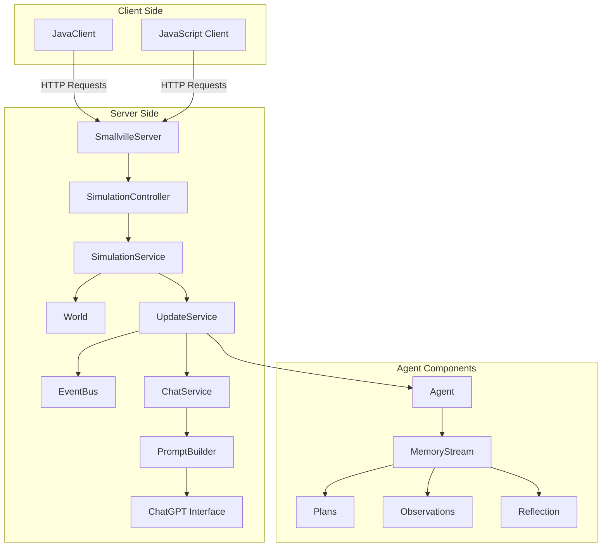

Smallville serves as a bridge between game engines/applications and LLMs, handling the complex logic of agent cognition, memory management, and dynamic behavior generation.

Sources: [README.md:3-7]()

## Key Components

### World and Entity Management

The `World` class serves as a central repository for all entities in the simulation, including:

| Entity Type | Description |
|-------------|-------------|
| Agents | Virtual characters with memories, plans, and behaviors |
| Locations | Physical spaces that agents can occupy |
| Objects | Items within locations that agents can interact with |
| Conversations | Dialogues between agents |

The simulation maintains a coherent state across all entities and manages their relationships.

Sources: [README.md:39-44]()

### Agent Cognition System

Agents in Smallville possess a sophisticated cognitive system:

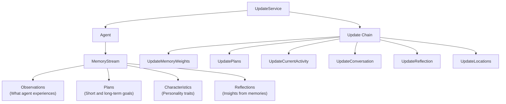

The agent update process follows a chain of responsibility pattern that sequentially updates different aspects of agent state, including memory weights, plans, activities, conversations, reflections, and locations.

Sources: [README.md:32-47]()

### LLM Integration

Smallville integrates with LLMs (primarily ChatGPT) to drive agent behavior through a sophisticated prompt generation system:

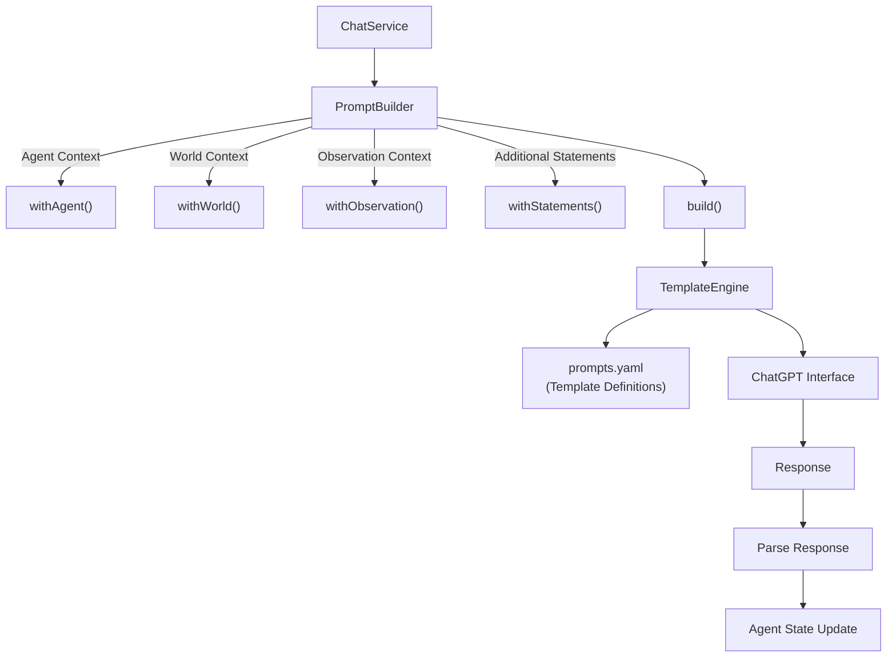

The prompt system uses templates defined in `prompts.yaml` to generate contextually appropriate prompts for various agent functions like planning, reflection, and activity selection.

Sources: [README.md:92-94]()

## Client-Server Architecture

Smallville provides client libraries in Java and JavaScript that communicate with the server via HTTP endpoints:

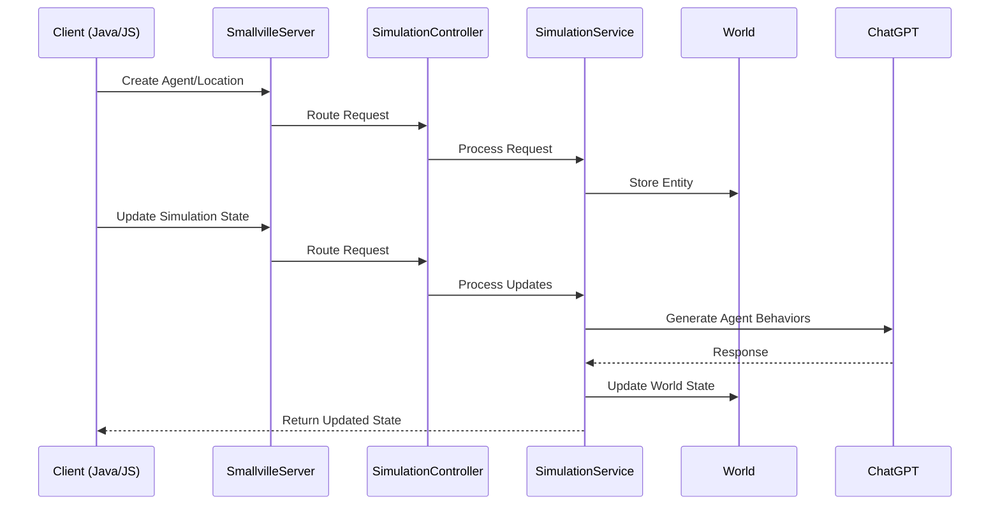

### Java Client Usage
The Java client provides a simple API for interacting with the Smallville server:

```java
SmallvilleClient client = SmallvilleClient.create("http://localhost:8080", callback);
client.createLocation("Red House");
client.createObject("Red House", "Kitchen", new ObjectState("occupied"));
client.createAgent("John", memories, "Red House: Kitchen", "Cooking");
client.updateState();
```

### JavaScript Client Usage
Similarly, the JavaScript client provides an easy-to-use interface:

```javascript
const client = new Smallville({
    host: "http://localhost:8080",
    stateHandler: function(state) {
        // Handle state updates
    },
});
```

Sources: [README.md:8-74]()

## Dashboard and Monitoring

Smallville includes a built-in dashboard accessible at `http://localhost:8080/dashboard` that provides:

- Real-time visualization of agent states and locations
- Memory streams of all agents
- Prompt history and LLM responses
- Controls for modifying object states
- Interface for interviewing agents

The dashboard serves as both a monitoring tool and a debugging interface for the simulation.

Sources: [README.md:84-89]()

## Running and Configuration

Smallville requires:
- Java 17 for the server
- An OpenAI API key for LLM integration

The server can be started with:
```
java -jar smallville-server.jar --api-key <OPEN_AI_KEY> --port 8080
```

Prompt templates and other behaviors can be configured through the `prompts.yaml` file.

Sources: [README.md:75-83](), [README.md:91-94]()

## Integration Examples

Smallville is designed to be integrated with various applications, particularly game engines:

| Integration Type | Description |
|------------------|-------------|
| Standalone Simulation | Run Smallville as an independent simulation |
| Game Engine Integration | Connect Smallville to game engines like Phaser |
| Custom Applications | Build specialized applications using Smallville's agent capabilities |

For specific integration examples, see [Examples and Integration](#8).

Sources: [README.md:87-89]()

## Theoretical Foundation

Smallville is based on research from "Generative Agents: Interactive Simulacra of Human Behavior" (https://arxiv.org/pdf/2304.03442.pdf), implementing concepts such as memory streams, reflections, and dynamic planning to create believable virtual characters.

Sources: [README.md:97-98]()

---

# Page: System Architecture

# System Architecture

<details>
<summary>Relevant source files</summary>

The following files were used as context for generating this wiki page:

- [README.md](README.md)
- [smallville/src/main/java/io/github/nickm980/smallville/Smallville.java](smallville/src/main/java/io/github/nickm980/smallville/Smallville.java)
- [smallville/src/main/java/io/github/nickm980/smallville/World.java](smallville/src/main/java/io/github/nickm980/smallville/World.java)
- [smallville/src/main/java/io/github/nickm980/smallville/analytics/AnalyticsListener.java](smallville/src/main/java/io/github/nickm980/smallville/analytics/AnalyticsListener.java)
- [smallville/src/main/java/io/github/nickm980/smallville/api/SmallvilleServer.java](smallville/src/main/java/io/github/nickm980/smallville/api/SmallvilleServer.java)
- [smallville/src/main/java/io/github/nickm980/smallville/events/EventBus.java](smallville/src/main/java/io/github/nickm980/smallville/events/EventBus.java)
- [smallville/src/main/java/io/github/nickm980/smallville/events/Listen.java](smallville/src/main/java/io/github/nickm980/smallville/events/Listen.java)
- [smallville/src/main/java/io/github/nickm980/smallville/events/SmallvilleEvent.java](smallville/src/main/java/io/github/nickm980/smallville/events/SmallvilleEvent.java)
- [smallville/src/main/java/io/github/nickm980/smallville/events/agent/AgentUpdateEvent.java](smallville/src/main/java/io/github/nickm980/smallville/events/agent/AgentUpdateEvent.java)
- [smallville/src/main/java/io/github/nickm980/smallville/events/llm/PromptReceievedEvent.java](smallville/src/main/java/io/github/nickm980/smallville/events/llm/PromptReceievedEvent.java)
- [smallville/src/main/java/io/github/nickm980/smallville/update/AgentUpdate.java](smallville/src/main/java/io/github/nickm980/smallville/update/AgentUpdate.java)
- [smallville/src/test/java/io/github/nickm980/smallville/EventBusTest.java](smallville/src/test/java/io/github/nickm980/smallville/EventBusTest.java)

</details>


## Purpose and Scope

This document provides a comprehensive overview of the Smallville generative agent simulation framework's architecture. It covers the major components of the system, their relationships, and how they work together to enable generative agents to observe, remember, and interact within simulated environments. For more detailed information about specific subsystems, please refer to their dedicated wiki pages, such as [World and Entity Management](#2.1), [Event System](#2.2), or [Agent Cognition System](#3).

## Overview

Smallville is structured as a client-server application that uses Large Language Models (LLMs) to drive agent cognition. The system follows a modular design with clear separation of concerns between entity management, agent cognition, LLM integration, and event handling.

```mermaid
graph TD
    subgraph "Core Components"
        Server["SmallvilleServer"]
        World["World (Entity Repository)"]
        SimService["SimulationService"]
        UpdateService["Agent Update Service"]
        EventBus["EventBus"]
    end
    
    subgraph "LLM Integration"
        ChatGPT["ChatGPT"]
        Prompts["Prompts System"]
    end
    
    subgraph "Entity Types"
        Agent["Agent"]
        Location["Location"]
        Conversation["Conversation"]
    end
    
    subgraph "Client Interfaces"
        JavaClient["Java Client"]
        JSClient["JavaScript Client"]
        REST["REST API"]
    end
    
    subgraph "Analytics"
        Analytics["Analytics"]
        AnalyticsListener["AnalyticsListener"]
    end

    JavaClient --> REST
    JSClient --> REST
    REST --> Server
    Server --> SimService
    Server --> World
    SimService --> UpdateService
    UpdateService --> Agent
    UpdateService --> Prompts
    Prompts --> ChatGPT
    World --> Agent
    World --> Location
    World --> Conversation
    UpdateService --> EventBus
    EventBus --> AnalyticsListener
    AnalyticsListener --> Analytics
```

Sources: [Smallville.java:67-74](), [SmallvilleServer.java:14-37](), [World.java:17-30](), [EventBusTest.java:15-25]()

## Core Components

The architecture is built around several key components that work together to provide the simulation capabilities:

| Component | Description | Implementation |
|-----------|-------------|----------------|
| SmallvilleServer | HTTP server that exposes REST API endpoints | [SmallvilleServer.java]() |
| World | Central repository for all simulation entities | [World.java]() |
| SimulationService | Business logic layer for simulation operations | Referenced in [SmallvilleServer.java:16-22]() |
| UpdateService | Manages the agent update process using chain of responsibility | Based on [AgentUpdate.java]() |
| EventBus | Dispatches events to registered listeners | [EventBus.java]() |

Sources: [SmallvilleServer.java:14-37](), [World.java:17-30](), [AgentUpdate.java:10-16](), [EventBus.java:10-47]()

### System Initialization Flow

The initialization sequence when starting the Smallville server:

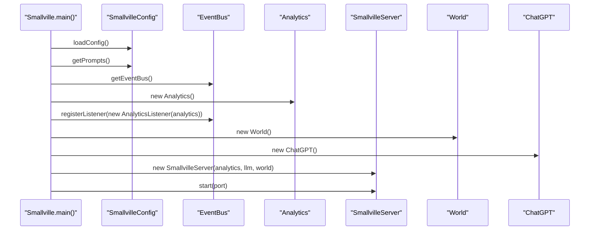

Sources: [Smallville.java:26-75]()

## Entity Repository Model

The `World` class serves as the central repository for all entities in the simulation:

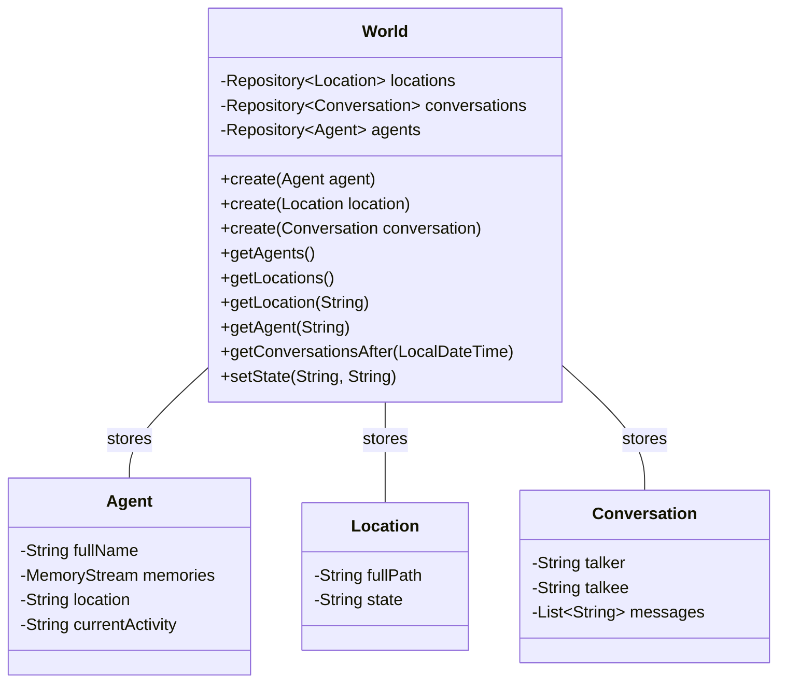

Sources: [World.java:17-78]()

## Agent Update Chain

The agent update process uses the Chain of Responsibility pattern to sequentially update different aspects of an agent:

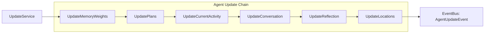

Sources: [AgentUpdate.java:10-48]()

## Event System

The event system enables loose coupling between components through an event-driven architecture:

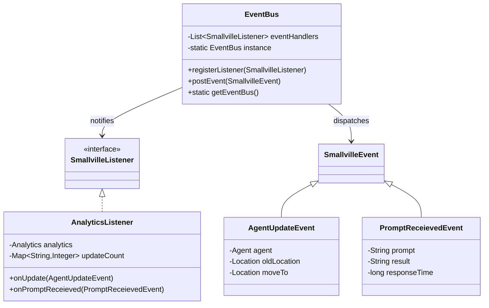

Sources: [EventBus.java:10-47](), [SmallvilleEvent.java:3-5](), [AgentUpdateEvent.java:7-29](), [PromptReceievedEvent.java:5-32](), [AnalyticsListener.java:11-35]()

## Client-Server Communication

The system exposes a REST API through Javalin, which clients can interact with:

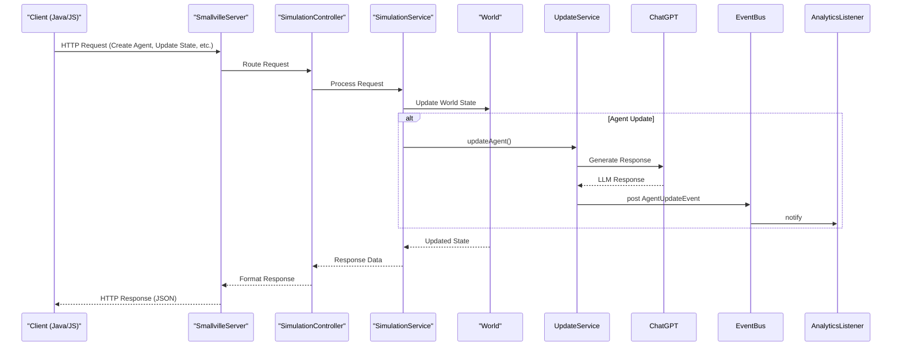

Sources: [SmallvilleServer.java:14-56]()

## Integration Points

### Client Libraries

Smallville provides client libraries in multiple languages:

1. **Java Client**: `SmallvilleClient` allows Java applications to interact with the server
2. **JavaScript Client**: NPM package for web applications

### LLM Integration

The system integrates with LLMs (primarily ChatGPT) through the `ChatGPT` adapter class, which handles:

1. API communication
2. Rate limiting and retries
3. Error handling
4. Response parsing

## Analytics and Monitoring

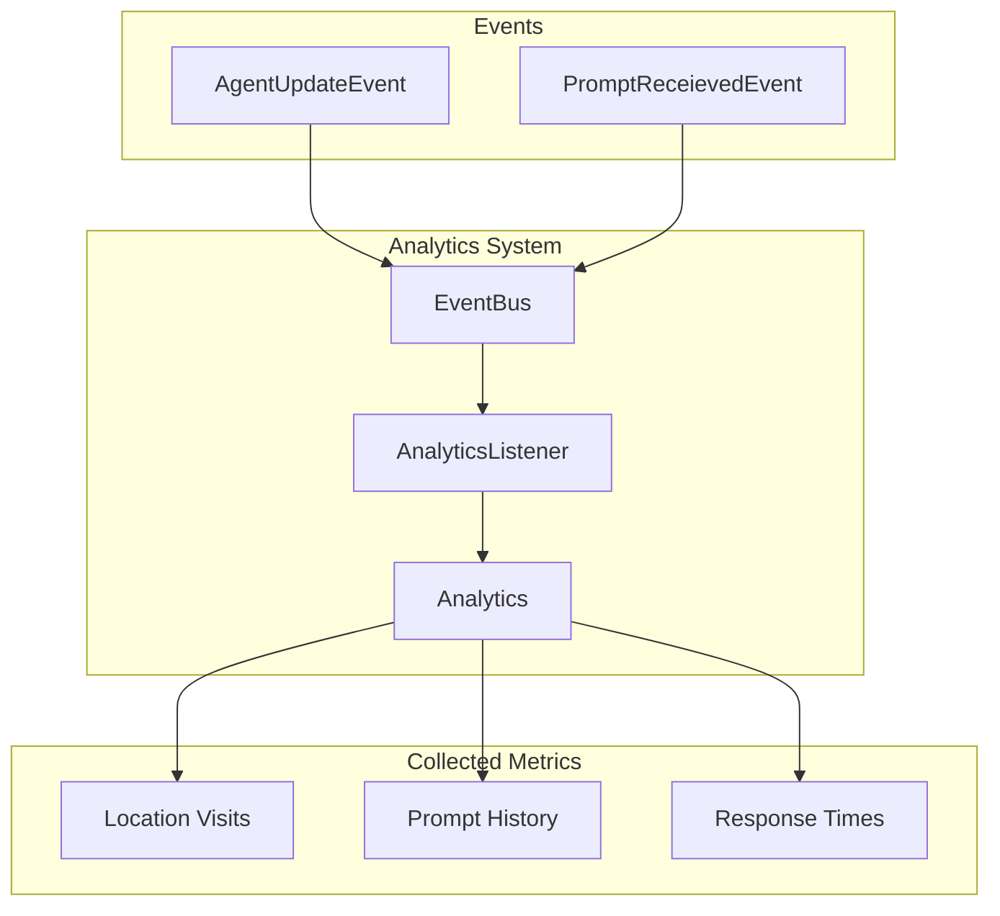

Sources: [AnalyticsListener.java:11-35](), [EventBusTest.java:15-29]()

## Configuration and Extensibility

Smallville is designed to be configurable and extensible:

1. **Prompt Templates**: Stored in YAML files and can be customized
2. **LLM Providers**: The architecture allows for different LLM implementations
3. **Event Listeners**: Custom listeners can be registered with the EventBus
4. **Agent Update Chain**: New update steps can be added to the chain

Sources: [Smallville.java:57-60]()

## Summary

The Smallville architecture provides a flexible, modular system for creating generative agent simulations. Its client-server design, event-driven architecture, and integration with LLMs enable the creation of sophisticated agent behaviors while maintaining clear separation of concerns between different components. The system's extensibility allows for customization and enhancement to meet specific simulation requirements.

---

# Page: World and Entity Management

# World and Entity Management

<details>
<summary>Relevant source files</summary>

The following files were used as context for generating this wiki page:

- [smallville/src/main/java/io/github/nickm980/smallville/World.java](smallville/src/main/java/io/github/nickm980/smallville/World.java)
- [smallville/src/main/java/io/github/nickm980/smallville/entities/Dialog.java](smallville/src/main/java/io/github/nickm980/smallville/entities/Dialog.java)
- [smallville/src/main/java/io/github/nickm980/smallville/repository/Repository.java](smallville/src/main/java/io/github/nickm980/smallville/repository/Repository.java)
- [smallville/src/main/java/io/github/nickm980/smallville/update/AgentUpdate.java](smallville/src/main/java/io/github/nickm980/smallville/update/AgentUpdate.java)

</details>


## Purpose and Scope

This document describes the World and Entity Management system in Smallville, which serves as the central repository for all entities in the simulation, including agents, locations, and conversations. The World class acts as a container for these entities and provides methods for creating, retrieving, and managing them.

For information about how time is managed within the simulation, see [Simulation Time Management](#2.3). For details on how events propagate through the system, see [Event System](#2.2).

## Architecture Overview

The World class serves as the central repository for all entities in the Smallville simulation. It manages three main types of entities: Agents, Locations, and Conversations. The storage is implemented using a generic Repository class that provides basic CRUD operations.

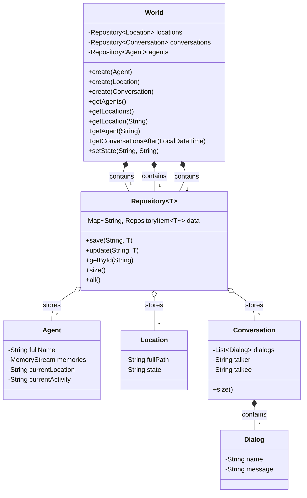

**Entity Relationship Diagram: World and Entity Management**

Sources: [smallville/src/main/java/io/github/nickm980/smallville/World.java](), [smallville/src/main/java/io/github/nickm980/smallville/repository/Repository.java](), [smallville/src/main/java/io/github/nickm980/smallville/entities/Dialog.java]()

## The World Class

The World class is the central repository for all entities in the simulation. It manages three main types of entities through specialized repositories:

1. **Agents**: Generative agents with characteristics, memories, and behaviors
2. **Locations**: Places within the simulation that agents can visit
3. **Conversations**: Dialogues between agents

### Key Functions

| Method | Purpose |
|--------|---------|
| `create(Agent)` | Adds a new agent to the world |
| `create(Location)` | Adds a new location to the world |
| `create(Conversation)` | Adds a new conversation to the world |
| `getAgents()` | Retrieves all agents in the world |
| `getLocations()` | Retrieves all locations in the world |
| `getLocation(String)` | Retrieves a specific location by name |
| `getAgent(String)` | Retrieves a specific agent by name |
| `getConversationsAfter(LocalDateTime)` | Retrieves conversations after a specific time |
| `setState(String, String)` | Updates the state of a location |

Sources: [smallville/src/main/java/io/github/nickm980/smallville/World.java:20-78]()

### Entity Creation

The World class implements creation methods for all entity types. When creating entities, the World class:

1. Performs validation checks specific to each entity type
2. Generates IDs where necessary (e.g., UUID for conversations)
3. Stores the entity in the appropriate repository

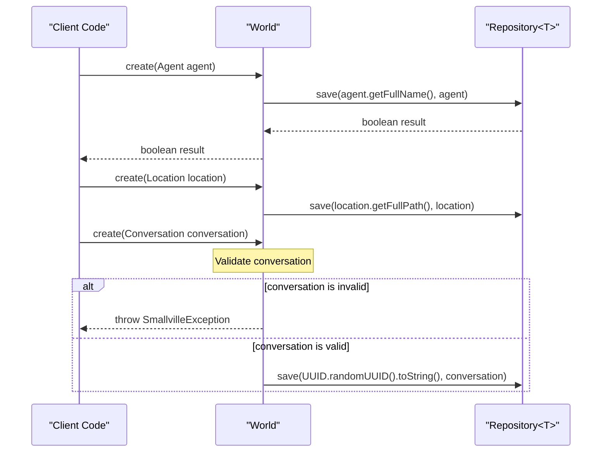

**Sequence Diagram: Entity Creation Process**

Sources: [smallville/src/main/java/io/github/nickm980/smallville/World.java:32-50]()

## The Repository System

The Repository class is a generic container that provides basic CRUD operations for any type of entity. It uses a map to store items, with each item wrapped in a `RepositoryItem<T>` class.

### Key Features

- **Generic Type Support**: Can store any type of entity
- **ID-based Retrieval**: Entities are stored and retrieved using string IDs
- **Modification Tracking**: The RepositoryItem wrapper tracks when entities are updated

### Repository Operations

| Method | Description |
|--------|-------------|
| `save(String, T)` | Adds a new item to the repository with the given ID |
| `update(String, T)` | Updates an existing item in the repository |
| `getById(String)` | Retrieves an item by its ID |
| `size()` | Returns the number of items in the repository |
| `all()` | Returns a list of all items in the repository |

Sources: [smallville/src/main/java/io/github/nickm980/smallville/repository/Repository.java:14-87]()

## Entity Types

The World class manages three primary entity types:

### Agents

Agents represent the generative characters in the simulation. They have:
- A unique name identifier
- A memory stream for storing observations and plans
- A current location
- A current activity

### Locations

Locations represent places in the simulation that agents can visit. They have:
- A full path name (used as identifier)
- A state that can be updated (e.g., "door is open", "light is off")

### Conversations

Conversations represent dialogues between agents. They consist of:
- A series of Dialog objects
- References to the participating agents (talker and talkee)
- Validation to ensure they involve different agents and contain messages

Sources: [smallville/src/main/java/io/github/nickm980/smallville/World.java:20-78](), [smallville/src/main/java/io/github/nickm980/smallville/entities/Dialog.java:1-22]()

## Integration with Other Systems

The World class integrates with other parts of the Smallville system as shown in this diagram:

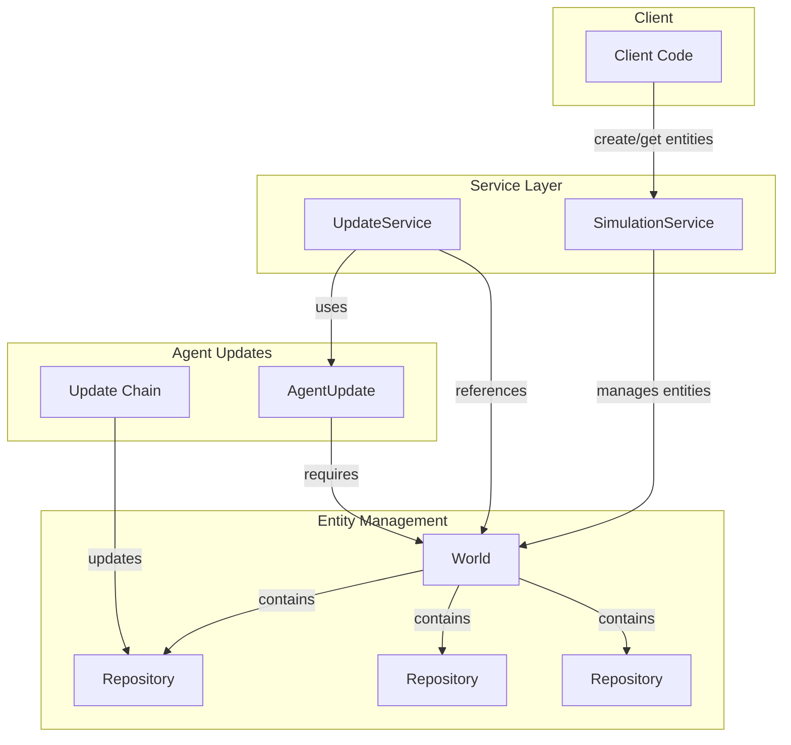

**Integration Diagram: World Class Interactions**

Sources: [smallville/src/main/java/io/github/nickm980/smallville/World.java](), [smallville/src/main/java/io/github/nickm980/smallville/update/AgentUpdate.java:29-37]()

## Usage Patterns

### Creating and Managing Entities

```java
// Create a new world
World world = new World();

// Create and add an agent
Agent agent = new Agent("John Doe");
world.create(agent);

// Create and add a location
Location location = new Location("Downtown/Coffee Shop");
world.create(location);

// Retrieve an agent
Optional<Agent> johnDoe = world.getAgent("John Doe");

// Update location state
world.setState("Downtown/Coffee Shop", "Busy");
```

### Agent Updates and World State

During agent updates, the World class provides:
1. Access to all agents in the simulation
2. Access to all locations and their states
3. Access to conversations between agents

The update system uses the World to:
- Retrieve information about the environment
- Find nearby agents for potential interactions
- Update agent states and locations

Sources: [smallville/src/main/java/io/github/nickm980/smallville/update/AgentUpdate.java:17-48](), [smallville/src/main/java/io/github/nickm980/smallville/World.java:20-78]()

## Summary

The World and Entity Management system serves as the central repository for all entities in the Smallville simulation. Through the World class, the system provides a clean interface for creating, retrieving, and managing agents, locations, and conversations. The underlying Repository class provides generic storage capabilities, while the World class adds domain-specific validation and management logic.

This system forms the foundation of the Smallville simulation, providing the data model upon which agent behaviors, planning, and interactions are built.

---

# Page: Event System

# Event System

<details>
<summary>Relevant source files</summary>

The following files were used as context for generating this wiki page:

- [smallville/src/main/java/io/github/nickm980/smallville/Smallville.java](smallville/src/main/java/io/github/nickm980/smallville/Smallville.java)
- [smallville/src/main/java/io/github/nickm980/smallville/analytics/AnalyticsListener.java](smallville/src/main/java/io/github/nickm980/smallville/analytics/AnalyticsListener.java)
- [smallville/src/main/java/io/github/nickm980/smallville/api/SmallvilleServer.java](smallville/src/main/java/io/github/nickm980/smallville/api/SmallvilleServer.java)
- [smallville/src/main/java/io/github/nickm980/smallville/events/EventBus.java](smallville/src/main/java/io/github/nickm980/smallville/events/EventBus.java)
- [smallville/src/main/java/io/github/nickm980/smallville/events/Listen.java](smallville/src/main/java/io/github/nickm980/smallville/events/Listen.java)
- [smallville/src/main/java/io/github/nickm980/smallville/events/SmallvilleEvent.java](smallville/src/main/java/io/github/nickm980/smallville/events/SmallvilleEvent.java)
- [smallville/src/main/java/io/github/nickm980/smallville/events/agent/AgentUpdateEvent.java](smallville/src/main/java/io/github/nickm980/smallville/events/agent/AgentUpdateEvent.java)
- [smallville/src/main/java/io/github/nickm980/smallville/events/llm/PromptReceievedEvent.java](smallville/src/main/java/io/github/nickm980/smallville/events/llm/PromptReceievedEvent.java)
- [smallville/src/test/java/io/github/nickm980/smallville/EventBusTest.java](smallville/src/test/java/io/github/nickm980/smallville/EventBusTest.java)

</details>


## Purpose and Scope

The Event System in Smallville provides an event-driven architecture that enables loosely coupled communication between different components of the simulation framework. This system allows components to broadcast events without needing to know which other components might be interested in those events, supporting extensibility and separation of concerns.

This document covers:
- The core components of the event system
- The event dispatch mechanism
- Available event types
- How to create and handle events

For information about how the event system integrates with the Analytics system, see [Analytics and Monitoring](#5.2).

## Core Components

The Event System consists of four main components:

1. **EventBus**: Central event dispatcher that manages event distribution
2. **SmallvilleEvent**: Base class for all event types
3. **SmallvilleListener**: Interface for components that listen for events
4. **Listen annotation**: Used to mark methods that should handle specific events

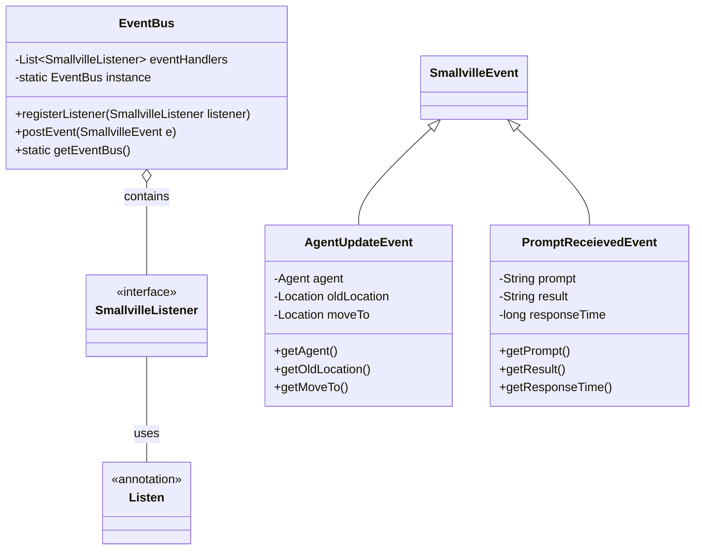

Sources: [smallville/src/main/java/io/github/nickm980/smallville/events/EventBus.java](), [smallville/src/main/java/io/github/nickm980/smallville/events/SmallvilleEvent.java](), [smallville/src/main/java/io/github/nickm980/smallville/events/Listen.java](), [smallville/src/main/java/io/github/nickm980/smallville/events/agent/AgentUpdateEvent.java](), [smallville/src/main/java/io/github/nickm980/smallville/events/llm/PromptReceievedEvent.java]()

## Event Bus Implementation

The EventBus is implemented as a singleton that maintains a list of registered listeners and dispatches events to the appropriate handlers using reflection.

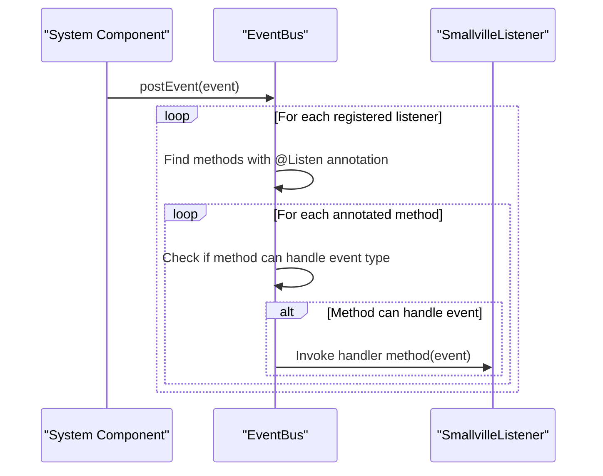

The EventBus uses reflection to:
1. Examine each registered listener for methods annotated with `@Listen`
2. Check if the method parameter type is compatible with the event type
3. Invoke the method with the event object if there's a match

Key implementation details:

```java
// Singleton pattern implementation
public static EventBus getEventBus() {
    if (instance == null) {
        synchronized (EventBus.class) {
            if (instance == null) {
                instance = new EventBus();
            }
        }
    }
    return instance;
}

// Event dispatch using reflection
public void postEvent(SmallvilleEvent e) {
    Method[] methods;
    for (Object o : eventHandlers) {
        methods = o.getClass().getMethods();
        for (Method m : methods) {
            if (m.getAnnotation(Listen.class) != null) {
                try {
                    if (m.getParameterTypes()[0].isAssignableFrom(e.getClass())) {
                        m.invoke(o, e);
                    }
                } catch (Exception ex) {
                    // Exception handling
                }
            }
        }
    }
}
```

Sources: [smallville/src/main/java/io/github/nickm980/smallville/events/EventBus.java:10-48]()

## Event Types

Smallville defines a hierarchy of event types that all inherit from the base `SmallvilleEvent` class. Currently, the system includes two main event types:

| Event Type | Purpose | Key Properties |
|------------|---------|----------------|
| AgentUpdateEvent | Triggered when an agent is updated | agent, oldLocation, moveTo |
| PromptReceievedEvent | Triggered when a prompt is processed by the LLM | prompt, result, responseTime |

### AgentUpdateEvent

This event is fired when an agent is updated, typically when they move to a new location. It contains references to:
- The agent being updated
- The agent's previous location
- The agent's new location

### PromptReceievedEvent

This event is fired when a prompt has been processed by the Large Language Model. It contains:
- The prompt text sent to the LLM
- The result returned by the LLM
- The response time in milliseconds

Sources: [smallville/src/main/java/io/github/nickm980/smallville/events/agent/AgentUpdateEvent.java](), [smallville/src/main/java/io/github/nickm980/smallville/events/llm/PromptReceievedEvent.java]()

## Implementing Event Listeners

To create a component that responds to events, you need to:

1. Implement the `SmallvilleListener` interface
2. Create methods annotated with `@Listen` that accept specific event types
3. Register your listener with the EventBus

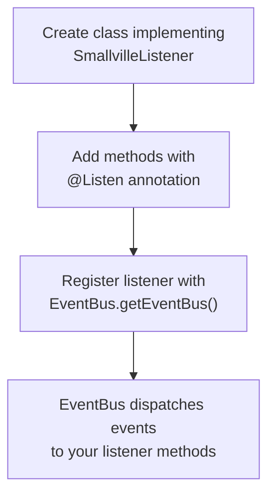

### Example: AnalyticsListener

The AnalyticsListener class demonstrates how to implement and use event listeners:

```java
public class AnalyticsListener implements SmallvilleListener {
    private Analytics analytics;
    private Map<String, Integer> updateCount = new HashMap<String, Integer>();
    
    public AnalyticsListener(Analytics analytics) {
        this.analytics = analytics;
    }
    
    @Listen
    public void onUpdate(AgentUpdateEvent e) {    
        updateCount.compute(e.getAgent().getFullName(), (key, value) -> (value == null) ? 1 : value + 1);
        
        if (updateCount.get(e.getAgent().getFullName()) > 30) {
            analytics.reset();
        }
        
        analytics.incrementVisits(e.getMoveTo().getFullPath());
    }
    
    @Listen
    public void onPromptReceieved(PromptReceievedEvent e) {    
        analytics.savePrompt(e.getPrompt(), e.getResult(), e.getResponseTime());
    }
}
```

This listener tracks:
- The number of updates per agent
- Location visits
- Prompt history and response times

Sources: [smallville/src/main/java/io/github/nickm980/smallville/analytics/AnalyticsListener.java]()

## System Initialization

The Event System is initialized during server startup in the `Smallville` class:

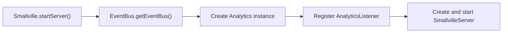

```java
private static void startServer(int port) {
    EventBus eventBus = EventBus.getEventBus();

    Analytics analytics = new Analytics();
    eventBus.registerListener(new AnalyticsListener(analytics));
    
    new SmallvilleServer(analytics, new ChatGPT(), new World()).start(port);
}
```

Sources: [smallville/src/main/java/io/github/nickm980/smallville/Smallville.java:68-75]()

## Integration with Other Systems

The Event System primarily integrates with the Analytics system, which uses events to track:
- Agent updates and location changes
- LLM prompt processing and performance

However, the system is designed to be extensible, allowing any component to publish or subscribe to events without tight coupling.

```mermaid
graph TD
    subgraph "Agent Cognition"
        Agent["Agent"]
        UpdateService["UpdateService"]
    end
    
    subgraph "LLM Integration"
        ChatGPT["ChatGPT"]
    end
    
    subgraph "Event System"
        EventBus["EventBus"]
        AgentUpdateEvent["AgentUpdateEvent"]
        PromptReceievedEvent["PromptReceievedEvent"]
    end
    
    subgraph "Analytics"
        AnalyticsListener["AnalyticsListener"]
        Analytics["Analytics"]
    end
    
    Agent --> UpdateService
    UpdateService --> AgentUpdateEvent
    ChatGPT --> PromptReceievedEvent
    
    AgentUpdateEvent --> EventBus
    PromptReceievedEvent --> EventBus
    
    EventBus --> AnalyticsListener
    AnalyticsListener --> Analytics
```

Sources: [smallville/src/main/java/io/github/nickm980/smallville/analytics/AnalyticsListener.java](), [smallville/src/main/java/io/github/nickm980/smallville/Smallville.java]()

## Creating Custom Events

To extend the Event System with custom events:

1. Create a new class that extends `SmallvilleEvent`
2. Add properties and methods specific to your event
3. Post instances of your event using `EventBus.getEventBus().postEvent(event)`

For listeners to handle your custom event, they need to add a method with the `@Listen` annotation that accepts your event type as a parameter.

## Testing the Event System

The EventBusTest class demonstrates how to test the event system:

```java
@Test
public void test_event_bus_triggers_listener() {
    EventBus eventBus = EventBus.getEventBus();

    Analytics analytics = new Analytics();
    eventBus.registerListener(new AnalyticsListener(analytics));

    AgentUpdateEvent event = new AgentUpdateEvent(new Agent("name", List.of(), null, null), null, null);
    eventBus.postEvent(event);

    PromptReceievedEvent event2 = new PromptReceievedEvent(null, null, 0);
    eventBus.postEvent(event2);
    eventBus.postEvent(new PromptReceievedEvent(null, null, 0));
}
```

This test:
1. Gets the EventBus singleton instance
2. Creates and registers an AnalyticsListener
3. Creates and posts various events
4. Verifies that the events are properly dispatched to the listener

Sources: [smallville/src/test/java/io/github/nickm980/smallville/EventBusTest.java]()

---

# Page: Simulation Time Management

# Simulation Time Management

<details>
<summary>Relevant source files</summary>

The following files were used as context for generating this wiki page:

- [smallville/src/main/java/io/github/nickm980/smallville/api/v1/SimulationController.java](smallville/src/main/java/io/github/nickm980/smallville/api/v1/SimulationController.java)
- [smallville/src/main/java/io/github/nickm980/smallville/api/v1/SimulationService.java](smallville/src/main/java/io/github/nickm980/smallville/api/v1/SimulationService.java)
- [smallville/src/main/java/io/github/nickm980/smallville/entities/SimulationTime.java](smallville/src/main/java/io/github/nickm980/smallville/entities/SimulationTime.java)
- [smallville/src/main/java/io/github/nickm980/smallville/prompts/dto/DateModel.java](smallville/src/main/java/io/github/nickm980/smallville/prompts/dto/DateModel.java)
- [smallville/src/main/java/io/github/nickm980/smallville/repository/RepositoryItem.java](smallville/src/main/java/io/github/nickm980/smallville/repository/RepositoryItem.java)

</details>


This document explains how time is managed within the Smallville simulation, including time steps and simulation updates. The simulation uses its own internal clock that advances in discrete steps, allowing for controlled progression of time that is independent of real-world time.

## SimulationTime Class

The core of Smallville's time management is the `SimulationTime` class, a utility class with static methods for tracking and updating simulation time.

### Class Structure

```mermaid
classDiagram
    class "SimulationTime" {
        -"LocalDateTime START"
        -"LocalDateTime time"
        -"Duration step"
        +"LocalDateTime now()"
        +"void setSimulationTime(LocalDateTime)"
        +"void setStep(Duration)"
        +"void update()"
        +"LocalDateTime startedAt()"
        +"Duration getStepDuration()"
        +"int getStepDurationInMinutes()"
    }
```

Sources: [smallville/src/main/java/io/github/nickm980/smallville/entities/SimulationTime.java:1-46]()

### Key Components

The `SimulationTime` class maintains three key fields:

| Field | Type | Description | Default Value |
|-------|------|-------------|---------------|
| `START` | `LocalDateTime` | The time when simulation started | `LocalDateTime.now()` |
| `time` | `LocalDateTime` | Current simulation time | `LocalDateTime.now()` |
| `step` | `Duration` | Duration of each time step | `Duration.ofMinutes(1)` |

### Important Methods

- `now()`: Returns the current simulation time
- `setSimulationTime(LocalDateTime)`: Sets the current simulation time
- `setStep(Duration)`: Sets the duration of each time step
- `update()`: Advances the simulation time by one step (`time = time + step`)
- `getStepDuration()`: Returns the duration of each time step
- `getStepDurationInMinutes()`: Returns the duration in minutes

## Time Flow in Simulation

### Update Mechanism

Time in Smallville advances in discrete steps when the `update()` method is called. This happens in two main scenarios:

1. When a client requests a state update via the API
2. When a "reactable" memory is created for an agent

### Simulation Update Flow Diagram

```mermaid
flowchart TD
    A["Client Request"] --> B["SimulationController.updateState()"]
    B --> C["SimulationService.updateState()"]
    C --> D["SimulationTime.update()"]
    D --> E["time = time + step"]
    C --> F["Update all agents"]
    G["createMemory(reactable=true)"] --> H["SimulationTime.update()"]
```

Sources: 
- [smallville/src/main/java/io/github/nickm980/smallville/api/v1/SimulationService.java:127-138]()
- [smallville/src/main/java/io/github/nickm980/smallville/api/v1/SimulationService.java:43-53]()
- [smallville/src/main/java/io/github/nickm980/smallville/entities/SimulationTime.java:27-33]()

## State Update Sequence

When a client requests a state update, the following sequence occurs:

```mermaid
sequenceDiagram
    participant Client
    participant Controller as "SimulationController"
    participant Service as "SimulationService"
    participant Time as "SimulationTime"
    participant Agents as "Agent Entities"

    Client->>Controller: "POST /state"
    Controller->>Service: "updateState()"
    Service->>Time: "update()"
    Time-->>Time: "time = time + step"
    Service->>Agents: "Update each agent"
    Agents-->>Service: "Updated agent state"
    Service-->>Controller: "Updated simulation state"
    Controller-->>Client: "Agents, locations, conversations"
```

Sources:
- [smallville/src/main/java/io/github/nickm980/smallville/api/v1/SimulationController.java:165-173]()
- [smallville/src/main/java/io/github/nickm980/smallville/api/v1/SimulationService.java:127-138]()

## Configuring Time Step

The time step can be configured to control how much simulation time passes between updates. By default, it's set to 1 minute, but it can be changed via the API.

```mermaid
sequenceDiagram
    participant Client
    participant Controller as "SimulationController"
    participant Service as "SimulationService"
    participant Time as "SimulationTime"

    Client->>Controller: "POST /timestep {numOfMinutes: '5'}"
    Controller->>Service: "setTimestep(request)"
    Service->>Time: "setStep(Duration.ofMinutes(5))"
    Time-->>Time: "step = Duration.ofMinutes(5)"
    Controller-->>Client: "Success message"
```

Sources:
- [smallville/src/main/java/io/github/nickm980/smallville/api/v1/SimulationController.java:184-190]()
- [smallville/src/main/java/io/github/nickm980/smallville/api/v1/SimulationService.java:152-156]()
- [smallville/src/main/java/io/github/nickm980/smallville/entities/SimulationTime.java:23-25]()

## Time Integration Across System

The following diagram illustrates how the `SimulationTime` class interacts with different components of the Smallville system:

```mermaid
flowchart TD
    subgraph "SimulationTime"
        Time["SimulationTime.now()"]
        Update["SimulationTime.update()"]
        Step["SimulationTime.setStep()"]
    end

    subgraph "API Endpoints"
        StateAPI["POST /state"]
        TimestepAPI["POST /timestep"]
        InfoAPI["GET /info"]
    end

    subgraph "Service Layer"
        StateService["SimulationService.updateState()"]
        MemoryService["SimulationService.createMemory()"]
        ConversationService["SimulationService.getConversations()"]
        TimestepService["SimulationService.setTimestep()"]
    end

    subgraph "Entity Tracking"
        Created["RepositoryItem.createdAt"]
        Updated["RepositoryItem.updatedAt"]
    end

    subgraph "Time Formatting"
        DateModel["DateModel methods:
        - getTime()
        - getFull() 
        - getYesterday()"]
    end

    StateAPI --> StateService
    TimestepAPI --> TimestepService
    InfoAPI --> Time

    StateService --> Update
    MemoryService --> Update
    ConversationService --> Time
    TimestepService --> Step

    Created --> Time
    Updated --> Time
    DateModel --> Time
```

Sources:
- [smallville/src/main/java/io/github/nickm980/smallville/api/v1/SimulationController.java:80-88]()
- [smallville/src/main/java/io/github/nickm980/smallville/api/v1/SimulationService.java:140-150]()
- [smallville/src/main/java/io/github/nickm980/smallville/repository/RepositoryItem.java:1-34]()
- [smallville/src/main/java/io/github/nickm980/smallville/prompts/dto/DateModel.java:1-27]()

## Repository Integration

The simulation time is used to track when entities are created and updated in the repository system:

```mermaid
flowchart TD
    A["RepositoryItem Constructor"] --> B["createdAt = SimulationTime.now()"]
    A --> C["updatedAt = SimulationTime.now()"]
    D["RepositoryItem.update()"] --> E["updatedAt = SimulationTime.now()"]
```

Sources:
- [smallville/src/main/java/io/github/nickm980/smallville/repository/RepositoryItem.java:12-16]()
- [smallville/src/main/java/io/github/nickm980/smallville/repository/RepositoryItem.java:30-33]()

## Time Formatting and Display

The simulation time is formatted for display using the `DateModel` class, which provides methods for different time representations:

| Method | Description | Implementation |
|--------|-------------|----------------|
| `getTime()` | Current time in short format | `SimulationTime.now()` with time format |
| `getFull()` | Current time in full format | `SimulationTime.now()` with full format |
| `getYesterday()` | Yesterday's date | `SimulationTime.now().minusDays(1)` with format |

Sources:
- [smallville/src/main/java/io/github/nickm980/smallville/prompts/dto/DateModel.java:1-27]()

## Practical Applications

### Filtering Recent Conversations

The simulation time is used to filter recent conversations:

```java
world.getConversationsAfter(SimulationTime.now().minus(SimulationTime.getStepDuration()));
```

This gets all conversations that occurred after the previous time step.

Sources:
- [smallville/src/main/java/io/github/nickm980/smallville/api/v1/SimulationService.java:140-150]()

## Summary

Simulation time management in Smallville is centralized through the `SimulationTime` class, providing a consistent time reference throughout the system. Key features include:

1. Time advances in discrete steps when `SimulationTime.update()` is called
2. Default time step is 1 minute, configurable via API
3. Time updates happen during state updates and reactable memory creation
4. Entity creation/update timestamps use simulation time
5. Time is formatted for display using `DateModel`

This discrete time management approach allows for controlled simulation progression independent of real-world time constraints, which is essential for a generative agent simulation where activities need to be coordinated across multiple agents.

---

# Page: Agent Cognition System

# Agent Cognition System

<details>
<summary>Relevant source files</summary>

The following files were used as context for generating this wiki page:

- [smallville/src/main/java/io/github/nickm980/smallville/update/UpdateCurrentActivity.java](smallville/src/main/java/io/github/nickm980/smallville/update/UpdateCurrentActivity.java)
- [smallville/src/main/java/io/github/nickm980/smallville/update/UpdateInfo.java](smallville/src/main/java/io/github/nickm980/smallville/update/UpdateInfo.java)
- [smallville/src/main/java/io/github/nickm980/smallville/update/UpdateService.java](smallville/src/main/java/io/github/nickm980/smallville/update/UpdateService.java)
- [smallville/src/test/java/io/github/nickm980/smallville/MemoryStreamTest.java](smallville/src/test/java/io/github/nickm980/smallville/MemoryStreamTest.java)
- [smallville/src/test/java/io/github/nickm980/smallville/PlansParsingTest.java](smallville/src/test/java/io/github/nickm980/smallville/PlansParsingTest.java)
- [smallville/src/test/java/io/github/nickm980/smallville/PromptBuilderTest.java](smallville/src/test/java/io/github/nickm980/smallville/PromptBuilderTest.java)

</details>


## Purpose and Scope

The Agent Cognition System is the core component of Smallville that enables agents to think, remember, plan, and interact with their environment. This document describes how agents process information, maintain memories, generate plans, and update their state in response to changes in the simulation world. For details about memory storage specifically, see [Memory Stream](#3.1). For information on the agent update mechanism, see [Agent Update Chain](#3.2).

## System Overview

The Agent Cognition System bridges the gap between raw agent data and the meaningful behaviors exhibited in the simulation. It processes observations, maintains a memory of past experiences, generates plans based on goals and context, and enables agents to react appropriately to their environment.

```mermaid
graph TD
    subgraph "Agent Cognition System"
        Agent["Agent\n(Core Entity)"]
        MemStream["MemoryStream\n(Memory Storage)"]
        UpdateProc["UpdateService\n(Update Process)"]
        
        subgraph "Memory Types"
            Obs["Observation\n(Past Events)"]
            Plans["Plan\n(Future Intentions)"]
            Chars["Characteristic\n(Personality Traits)"]
            Refl["Reflection\n(Insights from Memories)"]
        end
        
        subgraph "Update Chain"
            MemWeight["UpdateMemoryWeights"]
            UpdPlans["UpdatePlans"]
            UpdAct["UpdateCurrentActivity"]
            UpdConv["UpdateConversation"]
            UpdRefl["UpdateReflection"]
        end
    end
    
    World["World\n(Entity Repository)"] --- Agent
    Agent --- MemStream
    UpdateProc --- Agent
    MemStream --- Obs
    MemStream --- Plans
    MemStream --- Chars
    MemStream --- Refl
    
    UpdateProc --- MemWeight
    MemWeight --> UpdPlans
    UpdPlans --> UpdAct
    UpdAct --> UpdConv
    UpdConv --> UpdRefl
    
    LLM["ChatService\n(LLM Integration)"] --- UpdateProc
```

Sources: [smallville/src/main/java/io/github/nickm980/smallville/update/UpdateService.java:44-63](), [smallville/src/test/java/io/github/nickm980/smallville/MemoryStreamTest.java:1-85]()

## Agent Structure

Agents are entities with cognitive capabilities that include memory, planning, and decision-making. Each agent maintains:

1. **Current state**: Location, activity, and emoji
2. **Memory stream**: Collection of observations, plans, characteristics, and reflections
3. **Characteristics**: Personality traits that define the agent's behavior

```mermaid
classDiagram
    class Agent {
        String name
        String fullName
        Location location
        String currentActivity
        String currentEmoji
        MemoryStream memoryStream
        List~Characteristic~ characteristics
        setCurrentActivity(String)
        setCurrentEmoji(String)
        setLocation(Location)
        getMemoryStream()
    }
    
    class MemoryStream {
        List~Memory~ memories
        add(Memory)
        addAll(List~Memory~)
        getObservations()
        getPlans()
        getCharacteristics()
        getReflections()
        getRelevantMemories(String, int)
    }
    
    class Memory {
        String description
        LocalDateTime timestamp
        Double weight
        getDescription()
        getTimestamp()
        getWeight()
        setWeight(Double)
    }
    
    Agent "1" -- "1" MemoryStream : has
    MemoryStream "1" -- "many" Memory : contains
    Memory <|-- Observation
    Memory <|-- Plan
    Memory <|-- Characteristic
    Memory <|-- Reflection
```

Sources: [smallville/src/main/java/io/github/nickm980/smallville/update/UpdateCurrentActivity.java:1-26](), [smallville/src/test/java/io/github/nickm980/smallville/PromptBuilderTest.java:32-42]()

## Memory System

The memory system is a crucial component that allows agents to store and retrieve different types of information:

1. **Observations**: Records of past events and experiences
2. **Plans**: Future intentions and activities with associated times
3. **Characteristics**: Personality traits and preferences
4. **Reflections**: Insights derived from analyzing memories

Memories can be retrieved based on relevance to a specific query, allowing agents to recall information contextually.

```mermaid
sequenceDiagram
    participant Agent
    participant MemoryStream
    participant UpdateService
    participant ChatService
    participant LLM
    
    Agent->>MemoryStream: getRelevantMemories("query", limit)
    MemoryStream-->>Agent: List of relevant memories
    
    UpdateService->>ChatService: getCurrentActivity(agent)
    ChatService->>LLM: Send prompt with agent memories
    LLM-->>ChatService: Activity response
    ChatService-->>UpdateService: CurrentActivity object
    UpdateService->>Agent: setCurrentActivity(activity)
    UpdateService->>Agent: setCurrentEmoji(emoji)
    UpdateService->>Agent: setLocation(location)
    UpdateService->>MemoryStream: add(new Observation(activity))
```

Sources: [smallville/src/test/java/io/github/nickm980/smallville/MemoryStreamTest.java:27-46](), [smallville/src/main/java/io/github/nickm980/smallville/update/UpdateCurrentActivity.java:10-25]()

## Agent Update Process

The agent update process uses a Chain of Responsibility pattern to update various aspects of an agent's state in sequence. The `UpdateService` orchestrates this process:

1. **Memory Weight Updates**: Rank memories by importance
2. **Plan Updates**: Generate long and short-term plans
3. **Activity Updates**: Update location and current activity
4. **Conversation Updates**: Create conversations with nearby agents
5. **Reflection Updates**: Generate insights from memories

```mermaid
flowchart TD
    Start["Start updateAgent()"]
    Create["Create Update Chain"]
    Execute["Execute Chain"]
    
    subgraph "Agent Update Chain"
        MemWeight["UpdateMemoryWeights\nRank memories by importance"]
        Plans["UpdatePlans\nGenerate plans"]
        Activity["UpdateCurrentActivity\nUpdate location & activity"]
        Convo["UpdateConversation\nCreate conversations"]
        Reflect["UpdateReflection\nGenerate insights"]
    end
    
    Event["Post AgentUpdateEvent"]
    End["End Update Process"]
    
    Start --> Create
    Create --> Execute
    Execute --> MemWeight
    MemWeight --> Plans
    Plans --> Activity
    Activity --> Convo
    Convo --> Reflect
    Reflect --> Event
    Event --> End
```

Sources: [smallville/src/main/java/io/github/nickm980/smallville/update/UpdateService.java:44-63](), [smallville/src/main/java/io/github/nickm980/smallville/update/UpdateInfo.java:1-32]()

## Planning System

The planning system enables agents to generate and execute plans that guide their behavior. Plans include:

1. **Time information**: When the plan should be executed
2. **Location**: Where the plan takes place
3. **Activity description**: What the agent intends to do

The `ChatService` parses plans from LLM responses and adds them to the agent's memory stream.

```mermaid
graph LR
    subgraph "Plan Generation Process"
        UpdatePlans["UpdatePlans"]
        ChatService["ChatService"]
        PromptBuilder["PromptBuilder"]
        LLM["ChatGPT"]
        Parser["Plan Parser"]
        MemoryStream["MemoryStream"]
    end
    
    UpdatePlans --> ChatService
    ChatService --> PromptBuilder
    PromptBuilder --> LLM
    LLM --> ChatService
    ChatService --> Parser
    Parser --> Plans["List<Plan>"]
    Plans --> MemoryStream
    
    subgraph "Plan Structure"
        Plan["Plan"]
        Time["Time Information"]
        Location["Location"]
        Activity["Activity Description"]
    end
    
    Plan --> Time
    Plan --> Location
    Plan --> Activity
```

Sources: [smallville/src/test/java/io/github/nickm980/smallville/PlansParsingTest.java:16-43](), [smallville/src/test/java/io/github/nickm980/smallville/MemoryStreamTest.java:72-84]()

## Agent Reactions

Agents can react to observations from the environment. The reaction process:

1. Receives an observation
2. Updates plans based on the observation
3. Updates conversations if necessary
4. Updates current activity if plans changed
5. Posts an event to the EventBus

```mermaid
sequenceDiagram
    participant Client
    participant UpdateService
    participant UpdatePlans
    participant UpdateConversation
    participant UpdateCurrentActivity
    participant EventBus
    
    Client->>UpdateService: react(agent, observation)
    UpdateService->>UpdateInfo: setObservation(observation)
    UpdateService->>UpdatePlans: start(service, world, agent, info)
    UpdatePlans->>UpdateConversation: next(service, world, agent, info)
    
    alt plans updated
        UpdateService->>UpdateCurrentActivity: start(service, world, agent, info)
    end
    
    UpdateService->>EventBus: postEvent(AgentUpdateEvent)
```

Sources: [smallville/src/main/java/io/github/nickm980/smallville/update/UpdateService.java:65-83](), [smallville/src/main/java/io/github/nickm980/smallville/update/UpdateInfo.java:9-15]()

## Integration with LLM

The Agent Cognition System integrates with LLMs to generate agent behaviors, plans, and responses. The integration is handled through:

1. **ChatService**: Interfaces with the LLM to get responses
2. **PromptBuilder**: Constructs prompts using agent's memories, world state, and observations
3. **Template System**: Uses templates to structure prompts for different cognitive tasks

```mermaid
graph TD
    subgraph "LLM Integration Flow"
        UpdateService["UpdateService"]
        ChatService["ChatService"]
        PromptBuilder["PromptBuilder"]
        Templates["prompts.yaml\nTemplates"]
        LLM["ChatGPT"]
    end
    
    UpdateService --> ChatService
    ChatService --> PromptBuilder
    PromptBuilder --> |"withAgent()"| AgentInfo["Agent\nMemories\nPlans\nCharacteristics"]
    PromptBuilder --> |"withWorld()"| WorldInfo["World\nLocations\nEntities"]
    PromptBuilder --> |"withObservation()"| ObsInfo["Observation"]
    PromptBuilder --> |"build()"| PromptRequest["PromptRequest"]
    PromptBuilder --> Templates
    PromptRequest --> LLM
    LLM --> Response["LLM Response"]
    Response --> Parser["Response Parser"]
    Parser --> UpdatedAgentState["Updated Agent State"]
```

Sources: [smallville/src/test/java/io/github/nickm980/smallville/PromptBuilderTest.java:43-50](), [smallville/src/main/java/io/github/nickm980/smallville/update/UpdateService.java:31-34]()

## Summary

The Agent Cognition System is the intelligence layer that enables Smallville's agents to exhibit realistic, contextual behaviors. By combining memory management, planning, activity updates, and LLM integration, it creates agents that can react to their environment, form intentions, and carry out plans that align with their characteristics and goals.

For more details on specific components, see:
- [Memory Stream](#3.1) for in-depth information on memory management
- [Agent Update Chain](#3.2) for details on the update process
- [Planning and Reflection](#3.3) for information on how agents plan and reflect on experiences

Sources: [smallville/src/main/java/io/github/nickm980/smallville/update/UpdateService.java:17-23]()

---

# Page: Memory Stream

# Memory Stream

<details>
<summary>Relevant source files</summary>

The following files were used as context for generating this wiki page:

- [smallville/src/main/java/io/github/nickm980/smallville/entities/Agent.java](smallville/src/main/java/io/github/nickm980/smallville/entities/Agent.java)
- [smallville/src/main/java/io/github/nickm980/smallville/entities/Location.java](smallville/src/main/java/io/github/nickm980/smallville/entities/Location.java)
- [smallville/src/main/java/io/github/nickm980/smallville/entities/LocationManager.java](smallville/src/main/java/io/github/nickm980/smallville/entities/LocationManager.java)
- [smallville/src/main/java/io/github/nickm980/smallville/entities/NaturalLanguageMapper.java](smallville/src/main/java/io/github/nickm980/smallville/entities/NaturalLanguageMapper.java)
- [smallville/src/main/java/io/github/nickm980/smallville/prompts/PromptBuilder.java](smallville/src/main/java/io/github/nickm980/smallville/prompts/PromptBuilder.java)
- [smallville/src/main/java/io/github/nickm980/smallville/prompts/dto/WorldModel.java](smallville/src/main/java/io/github/nickm980/smallville/prompts/dto/WorldModel.java)
- [smallville/src/test/java/io/github/nickm980/smallville/MemoryStreamTest.java](smallville/src/test/java/io/github/nickm980/smallville/MemoryStreamTest.java)
- [smallville/src/test/java/io/github/nickm980/smallville/PlansParsingTest.java](smallville/src/test/java/io/github/nickm980/smallville/PlansParsingTest.java)
- [smallville/src/test/java/io/github/nickm980/smallville/PromptBuilderTest.java](smallville/src/test/java/io/github/nickm980/smallville/PromptBuilderTest.java)

</details>


The Memory Stream is a core component of the Agent Cognition System in Smallville, serving as the centralized memory repository for each agent. It stores, organizes, and retrieves different types of memories that influence agent behavior and decision-making. This document details the structure, functionality, and integration of the Memory Stream within the larger Smallville framework.

For information about how the Memory Stream is used in the agent update process, see [Agent Update Chain](#3.2).

## Overview

The Memory Stream acts as an agent's cognitive database, storing personal characteristics, observations about the world, plans, and reflections. This memory system enables agents to maintain a coherent identity, remember past events, and make context-aware decisions based on their experiences.

```mermaid
graph TD
    subgraph "Agent"
        A["Agent"] --> B["MemoryStream"]
    end

    subgraph "Memory Types"
        B --> C["Observations"]
        B --> D["Plans"]
        B --> E["Characteristics"]
        B --> F["Reflections"]
    end

    subgraph "Memory Operations"
        B --> G["Add Memories"]
        B --> H["Retrieve Relevant Memories"]
        B --> I["Get Memory by Type"]
        B --> J["Weight Memories"]
    end
```

Sources: [smallville/src/main/java/io/github/nickm980/smallville/entities/Agent.java:10-11,56-58](), [smallville/src/test/java/io/github/nickm980/smallville/MemoryStreamTest.java:19-44,72-84]()

## Memory Types

The Memory Stream organizes different types of memories that serve distinct purposes in the agent's cognitive process:

| Memory Type | Description | Usage |
|-------------|-------------|-------|
| Observations | Records of events an agent has witnessed or experienced | Used for situational awareness and recalling past events |
| Plans | Scheduled activities and intentions for future actions | Guides agent behavior and decision-making |
| Characteristics | Core traits, preferences, and personality attributes | Defines agent identity and influences behavior patterns |
| Reflections | Higher-level insights derived from experiences | Helps agents learn from experiences and develop |

Each memory type plays a specific role in shaping how agents understand their world and make decisions within it.

Sources: [smallville/src/test/java/io/github/nickm980/smallville/MemoryStreamTest.java:16-84](), [smallville/src/main/java/io/github/nickm980/smallville/entities/Agent.java:16-22]()

## Memory Stream Structure

```mermaid
classDiagram
    class Agent {
        -MemoryStream memories
        +getMemoryStream()
    }
    
    class MemoryStream {
        +add(Memory)
        +addAll(List~Memory~)
        +getObservations()
        +getPlans()
        +getMemories()
        +getRelevantMemories(String, int)
        +getUnweightedMemories()
    }
    
    class Memory {
        <<interface>>
        +getDescription()
        +getTimestamp()
    }
    
    class Observation {
        -String description
        -LocalDateTime timestamp
    }
    
    class Plan {
        -String description
        -LocalDateTime scheduledTime
    }
    
    class Characteristic {
        -String description
    }
    
    Agent "1" --> "1" MemoryStream : has
    MemoryStream "1" --> "*" Memory : contains
    Observation --|> Memory
    Plan --|> Memory
    Characteristic --|> Memory
```

The Memory Stream maintains collections of different memory types, providing methods to add, retrieve, and query memories. Each agent has exactly one Memory Stream that grows as the agent experiences the world.

Sources: [smallville/src/main/java/io/github/nickm980/smallville/entities/Agent.java:10-11,16-22,56-58](), [smallville/src/test/java/io/github/nickm980/smallville/MemoryStreamTest.java:16-84]()

## Memory Operations

### Adding Memories

Memories are added to the stream through the `add()` and `addAll()` methods:

```mermaid
sequenceDiagram
    participant A as "Agent"
    participant MS as "MemoryStream"
    participant M as "Memory (Observation, Plan, etc.)"
    
    A->>MS: getMemoryStream()
    A->>M: create new Memory
    A->>MS: add(memory)
    MS-->>A: memory added
    
    Note over A,MS: Adding multiple memories
    A->>MS: addAll(memoryList)
    MS-->>A: memories added
```

Agent characteristics are added to the memory stream during agent initialization, while observations and plans are added as the agent interacts with the world and forms intentions.

Sources: [smallville/src/main/java/io/github/nickm980/smallville/entities/Agent.java:16-22](), [smallville/src/test/java/io/github/nickm980/smallville/MemoryStreamTest.java:20-21,80-83]()

### Retrieving Relevant Memories

One of the most powerful features of the Memory Stream is its ability to retrieve memories relevant to a specific context or query. This enables agents to recall pertinent information when making decisions.

```mermaid
graph LR
    subgraph "Memory Retrieval Process"
        A["Query: 'basketball'"] --> B["getRelevantMemories()"]
        B --> C["Search Memory Stream"]
        C --> D["Rank by Relevance"]
        D --> E["Return Relevant Memories"]
    end
    
    subgraph "Result"
        E --> F["'i love playing basketball'"]
        E --> G["'likes to play video games'"]
        E --> H["'played soccer for an hour'"]
    end
```

The `getRelevantMemories(query, limit)` method takes a query string and an optional limit parameter:
- The query string is used to find memories that match or relate to the given context
- The limit parameter controls the maximum number of memories returned (with -1 or 0 indicating no limit)

Sources: [smallville/src/test/java/io/github/nickm980/smallville/MemoryStreamTest.java:26-69]()

### Memory Weighting

The Memory Stream also supports weighted memories, allowing some memories to be considered more important or relevant than others:

```mermaid
graph TD
    subgraph "Memory Weighting"
        A["Memories"] --> B["Weight Assignment"]
        B --> C["Unweighted Memories"]
        B --> D["Weighted Memories"]
        C --> E["getUnweightedMemories()"]
        D --> F["getMemories()"]
    end
```

The `PromptBuilder` accesses both weighted and unweighted memories through different methods:
- `getUnweightedMemories()` retrieves memories without considering their weights
- `getMemories()` potentially returns memories with their importance taken into account

Sources: [smallville/src/main/java/io/github/nickm980/smallville/prompts/PromptBuilder.java:33-39]()

## Integration with Agent System

### Memory Stream in Agent Initialization

When an agent is created, the Memory Stream is initialized and populated with the agent's characteristics:

```mermaid
sequenceDiagram
    participant C as "Client Code"
    participant A as "Agent"
    participant MS as "MemoryStream"
    
    C->>A: new Agent(name, characteristics, action, location)
    A->>MS: new MemoryStream()
    A->>MS: addAll(characteristics)
    A-->>C: Agent created with initialized MemoryStream
```

Sources: [smallville/src/main/java/io/github/nickm980/smallville/entities/Agent.java:16-22]()

### Memory Stream in Prompt Generation

The Memory Stream plays a crucial role in the prompt generation process, providing context about the agent's past experiences, traits, and plans:

```mermaid
graph TD
    subgraph "Prompt Building Process"
        A["PromptBuilder"] --> B["withAgent(agent)"]
        B --> C["Access MemoryStream"]
        C --> D["Get Unweighted Memories"]
        C --> E["Get Characteristics"]
        C --> F["Get Relevant Memories"]
        D --> G["Add to Prompt Data"]
        E --> G
        F --> G
        G --> H["build()"]
        H --> I["Final Prompt"]
    end
```

The `PromptBuilder` accesses the agent's Memory Stream to incorporate different types of memories into prompts:
- Unweighted memories provide general context
- Characteristics define the agent's personality
- Relevant memories provide situation-specific context based on the current observation

Sources: [smallville/src/main/java/io/github/nickm980/smallville/prompts/PromptBuilder.java:29-46]()

### Memory Stream in Plan Parsing

The Memory Stream stores plans that are parsed from natural language text. These plans guide the agent's future actions:

```mermaid
sequenceDiagram
    participant CS as "ChatService"
    participant P as "Plan"
    participant MS as "MemoryStream"
    
    CS->>CS: parsePlans(text)
    loop For each parsed plan
        CS->>P: new Plan(description, time)
    end
    CS->>MS: addAll(plans)
    MS-->>CS: Plans added to memory
```

Plans typically include a description of the intended activity and a scheduled time, allowing agents to organize their activities chronologically.

Sources: [smallville/src/test/java/io/github/nickm980/smallville/PlansParsingTest.java:15-43](), [smallville/src/test/java/io/github/nickm980/smallville/MemoryStreamTest.java:71-84]()

## Implementation Details

The Memory Stream is designed to support various operations on different types of memories. Key implementation features include:

1. **Type-specific retrieval**: Methods like `getObservations()` and `getPlans()` allow retrieving specific types of memories
2. **Context-based memory retrieval**: The `getRelevantMemories()` method returns memories relevant to a given context
3. **Memory storage**: The `add()` and `addAll()` methods store new memories in the stream
4. **Memory weighting**: Different methods exist for retrieving weighted and unweighted memories

While the Memory Stream primarily stores data, its integration with the PromptBuilder and ChatService components allows this data to influence agent behavior through the prompt generation process.

Sources: [smallville/src/test/java/io/github/nickm980/smallville/MemoryStreamTest.java:16-84](), [smallville/src/main/java/io/github/nickm980/smallville/prompts/PromptBuilder.java:29-46]()

## Conclusion

The Memory Stream is a fundamental component of the Smallville agent cognition system, serving as the repository for agent memories and enabling context-aware decision making. By storing and organizing different types of memories, and providing methods to access and query them, the Memory Stream allows agents to maintain a coherent identity and make decisions informed by past experiences.

Understanding the Memory Stream's structure and operations is essential for working with Smallville agents and extending their cognitive capabilities.

---

# Page: Agent Update Chain

# Agent Update Chain

<details>
<summary>Relevant source files</summary>

The following files were used as context for generating this wiki page:

- [smallville/src/main/java/io/github/nickm980/smallville/update/UpdateConversation.java](smallville/src/main/java/io/github/nickm980/smallville/update/UpdateConversation.java)
- [smallville/src/main/java/io/github/nickm980/smallville/update/UpdateCurrentActivity.java](smallville/src/main/java/io/github/nickm980/smallville/update/UpdateCurrentActivity.java)
- [smallville/src/main/java/io/github/nickm980/smallville/update/UpdateInfo.java](smallville/src/main/java/io/github/nickm980/smallville/update/UpdateInfo.java)
- [smallville/src/main/java/io/github/nickm980/smallville/update/UpdateLocations.java](smallville/src/main/java/io/github/nickm980/smallville/update/UpdateLocations.java)
- [smallville/src/main/java/io/github/nickm980/smallville/update/UpdateMemoryWeights.java](smallville/src/main/java/io/github/nickm980/smallville/update/UpdateMemoryWeights.java)
- [smallville/src/main/java/io/github/nickm980/smallville/update/UpdatePlans.java](smallville/src/main/java/io/github/nickm980/smallville/update/UpdatePlans.java)
- [smallville/src/main/java/io/github/nickm980/smallville/update/UpdateReflection.java](smallville/src/main/java/io/github/nickm980/smallville/update/UpdateReflection.java)
- [smallville/src/main/java/io/github/nickm980/smallville/update/UpdateService.java](smallville/src/main/java/io/github/nickm980/smallville/update/UpdateService.java)
- [smallville/src/test/java/io/github/nickm980/smallville/LocationTest.java](smallville/src/test/java/io/github/nickm980/smallville/LocationTest.java)

</details>


The Agent Update Chain is a core component of Smallville's agent cognition system that manages how agents update their internal state. It implements the Chain of Responsibility design pattern to perform a sequence of discrete update operations on agents, allowing them to perceive their environment, plan activities, engage in conversations, and reflect on their experiences. This system handles both scheduled updates and reactive updates based on external observations.

For information about agent memory systems, see [Memory Stream](#3.1). For details on planning and reflection mechanisms, see [Planning and Reflection](#3.3).

## Overview of the Update Chain Pattern

The Agent Update Chain uses the Chain of Responsibility pattern to process agent updates in a structured, sequential manner. Each link in the chain handles a specific aspect of agent cognition and then passes control to the next link.

```mermaid
classDiagram
    class "AgentUpdate" {
        <<abstract>>
        #Logger LOG
        #AgentUpdate next
        +boolean update(Prompts, World, Agent, UpdateInfo)
        +AgentUpdate setNext(AgentUpdate)
        +boolean next(Prompts, World, Agent, UpdateInfo)
        +void start(Prompts, World, Agent, UpdateInfo)
    }
    
    class "UpdateMemoryWeights" {
        +boolean update(Prompts, World, Agent, UpdateInfo)
    }
    
    class "UpdatePlans" {
        +boolean update(Prompts, World, Agent, UpdateInfo)
    }
    
    class "UpdateCurrentActivity" {
        +boolean update(Prompts, World, Agent, UpdateInfo)
    }
    
    class "UpdateConversation" {
        +boolean update(Prompts, World, Agent, UpdateInfo)
    }
    
    class "UpdateReflection" {
        +boolean update(Prompts, World, Agent, UpdateInfo)
    }
    
    class "UpdateLocations" {
        +boolean update(Prompts, World, Agent, UpdateInfo)
    }
    
    "AgentUpdate" <|-- "UpdateMemoryWeights"
    "AgentUpdate" <|-- "UpdatePlans"
    "AgentUpdate" <|-- "UpdateCurrentActivity"
    "AgentUpdate" <|-- "UpdateConversation"
    "AgentUpdate" <|-- "UpdateReflection"
    "AgentUpdate" <|-- "UpdateLocations"
    
    "UpdateMemoryWeights" --> "UpdatePlans" : next
    "UpdatePlans" --> "UpdateCurrentActivity" : next
    "UpdateCurrentActivity" --> "UpdateConversation" : next
    "UpdateConversation" --> "UpdateReflection" : next
    "UpdateReflection" --> "UpdateLocations" : next
```

Sources: [smallville/src/main/java/io/github/nickm980/smallville/update/UpdateService.java:52-57]()

## The Update Service

The `UpdateService` class serves as the entry point for all agent updates. It constructs and initiates the update chain, manages communication with the LLM through the `ChatService`, and publishes events when updates are complete.

```mermaid
flowchart TD
    A["UpdateService"] --> B["ChatService"]
    A --> C["World"]
    A --> D["EventBus"]
    
    A --> |"1. Creates"| E["Chain of Responsibility"]
    E --> F["UpdateMemoryWeights"]
    F --> G["UpdatePlans"]
    G --> H["UpdateCurrentActivity"]
    H --> I["UpdateConversation"]
    I --> J["UpdateReflection"]
    
    E --> |"2. Executes"| K["Agent Updates"]
    A --> |"3. Publishes"| L["AgentUpdateEvent"]
```

Sources: [smallville/src/main/java/io/github/nickm980/smallville/update/UpdateService.java:24-63]()

### Update Service Methods

The `UpdateService` provides three primary methods:

1. **updateAgent(Agent agent)**: Performs a full update of an agent's state, executing the complete update chain.
2. **react(Agent agent, String observation)**: Processes an agent's reaction to a specific observation, running a subset of the update chain.
3. **ask(Agent agent, String question)**: Asks a direct question to an agent and returns their response.

Sources: [smallville/src/main/java/io/github/nickm980/smallville/update/UpdateService.java:44-95]()

## Update Chain Components

### UpdateMemoryWeights

The `UpdateMemoryWeights` component assigns importance values to an agent's unweighted memories. This helps prioritize memories for future retrieval and reasoning.

Key functions:
- Retrieves unweighted memories from the agent's memory stream
- Requests importance weights from the LLM via the prompt system
- Assigns these weights to each memory

Sources: [smallville/src/main/java/io/github/nickm980/smallville/update/UpdateMemoryWeights.java:12-29]()

### UpdatePlans

The `UpdatePlans` component manages an agent's short-term and long-term plans. It can:
- Create new plans when an agent has none
- Update existing plans based on new observations
- Determine if an observation should trigger a plan update
- Decide if an observation warrants a conversation with another agent

Sources: [smallville/src/main/java/io/github/nickm980/smallville/update/UpdatePlans.java:24-71]()

### UpdateCurrentActivity

This component updates the agent's current activity, emotional state (emoji), and location based on their plans and the current simulation context.

Key functions:
- Updates the agent's current activity description
- Sets the agent's emoji to reflect their emotional state
- Updates the agent's location in the world
- Records the activity change as an observation in the agent's memory

Sources: [smallville/src/main/java/io/github/nickm980/smallville/update/UpdateCurrentActivity.java:12-25]()

### UpdateConversation

The `UpdateConversation` component handles interactions between agents:
- Processes observations that might trigger conversations
- Identifies other agents mentioned in observations
- Creates dialogue between agents
- Records conversation content in both agents' memory streams

Sources: [smallville/src/main/java/io/github/nickm980/smallville/update/UpdateConversation.java:18-62]()

### UpdateReflection

This component triggers reflections when an agent has accumulated enough significant memories:
- Checks if the sum of memory importance exceeds a configured threshold
- Generates reflections on recent experiences
- Adds these reflections to the agent's memory stream

Sources: [smallville/src/main/java/io/github/nickm980/smallville/update/UpdateReflection.java:11-29]()

### UpdateLocations

The `UpdateLocations` component updates the state of objects in locations based on agent interactions:
- Identifies objects that the agent might have changed
- Updates the state of these objects in the world

Sources: [smallville/src/main/java/io/github/nickm980/smallville/update/UpdateLocations.java:10-27]()

## The UpdateInfo Class

The `UpdateInfo` class is a data transfer object used to pass contextual information between update chain components:

```mermaid
classDiagram
    class "UpdateInfo" {
        -boolean shouldUpdateConversation
        -String observation
        -boolean plansUpdated
        +boolean isPlansUpdated()
        +void setPlansUpdated(boolean)
        +boolean shouldUpdateConversation()
        +void setShouldUpdateConversation(boolean)
        +String getObservation()
        +void setObservation(String)
    }
```

Sources: [smallville/src/main/java/io/github/nickm980/smallville/update/UpdateInfo.java:3-32]()

## Update Process Flow

The complete agent update process flows through several stages, each handled by a different component in the chain:

```mermaid
sequenceDiagram
    participant US as "UpdateService"
    participant UMW as "UpdateMemoryWeights"
    participant UP as "UpdatePlans"
    participant UCA as "UpdateCurrentActivity"
    participant UC as "UpdateConversation"
    participant UR as "UpdateReflection"
    participant W as "World"
    participant CS as "ChatService"
    participant LLM as "LLM"
    participant EB as "EventBus"
    
    US->>UMW: start(chatService, world, agent, info)
    UMW->>CS: getWeights(agent)
    CS->>LLM: Send prompt for memory weights
    LLM-->>CS: Return memory importance values
    UMW->>UP: next(chatService, world, agent, info)
    
    UP->>CS: getPlans(agent) / getShortTermPlans(agent)
    CS->>LLM: Send prompt for plans
    LLM-->>CS: Return updated plans
    UP->>UCA: next(chatService, world, agent, info)
    
    UCA->>CS: getCurrentActivity(agent)
    CS->>LLM: Send prompt for current activity
    LLM-->>CS: Return activity, emoji, location
    UCA->>W: getLocation(activity.getLocation())
    UCA->>UC: next(chatService, world, agent, info)
    
    UC->>CS: Check for conversation triggers
    alt Conversation needed
        UC->>CS: getConversationIfExists(agent, other, observation)
        CS->>LLM: Generate conversation
        LLM-->>CS: Return dialogue
        UC->>W: create(conversation)
    end
    UC->>UR: next(chatService, world, agent, info)
    
    UR->>CS: Check memory weight threshold
    alt Threshold exceeded
        UR->>CS: createReflectionFor(agent)
        CS->>LLM: Generate reflection
        LLM-->>CS: Return reflection
    end
    
    US->>EB: postEvent(new AgentUpdateEvent())
```

Sources: 
- [smallville/src/main/java/io/github/nickm980/smallville/update/UpdateService.java:44-63]()
- [smallville/src/main/java/io/github/nickm980/smallville/update/UpdateMemoryWeights.java:12-29]()
- [smallville/src/main/java/io/github/nickm980/smallville/update/UpdatePlans.java:24-71]()
- [smallville/src/main/java/io/github/nickm980/smallville/update/UpdateCurrentActivity.java:12-25]()
- [smallville/src/main/java/io/github/nickm980/smallville/update/UpdateConversation.java:18-62]()
- [smallville/src/main/java/io/github/nickm980/smallville/update/UpdateReflection.java:11-29]()

## Reaction Process

The reaction process is a simplified update chain triggered by external observations:

```mermaid
flowchart TD
    A["UpdateService.react(agent, observation)"] --> B["Create UpdateInfo with observation"]
    B --> C["Create shortened chain:\nUpdatePlans → UpdateConversation"]
    C --> D["Execute chain"]
    D --> E{"Plans updated?"}
    E -->|"Yes"| F["Execute UpdateCurrentActivity"]
    E -->|"No"| G["Skip UpdateCurrentActivity"]
    F --> H["Post AgentUpdateEvent"]
    G --> H
```

Sources: [smallville/src/main/java/io/github/nickm980/smallville/update/UpdateService.java:65-83]()

## Agent Update Events

When an agent update is complete, the `UpdateService` publishes an `AgentUpdateEvent` to the `EventBus`. This event includes:
- The updated agent
- The agent's previous location
- The agent's new location

This event allows other system components to react to agent updates, such as analytics listeners that track agent movements and activities.

Sources: [smallville/src/main/java/io/github/nickm980/smallville/update/UpdateService.java:61](), [smallville/src/main/java/io/github/nickm980/smallville/update/UpdateService.java:81]()

## Integration with Other Systems

The Agent Update Chain integrates with several other Smallville systems:

| System | Integration Points |
|--------|-------------------|
| Memory Stream | Retrieves and stores agent memories, plans, observations, and reflections |
| LLM Integration | Uses the ChatService to generate content for each update step |
| World | Updates agent locations and object states |
| Event System | Publishes events upon update completion |
| Simulation Time | Uses the current simulation time for context in updates |

Sources: 
- [smallville/src/main/java/io/github/nickm980/smallville/update/UpdateService.java:7-15]()
- [smallville/src/main/java/io/github/nickm980/smallville/update/UpdateCurrentActivity.java:3-8]()
- [smallville/src/main/java/io/github/nickm980/smallville/update/UpdateConversation.java:3-13]()

---

# Page: Planning and Reflection

# Planning and Reflection

<details>
<summary>Relevant source files</summary>

The following files were used as context for generating this wiki page:

- [smallville/src/main/java/io/github/nickm980/smallville/update/UpdateConversation.java](smallville/src/main/java/io/github/nickm980/smallville/update/UpdateConversation.java)
- [smallville/src/main/java/io/github/nickm980/smallville/update/UpdateLocations.java](smallville/src/main/java/io/github/nickm980/smallville/update/UpdateLocations.java)
- [smallville/src/main/java/io/github/nickm980/smallville/update/UpdateMemoryWeights.java](smallville/src/main/java/io/github/nickm980/smallville/update/UpdateMemoryWeights.java)
- [smallville/src/main/java/io/github/nickm980/smallville/update/UpdatePlans.java](smallville/src/main/java/io/github/nickm980/smallville/update/UpdatePlans.java)
- [smallville/src/main/java/io/github/nickm980/smallville/update/UpdateReflection.java](smallville/src/main/java/io/github/nickm980/smallville/update/UpdateReflection.java)
- [smallville/src/test/java/io/github/nickm980/smallville/LocationTest.java](smallville/src/test/java/io/github/nickm980/smallville/LocationTest.java)
- [smallville/src/test/java/io/github/nickm980/smallville/MemoryStreamTest.java](smallville/src/test/java/io/github/nickm980/smallville/MemoryStreamTest.java)
- [smallville/src/test/java/io/github/nickm980/smallville/PlansParsingTest.java](smallville/src/test/java/io/github/nickm980/smallville/PlansParsingTest.java)
- [smallville/src/test/java/io/github/nickm980/smallville/PromptBuilderTest.java](smallville/src/test/java/io/github/nickm980/smallville/PromptBuilderTest.java)

</details>


This document explains how agents in the Smallville framework create plans and reflect on their experiences. These cognitive capabilities allow agents to exhibit goal-directed behavior and learn from past experiences, making them more believable and intelligent.

For information about how plans and reflections are stored in agent memory, see [Memory Stream](#3.1). For details on the update process that triggers planning and reflection, see [Agent Update Chain](#3.2).

## Overview

The planning and reflection systems are core components of agent cognition in Smallville:

1. **Planning** - Enables agents to create short-term and long-term plans that guide their activities
2. **Reflection** - Allows agents to process and learn from their experiences, forming insights that influence future decisions

Both systems use Large Language Models (LLMs) to generate human-like plans and reflections based on the agent's characteristics, memories, and current context.

```mermaid
graph TD
    subgraph "Agent Cognition"
        A["Agent"]
        MS["MemoryStream"]
        P["Plans (Short/Long Term)"]
        R["Reflections"]
        O["Observations"]
    end
    
    subgraph "Update Chain"
        UP["UpdatePlans"]
        UR["UpdateReflection"]
        UL["UpdateLocations"]
        UC["UpdateConversation"]
    end
    
    subgraph "LLM Integration"
        PS["Prompts Service"]
        PB["PromptBuilder"]
        LLM["ChatGPT"]
    end
    
    A --- MS
    MS --- P
    MS --- R
    MS --- O
    
    UP --- PS
    UR --- PS
    PS --- PB
    PB --- LLM
    
    UP --> P
    UR --> R
```

Sources: [src/main/java/io/github/nickm980/smallville/update/UpdatePlans.java](), [src/main/java/io/github/nickm980/smallville/update/UpdateReflection.java]()

## Planning System

The planning system generates and manages plans that guide agent behavior over time. Plans represent intended future activities with associated times and locations.

### Plan Types

Smallville supports two types of plans:

1. **Short-Term Plans** - Immediate activities an agent intends to do within hours
2. **Long-Term Plans** - Broader goals and activities that span longer timeframes

Both plan types are stored in the agent's `MemoryStream` and can be retrieved by type using `getPlans(PlanType)`.

```mermaid
classDiagram
    class Plan {
        String description
        LocalDateTime time
        PlanType type
        double importance
        convert(PlanType)
    }
    
    class PlanType {
        <<enumeration>>
        SHORT_TERM
        LONG_TERM
    }
    
    class MemoryStream {
        List~Memory~ memories
        addAll(List~Plan~)
        getPlans()
        getPlans(PlanType)
        prunePlans(PlanType)
        setPlans(List~Plan~, PlanType)
    }
    
    Plan --> PlanType
    MemoryStream o-- Plan
```

Sources: [src/main/java/io/github/nickm980/smallville/update/UpdatePlans.java](), [src/main/java/io/github/nickm980/smallville/memory/Plan.java](), [src/test/java/io/github/nickm980/smallville/MemoryStreamTest.java]()

### Planning Process

The planning process is managed by the `UpdatePlans` class, which is part of the agent update chain:

```mermaid
flowchart TD
    A["UpdatePlans.update()"] --> B{"Has Plans?"}
    B -->|"No"| C["Create Plans"]
    B -->|"Yes"| D{"Has Observation?"}
    
    D -->|"Yes"| E["Get Reaction from LLM"]
    E --> F{"Should Update Plans?"}
    F -->|"Yes"| G["Update Plans"]
    F -->|"No"| I["Continue"]
    
    G --> H["1. Prune existing plans\n2. Create long-term plans\n3. Create short-term plans"]
    H --> I
    
    C --> I["Continue to next update step"]
```

Sources: [src/main/java/io/github/nickm980/smallville/update/UpdatePlans.java:24-58]()

### Plan Generation and Parsing

Plans are generated through LLM prompts and then parsed into structured `Plan` objects:

1. The prompt service requests plans from the LLM based on agent characteristics and memory
2. The LLM response contains natural language descriptions of plans with times
3. The `ChatService.parsePlans()` method parses these textual plans into structured `Plan` objects

```mermaid
sequenceDiagram
    participant UP as UpdatePlans
    participant PS as Prompts Service
    participant LLM as ChatGPT
    participant CS as ChatService
    participant MS as MemoryStream
    
    UP->>PS: getPlans(agent) / getShortTermPlans(agent)
    PS->>LLM: Generate plans via prompt
    LLM-->>PS: Text response with plans
    PS->>CS: parsePlans(response)
    CS-->>PS: List<Plan>
    PS-->>UP: List<Plan>
    UP->>MS: setPlans(plans, type)
```

Sources: [src/main/java/io/github/nickm980/smallville/update/UpdatePlans.java:60-71](), [src/test/java/io/github/nickm980/smallville/PlansParsingTest.java]()

### Plan Format Examples

Plans are parsed from text responses that may have different formats. The system supports multiple time formats:

```
// Format 1: Time at beginning
2:01 am at Red House: Bedroom, sleeping

// Format 2: Time at end
Walk to the farmhouse at 2:00 PM

// Format 3: Time range
Help with feeding the animals from 3:00 PM - 4:00 PM
```

Sources: [src/test/java/io/github/nickm980/smallville/PlansParsingTest.java:15-43]()

## Reflection System

The reflection system enables agents to process their experiences and form insights, making them more capable of learning and adapting over time.

### Reflection Process

Reflections are created by the `UpdateReflection` class as part of the agent update chain:

```mermaid
flowchart TD
    A["UpdateReflection.update()"] --> B["Calculate memory recency sum"]
    B --> C{"Sum > Cutoff?"}
    C -->|"Yes"| D["Generate reflection via LLM"]
    C -->|"No"| F["Skip reflection"]
    D --> E["Add reflection to memory stream"]
    E --> F["Continue to next update step"]
```

Sources: [src/main/java/io/github/nickm980/smallville/update/UpdateReflection.java]()

### Reflection Triggering

Reflections are triggered based on memory recency:

1. The system calculates the sum of memory recency weights
2. When this sum exceeds a configurable cutoff value, a reflection is triggered
3. The cutoff is configured to achieve 2-3 reflections per simulated day

```java
int cutoff = SmallvilleConfig.getConfig().getReflectionCutoff();

if (agent.getMemoryStream().sumRecency() > cutoff) {
    Reflection reflection = service.createReflectionFor(agent);
    agent.getMemoryStream().add(reflection);
}
```

Sources: [src/main/java/io/github/nickm980/smallville/update/UpdateReflection.java:11-29]()

### Reflection Generation

Reflections are generated by prompting the LLM with relevant information about the agent's recent experiences:

1. The system selects relevant memories from the agent's memory stream
2. These memories are formatted into a prompt that asks the LLM to generate insights
3. The LLM response is parsed and stored as a `Reflection` object in the agent's memory

```mermaid
sequenceDiagram
    participant UR as UpdateReflection
    participant PS as Prompts Service
    participant PB as PromptBuilder
    participant LLM as ChatGPT
    participant MS as MemoryStream
    
    UR->>PS: createReflectionFor(agent)
    PS->>PB: withAgent(agent).withPrompt(reflection_template)
    PB->>MS: getRelevantMemories()
    MS-->>PB: Relevant memories
    PB->>LLM: Generate reflection
    LLM-->>PS: Reflection text
    PS-->>UR: Reflection object
    UR->>MS: add(reflection)
```

Sources: [src/main/java/io/github/nickm980/smallville/update/UpdateReflection.java]()

## Integration with Agent Update Chain

Both planning and reflection are integrated into the agent update chain, which processes agents in a specific order.

```mermaid
graph LR
    subgraph "Agent Update Chain"
        UMW["UpdateMemoryWeights"] --> UP["UpdatePlans"]
        UP --> UCA["UpdateCurrentActivity"]
        UCA --> UC["UpdateConversation"]
        UC --> UR["UpdateReflection"]
        UR --> UL["UpdateLocations"]
    end
```

Each update step either passes to the next step or returns early based on its internal logic. The chain uses the Chain of Responsibility design pattern to process agents.

Sources: [src/main/java/io/github/nickm980/smallville/update/UpdatePlans.java](), [src/main/java/io/github/nickm980/smallville/update/UpdateReflection.java]()

## Prompt System Integration

Both planning and reflection rely on the prompt system to generate appropriate LLM responses:

### Plan Prompts

The system uses templates for generating both short-term and long-term plans:

1. Long-term plans outline the agent's high-level goals
2. Short-term plans provide detailed hour-by-hour activities

When generating prompts, the system includes:
- Agent characteristics
- Current time and location
- Recent memories
- Existing plans (if any)

### Reflection Prompts

Reflection prompts typically include:
- Recent significant memories
- The agent's characteristics
- Previous reflections (for context)

The system encourages the LLM to generate insights that connect patterns across memories and form higher-level understanding.

Sources: [src/test/java/io/github/nickm980/smallville/PromptBuilderTest.java]()

## Common Scenarios

### Reactive Planning

When an agent observes something significant, the system may trigger a plan update:

1. The agent receives an observation
2. The LLM is prompted to decide if plans should be updated
3. If yes, existing plans are pruned and new plans are generated

```java
// Checking if plans should be updated based on an observation
Reaction reaction = converter.shouldUpdatePlans(agent, observation);
shouldUpdatePlans = reaction.getAnswer().toLowerCase().contains("yes");
```

Sources: [src/main/java/io/github/nickm980/smallville/update/UpdatePlans.java:31-36]()

### Daily Reflections

As agents accumulate experiences throughout the day, they periodically reflect:

1. The agent's memory recency sum grows as new memories are added
2. When the sum exceeds the cutoff, a reflection is generated
3. The reflection is added to memory and influences future decision-making

The frequency of reflections can be tuned by adjusting the `reflectionCutoff` value in the configuration.

Sources: [src/main/java/io/github/nickm980/smallville/update/UpdateReflection.java:18-26]()

## Best Practices

When working with the planning and reflection systems:

1. **Balance reflection frequency** - Adjust `reflectionCutoff` to get meaningful reflections without overwhelming the system
2. **Design appropriate prompts** - Plan and reflection quality heavily depends on prompt design
3. **Ensure memory relevance** - The relevance filtering of memories affects the quality of both plans and reflections
4. **Monitor plan execution** - Plans are only valuable if agents can reasonably follow them

---

# Page: LLM Integration

# LLM Integration

<details>
<summary>Relevant source files</summary>

The following files were used as context for generating this wiki page:

- [smallville/src/main/java/io/github/nickm980/smallville/config/GeneralConfig.java](smallville/src/main/java/io/github/nickm980/smallville/config/GeneralConfig.java)
- [smallville/src/main/java/io/github/nickm980/smallville/config/SmallvilleConfig.java](smallville/src/main/java/io/github/nickm980/smallville/config/SmallvilleConfig.java)
- [smallville/src/main/java/io/github/nickm980/smallville/config/prompts/ReactionPrompts.java](smallville/src/main/java/io/github/nickm980/smallville/config/prompts/ReactionPrompts.java)
- [smallville/src/main/java/io/github/nickm980/smallville/llm/ChatGPT.java](smallville/src/main/java/io/github/nickm980/smallville/llm/ChatGPT.java)
- [smallville/src/main/java/io/github/nickm980/smallville/prompts/ChatService.java](smallville/src/main/java/io/github/nickm980/smallville/prompts/ChatService.java)
- [smallville/src/main/java/io/github/nickm980/smallville/prompts/PromptRequest.java](smallville/src/main/java/io/github/nickm980/smallville/prompts/PromptRequest.java)
- [smallville/src/main/java/io/github/nickm980/smallville/prompts/Prompts.java](smallville/src/main/java/io/github/nickm980/smallville/prompts/Prompts.java)
- [smallville/src/main/resources/config.yaml](smallville/src/main/resources/config.yaml)
- [smallville/src/main/resources/functions.json](smallville/src/main/resources/functions.json)
- [smallville/src/main/resources/log4j.properties](smallville/src/main/resources/log4j.properties)
- [smallville/src/main/resources/prompts.yaml](smallville/src/main/resources/prompts.yaml)

</details>


## Purpose and Scope

This document describes how the Smallville framework integrates with Large Language Models (LLMs) to drive agent behavior. It covers the core architecture of the LLM integration layer, how prompts are constructed and sent to language models, and how responses are processed to update agent state and behavior.

For detailed information about the specific ChatGPT implementation, see [ChatGPT Interface](#4.1). For comprehensive coverage of prompt templates and response processing, see [Prompt System](#4.2).

## Architecture Overview

The LLM integration serves as a bridge between the simulation components and external language model APIs. This system transforms simulation state into natural language prompts, and then transforms LLM responses back into structured data that can be used by the simulation.

### Core Components Diagram

```mermaid
graph TD
    subgraph "LLM Integration Layer"
        ChatService["ChatService"] 
        PromptBuilder["PromptBuilder"]
        LLM["LLM Interface"]
        ChatGPT["ChatGPT Implementation"]
        PromptRequest["PromptRequest"]
    end
    
    subgraph "Configuration"
        PromptTemplates["prompts.yaml"]
        Config["config.yaml"]
    end
    
    subgraph "External Service"
        OpenAI["OpenAI API"]
    end
    
    subgraph "Simulation Core"
        UpdateService["UpdateService"]
        Agent["Agent"]
        World["World"]
    end
    
    UpdateService -->|"Requests updates"| ChatService
    Agent -->|"Provides context"| ChatService
    World -->|"Provides world state"| ChatService
    
    ChatService -->|"Uses"| PromptBuilder
    PromptBuilder -->|"Creates"| PromptRequest
    PromptBuilder -->|"Uses templates from"| PromptTemplates
    
    ChatService -->|"Sends requests via"| LLM
    LLM <|-- ChatGPT
    ChatGPT -->|"Makes API calls to"| OpenAI
    ChatGPT -->|"Configured by"| Config
    
    ChatGPT -->|"Posts events to"| EventBus["EventBus"]
    EventBus -->|"Creates"| PromptEvent["PromptReceievedEvent"]
```

Sources:
- [src/main/java/io/github/nickm980/smallville/llm/ChatGPT.java:26-183]()
- [src/main/java/io/github/nickm980/smallville/prompts/ChatService.java:35-345]()
- [src/main/resources/config.yaml:1-15]()

## Key Components

### LLM Interface and Implementation

The `LLM` interface defines the contract for language model interactions. The primary implementation is `ChatGPT`, which handles communication with OpenAI's API.

```mermaid
classDiagram
    class LLM {
        <<interface>>
        +sendChat(PromptRequest, double) String
        +getTokenEmbeddings(String) float[]
    }
    
    class ChatGPT {
        -Logger LOG
        -ObjectMapper MAPPER
        -EventBus events
        +sendChat(PromptRequest, double) String
        +getTokenEmbeddings(String) float[]
        -attemptRequest(PromptRequest, double) String
    }
    
    LLM <|-- ChatGPT
```

Sources:
- [src/main/java/io/github/nickm980/smallville/llm/ChatGPT.java:26-183]()

### Prompts Interface and ChatService

The `Prompts` interface defines methods for generating various types of prompts and processing responses. The `ChatService` implements this interface, serving as the orchestrator of prompt generation and response handling.

| Method | Purpose |
|--------|---------|
| `getWeights` | Retrieves importance weights for agent memories |
| `ask` | Allows asking an agent a direct question |
| `getPlans` | Generates long-term plans for an agent |
| `getShortTermPlans` | Generates hourly plans for an agent |
| `getCurrentActivity` | Determines an agent's current activity |
| `getConversationIfExists` | Creates a conversation between agents |
| `createReflectionFor` | Generates agent reflections from memories |
| `shouldUpdatePlans` | Determines if an agent should react to an observation |

Sources:
- [src/main/java/io/github/nickm980/smallville/prompts/Prompts.java:19-109]()
- [src/main/java/io/github/nickm980/smallville/prompts/ChatService.java:35-345]()

## Communication Flow

The following diagram illustrates the flow of data through the LLM integration layer:

```mermaid
sequenceDiagram
    participant UpdateService
    participant ChatService
    participant PromptBuilder
    participant ChatGPT
    participant OpenAI as "OpenAI API"
    participant EventBus
    
    UpdateService->>ChatService: Request update (e.g., getPlans(agent))
    ChatService->>PromptBuilder: Create prompt with agent context
    PromptBuilder->>ChatService: Return PromptRequest
    ChatService->>ChatGPT: sendChat(promptRequest, temperature)
    
    ChatGPT->>ChatGPT: attemptRequest with retry logic
    ChatGPT->>OpenAI: HTTP POST request
    OpenAI-->>ChatGPT: JSON response
    
    ChatGPT->>ChatGPT: Extract content from response
    ChatGPT->>EventBus: Post PromptReceievedEvent
    
    ChatGPT-->>ChatService: Return parsed content
    ChatService-->>ChatService: Process into domain objects
    ChatService-->>UpdateService: Return structured data
```

Sources:
- [src/main/java/io/github/nickm980/smallville/llm/ChatGPT.java:32-66]()
- [src/main/java/io/github/nickm980/smallville/llm/ChatGPT.java:98-182]()
- [src/main/java/io/github/nickm980/smallville/prompts/ChatService.java:35-345]()

## ChatGPT Implementation

The `ChatGPT` class handles all direct communication with the OpenAI API. Key features include:

1. **Retry Logic**: Automatically retries failed requests up to `maxRetries` times (configurable in `config.yaml`)
2. **Configurable Timeouts**: Sets connection, read, and write timeouts for the HTTP client
3. **JSON Parsing**: Processes the JSON response to extract the generated content
4. **Event Emission**: Posts `PromptReceievedEvent` events to the `EventBus` for monitoring and analytics
5. **Token Embeddings**: Provides a method to get vector embeddings for text, used for semantic similarity comparisons

Sources:
- [src/main/java/io/github/nickm980/smallville/llm/ChatGPT.java:32-66]()
- [src/main/java/io/github/nickm980/smallville/llm/ChatGPT.java:69-96]()
- [src/main/java/io/github/nickm980/smallville/llm/ChatGPT.java:98-182]()

## Prompt Template System

Smallville uses a template-based system for generating prompts, with templates defined in `prompts.yaml`.

```mermaid
graph TD
    subgraph "Template Categories"
        Prompts["prompts.yaml"]
        Prompts -->|"Contains"| Reactions["reactions:"]
        Prompts -->|"Contains"| World["world:"]
        Prompts -->|"Contains"| Plans["plans:"]
        Prompts -->|"Contains"| Agent["agent:"]
        Prompts -->|"Contains"| Misc["misc:"]
    end
    
    subgraph "Template Usage"
        ChatService["ChatService"]
        ChatService -->|"Gets templates via"| SmallvilleConfig["SmallvilleConfig"]
        SmallvilleConfig -->|"Loads"| Prompts
        
        ChatService -->|"Uses"| PromptBuilder["PromptBuilder"]
        PromptBuilder -->|"Fills templates with"| Context["Context Data"]
    end
    
    subgraph "Context Sources"
        Context -->|"Includes"| AgentData["Agent Data"]
        Context -->|"Includes"| WorldData["World Data"]
        Context -->|"Includes"| MemoryData["Memory Data"]
        Context -->|"Includes"| DateData["Date/Time Data"]
    end
```

Sources:
- [src/main/resources/prompts.yaml:1-191]()
- [src/main/java/io/github/nickm980/smallville/config/SmallvilleConfig.java:27-34]()

### Template Categories

The templates in `prompts.yaml` are organized into several categories:

1. **reactions**: Templates for generating agent reactions, conversations, and verbal responses
2. **world**: Templates for updating object states in the world
3. **plans**: Templates for generating short-term and long-term plans
4. **agent**: Templates for agent characteristics, reflections, and summaries
5. **misc**: Utility templates for tasks like combining sentences and ranking memories

Each template contains placeholder variables that are filled with context data at runtime.

Sources:
- [src/main/resources/prompts.yaml:1-191]()

## Configuration

LLM integration is configured via `config.yaml`. Key configuration options include:

| Option | Description | Default Value |
|--------|-------------|---------------|
| `apiPath` | URL endpoint for the LLM API | https://api.openai.com/v1/chat/completions |
| `model` | LLM model identifier | gpt-3.5-turbo |
| `maxRetries` | Maximum retry attempts for failed requests | 2 |

The configuration is loaded and accessed through the `SmallvilleConfig` class:

```mermaid
graph TD
    ConfigFile["config.yaml"] -->|"Loaded into"| GeneralConfig["GeneralConfig"]
    PromptFile["prompts.yaml"] -->|"Loaded into"| PromptsConfig["Prompts"]
    
    SmallvilleConfig["SmallvilleConfig"] -->|"getConfig()"| GeneralConfig
    SmallvilleConfig -->|"getPrompts()"| PromptsConfig
    
    ChatGPT["ChatGPT"] -->|"Uses"| GeneralConfig
    ChatService["ChatService"] -->|"Uses"| PromptsConfig
```

Sources:
- [src/main/resources/config.yaml:1-15]()
- [src/main/java/io/github/nickm980/smallville/config/GeneralConfig.java:3-77]()
- [src/main/java/io/github/nickm980/smallville/config/SmallvilleConfig.java:18-96]()

## Example: Plan Generation

To illustrate the LLM integration in action, here's how long-term agent plans are generated:

1. `UpdateService` calls `ChatService.getPlans(agent)`
2. `ChatService` creates a `PromptBuilder` with agent and world context
3. The builder uses the template from `plans.longTerm` in `prompts.yaml`
4. A `PromptRequest` is created and sent to the LLM via `ChatGPT.sendChat()`
5. The LLM generates a response describing the agent's plans
6. `ChatService` parses the response and returns a `Plan` object

```mermaid
sequenceDiagram
    participant US as UpdateService
    participant CS as ChatService
    participant PB as PromptBuilder
    participant CGP as ChatGPT
    participant LLM as "Language Model"
    
    US->>CS: getPlans(agent)
    CS->>PB: withAgent(agent).withWorld(world).withObservation(...).setPrompt(...)
    PB->>CS: Returns PromptRequest
    CS->>CGP: sendChat(prompt, 0.6)
    CGP->>LLM: Send prompt to LLM
    LLM-->>CGP: Response with plan text
    CGP-->>CS: Return plan text
    CS->>CS: Parse into Plan object
    CS-->>US: Return List<Plan>
```

Sources:
- [src/main/java/io/github/nickm980/smallville/prompts/ChatService.java:88-99]()
- [src/main/resources/prompts.yaml:69-99]()

---

# Page: ChatGPT Interface

# ChatGPT Interface

<details>
<summary>Relevant source files</summary>

The following files were used as context for generating this wiki page:

- [smallville/src/main/java/io/github/nickm980/smallville/config/CommandLineArgs.java](smallville/src/main/java/io/github/nickm980/smallville/config/CommandLineArgs.java)
- [smallville/src/main/java/io/github/nickm980/smallville/config/GeneralConfig.java](smallville/src/main/java/io/github/nickm980/smallville/config/GeneralConfig.java)
- [smallville/src/main/java/io/github/nickm980/smallville/config/SmallvilleConfig.java](smallville/src/main/java/io/github/nickm980/smallville/config/SmallvilleConfig.java)
- [smallville/src/main/java/io/github/nickm980/smallville/llm/ChatGPT.java](smallville/src/main/java/io/github/nickm980/smallville/llm/ChatGPT.java)
- [smallville/src/main/java/io/github/nickm980/smallville/nlp/LocalNLP.java](smallville/src/main/java/io/github/nickm980/smallville/nlp/LocalNLP.java)
- [smallville/src/main/java/io/github/nickm980/smallville/nlp/NLPCoreUtils.java](smallville/src/main/java/io/github/nickm980/smallville/nlp/NLPCoreUtils.java)
- [smallville/src/main/resources/config.yaml](smallville/src/main/resources/config.yaml)
- [smallville/src/main/resources/functions.json](smallville/src/main/resources/functions.json)
- [smallville/src/main/resources/log4j.properties](smallville/src/main/resources/log4j.properties)

</details>


## Purpose and Overview

The ChatGPT Interface is a core component of Smallville's LLM integration system that facilitates communication between the agent simulation framework and OpenAI's API. This module handles sending prompt requests, processing responses, managing retries, and handling errors. It serves as the primary bridge between the application's natural language processing needs and the external LLM service.

For information about the overall prompt construction system, see [Prompt System](#4.2).

## Architecture and Integration

The ChatGPT interface is implemented as part of the LLM integration layer of Smallville, specifically through the `ChatGPT` class which implements the `LLM` interface.

```mermaid
graph TD
    subgraph "Application Logic"
        UpdateService["UpdateService"]
        AgentUpdate["Agent Update Chain"]
    end
    
    subgraph "LLM Integration"
        ChatService["ChatService"]
        PromptBuilder["PromptBuilder"]
        LLM["LLM Interface"]
        ChatGPT["ChatGPT Implementation"]
    end
    
    subgraph "External Services"
        OpenAI["OpenAI API"]
    end
    
    subgraph "Event System"
        EventBus["EventBus"]
        PromptEvent["PromptReceivedEvent"]
    end
    
    subgraph "Configuration"
        SmallvilleConfig["SmallvilleConfig"]
        GeneralConfig["GeneralConfig"]
        ConfigYAML["config.yaml"]
    end
    
    UpdateService --> AgentUpdate
    AgentUpdate --> ChatService
    ChatService --> PromptBuilder
    PromptBuilder --> ChatGPT
    ChatGPT --> OpenAI
    ChatGPT --> EventBus
    EventBus --> PromptEvent
    ChatGPT -.-> LLM
    ChatGPT --> SmallvilleConfig
    SmallvilleConfig --> GeneralConfig
    GeneralConfig --> ConfigYAML
```

Sources: [smallville/src/main/java/io/github/nickm980/smallville/llm/ChatGPT.java:26-31]()

## Class Structure

The ChatGPT Interface is built around the following key classes:

```mermaid
classDiagram
    class LLM {
        <<interface>>
        +sendChat(PromptRequest, double) String
        +getTokenEmbeddings(String) float[]
    }
    
    class ChatGPT {
        -Logger LOG
        -ObjectMapper MAPPER
        -EventBus events
        +sendChat(PromptRequest, double) String
        +getTokenEmbeddings(String) float[]
        -attemptRequest(PromptRequest, double) String
    }
    
    class PromptRequest {
        -content String
        -function String
        -functional boolean
        +build() Object
        +getContent() String
        +getFunction() String
        +isFunctional() boolean
    }
    
    class SmallvilleConfig {
        <<static>>
        +getConfig() GeneralConfig
    }
    
    class GeneralConfig {
        -apiPath String
        -model String
        -maxRetries int
        +getApiPath() String
        +getModel() String
        +getMaxRetries() int
    }
    
    LLM <|.. ChatGPT : implements
    ChatGPT ..> PromptRequest : uses
    ChatGPT ..> SmallvilleConfig : uses
    SmallvilleConfig ..> GeneralConfig : returns
```

Sources: 
- [smallville/src/main/java/io/github/nickm980/smallville/llm/ChatGPT.java:26-183]()
- [smallville/src/main/java/io/github/nickm980/smallville/config/GeneralConfig.java:3-77]()
- [smallville/src/main/java/io/github/nickm980/smallville/config/SmallvilleConfig.java:18-97]()

## Core Functionality

The ChatGPT Interface provides two main functions:

1. **Chat Completion** - Sending prompts to OpenAI and processing the responses
2. **Text Embeddings** - Generating vector embeddings for text

### Chat Completion Process

The chat completion flow handles sending prompts to the OpenAI API with retry capabilities:

```mermaid
sequenceDiagram
    participant App as "Application"
    participant ChatGPT as "ChatGPT"
    participant Config as "SmallvilleConfig"
    participant API as "OpenAI API"
    participant EventBus as "EventBus"
    
    App->>ChatGPT: sendChat(promptRequest, temperature)
    ChatGPT->>Config: getConfig().getMaxRetries()
    
    loop until success or max retries reached
        ChatGPT->>ChatGPT: attemptRequest(prompt, temperature)
        ChatGPT->>Config: getConfig().getApiPath()
        ChatGPT->>Config: getConfig().getModel()
        ChatGPT->>API: HTTP POST Request
        alt success
            API-->>ChatGPT: JSON Response
            ChatGPT->>ChatGPT: Parse response
            ChatGPT->>EventBus: Post PromptReceievedEvent
            ChatGPT-->>App: Return result
        else error
            API-->>ChatGPT: Error Response
            ChatGPT->>ChatGPT: Wait and retry
        end
    end
    
    alt all retries failed
        ChatGPT-->>App: Throw SmallvilleException
    end
```

Sources: 
- [smallville/src/main/java/io/github/nickm980/smallville/llm/ChatGPT.java:31-66]()
- [smallville/src/main/java/io/github/nickm980/smallville/llm/ChatGPT.java:98-182]()

## Configuration

The ChatGPT interface is configured through the `config.yaml` file which is loaded by the `SmallvilleConfig` class:

| Configuration | Default Value | Description |
|---------------|--------------|-------------|
| apiPath | https://api.openai.com/v1/chat/completions | The OpenAI API endpoint for chat completions |
| model | gpt-3.5-turbo | The LLM model to use for chat completions |
| maxRetries | 2 | Maximum number of retry attempts for failed requests |

Sources:
- [smallville/src/main/resources/config.yaml:1-15]()
- [smallville/src/main/java/io/github/nickm980/smallville/config/GeneralConfig.java:3-77]()

## API Communication

### Request Construction

The ChatGPT interface builds JSON requests that include:

1. The model to use (from configuration)
2. Message content from the `PromptRequest`
3. Temperature setting for controlling randomness
4. Maximum tokens limit (set to 2000)
5. Optional function calling parameters if the prompt is functional

```mermaid
graph TD
    subgraph "Request Construction"
        A["Input PromptRequest"] --> B["Build JSON Template"]
        B --> C["Add Messages"]
        C --> D["Set Temperature"]
        D --> E["Set Model"]
        
        F["Is Functional?"] -- "Yes" --> G["Add Function Information"]
        F -- "No" --> H["Skip Function Info"]
        
        E --> F
        G --> I["Final JSON Request"]
        H --> I
    end
    
    subgraph "HTTP Request"
        I --> J["Create HTTP Request"]
        J --> K["Add Authorization Header"]
        K --> L["Execute Request"]
    end
```

Sources: [smallville/src/main/java/io/github/nickm980/smallville/llm/ChatGPT.java:98-146]()

### Response Handling

The response from OpenAI is parsed using Jackson (ObjectMapper):

1. Execute the HTTP request
2. Parse the JSON response
3. Extract the message content
4. Check for function call response (if applicable)
5. Create and post a `PromptReceievedEvent`
6. Return the result

Sources: [smallville/src/main/java/io/github/nickm980/smallville/llm/ChatGPT.java:148-181]()

## Error Handling and Retries

The ChatGPT interface implements a robust retry mechanism for handling API failures:

1. Configure a maximum number of retry attempts (from config)
2. Use a ScheduledExecutorService for delayed retries
3. Implement exponential backoff using Semaphores
4. Log detailed error information
5. Throw SmallvilleException if all retries fail

This retry mechanism helps handle transient errors like rate limiting, network issues, or API overload.

Sources: [smallville/src/main/java/io/github/nickm980/smallville/llm/ChatGPT.java:31-66]()

## Text Embeddings

In addition to chat completions, the ChatGPT interface can generate text embeddings using OpenAI's embedding models:

```mermaid
sequenceDiagram
    participant App as "Application"
    participant ChatGPT as "ChatGPT"
    participant API as "OpenAI Embeddings API"
    
    App->>ChatGPT: getTokenEmbeddings(text)
    ChatGPT->>API: POST /v1/embeddings
    API-->>ChatGPT: Embedding Vector
    ChatGPT-->>App: float[] Embeddings
```

The embeddings are retrieved from the "text-embedding-ada-002" model and can be used for semantic similarity comparisons or other NLP tasks.

Sources: [smallville/src/main/java/io/github/nickm980/smallville/llm/ChatGPT.java:69-96]()

## Event Integration

The ChatGPT interface integrates with Smallville's event system by posting `PromptReceievedEvent` events to the `EventBus` after successfully processing a prompt. This allows other components (such as analytics) to react to LLM interactions.

The event includes:
- The original prompt content
- The LLM response
- The response time in milliseconds

Sources: [smallville/src/main/java/io/github/nickm980/smallville/llm/ChatGPT.java:178-180]()

## Logging

The ChatGPT interface uses SLF4J for comprehensive logging:

- Debug-level logging for prompt content and responses
- Error-level logging for failed requests
- Timing information for performance monitoring

This logging helps with debugging, monitoring performance, and tracking API usage.

Sources:
- [smallville/src/main/java/io/github/nickm980/smallville/llm/ChatGPT.java:27]()
- [smallville/src/main/java/io/github/nickm980/smallville/llm/ChatGPT.java:137-138]()
- [smallville/src/main/java/io/github/nickm980/smallville/llm/ChatGPT.java:172-175]()
- [smallville/src/main/resources/log4j.properties:1-15]()

## API Security

The API key for OpenAI is required when running Smallville and is specified via command-line arguments:

```
--api-key <YOUR_OPENAI_API_KEY>
```

The key is stored in the `Settings` class and included in the Authorization header for all requests to the OpenAI API.

Sources: 
- [smallville/src/main/java/io/github/nickm980/smallville/config/CommandLineArgs.java:9-11]()
- [smallville/src/main/java/io/github/nickm980/smallville/llm/ChatGPT.java:83]()
- [smallville/src/main/java/io/github/nickm980/smallville/llm/ChatGPT.java:144]()

---

# Page: Prompt System

# Prompt System

<details>
<summary>Relevant source files</summary>

The following files were used as context for generating this wiki page:

- [smallville/src/main/java/io/github/nickm980/smallville/config/prompts/ReactionPrompts.java](smallville/src/main/java/io/github/nickm980/smallville/config/prompts/ReactionPrompts.java)
- [smallville/src/main/java/io/github/nickm980/smallville/entities/Agent.java](smallville/src/main/java/io/github/nickm980/smallville/entities/Agent.java)
- [smallville/src/main/java/io/github/nickm980/smallville/entities/Location.java](smallville/src/main/java/io/github/nickm980/smallville/entities/Location.java)
- [smallville/src/main/java/io/github/nickm980/smallville/entities/LocationManager.java](smallville/src/main/java/io/github/nickm980/smallville/entities/LocationManager.java)
- [smallville/src/main/java/io/github/nickm980/smallville/entities/NaturalLanguageMapper.java](smallville/src/main/java/io/github/nickm980/smallville/entities/NaturalLanguageMapper.java)
- [smallville/src/main/java/io/github/nickm980/smallville/prompts/ChatService.java](smallville/src/main/java/io/github/nickm980/smallville/prompts/ChatService.java)
- [smallville/src/main/java/io/github/nickm980/smallville/prompts/PromptBuilder.java](smallville/src/main/java/io/github/nickm980/smallville/prompts/PromptBuilder.java)
- [smallville/src/main/java/io/github/nickm980/smallville/prompts/PromptRequest.java](smallville/src/main/java/io/github/nickm980/smallville/prompts/PromptRequest.java)
- [smallville/src/main/java/io/github/nickm980/smallville/prompts/Prompts.java](smallville/src/main/java/io/github/nickm980/smallville/prompts/Prompts.java)
- [smallville/src/main/java/io/github/nickm980/smallville/prompts/TemplateMapper.java](smallville/src/main/java/io/github/nickm980/smallville/prompts/TemplateMapper.java)
- [smallville/src/main/java/io/github/nickm980/smallville/prompts/dto/WorldModel.java](smallville/src/main/java/io/github/nickm980/smallville/prompts/dto/WorldModel.java)
- [smallville/src/main/resources/prompts.yaml](smallville/src/main/resources/prompts.yaml)

</details>


The Prompt System in Smallville provides a structured approach for generating natural language prompts for Large Language Models (LLMs), processing their responses, and converting these responses into usable objects within the simulation. This system acts as the bridge between the agent simulation framework and the underlying LLMs that drive agent cognition.

For information about how Smallville interfaces with specific LLM providers like ChatGPT, see [ChatGPT Interface](#4.1).

## Overview

The Prompt System consists of several key components that work together to construct appropriate prompts for different agent cognitive functions, send these prompts to LLMs, and parse the responses.

```mermaid
flowchart TD
    subgraph "Prompt Generation"
        PromptBuilder["PromptBuilder\nConstructs prompt requests"]
        TemplateMapper["TemplateMapper\nConverts entities to natural language"]
        TemplateEngine["TemplateEngine\nReplaces template variables"]
        PromptYAML["prompts.yaml\nTemplate definitions"]
    end
    
    subgraph "Prompt Usage"
        ChatService["ChatService\nImplements Prompts interface"]
        PromptRequest["PromptRequest\nContains formatted prompt"]
        LLM["LLM Interface\nSends prompts to language model"]
    end
    
    subgraph "Domain Objects"
        Plan["Plan"]
        Reflection["Reflection"]
        CurrentActivity["CurrentActivity"]
        Conversation["Conversation"]
        Reaction["Reaction"]
    end
    
    ChatService -->|"creates"| PromptBuilder
    PromptBuilder -->|"uses"| TemplateMapper
    PromptBuilder -->|"uses"| TemplateEngine
    TemplateEngine -->|"loads templates from"| PromptYAML
    PromptBuilder -->|"builds"| PromptRequest
    ChatService -->|"sends"| PromptRequest
    PromptRequest -->|"processed by"| LLM
    LLM -->|"response parsed into"| DomainObjects
    Domain Objects -->|"used to update"| Agent
```

Sources: [smallville/src/main/java/io/github/nickm980/smallville/prompts/PromptBuilder.java:14-116](), [smallville/src/main/java/io/github/nickm980/smallville/prompts/ChatService.java:35-345]()

## Template System

Smallville uses a templating mechanism to generate prompts, defined in `prompts.yaml`. These templates contain placeholders that are replaced with actual data during prompt construction.

### Template Categories

The templates in `prompts.yaml` are organized into five main categories:

| Category | Purpose | Example Templates |
|----------|---------|------------------|
| reactions | Templates for agent reactions | conversation, say, reaction |
| world | Templates for world updates | objectStates |
| plans | Templates for agent planning | shortTerm, longTerm, current |
| agent | Templates for agent characteristics | summary, characteristics, reflectionResult |
| misc | Utility templates | rankMemories, combineSentences |

Each template is defined with Mustache-style placeholders (e.g., `{{agent.name}}`, `{{world.description}}`) that are replaced with actual values when formatting the prompt.

Sources: [smallville/src/main/resources/prompts.yaml:1-191]()

### Example Template

Here's an example of a template for generating a short-term plan:

```yaml
shortTerm: |
  {{world.description}}
  {{agent.summary}}
  Daily Requirement: {{#agent.plans}}{{description}};{{/agent.plans}}
  Relevant Memories: {{#memories.relevant}}{{description}}; {{/memories.relevant}}
  Observation: {{observation}}
  
  * Give a duration for every plan
  
  Break down {{agent.name}}'s plan for the next hour starting at the current time.

  The current time is {{date.time}}
```

Sources: [smallville/src/main/resources/prompts.yaml:68-81]()

## Prompt Builder

The `PromptBuilder` class uses the builder pattern to construct prompts by progressively adding data and finally formatting it using templates.

```mermaid
classDiagram
    class PromptBuilder {
        -Map~String,Object~ data
        -String prompt
        -TemplateMapper prompts
        -Agent agent
        +PromptBuilder()
        +withAgent(Agent) PromptBuilder
        +withWorld(World) PromptBuilder
        +withObservation(String) PromptBuilder
        +withStatements(List~String~) PromptBuilder
        +withLocations(List~Location~) PromptBuilder
        +withConversation(Conversation) PromptBuilder
        +withOther(Agent) PromptBuilder
        +withQuestion(String) PromptBuilder
        +withTense(String) PromptBuilder
        +setPrompt(String) PromptBuilder
        +build() PromptRequest
    }
    
    class PromptRequest {
        <<abstract>>
        -String content
        -String assistant
        -String function
        +PromptRequest(String)
        +abstract String getRole()
        +build() Map~String,String~
    }
    
    class User {
        +User(String)
        +getRole() String
    }
    
    class System {
        +System(String)
        +getRole() String
    }
    
    PromptBuilder ..> PromptRequest : creates
    PromptRequest <|-- User
    PromptRequest <|-- System
```

### Key Builder Methods

- `withAgent(Agent)`: Adds agent data to the prompt, including their memories and characteristics
- `withWorld(World)`: Adds world state data, including locations and other agents
- `withObservation(String)`: Adds an observation to the prompt
- `withStatements(List<String>)`: Adds statements (typically memories) to the prompt
- `setPrompt(String)`: Sets the template to use for the prompt
- `build()`: Formats the prompt using the template and collected data

Sources: [smallville/src/main/java/io/github/nickm980/smallville/prompts/PromptBuilder.java:14-116](), [smallville/src/main/java/io/github/nickm980/smallville/prompts/PromptRequest.java:1-68]()

## Template Mapping

The `TemplateMapper` class converts simulation entities (like Agent and World objects) into natural language representations for inclusion in prompts.

```mermaid
flowchart TD
    subgraph "Code Entities"
        Agent["Agent\n- name\n- memoryStream\n- location\n- traits"]
        World["World\n- agents\n- locations"]
    end
    
    subgraph "TemplateMapper"
        fromAgent["fromAgent()\nConverts agent to map"]
        buildSummary["buildAgentSummary()\nCreates agent summary"]
        buildPlansBlock["buildPlansBlock()\nFormats agent plans"]
        buildRelevantMemories["buildRelevantMemories()\nFinds relevant memories"]
    end
    
    subgraph "Template Variables"
        AgentVars["agent.name\nagent.locationName\nagent.description\nagent.plans\nagent.activity"]
        WorldVars["world.description\nlocations"]
        MemoryVars["memories.relevant\nmemories.characteristics\nmemories.unranked"]
    end
    
    Agent --> fromAgent --> AgentVars
    Agent --> buildSummary --> AgentVars
    Agent --> buildPlansBlock --> AgentVars
    Agent --> buildRelevantMemories --> MemoryVars
    World --> WorldModel --> WorldVars
```

### Key Mapping Methods

- `fromAgent(Agent)`: Converts an Agent object to a map of properties used in templates
- `buildAgentSummary(Agent)`: Creates a natural language summary of an agent
- `buildPlansBlock(String, List<Plan>)`: Creates a formatted representation of an agent's plans
- `buildRelevantMemories(Agent, String)`: Finds and formats memories relevant to an observation

Sources: [smallville/src/main/java/io/github/nickm980/smallville/prompts/TemplateMapper.java:23-119](), [smallville/src/main/java/io/github/nickm980/smallville/prompts/dto/WorldModel.java:7-39]()

## ChatService Implementation

The `ChatService` class implements the `Prompts` interface and serves as the primary integration point between the Prompt System and LLMs:

```mermaid
flowchart LR
    subgraph "Prompts Interface"
        getWeights["getWeights(Agent)"]
        getPlans["getPlans(Agent)"]
        getShortTermPlans["getShortTermPlans(Agent)"]
        getCurrentActivity["getCurrentActivity(Agent)"]
        getConversation["getConversationIfExists(Agent, Agent, String)"]
        createReflection["createReflectionFor(Agent)"]
        shouldUpdatePlans["shouldUpdatePlans(Agent, String)"]
    end
    
    subgraph "ChatService Implementation"
        buildPrompt["Build prompt with PromptBuilder"]
        sendChat["Send to LLM via chat.sendChat()"]
        parseResponse["Parse response into domain object"]
    end
    
    subgraph "Domain Objects"
        Plan["Plan"]
        Reflection["Reflection"]
        CurrentActivity["CurrentActivity"]
        Conversation["Conversation"]
        Reaction["Reaction"]
        ObjectChangeResponse["ObjectChangeResponse"]
    end
    
    getWeights --> buildPrompt
    getPlans --> buildPrompt
    getShortTermPlans --> buildPrompt
    getCurrentActivity --> buildPrompt
    getConversation --> buildPrompt
    createReflection --> buildPrompt
    shouldUpdatePlans --> buildPrompt
    
    buildPrompt --> sendChat --> parseResponse
    
    parseResponse --> Plan
    parseResponse --> Reflection
    parseResponse --> CurrentActivity
    parseResponse --> Conversation
    parseResponse --> Reaction
    parseResponse --> ObjectChangeResponse
```

### Key Prompt Generation Methods

1. **Plan Generation**
   - `getPlans(Agent)`: Generates long-term plans for an agent
   - `getShortTermPlans(Agent)`: Generates short-term plans (next hour)
   - `getCurrentActivity(Agent)`: Determines current activity based on plans

2. **Agent Cognition**
   - `getWeights(Agent)`: Ranks memories by importance
   - `createReflectionFor(Agent)`: Creates insights from memories
   - `shouldUpdatePlans(Agent, String)`: Determines if plans should change based on observations

3. **Social Interaction**
   - `getConversationIfExists(Agent, Agent, String)`: Creates a conversation between agents
   - `saySomething(Agent, String)`: Generates what an agent would say about an observation

4. **World Updates**
   - `getObjectsChangedBy(Agent)`: Determines how agent actions change object states

Sources: [smallville/src/main/java/io/github/nickm980/smallville/prompts/ChatService.java:35-345](), [smallville/src/main/java/io/github/nickm980/smallville/prompts/Prompts.java:19-109]()

## Prompt Processing Flow

The complete flow from agent action to LLM response processing follows these steps:

```mermaid
sequenceDiagram
    participant US as UpdateService
    participant CS as ChatService
    participant PB as PromptBuilder
    participant TM as TemplateMapper
    participant TE as TemplateEngine
    participant LLM as LLM Interface
    participant AG as Agent
    
    US->>CS: Request (e.g., updatePlans(agent))
    CS->>PB: Create new PromptBuilder()
    CS->>PB: withAgent(agent)
    CS->>PB: withWorld(world)
    CS->>PB: withObservation(...)
    PB->>TM: fromAgent(agent)
    TM-->>PB: Agent data map
    CS->>PB: setPrompt(template)
    CS->>PB: build()
    PB->>TE: format(prompt, data)
    TE-->>PB: Formatted prompt
    PB-->>CS: PromptRequest
    CS->>LLM: sendChat(promptRequest)
    LLM-->>CS: Text response
    CS->>CS: Parse response
    CS-->>US: Domain object (e.g., Plan)
    US->>AG: Update agent state
```

Sources: [smallville/src/main/java/io/github/nickm980/smallville/prompts/ChatService.java:35-345](), [smallville/src/main/java/io/github/nickm980/smallville/prompts/PromptBuilder.java:14-116]()

## Integration with Agent Cognition

The Prompt System is a key component of the agent cognition system, providing the means for agents to:

1. **Observe** their environment through natural language descriptions
2. **Plan** activities based on their observations and memories
3. **React** to changes in their environment
4. **Reflect** on their experiences to form insights
5. **Interact** with other agents through conversation

Each of these cognitive functions is implemented through specialized prompt templates that structure the LLM's responses to be parseable into the appropriate domain objects.

For more detailed information about how these prompt-generated responses integrate with the agent's cognitive processes, see [Agent Cognition System](#3) and [Agent Update Chain](#3.2).

Sources: [smallville/src/main/java/io/github/nickm980/smallville/prompts/ChatService.java:35-345](), [smallville/src/main/java/io/github/nickm980/smallville/entities/Agent.java:8-67]()

---

# Page: Server and API

# Server and API

<details>
<summary>Relevant source files</summary>

The following files were used as context for generating this wiki page:

- [smallville/src/main/java/io/github/nickm980/smallville/Smallville.java](smallville/src/main/java/io/github/nickm980/smallville/Smallville.java)
- [smallville/src/main/java/io/github/nickm980/smallville/analytics/AnalyticsListener.java](smallville/src/main/java/io/github/nickm980/smallville/analytics/AnalyticsListener.java)
- [smallville/src/main/java/io/github/nickm980/smallville/api/SmallvilleServer.java](smallville/src/main/java/io/github/nickm980/smallville/api/SmallvilleServer.java)
- [smallville/src/main/java/io/github/nickm980/smallville/api/v1/SimulationController.java](smallville/src/main/java/io/github/nickm980/smallville/api/v1/SimulationController.java)
- [smallville/src/main/java/io/github/nickm980/smallville/api/v1/SimulationService.java](smallville/src/main/java/io/github/nickm980/smallville/api/v1/SimulationService.java)

</details>


This page provides documentation for the Smallville server architecture and API implementation. It covers the server components, REST API design, and how the server integrates with the core simulation. For details on analytics and monitoring capabilities, see [Analytics and Monitoring](#5.2).

## Server Architecture

The Smallville server is built using the Javalin web framework, providing a lightweight HTTP server that exposes a RESTful API for managing the simulation. The server follows a layered architecture with clear separation of concerns between controllers, services, and domain logic.

```mermaid
flowchart TD
    subgraph "Server Components"
        A["SmallvilleServer"]
        B["SimulationController"]
        C["SimulationService"]
        D["ModelMapper"]
        E["UpdateService"]
        F["World"]
    end

    A -->|"initializes"| B
    B -->|"uses"| C
    C -->|"uses"| D
    C -->|"uses"| E
    C -->|"uses"| F
    E -->|"updates"| F

    subgraph "External Components"
        G["LLM (ChatGPT)"]
        H["Analytics"]
        I["EventBus"]
    end

    E -->|"prompts"| G
    B -->|"tracks metrics"| H
    E -->|"publishes events"| I
    I -->|"notifies"| H
```

Sources: [smallville/src/main/java/io/github/nickm980/smallville/api/SmallvilleServer.java:14-56](), [smallville/src/main/java/io/github/nickm980/smallville/api/v1/SimulationService.java:27-56](), [smallville/src/main/java/io/github/nickm980/smallville/Smallville.java:68-75]()

### Key Components

1. **SmallvilleServer**: The main entry point for the server, responsible for:
   - Configuring and starting the Javalin HTTP server
   - Setting up CORS support for cross-origin requests
   - Registering controllers and routes
   - Injecting dependencies

2. **SimulationController**: Handles HTTP requests and responses, defining endpoints using annotation-based routing.
   - Validates incoming requests
   - Formats responses as JSON
   - Uses Mustache templates for HTML responses

3. **SimulationService**: Contains business logic for the simulation:
   - Manages agents, locations, and memory streams
   - Coordinates simulation updates
   - Interfaces with the UpdateService for agent behaviors

4. **ModelMapper**: Transforms between domain entities and DTOs (Data Transfer Objects).

Sources: [smallville/src/main/java/io/github/nickm980/smallville/api/SmallvilleServer.java:21-38](), [smallville/src/main/java/io/github/nickm980/smallville/api/v1/SimulationController.java:32-43](), [smallville/src/main/java/io/github/nickm980/smallville/api/v1/SimulationService.java:36-41]()

### Server Initialization

The server is initialized in the main method of the Smallville class:

```mermaid
sequenceDiagram
    participant Main as "Smallville.main()"
    participant Config as "SmallvilleConfig"
    participant Analytics as "Analytics"
    participant EventBus as "EventBus"
    participant Server as "SmallvilleServer"
    participant Javalin as "Javalin Server"

    Main->>Config: loadConfig()
    Main->>Analytics: new Analytics()
    Main->>EventBus: registerListener(AnalyticsListener)
    Main->>Server: new SmallvilleServer(analytics, new ChatGPT(), new World())
    Server->>Server: initialize services and controllers
    Server->>Javalin: create and configure
    Main->>Server: start(port)
    Server->>Javalin: start(port)
```

Sources: [smallville/src/main/java/io/github/nickm980/smallville/Smallville.java:26-75]()

## REST API Endpoints

The Smallville API follows RESTful principles with JSON as the primary data format. The API is organized around resources (agents, locations, memories) and uses standard HTTP methods.

### API Endpoint Overview

```mermaid
classDiagram
    class "SimulationController" {
        +ping()
        +createMemoryStream()
        +saveMemory()
        +getMemoryByName()
        +getInfo()
        +getAgents()
        +getAgentsByName()
        +askAgentQuestion()
        +createAgent()
        +createLocation()
        +changeLocationState()
        +getLocations()
        +saveAgentMemory()
        +updateState()
        +getState()
        +setTimestep()
    }

    class "Endpoint Groups" {
        Agent Endpoints
        Location Endpoints
        Memory Endpoints
        Simulation Endpoints
        Utility Endpoints
    }

    "SimulationController" --> "Endpoint Groups"
```

Sources: [smallville/src/main/java/io/github/nickm980/smallville/api/v1/SimulationController.java:32-191]()

### Agent Endpoints

| HTTP Method | Path | Description | Request Body | Response |
|-------------|------|-------------|--------------|----------|
| GET | `/agents` | List all agents | - | JSON array of agents |
| GET | `/agents/{name}` | Get details for specific agent | - | Agent details as JSON |
| POST | `/agents` | Create a new agent | CreateAgentRequest | Success confirmation |
| POST | `/agents/{name}/ask` | Ask a question to an agent | AskQuestionRequest | Agent's answer as JSON |

Sources: [smallville/src/main/java/io/github/nickm980/smallville/api/v1/SimulationController.java:90-125]()

### Location Endpoints

| HTTP Method | Path | Description | Request Body | Response |
|-------------|------|-------------|--------------|----------|
| GET | `/locations` | List all locations | - | JSON array of locations |
| POST | `/locations` | Create a new location | CreateLocationRequest | Success confirmation |
| POST | `/locations/{name}` | Update a location's state | JSON with `state` field | Success confirmation |

Sources: [smallville/src/main/java/io/github/nickm980/smallville/api/v1/SimulationController.java:127-155]()

### Memory Endpoints

| HTTP Method | Path | Description | Request Body | Response |
|-------------|------|-------------|--------------|----------|
| GET | `/memories/{name}` | Get memories for an agent | - | HTML page of memories |
| POST | `/memories` | Create a memory for an agent | CreateMemoryRequest | Success confirmation |
| POST | `/memories/stream` | Create a memory stream | - | UUID for the new stream |
| POST | `/memories/stream/{uuid}` | Query memories from a stream | JSON with `query` field | Relevant memories |

Sources: [smallville/src/main/java/io/github/nickm980/smallville/api/v1/SimulationController.java:51-78](), [smallville/src/main/java/io/github/nickm980/smallville/api/v1/SimulationController.java:157-163]()

### Simulation State Endpoints

| HTTP Method | Path | Description | Request Body | Response |
|-------------|------|-------------|--------------|----------|
| GET | `/state` | Get current simulation state | - | Agents, locations, conversations |
| POST | `/state` | Update simulation state | - | Updated agents, locations, conversations |
| POST | `/timestep` | Set simulation time step | SetTimestepRequest | Success confirmation |
| GET | `/info` | Get simulation information | - | Time, step, prompts, location visits |

Sources: [smallville/src/main/java/io/github/nickm980/smallville/api/v1/SimulationController.java:165-190](), [smallville/src/main/java/io/github/nickm980/smallville/api/v1/SimulationController.java:80-88]()

### Utility Endpoints

| HTTP Method | Path | Description | Request Body | Response |
|-------------|------|-------------|--------------|----------|
| GET | `/ping` | Health check | - | Success confirmation |

Sources: [smallville/src/main/java/io/github/nickm980/smallville/api/v1/SimulationController.java:46-49]()

## Request/Response Flow

The following diagram illustrates how a typical API request flows through the system:

```mermaid
sequenceDiagram
    participant Client
    participant Controller as "SimulationController"
    participant Service as "SimulationService"
    participant World as "World"
    participant UpdateService as "UpdateService"
    participant LLM as "LLM (ChatGPT)"
    participant EventBus as "EventBus"

    Client->>Controller: HTTP Request
    Controller->>Controller: Validate request
    Controller->>Service: Call service method
    
    alt Create or Update Entity
        Service->>World: Create/Update entity
        opt Agent Update
            Service->>UpdateService: Update agent
            UpdateService->>LLM: Generate content
            LLM-->>UpdateService: LLM response
            UpdateService->>EventBus: Publish event
        end
    else Query Entity
        Service->>World: Query entity
    end
    
    Service-->>Controller: Return result
    Controller-->>Client: HTTP Response (JSON)
```

Sources: [smallville/src/main/java/io/github/nickm980/smallville/api/v1/SimulationController.java:32-191](), [smallville/src/main/java/io/github/nickm980/smallville/api/v1/SimulationService.java:27-183]()

### Data Validation

The controller layer performs validation on incoming requests using Javalin's `bodyValidator` method:

- Checks for required fields (name, location, activity)
- Validates field formats and constraints
- Returns appropriate error responses for invalid requests

Sources: [smallville/src/main/java/io/github/nickm980/smallville/api/v1/SimulationController.java:103-106](), [smallville/src/main/java/io/github/nickm980/smallville/api/v1/SimulationController.java:115-121](), [smallville/src/main/java/io/github/nickm980/smallville/api/v1/SimulationController.java:129-132]()

## Integration with Other Components

The server integrates with several other core components of the Smallville system:

### World Integration

The server interacts with the World object as the central repository for simulation entities:
- Creates and retrieves agents and locations
- Updates entity states
- Manages relationships between entities

Sources: [smallville/src/main/java/io/github/nickm980/smallville/api/v1/SimulationService.java:36-41]()

### LLM Integration

The server coordinates with the LLM (Large Language Model) integration:
- UpdateService uses ChatGPT to generate agent behaviors
- Prompts the LLM for agent creation, updates, and questions
- Processes and formats LLM responses

Sources: [smallville/src/main/java/io/github/nickm980/smallville/api/v1/SimulationService.java:92-95](), [smallville/src/main/java/io/github/nickm980/smallville/api/v1/SimulationService.java:120-125](), [smallville/src/main/java/io/github/nickm980/smallville/api/v1/SimulationService.java:135-137]()

### Analytics Integration

The server integrates with the analytics system:
- Tracks API usage and performance
- Records agent updates and location visits
- Stores prompt history and response times

```mermaid
flowchart TD
    A["Agent Update API Call"] -->|"triggers"| B["SimulationService.updateState()"]
    B -->|"for each agent"| C["UpdateService.updateAgent()"]
    C -->|"publishes"| D["AgentUpdateEvent"]
    D -->|"received by"| E["EventBus"]
    E -->|"dispatches to"| F["AnalyticsListener"]
    F -->|"records in"| G["Analytics"]
    
    H["LLM Prompt"] -->|"triggers"| I["PromptReceievedEvent"]
    I -->|"received by"| E
    E -->|"dispatches to"| F
    F -->|"saves prompt in"| G
```

Sources: [smallville/src/main/java/io/github/nickm980/smallville/analytics/AnalyticsListener.java:11-35](), [smallville/src/main/java/io/github/nickm980/smallville/api/v1/SimulationController.java:80-88]()

## Server Configuration

The server can be configured through command-line arguments:
- Port number (default: 8080)
- API key for the LLM service
- Logging configuration

The server enables CORS (Cross-Origin Resource Sharing) by default, allowing web clients from any origin to access the API.

Sources: [smallville/src/main/java/io/github/nickm980/smallville/api/SmallvilleServer.java:25-36](), [smallville/src/main/java/io/github/nickm980/smallville/Smallville.java:26-46]()

---

# Page: REST API

# REST API

<details>
<summary>Relevant source files</summary>

The following files were used as context for generating this wiki page:

- [smallville/src/main/java/io/github/nickm980/smallville/Smallville.java](smallville/src/main/java/io/github/nickm980/smallville/Smallville.java)
- [smallville/src/main/java/io/github/nickm980/smallville/analytics/AnalyticsListener.java](smallville/src/main/java/io/github/nickm980/smallville/analytics/AnalyticsListener.java)
- [smallville/src/main/java/io/github/nickm980/smallville/api/SmallvilleServer.java](smallville/src/main/java/io/github/nickm980/smallville/api/SmallvilleServer.java)
- [smallville/src/main/java/io/github/nickm980/smallville/api/v1/SimulationController.java](smallville/src/main/java/io/github/nickm980/smallville/api/v1/SimulationController.java)
- [smallville/src/main/java/io/github/nickm980/smallville/api/v1/SimulationService.java](smallville/src/main/java/io/github/nickm980/smallville/api/v1/SimulationService.java)

</details>


## Purpose and Scope

This document provides a comprehensive reference for the REST API endpoints offered by the Smallville Generative Agent Simulation Framework. The API allows clients to manage agents, locations, memories, and control the simulation state. For information about the server architecture that hosts these endpoints, see [Server and API](#5).

## API Overview

The Smallville REST API is built using the Javalin framework and follows RESTful principles. The API is organized around resources such as agents, locations, memories, and simulation state.

```mermaid
graph TB
    subgraph "API Layer"
        Client["Client Application"]
        Controller["SimulationController"]
        Service["SimulationService"]
    end
    
    subgraph "Domain Layer"
        World["World Repository"]
        Agent["Agent Entities"]
        Location["Location Entities"]
        Memory["Memory Streams"]
        UpdateService["Update Service"]
    end
    
    Client --> |"HTTP Requests"| Controller
    Controller --> |"Method Calls"| Service
    Service --> |"Manages"| World
    Service --> |"Uses"| UpdateService
    World --> |"Contains"| Agent
    World --> |"Contains"| Location
    Agent --> |"Has"| Memory
    UpdateService --> |"Updates"| Agent
```

Sources: [smallville/src/main/java/io/github/nickm980/smallville/api/SmallvilleServer.java:25-36](), [smallville/src/main/java/io/github/nickm980/smallville/api/v1/SimulationController.java:31-43](), [smallville/src/main/java/io/github/nickm980/smallville/api/v1/SimulationService.java:27-41]()

## Endpoint Categories

The API endpoints are grouped into several functional categories:

```mermaid
graph LR
    API["Smallville REST API"]
    Agents["Agent Endpoints"]
    Locations["Location Endpoints"]
    Memories["Memory Endpoints"]
    State["Simulation State Endpoints"]
    Util["Utility Endpoints"]
    
    API --- Agents
    API --- Locations
    API --- Memories
    API --- State
    API --- Util
    
    Agents --- AG1["GET /agents"]
    Agents --- AG2["GET /agents/{name}"]
    Agents --- AG3["POST /agents"]
    Agents --- AG4["POST /agents/{name}/ask"]
    
    Locations --- LOC1["GET /locations"]
    Locations --- LOC2["POST /locations"]
    Locations --- LOC3["POST /locations/{name}"]
    
    Memories --- MEM1["GET /memories/{name}"]
    Memories --- MEM2["POST /memories"]
    Memories --- MEM3["POST /memories/stream"]
    Memories --- MEM4["POST /memories/stream/{uuid}"]
    
    State --- ST1["GET /state"]
    State --- ST2["POST /state"]
    State --- ST3["POST /timestep"]
    State --- ST4["GET /info"]
    
    Util --- UT1["GET /ping"]
```

Sources: [smallville/src/main/java/io/github/nickm980/smallville/api/v1/SimulationController.java:46-190]()

## Agent Management Endpoints

### GET /agents

Retrieves a list of all agents in the simulation.

**Response:**
```json
{
  "agents": [
    {
      "name": "John",
      "traits": "...",
      "activity": "...",
      "location": "...",
      "isMoving": false
    },
    ...
  ]
}
```

### GET /agents/{name}

Retrieves detailed information about a specific agent.

**Path Parameters:**
- `name`: The name of the agent

**Response:**
```json
{
  "name": "John",
  "traits": "...",
  "activity": "...",
  "location": "...",
  "isMoving": false
}
```

### POST /agents

Creates a new agent in the simulation.

**Request Body:**
```json
{
  "name": "John",
  "activity": "reading a book",
  "location": "library",
  "memories": [
    "John is a 35-year-old librarian",
    "John loves classic literature",
    "John has worked at the library for 10 years"
  ]
}
```

**Response:**
```json
{
  "success": true
}
```

### POST /agents/{name}/ask

Asks a question to a specific agent.

**Path Parameters:**
- `name`: The name of the agent

**Request Body:**
```json
{
  "question": "What are your favorite books?"
}
```

**Response:**
```json
{
  "answer": "I've always been fond of classic literature. My favorites include works by Tolstoy and Dickens..."
}
```

Sources: [smallville/src/main/java/io/github/nickm980/smallville/api/v1/SimulationController.java:90-111](), [smallville/src/main/java/io/github/nickm980/smallville/api/v1/SimulationService.java:55-96]()

## Location Management Endpoints

### GET /locations

Retrieves all locations in the simulation.

**Response:**
```json
{
  "locations": [
    {
      "name": "library",
      "state": "quiet and peaceful"
    },
    ...
  ]
}
```

### POST /locations

Creates a new location in the simulation.

**Request Body:**
```json
{
  "name": "coffee_shop"
}
```

**Response:**
```json
{
  "success": true
}
```

### POST /locations/{name}

Updates the state of a specific location.

**Path Parameters:**
- `name`: The name of the location

**Request Body:**
```json
{
  "state": "busy with customers"
}
```

**Response:**
```json
{
  "success": true
}
```

Sources: [smallville/src/main/java/io/github/nickm980/smallville/api/v1/SimulationController.java:127-155](), [smallville/src/main/java/io/github/nickm980/smallville/api/v1/SimulationService.java:66-104]()

## Memory Management Endpoints

### GET /memories/{name}

Retrieves memories for a specific agent, rendered as HTML using a Mustache template.

**Path Parameters:**
- `name`: The name of the agent

**Response:** HTML content displaying agent memories

### POST /memories

Creates a new memory for an agent.

**Request Body:**
```json
{
  "name": "John",
  "description": "John found an old book behind the shelf",
  "reactable": true
}
```

**Response:**
```json
{
  "success": true
}
```

### POST /memories/stream

Creates a new memory stream and returns a UUID for referencing it.

**Response:**
```json
{
  "success": true,
  "uuid": "550e8400-e29b-41d4-a716-446655440000"
}
```

### POST /memories/stream/{uuid}

Retrieves relevant memories from a memory stream based on a query.

**Path Parameters:**
- `uuid`: The UUID of the memory stream

**Request Body:**
```json
{
  "query": "books about history"
}
```

**Response:**
```json
{
  "success": true,
  "memories": [
    "John found a history book about ancient Rome",
    "Mary discussed historical texts with John last week"
  ]
}
```

Sources: [smallville/src/main/java/io/github/nickm980/smallville/api/v1/SimulationController.java:51-78](), [smallville/src/main/java/io/github/nickm980/smallville/api/v1/SimulationController.java:157-163](), [smallville/src/main/java/io/github/nickm980/smallville/api/v1/SimulationService.java:43-53](), [smallville/src/main/java/io/github/nickm980/smallville/api/v1/SimulationService.java:106-182]()

## Simulation State Endpoints

### GET /state

Retrieves the current state of the simulation, including agents, locations, and conversations.

**Response:**
```json
{
  "agents": [...],
  "location_states": [...],
  "conversations": [...]
}
```

### POST /state

Updates the simulation state by advancing all agents one time step.

**Response:**
```json
{
  "agents": [...],
  "location_states": [...],
  "conversations": [...]
}
```

### POST /timestep

Sets the duration of each simulation time step.

**Request Body:**
```json
{
  "numOfMinutes": "15"
}
```

**Response:**
```json
{
  "success": true,
  "message": "Timestep updated to 15 per update"
}
```

### GET /info

Retrieves information about the current simulation state, including time, step duration, prompt history, and location visits.

**Response:**
```json
{
  "time": "3:45 PM",
  "step": 15,
  "prompts": [...],
  "locationVisits": {
    "library": 5,
    "coffee_shop": 3
  }
}
```

Sources: [smallville/src/main/java/io/github/nickm980/smallville/api/v1/SimulationController.java:80-89](), [smallville/src/main/java/io/github/nickm980/smallville/api/v1/SimulationController.java:165-190](), [smallville/src/main/java/io/github/nickm980/smallville/api/v1/SimulationService.java:127-156]()

## API Request Flow

The following sequence diagram illustrates the typical flow of an API request through the Smallville system:

```mermaid
sequenceDiagram
    participant Client as "Client"
    participant Controller as "SimulationController"
    participant Service as "SimulationService"
    participant World as "World"
    participant UpdateService as "UpdateService"
    participant LLM as "LLM (ChatGPT)"
    
    Client->>Controller: HTTP Request
    Note over Controller: Route to appropriate handler
    Controller->>Service: Call service method
    
    alt Agent Creation
        Service->>World: create(agent)
        Service->>UpdateService: createTraitsWithCharacteristics(agent)
        UpdateService->>LLM: Generate traits based on characteristics
        LLM-->>UpdateService: Return generated traits
        UpdateService-->>Service: Return traits
        Service->>World: Update agent with traits
    else State Update
        Service->>World: Get all agents
        loop For each agent
            Service->>UpdateService: updateAgent(agent)
            UpdateService->>LLM: Multiple prompt requests
            LLM-->>UpdateService: LLM responses
            UpdateService->>World: Update agent state
        end
    else Agent Query
        Service->>World: getAgent(name)
        World-->>Service: Return agent
        Service->>Controller: Return agent data
    end
    
    Service-->>Controller: Return result
    Controller-->>Client: HTTP Response (JSON)
```

Sources: [smallville/src/main/java/io/github/nickm980/smallville/api/SmallvilleServer.java:21-37](), [smallville/src/main/java/io/github/nickm980/smallville/api/v1/SimulationController.java:38-43](), [smallville/src/main/java/io/github/nickm980/smallville/api/v1/SimulationService.java:27-41]()

## Controller and Service Structure

The API is implemented using a Controller-Service pattern:

```mermaid
classDiagram
    class SmallvilleServer {
        -SimulationService service
        -MustacheFactory mf
        -Analytics analytics
        -Javalin server
        +start(int port)
        +server()
    }
    
    class SimulationController {
        -SimulationService service
        -Analytics analytics
        -MustacheFactory mf
        +ping(Context)
        +getAgents(Context)
        +createAgent(Context)
        +getLocations(Context)
        +createLocation(Context)
        +updateState(Context)
        +getState(Context)
        +setTimestep(Context)
    }
    
    class SimulationService {
        -ModelMapper mapper
        -UpdateService prompts
        -World world
        +getAgents()
        +createAgent(CreateAgentRequest)
        +getAgentState(String)
        +getAllLocations()
        +createLocation(CreateLocationRequest)
        +updateState()
        +askQuestion(String, String)
    }
    
    SmallvilleServer --> SimulationController : registers
    SimulationController --> SimulationService : uses
    SimulationService --> World : manages
    SimulationService --> UpdateService : uses
```

Sources: [smallville/src/main/java/io/github/nickm980/smallville/api/SmallvilleServer.java:14-56](), [smallville/src/main/java/io/github/nickm980/smallville/api/v1/SimulationController.java:31-191](), [smallville/src/main/java/io/github/nickm980/smallville/api/v1/SimulationService.java:27-183]()

## Analytics Integration

The API includes built-in analytics that track simulation metrics like location visits and prompt history:

```mermaid
graph TD
    subgraph "API Endpoint Flow"
        Endpoint["API Endpoint"]
        Service["SimulationService"]
        UpdateService["UpdateService"]
    end
    
    subgraph "Event System"
        EventBus["EventBus"]
        AgentUpdateEvent["AgentUpdateEvent"]
        PromptEvent["PromptReceievedEvent"]
    end
    
    subgraph "Analytics System"
        AnalyticsListener["AnalyticsListener"]
        Analytics["Analytics"]
        LocationVisits["Location Visits"]
        PromptHistory["Prompt History"]
        ResponseTimes["Response Times"]
    end
    
    Endpoint --> Service
    Service --> UpdateService
    UpdateService --> AgentUpdateEvent
    UpdateService --> PromptEvent
    AgentUpdateEvent --> EventBus
    PromptEvent --> EventBus
    EventBus --> AnalyticsListener
    AnalyticsListener --> Analytics
    Analytics --> LocationVisits
    Analytics --> PromptHistory
    Analytics --> ResponseTimes
    
    InfoEndpoint["GET /info Endpoint"] --> Analytics
```

Sources: [smallville/src/main/java/io/github/nickm980/smallville/Smallville.java:68-74](), [smallville/src/main/java/io/github/nickm980/smallville/analytics/AnalyticsListener.java:11-35](), [smallville/src/main/java/io/github/nickm980/smallville/api/v1/SimulationController.java:80-88]()

## Error Handling

The API implements several validation checks and exception handling:

| Exception | HTTP Status | Description |
|-----------|-------------|-------------|
| AgentNotFoundException | 404 | Thrown when attempting to access an agent that doesn't exist |
| LocationNotFoundException | 404 | Thrown when attempting to access a location that doesn't exist |
| SmallvilleException | 400 | General exception for invalid operations |

The controller uses Javalin's validator pattern to validate request bodies before processing:

```
bodyValidator(CreateAgentRequest.class)
    .check((req) -> exists(req.getName()), "{name} cannot be missing")
    .check((req) -> exists(req.getActivity()), "{activity} cannot be missing")
    .check((req) -> exists(req.getLocation()), "{location} cannot be missing")
    .check((req) -> req.getMemories() != null && !req.getMemories().isEmpty(), "{memories} cannot be missing")
    .get();
```

Sources: [smallville/src/main/java/io/github/nickm980/smallville/api/v1/SimulationController.java:115-121](), [smallville/src/main/java/io/github/nickm980/smallville/api/v1/SimulationService.java:56-57](), [smallville/src/main/java/io/github/nickm980/smallville/api/v1/SimulationService.java:83-88]()

## Starting the Server

The Smallville server is initialized and started in the main application class:

```mermaid
graph TD
    Main["Smallville.main()"]
    Config["Load Configuration"]
    EventBus["EventBus.getEventBus()"]
    Analytics["new Analytics()"]
    AnalyticsListener["new AnalyticsListener()"]
    RegisterListener["eventBus.registerListener()"]
    Server["new SmallvilleServer()"]
    StartServer["server.start(port)"]
    
    Main --> Config
    Main --> EventBus
    Main --> Analytics
    Main --> AnalyticsListener
    AnalyticsListener --> RegisterListener
    Main --> Server
    Server --> StartServer
```

Sources: [smallville/src/main/java/io/github/nickm980/smallville/Smallville.java:26-75]()

---

# Page: Analytics and Monitoring

# Analytics and Monitoring

<details>
<summary>Relevant source files</summary>

The following files were used as context for generating this wiki page:

- [smallville/src/main/java/io/github/nickm980/smallville/Smallville.java](smallville/src/main/java/io/github/nickm980/smallville/Smallville.java)
- [smallville/src/main/java/io/github/nickm980/smallville/analytics/AnalyticsListener.java](smallville/src/main/java/io/github/nickm980/smallville/analytics/AnalyticsListener.java)
- [smallville/src/main/java/io/github/nickm980/smallville/api/SmallvilleServer.java](smallville/src/main/java/io/github/nickm980/smallville/api/SmallvilleServer.java)
- [smallville/src/main/java/io/github/nickm980/smallville/events/EventBus.java](smallville/src/main/java/io/github/nickm980/smallville/events/EventBus.java)
- [smallville/src/main/java/io/github/nickm980/smallville/events/Listen.java](smallville/src/main/java/io/github/nickm980/smallville/events/Listen.java)
- [smallville/src/main/java/io/github/nickm980/smallville/events/SmallvilleEvent.java](smallville/src/main/java/io/github/nickm980/smallville/events/SmallvilleEvent.java)
- [smallville/src/main/java/io/github/nickm980/smallville/events/agent/AgentUpdateEvent.java](smallville/src/main/java/io/github/nickm980/smallville/events/agent/AgentUpdateEvent.java)
- [smallville/src/main/java/io/github/nickm980/smallville/events/llm/PromptReceievedEvent.java](smallville/src/main/java/io/github/nickm980/smallville/events/llm/PromptReceievedEvent.java)
- [smallville/src/test/java/io/github/nickm980/smallville/EventBusTest.java](smallville/src/test/java/io/github/nickm980/smallville/EventBusTest.java)

</details>


## Purpose and Overview

The Analytics and Monitoring system in Smallville tracks and analyzes simulation data, providing insights into agent behavior, system performance, and LLM interactions. This module collects metrics on location visits, prompt history, and response times, enabling developers to understand how agents move through the simulation and how the LLM responds to various prompts.

For information about the event system that powers analytics, see [Event System](#2.2).

Sources: [smallville/src/main/java/io/github/nickm980/smallville/analytics/AnalyticsListener.java:1-35]()

## Architecture Overview

The Analytics and Monitoring system is built on an event-driven architecture that captures key simulation events and processes them to generate metrics and insights.

```mermaid
graph TD
    subgraph "Event Sources"
        AgentUpdate["AgentUpdateEvent"]
        PromptReceived["PromptReceievedEvent"]
    end

    subgraph "Event System"
        EventBus["EventBus (Singleton)"]
    end

    subgraph "Analytics Components"
        AnalyticsListener["AnalyticsListener"]
        Analytics["Analytics"]
    end

    subgraph "Data Collection"
        LocationVisits["Location Visit Counts"]
        PromptHistory["Prompt & Response History"]
        ResponseTimes["LLM Response Times"]
    end

    subgraph "Server Integration"
        Server["SmallvilleServer"]
        SimController["SimulationController"]
    end

    AgentUpdate --> EventBus
    PromptReceived --> EventBus
    EventBus --> AnalyticsListener
    AnalyticsListener --> Analytics
    Analytics --> LocationVisits
    Analytics --> PromptHistory
    Analytics --> ResponseTimes
    Analytics --> Server
    Server --> SimController
```

**Analytics System Architecture**

Sources: 
- [smallville/src/main/java/io/github/nickm980/smallville/analytics/AnalyticsListener.java:1-35]()
- [smallville/src/main/java/io/github/nickm980/smallville/Smallville.java:69-74]()
- [smallville/src/main/java/io/github/nickm980/smallville/api/SmallvilleServer.java:21-24]()

## Analytics Initialization

The Analytics system is initialized during server startup in the `Smallville` class. An instance of `Analytics` is created and an `AnalyticsListener` is registered with the `EventBus` to capture simulation events.

```mermaid
sequenceDiagram
    participant Main as "Smallville.main()"
    participant EventBus as "EventBus"
    participant Analytics as "Analytics"
    participant Listener as "AnalyticsListener"
    participant Server as "SmallvilleServer"
    
    Main->>EventBus: getEventBus()
    Main->>Analytics: new Analytics()
    Main->>Listener: new AnalyticsListener(analytics)
    Main->>EventBus: registerListener(analyticsListener)
    Main->>Server: new SmallvilleServer(analytics, chatGPT, world)
    Main->>Server: start(port)
```

**Analytics Initialization Sequence**

Sources:
- [smallville/src/main/java/io/github/nickm980/smallville/Smallville.java:69-74]()
- [smallville/src/main/java/io/github/nickm980/smallville/api/SmallvilleServer.java:21-24]()

## Event Listeners

The `AnalyticsListener` class is the central component that captures events from the `EventBus` and forwards the relevant data to the `Analytics` instance for processing.

### Tracked Events

The listener monitors two primary event types:

1. **Agent Update Events (`AgentUpdateEvent`)**
   - Triggered when an agent updates its state or location
   - Tracks the locations that agents visit
   - Monitors update frequency and resets analytics after 30 updates per agent

2. **Prompt Events (`PromptReceievedEvent`)**
   - Triggered when a prompt is sent to the LLM and a response is received
   - Captures the prompt text, response text, and response time

```mermaid
classDiagram
    class SmallvilleEvent {
        <<abstract>>
    }
    
    class AgentUpdateEvent {
        -Agent agent
        -Location oldLocation
        -Location moveTo
        +getAgent()
        +getOldLocation()
        +getMoveTo()
    }
    
    class PromptReceievedEvent {
        -String prompt
        -String result
        -long responseTime
        +getPrompt()
        +getResult()
        +getResponseTime()
    }
    
    class SmallvilleListener {
        <<interface>>
    }
    
    class AnalyticsListener {
        -Analytics analytics
        -Map<String, Integer> updateCount
        +onUpdate(AgentUpdateEvent)
        +onPromptReceieved(PromptReceievedEvent)
    }
    
    class Analytics {
        +incrementVisits(String)
        +savePrompt(String, String, long)
        +reset()
    }
    
    SmallvilleEvent <|-- AgentUpdateEvent
    SmallvilleEvent <|-- PromptReceievedEvent
    SmallvilleListener <|.. AnalyticsListener
    AnalyticsListener --> Analytics
```

**Analytics Class Diagram**

Sources:
- [smallville/src/main/java/io/github/nickm980/smallville/analytics/AnalyticsListener.java:1-35]()
- [smallville/src/main/java/io/github/nickm980/smallville/events/agent/AgentUpdateEvent.java:1-30]()
- [smallville/src/main/java/io/github/nickm980/smallville/events/llm/PromptReceievedEvent.java:1-33]()

## Event Processing

The `AnalyticsListener` processes events using methods annotated with `@Listen`, which the `EventBus` calls when matching events are posted.

### Agent Update Processing

When an agent moves to a new location, the `onUpdate` method:
1. Tracks how many times each agent has been updated
2. Resets analytics after 30 updates per agent to prevent data overflow
3. Increments the visit count for the location the agent is moving to

```java
@Listen
public void onUpdate(AgentUpdateEvent e) {	
    updateCount.compute(e.getAgent().getFullName(), (key, value) -> (value == null) ? 1 : value + 1);
    
    if (updateCount.get(e.getAgent().getFullName()) > 30) {
        analytics.reset();
    }
    
    analytics.incrementVisits(e.getMoveTo().getFullPath());
}
```

### Prompt Processing

When a prompt is processed by the LLM, the `onPromptReceieved` method saves the prompt, response, and response time:

```java
@Listen
public void onPromptReceieved(PromptReceievedEvent e) {	
    analytics.savePrompt(e.getPrompt(), e.getResult(), e.getResponseTime());
}
```

Sources:
- [smallville/src/main/java/io/github/nickm980/smallville/analytics/AnalyticsListener.java:20-34]()
- [smallville/src/main/java/io/github/nickm980/smallville/events/Listen.java:1-12]()

## Event Flow

The Analytics system relies on the EventBus to capture and process events. The flow of events through the system follows this pattern:

```mermaid
sequenceDiagram
    participant Agent as "Agent"
    participant UpdateService as "UpdateService"
    participant EventBus as "EventBus"
    participant AnalyticsListener as "AnalyticsListener"
    participant Analytics as "Analytics"
    
    Agent->>UpdateService: updateAgent()
    UpdateService->>EventBus: postEvent(AgentUpdateEvent)
    EventBus->>AnalyticsListener: onUpdate(AgentUpdateEvent)
    AnalyticsListener->>Analytics: incrementVisits(location)
    
    Note over Agent, Analytics: LLM Interaction Flow
    
    Agent->>ChatGPT: sendChat(prompt)
    ChatGPT->>EventBus: postEvent(PromptReceievedEvent)
    EventBus->>AnalyticsListener: onPromptReceieved(PromptReceievedEvent)
    AnalyticsListener->>Analytics: savePrompt(prompt, result, responseTime)
```

**Event Flow Sequence**

Sources:
- [smallville/src/main/java/io/github/nickm980/smallville/analytics/AnalyticsListener.java:1-35]()
- [smallville/src/main/java/io/github/nickm980/smallville/events/EventBus.java:1-48]()

## Server Integration

The Analytics system is integrated into the server through the `SmallvilleServer` class, which passes the Analytics instance to the `SimulationController`:

```java
public SmallvilleServer(Analytics analytics, LLM llm, World sim) {
    this.service = new SimulationService(llm, sim);
    this.mf = new DefaultMustacheFactory();
    this.analytics = analytics;
    this.server = Javalin.create(config -> {
        config.showJavalinBanner = false;
        config.plugins.enableCors(cors -> {
            cors.add(it -> {
                it.anyHost();
            });
        });
        AnnotatedRoutingPlugin routes = new AnnotatedRoutingPlugin();
        routes.registerEndpoints(new SimulationController(analytics, service, mf));

        config.plugins.register(routes);
    });
}
```

This allows the `SimulationController` to expose analytics data through the REST API, enabling dashboard visualization and monitoring of the simulation.

Sources:
- [smallville/src/main/java/io/github/nickm980/smallville/api/SmallvilleServer.java:21-37]()

## Data Collection

The Analytics system collects three primary types of data:

| Data Type | Description | Source |
|-----------|-------------|--------|
| Location Visits | Counts how many times agents visit specific locations | `AgentUpdateEvent` |
| Prompt History | Records prompts sent to the LLM and their responses | `PromptReceievedEvent` |
| Response Times | Measures how long the LLM takes to respond to prompts | `PromptReceievedEvent` |

Sources:
- [smallville/src/main/java/io/github/nickm980/smallville/analytics/AnalyticsListener.java:20-34]()

## Testing

The Analytics system can be tested using the `EventBusTest` class, which verifies that the `AnalyticsListener` correctly responds to events posted to the `EventBus`:

```java
@Test
public void test_event_bus_triggers_listener() {
    EventBus eventBus = EventBus.getEventBus();

    Analytics analytics = new Analytics();
    eventBus.registerListener(new AnalyticsListener(analytics));

    AgentUpdateEvent event = new AgentUpdateEvent(new Agent("name", List.of(), null, null), null, null);
    eventBus.postEvent(event);

    PromptReceievedEvent event2 = new PromptReceievedEvent(null, null, 0);
    eventBus.postEvent(event2);
    eventBus.postEvent(new PromptReceievedEvent(null, null, 0));
}
```

Sources:
- [smallville/src/test/java/io/github/nickm980/smallville/EventBusTest.java:1-30]()

## Summary

The Analytics and Monitoring system in Smallville provides valuable insights into the simulation by tracking agent movements, LLM interactions, and system performance. Built on an event-driven architecture, it seamlessly integrates with the simulation core to collect data without disrupting normal operation. This data can be accessed through the REST API for visualization and analysis, helping developers understand and improve agent behavior and system performance.

---

# Page: Client Libraries

# Client Libraries

<details>
<summary>Relevant source files</summary>

The following files were used as context for generating this wiki page:

- [README.md](README.md)
- [java-client/pom.xml](java-client/pom.xml)
- [java-client/src/main/java/io/github/nickm980/smallville/AgentHandlerCallback.java](java-client/src/main/java/io/github/nickm980/smallville/AgentHandlerCallback.java)
- [java-client/src/main/java/io/github/nickm980/smallville/ObjectState.java](java-client/src/main/java/io/github/nickm980/smallville/ObjectState.java)
- [java-client/src/main/java/io/github/nickm980/smallville/SimulationUpdateEvent.java](java-client/src/main/java/io/github/nickm980/smallville/SimulationUpdateEvent.java)
- [java-client/src/main/java/io/github/nickm980/smallville/SmallvilleAgent.java](java-client/src/main/java/io/github/nickm980/smallville/SmallvilleAgent.java)
- [java-client/src/main/java/io/github/nickm980/smallville/SmallvilleClient.java](java-client/src/main/java/io/github/nickm980/smallville/SmallvilleClient.java)
- [java-client/src/main/java/io/github/nickm980/smallville/SmallvilleLocation.java](java-client/src/main/java/io/github/nickm980/smallville/SmallvilleLocation.java)
- [java-client/src/test/java/io/github/nickm980/smallville/SmallvilleClientMemoryStreamTest.java](java-client/src/test/java/io/github/nickm980/smallville/SmallvilleClientMemoryStreamTest.java)
- [javascript-client/.npmignore](javascript-client/.npmignore)
- [javascript-client/jsconfig.json](javascript-client/jsconfig.json)
- [javascript-client/package.json](javascript-client/package.json)
- [javascript-client/smallville.d.ts](javascript-client/smallville.d.ts)

</details>


## Purpose and Scope

The Client Libraries for Smallville provide developers with a convenient way to integrate generative agent simulations into their applications. These libraries handle the communication with the Smallville server, abstracting away the HTTP request/response cycle and providing type-safe interfaces for creating and managing agents, locations, and simulation state.

This page provides an overview of the available client libraries (Java and JavaScript), their functionality, and usage patterns. For information about the server-side API these clients communicate with, see [Server and API](#5).

Sources: [README.md:1-102]()

## Available Client Libraries

Smallville currently offers client libraries for the following platforms:

1. **Java Client**: A Java library for JVM-based applications
2. **JavaScript Client**: A JavaScript library for web and Node.js applications

Both client libraries provide similar functionality but with language-specific interfaces and patterns.

Sources: [README.md:11-11]()

## Client-Server Communication Architecture

The client libraries act as intermediaries between your application and the Smallville server. They handle authentication, request formatting, response parsing, and error handling.

### Communication Flow

```mermaid
sequenceDiagram
    participant "Application" as App
    participant "Client Library" as Client
    participant "Smallville Server" as Server
    participant "LLM (ChatGPT)" as LLM
    
    App->>Client: createAgent(name, memories, location, activity)
    Client->>Server: HTTP POST /agents
    Server->>LLM: Generate agent traits
    LLM-->>Server: Agent traits response
    Server-->>Client: HTTP Response
    Client-->>App: Agent creation result
    
    App->>Client: updateState()
    Client->>Server: HTTP POST /state
    Server->>LLM: Multiple prompts for agent updates
    LLM-->>Server: Updated agent states
    Server-->>Client: HTTP Response with updated simulation
    Client-->>App: SimulationUpdateEvent
```

Sources: [java-client/src/main/java/io/github/nickm980/smallville/SmallvilleClient.java:20-418](), [javascript-client/smallville.d.ts:1-28]()

### Client Libraries Architecture

```mermaid
graph TD
    subgraph "Client Libraries"
        JC["Java Client Library"]
        JSC["JavaScript Client Library"]
        
        subgraph "Java Client Components"
            SC["SmallvilleClient"]
            AHC["AgentHandlerCallback"]
            SA["SmallvilleAgent"]
            SL["SmallvilleLocation"]
            SUE["SimulationUpdateEvent"]
        end
        
        subgraph "JavaScript Client Components"
            SJS["Smallville Class"]
            SState["SmallvilleState Type"]
            AgentType["Agent Type"]
            LocType["Location Type"]
            ConvType["Conversation Type"]
        end
        
        JC --- SC
        SC --- AHC
        SC --- SA
        SC --- SL
        SC --- SUE
        
        JSC --- SJS
        SJS --- SState
        SState --- AgentType
        SState --- LocType
        SState --- ConvType
    end
    
    subgraph "Server"
        API["REST API Endpoints"]
    end
    
    SC --"HTTP Requests"--> API
    SJS --"HTTP Requests"--> API
```

Sources: [java-client/src/main/java/io/github/nickm980/smallville/SmallvilleClient.java:20-418](), [javascript-client/smallville.d.ts:1-28]()

## Java Client Library

The Java client library provides a comprehensive interface for Java applications to interact with the Smallville server.

### Setup

#### Maven Configuration

To use the Java client library in your Maven project, add the following to your `pom.xml`:

```xml
<repositories>
    <repository>
        <id>jitpack.io</id>
        <url>https://jitpack.io</url>
    </repository>
</repositories>
<dependencies>
    <dependency>
        <groupId>com.github.nickm980</groupId>
        <artifactId>smallville</artifactId>
        <version>2b663b0</version>
    </dependency>
</dependencies>
```

Sources: [README.md:15-29](), [java-client/pom.xml:1-75]()

### Core Classes

The Java client library consists of the following key classes and interfaces:

| Class/Interface | Description |
|-----------------|-------------|
| `SmallvilleClient` | Main client class that provides methods to interact with the server |
| `AgentHandlerCallback` | Interface for handling simulation update events |
| `SmallvilleAgent` | Represents an agent in the simulation |
| `SmallvilleLocation` | Represents a location in the simulation |
| `SimulationUpdateEvent` | Contains the updated state of the simulation |
| `ObjectState` | Represents the state of an object in a location |

Sources: [java-client/src/main/java/io/github/nickm980/smallville/SmallvilleClient.java:20-418](), [java-client/src/main/java/io/github/nickm980/smallville/AgentHandlerCallback.java:1-6](), [java-client/src/main/java/io/github/nickm980/smallville/SmallvilleAgent.java:1-50](), [java-client/src/main/java/io/github/nickm980/smallville/SmallvilleLocation.java:1-28](), [java-client/src/main/java/io/github/nickm980/smallville/SimulationUpdateEvent.java:1-29](), [java-client/src/main/java/io/github/nickm980/smallville/ObjectState.java:1-19]()

### Initialization

To initialize the Java client:

```java
SmallvilleClient client = SmallvilleClient.create("http://localhost:8080", new AgentHandlerCallback() {
    public void handle(SimulationUpdateEvent event) {
        List<SmallvilleAgent> agents = event.getAgents();
        List<SmallvilleLocation> locations = event.getLocations();
        // Process the updated simulation state
    }
});
```

Sources: [README.md:32-47](), [java-client/src/main/java/io/github/nickm980/smallville/SmallvilleClient.java:44-73]()

### Key Operations

The Java client provides the following key operations:

#### Creating Agents

```java
List<String> memories = new ArrayList<String>();
memories.add("Memory1");
client.createAgent("John", memories, "Red House: Kitchen", "Cooking");
```

Sources: [README.md:42-44](), [java-client/src/main/java/io/github/nickm980/smallville/SmallvilleClient.java:87-117]()

#### Creating Locations

```java
client.createLocation("Red House");
client.createLocation("Red House", "clean");  // With state
```

Sources: [README.md:39-39](), [java-client/src/main/java/io/github/nickm980/smallville/SmallvilleClient.java:126-189]()

#### Adding Observations

```java
client.addObservation("John", "John saw a cat.", true);
```

Sources: [java-client/src/main/java/io/github/nickm980/smallville/SmallvilleClient.java:285-314]()

#### Asking Questions

```java
String answer = client.ask("John", "What are you doing?");
```

Sources: [java-client/src/main/java/io/github/nickm980/smallville/SmallvilleClient.java:201-228]()

#### Updating Simulation State

```java
client.updateState();
```

Sources: [README.md:46-46](), [java-client/src/main/java/io/github/nickm980/smallville/SmallvilleClient.java:247-272]()

### Memory Stream Operations

The Java client also supports independent memory streams:

```java
// Create a new memory stream
UUID streamId = client.createMemoryStream();

// Add memories to the stream
client.addMemory(streamId, "John went to the store.");

// Fetch relevant memories
List<String> memories = client.fetchMemories(streamId, "store");
```

Sources: [java-client/src/main/java/io/github/nickm980/smallville/SmallvilleClient.java:316-417](), [java-client/src/test/java/io/github/nickm980/smallville/SmallvilleClientMemoryStreamTest.java:1-56]()

## JavaScript Client Library

The JavaScript client library provides a similar interface for JavaScript applications.

### Setup

#### npm Installation

```bash
npm init
npm i smallville
```

Sources: [README.md:50-55]()

### API Overview

The JavaScript client provides a `Smallville` class with the following interface:

```typescript
class Smallville {
    constructor({ host, stateHandler });
    sync(): void;
    init(): Promise<boolean>;
    createAgent({ name, memories, location, activity }): Promise<boolean>;
    createLocation({ name }): Promise<boolean>;
    updateState(): Promise<SmallvilleState>;
    addObservation({ name, observation, reactable }): Promise<boolean>;
    ask({ name, question }): Promise<string>;
}
```

Sources: [javascript-client/smallville.d.ts:1-28]()

### Initialization

To initialize the JavaScript client:

```javascript
const client = new Smallville({
    host: "http://localhost:8080",
    stateHandler: function(state) {
        const agents = state.agents;
        const objects = state.locations;
        const conversations = state.conversations;
        
        console.log('[State Change]: The simulation has been updated');
    },
});
```

Sources: [README.md:59-70]()

## Client-Server API Operation Flow

The following diagram illustrates the flow of operations between a client application and the Smallville server through the client libraries:

```mermaid
flowchart TD
    subgraph "Application"
        AC["Application Code"]
    end
    
    subgraph "Client Library"
        CL["Client Library\n(Java or JavaScript)"]
        subgraph "Client Operations"
            CO1["createAgent()"]
            CO2["createLocation()"]
            CO3["addObservation()"]
            CO4["ask()"]
            CO5["updateState()"]
            CO6["Memory Stream Operations"]
        end
    end
    
    subgraph "Server"
        EP["API Endpoints"]
        subgraph "Server Operations"
            SO1["/agents POST"]
            SO2["/locations POST"]
            SO3["/memories POST"]
            SO4["/agents/{name}/ask POST"]
            SO5["/state POST"]
            SO6["/memories/stream/* Endpoints"]
        end
    end
    
    AC --> CL
    CL --> EP
    
    CO1 --> SO1
    CO2 --> SO2
    CO3 --> SO3
    CO4 --> SO4
    CO5 --> SO5
    CO6 --> SO6
```

Sources: [java-client/src/main/java/io/github/nickm980/smallville/SmallvilleClient.java:20-418](), [javascript-client/smallville.d.ts:1-28]()

## Best Practices

When using the Smallville client libraries, consider the following best practices:

1. **Initialize the client once**: Create a single client instance and reuse it throughout your application.

2. **Handle errors**: Both client libraries make HTTP requests that can fail. Implement proper error handling to catch and respond to these failures.

3. **Process state updates efficiently**: The `stateHandler` callback (in Java) or `stateHandler` function (in JavaScript) is called whenever the simulation state is updated. Keep this handler efficient to avoid performance issues.

4. **Use memory streams appropriately**: Memory streams provide a way to manage agent memories independently. Use them when you need more control over memory management.

5. **Consider rate limits**: Be mindful of the rate at which you make requests to the server, especially when using LLM-based operations that may have usage quotas or rate limits.

Sources: [java-client/src/main/java/io/github/nickm980/smallville/SmallvilleClient.java:20-418](), [javascript-client/smallville.d.ts:1-28]()

## Language-Specific Data Structures

### Java Data Classes

```mermaid
classDiagram
    class SmallvilleClient {
        +String host
        +AgentHandlerCallback stateHandler
        +static create(String, AgentHandlerCallback) SmallvilleClient
        +boolean createAgent(String, List~String~, String, String)
        +boolean createLocation(String)
        +boolean createLocation(String, String)
        +String ask(String, String)
        +void updateState()
        +boolean addObservation(String, String, boolean)
        +UUID createMemoryStream()
        +List~String~ fetchMemories(UUID, String)
        +boolean addMemory(UUID, String)
    }
    
    class AgentHandlerCallback {
        <<interface>>
        +void handle(SimulationUpdateEvent)
    }
    
    class SimulationUpdateEvent {
        +List~SmallvilleAgent~ agents
        +List~SmallvilleLocation~ locations
        +getAgents() List~SmallvilleAgent~
        +getLocations() List~SmallvilleLocation~
    }
    
    class SmallvilleAgent {
        +String name
        +String action
        +String location
        +String emoji
        +String object
        +getters/setters
    }
    
    class SmallvilleLocation {
        +String name
        +String state
        +getters/setters
    }
    
    class ObjectState {
        +String state
        +getters/setters
    }
    
    SmallvilleClient ..> AgentHandlerCallback
    AgentHandlerCallback ..> SimulationUpdateEvent
    SimulationUpdateEvent o-- SmallvilleAgent
    SimulationUpdateEvent o-- SmallvilleLocation
```

Sources: [java-client/src/main/java/io/github/nickm980/smallville/SmallvilleClient.java:20-418](), [java-client/src/main/java/io/github/nickm980/smallville/AgentHandlerCallback.java:1-6](), [java-client/src/main/java/io/github/nickm980/smallville/SmallvilleAgent.java:1-50](), [java-client/src/main/java/io/github/nickm980/smallville/SmallvilleLocation.java:1-28](), [java-client/src/main/java/io/github/nickm980/smallville/SimulationUpdateEvent.java:1-29](), [java-client/src/main/java/io/github/nickm980/smallville/ObjectState.java:1-19]()

### JavaScript Data Types

```mermaid
classDiagram
    class Smallville {
        +constructor({host, stateHandler})
        +sync() void
        +init() Promise~boolean~
        +createAgent({name, memories, location, activity}) Promise~boolean~
        +createLocation({name}) Promise~boolean~
        +updateState() Promise~SmallvilleState~
        +addObservation({name, observation, reactable}) Promise~boolean~
        +ask({name, question}) Promise~string~
    }
    
    class SmallvilleState {
        +Agent[] agents
        +Location[] locations
        +Conversation[] conversations
    }
    
    class Agent {
        +string name
        +string activity
        +string location
    }
    
    class Location {
        +string name
        +string state
    }
    
    class Conversation {
        +string agent
        +string? other
        +Dialog[] dialog
    }
    
    class Dialog {
        +string agent
        +string message
    }
    
    Smallville ..> SmallvilleState
    SmallvilleState o-- Agent
    SmallvilleState o-- Location
    SmallvilleState o-- Conversation
    Conversation o-- Dialog
```

Sources: [javascript-client/smallville.d.ts:1-28]()

---

# Page: Java Client

# Java Client

<details>
<summary>Relevant source files</summary>

The following files were used as context for generating this wiki page:

- [README.md](README.md)
- [java-client/pom.xml](java-client/pom.xml)
- [java-client/src/main/java/io/github/nickm980/smallville/AgentHandlerCallback.java](java-client/src/main/java/io/github/nickm980/smallville/AgentHandlerCallback.java)
- [java-client/src/main/java/io/github/nickm980/smallville/ObjectState.java](java-client/src/main/java/io/github/nickm980/smallville/ObjectState.java)
- [java-client/src/main/java/io/github/nickm980/smallville/SimulationUpdateEvent.java](java-client/src/main/java/io/github/nickm980/smallville/SimulationUpdateEvent.java)
- [java-client/src/main/java/io/github/nickm980/smallville/SmallvilleAgent.java](java-client/src/main/java/io/github/nickm980/smallville/SmallvilleAgent.java)
- [java-client/src/main/java/io/github/nickm980/smallville/SmallvilleClient.java](java-client/src/main/java/io/github/nickm980/smallville/SmallvilleClient.java)
- [java-client/src/main/java/io/github/nickm980/smallville/SmallvilleLocation.java](java-client/src/main/java/io/github/nickm980/smallville/SmallvilleLocation.java)
- [java-client/src/test/java/io/github/nickm980/smallville/SmallvilleClientMemoryStreamTest.java](java-client/src/test/java/io/github/nickm980/smallville/SmallvilleClientMemoryStreamTest.java)

</details>


The Java Client provides a Java-based interface for interacting with the Smallville generative agent simulation server. This library enables Java applications to create and manage agents, locations, and memory streams, as well as update the simulation state and retrieve agent information.

## Purpose and Scope

This document covers the Java Client library for Smallville, including installation, configuration, core functionality, and usage patterns. The client library abstracts the HTTP communication with the Smallville server, providing a clean, type-safe API for Java developers to integrate generative agents into their applications.

For information about the JavaScript Client, see [JavaScript Client](#6.2).  
For details about the underlying server API, see [REST API](#5.1).

## Installation

The Smallville Java Client can be added to a Maven project using JitPack:

```xml
<repositories>
    <repository>
        <id>jitpack.io</id>
        <url>https://jitpack.io</url>
    </repository>
</repositories>
<dependencies>
    <dependency>
        <groupId>com.github.nickm980</groupId>
        <artifactId>smallville</artifactId>
        <version>2b663b0</version>
    </dependency>
</dependencies>
```

The client requires Java 17 or higher, as specified in the pom.xml configuration.

Sources: [java-client/pom.xml:1-74]()

## Architecture

The Java Client acts as a bridge between Java applications and the Smallville server, handling HTTP communication and data transformation.

```mermaid
graph LR
    subgraph "Java Application"
        A["Application Code"]
    end
    
    subgraph "Java Client Library"
        B["SmallvilleClient"]
        C["AgentHandlerCallback"]
        D["Data Models"]
    end
    
    subgraph "Smallville Server"
        E["REST API"]
        F["Simulation Engine"]
    end
    
    A -->|"Uses"| B
    A -->|"Implements"| C
    B -->|"Creates/Uses"| D
    B -->|"HTTP Requests"| E
    E -->|"Processes"| F
    F -->|"Response"| E
    E -->|"JSON"| B
    B -->|"Callback"| C
    C -->|"Notifies"| A

    classDef models fill:#f9f9f9,stroke:#333
    class D models
```

The client library consists of:
- **SmallvilleClient**: The main entry point for the API
- **AgentHandlerCallback**: Interface for handling simulation updates
- **Data Models**: Classes representing entities in the simulation (agents, locations, events)

Sources: [java-client/src/main/java/io/github/nickm980/smallville/SmallvilleClient.java:1-418](), [java-client/src/main/java/io/github/nickm980/smallville/AgentHandlerCallback.java:1-5]()

## Core Components

### SmallvilleClient

`SmallvilleClient` is the primary class that manages communication with the Smallville server. It provides methods for creating and manipulating simulation entities.

```mermaid
classDiagram
    class SmallvilleClient {
        -String host
        -AgentHandlerCallback stateHandler
        +static create(String host, AgentHandlerCallback handler) SmallvilleClient
        +static create(AgentHandlerCallback handler) SmallvilleClient
        +boolean createAgent(String name, List~String~ memories, String location, String activity)
        +boolean createLocation(String name, String state)
        +boolean createLocation(String name)
        +String ask(String name, String question)
        +void updateState()
        +boolean addObservation(String name, String observation, boolean reactable)
        +UUID createMemoryStream()
        +List~String~ fetchMemories(UUID uuid, String query)
        +boolean addMemory(UUID uuid, String memory)
    }
    
    class AgentHandlerCallback {
        <<interface>>
        +void handle(SimulationUpdateEvent event)
    }
    
    class SimulationUpdateEvent {
        -List~SmallvilleAgent~ agents
        -List~SmallvilleLocation~ locations
        +List~SmallvilleAgent~ getAgents()
        +List~SmallvilleLocation~ getLocations()
    }
    
    class SmallvilleAgent {
        -String name
        -String action
        -String location
        -String emoji
        -String object
        +getters()
        +setters()
    }
    
    class SmallvilleLocation {
        -String name
        -String state
        +getters()
        +setters()
    }
    
    SmallvilleClient --> AgentHandlerCallback: uses
    AgentHandlerCallback --> SimulationUpdateEvent: processes
    SimulationUpdateEvent --> SmallvilleAgent: contains
    SimulationUpdateEvent --> SmallvilleLocation: contains
```

Sources: [java-client/src/main/java/io/github/nickm980/smallville/SmallvilleClient.java:1-418](), [java-client/src/main/java/io/github/nickm980/smallville/AgentHandlerCallback.java:1-5](), [java-client/src/main/java/io/github/nickm980/smallville/SimulationUpdateEvent.java:1-28]()

### Data Models

The Java client includes several data model classes that represent entities in the simulation:

| Class | Description | Key Properties |
|-------|-------------|---------------|
| `SmallvilleAgent` | Represents an agent in the simulation | name, action, location, emoji, object |
| `SmallvilleLocation` | Represents a location in the simulation | name, state |
| `SimulationUpdateEvent` | Contains data about a simulation update | agents, locations |
| `ObjectState` | Represents the state of an object | state |

Sources: [java-client/src/main/java/io/github/nickm980/smallville/SmallvilleAgent.java:1-49](), [java-client/src/main/java/io/github/nickm980/smallville/SmallvilleLocation.java:1-27](), [java-client/src/main/java/io/github/nickm980/smallville/SimulationUpdateEvent.java:1-28](), [java-client/src/main/java/io/github/nickm980/smallville/ObjectState.java:1-18]()

## Client Initialization

The client is created using one of the static `create` methods:

```mermaid
sequenceDiagram
    participant App as "Application"
    participant Client as "SmallvilleClient"
    
    App->>App: Implement AgentHandlerCallback
    App->>Client: create("http://localhost:8080", callback)
    Client->>Client: Validate host & callback
    Client->>Client: Initialize client instance
    Client-->>App: Return SmallvilleClient instance
```

Example of initializing the client:

```java
SmallvilleClient client = SmallvilleClient.create("http://localhost:8080", new AgentHandlerCallback() {
    public void handle(SimulationUpdateEvent event) {
        List<SmallvilleAgent> agents = event.getAgents();
        List<SmallvilleLocation> locations = event.getLocations();
        // Process updated simulation state
    }
});
```

Sources: [java-client/src/main/java/io/github/nickm980/smallville/SmallvilleClient.java:43-72]()

## Core Functionality

### Agent Management

The client provides methods to create agents and interact with them:

#### Creating an Agent

```java
List<String> memories = new ArrayList<>();
memories.add("I like to cook");
memories.add("I am a friendly person");

boolean success = client.createAgent("John", memories, "Red House: Kitchen", "Cooking");
```

This creates an agent named "John" with initial memories, placed in the "Kitchen" of "Red House" with the activity "Cooking".

#### Asking Questions

Agents can be asked questions without affecting their memory stream:

```java
String answer = client.ask("John", "What do you enjoy doing?");
```

Sources: [java-client/src/main/java/io/github/nickm980/smallville/SmallvilleClient.java:87-228]()

### Location Management

Locations can be created with an optional initial state:

```java
client.createLocation("Red House");
client.createLocation("Blue House", "occupied");
```

Sources: [java-client/src/main/java/io/github/nickm980/smallville/SmallvilleClient.java:126-189]()

### Memory Stream Management

Memory streams are a core part of agent cognition in Smallville. The client provides methods to create and interact with memory streams:

```mermaid
sequenceDiagram
    participant App as "Application"
    participant Client as "SmallvilleClient"
    participant Server as "Smallville Server"
    
    App->>Client: createMemoryStream()
    Client->>Server: POST /memories/stream
    Server-->>Client: UUID response
    Client-->>App: UUID
    
    App->>Client: addMemory(uuid, "memory content")
    Client->>Server: POST /memories/stream/{uuid}
    Server-->>Client: Success response
    Client-->>App: boolean success
    
    App->>Client: fetchMemories(uuid, "query")
    Client->>Server: POST /memories/stream/{uuid} with query
    Server-->>Client: List of memories
    Client-->>App: List<String> memories
```

Example usage:

```java
// Create a memory stream
UUID streamId = client.createMemoryStream();

// Add memories to the stream
client.addMemory(streamId, "John went to the market yesterday");

// Fetch relevant memories
List<String> relevantMemories = client.fetchMemories(streamId, "market");
```

Sources: [java-client/src/main/java/io/github/nickm980/smallville/SmallvilleClient.java:316-417](), [java-client/src/test/java/io/github/nickm980/smallville/SmallvilleClientMemoryStreamTest.java:29-54]()

### Observation Handling

Observations can be added to an agent's memory stream:

```java
client.addObservation("John", "John saw a beautiful sunset", true);
```

The `reactable` parameter (true/false) determines whether the observation should trigger a reaction from the agent before the next simulation update.

Sources: [java-client/src/main/java/io/github/nickm980/smallville/SmallvilleClient.java:285-314]()

### Simulation Updates

The `updateState()` method triggers a simulation update on the server and notifies the client via the callback:

```java
client.updateState();
```

When called, this method:
1. Sends a POST request to the server's `/state` endpoint
2. Receives the updated simulation state
3. Converts the JSON response to a `SimulationUpdateEvent` object
4. Calls the registered `AgentHandlerCallback` with the event

The update process includes:
- Saving observations into agent memory streams
- Retrieving relevant memories based on observations
- Creating or changing agent plans
- Generating reflections on important memories
- Determining agent actions based on memories and plans

Sources: [java-client/src/main/java/io/github/nickm980/smallville/SmallvilleClient.java:247-272]()

## Integration Example

Here's a complete example showing how to integrate the Java Client into an application:

```java
// Initialize the client
SmallvilleClient client = SmallvilleClient.create("http://localhost:8080", new AgentHandlerCallback() {
    public void handle(SimulationUpdateEvent event) {
        // Process updated simulation state
        List<SmallvilleAgent> agents = event.getAgents();
        List<SmallvilleLocation> locations = event.getLocations();
        
        // Update game state based on agent actions
        for (SmallvilleAgent agent : agents) {
            System.out.println(agent.getName() + " is " + agent.getAction() + 
                              " at " + agent.getLocation());
        }
    }
});

// Create locations
client.createLocation("Red House");
client.createLocation("Blue House");

// Create an object within a location
client.createObject("Red House", "Kitchen", new ObjectState("clean"));

// Create an agent
List<String> memories = new ArrayList<>();
memories.add("I enjoy cooking Italian food");
memories.add("I live in the Red House");
client.createAgent("Maria", memories, "Red House: Kitchen", "Preparing dinner");

// Add an observation
client.addObservation("Maria", "Maria notices the kitchen is clean", true);

// Update the simulation
client.updateState();

// Ask the agent a question
String answer = client.ask("Maria", "What are you cooking tonight?");
System.out.println("Maria's answer: " + answer);
```

Note: The `createObject` method is not directly shown in the provided code snippets but is referenced in the README example.

Sources: [README.md:31-47]()

## Error Handling

The SmallvilleClient includes basic error handling for HTTP communication:

- Methods return boolean values to indicate success or failure
- HTTP status codes are checked to determine success
- Exceptions are caught and printed to standard error
- Failed requests log error messages with status codes

For robust applications, it's recommended to implement additional error handling around client method calls.

Sources: [java-client/src/main/java/io/github/nickm980/smallville/SmallvilleClient.java:102-116]()

## Communication Flow

The following diagram illustrates the communication flow between a Java application, the Java Client, and the Smallville server:

```mermaid
sequenceDiagram
    participant App as "Java Application"
    participant Client as "SmallvilleClient"
    participant Server as "Smallville Server"
    participant LLM as "LLM (ChatGPT)"
    
    App->>Client: createAgent(name, memories, location, activity)
    Client->>Server: POST /agents (JSON payload)
    Server->>LLM: Generate agent traits
    LLM-->>Server: Agent traits
    Server-->>Client: Response (success/failure)
    Client-->>App: boolean result
    
    App->>Client: updateState()
    Client->>Server: POST /state
    Server->>Server: Update simulation
    Server->>LLM: Agent cognition prompts
    LLM-->>Server: Updated agent states
    Server-->>Client: SimulationUpdateEvent (JSON)
    Client->>App: handle(SimulationUpdateEvent)
    
    App->>Client: ask(agent, question)
    Client->>Server: POST /agents/{name}/ask
    Server->>LLM: Process question
    LLM-->>Server: Answer
    Server-->>Client: Answer (JSON)
    Client-->>App: String answer
```

Sources: [java-client/src/main/java/io/github/nickm980/smallville/SmallvilleClient.java:87-228](), [java-client/src/main/java/io/github/nickm980/smallville/SmallvilleClient.java:247-272]()

## Summary

The Java Client for Smallville provides a comprehensive API for creating and managing generative agent simulations from Java applications. It handles the communication with the Smallville server, translates between Java objects and JSON, and provides a callback mechanism for reacting to simulation updates.

Key features include:
- Agent creation and management
- Location and object state management
- Memory stream operations
- Simulation state updates
- Agent interaction through questions

For more complex integration examples, see [Examples and Integration](#8).

---

# Page: JavaScript Client

# JavaScript Client

<details>
<summary>Relevant source files</summary>

The following files were used as context for generating this wiki page:

- [README.md](README.md)
- [javascript-client/.npmignore](javascript-client/.npmignore)
- [javascript-client/jsconfig.json](javascript-client/jsconfig.json)
- [javascript-client/package.json](javascript-client/package.json)
- [javascript-client/smallville.d.ts](javascript-client/smallville.d.ts)

</details>


The JavaScript Client provides a seamless way to integrate with the Smallville generative agent simulation framework from JavaScript applications. This client library enables developers to create, manage, and interact with generative agents, locations, and the simulation state from web applications, Node.js services, or any JavaScript runtime environment.

For information about the Java client alternative, see [Java Client](#6.1).

## Installation and Setup

The JavaScript client is available as an npm package named "smallville" and can be installed using npm or yarn:

```bash
npm install smallville
```

or

```bash
yarn add smallville
```

After installation, you can import and initialize the client in your JavaScript application:

```javascript
import { Smallville } from 'smallville';

const client = new Smallville({
    host: "http://localhost:8080",
    stateHandler: function(state) {
        // Handle state updates here
        console.log('Simulation state updated:', state);
    }
});
```

Sources: [README.md:48-70](), [javascript-client/package.json:1-35]()

## Client Architecture

The JavaScript client provides a clean abstraction over the HTTP API exposed by the Smallville server. It handles request formatting, response parsing, and maintains state synchronization.

```mermaid
graph TD
    subgraph "JavaScript Application"
        JsApp["Application Code"]
        Client["Smallville Client"]
        StateHandler["State Handler Function"]
    end
    
    subgraph "Smallville Server"
        API["REST API"]
        SimController["SimulationController"]
        World["World"]
    end
    
    JsApp -->|"Uses"| Client
    Client -->|"Calls methods"| API
    API -->|"Returns data"| Client
    Client -->|"Invokes"| StateHandler
    StateHandler -->|"Updates UI"| JsApp
    API -->|"Routes to"| SimController
    SimController -->|"Manages"| World
    
    classDef jsnode stroke:#333,stroke-width:1px;
    classDef servernode stroke:#333,stroke-width:1px;
    
    class JsApp,Client,StateHandler jsnode;
    class API,SimController,World servernode;
```

Sources: [javascript-client/smallville.d.ts:1-28](), [README.md:59-70]()

## Core API

The JavaScript client provides methods to interact with all aspects of the Smallville simulation. Here's an overview of the available functionality:

### Initialization

Before using the client, you should initialize it to ensure the connection with the server is established:

```javascript
await client.init();
```

### Agent Management

Create and interact with agents in the simulation:

```javascript
// Create a new agent
await client.createAgent({
    name: "John",
    memories: ["I like cooking", "I live in the Red House"],
    location: "Red House: Kitchen",
    activity: "Cooking"
});

// Ask an agent a question
const response = await client.ask({
    name: "John",
    question: "What are you doing?"
});

// Add an observation for the agent
await client.addObservation({
    name: "John",
    observation: "The kitchen is on fire",
    reactable: true
});
```

### Location Management

Create locations for agents to inhabit:

```javascript
// Create a new location
await client.createLocation({
    name: "Red House"
});
```

### State Management

Update and synchronize the simulation state:

```javascript
// Trigger a simulation update
const state = await client.updateState();

// Manual sync (usually not needed)
client.sync();
```

Sources: [javascript-client/smallville.d.ts:9-27](), [README.md:59-70]()

## Data Models

The JavaScript client uses several data models to represent simulation entities:

```mermaid
classDiagram
    class SmallvilleState {
        agents: Agent[]
        locations: Location[]
        conversations: Conversation[]
    }
    
    class Agent {
        name: string
        activity: string
        location: string
    }
    
    class Location {
        name: string
        state: string
    }
    
    class Conversation {
        agent: string
        other?: string
        dialog: Dialog[]
    }
    
    class Dialog {
        agent: string
        message: string
    }
    
    SmallvilleState "1" --> "*" Agent: contains
    SmallvilleState "1" --> "*" Location: contains
    SmallvilleState "1" --> "*" Conversation: contains
    Conversation "1" --> "*" Dialog: contains
```

Sources: [javascript-client/smallville.d.ts:2-7]()

## Method Reference

The following table lists all available methods in the JavaScript client:

| Method | Description | Parameters | Return Value |
|--------|-------------|------------|-------------|
| `constructor` | Creates a new Smallville client instance | `{ host, stateHandler }` | Smallville instance |
| `init()` | Initializes the client connection | None | Promise\<boolean\> |
| `sync()` | Manually synchronizes state | None | void |
| `createAgent()` | Creates a new agent in the simulation | `{ name, memories, location, activity }` | Promise\<boolean\> |
| `createLocation()` | Creates a new location in the simulation | `{ name }` | Promise\<boolean\> |
| `updateState()` | Triggers a simulation update | None | Promise\<SmallvilleState\> |
| `addObservation()` | Adds an observation for an agent | `{ name, observation, reactable }` | Promise\<boolean\> |
| `ask()` | Asks a question to an agent | `{ name, question }` | Promise\<string\> |

Sources: [javascript-client/smallville.d.ts:9-27]()

## State Handler Function

A key component of the JavaScript client is the state handler function that is called whenever the simulation state changes. This function receives the current state of the simulation and allows the application to update its UI or perform other actions based on the new state.

```javascript
function stateHandler(state) {
    // Access state components
    const agents = state.agents;
    const locations = state.locations;
    const conversations = state.conversations;
    
    // Update UI or perform other actions
    console.log(`There are ${agents.length} agents in the simulation`);
    
    // You could update character positions in a game
    agents.forEach(agent => {
        updateCharacterPosition(agent.name, agent.location);
    });
}
```

Sources: [README.md:59-70]()

## Client-Server Interaction Flow

The JavaScript client interacts with the Smallville server through a series of HTTP requests. The following diagram illustrates the typical flow of operations:

```mermaid
sequenceDiagram
    participant App as "JavaScript Application"
    participant Client as "Smallville Client"
    participant Server as "Smallville Server"
    
    App->>Client: new Smallville({host, stateHandler})
    App->>Client: init()
    Client->>Server: HTTP GET /api/v1/simulation
    Server-->>Client: Initial simulation state
    Client->>App: stateHandler(initialState)
    
    App->>Client: createAgent({name, memories, location, activity})
    Client->>Server: HTTP POST /api/v1/agents
    Server-->>Client: Success response
    
    App->>Client: createLocation({name})
    Client->>Server: HTTP POST /api/v1/locations
    Server-->>Client: Success response
    
    App->>Client: updateState()
    Client->>Server: HTTP POST /api/v1/simulation/update
    Server-->>Client: Updated simulation state
    Client->>App: stateHandler(updatedState)
    
    App->>Client: addObservation({name, observation, reactable})
    Client->>Server: HTTP POST /api/v1/agents/{name}/observations
    Server-->>Client: Success response
    
    App->>Client: ask({name, question})
    Client->>Server: HTTP POST /api/v1/agents/{name}/ask
    Server-->>Client: Agent's response
    Client-->>App: Response string
```

Sources: [javascript-client/smallville.d.ts:9-27](), [README.md:59-70]()

## Usage Examples

### Basic Simulation Setup

```javascript
import { Smallville } from 'smallville';

// Create a client instance
const client = new Smallville({
    host: "http://localhost:8080",
    stateHandler: function(state) {
        console.log("Simulation updated!");
        console.log(`Agents: ${state.agents.length}`);
        console.log(`Locations: ${state.locations.length}`);
        console.log(`Conversations: ${state.conversations.length}`);
    }
});

// Initialize the client
await client.init();

// Create locations
await client.createLocation({ name: "Red House" });
await client.createLocation({ name: "Blue House" });

// Create agents
await client.createAgent({
    name: "John",
    memories: [
        "I am a chef",
        "I live in the Red House",
        "I like to cook Italian food"
    ],
    location: "Red House",
    activity: "Resting"
});

await client.createAgent({
    name: "Mary",
    memories: [
        "I am a doctor",
        "I live in the Blue House",
        "I am friends with John"
    ],
    location: "Blue House",
    activity: "Reading"
});

// Update the simulation state
await client.updateState();
```

### Interacting with Agents

```javascript
// Ask an agent a question
const response = await client.ask({
    name: "John",
    question: "What's your favorite food to cook?"
});
console.log(`John says: ${response}`);

// Add an observation that will influence the agent's behavior
await client.addObservation({
    name: "John",
    observation: "Mary has invited you to dinner at her house tonight",
    reactable: true
});

// Update the simulation to let the agent react to the observation
await client.updateState();
```

Sources: [README.md:48-70]()

## Integration with Frontend Frameworks

The JavaScript client can be easily integrated with popular frontend frameworks:

### React Integration Example

```javascript
import React, { useEffect, useState } from 'react';
import { Smallville } from 'smallville';

function SmallvilleComponent() {
    const [agents, setAgents] = useState([]);
    const [locations, setLocations] = useState([]);
    const [client, setClient] = useState(null);
    
    useEffect(() => {
        // Initialize client on component mount
        const smallvilleClient = new Smallville({
            host: "http://localhost:8080",
            stateHandler: function(state) {
                setAgents(state.agents);
                setLocations(state.locations);
            }
        });
        
        smallvilleClient.init().then(() => {
            setClient(smallvilleClient);
        });
        
        // Cleanup on component unmount
        return () => {
            // Any cleanup if needed
        };
    }, []);
    
    const handleUpdateClick = async () => {
        if (client) {
            await client.updateState();
        }
    };
    
    return (
        <div>
            <h1>Smallville Simulation</h1>
            <button onClick={handleUpdateClick}>Update Simulation</button>
            
            <h2>Agents</h2>
            <ul>
                {agents.map(agent => (
                    <li key={agent.name}>
                        {agent.name} - {agent.activity} at {agent.location}
                    </li>
                ))}
            </ul>
            
            <h2>Locations</h2>
            <ul>
                {locations.map(location => (
                    <li key={location.name}>
                        {location.name} - {location.state}
                    </li>
                ))}
            </ul>
        </div>
    );
}
```

## Conclusion

The JavaScript client provides a simple yet powerful interface to interact with the Smallville generative agent simulation framework. It abstracts away the complexities of the HTTP API and provides a clean, promise-based interface for JavaScript applications.

By using the provided methods for agent and location management, state updates, and agent interactions, developers can easily integrate generative agents into their JavaScript applications, whether they're web-based games, interactive simulations, or other applications that can benefit from intelligent, responsive agents.

Sources: [javascript-client/smallville.d.ts:1-28](), [README.md:48-70](), [javascript-client/package.json:1-35]()

---

# Page: Development and Configuration

# Development and Configuration

<details>
<summary>Relevant source files</summary>

The following files were used as context for generating this wiki page:

- [smallville/.gitignore](smallville/.gitignore)
- [smallville/pom.xml](smallville/pom.xml)
- [smallville/src/main/java/io/github/nickm980/smallville/Updater.java](smallville/src/main/java/io/github/nickm980/smallville/Updater.java)
- [smallville/src/main/java/io/github/nickm980/smallville/config/GeneralConfig.java](smallville/src/main/java/io/github/nickm980/smallville/config/GeneralConfig.java)
- [smallville/src/main/java/io/github/nickm980/smallville/config/SmallvilleConfig.java](smallville/src/main/java/io/github/nickm980/smallville/config/SmallvilleConfig.java)
- [smallville/src/main/java/io/github/nickm980/smallville/llm/ChatGPT.java](smallville/src/main/java/io/github/nickm980/smallville/llm/ChatGPT.java)
- [smallville/src/main/resources/agent.mustache](smallville/src/main/resources/agent.mustache)
- [smallville/src/main/resources/config.yaml](smallville/src/main/resources/config.yaml)
- [smallville/src/main/resources/functions.json](smallville/src/main/resources/functions.json)
- [smallville/src/main/resources/log4j.properties](smallville/src/main/resources/log4j.properties)

</details>


This page provides essential information for developers working with or extending the Smallville generative agent simulation framework. It covers development setup, configuration options, LLM integration, logging, and version management.

For information about specific client libraries, see [Client Libraries](#6). For system architecture details, see [System Architecture](#2).

## Development Setup

### Prerequisites

To develop with Smallville, you need:

- Java 17 or higher
- Maven 3.6 or higher
- OpenAI API key (or compatible LLM provider)

### Building the Project

```bash
mvn clean package
```

This builds a shaded JAR with all dependencies included as defined in the Maven configuration.

Sources: [pom.xml:66-100]()

### Project Structure

```
smallville/
├── src/
│   ├── main/
│   │   ├── java/io/github/nickm980/smallville/
│   │   │   ├── config/          # Configuration classes
│   │   │   ├── llm/             # LLM integration
│   │   │   └── ...              # Other components
│   │   └── resources/           # Configuration files and templates
│   └── test/                    # Test classes
└── pom.xml                      # Maven configuration
```

## Configuration System

The Smallville framework uses a flexible configuration system based on YAML files that are loaded and managed by dedicated configuration classes.

### Configuration Files

The primary configuration files are:

| File | Purpose | Location |
|------|---------|----------|
| `config.yaml` | Core framework settings | `src/main/resources/` or project root |
| `prompts.yaml` | LLM prompt templates | `src/main/resources/` or project root |
| `log4j.properties` | Logging configuration | `src/main/resources/` or project root |
| `functions.json` | Function definitions for LLM | `src/main/resources/` or project root |

### Configuration Architecture

```mermaid
graph TD
    configYaml["config.yaml"] -->|"Loaded by"| SC["SmallvilleConfig"]
    promptsYaml["prompts.yaml"] -->|"Loaded by"| SC
    functionsJson["functions.json"] -->|"Used by"| SC
    
    SC -->|"Creates"| GC["GeneralConfig"]
    SC -->|"Creates"| P["Prompts"]
    
    GC -->|"Used by"| CGP["ChatGPT"]
    P -->|"Used by"| PB["PromptBuilder"]
    
    CGP -->|"API Requests"| API["OpenAI API"]
    PB -->|"Supplies to"| CGP
```

Sources: [src/main/java/io/github/nickm980/smallville/config/SmallvilleConfig.java:26-43](), [src/main/resources/config.yaml:1-15]()

### Configuration Loading Process

```mermaid
sequenceDiagram
    participant App as "Application"
    participant SC as "SmallvilleConfig"
    participant FS as "File System"
    participant GC as "GeneralConfig"
    
    App->>SC: getConfig()
    SC->>SC: Check if config is loaded
    alt Config not loaded
        SC->>FS: Try loading from project root
        alt File exists
            FS-->>SC: External config.yaml
        else File not found
            SC->>FS: Load from resources
            FS-->>SC: Internal config.yaml
        end
        SC->>GC: Parse YAML to GeneralConfig
    end
    SC-->>App: Return GeneralConfig instance
```

Sources: [src/main/java/io/github/nickm980/smallville/config/SmallvilleConfig.java:44-67]()

## Configuration Options

### General Configuration Options

The `config.yaml` file contains the following settings:

| Option | Description | Default | Type |
|--------|-------------|---------|------|
| `apiPath` | LLM API endpoint URL | `https://api.openai.com/v1/chat/completions` | String |
| `model` | LLM model identifier | `gpt-3.5-turbo` | String |
| `timeFormat` | Time display format | `h:mm a` | String |
| `fullTimeFormat` | Full date-time format | `EEEE, MMMM d, h:mm a` | String |
| `yesterdayFormat` | Previous day format | `EEEE MMMM d` | String |
| `reflectionCutoff` | Threshold for agent reflection | `50` | Integer |
| `simulationFile` | Use simulation.yaml for init | `false` | Boolean |
| `maxRetries` | Maximum API retry attempts | `2` | Integer |

Sources: [src/main/resources/config.yaml:1-15](), [src/main/java/io/github/nickm980/smallville/config/GeneralConfig.java:3-77]()

### Changing Configuration at Runtime

Configuration options are loaded once at startup but can be modified programmatically:

```java
GeneralConfig config = SmallvilleConfig.getConfig();
config.setModel("gpt-4");
config.setMaxRetries(5);
```

Sources: [src/main/java/io/github/nickm980/smallville/config/GeneralConfig.java:14-76]()

## LLM Integration

### API Configuration

The `ChatGPT` class handles communication with OpenAI's API (or compatible alternatives):

```mermaid
graph TD
    App["Application"] -->|"Request"| CS["ChatService"]
    CS -->|"PromptRequest"| CGP["ChatGPT"]
    CGP -->|"HTTP Request"| API["OpenAI API"]
    API -->|"JSON Response"| CGP
    CGP -->|"Parsed Result"| CS
    CGP -->|"Post Event"| EB["EventBus"]
```

Sources: [src/main/java/io/github/nickm980/smallville/llm/ChatGPT.java:26-66]()

### API Retry Mechanism

The framework includes a sophisticated retry mechanism for handling API failures:

```mermaid
flowchart TD
    Start["Start API Request"] --> Send["Send to API"]
    Send --> Check{"Success?"}
    Check -->|"Yes"| Return["Return Result"]
    Check -->|"No"| RetryCheck{"Retry < maxRetries?"}
    RetryCheck -->|"Yes"| Wait["Wait 2 seconds"]
    Wait --> Send
    RetryCheck -->|"No"| Error["Throw Exception"]
```

Sources: [src/main/java/io/github/nickm980/smallville/llm/ChatGPT.java:32-66]()

### Using Alternative LLM Providers

To use an alternative LLM provider:

1. Update the `apiPath` in `config.yaml` to point to your provider's endpoint
2. Ensure the provider API is compatible with OpenAI's format
3. Update the `model` parameter if necessary

For local inference, consider using a compatible proxy like LocalAI, which can be configured by setting:

```yaml
apiPath: http://localhost:8080/v1/chat/completions
model: your-local-model
```

Sources: [src/main/resources/config.yaml:1-4]()

## Logging Configuration

### Log Setup

Logging is configured through `log4j.properties`:

```
log4j.appender.FILE=org.apache.log4j.FileAppender
log4j.appender.FILE.File=./logs/logfile_${runId}.log
log4j.appender.STDOUT=org.apache.log4j.ConsoleAppender
log4j.logger.io.github.nickm980.smallville=DEBUG, FILE, STDOUT
log4j.appender.STDOUT.Threshold=INFO
```

This creates:
- File logs in `./logs/logfile_${runId}.log` with DEBUG level
- Console logs with INFO level

Sources: [src/main/resources/log4j.properties:1-15]()

### Debug Logging

For detailed logging, including LLM prompts and responses:

```
# ChatGPT debug logging
log4j.logger.io.github.nickm980.smallville.llm=DEBUG, FILE, STDOUT
```

Important log messages include:
- API request content
- API response content
- Response times
- Retry attempts

Sources: [src/main/java/io/github/nickm980/smallville/llm/ChatGPT.java:137-172]()

## Version Management

Smallville includes an automatic version check mechanism:

```mermaid
flowchart TD
    Start["Application Start"] --> Check["Updater.checkLatestVersion()"]
    Check --> API["GitHub API Request"]
    API --> Compare{"Current < Latest?"}
    Compare -->|"Yes"| Log["Log Warning Message"]
    Compare -->|"No"| End["Continue"]
    Log --> End
```

The current version is defined in `Updater.java` as `VERSION = "v1.3.0"`.

Sources: [src/main/java/io/github/nickm980/smallville/Updater.java:14-42]()

## Function Calling

Smallville supports OpenAI's function calling feature through the `functions.json` configuration:

```json
{
    "functions": [
        {
            "name": "set_characteristics",
            "description": "Set the core characteristics of an agent",
            "parameters": {
                "type": "object",
                "properties": {
                    "characteristics": {
                        "type": "array",
                        "items": {
                            "type": "string"
                        }
                    }
                },
                "required": ["traits"]
            }
        }
    ]
}
```

To use function calling, create a `PromptRequest` with a specified function name:

```java
PromptRequest request = new PromptRequest()
    .withFunction("set_characteristics")
    .withContent("Generate characteristics for a friendly teacher");
```

Sources: [src/main/resources/functions.json:1-36](), [src/main/java/io/github/nickm980/smallville/llm/ChatGPT.java:115-121]()

## Development Best Practices

### Environment Variables

Store sensitive information like API keys as environment variables rather than hardcoding them:

```java
// In Settings class
public static String getApiKey() {
    return System.getenv("OPENAI_API_KEY");
}
```

Sources: [src/main/java/io/github/nickm980/smallville/llm/ChatGPT.java:83-84](), [src/main/java/io/github/nickm980/smallville/llm/ChatGPT.java:144]()

### Extending the Framework

To add custom LLM providers:
1. Implement the `LLM` interface
2. Configure the custom implementation in your application

To modify prompt templates:
1. Create a custom `prompts.yaml` file
2. Place it in the project root to override the default

Sources: [src/main/java/io/github/nickm980/smallville/llm/ChatGPT.java:26-31](), [src/main/java/io/github/nickm980/smallville/config/SmallvilleConfig.java:44-67]()

---

# Page: Examples and Integration

# Examples and Integration

<details>
<summary>Relevant source files</summary>

The following files were used as context for generating this wiki page:

- [README.md](README.md)
- [examples/javascript-phaser/package-lock.json](examples/javascript-phaser/package-lock.json)
- [examples/javascript-phaser/package.json](examples/javascript-phaser/package.json)
- [examples/javascript-phaser/src/config.ts](examples/javascript-phaser/src/config.ts)
- [examples/javascript-phaser/src/game.ts](examples/javascript-phaser/src/game.ts)
- [examples/javascript-phaser/src/interfaces/image.interface.ts](examples/javascript-phaser/src/interfaces/image.interface.ts)
- [examples/javascript-phaser/src/mechanics/agents.ts](examples/javascript-phaser/src/mechanics/agents.ts)
- [examples/javascript-phaser/src/mechanics/dom.ts](examples/javascript-phaser/src/mechanics/dom.ts)
- [examples/javascript-phaser/src/mechanics/index.ts](examples/javascript-phaser/src/mechanics/index.ts)
- [examples/javascript-phaser/src/mechanics/locations.ts](examples/javascript-phaser/src/mechanics/locations.ts)
- [examples/javascript-phaser/src/scenes/game-scene.ts](examples/javascript-phaser/src/scenes/game-scene.ts)
- [examples/javascript-phaser/src/scenes/ui-scene.ts](examples/javascript-phaser/src/scenes/ui-scene.ts)
- [javascript-client/.gitignore](javascript-client/.gitignore)
- [javascript-client/package-lock.json](javascript-client/package-lock.json)

</details>


This document provides practical examples of how to integrate the Smallville generative agent framework with external systems, with a primary focus on game engine integration. It showcases real-world implementation patterns and explains how to connect Smallville's agent simulation capabilities with interactive applications.

For detailed information about the client libraries themselves, see [Client Libraries](#6) and its subpages [Java Client](#6.1) and [JavaScript Client](#6.2).

## Integration Overview

Smallville is designed to be platform-agnostic, allowing integration with various application types. The framework provides client libraries in both Java and JavaScript that communicate with the Smallville server through REST API endpoints. This architecture enables developers to incorporate generative agents into existing applications with minimal coupling.

```mermaid
graph TD
    subgraph "Client Application"
        APP["Application"]
        CLIENT["Smallville Client"]
        UI["User Interface"]
        LOGIC["Game/App Logic"]
    end
    
    subgraph "Smallville Server"
        SERVER["SmallvilleServer"]
        API["REST API"]
        WORLD["World"]
        AGENTS["Agents"]
    end
    
    APP --> CLIENT
    CLIENT <--> API
    UI --> APP
    LOGIC --> APP
    
    API --> SERVER
    SERVER --> WORLD
    WORLD --> AGENTS
    
    classDef primary stroke-width:2px;
    class CLIENT,API primary;
```

Sources: [README.md:9-11]()

## Client Library Setup

The first step in integrating Smallville is adding the appropriate client library to your project.

### JavaScript Setup

For JavaScript applications, install the Smallville client via npm:

```
npm i smallville
```

Then initialize the client with the server address and a state handler function:

```javascript
const client = new Smallville({
    host: "http://localhost:8080",
    stateHandler: function(state) {
        // Handle state updates here
        const agents = state.agents;
        const locations = state.locations;
        const conversations = state.conversations;
    }
});
```

Sources: [README.md:48-69](), [examples/javascript-phaser/src/game.ts:40-49]()

### Java Setup

For Java applications, add the Smallville client dependency using Maven:

```xml
<repositories>
    <repository>
        <id>jitpack.io</id>
        <url>https://jitpack.io</url>
    </repository>
</repositories>
<dependencies>
    <dependency>
        <groupId>com.github.nickm980</groupId>
        <artifactId>smallville</artifactId>
        <version>2b663b0</version>
    </dependency>
</dependencies>
```

Then create a client instance with a handler for simulation updates:

```java
SmallvilleClient client = SmallvilleClient.create("http://localhost:8080", new AgentHandlerCallback() {
    public void handle(SimulationUpdateEvent event) {
        List<SmallvilleAgent> agents = event.getAgents();
        List<SmallvilleLocation> locations = event.getLocations();
    }
});
```

Sources: [README.md:13-47]()

## Integration Data Flow

The following diagram illustrates the typical data flow when integrating Smallville with an external application:

```mermaid
sequenceDiagram
    participant App as "Client Application"
    participant Client as "Smallville Client"
    participant Server as "Smallville Server"
    participant LLM as "LLM (ChatGPT)"
    
    App->>Client: Initialize client
    Client->>Server: Connect to server
    App->>Client: Create locations
    Client->>Server: POST /locations
    App->>Client: Create agents
    Client->>Server: POST /agents
    Server->>LLM: Generate agent traits
    LLM-->>Server: Agent traits
    
    loop State Update Cycle
        App->>Client: Request state update
        Client->>Server: POST /update
        Server->>LLM: Generate agent updates
        LLM-->>Server: Updated agent states
        Server-->>Client: Return updated state
        Client-->>App: stateHandler callback
        App->>App: Update UI/Game state
    end
```

Sources: [README.md:31-47](), [examples/javascript-phaser/src/game.ts:40-49]()

## Phaser Game Integration

The Smallville framework includes an example integration with the Phaser game engine, demonstrating how to create a 2D world with generative agents. This section explains the key components of this integration.

### Architecture

The Phaser integration consists of several key components that work together to connect the game engine with Smallville's agent simulation:

```mermaid
graph TD
    subgraph "Phaser Game"
        GAME["Game"]
        CONFIG["GameConfig"]
        SCENES["Game Scenes"]
        MECHANICS["Game Mechanics"]
    end
    
    subgraph "Smallville Integration"
        CLIENT["Smallville Client"]
        AGENTS["Agent Management"]
        LOCATIONS["Location Management"]
        DOM["UI Updates"]
    end
    
    GAME --> CONFIG
    GAME --> SCENES
    SCENES --> MECHANICS
    MECHANICS --> AGENTS
    MECHANICS --> LOCATIONS
    AGENTS --> CLIENT
    LOCATIONS --> CLIENT
    AGENTS --> DOM
    
    classDef primary stroke-width:2px;
    class CLIENT,AGENTS primary;
```

Sources: [examples/javascript-phaser/src/game.ts](), [examples/javascript-phaser/src/config.ts](), [examples/javascript-phaser/src/mechanics/agents.ts]()

### Setting Up the Game

The Phaser integration starts with creating a game instance and initializing the Smallville client:

```mermaid
flowchart TD
    A["Create Game instance"] --> B["Initialize Smallville client"]
    B --> C["Set up state handler"]
    C --> D["Create locations"]
    D --> E["Create agents"]
    E --> F["Begin update cycle"]
```

Sources: [examples/javascript-phaser/src/game.ts:11-37]()

In the example, the game is initialized with specific configuration parameters:

```typescript
// From examples/javascript-phaser/src/config.ts
const GameConfig: Phaser.Types.Core.GameConfig = {
    type: Phaser.AUTO,
    physics: { default: 'arcade', ... },
    scale: { width: 800, height: 500 },
    plugins: { scene: [{ key: 'PhaserNavMeshPlugin', ... }] },
    scene: [GameScene, UIScene],
    parent: 'phaser-container',
    // ...other settings
}
```

The Smallville client is initialized with a host URL and state handler function:

```typescript
// From examples/javascript-phaser/src/game.ts
const smallville = new Smallville({
    host: 'http://localhost:8080',
    stateHandler: (state) => {
        // Handle state updates here
        console.log(state)
    },
})
```

Sources: [examples/javascript-phaser/src/config.ts:5-39](), [examples/javascript-phaser/src/game.ts:40-49]()

### Agent Representation in Phaser

In the Phaser example, agents are represented as game objects with visual components and behaviors:

```mermaid
classDiagram
    class Agent {
        -name: string
        -agent: Phaser.GameObjects.Container
        -text: Phaser.GameObjects.Text
        -emoji: string
        -activity: string
        -location: string
        -memories: string[]
        +teleportTo(x, y)
        +say(message)
        +setEmoji(emoji)
        +setActivity(activity)
    }
    
    class SmallvilleAgent {
        name
        location
        activity
        emoji
    }
    
    SmallvilleAgent --> Agent
```

The `Agent` class in [examples/javascript-phaser/src/mechanics/agents.ts:6-82]() encapsulates a Phaser game object along with agent-specific properties and methods. This class is responsible for:

1. Displaying the agent in the game world
2. Showing the agent's current state (emoji and text)
3. Moving the agent to different locations
4. Updating the agent's visual appearance

Sources: [examples/javascript-phaser/src/mechanics/agents.ts:6-82]()

### Creating and Updating Agents

The Phaser example demonstrates two key processes for working with agents:

1. **Creating agents** - Initializing agent objects with memories and initial states:

```typescript
// From examples/javascript-phaser/src/scenes/game-scene.ts
createAgent({
    skin: 'bob',
    scene: scene,
    name: 'Medina',
    location: 'ice cream shop: counter',
    activity: 'sleeping',
    memories: [
        'Medina is the mother of John',
        'Medina loves to cook',
        'Medina hates to be around campfires',
    ],
})
```

2. **Updating agents** - Handling state changes from the Smallville server:

```typescript
// From examples/javascript-phaser/src/mechanics/agents.ts
function updateAgent({
    name,
    location,
    activity,
    emoji,
}: {
    name: string
    location: string
    activity: string
    emoji: string
}) {
    const agent = agents.find((agent) => name == agent.getName())
    if (!agent) return
    
    updateHTMLElement({ name, location, activity })
    moveAgent({ name: name, locationName: location })
    agent.setEmoji(emoji)
    agent.setActivity(activity)
}
```

Sources: [examples/javascript-phaser/src/scenes/game-scene.ts:125-149](), [examples/javascript-phaser/src/mechanics/agents.ts:86-110]()

### Location Management

Locations in the Phaser example are defined as coordinates in the game world, which correspond to named locations in the Smallville simulation:

```typescript
// From examples/javascript-phaser/src/mechanics/locations.ts
class Location {
    private name: string
    private x: integer
    private y: integer
    
    // Methods to access properties
}

function addLocation(name: string, x: integer, y: integer) {
    locations.push(new Location(name, x, y))
}
```

These locations are created during game initialization:

```typescript
// From examples/javascript-phaser/src/game.ts
async function createLocations() {
    await smallville.createLocation({
        name: 'Green House: Ball',
    })
    await smallville.createLocation({
        name: 'Red House',
    })
    // ... more locations
}
```

When an agent changes location in the Smallville simulation, the `moveAgent` function teleports the agent's game object to the corresponding coordinates:

```typescript
// From examples/javascript-phaser/src/mechanics/agents.ts
function moveAgent({
    name,
    locationName,
}: {
    name: string
    locationName: string
}) {
    const agent = agents.find((agent) => name == agent.getName())
    const location = getLocation(locationName)
    
    if (agent && location) {
        agent.teleportTo(location.getX(), location.getY())
    }
}
```

Sources: [examples/javascript-phaser/src/mechanics/locations.ts:1-52](), [examples/javascript-phaser/src/game.ts:19-36](), [examples/javascript-phaser/src/mechanics/agents.ts:183-206]()

### Update Cycle

The Phaser integration demonstrates a complete update cycle:

```mermaid
flowchart TD
    A["User initiates update"] --> B["Client sends update request"]
    B --> C["Server processes request"]
    C --> D["Server returns updated state"]
    D --> E["stateHandler called with new state"]
    E --> F["Update agent positions"]
    E --> G["Update agent activities"]
    E --> H["Update agent emojis"]
    E --> I["Update UI elements"]
```

In the example, users can trigger updates through a UI button, which initiates the update cycle. The state handler then processes the response and updates the game state accordingly.

Sources: [examples/javascript-phaser/src/scenes/ui-scene.ts:1-87](), [examples/javascript-phaser/src/mechanics/agents.ts:86-110]()

## Integration Best Practices

When integrating Smallville with your application, consider the following best practices:

### State Management

| Approach | Description | Advantages |
|----------|-------------|------------|
| Synchronous Updates | Request state updates explicitly | Gives more control over update timing |
| Event-driven Updates | Respond to state changes from server | Reduces coupling between app and simulation |
| Partial Updates | Update only changed entities | Improves performance for large simulations |

### Agent Representation

| Aspect | Recommendation |
|--------|---------------|
| Visual Representation | Create visuals that reflect agent state (e.g., emojis, animations) |
| State Display | Show relevant agent information (current activity, location) |
| Interaction | Enable user interaction with agents (e.g., conversations, interviews) |

### Performance Considerations

- Batch update requests when possible
- Consider simulation time steps carefully (see [Simulation Time Management](#2.3))
- Use client-side prediction for smoother movement

Sources: [examples/javascript-phaser/src/mechanics/agents.ts](), [README.md:72-74]()

## Example Implementation

The following table summarizes the key files in the Phaser example implementation:

| File | Purpose |
|------|---------|
| `game.ts` | Main game initialization and Smallville client setup |
| `config.ts` | Phaser game configuration |
| `mechanics/agents.ts` | Agent representation and management |
| `mechanics/locations.ts` | Location representation and management |
| `scenes/game-scene.ts` | Main game scene with world and agent initialization |
| `scenes/ui-scene.ts` | User interface for interacting with the simulation |

Sources: [examples/javascript-phaser/package.json:1-31](), [examples/javascript-phaser/src/game.ts]()

## Server Configuration

To run the Smallville server for integration testing:

```
java -jar smallville-server.jar --api-key <OPEN_AI_KEY> --port 8080
```

The server provides a dashboard at http://localhost:8080/dashboard that shows the memory stream, current activities, locations, and emojis of all available agents.

Sources: [README.md:75-85]()

## Conclusion

The examples provided demonstrate how to integrate Smallville's generative agent capabilities with interactive applications like games. By following these patterns, developers can create rich, dynamic environments with intelligent agents that respond to both the environment and user interactions.

For more detailed information about the Phaser game integration specifically, see [Phaser Game Integration](#8.1).

---

# Page: Phaser Game Integration

# Phaser Game Integration

<details>
<summary>Relevant source files</summary>

The following files were used as context for generating this wiki page:

- [examples/javascript-phaser/package-lock.json](examples/javascript-phaser/package-lock.json)
- [examples/javascript-phaser/package.json](examples/javascript-phaser/package.json)
- [examples/javascript-phaser/src/config.ts](examples/javascript-phaser/src/config.ts)
- [examples/javascript-phaser/src/game.ts](examples/javascript-phaser/src/game.ts)
- [examples/javascript-phaser/src/interfaces/image.interface.ts](examples/javascript-phaser/src/interfaces/image.interface.ts)
- [examples/javascript-phaser/src/mechanics/agents.ts](examples/javascript-phaser/src/mechanics/agents.ts)
- [examples/javascript-phaser/src/mechanics/dom.ts](examples/javascript-phaser/src/mechanics/dom.ts)
- [examples/javascript-phaser/src/mechanics/index.ts](examples/javascript-phaser/src/mechanics/index.ts)
- [examples/javascript-phaser/src/mechanics/locations.ts](examples/javascript-phaser/src/mechanics/locations.ts)
- [examples/javascript-phaser/src/scenes/game-scene.ts](examples/javascript-phaser/src/scenes/game-scene.ts)
- [examples/javascript-phaser/src/scenes/ui-scene.ts](examples/javascript-phaser/src/scenes/ui-scene.ts)
- [javascript-client/.npmignore](javascript-client/.npmignore)
- [javascript-client/jsconfig.json](javascript-client/jsconfig.json)
- [javascript-client/package.json](javascript-client/package.json)
- [javascript-client/smallville.d.ts](javascript-client/smallville.d.ts)

</details>


This page documents how to integrate the Smallville generative agent framework with the Phaser game engine. It covers the architecture, setup process, agent and location synchronization, and state management between Smallville and Phaser.

## Overview

Phaser is a popular HTML5 game framework that provides capabilities for rendering sprites, handling animations, physics, input, and other game mechanics. Integrating Smallville with Phaser allows developers to create visually interactive simulations where generative agents can be represented as game characters with their own behaviors, movements, and interactions within a 2D game world.

## Integration Architecture

### High-Level Architecture

```mermaid
flowchart TD
    subgraph "Phaser Game"
        GameInstance["Game Instance"]
        GameScene["GameScene"]
        UIScene["UIScene"]
        Agents["Agent Mechanics"]
        Locations["Location Mechanics"]
        DOM["DOM Updates"]
    end
    
    subgraph "Smallville Framework"
        SmallvilleClient["Smallville Client"]
        SmallvilleServer["Smallville Server"]
        AgentSystem["Agent Cognition System"]
        UpdateService["Update Service"]
        LLM["LLM Integration"]
    end
    
    GameInstance --> GameScene
    GameInstance --> UIScene
    GameScene --> Agents
    GameScene --> Locations
    Agents --> DOM
    
    SmallvilleClient <--> SmallvilleServer
    SmallvilleServer --> AgentSystem
    AgentSystem --> UpdateService
    UpdateService --> LLM
    
    SmallvilleClient <--> GameInstance
    Agents <--> SmallvilleClient
    Locations <--> SmallvilleClient
```

Sources: [examples/javascript-phaser/src/game.ts:1-50](), [examples/javascript-phaser/src/config.ts:1-39](), [javascript-client/smallville.d.ts:1-28]()

### Data Flow Between Smallville and Phaser

```mermaid
sequenceDiagram
    participant Game as Phaser Game
    participant Client as Smallville Client
    participant Server as Smallville Server
    
    Note over Game,Server: Initialization
    Game->>Client: smallville.init()
    Client->>Server: HTTP Connection
    Server-->>Client: Connection Established
    Client-->>Game: Return success/failure
    
    Note over Game,Server: Location Creation
    Game->>Client: createLocation({name: "Location"})
    Client->>Server: POST /locations
    Server-->>Client: Location Created
    Client-->>Game: Success Response
    
    Note over Game,Server: Agent Creation
    Game->>Client: createAgent({name, memories, location, activity})
    Client->>Server: POST /agents
    Server-->>Client: Agent Created
    Client-->>Game: Success Response
    
    Note over Game,Server: State Updates
    Game->>Client: updateState()
    Client->>Server: GET /state
    Server-->>Client: Current Simulation State
    Client->>Game: stateHandler(state)
    Game->>Game: Update visual representations
```

Sources: [examples/javascript-phaser/src/game.ts:11-36](), [javascript-client/smallville.d.ts:9-27]()

## Setting Up the Integration

### Prerequisites

To integrate Smallville with Phaser, you need to:

1. Have a running Smallville server
2. Install the Smallville JavaScript client
3. Set up a Phaser project

### Installation

Add the Smallville client to your Phaser project:

```bash
npm install smallville
```

The example project uses these key dependencies:

| Dependency | Purpose |
|------------|---------|
| phaser | Main game engine framework |
| phaser-navmesh | Navigation mesh for agent movement |
| smallville | Smallville client library |

Sources: [examples/javascript-phaser/package.json:1-31]()

### Initializing the Integration

Create a Smallville client instance and initialize it in your game:

```typescript
// Initialize Smallville client
const smallville = new Smallville({
    host: 'http://localhost:8080',
    stateHandler: (state) => {
        // Handle state updates here
        if (state.agents == undefined) {
            console.log('No connection to server')
            return
        }
        console.log(state)
        // Update game state based on Smallville state
    },
})

// In your game initialization
window.addEventListener('load', async () => {
    const game = new Game(GameConfig);
    const successful = await smallville.init()

    if (successful) {
        // Create locations, agents, etc.
        createLocations()
    }
})
```

Sources: [examples/javascript-phaser/src/game.ts:11-50]()

## Agent Management

### Agent Representation in Phaser

In the Phaser integration, agents are represented as sprites with animations, dialog boxes, and state indicators.

```mermaid
classDiagram
    class Agent {
        -name: string
        -agent: Phaser.GameObjects.Container
        -text: Phaser.GameObjects.Text
        -emoji: string
        -activity: string
        -location: string
        -memories: string[]
        +teleportTo(x, y)
        +say(message)
        +setEmoji(emoji)
        +setActivity(activity)
        +getName()
        +getX()
        +getY()
    }
    
    class SmallvilleAgent {
        +name: string
        +activity: string
        +location: string
    }
    
    Agent --> SmallvilleAgent : represents
```

Sources: [examples/javascript-phaser/src/mechanics/agents.ts:6-82]()

### Creating Agents

Agents are created in both Smallville and Phaser:

1. Create the agent in Smallville via the client
2. Create a visual representation in Phaser

```javascript
// Create an agent in Smallville
await smallville.createAgent({
    name: "John",
    memories: [
        "John is the son of Medina",
        "John loves to be alone inside the Green House"
    ],
    location: "central park: bench",
    activity: "watching television"
});

// Create visual representation in Phaser
createAgent({
    skin: 'alex',
    scene: scene,
    name: 'John',
    location: 'central park: bench',
    activity: 'watching television',
    memories: [
        'John is the son of Medina',
        'John loves to be alone inside the Green House',
    ],
});
```

The `createAgent` function creates a composite Phaser game object with:
- A sprite for the character
- A dialog bubble
- Text for showing the agent's current activity
- Collision and interaction zones

Sources: [examples/javascript-phaser/src/mechanics/agents.ts:112-181](), [examples/javascript-phaser/src/scenes/game-scene.ts:124-152]()

### Updating Agents

When the Smallville state changes, the `stateHandler` callback is triggered, and agent visual representations are updated:

```javascript
function updateAgent({
    name,
    location,
    activity,
    emoji,
}: {
    name: string
    location: string
    activity: string
    emoji: string
}) {
    const agent = agents.find((agent) => name == agent.getName());
    
    if (!agent) {
        console.error(`No agent found with name ${name}`);
        return;
    }
    
    updateHTMLElement({ name, location, activity });
    moveAgent({ name: name, locationName: location });
    agent.setEmoji(emoji);
    agent.setActivity(activity);
}
```

The update process involves:
1. Finding the agent by name
2. Updating the HTML UI elements
3. Moving the agent to the new location
4. Setting the agent's emoji and activity

Sources: [examples/javascript-phaser/src/mechanics/agents.ts:86-110]()

## Location Management

### Location Representation

Locations in the Phaser integration are mapped to coordinates in the game world.

```mermaid
classDiagram
    class Location {
        -name: string
        -x: integer
        -y: integer
        +getName(): string
        +getX(): integer
        +getY(): integer
    }
    
    class SmallvilleLocation {
        +name: string
        +state: string
    }
    
    Location --> SmallvilleLocation : represents
```

Sources: [examples/javascript-phaser/src/mechanics/locations.ts:1-40]()

### Creating Locations

Locations are defined in both Smallville and the Phaser game:

```javascript
// Create location in Smallville
await smallville.createLocation({
    name: 'Green House: Ball',
});

// Add location to Phaser game
addLocation('Green House: Ball', x, y);
```

In the example implementation, locations are loaded from a Tiled map:

```javascript
createLocations(){
    const locations = this.map.getObjectLayer('locations');

    for (const location of locations.objects){
        addLocation(location.name, location.x, location.y);   
        console.debug('adding location - ' + location.name);
    }
}
```

Sources: [examples/javascript-phaser/src/game.ts:20-36](), [examples/javascript-phaser/src/scenes/game-scene.ts:337-344]()

### Moving Agents Between Locations

When an agent changes location in Smallville, the agent's visual representation needs to move to the corresponding location in the game:

```javascript
function moveAgent({
    name,
    locationName,
}: {
    name: string
    locationName: string
}) {
    const agent = agents.find((agent) => name == agent.getName());
    const location = getLocation(locationName);

    if (agent === undefined) {
        console.error(`No agent found with name ${name}`);
        return;
    }

    if (location === undefined) {
        console.error("location not found");
        return;
    }

    agent.teleportTo(location.getX(), location.getY());
}
```

Sources: [examples/javascript-phaser/src/mechanics/agents.ts:183-206]()

## State Synchronization

### Handling State Updates

The `stateHandler` callback in the Smallville client configuration processes state updates from the server:

```javascript
const smallville = new Smallville({
    host: 'http://localhost:8080',
    stateHandler: (state) => {
        // Process agents
        for (const agent of state.agents) {
            updateAgent({
                name: agent.name,
                location: agent.location,
                activity: agent.activity,
                emoji: deriveEmojiFromActivity(agent.activity)
            });
        }
        
        // Process locations
        updateLocations(state.locations);
        
        // Process conversations
        updateConversations(state.conversations);
    },
});
```

The example implementation updates DOM elements to show agent status in addition to updating the visual game elements:

```javascript
function updateHTMLElement({ name, location, activity }) {
    const element = document.getElementById(name);
    if (element == undefined) {
        // Create element
        var container = document.getElementById('characters');
        var innerHtml = container.innerHTML;
        innerHtml += createNewAgentBox({ name, location, activity });
        container.innerHTML = innerHtml;
    } else {
        // Update existing element
        element.innerHTML = `
            <h2>${name}</h2>
            <p><b>Current Activity:</b> ${activity}</p>
            <p class='teleport'><b>Location:</b> ${location}</p>
            <p><b>Conversation:</b> None</p>`;
    }
}
```

Sources: [examples/javascript-phaser/src/game.ts:40-49](), [examples/javascript-phaser/src/mechanics/dom.ts:59-84]()

### Manual State Updates

The game UI provides buttons to manually trigger state updates:

```javascript
// UI Scene setup
let updateStateButton = scene.add.dom(70, 30).createFromHTML(
    `<button
        class="nes-btn is-primary"
        id="smallville--next"
    >                    
        Update State
    </button>`
);
updateStateButton.setScrollFactor(0, 0);
```

Sources: [examples/javascript-phaser/src/scenes/ui-scene.ts:8-16]()

## Example Implementation Components

### Game Configuration

The example Phaser game is configured with:
- Arcade physics
- A navigation mesh plugin for agent movement
- Multiple scenes (GameScene and UIScene)
- DOM support for UI elements

```javascript
export const GameConfig: Phaser.Types.Core.GameConfig = {
    type: Phaser.AUTO,
    physics: {
        default: 'arcade',
        arcade: {
            gravity: { y: 0 },
        }
    },
    scale: {
        width: 800,
        height: 500,
    },
    plugins: {
        scene: [
            {
                key: 'PhaserNavMeshPlugin',
                plugin: PhaserNavMeshPlugin,
                mapping: 'navMeshPlugin',
                start: true,
            },
        ],
    },
    scene: [GameScene, UIScene],
    parent: 'phaser-container',
    dom: {
        createContainer: true,
    }
};
```

Sources: [examples/javascript-phaser/src/config.ts:1-39]()

### Scene Structure

```mermaid
graph TD
    subgraph "Game Structure"
        Game["Game (main entry point)"]
        GameConfig["GameConfig"]
        GameScene["GameScene"]
        UIScene["UIScene"]
        AgentMechanics["Agent Mechanics"]
        LocationMechanics["Location Mechanics"]
        DOMUpdates["DOM Updates"]
    end
    
    Game --> GameConfig
    GameConfig --> GameScene
    GameConfig --> UIScene
    GameScene --> AgentMechanics
    GameScene --> LocationMechanics
    AgentMechanics --> DOMUpdates
```

Sources: [examples/javascript-phaser/src/game.ts:1-50](), [examples/javascript-phaser/src/config.ts:1-39]()

## Best Practices

1. **Separate Concerns**: Keep Smallville state management separate from Phaser rendering logic
2. **Error Handling**: Always check for undefined or null values when accessing Smallville state
3. **Performance**: Update visual representations only when necessary
4. **Reactivity**: Use the `stateHandler` callback to react to Smallville state changes
5. **Location Mapping**: Create a clear mapping between Smallville locations and Phaser world coordinates

## Conclusion

Integrating Smallville with Phaser enables the creation of visually rich generative agent simulations. The integration follows a pattern where:

1. Smallville manages the simulation state and agent behaviors
2. The Smallville client acts as a bridge between the server and the game
3. Phaser provides the visual representation and user interaction layer
4. State synchronization ensures that changes in Smallville are reflected in the game world

For more information about Smallville's event system, which is relevant for game integration, see [Event System](#2.2).